# Multiwfn：功能 3.23–3.300（p.310–457）

> 弱作用可视化、能量分解、CDFT、ETS-NOCV、超极化率、离域与芳香性、其它功能

> 原文件：`../multiwfn_full.md`（全量单文件存档）｜图片目录：`../mw_imgs/`

---

<!-- p.310 -->

For closed-shell case, the printed d data are multiplied by a factor of 2, because the LMOs are doubly occupied. For open-shell case, the d of alpha and beta LMOs are printed separately.

As byproducts, dipole moment of the whole system, as well as nuclear contribution and electronic contribution are also printed at the beginning of the LMOdip.txt. It is important to notice that even if there are no more delocalized LMOs, the sum of d of all LMOs is generally unequal to the dipole moment of the whole system.

BTW: In fact, only when sum of the rc vectors in all d equals −∑𝑍𝐴𝐫𝐴𝐴 , namely exactly cancels the nuclear contribution to the system dipole moment, the sum of all d will be equal to the system dipole moment. If one wants to satisfy this point, the (rA+rB)/2 should be employed as rc for all two-center LMOs, and all LMOs should just correspond to a Lewis structure of current system. Of course, these conditions are not met in present implementation of LMO analysis (but met in the “DIPOLE” analysis of NBO theory). Note that if (rA+rB)/2 is taken as rc and meantime you use the d of two-center LMOs to measure bond polarity, ridiculous result will be obtained, for example you will find C-H is even much more polar than O-H!

Examples of orbital localization analysis are provided in Section 4.19. The examples of LOBA/mLOBA method (Section 4.8.4) and Section 4.100.22 also utilized the present function.

Information needed: Atom coordinates, basis functions


## 3.23 Visual study of weak interaction (20)

Visual study of weak interaction has become increasingly popular, and numerous related analysis methods were put forward. Main function 20 of Multiwfn is a collection of these analysis methods.

My article Angew. Chem. Int. Ed., 137, e202504895 (2025) DOI: 10.1002/anie.202504895 and book chapter “Visualization Analysis of Weak Interactions in Chemical Systems” Comprehensive Computational Chemistry, Vol. 2 pp. 240-264. Oxford: Elsevier. DOI: 10.1016/B978-0-12-821978-2.00076-3 are very comprehensive and detailed reviews introducing all methods about visual study of weak interactions, it is strongly recommended to read them.


### 3.23.1 Noncovalent interaction (NCI) analysis (1)

The noncovalent interaction (NCI) method, which is also known as reduced density gradient (RDG) method, is a very popular method for studying weak interaction. The theory of NCI method is described in its original paper J. Am. Chem. Soc., 132, 6498 (2010). In this section, I will detailedly introduce the basic idea of this method and illustrate how to realize it in Multiwfn. If you just want to learn how to plot the color-filled RDG map, you can directly jump to “Part 3” of this section. It is also strongly recommended to look at this video tutorial: https://youtu.be/e4FpVc9ao48, you will very quickly learn how to plot various maps related to the NCI analysis.

If you can read Chinese, you are also suggested to check my blog article "Visual study of weak interactions by Multiwfn" (in Chinese, see http://sobereva.com/68) and "Some key points and common problems of carrying out RDG analysis via Multiwfn+VMD" (in Chinese, see http://sobereva.com/291).

Part 1: Using RDG isosurface to reveal weak interaction regions


<!-- p.311 -->

How to visualize weak interaction? The first thing is to find a way to distinguish weak interaction regions from other regions. From the table given below we can find that if only the regions where the value of reduced density gradient (RDG) function is in the range of 0~medium are preserved, then “Around nuclei” and “Boundary of molecule” regions will be shielded.

From the table given below we can find that if only the regions where the value of reduced density gradient (RDG) function is in the range of 0~medium are preserved, then “Around nuclei” and “Boundary of molecule” regions will be shielded.

| Quantity | Around nuclei | Around chemical bond | Weak interaction region | Boundary of molecule |
| --- | --- | --- | --- | --- |
| `|∇ρ(r)|` | Large | 0~Minor | 0~Small | Very small~Small |
| `ρ(r)` | Large | Medium | Small | 0~Small |
| `RDG(r)` | Medium | 0~Minor | 0~Medium | Medium~Very large |

The definition of the RDG function is shown below, it is essentially a dimensionless form of electron density gradient norm function


$$\mathrm{RDG}(\mathbf{r})=\frac{1}{2(3\pi^{2})^{1/3}}\frac{\left|\nabla\rho(\mathbf{r})\right|}{\rho(\mathbf{r})^{4/3}}$$

<!-- formula-ocr: formula_p311_218.png 已替换为LaTeX, 原图保留备查 -->

For remaining regions ("Around chemical bond" and " Weak interaction region"), if we only

keep the region where ρ(r) is small, then only weak interaction region will be revealed.

Now I use phenol dimer to exemplify this idea, we will calculate grid data of RDG function and visualize it as isosurface. Boot up Multiwfn and input following commands

examples\PhenolDimer.wfn // Any format containing GTF information can be used as input file, see Section 2.5 for detail

5 // Generate grid data 13 // RDG function 7 // Use middle point of two atoms as center of grid data, this way of defining spatial scope is very suitable for weak interaction analysis

1,14 // The indices of the two atoms are set to 1 and 14, because from molecular structure (see the graph below) we can estimate that the weak interaction region occurs between C1 and C14

40,40,40 // The weak interaction region is small, so 40*40*40=64000 grid is fine enough 3,3,3 // Set extension distance (buffer distance) in all X/Y/Z directions to 3 Bohr -1 // Show the isosurface of RDG Please make sure that the isovalue in the GUI window is set to 0.5, which is suitable for visualizing weak interaction regions (if the isovalue is too small, then RDG isosurface will be too thin and thus ugly; if too large, then unwanted “Around nuclei” and “Around chemical bond” regions will appear). Now you can see the graph below in the GUI window:


<!-- p.312 -->

The green isosurface represents the weak interaction region between phenol dimer very clearly. Notice that by default, RDG function is set to an arbitrarily large value (100.0) where electron density is larger than or equal to 0.05, so that the isosurfaces in the region “around chemical bond” can be shielded. The threshold is determined by “RDG_maxrho” parameter in `settings.ini` file. The default 0.05 is suitable for visualizing weak interaction regions for most cases. If you do not want to enable the screening treatment due to special reason, you can set “RDG_maxrho” to 0.

The cubic blue frame in the graph above shows spatial scope of the calculated grid data, it is only visible when “Show data range” is checked in the GUI window. Because the extension distance from center of the grid data was set to 3.0 Bohr, the side length is 2*3=6 Bohr.

Part 2: Discriminating weak interaction types by filling color to RDG isosurfaces In Bader’s AIM theory, appearance of a (3,-1) type of critical point (CP) usually implies that electron density is locally aggregated, it commonly appears on bond path or between the atoms which have attractive interaction. (3,+1) type of CP often implies that electron density is locally depleted and exhibits steric effect, it generally occurs at center of a ring. The criterion for distinguishing (3,-1) and (3,+1) CPs is the second largest eigenvalue of Hessian matrix of electron

density (referred to as λ2 below). If λ2 exceeds zero, then the CP is (3,+1), else it is (3,-1). Besides, the strength of weak interaction has positive correlation with electron density ρ in the corresponding region. Van der Waals interaction regions always have very small ρ, while the regions corresponding to strong steric effect or evident attractive weak interaction (e.g. H-bond, Halogen bond) always

have relatively large ρ. So, we can define a real space function sign(λ2)ρ, namely the product of sign of λ2 and ρ. If we use different colors to represent value of this function according to below color bar, and map it on RDG isosurfaces, we can not only know where weak interaction occurs, but also intuitively capture the type of the interaction.


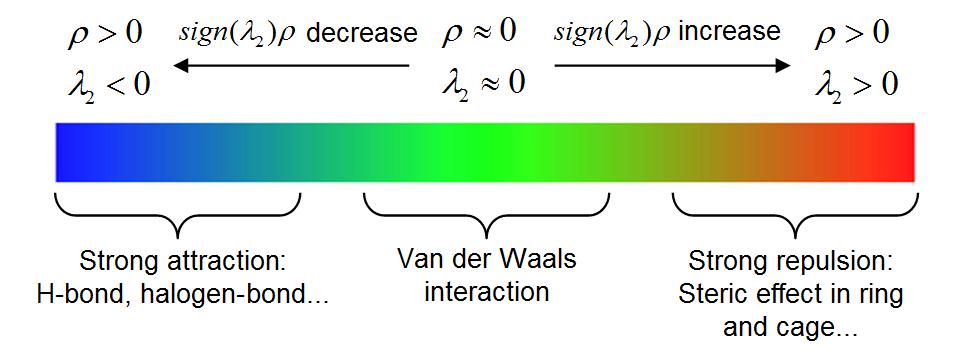

<!-- p.313 -->

High-resolution of the above labelled color bar is examples\RGB_bar.png, you can directly embed it into figures of your paper.

Current Multiwfn does not support plotting color-filled isosurface graph, however, we can use

Multiwfn to generate cube file for sign(λ2)ρ and RDG, and then use plotting script of VMD to draw such map. VMD is one of the best visualization tools and can be freely downloaded at http://www.ks.uiuc.edu/Research/vmd. Here I illustrate how to do this for phenol dimer by using subfunction 1 of main function 20. This time we do not only want to study the weak interaction region between the two monomers, but also want to examine the steric effect within in aromatic ring of phenol, therefore the spatial scope of grid data should cover the entire dimer.

Boot up Multiwfn and input following commands examples\PhenolDimer.wfn 20 // Visual study of weak interaction 1 // NCI analysis -10 // Set extension distance in all directions with respect to molecular boundary 0 // Because weak interaction regions only appear in internal region of present system, we do not need to leave a buffer region at system boundary, so we set the extension distance to 0 Bohr

2 // Medium-quality grid (about 512000 points). Because the spatial scope of grid data is evidently larger than last example, we need more grid points than last example, otherwise the RDG isosurfaces will look discrete

I first discuss the characteristics of various kinds of regions via scatter graph, I think it will be helpful to understand the nature and idea of the NCI method. Select option -1 in the post-processing menu, a scatter graph immediately pops up (you can also select option 1 to export this graph as file):

In the graph, the X-axis and Y-axis correspond to sign(λ2)ρ and RDG functions, respectively; each point in the graph corresponds to a grid point in 3D space. There are four spikes, the points at their peaks are just the approximate CP positions in AIM theory. If you draw a horizontal line on the graph as below, then the segments crossing the spikes just correspond to the points used to construct


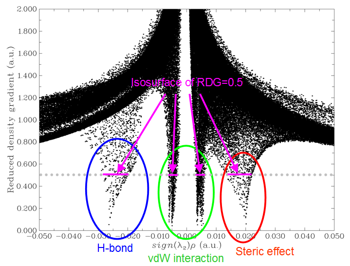

<!-- p.314 -->

the RDG isosurfaces. Hence, the NCI analysis method can be regarded as an extension of the AIM theory for visual study. The spikes can be classified into three types, I marked them by blue, green and red circles, as shown above.

Then close the scatter map, select option 3 to export grid data of sign(λ2)ρ and RDG as func1.cub and func2.cub in current directory, respectively, then copy the two files as well as the RDGfill.vmd file in “examples” folder to VMD installation directory. The RDGfill.vmd is a plotting script of VMD written by me. Boot up VMD, select "file"-"Load state", choose RDGfill.vmd (alternatively, you can directly input source RDGfill.vmd in console window), you will see the graph below in OpenGL window.

The default RDG isosurface is 0.5, the color range is -0.035 to 0.02. You can manually edit the RDGfill.vmd to change the default settings, the current values are suitable for general cases.

From the color-filled RDG isosurface, we can identify different types of regions by simply examining their colors. Recall the color scale bar I showed previously, the bluer implies the stronger attractive interaction; in current graph it can be seen that the elliptical slab between oxygen and hydrogen atoms shows light blue color, so we can conclude that there is a hydrogen bond, but not very strong. The interaction region marked by green circle can be identified as vdW interaction region, because the mapped color is green or light brown, which shows that the electron density in this region is low. Obviously, the regions at the center of the two rings correspond to strong steric interaction, since they are filled by red.

Part 3: Summary of general steps for generating color-filled RDG map Above I have talked a lot about the NCI analysis. In order to make you clearly and quickly

understand how to plot the sign(λ2)ρ mapped RDG isosurface graph using Multiwfn, below I present the minimum steps to do this, which are suitable for most cases.

Boot up Multiwfn and input xxx.wfn (or wfx/mwfn/fch/molden... file) // Load input file 20 // Visual study of weak interaction 1 // NCI analysis 3 // Please properly define the grid points at this step. “High-quality grid” is usually adequate


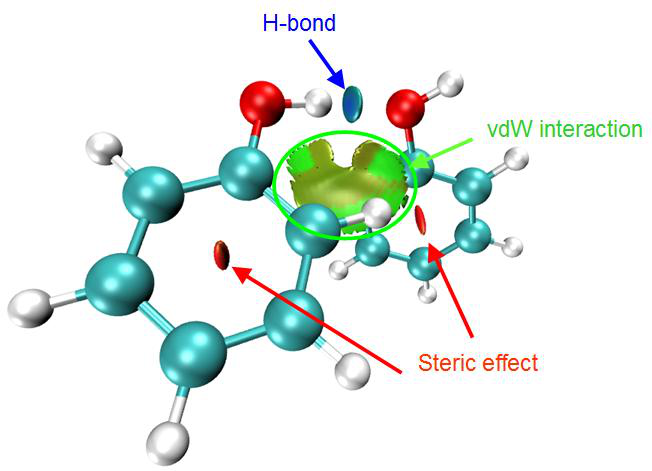

<!-- p.315 -->

for small and medium sized system

3 // Export func1.cub and func2.cub Move the two .cub files and examples\RDGfill.vmd to VMD folder. Boot up VMD and input source RDGfill.vmd in console window, then you will see the graph you need.

Part 4: On the grid setting

Here I talk more about grid setting for computing grid data of RDG and sign(λ2)ρ, because this point significantly influences computational cost and quality of the resulting RDG isosurface map.

The total time spent in the calculation is linearly proportional to the total number of grid points, and the quality of RDG isosurface is highly dependent on grid spacing. The smaller the grid spacing, the smoother the resulting isosurfaces. Too large grid spacing will result in severe jaggies at the edges or holes at internal regions of the isosurfaces. It is easy to comprehend, if the box size (i.e. spatial range of grid data) keeps fixed, then the higher number of grid points you set, the smaller the grid spacing will be. Clearly, the box should be properly defined, its spatial range should not be too broad, otherwise the grid spacing will be large and thus lowers the graph quality; it should also not be too narrow, otherwise the interesting RDG isosurfaces may be truncated. The best practice is to make the box just enclose the interesting region. Then, if you can afford high computational cost, you can use as large number of points as possible to improve the final isosurface quality.

Note that the "low/medium/high-quality grid" options in the interface of setting up grid are relative to small or medium sized systems. If the system is huge and you have to employ large box, even "high-quality grid" will correspond to relatively large grid spacing, and thus the graphical quality is not satisfactory. In this case, you should use the option "4 Input the number of points or grid spacing in X,Y,Z, covering whole system" and manually input a reasonable grid spacing value.

Below is an illustration of various grid setting for the phenol dimer system, the value denotes grid spacing. From this plot you can intuitively understand how grid spacing influences the result.

Part 5: Some worth mentioning points about NCI analysis

- Choice of level for generating wavefunction: It is absolutely unnecessary to use large basis set to carry the NCI analysis. Using moderate size of basis set such as def2-SVP or 6-31G** is


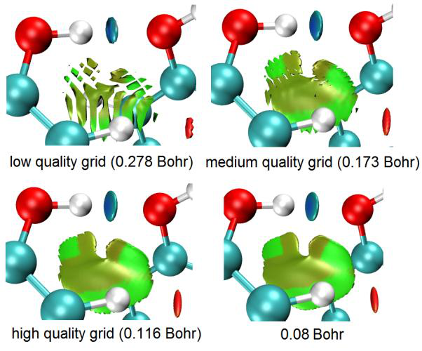

<!-- p.316 -->

completely adequate for NCI analysis, further enlarging the basis set is just waste of time. Regarding the choice of theoretical method, using popular DFT functionals such as B3LYP or M06-2X to yield wavefunction is adequate. Although post-HF density is known to be more accurate than DFT density, the improvement in electron density quality can hardly be detected in the final NCI analysis result. You may have known that the computational levels such as B3LYP/6-31G* perform quite poor for weak interactions, however, it never means that using electron density produced at this level is insufficient for NCI analysis, because electron density is never as sensitive as interaction energy to calculation level, and there is not strictly positive relationship between the quality of calculated interaction energy and electron density.

A frequently encountered annoying problem is that unexpected RDG isosurfaces occurred around interesting regions and thus polluted the NCI graph, this makes visual analysis of weak interaction at interesting regions difficult. For example, there is a system consisting of three molecules, we only want to study weak interaction between molecules 1 and 2; however, in the actual generated NCI graph, you may find unwanted isosurfaces corresponding to interactions between 1-3 and 2-3 as well as those corresponding to intramolecular interactions also occur. To screen the uninteresting isosurfaces, you can try to use the methods described in Section 4.13.4; alternatively, you can consider using IGM method instead, which can be completely free of this problem as long as you properly define fragment, see Section 3.23.5 for introduction.

- Domain analysis for RDG: Multiwfn is capable of integrating any real space function within isosurface defined by any real space function, this is known as “domain analysis”. Therefore, you can calculate such as volume and number of electrons enclosed within an isosurface of RDG (or other related functions such as IRI, IGM and IGMH) to try to discuss weak interactions at quantitative level. Introduction of this kind of analysis is provided in Section 3.200.14, illustrative examples are given in Section 4.200.14.

- NCI analysis for huge systems: If you want to apply the NCI analysis to very large systems (e.g. more than 300 atoms), commonly the cost will be extremely high and thus not computationally feasible. One of the best solutions is using promolecular version of NCI analysis or IGM analysis instead, please check Section 3.23.2 and 3.23.5, respectively. Another solution is using Grimme's xtb code to rapidly calculate the system using semi-empirical variant of DFT, and then using the resulting .molden file as input file to perform the NCI analysis, the result should be better than the promolecular NCI result.

- Averaged NCI: If you want to study interaction between a molecule with environmental atoms during molecular dynamics process, the average NCI method should be used instead of performing NCI analysis only for single structure, please check Section 3.23.3 for detail.

- NCI+AIM map: It is also possible to simultaneously plot AIM critical points and bond paths in the color-filled RDG map, so that more information about weak interactions could be revealed, the map below is an example provided by a Multiwfn user. The way of plotting this kind of map is exemplified in Section 4.20.1 and illustrated as part 4 of this video: https://youtu.be/e4FpVc9ao48.


<!-- p.317 -->

- NCI+ELF map: As introduced in Section 2.6 and illustrated in relevant examples in Sections 4.4 and 4.5, the ELF (electron localization function) is very useful function for exhibiting character of chemical bonds. Clearly, plotting NCI maps and ELF isosurfaces together can convey more information. Part 5 of this video tutorial illustrated how to realize this by Multiwfn in combination with VMD: https://youtu.be/e4FpVc9ao48.

Special skill 1: Generating color mapped scatter map It is also possible to map color to scatter map to facilitate identification of correspondence between spikes and RDG isosurfaces. A plotting script of gnuplot program (http://www.gnuplot.info) has been provided as examples\scripts\RDGscatter.gnu, which can realize this purpose. First, select the option "2 Output scatter points to output.txt in current folder" in the post-processing menu to exported output.txt in current folder, then move it and the RDGscatter.gnu into the folder containing gnuplot executable file, then in this folder run command: gnuplot RDGscatter.gnu. After a while you will obtain RDGscatter.ps in this folder, this is a graphic file of postscript format, you can open it using such as Acrobat, Photoshop or Irfanview (ghostscript must be installed in the machine). You can also use online image converter https://cloudconvert.com/image-converter to convert to common image format. The graph should look like this:


<!-- p.318 -->

The default color range in this plotting script is from -0.035 to 0.02, if you intend to correlate this map with RDG color-filled map, you should ensure that the color scale setting in RDGscatter.gnu and RDGfill.vmd are completely identical.

If you find difficulty in reproducing this map, please follow part 2 of this video tutorial: https://youtu.be/e4FpVc9ao48.

Special skill 2: Interactively set RDG value where sign(λ2)ρ is in specific range Multiwfn allows you to interactively set RDG value where sign(λ2)ρ is in specified value range, using this feature you can easily screen unwanted regions. Here I continue the phenol dimer example described in “Part 2” and illustrate how to screen RDG isosurface corresponding to the H-bond from

the graph. From the original scatter map, we find that the H-bond region corresponds to sign(λ2)ρ range of -0.035 ~ -0.015, therefore we can input below command in post-processing menu

-2 // Set RDG value where sign(λ2)ρ in within given data range -0.035,-0.015 // The lower and upper limit of sign(λ2)ρ 100 // Set RDG value in these regions to an arbitrarily large value to screen RDG isosurface Then, if you select option -1 to plot the scatter map again, you will see


<!-- p.319 -->

Clearly the spike corresponding to H-bond no longer exists. We can also export the cube files and use VMD redraw the color-filled map, as shown below, the H-bond RDG isosurface has indeed disappeared.

Notice that the original grid data cannot be retrieved once modified as exemplified above.

Information needed: Atom coordinates, GTFs


### 3.23.2 NCI analysis based on promolecular density (2)

Generating wavefunction and calculating grid data of RDG and sign(λ2)ρ for large system are very time-consuming, which greatly hinders application range of NCI analysis method. Fortunately, it is shown that the NCI analysis based on promolecular density is also reasonable in general. The so-called promolecular density is the electron density approximately constructed by superposing electron density of atoms in their free-state, this is known as “Promolecular approximation”. High-quality free-state atomic electron density for almost all elements in periodic table are predetermined


<!-- p.320 -->

and built-in, hence NCI analysis based on promolecular density can be in principle used for any system in Multiwfn.

To carry out NCI analysis under promolecular approximation, just choose subfunction 2 in main function 20, all operation steps are completely identical to regular NCI analysis. Since only atom coordinate information is required for constructing promolecular density, any input file containing atomic coordinate information can be used as input file, such as the popular .pdb and .xyz formats.

The VMD plotting script for NCI analysis based on promolecular density is offered as examples\RDGfill_pro.vmd, which is slightly different to examples\RDGfill.vmd in the default setting of color scale and isovalue.

By default, RDG value is automatically set to 100.0 where ρ is larger than 0.1 when promolecular approximation is used, this threshold may not be suitable for certain circumstances. You can manually change the threshold by “RDGprodens_maxrho” in `settings.ini`.

Example of performing NCI analysis based on promolecular density is given in Section 4.20.1 and illustrated as part 3 of this video: https://youtu.be/e4FpVc9ao48.

Information needed: Atom coordinates


### 3.23.3 Averaged NCI analysis (aNCI. 3)

Theory In J. Chem. Theory Comput., 9, 2226 (2013), the NCI method described in last sections is extended to analyzing dynamic environment (e.g. molecular dynamics trajectory), resulting in the averaged NCI (aNCI) method. This method was also carefully reviewed in book chapter DOI: 10.1016/B978-0-12-821978-2.00076-3. Present function aims at realizing the aNCI analysis.

The only difference between aNCI and the original NCI method is that in the former, the

electron density ρ and its gradient norm |ρ| are not calculated for only one geometry, but for multiple frames in a trajectory file, then get average (namely 𝜌̅ and ∇𝜌̅̅̅̅). Therefore, the isosurface of averaged reduced density gradient (aRDG)

$$\mathrm{aRDG}(\mathbf{r})=\frac{1}{2(3\pi^{2})^{1/3}}\frac{|\overline{\nabla\rho}(\mathbf{r})|}{\left[\overline{\rho}(\mathbf{r})\right]^{4/3}}$$

can be directly used to reveal the averaged weak interaction regions for a dynamics process.

Similarly, in order to exhibit averaged weak interaction type, in aNCI method, the λ2 term in

sign(λ2)ρ function is obtained as the second largest eigenvalue of the averaged electron density Hessian matrix computed throughout the dynamical trajectory.

aNCI method also defines a new quantity named thermal fluctuation index (TFI) to reveal the stability of weak interaction


$$\mathrm{TFI}(\mathbf{r})=\frac{std[\rho(\mathbf{r})]}{\overline{\rho}(\mathbf{r})}$$

<!-- formula-ocr: formula_p320_219.png 已替换为LaTeX, 原图保留备查 -->

whose numerator is standard deviation of electron density in the dynamical trajectory, which can be calculated as


<!-- p.321 -->


$$s t d[\rho(\mathbf{r})]=\sqrt{\frac{\sum_{i}[\rho_{i}(\mathbf{r})-\overline{\rho}(\mathbf{r})]^{2}}{n}}$$

<!-- formula-ocr: formula_p321_220.png 已替换为LaTeX, 原图保留备查 -->

where n is the number of frames in consideration, ρi is the density calculated based on the geometry of frame i. After mapping TFI on the isosurface of aNCI, the stability of each weak interaction region can be clearly identified by visually examining the colors.

The quality of aNCI graph directly depends on the number of frames that are taken into account. Small number of frames, for example 50 frames, can only leads to inaccurate and very unsmooth isosurface graph. In general, at least 500 frames should be used to generate aNCI graph.

Usage Firstly, note that since calculating electron density based on wavefunction for large number of geometries is very expensive, promolecular approximation is forced to be used in the aNCI analysis function of Multiwfn. This approximation is reasonable and always works well.

The trajectory stored in .xyz file format is acceptable as input file. You can use such as VMD program to convert other format of trajectory files to .xyz trajectory file.

PS: The structure of a multiple frame .xyz file looks like below [Number of atoms in frame 1] [Element, x, y and z of atom 1 in frame 1] [Element, x, y and z of atom 2 in frame 1] ... [Element, x, y and z of atom n in frame 1] [Number of atoms in frame 2] [Element, x, y and z of atom 1 in frame 2] [Element, x, y and z of atom 2 in frame 2] ... [Element, x, y and z of atom n in frame 2] [Number of atoms in frame 3] ...

In all of the frames, the coordinate of the molecule of interest should be fixed. For example, if you want to study the weak interaction between solvents and a benzene molecule, then the position of the benzene must be fixed throughout the whole trajectory. Note that the molecule of interest should be far away from box boundary so that it is always surrounded by environment atoms.

After you enter present function, you will be prompted to input the frame range to be analyzed, for example inputting 140,450 means the frame from 140 to 450 will be used in the aNCI analysis. Then you need to set up grid, the spatial range of the box should properly enclose the molecule of interest. After that, averaged electron density, averaged density gradient and averaged density Hessian will be calculated for each frame, you should wait patiently. Once the calculation is finished, you can use corresponding options to draw scatter graph between averaged NCI and averaged

sign(λ2)ρ, output scatter points, export their cube files, etc. Thermal fluctuation index can also be calculated and exported to a cube file.

An example is given in Section 4.20.3. NOTE: Using aNCI method is generally deprecated, because the amIGM method (Section 3.23.11) is a much better choice in most cases! Mostly because the amIGM allows users to define fragments to specifically study interactions between them, and users do not need to screen out unwanted isosurfaces. Also the isosurfaces of amIGM is smoother than aNCI, and sometimes aNCI is fully failed when amIGM works reasonably. amIGM analysis cost is only two or three times of


<!-- p.322 -->

aNCI. See original paper of amIGM for comprehensive comparison. The only advantage of aNCI is that TFI can be mapped on aNCI isosurfaces, while it is found that the TFI mapping effect on amIGM isosurfaces is not good (often the two sides have significantly different colors).

Information needed: Multiple frames of atom coordinates


### 3.23.4 Density Overlap Regions Indicator (DORI) analysis (5)

Sometimes ELF and RDG are used in combination to simultaneously investigate covalent and noncovalent interactions, see J. Chem. Theory Comput., 8, 3993 (2012) for example. Is it possible to study both kinds of interactions by a single real space function? The answer is yes. In J. Chem. Theory Comput., 10, 3745 (2014) the authors proposed a function named density overlap regions indicator (DORI), it was found that if properly choosing an isovalue, both covalent and noncovalent

interaction regions can be exhibited by DORI isosurface, and sign(λ2)ρ can also be mapped on to DORI isosurfaces to facilitate analysis of the nature of interactions.

The expression of DORI is


$$\mathrm{DORI}(\mathbf{r})=\frac{\theta(\mathbf{r})}{1+\theta(\mathbf{r})}$$

<!-- formula-ocr: formula_p322_221.png 已替换为LaTeX, 原图保留备查 -->

$$\mathrm{DORI}(\mathbf{r})=\frac{\theta(\mathbf{r})}{1+\theta(\mathbf{r})}$$

To plot the sign(λ2)ρ mapped DORI isosurface map, enter subfunction 5 of main function 20, the subsequent operations are exactly identical to NCI analysis. After exporting the grid data of

sign(λ2)ρ and DORI as cube files by option 3 in post-processing menu, you can then copy them along with examples\DORIfill.vmd to VMD folder, then boot up VMD and execute the plotting script DORIfill.vmd to plot the color-filled isosurface map.

I do not recommend to use DORI, because the interaction region indicator (IRI) introduced in Section 3.23.8 is not only defined in a simpler way and thus the computational cost is lower, but also the graphical effect of IRI is significantly better.

An example of performing DORI analysis is given in Section 4.20.5 Information needed: Atom coordinates, GTFs


### 3.23.5 Independent Gradient Model (IGM) analysis based on


### promolecular density (10)

Preface In Phys. Chem. Chem. Phys., 19, 17928 (2017), Hénon et al. proposed a useful way for visually studying interfragment and intrafragment interactions, it is named as Independent Gradient Model (IGM). Note that currently IGM has three versions:

(1) IGM based on promolecular density. This is the original version of IGM proposed in 2017, the function introduced in this section implements this form of IGM, only molecular structure is


<!-- p.323 -->

needed in the analysis.

(2) IGM based on gradient-based partitioning (GBP). This version was proposed in ChemPhysChem, 19, 724 (2018) and requires actual molecular electron density. This is not supported by Multiwfn.

(3) IGM based on Hirshfeld partition (IGMH). This version was proposed by me, see Section 3.23.6 for details. The IGMH is more expensive than IGM and meantime wavefunction must be provided in input file, the advantage of IGMH is that the result is more meaningful and the graphical effect is significantly better than IGM. Whenever computational cost is affordable, I always suggest using IGMH instead of IGM.

Idea of IGM A complete and easy-to-understand overview of IGM method can be found in J. Comput. Chem., 43, 539 (2022) DOI: 10.1002/jcc.26812 and book chapter DOI: 10.1016/B978-0-12-821978-2.00076-3. Below I only outline the key idea of IGM method. Let us first look at a very simple system, the H2 molecule. The atomic density in free-state of each atom along the molecular axis is shown below

From the graph above one notices that the gradient of atomic density of the two atoms in the interatomic region have opposite signs. For example, at the position of X=1.2, the density gradient of H1 is negative, while that of H2 is positive. Therefore, in the gradient of promolecular density (the curve g in the following map), the contributions from the two atoms are largely cancelled with each other in the region between the two atoms. Note that at the midpoint of the two hydrogens, g is exactly zero, such point corresponds to bond critical point (BCP) in AIM theory under promolecular density.

In the map above, the gIGM is IGM type of density gradient, it is calculated as sum of absolute value of density gradient of each atom in their free-states; in other words, phase is ignored and thus


<!-- p.324 -->

the density gradients originating from various atoms do not cancel with each other. Due to this feature, gIGM is upper limit of g.

δg function is defined as the difference between gIGM and g, it is plotted as deep blue curve in the map above. It can be seen that δg is non-zero in the interatomic interaction region, and has maximum value at the midpoint of the bond. Clearly, δg could be used to reveal interaction regions like IRI function (see Section 3.23.8). In addition, as will be illustrated in the examples in Section

4.20.10, magnitude of δg in interaction region has close relationship with interaction strength.

For three-dimensional cases, gIGM and δg can be defined as follows

$$g(\mathbf{r})=\left|\sum_{i}\nabla\rho_{i}^{\mathrm{f r e e}}(\mathbf{r})\right|\qquad g^{\mathrm{I G M}}(\mathbf{r})=\sum_{i}\left|\nabla\rho_{i}^{\mathrm{f r e e}}(\mathbf{r})\right|$$

free stands for spherically averaged density of atom i in its free state. Such atomic density for almost all elements is directly available in Multiwfn, see Appendix 3 for detail. The 𝜌𝑖

Based on the idea of gIGM and δg, the IGM method also defines δginter and δgintra aiming to study interfragment and intrafragment interactions, respectively

$$g^{\mathrm{IGM,inter}}(\mathbf{r})=\sum_{A}\left|\sum_{i\in A}\nabla\rho_{i}^{\mathrm{free}}(\mathbf{r})\right|$$

in which


$$g^{\mathrm{inter}}(\mathbf{r})=\left|\sum_{A}\sum_{i\in A}\nabla\rho_{i}^{\mathrm{free}}(\mathbf{r})\right|$$

<!-- formula-ocr: formula_p324_222.png 已替换为LaTeX, 原图保留备查 -->

$$g^{\mathrm{IGM,inter}}(\mathbf{r})=\sum_{A}\left|\sum_{i\in A}\nabla\rho_{i}^{\mathrm{free}}(\mathbf{r})\right|$$

where A and i are index of fragments and atoms, respectively. The fragments can be arbitrarily defined according to character of actual system and research purpose. Note that the above

expressions of δginter and δgintra are general forms proposed by me and implemented in Multiwfn, they were not explicitly given in the IGM original paper.

The idea of δginter is easy to understand from above formula. One first calculates density gradient in usual way as ginter, and then calculates the gIGM,inter, which ignores cancellation effect of density gradient of various fragments due to possible different phases; then the difference between

gIGM,inter and ginter, namely δginter, must be able to reveal the interaction between the fragments. The δg reveals all kinds of interactions in present system, irrespective of the type is interfragment or intrafragment. Therefore, if δginter is subtracted from δg, the remaining part, namely δgintra, must be capable of revealing intrafragment interactions.

In Section 3.23.1, it is shown that interaction region and interaction type can be simultaneously

exhibited by plotting RDG isosurface map colored by sign(λ2)ρ function. Similarly, if sign(λ2)ρ function is mapped on δginter and δgintra isosurfaces using various colors, the type and position of inter- and intra-fragment interactions could also be vividly revealed.

Quantitative indices of atoms and atomic pairs

I define atomic pair δg index (δGpair) to quantify the contribution of atomic pair to interaction between two fragments (A and B)


<!-- p.325 -->

$$\delta G_{i,j}^{\mathrm{pair}}=\int\delta g_{i,j}(\mathbf{r})\mathrm{d}\mathbf{r}=\int[g_{i,j}^{\mathrm{IGM}}(\mathbf{r})-g_{i,j}(\mathbf{r})]\mathrm{d}\mathbf{r}\quad i\in A,j\in B$$

where

$$g_{i,j}(\mathbf{r})=\left|\nabla\rho_{i}^{\mathrm{f r e e}}(\mathbf{r})+\nabla\rho_{j}^{\mathrm{f r e e}}(\mathbf{r})\right|$$

$$g_{i,j}^{\mathrm{IGM}}(\mathbf{r})=\left|\nabla\rho_{i}^{\mathrm{free}}(\mathbf{r})\right|+\left|\nabla\rho_{j}^{\mathrm{free}}(\mathbf{r})\right|$$

It is also useful to define percentage atomic pair contribution to interfragment interaction as

$$\delta G_{i,j}^{\mathrm{pair}}(\%)=\frac{\delta G_{i,j}^{\mathrm{pair}}}{\sum\limits_{k\in A}\sum\limits_{l\in B}\delta G_{k,l}^{\mathrm{pair}}}\times100\%$$

Since definition of δGpair(%) is so simple, it is certainly not expected that it is able to accurately represent contribution of atomic pairs to interaction energy between two fragments, however

δGpair(%) should be able to identify “hot” atomic pairs, which may indeed have large actual contribution to interfragment binding.

I also defined atomic δg index (δGatom) to quantify importance of atom to interfragment interaction


$$\delta G_{i}^{\mathrm{atom}}=\sum_{j\in B}\delta G_{i,j}^{\mathrm{pair}}$$

<!-- formula-ocr: formula_p325_223.png 已替换为LaTeX, 原图保留备查 -->

The percentage atomic contribution could be defined as

$$\delta G_{i}^{\mathrm{atom}}=\sum_{j\in B}\delta G_{i,j}^{\mathrm{pair}}$$

When plotting molecule structure, if atoms are colored according to the δGatom or δGatom(%), the relative importance between various atoms to interfragment interaction can be vividly exhibited.

Inspired by the IBSI (intrinsic bond strength index) introduced in Section 3.11.9, I defined IBSIW (IBSI for weak interaction) as follows

GIBSIW i jdδ=× 2,( , )100() i j i j pair ,

where di,j is distance between atoms i and j in Å. My preliminary test showed that IBSIW has somewhat better ability to distinguish interaction strengths. Clearly, the larger the IBSIW, the

stronger the interaction. Since in Multiwfn the δGpair is given in a.u., the formal unit of IBSIW should be a.u./Å2.

Advantage of IGM over NCI According to my viewpoint and experiences, the advantage of IGM method over the popular NCI method can be summarized as follows:

·The inter- and intra-fragment interactions can be studied individually and thus mutual interference is avoided

·Calculation of the functions defined by IGM method is rather fast and only dependent of geometry, thus the method can be applied to broad range of systems (Note that NCI also has a promolecular approximation version).

·As will be shown in the examples in Section 4.20.10, the isosurface graph given by the IGM


<!-- p.326 -->

method is smoother than the NCI map, and thus the IGM map has low requirement on grid spacing. In contrast, NCI graph is prone to ugly jaggies and holes when the grid points are sparse.

·Contribution of atoms and atomic pairs to interfragment interaction can be quantified, and the former can be vividly rendered on molecular structure, these features make identification of "hot" atoms easy.

·The value of δg function in interaction region directly reflects interaction strength. In

particular, I found δg at bond critical point of AIM theory is a good quantitative indicator of strength of corresponding interaction.

Usage of IGM analysis in Multiwfn Using Multiwfn to carry out IGM analysis is extremely easy and flexible. First, you should load a file containing atomic coordinates. The most commonly used formats such as .xyz, .pdb and .mol are all supported by Multiwfn (of course, any wavefunction file such as .wfn and .fch can also be used). Notice that the geometry must have been optimized using proper theoretical level, otherwise the IGM result may be misleading.

IGM module is subfunction 10 of main function 20, after you enter this module, you should define fragments. The definition of fragments is quite flexible, you can define any number of fragments (at least one fragment). No atom can be shared by two or more fragments. The union set of defined fragments is not forced to be equal to the whole system, only the atoms in the defined fragments will be finally taken into calculation.

Next, you need to set up grid, it is better to make the box just enclose the region where the interesting interactions may occur. Some advice about setting grid are given in Section 3.23.1.

`IGM_inter.vmd`

Once the calculation of grid data is complete, Multiwfn will show integrals of δg, δginter and δgintra over the whole space, and then post-processing menu appears.

The options in post-processing menu are self-explanatory, I will briefly describe them here:

-1: Suboptions 1, 2 and 3 of this option are used to draw scatter map of δg, δginter, δgintra vs. sign(λ2)ρ, respectively. While suboption 4 is used to draw δginter and δgintra vs. sign(λ2)ρ simultaneously with different colors. As shown in the original paper of IGM, this kind of map is

useful for discussing details about interactions (recall that RDG vs. sign(λ2)ρ scatter map is frequently involved in NCI analysis). If you want to directly save the scatter map in current folder as graphic file, use option 1. If the default axis range is not appropriate, use option -2 or -3 to adjust.

2: If you want to draw scatter map using third-part softwares such as Origin and gnuplot, use

this option to export data of δg, δginter, δgintra and sign(λ2)ρ to plain text in current folder. Meaning of each column of this file is shown on screen.

3: Output grid data of sign(λ2)ρ, δg, δginter and δgintra to cube file in current folder. After exporting the cube files, you can use IGM_inter.vmd and IGM_intra.vmd scripts in "examples"

folder to draw color-filled δginter and δgintra isosurfaces map in VMD, respectively. See examples of Section 4.20.10.

`IGM_inter.vmd`


<!-- p.327 -->

Multiwfn.

5: This option is used to set δgintra to zero where sign(λ2)ρ is not within specified value range. By this option uninterested regions could be screened from δgintra scatter and isosurface maps. For example, we merely want to study weak intrafragment interactions, then we can input the range

corresponding to relatively small value of sign(λ2)ρ. (The aim of this option resembles the “RDG_maxrho” parameter used in NCI analysis)

6: This option is used to evaluate quantitative indices. If you have defined more than two fragments, here you need to choose two fragments for which the indices will be calculated. Multiwfn

will compute δg grid data of every atomic pair between the two fragments and calculate integral of the δg function to derive the indices. The integrals are calculated using Becke's multi-center integration method, there are several choices of integration grids, the better the grid, the more accurate the result, but the higher the cost. Once the calculation is complete, atmdg.txt will be

outputted to current folder, which records all δGatom, δGatom(%), δGpair and δGpair(%), the values are sorted from high to low. The sum of all δGpair is also outputted at the end. Then the program asks you if also outputting atmdg.pdb in current folder, which contain coordinate of all atoms in present system. The "beta" and “occupancy” fields (the data in the second and third columns from last) of

this file correspond to atom δg index multiplied by 10 and percentage atom δg index, respectively. Clearly, if you load one of them into VMD visualization program and color the atoms according to “beta” or “occupancy” property, then relative importance of various atoms to interfragment interactions can be intuitively identified.

At the same time of outputting atmdg.txt, IBSIW indices for atom and atomic pairs are also exported to IBSIW.txt in current folder.

7&8: These two options are used to set value of δg and δginter functions respectively if the sign(λ2)ρ at corresponding grid is out of specific range. Clearly, these options are useful when you want to screen unwanted region from IGM isosurface map. For example, you only want to visualize

isosurface of δginter where sign(λ2)ρ is within -0.04 ~ -0.025 a.u., then you can enter option 8, input -0.04,-0.025 and then input 0 to set δginter of these grids to zero; next, you can plot the updated scatter map or export cube files to visualize IGM map in VMD.

If your input file contains GTF or basis function information (e.g. mwfn, .wfn, .fch, .molden),

when carrying out IGM analysis, Multiwfn will let you choose the type of the sign(λ2)ρ to be used, the first one is that based on actual electron density, the second one is that based on promolecular density. Using the former should give more meaningful result, however, calculation the cost for the former is evidently higher than that of the latter (if your input file only contains atomic coordinate information, the latter one is always used).

Several examples of IGM analysis are given in Section 4.20.10. More discussions and instances about IGM method can be found in my blog article "Investigating intermolecular weak interactions via Independent Gradient Model (IGM)" (in Chinese, http://sobereva.com/407).

Information needed: Atom coordinates


<!-- p.328 -->


### 3.23.6 IGM analysis based on Hirshfeld partition of molecular density


### (IGMH) (11)

As shown in Section 3.23.5, the original version of IGM is calculated purely based on density of atoms in their free states, namely promolecular approximation is used. A different form of IGM was proposed by me named as "IGM based on Hirshfeld partition of molecular density" (IGMH). A very detailed article introducing theory background of IGMH and containing very rich examples is J. Comput. Chem., 43, 539 (2022) DOI: 10.1002/jcc.26812. An erratum about implementation was later published as ChemRxiv (2022) DOI: 10.26434/chemrxiv-2022-g1m34. Please cite these papers if your research utilizes IGMH analysis. IGMH method was also comprehensively reviewed in my book chapter DOI: 10.1016/B978-0-12-821978-2.00076-3 and my article Angew. Chem. Int. Ed., 137, e202504895 (2025) DOI: 10.1002/anie.202504895.

Theory The key difference compared to IGM is that, in IGMH the atomic densities involved in

definition of δg, δginter and δgintra are derived based on Hirshfeld partition, namely 𝜌𝑖 Hirsh(𝐫) =𝜌(𝐫)𝑤𝑖(𝐫), where ρ is the electron density of the whole system calculated based on wavefunction, and the Hirshfeld weighting function of atom i is expressed as

$$w_{i}(\mathbf{r})=\frac{\rho_{i}^{\mathrm{f r e e}}(\mathbf{r})}{\rho^{\mathrm{p r o}}(\mathbf{r})}=\frac{\rho_{i}^{\mathrm{f r e e}}(\mathbf{r})}{\sum_{j}\rho_{j}^{\mathrm{f r e e}}(\mathbf{r})}$$

free is spherically averaged electron density of atom i in its free state, 𝜌pro corresponds to promolecular density, the index j loops over all atoms. It is important to note that the Cartesian where 𝜌𝑖

IGMH term involved in IGMH is not evaluated in the mathematically correct way as components of the ∇𝜌𝑖


$$\frac{\partial\rho_{i}^{IGMH}}{\partial\mu}=\frac{\partial(\rho w_{i})}{\partial\mu}=w_{i}\frac{\partial\rho}{\partial\mu}+\rho\frac{\partial w_{i}}{\partial\mu}\quad(\mu=x,y,z)$$

<!-- formula-ocr: formula_p328_224.png 已替换为LaTeX, 原图保留备查 -->

but evaluated in the following special way (see ChemRxiv (2022) DOI: 10.26434/chemrxiv-2022-g1m34 for detailed information)

$$\frac{\partial\rho_{i}^{Hirsh}}{\partial\mu}=w_{i}\frac{\partial\rho}{\partial\mu}-\rho\frac{\partial w_{i}}{\partial\mu}\quad(\mu=x,y,z)$$

In the IGMH analysis, the sign(λ2)ρ function is always calculated based on actual electron density rather than promolecular density. Clearly IGMH is evidently more expensive than IGM, since both gradient and Hessian of actual electron density must be evaluated.

Advantages of IGMH The significant advantages of IGMH over IGM are three:

(1) The graphical effect of isosurface map is much better. The isosurfaces of δg or δginter function defined in IGM are often too bulgy, and sometimes the color according to mapped function

sign(λ2)ρ on them are unreasonable; in contrast, the shape of the δg function calculated in terms of IGMH is thinner and thus easier to examine and compare, at the meantime the misleading coloring issue is always avoided.

It is worth to note that the isosurface of δg in IGMH is close to the isosurface of reduced density gradient (RDG), which is employed in the NCI method (see Section 3.23.1). The advantage of the former is that the isosurface looks


<!-- p.329 -->

much smoother under the same grid spacing, and unsightly jagged edges in the RDG isosurface is greatly avoided.

(2) The physical meaning of IGMH is more rigorous than IGM, since all factors that influence distribution of electron density during formation of the system have been intrinsically taken into account.

(3) For some chemical bond interactions, IGM completely fails to reveal their real characters since electron distribution changes significantly during formation of bonds, while IGM is fully based on promolecular approximation and thus ignores this crucial effect. In contrast, IGMH, has a markedly better capability in revealing chemical bonds, see original paper of IGMH for comparison.

Due to above reasons, using IGMH instead of IGM is always strongly recommended if the system is not quite large and thus the computational cost is affordable. Even if IGMH is too expensive or wavefunction is not available, it is strongly recommended to use the mIGM described in Section 3.23.10 instead of IGM, because mIGM has graphical effect nearly as good as IGMH in most cases, while the cost is basically the same as IGM, and mIGM only needs atomic information like IGM.

Usage The use of the present function, namely subfunction 11 of main function 20, is exactly the same as the IGM function, see Section 3.23.5 for introduction of various options.

It is also worth noting that δginter of IGMH is also a stand-alone function, which corresponds to the 91th user-defined function. Therefore, you can easily check its value at bond critical points in topology analysis module, plotting it as plane map in main function 4, etc. Before using it, you must first enter option 16 of main function 1000 (a hidden function) to define two fragments.

Example of using IGMH analysis is given in Section 4.20.11. Information needed: Atom coordinates, GTF information


### 3.23.7 Visualization of van der Waals potential (6)

Please check my paper for full description of idea, implementation and application of the van der Waals (vdW) potential analysis: J. Mol. Model., 26, 315 (2020) DOI: 10.1007/s00894-020-04577-0. This analysis was also illustrated in my review Angew. Chem. Int. Ed., 137, e202504895 (2025) DOI: 10.1002/anie.202504895. Here I only briefly introduce this function in a nutshell.

Recall that the vdW interaction energy between two atoms A and B is usually expressed in terms of Lennard-Jones potential in below form

$$E_{AB}^{\mathrm{vdW}}=E_{AB}^{\mathrm{repul}}+E_{AB}^{\mathrm{disp}}=\varepsilon_{AB}\left(\frac{R_{AB}^{0}}{r_{AB}}\right)^{12}-2\varepsilon_{AB}\left(\frac{R_{AB}^{0}}{r_{AB}}\right)^{6}$$

where the potential well ε and equilibrium distance R0 are dependent of atom types. The two components of EvdW, namely Erepul and Edisp, correspond to exchange-repulsion and dispersion interaction, respectively.

I define vdW potential of a chemical system as follows


<!-- p.330 -->

$$V^{\mathrm{vdW}}(\mathbf{r})=V^{\mathrm{repul}}(\mathbf{r})+V^{\mathrm{disp}}(\mathbf{r})=\sum_{A}\varepsilon_{AB}\left(\frac{R_{AB}^{0}}{|\mathbf{R}_{A}-\mathbf{r}|}\right)^{12}+\sum_{A}\left[-2\varepsilon_{AB}\left(\frac{R_{AB}^{0}}{|\mathbf{R}_{A}-\mathbf{r}|}\right)^{6}\right]$$

where B can be regarded as probe atom. The Vrepul and Vdisp denote repulsion and dispersion potentials, respectively.

In the implementation in Multiwfn, the vdW parameters from UFF forcefield are employed, this is because the elements supported by UFF almost cover the whole periodic table (H~Lr), and the parameters are only dependent of elements, thus the problem in assigning atom types is fully avoided. The element index of the probe atom can be set by "ivdwprobe" in `settings.ini`, the default is carbon (i.e. ivdwprobe=6). If the "ivdwprobe" is set to 0, then program will ask you to input element name of probe atom when entering this function.

The vdW potential can be easily calculated by subfunction 6 of main function 20, the unit of result is kcal/mol. In this function, you need to first select grid setting, then grid data of VvdW, Vrepul and Vdisp will be calculated, then you can visualize their isosurfaces or export them as cube files by corresponding options.

Note that the VvdW, Vrepul and Vdisp also directly correspond to user-defined functions, 92, 93 and 94, respectively.

Example of visualization and analysis of VvdW is given in Section 4.20.6. Information needed: Atom coordinates


### 3.23.8 Interaction region indicator (IRI) and IRI-pi analysis (4)

Please read my original paper describing interaction region indicator (IRI) and IRI-π, namely Chemistry−Methods, 1, 231 (2021) DOI: 10.1002/cmtd.202100007, in which the idea of IRI, comparison with other methods as well as many illustrations are given. IRI-π was also introduced in this paper. In addition, the IRI and IRI-π methods have been reviewed in Angew. Chem. Int. Ed., 137, e202504895 (2025) DOI: 10.1002/anie.202504895 and my book chapter DOI: 10.1016/B978-0-12-821978-2.00076-3, it is strongly recommended to read them.

Features of IRI The IRI is defined as follows

( ) |( ) | /[ ( )]aIRIρρ= rrr

where a corresponds to "uservar" in `settings.ini`. If "uservar" is set to 0, then a will be the recommended value 1.1.

IRI is able to clearly reveal both chemical bond regions and weak interaction regions by its isosurfaces (usually isovalue of 1.0 is recommended), this point is similar to the DORI introduced in Section 3.23.4. Indeed, the isosurface maps of IRI and DORI have similar characters, however IRI is always preferred over DORI due to the two evident advantages:

(1) The definition of IRI is much simpler, only electron density and its gradient are needed, while DORI also requires Hessian of electron density. Clearly, evaluation of IRI is thus cheaper than DORI.


<!-- p.331 -->

(2) The graphical effect of IRI isosurface is significantly better than DORI. This point can be easily recognized from the comparison between IRI and DORI in the original paper of IRI.

It is worth to note that if the parameter a is set to 4/3, then IRI only differs from RDG by a constant prefactor. Though the difference is trivial, the RDG isosurfaces is unable to simultaneously clearly reveal weak interactions and chemical bond regions under a single isovalue like IRI.

It is sometimes observed that IRI isosurfaces occur in uninterested extremely low ρ regions. To screen them in the isosurface map at commonly used isovalue (around 1.0), IRI is set to a large

value (5) if ρ is equal or smaller than “IRI_rhocut” in `settings.ini`. The default value 0.00005 a.u. commonly works well.

IRI analysis in Multiwfn

Like NCI, IGM and DORI analyses, sign(λ2)ρ can also be mapped to IRI isosurfaces to visually distinguish the nature of interactions. To plot such a map, you should

(1) Enter subfunction 4 of main function 20 (2) Select proper grid setting, then in the post-processing menu export the grid data to func1.cub and func2.cub

(3) Copy the two cube files as well as examples\IRIfill.vmd to VMD installation folder (4) Boot up VMD and input source IRIfill.vmd in the console window to run the script. IRI function corresponds to the 24th real space function. You can also use main function 4 to plot it as plane map, performing basin analysis on IRI to find its minima by main function 17, and so on.

On the IRI-π IRI-π is a byproduct in my study of IRI, it is simply defined as the IRI calculated based on π electron. In the aforementioned my Chemistry−Methods paper, IRI-π is shown to be able to nicely distinguish type of π interactions and reveal π interaction strengths. A good application example of IRI-π is my paper Chem. Eur. J. (2022) DOI: 10.1002/chem.202103815, from which you can see that IRI-π is able to clearly represent π interaction of different C-C bonds in C18(CO)n (n = 2,4,6) molecules.

To evaluate IRI-π, you simply need to set occupancy of other orbitals to zero prior to the calculation of IRI.

A complete and detailed document showing how to perform various kinds of IRI and IRI-π analyses can be downloaded here: http://sobereva.com/multiwfn/res/IRI_tutorial.zip. A very simple

example showing the procedure of plotting IRI isosurface map colored by sign(λ2)ρ is given in Section 4.20.4.

Information needed: Atom coordinates, GTF information


### 3.23.9 Averaged independent gradient model (aIGM) analysis (12)

Averaged IGM (aIGM) was proposed by Tian Lu, it is an extension of the standard IGM analysis (Section 3.23.5) to dynamic environment. aIGM has been described in Struct. Bond., 190, 297 (2026) DOI: 10.1007/430_2025_95 and in review article DOI: 10.1016/B978-0-12-821978-


<!-- p.332 -->

2.00076-3, please cite them if aIGM is employed in your work.

The relationship between IGM and aIGM is exactly the same as that between mIGM (Section 3.23.10) and amIGM (3.23.11). So amIGM will not be described here detailedly, please just check Section 3.23.11.

The amIGM has significantly better graphical effects than aIGM (just like mIGM is much better than IGM), while aIGM is only slightly cheaper than amIGM, so aIGM is useless! Always use amIGM instead!

The use of aIGM is exactly the same as amIGM, see the amIGM example in Section 4.20.13. The only difference is that you should select subfunction 12 rather than -12 in main function 20.

Information needed: Multiple frames of atom coordinates


### 3.23.10 Modified IGM (mIGM) analysis (-10)

The present section introduces the modified IGM (mIGM) by Tian Lu in Struct. Bond., 190, 297 (2026) DOI: 10.1007/430_2025_95, which is another variant of IGM. The idea of mIGM is very simple: Calculating all terms in the same way as IGMH, except that using promolecular density instead of the actual molecular density. So, mIGM only depends on atomic coordinates like IGM, and its computational cost is basically the same as IGM. At least for studying weak interactions, the isosurfaces and coloring effect of mIGM is nearly the same as IGMH. Therefore, when IGMH cannot be used due to high computational cost or unavailability of wavefunction, mIGM is the best alternative.

The use of mIGM is exactly the same as IGM, the only difference is that you should choose subfunction -10 rather than subfunction 10 in main function 20.

An example of mIGM analysis is given in Section 4.20.12. Information needed: Atom coordinates


### 3.23.11 Averaged modified IGM (amIGM) analysis (-12)

Averaged mIGM (amIGM) was proposed by Tian Lu in Struct. Bond., 190, 297 (2026) DOI: 10.1007/430_2025_95, it is an important extension of mIGM analysis (Section 3.23.10) to dynamic environment, so that the average interactions between two or more specific fragments in molecular dynamics simulation can be visually studied.

amIGM defines a real space function 𝛿𝑔̅inter, which measures average interactions between a set of user-defined fragments and is defined as

intermIGM,inter( )( )ggδδ=rr

the < > symbol stands for time average for all considered trajectory frames.

Usually, amIGM analysis is performed by plotting 𝛿𝑔̅inter isosurface map colored by averaged sign(λ2)ρ, which is calculated based on promolecular electron density and its derivatives averaged


<!-- p.333 -->

for trajectory frames.

To perform amIGM analysis, you should provide a multiple frame .xyz file recording the molecular dynamics trajectory as input file, then enter subfunction -12 of main function 20, then define fragments for amIGM analysis like the standard mIGM/IGM analysis, then choose the range of frames to be considered, and finally define a proper box for calculating grid data. After that, various grid data will be calculated, and post-processing menu appears. In this menu, you can export

cube files of 𝛿𝑔̅inter and averaged sign(λ2)ρ as avgdg_inter.cub and avgsl2r.cub, respectively. There is an option (-1) to a plot scatter map between the two functions, which may be useful in the amIGM analysis. You can can also export the averaged RDG (a byproduct of amIGM analysis) and thermal fluctuation index (TFI) mentioned Section 3.23.3 as cube files.

To plot 𝛿𝑔̅inter isosurface map colored by averaged sign(λ2)ρ, you should put the exported avgdg_inter.cub and avgsl2r.cub as well as examples\aIGM.vmd to VMD folder, then boot up VMD and input source aIGM.vmd command in VMD console window to execute the plotting script, you will immediately see the amIGM map.

In the post-processing menu, you can also choose option 8 to generate grid data of standard

deviation of 𝛿𝑔inter and thermal fluctuation index of amIGM (TFIamIGM), which are defined as follows

$$\mathrm{TFI}^{\mathrm{amIGM}}(\mathbf{r})=\frac{s t d(\delta g^{\mathrm{inter}})(\mathbf{r})}{\delta g^{-\mathrm{inter}}(\mathbf{r})}$$

$$\mathrm{TFI}^{\mathrm{amIGM}}(\mathbf{r})=\frac{s t d(\delta g^{\mathrm{inter}})(\mathbf{r})}{\delta g^{-\mathrm{inter}}(\mathbf{r})}$$

where 𝛿𝑔𝑖 inter denotes 𝛿𝑔inter of frame i, and N denotes number of considered frames. By mapping TFIamIGM or 𝑠𝑡𝑑(𝛿𝑔inter) onto isosurface of 𝛿𝑔̅inter with a properly chosen color range, stability of interactions at different areas can be distinguished.

An example of amIGM analysis is given in Section 4.20.13.

Information needed: Multiple frames of atom coordinates


## 3.24 Energy decomposition analysis (21)


### 3.24.1 Energy decomposition analysis based on molecular forcefield


### (EDA-FF)

Energy decomposition analysis (EDA) is an important method to reveal the nature of interaction. Most EDA analysis methods are based on wavefunction, they are accurate, rigorous and the results are meaningful, unfortunately they are often too expensive for large systems. Present module is designed for analyzing intramolecular and intermolecular weak interactions based on classical molecular force field (FF), this method could be referred to as EDA-FF, the computational


<!-- p.334 -->

cost is negligible for systems consisting of hundreds of atoms, and it can even be applied to systems with more than ten thousand atoms. Due to the limitation of FF, this module evidently cannot be used to discuss nature of chemical bond interactions. The word "weak interaction" in this section refers to the interatomic interaction separated by more than three bonds.

If EDA-FF analysis is utilized in your work, please cite this article, in which I briefly described EDA-FF and employed it in studying interaction between cyclo[18]carbon and graphene: Mat. Sci. Eng. B, 273, 115425 (2021) DOI: 10.1016/j.mseb.2021.115425.

Theory There are many popular FFs for molecular systems. The major ingredients of weak interactions are van der Waals (vdW) interaction and electrostatic interaction, most FFs represent them by mean of pairwise potential, as shown below.

·Electrostatic interaction energy between atoms A and B (atomic unit is used):


$$E_{_{AB}}^{ele}=\frac{q_{_{A}}q_{_{B}}}{r_{_{AB}}}$$

<!-- formula-ocr: formula_p334_225.png 已替换为LaTeX, 原图保留备查 -->

where q is atomic charge and rAB is distance between A and B.

·vdW interaction energy between atoms A and B:

EEE ABABAB disprepvdW +=

$$E_{_{AB}}^{\mathrm{vdW}}=E_{_{AB}}^{\mathrm{rep}}+E_{_{AB}}^{\mathrm{disp}}$$

where Erep represents repulsive interaction due to Pauli repulsion effect (also known as exchange-

repulsion), while Edisp is attractive dispersion interaction. The εAB is well depth of interatomic vdW interaction potential, while R0AB is vdW nonbond distance. When rAB=RAB0, the interaction energy just corresponds to well depth.

The parameters ε and R0 are provided by FFs, and the values are commonly defined for each atom type. The interatomic parameters used in practical calculation are commonly evaluated as geometric average or arithmetic average of atomic parameters. For example, in UFF forcefield, the following mixing rule is used


$$E_{_{AB}}^{\mathrm{vdW}}=E_{_{AB}}^{\mathrm{rep}}+E_{_{AB}}^{\mathrm{disp}}$$

<!-- formula-ocr: formula_p334_226.png 已替换为LaTeX, 原图保留备查 -->

While for some other FFs such as AMBER and GAFF, atomic ε and R* are defined, the employed mixing rule is


$$E_{AB}^{\mathrm{rep}}=\varepsilon_{AB}\left(\frac{R_{AB}^{0}}{r_{AB}}\right)^{12}\quad E_{AB}^{\mathrm{disp}}=-2\varepsilon_{AB}\left(\frac{R_{AB}^{0}}{r_{AB}}\right)^{6}$$

<!-- formula-ocr: formula_p334_227.png 已替换为LaTeX, 原图保留备查 -->

where R* is known as atomic nonbond radius or atomic vdW radius.

Given the interatomic interaction terms, evaluating various physical components of interfragment interaction energy is straightforward:


$$E_{IJ}^{\mathrm{ele}}=\sum_{A\in I}\sum_{B\in J}E_{AB}^{\mathrm{ele}}\qquad E_{IJ}^{\mathrm{rep}}=\sum_{A\in I}\sum_{B\in J}E_{AB}^{\mathrm{rep}}\qquad E_{IJ}^{\mathrm{disp}}=\sum_{A\in I}\sum_{B\in J}E_{AB}^{\mathrm{disp}}$$

<!-- formula-ocr: formula_p334_228.png 已替换为LaTeX, 原图保留备查 -->

The present module is mainly used to evaluate above three terms between two or more user-defined fragments, many useful quantities can be obtained at the meantime.

Usage The basic steps of using this module are:


<!-- p.335 -->

(1) Prepare a "molecule list" file, which contains paths of "molecule type" files. Detailed description is given later.

(2) Load a file containing geometry information of the whole system. Evidently, many formats supported by Multiwfn could be used, for example, .xyz, .mol, .pdb, .fch and so on.

(3) Enter subfunction 1 of main function 21. (4) Use option 3 to load molecule list file. This step is used to assign an atomic charge and type for each atom.

(5) Use option 2 to define fragments. Infinite number of fragments may be defined, any atom should not simultaneously appear in two or more fragments. If you want to study interaction between two fragments in the same molecule, any atomic pair between the two fragments should be separated by at least three bonds (otherwise the interaction will no longer belong to the scope of weak interaction). Note that the order of the steps (4) and (5) could be exchanged.

(6) Choose option 1 to start analysis, then interaction energy components between each fragment pair, as well as atomic contributions will be printed. Before the analysis, if you want to check whether the charges and types have been properly assigned, you can choose option 4.

There are other options you can select before calculation: ·Option -1: This is used to choose the FF employed in the calculation. Currently, AMBER99 & GAFF (default) and UFF are supports, their difference is that the built-in atomic vdW parameters and the mixing rule used in the calculation are different.

·Option -2: This option can choose the operator in calculating electrostatic interactions. By default 1/r operator is employed, while using this option you can change it to 1/r2. Obviously, the attenuation of Eele calculated based on 1/r2 with respect to interaction distance r is much faster than the default case, this is why some studies employ this simple strategy to effectively exhibit water environment, since it is well-known that polar solvents such as water can significantly shield electrostatic interaction strength due to its large dielectric constant.

·Option -3: If you choose this option once to switch the status to "Yes", then after calculation, all interatomic interaction energy terms including their physical components will be exported to interatm.txt in current folder.

·Option -4: In the standard .pqr format, the last two columns are specific for storing atomic vdW radii and atomic charges. If you choose this option once to switch the status to "Yes", then during calculation, atmint_tot.pqr, atmint_ele.pqr, atmint_rep.pqr, atmint_disp.pqr and atmint_vdW.pqr will be outputted in current folder, their last columns record atomic contribution to total, electrostatic, repulsion, dispersion and vdW (i.e. repulsion + dispersion) interaction energies, respectively. In the popular VMD visualization program, you can load one of these .pqr file and color the atoms according to "atomic charges" data, then the atom colors will vividly exhibit contribution of each atom to corresponding kind of interaction energy.

Next, I introduce the rule of writing the molecular list file. The content of the file should look like this:


```text
C:\mol1\phenol.txt 1
C:\mol2\H2O.txt 4
C:\HCl.txt 2
```

This example file implies that, in the geometry information provided by the file loaded when


<!-- p.336 -->

Multiwfn boots up, the recording sequence is: one phenol molecule, four H2O molecules and two HCl molecules. The three .txt files contain atom types (case sensitive) and charges of respective molecule. For example, below is the content of the C:\mol2\H2O.txt, which records information of the atoms in H2O molecule, the OW and HW are atom types of AMBER force field.


```text
OW -0.728713
HW  0.364427
HW  0.364286
```

The first column is atom type corresponding to the FF you currently choose, the second column corresponds to atomic charge. Notice that the atom sequence in this file must be exactly identical to the geometry information loaded when Multiwfn boots up. If the forcefield employed in analysis is UFF, then this file should only contain atomic charge, thus there should be only one column (because for each element, all relevant atom types share the same UFF vdW parameters, therefore users do not need to define atom types).

·About atom types: Detailed description of atom types can be found in original paper of corresponding forcefields. For AMBER, see Table 1 of J. Am. Chem. Soc., 117, 5179 (1995). For GAFF, see Table 1 of J. Comput. Chem., 25, 1157 (2004); you can also consult the AMBER99.txt and GAFF.txt in "examples\EDA\EDA_FF" folder for description of atom types. In general, you can manually find appropriate atom type for each atom in current system according to its actual chemical environment. However, if you feel this process is troublesome, you can use third-part programs to help you identify atom types and construct the molecular files. For example, GaussView can automatically assign AMBER atom types (enter "Atom List", click the icon with large organge "M" symbol, double click head of "AMBER Type" column, select "File"-"Export Data", then extract the data corresponding to "AMBER Type" column), while Antechamber utility in AmberTools package is able to assign GAFF atom types. Note that AMBER and GAFF atom types can be mixed together in the same molecule file, since these two forcefields are completely compatible with each other, the AMBER and GAFF atom types use upper and lower case, respectively.

Note: The atom types assigned by GaussView are always in upper case, however, some atom types of AMBER99 are lower case, e.g. Br. Clearly, you should manually make modification before loading the file into Multiwfn. If you are confused, take a look at examples\EDA\EDA_FF\AMBER99.txt.

·On the choice of forcefield: For organic type of systems, commonly I suggest using AMBER/GAFF forcefield to conduct the analysis, the result should be reasonable and chemically meaningful. In fact, since vdW parameters of GAFF are directly inherited from AMBER, commonly there should be no difference between using GAFF and AMBER atom types. Evidently, the geometry used in the analysis should be firstly optimized under reasonable level. Using UFF is generally deprecated, since I found that when UFF is employed, the total interfragment interaction energy is usually positive due to overestimation of Erep, even if the geometry has already been substantially optimized with appropriate quantum chemistry method. A way to solve this problem is using the geometry optimized by UFF itself (many programs can do this, such as Gaussian and OpenBabel), however the resulting geometry for weakly interacting molecular dimer or multimer is often not quite good. The unique advantage of UFF is that it covers almost entire periodic table. Considering this, I designed a trick in Multiwfn: If you are using AMBER/GAFF, when atom type is written as UF, then UFF vdW parameter will be employed. This treatment greatly extends the application scope of AMBER and GAFF.


<!-- p.337 -->

·On the choice of atomic charges: The atomic charges used for energy decomposition analysis should be able to reproduce electrostatic potential (ESP) around molecular vdW surface well. Commonly I suggest using CHELPG atomic charge, which is obtained via ESP fitting process and can be directly calculated via Multiwfn, see Section 3.9.10 for introduction and Section 4.7.1 for example. Note that if a type of molecule appears more than once in current system with significantly different conformations, given that ESP fitting charges of each monomer may be very different to others, it is suggested to treat these replicas as different types of molecules, so that atomic charges can be individually assigned. If some monomers of the system are too large to calculate their ESP fitting atomic charges, you may change to EEM atomic charges using the parameters fitted for reproducing ESP fitting charges, see Section 3.9.15 for introduction. The computational cost of EEM charges is negligible for a system composed of hundreds of atoms, since the calculation is purely based on molecular geometry information and empirical parameters.

Examples of this module are provided in Section 4.21.1. Information needed: Atom coordinates and special files containing atomic charges/types


### 3.24.2 Shubin Liu's energy decomposition

Theory In J. Chem. Phys., 126, 244103 (2007), the author Shubin Liu proposed an idea of energy decomposition, which will be referred to as EDA-SBL below. In this method, the total molecular energy is decomposed as

stericelectrostaticquantumEEEE=++

The steric term is simply the energy derived by Weizsäcker kinetic functional, which corresponds to the exact kinetic energy under assumption that the electrons in present system are non-interacting bosons:


$$E_{\mathrm{s t e r i c}}=T_{\mathrm{W}}=\left|\nabla\rho(\mathbf{r})\right|^{2}/\left[8\rho(\mathbf{r})\right]$$

<!-- formula-ocr: formula_p337_229.png 已替换为LaTeX, 原图保留备查 -->

The electrostatic term is the sum of all classical Coulomb interactions of the particles in the system:

$$E_{\mathrm{e l e c t r o s t a t i c}}=E_{\mathrm{J}}+E_{\mathrm{N-E}}+E_{\mathrm{N-N}}=\iint\frac{\rho(\mathbf{r}_{1})\rho(\mathbf{r}_{2})}{r_{12}}\mathrm{d}\mathbf{r}_{1}\mathrm{d}\mathbf{r}_{2}-\int\rho(\mathbf{r})\sum_{A}\frac{Z_{A}}{|\mathbf{r}-\mathbf{R}_{A}|}\mathrm{d}\mathbf{r}+\sum_{A>B}\frac{Z_{A}Z_{B}}{R_{AB}}$$

Finally, the quantum term is the energy purely caused by quantum effect:

quantumPauliXCEEE=+

where the EXC is exchange-correlation energy, the EPauli=TS-TW is Pauli kinetic energy, in which the TS stands for total kinetic energy of non-interacting electron model and can be computed as the sum of kinetic energy of all occupied molecular orbitals. The Equantum essentially exhibits electronic correlation effect as well as influence of Pauli exclusion principle on electronic kinetic energy under non-interacting particle assumption.


<!-- p.338 -->

The EDA-SBL method has been employed in many research papers, such as the ones shown below, which are suggested to read to if you want to understand how this method can be used to study practical chemical problems: J. Phys. Chem. A, 117, 962 (2013), J. Chem. Phys., 133, 114110 (2010), Phys. Chem. Chem. Phys., 17, 27052 (2015), J. Phys. Chem. A, 119, 8216 (2015), Chem. Phys. Lett., 687, 131 (2017).

Usage Multiwfn itself is unable to evaluate all terms in the EDA-SBL method, Multiwfn needs to read relevant information from Gaussian output file. The way of using Gaussian to perform EDA-SBL analysis is summarized as follows:

(1) Manually create a special Gaussian input file of single point task based on optimized geometry

(2) Run the input file by Gaussian and get output file as well as fch/fchk file (3) Boot up Multiwfn and load the fch/fchk file, then enter subfunction 2 of main function 21 (4) Input the path of the Gaussian output file Then Multiwfn calculates the Esteric term, and prints all three energy components defined by the EDA-SBL method. Other intermediate terms involved in the EDA-SBL terms are also simultaneously given, such as Pauli kinetic energy, nuclear-electronic Coulomb attraction energy and so on.

The special Gaussian input file should be coincident with following format, the geometry has been optimized using appropriate level.


```text
%chk=H2O.chk
# B3LYP/6-31G* ExtraLinks=L608

Optimized water

0 1
O 0.00000000     0.00000000     0.11930801
H 0.00000000     0.75895306    -0.47723204
H 0.00000000    -0.75895306    -0.47723204

-5
```

The DFT functional and basis set can be arbitrarily chosen, the "ExtraLinks=L608" must be specified so that Gaussian can break total energy into various components and print them to output file. After calculation, the resulting H2O.chk should be converted to fch/fchk file using formchk utility. As you can see, there is a value "-5" at the end of the input file, this value should be specified according to the DFT functional you actually used, you can find corresponding value by consulting IOp(3/74) in Gaussian IOp reference. The values for commonly employed hybrid functionals are:

-73 (MN15) -58 (ωB97XD), -55 (M06-2X), -54 (M06), -53 (M06L), -40 (CAM-B3LYP), -35 (TPSSh), -13 (PBE0), -5 (B3LYP), -6 (B3PW91), -3 (BHandHLYP), 402 (BLYP), 1009 (PBE), 2523 (TPSS).

An alternative way of finding the corresponding value of IOp(3/74) for present DFT functional is carrying out a simple calculation and check the value of IOp(3/74) automatically shown at the beginning of the output file, for example, the output file using B3LYP/6-31G* level will contain a line "3/5=1,6=6,7=1,11=2,16=1,25=1,30=1,


<!-- p.339 -->

74=-5/1,2,3;", showing that the IOp(3/74) is -5. More explanation of ExtraLinks=L608 can be found in http://gaussian.com/faq1/.

IMPORTANT NOTE for Gaussian with version ≤ G16 C.01: According to response from Gaussian support, at least for G16 C.01 or older, range-separated functionals such as ωB97XD and CAM-B3LYP are not compatible with ExtraLinks=L608. In addition, for consistency reason, if you are using G16, you should also add value "5" after the functional index to request Gaussian to use “ultrafine” grid for the ExtraLinks=L608, because “ultrafine” is the default DFT grid since G16. For example, if you need to use M06-2X, you should write -55 5 rather than simply 55.

A practical example of EDA-SBL analysis is given in Section 4.21.2.


### 3.24.3 SobEDA and sobEDAw energy decomposition analyses

The sobEDA and sobEDAw energy decomposition analyses defined based on dispersion-corrected density functional theory are very robust, efficient, universal, and easy-to-use, and thus highly recommended to use! They can be easily performed using sobEDA.sh shell script based on Gaussian and Multiwfn. Please check the original paper J. Phys. Chem. A, 127, 7023 (2023) for introduction about the theory background and illustrative applications, a very detailed tutorial is available at http://sobereva.com/soft/sobEDA_tutorial.zip. My blog article “Using sobEDA and sobEDAw methods to perform very accurate, fast, convenient and universal energy decomposition analysis” (http://sobereva.com/685, in Chinese) contains additional discussions.


### 3.24.4 Analysis of atomic contribution to dispersion energy

Theory For a DFT functional such as B3LYP whose ability to describe dispersion interaction is zero, the well-known DFT-D3 dispersion correction energy can be approximately regarded as the dispersion energy. This point has been proposed in J. Phys. Chem. A, 127, 7023 (2023), and further confirmed in J. Chem. Theory Comput., 20, 1923 (2024) by comparing with the dispersion energy calculated by DLPNO-CCSD(T). Without considering the three-body coupling term, the total dispersion correction energy of DFT-D3 is the sum of the dispersion interaction energy between each pair of atoms. Therefore, the contribution of atom A to dispersion energy of a system can be

calculated as 𝜀𝐴= (1/2) ∑𝜀𝐴,𝐵𝐵≠𝐴, where 𝜀𝐴,𝐵 is DFT-D3 dispersion correction energy between atoms A and B. Contribution of a fragment to dispersion energy is simply the sum of contributions of its atoms. The dispersion interaction energy between two fragments is equal to the sum of the dispersion interaction energy between each pair of atoms between them.

Furthermore, J. Chem. Theory Comput., 20, 1923 (2024) proposed the idea of dispersion energy, which is defined as


$$\rho_{\mathrm{d i s p}}(\mathbf{r})=\left(\frac{\pi}{\alpha}\right)^{-3/2}\sum_{A}\varepsilon_{A}e^{-\alpha(\mathbf{r}-\mathbf{R}_{A})^{2}}$$

<!-- formula-ocr: formula_p339_230.png 已替换为LaTeX, 原图保留备查 -->

where α usually takes 0.5, RA is coordinate of atom A. Essentially, the 𝜌disp broadens atomic

contributions to dispersion energy into Gaussian functions to obtain a real space function, which can be exhibited graphically.

The difference in dispersion energy contributed by a certain atom A shared by different chemical environments (such as structures m and n) is denoted as ∆𝜀𝐴. Replacing 𝜀𝐴 in the above formula with ∆𝜀𝐴 results in the ∆𝜌disp function. If the nuclear coordinates used to calculate ∆𝜌disp correspond to the structure m, then ∆𝜌disp can be used to color the atoms of structure m, or drawn


<!-- p.340 -->

as isosurfaces and appended to a structure map, to highlight the region contribute most to variation of dispersion energy.

The aforementioned information is also true for other types of dispersion correction schemes, such as DFT-D4, however Multiwfn currently only supports performing the analysis based on DFT-D3.

Functions All data in this module are calculated based on DFT-D3(BJ) dispersion correction energy with parameters fitted for B3LYP. Periodic system is supported.

The functions of the present module are as follows
- Calculate atomic contributions to dispersion energy for current system: The value of each atom is shown on screen, and a file named atomdisp.pqr can be exported, in which the “charge” property (third to last column in the file) corresponds to the atomic contributions to dispersion energy. If you load the file into VMD program, you can color atoms according to the “charge” property to intuitively exhibit the atomic contributions.
- Calculate dispersion density for current system: You will be asked to define grid setting, then grid data of dispersion density will be calculated, and then can be exported as dispdens.cub in current folder. After that, you can use such as VMD and VESTA to load it and plot isosurface of dispersion density.
- Calculate difference of atomic contributions to dispersion energy between current and another system: You will be asked to define a fragment for present system (fragment i for system A), and then be asked to input file path of another system and define a fragment for it (fragment j for system B). The two systems do not necessarily correspond to the same system, but the two fragments must have the same number of atoms and same atomic order. After that, Multiwfn will print total dispersion energy for system B and then for system A in turn. Then difference between contributions of atoms in fragment i to dispersion energy of system A and contributions of atoms in fragment j to dispersion energy of system B will be printed, and diffatomdisp.pqr can be exported, whose “charge” property corresponds to the difference.
- Calculate dispersion density difference between current and another system. Similar to the last function, but grid data of ∆𝜌disp is calculated and exported as dispdensdiff.cub in

current folder.
- Calculate contribution of a fragment to dispersion energy
- Calculate dispersion interaction energy between two fragments

Usage This module corresponds to subfunction 4 of main function 21. The input file must contain atom information, such as xyz, pdb, mol2, gjf, fch, mwfn, see Section 2.5 for comprehensive introduction. If the input file contains cell information, then the calculation will be considered as periodic.

This function needs Grimme’s dftd3 code modified by Tian Lu, which can be downloaded at http://sobereva.com/soft/dftd3_TLmod.zip, and contains modified source code, precompiled Windows version of executable file (dftd3.exe), precompiled Linux version of executable file (dftd3). You should set “dftd3path” in `settings.ini` to actual path of the dftd3 executable file before booting up Multiwfn, so that Multiwfn can invoke dftd3. In the case of Linux environment, do not forget to use “chmod” to add executable permission for the dftd3.


<!-- p.341 -->

Examples of this analysis are given in Section 4.21.4.


## 3.25 Conceptual density functional theory (CDFT) analysis


## (22)

The conceptual density functional theory (CDFT) originally developed by Robert Parr and extended by numerous researchers is a theory framework aiming for unraveling reactivity of chemical systems. CDFT contains numerous concepts and quantities, some of them can be used to predict favorable reactive sites and reactive character, and some of them can compare reactivity among different chemical species. Due to the high popularity and important role of CDFT in quantum chemistry, as well as there are so many meaningful relevant quantities, I believe it is very useful to develop a module to calculate all commonly employed quantities involved in CDFT with minimal steps.

In Part 1 of this section, I will briefly describe the definition of all quantities that can be studied via this module; then in Part 2, I will show how to use this module. This module is able to calculate the so-called orbital-weighted quantities, which will be specifically described in Part 3.

Note that aside from CDFT, Multiwfn also supports many other methods for revealing reactive sites, see Section 4.A.4 for overview.

If the functions described in this section are used in your research, please NOT ONLY cite original papers of Multiwfn, BUT ALSO cite the following book chapter, which comprehensively introduces feature and implementation of this module:

Tian Lu, Qinxue Chen, Realization of Conceptual Density Functional Theory and Information-Theoretic Approach in Multiwfn Program. In Conceptual Density Functional Theory, WILEY-VCH GmbH: Weinheim (2022); pp 631-647. DOI: 10.1002/9783527829941.ch31


### 3.25.1 Theory

To yield all below quantities, electronic energy (E) and electron density of N, N+1 and N-1 electronic states must be available. Commonly N refers to the number of electrons carried by a chemical system at its most stable status. Geometry optimized for N-electrons state is employed for all calculations.

➢ Global indices

- First vertical ionization potential (I1): E(N-1) − E(N)
- First vertical electron affinity (A): E(N) − E(N+1)
- Mulliken electronegativity (χ): (I1+A)/2
- Chemical potential (μ): −χ
- Hardness (η): I1−A, which is also equivalent to fundamental gap. See J. Am. Chem. Soc., 105, 7512 (1983). Note that according to the convention employed by many CDFT papers, the prefix of

1/2 in original definition of η is dropped.


<!-- p.342 -->

- Softness (S): 1/η. See Proc. Nati. Acad. Sci., 82, 6723 (1985)
- Electrophilicity index (ω): μ2/(2η). See J. Am. Chem. Soc., 121, 1922 (1999)
- Nucleophilicity index (NNu): EHOMO(Nu) − EHOMO(TCE), where Nu denotes nucleophile, TCE denotes tetracyanoethylene, whose HOMO energy is almost the lowest one among all organic molecules and therefore it is chosen as reference system. See J. Org. Chem., 73, 4615 (2008).

➢ Real space functions

- Fukui function f(r) and dual descriptor Δf(r): See Section 4.5.4 for detailed introduction
- Local softness: s+(r) = Sf +(r), s−(r) = Sf −(r), s0(r) = Sf 0(r) for nucleophilic, electrophilic, radical attacks, respectively, where f(r) is Fukui function of corresponding type. See Proc. Nati. Acad. Sci., 82, 6723 (1985)

- Local hyper-softness: s(2)  S2Δf(r), see J. Math. Chem., 62, 461 (2024)
- Local electrophilicity index: 𝜔loc(𝐫) = 𝜔𝑓+(𝐫)

- Local nucleophilicity index: 𝑁Nu loc(𝐫) = 𝑁Nu𝑓−(𝐫) ➢ Atom indices

- Condensed Fukui function (fA) and dual descriptor (ΔfA): See Section 4.7.3 for detailed introduction

- Condensed local softness For nucleophilic attack: 𝑠𝐴 + For electrophilic attack: 𝑠𝐴 − For radical attack attack: 𝑠𝐴 0
- Relative electrophilicity index: 𝑠𝐴 −, see J. Phys. Chem. A, 102, 3746 (1998)
- Relative nucleophilicity index: 𝑠𝐴 +, see J. Phys. Chem. A, 102, 3746 (1998)
- Condensed local electrophilicity index: 𝜔𝐴= 𝜔𝑓𝐴 + = 𝑆𝑓𝐴 −= 𝑆𝑓𝐴 0 = 𝑆𝑓𝐴 −/𝑠𝐴 +/𝑠𝐴 +

(2) ≈𝑆2∆𝑓𝐴 ➢ Bond dual descriptor (BDD) BDD is an index defined for each bond, negative (positive) BDD implies the bond is nucleophilic (electrophilic), and the more negative (positive), the stronger the nucleophilicity (electrophilicity)
- Condensed local nucleophilicity index: 𝑁Nu −
- Condensed local hyper-softness: 𝑠𝐴 𝐴= 𝑁Nu𝑓𝐴

BDD essentially is the first derivative of bond order (P) with respect to number of electrons under constant external potential. According to J. Math. Chem., 63, 1588 (2025), using finite-difference approximation, BDD for bond A-B can be calculated as 𝐵𝐷𝐷𝐴,𝐵= 𝑓𝐴,𝐵 + and 𝑓𝐴,𝐵 − are two types of bond Fukui function and evaluated as follows + −𝑓𝐴,𝐵 −, where 𝑓𝐴,𝐵


$$f_{A,B}^{+}=P_{A,B}(N+1)-P_{A,B}(N)$$

<!-- formula-ocr: formula_p342_231.png 已替换为LaTeX, 原图保留备查 -->

In J. Math. Chem., 63, 1588 (2025) the author employed Wiberg bond order based on atomic natural orbitals as P, but in the current implementation of Multiwfn, fuzzy bond order based on Hirshfeld partition (see Section 3.11.6 for details) is used as P for evaluating BDD, because this bond order is insensitive to basis set (much better than Mayer bond order in this regards), works reasonably (according to my test), and relatively easy to realize.


<!-- p.343 -->

➢ ωcubic electrophilicity index The electrophilicity index ωcubic introduced in J. Phys. Chem. A, 124, 2090 (2020) is somewhat special, it also relies on N-2 electronic states. It includes higher-order terms than the aforementioned

electrophilicity index ω. Its definition is


$$\omega_{cubic}=\omega\left(1+\frac{\mu}{3\eta^{2}}\gamma\right)$$

<!-- formula-ocr: formula_p343_232.png 已替换为LaTeX, 原图保留备查 -->

In practice, it is calculated as

$$\omega_{cubic}=\frac{\left(\mu_{cubic}\right)^{2}}{2\eta_{cubic}}\left[1+\frac{\mu_{cubic}}{3\left(\eta_{cubic}\right)^{2}}\gamma_{cubic}\right]$$

where

$$\mu_{cubic}=(1/6)(-2A-5I_{1}+I_{2})$$

$$\eta_{cubic}=I_{1}-A$$

$$\gamma_{cubic}=2I_{1}-I_{2}-A$$

where I2 is the second vertical ionization potential and defined as E(N-2) − E(N-1). Correspondingly, there is a cubic form of condensed local electrophilicity index 𝜔cubic +. In J. Phys. Chem. A, 124, 2090 (2020) is shown that 𝜔cubic 𝐴 value of halogen atom (which behaves as Lewis acid due to its σ-hole) in halogen-bond dimers R-X···NH3 has excellent correlation with calculated binding energies (however, note that they employed AIM partition for atomic spaces rather than the Hirshfeld partition utilized in the present module). 𝐴= 𝜔cubic𝑓𝐴

➢ Electrophilic descriptor (ε) The electrophilic descriptor (ε) was introduced in Int. J. Quantum Chem., 124, e27366 (2024), it was shown to correlate with Mayr’s electrophilic parameter (E) significantly better than the

electrophilicity index (ω) using a test set consisting of 35 organic molecules. In contrast to ω, whose derivation is only based on second-order Taylor expansion of system energy, derivation of ε is based on third-order expansion, which makes ε explicitly involve hyperhardness. Like ωcubic, calculation of ε also relies on N-2 electronic state.

The working equation for computing ε is as follows


$$\varepsilon=\chi\left(\frac{\phi}{\gamma}\right)-\left(\frac{\phi}{\gamma}\right)^{2}\left(\frac{\eta}{2}+\frac{\phi}{6}\right)$$

with

$$\phi=\sqrt{\eta^{2}-2\gamma\mu}-\eta$$

It is important to note that the η, γ, χ, μ involved in above equations should be calculated in a different way than those described earlier, namely


$$\begin{aligned}&\mu=a\\&\chi=-a\\&\eta=2(b-ac)\\&\gamma=-3c(b-ac)\\ \end{aligned}$$

<!-- formula-ocr: formula_p343_234.png 已替换为LaTeX, 原图保留备查 -->


<!-- p.344 -->

where


$$b=\frac{I_{1}-A^{\prime}}{2}-\frac{I_{1}+A^{\prime}}{2}c$$

<!-- formula-ocr: formula_p344_235.png 已替换为LaTeX, 原图保留备查 -->

with A’ = E(N+1) − E(N), which is electron affinity but differs with standard definition by the sign.

➢ Fukui potential and dual descriptor potential Definition and physical meaning of Fukui potential were carefully discussed in J. Phys. Chem. A, 115, 2325 (2011) and Int. J. Quantum Chem., 101, 520 (2005). Fukui potential is complementary to ESP in understanding energy variation in the early stage of chemical reaction when electron transfer is nonnegligible. For example, when an electrophile is attacked by a nucleophile, the external potential generated by the nucleophile felt by the electrophile is

𝑣𝑁−phile(𝐫) ≈𝑉𝑁−phile ESP(𝐫) −∆𝑁∫ 𝑓𝑁−phile −(𝐫′) |𝐫−𝐫′|d𝐫′

where ΔN is number of transferred electrons from the electrophile to nucleophile (negative value in this case), 𝑓𝑁−phile − is Fukui function f− of the nucleophile. Three kinds of Fukui potential are defined

as follows


$$v_{N-\mathrm{p h i l e}}(\mathbf{r})\approx V_{N-\mathrm{p h i l e}}^{\mathrm{E S P}}(\mathbf{r})-\Delta N\int\frac{f_{N-\mathrm{p h i l e}}^{-}(\mathbf{r}^{\prime})}{|\mathbf{r}-\mathbf{r}^{\prime}|}\mathrm{d}\mathbf{r}^{\prime}$$

<!-- formula-ocr: formula_p344_236.png 已替换为LaTeX, 原图保留备查 -->

ESP is only able to predict regioselectivity dominated by electrostatics effect with assumption that there is no electron transfer, however, evidently this assumption is far from true for general chemical reactions (but basically true for many noncovalent interactions). Clearly, Fukui potential should be more focused on in studying general reactions, especially for those with significant electron transfer.

Fukui potential is more rigorous than Fukui function in predicting regioselectivity, as emphasized in J. Phys. Chem. A, 115, 2325 (2011) that “It is the value of the Fukui potential, more than the value of the Fukui function itself, that determines the reactive site”. However, Fukui potential is not so popular as Fukui function, because their distribution characteristics usually coincide with each other, while evaluation of Fukui potential needs calculating ESP twice, which is considerably more expensive than evaluating electron density twice. According to finite difference definition of Fukui function, for example, 𝑉𝑓− can be evaluated as


$$V_{f^{-}}(\mathbf{r})=\int\frac{f^{-}(\mathbf{r}^{\prime})}{|\mathbf{r}-\mathbf{r}^{\prime}|}\mathrm{d}\mathbf{r}^{\prime}=\int\frac{\rho_{N}(\mathbf{r}^{\prime})-\rho_{N-1}(\mathbf{r}^{\prime})}{|\mathbf{r}-\mathbf{r}^{\prime}|}\mathrm{d}\mathbf{r}^{\prime}=V_{N-1}^{\mathrm{ESP}}(\mathbf{r})-V_{N}^{\mathrm{ESP}}(\mathbf{r})$$

<!-- formula-ocr: formula_p344_237.png 已替换为LaTeX, 原图保留备查 -->

Furthermore, dual descriptor potential (DDP) was introduced in J. Math. Chem., 62, 1094 (2024), which is defined as


$$D D P(\mathbf{r})=\int\frac{\Delta f(\mathbf{r}^{\prime})}{|\mathbf{r}-\mathbf{r}^{\prime}|}\mathrm{d}\mathbf{r}^{\prime}=\int\frac{f^{+}(\mathbf{r}^{\prime})-f^{-}(\mathbf{r}^{\prime})}{|\mathbf{r}-\mathbf{r}^{\prime}|}\mathrm{d}\mathbf{r}^{\prime}=V_{f^{+}}(\mathbf{r})-V_{f^{-}}(\mathbf{r})$$

<!-- formula-ocr: formula_p344_238.png 已替换为LaTeX, 原图保留备查 -->

Unlike dual descriptor, which often has many nodal planes hindering discussion, distribution of DDP is much smoother, enabling researchers to identify preferential reactive sites easier.

Like the Fukui function, the more positive the 𝑉𝑓+ is in a region, the more likely it is for


<!-- p.345 -->

nucleophilic reaction to occur, and the region where the 𝑉𝑓− is more positive, the more likely it is

for electrophilic reaction to occur. Similar to dual descriptor, the more positive and negative the DPP is in a region, the more likely this region is susceptible to undergo nucleophilic and electrophilic attacks, respectively.


### 3.25.2 Usage

For using the present module, namely main function 22, the file loaded after booting up Multiwfn is relatively arbitrary, the only requirement is that the atomic information in this file is identical to the system under study.

After entering the present module, you will see a menu, in which options 2, 3 and 9 are used to calculate above quantities. Before using them, generally you should provide N.wfn, N-1.wfn and N+1.wfn in current folder, which contain wavefunction and electronic energy of N, N-1 and N+1 states respectively for present system, the geometries must be the same and correspond to the optimized geometry of N state. The calculation level of the three files must also be the same. If any of the three .wfn files is missing, Multiwfn will ask you to manually input path of .wfn file for corresponding state (.wfx, .fch and .mwfn files are also allowed, since they also carry wavefunction and electronic energy information).

Option 2: Used to calculate all aforementioned global indices and atomic indices, the result will be exported to CDFT.txt in current folder. Because as mentioned in Section 4.7.3, Hirshfeld method is an ideal choice for calculating condensed Fukui functions and may be other relevant atomic indices, therefore Hirshfeld charges are automatically calculated and used for evaluation of all atomic indices. Nucleophilicity index as well as its local version are dependent of HOMO energy of TCE, which should be calculated using the same level for present system, notice that these indices printed in present module simply employ the EHOMO(TCE) = -0.335198 Hartree calculated at the commonly used B3LYP/6-31G* level (clearly, if you want to get more reliable result and your current calculation level is not B3LYP/6-31G*, you should calculate EHOMO(TCE) yourself and then manually evaluate these indices).

Option 3: Used to calculate grid data of Fukui function, dual descriptor and functions related to them, then their isosurface maps can be directly visualized, the grid data can be exported to cube files in current folder. In this option you can set the scale factor to be multiplied to the calculated grid data. For example, if you set the scale factor to the global softness outputted by option 2, then

the scaled f −(r) Fukui function will correspond to s−(r).

Option 9: Similar to option 3, but used to calculate grid data of Fukui potential and dual descriptor potential. Because grid data of ESP needs to be calculated for each charged state, which is often expensive, you should choose a proper grid setting to avoid being too time consuming.

Option 10: Used to calculate bond dual descriptor. Multiwfn will load .wfn file of different electronic states and calculate fuzzy bond orders in turn, and finally evaluate and print BDD values. The cost is generally low.

Generation of .wfn files You can manually prepare the .wfn files used by options 2 and 3, alternatively, you can use option 1 of present module to automatically realize the preparation work.

After choosing option 1, you will be prompted to input Gaussian keywords for single point


<!-- p.346 -->

task, then Multiwfn asks you to input charge and spin multiplicity for N, N+1 and N-1 states in turn, then Gaussian single point input files N.gjf, N+1.gjf and N-1.gjf will be generated in current folder (the geometry in these files correspond to the geometry in the input file of Multiwfn). Then, you can manually use Gaussian to run them to obtain N.wfn, N+1.wfn and N-1.wfn, or if Gaussian has been installed on your computer, you can directly let Multiwfn to invoke Gaussian to calculate them (in this case the "gaupath" parameter in `settings.ini` must have been set to actual path of Gaussian executable file), after calculations the three .wfn files will appear in current folder.

Sometimes we need to use mixed basis set, in this case you should prepare a file named basis.txt in current folder, which records the definition of basis set (may be also accompanied by pseudopotential definition). If the inputted keyword contains "gen" or "genecp", then the content of basis.txt will be automatically appended to the end of the generated .gjf files.

Multiwfn is also able to generate input files of ORCA for producing the three .wfn files. You should choose option -2 and select ORCA, then choosing option 1 will generate N.inp, N-1.inp and N+1.inp. If you have set “orcapath” in `settings.ini` to actual path of ORCA executable file, you can directly let Multiwfn to invoke ORCA to run them to yield N.wfn, N-1.wfn and N+1.wfn; alternatively, you can run them by ORCA manually, and then put the resulting N.wfn, N-1.wfn and N+1.wfn in current folder.

To use present module to study large organic systems, commonly I suggest using B3LYP/6-31G* level, because this level is inexpensive, while the quality of the yielded quantities is already satisfactory.

Note on calculating ωcubic and ε By default, Multiwfn does not calculate ωcubic and ε, because they rely on N-2 electronic state. If you need them, you should first select option -1 to switch the status to "Yes". Then you can use option 1 to help you to prepare .wfn file for N, N+1, N-1, N-2 electronic states, or you manually provide them. Then after selecting option 2, the resulting CDFT.txt file will contain condensed local

ωcubic, global ωcubic, ε, as well as I2.

An example of using present module to calculate various CDFT quantities for phenol is provided in Section 4.22.1. Example of calculating Fukui potential and dual descriptor potential for maleic anhydride is given in Section 4.22.4. Examples of calculating bond dual descriptor are given in Section 4.22.5.


### 3.25.3 Special topic 1: Orbital-weighted Fukui function and dual


### descriptor

Theory The originally defined Fukui function and dual descriptor do not work well when frontier molecular orbitals are (quasi-)degenerate. For example, when HOMO and HOMO-1 have very

similar or exactly identical energies, the Fukui function f − may be unable to give meaningful result or the result is fully misleading; in addition, when the system shows point group symmetry, such as

C60 fullerene, the distribution of f − is usually not in consistency with molecular symmetry, this is an apparently unexpected observation.

In order to address these problems, in J. Comput. Chem., 38, 481 (2017), the authors proposed


<!-- p.347 -->

orbital-weighted Fukui function, and in J. Phys. Chem. A, 123, 10556 (2019), they further proposed orbital-weighted dual descriptor, they are summarized below (the 𝑓𝑤0 is defined by me)

$$\begin{array}{r l r l}&{f_{w}^{+}(\mathbf{r})=\displaystyle\sum_{i=\mathrm{L U M O}}^{\infty}w_{i}\mid\varphi_{i}(\mathbf{r})\mid^{2}}&{}&{w_{i}=\frac{\exp[-\left(\frac{\mu-\varepsilon_{i}}{\Delta}\right)^{2}]}{\displaystyle\sum_{i=\mathrm{L U M O}}^{\infty}\exp[-\left(\frac{\mu-\varepsilon_{i}}{\Delta}\right)^{2}]}}\end{array}$$

$$\begin{array}{r l}{f_{w}^{-}(\mathbf{r})=\displaystyle\sum_{i}^{\mathrm{H O M O}}w_{i}\mid\varphi_{i}(\mathbf{r})\mid^{2}}&{{}\quad w_{i}=\frac{\exp[-\left(\frac{\mu-\varepsilon_{i}}{\Delta}\right)^{2}]}{\displaystyle\sum_{i}^{\mathrm{H O M O}}\exp[-\left(\frac{\mu-\varepsilon_{i}}{\Delta}\right)^{2}]}}\end{array}$$

i

fff www 0 ( )[( )( )]/ 2 rrr =+ +−

Δ=− fff www ( )( )( ) rrr +−

where εi and φi are energy and wavefunction of orbital i; μ is chemical potential and approximately calculated as (EHOMO+ELUMO)/2 in the above formulae. The Δ is an adjustable parameter, in principle its best value is the one able to make the functions have ideal predictability of local reactivity.

Clearly the most appropriate Δ is dependent on practical system, usually 0.1 Hartree is a worth-trying guess. If you find the orbital-weighted functions under this value do not work well, you can try to properly change it and redo calculations.

Compared to the frozen orbital approximation form of f −, namely f −(r)=|φHOMO(r)|2, the advantage of 𝑓𝑤− is that it takes all orbitals into account with different weights. From the expression it can be seen that the closer a low-lying orbital energy is to the HOMO energy, the greater its weight. Evidently degenerate orbitals share the same weight. The Gaussian function involved in the formula

behaves as a decay function, the larger the Δ, the higher the contribution of low-lying orbitals to the 𝑓𝑤−. When energy difference between HOMO and HOMO-1 is significant, there will be no reason

to use 𝑓𝑤− instead of f −. The situation is similar for 𝑓𝑤+, 𝑓𝑤0 and ∆𝑓𝑤.

Usage Since orbital-weighted functions involve virtual orbitals, you should use .mwfn, .fch, .molden or .gms file as input file. Commonly, the geometry in the input file should correspond to the optimized geometry of N-electronic state; however, it is also possible to study them for nonequilibrium structure, such as a point in intrinsic reaction coordinate (IRC).

Only closed-shell single-determinant wavefunction is acceptable. Diffuse functions should not be used if you intend to calculate 𝑓𝑤+, 𝑓𝑤0and ∆𝑓𝑤, since they utilize virtural orbitals, whose chemical meaning may be severely broken when diffuse functions are employed.

In main function 22, four options are related to the orbital-weighted calculation:

- Option 4: Set the Δ parameter used in the subsequent orbital-weighted calculations
- Option 5: Print the highest 10 weights (i.e. the {w} in the aforementioned formulae) involved in the orbital-weighted calculations. This option is useful to check if current Δ parameter is reasonable and helps users to better understand how the orbital-weighted method works

- Option 6: Calculating condensed 𝑓𝑤+ , 𝑓𝑤− , 𝑓𝑤0 and Δ𝑓𝑤 values, in other words, calculating integration of these functions in Hirshfeld atomic spaces. The result is useful in quantitatively examining net amount of these functions at various atoms. The default radial and angular integration points are usually fine enough, if you find the sum of condensed 𝑓𝑤+ or 𝑓𝑤− deviates from 1.0 evidently, you should set "iautointgrid" parameter in `settings.ini` to 0 and then properly enlarge "radpot" and "sphpot" parameters.


<!-- p.348 -->

- Option 7: Calculating grid data of 𝑓𝑤+ , 𝑓𝑤− , 𝑓𝑤0 and Δ𝑓𝑤 functions, then you can directly visualize their isosurfaces or export them as cube files so that you can render them via third-part softwares such as VMD and ChimeraX.

Examples of using this module to calculate orbital-weighted Fukui function and orbital-weighted dual descriptor are provided in Section 4.22.2.


### 3.25.4 Special topic 2: (Quasi-)degenerate Fukui function and dual


### descriptor based on electron density

### 3.25.4.1 Closed-shell case

Theory In the last section, I have introduced orbital-weighted Fukui function and dual descriptor, which are suitable when frontier molecular orbitals are (quasi-)degenerate. However, they are defined based on orbital approximation, namely the orbital relaxation effect is not taken into account, while this effect cannot be always safely overlooked. In J. Comput. Chem., 37, 2279 (2016), an alternative form of Fukui function and dual descriptor that work for (quasi-)degenerate HOMO/LUMO case was proposed, and this form is defined directly based on electron density, that means orbital relaxation effect is fully taken into account as the original Fukui function and dual descriptor. This (quasi-)degenerate Fukui function and dual descriptor based on electron density will be referred to

as fQ and ΔfQ, respectively.

The idea of fQ is very simple. If at electronic state N the degree of degeneracy of LUMO and HOMO is p and q, respectively, then three forms of fQ are evaluated as follows

fp Q ++ ( )( )( ) rrr −= ρρ NpN

fq Q −− ( )( )( ) rrr −= ρρ NN q

fff 0QQQ ( )[( )( )] / 2 rrr =+ +−

ΔfQ can be evaluated based on 𝑓Q + and 𝑓Q − as usual

QQQ( )( )( )fff+−Δ=−rrr

Clearly, if both HOMO and LUMO are nondegenerate, then fQ and ΔfQ will be equivalent to the original form of Fukui function and dual descriptor, f and Δf, respectively.

To reasonably calculate fQ and ΔfQ, it is crucial to properly determine p and q. Commonly they can be assigned by inspecting energies of several lowest unoccupied MOs and several highest occupied MOs, respectively. If energy difference between an occupied (unoccupied) MO and HOMO (LUMO) is very small, e.g. less than 0.01 eV, then they may be regarded as degenerate. Obvious, there is no strict energy threshold for judging orbital degeneracy, and in some cases you may need to judge by considering various factors, e.g. HOMO-LUMO gap, reasonableness of actual calculation result, orbital shape, etc.

Note that fQ and ΔfQ are defined only for closed-shell case. Multiwfn is not only able to calculate fQ and ΔfQ, but also able to calculate local properties


<!-- p.349 -->

described in Section 3.25.1 (except for ωcubic) based on them. For example, local softness with consideration of degeneracy is product of global softness and fQ. Note that the involved first VEA

and VIP are still evaluated as usual, namely VEA = E(N) − E(N+1) and VIP = E(N-1) − E(N).

Spin multiplicity must be properly chosen for calculating wavefunction file of N+p and N-q states, usually they should be set to p+1 and q+1, see J. Comput. Chem., 37, 2279 (2016) for detailed discussion. This setting commonly is able to guarantee that the attached (detached) electrons equally enter (leave from) all degenerate LUMOs (HOMOs).

Usage In main function 22, both p and q are defaulted to be 1, namely degeneracy of frontier molecular orbitals (FMOs) is not taken into account. To manually set p and q and thus consider the (quasi-)degeneracy effect in the subsequent calculations, you should choose option “-3 Set degree of FMO degeneracy” first. Then information of 10 lowest unoccupied MOs and that of 10 highest occupied MOs will be listed on screen (in the case that the input file contains wavefunction information), you should properly input p and q according to the listed MO energies.

After setting p and q, you can use option 1 to use Multiwfn to help you generate input files of single point task of Gaussian or ORCA code for N, N+p and N-q states, you will be asked to input net charge and spin multiplicity for these states. In addition, if either p or q is not equal to 1, then Multiwfn will also ask you if also generating input file for N+1 and/or N-1 states, because E(N+1) and E(N-1) are needed to evaluate first VIP, VEA and related quantities in option 2. After running these input files, .wfn files of the states will be yielded. Of course, you can also manually generate wavefunction files for the states via any of your favourite quantum chemistry codes.

Finally, you can use corresponding options to calculate various quantities or functions that defined in the CDFT framework, the output content is exactly identical to the default nondegenerate case, though p and q have been properly considered in the current situation. Note that if p or q is not equal to 1, and at the same time either N+1.wfn or N-1.wfn is not available in current folder, then quantities related to first VIP and VEA will not be calculated and outputted by option 2.

An example is given in Section 4.22.3.

### 3.25.4.2 Open-shell case

Theory For open-shell cases, Martínez Araya proposed working equations of evaluating dual descriptor in Chem. Phys. Lett., 506, 104 (2011) based on the formalism of spin-polarized conceptual DFT. The equations were then further generalized (private communication) and summarized below, where ∆𝑁𝑆 corresponds to change in spin number (𝑁𝑆= 𝑁𝛼−𝑁𝛽), B denotes external magnetic field; 𝑝α

and 𝑝𝛽 are degeneracy of LUMO(α) and LUMO(β), respectively; 𝑞𝛼 and 𝑞𝛽 are degeneracy of

HOMO(α) and HOMO(β), respectively.

Different forms to evaluate 𝑓+ = ( 𝜕𝜌(𝐫) 𝜕𝑁) + 𝑣(𝐫),𝐁(𝐫) , namely spin multiplicity increases, decreases,

and approximately unchanged:


$$f^{+}_{\Delta N_{S}<0}(\mathbf{r})=\frac{\rho_{N+p_\beta}(\mathbf{r})-\rho_{N}(\mathbf{r})}{p_\beta}$$

<!-- formula-ocr: formula_p349_239.png 已替换为LaTeX, 原图保留备查 -->


<!-- p.350 -->


$$f^{+}_{\Delta N_{S}>0}(\mathbf{r})=\frac{\rho_{N+p_{\alpha}}(\mathbf{r})-\rho_{N}(\mathbf{r})}{p_{\alpha}}$$

<!-- formula-ocr: formula_p350_240.png 已替换为LaTeX, 原图保留备查 -->

Different forms to evaluate 𝑓−= ( 𝜕𝜌(𝐫) 𝜕𝑁) − 𝑣(𝐫),𝐁(𝐫) :


$$f_{\Delta N_{S}<0}^{-}(\mathbf{r})=\frac{\rho_{N}(\mathbf{r})-\rho_{N-q_{\alpha}}(\mathbf{r})}{q_{\alpha}}$$

<!-- formula-ocr: formula_p350_241.png 已替换为LaTeX, 原图保留备查 -->

Different forms of evaluating dual descriptor:

−(𝐫) In principle, Δ𝑓Δ𝑁𝑆≈0 should be the most ideal choice, because it follows the restriction of −(𝐫) Δ𝑓Δ𝑁𝑆>0(𝐫) = 𝑓Δ𝑁𝑆>0 Δ𝑓Δ𝑁𝑆<0(𝐫) = 𝑓Δ𝑁𝑆<0 −(𝐫) Δ𝑓Δ𝑁𝑆≈0(𝐫) = 𝑓Δ𝑁𝑆≈0 +(𝐫) −𝑓Δ𝑁𝑆<0 +(𝐫) −𝑓Δ𝑁𝑆>0 +(𝐫) −𝑓Δ𝑁𝑆≈0

keeping the spin-number constant. However, there are two ways to also keep the spin-number

constant, which only involve change in α and β electrons, respectively, but they are not examined in literature.


$$f_{\Delta N_{S}>0}^{-}(\mathbf{r})=\frac{\rho_{N}(\mathbf{r})-\rho_{N-q_{\beta}}(\mathbf{r})}{q_{\beta}}$$

<!-- formula-ocr: formula_p350_242.png 已替换为LaTeX, 原图保留备查 -->

Usage Subfunction 12 of the CDFT module is dedicated to evaluating all aforementioned functions. After booting up Multiwfn, usually you should:

(1) Load a wavefunction file containing basis function information and all orbitals (2) Enter subfunction 12 of main function 22 (3) If this system has degeneracy in frontier MOs, choose option 1 to set up degeneracy (4) Choose option 2 to generate input files of single point task of Gaussian for all involved electronic states. Then you can ask Multiwfn to invoke Gaussian to directly calculate them, or manually calculate them. Then put the resulting .wfn files (with the same names as the .gjf files) into the current folder.

(5) Choose option 3 to generate grid data of electron density of different electronic states. In the post-processing menu, you can directly visualize isosurface map of Fukui function or dual descriptor of selected form, or export corresponding grid data as .cub file.

An example is given in Section 4.22.3.3.

### 3.25.5 Special topic 3: Nucleophilic and electrophilic


### superdelocalizabilities

Theory


<!-- p.351 -->

Nucleophilic and electrophilic delocalizabilities are also known as nucleophilic and electrophilic superdelocalizabilities, they were proposed by Schüürmann in Environ. Toxicof. Chem., 9, 417 (1990) and Quant. Struct.-Act. Relat., 9, 326 (1990), and have been employed as molecular descriptors for building quantitative structure-activity relationship (QSAR) equations. In the Schüürmann’s work, nucleophilic superdelocalizability (DN) and electrophilic superdelocalizability (DE) of atom A are defined as follows, respectively

$$D^{N}(A)=2\sum_{i}^{unocc}\sum_{\mu\in A}\frac{C_{\mu,i}^{2}}{\alpha-\varepsilon_{i}}$$

where εi is energy of molecular orbital i, α = (EHOMO + ELUMO)/2, μA stands for basis function μ of atom A, and C is coefficient matrix. Evidently, both DN and DE are negative.

However, the expression of superdelocalizabilities by Schüürmann is only suitable for semi-empirical calculation, which employs orthonormal basis functions. In Sci. Rep., 5, 13695 (2015), a different version of electrophilic superdelocalizability was proposed and it is compatible with non-orthonormal basis functions. In this work, it was shown that electrophilic superdelocalizability of an atom is closely related to its atomic polarizability.

The above definitions of superdelocalizability are based on molecular orbital expansion coefficients; in contrast, in Multiwfn, superdelocalizabilities are evaluated based on Hirshfeld partition of atomic spaces, this form is more robust and fully compatible with diffuse functions. Specifically, in Multiwfn, the nucleophilic and electrophilic superdelocalizabilities are calculated as follows


$$D^{N}(A)=2\sum_{i}^{unocc}\sum_{\mu\in A}\frac{C_{\mu,i}^{2}}{\alpha-\varepsilon_{i}}$$

<!-- formula-ocr: formula_p351_243.png 已替换为LaTeX, 原图保留备查 -->

where ΘA,i is composition of atom A in orbital i calculated by Hirshfeld method, see Section 3.10.5 for detail. Multiwfn also calculates the superdelocalizabilities without the α shift parameter, namely


$$D^{N}(A)=2\sum_{i}^{unocc}\frac{\Theta_{A,i}}{\alpha-\varepsilon_{i}}$$

<!-- formula-ocr: formula_p351_244.png 已替换为LaTeX, 原图保留备查 -->

Usage Since superdelocalizabilities involve virtual orbitals, you should use .mwfn, .fch, .molden or .gms file as input file. Only closed-shell single-determinant wavefunction is acceptable. Diffuse functions should not be used if you intend to calculate DN and DN0, since it utilizes virtual orbitals, whose chemical meaning may be severely broken when diffuse functions are employed.

After loading input file, enter main function 22, then choose option 8, you will obtain DN, DE, DN0, and DE0 for all atoms. Example of output (examples\oxirane.fchk):


```text
    Atom             D_N                D_E              D_N_0             D_E_0
    1(C )        -26.56182        -10.85916        -35.92863         -8.75591
```


<!-- p.352 -->


```text
    2(C )        -26.56182        -10.85916        -35.92863         -8.75591
    3(O )        -20.09086        -19.14131        -25.62598        -14.71454
    4(H )        -10.19410         -2.66387        -14.52037         -2.13024
    5(H )        -10.19410         -2.66387        -14.52037         -2.13024
    6(H )        -10.19410         -2.66387        -14.52037         -2.13024
    7(H )        -10.19410         -2.66387        -14.52037         -2.13024

Sum of D_N:        -113.99092 /Hartree
Sum of D_E:         -51.51513 /Hartree
Sum of D_N_0:      -155.56471 /Hartree
Sum of D_E_0:       -40.74734 /Hartree
```


### 3.25.6 Special topic 4: Dual delocalization descriptor

Theory The theory of dual delocalization descriptor (DDD) was proposed in Phys. Chem. Chem. Phys., 28, 19133 (2026) by Samir Kenouche. This method quantifies responses of the interatomic delocalization index (DI) to variations in the total electron number. This theory is closely related to the bond dual descriptor (BDD) introduced in Section 3.25.1, essentially both of them exhibit how degree of electron sharing changes in the course of electron attachment or removal. However, BDD is calculated based on finite difference of bond orders between two electronic states (N and N-1, or N and N+1), while DDD has an analytical form and its calculation only relies on wavefunction of N state, therefore it has advantage in computational cost. Another advantage is that the components of DDD enable one to examine the role played by frontier molecular orbitals on the response, see original paper for discussions. Note that DDD theory was derived based on frozen orbital approximation (FOA), and only single-determinant closed-shell wavefunctions are supported.

Here I describe key ideas and ingredients of DDD. This theory was derived under the Ángyán-

Loos-Mayer (ALM) formulation of DI (δ):


$$\delta_{A,B}^{\mathrm{A L M}}=\sum_{i,j}\eta_{i}\eta_{j}S_{i j}(A)S_{i j}(B)$$

<!-- formula-ocr: formula_p352_245.png 已替换为LaTeX, 原图保留备查 -->

where η is orbital occupation number, S is atomic overlap matrix (AOM), so 𝑆𝑖𝑗(𝐴) corresponds to

integral of product of MO i and MO j in the space of atom A. i and j loop over all spatial orbitals.

Derivatives of DI have discontinuity at integer number of electrons. With FOA and assuming that electrons can only leave from HOMO, it is shown that left-sided 1st derivative of DI can be expressed as follows, which reflects HOMO-driven response of DI with respect to decrease in N


$$\left(\frac{\partial\delta_{A,B}}{\partial N}\right)^{-}=4\sum_{i<H}S_{\mathrm{H}i}(A)S_{\mathrm{H}i}(B)+4S_{\mathrm{H H}}(A)S_{\mathrm{H H}}(B)$$

<!-- formula-ocr: formula_p352_246.png 已替换为LaTeX, 原图保留备查 -->

in which the second term represents HOMO self-contribution part, while the first term is referred to as 𝑓𝐴𝐵 −, namely 𝑓𝐴𝐵 −= 4 ∑𝑆H𝑖(𝐴)𝑆H𝑖(𝐵)𝑖<H. Right-sided 1st derivative of DI is (i loops over all doubly occupied orbitals)


$$\left(\frac{\partial\delta_{A,B}}{\partial N}\right)^{+}=f_{A B}^{+}=4\sum_{i\in\mathrm{o c c}}S_{\mathrm{L}i}(A)S_{\mathrm{L}i}(B)$$

<!-- formula-ocr: formula_p352_247.png 已替换为LaTeX, 原图保留备查 -->

First-order dual delocalization descriptor is defined as 𝑓𝐴𝐵 (1) = 𝑓𝐴𝐵 + −𝑓𝐴𝐵 −, which characterizes


<!-- p.353 -->

the asymmetry in the response of DI to variations in the total electron number, >0 and <0 clearly indicate LUMO-dominated response and HOMO-dominated response, respectively.

g terms are related to quadratic contributions to the DI response from HOMO or LUMO:


$$\begin{aligned}\boldsymbol{g}_{AB}^{+}&=\boldsymbol{S}_{\mathrm{LL}}(A)\boldsymbol{S}_{\mathrm{LL}}(B)\\\boldsymbol{g}_{AB}^{-}&=2\boldsymbol{S}_{\mathrm{HH}}(A)\boldsymbol{S}_{\mathrm{HH}}(B)\\\left(\frac{\partial^{2}\delta_{A,B}}{\partial N^{2}}\right)^{+}&=2\boldsymbol{g}_{AB}^{+}\\ \left(\frac{\partial^{2}\delta_{A,B}}{\partial N^{2}}\right)^{-}&=\boldsymbol{g}_{AB}^{-}\end{aligned}$$

<!-- formula-ocr: formula_p353_248.png 已替换为LaTeX, 原图保留备查 -->

When the total number of electrons changes by an integer, variation of DI can be expressed as

It should be emphasized that ∆𝛿𝐴𝐵 − are just approximation to accurate variations of DI, which can be respectively evaluated using finite-difference as 𝛿+ = 𝛿(𝑁+ 1) −𝛿(𝑁) and 𝛿−=𝛿(𝑁) −𝛿(𝑁−1). + and ∆𝛿𝐴𝐵

− , which corresponds to the asymmetry of the response of DI resulting from the addition and removal of an electron. Second-order dual delocalization descriptor is defined as 𝑓𝐴𝐵 (2) = ∆𝛿𝐴𝐵 + −∆𝛿𝐴𝐵

When HOMO and/or LUMO are degenerated, the aforementioned terms are calculated as follows to take the degeneracy into account:


$$\begin{aligned}f_{AB}^{+}&=\frac{1}{n_{\mathrm{L}}}\sum_{l\in\mathrm{L}}f_{AB}^{+(l)}\quad&f_{AB}^{-}&=\frac{1}{n_{\mathrm{H}}}\sum_{h\in\mathrm{H}}f_{AB}^{-(h)}\\g_{AB}^{+}&=\frac{1}{n_{\mathrm{L}}}\sum_{l\in\mathrm{L}}g_{AB}^{+(l)}\quad&g_{AB}^{-}&=\frac{1}{n_{\mathrm{H}}}\sum_{h\in\mathrm{H}}g_{AB}^{-(h)}\end{aligned}$$

<!-- formula-ocr: formula_p353_249.png 已替换为LaTeX, 原图保留备查 -->

where nL and nH are degeneracy of LUMO and HOMO, l and h loop over all degenerated LUMOs and HOMOs, respectively. The terms with (l) or (h) superscript refer to those calculated with only

−(ℎ), orbital index only loops over the occupied orbitals that do not belong to the degenerated HOMOs. viewing l as LUMO and h and HOMO, respectively. Note that when calculating 𝑓𝐴𝐵

Usage

(2) for any bond in the system. The system should be closed-shell, and a wavefunction file containing basis function information (e.g. .fch, .molden) should be used as input when Multiwfn boots up. Multiwfn is able to calculate 𝑓𝐴𝐵 + , 𝑓𝐴𝐵 −, 𝑓𝐴𝐵 (1), 𝑔𝐴𝐵 + , 𝑔𝐴𝐵 −, 𝑓𝐴𝐵

This function corresponds to subfunction 11 of main function 22. After entering it, usually you should choose option 1 or option 2 to calculate AOM using AIM partition or Hirshfeld partition of atomic spaces, respectively, then you will be asked to input the bond to be studied, then results will be immediately shown on screen. It is worth noting that if Hirshfeld partition is used to generate AOM, the resulting DI also corresponds to fuzzy bond order (Section 3.11.6), and hence response of fuzzy bond order to N is studied.

If you already have a .txt file containing AOM of all MOs of the present system exported by fuzzy analysis module or basin analysis module, in this function you can also directly choose option 3 to load and use it, so that AOM will not be calculated here. Note that before generating AOM using fuzzy or basin analysis module, you should set “ispecial” in `settings.ini` to 3, otherwise only occupied orbitals will be involved in the AOM.


<!-- p.354 -->

An example is given in Section 4.22.6.


## 3.26 Extended Transition State - Natural Orbitals for


## Chemical Valence (ETS-NOCV) analysis (23)

The Extended Transition State - Natural Orbitals for Chemical Valence (ETS-NOCV) method was proposed in J. Chem. Theory Comput., 5, 962 (2009) by Ziegler et al., it is a combination of the NOCV method proposed in J. Phys. Chem. A, 112, 1933 (2008) and the idea of ETS proposed in Theor. Chim. Acta, 46, 1 (1977). ETS-NOCV has been widely employed in studying chemical bonds and weak interactions between fragments. Briefly speaking, ETS-NOCV enables one to gain a deep insight into interfragment interaction by visual decomposition analysis of the variation of density matrix caused by the interaction.

I will first introduce the theory of ETS-NOCV as clearly and detailedly as possible in Section 3.26.1, and then some implementation details of this analysis in Multiwfn will be mentioned in Section 3.26.2. In Section 3.26.3 I will describe the functions and usage of the ETS-NOCV module in Multiwfn. Application examples of ETS-NOCV analysis are provided in Section 4.23.


### 3.26.1 Theory

The ETS-NOCV analysis in Multiwfn supports arbitrary number of fragments. However, for simplicity, only two fragments are involved when I introduce the theory of ETS-NOCV below.

Physical components of interfragment interaction energy I first review the physical components of interfragment interaction energy, this is important preliminary knowledge for understanding ETS-NOCV.

Total energy variation due to interfragment interaction between fragments A and B may be expressed as (fragments mentioned below are in complex structure, so deformation energy due to distortion of fragment structure during combination is not taken into account in this context):

0 + ∆𝐸Pauli + ∆𝐸orb where EAB is the complex electronic energy, EA and EB are electronic energies of A and B at complex geometry. The four physical components are defined as follows ∆𝐸int = 𝐸𝐴𝐵−𝐸𝐴−𝐸𝐵= ∆𝐸els + ∆𝐸XC

- ∆𝐸els : Interfragment electrostatic interaction energy. It is evaluated as classical Coulomb interaction energy between original wavefunctions of A and B (Ψ𝐴 and Ψ𝐵).

0 : Change in exchange-correlation (XC) energy during combination from Ψ𝐴 and Ψ𝐵 to Ψ𝐴Ψ𝐵. It also accounts for interfragment dispersion interaction since dispersion effect is essentially interfragment Coulomb correlation.
- ∆𝐸XC

- ∆𝐸Pauli: Energy increase due to Pauli repulsion between electrons of the two fragments. It is also known as exchange-repulsion term.

- ∆𝐸orb : Orbital interaction energy due to mix of fragment orbitals, which accounts for polarization effect (intrafragment mix of occupied and unoccupied orbitals) and charge-transfer effect (interfragment mix of occupied and unoccupied orbitals).


<!-- p.355 -->

Specifically, the ΔEPauli is expressed as

0 ] −𝐸[Ψ𝐴Ψ𝐵] where E[ ] denotes the energy functional of the complex. Ψ𝐴 and Ψ𝐵 are original wavefunctions of A and B. Ψ𝐴Ψ𝐵 may be referred to as promolecular wavefunction, it is the Hartree product of Ψ𝐴 and Ψ𝐵, and it simply corresponds to the Slater determinant directly constructed by all occupied orbitals of A and B. Ψ𝐴𝐵 0 is denoted as frozen state wavefunction, it is defined as antisymmetric product of Ψ𝐴 and Ψ𝐵 ; specifically, it corresponds to the Slater determinant constructed by all occupied orbitals of A and B, and Löwdin orthonormalization has been employed among these orbitals to make them to be orthonormal with each other. The frozen state can be viewed as an artificial intermediate state comes from the fact that when two fragments are combined together to form an identical particle system, all electron orbitals must constitute an orthonormal set, or occupied orbitals of a fragment must be orthogonal to those of another fragment to comply Pauli exclusion principle. The interfragment Löwdin orthonormalization brings additional nodal plane(s) to original fragment orbitals, this phenomenon evidently makes kinetic energy of the orbitals ∆𝐸Pauli = 𝐸[Ψ𝐴𝐵

increase, this is mainly why ΔEPauli must be a positive value and plays a destabilization effect.

The ΔEorb is expressed as

0 ] where Ψ𝐴𝐵 is the actual complex wavefunction yielded after self-consistent field (SCF) convergence. The change from Ψ𝐴𝐵 0 to Ψ𝐴𝐵 arises from intrafragment and interfragment orbital mixing (also known as orbital relaxation). ΔEorb is always a negative term and thus stabilizes the complex. The ETS-NOCV method focuses on gaining deep chemical insights into the ΔEorb term. ∆𝐸orb = 𝐸[Ψ𝐴𝐵] −𝐸[Ψ𝐴𝐵

In summary, aforementioned terms can be organized as the following relationship

𝐸𝐴 iso + 𝐸𝐵 iso Δ𝐸prep→ 𝐸𝐴[Ψ𝐴] + 𝐸𝐵[Ψ𝐵] 0→ 𝐸[Ψ𝐴Ψ𝐵] Δ𝐸els+Δ𝐸XC Δ𝐸Pauli→ 𝐸[Ψ𝐴𝐵 0 ] Δ𝐸orb→ 𝐸[Ψ𝐴𝐵]

where ΔEprep is known as preparation energy, it includes distortion energy of fragments A and B from their isolated geometries to complex geometry, and it also includes the energy change of their

electronic states from most stable states to reference state A and B (for example, to use ETS-NOCV to study the double bond of H2Ge=GeH2, the reasonable fragment reference state should be triplet, however most stable state of GeH2 in its isolated status is singlet. This difference should be

incorporated into the ΔEprep). Clearly the choice of reference states of the fragments affects result of ETS-NOCV analysis while it is somewhat arbitrary in certain cases.

Frankly speaking, in my viewpoint, the above commonly accepted partition of interaction energy is not completely rigorous. Because during transformation of complex wavefunction from

promolecular (reference) state AB to actual state AB, the electrostatic interaction energy and exchange-correlation energy must also markedly change, therefore the ΔEorb term should not be regarded as solely reflecting the contribution to interaction energy due to orbital mix effect.

0 + ∆𝐸Pauli is sometimes referred to as steric term ΔEsteric in literature for convenience in discussion. Multiwfn is unable to directly evaluate it or its component, but you can The ∆𝐸els + ∆𝐸XC

calculate ΔEsteric by Gaussian in combination with Multiwfn, see Section 3.100.8. The ΔEprep can be directly manually calculated via any quantum chemistry code.

NOCV theory First, we look at the natural orbitals for chemical valence (NOCV) theory. The orbital interaction between the two fragments leads to a density matrix difference


<!-- p.356 -->

0 ] where P and P0 are density matrices of actual complex state and frozen state, respectively; they can be easily generated based on coefficient matrix of occupied orbitals in corresponding state. The ∆𝐏orb = 𝐏−𝐏0 = 𝐏[Ψ𝐴𝐵] −𝐏[Ψ𝐴𝐵

NOCV method diagonalizes the ∆𝐏orb to solve its eigenvalues and eigenvectors, namely one has the following relationship (the matrices are expressed in Löwdin orthogonalized basis functions)

∆𝐏orb𝐂NOCV = 𝐂NOCV𝐯 where CNOCV is the coefficient matrix of NOCV orbitals, each of its columns corresponds to expansion coefficients of a NOCV orbital with respect to Löwdin orthogonalized basis functions. v is a diagonal matrix, vi,i corresponds to eigenvalue of the ith NOCV orbital. One can also say NOCV orbitals are eigenfunctions of density matrix difference operator, namely

∆𝑃̂orb𝜑𝑖= 𝑣𝑖𝜑𝑖 Note that the number of NOCV orbitals (N) is equal to the number of basis functions. Hence, usually the N is large, but only very few NOCV orbitals have notable magnitude of eigenvalues and which are what one should focus on during analysis.

Orbital interaction results in variation of electron density, which can be represented as “orbital deformation density”

0 ] The ∆𝜌orb can be decomposed as contributions of various NOCV densities {𝑣𝑖𝜑𝑖 ∆𝜌orb(𝐫) = 𝜌(𝐫) −𝜌0(𝐫) = 𝜌[Ψ𝐴𝐵] −𝜌[Ψ𝐴𝐵 2}


$$\Delta\rho^{\mathrm{o r b}}(\mathbf{r})=\sum_{i=1}^{N}v_{i}\varphi_{i}^{2}(\mathbf{r})$$

<!-- formula-ocr: formula_p356_250.png 已替换为LaTeX, 原图保留备查 -->

Because ∆𝐏orb is a traceless matrix represented under a set of orthonormal basis, a noteworthy feature of NOCV orbitals is that they occur in pairs, that is if the eigenvalues are sorted from most

positive to most negative, then vN+1-i = −vi. For simplicity, N+1−i will be abbreviated to −i later. So, the ∆𝜌orb can also be decomposed as NOCV pair contributions for easier analysis and discussion


$$\Delta\rho^{\mathrm{o r b}}(\mathbf{r})=\sum_{i=1}^{N/2}v_{i}\varphi_{i}^{2}(\mathbf{r})+v_{-i}\varphi_{-i}^{2}(\mathbf{r})=\sum_{i=1}^{N/2}v_{i}[\varphi_{i}^{2}(\mathbf{r})-\varphi_{-i}^{2}(\mathbf{r})]$$

<!-- formula-ocr: formula_p356_251.png 已替换为LaTeX, 原图保留备查 -->

Obviously, the NOCV analysis allows us to look into the details of the orbital deformation density in terms of NOCV orbitals or densities to better understand the nature of the orbital interaction.

ETS and ETS-NOCV theory The extended transition state (ETS) theory shows that


$$\Delta E_{\mathrm{orb}}=\mathrm{Tr}\big(\Delta\mathbf{P}^{\mathrm{orb}}\mathbf{F}^{\mathrm{TS}}\big)=\sum_{\mu}^{N}\sum_{\nu}^{N}\Delta P_{\mu\nu}^{\mathrm{orb}}F_{\mu\nu}^{\mathrm{TS}}$$

<!-- formula-ocr: formula_p356_252.png 已替换为LaTeX, 原图保留备查 -->

∆𝐸orb = Tr(Δ𝐏orb𝐅TS) = ∑∑∆𝑃𝜇𝜈orb𝐹𝜇𝜈TS

where μ and ν are indices of Löwdin orthogonalized basis functions. FTS is the so-called extended transition state Fock matrix (or Kohn-Sham matrix in KS-DFT case), which is the Fock matrix constructed using average of Ψ𝐴𝐵 and Ψ𝐴𝐵 0 . Note that the “extended transition state” in this context is very different to the transition state in common sense, in the present context it refers to the artificial electronic structure at midpoint between Ψ𝐴𝐵 and Ψ𝐴𝐵 0 , where orbital interaction takes place only half.

ETS-NOCV theory shows that


<!-- p.357 -->


$$\Delta E_{\mathrm{orb}}=\sum_{i=1}^{N}\Delta E_{i}^{\mathrm{orb}}=\sum_{i=1}^{N}\nu_{i}\tilde{F}_{i,i}^{\mathrm{TS}}$$

<!-- formula-ocr: formula_p357_253.png 已替换为LaTeX, 原图保留备查 -->

where i is index of NOCV, and 𝐹̃𝑖,𝑖 TS is the ith diagonal term of Fock matrix in the basis of NOCV

orbitals; in other words, it corresponds to energy of the ith NOCV orbital estimated using 𝐹̂TS operator, namely 𝐹̃𝑖,𝑖 TS = ⟨𝜑𝑖|𝐹̂TS|𝜑𝑖⟩. Again, because NOCV orbitals are paired, the ∆𝐸orb can be decomposed as contributions of NOCV pairs


$$\Delta E_{\mathrm{orb}}=\sum_{i=1}^{N/2}v_{i}\big[\tilde{F}_{i,i}^{\mathrm{TS}}-\tilde{F}_{-i,-i}^{\mathrm{TS}}\big]$$

<!-- formula-ocr: formula_p357_254.png 已替换为LaTeX, 原图保留备查 -->

From the energy contributions, we can determine which NOCV pairs play a major role in orbital interaction and then analyze their characters emphatically. The NOCV pairs with very small eigenvalues or energies can be ignored during discussion.

Deformation density Finally, three kinds of deformation densities are summarized below, they are involved in ETS-NOCV analysis in Multiwfn, note that ρ, ρ0, ρA and ρB correspond to electron density of Ψ𝐴𝐵, Ψ𝐴𝐵 0 , Ψ𝐴 and Ψ𝐵, respectively.

Pauli deformation density:

∆𝜌Pauli(𝐫) = 𝜌0(𝐫) −[𝜌𝐴(𝐫) + 𝜌𝐵(𝐫)] Orbital deformation density:

∆𝜌orb(𝐫) = 𝜌(𝐫) −𝜌0(𝐫) Total deformation density:


$$\Delta\rho(\mathbf{r})=\Delta\rho^{\mathrm{o r b}}(\mathbf{r})+\Delta\rho^{\mathrm{P a u l i}}(\mathbf{r})=\rho(\mathbf{r})-[\rho_{A}(\mathbf{r})+\rho_{B}(\mathbf{r})]$$

<!-- formula-ocr: formula_p357_255.png 已替换为LaTeX, 原图保留备查 -->


### 3.26.2 Implementation details

Features The ETS-NOCV module in Multiwfn has the following capabilities:

- Calculate NOCV orbital wavefunctions, eigenvalues and energies
- Visualize NOCV orbitals and export corresponding cube files
- Calculate energy contributions to ΔEorb of NOCV pairs
- Visualize NOCV pair densities and export corresponding cube files
- Calculate composition of NOCV pair and orbitals using SCPA method
- Visualize promolecular, frozen state and actual complex orbitals
- Visualize ΔρPauli, Δρorb, and Δρ isosurfaces The ETS-NOCV module supports defining arbitrary number of fragments. If you defined M fragments, then the ETS-NOCV will analyze the total interaction between all the M fragments.

Only Hartree-Fock and Kohn-Sham DFT wavefunctions are supported. Multiconfiguration wavefunctions such as coupled-cluster, CASSCF, and double-hybrid functional wavefunctions are not supported.

Only restricted closed-shell or unrestricted open-shell wavefunctions are acceptable. Restricted open-shell wavefunction is not supported.


<!-- p.358 -->

If complex is open-shell, or any fragment is open-shell, the ETS-NOCV analysis will be automatically conducted in open-shell form. In this case, the alpha and beta NOCV orbitals are solved independently, and their energies are estimated using alpha and beta Fock matrices respectively.

The energies of NOCV orbitals in Multiwfn are not calculated in the strict way of the standard ETS-NOCV method as described above! This is because the FTS in ETS-NOCV analysis currently is not available in Multiwfn. In the post-processing menu of ETS-NOCV module, you can choose to load a file containing the actual Fock matrix of the complex outputted by a quantum chemistry code, or you can also choose to let Multiwfn directly generate the actual Fock matrix of the complex based on the orbital energies and coefficients recorded in input file via F=SCEC-1 relationship, then for example the ith NOCV orbital energy will be evaluated as ⟨𝜑𝑖|𝐹̂|𝜑𝑖⟩ , where 𝐹̂ is the Fock operator corresponding to the loaded or generated Fock matrix. According to my comparison with some published ETS-NOCV data and result of ORCA code, the NOCV energies evaluated in this

approximated way using 𝐹̂ is close to the NOCV energies in strict sense derived based on 𝐹̂TS (especially for weak interaction case), at least this discrepancy does not qualitatively affect your identification of dominant NOCV orbitals/pairs. Notice that due to this difference, the sum of

energies of all NOCV orbitals or pairs given by Multiwfn is not exactly equal to ΔEorb.

Input files You need to provide wavefunction files of the complex and that of each fragment. The file should contain basis function information, for example you can use .fch, .mwfn, .molden, and so on; however, .wfn and .wfx cannot be used since they do not contain basis function information. If you are confused, see Section 2.5.

To prepare the wavefunction files needed by ETS-NOCV analysis for a system, commonly you should do following steps

(1) Optimize the geometry of the complex first by your favourite quantum chemistry code, and meantime obtain wavefunction file of the complex

(2) Extract coordinate of each fragment from the optimized complex, and then save them as input files of single point task. If you are using Gaussian, do not forget to add nosymm keyword to avoid automatic reorientation during the calculation.

(3) Run input file of every fragment to obtain their wavefunction files. Evidently, the calculation level of the fragments must be identical to that of complex. If there is no special reason, using diffuse functions is not only completely unnecessary but also deprecated. Usually, using a 3-zeta basis set such as def2-TZVP is absolutely adequate, while using a 2-zeta basis set such as 6-31G* and def2-SVP is also sufficient for qualitative study.

After arranging the atoms in each fragment according to the loading order of the fragments in ETS-NOCV module, the order of the atoms must be consistent with that in the complex. Obviously, this requires that the order of atoms in fragment files must be the same as that in the complex, and the atoms of each fragment must occur consecutively in the complex.

Usually, using an implicit solvation model should be avoided, it makes situation much more complicated.


<!-- p.359 -->


### 3.26.3 Usage

The general process of using the ETS-NOCV module is: (1) Boot up Multiwfn, and load wavefunction file of the complex (2) Enter main function 23 (3) Input the number of fragments (4) Input file path of wavefunction file of each fragment. The loading order should be in line with the occurrence order of the fragments in the complex

Note that if a fragment is found to be unrestricted open-shell, you will also be asked to choose if flipping spin. If you choose y, then the wavefunctions and occupancies of alpha and beta orbitals will be exchanged. You should properly set spin flipping so that the sum of number of alpha (beta) electrons of all fragments is identical to that of the complex.

(5) Now the NOCV orbital wavefunctions and eigenvalues are calculated, and NOCVs are automatically paired. From the NOCV information on screen, you can directly find NOCV pair indices and corresponding NOCV indices as well as their eigenvalues. Currently NOCV energies have not been evaluated.

After that a post-processing menu occurs, and you can choose corresponding option according to your requirement, they are briefly mentioned below.

If you want to view NOCV information again, choose “0 Print NOCV information”. By default, the printing threshold of NOCV eigenvalues is 0.001, the NOCVs with absolute eigenvalue less than this threshold are not shown to avoid too lengthy output. You can manually change the threshold via “-3 Set printing threshold of NOCV eigenvalues”.

To obtain NOCV energies, you need to select either “-1 Load Fock/KS matrix and evaluate NOCV orbital energies” to load a file containing Fock matrix of the current complex calculated at the same level (see Appendix 7 of this manual for detail), or select “-2 Generate Fock/KS matrix and evaluate NOCV orbital energies” to generate Fock matrix of current complex based on the energies and coefficients of molecular orbitals in the complex wavefunction file (i.e. the file loaded after booting up Multiwfn). Then Multiwfn will calculate NOCV energies, and then NOCV information with energies will be shown on screen.

“1 Show isosurface of NOCV orbitals” is used to visualize NOCV orbitals. After selecting this option, NOCV information will be shown on screen for user’s convenience, and a GUI window appears, you can select corresponding NOCV orbital from the list at the bottom right corner of the window, you can also directly input the index of the NOCV orbital that you want to view in the text box at the bottom right corner of the window.

“2 Show isosurface of NOCV pair density” is used to visually examine density of NOCV pair(s). After choosing it, NOCV information will be shown on screen for user’s convenience, and then you can input the NOCV pair index of interest. For example, if then you input 6, then grid data of 𝑣6[𝜑6 2 (𝐫)] will be calculated and its isosurface map will be shown in a GUI window. It is important to note that you can input a range of pair indices to obtain their total density; for example, if you input 2,4-6,9, then the grid data of ∑𝑣𝑖[𝜑𝑖 2 (𝐫)]𝑖=2,4,5,6,9 will be calculated and plotted as isosurface. If there are e.g. 50 NOCVs in total and you input 1-50, then the grid data 2(𝐫) −𝜑−6 2(𝐫) −𝜑−𝑖

will simply correspond to the orbital deformation density Δρorb. In addition, it is worth to note that for open-shell case, pair index of alpha and beta spins is different (as shown on screen), therefore you can input proper indices to view sum of specific alpha and beta NOCV pair(s).

If you want to visualize the ΔρPauli, Δρorb, and Δρ mentioned above, you can respectively select


<!-- p.360 -->

“3 Show isosurface of Pauli deformation density”, “4 Show isosurface of orbital deformation density”

and “5 Show isosurface of total deformation density”. The ΔρPauli allows you to vividly understand how electrons are repulsed in the region between fragments due to Pauli repulsion. Δρorb enables you to graphically examine electron concentration between fragments due to formation of covalent interaction or electron transfer between fragments due to mix of occupied orbitals of fragment(s)

and unoccupied orbitals of other fragments. The Δρ is simply the sum of ΔρPauli and Δρorb, in fact it can also be calculated by making use of the custom operation feature of main function 5 (Section 3.7.1).

The grid data of a NOCV orbital, NOCV pair(s), ΔρPauli, Δρorb, and Δρ can also be exported as .cub file so that you can visualize them in third-part visualization softwares, you just need to select corresponding one of options 6~10.

When selecting options 2 to 8 to visualize or export various kinds of densities, if you have not defined grid setting by “-5 Set grid for calculation of various densities”, you will be automatically asked to set grid first. Next time you will not need to set the grid again, but you can still change grid setting anytime via option -5.

0 and Ψ𝐴𝐵 mentioned in Section 3.26.1, you can respectively select “11 Visualize promolecular orbitals”, “12 Visualize frozen state orbitals” and “13 Visualize actual complex orbitals” to visualize the corresponding orbital isosurfaces. The orbitals of Ψ𝐴Ψ𝐵 are simply the orbitals in the fragment wavefunction files, the orbitals of Ψ𝐴𝐵 are simply those in the complex wavefunction file. By comparing the orbitals in Ψ𝐴𝐵 0 and those in Ψ𝐴Ψ𝐵 , you can examine how Pauli repulsion between electrons of the fragments (realized by Löwdin orthogonalization as mentioned earlier) deform the occupied fragment molecular orbitals. If isovalue has been set to a small enough value, you will be able to observe the additional nodal plane(s) on the fragment orbitals of Ψ𝐴𝐵 0 caused by the Löwdin orthogonalization. Note that the orthogonalization is not applied to unoccupied orbitals during ETS-NOCV analysis in Multiwfn, hence the unoccupied orbitals in Ψ𝐴𝐵 0 and Ψ𝐴Ψ𝐵 are exactly the same. Studying composition of NOCV pairs and that of corresponding NOCV orbitals is often useful when you want to better understand their nature. If you choose option “14 Calculate composition of NOCV orbitals and pairs”, you will be asked to choose a NOCV pair, then contributions from every basis function, shell, angular moment, and atom to the NOCV pair and corresponding NOCV orbitals will be printed on screen. The compositions of NOCV orbitals are evaluated using the SCPA method mentioned in Section 3.10.3. The composition of NOCV pair is calculated as 𝑣𝑖Θ𝑖+ 𝑣𝑗Θ𝑗, If you are interested in the occupied orbitals of Ψ𝐴Ψ𝐵 , Ψ𝐴𝐵

where i and j are indices of the two paired NOCV orbitals, 𝑣𝑗= −𝑣𝑖, and Θ is orbital composition

evaluated by SCPA method. This option is useful in studying electron transfer. For example, if using this option you find contribution of atoms A and B to NOCV pair 1 is 34.12% and -20.53%, respectively, that means atom A gained 0.3412 electron and atom B lost 0.2053 electron due to the interaction characterized by NOCV pair 1. Note that diffuse functions should never be used since SCPA method is incompatible with them. If you really have to use diffuse functions, after performing ETS-NOCV analysis, you should return to main menu (in this case the orbitals in memory are NOCV orbitals) and then use main function 8 to compute orbital composition via e.g. Hirshfeld or Becke method, which works normally when diffuse functions are presented.

Option “-6 Manually define correspondence between NOCV pairs and orbitals” is sometimes useful. Multiwfn automatically constructs NOCV pairs according to NOCV orbitals sorted by eigenvalues. For symmetric systems (e.g. linear system Ne...BeO), some NOCV orbitals may be


<!-- p.361 -->

degenerated, namely having exactly the same eigenvalues; in this case their order (index) is arbitrary, and the automatically determined correspondence between NOCV pairs and orbitals may be unexpected. In this case you can use option -6 to choose a NOCV pair, and then manually input indices of the two orbitals that the pair should correspond to. This option can be used multiple times to redefine multiple NOCV pairs.

Abundant examples of ETS-NOCV analysis are given in Section 4.23.


## 3.27 (Hyper)polarizability analysis (24)

Main function 24 is a collection of functions of studying polarizability and hyperpolarizability. The subfunctions are described in this section. It is noteworthy that atomic polarizability can be calculated by fuzzy analysis module, which is described in Section 3.18.12.


### 3.27.1 Parse output of (hyper)polarizability task of Gaussian and


### evaluate relevant quantities

The output of (hyper)polarizability task of Gaussian (polar keyword) is difficult to understand, at least for beginners. This function is used to parse these outputs and then print them in a more readable format, and at the same time some quantities relating to (hyper)polarizability are outputted. Currently this function is formally compatible with Gaussian 09 and 16.

Basic concepts and theory backgrounds Energy of a system can be written as Taylor expansion with respect to uniform external electric field F

$$\begin{align*}E(\mathbf{F})&=E(\mathbf{0})+\frac{\partial E}{\partial\mathbf{F}}\bigg|_{\mathbf{F}=0}\mathbf{F}+\frac{1}{2}\frac{\partial^{2}E}{\partial\mathbf{F}^{2}}\bigg|_{\mathbf{F}=0}\mathbf{F}^{2}+\frac{1}{6}\frac{\partial^{3}E}{\partial\mathbf{F}^{3}}\bigg|_{\mathbf{F}=0}\mathbf{F}^{3}+\frac{1}{24}\frac{\partial^{4}E}{\partial\mathbf{F}^{4}}\bigg|_{\mathbf{F}=0}\mathbf{F}^{4}+\ldots\\&\equiv E(\mathbf{0})-\boldsymbol{\mu}_{0}\mathbf{F}-\frac{1}{2}\boldsymbol{\alpha}\mathbf{F}^{2}-\frac{1}{6}\boldsymbol{\beta}\mathbf{F}^{3}-\frac{1}{24}\boldsymbol{\gamma}\mathbf{F}^{4}-\frac{1}{120}\delta\mathbf{F}^{5}-\frac{1}{720}\varepsilon\mathbf{F}^{6}\ldots\end{align*}$$


$$\begin{align*}E(\mathbf{F})&=E(\mathbf{0})+\frac{\partial E}{\partial\mathbf{F}}\bigg|_{\mathbf{F}=0}\mathbf{F}+\frac{1}{2}\frac{\partial^{2}E}{\partial\mathbf{F}^{2}}\bigg|_{\mathbf{F}=0}\mathbf{F}^{2}+\frac{1}{6}\frac{\partial^{3}E}{\partial\mathbf{F}^{3}}\bigg|_{\mathbf{F}=0}\mathbf{F}^{3}+\frac{1}{24}\frac{\partial^{4}E}{\partial\mathbf{F}^{4}}\bigg|_{\mathbf{F}=0}\mathbf{F}^{4}+\ldots\\&\equiv E(\mathbf{0})-\boldsymbol{\mu}_{0}\mathbf{F}-\frac{1}{2}\boldsymbol{\alpha}\mathbf{F}^{2}-\frac{1}{6}\boldsymbol{\beta}\mathbf{F}^{3}-\frac{1}{24}\boldsymbol{\gamma}\mathbf{F}^{4}-\frac{1}{120}\delta\mathbf{F}^{5}-\frac{1}{720}\varepsilon\mathbf{F}^{6}\ldots\end{align*}$$

<!-- formula-ocr: formula_p361_256.png 已替换为LaTeX, 原图保留备查 -->

where μ0 is permanent dipole moment, which is a vector; α is polarizability, which is a matrix (second rank tensor); β is first hyperpolarizability, which is a third rank tensor and known as second-order nonlinear optical response (NLO) coefficient; γ is second hyperpolarizability, which is a fourth rank tensor and known as third-order NLO coefficient. The higher terms such as δ and ε are very unimportant and thus rarely discussed. The (hyper)polarizability tensors are directly correlated to the frequency of external field F. If F has zero-frequency (static electric field), then the (hyper)polarizabilities are known as static or frequency-independent ones. The dynamic or frequency-dependent (hyper)polarizabilities correspond to those at external electromagnetic fields with non-zero frequency.


<!-- p.362 -->

- Polarizability (α) Dipole moment of a system in uniform electric field can be written as

$$\mathbf{\mu}=-\frac{\partial E}{\partial\mathbf{F}}=\mathbf{\mu}_{0}+\underbrace{\mathbf{\alpha}\mathbf{F}}_{\mathbf{\mu}_{1}}+\underbrace{(1/2)\mathbf{\beta}\mathbf{F}^{2}}_{\mathbf{\mu}_{2}}+\underbrace{(1/6)\mathbf{\gamma}\mathbf{F}^{3}}_{\mathbf{\mu}_{3}}+\ldots$$

The linear response of dipole moment with respect to F, namely the μ1 term, can be explicitly written as below

$$\boldsymbol{\mu}_{1}=\boldsymbol{\alpha}\cdot\mathbf{F}\quad\Rightarrow\quad\begin{bmatrix}\mu_{x}\\ \mu_{y}\\ \mu_{z}\end{bmatrix}=\begin{bmatrix}\alpha_{xx}&\alpha_{xy}&\alpha_{xz}\\ \alpha_{yx}&\alpha_{yy}&\alpha_{yz}\\ \alpha_{zx}&\alpha_{zy}&\alpha_{zz}\end{bmatrix}\begin{bmatrix}F_{x}\\ F_{y}\\ F_{z}\end{bmatrix}$$

The polarizability α is a symmetric matrix rather than a scalar, implying the difference of polarizability in different directions. In order to facilitate comparison of overall polarizability between various systems, it is convenient to define the isotropic average polarizability


$$\boldsymbol{\mu}_{1}=\boldsymbol{\alpha}\cdot\mathbf{F}\quad\Rightarrow\quad\begin{bmatrix}\mu_{x}\\ \mu_{y}\\ \mu_{z}\end{bmatrix}=\begin{bmatrix}\alpha_{xx}&\alpha_{xy}&\alpha_{xz}\\ \alpha_{yx}&\alpha_{yy}&\alpha_{yz}\\ \alpha_{zx}&\alpha_{zy}&\alpha_{zz}\end{bmatrix}\begin{bmatrix}F_{x}\\ F_{y}\\ F_{z}\end{bmatrix}$$

<!-- formula-ocr: formula_p362_257.png 已替换为LaTeX, 原图保留备查 -->

Anisotropy of polarizability can be defined in various ways: Definition 1: See Chem. Phys., 410, 90 (2013) for example


$$\langle\alpha\rangle=\mathrm{T r}(\mathbf{a})/3=(\alpha_{x x}+\alpha_{y y}+\alpha_{z z})/3$$

<!-- formula-ocr: formula_p362_258.png 已替换为LaTeX, 原图保留备查 -->

Definition 2: This definition is the most commonly used one, see J. Chem. Phys., 98, 3022 (1993) for example


$$\Delta\alpha=\sqrt{[(\alpha_{xx}-\alpha_{yy})^{2}+(\alpha_{xx}-\alpha_{zz})^{2}+(\alpha_{yy}-\alpha_{zz})^{2}+6(\alpha_{xy}^{2}+\alpha_{xz}^{2}+\alpha_{yz}^{2})]/2}$$

<!-- formula-ocr: formula_p362_259.png 已替换为LaTeX, 原图保留备查 -->

Definition 3: {ε} stand for eigenvalues of α ranking from small to large


$$\Delta\alpha=\sqrt{[(\alpha_{xx}-\alpha_{yy})^{2}+(\alpha_{xx}-\alpha_{zz})^{2}+(\alpha_{yy}-\alpha_{zz})^{2}]}/2$$

<!-- formula-ocr: formula_p362_260.png 已替换为LaTeX, 原图保留备查 -->

The α value along each of the three Cartesian axes can be defined as

- First hyperpolarizability (β) First hyperpolarizability β is a third rank tensor that can be described by a 3×3×3 matrix. Gaussian is capable of calculating both static and dynamic β. For the latter case, dc-Pockels form β(-ω;ω,0) and SHG form β(-2ω;ω,ω) can be evaluated.

$$\boldsymbol{\mu}_{1}=\boldsymbol{\alpha}\cdot\mathbf{F}\quad\Rightarrow\quad\begin{bmatrix}\mu_{x}\\ \mu_{y}\\ \mu_{z}\end{bmatrix}=\begin{bmatrix}\alpha_{xx}&\alpha_{xy}&\alpha_{xz}\\ \alpha_{yx}&\alpha_{yy}&\alpha_{yz}\\ \alpha_{zx}&\alpha_{zy}&\alpha_{zz}\end{bmatrix}\begin{bmatrix}F_{x}\\ F_{y}\\ F_{z}\end{bmatrix}$$

The β value in one of the three Cartesian axes can be calculated by the general equation


<!-- p.363 -->


$$\beta_{i}=(1/3)\sum_{j}(\beta_{i j j}+\beta_{j j i}+\beta_{j i j})\quad i,j=\left\{x,y,z\right\}$$

<!-- formula-ocr: formula_p363_261.png 已替换为LaTeX, 原图保留备查 -->

The magnitude of β is defined as

$$\mathrm{d e f}2:\quad<\gamma>=(1/5)(\gamma_{x x x x}+\gamma_{y y y y}+\gamma_{z z z z}+\gamma_{x x y y}+\gamma_{x x z z}+\gamma_{y y z z}+\gamma_{y y x x}+\gamma_{z z x x}+\gamma_{z z y y})$$


$$\boldsymbol{\beta}_{\mathrm{p r j}}=\sum_{i}\frac{\mu_{i}\boldsymbol{\beta}_{i}}{\left|\boldsymbol{\mu}\right|}\qquad\boldsymbol{\beta}_{\parallel}=(3/5)\boldsymbol{\beta}_{\mathrm{p r j}}$$

<!-- formula-ocr: formula_p363_262.png 已替换为LaTeX, 原图保留备查 -->

Some people prefer to discuss the perpendicular and parallel components of β with respect to Z axis, they are defined respectively as


$$\gamma_{i}=(1/15)\sum_{j}(\gamma_{ijji}+\gamma_{ijij}+\gamma_{iijj})\quad i,j=\left\{x,y,z\right\}$$

<!-- formula-ocr: formula_p363_263.png 已替换为LaTeX, 原图保留备查 -->

For static case, we can explicitly write out β in x, y and z directions as

and zZββ)5/1()(=⊥.

- Second hyperpolarizability (γ) Second hyperpolarizability γ is a fourth rank tensor of 3×3×3×3 form. Gaussian can calculate its static limit form γ(0;0,0,0); while for dynamic case, Gaussian is capable of calculating its EOKO (Electro-optic Kerr effect) form γ(-ω;ω,0,0) and SHG form γ(-2ω;ω,ω,0).

The i components of γ is defined as


$$\gamma_{\perp}=(1/15)\sum_{i}\sum_{j}(2\gamma_{i j j i}-\gamma_{i i j j})\quad i,j=\left\{x,y,z\right\}$$

<!-- formula-ocr: formula_p363_264.png 已替换为LaTeX, 原图保留备查 -->

$$\mathrm{d e f}2:\quad<\gamma>=(1/5)(\gamma_{x x x x}+\gamma_{y y y y}+\gamma_{z z z z}+\gamma_{x x y y}+\gamma_{x x z z}+\gamma_{y y z z}+\gamma_{y y x x}+\gamma_{z z x x}+\gamma_{z z y y})$$

There are two definitions of average of γ, as shown below. Definition 1 is more common, and it is equivalent to γ||

$$\mathrm{d e f}2:\quad<\gamma>=(1/5)(\gamma_{x x x x}+\gamma_{y y y y}+\gamma_{z z z z}+\gamma_{x x y y}+\gamma_{x x z z}+\gamma_{y y z z}+\gamma_{y y x x}+\gamma_{z z x x}+\gamma_{z z y y})$$

The γ_|_ is defined as


$$\gamma_{\perp}=(1/15)\sum_{i}\sum_{j}(2\gamma_{ijij}-\gamma_{ijji})\quad i,j=\{x,y,z\}$$

Most of above-mentioned equations about γ can be found in Chapter 5 of Reviews in Computational Chemistry, Vol. 12 (1998).

- Hyper-Rayleigh scattering (HRS) and depolarization ratio (DR) The Hyper-Rayleigh Scattering (HRS) technique was developed as an alternative method to EFISHG for the measurement of molecular hyperpolarizabilities. HRS can be used to directly


<!-- p.364 -->

measure β of all molecules, including nonpolar molecules, which cannot be studied by EFISHG. See Acc. Chem. Res., 31, 675 (1998) for introduction.

According to intensity of incident light at given frequency (ω) and that of scattered light with doubled frequency (2ω) detected at 90 angle, the βHRS could be determined, which correlates components of frequency-dependent β tensor as follows. See Phys. Chem. Chem. Phys., 10, 6223 (2008) for more details.

$$\beta_{\mathrm{H R S}}(-2\omega;\omega,\omega)=\sqrt{\left\langle\beta_{Z Z Z}^{2}\right\rangle+\left\langle\beta_{X Z Z}^{2}\right\rangle}$$

$$\begin{aligned}\left\langle\beta_{X Z Z}^{2}\right\rangle=&\frac{1}{35}\sum_{\zeta}\beta_{\zeta\varsigma\varsigma}^{2}+\frac{4}{105}\sum_{\varsigma\neq\eta}\beta_{\varsigma\varsigma\varsigma}\beta_{\varsigma\eta\eta}-\frac{2}{35}\sum_{\varsigma\neq\eta}\beta_{\varsigma\varsigma\varsigma}\beta_{\eta\eta\varsigma}+\frac{8}{105}\sum_{\varsigma\neq\eta}\beta_{\varsigma\varsigma\eta}^{2}\\ &+\frac{3}{35}\sum_{\zeta\neq\eta}\beta_{\varsigma\eta\eta}^{2}-\frac{2}{35}\sum_{\zeta\varsigma\eta}\beta_{\varsigma\varsigma\eta}\beta_{\eta\varsigma\varsigma}+\frac{1}{35}\sum_{\zeta\neq\eta\neq\xi}\beta_{\varsigma\eta\eta}\beta_{\varsigma\varsigma\xi}-\frac{2}{105}\sum_{\zeta\neq\eta\neq\xi}\beta_{\varsigma\varsigma\varsigma}\beta_{\eta\eta\varsigma}\\ &-\frac{2}{105}\sum_{\varsigma\neq\eta\neq\xi}\beta_{\varsigma\varsigma\eta}\beta_{\eta\varsigma\varsigma}+\frac{2}{35}\sum_{\varsigma\neq\eta\neq\xi}\beta_{\varsigma\eta\xi}^{2}-\frac{2}{105}\sum_{\zeta\neq\eta\neq\xi}\beta_{\varsigma\eta\varsigma}\beta_{\eta\varsigma\varsigma}\end{aligned}$$


$$\beta_{\mathrm{H R S}}(-2\omega;\omega,\omega)=\sqrt{\left\langle\beta_{Z Z Z}^{2}\right\rangle+\left\langle\beta_{X Z Z}^{2}\right\rangle}$$

<!-- formula-ocr: formula_p364_266.png 已替换为LaTeX, 原图保留备查 -->

$$\begin{aligned}\left\langle\beta_{X Z Z}^{2}\right\rangle=&\frac{1}{35}\sum_{\zeta}\beta_{\zeta\varsigma\varsigma}^{2}+\frac{4}{105}\sum_{\varsigma\neq\eta}\beta_{\varsigma\varsigma\varsigma}\beta_{\varsigma\eta\eta}-\frac{2}{35}\sum_{\varsigma\neq\eta}\beta_{\varsigma\varsigma\varsigma}\beta_{\eta\eta\varsigma}+\frac{8}{105}\sum_{\varsigma\neq\eta}\beta_{\varsigma\varsigma\eta}^{2}\\ &+\frac{3}{35}\sum_{\zeta\neq\eta}\beta_{\varsigma\eta\eta}^{2}-\frac{2}{35}\sum_{\zeta\varsigma\eta}\beta_{\varsigma\varsigma\eta}\beta_{\eta\varsigma\varsigma}+\frac{1}{35}\sum_{\zeta\neq\eta\neq\xi}\beta_{\varsigma\eta\eta}\beta_{\varsigma\varsigma\xi}-\frac{2}{105}\sum_{\zeta\neq\eta\neq\xi}\beta_{\varsigma\varsigma\varsigma}\beta_{\eta\eta\varsigma}\\ &-\frac{2}{105}\sum_{\varsigma\neq\eta\neq\xi}\beta_{\varsigma\varsigma\eta}\beta_{\eta\varsigma\varsigma}+\frac{2}{35}\sum_{\varsigma\neq\eta\neq\xi}\beta_{\varsigma\eta\xi}^{2}-\frac{2}{105}\sum_{\zeta\neq\eta\neq\xi}\beta_{\varsigma\eta\varsigma}\beta_{\eta\varsigma\varsigma}\end{aligned}$$

The associated depolarization ratio (DR) is defined as

2DR β= β ZZZ XZZ 2

Molecules with Td point group have DR exactly equals 1.5. If the half of wavelength of incident light is close to absorption band of the current system calculated at same level using TDDFT, the printed DR may be lower than 1.5 due to SHG resonance.

There are some relevant quantities about HRS could be studied, as shown below, see also J. Chem. Phys., 136, 024506 (2012) for more information. Note that for consistency, the ZXX in the equations of this paper have been replaced with XZZ, they are numerically identical in the present context.

2〉 can be regarded as contributed by two components, dipolar (J=1) and octupolar (J=3): The 〈𝛽𝑍𝑍𝑍 2〉 and 〈𝛽𝑋𝑍𝑍


$$\left\langle\beta_{X Z Z}^{2}\right\rangle=\frac{1}{45}\mid\beta_{J=1}\mid^{2}+\frac{4}{105}\mid\beta_{J=3}\mid^{2}$$

<!-- formula-ocr: formula_p364_267.png 已替换为LaTeX, 原图保留备查 -->


<!-- p.365 -->

clearly the two components can be evaluated as follows


$$\begin{aligned}&|\boldsymbol{\beta}_{J=1}|=\sqrt{6\left\langle\boldsymbol{\beta}_{ZZZ}^{2}\right\rangle-9\left\langle\boldsymbol{\beta}_{XZZ}^{2}\right\rangle}\\&|\boldsymbol{\beta}_{J=3}|=\sqrt{\frac{1}{2}\left(-7\left\langle\boldsymbol{\beta}_{ZZZ}^{2}\right\rangle+63\left\langle\boldsymbol{\beta}_{XZZ}^{2}\right\rangle\right)}\\ \end{aligned}$$

<!-- formula-ocr: formula_p365_268.png 已替换为LaTeX, 原图保留备查 -->

$$\begin{aligned}&|\boldsymbol{\beta}_{J=1}|=\sqrt{6\left\langle\boldsymbol{\beta}_{ZZZ}^{2}\right\rangle-9\left\langle\boldsymbol{\beta}_{XZZ}^{2}\right\rangle}\\&|\boldsymbol{\beta}_{J=3}|=\sqrt{\frac{1}{2}\left(-7\left\langle\boldsymbol{\beta}_{ZZZ}^{2}\right\rangle+63\left\langle\boldsymbol{\beta}_{XZZ}^{2}\right\rangle\right)}\\ \end{aligned}$$


$$\rho = |\beta_{J=3}| / |\beta_{J=1}|$$

<!-- formula-ocr: formula_p365_269.png 已替换为LaTeX, 原图保留备查 -->

For small molecules, the one with larger dipole moment tends to have larger (βJ=1), higher DR and lower ρ, while the one with smaller dipole moment tends to have larger (βJ=3), lower DR and higher ρ.

Assuming a general elliptically polarized incident light propagating along the X direction, with

a state of polarization characterized by two angles (, δ), the intensity of the harmonic light scattered at 90° along the Y direction and vertically (V) polarized along the Z-axis are given by Bersohn’s

expression (the phase retardation δ is assumed to be π/2)


$$\mathrm{I}_{\Psi\mathrm{V}}^{2\omega}\propto\left\langle\beta_{X Z Z}^{2}\right\rangle\cos^{4}\Psi+\left\langle\beta_{Z Z Z}^{2}\right\rangle\sin^{4}\Psi+\sin^{2}\Psi\cos^{2}\Psi\left\langle(\beta_{Z X Z}+\beta_{Z Z X})^{2}-2\beta_{Z Z Z}\beta_{X Z Z}\right\rangle$$

<!-- formula-ocr: formula_p365_270.png 已替换为LaTeX, 原图保留备查 -->

$$\begin{aligned}&|\boldsymbol{\beta}_{J=1}|=\sqrt{6\left\langle\boldsymbol{\beta}_{ZZZ}^{2}\right\rangle-9\left\langle\boldsymbol{\beta}_{XZZ}^{2}\right\rangle}\\&|\boldsymbol{\beta}_{J=3}|=\sqrt{\frac{1}{2}\left(-7\left\langle\boldsymbol{\beta}_{ZZZ}^{2}\right\rangle+63\left\langle\boldsymbol{\beta}_{XZZ}^{2}\right\rangle\right)}\\ \end{aligned}$$

incident light beam.

According to theoretically calculated SHG form of β tensor, all above-mentioned quantities could be readily predicted. The variation of 𝐼V 2𝜔 with respect to  could be scanned and plotted as curve map.

Input file and usage In this function, Multiwfn outputs all components of dipole moment, polarizability and 1st/2nd hyperpolarizability (if available) with explicit labels, as well as all of their relevant quantities introduced above, such as isotropic polarizability, polarizability anisotropy, hyperpolarizability in

$$\begin{aligned}&|\boldsymbol{\beta}_{J=1}|=\sqrt{6\left\langle\boldsymbol{\beta}_{ZZZ}^{2}\right\rangle-9\left\langle\boldsymbol{\beta}_{XZZ}^{2}\right\rangle}\\&|\boldsymbol{\beta}_{J=3}|=\sqrt{\frac{1}{2}\left(-7\left\langle\boldsymbol{\beta}_{ZZZ}^{2}\right\rangle+63\left\langle\boldsymbol{\beta}_{XZZ}^{2}\right\rangle\right)}\\ \end{aligned}$$

The polar keyword in Gaussian is specific for calculating α, β and γ based on analytic derivatives (by means of coupled-perturbed SCF equation) or numerical derivatives (by means of finite field treatment). Notice that in the Gaussian input file you must specify #P, otherwise Multiwfn cannot properly parse relevant information.

After you enter present function of Multiwfn, you should select actual case of your Gaussian (hyper)polarizability calculation, so that Multiwfn can successfully parse the outputted information and show valuable data for you. As can be seen on the menu, there are seven options corresponding to different situations:

(1) polar keyword + methods supporting analytic 3-order derivatives (HF/DFT/Semi-empirical


<!-- p.366 -->

methods)

(2) polar keyword + methods supporting analytic 2-order derivatives (e.g. MP2) (3) polar=Cubic keyword + methods supporting analytic 2-order derivatives (4) polar keyword + methods supporting analytic 1-order derivatives (CISD, QCISD, CCSD, MP3, MP4(SDQ), etc.)

(5) polar=DoubleNumer (equivalent to Polar=EnOnly) keyword + methods supporting analytic 1-order derivatives

(6) polar keyword + methods only supporting energy calculation (CCSD(T), QCISD(T), MP4(SDTQ), MP5, etc.)

(7) polar=gamma keyword + methods supporting analytic 3-order derivatives (HF/DFT/Semi-empirical methods)

All options print polarizability and relevant data, only options (1), (3) and (5) also print first hyperpolarizability, only (7) also prints second hyperpolarizability.

For case (1), if CPHF=RdFreq is specified along with polar or you used polar=DCSHG, and meantime the external field frequencies (e.g. 0.05 0.07 0.1 or 532 nm 680 nm) are provided after molecular geometry with a blank line in front of it, Gaussian will calculate and output frequency-dependent (hyper)polarizabilities along with static (hyper)polarizability. The CPHF=RdFreq polar

`HRS_angle.txt`

For cases (1) and (7), by default Multiwfn only parses static (hyper)polarizability. If you wish to parse the frequency-dependent ones instead of the static one, before selecting option 1 or 7 to start parsing, you should select option “-1 Toggle loading frequency-dependent result for options 1 and 7” first. Then after starting parsing, user can choose the result at which frequency will be parsed.

Note that in the case (1) if you choose to parse β(-2ω;ω,ω), you must employ polar=DCSHG keyword in Gaussian input file.

The quantities related to hyper-Rayleigh scattering (HRS) experiment mentioned above are

also automatically printed when you request Multiwfn to parse frequency-dependent β(-2ω;ω,ω) based on output file of polar=DCSHG. After that, you can also let Multiwfn scan 𝐼V 2𝜔 versus , then the generated HRS_angle.txt could be plotted using Origin and so on.

It is noteworthy that, it is well known that the sign of all hyperpolarizability components outputted by Gaussian are wrong and should be multiplied by -1, Multiwfn automatically accounts for this problem.

Before carrying out parsing, via option -3 of interface of present function, you can choose the unit in the output. Atomic unit, SI unit and esu unit can be chosen. The conversion factors are

SI esu

μ 1 a.u. 8.47835×10-30 C m 2.54175 ×10-18 esu α 1 a.u. 1.6488×10-41 C2m2J-1 1.4819×10-25 esu β 1 a.u. 3.20636×10-53 C3m3J-2 8.63922×10-33 esu γ 1 a.u. 6.23538×10-65 C4m4J-3 5.03670×10-40 esu

The polarizability α is often expressed in terms of "polarizability volume" (α'), which has volume unit. α (1 a.u.)=α' (0.14818470 Å3).


<!-- p.367 -->

An example is given in Section 4.24.1. More discussion and examples about this function can be found in my blog article "Using Multiwfn to analyze polarizability and hyperpolarizability outputted by Gaussian" (http://sobereva.com/231, in Chinese)


### 3.27.2 Study (hyper)polarizability by sum-over-states (SOS) method


### and two- or three-level model analyses

This function is used to calculate polarizability, first, second, and third hyperpolarizabilities based on the well-known sum-over-states (SOS) method, as described below. In addition, the popular two-level model analysis for the first hyperpolarizability as well as its extension (three-level model) can also be realized in this module, as introduced in Section 3.27.2.2.

### 3.27.2.1 Calculation of (hyper)polarizability

A brief survey of the theories for evaluating (hyper)polarizability Some basic concepts of (hyper)polarizability are introduced in Section 3.27.1. There are a few different ways to calculate (hyper)polarizability, including derivative method, sum-over-states (SOS) and response method

(1) Derivative method: This is the most straightforward and commonly used one. The derivatives needed by static (hyper)polarizability can be evaluated analytically by means of coupled-perturbed SCF (CPSCF) equation; specifically, CPHF for HF and CPKS for KS-DFT. These derivatives can also be evaluated numerically by means of finite difference technique, which is also known as finite field (FF) method. Evidently FF is much slower and not as accurate as CPSCF, however it is still useful, because high-order of analytic derivatives, especially the ones at sophisticated post-HF levels, are not widely supported by many quantum chemistry programs due to the difficulties in coding. When all requested derivatives are available analytically, derivative method will be very efficient. The frequency-dependent variant of CPSCF equation enables the derivative method to evaluate dynamic (hyper)polarizability, but there is no way to evaluate dynamic (hyper)polarizability in terms of FF treatment. The polar keyword in Gaussian, as discussed carefully in Section 3.27.1, corresponds to this derivative method.

(2) SOS method: This method for evaluating static and dynamic (hyper)polarizability is relatively inefficient, because in principle it involves a sum over all excited states (in practical applications, taking 60-120 lowest states into account are often enough), while determination of a large number of excited states is usually quite time consuming in ab initio cases (e.g. CIS and TDDFT), especially for large system (e.g. > 40 atoms). Due to the high computational cost, SOS is generally not recommended for evaluation of (hyper)polarizability when derivative method can be carried out analytically. The only advantages of SOS may be that the contribution from different states can be separated and discussed respectively, and when transition dipole moments between different excited states are available in hand, the (hyper)polarizability at different frequencies can be evaluated rather rapidly. It is noteworthy that the SOS based on the cheap semi-empirical ZINDO calculation (SOS/ZINDO) is very popular for evaluating (hyper)polarizability of large systems.

(3) Response method: This method is specific for dynamic (hyper)polarizability and also known as propagator method. TDHF and TDDFT are its two practical realizations. This method is not prevalently supported by mainstream quantum chemistry codes.


<!-- p.368 -->

Working equations of SOS method The explicit SOS equations for evaluating polarizability and 1st/2nd/3rd hyperpolarizability can be found in J. Chem. Phys., 99, 3738 (1993), the idea was originally proposed by Orr and Ward in Mol. Phys., 20, 512 (1971).

The equations for polarizability α and first hyperpolarizability β are (all units are in a.u.)

$$\alpha_{_{AB}}(-\omega;\omega)=\sum_{i\neq0}\left[\frac{\mu_{0i}^{A}\mu_{i0}^{B}}{\Delta_{i}-\omega}+\frac{\mu_{0i}^{B}\mu_{i0}^{A}}{\Delta_{i}+\omega}\right]=\hat{P}[A(-\omega),B(\omega)]\sum_{i\neq0}\frac{\mu_{0i}^{A}\mu_{i0}^{B}}{\Delta_{i}-\omega}$$

$$\beta_{A B C}(-\omega_{\sigma};\omega_{1},\omega_{2})=\hat{P}[A(-\omega_{\sigma}),B(\omega_{1}),C(\omega_{2})]\sum_{i\neq0}\sum_{j\neq0}\frac{\mu_{0i}^{A}\mu_{i j}^{B}\mu_{j0}^{C}}{(\Delta_{i}-\omega_{\sigma})(\Delta_{j}-\omega_{2})}$$

where


$$\beta_{A B C}(-\omega_{\sigma};\omega_{1},\omega_{2})=\hat{P}[A(-\omega_{\sigma}),B(\omega_{1}),C(\omega_{2})]\sum_{i\neq0}\sum_{j\neq0}\frac{\mu_{0i}^{A}\mu_{i j}^{B}\mu_{j0}^{C}}{(\Delta_{i}-\omega_{\sigma})(\Delta_{j}-\omega_{2})}$$

<!-- formula-ocr: formula_p368_271.png 已替换为LaTeX, 原图保留备查 -->

i

A,B,C... denote one of directions {x,y,z}; ω is energy of external fields, ω=0 corresponds to static electric field; Δi stands for excitation energy of state i with respect to ground state 0. 𝑃̂ is permutation operator, for α and β evidently there are 2!=2 and 3!=6 permutations, respectively. 𝜇𝑖𝑗 𝐴 is A

component of transition dipole moment between state i and j; when i=j the term simply corresponds to electric dipole moment of state i. 𝜇̂ is dipole moment operator, e.g. 𝜇̂ 𝑥≡−𝑥.

The SOS equation for second hyperpolarizability γ is

$$\begin{aligned}\gamma_{ABCD}(-\boldsymbol{\omega}_{\sigma};\boldsymbol{\omega}_{1},\boldsymbol{\omega}_{2},\boldsymbol{\omega}_{3})&=\hat{P}[A(-\boldsymbol{\omega}_{\sigma}),B(\boldsymbol{\omega}_{1}),C(\boldsymbol{\omega}_{2}),D(\boldsymbol{\omega}_{3})](\boldsymbol{\gamma}^{\mathrm{I}}-\boldsymbol{\gamma}^{\mathrm{II}})\\\boldsymbol{\gamma}^{\mathrm{I}}&=\sum_{i\neq0}\sum_{j\neq0}\sum_{k\neq0}\frac{\mu_{0i}^{A}\overline{\mu_{ij}^{B}}\overline{\mu_{jk}^{C}}\mu_{k0}^{D}}{(\Delta_{i}-\boldsymbol{\omega}_{\sigma})(\Delta_{j}-\boldsymbol{\omega}_{2}-\boldsymbol{\omega}_{3})(\Delta_{k}-\boldsymbol{\omega}_{3})}\\\boldsymbol{\gamma}^{\mathrm{II}}&=\sum_{i\neq0}\sum_{j\neq0}\frac{\mu_{0i}^{A}\mu_{i0}^{B}\mu_{0j}^{C}\mu_{j0}^{D}}{(\Delta_{i}-\boldsymbol{\omega}_{\sigma})(\Delta_{i}-\boldsymbol{\omega}_{1})(\Delta_{j}-\boldsymbol{\omega}_{3})}\end{aligned}$$

$$\begin{aligned}\gamma_{ABCD}(-\boldsymbol{\omega}_{\sigma};\boldsymbol{\omega}_{1},\boldsymbol{\omega}_{2},\boldsymbol{\omega}_{3})&=\hat{P}[A(-\boldsymbol{\omega}_{\sigma}),B(\boldsymbol{\omega}_{1}),C(\boldsymbol{\omega}_{2}),D(\boldsymbol{\omega}_{3})](\boldsymbol{\gamma}^{\mathrm{I}}-\boldsymbol{\gamma}^{\mathrm{II}})\\\boldsymbol{\gamma}^{\mathrm{I}}&=\sum_{i\neq0}\sum_{j\neq0}\sum_{k\neq0}\frac{\mu_{0i}^{A}\overline{\mu_{ij}^{B}}\overline{\mu_{jk}^{C}}\mu_{k0}^{D}}{(\Delta_{i}-\boldsymbol{\omega}_{\sigma})(\Delta_{j}-\boldsymbol{\omega}_{2}-\boldsymbol{\omega}_{3})(\Delta_{k}-\boldsymbol{\omega}_{3})}\\\boldsymbol{\gamma}^{\mathrm{II}}&=\sum_{i\neq0}\sum_{j\neq0}\frac{\mu_{0i}^{A}\mu_{i0}^{B}\mu_{0j}^{C}\mu_{j0}^{D}}{(\Delta_{i}-\boldsymbol{\omega}_{\sigma})(\Delta_{i}-\boldsymbol{\omega}_{1})(\Delta_{j}-\boldsymbol{\omega}_{3})}\end{aligned}$$

$$\begin{aligned}\gamma_{ABCD}(-\boldsymbol{\omega}_{\sigma};\boldsymbol{\omega}_{1},\boldsymbol{\omega}_{2},\boldsymbol{\omega}_{3})&=\hat{P}[A(-\boldsymbol{\omega}_{\sigma}),B(\boldsymbol{\omega}_{1}),C(\boldsymbol{\omega}_{2}),D(\boldsymbol{\omega}_{3})](\boldsymbol{\gamma}^{\mathrm{I}}-\boldsymbol{\gamma}^{\mathrm{II}})\\\boldsymbol{\gamma}^{\mathrm{I}}&=\sum_{i\neq0}\sum_{j\neq0}\sum_{k\neq0}\frac{\mu_{0i}^{A}\overline{\mu_{ij}^{B}}\overline{\mu_{jk}^{C}}\mu_{k0}^{D}}{(\Delta_{i}-\boldsymbol{\omega}_{\sigma})(\Delta_{j}-\boldsymbol{\omega}_{2}-\boldsymbol{\omega}_{3})(\Delta_{k}-\boldsymbol{\omega}_{3})}\\\boldsymbol{\gamma}^{\mathrm{II}}&=\sum_{i\neq0}\sum_{j\neq0}\frac{\mu_{0i}^{A}\mu_{i0}^{B}\mu_{0j}^{C}\mu_{j0}^{D}}{(\Delta_{i}-\boldsymbol{\omega}_{\sigma})(\Delta_{i}-\boldsymbol{\omega}_{1})(\Delta_{j}-\boldsymbol{\omega}_{3})}\end{aligned}$$

The SOS equation for third hyperpolarizability δ is


$$\begin{aligned}\gamma_{ABCD}(-\boldsymbol{\omega}_{\sigma};\boldsymbol{\omega}_{1},\boldsymbol{\omega}_{2},\boldsymbol{\omega}_{3})&=\hat{P}[A(-\boldsymbol{\omega}_{\sigma}),B(\boldsymbol{\omega}_{1}),C(\boldsymbol{\omega}_{2}),D(\boldsymbol{\omega}_{3})](\boldsymbol{\gamma}^{\mathrm{I}}-\boldsymbol{\gamma}^{\mathrm{II}})\\\boldsymbol{\gamma}^{\mathrm{I}}&=\sum_{i\neq0}\sum_{j\neq0}\sum_{k\neq0}\frac{\mu_{0i}^{A}\overline{\mu_{ij}^{B}}\overline{\mu_{jk}^{C}}\mu_{k0}^{D}}{(\Delta_{i}-\boldsymbol{\omega}_{\sigma})(\Delta_{j}-\boldsymbol{\omega}_{2}-\boldsymbol{\omega}_{3})(\Delta_{k}-\boldsymbol{\omega}_{3})}\\\boldsymbol{\gamma}^{\mathrm{II}}&=\sum_{i\neq0}\sum_{j\neq0}\frac{\mu_{0i}^{A}\mu_{i0}^{B}\mu_{0j}^{C}\mu_{j0}^{D}}{(\Delta_{i}-\boldsymbol{\omega}_{\sigma})(\Delta_{i}-\boldsymbol{\omega}_{1})(\Delta_{j}-\boldsymbol{\omega}_{3})}\end{aligned}$$

<!-- formula-ocr: formula_p368_272.png 已替换为LaTeX, 原图保留备查 -->

$$\begin{aligned}\gamma_{ABCD}(-\boldsymbol{\omega}_{\sigma};\boldsymbol{\omega}_{1},\boldsymbol{\omega}_{2},\boldsymbol{\omega}_{3})&=\hat{P}[A(-\boldsymbol{\omega}_{\sigma}),B(\boldsymbol{\omega}_{1}),C(\boldsymbol{\omega}_{2}),D(\boldsymbol{\omega}_{3})](\boldsymbol{\gamma}^{\mathrm{I}}-\boldsymbol{\gamma}^{\mathrm{II}})\\\boldsymbol{\gamma}^{\mathrm{I}}&=\sum_{i\neq0}\sum_{j\neq0}\sum_{k\neq0}\frac{\mu_{0i}^{A}\overline{\mu_{ij}^{B}}\overline{\mu_{jk}^{C}}\mu_{k0}^{D}}{(\Delta_{i}-\boldsymbol{\omega}_{\sigma})(\Delta_{j}-\boldsymbol{\omega}_{2}-\boldsymbol{\omega}_{3})(\Delta_{k}-\boldsymbol{\omega}_{3})}\\\boldsymbol{\gamma}^{\mathrm{II}}&=\sum_{i\neq0}\sum_{j\neq0}\frac{\mu_{0i}^{A}\mu_{i0}^{B}\mu_{0j}^{C}\mu_{j0}^{D}}{(\Delta_{i}-\boldsymbol{\omega}_{\sigma})(\Delta_{i}-\boldsymbol{\omega}_{1})(\Delta_{j}-\boldsymbol{\omega}_{3})}\end{aligned}$$

)0( 

$$\begin{aligned}\gamma_{ABCD}(-\boldsymbol{\omega}_{\sigma};\boldsymbol{\omega}_{1},\boldsymbol{\omega}_{2},\boldsymbol{\omega}_{3})&=\hat{P}[A(-\boldsymbol{\omega}_{\sigma}),B(\boldsymbol{\omega}_{1}),C(\boldsymbol{\omega}_{2}),D(\boldsymbol{\omega}_{3})](\boldsymbol{\gamma}^{\mathrm{I}}-\boldsymbol{\gamma}^{\mathrm{II}})\\\boldsymbol{\gamma}^{\mathrm{I}}&=\sum_{i\neq0}\sum_{j\neq0}\sum_{k\neq0}\frac{\mu_{0i}^{A}\overline{\mu_{ij}^{B}}\overline{\mu_{jk}^{C}}\mu_{k0}^{D}}{(\Delta_{i}-\boldsymbol{\omega}_{\sigma})(\Delta_{j}-\boldsymbol{\omega}_{2}-\boldsymbol{\omega}_{3})(\Delta_{k}-\boldsymbol{\omega}_{3})}\\\boldsymbol{\gamma}^{\mathrm{II}}&=\sum_{i\neq0}\sum_{j\neq0}\frac{\mu_{0i}^{A}\mu_{i0}^{B}\mu_{0j}^{C}\mu_{j0}^{D}}{(\Delta_{i}-\boldsymbol{\omega}_{\sigma})(\Delta_{i}-\boldsymbol{\omega}_{1})(\Delta_{j}-\boldsymbol{\omega}_{3})}\end{aligned}$$

$$\begin{aligned}\gamma_{ABCD}(-\boldsymbol{\omega}_{\sigma};\boldsymbol{\omega}_{1},\boldsymbol{\omega}_{2},\boldsymbol{\omega}_{3})&=\hat{P}[A(-\boldsymbol{\omega}_{\sigma}),B(\boldsymbol{\omega}_{1}),C(\boldsymbol{\omega}_{2}),D(\boldsymbol{\omega}_{3})](\boldsymbol{\gamma}^{\mathrm{I}}-\boldsymbol{\gamma}^{\mathrm{II}})\\\boldsymbol{\gamma}^{\mathrm{I}}&=\sum_{i\neq0}\sum_{j\neq0}\sum_{k\neq0}\frac{\mu_{0i}^{A}\overline{\mu_{ij}^{B}}\overline{\mu_{jk}^{C}}\mu_{k0}^{D}}{(\Delta_{i}-\boldsymbol{\omega}_{\sigma})(\Delta_{j}-\boldsymbol{\omega}_{2}-\boldsymbol{\omega}_{3})(\Delta_{k}-\boldsymbol{\omega}_{3})}\\\boldsymbol{\gamma}^{\mathrm{II}}&=\sum_{i\neq0}\sum_{j\neq0}\frac{\mu_{0i}^{A}\mu_{i0}^{B}\mu_{0j}^{C}\mu_{j0}^{D}}{(\Delta_{i}-\boldsymbol{\omega}_{\sigma})(\Delta_{i}-\boldsymbol{\omega}_{1})(\Delta_{j}-\boldsymbol{\omega}_{3})}\end{aligned}$$

Input file Two kinds of input files could be used:


<!-- p.369 -->

- Plain text file containing excitation energies and transition dipole moments for all involved states. Polarizability, first, second and third hyperpolarizabilities can be calculated in this case. Below format should be satisfied (assume a very simple case, only 2 excited states).


```text
2      // The number of excited states
1  1.1        // Excited state 1, its index and excitation energy (eV)
2  3.2
0 0  0.845 0.2 0.4    // Electric dipole moment of ground in X,Y,Z (a.u.)
0 1  0.231 0.3 0.7    // Transition dipole moment between ground and excited state 1
0 2  0.112 0.564 0.21
1 1  0.021 0.465 0.0    // Electric dipole moment of excited state 1
1 2  0.001 0.3 0.11     // Transition dipole moment between excited states 1 and 2
2 2  0.432 0.14 0.42
```

You can directly utilize the function introduced in Section 3.21.5 to generate such a plain text file based on output file of electron excitation task of Gaussian or other codes.

If merely polarizability is the quantity of interest, only the content before the line "1 1" is needed to be provided, all other contents can be omitted; in this case, the number of excited states should be written as a negative number (-2 in above case) to tell Multiwfn do not to load them.

- Gaussian output file of common CIS, TDHF, TDDFT or ZINDO task. Since Gaussian does not output all transition dipole moments needed by SOS hyperpolarizability calculation, only polarizability will be calculated by Multiwfn in this case. In order to obtain accurate polarizability, the number of calculated states should be large enough. If nstates keyword is specified to a very large value, e.g. 1000000, then all states will be calculated. #P is suggested to be used, since the excitation energy will then be printed in a higher precision format.

Usage After you enter this function you will see a menu, there are three kinds of functions:

- Options 1~4: Used to calculate α, β, γ and δ at given frequencies, respectively. Users need to input frequency of each external field. The inputted frequencies may be negative. For example, to

compute hyperpolarizability β(-(0.25-0.32);0.25,-0.32), one should input 0.25,-0.32 in option 2. The default unit is a.u., if you prefer to input the frequencies in nm, you should add corresponding suffix, for example, 182.25,-142.385 nm.

Since calculation of γ and especially δ is often time-consuming, in these cases users will be prompted to input the number of states in consideration, smaller number leads to lower cost, but too small number may give rise to poor result.

- Options 5~7: Used to study the variation of α, β and γ with respect to the number of states in consideration. Users need to input frequency of each external field. For α and β, the number of states taken into account ranges from 1 to all states loaded, the stepsize is 1. While for γ, since the computational cost may be quite high, users are allowed to define the ending value and stepsize. The result will be outputted to plain text file in current folder, the meaning of each column is clearly indicated in command-line window.

- Options 15~17: Used to study the variation of the α, β and γ with respect to frequency of external fields. For α, users need to input initial value, ending value and stepsize of external field frequencies. For β and γ, users should write a plain text file, each row corresponds to a pair of frequency (in a.u.) to be calculated. Multiwfn will prompt users to input the path of the file. Below


<!-- p.370 -->

is an example file used to study how γ(-0;0,ω,-ω) varies as ω goes from 0 to 0.2 a.u. with stepsize of 0.02


```text
0.0  0.0  0.0
0.0  0.02  -0.02
0.0  0.04  -0.04
...[ignored]
0.0  0.2  -0.2
```

Since the computational cost for evaluating γ may be quite high, in this case users are allowed to set the number of states into consideration. The result will be outputted to plain text files in current folder, the meaning of each column is clearly indicated in command-line window.

- Option 19: This option is used to scan both ω1 and ω2 of β(-(ω1+ω2);ω1,ω2). You only need to input initial frequency, ending frequency and number of steps for ω1 and ω2. Then after a while, β at different ω1 and ω2 frequencies will be outputted to plain text files in current folder, the meaning of each column is clearly indicated in command-line window. Then you can use third-part software

to plot relief map of "β vs. ω1,ω2".

Multiwfn not only outputs the tensor of (hyper)polarizability, but also outputs many related quantities, such as anisotropy, magnitude and the component along Z axis. The quantities involving

$$\beta_{ABC}(-\omega_{\sigma};\omega_{1},\omega_{2})=\hat{P}[A(-\omega_{\sigma}),B(\omega_{1}),C(\omega_{2})]\sum_{i\neq0}\sum_{j\neq0}\frac{\mu_{0i}^{A}\mu_{ij}^{B}\mu_{j0}^{C}}{(\Delta_{i}-\omega_{\sigma})(\Delta_{j}-\omega_{2})}$$

An example is given in Section 4.24.2.1. More discussion and examples about this function can be found in my blog article "Using Multiwfn to calculate polarizability and hyperpolarizability based on sum-over-states (SOS) method" (http://sobereva.com/232, in Chinese)

### 3.27.2.2 Two-level and three-level model analyses for hyperpolarizability

Theory From the SOS expression of β, it is clear that magnitude of β is completely determined by character of excited states. Clearly it is a useful idea to interpret the nature of difference in β between different systems from excited state point of view. Indeed, this analysis has been prevalently employed in literature, such my works J. Comput. Chem., 38, 1574 (2017) and Phys. Chem. Chem. Phys., 27, 11993 (2025). Let us see how to derive such an analysis model.

Recall the SOS formula for β

$$\beta_{ABC}(-\omega_{\sigma};\omega_{1},\omega_{2})=\hat{P}[A(-\omega_{\sigma}),B(\omega_{1}),C(\omega_{2})]\sum_{i\neq0}\sum_{j\neq0}\frac{\mu_{0i}^{A}\mu_{ij}^{B}\mu_{j0}^{C}}{(\Delta_{i}-\omega_{\sigma})(\Delta_{j}-\omega_{2})}$$

Assume that only the ZZZ component is of our interest and we only focus on static limit case

(ω=0), the equation simplifies to

$$\beta_{ZZZ}^{SOS}=6\sum_{i\neq0}\sum_{j\neq0}\frac{\mu_{0i}^{Z}\overline{\mu_{ij}^{Z}}\mu_{j0}^{Z}}{\Delta_{i}\Delta_{j}}$$

Given that 00AAAijijijμμμδ=− , when i=j, this term corresponds to variation of dipole moment

between excited state i and ground state, namely 00AAAAiiiiiμμμμ=−= Δ; while if ij , this term


<!-- p.371 -->

AAijijμμ= corresponds to transition dipole moment between excited state i and j.

With the fact that 𝜇𝑖𝑗 𝐴= 𝜇𝑗𝑖 𝐴, the 𝛽𝑍𝑍𝑍 SOS shown above can be written as sum of contribution of

individual excited states and cross term contribution between various excited states:

$$\beta_{ZZZ}^{\mathrm{sos}}=\sum_{i}6\frac{\left(\mu_{0i}^{Z}\right)^{2}\Delta\mu_{i}^{Z}}{\Delta_{i}^{2}}+\sum_{i}\sum_{j>i}12\frac{\mu_{0i}^{Z}\mu_{0j}^{Z}\mu_{ij}^{Z}}{\Delta_{i}\Delta_{j}}$$

The two-level model is very popular, it assumes that the βZZZ is dominated by ground state and only one excited state:


$$\beta_{ZZZ}^{\mathrm{sos}}=\sum_{i}6\frac{\left(\mu_{0i}^{Z}\right)^{2}\Delta\mu_{i}^{Z}}{\Delta_{i}^{2}}+\sum_{i}\sum_{j>i}12\frac{\mu_{0i}^{Z}\mu_{0j}^{Z}\mu_{ij}^{Z}}{\Delta_{i}\Delta_{j}}$$

<!-- formula-ocr: formula_p371_273.png 已替换为LaTeX, 原图保留备查 -->

The excited state i is usually referred to as crucial state and commonly corresponds to the lowest-lying one with large oscillator strength (strictly speaking, in the present context, the crucial state should refer to the lowest-lying one with large Z component of transition dipole moment, however, the crucial state determined in this way is commonly identical to that determined according to oscillator strength).

Often the two-level model is equivalently expressed in terms of oscillator strength:

$$\beta_{Z Z Z}^{\mathrm{S O S}}=9\Delta\mu_{i}^{Z}f_{i}^{Z}/\Delta_{i}^{3}$$

where 20(2 / 3)()ZZiiifμ=Δ is Z component of oscillator strength. Furthermore, with assumption

that only Z component of transition dipole moment and variation of dipole moment are relatively

prominent, we have SOS3/iiifβμΔΔ . Obviously, now one can easily analyze the source of

difference of β between various systems by comparing the ∆𝜇𝑖 𝑍, fi and Δi terms. Occasionally, there is no well-defined crucial state. For example, both the 1st and 2nd excited states have large 𝜇0𝑖 𝑍, while their energy separation is marginal (nearly degenerate), in this case we should not simply ignore either one, the two excited states should be simultaneously taken into account, I define this model as three-level model:

$$\beta_{ZZZ}^{\mathrm{sos}}=\sum_{i}6\frac{\left(\mu_{0i}^{Z}\right)^{2}\Delta\mu_{i}^{Z}}{\Delta_{i}^{2}}+\sum_{i}\sum_{j>i}12\frac{\mu_{0i}^{Z}\mu_{0j}^{Z}\mu_{ij}^{Z}}{\Delta_{i}\Delta_{j}}$$

Usage In the SOS module (subfunction 2 of main function 24), the suboption 20 is used to carry out the two- and three-level model analyses, all involved terms in the models will be reported so that you can easily compare them among different systems. The input file of this function is completely the same as that used for SOS calculation of first hyperpolarizability, as described in the last section.

After entering this option, if you only input index of one excited state, then two-level model analysis will be carried out, if indices of two excited states are inputted, then three-level model analysis will be performed. If you input a range, e.g. 1-20, then two-level analysis will be performed for each excited state in the range.

An example is given in Section 4.24.2.2.


<!-- p.372 -->


### 3.27.3 Study (hyper)polarizability density

Blog article introducing (hyper)polarizability density is "Using Multiwfn to calculate (hyper)polarizability density" (http://sobereva.com/305, in Chinese).

(Hyper)polarizability density can be very easily plotted by Multiwfn as plane map and isosurface map. This quantity is quite useful in discussing nature of (hyper)polarizability of a given molecule. If this feature is used in your work, citing my paper J. Comput. Chem., 38, 1574 (2017) is recommended, in which the (hyper)polarizability density analysis is involved and brief introduction is given. My other publications also present illustrative applications of this method: Carbon, 165, 461 (2020), J. Phys. Chem. C, 124, 7353 (2020), J. Phys. Chem. A, 124, 5563 (2020), J. Phys. Chem. C, 124, 845 (2020).

Theory of (hyper)polarizability density and spatial contribution to (hyper)polarizability There is a well-known Taylor expansion for (electric) dipole moment


$$\mathbf{\mu}(\mathbf{F})=-\frac{\partial E}{\partial\mathbf{F}}=\mathbf{\mu}_{0}+\mathbf{\alpha}\mathbf{F}+(1/2)\mathbf{\beta}\mathbf{F}^{2}+(1/6)\mathbf{\gamma}\mathbf{F}^{3}+\ldots$$

<!-- formula-ocr: formula_p372_274.png 已替换为LaTeX, 原图保留备查 -->

where F is external electric field vector, E is system total energy, μ and μ0 are current electric dipole moment and permanent dipole moment, respectively. α, β and γ are polarizability, the first and second hyperpolarizability tensors, respectively.

Similarly, Taylor expansion with respect to F can be applied to electron density


$$\boldsymbol{\mu}(\mathbf{F}) = \int -\rho(\mathbf{r}, \mathbf{F}) \mathbf{r} \, \mathrm{d} \mathbf{r}$$

<!-- formula-ocr: formula_p372_275.png 已替换为LaTeX, 原图保留备查 -->

$$\mathbf{\mu}_{0}=-\frac{\partial E}{\partial\mathbf{F}}\bigg|_{\mathbf{F}=0}\quad\mathbf{a}=-\frac{\partial^{2}E}{\partial\mathbf{F}^{2}}\bigg|_{\mathbf{F}=0}\quad\mathbf{\beta}=-\frac{\partial^{3}E}{\partial\mathbf{F}^{3}}\bigg|_{\mathbf{F}=0}\quad\mathbf{\gamma}=-\frac{\partial^{4}E}{\partial\mathbf{F}^{4}}\bigg|_{\mathbf{F}=0}$$


$$\mathbf{\boldsymbol{\beta}}=\int-\mathbf{\boldsymbol{\rho}}^{(2)}(\mathbf{r})\mathbf{r}\mathrm{d}\mathbf{r}\qquad\boldsymbol{\gamma}=\int-\mathbf{\boldsymbol{\rho}}^{(3)}(\mathbf{r})\mathbf{r}\mathrm{d}\mathbf{r}$$

<!-- formula-ocr: formula_p372_276.png 已替换为LaTeX, 原图保留备查 -->

where ρ(1) is known as polarizability density, while ρ(2) and ρ(3) are known as the first and second hyperpolarizability densities, respectively. Using (hyper)polarizability densities, we can easily investigate contribution of various spatial regions to total molecular (hyper)polarizabilities.

The second hyperpolarizability density ρ(3) is a third-order tensor function, it can be explicitly represented as


$$\rho_{ijk}^{(3)}(\mathbf{r})=\frac{\partial^{3}\rho(\mathbf{r})}{\partial F_{i}\partial F_{j}\partial F_{k}}\bigg|_{\mathbf{F}=0}$$

<!-- formula-ocr: formula_p372_277.png 已替换为LaTeX, 原图保留备查 -->

It is impossible to discuss all of its components, since there are as many as 3×3×3=27 components. Assume that the γZZZZ is the most crucial component of γ, we can simply study ρZZZ(r):


<!-- p.373 -->


$$\rho_{zzz}^{(3)}(\mathbf{r})=\frac{\partial^{3}\rho(\mathbf{r})}{\partial F_{z}^{3}}\bigg|_{F_{z}=0}$$

<!-- formula-ocr: formula_p373_278.png 已替换为LaTeX, 原图保留备查 -->

which relates to γZZZZ via

(3)(𝐫) is the contribution of point r to the γZZZZ. If it is plotted as isosurface map or plane map, the source of γZZZZ can be intuitively revealed. However, the disadvantage of −𝑧𝜌𝑧𝑧𝑧 Clearly, −𝑧𝜌𝑧𝑧𝑧 (3)(𝐫) is that it depends on the choice origin, which is somewhat arbitrary, therefore 𝜌𝑧𝑧𝑧 (3) has its own value to study as it is independent of origin.

(3) is using finite difference method (see my article http://sobereva.com/305 on how to derive it) The easiest way of obtaining the 𝜌𝑧𝑧𝑧

FFFF−−−+−=ρρρρρ zzzF 3)3( )2()(2)(2)2( zzzz )(2 z

where Fz is strength of the external electric field applied along Z axis. The functions such as ρ(Fz) and ρ(-Fz) denote the electron density distribution yielded when Fz is applied along positive and negative directions of Z-axis, respectively. The Fz in this case corresponds to finite difference step size, it should not be too large or too small, otherwise numerical error will be significant. According to my experience, 0.003 a.u. is a good choice of Fz.

Similarly, one can easily derive the equation for polarizability density


$$\gamma_{z z z z}=\int-z\rho_{z z z}^{(3)}(\mathbf{r})\mathrm{d}\mathbf{r}$$

<!-- formula-ocr: formula_p373_279.png 已替换为LaTeX, 原图保留备查 -->

and that for first hyperpolarizability density

Use Multiwfn to study (hyper)polarizability density Via subfunction 3 of main function 24, one can very conveniently plot plane map and isosurface map of any kind of (hyper)polarizability density as well as spatial contribution to (hyper)polarizability. Once grid data of the latter is generated by Multiwfn and exported to .cub file, one can further evaluate atom or fragment contribution to (hyper)polarizability, as shown in the example in Section 4.24.3.

This function is used via the following steps (1) Boot up Multiwfn and load a file containing atom information of the studied system, such as .xyz, .pdb, .mwfn, .fch and so on, see Section 2.5.

(2) Enter subfunction 3 of main function 24. (3) Choose the quantity you hope to study (4) Choose the direction of interest (X or Y or Z) Assume that you chose “second hyperpolarizability density and spatial contribution to second

hyperpolarizability” in step (3) and choose “Z” in step (4), then you can study −𝑧𝜌𝑧𝑧𝑧 (3) and 𝜌𝑧𝑧𝑧 (3) later.


<!-- p.374 -->

(5) Choose option 1 to generate Gaussian input files of single point calculations under different external electric fields. You can manually modify the default keywords in these files. By default, the calculations are conducted at PBE0/aug-cc-pVTZ level.

(6) Run the .gjf files by Gaussian manually, then .wfx files will be generated (7) Choose option 2 to load the .wfx files (8) Now you can choose what you want to do. If you choose to calculate grid data of (hyper)polarizability or spatial contribution to (hyper)polarizability, then you can directly visualize their isosurface map or export grid data as .cub file. Also, you can choose to plot plane maps of these functions.

About molecular orientation It is important to note that in practice, what we are actually interested in is often the component along the direction of molecular dipole moment, which is often not parallel to any Cartesian axis. In this case, before using the present function, you should reorientate the system so that the dipole moment is exactly parallel to a Cartesian axis, such as Z. Multiwfn can easily realize the reorientation via the function described in Section 3.300.7. Namely you should load wavefunction file of the present system after booting up Multiwfn, and then input

300 //Other function (Part 3) 7 //Geometry operation on the present system 7 //Make electric dipole moment parallel to a vector or Cartesian axis 3 //Parallel to Z axis -1 //Output system to .xyz file Then you can use the exported .xyz file as input file for studying (hyper)polarizability density. See Section 4.24.3 for example of studying (hyper)polarizability density and spatial contribution to (hyper)polarizability.


### 3.27.5 Visualize (hyper)polarizability via unit sphere and vector


### representations

If you are not familiar with (hyper)polarizability, please check Section 3.27.1 first to gain basic knowledge. In this section, the unit sphere representation will be introduced, it was proposed in J. Comput. Chem., 32,1128 (2011) to intuitively represent first-order hyperpolarizability tensor, while I also extended this idea to polarizability and second-order hyperpolarizability.

Theory Recall the relationship between molecular dipole moment and external field

$$\mathbf{p}=\mathbf{p}_{0}+\mathbf{a}\cdot\mathbf{F}+(1/2)\mathbf{β}\cdot\mathbf{F}\cdot\mathbf{F}+(1/6)\mathbf{\gamma}\cdot\mathbf{F}\cdot\mathbf{F}\cdot\mathbf{F}+\ldots$$

The β is known as first order hyperpolarizability tensor, the component βABC is proportional to the magnitude of induced dipole moment in direction A caused by combination of two incident electric fields respectively in directions B and C.

In the unit sphere representation, effective dipole vector is defined as

$$\boldsymbol{\beta}^{\mathrm{e f f}}(\theta,\phi)=\boldsymbol{\beta}\cdot\mathbf{e}(\theta,\phi)\cdot\mathbf{e}(\theta,\phi)$$


<!-- p.375 -->

where θ and φ are angles of spherical polar coordinate, e(θ,φ) is unit vector normal to the sphere surface. More specifically, the components of βeff can be explicitly written as


$$\boldsymbol{\beta}_{i}^{\mathrm{e f f}}=\sum_{j}\sum_{k}\beta_{i,j,k}\boldsymbol{e}_{k}\boldsymbol{e}_{j}\quad i,j,k=\{\boldsymbol{x},\boldsymbol{y},\boldsymbol{z}\}$$

<!-- formula-ocr: formula_p375_280.png 已替换为LaTeX, 原图保留备查 -->

The orientation and length of βeff(θ,φ) vector respectively reflect the direction and magnitude of induced dipole moment caused by combination of two incident electric fields exerted in the

direction of (θ,φ). If βeff is calculated at every vertex of a sphere surface enclosing the molecule, one can clearly and vividly understand the response of molecular dipole moment with respect to external electric field exerted in various directions. The original paper only employs this representation to

second harmonic generation (SHG) type of β, in fact it can also be applied to other kinds of β, including both static and dynamic ones (in the latter case, the exerted external field with varying strength comes from incident electromagnetic wave, and its direction is perpendicular to the propagation direction of the electromagnetic wave).

Based on the same idea of βeff, I defined below quantities

$$\boldsymbol{\alpha}^{\mathrm{eff}}(\theta,\phi)$$

$$\begin{aligned}\mathbf{a}^{\mathrm{eff}}(\theta,\phi)&=\mathbf{a}\cdot\mathbf{e}(\theta,\phi)\\\boldsymbol{\gamma}^{\mathrm{eff}}(\theta,\phi)&=\boldsymbol{\gamma}\cdot\mathbf{e}(\theta,\phi)\cdot\mathbf{e}(\theta,\phi)\cdot\mathbf{e}(\theta,\phi)\end{aligned}$$

$$\begin{aligned}\mathbf{a}^{\mathrm{eff}}(\theta,\phi)&=\mathbf{a}\cdot\mathbf{e}(\theta,\phi)\\\boldsymbol{\gamma}^{\mathrm{eff}}(\theta,\phi)&=\boldsymbol{\gamma}\cdot\mathbf{e}(\theta,\phi)\cdot\mathbf{e}(\theta,\phi)\cdot\mathbf{e}(\theta,\phi)\end{aligned}$$

$$\begin{aligned}\mathbf{a}^{\mathrm{eff}}(\theta,\phi)&=\mathbf{a}\cdot\mathbf{e}(\theta,\phi)\\\boldsymbol{\gamma}^{\mathrm{eff}}(\theta,\phi)&=\boldsymbol{\gamma}\cdot\mathbf{e}(\theta,\phi)\cdot\mathbf{e}(\theta,\phi)\cdot\mathbf{e}(\theta,\phi)\end{aligned}$$

The so-called vector representation of β corresponds to plotting (βx, βy, βz) vector as an arrow, the components are defined as


$$\beta_{i}=(1/3)\sum_{j}(\beta_{i j j}+\beta_{j j i}+\beta_{j i j})\quad i,j=\left\{x,y,z\right\}$$

<!-- formula-ocr: formula_p375_281.png 已替换为LaTeX, 原图保留备查 -->

$$\begin{aligned}\mathbf{a}^{\mathrm{eff}}(\theta,\phi)&=\mathbf{a}\cdot\mathbf{e}(\theta,\phi)\\\boldsymbol{\gamma}^{\mathrm{eff}}(\theta,\phi)&=\boldsymbol{\gamma}\cdot\mathbf{e}(\theta,\phi)\cdot\mathbf{e}(\theta,\phi)\cdot\mathbf{e}(\theta,\phi)\end{aligned}$$

I also proposed vector representation for α, the situation is very different to the vector representation of β. Double sided arrows are drawn along X, Y and Z axes, and their lengths respectively represent magnitude of α in the corresponding directions, which are defined as


$$(\gamma_{x},\gamma_{y},\gamma_{z})$$

<!-- formula-ocr: formula_p375_282.png 已替换为LaTeX, 原图保留备查 -->

Similarly, vector representation for γ corresponds to drawing double sided arrows along X, Y and Z axes, and their lengths respectively represent magnitude of γ in the corresponding directions (γx, γy, γz), which are calculated as


$$\gamma_{i}=(1/15)\sum_{j}(\gamma_{ijji}+\gamma_{ijij}+\gamma_{iijj})\quad i,j=\left\{x,y,z\right\}$$

<!-- formula-ocr: formula_p375_283.png 已替换为LaTeX, 原图保留备查 -->


<!-- p.376 -->

Usage

Multiwfn is able to perform unit sphere representation analysis for α, β and γ, namely generating plotting script of VMD software (http://www.ks.uiuc.edu/Research/vmd/) based on loaded (hyper)polarizability tensor. In addition, plotting script corresponding to vector

representation can also be generated for β.

After booting up Multiwfn, you should load a file containing atom information for the molecule under study. For example, .xyz, .pdb and .fch can be used, see Section 2.5. The atom information will be used to determine proper radius of the sphere involved in the unit sphere representation.

After entering present module (subfunction 5 of main function 24), you can use many options to adjust parameters of unit sphere and vector representations, such as scale factor of arrow length, radius of arrow and so on, they are fully self-explanatory. By choosing options 1 or 2 or 3, Multiwfn

will respectively load α or β or γ tensor from a specific file (see below), then VMD plotting script corresponding to unit sphere representation will be generated in current folder (alpha.tcl, beta.tcl and gamma.tcl, respectively), and those corresponding to vector representation will also be generated (alpha_vec.tcl, beta_vec.tcl and gamma_vec.tcl). Then, using VMD to run the scripts, the corresponding graph will be immediately obtained.

It is worth mentioning that there is an option "-8 Toggle making longest arrow on sphere has specific length". If you select it once to switch its status to "Yes", then after selecting option 1 or 2 or 3, you will be asked to input the expected length of longest arrow on the sphere. Via this option, you can make map plotted by VMD for systems that have very different magnitude of (hyper)polarizability easily comparable.

Preparation of the file containing (hyper)polarizability tensor

The file containing α or β or γ tensor can be directly generated by subfunction 1 of main function 24 by extracting corresponding data from output file of "polar" task of Gaussian. In that function, you should choose option "-4 Export (hyper)polarizability as .txt file after parsing" once

to switch its status to "Yes", then after parsing data via corresponding option, α will be exported to alpha.txt, β will be exported to beta.txt, and γ will be exported to gamma.txt in current folder, they are what you need in the present function.

The files containing (hyper)polarizability can also be manually prepared, in this case the data can be generated by quantum chemistry codes other than Gaussian. The format of the file is free, the sequence of the tensor components is shown as follows (represented in Fortran grammar)

- Polarizability: ((α(i,j),j=1,3),i=1,3)
- First-order hyperpolarizability: (((β(i,j,k),k=1,3),j=1,3),i=1,3)
- Second-order hyperpolarizability: ((((γ(i,j,k,l),l=1,3),k=1,3),j=1,3),i=1,3) where the cycle of index i is the slowest. For example, below is a file recording α tensor (highlighted texts are comments):


```text
   3.62370000E+001   XX
  -2.20999000E+000   XY
   0.00000000E+000   XZ
  -2.20999000E+000   YX
   3.91836000E+001   YY
   0.00000000E+000   YZ
   0.00000000E+000   ZX
   0.00000000E+000   ZY
   2.54054000E+001   ZZ
```


<!-- p.377 -->

Example of using this function to study practical molecules are given in Section 4.24.5.


## 3.28 Electron delocalization and aromaticity analyses (25)

Some aromaticity analysis methods are introduced in following sections, while most electron delocalization and aromaticity analyses in Multiwfn are introduced in other sections, see Section 4.A.3 for an overview.


### 3.28.3 Generate iso-chemical shielding surfaces (ICSS) and related


### quantities

Theory Nuclear independent chemical shielding (NICS) is commonly studied at some special points (e.g. ring center), and in some papers NICS is investigated by scanning its value in a line (1D) or in a plane (2D). The so-called iso-chemical shielding surface (ICSS) actually is the isosurface of negative of NICS, which clearly exhibits the distribution of NICS in 3D space, and thus presents a very intuitive picture on aromaticity.

Present function is used to generate grid data and visualize isotropic ICSS, anisotropic ICSS, ICSSXX, ICSSYY and ICSSZZ, they essentially correspond to the isosurface of negative of NICS, NICSani, NICSXX, NICSYY and NICSZZ, respectively. By the way, at a given point, NICSani is defined

as ε3 - (ε1 + ε2)/2, where ε denotes the eigenvalue of magnetic shielding tensor ranked from small to large (viz. ε3 is the largest one).

The original paper of ICSS is J. Chem. Soc. Perkin Trans. 2, 2001, 1893. While ICSSani, ICSSXX, ICSSYY and ICSSZZ were proposed by me. If they are utilized in your work, please cite Carbon, 165, 468 (2020), which is one of my works employing ICSSZZ. I believe for planar systems, the component form of ICSS must be more meaningful and useful than ICSS, just like NICSZZ has conspicuous advantage over NICS. ICSSani is useful to reveal the anisotropic character of NICS in different regions.

Usage Multiwfn itself is incapable of calculating magnetic shielding tensors and thus requires Gaussian to do that. The general steps of performing ICSS analysis are shown below

(1) Prepare a Gaussian input file for the system under study, %chk have to be explicitly specified. The geometry should have been optimized. The keywords in this file will be used for preparing Gaussian input file of NMR task. For example, see examples\ICSS\anthracene.gjf.

(2) After booting up Multiwfn, load the .gjf file, then enter subfunction 3 of main function 25. (3) Set up grid by following the prompt. Beware that even using medium-quality grid may be fairly time-consuming. Hence low-quality grid is in general recommended for medium-size systems.

(4) Input n, namely do not skip steps 5. (5) Many input files of Gaussian NMR task are generated in current folder, they are named as NICS0001.gjf, NICS0002.gjf... It is recommended to manually check one of them to ensure the format and keywords are correct.

In these files, each Bq atom corresponds to a grid point. In the NMR task Gaussian will output magnetic


<!-- p.378 -->

shielding tensor at each Bq along with that at each nucleus. By default 8000 atoms (the real ones + Bq) are presented in each input file, but this can be altered via "NICSnptlim" parameter in `settings.ini`. The reason why separate files rather than a single file are generated is because Gaussian cannot run properly if the number of Bq atoms is too large due to over-consume of memory, also there is upper limit on the total number of atoms in each Gaussian run. You can try to set "NICSnptlim" to a larger value if you have large physical memory, this may reduce overall cost of ICSS analysis (however "NICSnptlim" should also not be too large, for example, the total computational cost of "NICSnptlim=10000" is even higher than "NICSnptlim=1000"!).

Note that for G09 D.01 and E.01, due to a bug in memory allocation when using the default Harris initial guess, you should always add "guess=huckel" to route section of template .gjf file, otherwise the NICSnptlim has to be set to a very small value (e.g. 1000) to make Gaussian work; in this case the overall cost of ICSS calculations is often quite high. For other Gaussian versions, this keyword should not be added. If error occurs in Link 401 module when "guess=huckel" is specified, try to use "guess=core" instead. For G16, the guess keyword is not needed.

(6) Run all of the Gaussian input files generated at last step to yield output files. The NICS0001.gjf must be run prior to any other ones. It is best to keep Multiwfn running (If you have terminated it, reboot Multiwfn and repeat steps 2 and 3 with exactly the same setting and input y at step 4).

Hint: You can make use of the script examples\runall.sh (for Linux) or examples\runall.bat (for Windows), which invokes Gaussian to run all .gjf files in current folder to yield output files with the same name but with .out suffix.

(7) Input the path of the folder containing Gaussian output files yielded in the last step. Then Multiwfn will load the magnetic shielding tensors from the NICS0001.out, NICS0002.out ... in this folder.

(8) Select the property you are interested in. (9) Visualize isosurface or export the grid data to cube file by corresponding option. For example, in step 8 you selected "ZZ component", then the isosurface and the grid data will correspond to ICSSZZ. You can also select "-1 Load another ICSS form" to study other forms.

Notice that if this is not the first time you analyze your system and you already have Gaussian output files of NMR task of present system in hand, you can start from step 2 and input y in step 4 to bypass steps 5 and 6. In this case, the grid setting selected in step 3 must exactly accord with the that originally used in generating the Gaussian output files of NMR task.

An example is given in Section 4.25.3.

### 3.28.4 Obtain NICSZZ value for non-planar or tilted system

Introduction Nucleus-independent chemical shift (NICS) is a very popular index used to measure aromaticity. In many papers, such as Org. Lett., 8, 863 (2006), It was shown that NICS(0)ZZ or NICS(1)ZZ is a better index than the original definition of NICS, which is currently known as NICS(0).

For exactly planar systems, if the system plane is parallel to XY plane, then NICS(0)ZZ means the ZZ component of magnetic shielding tensor at ring center. The only difference from NICS(1)ZZ to NICS(0)ZZ is that the calculated point is not ring center, but the point above (or below) 1 Å of the plane from ring center. Note that the definition of ring center is highly arbitrary, the original definition uses geometry center, while some people use center of mass, and some researchers recommend using ring critical point (RCP) of AIM theory as ring center, for example WIREs Comput. Mol. Sci., 3, 105 (2013). (Personally, I think using RCP is the best choice)

If the ring of interest is skewed, not exactly planar or tilted, calculation of NICSZZ is difficult,


<!-- p.379 -->

because one cannot directly acquire the component of magnetic shielding tensor perpendicular to the plane from output file of quantum chemistry programs. Moreover, for NICS(1)ZZ, it is difficult to properly set the position to be calculated. Present function is designed to solve these difficulties.

In this function, the component of magnetic shielding tensor perpendicular to a given ring is

calculated as σ⊥=uTσu, where σ is magnetic shielding tensor, u is column unit vector perpendicular to the ring, and uT is transpose of u.

Steps for obtaining NICS(1)ZZ If you want to calculate NICS(1)ZZ for a non-planar system, you should follow below steps: (1) Use Multiwfn to open a file containing atomic coordinates of your system (e.g. .xyz/.pdb/.mol/.wfn/.mwfn/.fch/.molden...)

(2) Determine ring center. You can use topology analysis module (main function 2) to locate RCP, or use subfunction 21 in main function 100 to obtain geometry center or center of mass.

(3) Enter subfunction 4 of main function 25 (namely the present function), input the ring center you just obtained, and input index of a series of atoms to fit the ring plane. Commonly the inputted atoms should be all atoms in the ring of interest. Then the coordinate of the points above and below 1 Å of the ring plane from the ring center will be outputted.

Hint 1: The unit normal vector perpendicular to the ring plane is also outputted by Multiwfn, by which you can easily derive the position used to calculate such as NICS(2), NICS(3.5)...

Hint 2: Step (2) can be skipped if you simply want to use geometry center and all atoms in the ring are selected to fit the plane, because as mentioned in the prompts on screen, if you directly press ENTER button when Multiwfn asks you to input the ring center, then it will be automatically determined as the geometry center of the atoms you selected for fitting the ring plane.

(4) Use any of the two points obtained in last step to calculate magnetic shielding tensor at corresponding position by quantum chemistry program

(5) Input all components of the magnetic shielding tensor in Multiwfn according to the output of your quantum chemistry program. Then the negative value of "The shielding value normal to the plane" outputted by Multiwfn is just NICS(1)ZZ.

Note that if the system is not symmetric with respect to the plane, in fact the NICS(1)ZZ and NICS(-1)ZZ are different. To obtain the NICS(1)ZZ in common sense, you can take their average when appropriate.

Steps for obtaining NICS(0)ZZ For calculating NICS(0)ZZ, the process is simpler: (1) Identical to the step 1 shown above (2) Identical to the step 2 shown above (3) Use the ring center you obtained in step (2) to calculate the magnetic shielding tensor at this position by quantum chemistry program.

(4) Enter subfunction 4 of main function 25, input ring center, and input index of a series of atoms to fit the ring plane. Then input all components of the magnetic shielding tensor according to the output of your quantum chemistry program. Then the negative value of "The shielding value normal to the plane" outputted by Multiwfn is just NICS(0)ZZ.

There is a blog article illustrating this function: “Using Multiwfn to calculate NICS_ZZ of tilted and twisted rings” http://sobereva.com/261 (in Chinese).

Information needed: Atom coordinates


<!-- p.380 -->


### 3.28.6 Calculate HOMA and Bird aromaticity index

HOMA index Harmonic oscillator measure of aromaticity (HOMA) is the most popular geometry-based index for measuring aromaticity. This quantity was originally proposed in Tetrahedron Lett., 13, 3839 (1972), and then the generalized form was given in J. Chem. Inf. Comput. Sci., 33, 70 (1993). The generalized HOMA can be written as (notice that the HOMA formula has been incorrectly cited by numerous papers)

,2ref,HOMA1()i j α= −− i ji RRN

where N is the total number of the atoms considered, j denotes the atom next to atom i, α and RRef are pre-calculated constants given in original paper for each type of atomic pair. If HOMA equals 1, that means length of each bond is identical to optimal value Rref and thus the ring is fully aromatic. While if HOMA is equal to 0, that means the ring is completely nonaromatic. If HOMA is a significantly negative value, then the ring shows anti-aromaticity characteristic.

The inventor of HOMA develops the HOMA parameters in the following way, see Chem. Inf. Comput. Sci., 33, 70 (1993) for detail


$$\begin{aligned}&R_{ref}=(R_{s}+wR_{d})/(1+w)\\ &\alpha=\frac{2}{(R_{s}-R_{ref})^{2}+(R_{d}-R_{ref})^{2}}\\ \end{aligned}$$

<!-- formula-ocr: formula_p380_284.png 已替换为LaTeX, 原图保留备查 -->

where Rs and Rd are experimental bond lengths of single bond and double bond, respectively. w=kd/ks, where ks and kd are force constants of single and double bonds, respectively. Usually, w is assumed

to be 2.0 (special case also exists, such as w=4.2 for BN bond). For example, the Rref and α parameters for CO bond were derived based on the experimental lengths of C-O and C=O bonds in formic acid with assumption of w=2.0.

HOMA can be calculated by subfunction 6 in main function 25. When you choose option 0, Multiwfn will prompt you to input the indices of the atoms in the local system, for example, 2,3,4,5,6,7 (assume that there are six atoms in the ring. The input order must be consistent with atom connectivity), then HOMA value and contributions from each atomic pair will be immediately outputted on the screen. For example, thiophene optimized under MP2/6-311+G**, the output is


```text
        Atom pair         Contribution  Bond length(Angstrom)
   1(C )  --    2(C ):      -0.001852        1.382006
   2(C )  --    3(C ):      -0.056708        1.421170
   3(C )  --    4(C ):      -0.001852        1.382006
   4(C )  --    5(S ):      -0.023886        1.712627
   5(S )  --    1(C ):      -0.023886        1.712627
HOMA value is    0.891817
```

Since 0.891817 is close to 1, the HOMA analysis suggests that thiophene has prominent aromaticity.

The source of built-in α and RRef parameters are shown below:
- CC, CN, CO, CP, CS, NN, NO: Chem. Inf. Comput. Sci., 33, 70 (1993)
- BN: Tetrahedron, 54, 14913 (1998)
- BC: Struct. Chem., 23, 595 (2012)


<!-- p.381 -->

The built-in parameters can be modified or supplemented by user via option 1.

Bird index Bird index (Tetrahedron, 41, 1409 (1985)) is another geometry-based quantity aimed at measuring aromaticity, and can be calculated by option 2 of subfunction 6 in main function 25. The formula is

K100[1(/)]IV V=−

where


$$V=\frac{100}{\overline{N}}\sqrt{\frac{\sum_{i}(N_{i.j}-\overline{N})^{2}}{n}}\quad N_{i.j}=\frac{a}{R_{i,j}}-b$$

<!-- formula-ocr: formula_p381_285.png 已替换为LaTeX, 原图保留备查 -->

In the formula, i cycles all of the bonds in the ring, j denotes the atom next to atom i. n is the total number of the bonds considered. N denotes Gordy bond order, 𝑁̅ is the average value of the N values. Ri,j is bond length. a and b are predefined parameters respectively for each type of bonds. VK is pre-determined reference V, for five and six-membered rings the value is 35 and 33.2, respectively. The more the Bird index close to 100, the stronger the aromaticity is.

Available a and b parameters include C-C, C-N, C-O, C-S, N-O and N-N, they are taken from Tetrahedron, 57, 5715 (2001), the B-N parameter was obtained from Tetrahedron, 54, 14913 (1998). For other type of bonds user should provide corresponding parameter by option 3. By option 4 user can adjust or add VK parameter.

Corresponding example of this function is provided in Section 4.25.6. Information needed: Atom coordinates


### 3.28.7 HOMAc and HOMER

HOMER and HOMAc were proposed in Phys. Chem. Chem. Phys., 25, 16763 (2023) and J.

Org. Chem., 90, 1297 (2025), respectively. They reparameterized Rref and α parameters, and can be used for a ring containing CC, CN, CO, NN bonds.

HOMER is abbreviation of Harmonic Oscillator Model of Excited-state aRomaticity. HOMER aims at characterizing aromaticity at T1 state simply based on optimized geometry, it is found that it has a reasonable correlation with NICS(1)zz index calculated for T1 state; in contrast, HOMA has negligible correlation with NICS(1)zz. Of course, HOMER is unable to characterize T1 aromaticity at Franck-Condon point, because the geometry is the same as S0.

HOMAc aims at improving the ability of HOMA in determining aromaticity for S0 ground state. Indeed, comparisons in original paper showed that it performs better than HOMA. So, using HOMAc instead of HOMA is recommended.

It is noted that HOMAc and HOMER derived the Rref parameters in the way that they are exactly 1.0 for prototypical S0 and T1 aromaticity molecules at corresponding minima, respectively,

while the α parameters of HOMAc and HOMER were further determined in the way that they are very close to -1 for prototypical S0 and T1 antiaromaticity molecules at corresponding minima,


<!-- p.382 -->

respectively. The parameters in HOMAc and HOMER were derived from geometries optimized at the very expensive CASPT2/cc-pVQZ level, however, these indices also work reasonably for DFT optimized structures.

HOMAc and HOMER can be calculated via subfunctions 6a and 6b in main function 25, respectively. The use is completely the same as HOMA.

Information needed: Atom coordinates


### 3.28.13 NICS-1D scan curve map, integral NICS (INICS) and FiPC-


### NICS

Background It is well known that nucleus-independent chemical shift (NICS) is a very useful quantity to measure aromaticity. Commonly NICS is calculated at ring center or above/below 1 Å of ring center. If NICS is scanned perpendicular to the ring and starts from ring center, evidently much richer information about aromaticity can be obtained.

As proposed in J. Phys. Chem. A, 123, 3922 (2019), integrating the NICS curve is a more reliable way than only studying NICS at specific points in determining aromaticity, this integral is known as INICS index.

The FiPC-NICS aromaticity index was proposed in Inorg. Chem., 53, 3579 (2014). NICS at any point can be regarded as sum of in-plane component NICSin=(NICSXX+NICSYY)/3 and out-of-plane component NICSout=NICSZZ/3. The NICSout value in the aforementioned scanning path where NICSin equals 0 is defined as free of in-plane component NICS (FiPC-NICS). Because NICSin is

contributed heavily by localized electrons corresponding to σ-bond and lone pairs, the FiPC-NICS value, which is the NICS fully free of contamination from in-plane component, is believed to be a more rigorous index than NICS(1)ZZ in characterizing aromaticity. In fact, the popular NICS(1)ZZ is an acceptable approximation of FiPC-NICS, because in this paper it was found that the distance for calculating FiPC-NICS from ring center is not far away from 1 Å. In addition, this paper showed that the characteristics of the curve map of scanning data with NICSin and NICSout as X-axis and Y-axis respectively is also useful in assigning aromaticity and anti-aromaticity.

Usage This function corresponds to subfunction 13 of main function 25. In this function, you can very easily plot a NICS curve map along a specific line and obtain INICS and FiPC-NICS. The following steps are needed:

(1) Boot up Multiwfn and then load a file containing structure information of the system to be

studied (2) Enter subfunction 13 of main function 25 (3) Define a line and number of scanning points distributed evenly on the line (4) Select option 1 to generate input file of Gaussian program. You need to input path of a

Gaussian template file, which should correspond to a standard NMR task, but coordinate part should be replaced with [geometry], see examples\NICS_scan\template_NMR.gjf for example. Then NICS_1D.gjf will be generated in current folder, you can properly modify


<!-- p.383 -->

keywords according to practical situation (5) Run the .gjf file by Gaussian manually (6) Select option 2 and input the path of the output file of Gaussian to load it (7) Select the component of interest. By default, the NICS data extracted by Multiwfn is the

negative value of the component of magnetic shielding tensor projected on the scanning line. You can also choose to extract isotropy, anisotropy, XX/YY/ZZ component, or the component in the direction of a specific vector. (8) In the new interface, you can plot NICS curve map, or save it as an image file, or export

curve data as .txt file. You can also calculate INICS or FiPC-NICS index using corresponding option in this interface (note that FiPC-NICS calculation if available only if the scanning path is parallel to a Cartesian axis). In step (3), The line can be specified via two ways:

- Manually specify coordinate of the two end points.
- Input indices of some atoms, a plane will be fitted for them. Then respectively specify the distance above and below the plane with respect to the geometric center of the atoms. It is noteworthy that if properly set the Gaussian template file, Multiwfn is able to plot NICS

curve contributed by specific molecular orbitals, such as plotting NICSσ,zz and NICSπ,zz curve.

Examples are given in Section 4.25.13.


### 3.28.14 NICS-2D scan plane map

Multiwfn is able to easily plot very nice NICS plane map, the following steps are needed: (1) Boot up Multiwfn and then load a file containing structure information of the system to be

studied (2) Enter subfunction 14 of main function 25 (3) Define plotting plane, the settings are exactly the same as that of main function 4 (4) Select option 1 to generate input file of Gaussian program. You need to input path of a

Gaussian template file, which should correspond to a standard NMR task, but coordinate part should be replaced with [geometry], see examples\NICS_scan\template_NMR.gjf for example. Then NICS_2D.gjf will be generated in current folder, you can properly modify keywords according to practical situation (5) Run the .gjf file by Gaussian manually (6) Select option 2 and input the path of the output file of Gaussian to load it (7) Select the component of NICS of interest (8) The NICS map shows on screen automatically. After closing it, you can adjust plotting

settings in the post-processing menu and the replot. Examples are given in Section 4.25.14.


<!-- p.384 -->


## 3.100 Other functions, part 1 (100)

Since Multiwfn has too many functions, some of the functions are relatively "small" compared to main functions, and some functions are not closely related to wavefunctions analysis, these functions are classified as "other functions". Because the number of subfunctions in "other functions" are huge, "other functions" are split as part 1 (main function 100) and part 2 (main function 200). Part 1 will be described below, and part 2 will be introduced in Section 3.200.


### 3.100.1 Draw scatter graph between two functions and generate their


### cube files

This function allows grid data of two functions to be generated at the same time with sharing grid setting, you can choose to export their cube files, view their isosurfaces and plot scatter graph between them.

After you entered this function, select two real space functions that you are interested in, for example you want to analyze real space functions 16 and 14, you should input 16,14 (the first and the second function will be referred to as functions 1 and 2 respectively below). Then select a mode to set up grid points. After that Multiwfn starts the calculation of grid data for them. Once the calculation is finished, Pearson correlation coefficient of the two functions in all grid points is printed and a menu appears on screen, all options are self-explanatory. If you choose -1 to draw scatter graph, a graph like this will pop up immediately:

Each scatter point corresponds to each grid point, the position in X-axis and Y-axis corresponds to the value of function 1 and function 2 at this point, respectively. Multiwfn determines the range of axes automatically according to the minimum and maximum value, sometimes you have to use option 4 and 5 to reset the range yourself, otherwise barely points can be seen in the graph. The size of points can be adjusted by “symbolsize” in `settings.ini`. The graph can be saved to current directory by option 1. The X-Y data set of the points can be exported to output.txt in current directory by option 2.


<!-- p.385 -->

Option -2 and -3 set the value of function 2 where the value of function 1 is within or without of a specific range respectively. Notice that the data once modified cannot be retrieved again.

Special usage: If you already have cube files of the two functions to be studied (referred to as func1.cub and func2.cub, respectively) and you want to directly use the functions in post-processing menu (e.g. plotting scatter map, modifying values), you should follow these steps: Input the path of func1.cub after booting up Multiwfn, then enter main function 100 and select subfunction 1, then input 0,0 when selecting real space functions, then input the path of func2.cub, after that the grid data of the two cube files will be directly taken as function 1 and function 2. Notice that, of course, the grid setting of func1.cub and func2.cub must be exactly identical.


### 3.100.2 Export various files or generate input file of quantum chemistry


### programs

Exporting various kinds of files This function can be used to output current structure to .pdb, .xyz, .gro, .cif, .cml files. Wavefunction information can be exported as .wfn or .wfx file when only GTF information is available, and can also be exported as .mwfn, .molden, .fch, GENNBO input file (.47), old Molekel input file (.mkl) when basis function information is presented. Clearly, Multiwfn can be used as a very useful file format converter, e.g. .mwfn/.wfn/.wfx/.fch/.molden/.gms ...

→ .pdb/.xyz/.cml/.gjf/.wfn/.wfx/.molden/.fch/.47 ...

In addition, it is worth to note that one can use Gaussian or other codes to generate .fch or .molden file, then use Multiwfn to convert it to .mkl file, and then use orca_2mkl test -gbw to convert test.mkl to test.gbw, so that ORCA can use wavefunction generated by other codes as initial guess. I also have a shell script to automate this procedure, see http://sobereva.com/517.

If current input file is .chg format, which carries atom information and atomic charges (see Section 2.5 for details), you can use option 1 to convert it to .pqr file. The .pqr and .pdb formats are very similar, the major differences is that the former has additional two columns to record atomic charges and atomic radii. In the resulting .pqr file, the atomic charges are identical to that in .chg file, while the atomic radii column corresponds to Bondi vdW radii. The .pqr can be directly loaded into VMD program, the atoms can be colored according to atomic charges (if the fourth column of .chg file records other atomic information such as atomic spin populations, in VMD the atoms can also be colored according to spin populations). This is very useful for intuitively exhibiting atomic properties, see Section 4.A.10 for illustrations.

Exporting grid data file When there is a set of grid data in memory (may be loaded from e.g. .cub file or calculated by e.g. main function 5), then:

Via option 35 you can export the popular .cub file. Via option 36 you can export .vti file, which is a format supported by the well-known and freely available volume data visualizer ParaView (https://www.paraview.org), also at the meantime Multiwfn asks you if also exporting a .cml file recording current system with Bohr as unit, if you choose to export it, you can use ParaView to load it so that grid data and molecule structure can be simultaneously plotted.

Via option 37 you can export grid data in VASP format, just like CHGCAR and LOCPOT.


<!-- p.386 -->

Generating input file of quantum chemistry and first-principles programs This function is also able to yield the input file for a batch of known quantum chemistry codes based on current structure, net charge and multiplicity, including Gaussian, GAMESS-US, ORCA, MOPAC, Dalton, MRCC, Molpro, NWChem, PSI4, CFOUR, Molcas. Input files of a popular first-principles codes CP2K and Quantum ESPRESSO can also be generated.

For generating Gaussian or GAMESS-US input file, if basis function information is presented, you can select if writing the orbital expansion coefficients to their input files so that the present wavefunction can be used as initial SCF guess. Notice that you must then manually specify the basis set in the input file as the one originally used to yield present wavefunction, otherwise the Gaussian or GAMESS-US task must be failed.

When exporting Dalton input files, if basis function information is presented, you can choose to write orbital expansion coefficients to the exported .dal file, which can be directly used as initial guess. Via this design, for example, you can easily use the unrestricted natural orbitals (UNO) generated from a UHF/UKS wavefunction as initial orbitals for CASSCF calculations of Dalton (Dalton itself does not support UHF/UKS!). See “Using Multiwfn to take orbitals generated by other programs as initial guess in Dalton calculations” (in Chinese, http://sobereva.com/740) for detailed information and examples.

Because ORCA is very popular, fast and has numerous important functions, while its keywords are not as easy to specify as Gaussian, therefore a special interface is provided for generating ORCA input file, in which commonly employed ORCA calculation levels can be selected, the generated keywords are the most appropriate and efficient ones for corresponding level. Very detailed description can be found in "On the function of generating ORCA input file in Multiwfn "(in Chinese, http://sobereva.com/490), also there is an practical example "Simulating UV-Vis and ECD spectra using ORCA and Multiwfn" (http://sobereva.com/485). The video "Study geometry, vibration, IR spectrum and orbitals based on ORCA program and other codes" (https://youtu.be/tiTmTbtbtig) also utilized this function.

Because PSI4 code is very popular in performing symmetry-adapted perturbation theory (SAPT), the function of generating PSI4 input file was elaborately designed for this purpose.

The ability of generating CP2K input file is extremely powerful and useful. After loading a geometry file of molecular or periodic system into Multiwfn, this function is able to generate CP2K input file of various tasks with wide variety of frequently used options. See "Using Multiwfn to very conveniently create input file of CP2K" (http://sobereva.com/587) for detail.

Information needed: Atom coordinates, GTFs (for exporting .wfn/.wfx), basis functions (for exporting .mwfn/.fch/.molden/.47), grid data (for export cub, vti and VASP grid data)


### 3.100.3 Calculate molecular van der Waals volume

In this function Monte Carlo method is used for evaluating van der Waals (vdW) volume of present system, two definitions of vdW region are provided: (1) The superposition of vdW sphere of atoms. This definition is not very accurate, because electron effect is not taken into consideration, but the speed of evaluation is very fast and wavefunction information is not required. (2) The region encompassed by certain isosurface of electron density, the isovalue of 0.001 is suitable for isolated system, while 0.002 is more suitable for molecules in condensed phase. One can choose the


<!-- p.387 -->

definition by "MCvolmethod" in `settings.ini`.

The principle of the Monte Carlo procedure is very simple: If we define a box (volume is L) which is able to hold the entire system, and let N particles randomly distributed in the box, if n particles are presented in the vdW region, then the vdW volume of present system is n/N*L. Of course, the result improves with the increase of N. In Multiwfn, you need to define N by input a number i, the relationship is N=100*2i, for small molecular when i=9 the accuracy is generally acceptable, for large system you may need to increase i gradually until the result variation between i and i+1 is small enough to be acceptable as converged. For definition 2 of vdW region, you also need to input the isovalue of density, and the factor k used to define the box, see below illustration, where Rvdw is vdW radius. If k is too small, then the vdW region may be truncated, however if k is too large, more points are needed to maintain enough accuracy. For isovalue of 0.001, k=1.7 is recommended.

Information needed: atom coordinates (for definition 1), GTFs (for definition 2)


### 3.100.4 Integrate a function over the whole space

This is a very useful and powerful function for integrating selected real space function in the whole space. The numerical integration method used here is based on the one proposed by Becke in the paper J. Chem. Phys., 88, 2547 (1988) for integrating DFT functional, which is also suitable for any real space function, but notice that the function must be smooth and converges to zero at infinite asymptotically. The accuracy is determined by the number of integration points, you can adjust the number of radial and angular integration points by “radpot” and “sphpot” parameters in `settings.ini`, respectively. The integrand can be selected from built-in functions, and you can also write new function yourself as user-defined function, see Sections 2.6 and 2.7.

If outmedinfo in `settings.ini` is set to 1, then during the calculation of this function, a file named integrate.txt will be exported in current folder, which contains these data for all integrating points: Index, Cartesian coordinate, function value, Lebedev integration weighting, and atom weighting function.

Examination of difference of a real space function between two wavefunction files


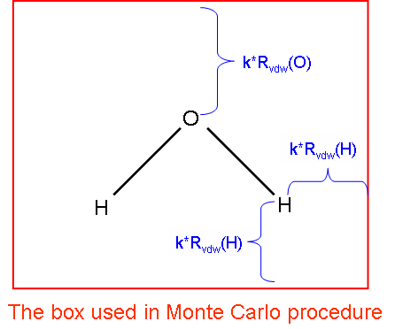

<!-- p.388 -->

By the way, if you would like to examine difference between two wavefunction files for a real space function, you can select function -4 or -5 (hidden functions) in main function 100, the function to be integrated will be [f(file1)-f(file2)]2 or |f(file1)-f(file2)|, respectively, where f is the real space function you will select, “file1” is the wavefunction file loaded when Multiwfn boots up, and “file2” is the wavefunction file you will choose in this function. In this function you can also set criterion of electron density and thus let Multiwfn only evaluate the difference for low density region (i.e. ignoring core region). In addition, after calculation, Multiwfn automatically exports grid data of file1 as a plain text file in current file, the file name directly reflects current calculation condition. For example, the file name a.wfn_003_0075_0434 implies that “file1” is a.wfn, the 3rd real space function was selected, the radial and angular integration points are 75 and 434, respectively. In later studies, if all calculation conditions match with the file name (the file must be placed in current folder), then Multiwfn will directly load data of “file1” from this file rather than recalculate them to reduce computational time.

Evaluation of spherically symmetric average ELF / LOL

In J. Comput. Chem., 38, 2258 (2017), the authors proposed that the optimal ω parameter of range-separated DFT functionals can be determined by means of below quantity:

$$r_{ELF}=\sqrt{\frac{\int ELF(\mathbf{r})\mathbf{r}^{2}ELF(\mathbf{r})d\mathbf{r}}{\int ELF(\mathbf{r})ELF(\mathbf{r})d\mathbf{r}}}$$

In Multiwfn, this quantity will be automatically calculated and outputted if you select ELF as the integrand in present function. The rELF is outputted as “spherically symmetric average ELF”, the numerator and denominator in the root sign are also outputted together.

In J. Phys. Chem. C, 123, 4407 (2019), the LOL-tuning is proposed, in which the “spherically symmetric average LOL” is involved:

$$r_{LOL}=\sqrt{\frac{\int L O L(\mathbf{r})\mathbf{r}^{2}LOL(\mathbf{r})d\mathbf{r}}{\int L O L(\mathbf{r})LOL(\mathbf{r})d\mathbf{r}}}$$

The rLOL along with its numerator and denominator in the root sign will be printed if LOL is selected in present function.

An example is given in Section 4.100.4. Information needed: Atom coordinates, GTFs.


### 3.100.5 Show overlap integral between alpha and beta orbitals

For unrestricted wavefunctions, the orthonormalization condition does not in general hold between alpha and beta orbitals. This function computes the overlap matrix between alpha and beta orbitals


$$S_{i,j}^{\alpha\beta}=\int\varphi_{i}^{\alpha}(\mathbf{r})\varphi_{j}^{\beta}(\mathbf{r})\mathrm{d}\mathbf{r}$$

<!-- formula-ocr: formula_p388_286.png 已替换为LaTeX, 原图保留备查 -->


<!-- p.389 -->

The diagonal elements are useful for evaluating the matching degree of corresponding spin orbital pairs, evident deviation to 1 indicates that spin polarization is remarkable.

In present function, there are two options, option 1 calculates the full overlap matrix, the diagonal elements will be printed on screen and the whole overlap matrix can be selected to output to ovlpmat.txt in current folder; in addition, the maximum pairing between Alpha and Beta orbitals are shown. This calculation may be time-consuming for large systems. Option 2 only calculates and prints the diagonal elements, this is always fast.

Since the expectation of S2 operator for single determinant (SD) wavefunction can be easily derived from the overlap matrix, if option 1 is selected, Multiwfn also outputs this quantity:


$$\left\langle S^{2}\right\rangle_{\mathrm{S D}}=\left\langle S^{2}\right\rangle_{\mathrm{e x a c t}}+N^{\beta}-\sum_{i}^{N^{\alpha}}\sum_{j}^{N^{\beta}}\left|S_{i,j}^{\alpha\beta}\right|^{2}$$

<!-- formula-ocr: formula_p389_287.png 已替换为LaTeX, 原图保留备查 -->

where Nα and Nβ are the number of alpha and beta electrons, 〈𝑆2〉exact is the exact value of square of total spin angular momentum


$$\left\langle S^{2}\right\rangle_{\mathrm{e x a c t}}=S(S+1)=\frac{N^{\alpha}-N^{\beta}}{2}\left(\frac{N^{\alpha}-N^{\beta}}{2}+1\right)$$

<!-- formula-ocr: formula_p389_288.png 已替换为LaTeX, 原图保留备查 -->

Information needed: GTFs


### 3.100.6 Monitor SCF convergence process of Gaussian

Difficulty in SCF convergence is an annoying problem that is often encountered in daily work, monitoring the convergence is important for finding proper solutions. Multiwfn can monitor SCF process by using the output file of Gaussian as input file. Notice that #P has to be specified in the route section, otherwise no intermediate information of SCF process will be recorded in output file.

When you enter this function (subfunction 6 of main function 100), all information of previous steps and the thresholds of convergence are printed on screen, such as


```text
Step#   RMSDP  Conv?   MaxDP  Conv?     DE    Conv?
    8  3.51D-06  NO   5.15D-05  NO   -8.43D-08  YES
    9  1.37D-06  NO   9.11D-06  NO   -2.17D-09  YES
   10  3.03D-07  NO   2.91D-06  NO   -3.75D-10  YES
   11  3.12D-08  NO   4.76D-07  YES  -1.07D-11  YES
   12  7.69D-09  YES  5.72D-08  YES  -1.56D-13  YES
Goal   1.00D-08       1.00D-06        1.00D-06
 SCF done!
```

Meanwhile a window pops up, which contains curves corresponding to convergence process of energy, maximum value and RMS variation of density matrix. After you close the window, you can print the information and draw the curve graphs again in specific step range by choosing corresponding options, the Y-axis is adjusted automatically according to the data range.

If the SCF task is working in progress, that is output file is updated constantly, every time you choose to print and draw the convergence process, the Gaussian output file will be reloaded, so what you see is always the newest information. For monitoring a time-consuming SCF process, I suggest you keep the interface on until the SCF task is finished, during this period you choose option 2 every


<!-- p.390 -->

so often to show the latest 5 steps and analyze the convergence trend.

In the graph, gray dashed line shows the zero position of Y-axis, the red dashed line shows the threshold of convergence. The picture below shows the last 10 SCF steps of a system. If “Done” appears in the rightmost, that means corresponding property has already converged, here all three terms are marked by “Done”, so the entire SCF process has finished.

This function is also compatible with keyword SCF=QC and SCF=XQC, but not with SCF=DM.


### 3.100.8 Generate Gaussian input file with initial guess combined from


### fragment wavefunctions

This function is used to combine several fragment wavefunctions to an initial guess wavefunction, there are three main uses:

1 Generate high-quality initial guess wavefunction for complex If you already have converged wavefunctions for each fragment, and the interaction between fragments is not very strong, by using the combined wavefunction as initial guess the SCF process of complex will converge faster.

2 Perform simple energy decomposition NOTE: The energy decomposition performed in the following way is strongly deprecated now! Using sobEDA or sobEDAw energy decomposition analysis (based on Multiwfn and Gaussian) is a much better choice, not only full terms can be obtained, but also much easier to use. See J. Phys. Chem. A, 127, 7023 (2023) and very detailed tutorial: http://sobereva.com/soft/sobEDA_tutorial.zip.

The total energy variation of forming a complex can be decomposed as


$$\Delta E_{\mathrm{tot}}=E^{\mathrm{c o m p l e x}}-\sum_{i}E_{i}^{\mathrm{f r a g}}=\left(\Delta E_{\mathrm{e l s}}+\Delta E_{\mathrm{X C}}+\Delta E_{\mathrm{P a u l i}}\right)+\Delta E_{\mathrm{o r b}}=\Delta E_{\mathrm{s t e r i c}}+\Delta E_{\mathrm{o r b}}$$

<!-- formula-ocr: formula_p390_289.png 已替换为LaTeX, 原图保留备查 -->

where ΔEels is electrostatic interaction term, normally negative if the fragments are neutral; ΔEXC is


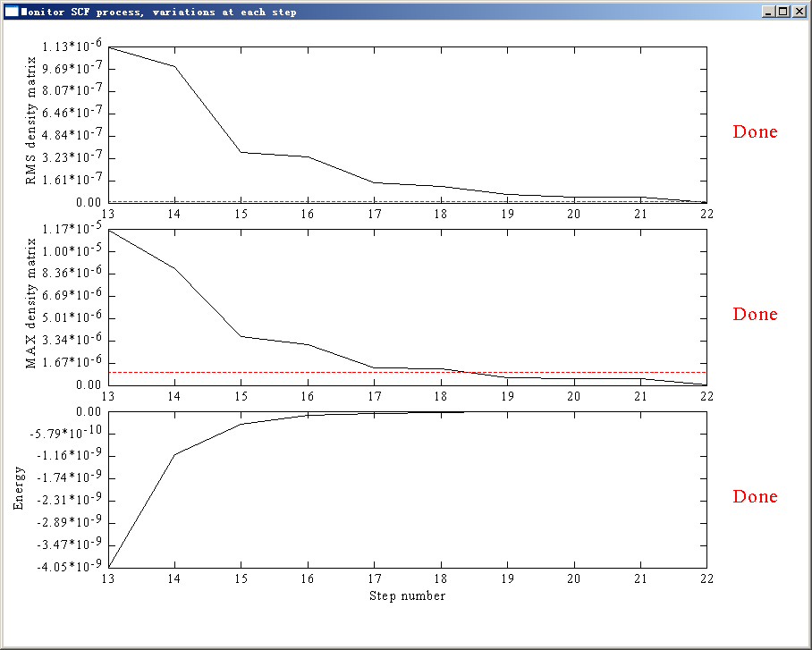

<!-- p.391 -->

change of exchange-correlation energy during complexation process; ΔEPauli comes from the Pauli repulsion effect between electrons in occupied orbitals of the fragments and is invariably positive, sometimes it is also referred to as exchange-repulsion term. For convenience, it is customary to

combine these three terms as steric term (ΔEsteric).

ΔEorb in above formula is orbital interaction term, it arises from the mix of occupied MOs and virtual MOs, and it exhibits polarization and charge-transfer effects. If the combined wavefunction

is used as initial guess for complex, then ΔEorb can be evaluated by subtracting the first SCF iteration energy from the last SCF iteration energy:

$$\Delta E_{\mathrm{o r b}}=E_{\mathrm{S C F,l a s t}}-E_{\mathrm{S C F,l s t}}$$

Note that ESCF,last = Ecomplex. Obviously, we have the following relationship


$$\Delta E_{\mathrm{steric}}=\Delta E_{\mathrm{tot}}-\Delta E_{\mathrm{orb}}=E_{\mathrm{SCF,1st}}-\sum_{i}E_{i}^{\mathrm{frag}}$$

<!-- formula-ocr: formula_p391_290.png 已替换为LaTeX, 原图保留备查 -->

By the way, if the complex you studied involves evident dispersion interaction (vdW interaction), there are two possible ways to evaluate the dispersion energy component:

HF), then use MP2 (or better post-HF method) to calculate interaction energy again (∆𝐸tot (1) Use Hartree-Fock to calculate interaction energy first (∆𝐸tot MP2 ), then ∆𝐸disp = ∆𝐸tot MP2 −∆𝐸tot HF . This

relationship comes from the fact that dispersion energy is completely missing in HF energy. (2) Use HF or the DFT functionals that completely failed to represent dispersion energy to calculate interaction energy (e.g. B3LYP and BLYP), then use Grimme's DFT-D3 program (https://www.chemie.uni-bonn.de/grimme/de/software/dft-d3/get_dft-d3) with corresponding parameter to evaluate DFT-D3 dispersion correlation to interaction energy, which can be simply regarded as the dispersion component in total interaction energy. If you do not know how to do this and you can read Chinese, you may consult the post in my blog: http://sobereva.com/210.

An example of simple energy decomposition is given in Section 4.100.8.

3 Modelling antiferromagnetic coupling system I will exemplify this concept and show you how to use the function by a representative antiferromagnetic coupling system -- Mn2O2(NH3)8,

The ground state is singlet, while the two Mn atoms have opposite spin and each Mn atom has high spin. Obviously, restricted closed-shell calculation is not suitable for this system, unrestricted calculation is required, however, the default initial guess is non-symmetry-broken state, therefore the converged unrestricted wavefunction returns to restricted closed-shell wavefunction. In order to make the wavefunction converges to expected state, we have to compute wavefunction for four fragments separately and then combine them by Multiwfn to construct a proper symmetry-broken initial guess. The four fragments should be defined as

Fragment 1: Mn(NH3)4 at left side. Charge = +2, sextet. Fragment 2: Mn(NH3)4 at right side. Charge = +2, sextet. Fragment 3: One of bridge oxygen atoms. Charge = -2, singlet.


<!-- p.392 -->

Fragment 4: Another bridge oxygen atom. Charge = -2, singlet. Notice that nosymm and pop=full keywords must be specified in the calculation of each fragment. Assuming the output files are frag1.out, frag2.out, frag3.out and frag4.out, respectively, let Multiwfn load frag1.out first after booting up, then select function 100 and subfunction 8 to enter present function, input 4 to tell Multiwfn there are four fragments in total; since frag1.out has already been loaded, you only need to input the path (including filename) of frag2.out, frag3.out and frag4.out in turn. After that a Gaussian input file named new.gjf will be outputted in current directory. Notice that every time you input a fragment, Multiwfn asks you if flip its spin, only for fragment 2 you should choose y, that is make the spin direction of unpaired electrons down (by default the spin is in up direction) to exactly counteract the opposite spin in fragment 1, so that multiplicity of complex is 1.

From the comment of new.gjf (the texts behind exclamation mark), you can know clearly how the MOs of complex are combined from MOs of fragments. For example, a two-fragment system, one of complex MOs in new.gjf is


```text
! Alpha orbital:    12 Occ:  1.000000 from fragment   2
     0.00000E+00     0.00000E+00     0.00000E+00     0.00000E+00     0.00000E+00
     0.00000E+00     0.00000E+00     0.00000E+00     0.18850E-01    -0.53690E-01
    -0.74180E-01     0.48861E+00     0.16080E+00    -0.12897E+00    -0.12897E+00
     0.47150E-01    -0.25269E+00     0.39361E+00    -0.48811E+00     0.36123E+00
```

We already know there are 8 basis functions in fragment 1 and 12 basis functions in fragment 2, and this complex MO comes from fragment 2, so the first 8 data (highlighted) are zero and only the last 12 data have values (the same as corresponding MO coefficients in Gaussian output file of fragment 2).

If you used diffuse functions and encounter a problem at Link401 when running new.gjf by Gaussian, you can add IOp(3/32=2) keyword and retry.


### 3.100.9 Evaluate interatomic connectivity and atomic coordination


### number

In the original paper of DFT-D3 (J. Chem. Phys., 132, 154104 (2010)), the authors argued that the coordination number (CN) of atom A can be approximately expressed as


$$CN_{_{A}}=\sum_{_{B\neq A}}\frac{1}{1+\exp\left\{-16\times\left[(4/3)(R_{_{A}}+R_{_{B}})/r_{_{AB}}-1\right]\right\}}$$

<!-- formula-ocr: formula_p392_291.png 已替换为LaTeX, 原图保留备查 -->

where R is Pyykkö covalent radius from Chem. Eur. J., 15, 186 (2009), and rAB is distance between A and B.

According to this idea, in present module the interatomic connectivity index (I) between A and B is determined as follows:


$$I_{_{AB}}(r_{_{AB}})=\frac{1}{1+\exp\{-16\times[(4/3)(R_{_{A}}+R_{_{B}})/r_{_{AB}}-1]\}}$$

<!-- formula-ocr: formula_p392_292.png 已替换为LaTeX, 原图保留备查 -->

Assume that RA+RB=2.0, then the function could be plotted as follows. The I value equals 0.995


<!-- p.393 -->

when rAB=RA+RB

Note that the I should not be utilized as an indicator of bond order, it does not have capability of discriminating bonding type and strength.

Present module outputs I between each pair of atoms, the printing threshold can be inputted by user. Commonly, when I is close to 1.0, it implies that the two atoms are bonded, while if it is close to 0.0, then they may be regarded as not bounded by chemical bond. The nearest integer of I, namely nint(I), is also outputted for facilitating examination of the result.

For each atom (e.g. atom A), the ABB A  is printed as "Sum of connectivity", while I

()ABB A  is printed as "Sum of integer connectivity". The former and the latter may be regarded nint I

as raw and actual coordination number, respectively.

Finally, you can choose if exporting all I values as matrix to connmat.txt in current folder. Below is output example of ethyne at equilibrium geometry:


```text
    1C   ---    2C  :   0.99951   Nearest integer:  1
    1C   ---    3H  :   0.99974   Nearest integer:  1
    2C   ---    4H  :   0.99974   Nearest integer:  1

    1  C   Sum of connectivity:  2.0016   Sum of integer connectivity:  2
    2  C   Sum of connectivity:  2.0016   Sum of integer connectivity:  2
    3  H   Sum of connectivity:  1.0021   Sum of integer connectivity:  1
    4  H   Sum of connectivity:  1.0021   Sum of integer connectivity:  1
```

Information needed: atom coordinates


### 3.100.11 Calculate overlap and centroid distance between two orbitals

This function is used to calculate overlap and centroid distance between two orbitals, this is useful for many purposes, e.g. analyzing charge transfer during electron excitation. You need to input index of two orbitals, then X, Y, Z of centroid of the orbitals will be calculated as follows


<!-- p.394 -->


$$X_{i}=\int|\varphi_{i}(\mathbf{r})|^{2}x\mathrm{d}\mathbf{r}\qquad Y_{i}=\int|\varphi_{i}(\mathbf{r})|^{2}y\mathrm{d}\mathbf{r}\qquad Z_{i}=\int|\varphi_{i}(\mathbf{r})|^{2}z\mathrm{d}\mathbf{r}$$

<!-- formula-ocr: formula_p394_293.png 已替换为LaTeX, 原图保留备查 -->

then the centroid distance between orbital i and j is calculated as

Present function also calculates overlap degree of the two orbitals, below two quantities are calculated respectively (while directly calculating overlap integral of two orbital wavefunctions is clearly meaningless, since it must be zero due to orthonormalization condition):


$$\int|\varphi_{i}(\mathbf{r})||\varphi_{j}(\mathbf{r})|\mathrm{d}\mathbf{r}\qquad\quad\int|\varphi_{i}(\mathbf{r})|^{2}|\varphi_{j}(\mathbf{r})|^{2}\mathrm{d}\mathbf{r}$$

<!-- formula-ocr: formula_p394_294.png 已替换为LaTeX, 原图保留备查 -->

The integrals shown above are not calculated analytically but numerically via Becke's grid-based integration approach. The integration grid can be set by "radpot" and "sphpot" in `settings.ini`, the default values are high enough, and you may want to somewhat decrease them to reduced computational cost for large system, especially when you want to study many orbital pairs.

When the calculation is finished, Multiwfn will ask you whether or not add the two centroids as two additional dummy atoms (the symbol is Bq). If you choose y, then you can go to main function 0 to visualize corresponding orbital isosurfaces by transparent or mesh style to examine correspondence between centroid position and orbital shape.

Information needed: GTFs, atom coordinates


### 3.100.12 Biorthogonalization between alpha and beta orbitals

Introduction It is well known that for wavefunctions generated by unrestricted open-shell calculations (UHF or UKS), the alpha and beta orbitals are often evidently mismatch with each other, this phenomenon makes analysis of orbitals difficult, because one must simultaneously consider two set of orbitals. Although restricted open-shell (ROHF or ROKS) calculation does not have this problem, the total electronic energy, orbital energy and electron distribution is not as accurate as unrestricted open-shell calculation.

Present function is used to perform biorthogonalization between alpha and beta orbitals for unrestricted open-shell wavefunction with spin multiplicity higher than 1. Original alpha and beta molecular orbitals will be respectively transformed to a set of new orbitals. Although finally there are still two sets of orbitals, their wavefunctions have matched with each other almost perfectly, therefore then you only need to discuss one set of orbitals.

The so-called biorthogonalization mentioned here specifically refers to simultaneously satisfying two conditions: (1) For each set of spin orbitals, they are orthonormal with themselves (2) Alpha orbitals are orthonormal with respect to beta orbitals with different index. Without applying biorthogonalization, the UHF/UKS orbitals only satisfy the first condition.

Algorithm details The biorthogonalization is realized via singular value decomposition (SVD) technique. The overlap integral matrix O between alpha and beta orbitals is first constructed, and then SVD is applied to decompose it as O=UV †, where  is a diagonal matrix, the diagonal elements are referred


<!-- p.395 -->

to as "singular values", which essentially correspond to the overlap integrals between the orbitals after the biorthogonalization transformation, under normal situations they should be very close to 1.0. The column matrix U (V) corresponds to the transformation matrix between the original orbitals and the new orbitals of alpha (beta) spin. The coefficient matrix of the newly generated biorthogonalized orbitals can be obtained as

$$\begin{aligned}&C^{\alpha}_{biortho}=\mathbf{U}\mathbf{C}^{\alpha}_{original}\\&C^{\beta}_{biortho}=\mathbf{V}\mathbf{C}^{\beta}_{original}\\ \end{aligned}$$

Since U and V are unitary matrices, such a transformation does not affect observable quantities of current system.

Notice that the biorthogonalization transformation should not be done for all orbitals at once, because this will lead to mix between occupied and virtual orbitals and thus results in change of observable properties. In Multiwfn, the transformation is successively carried out via below three steps. The total number of orbitals of each spin will be denoted as ntot, the numbers of alpha and

$$\begin{aligned}&C^{\alpha}_{biortho}=\mathbf{U}\mathbf{C}^{\alpha}_{original}\\&C^{\beta}_{biortho}=\mathbf{V}\mathbf{C}^{\beta}_{original}\\ \end{aligned}$$

(1) Biorthogonalization between all occupied alpha orbitals (1~nα) and all occupied beta orbitals (1~nβ). This step makes each resulting occupied beta orbital paired with a resulting alpha orbital.

(2) Biorthogonalization between alpha orbitals (nβ+1~nα) and all virtual beta orbitals (nβ+1~ntot). This step makes each resulting "singly occupied" alpha orbital paired with a resulting beta virtual orbital

(3) Biorthogonalization between all alpha virtual orbitals (nα+1~ntot) and the virtual beta orbitals that have not been paired (nα+1~ntot).

Note that in biorthogonalization steps 2 and 3, the utilized overlap integral matrix O should be reconstructed based on the coefficient matrices updated at the last step.

After these three steps of transformation, in most cases, one-to-one pairing between all alpha and beta orbitals is nicely satisfied, namely the difference between orbital wavefunction distribution of an alpha orbital and that of the beta orbital with the same index is negligible. At the same time, each alpha orbital is nearly orthogonal to a beta orbital with different index. It is noteworthy that the alpha orbitals obtained in this way are not exactly orthonormal with respect to beta orbitals, because to reach the exact orthonormalization condition, all MOs must be transformed simultaneously, which will result in undesirable mixing between occupied and unoccupied MOs.

The biorthogonalized orbitals are not eigenfunctions of Fock operator (or Kohn-Sham operator, similarly hereinafter) like molecular orbitals, however their energies can be evaluated as expectation value of Fock operator of corresponding spin. Specifically, if you request Multiwfn to evaluate the orbital energies, Multiwfn performs the following representation transformation:

$$\mathbf{F}_{\mathrm{b i o r t h o}}^{\alpha}=(\mathbf{C}^{\alpha})^{\mathrm{T}}\mathbf{F}_{\mathrm{A O}}^{\alpha}\mathbf{C}^{\alpha}\qquad\mathbf{F}_{\mathrm{b i o r t h o}}^{\beta}=(\mathbf{C}^{\beta})^{\mathrm{T}}\mathbf{F}_{\mathrm{A O}}^{\beta}\mathbf{C}^{\beta}$$

where FσAO is the Fock matrix of σ spin in original basis functions that loaded from external file, Cσ(μ,i) corresponds to coefficient of basis function μ in biorthogonalized orbital i of σ spin. Energy of biorthogonalized orbital j is simply Fbiortho(j,j).

Note: Commonly, the numbers of α and β electrons are different, and/or their distributions are unsymmetric, therefore the single-electron effective potential (reflected by the corresponding Fock operator) of the two spins are different. So, even if you find an α and a β biorthogonalized orbitals with the same index show almost completely identical shape, their energies could be significantly different.


<!-- p.396 -->

Once generation of orbital energies is done, Multiwfn is able to order the orbitals according to their energies. Notice that the energy used in the ordering process is average of energy of alpha

orbital and its beta counterpart, and the three batch of orbitals (1~nβ), (nβ+1~nα) and (nα+1~ntot) are ordered individually (hence for example, index of an orbital originally in the second batch must still be higher than any orbital in the first batch after ordering).

Since the number of unoccupied MOs is generally much higher than the number of occupied MOs, while one often only has interest in occupied biorthogonalized orbitals, therefore Multiwfn provides an option to skip the biorthogonalization between unoccupied MOs, namely skipping the

step (3) shown above. In this case the alpha and beta orbitals in the range of (nα+1~ntot) will be meaningless and you should not then study them.

Usage After booting up Multiwfn, simply loading a file containing basis function information (e.g. .mwfn, .fch, .molden, .gms) that generated by UHF or UKS calculation, then go to subfunction 12 of main function 100, you will be asked to choose if also performing biorthogonalization for unoccupied MOs, if evaluating energies of biorthogonalized orbitals, and if ordering the biorthogonalized orbitals according to their energies in the way mentioned earlier. The Fock matrix used to evaluate energies of the biorthogonalized orbitals can either be directly generated using MO energies and coefficient matrix via F=SCEC-1, or be loaded from a file (see Appendix 7 of this manual).

After finishing the biorthogonalization, two files are exported to current folder

- biortho.txt: This file contains singular values and occupancy of the biorthogonalized orbitals. If energies of the orbitals have been evaluated, they will also be written into this file.

- biortho.fch: This file contains biorthogonalized alpha and beta orbitals. If you did not request Multiwfn to evaluate their energies, then in this file the orbital energies in a.u. will correspond to their singular values; while if their energies have been generated, then the energies will be written into this .fch file as orbital energy information.

Finally, if you input y, then the biortho.fch will be loaded directly, so that then you can directly visualize the newly generated orbitals via main function 0 or analyze them by various functions; if you input n, then the file that loaded when Multiwfn boots up will be reloaded to recover to the initial state.

Application of the biorthogonalization transformation for a practical system is illustrated in Section 4.100.12.

Information needed: Basis functions


### 3.100.14 Calculate LOLIPOP (LOL Integrated Pi Over Plane)

In the paper Chem. Commun., 48, 9239 (2012), the authors proposed a quantity named LOLIPOP (Localized Orbital Locator Integrated Pi Over Plane) to measure π-stacking ability of aromatic systems, they argued that a ring with smaller LOLIPOP value has stronger π-depletion (namely lower π-delocalization), and hence shows stronger π-stacking ability.

LOLIPOP is defined as definite integral of LOL-π (the LOL purely contributed by π-orbitals)


<!-- p.397 -->

from a distance of 0.5 Å away from the molecular plane. Only points with LOL-π > 0.55 are taken into account. The integration is made in a cylindrical region perpendicular to the molecular plane, with a radius of 1.94 Å corresponding to the average between the C and H ring radii in benzene.

In Multiwfn, function 14 in main function 100 is designed for calculating LOLIPOP, the default values 1.94 and 0.5 Å mentioned above can be changed by options 3 and 4 respectively. Before starting the calculation, you have to choose which orbitals are π orbitals by option 1. The calculation can be triggered by option 0, you need to input the indices of the atoms in the ring in accordance

with the atom connectivity, then grid data of LOL-π around the ring will be evaluated, then the LOLIPOP value will be computed by numerical integration. Of course, smaller grid spacing gives rise to higher integration accuracy, but brings higher computational cost on evaluating LOL. The default spacing of grid data is 0.08 Bohr, this value is fine enough in general.

If you want to calculate LOLIPOP separately for each side of the ring, you can use option 5 to choose the side. By default, both sides are taken into account.

If you want to examine if the calculated LOL-π is reasonable, you can choose option 7 once, then after LOLIPOP calculation, isosurface map of LOL-π will be shown.

If you want to visually verify the distribution of the points actually included in the integration of LOLIPOP value, you can choose option 6 once, then after LOLIPOP calculation you will have pt.xyz in current folder, you can use VMD software to visualize the points recorded in this file, they correspond to the points actually contributing to LOLIPOP.

Examples of this function is provided in Section 4.100.14. Information needed: GTFs, atom coordinates


### 3.100.15 Calculate intermolecular orbital overlap

This function is used to calculate orbital overlap integral between two molecules, namely

$$S_{i,j}^{\mathrm{i n t e r}}=\int\varphi_{i}^{\mathrm{m o n o m e r1}}(\mathbf{r})\varphi_{j}^{\mathrm{m o n o m e r2}}(\mathbf{r})\mathrm{d}\mathbf{r}$$

where i and l are molecular orbital indices of monomer 1 and monomer 2, respectively. This integral is useful in discussions of intermolecular charge transfer, e.g. J. Phys. Chem. B, 106, 2093 (2002).

Below three files are required for evaluating the integral, any kind of file containing basis function can be used as the input files.

(1) Wavefunction file of dimer (2) Wavefunction file of monomer 1 (3) Wavefunction file of monomer 2 To calculate the integral, after booting up Multiwfn, file (1) should be loaded first. After entering the present module, the paths of files (2) and (3) should be inputted in turn. Then you can input such as 8,15 to obtain 𝑆8,15 inter, that is the integral between MO 8 of monomer 1 and MO 15 of monomer 2. If you input letter o, then the entire Sinter matrix will be outputted to ovlpint.txt in current folder.

Notice that the atomic coordinates in files (2) and (3) must be in accordance with those in file (1), and the atomic sequence in the files should be identical. The basis set used for the three


<!-- p.398 -->

calculations must be the same. Also, notice that if in the dimer the atoms in molecule A occur prior to the atoms in molecule B, then in the present function, you must load wavefunction file of molecule A first and then load that of molecule B, otherwise the result will be incorrect.

Special case: If you are a Gaussian user, in addition to using .fch/fchk as input files, you can also use Gaussian output files for present module (though deprecated, because accuracy is slightly lower). The three files in this case should be

(1) Gaussian output file of dimer, IOp(3/33=1) nosymm guess=only should be specified in route section. Multiwfn will read overlap matrix from this file.

(2) Gaussian output file of monomer 1, nosymm pop=full should be specified in route section. Multiwfn will read orbital coefficients of monomer 1 from this file.

(3) Gaussian output file of monomer 2, nosymm pop=full should be specified in route section. Multiwfn will read orbital coefficients of monomer 2 from this file.

Corresponding example of this function is provided in Section 4.100.15.


### 3.100.17 Generate Fock/KS matrix based on orbital energies and


### coefficients

This function is used to generate one-electron effective Hamiltonian matrix based on orbital energies and expansion coefficients with respect to basis function. The generated matrix corresponds to Fock matrix for Hartree-Fock wavefunction and Kohn-Sham matrix for Kohn-Sham DFT wavefunction.

The principle of this function is very easy to comprehend: The HF or KS-DFT equation is FC=SCE, where F is Fock/KS matrix, C is coefficient matrix, S is overlap matrix, and E is a diagonal matrix whose diagonal terms correspond to various molecular orbital energies. Clearly F can be solved as F=SCEC-1 when other matrices are available.

To use this function to yield Fock/KS matrix, after booting up Multiwfn, you should load a file containing basis function information with all molecular orbitals. For example, the .fch/.molden/.mwfn/.gms file produced by HF or DFT calculation can be used. Then enter subfunction 17 of main function 100, Fock/KS matrix will be generated in the above-mentioned way. Then you will be asked to input path of a plain text file, the generated Fock/KS matrix will be exported to it in a lower-triangular form, thus the structure of the file is:

F(1,1) F(2,1) F(2,2) F(3,1) F(3,2) F(3,3) ... F(nbasis,nbasis) where nbasis is the total number of basis functions. For unrestricted open-shell case, alpha and beta Fock/KS matrices (Fa and Fb) are respectively generated and outputted in the following way

Fa(1,1) Fa(2,1) Fa(2,2) Fa(3,1) Fa(3,2) Fa(3,3) ... Fa(nbasis,nbasis) Fb(1,1) Fb(2,1) Fb(2,2) Fb(3,1) Fb(3,2) Fb(3,3) ... Fb(nbasis,nbasis) Note that some functions of Multiwfn need user to provide a file containing Fock/KS matrix so that energies of specific orbitals can be evaluated, the file exported by the present function is compatible with requirement of those functions.

It is worth to mention that due to numerical error, the Fock/KS matrix obtained as F=SCEC-1 is inevitably lower than that originally produced by quantum chemistry code, but the difference is very small.

The present function cannot be used if linearly dependent basis functions are automatically eliminated during quantum chemistry calculation, in this case the number of solved MOs (and hence the number of loaded MO energies) is smaller than the number of basis functions. Usually this issue


<!-- p.399 -->

only occurs when diffuse functions are heavily employed.

Example This example generates KS matrix for examples\ClPO2.fch. Boot up Multiwfn and input examples\ClPO2.fch 100 17 ClPO2_KSmat.txt Now you have ClPO2_KSmat.txt in current folder, which contains KS matrix elements in lower triangular form.


### 3.100.18 Yoshizawa's electron transport route analysis

Theory This function is used to analyze electron transport route and is mainly based on Yoshizawa's formula (Acc. Chem. Res., 45, 1612 (2012)), At the Fermi energy, the matrix elements of the zeroth

(0)𝑅/𝐴, which describes the propagation of a tunneling electron from site r to site s through the orbitals in a molecular part, can be written as follows: Green's function, 𝐺𝑟𝑠


$$G_{r s}^{(0)\mathrm{R/A}}(E_{\mathrm{F}})=\sum_{k}\frac{C_{r k}C_{s k}^{*}}{E_{\mathrm{F}}-\varepsilon_{k}\pm i\eta}$$

<!-- formula-ocr: formula_p399_295.png 已替换为LaTeX, 原图保留备查 -->

where Crk is the kth MO coefficient at site r, asterisk on the MO coefficient indicates a complex conjugate, εk is the kth MO energy, and η is an infinitesimal number determined by a relationship between the local density of states and the imaginary part of Green's function. By this formula, if two electrodes are connected to site r and s, by this formula we can readily predict the transmission probability between the two sites. From the expression of the denominator, it can be seen that HOMO and LUMO have the largest contribution to G. If only HOMO and LUMO are taken into account, the formula can be explicitly written as

$$G_{rs}^{(0)\mathrm{R/A}}(E_{\mathrm{F}})=\frac{C_{r\mathrm{HOMO}}C_{s\mathrm{HOMO}}^{*}}{E_{\mathrm{F}}-\varepsilon_{\mathrm{HOMO}}\pm i\eta}+\frac{C_{r\mathrm{LUMO}}C_{s\mathrm{LUMO}}^{*}}{E_{\mathrm{F}}-\varepsilon_{\mathrm{LUMO}}\pm i\eta}$$

This formula allows one to visually examine the possibility of electron transmission between site r and s by means of observing molecular orbital diagram. If both site r and s have large C in magnitude, and their relative phase in HOMO and in LUMO is different, then the magnitude of G will be large, indicating that transmission between r and s will be favourable. For example, see Acc. Chem. Res., 45, 1612 (2012). Note that G may be positive and negative, but only absolute value of G is meaningful for discussing transmission.

In Multiwfn, iη term in G is always ignored, since this is an infinitesimal number. The coefficient C comes from the output of "NAOMO" keyword in NBO program. In almost all organic conductors, σ orbitals have little contribution to conductance, therefore present function only takes π orbitals into account, and the molecular plane must be parallel in XY or YZ or XZ plane.

Input file To run this kind of analysis, there are two choices on the input file (1) Only using Gaussian output file


<!-- p.400 -->

In the route section, pop=nboread must be specified, and \$NBO NAOMO \$END must be written at the last line, for example:


```text
#P b3lyp/6-31g* pop=nboread

b3lyp/6-31g* opted

0 1
[Molecular geometry field]

$NBO NAOMO $END
```

(2) Load a file containing basis function information when Multiwfn boots up, then after entering present function, load a NBO output file containing NAOMO information (namely the NAOMO keyword has been passed to NBO program. If you are using GENNBO, you can add NAOMO into \$NBO…\$END field of .47 file).

Usage After you enter this function, you need to select which plane is the one your molecular plane parallel to. Then program will load file and find out the atoms having expected π atomic orbital (strictly speaking, the "Val"-type p natural atomic orbitals that perpendicular to the chosen plane). The coefficient of these atomic orbitals will be used to compute G.

Then you will see a menu, the options are explained below: -4 Set distance criterion: Input lower and upper limits. Then in option 2 and 3, the route whose distance exceeds this criterion will not be shown.

-3 Set value criterion: In option 1, the MO whose contribution to G is less than this criterion will not be shown. In option 2 and 3, the route whose |G| is smaller than this criterion will not be shown.

-2 Set Fermi energy level: Namely set EF in the Yoshizawa's formula. -1 Select the range of MOs to be considered: Namely set the MO range of the summation in the Yoshizawa's formula.

0 View molecular structure: As the title says. 1 Output detail of electron transport probability between two atoms: You need to input index for two atoms, they will be regarded as site r and s, then Grs (the value behind "Total value") will be outputted; meanwhile program also outputs the contribution from each MO, the distance between the two atoms, and the calculated Grs for the case when only HOMO and LUMO are taken into the summation.

2 Output and rank all electron transport routes in the system: All routes in current system will be tested, if the route simultaneously fulfills the G and distance criteria set by -3 and -4, then the involved atoms, G and distance of the route will be printed. The routes are ranked by absolute value of G.

3 Output and rank all electron transport routes for an atom: Similar to option 2, but only consider the routes involving specific atom.

Information needed: As mentioned above


<!-- p.401 -->


### 3.100.19 Generate new wavefunction by combining fragment


### wavefunctions

This function is used to generate a new wavefunction (in .wfn., .fch or .mwfn format) by combining wavefunctions of fragments. In the new wavefunction, the electron distribution simply corresponds to the superposition of the electron distribution of the combined fragments; in other words, in this combined state the electron polarization and charge transfer between the fragments have not occurred. Each combined orbital directly corresponds to one of the fragment orbitals.

Infinite number of fragments can be combined together in this function. If .wfn file of the combined wavefunction is to be exported, the fragment wavefunction files can be in any format; however, if the wavefunction is selected to be exported as a .mwfn or .fch file, the inputted fragment wavefunctions should contain basis function information, such as .fch/mwfn/molden/gms.

Assume that the combined wavefunction consists of N fragments, after booting up Multiwfn, you should let Multiwfn load the first fragment wavefunction file, and then go to the present function (subfunction 19 of main function 100), select the format of the new wavefunction to be exported, then input the total number of fragments (N), and input the path of the wavefunction files corresponding to the other fragments in turn. Finally, you will get the wavefunction file corresponding to the combined wavefunction.

In the exported combined wavefunction file, orbitals are sorted according to orbital occupation from high to low.

If any fragment is unrestricted open-shell, then the combined wavefunction will also be unrestricted open-shell, namely the alpha and beta orbitals will separately occur in the exported wavefunction file. In this case, for each unrestricted open-shell fragment, Multiwfn will ask you if flipping the spin of its orbitals; if you input y, then the information of all alpha and all beta orbitals will be exchanged. This treatment is particularly useful if you want to get the artificial wavefunction of the whole system combined from fragment wavefunctions of free radicals.

Ghost atom may be used in fragment wavefunction calculation. If the same basis functions and atoms were employed in every fragment calculation (they only differ by the choice of ghost atoms, and union of real atoms in each fragment just corresponds to the whole system), you should input negative of number of fragments to indicate this special case. In this case only single-determinant wavefunction is supported, and only occupied orbitals will be considered to generate the combined wavefunction, while unoccupied orbitals will be ignored (if export to .fch or .mwfn format, the virtual orbitals will have zero coefficients and energies). In the combined wavefunction, all atoms will be recorded as real atoms.

An example is given in Section 4.100.19.


### 3.100.20 Calculate Hellmann-Feynman forces

The Hellmann-Feynman (H-F) force is the actual force acting on nuclei in a quantum system, which is exerted by electron density and other nuclei:

$$\mathbf{F}_{A}=-\Big\langle\Psi\Big|\frac{\hat{H}}{\partial\mathbf{R}_{A}}\Big|\Psi\Big\rangle=\mathbf{F}_{A}^{\mathrm{e l e}}+\mathbf{F}_{A}^{\mathrm{n u c}}=-Z_{A}\int\frac{\rho(\mathbf{r})(\mathbf{R}_{A}-\mathbf{r})}{|\mathbf{R}_{A}-\mathbf{r}|^{3}}d\mathbf{r}+Z_{A}\sum_{B\neq A}\frac{Z_{B}(\mathbf{R}_{A}-\mathbf{R}_{B})}{|\mathbf{R}_{A}-\mathbf{R}_{B}|^{3}}$$


<!-- p.402 -->

Present function calculates and prints total H-F force as well as the contribution from electron density and other nuclei respectively.

In practice, notice that the H-F forces calculated as above based on the electronic wavefunction and nuclear information recorded in the wavefunction file are generally not equivalent to the forces computed by quantum chemistry program at current calculation level (FQC), which may be expressed as:

$$\mathbf{F}_{A}^{\mathrm{Q C}}=-\frac{\partial E}{\partial\mathbf{R}_{A}}=-\big\langle\Psi\big|\frac{\hat{H}}{\partial\mathbf{R}_{A}}\big|\Psi\big\rangle-2\big\langle\partial\Psi\big/\partial\mathbf{R}_{A}\big|\hat{H}\big|\Psi\big\rangle$$

The partial derivative of wavefunction with respect to nuclear coordinate involves partial derivative of orbital coefficients, configuration state coefficients and basis functions with respect to RA. Therefore, only for the fully variational wavefunctions such as HF, DFT and MCSCF with basis functions independent of nuclear coordinates (e.g. plane wave), the second term on the r.h.s. of above equation is vanishing, and then the H-F forces just equal to the force at current calculation level.

Information needed: GTFs, atom coordinates


### 3.100.21 Calculate properties based on geometry information for


### specific atoms

This function aims at characterizing structural properties of a molecule or its local region. It has many capabilities, as respectively shown below

Calculate geometry information for selected atoms Input index range of some atoms (or input all to select the whole system), then many properties based on geometry information will be calculated for them, including

(1) Mass (2) Geometry center, center of mass, center of nuclear charges (3) Radius of gyration (4) Sum of nuclear charges and dipole moments from nuclear charges (5) The atom having minimum/maximum coordinate in X/Y/Z (6) Minimum and maximum distance (7) Moments of inertia tensor, principal axes and principal moments of inertia (8) Rotational constant (9) Electrostatic interaction energy between nuclear charges Note: If the input file is .chg, then "nuclear charges" mentioned above will correspond to atomic charges.

Radius of gyration is computed as


$$R_{\mathrm{g}}=\sqrt{\frac{\sum\limits_{i}m_{i}\left(\mathbf{r}_{i}-\mathbf{r}_{\mathrm{c}}\right)^{2}}{\sum\limits_{j}m_{j}}}$$

<!-- formula-ocr: formula_p402_296.png 已替换为LaTeX, 原图保留备查 -->

where r is the coordinate of nucleus, rc is mass center, m is atomic mass.


<!-- p.403 -->

The moments of inertia tensor, which is a symmetry matrix, is calculated as

$$\mathbf{I}=\left[\begin{matrix}{I_{X X}}&{I_{X Y}}&{I_{X Z}}\\ {I_{Y X}}&{I_{Y Y}}&{I_{Y Z}}\\ {I_{Z X}}&{I_{Z Y}}&{I_{Z Z}}\\ \end{matrix}\right]=\left[\begin{matrix}{\displaystyle\sum_{i}m_{i}(y_{i}^{2}+z_{i}^{2})}&{-\displaystyle\sum_{i}m_{i}x_{i}y_{i}}&{-\displaystyle\sum_{i}m_{i}x_{i}z_{i}}\\ {-\displaystyle\sum_{i}m_{i}y_{i}x_{i}}&{\displaystyle\sum_{i}m_{i}(x_{i}^{2}+z_{i}^{2})}&{-\displaystyle\sum_{i}m_{i}y_{i}z_{i}}\\ {-\displaystyle\sum_{i}m_{i}z_{i}x_{i}}&{-\displaystyle\sum_{i}m_{i}z_{i}y_{i}}&{\displaystyle\sum_{i}m_{i}(x_{i}^{2}+y_{i}^{2})}\\ \end{matrix}\right]$$

where x, y, and z are Cartesian components of atoms relative to mass center. In the output, "The moments of inertia relative to X,Y,Z axes" correspond to the three diagonal terms of I.

The three eigenvectors of I are known as principal axes, they are outputted as the three columns of the matrix with the title "***** Principal axes (each column vector) *****". The corresponding three eigenvalues of I are the moments of inertia relative to principal axes.

If the moments of inertia are given in amu·Å2, then the rotational constants in GHz can be directly evaluated; for example, the rotational constant relative to Z axis is ℎ/(8𝜋2𝐼𝑍𝑍ζ) × 1011,

where h is Planck constant, and ξ=1.66053878*10-27 is a factor used to convert amu to kg.

Evaluate radius, diameter, length, width and height If you input size in this function, the system will be properly rotated to make its three principal axes respectively parallel to the three Cartesian axes. Then, according to position of boundary atoms and vdW radii proposed by Bondi (J. Phys. Chem., 68, 441 (1964)), the radius, diameter, length, width and height of present system are calculated and printed. The length, width and height can be visualized as a box enclosing the system in a GUI window, and the system can be exported as new.pdb file in current folder, which can be further visualized in VMD program.

An example is provided in Section 4.100.21.1.

Estimate distance between two fragments If you input dist in this function, you will be asked to define two fragments, then minimum and maximum distances between the fragments, as well as distances between their geometry centers or between their mass centers, will be outputted.

Calculate area and perimeter of a ring By inputting ring in this function, you can calculate area and perimeter of a ring. You need to input the index of the atoms in the ring in clockwise manner, for example, phenanthrene,

If you would like to calculate the middle ring, you should input for example 3,4,8,9,10,7.

During the calculation, the ring will be partitioned into multiple triangles, whose areas will be calculated separately and then summed up as the total area.

The ring can contain arbitrary number of atoms, and the ring may be non-planar; however, you should make sure that the ring is convex, otherwise the result could be meaningless. So, for a large ring with complex shape (e.g. porphyrin), it is better to calculate the area of its each part respectively and then manually sum them up.


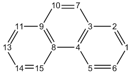

<!-- p.404 -->

It is noteworthy that in J. Org. Chem., 72, 9163 (2007), it was proposed that the aromaticity of an entire polycyclic system can be evaluated as ΣNICS(1)ZZ/area2.

Study molecular planarity Molecular planarity has close relationship with numerous molecular properties. In J. Mol. Model., 27, 263 (2021), I proposed two rigorous, meaningful and universal metrics of planarity of a whole molecule or its local region, namely molecular planarity parameter (MPP) and span of deviation from plane (SDP), see the original paper for detail and application examples. Briefly speaking, for a given set of atoms (totally Natom atoms), the MPP is defined as


$$MPP=\sqrt{\frac{1}{N_{atom}}\sum_{i}d_{i}^{2}}$$

<!-- formula-ocr: formula_p404_297.png 已替换为LaTeX, 原图保留备查 -->

where di is the distance between atom i and the plane fitted for the considered atoms.

Signed distance between atom i and the fitting plane may be expressed as

AxByCzDd iiii s +++= ABC 222 ++

s, where 𝑑maxs and 𝑑min where A, B, C, D are parameters of the fitting plane. The SDP is simply defined as 𝑑maxs−𝑑min s denote the most positive and most negative ds among all considered atoms, respectively.

Clearly, MPP is a straightforward measure of the overall degree of deviation of the atoms from the fitting plane, while SDP aims at exhibiting deviation span of the system with respect to the fitting plane. Obviously, the two metrics are complementary to each other.

To calculate MPP and SDP, you can input MPP after entering subfunction 21 of main function 100. Alternatively, you can directly input MPP in Multiwfn main menu. After that, you will be asked to input indices of the atoms to be considered, then the fitting plane for these atoms will be calculated, and then MPP and SDP will be outputted. Then Multiwfn can also export a .pqr file, whose “charge” property corresponds to ds value, hence you can use VMD software to load it and color atoms according to their “charge” properties, the relative position of the atoms with respect to the fitting plane will be vividly exhibited.

If your input file is a multiple frame .xyz file, Multiwfn will ask you to input the indices of the frames to be processed, then MPP and SDP for all selected frames will be exported to MPP_SDP.txt in current folder.

An example is provided in Section 4.100.21.2 and 4.100.21.3.

Calculate diameter of cavity If you input cav in this function or in main menu of Multiwfn, you can enter the module for calculating diameter of cavity. I only brief describe this function here, more information is given in my blog article “Using Multiwfn to calculate cavity in molecule and crystal” http://sobereva.com/643 (in Chinese).

The idea behind calculation of cavity radius/diameter in Multiwfn is simple. User should first select a set of atoms that appear around the cavity and then define a sphere center (usually one can directly use the geometric center of the set of atoms), then the radius making the sphere contact nearest van der Waals (vdW) sphere of the selected atoms will be calculated, as shown by the orange sphere on the left part of the image below (green point is sphere center). In most cases, this radius cannot be used directly as the cavity radius, as it can be made larger if the center of the sphere is


<!-- p.405 -->

properly adjusted to give a more realistic picture of the actual radius of the cavity. Multiwfn iteratively adjusts the position of the sphere center by steepest ascent method to make the radius as large as possible. When the sphere center position converges (displacement less than 0.01Å), the diameter of the sphere is just the actual cavity diameter, see right part of the below figure. Note that the iteration algorithm requires that the maximum change in sphere center at each step does not exceed 0.3 Å. The vdW radii used in this function are those defined by Bondi in J. Phys. Chem., 68, 441 (1964).

Some systems contain more than one cavities. The algorithm described above can calculate any of them as long as you properly define the atoms used to detect contact and set the initial position of sphere center (during iteration process the sphere center will automatically move to the center of the nearest cavity, and thus the diameter of that cavity will be finally reported).

Examples are provided in Section 4.100.21.4.

Information needed: Atom coordinates


### 3.100.22 Detect π orbitals, set occupation numbers and calculate π


### composition

It is highly encouraged to read my paper Theor. Chem. Acc., 139, 25 (2020), in which the algorithm of this module is very detailedly described and many interesting research examples are given. If this module is involved in your work, please not only cite Multiwfn original paper but also cite this paper.

This function is designed for automatically identifying π orbitals, setting occupation numbers and evaluating π composition of a given set of orbitals. This function is crucially useful for studying π electrons, e.g. calculating ELF-π. After you entered present function (subfunction 22 of main function 100), you will see an interface, you should properly select an option according to the type of your orbitals, the methods for detecting delocalized and localized orbitals are completely different.

Detecting π orbitals for delocalized orbitals If your input file contains delocalized orbitals, e.g. molecular orbital (MO), natural orbital (NO) and natural transition orbitals (NTO), and meantime all atoms are in XY or YZ or XZ plane, you should select "0 Orbitals are in delocalized form". The program will automatically find the actual molecular plane, then during orbital detecting process, indices, occupation numbers and energies of identified π orbitals are shown on screen. After that, you can choose option 1 to set the occupation numbers of these π orbitals to zero, or choose option 2 to set the occupation number of all other


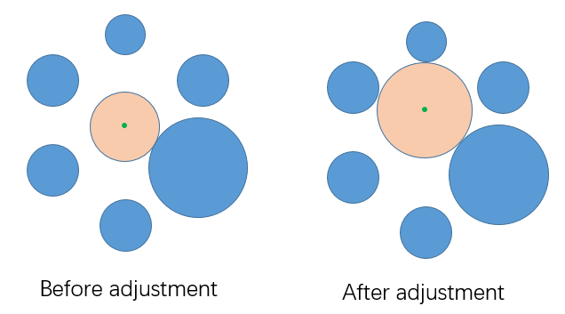

<!-- p.406 -->

orbitals to zero. Option 3 is similar to option 1, but only valence π orbitals are taken into account. Option 4 is used to clean occupation numbers for all orbitals except for valence π orbitals.

For a not exactly planar system, σ and π orbitals cannot be strictly separated or defined. Sometimes, local region of a system is planar, but other atoms are not exactly in the same plane, in this case it is also possible to use present mode to detect π-like orbitals that delocalize on the local planar region. For instance, for toluene, you want to obtain index of all π-like orbitals delocalized on the six-membered ring. Before single point calculation of this system, you should make the ring exactly parallel to the XY plane, then after calculation and loading the resulting wavefunction file into Multiwfn, you should use option -4 of main function 6 to remove all GTFs on the methyl group. After that, enter present function (subfunction 2 of main function 100) and choose option 0. In this case the program will ask you to manually choose a plane because the program is unable to automatically determine the plane, you should select the option corresponding to XY plane, and then input two tolerances. Finally, three π-like orbitals will be successfully identified.

Detecting π orbitals for orbitals in localized form If your input file contains orbitals in localized form (localized molecular orbital (LMO) is commonly employed, but others such as natural bond orbital are also supported), you should select option "-1 Orbitals are in localized form", you will enter an interface, in which if you select "0

Detect pi orbitals and then set occupation numbers", the π orbitals will be detected, and then you can set occupation number for the π orbitals or other orbitals.

The algorithm employed for this purpose was proposed by me (to be published). First, Multiwfn calculates orbital composition of present orbital and finds out the atom having largest contribution and the one having second largest contribution (they will be referred to as atoms A and B, respectively). If contribution of A is larger than a given threshold (default is 85%), then the orbital will be regarded as single-center orbital and thus be skipped. If the orbital is not singly centered,

orbital density, namely |φ(r)|2, at two probe points 0.7RA+0.3RB and 0.3RA+0.7RB, will be calculated, where RA and RB are coordinates of atoms A and B, respectively. If orbital density at both points is smaller than a given threshold (default is 0.01 a.u.), the orbital will be finally identified as π orbital. The idea of this identification method and the reason of introducing the density threshold is easy to understand: If an ideal π orbital forms between two atoms, since π orbital have a nodal plane along the bond, the orbital density at the two probe points on the linking line between the two atoms should be exactly zero. However, when the two atoms are not in an exactly planar local region,

since σ and π orbitals are not strictly separable due to unavoidable σ-π mixing, the orbital density along the linking line must not be completely vanished, therefore a threshold is set to tolerate this circumstance.

The interface has many options. By options 1 and 2, you can set the two thresholds used in the detecting algorithm described above. By option 3, you can choose the range of orbitals for which

the π ones will be identified. By option "5 Set constraint of atom range", you can set constraint of atom range by inputting atom indices. For example, if you inputted 2,4-7,9, then only the orbitals in which both the two atoms with largest contributions are in the range of 2,4,5,6,7,9 may be finally identified as π orbitals. Clearly, you can use this feature to identify all π type of LMOs lying at an interesting region, e.g. conjugated ring.

The default way of calculating the orbital compositions used for identifying the π orbitals is "Mulliken+SCPA", namely Mulliken method is used for occupied ones while SCPA method is employed for unoccupied ones, notice that in this case diffuse functions should never be used, otherwise the resulting compositions will be useless. The reason why SCPA is employed for unoccupied orbitals is that Mulliken method often gives physically meaningless compositions for them (e.g. atom with contribution larger than 100% or smaller than 0%). Via option "6 Set the method for calculating orbital composition", you can also choose other method for computing the compositions. Hirshfeld or Becke method is fully compatible with diffuse functions, they should be


<!-- p.407 -->

used if you have to employ diffuse functions when generating wavefunction. However, these two methods are relatively more expensive and according to my test, they sometimes result in wrong

identification of unoccupied π orbitals (one main reason is that their results do not faithfully reflect orbital nodal character). More information about orbital composition evaluation can be found in Section 3.10.

It is worth to note that only the LMOs yielded by Pipek-Mezey orbital localization method

show separation character of σ and π and thus could be used in for present function. Although Multiwfn also supports Foster-Boys localization, the σ and π characters are mixed together and result in banana type of bonds, and thus the resulting LMOs cannot be used in conjunction with present function.

Evaluating π composition for given orbitals After selecting the "-1 Orbitals are in localized form" mentioned above, if you choose "-1 Detect pi orbitals and then evaluate pi composition for orbitals in another file", then the π type of LMOs will be detected in aforementioned way first, then you will be asked to input path of a wavefunction file, whose geometry and the number of basis functions must be exactly identical to present wavefunction.π composition of the orbitals in this file will then be evaluated based on the detected π LMOs. For example, the π composition of orbital i is evaluated as:


$$\begin{aligned}&\Theta_{i}=100\%\times\sum_{j}^{\pi_{\mathrm{LMO}}}c_{j,i}^{2}\\&c_{j,i}=\left\langle j\middle|i\right\rangle=\sum_{\mu}\sum_{\nu}C_{\mu,i}C_{\nu,j}\left\langle\chi_{\mu}\middle|\chi_{\nu}\right\rangle\\ \end{aligned}$$

<!-- formula-ocr: formula_p407_298.png 已替换为LaTeX, 原图保留备查 -->

where C is orbital coefficient matrix, χ stands for basis function. You will be asked to input a threshold, only the orbitals having π composition larger than this threshold will be printed on screen.

For unrestricted wavefunction, the π compositions of alpha and beta orbitals are evaluated respectively based on alpha and beta π type of LMOs.

Note that after this analysis, the wavefunction in memory will correspond to the file you newly loaded.

There is a very important option "3 Switch the orbitals in consideration", which determines

which LMOs will be employed for computing π compositions. This option has below two statuses, you need to properly choose the status according to the orbitals you want to study.

- "Occupied localized orbitals": This is default status, only occupied π LMOs will be detected and employed for evaluating π compositions. If you only want to study π compositions of occupied MOs, occupied biorthogonalized orbitals or occupied NTOs, then this status is appropriate. because it can be easily demonstrated that these orbitals are only contributed by occupied LMOs. In this case only occupied LMOs need to be obtained first.

- "All localized orbitals": All π LMOs will be detected and used for evaluating π compositions, clearly both occupied and unoccupied LMOs must be available prior to the analysis. This status can be used to evaluate π compositions for unoccupied MOs/NTOs/biorthogonalized orbitals, which are only contributed by unoccupied LMOs. If you want to evaluate π compositions for natural orbitals, you also need to switch to this status, because these orbitals can be contributed by both occupied and unoccupied LMOs.

The use of this function for orbitals in localized form is illustrated in Section 4.100.22. Sections


<!-- p.408 -->

### 4.4.9 and 4.5.3 also involves this function, but for the case of delocalized orbitals.

Information needed: GTFs (delocalized orbital case), basis functions (localized orbital case), atom coordinates


### 3.100.23 Fit function distribution to atomic value

This function is very similar to the function used to fit ESP charge (see Section 3.9.10 and 3.9.11), but the real space function to be fitted is not limited to ESP, for example you can fit average local ionization energy or even Fukui function distributed on molecular surface to atomic values.

After selecting option 1, and then selecting a real space function, the function value will be calculated on the fitting points and then fit to atomic value by least-squares method, namely minimizing below error function


$$F(p_{1},p_{2}\ldots p_{N})=\sum_{i}[V(\mathbf{r}_{i})-V^{\prime}(\mathbf{r}_{i})]^{2}$$

<!-- formula-ocr: formula_p408_299.png 已替换为LaTeX, 原图保留备查 -->

i

where i denotes the index of fitting points, p is atomic value, V is the value of real space function, while V' is the function value evaluated by atomic value, which is defined as


$$V^{\prime}(\mathbf{r}_{i})=\sum_{A}\frac{p_{A}}{r_{A,i}}$$

<!-- formula-ocr: formula_p408_300.png 已替换为LaTeX, 原图保留备查 -->

where A denotes atom index, rA,i corresponds to the distance between nucleus of atom A and the fitting point i.

The error of fitting is measured by RMSE and RRMSE

$$RMSE=\sqrt{\frac{\sum_{i}\left[V(\mathbf{r}_{i})-V^{\prime}(\mathbf{r}_{i})\right]^{2}}{N}}\quad RRMSE=\sqrt{\frac{\sum_{i}\left[V(\mathbf{r}_{i})-V^{\prime}(\mathbf{r}_{i})\right]^{2}}{\sum_{i}V(\mathbf{r}_{i})^{2}}}$$

where N denotes the number of fitting points.

By default, all fitting centers are placed at nuclei, you can also load additional fitting centers from external file by option -2, see Section 3.9.10 for the format.

The default fitting points are exactly the ones used by Merz-Kollman method (see Section 3.9.11). You can use option 3 to customize the number of layers, use option 2 to adjust the density of the fitting points distributed on the surface, and use option 4 to set the scale factor of the vdW radii used for constructing each layer. (e.g. If you set two layers, and their scale factors are set to 1.0 and 1.2 respectively, then the first and the second layer will be constructed by superposing the vdW radii of all atoms multiplied by 1.0 and 1.2, respectively)

No constraint on the total value (viz. ∑𝑝𝑖𝑖) is applied by default. However, you can use option 5 to set a constraint on the total value. Evidently, if the constraint is set to the net charge of your system, and you choose ESP as fitting function, then the result will be identical to MK charges.

The fitting points can be directly defined via external plain text file by option -1 (and thus will not be constructed by superposing vdW spheres), see Section 3.9.10 for the file format. If the file contains calculated function values of all fitting points and meanwhile the first line of this file (the number of points) is set as negative value, then the real space function at each fitting point will not be evaluated by Multiwfn but loaded from this file directly.


<!-- p.409 -->

An example of using this function to evaluate ESP fitting charge based on user-provided ESP cube file is given in #4 of http://sobereva.com/wfnbbs/viewtopic.php?pid=1542. This example illustrates the universality of this module.

Information needed: Atom coordinates


## 3.200 Other functions, part 2 (200)


### 3.200.1 Calculate core-valence bifurcation (CVB) index and related


### quantities

Note: Chinese version of this section is my blog article “Using Multiwfn to calculate CVB index and measure strength of hydrogen bonds” (http://sobereva.com/461).

(1) Theory of CVB index The idea of the so-called core-valence bifurcation (CVB) index was firstly proposed in Theor. Chem. Acc., 104, 13 (2000), this index was defined based on electron localization function (ELF) and mainly used to distinguish strength of various kinds of hydrogen bonds (H-bonds). For a H-

bond of typical form (D-H···A, where D=donor, H=hydrogen, A=acceptor), this index is expressed as:

CVB index = ELF(C-V) – ELF(DH-A) where ELF(C-V) corresponds to the ELF bifurcation value between ELF core domain and valence domain, while the ELF(DH-A) stands for the ELF value at bifurcation point between V(D,H) and V(A).

In the above-mentioned Theor. Chem. Acc. paper, the authors examined many H-bond dimers composing of HF and various kinds of monomers, it was found that the CVB index has good linear relationship with H-bond binding energy. In some succeeding papers, such as Struct. Chem., 16, 203 (2005) and J. Phys. Chem. A, 115, 10078 (2011), this point has been further confirmed, and in the former it was pointed out at CVB index “is positive in the case of weak complexes and negative in stronger ones”. In addition, in Chem. Rev., 111, 2597 (2011) the author stated that CVB index “is positive for weak hydrogen bond, and it decreases if the strength of this interaction increases; usually this index is negative for strong hydrogen bonds”.

I found the ELF(C-V) and ELF(DH-A) themselves sometimes have a better linear relationship with H-bond binding energy than CVB index, therefore I suggest you also examine this point in your practical studies when you intend to use CVB index.

(2) Manual evaluation of CVB index

Below I will show how to manually evaluate the two terms involved in the CVB index. HF···HF dimer is taken as example, the wavefunction file is provided as examples\HF_HF.wfn, it was generated at B3LYP-D3(BJ)/def2-TZVP level, the optimization was also conducted at this level. The D, H, A atoms in this system correspond to F2, H1, F3, respectively

The ELF(DH-A) term is defined unambiguously in the original paper. The topology analysis module of Multiwfn is able to locate bifurcation points of ELF, namely (3,-1) critical points of ELF.


<!-- p.410 -->

Then you can check ELF value of the bifurcation point lying between the hydrogen and acceptor atom (Section 4.2.2 illustrated how to perform topology analysis for LOL. ELF can be analyzed in similar way). However, topology analysis of ELF is time-consuming for large systems. Considering the fact that the actual ELF bifurcation point between V(D,H) and V(A) is almost exactly lying on the straight line linking H and A, it is better to use main function 3 of Multiwfn to plot a ELF curve map from the H to A and then directly read the value of corresponding minimum. Below is a

screenshot of ELF topology analysis result for the HF···HF dimer

The purple and orange spheres are (3,-3) and (3,-1) type of ELF critical points (CPs), respectively. The (3,-1) CP pointed by the arrow corresponds to the aforementioned ELF bifurcation point between V(D,H) and V(A), its ELF value was found to be 0.06487, which is just the ELF(DH-A) of present system.

As can be seen from the graph above, the red linking line basically crosses the center of the orange sphere, this is why the ELF(DH-A) can also be approximately evaluated based on the ELF curve map between H1 and F3. The curve map plotted using main function 3 is shown below

The minimum highlighted by the arrow is 0.06482, which is very close to the value 0.06487 obtained based on the expensive ELF topology analysis. This observation well demonstrates the reasonableness of employing ELF curve map between H and A to estimate the ELF(DH-A).

As regards ELF(C-V), its definition is fairly ambiguous. Since in the original paper of CVB index the authors did not explicitly and clearly explain how this quantity should be evaluated, different papers often employ different rules to calculate it, leading to serious confusion in existing literature. For example, in the CVB original paper, namely Theor. Chem. Acc., 104, 13 (2000), it seems that the ELF(C-V) was determined as maximal value at all ELF minima dissecting core and valence shell on the ELF curve between D and A atoms. However, in the subsequent paper Struct. Chem., 16, 203 (2005) written by the same author, I found the ELF(C-V) is seemingly calculated as


<!-- p.411 -->

the ELF value at one of exactly located ELF bifurcation points connecting core and valence basin of donor atom (while acceptor atom is seemingly ignored).

In my viewpoint, the best definition of ELF(C-V) should be the ELF value at the minimum dissecting core and valence shell of donor atom on the ELF curve between D and H. Again taking

the HF···HF (H4-F3···H1-F2) dimer as example, the ELF curve plotted between F2 and H1 is:

Namely ELF(C-V) = 0.0936. Hence, the CVB index for the HF···HF system should be 0.0936 − 0.0648 = 0.0288. This value is very different to the counterpart (-0.006) in Table 2 of Theor. Chem. Acc., 104, 13 (2000), because the calculation levels are different, the ways of obtaining ELF(C-V) are different, and the sign of the data in this paper was erroneously reversed.

(3) Calculating CVB index in fully automatic way In order to simplify the calculation of CVB index in above-mentioned way as much as possible, Multiwfn provides a function used to calculate this index in fully automatic way. Still taking the

HF···HF dimer as example, boot up Multiwfn and input below commands

examples\HF_HF.wfn 200 // Other function, part 2 1 // Calculate CVB index and related quantities 2,1,3 // Index of donor atom, hydrogen and acceptor atom of the H-bond, respectively The result is


```text
Core-valence bifurcation value at donor, ELF(C-V,D):  0.0936
Distance between corresponding minimum and the hydrogen:   0.743 Angstrom

Core-valence bifurcation value at acceptor, ELF(C-V,A):  0.1408
Distance between corresponding minimum and the hydrogen:   1.628 Angstrom

Bifurcation value at H-bond, ELF(DH-A):  0.0648
Distance between corresponding minimum and the hydrogen:   0.614 Angstrom

The CVB index, namely ELF(C-V,D) - ELF(DH-A):    0.028768
```

The result is completely identical to that we calculated manually. The outputted ELF(CV,A) is useless in current context, but some users may be interested in it.

In order to make you better understand how the CVB index is automatically calculated in


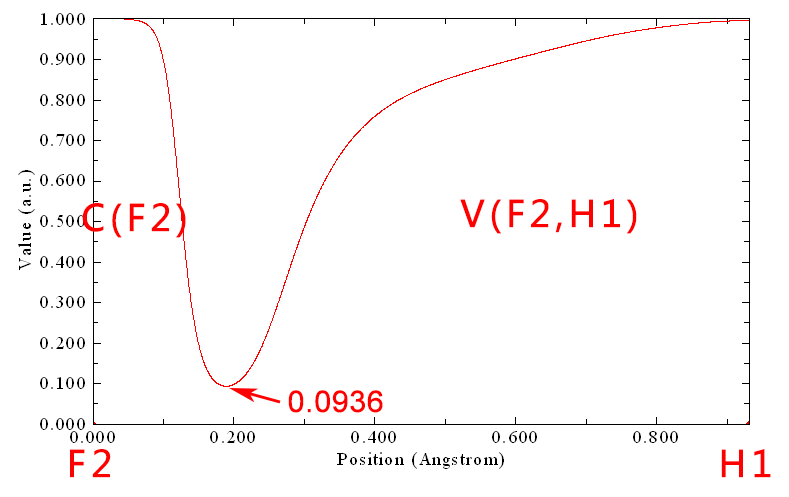

<!-- p.412 -->

Multiwfn, here I explain the implementation detail. After the user inputted index of D, H and A atoms, the ELF curves corresponding to D-H and H-A are calculated in turn, and then the ELF(CV,D), ELF(DH-A) and ELF(CV-A) are automatically identified from the curve data, as illustrated below

(4) Special case: Calculating CVB index for some very strong H-bonds In principle, the CVB index calculation protocol described above works for most kinds of systems that have typical H-bond, both intermolecular and intramolecular H-bonds can be analyzed in the same way. However, for some very strong H-bonds, whose hydrogen is lying at midpoint

between two heavy atoms, such as H2O···H+···OH2, this protocol is no longer valid because its ELF curve does not show typical feature, as shown below (since the O-H-O angle in this system is close

to 180, only one plot is needed):

It can be seen that the V(D,H) has bifurcated as V(O) and V(H). In this case you should evaluate CVB index manually by plotting ELF curve maps, and the ELF(DH-A) in the standard CVB index expression should be replaced with the ELF value at the local minimum between the V(H) and V(O) in the curve map.

Below is a more complicated case, F-···H··O-H, you also need to manually evaluate the CVB index by plotting ELF curve map. The ELF curve map shown below was plotted between the F and

O (the F···H···O is almost linear, therefore only one plot is needed), as can be seen the ELF is


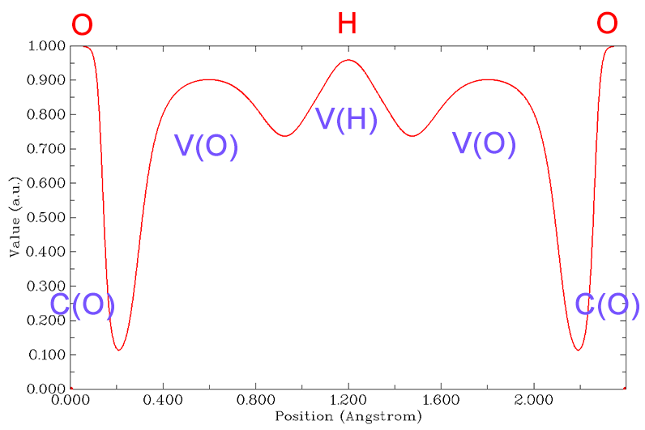

<!-- p.413 -->

unsymmetric with respect to the central hydrogen:

This system can be regarded as having two H-bonds, the H-bond binding energy of O-H...F and O...H-F must be very different. For the former, CVB index = ELF(B) - ELF(C), while for the latter, CVB index = ELF(D) - ELF(A). This is because when discussing the system as O-H...F (O...H-F), the O and F (F and O) behave as donor and acceptor atoms, respectively. Therefore, the minimum of point C between H and F should be regarded as the ELF(DH-A), while the minimum of point B should be viewed as ELF(C-V,D).

(5) Special case: H-bond acceptor is not a single atom

Acceptor of some H-bonds is not a single atom. For example, the acceptor of HF···ethylene is the π region of ethylene. This kind of H-bond is known as π-hydrogen bond. In this case, you also have to manually calculate the CVB index.

The wavefunction file of the HF···ethylene has been provided as examples\C2H4_HF.wfn, its geometry is shown below.

For this system, you can obtain ELF(C-V,D) by plotting ELF curve map between F7 and H8 and read the ELF value at minimum, the value will find to be 0.0944.

ELF(DH-A) of this system can be obtained via ELF topology analysis. To do this, we input below commands in Multiwfn:

2 // Topology analysis -11 // Select the real space function to be analyzed 9 // ELF 6 // Search critical points by randomly distribute initial guesses within a sphere 4 // Set the sphere center as geometry center of three atoms 1,4,8 // Center of C1, C4 and H8 will be set as the sphere center


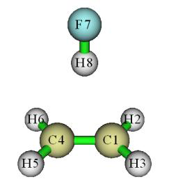

<!-- p.414 -->

0 // Start searching (the sphere radius, the number of starting points can be set by corresponding options in the interface)

-9 // Return 0 // Visualize topology analysis result Now you can see the graph below. Clearly, the critical point 5 corresponds to the bifurcation

point between V(D,H) and the basin of π electron.

Close the GUI, select option 7, and then input 5 to check properties of the critical point 5, you will find its ELF value is 0.1241, which is just the ELF(DH-A) of this H-bond. Hence, the CVB index of this system is 0.0944 - 0.1241 = -0.0297.

In fact, since this system has high symmetry, you can also obtain ELF value of the critical point 5 by simply plotting ELF curve map between H8 and midpoint of C1-C4.

Information needed: Atom coordinates, GTFs


### 3.200.2 Calculate atomic and bond dipole moments in Hilbert space

This function is used to calculate atomic and bond dipole moments directly based on basis functions (viz. in Hilbert space). You can also consult Section 12.3.2 of the book Ideas of Quantum Chemistry (L. Piela, 2007).

Theory In the formalism of basis functions, the system dipole moment can be expressed as follows

$$\mathbf{\mu}=\mathbf{\mu}^{\mathrm{nuc}}+\mathbf{\mu}^{\mathrm{ele}}=\sum_{A}Z_{A}\mathbf{R}_{A}-\sum_{i}\sum_{j}P_{i,j}\left\langle\chi_{i}\middle|\mathbf{r}\right|\chi_{j}\rangle$$

where Z and R are charge and coordinate of nuclei, respectively. P is density matrix, ijχχr is

dipole moment integral between basis function i and j.

The system dipole moment can be decomposed as the sum of single-atom terms and atomic pair terms

$$\boldsymbol{\mu}=\sum_{A}\boldsymbol{\mu}_{A}^{\mathrm{tot}}+\sum_{A}\sum_{B>A}\boldsymbol{\mu}_{A B}^{\mathrm{tot}}=\sum_{A}\left(\boldsymbol{\mu}_{A}^{\mathrm{n u c}}+\boldsymbol{\mu}_{A}^{\mathrm{p o p}}+\boldsymbol{\mu}_{A}^{\mathrm{d i p}}\right)+\sum_{A}\sum_{B>A}\left(\boldsymbol{\mu}_{A B}^{\mathrm{p o p}}+\boldsymbol{\mu}_{A B}^{\mathrm{d i p}}\right)$$

The expression and physical meaning of the five terms are


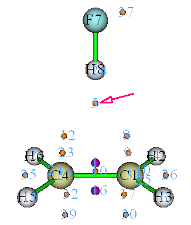

<!-- p.415 -->

𝛍𝐴 nuc: Dipole moment due to nuclear charge

nucAAAZ=μR

pop: Dipole moment due to the electron population number localized on single atom (Notice that this is different to the electron population number calculated by Mulliken or similar methods, because the overlap population numbers have not been absorbed into respective atoms) 𝛍𝐴

$$\begin{array}{r l}{\pmb{\mu}_{A}^{\mathrm{p o p}}=-p_{A}^{\mathrm{l o c}}\pmb{R}_{A}}&{{}p_{A}^{\mathrm{l o c}}=\displaystyle\sum_{i\in A}\displaystyle\sum_{j\in A}P_{i,j}\left\langle\left.\chi_{i}\right|\chi_{j}\right\rangle}\end{array}$$

dip: Atomic dipole moment, which reflects the electron dipole moment around an atom. rA is the coordinate variable with respect to nucleus A 𝛍𝐴

$$\begin{aligned}\boldsymbol{\mu}_{A}^{\mathrm{d i p}}=&-\sum_{i\in A}\sum_{j\in A}P_{i,j}\left\langle\chi_{i}\left|\mathbf{r}_{A}\right|\chi_{j}\right\rangle\quad where\mathbf{r}_{A}=\mathbf{r}-\mathbf{R}_{A}\\=&-\sum_{i\in A}\sum_{j\in A}P_{i,j}\left\langle\chi_{i}\left|\mathbf{r}\right|\chi_{j}\right\rangle-\boldsymbol{\mu}_{A}^{\mathrm{p o p}}\end{aligned}$$

𝛍𝐴𝐵 pop: Dipole moment due to the overlap population between atom A and B

$$\begin{array}{r l}{\pmb{\mu}_{A B}^{\mathrm{p o p}}=-p_{A B}\mathbf{R}_{A B}}&{{}p_{A B}=2\displaystyle\sum_{i\in A}\displaystyle\sum_{j\in B}P_{i,j}\left\langle\left.\chi_{i}\right|\chi_{j}\right\rangle\quad\mathbf{R}_{A B}=(\mathbf{R}_{A}+\mathbf{R}_{B})/2}\end{array}$$

dip : Bond dipole moment, which somewhat reflects the electron dipole moment around geometry center of corresponding two atoms. Of course, if A and B are not close to each other, then this term will be very small, and thus inappropriate to be called as bond dipole moment. 𝛍𝐴𝐵

$$\begin{aligned}\boldsymbol{\mu}_{AB}^{\mathrm{dip}}&=-2\sum_{i\in A}\sum_{j\in B}P_{i,j}\left\langle\chi_{i}\left|\mathbf{r}_{AB}\right|\chi_{j}\right\rangle\quad where\mathbf{r}_{AB}=\mathbf{r}-\mathbf{R}_{AB}\\&=-2\sum_{i\in A}\sum_{j\in B}P_{i,j}\left\langle\chi_{i}\left|\mathbf{r}\right|\chi_{j}\right\rangle-\boldsymbol{\mu}_{AB}^{\mathrm{pop}}\end{aligned}$$

By means of Mulliken-type partition, the bond dipole moments can be incorporated into atomic dipole moments, so that the system dipole moment can be written as the sum of single center terms


$$\mu_{A}^{nuc} + \mu_{A}^{dip} + \mu_{A}^{pop}$$

<!-- formula-ocr: formula_p415_301.png 已替换为LaTeX, 原图保留备查 -->

where 𝛍′𝐴 pop is the dipole moment due to the Mulliken population number of atom A

$$\begin{array}{r l}{\pmb{\mu}_{A}^{\mathrm{^{\prime}\mathrm{p o p}}}=-\pmb{p}_{A}^{\mathrm{M u l}}\pmb{\mathrm{R}}_{A}}&{{}\pmb{p}_{A}^{\mathrm{M u l}}=\displaystyle\sum_{B}\displaystyle\sum_{i\in B}\displaystyle\sum_{j\in B}P_{i,j}\left\langle\pmb{\chi}_{i}\left|\pmb{\chi}_{j}\right.\right\rangle}\end{array}$$

and 𝛍′𝐴 dip is the atomic overall dipole moment of atom A

$$\mathbf{\mu}_{A}^{\prime\mathrm{d i p}}=-\sum_{B}\sum_{i\in B}\sum_{j\in B}P_{i,j}\left\langle\chi_{i}\left|\mathbf{r}_{A}\right|\chi_{j}\right\rangle=-\sum_{B}\sum_{i\in B}\sum_{j\in B}P_{i,j}\left\langle\chi_{i}\left|\mathbf{r}\right|\chi_{j}\right\rangle-\mathbf{\mu}_{A}^{\mathrm{M u l}}$$

Note that the B index in above formulae runs over all atoms.

Usage The input file must contain basis function information (e.g. .mwfn, .fch, .molden and .gms). After you enter present function, you can choose option 1 to output information of a specific

dip; contribution to system dipole moment due to nuclear charge, 𝛍𝐴 atom, including: Atomic local population number, 𝑝𝐴 nuc; contribution to system dipole moment due to loc; atomic dipole moment, 𝛍𝐴

electron, 𝛍𝐴 pop. You can also choose option 2 to output information between specific atomic pair, including: dip + 𝛍𝐴 pop; contribution to system dipole moment, 𝛍𝐴 nuc + 𝛍𝐴 dip + 𝛍𝐴

bond population number, 𝛍𝐴𝐵 pop; bond dipole moment, 𝛍𝐴𝐵 dip; contribution to system dipole moment,


<!-- p.416 -->

𝛍𝐴𝐵 pop + 𝛍𝐴𝐵 dip. If choose 3, atomic overall dipole moment and related information of selected atoms will be

outputted, including: Atomic Mulliken population number, 𝑝𝐴 Mul ; atomic overall dipole moment,

nuc; contribution to system dipole moment due to electron, 𝛍′𝐴 𝛍′𝐴 nuc +𝛍′𝐴 pop. If you choose option 10, then X/Y/Z components of electron dipole moment matrix will be outputted to dipmatx.txt, dipmaty.txt and dipmatz.txt in current folder, respectively. For example, the (i, j) element of Z component of electron dipole moment matrix corresponds to dip; contribution to system dipole moment due to nuclear charge, 𝛍𝐴 dip + 𝛍′𝐴 dip + 𝛍′𝐴 pop ; contribution to system dipole moment, 𝛍𝐴


$$-\sum_{i}\sum_{j}P_{i,j}\left\langle\chi_{i}|z\right|\chi_{j}\rangle$$

<!-- formula-ocr: formula_p416_302.png 已替换为LaTeX, 原图保留备查 -->

Information needed: Atom coordinates, basis functions


### 3.200.3 Generate cube file for multiple orbital wavefunctions

By this function, grid data of multiple orbital wavefunctions can be calculated and then exported to a single cube file or separate cube files at the same time.

After you entered this function, you need to first select the orbitals you are interested in (e.g. 3,5,9-17), then define grid setting, then choose the scheme to export the grid data. If you select scheme 1, then the grid data will be exported as separate files, for example orb000003.cub, orb000005.cub, orb000009.cub, etc. The number in the filename corresponds to orbital index. If you select scheme 2, then grid data of all orbitals you selected will be collectively exported to orbital.cub in current folder. Lots of visualization programs, including VMD and Multiwfn, support the cube file containing multiple sets of grid data.

For restricted and unrestricted single-determinant wavefunctions, in this function you can select orbital based on HOMO and LUMO. For example, h-3 means HOMO-3, l+2 corresponds to LUMO+2. See prompt on screen for more examples.

Information needed: Atom coordinates, GTFs


### 3.200.5 Plot radial distribution function for a real space function

This function is used to plot radial distribution function (RDF) for a real space function


$$R D F(r)=\int f(r,\Omega)r^{2}\mathrm{d}\Omega$$

<!-- formula-ocr: formula_p416_303.png 已替换为LaTeX, 原图保留备查 -->

where r is radial distance from sphere center, and  denotes angular coordinate in a sphere layer.

The integration curve of RDF can also be plotted

$$I(r^{\prime})=\int_{r_{\mathrm{low}}}^{r^{\prime}}R D F(r)\mathrm{d}r=\int_{r_{\mathrm{low}}}^{r^{\prime}}\int f(r,\Omega)r^{2}\mathrm{d}\Omega\mathrm{d}r$$

Clearly, if rlow is set to 0 (viz. sphere center), then I() will be the integral of f over the whole space.

In present function, one can choose the real space function to be studied, set the position of sphere center, set the lower and upper limit to be calculated and plotted, set the number of points in


<!-- p.417 -->

radial and angular parts. The larger the number of points, the more accurate the integration curve.

After the parameters have been properly set, selecting option 0 to start the calculation, then you will see a new menu, in which you can plot RDF and its integration curves, save the graph or export the corresponding original data. In this menu you can also find an option used to export spherically averaged function (f sph), it correlates with RDF via below relationship

2( )( )4RDF rfrrπ= sph

An example is given in Section 4.200.5. Information needed: Atom coordinates, GTFs


### 3.200.6 Analyze correspondence between orbitals in two wavefunctions

Theory This function is primarily used to analyze correspondence between the orbitals in two wavefunctions. The two sets of orbitals can be produced under different basis sets, by different theoretical methods, in different external environments, in different electronic states, or at slightly different geometries. The two sets of orbitals can also be different types, for example the first set of orbitals are canonical MOs produced by Hartree-Fock calculation, while the second set of orbitals are natural orbitals produced by post-HF calculation.

The orbitals {i} in present wavefunction (the wavefunction loaded when Multiwfn boots up) can be represented as linear combination of the orbitals {j} in another wavefunction (the wavefunction you specified after entering present module), i.e.

$$\left|i\right\rangle=\sum_{j}C_{i,j}\left|j\right\rangle\quad\mathrm{where}\quad C_{i,j}=\left\langle i\right|j\rangle\equiv\int\varphi_{i}(\mathbf{r})\varphi_{j}(\mathbf{r})\mathrm{d}\mathbf{r}$$

Once we have the overlap integral, we immediately know how j is associated with i. The

contribution from orbital j to orbital i is simply the square of overlap integral, namely <i|j>2×100%. The present function is able to compute the C matrix as well as the contributions, so that you can easily make clear the relationship between the two sets of orbitals.

Usage After you enter this function, first you need to input the orbital range to be considered for present wavefunction (istart1~iend1), then input the path of the second wavefunction and the orbital range to be considered (istart2~iend2). After that the overlap matrix between istart1~iend1 and istart2~iend2 will be calculated by Becke's multi-center numerical integration scheme. Then you will see the five largest contributions from istart2~iend2 to each orbital in istart1~iend1.

If you want to obtain all coefficients (as well as the corresponding contributions) of istart2~iend2 in a specific orbital among istart1~iend1, you can then directly input the index of the orbital.

If an orbital (i) in present wavefunction can be exactly expanded as linear combination of istart2~iend2, then the normalization condition must be satisfied:


$$\sum_{j=start2}^{iend2}\left\langle i\middle|j\right\rangle^{2}\times100\%=100\%$$

<!-- formula-ocr: formula_p417_304.png 已替换为LaTeX, 原图保留备查 -->

j = istart2


<!-- p.418 -->

From the Multiwfn output you can find the maximum deviation to normalization condition. If the value is zero, that means all orbitals in istart1~iend1 can be exactly represented by the orbitals in istart2~iend2.

Note that the atomic coordinate of present wavefunction and that of the second wavefunction are not necessarily identical, the two wavefunctions can even correspond to different molecules. However, if the difference of the distribution scope of the atomic coordinates in the two wavefunctions is large, the integration accuracy must be low and the result is not reliable.

Commonly the default integration grid is fine enough, i.e. 30 radial points, 302 angular points with "radcut=15". If you wish to improve the accuracy, you should set "iautointgrid" in `settings.ini` to 0, then you can define "radpot", "sphpot" and "radcut" in `settings.ini`; increasing their values will result in better integration accuracy.

The computational cost of this function directly depends on the number of orbitals in consideration; so if your system contains very large number of orbitals, do not choose all orbitals at once.

Special usage: Evaluating overlap integrals and superpositions between two sets of orbitals

Present function can also be used to evaluate overlap between orbitals, the orbitals may come from the same wavefunction, or come from two different wavefunctions.

After entering the interface of present function, if you want to obtain all overlap integrals (i.e. all <i|j>) between the above-mentioned orbitals istart1~iend1 in the first wavefunction and orbitals istart2~iend2 in the second wavefunction, simply input -1, then these integrals will be outputted to convmat.txt in current folder.

If what you need is not common overlap integral between orbital wavefunctions but overlap integral between norm of orbital wavefunctions, which is useful for measuring orbital superposition and expressed as ∫|𝜑𝑖(𝐫)||𝜑𝑗(𝐫)|d𝐫, you should input -2 in the interface of present function, then

all these integrals between the orbitals istart1~iend1 and istart2~iend2 will be outputted to Snormmat.txt in current folder. Similarly, if what you need is ∫|𝜑𝑖(𝐫)|2|𝜑𝑗(𝐫)|2d𝐫, you should input

-3 in the interface, then the result will be outputted to Snorm2mat.txt.

In fact, the present function can somewhat equivalently realize the functions introduced in Sections 3.100.5, 3.100.11 and 3.100.15, but the output format and main purpose are different.

Some usage examples of this function are given in Section 4.200.6. Information needed: Atom coordinates, GTFs


### 3.200.9 Calculate average bond length and average coordinate number

This function is used to calculate average bond length between two elements and average coordinate number. This function is particularly useful for analyzing structure character of atom clusters, for example the Ge12Au cluster shown below (the structure file is provided as examples\Ge12Au.pdb). By using this function, we can immediately obtain the average Ge-Ge bond length and average Au-Ge bond length, as well as average coordinate number of Ge due to Ge-Au or Ge-Ge bonds, or of Au due to Ge-Au bonds. A nice application of this kind of analysis on Al


<!-- p.419 -->

clusters can be found in J. Chem. Phys., 111, 1890 (1999).

The average bond length is defined as follows


$$\left\langle R\right\rangle=\frac{1}{n_{\mathrm{b}}}\sum_{i>j}R_{i j}$$

<!-- formula-ocr: formula_p419_305.png 已替换为LaTeX, 原图保留备查 -->

where Rij is the distance between atom i and j, only the terms smaller than or equal to a given distance cutoff (e.g. 2.2 Å) will be regarded as bonds and thus be taken into the summation. nb is the total number of bonds.

The average coordinate number is calculated as follows


$$CN=\frac{1}{n}\sum_{i}N_{i}$$

<!-- formula-ocr: formula_p419_306.png 已替换为LaTeX, 原图保留备查 -->

where Ni is the number of bonds surrounding the atom i, n is the total number of atoms.

After you entered this function, you need to input two elements, for example Ge,Au, and input

a distance cutoff, for example 3.2, then the Ge-Au contacts ≤ 3.2 Å will be regarded as Ge-Au bonds and the average bond length will be calculated, the minimum and maximum bond lengths will also be outputted. After that, if you select y, the average coordinate number of Ge due to Ge-Au bonds will be shown.

Information needed: Atom coordinates


### 3.200.10 Output various kinds of integral between orbitals

This function is used to calculate electric/magnetic dipole moment integral, velocity integral, kinetic energy integral and overlap integral between orbitals, advanced users may recognize the significance of these data. In the case of a range of orbitals, the results are exported to orbint.txt in current folder, the first and second columns correspond to the index of the two orbitals; In the case of a pair of orbitals, the result is directly printed on screen.

The electric dipole moment integral vector between two orbitals is defined as

$$\mathbf{\mu}_{i j}=\mathbf{\mu}_{j i}=<\mathbf{\varphi}_{i}\mid-\mathbf{r}\mid\mathbf{\varphi}_{j}>$$

The magnetic dipole moment integral vector between two orbitals is calculated as (more details


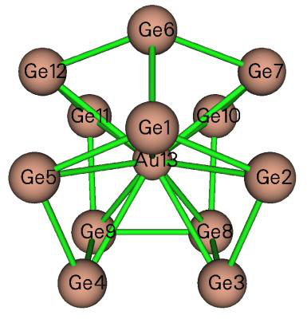

<!-- p.420 -->

can be found in Section 3.21.1.1. The negative sign is ignored)


$$\mathbf{M}_{i j}=i<\varphi_{i}\mid\mathbf{r}\times\nabla\mid\varphi_{j}>$$

<!-- formula-ocr: formula_p420_307.png 已替换为LaTeX, 原图保留备查 -->

The velocity integral vector between two orbitals is evaluated as (the negative sign is ignored)


$$\mathbf{v}_{ij}=i<\varphi_{i}\mid\nabla\mid\varphi_{j}>$$

<!-- formula-ocr: formula_p420_308.png 已替换为LaTeX, 原图保留备查 -->

It is noteworthy that, due to the Hermitian of the operators, we have

$$\mathbf{M}_{ii}=0\qquad\mathbf{M}_{ij}=\mathbf{M}_{ji}^{*}=-\mathbf{M}_{ji}$$

$$\mathbf{v}_{i i}=0\quad\mathbf{v}_{i j}=\mathbf{v}_{j i}^{*}=-\mathbf{v}_{j i}$$

Note that the imaginary sign is not explicitly shown in the output. The kinetic energy and overlap integrals between two orbitals are respectively evaluated as


$$\begin{array}{r}{K_{i j}=-\frac{1}{2}\big\langle\varphi_{i}\big|\nabla^{2}\big|\varphi_{j}\big\rangle\quad S_{i j}=\big\langle\varphi_{i}\big|\varphi_{j}\big\rangle}\end{array}$$

<!-- formula-ocr: formula_p420_309.png 已替换为LaTeX, 原图保留备查 -->

If you need to calculate Coulomb or exchange integral between two orbitals, you should use the function described in Section 3.200.17.

Information needed: Atom coordinates, GTFs


### 3.200.11 Calculate center, first/second moments, radius of gyration, and


### <r^2> of a function

This function is used to calculate various quantities characterizing distribution of a selected real space function.

Theory The center of a real space function f is defined as


$$\mathbf{r}_{\mathrm{c}}=\frac{\int\mathbf{r}\times f(\mathbf{r})\mathrm{d}\mathbf{r}}{\int f(\mathbf{r})\mathrm{d}\mathbf{r}}$$

<!-- formula-ocr: formula_p420_310.png 已替换为LaTeX, 原图保留备查 -->

where the integral is performed over the whole space.

The first moment is a vector and is evaluated as


$$\mathbf{\mu}=\left[\begin{matrix}{\mu_{x}}\\ {\mu_{y}}\\ {\mu_{z}}\\ \end{matrix}\right]=\int\left[\begin{matrix}{x}\\ {y}\\ {z}\\ \end{matrix}\right]f(\mathbf{r})\mathrm{d}\mathbf{r}$$

<!-- formula-ocr: formula_p420_311.png 已替换为LaTeX, 原图保留备查 -->

where x, y, z are the Cartesian coordinate components relative to rc.

The second moment is a matrix and defined as

$$\mathbf{\mu}=\left[\begin{matrix}{\mu_{x}}\\ {\mu_{y}}\\ {\mu_{z}}\\ \end{matrix}\right]=\int\left[\begin{matrix}{x}\\ {y}\\ {z}\\ \end{matrix}\right]f(\mathbf{r})\mathrm{d}\mathbf{r}$$


<!-- p.421 -->

If its eigenvalues {ε} are sorted from low to high, then the anisotropy of Θ can be calculated as

$$\langle r^2 \rangle = \int(x^2 + y^2 + z^2)f(\mathbf{r})d\mathbf{r}$$

Spatial extent 〈𝑟2〉= ∫(𝑥2 + 𝑦2 + 𝑧2)𝑓(𝐫)d𝐫 is simply the trace of the second moment matrix, or the sum of its three eigenvalues. If f(r) is chosen to be electron density, then <r2> corresponds to the well-known electronic spatial extent (ESE). Note that ESE and electric dipole/multipole moments can be evaluated analytically and much more efficiently by a specific function in Multiwfn, see Section 3.300.5.

Usage This function employs Becke's multicenter integration method for evaluating above-mentioned quantities. The accuracy is fully determined by radial points and angular points, which can be set by "radpot" and "sphpot" in `settings.ini`, respectively.

Option 1 calculates and outputs all aforementioned quantities. The real space function to be studied can be selected by option 3. The center (rc) defaults to (0,0,0), and it can be manually set by option 4. Option 2 is used to evaluate the center of the selected real space function, which can be directly taken as the rc for the subsequent calculation of option 1 (evidently, if rc is set to be the center of the selected function, the calculated first moment will be zero).

When using option 1, if the real space function to be studied is chosen as electron density, then the nuclear contribution of quadrupole moment and molecular quadrupole moment tensors will also be outputted. In fact, the latter can be straightforwardly obtained by subtracting the former by the second moment of electron density.

If the real space function of interest has both positive and negative parts with comparable magnitude (e.g. orbital wavefunction with evident positive and negative phases), option 5 is usually recommended to use instead of option 2 for evaluating the distribution center of the selected real space function, because option 5 uses absolute function value in the evaluation, therefore cancellation effect can be avoided. In addition, for such kind of real space function, in order to calculate their aforementioned statistical quantities, it is suggested to choose option -1 once before choosing option 1, in this case the absolute function value will be used in the evaluation.

A brief example is given here. To evaluate the first and second moments of spin density (relative to the center of spin density), after loading a wavefunction file, you should input

200 // Other function (Part 2) 11 // The present function 3 // Select a real space function 5 // Spin density 2 // Calculate center of spin density y // Take the calculated center for evaluating various data in option 1 1 // Evaluate various data for spin density Then the data will be shown on screen.

See my blog article “Using Multiwfn to exhibit excess electrons and calculate their radius of gyration” (http://sobereva.com/658, in Chinese) for more illustration of using this module.


<!-- p.422 -->

Information needed: Atom coordinates, GTFs


### 3.200.12 Calculate energy index (EI) or bond polarity index (BPI)

This function is used to calculate energy index (EI) and bond polarity index (BPI), which were defined in J. Phys. Chem., 94, 5602 (1990) and further discussed in J. Phys. Chem., 96, 157 (1992).

The EI for atom A in a molecule is defined as follows

$$\mathrm{EI}_{A}=\frac{\displaystyle\sum_{i}^{\mathrm{val}}\varepsilon_{i}\eta_{i}\Theta_{i,A}}{\displaystyle\sum_{i}^{\mathrm{val}}\eta_{i}\Theta_{i,A}}$$

i

where Θi,A denotes composition of atom A in MO i. ηi and εi are occupation and energy of MO i, respectively. The summation runs over valence MOs. In fact, the denominator is simply the number of valence electrons of atom A, and the numerator corresponds to total energy of its valence electrons. Therefore, EIA can be regarded as average energy per valence electron of atom A. In the original paper of EI, Mulliken method was used to compute the atomic contribution to MOs, thus this method is also employed in present implementation of EI, though other methods such as Hirshfeld partition should work equally well or even better. (Note that since Mulliken method is used, which is incompatible with diffuse functions, the use of diffuse basis functions must be avoided!)

The BPI between atoms A and B in a molecule is defined as

)EIEI()EIEI(BPIrefref BBAAAB−−−=

where EIref is reference EI value derived from calculation of homonuclear species. For example, you

ref is computed as EIN in H2N-NH2. The larger magnitude of BPIAB implies higher bond polarity of the A-B bond. study BPICN for H3C-NH2, then EIC ref is computed as EIC in ethane, and EIN

Group electronegativity is evaluated as negative of EIX for corresponding radical, X is the attaching atom. For example, to obtain group electronegativity for -CH3 group, you should calculate

-EIC for ·CH3 radical.

This function of Multiwfn is used to calculate EI for specific atoms in present system, all the R, RO and U types of HF/DFT wavefunction are supported. Multiwfn automatically detects the number of inner-core electrons and determines which MOs are the valence ones and thus should be taken into account.

An example is given in Section 4.200.12. Information needed: Atom coordinates, basis functions


### 3.200.13 Evaluate orbital contributions to density difference or other


### grid data


**Theory** This function is mainly designed to evaluate contribution of each of selected orbitals to a given


<!-- p.423 -->

density difference, Δρ, so that you can clearly understand which orbital(s) are main contributor(s) of change in electron density distribution. A similar idea has been employed in J. Mol. Model., 24, 25 (2017) to study contribution of various NBO orbitals to Fukui function (a special kind of electron density, see Section 4.5.4) to better unravel its chemical meaning. Below, the theory and algorithm used in the present function are outlined.

Δρ is able to be approximately represented as linear combination of probability density of orbitals, which is norm of corresponding orbital wavefunction


$$\Delta\rho(\mathbf{r})\approx\sum_{i}p_{i}\mid\varphi_{i}(\mathbf{r})\mid^{2}$$

<!-- formula-ocr: formula_p423_312.png 已替换为LaTeX, 原图保留备查 -->

What we need to obtain is the optimal value of {p} for expanding the Δρ. The pi can be regarded as contribution of orbital i to the Δρ. The {p} could be derived via least-squares method by minimizing

the difference between Δρ and p φr over the whole space, at the meantime the sum of 2|( ) |iii

{p} could be constrained to a given value P via Lagrangian multiplier technique. The error function to be minimized in the actual implementation is


$$F=\int\Bigg[\Delta\rho(\mathbf{r})-\sum_{i}p_{i}\mid\varphi_{i}(\mathbf{r})\mid^{2}\Bigg]^{2}\mathrm{d}\mathbf{r}+\lambda\Bigg[\sum_{i}p_{i}-P\Bigg]$$

<!-- formula-ocr: formula_p423_313.png 已替换为LaTeX, 原图保留备查 -->

In Multiwfn, the integral is treated as numerical integration based on evenly distributed grids, that is


$$F=\Delta_{V}\sum_{\mu}\Biggl[\Delta\rho(\mathbf{r})-\sum_{i}p_{i}\mid\varphi_{i}(\mathbf{r})\mid^{2}\Biggr]^{2}+\lambda\Biggl[\sum_{i}p_{i}-P\Biggr]$$

<!-- formula-ocr: formula_p423_314.png 已替换为LaTeX, 原图保留备查 -->

where μ is index of grid point, ΔV is grid volume.

Clearly, the conditions below should be satisfied to determine the optimal {p}

∂==∂ Fip i 0{1,2,3} Λ


$$\frac{\partial F}{\partial p_{i}}=0\quad i=\{1,2,3\ldots\}$$

<!-- formula-ocr: formula_p423_315.png 已替换为LaTeX, 原图保留备查 -->

more explicitly,

$$\frac{\partial F}{\partial p_{i}}=0\quad\Rightarrow\quad\sum_{j}p_{j}\sum_{\mu}|\varphi_{i}(\mathbf{r}_{\mu})|^{2}|\varphi_{j}(\mathbf{r}_{\mu})|^{2}+\lambda=\sum_{\mu}|\varphi_{i}(\mathbf{r}_{\mu})|^{2}\Delta\rho(\mathbf{r}_{\mu})$$

Obviously, the working equation to determine {p} should be

$$\left[\begin{array}{c c c c}{A_{1,1}}&{\cdots}&{A_{1,N}}&{1}\\ {\vdots}&{\ddots}&{\vdots}&{\vdots}\\ {A_{N,1}}&{\cdots}&{A_{N,N}}&{1}\\ {1}&{1}&{1}&{0}\\ \end{array}\right]\left[\begin{array}{c}{p_{1}}\\ {\vdots}\\ {p_{N}}\\ {\lambda}\\ \end{array}\right]=\left[\begin{array}{c}{B_{1}}\\ {\vdots}\\ {B_{N}}\\ {P}\\ \end{array}\right]$$

The fitting error reported by Multiwfn is estimated using the following formula


<!-- p.424 -->

$$\mathrm{definition}1\colon\int\left|\Delta\rho(\mathbf{r})-\sum_{i}p_{i}\mid\varphi_{i}(\mathbf{r})\right|^{2}\mathrm{d}\mathbf{r}$$

$$\mathrm{definition}1\colon\int\left|\Delta\rho(\mathbf{r})-\sum_{i}p_{i}\mid\varphi_{i}(\mathbf{r})\right|^{2}\mathrm{d}\mathbf{r}$$

In principle, this algorithm works for any kind of Δρ and orbital. For example, the Δρ may correspond to Fukui function, density variation during electron excitation and so on. The orbital could be localized molecular orbital (LMO), NBO, MO, etc. The contribution p can be positive or

negative, the sign reflects phase of participation of orbital density in the Δρ. Notice that the choice of orbital range is highly arbitrary while evidently affects the result. For example, the range can include all orbitals of a certain type, or only include occupied ones.


**Usage** Below is the common procedure to derive contribution of a set of orbitals to Δρ via the present function

(1) Use Multiwfn or other codes to generate cube file of Δρ. The procedure of calculating grid data of Δρ has been substantially illustrated in many sections of present manual, for example, Section 4.5.4 (Fukui function and dual descriptor) and Section 4.18.3 (Δρ corresponding to electron excitation).

(2) Load a file containing orbitals of interest into Multiwfn, then enter subfunction 13 of main function 200.

(3) Input the path a cube file containing Δρ to make Multiwfn load it. (4) Use option 1 to set the constraint on the sum of contributions, namely the P value in above equations. The P is default to 1.0.

(5) Select option 0, then set the range of orbitals to be taken into account. After calculation, contribution (p) of all chosen orbitals will be shown on screen.

(6) In the post-processing menu, you can choose to visualize isosurface of Δρ, fitted density

p φr or their difference 2|( ) |iii pρφΔ−r so that you can visually examine the 2|( ) |iii

fitting quality. The fitted density can also be exported as cube file.

In Multiwfn, there are two modes to deal with the grid data of orbitals during construction of the A matrix and B vector. You can switch the mode via option 2.

- Memory based (default): Grid data of density of all chosen orbitals are automatically calculated first and recorded in memory, in this case the calculation is fairly fast however the requirement on available memory is very high when large range of orbitals is selected and the grid quality is relatively high. This mode is strongly recommended to use if Multiwfn does not crash due to insufficient memory.

- Cube file based: Grid data of density of all chosen orbitals are automatically calculated and saved as individual cube files in current folder as rho_xxxxx.cub, where xxxxx is orbital index. The file will be loaded when corresponding orbital is used to construct the A matrix and B vector. The speed of this mode is by far slower than the "memory based" mode, but the advantage is that memory consumption is almost negligible.

Note that the grid setting of the automatically calculated orbital densities is set by the program


<!-- p.425 -->

to exactly identical to that of the loaded Δρ grid data.

It is important to note that the present function is general, flexible and not necessarily limited

to study orbital contributions to Δρ. For example, if the provided cube file contains grid data of ρ rather than Δρ, then the present function will yield contribution of selected orbitals to ρ (of course, before doing this, the P should be properly set to make the resulting contribution values meaningful. If you are not sure how to set it, you can simply remove the constraint)

Practical analysis examples of this function are given in Section 4.200.13.


### 3.200.14 Domain analysis (obtaining properties within isosurfaces of a


### function)

This function is used to integrate specific real space functions in domains. The domains refer to individual spatial regions enclosed by isosurfaces of a specific real space function. For example, you can use this function to integrate electron density within various domains defined by isosurfaces of reduced density gradient (RDG) to study strength of weak interactions at different places. If this module is flexibly utilized, many special analyses can be realized. For example, visualizing and obtaining volume of molecular cavity (see Section 4.200.14.2 for example).

Basic usage Below is basic procedure of using this module: (1) After entering the domain analysis module, use options 2 and 3 to set the way to define the domains. For example, you selected RDG by option 2 and inputted <0.5 in option 3, then the regions where RDG is smaller than 0.5 will be identified as different domains.

Note that periodicity can be taken into account during identification of domains. To enable it, choose option “4 Toggle considering periodicity during domain analysis” to set its status to “Yes”.

(2) Choose option 1 and properly define grid, then Multiwfn starts to calculate the grid data for the real space function you selected and identifies domains that satisfied the criterion you set.

NOTE: If you already have grid data in memory, for example you just calculated it via main function 5 or directly load a .cub file when Multiwfn boots up, you can also choose option -1 to directly use the grid data instead of calculating a new grid data. In this case, option 2 is evidently meaningless.

(3) Once calculation in last step is finished, Multiwfn prints total number of grids in each domain. In very simple case, from this information you may directly infer which domains are those you want to study, while for general cases, you need to use option "3 Visualize domains" to visualize domains in a GUI window, in which you can select domain at the right-bottom list and check its profile, each green point on the graph corresponds to a grid in the domain.

Once you have found the domains of interest, and you want to integrate a real space function in a domain, you can choose option "1 Perform integration for a domain", then you will be asked to input index of the domain, and then select the integrand. The integrand can be (1) An arbitrary real space function supported by Multiwfn (2) The grid data currently stored in memory (3) The grid data recorded in a .cub file (you will be asked to input its path. The grid distribution in this file must be exactly identical to that of present grid data). After performing the integration, the integral value,


<!-- p.426 -->

domain volume and average/maximum/minimum value of the integrand in the domain will be outputted. In addition, minimum and maximum X/Y/Z of grids belonging to the domain, as well as span distance in X/Y/Z will also be outputted. You can also select option "2 Perform integration for all domains" to obtain integral values for all domains at once. (Hint: If what you need is just domain volume, you can choose the user-defined function as integrand, which by default is 1.0 everywhere and thus integrating this function does not take any computational time).

In addition, some regions that you are interested in may be identified as separated domains, to study the property of the regions more conveniently, you can choose option "-1 Merge specific domains" to merge selected domains as a single domain, so that you do not need to manually sum up their integral values.

Via option 12 in post-process menu, you can export X, Y, Z coordinates along with value of grid data of all grids in specific domain to domain.txt in current folder.

Visualizing domains by third-part tool If you wish to visualize domains in third-part programs such as VMD, there are two ways:
- Select "10 Export a domain as domain.cub file in current folder" and input index of the domain

of interest, then Multiwfn will export the domain as domain.cub, in which the grid point belonging and not belonging to the domain have value of 1 and 0, respectively (value of boundary grids are also outputted as 0 to guarantee that the isosurfaces always look closed). After that, you can load the cube file into visualization program to visualize isosurface using isovalue of 0.5.
- Select "11 Export boundary grids of a domain to domain.pdb file in current folder" and input

index of the domain of interest, then the resulting .pdb file will contain particles, each one corresponds to a boundary grid. You can directly drag this file into VMD and render the particles as spheres to visualize domain.

Special usage: Studying interactions In the post-processing menu, there is an option "5 Calculate q_bind index for a domain", this is used to calculate the qbind index defined in J. Phys. Chem. A, 115, 12983 (2011), in which it was demonstrated that for hydrogen-bond dimer, the scan curve of qbind index well mimics to actual potential energy curve. This index for a domain is defined as:

$$q_{\mathrm{rep}}=\int_{\lambda_{2}(\mathbf{r})>0}\rho^{n}(\mathbf{r})\mathrm{d}\mathbf{r}\quad\mathrm{repulsive~effect}$$


$$q_{\mathrm{b i n d}}=-(q_{\mathrm{a t t}}-q_{\mathrm{r e p}})$$

<!-- formula-ocr: formula_p426_316.png 已替换为LaTeX, 原图保留备查 -->

where λ2(r) is the second largest eigenvalue of electron density Hessian matrix at r, its sign can be utilized to discriminate interaction type. The paper showed that n = 4/3 gives best correlation between qbind and actual potential curve. In Multiwfn the n can be manually set. Note that the paper used isosurface of RDG = 0.6 when calculating this index. More negative of qbind may imply more stable interaction.

It is noteworthy that in the post-processing menu there is a very flexible option "Perform integration for subregion of some domains according to range of sign(lambda)*rho", which may be useful in studying interactions. You can first select a batch of domains, and then define which

subregions of the domains will be integrated by setting range of sign(λ2)ρ (if you are not familiar with it, check Section 3.23.1), the real space function as integrand can be arbitrarily chosen. After


<!-- p.427 -->

calculation, integral of the selected real space function and volume of the subregion of each considered domain will be outputted in turn; in addition, the result for the areas with positive and

negative λ2 in the subregions is also individually printed. Via this option, you can realize special aim, for example, obtaining integral of kinetic energy density within the subregion where sign(λ2)ρ is between -0.015 and 0.015 a.u. for the RDG < 0.6 domain corresponding to an intermolecular interaction region.

About integration accuracy The method used to integrate domains in present module is even-grid integration method. In other words, the integration value of a real space function for a domain is simply the sum of the real space function value of the grids constituting the domain multiplied by grid volume. Therefore, the accuracy of integration result is directly affected by the quality of grid you set.

Illustrative application examples of present module are given in Section 4.200.14.


### 3.200.15 Calculate electron correlation index

The total, dynamic and nondynamic electron correlation indices proposed by Matito et al. in Phys. Chem. Chem. Phys., 18, 24015 (2016) are useful indicators of measuring magnitude of electron correlation in present system.

Dynamic and nondynamic electron correlation indices (ID and IND) are defined as


$$I_{\mathrm{N D}}=\frac{1}{2}\sum_{i}\eta_{i}(1-\eta_{i})$$

<!-- formula-ocr: formula_p427_317.png 已替换为LaTeX, 原图保留备查 -->

i

where i denotes index of natural spin orbital, η is corresponding occupation number. Note that in some cases, η may be marginally larger than 1.0 or negative, Multiwfn automatically set it to 1.0 and 0.0 respectively to make the calculation feasible.

Total electron correlation index defined is


$$I_{\mathrm{T}}=I_{\mathrm{D}}+I_{\mathrm{N D}}=\frac{1}{4}\sum_{i}\sqrt{\eta_{i}(1-\eta_{i})}$$

<!-- formula-ocr: formula_p427_318.png 已替换为LaTeX, 原图保留备查 -->

Present function is used to calculate all the three electron correlation indices. Any wavefunction file carrying occupation number of natural orbitals may be used as input file, e.g. .mwfn, .wfn, .wfx and .molden files. An example is given in Section 4.A.6.

Note that Matito et al. also proposed local version of the three functions to characterize electron correlation in local regions, Multiwfn is also able to study them, see Section 4.A.6 for example.


### 3.200.16 Generate natural orbitals, natural spin orbitals (NSO) and


### spin natural orbitals (SNO) based on the density matrix in .fch/.fchk file

In .fch (or .fchk) file, density matrix is always recorded. For example, if you carried out an MP2 task for an open-shell system with Gaussian keywords "# MP2/cc-pVTZ density", then the resulting .fch file will have below four fields recording corresponding type of density matrix:


<!-- p.428 -->

While for a closed-shell system, if the keyword used is "# TD PBE1PBE/6-311G* density", then the resulting .fch file will contain below type of density matrix:


```text
Total SCF Density, Total SCF Density, Total CI Rho(1) Density, Total CI Density
```

If you do not know which kinds of density matrix are recorded in the .fch file, simply search "Density" in the file.

Various kinds of natural orbitals can be obtained via diagonalization of proper type of density matrix:

Natural orbitals (NOs): Diagonalizing total density matrix. The occupation is from 0.0 to 2.0. This type of NOs is also known as spatial NOs, and specifically, unrestricted natural orbital (UNO) for unrestricted wavefunctions

Alpha and beta natural orbitals (collectively known as natural spin orbitals, NSOs): Diagonalizing alpha and beta density matrix, respectively. The occupation is from 0.0 to 1.0.

Spin natural orbitals (SNOs): Diagonalizing spin density matrix (i.e. Difference between alpha and beta density matrix). The occupation is from -1.0 to 1.0. The SNO with positive (negative) occupation represents distribution of unpaired alpha (beta) electrons.

Using the present function, you can obtain any set of above-mentioned types of NOs. For example, if you want to obtain SNOs of triplet water at CCSD/cc-pVDZ level, you can run below Gaussian input file:


```text
%chk=C:\CCSD_water_m3.chk
#p CCSD/cc-pVDZ density

test

0 3
O 0.00000000     0.00000000     0.11930801
H 0.00000000     0.75895306    -0.47723204
H 0.00000000    -0.75895306    -0.47723204
```

Convert the .chk file to .fch, then boot up Multiwfn and input C:\CCSD_water_m3.fch 200 16 CC // Meaning that we want to analyze coupled-cluster density matrix. You can also input SCF here to analyze Hartree-Fock density matrix

3 // Generate SNOs (if the system is closed-shell, this selection will not occur, since only NOs can be generated in this case)

Now the basis function information in memory has been updated to SNOs. If then you want to visualize SNOs, or to perform real space function analysis (e.g. analyzing orbital composition of SNOs via Hirshfeld partition), you should choose y to export wavefunction information to new.mwfn in current folder, and then program will automatically load it. After that, all subsequent analyses will correspond to SNOs.

One of my blog articles detailedly discussed and presented analysis example of SNOs: "The way of generating natural orbitals based on fch file in Multiwfn and analysis instances about excited


<!-- p.429 -->

state wavefunctions and spin natural orbitals" (in Chinese) http://sobereva.com/403.

Note: Once .mwfn file containing SNOs is loaded into Multiwfn, the system will be regarded as open-shell and there will be the same number of alpha and beta orbitals, only the former corresponds to SNOs, while the latter are completely meaningless and you should simply ignore them.

This function works well for .fch/.fchk files produced by Gaussian and PSI4, and may or may not be compatible with other programs.

If this function is used in combination with PSI4, you can analyze wavefunction as high as CCSD(T) level, please check Section 4.A.8 for detail.

The example in Section 4.18.9 utilized this function to generate natural orbitals for transition density matrix.

Information needed: .fch/.fchk file


### 3.200.17 Calculate Coulomb and exchange integral between two


### orbitals

Theory and implementation Coulomb (ii|jj) and exchange integral (ij|ji) are the two most important integrals in quantum chemistry. This function is used to calculate them between two selected orbitals i and j, their expressions are:

Coulomb $(ii|jj)$ and exchange integral $(ij|ji)$ between orbitals $i$ and $j$:

$$ (ii\mid jj)=\int\int\frac{\varphi_{i}^{*}(\mathbf{r}_{1})\varphi_{i}(\mathbf{r}_{1})\varphi_{j}^{*}(\mathbf{r}_{2})\varphi_{j}(\mathbf{r}_{2})}{r_{12}}\mathrm{d}\mathbf{r}_{1}\mathrm{d}\mathbf{r}_{2} $$

$$ (ij\mid ji)=\iint\frac{\varphi_{i}^{*}(\mathbf{r}_{1})\varphi_{j}(\mathbf{r}_{1})\varphi_{j}^{*}(\mathbf{r}_{2})\varphi_{i}(\mathbf{r}_{2})}{r_{12}}\mathrm{d}\mathbf{r}_{1}\mathrm{d}\mathbf{r}_{2} $$


<!-- formula-ocr-manual: formula_p429_319 见上 -->

This function is applicable for any kind of orbital, such as molecular orbitals, localized molecular orbitals, natural transition orbitals and so on.

Currently, the integral is calculated based on uniform grid (i.e. evenly placed grid):

$$(ii\mid jj)=(d_{\mathrm{x}}d_{\mathrm{y}}d_{\mathrm{z}})^{2}\sum_{k}\varphi_{i}^{2}(\mathbf{r}_{k})\sum_{l\neq k}\frac{\varphi_{j}^{2}(\mathbf{r}_{l})}{|\mathbf{r}_{l}-\mathbf{r}_{k}|}$$

$$(ii\mid jj)=(d_{\mathrm{x}}d_{\mathrm{y}}d_{\mathrm{z}})^{2}\sum_{k}\varphi_{i}^{2}(\mathbf{r}_{k})\sum_{l\neq k}\frac{\varphi_{j}^{2}(\mathbf{r}_{l})}{|\mathbf{r}_{l}-\mathbf{r}_{k}|}$$

where k and l are indices of grid; dx, dy and dz are grid spacing in X, Y and Z directions, respectively.

This function is fairly time-consuming. For a given system, the smaller the spacing, the higher the computational cost and better the accuracy. If you do not know if the grid spacing currently employed is small enough, you can make a convergence test, namely gradually decreasing the spacing and check when the value is converged.

There are two kinds of input files that could be used:

- A file containing orbital wavefunction. If you use such as .mwfn, .fch or .molden as input file


<!-- p.430 -->

when Multiwfn boots up, after entering present function, you will be asked to input two orbital indices and choose a grid setting, then grid data of wavefunction will be automatically calculated for them.

- Two cube files containing orbital wavefunction. You should input the cube file of the first orbital when Multiwfn boots up, and after entering present function, input cube file of another orbital. The cube file can be generated by any quantum chemistry code (also including main function 5 of Multiwfn).

In the interface of present function, you can set truncation value for Coulomb (ζJ) integral and exchange integral (ζK) respectively prior to the calculation. The innermost summation of Coulomb

$$\varphi_i^2(\mathbf{r}_k) < \zeta_J$$

Clearly, if the truncation values are properly set, the cost could be significantly reduced while keeping accuracy almost unchanged. Commonly using the default value is suggested.

Note that if you need to calculate one-electron orbital integrals, you should use the function described in Section 3.200.10.

Example Here I use a water molecule as example to illustrate calculation of the two kinds of integrals. Boot up Multiwfn and input

examples\H2O_iijj.fch // Containing molecular orbitals at HF/6-31G* level 200 // Other functions (Part 2) 17 // Calculate Coulomb and exchange integrals between two orbitals 4,10 // The two orbitals are selected to be MO4 and MO10 1 // Low-quality grid (corresponding to grid spacing of 0.2 Bohr) 1 // Calculate Coulomb integral with default truncation level. The result is 0.615700 3 // Calculate exchange integral with default truncation level. The result is 0.122246 The exact value of (ii|jj) and (ij|ji) computed by analytic integral are 0.623256 and 0.129893, respectively, clearly accuracy of our values calculated based on numerical integration is basically satisfactory. If you employ better grid, for example spacing of 0.1 Bohr (corresponding to "medium-quality grid"), the accuracy will be further noticeably improved (0.62143 and 0.12793, respectively), but the cost will be eight times higher, note that the cost is inversely proportional to cube of the grid spacing.


### 3.200.18 Calculate bond length/order alternation (BLA/BOA) and


### angle/dihedral alternation

Theory In conjugated polymers, the atom and bond properties in the conjugation chain show alternant character. The bond length alternation (BLA) is an important quantity in the study of this kind of systems. To calculate BLA, the atom sequence in the conjugated chain should be given. For example, the atom sequence is given as 3-5-6-9-10-12, the bond 1 is thus 3-5, the bond 2 is 5-6, etc. The BLA in this case is calculated as

BLA = (R5-6+R9-10)/2 − (R3-5+R6-9+R10-12)/3 where R is bond length. More generally, the BLA is defined as below (see Eq. 7.6 of Handbook of


<!-- p.431 -->

Thiophene-based Materials: Applications in Organic Electronics and Photonics)

BLA = average length of even bonds − average length of odd bonds Smaller magnitude of BLA implies better electron conjugation along the selected path. This quantity has been frequently employed in literature, see J. Chem. Phys., 136, 094904 (2012) for research example and http://photonicswiki.org/index.php?title=Structure-Property_Relationships for a comprehensive review about the relationship between BLA and various molecular properties.

Bond order is a quantity closely related to bond length, thus the bond order alternation (BOA) is also a quantity as useful as BLA. The only difference between BOA and BLA is that the bond length in the latter is replaced with bond order. Compared to the BLA, the BOA exhibits the bond alternation character from electronic structure aspect rather than simply from geometric aspect. As fully introduced in Section 3.11, there is no unique definition of bond order. The Mayer bond order is very suitable for evaluating BOA since it is quite general, cheap and its magnitude is close to formal bond order.

The bond angle alternation and dihedral alternation are also frequently studied, Multiwfn is able to calculate variation of bond angles and dihedrals along the chain.

Usage To use this function, an atom sequence must be defined, this is quite easy. After entering the present function, you will be asked to input the indices of the atoms that make up the sequence, the order is completely arbitrary. Then you need to input index of the beginning atom and ending atom in the sequence. After that, based on this information and interatomic connectivity, Multiwfn automatically identifies the actual atom sequence and prints it on the screen, you are suggested to briefly check it to ensure the sequence is correct. Then, for each bond in the atom sequence, Multiwfn prints its index, corresponding atom indices, bond length and Mayer bond order, then outputs BLA and BOA values. The bond data are also exported to current folder as bondalter.txt so that you can import it to data plotting tools such as Origin to plot "bond length vs. bond index" and "bond order vs. bond index" curve maps. Finally, if you want to study bond angle and dihedral alternation along the sequence, you can also let Multiwfn to output them.

The present function is also able to be used to study above-mentioned properties for a closed path (e.g. a ring), the index of ending atom in this case should be identical to the beginning atom.

If your input file contains both atom information and basis function information, such as .mwfn, .fch and .molden files, both bond lengths and bond orders will be outputted, as stated above. However, if your input file only contains atom information, such as .xyz, .mol2 and .pdb files, then bond order information will not be calculated and printed.

If the input file contains interatomic connectivity, such as .mol and .mol2 format, the connectivity matrix will be directly loaded from it. For other file formats, the connectivity is guessed based on atom coordinate and atomic radii. If present function does not properly work, using .mol or .mol2 file with correct connectivity as input file is recommended.

Since Mayer bond order is incompatible with diffuse functions, employing diffuse functions must be avoided when generating wavefunction.

An example of calculating BLA/BOA and plotting "bond length/order vs. bond index" map is given in Section 4.200.18.

Information needed: Atom coordinates, basis function (optional)


<!-- p.432 -->


### 3.200.19 Calculate spatial delocalization index (SDI) for orbitals or a


### function

Introduction Spatial delocalization index (SDI) is defined by Tian Lu to measure extent of spatial delocalization of a real space function f, it is expressed as

$$\mathrm{S D I}=\frac{1}{\sqrt{\int\left|f_{\mathrm{n o r m}}(\mathbf{r})\right|^{n}\mathrm{d}\mathbf{r}}}\quad f_{\mathrm{n o r m}}(\mathbf{r})=\frac{f(\mathbf{r})}{\int\left|f(\mathbf{r})\right|\mathrm{d}\mathbf{r}}$$

where fnorm is a normalized function. Normalization makes comparison of spatial delocalization extent feasible when the functions to be compared do not normalize to the same value. In standard definition of SDI, n = 2.

The larger the SDI, the more even distribution of the function in the whole 3D space. If the function distribution tends to aggregate in some local regions, then SDI must be small.

The larger the exponent factor n, the stronger the ability of SDI value to distinguish spatial delocalization extent. If n = 1, then SDI will always be 1.0 for all functions.

A key application of SDI is determining spatial delocalization extent of orbitals. In this case, SDI of orbital i can be written as

$$\mathrm{S D I}=\frac{1}{\sqrt{\int\left|f_{\mathrm{n o r m}}(\mathbf{r})\right|^{n}\mathrm{d}\mathbf{r}}}\quad f_{\mathrm{n o r m}}(\mathbf{r})=\frac{f(\mathbf{r})}{\int\left|f(\mathbf{r})\right|\mathrm{d}\mathbf{r}}$$

where φ is orbital wavefunction. Via SDI, one can easily and quantitatively characterize delocalization character of orbitals. It is applicable to any kind of orbitals, such as molecular orbitals, natural transition orbitals, and so on.

Usage There are three ways to use this function to calculate SDI: (1) Calculate SDI for a real space function: You will be asked to select a real space function from menu, then SDI will be calculated.

(2) Calculate SDI for density of orbital wavefunctions: You will be asked to input indices of the orbitals for which SDI will be calculated. The input file of course should contain wavefunction information, see Section 2.5. Multiwfn will print SDI for all selected orbitals.

(3) Calculate SDI based on the grid data in memory: To use this mode, a grid data file (e.g. .cub file) containing values of f at evenly distributed grids should be loaded when Multiwfn boots up. This mode is useful if f cannot be directly calculated by Multiwfn.

For cases (1) and (2), Becke’s multi-center integration algorithm is used to evaluate SDI, while for case (3), SDI is evaluated based on uniform grids.

In this function, option -1 is used to adjust the exponent factor n. Commonly it does not need to be adjusted.

Please check Section 4.200.19 for examples of using this function.


<!-- p.433 -->


### 3.200.20 Bond order density (BOD) and natural adaptive orbital


### (NAdO) analyses

1 Preface The concept of delocalization index (DI) has been detailedly introduced in Section 3.18.5. The DI between two regions is closely related to the electronic correlation between the two regions. Essentially, Mayer bond order and fuzzy bond order are DI calculated based on atomic spaces defined in terms of Hilbert partition and fuzzy partition.

DI is a value. If it can be visualized, then it will be quite helpful in understanding its nature and interatomic interaction. In J. Phys. Chem. A, 124, 339 (2020), the author proposed a real space function named bond order density (BOD), its integral over the whole space is just DI, therefore BOD directly reveals local contribution to DI. Clearly BOD must be a useful function in characterizing chemical bonds. Natural adaptive orbital (NAdO) is a kind of orbital closely related to BOD, it can exhibit source of DI in terms of an orbital picture. I also generalized the idea of BOD/NAdO, allowing them able to study interaction between basins or between specific fragments. Below I detailedly describe all details about BOD and NAdO.

Note that the NAdO has no relationship with the adaptive natural density partitioning (AdNDP) orbital introduced in Section 3.17!

2 Theory of BOD In order to fully understand underlying idea of BOA, it is crucial to first familiar yourself with some related concepts.

𝑛(𝐫1,𝐫2 ⋯𝐫𝑛) was detailedly introduced in Comput. Theor. Chem., 1003, 71 (2013), it represents the part of nth-order reduced density 𝜌𝑛(𝐫1,𝐫2 ⋯𝐫𝑛) that cannot be expressed in terms of lower orders of reduced density, and thus provides an appropriate measure of the n-electrons correlation existing in the system. Explicit expression of 𝜌C 3 are given below (expressions of other orders can be found in the Comput. Theor. Chem. paper).
- nth-order cumulant density The nth-order cumulant density 𝜌C 1, 𝜌C 2, and 𝜌C


$$\rho_C^n(\mathbf{r}_1,\mathbf{r}_2\cdots\mathbf{r}_n)$$

<!-- formula-ocr: formula_p433_320.png 已替换为LaTeX, 原图保留备查 -->

where 𝜌2(𝐫1,𝐫2) corresponds to the pair density π introduced in Section 2.6.

𝜌C 𝑛 has an important feature


$$\begin{aligned}\rho_{\mathrm{C}}^{3}(\mathbf{r}_{1},\mathbf{r}_{2},\mathbf{r}_{3})&=\rho(\mathbf{r}_{1})\rho(\mathbf{r}_{2})\rho(\mathbf{r}_{3})+(1/2)\rho^{3}(\mathbf{r}_{1},\mathbf{r}_{2},\mathbf{r}_{3})\\&\quad-(1/2)[\rho(\mathbf{r}_{1})\rho^{2}(\mathbf{r}_{2},\mathbf{r}_{3})+\rho(\mathbf{r}_{2})\rho^{2}(\mathbf{r}_{1},\mathbf{r}_{3})+\rho(\mathbf{r}_{3})\rho^{2}(\mathbf{r}_{1},\mathbf{r}_{2})]\end{aligned}$$

<!-- formula-ocr: formula_p433_321.png 已替换为LaTeX, 原图保留备查 -->

as a consequence,

where N is the total number of electrons.

- n-center population and DI


<!-- p.434 -->

n-center population is defined as follows


$$N(A,B...n)=\int_{A}\int_{B}\cdot\int_{n}\cdot\rho_{\mathrm{C}}^{n}(\mathbf{r}_{1}...\mathbf{r}_{n})\mathrm{d}\mathbf{r}_{1}\mathrm{d}\mathbf{r}_{2}...\mathrm{d}\mathbf{r}_{n}$$

<!-- formula-ocr: formula_p434_322.png 已替换为LaTeX, 原图保留备查 -->

The subscript of the integral denotes the integration region, usually it corresponds to atomic space. After properly normalization, the n-center population can be named as n-center delocalization index to quantify multi-center delocalization extent.

2 just corresponds to the negative of the well-known exchange-correlation density XC, whose integral directly defines DI (δ): It is important to note that 𝜌C

$$\delta(A,B)=-2\int_{A}\int_{B}\Gamma_{\mathrm{XC}}(\mathbf{r}_{1},\mathbf{r}_{2})\mathrm{d}\mathbf{r}_{1}\mathrm{d}\mathbf{r}_{2}\equiv2\int_{A}\int_{B}\rho_{\mathrm{C}}^{2}(\mathbf{r}_{1},\mathbf{r}_{2})\mathrm{d}\mathbf{r}_{1}\mathrm{d}\mathbf{r}_{2}$$

Extensive introduction of DI can be found in Section 3.18.5. Evidently, δ(A,B) essentially corresponds to the 2-center population (only differs by a factor of 2).

- Definition of BOD The one-electron function BOD between regions A and B is defined as

BOD( )2( )ABABρ=rr

where


$$\delta(A,B)=-2\int_{A}\int_{B}\Gamma_{\mathrm{XC}}(\mathbf{r}_{1},\mathbf{r}_{2})\mathrm{d}\mathbf{r}_{1}\mathrm{d}\mathbf{r}_{2}\equiv2\int_{A}\int_{B}\rho_{\mathrm{C}}^{2}(\mathbf{r}_{1},\mathbf{r}_{2})\mathrm{d}\mathbf{r}_{1}\mathrm{d}\mathbf{r}_{2}$$

<!-- formula-ocr: formula_p434_323.png 已替换为LaTeX, 原图保留备查 -->

For closed-shell cases, the working equations for single-determinant wavefunctions (and thus without explicit representation of Coulomb correlation in the wavefunction) are

$$\rho_{_{AB}}(\mathbf{r})=\sum_{i}^{occ}\sum_{j}^{occ}\varphi_{i}^{*}(\mathbf{r})D_{i,j}^{AB}\varphi_{j}(\mathbf{r})$$

where i and j are doubly occupied spatial orbitals, φ is orbital wavefunction. In Multiwfn, the following definitions of S can be adopted in the calculation:

- Atomic overlap matrix (AOM)
- Basin overlap matrix (BOM)
- Fragment overlap matrix (FOM), which is defined as sum of AOM of involved atoms

There are important relationships correlating the BOD with DI and localization index (LI, λ)


$$\mathrm{BOD}_{AB}(\mathbf{r})=2\rho_{AB}(\mathbf{r})$$

<!-- formula-ocr: formula_p434_324.png 已替换为LaTeX, 原图保留备查 -->

Obviously, BOD is able to reveal contribution of every spatial position to DI and LI.

For unrestricted open-shell single-determinant wavefunctions, α and β spins should be separately taken into account:

BOD( )BOD( )BOD( )ABABABαβ=+rrr

The working equation of σ spin is


<!-- p.435 -->

$$\mathrm{BOD}_{AB}^{\sigma}(\mathbf{r})=2\rho_{AB}^{\sigma}(\mathbf{r})=\sum_{i\in\sigma}^{\mathrm{occ}}\sum_{j\in\sigma}^{\mathrm{occ}}\varphi_{i}^{*}(\mathbf{r})D_{i,j}^{\sigma,AB}\varphi_{j}(\mathbf{r})$$

$$\mathbf{D}^{\sigma,A B}=\mathbf{S}^{\sigma}(A)\mathbf{S}^{\sigma}(B)+\mathbf{S}^{\sigma}(B)\mathbf{S}^{\sigma}(A)$$

$$S_{i,j}^{\sigma}(A)=\int_{A}\varphi_{i}^{*}(\mathbf{r})\varphi_{j}(\mathbf{r})\mathrm{d}\mathbf{r}\quad i,j\in\sigma$$

Relevant relationships:


$$\mathrm{BOD}_{AB}^{\sigma}(\mathbf{r})=2\rho_{AB}^{\sigma}(\mathbf{r})=\sum_{i\in\sigma}^{\mathrm{occ}}\sum_{j\in\sigma}^{\mathrm{occ}}\varphi_{i}^{*}(\mathbf{r})D_{i,j}^{\sigma,AB}\varphi_{j}(\mathbf{r})$$

<!-- formula-ocr: formula_p435_325.png 已替换为LaTeX, 原图保留备查 -->

In fact, the relationships can be easily demonstrated, given that (with consideration of the orbital orthogonality condition)

$$D_{i,j}^{\sigma,A B}=\sum_{k\in\sigma}^{\mathrm{o c c}}\Big[S_{i,k}^{\sigma}(A)S_{k,j}^{\sigma}(B)+S_{i,k}^{\sigma}(B)S_{k,j}^{\sigma}(A)\Big]$$

we have (note that S is a symmetric matrix)

$$\int\mathrm{BOD}_{AB}^{\sigma}(\mathbf{r})\mathrm{d}\mathbf{r}=\delta^{\sigma}(A,B)$$

$$(1/2)\int\mathrm{BOD}_{AA}^{\sigma}(\mathbf{r})\mathrm{d}\mathbf{r}=\lambda^{\sigma}(A)$$

$$D_{i,j}^{\sigma,A B}=\sum_{k\in\sigma}^{\mathrm{o c c}}\Big[S_{i,k}^{\sigma}(A)S_{k,j}^{\sigma}(B)+S_{i,k}^{\sigma}(B)S_{k,j}^{\sigma}(A)\Big]$$

$$D_{i,j}^{\sigma,A B}=\sum_{k\in\sigma}^{\mathrm{o c c}}\Big[S_{i,k}^{\sigma}(A)S_{k,j}^{\sigma}(B)+S_{i,k}^{\sigma}(B)S_{k,j}^{\sigma}(A)\Big]$$

which corresponds to the expression of δ σ given in Section 3.18.5.

In principle the BOD can be applied to multiconfiguration wavefunctions, however currently Multiwfn only supports BOD analysis for single-determinant wavefunctions.

3 Natural adaptive orbital (NAdO)

The BOD of σ spin can also be expressed in terms of natural adaptive orbitals (NAdOs, φ) of σ spin:


$$\begin{aligned}\int\mathrm{BOD}_{AB}^{\sigma}(\mathbf{r})\mathrm{d}\mathbf{r}=\delta^{\sigma}(A,B)\ $ 1/2)\int\mathrm{BOD}_{AA}^{\sigma}(\mathbf{r})\mathrm{d}\mathbf{r}=\lambda^{\sigma}(A)\end{aligned}$$

<!-- formula-ocr: formula_p435_326.png 已替换为LaTeX, 原图保留备查 -->

σ,𝑖 is eigenvalue of NAdO i in σ spin. Evidently, if the eigenvalues are viewed as occupation numbers, the BOD will be equivalent to the electron density calculated based on the NAdOs. The 𝑛𝐴𝐵

The NAdOs between regions A and B can be easily constructed. First, diagonalizing DAB to obtain eigenvalue matrix n and eigenvector matrix U

1AB−=U DUn

MOs can then be transformed into NAdOs via the unitary transformation matrix U


<!-- p.436 -->

NAdOMOocc=CCU

where 𝐂occMO and 𝐂occNAdO are coefficient matrices of occupied MOs and NAdOs in basis functions, respectively, and different columns correspond to different orbitals. Assume that there are m occupied MOs, then both of them have m columns.

Note that for unrestricted wavefunctions, the α and β NAdOs are generated in above way separately based on α and β occupied MOs, respectively.

Although NAdO is not an eigenfunction of Fock/KS operator, its energy can still be meaningfully evaluated as expectation of Fock/KS operator.

5 Usage of BOD/NAdO analysis module This module corresponds to subfunction 20 of main function 200, and can also be entered via subfunction 20 of bond order analysis module (main function 9). As shown in the interface, it can do three kinds of analysis:

(1) Interatomic interaction analysis based on atomic overlap matrix (AOM): AOM will be loaded from a file, which can be generated by fuzzy atomic space analysis module or basin analysis module (in the case of AIM partition). Then you will be asked to input two atomic indices.

(2) Interbasin interaction analysis based on basin overlap matrix (BOM): BOM will be loaded from a file, which can be generated by basin analysis module (any kind of basin can be used). Then you will be asked to input two basin indices.

(3) Interfragment interaction analysis based on fragment overlap matrix (FOM), which can be provided by two ways, corresponding options 3 and 4, respectively

- Way 1: Provide a file containing AOMs (exactly the same as case (1)), and then input indices of the atoms in the two fragments. Then FOM will be generated based on the AOM.

- Way 2: Provide a file directly containing FOM of the two fragments. This file can be directly generated by subfunction 33 of main function 15, see Section 3.18.4 for details. If only small portion of atoms is involved in the two fragments, and you found computational cost for generating AOM using subfunction 3 of main function 15 is too high, then it is suggested to provide FOM in this way, because computational cost of generating the two FOMs by subfunction 33 of main function 15 is significantly lower in this case.

Then NAdOs will be generated and exported to NAdOs.mwfn in current folder, in which the originally occupied orbitals in the inputted wavefunction file now have been replaced with NAdOs, whose occupation numbers correspond to NAdO eigenvalues, and hence the sum of the occupation numbers just equals DI. The unoccupied orbitals in the NAdOs.mwfn are still the original ones.

Next, if you want to directly examine BOD and NAdOs, you should select "y" to load the NAdOs.mwfn, then you can for example, visualize NAdOs via main function 0 or perform orbital composition analysis via main function 8. Note that as mentioned above, electron density corresponds to BOD currently, therefore, for example, if you want to plot isosurface of BOD, you can use main function 5 to calculate and plot electron density, the resulting map will correspond to BOD isosurface.

By default, energies of NAdOs are not calculated but simply set to zero. If you hope to obtain energies, you should choose option “-1 Toggle if calculating energies for NAdOs” after entering the BOD/NAdO function, then you can choose one of two ways to provide Fock matrix F: (1) Generate


<!-- p.437 -->

it based on energies and coefficient matrix of MOs via F=SCEC-1 relationship (2) Input path of a file containing F, then the matrix will be loaded, see Appendix 7 of this manual for details. After that, energies of NAdOs will be evaluated during generation of NAdOs and recorded to NAdOs.mwfn.

Examples of using BOD and NAdO to analyze practical chemical systems are given in Section 4.200.20.

Information needed: Atom coordinates, basis function.


### 3.200.21 Perform Löwdin orthogonalization between occupied orbitals

Sometimes, occupied orbitals are not orthonormal with each other. For example, the wavefunction combined from multiple monomer wavefunctions via the function described in Section 3.100.19 is an instance. The present function performs Löwdin orthogonalization between occupied orbitals, so that they form an orthonormal set. Coefficient matrix and density matrix in memory will be updated in this function.

This function only supports restricted closed-shell and unrestricted open-shell form of single-determinant wavefunction. For the latter case, Löwdin orthogonalization is performed between alpha occupied orbitals and between beta occupied orbitals respectively.

Information needed: Atom coordinates, basis function.


## 3.300 Other functions, part 3 (300)


### 3.300.1 Viewing free regions and calculating free volume in a cell

This function is used to visualize free regions in a cell generated by molecular dynamics simulation or in an experimental crystal. The volume of the free regions can also be calculated. This function is particularly for characterizing structure of systems containing pores, such as porous materials and coal.

Algorithm This function calculates the following two types of grid data, their isosurfaces are used to graphically exhibit free regions, in other words, the regions that are not occupied by atoms.

(1) Raw grid data Value of all grid points is initially set to 1, then all grid points are looped, if distance between a grid and any atom is smaller than Bondi van der Waals (vdW) radius of this atom, then this grid point will have value of 0, indicating already occupied.

The volume of free region, namely free volume, is calculated as the total number of occupied grid points multiplied by grid volume. The percentage of occupancy is obtained by dividing free volume by volume of the whole cell.

(2) Smoothed grid data


<!-- p.438 -->

The isosurface of raw grid data is always unsmooth, and thus graphical effect is quite poor. In order to circumvent this issue, smoothed grid data can be calculated. The idea is simple: Each atom does not have a clear boundary, but represented as a switching function, which varies smoothly. Three switching functions are supported, they all decay from 1.0 to 0.0 as radial distance from nucleus goes from 0 to infinity, and their decaying behaviors are affected by related parameters:

- Gaussian function (unnormalized). See Wikipedia for original expression of Gaussian function. The larger the full width at half maximum (FWHM), the slower the function decays

- Becke function (transformed). See Section 3.18.0 for original expression of this function. The smaller number of iterations, the slower the function decays

- Error function (transformed). See Wikipedia for original expression of error function. The larger the scale factor, the slower the function decays

In order to visually compare them, the characters of these functions are plotted together below. The position where they equal to 0.5 is set to vdW radius of carbon

As you can see, Gaussian function decays slowly, while transformed Becke and error functions vary relatively sharply, and the sharpness is dependent on parameter.

With the switching function, the smoothed grid data can be calculated easily: For any grid point, its value is initially set to be 1.0, which will be subtracted from the switching function value of each atom; then if the value is found to be negative, it will be set to zero. Value of 0.0 and 1.0 implies that this grid is fully occupied and free, respectively; while value between 0.0 and 1.0 indicates that the grid is partially occupied, and the lower the value, the higher the occupancy. In order to visualize free region based on the smoothed grid data, commonly isovalue can be set to 0.5, but it can be properly adjusted to improve graphical effect.

Usage This function supports any kind of cell, including non-orthogonal ones. You can use any kind of file containing cell information as input file, such as .cif, .gro, .pdb with CRYST1 field, and so on, see Section 2.9.3 for full introduction about this point. Other kinds of files carrying atom information can also be used as input file, but the cell will be assumed to be orthogonal.

After loading input file, you should enter subfunction 1 of main function 300, then you can see a menu, the options are described below

- 1 Set grid and start calculation: After selecting this option, Multiwfn will ask you to define


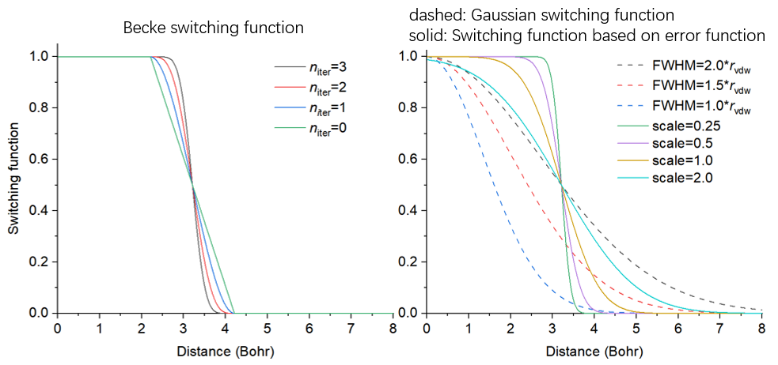

<!-- p.439 -->

the grid for calculation, you need to input coordinate of origin, length and grid spacing in all three directions of the grid data. If the input file contains cell information, the three directions will be in line with the three sides of the cell; if does not contain, the three directions will be assumed to X, Y, and Z.

After that, Multiwfn starts to calculate the grid data mentioned above, and then free volume and the percentage of free region in the whole cell are outputted. In the post-processing menu, you can directly visualize isosurface to examine free regions or export grid data as cube file.

- 2 Toggle considering periodic boundary condition: When status of this option is "Yes", periodic images of the atoms in the box will be taken into account during calculating the grid data. This treatment makes calculation much more expensive but results in much more realistic data.

- 3 Toggle calculating smoothed grid data of free regions: By default, Multiwfn generates both raw grid data and smoothed grid data. If status of this option is set to "No", then only the former will be generated, and the cost will thus be reduced by a fraction.

- 4 Set method of smoothing: In this option you can choose the switching function used for calculating smoothed grid data. The default one is error function with scale factor of 1.0, usually this is a suitable choice.

- 5 Toggle making isosurface closed at boundary: When status is set to "Yes", if there are isosurfaces at box boundary, the isosurfaces will look closed. If the status is switched to "No", then the isosurfaces will look open at boundary.

- 6 Set scale factor of vdW radii for calculating free volume and primitive free region: If value of this option is not the default 1.0 rather than set to a value x, then the vdW radii used for calculating raw grid data will be scaled by x. Clearly this option affects isosurface of raw grid data and calculated free volume.

The efficiency of the code of this function is high, and it is possible to use this function to study a system containing even tens of thousands of atoms. When you find the computational cost is too high to afford, you should consider the solutions below:

(1) Using better CPU. The code of this function is fully parallelized, therefore the more the CPU cores, the lower the calculation time.

(2) Using larger grid spacing. Clearly, the larger the spacing, the poorer the isosurface map and worse the accuracy of the outputted free volume.

(3) Do not take periodic boundary condition into account. The cost will be reduced by one order of magnitude, however the isosurfaces at some boundary regions will become artificial, and free volume will even be misleading.

An example of using this module is given in Section 4.300.1. Information needed: Atom coordinates


### 3.300.2 Fitting atomic radial density as linear combination of multiple


### STOs or GTFs

This function is used to fit atomic radial density as linear combination of multiple 1s-type Slater


<!-- p.440 -->

type orbitals (STOs) or S-type of Gaussian type functions (GTFs), so that the atomic radial density then can be evaluated analytically. The fitting involves many technical details, which will be introduced in Section 3.300.2.1, then the usage of the present module will be described in Section 4.300.2.2. Practical examples of using this module to perform fitting will be given in Section 4.300.2.

### 3.300.2.1 Algorithm and technical details

Basic idea The purpose of this function is performing below fitting

$$\rho(r)\approx\rho^{\mathrm{f i t}}(r)\quad\forall r$$

$$\rho^{\mathrm{fit}}(r)\left\{\begin{aligned}&\sum_{i\in\mathrm{STO}}c_{i}e^{-\zeta r}\\ &\sum_{i\in\mathrm{GTF}}c_{i}e^{-\zeta r^{2}}\end{aligned}\right.$$

where {c} are coefficients to be fitted, {ζ} are exponents to be fitted, r is radial distance to nuclear position.

Fitting type To realize the fitting, a set of fitting points should be defined. The fitting essentially corresponds to minimizing the least-square residual that measures overall error between actual density and fitted density at the fitting points. There are three ways to define the residual, which correspond to different fitting types:

$$\mathrm{(3)}Minimizing~error~of~radial~distribution~function~(RDF):\sum_{i}\Big[4\pi r_{i}^{2}\Big(\rho_{i}-\rho_{i}^{\mathrm{fit}}\Big)\Big]^{2}$$

$$\mathrm{(3)}Minimizing~error~of~radial~distribution~function~(RDF):\sum_{i}\Big[4\pi r_{i}^{2}\Big(\rho_{i}-\rho_{i}^{\mathrm{fit}}\Big)\Big]^{2}$$

$$\mathrm{(3)}Minimizing~error~of~radial~distribution~function~(RDF):\sum_{i}\Big[4\pi r_{i}^{2}\Big(\rho_{i}-\rho_{i}^{\mathrm{fit}}\Big)\Big]^{2}$$

In above formulae, {i} are fitting points placed at different radial distances, ri denotes radial distance

of point i. ρi is sphericalized (i.e. spherically averaged) electron density calculated based on loaded wavefunction file at point i. In Multiwfn, 170 Lebedev angular grid points are used to perform the spherical average.

Commonly, fitting type 2 is preferred over others and thus it is default, because the density fitted in this way can reproduce actual density over the entire range, including tail region where electron density is fairly small. The density fitted by type 1 can only well represent the region very close to nucleus, since electron density in this region is significantly larger than other regions. When fitting type 2 does not work well by visually inspecting the curve of fitted density, using type 3 instead may obtain better result. If none of types 2 and 3 work well, sometimes it is useful to use type 1 first and then 2 (namely using the fitted parameters from type 1 as initial guess for type 2), or use type 3 first and then 2.

Fitting functions The STO and GTF, which are most important functions in quantum chemistry calculation, are supported in the present module as fitting functions.

The fitting quality is quite sensitive to the number of fitting functions. Clearly, in principle, the


<!-- p.441 -->

more the number of fitting functions, the less the fitting error and the higher the time cost during fitting.

In Multiwfn, the least-square type of fitting is conducted by means of Levenberg-Marquardt (LM) algorithm, which is an iterative method to minimize the residual by gradually optimizing parameters until convergence tolerance is reached. It is important to note that this algorithm essentially is a local minimization method, therefore, the resulting fitted coefficients and exponents may be dependent on initial guess.

The coefficients of the fitting functions should always be fitted, however, the exponents can either be fitted together or be fixed at initial guess to diminish dimension of parameter space and thus make the convergence easier. Clearly, for a given number of fitting functions, if their exponents are variable during fitting, the fitting quality in principle should be better than the case that the exponents are fixed.

When number of fitting functions are large (e.g. >20), fitting exponents along with coefficients is usually deprecated, because in this case the convergence is often quite difficult, the cost is fairly high, and sometimes the routine for performing LM algorithm does not work normally.

Removing redundant fitting functions In order to achieve good fitting quality, usually dozens of fitting functions with small-to-large fixed exponents should be employed, these exponents are often generated in an even-tempered way,

namely ζi=a×bi. For example, ζi=0.05×2(i-1), i=1, 2, 3 ... 30. In this case, sometimes one or more fitting functions are redundant because their exponents are too large or too small, leading to severe numerical problems. In order to identify and remove the harmful redundant fitting functions possessing unreasonable exponents, the following three rules are employed in Multiwfn by default when GTF is chosen as fitting function:

(1) Steep fitting functions with relatively insignificant coefficient (ζ>105 and meantime c<5) and flat fitting functions with negligible coefficient (ζ<3 and c<10-4) are deleted.

(2) Apparently, fitted density should be positive everywhere. If fitted density at a detecting point is negative, then the fitting function having maximum negative contribution to this point will be deleted. The detecting points include all fitting points as well as midpoints between neighbouring evenly placed fitting points. Usually too large exponent tends to result in negative value in the region very close to nucleus, while too small exponent tends to lead to negative value in tail region.

(3) Variation of electron density should decrease monotonically with respect to increase of radial distance. This requirement is checked using double dense grid in the range spanned by first half of fitting points; if it is violated, then the fitting function with largest exponent will be deleted, because this problem is usually incurred by too large exponent.

Each time only one redundant is deleted. After deletion, Multiwfn will redo the fitting. The fitting repeats until no redundant fitting function can be found.

Sometimes from the result you may find two fitting functions have very close exponents, which indicates that one of them could be removed and then refit, the result will not detectably worsen. However, this kind of redundant fitting function is not automatically removed by Multiwfn, you can merge them in the interface of setting up initial guess prior to redoing the fitting.

Scaling coefficients Integral of fitted density over the whole space may deviate from actual number of electrons (Nelec), clearly this breaks physical meaning of fitted density and makes it useless in many scenarios. In order to solve this problem, the fitted coefficients should be scaled by a factor:


<!-- p.442 -->

$$\lambda=\frac{N_{elec}}{\int4\pi r^{2}\rho^{fit}(r)\mathrm{d}r}$$

In Multiwfn, the integral in the denominator is evaluated in terms of Gaussian quadrature of Chebyshev second kind with 100 integration points.

Number and stepsize of fitting points The common interesting atomic radial region is r = 0-4 Å, therefore fitting points should sufficiently cover this region. The smaller spacing between fitting points, the higher the fitting quality. By default, Multiwfn employs quite fine grid, which has grid spacing of 0.001 Å, and correspondingly, the default number of grid points is 4000. The default setting of fitting points is quite appropriate and should not be altered without special reasons. Indeed, properly enlarging grid spacing and correspondingly decreasing number of fitting points can save computational time, however, given that calculation of electron density for single atom is usually inexpensive, enlarging grid spacing is not a good idea.

Commonly, using evenly placed fitting points with small spacing is fully adequate to reach satisfactory fitting quality, however, Multiwfn also supports adding second kind Gauss-Chebyshev points into fitting points. This kind of points samples very heavily around nucleus, but sparsely samples in long range; in other words, the grid spacing is positively correlated with radial distance. Evidently, taking second kind Gauss-Chebyshev points into account will more or less improve fitting quality in the region very close to nucleus. However, since the improvement is not remarkable as long as spacing of evenly placed grid is small enough (e.g. the default 0.001 Å), this kind of points are not included in the fitting by default.

Examining fitting quality After fitting, it is crucial to examine fitting quality to ensure that the outputted coefficients and exponents are really reliable and meaningful in practice. There are several ways to do the check:

(1) Check root-mean-square error (RMSE), which is defined as

$$RMSE=\sqrt{\frac{\sum_{i}^{N}(\rho_{i}-\rho_{i}^{fit})^{2}}{N}}$$

where N is the number of fitting points. The lower the RMSE, the better the overall fitting quality. You can also use this quantity to compare fitting accuracy between various fitting settings.

(2) Pearson correlation coefficient (r) and r2 between fitted density and actual density at fitting points. The more the value close to 1, the better the fitting quality.

(3) Visually compare actual density and fitted density curves. This is the most rigorous way of checking fitting quality. The two curves should be close with each other sufficiently.

(4) Check integral of fitted density. The integral should be evaluated under different number of quadrature points, e.g. 60, 80 ... 300. If the fitted coefficients and exponents are indeed reasonable, in all cases the integral should be very close to actual number of electrons in the atom.

(5) Check fitted density in broad range with double or triple dense grid compared to fitting points. No negative density should be found, and the fitted density should vary monotonically.


<!-- p.443 -->

### 3.300.2.2 Usage

Common steps of fitting To use the present function to perform fitting, commonly you should do below steps (1) Load wavefunction file of an atom. The file should contain at least GTF information (e.g. .mwfn/.wfn/.fch/.molden), the atom must be at original point.

(2) Enter subfunction 2 of main function 300. (3) Choose option 3 and select a way to define initial guess, then briefly examine the initial guess printed on screen, then return to upper level of menu.

(4) Choose option 1 to start fitting. (5) Carefully check information printed on screen, then you can use proper options to further check quality of the fitting.

Options before fitting Meaning and details of the options in the interface of present module are described below

- Start fitting: After selecting this option, Multiwfn will do following things (some procedures may be skipped as requested by users)

· Print initial guess of fitting functions · Calculate sphericalized radial atomic density at fitting points · Use Levenberg-Marquardt algorithm to optimize coefficients/exponents of fitting functions. In this procedure some redundant fitting functions may be deleted

· Sort fitting functions according to their exponents · Calculate integral of fitted density and correspondingly scale coefficients · Print final coefficients and exponents of fitting functions · Print error statistics Then you will see a menu used to check fitting quality or export data, the options will be described later.

- Switch type of fitting functions: You can use this option to switch type of fitting function between STO and GTF

- Check or set initial guess of coefficients and exponents: After entering this option, information of current fitting functions will be shown first. By default, no fitting functions are set and thus you should use one of the options below to define them prior to starting to fit:

· 1 Load initial guess from text file: Via this option, coefficients and exponents will be loaded from a given plain text file, whose format should look like below:


```text
4.0 1000
2.0 100
1.0 1.5
```

This file defines three fitting functions, the first and second columns are initial coefficients and exponents. Clearly, this is the most flexible way of defining number and initial parameters of fitting functions.

The following options employ prebuilt settings for convenience (accuracy & number of functions: 3>4>5>7>2):

· 2 Crude fitting by a few STOs with variable exponents: This option aims at performing crude fitting, as only a few STOs are employed. Exponents will be optimized during fitting to make fitting quality better. Specifically, 1, 2, 4, 6 STOs are employed when the element is in the first, second,


<!-- p.444 -->

third&fourth and latter rows of periodic table, respectively. The initial parameters of fitting functions set by this option are commonly reasonable, however, the fitting maybe occasionally failed due to inappropriate initial parameters, in this case you should try to use option 1 to load manually provided parameters instead.

· 3 Ideal fitting by 30 GTFs with fixed exponents: If you want to accurately fit actual density over the entire range, using fitting functions set by this option is usually the best choice. 30 GTFs will be employed, and in order to guarantee numerical stability and significantly reduce fitting cost, only coefficients will be fitted, while exponents will be kept at the initial values, which are generated

as ζi=0.05×2(i-1), where integer i varies from 1 to 30.

· 4 Fine fitting by 15 GTFs with variable exponents: This option uses smaller number of GTFs than option 3, but exponents are simultaneously optimized. Even though the exponents are variable, the fitting quality of this option is not as perfect as option 3, and meantime the fitting cost is higher, and there is a danger that the iteration of Levenberg-Marquardt algorithm cannot get converged.

· 5 Fine fitting by 10 GTFs with variable exponents: Cheaper than option 4, with slightly reduced fitting accuracy.

· 7 Relatively fine fitting by no more than 10 GTFs with variable exponents: This option performs the fit by GTFs in a most economical way, 6 GTFs are used for first 18 elements, and 10 GTFs for heavier ones. Although inexpensive, usually this option is satisfactory enough.

Finally, option “10 Combine two fitting functions together” is able to replace two specific fitting functions with a new function, whose exponent is average of the two, and coefficient is the sum of the two. This option is mainly used to manually remove linearly dependent functions.

- Set fitting tolerance: The smaller the value, the better the numerical accuracy of the fitting while the higher the fitting cost. Commonly the default value is able to guarantee high numerical accuracy.

- "Set number of evenly placed fitting points" and "Set spacing between fitting points": The default number of evenly placed points (4000) is large enough and the default spacing (0.001 Å) is fine enough, the corresponding fitting points distribute from r = 0.001 to 4.0 Å. You can properly adjust these two options if you want to include points in longer range into fitting, or if you want to reduce fitting cost (the time cost is basically proportional to number of fitting points).

- Toggle scaling coefficients to actual number of electrons: When status of this option is "Yes" (default), then after calculating integral of fitted density, the coefficients of the fitting functions will be scaled in the way described in last section. Performing scaling is always recommended.

- Select fitting type: You can use this option to choose how to perform the fitting, including "Minimizing absolute error", "Minimizing relative error" and "Minimizing radial distribution function (RDF) error ", which have been introduced in the last section. The second one is usually the most recommended, thus it is the default.

- Toggle fixing exponents: When status of this option is set to "Yes", Multiwfn will optimize both coefficients and exponents of fitting functions during fitting procedure. If you want to keep exponents at their initial guess, this option should be switched to "No".

- Toggle sorting functions according to exponents: When status of this option is "Yes" (default), Multiwfn will reorder the fitting functions so that their exponents are ranked from low to high.

- Toggle removing redundant fitting functions: When status of this option is "Yes" (default), the redundant fitting functions will be automatically deleted during fitting, as described in the last section. This is important to guarantee numerical stability and reasonableness of the result and thus


<!-- p.445 -->

commonly should be enabled.

- Set number of second kind Gauss-Chebyshev fitting points: As described in the last section, if you want to add the points heavily sampling the region close to nucleus into fitting, evenly distributed points and some second kind Gauss-Chebyshev points can be combined together as the actually adopted fitting points. This option controls the number of employed second kind Gauss-Chebyshev points. When the value is set to 0 (default), this kind of points will not be employed.

- Set maximum number of function calls: This option sets maximum number of function calls during error minimization. If the minimization does not converge when reaches this condition, the minimization will stop and unconverged result will be reported.

Options after fitting In the menu that appears after fitting is complete, there are many options used to examine or export the result, also there are some options used to check fitting quality. Since most of them are self-explanatory, only a few are described here:

- Visualize actual density and fitted density curves using logarithmic scaling: This option is quite useful in visually examining fitting quality, the blue and black curves show fitted density and actual density, respectively. Clearly, the closer the two curves, the better the fitting quality. From this map you can also understand which regions are nicely or badly fitted.

- Export fitted density from 0 to 10 Angstrom with double dense grid to fitdens.txt in current folder: This option is useful in checking quality of fitted density over broad range. You can use this option to export fitdens.txt file, from which if you find the fitted density varies as expected (e.g. no negative value, decays smoothly and monotonically), then the fitted density should be reliable and usable.

- Check integral of fitted density: This option employs various numbers of quadrature points (from 40 to 300 with step of 20) of Gaussian integral to calculate radial integral of fitted density. If the results are all close to actual number of electrons, that means the fitted density should be reliable.

- Check fitted density at a given radial distance: Via this option you can check fitted density at specific radial distances by inputting their values. This is also a useful way of rationalizing the fitted density.

- Output coefficients and exponents as Fortran code to a .txt file: This option writes fitted coefficients and exponents in the form of Fortran code, then you can copy the information from the exported file into your Fortran program to utilize the data.

Practical examples of using this module to perform fitting are given in Section 4.300.2. Information needed: Atom coordinates, GTFs


### 3.300.4 Simulating scanning tunneling microscope (STM) image

Theory Scanning tunneling microscopy (STM) is a quite common experimental technique to image chemical systems at atomic level, also it has close relationship with electronic structure of the sample, see wiki page for more information. In the STM imaging process, a conducting tip is put over the sample and meantime bias voltage (V) is applied between them. Due to quantum tunneling


<!-- p.446 -->

effect, tunneling current (I) can form between the tip and sample with appropriate distance separation (usually 4~7 Å) and V. At different positions, I is different due to different interaction between the tip and sample, in essence the observed STM image characterizes the function I(r). The STM experiment can be illustrated by the following figure

There are two modes of STM:

- Constant height mode: The z coordinate of the tip is fixed at a given value while x and y are scanned. The two-dimension STM image in this case corresponds to the I(x,y) function.

- Constant current mode: Two-dimension scanning of x and y is performed, and for each (x,y), the z coordinate of the tip is gradually adjusted until finding the z position (zc) where the I is equal to a specific value. The STM image in this mode at a given current corresponds to the zc(x,y) function. Evidently, generating STM image of constant current mode is more time-consuming than constant height mode, since additional dimension (z) needs to be taken into account.

Despite that there are many ways to computationally simulate the STM image, the only popular one is the model derived by Tersoff and Hamann, see Phys. Rev. B, 31, 805 (1985) and Chapter 6 of book Introduction to Scanning Tunneling Microscopy (2ed, Julian Chen, 2008). In principle, to determine the I one must know realistic character of the tip, which, however, is usually unknown. The key point of the Tersoff-Hamann model is replacing the tip as a point probe, and hence the formula for deriving I is largely simplified (Tersoff and Hamann also discussed the case that the tip is locally spherical with specific radius, however this situation is not considered here). The original Tersoff-Hamann model corresponds to small V and low temperature limits, and it is only applicable to periodic systems; if finite V is explicitly taken into account, the I for an isolated system can be expressed as


$$I(\mathbf{r})\propto\sum_{a}^{E_{\mathrm{F}}\rightarrow E_{\mathrm{F}}+e V}|\varphi_{a}(\mathbf{r})|^{2}\qquad(V>0)$$

<!-- formula-ocr: formula_p446_327.png 已替换为LaTeX, 原图保留备查 -->

where i denotes occupied MOs whose energy is between EF+eV and EF, a denotes unoccupied MOs whose energy is between EF and EF+eV. The EF is Fermi level, which is not well defined for isolated system, but usually it is taken as average of EHOMO and ELUMO. The e is elementary charge, which is


<!-- p.447 -->

a positive value (1.602E-19 C). When V is positive, electrons in the tip tunnel into empty states of the sample; for a negative V, electrons tunnel out from occupied states of the sample into the tip.

Note: Some documents use -eV rather than +eV, this is because the e in these documents corresponds to the charge carried by an electron rather than elementary charge. Although the above formulae are usually referred to as Tersoff-Hamann model, strictly speaking, it is not the form proposed by Tersoff and Hamann.

The above formulae show that the I(r) is positively proportional to the local density-of-states (LDOS) at r contributed by the MOs between EF+eV and EF when V<0 or between EF and EF+eV when V>0 (note that the LDOS in this context is defined differently to that introduced in Section 3.12.4), therefore, if orbital wavefunctions are available and thus LDOS can be calculated, the STM image can be obtained straightforwardly. When discussing the simulated STM image in this way, it is suggested to write the unit of the I as that of LDOS, which corresponds to a.u. in Multiwfn.

The STM image simulated in above way cannot be rigorously compared with the experimental one, since the actual character of STM tip is not taken into account but simplified as a point (owing to this, the simulated STM image has infinite high resolution). Also note that the magnitude of I is unable to be determined using the present model due to introduction of approximations, hence only the relative difference of I between different positions is meaningful and can be discussed.

Usage To simulate STM image in Multiwfn, using the files containing basis function information is recommended, such as .mwfn, .fch and .molden. Using formats only containing GTF information such as .wfn is also acceptable, however, in this case the STM image with V>0 cannot be simulated, since they only contain occupied MOs information.

Since the STM simulation is based on molecular orbitals, the theoretical method only supports HF and KS-DFT (except for double-hybrid functionals), while multiconfiguration methods such as MP2 and CASSCF are not supported. Restricted closed-shell, restricted open-shell and unrestricted open-shell are all supported.

The subfunction 4 of main function 300 corresponds to the STM simulation function. After entering this function, please carefully read prompt on screen, which informs you how the default Fermi level and bias voltage are determined. In the interface, you can customize EF, V, number of grids, spatial range of the STM. The mode of STM image can also be selected, both constant height (default) and constant current modes are available. After making settings appropriate, you can choose option 0 to start calculation of the data used to plot STM map, the MOs considered in the calculation will be shown on screen so that you can easily examine if EF and V have been properly defined. Note that the computational cost is fully determined by the number of grids, the more the grids, the smoother the image, while higher the cost.

The way of simulating STM image of constant height and constant current modes is somewhat different, as described below:

- Constant height mode: Before calculation, you should properly set range of X and Y, by default they are determined by extending the position of boundary atoms by 3 Bohr. The default Z position of the plane to be calculated is 0.7 Å higher than the top atom (i.e. the atom with maximal Z coordinate). After selecting option 0 to calculate current at every point in the two-dimension plane, you can find an interface for plotting the STM image, all options are self-explanatory and thus will not be described here (the options are quite similar to those in the post-processing menu of main function 4). By default, the lower limit of color scale is 0, while upper limit is automatically set to maximal I in the plane data.

- Constant current mode: You should first choose option 1 once to switch the mode from the


<!-- p.448 -->

default constant height mode to constant current mode. Then you should properly define the calculation range in X, Y and Z. The default X and Y ranges are identical to the constant height mode, the default lower and upper limits of Z are 0.7 and 2.5 Å higher than the top atom, respectively. After selecting option 0, Multiwfn will start calculation of 3D grid data of I, then you can use corresponding options to visualize isosurface map of tunneling current, export the grid data as cube file, or visualize 2D STM image. For the latter case, you need to input the value of tunneling current, then Multiwfn will estimate the z value (zc) where I equals the value at every (x,y) point, the resulting plane data zc(x,y) can then be directly plotted as plane map via corresponding options on screen.

Examples of simulating STM images are given in Section 4.300.4. Information needed: Atom coordinates, GTFs


### 3.300.5 Calculate electric dipole/multipole moments and electronic


### spatial extent

This function calculates electric dipole, quadrupole, octopole and hexadecapole moments as well as electronic spatial extent <r2> based on analytically evaluated integrals (or based on atomic charges, see later). Note that the function described in Section 3.18.3 is also able to calculate dipole, quadrupole and octopole moments, however it calculates the data numerically based on integration grid, and thus it is evidently slower and its accuracy is marginally lower than the present function. The information printed by this function is shown below.

Dipole moment:


$$\mathbf{\mu}=\left[\begin{matrix}{\mu_{x}}\\ {\mu_{y}}\\ {\mu_{z}}\\ \end{matrix}\right]=\sum_{A}q_{A}\left[\begin{matrix}{X_{A}}\\ {Y_{A}}\\ {Z_{A}}\\ \end{matrix}\right]-\int\left[\begin{matrix}{x}\\ {y}\\ {z}\\ \end{matrix}\right]\rho(\mathbf{r})\mathrm{d}\mathbf{r}$$

<!-- formula-ocr: formula_p448_328.png 已替换为LaTeX, 原图保留备查 -->

where XA, YA and ZA are the three Cartesian coordinates of atom A. qA is nuclear charge of atom A. x, y and z are the three Cartesian coordinates of electron position.

Quadrupole moment (standard Cartesian form):

$$\mathbf{\mu}=\left[\begin{matrix}{\mu_{x}}\\ {\mu_{y}}\\ {\mu_{z}}\\ \end{matrix}\right]=\sum_{A}q_{A}\left[\begin{matrix}{X_{A}}\\ {Y_{A}}\\ {Z_{A}}\\ \end{matrix}\right]-\int\left[\begin{matrix}{x}\\ {y}\\ {z}\\ \end{matrix}\right]\rho(\mathbf{r})\mathrm{d}\mathbf{r}$$

Quadrupole moment (traceless Cartesian form):

$$\mathbf{\mu}=\left[\begin{matrix}{\mu_{x}}\\ {\mu_{y}}\\ {\mu_{z}}\\ \end{matrix}\right]=\sum_{A}q_{A}\left[\begin{matrix}{X_{A}}\\ {Y_{A}}\\ {Z_{A}}\\ \end{matrix}\right]-\int\left[\begin{matrix}{x}\\ {y}\\ {z}\\ \end{matrix}\right]\rho(\mathbf{r})\mathrm{d}\mathbf{r}$$

$$\mathbf{\mu}=\left[\begin{matrix}{\mu_{x}}\\ {\mu_{y}}\\ {\mu_{z}}\\ \end{matrix}\right]=\sum_{A}q_{A}\left[\begin{matrix}{X_{A}}\\ {Y_{A}}\\ {Z_{A}}\\ \end{matrix}\right]-\int\left[\begin{matrix}{x}\\ {y}\\ {z}\\ \end{matrix}\right]\rho(\mathbf{r})\mathrm{d}\mathbf{r}$$


<!-- p.449 -->

$$\Theta_{xyz}=\sum_{A}q_{A}X_{A}Y_{A}Z_{A}-\int xyz\rho(\mathbf{r})\mathrm{d}\mathbf{r}$$

Note that since quadrupole moment in Cartesian form is a symmetric matrix, only 6 components are unique.

The electronic spatial extent is defined as 〈𝑟2〉= ∫(𝑥2 + 𝑦2 + 𝑧2)𝜌(𝐫)d𝐫 . Essentially, it simply corresponds to the negative of the trace of the quadrupole moment tensor (Cartesian form) contributed by electrons. Multiwfn not only prints 〈𝑟2〉 , but also prints its three Cartesian components, so that you can understand its sources. A very detailed introduction of 〈𝑟2〉 is given in my blog article: http://sobereva.com/616 (in Chinese).

Quadrupole moment (spherical harmonic form):


$$\Theta_{xyz}=\sum_{A}q_{A}X_{A}Y_{A}Z_{A}-\int xyz\rho(\mathbf{r})\mathrm{d}\mathbf{r}$$

<!-- formula-ocr: formula_p449_329.png 已替换为LaTeX, 原图保留备查 -->

Octopole moment in Cartesian form is a third-order tensor with 3×3×3=27 components, however only 10 elements are unique. For example, the XYZ component is calculated as follows, the other components are calculated similarly


$$\Theta_{x y z z}=\sum_{A}q_{A}X_{A}Y_{A}Z_{A}Z_{A}-\int x y z z\rho(\mathbf{r})\mathrm{d}\mathbf{r}$$

<!-- formula-ocr: formula_p449_330.png 已替换为LaTeX, 原图保留备查 -->

Octopole moment in spherical harmonic form:

Q 3,0 =Θ−Θ (1/ 2)(53) zzzrrz

$$\Theta_{xyz}=\sum_{A}q_{A}X_{A}Y_{A}Z_{A}-\int xyz\rho(\mathbf{r})\mathrm{d}\mathbf{r}$$

$$\mathcal{Q}_{2,-1}=\sqrt{3}\Theta_{yz}\qquad\mathcal{Q}_{2,1}=\sqrt{3}\Theta_{xz}$$

QQ 3, 33,3 − =Θ−Θ=Θ−Θ 5 / 8(3)5 / 8(3) xxyyyyxxxyyx

$$\Theta_{xyz}=\sum_{A}q_{A}X_{A}Y_{A}Z_{A}-\int xyz\rho(\mathbf{r})\mathrm{d}\mathbf{r}$$


$$|\mathbf{Q}_{3}|=\sqrt{\sum_{m=-3}^{3}(Q_{3,m})^{2}}$$

Hexadecapole moment in Cartesian form is a fourth-order tensor with 3×3×3×3=81 components, however only 15 elements are unique. For example, the XYZZ component is calculated as follows, the other components are calculated similarly


$$\Theta_{xyzz}=\sum_{A}q_{A}X_{A}Y_{A}Z_{A}Z_{A}-\int xyzz\rho(\mathbf{r})\mathrm{d}\mathbf{r}$$


<!-- p.450 -->

This function also prints center of positive charges. The X component is defined as


$$\mathbf{\mu}=\left[\begin{matrix}{\mu_{x}}\\ {\mu_{y}}\\ {\mu_{z}}\\ \end{matrix}\right]=\sum_{A}q_{A}\left[\begin{matrix}{X_{A}}\\ {Y_{A}}\\ {Z_{A}}\\ \end{matrix}\right]$$

<!-- formula-ocr: formula_p450_333.png 已替换为LaTeX, 原图保留备查 -->

center of negative charges is also printed. For example, X component is evaluated as

Evaluation based on atomic charges If your input file is .chg or .pqr, this function can also be used, but the dipole and multipole moments are all calculated based on atomic charges recorded in the file. For example, dipole moment in this case is expressed as


$$\boldsymbol{\mu}=\begin{bmatrix}\mu_{x}\\\mu_{y}\\\mu_{z}\end{bmatrix}=\sum_{A}q_{A}\begin{bmatrix}X_{A}\\Y_{A}\\Z_{A}\end{bmatrix}$$

where qA stands for atomic charge of atom A in this context.

A simple example of this function is given in Section 4.300.5. Information needed: Atom coordinates, GTF information or basis functions or atomic charges.


### 3.300.6 Calculate energies of present orbitals by inputting Fock matrix

This function is subfunction 6 of main function 300, it is designed as a general module for evaluating energies of present orbitals (i.e. the orbitals stored in memory). Basis function information must be available in your input file, and after entering this function, you need to provide Fock or Kohn-Sham (KS) matrix to Multiwfn (see Appendix 7 of this manual for detail), then the energies of the orbitals will be evaluated as expectation of the Fock or KS operator.

Application of this function to calculate energies of natural transition orbitals (NTO) is illustrated in Section 4.300.6.

Information needed: Basis functions, plain text file containing Fock/KS matrix


### 3.300.7 Geometry relevant operations on the present system

Note: Chinese version of this section with abundant examples is my blog article “Introduction to the very useful geometric operations and coordinate transformation functions in Multiwfn” (http://sobereva.com/610).

This function is subfunction 7 of main function 300, it aims to perform a variety of geometry relevant operations on the present system, which may be involved in special-purpose studies. Note


<!-- p.451 -->

that transformation of coefficient matrix of orbitals due to rotation and inversion operations is not taken into account by this function.

In this function, you can perform many geometry operations, they will be briefly mentioned below. You can use them multiple times, the effects will be accumulated. You can choose option 0 anytime to visualize the current geometry in a GUI window. You can also use option -1, -2, -3 and -4 to export the current geometry to .xyz, .pdb, .gjf and .cif file, respectively. By option -9, you can restore the initial geometry loaded from input file.

- 1 Translate selected atoms according to a translation vector You will be asked to select a set of atoms and input a translation vector, the selected atoms will be translated using the vector

- 2 Translate the system such that the center of selected atoms is at origin You will be asked to select a set of atoms and choose type of their center (geometry center, mass center or center of nuclear charges), then the whole system will be translated so that their center is exactly at origin.

- 3 Rotate selected atoms around a Cartesian axis or a bond You will be asked to select a set of atoms, they will be rotated around a Cartesian axis, or a bond, or a vector by specific angle specified by you. The rotation matrix used to perform the coordinate transformation will also be shown on screen.

- 4 Rotate selected atoms by applying a given rotation matrix You will be asked to select a set of atoms and manually input rotation matrix (M), then geometry of each of selected atom will be transformed in turn via vnew=Mvold, where v is column vector consisting of X, Y and Z coordinates of the atom, or via wnew=woldM, where w is row vector consisting of X, Y and Z coordinates of the atom.

- 5 Make a bond parallel to a vector or Cartesian axis The system will be reoriented to make a bond defined by two selected atoms parallel to a specific vector or a Cartesian axis.

- 6 Make a vector parallel to a vector or Cartesian axis The system will be reoriented to make a vector in original coordinate system parallel to a specific vector or a Cartesian axis. For example, you have conducted an electron excitation calculation, and you want to make transition dipole moment of an excitation exactly parallel to X-axis, you can use this function.

- 7 Make electric dipole moment parallel to a vector or Cartesian axis Electric dipole moment will be automatically calculated, and the system will be reoriented to make the electric dipole moment parallel to a specific vector or a Cartesian axis. This function can be used only when your input file contains wavefunction information.

- 8 Make longest axis of selected atoms parallel to a vector or Cartesian axis You will be asked to select a set of atoms, the whole system will be reoriented to make the longest axis (the principal axis with smallest moment of inertia) of the selected atoms parallel to a specific vector or a Cartesian axis.

- 9 Mirror inversion for selected atoms You will be asked to select a set of atoms and choose a plane (XY, YZ or XZ), then mirror inversion with respect to the plane will be performed for selected atoms.

- 10 Center inversion for selected atoms You will be asked to select a set of atoms, then sign of their X, Y and Z coordinates will be


<!-- p.452 -->

inverted.

- 11 Make the plane defined by selected atoms parallel to a Cartesian plane You will be asked to select a set of atoms, a plane will be fitted by their coordinates. Then you will be asked to choose a Cartesian plane (XY, YZ or XZ), the whole system will be reoriented to make the fitted plane parallel to the selected Cartesian plane.

- 12 Scale Cartesian coordinates of selected atoms You will be asked to select a set of atoms, the type of coordinate (X or Y or Z or all) to be scaled, and the scale factor to apply. Then the corresponding coordinates will be multiplied by the scale factor. The scale factor can also be negative or zero.

If your input file contains cell information, after scaling atom coordinates, you will also be asked to choose if also scaling corresponding component of cell vectors. For example, if you have chosen to scale X coordinates before, then X component of all cell vectors will also be scaled.

- 13 Reorder atom sequence This option supports different rules to reorder atoms: (1) According to value of X or Y or Z coordinate (2) Put non-hydrogen atoms prior to hydrogens (3) According to bonding, namely making atom indices contiguous in each isolated fragment (4) According to element index (5) Exchange two specific atoms (6) Input a file containing new order of all atoms (see prompt on screen for its format) (7) Input indices of a batch of atoms, then they will appear in front of other atoms. In this function, you can also choose option -1 to reverse atom sequence.

- 15 Add an atom: You will be asked to input element and XYZ coordinate, a new atom will be added (as the last atom).

- 16 Remove some atoms: You will be asked to input a list of atoms, they will be removed from present system.

- 17 Crop some atoms: You will be asked to input a list of atoms, the atoms not belonging to the list will be removed.

- 18 Generate randomly displaced geometries You can obtain a number of randomly displaced geometries via this function, the new geometries will be exported to new.xyz in current folder. In the generation, Cartesian coordinate(s) of each of selected atoms will be randomly displaced, the displacement(s) satisfies normal distribution and the standard deviation is inputted by user. The considered direction of displacement can be set by the user, e.g. only X direction, both Y and Z directions, all directions, etc. If only generating one geometry, the displacement vector of each atom will be explicitly shown on screen.

The following options are related to periodic systems, they can be used only when cell information is available from your input file, see Section 2.9.3 on which files can provide cell information to Multiwfn.

- 19 Translate and duplicate cell (construct supercell) This option is used to construct a supercell. You will be asked to input number of replicas in each direction, the number could be either positive or negative value. For example, in a direction, if you input 3, then the system will be duplicated along positive direction by two times, and hence there will be three replicas in this direction; if you input -3, then the system will be duplicated along negative direction by three times, and finally there will be four replicas.

- 20 Make truncated molecules by cell boundary whole For experimental molecular crystal files, it is very common that cell boundary truncates


<!-- p.453 -->

molecules as individual fragments, this brings great disadvantage in visualizing molecular structure. This function is able to make each truncated molecule whole.

- 21 Scale cell length and atom coordinates correspondingly You will be asked to choose a direction and input a scale factor, then cell length as well as atom coordinates in this direction will be scaled. This option is particularly useful when you need to manually adjust density of your cell.

- 22 Wrap all atoms outside the cell into the cell Sometimes some atoms are lying outside the cell, this option is used to wrap them into the current cell; in other words, atoms outside the cell will be properly translated by cell vectors so that their fractional coordinates will be within the range 0.0~1.0.

- 23 Translate system along cell axes by given distances You will be asked to input translation distance (can either be positive or negative) in each direction, then all atoms in the system will be correspondingly translated. Note that the cell is not moved, therefore after the translation some atoms may be outside the cell, then you can use option 22 to wrap them into the cell.

- 24 Translate system to center selected part in the cell You will be asked to input indices of a batch of atoms, then the whole system will be translated so that the geometry center of the selected atoms will be moved to center of the cell. After that, some atoms may be outside the cell, then you can use option 22 to wrap them into the cell.

- 25 Extract a molecular cluster (central molecule + neighbouring ones) You will be asked to input index of an atom, and input a criterion (see below), then the whole molecule as well as the first shell of other molecules neighbouring it will be extracted as a molecular cluster. In addition, the indices of the atoms in the central molecule in the cluster will be shown on screen. This function is particularly useful if you want to use e.g. IGMH, IRI and Hirshfeld surface analyses to study intermolecular interaction in crystal. Note that if the closest distance between an atom of a neighbouring atom and the selected molecule is smaller than sum of their vdW radii multiplied by the criterion you inputted, then the neighbouring molecule will be included in the extraction. Usually criterion of 1.2 is suitable, increasing it may result in a larger cluster.

- 26 Set cell information Via this option, you can manually set size of a, b, c and value of α, β, γ angles of current cell. You can also manually define the three translation vectors of the cell.

- 27 Add boundary atoms Boundary atoms, namely the atoms lying at wall or edge of cell, will be detected and added to the present system as real atoms.

- 28 Axes interconversion You can choose to perform interconversion a  b, a  c, or b  c. The selected two components of atomic fractional coordinates and cell vector lengths will be exchanged. This function is particularly useful if you want to change orientation of two-dimension material: If the cell is orthogonal and the material layer is currently parallel to XY plane, while you hope to make the layer parallel to YZ plane, then you can use the present function to interconvert a and c axes.

Information needed: Atom coordinates


<!-- p.454 -->


### 3.300.8 Plot surface distance projection map

The surface distance projection map plotted by this function is very intuitive in visually characterizing molecular structure, it is particularly helpful in identifying steric effect. It can also be used to intuitively characterize structure of solid surface.

Briefly speaking, this function plots a color-filled map of XY plane, the value corresponds to relative Z position of system surface to a given Z layer, see the following figure for illustration. At every (x,y) point, the program scans Z coordinate from Zstart to Zend until reaching the surface, the Z value of ending point with respect to starting point is the function value to be plotted.

In the present function, once all parameters have been properly set by corresponding options, you can choose option 0 to start calculation, and then you will enter a menu, in which you can plot the map, and there are a lot of options used to fine tune the graphical effect.

Clearly, in order to obtain a useful molecular surface distance projection map, the system in your input file must be put in a proper orientation, this is the responsibility of users. This function is also applicable to periodic systems such as two-dimension material, the periodic boundary condition can be properly considered.

Some details There are three different ways in defining system surface, which can be selected by option 1 in the interface of this function:

(1) Isosurface of promolecular electron density (2) Isosurface of electron density based on wavefunction information (3) vdW surface defined by superposition of scaled atomic Bondi van der Waals radii, the scale factor can be manually inputted

If your input file only contains atom information, (1) and (3) can be used; if GTF information is available, (2) can also be employed. Computational cost is (2) > (1) > (3). Usually (1) is recommended, because its surface is much smoother than (3), and its cost is not high even for fairly large system, and any file containing atom information can be used as input file. The isovalue of electron density can be inputted after selecting (1) or (2), the choice of isovalue is largely arbitrary, the default 0.05 a.u. is able to display the main outline of the system, while if you want to exhibit steric effect, you can use e.g. 0.001 or 0.002 a.u., which corresponds to Bader's definition of vdW


<!-- p.455 -->

surface.

In the present function, you can use options 2 and 3 respectively to define range of X and Y axes of the plotting plane, the default range is automatically determined so that the map can cover the whole system. The number of grids in X and Y can be manually set by options 3 and 4, respectively, the computational cost is proportional to product of their numbers. The larger the number of grids, the finer the resulting graph.

Zstart and Zend can be defined by options 7 and 8, respectively. By default, they correspond to the Z coordinate of the atoms with most positive and most negative Z values, respectively. The number of steps of Z scan can be altered by option 6, the smaller the value, the more accurate the projection distance, but the higher the computational cost.

By default, contour lines are appended to the plotted color-filled map, 25 contour lines are

automatically evenly generated between Zend − Zstart and 0, which correspond to default lower and upper limits of color bar, respectively. The number of automatically generated contour lines can be modified by option 9.

This function is never limited to molecular system, it is also fully compatible with periodic system, therefore you can use this function to vividly reveal relative Z position of various sites of solid surface. In this case, the input file should contain cell information, which structure files and wavefunction files can provide cell information have been described in Section 2.9.3 and 2.9.2, respectively.

An example of plotting this kind of map is given in Section 4.300.8. Information needed: Atom coordinates


### 3.300.9 Determine Fermi level

This function is used to determine Fermi level based on specified temperature and orbital energies via Fermi-Dirac distribution.

Theory According to Fermi-Dirac distribution, at a given temperature (T), the occupation of orbital i can be evaluated as


$$n_{i}=\frac{\eta}{1+\exp[(E_{i}-E_{f})/(k_{B}T)]}$$

<!-- formula-ocr: formula_p455_335.png 已替换为LaTeX, 原图保留备查 -->

where Ei is energy of orbital i, Ef is Fermi-level, kB is Boltzmann constant, η is 2.0 and 1.0 if the orbital was produced by restricted and unrestricted calculations, respectively. Ef corresponds to the hypothetical level of 50% probability of being occupied.

By using the above way to assign orbital occupations, you will find the total number of electrons of all orbitals is dependent on the choice of Ef. Clearly, the physically meaningful Ef is the value making total number of electrons the same as the actual number of electrons in present system; so, in the present function of Multiwfn, the Ef is determined based on this fact (and this is the same


<!-- p.456 -->

way as CP2K program to determine Ef when smearing is enabled). Specifically, Multiwfn use bisection algorithm to iteratively adjust Ef until the deviation between current and expected total number of electrons is smaller than 1E-6. The maximum number of iterations is 1000, usually the iteration can converge within dozens of cycles.

Ef is temperature dependent, therefore in this function you need to input a temperature. It is noteworthy that Ef is ill defined in the case of T = 0 K, because in this case Fermi-Dirac function is a step function, and any value between energies of HOMO and LUMO may be acceptable.

Usage To use this function, you simply need to load a wavefunction file containing both occupied and virtual orbitals (you can use e.g. .mwfn, .fch, .molden, etc. .wfn format cannot be used, as it normally does not record virtual orbitals), then enter subfunction 9 of main function 300, and then input a temperature.

For example, boot up Multiwfn and input examples\Li6.fch 300 //Other function (Part 3) 9 //Determine Fermi level 3000 //Temperature (K) You will see


```text
 Iter:    1  Nelec:     18.00331025  Dev.:  0.33102D-02  Ef:   -0.09099563 a.u.
 Iter:    2  Nelec:     17.49559527  Dev.: -0.50440D+00  Ef:   -0.10918015 a.u.
 Iter:    3  Nelec:     17.81870305  Dev.: -0.18130D+00  Ef:   -0.10008789 a.u.
...ignored
 Iter:   17  Nelec:     17.99999281  Dev.: -0.71905D-05  Ef:   -0.09117931 a.u.
 Iter:   18  Nelec:     17.99999782  Dev.: -0.21801D-05  Ef:   -0.09117904 a.u.
 Iter:   19  Nelec:     18.00000033  Dev.:  0.32506D-06  Ef:   -0.09117890 a.u.
 Converged! Fermi level is   -0.09117890 Hartree     -2.481104 eV
```

Namely Ef is -2.481 eV.

Multiwfn employs average of energies of HOMO and LUMO as initial guess. Isolated systems usually have a relatively large gap, therefore if the specified temperature is not high enough, the iteration will converge within 1 cycle. For example, if you set temperature to only 500 K in the example above, the Ef will be -2.476 eV, which is just average of HOMO and LUMO.

Using plain text file as input file If the quantum chemistry or first-principles program you used cannot produce a wavefunction file that supported by Multiwfn, you can also use this function. You just need to manually write orbital information to a plain text and use it as input file. For closed-shell case, the format should look like this:


```text
5 20
 -19.138047
  -0.997376
  -0.514852
[...ignored]
   3.531811
   3.692553
```

In the first line, 5 and 20 denote the number of occupied and virtual MOs, respectively. Other part


<!-- p.457 -->

of this file records orbital energies from low to high in Hartree unit and in free format. For convenience, it is also allowed to write occupied and virtual orbital energies at two different lines, for example:


```text
5 20
 -19.138047 -0.997376 -0.514852 -0.371177 -0.291987
   0.065333 0.151203 0.756610 [...ignored] 3.307120 3.531811 3.692553
```

For open-shell case, the format of the plain text file should look like this:


```text
6 13 4 15
-19.33565   //The first alpha orbital
 -1.18124
 -0.66585
[...ignored]
  2.13855
  2.46757
  3.40210   //The last alpha orbital
-19.30115   //The first beta orbital
 -1.09028
 -0.63075
[...ignored]
  2.49486
  3.45566   // The last beta orbital
```

The first line records number of alpha occupied, alpha virtual, beta occupied and beta virtual orbitals in turn, and the following part records energies of the four kinds of orbitals in turn.
