# Multiwfn：教程 4.20–4.24（p.873–989）

> 弱作用可视化、能量分解、CDFT、ETS-NOCV、(超)极化率

> 原文件：`../multiwfn_full.md`（全量单文件存档）｜图片目录：`../imgs/`

---

<!-- p.873 -->

By comparing the graph and content of LMOdip.txt, you can find LMO1 and LMO2, which respectively correspond to core orbitals of N5 and C1, have negligible polarity (i.e. the “norm” are basically zero), reflecting that the LMO centers are very close to the nuclear positions. The LMO9 corresponds to lone pair orbital of N5, its “norm” is as high as 1.35 a.u., showing that the LMO center deviates from N5 nucleus significantly. LMOs 3 and 5 correspond to the N-H bonds, LMOs 4, 7 and 8 correspond to the C-H bonds, it is well known that polarity of C-H should be lower than N-H, this point is well reflected by the difference in their “Norm” values. The “Norm” of LMO6, which corresponds to the C-N bond, is 0.3089, well indicating the fact that C-N is a polar bond.

In addition, in current system the Y coordinates of N5 and C1 are -1.438 and 1.330 Bohr, respectively. The Y component of the bond dipole moment of LMO6 is 0.253, which is an evident positive value. This observation shows that the negative and positive charge centers are on the N5 and C1 sites, respectively, corresponding to the fact that nitrogen has larger electronegativity than carbon.


## 4.20 Visual study of weak interactions


### 4.20.1 Studying weak interaction in 2-pyridoxine 2-aminopyridine by


### NCI method

Please carefully read Section 3.23.1 first to understand theory and how to use Multiwfn to carry out NCI analysis. Besides, book chapter DOI: 10.1016/B978-0-12-821978-2.00076-3 and Angew. Chem. Int. Ed., 137, e202504895 (2025) DOI: 10.1002/anie.202504895 provided very detailed introductions of NCI.

Weak interaction character in 2-pyridoxine 2-aminopyridine system has already been studied using AIM theory in Section 4.2.1, in this section we also perform NCI analysis for it, and meantime I will show how to plot color-filled RDG map and AIM topology graph as a single map.

Boot up Multiwfn and input examples\2-pyridoxine_2-aminopyridine.wfn 20 // Visual study of weak interaction 1 // NCI analysis 2 // Medium-quality grid After a while, calculation of grid data is finished. You can then select -1 to visualize scatter map, from which interactions in the system can be examined preliminarily.


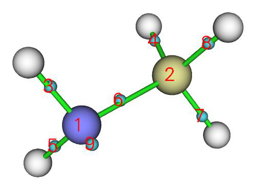

<!-- p.874 -->

Since there are spikes (points nearly approaching bottom) at very negative region of sign(λ2)ρ, according to the description of NCI method given in Section 3.23.1, we immediately know that this dimer system must contain evident attractive intermolecular interaction. There is also a spike at very positive side, therefore steric effects should exist in present system.

Then select option 3 to export func1.cub and func2.cub, and use VMD to plot a color-filled RDG map using the method described in Section 3.23.1, we obtain the graph below

The type of interactions in this system now is very clear. Steric effect exists within the aromatic ring

$$sign(\lambda_2)\rho$$

Showing AIM information in colored RDG map Below I illustrate how to plot AIM critical points (CPs) and bond paths on the color-filled RDG map, the resulting graph will be more informative, since the trace of interactions can be vividly shown, while this kind of information is not explicitly revealed by NCI analysis.

Return to main menu and input below commands to search CPs, generate paths and then export


<!-- p.875 -->

them as CPs.pdb and paths.pdb in current folder, respectively.

2 // Topology analysis 2 // Search nuclear CPs 3 // Search bond CPs 8 // Generate bond path -4 // Modify or export CPs 6 // Export CPs as CPs.pdb in current folder 0 // Return -5 // Modify or print detail or export paths 6 // Export paths as paths.pdb in current folder Then we close Multiwfn. Drag CPs.pdb and paths.pdb into VMD main window in turn to load them, select "Graphics"-"Representation", change "Selected molecules" to the second term (corresponding to CPs.pdb), change "Drawing Method" to "VDW" and set "Sphere Scale" from the default 1.0 to the minimal value 0.1. Note that in the CPs.pdb file, C, N, O, F atoms correspond to (3,-3), (3,-1), (3,+1), (3,+3), respectively. Here we only want to draw bond CPs (i.e. (3,-1) type of CPs) on the graph with yellow color, therefore we input "nitrogen" in "Selected Atoms" text box and press ENTER button, then change "Coloring Method" to "Color ID" and select "4 yellow" in the drop-down box. Currently, the graph looks like below

Probably you feel that the spheres corresponding to CPs are too large, however we cannot further decrease the "Sphere Scale" using graphical window due to limitation of VMD. To make the spheres smaller, you have to use corresponding command in VMD console window. To find proper command to do this, we select "File"-"Log Tcl Commands to Console", then change "Sphere Scale" to other value (e.g. 0.2), you will immediately see corresponding text-line command in the VMD console window, for present the command is mol modstyle 0 1 VDW 0.200000 12.000000, where the argument 0.2 corresponds to size of the spheres. Therefore, to decrease the sphere size to e.g. 0.09, we should input mol modstyle 0 1 VDW 0.09 12.000000 in the console window, then in the VMD graphical window you will see the spheres have already become smaller.

Next, we change the appearance of paths. In the "Graphics"-"Representation" panel, select the third term in "Selected molecules" (corresponding to paths.pdb), change the drawing method to "VDW", set coloring method as "Color ID" and select "3 orange", then use abovementioned skill to set the sphere scale to 0.02. The final graph is shown below.


<!-- p.876 -->

From this graph, not only the weak interaction regions are clearly revealed, but also the interaction paths are vividly exhibited. Notice that there is no CP and path corresponding to the hydrogen-hydrogen interaction, because in this region there is no position having vanishing electron density gradient, and this is why in the scatter map the spike corresponding this H-H interaction does not completely approach the bottom of the map. This observation reflects an advantage of NCI analysis over AIM analysis, namely interaction can be revealed even if there is no corresponding bond CP.

The steps of showing the CPs and bond paths in VMD are somewhat lengthy, therefore I strongly recommend using VMD plotting scripts to automatically do all of above steps, please follow part 4 of this video tutorial: https://youtu.be/e4FpVc9ao48, you will find the process is extremely easy. More information about this script can be found in Section 4.2.5.


### 4.20.2 Studying weak interaction in DNA by NCI method based on


### promolecular density

Please read Sections 3.23.1 and 3.23.2 if you are not familiar with NCI analysis and the concept of promolecular approximation. In this example, we will carry out NCI analysis for a DNA fragment consisting of 10 base pairs. Since this system is fairly large, promolecular approximation is used for approximately rapid construction of the molecular electron density. This example is also illustrated as part 3 of this video tutorial: https://youtu.be/e4FpVc9ao48.

Here we only study weak interaction character of a local DNA region, which is enclosed in the transparent box:


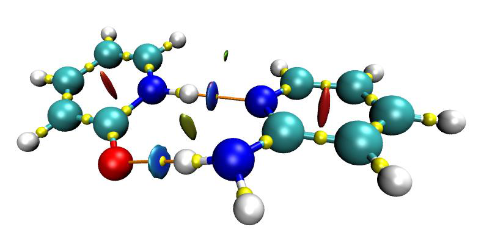

<!-- p.877 -->

Boot up Multiwfn and input: examples\DNA.pdb 20 // Visual study of weak interaction 2 // NCI analysis based on promolecular density 7 // Use mode 7 for defining grid data 84,565 // Use midpoint of atom 84 and 565 as center of grid data. You can view molecule structure in your favourite visualization tool to find two proper atoms used to define center

120,120,120 // Because the spatial scope of grid data is large, we need relatively large number of grid points, otherwise the grid spacing will be too large, which results in bad quality of RDG isosurfaces

9,9,9 // Set the extension distances in all directions to 9 Bohr Hint: You can also use mode 10 to set up box interactively in a GUI window, the box size and position of box center is more controllable

After the calculation of grid data is finished, choose option 3 to export sign(λ2)ρ and RDG as func1.cub and func2.cub respectively in current folder, and then copy them as well as examples\RDGfill_pro.vmd to VMD installation folder. Boot up VMD and input source RDGfill_pro.vmd in console window to draw color-filled RDG isosurface map, the resulting graph after some adjustments is shown below. (For better visualization effect, open "graphics"-"Representation" and change the drawing method of DNA to Licorice, change bond radius to 0.2. Then enter “Display”-“Display settings...” to set “Cue Mode” to "Linear" and set “Cue Start/End” to 2.25 and 3.75, respectively, so that distant atoms can be substantially screened). Finally, you will get the graph below


<!-- p.878 -->

It is clear that there are π-π stacking interactions between neighbouring base pairs (big flat isosurfaces), and there are two strong hydrogen bonds among each base-pairs. The region pointed by red arrow seems to be hydrogen bond because it connects hydrogen and oxygen, however since the filled-color is green, we can conclude that it can only be regarded as vdW interaction.

The default isovalue 0.3 in RDGfill_pro.vmd is suitable for present case, but may not be suitable for exhibiting weak interaction region of other systems, in that situation you need to adjust it manually. You can either edit the .vmd file, or choose “Graphics”-“Representation” in VMD, then select the representation with style “Isosurface” and reset isovalue by inputting expected value in text box.

.


### 4.20.3 Visually studying weak interaction for water in bulk


### environment by aNCI method

Note 1: Using the aNCI method illustrates in this section is already deprecated, using amIGM method instead is significantly better, see Section 4.20.13 for illustration.

Note 2: Chinese version of this section is my blog article “Using Multiwfn to study weak interaction in molecular dynamics” (http://sobereva.com/186), which also contains extended discussion.

If you are unfamiliar with NCI and aNCI methods, please first read the introduction given in Sections 3.23.1, 3.23.2, 3.23.3, and book chapter DOI: 10.1016/B978-0-12-821978-2.00076-3, as well as Angew. Chem. Int. Ed., 137, e202504895 (2025) DOI: 10.1002/anie.202504895. The aNCI method illustrated in this section is a generalization of NCI analysis method for dynamic environment, e.g. molecular dynamics (MD) process.

In this example I will show how to use Multiwfn to visually study the weak interaction between


<!-- p.879 -->

water molecules in the MD simulation of bulk water system. You can use any program to perform the MD simulation, as long as you know how to convert the resulting trajectory from private format to the general .xyz format, which can be recognized by Multiwfn and utilized in aNCI analysis.

Here I assume that you are a GROMACS 4.5 user. The detailed steps of the MD process are given below (very different to GROMACS >= 5.0), all of the related files can be found in examples\aNCI folder. If you do not want to perform the MD simulation yourself, you can directly download the wat.xyz, which will be utilized in aNCI analysis later: http://sobereva.com/multiwfn/extrafiles/aNCI_wat_xyz.zip.

Generating MD trajectory by GROMACS First, build a file named emptybox.gro, which records a blank box, and the side length in each direction is 2.5nm. Then run below command to fill the box with waters.

genbox -cp emptybox.gro -cs spc216.gro -o water.gro Run below command and select "GROMOS96 53a6 force field" to obtain the top file of the bulk water system. SPC/E water model is employed.

pdb2gmx -f water.gro -o water.gro -p water.top -water spce Then carry out NPT MD by 100ps to equilibrate the bulk water at 298.15 K, 1 atm environment. grompp -f pr.mdp -c water.gro -p water.top -o water-pr.tpr mdrun -v -deffnm water-pr Using VMD program to load water-pr.gro, select a water close to the center of the box. We select the water with resid index of 101, which is highlighted in the graph below. Note that the two hydrogens in this water have index of 302 and 303, and the index of the oxygen is 301.

This water will be freezed in the following MD simulation. In order to do so, we generate index file, namely inputting below commands

make_ndx -f water-pr.gro ri 101 q Run following command to do 1 ns equilibrium MD simulation at 298.15 K, the trajectory will


<!-- p.880 -->

be saved every 1ps, and finally we will obtain 1000 frames. The water with resid index of 101 is freezed via the keyword "freezegrps = r_101". Note that NVT ensemble instead of NPT is used, because NPT process will scale the coordinate of the atoms, which somewhat destorys the effect of freezing.

grompp -f md.mdp -c water-pr.gro -p water.top -o water-md.tpr -n index.ndx mdrun -v -deffnm water-md Load the water-pr.gro into VMD, then load water-md.xtc to the same ID, select "File"-"Save Coordinate..." option and set the file type as xyz, then input all in the "Selected atoms" box, input 1 and 1000 in the "First" and "Last" window, respectively. Finally, click "Save" button to convert the GROMACS trajectory to wat.xyz.

IMPORTANT NOTICE: The wat.xyz currently records atom names rather than element names. For example, if you open this file via text editor, you will find each water contains OW, HW1 and HW2, which are atom names. However, in standard .xyz file, only atom elements should be recorded. Therefore, in general cases, you should manually replace all atom names in the .xyz file generated by VMD with element names. Fortunately, this step can be skipped in present example because there is no element in the periodic table named OW, HW1 and HW2, therefore, only the first letter of atom names will be employed by Multiwfn to try to identify their elements, and they can be properly recognized as oxygen and hydrogens, since after loading the .xyz file, you can find prompt “Formula: H1022 O511” on the screen, which is what we expected. If you find there are undesired elements in the “formula”, that means you have to replace the corresponding atom names in the .xyz file as their actual element names.

Generating grid data by Multiwfn Boot up Multiwfn and input following commands wat.xyz 20 // Visual study of weak interaction 3 // aNCI analysis 1,1000 // The range of the frames to be analyzed 7 301,301 // Using atom 301 (the oxygen of the frozen water) as the box center of the grid data 80,80,80 // The number of grid points on each side 4.5,4.5,4.5 // Extend 4.5 Bohr in each side Now Multiwfn starts to calculate electron density, its gradient and Hessian of each frame, then their average quantities will be obtained, and finally Multiwfn calculates average RDG and average

sign(λ2)ρ. The whole process is time-consuming; at a common Intel 4-cores computer about half an hour will be consumed. (Note that the electron density I referred to here is produced by promolecular approximation, which is constructed by simply superposing the density of the atoms in their free-states)

After the calculation is finished, you can select option 1 to check the scatter plot between

average RDG (X-axis) and average sign(λ2)ρ (Y-axis), see below, there is also option used to export the corresponding data points to plain text file.


<!-- p.881 -->

Select option 6 to export the grid data of average RDG and average sign(λ2)ρ as avgRDG.cub and avgsl2r.cub in current folder, respectively.

Since we wish to check the stability of weak interaction, we also select 7 to export thermal fluctuation index to thermflu.cub in current folder. Note that this process requires recomputing electron density of each frame, and thus is time-consuming.

Analysis Copy avgRDG.cub, avgsl2r.cub, thermflu.cub as well as avgRDG.vmd and avgRDG_TFI.vmd in "examples\aNCI" folder to the directory of VMD program.

Simply boot up VMD and input source avgRDG.vmd in its console window, the average RDG

isosurface will be shown with isovalue of 0.25, meantime the average sign(λ2)ρ is mapped on the isosurface by various colors. In order to make the graph clearer, one should screen unrelated atoms, that is enter "Graphics" - "Representation"， then select the entry whose "style" is "CPK", and input serial 301 302 303 in the "Selected Atoms" box and then press ENTER button. Now only the water with resid index of 101 is presented in the graph. After proper rotation and translation of view, you will see


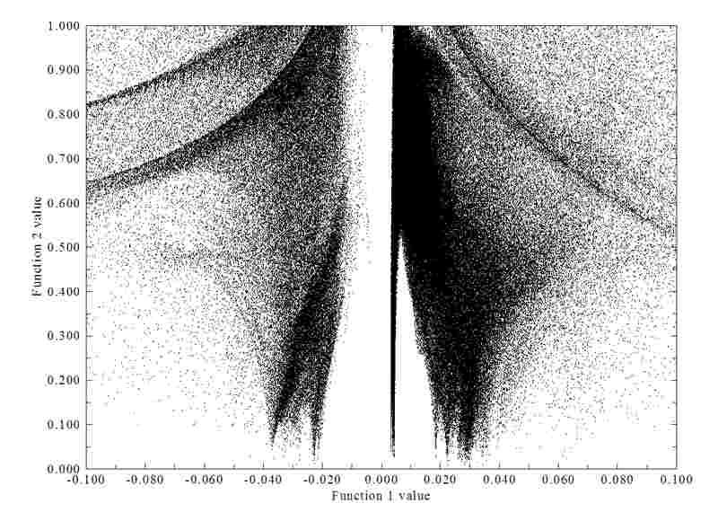

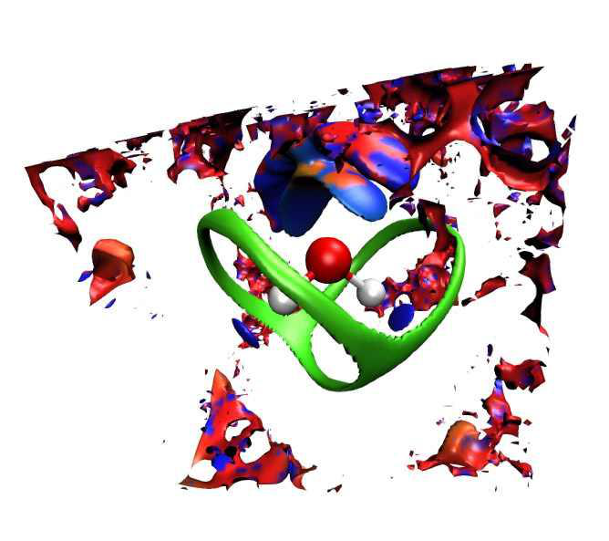

<!-- p.882 -->

Unfortunately, around the water of interest, there are large amounts of noisy isosurfaces, which somewhat messed up the graph, thus it is better to shield them. This aim can be achieved by main function 13 of Multiwfn, the steps are described below.

Then boot up Multiwfn and input avgRDG.cub 13 // Process grid data 13 // Set the value of the grid points far away from specific atoms 1.5 // If the distance between a grid point and any selected atoms is longer than 1.5 times of vdW radius of corresponding atom, then the value of the grid point will be set as given value

100 // An arbitrarily large value (should be larger than the isovalue of the RDG isosurfaces) 2 // Inputting selected atoms by hand 301-303 // The indices of the atoms are 301, 302 and 303 0 // Export the updated grid data to a new cube file avgRDG.cub // The name of the new cube file Copy the newly generated avgRDG.cub to the folder of VMD program to overwrite the old one, then use the script avgRDG.vmd again to plot the graph, after some adjustments you will see (for clarity, the view of two sides is shown at the same time)

The graph we obtained this time is very clear. The color scale is from -0.25 to 0.25, corresponding to the color variation of Blue-Green-Red. Bluer denotes electrostatic interaction or H-bond effect in corresponding region is stronger, and redder suggests more intensive steric effect. Green region implies low electron density, corresponding to vdW interaction. From the graph one can see that there are two blue ellipses near the two hydrogens, rendering that in the MD process, strong H-bonds are formed due to the O-H group. The slender green isosurface exhibits in which direction this water prefers to interact with other waters by vdW interaction. There is a big lump of isosurface above the oxygen, on which the red color appears in the middle part, while blue color occurs at the two ends; the latter reflects that the two lone pairs of the oxygen act as H-bond acceptors during the simulation, while the former reveals the repulsive interaction zone between waters.

Next, we study the stability of the weak interactions. First disable present isosurfaces, and then input the command source avgRDG_TFI.vmd in the console window, after some adjustments you


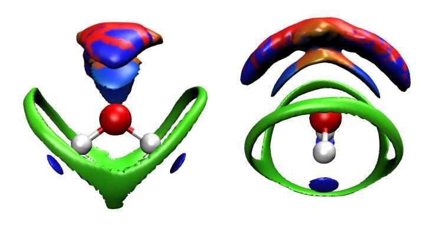

<!-- p.883 -->

will see

The color scale is 0~1.5, still corresponding to the color transition of Blue-Green-Red. Bluer (red) means the thermal fluctuation index (TFI) is smaller (larger), and hence the weak interaction in corresponding region is more stable (unstable). The graph shows that it is stable that the water behaves as H-bond donor, while the stability of the water acting as H-bond acceptor is slightly weaker; the vdW interaction region is totally red, rendering that vdW interaction is evidently unstable compared to hydrogen bond.

Finally, it is worth to mention that using aNCI method you can plot a very nice picture to vividly reveal interaction between ligand and protein, as illustrated in the following map. The detailed steps of plotting this map have been described in this post: "Using Multiwfn to perform aNCI analysis to graphically study protein-ligand interactions in dynamic process" (http://sobereva.com/591, in Chinese). If you cannot fully understand this article via Google translator, please contact me, I will find time to translate it to English.


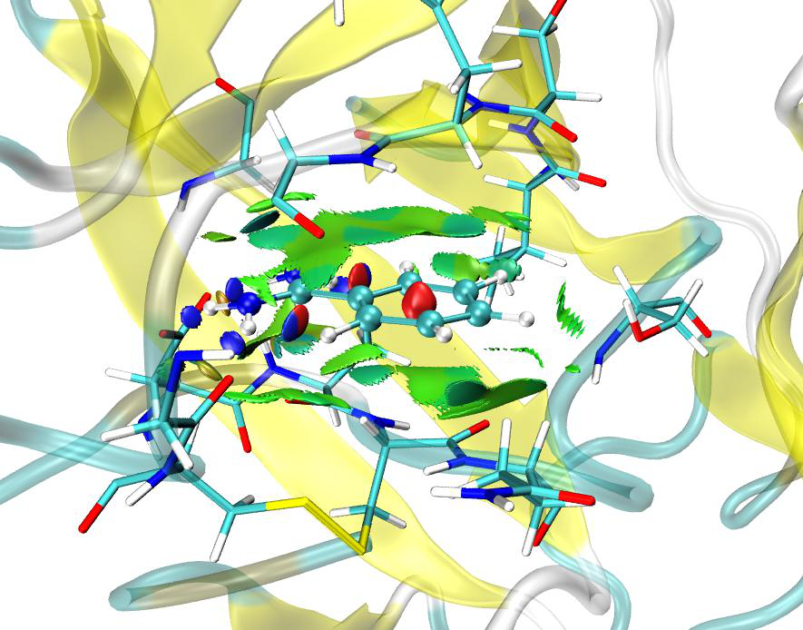

<!-- p.884 -->


### 4.20.4 Revealing both chemical bonding and weak interaction regions


### in phenol dimer by IRI analysis

IRI (Interaction Region Indicator) was proposed by me in Chemistry−Methods, 1, 231 (2021). Before following this section, please read the original paper, Section 3.23.8 of this manual and DOI: 10.1016/B978-0-12-821978-2.00076-3 to gain basic knowledge about IRI first. Here I take two

examples to respectively show how to draw sign(λ2)ρ mapped IRI isosurfaces and IRI plane maps to simultaneously reveal both chemical bond and weak interaction regions.

In addition, Multiwfn can also perform topology analysis on IRI to study it quantitatively, see Section 4.2.11 for detail.

For more information on IRI analysis, please download the document "Tutorial of using Multiwfn to perform IRI analysis" and follow it: http://sobereva.com/multiwfn/res/IRI_tutorial.zip.

In this document the procedure of performing IRI-π analysis is also detailedly described. IRI-π is a variant of IRI aiming for vividly revealing π interactions.

It is highly suggested to read my this blog article: "Using IRI method to graphically study chemical bonds and weak interactions in chemical systems" (http://sobereva.com/598, in Chinese), in which the feature of IRI is carefully described, richer discussions are given, and more examples are provided.

Plotting sign(λ2)ρ mapped IRI isosurface Phenol dimer is taken as instance here. You will find almost all steps are identical to the NCI analysis described in Section 3.23.1.

Boot up Multiwfn and input examples\PhenolDimer.wfn 20 // Visual study of weak interaction 4 // IRI analysis 3 // High-quality grid 3 // Export cube file Move func1.cub, func2.cub and plotting script examples\IRIfill.vmd to VMD folder. Then boot up VMD and input source IRIfill.vmd in VMD console window to execute the script, you will immediately see the graph below (the sphere scale of the atoms has been reduced to 0.6 in "Graphics" - "Representation").


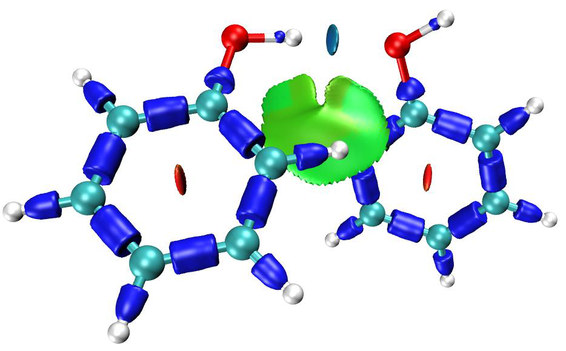

<!-- p.885 -->

The IRIfill.vmd script employs the following color scale. The meaning of various colors is also explained in the following map.

The graphical effect of the IRI map is obviously quite satisfactory. The weak interaction regions are exhibited as nicely as NCI analysis, and the chemical bond regions are also clearly revealed by blue isosurfaces, indicating that electron density in these regions is very large and implying bonding effect is strong.

Note that the most suited isovalue of IRI function may be different for different systems, the default isovalue in the IRIfill.vmd script is 1.0. You can modify it in the .vmd script file (namely the value behind "mol representation Isosurface" in this script), or manually adjust it in "Graphics" - "Representations" panel of VMD.

Plotting scatter map between IRI and sign(λ2)ρ After calculating grid data of IRI, you can select option “2 Output scatter points to output.txt

in current folder”, the generated output.txt contains X, Y, Z, IRI and sign(λ2)ρ of every grid point. By this file and gnuplot plotting script examples\scripts\IRIscatter.gnu, you can plot a colored scatter

map between IRI and sign(λ2)ρ. Gnuplot is freely available at http://www.gnuplot.info. Move the output.txt and IRIscatter.gnu to the folder containing gnuplot executable file, then in this folder run command: gnuplot IRIscatter.gnu, after that you will find IRIscatter.ps in current folder. You can open it by Acrobat or Photoshop or IrfanView (with ghostscript installed), or convert it first to another image format using online image converter https://cloudconvert.com/image-converter and then open, you will see

By comparing color between the IRI isosurface map shown earlier and the scatter map, you can find correspondence between the spikes in the scatter map and isosurfaces. Clearly, the blue/cyan spikes between -0.02 and -0.03 a.u. correspond to the H-bond interaction, while the green spike at approximately 0.005 a.u. corresponds to vdW interaction, and the red spike at about 0.025 a.u.


<!-- p.886 -->

corresponds to the steric effect within the benzene rings.

The default range of X-axis of the plotting script is -0.05 to 0.05. If you properly extend it, then the spikes corresponding to chemical bonds can also be exhibited, you simply need to change lines 14 and 15 in the IRIscatter.gnu to


```text
set xrange [-0.5:0.3]
set xtic  -0.5,0.1,0.3 nomirror rotate font "Helvetica"
```

After rerunning the plotting script, you will obtain the following map, evidently the spikes between -0.4 and -0.3 a.u. correspond to chemical bonds, because electron density can reach this magnitude only in chemical bonding regions.

Plotting IRI map without covalent bond regions If you only hope to visualize noncovalent interactions in IRI map, the easiest way is choosing option “9 Screen out covalent bond regions (set IRI to 100 for regions with sign(lambda2)rho < -0.1 a.u.)” in the post-processing menu of IRI analysis. After that, if you export grid data and plot IRI map via VMD, you will find covalent bond regions have been screened out, as seen from the following map

Plotting plane map for IRI Sometimes it is also useful to plot a plane map for IRI to reveal interaction regions in a specific


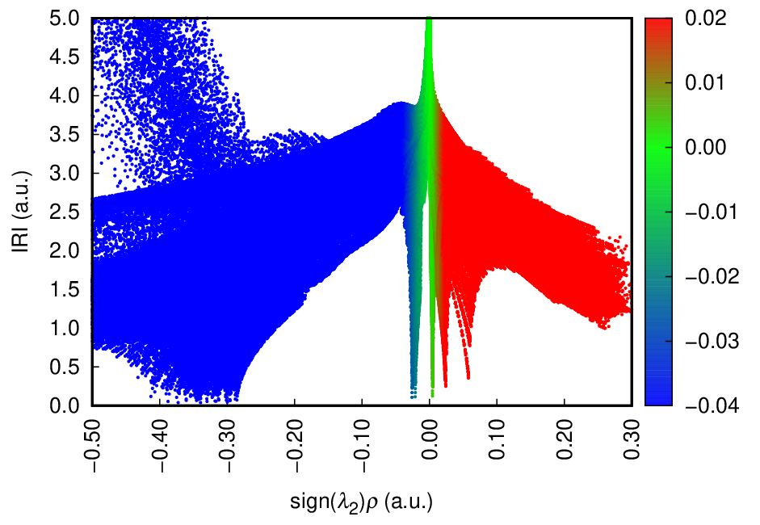

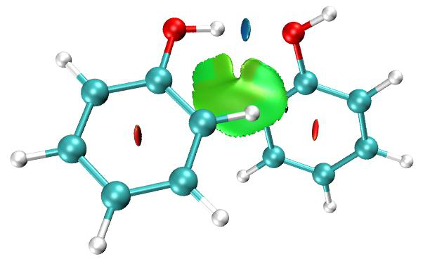

<!-- p.887 -->

plane. Below I will illustrate how to realize this for examples\GC.wfn, which is a base pair dimer.

Boot up Multiwfn and input examples\GC.wfn 4 // Plot plane map 24 // IRI 1 // Color-filled map [Press ENTER button] // Use default number of grids 0 // Modify extension distance 1 // 1 Bohr 1 // XY plane, which is the plane all atoms are 0 // Z=0 Close the graph and then input 19 // Set color transition 2 // Reversed rainbow 4 // Enable showing atom labels and reference point 1 // Red 8 // Enable showing bonds 14 // Brown -1 // Plot again Now you can see the map below

The orange and green areas (IRI < 1.0) in this map clearly reveal the regions where notable chemical bond interaction and weak interaction occur. The regions with IRI >1.0 have either large gradient of electron density or negligible electron density, they are not of chemical interest.


<!-- p.888 -->


### 4.20.5 Simultaneously revealing covalent and noncovalent interactions


### in phenol dimer by DORI analysis

Frankly speaking, DORI (Density Overlap Regions Indicator) analysis is no longer valuable since IRI analysis was proposed by me, because IRI has similar capacity of revealing all kinds of interaction regions as DORI while the graphical effect is evidently better than DORI. However, I still use phenol dimer system to illustrate how to perform DORI analysis in Multiwfn. Please read Section 3.23.4 first to understand basic knowledge about DORI.

Boot up Multiwfn and input examples\PhenolDimer.wfn 20 // Visual study of weak interaction 4 // DORI analysis 3 // High-quality grid 3 // Export cube file Move func1.cub, func2.cub and plotting script examples\DORIfill.vmd to VMD folder. Then boot up VMD and input source DORIfill.vmd in console window, you will immediately see the graph below

The graphical effect of DORI map is obviously not as good as IRI map, especially the edge region of the isosurfaces corresponding to weak interactions look quite ugly. Furthermore, calculation cost of DORI is higher than IRI due to its much more complicated definition, therefore IRI should always be used instead of DORI.

The DORIfill.vmd employs the same color transition method and color scale as IRIvill.vmd. The most suited isovalue of DORI is different for different systems, the default isovalue in the DORIfill.vmd script is 0.95, you can modify it if you find it is inappropriate.


### 4.20.6 Visualizing and analyzing van der Waals potential

Note: Chinese version of this topic is my blog article “On the calculation and analysis of van der Waals potential as well as its plot in Multiwfn” (http://sobereva.com/551, in Chinese), which contains much more examples and additional discussions.

The concept of van der Waals (vdW) potential proposed by me has been carefully introduced in Section 3.23.7, please carefully read it first. In this section I will illustrate how to visualize and


<!-- p.889 -->

analyze vdW potential.

### 4.20.6.1 Example 1: Helicene

In this example I will illustrate visualizing the vdW potential for helicene, whose structure is shown below

To study vdW potential, you need to select a probe atom. For example, in this instance we want to employ He atom as probe atom, therefore we change "ivdwprobe" parameter in `settings.ini` to 2.

Now boot up Multiwfn and input examples\helicene.xyz 20 // Visual study of weak interaction 6 // Visualization of van der Waals potential 3 // High-quality grid (the computational cost of vdW potential is extremely low, therefore we use relatively good grid quality here)

As can be seen from the menu, now you can directly visualize vdW potential or its two components, namely repulsion potential and dispersion potential. You can also export their grid data to cube files. The unit used in this module is kcal/mol.

Now we choose option 3 to visualize isosurface map of the vdW potential, the resulting map with isovalue of 0.6 (kcal/mol) is shown on the left side below. If you want to only visualize the negative part, there is a trick: Set isovalue to -0.6 and unselect "Show both sign" check box, then select "Isosurface style" - "Exchange positive and negative colors", the resulting map is shown on the right side below ("Ratio of atomic size" has been changed to 4.0, the molecular representation now corresponds to superposition of atomic vdW spheres).


<!-- p.890 -->

In the maps above, the blue isosurfaces represent the regions where vdW potential is negative, in these regions the dispersion attractive effect surpasses repulsion effect. It is expected that He atoms (or more generally, various small nonpolar molecules) will tend to be attracted to the blue regions due to dispersion interaction. All regions close to the nuclei are enclosed by green isosurface, indicating that repulsive potential dominates the vdW potential in these places, this is the normal case.

Can the vdW potential map be correlated with any practical observation? The answer is YES. I carried out 2500 ps molecular dynamics simulation under 10 K for the complex consisting of a helicene molecule and a He atom based on the GFN0-xTB theory in the Grimme's xtb code, the trajectory frames (small spheres) and the isosurface of spatial distribution function (orange isosurface) of the He atom are shown below

It can be seen that the majority of trajectory frames and the main distribution of spatial distribution function are highly analogous to the blue regions in the vdW potential map showing earlier, demonstrating that the vdW potential is indeed able to exhibit the favorable adsorption regions if vdW interaction dominates the intermolecular interaction (of course, the precondition is that both the adsorbate and the local region of adsorption sites are nearly nonpolar, otherwise electrostatic interaction will largely control the adsorption behavior, in this case you should examine electrostatic potential rather than vdW potential).

By the way, there is another way of visualizing grid data of vdW potential, namely plotting vdW potential


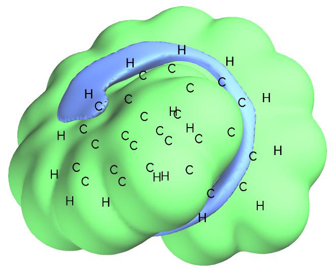


<!-- p.891 -->

colored vdW surface map, the procedure in Windows system is: copying vdWpot.bat and vdWpot.txt from "examples\scripts\vdWpot" folder to current folder, properly modifying the path of input file and VMD folder in the .bat file, and then run this .bat file. After that, boot up VMD, copying all content from the vdWpot.vmd file in "examples\scripts\vdwpot" folder to the VMD console window, you will see the vdW potential colored ρ=0.001 a.u. surface (note that the ρ is estimated using promolecular approximation). However, since the graphical effect of this kind of map is not quite good, I prefer to study vdW potential in terms of isosurface map.

### 4.20.6.2 Example 2: Cyclo[18]carbon

The cyclo[18]carbon system was very extensively studied in my works Carbon, 165, 468 (2020), Carbon, 165, 461 (2020) and http://sobereva.com/carbon_ring.html for more. In this example I will illustrate how to plot plane map of vdW potential for this system. The structure

optimized at ωB97XD/def2-TZVP level is given as examples\C18.xyz. As you can see, this system is exactly planar and fully lying in the XY plane with Z=0.

We will plot color-filled map of vdW potential on the molecular plane. To do so, we need to change user-defined function to vdW potential, namely setting "iuserfunc" parameter in `settings.ini` to 92. We still use He element as probe atom like the last example, therefore "ivdwprobe" in `settings.ini` should be set to 2.

Boot up Multiwfn and input examples\C18.xyz 4 // Plot plane map 100 // User-defined function 1 // Color-filled map [Press ENTER button directly to use recommended grid] 0 // Set extension distance 10 // 10 Bohr 1 // XY plane 0 // Z value Click right mouse button on the graph to close it, then input 1 // Set lower&upper limit of color scale -0.8,0.8 // Note that unit is kcal/mol for vdW potential 4 // Enable showing atom labels 12 // Dark green 8 // Enable showing bonds 14 // Brown 19 // Set color transition 8 // Blue-White-Red 2 // Enable showing contour lines Now select option -1 to replot the map, you will see


<!-- p.892 -->

In this map, red and blue colors represent positive and negative vdW potential, respectively. From the map it can be seen that the vdW potential around the center of the cyclo[18]carbon is fairly negative and thus this place has strongest ability in adsorbing nonpolar molecules. In the peripheral region of this system the vdW potential is modestly negative, implying that nonpolar molecule can only weakly interact with this system in this area due to dispersion attraction.

Please plot isosurface map of vdW potential as well as plane map of vdW potential in YZ plane, so that you can better understand the overall distribution of vdW potential around this unusual system. Via main function 3, you can also plot vdW potential between two given points, therefore you can easily study variation of vdW potential starting from the ring center in the direction perpendicular to the ring.

It is worth to note that it is very easy to obtain value of vdW potential at a given point, for example, the center of this system, whose position is exact (0,0,0). You simply need to enter main function 1, input 0,0,0, then choose either Bohr or Å as unit, then the following information can be found from screen:


```text
User-defined real space function: -0.6979258635E+00
```

that is the vdW potential (with He as probe atom) is -0.70 kcal/mol.

Basin analysis on vdW potential If you want to obtain most negative value of vdW potential, you can make use of the powerful basin analysis module, which is detailedly illustrated in Section 4.17. Now we use this module to find the most negative value of vdW potential for the cyclo[18]carbon.

IMPORTANT NOTE: Multiwfn also supports performing topology analysis on vdW potential to obtain its minima, see Section 4.2.10 for example, the result is more accurate than using the basin analysis module. Therefore, using topology analysis module is preferred over the way illustrated below!

Boot up Multiwfn and input below commands examples\C18.xyz 17 // Basin analysis


<!-- p.893 -->

1 // Generate basins and locate attractors 100 // User-defined real space function. Now it corresponds to vdW potential with He as probe atom

2 // Medium-quality grid Wait for a while until the calculation is complete, then you can choose option 10 to visualize the located minima of the vdW potential

Only the minima around the ring center are of chemical interest. As can be seen, these minima are automatically clustered together and share the same index (1), they can be viewed as degenerate minima. The minima at peripheric region of the ring can be ignored because they basically resulted from numerical noise.

Then input -3 // Show information of attractors y // Show attractors after sorting according to their values Then you can see position and value of each minimum before clustering. Finally, you can see the positions and values of the final minima (i.e. after clustering):


```text
   Attractor       X,Y,Z coordinate (Angstrom)            Value
       1    0.00000000    0.00000000   -0.01763924  -0.757315492E+00
      21    0.00000000   -6.45596244   -0.52917725  -0.242350606E+00
      36    0.00000000   -6.45596244    0.52917725  -0.242350606E+00
      28    6.37658585   -1.08481336   -0.50271839  -0.242126321E+00
[...ignored]
```

Clearly, the minima of vdW potential (e.g. the points sharing attractor index of 1) in this system is -0.757 kcal/mol. The printed coordinate "0.00000000 0.00000000 -0.01763924" corresponds to average of all of its members.

If then you want to plot the minima via visualization softwares such as VMD, you can select "-4 Export attractors as pdb/pqr/txt/gjf file", then select corresponding option to export attractors.pdb in current folder, the meanings of atom index and residue index in this file are explicitly shown on screen. Specifically, if you load this file into VMD, you can use "resid 1" as selection to plot the global minima, since they share index of 1.


<!-- p.894 -->


### 4.20.10 Visualize and quantify weak interactions by Independent


### Gradient Model (IGM)

Please read Section 3.23.5 and my reviews DOI: 10.1016/B978-0-12-821978-2.00076-3 and Angew. Chem. Int. Ed., 137, e202504895 (2025) DOI: 10.1002/anie.202504895 to gain basic knowledge about the Independent Gradient Model (IGM) method proposed in Phys. Chem. Chem. Phys., 19, 17928 (2017). If you are not familiar with NCI analysis, you should also first read Section 3.23.1, since many aspects of IGM analysis are closely related to the NCI analysis. In this section I will illustrate the use of IGM analysis in Multiwfn via several examples. More discussions and instances can be found in my blog article "Investigating intermolecular weak interactions via Independent Gradient Model (IGM)" (in Chinese, http://sobereva.com/407).

Because IGM method is independent of wavefunction, you can use any kind of input file containing atomic coordinate information, such as .xyz, .mol and .pdb (see Section 2.5 for details). The VMD program used throughout this section is version 1.9.3, it is freely available at http://www.ks.uiuc.edu/Research/vmd/.

NOTE: If your system is not extremely large and wavefunction file can be generated, I strongly suggest using IGMH instead of IGM to gain more reasonable result. IGMH is an improved version of IGM, see Section 3.23.6 for introduction and Section 4.20.11 of example. Even if IGMH cannot be used due to computational cost reason or unavailability of wavefunction file, using mIGM instead of IGM is strongly suggested, see Section 3.23.10 for introduction and Section 4.20.12 for example.

### 4.20.10.1 Example 1: Guanine-cytosine (GC) base pair

The IGM framework includes many useful ideas and defined many useful concepts, a series of analyses will be conducted in this example. A simple system guanine-cytosine (GC) base pair is taken as instance here. Some analyses may be ignored in practical studies, and sequence of analyses is completely arbitrary.

(1) Studying δg function We first study the distribution character of δg function by plotting it as color-filled plane map. Boot up Multiwfn and input below commands

examples\GC.pdb 4 // Plot plane map

22 // δg 1 // Color-filled map [Press ENTER button to use default grid setting] 1 // XY plane 0 // Z=0 The graph shown on screen currently looks obscure, this is because the default color scale is not suitable for present case, so we close the graph and input

1 // Set color scale 0,0.2 // Lower and upper limits 4 // Show atomic labels 1 // Red color -2 // Set label intervals of axes 3,3,0.02 // Intervals for X, Y and color bar


<!-- p.895 -->

8 // Enable showing bonds 14 // Brown -1 // Plot again You will see the graph below

The graph above clearly reveals all interatomic interactions, and the magnitude of δg is positively relevant to interaction strength. As can be seen from the graph, all chemical bond regions

have large δg value (the region with value higher than 0.2 is shown as white). The δg function also outlines three hydrogen bond regions among the base pair, where the δg function has evidently smaller value compared to the chemical bond regions.

The δg can also be plotted as isosurface map. Return to main menu and input 5 // Calculate grid data

22 // δg 2 // Medium-quality grid -1 // Show isosurface The isosurface with isovalue of 0.15 and 0.03 are shown below (you can use higher quality of grid or set the extension distance of grid data smaller to make the graph smoother)


<!-- p.896 -->

Since chemical bond regions have relatively large value of δg, only chemical bonding interactions are visible when isovalue is set to 0.15. Clearly, δg may be used as a function to exhibit chemical bonds like ELF and IRI functions, with additional advantage that only geometry information is needed. The weak interaction regions can also be simultaneously visualized when isovalue is decreased to a small value, e.g. 0.02.

(2) Studying δginter function between base pair The δginter is a key function in the IGM analysis framework, it is designed to reveal interaction regions between two (or even more) fragments defined by users. Here we plot this function to study the interactions between the two bases. Although as shown earlier, these interactions can also be

revealed by simply drawing δg, the isosurfaces corresponding to intrafragment interactions severely polluted the graph. Fortunately, the IGM analysis allows us to separate the δg as δginter and δgintra, which solely reflect the contribution to δg due to interfragment and intrafragment interactions, respectively.

Return to main menu and input following commands 20 // Visual study of weak interactions 10 // IGM analysis 2 // Define two fragments 1-13 // Range of atoms in the first base 14-29 // Range of atoms in the second base (you can also input c here to define the rest of the present system as the second fragment)

2 // Medium-quality grid After calculation, you will see a post-processing menu. The meaning of each option has been

$$\delta g^{inter}$$


<!-- p.897 -->

If you are familiar with NCI method, you will naturally know how to discuss this graph, now

we try to identify character of peaks in the scatter graph. In the region where sign(λ2)ρ is about -0.04, you can find that the δginter has a remarkable peak (with height about 0.06), which implies presence of hydrogen bonds. If δginter isosurface is set to an isovalue lower than about 0.06, the corresponding isosurfaces should be visible in the graph. In the region where sign(λ2)ρ is approximately +0.02, there is also a small peak of δginter. Since positive sign(λ2)ρ implies repulsive interaction, the peak may reflect weak steric regions in the center of the two rings between the two

bases. In above scatter map, there is a very prominent peak of δgintra around sign(λ2)ρ = -0.3. Since this peak corresponds to intrafragment interaction, and corresponding sign(λ2)ρ is not only negative but large, rendering attractive and strong interaction, the peak must result from chemical bond.

Using Multiwfn you can directly visualize isosurface of δginter and δgintra. To do this, we close the scatter map, select option "4 Show isosurface of grid data", then choose corresponding options and properly set isovalue, you will obtain below isosurface graphs


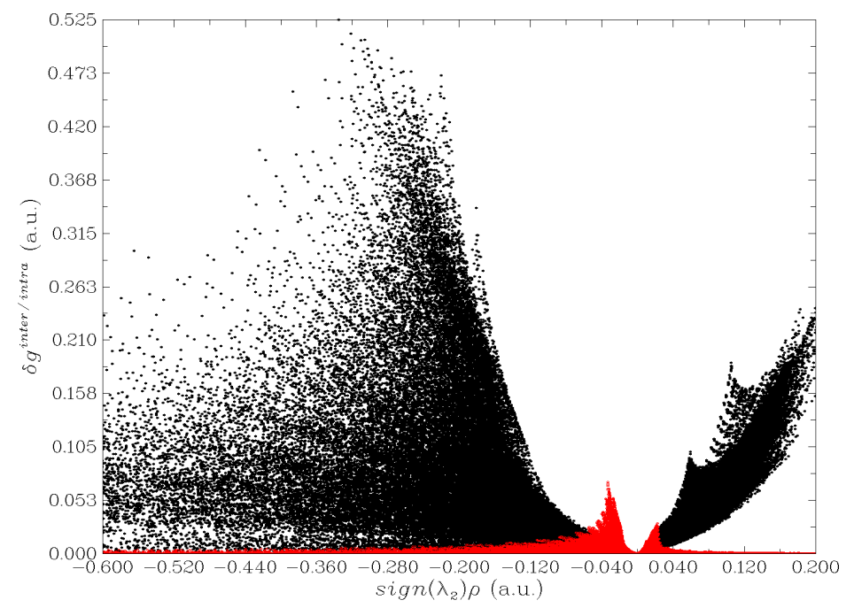


<!-- p.898 -->

As can be seen, δginter and δgintra indeed solely exhibit inter- and intra-fragment interactions, respectively. This greatly facilitates separate discussion of the two kinds of interactions.

From the above δginter = 0.02 isosurface map we are only able to visualize hydrogen bond regions. To find steric region in the ring center between the two bases, we should further decrease

the isovalue of δginter to e.g. 0.008, as shown below. The ring-center steric regions are highlighted by arrows.

(3) Drawing sign(λ2)ρ mapped δginter isosurfaces If sign(λ2)ρ is mapped to δginter isosurfaces by different colors, then one can not only recognize where weak interactions occur, but also immediately capture the character of the interactions. Multiwfn itself is currently unable to plot color-filled isosurface map, we need to use VMD program to do this, just like what we do in the NCI analysis.

Select option "3 Output cube files to current folder" in IGM post-processing menu, then

sign(λ2)ρ, δg, δginter and δgintra will be exported to sl2r.cub, dg.cub, dg_inter.cub and dg_intra.cub in current folder, respectively. Move sl2r.cub and dg_inter.cub as well as VMD plotting script examples\IGM_inter.vmd into VMD folder. Boot up VMD, input source IGM_inter.vmd in the console window, you will immediately see the graph below

The default isovalue employed by the IGM_inter.vmd script is 0.01, you can manually change isovalue by dragging the isovalue bar in "Graphics" - "Representation" panel. In the script the

default color scale of sign(λ2)ρ ranges from -0.05 to 0.05, and the default color transition is Blue-Green-Red. Therefore, the bluer the isosurface, the stronger the attractive interaction, while the redder the isosurface, the larger the steric effect. Green zone in an isosurface implies that the corresponding interaction is weak and may be regarded as van der Waals interaction.

Similarly, you can plot sign(λ2)ρ mapped δgintra isosurfaces. Just move sl2r.cub and dg_intra.cub as well as the corresponding VMD plotting script examples\IGM_intra.vmd into VMD


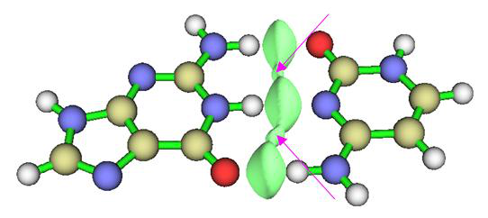

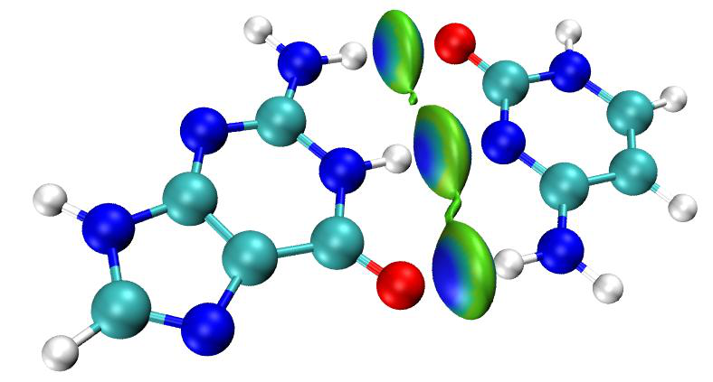

<!-- p.899 -->

folder, then input source IGM_intra.vmd in the console window to execute it.

(4) Decomposing interfragment interaction as atom and atomic pair contributions

$$\delta g^{inter}$$

Part of content of atmdg.txt is pasted here:


```text
Atom delta-g indices of fragment  1 and percentage contributions
 Atom    6 :    0.496653  (  23.07 % )
 Atom   13 :    0.483135  (  22.44 % )
 Atom    8 :    0.411759  (  19.13 % )
[ignored...]
Atom delta-g indices of fragment  2 and percentage contributions
 Atom   25 :    0.589516  (  27.39 % )
 Atom   24 :    0.431975  (  20.07 % )
 Atom   29 :    0.388667  (  18.06 % )
[ignored...]
Atom pair delta-g indices and percentage contributions (zero terms are not shown)
   13   24 :    0.251327  (  11.68 % )
    6   25 :    0.236065  (  10.97 % )
    8   29 :    0.218248  (  10.14 % )
```

If you compare above data with the structure map of present system shown below, you will find the indices are very meaningful and useful for discussing interfragment interactions

The largest three δGatom of fragment 1 are 6, 13 and 8, while that of fragment 2 are 25, 24 and 29, they are just the atoms closest to another fragment, undoubtedly they should have the most important contributions to the interfragment interactions. H13-O24, N6-H25 and O8-H29 have the

largest δGpair, reflecting that they are the most crucial interactions for formation of the base pair.

Note that Multiwfn also exports IBSIW (intrinsic bond strength index for weak interactions) to IBSIW.txt. Its definition has been described in Section 3.23.6. This index may have stronger


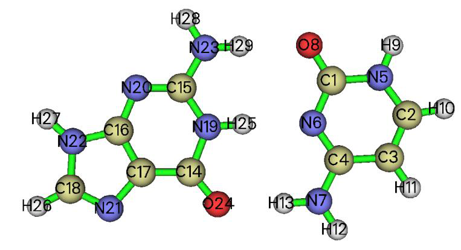

<!-- p.900 -->

correlation with interatomic interaction strength than atomic pair δg index.

(5) Coloring molecular structure by percentage atom δg indices Using VMD, it is also possible to map δGatom and δGatom(%) on molecular structure, so that relative importance of various atoms for interfragment interaction can be vividly exhibited. If

needed, the δginter isosurfaces can also be shown together. Now we plot such a map.

First, plot color-filled δginter isosurfaces using the IGM_inter.vmd script as mentioned earlier. After that, we need to remove the default representation showing molecular structure, so we enter "Graphics" - "Representation", choose the first term (its current style is CPK), click "Delete Rep" button. Then we drag the previously generated atmdg.pdb into VMD main window to load it. In this

file the “occupancy” field records δGatom(%), to graphically exhibit its value for every atom, we should let VMD color the atoms according to their occupancy property. We enter "Graphics" - "Representation" again, set "Drawing method" to CPK, and set "Coloring method" to “Occupancy”, then click "Trajectory" tab, set upper limit of color scale to 50 and press ENTER button, now the system in graphical window should look like below

Since the color transition set by IGM_inter.vmd is Blue-Green-Red, the largest percentage atom

δg index in present case is 27% (as can be seen in atmdg.txt), while currently the range of color scale for mapping δGatom(%) is set to 0~50, therefore in the map above, the greener the atom, the larger the δGatom(%). The green atoms may be viewed as "hot atom" for interfragment interactions. Contribution to interfragment interactions due to the blue atoms can be ignored, since their δGatom(%) are very close to zero.

This example ends here, through this example I think you have already recognized basic steps of IGM analysis. In next several examples I will illustrate more.

Skill: Plotting sign(λ2)ρ colored IGM scatter map In Part (2) of this example, I have shown how to directly use Multiwfn to plot scatter map

`IGM_inter.vmd`

Run below commands examples\GC.pdb 20 // Visual study of weak interactions 10 // IGM analysis 2 // Define two fragments


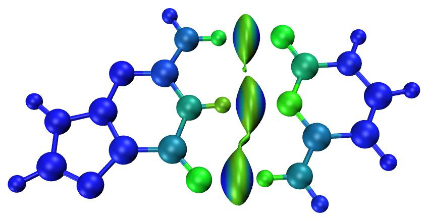

<!-- p.901 -->

1-13 // Range of atoms in the first base 14-29 // Range of atoms in the second base 2 // Medium-quality grid 2 // Output scatter points to output.txt Then copy the exported output.txt and the plotting script examples\scripts\IGMscatter.gnu to the file containing gnuplot executable file, then in this folder run command: gnuplot IGMscatter.gnu, after that you will obtain IGMscatter.ps. If you open it by Acrobat or Photoshop or IrfanView (with ghostscript installed), or convert it to other image formats first via online tool https://cloudconvert.com/image-converter and then open it, you will see

In the current graph, the Y-axis corresponds to δginter. In the IGMscatter.gnu, the default color scale is identical to the one adopted in IGMinter.vmd, namely -0.05~0.05.

If you want to use this script to plot δgintra vs. sign(λ2)ρ, you should change "4:1:4" in the IGMscatter.gnu to "4:2:4"; while if you want to plot δg vs. sign(λ2)ρ, you should change it to"4:3:4".

If you find the range of X-axis is not appropriate, you can change the data behind "xtic" and "xrange"; while if Y-axis is not appropriate, you can change "ytic" and "yrange".

### 4.20.10.2 Example 2: C60-coronene dimer

In this example, we will carry out IGM analysis for C60-coronene dimer, and finally plot the map below using VMD based on the data outputted by Multiwfn.


<!-- p.902 -->

In the map above, the major van der Waals interaction region (more specifically, the π-π stacking region) is exhibited as green isosurface, the more red-colored atoms contribute to the interaction more. If you think this graph is pretty and want to reproduce it, just follow the steps below.

The pdb file of the dimer optimized at PM6-D3 level using Gaussian is provided as examples\C60_coronene.pdb. Boot up Multiwfn and load it, then input below commands

20 // Visual study of weak interactions 10 // IGM analysis 2 // Define two fragments 1-60 // C60 is fragment 1 c // Other part, namely coronene, is fragment 2 2 // Medium-quality grid 3 // Output cube files in current folder

6 // Evaluate atom and atomic pair δg indices 2 // High quality y // Export atmdg.pdb in current folder Boot up VMD, enter below commands into VMD console window: color scale method BWR color Display Background white axes location Off display depthcue off display rendermode GLSL Then drag the atmdg.pdb into VMD main window, enter "Graphics" - "Representation", set "Drawing Method" to "CPK", change bond radius from the default 0.3 to 0.8, set "Coloring Method" to "Occupancy", set "Material" to "EdgyShiny". Then go to "Trajectory" tab, set lower and upper limit of color scale to -15 and 15, respectively.

Next, we need to draw the δginter isosurface on the map. Drag dg_inter.cub into VMD main window to load it, then enter "Graphics" - "Representation", change the default style from "lines" to "Isosurface", set "Draw" to "Solid Surface", set "Show" to "Isosurface", then input 0.004 in the


<!-- p.903 -->

"Isovalue" box and press ENTER button. Change "Coloring Method" to "ColorID" and select "7 green". Change the "Material" to "EdgyGlass".

Finally, we render the map. Select "File" - "Render", choose "Tachyon (internal, in-memory rendering)" and click "Start Rendering" button, then you will obtain the graph shown at the beginning of this section. The resulting graphical file is .tga format, you can use such as IrfanView or Photoshop to visualize it.

Note that in present example, color-filled effect is only applied to molecular structure, but not applied to isosurface. This is because in VMD, setting of color transition is shared by all representations, that means we cannot use Blue-White-Red color transition for molecular structure but use conventionally employed Blue-Green-Red color transition for isosurface. Considering that in present system there is only one kind of interaction, namely van der Waals interaction, and in conventional color-filled IGM map this region is basically colored by green, I decide directly assign green color for the whole isosurface, so that we are able to freely set color transition mode for coloring molecular structure.

### 4.20.10.3 Example 3: Oxazolidinone trimer

The IGM module of Multiwfn is extremely flexible, it can be applied to any number of fragments. In this example I use oxazolidinone trimer to show this point. The geometry was taken from J. Chem. Theory Comput., 11, 3065 (2015).

We first use δginter to reveal all interactions between the three monomers. Boot up Multiwfn and input

examples\oxazolidinone_trimer.xyz 20 // Visual study of weak interactions 10 // IGM analysis 3 // Define three fragments 1-11 // Fragment 1: Monomer 1 12-22 // Fragment 2: Monomer 2 23-33 // Fragment 3: Monomer 3 2 // Medium-quality grid 3 // Output cube files in current folder

Then we use aforementioned method to plot color-filled δginter isosurface map via IGM_inter.vmd script, you will see the graph below

From color of isosurfaces in the graph it is found that the 1-2 and 1-3 interactions correspond to typical hydrogen bonding, while 2-3 interaction is significantly weaker and thus more appropriate


<!-- p.904 -->

to be assigned as van der Waals interaction.

Assume that we only want to study interactions between 1-2 and 2-3, and meantime wish to

screen the δginter isosurface corresponding to 1-3 interaction, how to do that? The answer is: Only define two fragments, making fragment 1 correspond to monomer 2, while making fragment 2 correspond to monomers 1 and 3. Now we do this, input below commands

0 // Return to last menu 10 // IGM analysis 2 // Define two fragments 12-22 // Fragment 1: Monomer 2 1-11,23-33 // Fragment 2: Monomers 1 and 3 2 // Medium-quality grid 3 // Output cube files in current folder

6 // Evaluate atom and atomic pair δg indices 2 // High quality y // Export atmdg.pdb in current folder

Then plot δginter isosurface again using the newly generated sl2r.cub and dg_inter.cub via IGM_inter.vmd, and mean time color the structure according to δGatom(%) based on the atmdg.pdb file, you will finally obtain the graph below

Now the isosurface corresponding to monomer 1-3 interaction is invisible. Since the color transition set by IGM_inter.vmd is Blue-Green-Red, and I did not manually adjust the automatically

determined color range for mapping δGatom(%), therefore, in present graph, the site having largest δGatom(%) is rendered as red, it should be regarded as "hottest atom" for the interactions under study. The green or cyan atoms have modest magnitude of δGatom(%), while contribution of blue atoms to the interaction is completely negligible.

Finally, let us only highlight interaction between monomer 1 and 2 while completely ignore monomer 3. Input below command

0 // Return to last menu 10 // IGM analysis 2 // Define two fragments 1-11 // Fragment 1: Monomer 1


<!-- p.905 -->

12-22 // Fragment 2: Monomers 2 2 // Medium-quality grid 3 // Output cube files in current folder Move the resulting dg_inter.cub and sl2r.cub to VMD folder and use the IGM_inter.vmd script to draw corresponding color-filled isosurface map. It is better to make monomer 3 transparent, since currently it is uninteresting. So, we enter "Graphics" - "Representation", click the existing representation with CPK style, input fragment 0 1 in the "Selected Atoms" box and press ENTER button, now the monomer 3 is invisible. Next, click "Create Rep" button, input fragment 2 in the "Selected Atoms" box and press ENTER button, then set the "Drawing method" as "Licorice" and change the "Bond Radius" to 0.2, then set "Material" to "Ghost". Now you should see the graph below, in which only the interaction between monomers 1 and 2 is visible, while all interactions related to monomer 3 are ignored.

PS: The concept of "fragment" in VMD is different to the "fragment" in IGM analysis of Multiwfn. In VMD, when structure file is loaded into VMD, the bonding relationship is automatically determined, and then each unlinked fragment is assigned to a unique fragment index. The index starts from 0.

As can be seen in this example, the partition of fragments is highly arbitrary. The union set of all fragments is not necessarily equal to the whole system. When you intend to study intramolecular interaction, a whole molecule can also be divided into multiple fragments to reveal interesting interaction regions.

In this example only a simple system is taken as instance, however I think it is enough to substantially exhibit the extreme flexibility and powerfulness of IGM analysis, Multiwfn and VMD programs. The IGM method can also be easily applied to much more complicated systems; for example, in my blog article http://sobereva.com/407 (in Chinese), I showed that IGM can clearly reveal the interaction between two monomers in a tetramer consisting of four large flexible molecules.

It is worth to mention that δg value at bond critical points (BCP) is positively correlated to interaction strength (see Table 1 of IGM original paper), Multiwfn is also able to calculate it. First, load a file containing wavefunction information into Multiwfn, then use main function 2 to carry out topology analysis and locate BCPs, then use option 7 to examine properties of the BCPs, from

screen you can directly read δg value. I do not explicitly present a corresponding analysis example


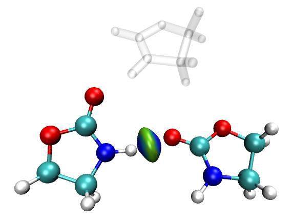

<!-- p.906 -->

here, please try this kind of analysis yourself.


### 4.20.11 Using IGMH (IGM based on Hirshfeld partition of molecular


### density) to study weak interactions

Please check original paper of IGMH (J. Comput. Chem., 43, 539 (2022) https://doi.org/10.1002/jcc.26812), Section 3.23.6 of this manual, Angew. Chem. Int. Ed., 137, e202504895 (2025) DOI: 10.1002/anie.202504895, and DOI: 10.1016/B978-0-12-821978-2.00076-3 to gain basic knowledge about IGMH method. If you can read Chinese, please also check http://sobereva.com/621, which contains comprehensive and clear introduction of IGMH as well as many relevant discussions.

In this section I will only present an extremely simple IGMH example. A very detailed tutorial (about 40 pages) carefully introducing how to perform various kinds of IGMH analysis for both molecular and periodic systems can be downloaded at http://sobereva.com/multiwfn/res/IGMH_tutorial.zip, do not forget to check it!

The use of the IGMH analysis function is exactly identical to IGM, thus if you have carefully read Section 4.20.10, you will be able to realize IGMH analysis smoothly. In this section, I use a dimer consisting of 2-pyridoxine and 2-aminopyridine as an example, this system has also been studied via AIM analysis in Section 4.2.1.

Boot up Multiwfn and input examples\2-pyridoxine_2-aminopyridine.wfn // Since IGMH relies on wavefunction information, therefore you should use such as .wfn, .fch, .mwfn, .molden, etc. as input file

20 // Visual study of weak interaction 11 // IGMH analysis 2 // Define two fragments 1-12 // Atom indices in fragment 1 13-25 // Atom indices in fragment 2 2 // Medium-quality grid 3 // Output cube files to current folder

Next, in order to plot sign(λ2)ρ colored δginter isosurface map, we move the exported sl2r.cub and dg_inter.cub from current folder to VMD folder, then copy the examples\IGM_inter.vmd script to VMD folder, then boot up VMD and run source IGM_inter.vmd command in VMD console window to execute the plotting script.


<!-- p.907 -->

The color bar of this map is IGMH_colorbar.png in “examples” folder. Since the blue around

`IGMH_colorbar.png`

Hint: If you hope to make the radius of the isosurfaces in the map above smaller, so that only the most important interaction areas are shown, you can increase the isovalue from 0.01 to 0.015, namely entering "Graphics" - "Representation", change the value in the "Isovalue" box to 0.015 and then press ENTER button. In this case, you can also make the range of color scale narrower than default (-0.05~0.05) to make the color on the isosurfaces more vivid, namely in the "Representation" interface click "Trajectory" tab, then input -0.045 and 0.045 respectively in the two boxes and then press ENTER button.

In the post-processing menu, you can also choose option 6 to calculate atomic and atomic pair

δg indices (i.e. δGatom and δGpair indices), the result calculated with high-quality grid is shown below


```text
Atom pair delta-g indices and percentage contributions (zero terms are not shown)
   12   13 :    0.116367  (  16.57 % )
    1   25 :    0.096210  (  13.70 % )
    2   13 :    0.052037  (   7.41 % )
    1   23 :    0.042800  (   6.09 % )
...[ignored]
```

From this quantitative data, we can further confirm the conclusion that the N-H12···N13 is stronger than the N-H25···O1.

For comparison purposes, you can plot the same map via IGM module, the sign(λ2)ρ colored δginter isosurface map is shown below (the sign(λ2)ρ was calculated using actual density rather than promolecular density). As can be seen, the graphical effect of IGM is much poor than IGMH, since the isosurfaces are too bulgy and thus difficult to examine and compare, this problem cannot be fully avoided even if you carefully adjust isovalue. Many comparisons between IGM and IGMH can be found in the original paper of IGMH.


<!-- p.908 -->

Skill: Significantly reducing cost of IGMH visual analysis for interfragment interactions Most people use the IGMH method primarily for visualization and analysis of interfragment

interactions. In practice, this only requires calculating the δginter and sign(λ2)ρ grid data in the overlapping regions between fragments; grid points in all non-overlapping regions are completely unnecessary. Taking this into account, a strategy is supported in Multiwfn to significantly reduce the cost of grid data calculation in IGMH (and mIGM, IGM). The implementation is as follows: A parameter named “IGMvdwscl” can be found in `settings.ini` file. The surface of each fragment is defined as the union of atomic spheres, where vdW radius of each atom is scaled by “IGMvdwscl”. During the grid data calculation step of IGMH, mIGM, or IGM analysis, a grid point is computed only if it lies within the overlapping region between the surfaces of two or more fragments; otherwise, it is directly skipped. With this strategy, the time required to compute IGMH grid data is often reduced by several times or more. The exact percentage of time saved depends on how large a portion of the user-defined grid box consists of ignorable grid points.

Obviously, after enabling this strategy, you can only plot isosurfaces of δginter. Isosurfaces of δg or δgintra can no longer be plotted, because only the δginter isosurfaces are guaranteed to appear exclusively in the interfragment overlap regions.

“IGMvdwscl” defaults to 0, which means the time-saving strategy is disabled. To enable this strategy, set “IGMvdwscl” to an appropriate positive value. The larger the value, the weaker the time-saving effect; the smaller the value, the higher the risk of truncating the δginter isosurfaces. A value of 2.0 is generally recommended: it is sufficiently safe while still providing a significant reduction in computational time.

This strategy does not affect cost and result of calculation of δGatom and δGpair indices. This strategy is more detailedly described in my blog article http://sobereva.com/756 (in Chinese), and an example is given there.


### 4.20.12 Using mIGM to study weak interactions

Note: More details and examples of mIGM are given in my blog article “Using mIGM method to rapidly graphically represent weak interactions based on geometry” (http://sobereva.com/755, in Chinese).

mIGM has been briefly described in Section 3.23.10 and and detailedly introduced in Struct. Bond., 190, 297 (2026) DOI: 10.1007/430_2025_95. Because its graphical effect is much better than IGM while it has basically the same cost as IGM, using mIGM instead of IGM is always


<!-- p.909 -->

strongly suggested. The use of mIGM is essentially the same as IGM, here a simple example is given.

examples\phenylalanineresiduestrimer.xyz is optimized trimer of capped phenylalanine, we use mIGM to reveal the interactions within it. Boot up Multiwfn and load this file, then input

20 // Visual study of weak interaction -10 // mIGM analysis 3 // Define three fragments 1-29 // Atom indices in fragment 1 (the first monomer) 30-40,52,53,56,57,63-65,77-87 // Atom indices in fragment 2 (the second monomer) c // All other atoms (the third monomer) 4 // Manually input grid spacing 0.2 // Grid spacing of 0.2 Bohr is sufficient to obtain a smooth enough image 3 // Output cube files to current folder Some .cub files have been generated in current folder. Move dg_inter.cub and sl2r.cub to VMD folder while delete the other .cub file. Copy the examples\IGM_inter.vmd script to VMD folder, then boot up VMD and run source IGM_inter.vmd command in VMD console window to execute the plotting script, then mIGM graph will be immediately shown in the graphical window. After that, in VMD choose “Graphics” - “Representation”, and input 0.07 in the “Isovalue” text box to change isovalue, you will see the following image, which nicely reveals all kinds of interactions (dispersion and H-bond) between the three molecules. The corresponding color scale is the same as the IGMH mentioned in Section 4.20.11.

In the post-processing menu, you can also calculate atomic or atomic pair δg indices via corresponding option like IGM and IGMH analyses.


### 4.20.13 Using amIGM to reveal weak interactions in dynamic


### environments


<!-- p.910 -->

a dynamic process” (http://sobereva.com/759, in Chinese) much more comprehensively illustrates the use of the amIGM method, and introduces many key points.

amIGM has been briefly described in Sections 3.23.11 and detailedly introduced in Struct. Bond., 190, 297 (2026) DOI: 10.1007/430_2025_95. The present section illustrates how to use amIGM method to visually reveal the interactions between a phenol molecule and environment waters in a simulation box. This is an application example in the original paper of amIGM method.

Initially, one needs to run molecular dynamics (MD) simulation to obtain a trajectory file, and it must be in multiple-frame .xyz format. For example, you can load the trajectory generated by GROMACS/AMBER/NAMD/CP2K... program into VMD software, and save to a .xyz file. It is important to recognize that the region of interest should be fixed (preferably close to the center of the simulation box) via freeze or position restraint setting. In this example, the only solvate molecule, phenol, is fixed at the box center throughout the simulation, while the water molecules that fill the rest of the box can move freely. The compressed .xyz trajectory file simulated at room temperature for 1 ns can be directly downloaded at http://sobereva.com/multiwfn/extrafiles/phenol_in_water.7z. After decompressing the package, you will obtain phenol_in_water.xyz, which contains 1001 frames (the trajectory was saved every 1 ps).

Boot up Multiwfn and load the phenol_in_water.xyz, then input 20 // Visual study of weak interactions -12 //amIGM analysis 2 //Define two fragments for amIGM. If you define n fragments, then amIGM will reveal all interactions between the n fragments

1-13 //Atomic indices of fragment 1, corresponding to the phenol c //The rest of atoms (waters) is defined as fragment 2 1,1000 //Consider 1 to 1000 frames 11 //Because the interactions of phenol-water occur in various regions around phenol, the box containing the grids to be calculated should cover the entire phenol, we choose mode 11 to realize this aim, namely we will select a set of atoms, set extension distance around them and grid spacing

1-13 //The atoms for defining the box 3 A //Extension distance is set to 3 Å [Press ENTER button] //Grid spacing is set to the default 0.2 Bohr, which is adequate of obtaining fine enough amIGM maps

Now Multiwfn starts to calculate. The cost is linearly proportional to the number of frames to be considered, positively proportional to the number of atoms and number of grids to be calculated. On Intel i9-13980HX mobile CPU, using 16 parallel threads, the calculation totally took up 8.8 minutes. The parallel efficiency of amIGM analysis is ideal, so using server CPUs with large number of cores will greatly benefit.

Once calculation is finished, you can find many options in the post-processing menu, see

Section 3.23.11. Here we choose option 3 to export the grid data of averaged δginter as avgdg_inter.cub and averaged sign(λ2)ρ as avgsl2r.cub in current folder. Move the two .cub files to VMD folder, and copy the VMD script aIGM.vmd from “examples” folder to VMD folder. Next, boot up VMD, run command source aIGM.vmd in the console window of VMD to execute the script, then the two .cub files will be loaded, and amIGM map is immediately shown on screen, as shown below


<!-- p.911 -->

Current map is difficult to view clearly, so we need to change plotting settings. In VMD main window, choose “Graphics” - “Representation”, input 0.003 in the “Isovalue” text box to set

isovalue of averaged δginter to 0.003 a.u. Then click the representation corresponding to CPK style, input fragment 0 in “Selected Atoms” text box to only make the phenol visible. Now you should see:

The color bar corresponding to this map is examples\IGMH_colorbar.png. Clearly, the map above very vividly and successfully exhibited the average interactions between the phenol and surrounding waters, demonstrating the great value of amIGM. If you further decrease the isovalue to e.g. 0.0018 a.u., additional isosurfaces will also be visible, which exhibit weaker interactions (mostly dispersion effect), see original paper of amIGM for relevant discussion and many other examples.

Studying interaction stability In the post-processing menu, choose option 8 to calculate grid data of standard deviation of

δginter and TFIamIGM (thermal fluctuation index of amIGM), then they are exported to stddg_inter.cub and TFI_amIGM.cub in current folder, respectively. You can map either one onto the isosurfaces of

averaged δginter to graphically exhibit difference in interaction stability; usually their graphical effects are similar, the larger the value at a location on the isosurface, the lower the dynamics stability of the corresponding interaction. aIGM_TFI.vmd in “examples” folder is a VMD script file used to map TFI_amIGM.cub onto isosurfaces of avgdg_inter.cub by colors. Now we move TFI_amIGM.cub and aIGM_TFI.vmd to VMD folder, then boot up VMD and run source

aIGM_TFI.vmd in console window of VMD, then change isovalue of averaged δginter to 0.003 a.u.,


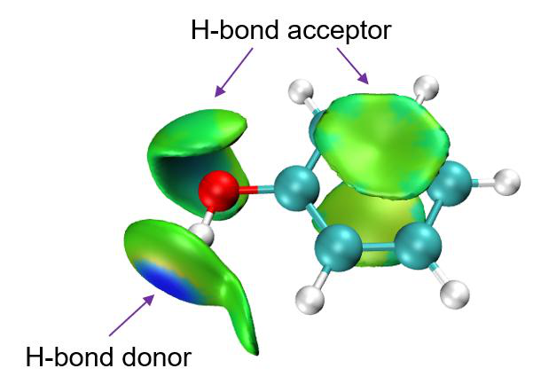

<!-- p.912 -->

after some fine-tunes you will see the following map. The default color range of TFIamIGM in the aIGM_TFI.vmd is 0.0 to 2.0 with blue-green-red transition method, which is well-suited for the present example. We should only focus on the color of outer sides of the isosurfaces (the colors of the inner sides are not well distinguishable), by which one can see that the O-H...O H-bond regions

are relatively stable (thermal fluctuation is weak), while the π-H bond regions above and below the six-membered carbon ring are less stable (thermal fluctuation is notable).

Important notes on amIGM analysis
- The system to be studied should not be too large, otherwise the cost of amIGM analysis may be prohibitively high. The current system contains 1342 atoms, which is not quite large. If your system contains huge number of atoms, you must use a smaller model instead, or truncate the present system to only keep the atoms around the region of interest (to this aim, you can use a proper “selection” when using VMD to save a new trajectory file).
- The more the considered trajectory frames, the more realistic the result, and the smoother the isosurfaces. Usually at least 500 frames should be taken into account.
- As mentioned earlier, the position and structure of the key object should be fixed. As you can see, in the MD simulation of the above instance, the phenol atoms were fully frozen at the initial coordinate. If the key object can freely translate or rotate, or its conformation changes a

lot during the MD simulation, the isosurfaces of δginter will be cluttered, making it infeasible to visually study interactions.
- To greatly reduce computational cost of amIGM and aIGM, Multiwfn employs a scheme: If a grid is within scaled vdW radius of any atom of fragment 1, then this grid will be calculated while others will be ignored to save cost. The parameter “amIGMvdwscl” in `settings.ini` corresponds to the scale factor, the smaller the value, the lower the cost. The default amIGMvdwscl=2 is found to be very safe. Employing this acceleration scheme clearly implies that the fragment 1 defined by the user should correspond to the key region, which is fixed during the MD simulation. The acceleration scheme can be disabled by setting “amIGMvdwscl” to 0, then the order of the defined fragments is arbitrary, for example, in the above instance, one may also define the waters as fragment 1 while the phenol as fragment 2.
- Atom names in MD simulation codes are generally different to element names. It is best to


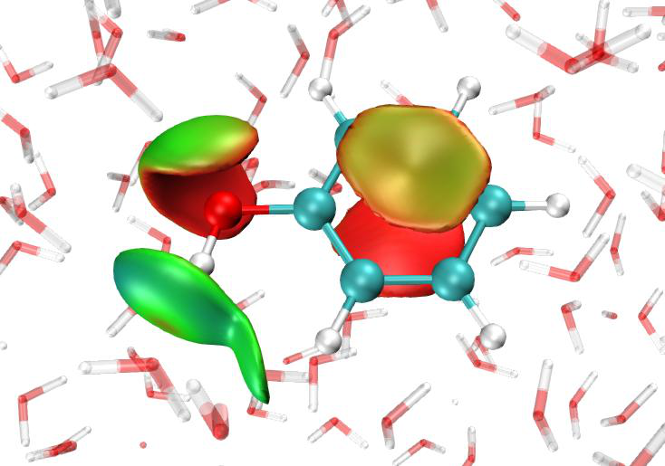

<!-- p.913 -->

record element names in the .xyz trajectory file rather than atom names, otherwise Multiwfn may incorrectly guess elements, making amIGM analysis wrong. Note that after Multiwfn finish loading input file, formula of the system will be shown, from which you can easily check if every element has been corrected determined.

Tip: Common practice of preparing trajectory file for studying ligand-protein interaction via amIGM

First, perform NPT simulation for the whole complex in a solvated box to make it sufficiently equilibrated, then perform NVT simulation for at least 1 ns while keeping ligand fixed, at least 500 frames should be saved. Then use VMD to extract a cluster containing the ligand and all closely contacted residues and save the trajectory of this part as a .xyz file. You can use the selection "resname MOL or protein same resid as within 3.5 of resname MOL" to extract the cluster, where MOL is residue name of the ligand. Next, in the amIGM analysis, you should define two fragments, the first one is the ligand, and the other one contains all other atoms. A full example of generating the .xyz trajectory file for analyzing ligand-protein interaction for aNCI analysis is given in my blog article http://sobereva.com/591, which is also fully suitable for amIGM analyses.


## 4.21 Energy decomposition analysis

Aside from the examples given in this Section, Multiwfn is also able to perform the so-called simple energy decomposition, see Section 4.100.8 of example.


### 4.21.1 Examples of energy decomposition analysis based on forcefield


### (EDA-FF)

In this section I will illustrate how to perform energy decomposition analysis between specific fragments based on classical forcefield, this method will be referred to as EDA-FF. Please carefully read Section 3.24.1 first to gain basic knowledge about the underlying ideas and implementations of EDA-FF. If you have carefully read the examples below, you should be able to easily apply this method onto various kinds of systems.

More in-depth discussions can be found from my blog article "Using Multiwfn to perform energy decomposition analysis based on forcefield" (in Chinese, http://sobereva.com/442).

If EDA-FF analysis is utilized in your work, please cite this article: Mat. Sci. Eng. B, 273, 115425 (2021) DOI: 10.1016/j.mseb.2021.115425, in which I briefly described EDA-FF and employed it in studying interaction between cyclo[18]carbon and graphene

### 4.21.1.1 Example 1: Water dimer

As first example, we perform the EDA-FF based on AMBER forcefield for a very simple system, water dimer, whose most stable geometry is shown below


<!-- p.914 -->

Relevant files The related files have been provided in "examples\EDA\EDA_FF\waterdimer" folder, as shown below:

- dimer.mol: The .mol file of water dimer containing its optimized geometry at B3LYP-D3(BJ)/6-311G** level, which is very reliable for optimizing molecular clusters. Note that in this file, the atomic sequence is O1 H2 H3 O4 H5 H6

- water.fchk: The .fchk file produced by optimization task of water monomer at B3LYP-D3(BJ)/6-311G** level

- mollist.txt: Molecular list file corresponding to the water dimer
- water.txt: Molecular type file of water monomer As you can see, the content of mollist.txt is simply


```text
water.txt 2
```

corresponding to the fact that the water dimer has two water molecules, which are described by the water.txt in current folder.

The content of water.txt is


```text
OW  -0.737121
HW  0.368560
HW  0.368560
```

indicating that the oxygen and hydrogens in the water have atom type of OW and HW, respectively. The second column is atomic charges evaluated by Merz-Kollman (MK) method.

Detail of molecular type file Here I describe how the molecular type file water.txt was constructed. The atom types can be manually assigned according to practical chemical environment of the atoms and definition of atom types in the forcefield original paper, but this process is troublesome if there are lots of atoms in a molecule. Therefore, here I show how to use the popular GaussView to automatically assign the atom types. Load the water.fchk into GaussView, click the icon with bold A letter to enter "atom list editor", then click the icon with bold orange M letter to show atom types, then click the title of "AMBER Type" column twice, the current status of the window should be

Then click "File" - "Export Data", save the file as water.txt. Next, via column mode of advanced


<!-- p.915 -->

text editor such as Ultraedit, delete all columns except the "AMBER Type" column, and then delete the first row in the file. Now, only atom types of all atoms are presented in the water.txt. After that, calculate MK (or CHELPG) charges based on the water.fchk using subfunction 13 (or 12) of main function 7 (you can consult the example in Section 4.7.1), then copy the outputted charges from screen (or from the exported .chg file) as the second column of the water.txt. At this point, preparation of water.txt is finished.

Perform analysis Now, we start to perform the EDA-FF analysis. Copy the water.txt to current folder, then boot up Multiwfn and input

dimer.mol // The file containing dimer structure information (you can also use other formats containing the geometry information as input file, such as the .fch file produced during optimization task of the dimer)

21 // Energy decomposition analysis 1 // Energy decomposition analysis based on forcefield 3 // Load atom types and atomic charges mollist.txt // The actual path of the molecular list file. At this point, the program read atom types and charges from the water.txt and assign them to the two water molecules in the current system

2 // Define fragments 2 // Two fragments will be defined 1-3 // The atomic indices of the fragment 1 4-6 // The atomic indices of the fragment 2 If you want to check if atom types and charges of all atoms in current system have been set up properly, you can choose option 4, the output is


```text
*** Fragment   1:
 Atom:    1(O )    Charge:   -0.737121    Type: OW
 Atom:    2(H )    Charge:    0.368560    Type: HW
 Atom:    3(H )    Charge:    0.368560    Type: HW
 *** Fragment   2:
 Atom:    4(O )    Charge:   -0.737121    Type: OW
 Atom:    5(H )    Charge:    0.368560    Type: HW
 Atom:    6(H )    Charge:    0.368560    Type: HW
```

It is clear that the atom types and charges are all correctly assigned.

Now select option 1 to start the EDA-FF analysis, the result shows up immediately on screen:


```text
Contribution of each atom in defined fragments to overall interfragment interac
tion energies:
 Atom    1(O )   Elec:   12.53  Rep:    3.85  Disp:   -2.21  Total:   14.17
 Atom    2(H )   Elec:   -6.24  Rep:    0.00  Disp:    0.00  Total:   -6.24
 Atom    3(H )   Elec:  -16.87  Rep:    0.00  Disp:    0.00  Total:  -16.87
 Atom    4(O )   Elec:  -23.52  Rep:    3.85  Disp:   -2.21  Total:  -21.88
 Atom    5(H )   Elec:    6.47  Rep:    0.00  Disp:    0.00  Total:    6.47
 Atom    6(H )   Elec:    6.47  Rep:    0.00  Disp:    0.00  Total:    6.47

 Interaction energy components between all fragments:
```


<!-- p.916 -->


```text
                         Electrostatic   Repulsive   Dispersion     Total
 Frag   1 -- Frag   2:       -21.15         7.71        -4.43       -17.87
```

The units in the output are all kJ/mol. The above information shows that the total interaction energy between the two water molecules is -17.87 kJ/mol, which is close to the result -20.58 kJ/mol obtained by highly accurate level CCSD(T)/CBS (see original paper of the S66 weak interaction test set, J. Chem. Theory Comput., 7, 2427 (2011)). Although the given result has some error, at least it is adequate for qualitative discussion purposes. The above data also indicates that electrostatic interaction (-21.15 kJ/mol) has a decisive contribution to the binding energy between the two waters, obviously the main essence of general hydrogen bond is dominated by electrostatic interaction. Dispersion interaction also contributes to the binding, but the magnitude is relatively minor. The exchange-repulsion effect (7.71 kJ/mol), to some extent, offsets the attractive interaction due to electrostatic and dispersion effects.

In the original text of the S66 test set, the ratio of the dispersion interaction energy to the electrostatic interaction energy of water dimer given by the very ideal DFT-SAPT method is 0.29, which is qualitatively consistent with the value yielded by EDA-FF (4.43/21.15=0.21). Therefore, with the very simple water dimer as instance, it can be seen that as long as the choice of forcefield and atomic charges are suitable, the result of EDA-FF is generally reliable. For some systems, the total interaction energy calculated by forcefield is not quite close to that evaluated by reliable quantum chemistry method, but even so, in general the ratio between various physical components provided by the EDA-FF is still meaningful. In my view of point, it is not a bad idea to

approximately estimate electrostatic interaction energy (ΔEele) via multiplying the total interaction energy (ΔEtot) obtained using quantum chemistry method by the ratio of the ΔEele and ΔEtot that evaluated by proper forcefield.

The above output also shows contribution of each atom to the total interaction between all the defined fragments, so that you can easily recognize which atoms have a critical impact on the interfragment interaction. The sum of all atomic contributions is equal to the total interaction energy (if the system only has two atoms A and B, and each one is defined as a fragment, then the contribution of atom A will be half of the interaction energy between A-B). From the data given above, it can be seen that influence of each atom is not negligible. After all, the distance between the atoms in the system is not far. The most important contribution to the attraction is the electrostatic interaction of the O4 atom (-23.52 kJ/mol), this result is easy to understand since O4 is the acceptor atom of H-bond. The H3, which directly acts with O4 to form the H-bond, also contributes greatly to the binding (-16.87 kJ/mol) due to significant electrostatic effect. The data shows that only oxygen atoms have nonvanishing repulsion and dispersion terms, this is because the parameters of van der Waals potential of atom type HW is zero, hence HW atoms only behave as point charges to exhibit electrostatic effect.

Interatomic interaction If you choose option -3 once to switch its status from the default "No" to "Yes", then during EDA-FF analysis via option 1, the program also outputs distance (Å), interaction energy (kJ/mol) and its components of each atomic pair to interatm.txt in current folder. The file content of present example is


```text
******* Between fragment   1 and fragment   2:
  Atom_i  Atom_j  Dist(Ang) Electrostatic   Repulsive    Dispersion     Total
      1      4:     2.873       262.78         7.71        -4.43       266.05
```


<!-- p.917 -->


```text
      1      5:     3.176      -118.86         0.00         0.00      -118.86
      1      6:     3.176      -118.86         0.00         0.00      -118.86
      2      4:     3.346      -112.79         0.00         0.00      -112.79
      2      5:     3.762        50.16         0.00         0.00        50.16
      2      6:     3.762        50.16         0.00         0.00        50.16
      3      4:     1.916      -197.02         0.00         0.00      -197.02
      3      5:     2.312        81.64         0.00         0.00        81.64
      3      6:     2.312        81.64         0.00         0.00        81.64
```

From the above data, we can find that the interaction energy between each pair of atoms is very large, which mainly comes from electrostatic interaction. For example, since the charges of the two oxygen atoms O1 and O4 are large and have the same sign, the electrostatic mutual exclusion energy is as high as 262.78 kJ/mol. The binding energy between the fragments appears to be orders of magnitude far less than the above values, this is because when interaction energy between the fragments is calculated, the electrostatic interactions of the atomic pairs are largely positively and negatively offset.

### 4.21.1.2 Example 2: Circumcoronene-Cytosine-Guanine trimer

In the L7 weak interaction test set given in J. Chem. Theory Comput., 9, 3364 (2013), a system C3GC is a trimer consisting of circumcoronene (hereinafter abbreviated as C3), guanine (G) and cytosine (C). The geometry has been optimized by the authors at TPSS-D/TZVP level, as shown

below. The GC base pair has formed triple H-bonds, and it is physically adsorbed on the C3 via π-π stacking interaction.

In this section, we will perform EDA-FF analysis on this system based on the AMBER force field. The relevant files are provided in the "examples\EDA\EDA-FF\C3GC" directory.

Preparation works Notice that Multiwfn can perform EDA-FF only when atomic indices in any molecule type are contiguous. Otherwise, the atomic charges and types cannot be set for each atom in the system through the molecular list file and molecule type files. The structure file given in the supplementary material of the L7 test set is C3GC.xyz. This file cannot be directly used because the atomic indices in each monomer are not contiguous. One of the simplest way to judge if the atomic indices are contiguous is as follows: First load C3GC.xyz into Multiwfn, use subfunction 2 in main function 100 to convert it to C3GC.pdb (we do the conversion because GaussView does not support .xyz


<!-- p.918 -->

format), then load this pdb file into GaussView, right click on arbitrary atom in an arbitrary molecule (e.g. atom C5), choose "Select Fragments of Atom C5" (this option is available since GaussView 6). At this point, all atoms in this molecule are selected as yellow color, then click "Tools" - "Atom Selection". As can be seen in the screenshot below, the indices displayed in the text box are 5-9, 13-17, 19, 25-29, clearly the atom indices are not contiguous and should be rectified.

The easiest way of making atom indices contiguous in each molecule is entering "Atom list editor" of GaussView, then select "Edit" - "Reorder" - "All Atoms (Except the First) by Bonding", after that the atom indices are reordered according to connectivity, and you will see the atom indices in each monomer have become contiguous, as shown below. Now save this structure to C3GC.pdb to replace the old one.

Then we copy each monomer from the trimer to individual GaussView window, save them to respective .gjf files, change the keyword to "B3LYP/6-311G**" and use Gaussian to run them, then calculate MK charges by Multiwfn based on the resulting .fch files. Also, we make use of GaussView to determine atom types for each monomer. Finally, combine the atom types and charges as single file for each monomer, then we have the C.txt, G.txt and C3.txt, which have already been provided in "examples\EDA\EDA-FF\C3GC" directory.

Finally, create a molecular list file mollist.txt (other name is also acceptable), the content is actual paths of C.txt, G.txt and C3.txt as well as the number of corresponding molecules, notice that


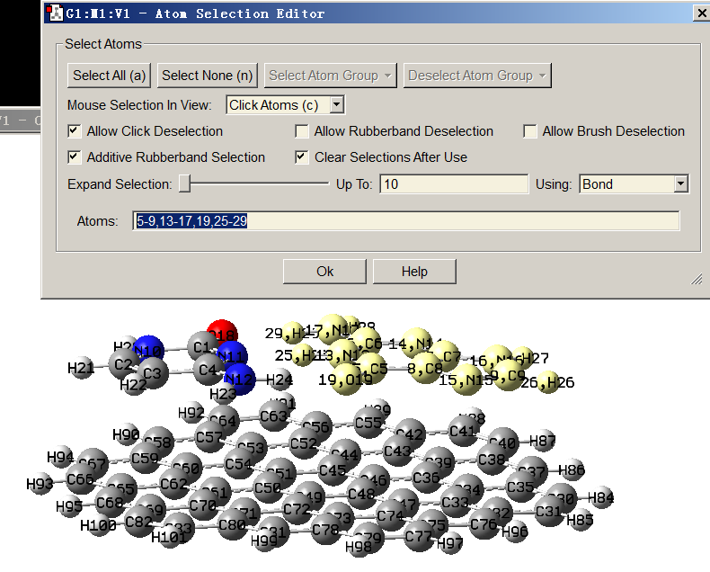

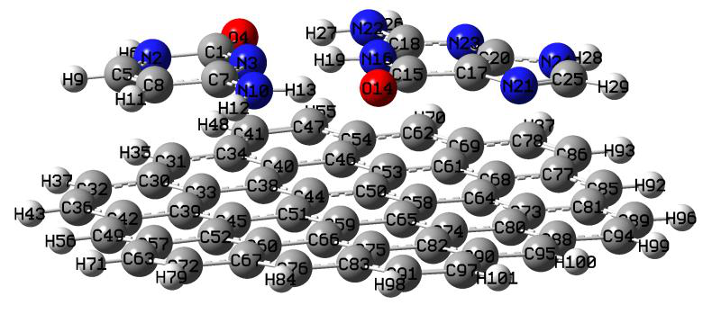

<!-- p.919 -->

the order of the file paths must be exactly in line with the molecule order in the geometry provided in G3GC.pdb. Clearly, the content of mollist.txt should be (all the molecule type files are assumed to be placed in C:\)


```text
C:\C.txt 1
C:\G.txt 1
C:\C3.txt 1
```

Start analysis All preparation works have been completed, now we start the EDA-FF analysis. Boot up Multiwfn and input

C3GC.pdb 21 // Energy decomposition analysis 1 // EDA-FF 3 // Load atom types and charges mollist.txt // Input actual path of mollist.txt 2 // Define fragments 3 // Three fragments will be defined 1-13 // Atom indices in fragment 1, namely cytosine (C) 14-29 // Atom indices in fragment 2, namely guanine (G) 30-101 // Atom indices in fragment 3, namely C3 Select option 1 to carry out the EDA-FF calculation, the results are as follows (atomic contribution part is ignored)


```text
                         Electrostatic   Repulsion   Dispersion     Total
 Frag   1 -- Frag   2:      -120.98        60.26       -45.54      -106.27
 Frag   1 -- Frag   3:         1.88        44.86       -94.69       -47.95
 Frag   2 -- Frag   3:         0.71        62.08      -132.62       -69.84
```

The data shows that the G-C binding is very strong, reached as high as -106.27 kJ/mol, mainly because the electrostatic component is very large (-120.98 kJ/mol), which is the consequence of the formation of the three pairs of H-bonds between the G and C. The total interaction energy between C3 and G (-47.95 kJ/mol) as well as between C3 and C (-69.84 kJ/mol) are not small, mainly due

to the significant π-π stacking between them. Since the nature of π-π stacking is purely dispersion effect, it can be seen that the dispersion interactions of C3-C and C3-G are very strong (-94.69 and -132.62 kJ/mol, respectively), which are much higher than that between G-C (-45.54 kJ/mol). Since C3 is essentially a finite graphene sheet, its interaction region with G and C is obviously nonpolar (i.e. the atomic charges are very small), so the electrostatic component in C3-C and C3-G interactions is negligible (merely 0.71 and 1.88 kJ/mol, respectively).

I also calculated binding energies between G-C, C3-G and C3-C using dimer models at B3LYP-D3(BJ)/6-311+G** level, which is very robust for evaluating weak interactions, the results are


```text
G-C (Frag 1 - Frag 2)：-143.97 kJ/mol
C3-C (Frag 1 - Frag 3)：-56.69 kJ/mol
C3-G (Frag 2 - Frag 3)：-76.27 kJ/mol
```

For C3-C and C3-G, it can be seen that the results calculated by AMBER forcefield and that by quantum chemistry method are very close, but the quantitative difference for G-C is quite conspicuous. This observation manifests the limited quantitative accuracy of forcefield when it is applied to the weak interactions with great strength. However, in this case, if we only focus on the


<!-- p.920 -->

ratio between various physical components, the result of EDA-FF is still useful and will not cause evident misleading conclusion.

Coloring atoms according to contribution to interaction energy By making use of .pqr file format, atomic properties can be easily visualized by coloring atoms via different colors in VMD visualization program, this strategy is detailedly introduced in Section 4.A.10. Obviously, if atomic contributions to interaction energy between fragments are stored into the .pqr files, then the importance and role of each atom will be able to be vividly shown in a graph. Similar idea is also employed in the IGM analysis, as illustrated in Section 4.20.10.

Now we select "-4 Toggle if outputting atom contributions to .pqr files" option in the EDA-FF interface to switch its status to "Yes", then select option 1 to carry out EDA-FF analysis. After the calculation, atmint_tot.pqr, atmint_ele.pqr, atmint_rep.pqr, atmint_disp.pqr and atmint_vdW.pqr appear in the current directory (some of them have been provided in "examples\EDA\EDA-FF\C3GC\pqr"). The data of the atomic charge column in these .pqr files correspond to the contribution of each atom to the total/electrostatic/repulsion/dispersion/vdW interaction energy between the fragments, respectively, and the values are identical to those printed on screen. For example, the value of the atomic charge column of the C1 atom in fragment 1 of the atmint_disp.pqr corresponds to half of the dispersion interaction energy between C1 atom and all atoms of fragments 2 and 3.

We load the atmint_tot.pqr into VMD program, enter "Graphics" - "Representation", coloring the atoms according to the "Charge" property, changing the lower and upper limits of the color scale from the default ones to -50 and 50, respectively. Setting drawing method of the G and C parts as CPK mode (using fragment 0 1 in the "Selected Atoms" box to choose them), and making C3 part displayed in Licorice style (using fragment 2 to choose it). We also set the color scale method to BWR (Blue-White-Red). Finally, the graph will look like below (if you are not familiar with VMD and do not know how to realize these settings in VMD, please consult Section 4.A.10):

Since the current color scale used is Blue-White-Red, the bluer the atom color in the figure, the more negative the atomic contribution to the total binding energy between the trimer (i.e. the more significant the attractive effect); while the redder the atom, the stronger the repulsive effect it


<!-- p.921 -->

acts. Relatively white atoms only play trivial role on the trimer binding. As can be seen from this figure, the colors of each H-bond acceptor atom and the hydrogen atom directly acting with it are obviously blue, thus they contribute greatly to the stability of the G-C binding. The color of all H-bond donor atoms is red, indicating that their existences are not conducive to the binding, this is because the H-bond donor and acceptor atoms have large magnitude and same sign of atomic charges, therefore there is a significant electrostatic mutual exclusion between them. From the map above, it can also be seen that all atoms of C3 as well as the atoms in the G and C that far away from the hydrogen bonding region only have very light or purely white color, this observation does not imply that they have nearly vanished contributions to the trimer binding, but indicates that their contributions are relatively weak and thus difficult to be revealed under current color scale setting.

Assume that we want to vividly exhibit the dispersion interaction between C3 and GC base pair, then we input below commands in the EDA-FF interface

2 // Redefine fragments 2 // Two fragments will be defined 1-29 // Fragment 1, the GC base pair 30-101 // Fragment 2, the C3 part 1 // Start the EDA-FF calculation Then the following information is shown on screen, the data equals the sum of C3-C and C3-G interaction energies


```text
                         Electrostatic   Repulsion   Dispersion     Total
 Frag   1 -- Frag   2:         2.59       106.94      -227.31      -117.79
```

In the meantime, four new .pqr files are generated in current folder (they have been provided in "examples\EDA\EDA-FF\C3GC\pqr2" folder). Load the atmint_disp.pqr among them into VMD, coloring the atoms according to the way described above but using color scale of -10 to 10, then select "Display" - "Orthographic" to modify the perspective, you will see

In the above figure, the bluer the atomic color, the greater it contributes to the dispersion interaction between C3 and GC. It can be seen from the figure that each heavy atom in the GC part contributes nearly equally to the dispersion interaction, mainly because they have almost the same vertical distance to the C3 plane and the number of electrons carried by these atoms are not very


<!-- p.922 -->

different. The hydrogen atoms in the GC pair contribute very little to the C3-GC dispersion interaction, this is because the hydrogen atoms only have very few numbers of electrons. On the C3 part, the color of the carbons that directly contact the GC pair is light blue, indicating their notable contributions to the dispersion interaction. The color of the C3 atoms that are far away from the GC pair is white, reflecting that their influences on dispersion interaction are negligible (recall the fact that dispersion attraction attenuates sharply with distance, it has 1/r6 asymptotic behavior).

Note: The heavy atoms in the GC pair in the graph above are very blue, while the atoms in the equivalent position of C3 are not so blue, the reason is that: Because there are many atoms in C3, each heavy atom in the GC pair can form dispersion interaction with a large range of C3 atoms, thus the sum of the terms is large. Since the number of atoms in the GC pair is small, each atom of C3 can only interact with relatively few numbers of atoms in the GC pair, so the sum of terms is not large. If you want to make atomic color of the C3 part more prominent, you can set the color scale range of the representation corresponding to the C3 part to a smaller value than the -10~10 we previously used; for example, changing to -6 to 6 will yield satisfactory graph.

About determining binding energy of individual H-bond Some readers may have thought that it would be great if the binding energy of each of the three H-bonds between the G-C could be independently determined. There is no unique way to achieve this goal, since this is equivalent to dividing the system into parts and must not be free of artifacts. A seemingly easy way to realize this purpose is to directly define the donor and acceptor parts of a H-bond as two fragments. For example, let us examine the H-bond of N10-H13...O14, we input.

2 // Redefine fragments 2 // Two fragments will be defined 10,13 // Atomic indices of donor part of N10-H13...O14 14 // Atomic index of acceptor part of N10-H13...O14 1 // Perform EDA-FF analysis The result is


```text
                         Electrostatic   Repulsion   Dispersion     Total
 Frag   1 -- Frag   2:        71.27        21.78        -9.40        83.65
```

Clearly the result is unreasonable, since the total binding energy was predicted to be a positive value! The underlying reason is that the electrostatic interaction is a kind of long-range effect (1/r asymptotic behavior), therefore consideration of other atoms should not be simply ignored. I also attempted to employ other ways to evaluate the N10-H13...O14 H-bond binding energy, although some of them give seemingly acceptable result (for example, summing up atomic contribution of N10, H12, H13 and O14 to total G-C binding energy), unfortunately the relative strength of the three H-bonds cannot be faithfully explained. In my opinion, deriving individual H-bond interaction energy is impossible for this system based on EDA-FF, the reason is that the three H-bonds are too close together and thus the coupling is very strong, the polarization effect is obvious, and meantime resonance-assisted effect is involved in these H-bonds, these factors make the total interaction energy of the three H-bonds very difficult to be reasonably decomposed. However, if there are several H-bonds and the sites are far away from each other, it should be possible to individually evaluate the strength of each H-bond by estimation of interaction energy between the atoms in the corresponding local region.

AFAIK, the best way of determining binding energy of individual H-bond is using atom-in-molecules (AIM) analysis, see Section 4.2.1 for introduction and illustration.

Other aspects It is worth to note that a possibly viable way aside from SAPT to evaluate dispersion interaction energy is employing DFT-D3 dispersion correction using the zero-damping parameters fitted for


<!-- p.923 -->

exchange-correlation functionals that completely failed to represent dispersion interaction. This strategy has been utilized in the energy decomposition analysis example shown in Section 4.100.8. The DFT-D3 dispersion correction for interfragment interaction energy using zero-damping BLYP functional parameter is shown below


```text
C -- G: -26.65 kJ/mol
C -- C3: -87.78 kJ/mol
G -- C3: -115.10 kJ/mol
```

It can be seen that the three values are close to the corresponding dispersion interaction energies evaluated by AMBER forcefield (-45.54, -94.69, -132.62, respectively), rendering that using either AMBER forcefield or DFT-D3 to estimate dispersion interaction energy is a reasonable approach.

Using UFF to conduct the EDA-FF analysis is often unsatisfactory. If we do this for present system, the result is


```text
                         Electrostatic   Repulsion   Dispersion     Total
 Frag   1 -- Frag   2:      -120.98       848.28       -80.36       646.94
 Frag   1 -- Frag   3:         1.88        52.65      -107.41       -52.87
 Frag   2 -- Frag   3:         0.71        68.89      -143.58       -73.99
```

It can be seen that the interaction predicted by UFF for C3-C and C3-G is normal, and the result magnitude is close to that calculated by AMBER, but the interaction energy of G-C is extremely positive, evidently this is completely unreasonable. From the data it is easy to find that the reason is that the exchange-repulsion component is seriously overestimated. This is not an individual phenomenon, but a common phenomenon of UFF, this is why I generally do not recommend performing EDA-FF based on UFF (although optimizing the geometry using UFF prior to the EDA-FF could alleviate this problem).

As mentioned in Section 3.24.1, for very large systems, using the very cheap EEM charges (with parameters fitted for CHELPG charges at B3LYP/6-31G* level) instead of the rigorously derived ESP fitting charges to perform the EDA-FF analysis may be a viable choice; however, my test showed that this treatment can cause remarkable error in electrostatic interaction for present system. The electrostatic interaction energy between G and C evaluated based on EEM charges is merely -74.26 kJ/mol, which is much lower than that evaluated based on MK charges (-120.98 kJ/mol). Therefore, whenever possible, using ESP fitting charges (MK or CHELPG) in EDA-FF analysis is strongly recommended, this is crucial for yielding electrostatic interaction energy with satisfactory accuracy.


### 4.21.2 Shubin Liu's energy decomposition analysis for ethane rotation


### barrier

The idea and usage of the Shubin Liu's energy decomposition (EDA-SBL) have been described in Section 3.24.2. In this section we carry out EDA-SBL method to study the source of energy different between ethane in optimized eclipsed and staggered conformations. Relevant input and output files have been given in "examples\EDA\EDA_SBL" folder.

First, we optimize ethane in staggered conformation (D3 point group) and in eclipsed


<!-- p.924 -->

conformation (D3h point group) at B3LYP/def-TZVP level using Gaussian, the latter in fact is a transition state. Then using the geometries to create two Gaussian input files, namely ethane_staggered.gjf and ethane_eclipsed.gjf, respectively. The two files correspond to single point task at B3LYP/def2-TZVP level. As mentioned in Section 3.24.2, the route section contains ExtraLinks=L608 keyword and at the end of the input file there is line -5 indicating that the currently used functional is B3LYP.

Run the two .gjf files by Gaussian to yield ethane_staggered.out and ethane_eclipsed.out, respectively, and then use formchk to convert the resulting .chk files to .fch files.

We first evaluate the energy terms defined by EDA-SBL method for staggered ethane. Boot up Multiwfn and input

examples\EDA\EDA_SBL\ethane_staggered.fch 21 // Energy decomposition analysis 2 // Shubin Liu's energy decomposition examples\EDA\EDA_SBL\ethane_staggered.out Now Multiwfn loads relevant information from the Gaussian output file, and then evaluates the steric term defined by EDA-SBL method. Finally, the EDA-SBL energy components are printed:


```text
 E_steric:              64.213411 Hartree
 E_electrostatic:     -146.114859 Hartree
 E_quantum:              2.037465 Hartree

 E_total:              -79.863983 Hartree
```

The E_total is identical to the single point energy in the Gaussian output file.

We repeat the analysis for eclipsed ethane, then summarize the data into the table below

Etotal Esteric Eelectrostatic Equantum

Eclipsed (a.u.) -79.85972 64.21925 -146.10780 2.02883 Staggered (a.u.) -79.86398 64.21341 -146.11486 2.03747 Diff. (kJ/mol) 11.2 15.3 18.5 -22.7

It can be seen that the eclipsed conformation has energy higher than the staggered one by 11.2 kJ/mol, which corresponds to the barrier of C-C single-bond rotation of the ethane. The data implies

that steric effect should be one of the major contributors of the barrier since ΔEsteric is evidently positive. In addition, the fairly large ΔEelectrostatic=18.5 kJ/mol suggests that the electrostatic interaction is the dominating factor to determine the barrier height. In contrast, the variation of Equantum, which reflects the change in energy purely due to quantum effect, significantly cancels the steric and classical electrostatic terms and thus plays an important role of reducing the barrier.

As you can see on the screen, the EDA-SBL module also prints other intermediate quantities comprising the Esteric, Eelectrostatic and Equantum, such as Pauli kinetic energy, so you can use them to try to analyze the energy difference between the two conformations from more perspectives.

A thorough analysis using the EDA-SBL method for rotation barriers for a series of small organic molecules is presented in J. Phys. Chem. A, 117, 962 (2013), interested users are suggested to read it.


<!-- p.925 -->


### 4.21.3 Examples of sobEDA and sobEDAw energy decomposition


### analyses

sobEDA.sh shell script is used to conveniently perform sobEDA and sobEDAw energy decomposition analyses based on Gaussian and Multiwfn. Very detailed introduction and rich application examples are given in http://sobereva.com/soft/sobEDA_tutorial.zip, please carefully check it.


### 4.21.4 Examples of analysis of atomic contribution to dispersion energy

Note: Chinese version of this section is my blog article "Using Multiwfn to graphically exhibit atomic contribution to dispersion energy and dispersion density" (http://sobereva.com/705), which contains more examples and discussion.

In this section, some examples of analysis of atomic contributions to dispersion energy as well as dispersion energy are given. Please carefully read Section 3.24.4 first to gain basic knowledge, and understand how to set “dftd3path” in `settings.ini`.

### 4.21.4.1 Investigating dispersion energy contributed by atoms in helicene

and dispersion density

In this example, we examine which atoms have prominent contribution to dispersion energy of 6-helicene. Boot up Multiwfn and input

examples\helicene.xyz // Structure file of 6-helicene 21 // Energy decomposition analysis 4 // Analysis of atomic contribution to dispersion energy 1 // Calculate atomic contributions to dispersion energy for current system Immediately, you will see the following information on screen, which contains total dispersion of present system, which corresponds to DFT-D3(BJ) dispersion correction energy with fitted parameters for B3LYP. Also, atomic contributions to dispersion energy are clearly given.


```text
Total dispersion energy:     -74.468 kcal/mol

 Atomic contribution to dispersion energy
     1(C )    -2.681 kcal/mol
     2(C )    -2.072 kcal/mol
     3(C )    -2.068 kcal/mol
     4(C )    -2.650 kcal/mol
     5(C )    -3.432 kcal/mol
[...ignored]
    40(H )    -0.569 kcal/mol
    41(H )    -0.511 kcal/mol
    42(H )    -0.614 kcal/mol
```

Next, you can input y to export atomdisp.pqr in current folder. Load it into VMD program, in the “Graphics” - “Representation” interface, set “Drawing Method” to CPK, “Coloring Method” to


<!-- p.926 -->

“Charge”, then in the “Trajectory” panel, set lower and upper limits of color scale to -5.0 and 5.0, respectively. You will see the following map. Since the default color scale used by VMD is red-white-blue, the redder the color in this figure is, the more negative the contribution to dispersion energy of the atom is, and the stronger its dispersion interaction with other atoms.

As can be seen from the figure above, the contribution of carbon atoms to dispersion energy is much greater than that of hydrogen, and the contribution of carbon atoms closer to the center of the helicene is greater. The reason is easy to understand, because the closer the carbon atom is to the molecular center, the richer dispersion interaction it can have with other atoms.

Next, we calculate dispersion density. Select option “2 Calculate dispersion density for current system”, and then choose “Medium-quality grid”, you will find dispdens.cub has been exported to current folder, which is cube file dispersion density (in kcal/mol/Bohr3). Load it into VMD to plot it as isosurface map with isovalue of -0.15 and transparent material, and properly set representation of molecular structure map as licorice, you will obtain the following map. The isosurface distribution in the figure clearly shows that the inner region of the helicene makes a relatively more significant contribution to the dispersion energy than other regions.

It is noteworthy that you can use option 6 in present function to calculate dispersion interaction energy between two arbitrarily defined fragments. For example, to calculate dispersion interaction energy between the two six-membered carbon rings at the two ends of the helicene, after selecting this option, you should input 17-22 and then 11-12,23-26, you will see


```text
Dispersion interaction energy between the fragments:      -2.809 kcal/mol
```


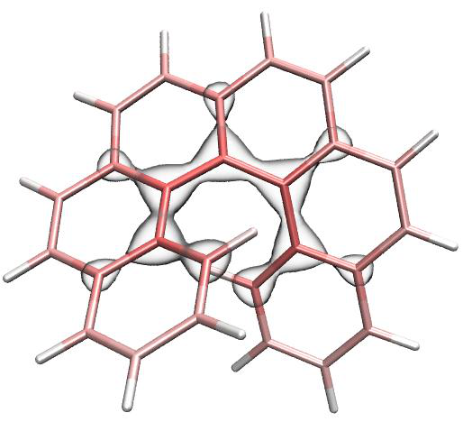

<!-- p.927 -->

### 4.21.4.2 Difference in dispersion energy between two conformations of

actos

Actos is a flexible drug molecule, the xyz files of its curly and linear conformations have been provided in “examples” folder as Actos_curly.xyz and Actos_linear.xyz, respectively. In this section, we examine the change in the atomic contribution to the dispersion energy of the curly conformation relative to the linear conformation. Boot up Multiwfn and input

examples\Actos_curly.xyz 21 // Energy decomposition analysis 4 // Analysis of atomic contribution to dispersion energy 3 // Calculate difference of atomic contributions to dispersion energy between current and another systems

[Press ENTER button] //All atoms in the present system (Actos_curly.xyz) are of interest examples\Actos_linear.xyz [Press ENTER button] //All atoms in Actos_curly.xyz are of interest From output on screen, you can find total dispersion energy of Actos_linear.xyz and Actos_curly.xyz is -57.553 kcal/mol and -69.757 kcal/mol, respectively. It is clear that dispersion interaction of the curly conformation is more significant. Also, the difference in the contribution of every atom to the dispersion energy of the two structures is printed on screen.

Then input y, diffatomdisp.pqr will be generated in the current directory, in which the “charge” property records the dispersion energy contributed by each atom of Actos_curly.xyz minus the dispersion energy contributed by each atom of Actos_linear.xyz, and the atomic coordinates in this file are the same as Actos_curly.xyz. Use VMD to plot molecular structure and color the atoms according to “charge” property based on this file, and set color scale range as -1.0 to 1.0 kcal/mol, then you will get the figure on the left below (the color scale bar is cut out from “Graphics” - “Color” - “Color Scale” panel and then manually made using Powerpoint), the atom on the right figure below is colored according to the element name for comparison (yellow/cyan/red/blue/white is sulfur/carbon/oxygen/nitrogen/hydrogen).

The redder atoms in the left figure above correspond to the atoms that contribute more to the variation of dispersion energy in the process of changing from the linear conformation to the curly conformation. It can be seen that the enhancement of dispersion interaction mainly occurs on the atoms that can become closer to other atoms after the conformation is curled up. The dispersion effect of the white atoms mainly distributed in the corners is not changed notably.


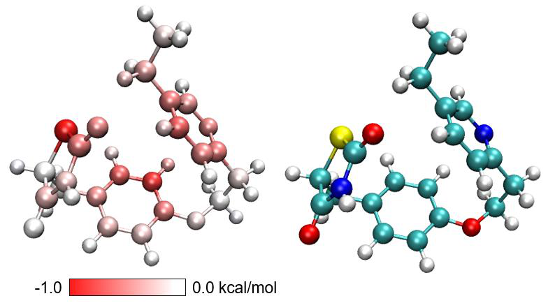

<!-- p.928 -->

Multiwfn can also generate the difference grid data of dispersion density. Input the following commands in the present function

4 // Calculate dispersion density difference between current and another system [Press ENTER button] //All atoms in the present system (Actos_curly.xyz) are of interest examples\Actos_linear.xyz // Another system [Press ENTER button] //All atoms in Actos_curly.xyz are of interest 3 // High-quality grid dispdensdiff.cub now is generated in current folder. Plotting it as isosurface map using VMD

with isovalue of ±0.025 via the convenient VMD script described in Section 4.A.14, you will see the following map, the blue color indicates that the isosurface corresponds to negative value. It can be seen that the isosurfaces well highlight the regions with significant enhancement of dispersion energy caused by structural curling.

### 4.21.4.3 Adsorption of toluene on zeolite

This section illustrates analysis on periodic systems. zeolite.cif and zeolite-mol.cif in “examples” folder are structural files of zeolite and zeolite with an adsorbed toluene, respectively. The latter was optimized by CP2K program at PBE-D3(BJ)/DZVP-MOLOPT-SR-GTH level, and the coordinate of the former was directly extracted from the latter. The two .cif files can be used as input files for analysis of atomic contribution to dispersion energy and calculating dispersion density. Because .cif file provides cell information to Multiwfn, the calculation will be conducted automatically with consideration of periodicity.

First, we perform analysis on zeolite-mol.cif and color atoms according to their contributions to dispersion energy using exactly the same way as described in Section 4.21.4.1, and set color scale to -8.0 to 8.0 kcal/mol, you will obtain the following map. Only the atoms of the adsorbed toluene, which correspond to atoms 217-231 in the file, are shown as large spheres. As can be seen from the figure, silicon atoms contribute the most to dispersion energy, which are much larger than oxygen and carbon atoms, and hydrogen atoms in the toluene contribute the least.


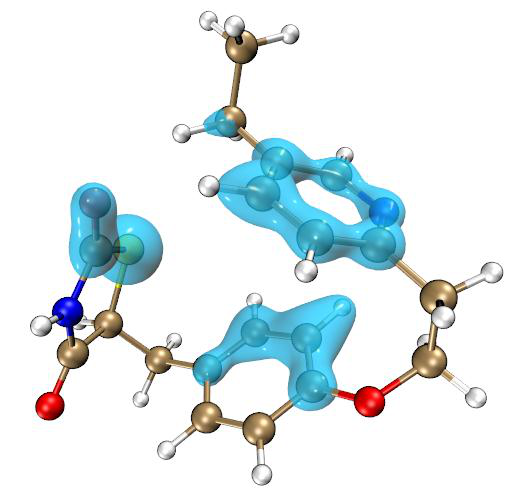

<!-- p.929 -->

The above figure does not directly show which atoms in the zeolite have the strongest dispersion interaction with the toluene. To clearly study this point, we need to find the difference between the contribution of the zeolite atoms (atoms 1-216) in the zeolite-mol.cif system to its dispersion energy and the contribution of the atoms in the zeolite.cif system to its dispersion energy. This will be done below.

Boot up Multiwfn and input examples\zeolite-mol.cif 21 // Energy decomposition analysis 4 // Analysis of atomic contribution to dispersion energy 3 // Calculate difference of atomic contributions to dispersion energy between current and another systems

1-216 // The atoms of interest are those of the zeolite moiety (first 216 atoms) in the current system (zeolite-mol.cif)

examples\zeolite.cif // Another system [Press ENTER button directly] // The atoms of interest are all 216 atoms in zeolite.cif, which also correspond to atoms 1-216 in zeolite-mol.cif

y // Export diffatomdisp.pqr in current folder Load the diffatomdisp.pqr into VMD, color atoms by “charge” property, set color scale to -0.8 to 0.8, you will see


<!-- p.930 -->

The adsorbed toluene is fully white in the picture above because it is not within the atomic range of interest in the zeolite-mol.cif we defined earlier, so its data is completely zero. The pink or red atoms in the figure suggest that the dispersion energy contributed by the zeolite atoms closer to the toluene changed greatly due to the adsorption. Since the structure of the zeolite moiety in zeolite-mol.cif is the same as zeolite.cif, therefore, the atom colors in the above figure completely reflect the dispersion interaction between the zeolite atoms and the toluene. It can be seen from the figure that the dispersion interaction decays very quickly with distance (known to be 1/r6 decay behavior). Basically, only the zeolite atoms in the closest layer to the toluene have a significant dispersion interaction with it.

The above figure can be changed to the following map, which shows the atoms of zeolite that interact prominently with toluene much more clearly. Specifically, in VMD, three Reps should be created in “Graphics” - “Representation” interface

- Rep 1: Displays toluene, colored with Name, displayed in Licorice style and BrushedMetal material

- Rep 2: Displays the entire zeolite using the selection serial 1 to 216, set drawing method to Licorice (with Bond Radius = 0.1), set coloring method to “Charge”, and set material to Transparent

- Rep 3: Displays zeolite atoms with “charge” property more negative than -0.2 (using selection charge<-0.2), using CPK drawing method and coloring method of “Charge”.


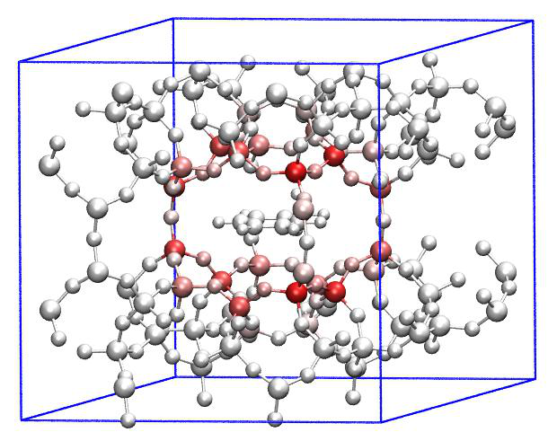

<!-- p.931 -->

At the end of this section, it is emphasized that when doing difference analysis of atomic dispersion energy contribution or dispersion density, the number of atoms in the atomic range of interest selected for the two systems must be the same, and the order of the atoms must also be the same, otherwise it is obvious that the dispersion energy contribution by atoms will be confused when taking the difference between the two systems.


## 4.22 Examples of conceptual density functional theory


## (CDFT) analysis


### 4.22.1 Automatically calculate conceptual density functional theory


### quantities for phenol

Note: Chinese version of this section is my blog article “Using Multiwfn to easily calculate various quantities defined in the concept density functional theory” (http://sobereva.com/484).

In this section, I will show how to very conveniently calculate almost all quantities defined in the framework of conceptual density functional theory (CDFT). Phenol will be taken as example. Since phenol is a neutral molecule, the N, N+1 and N-1 electrons states correspond to neutral, anionic and cationic states, respectively.

Before following this example, please read Section 3.25 first, in which all quantities to be computed and basic usage are described.

Preparation of needed wavefunction files Phenol at neutral state should be optimized first, please do it yourself. The examples\phenol.xyz is geometry of phenol optimized at the widely used B3LYP/6-31G* level, its quality is fine enough for present study.

Boot up Multiwfn and input below commands: examples\phenol.xyz 22 // Calculate various quantities in conceptual density functional theory


<!-- p.932 -->

1 // Generate .wfn files for N, N+1 and N-1 electrons states [Press ENTER button directly] // The generated .gjf files will correspond to single point task at B3LYP/6-31G* level

[Press ENTER button directly] // Use default charge and spin multiplicity, namely 0 1 for N state, -1 2 for N+1 state, and 1 2 for N-1 state

Now N.gjf, N+1.gjf and N-1.gjf have been generated in current folder, they are input files of single point task used for generating N.wfn, N+1.wfn and N-1.wfn, respectively. Now you can manually run them by Gaussian. If you do not change the generation path of the .wfn file in these files, after running them they will be generated in current folder for Gaussian of Linux version, while for Windows version they will be generated in Gaussian scratch folder.

You can also let Multiwfn directly invoke Gaussian to run the .gjf files. Assume that we have set "gaupath" parameter in `settings.ini` to actual path of Gaussian executable file, now you can input y in Multiwfn window, then the .gjf files will be executed by Gaussian and the resulting .wfn files will occur in current folder, after that the .gjf and .out files will be automatically deleted.

Multiwfn is also able to generate input files of ORCA program for generating the .wfn files. To do so, you should select option -2 once, then choose option 1, then three ORCA input files will be generated. After manually running them by ORCA, N.wfn, N-1.wfn, N+1.wfn will be available, and you should move them to Multiwfn folder.

Calculating global and atomic indices Because N.wfn, N+1.wfn and N-1.wfn have already been provided in current folder, now we can start calculation of CDFT quantities. We choose option "2 Calculate various quantitative indices", then Multiwfn starts to calculate Hirshfeld charges and extract information from the .wfn files, the results are outputted to CDFT.txt in current folder. The content is shown below, they are completely self-explanatory. The file has also been provided as examples\CDFT.txt.


```text
 Hirshfeld charges, condensed Fukui functions and condensed dual descriptors
 Units used below are "e" (elementary charge)
     Atom     q(N)    q(N+1)   q(N-1)     f-       f+       f0      CDD
     1(C )  -0.0587  -0.1185   0.0852   0.1439   0.0598   0.1018  -0.0841
     2(C )  -0.0390  -0.1674   0.0268   0.0658   0.1284   0.0971   0.0626
     3(C )  -0.0597  -0.1873   0.0319   0.0916   0.1276   0.1096   0.0360
...[ignored]

 Condensed local electrophilicity/nucleophilicity index (e*eV)
     Atom              Electrophilicity          Nucleophilicity
     1(C )                  0.02576                  0.45535
     2(C )                  0.05533                  0.20827
     3(C )                  0.05496                  0.28982
...[ignored]

Condensed
local
softness
(e/Hartree),
relative
electrophilicity/nucleophilicity
(dimensionless) and condensed local hyper-softness (e/Hartree^2)
     Atom         s-          s+          s0        s+/s-       s-/s+       s(2)
     1(C )      0.3761      0.1562      0.2661      0.4154      2.4075     -0.5746
     2(C )      0.1720      0.3355      0.2538      1.9501      0.5128      0.4271
     3(C )      0.2392      0.3333      0.2863      1.3933      0.7177      0.2459
```


<!-- p.933 -->


```text
...[ignored]

 E(N):     -307.464860 Hartree
 E(N+1):     -307.383614 Hartree
 E(N-1):     -307.163438 Hartree
 E_HOMO(N):     -0.218913 Hartree,   -5.9569 eV
 E_HOMO(N+1):    0.161297 Hartree,    4.3891 eV
 E_HOMO(N-1):   -0.464864 Hartree,  -12.6496 eV
 First vertical IP:     0.301421 Hartree,    8.2021 eV
 First vertical EA:    -0.081246 Hartree,   -2.2108 eV
 Mulliken electronegativity:     0.110088 Hartree,    2.9956 eV
 Chemical potential:            -0.110088 Hartree,   -2.9956 eV
 Hardness (=fundamental gap):    0.382667 Hartree,   10.4129 eV
 Softness:      2.613235 Hartree^-1,    0.0960 eV^-1
 Softness^2:    6.828998 Hartree^-2,    0.0092 eV^-2
 Electrophilicity index:    0.015835 Hartree,    0.4309 eV
 Nucleophilicity index:     0.116285 Hartree,    3.1643 eV
```

You can compare the condensed Fukui functions and dual descriptor shown above with those manually calculated in Section 4.7.3, you can find the data are completely identical. Clearly, using present module to compute the CDFT quantities is by far easier than manual calculation!

Frankly speaking, the outputted values involving energy of N+1 states, such as vertical EA, Mulliken electronegativity and so on are not very accurate, since it is well known that to obtain a relatively accurate energy of anionic system, diffuse functions must be employed. So, if you need better results of these quantities, when you use Multiwfn to prepare input files of Gaussian, it is suggested to choose a basis set at least 6-311+G* level.

Calculating Fukui function and dual descriptor

Next, we study Fukui function (f) and dual descriptor (Δf), which are real space functions. Choose option "3 Calculate grid data of Fukui function, dual descriptor and related functions ", and then select "2 Medium-quality grid", then Multiwfn automatically calculates grid data of electron density for N, N+1 and N-1 states. After that, you can choose corresponding option to visualize Fukui function or dual descriptor, or export them as cube files in current folder. Various types of f

and Δf plotted by Multiwfn are collectively given in the following graph, all isovalues are set to 0.007 a.u.:


<!-- p.934 -->

From the map above, you can find the f and Δf automatically generated by present module are identical to those manually yielded in Section 4.5.3 by means of custom operation feature of main function 5. Undoubtedly using present module is much more convenient!

As mentioned in Section 4.5.4, the dual descriptor can also be approximately evaluated based on spin density of N-1 and N+1 states, however in the present module, the dual descriptor as well as its condensed form are evaluated in exact way.

It is worth to note that if we export the grid data as cube file by corresponding option, then we can use the method described in Section 4.A.14 to very quickly and easily plot above functions as

isosurface map by VMD at state-of-the-art quality. For example, below is the f − function rendered by VMD.

Calculating local (hyper-)softness and local electrophilicity/nucleophilicity index The module illustrated above can also be used to export or visualize local softness, local hyper-softness, local electrophilicity index and local nucleophilicity index.

For example, we will export cube file of local electrophilicity index, recall that its definition is simply multiplying f + by global electrophilicity index. Therefore, we select option "-1 Set the scale


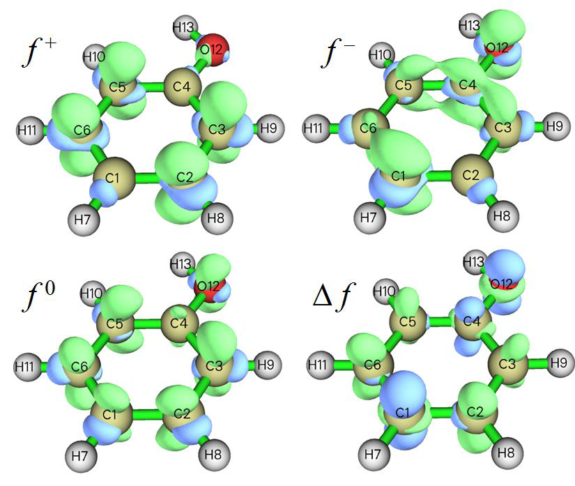

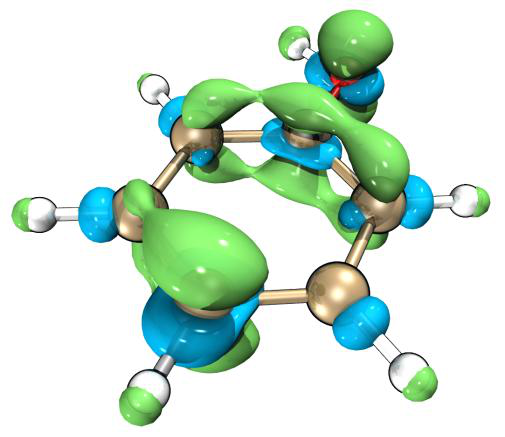

<!-- p.935 -->

factor to various grid data", input 0.4309 (which is the global electrophilicity index in eV outputted by option 2, see CDFT.txt), then select option "5 Export grid data of scaled f+ as f+.cub in current folder". Now, the exported f+.cub corresponds to local electrophilicity index, the unit is eV/Bohr3.

Next example, we will export cube file of local hyper-softness (LHS), whose definition and practical value are carefully discussed in J. Math. Chem., 62, 461 (2024). It can be simply evaluated

by multiplying Δf with square of global softness. Therefore, we select option "-1 Set the scale factor to various grid data" and input 6.828998 (which is the softness2 in Hartree-2 outputted by option 2, see the aforementioned CDFT.txt), then select option "5 Export grid data of scaled dual descriptor as DD.cub in current folder". Now, the exported DD.cub corresponds to LHS, the unit is 1/(Bohr3Hartree2) or simply a.u.

Calculation of ωcubic and ε As described in Section 3.25, the electrophilicity index ωcubic is useful in studying weak interaction, at least for halogen bonds, and electrophilic descriptor ε is a quantity correlates with electrophilicity better than ω. If you also want to calculate them, after entering the present module you should select option -1 first to switch its status to "Yes", then simply follow the example shown above (i.e. prepare .wfn files with the aid of option 1, then use option 2 to perform calculation), then

the CDFT.txt outputted by option 2 will contain ωcubic, its condensed value on every atom, as well as ε. An intermediate quantity, namely the second vertical ionization potential, is also printed.

More specifically, for the present example, after entering the present module you should input

-1 // Toggle calculating ωcubic and ε 1 // Generate .wfn files for N, N+1, N-1, N-2 electronic states [Press ENTER button directly] // Use B3LYP/6-31G* level [Press ENTER button directly] // Use default charge and spin multiplicity, namely 0 1 for N state, -1 2 for N+1 state, 1 2 for N-1 state, 2 1 for N-2 state

Now run the newly generated four .gjf files to obtain N.wfn, N+1.wfn, N-1.wfn and N-2.wfn, then choose option 2. From the outputted CDFT.txt, you can find:


```text
Cubic electrophilicity index (w_cubic):    0.021716 Hartree,    0.5909 eV
Electrophilic descriptor (epsilon):        0.080522 Hartree,    2.1911 eV
```


### 4.22.2 Illustration of studying orbital-weighted Fukui function and


### orbital-weighted dual descriptor

Note: Chinese version of this section with extended discussions and more examples is my blog article “Prediction of nucleophilic and electrophilic reaction sites by orbital-weighted Fukui function and orbital-weighted dual descriptor” (http://sobereva.com/533).

Please read Section 3.25.3 first, in which orbital-weighted Fukui function (𝑓𝑤+ and 𝑓𝑤−) and dual descriptor ∆𝑓𝑤 are introduced, also some important notes are given. In this section we will use these functions to study several systems.

Part 1: C60 In this part we will use the orbital-weighted functions to reveal reactive sites of C60, which has high point group symmetry and its frontier molecular orbitals are highly degenerate. Molecules like this are unable to be reasonably studied via the Fukui function and dual descriptor in standard form. The .fch file of this system generated at B3LYP/6-31G* level can be downloaded at


<!-- p.936 -->

http://sobereva.com/multiwfn/extrafiles/C60.zip, which is input file of the present analysis.

Boot up Multiwfn and input below commands C60.fch 22 // Calculate various quantities in conceptual density functional theory

In the current menu, you can use option 4 to set the Δ parameter used in the subsequent orbital-weighted calculations, in this example we keep the default value (0.1 Hartree) unchanged, it should be properly changed only when you find the result is not satisfactory.

We first visualize isosurface of the orbital-weighted functions. Input below commands 7 // Calculate grid data of OW Fukui function and OW dual descriptor 2 // Medium quality Then you can use corresponding option to visualize isosurfaces of 𝑓𝑤+, 𝑓𝑤−, 𝑓𝑤0 and ∆𝑓𝑤, which are collectively shown below. Note that isovalue should be changed to proper value, otherwise isosurfaces may be even invisible. Isosurface of 0.0003 a.u. is used to plot the maps below.

In the map above, green and blue isosurfaces represent positive and negative parts, respectively. As you can see, distributions of all orbital-weighted functions are in line with molecular point group symmetry, this is a unique advantage of the orbital-weighted form. In contrast, if you plot density

of HOMO (corresponding to frozen orbital form of f −) or calculate and plot f − via finite difference (ρN − ρN-1), you will find their distributions are counterintuitive (inconsistent with molecular symmetry) and thus useless in revealing reactive sites. As introduced in Section 4.5.4, a region with

large positive f − or with prominent negative Δf corresponds to the site having remarkable nucleophilicity, or equivalently, vulnerable to electrophilic attack. From the map above we can find that the sites with highest tendency of undergoing electrophilic attack are the regions above [6,6] type of C-C bond (i.e. the bond shared by two adjacent six-membered rings). This observation is fully in line with experimental findings (see original paper of ∆𝑓𝑤, namely J. Phys. Chem. A, 123, 10556 (2019), for extensive discussion), and this conclusion can also be further confirmed according to distribution of minima of average local ionization energy over vdW surface, see Section 4.12.2 on how to perform this kind of analysis.

The orbital-weighted form of Fukui function and dual descriptor are contributed by multiple orbitals. If you want to check weights to better understand how the orbital-weighted functions work, in the present module you can choose "5 Print current orbital weights used in orbital-weighted (OW) calculation", then you will see


```text
 10 Highest weights in orbital-weighted f+
```


<!-- p.937 -->


```text
 Orbital   181 (LUMO  )   Weight:  12.47 %   E_diff:     1.752 eV
 Orbital   182 (LUMO+1)   Weight:  12.47 %   E_diff:     1.752 eV
 Orbital   183 (LUMO+2)   Weight:  12.47 %   E_diff:     1.752 eV
 Orbital   184 (LUMO+3)   Weight:   6.32 %   E_diff:     2.847 eV
 Orbital   185 (LUMO+4)   Weight:   6.32 %   E_diff:     2.847 eV
 Orbital   186 (LUMO+5)   Weight:   6.32 %   E_diff:     2.847 eV
 Orbital   187 (LUMO+6)   Weight:   4.70 %   E_diff:     3.207 eV
 Orbital   188 (LUMO+7)   Weight:   4.70 %   E_diff:     3.207 eV
 Orbital   189 (LUMO+8)   Weight:   4.70 %   E_diff:     3.207 eV

 10 Highest weights in orbital-weighted f-
 Orbital   180 (HOMO  )   Weight:   9.06 %   E_diff:    -1.752 eV
 Orbital   179 (HOMO-1)   Weight:   9.06 %   E_diff:    -1.752 eV
 Orbital   178 (HOMO-2)   Weight:   9.06 %   E_diff:    -1.752 eV
 Orbital   177 (HOMO-3)   Weight:   9.06 %   E_diff:    -1.752 eV
 Orbital   176 (HOMO-4)   Weight:   9.06 %   E_diff:    -1.752 eV
 Orbital   175 (HOMO-5)   Weight:   5.02 %   E_diff:    -2.728 eV
 Orbital   174 (HOMO-6)   Weight:   5.02 %   E_diff:    -2.728 eV
 Orbital   173 (HOMO-7)   Weight:   5.02 %   E_diff:    -2.728 eV
 Orbital   172 (HOMO-8)   Weight:   5.02 %   E_diff:    -2.728 eV
 Orbital   171 (HOMO-9)   Weight:   5.02 %   E_diff:    -2.728 eV
```

The "E_diff" is the difference between orbital energy and the chemical potential approximately evaluated as average of E(HOMO) and E(LUMO). Evidently, the more the orbital energy close to the chemical potential, the higher weight the orbital will have.

You can also calculate condensed 𝑓𝑤+, 𝑓𝑤−, 𝑓𝑤0 and ∆𝑓𝑤, so that you can easily study their values at each atomic site quantitatively. To do so, in the present module you should choose "6 Calculate condensed OW Fukui function and OW dual descriptor". However, these condensed quantities are meaningless for the C60 we studied above, since all atoms are spatially equivalent.

It is worth to note in passing that extrema of 𝑓𝑤+, 𝑓𝑤−, 𝑓𝑤0 and ∆𝑓𝑤 on molecular surface can be exactly located via quantitative molecular surface analysis module, so that one can quantitatively compare their values in different regions. Many examples of using this module have been given in

Section 4.12. Below we will examine extrema of ∆𝑓𝑤 on ρ = 0.01 a.u. isosurface. First, we set "iuserfunc" parameter in `settings.ini` to 98, since as mentioned in Section 2.7, ∆𝑓𝑤 corresponds to the 98th user-defined function. Then boot up Multiwfn and input

C60.fch 12 // Quantitative analysis of molecular surface 1 // Select the way to define surface 1 // Isosurface of electron density

0.01 // Use ρ = 0.01 a.u. isosurface to define the surface 2 // Select mapped function -1 // User-defined real space function, which now corresponds to ∆𝑓𝑤 3 // Spacing of grid points for generating molecular surface


<!-- p.938 -->

0.25 // Use slightly larger grid spacing than default to reduce cost. This setting is already fine enough for present investigation

0 // Start analysis After the calculation is complete, select option 0 in post-processing menu to visualize extrema. In order to make the graph clear, we change the "Ratio of atomic size" in GUI to 3.0 to enlarge atomic spheres. The graph in the GUI window is shown below. Value of a few minima (blue spheres) of ∆𝑓𝑤 are labelled, the values can be found from text window. The red spheres correspond to maxima.

As can be seen, the ∆𝑓𝑤 above [6,6] bond is remarkably more negative compared to other areas, thus these positions have highest reactivity for electrophilic reaction. Although there are also surface minima above center of each five-membered ring, the value is slightly positive, therefore the five-membered ring does not have evident tendency to participate in electrophilic reaction.

Part 2: Cyclo[18]carbon The cyclo[18]carbon was very systematically studied in my work Carbon, 165, 468 (2020), Carbon, 165, 461 (2020) and http://sobereva.com/carbon_ring.html for more. This system has high symmetry (D9h) and is thus very suitable to be studied via the orbital-weighted functions. The .fchk of this system can be directly downloaded via http://sobereva.com/multiwfn/extrafiles/C18.zip,

which was generated at ωB97XD/def2-TZVP level. The isosurface of ∆𝑓𝑤 =0.0008 a.u. of this system is shown below.


<!-- p.939 -->

The cyclo[18]carbon contains two kinds of C-C bond, a short one and a long one, they occur alternatively. Two short bonds are highlighted by red arrows. From the map above it can be clearly seen that the short and long C-C bonds are vulnerable to electrophilic and nucleophilic attacks, respectively, since the former are enclosed by negative isosurfaces while the latter are enclosed by positive isosurfaces.

In Multiwfn, it is also possible to plot ∆𝑓𝑤 as plane map. As an example, we will plot ∆𝑓𝑤 as color-filled map on the molecular plane of the cyclo[18]carbon. We first set "iuserfunc" parameter in `settings.ini` to 98, then boot up Multiwfn and input

C18.fchk 4 // Plot plane map 100 // User-defined real space function, which now corresponds to ∆𝑓𝑤 1 // Color-filled map [Press ENTER button to use default grid setting] 1 // XY plane 0 // Z=0 We close the map that pops up, then adjust some settings in the post-processing menu and replot, after that you will see the map below. The blue contour line corresponds to vdW surface.


<!-- p.940 -->

From the map above we can find that the inner edge of the ring is more reactive than the outer edge, since inner edge has larger magnitude of ∆𝑓𝑤.

Part 3: CH3Cl Finally, we employ ∆𝑓𝑤 to study reactivity of CH3Cl. The input file is examples\CH3Cl.fchk. We calculate grid data of ∆𝑓𝑤 using the same way as the examples above, however, in order to get better graphical effect, this time we do not visualize isosurface in Multiwfn directly, but export grid data of ∆𝑓𝑤 as OW_DD.cub via corresponding option, then use the method described in Section 4.A.14 to easily render it as isosurface map via VMD program. The isosurface of 0.008 a.u. is shown below.

As can be seen, the toroidal negative region appears around the Cl atom, implying that this region shows Lewis-base character. At the two ends of C-Cl bond the ∆𝑓𝑤 is notably positive, showing that the end of carbon site is vulnerable to nucleophilic attack (e.g. SN2 reaction), while

the end of Cl site behaves as Lewis-acid, which is in line with the fact that there is a σ-hole region.

By the way, you can also study extrema of ∆𝑓𝑤 on molecular surface like the example of C60 to make discussion of ∆𝑓𝑤 at quantitative level.


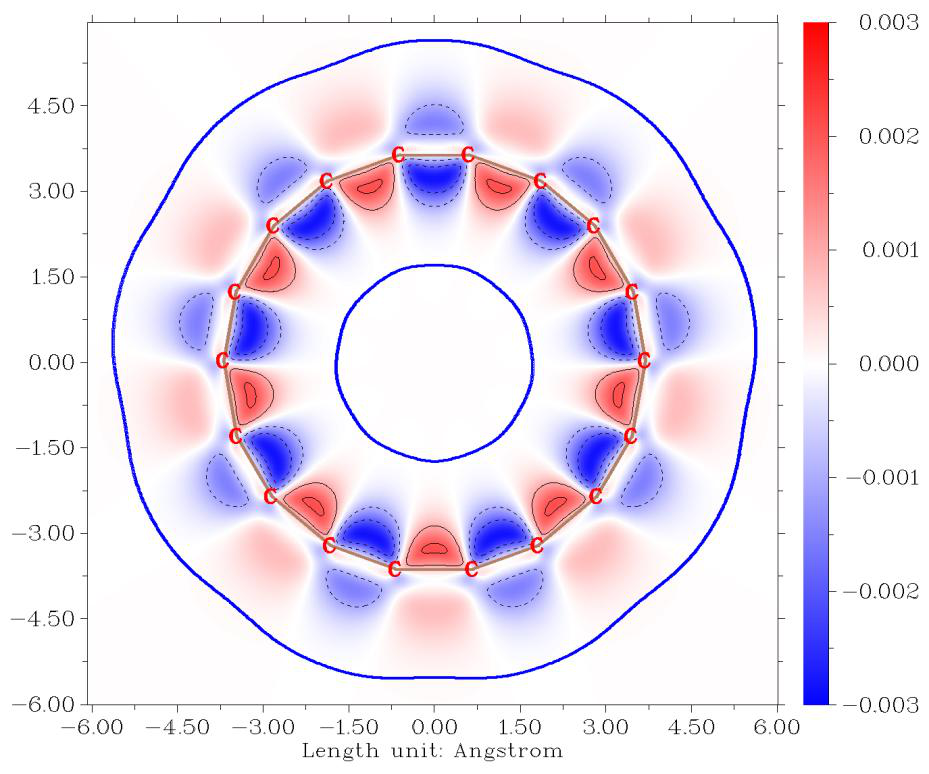


<!-- p.941 -->

### 4.22.3 Examples of CDFT analysis in (quasi-)degenerate


### HOMO/LUMO case

As described in Section 3.25.4, aside from employing orbital-weighted form, Multiwfn also supports another form to perform CDFT analysis when HOMO and/or LUMO are (quasi-)degenerate. This form solely relies on electron density and thus theoretically more rigorous than the orbital-weighted form, at the expense of additional computational effort since wavefunction files of N+p and N-q states should also be calculated, where p and q are degeneracy of LUMO and HOMO, respectively. Next, I will give two examples.

### 4.22.3.1 Fukui function and dual descriptor of benzene

In this section I will take benzene as an example to illustrate calculating Fukui function and dual descriptor with consideration of HOMO/LUMO degeneracy. Because we need to determine the degeneracy based on orbital energies, therefore we should first generate a wavefunction file for the studied structure. examples\benzene.fch is the wavefunction file produced by geometry optimization task at B3LYP/6-31G* level by Gaussian 16.

Boot up Multiwfn and input examples\benzene.fch 22 // Calculate various quantities in conceptual density functional theory -3 // Set degree of frontier molecular orbital degeneracy Now information of lowest 10 unoccupied MOs are shown on screen to help you determine LUMO degeneracy


```text
...[ignored]
Orbital    25 (LUMO+3)   Energy:     3.838 eV  E_diff:     3.737 eV
Orbital    24 (LUMO+2)   Energy:     2.346 eV  E_diff:     2.246 eV
Orbital    23 (LUMO+1)   Energy:     0.100 eV  E_diff:     0.000 eV
Orbital    22 (LUMO  )   Energy:     0.100 eV
```

From the orbital energies it is clear that LUMO and LUMO+1 are exactly degenerate, while LUMO+2 has a significantly higher energy, therefore the degree of LUMO degeneracy is 2. So, we input 2 here (Note that Multiwfn prompts you that if you directly press ENTER button here, degeneracy of 2 will be used. This is because Multiwfn determines the degeneracy of LUMO by counting how many unoccupied orbital energies differ from LUMO by less than 0.01 eV).

Then information of highest 10 occupied MOs are shown on screen:


```text
Orbital    21 (HOMO  )   Energy:    -6.720 eV
Orbital    20 (HOMO-1)   Energy:    -6.720 eV  E_diff:     0.000 eV
Orbital    19 (HOMO-2)   Energy:    -9.234 eV  E_diff:    -2.514 eV
Orbital    18 (HOMO-3)   Energy:    -9.234 eV  E_diff:    -2.514 eV
...[ignored]
```

It is found that HOMO and HOMO-1 have exactly identical energy, therefore now we input 2 to indicate that HOMO degeneracy is 2 (you can also press ENTER button directly to use the automatically determined degeneracy of 2).

Next, you can manually use your favourite quantum chemistry program to generate wavefunction file of N, N+2 and N-2 states. For convenience, here we let Multiwfn help us prepare the input files. Input the following commands:


<!-- p.942 -->

1 // Single point input files of Gaussian for generating .wfn files for N, N+2, N-2 states will be prepared (If you are an ORCA user, you can choose option -2 to change to ORCA program before selecting this option)

[Press ENTER button] //Use the default B3LYP/6-31G* level for single point calculation [Press ENTER button] //As mentioned in prompt, pressing ENTER button directly will use net charge and spin multiplicity of (0 1), (-2 3) and (2 3) for the N, N+2 and N-2 states, respectively. These combinations are reasonable for present case

Because currently N+1 and N-1 states have not been defined, while E(N+1) and E(N-1) are needed for calculating first VIP, VEA and their related quantities such as softness in option 2, so Multiwfn also asks you to input net charge and spin multiplicity for the two states. However, in this example we only want to calculate Fukui function and dual descriptor, which are independent of these energetic quantities, so we press ENTER button twice to skip definition of the two states.

Now N.gjf, N+2.gjf and N-2.gjf have been generated in current folder, you can manually use Gaussian to run them, or directly input y to let Multiwfn invoke the Gaussian on your machine to run them (in this case that the “gaupath” in `settings.ini` have been correctly defined). Once calculations are all finished, you will have N.wfn, N+2.wfn and N-2.wfn in current folder.

Then we plot isosurface map of Fukui function and dual descriptor with consideration of HOMO and LUMO degeneracy. Input the following commands

3 // Calculate grid data of Fukui function and dual descriptor (if N.wfn, N+2.wfn and N-2.wfn are not present in current folder, Multiwfn will ask you to input path of wavefunction files of the three states)

2 // Medium-quality grid

2 // Visualize isosurface of f − After changing isovalue to 0.005 a.u., you will see the following map

From the map above it can be seen that the distribution of f − with consideration of HOMO degeneracy, namely (ρN − ρN-2)/2, is fully in line with molecular symmetry. The positive regions (exhibited by green isosurfaces) mainly occur above and below the molecular plane at carbon atoms,

thus correctly indicating that the π-electron cloud is easy to undergo electrophilic attack. In contrast, if you plot f − in usual way, namely ρN − ρN-1, you will find its distribution obviously violates the actual molecular symmetry and thus leads to misleading conclusion about preferential site of electrophilic attack.

Similarly, you can use options 1, 3 and 4 to visualize isosurface map of f +, f 0, and dual

descriptor Δf calculated under consideration of frontier MO degeneracy, respectively.


<!-- p.943 -->

Notice about the choice of calculation level for f + and dual descriptor For the benzene system, if you use B3LYP with a basis set containing diffuse functions (e.g. 6-311+G*) to generate wavefunction files, you will find distribution of the calculated

(quasi-)degenerate f + and Δf is extremely diffuse (showing strong Rydberg character) and not completely in line with molecular symmetry. This is because the severe self-interaction error (SIE) problem of this functional makes the electrons at the N+2 state over-diffuse, while the current basis set has capability of representing spatial regions far from the molecule. In this case, the resulting f +

and Δf are not well-behaved and cannot be used to discuss preferential reactive sites.

It is worth to note that in Chem. Phys. Lett., 724, 29 (2019), it was found that if Fukui function and dual descriptor are evaluated based on finite difference (the same as the present case), then even a 3-zeta basis set without diffuse functions can basically result in a meaningful dual descriptor.

Despite that the B3LYP/6-31G* level, as what we employed in the present example, yields

seemingly reasonable f + and Δf distributions, if you pursue a more rigorous result, I would like to recommend using a long-range corrected DFT functionals such as ωB97XD with a 3-zeta basis set without diffuse functions, e.g. 6-311G*. The ωB97XD suffers much weaker SIE problem than the popular B3LYP, therefore the electrons are more tightly bounded at anionic state; the 3-zeta basis set with no diffuse function represents valence electronic structure adequately, while electrons are

forced to be bounded within valence region, guaranteeing that f + and Δf only represent the region of chemical interest.

### 4.22.3.2 Local softness and local hyper-softness of C60 fullerene

In this section I will illustrate calculation of local softness and local hyper-softness of C60

fullerene. They are presented in J. Math. Chem., 62, 461 (2024) at ωB97XD/6-311+G* level, but in this section, we use 6-311G* instead to greatly save computational cost. The .fchk file

(C60_wB97XD_opt.fchk) file produced by geometry optimization at ωB97XD/6-311G* level by Gaussian 16 can be downloaded at http://sobereva.com/multiwfn/extrafiles/C60_wB97XD_opt.7z.

Boot up Multiwfn and input C60_wB97XD_opt.fchk 22 // Calculate various quantities in conceptual density functional theory -3 // Set degree of frontier molecular orbital degeneracy [Press ENTER button directly] // Use automatically determined LUMO degeneracy of 3 [Press ENTER button directly] // Use automatically determined HOMO degeneracy of 5 1 // Generate .wfn files for various electrons states wB97XD/6-311G* symm=loose scf=conver=7 // Keywords for performing single point task of Gaussian. The “symm=loose” ensures that Gaussian will utilize Ih point group of C60 to greatly reduce cost. “scf=conver=7” slightly loosens SCF convergence threshold to make it easier to reach

[Press ENTER button] //Use default net charge and spin multiplicity of (0 1), (-3 4) and (5 6) for the N, N+3 and N-5 states, respectively

-1,2 // Net charge and spin multiplicity of N+1 state 1,2 // Net charge and spin multiplicity of N-1 state Now N.gjf, N-1.gjf, N+1.gjf, N-3.gjf and N+5.gjf have been generated in current folder, input y to let Multiwfn invoke Gaussian to perform calculation (or manually calculate them). After calculations, you will find N.wfn, N-1.wfn, N+1.wfn, N-3.wfn and N+5.wfn in current folder.

Then choose option 2 to calculate various CDFT quantities and print them to CDFT.txt in current folder. From which we find softness and its square:


<!-- p.944 -->


```text
 Softness:      4.638426 Hartree^-1,    0.1705 eV^-1
 Softness^2:   21.514996 Hartree^-2,    0.0291 eV^-2
```

Next, input following commands to obtain local hyper-softness, which is product of square of softness and dual descriptor

3 // Calculate grid data of Fukui function, dual descriptor and related functions -10 // Set extension distance 6 // 6 Bohr, which is slightly larger than the default one to avoid isosurface truncation at box boundary when isovalue is set to a small value

3 // Since C60 is not small, we use high-quality grid to guarantee that grid spacing will not be too large and thus leading to poor isosurface map

-1 // Set the scale factor to various grid data 21.514996 // Square of softness in Hartree-2 8 // Export grid data of scaled dual descriptor as DD.cub in current folder Now the newly generated DD.cub in current folder corresponds to local hyper-softness with unit of 1/(Bohr3Hartree2). Plotting it as isosurface map with isovalue of 0.001 via VMD, you will see the following map, which is basically exactly the same as Fig. 4 of J. Math. Chem., 62, 461 (2024), though the current basis set 6-311G* is different to the much more expensive 6-311+G* employed in that work. Also, it is noteworthy that the main characteristic of this map is comparable with the ∆𝑓𝑤 of C60 obtained in Section 4.22.2.

Via similar way, we can obtain local softness, which is defined as product of softness and Fukui function. Input following commands

-1 // Set the scale factor to various grid data 4.638426 // Softness in Hartree-1 6 // Export grid data of scaled f- as f-.cub in current folder

Now the newly generated f-.cub in current folder corresponds to local softness s−, with unit of 1/(Bohr3Hartree). The following maps are the 0.005 and 0.003 isosurface of s− plotted by VMD, the former is identical to Fig. 2 of J. Math. Chem., 62, 461 (2024), while the latter is clearer to distinguish the bonds easiest to undergo electrophilic attack (i.e. the bonds shared by two six-membered rings), and it looks very analogous to the 𝑓𝑤− map of C60 in Section 4.22.2.


<!-- p.945 -->

### 4.22.3.3 Fukui function and dual descriptor of an open-shell molecule, O2

Please read Section 3.25.4.2 first to familiarize yourself with the working equations for evaluating Fukui function and dual descriptor of various forms for open-shell cases. In this example we calculate the functions for O2, which is a representative open-shell molecule (triplet ground state) with degeneracy in frontier MOs.

Boot up Multiwfn and input examples\O2.fch // Wavefunction file of ground state O2 at B3LYP/6-31G* level 22 // Calculate various quantities in conceptual density functional theory 12 // Calculate Fukui function and dual descriptor based on formalism of conceptual spin-polarized DFT

1 // Set degeneracy of frontier molecular orbitals

[Press ENTER button directly] // Use suggested degeneracy of LUMO(α) [Press ENTER button directly] // Use suggested degeneracy of HOMO(α) [Press ENTER button directly] // Use suggested degeneracy of LUMO(β) [Press ENTER button directly] // Use suggested degeneracy of HOMO(β) Now you can see the summary of degeneracy of frontier MOs:


```text
Degeneracy of LUMO(alpha):  1
Degeneracy of HOMO(alpha):  2
Degeneracy of LUMO(beta):   2
Degeneracy of HOMO(beta):   2
```

Next, we input 2 //Generate .wfn files for various electrons states [Press ENTER button directly] // Use the default B3LYP/6-31G* as computational level for generating Gaussian input files

Now you will find state0_3.gjf, state-1_4.gjf, state-2_1.gjf, state2_1.gjf, and state2_5.gjf have been generated in current folder, they are Gaussian input file of single point task for generating .wfn file of various electronic states that involved in our present study. For example, state-1_4.gjf corresponds to net charge of -4 with spin multiplicity of 4. If you have Gaussian installed on your local machine, you can input y to ask Multiwfn to invoke Gaussian to calculate all of them; alternatively, manually calculate them by Gaussian, then put the resulting .wfn files into current folder.

Now choose option 3 and select medium-quality grid to start calculating grid data of electron


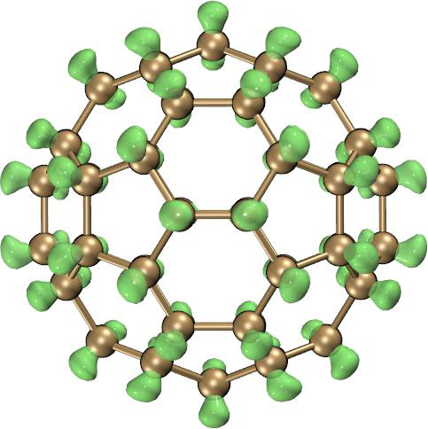


<!-- p.946 -->

density of different states. After that, in the post-processing menu, choose to visualize the real space function of your interest as isosurface map, or export grid data as .cub file. For example, we choose option 7 to plot dual descriptor of Δ𝑓Δ𝑁𝑆<0 form, after changing isosurface to 0.0005 a.u. and set

material as transparent, you will see the following map, which is exactly the same as DUAL-UDFT case in Fig. 7 of Chem. Phys. Lett., 506, 104 (2011).


### 4.22.4 Example of plotting Fukui potential and dual descriptor


### potential

This example illustrates plotting Fukui potential and dual descriptor potential for maleic anhydride, the latter is also given in J. Math. Chem., 62, 1094 (2024) and it was calculated at M06-2X/6-311++G(d,p) level, so we will use the same level to reproduce that result. If you are not familiar with these two potentials, please check Section 3.25.1 first.

Boot up Multiwfn and input examples\maleic_anhydride.xyz //Geometry was optimized at M06-2X/6-311++G(d,p) level 22 // Conceptual DFT (CDFT) analysis 1 // Generate .wfn files for N, N+1, N-1 electrons states M062X/6-311++G(d,p) // Keywords of Gaussian to perform single point calculations [Press ENTER button] // Use (0 1), (-1 2) and (1 2) for N, N+1 and N-1 states y // Invoke Gaussian to calculate the three states (assume that you have properly set “gaupath” in `settings.ini`)

9 // Calculate grid data of Fukui potential and dual descriptor potential 1 // Because calculating ESP grid data is relatively expensive, so here we choose to use low-quality grid

Now, you can choose corresponding options to visualize various kinds of Fukui potential and dual descriptor potential (DDP), the isosurface maps of 𝑉𝑓+, 𝑉𝑓−, and 𝐷𝐷𝑃= 𝑉𝑓+ −𝑉𝑓− are shown

below, positive and negative parts are shown as green and blue, respectively. The DDP map is in perfect agreement with Fig. 5 of J. Math. Chem., 62, 1094 (2024). The green part of the DDP map indicates that C4 and C5 are most susceptible to undergo nucleophilic attack. Experimentally, it is known that these two atoms of maleic anhydride can undergo D-A addition reaction with the nucleophilic cis-1,3-butadiene.


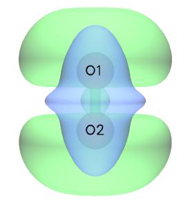

<!-- p.947 -->


### 4.22.5 Examples of calculating bond dual descriptor (BDD)

Note: Using Multiwfn to calculate bond dual descriptor to study reactivity of different chemical bonds” (http://sobereva.com/766).

Please read the brief introduction to bond dual descriptor (BDD) in Section 3.25.1 first, and read Section 4.22.1 to understand the basic use of the conceptual DFT analysis module. In this section I will illustrate the calculation of BDD for acrylonitrile, the structure optimized at B3LYP/6-31G* level is shown below, and the structure file is examples\acrylonitrile.xyz.

Boot up Multiwfn, load examples\acrylonitrile.xyz, then input 22 // Conceptual DFT (CDFT) analysis 1 // Generate .wfn files for N, N+1, N-1 electrons states [Press ENTER button directly] // The generated .gjf files will correspond to single point task at B3LYP/6-31G* level

[Press ENTER button directly] // Use default charge and spin multiplicity, namely 0 1 for N state, -1 2 for N+1 state, and 1 2 for N-1 state

Then run the N.gjf, N-1.gjf, N+1.gjf in current folder either by Gaussian manually or asking Multiwfn to invoke Gaussian to calculate them, then you will have N.wfn, N-1.wfn, and N+1.wfn in current folder. Then select option “10 Calculate bond dual descriptor (BDD)”. After that, Multiwfn loads the .wfn files and calculate fuzzy bond order for each electronic state in turn, and then BDD are printed, see below. For ease of study, only 10 most positive and negative values are directly given.


```text
10 most negative BDD values:
    1(C )     3(C ):    -0.562
    6(C )     7(N ):    -0.365
    3(C )     7(N ):    -0.029
```


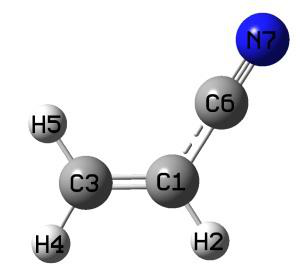

<!-- p.948 -->


```text
    1(C )     4(H ):    -0.008
    1(C )     5(H ):    -0.008
    4(H )     7(N ):    -0.001
    4(H )     5(H ):    -0.000
    5(H )     7(N ):    -0.000
    2(H )     4(H ):     0.000

10 most positive BDD values:
    1(C )     6(C ):     0.312
    1(C )     7(N ):     0.166
    3(C )     6(C ):     0.064
    3(C )     5(H ):     0.016
    3(C )     4(H ):     0.016
    2(H )     6(C ):     0.006
    2(H )     7(N ):     0.004
    5(H )     6(C ):     0.003
    4(H )     6(C ):     0.003
    1(C )     2(H ):     0.001
```

The results above show that C1-C3 is the bond most susceptible to electrophilic attack (the bond shows strongest nucleophilicity), followed by C6-N7. C1-C6 is the bond most susceptible to nucleophilic attack (the bond shows strongest electrophilicity). Some data given above do not correspond to directly bonded atoms, such as C1-N7 and C3-C6; these can be simply ignored.

Multiwfn then asks if you want to export the BDDs of all bonds in atomic number order to BDD.txt in the current directory, and to export the BDDs of all bonds sorted by numerical value to BDD_sorted.txt in the current directory. You can select y to export.

Note that the BDD calculation function also supports the case when frontier molecular orbitals are degenerated, just like the situation illustrated in Section 4.22.3. For these systems, you should use option -3 to set degeneracy of HOMO and LUMO prior to generating .wfn files and BDD calculation.


### 4.22.6 Examples of calculating dual delocalization descriptor (DDD)

Please first carefully read Section 3.25.6 to gain basic knowledge about dual delocalization descriptor (DDD). In this section I will illustrate how to calculate the quantities defined in the

framework of DDD for aminobenzene. The .fch file of this system calculated at ωB97XD/6-311G(d,p) can be downloaded at http://sobereva.com/multiwfn/extrafiles/aminobenzene_DDD.7z, the calculation level and geometry are exactly the same as those used in the original paper of DDD Phys. Chem. Chem. Phys., 28, 19133 (2026). We will use Hirshfeld partition to define the atomic spaces used for evaluating the atomic overlap matrix (AOM), which was also employed in the original paper of DDD.

Boot up Multiwfn and input aminobenzene_DDD.fch // The file in the compressed package mentioned above 22 // Conceptual DFT (CDFT) analysis 11 // Calculate dual delocalization descriptor (DDD)


<!-- p.949 -->

2 // Calculate AOM via Hirshfeld partition Now AOM has been generated, you can input indices of two atoms to study DDD of the corresponding bond. For example, we input 1,6, which corresponds to the meta-para C-C bond, you will see


```text
Result of    1(C )   --    6(C )
f-:      0.067452
f+:      0.026544
g-:      0.017868
g+:      0.011229
f(1):   -0.040907
f(2):   -0.056481
```

The result is exactly the same as the corresponding data in Table 2 of the DDD original paper

except for g−, our result is twice the value in Table 2. Our result is correct, actually the g− in Table 2 should be doubled if it is evaluated strictly according to Eq. 29 of that paper.


## 4.23 Examples of ETS-NOCV analysis

Note: Chinese version of this section is my blog article “In-depth analysis of orbital interactions between fragments using the ETS-NOCV method in Multiwfn” (http://sobereva.com/609).

In this section several examples are given to illustrate how to use the ETS-NOCV (Extended Transition State - Natural Orbitals for Chemical Valence) analysis to study interfragment interaction. If you have not read Section 3.26, please read it first to gain relevant knowledge about theory of ETS-NOCV analysis and its implementation details in Multiwfn. The input files used in most of following examples are .fch files generated by Gaussian, other wavefunction files can also be used as long as they carry basis function information (see Section 2.5), for example you can use ORCA program to generate .molden file as input files.

It should be emphasized that without special reasons, please do not use diffuse functions, otherwise orbital energies may be unable to be obtained via the illustrated steps because Fock/Kohn-Sham matrix cannot be directly generated (in this case you have to provide a file containing Fock/Kohn-Sham matrix to Multiwfn, see Appendix 7), and the orbital compositions evaluated by SCPA method in the ETS-NOCV module may be highly unreasonable.

### 4.23.1 A simple closed-shell instance: CO-BH3

In this example, we use ETS-NOCV to study the interaction between CO and BH3 in COBH3 complex at B3LYP/6-31G* level, all relevant files can be found in “examples\ETS-NOCV\COBH3” folder. Since this is the first ETS-NOCV example, the process will be described very detailedly.

Preparing input files Initially, we need to generate wavefunction files for COBH3, CO and BH3, respectively. We first build geometry of COBH3, and then create an input file of geometry optimization task, the corresponding Gaussian input file is COBH3.gjf in “examples\ETS-NOCV\COBH3”. After running it and converting the resulting .chk file to .fch, you will have COBH3.fch.

Next, extracting Cartesian coordinates of CO and BH3 from the optimized COBH3 geometry, and then create corresponding input files of single point task, they are CO.gjf and BH3.gjf in “examples\ETS-NOCV\COBH3” folder. Not that in order to avoid automatic reorientation of the


<!-- p.950 -->

geometry during Gaussian calculations, nosymm keyword must be used. After running the two fragment input files, you will have CO.fch and BH3.fch. Note that geometry optimization should not be applied to the two fragments, otherwise their coordinates will be inconsistent with those in complex.

The choice of electronic state of fragments, namely definition of reference state in ETS-NOCV analysis, is somewhat arbitrary. In the current example it is evident that CO and BH3 should be in singlet, this is not only because singlet is the most stable state of CO and BH3 in their isolated states, but also, more importantly, because they form bond with each other in a closed-shell state

(OC→BH3 is a coordinate bond).

Quantitative analysis of ETS-NOCV data Boot up Multiwfn and input examples\ETS-NOCV\COBH3\COBH3.fch // Complex wavefunction file 23 // ETS-NOCV analysis 2 // Two fragments examples\ETS-NOCV\COBH3\CO.fch // Wavefunction file of fragment 1. Note that loading order of the fragment wavefunction files must be in line with occurrence order of fragments in the complex

examples\ETS-NOCV\COBH3\BH3.fch // Wavefunction file of fragment 2 Now information of NOCV orbitals and NOCV pairs is immediately printed:


```text
       --------------- Pair and NOCV orbital information --------------
There are totally   26 NOCV pairs and    51 NOCV orbitals
NOCV orbitals whose eigenvalues are smaller than 1.0E-03 are not shown
Note: Energies of NOCV orbitals have not been evaluated, so they are all zero

 Pair  Energy | Orbital  Eigenvalue    Energy  | Orbital  Eigenvalue    Energy
    1    0.00       1      0.56514       0.00       51     -0.56514       0.00
    2    0.00       2      0.40205       0.00       50     -0.40205       0.00
    3    0.00       3      0.40204       0.00       49     -0.40204       0.00
    4    0.00       4      0.13007       0.00       48     -0.13007       0.00
    5    0.00       5      0.03704       0.00       47     -0.03704       0.00
    6    0.00       6      0.03703       0.00       46     -0.03703       0.00
    7    0.00       7      0.03419       0.00       45     -0.03419       0.00
    8    0.00       8      0.00834       0.00       44     -0.00834       0.00
    9    0.00       9      0.00273       0.00       43     -0.00273       0.00
Sum of NOCV eigenvalues:   0.00000
```

The NOCV orbitals are sorted according to their eigenvalues from most positive to most negative. As you can see from the output, NOCV orbitals are in pairs, each two NOCV orbitals with opposite eigenvalues constitute a NOCV pair. For example, from the above output it can be seen that NOCV 3 and NOCV 49 have eigenvalues of 0.402 and -0.402, respectively, therefore they form a NOCV pair, namely NOCV pair 3. The sum of eigenvalues of all NOCV orbitals is exactly zero, since orbital interaction does not affect total number of electrons.

The NOCV pairs with larger magnitude of eigenvalue have larger underlying influence to the density difference caused by orbital interaction. As you can see from above information, there are as many as 26 NOCV pairs in total, however only nine of them are printed because of the default


<!-- p.951 -->

printing threshold (i.e. absolute eigenvalue must be larger than 0.001), among which only pairs 1 to 4 have notable influences to density difference. Hence, you can study orbital interaction between CO and BH3 by only examining character of these NOCV pairs

Currently, the energies of NOCV orbitals and pairs have not been calculated yet. To calculate them, you should provide a file containing Fock matrix for HF case or Kohn-Sham (KS) matrix for DFT case, see Appendix 7 of this manual for detail. In this and following example we use a more convenient way, namely directly letting Multiwfn to generate Fock/KS matrix based on energies and coefficient matrix of molecular orbitals in the complex wavefunction COBH3.fch. So, we select option “-2 Generate Fock/KS matrix and evaluate NOCV orbital energies” in post-processing menu, then KS matrix is generated and NOCV energies are evaluated, after that NOCV information is printed on screen again, as shown below


```text
Pair  Energy | Orbital  Eigenvalue    Energy  | Orbital  Eigenvalue    Energy
    1  -77.88       1      0.56514    -120.88       51     -0.56514      16.93
    2  -15.83       2      0.40205    -139.60       50     -0.40205    -100.22
    3  -15.84       3      0.40204    -139.62       49     -0.40204    -100.23
    4   -5.53       4      0.13007     -44.60       48     -0.13007      -2.06
    5   -0.41       5      0.03704     -18.25       47     -0.03704      -7.19
    6   -0.41       6      0.03703     -18.19       46     -0.03703      -7.13
    7   -0.65       7      0.03419      21.33       45     -0.03419      40.48
    8   -0.06       8      0.00834    -308.53       44     -0.00834    -301.42
    9   -0.02       9      0.00273   -1661.86       43     -0.00273   -1655.69
Sum of NOCV eigenvalues:   0.00000
Sum of pair energies:    -116.63 kcal/mol
```

As you can see from the output, this time each NOCV pair has a corresponding energy, the sum of energies of all NOCV pairs is -116.63 kcal/mol, indicating that the orbital interaction stabilizes

the complex by 116.63 kcal/mol, which will be referred to as ΔEorb. The energy of a NOCV pair is calculated as the sum of the products of the energy and eigenvalue of the NOCV orbitals belonging

orb ) is -77.88 kcal/mol, it is calculated as −120.88×0.5651 + 16.93×(−0.5651). to it. For example, the energy of NOCV pair 1 (Δ𝛦1

It is important to note that as mentioned in Section 3.26.2, since the Fock/KS matrix used in ETS-NOCV analysis in Multiwfn corresponds to the one built based on actual complex wavefunction rather than on the artificial transition state wavefunction, the printed “Sum of pair energies” is not the rigorous orbital interaction energy, and the printed NOCV energies are not exactly the corresponding ones in standard ETS-NOCV analysis. However, the discrepancy is found to be small in general and does not evidently affect the conclusion drawn from the analysis.

Probably you have noticed that NOCV pair 9 is composed of two NOCV orbitals with very negative energy, but the magnitude of pair energy is extremely small (-0.02 kcal/mol), what is the reason? In fact, the corresponding NOCV orbitals 9 and 43 are highly analogous to core orbitals (you can confirm this by visualizing orbital isosurfaces with very small isovalue), evidently their energies must be fairly negative as they feel very strong nuclear attractive potentials; however, since this kind of orbitals little participate in bonding, their eigenvalues must be very small, making energy of NOCV pair small enough to be fully ignored.

Visual analysis of NOCV pairs

Evidently, NOCV pair 1 (-77.9 kcal/mol) is the dominant contributor to the ΔEorb (-116.6 kcal/mol), by visualizing isosurface of density of this pair one can gain an deeper insight about the interaction mechanism that plays the vital role in the complexation between CO and BH3. The contribution by NOCV pairs 2 and 3 is not fully negligible, hence by visualizing their densities we can understand which kind of interactions play a secondary role for the interfragment binding.

Now we choose option “2 Show isosurface of NOCV pair density”, then choose “2 Medium-quality grid”, which is fine enough for showing NOCV pair density of small systems like COBH3.


<!-- p.952 -->

Now the NOCV information is printed again on screen to make it easier for users to choose the NOCV pair of interest. Next, we input 1 to calculate grid data of density of NOCV pair 1 and show its isosurface. At isovalue of 0.005 a.u., you can see below image in the GUI window (the arrow is manually added)

In this map, blue and green isosurfaces display the region where electron density is decreased and increased respectively due to the orbital interaction described by NOCV pair 1. Clearly, the NOCV pair 1 corresponds to significant electron displacement from the CO moiety to the BH3 moiety. The amount of transferred electron corresponds to the absolute eigenvalue of this NOCV pair, namely 0.565. Occurrence of this kind of interaction is naturally expected since CO has rich electrons and tends to donate electrons while BH3 is an electron-deficient species and tends to accept electrons by

its unoccupied orbital located at boron. Because this CO→BH3 donation interaction is so prominent and greatly stabilizes this complex, it is easy to understand why the corresponding NOCV pair energy is as large as -77.9 kcal/mol.

Next, we check density of NOCV pair 2. Click “RETURN” button at top right corner of the GUI window, then input 2. After adjust the isovalue to an appropriate value 0.002 a.u., you will see

Obviously, NOCV pair 2 represents the back-donation from σ(B-H) occupied orbital of BH3 to unoccupied π* orbital of CO. Since this back-donation effect is not strong, the energy of NOCV pair 2 is only a modest value -15.8 kcal/mol. However, the influence of NOCV pair 2 to electron density difference is not much smaller than that of NOCV pair 1, since the eigenvalue of the former (0.402, which corresponds to the amount of back-donation electrons) is not significantly lower than that of the latter (0.565).

Similarly, you can then observe NOCV pair 3, its energy and eigenvalue are degenerate to NOCV pair 2 because of the C3v point group of COBH3, and their characters are the same except

that in NOCV pair 3 the CO accepts electrons from BH3 via its another unoccupied π orbital.

Finally, we visualize the sum of densities of all other NOCV pairs. Close the GUI window and then input 4-26 (recall that there are 26 NOCV pairs in total), you will find following information


<!-- p.953 -->

on console window


```text
Sum of positive eigenvalues of selected pairs:   0.25072
Sum of energies of selected pairs:       -7.09 kcal/mol
```

and you will see the following isosurface (isovalue = 0.001 a.u.)

The shape of the isosurface is complicated, and it is difficult to present a clear chemical interpretation on this collective interaction. However, we can still detect that there is some degree of back-donation from BH3 to CO, and electron density polarization occurs within each fragment region. Since the sum of energies of these NOCV pairs is merely -7.09 kcal/mol, the back-donation with polarization effects represented by NOCV pairs 4 to 26 do not play an important role.

Visualizing NOCV orbitals Next, I will show how to visualize NOCV orbitals, from which you can better understand how the density of NOCV pairs is constructed. Close GUI window, then input q to return to post-processing menu, then choose option “1 Show isosurface of NOCV orbitals”. Now NOCV information is printed on screen, and meantime a GUI window appears, in which you can select the NOCV orbital that you want to visualize via the list at bottom right corner, and you can also directly input the index of NOCV orbital in the text box at bottom right corner and then press ENTER button. The feature of this GUI is completely identical to that of main function 0 (see examples in Section 4.0 for more introduction about this interface).

From console window you can find NOCV pair 1 is composed of NOCV orbitals 1 and 51:


```text
Pair  Energy | Orbital  Eigenvalue    Energy  | Orbital  Eigenvalue    Energy
   1  -77.88       1      0.56514    -120.88       51     -0.56514      16.93
[...ignored]
```

So, in order to more deeply understand the character of NOCV pair 1, we should visualize orbitals 1 and 51. The isosurfaces of the two orbitals at isovalue of 0.15, as well as that of the NOCV pair 1 at isovalue of 0.01 a.u. are collectively shown below. From this map you can clearly recognize how the density of NOCV pair 1 results from eigenvalue-weighted orbital density of NOCV orbitals 1 and 51.


<!-- p.954 -->

Usually, visualizing NOCV orbitals is not very useful since chemical meaning of NOCV orbitals is not quite strong.

Studying composition of NOCV pairs and orbitals Multiwfn is able to calculate composition of NOCV pairs and corresponding orbitals, this is useful if you hope to quantitatively look into their natures. Now we choose option “14 Calculate composition of NOCV orbitals and pairs”, the NOCV information is then printed on screen. Here we study composition of NOCV pair 1 and the related two NOCV orbitals, so we input 1, then you will see below output. The compositions are evaluated using SCPA method mentioned in Section 3.10.3, note that it is incompatible with diffuse functions.


```text
Note: Only the basis functions and shells having absolute composition in the NO
CV pair or corresponding NOCV orbitals larger than   0.500 % are printed below.
The threshold can be changed via "compthres" parameter in settings.ini

 Contribution of each basis function to NOCV pair/orbitals:
  Basis    Type    Atom    Shell    Orb.    1   Orb.   51   Pair    1
     1     S        1(C )    1        0.09 %      1.13 %     -0.58 %
     2     S        1(C )    2        1.05 %      4.09 %     -1.72 %
     4     Y        1(C )    3        1.81 %      5.53 %     -2.10 %
     6     S        1(C )    4       15.77 %     49.68 %    -19.17 %
     8     Y        1(C )    5        5.07 %      5.06 %      0.00 %
    19     Y        2(O )    9        0.01 %      1.60 %     -0.90 %
    23     Y        2(O )   11        0.02 %      0.68 %     -0.37 %
    32     S        3(B )   14        9.89 %      9.27 %      0.35 %
    34     Y        3(B )   15       42.83 %     10.50 %     18.27 %
    36     S        3(B )   16       11.57 %      9.02 %      1.44 %
    38     Y        3(B )   17        4.37 %      1.23 %      1.77 %
    47     S        4(H )   20        1.99 %      0.09 %      1.07 %
    49     S        5(H )   22        1.97 %      0.09 %      1.06 %
    51     S        6(H )   24        1.97 %      0.09 %      1.06 %
```


<!-- p.955 -->


```text
 Contribution of each basis function shell to NOCV pair/orbitals:
  Shell    Type    Atom         Orb.    1   Orb.   51   Pair    1
     1     S        1(C )         0.09 %      1.13 %     -0.58 %
     2     S        1(C )         1.05 %      4.09 %     -1.72 %
     3     P        1(C )         1.81 %      5.53 %     -2.10 %
     4     S        1(C )        15.77 %     49.68 %    -19.17 %
     5     P        1(C )         5.07 %      5.06 %      0.00 %
     9     P        2(O )         0.01 %      1.60 %     -0.90 %
    11     P        2(O )         0.02 %      0.68 %     -0.37 %
    14     S        3(B )         9.89 %      9.27 %      0.35 %
    15     P        3(B )        42.83 %     10.50 %     18.27 %
    16     S        3(B )        11.57 %      9.02 %      1.44 %
    17     P        3(B )         4.37 %      1.23 %      1.77 %
    18     D        3(B )         0.55 %      0.09 %      0.26 %
    20     S        4(H )         1.99 %      0.09 %      1.07 %
    22     S        5(H )         1.97 %      0.09 %      1.06 %
    24     S        6(H )         1.97 %      0.09 %      1.06 %

 Contribution of various types of shells to NOCV pair/orbitals:
 Type     Orb.    1   Orb.   51   Pair    1
  s:       45.14 %     74.98 %    -16.87 %
  p:       54.10 %     24.59 %     16.67 %
  d:        0.76 %      0.42 %      0.19 %
  f:        0.00 %      0.00 %      0.00 %
  g:        0.00 %      0.00 %      0.00 %
  h:        0.00 %      0.00 %      0.00 %

 Contribution of each atom to NOCV pair/orbitals:
   Atom         Orb.    1   Orb.   51   Pair    1
     1(C ):      23.99 %     65.82 %    -23.64 %
     2(O ):       0.28 %      2.94 %     -1.50 %
     3(B ):      69.40 %     30.30 %     22.10 %
     4(H ):       2.12 %      0.32 %      1.02 %
     5(H ):       2.11 %      0.31 %      1.01 %
     6(H ):       2.11 %      0.31 %      1.01 %
```

As you can see, the contributions to the NOCV pair 1 and to the corresponding NOCV orbitals 1 and 51 by various basis functions, shells, angular moments and atoms are outputted in turn. You can compare this information with the isosurface maps given earlier, you will find the quantitative compositions are indeed in agreement with the characteristics reflected by the isosurfaces. According to the definition of our employed 6-31G* basis set and contributions of basis functions, we can also estimate composition of various atomic orbitals in the NOCV pair and orbitals. For example, the 2nd and 6th basis functions are the second and third S type of basis functions of atom 4, they collectively represent 2s atomic orbital, so sum of their contributions to the NOCV pair

(−1.72% −19.17% = −20.89%) is just the composition of 2s atomic orbital in NOCV pair 1, which


<!-- p.956 -->

is mainly responsible for the negative part of this NOCV pair. Similarly, you can find 2pz atomic orbital contributes to NOCV pair 1 by 18.27% +1.77% = 20.04%, it is the dominant contributor to the positive part of the NOCV pair; this is fully in line with the observation from the isosurface of NOCV pair 1, namely there is a green (positive) isosurface around the boron atom with two lobes extended along Y-axis, clearly it must be mainly composed of boron pz atomic orbital.0

Note that just like integral of a NOCV pair over the whole space must be exactly zero, the sum of compositions of a NOCV pair is also always zero.

Visualization of Pauli / orbital / total deformation density

$$\Delta\rho^{\mathrm{Pauli}}$$

To visualize the three kinds of deformation densities, we choose options “3 Show isosurface of Pauli deformation density”, “4 Show isosurface of orbital deformation density” and “5 Show isosurface of total deformation density”, respectively. The corresponding isosurface maps are collectively shown below

From the map of ΔρPauli it is clear that Pauli repulsion makes electron density obviously decrease in the interaction region between CO and BH3. In contrast, the Δρorb map shows that orbital interaction between the two fragments makes electron density significantly accumulate in the bonding region, and this is a typical signal of the formation of shared electron interaction. The

isosurface of Δρ exhibits that the overall effect of interfragment interaction results in considerable increase in electron density between CO and BH3.

It is worth to note in passing that Δρorb corresponds to sum of all NOCV pair densities. In other words, if you select “2 Show isosurface of NOCV pair density” and then input indices of all NOCV

pairs, namely 1-26 in the present context, the resulting isosurface map will be exactly equal to Δρorb.

Visualization of promolecular / frozen state / actual complex orbitals If you are interested in understanding how Pauli repulsion deforms fragment orbitals, you can visually compare promolecular orbitals and frozen state orbitals, the former ones correspond to the original molecular orbitals (MOs) of the fragments (i.e. the union set of the MOs in CO.fch and BH3.fch), while the latter ones correspond to the MOs of the fragments after orthogonalization between the occupied orbitals of the fragments (for unoccupied fragment MOs, there is no difference


<!-- p.957 -->

between them in promolecular state and frozen state).

To visualize promolecular orbitals, select option “11 Visualize promolecular orbitals” in post-processing menu; to visualize frozen state orbitals, select option “12 Visualize frozen state orbitals”. The option “13 Visualize actual complex orbitals” is used to directly visualize the orbitals recorded in the complex wavefunction file, namely COBH3.fch.

After selecting any of the aforementioned options, information of all occupied orbitals are shown in console window (see below), so that you can conveniently find the indices of the orbitals you want to visualize.


```text
Orb:     1 Ene(au/eV):     0.000000       0.0000 Occ: 2.000000 Type:A+B
Orb:     2 Ene(au/eV):     0.000000       0.0000 Occ: 2.000000 Type:A+B
Orb:     3 Ene(au/eV):     0.000000       0.0000 Occ: 2.000000 Type:A+B
Orb:     4 Ene(au/eV):     0.000000       0.0000 Occ: 2.000000 Type:A+B
Orb:     5 Ene(au/eV):     0.000000       0.0000 Occ: 2.000000 Type:A+B
Orb:     6 Ene(au/eV):     0.000000       0.0000 Occ: 2.000000 Type:A+B
Orb:     7 Ene(au/eV):     0.000000       0.0000 Occ: 2.000000 Type:A+B
Orb:    31 Ene(au/eV):     0.000000       0.0000 Occ: 2.000000 Type:A+B
Orb:    32 Ene(au/eV):     0.000000       0.0000 Occ: 2.000000 Type:A+B
Orb:    33 Ene(au/eV):     0.000000       0.0000 Occ: 2.000000 Type:A+B
Orb:    34 Ene(au/eV):     0.000000       0.0000 Occ: 2.000000 Type:A+B
```

From the continuity of the orbital indices, we know from the above information that orbitals 1 to 7 and 8 to 30 correspond to occupied and unoccupied orbitals of fragment 1 (CO), respectively; while orbitals 31 to 34 and other ones correspond to occupied and unoccupied orbitals of fragment 2 (BH3), respectively. In the following figure I respectively plotted isosurfaces for MO 7 (HOMO of CO) in promolecular state and in frozen state, the isovalue is set to be a small value 0.02 so that you can clearly detect their difference

It is clear that due to Pauli repulsion effect, the HOMO of CO in frozen state has an additional nodal plane in the BH3 region as highlighted by the red dashed line, this is necessary for satisfaction of orthogonal condition between this orbital and all occupied orbitals of BH3.

This is the end of the analysis of the COBH3 system. In this section I have comprehensively illustrated usage of various options of the ETS-NOCV module, while in practical studies commonly you only need to focus on energies, eigenvalues and density isosurfaces of first several NOCV pairs.


<!-- p.958 -->


### 4.23.2 A simple open-shell instance: Ethane

In this section I use a simple molecule to illustrate ETS-NOCV analysis for open-shell

interaction. We will study how two ·CH3 radicals form an ethane (C2H6).

First, we optimize ethane and generate wavefunction files for it and the two ·CH3 radicals at B3LYP/6-31G* level. The steps are identical to the last section. The corresponding Gaussian input files and the resulting .fch files have been provided in “examples\ETS-NOCV\ethane” folder.

Evidently, the ·CH3 radicals should be set to doublet in the single point calculations.

Boot up Multiwfn and input examples\ETS-NOCV\ethane\ethane.fch // Wavefunction file of the whole system 23 // ETS-NOCV analysis 2 // Two fragments

examples\ETS-NOCV\ethane\CH3_1.fch // Wavefunction file of the first ·CH3 radical examples\ETS-NOCV\ethane\CH3_2.fch // Wavefunction file of the second ·CH3 radical n // Do not flip spin of the first ·CH3 radical y // Flip spin of the second ·CH3 radical Unlike the closed-shell case exemplified in the last section, in the present example you are asked to choose if flipping spin of the two open-shell fragments. Flipping spin means exchanging information of alpha and beta electrons. Properly flipping spin is important, because we need to guarantee that sum of number of alpha (beta) electrons of all fragments is identical to that of the

whole system. The ethane has 9 alpha electrons and 9 beta electrons, while each ·CH3 radical has 5 alpha electrons and 4 beta electrons. Clearly, we need to flip spin of either the first or the second·CH3 radical, otherwise after combining the two fragments together there will be 5+5=10 alpha electrons and 4+4=8 beta electrons, which does not agree with ethane.

Next, we choose option -2 to generate NOCV orbital/pair energies, then information of NOCVs of both spins are shown on screen:


```text
       --------------- Pair and NOCV orbital information --------------
There are totally   42 NOCV pairs and    84 NOCV orbitals
NOCV orbitals with absolute eigenvalues smaller than 1.0E-03 are not shown
Note: All energies are given in kcal/mol
                        ----- Alpha NOCV orbitals -----
 Pair  Energy | Orbital  Eigenvalue    Energy  | Orbital  Eigenvalue    Energy
    1  -93.24       1      0.44471    -117.62       42     -0.44471      92.06
    2   -1.20       2      0.04959     -28.00       41     -0.04959      -3.76
    3   -1.20       3      0.04959     -28.00       40     -0.04959      -3.76
    4   -0.85       4      0.04192       8.65       39     -0.04192      28.92
    5   -0.85       5      0.04192       8.65       38     -0.04192      28.92
    6   -1.09       6      0.03679     -19.92       37     -0.03679       9.79
    7   -0.48       7      0.02349      -4.18       36     -0.02349      16.23
    8   -0.01       8      0.00125   -2808.79       35     -0.00125   -2799.86
                        ----- Beta NOCV orbitals -----
 Pair  Energy | Orbital  Eigenvalue    Energy  | Orbital  Eigenvalue    Energy
   22  -93.24      43      0.44471    -117.62       84     -0.44471      92.06
   23   -1.20      44      0.04959     -28.00       83     -0.04959      -3.76
```


<!-- p.959 -->


```text
   24   -1.20      45      0.04959     -28.00       82     -0.04959      -3.76
   25   -0.85      46      0.04192       8.65       81     -0.04192      28.92
   26   -0.85      47      0.04192       8.65       80     -0.04192      28.92
   27   -1.09      48      0.03679     -19.92       79     -0.03679       9.79
   28   -0.48      49      0.02349      -4.18       78     -0.02349      16.23
   29   -0.01      50      0.00125   -2808.79       77     -0.00125   -2799.86
Sum of NOCV eigenvalues:  Alpha=   0.00000  Beta=   0.00000
Sum of pair energies:  Alpha=     -98.93  Beta=     -98.93  Total=    -197.86
```

The alpha and beta NOCV information shown above are seemingly identical, this is because the two fragments are symmetric with each other. The term “Sum of pair energies” indicates that

interfragment orbital interaction contributes to the binding energy between the two ·CH3 by nearly as large as -200 kcal/mol, each spin contributes to about -100 kcal/mol.

From above NOCV information one can see that for each spin only one NOCV pair plays a vital role, now we examine its character. Input the following commands

2 // Show isosurface of NOCV pair density 2 // Medium-quality grid 1 // Check NOCV pair 1, which is the dominant pair of alpha spin After inspecting the isosurface, we then close GUI window and input 22 to check NOCV pair 22, which is the dominant pair of beta spin. The isosurface maps of density of NOCV pair 1, pair 22 as well as their sum (corresponding to inputting 1,22 in the current interface) at isovalue of 0.01 a.u. are collective shown below, and the corresponding electron transfer character is indicated (q is amount of transferred electrons and corresponds to the absolute value of eigenvalues of NOCV pairs printed above).

As can be seen, NOCV pair 1 mainly exhibits transfer of alpha electrons from the first ·CH3 fragment (composed of C1, H2, H3 and H4) to the second ·CH3 fragment (composed of C5, H6, H7 and H8), it is due to the mix of singly occupied alpha orbital of the first ·CH3 and unoccupied alpha orbital(s) of the second ·CH3. NOCV pair 22 exhibits a similar feature as NOCV pair 1, but it corresponds to electron transfer of beta electrons and the direction is opposite. The sum of NOCV pairs 1 and 22 corresponds to the concentration of electron density in the bonding region between the two fragments, this is the very typical character of formation of a covalent bond. From the map above we can also find that the increase or decrease of electron density at the two ends of the ethane due to orbital interaction of each spin is basically cancelled when NOCV densities of the two spins


<!-- p.960 -->

are summed up.

Let us also check NOCV pairs 2 and 3, they are degenerated and correspond to minor orbital interaction of alpha spin, each one merely contributes energy of -1.2 kcal/mol to the interfragment binding. The isosurfaces of 0.0015 a.u. are shown below

These interactions are seemingly caused by hyperconjugation from occupied σ(C-H) orbitals to unoccupied π(C-C) orbital, since electron density is decreased in the hydrogen areas while increased in the region of C-C bond and there is a nodal plane along the bond. This interaction character can be identified more clearly if you visualize the corresponding NOCV orbitals. It is generally

recognized that the two ·CH3 fragments in ethane are binded by a σ bond, this is in line with our observation that these concomitant σ(C-H)→π(C-C) interactions only have trivial energy contributions and negligible NOCV eigenvalues (0.049).

If you have interest, you can use option 1 in post-processing menu to visualize NOCV orbitals that constituting the aforementioned NOCV pairs as we did in the last section, you will gain a richer insight into the orbital interactions; specifically, for a NOCV pair displaying a strong electron transfer character, you can discuss the orbitals playing donor and acceptor role respectively by visual inspection of NOCV orbital isosurfaces.


### 4.23.3 An open-shell system with multiple bond: Ethene

In this section we use ETS-NOCV theory to study the double bond interaction between the two CH2 in ethene. It is best to regard the CH2 in current analysis as triplet, not only because it is well known that CH2 carbene in isolated state has ground state of triplet, but more importantly, two CH2

can form double bond only when they are in triplet with different spins (namely CH2 and CH2), in this status CH2 has an unpaired electron occupied in the orbital parallel to the fragment plane and another unpaired electron occupied in the orbital perpendicular to the fragment.

Now generate wavefunction files for ethene and its two CH2 fragments as last example at B3LYP/6-31G* level, the corresponding Gaussian input files and .fch files have been provided in “examples\ETS-NOCV\ethene” folder.

Boot up Multiwfn and input examples\ETS-NOCV\ethene\ethene.fch // Wavefunction file of the ethene 23 // ETS-NOCV analysis 2 // Two fragments examples\ETS-NOCV\ethene\CH2_1.fch // Wavefunction file of the first CH2 fragment examples\ETS-NOCV\ethene\CH2_2.fch // Wavefunction file of the second CH2 fragment


<!-- p.961 -->

n // Do not flip spin of the first CH2 fragment y // Flip spin of the second CH2 fragment -2 // Generate Fock/KS matrix and evaluate NOCV orbital energies Now we can see


```text
       --------------- Pair and NOCV orbital information --------------
There are totally   38 NOCV pairs and    76 NOCV orbitals
NOCV orbitals with absolute eigenvalues smaller than 1.0E-03 are not shown
Note: All energies are given in kcal/mol
                        ----- Alpha NOCV orbitals -----
 Pair  Energy | Orbital  Eigenvalue    Energy  | Orbital  Eigenvalue    Energy
    1  -63.11       1      0.57168    -125.97       38     -0.57168     -15.57
    2  -99.78       2      0.38673    -101.82       37     -0.38673     156.21
    3   -2.28       3      0.07016     -66.15       36     -0.07016     -33.70
    4   -1.64       4      0.05624      13.27       35     -0.05624      42.50
    5   -1.73       5      0.04700     -26.85       34     -0.04700       9.99
    6   -0.48       6      0.02675     -62.39       33     -0.02675     -44.32
    7   -0.01       7      0.00136   -2733.67       32     -0.00136   -2723.71
                        ----- Beta NOCV orbitals -----
 Pair  Energy | Orbital  Eigenvalue    Energy  | Orbital  Eigenvalue    Energy
   20  -63.11      39      0.57168    -125.97       76     -0.57168     -15.57
   21  -99.78      40      0.38673    -101.82       75     -0.38673     156.21
   22   -2.28      41      0.07016     -66.15       74     -0.07016     -33.70
   23   -1.64      42      0.05624      13.27       73     -0.05624      42.50
   24   -1.73      43      0.04700     -26.85       72     -0.04700       9.99
   25   -0.48      44      0.02675     -62.39       71     -0.02675     -44.32
   26   -0.01      45      0.00136   -2733.67       70     -0.00136   -2723.71
Sum of NOCV eigenvalues:  Alpha=   0.00000  Beta=   0.00000
Sum of pair energies:  Alpha=    -169.05  Beta=    -169.05  Total=    -338.09
```

For each spin, only two NOCV pairs correspond to prominent orbital interactions. We use option 2 to visualize density of the corresponding NOCV pairs, the isosurface maps at isovalue = 0.01 a.u. are collectively shown below, the electron transfers corresponding to these NOCV pairs are highlighted by arrows


<!-- p.962 -->

It can be seen that NOCV pairs 1 and 2 represent π and σ interactions of alpha electron, respectively; the counterparts of beta spin are NOCV pairs 20 and 21. The sum of NOCV pairs 1

and 20 corresponds to total π interaction, from the corresponding density isosurface map shown above it is seen that this interaction leads to significant increase in electron density above and below

the C-C bond. The character of C-C σ interaction in ethene is very similar to that of ethane, which has been discussed in last section. From NOCV pair energies, one can find that energy contribution

to binding between the two CH2 owing to π interaction (-126.2 kcal/mol) is considerably weaker than σ interaction (-199.6 kcal/mol). It is worth to note that the σ interaction in ethene is slightly stronger than that in ethane (-186.4 kcal/mol, as shown in last section), this may be the synergistic

effect between σ and π interactions.


### 4.23.4 Weak interaction instance: A-T base pair

In this example we use ETS-NOCV to analyze weak interaction. In the adenine-thymine (A-T) base pair it is known that there are two H-bonds between the two molecules, as shown by the dashed lines below, which will be subjected to ETS-NOCV analysis.

The geometry of A-T base pair was taken from JSCH-2005 test set (Phys. Chem. Chem. Phys.,


<!-- p.963 -->

8, 1985 (2006)), it was already optimized at proper level so we will not optimize it further. In this

example we will use ORCA 5.0 program to conduct single point calculations at ωB97M-V/def2-TZVP level, of course you can also use other codes such as Gaussian to carry out the calculations. The ORCA input files for dimer and the two monomers are AT.inp, A.inp and T.inp in “examples\ETS-NOCV\AT” folder. After running them, use “orca_2mkl” utility in ORCA package to convert the resulting .gbw files to Molden input files; if you do not know how to do, please check beginning of Chapter 4. The generated AT.molden, A.molden and T.molden can be downloaded at http://sobereva.com/multiwfn/extrafiles/A-T_base_pair_molden.zip.

Boot up Multiwfn and input AT.molden // Wavefunction file of A-T base pair 23 // ETS-NOCV analysis 2 // Two fragments A.molden // Wavefunction file of adenine (A) fragment T.molden // Wavefunction file of thymine (T) fragment -2 // Generate Fock/KS matrix and re-evaluate NOCV orbital energies Currently, there are as many as 40 NOCV pairs printed on screen under the default printing threshold (NOCV eigenvalue > 0.001), the number is too large to easily inspect. So, we properly raise printing threshold, input

-3 // Set printing threshold of NOCV eigenvalues 0.02 0 // Print NOCV information again Now the number of printed NOCV pairs is significantly reduced:


```text
       --------------- Pair and NOCV orbital information --------------
There are totally  328 NOCV pairs and   655 NOCV orbitals
NOCV orbitals with absolute eigenvalues smaller than 2.0E-02 are not shown
Note: All energies are given in kcal/mol

 Pair  Energy | Orbital  Eigenvalue    Energy  | Orbital  Eigenvalue    Energy
    1  -11.20       1      0.20598     -15.91      655     -0.20598      38.45
    2   -4.05       2      0.11820     -18.61      654     -0.11820      15.66
    3   -0.79       3      0.07198     -91.72      653     -0.07198     -80.71
    4   -0.79       4      0.07066     -77.74      652     -0.07066     -66.59
    5   -0.59       5      0.04312     -29.08      651     -0.04312     -15.45
    6   -0.34       6      0.03551     -40.19      650     -0.03551     -30.49
    7   -0.27       7      0.02859     -24.18      649     -0.02859     -14.72
    8   -0.15       8      0.02619     -56.34      648     -0.02619     -50.77
    9   -0.15       9      0.02032     -16.97      647     -0.02032      -9.45
Sum of NOCV eigenvalues:  -0.00000
Sum of pair energies:     -18.33 kcal/mol
```

As can be seen, only NOCV pairs 1 and 2 correspond to notable orbital interactions, and their energies are lower than common NOCV pairs corresponding to chemical bond interactions by at least one order of magnitude. Isosurface maps of their densities are exhibited below, and the total density of all other NOCV pairs are also given. The isovalue is set to a very small value 0.002 a.u., which is significantly smaller than that adopted in the last few sections because orbital interaction


<!-- p.964 -->

corresponding to H-bond is by far weaker than chemical bond interaction (in fact, as clearly indicated in my work J. Comput. Chem., 40, 2868 (2019), H-bond of common strength is dominated by electrostatic interaction)

From the map above we can see that the NOCV pairs 1 and 2 mainly represent the orbital

(CO)5Cr=CH2

All other NOCV pairs, as shown by sum of NOCV pairs 3 to 328 in the map above, mostly

correspond to marginal transfer of π electron from H-bond donor atom to H-bond acceptor atom. Since the corresponding total energy is very small, I will not explore it any further.

### 4.23.5 Transition metal coordinate instance: (CO)5Cr=CH2

In this example, we use ETS-NOCV to study a transition metal coordinate, (CO)5Cr=CH2, which will be partitioned as two fragments (CO)5Cr and CH2 to study coordinate bond between them.


<!-- p.965 -->

Gaussian 16 is used for calculations in this example. SDD pseudopotential with corresponding standard valence basis set is employed for Cr, and 6-311G* is employed for ligand atoms, TPSSh exchange-correlation functional is used because it is usually an ideal choice for coordinates containing 3d metals. This combination of theoretical method and basis set is suitable for most transition metal coordinate systems. We optimize the whole coordinate first to obtain its wavefunction file (CO)5CrCH2.fch, after that we extract coordinates of the two fragments and then perform single point tasks to obtain their wavefunction files (CO)5Cr.fch and CH2.fch. The Gaussian input files as well as the resulting .fch files have been provided in “examples\ETS-NOCV\(CO)5CrCH2\” folder.

It is worth to note that if you use different basis sets in the calculation of fragments and whole system like this example (“genecp” for coordinate but 6-311G* for CH2 ligand), and you are not familiar with the default rule of adapting Cartesian and spherical-harmonic basis functions in Gaussian, it is strongly suggest to always add 5d keyword in your input files to guarantee that all calculations use spherical-harmonic basis functions, otherwise the sum of number of basis functions of all fragments may be different to the number of basis function of the whole system.

It is important to properly choose electronic states in the present investigation. The Cr atom in the whole coordinate and in the (CO)5Cr fragment should be in low-spin (all six 3d electrons are paired), so spin multiplicity of the whole coordinate and (CO)5Cr should be set to 1 during calculations. Even though ground state of CH2 is known to be triplet, in order to perform ETS-NOCV analysis for this system, we must adopt singlet for CH2 in its single point calculation, because this state is more close to actual electronic structure of CH2 in (CO)5Cr=CH2 than triplet (it is naturally expected that singlet CH2 utilizes its lone pair to form coordinate bond with unoccupied 3d orbital of the low-spin Cr atom).

Now boot up Multiwfn and input examples\ETS-NOCV\(CO)5CrCH2\(CO)5CrCH2.fch 23 // ETS-NOCV analysis 2 // Two fragments examples\ETS-NOCV\(CO)5CrCH2\(CO)5Cr.fch // Fragment 1 examples\ETS-NOCV\(CO)5CrCH2\CH2.fch // Fragment 2 -2 // Generate Fock/KS matrix and evaluate NOCV orbital energies The NOCV information currently shown on screen is


```text
Pair  Energy | Orbital  Eigenvalue    Energy  | Orbital  Eigenvalue    Energy
   1  -42.57       1      0.94516    -139.72      247     -0.94516     -94.68
   2  -72.70       2      0.71995    -114.71      246     -0.71995     -13.74
   3   -3.49       3      0.16177     -28.10      245     -0.16177      -6.51
```


<!-- p.966 -->


```text
   5   -0.58       5      0.05439     -52.30      243     -0.05439     -41.65
   6   -0.77       6      0.04558      54.27      242     -0.04558      71.17
[...ignored]
```

It is seen that NOCV pairs 1 and 2 have by far larger energy contributions to formation of the coordinate bond between the two fragments than other NOCV pairs, so we will only focus on them. Now use option 2 to visualize density isosurface of the two NOCV pairs respectively, the corresponding isosurface map at isovalue of 0.01 a.u. are shown below

It is suggested to choose “High-quality grid” after selecting option 2 since the current system is not quite small. The isosurface will be somewhat jagged if selecting “Medium-quality grid”. When you find current grid setting is inappropriate after visualizing the isosurfaces, you can return to post-processing menu and choose option “-5 Set grid for calculation of various densities” to redefine grid setting for visualization next time.

From the shape and color of the isosurfaces it is clear that NOCV pair 2 exhibits electron donation character from the lone pair of singlet CH2 to empty dz2 orbital of Cr, while NOCV pair 1 displays electron back-donation from an occupied 3d orbital to the unoccupied orbital of CH2

perpendicular to its fragment plane. The former corresponds to formation of a σ bond, its energy contribution to binding (-72.7 kcal/mol) is markedly larger than the latter (-42.6 kcal/mol), which

shows π character. It is very common that σ interaction is stronger than single set of π interaction for the same bond, this point is also reflected by our observation in the example of ethene in Section

4.23.3. However, according to NOCV pair eigenvalues, it is noted that the π-type of back-donation interaction causes larger variation of electron density than the σ-type of donation interaction. It is worth to emphasize in passing here that there is no necessarily positive correlation between NOCV eigenvalues and NOCV energies.


### 4.23.6 More than two fragments instance: Transition state of


### trimerization of acetylene

ETS-NOCV can also be employed to more than two fragment cases, and can also be applied to structures other than minima of potential energy surface, such as transition state. In this example, I use transition state (TS) of trimerization of acetylene as an instance to show this point. This reaction is illustrated in the following scheme, the TS geometry in the figure was optimized at B3LYP/6-31G* level. We will analyze how the three bent acetylene interact with each other at TS structure owing to orbital interactions.


<!-- p.967 -->

The TS.gjf in “examples\ETS-NOCV\C2H2_trimerization_TS” folder is Gaussian input file of single point task for pre-optimized TS geometry. The 1.gjf, 2.gjf and 3.gjf in this folder correspond to single point task for the three distorted acetylene molecules at the TS geometry. Calculation level in all files is B3LYP/6-31G*, which is sufficient for obtaining qualitatively reasonable ETS-NOCV result. Run these files and convert the resulting .chk files using formchk utility, then you will obtain the .fch files in this folder.

Boot up Multiwfn and input examples\ETS-NOCV\C2H2_trimerization_TS\TS.fch 23 // ETS-NOCV analysis 3 // Three fragments examples\ETS-NOCV\C2H2_trimerization_TS\1.fch // Fragment 1 examples\ETS-NOCV\C2H2_trimerization_TS\2.fch // Fragment 2 examples\ETS-NOCV\C2H2_trimerization_TS\3.fch // Fragment 3 -2 // Generate Fock/KS matrix and evaluate NOCV orbital energies Then you will see


```text
There are totally   51 NOCV pairs and   102 NOCV orbitals
NOCV orbitals with absolute eigenvalues smaller than 1.0E-03 are not shown
Note: All energies are given in kcal/mol

 Pair  Energy | Orbital  Eigenvalue    Energy  | Orbital  Eigenvalue    Energy
    1  -25.50       1      0.57545     -95.07      102     -0.57545     -50.76
    2  -25.50       2      0.57545     -95.07      101     -0.57545     -50.76
    3   -0.93       3      0.09515     -66.85      100     -0.09515     -57.12
    4   -0.93       4      0.09515     -66.85       99     -0.09515     -57.12
    5   -1.31       5      0.07688    -114.89       98     -0.07688     -97.89
    6   -1.50       6      0.07168      62.87       97     -0.07168      83.83
    7   -0.33       7      0.03245       3.82       96     -0.03245      14.08
    8   -0.33       8      0.03245       3.82       95     -0.03245      14.07
    9   -0.13       9      0.02029      -0.40       94     -0.02029       6.16
[...ignored]
```

It can be seen that NOCV pairs 1 and 2 are degenerated, isosurface maps of their densities at isovalue of 0.005 a.u. are shown below, their sum is also given


<!-- p.968 -->

The NOCV pairs 1 and 2 have identical energies because this system has point group of D3h symmetry, which is a rotation group. From the isosurface map it is obvious that neither NOCV pair 1 nor pair 2 makes sense, but the sum of them is meaningful. As shown in the third subgraph in

above figure, in the TS geometry there has been σ-bond interaction to some extent between neighbouring acetylene, as evident electron concentration is detectable in the area where new C-C bond will form. Also note that blue isosurfaces in this subgraph show that electron density is

decreased in the in-plane π regions of C-C bonds in acetylene, clearly indicating that new σ C-C bonds between acetylene are formed at the expense of the original in-plane π bonds.

It is known that in the product of acetylene trimerization reaction, namely in the benzene

molecule, every C-C bond has some degree of π interaction, a question naturally arises: whether the π interaction between acetylene has also been formed at the TS structure? To explore this point, we check isosurfaces of other NOCV pairs, we will quickly find only NOCV pairs 3 and 4 show π character, as shown by their density isosurfaces below. Individually visualizing NOCV pair 3 or 4 in fact is meaningless, so we also plot isosurface of sum of densities of the two pairs, as shown in the third subgraph in the following figure; however, the isosurface can be clearly visualized only when isovalue is set to a fairly small value (0.0002 a.u.).

Isosurface of sum of NOCV pairs 3 and 4 indicates that indeed there has been π interaction between neighbouring acetylene, since green isosurfaces can be found in the π regions above and below the new C-C bonds to be formed. However, since the energy is merely -1.85 kcal/mol, and

the isosurface is detectable only at extremely small density isovalue, the π interaction between acetylene is completely negligible in practice. This argument can also be supported by calculation


<!-- p.969 -->

of Mayer bond order of π-electron for the wavefunction of TS structure, see Section 4.100.22 on how to do. You will find the π Mayer bond order of C1-C5 is merely 0.010, whose magnitude is small enough to be completely ignored.


## 4.24 Examples of (hyper)polarizability analyses


### 4.24.1 Parse output file of “polar” task of Gaussian to obtain


### (hyper)polarizability and calculate related quantities

As introduced in Section 3.27.1, Multiwfn has ability to parse the abstract output information of “polar” task of Gaussian and reorganize the data to a much more readable format, and meantime many useful quantities are outputted together. In this section an example is given.

In "examples\polar" folder, NH3_polar_static.out and NH3_polar_dynamic.out are output files of static and frequency-dependent (hyper)polarizability calculations for NH3 via a common exchange-correlation functional PBE0. The corresponding Gaussian input files are also provided in the same folder. In the calculation, a large basis set with abundant diffuse functions (aug-cc-pVTZ) was used, notice that diffuse functions play a vital role in yielding reasonable (hyper)polarizability and thus they are absolutely indispensable.

Studying static polarizability and first hyperpolarizability First, we use Multiwfn to parse data from the NH3_polar_static.out. Boot up Multiwfn and input

examples\polar\NH3_polar_static.out 24 // (Hyper)polarizability analysis 1 // Parse (hyper)polarizability task of Gaussian 1 // Start parsing. We select option 1 because third-order derivative of current level (normal DFT functional) is supported by Gaussian

Now you can see the following information on screen:


```text
Dipole moment:
 X,Y,Z=    0.000000    0.000000   -0.596558   Norm=    0.596558

 Static polarizability:
 XX=       13.692700
 XY=        0.000000
 YY=       13.693300
 XZ=        0.000000
 YZ=       -0.000334
 ZZ=       15.323600
 Isotropic average polarizability:       14.236533
 Isotropic average polarizability volume:       2.109636 Angstrom^3
 Polarizability anisotropy (definition 1):        1.630600
 Polarizability anisotropy (definition 2):        1.630600
 Eigenvalues of polarizability tensor:     13.69270     13.69330     15.32360
```


<!-- p.970 -->


```text
 Polarizability anisotropy (definition 3):        1.630600

 Note: It is well known that the sign of hyperpolarizability of Gaussian 09/16 s
hould be inverted, the outputs shown below have already been corrected

 Static first hyperpolarizability:
 XXX=        0.000000
 XXY=       12.903200
 XYY=        0.000000
 YYY=      -12.900200
 XXZ=        9.617100
 XYZ=        0.000000
 YYZ=        9.564710
 XZZ=        0.000000
 YZZ=        0.016285
 ZZZ=       26.613200

 Beta_X=        0.00000  Beta_Y=        0.01929  Beta_Z=       45.79501
 Magnitude of first hyperpolarizability:       45.795014
 Projection of beta on dipole moment:      -45.795010
 Beta ||     :      -27.477006
 Beta ||(z)  :       27.477006
 Beta _|_(z) :        9.159002
```

The output is easy to understand, all of the outputted quantities have been detailedly explained in Section 3.27.1.

Studying frequency-dependent polarizability and hyperpolarizability Next, we extract frequency-dependent (hyper)polarizability from the NH3_polar_dynamic.out. Boot up Multiwfn and input

examples\polar\NH3_polar_dynamic.out 24 // (Hyper)polarizability analysis 1 // Parse (hyper)polarizability task of Gaussian -1 // Let Multiwfn load frequency-dependent (hyper)polarizability 1 // Start parsing Multiwfn detected there are three set of data:


```text
       1   w=    0.000000 (     Static    )
       2   w=    0.065600 (      695.04nm )
       3   w=    0.071900 (      634.14nm )
```

If we input 2, then the (hyper)polarizability data corresponding to 0.0656 a.u. incident light will be loaded and parsed.

After outputting information about dipole moment and polarizability, Multiwfn asks you to choose the type of hyperpolarizability to be outputted:


```text
1: Beta(-w;w,0)   2: Beta(-2w;w,w)
Note: Option 2 is meaningless if "DCSHG" keyword was not used
```

You can select either one according to your requirements. Since as can be seen in


<!-- p.971 -->

NH3_polar_dynamic.gjf, the keyword we used is polar=DCSHG, both the two types are available.

Now if you choose option 2 to parse β(-2w;w,w), not only first hyperpolarizability will be shown, but also quantities related to Hyper-Rayleigh scattering (HRS) will be printed, as shown below (see Section 3.27.1 for detail)


```text
<beta_ZZZ^2>:  8.12843560E+02
<beta_XZZ^2>:  1.45318790E+02
Hyper-Rayleigh scattering (beta_HRS):        30.954
Depolarization ratio (DR):   5.594
|<beta J=1>|:        59.743
|<beta J=3>|:        41.624
Nonlinear anisotropy parameter (rho):   0.697
Dipolar contribution to beta, phi_beta(J=1):     0.589
Octupolar contribution to beta, phi_beta(J=3):   0.411
< (beta_ZXZ+beta_ZZX)^2 - 2*betaZZZ*betaZXX >:  2.04387968E+02
```

Next, if you want to study evolution of scattering intensity with respect to polarization angle of incident light, you should input y and then input an initial angle, for example, -180. After that HRS_angle.txt will be generated in current folder, which contains scattering intensity corresponding

to polarization angle varying from -180 to 179 with stepsize of 1. If you use such as Origin to plot the data as "Polar theta(X) r(Y)" map, you will obtain the map below, in which the radial distance of the red curve at different angles corresponds to calculated HRS intensity. The corresponding Origin .opj file has been provided as examples\polar\HRS_angle.opj

90

1000 120 60

800

HRS intensity (a.u.) 600 400 200 0 -180 150 30 0

-150 -30

-120 -60

-90

Studying second hyperpolarizability

Gaussian is also capable of calculating static and dynamic second hyperpolarizability (γ). An example input file is examples\polar\NH3_gamma.gjf, the output file is also given in the same folder. In this task polar=gamma keyword was used, and two external frequencies are specified (532 nm

and 680 nm). Below I illustrate using Multiwfn to parse data of γ(-2w;w,w,0) at 532 nm.

Boot up Multiwfn and input examples\polar\NH3_gamma.out 24 // (Hyper)polarizability analysis


<!-- p.972 -->

1 // Parse (hyper)polarizability task of Gaussian -1 // Let Multiwfn load frequency-dependent (hyper)polarizability 7 // This option is specific for parsing polarizability and second hyperpolarizability 3 // 532 nm Dynamic polarizability and relevant quantities at 532 nm now are shown on screen. Then choose 2 to further parse gamma(-2w;w,w,0), then you will see


```text
 XXXX=    3.966470E+03
 YXXX=    0.000000E+00
 ZXXX=    8.493370E-05
 XYXX=XXYX=    0.000000E+00
[...ignored]
 ZZZZ=    3.204030E+04

 Magnitude of gamma:      1.067181E+04
 X component of gamma:    2.134993E+03
 Y component of gamma:    2.134897E+03
 Z component of gamma:    1.023580E+04
 Average of gamma (definition 1), gamma ||:    1.450569E+04
 Average of gamma (definition 2):    1.461464E+04
 gamma _|_:    4.653651E+03
```

As can be seen, all components of γ tensor have been very clearly shown, and some quantities defined based on γ are also shown, they are very useful in the study of γ. Note that above data are given in input orientation.

Similarly, you can use Multiwfn to parse gamma(-w;w,0,0). If you want to parse gamma(0;0,0,0), do not choose option -1 before parsing.


### 4.24.2 Studying polarizability and hyperpolarizability based on sum-


### over-states (SOS) method

### 4.24.2.1 Calculate polarizability and hyperpolarizability for NH3

In this example I will show how to use Multiwfn to calculate polarizability and hyperpolarizability based on sum-over-states (SOS) method for a HF molecule. Please make sure that you have read Section 3.27.2.1.

As introduced in Section 3.27.2.1, SOS calculation requires information of a large amount of electronic states, including electric dipole moments, excitation energies, and transition dipole moments between these states. Commonly this information can be obtained by ZINDO, CIS, TDHF and TDDFT calculations. In this example we use the very popular CIS method. According to my experiences, the more expensive methods TDHF and TDDFT, which can produce more accurate excitation energies, do not necessarily give rise to better (hyper)polarizability than CIS when used in combination with SOS technique.

Preparation In this example we use Gaussian program to carry out the CIS calculation. However, Gaussian itself cannot output enough information for SOS calculation. Though for CIS (and ZINDO) there is


<!-- p.973 -->

a keyword alltransitiondensities, which makes Gaussian output transition density moment between each pair of excited states, however electric dipole moment of all states still cannot be obtained in a single run. Fortunately, we can use the very powerful electron excitation analysis module of Multiwfn to generate all information needed by SOS based on the output file of CIS/TDHF/TDDFT task of Gaussian or ORCA program.

First, run examples\NH3_SOS.gjf by Gaussian to produce output file NH3_SOS.out, and use formchk utility to convert the checkpoint file to NH3_SOS.fch. If you do not have Gaussian in hand, you can directly download them at http://sobereva.com/multiwfn/extrafiles/NH3_SOS.rar.

Since the SOS results converge often slow with respect to the number of excited states taken into account, we produce as high as 150 excited states in this example to substantially avoid truncation error. Of course, employing higher number of excited states needs more computational time in both of the CIS calculation and the subsequent SOS calculation in Multiwfn. In most practical studies, 100 states are generally large enough, and even 70 is often enough to provide usable results. Calculation of hyperpolarizability, especially the high-order ones, has very stringent requirements on the quality of basis set, abundant diffuse functions are absolutely indispensable. In this example we employ def2-TZVPPD (J. Chem. Phys., 133, 134105), which is a high-quality basis set optimized for calculation of molecular response properties. Since this is not a built-in basis set in current version of Gaussian, it was picked from BSE website (https://www.basissetexchange.org). The keyword IOp(9/40=5) is important, because in the ZINDO/CIS/TDHF/TDDFT task by default Gaussian only outputs the transition coefficients whose absolute values are larger than 0.1, while IOp(9/40=5) lowers the criterion to 0.00001, so that much more coefficients can be outputted, and thereby we can obtain accurate transition dipole moments by Multiwfn at next step. It is noteworthy that you can also use TDHF or TDDFT instead of CIS, for example you can write #P TD(nstates=150) CAM-B3LYP/gen IOp(9/40=5).

Boot up Multiwfn and input below commands C:\NH3_SOS.fch 18 // Electron excitation analysis module 5 // Calculate transition dipole moments and dipole moment for all excited states C:\NH3_SOS.out 3 // Generate SOS.txt The file SOS.txt generated in current folder contains all information needed by SOS (hyper)polarizability calculation. This file can be directly used by SOS module of Multiwfn.

Reboot Multiwfn and input SOS.txt 24 // (Hyper)polarizability analysis 2 // Study (hyper)polarizability by sum-over-states (SOS) method Note that all units used in the SOS module are atomic units.

Calculation of polarizability (alpha)

Now, select 1 and input 0 to calculate static polarizability α(0;0), the result is


```text
             1              2              3
 1      14.610682       0.000000       0.000000
 2       0.000000      14.610682       0.000000
 3       0.000000       0.000000      14.552483
Isotropic average polarizability:      14.591283
Isotropic average polarizability volume:       2.162205 Angstrom^3
Polarizability anisotropy (definition 1):       0.058199
Eigenvalues:      14.552483      14.610682      14.610682
Polarizability anisotropy (definition 2):       0.029100
```

As can be seen, not only the polarizability tensor, but also some related quantities are outputted. Their definitions can be found in Section 3.100.20. The isotropic average polarizability we obtained here is 14.59, which is in perfect agreement with the experimentally determined value 14.56! (Mol.


<!-- p.974 -->

Phys., 33, 1155)

Then we calculate dynamic polarizability α(-ω;ω) and assume the frequency of external field to be 0.0719 a.u. Select option 1 again, input 0.0719, from the output we can see the dynamic

isotropic polarizability at ω=0.0719 is 14.86, which is slightly larger than the static counterpart.

Calculation of first hyperpolarizability (beta)

Next, we calculate first hyperpolarizability and consider the static case β(0;0,0). Select option 2 and input 0,0. Only the β component along the dipole moment direction, namely β||, is what we are particularly interested in, since only this quantity can be determined experimentally. From the

output we find β||(0;0,0) is -38.98. The corresponding experimental value is not available, however this value is close to the highly accurate value calculated by CCSD(T) method (-34.3, see J. Chem. Phys., 98, 3022 (1993)).

Subsequently, we calculate β(-2ω;ω,ω) at ω=0.0656 a.u. Select option 2 again and input 0.0656, 0.0656 to set the frequency of both two external fields as 0.0656 a.u. This time the β|| value is -49.69, which is again in excellent agreement with the experimentally determined value -48.9±1.2 (see A. Hernández-Laguna et al. (eds.), Quantum Systems in Chemistry and Physics, Vol. 1, p111)

Note: Although in this example the agreement between our SOS/CIS calculations and the reference values is surprisingly good, this is not always held for other systems. The SOS/CIS method sometimes severely overestimates β value!

Calculation of second hyperpolarizability (gamma)

Finally, we calculate second hyperpolarizability γ. Select 3 and input 0,0,0 to assume static electric fields. Since calculation of γ is evidently more time-consuming than β, Multiwfn does not automatically use all states but allows you to set the number of states to be taken into account. Larger value in principle gives rise to better results, but of course more time will be consumed in the calculation. Here, we input 150 to use all states. After a while, result is shown on screen, the average

of γ is 928.74. Beware that this value may be inaccurate (reference value is not available, so I am not sure if this is a good result), one of the main reasons is that the basis set we used in the electron

excitation calculation is not large enough. Accurate calculation of γ usually requires a basis set like d-aug-cc-pVTZ (or an even better one), which has an additional shell of diffuse functions compared to the commonly used aug-cc-pVTZ.

Multiwfn is also capable of calculating third hyperpolarizability δ(-ω;ω1,ω2,ω3,ω4) where ω=ω1+ω2+ω3+ω4, but we do not do this in present example, because this quantity is fairly unimportant, and the calculation is terribly expensive when the number of states in consideration is large; moreover, a sky-high quality of basis set must be employed in the calculation...

Variation of (hyper)polarizability with respect to number of considered states A very important point in SOS calculation is that the number of states used must be high enough; in other words, if n states are involved in your SOS studies, the variation of the (hyper)polarizability with respect to the number of states have to be converged before n, otherwise n must be enlarged. By using Multiwfn we can readily examine if the convergence condition is satisfied. Here we check

the convergence of static β. Select option 6 and input 0,0, after a while, the result will be exported to beta_n.txt and beta_n_comp.txt in current folder, the meaning of each column is clearly indicated on screen. Then you can use your favourite tool to plot the data in the beta_n.txt. If you are an Origin user, you can directly drag this file into Origin window and plot the data as curve maps. The graphs

below show the variation of static β|| as well as static isotropic average polarizability <α> with respect to number of considered states.


<!-- p.975 -->

16

14 -20

12 -30

10

<α> 8 6 β|| -40 -50

4 -60

2

-70

0204060801001201400 020406080100120140

Number of states It is clear that both of the two quantities have basically converged at n=100. Since we employed 150 states in our calculations, the error due to the truncation of states can be safely ignored. From the graph one can also see that if the number of states is truncated at 70, the results are still qualitatively correct. Number of states

You can also analogously use options 5 and 7 to study the convergence behavior of α and γ, respectively.

Variation of (hyper)polarizability with respect to frequency of external fields In the SOS module of Multiwfn, one can also easily study the variation of dynamic (hyper)polarizability with respect to the frequency of external fields. For example, we investigate

the variation of β(-ω1;ω1,0) as ω1 varies from 0 to 0.5 a.u. with stepsize of 0.01. Write a plain text file, each row corresponds to a pair of ω1, ω2 (ω2 is fixed at zero in this example), for example


```text
0.00  0
0.01  0
0.02  0
...
0.5   0
```

Tips: For convenience, you can utilize Microsoft Excel program to generate frequency list, and save the table as .txt file (you can select such as "Text (tab delimited)", but do not choose "Unicode text"). Then choose option 16, input the path of the plain text file, the β will be calculated at each pair of frequencies, the result will be outputted to beta_w.txt and beta_w_comp.txt in current folder, the meaning of each column of the data is clearly indicated on screen. The data in these files can be

directly plotted as curve map by Origin, for example the magnitude of β(-ω1;ω1,0) is shown below:


<!-- p.976 -->

110000

100000

90000

Magnitude of β (−ω1;ω1,0) 80000 70000 60000 50000 40000 30000 20000

10000

0

0.00.10.20.30.40.5

Frequency of external field ω1

Similarly, you can also use options 15 and 17 to study the variation of α and γ with respect to frequency of external fields, respectively.

Scanning both ω1 and ω2 of β(-(ω1+ω2);ω1,ω2) By subfunction 19 of the SOS module, you can also scan both ω1 and ω2 of β(-(ω1+ω2);ω1,ω2). For example, we input below commands in the SOS module

19

-0.6,0.6,100 // Lower limit, upper limit and number of steps of ω1 (in a.u.) -0.6,0.6,100 // Lower limit, upper limit and number of steps of ω2 (in a.u.) After a while, beta_w.txt and beta_w_comp.txt are generated in current folder, the meaning of

each column of the files is clearly mentioned on screen. To visually study how total β varies with respect to change in ω1 and ω2, you can plot a relief map with first, second and 7th columns as X, Y and Z data, respectively. The map shown below was plotted by Sigmaplot:

This kind map exhibits one photon resonance β(-ω1;ω1,0) or β(-ω2;0,ω2), sum frequency


<!-- p.977 -->

generation and difference frequency generation character of present system. Occurrence of a large

peak at the position where one of ω1 and ω2 is zero implies significant Electro-optics Pockels effect at the corresponding frequency, a large peak at a frequency ω1=ω2 indicates strong second harmonic generation (SHG) effect at that frequency, a large peak at frequency ω1= -ω2 shows remarkable optical rectification effect at that frequency. See ACS Appl. Nano Mater., 2, 1648 (2019) for example of discussion of this kind of map.

### 4.24.2.2 Perform two- and three-level model analysis for first

hyperpolarizability of NH2-biphenyl-NO2

Note: Chinese version of this section is my blog article “Using Multiwfn to perform two-level and three-level model analyses for first hyperpolarizability” (http://sobereva.com/512).

In literature about computational study of hyperpolarizability, two-level model is frequently adopted to shed light on the major factors that influence the first hyperpolarizability, this analysis

also provides clear insight into the difference in β between analogous systems. The three-level model implemented in Multiwfn is a natural extension of the two-level model to include two excited states into account. Please read Section 3.27.2.2 first to gain basic knowledge about the two- and three-level models. In this section I will illustrate basic step of performing these analyses

It is important to emphasize that the two- or three-level analysis is useful only when these two conditions are satisfied:

- Only one component of β (namely βXXX or βYYY or βZZZ) plays dominant role. This component should be subjected to the analysis

- One excited state (for two-level model) or two excited states (for three-level model) has much larger contribution to β than all other excited states

Most systems of donor-π-acceptor type well satisfy the above two conditions. In this section we take a typical donor-π-acceptor system NH2-biphenyl-NO2 as example. The D-pi-A.fchk and D-pi-A.out in "examples\excit" folder were produced by Gaussian TDDFT task for this system at CAM-B3LYP/6-31G(d) level, five lowest-lying singlet excited states were yielded. It is worth to note that without sufficient diffuse functions, (hyper)polarizability cannot be estimated at quantitative accuracy level; however, our present aim is simply using the two- and three-level

models to very roughly discuss the factors influencing the β, so using these two files to conduct the analysis is acceptable.

Prepare input file Boot up Multiwfn and input below commands examples\excit\D-pi-A.fchk 18 // Electron excitation analysis module 5 // Calculate transition dipole moments and dipole moment for all excited states examples\excit\D-pi-A.out 3 // Generate SOS.txt, which contains all information needed by the two- or three-level analysis Now we are ready to perform the two/three-level analysis. Before doing this, we need to

confirm which component of β should be studied. The molecular geometry of D-pi-A.fchk is shown below (displayed by main function 0). As can be see, the direction of donor-π-acceptor path is fully parallel to X-axis, hence it is expected that only βXXX of current system is prominent.


<!-- p.978 -->

Two-level analysis Reboot Multiwfn and input SOS.txt 24 // (Hyper)polarizability analysis 2 // Study (hyper)polarizability by sum-over-states (SOS) method

20 // Two- or three-level model analysis of β Now Multiwfn prints key information for all excited states, which are very closely related to two- and three-level analyses:


```text
Excitation energy (E), transition electric dipole moment between ground state and excited
state, and variation of dipole moment of excited states w.r.t. ground state
                  Trans. dipole moment (a.u.)        Var. dipole moment (a.u.)
 State   E(eV)     X       Y       Z      Tot        X       Y       Z      Tot
    1   3.9069   0.444  -0.000  -0.002   0.444    -1.010  -0.001   0.001   1.010
    2   4.0624   2.528  -0.003  -0.007   2.528     6.563  -0.015  -0.047   6.501
    3   4.4166  -0.003  -0.002  -0.023   0.024    -1.081   0.002   0.002   1.077
    4   4.7912   0.001   0.341  -0.013   0.341     1.845  -0.006  -0.015   1.823
    5   4.8872  -0.004   0.192  -0.171   0.257     0.993  -0.019  -0.049   0.925
```

Because excited state 2 has much larger magnitude of transition dipole moment and variation of dipole moment than others, and meantime the excitation energy of excited state 2 is low, thus this state can be unambiguously identified as the so-called crucial state.

Next, we input 1-5 to perform two-level analysis for every excited state from 1 to 5, you will see


```text
beta evaluated by two-level model: (a.u.)
 #    1: XXX=       -58.05  YYY=        -0.00  ZZZ=         0.00  Norm=        58.05
 #    2: XXX=     11289.12  YYY=        -0.00  ZZZ=        -0.00  Norm=     11289.12
 #    3: XXX=        -0.00  YYY=         0.00  ZZZ=         0.00  Norm=         0.00
 #    4: XXX=         0.00  YYY=        -0.15  ZZZ=        -0.00  Norm=         0.15
 #    5: XXX=         0.00  YYY=        -0.13  ZZZ=        -0.27  Norm=         0.30
```

Clearly, only excited state 2 has significant contribution to βXXX.

We can ask Multiwfn to print more detailed information about the excited state 2. Input the following commands


<!-- p.979 -->

20 // Two or three-level model analysis of β 2 // Select excited state 2 for two-level model analysis The outputted information is shown below


```text
 Excited state     2
 Excitation energy    0.149290 a.u.    4.0624 eV
 Transition dipole moment (a.u.)
 X=    2.527776  Y=   -0.003088  Z=   -0.007328  Total=    2.527789
 Oscillator strength
 X=    0.635943  Y=    0.000001  Z=    0.000005  Total=    0.635949
 Variation of dipole moment (a.u.)
 X=    6.562899  Y=   -0.015345  Z=   -0.046710  Total=    6.563083

 beta evaluated by two-level model: (a.u.)
 XXX=    11289.1185  YYY=       -0.0000  ZZZ=       -0.0007  Norm=    11289.1185
```

All terms involved in the two-level model have been given above, see Section 3.27.2.2 for the expression of the two-level model. If you have an analogous system, for example the two benzene rings in current system are replaced with three benzene rings, you can use the above quantities to

study how various factors cause the difference in βXXX according to the two-level model.

Three-level analysis We can also carry out three-level model analysis. In the Multiwfn window, we input

20 // Perform two- or three-level model analysis of β again 1,2 // Choose excited states 1 and 2 for the three-level model analysis You will see the following output


```text
 Excited state     1
 Excitation energy    0.143576 a.u.    3.9069 eV
 Transition dipole moment (a.u.)
 X=    0.444412  Y=   -0.000436  Z=   -0.001817  Total=    0.444416
 Oscillator strength
 X=    0.018904  Y=    0.000000  Z=    0.000000  Total=    0.018905
 Variation of dipole moment (a.u.)
 X=   -1.009787  Y=   -0.000610  Z=    0.000608  Total=    1.009787

 Excited state     2
 Excitation energy    0.149290 a.u.    4.0624 eV
 Transition dipole moment (a.u.)
 X=    2.527776  Y=   -0.003088  Z=   -0.007328  Total=    2.527789
 Oscillator strength
 X=    0.635943  Y=    0.000001  Z=    0.000005  Total=    0.635949
 Variation of dipole moment (a.u.)
 X=    6.562899  Y=   -0.015345  Z=   -0.046710  Total=    6.563083

 Transition dipole moment between states     1 to     2: (a.u.)
 X=    1.475397  Y=   -0.001634  Z=   -0.008677  Total=    1.475423
 Individual contribution of excited state     1 to beta: (a.u.)
```


<!-- p.980 -->


```text
 XXX=      -58.0482  YYY=       -0.0000  ZZZ=        0.0000  Norm=       58.0482
 Individual contribution of excited state     2 to beta: (a.u.)
 XXX=    11289.1185  YYY=       -0.0000  ZZZ=       -0.0007  Norm=    11289.1185
 Coupling contribution of the two excited states to beta: (a.u.)
 XXX=      927.8987  YYY=       -0.0000  ZZZ=       -0.0001  Norm=      927.8987

 beta evaluated by three-level model: (a.u.)
 XXX=    12158.9690  YYY=       -0.0000  ZZZ=       -0.0007  Norm=    12158.9690
```

It can be seen that all terms involved in the three-level model analysis have been given. We

also find that the individual contribution of excited state 1 to βXXX is quite small, and the term due to coupling between the two states is also negligible, implying that employing two-level model analysis is completely adequate for the present system, including more states into the analysis does not provide additional insight.

The reason why the individual contribution corresponding to the excited state 1 is fairly low is

quite easy to understand. According to the two-level model, contribution to a given β component is positively proportional to variation of dipole moment and square of transition dipole moment in that component. Compared to the excited state 2, both the two quantities of excited state 1 are conspicuously smaller.

Hint: In some cases, the output file of electron excitation task may contain large number of states, while for performing two- or three-level model analysis we always only need the first few low-lying excited states. In order to significantly reduce the cost of generating the SOS.txt in this situation, you can properly set "maxloadexc" parameter in `settings.ini`. For example, the output file contains as many as 100 excited states, however it is anticipated that the state of interest should be no higher than the 5th excited state, hence you can set "maxloadexc" to 5, then only the first 5 excited states will be recognized, loaded, and subjected to calculation.


### 4.24.3 Example of studying (hyper)polarizability density

Chinese version of this section is my blog article "Using Multiwfn to extremely conveniently plot (hyper)polarizability density and the contribution of three-dimensional space to (hyper)polarizability" (http://sobereva.com/683).

Please read Section 3.27.3 first to gain basic knowledge about (hyper)polarizability density and spatial contribution to (hyper)polarizability analyses. Below we will study the second hyperpolarizability density for a typical small molecule H2CO. Polarizability density and first hyperpolarizability density can also be studied via almost exactly the same way, you just need to choose corresponding quantity in the interface of Multiwfn.

The orientation of the molecule must be clarified when perform this kind of analysis, in current case the C=O bond is parallel to the Z-axis, as shown below. In this example we focus on studying

(3)) and spatial contribution to γzzzz (ZZZZ component of second hyperpolarizability), namely −𝑧𝜌𝑧𝑧𝑧 ZZZ component of second hyperpolarizability density (𝜌𝑧𝑧𝑧 (3).


<!-- p.981 -->

Before performing hyperpolarizability density analysis, it is suggested to carry out a regular

static γ calculation using Gaussian, so that we can judge whether our hyperpolarizability density analysis is reasonable enough. The Gaussian input and output files of the task have been provided as gamma.gjf and gamma.out in "examples\polar\polardens" folder, the commonly used PBE0/aug-

cc-pVTZ level is employed. As can be seen at the end of the output file, the γZZZZ is 0.309211D+04 a.u. (namely 3092.1 a.u.). The geometry used in this task was optimized at B3LYP/def-TZVP level.

Preparation work Boot up Multiwfn and input examples\polar\polardens\H2CO.xyz //Multiwfn will load the geometry from this file, which contains the same coordinate as gamma.gjf

24 //(Hyper)polarizability analysis 3 //(Hyper)polarizability density analysis 3 //Study second hyperpolarizability density and spatial contribution to second hyperpolarizability

3 //Z direction 1 //Generate Gaussian input files of single point task under different external electric fields [Press ENTER button directly] //Use 0 and 1 as net charge and spin multiplicity, respectively Now Multiwfn generates Z-2.gjf, Z-1.gjf, Z+1.gjf and Z+2.gjf in current folder. If you open them via text editor, you will find they correspond to single point task at PBE0/aug-cc-pVTZ level under different electric fields, and meantime .wfx file (a wavefunction format) with same name as input file will be generated in current folder. The magnitude of finite electric field is 0.003 a.u., therefore, for example, Z+2.gjf corresponds to applying Z-direction external electric field of 0.003*2 = 0.006 a.u. magnitude. The “nosymm” keyword in the files are important, which prevents Gaussian from automatically reorientating the molecule during calculation. You may manually change keywords in the .gjf files if you want to use other computational level and settings.

Run the .gjf files via Gaussian (you may use the runall.sh shell script in “examples” folder to invoke Gaussian to run all files in current folder). Then you will find Z-2.wfx, Z-1.wfx, Z+1.wfx and Z+2.wfx in current folder.

Next, input following commands in Multiwfn 2 //Load .wfx files of single point task under different external electric fields [Press ENTER button directly] //Assume that the .wfx files are in current folder As prompted on screen, all needed .wfx files have been found by Multiwfn, and a new interface


<!-- p.982 -->

appears, you can choose to calculate grid data or plot plane map. Evidently, the “second hyperpolarizability density” and “spatial contribution to second hyperpolarizability” in the interface

in the present situation refer to 𝜌𝑧𝑧𝑧 (3) and −𝑧𝜌𝑧𝑧𝑧 (3), respectively.

Visualization isosurface map

(3). To do so, we input 1 //Generate grid data of second hyperpolarizability density 2 //Medium-quality grid 1 //Visualize isosurface map We first visualize isosurface map of 𝜌𝑧𝑧𝑧

After setting isovalue to 0.5, you will see the isosurface map of 𝜌𝑧𝑧𝑧 (3):

However, from this map it is still somewhat difficult to discuss contribution of various spatial

regions to the γZZZZ, because the -z factor has not been taken into account. To obtain −𝑧𝜌𝑧𝑧𝑧 (3), we close GUI window, and input below commands

0 //Return 2 //Generate grid data of spatial contribution to second hyperpolarizability 2 //Medium-quality grid From screen you can find the integral of the current grid data is 3008.2 a.u., which is close to the γZZZZ value 3092.1 a.u. shown in examples\polar\polardens\gamma.out, indicating that the grid

(3) is indeed reasonable (if you use higher quality grid and enlarge the default extension distance when setting up grid, the integral will become closer to 3092.1 a.u.). data of −𝑧𝜌𝑧𝑧𝑧

Now choose option 2 to visualize isosurface map. After setting isovalue to 2, you will see the

following isosurface map of −𝑧𝜌𝑧𝑧𝑧 (3):


<!-- p.983 -->

In the figure, the regions enclosed by green (blue) isosurfaces have positive (negative) contribution to γZZZZ. It can be seen that in the molecular valence region, the contribution is basically negative, however at the two ends of the molecule the contribution is remarkably positive, and the magnitude obviously exceeds the negative region, this is why the current system has an evidently positive value of γZZZZ. Clearly via such a picture, you can immediately explain why a component of γ is big or small, or why it is positive or negative. Undoubtedly this kind of analysis is extremely useful in studying underlying characteristics of (hyper)polarizability!

Plotting plane map

(3), from which we can better understand detailed distribution of this function in a specific plane. Input 0 to return to last menu, then input Next, we plot plane map of 𝜌𝑧𝑧𝑧

3 //Plot plane map of second hyperpolarizability density 1 //Color-filled map [Press ENTER button directly] //Use the default 200*200 grid points 3 //YZ plane 0 //X=0 Close the graph, then input following commands to fine-tune the graphical effect 19 //Set color transition 8 //Blue-White-Red 2 //Enable showing contour lines 3 //Change contour line setting 4 //Delete some contour lines (we only want to keep contour lines with relatively large value in this example)

32-37 4 //Delete some contour lines 1-6 1 //Save setting and return 4 //Enable showing atom labels and reference point 12 //Dark green


<!-- p.984 -->

8 //Enable showing bonds 14 //Brown 1 //Set lower & upper limits -6,6 -1 //Replot You will see the following map, which looks pretty nice

After choosing “-5 Return to main menu”, then you can select “4 Plot plane map of spatial

contribution to second hyperpolarizability” to plot −𝑧𝜌𝑧𝑧𝑧 (3) via similar way.

Obtaining atomic contribution to (hyper)polarizability Thanks to the flexibility of Multiwfn, one can easily obtain atomic contribution to (hyper)polarizability by integrating corresponding (hyper)polarizability density in each atomic space based on its grid data. Commonly, employing fuzzy atomic space is recommended, because

the cost is very low. Here we will calculate atomic contributions to γZZZZ by integrating grid data of -zρ(3)ZZZ.

(3) via the option “2 Generate grid data of spatial contribution to second hyperpolarizability” mentioned earlier, we select option “2 Export grid data as cube file” and then press ENTER button directly to export the grid data as grid.cub in current folder. Then set "iuserfunc" in `settings.ini` to -1, so that the user-defined function will correspond to the interpolated function based on the loaded grid data. Reboot Multiwfn, load grid.cub, then input below commands: After generating grid data of −𝑧𝜌𝑧𝑧𝑧

15 //Fuzzy atomic space analysis 1 //Integrate a real space function in every atomic space 100 //User-defined function The result is


```text
  Atomic space        Value                % of sum            % of sum abs
    1(C )           28.87467715             0.962679             0.962679
    2(H )          950.91673574            31.703459            31.703459
```


<!-- p.985 -->


```text
    3(H )          949.91946330            31.670210            31.670210
    4(O )         1069.69915961            35.663652            35.663652
Summing up above values:       2999.41003579
Summing up absolute value of above values:       2999.41003579
```

The values under "Value" label are atomic contributions to γZZZZ, and the values under the "% of sum" are percentage contributions. From the data it is clear that the two hydrogens and the oxygen

have major contribution to γZZZZ. The sum of all values is 2999.4 a.u., which is also quite close to the γZZZZ value (3092.1 a.u.) outputted by Gaussian polar=gamma task, implying that the data is meaningful.


### 4.24.5 Example of using unit sphere representation to visually study


### (hyper)polarizability

Note: Chinese version of this section is my blog article “Using Multiwfn to graphically study (hyper)polarizability tensor by unit sphere representation” (http://sobereva.com/547, in Chinese), which contains more discussions.

Please read Section 3.27.5 if you are not familiar with unit sphere and vector representation analysis of (hyper)polarizability. In this section, I will take CH3NHCHO and cyclo[18]carbon as instances to show how to use Multiwfn in conjunction with VMD visualization software to realize these kinds of analysis and to demonstrate the usefulness of these methods.

### 4.24.5.1 First-order hyperpolarizability of CH3NHCHO

In this section, we analyze SHG (second-harmonic generation) type of dynamic first

hyperpolarizability (β) at 1030 nm for CH3NHCHO, one of our purposes is to reproduce the Fig. 2(e) in the original paper of the unit sphere representation method (J. Comput. Chem., 32, 1128 (2011)). We will use the same calculation level as the authors, namely B3LYP/6-311+G** for geometry optimization and HF/6-311++G** for hyperpolarizability calculation. The authors

employed GAMESS-US program, but we will employ Gaussian to calculate β.

First, use Gaussian to run examples\polar\CH3NHCHO\polar.gjf, its content is shown below


```text
#P HF/6-311++g(d,p) polar=DCSHG CPHF=rdfreq
[blank line]
B3LYP/6-311++G** opted
[blank line]
0 1
[coordinate optimized at B3LYP/6-311++G** level]
[blank line]
450nm 1030nm
```

In this input file, polar=DCSHG requests Gaussian to calculate hyperpolarizability of SHG type,

namely β(-2ω;ω,ω). Two frequencies of incident light are loaded from the end of input file, as requested by CPHF=rdfreq keyword. Note that #P must be employed, otherwise Multiwfn will be unable to parse (hyper)polarizability from the output file.

Now we use Multiwfn to parse the output file and export β as .txt file. Boot up Multiwfn and


<!-- p.986 -->

input below commands

examples\polar\CH3NHCHO\polar.out 24 // (Hyper)polarizability analysis 1 // Parse "polar" task of Gaussian. PS: If you are not familiar with this function, please check Section 3.27.1 for introduction and 4.24.1 for example

-1 // Request Multiwfn to parse dynamic (hyper)polarizability -4 // Request Multiwfn to export parsed (hyper)polarizability as .txt file 1 // Start parsing (hyper)polarizability 2 // As shown on screen, the second option corresponds to 1030 nm case

2 // Load SHG form of β n // Do not perform analysis related to hyper-Rayleigh scattering

Now polarizability tensor (α) and SHG form of β corresponding to 1030 nm have been exported to alpha.txt and beta.txt in current folder, respectively.

As mentioned in Section 3.27.5, to realize unit sphere representation, generally you should let Multiwfn load a file containing atom coordinate, so that Multiwfn can determine proper radius of the sphere. Here we let Multiwfn directly load atom coordinate from Gaussian output file. To do so, we change "iloadGaugeom" in `settings.ini` to 2, that means requesting Multiwfn to load atom coordinate in standard orientation from the loaded Gaussian output file. Then boot up Multiwfn and input

examples\polar\CH3NHCHO\polar.out 24 // (Hyper)polarizability analysis 5 // Visualize (hyper)polarizability via unit sphere and vector representations Now you can find many options used to adjust plotting parameters, such as radius and length of the arrows on sphere, number of arrows and so on, currently we use default setting. We select

option 2, from prompt on screen you can find Multiwfn automatically loads β tensor from beta.txt in current folder because it exists, and then export beta.tcl in current folder, which corresponds to VMD plotting script of unit sphere representation. You can also find beta_vec.tcl has been exported in current folder, which is VMD plotting script of vector representation.

Since we also want to display molecular structure in VMD, we need to generate a file containing atom information that can be recognized by VMD, therefore we input

0 // Exit current function 0 // Return to main menu 100 // Other function (Part 1) 2 // Generate new file 1 // Export current geometry as .pdb file CH3NHCHO.pdb Now we have CH3NHCHO.pdb in current folder, and we can close Multiwfn program. Moving the beta.tcl and beta_vec.tcl from current folder to VMD installation folder, then boot up VMD and input source beta.tcl and source beta_vec.tcl in VMD console window to run these two plotting scripts in turn. Next, drag CH3NHCHO.pdb to "VMD Main" window to load it, then enter "Graphics" - "Representation" and change "Drawing Method" to "CPK". Now you can see


<!-- p.987 -->

below figure in VMD graphical window, two side views are given:

You can find this map is almost exactly identical to Fig. 2(e) in J. Comput. Chem., 32, 1128 (2011), the marginal differences come from numerical aspects and the fact that definition of B3LYP in Gaussian is slightly different to that in GAMESS-US. In this map, the arrows on sphere correspond

to scaled βeff vectors, the arrow direction is in line with βeff, and the length equals norm of βeff multiplied by scale factor. The arrows are colored according to their length, the shortest (longest) arrow is colored as blue and red, respectively, the white arrows have medium length. The starting points of the arrows are evenly distributed on a sphere surface, the sphere radius can be controlled by corresponding option in Multiwfn.

What can we learn from the map above? In order to elucidate this point, three featured zones are labelled. The pink arrows are normal vectors at corresponding point of the sphere surface.

- Region 1: If two external electric fields are applied to the molecule along the direction indicated by the pink arrow, their combination effect will result in occurrence of induced dipole moment in the same direction, as exhibited by the small arrows on the sphere.

- Region 2: Similar to region 1, but the induced dipole moment occurs in the inverted direction as applied electric field.

- Region 3: If two external electric fields are applied from top to bottom, as illustrated by the pink arrow, their combination effect will lead to induced dipole moment pointing to the right. This


<!-- p.988 -->

seemingly weird phenomenon reflects anisotropic response character of this molecule. Clearly, without employing the unit sphere representation method, this point can hardly be noticed.

Since the β in the present example is SHG type corresponding to 1030 nm, the external electric fields mentioned above in fact vary with frequency of 1030 nm, they source from 1030 nm light radiating in the direction perpendicular to them.

The large green arrow in the map above is referred to as vector representation, it corresponds

to scaled (βx, βy, βz) vector and exhibits primary character of the β. It can be seen that its direction is basically identical to the vector sum of all arrows on the sphere. Undoubtedly, this vector

representation is concise and useful in representing β, however, anisotropy character of β is fully ignored.

### 4.24.5.2 Polarizability and second-order hyperpolarizability of

cyclo[18]carbon

The cyclo[18]carbon is an intriguing system having unusual electronic structure, its various characteristics, including (hyper)polarizability, have been very comprehensively explored in my works (see http://sobereva.com/carbon_ring.html for summary). In this section, we employ unit sphere representation to visually investigate its polarizability and second-order hyperpolarizability

(γ), this example in fact is a partial reproduction of my research article Chem. Asian J. (2021) DOI: 10.1002/asia.202100589.

The Gaussian input file for calculating (hyper)polarizability, including γ, has been provided as examples\polar\C18\gamma.gjf, which utilizes LPol-ds basis set, the basis set file can be obtained

from http://sobereva.com/345. In this example, we only study static α and γ, therefore 0.0 is specified after molecular coordinate as frequency of incident light. The geometry has been

optimized at ωB97XD/def2-TZVP level.

We first extract α and γ from Gaussian output file and write it as .txt file. Boot up Multiwfn and input below commands

examples\polar\C18\gamma.out // Output file of aforementioned input file 24 // (Hyper)polarizability analysis 1 // Parse "polar" task of Gaussian -4 // Request Multiwfn to export parsed (hyper)polarizability as .txt file

7 // Start parsing α and γ Now we have alpha.txt and gamma.txt in current folder. Then we input

0 // Exit current function 5 // Visualize (hyper)polarizability via unit sphere and vector representations -3 // Change scale factor of length of the arrows on sphere surface

0.005 // This value is smaller than default, since α of cyclo[18]carbon is fairly large. If default value is used, you will find the arrows are too long

-5 // Change length scale factor for the arrow of vector representation 0.01

1 // Perform unit sphere representation analysis of α. Since alpha.txt already exists in current folder, α tensor is automatically loaded from it

Now we have alpha.tcl and alpha_vec.tcl file in current folder, which are the VMD plotting

scripts of unit sphere representation of α and that of vector representation of α. Move them to VMD


<!-- p.989 -->

folder, boot up VMD, input source alpha.tcl and then source alpha_vec.tcl in turn in VMD console window to run them.

In order to show molecule structure, again we need to export current molecule structure by Multiwfn as .pdb file, the steps have been described in the last section. After loading it into VMD and making its drawing method as CPK, we will see

The arrows on the sphere in this figure reflect magnitude and direction of induced dipole moment when an external electric field of the same strength is applied to different directions from the center of the molecule. It can be clearly seen from the figure that the polarizability of the cyclo[18]carbon ring in the direction parallel (perpendicular) to the ring plane is large (small). This observation is easy to understand, as indicated in my cyclo[18]carbon research paper Carbon, 165, 468 (2020), this system has 36 highly delocalized electrons (18 in-plane and 18 out-of-plane ones), therefore when electric field is applied parallelly to the ring, these electrons will be significantly polarized, resulting in large, induced dipole moment; in contrast, the electrons in this system are not so easily be polarized in the direction perpendicular to the ring. Note that in my cyclo[18]carbon

paper Carbon, 165, 461 (2020), the value of the α components parallel to and perpendicular to the ring are reported to be 392 and 98 a.u., respectively, evidently the figure shown above is fully in line with these quantitative values.

The three large double-sided arrows at the center of the above figure exhibit relative magnitude

of α along X, Y, and Z directions, the way of calculating their lengths (αx, αy, αz) has been mentioned in Section 3.27.5. From the arrow lengths it is very clear that α has much lower magnitude in the direction perpendicular to the ring compared to other directions.

Similarly, we use unit sphere representation to visually study γ. In the Multiwfn window we input

-3 // Change scale factor of length of the arrows on sphere

1E-5 // This value is significantly smaller than default one, since magnitude of γ is quite large -5 // Change length scale factor for the arrow of vector representation 0.00005

1 // Perform unit sphere representation analysis of γ. Since gamma.txt already exists in current folder, γ tensor is automatically loaded from it

Move the newly generated gamma.tcl and gamma_vec.tcl from current folder to VMD folder, and then run them in turn in the VMD software.


