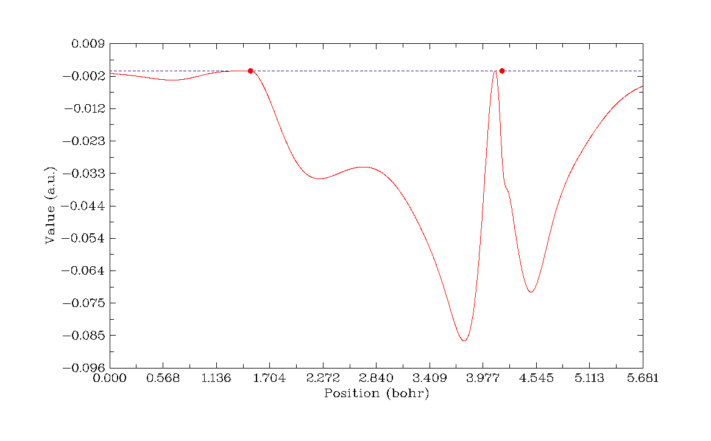

# 3.4 Outputting and plotting specific property in a line (3)

> Multiwfn manual, p.81–81. Images: `../imgs/`.

---

<!-- p.81 -->

Electrostatic potential is the most expensive one among all of the real space functions supported by Multiwfn. If you are not interested in it, you can set "ishowptESP" parameter in `settings.ini` to 0 to skip calculation of electrostatic potential.

Information needed: GTFs (depending on the choice of real space function), atom coordinates

## 3.4 Outputting and plotting specific property in a line (3)

In this function, what you should do is just selecting a real space function and then define a line. There are two ways to define the line:

(1) By inputting indices of two atoms, the line will be automatically extended by a small distance in each side, the extended distance can be adjusted by "aug1D" in `settings.ini` or by the option “0 Set extension distance for mode 1”, default value is 1.5 Bohr.

(2) By inputting the coordinates of the two endpoints. Generally, the calculation only takes a few seconds, then curve map pops up, like this:

The gray dashed line indicates the position of Y=0. If the line is defined in the second way, two red circles with Y=0 will appear in the graph, they indicate the position of the two nuclei. Click right button on the graph and then you can select what to do next, you can redefine the scale of Y-axis, export the data to line.txt in current directory, save the graph to a file, locate minimal and maximal positions and so on. Note that the process of searching stationary points and the position where Y equals specified value is based on the data you have calculated, that means the finer the points, the more accurate X position you will get.

The data points are evenly distributed in the line, the number of points is 3000 by default, which is fine enough for most cases. The number can also be adjusted by “num1Dpoints” parameter in `settings.ini`. Of course, the more points the more time is needed for calculating data. Notice that for ESP calculation, the number of points is decreased to one-sixth automatically, because it is much more time-consuming than other tasks.

