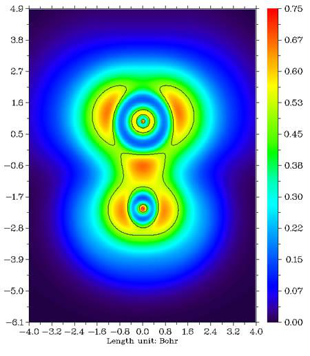
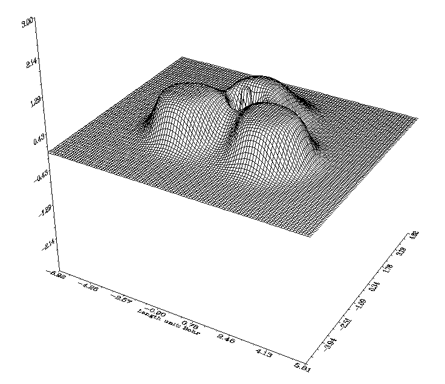
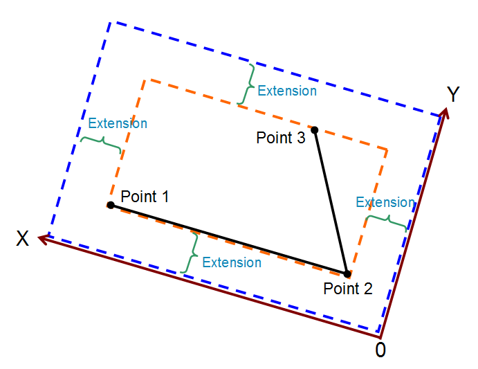
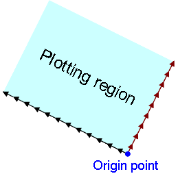
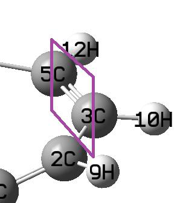
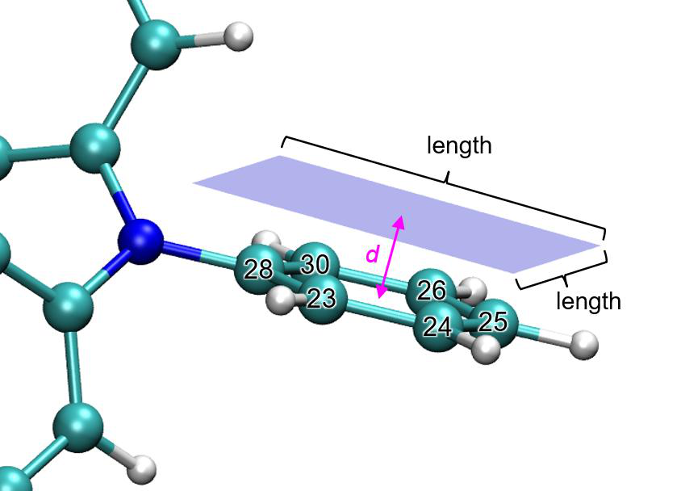
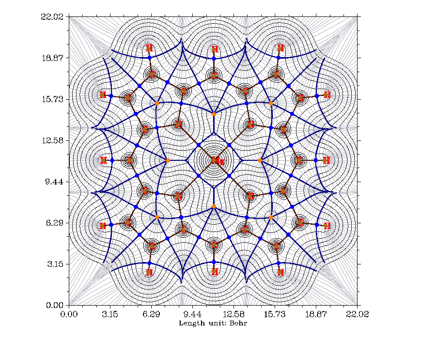

# 3.5 Outputting and plotting specific property in a plane (4)

> Multiwfn manual, p.82–92. Images: `../imgs/`.

---

<!-- p.82 -->

Information needed: GTFs (except for ESP from nuclear/atomic charges and promolecular

approximation version of RDG and sign(λ2)ρ), atom coordinates

## 3.5 Outputting and plotting specific property in a plane (4)

The basic steps of using this function are listed below. Users can finish all operations by simply following program prompts, there are only a few key points that need to be described.

1. Select a real space function 2. Select a graph type 3. Set the number of grid points in both dimensions 4. Define a plane 5. View the graph 6. Post-processes (adjust plotting parameters, save graph, export data to plain text file, etc.) It is noteworthy that after you enter this function, you will see real space function selection menu; if you select option 111 (a hidden option), then the real space function to be plotted will be Becke weight of an atom or Becke overlap weight between two atoms. If you select option 112 (another hidden option), Hirshfeld weight of a given atom or fragment will be plotted.

If the parameter "iplaneextdata" in `settings.ini` is set to 1, then the data in the plane will not be calculated by Multiwfn internally but directly loaded from an external plain text file. The coordinate of the points in the plane will be automatically outputted to current folder, you can use third-party tools (e.g. cubegen utility of Gaussian) to calculate function value at these points.

### 3.5.1 Graph types

Currently Multiwfn supports seven graph types for exhibiting data in a plane. 1 Color-filled map. This type of map uses different colors to represent real space function value in different regions, two examples are given below.

By default, "Rainbow" coloring transition is employed, and if the function value exceeds lower (upper) limit of color scale, then the region will be filled by black (white). By selecting "Set color transition" in post-processing menu, you can choose other color transition methods.

By selecting “Enable showing contour lines” in post-processing menu, contour lines can be

<!-- p.83 -->

plotted together on the graph. You can also use other options to control if showing atomic labels and bonds.

2 Contour line map. This map usually uses solid lines to represent positive regions, and dashed lines to exhibit negative regions.

The number of contour lines can be adjusted by user (see Section 3.5.4 for detail), you can also mark the isovalues on the contour lines by using the option “2 Enable showing isovalue on contour lines” in post-processing menu.

To fill colors between contour lines (see the figure on the right above), you can choose "9 Enable filling colors for contour lines" in the post-processing menu. Then if you choose option 9 again, you can further adjust filling effect, such as color scale, color transition and so on.

Only for the contour line map, if the real space function selected to be plotted is orbital wavefunction, you can not only plot one orbital by inputting one orbital index, but also plot two orbitals simultaneously by inputting two orbital indices (e.g. 3,5), see Section 4.4.5 for example.

Option 4 in post-processing menu is used to toggle if showing atoms labels or the reference point (involved in some real space functions such as correlation hole and source function) in the graph. The size and form (i.e. if showing atom index or element name) of the atom labels can be set by "pleatmlabsize" and "iatmlabtype" parameters in `settings.ini`, respectively. The reference point is represented as a blue asterisk on the graph. By default, only when the distance between the atoms and the plane is smaller than "disshowlabel" in `settings.ini` the corresponding atom labels will be shown. To change this distance threshold, you can either adjust this value in setting.ini or choose option 17 in post-processing menu. If "iatom_on_plane_far" parameter in `settings.ini` is set to 1, then even if the distance is larger than the threshold, the label will still be shown, but in thin text rather than bold text.

Option 8 in post-processing menu is used to toggle if showing bonds. The bond is shown for an atomic pair if these two conditions are satisfied: (1) The distance between the two atoms is smaller than bonding threshold, which can be adjusted in the GUI window of main function 0 using corresponding scale bar. (2) Both atoms are close enough to the plotting plane (smaller than the "disshowlabel" parameter mentioned above).

Option 15 in post-processing is used to plot a contour line corresponding to vdW surface (electron density=0.001 a.u., which is defined by R. F. W Bader in J. Am. Chem. Soc., 109, 7968

<!-- p.84 -->

(1987)). This is useful to analyze distribution of electrostatic potential on vdW surface. Such a contour line can be plotted in gradient line and vector field map too by the same option. Color, label size and line style of the contour line can be adjusted by Option 16.

The content in the above paragraphs also applies to color-filled map, gradient lines map and vector field map (see below).

3 Relief map. Use height to represent value at every point. If values are too large, they will be truncated in the graph, you can choose to scale the data with a factor to avoid truncation. The graph is shown on interactive interface, you can rotate, zoom in/out the graph.

4 Shaded relief map and 5 Shaded relief map with projection. The relief map is shaded in these two types. The latter also plots a color-filled map as projection. The meshes on the surface can disabled at post-processing stage.

<!-- p.85 -->

6 Gradient line map with/without contour lines. This graph type represents gradient direction of real space function, you can determine if the contour lines are also shown on the graph. Note that since gradients of real space function are needed to be evaluated, and graphical library needs to take some time to generate gradient lines, the calculation and plotting costs are evidently higher than other graph types.

In the option "11 Set detailed parameters of plotting gradient line" at the post-processing menu, you can set various plotting parameters:

- Suboption 1: Integration step for gradient lines, the smaller the value the finer the graph
- Suboption 2: Interstice between gradient lines, the smaller the value the denser the lines
- Suboption 3: Criteria for plotting new gradient line, try to play with it and you will know how this parameter affects the graph

- Suboption 4: Integration method. The RK4 is the most robust but most expensive. The default RK2 is good balance between accuracy and speed

- Suboptions 5 and 6: Color and width of gradient lines

<!-- p.86 -->

7 Vector field map with/without contour lines. This graph type is very similar to last graph type, however the gradient lines are replaced by arrows, which distribute on grids evenly and represent gradient vectors at corresponding point. You can set color of arrows, or map different colors on arrows according to magnitude of function value, you can also invert the direction of arrows. Option 10 is worth mentioning, if you set upper limit for scaling to x by this option, then if the norm of a gradient vector exceeds this value, the vector will be scaled so that its norm equals x.

<!-- p.87 -->

### 3.5.2 Setting up grid, plane and plotting region

When program asking you to input the number of grid points in both dimensions, you can input such as 100,150, which means in dimensions 1 and 2 the number of grid points are 100 and 150, respectively, so total number is 100*150=15000, they are evenly distributed in the plotting region. For “Relief map”, “Shaded relief map” and “Shaded relief map with projection”, commonly I recommend 100,100; if this value is exceeded, the lines in the graph will look too crowd. For other graph types I recommend 200,200. Of course, the picture will become prettier and smoother if you set the value to be larger, but you have to wait more time for calculation. Bear in mind that total ESP calculation is very time-consuming, you’d better use less grid points, for previewing purposes I recommend 80,80 or less.

Multiwfn provides 8 modes to define the plotting plane: 1. XY plane: User inputs Z value to define a XY plane uniquely. 2. XZ plane: User inputs Y value to define a XZ plane uniquely. 3. YZ plane: User inputs X value to define a YZ plane uniquely. 4. Define by three atoms: Input indices of three atoms to define a plane by their nuclear coordinates. 5. Define by three points: Input coordinates of three points to define a plane. 6. Input origin and transitional vector: This way is only suitable for experts, the two inputted translation vectors must be orthogonal. 7. Define a plane parallel to a bond and meantime normal to a plane defined by three atoms 8. Above or below the plane consisting of specific atoms

<!-- p.88 -->

Details are described below:

Modes 1 to 5 For modes 1~5, the actual plotting region is a subregion of the plane you defined. Multiwfn automatically sets the plotting region to tightly enclose the whole molecule (for modes 1, 2 and 3) or cover the three nuclei / points you inputted (for modes 4 and 5), finally the plotting region is extended by a small distance to avoid truncating the interesting region. The extension distance is 4.5 Bohr by default, if you find the region you are interested in is still be truncated, simply enlarging the value by option “0 Set extension distance for plane type 1~5”, you can also directly modify the default value, which is controlled by “Aug2D” parameter in `settings.ini`.

Below diagram illustrates how the actual plotting region is determined when you select mode 4 or 5 to define the plotting plane. The X and Y axes shown in the graph correspond to the actual X and Y axes you finally see. Evidently, the input sequence of the three points or atoms directly affects the graph.

Mode 6 For mode 6, the plotting region is determined as follows, in which each black arrow denotes translational vector 1, each brown arrow denotes translational vector 2, blue point denotes origin point. The number of arrows is the number of grids set by users. Evidently, this mode enables users to fully control the plotting plane setting.

<!-- p.89 -->

Mode 7 Mode 7 is very useful when you want to define a plotting plane cutting a bond, see following map for illustration, the purple rectangle is the plane you will plot:

To define this plane, you should select mode 7, and then input 3,5 to use these two atoms to define the axis that the plotting will be parallel to, and then input 2,3,10 (or 2,5,10 etc.) to use them to define a plane that the plotting plane will be normal to. After that you need to input the length of X and Y axes, e.g. 10 and 7 Bohr, respectively.

Mode 8 Via this mode you can plot a local plane above or below interesting atoms. Typically, this mode is used to study function distribution above/below a ring. See following map for example, the transparent blue region corresponds to the plotting plane. In this mode you should input indices of the atoms to define a fitting plane (plotting plane will parallel to it) and a geometric center, then input the vertical distance between plotting plane and the geometric center (namely the d in the following map. Positive and negative values correspond to above and below the fitting plane), then input length of the plotting plane. Note that in this mode the plotting plane is square, and the projection point of the geometric center to this plane corresponds to the plane center.

After that, you will find three commands in Multiwfn command-line window, you can copy them into VMD console window to run them, then the plotting plane will be drawn, just like the following map, which allows you to determine if the plotting plane is correctly defined.

<!-- p.90 -->

About rotation and translation of the plotting plane For the modes 4, 5 and 8, if you find the content is skewed in the final graph, or the interesting part is not located at the center of the graph, you can choose "-1: Set translation and rotation of the map for plane types 4, 5 and 8" before selecting one of these modes. For example, if you find the content in the graph your previously plotted should be translated by (-3,1.5) Bohr and then rotated

by 35°, then in this option you should first input -3,1.5 and then input 35, the resulting graph will meet your expectation. A practical instance of using this option was posted on http://bbs.keinsci.com/thread-11037-1-1.html.

### 3.5.3 Options in post-processing interface

After plotting the graph, you will see a menu, in which there are a lot of options used to adjust or improve the quality of the graph. Since many of them have already been introduced above and some of them will be mentioned in next sections, and lots of them are self-explanatory, only a few will be mentioned here.

-9 Only plot the data around certain atoms: Sometimes in the graph only a few regions are interesting; if you want to screen other regions, you may find this option useful. After selecting this option, assume that you input 2,4,8-10, then only the real space function around atoms 2,4,8,9,10 will be plotted (the data to be plotted then in fact is the original plane data multiplied by the Hirshfeld weight of the fragment you inputted). Next time you select this option, the original data will be recovered.

-7 Multiply data by a factor: This is mainly used to scale the range of the plane data. -6 Export the current plane data to plane.txt in current folder: After using this option to export the plane data, you can very conveniently use third-part plotting softwares such as Sigmaplot to redraw the data.

-2 Set label interval in X, Y (and color scale) axes: This option determines the spacing between the labels in the coordinate axes. If axis labels are not shown on your map, that means the current interval(s) are too large.

-1 Show the graph again: After adjusting plotting parameters, choose this option to replot the graph to check the effect.

0 Save the graph to a file: Export the graph to a graphic file in current folder. See Section 2.8 on how to determine the graphic format and size.

19 Enable showing extrema of a function on a contour line: Via this option, you can plot e.g. maxima and minima of electrostatic potential on a contour line of electron density. See Section 4.4.12 on illustration of this option.

### 3.5.4 Setting up contour lines

For graph types 1, 2, 6 and 7, the contour lines can be plotted (if not shown, select "2 Enable showing contour lines" in the post-processing menu). There is also an option “Change setting of contour lines” in the post-processing menu. In this interface, values of current contour lines are first listed and you can modify them by using the suboptions below:

Option 1: Save current setting and return to upper menu. Then if you select “Show the graph

<!-- p.91 -->

again”, the graph with new isovalue setting will appears.

Option 2: Input a new value to replace old value of a contour line. Option 3: Add a new contour line and input the isovalue for it. Option 4: Delete some contour lines. Option 6: Export current isovalue setting to a plain text file, you can use this function to save multiple sets of your favourite isovalue settings for different systems and real space functions.

Option 7: Load isovalue setting from external file, the format should be identical to the file outputted by subfunction 6.

Option 8: Generate isovalues according to arithmetic sequence, user need to input initial value, step size and total number. For plotting ELF/LOL, I suggest user input 0,0.05,21 to generate isovalues in the range 0.0~1.0 with step size 0.05. You can choose if cleaning existing contour lines, if you select n, then new contour lines will be appended to old ones.

Option 9: Like function 8, but according to geometric series. Option 10: Some contour lines can be bolded with this function, by default no line is bolded. To bold some lines, select this function and input how many lines you want to bold, then input indices of them in turn. If there are some lines already been bolded, selecting this function will disable bolding for all of them.

Option 11: Set color for positive contour lines, you need to input a color index. Option 12: Set line style for positive contour lines, you need to input two integer numbers, the first one denotes the length of line segment, the second one denotes the length of interstice between line segments. For example, 10,15 means positive contour lines are composed of line segments with length of 10 and spaces with length of 15 alternatively.

Option 13, 14: Like options 11 and 12, but for negative part. Option 15: If this option is selected, the positive and negative lines will be set to "crimson, width=6, solid line" and "blue, width=6, long dashed line", respectively. Then the saved picture will be very suitable for publication; as you can see in the resulting graphical file, the two kinds of lines are clear and can be distinguished easily.

### 3.5.5 Plot critical points, paths and interbasin paths on plane graph

CPs and paths can be plotted on a color-filled map, contour line map, gradient line map and vector field map. Below is a typical electron density gradient line map containing critical points, topology paths and interbasin paths.

<!-- p.92 -->

In order to append the CPs and paths on the plane map, before drawing the plane graph using main function 4, you need to enter topology analysis module (main function 2), then search CPs and generate paths. After that, return to main menu and draw plane graph as usual, you will find that the CPs and paths have appeared on the graph. In the graph, brown, blue, orange, green dots denote (3,-3), (3,-1), (3,+1), (3,+3) critical points, respectively. Bold dark brown lines depict bond paths.

In the option “4 Set details of plotting critical points and paths” at post-processing menu, you can choose which types of CPs are allowed to be shown, and you can set size of markers, thickness, distance threshold and color of path lines. By default, if the vertical distance between a CP or a point in a path and the plotting plane exceeds 0.5 Bohr, the CP or path point will not be shown, the thresholds can be altered by “8 Set distance threshold for showing CPs” and “9 Set distance threshold for showing paths”.

Interbasin paths (deep blue lines in the graph above) are derived from (3,-1) CPs, these paths dissect the whole space into individual atomic basins. You can also append the interbasin paths on contour line map, gradient line map and vector field map. In order to draw interbasin paths, you should first confirm that at least one (3,-1) CP has been found in topology analysis module and it is close enough to current plotting plane (smaller than "disshowlabel" in `settings.ini`), then you can find a option "Generate and show interbasin paths" in post-processing stage, choose it, wait until the generation of interbasin paths is completed, then replot the plane graph again, you will find these interbasin paths have already presented.

If you hope the interbasin paths become shorter or longer, choose option "Set stepsize and maximal iteration for interbasin path generation" in post-processing stage before generating interbasin paths, you will be prompted to input stepsize and the number of iterations, the maximum

