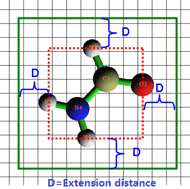
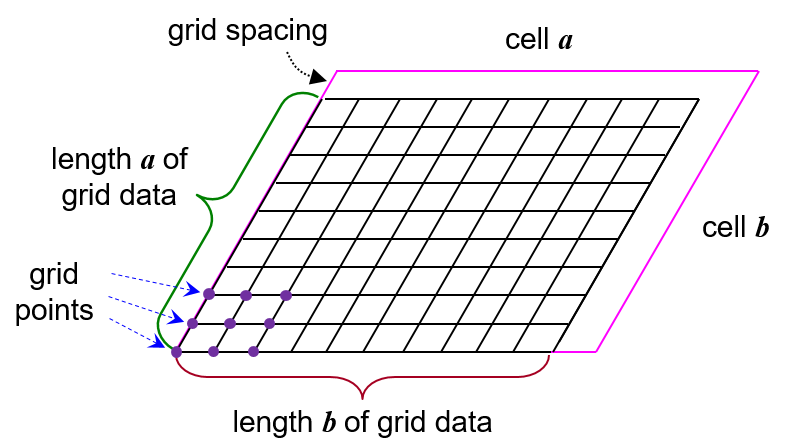

# 3.6 Outputting and plotting specific property within a spatial region (5)

> Multiwfn manual, p.93–96. Images: `../imgs/`.

---

<!-- p.93 -->

length of yielded interbasin paths equals product of the two values. Note that if distance between a point in interbasin path and the plotting plane exceeds the "disshowlabel" in `settings.ini`, corresponding points in the interbasin path will not be shown on the plane graph.

Information needed: GTFs (depending on the choice of real space function), atom coordinates

## 3.6 Outputting and plotting specific property within a spatial region (5)

The main purpose of this function is calculating grid data or generating Gaussian-type cube file (.cub) for specific real space function. The .cub file is supported by a lot of chemistry visualization softwares, such as VMD, GaussView, and VESTA. The isosurface of generated grid data can be viewed directly in Multiwfn too. This function can also be used to calculate function values for a set of points recorded in a plain text file.

The basic procedure of using this function is: (1) Select a real space function (2) Set up grid (3) Use post-processing options to visualize isosurfaces, modify and export data PS: In the real space function selection menu, if you select option 111 (a hidden option), then the real space function to be calculated will be Becke weight of an atom or Becke overlap weight between two atoms. If you select option 112 (another hidden option), Hirshfeld weight of a given atom or fragment will be calculated.

Setting up grid Multiwfn provides many modes for setting up grid points: Mode 1: Low-quality grid, about 125000 points in total (corresponding to 50*50*50 grid, assuming the spatial region is cubic), this mode is recommended for previewing purposes.

Mode 2: Medium-quality grid, about 512000 points in total (corresponding to 80*80*80 grid, assuming the spatial region is cubic). For small molecular, this quality is enough for most analysis.

Mode 3: High-quality grid, about 1728000 points in total (corresponding to 120*120*120 grid, assuming the spatial region is cubic).

For modes 1, 2 and 3, the actual number of points in each direction is automatically determined by Multiwfn so that grid spacings in each direction are nearly equal. The method of determining spatial scope of grid data is illustrated below in two-dimension case.

<!-- p.94 -->

First, Multiwfn sets up a box (red dashed line) to just enclose the entire molecule, and then the box is suitably extended in each dimension to avoid truncating boundary part of isosurfaces, the green rectangle in the graph below is the actual spatial scope of grid data. If the extension distance is inappropriate, you can set the value by using option “-10 Set extension distance of grid range", or directly set default value by modifying “Aug3D” in `settings.ini`.

The so-called “Low-quality”, “Medium-quality” and “High-quality” respectively corresponding to modes 1, 2 and 3 are only relative to medium-sized systems, because each of them corresponds to a fixed number of grid points. For a large system, spatial range of grid data is often wide, then grid density of mode 3 will not be very fine and should actually be called “Medium quality” in this context, and mode 2 should be called “Low quality”. In contrast, for a micro system, the density of grid points of mode 1 is already fine enough for most purposes.

Mode 4: Specify the number of grid points or grid spacing in X, Y and Z directions yourself, the spatial scope is determined automatically as shown above.

Mode 5: Specify all details of grid setting by user, including original point, the number of points and grid spacings in X, Y and Z directions. This mode is useful for experienced users.

Mode 6: Specify the center coordinate, number of points and extension distance in X, Y and Z directions. For example, the center coordinate you inputted is 2.3,1.0,5.5, the extension distance in X, Y and Z is k,k,m, then the coordinates of two most distant endpoints are (2.3-k,1.0-k,5.5-m) and (2.3+k,1.0+k,5.5+m). This mode is useful for analyzing local properties.

Mode 7: Like function 6, but inputting indices of two atoms instead of inputting center coordinate, the midpoint between the two nuclei will be set as center. This mode is very useful for weak interaction analysis by RDG function. For example, we want to study the weak interaction region between the dimer shown below, and we found C1 and C14 may enclose this region, so we input 1,14, see Section 3.23.1 for example. If the two atom indices are identical, then the nuclear coordinate will be set as center.

<!-- p.95 -->

Mode 8: Use grid setting (origin, number of points and grid spacing) of an existing cube file. You will be prompted to input the file name. This mode is useful to generate multiple cube files with exactly identical grid setting.

Mode 9: This mode is visible only when input file contains cell information (i.e. modified .molden file of CP2K is used as input file, see Section 2.9.2.1, or other files carrying cell information are used as input file, see Section 2.9.3). You will be requested to input coordinate of origin, box lengths, and grid spacing (shared by all the three dimensions). If you press ENTER button directly when Multiwfn asks you to set origin and box lengths, the relationship of the box and the cell will correspond to the situation shown below, in which each point of intersection corresponds to a grid point to be calculated. As you can see, in each direction, the length of the box differs from the length of cell by a grid spacing. In this case, integral of a function can be straightforwardly evaluated based on grid data as $f(i)$𝑖, where f(i) is function value at grid i and v is grid volume. Note that the inputted grid spacing will be automatically adjusted to that the number of grids is an integer.

Mode 10: Set up the grid data in a GUI window. This mode is quite convenient, the box is clearly visible in the graphic window, and you can directly change box length, box center and grid spacing by dragging corresponding scale bars (the X, Y, Z directions share the same grid spacing). The total number of grids under present grid setting can be directly seen at the right bottom side of the window.

<!-- p.96 -->

Mode 11: You will be asked to input atomic indices to define a fragment and input extension distance, then the box will be determined by extending the given distance around the fragment. You will be also prompted to input grid spacing, which is shared by all three directions. This mode is particularly useful when you want to employ non-covalent interaction (NCI) and independent gradient model (IGM) methods to visually study interaction between a molecule (the fragment you defined) and surroundings.

Notice that the more grid points you set, the finer the isosurface graph you will get, however the more time is needed for calculating grid data and generating isosurface graph. The increase of calculation time with the number of points is nearly linear.

After setting grid points, the program starts to calculate grid data, once the calculation is finished, the minimum/maximum and corresponding coordinate, the sum of all/positive/negative data multiplied by the differential element are printed on screen immediately. If what you calculated is electron density, the molecular dipole moment evaluated based on grid data is also printed out. Then you will see post-processing menu.

Post-processing options In the post-processing menu if the option “-1 Show isosurface graph” is selected, a GUI window will pop up, which shows the isosurface of grid data, all widgets are self-explanatory, you can change isosurface value by both dragging slide bar (upper and lower limit are -5 and +5 respectively) or inputting precise value in text box (then press “Enter” button in your keyboard); if “Show data range” is selected, the spatial scope will be marked by a blue frame as the one in above picture (if spatial scope exceeds the range of coordinate axis, the frame will not be displayed). The isosurfaces with the same and reverse sign of current isovalue are in green and blue respectively.

Option 1 can export isosurface graph to a graphical file in current directory. Option 2 can export

