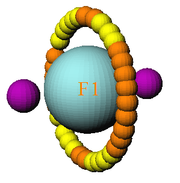
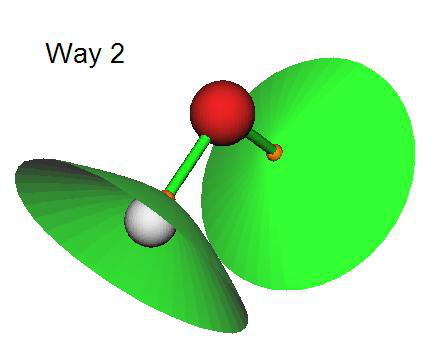
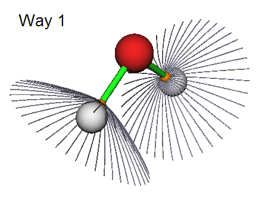

# 3.14 Topology analysis (2)

> Multiwfn manual, p.183–191. Images: `../imgs/`.

---

<!-- p.183 -->

color shown under “color” label on the graphic window as the color of fluorescence emission, and the complementary color shown on the window is useless in this case.

Flexible molecules often have multiple conformations with nonnegligible weight at the temperature of interest, if some of them show distinctly different light adsorption character in visible light range, to reliably predict color you must take conformation weighting average of spectrum into account. You should use multiple.txt containing weights of the conformations (see Section 3.13.4) as input file of Multiwfn in this case, and then predict color via regular steps mentioned above.

Examples of predicting colors can be found in Section 4.11.14.


## 3.14 Topology analysis (2)


### 3.14.1 Theory

The topology analysis module of Multiwfn is quite flexible, powerful and general, it can be applied to any real space function supported by Multiwfn as long as the variation of the function is smooth and thus its gradient is contiguous. All commonly studied functions, such as electron density, its Laplacian, orbital wavefunction, spin density, ELF, LOL, ESP... can be analyzed by this function. The default real space function to be studied is electron density, it can be altered by option -11. Notice that once option -11 is chosen, all previous topology analysis results will be clean.

The topology analysis technique proposed by Bader was firstly used for analyzing electron density in "atoms in molecules" (AIM) theory, which is also known as "the quantum theory of atoms in molecules" (QTAIM), this technique has also been extended to other real space functions, e.g. the first topology analysis research of ELF for small molecules is given by Silvi and Savin, see Nature, 371, 683 (1994). In topology analysis language, the points at where gradient norm of function value is zero (except at infinity) are called as critical points (CPs), CPs can be classified into four types according to how many eigenvalues of Hessian matrix of real space function are negative.

(3,-3): All three eigenvalues of Hessian matrix of function are negative, namely the local maximum. For electron density analysis and for heavy atoms, the position of (3,-3) are nearly identical to nuclear positions, hence (3,-3) is also called nuclear critical point (NCP). Generally, the number of (3,-3) is equal to the number of atoms, only in rare cases the former can be more than (e.g. Li2) or less than (e.g. KrH+) the latter.

(3,-1): Two eigenvalues of Hessian matrix of function are negative, namely the second-order saddle point. For electron density analysis, (3,-1) generally appears between attractive atomic pairs and hence commonly called as bond critical point (BCP). The value of real space functions at BCP

have great significance, for example the value of ρ and the sign of ∇2𝜌 at BCP are closely related to bonding strength and bonding type respectively for analogous bonds (The Quantum Theory of Atoms in Molecules-From Solid State to DNA and Drug Design, p11); I have demonstrated that the

ρ at BCP can be reliably used to predict hydrogen bond binding energies (J. Comput. Chem, 40, 2868 (2019)); local information entropy at BCP is a good indicator of aromaticity (Phys. Chem. Chem. Phys., 12, 4742 (2020)).

(3,+1): Only one eigenvalue of Hessian matrix of function is negative, namely first-order saddle point (like transition state in potential energy surface). For electron density analysis, (3,+1)


<!-- p.184 -->

generally appears in the center of ring system and displays steric effect, hence (3,+1) is often named as ring critical point (RCP).

(3,+3): None of eigenvalues of Hessian matrix of function are negative, namely the local minimum. For electron density analysis, (3,+3) generally appears in the center of cage system (e.g. pyramid P4 molecule), hence is often referred to as cage critical point (CCP).

The positions of CPs are searched by Newton method by default. If one chooses a starting point, then Newton iterations will converge to the CP that closest to it. By assigning proper guessing positions and performing Newton iterations starting from every of them, all CPs could be finally found. Once search for CPs is finished, one may verify if all CPs may have been found according to Poincaré-Hopf relationship, which states that

n(3,-3) – n(3,-1) + n(3,+1) – n(3,+3) = 1 (for isolated systems) n(3,-3) – n(3,-1) + n(3,+1) – n(3,+3) = 0 (for periodic systems) If the relationship is unsatisfied, then some CPs must be missing; if you are interested in them, you need to further perform CP searching by using starting points different to the previous ones. However, even if the Poincaré-Hopf relationship is satisfied, it does not necessarily mean that all CPs have been found. Notice that behaviors of many real space functions, such as ELF, LOL, density

difference, Laplacian of ρ, are much more complex than ρ, it is very difficult to locate all CPs for these functions, especially for medium and large systems. So, the attempt to search for CPs could be terminated once you have found all CPs of interest have been found.

The maximal gradient path linking BCP and associated two local maxima of density is termed as “bond path”, which reveals atomic interaction path for all kinds of bonding. The collection of bond paths is known as molecular graph, which provides an unambiguous definition of molecular structure. Bond path can be straight line or curve, obviously for the latter case the length of bond path is longer than the sum of the distances between BCP and associated two (3,-3) CPs.

Let us see an example. In the complex shown below, the imidazole plane is vertical to magnesium porphyrin plane, the nitrogen in imidazole coordinated to magnesium. Magenta, orange and yellow spheres correspond to (3,-3), (3,-1) and (3,+1) critical points, brown lines denote bond paths.


<!-- p.185 -->

The topology paths for other real space functions can be generated too in Multiwfn, they are very helpful to clarify intrinsic relationship between CPs.

About degenerate CP Appearance of degenerate CPs in general system is very rare, so I mention it in the final of this section. The so-called degenerate CP is the CP that has one or two zero eigenvalues of Hessian matrix. These CPs are very instable, slight perturbation of molecular geometry can break them into other type CPs. However, degenerate CPs commonly occur in axisymmetric system. For example, in fluorine atom at ground state, one of p orbital is singly occupied while other two are doubly occupied, topology analysis on LOL gives below picture:

The two (3,-3) correspond to the two valves of the singly occupied p orbital, while the local maximum of electron localization arises from the other two p orbitals are represented by a circle of CPs. Ostensibly, the CPs in the circle are either (3,-1) or (3,+1) type, but in fact they are the same type of degenerate CP, in which one eigenvalue is zero. Simply because the reasons of numerical convergence of the eigenvalue, they are formally recorded as different CP types in Multiwfn.


### 3.14.2 Search critical points

Searching modes In Multiwfn, several modes are provided to assign starting points for searching CPs:




<!-- p.186 -->

- (1) Search CPs from given starting points: If you already know approximate position of CPs or you are able to reasonably guess where CPs may appear, then this mode is very suitable for you, the iteration will start from the provided coordinates. In this mode, you can directly input coordinate of a starting point, or input two atomic indices, then their midpoint will be taken as starting point. You can also provide a .pdb or .pqr file, the atom coordinates in it will be treated as starting points in turn. In addition, a .txt file containing all starting points can also be provided, the format should look like follows, each line corresponds to X, Y, Z coordinate of a starting point in Bohr, the format is free


```text
1.2 3.10 -0.4
0.477 5.2 5.92
-3.26 3.3 0.5
...
```

- (2) Search CPs from nuclear positions: This mode uses all nuclear positions in turn as starting points, this mode is very suitable for searching all (3,-3) for ρ, and those (3,-3) CPs in innermost region of atom for ELF/LOL and Laplacian of ρ. For electron density analysis, if you located n CPs after using this mode while there are more than n atoms in your system, it generally implies that some (3,-3) CPs were missed during searching.

- (3) Search CPs from midpoint of atomic pairs: This mode uses midpoint of all atomic pairs in turn as starting points. This mode is very suitable for searching all (3,-1) CPs for ρ.

- (4) Search CPs from triangle center of three atoms: Like mode 3, but use triangle center of all combinations of three atoms in your system. Suitable for searching all (3,+1).

- (5) Search CPs from pyramid center of four atoms: Like mode 3, but use pyramid center of all combinations of four atoms in your system. For electron density analysis, if you have tried mode 2 and mode 3 but still cannot find certain (3,+3), this mode is worth trying. This mode is more expensive than mode 3 since more combinations will be considered.

Note that for periodic cases, mode 3 looping both real and image atoms, while modes 4 and 5 only loop real atoms.

- (6) Search CPs from a batch of points within sphere(s): You need to set sphere center, radius and the number of points first, then select option 0, the specified number (but not the exact number you set) of points will randomly distribute in the sphere as starting points for searching. The sphere center can be defined in very flexible way by options 2~6. If you choose option -1, then the search starts and each atom center will be taken as sphere center in turn, assume that there are n atoms and the number of points in sphere you set is m, then about n*m points will be used as initial guesses. If you choose option -2, then you will be prompted to input indices of atoms, the nuclei of these atoms will be used as sphere center in turn.

This mode is very appropriate for searching the CPs that are difficult to be located by other modes. For ELF, LOL and Laplacian, it is highly recommended to use option -1 in this mode to try to locate all possible CPs. Note that each time you carry out the search the positions of starting points are different, if some interesting CPs were not found in previous searches, try to launch the search again and again to locate missing CPs.

Beware that the index of the CPs located by searching mode 6 may be different in each time of execution!

CP searching parameters The default searching parameters are appropriate for most systems, however in some cases you


<!-- p.187 -->

have to adjust parameters manually to ensure expected CPs could be found. These parameters can be set in the option "-1 Set CP searching parameters".

(1) Set maximal iterations: If the number of iterations exceeds this value before converging to a CP or before Hessian matrix becomes singular (that is the iteration cannot continue), then the iteration will be terminated.

(2) Set scale factor of stepsize: The default value is 1.0, that means the stepsize determined by standard algorithm is unchanged. Sometimes reducing the stepsize is benefit for locating CPs. For example, in the topology analysis of examples\uracil.wfn, the BCP linking N6 and H12 cannot be found by using mode 2 with default parameter. If you reduce the stepsize to 0.5, then this problem will be solved.

(3)/(4) Set criteria for gradient norm / displacement convergence: If both gradient norm in current position and displacement in last step is smaller than the two values, then the iteration will stop and current position will be regarded as a critical point.

Notice that for searching mode 2, which is usually employed for locating NCPs, the convergence criterion of gradient norm is temporarily removed, since electron density peak is quite sharp at nuclear position for very heavy atoms, the iteration can hardly converge if gradient norm criterion is taken into account.

(5) Minimal distance between CPs: If an iteration converged to a CP, however the distance between this CP and any CP that has been found is smaller than this value, then the CP just found will not be considered as a new CP, and hence discarded.

(6) Skip search if distance between atoms is longer than the sum of their vdW radius multiplied by: In CP searching mode 3, 4 and 5, if the distance of any two atoms that involved in the combination is longer than the sum of their vdW radii multiplied this value then current search will be skipped. The purpose of this option is to reduce the number of searches and hence computational cost of huge system. For example, the imidazole--magnesium porphyrin complex mentioned earlier, there are 49*48/2=1176 atomic pairs, hence if this cutoff strategy is not employed when you choose searching mode 2, Multiwfn will try as many as 1176 searches. While if this strategy is used, since only closely related atomic pairs will be considered, only 274 searches need to be performed, it can be found that their results are identical.

(7) If print details of CP searching procedure: This option is present only in serial mode. The user can select output level of details of CP search procedure. This option is mainly used for debugging.

(8) Set criterion for determining if Hessian matrix is singular: If the absolute value of determinant of Hessian matrix is lower than this value, then the Hessian matrix will be regarded as singular and terminate search. A too large value may cause some CPs to be omitted, while a too small value may cause numerical instability and occurrence of CPs in regions far from system. Default value is appropriate for most cases.

(9) Set value range for reserving CPs: By making use of this option, during the CP searching, only the CP with value within user-defined range will be reserved, and thus unnecessary CPs could be ignored. By default, all CPs are reserved. Via this option you can for example only search for the CPs in weak interaction regions (corresponding to low electron density regions).

(10) Set the atoms to be considered in searching modes 2, 3, 4, 5: This option is used to set the range of the atoms for searching modes 2, 3, 4, 5. By default, all atoms will be considered in the search. However, there are two special ways that can be selected in this option:

Way 1: Searching CPs only in a local region. You will be asked to define a fragment, then only the atoms in this fragment will be taken into account during searching. This way is useful if you are


<!-- p.188 -->

only interested in CPs in a local region.

Way 2: Searching CPs between two regions. You will be asked to define two fragments (there should be no overlap), then during CP searching, all atoms involved in a combination will not simultaneously occur in the same fragment; in other words, at least one atom must occur in another fragment. This way is particularly useful for searching for CPs between two molecules (the cost may be significantly lower than searching for CPs for the whole complex)

There is no difference between the two ways for searching mode 2, in which only one atom is involved in each search.

(11) Set trust radius of searching: If norm of displacement is larger than this value, the displacement vector will be scaled so that its norm is identical to this radius. Setting trust radius to a smaller value (e.g. 0.1 Bohr) than default can increase stability of convergence.

(12) Choose searching algorithm: This option is rarely used, because the default Newton method works reasonably for most cases. However, Multiwfn provides alternatives which may be useful in special cases:

The Barzilai-Borwein (BB) method is a special form of steepest descent algorithm, at each step the displacement direction and distance along gradient vector is determined by a specific way to mimic convergence behavior of Newton method. BB is able to locate any kind of CPs and tends to converge to the CP nearest to starting point like Newton method, while it does not rely on Hessian matrix. Although in most cases Newton method is more robust and converges faster, when you found it does not locate expected CPs successfully, you can try BB instead.

The steepest ascent (SA) and steepest descent (SD) methods are also supported by Multiwfn, they are only used to locate (3,-3) and (3,+3) CPs, respectively. In other words, other kinds of CPs will never be located if you choose these methods. So, they are useful if you only focus on locating maxima (e.g. maxima of ELF and LOL) or minima (e.g. minima of electrostatic potential). In addition, for functions without a well behavior, namely their local character around minima and maxima is far from quadratic function, Newton and BB methods do not converge at all, the SA and SD are only choices. Moreover, some functions have very crowded CPs or minima/maxima in very narrow quadratic regions, I frequently found Newton and BB can hardly converge to minima/maxima, in this case SA/SD should also be used if the minima/maxima are what you are really interested in. The SA (SD) in Multiwfn utilizes microiteration to determine suitable displacement magnitude toward positive (negative) direction of gradient vector; in each microiteration, if displacement is unable to cause increase (decrease) of function value, the displacement magnitude will be reduced to 40% and retry, until function value indeed increases (decreases).


### 3.14.3 Generate topology paths

Path generating methods Once CPs have been found, you can choose to generate topology paths, which connect various CPs. In Multiwfn, the paths are essentially represented as a bunch of points evenly distributed in a curve. Using options 8 and 9, two kinds of paths can be generated:

(1) Generate the paths connecting (3,-3) and (3,-1) CPs: Arithmetically, firstly displacing the coordinate of each (3,-1) forward and backward respectively along the eigenvector that corresponds to the positive eigenvalue of Hessian, and then go uphill following the gradient vector until encounter a (3,-3), the resulting trajectories constitute the bond paths.


<!-- p.189 -->

(2) Generate the paths connecting (3,+1) and (3,+3) CPs: Like above, the difference is that the starting points are (3,+1), and their coordinates are firstly moved forward and backward along the eigenvector corresponding to the negative eigenvalue of Hessian, and then go downhill following the gradient vector.

Path generating parameters In the option "-2 Set path generating parameters", there are some suboptions used to adjust parameters for generating paths:

(1) Maximum number of points of a path: In the generation of each path, if the number of steps reached this value before encountering a CP, then the trajectory will be discarded. For generating very long paths, default value may need to be enlarged.

(2) Stepsize: The space between neighbouring points that constitutes the paths. For paths with large curvature, sometimes they cannot be generated under default stepsize, you need to properly decrease the stepsize and try to regenerate paths. If you set maximum number of points and stepsize

of paths as m and n respectively, then the maximum length of paths will not be longer than m×n.

(3) Stop generation if distance to any CP is smaller than: During the generation of paths, if the distance between current point and a located CP is found to be smaller than this value, then the path will be regarded as connected to the CP.


### 3.14.4 Generate interbasin surfaces

The interbasin surfaces (IBS) generated by Multiwfn actually consist of a bunch of paths derived from (3,-1) CPs, these surfaces divide the whole space into respective region for each (3,-3) CPs. By the option "10 Add or delete interbasin surfaces", you can generate, delete and check interbasin surfaces. Notice that before generating IBS, generation of CPs should be completed first, and at least one (3,-1) CP must be found.

If you want to generate the IBS from the (3,-1) CP with index of 15, then simply input 15 (you will find it is useful to visualize CPs by function 0 first to get the CP index). To delete this surface, input -15 (negative sign means "delete"). If there is no IBS presented and you hope to generate all IBSs, input 0. To delete all already generated IBS, also input 0. A list of generated IBS can be printed by inputting the letter l If you need to export the paths of a specific IBS (e.g. corresponding to the (3,-1) CP with index of 4) to external file, input o 4, then the coordinates of all paths derived from the CP4 will be saved to surpath.txt in current folder. Input letter q can return to upper-level menu.

Parameters for generating IBSs can be adjusted by the option "-3 Set interbasin surface generating parameters". Enlarging number of paths in each IBS or lowering stepsize will make IBSs looks smoother. The length of paths in IBSs, or say the area of IBSs, is proportional to product of stepsize and number of points in each IBS path. Notice that once the parameters are changed, all generated IBSs will be lost.

There are three ways to portray IBSs in Multiwfn, which can be controlled by "isurfstyle" in `settings.ini`. Way 1 represents the IBS directly by the paths derived from corresponding (3,-1) CP; By Way 2 IBSs are shown by solid surfaces, this is default style; Way 3 is uncommonly used, you can try it yourself.


<!-- p.190 -->


### 3.14.5 Visualize, analyze, modify and export results

Visualize results (option 0) If you select the option “0 Print and visualize all generated CPs, paths and interbasin surfaces”, a GUI will pop up, you can visually examine CPs, topology paths and interbasin surfaces, and you can control if showing each type of CPs, paths, interbasin surfaces, molecular structure, labels, etc. Meanwhile, a summary of found CPs and paths are printed in the command-line window. The satisfaction of Poincaré-Hopf relationship is also checked.

If the real space function to analyze is electron density, the correspondence between nuclear CPs and atoms will be shown in the command-line window. If bond paths have been generated, then the two atoms connecting to each BCP via the bond paths will also be given in the command-line window.

Evaluate CP properties (option 7) You can obtain values of all real space functions supported by Multiwfn (as well as gradient and Hessian matrix of the selected real space function) at a given CP or at all CPs by function “7 Show real space function values at specific CP or all CPs”. Note that electrostatic potential is the most expensive one among all of the real space functions, if you are not interested in it, you can set "ishowptESP" parameter in `settings.ini` to 0 to skip calculation of electrostatic potential.

In this function, you can also decompose a selected real space function at a given CP into contributions from a range of orbitals. See corresponding example in Section 4.2.4.

Measure geometry (option -9) Distance, angle and dihedral angle between atoms and CPs can be conveniently measured by using the option "-9 Measure distances, angles and dihedral angles between CPs or atoms".

Manipulate CPs (option -4) In the option “-4 Modify or export CPs”, you can print, add, delete and export CPs. In the suboption 2, the CPs can be deleted according to various condition, including: (1) CP type (2) CP index range (3) Distance to specific molecular fragment (thus you can remove CPs in irrelevant regions) (4) Range of electron density (using this feature you can solely delete CPs with low density and thus remove the CPs in weak interaction regions, or delete CPs with high density and thus remove those in the chemical bond regions).

The positions and types of all found CPs can be saved to a formatted text file CPs.txt in current folder by suboption 4. The information of CPs can also be loaded from an external formatted text






<!-- p.191 -->

file by suboption 5 (the found CP at current session will be clean), notice that the file format must be identical to the one outputted by suboption 4.

All CPs can be exported as .pdb file by suboption 6, so that CPs can be conveniently visualized by external visualization softwares such as VMD. In this file, element C/N/O/F corresponds to (3,-3)/(3,-1)/(3,+1)/(3,+3) respectively.

Manipulate topology paths (option -5) In the option “-5 Modify or print detail or export paths, or plot property along a path”, you can print summary of generated paths and print coordinate of all points in a specific path via suboptions 1 and 2, respectively.

By suboption 4 you can export out the detail information of all paths to paths.txt in current folder. By suboption 5, the paths can be imported from an external file, the file format must be identical to the one outputted by suboption 4.

By suboption 6, all points in all paths can be exported to a pdb file in current folder, so that paths can be conveniently visualized by external visualization softwares.

By suboption 7, value of real space functions along selected topology paths can be plotted as a curve map or exported as a plain text file. You can also take the data corresponding to "Dist." and "Value" column as X and Y axes respectively to plot curve graph by third-part plotting softwares.

Paths can be manually deleted via suboption 3 by directly inputting their indices. Suboption 8 is also used to delete paths, it is designed for only retaining bond paths (and corresponding BCPs) connecting two fragments but removing all other bond paths, so that one can more easily study interfragment interactions via AIM method. The usefulness of this option will be illustrated in the example in Section 4.2.6.


### 3.14.6 Calculate the aromaticity indices based on topology properties of electron density


If the real space function you selected is electron density, options 20 and 21 will be visible, they are utilities used to analyze aromaticity.

Shannon aromaticity index Option 20 is used to calculate Shannon aromaticity (SA) index, see Phys. Chem. Chem. Phys., 12, 4742 (2010) for detail. The formula can be briefly written as

$$SA=\ln(N)-\sum_{i}^{N}(-p_{i}\ln p_{i})\quad p_{i}=\frac{\rho(\mathbf{r}_{BCP_{i}})}{\sum_{i}^{N}\rho(\mathbf{r}_{BCP_{i}})}$$

i

In above formula, N is the total number of the BCPs in the ring you want to study aromaticity, BCPr

is the position of BCP. In option 20, you need to input N and the index of these CPs in turn, then Shannon aromaticity index will be printed immediately. The smaller the SA index, the more aromatic is the molecule. The range of 0.003 < SA < 0.005 is chosen as the boundary of aromaticity/antiaromaticity in original paper.

Curvature of electron density perpendicular to ring plane at RCP
