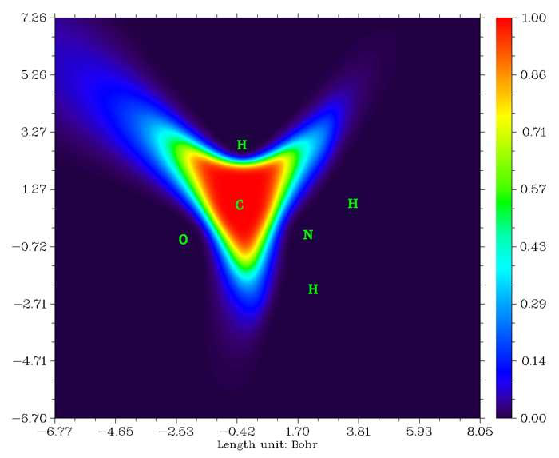

# 3.18 Fuzzy atomic space analysis (15)

> Multiwfn manual, p.222–239. Images: `../imgs/`.

---

<!-- p.222 -->

density matrix and then printed out. If some neighboring atoms have large population number, it is suggested that multi-center orbitals with high occupation number may appear on these atoms; while the atoms with low population number often can be ignored in the following searching process. Thus this option is very helpful for setting up user-directed searching.

14 Export AdNDP orbitals to .mwfn file: Via this option, all picked AdNDP orbitals will be exported as AdNDP.mwfn in current folder (see Section 2.5 for introduction of .mwfn format). By using this file as input file, you can perform various kinds of analyses for AdNDP orbitals (e.g. orbital composition analysis by main function 8, plotting plane map via main function 4). Note that if there are N basis functions and M AdNDP orbitals have been picked out, then the first M orbitals in the AdNDP.mwfn will correspond to the AdNDP orbitals, while the other N-M orbitals in this file are meaningless and can be simply ignored.

15 Evaluate and output composition of AdNDP orbitals: This option is used to calculate orbital composition of picked AdNDP orbitals by natural atomic orbital (NAO) method, which has been introduced in Section 3.10.4.

16 Evaluate and output energy of AdNDP orbitals: This function is used to evaluate energy of AdNDP orbitals that have already been picked out. Multiwfn will prompt you to input the path of the file containing Fock matrix in original basis functions, the elements of the matrix should be recorded in lower-triangular sequence, the NBO .47 file containing $FOCK field can also be directly used as input file. Then after a simple transformation, orbital energies are immediately outputted.

AdNDP analysis is relatively complicated and not a black box, please follow the examples in Section 4.14 before using this module to analyze your systems.

Information needed: NBO output file (with AONAO DMNAO keywords), .fch file (only needed when visualizing and exporting cube file for AdNDP orbitals, or exporting AdNDP orbitals as .mwfn file), plain text file (containing Fock matrix. Only needed if you want to gain orbital energies)

## 3.18 Fuzzy atomic space analysis (15)

### 3.18.0 Basic concepts

Before introducing each individual function, here I first introduce some basic concepts of fuzzy atomic space.

Atomic space is the local space attributed to a specific atom in the whole three-dimension molecular space. Below we will express atomic space as weighing function w. The methods used to partition the whole space into atomic spaces can be classified into two categories:

1 Discrete partition methods: The two representative methods are Bader's partition (also known as AIM partition) and Voronoi partition. They partition molecular space discretely, so any point can be attributed to only one atom, in other words,

$$\left\{\begin{aligned}w_{A}(\mathbf{r})&=1&\text{if }\mathbf{r}\in\Omega_{A}\\ w_{A}(\mathbf{r})&=0&\text{if }\mathbf{r}\notin\Omega_{A}\end{aligned}\right.$$

<!-- p.223 -->

$\Omega_{A}$ is atomic space of atom A.

2 Fuzzy partition methods: The representative methods include Hirshfeld, Becke, Hirshfeld-I, MBIS and ISA. They partition molecular space contiguously, atomic spaces overlap with each other, any point may be simultaneously attributed to many atoms to different extent, and the weights are normalized to unity. In other words, the two following conditions hold for all atoms and any point

$$\begin{aligned}&0\leq w_{A}(\mathbf{r})\leq1\quad\forall A\\&\sum_{B}w_{B}(\mathbf{r})=1\\ \end{aligned}$$

<!-- formula-ocr: formula_p223_127.png 已替换为LaTeX, 原图保留备查 -->

B

The most significant advantage of the fuzzy partition may be that the integration of real space function in fuzzy atomic space is much easier than in discrete atomic space. By using Becke's numerical DFT integration scheme (J. Chem. Phys., 88, 2547 (1988)), high accuracy of integration in fuzzy atomic space can be achieved for most real space functions at the expense of relatively low computation effort. In the fuzzy atomic space analysis module of Multiwfn, all integrations are realized by this scheme. The more integration points are used, the higher integration accuracy can be reached, one can adjust the number of points by "radpot" and "sphpot" parameter in `settings.ini`.

In fuzzy atomic space analysis module of Multiwfn, one can obtain many properties that based on fuzzy atomic spaces. Currently, the most widely used definitions of fuzzy atomic spaces, namely Hirshfeld, Hirshfeld-I and Becke are supported, they are introduced below. One can choose which fuzzy atomic spaces will be used by option -1.

Hirshfeld atomic space: In Theor. Chim. Acta (Berl.), 44, 129 (1977), Hirshfeld defined the atomic space as

$$w_{_{A}}^{^{Hirsh}}(\mathbf{r})=\frac{\rho_{_{A}}^{^{free}}(\mathbf{r}-\mathbf{R}_{_{A}})}{\sum\limits_{B}\rho_{_{B}}^{^{free}}(\mathbf{r}-\mathbf{R}_{_{A}})}$$

B

where R is coordinate of nucleus, $\rho^{\mathrm{free}}$ denotes spherically averaged atomic electron density in free-state.

In option -1, you will find two options "Hirshfeld" and "Hirshfeld*". The former uses atomic .wfn files to calculate the weights, they must be provided yourself or let Multiwfn automatically invoke Gaussian to generate them, see Section 3.7.3 for detail. The latter evaluates the weights directly based on built-in radial atomic densities and thus is more convenient, detail can be found in Appendix 3. I strongly suggest using "Hirshfeld*" instead of "Hirshfeld".

Hirshfeld-I (HI) atomic space: This is a well-known extension of Hirshfeld method, it was proposed in J. Chem. Phys., 126, 144111 (2007). Commonly the atomic space defined by HI is more physically meaningful than that of Hirshfeld, since it can respond to the actual molecular environment. Unfortunately, HI is much more expensive than Hirshfeld due to its iterative nature. Details of Hirshfeld-I and its implementation in Multiwfn have been introduced in Section 3.9.13 and thus will not be repeated here. When you choose HI in option -1, Multiwfn will first perform regular HI iterations (If you are confused by the operations, please consult the example of computing HI charges in Section 4.7.4). After HI atomic spaces have converged, you can do subsequent analyses.

<!-- p.224 -->

MBIS atomic space: Like HI, MBIS refine atomic spaces iteratively. See Section 3.9.18 for details. When you choose MBIS in option -1, you will enter the interface of performing MBIS iteration, you should choose option 1 to start the atomic space refinement process. After MBIS atomic spaces have converged, you can do subsequent analyses.

Becke atomic space: First, consider a function p

$$p(d)=(3/2)d-(1/2)d^{3}$$

<!-- formula-ocr: formula_p224_128.png 已替换为LaTeX, 原图保留备查 -->

which can be iterated many times

dpdf dppdf dpppdf 1 3 2 )()( )]}([{)( )]([)( ===

...

Then define a function s

$$s_{k}(t)=(1/2)[1-f_{k}(t)]$$

<!-- formula-ocr: formula_p224_129.png 已替换为LaTeX, 原图保留备查 -->

The plot of $s_{k}$ versus to t is

1.0

0.9 0.8 0.7 k=1 k=2 k=3 k=4 k=5

0.6

$s_{k}$(t) 0.5

0.4

0.3

0.2

0.1

-1.0-0.8-0.6-0.4-0.20.00.20.40.60.81.00.0

t

From the graph above it can be seen that $s_{k}$ gradually reduces from 1 to 0 with t varying from -1 to 1. The larger the k is, the sharper the curve becomes. The weighting function of Becke atomic space is based on simple transformation of sk, for details please consult original paper J. Chem. Phys., 88, 2547 (1988).

$$w_{A}^{\mathrm{Becke}}\left(\mathbf{r}\right)=\frac{P_{A}(\mathbf{r})}{\sum_{B}P_{B}(\mathbf{r})}$$

B

<!-- p.225 -->

$$P_{A}(\mathbf{r})=\prod_{B\neq A}s_{k}(v_{_{AB}}(\mathbf{r}))\quad v_{_{AB}}(\mathbf{r})=\mu_{_{AB}}(\mathbf{r})+a_{_{AB}}(1-\mu_{_{AB}}(\mathbf{r})^{2})$$

$$a_{_{AB}}=\frac{u_{_{AB}}}{u_{_{AB}}^{2}-1}\quad u_{_{AB}}=\frac{\chi_{_{AB}}-1}{\chi_{_{AB}}+1}\quad\chi_{_{AB}}=\frac{R_{_{A}}^{\mathrm{cov}}}{R_{_{B}}^{\mathrm{cov}}}$$

$$\left\{\begin{aligned}a_{AB}&=-0.5&\text{if }a_{AB}<-0.5\\ a_{AB}&=0.5&\text{if }a_{AB}>0.5\end{aligned}\right.$$

μ BAAB )( RrRrRRr −=−=−=−= rr rrRR BBAABAABAB

where R stands for coordinates of nucleus. $R^{\mathrm{cov}}$ denotes covalent radius.

The number of iterations, namely k value, can be set by option -3. The default value (3) is appropriate for most cases. The definition of the covalent radius used to generate Becke atomic space can be chosen by option -2. Through corresponding suboptions, one can directly select a set of built-in radii (CSD radii, modified CSD radii, Pyykkö radii, Suresh radii, Hugo radii), load radii information from external plain text file (the format required is described in the program prompts), or modify current radii by manual input.

The origin paper of CSD radii is Dalton Trans., 2008, 2832, these radii were deduced from statistic of Cambridge Structural Database (CSD) for the elements with atomic numbers up to 96. Pyykkö radii were defined in Chem. Eur. J., 15, 186 (2008), which covers the entire periodic table, Groups 1–18, Z=1–118. Suresh radii were proposed in J. Phys. Chem. A, 105, 5940 (2001), which is based on theoretically calculated geometries of H3C-EHn, the defined radii cover most of main group and transition elements in periodic table. Hugo radii were proposed in Chem. Phys. Lett., 480, 127 (2009), which has clear physical meaning and is based on atomic ionization energy. Notice that Hugo radius for hydrogen is rather large (even larger than Kr by 0.01 Bohr).

I found it is inappropriate to directly use any covalent radii definition shown above to define Becke's atomic space. The covalent radii of metal elements in IA and IIA groups are always large, e.g. CSD radius of lithium is 1.28 Å. While covalent radii of elements in such as VIIA group are always small, e.g. CSD radius of fluorine is only 0.58 Å. For main groups, the elements with small (large) covalent radius generally have large (small) electronegativity. So, in molecule environment, the atoms with small (large) covalent radius prefer to withdraw (donate) electrons to expand (shrink) their effective size, this behavior makes actual radii of main group elements in each row equalized. In order to faithfully reflect this behavior, I defined the so-called "modified CSD radii", namely the CSD radii of all main group elements (except for the first row) are replaced by CSD radii of the IVA group element in corresponding row, while transition elements still use their original CSD radii. The modified CSD radii are the default radii definition for Becke's atomic space.

The Becke atomic space of carbon in acetamide constructed by default parameters is illustrated below

<!-- p.226 -->

### 3.18.1 Integration of a real space function in fuzzy atomic spaces (1)

This function is used to integrate real space function f in atomic spaces

$$I_{A}=\int_{A}w_{A}(\mathbf{r})f(\mathbf{r})\mathrm{d}\mathbf{r}$$

<!-- formula-ocr: formula_p226_130.png 已替换为LaTeX, 原图保留备查 -->

For example, if f is chosen as electron density, then $I_{A}$ will be the electron population number of atom A.

f may be also chosen as the real space functions involving coordinates of two electrons, such as exchange-correlation density and source function. For this case, the coordinate of reference point can be set by option -10 (this is equivalent to set "refxyz" in `settings.ini`). If you have carried out topology analysis, you can also use option -11 to set a critical point as reference point, this is especially convenient for studying source function (for which bond critical point is usually set as reference point).

The "% of sum" and "% of sum abs" in output are defined as (/) 100%ABBII× and

$$I_{_{AB}}=\int_{_{A}}w_{_{A}}(\mathbf{r})w_{_{B}}(\mathbf{r})f(\mathbf{r})\mathrm{d}\mathbf{r}$$

<!-- formula-ocr: formula_p226_131.png 已替换为LaTeX, 原图保留备查 -->

By default, all atomic spaces will be integrated. If you only need integral value of certain atoms, you can use option -5 to define the atom list.

### 3.18.2 Integration of a real space function in overlap spaces (8)

This function is used to integrate specified real space function f in overlap spaces between atomic pairs

$$I_{AB}=\int_{A}w_{A}(\mathbf{r})w_{B}(\mathbf{r})f(\mathbf{r})\mathrm{d}\mathbf{r}$$

<!-- p.227 -->

For example, if f is chosen as electron density, then $I_{AB}$ will be the number of electrons shared by atom A and B. f may be also chosen as the real space functions involving coordinates of two electrons.

Integrals of positive and negative parts of f are outputted separately. Meanwhile, sum of diagonal elements ∑𝐼𝐴𝐴𝐴 , sum of non-diagonal elements ∑∑$I_{AB}$𝐵≠𝐴𝐴 and sum of all elements ∑∑𝐼𝐴𝐵𝐵𝐴 for positive and negative parts are also outputted together. Currently only the fuzzy atomic space defined by Becke can be employed in this function.

3.18.3 Atomic and molecular multipole moments and <$<r^{2}>$> (2)

This function is used to evaluate atomic and molecular monopole, dipole, quadrupole moments and octopole moments as well as <$<r^{2}>$>. All units in the output are in a.u.

In below formulae, superscript A means an atom named A. x, y and z are the components of electron coordinate r relative to nuclear coordinate R.

$$x=r_{x}-R_{x}^{A}\quad y=r_{y}-R_{y}^{A}\quad z=r_{z}-R_{z}^{A}$$

<!-- formula-ocr: formula_p227_133.png 已替换为LaTeX, 原图保留备查 -->

and $<r^{2}>$ = x2 + y2 + z2.

Atomic monopole moment due to electrons is just negative of electron population number

$$p_{A}=-\int w_{A}(\mathbf{r})\rho(\mathbf{r})\mathrm{d}\mathbf{r}$$

<!-- formula-ocr: formula_p227_134.png 已替换为LaTeX, 原图保留备查 -->

Atomic charges are outputted together, namely qA = pA + ZA, where Z denotes nuclear charge.

Atomic dipole moment is useful to measure polarization of electron distribution around the atom, which is defined as

$$\mathbf{\mu}^{A}=\left[\begin{matrix}{\mu_{x}^{A}}\\ {\mu_{y}^{A}}\\ {\mu_{z}^{A}}\\ \end{matrix}\right]=-\int\left[\begin{matrix}{x}\\ {y}\\ {z}\\ \end{matrix}\right]w_{A}(\mathbf{r})\rho(\mathbf{r})\mathrm{d}\mathbf{r}$$

<!-- formula-ocr: formula_p227_135.png 已替换为LaTeX, 原图保留备查 -->

Its magnitude, or say its norm, is

Multiwfn also outputs the contribution of present atom to total molecular dipole moment,

which is evaluated as qAR + μA.

Traceless Cartesian form of atomic quadrupole moment tensor is defined as (see Section 1.8.7 of book The Quantum Theory of Atoms in Molecules-From Solid State to DNA and Drug Design).

$$\mathbf{\mu}^{A}=\left[\begin{matrix}{\mu_{x}^{A}}\\ {\mu_{y}^{A}}\\ {\mu_{z}^{A}}\\ \end{matrix}\right]=-\int\left[\begin{matrix}{x}\\ {y}\\ {z}\\ \end{matrix}\right]w_{A}(\mathbf{r})\rho(\mathbf{r})\mathrm{d}\mathbf{r}$$

whose magnitude can be calculated as

$$\left|\boldsymbol{\mu}^{A}\right|=\sqrt{\left(\boldsymbol{\mu}_{x}^{A}\right)^{2}+\left(\boldsymbol{\mu}_{y}^{A}\right)^{2}+\left(\boldsymbol{\mu}_{z}^{A}\right)^{2}}$$

<!-- formula-ocr: formula_p227_136.png 已替换为LaTeX, 原图保留备查 -->

Atomic quadrupole moments in Cartesian form can be used to exhibit deviation of electron

<!-- p.228 -->

distribution from spherical symmetry around nuclei. Specifically, Θ𝑖𝑖 𝐴>0) indicates that the electron density of atom A is elongated (contracted) along i direction. If the atomic electron density has exact spherical symmetry, then Θxx = Θyy = Θzz. Noticeably, the Cartesian quadrupole moment tensor Θ given here is traceless, namely the condition Θxx + Θyy + Θzz = 0 holds. 𝐴<0 (Θ𝑖𝑖

Standard Cartesian form of atomic quadrupole moment tensor is defined as follows. It is not outputted by default because it is rarely useful. However, if you hope it to be outputted, you can set “ispecial” in `settings.ini` to 1.

$$\mathbf{\Theta}^{A}=\left[\begin{matrix}{\Theta_{x x}^{A}}&{\Theta_{x y}^{A}}&{\Theta_{x z}^{A}}\\ {\Theta_{y x}^{A}}&{\Theta_{y y}^{A}}&{\Theta_{y z}^{A}}\\ {\Theta_{z x}^{A}}&{\Theta_{z y}^{A}}&{\Theta_{z z}^{A}}\\ \end{matrix}\right]=-\int\left[\begin{matrix}{x^{2}}&{x y}&{x z}\\ {y x}&{y^{2}}&{y z}\\ {z x}&{z y}&{z^{2}}\\ \end{matrix}\right]w_{A}(\mathbf{r})\rho(\mathbf{r})\mathrm{d}\mathbf{r}$$

Inspired by electronic spatial extent (see Section 3.300.5), I defined atomic electronic spatial

extent 〈𝑟𝐴 2〉, it is expressed as

$$\mathbf{\Theta}^{A}=\left[\begin{matrix}{\Theta_{x x}^{A}}&{\Theta_{x y}^{A}}&{\Theta_{x z}^{A}}\\ {\Theta_{y x}^{A}}&{\Theta_{y y}^{A}}&{\Theta_{y z}^{A}}\\ {\Theta_{z x}^{A}}&{\Theta_{z y}^{A}}&{\Theta_{z z}^{A}}\\ \end{matrix}\right]=-\int\left[\begin{matrix}{x^{2}}&{x y}&{x z}\\ {y x}&{y^{2}}&{y z}\\ {z x}&{z y}&{z^{2}}\\ \end{matrix}\right]w_{A}(\mathbf{r})\rho(\mathbf{r})\mathrm{d}\mathbf{r}$$

<!-- formula-ocr: formula_p228_137.png 已替换为LaTeX, 原图保留备查 -->

whose X component is expressed as follows

$$\langle r_{A}^{2}\rangle=\int r^{2}w_{A}(\mathbf{r})\rho(\mathbf{r})\mathrm{d}\mathbf{r}=\langle x_{A}^{2}\rangle+\langle y_{A}^{2}\rangle+\langle z_{A}^{2}\rangle$$

<!-- formula-ocr: formula_p228_138.png 已替换为LaTeX, 原图保留备查 -->

and similarly for 〈𝑦𝐴 2〉 is a useful metric of overall spatial extent of electron distribution within a fuzzy atom, while its Cartesian component reveals electronic spatial extent in specific direction. 2〉. 〈𝑟𝐴 2〉 and 〈𝑧𝐴

The atomic quadrupole and octopole moments in spherical harmonic form are also outputted. The general expression of multipole moments in spherical harmonic form is

,, ( )( ) ( )dAAl ml mAQRwρ= −∫rrrr

All of the five components of quadrupole moment in spherical harmonic form correspond to

$$R_{2,-1}=\sqrt{3}y z\quad R_{2,1}=\sqrt{3}x z$$

<!-- formula-ocr: formula_p228_139.png 已替换为LaTeX, 原图保留备查 -->

All of the 7 components of octopole moment in spherical harmonic form correspond to

Rzrz 223,0 =− (1/ 2)(53)

RzryRzrx 22223, 13,1 − =−=− 3/ 8(5)3/ 8(5)

RxyzRxyz 223, 23,2 − ==− 15( 15 / 2)()

RxyyRxyx 22223, 33,3 − =−=− 5 / 8(3)5 / 8(3)

The magnitude of multipole moments in spherical harmonic form is calculated as

$$\left|Q_{l}^{A}\right|=\sqrt{\sum_{m}\left(Q_{l,m}^{A}\right)^{2}}$$

<!-- formula-ocr: formula_p228_140.png 已替换为LaTeX, 原图保留备查 -->

m

<!-- p.229 -->

At the end of the calculation, the total number of electrons, molecular dipole moment and its magnitude are outputted. Molecular dipole moment is calculated as the sum of all contributions from atomic dipole moments and atomic charges (i.e. the sum of all "Contribution to molecular dipole moment" terms in the output information)

$$\mathbf{\mu}^{\mathrm{m o l}}=\sum_{A}(q_{A}\mathbf{R}^{A}+\mathbf{\mu}^{A})$$

<!-- formula-ocr: formula_p229_141.png 已替换为LaTeX, 原图保留备查 -->

In addition, Multiwfn outputs molecular quadrupole and octopole moments in Cartesian form and spherical harmonic form, they can also be viewed as sum of contributions of atoms. For example, molecular quadrupole moment of Θxy is expressed as

$$\Theta_{xy}=\frac{3}{2}\Biggl[\sum_{A}R_{x}^{A}R_{y}^{A}Z_{A}-\sum_{A}\int xy w_{A}(\mathbf{r})\rho(\mathbf{r})\mathrm{d}\mathbf{r}\Biggr]$$

where x, y, z in this context are Cartesian components of r with respect to (0,0,0) position. <$<r^{2}>$> of molecule can be written as

$$\Theta_{xy}=\frac{3}{2}\Biggl[\sum_{A}R_{x}^{A}R_{y}^{A}Z_{A}-\sum_{A}\int xy w_{A}(\mathbf{r})\rho(\mathbf{r})\mathrm{d}\mathbf{r}\Biggr]$$

<!-- formula-ocr: formula_p229_142.png 已替换为LaTeX, 原图保留备查 -->

where r is radial distance with respect to (0,0,0).

By default, atomic multipole moments and <$<r^{2}>$> for all atoms are evaluated, and finally, these quantities of the whole system are printed. If you only need them for specific atoms, you can use option -5 to define an atom list, in this case only the quantities of selected atoms will be calculated and outputted. In addition, via this feature you can calculate the quantities of a molecule in a molecular complex, or calculate them of a fragment in a molecule, because in this case the "Molecular dipole and multipole moments" printed at the end of output are only contributed by the atoms in the defined list. See example in Section 4.15.3 for illustration of use of this feature.

After entering the present function, you will be asked to choose destination of outputting. If you choose 2 to output result to multipole.txt, a file named atom_moment.txt will also be produced in the current folder. Based on this file, atomic electric dipole and quadrupole moments can be visualized in VMD program via a special script, see Section 4.15.5 for detail.

PS 1: If your purpose is only calculating electric dipole/multipole moments and <$<r^{2}>$> for the whole system, it is best to use the function described in Section 3.300.5, it is significantly faster and more accurate since it calculates them analytically.

PS 2: If “ispecial” in `settings.ini` is set to 1, then the electron density involved in this function will be replaced with user-defined function. Via this feature, it is possible to realize some special purpose, such as calculating atomic dipole moments corresponding to variation of electron density, see #10 and relevant discussions in http://sobereva.com/wfnbbs/viewtopic.php?id=650.

### 3.18.4 Atomic overlap matrix and fragment overlap matrix (3, 33)

Subfunction 3 in fuzzy analysis module is used to calculate atomic overlap matrix (AOM) for orbitals in atomic spaces, the AOM will be outputted to AOM.txt in current folder. The element of AOM is defined as

$$S_{i j}(A)=\int_{A}\varphi_{i}(\mathbf{r})\varphi_{j}(\mathbf{r})\mathrm{d}\mathbf{r}$$

<!-- formula-ocr: formula_p229_143.png 已替换为LaTeX, 原图保留备查 -->

where i and j are orbital indices, integration is performed within fuzzy space of atom A. For

unrestricted wavefunctions, AOMs between α orbitals and between β orbitals are outputted

<!-- p.230 -->

separately for each atom.

Notice that the highest virtual orbitals will not be taken into account during calculation. For example, present system has 10 orbitals in total, in which 7, 8, 9, 10 are not occupied, and user has set the occupation number of orbital 3 to zero via option 26 in main function 6, then the dimension of each AOM outputted by Multiwfn will be (6,6), corresponding to the overlap integral between the first 6 orbitals in each atomic space. If you hope to take all orbitals into account, set “ispecial” in `settings.ini` to 3.

Since orbitals are orthonormal in the whole space, in principle, summing up AOMs for all atoms (corresponding to integrating in the whole space) should yield an identity matrix

$$\mathbf{S U M}=\sum_{A}\mathbf{S}(A)=\mathbf{I}$$

<!-- formula-ocr: formula_p230_144.png 已替换为LaTeX, 原图保留备查 -->

A

Of course, this condition is not strictly held, because the integration is performed numerically. The deviation of SUM to identity matrix is a useful metric of integration accuracy

$$\mathbf{S U M}=\sum_{A}\mathbf{S}(A)=\mathbf{I}$$

$$Error=\frac{\displaystyle\sum_{i}\displaystyle\sum_{j}\left|\operatorname{SUM}_{i,j}-\mathbf{I}_{i,j}\right|}{N_{atom}}$$

Multiwfn automatically outputs the "Error" value. If it is not small enough, e.g. >0.001, then you may want to improve the integration accuracy via following ways

(1) Enlarge "radpot" and "sphpot" in `settings.ini` (2) Set "radcut" in `settings.ini` to 0 (3) Choose option -6 to change the default atomic integration grid to the much more expensive molecular integration grid

(4) If diffuse functions were heavily employed, remove them

Fragment overlap matrix Fragment overlap matrix (FOM) is simply sum of AOM of the atoms in the fragment. FOM of one fragment or two fragments can be calculated by subfunction 33 in fuzzy analysis module, the result is outputted to FOM.txt in current folder. You can directly define the atoms in the fragment(s) in this subfunction.

When atomic integration grid is used to evaluate AOM, and the number of atoms involved in the one or two fragments is significantly smaller than total number of atoms, the calculation cost of FOM is significantly lower than using subfunction 3 to calculate the entire AOM, because atoms not involved in the fragment(s) will simply be skipped.

### 3.18.5 Localization index (LI) and delocalization index (DI) (4, 44)

3.18.5.1 Theoretical background

Definition of LI and DI

For open-shell systems, the LI (λ) and DI (δ) are calculated for each spin of electrons respectively. Below only the expression of LI and DI for α electrons is given. For β electrons, just replacing α with β, similarly hereinafter. The electrons in atomic space A that can delocalize to atomic space B is computed as

$$\delta^{\alpha}(A\to B)=-\int_{A}\int_{B}\Gamma_{\mathrm{X C}}^{\alpha,\mathrm{tot}}(\mathbf{r}_{1},\mathbf{r}_{2})\mathrm{d}\mathbf{r}_{1}\mathrm{d}\mathbf{r}_{2}$$

$\Gamma_{XC}$ is exchange-correlation density; if you are not familiar with it, please consult the

<!-- p.231 -->

discussion in part 17 of Section 2.6. The electrons in atomic space B that can delocalize to atomic space A is

$$\delta^{\alpha}(B\to A)=-\int_{B}\int_{A}\Gamma_{\mathrm{X C}}^{\alpha,\mathrm{tot}}(\mathbf{r}_{1},\mathbf{r}_{2})\mathrm{d}\mathbf{r}_{1}\mathrm{d}\mathbf{r}_{2}$$

Clearly, above two terms are identical in value, therefore we define DI between A and B as below,

it measures the total number of α electrons shared by atom A and B

$$\delta^{\alpha}(B\to A)=-\int_{B}\int_{A}\Gamma_{\mathrm{X C}}^{\alpha,\mathrm{tot}}(\mathbf{r}_{1},\mathbf{r}_{2})\mathrm{d}\mathbf{r}_{1}\mathrm{d}\mathbf{r}_{2}$$

The LIα measures the number of α electrons localized in an atom. Note that this quantity is not additive.

$$\delta^{\alpha}(B\to A)=-\int_{B}\int_{A}\Gamma_{\mathrm{X C}}^{\alpha,\mathrm{tot}}(\mathbf{r}_{1},\mathbf{r}_{2})\mathrm{d}\mathbf{r}_{1}\mathrm{d}\mathbf{r}_{2}$$

The relationship between LI, DI and the population number of electrons in atomic space is

given below, the physical meaning is that the sum of α electrons of atom A that localized in atom A and that delocalized to other regions is the total number of α electrons in space A.

$$\begin{aligned}&\lambda^{\alpha}(A)+(1/2)\sum_{B\neq A}\delta^{\alpha}(A,B)\equiv\lambda^{\alpha}(A)+\sum_{B\neq A}\delta^{\alpha}(A\rightarrow B)=\\ &=-\int_{A}\int\Gamma_{\mathrm{X C}}^{\alpha,\mathrm{tot}}(\mathbf{r}_{1},\mathbf{r}_{2})\mathrm{d}\mathbf{r}_{1}\mathrm{d}\mathbf{r}_{2}=\int_{A}\rho^{\alpha}(\mathbf{r})\mathrm{d}\mathbf{r}=N_{A}^{\alpha}\\ \end{aligned}$$

Using the Müller approximate expression of ГXC, the DI and LI can be explicitly written as

follows (δ in this form is also known as Fulton index, see Phys. Chem. Chem. Phys., 28, 19133 (2026) for a review)

$$\delta^{\alpha}(A,B)=2\sum_{i\in\alpha}\sum_{j\in\alpha}\sqrt{\eta_{i}\eta_{j}}S_{i j}(A)S_{i j}(B)$$

where S is atomic overlap matrix (AOM), see Section 3.18.4 for introduction.

Total DI and LI are the summation of α part and β part

$$\delta^{\alpha}(B\to A)=-\int_{B}\int_{A}\Gamma_{\mathrm{X C}}^{\alpha,\mathrm{tot}}(\mathbf{r}_{1},\mathbf{r}_{2})\mathrm{d}\mathbf{r}_{1}\mathrm{d}\mathbf{r}_{2}$$

<!-- formula-ocr: formula_p231_145.png 已替换为LaTeX, 原图保留备查 -->

Also worth noting is the DI of Ángyán-Loos-Mayer (ALM) formulation (J. Phys. Chem., 98,

5244 (1994)) as shown below, where orbitals are spatial with η within [0.0,2.0]. It is not implemented in Multiwfn.

$$\delta^{\alpha}(A,B)=2\sum_{i\in\alpha}\sum_{j\in\alpha}\sqrt{\eta_{i}\eta_{j}}S_{i j}(A)S_{i j}(B)$$

<!-- formula-ocr: formula_p231_146.png 已替换为LaTeX, 原图保留备查 -->

Special form of closed-shell cases

$$\begin{aligned}&\lambda^{\alpha}(A)+(1/2)\sum_{B\neq A}\delta^{\alpha}(A,B)\equiv\lambda^{\alpha}(A)+\sum_{B\neq A}\delta^{\alpha}(A\rightarrow B)=\\ &=-\int_{A}\int\Gamma_{\mathrm{X C}}^{\alpha,\mathrm{tot}}(\mathbf{r}_{1},\mathbf{r}_{2})\mathrm{d}\mathbf{r}_{1}\mathrm{d}\mathbf{r}_{2}=\int_{A}\rho^{\alpha}(\mathbf{r})\mathrm{d}\mathbf{r}=N_{A}^{\alpha}\\ \end{aligned}$$

$$\delta(A,B)=2\delta^{\alpha}(A,B)=2\times2\sum_{m}\sum_{n}\sqrt{\frac{\eta_{m}}{2}\frac{\eta_{n}}{2}}S_{mn}(A)S_{mn}(B)=2\sum_{m}\sum_{n}\sqrt{\eta_{m}\eta_{n}}S_{mn}(A)S_{mn}(B)$$

where m and n denote closed-shell natural orbitals. Similarly, the total LI for closed-shell cases is

<!-- p.232 -->

$$\lambda(A)=\sum_{m}\sum_{n}\sqrt{\eta_{m}\eta_{n}}S_{mn}(A)S_{mn}(A)$$

<!-- formula-ocr: formula_p232_147.png 已替换为LaTeX, 原图保留备查 -->

For closed-shell systems, it is argued that the value of total DI is a quantitative measure of the

number of electron pairs shared between two atoms. For example, total δ(A,B)=1.0 implies a pair of electrons (an α and a β electrons) is shared between atom A and B. (In fact, this is strictly true only for nonpolar bonds such as H-H bond in H2. In polar bonds, the DI must be lower than formal bond, because what total DI actually reflects is the effective number of electron pairs shared by two atoms and thus somewhat reflects covalency. Note that the value of DI is very sensitive to the definition of atomic space employed.

Fragment LI and interfragment DI Interfragment DI (IFDI) between fragments F and G can be evaluated as

$$\begin{aligned}&\delta^{\alpha}(F,G)=2\sum_{i\in\alpha}\sum_{j\in\alpha}\sqrt{\eta_{i}\eta_{j}}S_{ij}(F)S_{ij}(G)\\&\rightarrow2\sum_{i\in\alpha}\sum_{j\in\alpha}\sqrt{\eta_{i}\eta_{j}}\sum_{A\in F}S_{ij}(A)\sum_{B\in G}S_{ij}(B)\\&\rightarrow\sum_{A\in F}\sum_{B\in G}\left[2\sum_{i\in\alpha}\sum_{j\in\alpha}\sqrt{\eta_{i}\eta_{j}}S_{ij}(A)S_{ij}(B)\right]\\&\rightarrow\sum_{A\in F}\sum_{B\in G}\delta^{\alpha}(A,B)\\ \end{aligned}$$

<!-- formula-ocr: formula_p232_148.png 已替换为LaTeX, 原图保留备查 -->

In Phys. Chem. Chem. Phys., 24, 11486 (2022), it was demonstrated that IFDI between two terminal fragments in a globally conjugated system is very useful in characterizing extent of global delocalization, and it IFDI is found to be well positively correlated with rotational barrier between

the two fragments. This is because the stronger the original π conjugation is, the more obvious the destruction of conjugation will be when the two groups rotate relative to each other, and the higher the energy will rise.

Fragment LI (FLI) of fragment F can be evaluated as

$$\begin{aligned}&\lambda^{\alpha}(F)=\sum_{i\in\alpha}\sum_{j\in\alpha}\sqrt{\eta_{i}\eta_{j}}S_{ij}(F)S_{ij}(F)\\&\rightarrow\sum_{A\in F}\sum_{B\in F}\sum_{i\in\alpha}\sum_{j\in\alpha}\sqrt{\eta_{i}\eta_{j}}S_{ij}(A)S_{ij}(B)\\&\rightarrow\sum_{A\in F}\sum_{i\in\alpha}\sum_{j\in\alpha}\sqrt{\eta_{i}\eta_{j}}S_{ij}(A)S_{ij}(A)+\sum_{(B>A)\in F}2\sum_{i\in\alpha}\sum_{j\in\alpha}\sqrt{\eta_{i}\eta_{j}}S_{ij}(A)S_{ij}(B)\\&\rightarrow\sum_{A\in F}\lambda^{\alpha}(A)+\sum_{(B>A)\in F}\delta^{\alpha}(A,B)\\ \end{aligned}$$

<!-- formula-ocr: formula_p232_149.png 已替换为LaTeX, 原图保留备查 -->

$$\begin{aligned}&\delta^{\alpha}(F,G)=2\sum_{i\in\alpha}\sum_{j\in\alpha}\sqrt{\eta_{i}\eta_{j}}S_{ij}(F)S_{ij}(G)\\&\rightarrow2\sum_{i\in\alpha}\sum_{j\in\alpha}\sqrt{\eta_{i}\eta_{j}}\sum_{A\in F}S_{ij}(A)\sum_{B\in G}S_{ij}(B)\\&\rightarrow\sum_{A\in F}\sum_{B\in G}\left[2\sum_{i\in\alpha}\sum_{j\in\alpha}\sqrt{\eta_{i}\eta_{j}}S_{ij}(A)S_{ij}(B)\right]\\&\rightarrow\sum_{A\in F}\sum_{B\in G}\delta^{\alpha}(A,B)\\ \end{aligned}$$

Special form for single-determinant wavefunctions For single-determinant wavefunction, because of integer occupation number of orbitals, DI and LI can be simplified as

<!-- p.233 -->

$$\delta^{\alpha}(A,B)=2\sum_{i\in\alpha}^{cc}\sum_{j\in\alpha}^{occ}S_{ij}(A)S_{ij}(B)$$

$$\delta^{\alpha}(A,B)=2\sum_{i\in\alpha}^{cc}\sum_{j\in\alpha}^{occ}S_{ij}(A)S_{ij}(B)$$

$$\delta(A,B)=4\sum_{m}^{occ}\sum_{n}^{occ}S_{mn}(A)S_{mn}(B)$$

Relationship between DI and fuzzy bond order Conventionally, LI and DI are calculated in AIM atomic spaces (also called AIM basins). While in fuzzy atomic space analysis module of Multiwfn, they are calculated in fuzzy atomic space, the physical nature is the same. According to the discussion presented in J. Phys. Chem. A, 109, 9904 (2005) (compare Eq. 13 and Eq. 18), the DI calculated in fuzzy atomic space is just the so-called fuzzy bond order, which was defined by Mayer in Chem. Phys. Lett., 383, 368 (2004).

For closed-shell system, atomic valence can be calculated as the sum of its fuzzy bond orders

$$V(A)=\sum_{B\neq A}\delta(A,B)$$

<!-- formula-ocr: formula_p233_151.png 已替换为LaTeX, 原图保留备查 -->

Separation of σ and π contributions For strictly planar molecules, because overlap integral of σ orbital and π orbital is exactly zero in atomic space, the contributions from σ and π electrons to DI can be exactly decomposed as DI-σ and DI-π

$$\delta_{\sigma}^{\alpha}(A,B)=2\sum_{i\in\alpha}^{\sigma}\sum_{j\in\alpha}^{\sigma}\sqrt{\eta_{i}\eta_{j}}S_{i j}(A)S_{i j}(B)$$

<!-- formula-ocr: formula_p233_152.png 已替换为LaTeX, 原图保留备查 -->

Similarly, LI can be decomposed as LI-σ and LI-π. Summing up corresponding off-diagonal elements in DI-σ and DI-π matrix gives σ-atomic valence and π-atomic valence, respectively. If you want to compute DI/LI-σ (DI/LI-π), before the DI/LI calculation, you should set the occupation numbers of all π orbitals (σ orbitals) to zero by subfunction 26 of main function 6.

Covariance and relative fluctuation parameter In some papers, especially the ones written by Bernard Silvi, the variance of electronic fluctuation in atomic space σ2(A) and the covariance of fluctuation of electron pair between two atomic spaces cov(A,B) are discussed. They are not directly outputted by Multiwfn, because there is a very simple relationship correlates σ2(A), cov(A,B) and DI(A,B), thus you can calculate them quite easily, see Chem. Rev., 105, 3911 (2005) for derivation

$$\sigma^{2}(A)=N_{A}-\lambda(A)=-\sum_{B\neq A}\mathrm{cov}(A,B)=\sum_{B\neq A}\delta(A,B)/2$$

B AB A ≠≠

where NA is the electron population number in A. As mentioned above, the diagonal terms of the DI

<!-- p.234 -->

matrix outputted by Multiwfn are calculated as the sum of off-diagonal elements in the corresponding row (or column), hence you can simply obtain $\sigma^{2}$ by dividing corresponding diagonal term of DI matrix by two.

A quantity closely related to $\sigma^{2}$ is the relative fluctuation parameter introduced by Bader, which indicates the electronic fluctuations for a given atomic space relative to its electron population, you can calculate it manually if you want

2F( )( ) /AAANλσ=

Alternatively, you can calculate below value to measure the proportion of the electrons localized in the atomic space

$$l(A)=\lambda(A)/N_{A}$$

<!-- formula-ocr: formula_p234_153.png 已替换为LaTeX, 原图保留备查 -->

3.18.5.2 Usage

In Multiwfn, before calculating LI and DI, AOM is calculated first automatically, this is the

most time-consuming step. For open-shell systems, the LI and DI for α and β electrons, as well as for all electrons are outputted respectively. Notice that the diagonal terms of DI matrix are calculated as the sum of corresponding off-diagonal row (or column) elements. For closed-shell system, as stated above, they correspond to atomic valence.

### 3.18.6 Para-delocalization index (PDI) (5)

Para-delocalization index (PDI) is a quantity used to measure aromaticity of six-membered rings. PDI was first proposed in Chem. Eur. J., 9, 400 (2003), also see Chem. Rev., 105, 3911 (2005) for more discussion. PDI is essentially the averaged para-delocalization index (para-DI) in six-membered rings.

)6,3()5,2()4,1(PDIδδδ++= 3

The basic idea behind PDI is that Bader and coworkers reported that DI in benzene is greater for para-related than for meta-related carbon atoms. Obviously, the larger the PDI, the larger the delocalization, and the stronger the aromaticity. The main limitation of the definition of PDI is that it can only be used to study aromaticity of six-membered rings, and it was shown that PDI is inappropriate for the cases when the ring plane has an out-plane distortion.

In Multiwfn, before calculating PDI, AOM and DI are first calculated automatically. Then you will be prompted to input the indices of the atoms in the ring that you are interested in, the input order must be consistent with atom connectivity.

PDI currently is only available for closed-shell systems, although theoretically it may be possible to be extended to open-shell cases.

Note that for completely planar systems, since DI can be decomposed to α and π parts, PDI can also be separated as PDI-α and PDI-π to individually study α aromaticity and π aromaticity. In

<!-- p.235 -->

order to calculate PDI-α (PDI-π), before entering present module, you should first manually set occupation number of all MOs except for π (α) MOs to zero (or you can utilize option 22 in main function 100 to do this step, which will be much more convenient).

### 3.18.7 Aromatic fluctuation index (FLU) and FLU-π (6,7)

Aromatic fluctuation index (FLU) was proposed in J. Chem. Phys., 122, 014109 (2005), also see Chem. Rev., 105, 3911 (2005) for more discussion. Like PDI, FLU is an aromaticity index based on DI, but can be used to study rings with any number of atoms. The FLU index was constructed by following the HOMA philosophy (see Section 3.28.6), i.e. measuring divergences (DI differences for each single pair bonded) from aromatic molecules chosen as a reference. FLU is defined as below

$$FLU=\frac{1}{n}\sum_{A-B}^{ring}\left[\left(\frac{V(B)}{V(A)}\right)^{\alpha}\left(\frac{\delta(A,B)-\delta_{ref}(A,B)}{\delta_{ref}(A,B)}\right)\right]^{2}$$

where the summation runs over all adjacent pairs of atoms around the ring, n is equal to the number

of atoms in the ring, δref is the reference DI value, which is precalculated parameter. α is used to ensure the ratio of atomic valences is greater than one

$$FLU=\frac{1}{n}\sum_{A-B}^{ring}\left[\left(\frac{V(B)}{V(A)}\right)^{\alpha}\left(\frac{\delta(A,B)-\delta_{ref}(A,B)}{\delta_{ref}(A,B)}\right)\right]^{2}$$

<!-- formula-ocr: formula_p235_154.png 已替换为LaTeX, 原图保留备查 -->

The first factor in the formula of FLU penalizes those with highly localized electrons, while the second factor measures the relative divergence with respect to a typical aromatic system. Obviously, lower FLU corresponds to stronger aromaticity.

The dependence on reference value is one of main weaknesses of FLU. The default δref in Multiwfn for C-C, C-N, B-N are 1.468, 1.566 and 1.260 respectively, they are obtained from calculation of benzene, pyridine and borazine respectively under HF/6-31G* (geometry is optimized at the same level. Becke's atomic space with modified CSD radii and with sharpness parameter k=3

is used to derive δref). Users can modify or add δref through option -4.

The original paper of FLU also defined FLU-π, which is based on DI-π and π-atomic valence

$$FLU=\frac{1}{n}\sum_{A-B}^{ring}\left[\left(\frac{V(B)}{V(A)}\right)^{\alpha}\left(\frac{\delta(A,B)-\delta_{ref}(A,B)}{\delta_{ref}(A,B)}\right)\right]^{2}$$

where δπ is the average value of the DI-π for the bonded atomic pairs in the ring, and the other symbols denote the aforementioned quantities calculated using π-orbitals only. The advantage of FLU-π over FLU is that FLU-π does not rely on predefined reference DI value, while the disadvantage is that FLU-π can only be exactly calculated for planar molecules.

Akin to FLU, the lower the FLU-π, the stronger aromatic the ring. If FLU-π is equal to zero, that means DI-π is completely equalized in the ring. The reasonableness to measure aromaticity by FLU-π is that aromaticity for most aromatic molecules is almost purely contributed by π electrons, rather than σ electrons.

<!-- p.236 -->

In fuzzy atomic space analysis module of Multiwfn, PDI, FLU and FLU-π are calculated in fuzzy atomic spaces. In J. Phys. Chem. A, 110, 5108 (2006), the authors showed that the correlation between the PDI, FLU and FLU-π calculated in fuzzy atomic space and the ones calculated in AIM atomic space is excellent.

In Multiwfn, before calculating FLU and FLU-π, AOM will be calculated automatically. If you are calculating FLU-π, you will be prompted to input the indices of π orbitals, you can find out their indices by checking isosurface of all orbitals by main function 0. Then DI or DI-π matrix will be generated. Next, you should input the indices of the atoms in the ring, the input order must be consistent with atom connectivity. Besides FLU or FLU-π value, the contributions from each bonded atomic pair are outputted too.

FLU and FLU-π are only available for closed-shell system in Multiwfn. It is not well known whether FLU and FLU-π are also applicable for open-shell systems.

### 3.18.8 Condensed linear response kernel (CLRK) (9)

Linear response kernel (LRK) is an important concept defined in DFT framework, which can be written as

$$\chi(\mathbf{r}_{1},\mathbf{r}_{2})=\left(\frac{\delta^{2}E}{\delta\nu(\mathbf{r}_{1})\delta\nu(\mathbf{r}_{2})}\right)_{N}=\left(\frac{\delta\rho(\mathbf{r}_{1})}{\delta\nu(\mathbf{r}_{2})}\right)_{N}$$

<!-- formula-ocr: formula_p236_155.png 已替换为LaTeX, 原图保留备查 -->

This quantity reflects the impact of the perturbation of external potential at $\mathbf{r}_{2}$ on the electron density at r1, which may also be regarded as the magnitude coupling between electron at r1 and r2.

In Multiwfn, LRK is evaluated by an approximation form based on second-order perturbation theory (see Eq.3 of Phys. Chem. Chem. Phys., 14, 3960 (2012))

$$\chi(\mathbf{r}_{1},\mathbf{r}_{2})\approx4\sum_{i\in\mathrm{occ}}\sum_{j\in\mathrm{vir}}\frac{\varphi_{i}^{*}(\mathbf{r}_{1})\varphi_{j}(\mathbf{r}_{1})\varphi_{j}^{*}(\mathbf{r}_{2})\varphi_{i}(\mathbf{r}_{2})}{\varepsilon_{i}-\varepsilon_{j}}$$

where φ is molecular orbital, ε stands for MO energy. Note that this approximation form is only applicable to HF/DFT closed-shell systems, therefore present function only works for HF/DFT closed-shell systems.

Condensed linear response kernel (CLRK) is calculated as

$$\chi_{_{A,B}}=\int_{A}\int_{B}\chi(\mathbf{r}_{1},\mathbf{r}_{2})\mathrm{d}\mathbf{r}_{1}\mathrm{d}\mathbf{r}_{2}=4\sum_{i\in\mathrm{occ}}\sum_{j\in\mathrm{vir}}\frac{S_{ij}(A)S_{ji}(B)}{\varepsilon_{i}-\varepsilon_{j}}$$

where A and S(A) denote fuzzy atomic space and atomic overlap matrix for atom A, similar for atom B. In Phys. Chem. Chem. Phys., 15, 2882 (2013), it was shown that CLRK is useful for investigation of aromaticity and anti-aromaticity.

Present function is used to calculate CLRK between all atomic pairs in current system, and the result will be outputted as a matrix. Due to evaluation of LRK requires virtual MO information, in current version .mwfn/.fch/.molden/.gms file must be used as input file.

Note that CLRK can be decomposed to orbital contribution, e.g. for MO i

<!-- p.237 -->

$$\mathcal{X}_{A,B}^{(i)}=4\sum_{j\in\mathrm{vir}}\frac{S_{ij}(A)S_{ji}(B)}{\varepsilon_{i}-\varepsilon_{j}}$$

For instance, assume that you want to evaluate the contribution from MO 3,4,7, then before calculating CLRK, you should enter main function 6 and use option 26 to set occupation number of all MOs except for 3,4,7 to zero. (Note that the virtual MOs used to calculate LRK will automatically still be the original virtual MOs, rather than the ones after modification of MO occupation numbers.)

### 3.18.9 Para linear response index (PLR) (10)

The definition of para linear response index (PLR) has an analogy to PDI, the only difference is that DI is replaced by CLRK

$$PLR(A,B)=\frac{\chi_{1,4}+\chi_{2,5}+\chi_{3,6}}{3}$$

In Phys. Chem. Chem. Phys., 14, 3960 (2012), the authors argued that PLR is as useful as PDI in quantitatively measuring aromaticity, and it is found that the linear relationship between PLR and PDI is as high as R2=0.96.

Present function is used to calculate PLR. Multiwfn will first calculate CLRK, and then you should input the indices of the atoms constituting the ring in question, e.g. 3,5,6,7,9,2. The input order must be consistent with atom connectivity. Then PLR will be immediately outputted on screen. PLR is only applicable to HF/DFT closed-shell systems, and currently .mwfn/.fch/.molden/.gms must be used as input file.

Note that for completely planar systems, PLR can be exactly separated as PLR-α and PLR-π to individually study α aromaticity and π aromaticity. In order to calculate PLR-α (PLR-π), before entering present module, you should first manually set occupation number of all MOs except for π

(α) MOs to zero (or you can utilize option 22 in main function 100 to do this step, which will be much more convenient).

### 3.18.10 Multi-center delocalization index (11)

n-center multi-center DI is calculated as

$$\delta(A,B,C...H)=2^{n-1}\sum_{i}\sum_{j}\sum_{k}\cdots\sum_{q}S_{i j}(A)S_{j k}(B)S_{k l}(C)\cdots S_{q i}(H)$$

where i, j, k... only cycle occupied orbitals. The normalized form of multi-center DI is defined as

$\delta^{1/n}$, and may be compared between rings with different numbers of members.

Currently this function is only available for single-determinant closed-shell wavefunctions, and supports up to 10 centers. Note that for relatively large size of systems, calculating multi-center DI for more than 6 centers may be quite time-consuming.

### 3.18.11 Information-theoretic aromaticity index (12)

In ACS Omega, 3, 18370 (2018) it is shown that arithmetic mean of some information-theoretic quantities of the atoms constituting a ring has good linear relationship with other widely accepted

<!-- p.238 -->

aromaticity indices, such as HOMA and aromatic stabilization energy (ASE). It is thus clear that the arithmetic mean may be used as index for measuring aromaticity, although this point needs to be further explored.

The information-theoretic aromaticity index, namely the above-mentioned arithmetic mean can be calculated via subfunction 12 of fuzzy analysis module. After entering this function, you should choose the way of defining atomic information-theoretic quantity, three choices are currently available:

$$\mathrm{A t o m i c~S h a n n o n~e n t r o p y:}~s_{s}(A)=\int-\rho(\mathbf{r})\ln\rho(\mathbf{r})w_{A}(\mathbf{r})\mathrm{d}\mathbf{r}$$

$$\mathrm{A t o m i c~F i s h e r~i n f o r m a t i o n:}i_{\mathrm{F}}(A)=\int|\nabla\rho(\mathbf{r})|^{2}/\rho(\mathbf{r})w_{A}(\mathbf{r})\mathrm{d}\mathbf{r}$$

$$\mathrm{A t o m i c G B P e n t r o p y}\colon s_{\mathrm{G B P}}(A)=\int(3/2)\rho(\mathbf{r})\{\lambda+\ln[t(\mathbf{r})/t_{\mathrm{T F}}(\mathbf{r})]\}w_{A}(\mathbf{r})\mathrm{d}\mathbf{r}$$

Essentially, the three quantities correspond to the integral of user-defined functions 50, 51 and 54 in fuzzy atomic space. In this function, you also need to input the index of the atoms in the ring. Once calculation of the selected quantity for all atoms in the ring is finished, the average will be shown, and it can be regarded as an aromaticity index.

Before using this function, you can first select the way of defining atomic space. In the original paper, Hirshfeld partition was employed, while the default partition method of the fuzzy analysis module is Becke.

Information needed by fuzzy analysis module: GTFs, atom coordinates

3.18.12 Atomic effective volume, free volume, polarizability and C6

### coefficient (13)

Theory

Atomic (effective) polarizability of zero frequency, $\alpha^{eff}(0)$, in a molecule system, is a quantity of great important; however, there is no unique way to estimate it and it is not experimentally observable in general. In the original paper of Tkatchenko-Scheffler (TS) dispersion correction method, Phys. Rev. Lett., 102, 073005 (2009), the authors suggested a simple way of estimating it

by scaling known free-atom polarizability $\alpha^{free}(0)$, they assumed that atomic polarizability of an element is positively proportional to its atomic volume. Then in a review article Chem. Rev., 117, 4714 (2017), this method is explicitly expressed as

VVαα= free(0)(0)AAA effefffree A

where atomic effective volume Veff in a molecule and atomic free volume Vfree are expressed as

$$V_{A}^{\mathrm{e f f}}=\int\rho(\mathbf{r})w_{A}(\mathbf{r})\mid\mathbf{r}-\mathbf{R}_{A}\mid^{3}\mathrm{d}\mathbf{r}$$

in which wA is atomic weighting function of atom A. RA is nuclear position of atom A. ρ is molecular

<!-- p.239 -->

free is electron density of atom A in its free state. Note that the calculation level used for evaluating ρ and ρfree must be exactly the same. electron density, and 𝜌𝐴

Ideally, the sum of $\alpha^{\text{eff}}(0)$ of all atoms should be equal to static polarizability of the whole system. However, since the above method is not rigorous, this condition is obviously impossible to achieve. In addition, it is worth noting that the choice of atomic weighting function significantly affects calculation result, but it is unclear which weighting function is the best choice for this purpose.

In my opinion, it is useful to define percentage contribution of an atom to total polarizability as

$$\alpha_{_{A}}^{\%}=\frac{\alpha_{_{A}}^{\mathrm{eff}}(0)}{\sum\limits_{A}\alpha_{_{A}}^{\mathrm{eff}}(0)}\times100\%$$

<!-- formula-ocr: formula_p239_156.png 已替换为LaTeX, 原图保留备查 -->

This quantity is evidently useful in analyzing the major source of molecular polarizability.

According to the $C_{6,AA}^{\mathrm{TS}}$ method, $C_{6,AA}^{free}$ dispersion coefficient of an atom in practical chemical environment can be easily and approximately evaluated as

$$C_{6,A A}^{\mathrm{T S}}=\left(\frac{V_{A}^{\mathrm{e f f}}}{V_{A}^{\mathrm{f r e e}}}\right)^{2}C_{6,A A}^{\mathrm{f r e e}}$$

where $C_{6,AA}^{free}$,𝐴𝐴 free is the known C6 dispersion coefficient of the atom in free state. Furthermore, C6 between different two atoms can be calculated as

$$C_{6,A B}^{\mathrm{T S}}=\frac{2C_{6,A A}^{\mathrm{T S}}C_{6,B B}^{\mathrm{T S}}}{\frac{\alpha_{B}^{\mathrm{e f f}}\left(0\right)}{\alpha_{A}^{\mathrm{e f f}}\left(0\right)}C_{6,A A}^{\mathrm{T S}}+\frac{\alpha_{A}^{\mathrm{e f f}}\left(0\right)}{\alpha_{B}^{\mathrm{e f f}}\left(0\right)}C_{6,B B}^{\mathrm{T S}}}$$

Finally, intermolecular $C_{6,AA}^{free}$ coefficient can be obtained as follows

$$C_{6}^{\mathrm{m o l}}=\sum_{A\in\mathrm{m o l}1}\sum_{B\in\mathrm{m o l}2}C_{6,A B}^{\mathrm{T S}}$$

Usage

$C_{6,AA}^{\mathrm{TS}}$ for all atoms. In addition, the $C_{6,AA}^{free}$ mol, is also given. To evaluate them, the steps are: mol between two present systems, in other words, homomolecular 𝐶6 Multiwfn is able to calculate Veff, Vfree, $\alpha^{\text{eff}}(0)$, 𝛼%, and $C_{6,AA}^{\mathrm{free}}$

(1) Manually generate wavefunction file of each kind of atom in the current system by your

favourite quantum chemistry code. (2) Boot up Multiwfn and load the wavefunction file of the system. (3) Enter main function 15, choose the weighting function you want to use by option -1. (4) Choose option 13. Multiwfn will ask you to input path of wavefunction file of each kind

of element involved in the present system, the corresponding density will be used to evaluate Vfree. After inputting the paths, calculation will be started. During calculation, you can see Veff, Vfree and their ratio Veff/Vfree are printed for each atom. Once the calculation is completely finished, Multiwfn will print $\alpha^{\text{eff}}(0)$, α% and $C_{6,AA}^{free}$,𝐴𝐴 $C_{6,AA}^{\mathrm{TS}}$ for all atoms.

Note that the $\alpha^{\mathrm{free}}(0)$ used for their evaluations come from the recommended values in CTCP atomic polarizability table (http://ctcp.massey.ac.nz/index.php?menu=dipole&page=dipole, data of Nov 16, 2020 version was taken). The built-in $C_{6,AA}^{free}$,𝐴𝐴 free comes from J. Chem. Phys., 121, 4083 (2004), the value of H comes from Table I of original paper of $C_{6,AA}^{\mathrm{TS}}$ method. Only the 𝐶6,𝐴𝐴 free values of elements
