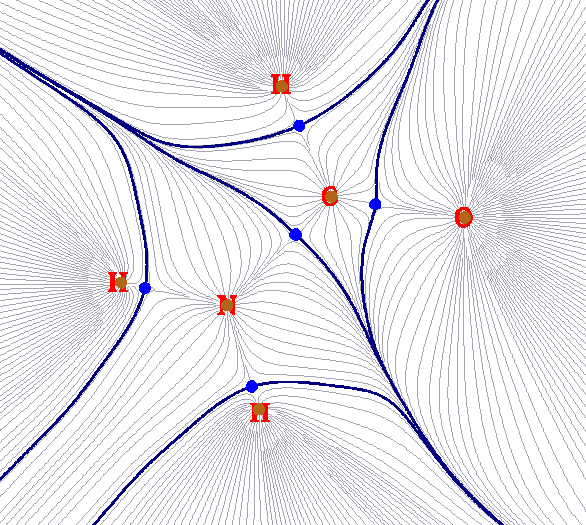
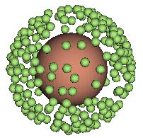

# 3.20 Basin analysis (17)

> Multiwfn manual, p.247–256. Images: `../imgs/`.

---

<!-- p.247 -->

but orbital interaction diagram is still usable. If you want to correctly perform CDA based on restricted open-shell wavefunction to avoid explicitly distinguishing alpha and beta orbitals, you should manually convert restricted open-shell wavefunction to equivalent unrestricted open-shell wavefunction prior to the analysis, see Section 4.16. 4 for example.

Infinite number of fragments can be defined; however, if more than two fragments are defined, ECDA analysis will be unavailable.

ECDA analysis and orbital interaction diagram are not available if complex or any fragment was calculated by multiconfiguration method (e.g. MP2, double-hybrid functional), since orbital energy of natural orbitals is not undefined.

Some examples of CDA are given in Section 4.16.

## 3.20 Basin analysis (17)

### 3.20.1 Theory

The concept of basin was first introduced by Bader in his atom in molecular (AIM) theory, after that, this concept was transplant to the analysis of ELF by Savin and Silvi. In fact, basin can be defined for any real space function, such as molecular orbital, electron density difference, electrostatic potential and even Fukui function.

A real space function in general has one or more maxima, which are referred to as attractors or (3,-3) critical points. Each basin is a subspace of the whole space, and uniquely contains an attractor. The basins are separated with each other by interbasin surfaces, which are essentially the zero-flux surface of the real space functions; mathematically, such surfaces consist of all points {r} satisfying ∇𝑓(𝐫) ∙𝐧(𝐫) = 0, where n(r) stands for the unit normal vector of the surface at position r.

Below figure illustrates the basins of total electron density of NH2COH, such a figure is often involved in AIM analysis. Brown points are attractors; in this case they correspond to maxima of total electron density and thus are very close to nuclei. Blue bolded lines correspond to interbasin surfaces, they dissect the whole molecular space into basins, which in present case are also known as AIM atomic space or AIM basin. Grey lines are gradient paths of total electron density, they emanated from attractors.

<!-- p.248 -->

Multiwfn is able to generate basins for any supported real space functions, such as electron density, ELF, LOL, electrostatic potential. Alternatively, one can let Multiwfn load the grid file generated by third-part programs (e.g. cube file or .grd file) and then generate basins for the real space function recorded in the grid data.

After the basins were generated, some analyses based on the basins can be conducted to extract information of chemical interest. The three most useful types of basin analyses are supported by Multiwfn and are briefed below. All of them require performing integration in the basin.

(1) Study integral of a real space function in the basins. For example, one can first use electron density to define the basins, and then integrate electron density in the basins to acquire electron population numbers in the basins; this quantity is known as AIM atomic population number. Another example, one can first partition the space into basins according to ELF function, and then calculate integral of spin density in the basins.

(2) Study electric multipole moments in the basins. In Multiwfn electric monopole, dipole and quadrupole moments can be calculated in the basins. This is very useful to gain a deep and quantitative insight into how the electrons are distributed in different regions of a system. Based on these data, one can clearly understand such as how lone pair electrons contribute to molecular dipole moment (see J. Comput. Chem., 29, 1440 (2008) for example, in which ELF basins are used), how the electron density around an atom is polarized as another molecule approaching.

(3) Study localization index and delocalization index in the basins. The former one measures how many electrons are localized in a basin on average, while the latter one is a quantitative measure of the number of electrons delocalized (or say shared) between two basins. They have been very detailedly introduced in Section 3.18.5 and hence will not be reintroduced here. The only difference relative to Section 3.18.5 is that the range of integration in our current consideration is basins rather than fuzzy atomic spaces.

### 3.20.2 Numerical aspects

In this section, I will describe many numerical aspects involved in basin analysis, so that you can understand how the basin analysis module of Multiwfn works.

Algorithms for generating basins The algorithms used to generate/integrate basins can be classified into three categories: (1) Analytical methods. Due to the popularity and importance of AIM theory, and the complex shape of AIM basins, since long time ago numerous methods have been proposed to attempt to speed up integration efficiency and increase integration accuracy for AIM basins, e.g. J. Comput. Chem., 21, 1040 (2000) and J. Phys. Chem. A, 115, 13169 (2011). All of these methods are analytical, and they are employed by almost all old or classical AIM programs, such as AIMPAC, AIM2000, Morphy and AIMAll. This class of methods suffers many serious disadvantages: 1. The algorithm is very complicated 2. High computational cost 3. Only applicable to the analysis of total electron density 4. Before generating basins, (3,-3) and (3,-1) critical points must be first located in some ways. The only advantage of these methods is that the integration accuracy is very satisfactory.

(2) Grid-based methods. This class of methods relies on cubic (or rectangle) grid data. Since the publication of TopMoD program, which aims to analyze ELF basin and for the first time uses a grid-based method, grid-based methods continue to be proposed and incurred more and more

<!-- p.249 -->

attention. Grid-based methods solved all of the drawbacks in analytical methods; they are easy to be coded, the computational cost is relatively low, and more important, they are suitable for any type of real space function. Unfortunately, these methods are not free of shortcomings, the central one is that the integration accuracy is highly dependent on the quality of grid data; to obtain a high accuracy of integral value the grid spacing must be small enough.

(3) Mixed analytical and grid-based method. The only instance in this class of method is described in J. Comput. Chem., 30, 1082 (2009), in which Becke's multicenter integration scheme is used to integrate basins. This method is faster than analytical method, and more accurate than grid-based method, but it is only suitable to analyze total electron density, thus the application range is seriously limited. Since the basin analysis module of Multiwfn focuses on universality, this method is not currently implemented.

Currently the best grid-based method is near-grid method (J. Phys.: Condens. Matter, 21, 084204 (2009)), which is employed in Multiwfn as default method to generate basins. Multiwfn also supports on-grid method (Comput .Mat. Sci., 36, 354 (2006)), which is the predecessor of near-grid method.

Basic steps of generating basins and locating attractors in Multiwfn In Multiwfn, generating basins and locating attractors are carried out simultaneously; the basic process can be summarized as follows: Given a grid data, all grids (except for the grids at box boundary) are cycled in turn. From each grid, a trajectory evolved continuously in the direction of maximal gradient. Each step of movement is restricted to its neighbouring grid, and the gradient in each grid is evaluated via one direction finite difference by using the function values of it and its neighbouring grids. There are four circumstances to terminate the evolvement of present trajectory and then cycle the next grid (a) The trajectory reached a grid, in which the gradient in all directions is equal or less than zero; such a grid will be regarded as an attractor, meanwhile all grids contained in the trajectory will be assigned to this attractor. (b) The trajectory reached a grid that has already been assigned; all of the grids contained in the trajectory will be assigned to the same attractor. This treatment greatly reduced computational expenses. (c) The upper limit of step number is reached (d) The trajectory reached the grids at box boundary; all of the grids in the trajectory will be marked as "travelled to boundary" status.

After all grids have been cycled, we obtained position of all attractors covered by the spatial scope of the grid data. Each set of grids assigned to the same attractor collectively constitutes the basin corresponding to the attractor. Interbasin grids will then be detected, according to the criterion that if any neighbouring grid belongs to different attractors. Note that sometimes after finished above processes, some grids may remain unassigned, and some grids may have the status "travelled to boundary". Such grids are often far away from atoms and thus unimportant, in general you can safely ignore them.

The only difference between on-grid method and near-grid method is that in the latter one, the so-called "correction step" is introduced to continuously calibrate the evolvement direction of the trajectory, which greatly eliminates the artificiality problem of interbasin surfaces due to on-grid method, and in turn makes the basin integration closer to actual values. Near-grid method can be supplemented by a refinement step for interbasin surfaces at the final stage, so that the partition of basin can be even more accurate, this additional step is not very time-consuming.

For ELF (and maybe other real space functions), if sphere- or ring-shape attractors exist in the system, in corresponding regions a large number of attractors having basically the same value will

<!-- p.250 -->

be found. Two examples below illustrate the existence of the ring-shape ELF attractor encircling N-C bond of HCN and the sphere-shape ELF attractor encompassing the Ar atom.

Based on nearest neighbor algorithm, Multiwfn automatically checks the distances and the relative value differences between all pairs of located attractors, and then clusters some attractors together. The resulting attractors thus have multiple member attractors, and will be referred to as "degenerate attractors" later. For example, the left graph and right graph given below displayed the attractor indices before and after clustering, respectively. As you can see, after clustering, all of the attractors constituting the ring-shape ELF attractor now have the same index, suggesting that the corresponding basins have been merged together as basin #2.

For certain cases, in regions far beyond the systems, some artificial or physically meaningless attractors are located. These attractors have very low function value and thus are called "insignificant" attractors; in contrast, other attractors can be called as "significant" attractors. The presence of insignificant attractors is because in corresponding regions the function values are rather small, hence the function behavior is not very definitive, even a very slight fluctuation of function value or trivial numerical perturbation is enough to result in new attractors. When insignificant attractors are detected, Multiwfn will prompt you to select how to deal with them, there are three options: (1) Do nothing, namely do not remove these attractors (2) Remove these attractors meanwhile set corresponding grids as unassigned grids (3) Remove these attractors meanwhile assign corresponding grids to the nearest significant attractors. The third option is generally recommended.

If the real space function simultaneously possesses positive and negative parts, e.g. electrostatic potential, Multiwfn will automatically invert the sign of negative part of the grid data and then locate attractors and generate basins as usual, after that the sign will be retrieved. Therefore, for negative parts, the "attractors" located by Multiwfn actually are "repulsors".

If the grid data is found to be non-negative everywhere, and you want to locate its minima (repulsors) rather than maxima (attractors), you can either choose corresponding suboption in option “-1 Select the method for generating basins” in basin analysis module to switch the objects to locate, or set "ibasinlocmin" parameter in `settings.ini` to 1. The attractors reported subsequently will correspond to repulsors. This feature is useful to locate minima of RDG and IRI, which have unique value in revealing interactions.

Integration of basins Once the basins have been generated by grid-based method, the integral of a real space function

<!-- p.251 -->

f in a basin P can be readily evaluated as 𝐹= ∑𝑓(𝐫𝒊) × d𝑉𝑖∈𝑃, where i is grid index, dV is volume differential element. Evidently, the finer the grid data (smaller grid spacing) is used, the more accurate the integral values will be, and correspondingly, the more computational effort must be paid.

Since the arrangement of grids in general is not in coincidence with system symmetry, one should not expect that the integral values always satisfy system symmetry well, unless very fine grid is used.

Note that different functions have different requirements on the quality of grid data. For the same grid spacing, the faster the function varies, the lower the integration accuracy will be. Due to Laplacian of electron density, source function and kinetic density function, etc. fluctuate violently near nuclei, it is impossible to directly integrate these functions in AIM basins solely by grid-based method at satisfactory accuracy (since only uniform grids are used, which is incapable to represent nuclear region well enough). In order to tackle this difficulty, an integration method based on mixed atomic-center and uniform grids is proposed by me and supported by Multiwfn, in which the regions close to nuclei are integrated by atomic-center grids, while the other regions are integrated by uniform grids. This method is able to integrate AIM basin for any real space function, including the ones having complicated behavior at generally acceptable accuracy without evident additional computational cost with respect to grid-based method. In order to further improve the integration accuracy for AIM basins, Multiwfn also enables one to exactly refine the assignment of the grids at basin boundary. An exact steepest ascent trajectory is emitted from each boundary grid, and terminates when reaches an attractor. Since there are often very large numbers of boundary grids and each steepest ascent step requires evaluating gradient of electron density once, this process is time-consuming. In Multiwfn these gradients can also be approximately evaluated by trilinear interpolation based on pre-calculated grid data of gradient, 1/3~1/2 of overall time cost of the AIM basin integration can be saved. Note that if the mixed type of atomic-center and uniform grids is employed, and especially when the exact refinement process of boundary basin is enabled at the same time, then the requirement on quality grid will be markedly lowered, usually accurate result can be obtained at "Medium-quality grid" level (grid spacing = 0.1 Bohr).

It is worth noting that even though basin analysis module of Multiwfn can be used to acquire position of attractors, the accuracy is directly limited by the quality of grid data, since the attractors will be located on a grid point. Moreover, this module is unable to be used to search other types of critical points (attractor corresponds to (3,-3) type critical point); So, if you want to obtain accurate coordinate and value for all types of critical points, you should make use of main function 2, namely topology analysis function.

### 3.20.3 Usage

The basin analysis module in Multiwfn is very powerful, fast and flexible. Basins can be generated and visualized for any real space function, meanwhile any real space function can be integrated in the generated basins. Electric multipole moments and localization index in the basins and delocalization index between basins can be calculated.

Basic steps To perform basins analysis in Multiwfn, there are five basic steps you need to do (1) Load input file into Multiwfn and then enter main function 17.

<!-- p.252 -->

(2) Select option 1 to generate basins and locate attractors. Before doing this, you can change the method used to generate basins via option -1, or adjust the parameters for clustering attractors via option -6.

(3) Visualize attractors and basins by option 0. This step is optional. (4) Perform the analyses you want. Integral of a real space function in generated basins, electric multipole moments in the basins and localization/delocalization index of the basins can be calculated by option 2 (or 7), 3 (or 8) and 4, respectively.

You can export the generated basins as cube files by option -5, export attractors as .pdb file by option -4, check the coordinate of the located attractors by option -3, measure the distances, angles and dihedrals angles between attractors or atoms by option -2. Also, you can use suboption 3 in option -6 to manually merge specified basins as a single one. If you want to regenerate basins and locate attractors for other real space functions or under new settings, you can select option 1 again.

About input file and grid data Grid data must be obtained first before generating basins. In option 1 of basin analysis module, you can let Multiwfn calculate the grid data. However, if a grid data has already been stored in memory, you can directly choose to use it. There are two circumstances in which grid data will be stored in memory: (1) The input file contains grid data, e.g. .cub and .grd file (2) You have used main function 5 or 13 to calculate grid data before entering main function 17. This design makes Multiwfn rather flexible: you can use Multiwfn to generate basins for a real space function recorded in a .cub or .grd file, which may be outputted by a third-part program; and you can also first use main function 5 or 17 to generate grid data for electron density difference, Fukui function, dual descriptor and so on, and then generate basins for them.

In the function of basin integration, namely option 2, the value of integrand at each grid must be available so that the integral can be evaluated. These values can come from three ways, you can choose anyone: (1) Let Multiwfn directly calculate them (2) Load and use the grid data in e.g. a .cub file, note that this operation will not overwrite the grid data already stored in memory (3) Use the grid data already stored in memory. Beware that the grid setting of the grid data stored in memory or the grid data recorded in a grid data file must be exactly in coincidence with that of the grid data used to generate basin, otherwise the integral is meaningless.

Note that if you have made Multiwfn calculate grid data for a real space function, then this grid data will be stored in memory and hence you can directly use it in the basin integration step.

Visualization In option 0, you can visualize attractors and basins, for example

<!-- p.253 -->

Most of buttons are self-explanatory, please feel free to play with them. You can plot a basin by choosing corresponding index in the basin list at right-bottom corner. By default, only the grids at the basin boundary are shown. If you want to plot the whole basin region, "Show basin interior"

check box should be selected. If you only want to visualize the region of the basin enclosed by ρ = 0.001 a.u. isosurface (common definition of vdW surface), you should select "Set basin drawing method" - "rho>0.001 region only".

At the end of the basin list, the "Unas" entry means unassigned grids during basin generation, while the "Boun" term corresponds to the grids travelled to box boundary, you can select them to plot corresponding grids. Some basins are very small and very close to nucleus, such as core-type basin of ELF, they are often screened by molecular structure; if you want to inspect these basins, you should deselect "Show molecule" check box.

Light green spheres denote attractors, and corresponding basins are colored as green. If the real space function simultaneously has positive and negative parts, the "attractors" in negative regions (in fact they are repulsors) will be shown as light blue spheres, and corresponding basin will be portrayed as blue color.

If a set of attractors have been clustered as a single one, although all of them will be displayed in the GUI, the index labels shown above them will be the same, which is the index of corresponding degenerate attractor.

After using option 1 to locate the attractors, if you visualize isosurface by the GUI of main function 5 or 13, you can also see the attractors and their labels. This design facilitates comparative study of attractors and isosurfaces.

<!-- p.254 -->

Details of various options All of the options involved in basin analysis module are described below; some options have been partially discussed above.

- -6 This option controls the parameter used in attractor clustering: If the parameters in suboption 1 and 2 are set as A and B, respectively, that means for any two attractors, if between them the relative value difference is smaller than A, meanwhile their interval is less than B*sqrt(dx2+dy2+dz2), where dx, dy, dz are grid spacings in X, Y, Z, then they will be clustered together. If you want to nullify the automatic clustering step after generating basins, simply set the parameter in suboption 2 to 0.

After basins have been generated, you can also use suboption 3 to manually cluster specified attractors.

- -45 Export attractor information and cube file of present grid data: This option is available when attractors and basins have been generated. By this option you can export attractor and basin information as basinana.txt in current folder and export present grid data as basinana.cub in current folder. When you perform the same basin analysis next time, after choosing option 1 to try to generate basins, if the two files are found in current folder, Multiwfn will ask you if directly loading them; if you choose y, the attractor&basin information as well as grid data will be loaded, and hence the cost for regeneration of them is fully avoided.

- -5 Export basins as cube file: If you input indices of basins, the selected basins will be outputted to basinXXXX.cub files in current folder, where XXXX is the index of the basin. Via this option, you may use other visualization software such as VMD to render the basins by drawing them as isosurface map with isovalue of 0.5, see corresponding description and illustration in some examples in Section 4.17 for more detail.

In this option you can also input a, then all basins will be collectively exported to basin.cub in current folder, in which grid value corresponds to the basin index that the grid belongs to.

There is a special mode in this option that can be entered by inputting b, it is mainly used for plotting basin type colored isosurface map of ELF or LOL in VMD, see Section 4.17.10 for illustration.

In this option you can also input c and input basin indices, then grid data of function value in the region of specific basins will be exported to basinsel.cub in current folder, by which you can visualize isosurface only for the selected basins. See Section 4.17.10 for example of using this option.

- -4 Export attractors as pdb/pqr/txt/gjf file: Via this option, you can export all found attractors as one of following files:

attractors.pdb: In this file, the atom indices correspond to the attractor indices before clustering, while the residue indices correspond to the attractor indices after clustering.

attractors.pqr: The same as pdb, however, the "charge" column in this file corresponds to function value at the attractor

attractors.txt: Each line contains X, Y, Z coordinate (in Bohr) and function value of an attractor attractors.gjf: Gaussian input file, real atoms are defined as high layer, and attractors are recorded as ghost atoms (Bq) in medium layer. You can load it to GaussView to easily visualize attractors. In order to make graphical effect of attractors satisfactory, it is suggested to choose "File"-"Preference"-"Display Format"-"Molecule", and set low layer as "Tube". It is also suggested to disable showing atomic labels.

- -3 Show information of attractors: The coordinate and value of all attractors will be outputted

<!-- p.255 -->

on screen. For degenerate attractors, the shown coordinates and values are the average ones of their member attractors, the coordinate and the value of all of the member attractors will also be individually shown on screen. This option also asks you if printing attractor information after sorting the value from most negative to most positive.

- -2 Measure distances, angles and dihedral angles between attractors or atoms: As the title says. Please follow the prompts shown on the screen.

- -1 Select the method for generating basins: In this option, you can choose which kind of extrema (minima or maxima) will be located, and you can also choose the algorithm for partitioning basins, there are three algorithms supported: (1) On-grid method (2) near-grid method (3) near-grid method with boundary refinement step. Note that the near-grid method used in Multiwfn has been adapted by me, and thus become more robust. In general, (3) is recommended, which is also the default one.

- 0 Visualize attractors and basins: This option has already been introduced above.
- 1 Generate basins and locate attractors: Choose a real space function, and select a grid setting, then Multiwfn will calculate grid data, and then generate basins meanwhile locate attractors. After that, as mentioned earlier, if there are some attractors having similar value and closely placed then they will be automatically clustered. If a set of grid data has been stored in memory, you can directly choose to use this grid data to avoid calculating new grid data. You can use this option to regenerate basins again and again.

Multiwfn provided a lot of ways to define the grid setting. If you want to study the basins in the whole system, commonly "medium-quality grid" is recommended for qualitative analysis purposes; while if you want to obtain higher integration accuracy, "high-quality grid" is in general recommended. If you only need to study the basins in a local region of the whole system, you can make the spatial scope of the grid data only cover this region; for this purpose, I suggest you to use the option "Input center coordinate, grid spacing and box length", by which you can easily define the spatial scope of the grid data.

- 2 Integrate real space functions in the basins: Select a real space function, or select the grid data stored in memory, or choose to use external .cub/.grd file, then the real space function you selected or the real space function recorded in the grid data will be integrated in the basins that have been generated by option 1, the integral in each basin and basin volumes will be outputted. If there are some unassigned grids or the grids travelled to box boundaries, their integrals will also be shown.

If the basins you analyzed are AIM basins, it is highly recommended to use option 7 instead to gain much better integration accuracy.

- 3 Calculate electric dipole and multipole moments as well as <r2> for basins: Please refer to Section 3.18.3. The differences with respect to Section 3.18.3 are that spatial ranges of integrations are confined in respective basins rather than fuzzy atomic spaces, and nuclear positions are replaced with attractor positions. The multipole moments are outputted up to quadrupole, while octopole and higher orders are not calculated, because based on grid integration they are difficult be evaluated accurately.

If the basins to study are AIM basins, it is highly recommended to use option 8 instead to gain much better integration accuracy.

- 4 Calculate localization index (LI) and delocalization index (DI) for basins: Please consult Section 3.18.5. The only difference relative to Section 3.18.5 is that the range of integration in our current consideration is basins rather than fuzzy atomic spaces.

<!-- p.256 -->

to define the basins, namely the basins are AIM basins, Multiwfn will ask you to choose the type of integration grid used for evaluating BOM, generally you should choose mixed type of grids since its result is better than uniform grid, especially for the BOM matrix elements relating to core MOs because they vary sharply around nucleus.

- 5 Calculate and output orbital overlap matrix in all basins (also known as basin overlap matrix, BOM) to BOM.txt in current folder: The (i,j) element of BOM of basin K is defined as

$$S_{ij}(K) = \int_{\Omega_K} \varphi_i(\mathbf{r}) \varphi_j(\mathbf{r}) \, \mathrm{d}\mathbf{r}$$

molecular orbital i. All virtual orbitals are not taken into account.

Options 6~9 introduced below are visible in the menu only when the real space function used to define the basins is electron density

- 6 Calculate and output orbital overlap matrix in all atoms (also known as atomic overlap matrix, AOM) to AOM.txt in current folder: The definition is identical to BOM, the only difference is that the atom index is used instead of basin index. Note that the basins corresponding to non-nuclear attractors are not outputted.

- 7 Integrate real space functions in AIM basins with mixed type of grids: This option is specific for integrating AIM basins; there are three different ways to realize it:

Hint: Accuracy: (2)≥(3)>>(1). Time spent: (2)>(3)>>(1). Memory requirement: (3)>(2)=(1)

(1) Integrate a specific function with atomic-center + uniform grids: Atomic-center grids are mainly used to integrate the real space function near nuclei, while uniform grids are mainly used for other regions. The accuracy is much better than solely using uniform grids (namely option 2 in basin analysis module).

(2) The same as (1), but with exact refinement of basin boundary: Compared to option (2), when integrating the grids at basin boundary, the assignment of these grids will be exactly refined by steepest ascent scheme, hence the result will be more accurate than using option (1), unfortunately the refinement step is time consuming.

(3) The same as (2), but with approximate refinement of basin boundary: This is an approximate version of option (2). The gradient of electron density used in refinement step will not be evaluated exactly, but obtained by trilinear interpolation of pre-calculated grid data of gradient. Although evaluating the grid data of gradient is also time consuming, the overall time cost is lower than option (2), and the loss of accuracy is trivial.

After you used option (2) or (3) once, the assignment of the boundary grids will be updated permanently, that means then if you use option (1), the result will be identical to (2) or (3).

Not only the basin volumes are outputted along with the integrals, the basin volumes with electron density > 0.001 are also outputted, which can be regarded as atomic sizes.

- 8 Calculate electric dipole and multipole moments in AIM basins with mixed type of grids: Similar to option 3, but use mixed atomic-center and uniform grids to calculate electric multipole moments to gain a better accuracy without bringing evident additional computational cost. This option is only applicable to AIM basins.

After calculation, you will be asked to choose if also writing the result to multipole.txt. If you choose y, a file named atom_moment.txt will also be produced in the current folder. Based on this file, atomic electric dipole and quadrupole moments can be visualized in VMD program via a special script, see Section 4.15.5 for detail.

When using options 7 and 8, if effective core potential (ECP) is used for an atom and meantime you did not allow Multiwfn to supply EDF information (see "isupplyEDF" parameter in `settings.ini`), then many attractors will occur at valence region of the atom; hence before entering options 7 and 8, you have to manually cluster these attractors into one by suboption 3 in option -6.

- 9 Obtain atomic contribution to population of external basins: The external basins mean the
