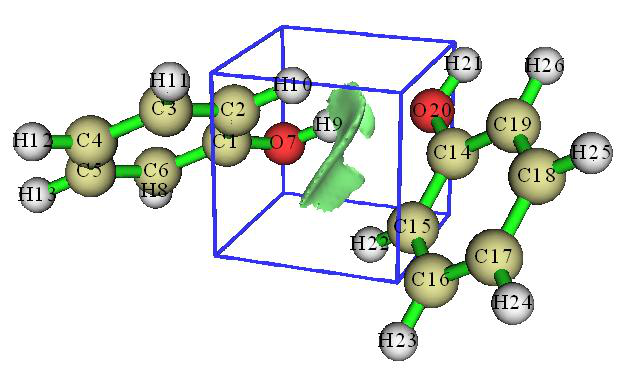
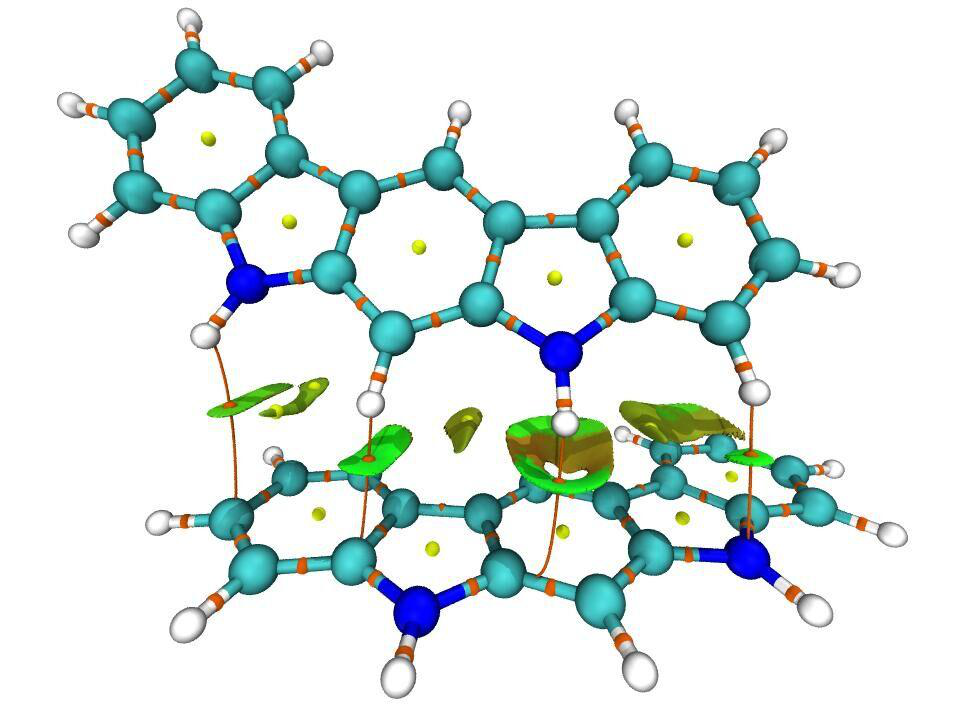
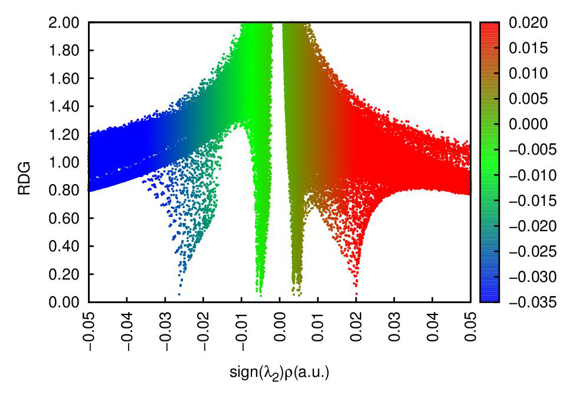
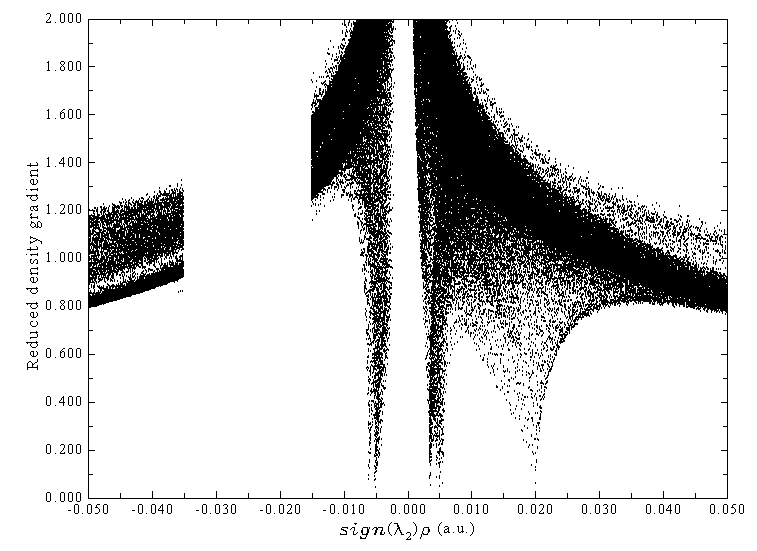
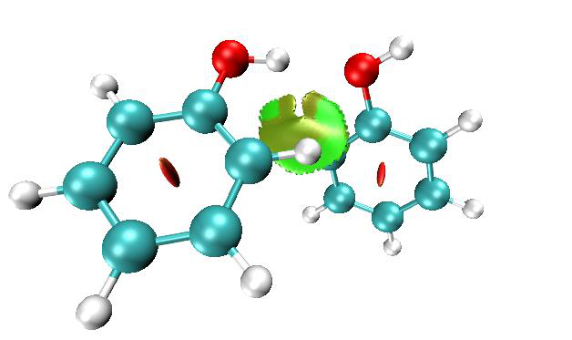
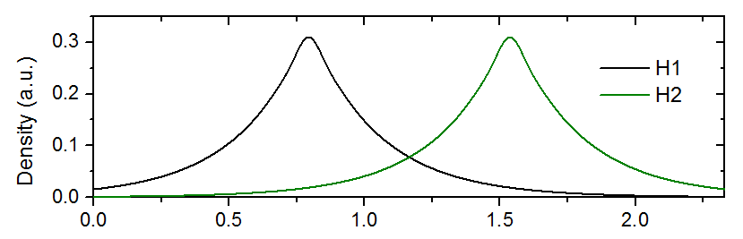
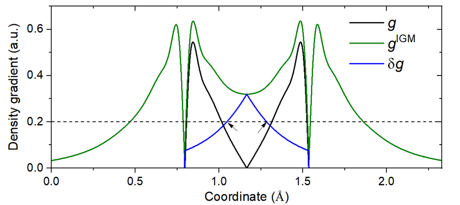

# 3.23 Visual study of weak interaction (20)

> Multiwfn manual, p.310–332. Images: `../imgs/`.

---

<!-- p.310 -->

For closed-shell case, the printed d data are multiplied by a factor of 2, because the LMOs are doubly occupied. For open-shell case, the d of alpha and beta LMOs are printed separately.

As byproducts, dipole moment of the whole system, as well as nuclear contribution and electronic contribution are also printed at the beginning of the LMOdip.txt. It is important to notice that even if there are no more delocalized LMOs, the sum of d of all LMOs is generally unequal to the dipole moment of the whole system.

BTW: In fact, only when sum of the rc vectors in all d equals −∑𝑍𝐴𝐫𝐴𝐴 , namely exactly cancels the nuclear contribution to the system dipole moment, the sum of all d will be equal to the system dipole moment. If one wants to satisfy this point, the (rA+rB)/2 should be employed as rc for all two-center LMOs, and all LMOs should just correspond to a Lewis structure of current system. Of course, these conditions are not met in present implementation of LMO analysis (but met in the “DIPOLE” analysis of NBO theory). Note that if (rA+rB)/2 is taken as rc and meantime you use the d of two-center LMOs to measure bond polarity, ridiculous result will be obtained, for example you will find C-H is even much more polar than O-H!

Examples of orbital localization analysis are provided in Section 4.19. The examples of LOBA/mLOBA method (Section 4.8.4) and Section 4.100.22 also utilized the present function.

Information needed: Atom coordinates, basis functions

## 3.23 Visual study of weak interaction (20)

Visual study of weak interaction has become increasingly popular, and numerous related analysis methods were put forward. Main function 20 of Multiwfn is a collection of these analysis methods.

My article Angew. Chem. Int. Ed., 137, e202504895 (2025) DOI: 10.1002/anie.202504895 and book chapter “Visualization Analysis of Weak Interactions in Chemical Systems” Comprehensive Computational Chemistry, Vol. 2 pp. 240-264. Oxford: Elsevier. DOI: 10.1016/B978-0-12-821978-2.00076-3 are very comprehensive and detailed reviews introducing all methods about visual study of weak interactions, it is strongly recommended to read them.

### 3.23.1 Noncovalent interaction (NCI) analysis (1)

The noncovalent interaction (NCI) method, which is also known as reduced density gradient (RDG) method, is a very popular method for studying weak interaction. The theory of NCI method is described in its original paper J. Am. Chem. Soc., 132, 6498 (2010). In this section, I will detailedly introduce the basic idea of this method and illustrate how to realize it in Multiwfn. If you just want to learn how to plot the color-filled RDG map, you can directly jump to “Part 3” of this section. It is also strongly recommended to look at this video tutorial: https://youtu.be/e4FpVc9ao48, you will very quickly learn how to plot various maps related to the NCI analysis.

If you can read Chinese, you are also suggested to check my blog article "Visual study of weak interactions by Multiwfn" (in Chinese, see http://sobereva.com/68) and "Some key points and common problems of carrying out RDG analysis via Multiwfn+VMD" (in Chinese, see http://sobereva.com/291).

Part 1: Using RDG isosurface to reveal weak interaction regions

<!-- p.311 -->

How to visualize weak interaction? The first thing is to find a way to distinguish weak interaction regions from other regions. From the table given below we can find that if only the regions where the value of reduced density gradient (RDG) function is in the range of 0~medium are preserved, then “Around nuclei” and “Boundary of molecule” regions will be shielded.

Around nuclei Around chemical bond Weak interaction region Boundary of molecule

|ρ(r)| Large 0~Minor 0 ~ Small Very small ~ Small

ρ(r) Large Medium Small 0~Small

RDG(r) Medium 0~Minor 0 ~ Medium Medium ~Very large

The definition of the RDG function is shown below, it is essentially a dimensionless form of electron density gradient norm function

$$\mathrm{RDG}(\mathbf{r})=\frac{1}{2(3\pi^{2})^{1/3}}\frac{\left|\nabla\rho(\mathbf{r})\right|}{\rho(\mathbf{r})^{4/3}}$$

<!-- formula-ocr: formula_p311_218.png 已替换为LaTeX, 原图保留备查 -->

For remaining regions ("Around chemical bond" and " Weak interaction region"), if we only

keep the region where ρ(r) is small, then only weak interaction region will be revealed.

Now I use phenol dimer to exemplify this idea, we will calculate grid data of RDG function and visualize it as isosurface. Boot up Multiwfn and input following commands

examples\PhenolDimer.wfn // Any format containing GTF information can be used as input file, see Section 2.5 for detail

5 // Generate grid data 13 // RDG function 7 // Use middle point of two atoms as center of grid data, this way of defining spatial scope is very suitable for weak interaction analysis

1,14 // The indices of the two atoms are set to 1 and 14, because from molecular structure (see the graph below) we can estimate that the weak interaction region occurs between C1 and C14

40,40,40 // The weak interaction region is small, so 40*40*40=64000 grid is fine enough 3,3,3 // Set extension distance (buffer distance) in all X/Y/Z directions to 3 Bohr -1 // Show the isosurface of RDG Please make sure that the isovalue in the GUI window is set to 0.5, which is suitable for visualizing weak interaction regions (if the isovalue is too small, then RDG isosurface will be too thin and thus ugly; if too large, then unwanted “Around nuclei” and “Around chemical bond” regions will appear). Now you can see the graph below in the GUI window:

<!-- p.312 -->

The green isosurface represents the weak interaction region between phenol dimer very clearly. Notice that by default, RDG function is set to an arbitrarily large value (100.0) where electron density is larger than or equal to 0.05, so that the isosurfaces in the region “around chemical bond” can be shielded. The threshold is determined by “RDG_maxrho” parameter in `settings.ini` file. The default 0.05 is suitable for visualizing weak interaction regions for most cases. If you do not want to enable the screening treatment due to special reason, you can set “RDG_maxrho” to 0.

The cubic blue frame in the graph above shows spatial scope of the calculated grid data, it is only visible when “Show data range” is checked in the GUI window. Because the extension distance from center of the grid data was set to 3.0 Bohr, the side length is 2*3=6 Bohr.

Part 2: Discriminating weak interaction types by filling color to RDG isosurfaces In Bader’s AIM theory, appearance of a (3,-1) type of critical point (CP) usually implies that electron density is locally aggregated, it commonly appears on bond path or between the atoms which have attractive interaction. (3,+1) type of CP often implies that electron density is locally depleted and exhibits steric effect, it generally occurs at center of a ring. The criterion for distinguishing (3,-1) and (3,+1) CPs is the second largest eigenvalue of Hessian matrix of electron

density (referred to as λ2 below). If λ2 exceeds zero, then the CP is (3,+1), else it is (3,-1). Besides, the strength of weak interaction has positive correlation with electron density ρ in the corresponding region. Van der Waals interaction regions always have very small ρ, while the regions corresponding to strong steric effect or evident attractive weak interaction (e.g. H-bond, Halogen bond) always

have relatively large ρ. So, we can define a real space function sign(λ2)ρ, namely the product of sign of λ2 and ρ. If we use different colors to represent value of this function according to below color bar, and map it on RDG isosurfaces, we can not only know where weak interaction occurs, but also intuitively capture the type of the interaction.

<!-- p.313 -->

High-resolution of the above labelled color bar is examples\RGB_bar.png, you can directly embed it into figures of your paper.

Current Multiwfn does not support plotting color-filled isosurface graph, however, we can use

Multiwfn to generate cube file for sign(λ2)ρ and RDG, and then use plotting script of VMD to draw such map. VMD is one of the best visualization tools and can be freely downloaded at http://www.ks.uiuc.edu/Research/vmd. Here I illustrate how to do this for phenol dimer by using subfunction 1 of main function 20. This time we do not only want to study the weak interaction region between the two monomers, but also want to examine the steric effect within in aromatic ring of phenol, therefore the spatial scope of grid data should cover the entire dimer.

Boot up Multiwfn and input following commands examples\PhenolDimer.wfn 20 // Visual study of weak interaction 1 // NCI analysis -10 // Set extension distance in all directions with respect to molecular boundary 0 // Because weak interaction regions only appear in internal region of present system, we do not need to leave a buffer region at system boundary, so we set the extension distance to 0 Bohr

2 // Medium-quality grid (about 512000 points). Because the spatial scope of grid data is evidently larger than last example, we need more grid points than last example, otherwise the RDG isosurfaces will look discrete

I first discuss the characteristics of various kinds of regions via scatter graph, I think it will be helpful to understand the nature and idea of the NCI method. Select option -1 in the post-processing menu, a scatter graph immediately pops up (you can also select option 1 to export this graph as file):

In the graph, the X-axis and Y-axis correspond to sign(λ2)ρ and RDG functions, respectively; each point in the graph corresponds to a grid point in 3D space. There are four spikes, the points at their peaks are just the approximate CP positions in AIM theory. If you draw a horizontal line on the graph as below, then the segments crossing the spikes just correspond to the points used to construct

<!-- p.314 -->

the RDG isosurfaces. Hence, the NCI analysis method can be regarded as an extension of the AIM theory for visual study. The spikes can be classified into three types, I marked them by blue, green and red circles, as shown above.

Then close the scatter map, select option 3 to export grid data of sign(λ2)ρ and RDG as func1.cub and func2.cub in current directory, respectively, then copy the two files as well as the RDGfill.vmd file in “examples” folder to VMD installation directory. The RDGfill.vmd is a plotting script of VMD written by me. Boot up VMD, select "file"-"Load state", choose RDGfill.vmd (alternatively, you can directly input source RDGfill.vmd in console window), you will see the graph below in OpenGL window.

The default RDG isosurface is 0.5, the color range is -0.035 to 0.02. You can manually edit the RDGfill.vmd to change the default settings, the current values are suitable for general cases.

From the color-filled RDG isosurface, we can identify different types of regions by simply examining their colors. Recall the color scale bar I showed previously, the bluer implies the stronger attractive interaction; in current graph it can be seen that the elliptical slab between oxygen and hydrogen atoms shows light blue color, so we can conclude that there is a hydrogen bond, but not very strong. The interaction region marked by green circle can be identified as vdW interaction region, because the mapped color is green or light brown, which shows that the electron density in this region is low. Obviously, the regions at the center of the two rings correspond to strong steric interaction, since they are filled by red.

Part 3: Summary of general steps for generating color-filled RDG map Above I have talked a lot about the NCI analysis. In order to make you clearly and quickly

understand how to plot the sign(λ2)ρ mapped RDG isosurface graph using Multiwfn, below I present the minimum steps to do this, which are suitable for most cases.

Boot up Multiwfn and input xxx.wfn (or wfx/mwfn/fch/molden... file) // Load input file 20 // Visual study of weak interaction 1 // NCI analysis 3 // Please properly define the grid points at this step. “High-quality grid” is usually adequate

<!-- p.315 -->

for small and medium sized system

3 // Export func1.cub and func2.cub Move the two .cub files and examples\RDGfill.vmd to VMD folder. Boot up VMD and input source RDGfill.vmd in console window, then you will see the graph you need.

Part 4: On the grid setting

Here I talk more about grid setting for computing grid data of RDG and sign(λ2)ρ, because this point significantly influences computational cost and quality of the resulting RDG isosurface map.

The total time spent in the calculation is linearly proportional to the total number of grid points, and the quality of RDG isosurface is highly dependent on grid spacing. The smaller the grid spacing, the smoother the resulting isosurfaces. Too large grid spacing will result in severe jaggies at the edges or holes at internal regions of the isosurfaces. It is easy to comprehend, if the box size (i.e. spatial range of grid data) keeps fixed, then the higher number of grid points you set, the smaller the grid spacing will be. Clearly, the box should be properly defined, its spatial range should not be too broad, otherwise the grid spacing will be large and thus lowers the graph quality; it should also not be too narrow, otherwise the interesting RDG isosurfaces may be truncated. The best practice is to make the box just enclose the interesting region. Then, if you can afford high computational cost, you can use as large number of points as possible to improve the final isosurface quality.

Note that the "low/medium/high-quality grid" options in the interface of setting up grid are relative to small or medium sized systems. If the system is huge and you have to employ large box, even "high-quality grid" will correspond to relatively large grid spacing, and thus the graphical quality is not satisfactory. In this case, you should use the option "4 Input the number of points or grid spacing in X,Y,Z, covering whole system" and manually input a reasonable grid spacing value.

Below is an illustration of various grid setting for the phenol dimer system, the value denotes grid spacing. From this plot you can intuitively understand how grid spacing influences the result.

Part 5: Some worth mentioning points about NCI analysis

- Choice of level for generating wavefunction: It is absolutely unnecessary to use large basis set to carry the NCI analysis. Using moderate size of basis set such as def2-SVP or 6-31G** is

<!-- p.316 -->

completely adequate for NCI analysis, further enlarging the basis set is just waste of time. Regarding the choice of theoretical method, using popular DFT functionals such as B3LYP or M06-2X to yield wavefunction is adequate. Although post-HF density is known to be more accurate than DFT density, the improvement in electron density quality can hardly be detected in the final NCI analysis result. You may have known that the computational levels such as B3LYP/6-31G* perform quite poor for weak interactions, however, it never means that using electron density produced at this level is insufficient for NCI analysis, because electron density is never as sensitive as interaction energy to calculation level, and there is not strictly positive relationship between the quality of calculated interaction energy and electron density.

A frequently encountered annoying problem is that unexpected RDG isosurfaces occurred around interesting regions and thus polluted the NCI graph, this makes visual analysis of weak interaction at interesting regions difficult. For example, there is a system consisting of three molecules, we only want to study weak interaction between molecules 1 and 2; however, in the actual generated NCI graph, you may find unwanted isosurfaces corresponding to interactions between 1-3 and 2-3 as well as those corresponding to intramolecular interactions also occur. To screen the uninteresting isosurfaces, you can try to use the methods described in Section 4.13.4; alternatively, you can consider using IGM method instead, which can be completely free of this problem as long as you properly define fragment, see Section 3.23.5 for introduction.

- Domain analysis for RDG: Multiwfn is capable of integrating any real space function within isosurface defined by any real space function, this is known as “domain analysis”. Therefore, you can calculate such as volume and number of electrons enclosed within an isosurface of RDG (or other related functions such as IRI, IGM and IGMH) to try to discuss weak interactions at quantitative level. Introduction of this kind of analysis is provided in Section 3.200.14, illustrative examples are given in Section 4.200.14.

- NCI analysis for huge systems: If you want to apply the NCI analysis to very large systems (e.g. more than 300 atoms), commonly the cost will be extremely high and thus not computationally feasible. One of the best solutions is using promolecular version of NCI analysis or IGM analysis instead, please check Section 3.23.2 and 3.23.5, respectively. Another solution is using Grimme's xtb code to rapidly calculate the system using semi-empirical variant of DFT, and then using the resulting .molden file as input file to perform the NCI analysis, the result should be better than the promolecular NCI result.

- Averaged NCI: If you want to study interaction between a molecule with environmental atoms during molecular dynamics process, the average NCI method should be used instead of performing NCI analysis only for single structure, please check Section 3.23.3 for detail.

- NCI+AIM map: It is also possible to simultaneously plot AIM critical points and bond paths in the color-filled RDG map, so that more information about weak interactions could be revealed, the map below is an example provided by a Multiwfn user. The way of plotting this kind of map is exemplified in Section 4.20.1 and illustrated as part 4 of this video: https://youtu.be/e4FpVc9ao48.

<!-- p.317 -->

- NCI+ELF map: As introduced in Section 2.6 and illustrated in relevant examples in Sections 4.4 and 4.5, the ELF (electron localization function) is very useful function for exhibiting character of chemical bonds. Clearly, plotting NCI maps and ELF isosurfaces together can convey more information. Part 5 of this video tutorial illustrated how to realize this by Multiwfn in combination with VMD: https://youtu.be/e4FpVc9ao48.

Special skill 1: Generating color mapped scatter map It is also possible to map color to scatter map to facilitate identification of correspondence between spikes and RDG isosurfaces. A plotting script of gnuplot program (http://www.gnuplot.info) has been provided as examples\scripts\RDGscatter.gnu, which can realize this purpose. First, select the option "2 Output scatter points to output.txt in current folder" in the post-processing menu to exported output.txt in current folder, then move it and the RDGscatter.gnu into the folder containing gnuplot executable file, then in this folder run command: gnuplot RDGscatter.gnu. After a while you will obtain RDGscatter.ps in this folder, this is a graphic file of postscript format, you can open it using such as Acrobat, Photoshop or Irfanview (ghostscript must be installed in the machine). You can also use online image converter https://cloudconvert.com/image-converter to convert to common image format. The graph should look like this:

<!-- p.318 -->

The default color range in this plotting script is from -0.035 to 0.02, if you intend to correlate this map with RDG color-filled map, you should ensure that the color scale setting in RDGscatter.gnu and RDGfill.vmd are completely identical.

If you find difficulty in reproducing this map, please follow part 2 of this video tutorial: https://youtu.be/e4FpVc9ao48.

Special skill 2: Interactively set RDG value where sign(λ2)ρ is in specific range Multiwfn allows you to interactively set RDG value where sign(λ2)ρ is in specified value range, using this feature you can easily screen unwanted regions. Here I continue the phenol dimer example described in “Part 2” and illustrate how to screen RDG isosurface corresponding to the H-bond from

the graph. From the original scatter map, we find that the H-bond region corresponds to sign(λ2)ρ range of -0.035 ~ -0.015, therefore we can input below command in post-processing menu

-2 // Set RDG value where sign(λ2)ρ in within given data range -0.035,-0.015 // The lower and upper limit of sign(λ2)ρ 100 // Set RDG value in these regions to an arbitrarily large value to screen RDG isosurface Then, if you select option -1 to plot the scatter map again, you will see

<!-- p.319 -->

Clearly the spike corresponding to H-bond no longer exists. We can also export the cube files and use VMD redraw the color-filled map, as shown below, the H-bond RDG isosurface has indeed disappeared.

Notice that the original grid data cannot be retrieved once modified as exemplified above.

Information needed: Atom coordinates, GTFs

### 3.23.2 NCI analysis based on promolecular density (2)

Generating wavefunction and calculating grid data of RDG and sign(λ2)ρ for large system are very time-consuming, which greatly hinders application range of NCI analysis method. Fortunately, it is shown that the NCI analysis based on promolecular density is also reasonable in general. The so-called promolecular density is the electron density approximately constructed by superposing electron density of atoms in their free-state, this is known as “Promolecular approximation”. High-quality free-state atomic electron density for almost all elements in periodic table are predetermined

<!-- p.320 -->

and built-in, hence NCI analysis based on promolecular density can be in principle used for any system in Multiwfn.

To carry out NCI analysis under promolecular approximation, just choose subfunction 2 in main function 20, all operation steps are completely identical to regular NCI analysis. Since only atom coordinate information is required for constructing promolecular density, any input file containing atomic coordinate information can be used as input file, such as the popular .pdb and .xyz formats.

The VMD plotting script for NCI analysis based on promolecular density is offered as examples\RDGfill_pro.vmd, which is slightly different to examples\RDGfill.vmd in the default setting of color scale and isovalue.

By default, RDG value is automatically set to 100.0 where ρ is larger than 0.1 when promolecular approximation is used, this threshold may not be suitable for certain circumstances. You can manually change the threshold by “RDGprodens_maxrho” in `settings.ini`.

Example of performing NCI analysis based on promolecular density is given in Section 4.20.1 and illustrated as part 3 of this video: https://youtu.be/e4FpVc9ao48.

Information needed: Atom coordinates

### 3.23.3 Averaged NCI analysis (aNCI. 3)

Theory In J. Chem. Theory Comput., 9, 2226 (2013), the NCI method described in last sections is extended to analyzing dynamic environment (e.g. molecular dynamics trajectory), resulting in the averaged NCI (aNCI) method. This method was also carefully reviewed in book chapter DOI: 10.1016/B978-0-12-821978-2.00076-3. Present function aims at realizing the aNCI analysis.

The only difference between aNCI and the original NCI method is that in the former, the

electron density ρ and its gradient norm |ρ| are not calculated for only one geometry, but for multiple frames in a trajectory file, then get average (namely 𝜌̅ and ∇𝜌̅̅̅̅). Therefore, the isosurface of averaged reduced density gradient (aRDG)

$$\mathrm{aRDG}(\mathbf{r})=\frac{1}{2(3\pi^{2})^{1/3}}\frac{|\overline{\nabla\rho}(\mathbf{r})|}{\left[\overline{\rho}(\mathbf{r})\right]^{4/3}}$$

can be directly used to reveal the averaged weak interaction regions for a dynamics process.

Similarly, in order to exhibit averaged weak interaction type, in aNCI method, the λ2 term in

sign(λ2)ρ function is obtained as the second largest eigenvalue of the averaged electron density Hessian matrix computed throughout the dynamical trajectory.

aNCI method also defines a new quantity named thermal fluctuation index (TFI) to reveal the stability of weak interaction

$$\mathrm{TFI}(\mathbf{r})=\frac{std[\rho(\mathbf{r})]}{\overline{\rho}(\mathbf{r})}$$

<!-- formula-ocr: formula_p320_219.png 已替换为LaTeX, 原图保留备查 -->

whose numerator is standard deviation of electron density in the dynamical trajectory, which can be calculated as

<!-- p.321 -->

$$s t d[\rho(\mathbf{r})]=\sqrt{\frac{\sum_{i}[\rho_{i}(\mathbf{r})-\overline{\rho}(\mathbf{r})]^{2}}{n}}$$

<!-- formula-ocr: formula_p321_220.png 已替换为LaTeX, 原图保留备查 -->

where n is the number of frames in consideration, ρi is the density calculated based on the geometry of frame i. After mapping TFI on the isosurface of aNCI, the stability of each weak interaction region can be clearly identified by visually examining the colors.

The quality of aNCI graph directly depends on the number of frames that are taken into account. Small number of frames, for example 50 frames, can only leads to inaccurate and very unsmooth isosurface graph. In general, at least 500 frames should be used to generate aNCI graph.

Usage Firstly, note that since calculating electron density based on wavefunction for large number of geometries is very expensive, promolecular approximation is forced to be used in the aNCI analysis function of Multiwfn. This approximation is reasonable and always works well.

The trajectory stored in .xyz file format is acceptable as input file. You can use such as VMD program to convert other format of trajectory files to .xyz trajectory file.

PS: The structure of a multiple frame .xyz file looks like below [Number of atoms in frame 1] [Element, x, y and z of atom 1 in frame 1] [Element, x, y and z of atom 2 in frame 1] ... [Element, x, y and z of atom n in frame 1] [Number of atoms in frame 2] [Element, x, y and z of atom 1 in frame 2] [Element, x, y and z of atom 2 in frame 2] ... [Element, x, y and z of atom n in frame 2] [Number of atoms in frame 3] ...

In all of the frames, the coordinate of the molecule of interest should be fixed. For example, if you want to study the weak interaction between solvents and a benzene molecule, then the position of the benzene must be fixed throughout the whole trajectory. Note that the molecule of interest should be far away from box boundary so that it is always surrounded by environment atoms.

After you enter present function, you will be prompted to input the frame range to be analyzed, for example inputting 140,450 means the frame from 140 to 450 will be used in the aNCI analysis. Then you need to set up grid, the spatial range of the box should properly enclose the molecule of interest. After that, averaged electron density, averaged density gradient and averaged density Hessian will be calculated for each frame, you should wait patiently. Once the calculation is finished, you can use corresponding options to draw scatter graph between averaged NCI and averaged

sign(λ2)ρ, output scatter points, export their cube files, etc. Thermal fluctuation index can also be calculated and exported to a cube file.

An example is given in Section 4.20.3. NOTE: Using aNCI method is generally deprecated, because the amIGM method (Section 3.23.11) is a much better choice in most cases! Mostly because the amIGM allows users to define fragments to specifically study interactions between them, and users do not need to screen out unwanted isosurfaces. Also the isosurfaces of amIGM is smoother than aNCI, and sometimes aNCI is fully failed when amIGM works reasonably. amIGM analysis cost is only two or three times of

<!-- p.322 -->

aNCI. See original paper of amIGM for comprehensive comparison. The only advantage of aNCI is that TFI can be mapped on aNCI isosurfaces, while it is found that the TFI mapping effect on amIGM isosurfaces is not good (often the two sides have significantly different colors).

Information needed: Multiple frames of atom coordinates

### 3.23.4 Density Overlap Regions Indicator (DORI) analysis (5)

Sometimes ELF and RDG are used in combination to simultaneously investigate covalent and noncovalent interactions, see J. Chem. Theory Comput., 8, 3993 (2012) for example. Is it possible to study both kinds of interactions by a single real space function? The answer is yes. In J. Chem. Theory Comput., 10, 3745 (2014) the authors proposed a function named density overlap regions indicator (DORI), it was found that if properly choosing an isovalue, both covalent and noncovalent

interaction regions can be exhibited by DORI isosurface, and sign(λ2)ρ can also be mapped on to DORI isosurfaces to facilitate analysis of the nature of interactions.

The expression of DORI is

$$\mathrm{DORI}(\mathbf{r})=\frac{\theta(\mathbf{r})}{1+\theta(\mathbf{r})}$$

<!-- formula-ocr: formula_p322_221.png 已替换为LaTeX, 原图保留备查 -->

$$\mathrm{DORI}(\mathbf{r})=\frac{\theta(\mathbf{r})}{1+\theta(\mathbf{r})}$$

To plot the sign(λ2)ρ mapped DORI isosurface map, enter subfunction 5 of main function 20, the subsequent operations are exactly identical to NCI analysis. After exporting the grid data of

sign(λ2)ρ and DORI as cube files by option 3 in post-processing menu, you can then copy them along with examples\DORIfill.vmd to VMD folder, then boot up VMD and execute the plotting script DORIfill.vmd to plot the color-filled isosurface map.

I do not recommend to use DORI, because the interaction region indicator (IRI) introduced in Section 3.23.8 is not only defined in a simpler way and thus the computational cost is lower, but also the graphical effect of IRI is significantly better.

An example of performing DORI analysis is given in Section 4.20.5 Information needed: Atom coordinates, GTFs

### 3.23.5 Independent Gradient Model (IGM) analysis based on promolecular density (10)

Preface In Phys. Chem. Chem. Phys., 19, 17928 (2017), Hénon et al. proposed a useful way for visually studying interfragment and intrafragment interactions, it is named as Independent Gradient Model (IGM). Note that currently IGM has three versions:

(1) IGM based on promolecular density. This is the original version of IGM proposed in 2017, the function introduced in this section implements this form of IGM, only molecular structure is

<!-- p.323 -->

needed in the analysis.

(2) IGM based on gradient-based partitioning (GBP). This version was proposed in ChemPhysChem, 19, 724 (2018) and requires actual molecular electron density. This is not supported by Multiwfn.

(3) IGM based on Hirshfeld partition (IGMH). This version was proposed by me, see Section 3.23.6 for details. The IGMH is more expensive than IGM and meantime wavefunction must be provided in input file, the advantage of IGMH is that the result is more meaningful and the graphical effect is significantly better than IGM. Whenever computational cost is affordable, I always suggest using IGMH instead of IGM.

Idea of IGM A complete and easy-to-understand overview of IGM method can be found in J. Comput. Chem., 43, 539 (2022) DOI: 10.1002/jcc.26812 and book chapter DOI: 10.1016/B978-0-12-821978-2.00076-3. Below I only outline the key idea of IGM method. Let us first look at a very simple system, the H2 molecule. The atomic density in free-state of each atom along the molecular axis is shown below

From the graph above one notices that the gradient of atomic density of the two atoms in the interatomic region have opposite signs. For example, at the position of X=1.2, the density gradient of H1 is negative, while that of H2 is positive. Therefore, in the gradient of promolecular density (the curve g in the following map), the contributions from the two atoms are largely cancelled with each other in the region between the two atoms. Note that at the midpoint of the two hydrogens, g is exactly zero, such point corresponds to bond critical point (BCP) in AIM theory under promolecular density.

In the map above, the gIGM is IGM type of density gradient, it is calculated as sum of absolute value of density gradient of each atom in their free-states; in other words, phase is ignored and thus

<!-- p.324 -->

the density gradients originating from various atoms do not cancel with each other. Due to this feature, gIGM is upper limit of g.

δg function is defined as the difference between gIGM and g, it is plotted as deep blue curve in the map above. It can be seen that δg is non-zero in the interatomic interaction region, and has maximum value at the midpoint of the bond. Clearly, δg could be used to reveal interaction regions like IRI function (see Section 3.23.8). In addition, as will be illustrated in the examples in Section

4.20.10, magnitude of δg in interaction region has close relationship with interaction strength.

For three-dimensional cases, gIGM and δg can be defined as follows

$$g(\mathbf{r})=\left|\sum_{i}\nabla\rho_{i}^{\mathrm{f r e e}}(\mathbf{r})\right|\qquad g^{\mathrm{I G M}}(\mathbf{r})=\sum_{i}\left|\nabla\rho_{i}^{\mathrm{f r e e}}(\mathbf{r})\right|$$

free stands for spherically averaged density of atom i in its free state. Such atomic density for almost all elements is directly available in Multiwfn, see Appendix 3 for detail. The 𝜌𝑖

Based on the idea of gIGM and δg, the IGM method also defines δginter and δgintra aiming to study interfragment and intrafragment interactions, respectively

$$g^{\mathrm{IGM,inter}}(\mathbf{r})=\sum_{A}\left|\sum_{i\in A}\nabla\rho_{i}^{\mathrm{free}}(\mathbf{r})\right|$$

in which

$$g^{\mathrm{inter}}(\mathbf{r})=\left|\sum_{A}\sum_{i\in A}\nabla\rho_{i}^{\mathrm{free}}(\mathbf{r})\right|$$

<!-- formula-ocr: formula_p324_222.png 已替换为LaTeX, 原图保留备查 -->

$$g^{\mathrm{IGM,inter}}(\mathbf{r})=\sum_{A}\left|\sum_{i\in A}\nabla\rho_{i}^{\mathrm{free}}(\mathbf{r})\right|$$

where A and i are index of fragments and atoms, respectively. The fragments can be arbitrarily defined according to character of actual system and research purpose. Note that the above

expressions of δginter and δgintra are general forms proposed by me and implemented in Multiwfn, they were not explicitly given in the IGM original paper.

The idea of δginter is easy to understand from above formula. One first calculates density gradient in usual way as ginter, and then calculates the gIGM,inter, which ignores cancellation effect of density gradient of various fragments due to possible different phases; then the difference between

gIGM,inter and ginter, namely δginter, must be able to reveal the interaction between the fragments. The δg reveals all kinds of interactions in present system, irrespective of the type is interfragment or intrafragment. Therefore, if δginter is subtracted from δg, the remaining part, namely δgintra, must be capable of revealing intrafragment interactions.

In Section 3.23.1, it is shown that interaction region and interaction type can be simultaneously

exhibited by plotting RDG isosurface map colored by sign(λ2)ρ function. Similarly, if sign(λ2)ρ function is mapped on δginter and δgintra isosurfaces using various colors, the type and position of inter- and intra-fragment interactions could also be vividly revealed.

Quantitative indices of atoms and atomic pairs

I define atomic pair δg index (δGpair) to quantify the contribution of atomic pair to interaction between two fragments (A and B)

<!-- p.325 -->

$$\delta G_{i,j}^{\mathrm{pair}}=\int\delta g_{i,j}(\mathbf{r})\mathrm{d}\mathbf{r}=\int[g_{i,j}^{\mathrm{IGM}}(\mathbf{r})-g_{i,j}(\mathbf{r})]\mathrm{d}\mathbf{r}\quad i\in A,j\in B$$

where

$$g_{i,j}(\mathbf{r})=\left|\nabla\rho_{i}^{\mathrm{f r e e}}(\mathbf{r})+\nabla\rho_{j}^{\mathrm{f r e e}}(\mathbf{r})\right|$$

$$g_{i,j}^{\mathrm{IGM}}(\mathbf{r})=\left|\nabla\rho_{i}^{\mathrm{free}}(\mathbf{r})\right|+\left|\nabla\rho_{j}^{\mathrm{free}}(\mathbf{r})\right|$$

It is also useful to define percentage atomic pair contribution to interfragment interaction as

$$\delta G_{i,j}^{\mathrm{pair}}(\%)=\frac{\delta G_{i,j}^{\mathrm{pair}}}{\sum\limits_{k\in A}\sum\limits_{l\in B}\delta G_{k,l}^{\mathrm{pair}}}\times100\%$$

Since definition of δGpair(%) is so simple, it is certainly not expected that it is able to accurately represent contribution of atomic pairs to interaction energy between two fragments, however

δGpair(%) should be able to identify “hot” atomic pairs, which may indeed have large actual contribution to interfragment binding.

I also defined atomic δg index (δGatom) to quantify importance of atom to interfragment interaction

$$\delta G_{i}^{\mathrm{atom}}=\sum_{j\in B}\delta G_{i,j}^{\mathrm{pair}}$$

<!-- formula-ocr: formula_p325_223.png 已替换为LaTeX, 原图保留备查 -->

The percentage atomic contribution could be defined as

$$\delta G_{i}^{\mathrm{atom}}=\sum_{j\in B}\delta G_{i,j}^{\mathrm{pair}}$$

When plotting molecule structure, if atoms are colored according to the δGatom or δGatom(%), the relative importance between various atoms to interfragment interaction can be vividly exhibited.

Inspired by the IBSI (intrinsic bond strength index) introduced in Section 3.11.9, I defined IBSIW (IBSI for weak interaction) as follows

GIBSIW i jdδ=× 2,( , )100() i j i j pair ,

where di,j is distance between atoms i and j in Å. My preliminary test showed that IBSIW has somewhat better ability to distinguish interaction strengths. Clearly, the larger the IBSIW, the

stronger the interaction. Since in Multiwfn the δGpair is given in a.u., the formal unit of IBSIW should be a.u./Å2.

Advantage of IGM over NCI According to my viewpoint and experiences, the advantage of IGM method over the popular NCI method can be summarized as follows:

·The inter- and intra-fragment interactions can be studied individually and thus mutual interference is avoided

·Calculation of the functions defined by IGM method is rather fast and only dependent of geometry, thus the method can be applied to broad range of systems (Note that NCI also has a promolecular approximation version).

·As will be shown in the examples in Section 4.20.10, the isosurface graph given by the IGM

<!-- p.326 -->

method is smoother than the NCI map, and thus the IGM map has low requirement on grid spacing. In contrast, NCI graph is prone to ugly jaggies and holes when the grid points are sparse.

·Contribution of atoms and atomic pairs to interfragment interaction can be quantified, and the former can be vividly rendered on molecular structure, these features make identification of "hot" atoms easy.

·The value of δg function in interaction region directly reflects interaction strength. In

particular, I found δg at bond critical point of AIM theory is a good quantitative indicator of strength of corresponding interaction.

Usage of IGM analysis in Multiwfn Using Multiwfn to carry out IGM analysis is extremely easy and flexible. First, you should load a file containing atomic coordinates. The most commonly used formats such as .xyz, .pdb and .mol are all supported by Multiwfn (of course, any wavefunction file such as .wfn and .fch can also be used). Notice that the geometry must have been optimized using proper theoretical level, otherwise the IGM result may be misleading.

IGM module is subfunction 10 of main function 20, after you enter this module, you should define fragments. The definition of fragments is quite flexible, you can define any number of fragments (at least one fragment). No atom can be shared by two or more fragments. The union set of defined fragments is not forced to be equal to the whole system, only the atoms in the defined fragments will be finally taken into calculation.

Next, you need to set up grid, it is better to make the box just enclose the region where the interesting interactions may occur. Some advice about setting grid are given in Section 3.23.1.

`IGM_inter.vmd`

Once the calculation of grid data is complete, Multiwfn will show integrals of δg, δginter and δgintra over the whole space, and then post-processing menu appears.

The options in post-processing menu are self-explanatory, I will briefly describe them here:

-1: Suboptions 1, 2 and 3 of this option are used to draw scatter map of δg, δginter, δgintra vs. sign(λ2)ρ, respectively. While suboption 4 is used to draw δginter and δgintra vs. sign(λ2)ρ simultaneously with different colors. As shown in the original paper of IGM, this kind of map is

useful for discussing details about interactions (recall that RDG vs. sign(λ2)ρ scatter map is frequently involved in NCI analysis). If you want to directly save the scatter map in current folder as graphic file, use option 1. If the default axis range is not appropriate, use option -2 or -3 to adjust.

2: If you want to draw scatter map using third-part softwares such as Origin and gnuplot, use

this option to export data of δg, δginter, δgintra and sign(λ2)ρ to plain text in current folder. Meaning of each column of this file is shown on screen.

3: Output grid data of sign(λ2)ρ, δg, δginter and δgintra to cube file in current folder. After exporting the cube files, you can use IGM_inter.vmd and IGM_intra.vmd scripts in "examples"

folder to draw color-filled δginter and δgintra isosurfaces map in VMD, respectively. See examples of Section 4.20.10.

`IGM_inter.vmd`

<!-- p.327 -->

Multiwfn.

5: This option is used to set δgintra to zero where sign(λ2)ρ is not within specified value range. By this option uninterested regions could be screened from δgintra scatter and isosurface maps. For example, we merely want to study weak intrafragment interactions, then we can input the range

corresponding to relatively small value of sign(λ2)ρ. (The aim of this option resembles the “RDG_maxrho” parameter used in NCI analysis)

6: This option is used to evaluate quantitative indices. If you have defined more than two fragments, here you need to choose two fragments for which the indices will be calculated. Multiwfn

will compute δg grid data of every atomic pair between the two fragments and calculate integral of the δg function to derive the indices. The integrals are calculated using Becke's multi-center integration method, there are several choices of integration grids, the better the grid, the more accurate the result, but the higher the cost. Once the calculation is complete, atmdg.txt will be

outputted to current folder, which records all δGatom, δGatom(%), δGpair and δGpair(%), the values are sorted from high to low. The sum of all δGpair is also outputted at the end. Then the program asks you if also outputting atmdg.pdb in current folder, which contain coordinate of all atoms in present system. The "beta" and “occupancy” fields (the data in the second and third columns from last) of

this file correspond to atom δg index multiplied by 10 and percentage atom δg index, respectively. Clearly, if you load one of them into VMD visualization program and color the atoms according to “beta” or “occupancy” property, then relative importance of various atoms to interfragment interactions can be intuitively identified.

At the same time of outputting atmdg.txt, IBSIW indices for atom and atomic pairs are also exported to IBSIW.txt in current folder.

7&8: These two options are used to set value of δg and δginter functions respectively if the sign(λ2)ρ at corresponding grid is out of specific range. Clearly, these options are useful when you want to screen unwanted region from IGM isosurface map. For example, you only want to visualize

isosurface of δginter where sign(λ2)ρ is within -0.04 ~ -0.025 a.u., then you can enter option 8, input -0.04,-0.025 and then input 0 to set δginter of these grids to zero; next, you can plot the updated scatter map or export cube files to visualize IGM map in VMD.

If your input file contains GTF or basis function information (e.g. mwfn, .wfn, .fch, .molden),

when carrying out IGM analysis, Multiwfn will let you choose the type of the sign(λ2)ρ to be used, the first one is that based on actual electron density, the second one is that based on promolecular density. Using the former should give more meaningful result, however, calculation the cost for the former is evidently higher than that of the latter (if your input file only contains atomic coordinate information, the latter one is always used).

Several examples of IGM analysis are given in Section 4.20.10. More discussions and instances about IGM method can be found in my blog article "Investigating intermolecular weak interactions via Independent Gradient Model (IGM)" (in Chinese, http://sobereva.com/407).

Information needed: Atom coordinates

<!-- p.328 -->

### 3.23.6 IGM analysis based on Hirshfeld partition of molecular density (IGMH) (11)

As shown in Section 3.23.5, the original version of IGM is calculated purely based on density of atoms in their free states, namely promolecular approximation is used. A different form of IGM was proposed by me named as "IGM based on Hirshfeld partition of molecular density" (IGMH). A very detailed article introducing theory background of IGMH and containing very rich examples is J. Comput. Chem., 43, 539 (2022) DOI: 10.1002/jcc.26812. An erratum about implementation was later published as ChemRxiv (2022) DOI: 10.26434/chemrxiv-2022-g1m34. Please cite these papers if your research utilizes IGMH analysis. IGMH method was also comprehensively reviewed in my book chapter DOI: 10.1016/B978-0-12-821978-2.00076-3 and my article Angew. Chem. Int. Ed., 137, e202504895 (2025) DOI: 10.1002/anie.202504895.

Theory The key difference compared to IGM is that, in IGMH the atomic densities involved in

definition of δg, δginter and δgintra are derived based on Hirshfeld partition, namely 𝜌𝑖 Hirsh(𝐫) =𝜌(𝐫)𝑤𝑖(𝐫), where ρ is the electron density of the whole system calculated based on wavefunction, and the Hirshfeld weighting function of atom i is expressed as

$$w_{i}(\mathbf{r})=\frac{\rho_{i}^{\mathrm{f r e e}}(\mathbf{r})}{\rho^{\mathrm{p r o}}(\mathbf{r})}=\frac{\rho_{i}^{\mathrm{f r e e}}(\mathbf{r})}{\sum_{j}\rho_{j}^{\mathrm{f r e e}}(\mathbf{r})}$$

free is spherically averaged electron density of atom i in its free state, 𝜌pro corresponds to promolecular density, the index j loops over all atoms. It is important to note that the Cartesian where 𝜌𝑖

IGMH term involved in IGMH is not evaluated in the mathematically correct way as components of the ∇𝜌𝑖

$$\frac{\partial\rho_{i}^{IGMH}}{\partial\mu}=\frac{\partial(\rho w_{i})}{\partial\mu}=w_{i}\frac{\partial\rho}{\partial\mu}+\rho\frac{\partial w_{i}}{\partial\mu}\quad(\mu=x,y,z)$$

<!-- formula-ocr: formula_p328_224.png 已替换为LaTeX, 原图保留备查 -->

but evaluated in the following special way (see ChemRxiv (2022) DOI: 10.26434/chemrxiv-2022-g1m34 for detailed information)

$$\frac{\partial\rho_{i}^{Hirsh}}{\partial\mu}=w_{i}\frac{\partial\rho}{\partial\mu}-\rho\frac{\partial w_{i}}{\partial\mu}\quad(\mu=x,y,z)$$

In the IGMH analysis, the sign(λ2)ρ function is always calculated based on actual electron density rather than promolecular density. Clearly IGMH is evidently more expensive than IGM, since both gradient and Hessian of actual electron density must be evaluated.

Advantages of IGMH The significant advantages of IGMH over IGM are three:

(1) The graphical effect of isosurface map is much better. The isosurfaces of δg or δginter function defined in IGM are often too bulgy, and sometimes the color according to mapped function

sign(λ2)ρ on them are unreasonable; in contrast, the shape of the δg function calculated in terms of IGMH is thinner and thus easier to examine and compare, at the meantime the misleading coloring issue is always avoided.

It is worth to note that the isosurface of δg in IGMH is close to the isosurface of reduced density gradient (RDG), which is employed in the NCI method (see Section 3.23.1). The advantage of the former is that the isosurface looks

<!-- p.329 -->

much smoother under the same grid spacing, and unsightly jagged edges in the RDG isosurface is greatly avoided.

(2) The physical meaning of IGMH is more rigorous than IGM, since all factors that influence distribution of electron density during formation of the system have been intrinsically taken into account.

(3) For some chemical bond interactions, IGM completely fails to reveal their real characters since electron distribution changes significantly during formation of bonds, while IGM is fully based on promolecular approximation and thus ignores this crucial effect. In contrast, IGMH, has a markedly better capability in revealing chemical bonds, see original paper of IGMH for comparison.

Due to above reasons, using IGMH instead of IGM is always strongly recommended if the system is not quite large and thus the computational cost is affordable. Even if IGMH is too expensive or wavefunction is not available, it is strongly recommended to use the mIGM described in Section 3.23.10 instead of IGM, because mIGM has graphical effect nearly as good as IGMH in most cases, while the cost is basically the same as IGM, and mIGM only needs atomic information like IGM.

Usage The use of the present function, namely subfunction 11 of main function 20, is exactly the same as the IGM function, see Section 3.23.5 for introduction of various options.

It is also worth noting that δginter of IGMH is also a stand-alone function, which corresponds to the 91th user-defined function. Therefore, you can easily check its value at bond critical points in topology analysis module, plotting it as plane map in main function 4, etc. Before using it, you must first enter option 16 of main function 1000 (a hidden function) to define two fragments.

Example of using IGMH analysis is given in Section 4.20.11. Information needed: Atom coordinates, GTF information

### 3.23.7 Visualization of van der Waals potential (6)

Please check my paper for full description of idea, implementation and application of the van der Waals (vdW) potential analysis: J. Mol. Model., 26, 315 (2020) DOI: 10.1007/s00894-020-04577-0. This analysis was also illustrated in my review Angew. Chem. Int. Ed., 137, e202504895 (2025) DOI: 10.1002/anie.202504895. Here I only briefly introduce this function in a nutshell.

Recall that the vdW interaction energy between two atoms A and B is usually expressed in terms of Lennard-Jones potential in below form

$$E_{AB}^{\mathrm{vdW}}=E_{AB}^{\mathrm{repul}}+E_{AB}^{\mathrm{disp}}=\varepsilon_{AB}\left(\frac{R_{AB}^{0}}{r_{AB}}\right)^{12}-2\varepsilon_{AB}\left(\frac{R_{AB}^{0}}{r_{AB}}\right)^{6}$$

where the potential well ε and equilibrium distance R0 are dependent of atom types. The two components of EvdW, namely Erepul and Edisp, correspond to exchange-repulsion and dispersion interaction, respectively.

I define vdW potential of a chemical system as follows

<!-- p.330 -->

$$V^{\mathrm{vdW}}(\mathbf{r})=V^{\mathrm{repul}}(\mathbf{r})+V^{\mathrm{disp}}(\mathbf{r})=\sum_{A}\varepsilon_{AB}\left(\frac{R_{AB}^{0}}{|\mathbf{R}_{A}-\mathbf{r}|}\right)^{12}+\sum_{A}\left[-2\varepsilon_{AB}\left(\frac{R_{AB}^{0}}{|\mathbf{R}_{A}-\mathbf{r}|}\right)^{6}\right]$$

where B can be regarded as probe atom. The Vrepul and Vdisp denote repulsion and dispersion potentials, respectively.

In the implementation in Multiwfn, the vdW parameters from UFF forcefield are employed, this is because the elements supported by UFF almost cover the whole periodic table (H~Lr), and the parameters are only dependent of elements, thus the problem in assigning atom types is fully avoided. The element index of the probe atom can be set by "ivdwprobe" in `settings.ini`, the default is carbon (i.e. ivdwprobe=6). If the "ivdwprobe" is set to 0, then program will ask you to input element name of probe atom when entering this function.

The vdW potential can be easily calculated by subfunction 6 of main function 20, the unit of result is kcal/mol. In this function, you need to first select grid setting, then grid data of VvdW, Vrepul and Vdisp will be calculated, then you can visualize their isosurfaces or export them as cube files by corresponding options.

Note that the VvdW, Vrepul and Vdisp also directly correspond to user-defined functions, 92, 93 and 94, respectively.

Example of visualization and analysis of VvdW is given in Section 4.20.6. Information needed: Atom coordinates

### 3.23.8 Interaction region indicator (IRI) and IRI-pi analysis (4)

Please read my original paper describing interaction region indicator (IRI) and IRI-π, namely Chemistry−Methods, 1, 231 (2021) DOI: 10.1002/cmtd.202100007, in which the idea of IRI, comparison with other methods as well as many illustrations are given. IRI-π was also introduced in this paper. In addition, the IRI and IRI-π methods have been reviewed in Angew. Chem. Int. Ed., 137, e202504895 (2025) DOI: 10.1002/anie.202504895 and my book chapter DOI: 10.1016/B978-0-12-821978-2.00076-3, it is strongly recommended to read them.

Features of IRI The IRI is defined as follows

( ) |( ) | /[ ( )]aIRIρρ= rrr

where a corresponds to "uservar" in `settings.ini`. If "uservar" is set to 0, then a will be the recommended value 1.1.

IRI is able to clearly reveal both chemical bond regions and weak interaction regions by its isosurfaces (usually isovalue of 1.0 is recommended), this point is similar to the DORI introduced in Section 3.23.4. Indeed, the isosurface maps of IRI and DORI have similar characters, however IRI is always preferred over DORI due to the two evident advantages:

(1) The definition of IRI is much simpler, only electron density and its gradient are needed, while DORI also requires Hessian of electron density. Clearly, evaluation of IRI is thus cheaper than DORI.

<!-- p.331 -->

(2) The graphical effect of IRI isosurface is significantly better than DORI. This point can be easily recognized from the comparison between IRI and DORI in the original paper of IRI.

It is worth to note that if the parameter a is set to 4/3, then IRI only differs from RDG by a constant prefactor. Though the difference is trivial, the RDG isosurfaces is unable to simultaneously clearly reveal weak interactions and chemical bond regions under a single isovalue like IRI.

It is sometimes observed that IRI isosurfaces occur in uninterested extremely low ρ regions. To screen them in the isosurface map at commonly used isovalue (around 1.0), IRI is set to a large

value (5) if ρ is equal or smaller than “IRI_rhocut” in `settings.ini`. The default value 0.00005 a.u. commonly works well.

IRI analysis in Multiwfn

Like NCI, IGM and DORI analyses, sign(λ2)ρ can also be mapped to IRI isosurfaces to visually distinguish the nature of interactions. To plot such a map, you should

(1) Enter subfunction 4 of main function 20 (2) Select proper grid setting, then in the post-processing menu export the grid data to func1.cub and func2.cub

(3) Copy the two cube files as well as examples\IRIfill.vmd to VMD installation folder (4) Boot up VMD and input source IRIfill.vmd in the console window to run the script. IRI function corresponds to the 24th real space function. You can also use main function 4 to plot it as plane map, performing basin analysis on IRI to find its minima by main function 17, and so on.

On the IRI-π IRI-π is a byproduct in my study of IRI, it is simply defined as the IRI calculated based on π electron. In the aforementioned my Chemistry−Methods paper, IRI-π is shown to be able to nicely distinguish type of π interactions and reveal π interaction strengths. A good application example of IRI-π is my paper Chem. Eur. J. (2022) DOI: 10.1002/chem.202103815, from which you can see that IRI-π is able to clearly represent π interaction of different C-C bonds in C18(CO)n (n = 2,4,6) molecules.

To evaluate IRI-π, you simply need to set occupancy of other orbitals to zero prior to the calculation of IRI.

A complete and detailed document showing how to perform various kinds of IRI and IRI-π analyses can be downloaded here: http://sobereva.com/multiwfn/res/IRI_tutorial.zip. A very simple

example showing the procedure of plotting IRI isosurface map colored by sign(λ2)ρ is given in Section 4.20.4.

Information needed: Atom coordinates, GTF information

### 3.23.9 Averaged independent gradient model (aIGM) analysis (12)

Averaged IGM (aIGM) was proposed by Tian Lu, it is an extension of the standard IGM analysis (Section 3.23.5) to dynamic environment. aIGM has been described in Struct. Bond., 190, 297 (2026) DOI: 10.1007/430_2025_95 and in review article DOI: 10.1016/B978-0-12-821978-

<!-- p.332 -->

2.00076-3, please cite them if aIGM is employed in your work.

The relationship between IGM and aIGM is exactly the same as that between mIGM (Section 3.23.10) and amIGM (3.23.11). So amIGM will not be described here detailedly, please just check Section 3.23.11.

The amIGM has significantly better graphical effects than aIGM (just like mIGM is much better than IGM), while aIGM is only slightly cheaper than amIGM, so aIGM is useless! Always use amIGM instead!

The use of aIGM is exactly the same as amIGM, see the amIGM example in Section 4.20.13. The only difference is that you should select subfunction 12 rather than -12 in main function 20.

Information needed: Multiple frames of atom coordinates

### 3.23.10 Modified IGM (mIGM) analysis (-10)

The present section introduces the modified IGM (mIGM) by Tian Lu in Struct. Bond., 190, 297 (2026) DOI: 10.1007/430_2025_95, which is another variant of IGM. The idea of mIGM is very simple: Calculating all terms in the same way as IGMH, except that using promolecular density instead of the actual molecular density. So, mIGM only depends on atomic coordinates like IGM, and its computational cost is basically the same as IGM. At least for studying weak interactions, the isosurfaces and coloring effect of mIGM is nearly the same as IGMH. Therefore, when IGMH cannot be used due to high computational cost or unavailability of wavefunction, mIGM is the best alternative.

The use of mIGM is exactly the same as IGM, the only difference is that you should choose subfunction -10 rather than subfunction 10 in main function 20.

An example of mIGM analysis is given in Section 4.20.12. Information needed: Atom coordinates

### 3.23.11 Averaged modified IGM (amIGM) analysis (-12)

Averaged mIGM (amIGM) was proposed by Tian Lu in Struct. Bond., 190, 297 (2026) DOI: 10.1007/430_2025_95, it is an important extension of mIGM analysis (Section 3.23.10) to dynamic environment, so that the average interactions between two or more specific fragments in molecular dynamics simulation can be visually studied.

amIGM defines a real space function 𝛿𝑔̅inter, which measures average interactions between a set of user-defined fragments and is defined as

intermIGM,inter( )( )ggδδ=rr

the < > symbol stands for time average for all considered trajectory frames.

Usually, amIGM analysis is performed by plotting 𝛿𝑔̅inter isosurface map colored by averaged sign(λ2)ρ, which is calculated based on promolecular electron density and its derivatives averaged
