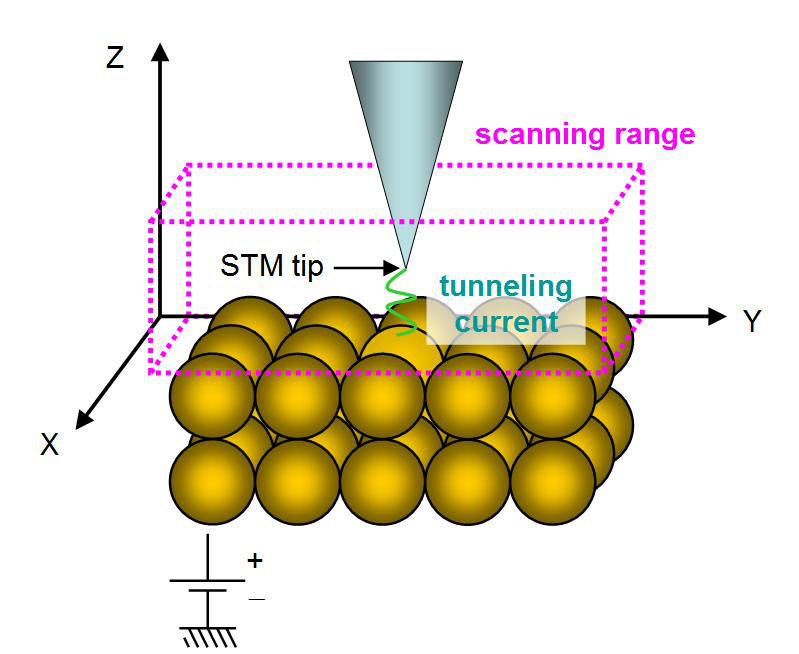
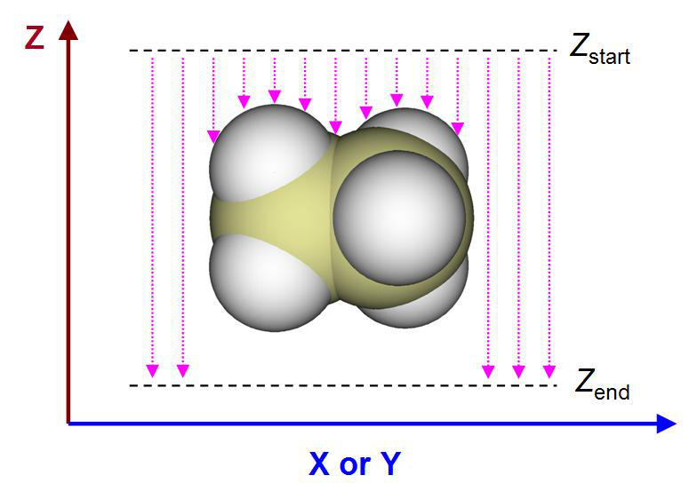

# 3.300 Other functions, part 3 (300)

> Multiwfn manual, p.437–457. Images: `../imgs/`.

---

<!-- p.437 -->

it based on energies and coefficient matrix of MOs via F=SCEC-1 relationship (2) Input path of a file containing F, then the matrix will be loaded, see Appendix 7 of this manual for details. After that, energies of NAdOs will be evaluated during generation of NAdOs and recorded to NAdOs.mwfn.

Examples of using BOD and NAdO to analyze practical chemical systems are given in Section 4.200.20.

Information needed: Atom coordinates, basis function.


### 3.200.21 Perform Löwdin orthogonalization between occupied orbitals

Sometimes, occupied orbitals are not orthonormal with each other. For example, the wavefunction combined from multiple monomer wavefunctions via the function described in Section 3.100.19 is an instance. The present function performs Löwdin orthogonalization between occupied orbitals, so that they form an orthonormal set. Coefficient matrix and density matrix in memory will be updated in this function.

This function only supports restricted closed-shell and unrestricted open-shell form of single-determinant wavefunction. For the latter case, Löwdin orthogonalization is performed between alpha occupied orbitals and between beta occupied orbitals respectively.

Information needed: Atom coordinates, basis function.


## 3.300 Other functions, part 3 (300)


### 3.300.1 Viewing free regions and calculating free volume in a cell

This function is used to visualize free regions in a cell generated by molecular dynamics simulation or in an experimental crystal. The volume of the free regions can also be calculated. This function is particularly for characterizing structure of systems containing pores, such as porous materials and coal.

Algorithm This function calculates the following two types of grid data, their isosurfaces are used to graphically exhibit free regions, in other words, the regions that are not occupied by atoms.

(1) Raw grid data Value of all grid points is initially set to 1, then all grid points are looped, if distance between a grid and any atom is smaller than Bondi van der Waals (vdW) radius of this atom, then this grid point will have value of 0, indicating already occupied.

The volume of free region, namely free volume, is calculated as the total number of occupied grid points multiplied by grid volume. The percentage of occupancy is obtained by dividing free volume by volume of the whole cell.

(2) Smoothed grid data


<!-- p.438 -->

The isosurface of raw grid data is always unsmooth, and thus graphical effect is quite poor. In order to circumvent this issue, smoothed grid data can be calculated. The idea is simple: Each atom does not have a clear boundary, but represented as a switching function, which varies smoothly. Three switching functions are supported, they all decay from 1.0 to 0.0 as radial distance from nucleus goes from 0 to infinity, and their decaying behaviors are affected by related parameters:

- Gaussian function (unnormalized). See Wikipedia for original expression of Gaussian function. The larger the full width at half maximum (FWHM), the slower the function decays

- Becke function (transformed). See Section 3.18.0 for original expression of this function. The smaller number of iterations, the slower the function decays

- Error function (transformed). See Wikipedia for original expression of error function. The larger the scale factor, the slower the function decays

In order to visually compare them, the characters of these functions are plotted together below. The position where they equal to 0.5 is set to vdW radius of carbon

As you can see, Gaussian function decays slowly, while transformed Becke and error functions vary relatively sharply, and the sharpness is dependent on parameter.

With the switching function, the smoothed grid data can be calculated easily: For any grid point, its value is initially set to be 1.0, which will be subtracted from the switching function value of each atom; then if the value is found to be negative, it will be set to zero. Value of 0.0 and 1.0 implies that this grid is fully occupied and free, respectively; while value between 0.0 and 1.0 indicates that the grid is partially occupied, and the lower the value, the higher the occupancy. In order to visualize free region based on the smoothed grid data, commonly isovalue can be set to 0.5, but it can be properly adjusted to improve graphical effect.

Usage This function supports any kind of cell, including non-orthogonal ones. You can use any kind of file containing cell information as input file, such as .cif, .gro, .pdb with CRYST1 field, and so on, see Section 2.9.3 for full introduction about this point. Other kinds of files carrying atom information can also be used as input file, but the cell will be assumed to be orthogonal.

After loading input file, you should enter subfunction 1 of main function 300, then you can see a menu, the options are described below

- 1 Set grid and start calculation: After selecting this option, Multiwfn will ask you to define


<!-- p.439 -->

the grid for calculation, you need to input coordinate of origin, length and grid spacing in all three directions of the grid data. If the input file contains cell information, the three directions will be in line with the three sides of the cell; if does not contain, the three directions will be assumed to X, Y, and Z.

After that, Multiwfn starts to calculate the grid data mentioned above, and then free volume and the percentage of free region in the whole cell are outputted. In the post-processing menu, you can directly visualize isosurface to examine free regions or export grid data as cube file.

- 2 Toggle considering periodic boundary condition: When status of this option is "Yes", periodic images of the atoms in the box will be taken into account during calculating the grid data. This treatment makes calculation much more expensive but results in much more realistic data.

- 3 Toggle calculating smoothed grid data of free regions: By default, Multiwfn generates both raw grid data and smoothed grid data. If status of this option is set to "No", then only the former will be generated, and the cost will thus be reduced by a fraction.

- 4 Set method of smoothing: In this option you can choose the switching function used for calculating smoothed grid data. The default one is error function with scale factor of 1.0, usually this is a suitable choice.

- 5 Toggle making isosurface closed at boundary: When status is set to "Yes", if there are isosurfaces at box boundary, the isosurfaces will look closed. If the status is switched to "No", then the isosurfaces will look open at boundary.

- 6 Set scale factor of vdW radii for calculating free volume and primitive free region: If value of this option is not the default 1.0 rather than set to a value x, then the vdW radii used for calculating raw grid data will be scaled by x. Clearly this option affects isosurface of raw grid data and calculated free volume.

The efficiency of the code of this function is high, and it is possible to use this function to study a system containing even tens of thousands of atoms. When you find the computational cost is too high to afford, you should consider the solutions below:

(1) Using better CPU. The code of this function is fully parallelized, therefore the more the CPU cores, the lower the calculation time.

(2) Using larger grid spacing. Clearly, the larger the spacing, the poorer the isosurface map and worse the accuracy of the outputted free volume.

(3) Do not take periodic boundary condition into account. The cost will be reduced by one order of magnitude, however the isosurfaces at some boundary regions will become artificial, and free volume will even be misleading.

An example of using this module is given in Section 4.300.1. Information needed: Atom coordinates


### 3.300.2 Fitting atomic radial density as linear combination of multiple STOs or GTFs


This function is used to fit atomic radial density as linear combination of multiple 1s-type Slater


<!-- p.440 -->

type orbitals (STOs) or S-type of Gaussian type functions (GTFs), so that the atomic radial density then can be evaluated analytically. The fitting involves many technical details, which will be introduced in Section 3.300.2.1, then the usage of the present module will be described in Section 4.300.2.2. Practical examples of using this module to perform fitting will be given in Section 4.300.2.

3.300.2.1 Algorithm and technical details

Basic idea The purpose of this function is performing below fitting

$$\rho(r)\approx\rho^{\mathrm{f i t}}(r)\quad\forall r$$

$$\rho^{\mathrm{fit}}(r)\left\{\begin{aligned}&\sum_{i\in\mathrm{STO}}c_{i}e^{-\zeta r}\\ &\sum_{i\in\mathrm{GTF}}c_{i}e^{-\zeta r^{2}}\end{aligned}\right.$$

where {c} are coefficients to be fitted, {ζ} are exponents to be fitted, r is radial distance to nuclear position.

Fitting type To realize the fitting, a set of fitting points should be defined. The fitting essentially corresponds to minimizing the least-square residual that measures overall error between actual density and fitted density at the fitting points. There are three ways to define the residual, which correspond to different fitting types:

$$\mathrm{(3)}Minimizing~error~of~radial~distribution~function~(RDF):\sum_{i}\Big[4\pi r_{i}^{2}\Big(\rho_{i}-\rho_{i}^{\mathrm{fit}}\Big)\Big]^{2}$$

$$\mathrm{(3)}Minimizing~error~of~radial~distribution~function~(RDF):\sum_{i}\Big[4\pi r_{i}^{2}\Big(\rho_{i}-\rho_{i}^{\mathrm{fit}}\Big)\Big]^{2}$$

$$\mathrm{(3)}Minimizing~error~of~radial~distribution~function~(RDF):\sum_{i}\Big[4\pi r_{i}^{2}\Big(\rho_{i}-\rho_{i}^{\mathrm{fit}}\Big)\Big]^{2}$$

In above formulae, {i} are fitting points placed at different radial distances, ri denotes radial distance

of point i. ρi is sphericalized (i.e. spherically averaged) electron density calculated based on loaded wavefunction file at point i. In Multiwfn, 170 Lebedev angular grid points are used to perform the spherical average.

Commonly, fitting type 2 is preferred over others and thus it is default, because the density fitted in this way can reproduce actual density over the entire range, including tail region where electron density is fairly small. The density fitted by type 1 can only well represent the region very close to nucleus, since electron density in this region is significantly larger than other regions. When fitting type 2 does not work well by visually inspecting the curve of fitted density, using type 3 instead may obtain better result. If none of types 2 and 3 work well, sometimes it is useful to use type 1 first and then 2 (namely using the fitted parameters from type 1 as initial guess for type 2), or use type 3 first and then 2.

Fitting functions The STO and GTF, which are most important functions in quantum chemistry calculation, are supported in the present module as fitting functions.

The fitting quality is quite sensitive to the number of fitting functions. Clearly, in principle, the


<!-- p.441 -->

more the number of fitting functions, the less the fitting error and the higher the time cost during fitting.

In Multiwfn, the least-square type of fitting is conducted by means of Levenberg-Marquardt (LM) algorithm, which is an iterative method to minimize the residual by gradually optimizing parameters until convergence tolerance is reached. It is important to note that this algorithm essentially is a local minimization method, therefore, the resulting fitted coefficients and exponents may be dependent on initial guess.

The coefficients of the fitting functions should always be fitted, however, the exponents can either be fitted together or be fixed at initial guess to diminish dimension of parameter space and thus make the convergence easier. Clearly, for a given number of fitting functions, if their exponents are variable during fitting, the fitting quality in principle should be better than the case that the exponents are fixed.

When number of fitting functions are large (e.g. >20), fitting exponents along with coefficients is usually deprecated, because in this case the convergence is often quite difficult, the cost is fairly high, and sometimes the routine for performing LM algorithm does not work normally.

Removing redundant fitting functions In order to achieve good fitting quality, usually dozens of fitting functions with small-to-large fixed exponents should be employed, these exponents are often generated in an even-tempered way,

namely ζi=a×bi. For example, ζi=0.05×2(i-1), i=1, 2, 3 ... 30. In this case, sometimes one or more fitting functions are redundant because their exponents are too large or too small, leading to severe numerical problems. In order to identify and remove the harmful redundant fitting functions possessing unreasonable exponents, the following three rules are employed in Multiwfn by default when GTF is chosen as fitting function:

(1) Steep fitting functions with relatively insignificant coefficient (ζ>105 and meantime c<5) and flat fitting functions with negligible coefficient (ζ<3 and c<10-4) are deleted.

(2) Apparently, fitted density should be positive everywhere. If fitted density at a detecting point is negative, then the fitting function having maximum negative contribution to this point will be deleted. The detecting points include all fitting points as well as midpoints between neighbouring evenly placed fitting points. Usually too large exponent tends to result in negative value in the region very close to nucleus, while too small exponent tends to lead to negative value in tail region.

(3) Variation of electron density should decrease monotonically with respect to increase of radial distance. This requirement is checked using double dense grid in the range spanned by first half of fitting points; if it is violated, then the fitting function with largest exponent will be deleted, because this problem is usually incurred by too large exponent.

Each time only one redundant is deleted. After deletion, Multiwfn will redo the fitting. The fitting repeats until no redundant fitting function can be found.

Sometimes from the result you may find two fitting functions have very close exponents, which indicates that one of them could be removed and then refit, the result will not detectably worsen. However, this kind of redundant fitting function is not automatically removed by Multiwfn, you can merge them in the interface of setting up initial guess prior to redoing the fitting.

Scaling coefficients Integral of fitted density over the whole space may deviate from actual number of electrons (Nelec), clearly this breaks physical meaning of fitted density and makes it useless in many scenarios. In order to solve this problem, the fitted coefficients should be scaled by a factor:


<!-- p.442 -->

$$\lambda=\frac{N_{elec}}{\int4\pi r^{2}\rho^{fit}(r)\mathrm{d}r}$$

In Multiwfn, the integral in the denominator is evaluated in terms of Gaussian quadrature of Chebyshev second kind with 100 integration points.

Number and stepsize of fitting points The common interesting atomic radial region is r = 0-4 Å, therefore fitting points should sufficiently cover this region. The smaller spacing between fitting points, the higher the fitting quality. By default, Multiwfn employs quite fine grid, which has grid spacing of 0.001 Å, and correspondingly, the default number of grid points is 4000. The default setting of fitting points is quite appropriate and should not be altered without special reasons. Indeed, properly enlarging grid spacing and correspondingly decreasing number of fitting points can save computational time, however, given that calculation of electron density for single atom is usually inexpensive, enlarging grid spacing is not a good idea.

Commonly, using evenly placed fitting points with small spacing is fully adequate to reach satisfactory fitting quality, however, Multiwfn also supports adding second kind Gauss-Chebyshev points into fitting points. This kind of points samples very heavily around nucleus, but sparsely samples in long range; in other words, the grid spacing is positively correlated with radial distance. Evidently, taking second kind Gauss-Chebyshev points into account will more or less improve fitting quality in the region very close to nucleus. However, since the improvement is not remarkable as long as spacing of evenly placed grid is small enough (e.g. the default 0.001 Å), this kind of points are not included in the fitting by default.

Examining fitting quality After fitting, it is crucial to examine fitting quality to ensure that the outputted coefficients and exponents are really reliable and meaningful in practice. There are several ways to do the check:

(1) Check root-mean-square error (RMSE), which is defined as

$$RMSE=\sqrt{\frac{\sum_{i}^{N}(\rho_{i}-\rho_{i}^{fit})^{2}}{N}}$$

where N is the number of fitting points. The lower the RMSE, the better the overall fitting quality. You can also use this quantity to compare fitting accuracy between various fitting settings.

(2) Pearson correlation coefficient (r) and r2 between fitted density and actual density at fitting points. The more the value close to 1, the better the fitting quality.

(3) Visually compare actual density and fitted density curves. This is the most rigorous way of checking fitting quality. The two curves should be close with each other sufficiently.

(4) Check integral of fitted density. The integral should be evaluated under different number of quadrature points, e.g. 60, 80 ... 300. If the fitted coefficients and exponents are indeed reasonable, in all cases the integral should be very close to actual number of electrons in the atom.

(5) Check fitted density in broad range with double or triple dense grid compared to fitting points. No negative density should be found, and the fitted density should vary monotonically.


<!-- p.443 -->

3.300.2.2 Usage

Common steps of fitting To use the present function to perform fitting, commonly you should do below steps (1) Load wavefunction file of an atom. The file should contain at least GTF information (e.g. .mwfn/.wfn/.fch/.molden), the atom must be at original point.

(2) Enter subfunction 2 of main function 300. (3) Choose option 3 and select a way to define initial guess, then briefly examine the initial guess printed on screen, then return to upper level of menu.

(4) Choose option 1 to start fitting. (5) Carefully check information printed on screen, then you can use proper options to further check quality of the fitting.

Options before fitting Meaning and details of the options in the interface of present module are described below

- Start fitting: After selecting this option, Multiwfn will do following things (some procedures may be skipped as requested by users)

· Print initial guess of fitting functions · Calculate sphericalized radial atomic density at fitting points · Use Levenberg-Marquardt algorithm to optimize coefficients/exponents of fitting functions. In this procedure some redundant fitting functions may be deleted

· Sort fitting functions according to their exponents · Calculate integral of fitted density and correspondingly scale coefficients · Print final coefficients and exponents of fitting functions · Print error statistics Then you will see a menu used to check fitting quality or export data, the options will be described later.

- Switch type of fitting functions: You can use this option to switch type of fitting function between STO and GTF

- Check or set initial guess of coefficients and exponents: After entering this option, information of current fitting functions will be shown first. By default, no fitting functions are set and thus you should use one of the options below to define them prior to starting to fit:

· 1 Load initial guess from text file: Via this option, coefficients and exponents will be loaded from a given plain text file, whose format should look like below:


```text
4.0 1000
2.0 100
1.0 1.5
```

This file defines three fitting functions, the first and second columns are initial coefficients and exponents. Clearly, this is the most flexible way of defining number and initial parameters of fitting functions.

The following options employ prebuilt settings for convenience (accuracy & number of functions: 3>4>5>7>2):

· 2 Crude fitting by a few STOs with variable exponents: This option aims at performing crude fitting, as only a few STOs are employed. Exponents will be optimized during fitting to make fitting quality better. Specifically, 1, 2, 4, 6 STOs are employed when the element is in the first, second,


<!-- p.444 -->

third&fourth and latter rows of periodic table, respectively. The initial parameters of fitting functions set by this option are commonly reasonable, however, the fitting maybe occasionally failed due to inappropriate initial parameters, in this case you should try to use option 1 to load manually provided parameters instead.

· 3 Ideal fitting by 30 GTFs with fixed exponents: If you want to accurately fit actual density over the entire range, using fitting functions set by this option is usually the best choice. 30 GTFs will be employed, and in order to guarantee numerical stability and significantly reduce fitting cost, only coefficients will be fitted, while exponents will be kept at the initial values, which are generated

as ζi=0.05×2(i-1), where integer i varies from 1 to 30.

· 4 Fine fitting by 15 GTFs with variable exponents: This option uses smaller number of GTFs than option 3, but exponents are simultaneously optimized. Even though the exponents are variable, the fitting quality of this option is not as perfect as option 3, and meantime the fitting cost is higher, and there is a danger that the iteration of Levenberg-Marquardt algorithm cannot get converged.

· 5 Fine fitting by 10 GTFs with variable exponents: Cheaper than option 4, with slightly reduced fitting accuracy.

· 7 Relatively fine fitting by no more than 10 GTFs with variable exponents: This option performs the fit by GTFs in a most economical way, 6 GTFs are used for first 18 elements, and 10 GTFs for heavier ones. Although inexpensive, usually this option is satisfactory enough.

Finally, option “10 Combine two fitting functions together” is able to replace two specific fitting functions with a new function, whose exponent is average of the two, and coefficient is the sum of the two. This option is mainly used to manually remove linearly dependent functions.

- Set fitting tolerance: The smaller the value, the better the numerical accuracy of the fitting while the higher the fitting cost. Commonly the default value is able to guarantee high numerical accuracy.

- "Set number of evenly placed fitting points" and "Set spacing between fitting points": The default number of evenly placed points (4000) is large enough and the default spacing (0.001 Å) is fine enough, the corresponding fitting points distribute from r = 0.001 to 4.0 Å. You can properly adjust these two options if you want to include points in longer range into fitting, or if you want to reduce fitting cost (the time cost is basically proportional to number of fitting points).

- Toggle scaling coefficients to actual number of electrons: When status of this option is "Yes" (default), then after calculating integral of fitted density, the coefficients of the fitting functions will be scaled in the way described in last section. Performing scaling is always recommended.

- Select fitting type: You can use this option to choose how to perform the fitting, including "Minimizing absolute error", "Minimizing relative error" and "Minimizing radial distribution function (RDF) error ", which have been introduced in the last section. The second one is usually the most recommended, thus it is the default.

- Toggle fixing exponents: When status of this option is set to "Yes", Multiwfn will optimize both coefficients and exponents of fitting functions during fitting procedure. If you want to keep exponents at their initial guess, this option should be switched to "No".

- Toggle sorting functions according to exponents: When status of this option is "Yes" (default), Multiwfn will reorder the fitting functions so that their exponents are ranked from low to high.

- Toggle removing redundant fitting functions: When status of this option is "Yes" (default), the redundant fitting functions will be automatically deleted during fitting, as described in the last section. This is important to guarantee numerical stability and reasonableness of the result and thus


<!-- p.445 -->

commonly should be enabled.

- Set number of second kind Gauss-Chebyshev fitting points: As described in the last section, if you want to add the points heavily sampling the region close to nucleus into fitting, evenly distributed points and some second kind Gauss-Chebyshev points can be combined together as the actually adopted fitting points. This option controls the number of employed second kind Gauss-Chebyshev points. When the value is set to 0 (default), this kind of points will not be employed.

- Set maximum number of function calls: This option sets maximum number of function calls during error minimization. If the minimization does not converge when reaches this condition, the minimization will stop and unconverged result will be reported.

Options after fitting In the menu that appears after fitting is complete, there are many options used to examine or export the result, also there are some options used to check fitting quality. Since most of them are self-explanatory, only a few are described here:

- Visualize actual density and fitted density curves using logarithmic scaling: This option is quite useful in visually examining fitting quality, the blue and black curves show fitted density and actual density, respectively. Clearly, the closer the two curves, the better the fitting quality. From this map you can also understand which regions are nicely or badly fitted.

- Export fitted density from 0 to 10 Angstrom with double dense grid to fitdens.txt in current folder: This option is useful in checking quality of fitted density over broad range. You can use this option to export fitdens.txt file, from which if you find the fitted density varies as expected (e.g. no negative value, decays smoothly and monotonically), then the fitted density should be reliable and usable.

- Check integral of fitted density: This option employs various numbers of quadrature points (from 40 to 300 with step of 20) of Gaussian integral to calculate radial integral of fitted density. If the results are all close to actual number of electrons, that means the fitted density should be reliable.

- Check fitted density at a given radial distance: Via this option you can check fitted density at specific radial distances by inputting their values. This is also a useful way of rationalizing the fitted density.

- Output coefficients and exponents as Fortran code to a .txt file: This option writes fitted coefficients and exponents in the form of Fortran code, then you can copy the information from the exported file into your Fortran program to utilize the data.

Practical examples of using this module to perform fitting are given in Section 4.300.2. Information needed: Atom coordinates, GTFs


### 3.300.4 Simulating scanning tunneling microscope (STM) image

Theory Scanning tunneling microscopy (STM) is a quite common experimental technique to image chemical systems at atomic level, also it has close relationship with electronic structure of the sample, see wiki page for more information. In the STM imaging process, a conducting tip is put over the sample and meantime bias voltage (V) is applied between them. Due to quantum tunneling


<!-- p.446 -->

effect, tunneling current (I) can form between the tip and sample with appropriate distance separation (usually 4~7 Å) and V. At different positions, I is different due to different interaction between the tip and sample, in essence the observed STM image characterizes the function I(r). The STM experiment can be illustrated by the following figure

There are two modes of STM:

- Constant height mode: The z coordinate of the tip is fixed at a given value while x and y are scanned. The two-dimension STM image in this case corresponds to the I(x,y) function.

- Constant current mode: Two-dimension scanning of x and y is performed, and for each (x,y), the z coordinate of the tip is gradually adjusted until finding the z position (zc) where the I is equal to a specific value. The STM image in this mode at a given current corresponds to the zc(x,y) function. Evidently, generating STM image of constant current mode is more time-consuming than constant height mode, since additional dimension (z) needs to be taken into account.

Despite that there are many ways to computationally simulate the STM image, the only popular one is the model derived by Tersoff and Hamann, see Phys. Rev. B, 31, 805 (1985) and Chapter 6 of book Introduction to Scanning Tunneling Microscopy (2ed, Julian Chen, 2008). In principle, to determine the I one must know realistic character of the tip, which, however, is usually unknown. The key point of the Tersoff-Hamann model is replacing the tip as a point probe, and hence the formula for deriving I is largely simplified (Tersoff and Hamann also discussed the case that the tip is locally spherical with specific radius, however this situation is not considered here). The original Tersoff-Hamann model corresponds to small V and low temperature limits, and it is only applicable to periodic systems; if finite V is explicitly taken into account, the I for an isolated system can be expressed as


$$I(\mathbf{r})\propto\sum_{a}^{E_{\mathrm{F}}\rightarrow E_{\mathrm{F}}+e V}|\varphi_{a}(\mathbf{r})|^{2}\qquad(V>0)$$

<!-- formula-ocr: formula_p446_327.png 已替换为LaTeX, 原图保留备查 -->

where i denotes occupied MOs whose energy is between EF+eV and EF, a denotes unoccupied MOs whose energy is between EF and EF+eV. The EF is Fermi level, which is not well defined for isolated system, but usually it is taken as average of EHOMO and ELUMO. The e is elementary charge, which is




<!-- p.447 -->

a positive value (1.602E-19 C). When V is positive, electrons in the tip tunnel into empty states of the sample; for a negative V, electrons tunnel out from occupied states of the sample into the tip.

Note: Some documents use -eV rather than +eV, this is because the e in these documents corresponds to the charge carried by an electron rather than elementary charge. Although the above formulae are usually referred to as Tersoff-Hamann model, strictly speaking, it is not the form proposed by Tersoff and Hamann.

The above formulae show that the I(r) is positively proportional to the local density-of-states (LDOS) at r contributed by the MOs between EF+eV and EF when V<0 or between EF and EF+eV when V>0 (note that the LDOS in this context is defined differently to that introduced in Section 3.12.4), therefore, if orbital wavefunctions are available and thus LDOS can be calculated, the STM image can be obtained straightforwardly. When discussing the simulated STM image in this way, it is suggested to write the unit of the I as that of LDOS, which corresponds to a.u. in Multiwfn.

The STM image simulated in above way cannot be rigorously compared with the experimental one, since the actual character of STM tip is not taken into account but simplified as a point (owing to this, the simulated STM image has infinite high resolution). Also note that the magnitude of I is unable to be determined using the present model due to introduction of approximations, hence only the relative difference of I between different positions is meaningful and can be discussed.

Usage To simulate STM image in Multiwfn, using the files containing basis function information is recommended, such as .mwfn, .fch and .molden. Using formats only containing GTF information such as .wfn is also acceptable, however, in this case the STM image with V>0 cannot be simulated, since they only contain occupied MOs information.

Since the STM simulation is based on molecular orbitals, the theoretical method only supports HF and KS-DFT (except for double-hybrid functionals), while multiconfiguration methods such as MP2 and CASSCF are not supported. Restricted closed-shell, restricted open-shell and unrestricted open-shell are all supported.

The subfunction 4 of main function 300 corresponds to the STM simulation function. After entering this function, please carefully read prompt on screen, which informs you how the default Fermi level and bias voltage are determined. In the interface, you can customize EF, V, number of grids, spatial range of the STM. The mode of STM image can also be selected, both constant height (default) and constant current modes are available. After making settings appropriate, you can choose option 0 to start calculation of the data used to plot STM map, the MOs considered in the calculation will be shown on screen so that you can easily examine if EF and V have been properly defined. Note that the computational cost is fully determined by the number of grids, the more the grids, the smoother the image, while higher the cost.

The way of simulating STM image of constant height and constant current modes is somewhat different, as described below:

- Constant height mode: Before calculation, you should properly set range of X and Y, by default they are determined by extending the position of boundary atoms by 3 Bohr. The default Z position of the plane to be calculated is 0.7 Å higher than the top atom (i.e. the atom with maximal Z coordinate). After selecting option 0 to calculate current at every point in the two-dimension plane, you can find an interface for plotting the STM image, all options are self-explanatory and thus will not be described here (the options are quite similar to those in the post-processing menu of main function 4). By default, the lower limit of color scale is 0, while upper limit is automatically set to maximal I in the plane data.

- Constant current mode: You should first choose option 1 once to switch the mode from the


<!-- p.448 -->

default constant height mode to constant current mode. Then you should properly define the calculation range in X, Y and Z. The default X and Y ranges are identical to the constant height mode, the default lower and upper limits of Z are 0.7 and 2.5 Å higher than the top atom, respectively. After selecting option 0, Multiwfn will start calculation of 3D grid data of I, then you can use corresponding options to visualize isosurface map of tunneling current, export the grid data as cube file, or visualize 2D STM image. For the latter case, you need to input the value of tunneling current, then Multiwfn will estimate the z value (zc) where I equals the value at every (x,y) point, the resulting plane data zc(x,y) can then be directly plotted as plane map via corresponding options on screen.

Examples of simulating STM images are given in Section 4.300.4. Information needed: Atom coordinates, GTFs


### 3.300.5 Calculate electric dipole/multipole moments and electronic spatial extent


This function calculates electric dipole, quadrupole, octopole and hexadecapole moments as well as electronic spatial extent <r2> based on analytically evaluated integrals (or based on atomic charges, see later). Note that the function described in Section 3.18.3 is also able to calculate dipole, quadrupole and octopole moments, however it calculates the data numerically based on integration grid, and thus it is evidently slower and its accuracy is marginally lower than the present function. The information printed by this function is shown below.

Dipole moment:


$$\mathbf{\mu}=\left[\begin{matrix}{\mu_{x}}\\ {\mu_{y}}\\ {\mu_{z}}\\ \end{matrix}\right]=\sum_{A}q_{A}\left[\begin{matrix}{X_{A}}\\ {Y_{A}}\\ {Z_{A}}\\ \end{matrix}\right]-\int\left[\begin{matrix}{x}\\ {y}\\ {z}\\ \end{matrix}\right]\rho(\mathbf{r})\mathrm{d}\mathbf{r}$$

<!-- formula-ocr: formula_p448_328.png 已替换为LaTeX, 原图保留备查 -->

where XA, YA and ZA are the three Cartesian coordinates of atom A. qA is nuclear charge of atom A. x, y and z are the three Cartesian coordinates of electron position.

Quadrupole moment (standard Cartesian form):

$$\mathbf{\mu}=\left[\begin{matrix}{\mu_{x}}\\ {\mu_{y}}\\ {\mu_{z}}\\ \end{matrix}\right]=\sum_{A}q_{A}\left[\begin{matrix}{X_{A}}\\ {Y_{A}}\\ {Z_{A}}\\ \end{matrix}\right]-\int\left[\begin{matrix}{x}\\ {y}\\ {z}\\ \end{matrix}\right]\rho(\mathbf{r})\mathrm{d}\mathbf{r}$$

Quadrupole moment (traceless Cartesian form):

$$\mathbf{\mu}=\left[\begin{matrix}{\mu_{x}}\\ {\mu_{y}}\\ {\mu_{z}}\\ \end{matrix}\right]=\sum_{A}q_{A}\left[\begin{matrix}{X_{A}}\\ {Y_{A}}\\ {Z_{A}}\\ \end{matrix}\right]-\int\left[\begin{matrix}{x}\\ {y}\\ {z}\\ \end{matrix}\right]\rho(\mathbf{r})\mathrm{d}\mathbf{r}$$

$$\mathbf{\mu}=\left[\begin{matrix}{\mu_{x}}\\ {\mu_{y}}\\ {\mu_{z}}\\ \end{matrix}\right]=\sum_{A}q_{A}\left[\begin{matrix}{X_{A}}\\ {Y_{A}}\\ {Z_{A}}\\ \end{matrix}\right]-\int\left[\begin{matrix}{x}\\ {y}\\ {z}\\ \end{matrix}\right]\rho(\mathbf{r})\mathrm{d}\mathbf{r}$$


<!-- p.449 -->

$$\Theta_{xyz}=\sum_{A}q_{A}X_{A}Y_{A}Z_{A}-\int xyz\rho(\mathbf{r})\mathrm{d}\mathbf{r}$$

Note that since quadrupole moment in Cartesian form is a symmetric matrix, only 6 components are unique.

The electronic spatial extent is defined as 〈𝑟2〉= ∫(𝑥2 + 𝑦2 + 𝑧2)𝜌(𝐫)d𝐫 . Essentially, it simply corresponds to the negative of the trace of the quadrupole moment tensor (Cartesian form) contributed by electrons. Multiwfn not only prints 〈𝑟2〉 , but also prints its three Cartesian components, so that you can understand its sources. A very detailed introduction of 〈𝑟2〉 is given in my blog article: http://sobereva.com/616 (in Chinese).

Quadrupole moment (spherical harmonic form):


$$\Theta_{xyz}=\sum_{A}q_{A}X_{A}Y_{A}Z_{A}-\int xyz\rho(\mathbf{r})\mathrm{d}\mathbf{r}$$

<!-- formula-ocr: formula_p449_329.png 已替换为LaTeX, 原图保留备查 -->

Octopole moment in Cartesian form is a third-order tensor with 3×3×3=27 components, however only 10 elements are unique. For example, the XYZ component is calculated as follows, the other components are calculated similarly


$$\Theta_{x y z z}=\sum_{A}q_{A}X_{A}Y_{A}Z_{A}Z_{A}-\int x y z z\rho(\mathbf{r})\mathrm{d}\mathbf{r}$$

<!-- formula-ocr: formula_p449_330.png 已替换为LaTeX, 原图保留备查 -->

Octopole moment in spherical harmonic form:

Q 3,0 =Θ−Θ (1/ 2)(53) zzzrrz

$$\Theta_{xyz}=\sum_{A}q_{A}X_{A}Y_{A}Z_{A}-\int xyz\rho(\mathbf{r})\mathrm{d}\mathbf{r}$$

$$\mathcal{Q}_{2,-1}=\sqrt{3}\Theta_{yz}\qquad\mathcal{Q}_{2,1}=\sqrt{3}\Theta_{xz}$$

QQ 3, 33,3 − =Θ−Θ=Θ−Θ 5 / 8(3)5 / 8(3) xxyyyyxxxyyx

$$\Theta_{xyz}=\sum_{A}q_{A}X_{A}Y_{A}Z_{A}-\int xyz\rho(\mathbf{r})\mathrm{d}\mathbf{r}$$


$$|\mathbf{Q}_{3}|=\sqrt{\sum_{m=-3}^{3}(Q_{3,m})^{2}}$$

Hexadecapole moment in Cartesian form is a fourth-order tensor with 3×3×3×3=81 components, however only 15 elements are unique. For example, the XYZZ component is calculated as follows, the other components are calculated similarly


$$\Theta_{xyzz}=\sum_{A}q_{A}X_{A}Y_{A}Z_{A}Z_{A}-\int xyzz\rho(\mathbf{r})\mathrm{d}\mathbf{r}$$


<!-- p.450 -->

This function also prints center of positive charges. The X component is defined as


$$\mathbf{\mu}=\left[\begin{matrix}{\mu_{x}}\\ {\mu_{y}}\\ {\mu_{z}}\\ \end{matrix}\right]=\sum_{A}q_{A}\left[\begin{matrix}{X_{A}}\\ {Y_{A}}\\ {Z_{A}}\\ \end{matrix}\right]$$

<!-- formula-ocr: formula_p450_333.png 已替换为LaTeX, 原图保留备查 -->

center of negative charges is also printed. For example, X component is evaluated as

Evaluation based on atomic charges If your input file is .chg or .pqr, this function can also be used, but the dipole and multipole moments are all calculated based on atomic charges recorded in the file. For example, dipole moment in this case is expressed as


$$\boldsymbol{\mu}=\begin{bmatrix}\mu_{x}\\mu_{y}\\mu_{z}\end{bmatrix}=\sum_{A}q_{A}\begin{bmatrix}X_{A}\\Y_{A}\\Z_{A}\end{bmatrix}$$

where qA stands for atomic charge of atom A in this context.

A simple example of this function is given in Section 4.300.5. Information needed: Atom coordinates, GTF information or basis functions or atomic charges.


### 3.300.6 Calculate energies of present orbitals by inputting Fock matrix

This function is subfunction 6 of main function 300, it is designed as a general module for evaluating energies of present orbitals (i.e. the orbitals stored in memory). Basis function information must be available in your input file, and after entering this function, you need to provide Fock or Kohn-Sham (KS) matrix to Multiwfn (see Appendix 7 of this manual for detail), then the energies of the orbitals will be evaluated as expectation of the Fock or KS operator.

Application of this function to calculate energies of natural transition orbitals (NTO) is illustrated in Section 4.300.6.

Information needed: Basis functions, plain text file containing Fock/KS matrix


### 3.300.7 Geometry relevant operations on the present system

Note: Chinese version of this section with abundant examples is my blog article “Introduction to the very useful geometric operations and coordinate transformation functions in Multiwfn” (http://sobereva.com/610).

This function is subfunction 7 of main function 300, it aims to perform a variety of geometry relevant operations on the present system, which may be involved in special-purpose studies. Note


<!-- p.451 -->

that transformation of coefficient matrix of orbitals due to rotation and inversion operations is not taken into account by this function.

In this function, you can perform many geometry operations, they will be briefly mentioned below. You can use them multiple times, the effects will be accumulated. You can choose option 0 anytime to visualize the current geometry in a GUI window. You can also use option -1, -2, -3 and -4 to export the current geometry to .xyz, .pdb, .gjf and .cif file, respectively. By option -9, you can restore the initial geometry loaded from input file.

- 1 Translate selected atoms according to a translation vector You will be asked to select a set of atoms and input a translation vector, the selected atoms will be translated using the vector

- 2 Translate the system such that the center of selected atoms is at origin You will be asked to select a set of atoms and choose type of their center (geometry center, mass center or center of nuclear charges), then the whole system will be translated so that their center is exactly at origin.

- 3 Rotate selected atoms around a Cartesian axis or a bond You will be asked to select a set of atoms, they will be rotated around a Cartesian axis, or a bond, or a vector by specific angle specified by you. The rotation matrix used to perform the coordinate transformation will also be shown on screen.

- 4 Rotate selected atoms by applying a given rotation matrix You will be asked to select a set of atoms and manually input rotation matrix (M), then geometry of each of selected atom will be transformed in turn via vnew=Mvold, where v is column vector consisting of X, Y and Z coordinates of the atom, or via wnew=woldM, where w is row vector consisting of X, Y and Z coordinates of the atom.

- 5 Make a bond parallel to a vector or Cartesian axis The system will be reoriented to make a bond defined by two selected atoms parallel to a specific vector or a Cartesian axis.

- 6 Make a vector parallel to a vector or Cartesian axis The system will be reoriented to make a vector in original coordinate system parallel to a specific vector or a Cartesian axis. For example, you have conducted an electron excitation calculation, and you want to make transition dipole moment of an excitation exactly parallel to X-axis, you can use this function.

- 7 Make electric dipole moment parallel to a vector or Cartesian axis Electric dipole moment will be automatically calculated, and the system will be reoriented to make the electric dipole moment parallel to a specific vector or a Cartesian axis. This function can be used only when your input file contains wavefunction information.

- 8 Make longest axis of selected atoms parallel to a vector or Cartesian axis You will be asked to select a set of atoms, the whole system will be reoriented to make the longest axis (the principal axis with smallest moment of inertia) of the selected atoms parallel to a specific vector or a Cartesian axis.

- 9 Mirror inversion for selected atoms You will be asked to select a set of atoms and choose a plane (XY, YZ or XZ), then mirror inversion with respect to the plane will be performed for selected atoms.

- 10 Center inversion for selected atoms You will be asked to select a set of atoms, then sign of their X, Y and Z coordinates will be


<!-- p.452 -->

inverted.

- 11 Make the plane defined by selected atoms parallel to a Cartesian plane You will be asked to select a set of atoms, a plane will be fitted by their coordinates. Then you will be asked to choose a Cartesian plane (XY, YZ or XZ), the whole system will be reoriented to make the fitted plane parallel to the selected Cartesian plane.

- 12 Scale Cartesian coordinates of selected atoms You will be asked to select a set of atoms, the type of coordinate (X or Y or Z or all) to be scaled, and the scale factor to apply. Then the corresponding coordinates will be multiplied by the scale factor. The scale factor can also be negative or zero.

If your input file contains cell information, after scaling atom coordinates, you will also be asked to choose if also scaling corresponding component of cell vectors. For example, if you have chosen to scale X coordinates before, then X component of all cell vectors will also be scaled.

- 13 Reorder atom sequence This option supports different rules to reorder atoms: (1) According to value of X or Y or Z coordinate (2) Put non-hydrogen atoms prior to hydrogens (3) According to bonding, namely making atom indices contiguous in each isolated fragment (4) According to element index (5) Exchange two specific atoms (6) Input a file containing new order of all atoms (see prompt on screen for its format) (7) Input indices of a batch of atoms, then they will appear in front of other atoms. In this function, you can also choose option -1 to reverse atom sequence.

- 15 Add an atom: You will be asked to input element and XYZ coordinate, a new atom will be added (as the last atom).

- 16 Remove some atoms: You will be asked to input a list of atoms, they will be removed from present system.

- 17 Crop some atoms: You will be asked to input a list of atoms, the atoms not belonging to the list will be removed.

- 18 Generate randomly displaced geometries You can obtain a number of randomly displaced geometries via this function, the new geometries will be exported to new.xyz in current folder. In the generation, Cartesian coordinate(s) of each of selected atoms will be randomly displaced, the displacement(s) satisfies normal distribution and the standard deviation is inputted by user. The considered direction of displacement can be set by the user, e.g. only X direction, both Y and Z directions, all directions, etc. If only generating one geometry, the displacement vector of each atom will be explicitly shown on screen.

The following options are related to periodic systems, they can be used only when cell information is available from your input file, see Section 2.9.3 on which files can provide cell information to Multiwfn.

- 19 Translate and duplicate cell (construct supercell) This option is used to construct a supercell. You will be asked to input number of replicas in each direction, the number could be either positive or negative value. For example, in a direction, if you input 3, then the system will be duplicated along positive direction by two times, and hence there will be three replicas in this direction; if you input -3, then the system will be duplicated along negative direction by three times, and finally there will be four replicas.

- 20 Make truncated molecules by cell boundary whole For experimental molecular crystal files, it is very common that cell boundary truncates


<!-- p.453 -->

molecules as individual fragments, this brings great disadvantage in visualizing molecular structure. This function is able to make each truncated molecule whole.

- 21 Scale cell length and atom coordinates correspondingly You will be asked to choose a direction and input a scale factor, then cell length as well as atom coordinates in this direction will be scaled. This option is particularly useful when you need to manually adjust density of your cell.

- 22 Wrap all atoms outside the cell into the cell Sometimes some atoms are lying outside the cell, this option is used to wrap them into the current cell; in other words, atoms outside the cell will be properly translated by cell vectors so that their fractional coordinates will be within the range 0.0~1.0.

- 23 Translate system along cell axes by given distances You will be asked to input translation distance (can either be positive or negative) in each direction, then all atoms in the system will be correspondingly translated. Note that the cell is not moved, therefore after the translation some atoms may be outside the cell, then you can use option 22 to wrap them into the cell.

- 24 Translate system to center selected part in the cell You will be asked to input indices of a batch of atoms, then the whole system will be translated so that the geometry center of the selected atoms will be moved to center of the cell. After that, some atoms may be outside the cell, then you can use option 22 to wrap them into the cell.

- 25 Extract a molecular cluster (central molecule + neighbouring ones) You will be asked to input index of an atom, and input a criterion (see below), then the whole molecule as well as the first shell of other molecules neighbouring it will be extracted as a molecular cluster. In addition, the indices of the atoms in the central molecule in the cluster will be shown on screen. This function is particularly useful if you want to use e.g. IGMH, IRI and Hirshfeld surface analyses to study intermolecular interaction in crystal. Note that if the closest distance between an atom of a neighbouring atom and the selected molecule is smaller than sum of their vdW radii multiplied by the criterion you inputted, then the neighbouring molecule will be included in the extraction. Usually criterion of 1.2 is suitable, increasing it may result in a larger cluster.

- 26 Set cell information Via this option, you can manually set size of a, b, c and value of α, β, γ angles of current cell. You can also manually define the three translation vectors of the cell.

- 27 Add boundary atoms Boundary atoms, namely the atoms lying at wall or edge of cell, will be detected and added to the present system as real atoms.

- 28 Axes interconversion You can choose to perform interconversion a ↔ b, a ↔ c, or b ↔ c. The selected two components of atomic fractional coordinates and cell vector lengths will be exchanged. This function is particularly useful if you want to change orientation of two-dimension material: If the cell is orthogonal and the material layer is currently parallel to XY plane, while you hope to make the layer parallel to YZ plane, then you can use the present function to interconvert a and c axes.

Information needed: Atom coordinates


<!-- p.454 -->


### 3.300.8 Plot surface distance projection map

The surface distance projection map plotted by this function is very intuitive in visually characterizing molecular structure, it is particularly helpful in identifying steric effect. It can also be used to intuitively characterize structure of solid surface.

Briefly speaking, this function plots a color-filled map of XY plane, the value corresponds to relative Z position of system surface to a given Z layer, see the following figure for illustration. At every (x,y) point, the program scans Z coordinate from Zstart to Zend until reaching the surface, the Z value of ending point with respect to starting point is the function value to be plotted.

In the present function, once all parameters have been properly set by corresponding options, you can choose option 0 to start calculation, and then you will enter a menu, in which you can plot the map, and there are a lot of options used to fine tune the graphical effect.

Clearly, in order to obtain a useful molecular surface distance projection map, the system in your input file must be put in a proper orientation, this is the responsibility of users. This function is also applicable to periodic systems such as two-dimension material, the periodic boundary condition can be properly considered.

Some details There are three different ways in defining system surface, which can be selected by option 1 in the interface of this function:

(1) Isosurface of promolecular electron density (2) Isosurface of electron density based on wavefunction information (3) vdW surface defined by superposition of scaled atomic Bondi van der Waals radii, the scale factor can be manually inputted

If your input file only contains atom information, (1) and (3) can be used; if GTF information is available, (2) can also be employed. Computational cost is (2) > (1) > (3). Usually (1) is recommended, because its surface is much smoother than (3), and its cost is not high even for fairly large system, and any file containing atom information can be used as input file. The isovalue of electron density can be inputted after selecting (1) or (2), the choice of isovalue is largely arbitrary, the default 0.05 a.u. is able to display the main outline of the system, while if you want to exhibit steric effect, you can use e.g. 0.001 or 0.002 a.u., which corresponds to Bader's definition of vdW




<!-- p.455 -->

surface.

In the present function, you can use options 2 and 3 respectively to define range of X and Y axes of the plotting plane, the default range is automatically determined so that the map can cover the whole system. The number of grids in X and Y can be manually set by options 3 and 4, respectively, the computational cost is proportional to product of their numbers. The larger the number of grids, the finer the resulting graph.

Zstart and Zend can be defined by options 7 and 8, respectively. By default, they correspond to the Z coordinate of the atoms with most positive and most negative Z values, respectively. The number of steps of Z scan can be altered by option 6, the smaller the value, the more accurate the projection distance, but the higher the computational cost.

By default, contour lines are appended to the plotted color-filled map, 25 contour lines are

automatically evenly generated between Zend − Zstart and 0, which correspond to default lower and upper limits of color bar, respectively. The number of automatically generated contour lines can be modified by option 9.

This function is never limited to molecular system, it is also fully compatible with periodic system, therefore you can use this function to vividly reveal relative Z position of various sites of solid surface. In this case, the input file should contain cell information, which structure files and wavefunction files can provide cell information have been described in Section 2.9.3 and 2.9.2, respectively.

An example of plotting this kind of map is given in Section 4.300.8. Information needed: Atom coordinates


### 3.300.9 Determine Fermi level

This function is used to determine Fermi level based on specified temperature and orbital energies via Fermi-Dirac distribution.

Theory According to Fermi-Dirac distribution, at a given temperature (T), the occupation of orbital i can be evaluated as


$$n_{i}=\frac{\eta}{1+\exp[(E_{i}-E_{f})/(k_{B}T)]}$$

<!-- formula-ocr: formula_p455_335.png 已替换为LaTeX, 原图保留备查 -->

where Ei is energy of orbital i, Ef is Fermi-level, kB is Boltzmann constant, η is 2.0 and 1.0 if the orbital was produced by restricted and unrestricted calculations, respectively. Ef corresponds to the hypothetical level of 50% probability of being occupied.

By using the above way to assign orbital occupations, you will find the total number of electrons of all orbitals is dependent on the choice of Ef. Clearly, the physically meaningful Ef is the value making total number of electrons the same as the actual number of electrons in present system; so, in the present function of Multiwfn, the Ef is determined based on this fact (and this is the same


<!-- p.456 -->

way as CP2K program to determine Ef when smearing is enabled). Specifically, Multiwfn use bisection algorithm to iteratively adjust Ef until the deviation between current and expected total number of electrons is smaller than 1E-6. The maximum number of iterations is 1000, usually the iteration can converge within dozens of cycles.

Ef is temperature dependent, therefore in this function you need to input a temperature. It is noteworthy that Ef is ill defined in the case of T = 0 K, because in this case Fermi-Dirac function is a step function, and any value between energies of HOMO and LUMO may be acceptable.

Usage To use this function, you simply need to load a wavefunction file containing both occupied and virtual orbitals (you can use e.g. .mwfn, .fch, .molden, etc. .wfn format cannot be used, as it normally does not record virtual orbitals), then enter subfunction 9 of main function 300, and then input a temperature.

For example, boot up Multiwfn and input examples\Li6.fch 300 //Other function (Part 3) 9 //Determine Fermi level 3000 //Temperature (K) You will see


```text
 Iter:    1  Nelec:     18.00331025  Dev.:  0.33102D-02  Ef:   -0.09099563 a.u.
 Iter:    2  Nelec:     17.49559527  Dev.: -0.50440D+00  Ef:   -0.10918015 a.u.
 Iter:    3  Nelec:     17.81870305  Dev.: -0.18130D+00  Ef:   -0.10008789 a.u.
...ignored
 Iter:   17  Nelec:     17.99999281  Dev.: -0.71905D-05  Ef:   -0.09117931 a.u.
 Iter:   18  Nelec:     17.99999782  Dev.: -0.21801D-05  Ef:   -0.09117904 a.u.
 Iter:   19  Nelec:     18.00000033  Dev.:  0.32506D-06  Ef:   -0.09117890 a.u.
 Converged! Fermi level is   -0.09117890 Hartree     -2.481104 eV
```

Namely Ef is -2.481 eV.

Multiwfn employs average of energies of HOMO and LUMO as initial guess. Isolated systems usually have a relatively large gap, therefore if the specified temperature is not high enough, the iteration will converge within 1 cycle. For example, if you set temperature to only 500 K in the example above, the Ef will be -2.476 eV, which is just average of HOMO and LUMO.

Using plain text file as input file If the quantum chemistry or first-principles program you used cannot produce a wavefunction file that supported by Multiwfn, you can also use this function. You just need to manually write orbital information to a plain text and use it as input file. For closed-shell case, the format should look like this:


```text
5 20
 -19.138047
  -0.997376
  -0.514852
[...ignored]
   3.531811
   3.692553
```

In the first line, 5 and 20 denote the number of occupied and virtual MOs, respectively. Other part


<!-- p.457 -->

of this file records orbital energies from low to high in Hartree unit and in free format. For convenience, it is also allowed to write occupied and virtual orbital energies at two different lines, for example:


```text
5 20
 -19.138047 -0.997376 -0.514852 -0.371177 -0.291987
   0.065333 0.151203 0.756610 [...ignored] 3.307120 3.531811 3.692553
```

For open-shell case, the format of the plain text file should look like this:


```text
6 13 4 15
-19.33565   //The first alpha orbital
 -1.18124
 -0.66585
[...ignored]
  2.13855
  2.46757
  3.40210   //The last alpha orbital
-19.30115   //The first beta orbital
 -1.09028
 -0.63075
[...ignored]
  2.49486
  3.45566   // The last beta orbital
```

The first line records number of alpha occupied, alpha virtual, beta occupied and beta virtual orbitals in turn, and the following part records energies of the four kinds of orbitals in turn.
