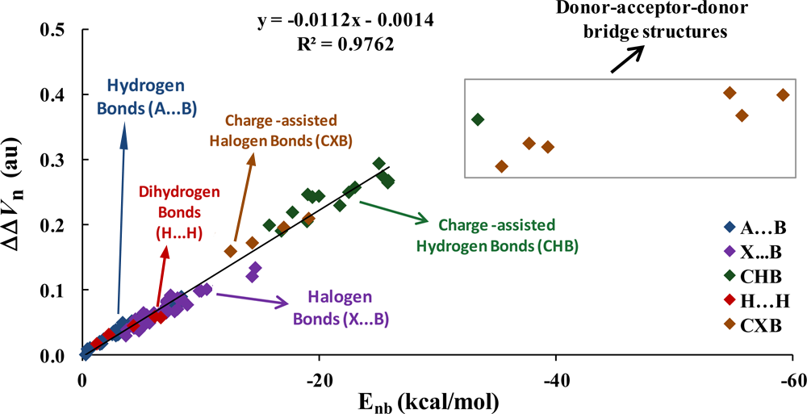

# 4.1 Calculate properties at a point

> Multiwfn manual, p.468–471. Images: `../imgs/`.

---

<!-- p.468 -->


## 4.1 Calculate properties at a point


### 4.1.1 Show all properties of triplet water at a given point

In this example I illustrate how to calculate a wide variety of real space functions at a given point for triplet water. Boot up Multiwfn and input below commands

!!! terminal "Multiwfn session"

    - **examples\H2O_m3ub3lyp.wfn 1** — Main function function 1, show properties at a point
    - **0.2,2.1,2** — X, Y, Z coordinate of the point
    - **1** — The unit of inputted coordinate is Bohr Now all real space functions supported by Multiwfn at this point are printed along with components of electron density gradient/Laplacian, Hessian matrix and its eigenvalues/eigenvectors. If you are unable to fully understand the output, please read Sections 2.6 and 2.7 carefully, all terms in the output are very detailed described.


```text
Note: Unless otherwise specified, all units are in a.u.
 Density of all electrons:  0.4598301528E-02
 Density of Alpha electrons:  0.2861566387E-02
 Density of Beta electrons:  0.1736735141E-02
 Spin density of electrons:  0.1124831246E-02
 Lagrangian kinetic energy G(r):  0.3365319167E-02
 G(r) in X,Y,Z:  0.1342141336E-03  0.1888713104E-02  0.1342391929E-02
 Hamiltonian kinetic energy K(r):  0.1088761528E-03
 Potential energy density V(r): -0.3474195320E-02
 Energy density E(r) or H(r): -0.1088761528E-03
 Laplacian of electron density:  0.1302577206E-01
 Electron localization function (ELF):  0.1998328717E+00
 Localized orbital locator (LOL):  0.1008002781E+00
 Local information entropy:  0.3533635333E-02
 Interaction region indicator (IRI):  0.3583198766E+01
 Reduced density gradient (RDG):  0.2033111359E+01
 Reduced density gradient with promolecular approximation:  0.2294831921E+01
 Sign(lambda2)*rho: -0.4598301528E-02
 Sign(lambda2)*rho with promolecular approximation: -0.3918852312E-02
 Corr. hole for alpha, ref.:   0.00000   0.00000   0.00000 : -0.1251859403E-03
 Source function, ref.:   0.00000   0.00000   0.00000 : -0.3565867942E-03
 Wavefunction value for orbital       1 :  0.1536978161E-03
 Average local ionization energy (ALIE):  0.4664637535E+00
 van der Waals potential (probe atom: C ):  0.5566195299E+04 kcal/mol
 Delta-g (under promolecular approximation):  0.3210501179E-03
 Delta-g (under Hirshfeld partition):  0.2394976411E-03
 User-defined real space function:  0.1000000000E+01
 ESP from nuclear charges:  0.3453377860E+01
```


<!-- p.469 -->


```text
 Total ESP:  0.1431404144E-01 a.u. ( 0.3895049E+00 eV, 0.8982204E+01 kcal/mol)

 Note: The following information is for electron density

 Components of gradient in x/y/z are:
 -0.7919856828E-03 -0.6903543769E-02 -0.6651181972E-02
 Norm of gradient is:  0.9618959378E-02

 Components of Laplacian in x/y/z are:
 -0.3809549089E-02  0.1052804857E-01  0.6307272576E-02
 Total:  0.1302577206E-01

 Hessian matrix:
 -0.3809549089E-02  0.1394394193E-02  0.1197923973E-02
  0.1394394193E-02  0.1052804857E-01  0.1008387143E-01
  0.1197923973E-02  0.1008387143E-01  0.6307272576E-02
 Eigenvalues of Hessian: -0.3959672207E-02 -0.1883455778E-02  0.1886890004E-01
 Eigenvectors (columns) of Hessian:
  0.9964397434E+00 -0.2418531975E-01  0.8076452238E-01
 -0.4735415689E-01  0.6320255930E+00  0.7734993430E+00
 -0.6975257409E-01 -0.7745700228E+00  0.6286301443E+00
 Determinant of Hessian:  0.1407217564E-06
 Ellipticity of electron density:    1.102344
 eta index:    0.209852
 Stiffness:    0.099818

 Stress tensor:
 -0.1220815539E-02  0.1483611490E-04  0.1618000275E-04
  0.1483611490E-04 -0.1145414066E-02  0.3494514646E-04
  0.1618000275E-04  0.3494514646E-04 -0.1107965714E-02
 Eigenvalues of stress tensor: -0.1224514565E-02 -0.1166013495E-02 -0.1083667260E-02
 Eigenvectors (columns) of stress tensor:
 -0.9852173517E+00  0.7263017197E-01  0.1551503399E+00
  0.1433520595E+00  0.8453962002E+00  0.5145439259E+00
  0.9379209402E-01 -0.5291787248E+00  0.8433106903E+00
 Stress tensor stiffness:    1.129973
 Stress tensor polarizability:    0.884977
```

All data are expressed in scientific notation, the value behind E is exponent, e.g. 0.6307272576E-02 corresponds to 0.006307272576.

In the line of "Corr. hole (correlation hole)" and "Source function", the so-called "ref" is the position of reference point, which is determined by "refxyz" parameter in `settings.ini`.

By default, the outputted wavefunction value corresponds to orbital 1, you can input for example o6 to choose orbital 6.


<!-- p.470 -->

By default, the components of gradient and Laplacian as well as Hessian and its eigenvalue/eigenvectors are for electron density. You can input such as f10 to choose the real space function with index of 10 (namely ELF), after that all of these quantities will be for ELF. If you want to inquire about indices of all available real space functions, input allf.

You can continue to input other coordinates, when you want to return to upper-level menu, input q; If you want to exit the program, press “CTRL+C” button or directly close command-line window.


### 4.1.2 Calculate ESP at nuclear positions to evaluate interaction strength

of H2O∙∙∙HF

This is an advanced example, if you are not interested in weak interactions, you may skip this section.

In J. Phys. Chem. A, 118, 1697 (2014), Mohan and Suresh studied a batch of electrostatic dominated interacting systems, including hydrogen, halogen and dihydrogen bonds, all of them belong to electron donor-acceptor interactions, where donor stands for electron-rich moiety (Lewis base), while acceptor is electron-deficient moiety (Lewis acid). They fitted a surprisingly good

linear equation to correlate $\Delta\Delta V_{n}$ index with interaction energy (Enb) for all kinds of interactions, the R2 is as high as 0.9762. Their results can be summarized as following graph

For an electrostatic dominated complex, assume that we can obtain $\Delta\Delta V_{n}$, then according to the equation shown in the graph above, we can easily predict the interaction energies as


$$E_{\mathrm{n b}}=-89.2857\times\Delta\Delta V_{\mathrm{n}}-0.125$$

<!-- formula-ocr: formula_p470_336.png 已替换为LaTeX, 原图保留备查 -->

$\Delta\Delta V_{n}$ is defined based on ESP at nuclear positions

$$\Delta\Delta V_{\mathrm{n}}=\Delta V_{\mathrm{n-D}}-\Delta V_{\mathrm{n-A}}=(V_{\mathrm{n-D^{\prime}}}-V_{\mathrm{n-D}})-(V_{\mathrm{n-A^{\prime}}}-V_{\mathrm{n-A}})$$

where Vn-D' is the ESP at nuclear position of donor atom in complex environment, but the contribution due to nucleus of this donor atom is ignored. The only difference between Vn-D and Vn-

D' is that the former is calculated in monomer state, therefore ΔVn-D = Vn-D' - Vn-D can be regarded as




<!-- p.471 -->

the change in ESP at nuclear position of donor atom due to presence of another molecule, which directly reflects strength of intermolecular interaction. The definition of Vn-A' and Vn-A are identical to $V_{n-D}$' and Vn-D, respectively, but they are calculated for acceptor atom.

In this example, we calculate ΔΔVn for H2O∙∙∙HF and check if the interaction energy predicted based on ΔΔVn is really closed to the accurately calculated interaction energy. In this complex the oxygen of H2O is electron donor atom and hydrogen of HF is electron acceptor atom. Because the equation presented by Mohan and Suresh was fitted for specific calculation level, in order to properly use their equation, the calculation level we employed here is identical to them. The .wfn files used below were produced at MP4(SDQ)/aug-cc-pVTZ level at MP2/6-311++G** optimized geometries, these .wfn files and the corresponding Gaussian input files can be found in "examples\Vn" folder.

Note that if you are using relatively old revision of G09 and post-HF method is employed, "density" keyword is indispensable, otherwise the density in the resultant .wfn file will correspond to Hartree-Fock density. Besides, in G09 and G16, density cannot be produced at MP4 level, so we use MP4(SDQ) keyword instead (MP4 keyword is default to MP4(SDTQ), which is more accurate and but much expensive than MP4(SDQ)).

First, we calculate Vn-A' and $V_{n-D}$'. Boot up Multiwfn and input examples\Vn\H2O-HF.wfn 1 // Calculate properties at a point a1 // Nuclear position of atom 1 From the output you can see


```text
Total ESP without contribution from nuclear charge of atom     1:
-0.2228775074E+02 a.u. ( -0.6064805E+03 eV, -0.1398579E+05 kcal/mol)
```

That means $V_{n-D}$' is -22.2877 a.u. Then input a5, you will find Vn-A' is -0.9608 a.u.

Next we calculate $V_{n-D}$. Reboot up Multiwfn and input below commands ?H2O.wfn // The symbol ? means the folder of the file we last time loaded 1 a1 // In H2O.wfn oxygen is atom 1 We find Vn-D is -22.3339 a.u. Then we calculate Vn-A. Reboot Multiwfn and input

?HF.wfn 1 a2 // In HF.wfn hydrogen is atom 2 The Vn-A is found to be -0.9136 a.u.

$\Delta\Delta V_n$ is thus -22.2877-(-22.3339) - [-0.9608-(-0.9136)] = 0.0462 + 0.0472 = 0.0933 a.u. Using the equation mentioned earlier, the interaction energy can be approximately predicted as

-89.2857×0.0933-0.125 = -8.45 kcal/mol, this value is quite close to the accurate interaction energies (-8.31 kcal/mol) obtained by Mohan and Suresh at MP4/aug-cc-pVTZ level with Counterpoise correction.

Generating wavefunction at MP4(SDQ)/aug-cc-pVTZ is quite time consuming even for small complex such as the system we studied here, thus it is important to find a calculation level that significantly saves computational time but without too much sacrifice in accuracy. For present system, based on the MP2/6-311++G** geometry, I tried using several levels to evaluate the $\Delta\Delta V_n$

B3LYP/6-311+G**: 0.1021 a.u. MP2/cc-pVTZ: 0.1052 a.u. MP2/aug-cc-pVTZ: 0.0955 a.u. B3LYP/aug-cc-pVTZ: 0.0985 a.u. MP2/aug-cc-pVDZ: 0.0939 a.u. B3LYP/aug-cc-pVDZ: 0.0980 a.u. $\Delta\Delta V_n$ produced at MP2/aug-cc-pVDZ (0.0939) is very close to the value we obtained above at MP4(SDQ)/aug-cc-pVTZ (0.0933), while the computational cost is reduced by factors of two. So, in practical studies,
