# 4.4 Output and plot various properties in a plane

> Multiwfn manual, p.512–540. Images: `../imgs/`.

---

<!-- p.512 -->

two doubly occupied MOs are -25.03 and -24.91 eV respectively, both of them are lower than the barrier, therefore the electrons in each He atom are difficult (but not completely impossible due to tunnel effect) to overcome the barrier to freely delocalize to another He. The He-He interaction thus should be regarded as noncovalent interaction.

Note that in the original paper of PAEM-MO the PAEM is evaluated based on the expensive CISD wavefunction, while we merely use HF wavefunction. However, our results are in good agreement with that at CISD level, showing that correlation potential may be safely neglected in the study of PAEM.

The interested users are suggested to replot the PAEM with iuserfunc=34 to employ DFT XC potential in PAEM, you will find the results are very similar to those we obtained earlier.

It is noteworthy that, although the PAEM-MO analysis method has clear physical meaning, its many limitations severely hinder it to be a universal method to distinguish covalent and noncovalent interactions like ELF or LOL: (1) PAEM-MO analysis does not always present reasonable conclusion in all cases. For example, PAEM-MO erroneously indicates that the H-bond in water dimer is covalent interaction. (2) PAEM-MO is difficult to apply to polyatomic molecules, since there are often too many occupied orbitals with complex shapes. (3) If the two atoms are placed too close to each other, then PAEM-MO almost always indicates that the interaction is covalent.


## 4.4 Output and plot various properties in a plane

Main function 4 of Multiwfn is used to plot various kinds of plane maps for real space functions. This module is extremely flexible, it is obviously impossible to demonstrate all possible usages of this function via limited examples; however, if you carefully follow these examples and attempts to reproduce the graphs, you will gain enough basic knowledge about plotting plane maps using Multiwfn. Section 3.5 is highly suggested to read, in which many important points about plotting plane map are introduced.

The video https://youtu.be/E7lAGac3aDM is worth to look, the whole process of reproducing Multiwfn logo (ELF map of Li6 cluster) is illustrated. This video also shows how to make background of the map transparent.


### 4.4.1 Illustration of plotting color-filled map and contour line map

4.4.1.1 Plotting electron density of hydrogen cyanide

In this example we plot electron density for hydrogen cyanide as color-filled map and contour line map. Boot up Multiwfn and input following commands

!!! terminal "Multiwfn session"

    - **examples\HCN.wfn 4** — Plot graph in a plane
    - **1** — Electron density
    - **1** — Color-filled map [Press ENTER button directly]

2 // XZ plane (Z-axis is the molecular axis of present system, you can confirm this via main function 0)


<!-- p.513 -->

After a few seconds the graph pops up

The central regions of carbon and nitrogen are white, suggesting that electron density exceeds the upper limit of color scale (0.65). Close the graph, then a post-processing menu appears, there are many options and their meanings are very easy to understand. You can choose corresponding options to adjust plotting parameters and then use option -1 to replot again, or export X-Y data set to a plain text file so that you can then plot the graph by external softwares (Sigmaplot, Origin, Matlab, etc.), or save image file in current directory (the graphical format is controlled by "graphformat" in `settings.ini`).

Now we slightly improve the graph above. Input below commands: -8 // Change length unit of the graph to Å

!!! terminal "Multiwfn session"

    - **-2** — Set label interval in X, Y and color scale axes 1,1,0.1
    - **4** — Enable showing atom labels
    - **1** — Red labels
    - **8** — Enable showing bonds
    - **3** — Blue color for bonds
    - **-1** — Redraw the graph Now you can see the map below on screen


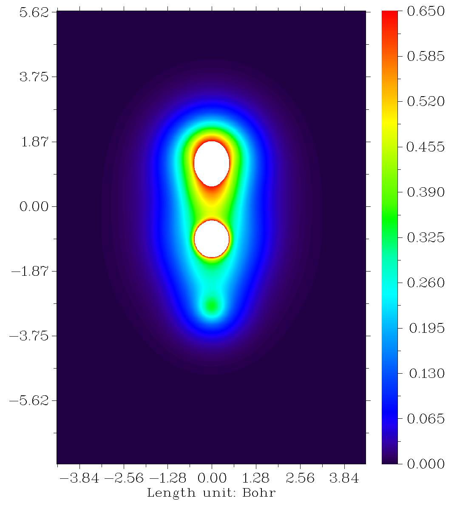

<!-- p.514 -->

In Section 4.6.2 we will plot valence electron density for HCN, you will find valence electron density conveys much more information than total electron density.

Next, we plot the electron density as contour line map. Repeat the example above but select "2 Contour line map" instead of "1 Color-filled map", you will see the graph below


<!-- p.515 -->

There are numerous options in post-processing menu. If option 2 is chosen, the isovalues will be marked on corresponding contour lines. Once option 3 is chosen, you will enter an interface for setting up contour lines, various parameters such as color, thickness, contour values can be easily customized, please try to play with them; if you are confused, please consult Section 3.5.4 for more details.

It is worth to note that the .pdf format is more suitable than the default .png format for contour line maps (and other maps that mainly consist of lines), because .pdf is a vector format, the graph can be scaled losslessly, and the lines look smoother. In order to change to .pdf format, you should change "graphformat" in `settings.ini` to pdf.

4.4.1.2 Plotting localized orbital locator (LOL) for FOX-7

In this example we plot localized orbital locator (LOL) for an energetic compound, FOX-7. L LOL is a popular function for revealing electron localization character, see Section 2.6 for introduction. It shares analogous features with another very popular function, electron localization function (ELF). The input file in this section is examples\FOX-7.wfn, if you load it into Multiwfn and enter main function 0, you will see below structure. We will plot the plane defined by atoms N9, C2, N12.

Boot up Multiwfn and input examples\FOX-7.wfn

!!! terminal "Multiwfn session"

    - **4** — Plot plane map
    - **10** — Localized orbital locator (LOL)
    - **1** — Color-filled map [Press ENTER button directly]
    - **4** — Define the plane by three atoms
    - **9,2,12** — Use nuclear position of the three atoms to define the plane The graph directly shown on screen is not easy to study. Therefore, we close the graph and then input below command

!!! terminal "Multiwfn session"

    - **8** — Enable showing bonds
    - **14** — Brown color
    - **4** — Enable showing atom labels
    - **1** — Red color
    - **18** — Change style of atomic labels
    - **3** — Plot both element symbol and atomic index
    - **-1** — Show the graph again We will see the graph below


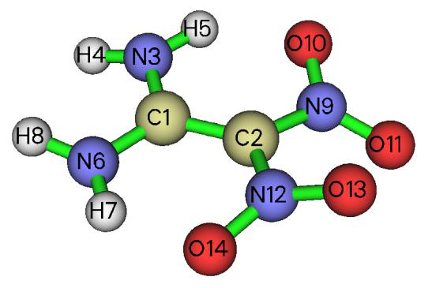

<!-- p.516 -->

You can find that labels of many atoms are not shown on the map, this is because the vertical distance between these atoms and the plotting plane is larger than the "disshowlabel" parameter in `settings.ini`. If we want to display all atomic labels on the map, we should close the graph and input below commands:

!!! terminal "Multiwfn session"

    - **17** — Set distance threshold for showing atom labels
    - **10** — Enlarge the threshold to 10 Bohr y

-1 // Plot the map again to check effect You will see the map below, only interesting part is given

As can be seen, labels of all atoms have been shown, and corresponding bonds are also displayed. In this map the red color substantially reveals the high electron localization nature in the bonding


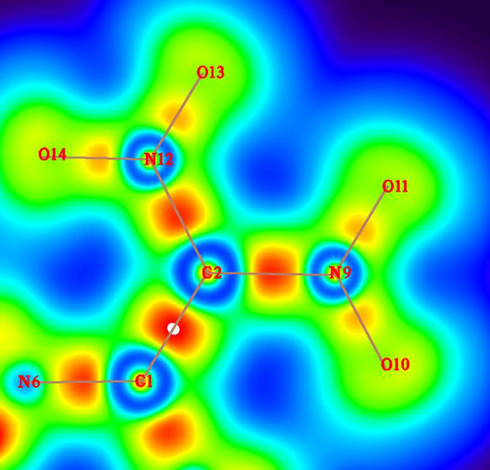

<!-- p.517 -->

regions. The degree of electron localization between N and O is not as high as the case of C-N and C-C bonds, this is a known feature of "charge-shift bond", see Chem. Eur. J., 11, 6358 (2005) for more information about this point.

The default color transition method is "Rainbow" with white and black colors in the region where function value is lower and higher than the color scale, respectively. The coloring method can be changed by user. As an illustration, in the post-processing menu we input

!!! terminal "Multiwfn session"

    - **19** — Set color transition
    - **17** — Black-Blue-Cyan
    - **1** — Set lower&upper limit of color scale
    - **0,0.7** — Decrease the upper limit from default value to 0.7 to make color able to better distinguish ELF in different regions

-1 // Replot The graph below looks very cool ;-D

Contour lines could be appended to the color-filled map. To make a pretty color-filled map with contour lines, we input below command

!!! terminal "Multiwfn session"

    - **19** — Set color transition
    - **8** — Blue-White-Red
    - **2** — Enable showing contour lines
    - **1** — Set lower&upper limit of color scale 0,1
    - **-2** — Set label interval in X, Y and color scale axes 2,2,0.1
    - **-1** — Replot The current graph is shown below, it is quite satisfactory


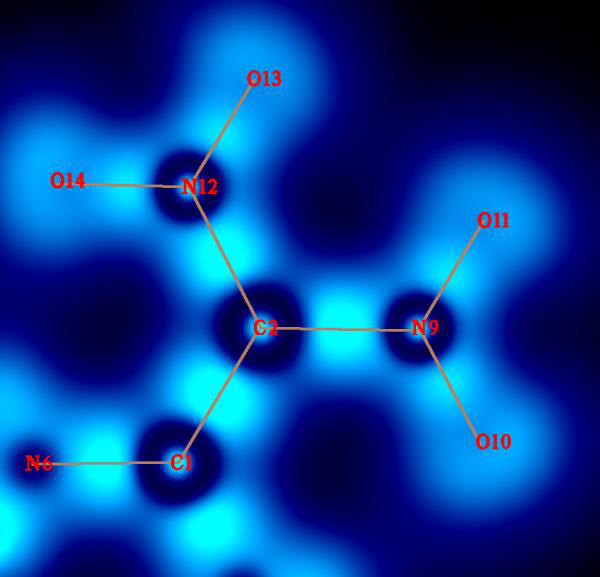

<!-- p.518 -->

Note in passing that if you want to translate or rotate the plotted object in the graph, in the interface of defining plotting plane, before choosing option 4 or 5, you should first choose the option "-1: Set translation and rotation of the map for plane types 4 and 5" and then input translation value and rotation angle, see Section 3.5.2 for more information.


### 4.4.2 Shaded relief map with projection effect of electron localization function (ELF) of monofluoroethane


This section illustrates how to plot shaded relief map with projection. Boot up Multiwfn and input following commands

examples\C2H5F.wfn 0 // View the molecular structure first to find the plane we are interested in. Suppose that the C-C-F plane is what we want to plot, record the atomic indices (1, 5, 8), and then click RETURN button to return to main menu

!!! terminal "Multiwfn session"

    - **4** — Plot graph in a plane
    - **9** — Electron localization function (ELF)
    - **5** — Shaded relief map with projection effect [Press ENTER button]

Manually set extension distance. If you do not do this, you will find the resulting graph is somewhat truncated at boundary because the default extension distance is too small for present case

!!! terminal "Multiwfn session"

    - **6** — Set extension distance to 6 Bohr, which is slightly larger than the default value
    - **4** — Define the plotting plane by three atoms
    - **1,5,8** — Indices of the three atoms The graph below immediately pops up:


<!-- p.519 -->

We can see that C-C and C-F covalent bond regions have high LOL value, rendering high degree of electron localization in those places. The very low electron localization zones between valence and inner shells of heavy atoms are revealed by the blue ringlike region around each nucleus. A lone pair region of fluorine atom is pointed out by the purple arrow.

The graph you have seen in the GUI can be saved to graphic file by option 0 at post-processing interface. If you find the objects in the exported image are truncated at their edges, you should select option -1 to re-enter the GUI window, zoom out the graph and then export the picture again.


### 4.4.3 Plotting plane map without contributions from some atoms

The main purpose of this section is to illustrate how to plot plane map of a real space function without contribution of some atoms. This aim can be realized in two different ways in Multiwfn, as respectively exemplified in below two examples.

Example 1: Contour map of electron density Laplacian of uracil without contributions of two atoms

In main function 6, one can use subfunctions -3 and -4 to delete Gauss type functions (GTFs) centered at some atoms to remove their contributions to various kinds of analyses that are based on real space function. This feature will be utilized in present example. Since this treatment reduces total number of GTFs, the computational cost in the subsequent analyses will be lowered.

Boot up Multiwfn and input following content examples\uracil.wfn 6 // Modify wavefunction -4 // Discard contribution of some atoms


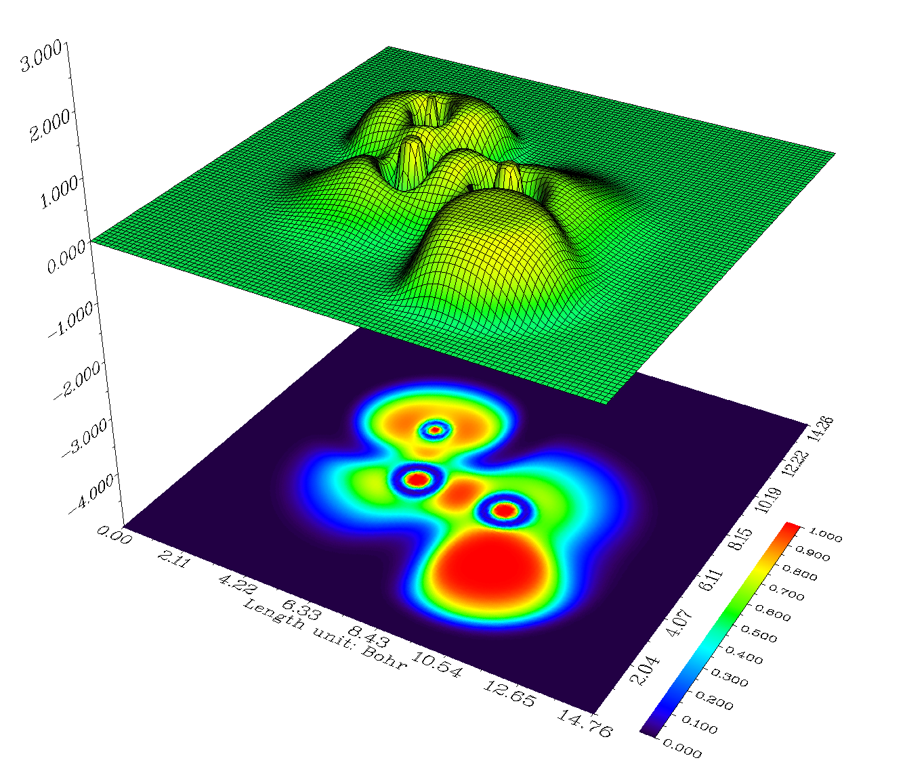

<!-- p.520 -->

3,4 // All GTFs centered on atoms 3 and 4 will be discarded. In other words, contribution of atoms 3 and 4 will be removed from current wavefunction

!!! terminal "Multiwfn session"

    - **-1** — Return to main menu
    - **4** — Plot graph in a plane
    - **3** — Laplacian function
    - **2** — Contour line map [Press ENTER button to use default grid setting]
    - **1** — XY plane will be plotted
    - **0** — The Z-position of the XY plane is zero, that is molecular plane Below is the resulting graph, solid and dashed line correspond to positive and negative regions, respectively.

From the graph you can see that the contributions from the two carbons have been discarded as we expected.

By the way, if you are studying a large system but only a local region is of interest, you can remove GTFs at atoms far from this region to save computational time of real space function analyses (e.g. topology analysis, basin analysis, calculating grid data...).

Example 2: Plane map of LOL only contributed by atoms in the uracil ring After plotting plane map as usual, one can request the program to plot the map only contributed by a certain fragment. Specifically, Hirshfeld weighting function of the user-defined fragment will be generated and multiplied to the plane data. This treatment only affects the currently plotted map while does not influence any further analysis, since this treatment does not modify wavefunction.

Here we use this feature to plot localized orbital locator (LOL) map of uracil that only contributed by the six atoms in the ring. Boot up Multiwfn and input below commands:


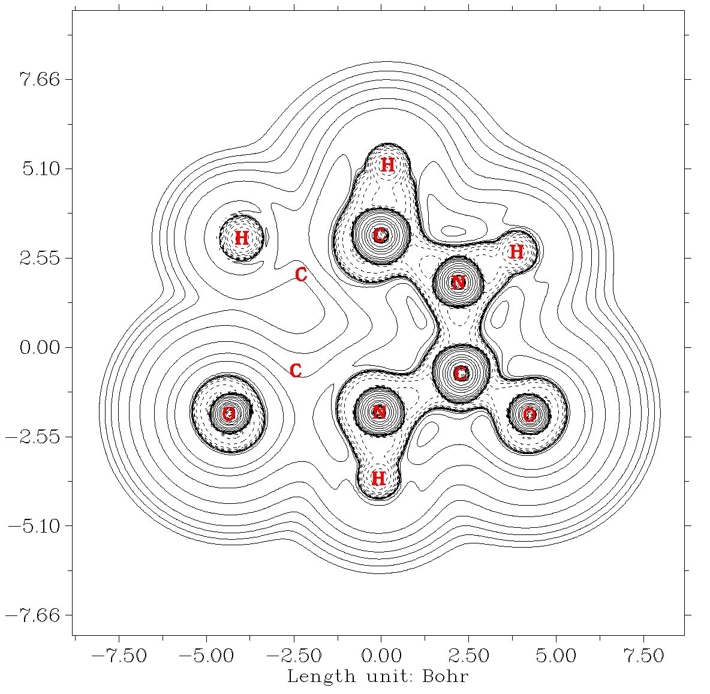

<!-- p.521 -->

!!! terminal "Multiwfn session"

    - **examples\uracil.wfn 4** — Plane map
    - **10** — LOL 1

!!! terminal "Multiwfn session"

    - **XY plane will be plotted 0** — Z=0 Close the graph and then input
    - **-9** — Only plot the data around certain atoms
    - **1-6** — The index of the six atoms in the uracil ring
    - **8** — Enable showing bonds
    - **14** — Brown -1

Clearly, the value of LOL at the grids far from the ring atoms have been significantly screened. Then if you want to restore the original map, you can choose "-9 Recovery original plane data" in the post-processing menu and then replot.


### 4.4.4 Contour map of electrostatic potential of chlorine trifluoride

In this example we plot electrostatic potential (ESP) for chlorine trifluoride as contour map. Boot up Multiwfn and input following commands

!!! terminal "Multiwfn session"

    - **examples\ClF3.wfn** — Generated at B3LYP/6-31G* level
    - **4** — Plot graph in a plane
    - **12** — Total electrostatic potential
    - **2** — Draw contour line map
    - **120,120** — Number of grids in each direction
    - **3** — YZ plane 0


<!-- p.522 -->

Because evaluation of ESP is evidently more time-consuming than other real space functions, you need to wait for a while.

After the calculation is finished, ESP map pops up. This map is inconvenient to be visually analyzed, since what we are interested in is often the ESP value on molecular vdW surface, hence it is better to plot the vdW surface on this map simultaneously. In order to do this, we close the graph by clicking right mouse button, choose option 15 in post-processing menu, and then choose option -1 to replot the graph, you will see such a picture. The solid and dashed lines represented the region having positive and negative value of ESP, respectively.

The bold blue line corresponds to vdW surface (isosurface of electron density=0.001 a.u., as defined by R. F. W. Bader). From the graph it is clear that the chlorine atom is overall positively charged, because the vdW surface close to the chlorine atom largely intersects solid contour lines. For the same reason, we can see that the equatorial fluorine atom possesses less electrons than the two axial fluorine atoms, this point can be further verified when we calculate atomic charges for this molecule in section 4.7.1.

The plane map of the ESP derived from atomic charges can be directly plotted by Multiwfn too. First, you need to prepare a plain text file with .chg extension, the first column corresponds to element name, the 2nd, 3rd and 4th columns correspond to X, Y and Z coordinates in Å respectively, the last column is atomic charge. For example:


```text
  Cl    0.000000    0.000000    0.359408    0.529971
  F     0.000000    1.726507    0.294501   -0.228394
  F     0.000000    0.000000   -1.267884   -0.073185
  F     0.000000   -1.726507    0.294501   -0.228394
```

Boot up Multiwfn as usual, and then use the .chg file as input. The plotting procedure is completely identical to the one given above, except that when Multiwfn prompts you to select real space function, you should select 8 (ESP from atomic charges) instead of 12.


<!-- p.523 -->


### 4.4.5 Contour map of two orbital wavefunctions

Multiwfn is capable of plotting a contour map for two orbitals simultaneously. In this section, we will draw a contour map for simultaneously portraying NBO 12 and NBO 56 of NH2COH (recall Section 4.0.2). The plane we selected is the one perpendicular to molecular plane and passed through both carbon and nitrogen atoms. As you will see, we need to use a special manner to define such a plotting plane. The molecule geometry and atomic index are shown as follows.

Boot up Multiwfn and input: examples\NH2COH.31

!!! terminal "Multiwfn session"

    - **37** — Load NH2COH.37
    - **4** — Plot plane graph
    - **4** — Orbital wavefunction
    - **12,56** — The two orbital indices. If you only input one index, then only one orbital will be plotted

[Press ENTER button to use default grid setting] 7 // This mode is used to define a plotting plane parallel to a bond and meantime normal to a plane defined by three atoms

!!! terminal "Multiwfn session"

    - **1,4** — The plotting plane is parallel to C1-N4
    - **3,1,4** — The plotting plane is perpendicular to the plane defined by O3-C1-N4
    - **10** — The length of X-axis of the resulting map is 10 Bohr
    - **10** — The length of Y-axis of the resulting map is 10 Bohr Immediately a graph pops up. We close it by clicking right mouse button, choose option 2 and input 25 to enable showing isovalue on contour lines, then choose -1 to redraw the graph, we will see:


<!-- p.524 -->

This contour map is not quite ideal, there are too many contour lines intertwined together and thus confused our vision. The culprits are the contour lines with too small isovalue (magnitude smaller than 0.01). Since these contour lines are unimportant, we can delete them to make the graph clearer. Therefore, we close the graph and input

!!! terminal "Multiwfn session"

    - **3** — Change contour line setting
    - **4** — Delete some contour lines
    - **1-4** — Delete contour lines 1~4, they respectively correspond to 0.001, 0.002, 0.004, 0.008
    - **4** — Delete some contour lines
    - **28-31** — Delete the four contour lines corresponding to -0.001, -0.002, -0.004, -0.008. For convenience, you can choose option 6 to export current contour line setting to an external file, when you use Multiwfn next time you can load present setting directly by choosing option 7 in current interface

15 // Set the drawing style suitable for publication, namely positive and negative parts are portrayed as red solid lines and blue dashed lines, respectively

!!! terminal "Multiwfn session"

    - **1** — Save setting and return to the upper menu
    - **-8** — Change length unit of the graph to Å
    - **-2** — Set label interval in X and Y axes
    - **1,1** — Intervals in both X and Y axes are 1.0 Å
    - **-1** — Replot the contour map
    - **2** — Enable showing isovalue on contour lines
    - **30** — Use label size of 30 Now the graph becomes very clear and informative, the overlapping region of same phase is very obvious.


<!-- p.525 -->


### 4.4.6 Gradient + contour map with topology paths of electron density of hydrogen peroxide


As introduced in Section 3.5.5, critical points, bond paths and interbasin surfaces can also be plotted on a plane map, here I present a simple example. There is a corresponding video illustration of plotting this kind of map https://youtu.be/gv5FkiFWUY0, you are suggested to look at it.

Gradient map of electron density First, I show how to plot a normal gradient map of electron density for hydrogen peroxide. Boot up Multiwfn and input following commands

examples\H2O2.fch // Of course, you can also use other types of files as input, as long as the file contains GTF information

!!! terminal "Multiwfn session"

    - **4** — Plotting plane map
    - **1** — Electron density
    - **6** — Gradient line with/without contour line map [Press ENTER button to use default grid setting]
    - **4** — Use three atoms to define the plotting plane
    - **2,1,3** — Define the plane by nuclear positions of atoms 2, 1 and 3 Generating data and plotting a gradient map take more computational time relative to other graph types, however since present system is small and the basis set is only 6-31G*, resulting graph shows up immediately:


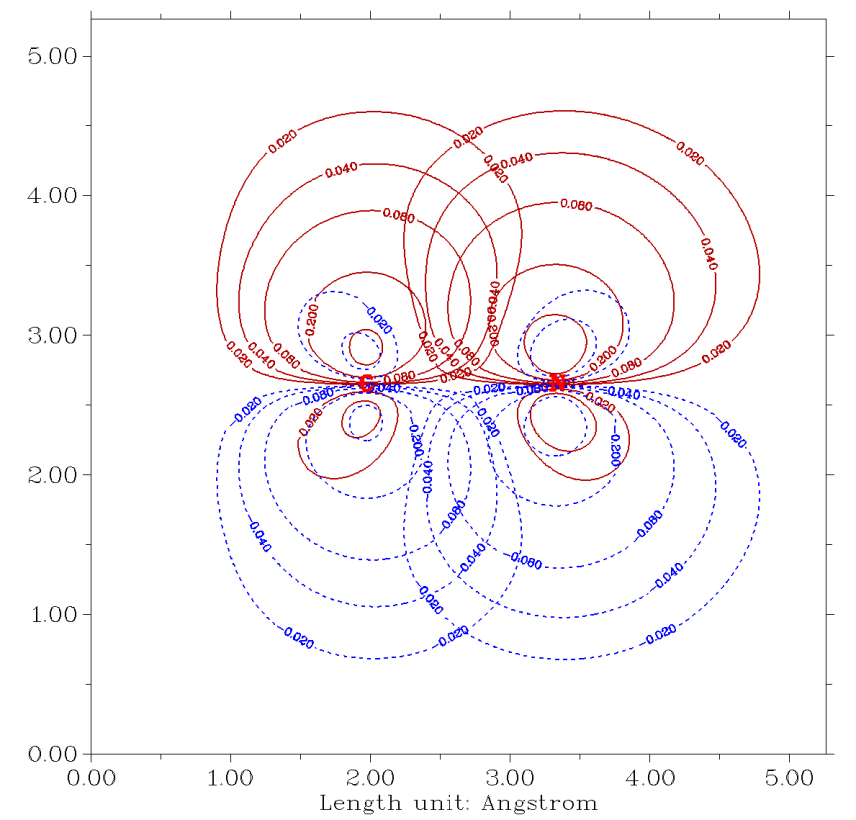

<!-- p.526 -->

This type of graph is very useful in Bader’s AIM analysis. You can also plot gradient + contour map for any other real space functions supported by Multiwfn. In the post-processing menu, you can use options 11, 12, 13 and 14 to adjust plotting effect of the gradient lines, they can control the smoothness, density, color and density of the gradient lines.

Gradient map of electron density with bond paths and critical points of electron density If you hope critical points and paths also be portrayed on the graph, you need to do topology analysis as illustrated in Section 4.2.1 prior to plotting the map. Now we input below commands

!!! terminal "Multiwfn session"

    - **-5** — Return to main menu
    - **2** — Topology analysis (by default electron density is the function to be analyzed)
    - **2** — Search CPs from nuclear positions
    - **3** — Search CPs from midpoint of atomic pairs
    - **8** — Generating the paths connecting (3,-3) and (3,-1) CPs, namely generating bond paths in current context

0 // Visually check if all expected CPs and paths have been generated. This step is optional -10 // Return to main menu Then draw a gradient line map for electron density via the way described above. The resulting graph should look like below. Brown, blue, and orange circles denote (3,-3), (3,-1) and (3,+1) critical points, respectively. Bold dark brown lines depict bond paths.


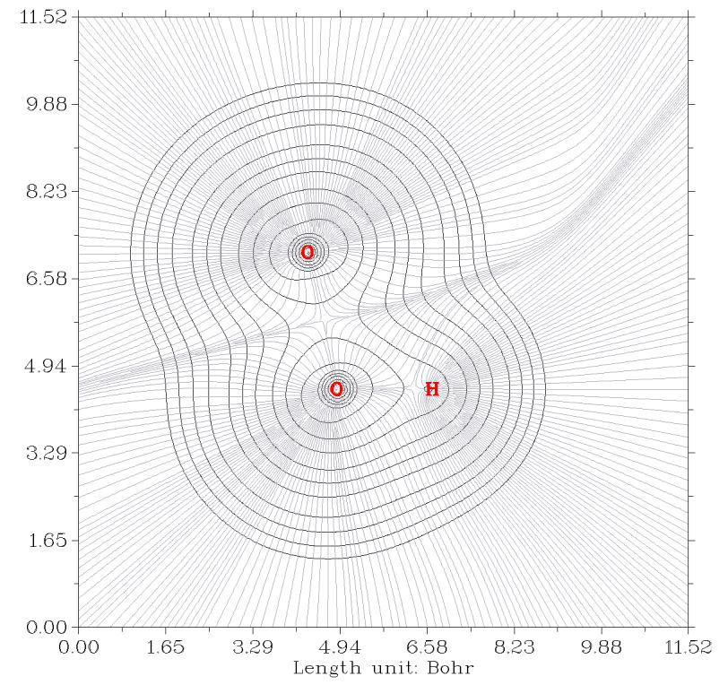

<!-- p.527 -->

In the post-processing menu, you can enter “4 Set details of plotting critical points and paths” to adjust settings for showing the critical points and paths.

Hint: The color of different types of critical points can be set by "CP_RGB_2D" in the `settings.ini` file.

Interbasin paths can also be drawn on the graph. If you have finished the search of CPs in topology analysis module, after drawing contour/gradient/vector field map, you could find an option named "Generate and show interbasin paths" in the post-processing stage; select it and replot the graph, the interbasin paths will be shown on the graph by bold dark blue lines:


<!-- p.528 -->

Note that before generating the interbasin paths, related parameters (stepsize and the number of iterations) can be set by option "7 Set stepsize and maximal iteration for interbasin path generation" in the post-processing menu. Larger number of iterations may result in longer interbasin paths.

Contour line map of Laplacian of electron density with bond paths and CPs of electron density

Finally, we plot contour line map of Laplacian of electron density, on which the bond paths and CPs we generated before are also shown. Return to main menu and then input below commands

!!! terminal "Multiwfn session"

    - **4** — Plotting plane map
    - **3** — Laplacian of electron density
    - **2** — Contour line map [Press ENTER button to use default grid setting]
    - **4** — Use three atoms to define the plotting plane
    - **2,1,3** — Define the plane by nuclear coordinates of atoms 2, 1 and 3 The resulting graph is shown below (only a local region is given)


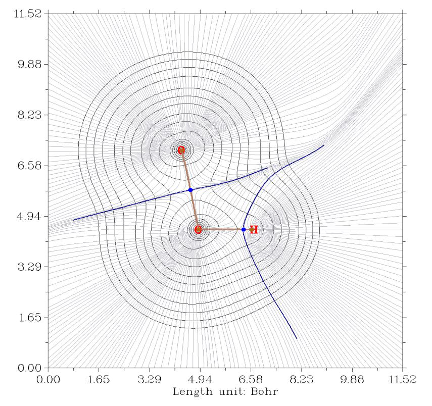

<!-- p.529 -->


### 4.4.7 Deformation map of electron density of acetyl chloride

Deformation map of electron density clearly shows variation of electron density distribution during formation of a molecule, it is defined as subtracting actual molecular electron density by electron density of all of its constituent atoms in their free-states. Illustrative example of deformation density analysis can be found from my paper Acta Phys. -Chim. Sin., 34, 503 (2018).

It is a labor work to draw such a graph via custom operation feature since there are so many atoms in practical chemical systems. Fortunately, Multiwfn provides a special option to realize this in a highly automatic way. Boot up Multiwfn and input following commands

examples\CH3COCl.wfn 4 // Plot plane map -2 // Tell Multiwfn you want to draw deformation map, then Multiwfn prepares free-state atom wavefunctions

B3LYP/6-31G* // The level used to generate atomic wavefunction files by Gaussian, it is the same as the level used for generating CH3COCl.wfn

D:\study\g09w\g09.exe // The path of executable file of Gaussian (you can also use another Gaussian version). If you already set correct path in “gaupath” parameter in `settings.ini`, then Multiwfn will not ask you to input the path every time

Now Multiwfn starts to invoke Gaussian to calculate atom wavefunctions, then Multiwfn translates and sphericalizes them internally. These temporary wavefunction files are stored in “wfntmp” folder in current directory, after you get the expected graph you can delete the folder. Let us continue to input the remaining commands.

!!! terminal "Multiwfn session"

    - **1** — Electron density function
    - **2** — Contour map [Press ENTER button to use default grid setting] 1
    - **0** — The XY plane with Z=0 is the plane of acyl chloride Then the deformation map pops up:


<!-- p.530 -->

As we expected, electron density concentrates towards bonding regions. We also find that the density distribution around chlorine atom is largely desphericalized, this observation is in line with hybrid orbital theory, chlorine atom forms somewhat sp3 hybrid state.

You can also plot deformation maps for other functions by choosing corresponding real space function, though not all of them are meaningful.

If you want to avoid recalculating atomic wavefunction files next time, you can copy the .wfn files without number suffix (such as “C .wfn“) from “wfntmp” folder to “atomwfn“ folder in current directory, if Multiwfn finds that all needed atom wavefunctions have already existed in “atomwfn” folder, then Multiwfn will not invoke Gaussian to calculate them again.

Hint: You can also use genatmwfn.pdb in “examples” directory to generate all atom wavefunctions under specific basis set in a single run, please consult Section 3.7.3.

The “atomwfn” folder in “examples” directory contains atom wavefunctions (by 6-31G*) for all first-four row elements, you can directly copy this folder to current directory, after that you will not need Gaussian again during plotting deformation map.

If your system involves some elements heavier than Kr, you have to manually calculate the corresponding atomic .wfn files and put them into "atomwfn" folder". More detailed information about preparing atomic wavefunction files can be found in Section 3.7.3.


### 4.4.8 Plot difference map of electron density and ELF for water tetramer with respect to its constituent monomers


In this example I will illustrate how to plot difference map between a system and its constituent


<!-- p.531 -->

fragments for a given real space function. Electron density and ELF will be employed as the function to be studied.

examples\water_tetramer\wfn\complex.wfn is wavefunction file of optimized water tetramer, while the water1/2/3/4.wfn in this folder is wavefunction file of each water monomer. The corresponding Gaussian input files are also provided in the folder. Notice that the monomer coordinates were directly extracted from the complex coordinate, and nosymm keyword was used for all files to avoid Gaussian automatically reorienting the molecular geometry during the calculations. (Bear in mind, a density difference map is meaningful only when coordinates of all fragments are completely consistent with that of the whole complex)

Plotting difference map of electron density First, we plot a plane map of electron density difference for the complex with respect to all four monomers. Boot up Multiwfn and input

examples\water_tetramer\wfn\complex.wfn

!!! terminal "Multiwfn session"

    - **4** — Plot plane map
    - **0** — Custom operation
    - **4** — Four files will be operated on the firstly loaded system -,examples\water_tetramer\wfn\water1.wfn -,examples\water_tetramer\wfn\water2.wfn -,examples\water_tetramer\wfn\water3.wfn -,examples\water_tetramer\wfn\water4.wfn
    - **1** — Electron density
    - **2** — Contour map [Press ENTER to use default grid setting]
    - **4** — Define plane by three atoms 7,10,1 The graph pops up immediately. We can further improve the plotting effect. Close the graph and input

!!! terminal "Multiwfn session"

    - **3** — Change contour line settings
    - **15** — Set line style and width suitable for publication
    - **1** — Save and return
    - **17** — Set distance threshold for showing atom labels
    - **0.2** — 0.2 Bohr y

0 // Save the plot as graphic file in current folder The graphic file should look like below


<!-- p.532 -->

In the graph, red solid lines and blue dashed lines correspond to the regions having increased electron density and decreased electron density during formation of the tetramer, respectively.

In Multiwfn you can also easily plot the density difference in the form of isosurface map by main function 5, the resulting graph is shown below, the isovalue is 0.003. If you do not know how to realize it, please consult Section 4.5.5.

Plotting difference map of ELF Next, we plot a color-filled difference map of ELF. Input below commands

!!! terminal "Multiwfn session"

    - **-5** — Return to main menu
    - **4** — Plot plane map
    - **0** — Custom operation
    - **4** — Four files will be operated on the firstly loaded system -,examples\water_tetramer\wfn\water1.wfn -,examples\water_tetramer\wfn\water2.wfn -,examples\water_tetramer\wfn\water3.wfn -,examples\water_tetramer\wfn\water4.wfn


<!-- p.533 -->

9 // ELF 1 // Color-filled map [Press ENTER button] 4 // Define plane by three atoms 7,10,1 The graph shown on screen is ugly currently, because the default color scale is inappropriate for present case. Close the graph and input

!!! terminal "Multiwfn session"

    - **1** — Set lower&upper limit of color scale -1.5,0.1
    - **4** — Disable showing atomic labels
    - **4** — Enable showing atomic labels again, now you can select label color
    - **3** — Blue labels
    - **-1** — Show the graph again You will see

The blue and especially dark blue regions exhibit decrease of ELF in corresponding regions. This plot shows that during formation of the complex, the electron localization is reduced in the intermolecular interaction regions, it may be attributed to the consequence of the Pauli repulsion effect.


### 4.4.9 Plotting LOL-π map for porphyrin to reveal favorable electron delocalization path


The well-known ELF-π is the ELF solely contributed by π electrons. Similarly, LOL-π can be defined as a variant of localized orbital locator (LOL). See my paper Theor. Chem. Acc., 139, 25

(2020) DOI: 10.1007/s00214-019-2541-z on relevant knowledge. The features of LOL-π are highly


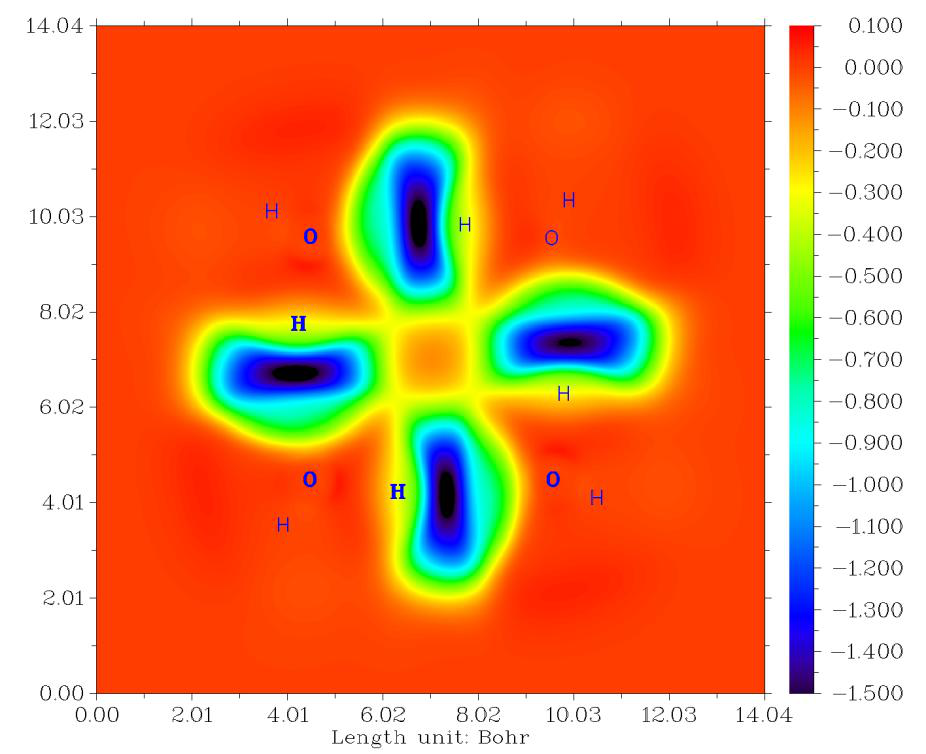

<!-- p.534 -->

analogous to ELF-π, but usually graphical effect of LOL-π is better. In this Section I will illustrate how to plot color-filled LOL-π plane map above 1.2 Bohr of porphyrin, you will find this map is quite useful for understanding preferential electron delocalization path, which is closely related to molecular aromaticity.

The only difference of plotting and analyzing LOL and LOL-π is that for the latter case, you should first set occupation number of all orbitals to zero except for π orbitals. As illustrated below, this can be automatically done via Multiwfn.

The .fch file of porphyrin calculated at B3LYP/6-31G* level can be downloaded from http://sobereva.com/multiwfn/extrafiles/porphyrin.rar. Boot up Multiwfn and load the .fch file, then input below commands:

100 // Other functions

!!! terminal "Multiwfn session"

    - **22** — Detect π orbitals
    - **0** — Detect π orbitals for delocalized orbitals of exactly planar system
    - **2** — Set occupation number of all other orbitals to zero
    - **0** — Return to main menu
    - **4** — Plot plane map
    - **10** — LOL 1

!!! terminal "Multiwfn session"

    - **Use default grids 3** — Plot YZ plane
    - **1.2** — X=1.2 Bohr Close the graph, then input
    - **1** — Set lower&upper limit of color scale 0,0.66
    - **4** — Enable showing atom labels
    - **7** — Cyan color
    - **17** — Set distance threshold for showing atom labels
    - **2** — Since the distance between the plotting plane and molecular is 1.2 Bohr, to make all atomic labels shown on the graph, this threshold must be set to a value larger than 1.2 Bohr. Here we set it to 2.0 Bohr

!!! terminal "Multiwfn session"

    - **y 8** — Enable showing bonds
    - **14** — Brown color
    - **-1** — Replot Now you will see the graph below


<!-- p.535 -->

The high LOL-π regions (red or orange color regions) clearly reveal the favorable delocalization path. If you plot current map induced by an external magnetic field vertical to the molecular plane (using for example AICD or GIMIC methods, see my slideshow for details: http://sobereva.com/148), you will find the unidirectional contiguous induced current is mainly

formed on the favorable delocalization path highlighted by the LOL-π function.

Next, in order to fully exhibit the flexibility of plane plotting function in Multiwfn, I illustrate how to plot the map above in an evidently different style, namely contour lines filled by colors.

!!! terminal "Multiwfn session"

    - **We return to main menu, and then input 4** — Plot plane map
    - **10** — LOL 2

!!! terminal "Multiwfn session"

    - **Use default grids 0** — Set extension distance
    - **1** — 1 Bohr (smaller than default to decrease blank region around the molecule)
    - **3** — Plot YZ plane
    - **1.2** — X=1.2 Bohr Close the graph, then input
    - **9** — Enable filling colors between current contour lines
    - **9** — Set status of filling colors
    - **2** — Set lower and upper limits of filling -0.2,0.52
    - **4** — Toggle showing color bar
    - **5** — Set label interval of color bar 0.1
    - **3** — Set color transition


<!-- p.536 -->

!!! terminal "Multiwfn session"

    - **18** — Viridis 0
    - **Return -8** — Change length unit of the graph to Å
    - **-2** — Set label interval in X and Y axes 2,2
    - **3** — Change setting of contour lines
    - **8** — Generate contour value by arithmetic progression
    - **0,0.07,15** — Generate contour lines of 0.00, 0.07, 0.14 ... 0.98 y
    - **Remove existing contour lines 1** — Save setting and return
    - **17** — Set distance threshold for showing atom labels
    - **2** — Maximal distance is 2 Bohr y
    - **8** — Enable showing bonds
    - **14** — Brown -3
    - **Change other plotting settings 10** — Set format of exporting image file
    - **7** — pdf format. It is highly suggested to export this kind of map as vector format such as .pdf
    - **0** — Return 0


<!-- p.537 -->


### 4.4.10 Plotting gradient line and vector field map of electrostatic potential to reveal electric field of LiF


The main purpose of this section is to illustrate how to properly plot a meaningful gradient line map and vector field map.

Electric field (F) is defined as negative of 1st-derivative vector with respect to coordinate (i.e. gradient vector) of electrostatic potential (ESP); therefore, if we plot gradient line or vector field map of ESP, the F could be vividly exhibited. In this section, I will use an ionic compound LiF as example.

Gradient line map Boot up Multiwfn and input examples\LiF.wfn

!!! terminal "Multiwfn session"

    - **Generated at B3LYP/6-31G* level 4** — Plot plane map
    - **12** — ESP 6

!!! terminal "Multiwfn session"

    - **Modify extension distance 6** — 6 Bohr (larger than default value)
    - **3** — YZ plane 0

Show a contour line to reveal van der Waals surface 10 // Show arrow on the gradient lines Now you can obtain the map below


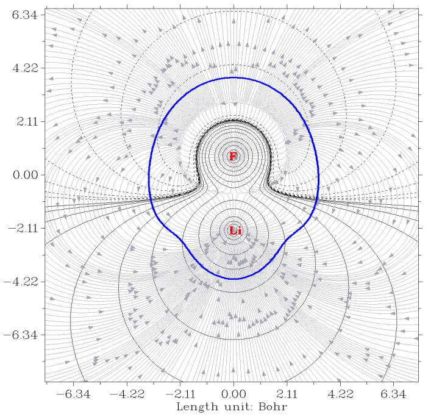

<!-- p.538 -->

In the map above, the gray gradient lines clearly exhibit direction of electric field everywhere. Note that since electric field corresponds to negative gradient vector of ESP, the arrows in fact should be inverted.

Vector field map Next, we draw a graph of another style to display electric field character. Input below commands:

!!! terminal "Multiwfn session"

    - **-5** — Return to main menu
    - **4** — Plot plane map
    - **12** — ESP 7
    - **Vector field map 50,50** — Number of grids in the two dimensions
    - **3** — YZ plane 0

!!! terminal "Multiwfn session"

    - **Map color to arrows 10** — Set upper limit of absolute value for scaling arrows 0.05
    - **15** — Show a contour line to reveal van der Waals surface
    - **13** — Invert gradient vectors, so that the arrows will correspond to direction of electric field
    - **1** — Disable showing atom labels and reference point
    - **1** — Enable showing atom labels and reference point
    - **3** — Use blue label color Now replot the map, you will see


<!-- p.539 -->

In this map, the redder the arrow, the larger the magnitude of the electric field at corresponding position. We can see that electric field sources from each nucleus, while in the region relatively far from the two nuclei, the overall direction of the electric field vectors is from the Li side towards the F side, this is because in this system Li and F carry evidently positive and negative net charges, respectively. You can also find there is a semicircle shape region at top of the map, where magnitude of electric field is small or vanished. This region in fact has the most negative value of ESP and thus behaves as ending point of molecular electric field (indeed, all arrows around this region point towards this region).


### 4.4.11 Plotting a pretty 4p orbital of Kr atom

This example illustrates how to plot a very clear and pretty color-filled contour line map for showing 4p atomic orbital of Kr atom. The wavefunction file Kr.wfn has already been provided in “examples\atomwfn” folder, it was generated by single point task via Gaussian at B3LYP/6-31G* level.

Boot up Multiwfn and input following commands examples\atomwfn\Kr.wfn

!!! terminal "Multiwfn session"

    - **4** — Output and plot specific property in a plane
    - **4** — Value of orbital wavefunction
    - **17** — The orbital corresponding to 4pz (you can first use main function 0 to visually find the orbital of your interest)

!!! terminal "Multiwfn session"

    - **2** — Contour line map [Press ENTER button]
    - **Use default number of grids 0** — Modify extension distance to make plotting area slightly larger than default
    - **5** — 5 Bohr 2
    - **XZ plane 0** — Y=0 Now click right mouse button the graph to close it, and then input following commands to improve the graphical effect

!!! terminal "Multiwfn session"

    - **9** — Enable filling colors for contour lines
    - **9** — Set status of filling colors between the contour lines
    - **3** — Set color transition
    - **8** — Blue-White-Red
    - **0** — Return 3
    - **Change setting of contour lines 5** — Use built-in contour values suitable for special purpose

3 // Suitable for plotting orbital wavefunction (namely ±0.01*2(i-1), i = 1-28) 1 // Save setting and return Now you can use option -1 to visualize the current map. In this example we will save the figure to a .pdf file. You can set the default file format via “graphformat” in `settings.ini`, however here we temporarily change the format to .pdf, so we input

!!! terminal "Multiwfn session"

    - **-3** — Change other plotting settings
    - **10** — Set format of exporting image file
    - **7** — pdf


<!-- p.540 -->

0 // Return Finally, choose option 0 to save the graphical file. After opening the file you will see

As you can see, the graphical effects are perfect, very clear and pretty!


### 4.4.12 Showing extrema of a function on contour line(s)

This example illustrates how to exhibit position of extrema of a real space function on contour line of a specific isovalue in plane map. Here I take phenol as an example, we will plot extrema of

electrostatic potential (ESP) on contour line of ρ = 0.001 a.u. in the molecular plane.

Boot up Multiwfn and input examples\phenol.wfn

!!! terminal "Multiwfn session"

    - **4** — Plot plane map
    - **1** — Electron density
    - **2** — Contour line map [Press ENTER button]
    - **Use default number of grids 1** — XY plane 0

Enable showing extrema of a function on a contour line 0.001 // Isovalue of present function (i.e. electron density) 12 // ESP -1 // Replot plane map Now you can see the following map, red and blue spheres correspond to maxima and minima on the contour line, respectively


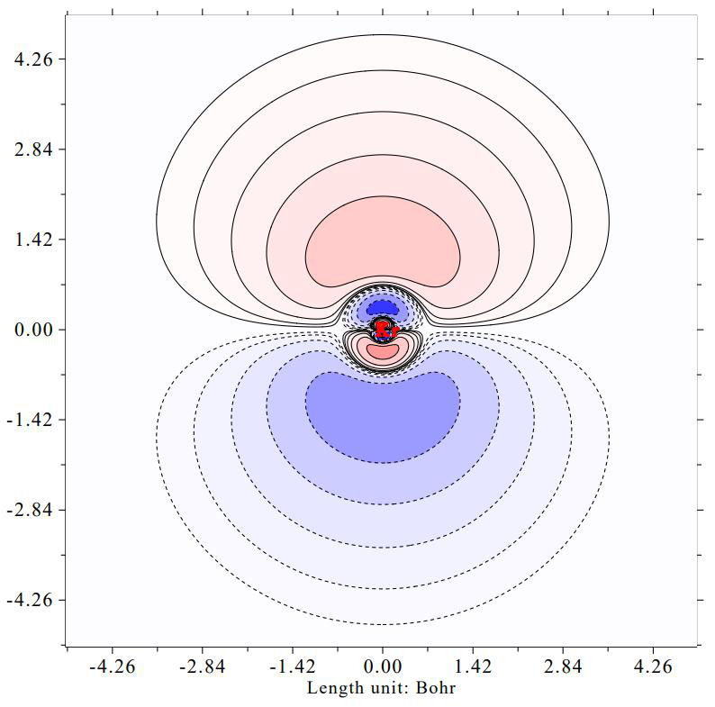
