# 4.5 Generate grid data and view isosurface map

> Multiwfn manual, p.541–557. Images: `../imgs/`.

---

<!-- p.541 -->

In addition, in the console window, you can find information of the extrema, including X and Y coordinates in the plane map, as well as ESP value at the extrema


```text
 Contour line    1
 Minimum found at   -2.757166   -6.243420  Value:    0.0124521154
 Maximum found at   -6.422139   -4.124796  Value:    0.0208512768
 Minimum found at   -6.092997   -1.331264  Value:    0.0178074993
[...ignored]
 Maximum found at    0.000055   -8.122282  Value:    0.0174823731
 Total maxima:     5
 Total minima:     5
```

If you plot a color-filled ESP map and meantime showing vdW surface by following the procedure in Section 4.4.4, you will easily know why the ESP extrema appear on those positions. In addition, note that main function 12 of Multiwfn is able to determine the extrema of ESP or other functions on the 3D molecular surface, as illustrated in Section 4.12.1.


## 4.5 Generate grid data and view isosurface map

This section contains examples of main function 5 of Multiwfn, all of them need to calculate grid data. Once the grid data is generated, it can be visualized as isosurface map, or be exported


<!-- p.542 -->

to .cub file so that it can be rendered by third-part tool such as VMD or be further utilized by other analysis codes.

Note that using VMD to render the cube files generated by Multiwfn using my prepared VMD script is extremely easy, while the graphical quality is amazingly good, please check Section 4.A.14 on how to realize this.


### 4.5.1 Electron localization function of chlorine trifluoride

In this section we plot isosurface map of electron localization function (ELF) for chlorine trifluoride. Boot up Multiwfn and input following commands

!!! terminal "Multiwfn session"

    - **examples\ClF3.wfn** — Generated at B3LYP/6-31G* level
    - **5** — Generate grid data and view isosurface
    - **9** — Electron localization function (ELF)
    - **2** — Medium-quality grid, about 512000 points will be evaluated, this setting is fine enough for small system but inadequate for medium and especially large system. Please consult Section 3.6 for more knowledge about grid setting.

Now Multiwfn starts to calculate grid data. Once the calculation is finished, Multiwfn outputs some statistical information. There are many options in the newly appeared menu, you can draw isosurface map by selecting option -1, after that a GUI window will pop up. Input isovalue of 0.85 in the text box and press ENTER button, you will see below isosurface map

The ELF isosurfaces clearly revealed the lone pair regions of the fluorine and chlorine atoms.

If you want to export the grid data as Gaussian cube file in current directory, you should click “Return” button to close the GUI window and then choose option 2.

If you use ChimeraX to plot isosurface map based on the ELF cube file exported by Multiwfn, you will be able to freely set color for various domains in different regions. For example, the following map is ELF=0.83 isosurface of acetic acid plotted by ChimeraX, you can easily reproduce this map if you carefully follow this video tutorial: "Plotting electron localization function (ELF) isosurface using Multiwfn and ChimeraX" (https://youtu.be/vC48iEB8PwI).


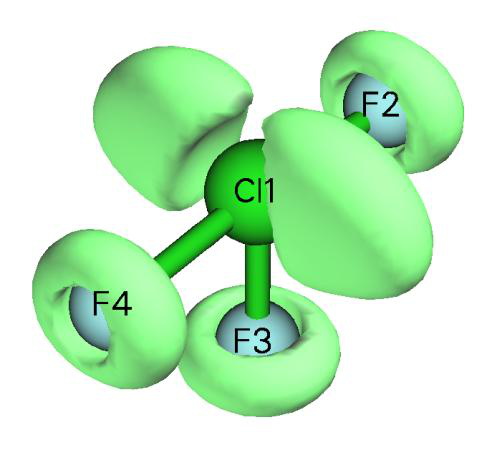

<!-- p.543 -->

Some papers plotted ELF isosurface map colored by corresponding basin types (monosynaptic or disynaptic), although you can use above way to realize this, there is an evident shortcoming: If you change isovalue, the coloring of the isosurfaces will be changed, and moreover, it is impossible to color a whole isosurface by different colors to exhibit its various subregions corresponding to different types of basins. The method described in Section 4.17.10 perfectly solves these problems, it requires employing basin analysis module.


### 4.5.2 Laplacian of electron density of 1,3-butadiene

Electron density Laplacian is another useful real space function like ELF and LOL to reveal electronic structure. Laplacian is not as good as ELF and LOL for highlighting localization region due to its poor distinguishability. For example, the shell structures of atoms heavier than krypton cannot be fully illustrated by Laplacian, and if you attempt to use Laplacian to analyze chlorine trifluoride, you will find the lone pair regions of fluorine atoms are difficult to identify. Moreover, the value range of Laplacian is too large, which brings difficulties on visual analysis. However, for many systems Laplacian of electron density is still useful. In this example we will plot isosurface map of this function for 1,3-butadiene.

Boot up Multiwfn and input following commands examples\butadiene.fch

!!! terminal "Multiwfn session"

    - **Yielded at B3LYP/6-31G** level 5** — Generate grid data and view isosurface
    - **3** — Electron density Laplacian
    - **2** — Medium-quality grid (If you want to obtain better graphical effect, choose "high-quality grid" instead)

-1 // View isosurface In the newly occurred window, change isosurface value from default value to 0.3, then the green and blue isosurfaces will correspond to isovalue of 0.3 and -0.3 respectively. The current graph will look like below


<!-- p.544 -->

The presence of blue isosurfaces between C-C and C-H suggests that valence-shell electrons are strongly concentrated on these regions, this is typical pattern of covalent bonding. If you inspect the isosurfaces between carbon atoms carefully, you will find that the isosurface between C6-C8 or C1-C4 is wider than the isosurface between C4-C6, this phenomenon reflects that the two boundary C-C covalent bonds are stronger than the central one. This conclusion can also be verified by other wavefunction analysis schemes, for example, Mayer bond order (bond order between C6-C8 is 1.863, while the bond order between C4-C6 is only 1.136).

The isosurface map we obtained in this section is not quite smooth, this is because we only used medium-quality grid. If you choose high-quality grid instead, much better isosurface will be obtained.

4.5.3 Calculate ELF-σ and ELF-π to study aromaticity of benzene

ELF-σ and ELF-π indices are commonly used σ and π aromaticity indices, they are defined as the ELF value at bifurcation point (i.e. (3,-1) type of CP) of ELF domains that solely contributed

from σ orbitals and π orbitals, respectively, see J. Chem. Phys., 120, 1670 (2004) and J. Chem. Theory Comput., 1, 83 (2005) for detail. These two papers contain very nice examples of employing

ELF-π to analyze π delocalization: Theor. Chem. Acc., 139, 25 (2020) and Carbon, 165, 468 (2020).

The theoretical basis of these indices is that the ELF value at bifurcation point measures interaction between adjoining ELF domains, the larger value means electrons have better delocalization between these domains. Strong multi-center delocalization is commonly recognized as nature of aromaticity. It is argued that if ELF-π is larger than 0.70, then the molecule has π

aromaticity. While if the average of ELF-π and ELF-σ is larger than 0.70, one can say that the molecule is global aromatic. In present example, we will calculate ELF-σ and ELF-π for benzene.

In order to separate σ and π orbitals, we need to know which orbitals are π orbitals first. Boot up Multiwfn and input following commands

!!! terminal "Multiwfn session"

    - **examples\benzene.wfn** — Optimized at B3LYP/6-311G* level
    - **0** — View molecular orbitals (MOs) Now check orbital shape of each MO in turn, we found 17th, 20th and 21th MOs are π orbitals,

as shown below. All other MOs are recognized as σ orbitals.


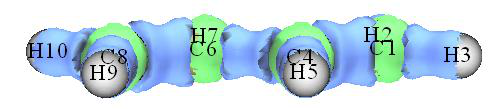

<!-- p.545 -->

We first calculate ELF-π. The contribution to ELF from σ orbitals should be omitted; this can be realized by setting occupation number of all σ orbitals to zero.

!!! terminal "Multiwfn session"

    - **6** — Enter "Modify & Check wavefunction" interface
    - **26** — Set occupation number for some orbitals
    - **0** — Selecting all orbitals
    - **0** — Set occupation number of all orbitals to zero
    - **17,20,21** — Select MO 17, 20 and 21, namely all π orbitals
    - **2** — Set occupation numbers of MO 17, 20 and 21 to 2.0 (doubly occupied). If you want to check if occupation numbers have been correctly set, choose option 3. You will find occupation

number of all σ orbitals have become zero, namely they will have no contribution to all results yielded in following calculations

!!! terminal "Multiwfn session"

    - **q** — Return to last menu
    - **-1** — Return to main menu For this system, in fact there is a much more convenient way to set occupation numbers of all orbitals except for the π ones to zero. The procedure is: Enter subfunction 22 of main function 100, select 0, then all π orbitals will be automatically identified, then choose 1 to set occupation number of all other orbitals to zero (or choose option 3, if heavier elements such as silicon are involved in present system). Finally, choose 0 to return to main menu. More details about automatic identification of π orbitals can be found in Section

Studying ELF-π There are two ways to study ELF-π, the way 1 is to examine ELF isosurface directly, while the way 2 is performing topology analysis. Way 1 is more intuitive but less accurate than way 2. Here I illustrate way 1 first. Generate and view isosurface for ELF by main function 5 as usual (recall Section 4.5.1. Using High-quality grid is recommended). This time the ELF isosurface only reflects π-electron localization character. By gradually increasing isovalue, you will find that the two circle-shape ELF domains are bifurcated to twelve spherical-like domains at about the isovalue of 0.91 (see the graph below), implying that ELF-π index of benzene is about 0.91.


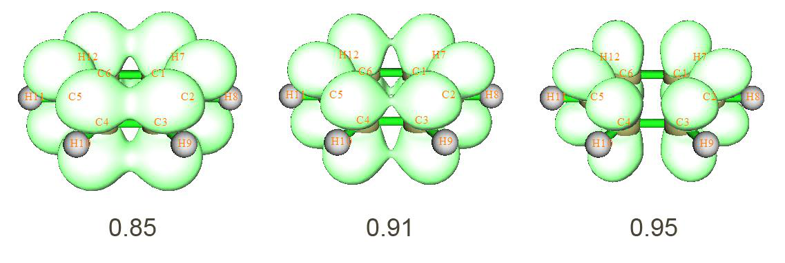

<!-- p.546 -->

Next, let us use way 2 to evaluate ELF-π index again, this way is more rigorous than way 1. Choose 0 to return to main menu.

!!! terminal "Multiwfn session"

    - **2** — Topology analysis
    - **-11** — Select real space function
    - **9** — ELF 6

!!! terminal "Multiwfn session"

    - **-1** — Start the CP search
    - **-9** — Return to upper menu
    - **0** — Visualize results. The resulting graph is shown below, two (3,+1) CPs are not shown

By comparing this graph with ELF isosurface map, it clear that the (3,-1) CPs (orange) are bifurcation positions of ELF domains, while (3,-3) CPs (purple) correspond to the maximum points of the twelves ELF domains. Now we check ELF value at a (3,-1) CPs, we can choose anyone, since they are all equivalent.

!!! terminal "Multiwfn session"

    - **7** — Show all properties at a CP
    - **23** — CP23 From the output, we find the ELF value at CP 23, namely ELF-π index of benzene is 0.91247, this result is in very good agreement with the value 0.913 given in Chem. Phys. Lett., 443, 439 (2007), note that our calculation level is exactly identical to this paper. Evidently, this value exceeds the criteria (0.70) of π aromaticity, suggesting that benzene has strong π aromaticity.

Studying ELF-σ Now we calculate ELF-σ for benzene. Reboot Multiwfn and load benzene.wfn, set occupation number of MO 17, 20 and 21 to zero (it is more convenient to use subfunction 22 in main function 100 to do this). Then generate isosurface for ELF as usual, gradually adjust isovalue, try to find out

at which isovalue the domains corresponding to the σ bonds between carbon atoms are bifurcated. One can finally find that at the isovalue equals 0.71 the domain is bifurcated, suggesting that ELF-

σ index is about 0.71. The bifurcation point is pointed by red arrow in the graphs below:


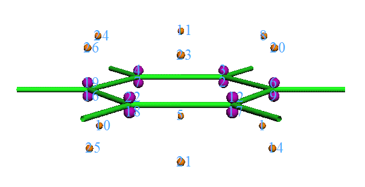

<!-- p.547 -->

Enter topology analysis module and search ELF CPs, like what we did in way 2 of ELF-π analysis. You will obtain the graph below. For clarity, (3,+1) and (3,+3) CPs are hidden.

Comparing positions of CPs with ELF isosurface map, it is clear that the (3,-1) CPs such as CP

48 and 58 correspond to bifurcation points of the σ bond domains between the carbon atoms. Check ELF value at CP 48, we get 0.70907, which is the accurate ELF-σ value. Our result agrees well with the value 0.717 from Chem. Phys. Lett., 443, 439 (2007).

The average of ELF-σ and ELF-π is (0.70907+0.91247)/2=0.81077, which is larger than the criteria of global aromaticity, so benzene possesses global aromatic character.


### 4.5.4 Use Fukui function and dual descriptor to study favorable sites of electrophilic attack for phenol


Multiwfn supports a batch of methods for predicting the most reactive sites, see Section 4.A.4 for detail. In this section, I will introduce how to realize Fukui function and dual descriptor, which are the most popular two methods for revealing reactive sites.

IMPORTANT NOTE: In daily research, I strongly suggest you directly using main function 22


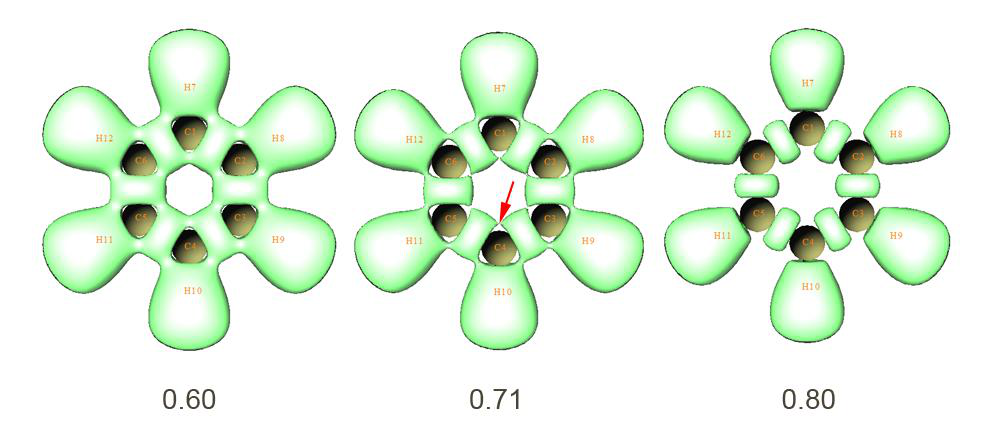


<!-- p.548 -->

to automatically calculate Fukui function and dual descriptor, because the steps are much simpler than the those described below, and meantime many useful quantities in conceptual density functional theory can be obtained as byproducts, see Section 3.25 for introduction and 4.22.1 for example.

4.5.4.1 Fukui function

Theory Fukui function is a very important concept in the conceptual density functional theory, it has been widely used in prediction of reactive sites. Fukui function is defined as follows, see J. Am. Chem. Soc., 106, 4049 (1984) for original paper and my paper Acta Phys. -Chim. Sin., 30, 628 (2014) for related discussions and comparison.


$$f(\mathbf{r})=\left[\frac{\partial\rho(\mathbf{r})}{\partial N}\right]_{\nu}$$

<!-- formula-ocr: formula_p548_337.png 已替换为LaTeX, 原图保留备查 -->

where N is number of electrons in present system, the constant term ν in the partial derivative is external potential. Generally, the external potential only comes from nuclear charges, so ν can be simply regarded as nuclear coordinates for isolated chemical system. It is argued that reactive sites should have larger value of Fukui function than other regions. We cannot directly evaluate the partial derivative due to the discontinuity when N is integer. Via the finite difference approximation, Fukui function can be calculated unambiguously for three situations:

$$\mathrm{Nucleophilic~attack:}\;f^{+}(\mathbf{r})=\rho_{N+1}(\mathbf{r})-\rho_{N}(\mathbf{r})\approx\rho^{\mathrm{LUMO}}(\mathbf{r})$$

$$\mathrm{Nucleophilic~attack:}\;f^{+}(\mathbf{r})=\rho_{N+1}(\mathbf{r})-\rho_{N}(\mathbf{r})\approx\rho^{\mathrm{LUMO}}(\mathbf{r})$$

$$Radical~attack:f^{0}(\mathbf{r})=\frac{f^{+}(\mathbf{r})+f^{-}(\mathbf{r})}{2}=\frac{\rho_{N+1}(\mathbf{r})-\rho_{N-1}(\mathbf{r})}{2}\approx\frac{\rho^{\mathrm{HOMO}}(\mathbf{r})+\rho^{\mathrm{LUMO}}(\mathbf{r})}{2}$$

Preparing wavefunction files Below we first reveal the reactive sites for electrophilic attack of phenol by means of the Fukui

function f − shown above. The approximate form of Fukui function based on frontier orbitals will not be used here.

We need to prepare the files needed by calculation of f −. Assume that you are a Gaussian user, you can use .wfn, .wfx or .fch as input file for present purpose. In this example, we perform following calculations to generate needed .wfn files, all calculations are conducted at B3LYP/6-31G* level, which is the lowest acceptable level for producing meaningful result (of course you can use better level to improve the result):

(1) Optimizing geometry structure of phenol of neutral state. The resulting geometry will be used for next steps

(2) Performing single point task for phenol of neutral state to yield phenol.wfn (see examples\phenol.gjf)

(3) Performing single point task for phenol of N-1 state (i.e. cationic state) to yield phenol_N-1.wfn (see examples\phenol_N-1.gjf)

Notice that the geometry of the N-1 state should not be optimized before performing single


<!-- p.549 -->

point task of the N-1 state, because the ν (nuclear coordinates in this context) is a constant in the partial derivative of Fukui function. By the way, in fact the step (2) could be omitted if you directly specify out=wfn keyword and output path of .wfn file at step (1).

Calculating Fukui functions f − To study the isosurface of f −, we need to properly use the "custom operation” feature of Multiwfn (see Section 3.7.1 for detail). Boot up Multiwfn and input following commands:

!!! terminal "Multiwfn session"

    - **examples\phenol.wfn** — Phenol of neutral state
    - **5** — Calculate grid data
    - **0** — Set custom operation
    - **1** — Only one file will be operated with the file that has been loaded (namely phenol.wfn) -,examples\phenol_N-1.wfn

!!! terminal "Multiwfn session"

    - **1** — Electron density
    - **2** — Medium-quality grid Now Multiwfn starts to calculate electron density grid data for phenol.wfn, then calculate that

for phenol_N-1.wfn, and finally get their difference to yield grid data of f −. We choose option -1 to check the isosurface, after adjusting the isovalue to a proper value (0.007), the graph will be

In the map, green and blue isosurface correspond to positive and negative region of f −, respectively. Clearly, most positive part of f − function is localized on O12, C1, C3, C4 and C5, that means para and ortho positions of hydroxyl are favourable reactive sites for electrophilic attack, this conclusion is in agreement with common knowledge, namely hydroxyl group is an ortho-para- director.

Calculating Fukui functions $f^{0}$ Next, I take propylene as an example to illustrate how to plot Fukui function for radical attack,

namely $f^{0}$ = (ρN+1 − ρN-1)/2. Of course, we should yield wavefunction file corresponding to N+1 state and N-1 state. We first optimize geometry of neutral state (examples\propylene\opt_N.gjf), then use this geometry to perform single point task of N-1 and N+1 states to yield corresponding .fch files.

Boot up Multiwfn and input:

!!! terminal "Multiwfn session"

    - **examples\propylene\N+1.fch** — N+1 electrons state, namely -1 charged state
    - **5** — Calculate grid data
    - **0** — Set custom operation
    - **1** — One file will be operated with propylene-1.fch
    - **-,examples\propylene\N-1.fch** — N-1 electrons state, namely +1 charged state
    - **1** — Electron density


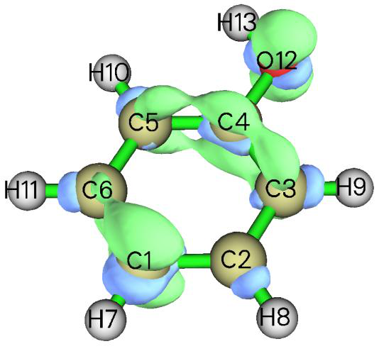

<!-- p.550 -->

!!! terminal "Multiwfn session"

    - **2** — Medium-quality grid
    - **6** — Divide all grid data by a factor
    - **2** — Divided by 2
    - **-1** — Visualize isosurface map The isosurface map of $f^{0}=0.01$ = 0.01 is shown below

4.5.4.2 Dual descriptor

Theory Dual descriptor is another useful function used to reveal reactive sites, see J. Phys. Chem. A,

109, 205 (2005) for detail. Formally, the definition of the dual descriptor $\Delta f$ has close relationship with Fukui function:

$$\Delta f(\mathbf{r})=f^{+}(\mathbf{r})-f^{-}(\mathbf{r})$$

$$=[\rho_{N+1}(\mathbf{r})-\rho_{N}(\mathbf{r})]-[\rho_{N}(\mathbf{r})-\rho_{N-1}(\mathbf{r})]=\rho_{N+1}(\mathbf{r})-2\rho_{N}(\mathbf{r})+\rho_{N-1}(\mathbf{r})$$

It is noteworthy that dual descriptor can also be evaluated in terms of spin density 𝜌𝑠. Since 𝜌𝑁+1 −𝜌𝑁 and 𝜌𝑁−𝜌𝑁−1 can be approximated as 𝜌𝑁+1 𝑠 respectively, it is clear that ∆𝑓(𝐫) ≈𝜌𝑁+1 𝑠(𝐫) . Commonly, there is no evident qualitative difference between the dual descriptor evaluated based on electron density of three states (N+1, N, N-1) and the one based on spin density of two states (N+1, N-1). 𝑠(𝐫) −𝜌𝑁−1 𝑠 and 𝜌𝑁−1

Unlike Fukui function, via $\Delta f$ both types of reactive sites can be revealed simultaneously. It is argued that if Δf > 0, then the site is favorable for a nucleophilic attack, whereas if Δf < 0, then the site is favorable for an electrophilic attack. However, according to my experience, if your aim is to figure out which ones are more favorable among many potential sites, you do not need to concern

the sign of $\Delta f$, you only need to study which sites have more positive or more negative of Δf. If the distribution of Δf around a site A is more positive than another site B, then one can say A is a more favorable site for nucleophilic attack than B, and meantime B is a more preferential site for electrophilic attack than A.

Approximately evaluating dual descriptor based on spin density Here we calculate dual descriptor for phenol based on spin density of N-1 and N+1 states. Since we have already calculated phenol_N-1.wfn earlier, now we only need to calculate phenol_N+1.wfn (this file and corresponding input file phenol_N+1.gjf has been provided in "example" folder). After that, boot up Multiwfn and input:

!!! terminal "Multiwfn session"

    - **examples\phenol_N+1.wfn** — N+1 electron system, namely anionic state
    - **5** — Calculate grid data
    - **0** — Set custom operation
    - **1** — Only one file will be operated with the file that has been loaded -,examples\phenol_N-1.wfn


<!-- p.551 -->

!!! terminal "Multiwfn session"

    - **5** — Electron spin density
    - **2** — Medium-quality grid
    - **-1** — Visualize isosurface of dual descriptor We gradually change the isovalue so that the dual descriptor at different sites can be clearly distinguished, we find 0.02 is a proper value, the corresponding isosurface is shown below

We can see that in the ring (except for the C4, which cannot participate in reaction), the para-

carbon has evident negative value of Δf, and meantime the Δf at the two ortho-carbons is not so positive as the two meta-carbons, therefore the conclusion of Δf is identical to Fukui function f −, namely only para- and ortho- carbons are activated for electrophilic attack by the hydroxyl group.

Exactly evaluating dual descriptor based on electron density

If you would like to evaluate Δf in its exact form (based on ρ of three states), you can follow below steps:

!!! terminal "Multiwfn session"

    - **examples\phenol_N+1.wfn** — N+1 electron system
    - **5** — Calculate grid data
    - **0** — Set custom operation
    - **3** — Three files will be operated with the file that has been loaded -,examples\phenol.wfn
    - **N electron system -,examples\phenol.wfn** — N electron system +,examples\phenol_N-1.wfn
    - **N-1 electron system 1** — Electron density
    - **2** — Medium-quality grid
    - **-1** — Visualize isosurface of dual descriptor The graph corresponding to isovalue of 0.01 is shown below


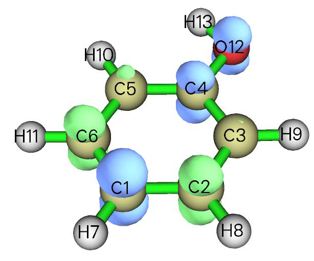

<!-- p.552 -->

It can be seen that although this map is qualitatively consistent with the $\Delta f$ map evaluated based on spin density, the difference between ortho-carbons and meta-carbons is not so remarkable, showing

that this time $\Delta f$ does not have good ability to discriminate preferential sites. So, using exact form to evaluate Δf does not necessarily give rise to better result than using spin density to approximately evaluate Δf !

On the "condensed" Fukui function and dual descriptor Above we used visualization manners to examine Fukui function and dual descriptor and obtained the conclusion what we expected. However, visual analysis is somewhat ambiguous and subjective. Therefore, sometimes we hope that the discussions of Fukui function and dual descriptor can be quantified, namely assigning a value for each atom to exhibit the extent that it can be acted as reactive site. To do so, one should calculate "condensed" version of Fukui function and dual descriptor based on population analysis techniques. Since population analysis is exemplified in Section 4.7, the method for calculating condensed Fukui function and condensed dual descriptor will be deferred to be introduced as Section 4.7.3. Another scheme to study Fukui function and dual descriptor is to first partition the whole molecular surface to local surface corresponding to each atom, and then examine their average values on these local surfaces. Because this scheme relies on quantitative molecular surface analysis technique, illustration is deferred to Section 4.12.4.


### 4.5.5 Plot difference map of electron density to study electron transfer of imidazole coordinated magnesium porphyrin


In this example, I will show you how to plot fragment electron density difference in Multiwfn. During coordination between imidazole and magnesium porphyrin, electron transfer and polarization occur, the variation of electron density can be clearly revealed by subtracting electron density of imidazole (referred to as NN below) and magnesium porphyrin (referred to as MN below) in their isolated states from the whole system (referred to as MN-NN below). The geometry of MN-NN is shown below:


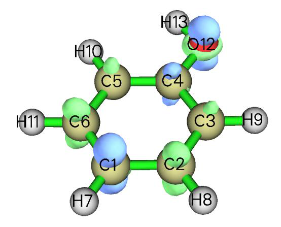

<!-- p.553 -->

examples\MN-NN.gjf is Gaussian input file of the MN-NN system (geometry has been optimized), run it by Gaussian after modifying the .wfn output path at the last line, then MN-NN.wfn will be yielded. Next, respectively delete MN and NN parts from the MN-NN.gjf and properly modify .wfn output path and then save MN.gjf and NN.gjf (which have already been provided in "example" folder). Then run them by Gaussian to obtain MN.wfn and NN.wfn. It should be paid attention that by default, Gaussian always puts the system to standard orientation, which makes the coordinates in MN.wfn and NN.wfn inconsistent with MN-NN.wfn, and thus the density difference will be meaningless. Therefore, nosymm keyword must be specified in route section to avoid the automatic adjustment of coordinates. (The MN.wfn, NN.wfn and MN-NN.wfn can also be directly loaded from here: http://sobereva.com/multiwfn/extrafiles/MN-NN.zip)

Now we generate grid data of electron density difference by Multiwfn. Boot up Multiwfn and input following commands

!!! terminal "Multiwfn session"

    - **MN-NN.wfn 5** — Calculate grid data
    - **0** — Set custom operation
    - **2** — Two files will be operated with MN-NN.wfn -,MN.wfn
    - **Will subtract property of MN.wfn from that of MN-NN.wfn -,NN.wfn** — Will subtract property of NN.wfn from that of MN-NN.wfn
    - **1** — The property is selected as electron density
    - **3** — Since present system is relatively huge, we need more grid points than normal cases, so we choose high-quality grid

After the calculation is finished, you can choose option -1 and then set isovalue to about 0.001 to visualize the isosurface of the grid data, as shown below.


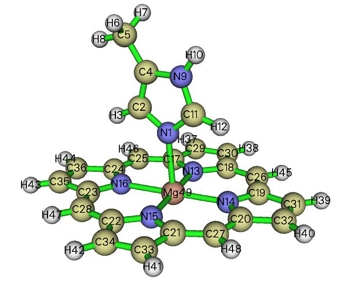

<!-- p.554 -->

Plotting isosurface map in VMD Multiwfn is not very professional at visualization of grid data, for large size of grid data the visualization speed is relatively slow. You can choose option 2 to export the grid data to cube file and then visualize it by external tools, such as VMD. Below is the graph generated by VMD (freely available at http://www.ks.uiuc.edu/Research/vmd/) based on the cube file generated by Multiwfn.

The red and blue isosurfaces (+0.0012 and -0.0012 a.u., respectively) represent the region in which electron density is increased and decreased after NN coordinated to MN, respectively. It is obvious that electron density is shifted from backside of nitrogen in NN toward magnesium atom to strengthen the coordination bond. Besides, it can be seen that the appearance of NN does not perturb electron density distribution of porphyrin ring remarkably, only slight polarization occurs on the four coordination nitrogens in MN.

Detailed steps of drawing the graph above in VMD: First, drag the cube file density.cub into VMD main window. Select "Graphics" - "Representations", create a new representation by clicking "Create Rep" button, change the "drawing method" to "isosurface", set "Draw" to "solid surface", set "Show" to "Isosurface", change the isovalue to 0.0012, set "coloring method" to "ColorID" and choose red. Now the isosurface of positive part of density difference has been displayed. Then click "Create Rep" button again to create another representation, select blue in "ColorID"


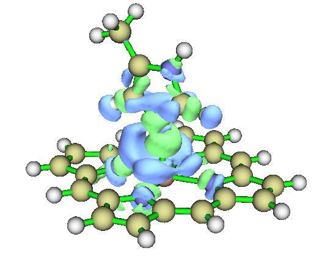

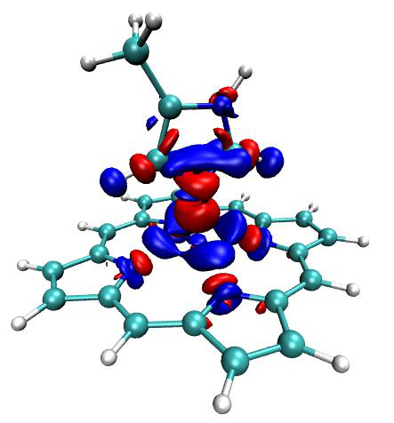

<!-- p.555 -->

and change the isovalue to -0.0012. If you would like to use white background instead of the default black background, select Graphics - Colors - Display - Background - 8 white.

In fact, using the VMD plotting script and batch file provided by me, much better effect than the map above can be obtained with much fewer number of steps. Please be sure to check Section 4.A.14, which illustrates how to use realize this.

Plotting contour map Next, we plot contour map of electron density difference in the plane defined by atoms 16, 14, 9. Input following commands:

!!! terminal "Multiwfn session"

    - **0** — Return to main menu
    - **4** — Draw a plane graph 0 2 -,MN.wfn -,NN.wfn 1
    - **2** — Contour line map [Press ENTER button to use default grid setting]
    - **4** — Define the plane by three atoms 16,14,9 Immediately the contour map pops up. The solid and dashed contour lines exhibit where electron density is increased and decreased, respectively. The contour lines in the graph are a bit sparse, so we adjust contour line setting to make the graph look denser and thus more informative. Close the graph and then input

!!! terminal "Multiwfn session"

    - **3** — Change contour line setting
    - **9** — Generate contour value by geometric series
    - **0.0001,2,30** — Start value, step size and the number of steps, respectively y

!!! terminal "Multiwfn session"

    - **Set negative contour lines n** — Append the newly generated contour lines to existing ones
    - **1** — Save setting and return
    - **-1** — Redraw the graph Below is the final graph, looks nice!


<!-- p.556 -->

Hint: After completing the definition the contour lines, you can choose option 6 to save the setting to external plain text file. Next time you can directly load the setting by option 7.

Note that in Multiwfn, plotting difference map for electron density or other real space functions can be easily extended to more than two fragments cases, see Section 4.4.8 for example.


### 4.5.6 Study electron delocalization range function EDR(r;d) of anionic water dimer


This section was contributed by Arshad Mehmood and slightly adapted by Tian Lu.

This example shows how to calculate electron delocalization range function EDR(r;d) at user-

defined length scale d for anionic water cluster (H2O)2− (cf. Phys. Chem. Chem. Phys., 17, 18305 (2015)). Using EDR(r;d) we can vividly inspect distribution of solvated electrons.

Boot up Multiwfn and input following commands: examples\solvatedelectron.wfn // Anionic water dimer optimized at B3LYP/6-311++G(2d,2p) level

!!! terminal "Multiwfn session"

    - **5** — Calculate grid data
    - **20** — EDR(r;d) 11.22

!!! terminal "Multiwfn session"

    - **2** — Medium-quality grid
    - **-1** — Show isosurface graph


<!-- p.557 -->

Now a GUI window pops up. Input isovalue of 0.74 in the “Isosurface value” box and press ENTER button. The following isosurface will appear.

This figure shows that at length scale of d=11.22 Bohr the solvated electron is between the two H2O molecules.


### 4.5.7 Study orbital overlap distance function D(r) of thioformic acid

This section was contributed by Arshad Mehmood and slightly adapted by Tian Lu.

This example will show the calculation procedure of orbital overlap distance function D(r) of thioformic acid and map it on molecular electron density surface. If you are not familiar with D(r), you can check entry 21 of Section 2.6 or J. Chem. Theory Comput., 12, 3185 (2016).

Boot up Multiwfn and input following commands:

!!! terminal "Multiwfn session"

    - **examples\ThioformicAcid.wfn** — Thioformic acid optimized at B3LYP/6-311++G(2d,2p)
    - **5** — Calculate grid data
    - **21** — Orbital overlap length function D(r), which maximizes EDR(r;d) with respect to d

Now we need to set input total number, start and increment of EDR exponents αi=1/di2, since the overlap distance is fit using an even-tempered grid of exponents. The start value is the largest exponent (α1), subsequent exponents are yielded by αi+1/αi = 1/αinc, where αinc is increment. The default setting (i.e. n=20, α1=2.50, αinc=1.50) suffices for common systems. After selecting the manual input (option 1) or default setting (option 2), a list of exponents will appear, which will be used in evaluation of D(r)

2 // Medium-quality grid At this stage Multiwfn starts calculation. Wait until calculation is finished, then choose option 2 to export grid data of D(r) as EDRDmax.cub in current folder. The next step is to generate molecular density isosurface.

!!! terminal "Multiwfn session"

    - **0** — Return to main menu
    - **5** — Calculate grid data
    - **1** — Electron density
    - **2** — Medium-quality grid (The grid setting must be the same as for D(r) calculation) Then export grid data of electron density in current folder as density.cub by selecting option

Based on the EDRDmax.cub and density.cub, then the D(r) grid data can be mapped on molecular density isosurface by many visualization programs, such as VMD and GaussView. Below

is the D(r) mapped electron density isosurface (ρ = 0.001 a.u.) plotted by GaussView (If you do not know how to map a real space function using various colors on isosurface of another real space


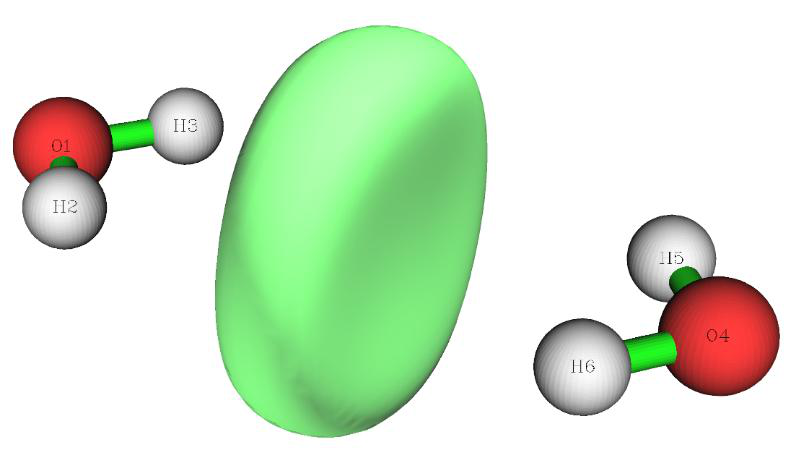
