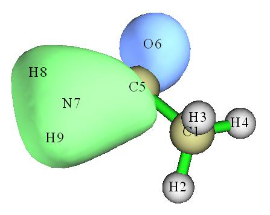
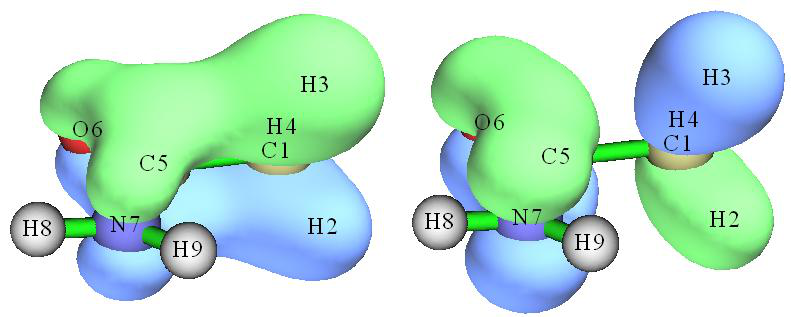
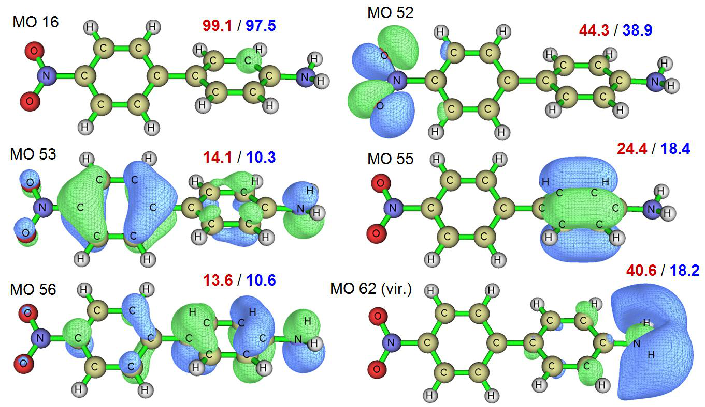
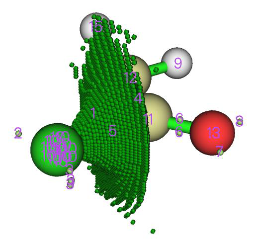

# 4.8 Molecular orbital composition analysis

> Multiwfn manual, p.600–616. Images: `../imgs/`.

---

<!-- p.600 -->


### 4.7.11 Calculate AIM charges

We calculate AIM charges for CH3NH2 in this example. Boot up Multiwfn and input examples\CH3NH2.wfn

!!! terminal "Multiwfn session"

    - **7** — Population analysis and atomic charge calculations
    - **14** — AIM charge
    - **2** — Medium-quality grid. This is a good compromise between cost and accuracy. The higher the grid quality, the higher the cost, while better the integration accuracy

Then you get the following output


```text
Final atomic charges:
 Atom    1(C ):     0.38812508
 Atom    2(H ):    -0.01581265
 Atom    3(H ):    -0.01581168
 Atom    4(H ):    -0.04790806
 Atom    5(N ):    -0.98865587
 Atom    6(H ):     0.34001793
 Atom    7(H ):     0.34004525
```

It can be seen that AIM charges are not very chemically reasonable, two hydrogen atoms at the methyl group, H2 and H3, surprisingly carry slightly negative charges, which clearly contradicts the relationship between the electronegativities of hydrogen and carbon. This is a well-known deficiency of AIM charges. Frankly speaking, AIM charges basically have no advantages, see my review of atomic charges for comprehensive comparisons and discussions: Partial Charges, In Exploring Chemical Concepts Through Theory and Computation. WILEY-VCH GmbH: Weinheim (2024); pp. 161-187. DOI: 10.1002/9783527843435.ch6.


## 4.8 Molecular orbital composition analysis

In this section, I will show how to use various methods to analyze molecular orbital compositions. The illustrated methods are also applicable to any other type of orbitals, e.g. natural orbitals, natural transition orbitals (NTOs) and localized MOs (LMOs). Details about orbital composition analysis can be found in Section 3.10. The pros and cons of different methods are very detailedly discussed in my paper Acta Chim. Sinica, 69, 2393 (2011, http://sioc-journal.cn/Jwk_hxxb/CN/abstract/abstract340458.shtml), citation is welcomed. If you can read Chinese, also you can consult my blog article "On the calculation methods of orbital composition" (http://sobereva.com/131).

Simply speaking, if your aim is merely obtaining atom compositions in orbitals, Hirshfeld/Becke method may be the most robust and convenient way, see Section 4.8.3; if you also would like to obtain atomic orbital composition, then the NAO method exemplified in Section 4.8.2 may be the best choice. The Mulliken method illustrated in Section 4.8.1 also generally works well but diffuse functions should not be used.


<!-- p.601 -->


### 4.8.1 Analyze acetamide by Mulliken method

In this example we employ Mulliken method to first analyze the composition of the 6th molecular orbital of acetamide, and then analyze which orbitals have main contribution to the bonding between formamide part and methyl group. Beware that Mulliken method is incompatible with diffuse functions, if they are involved, you should either choose other orbital composition methods (e.g. NAO, Hirshfeld...) or remove them from your basis set.

Boot up Multiwfn and input following commands examples\CH3CONH2.fch // You have to use .mwfn/.fch/.molden/.gms file as input for this type of analysis

!!! terminal "Multiwfn session"

    - **8** — Orbital composition analysis
    - **1** — Use Mulliken partition
    - **6** — The orbital index is 6 (Note that as shown in the prompt on the screen, you can also input orbital label here, for example h-3 corresponds to HOMO-3, l+1 corresponds to LUMO+1, etc.)

The composition of basis functions, shells and atoms are printed immediately, see below.


```text
Threshold of absolute value:  >   0.50000 %    // Only the basis functions with composition
larger than 0.5% will be printed, you can change the threshold by “compthres” parameter
in settings.ini.
Orbital:     6  Energy(a.u.):     -0.905290  Occ:  2.000000  Type: Alpha&Beta
 Basis Type    Atom    Shell      Local       Cross term        Total
   23   S        5(C )   14      0.44902 %      0.67507 %      1.12409 %
   24   X        5(C )   15      0.31240 %      0.50522 %      0.81762 %
   25   Y        5(C )   15      4.25271 %      5.88221 %     10.13493 %
   29   Y        5(C )   17      0.00777 %     -0.61063 %     -0.60286 %
   38   S        6(O )   20      3.50037 %      2.65507 %      6.15544 %
   42   S        6(O )   22      3.29488 %      1.71316 %      5.00803 %
   53   S        7(N )   26     15.20411 %     15.32688 %     30.53098 %
   57   S        7(N )   28     16.89006 %     17.40040 %     34.29046 %
   61   XX       7(N )   30      0.00774 %      0.58279 %      0.59053 %
   63   ZZ       7(N )   30      0.02793 %     -0.98090 %     -0.95297 %
   67   S        8(H )   31      1.27855 %      3.03091 %      4.30946 %
   69   S        9(H )   33      1.52931 %      3.60949 %      5.13880 %
Sum up those listed above:      46.75484 %     49.78967 %     96.54451 %
Sum up all basis functions:     51.95605 %     48.04395 %    100.00000 %

Composition of each shell, threshold of absolute value:  >    0.500000 %
Shell    14 Type: S    in atom    5(C ) :     1.12409 %
Shell    15 Type: P    in atom    5(C ) :    10.95268 %
Shell    17 Type: P    in atom    5(C ) :    -0.97156 %
Shell    20 Type: S    in atom    6(O ) :     6.15544 %
Shell    22 Type: S    in atom    6(O ) :     5.00803 %
Shell    26 Type: S    in atom    7(N ) :    30.53098 %
Shell    28 Type: S    in atom    7(N ) :    34.29046 %
Shell    31 Type: S    in atom    8(H ) :     4.30946 %
```


<!-- p.602 -->


```text
Shell    33 Type: S    in atom    9(H ) :     5.13880 %

Composition of different types of shells (%):
s:  88.193  p:  11.391  d:   0.416  f:   0.000  g:   0.000  h:   0.000

Composition of each atom:
Atom     1(C ) :     1.17249 %
Atom     2(H ) :     0.05445 %
Atom     3(H ) :     0.03212 %
Atom     4(H ) :     0.00817 %
Atom     5(C ) :    11.81245 %
Atom     6(O ) :    11.63274 %
Atom     7(N ) :    65.50085 %
Atom     8(H ) :     4.47022 %
Atom     9(H ) :     5.31651 %

Orbital delocalization index:   46.15
```

The result indicates that nitrogen has primary contribution (65.5%) to orbital 6, and the contribution consists of two S-shells (30.5% and 34.3%). P-shells of neighbouring carbon and S-shells of oxygen have slight contribution too (both are about 12%). We can check if the result is reasonable by viewing isosurface (isovalue is set to 0.1 here):

From the graph, the region where the value of orbital wavefunction is large is mainly localized around nitrogen, and there is no nodal plane, so the orbital wavefunction in this region should be constructed from s-type orbitals. The isosurface also somewhat intrudes into the region of atom C5 and O6, so they should have small contribution to MO 6, moreover, because there is a nodal plane in C5, the atomic orbitals of C5 used to form MO 6 should be p-type. Obviously, these conclusions are in fairly agreement with composition analysis. The advantage of composition analysis is that the result can be quantified, while by visual study we can only draw qualitative conclusion, for some complex system we cannot draw even qualitative conclusion.

The " Orbital delocalization index" printed at the end of the output has close relationship with extent of spatial delocalization of the orbital, this point will be described in Section 4.8.5 in detail.

Now let us find which molecular orbitals have main contribution to the bonding between




<!-- p.603 -->

formamide part and methyl group. Boot up Multiwfn and input

!!! terminal "Multiwfn session"

    - **examples\CH3CONH2.fch 8** — Orbital composition analysis
    - **-1** — Define fragment 1 a
    - **1-4** — Add all basis functions in atom 1, 2, 3, 4 (methyl group) into fragment1 q

Define fragment 2 a 5-9 // Add all basis functions in atom 5, 6, 7, 8, 9 (formamide moiety) into fragment 2 q 4 // Print composition of fragment 1 and the cross term between fragment 1 and 2 in all orbitals by Mulliken analysis. If you only defined fragment 1, then only composition of fragment 1 will be printed

Since amount of the printed information is huge, I only extract cross term composition in all occupied orbitals:


```text
Cross term between fragment 1 and 2 and their individual parts:
Orb#  Type   Ene(a.u.)   Occ       Frag.1 part     Frag.2 part        Total
    1  AB    -19.1036  2.00000       -0.0013 %       -0.0013 %       -0.0026 %
    2  AB    -14.3492  2.00000       -0.0001 %       -0.0001 %       -0.0003 %
    3  AB    -10.2819  2.00000        0.0606 %        0.0606 %        0.1211 %
    4  AB    -10.1845  2.00000        0.0604 %        0.0604 %        0.1209 %
    5  AB     -1.0376  2.00000        0.3535 %        0.3535 %        0.7070 %
    6  AB     -0.9053  2.00000        0.7295 %        0.7295 %        1.4590 %
    7  AB     -0.7387  2.00000        7.9504 %        7.9504 %       15.9008 %
    8  AB     -0.5884  2.00000       -1.8755 %       -1.8755 %       -3.7510 %
    9  AB     -0.5410  2.00000       -0.7506 %       -0.7506 %       -1.5011 %
   10  AB     -0.4663  2.00000        3.8098 %        3.8098 %        7.6197 %
   11  AB     -0.4472  2.00000        5.5270 %        5.5270 %       11.0539 %
   12  AB     -0.4016  2.00000       -0.3983 %       -0.3983 %       -0.7965 %
   13  AB     -0.3961  2.00000       -0.4274 %       -0.4274 %       -0.8549 %
   14  AB     -0.3674  2.00000       -5.8826 %       -5.8826 %      -11.7653 %
   15  AB     -0.2661  2.00000        0.1192 %        0.1192 %        0.2383 %
   16  AB     -0.2438  2.00000       -6.0931 %       -6.0931 %      -12.1863 %
```

The product of the cross term composition between fragments 1 and 2 in orbital i and corresponding orbital occupation number is the Mulliken bond order between them contributed by orbital i. From above information we can see MO 7 and 11 are beneficial to bonding, because the compositions are relative large, while MO 14 and 16 are not conducive for bonding. The isosurfaces of MO 11 (left side) and 14 (right side) are shown below, it is clear that the result of composition analysis is reasonable.


<!-- p.604 -->

As you have seen, using Mulliken method to analyze orbital composition is very convenient. However, the result of Mulliken method is sensitive to basis set, and is not as robust as NAO method and Hirshfeld method illustrated below. Especially, do not use Mulliken method when diffuse functions are involved in your calculation, otherwise the result will be meaningless!


### 4.8.2 Analyze water by natural atomic orbital method

In this example we analyze molecular orbital composition of water by the natural atomic orbital (NAO) method discussed in Section 3.10.4. NAO method has much better basis set stability (i.e. insensitive to the choice of basis set) and stronger theoretical basis than Mulliken or Mulliken-like methods (such as SCPA and Stout-Politzer).

Note: NAO is never the only way of obtaining composition of atomic orbitals in MOs, you can also use Mulliken or similar methods (e.g. SCPA) to do that. The correspondence between basis function and atomic orbital can be identified according to basis set definition or by mean of population analysis, see Section 4.7.6.

Performing NAO method requires MO coefficient matrix in NAO basis, this matrix cannot be generated by Multiwfn itself, but Multiwfn can utilize the output information containg this matrix by stand-alone NBO program or NBO module embedded in quantum chemistry softwares. The NBO 3.1 module embedded in Gaussian program is L607. Below is a Gaussian input file for water, which will output the matrix we needed. Notice that the Gaussian task should be single point task, do not perform geometry optimization together!


```text
## HF/6-31g* pop=nboread

Title Card Required

0 1
 O                  0.00000000    0.00000000    0.11472000
 H                  0.00000000    0.75403100   -0.45888100
 H                  0.00000000   -0.75403100   -0.45888100

$NBO NAOMO $END
[blank line]
[blank line]
```

where pop=nboread keyword indicates that the texts enclosed by \$NBO and \$END, namely NAOMO, will be passed to NBO module. NAOMO keyword tells NBO module to output MO coefficient matrix in NAO basis.

Assume that the Gaussian output file is named as H2O_NAOMO.out (can be found in




<!-- p.605 -->

"example" folder), we start Multiwfn and input:

!!! terminal "Multiwfn session"

    - **examples/H2O_NAOMO.out** — Note that DO NOT use .fch as input file in current case
    - **8** — Enter orbital composition analysis module
    - **7** — Enter NAO analysis function You will find the default output mode is "Only show core and valence NAOs". Core and valence NAOs have one-to-one correspondence with actual atomic orbitals, if the MO to be analyzed is occupied, in general we only need to concern these NAOs, while Rydberg NAOs can be ignored. Assume that we want to analyze MO 4, we input

0 // Show orbital composition of specific MO 4 // Analyze MO 4 The following information will appear on screen


```text
Note: All Rydberg NAOs/shells or contributions <=  0.50 % will not be printed

    NAO#   Center   Label      Type    Composition
       2    1(O )    S        Val( 2s)     8.573 %
       9    1(O )    pz       Val( 2p)    84.089 %
      16    2(H )    S        Val( 1s)     3.542 %
      18    3(H )    S        Val( 1s)     3.542 %

 Condensed NAO terms to shells:
   Atom:     1(O )  Shell:     2( 2s Val)     8.573 %
   Atom:     1(O )  Shell:     5( 2p Val)    84.089 %
   Atom:     2(H )  Shell:     8( 1s Val)     3.542 %
   Atom:     3(H )  Shell:    10( 1s Val)     3.542 %

 Composition of different types of shells (%):
 s:  15.761  p:  84.104  d:   0.130  f:   0.000  g:   0.000  h:   0.000

 Condensed NAO terms to atoms:
   Center   Composition
     1(O )    92.899 %
     2(H )     3.548 %
     3(H )     3.548 %

 Core composition:        0.031 %
 Valence composition:    99.746 %
 Rydberg composition:     0.218 %

 Orbital delocalization index:   86.55
```

According to the result, we can say for example, 2pz atomic orbital of oxygen has 84.09% contribution to MO 4. The contributions from the NAOs listed above (Rydberg composition is not included in the present example) are also summed up to atom contributions according to which


<!-- p.606 -->

center they belong to.

Note that the sum of non-Rydberg compositions (i.e. Core + Valence), as shown above, is not 100 % rather than 99.777 %. To make the physical meaning more clear, I personally recommend to manually perform renormalization for the result. For example, the composition of 2pz should be 84.089 % / 0.99777=84.277 %. Since before and after the renormalization the difference is only 0.188 %, the renormalization is not necessary for current case. Only when the non-Rydberg composition is nonnegligible (e.g. larger than 2 %), the renormalization is indispensable.

Calculate fragment contribution to specific MOs Input 0 to return to last menu. Next, we analyze contribution from the NAOs centered at the two hydrogens to MOs 1~10.

Input -1 to enter the interface for defining fragment. If you input all, then detailed information of all NAOs will be listed (this step is optional):


```text
  NAO#   Atom&Index    Type   Set&Shell    Occupancy   Energy (a.u.)
    1      O     1     S       Cor( 1S)     1.99992     -20.39645
    2      O     1     S       Val( 2S)     1.74644      -1.14691
...[ignored]
   15      O     1     dz2     Ryd( 3d)     0.00254       2.02361
   16      H     2     S       Val( 1S)     0.52321       0.33308
   17      H     2     S       Ryd( 2S)     0.00086       0.70497
   18      H     3     S       Val( 1S)     0.52321       0.33308
   19      H     3     S       Ryd( 2S)     0.00086       0.70497
```

We input a 2,3, namely adding all NAOs belonging to atoms 2 and 3 to the current fragment. Then input q to save and quit. From the prompt printed on screen you can find NAOs 16, 17, 18 and 19 are presented in this fragment.

Then select option 1 and input 1-8, the contribution from the four NAOs to MO 1~8 will be shown as below


```text
Orb.#       Core      Valence     Rydberg      Total
    1        0.000 %     0.119 %     0.002 %     0.121 %
    2        0.000 %    18.556 %     0.054 %    18.611 %
    3        0.000 %    26.557 %     0.018 %    26.576 %
    4        0.000 %     7.084 %     0.012 %     7.096 %
    5        0.000 %     0.000 %     0.000 %     0.000 %
    6        0.000 %    35.482 %    46.832 %    82.314 %
    7        0.000 %    27.558 %    61.538 %    89.096 %
    8        0.000 %    32.433 %    29.568 %    62.002 %
```

Since none of the four NAOs in the fragment is core-type, the Core term is 0 % in the MOs. Valence and Rydberg terms correspond to the contribution from NAOs 16, 18 and NAOs 17, 19 respectively. NAOs 16 and 18 directly correspond to 1s atomic orbital of H2 and H3, so we can say that the two hydrogens collectively contribute 26.56 % to MO 3.

The first five MOs are doubly occupied in present system. It is clear that Rydberg NAOs have very low contribution to the occupied MOs, while their contributions to virtual MOs are significant and can no longer be ignored. The physical meaning of Rydberg NAOs is difficult to be interpreted, and these NAOs do not directly reflect atomic orbital characteristics. It is questionable to say that the two hydrogens contribute either 32.43 % or 62.00 % to MO 8. Although seemingly one can


<!-- p.607 -->

employ renormalization process to "annihilate" the Rydberg composition, however when Rydberg composition is too large, e.g. larger than 10 %, this treatment will break meaning of the result. So it is not generally recommended to use NAO method to analyze atomic contributions to virtual MOs; for this case, the Hirshfeld and Becke method introduced in Section 3.10.5 and exemplified in the next section are the best choice.


### 4.8.3 Analyze acetamide by Hirshfeld and Becke method

In this section, we will first use Hirshfeld method and then Becke method to analyze the MO composition of acetamide and compare the result with the one obtained by Mulliken method in Section 4.8.1. Note that Hirshfeld and Becke methods are only capable of analyzing composition of atom or fragment in orbitals, while the composition of atomic orbitals are impossible to be obtained by these approaches.

Boot up Multiwfn and input examples\CH3CONH2.fch // You can also use such as .wfn and .wfx file as input. But .wfn and .wfx files do not contain virtual orbital information!

8 // Orbital composition analysis 8 // Use Hirshfeld partition Hirshfeld analysis requires electron density of atoms in their free-states, you need to choose a method to calculate atomic densities. Selecting 1 to use built-in atomic densities is very convenient, see Appendix 3 for detail; alternatively, you can select 2 to evaluate atomic densities based on atomic .wfn files, see Section 3.7.3 for detail. Here we choose option 1.

Then Multiwfn initializes the data, for large system you may need to wait for a while. Assume that you want to analyze MO 6, then simply input 6, the result will be printed on screen, as shown below. (Because the integrals are evaluated numerically, the sum of all terms will be slightly deviated to 100%, so Multiwfn automatically normalizes the result.)


```text
 Atom     1(C ) :      1.555%
 Atom     2(H ) :      0.249%
 Atom     3(H ) :      0.155%
 Atom     4(H ) :      0.037%
 Atom     5(C ) :     14.922%
 Atom     6(O ) :     12.109%
 Atom     7(N ) :     56.339%
 Atom     8(H ) :      6.688%
 Atom     9(H ) :      7.946%
```

The composition of C5, O6 and N7 are 14.92%, 12.11% and 56.34%, respectively. This result is close to the one obtained by Mulliken method (Section 4.8.1), namely 11.81%, 11.63% and 65.50%, respectively. In fact, for occupied MOs, if diffuse basis functions are not employed, in general Mulliken, NAO and Hirshfeld methods give similar results.

Now let us check the composition of 7N in MO from 14 to 19. We input

!!! terminal "Multiwfn session"

    - **-2** — Print atom contribution to a range of orbitals
    - **7** — Atom index
    - **14-19** — Orbital range


<!-- p.608 -->

You will see:


```text
Orb#    Type       Ene(a.u.)     Occ    Composition    Population
  14 Alpha&Beta      -0.3674    2.000     16.072%       0.321446
  15 Alpha&Beta      -0.2661    2.000     48.508%       0.970161
  16 Alpha&Beta      -0.2438    2.000      6.792%       0.135840
  17 Alpha&Beta       0.0410    0.000     12.378%       0.000000
  18 Alpha&Beta       0.0762    0.000     21.755%       0.000000
  19 Alpha&Beta       0.1252    0.000     14.512%       0.000000
Population of this atom in these orbitals:    1.427447
```

where 1.427447 (namely 0.321446+0.970161+0.135840) is the total population number of N7 in MO 14~19.

PS: If the orbital range you specified is 1~16, namely all occupied MO, then the outputted value 7.1589 will be the atomic population number of N7, and its Hirshfeld atomic charge is therefore 7.0-7.1589 = -0.1589.

Next, we examine contribution of the amino group to a specific orbital, HOMO. Input below commands:

!!! terminal "Multiwfn session"

    - **-9** — Define fragment
    - **7-9** — The atoms in the amino group h


```text
[...ignored]
 Atom     6(O ) :     69.178%
 Atom     7(N ) :      6.791%
 Atom     8(H ) :      0.974%
 Atom     9(H ) :      0.938%

 Fragment contribution:      8.703%
```

The steps of analyzing orbital composition by Becke method are completely identical to that of Hirshfeld method. Here we calculate the composition of MO 6. Boot up Multiwfn and input

!!! terminal "Multiwfn session"

    - **examples\CH3CONH2.fch 8** — Orbital composition analysis
    - **9** — Use Becke partition
    - **6** — The 6th orbital The result is


```text
Atom     1(C ) :      1.229%
Atom     2(H ) :      0.085%
Atom     3(H ) :      0.049%
Atom     4(H ) :      0.002%
Atom     5(C ) :     14.902%
Atom     6(O ) :     12.070%
Atom     7(N ) :     60.742%
Atom     8(H ) :      4.929%
Atom     9(H ) :      5.992%
```


<!-- p.609 -->

As you can see, the result is highly close to that produced by Hirshfeld method. In Multiwfn it is also possible to use Hirshfeld-I partition to calculate orbital composition, however this is not commonly employed, because generating Hirshfeld-I atomic space requires additional computational cost, while the result is not greatly improved (the orbital composition computed by Hirshfeld method is already reliable and meaningful enough).


### 4.8.4 Calculate oxidation state by LOBA/mLOBA method

Note: Chinese version of this section is my blog article “Calculating oxidation state using LOBA method in Multiwfn” (http://sobereva.com/362), which contains more discussions.

Please read Section 3.10.100 first to understand basic idea of the LOBA and mLOBA method. This is a simple and useful method to evaluate oxidation state (OS). In this section I will use two examples to illustrate the LOBA/mLOBA module in Multiwfn. The used .fch files can be directly loaded at http://sobereva.com/multiwfn/extrafiles/LOBA.rar.

(1) Fe(CN)63- First, we use Gaussian to perform regular calculation of this system, the input file is examples\Fe(CN)6_3-.gjf, please run it yourself to get Fe(CN)6_3-.fch file. LOBA or mLOBA analysis needs localized molecular orbitals (LMOs), thus we use Multiwfn to carry out orbital localization. Boot up Multiwfn and input following commands:

!!! terminal "Multiwfn session"

    - **Fe(CN)6_3-.fch 19** — Orbital localization
    - **1** — Only localize occupied orbitals, this is enough for LOBA/mLOBA analysis Now the molecular orbitals in memory have been replaced with LMOs. Then input
    - **8** — Orbital composition analysis
    - **100** — LOBA/mLOBA analysis
    - **50** — Percentage threshold for performing LOBA


```text
Oxidation state of atom   1(Fe) :  3
Oxidation state of atom   2(C ) :  2
Oxidation state of atom   3(C ) :  2
Oxidation state of atom   4(C ) :  2
Oxidation state of atom   5(C ) :  2
Oxidation state of atom   6(C ) :  2
Oxidation state of atom   7(C ) :  2
Oxidation state of atom   8(N ) : -3
Oxidation state of atom   9(N ) : -3
Oxidation state of atom  10(N ) : -3
Oxidation state of atom  11(N ) : -3
Oxidation state of atom  12(N ) : -3
Oxidation state of atom  13(N ) : -3
The sum of oxidation states:  -3
```

The result looks reasonable and in good agreement with chemical intuition. The sum of all oxidation states just corresponds to the total net charge of -3. However, the LOBA is not free of ambiguity, the choice of the threshold is highly arbitrary. If we input 60 instead of 50, we will see


<!-- p.610 -->

oxidation states of carbon and oxygen become 4 and -1, respectively, and the sum of oxidation states become 21. Fortunately, the OS of transition metal is not so sensitive to the choice of threshold, the iron always keeps +3 oxidation state in present case as long as the threshold is not set to very small or very large. Usually, the most appropriate threshold for evaluating OS of transition metal is 50~60%).

I strongly suggest using mLOBA instead of LOBA. If you input m here, you will obtain OS values of mLOBA method, in this example the results of mLOBA and LOBA are exactly the same. mLOBA fully gets rid of the arbitrariness of choice of the threshold.

(2) Ferrocene For this system, we will not only check OS of iron, but also check OS of C5H5 fragment. The corresponding regular Gaussian input file is examples\Ferrocene.gjf, run it yourself to obtain corresponding .fch file, then load it into Multiwfn and perform orbital localization first as shown above, after that enter LOBA/mLOBA analysis interface and input below commands:

!!! terminal "Multiwfn session"

    - **-1** — Define fragment
    - **1-5,7-11** — Index of the atoms constituting the C5H5 fragment
    - **50** — Percentage threshold for performing LOBA The result is


```text
Oxidation state of atom   1(C ) :  2
Oxidation state of atom   2(C ) :  2
Oxidation state of atom   3(C ) :  2
Oxidation state of atom   4(H ) :  1
Oxidation state of atom   5(H ) :  1
Oxidation state of atom   6(Fe) :  2
Oxidation state of atom   7(C ) :  2
Oxidation state of atom   8(C ) :  2
...[ignored]
The sum of oxidation state:  32
Oxidation state of the fragment:  -1
```

In this system the OS of Fe is +2, which is again reasonable. From the output it is seen that the OS of individual carbons are not useful, however, the OS of the whole C5H5 fragment is a meaningful value -1.

Next, we input m to check result of mLOBA method, you will find the OSs of Zn and C5H5 fragment are exactly the same as LOBA. Clearly using mLOBA is preferred over LOBA, because you do not need to worry about how to set a proper threshold.

Finally, we study OS of carbon. The OS of all carbons obtained by LOBA is 2, which is clearly incorrect, because each carbon does not bond to any atom that has electronegativity more negative than it, so OS of carbon should not be positive. mLOBA gives different OSs for different carbons, namely 4, 2 or -2, this inacceptable result is caused by the symmetry of ferrocene. The correct way of using mLOBA to derive OS of carbons is first defining all the equivalent 10 carbons as a fragment (atoms 1-3,7,8,12-16), then after inputting m, you will find the OS of the fragment given by mLOBA is -12, and thus each carbon has OS of -12/10 = -1.2. Notice that although OS is usually an integer, for the current system we have to accept non-integer OS, otherwise the sum of all OSs will not equal the net charge of the system. If integer OS of carbon is needed, it may be reasonable to view it as -1, because -1 is the closest integer of -1.2.


<!-- p.611 -->


### 4.8.5 Quantifying extent of spatial delocalization of orbitals via orbital delocalization index (ODI)


Note: Chinese version of this section is my blog article “Using orbital delocalization index (ODI) to measure spatial delocalization extent of orbitals” (http://sobereva.com/525).

When Multiwfn outputs composition of various atoms in an orbital, the orbital delocalization index (ODI) is also printed. The ODI was defined by me, the value for orbital i is expressed as


$$ODI_{i}=0.01\times\sum_{A}(\Theta_{A,i})^{2}$$

<!-- formula-ocr: formula_p611_338.png 已替换为LaTeX, 原图保留备查 -->

$\Theta_{A,i}$ is composition of atom A in orbital i.

The ODI a useful indicator of quantifying extent of orbital spatial delocalization, the lower (higher) the ODI, the stronger the orbital delocalization (localization).

If you are familiar with Pipek-Mezey orbital localization method, you can easily understand idea of the ODI. As a very simple instance, we consider two orbitals. The first one is fully localized on an atom, while another one is equally distributed on two atoms, then the ODI for the first orbital will be (1002)/100=100, while that for the second orbital will be (502+502)/100=50. Since the latter is much smaller than the former, the second orbital is much more delocalized than the first one.

In addition, Multiwfn is able to calculate spatial delocalization index (SDI) to study extent of orbital spatial delocalization, see Section 3.200.19 for introduction and Section 4.200.19 for example. SDI can also study spatial delocalization of arbitrary real space function and thus much more universal than ODI.

4.8.5.1 Example of calculating ODI based on orbital composition

In this section, I will take a practical molecule to demonstrate its usefulness and reliability. Boot up Multiwfn and input examples\excit\D-pi-A.fchk

!!! terminal "Multiwfn session"

    - **8** — Orbital composition analysis
    - **1** — Mulliken method
    - **52** — Analyze MO 52 You will find below output, namely the ODI of MO 52 calculated by Mulliken method is


```text
Orbital delocalization index:   44.28
```

Similarly, we compute and record ODI for MO 16, MO 53, MO 55, MO 56, MO 62. Note that only MO62 is a virtual orbital.

For comparison purpose, we also calculate the ODI based on Hirshfeld orbital composition analysis method. Input below commands

!!! terminal "Multiwfn session"

    - **0** — Return 8
    - **Hirshfeld method 1** — Use built-in atomic density
    - **52** — Analyze MO52 The output is


```text
Orbital delocalization index:   38.93
```

Similarly, we use the Hirshfeld method to compute and record ODI for MO 16, MO 53, MO 55, MO 56, MO 62.


<!-- p.612 -->

The isosurfaces of the analyzed MOs under isovalue of 0.04 are summarized below, the red and blue texts correspond to the ODI calculated by Mulliken and Hirshfeld methods, respectively.

By comparing the ODI values and orbital isosurface maps it can be seen that the ODI value is indeed able to faithfully quantify extent of orbital delocalization. The MO 16 is essentially a core orbital of a carbon atom, since it is fully localized, the ODI nearly reaches its theoretical upper limit (100). The MO 52 shows partial delocalization character, the two oxygens mainly and equally

contribute to the orbital, therefore its ODI is not quite high. The MO 55 corresponds to π orbital of a ring and thus evidently distributes on more than two atoms, this is why its ODI is lower than MO 52. The MO 53 and MO 56 show strong global delocalization character, therefore their ODI values are quite low. Because their ODI values are comparable, it can be concluded that MO 53 and MO 56 have similar extent of spatial delocalization.

The virtual orbital MO 62 is quite worth to mention, it is essentially a Rydberg orbital and its main body surrounds the amino group. From the isosurface map it can be seen that MO 62 and MO 55 have comparable delocalization character, the ODI computed by Hirshfeld method for the two orbitals (18.4 vs. 18.2) is in line with this observation. However, the ODI of MO 62 computed by Mulliken method is much larger than MO 55, this is totally contrary to reality, showing the fact that Mulliken (and its variant, SCPA and Stout-Politzer) is usually unreliable in calculating ODI for virtual orbitals.

Also bear in mind that since Mulliken, SCPA and Stout-Politzer are incompatible with diffuse functions, they should not be used to evaluate ODI when diffuse functions are present, in this case you should use e.g. Hirshfeld and NAO methods instead.

In summary, I suggest using Hirshfeld method to compute ODI, it works well for any case. However, if you only need to analyze occupied orbitals and diffuse function is not employed, you can also use Mulliken or SCPA method, which is faster than Hirshfeld method for large system.

4.8.5.2 Calculating ODI based on orbital composition for a batch of orbitals

The Hirshfeld, Hirshfeld-I and Becke orbital composition analysis module is able to directly




<!-- p.613 -->

calculate ODI for a batch of orbitals. For instance, here we calculate ODI for all occupied MOs for

the D-π-A system we studied above.

Boot up Multiwfn and input examples\excit\D-pi-A.fchk

!!! terminal "Multiwfn session"

    - **8** — Orbital composition analysis
    - **8** — Hirshfeld method
    - **1** — Use built-in atomic density
    - **-5** — Print ODI for a batch of orbitals
    - **1-56** — The range of occupied MOs We immediately obtain below result


```text
 Orb:    1 Ene(a.u.):    -19.246317 Occ:  2.0000 Type: Alpha&Beta ODI:   55.03
 Orb:    2 Ene(a.u.):    -19.246291 Occ:  2.0000 Type: Alpha&Beta ODI:   55.03
 Orb:    3 Ene(a.u.):    -14.644365 Occ:  2.0000 Type: Alpha&Beta ODI:   98.40
[ignored...]
 Orb:   55 Ene(a.u.):     -0.315850 Occ:  2.0000 Type: Alpha&Beta ODI:   18.36
 Orb:   56 Ene(a.u.):     -0.257102 Occ:  2.0000 Type: Alpha&Beta ODI:   10.61
```

You can copy out the data and plot it as bar map:

100

90

80

70

60

ODI 50

40

30

20

10

5101520253035404550550

MO index

From this graph we can very quickly identify the orbitals showing significant delocalization character. The first 16 MOs in this system are core orbitals, as can be seen from the map, they are much more localized than valence orbitals. The graph exhibits that MOs 50, 51 and 52 are also highly localized, if you inspect their isosurface maps via main function 0, you will find they mainly localize over the nitro group.

4.8.5.3 Calculating ODI for a fragment

In order to measure orbital delocalization extent on a specific fragment, I defined fragment ODI:


<!-- p.614 -->

$$\mathrm{ODI}_{i}^{\mathrm{frag}}=0.01\times\sum_{A\in\mathrm{frag}}\left(\frac{\Theta_{A,i}}{p_{i}}\right)^{2}$$

where p is normalization factor to account for the difference of total amount of orbital distribution on different $^{frag}$ments. If the fragment contains all atoms, then the ODIfrag will be identical to the aforementioned ODI.

Clearly, $^{frag}$ment ODI is very useful if you want to quantitatively compare orbital delocalization for a fragment shared by analogues. Currently, only Hirshfeld, Hirshfeld-I and Becke orbital composition analysis modules can calculate fragment ODI. Now, let see an example.

As vividly shown in the orbital isosurface maps of the D-pi-A.fchk given above, for the amino group, the MO 53 fully localizes on the nitrogen atom, while the MO 56 delocalizes over the entire group. Now we use $^{frag}$ment ODI to quantify this point. Boot up Multiwfn and input

!!! terminal "Multiwfn session"

    - **examples\excit\D-pi-A.fchk 8** — Orbital composition analysis
    - **8** — Hirshfeld method
    - **-9** — Define $^{frag}$ment
    - **24-26** — Index of the atoms in the amino group Next, if you input 53, you will see


```text
Fragment contribution:     13.564%
Orbital delocalization index of the $^{frag}$ment:   77.26
```

if inputting 62, you will see


```text
Fragment contribution:     71.819%
Orbital delocalization index of the $^{frag}$ment:   33.41
```

Since $^{frag}$ment ODI of MO 62 is significantly smaller than that of MO 53, it is clear that delocalization of MO 62 over amino group is much stronger than MO 53.

Note that you can also use the option "Print orbital delocalization index (ODI) for a batch of orbitals" to calculate ODI and ODI$^{frag}$ for a batch of orbitals. The ODI values will be printed followed by ODIfrag values.


### 4.8.6 Calculate orbital composition contributed by AIM basins and other type of basins


As mentioned in Section 3.10.7, Multiwfn is able to compute orbital composition based on AIM partition via basin analysis module (main function 17), in other words, calculate orbital composition contributed by AIM basins. In addition, due to the extremal flexibility of the basin analysis module, it is also possible to calculate orbital composition contributed by other kinds of basins, such as ELF basins, electrostatic potential basins and Fukui function basins. In this section, I will take CH3COCl as example to illustrate this point. You can use any kind of file as input file as long as it contains GTF information, see Section 2.6 for more information.

If you are not familiar with basin analysis and find difficulty in understanding the examples below, you are suggested to read Section 3.20 to gain basic knowledge about basin analysis and check Section 4.17 to familiarize yourself with the use of basin analysis module.


<!-- p.615 -->

Calculate contributions of AIM basins to molecular orbitals Boot up Multiwfn and input examples\CH3COCl.wfn // You can also use other formats, e.g. wfx/fch/molden/mwfn... Note that .wfn and .wfx only contain occupied orbitals

!!! terminal "Multiwfn session"

    - **17** — Basin analysis
    - **1** — Generate basins and locate attractors
    - **1** — Use electron density to partition basins, namely yielding AIM basins
    - **2** — Medium-quality grid
    - **11** — Calculate orbital compositions contributed by various basins Now you can directly input index of an orbital to calculate its composition. For example, we input 5, you will see


```text
Final data after normalization:
Basin:       1   Contribution:     0.731 %
Basin:       2   Contribution:    72.113 %
Basin:       3   Contribution:     6.860 %
Basin:       4   Contribution:    14.708 %
Basin:       5   Contribution:     4.527 %
Basin:       6   Contribution:     0.330 %
Basin:       7   Contribution:     0.731 %

Contributions from atoms:
     1 (C )    Contribution:   6.860 %
     2 (H )    Contribution:   0.731 %
     3 (H )    Contribution:   0.330 %
     4 (H )    Contribution:   0.731 %
     5 (C )    Contribution:  14.708 %
     6 (O )    Contribution:   4.527 %
     7 (Cl)    Contribution:  72.113 %

Orbital delocalization index:   54.85
```

As you can see, Multiwfn first outputs contributions from various basins, and then, in order to facilitate inspection, the contributions are outputted again according to the order of atoms (commonly AIM basins and atoms have a one-to-one correspondence). If you use Hirshfeld method to compute the composition of this orbital, you will find the result is similar; for example, Cl7 is 69.6% and C5 is 16.3%. Since generation of AIM basins is quite time-consuming for large system, while AIM partition does not have special advantage, usually I recommend to use Hirshfeld or Becke method to compute atomic contribution.

In the present interface, you can also use option -9 to define a set of atoms as fragment, so that the fragment contribution can be outputted together. Besides, you can use option -4 to output all atomic contributions in all orbitals to orbcomp.txt in current folder.

Calculate contributions of ELF basins to molecular orbitals This time we will partition molecular space based on ELF, so that contributions from various ELF basins to specific orbital can be obtained. Since each ELF basin usually corresponds to a local region with featured electronic structure, this analysis may be useful in characterizing orbitals.


<!-- p.616 -->

Boot up Multiwfn and input examples\CH3COCl.wfn

!!! terminal "Multiwfn session"

    - **17** — Basin analysis
    - **1** — Generate basins and locate attractors
    - **9** — Use ELF to partition basins
    - **2** — Medium-quality grid
    - **11** — Calculate orbital compositions contributed by various basins
    - **10** — Study the 10th MO Then you will see


```text
Basin:       1   Contribution:     2.384 %
Basin:       2   Contribution:    30.179 %
Basin:       3   Contribution:    26.205 %
Basin:       4   Contribution:     8.479 %
Basin:       5   Contribution:    18.199 %
Basin:       6   Contribution:     1.953 %
Basin:       7   Contribution:     1.366 %
Basin:       8   Contribution:     1.870 %
Basin:       9   Contribution:     1.144 %
Basin:      10   Contribution:     4.512 %
Basin:      11   Contribution:     0.602 %
Basin:      12   Contribution:     0.244 %
Basin:      13   Contribution:     0.152 %
Basin:      14   Contribution:     0.326 %
Basin:      15   Contribution:     2.384 %
```

In order to understand the chemical meaning of the data, we can select 0 to return to upper level of menu, and then select option "0 Visualize attractors and basins". In the GUI window, select basin 5 to visualize it, you will see the left figure shown below. If you use main function 0 to plot isosurface map of the orbital 10, you will see the right figure shown below (isovalue = 0.09).

It can be seen that the orbital 10 partially exhibits bonding character between C5 and Cl7, while basin 5 directly corresponds to bonding basin and can be symbolized as V(C5,Cl7), evidently this basin should have notable contribution to orbital 10. From the orbital composition data shown above, the contribution by basin 5 is indeed prominent (18.2 %), showing that the ELF basin contributions





