# 4.11 Plot various kinds of spectra

> Multiwfn manual, p.655–693. Images: `../imgs/`.

---

<!-- p.655 -->

10-13,15,17 // Atom index of the carbons in the phenyl moiety [Press ENTER button] // No requirement on index of basis functions X // Basis functions must be PX type q // Save fragment 2 0 // Return to last menu 0 // Draw COHP between the two defined fragments Now you can see the following map, which is quite similar to the corresponding OPDOS curve plotted in Part 4 of Section 4.10.1. This example shows that COHP usually convey analogous information like OPDOS.


## 4.11 Plot various kinds of spectra

Note: Most examples in this section are also available in my blog article “Using Multiwfn to calculate transition electric dipole moment between excited states and electric dipole moment of each excited state” (http://sobereva.com/224, in Chinese), which also contains extended discussion.

Multiwfn has a very powerful and flexible spectrum plotting module. The basic principles, supported input files and all options of this module have been detailedly introduced in Section 3.13. In the next sections I will briefly exemplify the usage of this module. If you are not familiar with related theories, please carefully read Section 3.13.1 first.

It is worth to note that there is also an article of introducing detailed steps on how to simulate UV-Vis and ECD spectra using Multiwfn in combination with ORCA, see http://sobereva.com/485.

4.11.1 Plot infrared (IR) spectrum for NH3BF3

This example plots infrared (IR) spectrum for NH3BF3. Multiwfn can read in frequencies and intensities from output file of Gaussian or ORCA vibration analysis task (“freq” keywords). Boot up Multiwfn and input following commands

examples\spectra\NH3BF3_freq.out // The output file of optimization and vibrational analysis task of Gaussian at B3LYP/6-31G* level


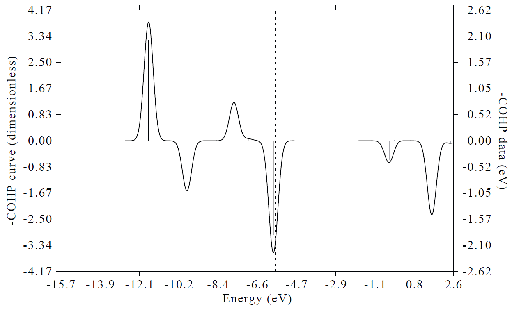

<!-- p.656 -->

!!! terminal "Multiwfn session"

    - **11** — Plot spectrum
    - **1** — The type of the spectrum is IR
    - **0** — Show the spectrum right now You will get the graph below

6013.86 377.95

5392.43 338.90

Molar absorption coefficient (L/mol/cm) 4771.00 4149.56 3528.13 2906.70 2285.27 1663.83 1042.40 299.84 260.79 221.73 182.68 143.62 104.57 65.51 IR intensities (km/mol)

420.97 26.46

-200.46 -12.60

The left axis corresponds to curve (broadened data), the right axis corresponds to discrete lines (original transition data). Plotting parameters such as full width at half maximum (FWHM), broadening function, unit and range of the axes can be adjusted by corresponding options in the interface. The graph and X-Y data set of discrete lines/curve can be exported by option 1 and 2, respectively. 4000.03600.03200.02800.02400.02000.01600.01200.0800.0400.00.0Wavenumber (cm^-1)

Note that after selecting option 0 to plot the spectrum, Multiwfn prints extrema information in the console window


```text
 Extrema on the spectrum curve:
 Maximum    1   X:      3578.5262   Value:       585.2897
 Maximum    2   X:      3454.4848   Value:       110.4777
 Maximum    3   X:      1695.2317   Value:       460.3222
 Maximum    4   X:      1359.1197   Value:      1717.7809
 Maximum    5   X:      1303.1010   Value:      5467.1462
...[ignored]
```

From this output you can obtain accurate position and height of absorption peaks. As will be illustrated in Section 4.11.3, the maxima and minima can even be directly labelled on the spectrum.

It is well known that the frequencies produced under harmonic approximation deviate to experimental vibrational frequencies systematically. In order to correct this problem, fundamental frequency scale factor should be applied, this can be done easily in Multiwfn. We close the spectrum and then choose "14 Set scale factor for vibrational frequencies ", then press ENTER button directly to choose all vibrational modes, then press ENTER button directly again to employ the scale factor fitted for B3LYP/6-31G* level, namely 0.9614, which can be found in Table 1 of J. Phys. Chem.,


<!-- p.657 -->

100, 16502 (1996). After that, if you replot the spectrum, the resulting spectrum will correspond to the scaled one.

Note: You can apply different scale factors for different vibrational modes. After applying a scale factor for a batch of modes, you can enter option 14 again, Multiwfn will ask you if restoring all vibrational frequencies to the original ones. If you input n, then you can input a different scale factor for another batch of modes, the effect will be superimposed.

Some experimental IR spectra determine transmittance rather than absorption. To mimic this kind of spectrum, you can select "4 Set left Y-axis" and then input e.g. 6000,0,400 to set lower limit, upper limit and label interval to corresponding values, respectively, and then input y to automatically scale the right Y-axis. Since currently lower limit (0) is higher than upper limit (6000), the Y-axis is inverted.

The procedure of plotting Raman, UV-Vis, electronic/vibrational circular dichroism (ECD/VCD), and ROA spectra is very similar to plotting IR spectrum, you only need to use proper input file and select corresponding option after entering main function 11. If the quantum chemistry program you used for spectrum calculation is not the one directly supported by Multiwfn, you can manually extract data from corresponding output file and then write them into a plain text file according to the format shown in Section 3.13.2, then the file can be used as input file of Multiwfn for plotting spectrum.


### 4.11.2 Plot UV-Vis spectrum and contributions from individual transitions for acetic acid


The spectrum plotting module of Multiwfn is quite flexible, not only the total spectrum but also the contribution from individual transitions can be exported. This feature is particularly useful when you want to identify nature of spectrum. In this section I will show how to realize this analysis, UV-Vis spectrum of acetic acid is taken as example.

Boot up Multiwfn and input examples\spectra\acetic_acid_TDDFT.out // Calculated at TD-B3LYP/cc-pVDZ level by Gaussian

!!! terminal "Multiwfn session"

    - **11** — Plot spectrum
    - **3** — The type of the spectrum is UV-Vis
    - **15** — Output the spectrum including the contributions from certain individual transitions
    - **0.01** — The criterion of selecting transitions is oscillator strength > 0.01 The curve of the UV-Vis spectrum together with the contributions from the transitions whose absolute value of strength are larger than 0.01 have been outputted to spectrum_curve.txt in current folder. The first two columns correspond to energies and molar absorption coefficients, the correspondence between the other columns and transition modes are clearly indicated on screen:


```text
Column#   Transition#
     3           2                //i.e. transition S0→S2
     4           3                //i.e. transition S0→S3
     5           5                //i.e. transition S0→S5
     6          11                //i.e. transition S0→S11
     7          13                //i.e. transition S0→S13
```

The discrete line data are outputted to spectrum_line.txt in current folder.

Now you can plot the data in the two files as curves in a single graph by your favourite program


<!-- p.658 -->

(if you use Origin to plot, you can directly drag these two files into Origin window to import them). In the two files, the first column should be taken as X-axis data, while the other columns should be taken as Y-axis data. The spectrum plotted by Origin is shown below, if you are confused about the procedure, you can consult the acetic_acid_TDDFT.opj provided in "examples\spectra" folder, which is the .opj file of Origin 8.

10000

0.24

Molar absorption coefficient (L mol-1cm-1) 9000 8000 7000 6000 5000 4000 3000 2000 Total S0→S2 S0→S3 S0→S5 S0→S11 S0→S13 0.22 0.20 0.18 0.16 0.14 0.12 0.10 0.08 0.06 0.04 Oscillator strength

1000 0.02

801001201401601802000 0.00

Wavelength (nm)

From the graph the underlying character of the total UV-Vis spectrum (black curve) is now

very clear. Although the S0→S3 transition (146.28nm) does not have very small oscillator strength (0.036), no absorption peak directly corresponds to this transition, since its absorption curve (blue

curve) has been completely merged into the neighboring large absorption peak due to S0→S5 transition (cyan curve).

As mentioned in last section, after selecting option 0 to plot spectrum, Multiwfn directly prints extrema of the spectrum curve. In current case the outputted data is


```text
 Maximum    1   X:       113.0588   Value:      5680.9864
 Maximum    2   X:       122.5085   Value:      8239.4308
 Maximum    3   X:       138.0728   Value:      4667.7944
 Maximum    4   X:       159.7516   Value:      2123.3506
 Maximum    5   X:       213.7324   Value:        48.5312
...[ignored]
```

Based on above outputs, we can calculate the contributions from different transitions to a given peak. For example, we want to study the composition of the peak at 138.0728 nm. In spectrum_curve.txt, move to the line corresponding to 138.07278 nm, you can find the total value is 4667.79439, while the values in columns 4 and 5 are 309.47267 and 4273.59757, respectively.

Therefore, the contribution from S0→S3 and S0→S5 can be respectively calculated as 309.47267/4667.79439×100% = 6.63% and 4273.59757/4667.79439×100% = 91.55%.

In Multiwfn one can very easily obtain major contributions from various transitions to a given wavelength. For example, we want to understand the transitions having maximal contribution to the


<!-- p.659 -->

maximum 3 (138.0728 nm), so we input

!!! terminal "Multiwfn session"

    - **15** — Output contributions of individual transitions to the spectrum
    - **0** — Calculate maximal 10 contributions to a given position
    - **138.0728** — The position of interest You will see


```text
Sum of absolute values of all transitions:          4667.79444
The individual terms are ranked by magnitude of contribution:
   #Transition     Contribution      %
         5          4273.59504     91.555
         3           309.47511      6.630
         4            68.05085      1.458
         6            11.67756      0.250
        11             2.33209      0.050
         8             2.13478      0.046
         7             0.22284      0.005
         2             0.14507      0.003
        10             0.10019      0.002
         9             0.06091      0.001
```

It is clearly seen that S0→S5 contributes most to the maximum (91.5%), while S0→S3 plays an unimportant but nonnegligible role (contributes 6.6%).


### 4.11.3 Plot electronic circular dichroism (ECD) spectrum for asparagine


In this example we plot electronic circular dichroism (ECD) spectrum for asparagine. Boot up Multiwfn and input

examples\spectra\Asn_TDDFT.out // Gaussian TDDFT task at PBE0/6-311G* level, 30 lowest excited states were calculated

!!! terminal "Multiwfn session"

    - **11** — Plot spectrum
    - **4** — ECD 2

Show the spectrum From the resulting spectrum, you will find the labels of X-axis and Y-axis are decimal. In order to make the graph more beautiful, it is suggested to modify the scale so that label of each tick is integer. Therefore, we close current graph and input below commands:

!!! terminal "Multiwfn session"

    - **3** — Set X-axis
    - **120,280,20** — Lower and upper limits, as well as spacing between ticks of X-axis
    - **4** — Set left Y-axis
    - **-90,100,20** — Lower and upper limits, as well as spacing between ticks of left Y-axis y

0 // Show the spectrum Then you will see the graph below


<!-- p.660 -->

Note that you can use exactly the same way as that illustrated in Section 4.11.2 to decompose the total ECD spectrum to individual contribution from each transition.

As can be seen from the above spectrum, the unit of Δε at left axis is labelled as arb., which means “arbitrary unit”. Only curve shape of ECD is of interest, this is why arb. is and should be used in this situation.

Labelling minima and maxima labels on spectrum One of the strengths of Multiwfn in plotting spectrum is that maxima, minima or both can be directly labelled on the spectrum. To label wavelength of both maxima and minima, we input

!!! terminal "Multiwfn session"

    - **16** — Enter the interface of setting status of showing labels of spectrum minima and maxima
    - **1** — Change displaying status of labels
    - **3** — Label both maxima and minima on the spectrum
    - **0** — Return 4
    - **Set left Y-axis -100,110,20** — Making range of left Y-axis slightly wider, because the labels will be shown y
    - **Correspondingly scale right Y-axis 0** — Plot spectrum again Now you can see the map below


<!-- p.661 -->

100.0 155.3 63.2

80.0 50.6

60.0 37.9

(arb.) -20.0 40.0 20.0 0.0 132.4 139.2 144.5 193.0 210.9 234.4 -12.6 25.3 12.6 0.0 Rotatory strength (cgs)

-40.0 -25.3

-60.0 -37.9

-80.0 169.1 -50.6

-100.0 -63.2

You can also make Multiwfn label Y-axis value at the extrema on the map, now we do this, and meantime we customize some plotting parameters. Input below commands 120.0140.0160.0180.0200.0220.0240.0260.0280.0Wavelength (nm)

!!! terminal "Multiwfn session"

    - **16** — Enter the interface of setting status of showing labels of spectrum minima and maxima
    - **6** — Switch the content of the labels to Y-axis value
    - **4** — Do not rotate the labels (this step is optional)
    - **3** — Set decimal digits (this step is optional)
    - **0** — No decimal digits, namely show data as integer
    - **2** — Set label size
    - **50** — Larger text size than default (30)
    - **0** — Return 0


|  | .3 |  |  |  |  |  |  |  |  |  |  |  |
| --- | --- | --- | --- | --- | --- | --- | --- | --- | --- | --- | --- | --- |
|  | 155 |  |  |  |  |  |  |  |  |  |  |  |
|  |  |  |  |  |  |  |  |  |  |  |  |  |
|  |  |  |  |  |  |  |  |  |  |  |  |  |
| 2 |  |  |  |  |  | 93.0 |  |  | 34.4 |  |  |  |
| 139. |  |  |  |  |  | 1 |  |  |  | 2 |  |  |
| 132 | 144. |  |  |  |  |  |  | 2 |  |  |  |  |
| .4 | 5 |  |  |  |  |  | 10.9 |  |  |  |  |  |
|  |  |  |  |  |  |  |  |  |  |  |  |  |
|  |  |  |  |  |  |  |  |  |  |  |  |  |
|  |  |  |  | 169.1 |  |  |  |  |  |  |  |  |

<!-- p.662 -->

100.0 63.2

80.0 50.6

60.0 37.9

(arb.) -20.0 40.0 20.0 0.0 -7-6 6 1313 -14 -12.6 25.3 12.6 0.0 Rotatory strength (cgs)

-40.0 -25.3

-60.0 -37.9

-80.0 -77 -50.6

-100.0 -63.2

 120.0140.0160.0180.0200.0220.0240.0260.0280.0Wavelength (nm)

Hint: Save and load plotting settings In order to replot the map above quickly in the future, I suggest saving plotting settings to a file, namely input below commands:

!!! terminal "Multiwfn session"

    - **s** — Save plotting settings Asn_ECD.dat
    - **Save settings to Asn_ECD.dat in current folder Next time, if you want to recover the map above, you simply need to input examples\spectra\Asn_TDDFT.out 11** — Plot spectrum
    - **4** — ECD 2

Load plotting settings Asn_ECD.dat // Save settings to Asn_ECD.dat in current folder 0 // Plot the spectrum Note that the Asn_ECD.dat corresponding to the map above has already been provided in examples\spectra folder.


### 4.11.4 Plot conformational weighted UV-Vis and ECD spectra for plumericin


Note: Chinese version of this section is my blog article “Using Multiwfn to plot conformationally averaged spectrum” (http://sobereva.com/383).

For a flexible system with many thermally accessible conformations (or configurations), when plotting its spectrum, it is crucial to take weighting average of various conformations into account, otherwise the resulting spectrum is impossible to be compared well with experimental spectrum. Fortunately, weighted spectrum can be very conveniently plotted by Multiwfn, I will show how to do this in present section. Plotting conformational weighted UV-Vis and ECD spectra of plumericin


|  |  |  |  |  |  |  |  |  |  |  |  |  |
| --- | --- | --- | --- | --- | --- | --- | --- | --- | --- | --- | --- | --- |
|  | 88 |  |  |  |  |  |  |  |  |  |  |  |
|  |  |  |  |  |  |  |  |  |  |  |  |  |
|  |  |  |  |  |  |  |  |  |  |  |  |  |
|  |  |  |  |  |  |  |  |  |  |  |  |  |
|  | 6 |  |  |  |  | 13 |  |  |  | 13 |  |  |
| -7 | -6 |  |  |  |  |  |  | -14 |  |  |  |  |
|  |  |  |  |  |  |  |  |  |  |  |  |  |
|  |  |  |  |  |  |  |  |  |  |  |  |  |
|  |  |  |  |  |  |  |  |  |  |  |  |  |
|  |  |  |  | -77 |  |  |  |  |  |  |  |  |

<!-- p.663 -->

are taken as instances.

Preparation Before calculating conformational weighted spectrum, we need to evaluate population of these conformations, commonly Boltzmann's weight is used. We assume that plumericin has four accessible conformations, and properly construct their initial geometries, then optimize them and perform frequency analysis at B3LYP/6-31G* level with zero-point energy scale factor of 0.9806. Based on optimized geometries, high-accuracy single point energies at M06-2X/def2-TZVP level were calculated. Finally, we add the Gibbs thermal corrections produced by frequency analysis to the single point energies to yield relatively accurate Gibbs energy of various conformations. After that, according to Boltzmann's formula and relative Gibbs energy among these conformations, we calculate their weights at 298.15 K. Then, using TD-PBE0/TZVP level we calculate the lowest 20 excited states for these conformations. The output files of the TDDFT tasks have been provided in "examples\spectra\weighted" folder as a.out, b.out, c.out and d.out (the names are arbitrary, you can also use other file names).

Now we write a plain text file named multiple.txt with the following content (the name should not be changed, but prefix may be added, such as plumericin_multiple.txt):


```text
examples\spectra\weighted\a.out 0.6046
examples\spectra\weighted\b.out 0.1950
examples\spectra\weighted\c.out 0.1686
examples\spectra\weighted\d.out 0.0317
```

As can be seen, in the multiple.txt, each line contains path of output file of a conformation followed by its Boltzmann weight we calculated above. Hereinafter, the four conformations will be referred to as a, b, c and d, respectively.

PS: If you are using Linux system, and there are / symbols or space in the path, do not forget to add double quotation marks at the two ends of the path, otherwise Multiwfn cannot recognize the file path, for example:

"examples/spectra/weighted/a.out" 0.6046 "examples/spectra/weighted/b.out" 0.1950 "examples/spectra/weighted/c.out" 0.1686 "examples/spectra/weighted/d.out" 0.0317

Plot conformational weighted UV-Vis spectrum Boot up Multiwfn and input examples\spectra\weighted\multiple.txt

!!! terminal "Multiwfn session"

    - **The aforementioned file 11** — Plot spectrum
    - **3** — UV-Vis 0


<!-- p.664 -->

26402.31 0.120

Molar absorption coefficient (L/mol/cm) 23674.07 20945.83 18217.59 15489.36 12761.12 10032.88 7304.64 4576.40 Weighted 1 ( 60.5%) 2 ( 19.5%) 3 ( 16.9%) 4 ( 3.2%) 0.107 0.095 0.083 0.070 0.058 0.046 0.033 0.021 Oscillator strength

1848.16 0.008

-880.08 -0.004

The thick red curve corresponds to conformational weighted UV-Vis spectrum, while the green, blue, purple and black curves correspond to UV-Vis spectrum of conformation a, b, c and d, respectively. The weight of each conformation is also shown in the legend. From this graph we can very conveniently compare the character of weighted spectrum and spectra of individual conformations. 137.1154.5172.0189.5206.9224.4241.8259.3276.8294.2311.7Wavelength (nm)

The black discrete lines on the graph represent all transition data of the four conformations, their heights have already been scaled by conformational weight. Hence, the thick red curve can be regarded as broadened by all discrete lines shown on the graph.

Multiwfn provides another mode to plot spectrum of individual conformations. We close the graph above and choose "18 Toggle weighting spectrum of each system" once, then choose option 0 to view the spectrum again, we will see

25486.27 0.120

Molar absorption coefficient (L/mol/cm) 22852.69 20219.11 17585.53 14951.95 12318.37 9684.78 7051.20 4417.62 Weighted 1 ( 60.5%) 2 ( 19.5%) 3 ( 16.9%) 4 ( 3.2%) 0.107 0.095 0.083 0.070 0.058 0.046 0.033 0.021 Oscillator strength

1784.04 0.008

-849.54 -0.004

137.1154.5172.0189.5206.9224.4241.8259.3276.8294.2311.7Wavelength (nm)


|  |  |  |  |  |  |  |  |  |  |  |  |  |  | 2 ( 1<br/>3 ( 1<br/>4 ( 3 | 9.5%)<br/>6.9%)<br/>.2%) |
| --- | --- | --- | --- | --- | --- | --- | --- | --- | --- | --- | --- | --- | --- | --- | --- |
|  |  |  |  |  |  |  |  |  |  |  |  |  |  |  |  |
|  |  |  |  |  |  |  |  |  |  |  |  |  |  |  |  |
|  |  |  |  |  |  |  |  |  |  |  |  |  |  |  |  |
|  |  |  |  |  |  |  |  |  |  |  |  |  |  |  |  |
|  |  |  |  |  |  |  |  |  |  |  |  |  |  |  |  |
|  |  |  |  |  |  |  |  |  |  |  |  |  |  |  |  |
|  |  |  |  |  |  |  |  |  |  |  |  |  |  |  |  |
|  |  |  |  |  |  |  |  |  |  |  |  |  |  |  |  |

|  |  |  |  |  |  |  |  |  |  |  |  |  |  |  | Weig<br/>1 ( 6 | hted<br/>0.5%) |
| --- | --- | --- | --- | --- | --- | --- | --- | --- | --- | --- | --- | --- | --- | --- | --- | --- |
|  |  |  |  |  |  |  |  |  |  |  |  |  |  |  | 2 ( 1<br/>3 ( 1<br/>4 ( 3 | 9.5%)<br/>6.9%)<br/>.2%) |
|  |  |  |  |  |  |  |  |  |  |  |  |  |  |  |  |  |
|  |  |  |  |  |  |  |  |  |  |  |  |  |  |  |  |  |
|  |  |  |  |  |  |  |  |  |  |  |  |  |  |  |  |  |
|  |  |  |  |  |  |  |  |  |  |  |  |  |  |  |  |  |
|  |  |  |  |  |  |  |  |  |  |  |  |  |  |  |  |  |
|  |  |  |  |  |  |  |  |  |  |  |  |  |  |  |  |  |
|  |  |  |  |  |  |  |  |  |  |  |  |  |  |  |  |  |
|  |  |  |  |  |  |  |  |  |  |  |  |  |  |  |  |  |
|  |  |  |  |  |  |  |  |  |  |  |  |  |  |  |  |  |

<!-- p.665 -->

The spectrum curve of each conformation shown on this graph has already been multiplied by corresponding weight. Obviously, what this graph represents is contribution of each conformation to the conformational weighted spectrum. In other words, the height of the thick red curve is simply the sum of height of all other curves. It can be seen that conformation a (green line) has major contribution to the conformational weighted spectrum, their profiles are rather similar, this is because a has as high as 60.5% population.

The discrete lines in the graph above now have different colors, the color corresponds to legend shown at right-top side. For each conformation, since both discrete lines and curve currently have identical color, we can say for example, green curve can be directly yielded by broadening the green discrete lines.

Plot conformational weighted ECD spectrum Using the same procedure illustrated in the last section, we plot conformational weighted ECD spectrum and ECD spectrum for all the four conformations.

Boot up Multiwfn and input examples\spectra\weighted\multiple.txt

!!! terminal "Multiwfn session"

    - **11** — Plot spectrum
    - **4** — Plot ECD 2

Show the spectrum You will see

153.883 33.49

Delta molar absorption coefficient (L/mol/cm) 123.106 -30.777 -61.553 -92.330 92.330 61.553 30.777 0.000 Weighted 1 ( 60.5%) 2 ( 19.5%) 3 ( 16.9%) 4 ( 3.2%) -13.40 -20.09 26.79 20.09 13.40 -6.70 6.70 0.00 Rotatory strength (cgs)

-123.106 -26.79

-153.883 -33.49

From this graph you can see conformational weighted ECD spectrum (thick red curve) as well as ECD spectrum of individual conformations (other curves). 137.1154.5172.0189.5206.9224.4241.8259.3276.8294.2311.7Wavelength (nm)

Then choose "18 Toggle weighting spectrum of each system" option once and plot spectrum again, you will see


|  |  |  |  |  |  |  |  |  |  |  |  |  |  | Weig<br/>1 ( 6 | hted<br/>0.5%) |
| --- | --- | --- | --- | --- | --- | --- | --- | --- | --- | --- | --- | --- | --- | --- | --- |
|  |  |  |  |  |  |  |  |  |  |  |  |  |  | 2 ( 1<br/>3 ( 1<br/>4 ( 3 | 9.5%)<br/>6.9%)<br/>.2%) |
|  |  |  |  |  |  |  |  |  |  |  |  |  |  |  |  |
|  |  |  |  |  |  |  |  |  |  |  |  |  |  |  |  |
|  |  |  |  |  |  |  |  |  |  |  |  |  |  |  |  |
|  |  |  |  |  |  |  |  |  |  |  |  |  |  |  |  |
|  |  |  |  |  |  |  |  |  |  |  |  |  |  |  |  |
|  |  |  |  |  |  |  |  |  |  |  |  |  |  |  |  |
|  |  |  |  |  |  |  |  |  |  |  |  |  |  |  |  |
|  |  |  |  |  |  |  |  |  |  |  |  |  |  |  |  |

<!-- p.666 -->

56.295 33.49

Delta molar absorption coefficient (L/mol/cm) -11.259 -22.518 -33.777 45.036 33.777 22.518 11.259 0.000 Weighted 1 ( 60.5%) 2 ( 19.5%) 3 ( 16.9%) 4 ( 3.2%) -13.40 -20.09 26.79 20.09 13.40 -6.70 6.70 0.00 Rotatory strength (cgs)

-45.036 -26.79

-56.295 -33.49

This graph decomposes the final weighted ECD spectrum to contribution of individual conformation. Again, since conformation a (green) has very high population and thus dominates the final weighted curve, most characters of these two curves are similar. However, influence from other conformations cannot be simply ignored. From the graph it is easy to find that if conformation c (purple) is missing, then there will not be an evident ECD peak at approximately 180 nm, since only ECD of c at this wavelength has significant signal. 137.1154.5172.0189.5206.9224.4241.8259.3276.8294.2311.7Wavelength (nm)


### 4.11.5 Plot Raman and pre-resonance spectra for 2-methyloxirane

The procedure of plotting Raman spectrum is very similar to plotting IR spectrum, the only additional step you would better do is to convert the Raman activities directly outputted by Raman task of quantum chemistry codes to Raman intensities before plotting the spectrum, so that the resulting spectrum can be comparable with the experimental one. The Raman intensities are dependent of wavelength of incident light source and ambient temperature, while Raman activities are not. This point has been emphasized in Section 3.13.1. In this section, I illustrate how to properly plot Raman spectrum using (2S)-2-methyloxirane as example.

Boot up Multiwfn and input examples\spectra\2-methyloxirane_Raman.out // Output file of Raman task calculated at B3LYP/6-31G* level by Gaussian09

!!! terminal "Multiwfn session"

    - **11** — Plot spectrum
    - **2** — Raman spectrum
    - **14** — Apply frequency scale factor [Press ENTER button]

Employ the fundamental scale factor 0.9614, which is suitable for B3LYP/6-31G* level

19 // Convert Raman activities to intensities 15000 // Wavenumber (cm-1) of incident light. This value should be consistent with the actual experimental condition, the value we inputted here is arbitrarily chosen


|  |  |  |  |  |  |  |  |  |  |  |  |  |  | 2 ( 1<br/>3 ( 1<br/>4 ( 3 | 9.5%)<br/>6.9%)<br/>.2%) |
| --- | --- | --- | --- | --- | --- | --- | --- | --- | --- | --- | --- | --- | --- | --- | --- |
|  |  |  |  |  |  |  |  |  |  |  |  |  |  |  |  |
|  |  |  |  |  |  |  |  |  |  |  |  |  |  |  |  |
|  |  |  |  |  |  |  |  |  |  |  |  |  |  |  |  |
|  |  |  |  |  |  |  |  |  |  |  |  |  |  |  |  |
|  |  |  |  |  |  |  |  |  |  |  |  |  |  |  |  |
|  |  |  |  |  |  |  |  |  |  |  |  |  |  |  |  |
|  |  |  |  |  |  |  |  |  |  |  |  |  |  |  |  |

<!-- p.667 -->

298.15 // Assume that experimental temperature is 298.15 K (You can also press ENTER button directly, 298.15 K will be used as default)

Then input 0 to plot spectrum, you will see below Raman spectrum

122.88 1244.70

110.18 1116.08

97.48 987.46

Relative Raman intensity 84.79 72.09 59.39 46.69 34.00 858.84 730.23 601.61 472.99 344.37 Raman scattering intensities

21.30 215.75

8.60 87.13

-4.10 -41.49

Multiwfn can also plot pre-resonance Raman spectrum. An example output file of pre-resonance Raman task of Gaussian is examples\spectra\2-methyloxirane_Raman.out, the corresponding input file (.gjf) is also given. This task calculates Raman activity at incident 4000.03600.03200.02800.02400.02000.01600.01200.0800.0400.00.0Wavenumber (cm^-1)

wavelength of 150 nm and 140 nm, which are close to S0→S1 and S0→S2 TDDFT excitation energies at the same calculation level (147.36 nm and 138.81 nm at TD-B3LYP/6-31G* level, respectively). You can load this output file into Multiwfn and plot Raman spectrum as usual. The only difference is that, before entering spectrum plotting interface, Multiwfn asks you to choose the incident frequency for which the Raman activities will be loaded. If you choose 2 or 3, the spectrum you finally obtained will be pre-resonance Raman at corresponding frequency; if you choose " 1: 0.00000000", namely the static limit case, the resulting spectrum will be exactly identical to the one we obtained earlier.


### 4.11.6 Simultaneously plot multiple systems

In Multiwfn, it is very easy to plot spectrum for multiple systems simultaneously, these systems may correspond to different conformations, different configurations, different molecules or different calculation conditions. In this section two examples are provided.

Comparing spectra yielded by different theoretical methods and basis sets In "examples\spectra\indigo" folder, you can find Gaussian output file of electronic excited state task carried out at different levels. In this example, we plot them together so that their results can be conveniently compared.

What we need to do first is to prepare a file named multiple.txt including path of various systems with their legends, this file has been provided as examples\spectra\indigo\multiple.txt, its


<!-- p.668 -->

content is:


```text
examples\spectra\indigo\ZINDO.out ZINDO
examples\spectra\indigo\TD-PBE0.out TD-PBE0/6-31G*
examples\spectra\indigo\TD-PBE0_TZVP.out TD-PBE0/def-TZVP
```

Note that the legends must not simply be digital, otherwise it will be interpreted as weight of corresponding system (see Section 4.11.4). In addition, in Linux system, if the file path contains / symbol, do not forget to add double quotation marks at the two ends of the path.

Boot up Multiwfn, load multiple.txt and then plot UV-Vis spectrum as usual, you will see the graph below

48324.6 0.80

43331.0 ZINDOTD-PBE0/6-31G*TD-PBE0/def-TZVP 0.72

Molar absorption coefficient (L mol - 1cm - 1) 38337.5 33343.9 28350.4 23356.9 18363.3 13369.8 8376.3 0.63 0.55 0.47 0.39 0.30 0.22 0.14 Oscillator strength

3382.7 0.06

-1610.8 -0.03

From the graph it is clear that basis set only has small influence on the resulting spectrum, while the spectrum profile of ZINDO differs from that of TD-PBE0 significantly. The curve of all systems may be exported via option 2 as curveall.txt and then replotted via third-part program such as Origin. 171.0211.0251.1291.1331.1371.2411.2451.3491.3531.3571.4Wavelength (nm)

In "examples\spectra\indigo" folder you can also find ZINDO_30.out, it corresponds to a ZINDO calculation with 30 excited states produced. You can also include it into multiple.txt.

Comparing spectra with and without spin-orbit coupling effect ORCA program is able to take spin-orbit coupling (SOC) effect into account during TDDFT calculation, here we plot and compare the UV-Vis spectrum with and without the SOC consideration. Please download http://sobereva.com/multiwfn/extrafiles/SOC-TDDFT_ORCA.zip, it is an ORCA output file of TDDFT task for Ir(ppy)3 coordinate, SOC treatment had been enabled in the calculation via dosoc true keyword in the %tddft field. In the output information, there are excitation energies and oscillator strengths before and after SOC correction.

Extract the .zip package, put the .out file in current folder, then create a multiple.txt with the following content


```text
Ir_ppy3.out with SOC
Ir_ppy3.out without SOC
```

Boot up Multiwfn and input multiple.txt


|  |  |  |  |  |  |  |  |  |  |  |  |  |  |  |  | TD-PBE0 | /def-TZV |  |  |
| --- | --- | --- | --- | --- | --- | --- | --- | --- | --- | --- | --- | --- | --- | --- | --- | --- | --- | --- | --- |
|  |  |  |  |  |  |  |  |  |  |  |  |  |  |  |  |  |  |  |  |
|  |  |  |  |  |  |  |  |  |  |  |  |  |  |  |  |  |  |  |  |
|  |  |  |  |  |  |  |  |  |  |  |  |  |  |  |  |  |  |  |  |
|  |  |  |  |  |  |  |  |  |  |  |  |  |  |  |  |  |  |  |  |
|  |  |  |  |  |  |  |  |  |  |  |  |  |  |  |  |  |  |  |  |
|  |  |  |  |  |  |  |  |  |  |  |  |  |  |  |  |  |  |  |  |
|  |  |  |  |  |  |  |  |  |  |  |  |  |  |  |  |  |  |  |  |
|  |  |  |  |  |  |  |  |  |  |  |  |  |  |  |  |  |  |  |  |
|  |  |  |  |  |  |  |  |  |  |  |  |  |  |  |  |  |  |  |  |

<!-- p.669 -->

!!! terminal "Multiwfn session"

    - **11** — Plot spectrum
    - **3** — Plot UV-Vis y

For the second spectrum, let Multiwfn use the data without SOC consideration Then you will enter the interface for setting up the spectrum. After slight adjustment of settings, you will obtain the graph below. Clearly, SOC effect has non-negligible influence on the spectrum for present systems.

50000.0 0.347

with SOCwithout SOC

45000.0 0.312

Molar absorption coefficient (L mol - 1cm - 1) 40000.0 35000.0 30000.0 25000.0 20000.0 15000.0 10000.0 0.277 0.243 0.208 0.173 0.139 0.104 0.069 Oscillator strength

5000.0 0.035

0.0 0.000

It is worth to note that the number of states with SOC is by far larger than that without SOC. Because SOC effect splits each originally degenerate triplet state to three sublevels. For example, assume that the TDDFT calculates 50 singlets and 50 triplets, then after taking SOC correction into account, there will be 50+3*50=200 states. Since the number of states corresponding to SOC-TDDFT is higher than that corresponding to regular TDDFT, when two (or more) set of data are simulated as theoretical spectra, the first legend in multiple.txt must correspond to SOC-TDDFT case, and when loading data for the first spectrum, you must choose y to let Multiwfn load SOC corrected TDDFT data, as I illustrated above. 150.0200.0250.0300.0350.0400.0450.0500.0550.0Wavelength (nm)


### 4.11.7 Plot VCD and ROA spectra for chiral molecule S-methyloxirane

Vibrational circular dichroism (VCD) and Raman optical activity (ROA) are important types of vibrational spectra for chiral molecule, and only chiral molecule has VCD and ROA signals, see Section 3.21 for detail. In this example, I will illustrate how to plot these spectra for a typical chiral molecule S-methyloxirane.

Plotting VCD spectrum The corresponding Gaussian input and output files are S-methyloxirane_VCD.gjf and S-methyloxirane_VCD.out in examples\spectra folder, respectively. As you can see, freq=VCD keyword was used and the calculation is at B3LYP/6-31G* level.

Boot up Multiwfn and input


<!-- p.670 -->

examples\spectra\methyloxirane_VCD.out

!!! terminal "Multiwfn session"

    - **11** — Plot spectrum
    - **5** — VCD 14

Select all frequencies 0.9614 // Employ fundamental scale factor prefitted for B3LYP/6-31G* level 0 // Show the spectrum You will see

2.46 31.7

1.97 25.3

1.47 19.0

0.98 12.7

(arb.) -0.49 0.49 0.00 -6.3 6.3 0.0 Rotatory strength

-0.98 -12.7

-1.47 -19.0

-1.97 -25.3

-2.46 -31.7

The right axis corresponds to the heights of the spikes, which represent rotatory strengths. The left axis corresponds to the broadened VCD curve from the spikes, which represent difference in absorption of left- and right-circularly polarized lights. The "arb." denotes that the unit is arbitrary, because the absolute magnitude is not chemically interesting. 4000.03600.03200.02800.02400.02000.01600.01200.0800.0400.00.0Wavenumber (cm - 1)

Plotting ROA spectrum This plotting is based on output file of Gaussian freq=ROA task. The Gaussian input and output files are S-methyloxirane_ROA.gjf and S-methyloxirane_ROA.out in examples\spectra folder, respectively. As can be seen from the input file, this calculation takes three incident light frequencies (500, 532 and 600 nm) into account. It is well-known that diffuse functions are important for obtaining accurate ROA data, so aug-cc-pVDZ is used here.

Boot up Multiwfn and input examples\spectra\S-methyloxirane_ROA.out

!!! terminal "Multiwfn session"

    - **11** — Plot spectrum
    - **6** — ROA 2

There are totally six kinds of data can be selected, here we select the commonly studied "ROA SCP(180)", namely backscattered circular polarization ROA spectrum

14 // Scale frequencies by a scale factor [Press ENTER button] // Select all frequencies


<!-- p.671 -->

0.97 // Employ fundamental scale factor of 0.97, which is suitable for B3LYP/aug-cc-pVDZ level

19 // Convert the ROA data outputted by Gaussian to "real" ROA intensities 532nm // Wavelength of incident light. This value should be consistent with actual experimental condition

[Press ENTER button] // Assume that experimental temperature is 298.15K 3 // Adjust range of X axis of the spectrum 3200,200,400 // Lower limit, upper limit and label interval 0 // Show the spectrum Now you can see below ROA spectrum:

2532.2 34333.5

2025.8 27466.8

1519.3 20600.1

1012.9 13733.4

- -506.4 506.4 0.0 -6866.7 6866.7 0.0 ROA intensity

-1012.9 -13733.4

-1519.3 -20600.1

-2025.8 -27466.8

-2532.2 -34333.5

If you intend to use this spectrum in a publication, I suggest removing the labels in both the left and right ordinates, since the absolute values are meaningless, only the shape of the curve is of chemical significance. To do so, choose "17 Other plotting settings" and then choose suboptions 2 and 3, you will find the labels are disappeared when you replot the spectrum. 3200.02800.02400.02000.01600.01200.0800.0400.0Wavenumber (cm - 1)


### 4.11.8 Skill: Plot spectrum for a batch of files via shell script

Note: There is an illustration video corresponding to this section: https://youtu.be/x6jp40DR24k.

In this section, I show how to plot spectrum for a batch of input files via shell script. Via this way, all input files in current folder can be immediately converted to respective spectrum image file by only one command!

Assume you are using Windows system, and you want to convert all Gaussian TDDFT .out file in examples\spectra\indigo folder to UV-Vis spectrum, what you should do is:

- Copy the .out files to Multiwfn folder
- Copy examples\spectra\UV-Vis.txt and examples\spectra\batchspec.bat to Multiwfn folder
- Set "isilent" in `settings.ini` to 1 and save the file


<!-- p.672 -->

- Double-clicking the batchspec.bat Now the batch script invokes Multiwfn to process all .out files in current folder according to the commands in the UV-Vis.txt. After a few seconds, you will find all spectrum image files have been generated in current folder, the name is identical to the .out file.

If you want to plot IR spectrum for a batch of files in current folder, copy examples\spectra\IR.txt to current folder and replace the "UV-Vis.txt" in the .bat script with "IR.txt", then run the .bat file.

The content of UV-Vis.txt and IR.txt is very easy to understand if you already know how to run Multiwfn in silent mode and batch mode. If you have not read Sections 5.2 and 5.3, after reading them you will fully understand how the script works. Commonly, you should properly modify the settings (range of axes) in the .txt file before employing it for producing spectrum for your systems.

Via the same way, you can also use Multiwfn to plot other kinds of spectra for a batch of input files, you need to manually compile the .txt file containing proper commands.

In Linux environment, you can also use shell script to realizing the batch plotting. The examples\spectra\batchspec.sh is a Bash script that have exactly identical function as the batchspec.bat shown above.


### 4.11.9 Skill: Use spikes to indicate position of transition levels

In Multiwfn, it is possible to plot a set of spikes at the bottom of the simulated spectrum to highlight position of specific transition levels. In Section 4.11.1 we have plotted IR spectrum for NH3BF3, which has some featured vibration modes. This time we will use spikes with different colors to highlight position of two kinds of modes on the map: (1) stretching vibration of B-N bond (2) stretching vibration of N-H bonds. The index of these modes can be identified by inspecting vibration animations in GaussView.

Boot up Multiwfn and input below commands examples\spectra\NH3BF3_freq.out

!!! terminal "Multiwfn session"

    - **11** — Plot spectrum
    - **1** — The type of the spectrum is IR
    - **23** — Set status of showing spikes to indicate transition levels
    - **1** — Set the first set of spikes. We want to use black spikes to reveal all vibrations a
    - **Select all modes 5** — Black 2
    - **Set the second set of spikes 16-18** — Indices of stretching vibration mode of the three N-H bonds
    - **1** — Red 3
    - **Set the third set of spikes 4** — Index of vibration mode of B-N bond stretching
    - **2** — Green 0
    - **Return 4** — Modify Y-axis at left side
    - **0,6000,600** — Set lower and upper limits as well as label spacing y

Plot the graph


<!-- p.673 -->

You will see the following map

The red spikes in this graph clearly indicate that the N-H stretching modes have highest frequencies, while the B-N stretching vibration mode (green spike) has frequency about 400 cm-1. All other vibration modes are highlighted by black spikes.

It is worth to note that although the first set of spikes is black and contains all vibration modes, the second and third sets of spikes are plotted after it, therefore the N-H and B-N stretching vibration modes are in red and green colors respectively rather than in black.

Properly using the spikes to indicate featured transitions can make the graph much more informative. For example, when you plot UV-Vis map, you can use spikes in different colors to

distinguish different transition types (e.g. π→π* and n→π*, or local excitation and charge transfer excitation).

If some transitions are degenerated, you can enable Multiwfn to exhibit degeneracy in terms of spike height. To do so, after defining spikes in option 23, choose its suboption "-3 Toggle considering degenerate" and input a threshold for determining degeneracy. If energy spanning over two or more transitions is less than the threshold, then the transitions will be regarded as degenerated, only the lowest lying one will be drawn as spike with height of degenerate degree, while other ones will be invisible. For example, below is IR spectrum of cyclo[18]carbon, the green and blue spikes reveal position of in-plane and out-plane vibration transitions, respectively. Most transitions have degeneracy of two (full height), while a few are not degenerate and thus the spike height is only half.


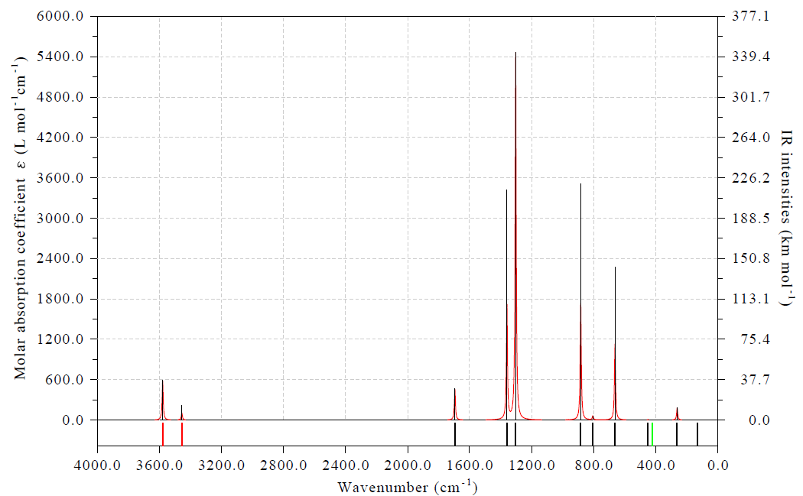

<!-- p.674 -->

3500.0 250.0

Molar absorption coefficient (L mol - 1cm - 1) 3000.0 2500.0 2000.0 1500.0 1000.0 500.0 200.0 150.0 100.0 50.0 IR intensities (km mol - 1)

0.0 0.0

 2500.02200.01900.01600.01300.01000.0700.0400.0100.0Wavenumber (cm - 1)


### 4.11.10 Plotting NMR spectrum

Note: Chinese version of this section is my blog article “Using Multiwfn to plot NMR spectra” (http://sobereva.com/565), which also contains extended discussions.

Please read Section 3.13.5 first to gain basic knowledge about the module of plotting NMR spectrum. In this section, a few examples will be given to show how to easily and flexibly plot NMR spectrum in Multiwfn.

4.11.10.1 Plotting 1H and 13C NMR spectra for acetaldehyde

In this example we plot 1H and 13C NMR spectra for acetaldehyde, which is shown below.

examples\spectra\NMR\Acetaldehyde.out is output file of NMR task of Gaussian 09. The geometry was optimized using B3LYP/def2-SVP level in vacuum, while the NMR task was conducted at B97-2/def2-TZVP level under chloroform environment represented by SMD solvation model. It was demonstrated that B97-2 is a good choice for theoretically evaluating NMR, at least for 1H and 13C, see J. Chem. Theory Comput., 10, 572 (2014) for benchmark. The NMR output file of tetramethylsilane (TMS) calculated at the same calculation level is examples\spectra\NMR\TMS.out, as can be seen from line 355 and line 360, the isotropic magnetic shielding value of C and H are 186.8707 and 31.5143 ppm, respectively, they will be taken as reference values later.

We first plot 13C NMR spectrum. Boot up Multiwfn and input


<!-- p.675 -->

examples\spectra\NMR\Acetaldehyde.out 11 // Plot various spectrum 7 // NMR From option 6 in the interface, you can find the element currently considered is carbon. Now if you directly select option 0, you will see 13C spectrum, however, the X-axis corresponds to absolute shielding value. In order to make X-axis correspond to chemical shift, we should input

!!! terminal "Multiwfn session"

    - **7** — Set how to determine chemical shifts
    - **1** — Using reference shielding value to derive chemical shifts
    - **186.8707** — Reference value of carbon in TMS (see above). Since this value is a built-in data, in this step you can also directly input a to employ it

0 // Plot NMR spectrum Now you can see

In the map above, the height of black spikes corresponds to the "Degeneracy" axis, while red curves are broadened from the spikes, their values correspond to the "signal strength" axis. The blue texts indicate the index of the atom corresponding to the peak.

You can also see following information on Multiwfn console window


```text
 Term:    1   Chemical shift:    29.657 ppm   Atom:    1(C )
 Term:    2   Chemical shift:   208.011 ppm   Atom:    5(C )
```

In the NMR plotting interface, there are many options used to adjust various plotting settings, such as range of X and Y axes, style of atom labels, color and thickness of spikes and curves, FWHM parameter of broadening and so on, please play with them to improve the spectrum according to your actual requirement.

Next, we plot 1H NMR spectrum. Input below commands

!!! terminal "Multiwfn session"

    - **6** — Choose the element considered in plotting H
    - **Hydrogen 7** — Set how to determine chemical shifts
    - **1** — Using reference shielding value to derive chemical shifts a


<!-- p.676 -->

evaluated at B97-2/def2-TZVP level under chloroform

It is important to notice that the shielding values of the three hydrogens in the methyl group must be averaged, since methyl group rotates easily in actual environment and thus there is only one NMR peak of hydrogens in this group. Thus we input

!!! terminal "Multiwfn session"

    - **10** — Average shielding values of specific atoms
    - **2-4** — H2, H3 and H4 are the hydrogens in the methyl group
    - **0** — Plot the spectrum Now you can see

As you can see, the plotting effect is fairly satisfactory. The information currently shown in console window is:


```text
 Term:    1   Chemical shift:     2.070 ppm   Atom:    2(H )    3(H )    4(H )
 Term:    2   Chemical shift:    10.333 ppm   Atom:    7(H )
```

4.11.10.2 Plotting NMR spectra for pyridine based on scaling method

As introduced in Section 3.13.5, there is another way of determining chemical shifts of 1H and

13C, namely scaling method. Via this method we do not need to calculate reference values, and good chemical shifts could be obtained even using inexpensive calculation levels since the prefitted scaling parameters eliminated most systematical errors. In this section we plot NMR spectrum for pyridine based on the scaling method. examples\spectra\NMR\pyridine_scale.out is output file of NMR task of Gaussian calculated at B3LYP/6-31G* level with chloroform environment represented by SMD solvation model, while the geometry was optimized at B3LYP/6-31G* level in vacuum. The error statistics of various levels given in http://cheshirenmr.info indicate that this level is one of best levels of applying scaling method.

Boot up Multiwfn and input examples\spectra\NMR\pyridine_scale.out

!!! terminal "Multiwfn session"

    - **11** — Plot various spectrum
    - **7** — NMR 7
    - **Set how to determine chemical shifts 2** — Set slope and intercept to determine chemical shifts by scaling method


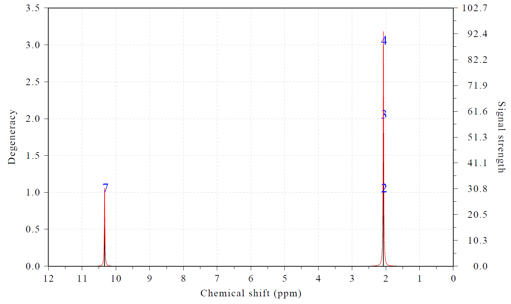

<!-- p.677 -->

a // Use built-in slope and intercept parameters prefitted for B3LYP/6-31G* with SMD(chloroform) level, namely slope of -0.9449 and intercept of 188.4418 for 13C NMR

0 // Plot NMR spectrum Now you can see

Due to symmetry of pyridine, there are two peaks showing double degenerate character.

Similarly, you can plot 1H NMR spectrum via scaling method, namely input

!!! terminal "Multiwfn session"

    - **6** — Choose the element considered in plotting H
    - **7** — Set how to determine chemical shifts
    - **2** — Set slope and intercept to determine chemical shift by scaling method a
    - **0** — Plot the spectrum

4.11.10.3 Plotting conformation weighted NMR spectrum for valine

In this section, I will illustrate how to plot conformation weighted NMR spectrum. Valine is an essential amino acid, it has two conformers in aqueous environment, as shown below. The values in the parentheses are my theoretically estimated conformation weights in water.


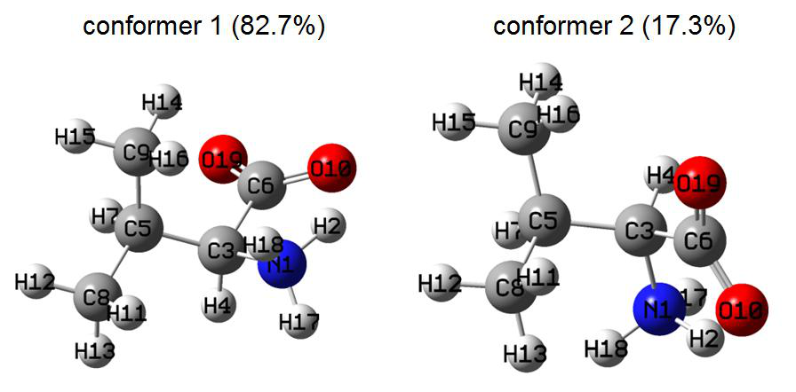

<!-- p.678 -->

In this section we will simulate 1H NMR spectrum of valine in water and compare it with experimental spectrum measured in D2O solvent. Note that since the three hydrogens in the protonated amino group are fully substituted by deuterium in heavy water environment, we need to eliminate its contribution from the spectrum. Also, we need to average shielding values of the hydrogens in each of the two methyl groups.

The conf1.out and conf2.out in "examples\spectra\NMR\valine" folder are output files of NMR task of Gaussian 16, the NMR calculations were conducted at B97-2/def2-TZVP level, the geometries were optimized at B3LYP-D3(BJ)/6-311G** level, in both calculations the IEFPCM model was employed for representing water environment.

We first create a text file named multiple.txt with following content (prefix may be added to the file name, such as valine_multiple.txt):


```text
examples\spectra\NMR\valine\conf1.out 0.825
examples\spectra\NMR\valine\conf2.out 0.175
```

As can be seen, we have specified two input files with corresponding conformation weights. Note that if you are using Linux version, the content must be written as follows, otherwise the paths cannot be recognized, similarly hereinafter


```text
"examples/spectra/NMR/valine/conf1.out" 0.825
"examples/spectra/NMR/valine/conf2.out" 0.175
```

Now boot up Multiwfn and input multiple.txt

!!! terminal "Multiwfn session"

    - **11** — Plot various spectrum
    - **7** — NMR 6

Set how to determine chemical shifts 1 // Set reference shielding value to determine chemical shift 31.8294 // The TMS reference value that comes from examples\spectra\NMR\valine\TMS.out, which was calculated via exactly the same way as current system

!!! terminal "Multiwfn session"

    - **10** — Average shielding values of specific atoms
    - **11-13** — Three methyl group hydrogens
    - **10** — Average shielding values of specific atoms
    - **14-16** — Three methyl group hydrogens
    - **11** — Set strength of specific atoms
    - **2,17,18** — The three hydrogens in the amino group
    - **0** — Making them fully invisible in the spectrum
    - **0** — Plot the NMR spectrum Now you see the following spectrum


<!-- p.679 -->

In order to improve the effect of the map, we close the graph and then input 3 // Set lower and upper limits of X-axis 4,0,0.5 // From 4.0 to 0.0 ppm with label spacing of 0.5 ppm

!!! terminal "Multiwfn session"

    - **12** — Do not show spikes to make the spectrum clearer
    - **18** — Other plotting settings
    - **5** — Set X position of legends
    - **1300** — Moving the position of the legends more left than default position
    - **0** — Return Now we select option 0 to replot, the current spectrum is already quite satisfactory

Experimental 1H NMR spectrum of valine in water is https://hmdb.ca/spectra/nmr_one_d/1582, by comparing the map above with it you can find our simulated NMR spectrum is reasonable and captured all major features of the experimental spectrum.

Note that if you only want to plot weighted spectrum or only plot the spectra for the two conformers, you can choose corresponding suboptions in option 17.


<!-- p.680 -->

4.11.10.4 Plotting multiple systems simultaneously

Multiwfn is able to easily plot NMR spectra of multiple systems on the same map, as exemplified below, the prerequisite is that all systems must have the same number of atoms. In this example, we will view the two conformers of valine as two individual systems.

Create a file named multple.txt (additional prefix may be added to the file name) with following content, each line contains path of an input file and corresponding legend


```text
examples\spectra\NMR\valine\conf1.out conformer 1
examples\spectra\NMR\valine\conf2.out conformer 2
```

Boot up Multiwfn, load the multiple.txt, and then run all commands recorded in the examples\spectra\NMR\valine\drawmulti.txt file in turn, you will see the map below. The meaning of each command can be easily understood according to the prompt on screen.


### 4.11.11 Plotting fluorescence spectrum of BODIPY

In this example, I illustrate how to plot fluorescence spectrum. The differences between plotting fluorescence spectrum and UV-Vis absorption spectrum are two:

(1) To plot fluorescence spectrum, you should use optimized geometry of emission state (the excited state which emits photon). While to plot absorption spectrum, you should use optimized geometry of ground state.

(2) To plot fluorescence spectrum, oscillator strengths of all calculated excited states except for the emission state should be manually set to zero to remove contribution of irrelevant states to the spectrum.

Almost all molecules satisfy Kasha’s rule, that is fluorescence emission solely corresponds to

S1→S0 transition. So, the emission state commonly is S1 state.

Next, we will plot fluorescence emission for the well-known BODIPY molecule:


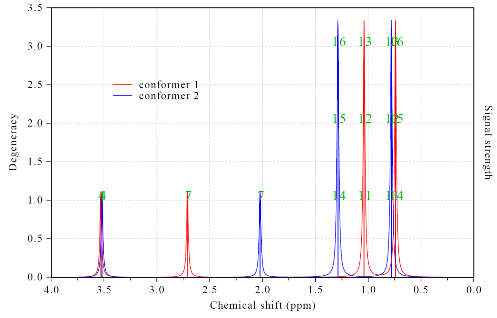

<!-- p.681 -->

Kasha’s rule is assumed to be valid for this system, therefore we should optimize geometry of S1 state. The output file of Gaussian 16 A.03 of this task at TD-B3LYP/6-311G* level is examples\excit\BODIPY_S1_opt.out, frequency analysis is also performed because we want to check if there is imaginary frequency (none is found). Note that “TD” keyword is employed without additional options, in this case the lowest three excited states S1, S2 and S3 will be solved, and the state of interest (the state to be optimized) is default to the first excited state (S1). The default setting is well-suited for optimizing the S1 state.

Boot up Multiwfn and input examples\excit\BODIPY_S1_opt.out 11 // Plot spectrum 3 // UV-Vis After that, excitation energies and oscillator strengths of all excited states at the final geometry (S1 geometry) are loaded into Multiwfn. Then we clean oscillator strengths of S2 and S3 states by inputting following commands:

!!! terminal "Multiwfn session"

    - **20** — Modify oscillator strengths
    - **2,3** — Select S2 and S3
    - **0** — New oscillator strength Now you can input option 0 to plot the spectrum, however the default axis settings are not ideal. So we input following commands

!!! terminal "Multiwfn session"

    - **3** — Set lower and upper limit of X-axis,
    - **300,750,50** — Lower limit, upper limit and step size in nm
    - **4** — Set left Y-axis
    - **0,1100,100** — Lower limit, upper limit and step size y


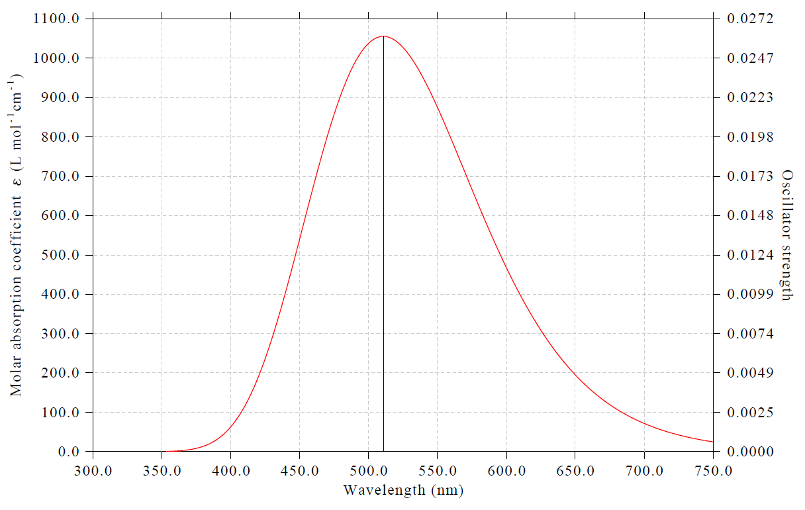

<!-- p.682 -->

As shown in console window, the peak position of our simulated spectrum 510.7 nm, which is quite close to the experimental peak position 512 nm (see https://en.wikipedia.org/wiki/BODIPY).

About plotting phosphorus spectrum It is worth to note that if you are a Gaussian user, it is impossible to plot phosphorus spectrum

(corresponding to T1→S0 emission according Kasha’s rule) using above steps, because oscillator strength must be exactly zero due to spin-forbidden if spin-orbit coupling (SOC) is not taken into account, however Gaussian is unable to consider SOC effect in TDDFT calculation. To plot phosphorus spectrum, my suggested steps are:

(1) Optimize T1 geometry using your favourite quantum chemistry program (2) Based the T1 geometry, using Dalton program to calculate oscillator strength and excitation energy of T1 state using TDDFT theory with consideration of SOC

(3) Extract the oscillator strength and excitation energy of T1 from Dalton output file and manually write them to a plain text file in the format that can be recognized by Multiwfn, see Section 3.12.2 about the format.

(4) Load the plain text file into Multiwfn, then enter main function 11, select “UV-Vis”, then directly select option 0 to plot spectrum, which will correspond to phosphorus spectrum.


### 4.11.12 Plotting partial vibrational spectrum (PVS) and partial vibrational density-of-states (PVDOS)


The concept of partial vibrational spectrum (PVS) has been described in Section 3.13.6, please carefully read it first if you lack relevant knowledge. In the next sections I will illustrate how to use Multiwfn to plot it to intuitively understand nature of various vibrational spectra. You will find PVS is a very general and flexible analysis method. At the same time, plotting partial vibrational density-of-states (PVDOS) will also be illustrated, which is a useful way of graphically revealing composition of all (including spectral inactive) vibrational modes.

4.11.12.1 PVS-NC decomposition analysis of IR spectrum of C18···B9N9

complex

In this example, we use PVS-NC method to visually understand composition of vibrational

modes corresponding to IR spectrum of a molecular complex C18···B9N9, whose optimized geometry is given below


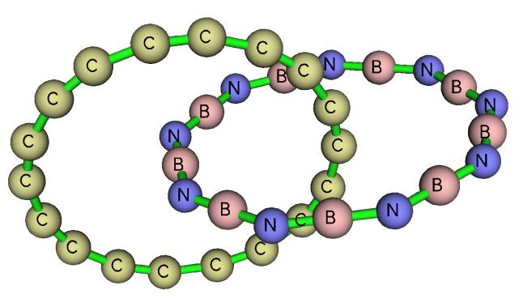

<!-- p.683 -->

The output file of frequency analysis task of Gaussian 16 program at ωB97XD/6-311G* level will be used as input file to plot IR spectrum and PVS-NC curves, the file is provided as examples\spectra\C18-B9N9.out. Note that “intmodes” option is specified in “freq” keyword, which requests Gaussian to print compositions of redundant internal coordinates (RICs) in each vibrational mode, the reason of adding this option is that in one of following examples I will illustrate how to plot PVS-NC map based on fragments consisting of RICs. If you only want to define fragments as a set of atoms, then this option is not needed.

Plotting common IR spectrum

We first plot a common IR spectrum of the C18···B9N9 complex. Boot up Multiwfn and input examples\spectra\C18-B9N9.out

!!! terminal "Multiwfn session"

    - **11** — Plot various kinds of spectrum
    - **1** — IR 0

From the map above you can see many peaks, what are natures of them? Via PVS-NC curves, you can easily understand which molecular fragment has a notable participation in the vibrational motions (represented by corresponding normal coordinates) of the vibration modes that observable in the map above. While via PVS-I, you can visually understand if a molecular fragment has evident contributions to IR absorption intensities of various peaks in the map above. So, PVS-NC and PVS-I respectively focus on revealing different aspects of spectral active vibrational modes. In the rest of this section, I will illustrate plotting PVS-NC curves, while in the next section, plotting PVS-I will be exemplified. More specifically, the PVS-NC plotted in this section is PVS-NC(atom), because we will define each fragment as a set of atoms.

Plotting PVS-NC(atom) map Assume that we want to study how the motions of C18 atoms and B9N9 atoms contribute to the vibrations corresponding to above IR spectrum, we should input the following commands in spectrum plotting interface

24 // Set partial vibrational spectra (PVS) or vibrational DOS (VDOS)


<!-- p.684 -->

!!! terminal "Multiwfn session"

    - **1** — Define PVS fragment 1 1-$C_{18}$
    - **Atoms in C18 2** — Define PVS fragment 2
    - **19-36** — Atoms in B9N9 l
    - **Set legends of PVS curves 1** — Set legend for PVS cyclo[18]carbon
    - **Full name C18 2** — Set legend for PVS B9N9 q
    - **Save and return q** — Generate PVS data and return to spectrum plotting interface From screen you can find composition of the two fragments we just defined in each vibrational mode:


```text
Vibrational mode     1 (      7.20 cm^-1 )
   Fragment  1   Composition:   62.1646 %
   Fragment  2   Composition:   37.8354 %
 Vibrational mode     2 (     10.65 cm^-1 )
   Fragment  1   Composition:   39.3017 %
   Fragment  2   Composition:   60.6983 %
...[ignored]
```

Select option 0 to plot spectrum, then you can see the following map on screen

In fact, there are three curves in the map, total IR spectrum (black), PVS of fragment 1 (C$C_{18}$, red) and that of fragment 2 (B9N9, blue), the sum of the latter two corresponds to the former. However, from the current map we can only clearly see that there is an extraordinary strong absorption at about 2000 cm-1. Because the peak is fully in blue, we can conclude that this absorption must purely correspond to vibration of B9N9.


<!-- p.685 -->

From the map above we can see there are many modest IR absorptions in the low frequency range. To look into their details, we input following commands

!!! terminal "Multiwfn session"

    - **3** — Set lower and upper limit of X-axis
    - **750,350,50** — Lower limit, upper limit and interval of X-axis
    - **4** — Set left Y-axis
    - **0,3000,300** — Lower limit, upper limit and interval of left Y-axis y
    - **Correspondingly scale right Y-axis 16** — Set status of showing labels of spectrum minima and maxima
    - **1** — Change displaying status of labels
    - **1** — Show maxima on the spectrum
    - **0** — Return 0

This map is very informative. For example, it is clear that the peak at 428.8 cm-1 almost solely comes from vibration of C18, the peak at 531.4 cm-1 almost only corresponds to vibration of B9N9, the peak at 484.0 cm-1 shows evident coupling vibration character. The normal coordinates of the modes maximally corresponding to the aforementioned peaks are illustrated as follows, which are in line with our expectation from inspecting the PVS map.


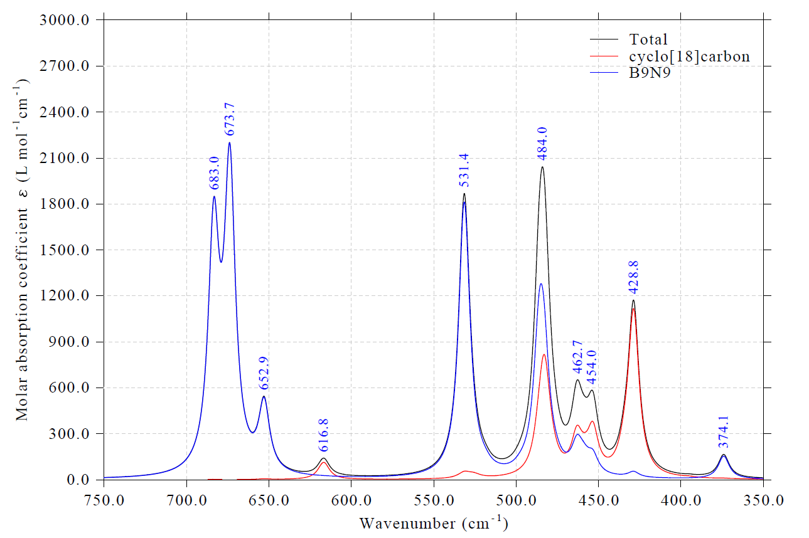

<!-- p.686 -->

Although in this section I only illustrated defining two fragments, in Multiwfn in fact you can maximally define as many as 10 fragments, all PVS curves can be shown together. The union of the fragments does not necessarily correspond to the whole system.

It is noteworthy to emphasize that PVS curves only exhibit contribution of various fragments to normal coordinates of various vibrational modes, they do not directly reflect fragment contribution to absorption intensity. In other words, percentage contribution to normal coordinates of a vibrational mode from a fragment is not proportional to its contribution to intensity of a vibrational mode. This point should be correctly recognized when you discuss PVS/OPVS curves. For example, from a PVS curve of a nonpolar group, you may observe that an evident IR-active mode has a large composition of vibrational of the group in its normal coordinate, you should not thus conclude that the vibrational of the nonpolar group is the source of the strong IR absorption.

Plotting OPVS map between fragments defined by atoms We can also plot OPVS curve between two fragments to very conveniently examine contribution of their collective vibration in different wavenumber ranges. To plot OPVS between the C18 and B9N9, we input

!!! terminal "Multiwfn session"

    - **24** — Set partial and overlap vibrational spectra
    - **0** — Set OPVS 1,2

!!! terminal "Multiwfn session"

    - **Set display status of PVS/OPVS curves 1** — Disable showing PVS of fragment 1 for clarity
    - **2** — Disable showing PVS of fragment 2 for clarity q
    - **Return q** — Return to spectrum plotting interface
    - **0** — Plot spectrum again Now you can see total IR spectrum along with OPVS curve


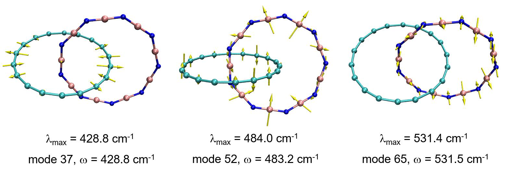

<!-- p.687 -->

This OPVS map vividly shows coupling contribution to various IR absorption. In the region between 450 and 500 cm-1, the coupling effect is strong; in particular, at 462.7 cm-1 the green curve is very close to black curve, therefore, according the definition of OPVS described in Section 3.13.6, we know that the corresponding IR-active mode should be completely and almost equally contributed by vibrations of C18 and B9N9 moieties. From the PVS curves of the two fragment at this wavenumber you can confirm this point. In contrast, the green curve in the wavenumber region larger than 650 cm-1 is negligible, therefore, the peaks 652.9, 673.7 and 683.0 cm-1 must be solely contributed by either one the two fragments. This example demonstrates that OPVS is very helpful in quickly understanding vibrational coupling between various fragments in different wavenumber ranges.

4.11.12.2 PVS-I decomposition analysis of IR spectrum of C18···B9N9 complex

To be written

4.11.12.3 PVDOS analysis of vibrational spectrum C18···B9N9 complex

This section is to be written Briefly speaking, VDOS is very similar to the vibrational spectrum with assumption that intensity of all vibrational modes equals 1. The relationship between PVDOS/OPVDOS to VDOS is equivalent to that between PVS/OPVS and actual vibrational spectrum.

In this section I illustrate how to plot VDOS, partial VDOS (PVDOS) of fragments, and overlap

PVDOS (OPVDOS) between fragments. The C18···B9N9 complex used in last section is still taken as instance, and the two molecules will be defined as the two fragments.

Boot up Multiwfn and input


<!-- p.688 -->

!!! terminal "Multiwfn session"

    - **examples\spectra\C18-B9N9.out 11** — Plot various kinds of spectrum
    - **1** — IR 24

!!! terminal "Multiwfn session"

    - **Define PVS fragment 1 1-18** — Atoms in C18
    - **2** — Define PVS fragment 2
    - **19-36** — Atoms in B9N9 l
    - **Set legends of PVS curves 1** — Set legend for PVS cyclo[18]carbon
    - **Full name C18 2** — Set legend for PVS B9N9 q
    - **Return 0** — Set OPVS 1,2
    - **Plot between fragments 1 and 2 v** — Toggle plotting vibrational DOS instead of spectrum. Then PVS will correspond to PVDOS, and OPVS will correspond to OPVDOS

!!! terminal "Multiwfn session"

    - **q** — Generate PVS data and return to spectrum plotting interface
    - **3** — Set lower and upper limit of X-axis
    - **2400,0,300** — Lower limit, upper limit and interval between ticks
    - **17** — Other plotting settings
    - **11** — Set position of legends
    - **8** — Upper left corner
    - **0** — Return to spectrum plotting interface
    - **0** — Plot spectrum Now you can see the following map


<!-- p.689 -->

From the map you can find vibrational modes sparsely distribute above 600 cm-1, while below 600 cm-1 the distribution of vibrational modes is much denser. In addition, it is found that the vibrational modes above 600 cm-1 do not show detectable coupling motion between C18 and B9N9, the strongly interfragment coupled modes occur densely around 500 cm-1 and below 100 cm-1. This point can be viewed more clearly if you adjust limits of X-axis to only plot 0~600 cm-1 region, as shown below. Peak positions of total spectrum are also labeled by means of option 16.


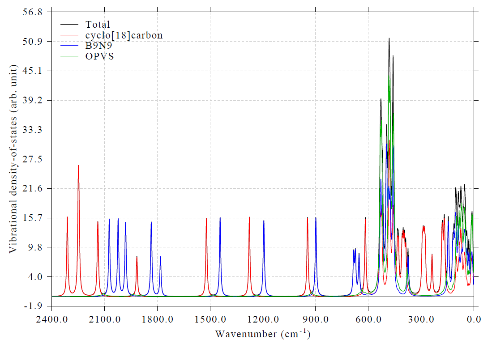

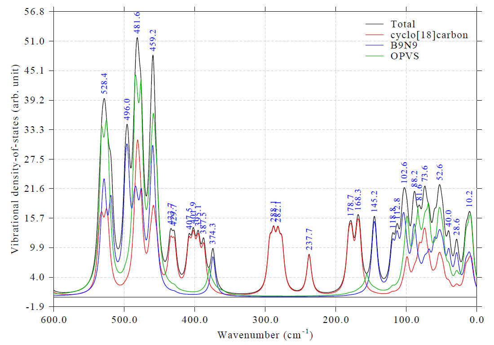

<!-- p.690 -->

A very different point between VDOS and vibrational spectrum is that in the former, all modes equally contribute to the curve, in other words, you can observe all modes; while in the latter, only the modes with nonnegligible intensity have contribution to the curve and thus visually detectable.

4.11.12.4 PVS-NC decomposition analysis of VCD spectrum of

phenylalanine

To be written

4.11.12.5 Plotting directional IR spectrum

To be written


### 4.11.13 Plotting directional UV-Vis spectrum

Note: Chinese version of this topic is my blog article “Simulating UV-Vis absorption spectrum in specific directions using Multiwfn” (http://sobereva.com/648).

As described in Section 3.13.1, directional UV-Vis spectrum can be plotted to study optical absorption caused by interaction between a system and electric field oscillating in a specific direction, this is particularly valuable if you are interested in anisotropy of spectral character.

In this section, we study carbon nanotube fragment with the following structure and orientation:

First, we plot UV-Vis spectrum of this system corresponding to interaction with electric field oscillating parallel to XY plane. Now, boot up Multiwfn and input

examples\spectra\CNT66_TDDFT.out // TDDFT output file of Gaussian at PBE0/6-31G* level, 100 excited states were calculated

!!! terminal "Multiwfn session"

    - **11** — Plotting spectra
    - **-3** — Plotting directional UV-Vis spectrum
    - **4** — XY direction


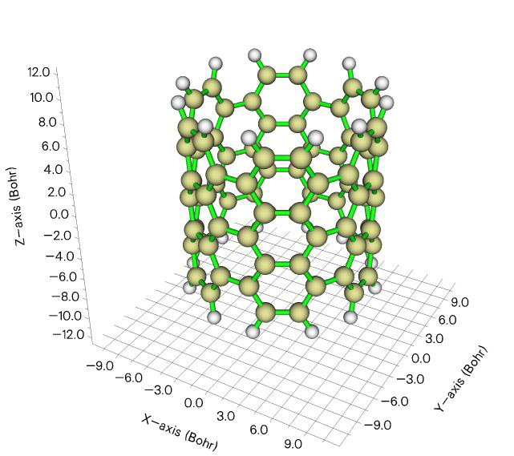

<!-- p.691 -->

!!! terminal "Multiwfn session"

    - **0** — Plot spectrum Close the graph shown on screen and input the following commands to adjust plotting settings
    - **3** — Adjust X-axis
    - **200,800,50** — Lower and upper limits, as well as label interval
    - **3** — Adjust left Y-axis
    - **200,800,50** — Lower and upper limits, as well as label interval y

Similarly, you can plot UV-Vis spectrum corresponding to interaction with electric field oscillating along Z direction.

After plotting the aforementioned XY and Z spectra, if you export curve data and line data to .txt file via option 2, then you can collectively import them into third-part software such as Origin and draw a map containing total, XY and Z data, as shown below, in which the “Total” curve corresponds to sum of XY and Z curves and also corresponds to the UV-Vis spectrum in common sense.


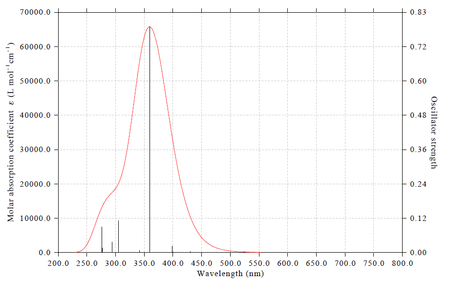

<!-- p.692 -->

In the map above, it can be seen that the strongest absorption around 370 nm completely comes from interaction of the system with electric field oscillating in XY plane. Since oscillating direction of electric field is perpendicular to propagation direction of light, the XY curve can be understood as the absorption curve for the light propagating in Z direction. The Z curve in the map above contributes most to the absorption around 300 and 480 nm, it corresponds to the absorption of the light propagating on XY plane with polarization in Z direction. This observation also indicates that only the electron excitations at these wavelengths possess prominent Z-directional transition dipole moment.

This example shows that for systems with significant anisotropic features, plotting UV-Vis spectra in specific directions clearly helps to understand the intrinsic nature of their absorption spectra.


### 4.11.14 Predicting color of indigo and allura red

Note: Chinese version of this example is “Prediction of color of chemical substances by quantum chemical calculations and Multiwfn program” (http://sobereva.com/662), which also contains more discussion.

Please read section 3.13.7 to understand basic feature of the function of predicting color in Multiwfn. In this section we will predict color of indigo based on theoretical calculation, and then predict color of allura red based on its experimental UV-Vis spectrum.

4.11.14.1 Predicting color of indigo based on theoretical calculation

examples\spectra\indigo_TD-B3LYP_water.out is output file of Gaussian of calculating electronic excited states at TD-B3LYP/def2-TZVP level in water environment represented by IEFPCM solvation model. The geometry was optimized for ground state at B3LYP/6-311G* level. Boot up Multiwfn and load this file, then input

!!! terminal "Multiwfn session"

    - **11** — Plotting spectrum
    - **3** — UV-Vis 25


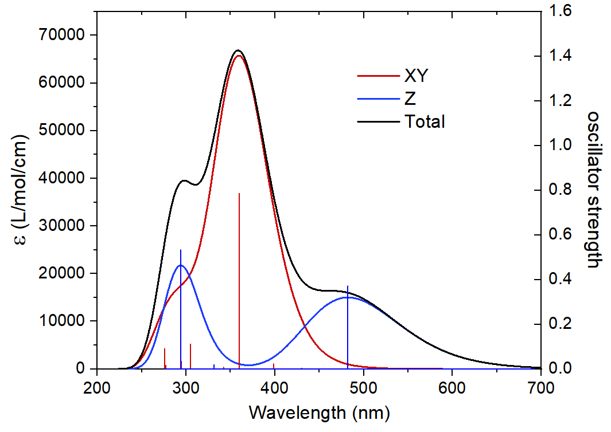

<!-- p.693 -->

which tristimulus functions have definition, which are involved in color prediction procedure internally):

After closing the window, Multiwfn shows the colors predicted based on the spectrum curve:

The color displayed under “color” label is the color corresponding to the UV-Vis spectrum, and the color shown below “complementary color” corresponds to the color of transmission and reflection light of indigo. The two colors shown at bottom side of the window are counterparts of the two colors shown at upper side of the window by shifting RGB values so that the largest-value component of the colors equal to 255 (upper limit of sRGB color space). In short, the very blue color, as shown at the bottom-right corner of the window, can be regarded as the color actually displayed by indigo aqueous solution. This predicted color is completely identical to actual color of indigo, extremely successful prediction!

From text window of Multiwfn, you can also find parameters of the four colors shown on the graphic window and some intermediate data:


```text
CIE1931 XYZ:              1077992.509       1123653.902        188673.482
Fractional CIE1931 XYZ:      0.9593634718      1.0000000000      0.1679106720
CIE1931 xy:              0.4509825283      0.4700851571
Note the R,G,B values shown below correspond to standard RGB (sRGB) color space
RGB (0-1):    1.487926  0.953110  0.026876
RGB (0-255):   379   243     7
Note: The color exceeds sRGB color space! Now the R,G,B values are scaled into
```


