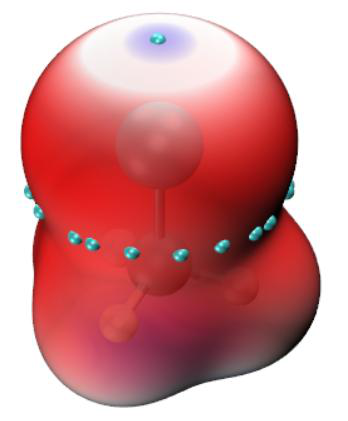
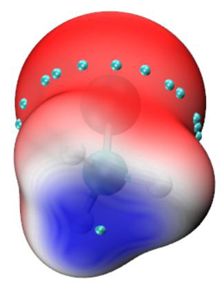
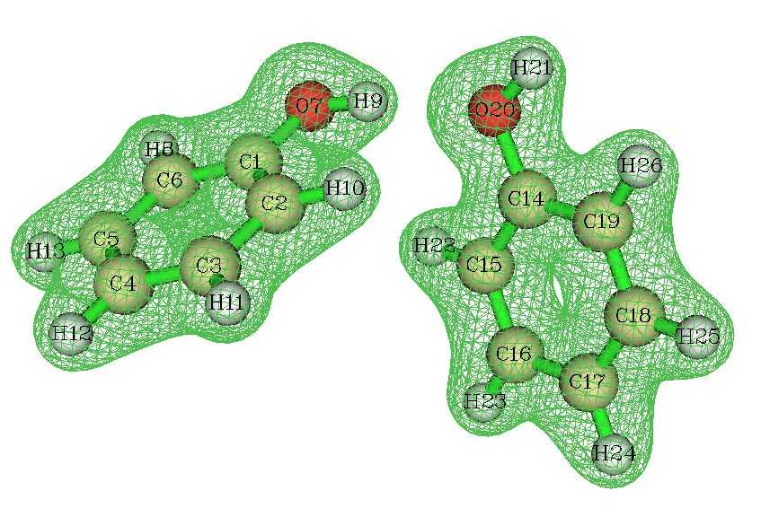
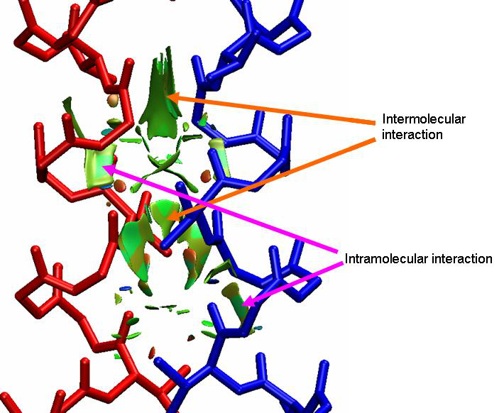
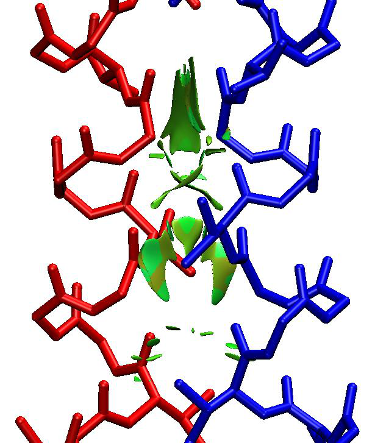
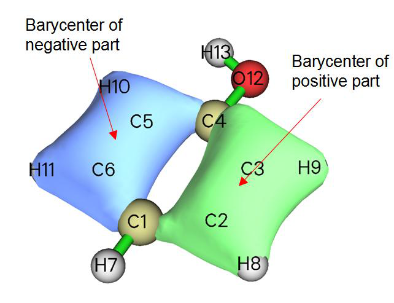
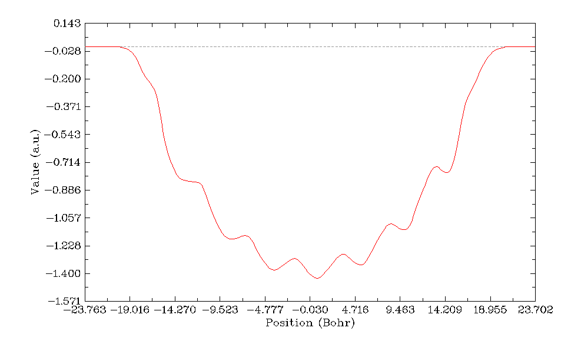

# 4.13 Process grid data

> Multiwfn manual, p.731–742. Images: `../imgs/`.

---

<!-- p.731 -->

extrema of $E_{\text{att}}$ on ρ = 0.004 a.u. isosurface), then they will be automatically moved to VMD folder

Boot up VMD and input source LEAE_isoext.vmd in VMD console window to run this script. However, under the default color scale (from -0.03 to 0.0 a.u.) the character in different regions of the molecular surface cannot be clearly distinguished. Therefore, we input this command in VMD console window to change color scale to [-0.015,0] a.u.: mol scaleminmax 0 1 -0.015 0, then you will see the following map, two perspectives are shown

In this map, the color varies as blue-white-red, the bluer (more negative $E_{\text{att}}$) the region, the stronger electrophilicity the corresponding area. This map conveys essentially the information as

EAL, namely the end of -CH3 group is most electrophilic, while the σ-hole of Cl atom also shows weak electrophilicity.

The cyan spheres on the surface correspond to surface extrema of $E_{\text{att}}$. Using the same way as the last example to inquire their values, you can find the surface extreme at the end of Cl atom is -0.29 eV, while that at the -CH3 side is -0.5 eV.


## 4.13 Process grid data

Main function 13 includes a bunch of subfunctions, by using them you can process the grid data loaded from Gaussian-type cube file (.cub), DMol3 grid file (.grd), ParaView VTK Image Data file (.vti), or the grid data directly generated by such as main function 5 of Multiwfn. In this section I present several simple applications, please play with other subfunctions yourself.


### 4.13.1 Extract data points in a plane

In this example we extract average XY-plane data between Z=28 and Z=32 Å to a plain text file.

dens.cub // A cube file generated by Multiwfn or by some external programs, since cube file is generally large, it is not provided in "example" folder. You can also use the grid data generated internally by Multiwfn instead, that is use main function 5 to calculate grid data first and then choose 0 to return to main menu (the just generated grid data is present in memory)

!!! terminal "Multiwfn session"

    - **13** — Process grid data
    - **5** — Extract average plane data
    - **28,32** — Range of Z (in Å)






<!-- p.732 -->

Now the data points are exported to output.txt in current folder, including X,Y coordinates and value. You can import this file to plotting software such as Sigmaplot to draw a plane graph.

Another example, we extract data points on the plane defined by atom 4,6,2. dens.cub

!!! terminal "Multiwfn session"

    - **13** — Process grid data
    - **8** — Output data in a plane by specifying three atom indices.

This function is commonly used to extract a tilted plane, if the plane is parallel to XY, YZ or XZ, you should use function 1,2 or 3 instead respectively

0 // Use automatically determined tolerance distance. If vertical distance between any point and the plane you defined is smaller than tolerance distance, then the point will be outputted.

1 // Project the data points in the plane you defined to XY plane, so that you can directly import the outputted file to plotting software to draw plane graphs

Now the data value along with coordinates is exported to output.txt in current folder. Notice that Multiwfn does not do interpolation during plane data extraction, hence if the quality of grid data is not fine enough (namely spacing between points is large), then the extracted plane data will be sparse (especially severe for the plane not parallel to XY, YZ or XZ plane).


### 4.13.2 Perform mathematical operation on grid data

Example 1 Assume that we have two cube files A.cub and B.cub, in this example we obtain their difference cube file (viz. A.cub minus B.cub).

Boot up Multiwfn and input following commands A.cub

!!! terminal "Multiwfn session"

    - **Load the first cube file into memory 13** — Process grid data
    - **11** — Grid data calculation
    - **4** — Subtract the grid data in memory by another grid data B.cub

Now the grid data in the memory has been updated, choose 0 to export it as a new cube file, which is what we need.

Example 2 Assume that we have two cube files MO1.cub and MO2.cub, each of them records wavefunction value of an orbital. In this example we will generate a cube file containing total electron density deriving from these two orbitals. According to Born's probability interpretation, square of an orbital wavefunction value is simply its density probability, therefore what we need is the sum of square of the two grid data.

Boot up Multiwfn and input following commands MO1.cub

!!! terminal "Multiwfn session"

    - **13** — Process grid data
    - **11** — Grid data calculation


<!-- p.733 -->

10 // Perform A2+B2=C operation, where A is present grid data (MO1.cub), B is another cube file (MO2.cub), C is the new grid data

!!! terminal "Multiwfn session"

    - **MO2.cub** — Load another cube file After calculation, the grid data in memory has been updated to C.
    - **0** — Output the updated grid data totdes.cub


### 4.13.3 Scaling numerical range of grid data

The numerical range of ELF function is [0,1], in this example, we scale its numerical range to [0,65535] (which is value range of unsigned 16bit integer). We first compute ELF grid data in Multiwfn as described in Section 4.5.1, and then input

!!! terminal "Multiwfn session"

    - **0** — Return to main menu from post-processing interface of grid data calculation
    - **13** — Process grid data
    - **16** — Scale data range
    - **0,1** — Original data range
    - **0,65535** — The range after scaling. Please read Section 3.16.12 for the detail of scaling algorithm.

Now the grid data has been scaled. You can choose function 0 to export the updated grid data to Gaussian cube file, or extract plane data to plain text file by corresponding functions.


### 4.13.4 Screen isosurfaces in local regions

Sometimes we do not want all isosurfaces in the whole space are shown, because too many isosurfaces will confuse our eyes. This section I will show how to screen the isosurfaces of not interest

4.13.4.1 Screen isosurfaces inside or outside a region

This section I take electron density of phenol dimer as example. First, we generate the grid data as follows (you can also directly load a .cub/.grd file and then enter main function 13)

!!! terminal "Multiwfn session"

    - **examples\phenoldimer.wfn 5** — Calculate grid data
    - **1** — Electron density
    - **2** — Medium-quality grid
    - **-1** — Visualize isosurface As you can see, the isosurfaces appear on both phenol molecules.


<!-- p.734 -->

Assume that we only want the isosurface around the right phenol will be shown, we need to set the value of the grid points that close to the left phenol to a very small value, for example, zero.

Close the Multiwfn GUI window and input

!!! terminal "Multiwfn session"

    - **0** — Return to main menu
    - **13** — Process grid data
    - **13** — Set value of the grid points that far away from / close to some atoms
    - **-0.7** — That means we will set the value of the grid points inside 0.7 times of vdW radius of the atoms. If input 0.7, then the value of the grid points outside 0.7 times of the vdW radius will be set

!!! terminal "Multiwfn session"

    - **0** — Set the value to 0
    - **2** — Defining mode. 2 means inputting atomic indices by hand (if choose 1, external file containing atomic index list will be used to define fragment, see Section 3.16.9 for the format or the next example)

1-13 // Range of atomic indices of the left phenol Now the grid data has been updated, let us choose option -2 to visualize the isosurface of current grid data. As you can see, the isosurface of the left phenol has disappeared.

4.13.4.2 Screen isosurfaces outside overlap region of two fragments

During analysis of inter-molecular interaction by NCI method (Section 4.20.1), what we want to study is only the isosurfaces in inter-molecular regions. In order to screen isosurfaces in other regions, we can set the value of grid points outside superposition region of scaled vdW regions of two molecules to a very large value (at least larger than maximum value in current grid data). In this section I will give you a practical example.

The so-called "scaled vdW regions" is the superposition region of scaled vdW spheres of all atoms in the fragment. While the "scaled vdW sphere" denotes the sphere corresponding to the scaled vdW radii.

Below is a segment of dimeric protein plotted by VMD program (you will know how to draw a similar picture after reading Section 4.20.2), red and blue representing backbone structure of the two chains respectively. Isosurfaces of reduced density gradient exhibit weak interaction region. However, these isosurfaces include both intermolecular and intramolecular parts, they are interwinded and result in difficulty in visual study of weak interaction between the two chains.




<!-- p.735 -->

In order to screen those intramolecular isosurfaces, we will use subfunction 14 in main function 13 of Multiwfn. First, we prepare two atom list files for the two chains (each chain corresponds to a fragment). atmlist1.txt includes atom indices of chain 1, the head and tail of the file are:


```text
159   <--- Total number of atoms in chain 1
1   <--- Atom index of the first atom in chain 1
2   <--- Atom index of the second atom in chain 1
...
159   <--- Atom index of the last atom in chain 1
```

Similarly, atmlist2.txt defines atom list for chain 2, its head and tail parts are:


```text
159   <--- Chain 2 has 159 atoms too
160   <--- Atom index of the first atom in chain 2
161   <--- Atom index of the second atom in chain 2
...
318   <--- Atom index of the last atom in chain 2
```

Then boot up Multiwfn and input: RDG.cub // The cube file of reduced density gradient corresponding to the graph above

!!! terminal "Multiwfn session"

    - **13** — Process grid data
    - **14** — Set value of the grid points outside overlap region of the scaled vdW regions of the two fragments

1.8 // The value for scaling vdW radius. In your practical studies, you may need to try this value many times to find a proper value

!!! terminal "Multiwfn session"

    - **1000** — Set value of those grid points to 1000, this value is large enough
    - **1** — Defining mode, 1 means using external file to define the fragment atmlist1.txt




<!-- p.736 -->

atmlist2.txt // The name of the atom list file for chain 2 Waiting for a while, the grid data will be updated. Then choose function 0 to export it as cube file. Using this new cube file to redraw above picture, we find all of intramolecular isosurfaces have disappeared, the graph becomes very clear.

In fact, when the case is not complicated (as present example), preparing atomic list files are not needed, you can choose defining mode as 2 and then directly input atomic indices (i.e. 1-159 for chain 1 and 160-318 for chain 2).


### 4.13.5 Acquire barycenter of a molecular orbital

In this example, we will calculate barycenter of a molecular orbital. You can also obtain barycenter of other real space functions by similar manner. The definition of barycenter is given in Section 3.16.13. Below is the isosurface of the 10th MO of phenol.

Before calculating the barycenter of the MO, we need to obtain the grid data of the MO. We






<!-- p.737 -->

can do this in Multiwfn, namely boot up Multiwfn and input following commands:

!!! terminal "Multiwfn session"

    - **examples/phenol.wfn 5** — Calculate grid data
    - **4** — Choose orbital wavefunction
    - **10** — The 10th orbital
    - **2** — Medium-quality grid. Finer quality of grid will give more accurate barycenter positions
    - **0** — Return back to main menu Now the grid data has been stored in memory, we will analyze it now
    - **13** — Process grid data
    - **17** — Show statistic data
    - **1** — Select all points From the output, we can find that the X, Y, Z components of barycenter of the positive part of the MO are (in Bohr) 2.629, -0.408, 0.000 respectively, while that of the negative part are -2.603, -0.702, 0.000. The total barycenter is meaningless currently, since total integral value is zero for this MO. However, total barycenter of absolute value of the MO is useful, especially for macromolecules, from this we can understand where the MO is mainly located. In order to do this, we input:

!!! terminal "Multiwfn session"

    - **11** — Grid data calculation
    - **13** — Get absolute value
    - **17** — Show statistic data
    - **1** — Select all points We find X, Y, Z of total barycenter of the MO are -0.043, -0.558, 0.000 Bohr, respectively. Since there is no negative region now, barycenter of negative part is shown as NaN (Not a Number).


### 4.13.6 Plot charge displacement curve

Multiwfn is able to calculate and plot integral curve for grid data, see the introduction in Section 3.16.14. If the grid data is selected as electron density difference, then the integral curve is commonly known as charge displacement curve (CDC), by which the charge transfer can be studied visually and quantitatively, extremely suitable for linear systems. In this example, by means of CDC, we will investigate the intermolecular charge transfer in polyyne (n=7) due to the externally applied electric field of 0.03 a.u. along the molecular axis.

The polyyne.wfn and polyyne_field.wfn files in "example" folder correspond to the polyyne in its isolated state and in the case that external electric field of 0.03 a.u. is applied, respectively. B3LYP/6-31G* is used in calculations, and the geometry optimized in isolated state is used for both cases. In Gaussian program, the field can be activated via keyword field=z+300.

Before plotting the CDC, we must calculate the grid data of electron density difference between these two files first. Boot up Multiwfn and input following commands:

!!! terminal "Multiwfn session"

    - **examples\polyyne_field.wfn 5** — Calculate grid data
    - **0** — Custom operation 1 -,examples\polyyne.wfn //Subtract the property of polyyne.wfn from polyyne_field.wfn
    - **1** — Electron density
    - **2** — Medium-quality grid


<!-- p.738 -->

We first visualize the isosurface of the electron density difference. After selecting -1 and set the isovalue to 0.004, we will see the graph like below

The green and blue parts represent the regions where electron density is increased and decreased after the external electric field is applied, respectively. It can be seen that although green and blue parts interlace each other, the total trend is that electron transferred to positive side of Z-axis (namely toward the source of the electric field). Next, we will plot CDC, which is able to characterize the electron transfer in different regions quantitatively.

Click "Return" button in the GUI and then input

!!! terminal "Multiwfn session"

    - **0** — Return to main menu
    - **13** — Process grid data
    - **18** — Calculate and plot integral curve Z

Select the entire range In the menu, we first choose option 2 to plot local integral curve of the grid data of the electron density difference. You will see

From the graph we can examine the integral of electron density difference in the XY planes corresponding to different Z coordinates. The Z coordinate and the value correspond to X and Y axes of the graph. You can directly compare this curve with the isosurface graph shown above, the peaks lower and higher than zero (dashed line) correspond to the blue and green isosurfaces. Note that in the command-line window, now you can find positions and values of all minima and maxima of the curve.


<!-- p.739 -->

Click right mouse button on the graph to close it, and then select option 1, the CDC will be shown immediately

This graph is yielded by integrating the curve shown in the last graph along the molecular axis. In its left part, although there are some fluctuations, the CDC gradually becomes more and more negative and reaches minimum value of 1.4 in the midpoint of the X-axis (corresponding to the center of the polyyne), that means due to the external electric field, the number of lost electrons in the left part of polyyne is 1.4. In the right part of the graph, the CDC increases gradually from -1.4 and finally reaches zero, suggesting that 1.4 electrons are transferred to right part of the polyyne, and due to the amount of increase and decrease of electron are cancelled with each other exactly in the whole molecular space, there is no variation of the total number of electrons (in other words, integral of the electron density difference in the whole molecular space is exactly zero).


### 4.13.7 Evaluation of electron density overlap

In this example we take methane dimer as example to evaluate where electron densities of the two monomers overlap with each other evidently. The structure of the methane dimer is

We first obtain grid data for an arbitrary real space function for the dimer. Boot up Multiwfn and input:

!!! terminal "Multiwfn session"

    - **examples\rho_overlap\dimer.pdb 5** — Grid data calculation
    - **100** — User define function, by default this function does not take any computational time





<!-- p.740 -->

!!! terminal "Multiwfn session"

    - **-10** — Set grid extension distance
    - **2** — Decrease the distance to 2 Bohr to avoid waste of grid at system boundary
    - **2** — Medium-quality grid
    - **2** — Export grid data as userfunc.cub Now we calculate wavefunction files by Gaussian for the two monomers, the input files are monomer1.gjf and monomer2.gjf in examples\rho_overlap folder. Finally, we obtained monomer1.wfn and monomer2.wfn. Beware that the nosymm keyword must be used in Gaussian calculation to avoid the automatic reorientation and translation.

Now we calculate electron density grid for monomer 1 over the whole space monomer1.wfn

!!! terminal "Multiwfn session"

    - **5** — Grid data calculation
    - **1** — Electron density 8 userfunc.cub

Export grid data Then rename the resulting density.cub to density1.cub. Repeat above steps for monomer2 to obtain density2.cub.

Now we calculate grid data of min(rho(1),rho(2)), namely take the minimal value of the two sets of electron density everywhere. Boot up Multiwfn and input:

!!! terminal "Multiwfn session"

    - **density1.cub 13** — Process grid data
    - **11** — Mathematical operation on grid data
    - **21** — Take min(rho(1),rho(2)) density2.cub
    - **0** — Export resulting grid data overlap.cub we open the overlap.cub and density2.cub by text editor, copy atomic coordinates from the latter to the former, and meantime change the number of atoms. Then the head of the overlap.cub should look like below (the highlighted texts are modified parts)


```text
Generated by Multiwfn
 Totally       531846 grid points
   10   -3.693194   -3.955866   -7.444301
   63    0.119334    0.000000    0.000000
   67    0.000000    0.119334    0.000000
  126    0.000000    0.000000    0.119334
    6    6.000000    0.000000    0.000000    3.371271
    1    1.000000    0.000000    0.000000    5.444301
    1    1.000000    0.000000    1.955867    2.677742
    1    1.000000   -1.693195   -0.976988    2.677742
    1    1.000000    1.693195   -0.976988    2.677742
    6    6.000000    0.000000    0.000000   -3.371271
    1    1.000000    1.693195    0.976988   -2.677742
    1    1.000000    0.000000    0.000000   -5.444301
    1    1.000000   -1.693195    0.976988   -2.677742
```


<!-- p.741 -->


```text
    1    1.000000    0.000000   -1.955867   -2.677742
```

Boot up Multiwfn and load the overlap.cub, enter main function 0, change the isovalue to a small one such as 0.0005, you will clearly see the density overlap region:

It is noteworthy that if then you enter main function 13, select subfunction 17 and then input 1, you will be able to obtain integral value of the density overlap function over the whole space, namely the "Integral of all data". Clearly, the larger the integral, the higher extent the densities of monomers overlap with each other.

By the way, if you feel the above-mentioned steps are too lengthy, you can easily make use of silent mode of Multiwfn to significantly reduce the operation steps, see Section 5.2.


### 4.13.8 Integrate electron density in a cylindrical region

Multiwfn is able to obtain statistical information (integral, volume, maximum and minimum values, etc.) in specific spatial and value ranges. To illustrate the use of this feature, in this example we first calculate electron density for acetylene, and then integrate electron density within a cylindrical region surrounding C-C bond.

Boot up Multiwfn and input examples\C2H2.wfn

!!! terminal "Multiwfn session"

    - **5** — Calculate grid data
    - **1** — Electron density
    - **3** — High-quality grid
    - **0** — Return to main menu
    - **13** — Process grid data
    - **17** — Show statistic data of grid points
    - **2** — Obtain statistic data for grid points in specific spatial and value ranges [Press ENTER button directly]

Cylindrical region 0.000000 0.000000

!!! terminal "Multiwfn session"

    - **0.602676** — Coordinate (in Å) of C1 as the 1st terminal of the cylinder 0.000000 0.000000
    - **-0.602676** — Coordinate (in Å) of C3 as the 2nd terminal of the cylinder
    - **2** — Radius of the cylinder is set to be 2 Å Now you can find statistical information for the grid data in the defined region:


```text
The minimum value:  0.27234472E-17 at   -6.000000   -6.000000   -9.152823 Bohr
```


<!-- p.742 -->


```text
The maximum value:  0.70592762E+02 at   -0.013983   -0.013983   -1.094723 Bohr
Differential element:   0.0015254705 Bohr^3
Average value:  0.24053135E-02
Root mean square (RMS):  0.11805020E+00
Standard deviation:  0.11800212E+00

Volume of positive value space:                103.2133362853 Bohr^3
Volume of negative value space:                  0.0000000000 Bohr^3
Volume of all space:                           103.2133362853 Bohr^3

Summing up positive values:               4242.9729279471
Summing up negative values:                  0.0000000000
Summing up all values:                    4242.9729279471

Integral of positive data:                  6.4725301753
Integral of negative data:                  0.0000000000
Integral of all data:                       6.4725301753

X,Y,Z of barycenter (in Bohr)
Positive part:         -0.00015137         -0.00015137         -0.00320043
Negative part:                 NaN                 NaN                 NaN
Total:                 -0.00015137         -0.00015137         -0.00320043
```

As highlighted by yellow color, the integral of present grid data, that is number of electrons, in the cylindrical region is 6.472. Now Multiwfn asks you if exporting a xyz file containing the grids involved in the statistics to grid.xyz in current folder, we choose y. Then we use VMD program to visualize the grid.xyz and molecule structure. After adjusting graphical effects to make the grid points shown as pink points, you will see the following map. Clearly the grid points indeed distribute within our expected region.


