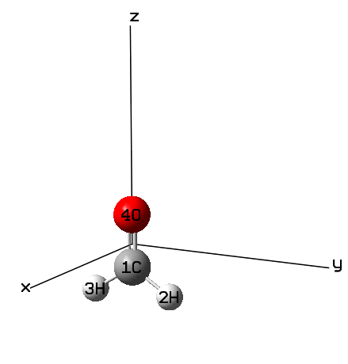
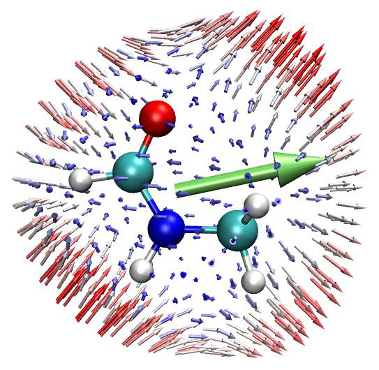
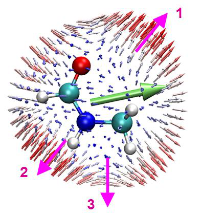

# 4.24 Examples of (hyper)polarizability analyses

> Multiwfn manual, p.969–989. Images: `../imgs/`.

---

<!-- p.969 -->

of Mayer bond order of π-electron for the wavefunction of TS structure, see Section 4.100.22 on how to do. You will find the π Mayer bond order of C1-C5 is merely 0.010, whose magnitude is small enough to be completely ignored.


## 4.24 Examples of (hyper)polarizability analyses


### 4.24.1 Parse output file of “polar” task of Gaussian to obtain (hyper)polarizability and calculate related quantities


As introduced in Section 3.27.1, Multiwfn has ability to parse the abstract output information of “polar” task of Gaussian and reorganize the data to a much more readable format, and meantime many useful quantities are outputted together. In this section an example is given.

In "examples\polar" folder, NH3_polar_static.out and NH3_polar_dynamic.out are output files of static and frequency-dependent (hyper)polarizability calculations for NH3 via a common exchange-correlation functional PBE0. The corresponding Gaussian input files are also provided in the same folder. In the calculation, a large basis set with abundant diffuse functions (aug-cc-pVTZ) was used, notice that diffuse functions play a vital role in yielding reasonable (hyper)polarizability and thus they are absolutely indispensable.

Studying static polarizability and first hyperpolarizability First, we use Multiwfn to parse data from the NH3_polar_static.out. Boot up Multiwfn and input

examples\polar\NH3_polar_static.out 24 // (Hyper)polarizability analysis 1 // Parse (hyper)polarizability task of Gaussian 1 // Start parsing. We select option 1 because third-order derivative of current level (normal DFT functional) is supported by Gaussian

Now you can see the following information on screen:


```text
Dipole moment:
 X,Y,Z=    0.000000    0.000000   -0.596558   Norm=    0.596558

 Static polarizability:
 XX=       13.692700
 XY=        0.000000
 YY=       13.693300
 XZ=        0.000000
 YZ=       -0.000334
 ZZ=       15.323600
 Isotropic average polarizability:       14.236533
 Isotropic average polarizability volume:       2.109636 Angstrom^3
 Polarizability anisotropy (definition 1):        1.630600
 Polarizability anisotropy (definition 2):        1.630600
 Eigenvalues of polarizability tensor:     13.69270     13.69330     15.32360
```


<!-- p.970 -->


```text
 Polarizability anisotropy (definition 3):        1.630600

 Note: It is well known that the sign of hyperpolarizability of Gaussian 09/16 s
hould be inverted, the outputs shown below have already been corrected

 Static first hyperpolarizability:
 XXX=        0.000000
 XXY=       12.903200
 XYY=        0.000000
 YYY=      -12.900200
 XXZ=        9.617100
 XYZ=        0.000000
 YYZ=        9.564710
 XZZ=        0.000000
 YZZ=        0.016285
 ZZZ=       26.613200

 Beta_X=        0.00000  Beta_Y=        0.01929  Beta_Z=       45.79501
 Magnitude of first hyperpolarizability:       45.795014
 Projection of beta on dipole moment:      -45.795010
 Beta ||     :      -27.477006
 Beta ||(z)  :       27.477006
 Beta _|_(z) :        9.159002
```

The output is easy to understand, all of the outputted quantities have been detailedly explained in Section 3.27.1.

Studying frequency-dependent polarizability and hyperpolarizability Next, we extract frequency-dependent (hyper)polarizability from the NH3_polar_dynamic.out. Boot up Multiwfn and input

examples\polar\NH3_polar_dynamic.out 24 // (Hyper)polarizability analysis 1 // Parse (hyper)polarizability task of Gaussian -1 // Let Multiwfn load frequency-dependent (hyper)polarizability 1 // Start parsing Multiwfn detected there are three set of data:


```text
       1   w=    0.000000 (     Static    )
       2   w=    0.065600 (      695.04nm )
       3   w=    0.071900 (      634.14nm )
```

If we input 2, then the (hyper)polarizability data corresponding to 0.0656 a.u. incident light will be loaded and parsed.

After outputting information about dipole moment and polarizability, Multiwfn asks you to choose the type of hyperpolarizability to be outputted:


```text
1: Beta(-w;w,0)   2: Beta(-2w;w,w)
Note: Option 2 is meaningless if "DCSHG" keyword was not used
```

You can select either one according to your requirements. Since as can be seen in


<!-- p.971 -->

NH3_polar_dynamic.gjf, the keyword we used is polar=DCSHG, both the two types are available.

Now if you choose option 2 to parse β(-2w;w,w), not only first hyperpolarizability will be shown, but also quantities related to Hyper-Rayleigh scattering (HRS) will be printed, as shown below (see Section 3.27.1 for detail)


```text
<beta_ZZZ^2>:  8.12843560E+02
<beta_XZZ^2>:  1.45318790E+02
Hyper-Rayleigh scattering (beta_HRS):        30.954
Depolarization ratio (DR):   5.594
|<beta J=1>|:        59.743
|<beta J=3>|:        41.624
Nonlinear anisotropy parameter (rho):   0.697
Dipolar contribution to beta, phi_beta(J=1):     0.589
Octupolar contribution to beta, phi_beta(J=3):   0.411
< (beta_ZXZ+beta_ZZX)^2 - 2*betaZZZ*betaZXX >:  2.04387968E+02
```

Next, if you want to study evolution of scattering intensity with respect to polarization angle of incident light, you should input y and then input an initial angle, for example, -180. After that HRS_angle.txt will be generated in current folder, which contains scattering intensity corresponding

to polarization angle varying from -180 to 179 with stepsize of 1. If you use such as Origin to plot the data as "Polar theta(X) r(Y)" map, you will obtain the map below, in which the radial distance of the red curve at different angles corresponds to calculated HRS intensity. The corresponding Origin .opj file has been provided as examples\polar\HRS_angle.opj

90

1000 120 60

800

HRS intensity (a.u.) 600 400 200 0 -180 150 30 0

-150 -30

-120 -60

-90

Studying second hyperpolarizability

Gaussian is also capable of calculating static and dynamic second hyperpolarizability (γ). An example input file is examples\polar\NH3_gamma.gjf, the output file is also given in the same folder. In this task polar=gamma keyword was used, and two external frequencies are specified (532 nm

and 680 nm). Below I illustrate using Multiwfn to parse data of γ(-2w;w,w,0) at 532 nm.

Boot up Multiwfn and input examples\polar\NH3_gamma.out 24 // (Hyper)polarizability analysis


<!-- p.972 -->

1 // Parse (hyper)polarizability task of Gaussian -1 // Let Multiwfn load frequency-dependent (hyper)polarizability 7 // This option is specific for parsing polarizability and second hyperpolarizability 3 // 532 nm Dynamic polarizability and relevant quantities at 532 nm now are shown on screen. Then choose 2 to further parse gamma(-2w;w,w,0), then you will see


```text
 XXXX=    3.966470E+03
 YXXX=    0.000000E+00
 ZXXX=    8.493370E-05
 XYXX=XXYX=    0.000000E+00
[...ignored]
 ZZZZ=    3.204030E+04

 Magnitude of gamma:      1.067181E+04
 X component of gamma:    2.134993E+03
 Y component of gamma:    2.134897E+03
 Z component of gamma:    1.023580E+04
 Average of gamma (definition 1), gamma ||:    1.450569E+04
 Average of gamma (definition 2):    1.461464E+04
 gamma _|_:    4.653651E+03
```

As can be seen, all components of γ tensor have been very clearly shown, and some quantities defined based on γ are also shown, they are very useful in the study of γ. Note that above data are given in input orientation.

Similarly, you can use Multiwfn to parse gamma(-w;w,0,0). If you want to parse gamma(0;0,0,0), do not choose option -1 before parsing.


### 4.24.2 Studying polarizability and hyperpolarizability based on sum- over-states (SOS) method


4.24.2.1 Calculate polarizability and hyperpolarizability for NH3

In this example I will show how to use Multiwfn to calculate polarizability and hyperpolarizability based on sum-over-states (SOS) method for a HF molecule. Please make sure that you have read Section 3.27.2.1.

As introduced in Section 3.27.2.1, SOS calculation requires information of a large amount of electronic states, including electric dipole moments, excitation energies, and transition dipole moments between these states. Commonly this information can be obtained by ZINDO, CIS, TDHF and TDDFT calculations. In this example we use the very popular CIS method. According to my experiences, the more expensive methods TDHF and TDDFT, which can produce more accurate excitation energies, do not necessarily give rise to better (hyper)polarizability than CIS when used in combination with SOS technique.

Preparation In this example we use Gaussian program to carry out the CIS calculation. However, Gaussian itself cannot output enough information for SOS calculation. Though for CIS (and ZINDO) there is


<!-- p.973 -->

a keyword alltransitiondensities, which makes Gaussian output transition density moment between each pair of excited states, however electric dipole moment of all states still cannot be obtained in a single run. Fortunately, we can use the very powerful electron excitation analysis module of Multiwfn to generate all information needed by SOS based on the output file of CIS/TDHF/TDDFT task of Gaussian or ORCA program.

First, run examples\NH3_SOS.gjf by Gaussian to produce output file NH3_SOS.out, and use formchk utility to convert the checkpoint file to NH3_SOS.fch. If you do not have Gaussian in hand, you can directly download them at http://sobereva.com/multiwfn/extrafiles/NH3_SOS.rar.

Since the SOS results converge often slow with respect to the number of excited states taken into account, we produce as high as 150 excited states in this example to substantially avoid truncation error. Of course, employing higher number of excited states needs more computational time in both of the CIS calculation and the subsequent SOS calculation in Multiwfn. In most practical studies, 100 states are generally large enough, and even 70 is often enough to provide usable results. Calculation of hyperpolarizability, especially the high-order ones, has very stringent requirements on the quality of basis set, abundant diffuse functions are absolutely indispensable. In this example we employ def2-TZVPPD (J. Chem. Phys., 133, 134105), which is a high-quality basis set optimized for calculation of molecular response properties. Since this is not a built-in basis set in current version of Gaussian, it was picked from BSE website (https://www.basissetexchange.org). The keyword IOp(9/40=5) is important, because in the ZINDO/CIS/TDHF/TDDFT task by default Gaussian only outputs the transition coefficients whose absolute values are larger than 0.1, while IOp(9/40=5) lowers the criterion to 0.00001, so that much more coefficients can be outputted, and thereby we can obtain accurate transition dipole moments by Multiwfn at next step. It is noteworthy that you can also use TDHF or TDDFT instead of CIS, for example you can write #P TD(nstates=150) CAM-B3LYP/gen IOp(9/40=5).

Boot up Multiwfn and input below commands C:\NH3_SOS.fch 18 // Electron excitation analysis module 5 // Calculate transition dipole moments and dipole moment for all excited states C:\NH3_SOS.out 3 // Generate SOS.txt The file SOS.txt generated in current folder contains all information needed by SOS (hyper)polarizability calculation. This file can be directly used by SOS module of Multiwfn.

Reboot Multiwfn and input SOS.txt 24 // (Hyper)polarizability analysis 2 // Study (hyper)polarizability by sum-over-states (SOS) method Note that all units used in the SOS module are atomic units.

Calculation of polarizability (alpha)

Now, select 1 and input 0 to calculate static polarizability α(0;0), the result is


```text
             1              2              3
 1      14.610682       0.000000       0.000000
 2       0.000000      14.610682       0.000000
 3       0.000000       0.000000      14.552483
Isotropic average polarizability:      14.591283
Isotropic average polarizability volume:       2.162205 Angstrom^3
Polarizability anisotropy (definition 1):       0.058199
Eigenvalues:      14.552483      14.610682      14.610682
Polarizability anisotropy (definition 2):       0.029100
```

As can be seen, not only the polarizability tensor, but also some related quantities are outputted. Their definitions can be found in Section 3.100.20. The isotropic average polarizability we obtained here is 14.59, which is in perfect agreement with the experimentally determined value 14.56! (Mol.


<!-- p.974 -->

Phys., 33, 1155)

Then we calculate dynamic polarizability α(-ω;ω) and assume the frequency of external field to be 0.0719 a.u. Select option 1 again, input 0.0719, from the output we can see the dynamic

isotropic polarizability at ω=0.0719 is 14.86, which is slightly larger than the static counterpart.

Calculation of first hyperpolarizability (beta)

Next, we calculate first hyperpolarizability and consider the static case β(0;0,0). Select option 2 and input 0,0. Only the β component along the dipole moment direction, namely β||, is what we are particularly interested in, since only this quantity can be determined experimentally. From the

output we find β||(0;0,0) is -38.98. The corresponding experimental value is not available, however this value is close to the highly accurate value calculated by CCSD(T) method (-34.3, see J. Chem. Phys., 98, 3022 (1993)).

Subsequently, we calculate β(-2ω;ω,ω) at ω=0.0656 a.u. Select option 2 again and input 0.0656, 0.0656 to set the frequency of both two external fields as 0.0656 a.u. This time the β|| value is -49.69, which is again in excellent agreement with the experimentally determined value -48.9±1.2 (see A. Hernández-Laguna et al. (eds.), Quantum Systems in Chemistry and Physics, Vol. 1, p111)

Note: Although in this example the agreement between our SOS/CIS calculations and the reference values is surprisingly good, this is not always held for other systems. The SOS/CIS method sometimes severely overestimates β value!

Calculation of second hyperpolarizability (gamma)

Finally, we calculate second hyperpolarizability γ. Select 3 and input 0,0,0 to assume static electric fields. Since calculation of γ is evidently more time-consuming than β, Multiwfn does not automatically use all states but allows you to set the number of states to be taken into account. Larger value in principle gives rise to better results, but of course more time will be consumed in the calculation. Here, we input 150 to use all states. After a while, result is shown on screen, the average

of γ is 928.74. Beware that this value may be inaccurate (reference value is not available, so I am not sure if this is a good result), one of the main reasons is that the basis set we used in the electron

excitation calculation is not large enough. Accurate calculation of γ usually requires a basis set like d-aug-cc-pVTZ (or an even better one), which has an additional shell of diffuse functions compared to the commonly used aug-cc-pVTZ.

Multiwfn is also capable of calculating third hyperpolarizability δ(-ω;ω1,ω2,ω3,ω4) where ω=ω1+ω2+ω3+ω4, but we do not do this in present example, because this quantity is fairly unimportant, and the calculation is terribly expensive when the number of states in consideration is large; moreover, a sky-high quality of basis set must be employed in the calculation...

Variation of (hyper)polarizability with respect to number of considered states A very important point in SOS calculation is that the number of states used must be high enough; in other words, if n states are involved in your SOS studies, the variation of the (hyper)polarizability with respect to the number of states have to be converged before n, otherwise n must be enlarged. By using Multiwfn we can readily examine if the convergence condition is satisfied. Here we check

the convergence of static β. Select option 6 and input 0,0, after a while, the result will be exported to beta_n.txt and beta_n_comp.txt in current folder, the meaning of each column is clearly indicated on screen. Then you can use your favourite tool to plot the data in the beta_n.txt. If you are an Origin user, you can directly drag this file into Origin window and plot the data as curve maps. The graphs

below show the variation of static β|| as well as static isotropic average polarizability <α> with respect to number of considered states.


<!-- p.975 -->

16

14 -20

12 -30

10

<α> 8 6 β|| -40 -50

4 -60

2

-70

0204060801001201400 020406080100120140

Number of states It is clear that both of the two quantities have basically converged at n=100. Since we employed 150 states in our calculations, the error due to the truncation of states can be safely ignored. From the graph one can also see that if the number of states is truncated at 70, the results are still qualitatively correct. Number of states

You can also analogously use options 5 and 7 to study the convergence behavior of α and γ, respectively.

Variation of (hyper)polarizability with respect to frequency of external fields In the SOS module of Multiwfn, one can also easily study the variation of dynamic (hyper)polarizability with respect to the frequency of external fields. For example, we investigate

the variation of β(-ω1;ω1,0) as ω1 varies from 0 to 0.5 a.u. with stepsize of 0.01. Write a plain text file, each row corresponds to a pair of ω1, ω2 (ω2 is fixed at zero in this example), for example


```text
0.00  0
0.01  0
0.02  0
...
0.5   0
```

Tips: For convenience, you can utilize Microsoft Excel program to generate frequency list, and save the table as .txt file (you can select such as "Text (tab delimited)", but do not choose "Unicode text"). Then choose option 16, input the path of the plain text file, the β will be calculated at each pair of frequencies, the result will be outputted to beta_w.txt and beta_w_comp.txt in current folder, the meaning of each column of the data is clearly indicated on screen. The data in these files can be

directly plotted as curve map by Origin, for example the magnitude of β(-ω1;ω1,0) is shown below:


<!-- p.976 -->

110000

100000

90000

Magnitude of β (−ω1;ω1,0) 80000 70000 60000 50000 40000 30000 20000

10000

0

0.00.10.20.30.40.5

Frequency of external field ω1

Similarly, you can also use options 15 and 17 to study the variation of α and γ with respect to frequency of external fields, respectively.

Scanning both ω1 and ω2 of β(-(ω1+ω2);ω1,ω2) By subfunction 19 of the SOS module, you can also scan both ω1 and ω2 of β(-(ω1+ω2);ω1,ω2). For example, we input below commands in the SOS module

19

-0.6,0.6,100 // Lower limit, upper limit and number of steps of ω1 (in a.u.) -0.6,0.6,100 // Lower limit, upper limit and number of steps of ω2 (in a.u.) After a while, beta_w.txt and beta_w_comp.txt are generated in current folder, the meaning of

each column of the files is clearly mentioned on screen. To visually study how total β varies with respect to change in ω1 and ω2, you can plot a relief map with first, second and 7th columns as X, Y and Z data, respectively. The map shown below was plotted by Sigmaplot:

This kind map exhibits one photon resonance β(-ω1;ω1,0) or β(-ω2;0,ω2), sum frequency


<!-- p.977 -->

generation and difference frequency generation character of present system. Occurrence of a large

peak at the position where one of ω1 and ω2 is zero implies significant Electro-optics Pockels effect at the corresponding frequency, a large peak at a frequency ω1=ω2 indicates strong second harmonic generation (SHG) effect at that frequency, a large peak at frequency ω1= -ω2 shows remarkable optical rectification effect at that frequency. See ACS Appl. Nano Mater., 2, 1648 (2019) for example of discussion of this kind of map.

4.24.2.2 Perform two- and three-level model analysis for first

hyperpolarizability of NH2-biphenyl-NO2

Note: Chinese version of this section is my blog article “Using Multiwfn to perform two-level and three-level model analyses for first hyperpolarizability” (http://sobereva.com/512).

In literature about computational study of hyperpolarizability, two-level model is frequently adopted to shed light on the major factors that influence the first hyperpolarizability, this analysis

also provides clear insight into the difference in β between analogous systems. The three-level model implemented in Multiwfn is a natural extension of the two-level model to include two excited states into account. Please read Section 3.27.2.2 first to gain basic knowledge about the two- and three-level models. In this section I will illustrate basic step of performing these analyses

It is important to emphasize that the two- or three-level analysis is useful only when these two conditions are satisfied:

- Only one component of β (namely βXXX or βYYY or βZZZ) plays dominant role. This component should be subjected to the analysis

- One excited state (for two-level model) or two excited states (for three-level model) has much larger contribution to β than all other excited states

Most systems of donor-π-acceptor type well satisfy the above two conditions. In this section we take a typical donor-π-acceptor system NH2-biphenyl-NO2 as example. The D-pi-A.fchk and D-pi-A.out in "examples\excit" folder were produced by Gaussian TDDFT task for this system at CAM-B3LYP/6-31G(d) level, five lowest-lying singlet excited states were yielded. It is worth to note that without sufficient diffuse functions, (hyper)polarizability cannot be estimated at quantitative accuracy level; however, our present aim is simply using the two- and three-level

models to very roughly discuss the factors influencing the β, so using these two files to conduct the analysis is acceptable.

Prepare input file Boot up Multiwfn and input below commands examples\excit\D-pi-A.fchk 18 // Electron excitation analysis module 5 // Calculate transition dipole moments and dipole moment for all excited states examples\excit\D-pi-A.out 3 // Generate SOS.txt, which contains all information needed by the two- or three-level analysis Now we are ready to perform the two/three-level analysis. Before doing this, we need to

confirm which component of β should be studied. The molecular geometry of D-pi-A.fchk is shown below (displayed by main function 0). As can be see, the direction of donor-π-acceptor path is fully parallel to X-axis, hence it is expected that only βXXX of current system is prominent.


<!-- p.978 -->

Two-level analysis Reboot Multiwfn and input SOS.txt 24 // (Hyper)polarizability analysis 2 // Study (hyper)polarizability by sum-over-states (SOS) method

20 // Two- or three-level model analysis of β Now Multiwfn prints key information for all excited states, which are very closely related to two- and three-level analyses:


```text
Excitation energy (E), transition electric dipole moment between ground state and excited
state, and variation of dipole moment of excited states w.r.t. ground state
                  Trans. dipole moment (a.u.)        Var. dipole moment (a.u.)
 State   E(eV)     X       Y       Z      Tot        X       Y       Z      Tot
    1   3.9069   0.444  -0.000  -0.002   0.444    -1.010  -0.001   0.001   1.010
    2   4.0624   2.528  -0.003  -0.007   2.528     6.563  -0.015  -0.047   6.501
    3   4.4166  -0.003  -0.002  -0.023   0.024    -1.081   0.002   0.002   1.077
    4   4.7912   0.001   0.341  -0.013   0.341     1.845  -0.006  -0.015   1.823
    5   4.8872  -0.004   0.192  -0.171   0.257     0.993  -0.019  -0.049   0.925
```

Because excited state 2 has much larger magnitude of transition dipole moment and variation of dipole moment than others, and meantime the excitation energy of excited state 2 is low, thus this state can be unambiguously identified as the so-called crucial state.

Next, we input 1-5 to perform two-level analysis for every excited state from 1 to 5, you will see


```text
beta evaluated by two-level model: (a.u.)
 #    1: XXX=       -58.05  YYY=        -0.00  ZZZ=         0.00  Norm=        58.05
 #    2: XXX=     11289.12  YYY=        -0.00  ZZZ=        -0.00  Norm=     11289.12
 #    3: XXX=        -0.00  YYY=         0.00  ZZZ=         0.00  Norm=         0.00
 #    4: XXX=         0.00  YYY=        -0.15  ZZZ=        -0.00  Norm=         0.15
 #    5: XXX=         0.00  YYY=        -0.13  ZZZ=        -0.27  Norm=         0.30
```

Clearly, only excited state 2 has significant contribution to βXXX.

We can ask Multiwfn to print more detailed information about the excited state 2. Input the following commands


<!-- p.979 -->

20 // Two or three-level model analysis of β 2 // Select excited state 2 for two-level model analysis The outputted information is shown below


```text
 Excited state     2
 Excitation energy    0.149290 a.u.    4.0624 eV
 Transition dipole moment (a.u.)
 X=    2.527776  Y=   -0.003088  Z=   -0.007328  Total=    2.527789
 Oscillator strength
 X=    0.635943  Y=    0.000001  Z=    0.000005  Total=    0.635949
 Variation of dipole moment (a.u.)
 X=    6.562899  Y=   -0.015345  Z=   -0.046710  Total=    6.563083

 beta evaluated by two-level model: (a.u.)
 XXX=    11289.1185  YYY=       -0.0000  ZZZ=       -0.0007  Norm=    11289.1185
```

All terms involved in the two-level model have been given above, see Section 3.27.2.2 for the expression of the two-level model. If you have an analogous system, for example the two benzene rings in current system are replaced with three benzene rings, you can use the above quantities to

study how various factors cause the difference in βXXX according to the two-level model.

Three-level analysis We can also carry out three-level model analysis. In the Multiwfn window, we input

20 // Perform two- or three-level model analysis of β again 1,2 // Choose excited states 1 and 2 for the three-level model analysis You will see the following output


```text
 Excited state     1
 Excitation energy    0.143576 a.u.    3.9069 eV
 Transition dipole moment (a.u.)
 X=    0.444412  Y=   -0.000436  Z=   -0.001817  Total=    0.444416
 Oscillator strength
 X=    0.018904  Y=    0.000000  Z=    0.000000  Total=    0.018905
 Variation of dipole moment (a.u.)
 X=   -1.009787  Y=   -0.000610  Z=    0.000608  Total=    1.009787

 Excited state     2
 Excitation energy    0.149290 a.u.    4.0624 eV
 Transition dipole moment (a.u.)
 X=    2.527776  Y=   -0.003088  Z=   -0.007328  Total=    2.527789
 Oscillator strength
 X=    0.635943  Y=    0.000001  Z=    0.000005  Total=    0.635949
 Variation of dipole moment (a.u.)
 X=    6.562899  Y=   -0.015345  Z=   -0.046710  Total=    6.563083

 Transition dipole moment between states     1 to     2: (a.u.)
 X=    1.475397  Y=   -0.001634  Z=   -0.008677  Total=    1.475423
 Individual contribution of excited state     1 to beta: (a.u.)
```


<!-- p.980 -->


```text
 XXX=      -58.0482  YYY=       -0.0000  ZZZ=        0.0000  Norm=       58.0482
 Individual contribution of excited state     2 to beta: (a.u.)
 XXX=    11289.1185  YYY=       -0.0000  ZZZ=       -0.0007  Norm=    11289.1185
 Coupling contribution of the two excited states to beta: (a.u.)
 XXX=      927.8987  YYY=       -0.0000  ZZZ=       -0.0001  Norm=      927.8987

 beta evaluated by three-level model: (a.u.)
 XXX=    12158.9690  YYY=       -0.0000  ZZZ=       -0.0007  Norm=    12158.9690
```

It can be seen that all terms involved in the three-level model analysis have been given. We

also find that the individual contribution of excited state 1 to βXXX is quite small, and the term due to coupling between the two states is also negligible, implying that employing two-level model analysis is completely adequate for the present system, including more states into the analysis does not provide additional insight.

The reason why the individual contribution corresponding to the excited state 1 is fairly low is

quite easy to understand. According to the two-level model, contribution to a given β component is positively proportional to variation of dipole moment and square of transition dipole moment in that component. Compared to the excited state 2, both the two quantities of excited state 1 are conspicuously smaller.

Hint: In some cases, the output file of electron excitation task may contain large number of states, while for performing two- or three-level model analysis we always only need the first few low-lying excited states. In order to significantly reduce the cost of generating the SOS.txt in this situation, you can properly set "maxloadexc" parameter in `settings.ini`. For example, the output file contains as many as 100 excited states, however it is anticipated that the state of interest should be no higher than the 5th excited state, hence you can set "maxloadexc" to 5, then only the first 5 excited states will be recognized, loaded, and subjected to calculation.


### 4.24.3 Example of studying (hyper)polarizability density

Chinese version of this section is my blog article "Using Multiwfn to extremely conveniently plot (hyper)polarizability density and the contribution of three-dimensional space to (hyper)polarizability" (http://sobereva.com/683).

Please read Section 3.27.3 first to gain basic knowledge about (hyper)polarizability density and spatial contribution to (hyper)polarizability analyses. Below we will study the second hyperpolarizability density for a typical small molecule H2CO. Polarizability density and first hyperpolarizability density can also be studied via almost exactly the same way, you just need to choose corresponding quantity in the interface of Multiwfn.

The orientation of the molecule must be clarified when perform this kind of analysis, in current case the C=O bond is parallel to the Z-axis, as shown below. In this example we focus on studying

(3)) and spatial contribution to γzzzz (ZZZZ component of second hyperpolarizability), namely −𝑧𝜌𝑧𝑧𝑧 ZZZ component of second hyperpolarizability density (𝜌𝑧𝑧𝑧 (3).


<!-- p.981 -->

Before performing hyperpolarizability density analysis, it is suggested to carry out a regular

static γ calculation using Gaussian, so that we can judge whether our hyperpolarizability density analysis is reasonable enough. The Gaussian input and output files of the task have been provided as gamma.gjf and gamma.out in "examples\polar\polardens" folder, the commonly used PBE0/aug-

cc-pVTZ level is employed. As can be seen at the end of the output file, the γZZZZ is 0.309211D+04 a.u. (namely 3092.1 a.u.). The geometry used in this task was optimized at B3LYP/def-TZVP level.

Preparation work Boot up Multiwfn and input examples\polar\polardens\H2CO.xyz //Multiwfn will load the geometry from this file, which contains the same coordinate as gamma.gjf

24 //(Hyper)polarizability analysis 3 //(Hyper)polarizability density analysis 3 //Study second hyperpolarizability density and spatial contribution to second hyperpolarizability

3 //Z direction 1 //Generate Gaussian input files of single point task under different external electric fields [Press ENTER button directly] //Use 0 and 1 as net charge and spin multiplicity, respectively Now Multiwfn generates Z-2.gjf, Z-1.gjf, Z+1.gjf and Z+2.gjf in current folder. If you open them via text editor, you will find they correspond to single point task at PBE0/aug-cc-pVTZ level under different electric fields, and meantime .wfx file (a wavefunction format) with same name as input file will be generated in current folder. The magnitude of finite electric field is 0.003 a.u., therefore, for example, Z+2.gjf corresponds to applying Z-direction external electric field of 0.003*2 = 0.006 a.u. magnitude. The “nosymm” keyword in the files are important, which prevents Gaussian from automatically reorientating the molecule during calculation. You may manually change keywords in the .gjf files if you want to use other computational level and settings.

Run the .gjf files via Gaussian (you may use the runall.sh shell script in “examples” folder to invoke Gaussian to run all files in current folder). Then you will find Z-2.wfx, Z-1.wfx, Z+1.wfx and Z+2.wfx in current folder.

Next, input following commands in Multiwfn 2 //Load .wfx files of single point task under different external electric fields [Press ENTER button directly] //Assume that the .wfx files are in current folder As prompted on screen, all needed .wfx files have been found by Multiwfn, and a new interface




<!-- p.982 -->

appears, you can choose to calculate grid data or plot plane map. Evidently, the “second hyperpolarizability density” and “spatial contribution to second hyperpolarizability” in the interface

in the present situation refer to 𝜌𝑧𝑧𝑧 (3) and −𝑧𝜌𝑧𝑧𝑧 (3), respectively.

Visualization isosurface map

(3). To do so, we input 1 //Generate grid data of second hyperpolarizability density 2 //Medium-quality grid 1 //Visualize isosurface map We first visualize isosurface map of 𝜌𝑧𝑧𝑧

After setting isovalue to 0.5, you will see the isosurface map of 𝜌𝑧𝑧𝑧 (3):

However, from this map it is still somewhat difficult to discuss contribution of various spatial

regions to the γZZZZ, because the -z factor has not been taken into account. To obtain −𝑧𝜌𝑧𝑧𝑧 (3), we close GUI window, and input below commands

0 //Return 2 //Generate grid data of spatial contribution to second hyperpolarizability 2 //Medium-quality grid From screen you can find the integral of the current grid data is 3008.2 a.u., which is close to the γZZZZ value 3092.1 a.u. shown in examples\polar\polardens\gamma.out, indicating that the grid

(3) is indeed reasonable (if you use higher quality grid and enlarge the default extension distance when setting up grid, the integral will become closer to 3092.1 a.u.). data of −𝑧𝜌𝑧𝑧𝑧

Now choose option 2 to visualize isosurface map. After setting isovalue to 2, you will see the

following isosurface map of −𝑧𝜌𝑧𝑧𝑧 (3):


<!-- p.983 -->

In the figure, the regions enclosed by green (blue) isosurfaces have positive (negative) contribution to γZZZZ. It can be seen that in the molecular valence region, the contribution is basically negative, however at the two ends of the molecule the contribution is remarkably positive, and the magnitude obviously exceeds the negative region, this is why the current system has an evidently positive value of γZZZZ. Clearly via such a picture, you can immediately explain why a component of γ is big or small, or why it is positive or negative. Undoubtedly this kind of analysis is extremely useful in studying underlying characteristics of (hyper)polarizability!

Plotting plane map

(3), from which we can better understand detailed distribution of this function in a specific plane. Input 0 to return to last menu, then input Next, we plot plane map of 𝜌𝑧𝑧𝑧

3 //Plot plane map of second hyperpolarizability density 1 //Color-filled map [Press ENTER button directly] //Use the default 200*200 grid points 3 //YZ plane 0 //X=0 Close the graph, then input following commands to fine-tune the graphical effect 19 //Set color transition 8 //Blue-White-Red 2 //Enable showing contour lines 3 //Change contour line setting 4 //Delete some contour lines (we only want to keep contour lines with relatively large value in this example)

32-37 4 //Delete some contour lines 1-6 1 //Save setting and return 4 //Enable showing atom labels and reference point 12 //Dark green


<!-- p.984 -->

8 //Enable showing bonds 14 //Brown 1 //Set lower & upper limits -6,6 -1 //Replot You will see the following map, which looks pretty nice

After choosing “-5 Return to main menu”, then you can select “4 Plot plane map of spatial

contribution to second hyperpolarizability” to plot −𝑧𝜌𝑧𝑧𝑧 (3) via similar way.

Obtaining atomic contribution to (hyper)polarizability Thanks to the flexibility of Multiwfn, one can easily obtain atomic contribution to (hyper)polarizability by integrating corresponding (hyper)polarizability density in each atomic space based on its grid data. Commonly, employing fuzzy atomic space is recommended, because

the cost is very low. Here we will calculate atomic contributions to γZZZZ by integrating grid data of -zρ(3)ZZZ.

(3) via the option “2 Generate grid data of spatial contribution to second hyperpolarizability” mentioned earlier, we select option “2 Export grid data as cube file” and then press ENTER button directly to export the grid data as grid.cub in current folder. Then set "iuserfunc" in `settings.ini` to -1, so that the user-defined function will correspond to the interpolated function based on the loaded grid data. Reboot Multiwfn, load grid.cub, then input below commands: After generating grid data of −𝑧𝜌𝑧𝑧𝑧

15 //Fuzzy atomic space analysis 1 //Integrate a real space function in every atomic space 100 //User-defined function The result is


```text
  Atomic space        Value                % of sum            % of sum abs
    1(C )           28.87467715             0.962679             0.962679
    2(H )          950.91673574            31.703459            31.703459
```


<!-- p.985 -->


```text
    3(H )          949.91946330            31.670210            31.670210
    4(O )         1069.69915961            35.663652            35.663652
Summing up above values:       2999.41003579
Summing up absolute value of above values:       2999.41003579
```

The values under "Value" label are atomic contributions to γZZZZ, and the values under the "% of sum" are percentage contributions. From the data it is clear that the two hydrogens and the oxygen

have major contribution to γZZZZ. The sum of all values is 2999.4 a.u., which is also quite close to the γZZZZ value (3092.1 a.u.) outputted by Gaussian polar=gamma task, implying that the data is meaningful.


### 4.24.5 Example of using unit sphere representation to visually study (hyper)polarizability


Note: Chinese version of this section is my blog article “Using Multiwfn to graphically study (hyper)polarizability tensor by unit sphere representation” (http://sobereva.com/547, in Chinese), which contains more discussions.

Please read Section 3.27.5 if you are not familiar with unit sphere and vector representation analysis of (hyper)polarizability. In this section, I will take CH3NHCHO and cyclo[18]carbon as instances to show how to use Multiwfn in conjunction with VMD visualization software to realize these kinds of analysis and to demonstrate the usefulness of these methods.

4.24.5.1 First-order hyperpolarizability of CH3NHCHO

In this section, we analyze SHG (second-harmonic generation) type of dynamic first

hyperpolarizability (β) at 1030 nm for CH3NHCHO, one of our purposes is to reproduce the Fig. 2(e) in the original paper of the unit sphere representation method (J. Comput. Chem., 32, 1128 (2011)). We will use the same calculation level as the authors, namely B3LYP/6-311+G** for geometry optimization and HF/6-311++G** for hyperpolarizability calculation. The authors

employed GAMESS-US program, but we will employ Gaussian to calculate β.

First, use Gaussian to run examples\polar\CH3NHCHO\polar.gjf, its content is shown below


```text
#P HF/6-311++g(d,p) polar=DCSHG CPHF=rdfreq
[blank line]
B3LYP/6-311++G** opted
[blank line]
0 1
[coordinate optimized at B3LYP/6-311++G** level]
[blank line]
450nm 1030nm
```

In this input file, polar=DCSHG requests Gaussian to calculate hyperpolarizability of SHG type,

namely β(-2ω;ω,ω). Two frequencies of incident light are loaded from the end of input file, as requested by CPHF=rdfreq keyword. Note that #P must be employed, otherwise Multiwfn will be unable to parse (hyper)polarizability from the output file.

Now we use Multiwfn to parse the output file and export β as .txt file. Boot up Multiwfn and


<!-- p.986 -->

input below commands

examples\polar\CH3NHCHO\polar.out 24 // (Hyper)polarizability analysis 1 // Parse "polar" task of Gaussian. PS: If you are not familiar with this function, please check Section 3.27.1 for introduction and 4.24.1 for example

-1 // Request Multiwfn to parse dynamic (hyper)polarizability -4 // Request Multiwfn to export parsed (hyper)polarizability as .txt file 1 // Start parsing (hyper)polarizability 2 // As shown on screen, the second option corresponds to 1030 nm case

2 // Load SHG form of β n // Do not perform analysis related to hyper-Rayleigh scattering

Now polarizability tensor (α) and SHG form of β corresponding to 1030 nm have been exported to alpha.txt and beta.txt in current folder, respectively.

As mentioned in Section 3.27.5, to realize unit sphere representation, generally you should let Multiwfn load a file containing atom coordinate, so that Multiwfn can determine proper radius of the sphere. Here we let Multiwfn directly load atom coordinate from Gaussian output file. To do so, we change "iloadGaugeom" in `settings.ini` to 2, that means requesting Multiwfn to load atom coordinate in standard orientation from the loaded Gaussian output file. Then boot up Multiwfn and input

examples\polar\CH3NHCHO\polar.out 24 // (Hyper)polarizability analysis 5 // Visualize (hyper)polarizability via unit sphere and vector representations Now you can find many options used to adjust plotting parameters, such as radius and length of the arrows on sphere, number of arrows and so on, currently we use default setting. We select

option 2, from prompt on screen you can find Multiwfn automatically loads β tensor from beta.txt in current folder because it exists, and then export beta.tcl in current folder, which corresponds to VMD plotting script of unit sphere representation. You can also find beta_vec.tcl has been exported in current folder, which is VMD plotting script of vector representation.

Since we also want to display molecular structure in VMD, we need to generate a file containing atom information that can be recognized by VMD, therefore we input

0 // Exit current function 0 // Return to main menu 100 // Other function (Part 1) 2 // Generate new file 1 // Export current geometry as .pdb file CH3NHCHO.pdb Now we have CH3NHCHO.pdb in current folder, and we can close Multiwfn program. Moving the beta.tcl and beta_vec.tcl from current folder to VMD installation folder, then boot up VMD and input source beta.tcl and source beta_vec.tcl in VMD console window to run these two plotting scripts in turn. Next, drag CH3NHCHO.pdb to "VMD Main" window to load it, then enter "Graphics" - "Representation" and change "Drawing Method" to "CPK". Now you can see


<!-- p.987 -->

below figure in VMD graphical window, two side views are given:

You can find this map is almost exactly identical to Fig. 2(e) in J. Comput. Chem., 32, 1128 (2011), the marginal differences come from numerical aspects and the fact that definition of B3LYP in Gaussian is slightly different to that in GAMESS-US. In this map, the arrows on sphere correspond

to scaled βeff vectors, the arrow direction is in line with βeff, and the length equals norm of βeff multiplied by scale factor. The arrows are colored according to their length, the shortest (longest) arrow is colored as blue and red, respectively, the white arrows have medium length. The starting points of the arrows are evenly distributed on a sphere surface, the sphere radius can be controlled by corresponding option in Multiwfn.

What can we learn from the map above? In order to elucidate this point, three featured zones are labelled. The pink arrows are normal vectors at corresponding point of the sphere surface.

- Region 1: If two external electric fields are applied to the molecule along the direction indicated by the pink arrow, their combination effect will result in occurrence of induced dipole moment in the same direction, as exhibited by the small arrows on the sphere.

- Region 2: Similar to region 1, but the induced dipole moment occurs in the inverted direction as applied electric field.

- Region 3: If two external electric fields are applied from top to bottom, as illustrated by the pink arrow, their combination effect will lead to induced dipole moment pointing to the right. This







<!-- p.988 -->

seemingly weird phenomenon reflects anisotropic response character of this molecule. Clearly, without employing the unit sphere representation method, this point can hardly be noticed.

Since the β in the present example is SHG type corresponding to 1030 nm, the external electric fields mentioned above in fact vary with frequency of 1030 nm, they source from 1030 nm light radiating in the direction perpendicular to them.

The large green arrow in the map above is referred to as vector representation, it corresponds

to scaled (βx, βy, βz) vector and exhibits primary character of the β. It can be seen that its direction is basically identical to the vector sum of all arrows on the sphere. Undoubtedly, this vector

representation is concise and useful in representing β, however, anisotropy character of β is fully ignored.

4.24.5.2 Polarizability and second-order hyperpolarizability of

cyclo[18]carbon

The cyclo[18]carbon is an intriguing system having unusual electronic structure, its various characteristics, including (hyper)polarizability, have been very comprehensively explored in my works (see http://sobereva.com/carbon_ring.html for summary). In this section, we employ unit sphere representation to visually investigate its polarizability and second-order hyperpolarizability

(γ), this example in fact is a partial reproduction of my research article Chem. Asian J. (2021) DOI: 10.1002/asia.202100589.

The Gaussian input file for calculating (hyper)polarizability, including γ, has been provided as examples\polar\C18\gamma.gjf, which utilizes LPol-ds basis set, the basis set file can be obtained

from http://sobereva.com/345. In this example, we only study static α and γ, therefore 0.0 is specified after molecular coordinate as frequency of incident light. The geometry has been

optimized at ωB97XD/def2-TZVP level.

We first extract α and γ from Gaussian output file and write it as .txt file. Boot up Multiwfn and input below commands

examples\polar\C18\gamma.out // Output file of aforementioned input file 24 // (Hyper)polarizability analysis 1 // Parse "polar" task of Gaussian -4 // Request Multiwfn to export parsed (hyper)polarizability as .txt file

7 // Start parsing α and γ Now we have alpha.txt and gamma.txt in current folder. Then we input

0 // Exit current function 5 // Visualize (hyper)polarizability via unit sphere and vector representations -3 // Change scale factor of length of the arrows on sphere surface

0.005 // This value is smaller than default, since α of cyclo[18]carbon is fairly large. If default value is used, you will find the arrows are too long

-5 // Change length scale factor for the arrow of vector representation 0.01

1 // Perform unit sphere representation analysis of α. Since alpha.txt already exists in current folder, α tensor is automatically loaded from it

Now we have alpha.tcl and alpha_vec.tcl file in current folder, which are the VMD plotting

scripts of unit sphere representation of α and that of vector representation of α. Move them to VMD


<!-- p.989 -->

folder, boot up VMD, input source alpha.tcl and then source alpha_vec.tcl in turn in VMD console window to run them.

In order to show molecule structure, again we need to export current molecule structure by Multiwfn as .pdb file, the steps have been described in the last section. After loading it into VMD and making its drawing method as CPK, we will see

The arrows on the sphere in this figure reflect magnitude and direction of induced dipole moment when an external electric field of the same strength is applied to different directions from the center of the molecule. It can be clearly seen from the figure that the polarizability of the cyclo[18]carbon ring in the direction parallel (perpendicular) to the ring plane is large (small). This observation is easy to understand, as indicated in my cyclo[18]carbon research paper Carbon, 165, 468 (2020), this system has 36 highly delocalized electrons (18 in-plane and 18 out-of-plane ones), therefore when electric field is applied parallelly to the ring, these electrons will be significantly polarized, resulting in large, induced dipole moment; in contrast, the electrons in this system are not so easily be polarized in the direction perpendicular to the ring. Note that in my cyclo[18]carbon

paper Carbon, 165, 461 (2020), the value of the α components parallel to and perpendicular to the ring are reported to be 392 and 98 a.u., respectively, evidently the figure shown above is fully in line with these quantitative values.

The three large double-sided arrows at the center of the above figure exhibit relative magnitude

of α along X, Y, and Z directions, the way of calculating their lengths (αx, αy, αz) has been mentioned in Section 3.27.5. From the arrow lengths it is very clear that α has much lower magnitude in the direction perpendicular to the ring compared to other directions.

Similarly, we use unit sphere representation to visually study γ. In the Multiwfn window we input

-3 // Change scale factor of length of the arrows on sphere

1E-5 // This value is significantly smaller than default one, since magnitude of γ is quite large -5 // Change length scale factor for the arrow of vector representation 0.00005

1 // Perform unit sphere representation analysis of γ. Since gamma.txt already exists in current folder, γ tensor is automatically loaded from it

Move the newly generated gamma.tcl and gamma_vec.tcl from current folder to VMD folder, and then run them in turn in the VMD software.


