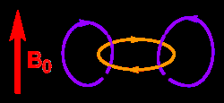
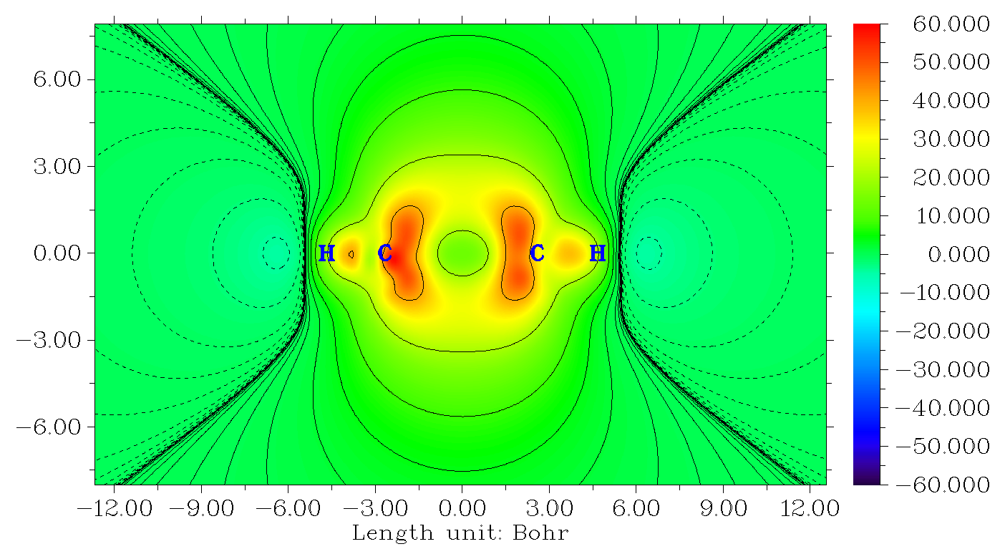
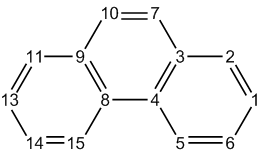
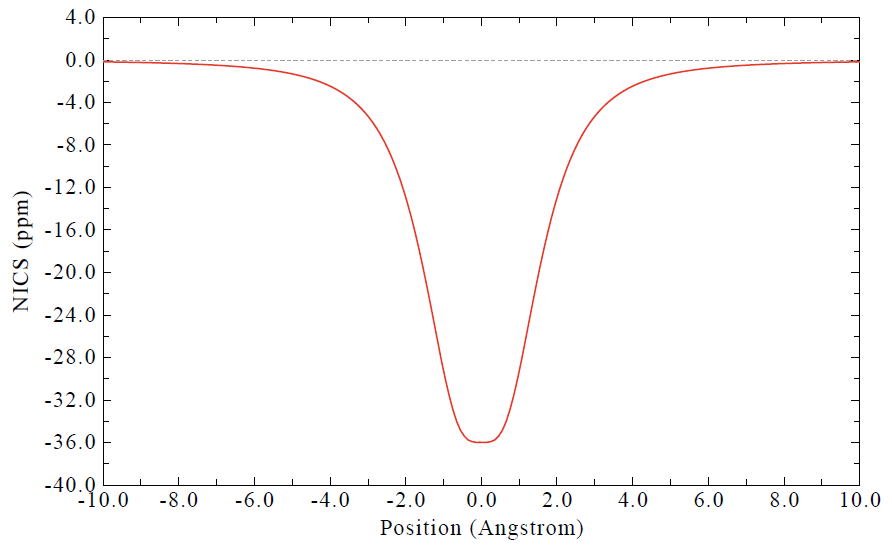
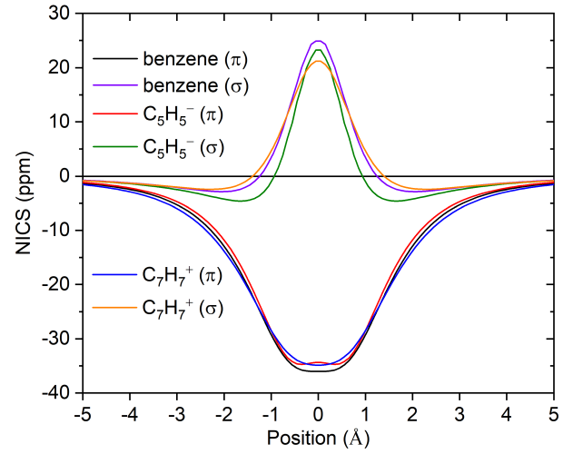
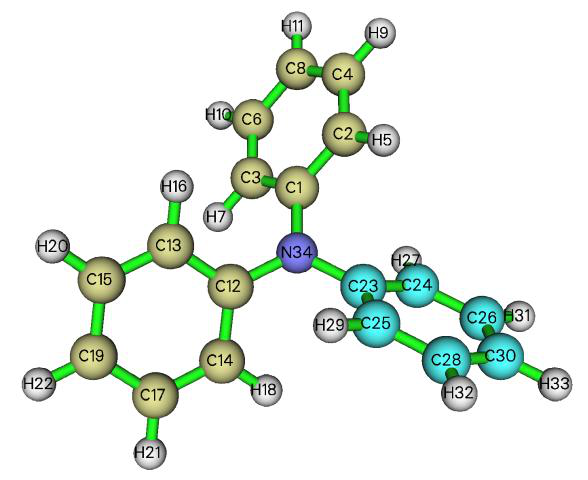

# 4.25 Examples of electron delocalization and aromaticity analyses

> Multiwfn manual, p.990–1005. Images: `../imgs/`.

---

<!-- p.990 -->

Notice that the γ tensor parsed by subfunction 1 of main function 24 corresponds to input orientation (in contrast, the parsed α and β correspond to standard orientation), therefore, the molecular structure file loaded into VMD must also correspond to input orientation, otherwise the unit sphere representation map may be misleading. In order to yield the .pdb file corresponding to input orientation, we change "iloadGaugeom" in `settings.ini` to 1, then reboot Multiwfn and input

!!! terminal "Multiwfn session"

    - **examples\polar\C18\gamma.out** — Geometry in input orientation will be loaded from this file
    - **100** — Other function (Part 1)
    - **2** — Generate new file
    - **1** — Export current geometry as .pdb file C18.pdb Load the C18.pdb into VMD and show it in CPK style, you will see below figure

The character of this map is similar to that of α map. From the colored small arrows, it can be seen that combination effect of three electric fields applied parallelly to the ring can induce a relatively strong dipole moment variation in the same direction, while in the direction perpendicular to the ring this phenomenon is much weaker.

From the vector representation, namely from the lengths of the three double-sided large arrows

along X, Y, and Z axes, one can better recognize the relative magnitude of γ along the three directions. Since the cyan arrow is quite short, the γ in Z direction is relatively negligible.


## 4.25 Examples of electron delocalization and aromaticity analyses


Some aromaticity analysis examples are given below, while most electron delocalization and aromaticity analyses in Multiwfn are illustrated in other sections, see Section 4.A.3 for an overview.


### 4.25.3 Study iso-chemical shielding surface (ICSS) and magnetic shielding distribution for benzene


Iso-chemical shielding surface (ICSS) denotes isosurface of magnetic shielding value, which


<!-- p.991 -->

presents intuitive picture on aromaticity. If you are familiar with NICS, you can also simply view ICSS as the isosurface of NICS with inverted sign. Please see Section 3.28.3 for more information. In this example we will study benzene. Since this is a planar system, we will plot ICSSZZ instead of ICSS, namely only the component of magnetic shielding tensor perpendicular to molecular planar will be taken into account. ICSSZZ must be more physically meaningful than ICSS, just like NICSZZ is a better aromaticity index than NICS (as demonstrated in Org. Lett., 8, 863 (2006)). Meanwhile I will also show how to plot magnetic shielding values along a line and in a plane.

AFAIK, ICSSZZ was first proposed by me during implementation of ICSS in Multiwfn. So, if ICSSZZ is involved in your work, please cite my study work containing ICSSZZ analysis: Carbon, 165, 468 (2020).

You should first prepare a Gaussian input file of standard single point task for present system, which will be taken as template input file later. This file has already been provided as examples\ICSS\benzene.gjf, in which the geometry has already been optimized at a reasonable level.

Boot up Multiwfn and input below commands examples\ICSS\benzene.gjf // Note that molecular plane is in XY plane 25 // Electron delocalization and aromaticity analyses 3 // Generate grid data of ICSS or related quantities 1 // Low-quality grid, magnetic shielding tensor at 130910 points will be calculated by Gaussian later. Using "medium-quality grid" could result in smoother maps, but the calculation will be much more expensive. Note that the default extension distance is 12 Bohr, which is usually large enough

n // Do not skip the step of generating Gaussian input file, because this is the first time we carry out analysis and thus currently we do not have Gaussian input/output files in hand

Now Multiwfn generates a lot of Gaussian input files of NMR task in current folder based on the template file. The files are named as NICS0001.gjf, NICS0002.gjf ... NICS0017.gjf. Run these files by Gaussian, the NICS0001.gjf must be run as the first one. The output files can be directly downloaded from here: http://sobereva.com/multiwfn/extrafiles/benzene_ICSS.rar.

Note: If these files cannot be run by your Gaussian normally, please check the tail of the output file, there are two common reasons:

(1) The %mem is too small to finish the task, you need to set %mem in the template .gjf file to a large value and retry.

(2) The "NICSnptlim" in `settings.ini` is too large, you should properly reduce it and try again. The reason is that in Gaussian there is a limit on the number of Bq atoms, and it is somewhat dependent of the version of Gaussian and your computer. For G09 D.01 and E.01, you should add "guess=huckel" keyword, otherwise due to memory allocation bug, the NICSnptlim has to be reduced to a very small value to make Gaussian run normally (in this case the overall computational cost will be quite high). If error occurs in Link401 when "guess=huckel" is used, then try to use "guess=core" instead. For G16, the guess keyword is not needed.

Hint: You can make use of the script "examples\runall.sh" (for Linux) or "examples\runall.bat" (for Windows), which invokes Gaussian to run all .gjf files in current folder to yield output files with the same name but with .out suffix.

Assume that the output files (NICS0001.out, NICS0002.out...) have been placed in "C:\benzene" folder, in Multiwfn you should input C:\benzene\NICS. We want to study ICSSZZ first, therefore we choose "5: ZZ component", then Multiwfn loads all Gaussian output files and convert magnetic shielding tensors to grid data of ICSSZZ. After that you will see a new menu, you can directly visualize isosurface of the grid data by option 1, export it as cube file by option 2 or reselect the form of ICSS by option -1. The isosurface of ICSSZZ = 2.0 ppm is shown below


<!-- p.992 -->

As you can see, the green isosurface (positive Z-component shielding value), completely covers the region above and below the benzene ring, suggesting that due to the induced ring current originated from the globally delocalized π-electrons, the Z-direction external magnetic field is largely shielded in these regions, this observation implies the strong aromaticity of benzene. From below scheme we can understand the ICSSZZ more deeply; in the cylindrical region perpendicular to and through the benzene, the direction of induced magnetic field (purple arrows) is exactly opposite to external magnetic field ($B_0$), this is why in this region Z-component of magnetic shielding value is large.

You can also see, blue isosurface (negative Z-component shielding value) presents in the outlier region of benzene, exhibiting the de-shielding effect. This is mostly because the induced magnetic field is parallel to $B_0$ and thus enhances B0 in this region.

If you properly rotate viewpoint, you will clearly find the C-H bond is also completely covered by the green surface. The reason is that the σ-electrons involved in the C-H bonding form conspicuous local induced ring current, so the external magnetic field is also strongly shielded around the C-H bond.

If you want to export current grid data as .cub file so that you can visualize it via third-part softwares such as VMD, you can close the GUI window and select 2 to export the grid data to ICSSZZ.cub in current folder.

Directly study ICSS based on existing Gaussian output files Assume that you have already obtained the Gaussian output files for the ICSS purpose, and you want to directly study ICSS, you should input following commands after booting up Multiwfn:

!!! terminal "Multiwfn session"

    - **examples\ICSS\benzene.gjf 25** — Electron delocalization and aromaticity analyses
    - **3** — Generate grid data of ICSS or related quantities
    - **1** — Low-quality grid y




<!-- p.993 -->

5 // Study ICSSZZ As you can see, the grid setting we adopted this time is exactly identical to that we used to generate the Gaussian input/output files, this point is extremely important. If the grid setting is not the same, the file loading must fail.

Plot plane map of magnetic shielding value NOTICE: If you are only interested in the plane map, it is strongly suggested to use subfunction 14 of main function 25 to realize this purpose, which is much more convenient, and the computational cost is significantly lower than calculating the three-dimensional ICSS grid data. See Section 4.25.14 on how to easily plot NICS-2D plane map. Note that NICS and ICSS only differ by sign.

Next, I will show how to plot magnetic shielding value in a plane. Since we already have grid data of ICSSZZ in hand, magnetic shielding value at any point in a line/plane can be easily obtained by means of interpolation technique based on the grid data.

We first plot color-filled map for ICSSZZ in the YZ plane with X=0. This plane is normal to benzene and crosses C4-H10 and C1-H7. Set "iuserfunc" in `settings.ini` to -3, and then boot up a new Multiwfn instance and input below commands

ICSSZZ.cub 4 // Plot plane map 100 //User-defined function, which now corresponds to the function interpolated by the grid data of ICSSZZ.cub via B-spline algorithm

!!! terminal "Multiwfn session"

    - **1** — Color-filled map [Press Enter button]
    - **0** — Set extension distance of the plot
    - **8** — 8 Bohr 3
    - **YZ plane 0** — X=0 Now the graph pops up, close it and then input
    - **4** — Show atom labels
    - **3** — Blue 1

!!! terminal "Multiwfn session"

    - **Enable showing contour lines -2** — Set label interval in X, Y and color scale axes 3,3,10
    - **19** — Set color transition
    - **8** — Blue-White-Red
    - **-1** — Replot the map Now you can see the map below


<!-- p.994 -->

From the graph one can find that although Z-component of magnetic shielding in the center of benzene is a positive value, the magnitude is by far less than that in the regions above and below the ring plane. The reason is clear, that is benzene only has π-aromaticity, while its σ-electrons are not globally delocalized to form σ-aromaticity, so the shielding effect in the plane is relatively weak due to lack of formation of σ-ring current.

Curve map of magnetic shielding value NOTICE: If you are only interested in the curve map, it is strongly suggested to use subfunction 13 of main function 25 to realize this purpose, which is much more convenient, and the computational cost is significantly lower than calculating the three-dimensional ICSS grid data. See Section 4.25.13 on how to easily plot NICS curve map.

Next, we plot curve map to study the variation of magnetic shielding in the line perpendicular to ring plane and starting from ring center. Choose -5 to return to main menu and input

!!! terminal "Multiwfn session"

    - **3** — Plot curve map
    - **100** — User-defined function
    - **2** — Input coordinate of two points to define a line
    - **0,0,-8,0,0,8** — The line starts from 8 Bohr below and above the ring center You will immediately see





<!-- p.995 -->

It can be seen that the maximum of Z-component of magnetic shielding occurs about 1.8 Bohr above/below the ring plane. If you choose "6 Find the positions of local minimum and maximum", you will see


```text
Maximum X (Bohr):    6.122667  Value:    0.28936394E+02
Minimum X (Bohr):    8.000000  Value:    0.13254245E+02
Maximum X (Bohr):    9.882667  Value:    0.28937419E+02
```

That is the maximal value of ICSS$_{ZZ}$ along the line is 28.9 ppm, whose position is 9.88-8=1.88 Bohr (0.995 Å) above/below the ring plane. While at the ring center, the ICSSZZ is merely 13.2 ppm.

Beware that since the extension distance used in the calculation of grid data of ICSS$_{ZZ}$ is only 12 Bohr, when we plot curve or plane map based on the interpolated data of ICSSZZ, the spatial range involved in the map should not be too large. For example, we cannot plot the curve map from (0,0,0) to (0,0,20). If a point is beyond the valid spatial range of grid data interpolation, the value will be 0.

Calculate NICS(0)$_{ZZ}$ and NICS(1)ZZ based on ICSSZZ data It is noteworthy that if you already have ICSSZZ grid data, you can directly obtain the popular NICS(0)ZZ and NICS(1)ZZ indices without doing any additional calculation, because the NICS value at any point can be directly obtained in terms of interpolation of ICSSzz grid data. As an example, we calculate NICS(1)ZZ. Ensure that "iuserfunc" in `settings.ini` has been set to -3 due to the aforementioned reason, then boot up Multiwfn and input

ICSS$_{ZZ}$.cub 1 // Calculate function values at a point 0,0,1 // The point 1 Å above the ring center 2 // The inputted position is in Å From screen you can find the "User-defined real space function" value is 28.9, namely the NICS(1)ZZ is -28.9 ppm.

Epilogue ICSS/ICSS$_{ZZ}$ is really a very useful method for discussing aromaticity and anti-aromaticity, many instances can be found in the original paper of ICSS (J. Chem. Soc. Perkin Trans. 2, 2001, 1893), and in some applicative papers, such as J. Phys. Chem. C, 123, 18593 (2019) as well as my research on cyclo[18]carbon, Carbon, 165, 468 (2020).

I strongly recommend you do some more practices about plotting and analyzing ICSS/ICSS$_{ZZ}$, I provided some ideal exercise systems in "examples\ICSS" folder, including azulene, cyclobutadiene, cycloheptatriene, porphyrin, propane and pyracylene; among them cyclobutadiene is the simplest one. Below is the ICSS = 0.5 isosurface of cyclobutadiene showing in two styles; from the graph it is clear that this system shows strong anti-aromaticity characteristic, the 4n π-electrons cause evident de-shielding effect in the cylindrical region perpendicular to and through the ring, this situation is in complete contrast to benzene.


<!-- p.996 -->

I wrote a very detailed post to discuss ICSS, in which all systems in "examples\ICSS" folder are involved, see my blog article "Using Multiwfn to study aromaticity by drawing iso-chemical shielding surfaces" (in Chinese, http://sobereva.com/216).


### 4.25.6 Calculate HOMA and Bird aromaticity index for phenanthrene

HOMA is the most prevalently used aromaticity index based on geometry equalization, see Section 3.28.6 for detail. Here we use HOMA to study which ring of phenanthrene has stronger aromaticity.

Since calculation of HOMA only requires molecular coordinate, you can simply use such as .pdb and .xyz as input file. Of course, other files containing molecular coordinate, such as .wfn and .fch files are acceptable too. The geometry in present instance is optimized under B3LYP/6-31G* level.

Boot up Multiwfn and input following commands examples/phenanthrene.pdb 25 // Electron delocalization and aromaticity analyses 6 // Calculate HOMA and Bird aromaticity index 0 // Start the calculation You will see the default parameters are printed, they are taken from J. Chem. Inf. Comput. Sci., 33, 70 (1993), you can also change these parameters yourself via option 1 before the calculation.

Now we input the atom indices in the ring that we are interested in, we calculate HOMA for the central ring first, so input 3,4,8,9,10,7, the input order must be consistent with atom connectivity. You will immediately obtain the result shown below


```text
        Atom pair         Contribution  Bond length(Angstrom)
   3(C )  --    4(C ):      -0.065698        1.427111
```




<!-- p.997 -->


```text
   4(C )  --    8(C ):      -0.210455        1.458000
   8(C )  --    9(C ):      -0.065698        1.427111
   9(C )  --   10(C ):      -0.096016        1.435282
  10(C )  --    7(C ):      -0.033673        1.360000
   7(C )  --    3(C ):      -0.096016        1.435282
HOMA value is    0.432442
```

Obviously, C4-C8 deviates to ideal bond length 1.388 most significantly, giving rise to large negative contribution to HOMA, in other words, significantly broke aromaticity. The HOMA value is calculated as 1 plus the contributions from all bonds in the ring.

Then input 8,15,14,13,11,9 to calculate HOMA for the boundary ring, the result is 0.855126. Since this value is much closer to 1 than the one for central ring, HOMA suggests that the two boundary rings have stronger aromaticity.

Bird index is another quantity used to measure degree of aromaticity, see Section 3.28.6 for a brief description. Now choose option 2 to calculate Bird index for the two rings, you will find the value for boundary ring is closer to 100 than the central ring. Likewise, HOMA, Bird index also indicates that the two boundary rings have stronger aromaticity.


### 4.25.13 Example of plotting one-dimension NICS curve, calculating integral (INICS) and FiPC-NICS


Note: Chinese version of this section is my blog article “Using Multiwfn to plot one-dimensional NICS curve and measure aromaticity by its integration” (http://sobereva.com/681), which also contains more discussion and examples.

In this section I will illustrate how to plot NICS curve and calculate its integral (INICS index) as well as FiPC-NICS index to study aromaticity. Please read Section 3.28.13 to gain some basic knowledge.

4.25.13.1 Example 1: NICSZZ curve of infinitene

Infinitene molecule optimized at PBE0/6-31G* level is examples\NICS_scan\infinitene.pdb, as shown below (two perspectives are given). In this example we will perform NICSZZ scan for the highlighted ring. The scanning direction is perpendicular to the fitted ring plane to the outside of the system and starts from geometric center of the ring.

Boot up Multiwfn and input following commands examples\NICS_scan\infinitene.pdb //You can also use any other file format containing structure information, similarly hereinafter


<!-- p.998 -->

25 //Electron delocalization and aromaticity analyses 13 //NICS-1D scan curve map, integral NICS (INICS) and FiPC-NICS 2 //The two end points of scanning line are above and below the center of a plane fitted for specific atoms, and the line perpendicularly passes through their center

35-37,68-69,71 //Using these atoms (highlighted in the map above) to define a fitting plane [Press ENTER button directly] //The center is chosen as geometric center of the selected atoms (in this step you may also input coordinate of other type of center, such as the ring critical point obtained by topology analysis module of Multiwfn)

10 //An end point of the scanning line is above 10 Å of the fitting plane from the center 0 //Another end point is below 0 Å of the fitting plane from the center, namely the scan will start from the ring center

[Press ENTER button directly] //Using recommended number of scanning points (100 points in this example), which corresponds to approximately 0.1 Å of step size

1 //Generate Gaussian input file for NICS-1D scanning examples\NICS_scan\template_NMR.gjf //Template input file of NMR task of Gaussian, which is used to generate Gaussian input file for NICS-1D scan. [geometry] line in this file will be replaced with coordinates of scanning points, while other parts are kept unchanged

Now NICS_1D.gjf has been generated in current folder. You can load it into GaussView to visualize the scanning points, see below. The purple spheres are Bq atoms, for which magnetic shielding tensor will be calculated in the NMR task. It can be seen that all Bq atoms occur evenly on the expected scanning line.

For reducing cost, manually changing the basis set in NICS_1D.gjf to 6-31G*. Then run it by Gaussian. The corresponding input and output files have been provided as infinitene_NICS_1D.gjf and infinitene_NICS_1D.out in “examples\NICS_1D” folder.

Next, in the Multiwfn window, input 2 //Load Gaussian output file of NICS-1D scanning examples\NICS_scan\infinitene_NICS_1D.out //Gaussian output file Then a new interface appears, the options are self-explanatory. A noteworthy option is -1, from which you can choose the component of NICS to study. By default, the component perpendicular to the fitting plane is used, which is most meaningful in characterizing aromaticity. We will refer it to


<!-- p.999 -->

NICSZZ by assuming that Z is the direction normal to the fitting plane.

Now choose option 1 to plot NICS curve (currently corresponding to NICSZZ), you will see the following map (you can flip the map horizontally by selecting option -3 once before choosing this option)

It can be seen that the ring is aromatic, as the NICSZZ is evidently negative, especially at the distance 1 Å to the ring center.

From screen you can also find integral of the curve:


```text
Integral of NICS component:    -96.19 ppm*Angstrom
```

In addition, you can select option 5 to obtain extrema of the curve:


```text
Minimum X (Angstrom):    1.111111  Value:   -0.29469963E+02
Totally found    1 minima,    0 maxima
```

4.25.13.2 Example 2: NICSsigma,ZZ and NICSpi,ZZ curves of benzene

In this example, we will plot NICSZZ curve of benzene contributed by σ and π electrons, namely NICSσ,ZZ and NICSπ,ZZ, respectively. To plot NICSπ,ZZ, input the following commands after booting up Multiwfn.

examples\NICS_scan\benzene.pdb //Benzene optimized at B3LYP/6-31G* level, the molecule is lying at XY plane of Z=0

25 //Electron delocalization and aromaticity analyses 13 //NICS-1D scan curve map, integral NICS (INICS) and FiPC-NICS 2 //The two end points of scanning line are above and below the center of a plane fitted for specific atoms, and the line perpendicularly passes through their center

1-6 //Using all carbon atoms in this system to define a fitting plane [Press ENTER button directly] //The center is chosen as geometric center of the selected atoms 10 //An end point of the scanning line is above 10 Å of the fitting plane from the center 10 //Another end point is below 10 Å of the fitting plane from the center [Press ENTER button directly] //Using recommended number of scanning points (200 points in this example)

1 //Generate Gaussian input file for NICS-1D scanning


<!-- p.1000 -->

examples\NICS_scan\template_NMR_benzene-pi.gjf //Gaussian template file The content of the template file used this time is as follows, which requests Gaussian to

calculate magnetic shielding information only contributed by MOs 17,20,21 (π-MOs of benzene at current level). The keywords nmr=csgt iop(10/93=2) must present. AICD.txt is the file generated by the IOp, which is fully useless in this situation, you can simply delete it after running.


```text
#p b3lyp/6-31+G* nmr=csgt iop(10/93=2)

template file

  0  1
[geometry]

AICD.txt

17,20,21
```

Use Gaussian to run the NICS_1D.gjf generated in current folder. The output file has been provided as examples\NICS_scan\benzene-pi_NICS_1D.out.

Next, in the Multiwfn window, input 2 //Load Gaussian output file of NICS-1D scanning examples\NICS_scan\benzene-pi_NICS_1D.out //Gaussian output file

1 //Plot NICS curve map, which corresponds to NICSπ,ZZ in present case Now you can see the following map. X=0 corresponds to position of ring center.

You can plot NICSσ,ZZ via almost exactly the same way, the only difference is that in the template file you should specify indices of σ MOs. The corresponding template file is examples\NICS_scan\template_NMR_benzene-sigma.gjf.

In the “examples\NICS_scan\” folder, C5H5-.pdb and C7H7+.pdb are optimized C5H5− and C7H7+ ions, respectively. You can use the same way as shown above to obtain their NICSσ,ZZ and




<!-- p.1001 -->

NICSπ,ZZ curves, relevant files are also provided in the folder. Note that in the interface, you can choose option “3 Export NICS curve data along the line” to export curve data as plain text file. Then, after importing the curve data corresponding to different situations into e.g. Origin, you can plot them together, as shown below.

It can be seen that σ electrons have considerable influence on NICSZZ around ring center. All the three systems show comparable π aromaticity according to the NICSπ,ZZ curves. However, their difference can be determined quantitatively from their integrals. The integral of NICSπ,ZZ for benzene, C5H5− and C7H7+ are -142.45, -134.85 and -145.02 ppm·Å, respectively, indicating that strength of π aromaticity is C7H7+ ≥ benzene > C5H5−.

4.25.13.3 Example 3: Calculate FiPC-NICS index for benzene

Note: See my blog article “Using Multiwfn to calculate FiPC-NICS aromaticity index” (http://sobereva.com/724, in Chinese) for more discussion about FiPC-NICS.

In the post-processing menu of subfunction 13 of main function 25, FiPC-NICS aromaticity index can be straightforwardly calculated, which will be illustrated using benzene as an example. If you are not familiar with it, please check Section 3.28.13.

Booting up Multiwfn and input examples\NICS_scan\benzene.pdb //Benzene optimized at B3LYP/6-31G* level, the molecule is lying at XY plane of Z=0

25 //Electron delocalization and aromaticity analyses 13 //NICS-1D scan curve map, integral NICS (INICS) and FiPC-NICS 2 //The two end points of scanning line are above and below the center of a plane fitted for specific atoms, and the line perpendicularly passes through their center

1-6 //Using all carbon atoms in this system to define a fitting plane [Press ENTER button directly] //The center is chosen as geometric center of the selected atoms 0 //An end point of the scanning line is 0 Å from the center 10 //Another end point is 10 Å from the center 200 //200 points used in NICS scan




<!-- p.1002 -->

1 // Generate Gaussian input file for NICS-1D scanning examples\NICS_scan\template_NMR.gjf //Gaussian template file corresponding NMR calculation at B3LYP/6-31+G* level

Now NICS_1D.gjf has been generated in current folder, rename it as benzene_NICS_1D_0to10.gjf and run it using Gaussian. The output file has been provided. Next, we input

2 // Load Gaussian output file of NICS-1D scanning examples\NICS_scan\benzene_NICS_1D_0to10.out //Gaussian output file 6 //Calculate FiPC-NICS You will immediately see result:


```text
FiPC-NICS is   -9.332247 ppm, at   1.179 Angstrom
```

The result indicates that at 1.179 Å above ring center of benzene, in-plane component of NICS (NICSin) is vanished, and out-of-plane component of NICS (NICSout) is -9.33 ppm. This result is very close to the corresponding data in original paper of FiPC-NICS (-9.59 ppm at 1.18 Å), in which PBE0/6-311++G** was used in geometry optimization and NMR calculation.

Multiwfn also exported FiPC-NICS.txt in current folder, the meaning of each column is clearly shown on screen. This file contains information of all scanning points. You can take the last two columns, namely NICSin and NICSout, respectively as X-axis and Y-axis to plot scatter+line map. The resulting map is shown below, which is in very good agreement with Fig. 1 of original paper of FiPC-NICS.


### 4.25.14 Example of plotting two-dimension NICS plane map

Note: Chinese version of this section is my blog article “Using Multiwfn to easily plot two-dimensional NICS plane maps to examine aromaticity” (http://sobereva.com/682), which also contains more discussion and examples.

In this section I will illustrate how to plot NICS plane map. Please read Section 3.28.14 to gain some basic knowledge. Note that NICSZZ in the following examples refers to the NICS component perpendicular to the plane of interest, Z does not always correspond to Z-axis.

4.25.14.1 Plotting NICSZZ plane map above 1 Å of coronene

In this example we plot color-filled NICSZZ plane map above 1 Å of coronene, the coronene


<!-- p.1003 -->

optimized at B3LYP/6-31G* level is examples\NICS_scan\coronene.pdb. The molecule is exactly planar and lying at XY plane of Z=0.

Boot up Multiwfn and input following commands examples\NICS_scan\coronene.pdb 25 //Electron delocalization and aromaticity analyses 14 //NICS-2D scan plane map 1 //Color-filled map [Press ENTER button directly] //Using default number of grid points (100*100) 0 //Set extension distance 1 // 1 Bohr 1 //XY plane 1a //Z = 1Å 1 //Gaussian input file for NICS-2D scanning examples\NICS_scan\template_NMR.gjf //Template input file of NMR task of Gaussian, which is used to generate Gaussian input file for NICS-2D scan. [geometry] line in this file will be replaced with coordinates of scanning points, while other parts are kept unchanged

NICS_2D.gjf has been generated in current folder, you can properly modify it according to actual situation. Run it by Gaussian, the output file is examples\NICS_scan\coronene_NICS_2D.out.

Next, in Multiwfn window input 2 //Load Gaussian output file of NICS-2D scanning examples\NICS_scan\coronene_NICS_2D.out 5 //Taking ZZ Cartesian component. Since the molecule is exactly in XY plane, the resulting NICS will correspond to NICSZZ in common sense (i.e. the component normal to ring plane)

From screen you can find minimum and maximum of NICSZZ in the plane:


```text
The minimum of data:  -43.3034000000000
The maximum of data:   11.3487000000000
```

Close the map shown on screen, then input the following commands to fine-tune the plotting settings

4 //Enable showing atom labels 1 //Red 8 //Enable showing bonds 14 //Brown 17 //Set distance threshold for showing atom labels 5 //5 Bohr y //Show labels of the atoms that beyond the threshold by light font 1 //Set lower&upper limit of color scale -45,45 -8 //Change length unit of the graph to Angstrom -2 //Set label intervals in X, Y, and color scale axes 2,2,10 2 //Enable showing contour lines 3 //Change contour line setting 8 //Generate contour value by arithmetic progression -50,5,21 //Starting value, step, and total number


<!-- p.1004 -->

y //Removing existing contour lines. Then the contour values will be -50,-45,-40...40,45,50 1 //Save setting and return -1 //Replot Now you obtain the following map. From which it is clear that the outer rings has stronger aromaticity than the internal ring, as NICSZZ above 1 Å of the former is evidently more negative than that of the latter.

4.25.14.2 Plotting NICSZZ plane map above 1 Å of a phenyl ring of N(phenyl)3

In this example, we will plot NICSZZ plane map above 1 Å of the highlighted ring of N(phenyl)3 shown below. Since this ring is inclined with respect to Cartesian axis, we will use a special way to define the plotting plane.

Boot up Multiwfn and input following commands examples\NICS_scan\N(phenyl)3.pdb //Structure optimized at B3LYP/6-31G* level 25 //Electron delocalization and aromaticity analyses 14 //NICS-2D scan plane map




<!-- p.1005 -->

1 //Color-filled map [Press ENTER button directly] //Using default number of grid points (100*100) 8 //The plotting plane is above or below the plane consisting of specific atoms 23,24,26,30,28,25 //Atoms in the ring of interest Note that the unit vector normal to the fitting plane for the chosen atoms is shown on screen, please record it, which will be used later:


```text
The unit normal vector is    0.33076524    0.57300118    0.74984265
```

1 //The plotting plane is parallel to the fitting plane and at 1 Å above it. Negative value means below it

6 //Length of the plotting plane (a square region) is set to 6 Å Now you can find following information on screen:


```text
draw triangle {   2.495   2.581  -1.739} {  -1.211  -0.235   2.047} {   6.776  -1.451  -0.547}
draw triangle {  -1.211  -0.235   2.047} {   6.776  -1.451  -0.547} {   3.070  -4.266   3.239}
draw material Transparent
```

If you load the N(phenyl)3.pdb into VMD and then run the above three commands in VMD console window, and then properly adjust graphical representation, you will see the following map, which illustrates the region corresponding to the plotting plane. It can be seen that the plotting plane has been correctly defined.

Next, input the following commands 1 //Generate Gaussian input file for NICS-2D scanning examples\NICS_scan\template_NMR.gjf //Template file of Gaussian for NMR task Now NICS_2D.gjf has been generated in current folder, manually edit it to change the basis set to 6-31G*, then run it by Gaussian. The output file has been provided as examples\NICS_scan\N(phenyl)3_NICS_2D.out.

Then in Multiwfn window, input 2 //Load Gaussian output file of NICS-2D scanning examples\NICS_scan\N(phenyl)3_NICS_2D.out 0 //Take the NICS component along specific direction 0.33076524 0.57300118 0.74984265 //The unit normal vector shown by Multiwfn earlier Now the NICSZZ plane map has been shown on screen. Close it and properly adjust plotting settings (refer to the rich examples in Section 4.4), finally you can obtain the map shown below, which is fairly nice. Note that the color transition has been set to Yellow-Orange-Black,


