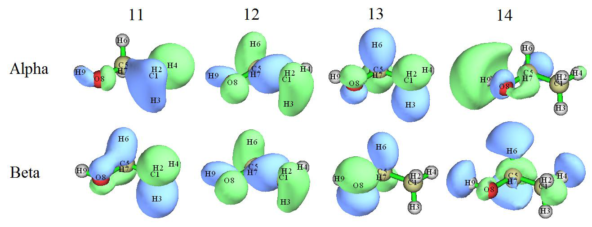
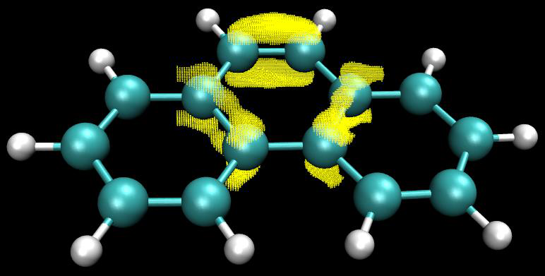
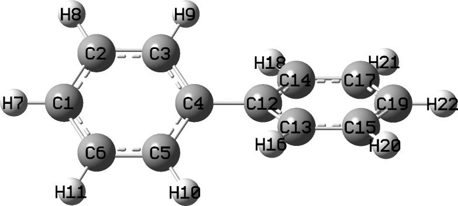
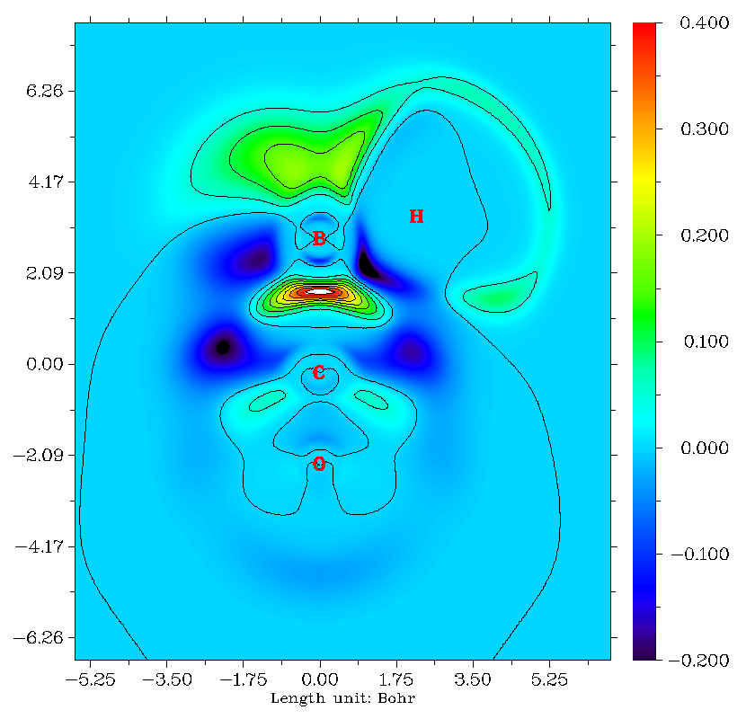
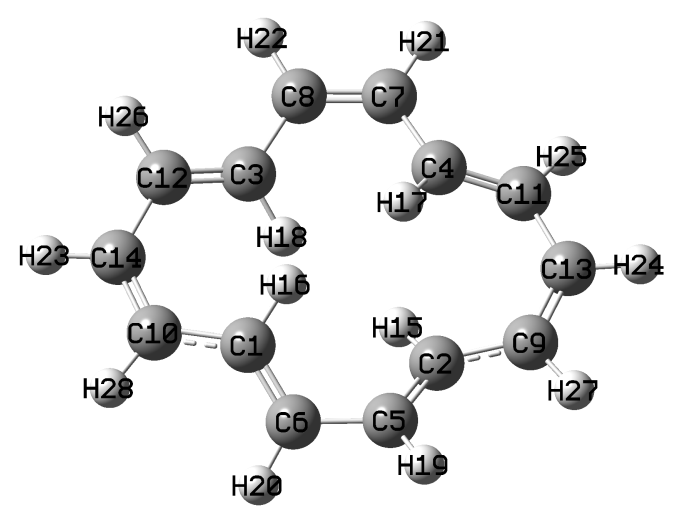
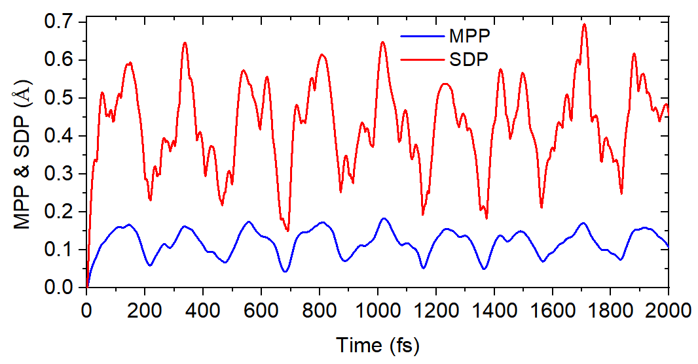
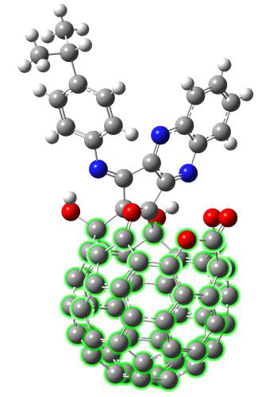
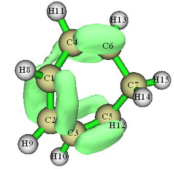
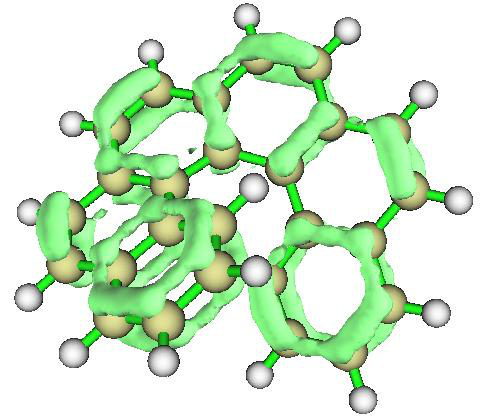
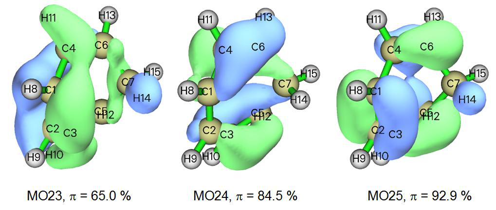

# 4.100 Other functions (Part 1)

> Multiwfn manual, p.1006–1030. Images: `../imgs/`.

---

<!-- p.1006 -->

corresponding to range of [-34,0].

It is clear that the phenyl ring is aromatic, as NICSZZ above 1 Å of it is evidently negative. Also, it is noted that the magnetic shielding is slightly stronger in the internal side of the ring than the ring center.


## 4.100 Other functions (Part 1)


### 4.100.4 Calculate kinetic energy and nuclear attraction potential energy of phosgene by numerical integration


I suggest you read Section 3.100.4 first, the aim of this example is to show you the usefulness and universality of numerical integration. In quantum chemistry program, kinetic energy and nuclear attraction potential energy integration are evaluated analytically, analytical method has advantage in both speed and accuracy. In Multiwfn you can evaluate them by general numerical integration function. Local kinetic energy (or called “kinetic energy density”) is a built-in function, we first integrate this function over the whole space to get total kinetic energy. Boot up Multiwfn and input:

examples\COCl2.wfn // HF/6-31G* wavefunction 100 // Other functions (Part 1) 4 // Integrate a function over the whole space 6 // Hamiltonian kinetic density K(r) The result is 1031.1092, which is very close to the Gaussian outputted value 1031.1107. Because I do not want the list of real space function becomes lengthy, so rarely used functions such as local nuclear attraction potential energy are not chosen as built-in function, however you can still easily make these functions available by hacking source code, please consult Appendix 2. First, search “function userfunc” in function.f90, change the default content, namely "userfunc=1.0D0", to "userfunc = -nucesp(x,y,z)*fdens(x,y,z)", then recompile Multiwfn, redo


<!-- p.1007 -->

above procedure but select function 100 as integrand, you will get nuclear attraction potential energy -2839.1668, the value outputted by Gaussian is -2839.1629, evidently they are rather close. If you want to obtain nuclear attraction potential energy contributed from a specific orbital, use subfunction 26 of main function 6 to set occupation number of other orbitals to zero, and then do the integration as before.

To further illustrate the flexibility of numerical integration function in Multiwfn, assume that you want to calculate expectation of r2 operator, you can modify the content of “userfunc” routine to "userfunc = (x*x+y*y+z*z)*fdens(x,y,z)", then recompile Multiwfn and redo the integration, you will get 444.6523, which is in excellent agreement with the analytically calculated <r2> 444.652363 outputted by subfunction 5 of main function 300 (see Section 3.300.5 for detail).

Tip: You may have already noticed that the two lines of the codes colored by blue above have presented in "userfunc" routine, and they correspond to iuserfunc==12 and iuserfunc==3 respectively. So actually you needn't to modify and recompile the source code of Multiwfn, by simply changing "iuserfunc" parameter in `settings.ini` from the default value 0 to 12 and 3 respectively, the user-defined real space function will be equivalent to the two functions. For more about the built-in real space functions in "userfunc" routine, see Section 2.7.


### 4.100.8 Perform simple energy decomposition by using combined fragment wavefunctions


NOTE: The energy decomposition performed in the following way is strongly deprecated now! Using sobEDA or sobEDAw energy decomposition analysis (based on Multiwfn and Gaussian) is a much better choice, not only full terms can be obtained, but also much easier to use. See J. Phys. Chem. A, 127, 7023 (2023) and very detailed tutorial: http://sobereva.com/soft/sobEDA_tutorial.zip.

The principle of the simple energy decomposition has been introduced in Section 3.100.8, please read it first. Here we try to use this method to analyze components of interaction energy between NH3 and BH3 in the adduct NH3BH3 at B3LYP/6-31G* level. The Gaussian input and output files involved in this section can be found in "examples\EDA\EDA_simple" folder. The Gaussian version used here is Gaussian 16 B.01.

(1) Perform structure optimization task for NH3BH3, and then create a new input file with the optimized coordinate, named NH3BH3.gjf.

(2) Duplicate NH3BH3.gjf as NH3.gjf and BH3.gjf, then remove BH3 fragment in NH3.gjf, and remove NH3 fragment in BH3.gjf. Add pop=full nosymm keywords in both NH3.gjf and BH3.gjf.

(3) Run the input file of the two fragments by Gaussian respectively to generate NH3.out and BH3.out.

(4) Boot up Multiwfn, input following commands NH3.out //Fragment 1 100 // Other functions (Part 1) 8 // Generate Gaussian input file with initial guess combined from fragment wavefunctions 2 // There are two fragments in total BH3.out //Fragment 2 Multiwfn generates new.gjf in current folder, this is the Gaussian input file for NH3BH3 with fragment-combined wavefunction as initial guess.

(5) Make sure nosymm keyword is presented in the new.gjf. In order to output SCF energy in each iteration, change "#" to "#P". pop=full keyword can be deleted.

(6) Run new.gjf by Gaussian to generate new.out.


<!-- p.1008 -->

From NH3.out and BH3.out , we can find their single point energies: E(NH3) = -56.5477099 a.u. E(BH3) = -26.5929634 a.u. The single point energy of the adduct can be found in new.out: E(NH3BH3) = -83.2132069 a.u. We also refer it to as ESCF,last since it is the energy printed at last iteration of SCF procedure.

From line 639 of examples\EDA\EDA_simple\new.out, you can also find the energy printed at the first iteration of SCF procedure:

ESCF,1st = -83.12546124 a.u. According to the equations shown in Section 3.100.8, we can calculate energy terms as

ΔEtot = E(NH3BH3) - E(NH3) - E(BH3)= -0.0725336 a.u.= -190.44 kJ/mol ΔEorb = ESCF,last - ESCF,1st = -0.0877456 a.u.= -230.37 kJ/mol ΔEsteric = ΔEtot - ΔEorb = 0.017218 a.u.= 39.93 kJ/mol

namely the total interaction energy between NH3 and BH3 is -190.44 kJ/mol, the orbital interaction energy -230.37 kJ/mol significantly stabilized the adduct; while the steric term (sum of electrostatic interaction energy, Pauli repulsion energy and change in exchange-correlation energy), destabilized the adduct by 39.93 kJ/mol.

In the present system, compared to other energy components, the dispersion interaction can be safely neglected, so we did not discuss it separately. However, if the system you studied is a complex bound by weak interaction, you must also study the dispersion component in total interaction energy separately due to its great importance, see the description in Section 3.100.8 on how to evaluate it.


### 4.100.12 Biorthogonalization analysis for orbitals of unrestricted open- shell wavefunction


Note: Chinese version of this example and related introduction is my blog article "Principle and application of biorthogonalization method for unrestricted open-shell wavefunctions" (http://sobereva.com/448).

The biorthogonalization algorithm between alpha and beta orbitals has been introduced in Section 3.100.12, please read it first, this transformation makes interpretation of orbitals generated by UHF or UKS calculation much easier, since only one set of orbitals will then need to be examined. In this section I will illustrate the value of this analysis, examples\ethanol_triplet.fch is taken as example.

This system has 14 occupied alpha and 12 occupied beta orbitals, first let us look at some of them:


<!-- p.1009 -->

It can be seen that only alpha orbital 12 pairs well with beta orbital 12, while other alpha and beta orbitals with the same index do not like with each other. Clearly, it is troublesome when we discuss orbital characteristics of this wavefunction, because we must simultaneously inspect two sets of orbitals.

Now we carry out the biorthogonalization for this wavefunction. Boot up Multiwfn and input examples\ethanol_triplet.fch 100 // Other functions (Part 1) 12 // Perform biorthogonalization between alpha and beta orbitals 2 // Do biorthogonalization for all orbitals 0 // Do not evaluate energies of biorthogonalized orbitals The biorthogonalization for this wavefunction consists of three successive steps. For example, the outputted information of the first step is


```text
 Doing biorthogonalization for alpha    1 to   14, Beta    1 to   12
 Singular values of orbital overlap matrix:
   1.0000   1.0000   1.0000   1.0000   1.0000   1.0000   1.0000   0.9999
   0.9999   0.9998   0.9995   0.9992
```

As shown, this step performs biorthogonalization between alpha orbitals 1~14 and beta orbitals 1~12. The overlap integrals between the resulting alpha and beta orbitals with the same index are all very close to 1.0, showing that the first 12 alpha orbitals have almost perfectly paired with the first 12 beta orbitals.

Once all the three steps have been finished, biortho.txt and biortho.fch are generated in current folder. The content of biortho.txt is shown below:


```text
S = Singular value, E = Energy (in eV), O= Occupancy, A=Alpha, B=Beta

 Orb:     1   S= 1.0000   O(A)= 1.0   O(B)= 1.0
...[ignored]
 Orb:    11   S= 0.9995   O(A)= 1.0   O(B)= 1.0
 Orb:    12   S= 0.9992   O(A)= 1.0   O(B)= 1.0
 -----------------------------------------------
 Orb:    13   S= 1.0000   O(A)= 1.0   O(B)= 0.0
 Orb:    14   S= 1.0000   O(A)= 1.0   O(B)= 0.0
 -----------------------------------------------
 Orb:    15   S= 1.0000   O(A)= 0.0   O(B)= 0.0
```




<!-- p.1010 -->


```text
 Orb:    16   S= 1.0000   O(A)= 0.0   O(B)= 0.0
...[ignored]
```

The information is very easy to understand. Since singular value (S) of all orbitals shown above is very close to 1.0, therefore the alpha orbitals match well with the beta orbitals having the same index.

The exported biortho.fch contains wavefunction of the biorthogonalized orbitals, the “orbital energies” information of these orbitals now correspond to the singular values. Next, if you input y, this file will be immediately loaded, and then the orbitals in memory will correspond to the biorthogonalized orbitals. Here we input y to load the biortho.fch, then enter main function 0 to visually examine the newly generated 11~14 alpha and 11~14 beta orbitals, you will see

From the isosurface map it can be seen that the current alpha and beta orbitals match with each other perfectly. The concept "singly occupied molecular orbitals" (SOMO) was originally defined for restricted open-shell wavefunction, but now it can also be ideally applied to current wavefunction, the orbitals 13 and 14 now could be regarded as SOMO. It is well-known that spin density of unrestricted open-shell wavefunction is determined by all occupied MOs, but after the biorthogonalization, the spin density will only be contributed by the SOMOs. Obviously, the spin density of current system directly corresponds to the sum of density of orbitals 13 and 14.

The HOMO and LUMO of singlet ethanol calculated at B3LYP/6-31G** level are shown below. By comparing this graph and the last graph, one can find that the HOMO and LUMO look very like the biorthogonalized alpha orbital 14 and 13, respectively. Hence it can be immediately understood that the transition of ethanol between singlet and triplet states can be well represented

as HOMO→LUMO transition, because after such orbital transition both the HOMO and LUMO will be occupied by one electron, this electronic structure just corresponds to that represented by the biorthogonalized orbitals. Clearly, such valuable information cannot be obtained without the biorthogonalization analysis, rendering importance of biorthogonalization in practical studies of open-shell systems.


<!-- p.1011 -->

It worth to emphasize that the biorthogonalization does not alter any observable properties of the system, such as total electronic energy, total density, spin density and so on. Since in above process we did not ask Multiwfn to evaluate energies of the biorthogonalized orbitals, therefore after the biorthogonalization the orbital energies are meaningless, they are still the energies of the original molecular orbitals, and the order of the biorthogonalized orbitals does not reflect order of their actual energies.

Biorthogonalization can also be applied to spin polarized singlet systems such as biradicals, an example is given in my blog article "Principle and application of biorthogonalization method for unrestricted open-shell wavefunctions" (in Chinese, http://sobereva.com/448).

Evaluating energy of biorthogonalized orbitals and ordering the orbitals Next, I will illustrate how to also make Multiwfn evaluate energies of the biorthogonalized orbitals and order them according to their energies, the triplet ethanol is still taken as example. Boot up Multiwfn and input

examples\ethanol_triplet.fch 100 // Other functions (Part 1) 12 // Biorthogonalization between alpha and beta orbitals 2 // Perform biorthogonalization for all orbitals 1 // Evaluate energies of the biorthogonalized orbitals using the Fock matrix generated by MO energies and coefficients via F=SCEC-1 relationship

y // Ordering the biorthogonalized orbitals according to their energies Now you can find the exported biortho.fch and biortho.txt in current folder. The content of the later one is:


```text
...[ignored]
 Orb:    11   S= 0.9992  E(A)=    -13.057  O(A)= 1.0  E(B)=    -11.821  O(B)= 1.0
 Orb:    12   S= 1.0000  E(A)=    -11.918  O(A)= 1.0  E(B)=    -11.866  O(B)= 1.0
 -------------------------------------------------------------------------------
 Orb:    13   S= 1.0000  E(A)=    -11.439  O(A)= 1.0  E(B)=     -5.806  O(B)= 0.0
 Orb:    14   S= 1.0000  E(A)=     -0.293  O(A)= 1.0  E(B)=      2.817  O(B)= 0.0
 -------------------------------------------------------------------------------
 Orb:    15   S= 0.9992  E(A)=     13.876  O(A)= 0.0  E(B)=     15.431  O(B)= 0.0
 Orb:    16   S= 1.0000  E(A)=     15.057  O(A)= 0.0  E(B)=     15.305  O(B)= 0.0
...[ignored]
```

Because in the present example we have evaluated orbital energies, therefore the energies are also explicitly shown in the biortho.txt. It can be seen that the basically paired alpha and beta biorthogonalized orbitals have detectably different energies, for example E(alpha 11)= -13.057eV while E(beta 11)= -11.821 eV, this is because alpha and beta orbitals feel different effective potentials (i.e. alpha and beta Fock operators are different). In addition, one can find that the order of orbital index has in line with order of orbital energy, because we have requested Multiwfn to order the orbitals according to their energies (more specifically, the average energy of alpha and beta orbitals with the same index). Note that the orbital energy information in the biortho.fch now also corresponds to the actual energy of the biorthogonalized orbitals.

Then, you can input y to load the just generated biortho.fch so that we can then directly use main function 0 to visualize the biorthogonalized orbitals. The two occupied alpha biorthogonalized orbitals with highest indices, namely the two orbitals formally occupied by the two unpaired


<!-- p.1012 -->

electrons in present system, are shown below.

Their shapes are very close to the alpha MO 13 (-10.083 eV) and alpha MO 14 (-0.276 eV), and meantime the energies are not quite different.

Note that as mentioned in Section 3.100.12, the orbitals in each batch are ordered individually, therefore the relative order of orbitals in different batches will not be altered due to the ordering. In addition, the ordering is based on average energy of each alpha orbital and its beta counterpart, thus alpha-beta orbital correspondence is retained during the ordering process.

By the way, it is also possible to evaluate energies of the biorthogonalized orbitals based on the Fock matrix loaded from an external file (see Appendix 7 for details), and this is the only choice if the Fock matrix cannot be successfully generated based on MO energies and coefficients. For example, the Fock matrix can be loaded from .47 file. Run examples\ethanol_triplet_47.gjf by Gaussian, then you will get ETHANOL_TRIPLET.47 in C:\ folder (the file has been provided as examples\ETHANOL_TRIPLET.47). If you select option “2 Evaluate, loading Fock matrix from a file” when Multiwfn asks if evaluating energies of biorthogonalized orbitals and then input the path of the .47 file, the Fock matrix recorded in the .47 file will be used to evaluate the biorthogonalized orbital energies.


### 4.100.14 Calculate LOLIPOP index

In this section, I illustrate how to calculate LOLIPOP (Localized Orbital Locator Integrated Pi Over Plane) index. This index was shown to be useful of predicting π-stacking strength of aromatic rings. See Section 3.100.14 for brief introduction and Chem. Commun., 48, 9239 (2012) for more information.

4.100.14.1 Example of planar system: phenanthrene

In this section I take an exactly planar system phenanthrene as example, we will check which ring has relatively stronger π-stacking ability. The atomic numbering is shown below

Boot up Multiwfn and input following commands examples/phenanthrene.wfn 100 // Other functions (Part 1) 14 // Calculate LOLIPOP 1 // Choose π orbitals that to be taken into account 36,40,43,44,45,46,47 // Indices of π orbitals. You can manually find out π orbitals by


<!-- p.1013 -->

visualizing orbital isosurfaces via main function 0, or let Multiwfn automatically identify π orbitals by subfunction 22 of main function 100

0 // Start the calculation 8,9,11,13,14,15 // The indices of the atoms in the ring that you are interested in. This ring is boundary ring. Note that you should input the indices according to atomic connectivity

Wait for a while, from screen we can see that the LOLIPOP value is 8.23. Then input 0 // Start the calculation again 7,3,4,8,9,10 // Atoms in the central ring The LOLIPOP value is 6.39 Since smaller LOLIPOP value corresponds to stronger π-stacking ability, we can expect that the tendency of forming π-stacking over the central ring is stronger than over the boundary rings.

Note that there is option 6 in the LOLIPOP interface. If you choose it once to switch its status to "Yes", then after calculation of LOLIPOP, the coordinate of the points satisfying filter conditions

(i.e. where the LOL-π is included in the integral of LOLIPOP) will be exported to pt.xyz in current folder. You can then load this file into VMD program, setting drawing method to "Points" to visualize their distribution. For example, the points actually considered in the LOLIPOP calculation for the central ring is shown below, the molecular structure file is also loaded into VMD and plotted as CPK style. It can be seen that the distribution of the considered points is fully reasonable, thus the LOLIPOP result should be meaningful.

4.100.14.2 Example of non-planar system: biphenyl

In this example I use biphenyl to illustrate how to calculate LOLIPOP for a non-planar system. The structure and atomic numbering are shown below

In order to make the calculation of the LOL-π involved in the LOLIPOP feasible, usually we need to perform orbital localization to yield localized molecular orbitals (LMOs), and then use

Multiwfn to automatically identify the indices of π type of LMOs, see relevant examples in Section 4.100.22 for more detail. Note that in order to carry out orbital localization, you must use a file






<!-- p.1014 -->

containing basis function information as input file, such as .fch, .mwfn, .molden and so on, see Section 2.5 for more information.

Boot up Multiwfn and input examples\biphenyl.fch 19 // Orbital localization 1 // Only localize occupied MOs 100 // Other function (Part 1)

22 // Automatically detect π orbitals -1 // Current orbitals are in localized form

0 // Start π orbital identification based on default settings Now we can see there are 6 identified π orbitals (more specifically, they are π LMOs):


```text
Expected pi orbitals, occupation numbers and orbital energies (eV):
    32      2.000000    -10.110351
    34      2.000000     -9.633443
    38      2.000000     -7.386451
    39      2.000000     -6.768520
    40      2.000000     -6.755193
    41      2.000000     -6.046329
```

Then we input 0 // Do not modify orbital occupation numbers 14 // LOLIPOP calculation

1 // Choose π orbitals 32,34,38,39,40,41 // The indices of the π orbitals 0 // Start calculation 1,2,3,4,5,6 // Indices of the atoms in a ring The result is 8.82, which is slightly higher than that of the boundary ring of phenanthrene (see

last section), indicating that the rings in biphenyl have prominent ability of forming π-π stacking.

Only consider one side of a ring By the way, each ring has two sides, if the current system is not symmetric with respect to the

ring plane, the LOL-π distribution on the two sides may be evidently different. In order to study π stacking ability of the two sides respectively, before starting calculation you can choose option "5 Choose side of the points to be taken into account" to set which side will be taken into account during LOLIPOP calculation. By default both sides are considered.

Taking the present molecule as an example, if we select option 5 and then input 1 to select "Side 1", and choose option 6 to allow Multiwfn to export pt.xyz so that we can intuitively visualize the points actually considered in the LOLIPOP integration, then after LOLIPOP calculation, you will find the LOLIPOP is 4.41, which is exactly half of the value we obtained earlier (8.82) because

the LOL-π distribution is symmetric with respect to the chosen ring. The points recorded in the resulting pt.xyz are illustrated below, as you can see, they indeed only distribute on one side of the ring.


<!-- p.1015 -->

If you want to calculate LOLIPOP for another side, you should select "Side 2" in option 5.


### 4.100.15 Calculate intermolecular orbital overlap integral of DB-TTF

Note: Chinese version of this section is my blog article “Display and calculation of intermolecular orbital overlap” (http://sobereva.com/163), which also contains richer discussions.

Intermolecular orbital overlap integral is important in discussion of intermolecular charge transfer, see Section 3.100.15 for introduction. In this example, we calculate HOMO-HOMO and LUMO-LUMO overlap integrals between the two DB-TTF (dibenzotetrathiafulvalene) monomers in below dimer. The dimer structure was extracted from CSD (Cambridge Structural Database). The wavefunction level we used is B3LYP/6-31G*, MO78 and MO79 correspond to HOMO and LUMO, respectively.

As mentioned in Section 3.100.15, we must prepare wavefunction files containing basis function information for the dimer and two monomers. For example, you can use Gaussian to generate corresponding .fchk files, the Gaussian input files for this aim have been provided in "examples\intermol\" folder; if you do not want to run them by Gaussian yourself, you can directly download the resulting .fchk files from http://sobereva.com/multiwfn/extrafiles/intermol.rar.

It is worth to explain the three .gjf files. The coordinates in the two monomer input files DB-TTF1.gjf and DB-TTF2.gjf were directly extracted from the dimer input file DB-TTFdimer.gjf, the atoms of monomer 1 occur in this file prior to those of monomer 2. The keyword nosymm is used in all the three files, it requests Gaussian do not automatically put the coordinates in the input files to standard orientation, so that the coordinates in the monomer .fchk files are exactly identical to those in the dimer .fchk file. Because the dimer .fchk file is only used by Multiwfn for generating overlap matrix between basis functions while MOs of dimer are never be utilized, therefore guess(save,only) is employed in the dimer input file to let Gaussian only generate and save initial guessing orbitals, which do not need any cost. The pop=none is used together, it suppresses the useless massive output of orbital expansion coefficients in output file.


<!-- p.1016 -->

Now, boot up Multiwfn and input below commands: DB-TTFdimer.fchk // Wavefunction file of dimer 100 // Other functions (Part 1) 15 // Function for calculating intermolecular orbital overlap integral DB-TTF1.fchk // Wavefunction file of monomer 1 DB-TTF2.fchk // Wavefunction file of monomer 2 After that, if we input i,j, then the intermolecular orbital overlap integral between MO i in monomer 1 and MO j in monomer 2 will be printed. To obtain the integral between HOMO-HOMO, we input 78,78, the result is -0.01411983; Then input 79,79, we will find the integral between LUMO-LUMO is 0.01025897.


### 4.100.18 Yoshizawa's electron transmission route analysis for phenanthrene


In this example, we will use Yoshizawa's formula (Acc. Chem. Res., 45, 1612 (2012)) to analyze favourable electron transmission routes for phenanthrene. Related theory, requirement of input file and program options have been introduced in Section 3.100.18. The numbering scheme of the carbons is shown below.

Boot up Multiwfn and input following commands: examples\phenanthrene_NAOMO.out //The Gaussian output file containing "NAOMO" matrix

100 // Other functions (Part 1) 18 // Yoshizawa's electron transport route analysis 2 // Select YZ plane, which is the molecular plane Then program will detect which atom has expected pz atomic orbitals, and load their expansion coefficients in all MOs.

Now we select 1, and input 2,11 to check the transmission probability between 2 and 11. From the output we can know that the transmission probability is 0.855879. The contributions from each MO are also shown. From the output we also know that the probability will be 2.144432 if only HOMO and LUMO are considered. Although Yoshizawa's paper said that in common one only need to take HOMO and LUMO into account, it seems that this approximation is not true in quantitative level. The distance route 5.674656 Å is the distance between atom 2 and 11.

Next, we examine which transport routes are the most favourable. Suppose that this time we only want to consider HOMO and LUMO, so we choose option -1 and input 47,48. Then choose option 2, you will see


```text
Note: The routes whose absolute value <  0.010000 will not be shown
```


<!-- p.1017 -->


```text
Note: The routes whose distance <    0.0000 or > 9999.0000 Angstrom will not be shown
Atom    7 -- Atom   10  Value and distance:    3.743670    1.359562
Atom    6 -- Atom   10  Value and distance:    3.098919    5.081382
Atom    7 -- Atom   14  Value and distance:    3.098919    5.081382
Atom    7 -- Atom   11  Value and distance:   -2.831680    3.720990
Atom    2 -- Atom   10  Value and distance:   -2.831680    3.720990
Atom    6 -- Atom   14  Value and distance:    2.565337    5.765892
...
Atom    6 -- Atom    9  Value and distance:   -0.016585    4.927289
Atom    3 -- Atom   14  Value and distance:   -0.016585    4.927289
Atom    2 -- Atom    4  Value and distance:   -0.014931    2.456189
Atom    8 -- Atom   11  Value and distance:   -0.014931    2.456189
```

The routes are ranked by transmission probability (absolute value). If we ignore the atoms linking three carbons and the duplicated routes due to symmetry, the most favourable four routes are 7-10, 6-10, 7-11, 6-14. This conclusion is completely in line with the graph below in Yoshizawa's paper!

Note that Yoshizawa stated that connection 9-10 (corresponding to 7-10 in our numbering scheme) is predicted to be the best route from the rule, but it is too close to construct a metal-molecule-metal junction for connection, so the route was not marked on his graph.

Now we check the feasible routes starting from atom 2. Choose option 3, and input 2, you will see


```text
To atom    10    Value and distance (Angstrom):   -2.831680    3.720990
To atom    14    Value and distance (Angstrom):   -2.344569    6.206600
To atom    11    Value and distance (Angstrom):    2.144432    5.674656
To atom     5    Value and distance (Angstrom):   -1.571512    2.787501
...
```

Evidently, 2-10 is the most favourable route.


### 4.100.19 ELF analysis on the whole wavefunction combined from fragment wavefunctions


Before reading this section, please read Section 3.100.19 first to gain basic knowledge. It is usually interesting to analyze the characteristics of promolecular wavefunction, which corresponds to the state without any electron transfer and polarization due to the interaction between the fragments constituting the system. Commonly, we can use "custom operation" in main functions 3, 4 and 5 to realize this purpose, see Section 3.7 for introduction of custom operation and some illustrative applications in Sections 4.5.4 and 4.5.5. For example, we want to study electron density


<!-- p.1018 -->

distribution of promolecular state of a complex AB, by using custom operation, we can very conveniently ask Multiwfn to calculate electron density of A and that of B respectively, and then sum them up as electron density of the promolecule state. However, this process is not applicable to non-linear real space functions such as ELF; that is to say, ELF of promolecular state of AB is not equal to the sum of ELF of A and ELF of B, the result is completely meaningless. For such cases, we should combine fragment wavefunctions first as promolecular wavefunction, and then calculate ELF for it to obtain the ELF distribution in promolecular state.

Below I will show how to use Multiwfn to produce promolecular wavefunction for COBH3 based on fragment wavefunctions of CO and BH3, and then discuss the corresponding ELF character. The .wfn files used below and the corresponding Gaussian .gjf files can be found in "examples\genpromol" folder.

Boot up Multiwfn and then input examples\genpromol\COBH3\CO.wfn // The path of wavefunction file of fragment 1 100 // Other functions (Part 1) 19 // Generate promolecular .wfn file from fragment wavefunctions 1 // Output to combine.wfn 2 // Two fragments in total examples\genpromol\COBH3\BH3.wfn // The path of wavefunction file of fragment 2 Now the promolecular wavefunction file of COBH3 has been outputted to combine.wfn in current folder.

Let us plot ELF for this promolecular wavefunction. Reboot Multiwfn and input combine.wfn 4 // Draw plane map 9 // ELF 1 // Color-filled map [Press ENTER button] 2 // XZ plane 0 // Y=0 Interestingly, even in the promolecular state, from the resultant graph it looks as if the carbon and boron have been bonded to each other. In order to make clear how the relaxation of electron distribution affects the ELF character of COBH3, we decide to draw difference map of ELF between the actual state and promolecular state.

Reboot Multiwfn and input examples\genpromol\COBH3\COBH3.wfn // Wavefunction file of actual state of COBH3 4 // Draw plane map 0 // Custom operation 1 // Deal with only one file -,combine.wfn // Subtracting property of COBH3.wfn by that of combine.wfn 9 // ELF 1 // Color-filled map [Press ENTER button] // Use default grid setting 2 // XZ plane 0 // Y=0 Close the graph and then input


<!-- p.1019 -->

1 // Set lower and upper limit of color scale -0.2,0.4 // Set the color scale from -0.2 to 0.4, since as you can see from the command-line window, in this plane the data range is from -0.248 to 0.436

2 // Enable showing contour lines 4 // Enable showing atom labels 1 // Red -1 // Show the graph again

From this difference map of ELF, it is very clear that after electron relaxation, the electron localization character between the C-B bond enhanced evidently.

Next, I will show how to create promolecular wavefunction when open-shell fragments are involved. CH3NH2 is taken as example, the two fragments are CH3 and NH2 free-radicals. Boot up Multiwfn and input

examples\genpromol\CH3NH2\CH3.wfn 100 // Other functions (Part 1) 19 // Generate promolecular .wfn file from fragment wavefunctions 1 // Output as combine.wfn 2 // There are totally two fragments (including the loaded one) examples\genpromol\CH3NH2\NH2.wfn // Wavefunction file of the second fragment n // Do not flip spin of orbitals of CH3 y // Flip spin of orbitals of NH2. If you do not understand why the spin should be flipped, you can consult the corresponding CDA example in Section 4.16.2.

Now you have promolecular wavefunction of CH3NH2 in current folder. Try to plot ELF for it and compare the result with actual state (i.e. examples\genpromol\CH3NH2\CH3NH2.wfn).




<!-- p.1020 -->


### 4.100.21 Examples of characterizing geometric structure

As described in Section 3.100.21, subfunction of 21 of main function 100 can be used to evaluate a variety of structural properties that solely based on molecular geometry. In this section I provide a few examples.

4.100.21.1 Calculate molecular diameter and length/width/height for alpha-

cyclodextrin

Subfunction 21 of main function 100 can calculate molecular diameter and length/width/height, in this section I will use examples/alpha-cyclodextrin.pdb an instance to illustrate this point. Please first read Section 3.100.21 to understand how this function works.

Boot up Multiwfn and input examples/alpha-cyclodextrin.pdb 100 // Other functions (Part 1) 21 // Calculate quantities that are purely based on geometry size // Calculate molecular diameter and length/width/height You will see the following information on screen


```text
Farthest distance:   44(H )  ---  123(H ):    14.027 Angstrom
vdW radius of   44(H ): 1.200 Angstrom
vdW radius of  123(H ): 1.200 Angstrom
Diameter of the system:    16.427 Angstrom
Radius of the system:     8.213 Angstrom
Length of the three sides:    15.341    14.714     9.511 Angstrom
```

The diameter 16.427 Å printed on screen is calculated as 14.027+2×1.2. The radius 8.213 Å is simply half of the diameter. The length/width/height of the molecule, namely the three values after "Length of the three sides" are calculated as follows: Multiwfn first automatically rotates the molecule so that its three principal axes just parallel to the three Cartesian axes, and meantime translates the molecule to put its geometry center to original point. Then according to the position of boundary atoms (i.e. the atoms having maximum/minimum value of X/Y/Z coordinate) and atomic Bondi van der Waals radii, the length/width/height of the molecule can be derived straightforward.

If you want to visually depict the length/width/height, you can then choose option 1, you will see the graph below (the "Ratio of atomic size" has been set to 4.0, in this situation radii of atomic spheres just equal atomic van der Waals radii). As you can see, the blue box tightly encloses the molecular van der Waals surface, the length of its three sides are simply the length/width/height of the molecule, i.e. 15.341, 14.714 and 9.511 Å, respectively.


<!-- p.1021 -->

You can also select option 2 to export the molecule in rotated and translated coordinate to new.pdb in current folder. This file contains "CRYST1" field, which records cell lengths. You can directly load this file into VMD (http://www.ks.uiuc.edu/Research/vmd/) visualization program, and then input pbc box command in VMD console window to show box. After slight adjustment of plotting effect and manually editing the graph, you will obtain the graph below, which clearly illustrates the molecular geometry character.

It is also possible to visualize molecular principal axes in VMD. Simply copy all content of examples\principal_axes.tcl into VMD console window, you will see the graph below, in which the red, blue and green axes respectively represent the three molecular principal axes.


<!-- p.1022 -->

More discussions about this topic are given in my blog article "Using Multiwfn to calculate the length, width and height of molecules" (in Chinese, http://sobereva.com/426).

4.100.21.2 Study molecular planarity of [14]annulene

Note: Chinese version of this section is my blog article “Using Multiwfn to quantify and graphically investigate planarity of molecules” (http://sobereva.com/618), which also contains much more extended discussions and additional example.

In this section we will study planarity of [14]annulene, which is not exactly planar due to steric

effect in the small ring. Its structure optimized at ωB97XD/def2-TZVP level is shown below

Please read my paper J. Mol. Model., 27, 263 (2021) DOI: 10.1007/s00894-021-04884-0 or Section 3.100.21 to gain basic knowledge about molecular planarity parameter (MPP), span of deviation from plane (SDP), and signed distance to plane (ds), which will be employed in this section to characterize molecular planarity of the [14]annulene.

Boot up Multiwfn and input examples\[14]annulene.xyz // It contains the optimized structure MPP // Enter the function of studying molecular planarity 1-14 // We only use all carbon atoms to determine the planarity. You can also simply input h to choose all non-hydrogen atoms

Now you can immediately see the following output, which include the parameters of the plane fitted for the selected atoms (i.e. all carbons), signed deviations of atoms to the fitting plane (ds) and their most positive and most negative values. At the end, MPP and SDP are given.


```text
Plane equation: A=   1.00000  B=  -0.00000  C=   0.00233  D=   0.00000
```




<!-- p.1023 -->


```text
Deviation of atom    1(C ) to the plane:  -0.21768 Angstrom
Deviation of atom    2(C ) to the plane:   0.21768 Angstrom
Deviation of atom    3(C ) to the plane:   0.21430 Angstrom
Deviation of atom    4(C ) to the plane:  -0.21430 Angstrom
Deviation of atom    5(C ) to the plane:  -0.07768 Angstrom
Deviation of atom    6(C ) to the plane:   0.07768 Angstrom
Deviation of atom    7(C ) to the plane:  -0.04457 Angstrom
Deviation of atom    8(C ) to the plane:   0.04457 Angstrom
Deviation of atom    9(C ) to the plane:  -0.02456 Angstrom
Deviation of atom   10(C ) to the plane:   0.02456 Angstrom
Deviation of atom   11(C ) to the plane:   0.09971 Angstrom
Deviation of atom   12(C ) to the plane:  -0.09971 Angstrom
Deviation of atom   13(C ) to the plane:  -0.03585 Angstrom
Deviation of atom   14(C ) to the plane:   0.03585 Angstrom
Maximal positive deviation to the fitted plane is    2(C ):   0.21768 Angstrom
Maximal negative deviation to the fitted plane is    1(C ):  -0.21768 Angstrom

Molecular planarity parameter (MPP) is    0.127145 Angstrom
Span of deviation from plane (SDP) is    0.435354 Angstrom
```

Both the MPP and SDP are not small, that is the root-mean-square deviation to the fitting plane and the span of deviation to the fitting plane are evident, clearly indicating that the [14]annulene only shows limited planarity. This is fully in line with our visual observation from the structure map shown earlier.

Next, we graphically exhibit deviation of every atom to the fitting plane by coloring atoms, therefore we then input

y // Let Multiwfn to export .pqr file containing ds values [Press ENTER button directly] // Output to [14]annulene.pqr in current folder Note that the “charge” property of atoms (penultimate column) in the exported [14]annulene.pqr corresponds to ds value.

Boot up VMD visualization software (http://www.ks.uiuc.edu/Research/vmd/), drag the .pqr file to VMD main window to load it, then enter “Graphics” - “Representation” panel and set “Coloring Method” to “Charge”, set “Drawing Method” to “CPK”. Then enter “Trajectory” tab and input -0.4 and 0.4 respectively in the two text boxes under “Color Scale Data Range” label and then press ENTER button. Finally, change the background color to white, you will see


<!-- p.1024 -->

The red and blue colors clearly distinguish the carbon atoms at the two different sides of the fitting plane. The darker the color, the larger the deviation to the fitting plane. Clearly, via this representation, one can quickly and very conveniently recognize which atoms in the molecule break the planarity severely.

4.100.21.3 Study evolution of molecular planarity of cyclo[18]carbon in

molecular dynamics trajectory

In the last example, we see that molecular planarity can be quantitatively and intuitively studied in Multiwfn. This kind of analysis is also supported by Multiwfn to easily study a dynamic process, the inputted trajectory should be recorded as a multiple frame .xyz file.

In this example I illustrate how to study evolution of molecular planarity of cyclo[18]carbon in its molecular dynamics trajectory. The whole 2000 fs trajectory was generated by ab-initio dynamics simulation at 298.15 K in my work about vibrational character of cyclo[18]carbon and analogous systems, see Chem. Asian J., 16, 56 (2021) DOI: 10.1002/asia.202001228. The xyz trajectory file of the first 500 fs has been provided as examples\C18_MD_500.xyz. The trajectory was saved every 1 fs, so there are totally 501 frames (the first frame corresponds to optimized structure, which is exactly planar).

Boot up Multiwfn and input examples\C18_MD_500.xyz MPP // Enter the function of studying molecular planarity a // Choose all atoms a // Choose all frames Now we have MPP_SDP.txt in current folder, whose 1st, 2nd and 3rd columns correspond to frame index, MPP and SDP of all selected frames, respectively. Then you can use e.g. Origin software to plot variation of MPP and SDP along the trajectory as curve map to conveniently study how planarity varies during the process (the following map was plotted for the entire trajectory containing 2001 frames, which can be downloaded at http://sobereva.com/multiwfn/extrafiles/C18-MD.xyz):


<!-- p.1025 -->

In addition, ds.pqr is generated in current folder. In this file, the "atomic charge" column corresponds to the ds value of selected atoms in every frame (the value for unselected atoms is zero). With this file and a special VMD script examples\scripts\ds.tcl, we are able to visualize trajectory with dynamic atomic coloring according to ds values, so that deviation from planarity of every atom can be very vividly exhibited. Now, load the examples\C18_MD_500.xyz into VMD, then copy the ds.pqr and examples\scripts\ds.tcl to VMD installation folder, boot up VMD and input source ds.tcl in console window of VMD to run this script, then this script will load ds data from ds.pqr and set up visualization status. After that, when you play the trajectory animation or drag progress bar in VMD, the atoms will be automatically colored according to ds value of the corresponding frame. If you are confused, see video illustration: http://sobereva.com/multiwfn/res/ds_color.mp4 (in this video I also used “RMSD trajectory tool” plugin in VMD to eliminate overall molecular motion to make inspection easier). Note that the default color scale set by the ds.tcl script is from -0.4 (blue) to 0.4 (red).

4.100.21.4 Evaluating cavity diameter and graphically illustrating its region

Chinese version of this section is “Using Multiwfn to calculate cavity in molecule and crystal” http://sobereva.com/643 (in Chinese), which contains more examples and discussions.

Please check corresponding part of Section 3.100.21 first to understand basic idea of the algorithm for evaluating cavity diameter. In this example, we will calculate cavity diameter of the fullerene part (highlighted by green color) of the following system. The experimental structure is examples\open_fullerene.pdb.






<!-- p.1026 -->

Boot up Multiwfn and input open_fullerene.pdb cav // Enter the function for calculating cavity diameter 1,12-20,23-67,101 // Atoms in the fullerene part, they will be used to detect sphere radius 1 // Use the geometric center of the atoms inputted above as initial position of sphere center 1 // Allow automatic adjustment of sphere center to maximize sphere size Then from screen you can see


```text
 X/Y/Z of initial geometry center are    3.901518    3.594304   11.835946 Angstrom
 Initial sphere radius is    1.677086 Angstrom
[...ignored]
Step    5
 Current coordinate:    3.939857    3.615266   11.899052 Angstrom
 Gradient:        0.009072    0.022419    0.013652  Norm    0.027772
 Displacement:    0.002400    0.005932    0.003612  Norm    0.007348 Angstrom
 Goal: displacement norm <  0.01000000 Angstrom

 Converged after     5 iterations

 Final X/Y/Z of sphere center:    3.942257    3.621198   11.902664 Angstrom
 Radius is    1.707257 Angstrom
 Diameter is    3.414514 Angstrom
 Volume is   20.844205 Angstrom^3
```

As you can see, initially the sphere representing the cavity is centered at (3.901518, 3.594304, 11.835946) Å with radius of 1.677 Å. The adjustment finished after 5 iterations, finally the sphere center is at (3.942257, 3.621198, 11.902664) Å and the sphere radius is 1.707 Å. So, the actual cavity diameter is 3.414 Å.

You can also find the following commands on screen, which are used to plot a sphere in VMD (http://www.ks.uiuc.edu/Research/vmd/) program to graphically illustrate the cavity


```text
color Display Background white
draw material Transparent
draw color yellow
draw sphere {    3.942    3.621   11.903 } radius   1.707 resolution 100
```

Boot up VMD, load the open_fullerene.pdb into it, open “Graphics” - “Representation” panel and set “Drawing Method” to “CPK”, then decrease “Sphere Scale” to 0.7, then copy the above four commands and paste them into console window of VMD to execute them, you will see the following graph, the yellow sphere clearly shows the cavity, and its diameter corresponds to the aforementioned 3.414 Å.


<!-- p.1027 -->

The function exemplified in this section is quite universal, it can also be used to study cavity with very irregular shape, study inner diameter of ring systems, and study cavity size of periodic crystal systems, corresponding examples are given in my blog article http://sobereva.com/643.


### 4.100.22 Analyze π electron character of non-planar system: cycloheptatriene


More application examples of this module in studying π electron structure is given in my this paper: Theor. Chem. Acc., 139, 25 (2020), you are highly encouraged to read it. If this module is involved in your work, please not only cite Multiwfn original paper but also cite this paper.

The purpose of this example is illustrating how to study π electron structure of non-planar systems based on detected π type of localized molecular orbitals (LMOs), and show how to evaluate π composition of molecular orbitals. We will use a simple non-planar molecule cycloheptatriene as example. If you have not read Section 3.100.22, please read it first, in which details and algorithm are described.

Note that the way of detecting π orbitals for non-planar systems is very different to that for exactly planar systems. I have already given example for the latter case. In Section 4.5.3, I have

mentioned how to make Multiwfn automatically detect π molecular orbitals for an exactly planar system and then separately study σ and π electron structure by means of ELF-σ and ELF-π. In Section 4.4.9, I illustrated how to study π electron delocalization path for a planar system porphyrin by plotting LOL-π map.

Detecting π type of LMOs For non-planar systems, to separately study σ and π electrons, the molecular orbitals must be firstly transformed to LMOs. If you are not familiar with LMOs, see Section 3.22.

Boot up Multiwfn and input: examples\cycloheptatriene.fch 19 // Orbital localization 1 // Localize occupied orbitals


<!-- p.1028 -->

100 // Other functions (Part 1)

22 // Detect π orbitals -1 // Current orbitals are in localized form

0 // Detect π LMOs under default settings and then set their occupation numbers There are three π LMOs identified:


```text
Expected pi orbitals, occupation numbers and orbital energies (eV):
    23      2.000000     -8.361389
    24      2.000000     -6.762986
    25      2.000000     -5.798201
 Total number of pi orbitals:     3
 Total number of electrons in pi orbitals:    6.000000
```

Assume that we will study π electron character, we choose option 2 to set occupation number of all other orbitals to zero.

Important note about diffuse functions To automatically determine π orbitals in the above way, it is best to remove diffuse functions. If you insist on using diffuse functions, you should take care of two points:

(1) In the interface of performing orbital localization, you should choose "-6 Set localization method", and select "3 Pipek-Mezey based on Becke population". This localization method is compatible with diffuse functions, but much more time-consuming than the default Pipek-Mezey method.

(2) In the interface of detecting pi MOs, you should "6 Set the method for calculating orbital composition" and then select Hirshfeld or Becke method, this is because the default method of calculating orbital composition, namely Mulliken+SCPA, does not work normally when diffuse functions are presented.

Studying π electron structure based on π type of LMOs Because the occupation number of orbitals other than the π ones have been set to zero, and meantime density matrix has been automatically updated, now we can carry out any kind of analysis,

the result will only be contributed by π electrons. For example, we plot an electron density isosurface map (isovalue=0.03 a.u.) and a LOL isosurface map (isovalue=0.5) using main function 5 in usual way, they are shown below as left and right graphs, respectively.

From both the graphs, it is easy to recognize that C4-C6, C1-C2 and C3-C5 must be stronger than

C1-C4 and C2-C3, since π electrons are delocalized much more substantially among the corresponding two atoms in the formers

NOTE: Occasionally, the automatic π-orbital detecting algorithm may incorrectly include one or more lone-pair LMO(s) into π-orbitals, hence polluting the LOL-π map. The easiest solution: After performing orbital localization via main function 19 and then automatically detecting pi orbitals using subfunction 22 of main function 100, please use main function 0 to check every occupied orbital to find the still occupied lone-pair LMO(s) and record their indices. Then go to main function 6 and select subfunction 26, input the indices of the lone-pair LMO(s), and then input 0 to make them unoccupied. After that, return to main menu, use main function 5 to generate grid




<!-- p.1029 -->

data of LOL-π as usual.

Based on the π type of LMOs, we can also carry out other types of analyses, for example, Mayer bond order calculation. We calculate Mayer bond order as illustrated in 4.9.1, the result is


```text
##    1:         1(C )    2(C )    0.70534437
##    2:         1(C )    4(C )    0.18472895
##    3:         1(C )    5(C )    0.10215925
##    4:         2(C )    3(C )    0.18472484
##    5:         2(C )    6(C )    0.10215398
##    6:         3(C )    5(C )    0.80861164
##    7:         4(C )    6(C )    0.80860020
##    8:         5(C )    6(C )    0.07556895
```

The order of the π bond order is C4-C6 > C1-C2 > C1-C4, this result is in full agreement with our expectation via visualizing the ELF-π map.

The function illustrated in this section is quite powerful and can also be applied to fairly large

systems. For example, below left graph is LOL-π isosurface map (isovalue=0.55) of helicene plotted using above procedure. Moreover, using option "5 Set constraint of atom range", one can define

constraint of the region for identifying π LMOs. For example, below right graph shows the electron density of helicene contributed by five π LMOs located at the central two six-membered rings.

Multi-center bond order calculation can also be normally carried out under the LMO

representation, therefore you can easily identify strength of π conjugation of different rings in above system via this analysis.

Evaluating π composition of occupied MOs Based on detected π LMOs, we can evaluate π composition of any orbital of present system. Let us check π composition of occupied MO of the cycloheptatriene. The new.fch in current folder was automatically exported when we perform earlier orbital localization, all occupied LMOs are recorded in this file.

Boot up and input below commands: new.fch // Load it to retrieve occupied LMOs 100 // Other functions (Part 1)

22 // Detect π orbitals -1 // Current orbitals are in localized form




<!-- p.1030 -->

-1 // Detect π orbitals and then evaluate π composition for orbitals in another file examples\cycloheptatriene.fch // This file contains MOs [Press ENTER button directly to use printing threshold of 50%]

Now all occupied MOs with π composition higher than 50% have been shown:


```text
 Orbital    23 (Occ= 2.00000)   pi composition:  65.003%
 Orbital    24 (Occ= 2.00000)   pi composition:  84.466%
 Orbital    25 (Occ= 2.00000)   pi composition:  92.863%
```

After this analysis, the orbitals in memory have been replaced with the ones recorded in examples\cycloheptatriene.fch. Therefore, now you can return to main menu and then enter main

function 0 to plot isosurfaces of the π MOs, as shown below

You can see that the evaluated π compositions are very reasonable. For example, in MO23, you can see that there are evident σ characters at C6-C7 and C5-C7 bonding regions, in addition, there are isosurfaces around H10, H11 and H14, these observations explain why π composition of MO23 is not quite close to 100%. In contrast, σ character of orbital isosurface of MO25 is not so evident, therefore MO25 can be viewed as a quasi-π orbital.

Evaluating π composition of unoccupied MOs It is also possible to evaluate π compositions for unoccupied MOs. In this case, unoccupied LMOs are also needed. Now we do this kind of analysis. We return to main menu and then input

19 // Orbital localization 2 // Localize both occupied and unoccupied orbitals 100 // Other functions (Part 1)

22 // Detect π orbitals -1 // Current orbitals are in localized form 3 // Switch the LMOs in consideration to "all localized orbitals"

2 // Change the default density threshold for identifying π orbitals. Because current geometry is highly distorted, more loose density threshold must be adopted, otherwise you will find no

unoccupied π LMO could be recognized

0.05 // A value much larger (looser) than the default threshold

-1 // Detect π orbitals and then evaluate π composition for orbitals in another file Now six π LMOs have been identified, as shown below. You can visualize them if you have interest


```text
Expected pi orbitals, occupation numbers and orbital energies (eV):
   23      2.000000     -8.361389
```



