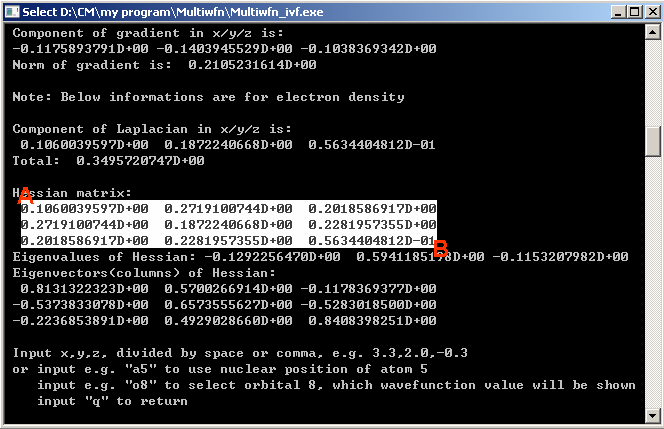

# 5.5 Make command-line window capable to record more outputs

> Multiwfn manual, p.1147–1147. Images: `../imgs/`.

---

<!-- p.1147 -->

After you select "Mark", drag left mouse button from point A to point B

Then press ENTER button, the information highlighted by white rectangle will be copied to clipboard, you can paste them to anywhere, such as plain text file.

For Mac OS or Linux system running in graphical environment, you can also copy the output of Multiwfn from console to plain text file by similar manner.

### 5.5 Make command-line window capable to record more outputs

Occasionally you may find command-line window cannot record entire outputs of Multiwfn. For example, you select option 6 in wavefunction modification module to get density matrix for a relatively big wavefunction, however only the last part of the matrix can be found in the command-line window. The solution to the problem is to enlarge buffer size of the window, please follow the

