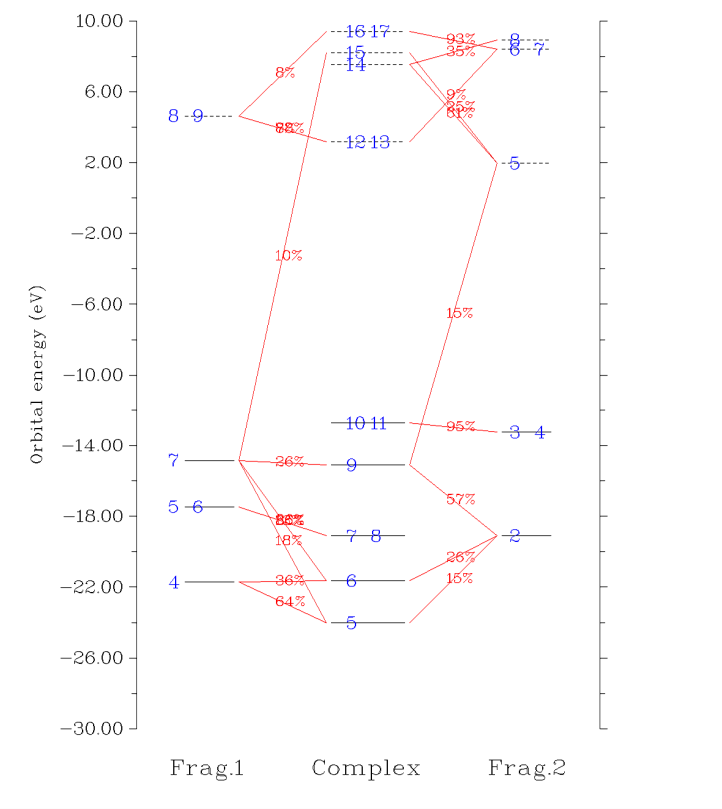

# Multiwfn：功能 3.14–3.22（p.183–309）

> 拓扑分析、分子表面定量、格点数据、AdNDP、模糊原子空间、电荷分解、盆分析、激发分析、轨道定域

> 原文件：`../multiwfn_full.md`（全量单文件存档）｜图片目录：`../imgs/`

---

<!-- p.183 -->

图形窗口中“color”标签下显示的颜色即为荧光发射的颜色，此时窗口中显示的互补色没有意义。

柔性分子在所关注的温度下通常具有多种不可忽略权重的构象，如果其中一些构象在可见光范围内的光吸收特征明显不同，则要可靠地预测颜色，必须考虑构象加权平均的光谱。此时应以包含各构象权重的 multiple.txt（见 3.13.4 节）作为 Multiwfn 的输入文件，再按上述常规步骤预测颜色。

预测颜色的例子见 4.11.14 节。


## 3.14 拓扑分析（Topology analysis）（2）


### 3.14.1 理论（Theory）

Multiwfn 的拓扑分析模块非常灵活、强大且通用，只要实空间函数的变化光滑、从而其梯度连续，就可以应用于 Multiwfn 支持的任何实空间函数。所有常用的函数，如电子密度及其 Laplacian、轨道波函数、自旋密度、ELF、LOL、ESP 等，都可以用该功能分析。默认研究的实空间函数是电子密度，可通过选项 -11（-11 Alter the real space function to be studied）更改。注意，一旦选择了选项 -11，所有此前的拓扑分析结果都将被清除。

Bader 提出的拓扑分析技术最初用于“分子中的原子”（AIM）理论中的电子密度分析，该理论也称为“分子中的原子量子理论”（QTAIM），该技术后来也被推广到其它实空间函数，例如 Silvi 和 Savin 给出了小分子 ELF 的首个拓扑分析研究，见 Nature, 371, 683 (1994)。在拓扑分析语言中，函数值的梯度范数为零的点（无穷远处除外）称为临界点（critical points, CPs），临界点可按实空间函数 Hessian 矩阵负本征值的个数分为四类。

(3,-3)：函数 Hessian 矩阵的三个本征值均为负，即局域极大值点。对于电子密度分析以及重原子，(3,-3) 的位置几乎与核位置重合，因此 (3,-3) 也称为核临界点（nuclear critical point, NCP）。一般情况下，(3,-3) 的数目等于原子数，只有极少数情况下前者多于后者（如 Li2）或少于后者（如 KrH+）。

(3,-1)：函数 Hessian 矩阵有两个本征值为负，即二阶鞍点。对于电子密度分析，(3,-1) 一般出现在有吸引作用的原子对之间，因此通常称为键临界点（bond critical point, BCP）。BCP 处实空间函数的值具有重要意义，例如对于类似的键，BCP 处的 ρ 值和 ∇²ρ 符号分别与成键强度和成键类型密切相关（The Quantum Theory of Atoms in Molecules-From Solid State to DNA and Drug Design, p11）；笔者已证明，BCP 处的 ρ 可可靠地用于预测氢键结合能（J. Comput. Chem, 40, 2868 (2019)）；BCP 处的局域信息熵是芳香性的良好指标（Phys. Chem. Chem. Phys., 12, 4742 (2020)）。

(3,+1)：函数 Hessian 矩阵只有一个本征值为负，即一阶鞍点（如同势能面上的过渡态）。对于电子密度分析，(3,+1)


<!-- p.184 -->


一般出现在环系中心，表现出空间位阻效应，因此 (3,+1) 常称为环临界点（ring critical point, RCP）。

(3,+3)：函数 Hessian 矩阵没有负本征值，即局域极小值点。对于电子密度分析，(3,+3) 一般出现在笼系中心（如棱锥形 P4 分子），因此常称为笼临界点（cage critical point, CCP）。

临界点的位置默认用 Newton 法搜索。若选定一个起始点，则 Newton 迭代将收敛到离它最近的临界点。通过指定合适的猜测位置并从每一个出发做 Newton 迭代，最终可找到所有临界点。临界点搜索完成后，可根据 Poincaré-Hopf 关系验证是否已找全所有临界点，该关系为

n(3,-3) – n(3,-1) + n(3,+1) – n(3,+3) = 1（适用于孤立体系） n(3,-3) – n(3,-1) + n(3,+1) – n(3,+3) = 0（适用于周期体系） 若该关系不满足，则必有临界点遗漏；若你对它们感兴趣，需换用与之前不同的起始点进一步搜索临界点。但即使满足 Poincaré-Hopf 关系，也不一定意味着已找到全部临界点。注意，许多实空间函数（如 ELF、LOL、密度差、ρ 的 Laplacian）的行为比 ρ 复杂得多，这些函数的全部临界点很难定位，尤其是中大体系。因此，一旦已找到所有感兴趣的临界点，就可以终止搜索临界点的尝试。

连接 BCP 与其相连的两个密度局域极大值的梯度极大路径称为“键径”（bond path），它揭示了各类成键的原子间相互作用路径。键径的集合称为分子图（molecular graph），它给出了分子结构的明确定义。键径可以是直线也可以是曲线，显然对于后者，键径长度大于 BCP 到与其相连的两个 (3,-3) 临界点距离之和。

看一个例子。在下图所示的配合物中，咪唑平面与镁卟啉平面垂直，咪唑中的氮与镁配位。品红、橙、黄小球分别对应 (3,-3)、(3,-1) 和 (3,+1) 临界点，棕色线表示键径。


<!-- p.185 -->


Multiwfn 中也可生成其它实空间函数的拓扑路径，它们对阐明临界点之间的内在联系很有帮助。

关于简并临界点（About degenerate CP） 简并临界点在一般体系中极少出现，故在本节最后提及。所谓简并临界点，是指 Hessian 矩阵有一个或两个零本征值的临界点。这类临界点很不稳定，分子几何的微小扰动就可使其分裂为其它类型的临界点。但在轴对称体系中简并临界点很常见。例如，基态氟原子中，一个 p 轨道单占据、另两个 p 轨道双占据，对 LOL 做拓扑分析得到下图：

两个 (3,-3) 对应于单占据 p 轨道的两个瓣，而另两个 p 轨道带来的电子局域极大则表现为一圈临界点。表面上看，这一圈上的临界点或是 (3,-1) 型或是 (3,+1) 型，但实际上它们是同一类简并临界点，其中一个本征值为零。只是由于本征值数值收敛的原因，在 Multiwfn 中形式上被记为不同的临界点类型。


### 3.14.2 搜索临界点（Search critical points）

搜索模式（Searching modes） 在 Multiwfn 中，提供了多种模式来指定搜索临界点的起始点：


<!-- p.186 -->


- (1) 从给定起始点搜索临界点（Search CPs from given starting points）：如果你已大致知道临界点的位置，或能合理猜测临界点可能出现在哪里，该模式非常适合，迭代将从你提供的坐标开始。在该模式下，可直接输入一个起始点坐标，或输入两个原子序号，则取它们的中点为起始点。也可以提供 .pdb 或 .pqr 文件，其中的原子坐标将依次作为起始点。另外还可提供包含所有起始点的 .txt 文件，格式如下，每行对应一个起始点的 X、Y、Z 坐标（单位 Bohr），格式自由


```text
1.2 3.10 -0.4
0.477 5.2 5.92
-3.26 3.3 0.5
...
```

- (2) 从核位置搜索临界点（Search CPs from nuclear positions）：该模式依次以全部核位置为起始点，非常适合搜索 ρ 的全部 (3,-3)，以及 ELF/LOL 和 ρ 的 Laplacian 原子最内层的 (3,-3) 临界点。对于电子密度分析，用该模式找到 n 个临界点而体系中原子数多于 n，一般意味着搜索中漏掉了某些 (3,-3) 临界点。

- (3) 从原子对中点搜索临界点（Search CPs from midpoint of atomic pairs）：该模式依次以全部原子对的中点为起始点，非常适合搜索 ρ 的全部 (3,-1) 临界点。

- (4) 从三原子三角形中心搜索临界点（Search CPs from triangle center of three atoms）：与模式 3 类似，但使用体系中所有三原子组合的三角形中心。适合搜索全部 (3,+1)。

- (5) 从四原子棱锥中心搜索临界点（Search CPs from pyramid center of four atoms）：与模式 3 类似，但使用体系中所有四原子组合的棱锥中心。对于电子密度分析，若已试过模式 2 和模式 3 但仍找不到某些 (3,+3)，值得试试该模式。该模式比模式 3 开销大，因为要考虑更多组合。

注意，对于周期性情形，模式 3 循环真实原子和镜像原子，而模式 4 和 5 只循环真实原子。

- (6) 从球内一批点搜索临界点（Search CPs from a batch of points within sphere(s)）：需先设定球心、半径和点数，再选选项 0，则指定数量（但不是你设定的精确数目）的点将随机分布在球内作为搜索起始点。球心可通过选项 2~6 以很灵活的方式定义。若选选项 -1，则搜索开始后依次以每个原子中心为球心，假设有 n 个原子、球内点数设为 m，则约 n*m 个点将用作初始猜测。若选选项 -2，则提示输入原子序号，这些原子的核将依次用作球心。

该模式非常适合搜索其它模式难以定位的临界点。对于 ELF、LOL 和 Laplacian，强烈建议用该模式的选项 -1 尝试定位所有可能的临界点。注意每次搜索时起始点位置都不同，若前次搜索未找到某些感兴趣的临界点，可反复重新搜索以定位遗漏的临界点。

注意，模式 6 每次执行时所定位临界点的序号可能不同！

临界点搜索参数（CP searching parameters） 默认搜索参数适用于大多数体系，但在某些情况下必须手动调节参数以确保找到预期的临界点。这些参数可在选项“-1 设置临界点搜索参数（-1 Set CP searching parameters）”中设定。
<!-- p.187 -->


(1) 最大迭代次数（Set maximal iterations）：若迭代次数超过该值仍未收敛到临界点，或 Hessian 矩阵变为奇异（即迭代无法继续），则迭代终止。

(2) 步长缩放因子（Set scale factor of stepsize）：默认值为 1.0，即标准算法确定的步长不变。有时减小步长有利于定位临界点。例如，对 examples\uracil.wfn 做拓扑分析时，用模式 2 和默认参数找不到连接 N6 与 H12 的 BCP；若把步长降为 0.5，问题就解决了。

(3)/(4) 梯度范数/位移收敛判据（Set criteria for gradient norm / displacement convergence）：若当前位置的梯度范数和上一步的位移同时小于这两个值，则迭代停止，当前位置视为临界点。

注意，对于常用于定位 NCP 的搜索模式 2，梯度范数收敛判据被暂时取消，因为对很重的原子，核处的电子密度峰非常尖锐，若考虑梯度范数判据，迭代很难收敛。

(5) 临界点间最小距离（Minimal distance between CPs）：若一次迭代收敛到一个临界点，但它与任一已找到临界点的距离小于该值，则刚找到的临界点不视为新临界点，从而被丢弃。

(6) 若原子间距大于其 vdW 半径之和乘以某倍数则跳过（Skip search if distance between atoms is longer than the sum of their vdW radius multiplied by）：在临界点搜索模式 3、4、5 中，若组合中任两个原子的距离大于其 vdW 半径之和乘以该值，则跳过当前搜索。该选项旨在减少搜索次数，从而降低大体系的计算量。例如前述咪唑—镁卟啉配合物有 49*48/2=1176 个原子对，若选择搜索模式 2 时不用此截断策略，Multiwfn 将尝试多达 1176 次搜索；而用此策略后，只考虑紧密相关的原子对，只需做 274 次搜索，可发现结果完全相同。

(7) 是否打印临界点搜索过程细节（If print details of CP searching procedure）：该选项只出现在串行模式下。用户可选择临界点搜索过程的输出详细程度。该选项主要用于调试。

(8) 判定 Hessian 矩阵奇异的判据（Set criterion for determining if Hessian matrix is singular）：若 Hessian 矩阵行列式的绝对值小于该值，则视为奇异并终止搜索。值太大可能漏掉某些临界点，值太小可能引起数值不稳定并在远离体系的区域出现临界点。默认值适用于大多数情形。

(9) 保留临界点的取值范围（Set value range for reserving CPs）：利用该选项，搜索过程中只保留函数值在用户定义范围内的临界点，从而忽略不需要的临界点。默认保留全部临界点。用该选项例如可只搜索弱相互作用区（对应低电子密度区）的临界点。

(10) 搜索模式 2、3、4、5 中考虑的原子（Set the atoms to be considered in searching modes 2, 3, 4, 5）：该选项用于设定搜索模式 2、3、4、5 中的原子范围。默认搜索考虑全部原子。但该选项中有两种特殊方式可选：

方式 1：只在局域区域搜索临界点。你将被要求定义一个片段，则搜索中只考虑该片段中的原子。若你


<!-- p.188 -->


只关心局域区域的临界点，该方式很有用。

方式 2：在两个区域之间搜索临界点。你将被要求定义两个片段（不应重叠），则临界点搜索中，组合中的全部原子不会同时出现在同一片段中；换言之，至少有一个原子必须出现在另一片段中。该方式特别适合搜索两个分子之间的临界点（代价可能显著低于对整个复合物搜索）。

对于每次搜索只涉及一个原子的搜索模式 2，两种方式没有区别。

(11) 搜索的信任半径（Set trust radius of searching）：若位移的范数大于该值，则位移矢量将被缩放，使其范数等于该半径。把信任半径设为比默认值更小的值（如 0.1 Bohr）可提高收敛稳定性。

(12) 选择搜索算法（Choose searching algorithm）：该选项很少用，因为默认 Newton 法对大多数情形都足够好。但 Multiwfn 提供了在特殊情形可能有用的替代算法：

Barzilai-Borwein（BB）方法是 steepest descent 算法的一种特殊形式，每一步沿梯度矢量的位移方向和距离按特定方式确定，以模拟 Newton 法的收敛行为。BB 能定位任何类型的临界点，且与 Newton 法一样倾向于收敛到离起始点最近的临界点，但它不依赖 Hessian 矩阵。虽然大多数情况下 Newton 法更稳健且收敛更快，但当发现它不能成功定位预期的临界点时，可改试 BB。

Multiwfn 还支持 steepest ascent（SA）和 steepest descent（SD）方法，它们分别只用于定位 (3,-3) 和 (3,+3) 临界点。换言之，若选这些方法，永远找不到其它类型的临界点。因此，若只关注定位极大值（如 ELF 和 LOL 的极大值）或极小值（如静电势的极小值），它们很有用。另外，对于行为不好的函数，即极小、极大附近的局域特征远非二次函数，Newton 和 BB 法完全不收敛，只能选 SA 和 SD。此外，有些函数的临界点非常密集，或极小/极大处于很窄的二次区中，笔者经常发现 Newton 和 BB 很难收敛到极小/极大，此时若极小/极大正是你真正感兴趣的，也应用 SA/SD。Multiwfn 中的 SA（SD）利用微迭代来确定沿梯度矢量正（负）方向合适的位移大小；在每次微迭代中，若位移不能使函数值增大（减小），则位移大小降为 40% 并重试，直到函数值确实增大（减小）。


### 3.14.3 生成拓扑路径（Generate topology paths）

路径生成方法（Path generating methods） 找到临界点后，可选择生成连接各临界点的拓扑路径。在 Multiwfn 中，路径本质上表示为曲线上均匀分布的一串点。用选项 8 和 9 可生成两类路径：

(1) 生成连接 (3,-3) 与 (3,-1) 临界点的路径（Generate the paths connecting (3,-3) and (3,-1) CPs）：算法上，首先把每个 (3,-1) 的坐标分别沿 Hessian 正本征值对应的本征矢量向前、向后移动，再沿梯度矢量上坡行走，直到遇到 (3,-3)，所得轨迹即构成键径。


<!-- p.189 -->


(2) 生成连接 (3,+1) 与 (3,+3) 临界点的路径（Generate the paths connecting (3,+1) and (3,+3) CPs）：与上类似，区别是起始点为 (3,+1)，其坐标先沿 Hessian 负本征值对应的本征矢量向前、向后移动，再沿梯度矢量下坡行走。

路径生成参数（Path generating parameters） 在选项“-2 设置路径生成参数（-2 Set path generating parameters）”中有一些子选项用于调节生成路径的参数：

(1) 路径的最大点数（Maximum number of points of a path）：在生成每条路径时，若在遇到临界点之前步数达到该值，则该轨迹将被丢弃。要生成很长的路径，可能需增大默认值。

(2) 步长（Stepsize）：构成路径的相邻点之间的间距。对于曲率大的路径，有时在默认步长下无法生成，需适当减小步长再重新生成。若把路径最大点数和步长

分别设为 m 和 n，则路径的最大长度不超过 m×n。

(3) 若到任一临界点的距离小于某值则停止生成（Stop generation if distance to any CP is smaller than）：在生成路径过程中，若发现当前点与已定位临界点的距离小于该值，则认为该路径已连接到该临界点。


### 3.14.4 生成盆间表面（Generate interbasin surfaces）

Multiwfn 生成的盆间表面（interbasin surfaces, IBS）实际由从 (3,-1) 临界点出发的一束路径组成，这些表面把全空间划分为每个 (3,-3) 临界点各自的区域。通过选项“10 添加或删除盆间表面（10 Add or delete interbasin surfaces）”，可生成、删除和查看盆间表面。注意，生成 IBS 之前应先完成临界点生成，且至少要找到一个 (3,-1) 临界点。

若要从序号为 15 的 (3,-1) 临界点生成 IBS，只需输入 15（先用功能 0 可视化临界点以获得临界点序号会很有用）。要删除该表面，输入 -15（负号表示“删除”）。若尚无 IBS 而希望生成全部 IBS，输入 0。要删除所有已生成的 IBS，也输入 0。输入字母 l 可打印已生成的 IBS 列表。若需把特定 IBS（如序号为 4 的 (3,-1) 临界点对应的 IBS）的路径导出到外部文件，输入 o 4，则源自 CP4 的全部路径坐标将保存到当前文件夹的 surpath.txt。输入字母 q 可返回上一级菜单。

生成 IBS 的参数可通过选项“-3 设置盆间表面生成参数（-3 Set interbasin surface generating parameters）”调节。增大每个 IBS 中的路径数或减小步长会使 IBS 看起来更光滑。IBS 中路径的长度，或者说 IBS 的面积，正比于步长与每条 IBS 路径点数的乘积。注意，一旦更改参数，所有已生成的 IBS 将丢失。

Multiwfn 中有三种描绘 IBS 的方式，可由 `settings.ini` 中的 "isurfstyle" 控制。方式 1 直接以相应 (3,-1) 临界点出发的路径表示 IBS；方式 2 以实心表面显示 IBS，这是默认风格；方式 3 不常用，可自行尝试。


<!-- p.190 -->


### 3.14.5 可视化、分析、修改与导出结果（Visualize, analyze, modify and export results）

可视化结果（选项 0）（Visualize results (option 0)） 若选择选项“0 打印并可视化所有已生成的临界点、路径和盆间表面（0 Print and visualize all generated CPs, paths and interbasin surfaces）”，将弹出 GUI，可直观查看临界点、拓扑路径和盆间表面，并可控制是否显示每类临界点、路径、盆间表面、分子结构、标签等。同时，在命令行窗口打印所找到临界点和路径的汇总，并检查 Poincaré-Hopf 关系是否满足。

若所分析的实空间函数是电子密度，命令行窗口会显示核临界点与原子的对应关系。若已生成键径，还会给出经由键径与每个 BCP 相连的两个原子。

求临界点性质（选项 7）（Evaluate CP properties (option 7)） 通过功能“7 显示特定临界点或全部临界点处的实空间函数值（7 Show real space function values at specific CP or all CPs）”，可获得 Multiwfn 支持的全部实空间函数在给定临界点或全部临界点处的值（以及所选实空间函数的梯度和 Hessian 矩阵）。注意，在全部实空间函数中静电势计算最贵，若不关心它，可把 `settings.ini` 中的 "ishowptESP" 参数设为 0 以跳过静电势计算。

在该功能中，还可把给定临界点处所选实空间函数分解为一系列轨道的贡献。相应例子见 4.2.4 节。

测量几何（选项 -9）（Measure geometry (option -9)） 用选项“-9 测量临界点或原子间的距离、夹角和二面角（-9 Measure distances, angles and dihedral angles between CPs or atoms）”可方便地测量原子与临界点间的距离、夹角和二面角。

操作临界点（选项 -4）（Manipulate CPs (option -4)） 在选项“-4 修改或导出临界点（-4 Modify or export CPs）”中，可打印、添加、删除和导出临界点。在子选项 2 中，可按多种条件删除临界点，包括：(1) 临界点类型 (2) 临界点序号范围 (3) 到特定分子片段的距离（从而可删除无关区域的临界点）(4) 电子密度范围（用此功能可只删除低密度的临界点从而删除弱相互作用区的临界点，或删除高密度的临界点从而删除化学键区的临界点）。

所有已找到临界点的位置和类型可经子选项 4 保存为当前文件夹下的格式化文本文件 CPs.txt。临界点信息也可经子选项 5 从外部格式化文本


<!-- p.191 -->


文件载入（当前会话已找到的临界点将被清除），注意文件格式必须与子选项 4 输出的完全相同。

所有临界点可经子选项 6 导出为 .pdb 文件，以便用 VMD 等外部可视化软件方便地显示临界点。该文件中，元素 C/N/O/F 分别对应 (3,-3)/(3,-1)/(3,+1)/(3,+3)。

操作拓扑路径（选项 -5）（Manipulate topology paths (option -5)） 在选项“-5 修改或打印细节或导出路径，或绘制沿路径的性质（-5 Modify or print detail or export paths, or plot property along a path）”中，可分别经子选项 1 和 2 打印已生成路径的汇总和打印特定路径中全部点的坐标。

经子选项 4 可把全部路径的详细信息导出到当前文件夹的 paths.txt。经子选项 5，可从外部文件导入路径，文件格式必须与子选项 4 输出的完全相同。

经子选项 6，可把全部路径中的全部点导出到当前文件夹的 pdb 文件，以便用外部可视化软件方便地显示路径。

经子选项 7，可把所选拓扑路径上实空间函数的值绘制为曲线图或导出为纯文本文件。也可把 "Dist." 和 "Value" 列对应的数据分别作为 X 和 Y 轴，用第三方绘图软件绘制曲线图。

路径可经子选项 3 直接输入其序号手动删除。子选项 8 也用于删除路径，它专为只保留连接两个片段的键径（及相应的 BCP）而删除其它全部键径而设计，以便用 AIM 方法更容易地研究片段间相互作用。该选项的用途将在 4.2.6 节的例子中说明。
### 3.14.6 基于电子密度拓扑性质计算芳香性指数（Calculate the aromaticity indices based on topology properties）


### of electron density（接上：基于电子密度的拓扑性质）

若你选择的实空间函数是电子密度，选项 20 和 21 将可见，它们是用于分析芳香性的工具。

Shannon 芳香性指数（Shannon aromaticity index） 选项 20 用于计算 Shannon 芳香性（SA）指数，细节见 Phys. Chem. Chem. Phys., 12, 4742 (2010)。公式可简写为

$$SA=\ln(N)-\sum_{i}^{N}(-p_{i}\ln p_{i})\quad p_{i}=\frac{\rho(\mathbf{r}_{BCP_{i}})}{\sum_{i}^{N}\rho(\mathbf{r}_{BCP_{i}})}$$

i

上式中，N 是你要研究芳香性的环中 BCP 的总数，BCPr

是 BCP 的位置。在选项 20 中，需依次输入 N 和这些临界点的序号，随即打印 Shannon 芳香性指数。SA 指数越小，分子越芳香。原文中把 0.003 < SA < 0.005 作为芳香性/反芳香性的分界。

RCP 处垂直于环平面的电子密度曲率（Curvature of electron density perpendicular to ring plane at RCP）


<!-- p.192 -->


在 Can. J. Chem., 75, 1174 (1997) 中，作者指出 RCP 处的电子密度与相应环的芳香性密切相关。密度越大，芳香性越强。他们还指出，RCP 处垂直于环平面的电子密度曲率与环芳香性的相关性更显著。曲率越负，芳香性越强。假设环严格垂直于某笛卡尔轴，例如环垂直于 Z 轴（即环在 XY 平面内），则该曲率就是 RCP 处电子密度 Hessian 矩阵的 ZZ 分量，可直接用选项 7 打印给定 RCP 的性质得到。但若环并不恰好垂直于任一笛卡尔平面，则应用选项 21 计算该曲率。在选项 21 中，应输入 RCP 的序号（或直接输入一点的坐标），再选 2，然后输入构成该平面的至少三个原子的序号（用于拟合环平面）。之后屏幕将输出 RCP 处的电子密度、梯度和垂直于环平面的电子密度曲率。另外还一并输出单位法矢量、沿法向在 RCP 上下方 1 Å 处两点的坐标，可作为计算 NICS(1) 的点。

各类拓扑分析的例子见 4.2 节。所需信息：GTFs、原子坐标


## 3.15 分子表面的定量分析（Quantitative analysis of molecular surface）（12）

分子表面的定量分析是强有力的工具，有很多实际应用，如预测反应位点、预测分子性质、解释分子间弱相互作用。本模块涉及的理论和数值算法已在笔者的论文 J. Mol. Graph. Model., 38, 314 (2012) 中详细描述。下面两节只简要介绍这两个方面。


### 3.15.1 理论（Theory）

在 Multiwfn 中，原则上可定量研究任何实空间函数在分子表面（或某函数等值面所定义的表面）上的分布。分子 vdW 表面上的静电势和平均局域电离能特别有用，因此本节详细讨论它们。同样的定量分析也可用于其它实空间函数，如自定义函数、电子离域范围函数（EDR），乃至 Fukui 函数和 dual descriptor。

(1) vdW 表面上的静电势（Electrostatic potential on vdW surface） 分子静电势（ESP），V(r)，长期以来广泛用于预测亲核、亲电位点以及分子识别模式，理论依据是分子总是倾向于以 ESP 互补的方式彼此靠近。对 ESP 的这些分析通常在分子范德华（vdW）表面上进行。虽然这种表面的定义是任意的，但多数人倾向于取电子密度的 0.001 a.u.


<!-- p.193 -->


等值面为 vdW 表面，因为该定义反映了分子特定的电子结构特征，如孤对电子和 π 电子，这也是我们分析中所用的定义。

vdW 表面上 ESP 的分析已被进一步量化以提取更多信息。研究表明，通过分析表面上极小、极大值的大小和位置，可很好地预测和解释弱相互作用（包括氢键、二氢键、卤键等）的强度和方向。Politzer 等人（J. Mol. Struct. (THEOCHEM), 307, 55 (1994)）基于 vdW 表面上的 ESP 定义了一套分子描述符，作为一般相互作用性质函数（GIPF）的自变量。GIPF 成功地把 vdW 表面上 ESP 的分布与许多凝聚相性质联系起来，包括密度、沸点、表面张力、汽化热和升华热、LogP、撞击感度、扩散常数、黏度、溶解度、溶剂化能等。下面列举并简述这些描述符。

A+ 和 A− 分别表示 ESP 取正值和负值的表面积。总表面积 A 为二者之和。

+SV 和 −SV 分别表示 vdW 表面上正、负 ESP 的平均值


$$\begin{array}{r l}{\overline{{V}}_{S}^{+}=(1/N_{+})\displaystyle\sum_{i}^{N_{+}}V(\mathbf{r}_{i})}&{{}\quad\overline{{V}}_{S}^{-}=(1/N_{-})\displaystyle\sum_{i}^{N_{-}}V(\mathbf{r}_{i})}\end{array}$$

<!-- formula-ocr: formula_p193_108.png 已替换为LaTeX, 原图保留备查 -->

其中 N+ 和 N− 分别为正区和负区采样点数，序号 i 只循环相应点。下标 S 意为“分子表面”。整个表面上 ESP 的平均值为


$$\overline{V}_{s}=(1/N)\sum_{i}^{N}V(\mathbf{r}_{i})$$

<!-- formula-ocr: formula_p193_109.png 已替换为LaTeX, 原图保留备查 -->

其中 N=N++N− 为表面点总数。

∏ 为表面上的平均偏差，被视为内部分离电荷的指标：


$$\Pi=(1/N)\sum_{i}^{N}\left|V(\mathbf{r}_{i})-\overline{V}_{s}\right|$$

<!-- formula-ocr: formula_p193_110.png 已替换为LaTeX, 原图保留备查 -->

总 ESP 方差可写为正部与负部之和：


$$\sigma_{\mathrm{tot}}^{2}=\sigma_{+}^{2}+\sigma_{-}^{2}=(1/N_{+})\sum_{i}^{N_{+}}[V(\mathbf{r}_{i})-\overline{V}_{s}^{+}]^{2}+(1/N_{-})\sum_{j}^{N_{-}}[V(\mathbf{r}_{j})-\overline{V}_{s}^{-}]^{2}$$

<!-- formula-ocr: formula_p193_111.png 已替换为LaTeX, 原图保留备查 -->

方差反映 ESP 的变化程度。σ+² 和 σ−² 越大，分子分别越倾向于通过正、负 ESP 区与其它分子相互作用。

电荷平衡度（Degree of charge balance）（亦称 balance of charges）定义为


$$\nu=\frac{\sigma_{+}^{2}\sigma_{-}^{2}}{\left(\sigma_{\mathrm{tot}}^{2}\right)^{2}}$$

<!-- formula-ocr: formula_p193_112.png 已替换为LaTeX, 原图保留备查 -->

当 σ+² 等于 σ−² 时，ν 取最大值 0.250。ν 越接近 0.250，分子越可能以相近的


<!-- p.194 -->


程度同时通过正区和负区与其它分子相互作用。

2 是分子具有较强倾向与其同类以静电方式相互作用的标志。σtot² 与 ν 的乘积也是很有用的量，νσtot² 取值大表明分子整体静电相互作用倾向强。

为定量分子极性，笔者定义了一个称为分子极性指数（molecular polarity index, MPI）的量，它与 ∏ 指标密切相关。


$$\mathrm{MPI}=(1/N)\sum_{i}^{N}\left|V(\mathbf{r}_{i})\right|\equiv(1/A)\iint\limits_{S}\left|V(\mathbf{r})\right|\mathrm{d}S$$

<!-- formula-ocr: formula_p194_113.png 已替换为LaTeX, 原图保留备查 -->

其中 S 表示分子表面。笔者对一些代表性分子的测试表明，MPI 是衡量分子极性的相当可靠的指标，指数越大极性越高。若你的研究涉及 MPI，请引用笔者的论文 Carbon, 171, 514 (2021)，这是首次引入 MPI 指标的出版物。

偏度（Skewness）可用于衡量分子表面上实空间函数分布关于其均值的不对称性。正偏度计算如下


$$\tilde{\mu}_{3}(V_{S}^{+})=\frac{\displaystyle\sum_{i}^{N_{+}}[V(\mathbf{r}_{i})-\overline{V}_{S}^{+}]^{3}}{N_{+}(\sigma_{+}^{2})^{3/2}}$$

<!-- formula-ocr: formula_p194_114.png 已替换为LaTeX, 原图保留备查 -->

类似地，计算负偏度时只考虑 ESP 为负的表面点；而计算总体偏度时使用全部表面点。对每种偏度，值越正（负），ESP 越倾向于相对均值向负（正）方向分布。

在 Multiwfn 中，上述表面描述符不仅可在整个 vdW 表面上计算，还可在对应于原子或用户定义片段的子区域上计算。该理论细节尚待发表，目前此处暂不记录。另外，这些表面描述符可对任何其它实空间函数计算。

(2) GIPF 描述符的一些实际应用（Some practical applications of GIPF descriptors） ·预测汽化热和升华热 上述 GIPF 描述符的一个实际应用见 J. Phys. Chem. A, 110, 1005 (2006)。作者指出，对一系列含 C、H、N、O 元素的分子，汽化热可很好地评估为


$$\Delta H_{\mathrm{vap}}=a\sqrt{A}+b\sqrt{\nu\sigma_{\mathrm{tot}}^{2}}+c$$

<!-- formula-ocr: formula_p194_115.png 已替换为LaTeX, 原图保留备查 -->

最小二乘拟合系数 a = 2.130、b = 0.930、c = -17.844。升华热可预测为

$$\Delta H_{\mathrm{s u b}}=a A^{2}+b\sqrt{\nu\sigma_{\mathrm{tot}}^{2}}+c$$

其中 a = 0.000267、b = 1.650087、c = 2.966078。上式中表面积 A 单位为 Ų，

2 单位为 (kcal/mol)²。注意系数或多或少依赖所用的计算级别。作者用 B3LYP/6-31G* 优化几何、用 B3LYP/6-311++G(2df,2p) 计算 ESP。ΔHsub 单位为 kcal/mol，σtot

在 Int. J. Quantum Chem., 105, 341 (2005) 中，Politzer 等人提出了其它预测


<!-- p.195 -->


标准状态下 ΔHvap 和 ΔHsub 的方程，其方程可用于含 C、H、O、N、F、Cl、S 的分子：


$$\Delta H_{\mathrm{s u b}}=4.4307\times10^{-4}A^{2}+2.0599\sqrt{\nu\sigma_{\mathrm{tot}}^{2}}-2.4825$$

<!-- formula-ocr: formula_p195_116.png 已替换为LaTeX, 原图保留备查 -->

式中 σtot² 单位为 (kcal/mol)²。他们的研究采用 B3PW91/6-31G**。ΔHvap 与 ΔHsub 的平均绝对误差分别为 2.0 kcal/mol 和 2.8 kcal/mol。ΔHvap 与 ΔHsub 单位为 kcal/mol，A 单位为 Ų，σtot

·预测分子晶体密度 基于 vdW 表面上 ESP 统计数据的另一典型应用是预测含 C、H、N、O 元素的有机分子的晶体密度。晶体密度是含能化合物的重要性质。在 J. Phys. Chem. A, 111, 10874 (2007) 中指出，密度可按 ρ = M / Vm 估计，其中 M 为分子质量，Vm 为由 ρ = 0.001 a.u. 等值面定义的分子 vdW 体积；对离子晶体（如叠氮化铵），M 与 Vm 对应组成化合物一个化学式单元的阳离子与阴离子的质量与体积之和。虽然关系很简单，但对多数中性分子确实有效，只是对离子分子的误差明显更大。为提高对中性分子的预测精度，在 Mol. Phys., 107, 2095 (2009) 中作者把 GIPF 描述符引入公式：


$$\rho=\alpha\frac{M}{V_{\mathrm{m}}}+\beta(v\sigma_{\mathrm{tot}}^{2})+\gamma$$

<!-- formula-ocr: formula_p195_117.png 已替换为LaTeX, 原图保留备查 -->

在 B3PW91/6-31G** 级别，拟合系数为 α = 0.9183、β = 0.0028、γ = 0.0443。该公式被证明精度有所提高，因为分子间静电相互作用在某种程度上被有效考虑。在后续论文 Mol. Phys., 108, 1391 (2010) 中，

作者指出，若引入 GIPF 描述符，离子化合物的晶体密度可比 ρ = M / Vm 估计得好得多：

$$\rho=\alpha\frac{M}{V_{\mathrm{m}}}+\beta\left(\frac{\overline{V}_{S(\mathrm{cation})}^{+}}{A_{(\mathrm{cation})}^{+}}\right)+\gamma\left(\frac{\overline{V}_{S(\mathrm{anion})}^{-}}{A_{(\mathrm{anion})}^{-}}\right)+\delta$$

最小二乘拟合系数在 B3PW91/6-31G** 级别为 α = 1.0260、β = 0.0514、γ = 0.0419、δ = 0.0227。式中 𝑉̅S(cation) − 与 𝐴(anion) − 表示阴离子的 𝑉̅S − 与 𝐴−。对 30 个测试例，平均绝对误差仅为 0.033 g/cm³，其中 + 与 𝐴(cation) + 表示阳离子的 𝑉̅S + 与 𝐴+；𝑉̅S(anion)

注意，上述关系只适用于含 C、H、N、O 元素的小有机化合物，对其它体系误差显著更大。

·预测沸点 在 J. Phys. Chem., 97, 9369 (1993) 中指出，沸点可预测为


$$T_{\mathrm{b p}}=\alpha A+\beta\sqrt{\nu\sigma_{\mathrm{tot}}^{2}}+\gamma$$

<!-- formula-ocr: formula_p195_118.png 已替换为LaTeX, 原图保留备查 -->

其中 α = 2.736、β = 33.31、γ = -72.05 系在 HF/STO-5G*//HF/STO-3G* 级别拟合。该文还给出了预测临界温度、体积与压强的方程。

·预测溶剂化自由能


<!-- p.196 -->


在 J. Phys. Chem. A, 103, 1853 (1999) 中，给出了溶剂化自由能的预测方程（Vmin 表示全空间 ESP 全局最小处的 ESP 值）：

−×−=Δ VVVG )(106412.217201.0(kJ/mol)3minS,maxS,5minsolv −


$$\begin{aligned}\Delta G_{solv}(kJ/mol)=&0.17201W_{min}-2.6412\times10^{-5}(V_{S,max}-V_{S,min})^{3}\\&+0.051892A^{-}\overline{V}_{s}^{-}+9704.2/(A^{-}\overline{V}_{s}^{-})+46.827\end{aligned}$$

<!-- formula-ocr: formula_p196_119.png 已替换为LaTeX, 原图保留备查 -->

·预测 pKb 在 J. Chem. Inf. Model., 60, 1445 (2020) 中，作者指出氨基的 pKb 可用拟合方程很好地估计，例如伯胺情形：

bS,minp0.495224.5880KV=×+

其中 VS,min 单位为 kcal/mol，应在 ωB97XD/cc-pVDZ 级别计算。该方程预测精度相当好，R² 高达 0.9519，平均绝对误差仅 0.12。仲胺、叔胺也有类似拟合方程。

·预测其它性质 另外，用于预测熔化热、表面张力和晶体/液体密度的方程见 J. Phys. Chem., 99, 12081 (1995)，用于预测含 NH4+、K+、Na+ 离子晶体晶格能的方程见 J. Phys. Chem. A, 102, 1018 (1998)。更多基于 GIPF 描述符预测有机分子物理性质的公式总结于 J. Mol. Struct. (THEOCHEM), 425, 107 (1998) 表 3。GIPF 在生物化学体系研究中也有许多重要用途，见综述 Int. J. Quantum Chem., 85, 676 (2001)。

(3) 其它映射函数：平均局域电离能等（Other mapped functions: Average local ionization energy and so on） 平均局域电离能 𝐼̅ 已受到越来越多关注，简介见 2.6 节相应部分。该函数有许多用途，例如再现原子壳层结构、衡量电负性、定量局域极化率与硬度。但最重要的用途可能是根据 vdW 表面上的函数值 𝐼̅𝑆 预测反应性。𝐼̅𝑆 值越低，表明 r 处电子束缚越弱，因此 r 越可能是亲电或自由基进攻位点。许多研究表明，vdW 表面上 𝐼̅ 的全局最小恰好位于实验反应位点，而同系物相应反应位点处 𝐼̅ 的相对大小与相对反应性很好相关。感兴趣的用户建议参阅 J. Mol. Model, 16, 1731 (2010) 及专著 Theoretical Aspects of Chemical Reactivity (2007) 第 8 章。

局域电子亲和能 EAL 是与 𝐼̅ 很相似的量，唯一区别是所考虑的 MO 不是全部占据轨道，而是全部空轨道。研究表明，分子表面上的 EAL 可用于分析亲核进攻，细节见 J. Mol. Model., 9, 342 (2003)。

分子表面上 Fukui 函数和轨道重叠距离函数 D(r) 的定量分析也被证明相当有用，例子分别见 4.12.4 和 4.12.8 节。

关于球形度（About sphericity） 本节末值得一提的是，无论选择何种映射函数，Multiwfn 在计算中都会自动打印分子表面的“球形度”（sphericity）。该


<!-- p.197 -->


量定义如下（细节见 https://en.wikipedia.org/wiki/Sphericity）


$$S=\frac{\pi^{1/3}(6V)^{2/3}}{A}$$

<!-- formula-ocr: formula_p197_120.png 已替换为LaTeX, 原图保留备查 -->

其中 A 与 V 分别为表面积和体积。球形度本质上是与当前体系同体积球体的表面积与当前体系表面积之比。越接近 1.0，表面越像理想球体。例如，你会发现苯 vdW 表面的球形度明显小于 Ar 原子，且对任何分子

ρ = 0.01 a.u. 等值面的球形度总小于 ρ = 0.001 a.u. 等值面，因为后者更光滑。

注意，以上方式计算的球形度不适用于有空腔的体系。例如不能用它合理判定 C60 富勒烯的球形度，因为球中心处有一个（等值面）空腔。


### 3.15.2 数值算法（Numerical algorithm）

### 3.15.2.1 整个分子表面上的分析（Analysis on the whole molecular surface）

总之，在常见的分子表面定量分析任务中，我们需要获得所选实空间函数（即映射函数）在 vdW

表面（或特定实空间函数的等值面）上的极小、极大值，以及 +SV、

−SV、SV、∏、2+σ、2−σ 等定量指标。下面简述 Multiwfn 中这些性质的计算方法，基本步骤如下。

1. 计算包围整个分子空间的电子密度格点数据。格点间距越小结果越准，但下一步生成的顶点越多，从而在第 3 步等待时间越长。

2. 利用上一步生成的格点数据执行 Marching Tetrahedra 算法，该步一般不耗多少计算时间。同时计算等值面包围的体积。该步生成表示等值面的顶点及其连接关系。每相邻三个顶点构成一个三角形（下称 facet）。下例为水分子，图中绘出了顶点（红点）与连接关系（黑线）：


<!-- p.198 -->


3. 因计算 ESP 耗时，为降低总计算时间，Multiwfn 自动剔除冗余点。具体地，若两点距离小于特定值，则删除其中一点，并把另一点移到二者的平均位置。上图中蓝色圆圈内聚集的点最终将合并为一点。

4. 计算等值面上每个顶点处的映射函数（ESP、𝐼̅ 等）。对 ESP，这是最耗时的步骤；但对 𝐼̅、EAL 等，该步可瞬间完成。

5. 利用连接关系定位并输出表面上映射函数的极小、极大值。若某顶点处的映射函数值低于（大于）其第一层近邻和第二层近邻，则该顶点视为表面极小（极大）值。

$$\overline{V}_{s}=(1/A)\sum_{i}^{N}A_{i}F_{i}$$

6. 计算总体 vdW 表面的体积、面积，以及映射函数为正的面积和为负的面积。以 SV 为例，按下式计算


$$\overline{V}_{s}=(1/A)\sum_{i}^{N}A_{i}F_{i}$$

<!-- formula-ocr: formula_p198_121.png 已替换为LaTeX, 原图保留备查 -->

其中 N 为 facet 总数，A 为全部 facet 面积之和，Ai 为 facet i 的面积，Fi 为 facet i 的 ESP 值（或其它映射函数值），取为组成该 facet 的三个顶点处 ESP 的平均值。

### 3.15.2.2 局域分子表面上的分析（Analysis on local molecular surface）

为从 vdW 表面上映射函数的分布中揭示更多有化学价值的信息，Multiwfn 支持三种局域 vdW 表面分析，如下所述。


<!-- p.199 -->


(1) 各种原子对应的局域分子表面分析（Analysis of local molecular surface corresponding to various atoms） 在该模式下，整个分子表面先分解为各个原子对应的局域表面，再对这些原子表面计算全部表面性质。该功能对研究原子性质很有帮助。例子见 4.12.3 节。

注意，分子表面上的原子局域区域不能唯一定义。Multiwfn 采用的规则如下，简单且物理意义明确。对分子表面上任一点 r，Multiwfn 按下式计算所有原子的权重 w


$$w_{_{A}}=1-\frac{\left|\mathbf{r}-\mathbf{r}_{_{A}}\right|}{R_{_{A}}}$$

<!-- formula-ocr: formula_p199_122.png 已替换为LaTeX, 原图保留备查 -->

其中 A 表示原子序号，rA 与 RA 分别为原子 A 的坐标和半径。表面点 r 归属于权重最大的原子。可见，在原子核 A 处，wA 取最大值 1.0。wA 随距离 |r-rA| 增大而线性衰减，当距离恰等于相应原子半径时衰减为零。原子半径越大，权重衰减越慢，因此上述权重定义使尺寸大的原子更可能覆盖分子表面上更广的范围。

在 Multiwfn 中也可对用户定义片段对应的局域分子表面做分析，片段的区域就是组成它的全部原子的区域之和。

(2) 特定表面极值周围的局域分子表面分析（Analysis of local molecular surface around specific surface extreme）

这类分析主要用于测算 σ-hole 和 π-hole 的面积并图形化揭示其区域，实际例子见 4.12.10 节，但若映射函数不选静电势，也可用于其它分析目的。

在该模式下，需选择一个表面极值并设定判据。当选择表面极大（极小）值时，若某表面顶点与该表面极值直接或间接相连，且该顶点处映射函数值高于（低于）判据，则该顶点被选中，所有被选中的顶点共同定义局域分子表面。为让你直观理解该模式如何定义所选表面极值周围的局域表面，下面给出图形说明，该图中用一维 ESP 分布抽象表示分子表面上 ESP 的二维分布。

(3) 基于类盆划分的局域分子表面分析（Analysis of local molecular surface based on Basin-like partition）


<!-- p.200 -->


盆划分（Basin partition）一般指用实空间函数梯度的零通量面作盆边界，把全部分子空间划分为各自的局域空间，每个盆包含一个极大值，详细介绍见 3.20.1 节。同样思想也可用于划分分子表面。当该技术与 ESP 联用时，可获得一些有化学价值的信息，实际例子见 4.12.11 节。

把盆划分用于分子表面的算法由笔者提出（待发表）。主要目的是确定表面顶点与表面极值之间的归属关系。因映射函数可能同时有正负值，先取映射函数的绝对值，再依次考虑全部表面顶点。对每个表面顶点做迭代；每一步中，顶点暂时移向取值最大的近邻顶点，即爬坡。上坡迭代直到顶点到达一个表面极值，该顶点最终就归属于该极值。注意，常规分子表面定量分析之后，各表面顶点之间的连接关系已知，若顶点 B 与 A 直接相连，则 B 为 A 的近邻顶点。为让你更好理解该方法的核心思想，下图示意如下

该图中，黑色曲线表示原始 ESP 分布，青色与黑色曲线共同对应 ESP 的绝对值。蓝色括号包围的区域对应极小 1 对应的局域表面，而两个粉色括号分别对应极大 1 和 2 对应的两个局域表面。

对上述模式 (2) 和 (3)，若某表面 facet 的三个顶点都被选中，则该表面 facet 视为归属于所选局域表面。之后所选局域表面的面积及映射函数平均值可直接求得。


### 3.15.3 参数与选项（Parameters and options）

在分子表面定量分析的主界面会看到以下选项。0 立即开始分析（0 Start analysis now!）：选该选项后分析启动。上一节所述全部步骤将依次执行。


<!-- p.201 -->


6 不考虑映射函数开始分析（6 Start analysis without considering mapped function）：该选项与选项 0 一样启动分析，但跳过映射函数的计算与分析。若你只关心分子表面的体积、面积等而不关心映射函数值，该选项很有用。

1 用于定义分子表面的电子密度等值（1 The isovalue of electron density used to define molecular surface）：默认值为 0.001，对应最常用的 vdW 表面定义。一般不建议调该值。

2 选择映射函数（2 Select mapped function）：用该选项可选择所研究的映射函数。如 ESP、𝐼̅、EAL 和自定义函数（2.7 节）在表面分析中可由 Multiwfn 内部代码自动计算而直接支持。另外，若打算从外部文件载入全部表面顶点处的映射函数值，应选“0 来自外部文件的函数（0 Function from external file）”，此时可分析更广的映射函数（如 Fukui 函数），细节见下文选项 5 的说明。

注意，默认 ESP 基于波函数求值，对大体系该过程可能很耗时。但若选“来自原子电荷的静电势（Electrostatic potential from atomic charge）”，则 Multiwfn 将基于原子电荷求 ESP，原子电荷从 .chg 文件载入，计算时间降低几个数量级。可用主功能 7 计算原子电荷并产生 .chg 文件，也可手动编写 .chg 文件，.chg 文件格式见 2.5 节相应部分。注意，只有当产生原子电荷的方法能很好再现 ESP（如 CHELPG、MK、ADCH 方法）时，分析结果才合理。另注意，有些情形原子电荷产生的 ESP 与基于波函数产生的 ESP 差别显著，全面讨论见 J. Chem. Theory Comput., 10, 4488 (2014)。

3 生成分子表面用的格点间距（3 Spacing of grid points for generating molecular surface）：该设置定义电子密度格点数据的间距，见上一节介绍的步骤 1。间距直接决定分析的精度与计算代价。默认值适合一般情形。增大该值可明显减少计算时间，但若该值不够小，等值面上的顶点会稀疏，可能导致某些极值漏定位或误定位。一般地，默认间距下的结果准确可靠。若发现默认间距下某些极值未被定位，试着减小间距重做。

4 高级选项（4 Advanced options）：该选项中的子选项普通用户不需经常调。

(1) 用于扩展格点数据空间范围的 vdW 半径比例（The ratio of vdW radius used to extend spatial region of grid data）：该参数的作用与 3.100.3 节介绍的参数 k 完全相同。增大该值将使分子周围电子密度格点数据的空间扩展更大。若电子密度等值设得比默认值低，或体系带负电，可能需增大该参数以确保等值面不被截断。

(2) 是否剔除冗余顶点的开关（Toggle if eliminating redundant vertices）：若该选项切为“No”，则跳过剔除冗余顶点（上一节所述步骤 3），你将在那些无意义的顶点上浪费大量时间计算映射函数。若该选项切为“Yes”，将提示输入合并相邻顶点的距离判据。一般建议用格点间距的 0.4~0.5 倍作判据。

(3) 线性插值前的二分次数（Number of bisections before linear interpolation）：简单说，值越大，生成的等值面（对应 vdW 表面）越精确。增大该


<!-- p.202 -->


值将带来步骤 2 的额外开销。默认值下生成的等值面一般已足够精确。可把它降到 2 乃至 1 以节省计算时间，但降到 0 会频繁导致虚假表面极值。

(4) 用焦点近似求 ESP 的开关（Toggle using focal-point approximation to evaluate ESP） 笔者提出了一种以相对较低计算代价近似估计高质量 ESP 的方法，该思想称为焦点近似（focal-point approximation, FPA）。具体地，鉴于大基组下高级方法估计的电子密度可近似表示为 𝜌large BS high≈𝜌small BS high+ (𝜌large BS low−𝜌small BS low)，由于 ESP 对电子密度线性，高质量 ESP (V) 从而可近似估计为 𝑉large BS high≈

𝑉small BS high+ (𝑉large BS low−𝑉small BS low)，代价显然远低于直接用高级方法大基组计算 ESP。

若要在 ESP 分析中使用 FPA，应在启动 Multiwfn 后先载入“高级方法/小基组”计算产生的波函数文件，再进入本功能并选该选项一次把它切为“Yes”，随后 Multiwfn 会要求输入“低级方法/小基组”与“低级方法/大基组”计算产生的波函数文件路径（显然，它们的几何必须与“高级方法/小基组”波函数完全相同）。之后在计算 ESP 阶段，它们将自动用于经上述 FPA 方程求高质量 ESP。

5 从外部文件载入映射函数值（5 Loading mapped function values from external file） 通过选该选项中合适的子选项，表面分析中表面顶点处的映射函数值可从外部文件载入而非由 Multiwfn 直接计算。该选项有两个用途：(1) 降低总分析代价 (2) 分析 Multiwfn 不能计算的特殊函数，或分析需数学运算从而在本模块不能直接得到的函数（如 dual descriptor）。

该选项有四个子选项：(0) 不载入映射函数而由 Multiwfn 直接计算（0 Do not load mapped function but directly calculate by Multiwfn）：这是默认情形。(1) 从纯文本文件载入全部表面顶点处的映射函数（1 Load mapped function at all surface vertices from plain text file）：若选该选项，则生成分子表面后，全部表面顶点的坐标（单位 Bohr）将自动导出到当前文件夹的 surfptpos.txt。之后可用你喜欢的程序计算这些点处的映射函数值，并把值写为该文件的第四列（自由格式，单位 a.u.）。例如，


```text
1324              // The first line is the total number of points
   -1.6652369   -0.5480503   -0.2554867       -0.0196978306
   -1.6835983   -0.5563165   -0.1342924       -0.0242275610
   -1.6977125   -0.5530614   -0.0099311       -0.0287667191
   -1.7013207   -0.5536310    0.1194197       -0.0330361826
   -1.6954099   -0.5523031    0.2547866       -0.0371580132
....
```

然后输入该文件的路径（文件名仍可为 surfptpos.txt），Multiwfn 将直接读取这些值。该选项的示例应用见 4.12.4 节。


<!-- p.203 -->


提示：若你要对同一体系分析两次或更多，为省时间想避免每次都计算映射函数值，可在第一次分析该体系时，在后处理界面选选项 7，把表面顶点的坐标及相应映射函数值导出到当前文件夹的 vtx.txt。下次分析该体系时，若选该选项，并在表面分析中输入该 vtx.txt 的路径，则映射函数值将直接载入而不再重算（例子见 4.12.1 节）。

(2) 类似于 1，但专用于用 Gaussian 的 cubegen 工具的情形（Similar to 1, but specific for the case of using cubegen utility of Gaussian）：生成分子表面后，当前文件夹会产生名为 cubegenpt.txt 的文件。该文件与 surfptpos.txt 很相似，区别是该文件没有首行，且坐标单位为 Å。基于该文件，可用 Gaussian 的 cubegen 工具计算全部表面顶点处的映射函数。之后输入 cubegen 输出文件的路径，Multiwfn 将载入数据。

(3) 从外部 cube 文件插值映射函数（3 Interpolate mapped function from an external cube file）：生成分子表面后，当前文件夹会产生名为 template.cub 的模板 cube 文件。之后提示输入表示你感兴趣的映射函数的 cube 文件路径，该 cube 文件的格点设置必须与 template.cub 完全相同。表面顶点处的映射函数值将从你提供的 cube 文件插值求得。
### 3.15.4 后处理菜单中的选项（Options in post-processing menu）

表面分析的全部计算完成后，屏幕打印汇总。同时屏幕出现以下选项，用于查看、调整与导出结果。

-3 可视化表面（-3 Visualize the surface）：用该选项可直接可视化所分析的等值面。-2 把格点数据导出为当前文件夹的 surf.cub（-2 Export the grid data to surf.cub in current folder）：用于生成等值面的格点数据将导出到当前文件夹的 cube 文件 surf.cub。

-1 返回上一级菜单（-1 Return to upper-level menu） 0 查看分子结构、表面极小与极大（0 View molecular structure, surface minima and maxima）：若选该选项将弹出 GUI 窗口。红、蓝小球分别表示极大与极小的位置。所有控件都是自明的，此处不再解释。


<!-- p.204 -->


1 把表面极值导出为当前文件夹的 surfanalysis.txt（1 Export surface extrema as surfanalysis.txt in current folder）：该选项把表面极值的映射函数值和 X、Y、Z 坐标导出到当前文件夹的 surfanalysis.txt。

2 把表面极值导出为当前文件夹的 surfanalysis.pdb（2 Export surface extrema as surfanalysis.pdb in current folder）：该选项把表面极值输出到当前文件夹的 surfanalysis.pdb。B-factor 列记录映射函数值（屏幕显示实际所用单位）。

3 丢弃某值域内的表面极小（3 Discard surface minima in certain value range）：若某表面极小处的映射函数值在用户输入的下限与上限之间，则该极小将被丢弃且不能恢复。该选项用于筛掉值太大的极小。

4 丢弃某值域内的表面极大（4 Discard surface maxima in certain value range）：若某表面极大处的映射函数值在用户输入的下限与上限之间，则该极大将被丢弃且不能恢复。该选项用于筛掉值太小的极大。

5 把当前分子导出为 pdb 格式文件（5 Export present molecule as pdb format file）：该选项把当前体系的结构输出到指定的 pdb 文件。由于 pdb 是广泛支持的格式，结合选项 2 的输出，可在 VMD 等外部可视化软件中方便地分析表面极值。

6 把全部表面顶点导出到当前文件夹的 vtx.pdb（6 Export all surface vertices to vtx.pdb in current folder）：该选项把表面顶点输出到当前文件夹的 vtx.pdb 文件，映射函数值写入 B-factor 域（屏幕显示实际所用单位）。该选项主要用于检查等值面多边形化的有效性，并在分子表面上可视化映射函数的分布。

还有隐藏选项 66，它不仅把表面顶点输出到 vtx.pdb，还把连接关系输出到该文件的 CONECT 域。若要在 VMD 中基于 vtx.pdb 可视化连接关系，请参阅笔者的博客文章“Setting connectivity of atoms according to CONECT field in VMD”（http://sobereva.com/121，中文）

7 把全部表面顶点导出到当前文件夹的 vtx.txt（7 Export all surface vertices to vtx.txt in current folder）：即把所有保留的表面顶点输出到当前文件夹的纯文本文件 vtx.txt，包括顶点 X/Y/Z


<!-- p.205 -->


坐标（单位 Bohr）和各种单位下的映射函数值。

8 把全部表面顶点和表面极值导出为 vtx.pqr 与 extrema.pqr（8 Export all surface vertices and surface extrema as vtx.pqr and extrema.pqr）：该选项分别把全部表面顶点和表面极值导出为当前文件夹的 vtx.pqr 与 extrema.pqr。该格式中原用于记录原子电荷的列（即倒数第三列）用于记录映射函数值（单位 a.u.）。因这种情形记录精度相对较高，若映射函数值太小而不能作为 .pdb 文件的 B-factor 域合理记录（如 vdW 表面上的 Fukui 函数），显然应用该选项代替选项 2 和 6。

9 输出映射函数特定值域内的表面积（9 Output surface area in specific value range of mapped function） 用该选项可了解分子表面积在映射函数不同取值区间的分布。先输入所考虑的原子序号范围，再输入总范围、间隔和单位。例如依次输入 2,6-9，再输入 -45,50，再输入 10，最后输入 3，则统计用于原子 2、6、7、8、9 对应的局域分子表面，输出如下：


```text
     Begin        End       Center       Area         %
   -50.0000    -40.0000    -45.0000      4.8764      1.5171
   -40.0000    -30.0000    -35.0000     28.0413      8.7242
   -30.0000    -20.0000    -25.0000     23.2699      7.2397
   -20.0000    -10.0000    -15.0000     17.6022      5.4764
   -10.0000      0.0000     -5.0000     61.4759     19.1263
     0.0000     10.0000      5.0000     72.6197     22.5933
    10.0000     20.0000     15.0000     55.2707     17.1957
    20.0000     30.0000     25.0000     53.9060     16.7712
    30.0000     40.0000     35.0000      2.8590      0.8895
    40.0000     50.0000     45.0000      1.5000      0.4667
Sum:                                   321.4212    100.0000
```

其中 "begin" 与 "end" 分别为局域值区间的下限与上限。"Center" 为二者的平均值。Area 单位为 Ų，"%" 表示该面积占总分子表面积的比例。

10 输出表面与一点之间的最近、最远距离（10 Output the closest and farthest distance between the surface and a point） 在该选项中，定义一点后（可把核位置或几何中心定为该点，也可直接输入该点的坐标），将输出分子表面与该点之间的最近、最远距离。这两个量主要有两个用途：

(1) 在分子中的原子（AIM）理论中，对气相体系，vdW 等值面定义为 ρ=0.001 a.u. 等值面。某核与表面的最近距离可视为非键原子半径。对非共价相互作用的原子对 AB，A-B 键长与二者非键半径之和的差称为相互穿透距离。一般地，该距离越大，相互作用越强。

(2) 分子表面与几何中心的最远距离可视为分子半径的一种定义。当然，分子半径的概念只对类球分子有意义。

若输入 f，Multiwfn 将输出全部表面点之间的最远距离。这可视为分子直径的一种定义。


<!-- p.206 -->


11 输出每个原子的表面性质（11 Output surface properties of each atom） 该选项用于实现 3.15.2.2 节介绍的不同原子对应局域分子表面的分析。输出表面性质后，用户可选择是否把表面 facet 输出到当前文件夹的 locsurf.pqr。若选 "y"，则输出的 pqr 文件中，每个原子对应一个表面 facet，残基序号对应表面 facet 的归属，如残基序号为 11 的 facet 属于原子 11 的局域表面。另外，原子电荷域（倒数第三列）对应映射函数值（单位 a.u.）。若把该 pqr 文件载入 VMD 并把 "Coloring Method" 设为 "ResID"，则可直观识别整个分子表面如何分解为原子表面。

12 输出特定片段的表面性质（12 Output surface properties of specific fragment） 与功能 11 类似，但用户可定义一个片段，表面性质只在该片段对应的局域表面上计算，以便根据局域表面描述符研究片段性质。也可选择把表面 facet 输出到当前文件夹的 locsurf.pqr，其中残基序号为 1 和 0 的原子分别对应 facet 属于和不属于你定义的片段的局域表面。

13 计算映射函数的格点数据并导出为 mapfunc.cub（13 Calculate grid data of mapped function and export it to mapfunc.cub） 例如，若定量表面分析前所选映射函数为 ALIE，则在后处理菜单选该选项后，将计算 ALIE 的格点数据并导出到当前文件夹的 mapfunc.cub，格点设置与定量表面分析中所用相同。基于选项 -2 导出的 surf.cub 和该 mapfunc.cub，可经 VMD 程序绘制颜色映射的等值面图。4.12.6 节说明了该选项的价值。

14 计算表面极值周围区域的面积与函数平均值（14 Calculate area and function average in a region around a surface extreme） 该选项用于实现 3.15.2.2 节所述的分析“(2) 特定表面极值周围的局域分子表面分析”。局域表面区的面积及映射函数平均值将打印在屏幕，同时文件 selsurf.pqr 将导出到当前文件夹，可载入 VMD 可视化所选局域表面区（建议绘制为 "Points" 方式并按 "Charge" 性质着色，该文件的 charge 列对应映射函数值，单位 a.u.）。

15 对表面做类盆划分并计算面积（15 Basin-like partition of surface and calculate areas） 该选项用于实现 3.15.2.2 节所述的分析“(3) 基于类盆划分的局域分子表面分析”。输出每个表面盆的表面顶点数、每个表面盆的面积，以及每个表面盆上映射函数的平均值。同时 surfbasin.pdb 导出到当前文件夹，其中包含全部表面顶点，B-factor 对应顶点归属极值的序号。

19 通过输入序号丢弃某些表面极值（19 Discard some surface extrema by inputting indices） 有时因数值噪声或其它原因，存在一些不需要的表面极值。此时可用该选项输入其序号方便地删除。

各类分子表面定量分析的丰富例子见 4.12 节。


<!-- p.207 -->


### 3.15.5 专题：Hirshfeld 与 Becke 表面分析（Special topic: Hirshfeld and Becke surface analyses）

分子表面定量分析模块也能做 Hirshfeld 与 Becke 表面分析，本节专门介绍这一点。

Hirshfeld 与 Becke 表面分析的理论（Theory of Hirshfeld and Becke surface analyses） Hirshfeld 表面分析最早见 Chem. Phys. Lett., 267, 215 (1997)，全面综述见 CrystEngComm, 11, 19 (2009)。该方法聚焦于分析所谓 Hirshfeld 表面，以揭示配合物或分子晶体中分子间的弱相互作用。

Hirshfeld 表面实际上是一种片段间（或单体间）表面，基于 Hirshfeld 权重的概念定义。Hirshfeld 表面大概是定义片段间表面最合理的方式。

某原子的原子 Hirshfeld 权重函数表示为

$$w_{A}^{\mathrm{H i r s h}}(\mathbf{r})=\frac{\rho_{A}^{0}(\mathbf{r})}{\displaystyle\sum_{B}\rho_{B}^{0}(\mathbf{r})}$$

B

其中 𝜌𝐴 0 表示自由状态原子 A 的密度。对片段中全部原子的权重求和即得该片段的 Hirshfeld 权重 HirshHirsh( )( )PAA Pww = rr

Hirsh = 0.5。受 Hirshfeld 表面启发，笔者提出了 Becke 表面，即把 Hirshfeld 权重换为 Becke 权重（Becke 权重介绍见 3.18.0 节），构建 Becke 表面只需几何与原子共价半径。通常 Becke 表面与 Hirshfeld 表面的形状相当。对大体系 Hirshfeld 表面更快，多数情形下优于 Becke 表面，但 Becke 表面有个优点，即在电子密度消失的区域（离原子很远）仍能正常构建，该区域 Hirshfeld 权重无定义从而 Hirshfeld 表面无法构建。片段 P 的 Hirshfeld 表面就是 𝑤𝑃 的等值面

为直观说明 Hirshfeld/Becke 表面，这里以二维情形的乙酸二聚体为例


<!-- p.208 -->


图中左侧单体的 Hirshfeld 权重函数以色条表示，从红到深紫对应权重从 1.0 到 0.0。黑线即 0.5 的等值线，就是它的 Hirshfeld 表面。可见，Hirshfeld 表面很优雅地把全空间划分为两个单体区，原子尺寸差异被恰当且自动地考虑。该情形 Hirshfeld 表面是开放表面，表面延伸至无穷；而若单体被完全包埋，如在分子晶体或金属有机框架环境中，则其 Hirshfeld 表面为闭合表面，包住其全部核，就像普通分子表面。

若在 Hirshfeld/Becke 表面上映射特定实空间函数并研究其分布，就像分子表面定量分析一样，可获得关于分子间相互作用的许多重要信息。有三个实空间函数为此很有用

(1) 归一化接触距离 vdWe rdd−+−= ，其中 di (de) 为表面上一点到表面内（外）最近核的距离，𝑟𝑖 vdWiinormr rdr vdWeevdWi

vdW 与 𝑟𝑒vdW 表示相应的两个原子的 vdW 半径。dnorm 小表示分子间接触紧密，意味着明显相互作用。𝑟𝑖

(2) 电子密度。若 Hirshfeld/Becke 表面的某些局域区电子密度大，显然穿过这些区的分子间相互作用必突出。电子密度的用途与 dnorm 相似，而前者物理意义更明确，在表面上颜色变化更平滑。

(3) sign(λ2)ρ，详细解释见 2.6 节相应部分。该函数不仅能展示相互作用强度，还能揭示相互作用类型。
下图为尿素晶体，等值面表示中心尿素的 Hirshfeld 表面，映射函数为 dnorm。红色部分对应小 dnorm 从而展示紧密接触，主要源于氢键相互作用。

指纹图与局域接触（Fingerprint plot and local contact） 所谓“Hirshfeld/Becke 表面分析框架下定义的指纹图”（fingerprint plot）可用于研究分子晶体中的非共价相互作用。该


<!-- p.209 -->


图的 X 与 Y 轴分别对应 di 与 de。Hirshfeld/Becke 表面上的每个顶点在指纹图上绘制为散点。根据散点分布，可推断可能的分子间相互作用。指纹图的用途在 CrystEngComm, 11, 19 (2009) 第 24、25 页展示。

Hirshfeld/Becke 表面实际上可视为你定义的 Hirshfeld/Becke 片段中的原子与其它全部原子之间的接触面。Multiwfn 显著的灵活性允许把总接触面分解为各种局域接触面并绘制相应的局域指纹图。例如，可对中心尿素中的氮原子与周围尿素中的氢之间的局域接触面绘制指纹图。此时，局域接触面上的全部顶点同时满足两个条件：(1) 在 Hirshfeld/Becke 片段（即中心尿素）中，离顶点最近的原子是氮 (2) 在全部周围原子中，离顶点最近的是氢。无疑，局域接触面的指纹图极大方便了研究特定原子组接触带来的局域非共价相互作用。

用法（Usage） 做 Hirshfeld/Becke 表面分析的步骤与常规分子表面定量分析相似。进入主功能 12 后，选选项 1 再选 Hirshfeld 或 Becke 表面，然后输入片段中的原子序号。此时映射函数自动切换为电子密度（若无波函数信息，则对应 promolecular 密度）。也可用选项 2 选择其它映射函数。之后选选项 0 开始计算。表面上的定量数据如平均值、标准差将被输出，并定位表面极值。之后经相应选项可可视化表面极小/极大、导出结果等，后处理菜单中的全部选项（选项 20 除外）已在 3.15.4 节介绍，此处不再赘述。

在后处理菜单中，可见名为“20 指纹图与局域接触分析（20 Fingerprint plot and local contact analyses）”的选项，进入后见一菜单，其中若选选项 0，指纹分析启动。默认对整个 Hirshfeld/Becke 表面做分析。若要对局域接触区做指纹图分析，应用该菜单中的选项 1 与 2 分别定义“内原子”（inside atoms）与“外原子”（outside atoms），分析中只考虑这两组原子之间的接触面。“内原子”中的任一原子应为当前片段中的原子，而“外原子”中的任一原子不应属于当前片段。在选项 1 与 2 中将被要求输入两个过滤条件，二者的交集定义集合。条件 1 为原子序号范围，条件 2 为元素。例如，若条件 1 输入 1,3-6、条件 2 输入 Cl，则 1,3-6 范围内的 Cl 原子被选中。

做完指纹图分析后，接触面面积显示在屏幕。之后在新的后处理菜单中有许多选项，可绘制指纹图或修改绘图设置。经选项 4 可分别把局域接触面和整个 Hirshfeld/Becke 表面上的顶点导出到当前文件夹的 finger.pqr 与 finger_all.pqr，其中“Charge”性质（文件的倒数第二列）对应映射函数值。另外，经选项 5，可分别把局域接触面和整个 Hirshfeld/Becke 表面上点的 di 与 de 值导出到当前文件夹的 di_de.txt 与 di_de_all.txt。


<!-- p.210 -->


可一次获得每对元素之间的接触面积，只需在指纹分析菜单中选选项“3 计算不同元素间的接触面积（3 Calculate contact area between different elements）”。

Becke 表面分析的例子见 4.12.5 节。Hirshfeld 分析与绘制指纹图的例子见 4.12.6 节，该例还说明如何经 VMD 程序方便地绘制漂亮的 Hirshfeld 着色表面。

“用 Multiwfn 做 Hirshfeld 表面分析以直观展示分子晶体与配合物中的相互作用”（http://sobereva.com/701，中文）是一篇极其详细的博客文章，全面介绍了 Multiwfn 中的 Hirshfeld/Becke 分析并给出非常丰富的例子，强烈建议阅读！

所需信息：取决于用于定义表面和映射在表面上的实空间函数。至少须提供原子坐标。（对局域电子亲和能，须有虚 MO，因此此时应用 .mwfn、.fch、.molden、.gms 等）


## 3.16 处理格点数据（Processing grid data）（13）

若 Multiwfn 启动时从输入文件载入了格点数据，或格点数据已由主功能 5 或其它功能产生，则内存中将有一套格点数据（下称“当前格点数据”（present grid data）），此时本模块可用。若内存中尚无格点数据但选择了该主功能，也可直接从外部文件载入格点数据。

在本模块中，可经相应选项可视化当前格点数据、提取指定平面内的数据、做数学运算、设定指定范围内的值等。这些选项如下所述。


### 3.16.0 可视化当前格点数据的等值面（-2）（Visualize isosurface of present grid data (-2)）

在 GUI 窗口中可视化当前格点数据的等值面，这对检查某些功能（如功能 11）更新后的格点数据的有效性很有用


### 3.16.1 把当前格点数据导出为 Gaussian 型 cube 文件（Export present grid data to Gaussian-type cube file）（0）

若选该功能，当前格点数据（可能已用功能 11、13、14、15 更新）连同原子信息将输出为 cube 文件。


### 3.16.2 输出带值与坐标的全部数据点（Output all data points with value and coordinate）（1）

用该功能，全部当前格点数据将输出到当前文件夹的 output.txt，前三列对应 X、Y、Z（单位 Å），最后一列为数据值。


### 3.16.3 输出 XY/YZ/XZ 平面内的数据点（Output data points in a XY/YZ/XZ plane）（2, 3, 4）

用这些功能，将把指定 Z/X/Y 值的 XY/YZ/XZ 平面内的格点数据


<!-- p.211 -->


输出到当前文件夹的 output.txt，为纯文本文件，可载入 Sigmaplot 等可视化软件绘制平面图。因格点数据离散分布，实际输出的平面是离你输入的 Z/X/Y 值最近的那个。

输出文件中各列的含义请读程序提示。


### 3.16.4 输出 Z/X/Y 某范围内 XY/YZ/XZ 平面的平均数据（Output average data of XY/YZ/XZ planes in a range of Z/X/Y）（5，


### 6, 7)（接上）

用这些功能，将把 Z/X/Y 坐标在指定范围内的一些 XY/YZ/XZ 平面的平均格点数据输出到当前文件夹的 output.txt。第 1/2/3/4 列分别对应 X、Y、Z、值，几何单位为 Å。


### 3.16.5 输出由三原子序号或三点定义的平面内的数据点（Output data points in a plane defined three atom indices or three


### points (8, 9)）（接上）

用这两个功能，可把任意平面内的数据输出到纯文本文件。但若你感兴趣的平面是 XY/YZ/XZ 平面，应分别用功能 2、3、4。可用输入三个原子序号或输入三点来定义平面。

需输入容差距离，离平面距离小于该值的数据点将被输出。一般建议输入 0 以用默认值。

之后若想把数据点投影到 XY 平面以便载入某些可视化软件绘制平面图，可输入 1 告诉程序执行。你会发现输出文件中全部点的 Z 值都为零。


### 3.16.6 输出指定值域内的数据点（Output data points in specified value range）（10）

类似功能 2，但只输出值在指定范围内的数据点。

若把值下限和上限都输入为 k，则 k−abs(k)×0.03 到 k+abs(k)×0.03 之间的数据将被输出。


### 3.16.7 格点数据计算（Grid data calculation）（11）

在该功能中，可用相应选项对当前格点数据做运算，之后格点数据将被更新，然后可用如功能 -2 可视化更新后的格点数据、用功能 0 把更新后的格点数据输出为 cube 文件或用功能 2~9 提取某平面内的数据等。

支持的运算如下，其中 A 表示当前格点数据的值，B 表示将载入的 cube 文件中对应点的值。C 表示对应点更新后的值。

- 1 加常数，如 A+0.1=C
- 2 加格点文件，即 A+B=C
- 3 减常数，如 A-0.1=C
- 4 减格点文件，即 A-B=C
- 5 乘常数，如 A*0.1=C


<!-- p.212 -->


- 6 乘格点文件，即 A*B=C
- 7 除以常数，如 A/5.2=C
- 8 除以格点文件，即 A/B=C
- 9 乘方，如 A1.3=C
- 10 与格点文件平方和，即 A2+B2=C
- 11 与格点文件平方差，即 A2-B2=C
- 12 与格点文件取平均，即 (A+B)/2=C
- 13 取绝对值，即 |A|=C
- 14 取以 10 为底的指数值，即 10A=C
- 15 取对数（以 10 为底）…

函数定义为 min(|A|,|B|)/max(|A|,|B|)。因此，在任一点，A 中数据的大小与 B 中对应量偏离越多，结果受罚越重。

- 20 乘坐标变量：该选项把全部格点数据乘以所选坐标变量 X、Y、Z 之一。

- 21 与另一函数取最小值，即 min(A,B)
- 22 取 min(|A|,|B|) 若所选运算涉及数字，将提示输入其值；若涉及另一格点数据，将提示输入格点数据文件路径（支持 .cub、Dmol3 .grd 与 VASP 的 CHGCAR/CHG），其原点、平移矢量及每维点数必须与内存中当前格点数据完全相同。


### 3.16.8 把某 cube 文件的值映射到当前格点数据的指定等值面（Map values of a cube file to specified isosurface of present grid


### data (12)）（接上）

该功能特别有用，例如你有电子密度 cube 文件和相应 ESP cube 文件，可获得 vdW 表面（可定义为电子密度等值为 0.001 的等值面）上各点的 ESP 值。（注意主功能 12 可实现同样目的，且精度更高）

需输入等值以定义当前格点数据的等值面，假设输入 p，再输入百分比偏差（此处记为 k），则值

在 p+abs(p)*0.01*k 与 p−abs(p)*0.01*k 之间的数据点视为等值面点。随后需输入另一 cube 文件的文件名（格点设置应与当前格点数据相同），这些等值面点在该 cube 文件中的值将连同 X/Y/Z 坐标导出到当前文件夹的 output.txt。


### 3.16.9 把远离/靠近某些原子的格点的值设为特定值（Set value of the grid points that far away from / close to some


### atoms (13)）（接上）

用该功能，分子片段的缩放 vdW 区之外或之内的格点的值可设为特定值。这在


<!-- p.213 -->


显示等值面时屏蔽不感兴趣的区域很有用，即把该区域的值设为很大（按格点数据的特征取很正或很负）。

需输入 vdW 半径的缩放因子，再输入期望值。之后需指定片段，可直接输入原子序号（如 3,5,1-15,20），或输入纯文本文件的文件名，其中分子片段定义为原子列表，下为文件例子：


```text
3
1 3 4
```

其中 3 表示该片段有三个原子，1、3、4 为相应的原子序号。

之后，超出片段原子缩放 vdW 球占据区域的全部格点将被设为特定值。

若 vdW 球的缩放因子设为负值，如 -1.3，则片段缩放 vdW 面之内的全部格点将被设为特定值。

用该功能的例子见 4.13.4.1 节。


### 3.16.10 把两片段重叠区之外的格点的值设为特定值（Set value of the grid points outside overlap region of two


### fragments (14)）（接上）

该功能与功能 13 类似，但只有两片段缩放 vdW 区叠加区之外的格点被设为指定值。可直接输入两片段的原子序号，或准备两个包含两片段原子列表的文件，格式与功能 13 相同。

若只感兴趣研究两片段之间的等值面，该功能很有用，该区域之外的全部等值面可通过把格点数据值设得很大而屏蔽。说明性例子见 4.13.4.2 节。


### 3.16.11 若数据值在某范围内则设为指定值（If data value is within certain range, set it to a specified value）


### (15)（接上）

需输入值下限、上限和期望值，若当前格点数据中任一值在你输入的范围内，其值将被设为期望值。


### 3.16.12 缩放当前格点数据的数据范围（Scale data range of present grid data）（16）

用该功能，当前格点数据的值可线性缩放到某范围。需输入原数据范围，假设输入 0.5,1.7，再输入 -10,10 为新数据范围，则当前格点数据中一切高于 1.7 的值将被设为 1.7，一切低于 0.5 的值将被设为 0.5。之后，0.5 与 1.7 之间的值将线性缩放到 -10,10。若把算法表为伪代码可能更清楚：


```text
where (value>0.5) value=0.5
where (value<1.7) value=1.7
all value = all value - 0.5
ratiofac = [10 - (-10)] / (1.7 - 0.5) = 20/1.2
all value = all value * ratiofac
all value = all value + (-10)
```


<!-- p.214 -->


### 3.16.13 显示特定空间与值域内格点的统计数据（Show statistic data of grid points in specific spatial and value


### ranges (17)）（接上）

该功能可输出特定空间与值域内格点的统计数据。若用户不想加任何限制（即统计数据针对全部数据点），输入 1。若需加限制，用户应输入 2，之后可指定值域和空间区域，只有同时满足条件的格点才纳入统计。支持三种空间区域：球形、柱形和矩形。

满足限制的数据点的最小、最大值，平均值、均方根、标准差、体积、和、积分及重心位置将被输出。正、负与总重心分别按下式计算


$$\mathbf{R}_{+}=\sum_{i}^{+}\mathbf{r}_{i}f(\mathbf{r}_{i})/\sum_{i}^{+}f(\mathbf{r}_{i})$$

<!-- formula-ocr: formula_p214_123.png 已替换为LaTeX, 原图保留备查 -->

$$\mathbf{R}_{\mathrm{tot}}=\sum_{k}^{\mathrm{a l l}}\mathbf{r}_{k}f(\mathbf{r}_{k})/\sum_{k}^{\mathrm{a l l}}f(\mathbf{r}_{k})$$

其中 f 为数据值，r 表示坐标矢量，序号 i、j、k 分别遍历正、负与全部格点。


### 3.16.14 绘制 X/Y/Z 方向的（局域）积分曲线与平面平均曲线（Plot (local) integral curve and plane-averaged curve in X/Y/Z


### direction (18)）（接上）

该功能基于内存中的格点数据计算并绘制多种曲线，以便在特定方向定量、清晰地研究格点数据所表示的实空间函数的分布。

积分曲线定义如下（如 Z 方向）。- 与  分别表示待积分方向上格点数据的下限与上限位置；p 表示格点数据所表示的实空间函数。
$$I(z^{\prime})=\int\limits_{z_{ini}}^{z^{\prime}}\int\limits_{-\infty}^{+\infty}\int\limits_{-\infty}^{+\infty}p(x,y,z)\mathrm{d}x\mathrm{d}y\mathrm{d}z$$

<!-- formula-ocr: formula_p214_124.png 已替换为LaTeX, 原图保留备查 -->

局域积分曲线定义为（如 Z 方向）

显然

LzI zIzz=  '( ')( )d z ini

平面平均曲线定义为（如 Z 方向）


<!-- p.215 -->


$$p_{\mathrm{avg}}(z)=\frac{\displaystyle\int\limits_{-\infty}^{+\infty}\int\limits_{-\infty}^{+\infty}p(x,y,z)\mathrm{d}x\mathrm{d}y}{A_{XY}}$$

<!-- formula-ocr: formula_p215_125.png 已替换为LaTeX, 原图保留备查 -->

其中 AXY 为格点数据盒子在 XY 的面积。

在 Multiwfn 中，I、IL 与 pavg 曲线基于内存中格点数据的数值积分求得。在本功能中，用户先选择研究哪个方向，再输入该方向坐标的下限与上限。假设用户选 Z 为感兴趣方向，下限与上限分别设为 -5 和 10，则 Multiwfn 生成的曲线的空间范围为 z = \[-5,10\]，上式中的 zini 为 -5。若在 Multiwfn 要求输入范围时直接按回车，则当前格点数据 Z 坐标的最小、最大值分别取为下限与上限。

（局域）积分曲线与平面平均曲线算完后，将见一菜单。经菜单中相应选项可绘制或保存曲线图，可把曲线数据导出为当前文件夹的纯文本文件。绘制曲线时，曲线的极小、极大值的位置与值自动显示在控制台。经该功能中的选项 11，可计算给定位置的曲线值。

值得注意的是，用该功能格点不一定正交，但必须满足以下条件：

(1) 若沿 X 轴算曲线，格点的第一平移矢量须沿 X 平行，另两个须平行于 YZ 平面。

(2) 若沿 Y 轴算曲线，格点的第二平移矢量须沿 Y 平行，另两个须平行于 XZ 平面。

(3) 若沿 Z 轴算曲线，格点的第三平移矢量须沿 Z 平行，另两个须平行于 XY 平面。

若被积函数选电子密度差，则积分曲线有时称为“电荷位移曲线”（charge displacement curve），可用于讨论电荷转移，例子见 J. Am. Chem. Soc., 130, 1048 (2008)。若要获得这种曲线，进入该功能前应先算电子密度差的格点数据，或直接从外部文件（如 cube 文件）载入格点数据。

用电子密度的局域积分曲线讨论电子转移的很好例子见 ChemPhysChem, 22, 386 (2021) 与 Carbon, 171, 514 (2021)（见补充信息）。

实际例子见 4.13.6 节。所需信息：格点数据


<!-- p.216 -->


### 3.16.15 在当前盒子内平移格点数据（Translate grid data within current box）（19）

该功能主要用于平移周期体系的格点数据。格点数据盒子的范围保持不变，平移后跑到盒子外的格点自动绕回盒子内，也可在检测到有原子在盒子外时选择绕回原子。

该功能特别适合把感兴趣的区域移到胞中心以便观察。例如，下图为某溶剂化电子体系自旋密度的 0.001 a.u. 等值面，蓝色框对应格点数据盒子。可见，等值面不幸被周期性 DFT 计算的胞截断。

为解决该问题，把格点数据文件载入 Multiwfn 后，应输入 13 //处理格点数据（Processing grid data） 19 //平移格点数据（Translate grid data） -0.3 //沿第一轴负方向平移 30% 0.5 //沿第二轴正方向平移 50% [按回车] //沿第三轴不平移 y //把跑到盒子外的原子绕回盒子内 之后若选选项 -2 可视化等值面，将见下图，显然感兴趣的区域已居中，从而可方便地可视化整个溶剂化电子。也可选选项 -1 把新格点数据导出为 .cub 文件。


<!-- p.217 -->


所需信息：格点数据（正交与非正交格点都支持）


### 3.16.16 周期性复制格点数据（Duplicate grid data periodically）（20）

该功能用于沿第 1/2/3 盒子矢量把格点数据复制特定倍数，也可让 Multiwfn 同时复制原子。若当前格点数据的盒子信息与晶体的胞信息恰好重合，则经该功能可获得超胞对应的格点数据与结构。说明性应用见“用 Multiwfn 快速产生超胞的格点数据”（http://sobereva.com/770）。

所需信息：格点数据（正交与非正交格点都支持）


## 3.17 自适应自然密度划分（Adaptive natural density partitioning, AdNDP）


## 分析（analysis）（14）（接上）


### 3.17.1 理论（Theory）

Weinhold 等人发展的著名 NBO 分析可从密度矩阵恢复至多 3 中心 2 电子（3c-2e）轨道（如在 NBO 程序中用 "3cbond" 关键词）。Boldyrev 等人提出的自适应自然密度划分（AdNDP）（Phys. Chem. Chem. Phys., 10, 5207 (2008)）可视为 NBO 分析的自然延伸，旨在定位 N>3 中心的轨道。AdNDP 已广泛用于研究众多团簇体系的电子结构特征，搜索 "AdNDP" 可找到很多相关文献。

正则分子轨道（CMOs）一般高度离域，常缺乏化学意义；而 2c 或 3c NBO 高度定域，对高度共轭体系常需共振式描述（否则出现大的非 Lewis 成分，即当前体系不适合用单套 NBO 描绘），这与现代量子化学概念有些冲突，也掩盖了共轭体系中电子的离域本质。AdNDP 轨道无缝衔接了 CMOs 与 NBOs，AdNDP 成键图像避免了共振式描述，且总与分子的点群对称性一致。

AdNDP 产生多中心轨道的基本思想与 NBO 分析很相似，即在自然原子轨道（NAO）基下构建密度矩阵的合适子块再对角化，本征值与本征矢分别对应占据数与轨道波函数。例如，要产生原子 A、B、C、D 的全部可能 4 中心轨道，先取出相应子块再拼在一起：


<!-- p.218 -->


$$P^{(\boldsymbol{A},\boldsymbol{B},\boldsymbol{C},\boldsymbol{D})}=\left[\begin{matrix}{P_{\boldsymbol{A},\boldsymbol{A}}}&{P_{\boldsymbol{A},\boldsymbol{B}}}&{P_{\boldsymbol{A},\boldsymbol{C}}}&{P_{\boldsymbol{A},\boldsymbol{D}}}\\ {P_{\boldsymbol{B},\boldsymbol{A}}}&{P_{\boldsymbol{B},\boldsymbol{B}}}&{P_{\boldsymbol{B},\boldsymbol{C}}}&{P_{\boldsymbol{B},\boldsymbol{D}}}\\ {P_{\boldsymbol{C},\boldsymbol{A}}}&{P_{\boldsymbol{C},\boldsymbol{B}}}&{P_{\boldsymbol{C},\boldsymbol{C}}}&{P_{\boldsymbol{C},\boldsymbol{D}}}\\ {P_{\boldsymbol{D},\boldsymbol{A}}}&{P_{\boldsymbol{D},\boldsymbol{B}}}&{P_{\boldsymbol{D},\boldsymbol{C}}}&{P_{\boldsymbol{D},\boldsymbol{D}}}\\ \end{matrix}\right]$$

对 P(A,B,C,D) 对角化后，若一个或多个本征值超过预设阈值（通常设为接近 2.0，如 1.7），则相应轨道视为候选 4c-2e 键。完全相同的策略可用于产生更高中心数的轨道。

确实，一旦原子组合确定，AdNDP 的轨道产生过程很简单，但整个体系中最终 Nc-2e 轨道的搜索过程很复杂，需人工检查与操作。AdNDP 方法有很大任意性，不同人做的搜索过程最终可能得到不同的 AdNDP 图像，笔者认为这是当前 AdNDP 方法最严重的局限。因此，AdNDP 绝不是黑箱，用之前用户必须对 Multiwfn 中实现的 AdNDP 搜索过程有初步了解。

搜索前，core 型 NAO 的密度自动从密度矩阵中剔除，因为它们对成键没有贡献。之后依次搜索 1 中心轨道（孤对）、2 中心轨道、3 中心轨道、4 中心轨道……直到剩余密度（密度矩阵的迹）接近零。搜索可以是穷举的，即搜索 N 中心轨道时 Multiwfn 将构建并对角化 M!/(M-N)!/N! 个密度矩阵子块，其中 M 为总原子数。对大体系搜索过程可能很耗时乃至不可行，例如在 30 原子体系中穷举搜索 10 中心轨道需构建并对角化 30045015 个密度矩阵子块！在个人电脑上很难完成，此时必须用户主导搜索。在 Multiwfn 中可定义搜索列表，则穷举搜索只对搜索列表中的原子进行，从而大幅减少计算量。也可直接让 Multiwfn 对指定的原子组合构建并对角化密度矩阵子块。注意用户主导搜索对用户的技巧和经验要求相对较高。

N 中心轨道搜索完成后，得到候选 N 中心轨道列表。需从中挑出一些作为最终 N 中心 AdNDP 轨道。一般挑出占据数最高的一个或几个轨道。注意，由于有些密度同时被多个候选轨道共享，若一次直接挑出占据数最大的几个候选轨道，可能重复计数电子。为避免该问题，假设占据数最高的 K 个轨道明显与其它一些候选轨道重叠而这 K 个轨道之间没有明显重叠，应先挑出 K 个轨道为最终 AdNDP 轨道，随后 Multiwfn 自动从密度矩阵中耗尽它们的密度，再对剩余候选轨道重建并对角化相应密度矩阵子块以更新其形状与占据数。若仍有些候选轨道占据数接近 2.0，可考虑挑出它们，剩余轨道再更新。该过程可重复多次，直到没有占据数高的轨道。之后可


<!-- p.219 -->


开始搜索 N+1 中心轨道。

AdNDP 分析的一般要求是：最终剩余密度（对应 NBO 分析中的非 Lewis 成分）应尽可能低；每个 AdNDP 轨道的占据数应尽可能接近 2.0；AdNDP 轨道的中心数应尽可能少；所得轨道必须与分子对称性一致。

但搜索轨道和把候选轨道挑为 AdNDP 轨道没有唯一规则。例如，可在 3 中心轨道搜索完成前先搜索 5 中心轨道，也可在 2 中心轨道搜索完成后直接搜索 6 中心轨道。挑出候选轨道的顺序也不一定总按占据数大小。不同操作得到的最终 AdNDP 图像可能不同，AdNDP 分析怎么做很大程度上取决于用户自己。实际上，有些分子可能有两种乃至多种同样合理的 AdNDP 图像，有时难以判别哪种最好。笔者有信心说，已发表论文中的某些 AdNDP 图像不是最优的。用 AdNDP 方法的经验可在实践和阅读相关论文中逐渐丰富。

AdNDP 与 NBO 分析一样对基组质量很不敏感，对前几排主族元素 6-31G* 已足以产生准确结果。过度提高基组质量不会改善 AdNDP 分析结果，只会增加对角化步骤的计算负担，因为密度矩阵子块的大小直接由基组大小决定。

Multiwfn 提供求 AdNDP 轨道能量的功能。需提供包含原始基函数下 Fock（或 Kohn-Sham）矩阵的文件。Fock 矩阵可从 Gaussian 或其它程序的输出获得。AdNDP 轨道的能量为 AdNDP 轨道表示下 Fock 矩阵的相应对角元。具体地，Multiwfn 做如下表示变换：

TAdNDPAOAONAO==FC FCCXc

其中 FAO 为从用户提供文件载入的原始基函数下的 Fock 矩阵，C(r,i) 对应 AdNDP 轨道 i 中基函数 r 的系数。c(s,i) 对应 AdNDP 轨道 i 中 NAO s 的系数。XAONAO 为原始基函数与 NAO 之间的变换矩阵，即 X(t,s) 为 NAO s 中基函数 t 的系数。AdNDP 轨道 j 的能量就是 FAdNDP(j,j)，即 AdNDP 轨道波函数的 Fock 算符期望值。
### 3.17.2 输入文件（Input file）

含 NAO 基下密度矩阵（DMNAO）的 NBO 程序输出文件可用作 AdNDP 分析的输入文件。若还需可视化 AdNDP 轨道或把轨道导出为 cube 文件，须提供 .fch 文件，同时 NBO 输出文件中须有 NAO 与原始基函数之间的变换矩阵（AONAO）。

假设你是 Gaussian 用户，为获得包含 Multiwfn 做 AdNDP 分析与可视化所需全部信息的 Gaussian 输出文件，应在单点任务的 Gaussian 输入文件的 route 段写 pop=nboread 关键词，并在分子几何之后空一行写 \$NBO AONAO DMNAO \$END。再用 Gaussian 运行该输入文件，然后用 formchk 工具把 .chk 文件转为 .fch 格式。

Multiwfn


<!-- p.220 -->


启动时的初始输入文件应用 Gaussian 输出文件（不是 .fch 文件）。进入 AdNDP 模块后，Multiwfn 将从该文件载入 NAO 信息与 DMNAO 矩阵。若之后选相应选项可视化或导出轨道，将载入 AONAO 矩阵，程序将提示输入 .fch 文件的路径（若 .fch 在同一文件夹且与 Gaussian 输出文件同名，则 .fch 将自动载入）。

Multiwfn 也兼容独立 NBO 程序（GENNBO）的输出文件，当然须在 .47 文件的 $NBO 段加 DMNAO 关键词。这种情形无法可视化 AdNDP 轨道。

形式上 AdNDP 方法也适用于开壳层体系；当然占据数阈值应除以 2。进入 AdNDP 模块时，Multiwfn 会问用哪个密度矩阵，所谓总密度矩阵即 α 与 β 密度矩阵之和。

注意，若进入 AdNDP 模块后 Multiwfn 突然崩溃，而你用的基组含弥散函数，可试换不含弥散函数的基组。该问题由 NBO 3.1 模块的 bug 引起，即极少数情形若有弥散函数 DMNAO 输出可能略有问题。由于 AdNDP 分析对弥散函数很不敏感，去掉它们不会损失任何精度。

若要获得 AdNDP 轨道能量，须在纯文本文件中以下三角序列提供与当前体系同级别的 Fock 矩阵，即：F(1,1) F(2,1) F(2,2) F(3,1) F(3,2) F(3,3) ... F(nbasis,nbasis)，其中 nbasis 为基函数总数。格式自由。若是 Gaussian 用户，可在 \$NBO ... \$END 之间加 archive file=XXX 关键词，则在所得 XXX.47 文件中搜 \$FOCK，把 \$FOCK ... \$END 之间的全部数据复制到纯文本文件，该文件可直接用于向 Multiwfn 提供 Fock 矩阵（事实上，当文件名为 .47 后缀时 Multiwfn 也能自动定位并读取 \$FOCK 域）。


### 3.17.3 选项（Options）

AdNDP 模块涉及的全部选项介绍如下，某些情形有些选项不可见。若当前候选轨道列表非空，则菜单前屏幕总打印全部候选轨道（选选项 5 或 13 时除外），候选轨道序号按占据数确定。搜索列表中全部原子的剩余价电子数总打印在菜单上方，该值随把候选轨道挑为最终 AdNDP 轨道而逐渐减小。若该值很低（如低于 1.4），表明在搜索列表的原子间不大可能再找到新的 Nc-2e AdNDP 轨道。

-10 返回主菜单（-10 Return to main menu）：一旦选该选项，将返回主菜单，同时 AdNDP 分析的全部结果丢失。因此经选该选项再重进模块可重置 AdNDP 模块的状态。

-2 各种其它设置与功能（-2 Various other settings and functions）：该选项有几个不重要的子功能和设置。值得一提的是“设置打印的最大候选轨道数（Set maximum number of candidate orbitals to be printed）”选项，用于设定屏幕打印多少候选轨道，找到的候选很多时适当选阈值可避免过多输出。

-1 定义穷举搜索列表（-1 Define exhaustive search list）：在该选项中可定义搜索列表，穷举搜索（选项 2）只对搜索列表中的原子进行。该定义界面的全部命令都是自明的


<!-- p.221 -->


。注意默认搜索列表包括分子的全部原子。

0 挑出一些候选轨道并更新其它轨道的占据数（0 Pick out some candidate orbitals and update occupations of others）：用于从候选列表中挑出轨道进入实际 AdNDP 轨道列表。如屏幕提示所示，用户可输入要挑出的轨道序号。为方便，若用户只输入一个数，如 5，则占据数最大的 5 个候选轨道被挑出。之后，剩余候选轨道的本征矢（轨道形状）与本征值（占据数）如前所述更新。

1 对特定原子组合搜索轨道（1 Perform orbitals search for a specific atom combination）：用户需输入一些原子序号，如 3,4,5,8,9，则构建并对角化原子 3,4,5,8,9 的密度矩阵子块，所得全部本征矢加入候选轨道列表，同时此前全部候选轨道被清除。输入的原子数不限。

2 在搜索列表内穷举搜索 N 中心轨道（2 Perform exhaustive search of N-centers orbitals within the search list）：从搜索列表中穷举选出 N 个原子，假设搜索列表含 M 个原子，则共形成 M!/(M-N)!/N! 个原子组合。对每个组合构建并对角化相应密度矩阵子块，本征值大于用户定义阈值的全部本征矢加入候选轨道列表。旧候选轨道列表将被清空。

3 设定下次穷举搜索的中心数（3 Set the number of centers in the next exhaustive search）：即设定选项 2 中的值 N。N 中心轨道穷举搜索完成后，N 自动加一。

4 设定下次穷举搜索的占据数阈值（4 Set occupation threshold in the next exhaustive search）：即设定选项 2 中用的阈值。

5 显示 AdNDP 轨道信息（5 Show information of AdNDP orbitals）：打印全部已存 AdNDP 轨道的占据数与涉及的原子。

6 删除一些 AdNDP 轨道（6 Delete some AdNDP orbitals）：输入两数，如 i, j，则已存的第 i 到 j 个 AdNDP 轨道被删除。

7 可视化 AdNDP 轨道与分子几何（7 Visualize AdNDP orbitals and molecular geometry）：将提示输入相应 .fch 文件的路径，从该文件载入必要信息后弹出 GUI 窗口并显示分子几何。点击右下列表中的相应数字可绘制 AdNDP 轨道的等值面

8 可视化候选轨道与分子几何（8 Visualize candidate orbitals and molecular geometry）：类似选项 7，但用于可视化候选轨道的等值面。在把一些候选轨道挑为最终 AdNDP 轨道之前先可视化等值面很有用。

9 把一些 AdNDP 轨道导出为 Gaussian 型 cube 文件（9 Export some AdNDP orbitals to Gaussian-type cube files）：用户需选格点设置再输入序号范围，如 2-4，则 AdNDP 轨道 2、3、4 的波函数值将被计算并分别导出到当前文件夹的 AdNDPorb0002.cub、AdNDPorb0003.cub 与 AdNDPorb0004.cub。它们是 Gaussian 型 cube 文件，可被 VMD 等许多软件可视化。

10 把一些候选轨道导出为 Gaussian 型 cube 文件（10 Export some candidate orbitals to Gaussian-type cube files）：类似选项 9，但用于为候选轨道导出 cube 文件。

11/12 保存/载入当前密度矩阵与 AdNDP 轨道列表（11/12 Save/Load current density matrix and AdNDP orbital list）：选项 11 用于暂时保存内存中的当前密度矩阵与 AdNDP 轨道列表，当密度矩阵与 AdNDP 轨道列表改变后，可选选项 12 恢复此前状态。

13 显示搜索列表中原子上的剩余密度分布（13 Show residual density distributions on the atoms in the search list）：选该选项后，按当前


<!-- p.222 -->


密度矩阵算出搜索列表中每个原子的布居数并打印。若一些相邻原子有大的布居数，表明这些原子上可能出现高占据数的多中心轨道；而布居数低的原子在后续搜索中常可忽略。因此该选项对建立用户主导搜索很有帮助。

14 把 AdNDP 轨道导出为 .mwfn 文件（14 Export AdNDP orbitals to .mwfn file）：经该选项，全部已挑出的 AdNDP 轨道将导出为当前文件夹的 AdNDP.mwfn（.mwfn 格式介绍见 2.5 节）。以该文件为输入文件，可对 AdNDP 轨道做各种分析（如经主功能 8 做轨道成分分析，经主功能 4 绘制平面图）。注意若有 N 个基函数、已挑出 M 个 AdNDP 轨道，则 AdNDP.mwfn 中的前 M 个轨道对应 AdNDP 轨道，其余 N-M 个轨道无意义可直接忽略。

15 求并输出 AdNDP 轨道的成分（15 Evaluate and output composition of AdNDP orbitals）：该选项用于按自然原子轨道（NAO）方法（已在 3.10.4 节介绍）算已挑出 AdNDP 轨道的轨道成分。

16 求并输出 AdNDP 轨道的能量（16 Evaluate and output energy of AdNDP orbitals）：该功能用于求已挑出的 AdNDP 轨道的能量。Multiwfn 将提示输入包含原始基函数下 Fock 矩阵的文件路径，矩阵元应按 Strategies 下三角序列记录，含 $FOCK 域的 NBO .47 文件也可直接用作输入文件。经简单变换后轨道能量随即输出。

AdNDP 分析相对复杂且不是黑箱，用本模块分析你的体系前请先跟做 4.14 节的例子。

所需信息：NBO 输出文件（带 AONAO DMNAO 关键词）、.fch 文件（只在可视化与为 AdNDP 轨道导出 cube 文件，或把 AdNDP 轨道导出为 .mwfn 文件时需要）、纯文本文件（包含 Fock 矩阵。只在要获得轨道能量时需要）


## 3.18 模糊原子空间分析（Fuzzy atomic space analysis）（15）


### 3.18.0 基本概念（Basic concepts）

在介绍各个功能前，这里先介绍模糊原子空间的一些基本概念。

原子空间（Atomic space）是全三维分子空间中归属于特定原子的局域空间。下面把原子空间表为权重函数 w。把全空间划分为原子空间的方法可分为两类：

1 离散划分方法（Discrete partition methods）：两个代表性方法是 Bader 划分（亦称 AIM 划分）与 Voronoi 划分。它们离散地划分分子空间，任一点只能归属于一个原子，换言之，


$$\left\{\begin{aligned}w_{A}(\mathbf{r})&=1&\text{if }\mathbf{r}\in\Omega_{A}\\ w_{A}(\mathbf{r})&=0&\text{if }\mathbf{r}\notin\Omega_{A}\end{aligned}\right.$$


<!-- p.223 -->


其中 ΩA 为原子 A 的原子空间。

2 模糊划分方法（Fuzzy partition methods）：代表性方法包括 Hirshfeld、Becke、Hirshfeld-I、MBIS 与 ISA。它们连续地划分分子空间，原子空间彼此重叠，任一点可同时以不同程度归属于多个原子，且权重归一为一。换言之，对全部原子和任一点以下两个条件成立


$$\begin{aligned}&0\leq w_{A}(\mathbf{r})\leq1\quad\forall A\\&\sum_{B}w_{B}(\mathbf{r})=1\\ \end{aligned}$$

<!-- formula-ocr: formula_p223_127.png 已替换为LaTeX, 原图保留备查 -->

B

模糊划分最重要的优点可能是，在模糊原子空间中积分实空间函数比在离散原子空间中容易得多。用 Becke 的数值 DFT 积分方案（J. Chem. Phys., 88, 2547 (1988)），以相对较低的计算代价即可对多数实空间函数达到高积分精度。在 Multiwfn 的模糊原子空间分析模块中，全部积分都用该方案实现。用的积分点越多积分精度越高，可经 `settings.ini` 中的 "radpot" 与 "sphpot" 参数调节点数。

在 Multiwfn 的模糊原子空间分析模块中，可获得许多基于模糊原子空间的性质。目前支持最常用的模糊原子空间定义，即 Hirshfeld、Hirshfeld-I 与 Becke，下面介绍它们。用选项 -1 可选择用哪种模糊原子空间。

Hirshfeld 原子空间（Hirshfeld atomic space）：在 Theor. Chim. Acta (Berl.), 44, 129 (1977) 中，Hirshfeld 把原子空间定义为


$$w_{_{A}}^{^{Hirsh}}(\mathbf{r})=\frac{\rho_{_{A}}^{^{free}}(\mathbf{r}-\mathbf{R}_{_{A}})}{\sum\limits_{B}\rho_{_{B}}^{^{free}}(\mathbf{r}-\mathbf{R}_{_{A}})}$$

B

其中 R 为核坐标，ρfree 表示自由状态球平均的原子电子密度。

在选项 -1 中，会发现 "Hirshfeld" 与 "Hirshfeld*" 两个选项。前者用原子 .wfn 文件算权重，须自行提供或让 Multiwfn 自动调用 Gaussian 产生，细节见 3.7.3 节。后者直接基于内置径向原子密度求权重从而更方便，细节见附录 3。强烈建议用 "Hirshfeld*" 而非 "Hirshfeld"。

Hirshfeld-I (HI) 原子空间（Hirshfeld-I (HI) atomic space）：这是 Hirshfeld 方法的著名延伸，见 J. Chem. Phys., 126, 144111 (2007)。通常 HI 定义的原子空间比 Hirshfeld 的物理意义更好，因为它能响应实际分子环境。不幸的是 HI 因迭代本质而比 Hirshfeld 贵得多。Hirshfeld-I 及其在 Multiwfn 中的实现已在 3.9.13 节介绍，此处不再重复。在选项 -1 中选 HI 后，Multiwfn 先做常规 HI 迭代（若对操作困惑，请参考 4.7.4 节算 HI 电荷的例子）。HI 原子空间收敛后可做后续分析。
<!-- p.224 -->


MBIS 原子空间（MBIS atomic space）：与 HI 一样，MBIS 迭代地优化原子空间。细节见 3.9.18 节。在选项 -1 中选 MBIS 后，将进入做 MBIS 迭代的界面，应选选项 1 开始原子空间优化过程。MBIS 原子空间收敛后可做后续分析。

Becke 原子空间（Becke atomic space）：先考虑函数 p


$$p(d)=(3/2)d-(1/2)d^{3}$$

<!-- formula-ocr: formula_p224_128.png 已替换为LaTeX, 原图保留备查 -->

它可迭代多次

dpdf dppdf dpppdf 1 3 2 )()( )]}([{)( )]([)( ===

...

再定义函数 s


$$s_{k}(t)=(1/2)[1-f_{k}(t)]$$

<!-- formula-ocr: formula_p224_129.png 已替换为LaTeX, 原图保留备查 -->

sk 对 t 的图为

1.0

0.9 0.8 0.7 k=1 k=2 k=3 k=4 k=5

0.6

sk(t) 0.5

0.4

0.3

0.2

0.1

-1.0-0.8-0.6-0.4-0.20.00.20.40.60.81.00.0

t

由上图可见，sk 随 t 从 -1 到 1 从 1 逐渐降为 0。k 越大曲线越陡。Becke 原子空间的权重函数基于 sk 的简单变换，细节请参考原文 J. Chem. Phys., 88, 2547 (1988)。

$$w_{A}^{\mathrm{Becke}}\left(\mathbf{r}\right)=\frac{P_{A}(\mathbf{r})}{\sum_{B}P_{B}(\mathbf{r})}$$

B


<!-- p.225 -->


$$P_{A}(\mathbf{r})=\prod_{B\neq A}s_{k}(v_{_{AB}}(\mathbf{r}))\quad v_{_{AB}}(\mathbf{r})=\mu_{_{AB}}(\mathbf{r})+a_{_{AB}}(1-\mu_{_{AB}}(\mathbf{r})^{2})$$

$$a_{_{AB}}=\frac{u_{_{AB}}}{u_{_{AB}}^{2}-1}\quad u_{_{AB}}=\frac{\chi_{_{AB}}-1}{\chi_{_{AB}}+1}\quad\chi_{_{AB}}=\frac{R_{_{A}}^{\mathrm{cov}}}{R_{_{B}}^{\mathrm{cov}}}$$

$$\left\{\begin{aligned}a_{AB}&=-0.5&\text{if }a_{AB}<-0.5\\ a_{AB}&=0.5&\text{if }a_{AB}>0.5\end{aligned}\right.$$

μ BAAB )( RrRrRRr −=−=−=−= rr rrRR BBAABAABAB

其中 R 表示核坐标。Rcov 表示共价半径。

迭代次数即 k 值，可经选项 -3 设定。默认值 (3) 适用于大多数情形。用于产生 Becke 原子空间的共价半径定义可经选项 -2 选择。经相应子选项，可直接选一套内置半径（CSD 半径、修正 CSD 半径、Pyykkö 半径、Suresh 半径、Hugo 半径），从外部纯文本文件载入半径信息（所需格式见程序提示），或手动输入修改当前半径。

CSD 半径的原文为 Dalton Trans., 2008, 2832，这些半径由剑桥结构数据库（CSD）对原子序数至 96 的元素的统计得出。Pyykkö 半径定义于 Chem. Eur. J., 15, 186 (2008)，覆盖整个周期表，1–18 族，Z=1–118。Suresh 半径见 J. Phys. Chem. A, 105, 5940 (2001)，基于 H3C-EHn 理论计算几何，定义的半径覆盖周期表中多数主族与过渡元素。Hugo 半径见 Chem. Phys. Lett., 480, 127 (2009)，物理意义明确，基于原子电离能。注意 Hugo 的氢半径相当大（甚至比 Kr 大 0.01 Bohr）。

笔者发现，直接用上述任何共价半径定义来定义 Becke 原子空间都不合适。IA、IIA 族金属元素的共价半径总是很大，如锂的 CSD 半径为 1.28 Å。而如 VIIA 族元素的共价半径总是很小，如氟的 CSD 半径仅 0.58 Å。对主族，共价半径小（大）的元素一般电负性大（小）。因此在分子环境中，共价半径小（大）的原子倾向于夺取（给出）电子以扩大（缩小）其有效尺寸，该行为使每行主族元素的实际半径趋于平均。为忠实反映该行为，笔者定义了所谓“修正 CSD 半径”，即把全部主族元素（第一行除外）的 CSD 半径换为同行 IVA 族元素的 CSD 半径，过渡元素仍用原来的 CSD 半径。修正 CSD 半径是 Becke 原子空间的默认半径定义。

用默认参数构建的乙酰胺中碳的 Becke 原子空间如下图所示


<!-- p.226 -->


### 3.18.1 在模糊原子空间中积分实空间函数（Integration of a real space function in fuzzy atomic spaces）（1）

该功能用于在原子空间中积分实空间函数 f


$$I_{A}=\int_{A}w_{A}(\mathbf{r})f(\mathbf{r})\mathrm{d}\mathbf{r}$$

<!-- formula-ocr: formula_p226_130.png 已替换为LaTeX, 原图保留备查 -->

例如，若 f 选电子密度，则 IA 为原子 A 的电子布居数。

f 也可选择涉及两电子坐标的实空间函数，如交换相关密度和 source 函数。对此情形，可经选项 -10 设定参考点坐标（相当于设定 `settings.ini` 中的 "refxyz"）。若已做过拓扑分析，也可用选项 -11 把某临界点设为参考点，这对研究 source 函数特别方便（source 函数通常以键临界点为参考点）。

输出中的“% of sum”与“% of sum abs”定义为 (/) 100%ABBII× 与


$$I_{_{AB}}=\int_{_{A}}w_{_{A}}(\mathbf{r})w_{_{B}}(\mathbf{r})f(\mathbf{r})\mathrm{d}\mathbf{r}$$

<!-- formula-ocr: formula_p226_131.png 已替换为LaTeX, 原图保留备查 -->

默认积分全部原子空间。若只需某些原子的积分值，可用选项 -5 定义原子列表。


### 3.18.2 在重叠空间中积分实空间函数（Integration of a real space function in overlap spaces）（8）

该功能用于在原子对之间的重叠空间中积分指定的实空间函数 f


$$I_{AB}=\int_{A}w_{A}(\mathbf{r})w_{B}(\mathbf{r})f(\mathbf{r})\mathrm{d}\mathbf{r}$$


<!-- p.227 -->


例如，若 f 选电子密度，则 IAB 为原子 A 与 B 共有的电子数。f 也可选择涉及两电子坐标的实空间函数。

f 的正部与负部的积分分别输出。同时一并输出正部与负部的对角元之和 ∑𝐼𝐴𝐴𝐴、非对角元之和 ∑∑𝐼𝐴𝐵𝐵≠𝐴𝐴，以及全部元之和 ∑∑𝐼𝐴𝐵𝐵𝐴。目前该功能只能用 Becke 定义的模糊原子空间。

### 3.18.3 原子与分子多极矩及 <r2>（Atomic and molecular multipole moments and <r2>）（2）

该功能用于求原子与分子的单极、偶极、四极矩与八极矩以及 <r2>。输出中全部单位为 a.u.。

下式中上标 A 表示名为 A 的原子。x、y、z 为电子坐标 r 相对核坐标 R 的分量。


$$x=r_{x}-R_{x}^{A}\quad y=r_{y}-R_{y}^{A}\quad z=r_{z}-R_{z}^{A}$$

<!-- formula-ocr: formula_p227_133.png 已替换为LaTeX, 原图保留备查 -->

且 r2 = x2 + y2 + z2。

电子贡献的原子单极矩就是电子布居数的负值


$$p_{A}=-\int w_{A}(\mathbf{r})\rho(\mathbf{r})\mathrm{d}\mathbf{r}$$

<!-- formula-ocr: formula_p227_134.png 已替换为LaTeX, 原图保留备查 -->

原子电荷一并输出，即 qA = pA + ZA，其中 Z 表示核电荷。

原子偶极矩可用于衡量原子周围电子分布的极化，定义为


$$\mathbf{\mu}^{A}=\left[\begin{matrix}{\mu_{x}^{A}}\\ {\mu_{y}^{A}}\\ {\mu_{z}^{A}}\\ \end{matrix}\right]=-\int\left[\begin{matrix}{x}\\ {y}\\ {z}\\ \end{matrix}\right]w_{A}(\mathbf{r})\rho(\mathbf{r})\mathrm{d}\mathbf{r}$$

<!-- formula-ocr: formula_p227_135.png 已替换为LaTeX, 原图保留备查 -->

其大小即其范数，为

Multiwfn 还输出该原子对总分子偶极矩的贡献，

按 qAR + μA 求得。

原子四极矩张量的无迹笛卡尔形式定义为（见专著 The Quantum Theory of Atoms in Molecules-From Solid State to DNA and Drug Design 1.8.7 节）。

$$\mathbf{\mu}^{A}=\left[\begin{matrix}{\mu_{x}^{A}}\\ {\mu_{y}^{A}}\\ {\mu_{z}^{A}}\\ \end{matrix}\right]=-\int\left[\begin{matrix}{x}\\ {y}\\ {z}\\ \end{matrix}\right]w_{A}(\mathbf{r})\rho(\mathbf{r})\mathrm{d}\mathbf{r}$$

其大小可按


$$\left|\boldsymbol{\mu}^{A}\right|=\sqrt{\left(\boldsymbol{\mu}_{x}^{A}\right)^{2}+\left(\boldsymbol{\mu}_{y}^{A}\right)^{2}+\left(\boldsymbol{\mu}_{z}^{A}\right)^{2}}$$

<!-- formula-ocr: formula_p227_136.png 已替换为LaTeX, 原图保留备查 -->

笛卡尔形式的原子四极矩可用于展示


<!-- p.228 -->


核周围电子分布偏离球对称的程度。具体地，Θ𝑖𝑖 𝐴>0）表示原子 A 的电子密度沿 i 方向拉长（压缩）。若原子电子密度具严格球对称，则 Θxx = Θyy = Θzz。注意，这里给出的笛卡尔四极矩张量 Θ 无迹，即条件 Θxx + Θyy + Θzz = 0 成立。𝐴<0 (Θ𝑖𝑖

原子四极矩张量的标准笛卡尔形式定义如下。默认不输出因为很少有用。但若希望输出，可把 `settings.ini` 中的“ispecial”设为 1。

$$\mathbf{\Theta}^{A}=\left[\begin{matrix}{\Theta_{x x}^{A}}&{\Theta_{x y}^{A}}&{\Theta_{x z}^{A}}\\ {\Theta_{y x}^{A}}&{\Theta_{y y}^{A}}&{\Theta_{y z}^{A}}\\ {\Theta_{z x}^{A}}&{\Theta_{z y}^{A}}&{\Theta_{z z}^{A}}\\ \end{matrix}\right]=-\int\left[\begin{matrix}{x^{2}}&{x y}&{x z}\\ {y x}&{y^{2}}&{y z}\\ {z x}&{z y}&{z^{2}}\\ \end{matrix}\right]w_{A}(\mathbf{r})\rho(\mathbf{r})\mathrm{d}\mathbf{r}$$

受电子空间扩展启发（见 3.300.5 节），笔者定义了原子电子空间扩展 〈𝑟𝐴 2〉，表为


$$\mathbf{\Theta}^{A}=\left[\begin{matrix}{\Theta_{x x}^{A}}&{\Theta_{x y}^{A}}&{\Theta_{x z}^{A}}\\ {\Theta_{y x}^{A}}&{\Theta_{y y}^{A}}&{\Theta_{y z}^{A}}\\ {\Theta_{z x}^{A}}&{\Theta_{z y}^{A}}&{\Theta_{z z}^{A}}\\ \end{matrix}\right]=-\int\left[\begin{matrix}{x^{2}}&{x y}&{x z}\\ {y x}&{y^{2}}&{y z}\\ {z x}&{z y}&{z^{2}}\\ \end{matrix}\right]w_{A}(\mathbf{r})\rho(\mathbf{r})\mathrm{d}\mathbf{r}$$

<!-- formula-ocr: formula_p228_137.png 已替换为LaTeX, 原图保留备查 -->

其 X 分量表为


$$\langle r_{A}^{2}\rangle=\int r^{2}w_{A}(\mathbf{r})\rho(\mathbf{r})\mathrm{d}\mathbf{r}=\langle x_{A}^{2}\rangle+\langle y_{A}^{2}\rangle+\langle z_{A}^{2}\rangle$$

<!-- formula-ocr: formula_p228_138.png 已替换为LaTeX, 原图保留备查 -->

2〉 亦然。〈𝑟𝐴 2〉 与 〈𝑧𝐴 〈𝑦𝐴 2〉 是模糊原子内电子分布总体空间扩展的有用度量，而其笛卡尔分量揭示特定方向的电子空间扩展。

球谐形式的原子四极与八极矩也一并输出。球谐形式多极矩的一般表达式为

,, ( )( ) ( )dAAl ml mAQRwρ= −rrrr

球谐形式的四极矩的五个分量对应


$$R_{2,-1}=\sqrt{3}y z\quad R_{2,1}=\sqrt{3}x z$$

<!-- formula-ocr: formula_p228_139.png 已替换为LaTeX, 原图保留备查 -->

球谐形式的八极矩的 7 个分量对应

Rzrz 223,0 =− (1/ 2)(53)

RzryRzrx 22223, 13,1 − =−=− 3/ 8(5)3/ 8(5)

RxyzRxyz 223, 23,2 − ==− 15( 15 / 2)()

RxyyRxyx 22223, 33,3 − =−=− 5 / 8(3)5 / 8(3)

球谐形式多极矩的大小按下式计算


$$\left|Q_{l}^{A}\right|=\sqrt{\sum_{m}\left(Q_{l,m}^{A}\right)^{2}}$$

<!-- formula-ocr: formula_p228_140.png 已替换为LaTeX, 原图保留备查 -->

m


<!-- p.229 -->


计算结束时输出总电子数、分子偶极矩及其大小。分子偶极矩按全部原子偶极矩与原子电荷贡献之和算得（即输出信息中全部“对分子偶极矩的贡献（Contribution to molecular dipole moment）”项之和）


$$\mathbf{\mu}^{\mathrm{m o l}}=\sum_{A}(q_{A}\mathbf{R}^{A}+\mathbf{\mu}^{A})$$

<!-- formula-ocr: formula_p229_141.png 已替换为LaTeX, 原图保留备查 -->

另外，Multiwfn 输出笛卡尔形式与球谐形式的分子四极与八极矩，它们也可视为原子的贡献之和。例如，分子四极矩的 Θxy 表为

$$\Theta_{xy}=\frac{3}{2}\Biggl[\sum_{A}R_{x}^{A}R_{y}^{A}Z_{A}-\sum_{A}\int xy w_{A}(\mathbf{r})\rho(\mathbf{r})\mathrm{d}\mathbf{r}\Biggr]$$

其中此处的 x、y、z 为 r 相对 (0,0,0) 位置的笛卡尔分量。分子的 <r2> 可写为


$$\Theta_{xy}=\frac{3}{2}\Biggl[\sum_{A}R_{x}^{A}R_{y}^{A}Z_{A}-\sum_{A}\int xy w_{A}(\mathbf{r})\rho(\mathbf{r})\mathrm{d}\mathbf{r}\Biggr]$$

<!-- formula-ocr: formula_p229_142.png 已替换为LaTeX, 原图保留备查 -->

其中 r 为相对 (0,0,0) 的径向距离。

默认求全部原子的原子多极矩与 <r2>，最后打印整个体系的这些量。若只需特定原子的，可用选项 -5 定义原子列表，此时只计算并输出所选原子的量。另外，经该功能可算分子配合物中某分子或分子中某片段的量，因为此时输出末尾打印的“分子偶极与多极矩（Molecular dipole and multipole moments）”只由定义列表中的原子贡献。4.15.3 节的例子说明了该功能的用途。

进入本功能后，将被要求选择输出去向。若选 2 把结果输出到 multipole.txt，当前文件夹还产生名为 atom_moment.txt 的文件。基于该文件，经特定脚本可在 VMD 中可视化原子电偶极与四极矩，细节见 4.15.5 节。

注 1：若目的只是算整个体系的电偶极/多极矩与 <r2>，最好用 3.300.5 节所述功能，它解析计算，显著更快更准。

注 2：若 `settings.ini` 中的“ispecial”设为 1，则本功能中的电子密度将被自定义函数代替。经该功能可实现一些特殊目的，如算电子密度变化对应的原子偶极矩，见 http://sobereva.com/wfnbbs/viewtopic.php?id=650 的 #10 及相关讨论。


### 3.18.4 原子重叠矩阵与片段重叠矩阵（Atomic overlap matrix and fragment overlap matrix）（3, 33）

模糊分析模块的子功能 3 用于计算原子空间中轨道的原子重叠矩阵（AOM），AOM 将输出到当前文件夹的 AOM.txt。AOM 的元定义为


$$S_{i j}(A)=\int_{A}\varphi_{i}(\mathbf{r})\varphi_{j}(\mathbf{r})\mathrm{d}\mathbf{r}$$

<!-- formula-ocr: formula_p229_143.png 已替换为LaTeX, 原图保留备查 -->

其中 i 与 j 为轨道序号，积分在原子 A 的模糊空间内进行。对


<!-- p.230 -->


非限制波函数，每个原子的 α 轨道间与 β 轨道间的 AOM 分别输出。

注意，最高的虚轨道在计算中不考虑。例如，当前体系共 10 个轨道，其中 7、8、9、10 未占据，且用户已用主功能 6 的选项 26 把轨道 3 的占据数设为零，则 Multiwfn 输出的每个 AOM 维数为 (6,6)，对应前 6 个轨道在每个原子空间中的重叠积分。若希望考虑全部轨道，把 `settings.ini` 中的“ispecial”设为 3。

由于轨道在全空间正交，原则上对全部原子的 AOM 求和（对应在全空间积分）应得单位矩阵


$$\mathbf{S U M}=\sum_{A}\mathbf{S}(A)=\mathbf{I}$$

<!-- formula-ocr: formula_p230_144.png 已替换为LaTeX, 原图保留备查 -->

A

当然，该条件并不严格成立，因为积分是数值做的。SUM 与单位矩阵的偏差是积分精度的有用度量

$$\mathbf{S U M}=\sum_{A}\mathbf{S}(A)=\mathbf{I}$$

$$Error=\frac{\displaystyle\sum_{i}\displaystyle\sum_{j}\left|\operatorname{SUM}_{i,j}-\mathbf{I}_{i,j}\right|}{N_{atom}}$$

Multiwfn 自动输出 "Error" 值。若它不够小，如 >0.001，则可用以下方式提高积分精度

(1) 增大 `settings.ini` 中的 "radpot" 与 "sphpot" (2) 把 `settings.ini` 中的 "radcut" 设为 0 (3) 选选项 -6 把默认的原子积分格点换为贵得多的分子积分格点

(4) 若大量用了弥散函数，去掉它们

片段重叠矩阵（Fragment overlap matrix） 片段重叠矩阵（FOM）就是片段中原子的 AOM 之和。模糊分析模块的子功能 33 可算一个或两个片段的 FOM，结果输出到当前文件夹的 FOM.txt。可在该子功能中直接定义片段中的原子。

当用原子积分格点求 AOM，且一或两片段涉及的原子数显著少于总原子数时，算 FOM 的代价显著低于用子功能 3 算整个 AOM，因为不涉及片段的原子将被直接跳过。
### 3.18.5 定域指数 (LI) 与离域指数 (DI) (Localization index (LI) and delocalization index (DI))（4, 44）

### 3.18.5.1 理论背景 (Theoretical background)

LI 与 DI 的定义 (Definition of LI and DI)

对开壳层体系，LI (λ) 与 DI (δ) 对每种自旋的电子分别计算。下面只给出 α 电子的 LI 与 DI 表达式。β 电子只需把 α 换为 β，下同。可离域到原子空间 B 的原子空间 A 中的电子算为

$$\delta^{\alpha}(A\to B)=-\int_{A}\int_{B}\Gamma_{\mathrm{X C}}^{\alpha,\mathrm{tot}}(\mathbf{r}_{1},\mathbf{r}_{2})\mathrm{d}\mathbf{r}_{1}\mathrm{d}\mathbf{r}_{2}$$

其中 ГXC 为交换相关密度；若不熟悉，请参考


<!-- p.231 -->


### 2.6 节第 17 部分的讨论。可离域到原子空间 A 的原子空间 B 中的电子为

$$\delta^{\alpha}(B\to A)=-\int_{B}\int_{A}\Gamma_{\mathrm{X C}}^{\alpha,\mathrm{tot}}(\mathbf{r}_{1},\mathbf{r}_{2})\mathrm{d}\mathbf{r}_{1}\mathrm{d}\mathbf{r}_{2}$$

显然，上面两项值相同，因此把 A 与 B 之间的 DI 定义如下，

它衡量原子 A 与 B 共有的 α 电子总数

$$\delta^{\alpha}(B\to A)=-\int_{B}\int_{A}\Gamma_{\mathrm{X C}}^{\alpha,\mathrm{tot}}(\mathbf{r}_{1},\mathbf{r}_{2})\mathrm{d}\mathbf{r}_{1}\mathrm{d}\mathbf{r}_{2}$$

LIα 衡量定域在某原子中的 α 电子数。注意该量不可加。

$$\delta^{\alpha}(B\to A)=-\int_{B}\int_{A}\Gamma_{\mathrm{X C}}^{\alpha,\mathrm{tot}}(\mathbf{r}_{1},\mathbf{r}_{2})\mathrm{d}\mathbf{r}_{1}\mathrm{d}\mathbf{r}_{2}$$

LI、DI 与原子空间中电子布居数的关系

如下，物理意义是，原子 A 的 α 电子中定域在原子 A 的与离域到其它区域的之和为空间 A 中的 α 电子总数。

$$\begin{aligned}&\lambda^{\alpha}(A)+(1/2)\sum_{B\neq A}\delta^{\alpha}(A,B)\equiv\lambda^{\alpha}(A)+\sum_{B\neq A}\delta^{\alpha}(A\rightarrow B)=\\ &=-\int_{A}\int\Gamma_{\mathrm{X C}}^{\alpha,\mathrm{tot}}(\mathbf{r}_{1},\mathbf{r}_{2})\mathrm{d}\mathbf{r}_{1}\mathrm{d}\mathbf{r}_{2}=\int_{A}\rho^{\alpha}(\mathbf{r})\mathrm{d}\mathbf{r}=N_{A}^{\alpha}\\ \end{aligned}$$

用 ГXC 的 Müller 近似表达式，DI 与 LI 可显式写为

如下（该形式的 δ 亦称 Fulton 指数，综述见 Phys. Chem. Chem. Phys., 28, 19133 (2026)）

$$\delta^{\alpha}(A,B)=2\sum_{i\in\alpha}\sum_{j\in\alpha}\sqrt{\eta_{i}\eta_{j}}S_{i j}(A)S_{i j}(B)$$

其中 S 为原子重叠矩阵（AOM），介绍见 3.18.4 节。

总 DI 与 LI 为 α 部分与 β 部分之和


$$\delta^{\alpha}(B\to A)=-\int_{B}\int_{A}\Gamma_{\mathrm{X C}}^{\alpha,\mathrm{tot}}(\mathbf{r}_{1},\mathbf{r}_{2})\mathrm{d}\mathbf{r}_{1}\mathrm{d}\mathbf{r}_{2}$$

<!-- formula-ocr: formula_p231_145.png 已替换为LaTeX, 原图保留备查 -->

还值得注意的是 Ángyán-Loos-Mayer (ALM) 形式的 DI（J. Phys. Chem., 98,

5244 (1994)）如下，其中轨道为空间轨道，η 在 \[0.0,2.0\] 内。Multiwfn 中未实现。


$$\delta^{\alpha}(A,B)=2\sum_{i\in\alpha}\sum_{j\in\alpha}\sqrt{\eta_{i}\eta_{j}}S_{i j}(A)S_{i j}(B)$$

<!-- formula-ocr: formula_p231_146.png 已替换为LaTeX, 原图保留备查 -->

闭壳层情形的特殊形式（Special form of closed-shell cases）

$$\begin{aligned}&\lambda^{\alpha}(A)+(1/2)\sum_{B\neq A}\delta^{\alpha}(A,B)\equiv\lambda^{\alpha}(A)+\sum_{B\neq A}\delta^{\alpha}(A\rightarrow B)=\\ &=-\int_{A}\int\Gamma_{\mathrm{X C}}^{\alpha,\mathrm{tot}}(\mathbf{r}_{1},\mathbf{r}_{2})\mathrm{d}\mathbf{r}_{1}\mathrm{d}\mathbf{r}_{2}=\int_{A}\rho^{\alpha}(\mathbf{r})\mathrm{d}\mathbf{r}=N_{A}^{\alpha}\\ \end{aligned}$$

$$\delta(A,B)=2\delta^{\alpha}(A,B)=2\times2\sum_{m}\sum_{n}\sqrt{\frac{\eta_{m}}{2}\frac{\eta_{n}}{2}}S_{mn}(A)S_{mn}(B)=2\sum_{m}\sum_{n}\sqrt{\eta_{m}\eta_{n}}S_{mn}(A)S_{mn}(B)$$

其中 m 与 n 表示闭壳层自然轨道。类似地，闭壳层情形的总 LI 为


<!-- p.232 -->


$$\lambda(A)=\sum_{m}\sum_{n}\sqrt{\eta_{m}\eta_{n}}S_{mn}(A)S_{mn}(A)$$

<!-- formula-ocr: formula_p232_147.png 已替换为LaTeX, 原图保留备查 -->

对闭壳层体系，总 DI 的值被认为是两原子间共享电子对数的定量度量。例如，总 δ(A,B)=1.0 意味着原子 A 与 B 间共享一对电子（一 α 一 β 电子）。（事实上，这只对 H2 中 H-H 键等非极性键严格成立。在极性键中，DI 必低于形式键级，因为总 DI 实际反映的是两原子共享的有效电子对数，从而在某种程度上反映共价性。注意 DI 的值对所用原子空间定义很敏感。

片段 LI 与片段间 DI（Fragment LI and interfragment DI） 片段 F 与 G 之间的片段间 DI（IFDI）可求为


$$\begin{aligned}&\delta^{\alpha}(F,G)=2\sum_{i\in\alpha}\sum_{j\in\alpha}\sqrt{\eta_{i}\eta_{j}}S_{ij}(F)S_{ij}(G)\\&\rightarrow2\sum_{i\in\alpha}\sum_{j\in\alpha}\sqrt{\eta_{i}\eta_{j}}\sum_{A\in F}S_{ij}(A)\sum_{B\in G}S_{ij}(B)\\&\rightarrow\sum_{A\in F}\sum_{B\in G}\left[2\sum_{i\in\alpha}\sum_{j\in\alpha}\sqrt{\eta_{i}\eta_{j}}S_{ij}(A)S_{ij}(B)\right]\\&\rightarrow\sum_{A\in F}\sum_{B\in G}\delta^{\alpha}(A,B)\\ \end{aligned}$$

<!-- formula-ocr: formula_p232_148.png 已替换为LaTeX, 原图保留备查 -->


在 Phys. Chem. Chem. Phys., 24, 11486 (2022) 中证实，全局共轭体系中两端片段间的 IFDI 可用于表征全局离域程度，且发现 IFDI 与两

片段间的旋转势垒很好正相关。这是因为原来的 π 共轭越强，两基团相对转动时共轭破坏越明显，能量上升越高。

片段 F 的片段 LI（FLI）可求为


$$\begin{aligned}&\lambda^{\alpha}(F)=\sum_{i\in\alpha}\sum_{j\in\alpha}\sqrt{\eta_{i}\eta_{j}}S_{ij}(F)S_{ij}(F)\\&\rightarrow\sum_{A\in F}\sum_{B\in F}\sum_{i\in\alpha}\sum_{j\in\alpha}\sqrt{\eta_{i}\eta_{j}}S_{ij}(A)S_{ij}(B)\\&\rightarrow\sum_{A\in F}\sum_{i\in\alpha}\sum_{j\in\alpha}\sqrt{\eta_{i}\eta_{j}}S_{ij}(A)S_{ij}(A)+\sum_{(B>A)\in F}2\sum_{i\in\alpha}\sum_{j\in\alpha}\sqrt{\eta_{i}\eta_{j}}S_{ij}(A)S_{ij}(B)\\&\rightarrow\sum_{A\in F}\lambda^{\alpha}(A)+\sum_{(B>A)\in F}\delta^{\alpha}(A,B)\\ \end{aligned}$$

<!-- formula-ocr: formula_p232_149.png 已替换为LaTeX, 原图保留备查 -->

$$\begin{aligned}&\delta^{\alpha}(F,G)=2\sum_{i\in\alpha}\sum_{j\in\alpha}\sqrt{\eta_{i}\eta_{j}}S_{ij}(F)S_{ij}(G)\\&\rightarrow2\sum_{i\in\alpha}\sum_{j\in\alpha}\sqrt{\eta_{i}\eta_{j}}\sum_{A\in F}S_{ij}(A)\sum_{B\in G}S_{ij}(B)\\&\rightarrow\sum_{A\in F}\sum_{B\in G}\left[2\sum_{i\in\alpha}\sum_{j\in\alpha}\sqrt{\eta_{i}\eta_{j}}S_{ij}(A)S_{ij}(B)\right]\\&\rightarrow\sum_{A\in F}\sum_{B\in G}\delta^{\alpha}(A,B)\\ \end{aligned}$$


单行列式波函数的特殊形式（Special form for single-determinant wavefunctions） 对单行列式波函数，因轨道占据数为整数，DI 与 LI 可简化为


<!-- p.233 -->


$$\delta^{\alpha}(A,B)=2\sum_{i\in\alpha}^{cc}\sum_{j\in\alpha}^{occ}S_{ij}(A)S_{ij}(B)$$

$$\delta^{\alpha}(A,B)=2\sum_{i\in\alpha}^{cc}\sum_{j\in\alpha}^{occ}S_{ij}(A)S_{ij}(B)$$

$$\delta(A,B)=4\sum_{m}^{occ}\sum_{n}^{occ}S_{mn}(A)S_{mn}(B)$$

DI 与模糊键级的关系（Relationship between DI and fuzzy bond order） 传统上 LI 与 DI 在 AIM 原子空间（亦称 AIM 盆）中计算。而在 Multiwfn 的模糊原子空间分析模块中，它们在模糊原子空间中计算，物理本质相同。按 J. Phys. Chem. A, 109, 9904 (2005) 的讨论（比较 Eq. 13 与 Eq. 18），模糊原子空间中算的 DI 就是所谓模糊键级，由 Mayer 定义于 Chem. Phys. Lett., 383, 368 (2004)。

对闭壳层体系，原子价可算为其模糊键级之和


$$V(A)=\sum_{B\neq A}\delta(A,B)$$

<!-- formula-ocr: formula_p233_151.png 已替换为LaTeX, 原图保留备查 -->

σ 与 π 贡献的分离（Separation of σ and π contributions） 对严格平面分子，因 σ 轨道与 π 轨道在原子空间中的重叠积分恰为零，DI 中 σ 与 π 电子的贡献可严格分解为 DI-σ 与 DI-π


$$\delta_{\sigma}^{\alpha}(A,B)=2\sum_{i\in\alpha}^{\sigma}\sum_{j\in\alpha}^{\sigma}\sqrt{\eta_{i}\eta_{j}}S_{i j}(A)S_{i j}(B)$$

<!-- formula-ocr: formula_p233_152.png 已替换为LaTeX, 原图保留备查 -->

类似地，LI 可分解为 LI-σ 与 LI-π。对 DI-σ 与 DI-π 矩阵中相应的非对角元求和分别得 σ 原子价与 π 原子价。若要算 DI/LI-σ（DI/LI-π），在 DI/LI 计算前，应先用主功能 6 的子功能 26 把全部 π 轨道（σ 轨道）的占据数设为零。

协方差与相对涨落参数（Covariance and relative fluctuation parameter） 在一些论文中，尤其 Bernard Silvi 所写论文，讨论了原子空间中电子涨落的方差 σ2(A) 与两原子空间间电子对涨落的协方差 cov(A,B)。Multiwfn 不直接输出它们，因为 σ2(A)、cov(A,B) 与 DI(A,B) 有很简单的关系，从而可很容易算得，推导见 Chem. Rev., 105, 3911 (2005)

$$\sigma^{2}(A)=N_{A}-\lambda(A)=-\sum_{B\neq A}\mathrm{cov}(A,B)=\sum_{B\neq A}\delta(A,B)/2$$

B AB A 

其中 NA 为 A 中的电子布居数。如上所述，Multiwfn 输出的 DI


<!-- p.234 -->


矩阵对角元按相应行（或列）非对角元之和算得，从而把 DI 矩阵相应对角元除以二即得 σ2。

与 σ2 密切相关的是 Bader 引入的相对涨落参数，它表示给定原子空间的电子涨落相对其电子布居的大小，若需要可手动算

2F( )( ) /AAANλσ=

另外，可算下值以衡量定域在原子空间中的电子比例


$$l(A)=\lambda(A)/N_{A}$$

<!-- formula-ocr: formula_p234_153.png 已替换为LaTeX, 原图保留备查 -->

### 3.18.5.2 用法（Usage）

在 Multiwfn 中，算 LI 与 DI 前自动先算 AOM，这是

最耗时的步骤。对开壳层体系，α、β 电子以及全部电子的 LI 与 DI 分别输出。注意 DI 矩阵的对角元按相应的非对角行（或列）元之和算得。对闭壳层体系，如上所述，它们对应原子价。


### 3.18.6 对位离域指数（PDI）（Para-delocalization index (PDI)）（5）

对位离域指数（PDI）是用于衡量六元环芳香性的量。PDI 最早见 Chem. Eur. J., 9, 400 (2003)，更多讨论亦见 Chem. Rev., 105, 3911 (2005)。PDI 本质上是六元环中平均的对位离域指数（para-DI）。

)6,3()5,2()4,1(PDIδδδ++= 3

PDI 背后的基本思想是，Bader 等人报道苯中对位相关碳原子的 DI 大于间位相关。显然，PDI 越大，离域越大，芳香性越强。PDI 定义的主要局限是只能用于研究六元环的芳香性，且研究表明环平面有面外畸变时 PDI 不合适。

在 Multiwfn 中，算 PDI 前自动先算 AOM 与 DI。再提示输入你感兴趣的环中原子的序号，输入顺序须与原子连接一致。

PDI 目前只对闭壳层体系可用，虽然理论上可能推广到开壳层情形。

注意对完全平面体系，因 DI 可分解为 α 与 π 部分，PDI 也可分为 PDI-α 与 PDI-π 以分别研究 α 芳香性与 π 芳香性。为


<!-- p.235 -->


算 PDI-α（PDI-π），进入本模块前应先手动把除 π（α）MO 外全部 MO 的占据数设为零（或用主功能 100 的选项 22 做这步，方便得多）。
### 3.18.7 芳香涨落指数（FLU）与 FLU-π（Aromatic fluctuation index (FLU) and FLU-π）（6,7）

芳香涨落指数（FLU）见 J. Chem. Phys., 122, 014109 (2005)，更多讨论亦见 Chem. Rev., 105, 3911 (2005)。与 PDI 一样，FLU 是基于 DI 的芳香性指数，但可用于研究任意原子数的环。FLU 指数按 HOMA 哲学构建（见 3.28.6 节），即衡量与选作参照的芳香分子的偏离（每对单键的 DI 差）。FLU 定义如下

$$FLU=\frac{1}{n}\sum_{A-B}^{ring}\left[\left(\frac{V(B)}{V(A)}\right)^{\alpha}\left(\frac{\delta(A,B)-\delta_{ref}(A,B)}{\delta_{ref}(A,B)}\right)\right]^{2}$$

其中求和遍历环上全部相邻原子对，n 等于

环中原子数，δref 为参照 DI 值，为预先算的参数。α 用于确保原子价之比大于一


$$FLU=\frac{1}{n}\sum_{A-B}^{ring}\left[\left(\frac{V(B)}{V(A)}\right)^{\alpha}\left(\frac{\delta(A,B)-\delta_{ref}(A,B)}{\delta_{ref}(A,B)}\right)\right]^{2}$$

<!-- formula-ocr: formula_p235_154.png 已替换为LaTeX, 原图保留备查 -->

FLU 公式中第一因子惩罚电子高度定域的情形，第二因子衡量相对典型芳香体系的相对偏离。显然，FLU 越低芳香性越强。

依赖参照值是 FLU 的主要弱点之一。Multiwfn 中 C-C、C-N、B-N 的默认 δref 分别为 1.468、1.566、1.260，它们分别由苯、吡啶、硼嗪在 HF/6-31G* 下算得（几何在同级别优化。用 Becke 原子空间、修正 CSD 半径、sharpness 参数 k=3

推导 δref）。用户可经选项 -4 修改或添加 δref。

FLU 原文还定义了 FLU-π，它基于 DI-π 与 π 原子价

$$FLU=\frac{1}{n}\sum_{A-B}^{ring}\left[\left(\frac{V(B)}{V(A)}\right)^{\alpha}\left(\frac{\delta(A,B)-\delta_{ref}(A,B)}{\delta_{ref}(A,B)}\right)\right]^{2}$$

其中 δπ 为环中成键原子对 DI-π 的平均值，其它符号表示只用 π 轨道算的前述量。FLU-π 相对 FLU 的优点是不依赖预定义的参照 DI 值，缺点是 FLU-π 只能对平面分子严格计算。

与 FLU 类似，FLU-π 越低，环越芳香。若 FLU-π 等于零，意味着环中 DI-π 完全平均化。用 FLU-π 衡量芳香性的合理性在于，多数芳香分子的芳香性几乎纯由 π 电子贡献，而非 σ 电子。


<!-- p.236 -->


在 Multiwfn 的模糊原子空间分析模块中，PDI、FLU、FLU-π 在模糊原子空间中计算。在 J. Phys. Chem. A, 110, 5108 (2006) 中作者指出，模糊原子空间中算的 PDI、FLU、FLU-π 与 AIM 原子空间中算的那些相关性很好。

在 Multiwfn 中，算 FLU 与 FLU-π 前自动算 AOM。若算 FLU-π，将提示输入 π 轨道的序号，可经主功能 0 查看全部轨道的等值面找出其序号。再产生 DI 或 DI-π 矩阵。之后应输入环中原子的序号，输入顺序须与原子连接一致。除 FLU 或 FLU-π 值外，每个成键原子对的贡献也一并输出。

FLU 与 FLU-π 在 Multiwfn 中只对闭壳层体系可用。FLU 与 FLU-π 是否也适用于开壳层体系尚不清楚。


### 3.18.8 凝聚线性响应核（CLRK）（Condensed linear response kernel (CLRK)）（9）

线性响应核（LRK）是 DFT 框架下定义的重要概念，可写为


$$\chi(\mathbf{r}_{1},\mathbf{r}_{2})=\left(\frac{\delta^{2}E}{\delta\nu(\mathbf{r}_{1})\delta\nu(\mathbf{r}_{2})}\right)_{N}=\left(\frac{\delta\rho(\mathbf{r}_{1})}{\delta\nu(\mathbf{r}_{2})}\right)_{N}$$

<!-- formula-ocr: formula_p236_155.png 已替换为LaTeX, 原图保留备查 -->

该量反映 r2 处外势扰动对 r1 处电子密度的影响，也可视为 r1 与 r2 处电子的耦合大小。

在 Multiwfn 中，LRK 用基于二阶微扰理论的近似形式求得（见 Phys. Chem. Chem. Phys., 14, 3960 (2012) Eq.3）

$$\chi(\mathbf{r}_{1},\mathbf{r}_{2})\approx4\sum_{i\in\mathrm{occ}}\sum_{j\in\mathrm{vir}}\frac{\varphi_{i}^{*}(\mathbf{r}_{1})\varphi_{j}(\mathbf{r}_{1})\varphi_{j}^{*}(\mathbf{r}_{2})\varphi_{i}(\mathbf{r}_{2})}{\varepsilon_{i}-\varepsilon_{j}}$$

其中 φ 为分子轨道，ε 表示 MO 能量。注意该近似形式只适用于 HF/DFT 闭壳层体系，因此本功能只对 HF/DFT 闭壳层体系有效。

凝聚线性响应核（CLRK）算为

$$\chi_{_{A,B}}=\int_{A}\int_{B}\chi(\mathbf{r}_{1},\mathbf{r}_{2})\mathrm{d}\mathbf{r}_{1}\mathrm{d}\mathbf{r}_{2}=4\sum_{i\in\mathrm{occ}}\sum_{j\in\mathrm{vir}}\frac{S_{ij}(A)S_{ji}(B)}{\varepsilon_{i}-\varepsilon_{j}}$$

其中 A 与 S(A) 表示原子 A 的模糊原子空间与原子重叠矩阵，原子 B 类似。在 Phys. Chem. Chem. Phys., 15, 2882 (2013) 中指出 CLRK 可用于研究芳香性与反芳香性。

本功能用于算当前体系中全部原子对之间的 CLRK，结果输出为矩阵。因求 LRK 需虚 MO 信息，当前版本输入文件须用 .mwfn/.fch/.molden/.gms。

注意 CLRK 可分解为轨道贡献，如对 MO i


<!-- p.237 -->


$$\mathcal{X}_{A,B}^{(i)}=4\sum_{j\in\mathrm{vir}}\frac{S_{ij}(A)S_{ji}(B)}{\varepsilon_{i}-\varepsilon_{j}}$$

例如，假设要算 MO 3,4,7 的贡献，则在算 CLRK 前，应进入主功能 6 用选项 26 把除 3,4,7 外全部 MO 的占据数设为零。（注意用于算 LRK 的虚 MO 自动仍为原始虚 MO，而非修改 MO 占据数之后的。）


### 3.18.9 对位线性响应指数（PLR）（Para linear response index (PLR)）（10）

对位线性响应指数（PLR）的定义类似于 PDI，唯一区别是把 DI 换为 CLRK

$$PLR(A,B)=\frac{\chi_{1,4}+\chi_{2,5}+\chi_{3,6}}{3}$$

在 Phys. Chem. Chem. Phys., 14, 3960 (2012) 中，作者认为 PLR 在定量衡量芳香性上与 PDI 一样有用，且发现 PLR 与 PDI 的线性关系高达 R2=0.96。

本功能用于算 PLR。Multiwfn 先算 CLRK，再输入构成所研究环的原子的序号，如 3,5,6,7,9,2。输入顺序须与原子连接一致。之后 PLR 随即输出在屏幕。PLR 只适用于 HF/DFT 闭壳层体系，目前输入文件须用 .mwfn/.fch/.molden/.gms。

注意对完全平面体系，PLR 可严格分为 PLR-α 与 PLR-π 以分别研究 α 芳香性与 π 芳香性。为算 PLR-α（PLR-π），进入本模块前应先手动把除 π

(α) MO 外全部 MO 的占据数设为零（或用主功能 100 的选项 22 做这步，方便得多）。


### 3.18.10 多中心离域指数（Multi-center delocalization index）（11）

n 中心多中心 DI 算为

$$\delta(A,B,C...H)=2^{n-1}\sum_{i}\sum_{j}\sum_{k}\cdots\sum_{q}S_{i j}(A)S_{j k}(B)S_{k l}(C)\cdots S_{q i}(H)$$

其中 i, j, k... 只循环占据轨道。多中心 DI 的归一化形式定义为

δ1/n，可在不同元数的环之间比较。

目前该功能只对单行列式闭壳层波函数可用，支持至多 10 中心。注意对相对较大的体系，算 6 中心以上的多中心 DI 可能很耗时。


### 3.18.11 信息论芳香性指数（Information-theoretic aromaticity index）（12）

在 ACS Omega, 3, 18370 (2018) 中指出，构成环的原子的一些信息论量的算术平均与其它广泛接受的


<!-- p.238 -->


芳香性指数，如 HOMA 与芳香稳定化能（ASE），有很好的线性关系。可见该算术平均可用作衡量芳香性的指数，虽然这点有待进一步探索。

信息论芳香性指数，即上述算术平均，可经模糊分析模块的子功能 12 计算。进入该功能后，应选择定义原子信息论量的方式，目前有三种选择：

$$\mathrm{A t o m i c~S h a n n o n~e n t r o p y:}~s_{s}(A)=\int-\rho(\mathbf{r})\ln\rho(\mathbf{r})w_{A}(\mathbf{r})\mathrm{d}\mathbf{r}$$

$$\mathrm{A t o m i c~F i s h e r~i n f o r m a t i o n:}i_{\mathrm{F}}(A)=\int|\nabla\rho(\mathbf{r})|^{2}/\rho(\mathbf{r})w_{A}(\mathbf{r})\mathrm{d}\mathbf{r}$$

$$\mathrm{A t o m i c G B P e n t r o p y}\colon s_{\mathrm{G B P}}(A)=\int(3/2)\rho(\mathbf{r})\{\lambda+\ln[t(\mathbf{r})/t_{\mathrm{T F}}(\mathbf{r})]\}w_{A}(\mathbf{r})\mathrm{d}\mathbf{r}$$

本质上，这三个量对应于模糊原子空间中自定义函数 50、51、54 的积分。在该功能中，还需输入环中原子的序号。一旦算完环中全部原子的所选量，将显示平均值，它可视为芳香性指数。

用该功能前，可先选择定义原子空间的方式。原文用 Hirshfeld 划分，而模糊分析模块的默认划分方法是 Becke。

模糊分析模块所需信息：GTFs、原子坐标

### 3.18.12 原子有效体积、自由体积、极化率与 C6


### 系数（Atomic effective volume, free volume, polarizability and C6 coefficient (13)）（接上）

理论（Theory）

分子体系中零频的原子（有效）极化率 𝛼eff(0) 是非常重要的量；但没有唯一方法估计它，一般也不能实验观测。在 Tkatchenko-Scheffler (TS) 色散校正方法的原文 Phys. Rev. Lett., 102, 073005 (2009) 中，作者建议了估计它的简单方法

即用已知的自由原子极化率 𝛼free(0) 做缩放，他们假设某元素的原子极化率与其原子体积成正比。之后在综述 Chem. Rev., 117, 4714 (2017) 中，该方法明确表为

VVαα= free(0)(0)AAA effefffree A

其中分子中的原子有效体积 Veff 与原子自由体积 Vfree 表为

$$V_{A}^{\mathrm{e f f}}=\int\rho(\mathbf{r})w_{A}(\mathbf{r})\mid\mathbf{r}-\mathbf{R}_{A}\mid^{3}\mathrm{d}\mathbf{r}$$

其中 wA 为原子 A 的原子权重函数。RA 为原子 A 的核位置。ρ 为分子


<!-- p.239 -->


free 为自由状态原子 A 的电子密度。注意求 ρ 与 ρfree 用的计算级别须完全相同。电子密度，而 𝜌𝐴

理想地，全部原子的 𝛼eff(0) 之和应等于整个体系的静态极化率。但由于上述方法不严格，该条件显然不可能达到。另外值得注意的是，原子权重函数的选择显著影响计算结果，但不清楚哪种权重函数对该目的最好。

笔者认为，把某原子对总极化率的百分比贡献定义为


$$\alpha_{_{A}}^{\%}=\frac{\alpha_{_{A}}^{\mathrm{eff}}(0)}{\sum\limits_{A}\alpha_{_{A}}^{\mathrm{eff}}(0)}\times100\%$$

<!-- formula-ocr: formula_p239_156.png 已替换为LaTeX, 原图保留备查 -->

很有用。该量显然可用于分析分子极化率的主要来源。

按 TS 方法，实际化学环境中某原子的 C6 色散系数可很容易近似求为

$$C_{6,A A}^{\mathrm{T S}}=\left(\frac{V_{A}^{\mathrm{e f f}}}{V_{A}^{\mathrm{f r e e}}}\right)^{2}C_{6,A A}^{\mathrm{f r e e}}$$

其中 𝐶6,𝐴𝐴 free 为自由状态原子的已知 C6 色散系数。进而，两不同原子间的 C6 可算为

$$C_{6,A B}^{\mathrm{T S}}=\frac{2C_{6,A A}^{\mathrm{T S}}C_{6,B B}^{\mathrm{T S}}}{\frac{\alpha_{B}^{\mathrm{e f f}}\left(0\right)}{\alpha_{A}^{\mathrm{e f f}}\left(0\right)}C_{6,A A}^{\mathrm{T S}}+\frac{\alpha_{A}^{\mathrm{e f f}}\left(0\right)}{\alpha_{B}^{\mathrm{e f f}}\left(0\right)}C_{6,B B}^{\mathrm{T S}}}$$

最后，分子间 C6 系数可如下获得

$$C_{6}^{\mathrm{m o l}}=\sum_{A\in\mathrm{m o l}1}\sum_{B\in\mathrm{m o l}2}C_{6,A B}^{\mathrm{T S}}$$

用法（Usage）

TS 对全部原子。另外，还给出 𝐶6 mol，即两当前体系间的 mol，换言之，同分子 𝐶6 Multiwfn 能算 Veff、Vfree、𝛼eff(0)、𝛼%，以及 𝐶6,𝐴𝐴

求它们的步骤为：mol 在两当前体系之间，换言之，同分子 𝐶6

(1) 用你

喜欢的量子化学程序手动产生当前体系中每种原子的波函数文件。(2) 启动 Multiwfn 并载入该体系的波函数文件。(3) 进入主功能 15，用选项 -1 选择要用的权重函数。(4) 选选项 13。Multiwfn 将要求输入当前体系涉及的每种

元素的波函数文件路径，相应的密度将用于求 Vfree。输入路径后计算开始。计算中可见每个原子的 Veff、Vfree 及其比 Veff/Vfree 陆续打印。一旦计算完全结束，Multiwfn 将打印全部原子的 αeff(0)、α% 与 𝐶6,𝐴𝐴 TS。

注意用于求它们的 αfree(0) 来自 CTCP 原子极化率表的推荐值（http://ctcp.massey.ac.nz/index.php?menu=dipole&page=dipole，取 2020 年 11 月 16 日版数据）。内置的 𝐶6,𝐴𝐴 free 来自 J. Chem. Phys., 121, 4083 (2004)，H 的值来自 TS 方法原文的表 I。只有


<!-- p.240 -->


前五行的元素（Zr-Cd 除外）有 𝐶6,𝐴𝐴 free 值，其它元素值为零。

若只需体系中某些原子的上述数据，可先用选项 -5 定义原子列表，其它原子将不参与选项 13 的计算。

值得注意的是，若你在 Hirshfeld 或 Hirshfeld-I 方法中以手动提供原子波函数文件的方式构建原子权重函数，这些原子波函数文件与用于求 Vfree 的那些完全无关。前者须对应球化密度，后者无此要求。

用该功能的例子见 4.15.4 节。
## 3.19 电荷分解分析与绘制轨道相互作用图（Charge decomposition analysis and plotting orbital


## interaction diagram (16)）（接上）


### 3.19.1 理论（Theory）

Dapprich 与 Frenking 提出的电荷分解分析（CDA）（J. Phys. Chem., 99, 9352 (1995)）用于深入理解配合物中片段间电荷如何转移以达到电荷平衡。CDA 的思想基于片段轨道（FO），即片段孤立状态的分子轨道（MO）。另外，一旦获得配合物 MO 中 FO 的成分，可直接绘制轨道相互作用图，从而直观、直接地理解片段轨道如何混合形成配合物轨道。

为简单，本节假设配合物只由两片段组成。CDA 也可直接用于多于两片段的情形。

片段轨道（Fragment orbitals） 假设研究配合物 AB，片段 A 的原子上有 NA 个基函数，片段 B 有 NB 个基函数，则配合物的每个 MO 将由 NA+NB 个基函数线性展开，同时配合物有 NA+NB 个 MO。用同样基组，保持与配合物中相同的几何，若分别算两片段，可得片段 A 的 NA 个 MO 与片段 B 的 NB 个 MO，它们统称为片段轨道（FO）。可把这些 FO 取为基函数来线性展开配合物的 MO。由于维数（基函数数）仍为 NA+NB，展开是精确的。换言之，我们等价地变换了基。

电荷分解分析（Charge decomposition analysis） 在 CDA 原文中，作者定义了三项：


<!-- p.241 -->


$$d_{i}=\sum_{m\in A}^{occ}\sum_{n\in B}^{vir}\eta_{i}C_{m,i}C_{n,i}S_{m,n}$$

$$d_{i}=\sum_{m\in A}^{occ}\sum_{n\in B}^{vir}\eta_{i}C_{m,i}C_{n,i}S_{m,n}$$

$$d_{i}=\sum_{m\in A}^{occ}\sum_{n\in B}^{vir}\eta_{i}C_{m,i}C_{n,i}S_{m,n}$$

$$b_{i}=\sum_{m\in A}^{vir}\sum_{n\in B}^{occ}\eta_{i}C_{m,i}C_{n,i}S_{m,n}$$

$$d_{i}=\sum_{m\in A}^{occ}\sum_{n\in B}^{vir}\eta_{i}C_{m,i}C_{n,i}S_{m,n}$$

$$r_{i}=\sum_{m\in A}^{occ}\sum_{n\in B}^{occ}\eta_{i}C_{m,i}C_{n,i}S_{m,n}$$

其中 i 与 η 分别为配合物 MO 的序号与占据数。

,( )( )dm nmnSφφ= rrr 为 FO m 与 FO n 间的重叠积分。注意虽然 NA 个与

NB 个 FO 分别为正交归一集，但 NA 集与 NB 集一般不正交，所以 S 不是单位矩阵。Cm,i 表示配合物 MO i 中 FO m 的系数。上标 "vir" 与 "occ" 分别意为虚（即未占据）与占据。

di 项表示经由配合物 MO i 从片段 A 施舍到 B 的电子量；

类似地，bi 项表示从 B 反馈到 A 的电子。事实上，ηiCm,iCn,iSm,n 可视为 MO i 中 FO m 与 n 间重叠布居的一半。因此，d 与 b 项的区别在于哪个片段把电子从其占据 FO 提供到另一片段的虚 FO。r 项揭示不同片段的两占据 FO 间的闭壳层相互作用；ri 取正值意味着由于 MO i，两片段的电子在重叠区积累而呈成键特征，取负值表示电子从重叠区耗尽从而反映电子排斥效应。全部 ri 项之和一般为负，因为填充轨道间的总体相互作用一般是排斥的。r 亦称“排斥极化”（repulsion polarization）项

注意虽然原文给的 CDA 公式正确，但仔细检查数据后笔者发现原文例子中的 d、b、r 项有误（数据应除以二）。

CDA 的推广（Generalization of CDA） 原始 CDA 定义有两个缺点。第一，它只适用于闭壳层情形（即配合物与每个片段都须闭壳层），从而当两片段以共价键结合时不能用。第二，在 post-HF 计算中，虽然配合物的 MO 可换为自然轨道（NO），FO 只能由 HF 或 DFT 计算产生，因为原始 CDA 公式没有显式考虑 FO 的占据数。

为克服原始定义的局限，在笔者的论文 J. Adv. Phys. Chem., 4, 111-124 (2015) (http://dx.doi.org/10.12677/JAPC.2015.44013) 中提出了广义 CDA，即 Multiwfn 的 CDA 模块中所用的形式：

$$\begin{aligned}t_{i}&=\sum_{m\in A}\sum_{n\in B}\eta_{i}\frac{\left|\eta_{m}^{\mathrm{FO}}-\eta_{n}^{\mathrm{FO}}\right|}{\eta_{\mathrm{ref}}}C_{m,i}C_{n,i}S_{m,n}\\r_{i}&=\sum_{m\in A}\sum_{n\in B}2\frac{\min(\eta_{m}^{\mathrm{FO}},\eta_{n}^{\mathrm{FO}})}{\eta_{\mathrm{ref}}}\eta_{i}C_{m,i}C_{n,i}S_{m,n}\end{aligned}$$

$$\begin{aligned}t_{i}&=\sum_{m\in A}\sum_{n\in B}\eta_{i}\frac{\left|\eta_{m}^{\mathrm{FO}}-\eta_{n}^{\mathrm{FO}}\right|}{\eta_{\mathrm{ref}}}C_{m,i}C_{n,i}S_{m,n}\\r_{i}&=\sum_{m\in A}\sum_{n\in B}2\frac{\min(\eta_{m}^{\mathrm{FO}},\eta_{n}^{\mathrm{FO}})}{\eta_{\mathrm{ref}}}\eta_{i}C_{m,i}C_{n,i}S_{m,n}\end{aligned}$$

在广义 CDA 中，配合物与片段的轨道可由 HF/DFT 或 post-HF 方法产生，分别对应 MO 与 NO。η𝑚 FO 表示

FO m 的占据数。对开壳层情形，ηref 为 1.0，CDA 对 α 自旋和 β


<!-- p.242 -->


自旋分别进行；对前者，i 表示配合物的 α 轨道，m、n 遍历全部 α FO；对后者，i 表示配合物的 β 轨道，m、n 遍历全部 β FO。对闭壳层情形，ηref 为 2.0，m、n 遍历空间轨道。min() 为取两值最小的函数。算 t 时，若只对 η𝑚 FO 的情形累加，则所得 t 为 d；若只对 η𝑚 FO < η𝑛 FO 的情形，则 t 为 b。FO > η𝑛

对原始 CDA 适用的情形，广义形式算的 b 与 d 与原始定义所得完全相同；而 r 恰为原始定义所得的两倍。广义形式 r 中引入因子 2 的原因是，这样之后 r 有更明确的物理意义，即等于两片段占据 FO 间的重叠布居（亦称 Mulliken 键级）。

由于 CDA 已推广，下面 FO 表示片段的 MO 或 NO，“配合物轨道”表示配合物的 MO 或 NO。轨道可为自旋空间轨道（开壳层）或空间轨道（闭壳层）。

显然，d、b、r 项可分解为 FO 对贡献，Multiwfn 支持这种分解，极大方便了分析 FO 相互作用的本质。

配合物轨道中 FO 的成分与轨道相互作用图（Composition of FO in complex orbital and orbital interaction diagram） 用 3.10 节讨论的方法，可算配合物轨道中 FO 的成分。一般地，Mulliken 方法对此是最好选择，配合物轨道 i 中 FO m 的成分算为


$$\Theta_{m,i}=\left(C_{m,i}^{2}+\sum_{n\neq m}C_{m,i}C_{n,i}S_{m,n}\right)\times100\%$$

<!-- formula-ocr: formula_p242_157.png 已替换为LaTeX, 原图保留备查 -->

注意由于 Mulliken 方法众所周知的缺点，有时出现负贡献。由于负值常不大，可直接视为零。另外，有时贡献略大于 100%，可直接视为 100%。也支持改用 SCPA 方法而非 Mulliken 方法算成分，只需把 `settings.ini` 中的“iCDAcomp”改为 2。SCPA 相对 Mulliken 的优点是成分永远不超过 100%，且总为正。但若 i 为高位虚轨道，算的成分可能不太合理。

由 Θ，可清楚理解每个配合物轨道如何由两片段的 FO 混合形成。进而可绘制轨道相互作用图以直观研究配合物轨道与 FO 的关系，即按能量对每个配合物轨道和 FO 画一条，再检查每个 Θ 以确定如何连线，如若 Θm,i 大于 5%，则 FO m 与配合物轨道 i 对应的两条将相连。于是，看图就直接知道 FO m 对配合物轨道 i 有重要贡献。

扩展电荷分解分析（ECDA）（Extended charge decomposition analysis (ECDA)） 施舍与反馈电子总数之差，即 d - b，可视为净转移电子。但在 J. Am. Chem. Soc., 128, 278 (2006) 中，作者认为该观点不正确，因为 b 与 d 项不仅表示电荷转移效应（CT），还表示电子极化效应（PL）；后者描述配合物形成中同片段的虚与占据 FO


<!-- p.243 -->


混合引起的片段内电子分布调整，在算净转移电子时应排除。在该文中他们提出了扩展电荷分解分析（ECDA）方法，他们认为用它可更合理地算净转移电子数。

在 ECDA 观点中，可定义四项 1. PL(A) + CT(A→B) = 片段 A 的占据 FO 在配合物的全部虚轨道中的成分之和，乘以 Occ

2. PL(A) + CT(B→A) = 片段 A 的虚 FO 在配合物的全部占据轨道中的成分之和，乘以 Occ

3. PL(B) + CT(B→A) = 片段 B 的占据 FO 在配合物的全部虚轨道中的成分之和，乘以 Occ

4. PL(B) + CT(A→B) = 片段 B 的虚 FO 在配合物的全部占据轨道中的成分之和，乘以 Occ 其中 Occ 对开壳层与闭壳层情形分别为 1.0 与 2.0。

算出四项后，从片段 A 到 B 的净转移电子数可直接得为

CT(A→B) - CT(B→A) = \[ PL(A) + CT(A→B) \] - \[ PL(A) + CT(B→A) \] 配合物轨道的成分可用多种方法算，导致不同的 ECDA 结果。Multiwfn 用的方法与 ECDA 原文相同，即 Mulliken 方法。

注意 ECDA 既不能用于 post-HF 计算，也不能用于多于两片段的体系。用 SCPA 求轨道成分时 ECDA 也不能用。

按名字，ECDA 好像是 CDA 的扩展，但在笔者个人看来，ECDA 与 CDA 无关，它们的基本思想很不同，从而 ECDA 算的净转移电子与 CDA 的 d - b 完全不可比。另外，虽然 Multiwfn 实现了 ECDA，笔者认为这不是有用的方法。CDA 最显著的特征是电子转移可分解为配合物轨道的贡献，但 ECDA 做不到；ECDA 只能揭示两片段间转移了多少电子，但该量实际可用更直接的方法获得，即把片段中全部原子电荷求和算片段电荷，再减去片段孤立状态的净电荷。


### 3.19.2 输入文件（Input file）

只要有含配合物与全部片段基函数信息的文件，就可做 CDA 分析。如 2.5 节所述，此时 .mwfn、.fch、.gms、.molden 可用作输入文件。

输入文件应注意以下要求：(1) 算配合物与片段用的方法与基组须相同，否则结果无意义。例如，假设准备过渡金属配合物的 CDA 分析输入文件，若配合物计算用混合基组（如金属用 Lanl2TZ、配体用 6-31G*），则片段计算中金属片段须用 Lanl2TZ，配体片段须用 6-31G*。

(2) 各片段在其波函数文件中的坐标须与配合物波函数文件中的坐标完全相同。


<!-- p.244 -->


为保证这点，最好先优化配合物（同时获得其波函数文件），再直接从优化后的配合物几何中取出各片段的坐标，分别写为单点任务的输入文件（算完后得到片段的波函数文件）。显然，片段绝不应优化，否则其坐标与配合物坐标不一致。

(3) 片段与配合物中的原子顺序须相同，即配合物中的实际原子顺序可由依次合并片段 1、2、3 ……中的原子得到

(4) 尽量避免用弥散函数！按笔者的经验，有弥散基函数时 CDA 结果常不合理乃至完全无意义。

"examples\CDA\COBH3_ORCA" 文件夹含 ORCA 3.0.1 产生的例子 .molden 文件，用于做 COBH3 体系的 CDA 分析。

对 Gaussian 用户的特别说明（Special notes for Gaussian users） 对 Gaussian 用户，应注意以下几点。

- 由于 Gaussian 自动把体系放在标准取向，为满足上述要求 (2)，计算中应用 nosymm 关键词以避免该处理。

- 若用混合基组，尤其涉及 Pople 型基组（如 6-31G*）时，最好在片段计算中指定 5d 关键词以迫使 Gaussian 对 d 壳层用球谐型基函数。

- 默认 Gaussian 自动删除线性相关的基函数，从而在某些情形（通常用弥散函数时）基函数数不等于轨道数，此时 CDA 不能做。用 IOp(3/32=2) 可避免该问题。

- 若配合物与片段计算用 post-HF，需按第 4 章开头所述步骤把自然轨道存入 .fch 文件。

单点任务的 Gaussian 输出文件也可用于 CDA 分析。所有情形都须用 nosymm pop=full，且配合物计算还应指定 IOp(3/33=1)。分子几何须用笛卡尔坐标给出。若要在 post-HF 级别做 CDA 分析，对闭壳层与开壳层情形分别不用 pop=full 而用 density pop=NO 与 density pop=NOAB，以输出自然轨道系数。


### 3.19.3 用法（Usage）

启动 Multiwfn 后，应先输入配合物文件的路径，再进入 CDA 模块。之后应设定片段数，再依次输入每个片段文件的路径。

对开壳层片段，将提示选择是否翻转其电子自旋。若选 "y"，则其 α 与 β 轨道的轨道信息交换。引入这步的原因很清楚：例如，要用 CDA 分解 CH3NH2 中片段 CH3 与 NH2 间的电子转移；CH3NH2 有 9 个 α 与 9 个 β 电子。但经量子化学程序计算时，CH3 与 NH2 都被视为有 5 个 α 与 4 个 β 电子。因此，做 CDA 时须翻转 CH3 或 NH2 任其一的电子自旋，否则两片段的 α 与 β 电子总数，即分别为 5+5=10 与 4+4=8，与配合物的 9 与 9 不等。


<!-- p.245 -->


载入完成后，Multiwfn 开始算一些数据。若只定义了两片段，CDA 与 ECDA 结果直接显示。之后将见一菜单：

-3 设定在选项 0 和 -1 中打印 CDA 结果的阈值（-3 Set threshold of printing CDA result in options 0 and -1）：在选项 0 中只打印对 d、b、r 项贡献大于该选项指定阈值的配合物轨道。该选项可用于在打印 CDA 结果时筛掉不重要的配合物轨道。

-2 切换输出去向（用于选项 0 和 1）（-2 Switch output destination (for options 0 and 1)）：默认选项 0 和 1 把结果输出在屏幕；若选该选项一次，则其结果将输出到当前文件夹的 CDA.txt。

0 打印 CDA 结果与 ECDA 结果（0 Print CDA result and ECDA result）：输入两片段的序号（若总共只有两片段则不需要），则输出二者间的 CDA 与 ECDA 分析结果。

1 打印完整 CDA 结果（1 Print full CDA result）：该选项只在轨道为自然轨道（非整数占据数）时可用，将显示全部配合物轨道。相比之下，在选项 0 中 Multiwfn 不输出高于 LUNO+4 的配合物轨道的 CDA 结果，因为这种轨道数常很大，而其占据数常很小从而对 d、b、r 项的贡献常完全可忽略。

2 显示特定配合物轨道的片段轨道贡献（2 Show fragment orbital contributions to specific complex orbital）：若输入 x，则输出配合物轨道 x 的成分（对开壳层情形，分别输出第 x 个 α 与第 x 个 β 配合物轨道）。默认只显示贡献

1% 的 FO，但该阈值可经 `settings.ini` 中的 "compthresCDA" 参数更改。

若要获得某片段轨道在全部配合物轨道中的成分，例如可输入 1,6，即选中片段 1 的轨道 6。

3 导出片段轨道基下配合物轨道的系数矩阵（3 Export coefficient matrix of complex orbitals in fragment orbital basis）：全部 FO 在全部配合物轨道中的系数矩阵将输出到当前文件夹的 coFO.txt。

4 导出片段轨道间的重叠矩阵（4 Export overlap matrix between fragment orbitals）：全部 FO 间的重叠矩阵将输出到当前文件夹的 ovlpint.txt。

6 分解某配合物轨道对 CDA 的贡献（6 Decompose complex orbital contribution to CDA）：需输入配合物轨道的序号并设定打印阈值，若某对片段轨道对该配合物轨道的 d、b、r 任一项的贡献大于阈值，则显示该贡献值。这极大方便了分析片段轨道间的相互作用。

5 绘制轨道相互作用图（5 Plot orbital interaction diagram）：若选该选项，将进入新菜单，在其中经相应选项可绘制并保存轨道相互作用图，调节绘图参数，如标签大小、能量范围（即 Y 轴范围）与连线判据。默认设置下绘制的轨道相互作用图如下：


<!-- p.246 -->


上图中，占据与虚轨道分别表示为实线与虚线，纵坐标位置由其能量确定。左右两侧的条对应你选的两片段的 FO；中间的条对应配合物轨道。轨道序号以蓝色文本标注。若同一条中出现两个或更多标签，意味着这些轨道能量简并。若某 FO 在某配合物轨道中的成分大于特定判据，则相应的两条以红线相连，从而看图就直接知道配合物轨道主要由哪些 FO 混合构成。成分标注在线的中央。

默认绘制全部 FO 与配合物 MO，若片段 A 或 B 的某 FO 对某配合物 MO 的贡献大于 10% 则二者相连。对大体系，图中通常条与连线太多，从而难以基于该图识别轨道相互作用模式。此时应用选项“4 设置连接与绘制轨道条的规则（4 Set the rule for connecting and drawing orbital bars）”适当手动设置连接与绘制轨道条的规则。该选项的用法见屏幕提示。

有时轨道相互作用图中两片段的轨道能量差太大从而妨碍分析该图，此时可能想拉平它们的能量。此时可用选项“12 设置轨道能量平移值（12 Set orbital energy shifting value）”设定用于平移图中配合物或左右两侧两片段轨道能量的值；其轨道能量将增加给定值。

一些说明（Some notes） 若配合物或任一片段为非限制开壳层体系，则 CDA 对 α 与 β 电子分别进行。

含限制开壳层波函数的文件也可用作 CDA 分析的输入文件，但 Multiwfn 对此的处理与闭壳层情形相同，因此 CDA 数据完全错误，因为 α 与 β 轨道的占据不对，



<!-- p.247 -->


但轨道相互作用图仍可用。若要在限制开壳层波函数基础上正确做 CDA 以避免显式区分 α 与 β 轨道，应在分析前手动把限制开壳层波函数转为等价的非限制开壳层波函数，例子见 4.16.4 节。

可定义无穷多片段；但若定义了多于两片段，ECDA 分析不可用。

若配合物或任一片段用多组态方法（如 MP2、double-hybrid 泛函）计算，ECDA 分析与轨道相互作用图不可用，因为自然轨道的轨道能量无定义。

CDA 的一些例子见 4.16 节。


## 3.20 盆分析（Basin analysis）（17）


### 3.20.1 理论（Theory）

盆（basin）的概念最早由 Bader 在其分子中的原子（AIM）理论中引入，之后该概念被 Savin 与 Silvi 移植到 ELF 分析。事实上，盆可对任何实空间函数定义，如分子轨道、电子密度差、静电势乃至 Fukui 函数。

实空间函数一般有一个或多个极大值，称为吸引子（attractors）或 (3,-3) 临界点。每个盆为全空间的子空间，唯一包含一个吸引子。盆之间以盆间表面分隔，盆间表面本质上是实空间函数的零通量面；数学上，这种表面由满足 ∇𝑓(𝐫) ∙𝐧(𝐫) = 0 的全部点 {r} 组成，其中 n(r) 表示表面在位置 r 处的单位法矢。

下图示意 NH2COH 总电子密度的盆，这种图常出现在 AIM 分析中。棕色点为吸引子；此时它们对应总电子密度的极大从而很靠近核。蓝色粗线对应盆间表面，它们把全部分子空间切分为盆，此时亦称 AIM 原子空间或 AIM 盆。灰色线为总电子密度的梯度路径，它们从吸引子发出。


<!-- p.248 -->


Multiwfn 能对任何支持的实空间函数产生盆，如电子密度、ELF、LOL、静电势。另外，可让 Multiwfn 载入第三方程序产生的格点文件（如 cube 文件或 .grd 文件），再对格点数据中记录的实空间函数产生盆。

盆产生后，可做一些基于盆的分析以提取有化学意义的信息。Multiwfn 支持三种最有用的盆分析，简述如下。它们都需在盆中做积分。

(1) 研究盆中某实空间函数的积分。例如，可先用电子密度定义盆，再在盆中积分电子密度以获得盆中的电子布居数；该量称为 AIM 原子布居数。再如，可先按 ELF 函数把空间划分为盆，再算盆中自旋密度的积分。

(2) 研究盆中的电磁多极矩。在 Multiwfn 中可算盆中的电单极、偶极与四极矩。这对深入、定量理解电子在体系不同区域如何分布很有用。基于这些数据，可清楚理解如孤对电子如何贡献分子偶极矩（例子见 J. Comput. Chem., 29, 1440 (2008)，其中用 ELF 盆），另一分子靠近时某原子周围的电子密度如何极化。

(3) 研究盆中的定域指数与离域指数。前者衡量平均定域在某盆中的电子数，后者是两盆间离域（或说共享）电子数的定量度量。它们已在 3.18.5 节很详细地介绍，此处不再重述。相对 3.18.5 唯一的差别是当前考虑的积分范围是盆而非模糊原子空间。


### 3.20.2 数值方面（Numerical aspects）

本节描述盆分析涉及的许多数值方面，以便理解 Multiwfn 的盆分析模块如何工作。

产生盆的算法（Algorithms for generating basins） 产生/积分盆的算法可分为三类：(1) 解析方法。由于 AIM 理论的流行与重要，以及 AIM 盆形状复杂，很久以前就提出了许多方法试图加快 AIM 盆的积分效率、提高积分精度，如 J. Comput. Chem., 21, 1040 (2000) 与 J. Phys. Chem. A, 115, 13169 (2011)。这些方法都是解析的，几乎全部老的或经典的 AIM 程序都用它们，如 AIMPAC、AIM2000、Morphy、AIMAll。这类方法有许多严重缺点：1. 算法很复杂 2. 计算代价高 3. 只适用于总电子密度分析 4. 产生盆前须先用某种方式定位 (3,-3) 与 (3,-1) 临界点。这些方法唯一的优点是积分精度很令人满意。

(2) 基于格点的方法。这类方法依赖立方（或矩形）格点数据。自旨在分析 ELF 盆、首次用基于格点方法的 TopMoD 程序发表后，基于格点的方法不断被提出并受到越来越多


<!-- p.249 -->


关注。基于格点的方法解决了分析方法中的全部缺点；它们易编码，计算代价相对较低，更重要的是适用于任何实空间函数。不幸的是这些方法并非没有缺点，核心缺点是积分精度高度依赖格点数据的质量；要获得高精度的积分值格点间距须足够小。

(3) 解析与基于格点混合的方法。这类方法唯一的例子见 J. Comput. Chem., 30, 1082 (2009)，其中用 Becke 的多中心积分方案积分盆。该方法比解析方法快，比基于格点的方法准，但只适合分析总电子密度，从而应用范围严重受限。由于 Multiwfn 的盆分析模块注重通用性，目前未实现该方法。

目前最好的基于格点的方法是 near-grid 方法（J. Phys.: Condens. Matter, 21, 084204 (2009)），Multiwfn 用它作产生盆的默认方法。Multiwfn 还支持 on-grid 方法（Comput .Mat. Sci., 36, 354 (2006)），它是 near-grid 方法的前身。

在 Multiwfn 中产生盆与定位吸引子的基本步骤（Basic steps of generating basins and locating attractors in Multiwfn） 在 Multiwfn 中，产生盆与定位吸引子同时进行；基本过程可总结如下：给定格点数据，依次循环全部格点（盒子边界的格点除外）。从每个格点出发，沿最大梯度方向连续演化轨迹。每步移动限制在其近邻格点，用它与其近邻格点的函数值经单向有限差分求每个格点中的梯度。当前轨迹的演化在四种情形下终止再循环下一格点 (a) 轨迹到达某格点，其中全部方向的梯度等于或小于零；这种格点视为吸引子，同时轨迹包含的全部格点归属于该吸引子。(b) 轨迹到达已归属的格点；轨迹包含的全部格点归属于同一吸引子。该处理极大降低了计算开销。(c) 达到步数上限 (d) 轨迹到达盒子边界的格点；轨迹中的全部格点标记为“走到边界”状态。

全部格点循环完后，得到格点数据空间范围覆盖的全部吸引子的位置。归属于同一吸引子的每套格点共同构成该吸引子对应的盆。之后按任一近邻格点属于不同吸引子的判据检测盆间格点。注意有时上述过程完成后，有些格点可能仍未归属，有些格点可能处于“走到边界”状态。这种格点常远离原子从而无足轻重，一般可放心忽略。

on-grid 方法与 near-grid 方法的唯一区别是后者引入了所谓“校正步”来连续校准轨迹的演化方向，这极大消除了 on-grid 方法带来的盆间表面的人为性问题，从而使盆积分更接近真实值。near-grid 方法在最后阶段可辅以盆间表面的精修步，从而盆的划分更准确，该额外步骤不太耗时。

对 ELF（可能还有其它实空间函数），若体系中存在球形或环形吸引子，在相应区域将找到大量取值基本相同的吸引子。


<!-- p.250 -->


下两例示意环绕 HCN 中 N-C 键的环形 ELF 吸引子与包围 Ar 原子的球形 ELF 吸引子的存在。

基于最近邻算法，Multiwfn 自动检查全部定位吸引子对之间的距离与相对取值差，再把一些吸引子聚在一起。所得吸引子从而有多个成员吸引子，下称“简并吸引子”（degenerate attractors）。例如，下左图与右图分别显示聚类前后的吸引子序号。可见，聚类后构成环形 ELF 吸引子的全部吸引子序号相同，表明相应的盆已合并为盆 #2。

对某些情形，在远离体系的区域定位到一些人为或物理无意义的吸引子。这些吸引子函数值很低从而称为“不重要”吸引子；相比之下其它吸引子可称为“重要”吸引子。出现不重要吸引子是因为相应区域函数值很小，从而函数行为不太明确，即使函数值的很小涨落或微不足道的数值扰动也足以产生新吸引子。检测到不重要吸引子后，Multiwfn 将提示选择如何处理，有三个选项：(1) 什么都不做，即不删除这些吸引子 (2) 删除这些吸引子同时把相应格点设为未归属格点 (3) 删除这些吸引子同时把相应格点归属于最近的重要吸引子。一般推荐第三个选项。

若实空间函数同时有正部与负部，如静电势，Multiwfn 将自动把格点数据的负部变号再照常定位吸引子并产生盆，之后再变回来。因此，对负部，Multiwfn 定位的“吸引子”实际为“排斥子”。

若发现格点数据处处非负，而你想定位其极小（排斥子）而非极大（吸引子），可在盆分析模块的选项“-1 选择产生盆的方法（-1 Select the method for generating basins）”中选相应子选项以切换定位对象，或把 `settings.ini` 中的 "ibasinlocmin" 参数设为 1。之后报告的吸引子对应排斥子。该功能可用于定位 RDG 与 IRI 的极小，它们在揭示相互作用上有独特价值。

盆的积分（Integration of basins） 一旦用基于格点的方法产生盆，盆 P 中实空间函数


<!-- p.251 -->


f 的积分可很容易求为 𝐹= ∑𝑓(𝐫𝒊) × d𝑉𝑖∈𝑃，其中 i 为格点序号，dV 为体积微元。显然，用的格点数据越细（格点间距越小）积分值越准，相应地须付出更多计算努力。

由于格点的排布一般与体系对称性不一致，除非用很细的格点，不应指望积分值总很好满足体系对称性。

注意不同函数对格点数据的质量要求不同。同样格点间距下，函数变化越快积分精度越低。由于电子密度的 Laplacian、source 函数、动能密度函数等在核附近剧烈波动，仅用基于格点的方法（只用均匀格点，不能很好表示核区）不可能以满意精度直接在 AIM 盆中积分这些函数。为克服该困难，笔者提出了基于原子中心与均匀混合格点的积分方法并得到 Multiwfn 支持，其中靠近核的区域用原子中心格点积分，其它区域用均匀格点积分。该方法能以一般可接受的精度积分 AIM 盆中的任何实空间函数，包括在核附近行为复杂的那些，而相对基于格点的方法没有明显的额外计算代价。为进一步提高 AIM 盆的积分精度，Multiwfn 还允许对盆边界的格点归属做精确精修。从每个边界格点发出精确的最速上升轨迹，到达吸引子时终止。由于边界格点数常很大，且每步最速上升都需算一次电子密度梯度，该过程耗时。在 Multiwfn 中这些梯度也可用基于预先算的梯度格点数据的三线性插值近似求得，可节省 AIM 盆积分总时间开销的 1/3~1/2。注意若用原子中心与均匀混合格点，尤其同时开启边界盆的精确精修过程时，对格点质量的要求显著降低，通常在“中等质量格点”（格点间距 = 0.1 Bohr）级别就可获得准确结果。

值得注意的是，虽然 Multiwfn 的盆分析模块可用于获得吸引子的位置，但精度直接受格点数据质量限制，因为吸引子定位在格点上。而且，该模块不能用于搜索其它类型的临界点（吸引子对应 (3,-3) 型临界点）；因此，若要获得全部类型临界点的准确坐标与值，应用主功能 2，即拓扑分析功能。


### 3.20.3 用法（Usage）

Multiwfn 的盆分析模块很强大、快速、灵活。对任何实空间函数都可产生并可视化盆，同时可在产生的盆中积分任何实空间函数。可算盆中的电磁多极矩以及盆的定域指数与盆间的离域指数。

基本步骤（Basic steps） 在 Multiwfn 中做盆分析，有五个基本步骤 (1) 把输入文件载入 Multiwfn 再进入主功能 17。


<!-- p.252 -->


(2) 选选项 1 产生盆并定位吸引子。在此之前，可经选项 -1 更换产生盆的方法，或经选项 -6 调节聚类吸引子的参数。

(3) 用选项 0 可视化吸引子与盆。该步可选。(4) 做你想要的分析。产生的盆中实空间函数的积分、盆中的电磁多极矩、盆的定域/离域指数可分别用选项 2（或 7）、3（或 8）、4 算得。

产生的盆可用选项 -5 导出为 cube 文件，吸引子可用选项 -4 导出为 .pdb 文件，定位吸引子的坐标可用选项 -3 查看，吸引子或原子间的距离、夹角、二面角可用选项 -2 测量。也可用选项 -6 的子选项 3 手动把指定的盆合并为一个。若要对其它实空间函数或在新设置下重产生盆并定位吸引子，可再选选项 1。

关于输入文件与格点数据（About input file and grid data） 产生盆前须先获得格点数据。在盆分析模块的选项 1 中，可让 Multiwfn 算格点数据。但若内存中已有格点数据，可直接选使用它。两种情形内存中有格点数据：(1) 输入文件含格点数据，如 .cub 与 .grd 文件 (2) 进入主功能 17 前已用主功能 5 或 13 算过格点数据。该设计使 Multiwfn 相当灵活：可用 Multiwfn 对 .cub 或 .grd 文件中记录的实空间函数产生盆，该文件可由第三方程序输出；也可先用主功能 5 或 17 对电子密度差、Fukui 函数、dual descriptor 等产生格点数据，再对它们产生盆。

在盆积分功能，即选项 2 中，每个格点处的被积函数值须已知才能求积分。这些值可来自三种途径，可任选其一：(1) 让 Multiwfn 直接算 (2) 载入如 .cub 文件中的格点数据，注意该操作不覆盖内存中已存的格点数据 (3) 用内存中已存的格点数据。注意内存中存的格点数据或格点数据文件中记录的格点数据的格点设置须与用于产生盆的格点数据的格点设置完全重合，否则积分无意义。

注意若已让 Multiwfn 对某实空间函数算过格点数据，则该格点数据存于内存从而在盆积分步骤可直接用。

可视化（Visualization） 在选项 0 中，可视化吸引子与盆，例如


<!-- p.253 -->


多数按钮都是自明的，请随意使用。在右下盆列表中选相应序号可绘制某盆。默认只显示盆边界的格点。若要绘制整个盆区，应勾选 "Show basin interior"

复选框。若只想可视化 ρ = 0.001 a.u. 等值面（vdW 表面的常用定义）包围的盆区，应选 "Set basin drawing method" - "rho>0.001 region only"。

盆列表末尾的 "Unas" 项指产生盆中的未归属格点，而 "Boun" 项对应走到盒子边界的格点，可选它们以绘制相应格点。有些盆很小且很靠近核，如 ELF 的 core 型盆，常被分子结构遮挡；若要查看这些盆，应取消 "Show molecule" 复选框。

浅绿小球表示吸引子，相应的盆着绿色。若实空间函数同时有正部与负部，负区中的“吸引子”（实际为排斥子）显示为浅蓝小球，相应的盆绘为蓝色。

若一套吸引子已聚为一个，虽然 GUI 中显示全部，但其上方显示的序号标签相同，为相应简并吸引子的序号。

用选项 1 定位吸引子后，若用主功能 5 或 13 的 GUI 可视化等值面，也可看到吸引子及其标签。该设计方便了吸引子与等值面的对比研究。


<!-- p.254 -->


各选项的细节（Details of various options） 盆分析模块涉及的全部选项如下所述；一些选项上文已部分讨论。

- -6 该选项控制吸引子聚类用的参数：若子选项 1 与 2 中的参数分别设为 A 与 B，即对任两个吸引子，若二者间的相对取值差小于 A，同时其间距小于 B*sqrt(dx2+dy2+dz2)，其中 dx、dy、dz 为 X、Y、Z 的格点间距，则它们聚在一起。若要在产生盆后取消自动聚类步，只需把子选项 2 中的参数设为 0。

产生盆后，也可用子选项 3 手动聚类指定的吸引子。

- -45 导出吸引子信息与当前格点数据的 cube 文件（-45 Export attractor information and cube file of present grid data）：该选项在吸引子与盆已产生时可用。用该选项可把吸引子与盆信息导出为当前文件夹的 basinana.txt，把当前格点数据导出为当前文件夹的 basinana.cub。下次做同样的盆分析时，在选选项 1 试图产生盆后，若在当前文件夹发现这两个文件，Multiwfn 会问是否直接载入；若选 y，吸引子与盆信息以及格点数据将被载入，从而完全避免重产生的开销。

- -5 把盆导出为 cube 文件（-5 Export basins as cube file）：若输入盆的序号，所选盆将输出到当前文件夹的 basinXXXX.cub 文件，其中 XXXX 为盆的序号。用该选项，可用 VMD 等其它可视化软件以等值 0.5 的等值面图渲染盆，更多细节见 4.17 节一些例子中的相应描述与图示。

在该选项中也可输入 a，则全部盆集体导出到当前文件夹的 basin.cub，其中格点值对应格点所属盆的序号。

该选项中有特殊模式，输入 b 进入，主要用于在 VMD 中绘制 ELF 或 LOL 的盆型着色等值面图，说明见 4.17.10 节。

在该选项中也可输入 c 再输入盆序号，则特定盆区内函数值的格点数据将导出到当前文件夹的 basinsel.cub，用它可只对所选盆可视化等值面。用该选项的例子见 4.17.10 节。

- -4 把吸引子导出为 pdb/pqr/txt/gjf 文件（-4 Export attractors as pdb/pqr/txt/gjf file）：用该选项，可把全部找到的吸引子导出为以下文件之一：

attractors.pdb：该文件中，原子序号对应聚类前的吸引子序号，而残基序号对应聚类后的吸引子序号。

attractors.pqr：与 pdb 相同，但该文件的 "charge" 列对应吸引子处的函数值

attractors.txt：每行含某吸引子的 X、Y、Z 坐标（单位 Bohr）与函数值 attractors.gjf：Gaussian 输入文件，真实原子定义为高层，吸引子记为中层的鬼原子（Bq）。可载入 GaussView 以方便可视化吸引子。为使吸引子的图形效果满意，建议选 "File"-"Preference"-"Display Format"-"Molecule"，把低层设为 "Tube"。还建议关闭原子标签显示。

- -3 显示吸引子的信息（-3 Show information of attractors）：全部吸引子的坐标与值将输出


<!-- p.255 -->


在屏幕。对简并吸引子，显示的坐标与值为其成员吸引子的平均，全部成员吸引子的坐标与值也分别显示在屏幕。该选项还问是否在按值从最负到最正排序后打印吸引子信息。

- -2 测量吸引子或原子间的距离、夹角、二面角（-2 Measure distances, angles and dihedral angles between attractors or atoms）：顾名思义。请按屏幕提示操作。

- -1 选择产生盆的方法（-1 Select the method for generating basins）：在该选项中，可选择定位哪种极值（极小或极大），也可选择划分盆的算法，支持三种算法：(1) On-grid 方法 (2) near-grid 方法 (3) 带边界精修步的 near-grid 方法。注意 Multiwfn 中的 near-grid 方法经笔者改进，从而更稳健。一般推荐 (3)，它也是默认的。

- 0 可视化吸引子与盆（0 Visualize attractors and basins）：该选项上文已介绍。

- 1 产生盆并定位吸引子（1 Generate basins and locate attractors）：选实空间函数，再选格点设置，Multiwfn 将算格点数据，再产生盆同时定位吸引子。之后，如前所述，若有些吸引子取值相近且位置靠近则自动聚类。若内存中已存一套格点数据，可直接选使用该格点数据以避免算新格点数据。该选项可反复用于重产生盆。

Multiwfn 提供了很多定义格点设置的方式。若要研究整个体系的盆，一般“中等质量格点”推荐用于定性分析目的；而要获得更高的积分精度，一般推荐“高质量格点”。若只需研究整个体系局域区域的盆，可使格点数据的空间范围只覆盖该区域；为此建议用选项 "Input center coordinate, grid spacing and box length"，用它可方便地定义格点数据的空间范围。

- 2 在盆中积分实空间函数（2 Integrate real space functions in the basins）：选实空间函数，或选内存中存的格点数据，或选外部 .cub/.grd 文件，则所选实空间函数或格点数据中记录的实空间函数将在选项 1 已产生的盆中积分，输出每个盆中的积分与盆体积。若有些未归属格点或走到盒子边界的格点，其积分也一并显示。

若分析的盆为 AIM 盆，强烈建议改用选项 7 以获得好得多的积分精度。

- 3 算盆中的电偶极与多极矩以及 <r2>（3 Calculate electric dipole and multipole moments as well as <r2> for basins）：请参考 3.18.3 节。相对 3.18.3 的差别是积分的空间范围限于各自的盆而非模糊原子空间，核位置换为吸引子位置。多极矩输出到四极，八极及以上不算，因为基于格点积分它们难算准。

若研究的盆为 AIM 盆，强烈建议改用选项 8 以获得好得多的积分精度。

- 4 算盆的定域指数（LI）与离域指数（DI）（4 Calculate localization index (LI) and delocalization index (DI) for basins）：请参考 3.18.5 节。相对 3.18.5 唯一的差别是当前考虑的积分范围是盆而非模糊原子空间。
<!-- p.256 -->


来定义盆，即盆为 AIM 盆，Multiwfn 将要求选择用于求 BOM 的积分格点类型，一般应选混合格点因为其结果好于均匀格点，尤其对涉及 core MO 的 BOM 矩阵元因为它们在核周围剧烈变化。

- 5 算并把全部盆中的轨道重叠矩阵（亦称盆重叠矩阵，BOM）输出到当前文件夹的 BOM.txt（5 Calculate and output orbital overlap matrix in all basins (also known as basin overlap matrix, BOM) to BOM.txt in current folder）：盆 K 的 BOM 的 (i,j) 元定义为

$$S_{ij}(K) = \int_{\Omega_K} \varphi_i(\mathbf{r}) \varphi_j(\mathbf{r}) \, \mathrm{d}\mathbf{r}$$

分子轨道 i。全部虚轨道不考虑。

选项 6~9 只在用于定义盆的实空间函数为电子密度时在菜单中可见

- 6 算并把全部原子中的轨道重叠矩阵（亦称原子重叠矩阵，AOM）输出到当前文件夹的 AOM.txt（6 Calculate and output orbital overlap matrix in all atoms (also known as atomic overlap matrix, AOM) to AOM.txt in current folder）：定义与 BOM 相同，唯一区别是用原子序号而非盆序号。注意对应非核吸引子的盆不输出。

- 7 用混合格点在 AIM 盆中积分实空间函数（7 Integrate real space functions in AIM basins with mixed type of grids）：该选项专用于积分 AIM 盆；有三种不同的实现方式：

提示：精度：(2)≥(3)>>(1)。耗时：(2)>(3)>>(1)。内存需求：(3)>(2)=(1)

(1) 用原子中心 + 均匀格点积分特定函数：原子中心格点主要用于积分核附近的实空间函数，均匀格点主要用于其它区域。精度远好于只用均匀格点（即盆分析模块的选项 2）。

(2) 与 (1) 相同，但带边界盆的精确精修：相对选项 (2)，积分盆边界的格点时，这些格点的归属将用最速上升方案精确精修，从而结果比用选项 (1) 更准，不幸的是精修步耗时。

(3) 与 (2) 相同，但带边界盆的近似精修：这是选项 (2) 的近似版。精修步用的电子密度梯度不精确求，而由预先算的梯度格点数据的三线性插值获得。虽然算梯度的格点数据也耗时，但总时间开销低于选项 (2)，精度损失微不足道。

用选项 (2) 或 (3) 一次后，边界格点的归属将被永久更新，即之后若用选项 (1)，结果与 (2) 或 (3) 相同。

积分一并输出的同时还输出盆体积，电子密度 > 0.001 的盆体积也一并输出，可视为原子尺寸。

- 8 用混合格点算 AIM 盆中的电偶极与多极矩（8 Calculate electric dipole and multipole moments in AIM basins with mixed type of grids）：类似选项 3，但用原子中心与均匀混合格点算电磁多极矩以在不带来明显额外计算代价下获得更好精度。该选项只适用于 AIM 盆。

算完后，将被要求选择是否也把结果写入 multipole.txt。若选 y，当前文件夹还产生名为 atom_moment.txt 的文件。基于该文件，经特定脚本可在 VMD 中可视化原子电偶极与四极矩，细节见 4.15.5 节。

用选项 7 和 8 时，若某原子用了有效核势（ECP）同时你未允许 Multiwfn 补充 EDF 信息（见 `settings.ini` 中的 "isupplyEDF" 参数），则该原子的价区出现很多吸引子；从而进入选项 7 和 8 前，须用选项 -6 的子选项 3 手动把这些吸引子聚为一个。

- 9 获得外部盆布居的原子贡献（9 Obtain atomic contribution to population of external basins）：外部盆指

<!-- p.257 -->


由当前文件夹中名为 basin.cub 的 cube 文件定义的盆，其中格点值对应盆序号。该选项旨在基于 AIM 划分获得 ELF 键盆（或其它盆）布居的原子贡献。例子请查 4.17.7 节。

- 10 算高 ELF 定域域布居与体积（HELP, HELV）（10 Calculate high ELF localization domain population and volume (HELP, HELV)）：该选项用于算 HELP 与 HELV，它们定义于 ChemPhysChem, 14, 3714 (2013) 以表征孤对电子。该选项只在用于划分盆的实空间函数为 ELF 时出现。用该选项算 HELP 与 HELV 的例子见 4.17.8 节。

- 11 算各盆贡献的轨道成分（11 Calculate orbital compositions contributed by various basins）：用该选项，可算 AIM 盆或其它盆（如 ELF 盆）对特定轨道的贡献。例子见 4.8.6 节。

- 12 指定 ELF 盆标签（12 Assign ELF basin labels）：该选项用于在用于产生盆的实空间函数为 ELF 时自动指定全部盆的标签，盆体积与布居也一并打印。指定的标签例子：C(F2), V(O3), V(S5,F7), V(Li1,Li2,Li3)。标签输出两次，第一次按盆序号输出数据，第二次按排序后的盆标签输出数据。例子见 4.17.2 节。

自动指定 ELF 盆标签的算法细节：先指定 core 盆。若某 ELF 吸引子与某核的距离小于阈值，则相应盆指定为 core 型。阈值距离内置且对不同元素不同。对某元素，阈值定为基于高质量原子基态波函数的球平均 ELF 径向曲线的最外面极小的位置。内置阈值已对 H~Lr 确定，因此若体系含重于 Lr 的元素则该选项不能用，即须通过可视化吸引子位置和/或盆的空间范围手动确定标签。

之后，其它盆都标为 valence 型。若某吸引子的任一格点与某 core 盆的格点相邻，则该 core 盆对应的原子加入该吸引子的成员列表。假设最终某吸引子的成员为 C1 与 O2，则其标签为 V(C1,O2)。H 与 Ne 相对特殊，若某吸引子与 H 或 Ne 核的距离小于 0.2 Bohr，则该原子加入成员列表。

注意对用赝势的元素不能正确指定盆标签，因为此时 core 盆不能指定。

对选项 3、4、5、7、8，若所用输入文件不含 GTF 信息（如输入文件用 .cub 文件并直接用其携带的格点数据产生盆），则 Multiwfn 将提示输入新文件，该文件应含当前体系的 GTF 信息，例如可用 mwfn/.wfn/.wfx/.fch/.molden/.gms 作输入。

本模块的很多例子见 4.18 节。所需信息：GTFs 或从外部文件载入的格点数据（如 .cub）、原子坐标


## 3.21 电子激发分析（Electron excitation analysis）（18）


### 3.21.A 电子激发分析模块的基本信息（Basic information about electron excitation analysis module）

3.21.A.1 概述（Overview）

主功能 18 含很多旨在做电子激发分析的子功能，即以各种方式表征电子激发。该类全部功能完全支持


<!-- p.258 -->


单参考方法（即产生激发态波函数的参考波函数为单 Slater 行列式），包括 TDDFT、TDA-DFT、CIS 与 TDHF，而 ZINDO 也被跃迁密度矩阵绘制功能支持。其它激发态问题的方法如 EOM-CCSD、LR-CC2/3、CASSCF、CASPT2、MRCI 形式上不支持。其中一些电子激发分析功能的例子见 4.18 节。

Multiwfn 的各类电子激发分析完全支持闭壳层与开壳层体系。

3.21.A.2 单参考方法的基本知识（Basic knowledge about single-reference methods）

CIS 与 TDA-DFT 方法的激发态波函数（exc）可表示为


$$\Psi^{\mathrm{e x c}}=\sum_{i\rightarrow a}w_{i}^{a}\Phi_{i}^{a}\equiv\sum_{i}^{\mathrm{o c c}}\sum_{a}^{\mathrm{v i r}}w_{i}^{a}\Phi_{i}^{a}$$

<!-- formula-ocr: formula_p258_158.png 已替换为LaTeX, 原图保留备查 -->

其中 i 与 a 分别遍历全部占据与全部虚 MO，下同。𝑖 𝑎 为把电子从原来占据的 MO i 移到虚 MO a 对应的组态波函数。w 称为组态系数。CIS 或 TDA-DFT 框架下的电子激发因此可表示为轨道对跃迁的线性组合。权重系数 w 满足该归一化条件：


$$100\% \times (w_i^a)^2$$

<!-- formula-ocr: formula_p258_159.png 已替换为LaTeX, 原图保留备查 -->

显然，i→a 轨道对跃迁对电子激发的贡献为 100% × (𝑤𝑖 𝑎)2。而对 TDHF 与 TDDFT，激发态波函数还含所谓退激发部分：


$$\Psi^{\mathrm{e x c}}=\sum_{i\rightarrow a}w_{i}^{a}\Phi_{i}^{a}+\sum_{i\leftarrow a}w_{i}^{\prime a}\Phi_{i}^{a}$$

<!-- formula-ocr: formula_p258_160.png 已替换为LaTeX, 原图保留备查 -->

其中 w 与 w' 分别对应激发与退激发的组态系数。此时，归一化条件变为：


$$\sum_{i\rightarrow a}(w_{i}^{a})^{2}-\sum_{i\leftarrow a}(w_{i}^{\prime a})^{2}=1$$

<!-- formula-ocr: formula_p258_161.png 已替换为LaTeX, 原图保留备查 -->

CIS/TDHF 与 TDA-DFT/TDDFT 用的 MO 分别由当前体系基态的 HF 与 DFT 计算产生。由占据 MO 组成的 Slater 行列式，即基态波函数，称为参考态。若参考

态为闭壳层，则 α 与 β MO 完全匹配，从而 β→β 轨道跃迁与 α→α 轨道跃迁一一对应；此时只记录一套轨道跃迁，相应地，组态系数归一化到 0.5 而非 1。

3.21.A.3 输入文件（Input files）

几乎全部电子激发分析功能的输入文件基本相同，子功能 3（基于密度差格点数据分析电荷转移）除外。需两种输入文件：

(1) 含基函数与分子轨道信息的文件（轨道


<!-- p.259 -->


参考态的波函数）

激发态计算（如 TDDFT）产生的 mwfn、.fch/.fchk、.molden、.gms 文件可直接用。该文件应在 Multiwfn 启动时载入。例如，可用 Gaussian 的 TDDFT 任务的 .chk 文件经 formchk 转的 .fch 文件，再如，可用 ORCA 的 TDDFT 任务的 .gbw 文件经 orca_2mkl 转的 .molden.input 文件。

(2) 含激发态组态系数的文件。该类文件的路径应在进入相应分析功能时输入，Multiwfn 将从该文件载入组态系数。有以下几种情形，如下：

- Gaussian 用户：CIS、TDHF、TDDFT、TDA-DFT 任务的输出文件（.out 或 .log）可用。单点与优化任务都支持；对后者，Multiwfn 在最终几何分析电子激发。由于默认 Gaussian 只输出绝对值大于 0.1 的组态系数，为达到可接受的精度，route 段须加 IOp(9/40=4) 关键词以打印幅度大于 0.0001 的全部组态系数（若发现 Multiwfn 中计算太贵，改用 IOp(9/40=3) 一般也可接受）。隐式溶剂化模型，包括溶剂响应跃迁的外迭代（态特定）处理，完全兼容。

- 用 CIS 或 TDA-DFT 的 ORCA 用户：CIS 或 TDA-DFT 任务的输出文件可用。注意 %cis 或 %tddft 中应用 TPrint 关键词，否则只打印极少组态系数。TPrint x 意为输出对激发态贡献大于 x*100% 的组态。通常建议用 TPrint 1E-8。由于贡献按组态系数的平方算，TPrint 1E-8 就是输出系数绝对值大于 1E-4 的组态，效果与 Gaussian 的 IOp(9/40=4) 相同。下面是输入例子：


```text
! PBE0 def2-SVP
%tddft
nroots 8
tprint 1E-8
end
```

ORCA 的自旋翻转 TDDFT 输出文件也支持，只需在 %tddft 域加 SF TRUE

并设参考态的自旋多重度  3。注意只有少数功能形式上支持，包括产生激发态的自然轨道、空穴-电子分析及相关分析，其它功能未经测试。特别地，直接基于跃迁密度矩阵的全部分析（包括 NTO 分析）此时不支持。

- 用 TDDFT 的 ORCA 用户：因输出文件中没有显式记录激发与退激发组态的系数，此时不仅需要 TDDFT 输出文件，还需要记录全部组态系数的 json 文件。跑完名为如 TDDFT.inp 的典型 TDDFT 输入文件后，当前文件夹有 TDDFT.gbw。再创建名为 TDDFT.json.conf 的文本文件，内容如下。


```text
{
"CIS": true,
```


<!-- p.260 -->


```text
"CISNRoots": true
}
```

再跑 orca_2json TDDFT.gbw，当前文件夹得到 TDDFT.json。之后，当 Multiwfn 在分析中试图载入你输入的 TDDFT.out 时，若有同名同文件夹但后缀为 .json 的文件（即 TDDFT.json），激发与退激发组态将自动从 TDDFT.json 而非载入。若仍困惑，请读笔者的博客 http://sobereva.com/758（中文），其中描述了如何准备文件并结合 ORCA 的 TDDFT 计算用 Multiwfn 做典型分析。

- 用 sTDA 或 sTDDFT 的 ORCA 用户：它们分别为常规 TDA 与 TDDFT 的近似，其输出文件可用。在 ORCA 中，它们的计算基于 DFT MO；DFT 单点任务完成后，sTDA/sTDDFT 以可忽略的代价算激发态。做这些计算，用如下关键词（细节见 ORCA 手册）


```text
! wB97X-D3 def2-SV(P) def2/J RIJCOSX
%tddft
Mode sTDDFT    //The sTDDFT may also be changed to sTDA
Ethresh 7.0
PThresh 1e-4
PTLimit 30
maxcore 6000
end
```

重要提示，计算中只打印三个最大的组态系数（不幸的是，TPrint 对 sTDA/sTDDFT 计算无效），因此组态系数的归一化条件常明显违反，此时分析结果不可靠乃至完全误导！所以，请注意载入所选激发态后屏幕显示的 "Deviation to expected normalization value"。

- BDF 用户：BDF 程序 TDDFT 任务的输出文件可用。

- CP2K 用户：CP2K 的周期性 TDDFT（含/不含 sTDA 核）任务支持。目前，只有空穴-电子分析、NTO 分析、“产生特定激发态的自然轨道”、“检查、修改并导出某激发的组态系数”与“打印全部激发态中的主要 MO 跃迁”形式上支持，其它分析可能行也可能不行（至少笔者未测试）。

启动 Multiwfn 后，应载入含全部虚轨道与胞信息的 .molden 文件。再进入分析模块后，应载入 CP2K 的输出文件。

值得注意的是，用 Multiwfn 准备 CP2K 的 TDDFT 任务输入文件很容易。启动 Multiwfn 后，先载入结构文件（对晶体常用 .cif，细节见 2.9.3 节），再输入 cp2k 与要导出的输入文件的路径。之后，可先进入选项 -11 再进子选项 19 以在需要时把当前胞扩展为超胞。再回到创建 CP2K 输入文件的界面，选选项 15 以开启 TDDFT 计算，再输入 y 以允许 CP2K 产生含全部轨道的 .molden 文件并指定求解并记录在 .molden 文件中的虚轨道数。最后选选项 0 以产生 CP2K 输入文件。再用 CP2K 跑该输入文件，算完后手动把胞信息


<!-- p.261 -->


插入 .molden 文件（如 2.9.2.1 节所述）。之后 .molden 文件与输出文件可用于电子激发分析。

注意 .molden 文件中记录的虚轨道应覆盖打印的组态涉及的全部虚轨道。若不知道应算多少虚轨道，设为很大值以求解并记录全部虚轨道，但此时 .molden 文件可能很大。也可先做一次 TDDFT，再检查打印的组态找出最高的虚轨道，再在输入文件中适当设置求解的虚轨道数并重做单点计算以产生 .molden 文件。

- 一般情形：也可用纯文本文件作输入文件。跃迁信息的格式须与 Gaussian 输出完全相同，例如：（// 及其后的文字不应出现在你的文件中）


```text
Excited State   1   1   5.7945    // Label, index, multiplicity and excitation energy (eV)
       5 ->  6         0.70642    // MO pairs and configuration coefficients
                                  // Use a blank line to separate each excited state
Excited State   2   1   7.8943
       5 ->  7         0.63860
       5 ->  8         0.30006

Excited State   3   1   7.8943
       5 ->  7        -0.30006
       5 ->  8         0.63860
       4 <-  8         0.01000
```

非限制 TDDFT 计算的例子如下。注意自旋多重度设为 0，意为未定义，因为这种计算产生的激发态不是纯自旋态。


```text
Excited State   1      0     2.07774
       600B -> 601B        -0.676085
       598A -> 602A         0.454805
       600A -> 603A         0.416875
...ignored

 Excited State   2      0     2.07792
       599B -> 601B         0.561757
       598A -> 601A         0.496762
       600B -> 603B         0.468381
...ignored
```

显然，上述两类文件须对应同样的几何与同样的计算级别。例如，若 .fch 中的 MO 在 B3LYP/6-31G* 级别产生而 Gaussian 输出文件对应 PBE0/6-31G* 级别的 TDDFT 任务，分析结果完全无意义。

注 1：对闭壳层参考情形，纯文本文件中的系数应遵循 Gaussian 的约定，即全部系数的平方和为 0.5（而非归一到 1.0）。

注 2：提供给 Multiwfn 的纯文本文件中的 MO 序号应从 1 开始。但在 ORCA 等程序中 MO 序号从 0 开始，所以其用户在准备纯文本文件时需手动把 MO 序号加一。


<!-- p.262 -->


- 对 GAMESS-US 与 Firefly 用户的特殊情形：若你是 Firefly 或 GAMESS-US 程序的用户，做电子激发分析不需要如上分别提供两类文件。若用于 Multiwfn 的输入文件为后缀 .gms 的 TDDFT 输出文件，Multiwfn 启动时不仅从该文件载入基函数与分子轨道信息，做电子激发分析时还载入激发态的组态系数。"examples\excit\" 文件夹中的 H2CO_TDDFT_Firefly.gms 与 H2CO_TDDFT_GAMESS.gms 分别为 Firefly 与 GAMESS-US 的 TDDFT 输出文件例子。

对 Firefly 用户，应调小 $TDDFT 中的 "PRTTOL" 参数以打印更多组态系数。

对 GAMESS-US，没有控制组态系数打印阈值的选项，因此一些分析结果可能不太准，因为一些有不可忽略贡献的组态可能被忽略。另外，Multiwfn 不支持 GAMESS-US 的 CIS 任务。

不支持 GAMESS-US 与 Firefly 的激发态优化与频率任务的输出文件。


### 3.21.0 检查、修改并导出某激发的组态系数（Check, modify and export configuration coefficients of an


### excitation (-1)）（接上）

该功能允许检查、修改并导出组态系数。该功能所需的输入文件已在 3.21 节开头详细描述，即 Multiwfn 启动时应载入含基函数信息的文件，再载入含激发态组态系数的文件。屏幕打印全部识别的激发态的汇总，应选其一，该电子激发涉及的轨道对的组态系数将被载入。之后，对激发贡献绝对值最大的至多 10 个轨道对自动显示。再在新出现的菜单中，可见以下选项：

1 设置某轨道对的系数（1 Set coefficient of an orbital pair）：用该选项可以输入的值替换所载入的某轨道对的组态系数。

2 设置特定范围轨道对的系数（2 Set coefficient for specific range of orbital pairs）：该选项用于批量替换所载入的组态系数为输入值。应输入轨道跃迁对应的占据 MO 与虚 MO 的序号范围。

手动用上述两选项修改系数后，为使修改影响后续电子激发分析，应用选项 -3 把修改后的系数导出为纯文本文件，再把该文件用作电子激发分析的第二类输入文件。

-1 恢复全部轨道对的原始系数（-1 Retrieve original coefficient of all orbital pairs）：若组态系数已被上述两选项手动修改，可选该选项把系数恢复为原始载入值。

-2 打印一些轨道对的系数（及对激发的贡献）（-2 Print coefficient (and contribution to excitation) of some orbital pairs）：用该选项可打印绝对值大于特定值的组态系数，同时一并显示相应的对电子激发的贡献。经该
<!-- p.263 -->


选项可很容易找出哪个轨道对跃迁对电子激发有关键贡献。

-3 把当前激发信息导出为纯文本文件（-3 Export current excitation information to a plain text file）：当前所选激发态的基本信息与组态系数可导出到指定的纯文本文件。该文件可再用作 Multiwfn 各种电子激发分析功能（如空穴-电子分析、NTO 分析）的第二类输入文件，分析结果将对应修改后的组态系数。

显然，若把一些轨道对的系数设为零，则它们对所研究量的贡献被完全忽略；而若除特定轨道对外清掉全部系数，则所得量只揭示该轨道跃迁的特征。

### 4.18.10 节的例子用了该功能。


### 3.21.1 分析并可视化空穴&电子分布、跃迁密度与跃迁电/磁偶极矩密度（Analyze and visualize hole&electron distribution, transition


### density, and transition electric/magnetic dipole moment density (1)）（接上）

该非常强大的模块用于分析并可视化空穴-电子分布、跃迁密度与跃迁电/磁偶极矩密度。而且，空穴与电子可分解为轨道对贡献以及原子与片段贡献；进而，原子/片段贡献可直接绘制为热图以直观查看。

### 3.21.1.1 理论（Theory）

该模块涉及很多知识点，下面先描述。

理论 1：空穴与电子的实空间表示（Theory 1: Real space representation of hole and electron） 单电子激发过程可描述为“电子离开空穴去往电子”，“空穴”与“电子”可以不同方式定义。若某激发可完美

描述为 HOMO→LUMO 跃迁，则空穴与电子可简单地分别用 HOMO 与 LUMO 表示。但在多数实际情况中，单轨道对表示不合适，激发须表示为带相应权重系数的多 MO 对跃迁。

没有单主导 MO 对跃迁时如何表示空穴与电子分布？一种方式是用自然跃迁轨道（NTO）分析，如 3.21.6 节介绍。不幸的是，很多情形即使 MO 已变换为 NTO，仍没有单 NTO 对有主导贡献。空穴与电子的最好表示应为本节介绍的，思想最初由笔者与合作者 Cheng Zhong 于 2013 年提出。虽然详细介绍该方法的论文尚未发表，若你的研究涉及该理论，请引用笔者的工作：Carbon, 165, 461-467 (2020) DOI: 10.1016/j.carbon.2020.05.023，其中用了空穴-电子分析并简述。

可证空穴与电子的密度分布可完美定义为


<!-- p.264 -->


$$\rho^{\mathrm{hole}}(\mathbf{r})=\rho_{(\mathrm{loc})}^{\mathrm{hole}}(\mathbf{r})+\rho_{(\mathrm{cross})}^{\mathrm{hole}}(\mathbf{r})=\sum_{i\rightarrow a}(w_{i}^{a})^{2}\varphi_{i}(\mathbf{r})\varphi_{i}(\mathbf{r})+\sum_{i\rightarrow a}\sum_{j\neq i\rightarrow a}w_{i}^{a}w_{j}^{a}\varphi_{i}(\mathbf{r})\varphi_{j}(\mathbf{r})$$

注意此处用的记号：

$$\sum_{i\to a}\equiv\sum_{i}^{\mathrm{o c c}}\sum_{a}^{\mathrm{v i r}}\qquad\sum_{i\to a}\sum_{j\neq i\to a}\equiv\sum_{i}^{\mathrm{o c c}}\sum_{j\neq i}^{\mathrm{o c c}}\sum_{a}^{\mathrm{v i r}}$$

其中 φ 表示 MO 波函数。"loc" 与 "cross" 分别表示局域项与交叉项对空穴与电子分布的贡献。注意上式给的空穴与电子定义为密度形式而非波函数形式，从而空穴与电子没有相位（若确实需要空穴与电子的相位信息，应求助于 NTO 分析，见 3.21.6 节）。

由于 MO 的正交归一以及全部组态系数的平方和为 1.0，显然


$$\int\rho^{\mathrm{h o l e}}(\mathbf{r})\mathrm{d}\mathbf{r}=1\quad\int\rho^{\mathrm{e l e}}(\mathbf{r})\mathrm{d}\mathbf{r}=1$$

<!-- formula-ocr: formula_p264_162.png 已替换为LaTeX, 原图保留备查 -->

这是任何合理的空穴与电子分布定义都应满足的重要性质，它表明一个电子被激发。

空穴与电子分布间的重叠函数可定义为


$$\rho^{\mathrm{excited}}(\mathbf{r})=\rho^{\mathrm{ground}}(\mathbf{r})-\rho^{\mathrm{hole}}(\mathbf{r})+\rho^{\mathrm{ele}}(\mathbf{r})$$

<!-- formula-ocr: formula_p264_163.png 已替换为LaTeX, 原图保留备查 -->

即处处取 ρhole 与 ρele 的最小值。衡量重叠的另一函数为


$$S_{\mathrm{m}}(\mathbf{r})=\min[\rho^{\mathrm{hole}}(\mathbf{r}),\rho^{\mathrm{ele}}(\mathbf{r})]$$

<!-- formula-ocr: formula_p264_164.png 已替换为LaTeX, 原图保留备查 -->

显然 Sr 总等于或大于 Sm。两种定义都合理，但笔者倾向用 Sr，因为其图形效果更好且数学意义更明确。

激发态与基态间的电荷密度差（CDD）可很容易求为


$$S_{\mathrm{r}}(\mathbf{r})=\sqrt{\rho^{\mathrm{hole}}(\mathbf{r})\rho^{\mathrm{ele}}(\mathbf{r})}$$

<!-- formula-ocr: formula_p264_165.png 已替换为LaTeX, 原图保留备查 -->

注：注意若你是 Gaussian 用户，这样算的 Δρ 与经由激发态密度减基态密度产生的 Δρ 明显不同，除非产生激发态 .wfn/wfx 文件时指定了关键词 density=rhoci。因为默认 Gaussian 导出到 .wfn/wfx 文件的激发态密度为弛豫密度而非未弛豫密度（后者直接由 MO 与激发态组态系数构建）。换

言之，未弛豫激发态密度可简单写为 𝜌excited(𝐫) = 𝜌ground(𝐫) −𝜌hole(𝐫) + 𝜌ele(𝐫)，而推导弛豫激发态密度需用很复杂的 "Z-vector" 方法。

推广后，上述空穴与电子的定义也可用于 TDHF 与 TDDFT 情形，其中须考虑退激发。广义局域项为


<!-- p.265 -->


$$\rho_{(\mathrm{loc})}^{\mathrm{hole}}=\sum_{i\rightarrow a}(w_{i}^{a})^{2}\rho_{i}-\sum_{i\leftarrow a}(w_{i}^{\prime a})^{2}\rho_{i}$$

其中 ρi=|φi|2 表示轨道 i 的电子密度，w' 表示退激发的组态系数。广义交叉项为

$$\begin{array}{r l}&{\rho_{\mathrm{(c r o s s)}}^{\mathrm{h o l e}}=\displaystyle\sum_{i\to a}\displaystyle\sum_{j\neq i\to a}w_{i}^{a}w_{j}^{a}\varphi_{i}\varphi_{j}-\displaystyle\sum_{i\leftarrow a}\displaystyle\sum_{j\neq i\leftarrow a}w_{i}^{\prime a}w_{j}^{\prime a}\varphi_{i}\varphi_{j}}\end{array}$$

$$\begin{array}{r l}&{\rho_{\mathrm{(c r o s s)}}^{\mathrm{h o l e}}=\displaystyle\sum_{i\to a}\displaystyle\sum_{j\neq i\to a}w_{i}^{a}w_{j}^{a}\varphi_{i}\varphi_{j}-\displaystyle\sum_{i\leftarrow a}\displaystyle\sum_{j\neq i\leftarrow a}w_{i}^{\prime a}w_{j}^{\prime a}\varphi_{i}\varphi_{j}}\end{array}$$

$$\begin{array}{r l}&{\rho_{\mathrm{(c r o s s)}}^{\mathrm{h o l e}}=\displaystyle\sum_{i\to a}\displaystyle\sum_{j\neq i\to a}w_{i}^{a}w_{j}^{a}\varphi_{i}\varphi_{j}-\displaystyle\sum_{i\leftarrow a}\displaystyle\sum_{j\neq i\leftarrow a}w_{i}^{\prime a}w_{j}^{\prime a}\varphi_{i}\varphi_{j}}\end{array}$$

$$\rho_{(\mathrm{c r o s s})}^{\mathrm{e l e}}=\sum_{i\rightarrow a i\rightarrow b\neq a}w_{i}^{a}w_{i}^{b}\varphi_{a}\varphi_{b}-\sum_{i\leftarrow a i\leftarrow b\neq a}w_{i}^{\prime a}w_{i}^{\prime b}\varphi_{a}\varphi_{b}$$

理论 2：MO、基函数、原子与片段对空穴与电子分布的贡献（Theory 2: Contribution of MOs, basis functions, atoms and fragments to hole and electron distributions）

为研究哪些 MO 对空穴与电子有显著贡献，笔者把占据 MO 对空穴的贡献与虚 MO 对电子的贡献定义如下

$$\rho_{(\mathrm{loc})}^{\mathrm{hole}}=\sum_{i\rightarrow a}(w_{i}^{a})^{2}\rho_{i}-\sum_{i\leftarrow a}(w_{i}^{\prime a})^{2}\rho_{i}$$

以下归一化条件显然成立：


$$\rho_{(\mathrm{loc})}^{\mathrm{hole}}=\sum_{i\rightarrow a}(w_{i}^{a})^{2}\rho_{i}-\sum_{i\leftarrow a}(w_{i}^{\prime a})^{2}\rho_{i}$$

<!-- formula-ocr: formula_p265_166.png 已替换为LaTeX, 原图保留备查 -->

某原子对空穴/电子的贡献可用 Hirshfeld、Hirshfeld-I、Becke 等实空间划分很容易求得。例如，用 Hirshfeld 划分求原子 A 对空穴的贡献：

$$\Theta_{A}^{\mathrm{h o l e}}=\int w_{A}^{\mathrm{H i r s h}}(\mathbf{r})\rho^{\mathrm{h o l e}}(\mathbf{r})\mathrm{d}\mathbf{r}$$

Hirsh 为 Hirshfeld 划分下原子 A 的权重函数，细节见 3.9.1 节。其中 𝑤𝐴

类 Mulliken 划分也可能，工作方程推导如下。考虑空穴的归一化条件（为简单暂时忽略退激发部分）


<!-- p.266 -->


$$\int\left(\sum_{i,j\rightarrow a}w_{i}^{a}w_{j}^{a}\sum_{\mu}\sum_{\nu}C_{\mu,i}C_{\nu,j}\chi_{\mu}\chi_{\nu}\right)\mathrm{d}\mathbf{r}=1$$

<!-- formula-ocr: formula_p266_167.png 已替换为LaTeX, 原图保留备查 -->

其中 χ 表示基函数，S 与 C 分别为重叠矩阵与系数矩阵。若

$$\Theta_{A}^{\mathrm{h o l e}}=\sum_{i,j\rightarrow a}w_{i}^{a}w_{j}^{a}\frac{1}{2}\Biggl(\sum_{\mu\in A}\sum_{\nu}C_{\mu,i}C_{\nu,j}S_{\mu,\nu}+\sum_{\mu}\sum_{\nu\in A}C_{\mu,i}C_{\nu,j}S_{\mu,\nu}\Biggr)$$

则可把原子 A 对空穴的贡献定义为下式

$$\Theta_{A}^{\mathrm{h o l e}}=\sum_{i,j\rightarrow a}w_{i}^{a}w_{j}^{a}\frac{1}{2}\Biggl(\sum_{\mu\in A}\sum_{\nu}C_{\mu,i}C_{\nu,j}S_{\mu,\nu}+\sum_{\mu}\sum_{\nu\in A}C_{\mu,i}C_{\nu,j}S_{\mu,\nu}\Biggr)$$

上述处理可类似用于空穴的退激发部分以及电子。实际用于求原子对空穴与电子贡献的工作方程为

$$\Theta_{A}^{\mathrm{h o l e}}=\sum_{i,j\rightarrow a}w_{i}^{a}w_{j}^{a}\frac{1}{2}\Biggl(\sum_{\mu\in A}\sum_{\nu}T_{\mu,\nu}^{i j}+\sum_{\mu}\sum_{\nu\in A}T_{\mu,\nu}^{i j}\Biggr)-\sum_{i,j\leftarrow a}w_{i}^{\prime a}w_{j}^{\prime a}\frac{1}{2}\Biggl(\sum_{\mu\in A}\sum_{\nu}T_{\mu,\nu}^{i j}+\sum_{\mu}\sum_{\nu\in A}T_{\mu,\nu}^{i j}\Biggr)$$

$$\Theta_{A}^{\mathrm{c l e}}=\sum_{i\rightarrow a,b}w_{i}^{a}w_{i}^{b}\frac{1}{2}\Biggl(\sum_{\mu\in A}\sum_{\nu}T_{\mu,\nu}^{a b}+\sum_{\mu}\sum_{\nu\in A}T_{\mu,\nu}^{a b}\Biggr)-\sum_{i\leftarrow a,b}w_{i}^{\prime a}w_{i}^{\prime b}\frac{1}{2}\Biggl(\sum_{\mu\in A}\sum_{\nu}T_{\mu,\nu}^{a b}+\sum_{\mu}\sum_{\nu\in A}T_{\mu,\nu}^{a b}\Biggr)$$

$$\Theta_{A}^{\mathrm{h o l e}}=\sum_{i,j\rightarrow a}w_{i}^{a}w_{j}^{a}\frac{1}{2}\Biggl(\sum_{\mu\in A}\sum_{\nu}C_{\mu,i}C_{\nu,j}S_{\mu,\nu}+\sum_{\mu}\sum_{\nu\in A}C_{\mu,i}C_{\nu,j}S_{\mu,\nu}\Biggr)$$

某基函数 μ 对空穴与电子的贡献可定义为

$$\Theta_{A}^{\mathrm{h o l e}}=\sum_{i,j\rightarrow a}w_{i}^{a}w_{j}^{a}\frac{1}{2}\Biggl(\sum_{\mu\in A}\sum_{\nu}T_{\mu,\nu}^{i j}+\sum_{\mu}\sum_{\nu\in A}T_{\mu,\nu}^{i j}\Biggr)-\sum_{i,j\leftarrow a}w_{i}^{\prime a}w_{j}^{\prime a}\frac{1}{2}\Biggl(\sum_{\mu\in A}\sum_{\nu}T_{\mu,\nu}^{i j}+\sum_{\mu}\sum_{\nu\in A}T_{\mu,\nu}^{i j}\Biggr)$$

$$\Theta_{A}^{\mathrm{c l e}}=\sum_{i\rightarrow a,b}w_{i}^{a}w_{i}^{b}\frac{1}{2}\Biggl(\sum_{\mu\in A}\sum_{\nu}T_{\mu,\nu}^{a b}+\sum_{\mu}\sum_{\nu\in A}T_{\mu,\nu}^{a b}\Biggr)-\sum_{i\leftarrow a,b}w_{i}^{\prime a}w_{i}^{\prime b}\frac{1}{2}\Biggl(\sum_{\mu\in A}\sum_{\nu}T_{\mu,\nu}^{a b}+\sum_{\mu}\sum_{\nu\in A}T_{\mu,\nu}^{a b}\Biggr)$$

为显著节省计算时间，Multiwfn 忽略相应两组态系数乘积幅度小于 0.001 的全部项。该技巧带来的精度损失可忽略。

对类 Mulliken 与 Hirshfeld 划分，片段对空穴与电子的贡献可简单地由原子贡献求和得到：

$$\Theta_{f r a g}^{\mathrm{h o l e}}=\sum_{A\in f r a g}\Theta_{A}^{\mathrm{h o l e}}\quad\Theta_{f r a g}^{\mathrm{e l e}}=\sum_{A\in f r a g}\Theta_{A}^{\mathrm{e l e}}$$

进而，笔者把原子与片段对电荷密度差（原子与片段的电子布居变化）的贡献定义为

$$\Theta_{A}^{\mathrm{C D D}}=\Theta_{A}^{\mathrm{e l e}}-\Theta_{A}^{\mathrm{h o l e}}\quad\Theta_{f r a g}^{\mathrm{C D D}}=\Theta_{f r a g}^{\mathrm{e l e}}-\Theta_{f r a g}^{\mathrm{h o l e}}$$

原子与片段空间中空穴与电子的重叠定义为其贡献的几何


<!-- p.267 -->


平均：


$$\Theta_{A}^{\mathrm{o v l p}}=\sqrt{\Theta_{A}^{\mathrm{e l e}}\Theta_{A}^{\mathrm{h o l e}}}\quad\Theta_{f r a g}^{\mathrm{o v l p}}=\sqrt{\Theta_{f r a g}^{\mathrm{e l e}}\Theta_{f r a g}^{\mathrm{h o l e}}}$$

<!-- formula-ocr: formula_p267_168.png 已替换为LaTeX, 原图保留备查 -->

注意该形式的重叠不可加，即 ABBAΘΘ+Θ。ovlpovlpovlp

类 Mulliken 划分对多数情形合理，但与弥散函数不兼容。该划分众所周知的另一缺点是某些情形一些原子贡献可能为小的负值，显然此时相应原子空间中空穴与电子的重叠不能求，所以 Multiwfn 自动把重叠值设为零。显然，当必须用弥散函数（如阴离子体系、Rydberg 激发态），或已观察到明显的对空穴或电子的负原子贡献时，须换为 Hirshfeld 划分，它更稳健但计算代价更高。

类 Mulliken 与 Hirshfeld 划分可在空穴-电子分析模块中直接选择。由于 Multiwfn 极其灵活，也可用其它方式确定原子对空穴与电子的贡献，如 Becke 与 Hirshfeld-I 划分。但须手动求得。例如，若要对空穴与电子用 Becke 划分，应先导出空穴或电子的 cube 文件，再把 `settings.ini` 中的 "iuserfunc" 设为 -1（此时自定义函数对应于基于格点数据的插值函数），再把空穴或电子 cube 文件载入 Multiwfn，用主功能 15 的子功能 1 在每个 Becke 原子模糊空间中积分“自定义函数”。注意若在主功能 15 中，先选选项 -4 定义片段再用子功能 1 积分自定义函数，则全部原子的结果之和对应片段贡献。

理论 3：全空间中空穴与电子分布的定量表征（Theory 3: Quantitative characterization of hole and electron distribution in the whole space）

空穴与电子的总体分布可用以下方式定量表征，它们对识别电子激发类型很有用。

为表征空穴与电子的重叠程度，Sm 指数与 Sr 指数定义如下（Sr 必等于或大于 Sm 指数）

$$S_{\mathrm{m}}\mathrm{index}=\int S_{\mathrm{m}}(\mathbf{r})\mathrm{d}\mathbf{r}\equiv\int\min[\rho^{\mathrm{hole}}(\mathbf{r}),\rho^{\mathrm{ele}}(\mathbf{r})]\mathrm{d}\mathbf{r}$$

质心可算以揭示空穴与电子分布最有代表性的位置。例如，电子质心的 X 坐标写为


$$S_{\mathrm{m}}\mathrm{index}=\int S_{\mathrm{m}}(\mathbf{r})\mathrm{d}\mathbf{r}\equiv\int\min[\rho^{\mathrm{hole}}(\mathbf{r}),\rho^{\mathrm{ele}}(\mathbf{r})]\mathrm{d}\mathbf{r}$$

<!-- formula-ocr: formula_p267_169.png 已替换为LaTeX, 原图保留备查 -->

其中 x 为位置矢量 r 的 X 分量。

X/Y/Z 的电荷转移（CT）长度可用相应方向上空穴与电子质心间的距离衡量：


<!-- p.268 -->


xeleholeyeleholezeleholeDXXDYYDZZ=−=−=−

CT 长度的总幅度称为 D 指数：


$$D\operatorname{index}=|\mathbf{D}|\equiv\sqrt{(D_{x})^{2}+(D_{y})^{2}+(D_{z})^{2}}$$

<!-- formula-ocr: formula_p268_170.png 已替换为LaTeX, 原图保留备查 -->

值得注意的是，激发态相对基态的偶极矩变化（对应未弛豫密度）在 X、Y、Z 可简单算为

$$D_{\mathrm{x}}=\left|X_{\mathrm{ele}}-X_{\mathrm{hole}}\right|\quad D_{\mathrm{y}}=\left|Y_{\mathrm{ele}}-Y_{\mathrm{hole}}\right|\quad D_{\mathrm{z}}=\left|Z_{\mathrm{ele}}-Z_{\mathrm{hole}}\right|$$

空穴与电子的 RMSD 可用于表征其空间分布的 extent。例如，空穴 RMSD 的 X 分量表为

$$\sigma_{\mathrm{hole,x}}=\sqrt{\int\left(x-X_{\mathrm{hole}}\right)^{2}\rho^{\mathrm{hole}}(\mathbf{r})\mathrm{d}\mathbf{r}}$$

|σhole| 与 |σele| 分别称为 σhole 与 σele 指数，它们分别衡量空穴与电子的总体 RMSD。

X/Y/Z 方向上电子与空穴 RMSD 的差可用

$$H\operatorname{index}=\left(\left|\pmb{\sigma}_{\mathrm{c l c}}\right|+\left|\pmb{\sigma}_{\mathrm{h o l c}}\right|\right)/2$$

$$\Delta\sigma\ \mathrm{index}=\mid\pmb{\sigma}_{\mathrm{ele}}\mid-\mid\pmb{\sigma}_{\mathrm{hole}}\mid$$

衡量 Hλ 衡量 X/Y/Z 方向上空穴与电子分布空间扩展的平均程度，HCT 为 CT 方向上的，H 指数为总体度量

$$D_{\mathrm{x}}=\left|X_{\mathrm{ele}}-X_{\mathrm{hole}}\right|\quad D_{\mathrm{y}}=\left|Y_{\mathrm{ele}}-Y_{\mathrm{hole}}\right|\quad D_{\mathrm{z}}=\left|Z_{\mathrm{ele}}-Z_{\mathrm{hole}}\right|$$

H CTCT ·= || uH

H 2/|)||(|index += σσ holeele

其中 uCT 为 CT 方向的单位矢量，可用空穴与电子的质心直接导出。

t 指数旨在衡量 CT 方向上空穴与电子的分离程度：

CTindexindexHDt−=
若 t 指数<0，意味着空穴与电子没有因 CT 而实质分离。空穴与电子分布的明显分离必对应明显为正的 t 指数。

空穴离域指数（HDI）与电子离域指数（EDI）定义如下


$$\begin{aligned}&HDI=100\times\sqrt{\int[\rho^{hole}(\mathbf{r})]^{2}d\mathbf{r}}\\ &EDI=100\times\sqrt{\int[\rho^{ele}(\mathbf{r})]^{2}d\mathbf{r}}\\ \end{aligned}$$

<!-- formula-ocr: formula_p268_171.png 已替换为LaTeX, 原图保留备查 -->

发现 HDI（EDI）越小，空穴（电子）的空间离域越大；换


<!-- p.269 -->


言之，在整个体系中分布越均匀。HDI 与 EDI 在

定量空间分布的广度上很有用（虽然 |σhole| 与 |σele| 也能揭示这点，但空穴或电子集中在多处时它们不合适）。

空穴与电子分布中常有很多节点或复杂波动。为使空穴与电子的直观研究更容易，Chole 与 Cele 函数定义如下。Chole 与 Cele 的函数行为类似 Gaussian 函数，它们是高度光滑的函数，值从空穴/电子的质心渐近趋于零。

$$C_{\mathrm{hole}}(\mathbf{r})=A_{\mathrm{hole}}\exp\left(-\frac{(x-X_{\mathrm{hole}})^{2}}{2\sigma_{\mathrm{hole,x}}^{2}}-\frac{(y-Y_{\mathrm{hole}})^{2}}{2\sigma_{\mathrm{hole,y}}^{2}}-\frac{(z-Z_{\mathrm{hole}})^{2}}{2\sigma_{\mathrm{hole,z}}^{2}}\right)$$

引入因子 A 以使 Chole 与 Cele 归一。

事实上，上文引入的 RMSD、Chole、Cele、H 与 t 指数的定义受 J. Chem. Theory Comput., 7, 2498 (2011) 启发，这些量最初用于基于密度差分析电子激发，但笔者发现它们在空穴-电子分析框架下都很好用。另注意引入空穴-电子分析框架时这些指数的许多细节已修改。

上文定义的定量指数可用于区分电子激发类型。笔者的经验规则总结如下，应适用于多数情形。

表中涉及三种激发：

- 局域激发（LE）：空穴与电子占据相似的空间区域。

- 电荷转移激发（CT）：空穴与电子的空间分离大，导致电荷密度的明显位移。CT 可为单向或多向（中心对称 CT 为后者的特殊情形）。

- Rydberg 激发：电子主要由很弥散的 MO 组成，因此电子与空穴的重叠必小。这类激发一般不导致突出的长程电荷密度位移。

理论 4：跃迁密度矩阵与跃迁密度（Theory 4: Transition density matrix and transition density） N 电子体系激发态与基态间的（单电子、无自旋）跃迁密度矩阵在实空间表示下定义如下（假设实型波函数，故略去复共轭符号）

$$T(\mathbf{r};\mathbf{r}^{\prime})\equiv T(\mathbf{r}_{1};\mathbf{r}_{1}^{\prime})=\int\Phi^{0}(\mathbf{x}_{1},\mathbf{x}_{2},\cdots\mathbf{x}_{N})\Psi^{\mathrm{e x c}}(\mathbf{x}_{1}^{\prime},\mathbf{x}_{2},\cdots\mathbf{x}_{N})\mathrm{d}\sigma_{1}\mathrm{d}\mathbf{x}_{2}\mathrm{d}\mathbf{x}_{3}\cdots\mathrm{d}\mathbf{x}_{N}$$


| 激发类型 | D | Sᵣ | t | ∆σ |
| --- | --- | --- | --- | --- |
| LE | 小 | 中 ~ 大 | <0 | 小 |
| 单向 CT | 大 | ? | ? | ? |
| 中心对称 CT | 小 | ? | <0 | 大 |
| Rydberg | 小 | 小 | <0 | 大 |

<!-- p.270 -->


其中 0 为基态波函数的 Slater 行列式。x 为自旋空间坐标，σ 表示自旋坐标。T 称为矩阵因为它有两个连续序号。

对单参考方法产生的激发态波函数，展开 exc 并用 Slater-Condon 规则后，可很容易证 T 可显式写为


$$T(\mathbf{r};\mathbf{r}^{\prime})=\sum_{i}\sum_{a}w_{i}^{a}\varphi_{i}(\mathbf{r})\varphi_{a}(\mathbf{r}^{\prime})$$

<!-- formula-ocr: formula_p270_172.png 已替换为LaTeX, 原图保留备查 -->

若只取跃迁密度矩阵的对角元，则得跃迁密度


$$T(\mathbf{r})=\sum_{i}\sum_{a}w_{i}^{a}\varphi_{i}(\mathbf{r})\varphi_{a}(\mathbf{r})$$

<!-- formula-ocr: formula_p270_173.png 已替换为LaTeX, 原图保留备查 -->

T(r) 可作为普通实空间函数研究，如可视化为等值面

图。假设只有一对主导轨道跃迁，如 HOMO→LUMO，则 T(r) 就是 φHOMO(r)φLUMO(r)。因此很容易理解，若某区域跃迁密度幅度大，空穴与电子在该区域必强耦合；而若某区域 T(r) 分布小，则该区域空穴与电子的重叠应不显著。显然，T(r) 是表征电子激发内在本质的有用函数，其主要分布特征与 Sr(r) 函数密切相关。

注意由于 MO 的正交归一，T(r) 在全空间的积分恰为零。若激发态与基态对应不同自旋态，由于自旋坐标的正交归一，T(r;r') 必为零矩阵，T(r) 相应处处为零。但注意 Multiwfn

求 T(r) 时只考虑其空间部分，因此仍能研究如 S0→T1 激发的 T(r)。

理论 5：跃迁电/磁偶极矩密度（Theory 5: Transition electric/magnetic dipole moment density） 注意跃迁偶极矩有很多种，包括跃迁电偶极矩、跃迁磁偶极矩、跃迁速度偶极矩等。“跃迁偶极矩”一词通常指跃迁电偶极矩。

跃迁电偶极矩密度的 X、Y、Z 分量可分别写为 X、Y、Z 坐标变量与跃迁密度乘积的负值：

)()()()()()(zyxrrrrrrzTTyTTxTT−=−=−=

对跃迁电偶极矩密度在全空间积分得跃迁偶极矩 D

$$D_{x}=\int T_{x}(\mathbf{r})\mathrm{d}\mathbf{r}\qquad D_{y}=\int T_{y}(\mathbf{r})\mathrm{d}\mathbf{r}\qquad D_{z}=\int T_{z}(\mathbf{r})\mathrm{d}\mathbf{r}$$

显然，经由绘制跃迁电偶极矩密度可方便地研究各分子区域对跃迁电偶极矩的贡献。

下面看跃迁磁偶极矩。电子运动产生的磁偶极矩的算符为角动量算符 L（见如 Theor. Chim. Acta, 6, 341 (1966)）

Lrijk xyzˆˆˆˆ() = −×=++ iLLL


$$\begin{aligned}&\hat{\mathbf{L}}=-i\left(\mathbf{r}\times\nabla\right)=\hat{\mathbf{i}}L_{\mathrm{x}}+\hat{\mathbf{j}}L_{\mathrm{y}}+\hat{\mathbf{k}}L_{\mathrm{z}}\\&=-i\left[\hat{\mathbf{i}}\left(y\frac{\partial}{\partial z}-z\frac{\partial}{\partial y}\right)+\hat{\mathbf{j}}\left(z\frac{\partial}{\partial x}-x\frac{\partial}{\partial z}\right)+\hat{\mathbf{k}}\left(x\frac{\partial}{\partial y}-y\frac{\partial}{\partial x}\right)\right]\\ \end{aligned}$$

<!-- formula-ocr: formula_p270_174.png 已替换为LaTeX, 原图保留备查 -->


<!-- p.271 -->


其中 i, j, k 分别为 X、Y、Z 方向的单位矢。因此，跃迁磁偶极矩的 X 分量可明确定义如下。为得实值，去掉虚数与负号；符号 "←" 表示 TDHF/TDDFT 形式中的退激发 MO 对。

$$M_{x}=\left\langle\Phi^{0}\Big|y\frac{\partial}{\partial z}-z\frac{\partial}{\partial y}\Big|\Psi^{\mathrm{e x c}}\right\rangle=\sum_{i\rightarrow a}w_{i}^{a}\left\langle\varphi_{i}\Big|y\frac{\partial}{\partial z}-z\frac{\partial}{\partial y}\Big|\varphi_{a}\right\rangle-\sum_{j\leftarrow b}w_{j}^{\prime b}\left\langle\varphi_{j}\Big|y\frac{\partial}{\partial z}-z\frac{\partial}{\partial y}\Big|\varphi_{b}\right\rangle$$

My 与 Mz 可类似定义。注意要把上式给的跃迁磁偶极矩（Multiwfn 输出的亦然）转为更常用的定义 1 2 𝑖⟨𝜓𝑖|𝐫× 𝛁|𝜓𝑗⟩，应

手动除以 2。

考虑关系 ( )d, ,iiMmix y z==rr，可定义跃迁磁偶极矩密度分量 mi(r)，从而跃迁磁偶极矩

的分布可可视化为如等值面图。mi(r) 的 X 分量显式表达式如下，Y 与 Z 分量可类似定义。

$$m_{\mathrm{x}}(\mathbf{r})=\sum_{i\rightarrow a}w_{i}^{a}\varphi_{i}(\mathbf{r})\Bigg[y\frac{\partial\varphi_{a}}{\partial z}(\mathbf{r})-z\frac{\partial\varphi_{a}}{\partial y}(\mathbf{r})\Bigg]-\sum_{j\leftarrow b}w_{j}^{\prime b}\varphi_{j}(\mathbf{r})\Bigg[y\frac{\partial\varphi_{b}}{\partial z}(\mathbf{r})-z\frac{\partial\varphi_{b}}{\partial y}(\mathbf{r})\Bigg]$$

理论 6：空穴与电子间的库仑吸引（激子结合能）（Theory 6: Coulomb attraction between hole and electron (exciton binding energy)） “电子”当然带负电，而“空穴”可视为带正电，因此形式上二者间有库仑吸引能，其负值称为激子结合能，为正值。该项可用简单的库仑公式算（原子单位形式）：


$$E_{\mathrm{C}}=\iint\frac{\rho^{\mathrm{hole}}(\mathbf{r}_{1})\rho^{\mathrm{ele}}(\mathbf{r}_{2})}{|\mathbf{r}_{1}-\mathbf{r}_{2}|}\mathrm{d}\mathbf{r}_{1}\mathrm{d}\mathbf{r}_{2}$$

关于激子结合能的一些讨论见如 J. Chem. Phys., 143, 244905 (2015) 与 J. Phys. Chem. C, 121, 17088 (2017)。

注意上式算的激子结合能不同于另一形式定义的激子结合能，即 EC=(IP-EA)-Eoptical gap（更多细节见 Mater. Horiz., 1, 17 (2014)），因为实际的电子电离与电子亲合过程涉及电子相关与轨道弛豫效应；而且，事实上 EC 中有交换项（虽然空穴与电子分离显著时它可忽略）。这些因素在 Multiwfn 的激子结合能求值中都被忽略。

在 Multiwfn 中，上式积分直接基于均匀分布的空穴与电子格点数据算得。注意虽然代码已大幅优化并行，但计算代价仍高，因此计算中需耐心等待。代价形式上正比于格点数的平方；因此，中等质量格点的代价比低质量格点高一个数量级。

### 3.21.1.2 用法与功能（Usage and Functions）

本模块所需的输入文件已在 3.21 节开头详细描述，即 Multiwfn 启动时应载入含基函数信息的文件，再载入含激发态组态系数信息的文件。屏幕打印识别的激发态的汇总，应选择要做上述分析的激发态。每次只能分析一个态，若要分析另一态，应退出该功能，再进入并选另一态。


<!-- p.272 -->


本模块有很多功能，下面依次描述。

功能 1：可视化并分析空穴、电子与跃迁密度等（Function 1: Visualize and analyze hole, electron and transition density and so on） 进入该功能后，要求设置格点数据，随后算空穴分布、电子分布、空穴与电子的重叠、跃迁密度、跃迁电/磁偶极矩密度、电荷密度差与 Cele/Chole 函数的格点数据。

格点数据算完后，基于均匀分布的格点数据求 3.21.1.1 节介绍的各种量再显示在屏幕，其含义应很容易理解。输出的跃迁电/磁偶极矩由跃迁偶极矩密度的格点数据积分算得，值应与量子化学程序直接输出的很接近。全空间空穴或电子积分的理想值为 1.0，而跃迁密度理想值为 0。若实际输出值偏离期望值太远，则打印的 t 指数、H 指数、D 指数、Sm 指数等可能不可靠。有三个原因可能导致该问题：

(1) 格点质量太差。应用更多格点 (2) 格点数据的空间范围太窄，应增大扩展距离以使格点数据覆盖更广的区域

(3) 忘记用 3.21 节开头提到的 IOp(9/40=x) 选项，结果只载入了极少组态系数

在后处理菜单中，空穴、电子、跃迁密度、Sm/Sr 等的格点数据可直接可视化为等值面图，或经相应选项导出为当前文件夹的 cube 文件。也可选相应选项算空穴与电子分布间的库仑吸引能，注意即使只选中低质量格点该计算也很贵。

默认不求跃迁磁偶极矩密度因为它不如跃迁电偶极矩密度重要。若要算它，进入该功能前先选选项 -1。

对大体系，若格点数据的计算代价太高而你只需定性查看空穴、电子、跃迁密度等的等值面图，在 Gaussian 中可放心用 IOp(9/40=3) 代替 IOp(9/40=4），从而考虑更少的组态。

功能 2：显示 MO 对空穴与电子分布的贡献（Function 2: Show molecular orbital contribution to hole and electron distribution） 只需输入打印阈值，随后显示 MO 对空穴与电子分布的贡献。该功能对识别哪些 MO 对空穴与电子有显著贡献很有用。下面是输出例子：


```text
 MO     126, Occ:   2.00000    Hole:  0.29664     Electron:  0.00000
 MO     127, Occ:   2.00000    Hole:  0.19783     Electron:  0.00000
 MO     128, Occ:   2.00000    Hole:  0.38666     Electron:  0.00000
 MO     130, Occ:   0.00000    Hole:  0.00000     Electron:  0.08058
```


<!-- p.273 -->


```text
 MO     132, Occ:   0.00000    Hole:  0.00000     Electron:  0.16703
 MO     133, Occ:   0.00000    Hole:  0.00000     Electron:  0.22976
 Sum of hole:  1.00000    Sum of electron:  1.00000
```

功能 3：显示原子或片段对空穴与电子的贡献并把贡献绘制为热图（Function 3: Show atom or fragment contribution to hole and electron and plot the contributions as heat map）

进入该功能后，屏幕打印 3.21.1.1 节“理论 2”中提到的很多量，下面是输出例子。原子贡献用类 Mulliken 划分推导。


```text
Contribution of each non-hydrogen atom to hole and electron:
    1(C )  Hole:  1.37 %  Electron:  8.96 %  Overlap:  3.50 %  Diff.:   7.59 %
    2(C )  Hole: 11.86 %  Electron:  0.74 %  Overlap:  2.97 %  Diff.: -11.11 %
    3(C )  Hole:  8.96 %  Electron: 11.00 %  Overlap:  9.93 %  Diff.:   2.04 %
...[ignored]
   14(N )  Hole:  0.18 %  Electron: 23.80 %  Overlap:  2.07 %  Diff.:  23.62 %
   15(O )  Hole:  3.07 %  Electron: 17.23 %  Overlap:  7.28 %  Diff.:  14.16 %
   16(O )  Hole:  3.07 %  Electron: 17.23 %  Overlap:  7.28 %  Diff.:  14.16 %
```

输出中，"Overlap" 就是 "Hole" 与 "Electron" 的几何平均，而 "Diff." 由 "Electron" 减 "Hole" 得到。由于氢通常不参与感兴趣的电子激发，默认忽略氢，但可经“是否考虑氢的开关（Toggle if taking hydrogens into account）”选项切换状态。

若需分子片段对上述量的贡献，可选选项“-1 载入片段定义（-1 Load fragment definition）”再依次输入片段数与每个片段的原子序号。片段定义也可从外部纯文本文件载入，其中每个片段占一行，例如


```text
1,3,6-10,12
2,4,5
11
13-15
```

该例共定义四个片段，第一片段由原子 1,3,6,7,8,9,10,12 组成。一旦定义片段完成，片段对各种量的贡献随即打印在屏幕。

原子/片段在空穴与电子中的成分，以及各原子/片段空间中的空穴-电子重叠可绘制为热图，从而其分布特征可很生动地展示。下面是例子，颜色对应函数值，横坐标对应原子序号。

从该图，可立即认出这是局域激发，因为空穴与电子的大部分都分布在由原子 1-14 组成的片段上。特别地，原子 7 与 8是对该电子激发贡献最大的原子。若绘制前载入片段定义，则热图的横坐标对应片段序号。在菜单中，


<!-- p.274 -->


菜单中还有用于调节色标、图的比例与 X 轴标签间隔的选项。

该空穴-电子模块的很详细的例子见 4.18.1 节。用该模块分析跃迁密度与跃迁偶极矩密度的例子见 4.18.2.1 节。更多讨论与例子见笔者的博客“用 Multiwfn 做空穴-电子分析以充分研究电子激发特征”（中文，http://sobereva.com/434）。

所需信息：见 3.21 节开头。
### 3.21.2 把各种原子/片段跃迁矩阵绘制为热图（Plot atom/fragment transition matrix of various kinds as heat


### map (2)）（接上）

该功能用于把各种原子跃迁矩阵（ATM）绘制为热图（颜色填充的矩阵图）。ATM 指任何表示两态间电子跃迁信息的基于原子的矩阵。例如，它可对应基于原子的跃迁密度矩阵（见下）、原子-原子电荷转移矩阵、原子跃迁偶极矩矩阵等。在该功能中，ATM 还可进一步变换为片段跃迁矩阵（FTM）再绘制为热图。

虽然该功能也可绘制其它矩阵的热图，但开发该功能的主要目的是绘制基于原子或片段的跃迁密度矩阵，因此先介绍跃迁密度矩阵相关的理论。

关于跃迁密度矩阵（TDM）的理论（Theories about transition density matrix (TDM)） 下面，“TDM”指基函数表示下的跃迁密度矩阵。基态与某激发态间的 TDM 可算为（为简单忽略退激发跃迁）

$$P_{\mu\nu}^{\mathrm{t r a n}}=\sum_{i}^{\mathrm{o c c}}\sum_{a}^{\mathrm{v i r}}w_{i}^{a}C_{\mu i}C_{v a}$$

ia

其中 Cμi 表示 MO i 中基函数 μ 的展开系数。顺便值得注意的是，3.21.1.1 节介绍的实空间表示下的 TDM

可经基函数表示下的 TDM 很容易构建（χ 表示基函数）：


$$P_{\mu\nu}^{\mathrm{t r a n}}=\sum_{i}^{\mathrm{o c c}}\sum_{a}^{\mathrm{v i r}}w_{i}^{a}C_{\mu i}C_{v a}$$

<!-- formula-ocr: formula_p274_175.png 已替换为LaTeX, 原图保留备查 -->

TDM 的非对角元本质上表示电子激发中各基函数间的耦合。假设只有两个基函数同时

激发可完美表示为 i→a MO 跃迁，则 TDM 可明确写为下式（注意元的序号已按 TDM 热图的约定重排）

$$P_{\mu\nu}^{\mathrm{t r a n}}=\sum_{i}^{\mathrm{o c c}}\sum_{a}^{\mathrm{v i r}}w_{i}^{a}C_{\mu i}C_{v a}$$


<!-- p.275 -->


若非对角元 𝑃1,2 tran 幅度大，意味着基函数 1 与 2

分别显著参与占据轨道 i 与虚轨道 a。更一般地，可说基函数 1 与 2 分别对空穴与电子有大贡献，此时两基函数在激发中强耦合。对角项也有意义，若元 𝑃μ,μtran 幅度大，意味着基函数 μ 必

同时对空穴与电子都有大贡献。

由于 TDM 一般不是对称矩阵，为使某些讨论更容易，一些论文用下面的对称化形式


$$\overline{P}_{\mu\nu}^{\mathrm{tran}}=\frac{P_{\mu\nu}^{\mathrm{tran}}+P_{\nu\mu}^{\mathrm{tran}}}{\sqrt{2}}$$

<!-- formula-ocr: formula_p275_176.png 已替换为LaTeX, 原图保留备查 -->

TDM 可按基函数与原子的对应收缩为基于原子的形式，记为 p。在 Multiwfn 中，可用以下构建方式：

$$Way1\colon p_{A B}=\sum_{\mu\in A}\sum_{\nu\in B}(P_{\mu\nu}^{\mathrm{t r a n}})^{2}$$

$$Way1\colon p_{A B}=\sum_{\mu\in A}\sum_{\nu\in B}(P_{\mu\nu}^{\mathrm{t r a n}})^{2}$$

||:3Way Pp ABAB = μν   μν tran

$$Way1\colon p_{A B}=\sum_{\mu\in A}\sum_{\nu\in B}(P_{\mu\nu}^{\mathrm{t r a n}})^{2}$$

其中 μ 与 ν 分别表示中心在原子 A 与 B 上的基函数。这里可用原始形式与对称化形式的 TDM。

若用方式 1，p 对应所谓关联电子-空穴概率图（CEHPD）的矩阵，其 (A,B) 元解释为同时在原子 A 发现空穴、在原子 B 发现电子的概率（该解释在一般情形不严格成立）。例子见 J. Chem. Phys., 113, 10002 (2000) 与 J. Am. Chem. Soc., 129, 14257 (2007)，其中作者用了 ZINDO 级别的 𝑃̅μνtran。

若 p 以方式 2、3、4 构建，所得矩阵可称为原子跃迁密度矩阵。例如，方式 4 已用于 Chem. Rev., 102, 3171 (2002)。但按笔者的经验，推荐用方式 2 或 3，因为笔者发现方式 4 的对角项常相对非对角项太大。

假设用于构建 p 的 TDM 未对称化，所得 p 的一般结构可表为下式


$$\mathbf{p}\equiv\mathrm{e l e c t r o n}\left[\begin{matrix}{1,N}&{2,N}&{\cdots}&{N,N}\\ {\vdots}&{\vdots}&{\ddots}&{\vdots}\\ {1,2}&{2,2}&{\cdots}&{N,2}\\ {1,1}&{2,1}&{\cdots}&{N,1}\\ \end{matrix}\right]$$

<!-- formula-ocr: formula_p275_177.png 已替换为LaTeX, 原图保留备查 -->

hole

与关于 TDM 的讨论完全类似，p 的矩阵元的物理意义可大致理解如下，无论选上述哪种具体的构建

方式：


<!-- p.276 -->


- 对角项：若 (A,A) 大，意味着原子 A 对空穴与

电子都有大贡献，因此电子激发应导致原子 A 内的明显电荷重组
- 非对角项：若 (A,B) 大，则原子 A 应对空穴有大贡献

同时原子 B 应对电子有大贡献，意味着电子激发导致从 A 到 B 的 CT 上述“空穴”与“电子”为高度抽象的概念，虽然它们与空穴-电子分析（3.21.1 节）中定义的物理意义相同，但不能指望上述任一方式定义的 p 的图像总与原子-原子电荷转移矩阵很接近，后者定义严格得多且更有意义。

若用对称化形式的 TDM 构建 p，则 p 不反映 CT 方向信息。此时，若非对角元 (A,B)=(B,A) 大，则可简单说电子激发中原子 A 与 B 间的相干强，换言之，原子 A 与 B 间发生电荷转移。

p 的热图对分析大尺寸高共轭分子特别有用。图中通常省略氢以使图紧凑，因为氢很少参与有化学意义的电子激发。

若定义了片段，p（或其它原子跃迁矩阵）可进一步收缩为基于片段的形式：fragfragRSABAR BSpp = 

当希望研究各片段在电子激发中的作用时，该形式很方便。

输入文件（Input files） 由于原子跃迁矩阵有不同类型，且矩阵可以不同方式传给 Multiwfn，有以下几种情形，应使用恰当的输入文件。Multiwfn 启动时载入的文件总为含基函数信息的文件，它应与进入本功能时需载入的另一文件对应。

(1) 以常规方式绘制 p 的热图 进入该功能时应载入含激发态组态系数信息的文件（见 3.21 节开头）。再 Multiwfn 自动产生基态与所选激发态间的 TDM，同时可选择是否以上述方式对称化所得 TDM。

(2) 基于 Gaussian 输出文件中记录的 TDM 绘制 p 的热图 进入该功能时应载入电子激发任务的 Gaussian 输出文件。Gaussian 输入文件中须指定关键词 density=transition=x IOp(6/8=3)，从而 Gaussian 的 Link 601 在输出文件中打印基态与激发态 x 间的 TDM。经该方式，不仅可绘制 CIS/TDHF/TDA-DFT/TDDFT 的 TDM，还可绘制 EOM-CCSD 与半经验 ZINDO 方法产生的 TDM。

注 1：Gaussian 输出的 TDM 为上述对称化形式。注 2：若基态为单重态而你用如 TD=triplet 要求 Gaussian 算三重激发态，则输出的 TDM 因自旋禁阻恰为零，从而 Multiwfn 不能绘制相应的 TDM 图。但可绘制单重态-三重态 TDM 的空间部分。为此，应让 Multiwfn 自己产生 TDM，见 (1)。


<!-- p.277 -->


注 3：若所用基组含弥散基函数，极少数情形 Gaussian 输出的 TDM 不正确，从而所得热图无用。

总之，若所用方法不是 ZINDO，不要让 Multiwfn 直接从 Gaussian 输出文件载入 TDM。

(3) 基于纯文本文件中记录的 TDM 绘制 p 的热图 进入该功能时应载入名为 tdmat.txt 的文件，Multiwfn 将从该文件读 TDM。通常，tdmat.txt 由主功能 18 的子功能 9 产生（细节见 3.21.9 节），它不仅能产生基态与某激发态间的 TDM，还能产生两激发态间的 TDM。例子文件已提供为 examples\excit\tdmat.txt。

对上述三种情形，可选择把 TDM 收缩为 p 的方式。(4) 绘制原子跃迁偶极矩矩阵 进入该功能时应载入名为 AAtrdip.txt、AAtrdipX.txt、AAtrdipY.txt、AAtrdipZ.txt 之一的文件，Multiwfn 将从该文件读原子跃迁偶极矩矩阵。通常，它们由主功能 18 的子功能 11 产生（细节见 3.21.11 节）。绘制这些矩阵的热图，可很容易识别哪些原子及哪些原子间耦合明显影响跃迁偶极矩。

(5) 绘制原子-原子电荷转移矩阵 进入该功能时应载入名为 atmCTmat.txt 的文件，Multiwfn 将从该文件读原子-原子电荷转移矩阵。通常，atmCTmat.txt 由主功能 18 的子功能 8 产生（细节见 3.21.8 节）。绘制该矩阵的热图，可直观识别各原子或片段间的电荷转移以及电荷重组位点。

提示：事实上，也可让 tdmat.txt 或 AAtrdip.txt/atmCTmat.txt 包含其它矩阵从而经本模块绘制为热图。例如，可用主功能 9 的相应子功能把键级矩阵导出为 bndmat.txt，再重命名为 atmCTmat.txt 并删掉首行，再进入本模块时把该文件载入 Multiwfn，绘制的热图对应键级矩阵。

用法（Usage） 按上所述载入全部所需文件并产生全部所需数据后，进入绘制原子跃迁矩阵（ATM）热图的界面。一些选项是自明的，其它的如下所述：

选项 0：在屏幕显示 ATM 的热图（Option 0: Showing heat map of ATM on screen）。默认该图的横纵坐标标签对应非氢原子的序号。

选项 1：与选项 0 相同，但把热图存为当前文件夹的图形文件（Option 1: The same as option 0, but save the heat map as graphical file in current folder）。选项 3：把 ATM 导出为当前文件夹的 matrix.txt（Option 3: Exporting the ATM as matrix.txt in current folder），从而可用 Origin、Sigmaplot 等第三方工具方便地绘制。

选项 4：切换热图中是否包括氢的状态（Option 4: Switching the status if hydrogens will be included in the heat map） 选项 5：改变色标的上下限（Option 5: Changing upper and lower limits of color scale）。默认它们自动设为 ATM 的最大与最小矩阵元。

选项 6：改变格点数据间的插值步数（Option 6: Changing the number of interpolation steps between grid data）。若要使图看起来光滑，应设为大值（默认 10 已相当大）；若值设为 1，则不插值，此时图中每个方格恰对应一个矩阵元。

选项 8：确定是否归一化（Option 8: Determining if performing normalization）。若状态切为 "Yes"，则施加归一化因子以使 ATM 全部元之和等于一。


<!-- p.278 -->


若选选项“-1 定义片段（-1 Define fragments）”，片段定义可直接输入或从纯文本文件载入，该文件应如下，每片段占一行：


```text
1,3,6-10,12
2,4,5
11
13-15
```

之后 Multiwfn 把原子跃迁矩阵收缩为片段跃迁矩阵（FTM）。之后，本模块中绘制或导出的矩阵为 FTM 而非 ATM

绘制并研究 p 矩阵的例子见 4.18.2.2 节；分析跃迁偶极矩矩阵的例子见 4.18.2.3 节；绘制原子-原子电荷转移矩阵的例子见 4.18.8 节。


### 3.21.4 算 ∆r 指数以衡量电荷转移长度（Calculate ∆r index to measure charge-transfer length (4)）

理论（Theory）

在论文 J. Chem. Theory Comput., 9, 3118 (2013) 中，提出了 Δr 指数以衡量电子激发中的 CT 长度。Δr 可表为


$$\Delta r_{i}^{a}=\frac{(K_{i}^{a})^{2}}{\displaystyle\sum_{i,a}(K_{i}^{a})^{2}}\big|\big\langle\varphi_{a}\big|\mathbf{r}\big|\varphi_{a}\big\rangle-\big\langle\varphi_{i}\big|\mathbf{r}\big|\varphi_{i}\big\rangle\big|$$

<!-- formula-ocr: formula_p278_178.png 已替换为LaTeX, 原图保留备查 -->

其中 ∆𝑟𝑖 𝑎 为 i 与 a 间轨道跃迁对 Δr 指数的贡献：

序号 i 与 a 分别遍历全部占据与虚 MO。φ 为轨道波函数。假设算电子激发用的方法为 CIS 或 Tamm-Dancoff 近似下的 TDDFT，则 𝐾𝑖 𝑎 就是对应

i→a 激发的组态系数。而若所用方法为 TDHF 或 TDDFT，则 𝐾𝑖 𝑎 与 𝑤′𝑖 𝑎 分别表示对应 i→a 激发与 𝑎= 𝑤𝑖 𝑎+ 𝑤′𝑖 𝑎 的组态系数，其中 𝑤𝑖

ia。

Δr 对诊断某些 DFT 泛函何时对 TDDFT 失效特别有用。当 Δr 大时，BLYP、PBE 等纯泛函，以及 B3LYP、PBE0 等低 Hartree-Fock 交换成分的杂化泛函都不好用。此时应用长程校正泛函；如 CAM-B3LYP 与 ωB97XD。

值得一提的是，若某电子激发可完美表示为一对

MO 跃迁，则 Δr 指数与空穴-电子分析框架下定义的 D 指数原则上完全相同：

$$\begin{aligned}&\Delta r=\left|\left\langle\varphi_{a}\left|\mathbf{r}\right|\varphi_{a}\right\rangle-\left\langle\varphi_{i}\left|\mathbf{r}\right|\varphi_{i}\right\rangle\right|\equiv\left|\int\mathbf{r}\left|\varphi_{a}(\mathbf{r})\right|^{2}\mathrm{d}\mathbf{r}-\int\mathbf{r}\left|\varphi_{i}(\mathbf{r})\right|^{2}\mathrm{d}\mathbf{r}\right|\\ &D\ \mathrm{index}=\left|\mathbf{D}\right|=\left|\int\mathbf{r}\rho^{\mathrm{ele}}(\mathbf{r})\mathrm{d}\mathbf{r}-\int\mathbf{r}\rho^{\mathrm{hole}}(\mathbf{r})\mathrm{d}\mathbf{r}\right|=\left|\int\mathbf{r}\left|\varphi_{a}(\mathbf{r})\right|^{2}\mathrm{d}\mathbf{r}-\int\mathbf{r}\left|\varphi_{i}(\mathbf{r})\right|^{2}\mathrm{d}\mathbf{r}\right|\\ \end{aligned}$$

但 Multiwfn 输出的二者的值应略有不同，因为它们是
<!-- p.279 -->


基于不同的数值积分算法求得。

用法（Usage） 本模块所需的输入文件已在 3.21 节开头详细描述，即 Multiwfn 启动时应载入含基函数信息的文件，再载入含激发态组态系数信息的文件。

进入本功能（主功能 18 的子功能 4）后，将提示

选择要算 Δr 的激发态，结果随即打印在屏幕。

若只选了一个态，Multiwfn 将问是否把 Δr 分解为轨道对贡献。若输入如 0.01，则对 Δr 贡献大于 0.01 的轨道对将被打印。由输出可很容易识别哪些轨道对对电子激发的电荷转移有显著贡献。

本功能的例子见 4.18.4 节。所需信息：见 3.21 节开头。


### 3.21.3 基于密度差格点数据分析电荷转移（Analyze charge-transfer based on density difference grid data (3)）

理论（Theory） 在论文 J. Chem. Theory Comput., 7, 2498 (2011) 中，作者提出了分析电子跃迁中电荷转移（CT）的方法，本功能完整实现了该分析方法。该方法也可能用于研究其它过程中的 CT，如分子配合物的形成。原文只讨论了电荷转移为一维的情形，而在 Multiwfn 中该方案已推广到三维情形。另外，下文引入的一些量不是原文提出的而是笔者提出的，原文中一些量的定义也被笔者修改以使分析更有意义。

激发态（EX）与基态（GS）间的电子密度变化为


$$\Delta\rho(\mathbf{r})=\rho_{\mathrm{E X}}(\mathbf{r})-\rho_{\mathrm{G S}}(\mathbf{r})$$

<!-- formula-ocr: formula_p279_179.png 已替换为LaTeX, 原图保留备查 -->

$$\Delta\rho(\mathbf{r})=\rho_{\mathrm{E X}}(\mathbf{r})-\rho_{\mathrm{G S}}(\mathbf{r})$$

ρ+ 与 ρ− 及其在全空间的积分原则上也可大于 1.0，这是因为一个电子的激发必导致其余电子分布的重组，

这也对 Δρ 有贡献。

转移电荷 qCT 为 ρ+ 与 ρ− 在全空间积分的幅度。正确认识该量的物理意义很重要。qCT 只对应电子激发中分布被扰动的电荷总量，它不


<!-- p.280 -->


对应从一片段到另一片段的净电荷转移（如从给体基团到受体基团）

Δρ 正部与负部的重心可算为


$$\begin{aligned}\mathbf{R}_{+}=&\int\mathbf{r}\rho_{+}(\mathbf{r})\mathrm{d}\mathbf{r}/\int\rho_{+}(\mathbf{r})\mathrm{d}\mathbf{r}\\\mathbf{R}_{-}=&\int\mathbf{r}\rho_{-}(\mathbf{r})\mathrm{d}\mathbf{r}/\int\rho_{-}(\mathbf{r})\mathrm{d}\mathbf{r}\end{aligned}$$

<!-- formula-ocr: formula_p280_180.png 已替换为LaTeX, 原图保留备查 -->

R+ 的笛卡尔分量坐标下称 X+、Y+、Z+，R− 的下称 X−、Y−、Z−。

两重心间的距离衡量 CT 长度，其三个笛卡尔分量：


$$\sqrt{(D_x)^2 + (D_y)^2 + (D_z)^2} \equiv |\mathbf{R}_+ - \mathbf{R}_-|$$

<!-- formula-ocr: formula_p280_181.png 已替换为LaTeX, 原图保留备查 -->

$$\begin{aligned}&\Delta\sigma_{\lambda}=\sigma_{+,,\lambda}-\sigma_{-,,\lambda}\qquad\lambda=\{x,y,z\}\\&\Delta\sigma index=|\pmb{\sigma}_{+}|-|\pmb{\sigma}_{-}|\\ \end{aligned}$$

长度。

电子激发引起的偶极矩变化可求为

$$\Delta\mu_{_{X}}=(X_{+}-X_{-})q_{\mathrm{CT}}\quad\Delta\mu_{_{Y}}=(Y_{+}-Y_{-})q_{\mathrm{CT}}\quad\Delta\mu_{_{Z}}=(Z_{+}-Z_{-})q_{\mathrm{CT}}$$

ρ+ 与 ρ− 分布在各方向的 RMSD 定义为


$$\sigma_{a,\lambda}=\sqrt{\frac{\int\rho_{a}(\mathbf{r})(\lambda^{\prime}-\lambda_{a})^{2}\mathrm{d}\mathbf{r}}{\int\rho_{a}(\mathbf{r})\mathrm{d}\mathbf{r}}}$$

<!-- formula-ocr: formula_p280_182.png 已替换为LaTeX, 原图保留备查 -->

其中 a={+,-}, λ’={x,y,z}, λ={X, Y, Z}。x、y、z 为位置矢量 r 的笛卡尔分量。例如，σ+,y 可明确写为


$$\sigma_{+,y}=\sqrt{\frac{\int\rho_{+}(\mathbf{r})(y-Y_{+})^{2}\mathrm{d}\mathbf{r}}{\int\rho_{+}(\mathbf{r})\mathrm{d}\mathbf{r}}}$$

<!-- formula-ocr: formula_p280_183.png 已替换为LaTeX, 原图保留备查 -->

$$\begin{aligned}&\Delta\sigma_{\lambda}=\sigma_{+,,\lambda}-\sigma_{-,,\lambda}\qquad\lambda=\{x,y,z\}\\&\Delta\sigma index=|\pmb{\sigma}_{+}|-|\pmb{\sigma}_{-}|\\ \end{aligned}$$


$$\begin{aligned}&\Delta\sigma_{\lambda}=\sigma_{+,,\lambda}-\sigma_{-,,\lambda}\qquad\lambda=\{x,y,z\}\\&\Delta\sigma index=|\pmb{\sigma}_{+}|-|\pmb{\sigma}_{-}|\\ \end{aligned}$$

<!-- formula-ocr: formula_p280_184.png 已替换为LaTeX, 原图保留备查 -->

值得注意的是，对严格中心对称体系 D 指数为零，因此它对讨论这类体系的 CT 问题无用。但 Δσ 指数常可用于识别这类激发，因为此时 Δσ 指数必大，因为 ρ+ 的弥散程度远高于 ρ−。

C+ 与 C− 函数旨在比 Δρ 更直观地可视化 CT。其结构类似 Gaussian 函数，值从函数的质心渐近趋于零。


<!-- p.281 -->


$$C_{+}(\mathbf{r})=A_{+}\exp\left(-\frac{\left(x-X_{+}\right)^{2}}{2\sigma_{+,x}^{2}}-\frac{\left(y-Y_{+}\right)^{2}}{2\sigma_{+,y}^{2}}-\frac{\left(z-Z_{+}\right)^{2}}{2\sigma_{+,z}^{2}}\right)$$

引入归一化因子 A 以使 C+ 与 C− 在全空间的积分分别等于 ρ+ 与 ρ− 的。

Hλ 衡量 X/Y/Z 方向上 ρ− 与 ρ+ 空间扩展的平均程度，HCT 为 CT 方向上的，H 指数为总体度量：


$$\begin{aligned}&H_{\lambda}=(\sigma_{+,\lambda}+\sigma_{-,\lambda})/2\quad\lambda=\{x,y,z\}\\&H_{\mathrm{CT}}=\mid\mathbf{H}\cdot\mathbf{u}_{\mathrm{CT}}\mid\\&H\operatorname{index}=\left(\mid\pmb{\sigma}_{+}\mid+\mid\pmb{\sigma}_{-}\mid\right)/2\\ \end{aligned}$$

<!-- formula-ocr: formula_p281_185.png 已替换为LaTeX, 原图保留备查 -->

H CTCT ·= || uH

H 2/|)||(|index += σσ −+

其中 uCT 为 CT 方向的单位矢量，可用 ρ− 与 ρ+ 的质心直接导出。

t 指数衡量 ρ+ 与 ρ− 的分离程度：

CTindexindexHDt−=

若 t 指数<0，意味着 ρ− 与 ρ+ 没有因 CT 而实质分离。ρ− 与 ρ+ 分布的明显分离必对应明显为正的 t 指数。

笔者定义了另一量以衡量 C+ 与 C− 间的重叠程度：


$$S_{+-}=\int\sqrt{C_{+}(\mathbf{r})/A_{+}}\sqrt{C_{-}(\mathbf{r})/A_{-}}\mathrm{d}\mathbf{r}$$

<!-- formula-ocr: formula_p281_186.png 已替换为LaTeX, 原图保留备查 -->

若值等于 1，意味着两函数完全重合，若值等于零，表明其分布完全分离。该指数无量纲。

用法（Usage） 由于上文提到的全部数值积分都基于均匀分布的

格点数据算得，用户需用主功能 5 的自定义操作产生 Δρ 的格点数据，见 3.7.1 节，或在 Multiwfn 启动时载入含密度差格点数据的文件（如 cube 文件）。之后进入主功能 18 的子功能 3，上述全部量

随即显示在屏幕。“C+ 与 C- 间的重叠积分”项即上文引入的 S+−。在后处理菜单中，用户可选择可视化 C+ 与 C−，或把两函数的格点数据导出为当前文件夹的 cube 文件。

例子见 4.18.3 节。所需信息：电子密度差的格点数据


### 3.21.5 算全部态之间与每个态的跃迁电/磁偶极矩（Calculate transition electric/magnetic dipole moments between


### all states and for each state (5)）（接上）

该功能用于算全部态之间


<!-- p.282 -->


（含基态与激发态）的跃迁电/磁偶极矩。该功能还能打印每个态的电偶极矩。

对跃迁 i → j，跃迁电偶极矩定义为 ⟨𝜓𝑖|−𝐫|𝜓𝑗⟩；当 i=j 时，该量对应电子贡献的该态的电偶极矩。

跃迁磁偶极矩定义为 1 2 𝑖⟨𝜓𝑖|𝐫× 𝛁|𝜓𝑗⟩，但本功能

输出的矩就是 ⟨𝜓𝑖|𝐫× 𝛁|𝜓𝑗⟩，与 Gaussian 中电子激发计算输出的值相同。

本功能所需的输入文件已在 3.21 节开头详细描述，即 Multiwfn 启动时应载入含基函数信息的文件，再载入含激发态组态系数信息的文件。若需很准的跃迁偶极矩，应用 Gaussian 的 IOp(9/40=5) 关键词或 ORCA 的 TPrint 1E-10 关键词以使程序打印尽可能多的组态系数。

进入本功能后，打印全部激发的汇总。"Normalization" 应尽可能接近期望值（对闭壳层与开壳层参考态分别为 0.5 与 1.0）。若偏差大，则所得跃迁偶极矩必有大误差，须让量子化学程序输出更多组态系数。

在界面中可用选项 0 选择要算的（跃迁）偶极矩类型，默认电偶极，但可改为磁偶极。可用选项 1 ~ 4 选择要做的任务，见下，其中选项 3 与 4 只在要算的（跃迁）偶极矩设为电偶极时可用。

- 选项 1：把全部态之间（含基态与激发态）的跃迁电偶极矩输出到屏幕（Option 1: Output transition electric dipole moments between all states (including both ground state and excited states) to screen）

- 选项 2：与 1 相同，但输出到当前文件夹的 transdipmom.txt（Option 2: The same as 1, but output to transdipmom.txt in current folder）。

- 选项 3：把 SOS 模块的输入文件产生为当前文件夹的 SOS.txt（Option 3: Generate input file of SOS module of Multiwfn as SOS.txt in current folder）。再若以 SOS.txt 为输入文件，可用 SOS 模块求（超）极化率，细节见 3.27.2 节。

- 选项 4：把每个激发态的电偶极矩输出到当前文件夹的 dipmom.txt（Option 4: Output electric dipole moment of each excited state to dipmom.txt in current folder）。注意该值考虑了电子与核的贡献（这显然不同于选项 1 与 2 打印的 i=j 情形的值，后者只考虑电子的贡献）。

全部任务的计算过程由三阶段组成：阶段 1：算全部基函数间的偶极矩积分 阶段 2：算全部 MO 间的偶极矩积分 阶段 3：算全部激发态间的偶极矩积分。通常这是最耗时的步骤。

若量子化学程序的输出文件同时包括单重态与三重态激发态，例如在 Gaussian 中用了 TD(50-50) 关键词且参考态为闭壳层，只有上述任务 (1) 与 (2) 可用，Multiwfn 将算并输出全部单重态-单重态对（含基态）与三重态-三重态对的跃迁偶极矩


<!-- p.283 -->


而忽略单重态-三重态对，因为自旋禁阻结果必为零。另外，S0 与全部激发态间的激发能打印在输出末尾。该功能若要用 PySOC 程序算自旋-轨道耦合矩阵元非常重要，见笔者的博客“用 Gaussian+PySOC 算 TDDFT 下的自旋-轨道耦合矩阵元”（http://sobereva.com/411，中文）。

`settings.ini` 中有参数 "maxloadexc"，若该值不为 0（默认）且实际激发态数高于该值，则只载入前 "maxloadexc" 个激发态并算跃迁电偶极矩。

对大体系算激发态间的跃迁偶极矩很耗时。但若只需基态与激发态间的，可快速算得。此时，开始计算前应选选项“-1：是否只算基态与激发态间的开关（-1: Toggle if only calculating between ground and excited states）”把它切为“Yes”，则激发态间的跃迁偶极矩不算也不打印。

本功能的例子见 4.18.5 节。所需信息：见 3.21 节开头。

附录（Appendix） 本功能用的推导态间跃迁电/磁偶极矩的公式如下

(1) 基态与某激发态 K 间的跃迁电偶极矩：

$$\mathbf{D}_{0\rightarrow K}=\left\langle\Psi_{0}\left|-\mathbf{r}\right|\Psi_{K}\right\rangle=\sum_{i}^{\mathrm{o c c}}\sum_{a}^{\mathrm{v i r}}w_{i,a}^{K}\left\langle\varphi_{i}\left|-\mathbf{r}\right|\varphi_{a}\right\rangle+\sum_{i}^{\mathrm{o c c}}\sum_{a}^{\mathrm{v i r}}w_{i,a}^{\prime K}\left\langle\varphi_{i}\left|-\mathbf{r}\right|\varphi_{a}\right\rangle$$

其中 w 与 w’ 分别为激发与退激发组态的系数。i 与 a 分别表示占据与未占据分子轨道的序号。

(2) 基态与某激发态 K 间的跃迁磁偶极矩：

$$\mathbf{M}_{0\rightarrow K}=\left\langle\psi_{0}\left|\mathbf{r}\times\nabla\right|\psi_{K}\right\rangle=\sum_{i}^{o c c}\sum_{a}^{v i r}w_{i,a}^{K}\left\langle\varphi_{i}\left|\mathbf{r}\times\nabla\right|\varphi_{a}\right\rangle-\sum_{i}^{o c c}\sum_{a}^{v i r}w_{i,a}^{\prime K}\left\langle\varphi_{i}\left|\mathbf{r}\times\nabla\right|\varphi_{a}\right\rangle$$

关于求电与磁跃迁偶极矩时激发与退激发的考虑为何不同，见 J. Chem. Phys., 66, 3460 (1977) Eqs. 22 与 24。

(3) 激发态 K 与 L 间的跃迁电/磁偶极矩：

$$\mathbf{T}_{K\rightarrow L}=\left\langle\psi_{K}\left|\hat{\mathbf{v}}\right|\psi_{L}\right\rangle=\sum_{i}^{\mathrm{o c c}}\sum_{a}^{\mathrm{v i r}}\tilde{w}_{i,a}^{K}\sum_{j}^{\mathrm{o c c}}\sum_{b}^{\mathrm{v i r}}\tilde{w}_{j,b}^{L}V^{i a j b}$$

其中
<!-- p.284 -->


$$V^{i a j b}=\begin{cases}{\left\langle\varphi_{i}\right\vert\hat{\mathbf{v}}\big\vert\varphi_{a}\big\rangle}&{(i=j,a\neq b)}\\ {-\Big\langle\varphi_{i}\Big\vert\hat{\mathbf{v}}\Big\vert\varphi_{a}\Big\rangle}&{(i\neq j,a=b)}\\ {\mathbf{v}^{0}-\Big\langle\varphi_{i}\Big\vert\hat{\mathbf{v}}\Big\vert\varphi_{i}\Big\rangle+\Big\langle\varphi_{a}\Big\vert\hat{\mathbf{v}}\Big\vert\varphi_{a}\Big\rangle}&{(i=j,a=b)}\\ {0}&{(i\neq j,a\neq b)}\\ \end{cases}$$


$$\mathbf{v}^{0}=\sum_{l}^{\mathrm{o c c}}\eta_{l}\left\langle\varphi_{l}\right|\hat{\mathbf{v}}\left|\varphi_{l}\right\rangle$$

<!-- formula-ocr: formula_p284_187.png 已替换为LaTeX, 原图保留备查 -->

其中 𝑤̃ 表示 w 与 w’。v0 对应 η 为轨道占据数的基态性质。算符 𝐯̂ = −𝐫 用于跃迁电偶极矩，𝐯̂ = 𝐫× ∇ 用于跃迁磁偶极矩。对 TD 情形，激发与退激发组态间的 V 项直接忽略。另外，算退激发

组态间的 V 时，换为 −V。


### 3.21.6 产生自然跃迁轨道（NTOs）（Generate natural transition orbitals (NTOs)）（6）

理论（Theory） 该功能用于产生自然跃迁轨道（NTOs）。NTO 见 J. Chem. Phys., 118, 4775 (2003)，已成为分析单参考方法所得电子激发特征的很流行有用的方式。

电子态的跃迁常不只由一对 MO 主导，很多情形多 MO 对跃迁同时有不可忽略的贡献，可按相应组态系数的平方求得。该事实给简单可视化相关 MO 以分析电子激发特征带来很大阻碍。NTO 方法旨在缓解该困难，它对占据 MO 与虚 MO 分别做幺正变换，从而只有一对或很少轨道对有主导贡献。

产生 NTO 的基本步骤如下：(1) 在 MO 基下产生跃迁密度矩阵（T）。假设体系有 nocc 个占据 MO 与 nvir 个虚 MO，则 T 的维数为 (nocc, nvir)，其 (i,l) 元简单构建为

ai liTw= ,

𝑎 表示对应 i→a 轨道跃迁的组态系数。注意对 TD 形式，可能有些退激发，其组态系数在构建 T 时直接忽略。其中 i<nocc, l<nvir 且 a=l+nocc。𝑤𝑖

(2) 分别对占据与虚轨道产生临时矩阵

TToccvir==TTTTT T

显然，Tocc 与 Tvir 都是方阵，维数分别为 nocc 与 nvir。

(3) 对角化 Tocc 与 Tvir 以获得本征值与本征矢

11occoccoccoccvirvirvirvir−−==UT UΛU T UΛ

(4) Λocc 与 Λvir 的对角元分别为占据与虚 NTO 的本征值。对前者，本征值通常从低到高排序，对后者，本征值通常从高到低排序。NTO 对由共享同一本征值的占据


<!-- p.285 -->


NTO 与虚 NTO 组成。NTO 对的本征值乘以 100 就是其对电子激发的百分比贡献。

对 CIS 与 TDA-DFT，本征值范围须为 0.0~1.0。但在 TDHF 与 TDDFT 情形，由于存在 NTO 分析中没有显式考虑的退激发，NTO 对的本征值可能略大于 1.0，此时可直接视为 1.0（但若值远大于 1.0，TDDFT 结果可能不可靠，建议改用 TDA-DFT）。

(5) MO 经幺正变换矩阵 U 变换为 NTO

NTOMONTOMOoccoccoccvirvirvir==CCUCCU

其中 𝐂occMO 与 𝐂vir MO 分别为原始基函数下占据 MO 与虚 MO 的系数矩阵；其列对应不同的 MO。带 NTO 上标的对应矩阵表示占据与虚 NTO 的系数矩阵。

实现与用法（Implementation and Usage） 本功能所需的输入文件已在 3.21 节开头详细描述，即 Multiwfn 启动时应载入含基函数信息的文件，再载入含激发态组态系数信息的文件。

进入本功能后，应输入要研究的电子激发的序号，Multiwfn 将载入相应的组态系数并按上式产生 NTO，再输出 NTO 对的本征值。之后，可选择是否把 NTO 导出为 .fch/.molden/.mwfn 文件。若选择导出，则可用 Multiwfn 载入新产生的文件以可视化 NTO、分析 NTO 轨道成分等（注意此时轨道能量域中的数据实际为 NTO 本征值）。

本功能对限制与非限制参考态都有效；对后者，Alpha 部分与 Beta 部分的结果分别算并打印，只需关注本征值最大的 NTO 对（如 Alpha 部分的最大本征值为 0.03，而 Beta 部分的最大本征值为 0.95，意味着该电子激发由 Beta NTO 对的跃迁主导）

按笔者的经验，NTO 分析常与 3.21.1 节介绍的空穴-电子分析一样好，即二者都能避免讨论电子激发时查看很多 MO。另外 NTO 分析相对空穴-电子分析的优点是保留了轨道相位信息；但在一些情形 NTO 分析完全失败，即从 MO 变换到 NTO 表示后仍没有主导轨道对跃迁。显然此时只能求助于空穴-电子分析。

产生并分析 NTO 的例子见 4.18.6 节。所需信息：见 3.21 节开头


### 3.21.7 算 ghost-hunter 指数（Calculate ghost-hunter index (7)）

理论背景（Theory background）


<!-- p.286 -->


ghost 态为虚假的很低的电荷转移（CT）激发态，激发波长通常在 1000 nm 或更长，它们源于纯 DFT 泛函或低 Hartree-Fock 交换成分的杂化泛函的交换势在长程电子相互作用中明显错误的渐近行为。由于 ghost 态为非真实态，讨论电子激发与绘制电子光谱时应忽略。当识别出 ghost 态后，应采用相对较高全局 HF 交换成分的 DFT 泛函（如 M06-2X 与 BH&HLYP），或长程校正泛函（如

ωB97XD），或在电子相互作用长程有高 HF 交换成分的 range-separated 泛函（如 CAM-B3LYP），以去掉它们。

TDDFT 的 CT 态激发能的下界可表为

𝜔low = 𝐼𝑃𝐷−𝐸𝐴𝐴−1/𝑅 其中 IPD 为电子给体部分的电离势（失去电子的能量消耗），EAA 为电子受体部分的电子亲合能（其负值为接受电子的能量降低），R 表示 CT 激发后空穴与电子间的静电相互作用

按 Koopmans 定理，IP−εHOMO, EA−εLUMO，并假设激发完全对应 HOMO→LUMO 跃迁，其中 HOMO 与 LUMO 分别完全定域在给体与受体区，有

𝜔low−𝜀HOMO + 𝜀LUMO −1/𝑅 实际上，电子激发由多轨道跃迁贡献，所以应用加权 MO 能量代替。另外，R 可用 DCT 指数估计（见后）。所以，上式可转为

$$\omega_{\mathrm{low}}=\underbrace{\sum_{i,a}\left[\frac{\left(w_{i}^{a}\right)^{2}}{\sum_{i,a}\left(w_{i}^{a}\right)^{2}}\left(\varepsilon_{a}-\varepsilon_{i}\right)\right]}_{\mathrm{term1}}-\frac{1}{D_{\mathrm{CT}}}_{\mathrm{term2}}$$

term 1

其中 i 与 a 分别表示占据与虚 MO。求和遍历全部 TDDFT

组态。w 为组态系数。ε 表示 MO 能量。

在 J. Comput. Chem., 38, 2151 (2017) 中，作者提出了 ghost-hunter 指数（MAC）以诊断当前 TDDFT 计算所得某激发态是否为 ghost 态。MAC

就是上式所示的 ωlow。

注意在原始 MAC 论文中，他们在上式中误用了 w 而非 w2，且 εa 前的符号错误，这些问题在他们后来的出版物 J. Chem. Phys., 154, 204102 (2021) 中已修正。该文与原始 MAC 论文都没有明确提到如何处理退激发组态，在 Multiwfn 的实现中，全部退激发组态被忽略。

由于 MAC 对应 TDDFT 算的 CT 激发能的理论下界（ETDDFT），在 ghost-hunter 指数的论文中认为

𝐸TDDFT < 𝑀AC →ghost CT 态

𝐸TDDFT > 𝑀AC →真实 CT 态 ghost-hunter 指数无疑有用，但按笔者的经验，该判据常太严。建议只把 ETDDFT<MAC 视为判定 ghost CT 态存在的必要而非充分条件。

ghost-hunter 指数的求值（Evaluation of ghost-hunter index）


<!-- p.287 -->


要算 MAC，应照常做空穴-电子分析，介绍见 3.21.1 节，例子见 4.18.1 节。一旦空穴与电子的格点数据算完，Multiwfn 自动打印 MAC 指数及其两项（两项的含义见上式）。

注意在 Multiwfn 中，MAC 表达式中的 DCT 按电子与空穴分布的质心间的距离求得，此时对应采用激发态的未弛豫密度。它或多或少不同于 MAC 原文中求的 DCT（下称 DCT'），后者按弛豫激发态密度与基态密度之差的正部与负部的质心距离算得。Multiwfn 的空穴-电子分析模块算的 DCT 不仅足够合理，而且便宜得多，因为对大体系求 TDDFT 弛豫密度相当贵。但若确实想基于 DCT' 算 MAC 指数，应经电子-空穴分析模块获得 MAC 的第一项，再经主功能 18 的子功能 3（见 4.18.3 节的例子）获得 DCT' 并手动算 MAC 的第二项（即 -1/DCT'），最后把两项求和得 MAC。
值得一提的是，MAC 指数原则上只适用于一维 CT 情形，若 CT 发生在多方向，则该指数不能正确识别 ghost 态。

MAC 的计算包含在 4.18.1 节的空穴-电子分析例子中。所需信息：见 3.21 节开头


### 3.21.8 经 IFCT 方法算电子激发中的片段间电荷转移（Calculate interfragment charge transfer in electron excitation


### via IFCT method (8)）（接上）

理论（Theory） 片段间电荷转移是电子激发过程中非常重要的现象。笔者设计了虽简单但很有用的方法求任意多片段间的片段间电荷转移量，方法如下（待发表）。该方法称 IFCT（InterFragment Charge Transfer）。

IFCT 方法含三步：(1) 算原子对空穴与电子的贡献（空穴与电子的概念介绍见 3.21.1.1 节）

(2) 对原子贡献求和算片段对空穴与电子的贡献

(3) 构建片段间电荷转移矩阵 Q。其 (R,S) 元对应激发中从片段 R 到片段 S 的电子转移：

,,hole,eleR SRSQ= ΘΘ

其中 ΘR,hole 与 ΘS,ele 分别表示片段 R 对空穴的贡献与片段 S 对电子的贡献。上式很容易理解，它本质上假设从 R 到 S 的电子转移同时正比于 R 在空穴中的成分（电子离开处）


<!-- p.288 -->


与 S 在电子中的成分（电子去往处）。

之后还可定义三个有用的量：

·从片段 S 到 R 的电子净转移：,,SRS RR SpQQ→=−

$$\begin{aligned}\Delta p_{_{R}}&=\sum_{S\neq R}(Q_{_{S,R}}-Q_{_{R,S}})=\sum_{S\neq R}(\Theta_{_{S,\mathrm{hole}}}\Theta_{_{R,\mathrm{ele}}}-\Theta_{_{R,\mathrm{hole}}}\Theta_{_{S,\mathrm{ele}}})\\&=\Theta_{_{R,\mathrm{ele}}}\sum_{S\neq R}\Theta_{_{S,\mathrm{hole}}}-\Theta_{_{R,\mathrm{hole}}}\sum_{S\neq R}\Theta_{_{S,\mathrm{ele}}}\\&=\Theta_{_{R,\mathrm{ele}}}(1-\Theta_{_{R,\mathrm{hole}}})-\Theta_{_{R,\mathrm{hole}}}(1-\Theta_{_{R,\mathrm{ele}}})\\&=\Theta_{_{R,\mathrm{ele}}}-\Theta_{_{R,\mathrm{hole}}}\\ \end{aligned}$$

·片段 R 的片段内电子重排：QR,R 顺便地，很容易证上式求的片段电子布居变化很合理：

$$\begin{aligned}\Delta p_{_{R}}&=\sum_{S\neq R}(Q_{_{S,R}}-Q_{_{R,S}})=\sum_{S\neq R}(\Theta_{_{S,\mathrm{hole}}}\Theta_{_{R,\mathrm{ele}}}-\Theta_{_{R,\mathrm{hole}}}\Theta_{_{S,\mathrm{ele}}})\\&=\Theta_{_{R,\mathrm{ele}}}\sum_{S\neq R}\Theta_{_{S,\mathrm{hole}}}-\Theta_{_{R,\mathrm{hole}}}\sum_{S\neq R}\Theta_{_{S,\mathrm{ele}}}\\&=\Theta_{_{R,\mathrm{ele}}}(1-\Theta_{_{R,\mathrm{hole}}})-\Theta_{_{R,\mathrm{hole}}}(1-\Theta_{_{R,\mathrm{ele}}})\\&=\Theta_{_{R,\mathrm{ele}}}-\Theta_{_{R,\mathrm{hole}}}\\ \end{aligned}$$

$$\begin{aligned}\Delta p_{_{R}}&=\sum_{S\neq R}(Q_{_{S,R}}-Q_{_{R,S}})=\sum_{S\neq R}(\Theta_{_{S,\mathrm{hole}}}\Theta_{_{R,\mathrm{ele}}}-\Theta_{_{R,\mathrm{hole}}}\Theta_{_{S,\mathrm{ele}}})\\&=\Theta_{_{R,\mathrm{ele}}}\sum_{S\neq R}\Theta_{_{S,\mathrm{hole}}}-\Theta_{_{R,\mathrm{hole}}}\sum_{S\neq R}\Theta_{_{S,\mathrm{ele}}}\\&=\Theta_{_{R,\mathrm{ele}}}(1-\Theta_{_{R,\mathrm{hole}}})-\Theta_{_{R,\mathrm{hole}}}(1-\Theta_{_{R,\mathrm{ele}}})\\&=\Theta_{_{R,\mathrm{ele}}}-\Theta_{_{R,\mathrm{hole}}}\\ \end{aligned}$$

$$\begin{aligned}\Delta p_{_{R}}&=\sum_{S\neq R}(Q_{_{S,R}}-Q_{_{R,S}})=\sum_{S\neq R}(\Theta_{_{S,\mathrm{hole}}}\Theta_{_{R,\mathrm{ele}}}-\Theta_{_{R,\mathrm{hole}}}\Theta_{_{S,\mathrm{ele}}})\\&=\Theta_{_{R,\mathrm{ele}}}\sum_{S\neq R}\Theta_{_{S,\mathrm{hole}}}-\Theta_{_{R,\mathrm{hole}}}\sum_{S\neq R}\Theta_{_{S,\mathrm{ele}}}\\&=\Theta_{_{R,\mathrm{ele}}}(1-\Theta_{_{R,\mathrm{hole}}})-\Theta_{_{R,\mathrm{hole}}}(1-\Theta_{_{R,\mathrm{ele}}})\\&=\Theta_{_{R,\mathrm{ele}}}-\Theta_{_{R,\mathrm{hole}}}\\ \end{aligned}$$


$$\begin{aligned}\Delta p_{_{R}}&=\sum_{S\neq R}(Q_{_{S,R}}-Q_{_{R,S}})=\sum_{S\neq R}(\Theta_{_{S,\mathrm{hole}}}\Theta_{_{R,\mathrm{ele}}}-\Theta_{_{R,\mathrm{hole}}}\Theta_{_{S,\mathrm{ele}}})\\&=\Theta_{_{R,\mathrm{ele}}}\sum_{S\neq R}\Theta_{_{S,\mathrm{hole}}}-\Theta_{_{R,\mathrm{hole}}}\sum_{S\neq R}\Theta_{_{S,\mathrm{ele}}}\\&=\Theta_{_{R,\mathrm{ele}}}-\Theta_{_{R,\mathrm{hole}}}\\ \end{aligned}$$

<!-- formula-ocr: formula_p288_188.png 已替换为LaTeX, 原图保留备查 -->

很容易理解这是求片段 R 电子布居变化的很合理的方式，从而很好证明了上文引入的片段间电荷分析形式的合理性。

另外值得注意的是，片段间转移电子量与片段内重排电子量之和恰等于一，反映只有一个电子被激发的事实：


$$\begin{aligned}&\sum_{R}\sum_{S\neq R}Q_{R,S}+\sum_{S}Q_{S,S}\\&=\sum_{R}\sum_{S}Q_{R,S}\\&=\sum_{R}\sum_{S}\Theta_{R,\mathrm{hole}}\Theta_{S,\mathrm{ele}}\\&=\sum_{R}\Theta_{R,\mathrm{hole}}\sum_{S}\Theta_{S,\mathrm{ele}}\\&=1\end{aligned}$$

<!-- formula-ocr: formula_p288_189.png 已替换为LaTeX, 原图保留备查 -->

RS

RS

RS

关于 CT% 的求值（On the evaluation of CT%） 电荷转移百分比（CT%）及其余集局域激发百分比（LE%）的概念在电子激发研究中常用。在 IFCT 框架下，它们可用两种不同方式定义，笔者认为明确区分它们有用。

- 内禀 CT% 与 LE%：前者求为 CT% = 100% × ∑∑𝑄𝑅,𝑆𝑆≠𝑅𝑅，后者求为 LE% = 100% × ∑𝑄𝑆,𝑆𝑆，显然二者之和为 100%。该定义对

任意多片段都有效。

- 表观 CT% 与 LE%：该定义只对两片段情形有效。表观 CT% 就是 100%×|ΔpR|，表观 LE% 定义为 100%−CT%，其中 R 表示任一片段。

在两片段（R 与 S）情形，内禀 CT% 与表观 CT% 必


<!-- p.289 -->


有些不同，二者各有价值。内禀 CT% 表示本质参与电荷转移的电子量，不反映

R→S 与 SR 电子转移间的抵消效应。相比之下，表观 CT% 对应 R 与 S 间净电子转移的表观现象，即考虑了双向电子转移的抵消。显然，内禀 CT% 必等于或大于表观 CT%，二者相等仅当片段间电荷转移完全单向，即空穴与电子分别完全定域在两片段上。

值得强调的是，%CT 直接依赖片段的定义，因为它表征片段间的电荷转移量。在极限情形，把整个体系定义为单个片段，则全部激发的 %CT 必恰为零。

用法（Usage） IFCT 分析所需的输入文件已在 3.21 节开头详细描述，即 Multiwfn 启动时应载入含基函数信息的文件，再载入含激发态组态系数信息的文件。

进入该功能后，需选择算片段对空穴与电子分布的方法，选择要研究的激发态，再输入片段总数，之后依次用原子序号定义每个片段。若倾向于从纯文本文件载入片段定义，可在 Multiwfn 让设定片段总数时输入 0，再输入含片段定义的文件路径，文件格式应如下，每个片段的定义占一行：


```text
1,3,6-10,12
2,4,5
11
13-15
```

若在这步输入 -1，Multiwfn 不做常规 IFCT 分析而导出名为 atmCTmat.txt 的文件到当前文件夹，该文件记录原子-原子电荷转移矩阵，其元

定义为 QA,B = ΘA,holeΘB,ele。若在进入绘制原子/片段跃迁矩阵的功能后输入该文件的路径（见 3.21.2 节），该矩阵可绘制为热图以直观研究其矩阵元。

片段定义完成后，Multiwfn 将算并打印全部定义片段对空穴与电子的贡献，以及片段间的电子转移量。另外，还打印每个片段的净电子转移以及电子布居变化。下面是输出例子：


```text
 Variation of population number of fragment  1:  -0.25313
 Variation of population number of fragment  2:  -0.23110
 Variation of population number of fragment  3:   0.48423

 Intrafragment electron redistribution of fragment  1:   0.00334
 Intrafragment electron redistribution of fragment  2:   0.31271
 Intrafragment electron redistribution of fragment  3:   0.02419

 Transferred electrons between fragments:
  1 ->  2:   0.11977       1 <-  2:   0.00874     Net  1 ->  2:   0.11103
```


<!-- p.290 -->


```text
  1 ->  3:   0.14299       1 <-  3:   0.00089     Net  1 ->  3:   0.14210
  2 ->  3:   0.36476       2 <-  3:   0.02263     Net  2 ->  3:   0.34213
```

若定义了两片段，则内禀与表观 CT(%)、LE(%) 都打印，若定义了多于两片段，只打印内禀 CT(%) 与 LE(%)。

通常类 Mulliken 划分是求片段对空穴与电子贡献的合理选择，该方法的细节见 3.21.1.1 节“理论 2”。但此时绝不能用弥散函数，否则结果可能很误导。Hirshfeld 方法更稳健且与弥散函数完全兼容，但明显更贵。没有弥散函数时，类 Mulliken 划分与 Hirshfeld 划分下的 IFCT 结果很好一致。

IFCT 分析的例子见 4.18.8 节。所需信息：见 3.21 节开头


### 3.21.9 产生并导出跃迁密度矩阵（Generate and export transition density matrix (9)）

按 MO 展开系数与组态系数，用该功能可构建基函数表示下的跃迁密度矩阵（TDM）。可产生两种 TDM：

(1) 基态与所选激发态 K 间的 TDM：

$$P_{\mu\nu}^{\mathrm{t r a n}}=\sum_{i}^{\mathrm{o c c}}\sum_{a}^{\mathrm{v i r}}w_{i,a}^{K}C_{\mu i}C_{\nu a}$$

其中 w 对应激发涉及的组态系数，Cμi 表示 MO i 中基函数 μ 的展开系数。激发与退激发情形在此不区分（注：这样构建的 TDM 适合研究跃迁电偶极矩，但不适合研究跃迁速度与磁偶极矩，见 J. Chem. Phys., 66, 3460 (1977) Eqs. 22, 23 与 24）。

(2) 所选两激发态 K 与 L 间的 TDM：

$$P_{\mu\nu}^{K L}=\sum_{i}^{\mathrm{o c c}}\sum_{a}^{\mathrm{v i r}}w_{i,a}^{K}\sum_{j}^{\mathrm{o c c}}\sum_{b}^{\mathrm{v i r}}w_{j,b}^{L}V_{\mu\nu}^{i a j b}$$

$$P_{\mu\nu}^{K L}=\sum_{i}^{\mathrm{o c c}}\sum_{a}^{\mathrm{v i r}}w_{i,a}^{K}\sum_{j}^{\mathrm{o c c}}\sum_{b}^{\mathrm{v i r}}w_{j,b}^{L}V_{\mu\nu}^{i a j b}$$

其中 P 为基态的密度矩阵。对 TD 情形，激发与退激发组态间的 V 直接忽略。另外，算退激发

组态间的 V 时，换为 −V。

TDM 产生完后，可选择是否对称化 TDM。有两种方式


<!-- p.291 -->


- 方式 1：trantrantran() / 2PPPμνμννμ=+

- 方式 2：trantrantran() /2PPPμνμννμ=+

方式 1 合理，一般情形应用。但应注意 Gaussian 程序产生的 TDM 对应于按方式 2 对称化的，因此若要所得 TDM 遵循 Gaussian 的约定，应选方式 2。

产生的矩阵将输出到当前文件夹的 tdmat.txt。也可选择把 TDM.fch 输出到当前文件夹，其“Total SCF Density”域对应 TDM（该文件若要用 Gaussian 的 cubegen 工具算 TrEsp 型原子跃迁电荷很有用，细节见 4.A.9 节）。

注意当基态与激发态自旋多重度不同时，由于自旋坐标的正交归一，虽然原则上跃迁密度矩阵应为零，但输出的矩阵不为零，因为构建矩阵时 Multiwfn 只考虑 MO 的空间部分。

本功能所需的输入文件已在 3.21 节开头详细描述，即 Multiwfn 启动时应载入含基函数信息的文件，再载入含激发态组态系数信息的文件。

### 4.18.2.4 节与 4.18.9 节的例子用了本功能。所需信息：见 3.21 节开头

附录：求两激发态间 TDM 公式的推导（Appendix: Derivation of the formula of evaluating TDM between two excited states） 实空间表示下两激发态 K 与 L 间的 TDM 为

$$T^{K L}(\mathbf{r};\mathbf{r}^{\prime})=\int\Psi^{K}(\mathbf{r},\mathbf{r}_{2},...,\mathbf{r}_{N})\Psi^{L}(\mathbf{r}^{\prime},\mathbf{r}_{2},...,\mathbf{r}_{N})\mathrm{d}\mathbf{r}_{2}\ldots\mathrm{d}\mathbf{r}_{N}$$

其中激发态波函数表示为单激发 Slater 行列式的线性组合

$$\begin{array}{r l}{\Psi^{K}=\displaystyle\sum_{i}^{\mathrm{o c c}}\displaystyle\sum_{a}^{\mathrm{v i r}}w_{i,a}^{K}\Phi_{i}^{a}}&{{}\quad\Psi^{L}=\displaystyle\sum_{j}^{\mathrm{o c c}}\displaystyle\sum_{b}^{\mathrm{v i r}}w_{j,b}^{L}\Phi_{j}^{b}}\end{array}$$

有

$$T^{K L}(\mathbf{r};\mathbf{r}^{\prime})=\sum_{i}^{\mathrm{o c c}}\sum_{a}^{\mathrm{v i r}}w_{i,a}^{K}\sum_{j}^{\mathrm{o c c}}\sum_{b}^{\mathrm{v i r}}w_{j,b}^{L}\int\Phi_{i}^{a}(\mathbf{r},\mathbf{r}_{2},\ldots,\mathbf{r}_{N})\Phi_{j}^{b}(\mathbf{r}^{\prime},\mathbf{r}_{2},\ldots,\mathbf{r}_{N})\mathrm{d}\mathbf{r}_{2}\ldots\mathrm{d}\mathbf{r}_{N}$$

Slater-Condon 规则指出，对单电子算符 ℵ̂ = ∑ℎ𝑖𝑖，两单激发行列式间的积分，即 ⟨𝑖 𝑎|ℵ̂|𝑗 𝑏⟩，满足


$$\begin{aligned}&=0\quad\left(i\neq j,a\neq b\right)\\&=\left\langle a\middle|h\middle|b\right\rangle\quad\left(i=j,a\neq b\right)\\&=-\left\langle j\middle|h\middle|i\right\rangle\quad\left(i\neq j,a=b\right)\\&=\sum_{p}^{N}\left\langle p\middle|h\middle|p\right\rangle-\left\langle i\middle|h\middle|i\right\rangle+\left\langle a\middle|h\middle|a\right\rangle\quad\left(i=j,a=b\right)\end{aligned}$$

<!-- formula-ocr: formula_p291_190.png 已替换为LaTeX, 原图保留备查 -->

p


<!-- p.292 -->


不做积分而把 h 算符视为 1，基于上述关系有

$$T^{KL}(\mathbf{r};\mathbf{r}^{\prime})=\left\{\begin{aligned}0&\quad(i\neq j,a\neq b)\\ \sum_{i}\sum_{a}\sum_{b}w_{i,a}^{K}w_{i,b}^{L}\varphi_{a}(\mathbf{r})\varphi_{b}(\mathbf{r}^{\prime})&\quad(i=j,a\neq b)\\ -\sum_{i}\sum_{j}\sum_{a}w_{i,a}^{K}w_{j,a}^{L}\varphi_{j}(\mathbf{r})\varphi_{i}(\mathbf{r}^{\prime})&\quad(i\neq j,a=b)\\ \sum_{i}\sum_{a}w_{i,a}^{K}w_{i,a}^{L}\left[\sum_{p}^{N}\varphi_{p}(\mathbf{r})\varphi_{p}(\mathbf{r}^{\prime})-\varphi_{i}(\mathbf{r})\varphi_{i}(\mathbf{r}^{\prime})+\varphi_{a}(\mathbf{r})\varphi_{a}(\mathbf{r}^{\prime})\right]&\quad(i=j,a=b)\end{aligned}\right.$$

已知


$$\begin{aligned}T^{KL}(\mathbf{r};\mathbf{r}^{\prime})=&\sum_{i}\sum_{a}\sum_{b}w_{i,a}^{K}w_{i,b}^{L}\varphi_{a}(\mathbf{r})\varphi_{b}(\mathbf{r}^{\prime})\\=&\sum_{i}\sum_{a}\sum_{b}w_{i,a}^{K}w_{i,b}^{L}\sum_{\mu}\sum_{\nu}C_{\mu a}C_{\nu b}\chi_{\mu}(\mathbf{r})\chi_{\nu}(\mathbf{r}^{\prime})\\\Rightarrow P^{KL}=&\sum_{i}\sum_{a}\sum_{b}w_{i,a}^{K}w_{i,b}^{L}C_{\mu a}C_{\nu b}\end{aligned}$$

<!-- formula-ocr: formula_p292_191.png 已替换为LaTeX, 原图保留备查 -->

其中 χ 为基函数，最终得到本节前面所示的求 PKL 的公式。例如，在 i=j, ab 的情形：

$$T^{KL}(\mathbf{r};\mathbf{r}^{\prime})=\left\{\begin{aligned}0&\quad(i\neq j,a\neq b)\\ \sum_{i}\sum_{a}\sum_{b}w_{i,a}^{K}w_{i,b}^{L}\varphi_{a}(\mathbf{r})\varphi_{b}(\mathbf{r}^{\prime})&\quad(i=j,a\neq b)\\ -\sum_{i}\sum_{j}\sum_{a}w_{i,a}^{K}w_{j,a}^{L}\varphi_{j}(\mathbf{r})\varphi_{i}(\mathbf{r}^{\prime})&\quad(i\neq j,a=b)\\ \sum_{i}\sum_{a}w_{i,a}^{K}w_{i,a}^{L}\left[\sum_{p}^{N}\varphi_{p}(\mathbf{r})\varphi_{p}(\mathbf{r}^{\prime})-\varphi_{i}(\mathbf{r})\varphi_{i}(\mathbf{r}^{\prime})+\varphi_{a}(\mathbf{r})\varphi_{a}(\mathbf{r}^{\prime})\right]&\quad(i=j,a=b)\end{aligned}\right.$$


$$\mathbf{D}^{\mathrm{t r a n}}=\sum_{i,a}(w_{i,a}+w_{i,a}^{\prime})\langle\varphi_{i}\big|-\mathbf{r}\big|\varphi_{a}\rangle$$

<!-- formula-ocr: formula_p292_192.png 已替换为LaTeX, 原图保留备查 -->


### 3.21.10 把跃迁电/磁偶极矩分解为分子轨道对贡献（Decompose transition electric/magnetic dipole moment as


### molecular orbital pair contributions (10)）（接上）

理论化学家常喜欢用分子轨道跃迁研究电子激发，该功能在这方面帮助他们。该功能把基态到感兴趣的激发态的跃迁电或磁偶极矩分解为分子轨道对贡献，使用户对电子激发有更深的理解。

理论（Theory） 如 3.13.1 节所述，电子激发的振子强度 (f) 直接关联相应吸收峰的积分面积。f 与跃迁电偶极矩 Dtran（原子单位）有直接关系：

tran22||3fE=Δ×D

其中 ΔE 表示两电子态间的跃迁能。显然，Dtran 为电子激发的关键量，很大程度上决定光吸收。基态与某激发态间的 Dtran 算为


$$\mathbf{D}^{\mathrm{tran}}=\sum_{i,a}(w_{i,a}+w_{i,a}^{\prime})\langle\varphi_{i}|-\mathbf{r}|\varphi_{a}\rangle$$

其中 i 与 a 分别遍历全部占据与虚 MO。w 与 w 分别为激发与退激发的组态系数。
<!-- p.293 -->


φ 表示分子轨道波函数。显然，跃迁偶极矩可直接分解为各 MO 对的贡献。经该分解，可很容易研究为何一些激发有相对较大的振子强度从而吸收强，为何一些激发只有小振子强度从而在电子光谱中难观察。

跃迁磁偶极矩 Mtran 也是电子激发的重要量，因为 Mtran 与 Dtran 共同决定旋光强度，后者决定电子圆二色（ECD）与圆偏振发光（CPL）光谱。基态与某激发态间的 Mtran 算为


$$\mathbf{M}^{\mathrm{t r a n}}=\sum_{i,a}(w_{i,a}-w_{i,a}^{\prime})\left\langle\varphi_{i}\left|\mathbf{r}\times\nabla\right|\varphi_{a}\right\rangle$$

<!-- formula-ocr: formula_p293_194.png 已替换为LaTeX, 原图保留备查 -->

显然，Mtran 也可直接分解为各 MO 对的贡献。

用法（Usage） 本功能所需的输入文件已在 3.21 节开头详细描述，即 Multiwfn 启动时应载入含基函数信息的文件，进入该功能时再载入含激发态组态系数信息的文件。

在该功能中，将被要求选择跃迁偶极矩的类型，并提示选择要把跃迁偶极矩分解为 MO 对的激发态，随后出现菜单。可选相应选项让 Multiwfn 把每 MO 对的贡献输出到当前文件夹的 transdip.txt，或让 Multiwfn 按对跃迁偶极矩的贡献排序 MO 对再输出前几个或几十个，从而立即识别最重要的 MO 跃迁。另外，可要求 Multiwfn 只输出贡献大于给定阈值的 MO 对。

本功能的例子见 4.18.10 节。所需信息：见 3.21 节开头


### 3.21.11 把跃迁电/磁偶极矩分解为基函数与原子贡献（Decompose transition electric/magnetic dipole moment as basis


### function and atom contributions (11)）（接上）

该功能用于把基态与所选激发态间，或两激发态间的跃迁电或磁偶极矩分解为各基函数与原子的贡献。结果导出到 trdipcontri.txt。因此，可很容易考察体系的哪部分对振子强度等激发性质有显著影响。

分解有很多可能的方式。该功能因简单而用类 Mulliken 划分。基函数 μ 对跃迁电偶极矩矢量的贡献求为

$$\mathbf{D}_{\mu}=P_{\mu\mu}^{\mathrm{t r a n}}\left\langle\boldsymbol{\chi}_{\mu}\middle|-\mathbf{r}\middle|\boldsymbol{\chi}_{\mu}\right\rangle+\frac{1}{2}\sum_{\nu\neq\mu}\left(P_{\mu\nu}^{\mathrm{t r a n}}\left\langle\boldsymbol{\chi}_{\mu}\middle|-\mathbf{r}\middle|\boldsymbol{\chi}_{\nu}\right\rangle+P_{\nu\mu}^{\mathrm{t r a n}}\left\langle\boldsymbol{\chi}_{\nu}\middle|-\mathbf{r}\middle|\boldsymbol{\chi}_{\mu}\right\rangle\right)$$


<!-- p.294 -->


基函数 μ 对跃迁磁偶极矩矢量的贡献求为

$$\mathbf{M}_{\mu}=P_{\mu\mu}^{\mathrm{t r a n}}\left\langle\boldsymbol{\chi}_{\mu}\middle|\mathbf{r}\times\nabla\middle|\boldsymbol{\chi}_{\mu}\right\rangle+\frac{1}{2}\sum_{\nu\neq\mu}\left(P_{\mu\nu}^{\mathrm{t r a n}}\left\langle\boldsymbol{\chi}_{\mu}\middle|\mathbf{r}\times\nabla\middle|\boldsymbol{\chi}_{\nu}\right\rangle+P_{\nu\mu}^{\mathrm{t r a n}}\left\langle\boldsymbol{\chi}_{\nu}\middle|\mathbf{r}\times\nabla\middle|\boldsymbol{\chi}_{\mu}\right\rangle\right)$$

其中 Ptran 为基态到感兴趣的激发态的跃迁密度矩阵。某原子的贡献就是属于它的基函数的贡献之和。

由于 Mulliken 划分与弥散函数不兼容，若所用基组中有弥散函数，分解结果不可靠。此时，研究各原子贡献的最好方式是可视化跃迁偶极矩密度（见 3.21.1 节）。

该功能还问是否输出原子跃迁偶极矩矩阵，若选 y，则矩阵的 X、Y、Z 分量分别导出到当前文件夹的 AAtrdipX.txt、AAtrdipY.txt、AAtrdipZ.txt，其矩阵元定义如下（以跃迁电偶极矩的原子-原子贡献矩阵为例，跃迁磁偶极矩的矩阵类似定义故不显式给出）


$$D_{A,B}^{X}=\sum_{\mu\in A}\sum_{\nu\in B}P_{\mu\nu}^{\mathrm{t r a n}}\left\langle\chi_{\mu}\right|-x\left|\chi_{\mu}\right\rangle$$

<!-- formula-ocr: formula_p294_195.png 已替换为LaTeX, 原图保留备查 -->

例如，项 𝐷𝐴,𝐵 𝑋 对应 A-B 原子对对跃迁偶极矩 X 分量的联合贡献，DX 全部元之和等于当前体系跃迁偶极矩的 X 分量。总跃迁偶极矩矩阵（X、Y、Z 平方和）导出为当前文件夹的 AAtrdip.txt。所有这些 .txt 文件都可直接用原子跃迁矩阵绘制模块绘制为彩色矩阵图（热图）（细节见 3.21.2 节）。

本功能所需的输入文件已在 3.21 节开头详细描述，即 Multiwfn 启动时应载入含基函数信息的文件，进入该功能时再载入含激发态组态系数信息的文件。

### 4.18.11 节的例子用了该功能。所需信息：见 3.21 节开头


### 3.21.12 算 Mulliken 原子跃迁电荷（Calculate Mulliken atomic transition charges (12)）

该功能用于算原子跃迁电荷，可用于研究两分子的基态与激发态间的库仑耦合（激子耦合），见如 J. Phys. Chem. B, 110, 17268 (2006) 与 Photosynth. Res., 111, 47 (2012)。

Mulliken 方法推导的基函数 μ 的跃迁布居为


$$\Theta_{\mu}^{\mathrm{t r a n}}=P_{\mu\mu}^{\mathrm{t r a n}}+\sum_{\nu\neq\mu}S_{\mu\nu}(P_{\mu\nu}^{\mathrm{t r a n}}+P_{\nu\mu}^{\mathrm{t r a n}})/2$$

<!-- formula-ocr: formula_p294_196.png 已替换为LaTeX, 原图保留备查 -->
<!-- p.295 -->


因此，原子 A 的 Mulliken 原子跃迁电荷应为 μμ−Θ。全部原子 A tran

跃迁电荷之和必为零，因为电子激发中总电子数不变。

本功能所需的输入文件已在 3.21 节开头详细描述，即 Multiwfn 启动时应载入含基函数信息的文件，进入该功能时再载入含激发态组态系数信息的文件。之后，应选择要算 Mulliken 跃迁电荷的激发态。再结果将输出到当前文件夹的 atmtrchg.chg 文件，该类文件的格式已在 2.5 节介绍，该文件的最后一列对应跃迁电荷。

下面是计算的例子。启动 Multiwfn 并输入 examples\excit\N-phenylpyrrole.fch 18 //电子激发分析（Electron excitation analysis） 12 //算 Mulliken 跃迁电荷（Calculate Mulliken transition charges） N-phenylpyrrole.out 3 //研究基态到第三激发态的跃迁 之后在当前文件夹找到 atmtrchg.chg。注意在 Multiwfn 中也可算 J. Phys. Chem. B, 110, 17268 (2006) 引入的 TrEsp（由跃迁密度经 ESP 拟合方法推导的跃迁电荷），见 4.A.9 节的做法。对研究激子耦合目的，TrEsp 应比 Mulliken 原子跃迁电荷好，但对大体系，求前者的代价显著高于后者。

所需信息：见 3.21 节开头


### 3.21.13 产生特定激发态的自然轨道（Generate natural orbitals of specific excited states (13)）

该功能用于对一批所选激发态产生自然轨道（NOs），再把 NOs 导出为 .mwfn 文件。之后，若要对某激发态做波函数分析，可直接载入相应的 .mwfn 文件。当然，也可用主功能 3、4、5 的自定义操作功能，用相应的两个 .mwfn 文件算两激发态间的密度差等。

用该功能，应载入含基函数信息的文件，进入该文件时再载入含组态系数的文件，细节见 3.21 节开头。之后，将提示输入要产生 NO 的激发态的序号。对每个所选激发态，程序做以下步骤：

(1) 产生激发态 PES 的密度矩阵（注意这样构建的密度矩阵对应未弛豫密度）：


$$\mathbf{P}^{\mathrm{E S}}=\mathbf{P}^{\mathrm{G S}}+\Delta\mathbf{P}^{\mathrm{l o c a l}}+\Delta\mathbf{P}^{\mathrm{c r o s s}}$$

<!-- formula-ocr: formula_p295_197.png 已替换为LaTeX, 原图保留备查 -->

其中 PGS 为基态的密度矩阵，ΔPlocal 与 ΔPcross 分别为激发态相对基态的密度矩阵变化的局域部分与交叉部分。


<!-- p.296 -->


局域部分算为

$$\begin{array}{r}{\Delta\mathbf{P}^{\mathrm{l o c a l}}=\displaystyle\sum_{i\to a}(w_{i}^{a})^{2}(-\mathbf{P}^{i i}+\mathbf{P}^{a a})+\sum_{i\leftarrow a}(w_{i}^{a})^{2}(-\mathbf{P}^{a a}+\mathbf{P}^{i i}).}\end{array}$$

其中 i 与 j 遍历全部占据 MO，a 与 b 遍历全部虚 MO。Prs 形的矩阵求为下式，其中 Cr 为 MO r 展开系数的列矢量

rs=PC C Trs

交叉部分算为

$$\begin{array}{r}{\Delta\mathbf{P}^{\mathrm{l o c a l}}=\displaystyle\sum_{i\to a}(w_{i}^{a})^{2}(-\mathbf{P}^{i i}+\mathbf{P}^{a a})+\sum_{i\leftarrow a}(w_{i}^{a})^{2}(-\mathbf{P}^{a a}+\mathbf{P}^{i i}).}\end{array}$$

(2) 对角化 PES 以得 NOs。每个 NO 为 PES 的本征矢，伴随的本征值为 NO 的占据数。

(3) 把基函数与 NOs 的信息导出为 .molden 文件。若所选激发态为 2，则它们导出为当前文件夹的 NO_0002.mwfn。

该功能支持闭壳层与开壳层参考态。对后者，α 与 β 自旋的密度矩阵分别算，α 与 β 自旋的自然轨道分别产生并导出到 .mwfn 文件。

### 4.18.13 节的例子充分用了该功能。另外，在 http://sobereva.com/wfnbbs/viewtopic.php?pid=2446 笔者说明了对 ORCA 程序 SF-TDDFT 计算求解的态产生自然轨道的完整步骤。

所需信息：见 3.21 节开头


### 3.21.14 算 Λ 指数以表征电子激发（Calculate Λ index to characterize electron excitation (14)）

理论（Theory）

在论文 J. Chem. Phys., 128, 044118 (2008) 中，提出了 Λ 指数以区分电子激发类型。Λ 指数与 Δr 指数（见 3.21.4 节）的形式很相似。Λ 指数可表为


$$\begin{array}{r}{\Delta\mathbf{P}^{\mathrm{l o c a l}}=\displaystyle\sum_{i\to a}(w_{i}^{a})^{2}(-\mathbf{P}^{i i}+\mathbf{P}^{a a})+\sum_{i\leftarrow a}(w_{i}^{a})^{2}(-\mathbf{P}^{a a}+\mathbf{P}^{i i}).}\end{array}$$

<!-- formula-ocr: formula_p296_198.png 已替换为LaTeX, 原图保留备查 -->

其中 a iΛ 为 i 与 a 间 MO 跃迁对 Λ 指数的贡献：


$$\Lambda_{i}^{a}=\frac{(K_{i}^{a})^{2}}{\displaystyle\sum_{i,a}(K_{i}^{a})^{2}}\int\bigl|\varphi_{i}(\mathbf{r})\bigr|\bigl|\varphi_{a}(\mathbf{r})\bigr|\mathrm{d}\mathbf{r}$$

<!-- formula-ocr: formula_p296_199.png 已替换为LaTeX, 原图保留备查 -->

上式涉及的全部量与 Δr 指数中的相同。积分对应 MO i 与 a 的重叠程度，经 Becke 的多中心格点数值


<!-- p.297 -->


积分方法算得。默认格点为代价与精度的良好折中；若要更改，可把 `settings.ini` 中的 "iautogrid" 设为 0 再指定

`settings.ini` 中的 "radpot" 与 "sphpot" 为期望值。注意 Λ 指数的计算代价远高于 Δr 指数，因为上述数值积分步骤很贵，尤其对大体系。

Λ 指数的理论下限与上限分别为 0.0 与 1.0；前者（后者）对应空穴与电子完全分离（完美重叠）的情形。

与 Δr 指数一样，Λ 指数可用于区分电子激发类型。注意它们的内禀特征不同，Δr 指数本质上是组态加权的轨道分离距离的指标，而 Λ 指数反映组态加权的轨道重叠程度。在某种意义上，Δr 与 Λ 指数的物理本质分别类似于空穴-电子分析框架下定义的 D 与 Sr 指数（见 3.21.1.1 节），但笔者认为 D 与 Sr 指数更合理，因为其物理意义更明确且不同组态间的耦合被充分考虑。因此，无特殊理由时更推荐用 D 与 Sr 指数。

值得一提的是，若某电子激发可完美表示为一对

MO 跃迁，则 Λ 指数与空穴-电子分析框架下定义的 Sr 指数原则上完全相同：

$$\begin{aligned}\Lambda=&\int\left|\varphi_{i}(\mathbf{r})\right|\left|\varphi_{a}(\mathbf{r})\right|\mathrm{d}\mathbf{r}\\S_{\mathrm{r}}=&\int\sqrt{\rho^{\mathrm{hole}}(\mathbf{r})\rho^{\mathrm{ele}}(\mathbf{r})}\mathrm{d}\mathbf{r}=\int\sqrt{\left|\varphi_{i}(\mathbf{r})\right|^{2}\left|\varphi_{a}(\mathbf{r})\right|^{2}}\mathrm{d}\mathbf{r}=\int\left|\varphi_{i}(\mathbf{r})\right|\left|\varphi_{a}(\mathbf{r})\right|\mathrm{d}\mathbf{r}\end{aligned}$$

但 Multiwfn 输出的二者的值应略有不同，因为它们基于不同的数值积分算法求得。

用法（Usage） 本模块所需的输入文件已在 3.21 节开头详细描述，即 Multiwfn 启动时应载入含基函数信息的文件，再载入含激发态组态系数信息的文件。

进入本功能（主功能 18 的子功能 14）后，先求全部占据与未占据 MO 模间重叠积分的矩阵，再

提示选择要算 Λ 的激发态，结果随即打印在屏幕。

若只选了一个态，Multiwfn 将问是否把 Λ 分解为轨道对贡献。若输入如 0.01，则对 Λ 贡献大于 0.01 的轨道对将被打印。

本功能的例子见 4.18.4 节。所需信息：见 3.21 节开头。


### 3.21.15 打印全部激发态中的主要 MO 跃迁（Print major MO transitions in all excited states）

这是用于显示全部激发态的主要 MO 跃迁的有用功能，从而可


<!-- p.298 -->


按 MO 快速识别各激发态的基本特征。

下面是例子。启动 Multiwfn 并输入 examples\excit\D-pi-A.out //Gaussian 的 TDDFT 任务的输出文件 18 //电子激发分析（Electron excitation analysis） 15 //本功能 随即看到以下信息，包括每个激发态的激发能、自旋多重度、显著 MO 跃迁及其贡献。


```text
#   1   3.9069 eV    317.35 nm   f=  0.01880   Spin multiplicity= 1:
   H-4 -> L 81.9%, H-4 -> L+2 12.1%
 #   2   4.0624 eV    305.20 nm   f=  0.63550   Spin multiplicity= 1:
   H -> L 86.0%, H-3 -> L 5.3%
 #   3   4.4166 eV    280.72 nm   f=  0.00010   Spin multiplicity= 1:
   H-6 -> L 85.3%, H-6 -> L+2 11.9%
 #   4   4.7912 eV    258.77 nm   f=  0.01350   Spin multiplicity= 1:
   H-2 -> L 54.5%, H -> L+1 27.6%, H-3 -> L+1 6.4%
 #   5   4.8872 eV    253.69 nm   f=  0.00790   Spin multiplicity= 1:
   H -> L+3 57.3%, H-2 -> L 17.0%, H-1 -> L+2 8.8%, H-1 -> L 8.0%
```

由上输出，例如可发现 HOMO-4 → LUMO 跃迁对基态到 S1 态的激发贡献 81.9%。

对开壳层情形，明确标出轨道自旋。例如，Ha-4 意为

HOMOalpha−4。

默认只打印贡献大于 5% 的 MO 跃迁。打印阈值对应 `settings.ini` 中 "compthres" 参数的 10 倍。

可用 Gaussian、ORCA、GAMESS-US/Firefly 的 ZINDO/CIS/TDHF/TDA-DFT/TDDFT 任务的输出文件作输入文件。与主功能 18 中的多数功能不同，本功能不需要含基函数信息的文件。


### 3.21.16 电荷转移光谱（CTS）分析（Charge-transfer spectrum (CTS) analysis）

该功能用于算绘制电荷转移光谱（CTS）的数据。同时，给出全部激发态的 IFCT 分析的主要特征。

CTS 的思想最早由笔者在 Carbon, 187, 78-85 (2022) DOI: 10.1016/j.carbon.2021.11.005 中为研究 C18@Li 配合物的光谱本质而提出，若研究中用该方法请引用该文。

CTS 的理论（Theory of CTS） 请先回顾 3.21.1 节介绍的空穴-电子分析。对每个激发态，能算空穴与电子分布。用类 Mulliken 划分或 Hirshfeld 划分，可算各片段对空穴与电子的贡献。再按 3.21.8 节介绍的 IFCT 分析，可算片段内电子重排量与片段间电子转移量。某激发态的全部重排项与电子转移项之和等于一。

如 3.13.1 节介绍，UV-Vis 光谱经由 Gaussian 函数（G）展宽全部激发态的激发能 (Eexc) 与振子强度 (f) 得到。


<!-- p.299 -->


数学上，光谱曲线表为


$$\varepsilon(E)=c\sum_{i}f_{i}G(E-E_{i}^{\mathrm{exc}})$$

<!-- formula-ocr: formula_p299_200.png 已替换为LaTeX, 原图保留备查 -->

其中 ε(E) 为能量 E 处的摩尔吸光系数。i 遍历全部激发态。c 为常数。

CTS 旨在图形化展示电子转移成分与重排成分对 UV-Vis 光谱的贡献。思想很简单，只修改 f。假设有两片段 A 与 B，则对应从 A 到 B 电子转移的 CTS 吸收曲线表为


$$\mathcal{E}_{A,B}(E)=\sum_{i}f_{i}Q_{i}^{A,B}G(E-E_{i}^{\mathrm{e x c}})$$

<!-- formula-ocr: formula_p299_201.png 已替换为LaTeX, 原图保留备查 -->

𝐴,𝐵 为激发态 i 从 A 到 B 的电子转移量。对应片段 A 内电子重排的 CTS 吸收曲线表为 其中 𝑄𝑖


$$\mathcal{E}_{A,A}(E)=\sum_{i}f_{i}Q_{i}^{A,A}G(E-E_{i}^{\mathrm{e x c}})$$

<!-- formula-ocr: formula_p299_202.png 已替换为LaTeX, 原图保留备查 -->

其中 𝑄𝑖 𝐵,𝐴= 1（证明见 3.21.8 节），四种电荷转移光谱之和恰为 UV-Vis 光谱：𝐴,𝐴 为激发态 i 片段 A 内的电子重排量。因为 𝑄𝑖 𝐴,𝐴+ 𝑄𝑖 𝐵,𝐵+ 𝑄𝑖 𝐴,𝐵+ 𝑄𝑖

,,,,( )( )( )( )( )A AB BA BB AEEEEEεεεεε+++=

显然，电荷转移光谱能使 UV-Vis 光谱显著峰的内在本质很容易识别。换言之，总 UV-Vis 光谱分解为对应不同物理本质的不同子部分。

绘制 CTS 的步骤（Procedure of plotting CTS） (1) 准备本功能的输入文件。输入文件与空穴-电子或 IFCT 分析完全相同，即含基函数信息的文件与含激发态组态系数的文件。经量子化学程序产生这些文件的细节见 3.21.A 节。

(2) 算 IFCT 数据并产生用于绘制 CTS 的数据文件。启动 Multiwfn 并载入含基函数信息的文件。进入本功能（主功能 18 的子功能 16）。输入片段数（无上限），输入每个片段的原子序号，再输入含组态系数的文件路径。最后，选择算片段对空穴与电子贡献的方法。之后，依次对每个激发态算每个片段对空穴与电子的贡献。

提示：若原子与激发态数很大且没用弥散函数，建议选 Mulliken 方法因为它相当快。但若用了弥散函数，须选更贵但更稳健的 Hirshfeld 方法。

算完后，当前文件夹有 IFCTdata.txt，其中含全部激发态的完整 IFCT 数据。当前文件夹的 IFCTmajor.txt 记录主要的 IFCT 项（贡献大于 5% 的），由它可很容易识别全部激发态的主要特征。当前文件夹新创建的 "CT_multiple" 子文件夹中还有一批文件；其中 CT_multiple.txt 为 Multiwfn 光谱绘制模块用的文件；用文本编辑器打开可见其中含很多带标签的文件路径。具体地，total_spectrum.txt 用于绘制 UV-Vis 光谱，带 "ET_" 前缀的文件用于绘制片段间电子转移光谱，带 "Redis_" 前缀的文件用于绘制片段内


<!-- p.300 -->


电子重排光谱。注意移动 "CT_multiple" 子文件夹时，还应手动修改其中所含文件的路径。

(3) 启动 Multiwfn，以 "CT_multiple" 子文件夹中的 CT_multiple.txt 为输入文件，再进入主功能 11，选 "UV-Vis"，选选项 0 绘制光谱。将看到片段间电子转移光谱与片段内电子重排光谱连同 UV-Vis 光谱一起显示。也可用界面中丰富的选项美化图形，解释见 3.13.3 节。

批量算激发态的 IFCT 数据并绘制 CTS 的例子见 4.18.16 节。
### 3.21.17 基于电子激发的电子密度极化分析（Electron density polarization analysis based on electron


### excitations）（接上）

1. 简介（Introduction）

施加的外势 δv(r) 可引起化学体系电子密度的极化。通常，相应的电子密度变化（下称密度

极化 (ρpol)）可由有与无 δv 时所得密度之差获得。显然，这需两次单点计算以产生相应状态的波函数文件。

J. Phys. Chem. A, 124, 633 (2020) 提出了基于电子激发计算（如 TDDFT）求并分析 ρpol 的新方法。目前只探索了由一个或多个点电荷组成的 δv。该文展示了一些实际应用，该方法还用于 J. Comput. Chem., 42, 1118 (2021) 以研究取代对 Mo-oxo 催化剂性能的影响。该方法有两个独特优点：

(1) 用足够多激发态做完常规电子激发计算后，

可很容易获得任意不含时 δv 引起的 ρpol。即不需要对每个感兴趣的 δv 做量子化学计算。但注意经该方法获得的 ρpol 不如上述传统方法准，因为该方法基于低阶微扰理论推导。这也

意味着 δv 不应太强。例如，它可为不超过 0.1 e 的点电荷，而 0.5 e 可能太大，除非放在离体系很远处。

(2) 更重要的是，该方法能从电子激发的角度对 ρpol 提供深入理解与化学

洞见。可获得哪些激发对 ρpol 有显著贡献的信息，并通过进一步分析激发的跃迁密度的分布讨论为何贡献显著。换言之，该方法

分解 ρpol 以揭示其本质。

2. 理论（Theory）

按微扰理论，受 δv 微扰的基态波函数可由无微扰的基态 (k=0) 与激发态 (k>0) 在同样几何线性展开：


$$|\Psi_{0}\rangle=\sum_{k=0}^{\infty}c_{k}|\psi_{k}^{(0)}\rangle$$

<!-- formula-ocr: formula_p300_203.png 已替换为LaTeX, 原图保留备查 -->


<!-- p.301 -->


其中


$$c_{k}=-\frac{\left\langle\Psi_{k}^{(0)}\right|\delta v\left|\Psi_{0}^{(0)}\right\rangle}{E_{k}^{(0)}-E_{0}^{(0)}}=-\frac{\int\rho_{0}^{k}(\mathbf{r})\delta v(\mathbf{r})\mathrm{d}\mathbf{r}}{E_{k}^{(0)}-E_{0}^{(0)}}$$

<!-- formula-ocr: formula_p301_204.png 已替换为LaTeX, 原图保留备查 -->

𝑘 为基态与该激发态间的跃迁密度。跃迁密度的定义见 3.21.1.1 节。显然，对某激发态，激发能越小，跃迁密度分布与外势的有效重叠（注意相位抵消）越大，系数的幅度越大。注意幅度对后者敏感得多。k>0 系数的平方可理解为电子态的贡献。基态 (k=0) 系数的平方总接近 1.0，因为其中分母为激发态 k 的激发能，而 𝜌0

的弱 δv 假设。

2 ≈1，密度极化，即有与无微扰的电子密度之差 (𝜌pert 与 𝜌0)，可求为下式 进而，在条件 𝑐0


$$\rho_{\mathrm{p o l}}(\mathbf{r})=\rho_{\mathrm{p e r t}}(\mathbf{r})-\rho_{0}(\mathbf{r})\approx2\sum_{k=1}^{\infty}c_{k}\rho_{0}^{k}(\mathbf{r})$$

<!-- formula-ocr: formula_p301_205.png 已替换为LaTeX, 原图保留备查 -->

ρpol 在全空间的积分必为零，因为微扰不改变电子数，但表征被极化的电子量 (δN) 有用；为此，可对 ρpol 的正部或负部积分，或等价地，按 𝛿𝑁= 算它


$$\delta N = \frac{1}{2} \int |\rho_{\mathrm{pol}}(\mathbf{r})| \mathrm{d}\mathbf{r}$$

<!-- formula-ocr: formula_p301_206.png 已替换为LaTeX, 原图保留备查 -->

最后，按二阶微扰理论，一阶微扰修正能量表示外势与定域电子分布间的相互作用能


$$E^{(1)}=\left\langle\Psi_{0}^{(0)}\right|\delta v\left|\Psi_{0}^{(0)}\right\rangle=\int\rho_{0}(\mathbf{r})\delta v(\mathbf{r})\mathrm{d}\mathbf{r}$$

<!-- formula-ocr: formula_p301_207.png 已替换为LaTeX, 原图保留备查 -->

二阶修正能量表示体系响应微扰而扭曲其电子密度（由基态与激发态混合引起）所经历的能量稳定


$$E^{(2)}=\sum_{k>0}^{\infty}\frac{\left|\left\langle\Psi_{k}^{(0)}\right|\delta v\left|\Psi_{0}^{(0)}\right\rangle\right|^{2}}{E_{0}^{(0)}-E_{k}^{(0)}}=\sum_{k>0}^{\infty}c_{k}^{2}\left(E_{0}^{(0)}-E_{k}^{(0)}\right)$$

<!-- formula-ocr: formula_p301_208.png 已替换为LaTeX, 原图保留备查 -->

可见 E(2) 可严格分解为不同激发态的贡献，由它可从能量角度识别不同激发态在响应微扰中的重要性。

3. 实际指导（Practical guidance） 任意多个点电荷可取为外势，表为 𝛿𝑣(𝐫) = −∑𝑞𝑖|𝐫−𝐑𝑖|⁄𝑛𝑖，其中 qi 与 Ri 分别为点电荷 i 的值与坐标矢量。负号源于电子带 -1 e 电荷。点电荷可放在任何你认为有意义的地方。说明性应用请查原文。例如，为近似模拟吸电子（给电子）取代基的效应，可在连接取代基的原子的核位置放 +0.1 e (-0.1 e) 的点电荷，见如 J. Comput. Chem., 42, 1118 (2021)。再如，为考察 Lewis 碱靠近体系对电子分布的影响，可在预期反应配合物中 Lewis 碱原子的位置放小的负点电荷。


<!-- p.302 -->


理论上，只要有激发态波函数，算激发态的任何方法都可用于该分析。但在当前实现中，只支持基于单激发组态的方法，如 CIS 与 TDDFT。通常 TDDFT 配以合适的 DFT 泛函为优先选择。一般建议用

ωB97XD 或 CAM-B3LYP 结合 def-TZVP。

上式中涉及无穷多激发态，显然实际研究中做不到。算的激发态越多，量子化学程序与 Multiwfn 中的计算代价越高，而遗漏重要激发态的风险越低。在原文与 J. Comput. Chem., 42, 1118 (2021) 中考虑了 50 个激发态，该选择可能是好的起点，但某些情形可能需要更多态。

在 Multiwfn 中，求 {ck} 涉及的积分基于均匀格点算得。格点间距越小精度越好，代价越高。对小体系，建议用很细的格点间距 0.1 或 0.15 Bohr，而对大体系，考虑高计算代价，不得不用更大的格点间距如 0.2 或 0.25 Bohr（为保证数值精度，建议做格点间距的收敛测试）。

4. 用法（Usage）

本功能能算 ρpol、{ck}、E(2)、δN。该分析所需的输入文件与 3.21.A 节所述完全相同。

用该功能的步骤如下：(1) Multiwfn 启动时载入含基函数信息的文件。例如，Gaussian 的 TDDFT 计算所得 .fchk 文件

(2) 进入主功能 18 的子功能 17 (3) 输入点电荷总数，再输入每个的 X、Y、Z 坐标与电荷值

(4) 设置格点 (5) 载入含激发态计算组态系数的文件，如 Gaussian 的 TDDFT 任务的输出文件

之后 Multiwfn 开始对每个激发态算数据。算完后，

每个激发态的激发能、ck 与 E(2) 显示在屏幕，再给出总 E(2) 与 δN。ρpol 在全空间的积分也一并显示，越接近 0，表明当前格点质量越满意。

之后出现后处理菜单，其中 ρpol、δv 与感兴趣的激发态的跃迁密度（如 |ck| 最大的那些），可直接绘制为等值面图，或导出为 .cub 文件。

本功能的例子见 4.18.17 节。
<!-- p.303 -->


### 3.21.18 算手性体系的 ECD/CPL 不对称因子（g）（Calculate ECD/CPL dissymmetry factor (g) for chiral systems）

本节介绍的功能使用户基于 Gaussian 或 ORCA 的输出文件很容易获得手性体系 ECD/CPL 的不对称因子（g）及相关量，同时跃迁电/磁偶极矩（𝛍tran 与 𝐦tran）可在 VMD 中方便直观地可视化。

背景理论（Background Theory）

(1) 吸收情形 手性体系因电子激发对左、右圆偏振光吸收不同，表现为电子圆二色（ECD）。对每个激发态，吸收的不对称因子（gabs）定义为


$$g_{\mathrm{a b s}}=\frac{\varepsilon_{\mathrm{L}}-\varepsilon_{\mathrm{R}}}{\frac{1}{2}(\varepsilon_{\mathrm{L}}+\varepsilon_{\mathrm{R}})}$$

<!-- formula-ocr: formula_p303_209.png 已替换为LaTeX, 原图保留备查 -->

其中 𝜀L 与 𝜀R 分别为对左、右圆偏振光的分子吸光系数。

gabs 可基于旋光强度（R）与偶极强度（D）求为


$$g_{abs}=4\frac{R}{D}$$

<!-- formula-ocr: formula_p303_210.png 已替换为LaTeX, 原图保留备查 -->

旋光强度算为

tran|cos𝜃 其中 θ 为 𝛍0𝑣 tran) 对实波函数，𝐦𝑣0 tran，故 𝑅= −Im(𝛍0𝑣 tran = −𝐦0𝑣 tran = ⟨Ψ0|−𝐫|Ψ𝑣⟩ 与 𝐦0𝑣 tran ∙𝐦0𝑣 𝑅= Im(𝛍0𝑣 tran) = −|𝛍0𝑣 tran ∙𝐦𝑣0 tran||𝐦0𝑣 tran = 1 2𝑖⟨Ψ0|𝐫× 𝛁|Ψ𝑣⟩，分别为

从基态 (0) 到某激发态 (v) 的跃迁电偶极矩与跃迁磁偶极矩。

偶极强度算为

tran|2 1 a.u. 的 𝛍tran 对应 2.541746×10-18 esu·cm，1 a.u. 的 𝐦tran 对应 1.85480201566(56)×10-20 erg/Gauss，故 1 a.u. 的 R 对应 2.541746×1.85480201566×10-38 erg·esu·cm/Gauss，其中 erg·esu·cm/Gauss 为 cgs 单位。通常，R 以 10-40 cgs 为单位报告。实际 1 esu·cm = 1 erg/Gauss = 1 g1/2·cm5/2/s，所以很容易理解为何 g 无量纲。𝐷= |𝛍0𝑣 tran|2 + |𝐦0𝑣

由于 𝐦tran 的幅度通常显著小于 𝛍tran，至少对有机体系，文献中常用近似：

𝑔≈−4 |𝐦0𝑣 tran|cos𝜃|𝛍0𝑣 tran|

tran 输出的实际对应 ⟨Ψ0|𝐫× 𝛁|Ψ𝑣⟩，而 ORCA 输出的对应 1 应注意 Gaussian 的电子激发计算输出的 𝐦0𝑣 2⟨Ψ0|𝐫× 𝛁|Ψ𝑣⟩。

很多论文漏了负号，导致结果错误地反号。

(2) 发射情形 手性体系也有圆偏振发光（CPL）现象。发光的不对称因子（glum），亦称 CPL 不对称因子（gCPL），定义


<!-- p.304 -->


为


$$g_{\mathrm{lum}}=\frac{I_{\mathrm{L}}-I_{\mathrm{R}}}{\frac{1}{2}\left(I_{\mathrm{L}}+I_{\mathrm{R}}\right)}$$

<!-- formula-ocr: formula_p304_211.png 已替换为LaTeX, 原图保留备查 -->

其中 𝐼L 与 𝐼R 分别为左、右圆偏振发光的强度。按 Kasha 规则，有机体系通常只有一个发射态，对应最低单重激发态（S1）。与 gabs 一样，glum 理论上也算为 4𝑅/𝐷，但只应对该发射态在其优化的最低结构算。

重要提示，在完全相同的几何（完全忽略几何弛豫），按算符的性质，假设波函数为实，吸收与发射过程有相同的跃迁电偶极矩，即 𝛍𝑣0 tran，而其跃迁磁偶极矩方向相反，即 𝐦𝑣0 tran。但绝不能天真地把这些关系代入上述公式 tran = −𝐦0𝑣 tran = 𝛍0𝑣

得出 S1→S0 的 Rlum 等于 S0→S1 的 Rabs 的负值的结论。事实上，Rabs = Rlum，从而 gabs = glum，源于吸收与发射过程旋光强度的物理定义（有些复杂，此处不细述）。实际中，由于 S0 与 S1 最低点间的几何弛豫，常观察到 Rabs 与 Rlum 符号不同。

笔者发现很多论文忽略了这里提到的点，导致论文中的 glum 或相关中间数据错误，尤其 CPL 过程的 Rlum 的符号和/或跃迁磁偶极矩的方向被错误地反号。

用法（Usage） 用该功能，输入文件应为 Gaussian 或 ORCA 的电子激发任务（通常 TDDFT）的输出文件。对 CPL 情形，发射态的几何优化任务的输出文件也可接受，因为 Multiwfn 自动载入最后一次输出的数据（对应发射态的最低结构）。进入主功能 18 的子功能 18 后，Multiwfn 将从输出文件载入跃迁电与磁偶极矩，再

算并打印全部激发态的 |𝛍tran|、|𝐦tran|、θ、cos(θ)、R、g。需区分 ECD 与 CPL 情形：

·对 ECD：电子激发计算应在基态的最低结构做，进入该功能后应选“1 该研究为 ECD（1 This study is for ECD）”。

·对 CPL：电子激发计算应在实际发射态的最低结构做（通常可由 Kasha 规则确定），进入该功能后应选“1 该研究为 CPL（1 This study is for CPL）”，它反转所载入的跃迁磁偶极矩（由于上述原因，旋光强度的计算不受该处理影响）。显然，只有实际发射态对应的打印数据有意义。

在后处理菜单中，可选选项 1 产生 VMD 的绘制脚本，在 VMD 中执行该脚本后，可用自定义命令 emtran。若跑如 emtran 3，则第 3 激发态的 𝛍tran 与 𝐦tran 将在图形窗口分别绘制为红与青色箭头，从而直观理解其取向。还可给该命令补充参数以控制箭头长度、半径与箭头中心的平移，完整用法请查脚本顶部的注释行。


<!-- p.305 -->


例子见 4.18.18 节。


## 3.22 轨道定域分析（Orbital localization analysis）（19）

轨道定域的理论（Theory of orbital localization） 正则分子轨道（CMOs）常呈强离域特征，从而不传达关于化学键的有用信息。定域 MO 有很多方式，最流行的有 Foster-Boys (FB) 定域、Edmiston–Ruedenberg (ER) 定域与 Pipek–Mezey (PM) 定域。NBO 程序支持的 NLMO 方法也是一种轨道定域算法。这些方法所得轨道称为定域分子轨道（LMOs）。LMOs 与 CMOs 都是正交归一集且维数相同，可经幺正变换相互转换。

FB 是最老的轨道定域方法；见 Rev. Mod. Phys., 32, 300 (1960)。该方法最小化下量，从而全部轨道的空间分布范围尽量窄

$$\left\langle\Omega\right\rangle_{\mathrm{B o y s}}=\sum_{i}\iint\rho_{i}(\mathbf{r}_{1})(\mathbf{r}_{1}-\mathbf{r}_{2})^{2}\rho_{i}(\mathbf{r}_{2})\mathrm{d}\mathbf{r}_{1}\mathrm{d}\mathbf{r}_{2}\quad\rho_{i}=\mid\varphi_{i}\mid^{2}$$

FB 方法很流行且广泛用，所以 Multiwfn 支持。

Rev. Mod. Phys., 35, 457 (1963) 提出的 ER 定域也是著名方法，它经由最大化下量（轨道自排斥积分）定域轨道


$$\left\langle\Omega\right\rangle_{\mathrm{E R}}=\sum_{i}\iint\rho_{i}(\mathbf{r}_{1})\frac{1}{\left|\mathbf{r}_{1}-\mathbf{r}_{2}\right|}\rho_{i}(\mathbf{r}_{2})\mathrm{d}\mathbf{r}_{1}\mathrm{d}\mathbf{r}_{2}$$

<!-- formula-ocr: formula_p305_212.png 已替换为LaTeX, 原图保留备查 -->

ER 方法很不受待见，因为它需求电子积分的求值，很复杂；而且积分从 AO 基到 MO 基的变换很贵。虽然少数论文中有人认为 ER 方法物理意义更好且经由引入 resolution-of-identity 技术可大幅降低计算代价，笔者从不认为有任何令人信服的理由用 ER 方法代替 FB，所以 Multiwfn 不支持 ER 方法。

最流行的轨道定域方法是 PM。PM 定域的本质是最大化下量，从而全部轨道的分布范围尽量收缩


$$p_{A}^{i}$$

<!-- formula-ocr: formula_p305_213.png 已替换为LaTeX, 原图保留备查 -->

iA

在 PM 方法的原文 J. Chem. Phys., 90, 4916 (1989) 中，pAi 对应 MO i 中原子 A 的 Mulliken 布居。而在 J. Chem. Theory Comput., 10, 642 (2014) 中指出，其它布居方法如 Löwdin、Hirshfeld、Becke、AIM 也可与 PM 联用并获得合理结果。目前 Multiwfn 支持基于 Mulliken、Löwdin、Becke 布居的 PM 方法。

算法细节（Algorithm details） 若对轨道定域方法的实现细节不感兴趣，可放心跳过本部分。


<!-- p.306 -->


上述量的最大化或最小化可用 Jacob sweep 算法完成，它用于轨道定域方法的原文且至今仍普遍使用。该方法效率低于后来发展的复杂方法如 unitary optimization 与 trust region；但 Jacob sweep 很简单且对多数情形很好用，尤其只需定域占据轨道时，因此 Multiwfn 用该算法。

基于各种布居方法的 PM 定域的工作方程基本相同，见 J. Comput. Chem., 14, 736 (1993) Eq. 9，它们只在项 Q 的定义上不同，Jacob sweep 每次迭代对每轨道对都需算它。

对基于 Mulliken 布居的 PM 定域（PM-Mulliken 方法），轨道 i 与 j 对原子 A 的项 Q 为


$$\begin{array}{r}{Q_{A}^{i j}=\frac{1}{2}\displaystyle\sum_{\mu\in A}\displaystyle\sum_{v}[C_{v i}C_{\mu j}+C_{\mu i}C_{v j}]S_{\mu v}}\end{array}$$

<!-- formula-ocr: formula_p306_214.png 已替换为LaTeX, 原图保留备查 -->

其中 μ 与 ν 对应基函数序号，后者循环全部基函数。

对 PM-Löwdin 方法，因基函数已用 Löwdin 对称正交化，项 Q 简化为 ijAijAQC Cμμμ= 

PM-Löwdin 似乎比 PM-Mulliken 便宜得多；但若编程得当，两方法的代价本质相同，因为 PM-Mulliken 情形的 Q 可重写为


$$Q_{A}^{i j}=\frac{1}{2}\sum_{\mu\in A}[C_{\mu j}(\mathbf{S C})_{\mu i}+C_{\mu i}(\mathbf{S C})_{\mu j}]$$

<!-- formula-ocr: formula_p306_215.png 已替换为LaTeX, 原图保留备查 -->

若 Jacob sweep 前算好 SC 矩阵存于内存并在迭代中频繁更新，对序号 ν 的求和可完全忽略。事实上，因为 Löwdin 方法的对称对角化步骤对大体系耗时，PM-Mulliken 的总代价一般低于 PM-Löwdin。

在 PM-Becke，即基于 Becke 布居的 PM 定域（见 3.9.8 节）中，Q 写为


$$\boldsymbol{Q}_{A}^{ij}=\boldsymbol{\mathbf{c}}_{i}^{\mathrm{T}}\boldsymbol{\mathbf{S}}^{A}\boldsymbol{\mathbf{c}}_{j}$$

<!-- formula-ocr: formula_p306_216.png 已替换为LaTeX, 原图保留备查 -->

其中 SA 为原子 A 处基函数间的原子重叠矩阵，wA(r) 为原子 A 的 Becke 权重

函数，χ 为基函数，ci 表示轨道 i 展开系数的列阵。PM-Becke 方法的代价高，尤其对大体系，这不仅因为用数值积分算全部原子的原子重叠矩阵很耗时，而且整个定域过程中 Q 项算很多次而每次都涉及贵的矩阵乘法。

关于 FB 方法，因它涉及偶极矩积分从 AO 到 MO 基的变换，需大量算术运算，它比 PM-Mulliken 与 PM-Löwdin 贵，但代价显著低于 PM-Becke。

该用哪种轨道定域方法？（Which orbital localization method should I use?） 一般推荐用 PM-Mulliken 与 PM-Löwdin，因为其结果通常满意且代价很低。但当有大量弥散函数时


<!-- p.307 -->


这些方法可能（但不总是）失效，众所周知弥散函数严重破坏 Löwdin 与 Mulliken 布居的意义。

若需用 PM 方法而弥散函数对表示当前体系的电子结构可有可无（如阴离子或被强外电场严重极化的中性分子），应改用更稳健但贵得多的 PM-Becke 方法。

FB 定域也与弥散函数兼容，且不如 PM-

Becke 贵。但 FB 方法定域的轨道不像 PM 轨道保持 σ-π 分离特征，如双键表示为两个香蕉轨道，这与常见化学直觉有些矛盾，若不在乎这点可用 FB 方法。

轨道定域模块的用法（Usage of orbital localization module） 输入文件须含基函数信息，因此可用如 .mwfn、.fch、.molden 或 .gms 作输入文件。该功能只对限制与非限制 SCF 波函数有效。

由于 PM-Mulliken 方法稳健且代价很低，它选为 Multiwfn 的默认轨道定域方法。若要换其它方法，用选项“-6 设置定域方法（-6 Set localization method）”。

在界面中，可用选项 1 选择只定域占据 MO，或用选项 2 定域占据与未占据 MO（两套轨道分别定域，即占据与未占据轨道间不允许混合）。对非限制波函数，α 与 β 部分分别处理。用选项 3 可定域特定的 MO 子集；换言之，定域中只允许特定的 MO 混合。该功能可实现特殊目的，如选合适的 MO 以在某区域获得完全或半定域的 MO。

轨道定域为迭代过程，从而应设定收敛判据与最大循环数。默认值一般合适，不需修改。迭代中打印收敛状态，对全部定域方法，

2()iAiAPp= 的变化用于判断收敛。

一旦定域收敛，算全部所得 LMO 的轨道成分并打印 LMO 的主要特征。默认用稳健的 Hirshfeld 方法求轨道成分（细节见 3.9 节），但也可在轨道定域前经选项“-9 设置算轨道成分的方法（-9 Set the method for calculating orbital composition）”换其它方法。

最后，LMOs 导出到当前文件夹的 new.fch，Multiwfn 自动载入它，之后可以各种方式分析定域轨道；如用主功能 0 绘制为等值面或用主功能 8 做轨道成分分析。若不想让 Multiwfn 自动载入新产生的 new.fch，可选选项 -3 一次以切换状态。

做轨道定域分析的提示（Hints on performing orbital localization analysis） 在 Multiwfn 中，PM-Löwdin 与 PM-Mulliken 方法的代价正比于 Norb2Nbas，而 FB 的代价正比于 Norb2Nbas2，其中 Norb 与 Nbas 分别为要定域的轨道数与基函数数。显然，FB 贵得多。


<!-- p.308 -->


PM-Becke 方法对中等基组的中等体系（如 6-31G* 基组的 C60）已极其贵，所以大体系绝不要考虑用它。

收敛通常对未占据轨道比占据轨道难，对大体系比小体系难，对 FB 方法比 PM 方法难。

无特殊理由时，只需定域占据轨道，因为只有占据轨道携带关于电子结构的有意义信息。定域未占据轨道比定域占据轨道耗时得多，因为用扩展基组时未占据轨道数常很高。一般地，经 PM-Mulliken/Löwdin 方法，对中等基组含至多 200 原子的体系占据轨道可很容易定域。而对 FB，一般该工作只能对含至多 100 原子的体系实现。

若要降低定域占据轨道的代价，可选 "-5 是否也定域 core 轨道（-5 If also localizing core orbitals）"一次以把状态从默认 "Yes" 切为 "No"。一般地，价轨道与 core 轨道间的混合很弱，因此定域价轨道时忽略内层 core 轨道安全。但极少数情形，忽略内层 core 轨道可能导致收敛困难。

PM-Mulliken 与 PM-Löwdin 方法在 Multiwfn 中没有并行，因为笔者发现并行不明显提高速度有时还使收敛更难。FB 方法完全并行，从而用多核 CPU 将显著降低计算代价。

2-zeta 加极化函数质量的基组（如 6-31G* 与 def2-SVP）对轨道定域分析完全足够，用更大的基组从不带来可察觉的更好结果。

专题 1：求 LMO 能量（Special topic 1: Evaluating LMO energies） 尽管 LMO 不是 Fock 算符的本征函数，其能量可求为 Fock 算符的期望，可经由矩阵方程解得。具体地，LMO 基下的 Fock 矩阵可获得为

CFCFAOTLMO =

其中 FAO 为原始基函数下的 Fock 矩阵，C(μ,i) 对应 LMO i 中基函数 μ 的系数。LMO i 的能量就是对角元 FLMO(i,i)。

若要这样获得 LMOs 的能量，应在开始轨道定域前选选项“-4 是否算并打印轨道能量（-4 If calculating and print orbital energies）”。再可用两种方式提供 FAO：(1) 基于 MO 的能量与系数矩阵经 FAO=SCEC-1 关系产生 (2) 输入含 FAO 的文件的路径，再载入矩阵，细节见本手册附录 7。

专题 2：揭示 LMOs 的中心（Special topic 2: Revealing center of LMOs） 为方便捕捉所产生 LMOs 的基本分布特征，Multiwfn 能算 LMOs 的中心位置并作为 Bq 原子（鬼原子）加入当前体系，从而可用主功能 0 方便地可视化它们。LMO 的中心求为下式

iiiφφ=Rr

其中 r 为坐标矢量。

要产生 LMO 中心，应选“-8 是否算 LMOs 的中心位置与偶极矩（-8 If calculating center position and dipole


<!-- p.309 -->


moment of LMOs）”一次以把状态切为“Yes”。再产生 LMOs、导出 .fch 并重载后，LMOs 的中心位置将被求出并作为 Bq 原子加入。LMO 中心的坐标以及 LMO 序号与 Bq 序号的对应将输出到当前文件夹的 LMOcen.txt，同时主功能 0 的设置将设为显示 LMO 中心的最佳状态（如 4.19.1 节所示）。由于新加的 Bq 原子没有伴随的基函数，当前波函数不应再做波函数分析，否则 Multiwfn 可能崩溃或结果完全无意义。

注意若有多重键且用 PM 定域算法，同一键的 σ-LMO 与 π-LMO 的中心对应的 Bq 原子

可能重叠。该问题可用 FB 算法代替避免，因为 FB 把多重键表示为多个香蕉 LMOs，其中心位置明显不同。
专题 3：占据 LMOs 的偶极矩分析（Special topic 3: Dipole moment analysis for occupied LMOs） 一旦“-8 是否算 LMOs 的中心位置与偶极矩（-8 If calculating center position and dipole moment of LMOs）”已切为“Yes”，做完轨道定域后，将被要求选择是否也对占据 LMOs 做偶极矩分析。若输入 y，则得到 LMOdip.txt，其中含全部占据 LMOs 的偶极矩分析结果。为使你正确理解输出，下面描述细节。

某占据 LMO 的电子对整个体系偶极矩的贡献为


$$\mathbf{D}_{i}=\left\langle\boldsymbol{\varphi}_{i}\middle|-\mathbf{r}\middle|\boldsymbol{\varphi}_{i}\right\rangle$$

<!-- formula-ocr: formula_p309_217.png 已替换为LaTeX, 原图保留备查 -->

全部 LMOs 的该矢量输出为 LMOdip.txt 文件中的“全部占据 LMOs 对体系偶极矩的贡献（Contributions of all occupied LMOs to system dipole moment）”。

但该量不能直接用于衡量 LMO 的极性。给定 r = (r-rc)+rc，其中 rc 为固定点，上量可重写为下式

$$\mathbf{D}_{i}=\left\langle\varphi_{i}\left|-(\mathbf{r}-\mathbf{r}_{\mathrm{c}}^{i})\right|\varphi_{i}\right\rangle-\left\langle\varphi_{i}\left|\mathbf{r}_{\mathrm{c}}^{i}\right|\varphi_{i}\right\rangle=-\left\langle\varphi_{i}\left|\mathbf{r}-\mathbf{r}_{\mathrm{c}}^{i}\right|\varphi_{i}\right\rangle-\mathbf{r}_{\mathrm{c}}^{i}\left\langle\varphi_{i}\left|\varphi_{i}\right|\varphi_{i}\right\rangle=-\left\langle\varphi_{i}\left|\mathbf{r}-\mathbf{r}_{\mathrm{c}}^{i}\right|\varphi_{i}\right\rangle-\mathbf{r}_{\mathrm{c}}^{i}$$

可定义量 di，它衡量轨道相对 rc 的偶极矩：

cciiiiiiφφ= −−=+drrDr

若对某轨道适当选 rc，则 di 可能反映 LMO 的极性。

对每个识别为单中心 LMO，rc 自动设为对该 LMO 贡献最大的原子的位置。因此，di 表示 LMO 电子分布质心相对核位置的偏离。这些 {d} 打印为 LMOdip.txt 中的“单中心轨道偶极矩 (a.u.)（Single-center orbital dipole moments (a.u.)）”。

对每个识别为双中心 LMO，假设贡献最大的两原子为 A 与 B，rc 设为

RRRRRR=+++rrr c BAABABAB

其中 rA 与 RA 分别为原子 A 的核位置与共价半径。原子 B 类似。rc 位于成键区中心，因此 di 展示 LMO 电子分布质心相对 rc 的偏离，能揭示键极性。这些 {d} 打印为 LMOdip.txt 中的“双中心轨道偶极矩 (a.u.)（Two-center orbital dipole moments (a.u.)）”。
