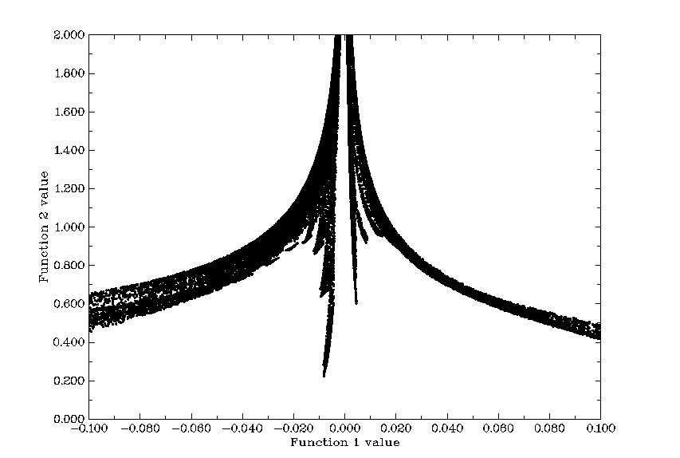
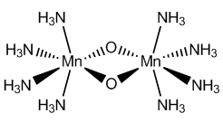
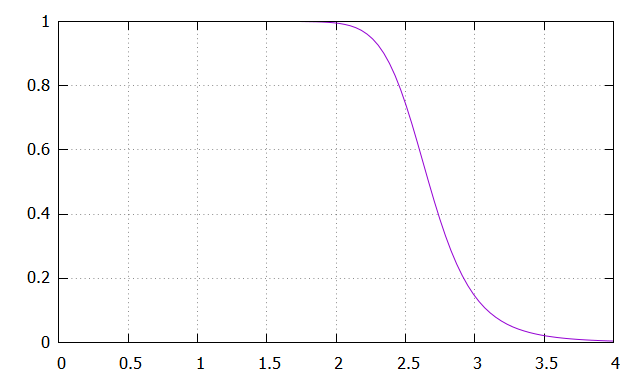

# Multiwfn：功能 3.23–3.300（中文）

> 弱作用可视化、能量分解、CDFT、ETS-NOCV、超极化率、离域与芳香性、其它功能

> 英文原文见同目录 `05_功能3.23-3.300.md`｜图片目录：`../imgs/`

---

<!-- p.310 -->

对于闭壳层情形，打印出的 d 数据要乘以因子 2，因为 LMO 是双占据的。对于开壳层情形，alpha 和 beta LMO 的 d 分开打印。

作为副产物，在 LMOdip.txt 开头还打印了整个体系的偶极矩，以及原子核贡献和电子贡献。需要注意的是，即使不存在离域的 LMO，所有 LMO 的 d 之和一般也不等于整个体系的偶极矩。

顺便说一句：事实上，只有当所有 d 中的 rc 矢量之和等于 −∑𝑍𝐴𝐫𝐴𝐴，即恰好抵消体系偶极矩中的原子核贡献时，所有 d 之和才等于体系偶极矩。若想满足这一点，应对所有双中心 LMO 采用 (rA+rB)/2 作为 rc，且所有 LMO 应恰好对应当前体系的一个 Lewis 结构。当然，在目前 LMO 分析的实现中这些条件并不满足（但在 NBO 理论的“DIPOLE”分析中满足）。注意，若取 (rA+rB)/2 作为 rc，同时又用双中心 LMO 的 d 来衡量键极性，会得到荒谬的结果，例如你会发现 C-H 甚至比 O-H 极性大得多！

轨道定域化分析的例子见第 4.19 节。LOBA/mLOBA 方法（第 4.8.4 节）的例子和第 4.100.22 节也使用了本功能。

所需信息：原子坐标、基函数


## 3.23 弱相互作用的可视化研究 (Visual study of weak interaction) (20)

弱相互作用的可视化研究已越来越流行，并提出了许多相关分析方法。Multiwfn 的主功能 20 (Main function 20) 即是这些分析方法的集合。

我的文章 Angew. Chem. Int. Ed., 137, e202504895 (2025) DOI: 10.1002/anie.202504895 和书中章节“Visualization Analysis of Weak Interactions in Chemical Systems” Comprehensive Computational Chemistry, Vol. 2 pp. 240-264. Oxford: Elsevier. DOI: 10.1016/B978-0-12-821978-2.00076-3 是对所有弱相互作用可视化研究方法的非常全面详细的综述，强烈建议阅读。


### 3.23.1 非共价相互作用 (Noncovalent interaction, NCI) 分析 (1)

非共价相互作用 (NCI) 方法也称为约化密度梯度 (RDG) 方法，是研究弱相互作用的非常流行的方法。NCI 方法的理论在其原始论文 J. Am. Chem. Soc., 132, 6498 (2010) 中描述。在本节中，我将详细介绍该方法的基本思想，并说明如何在 Multiwfn 中实现。如果你只想学习如何绘制填充颜色的 RDG 图，可以直接跳到本节的“第 3 部分”。也强烈建议观看该视频教程：https://youtu.be/e4FpVc9ao48，你将很快学会如何绘制与 NCI 分析相关的各种图。

如果你能阅读中文，还建议查看我的博客文章“使用 Multiwfn 进行弱相互作用的可视化研究”（中文，见 http://sobereva.com/68）和“通过 Multiwfn+VMD 做 RDG 分析的一些要点和常见问题”（中文，见 http://sobereva.com/291）。

第 1 部分：用 RDG 等值面揭示弱相互作用区域


<!-- p.311 -->


从下表可以看出，如果只保留约化密度梯度（RDG）函数值在 0~中等范围内的区域，那么“原子核附近”和“分子边界”区域将被屏蔽。

| 量（Quantity） | 原子核附近（Around nuclei） | 化学键附近（Around chemical bond） | 弱相互作用区域（Weak interaction region） | 分子边界（Boundary of molecule） |
| --- | --- | --- | --- | --- |
| `|∇ρ(r)|` | 大（Large） | 0~较小（0~Minor） | 0~小（0~Small） | 很小~小（Very small~Small） |
| `ρ(r)` | 大（Large） | 中等（Medium） | 小（Small） | 0~小（0~Small） |
| `RDG(r)` | 中等（Medium） | 0~较小（0~Minor） | 0~中等（0~Medium） | 中等~非常大（Medium~Very large） |

RDG 函数的定义如下所示，它本质上是电子密度梯度模函数的无量纲形式


$$\mathrm{RDG}(\mathbf{r})=\frac{1}{2(3\pi^{2})^{1/3}}\frac{\left|\nabla\rho(\mathbf{r})\right|}{\rho(\mathbf{r})^{4/3}}$$

<!-- formula-ocr: formula_p311_218.png 已替换为LaTeX, 原图保留备查 -->

对于剩下的区域（“化学键附近 (Around chemical bond)”和“弱相互作用区域 (Weak interaction region)”），若只

保留 ρ(r) 较小的区域，则只会显现出弱相互作用区域。

现在我以苯酚二聚体为例说明这一思想，我们将计算 RDG 函数的格点数据并将其可视化为等值面。启动 Multiwfn 并输入以下命令

examples\PhenolDimer.wfn // 任何包含 GTF 信息的格式都可用作输入文件，详见第 2.5 节

5 // 生成格点数据 (Generate grid data) 13 // RDG 函数 (RDG function) 7 // 以两个原子的中点作为格点数据的中心，这种定义空间范围的方式非常适合弱相互作用分析

1,14 // 两个原子的序号设为 1 和 14，因为从分子结构（见下图）可估计弱相互作用区域出现在 C1 和 C14 之间

40,40,40 // 弱相互作用区域很小，所以 40*40*40=64000 个格点已足够精细 3,3,3 // 将所有 X/Y/Z 方向的扩展距离（缓冲距离）设为 3 Bohr -1 // 显示 RDG 等值面 (Show the isosurface of RDG) 请确保 GUI 窗口中等值 (isovalue) 设为 0.5，该值适合可视化弱相互作用区域（若等值太小，则 RDG 等值面会太薄而不好看；若太大，则会出现不需要的“原子核附近”和“化学键附近”区域）。现在你可以在 GUI 窗口中看到如下图形：


<!-- p.312 -->


绿色等值面非常清晰地代表了苯酚二聚体之间的弱相互作用区域。注意，默认情况下，在电子密度大于或等于 0.05 的地方，RDG 函数被设为任意大值 (100.0)，从而屏蔽掉“化学键附近”区域的等值面。该阈值由 `settings.ini` 文件中的“RDG_maxrho”参数决定。默认的 0.05 适合大多数情况下弱相互作用区域的可视化。若因特殊原因不想启用该屏蔽处理，可将“RDG_maxrho”设为 0。

上图中的蓝色立方框显示了所计算格点数据的空间范围，仅当 GUI 窗口中勾选“显示数据范围 (Show data range)”时可见。由于格点数据中心起算的扩展距离设为 3.0 Bohr，边长为 2*3=6 Bohr。

第 2 部分：通过给 RDG 等值面填充颜色来判别弱相互作用类型 在 Bader 的 AIM 理论中，(3,-1) 型临界点 (CP) 的出现通常意味着电子密度局域聚集，它常出现在键径上或具有吸引相互作用的原子之间。(3,+1) 型 CP 常意味着电子密度局域耗尽并表现出空间位阻效应，它一般出现在环中心。区分 (3,-1) 和 (3,+1) CP 的判据是电子密度

Hessian 矩阵的第二大本征值（以下记为 λ2）。若 λ2 大于零，则该 CP 为 (3,+1)，否则为 (3,-1)。此外，弱相互作用强度与相应区域的电子密度 ρ 呈正相关。范德华相互作用区域的 ρ 总是很小，而对应强空间位阻效应或明显吸引性弱相互作用（如氢键、卤键）的区域

ρ 相对较大。因此，我们可以定义实空间函数 sign(λ2)ρ，即 λ2 符号与 ρ 的乘积。若按下列色条用不同颜色表示该函数值，并映射到 RDG 等值面上，我们不仅能知道弱相互作用出现在哪里，还能直观捕捉相互作用的类型。


<!-- p.313 -->


上述标注色条的高分辨率版本为 examples\RGB_bar.png，可直接嵌入论文插图中。

当前 Multiwfn 不支持绘制填充颜色的等值面图，但我们可以用

Multiwfn 生成 sign(λ2)ρ 和 RDG 的 cube 文件，再用 VMD 的绘图脚本绘制此类图。VMD 是最好的可视化工具之一，可在 http://www.ks.uiuc.edu/Research/vmd 免费下载。这里我以主功能 20 (Main function 20) 的子功能 1 (subfunction 1) 为例说明如何对苯酚二聚体实现。这次我们不仅想研究两个单体之间的弱相互作用区域，还想考察苯酚芳香环内的位阻效应，因此格点数据的空间范围应覆盖整个二聚体。

启动 Multiwfn 并输入以下命令 examples\PhenolDimer.wfn 20 // 弱相互作用的可视化研究 (Visual study of weak interaction) 1 // NCI 分析 (NCI analysis) -10 // 相对分子边界在所有方向设置扩展距离 (Set extension distance in all directions with respect to molecular boundary) 0 // 由于本体系的弱相互作用区域只出现在体系内部区域，我们无需在体系边界留缓冲区域，故将扩展距离设为 0 Bohr

2 // 中等质量格点（约 512000 个点）。由于格点数据的空间范围明显大于上例，我们需要比上例更多的格点，否则 RDG 等值面看起来会不连续

我首先通过散点图讨论各类区域的特征，我认为这有助于理解 NCI 方法的本质和思想。在后处理菜单中选择选项 -1 (option -1)，散点图会立即弹出（也可选择选项 1 (option 1) 将该图导出为文件）：

图中 X 轴和 Y 轴分别对应 sign(λ2)ρ 和 RDG 函数；图中的每个点对应三维空间中的一个格点。有四个尖峰，其峰顶处的点恰为 AIM 理论中的近似 CP 位置。若在图上画一条水平线如下，则穿过尖峰的线段恰对应于用于构建


<!-- p.314 -->


RDG 等值面的点。因此，NCI 分析方法可视为 AIM 理论在可视化研究中的扩展。这些尖峰可分为三类，我用蓝、绿、红圈标出，如上所示。

然后关闭散点图，选择选项 3 (option 3) 将 sign(λ2)ρ 和 RDG 的格点数据分别导出为当前目录下的 func1.cub 和 func2.cub，再将这两个文件与“examples”文件夹中的 RDGfill.vmd 文件一起复制到 VMD 安装目录。RDGfill.vmd 是我编写的 VMD 绘图脚本。启动 VMD，选择“文件 (file)”-“载入状态 (Load state)”，选择 RDGfill.vmd（或者，也可直接在控制台窗口输入 source RDGfill.vmd），你将在 OpenGL 窗口中看到下图。

默认 RDG 等值面为 0.5，颜色范围为 -0.035 至 0.02。可手动编辑 RDGfill.vmd 以更改默认设置，当前值适合一般情形。

从填充颜色的 RDG 等值面，只需查看颜色即可识别不同类型的区域。回想我之前展示的色标，越蓝意味着吸引相互作用越强；在当前图中可见，氧原子与氢原子之间的椭圆片显示浅蓝色，因此可得出存在氢键，但不是很强的结论。绿圈标记的相互作用区域可判为 vdW 相互作用区域，因为映射颜色为绿色或浅棕色，表明该区域电子密度很低。显然，两个环中心的区域对应强空间位阻相互作用，因为它们被填充为红色。

第 3 部分：生成填充颜色 RDG 图的一般步骤总结 上面我已就 NCI 分析讲了很多。为了让你清楚快速地

理解如何用 Multiwfn 绘制 sign(λ2)ρ 映射的 RDG 等值面图，下面给出实现此目的的最简步骤，适用于大多数情形。

启动 Multiwfn 并输入 xxx.wfn（或 wfx/mwfn/fch/molden... 文件）// 载入输入文件 20 // 弱相互作用的可视化研究 (Visual study of weak interaction) 1 // NCI 分析 (NCI analysis) 3 // 请在此步合理定义格点。对小、中型体系“高质量格点 (High-quality grid)”通常足够


<!-- p.315 -->


3 // 导出 func1.cub 和 func2.cub (Export func1.cub and func2.cub) 将两个 .cub 文件和 examples\RDGfill.vmd 移至 VMD 文件夹。启动 VMD 并在控制台窗口输入 source RDGfill.vmd，即可看到所需的图。

第 4 部分：关于格点设置

这里我再多谈谈计算 RDG 和 sign(λ2)ρ 格点数据的格点设置，因为这一点显著影响计算成本和所得 RDG 等值面图的质量。

计算总耗时与格点总数成线性正比，RDG 等值面的质量高度依赖于格点间距。格点间距越小，所得等值面越光滑。格点间距太大会导致等值面边缘出现严重锯齿或内部区域出现空洞。这很容易理解，若盒子尺寸（即格点数据的空间范围）固定，则设置的格点数越多，格点间距越小。显然，盒子应合理定义，其空间范围不应太宽，否则格点间距会很大从而降低图形质量；也不应太窄，否则感兴趣的 RDG 等值面可能被截断。最佳做法是使盒子恰好包住感兴趣区域。然后，若能承担高计算成本，可使用尽可能多的点数以提高最终等值面质量。

注意，设置格点界面中的“低/中/高质量格点 (low/medium/high-quality grid)”选项是相对于小或中型体系而言的。若体系巨大而不得不采用大盒子，即使“高质量格点”对应的格点间距也相对较大，因而图形质量不理想。此时应使用选项“4 输入覆盖整个体系的 X,Y,Z 点数或格点间距 (Input the number of points or grid spacing in X,Y,Z, covering whole system)”并手动输入合理的格点间距值。

下面是苯酚二聚体体系各种格点设置的示例，数值表示格点间距。从该图可直观理解格点间距如何影响结果。

第 5 部分：关于 NCI 分析的一些值得提及的要点

- 用于生成波函数的级别选择：做 NCI 分析完全没必要用大基组。使用中等大小的基组如 def2-SVP 或 6-31G** 即


<!-- p.316 -->


已完全足够，进一步增大基组只是浪费时间。至于理论方法的选择，用流行的 DFT 泛函如 B3LYP 或 M06-2X 产生波函数即足够。尽管 post-HF 密度已知比 DFT 密度更准确，但电子密度质量的提高在最终 NCI 分析结果中几乎察觉不到。你可能知道 B3LYP/6-31G* 等计算级别对弱相互作用算得很差，但这绝不意味着用该级别产生的电子密度不足以做 NCI 分析，因为电子密度对计算级别远不如相互作用能敏感，且计算的相互作用能质量与电子密度质量之间并无严格正相关。

一个常遇到的恼人问题是，在感兴趣区域周围出现了意外的 RDG 等值面从而污染了 NCI 图，这使感兴趣区域弱相互作用的可视化分析变得困难。例如，有一个由三个分子组成的体系，我们只想研究分子 1 和 2 之间的弱相互作用；但在实际生成的 NCI 图中，你可能发现 1-3 和 2-3 之间相互作用对应的以及分子内相互作用对应的不需要的等值面也出现了。要屏蔽不感兴趣的等值面，可尝试用第 4.13.4 节所述方法；或者，可考虑改用 IGM 方法，只要合理定义片段即可完全避免此问题，见第 3.23.5 节介绍。

- RDG 的域分析 (Domain analysis for RDG)：Multiwfn 能在由任一实空间函数定义的等值面内对任一实空间函数积分，这称为“域分析”。因此，你可计算 RDG（或其它相关函数如 IRI、IGM 和 IGMH）等值面内包围的体积和电子数，以尝试在定量层面讨论弱相互作用。此类分析的介绍见第 3.200.14 节，示例见第 4.200.14 节。

- 巨大体系的 NCI 分析：若想把 NCI 分析用于非常大的体系（如超过 300 个原子），通常成本极高而计算上不可行。最佳解决方案之一是改用基于 promolecular 的 NCI 分析或 IGM 分析版本，请分别查看第 3.23.2 节和第 3.23.5 节。另一解决方案是用 Grimme 的 xtb 程序以半经验 DFT 变体快速计算体系，再用所得 .molden 文件作为输入文件做 NCI 分析，结果应优于 promolecular NCI 结果。

- 平均 NCI (Averaged NCI)：若想研究分子动力学过程中分子与环境原子之间的相互作用，应使用平均 NCI 方法，而非只对单一结构做 NCI 分析，详见第 3.23.3 节。

- NCI+AIM 图：也可在填充颜色的 RDG 图中同时绘制 AIM 临界点和键径，从而揭示更多弱相互作用信息，下图即为一位 Multiwfn 用户提供的例子。此类图的绘制方法在第 4.20.1 节示例，并作为该视频第 4 部分说明：https://youtu.be/e4FpVc9ao48。


<!-- p.317 -->


- NCI+ELF 图：如第 2.6 节介绍及第 4.4 和 4.5 节相关例子所示，ELF（电子定域化函数）是对展示化学键特征非常有用的函数。显然，把 NCI 图和 ELF 等值面画在一起可传达更多信息。该视频教程第 5 部分说明了如何用 Multiwfn 结合 VMD 实现：https://youtu.be/e4FpVc9ao48。

技巧 1：生成颜色映射的散点图 也可给散点图映射颜色，以便于识别尖峰与 RDG 等值面的对应关系。gnuplot 程序 (http://www.gnuplot.info) 的绘图脚本已提供为 examples\scripts\RDGscatter.gnu，可实现此目的。首先，在后处理菜单中选择选项“2 输出散点至当前文件夹的 output.txt (Output scatter points to output.txt in current folder)”以在当前文件夹导出 output.txt，再把它和 RDGscatter.gnu 移到含 gnuplot 可执行文件的文件夹，然后在该文件夹运行命令：gnuplot RDGscatter.gnu。稍后你将在该文件夹得到 RDGscatter.ps，这是 postscript 格式的图形文件，可用如 Acrobat、Photoshop 或 Irfanview 打开（机器中须安装 ghostscript）。也可用在线图片转换器 https://cloudconvert.com/image-converter 转换为常见图片格式。该图应如下所示：


<!-- p.318 -->


该绘图脚本中默认颜色范围为 -0.035 至 0.02，若想把此图与填充颜色的 RDG 图关联，应确保 RDGscatter.gnu 和 RDGfill.vmd 中的色标设置完全一致。

若重现此图有困难，请跟随该视频教程第 2 部分：https://youtu.be/e4FpVc9ao48。

技巧 2：交互式设置 sign(λ2)ρ 在特定范围内处的 RDG 值 Multiwfn 允许你交互式设置 sign(λ2)ρ 在指定取值范围内处的 RDG 值，利用该功能可方便地屏蔽不需要的区域。这里我继续以“第 2 部分”所述苯酚二聚体为例，说明如何从

图中屏蔽对应 H 键的 RDG 等值面。从原始散点图发现，H 键区域对应 sign(λ2)ρ 范围 -0.035 ~ -0.015，因此可在后处理菜单输入以下命令

-2 // 设置 sign(λ2)ρ 在给定数据范围内处的 RDG 值 (Set RDG value where sign(λ2)ρ in within given data range) -0.035,-0.015 // sign(λ2)ρ 的下限和上限 100 // 将这些区域的 RDG 值设为任意大值以屏蔽 RDG 等值面 然后，若再选择选项 -1 (option -1) 绘制散点图，你将看到


<!-- p.319 -->


显然对应 H 键的尖峰已不存在。我们也可导出 cube 文件并用 VMD 重绘填充颜色图，如下所示，H 键的 RDG 等值面确实消失了。

注意，如上例那样修改后原始格点数据无法恢复。

所需信息：原子坐标、GTF


### 3.23.2 基于 promolecular 密度的 NCI 分析 (2)

对大体系生成波函数并计算 RDG 和 sign(λ2)ρ 的格点数据非常耗时，这极大限制了 NCI 分析方法的应用范围。幸运的是，基于 promolecular 密度的 NCI 分析一般也是合理的。所谓 promolecular 密度即通过叠加自由状态原子的电子密度近似构建的电子密度，这称为“Promolecular 近似”。几乎周期表中所有元素的高质量自由状态原子电子密度已预先确定


<!-- p.320 -->


并内置，因此 Multiwfn 中的基于 promolecular 密度的 NCI 分析原则上可用于任何体系。

要在 promolecular 近似下做 NCI 分析，只需在主功能 20 (Main function 20) 中选择子功能 2 (subfunction 2)，所有操作步骤与常规 NCI 分析完全相同。由于构建 promolecular 密度只需原子坐标信息，任何包含原子坐标信息的文件都可用作输入文件，如流行的 .pdb 和 .xyz 格式。

基于 promolecular 密度的 NCI 分析的 VMD 绘图脚本为 examples\RDGfill_pro.vmd，它与 examples\RDGfill.vmd 在色标和等值默认值设置上略有不同。

默认情况下，使用 promolecular 近似时 ρ 大于 0.1 处的 RDG 值自动设为 100.0，该阈值在某些情形可能不合适。可通过 `settings.ini` 中的“RDGprodens_maxrho”手动更改阈值。

基于 promolecular 密度做 NCI 分析的例子见第 4.20.1 节，并作为该视频第 3 部分说明：https://youtu.be/e4FpVc9ao48。

所需信息：原子坐标


### 3.23.3 平均 NCI 分析 (Averaged NCI analysis, aNCI, 3)

理论 在 J. Chem. Theory Comput., 9, 2226 (2013) 中，上节所述 NCI 方法被扩展到分析动态环境（如分子动力学轨迹），得到平均 NCI (aNCI) 方法。该方法也在书中章节 DOI: 10.1016/B978-0-12-821978-2.00076-3 中被仔细综述。本功能旨在实现 aNCI 分析。

aNCI 与原始 NCI 方法的唯一区别在于，前者中

电子密度 ρ 及其梯度模 |ρ| 不是只对一个几何构型计算，而是对轨迹文件中的多个帧计算，再取平均（即 𝜌̅ 和 ∇𝜌̅̅̅̅）。因此，平均约化密度梯度 (aRDG) 的等值面

$$\mathrm{aRDG}(\mathbf{r})=\frac{1}{2(3\pi^{2})^{1/3}}\frac{|\overline{\nabla\rho}(\mathbf{r})|}{\left[\overline{\rho}(\mathbf{r})\right]^{4/3}}$$

可直接用于揭示动力学过程的平均弱相互作用区域。

类似地，为了展示平均弱相互作用类型，在 aNCI 方法中，sign(λ2)ρ 函数中的 λ2 项取为在整个动力学轨迹上计算的平均电子密度 Hessian 矩阵的第二大本征值。

aNCI 方法还定义了新量热涨落指数 (TFI) 以揭示弱相互作用的稳定性


$$\mathrm{TFI}(\mathbf{r})=\frac{std[\rho(\mathbf{r})]}{\overline{\rho}(\mathbf{r})}$$

<!-- formula-ocr: formula_p320_219.png 已替换为LaTeX, 原图保留备查 -->

其分子为动力学轨迹中电子密度的标准差，可按如下计算


<!-- p.321 -->


$$s t d[\rho(\mathbf{r})]=\sqrt{\frac{\sum_{i}[\rho_{i}(\mathbf{r})-\overline{\rho}(\mathbf{r})]^{2}}{n}}$$

<!-- formula-ocr: formula_p321_220.png 已替换为LaTeX, 原图保留备查 -->

其中 n 为考虑的帧数，ρi 为基于第 i 帧几何构型算得的密度。在 aNCI 等值面上映射 TFI 后，通过目视检查颜色可清晰识别各弱相互作用区域的稳定性。

aNCI 图的质量直接取决于考虑的帧数。帧数很少，例如 50 帧，只能得到不准确且非常不光滑的等值面图。一般而言，应至少用 500 帧生成 aNCI 图。

用法 首先，注意由于基于波函数对大量几何构型算电子密度非常昂贵，Multiwfn 的 aNCI 分析功能强制使用 promolecular 近似。该近似是合理的且总是效果良好。

.xyz 文件格式存储的轨迹可作为输入文件接受。可用如 VMD 程序把其它格式的轨迹文件转换为 .xyz 轨迹文件。

注：多帧 .xyz 文件的结构如下所示 [第 1 帧的原子数] [第 1 帧中原子 1 的元素、x、y 和 z] [第 1 帧中原子 2 的元素、x、y 和 z] ... [第 1 帧中原子 n 的元素、x、y 和 z] [第 2 帧的原子数] [第 2 帧中原子 1 的元素、x、y 和 z] [第 2 帧中原子 2 的元素、x、y 和 z] ... [第 2 帧中原子 n 的元素、x、y 和 z] [第 3 帧的原子数] ...

在所有帧中，感兴趣分子的坐标应固定。例如，若想研究溶剂与苯分子之间的弱相互作用，则在整个轨迹中苯的位置必须固定。注意感兴趣分子应远离盒子边界，以使其始终被环境原子包围。

进入本功能后，将提示输入要分析的帧范围，例如输入 140,450 表示将用第 140 至 450 帧做 aNCI 分析。然后需设置格点，盒子的空间范围应合理包住感兴趣分子。此后，将对每一帧计算平均电子密度、平均密度梯度和平均密度 Hessian，请耐心等待。计算完成后，可用相应选项绘制平均 NCI 与平均

sign(λ2)ρ 之间的散点图、输出散点、导出它们的 cube 文件等。热涨落指数也可计算并导出为 cube 文件。

例子见第 4.20.3 节。注：一般不建议用 aNCI 方法，因为在多数情形 amIGM 方法（第 3.23.11 节）是好得多的选择！主要是因为 amIGM 允许用户定义片段以专门研究它们之间的相互作用，用户无需屏蔽不需要的等值面。且 amIGM 的等值面比 aNCI 更光滑，有时 aNCI 完全失败而 amIGM 仍合理。amIGM 分析成本仅为


<!-- p.322 -->


aNCI 的两三倍。全面比较见 amIGM 原始论文。aNCI 的唯一优势是可把 TFI 映射到 aNCI 等值面上，而发现把 TFI 映射到 amIGM 等值面上的效果不好（常两侧颜色显著不同）。

所需信息：多帧原子坐标


### 3.23.4 密度重叠区域指示符 (Density Overlap Regions Indicator, DORI) 分析 (5)

有时 ELF 和 RDG 联合使用以同时考察共价和非共价相互作用，见 J. Chem. Theory Comput., 8, 3993 (2012)。能否用单一实空间函数同时研究两类相互作用？答案是肯定的。在 J. Chem. Theory Comput., 10, 3745 (2014) 作者提出了名为密度重叠区域指示符 (DORI) 的函数，发现若恰当选择等值，DORI 等值面可同时展示共价和非共价

相互作用区域，且 sign(λ2)ρ 也可映射到 DORI 等值面上以便于分析相互作用本质。

DORI 的表达式为


$$\mathrm{DORI}(\mathbf{r})=\frac{\theta(\mathbf{r})}{1+\theta(\mathbf{r})}$$

<!-- formula-ocr: formula_p322_221.png 已替换为LaTeX, 原图保留备查 -->

$$\mathrm{DORI}(\mathbf{r})=\frac{\theta(\mathbf{r})}{1+\theta(\mathbf{r})}$$

要绘制 sign(λ2)ρ 映射的 DORI 等值面图，进入主功能 20 (Main function 20) 的子功能 5 (subfunction 5)，后续操作与 NCI 分析完全相同。在后处理菜单用选项 3 (option 3) 把

sign(λ2)ρ 和 DORI 的格点数据导出为 cube 文件后，再把它们与 examples\DORIfill.vmd 一起复制到 VMD 文件夹，然后启动 VMD 并执行绘图脚本 DORIfill.vmd 即可绘制填充颜色的等值面图。

我不推荐用 DORI，因为第 3.23.8 节介绍的相互作用区域指示符 (IRI) 不仅定义更简单因而计算成本更低，而且 IRI 的图形效果显著更好。

DORI 分析的例子见第 4.20.5 节 所需信息：原子坐标、GTF


### 3.23.5 基于 promolecular 密度的独立梯度模型 (Independent Gradient Model, IGM) 分析


### (10)

前言 在 Phys. Chem. Chem. Phys., 19, 17928 (2017) 中，Hénon 等人提出了可视化研究片段间和片段内相互作用的有用方法，名为独立梯度模型 (IGM)。注意目前 IGM 有三个版本：

(1) 基于 promolecular 密度的 IGM。这是 2017 年提出的 IGM 原始版本，本节介绍的功能即实现此形式的 IGM，分析中只需分子结构


<!-- p.323 -->


即可。

(2) 基于梯度分区 (GBP) 的 IGM。该版本在 ChemPhysChem, 19, 724 (2018) 提出，需要实际分子电子密度。Multiwfn 不支持此形式。

(3) 基于 Hirshfeld 分区 (Hirshfeld partition) 的 IGM (IGMH)。该版本由我提出，详见第 3.23.6 节。IGMH 比 IGM 更贵且同时输入文件须提供波函数，IGMH 的优势是结果更有意义且图形效果显著优于 IGM。只要计算成本可承受，我总是建议用 IGMH 代替 IGM。

IGM 思想 IGM 方法完整易懂的概述见 J. Comput. Chem., 43, 539 (2022) DOI: 10.1002/jcc.26812 和书中章节 DOI: 10.1016/B978-0-12-821978-2.00076-3。下面我只概述 IGM 方法的关键思想。先看一个非常简单的体系 H2 分子。沿分子轴的每个原子的自由状态原子密度如下所示

从上图注意到，在原子间区域两原子的原子密度梯度符号相反。例如，在 X=1.2 处，H1 的密度梯度为负，而 H2 的为正。因此，在 promolecular 密度梯度（下图中的 g 曲线）中，两原子的贡献在两原子之间的区域大部抵消。注意在两氢中点处 g 恰为零，该点在 promolecular 密度下对应 AIM 理论中的键临界点 (BCP)。

上图中的 gIGM 为 IGM 型的密度梯度，它算为各原子自由状态密度梯度绝对值之和；换言之，忽略相位因而


<!-- p.324 -->


来自各原子的密度梯度不相互抵消。由于该特征，gIGM 为 g 的上限。

δg 函数定义为 gIGM 与 g 之差，在上图中绘为深蓝色曲线。可见 δg 在原子间相互作用区域非零，并在键中点取最大值。显然，δg 可像 IRI 函数（见第 3.23.8 节）一样用于揭示相互作用区域。此外，如第

### 4.20.10 节例子所示，相互作用区域 δg 的大小与相互作用强度有密切关系。

对三维情形，gIGM 和 δg 可定义如下

$$g(\mathbf{r})=\left|\sum_{i}\nabla\rho_{i}^{\mathrm{f r e e}}(\mathbf{r})\right|\qquad g^{\mathrm{I G M}}(\mathbf{r})=\sum_{i}\left|\nabla\rho_{i}^{\mathrm{f r e e}}(\mathbf{r})\right|$$

free 代表原子 i 球平均的自由状态密度。该原子密度对几乎所有元素在 Multiwfn 中可直接获得，见附录 3 详述。此类 ρ𝑖

基于 gIGM 和 δg 的思想，IGM 方法还定义了 δginter 和 δgintra，旨在分别研究片段间和片段内相互作用

$$g^{\mathrm{IGM,inter}}(\mathbf{r})=\sum_{A}\left|\sum_{i\in A}\nabla\rho_{i}^{\mathrm{free}}(\mathbf{r})\right|$$

其中


$$g^{\mathrm{inter}}(\mathbf{r})=\left|\sum_{A}\sum_{i\in A}\nabla\rho_{i}^{\mathrm{free}}(\mathbf{r})\right|$$

<!-- formula-ocr: formula_p324_222.png 已替换为LaTeX, 原图保留备查 -->

$$g^{\mathrm{IGM,inter}}(\mathbf{r})=\sum_{A}\left|\sum_{i\in A}\nabla\rho_{i}^{\mathrm{free}}(\mathbf{r})\right|$$

其中 A 和 i 分别为片段和原子序号。片段可根据实际体系特征和研究目的任意定义。注意上述

δginter 和 δgintra 表达式是我提出并在 Multiwfn 中实现的一般形式，在 IGM 原始论文中并未明确给出。

δginter 的思想从上式易于理解。首先按通常方式算密度梯度作为 ginter，再算 gIGM,inter，它忽略各片段密度梯度因可能相位不同导致的抵消效应；则

gIGM,inter 与 ginter 之差，即 δginter，必能揭示片段之间的相互作用。δg 揭示本体系中所有种类的相互作用，不论类型是片段间还是片段内。因此，若从 δg 减去 δginter，剩余部分，即 δgintra，必能揭示片段内相互作用。

在第 3.23.1 节已表明，同时

展示相互作用区域和相互作用类型可通过绘制以 sign(λ2)ρ 函数着色的 RDG 等值面图实现。类似地，若把 sign(λ2)ρ 函数以各种颜色映射到 δginter 和 δgintra 等值面上，片段间和片段内相互作用的位置与类型也可生动揭示。

原子和原子对的定量指标

我定义原子对 δg 指数 (δGpair) 以定量原子对对两片段 (A 和 B) 间相互作用的贡献


<!-- p.325 -->


$$\delta G_{i,j}^{\mathrm{pair}}=\int\delta g_{i,j}(\mathbf{r})\mathrm{d}\mathbf{r}=\int[g_{i,j}^{\mathrm{IGM}}(\mathbf{r})-g_{i,j}(\mathbf{r})]\mathrm{d}\mathbf{r}\quad i\in A,j\in B$$

其中

$$g_{i,j}(\mathbf{r})=\left|\nabla\rho_{i}^{\mathrm{f r e e}}(\mathbf{r})+\nabla\rho_{j}^{\mathrm{f r e e}}(\mathbf{r})\right|$$

$$g_{i,j}^{\mathrm{IGM}}(\mathbf{r})=\left|\nabla\rho_{i}^{\mathrm{free}}(\mathbf{r})\right|+\left|\nabla\rho_{j}^{\mathrm{free}}(\mathbf{r})\right|$$

定义原子对对片段间相互作用的百分比贡献也很有用，为

$$\delta G_{i,j}^{\mathrm{pair}}(\%)=\frac{\delta G_{i,j}^{\mathrm{pair}}}{\sum\limits_{k\in A}\sum\limits_{l\in B}\delta G_{k,l}^{\mathrm{pair}}}\times100\%$$

由于 δGpair(%) 定义如此简单，当然不期望它能准确代表原子对对两片段间相互作用能的贡献，但

δGpair(%) 应能识别“热点”原子对，它们可能确实对片段间结合有较大实际贡献。

我还定义了原子 δg 指数 (δGatom) 以定量原子对片段间相互作用的重要性


$$\delta G_{i}^{\mathrm{atom}}=\sum_{j\in B}\delta G_{i,j}^{\mathrm{pair}}$$

<!-- formula-ocr: formula_p325_223.png 已替换为LaTeX, 原图保留备查 -->

百分比原子贡献可定义为

$$\delta G_{i}^{\mathrm{atom}}=\sum_{j\in B}\delta G_{i,j}^{\mathrm{pair}}$$

绘制分子结构时，若按 δGatom 或 δGatom(%) 给原子着色，可生动展示各原子对片段间相互作用的相对重要性。

受第 3.11.9 节介绍的 IBSI（本征键强度指数）启发，我定义了 IBSIW（用于弱相互作用的 IBSI）如下

GIBSIW i jdδ=× 2,( , )100() i j i j pair ,

其中 di,j 为原子 i 和 j 之间以 Å 为单位的距离。我的初步测试表明 IBSIW 在区分相互作用强度方面能力略好。显然，IBSIW 越大，

相互作用越强。由于在 Multiwfn 中 δGpair 以 a.u. 给出，IBSIW 的形式单位应为 a.u./Å2。

IGM 相对 NCI 的优势 据我的观点和经验，IGM 方法相对流行的 NCI 方法的优势可总结如下：

·片段间和片段内相互作用可分别研究从而避免相互干扰

·IGM 方法定义的函数计算相当快且只依赖几何结构，因而该方法可用于广泛体系（注意 NCI 也有 promolecular 近似版本）。

·如第 4.20.10 节例子所示，IGM 给出的等值面图

<!-- p.326 -->

method 比 NCI 图更平滑，因此 IGM 图对网格间距的要求较低。相比之下，当格点较稀疏时，NCI 图形容易出现难看的锯齿和空洞。

·可以定量给出原子以及原子对对片段间相互作用的贡献，前者还可以生动地渲染在分子结构上，这些特点使得识别“热点”原子变得容易。

·相互作用区域中 δg 函数的值直接反映相互作用强度。特别地，我发现 AIM 理论中键临界点处的 δg 是相应相互作用强度的很好的定量指标。

在 Multiwfn 中使用 IGM 分析 在 Multiwfn 中进行 IGM 分析极其简便灵活。首先，你应载入一个含有原子坐标的文件。最常用的格式如 .xyz、.pdb 和 .mol 都被 Multiwfn 支持（当然，任何波函数文件如 .wfn 和 .fch 也可使用）。注意，几何结构必须已经用合适的理论水平优化过，否则 IGM 结果可能具有误导性。

IGM 模块是主功能 20 (main function 20) 的子功能 10 (subfunction 10)，进入该模块后，你应定义片段。片段的定义非常灵活，你可以定义任意数目的片段（至少一个片段）。任何原子都不能同时被两个或更多片段共用。所定义片段的并集不强制要求等于整个体系，最终只有定义片段中的原子会被纳入计算。

接下来，你需要设置格点，最好使盒子恰好包住可能出现感兴趣相互作用的区域。关于格点设置的一些建议见 3.23.1 节。

`IGM_inter.vmd`

一旦格点数据的计算完成，Multiwfn 会显示 δg、δginter 和 δgintra 在全空间的积分，然后出现后处理菜单 (post-processing menu)。

后处理菜单 (post-processing menu) 中的选项是不言自明的，我在此简要描述它们：

-1：该选项的子选项 (suboptions) 1、2 和 3 分别用于绘制 δg、δginter、δgintra 对 sign(λ2)ρ 的散点图，而子选项 (suboption) 4 用于同时以不同颜色绘制 δginter 和 δgintra 对 sign(λ2)ρ 的图。如 IGM 原始论文所示，这类图对讨论相互作用细节很有用（回想一下，在 NCI 分析中经常涉及 RDG 对 sign(λ2)ρ 的散点图）。如果你想将散点图直接保存为当前文件夹中的图形文件，使用选项 (option) 1。如果默认的坐标轴范围不合适，使用选项 (option) -2 或 -3 调整。

2：如果你想用 Origin 和 gnuplot 等第三方软件绘制散点图，使用

该选项可将 δg、δginter、δgintra 和 sign(λ2)ρ 的数据导出为当前文件夹中的纯文本。屏幕上会显示该文件中每列的含义。

3：将 sign(λ2)ρ、δg、δginter 和 δgintra 的格点数据输出为当前文件夹中的 cube 文件。导出 cube 文件后，你可以用 "examples" 文件夹中的 IGM_inter.vmd 和 IGM_intra.vmd 脚本分别在 VMD 中绘制着色的 δginter 和 δgintra 等值面图。实例见 4.20.10 节。

`IGM_inter.vmd`


<!-- p.327 -->


Multiwfn。

5：该选项用于在 sign(λ2)ρ 不在指定数值范围内的地方将 δgintra 置零。通过该选项可以从 δgintra 散点图和等值面图中筛除不感兴趣的区域。例如，我们只想研究弱的片段内相互作用，那么可以输入对应于相对较小的 sign(λ2)ρ 值的范围。（该选项的目的类似于 NCI 分析中使用的“RDG_maxrho”参数）

6：该选项用于计算定量指标。如果你定义了两个以上的片段，这里需要选择要计算指标的两个片段。Multiwfn

将计算这两个片段之间每对原子的 δg 格点数据，并对 δg 函数积分以得到指标。积分采用 Becke 多中心积分方法，有几种积分格点可选，格点越好，结果越准确，但代价越高。一旦计算完成，atmdg.txt 会被

输出到当前文件夹，其中记录了所有 δGatom、δGatom(%)、δGpair 和 δGpair(%)，数值从高到低排序。所有 δGpair 的总和也在末尾输出。然后程序会询问你是否同时在当前文件夹输出 atmdg.pdb，该文件包含当前体系中所有原子的坐标。该文件的 "beta" 和“occupancy”场（倒数第二列和倒数第三列的数据）

分别对应原子 δg 指标乘以 10 和原子 δg 指标百分比。显然，如果你将其中之一载入 VMD 可视化程序并按“beta”或“occupancy”属性给原子着色，那么各种原子对片段间相互作用的相对重要性便可直观识别。

在输出 atmdg.txt 的同时，原子和原子对的 IBSIW 指标也被导出到当前文件夹的 IBSIW.txt 中。

7&8：这两个选项分别用于在相应格点的 sign(λ2)ρ 超出特定范围时设置 δg 和 δginter 函数的值。显然，当你想从 IGM 等值面图中筛除不需要的区域时，这些选项很有用。例如，你只想可视化 sign(λ2)ρ 在 -0.04 ~ -0.025 a.u. 范围内的 δginter 等值面，那么你可以进入选项 (option) 8，输入 -0.04,-0.025 然后输入 0 以将这些格点的 δginter 置零；接下来，你可以绘制更新后的散点图或导出 cube 文件以在 VMD 中可视化 IGM 图。

如果你的输入文件含有 GTF 或基函数信息（如 mwfn、.wfn、.fch、.molden），

在进行 IGM 分析时，Multiwfn 会让你选择所用 sign(λ2)ρ 的类型，第一种基于实际电子密度，第二种基于前分子 (promolecular) 密度。使用前者应给出更有意义的结果，然而，前者的计算代价明显高于后者（如果你的输入文件只含原子坐标信息，则总是使用后者）。

IGM 分析的几个例子见 4.20.10 节。关于 IGM 方法的更多讨论和实例可在我的博客文章“Investigating intermolecular weak interactions via Independent Gradient Model (IGM)”（中文，http://sobereva.com/407）中找到。

所需信息：原子坐标


<!-- p.328 -->


### 3.23.6 基于电子密度的 Hirshfeld 划分的 IGM 分析 (IGMH) (11)

如 3.23.5 节所示，原始版本的 IGM 完全基于自由状态下原子的密度计算，即使用了前分子 (promolecular) 近似。我提出的一种不同形式的 IGM 称为“基于电子密度的 Hirshfeld 划分的 IGM”(IGM based on Hirshfeld partition of molecular density，IGMH)。一篇详细介绍 IGMH 理论背景并包含非常丰富例子的文章是 J. Comput. Chem., 43, 539 (2022) DOI: 10.1002/jcc.26812。关于实现的一个勘误后来发表为 ChemRxiv (2022) DOI: 10.26434/chemrxiv-2022-g1m34。如果你的研究使用了 IGMH 分析，请引用这些论文。IGMH 方法也在我的书章节 DOI: 10.1016/B978-0-12-821978-2.00076-3 和我的文章 Angew. Chem. Int. Ed., 137, e202504895 (2025) DOI: 10.1002/anie.202504895 中得到全面综述。

理论 与 IGM 的关键区别在于，在 IGMH 中，δg、δginter 和 δgintra 定义中所涉及的原子密度基于 Hirshfeld 划分得到，即 𝜌𝑖 Hirsh(𝐫) =𝜌(𝐫)𝑤𝑖(𝐫)，其中 ρ 是基于波函数计算的整个体系的电子密度，原子 i 的 Hirshfeld 权重函数表示为

$$w_{i}(\mathbf{r})=\frac{\rho_{i}^{\mathrm{f r e e}}(\mathbf{r})}{\rho^{\mathrm{p r o}}(\mathbf{r})}=\frac{\rho_{i}^{\mathrm{f r e e}}(\mathbf{r})}{\sum_{j}\rho_{j}^{\mathrm{f r e e}}(\mathbf{r})}$$

其中 𝜌𝑖 free 是自由状态下原子 i 的球平均电子密度，𝜌pro 对应前分子 (promolecular) 密度，指标 j 遍历所有原子。重要的是注意，IGMH 中涉及的 IGMH 项并不是以数学上正确的方式计算 ∇𝜌𝑖 的笛卡尔分量，即

$$\frac{\partial\rho_{i}^{IGMH}}{\partial\mu}=\frac{\partial(\rho w_{i})}{\partial\mu}=w_{i}\frac{\partial\rho}{\partial\mu}+\rho\frac{\partial w_{i}}{\partial\mu}\quad(\mu=x,y,z)$$

<!-- formula-ocr: formula_p328_224.png 已替换为LaTeX, 原图保留备查 -->

而是以如下特殊方式计算（详见 ChemRxiv (2022) DOI: 10.26434/chemrxiv-2022-g1m34）

$$\frac{\partial\rho_{i}^{Hirsh}}{\partial\mu}=w_{i}\frac{\partial\rho}{\partial\mu}-\rho\frac{\partial w_{i}}{\partial\mu}\quad(\mu=x,y,z)$$

在 IGMH 分析中，sign(λ2)ρ 函数总是基于实际电子密度而非前分子 (promolecular) 密度计算。显然 IGMH 比 IGM 昂贵得多，因为必须计算实际电子密度的梯度和 Hessian。

IGMH 的优点 IGMH 相对于 IGM 的显著优点有三点：

(1) 等值面图的图形效果好得多。以 IGM 定义的 δg 或 δginter 函数的等值面往往过于臃肿，有时其上映射的

sign(λ2)ρ 着色不合理；相比之下，按 IGMH 计算的 δg 函数形状更薄，因而更易观察比较，同时误导性着色问题总是可以避免。

值得注意的是，IGMH 中 δg 的等值面接近 NCI 方法（见 3.23.1 节）所用的约化密度梯度 (reduced density gradient，RDG) 的等值面。前者的优点是等值面看起来

<!-- p.329 -->


在相同网格间距下平滑得多，RDG 等值面中难看的锯齿边缘大大得以避免。

(2) IGMH 的物理意义比 IGM 更严谨，因为体系形成过程中影响电子密度分布的所有因素都已内在地被考虑在内。

(3) 对于某些化学键相互作用，IGM 完全不能揭示其真实特征，因为成键过程中电子分布发生显著变化，而 IGM 完全基于前分子 (promolecular) 近似，因而忽略了这一关键效应。相比之下，IGMH 在揭示化学键方面能力明显更强，比较见 IGMH 原始论文。

由于上述原因，如果体系不是很大因而计算代价可承受，总是强烈推荐用 IGMH 代替 IGM。即使 IGMH 太昂贵或波函数不可得，也强烈推荐用 3.23.10 节所述的 mIGM 代替 IGM，因为在多数情况下 mIGM 的图形效果几乎与 IGMH 一样好，而代价与 IGM 基本相同，且 mIGM 像 IGM 一样只需要原子信息。

用法 本功能即主功能 20 (main function 20) 的子功能 11 (subfunction 11) 的使用与 IGM 功能完全相同，各种选项的介绍见 3.23.5 节。

还值得注意的是，IGMH 的 δginter 也是一个独立函数，对应第 91 号用户自定义函数 (user-defined function)。因此，你可以在拓扑分析模块中方便地查看其在键临界点处的值，在主功能 4 (main function 4) 中将其绘制为平面图，等等。使用前，你必须先进入主功能 1000 (main function 1000) 的选项 (option) 16（一个隐藏功能）以定义两个片段。

使用 IGMH 分析的例子见 4.20.11 节。所需信息：原子坐标、GTF 信息


### 3.23.7 范德华势的可视化 (6)

关于范德华 (van der Waals，vdW) 势分析的思想、实现和应用的完整描述请查看我的论文：J. Mol. Model., 26, 315 (2020) DOI: 10.1007/s00894-020-04577-0。该分析也在我的综述 Angew. Chem. Int. Ed., 137, e202504895 (2025) DOI: 10.1002/anie.202504895 中说明。这里我仅简要介绍该功能。

回想一下，两个原子 A 和 B 之间的 vdW 相互作用能通常用如下形式的 Lennard-Jones 势表示

$$E_{AB}^{\mathrm{vdW}}=E_{AB}^{\mathrm{repul}}+E_{AB}^{\mathrm{disp}}=\varepsilon_{AB}\left(\frac{R_{AB}^{0}}{r_{AB}}\right)^{12}-2\varepsilon_{AB}\left(\frac{R_{AB}^{0}}{r_{AB}}\right)^{6}$$

其中势阱 ε 和平衡距离 R0 依赖于原子类型。EvdW 的两个分量，即 Erepul 和 Edisp，分别对应交换排斥和色散相互作用。

我将化学体系的 vdW 势定义如下


<!-- p.330 -->


$$V^{\mathrm{vdW}}(\mathbf{r})=V^{\mathrm{repul}}(\mathbf{r})+V^{\mathrm{disp}}(\mathbf{r})=\sum_{A}\varepsilon_{AB}\left(\frac{R_{AB}^{0}}{|\mathbf{R}_{A}-\mathbf{r}|}\right)^{12}+\sum_{A}\left[-2\varepsilon_{AB}\left(\frac{R_{AB}^{0}}{|\mathbf{R}_{A}-\mathbf{r}|}\right)^{6}\right]$$

其中 B 可视为探针原子。Vrepul 和 Vdisp 分别表示排斥势和色散势。

在 Multiwfn 的实现中，采用了 UFF 力场的 vdW 参数，这是因为 UFF 支持的元素几乎覆盖整个周期表（H~Lr），且参数仅依赖于元素，从而完全避免了指认原子类型的问题。探针原子的元素序号可通过 `settings.ini` 中的 "ivdwprobe" 设置，默认为碳（即 ivdwprobe=6）。如果 "ivdwprobe" 设为 0，则进入该功能时会要求你输入探针原子的元素名。

vdW 势可通过主功能 20 (main function 20) 的子功能 6 (subfunction 6) 轻松计算，结果单位为 kcal/mol。在该功能中，你需先选择格点设置，然后会计算 VvdW、Vrepul 和 Vdisp 的格点数据，接着你可通过相应选项将其等值面可视化或导出为 cube 文件。

注意，VvdW、Vrepul 和 Vdisp 也直接对应用户自定义函数 (user-defined functions) 92、93 和 94。

VvdW 可视化和分析的例子见 4.20.6 节。所需信息：原子坐标


### 3.23.8 相互作用区域指示符 (IRI) 与 IRI-pi 分析 (4)

关于相互作用区域指示符 (interaction region indicator，IRI) 和 IRI-π，请阅读我的原始论文，即 Chemistry−Methods, 1, 231 (2021) DOI: 10.1002/cmtd.202100007，其中给出了 IRI 的思想、与其他方法的比较以及许多图示。IRI-π 也在该论文中介绍。此外，IRI 和 IRI-π 方法已在 Angew. Chem. Int. Ed., 137, e202504895 (2025) DOI: 10.1002/anie.202504895 和我的书章节 DOI: 10.1016/B978-0-12-821978-2.00076-3 中综述，强烈推荐阅读它们。

IRI 的特点 IRI 定义如下

( ) |( ) | /[ ( )]aIRIρρ= rrr

其中 a 对应 `settings.ini` 中的 "uservar"。如果 "uservar" 设为 0，则 a 取推荐值 1.1。

IRI 能够通过其等值面（通常推荐等值取 1.0）清晰揭示化学键区域和弱相互作用区域，这点类似于 3.23.4 节介绍的 DORI。确实，IRI 和 DORI 的等值面图具有相似特征，然而由于以下两个明显优点，IRI 总是优于 DORI：

(1) IRI 的定义简单得多，只需要电子密度及其梯度，而 DORI 还需要电子密度的 Hessian。显然，IRI 的计算因此比 DORI 更便宜。


<!-- p.331 -->


(2) IRI 等值面的图形效果显著好于 DORI。这点可从 IRI 原始论文中 IRI 与 DORI 的比较中容易看出。

值得注意的是，如果参数 a 设为 4/3，则 IRI 与 RDG 仅差一个常数前因子。尽管差别微不足道，RDG 等值面却无法像 IRI 那样在单一等值下同时清晰揭示弱相互作用和化学键区域。

有时会观察到 IRI 等值面出现在不感兴趣的极低 ρ 区域。为了在常用等值（约 1.0）下的等值面图中屏蔽它们，若 ρ 等于或小于 `settings.ini` 中的“IRI_rhocut”，则 IRI 被设为大值 (5)。默认值 0.00005 a.u. 通常效果良好。

在 Multiwfn 中的 IRI 分析

与 NCI、IGM 和 DORI 分析一样，sign(λ2)ρ 也可映射到 IRI 等值面上以直观区分相互作用本质。要绘制这种图，你应

(1) 进入主功能 20 (main function 20) 的子功能 4 (subfunction 4) (2) 选择合适的格点设置，然后在后处理菜单 (post-processing menu) 中将格点数据导出为 func1.cub 和 func2.cub

(3) 将这两个 cube 文件以及 examples\IRIfill.vmd 复制到 VMD 安装文件夹 (4) 启动 VMD 并在控制台窗口输入 source IRIfill.vmd 以运行脚本。IRI 函数对应第 24 号实空间函数 (real space function)。你也可用主功能 4 (main function 4) 将其绘制为平面图，用主功能 17 (main function 17) 对 IRI 做盆分析以寻找其极小点，等等。

关于 IRI-π IRI-π 是我研究 IRI 时的副产品，它简单定义为基于 π 电子计算的 IRI。在上述我的 Chemistry−Methods 论文中，IRI-π 被证明能很好地区分 π 相互作用类型并揭示 π 相互作用强度。IRI-π 的一个很好的应用例子是我的论文 Chem. Eur. J. (2022) DOI: 10.1002/chem.202103815，从中可见 IRI-π 能清晰表示 C18(CO)n (n = 2,4,6) 分子中不同 C-C 键的 π 相互作用。

要计算 IRI-π，你只需在计算 IRI 之前将其他轨道的占据数置零。

一份展示如何进行各种 IRI 和 IRI-π 分析的完整详细文档可在此下载：http://sobereva.com/multiwfn/res/IRI_tutorial.zip。一个展示绘制 sign(λ2)ρ 着色的 IRI 等值面图步骤的非常简单的

例子见 4.20.4 节。

所需信息：原子坐标、GTF 信息


### 3.23.9 平均独立梯度模型 (aIGM) 分析 (12)

平均 IGM (Averaged IGM，aIGM) 由 Tian Lu 提出，它是将标准 IGM 分析（3.23.5 节）推广到动态环境。aIGM 已在 Struct. Bond., 190, 297 (2026) DOI: 10.1007/430_2025_95 和综述文章 DOI: 10.1016/B978-0-12-821978-


<!-- p.332 -->


2.00076-3 中描述，如果工作中用了 aIGM 请引用它们。

IGM 与 aIGM 的关系与 mIGM（3.23.10 节）和 amIGM (3.23.11) 的关系完全相同。所以此处不再详细描述 amIGM，请查看 3.23.11 节。

amIGM 的图形效果显著好于 aIGM（正如 mIGM 远好于 IGM），而 aIGM 仅比 amIGM 稍便宜，所以 aIGM 是无用的！总是用 amIGM 代替！

aIGM 的用法与 amIGM 完全相同，见 4.20.13 节的 amIGM 例子。唯一区别是应在主功能 20 (main function 20) 中选择子功能 12 (subfunction 12) 而非 -12。

所需信息：多帧原子坐标


### 3.23.10 修正 IGM (mIGM) 分析 (-10)

本节介绍 Tian Lu 在 Struct. Bond., 190, 297 (2026) DOI: 10.1007/430_2025_95 中提出的修正 IGM (modified IGM，mIGM)，它是 IGM 的另一种变体。mIGM 的思想非常简单：所有项的计算方式与 IGMH 相同，只是用前分子 (promolecular) 密度代替实际分子密度。因此，mIGM 像 IGM 一样只依赖于原子坐标，其计算代价与 IGM 基本相同。至少对于研究弱相互作用，mIGM 的等值面和着色效果几乎与 IGMH 相同。因此，当由于计算代价高或波函数不可得而无法使用 IGMH 时，mIGM 是最佳替代。

mIGM 的用法与 IGM 完全相同，唯一区别是应在主功能 20 (main function 20) 中选择子功能 -10 (subfunction -10) 而非子功能 10 (subfunction 10)。

mIGM 分析的例子见 4.20.12 节。所需信息：原子坐标


### 3.23.11 平均修正 IGM (amIGM) 分析 (-12)

平均 mIGM (Averaged mIGM，amIGM) 由 Tian Lu 在 Struct. Bond., 190, 297 (2026) DOI: 10.1007/430_2025_95 中提出，它是将 mIGM 分析（3.23.10 节）推广到动态环境的重要扩展，从而可以直观研究分子动力学模拟中两个或更多特定片段之间的平均相互作用。

amIGM 定义了一个实空间函数 𝛿𝑔̅inter，它度量一组用户定义片段之间的平均相互作用，定义为

intermIGM,inter( )( )ggδδ=rr

其中 < > 符号表示对所考虑轨迹所有帧的时间平均。

通常，amIGM 分析通过绘制以平均 sign(λ2)ρ 着色的 𝛿𝑔̅inter 等值面图进行，该平均 sign(λ2)ρ 基于对轨迹帧平均的前分子 (promolecular) 电子密度及其导数计算


<!-- p.333 -->


得到。

要进行 amIGM 分析，你应提供记录分子动力学轨迹的多帧 .xyz 文件作为输入文件，然后进入主功能 20 (main function 20) 的子功能 -12 (subfunction -12)，然后像标准 mIGM/IGM 分析一样为 amIGM 分析定义片段，接着选择要考虑的帧范围，最后定义合适的计算格点数据的盒子。此后，将计算各种格点数据，并出现后处理菜单 (post-processing menu)。在该菜单中，你可将 𝛿𝑔̅inter 和平均 sign(λ2)ρ 的 cube 文件分别导出为 avgdg_inter.cub 和 avgsl2r.cub。有一个选项 (option) (-1) 可绘制这两个函数之间的散点图，这在 amIGM 分析中可能有用。你还可将平均 RDG（amIGM 分析的副产品）和 3.23.3 节提到的热涨落指数 (thermal fluctuation index，TFI) 导出为 cube 文件。

要绘制以平均 sign(λ2)ρ 着色的 𝛿𝑔̅inter 等值面图，你应将导出的 avgdg_inter.cub 和 avgsl2r.cub 以及 examples\aIGM.vmd 放到 VMD 文件夹，然后启动 VMD 并在 VMD 控制台窗口输入 source aIGM.vmd 命令以执行绘图脚本，你将立即看到 amIGM 图。

在后处理菜单 (post-processing menu) 中，你还可选择选项 (option) 8 以生成 𝛿𝑔inter 的标准差和 amIGM 的热涨落指数 (TFIamIGM) 的格点数据，其定义如下

$$\mathrm{TFI}^{\mathrm{amIGM}}(\mathbf{r})=\frac{s t d(\delta g^{\mathrm{inter}})(\mathbf{r})}{\delta g^{-\mathrm{inter}}(\mathbf{r})}$$

$$\mathrm{TFI}^{\mathrm{amIGM}}(\mathbf{r})=\frac{s t d(\delta g^{\mathrm{inter}})(\mathbf{r})}{\delta g^{-\mathrm{inter}}(\mathbf{r})}$$

其中 𝛿𝑔𝑖 inter 表示第 i 帧的 𝛿𝑔inter，N 表示所考虑帧的数目。通过以适当选择的颜色范围将 TFIamIGM 或 𝑠𝑡𝑑(𝛿𝑔inter) 映射到 𝛿𝑔̅inter 等值面上，可区分不同区域相互作用的稳定性。

amIGM 分析的例子见 4.20.13 节。

所需信息：多帧原子坐标


## 3.24 能量分解分析 (21)


### 3.24.1 基于分子力场的能量分解分析


### (EDA-FF)

能量分解分析 (energy decomposition analysis，EDA) 是揭示相互作用本质的重要方法。大多数 EDA 分析方法基于波函数，它们准确、严谨，结果有意义，但遗憾的是对大体系往往太昂贵。本模块专为基于经典分子力场 (force field，FF) 分析分子内和分子间弱相互作用而设计，该方法可称为 EDA-FF，计算

<!-- p.334 -->


代价对由数百原子组成的体系可忽略，甚至可应用于一万以上原子的体系。由于 FF 的限制，该模块显然不能用于讨论化学键相互作用的本质。本节中的“弱相互作用”一词指相隔三个以上化学键的原子间相互作用。

如果工作中使用了 EDA-FF 分析，请引用这篇文章，其中我简要描述了 EDA-FF 并用其研究了 cyclo[18]carbon 与石墨烯之间的相互作用：Mat. Sci. Eng. B, 273, 115425 (2021) DOI: 10.1016/j.mseb.2021.115425。

理论 有许多流行的分子体系 FF。弱相互作用的主要成分是范德华 (van der Waals，vdW) 相互作用和静电相互作用，大多数 FF 用成对势表示它们，如下所示。

·原子 A 和 B 之间的静电相互作用能（使用原子单位）：


$$E_{_{AB}}^{ele}=\frac{q_{_{A}}q_{_{B}}}{r_{_{AB}}}$$

<!-- formula-ocr: formula_p334_225.png 已替换为LaTeX, 原图保留备查 -->

其中 q 为原子电荷，rAB 为 A 与 B 之间的距离。

·原子 A 和 B 之间的 vdW 相互作用能：

EEE ABABAB disprepvdW +=

$$E_{_{AB}}^{\mathrm{vdW}}=E_{_{AB}}^{\mathrm{rep}}+E_{_{AB}}^{\mathrm{disp}}$$

其中 Erep 表示由 Pauli 排斥效应引起的排斥相互作用（也称为交换排斥），而 Edisp 为有吸引力的色散相互作用。εAB 是原子间 vdW 相互作用势的势阱深度，而 R0AB 为 vdW 非键距离。当 rAB=RAB0 时，相互作用能恰对应势阱深度。

参数 ε 和 R0 由 FF 提供，数值通常对每种原子类型定义。实际计算中使用的原子间参数通常按原子参数的几何平均或算术平均求得。例如，在 UFF 力场中，使用如下混合规则


$$E_{_{AB}}^{\mathrm{vdW}}=E_{_{AB}}^{\mathrm{rep}}+E_{_{AB}}^{\mathrm{disp}}$$

<!-- formula-ocr: formula_p334_226.png 已替换为LaTeX, 原图保留备查 -->

而对于 AMBER 和 GAFF 等其他 FF，定义了原子 ε 和 R*，所用混合规则为


$$E_{AB}^{\mathrm{rep}}=\varepsilon_{AB}\left(\frac{R_{AB}^{0}}{r_{AB}}\right)^{12}\quad E_{AB}^{\mathrm{disp}}=-2\varepsilon_{AB}\left(\frac{R_{AB}^{0}}{r_{AB}}\right)^{6}$$

<!-- formula-ocr: formula_p334_227.png 已替换为LaTeX, 原图保留备查 -->

其中 R* 称为原子非键半径或原子 vdW 半径。

给定原子间相互作用项，计算片段间相互作用能的各种物理分量很直接：


$$E_{IJ}^{\mathrm{ele}}=\sum_{A\in I}\sum_{B\in J}E_{AB}^{\mathrm{ele}}\qquad E_{IJ}^{\mathrm{rep}}=\sum_{A\in I}\sum_{B\in J}E_{AB}^{\mathrm{rep}}\qquad E_{IJ}^{\mathrm{disp}}=\sum_{A\in I}\sum_{B\in J}E_{AB}^{\mathrm{disp}}$$

<!-- formula-ocr: formula_p334_228.png 已替换为LaTeX, 原图保留备查 -->

本模块主要用于计算两个或多个用户定义片段之间的上述三项，同时可得到许多有用的量。

用法 使用本模块的基本步骤为：


<!-- p.335 -->


(1) 准备一个“分子列表”文件，其中包含“分子类型”文件的路径。详细描述见后。

(2) 载入含有整个体系几何信息的文件。显然，Multiwfn 支持的许多格式都可使用，例如 .xyz、.mol、.pdb、.fch 等等。

(3) 进入主功能 21 (main function 21) 的子功能 1 (subfunction 1)。(4) 用选项 (option) 3 载入分子列表文件。该步用于为每个原子指认原子电荷和类型。

(5) 用选项 (option) 2 定义片段。可定义无限多个片段，任何原子不应同时出现在两个或更多片段中。如果你想研究同一分子中两个片段之间的相互作用，这两个片段之间的任何原子对应相隔至少三个化学键（否则该相互作用将不再属于弱相互作用范畴）。注意步骤 (4) 和 (5) 的顺序可以互换。

(6) 选择选项 (option) 1 开始分析，然后每对片段之间的相互作用能分量以及原子贡献将被打印。分析前，如果你想检查电荷和类型是否已正确指认，可以选择选项 (option) 4。

计算前还有其他可选择的选项：·选项 (option) -1：用于选择计算中所用 FF。目前支持 AMBER99 & GAFF（默认）和 UFF，它们的区别在于计算中使用的内置原子 vdW 参数和混合规则不同。

·选项 (option) -2：该选项可选择计算静电相互作用时的算符。默认采用 1/r 算符，而用该选项可将其改为 1/r2。显然，基于 1/r2 计算的 Eele 随相互作用距离 r 的衰减比默认情形快得多，这就是一些研究采用这种简单策略以有效体现水环境的原因，因为众所周知水等极性溶剂由于其大介电常数可显著屏蔽静电相互作用强度。

·选项 (option) -3：如果你选择该选项一次以将状态切换为 "Yes"，则计算后，所有原子间相互作用能项包括其物理分量将被导出到当前文件夹的 interatm.txt 中。

·选项 (option) -4：在标准 .pqr 格式中，最后两列专用于存储原子 vdW 半径和原子电荷。如果你选择该选项一次以将状态切换为 "Yes"，则计算期间，atmint_tot.pqr、atmint_ele.pqr、atmint_rep.pqr、atmint_disp.pqr 和 atmint_vdW.pqr 将输出到当前文件夹，它们的最后一列分别记录原子对总、静电、排斥、色散和 vdW（即排斥 + 色散）相互作用能的贡献。在流行的 VMD 可视化程序中，你可以载入其中一个 .pqr 文件并按“原子电荷”数据给原子着色，则原子颜色将生动展示每个原子对相应种类相互作用能的贡献。

接下来，我介绍分子列表文件的书写规则。文件内容应如下所示：


```text
C:\mol1\phenol.txt 1
C:\mol2\H2O.txt 4
C:\HCl.txt 2
```

该示例文件意味着，在 Multiwfn 启动时载入的文件所记录的几何信息中，记录顺序为：一个 phenol 分子、四个 H2O 分子和两个 HCl 分子。这三个 .txt 文件含有相应分子的原子类型（区分大小写）和电荷。例如，下面是 C:\mol2\H2O.txt 的内容，记录了 H2O 分子中原子的信息，OW 和 HW 是 AMBER 力场的原子类型。


<!-- p.336 -->


Multiwfn 启动时载入的几何信息中，记录顺序为：一个 phenol 分子、四个 H2O 分子和两个 HCl 分子。这三个 .txt 文件含有相应分子的原子类型（区分大小写）和电荷。例如，下面是 C:\mol2\H2O.txt 的内容，记录了 H2O 分子中原子的信息，OW 和 HW 是 AMBER 力场的原子类型。


```text
OW -0.728713
HW  0.364427
HW  0.364286
```

第一列是对应于当前所选 FF 的原子类型，第二列对应原子电荷。注意该文件中的原子顺序必须与 Multiwfn 启动时载入的几何信息完全一致。如果分析中所用力场为 UFF，则该文件应只含原子电荷，因而应只有一列（因为对每种元素，所有相关原子类型共用相同的 UFF vdW 参数，因此用户无需定义原子类型）。

·关于原子类型：原子类型的详细描述可在相应力场的原始论文中找到。对于 AMBER，见 J. Am. Chem. Soc., 117, 5179 (1995) 的 Table 1。对于 GAFF，见 J. Comput. Chem., 25, 1157 (2004) 的 Table 1；你也可查阅 "examples\EDA\EDA_FF" 文件夹中的 AMBER99.txt 和 GAFF.txt 以了解原子类型描述。一般而言，你可根据当前体系中每个原子的实际化学环境手动找到合适的原子类型。然而，如果你觉得此过程麻烦，可用第三方程序帮助你识别原子类型并构建分子文件。例如，GaussView 可自动指认 AMBER 原子类型（进入 "Atom List"，点击带有大橙色 "M" 符号的图标，双击 "AMBER Type" 列头，选择 "File"-"Export Data"，然后提取对应 "AMBER Type" 列的数据），而 AmberTools 包中的 Antechamber 工具能够指认 GAFF 原子类型。注意 AMBER 和 GAFF 原子类型可在同一分子文件中混用，因为这两个力场彼此完全兼容，AMBER 和 GAFF 原子类型分别用大写和小写。

注：GaussView 指认的原子类型总是大写，然而，AMBER99 的某些原子类型为小写，如 Br。显然，你应在将文件载入 Multiwfn 前手动修改。如果你感到困惑，看看 examples\EDA\EDA_FF\AMBER99.txt。

·关于力场选择：对于有机类体系，通常我建议用 AMBER/GAFF 力场进行分析，结果应合理且有化学意义。事实上，由于 GAFF 的 vdW 参数直接继承自 AMBER，通常用 GAFF 和 AMBER 原子类型应无区别。显然，分析中所用几何应首先在合理水平下优化。不推荐用 UFF，因为我发现用 UFF 时，即使几何已用合适的量子化学方法充分优化，片段间总相互作用能通常为正，这是由于高估了 Erep。解决该问题的一种方法是用 UFF 自身优化的几何（许多程序可做到，如 Gaussian 和 OpenBabel），然而所得弱相互作用分子二聚体或多聚体的几何往往不太好。UFF 的独特优点是它几乎覆盖整个周期表。考虑到这点，我在 Multiwfn 中设计了一个技巧：如果你用 AMBER/GAFF，当原子类型写为 UF 时，将采用 UFF vdW 参数。该处理大大扩展了 AMBER 和 GAFF 的适用范围。


<!-- p.337 -->


·关于原子电荷选择：用于能量分解分析的原子电荷应能很好地再现分子 vdW 面周围的静电势 (electrostatic potential，ESP)。通常我建议用 CHELPG 原子电荷，它通过 ESP 拟合过程得到，可直接经 Multiwfn 计算，介绍见 3.9.10 节，例子见 4.7.1 节。注意若某类分子在当前体系中出现多次且构象显著不同，鉴于各单体的 ESP 拟合电荷可能彼此很不同，建议将这些复本视为不同种类的分子，以便分别指认原子电荷。若体系中某些单体太大而无法计算其 ESP 拟合原子电荷，你可改用 EEM 原子电荷，使用为再现 ESP 拟合电荷而拟合的参数，介绍见 3.9.15 节。EEM 电荷的计算代价对由数百原子组成的体系可忽略，因为计算完全基于分子几何信息和经验参数。

本模块的例子见 4.21.1 节。所需信息：原子坐标和含有原子电荷/类型的特殊文件


### 3.24.2 Shubin Liu 的能量分解

理论 在 J. Chem. Phys., 126, 244103 (2007) 中，作者 Shubin Liu 提出了一种能量分解思想，下文称为 EDA-SBL。在该方法中，总分子能量分解为

stericelectrostaticquantumEEEE=++

空间位阻项简单地是由 Weizsäcker 动能泛函得到的能量，对应于假设当前体系中电子为无相互作用玻色子时的精确动能：


$$E_{\mathrm{s t e r i c}}=T_{\mathrm{W}}=\left|\nabla\rho(\mathbf{r})\right|^{2}/\left[8\rho(\mathbf{r})\right]$$

<!-- formula-ocr: formula_p337_229.png 已替换为LaTeX, 原图保留备查 -->

静电项是体系中粒子所有经典 Coulomb 相互作用之和：

$$E_{\mathrm{e l e c t r o s t a t i c}}=E_{\mathrm{J}}+E_{\mathrm{N-E}}+E_{\mathrm{N-N}}=\iint\frac{\rho(\mathbf{r}_{1})\rho(\mathbf{r}_{2})}{r_{12}}\mathrm{d}\mathbf{r}_{1}\mathrm{d}\mathbf{r}_{2}-\int\rho(\mathbf{r})\sum_{A}\frac{Z_{A}}{|\mathbf{r}-\mathbf{R}_{A}|}\mathrm{d}\mathbf{r}+\sum_{A>B}\frac{Z_{A}Z_{B}}{R_{AB}}$$

最后，量子项是纯由量子效应引起的能量：

quantumPauliXCEEE=+

其中 EXC 为交换相关能，EPauli=TS-TW 为 Pauli 动能，其中 TS 表示无相互作用电子模型的总动能，可计算为所有占据分子轨道动能之和。Equantum 本质上体现了电子相关效应以及在无相互作用粒子假设下 Pauli 不相容原理对电子动能的影响。


<!-- p.338 -->


EDA-SBL 方法已在许多研究论文中使用，如下所示的论文，若你想了解该方法如何用于研究实际化学问题，建议阅读：J. Phys. Chem. A, 117, 962 (2013)，J. Chem. Phys., 133, 114110 (2010)，Phys. Chem. Chem. Phys., 17, 27052 (2015)，J. Phys. Chem. A, 119, 8216 (2015)，Chem. Phys. Lett., 687, 131 (2017)。

用法 Multiwfn 自身无法计算 EDA-SBL 方法中的所有项，Multiwfn 需要从 Gaussian 输出文件中读取相关信息。用 Gaussian 进行 EDA-SBL 分析的方法总结如下：

(1) 基于优化好的几何手动创建单点任务的特殊 Gaussian 输入文件

(2) 用 Gaussian 运行该输入文件，得到输出文件以及 fch/fchk 文件 (3) 启动 Multiwfn 并载入 fch/fchk 文件，然后进入主功能 21 (main function 21) 的子功能 2 (subfunction 2) (4) 输入 Gaussian 输出文件的路径 然后 Multiwfn 计算 Esteric 项，并打印 EDA-SBL 方法定义的所有三个能量分量。EDA-SBL 项中涉及的其他中间项也同时给出，如 Pauli 动能、核-电子 Coulomb 吸引能等等。

特殊 Gaussian 输入文件应符合如下格式，几何已用合适水平优化。


```text
%chk=H2O.chk
# B3LYP/6-31G* ExtraLinks=L608

Optimized water

0 1
O 0.00000000     0.00000000     0.11930801
H 0.00000000     0.75895306    -0.47723204
H 0.00000000    -0.75895306    -0.47723204

-5
```

DFT 泛函和基组可任意选择，必须指定 "ExtraLinks=L608" 以便 Gaussian 可将总能量分解为各种分量并打印到输出文件。计算后，所得 H2O.chk  usformchk 工具转换为 fch/fchk 文件。如你所见，输入文件末尾有一个值 "-5"，该值应根据你实际使用的 DFT 泛函指定，你可查阅 Gaussian IOp 参考中的 IOp(3/74) 找到对应值。常用杂化泛函的值为：

-73 (MN15) -58 (ωB97XD)、-55 (M06-2X)、-54 (M06)、-53 (M06L)、-40 (CAM-B3LYP)、-35 (TPSSh)、-13 (PBE0)、-5 (B3LYP)、-6 (B3PW91)、-3 (BHandHLYP)、402 (BLYP)、1009 (PBE)、2523 (TPSS)。

寻找当前 DFT 泛函对应 IOp(3/74) 值的另一种方法是做一个简单计算并查看输出文件开头自动显示的 IOp(3/74) 值，例如，用 B3LYP/6-31G* 水平的输出文件将含一行 "3/5=1,6=6,7=1,11=2,16=1,25=1,30=1,


<!-- p.339 -->


74=-5/1,2,3;"，显示 IOp(3/74) 为 -5。关于 ExtraLinks=L608 的更多解释可在 http://gaussian.com/faq1/ 找到。

对版本 ≤ G16 C.01 的 Gaussian 的重要注记：据 Gaussian 官方支持的回复，至少对 G16 C.01 或更老版本，ωB97XD 和 CAM-B3LYP 等长程校正泛函与 ExtraLinks=L608 不兼容。此外，为一致起见，如果你用 G16，还应在泛函序号后加值 "5" 以要求 Gaussian 对 ExtraLinks=L608 用“ultrafine”格点，因为自 G16 起“ultrafine”为默认 DFT 格点。例如，若需用 M06-2X，应写 -55 5 而非简单写 55。

EDA-SBL 分析的实际例子见 4.21.2 节。


### 3.24.3 SobEDA 与 sobEDAw 能量分解分析

基于色散校正密度泛函理论定义的 sobEDA 与 sobEDAw 能量分解分析非常稳健、高效、通用且易用，因此高度推荐使用！它们可用基于 Gaussian 和 Multiwfn 的 sobEDA.sh shell 脚本轻松进行。关于理论背景和示例应用的介绍请查看原始论文 J. Phys. Chem. A, 127, 7023 (2023)，非常详细的教程见 http://sobereva.com/soft/sobEDA_tutorial.zip。我的博客文章“Using sobEDA and sobEDAw methods to perform very accurate, fast, convenient and universal energy decomposition analysis”（http://sobereva.com/685，中文）含有额外讨论。


### 3.24.4 原子对色散能贡献的分析

理论 对 B3LYP 等描述色散相互作用能力为零的 DFT 泛函，著名的 DFT-D3 色散校正能可近似视为色散能。这点已在 J. Phys. Chem. A, 127, 7023 (2023) 中提出，并在 J. Chem. Theory Comput., 20, 1923 (2024) 中通过与 DLPNO-CCSD(T) 计算的色散能比较得到进一步确认。不考虑三体耦合项时，DFT-D3 的总色散校正能为每对原子间色散相互作用能之和。因此，原子 A 对体系色散能的贡献可

计算为 𝜀𝐴= (1/2) ∑𝜀𝐴,𝐵𝐵≠𝐴，其中 𝜀𝐴,𝐵 为原子 A 与 B 之间的 DFT-D3 色散校正能。片段对色散能的贡献简单地为其原子的贡献之和。两片段之间的色散相互作用能等于它们之间每对原子间色散相互作用能之和。

此外，J. Chem. Theory Comput., 20, 1923 (2024) 提出了色散能密度的思想，其定义为


$$\rho_{\mathrm{d i s p}}(\mathbf{r})=\left(\frac{\pi}{\alpha}\right)^{-3/2}\sum_{A}\varepsilon_{A}e^{-\alpha(\mathbf{r}-\mathbf{R}_{A})^{2}}$$

<!-- formula-ocr: formula_p339_230.png 已替换为LaTeX, 原图保留备查 -->

其中 α 通常取 0.5，RA 为原子 A 的坐标。本质上，𝜌disp 将原子对色散能的贡献展宽为 Gauss 函数以得到实空间函数，可图形展示。

某原子 A 在不同化学环境（如结构 m 和 n）中所贡献色散能之差记为 ∆𝜀𝐴。将上式中的 𝜀𝐴 替换为 ∆𝜀𝐴 即得 ∆𝜌disp 函数。若计算 ∆𝜌disp 所用核坐标对应结构 m，则 ∆𝜌disp 可用于给结构 m 的原子着色，或绘制

<!-- p.340 -->


为等值面并附加到结构图上，以突出对色散能变化贡献最大的区域。

上述信息对其他类型色散校正方案同样成立，如 DFT-D4，然而 Multiwfn 目前仅支持基于 DFT-D3 进行该分析。

功能 本模块中所有数据均基于以 B3LYP 拟合参数的 DFT-D3(BJ) 色散校正能计算。支持周期体系。

本模块的功能如下
- 计算当前体系原子对色散能的贡献：每个原子的值显示在屏幕上，并可导出名为 atomdisp.pqr 的文件，其中“charge”属性（文件中倒数第三列）对应原子对色散能的贡献。若将该文件载入 VMD 程序，可按“charge”属性给原子着色以直观展示原子贡献。

- 计算当前体系的色散密度：将被要求定义格点设置，然后计算色散密度的格点数据，接着可导出为当前文件夹中的 dispdens.cub。此后，你可用如 VMD 和 VESTA 载入并绘制色散密度的等值面。

- 计算当前体系与另一体系之间原子对色散能贡献之差：将被要求为当前体系定义片段（体系 A 的片段 i），然后被要求输入另一体系的文件路径并为其定义片段（体系 B 的片段 j）。两体系不一定对应同一体系，但两片段必须有相同原子数和相同原子顺序。此后，Multiwfn 将依次打印体系 B 的总色散能然后是体系 A 的总色散能。然后打印片段 i 中原子对体系 A 色散能的贡献与片段 j 中原子对体系 B 色散能的贡献之差，并可导出 diffatomdisp.pqr，其“charge”属性对应此差值。

- 计算当前体系与另一体系之间的色散密度差。与上一功能类似，但计算 ∆𝜌disp 的格点数据并导出为当前文件夹中的 dispdensdiff.cub。

- 计算片段对色散能的贡献
- 计算两片段之间的色散相互作用能

用法 本模块对应主功能 21 (main function 21) 的子功能 4 (subfunction 4)。输入文件必须含原子信息，如 xyz、pdb、mol2、gjf、fch、mwfn，全面介绍见 2.5 节。若输入文件含晶胞信息，则计算视为周期性。

该功能需要 Tian Lu 修改的 Grimme's dftd3 程序，可在 http://sobereva.com/soft/dftd3_TLmod.zip 下载，内含修改的源代码、预编译 Windows 版可执行文件 (dftd3.exe)、预编译 Linux 版可执行文件 (dftd3)。在启动 Multiwfn 前应将 `settings.ini` 中的“dftd3path”设为 dftd3 可执行文件的实际路径，以便 Multiwfn 可调用 dftd3。在 Linux 环境下，别忘了用“chmod”为 dftd3 添加可执行权限。


<!-- p.341 -->


本分析的例子见 4.21.4 节。


## 3.25 概念密度泛函理论 (CDFT) 分析


## (22)

由 Robert Parr 创立并由众多研究者拓展的概念密度泛函理论 (conceptual density functional theory，CDFT) 是旨在揭示化学体系反应活性的理论框架。CDFT 包含众多概念和量，其中一些可用于预测有利反应位点和反应特征，一些可比较不同化学物种间的反应性。由于 CDFT 在量子化学中的高流行度和重要作用，以及有如此多有意义的相关量，我相信开发一个用最少步骤计算 CDFT 中所有常用量的模块非常有用。

在本节 Part 1 中，我将简要描述经本模块可研究的所有量的定义；然后在 Part 2 中，我将展示如何使用本模块。本模块能够计算所谓轨道加权量，将在 Part 3 中专门描述。

注意，除 CDFT 外，Multiwfn 还支持许多其他揭示反应位点的方法，概述见 4.A.4 节。

若本节所述功能用于你的研究，请不仅引用 Multiwfn 的原始论文，而且引用如下书章节，该章全面介绍了本模块的特点和实现：

Tian Lu, Qinxue Chen, Realization of Conceptual Density Functional Theory and Information-Theoretic Approach in Multiwfn Program. In Conceptual Density Functional Theory, WILEY-VCH GmbH: Weinheim (2022); pp 631-647. DOI: 10.1002/9783527829941.ch31


### 3.25.1 理论

要得到下面所有量，必须有 N、N+1 和 N-1 电子态的电子能量 (E) 和电子密度。对 N 电子态优化的几何用于所有计算。N 通常指化学体系在其最稳定状态所带电子数。

➢ 全局指标

- 第一垂直电离势 (I1)：E(N-1) − E(N)
- 第一垂直电子亲和能 (A)：E(N) − E(N+1)
- Mulliken 电负性 (χ)：(I1+A)/2
- 化学势 (μ)：−χ
- 硬度 (η)：I1−A，亦等价于基本带隙。见 J. Am. Chem. Soc., 105, 7512 (1983)。注意按许多 CDFT 论文采用的惯例，η 原始定义中 1/2 的前缀被略去。

<!-- p.342 -->

- 软度 (Softness) (S)：1/η。见 Proc. Nati. Acad. Sci., 82, 6723 (1985)
- 亲电性指数 (Electrophilicity index) (ω)：μ2/(2η)。见 J. Am. Chem. Soc., 121, 1922 (1999)
- 亲核性指数 (Nucleophilicity index) (NNu)：EHOMO(Nu) − EHOMO(TCE)，其中 Nu 表示亲核试剂，TCE 表示四氰基乙烯，其 HOMO 能量几乎是所有有机分子中最低的，因此被选作参考体系。见 J. Org. Chem., 73, 4615 (2008)。

➢ 实空间函数 (Real space functions)

- Fukui 函数 f(r) 与对偶描述符 (dual descriptor) Δf(r)：详细介绍见 4.5.4 节
- 局域软度 (Local softness)：对于亲核、亲电、自由基进攻分别为 s+(r) = Sf +(r)、s−(r) = Sf −(r)、s0(r) = Sf 0(r)，其中 f(r) 为相应类型的 Fukui 函数。见 Proc. Nati. Acad. Sci., 82, 6723 (1985)

- 局域超软度 (Local hyper-softness)：s(2)  S2Δf(r)，见 J. Math. Chem., 62, 461 (2024)
- 局域亲电性指数 (Local electrophilicity index)：𝜔loc(𝐫) = 𝜔𝑓+(𝐫)

- 局域亲核性指数 (Local nucleophilicity index)：𝑁Nu loc(𝐫) = 𝑁Nu𝑓−(𝐫) ➢ 原子指数 (Atom indices)

- 凝聚 Fukui 函数 (Condensed Fukui function) (fA) 与对偶描述符 (dual descriptor) (ΔfA)：详细介绍见 4.7.3 节

- 凝聚局域软度 (Condensed local softness) 对于亲核进攻：𝑠𝐴 + 对于亲电进攻：𝑠𝐴 − 对于自由基进攻：𝑠𝐴 0
- 相对亲电性指数 (Relative electrophilicity index)：𝑠𝐴 −，见 J. Phys. Chem. A, 102, 3746 (1998)
- 相对亲核性指数 (Relative nucleophilicity index)：𝑠𝐴 +，见 J. Phys. Chem. A, 102, 3746 (1998)
- 凝聚局域亲电性指数 (Condensed local electrophilicity index)：𝜔𝐴= 𝜔𝑓𝐴 + = 𝑆𝑓𝐴 −= 𝑆𝑓𝐴 0 = 𝑆𝑓𝐴 −/𝑠𝐴 +/𝑠𝐴 +

(2) ≈𝑆2∆𝑓𝐴 ➢ 键对偶描述符 (Bond dual descriptor) (BDD) BDD 是为每根键定义的指数，负（正）BDD 意味着该键是亲核性（亲电性）的，越负（正），亲核性（亲电性）越强
- 凝聚局域亲核性指数 (Condensed local nucleophilicity index)：𝑁Nu −
- 凝聚局域超软度 (Condensed local hyper-softness)：𝑠𝐴 𝐴= 𝑁Nu𝑓𝐴

BDD 本质上是在外势不变条件下键级 (P) 对电子数的一阶导数。根据 J. Math. Chem., 63, 1588 (2025)，利用有限差分近似，键 A-B 的 BDD 可计算为 𝐵𝐷𝐷𝐴,𝐵= 𝑓𝐴,𝐵 + 和 𝑓𝐴,𝐵 − 是两种类型的键 Fukui 函数，按下式计算 + −𝑓𝐴,𝐵 −，其中 𝑓𝐴,𝐵


$$f_{A,B}^{+}=P_{A,B}(N+1)-P_{A,B}(N)$$

<!-- formula-ocr: formula_p342_231.png 已替换为LaTeX, 原图保留备查 -->

在 J. Math. Chem., 63, 1588 (2025) 中作者采用了基于原子自然轨道的 Wiberg 键级作为 P，但在当前 Multiwfn 的实现中，采用基于 Hirshfeld 分割的模糊键级 (fuzzy bond order)（详见 3.11.6 节）作为 P 来计算 BDD，因为该键级对基组不敏感（在这方面远优于 Mayer 键级），表现合理（根据我的测试），且相对容易实现。


<!-- p.343 -->


➢ ωcubic 亲电性指数 (ωcubic electrophilicity index) 在 J. Phys. Chem. A, 124, 2090 (2020) 中引入的亲电性指数 ωcubic 有些特殊，它还依赖于 N-2 电子态。它比前述

亲电性指数 ω 包含更高阶的项。其定义为


$$\omega_{cubic}=\omega\left(1+\frac{\mu}{3\eta^{2}}\gamma\right)$$

<!-- formula-ocr: formula_p343_232.png 已替换为LaTeX, 原图保留备查 -->

实际计算时为

$$\omega_{cubic}=\frac{\left(\mu_{cubic}\right)^{2}}{2\eta_{cubic}}\left[1+\frac{\mu_{cubic}}{3\left(\eta_{cubic}\right)^{2}}\gamma_{cubic}\right]$$

其中

$$\mu_{cubic}=(1/6)(-2A-5I_{1}+I_{2})$$

$$\eta_{cubic}=I_{1}-A$$

$$\gamma_{cubic}=2I_{1}-I_{2}-A$$

其中 I2 为第二垂直电离势，定义为 E(N-2) − E(N-1)。相应地，存在凝聚局域亲电性指数的立方形式 𝜔cubic +。在 J. Phys. Chem. A, 124, 2090 (2020) 中表明，卤键二聚体 R-X···NH3 中卤素原子（因其 σ-hole 而表现为 Lewis 酸）的 𝜔cubic 𝐴 值与计算的结合能具有极好的相关性（但请注意，他们采用的是 AIM 分割原子空间，而非本模块所用的 Hirshfeld 分割）。𝐴= 𝜔cubic𝑓𝐴

➢ 亲电描述符 (Electrophilic descriptor) (ε) 亲电描述符 (ε) 在 Int. J. Quantum Chem., 124, e27366 (2024) 中被引入，用由 35 个有机分子组成的测试集表明，它与 Mayr 亲电参数 (E) 的相关性显著优于

亲电性指数 (ω)。与仅基于体系能量二阶 Taylor 展开推导的 ω 不同，ε 的推导基于三阶展开，这使得 ε 显式地包含超硬度 (hyperhardness)。与 ωcubic 一样，ε 的计算也依赖于 N-2 电子态。

计算 ε 的工作方程如下


$$\varepsilon=\chi\left(\frac{\phi}{\gamma}\right)-\left(\frac{\phi}{\gamma}\right)^{2}\left(\frac{\eta}{2}+\frac{\phi}{6}\right)$$

其中

$$\phi=\sqrt{\eta^{2}-2\gamma\mu}-\eta$$

需要注意的是，上述方程中所涉及的 η、γ、χ、μ 应以与前述不同的方式计算，即


$$\begin{aligned}&\mu=a\\&\chi=-a\\&\eta=2(b-ac)\\&\gamma=-3c(b-ac)\\ \end{aligned}$$

<!-- formula-ocr: formula_p343_234.png 已替换为LaTeX, 原图保留备查 -->


<!-- p.344 -->


其中


$$b=\frac{I_{1}-A^{\prime}}{2}-\frac{I_{1}+A^{\prime}}{2}c$$

<!-- formula-ocr: formula_p344_235.png 已替换为LaTeX, 原图保留备查 -->

其中 A’ = E(N+1) − E(N)，即电子亲和势，但符号与标准定义相差一个负号。

➢ Fukui 势 (Fukui potential) 与对偶描述符势 (dual descriptor potential) Fukui 势的定义与物理意义在 J. Phys. Chem. A, 115, 2325 (2011) 和 Int. J. Quantum Chem., 101, 520 (2005) 中有仔细讨论。Fukui 势是对 ESP 的补充，可用于理解当电子转移不可忽略时化学反应早期的能量变化。例如，当亲电试剂受到亲核试剂进攻时，亲电试剂感受到的由亲核试剂产生的外势为

𝑣𝑁−phile(𝐫) ≈𝑉𝑁−phile ESP(𝐫) −∆𝑁∫ 𝑓𝑁−phile −(𝐫′) |𝐫−𝐫′|d𝐫′

其中 ΔN 为从亲电试剂转移到亲核试剂的电子数（在此情形下为负值），𝑓𝑁−phile − 为亲核试剂的 Fukui 函数 f−。三类 Fukui 势定义

如下


$$v_{N-\mathrm{p h i l e}}(\mathbf{r})\approx V_{N-\mathrm{p h i l e}}^{\mathrm{E S P}}(\mathbf{r})-\Delta N\int\frac{f_{N-\mathrm{p h i l e}}^{-}(\mathbf{r}^{\prime})}{|\mathbf{r}-\mathbf{r}^{\prime}|}\mathrm{d}\mathbf{r}^{\prime}$$

<!-- formula-ocr: formula_p344_236.png 已替换为LaTeX, 原图保留备查 -->

ESP 仅能在假设没有电子转移的前提下预测由静电效应主导的区域选择性，然而，显然该假设对一般化学反应而言远非成立（但对许多非共价相互作用基本成立）。显然，在研究一般反应时，尤其是对有显著电子转移的反应，应更多关注 Fukui 势。

如 J. Phys. Chem. A, 115, 2325 (2011) 所强调的“决定反应位点的是 Fukui 势的值，而非 Fukui 函数本身的值”，Fukui 势在预测区域选择性方面比 Fukui 函数更严格。然而，Fukui 势不如 Fukui 函数流行，因为它们的分布特征通常彼此吻合，而计算 Fukui 势需要计算两次 ESP，比计算两次电子密度要昂贵得多。根据 Fukui 函数的有限差分定义，例如，𝑉𝑓− 可计算为


$$V_{f^{-}}(\mathbf{r})=\int\frac{f^{-}(\mathbf{r}^{\prime})}{|\mathbf{r}-\mathbf{r}^{\prime}|}\mathrm{d}\mathbf{r}^{\prime}=\int\frac{\rho_{N}(\mathbf{r}^{\prime})-\rho_{N-1}(\mathbf{r}^{\prime})}{|\mathbf{r}-\mathbf{r}^{\prime}|}\mathrm{d}\mathbf{r}^{\prime}=V_{N-1}^{\mathrm{ESP}}(\mathbf{r})-V_{N}^{\mathrm{ESP}}(\mathbf{r})$$

<!-- formula-ocr: formula_p344_237.png 已替换为LaTeX, 原图保留备查 -->

此外，对偶描述符势 (dual descriptor potential) (DDP) 在 J. Math. Chem., 62, 1094 (2024) 中被引入，其定义为


$$D D P(\mathbf{r})=\int\frac{\Delta f(\mathbf{r}^{\prime})}{|\mathbf{r}-\mathbf{r}^{\prime}|}\mathrm{d}\mathbf{r}^{\prime}=\int\frac{f^{+}(\mathbf{r}^{\prime})-f^{-}(\mathbf{r}^{\prime})}{|\mathbf{r}-\mathbf{r}^{\prime}|}\mathrm{d}\mathbf{r}^{\prime}=V_{f^{+}}(\mathbf{r})-V_{f^{-}}(\mathbf{r})$$

<!-- formula-ocr: formula_p344_238.png 已替换为LaTeX, 原图保留备查 -->

与常常有许多节面而妨碍讨论的对偶描述符不同，DDP 的分布光滑得多，使研究者更容易识别优先反应位点。

与 Fukui 函数一样，𝑉𝑓+ 在某区域越正，该区域越


<!-- p.345 -->


可能发生亲核反应，而 𝑉𝑓− 在某区域越正，该区域越

可能发生亲电反应。与对偶描述符类似，DPP 在某区域越正、越负，该区域分别越易于发生亲核和亲电进攻。


### 3.25.2 用法 (Usage)

要使用本模块，即主功能 22 (main function 22)，启动 Multiwfn 后载入的文件相对任意，唯一要求是该文件中的原子信息与所研究的体系相同。

进入本模块后，你将看到一个菜单，其中选项 2 (Option 2)、选项 3 (Option 3) 和选项 9 (Option 9) 用于计算上述量。在使用它们之前，一般应在当前目录下提供 N.wfn、N-1.wfn 和 N+1.wfn，分别包含当前体系 N、N-1 和 N+1 态的波函数和电子能量，几何结构必须相同且对应于 N 态的优化几何。三个文件的计算级别也必须相同。若三个 .wfn 文件中有缺失，Multiwfn 会要求你手动输入相应态的 .wfn 文件路径（.wfx、.fch 和 .mwfn 文件也被允许，因为它们同样携带波函数和电子能量信息）。

选项 2 (Option 2)：用于计算所有前述全局指数和原子指数，结果将导出到当前目录下的 CDFT.txt。如 4.7.3 节所述，Hirshfeld 方法是计算凝聚 Fukui 函数乃至其它相关原子指数的理想选择，因此会自动计算 Hirshfeld 电荷并用于计算所有原子指数。亲核性指数及其局域版本依赖于 TCE 的 HOMO 能量，应使用与当前体系相同的级别计算，注意本模块中打印的这些指数简单地采用了常用 B3LYP/6-31G* 级别下计算的 EHOMO(TCE) = -0.335198 Hartree（显然，若你想要更可靠的结果且当前计算级别不是 B3LYP/6-31G*，你应自行计算 EHOMO(TCE) 然后再手动计算这些指数）。

选项 3 (Option 3)：用于计算 Fukui 函数、对偶描述符及与其相关函数的格点数据，然后可直接可视化其等值面图，格点数据可导出为当前目录下的 cube 文件。在此选项中你可以设置乘到所算格点数据上的比例因子。例如，若你将比例因子设为选项 2 (Option 2) 输出的全局软度，则

缩放后的 f −(r) Fukui 函数将对应于 s−(r)。

选项 9 (Option 9)：与选项 3 (Option 3) 类似，但用于计算 Fukui 势和对偶描述符势的格点数据。由于每个带电态都需要计算 ESP 格点数据，代价常常较高，你应选择合适的格点设置以免过于耗时。

选项 10 (Option 10)：用于计算键对偶描述符 (bond dual descriptor)。Multiwfn 将依次载入不同电子态的 .wfn 文件并计算模糊键级 (fuzzy bond order)，最后计算并打印 BDD 值。代价一般很低。

.wfn 文件的生成 你可以手动准备选项 2 (Option 2) 和选项 3 (Option 3) 所用的 .wfn 文件，或者，你也可以用本模块的选项 1 (Option 1) 自动完成准备工作。

选择选项 1 (Option 1) 后，将提示你输入 Gaussian 单点任务的关键词，然后 Multiwfn 依次要求你输入 N、N+1 和 N-1 态的电荷与自旋多重度，随后将在当前目录下生成 Gaussian 单点输入文件 N.gjf、N+1.gjf 和 N-1.gjf（这些文件中的几何结构对应于 Multiwfn 输入文件中的几何）。然后，你可以手动用 Gaussian 运行它们以得到 N.wfn、N+1.wfn 和 N-1.wfn，或者若你的电脑上已安装 Gaussian，可直接让 Multiwfn 调用 Gaussian 来计算它们（此时 `settings.ini` 中的 "gaupath" 参数必须已设为 Gaussian 可执行文件的实际路径），计算完成后三个 .wfn 文件将出现在当前目录下。

有时我们需要使用混合基组，此时应在当前目录下准备一个名为 basis.txt 的文件，其中记录基组的定义（也可能附带赝势定义）。若输入的关键词包含 "gen" 或 "genecp"，则 basis.txt 的内容会自动追加到所生成的 .gjf 文件末尾。

Multiwfn 也能生成 ORCA 输入文件以产生三个 .wfn 文件。你应选择选项 -2 (Option -2) 并选择 ORCA，然后选择选项 1 (Option 1) 将生成 N.inp、N-1.inp 和 N+1.inp。若你已在 `settings.ini` 中将 “orcapath” 设为 ORCA 可执行文件的实际路径，你可直接让 Multiwfn 调用 ORCA 运行它们以产生 N.wfn、N-1.wfn 和 N+1.wfn；或者，你也可以手动用 ORCA 运行它们，然后将所得的 N.wfn、N-1.wfn 和 N+1.wfn 放到当前目录下。

要用本模块研究大有机体系，通常我建议使用 B3LYP/6-31G* 级别，因为该级别便宜，而所得量的质量已足够令人满意。

关于计算 ωcubic 与 ε 的注记 默认情况下，Multiwfn 不计算 ωcubic 和 ε，因为它们依赖于 N-2 电子态。若你需要它们，应先选择选项 -1 (Option -1) 将状态切换为 "Yes"。然后你可以用选项 1 (Option 1) 帮你准备 N、N+1、N-1、N-2 电子态的 .wfn 文件，或手动提供它们。然后选择选项 2 (Option 2) 后，所得的 CDFT.txt 文件将包含凝聚局域


<!-- p.346 -->


任务，然后 Multiwfn 依次要求你输入 N、N+1 和 N-1 态的电荷与自旋多重度，随后将在当前目录下生成 Gaussian 单点输入文件 N.gjf、N+1.gjf 和 N-1.gjf（这些文件中的几何结构对应于 Multiwfn 输入文件中的几何）。然后，你可以手动用 Gaussian 运行它们以得到 N.wfn、N+1.wfn 和 N-1.wfn，或者若你的电脑上已安装 Gaussian，可直接让 Multiwfn 调用 Gaussian 来计算它们（此时 `settings.ini` 中的 "gaupath" 参数必须已设为 Gaussian 可执行文件的实际路径），计算完成后三个 .wfn 文件将出现在当前目录下。

有时我们需要使用混合基组，此时应在当前目录下准备一个名为 basis.txt 的文件，其中记录基组的定义（也可能附带赝势定义）。若输入的关键词包含 "gen" 或 "genecp"，则 basis.txt 的内容会自动追加到所生成的 .gjf 文件末尾。

Multiwfn 也能生成 ORCA 输入文件以产生三个 .wfn 文件。你应选择选项 -2 (Option -2) 并选择 ORCA，然后选择选项 1 (Option 1) 将生成 N.inp、N-1.inp 和 N+1.inp。若你已在 `settings.ini` 中将 “orcapath” 设为 ORCA 可执行文件的实际路径，你可直接让 Multiwfn 调用 ORCA 运行它们以产生 N.wfn、N-1.wfn 和 N+1.wfn；或者，你也可以手动用 ORCA 运行它们，然后将所得的 N.wfn、N-1.wfn 和 N+1.wfn 放到当前目录下。

要用本模块研究大有机体系，通常我建议使用 B3LYP/6-31G* 级别，因为该级别便宜，而所得量的质量已足够令人满意。

关于计算 ωcubic 和 ε 的注记 默认情况下，Multiwfn 不计算 ωcubic 和 ε，因为它们依赖于 N-2 电子态。如果你需要它们，你应先选择选项 -1 (Option -1) 将状态切换为 "Yes"。然后你可以用选项 1 (Option 1) 来帮你准备 N、N+1、N-1、N-2 电子态的 .wfn 文件，或手动提供它们。然后在选择选项 2 (Option 2) 后，所得的 CDFT.txt 文件将包含凝聚局域

ωcubic、全局 ωcubic、ε 以及 I2。

用本模块计算苯酚各种 CDFT 量的例子见 4.22.1 节。计算马来酸酐 Fukui 势和对偶描述符势的例子见 4.22.4 节。计算键对偶描述符的例子见 4.22.5 节。


### 3.25.3 专题 1：轨道加权 Fukui 函数与对偶

### 描述符 (Special topic 1: Orbital-weighted Fukui function and dual descriptor)

理论 (Theory) 原始定义的 Fukui 函数和对偶描述符在前线分子轨道（准）简并时表现不好。例如，当 HOMO 与 HOMO-1 能量非常

接近或完全相同时，Fukui 函数 f − 可能无法给出有意义的结果或结果完全误导；此外，当体系具有点群对称性时，例如

C60 富勒烯，f − 的分布通常与分子对称性不一致，这显然是出乎意料的观察。

为了解决这些问题，在 J. Comput. Chem., 38, 481 (2017) 中，作者提出了


<!-- p.347 -->


轨道加权 Fukui 函数 (orbital-weighted Fukui function)，在 J. Phys. Chem. A, 123, 10556 (2019) 中，他们进一步提出了轨道加权对偶描述符 (orbital-weighted dual descriptor)，总结如下（𝑓𝑤0 由我定义）

$$\begin{array}{r l r l}&{f_{w}^{+}(\mathbf{r})=\displaystyle\sum_{i=\mathrm{L U M O}}^{\infty}w_{i}\mid\varphi_{i}(\mathbf{r})\mid^{2}}&{}&{w_{i}=\frac{\exp[-\left(\frac{\mu-\varepsilon_{i}}{\Delta}\right)^{2}]}{\displaystyle\sum_{i=\mathrm{L U M O}}^{\infty}\exp[-\left(\frac{\mu-\varepsilon_{i}}{\Delta}\right)^{2}]}}\end{array}$$

$$\begin{array}{r l}{f_{w}^{-}(\mathbf{r})=\displaystyle\sum_{i}^{\mathrm{H O M O}}w_{i}\mid\varphi_{i}(\mathbf{r})\mid^{2}}&{{}\quad w_{i}=\frac{\exp[-\left(\frac{\mu-\varepsilon_{i}}{\Delta}\right)^{2}]}{\displaystyle\sum_{i}^{\mathrm{H O M O}}\exp[-\left(\frac{\mu-\varepsilon_{i}}{\Delta}\right)^{2}]}}\end{array}$$

i

fff www 0 ( )[( )( )]/ 2 rrr =+ +−

Δ=− fff www ( )( )( ) rrr +−

其中 εi 和 φi 为轨道 i 的能量与波函数；μ 为化学势，在上述公式中近似计算为 (EHOMO+ELUMO)/2。Δ 为可调参数，原则上其最佳值是能使函数具有理想局域反应性预测能力的值。

显然最合适的 Δ 依赖于实际体系，通常 0.1 Hartree 是值得一试的猜测。若你发现此值下的轨道加权函数表现不好，你可以尝试适当改变它并重新计算。

与 f − 的冻结轨道近似形式，即 f −(r)=|φHOMO(r)|2 相比，𝑓𝑤− 的优点在于它以不同权重考虑了所有轨道。由表达式可知，低占据轨道能量越接近 HOMO 能量，其权重越大。显然简并轨道具有相同权重。公式中涉及的 Gaussian 函数

表现为衰减函数，Δ 越大，低占据轨道对 𝑓𝑤− 的贡献越高。当 HOMO 与 HOMO-1 之间能量差显著时，将没有理由

用 𝑓𝑤− 代替 f −。对 𝑓𝑤+、𝑓𝑤0 和 ∆𝑓𝑤 情形类似。

用法 (Usage) 由于轨道加权函数涉及虚轨道，你应用 .mwfn、.fch、.molden 或 .gms 文件作为输入文件。通常，输入文件中的几何结构应对应于 N 电子态的优化几何；但研究非平衡结构也是可能的，例如内禀反应坐标 (IRC) 上的某一点。

仅闭壳层单行列式波函数可接受。若你打算计算 𝑓𝑤+、𝑓𝑤0 和 ∆𝑓𝑤，不应使用弥散函数，因为它们利用虚轨道，而使用弥散函数时其化学意义可能被严重破坏。

在主功能 22 (main function 22) 中，有四个选项与轨道加权计算相关：

- 选项 4 (Option 4)：设置后续轨道加权计算中使用的 Δ 参数
- 选项 5 (Option 5)：打印最高的 10 个权重（即上述公式中的 {w}），此选项有助于检查当前 Δ 参数是否合理，并帮助用户更好地理解轨道加权方法的工作方式

- 选项 6 (Option 6)：计算凝聚的 𝑓𝑤+、𝑓𝑤−、𝑓𝑤0 和 Δ𝑓𝑤 值，换言之，计算这些函数在 Hirshfeld 原子空间中的积分。该结果有助于定量考察各原子上这些函数的净量。默认的径向和角度积分点通常已足够精细，若你发现凝聚 𝑓𝑤+ 或 𝑓𝑤− 之和明显偏离 1.0，你应在 `settings.ini` 中将 "iautointgrid" 参数设为 0，然后适当增大 "radpot" 和 "sphpot" 参数。


<!-- p.348 -->


- 选项 7 (Option 7)：计算 𝑓𝑤+、𝑓𝑤−、𝑓𝑤0 和 Δ𝑓𝑤 函数的格点数据，然后你可直接可视化其等值面或将其导出为 cube 文件，以便用 VMD 和 ChimeraX 等第三方软件渲染。

用本模块计算轨道加权 Fukui 函数和轨道加权对偶描述符的例子见 4.22.2 节。


### 3.25.4 专题 2：基于电子密度的（准）简并 Fukui 函数与对偶

### 描述符 (Special topic 2: (Quasi-)degenerate Fukui function and dual descriptor based on electron density)

### 3.25.4.1 闭壳层情形 (Closed-shell case)

理论 (Theory) 在上一节，我介绍了轨道加权 Fukui 函数和对偶描述符，它们适用于前线分子轨道（准）简并的情形。但它们基于轨道近似定义，即没有考虑轨道弛豫效应，而该效应并非总能安全忽略。在 J. Comput. Chem., 37, 2279 (2016) 中，提出了适用于（准）简并 HOMO/LUMO 情形的另一形式的 Fukui 函数和对偶描述符，该形式直接基于电子密度定义，即如同原始 Fukui 函数和对偶描述符一样完全考虑了轨道弛豫效应。这种基于电子密度的（准）简并 Fukui 函数和对偶描述符将分别称为

fQ 和 ΔfQ。

fQ 的思想非常简单。若在 N 电子态 LUMO 与 HOMO 的简并度分别为 p 和 q，则三类 fQ 按下式计算

fp Q ++ ( )( )( ) rrr −= ρρ NpN

fq Q −− ( )( )( ) rrr −= ρρ NN q

fff 0QQQ ( )[( )( )] / 2 rrr =+ +−

ΔfQ 可如常基于 𝑓Q + 和 𝑓Q − 计算

QQQ( )( )( )fff+−Δ=−rrr

显然，若 HOMO 与 LUMO 均非简并，则 fQ 和 ΔfQ 将分别等价于原始形式的 Fukui 函数和对偶描述符 f 与 Δf。

要合理计算 fQ 和 ΔfQ，正确确定 p 和 q 至关重要。通常可通过考察几个最低未占据 MO 和几个最高占据 MO 的能量来指定。若某占据（未占据）MO 与 HOMO (LUMO) 的能量差很小，例如小于 0.01 eV，则可视为简并。显然，判断轨道简并没有严格的能量阈值，在某些情形下你可能需要综合多种因素判断，例如 HOMO-LUMO 间隙、实际计算结果的合理性、轨道形状等。

注意 fQ 和 ΔfQ 仅对闭壳层情形定义。Multiwfn 不仅能计算 fQ 和 ΔfQ，还能基于它们计算


<!-- p.349 -->


### 3.25.1 节所述的局域性质（ωcubic 除外）。例如，考虑简并的局域软度为全局软度与 fQ 的乘积。注意其中涉及的第一垂直电子亲和势 (VEA)

和垂直电离势 (VIP) 仍如常计算，即 VEA = E(N) − E(N+1)，VIP = E(N-1) − E(N)。

计算 N+p 和 N-q 态波函数文件时必须正确选择自旋多重度，通常应设为 p+1 和 q+1，详见 J. Comput. Chem., 37, 2279 (2016) 中的详细讨论。该设置通常能保证附加（脱离）电子平均进入（离开）所有简并的 LUMO (HOMO)。

用法 (Usage) 在主功能 22 (main function 22) 中，p 和 q 默认均为 1，即不考虑前线分子轨道 (FMO) 的简并。要手动设置 p 和 q 从而在后续计算中考虑（准）简并效应，你应先选择选项 “-3 设置 FMO 简并度 (Set degree of FMO degeneracy)”。然后屏幕上将列出 10 个最低未占据 MO 和 10 个最高占据 MO 的信息（若输入文件包含波函数信息），你应根据所列 MO 能量合理输入 p 和 q。

设置 p 和 q 后，你可用选项 1 (Option 1) 让 Multiwfn 帮你生成 Gaussian 或 ORCA 代码单点任务的输入文件，分别对应 N、N+p 和 N-q 态，将要求你输入这些态的净电荷与自旋多重度。此外，若 p 或 q 不等于 1，则 Multiwfn 还会询问是否也为 N+1 和/或 N-1 态生成输入文件，因为在选项 2 (Option 2) 中计算第一 VIP、VEA 及相关量需要 E(N+1) 和 E(N-1)。运行这些输入文件后，将产生各态的 .wfn 文件。当然，你也可以用自己喜欢的任重量子化学程序手动生成各态的波函数文件。

最后，你可用相应选项计算 CDFT 框架下定义的各种量或函数，输出内容与默认非简并情形完全相同，只是当前情形已合理考虑了 p 和 q。注意若 p 或 q 不等于 1，同时当前目录下没有 N+1.wfn 或 N-1.wfn，则选项 2 (Option 2) 将不计算输出与第一 VIP 和 VEA 相关的量。

例子见 4.22.3 节。

### 3.25.4.2 开壳层情形 (Open-shell case)

理论 (Theory) 对开壳层情形，Martínez Araya 在 Chem. Phys. Lett., 506, 104 (2011) 中基于自旋极化概念 DFT 的形式提出了计算对偶描述符的工作方程。这些方程随后被进一步推广（私人交流）并总结如下，其中 ∆𝑁𝑆 对应于自旋数变化 (𝑁𝑆= 𝑁𝛼−𝑁𝛽)，B 表示外磁场；𝑝α

和 𝑝𝛽 分别为 LUMO(α) 和 LUMO(β) 的简并度；𝑞𝛼 和 𝑞𝛽 分别为

HOMO(α) 和 HOMO(β) 的简并度。

计算 𝑓+ = ( 𝜕𝜌(𝐫) 𝜕𝑁) + 𝑣(𝐫),𝐁(𝐫) 的不同形式，即自旋多重度增加、减小、

和近似不变：


$$f^{+}_{\Delta N_{S}<0}(\mathbf{r})=\frac{\rho_{N+p_\beta}(\mathbf{r})-\rho_{N}(\mathbf{r})}{p_\beta}$$

<!-- formula-ocr: formula_p349_239.png 已替换为LaTeX, 原图保留备查 -->


<!-- p.350 -->


$$f^{+}_{\Delta N_{S}>0}(\mathbf{r})=\frac{\rho_{N+p_{\alpha}}(\mathbf{r})-\rho_{N}(\mathbf{r})}{p_{\alpha}}$$

<!-- formula-ocr: formula_p350_240.png 已替换为LaTeX, 原图保留备查 -->

计算 𝑓−= ( 𝜕𝜌(𝐫) 𝜕𝑁) − 𝑣(𝐫),𝐁(𝐫) 的不同形式：


$$f_{\Delta N_{S}<0}^{-}(\mathbf{r})=\frac{\rho_{N}(\mathbf{r})-\rho_{N-q_{\alpha}}(\mathbf{r})}{q_{\alpha}}$$

<!-- formula-ocr: formula_p350_241.png 已替换为LaTeX, 原图保留备查 -->

计算对偶描述符的不同形式：

−(𝐫) 原则上，Δ𝑓Δ𝑁𝑆≈0 应是最理想的选择，因为它遵循 −(𝐫) Δ𝑓Δ𝑁𝑆>0(𝐫) = 𝑓Δ𝑁𝑆>0 Δ𝑓Δ𝑁𝑆<0(𝐫) = 𝑓Δ𝑁𝑆<0 −(𝐫) Δ𝑓Δ𝑁𝑆≈0(𝐫) = 𝑓Δ𝑁𝑆≈0 +(𝐫) −𝑓Δ𝑁𝑆<0 +(𝐫) −𝑓Δ𝑁𝑆>0 +(𝐫) −𝑓Δ𝑁𝑆≈0

保持自旋数不变的限制。但还有两种仅分别涉及 α 和 β 电子变化而保持自旋数

不变的方式，文献中尚未考察。


$$f_{\Delta N_{S}>0}^{-}(\mathbf{r})=\frac{\rho_{N}(\mathbf{r})-\rho_{N-q_{\beta}}(\mathbf{r})}{q_{\beta}}$$

<!-- formula-ocr: formula_p350_242.png 已替换为LaTeX, 原图保留备查 -->

用法 (Usage) CDFT 模块的子功能 12 (Subfunction 12) 专用于计算上述所有函数。启动 Multiwfn 后，通常你应：

(1) 载入包含基函数信息和所有轨道的波函数文件 (2) 进入主功能 22 (main function 22) 的子功能 12 (subfunction 12) (3) 若该体系前线 MO 有简并，选择选项 1 (Option 1) 设置简并度 (4) 选择选项 2 (Option 2) 生成所有涉及电子态的 Gaussian 单点任务输入文件。然后你可以让 Multiwfn 调用 Gaussian 直接计算它们，或手动计算它们。然后将所得 .wfn 文件（与 .gjf 文件同名）放到当前目录下。

(5) 选择选项 3 (Option 3) 生成不同电子态电子密度的格点数据。在后处理菜单中，你可直接可视化所选形式的 Fukui 函数或对偶描述符的等值面图，或将相应格点数据导出为 .cub 文件。

例子见 4.22.3.3 节。

### 3.25.5 专题 3：亲核与亲电

### 超离域性 (Special topic 3: Nucleophilic and electrophilic superdelocalizabilities)

理论 (Theory)


<!-- p.351 -->


亲核与亲电离域性也称为亲核与亲电超离域性 (superdelocalizabilities)，由 Schüürmann 在 Environ. Toxicof. Chem., 9, 417 (1990) 和 Quant. Struct.-Act. Relat., 9, 326 (1990) 中提出，曾被用作构建定量构效关系 (QSAR) 方程的分子描述符。在 Schüürmann 的工作中，原子 A 的亲核超离域性 (DN) 与亲电超离域性 (DE) 分别定义为

$$D^{N}(A)=2\sum_{i}^{unocc}\sum_{\mu\in A}\frac{C_{\mu,i}^{2}}{\alpha-\varepsilon_{i}}$$

其中 εi 为分子轨道 i 的能量，α = (EHOMO + ELUMO)/2，μA 表示原子 A 的基函数 μ，C 为系数矩阵。显然，DN 和 DE 均为负值。

然而，Schüürmann 的超离域性表达式仅适用于采用正交基函数的半经验计算。在 Sci. Rep., 5, 13695 (2015) 中，提出了另一版本的亲电超离域性，它兼容非正交基函数。在该工作中表明，原子的亲电超离域性与其原子极化率密切相关。

上述超离域性定义基于分子轨道展开系数；相比之下，在 Multiwfn 中，超离域性基于原子空间的 Hirshfeld 分割计算，该形式更稳健且与弥散函数完全兼容。具体而言，在 Multiwfn 中，亲核与亲电超离域性按如下计算


$$D^{N}(A)=2\sum_{i}^{unocc}\frac{\Theta_{A,i}}{\alpha-\varepsilon_{i}}$$

<!-- formula-ocr: formula_p351_243.png 已替换为LaTeX, 原图保留备查 -->

其中 ΘA,i 为 Hirshfeld 方法计算的轨道 i 中原子 A 的组成，详见 3.10.5 节。Multiwfn 还计算不含 α 移位参数的超离域性，即


$$D^{N}(A)=2\sum_{i}^{unocc}\frac{\Theta_{A,i}}{\alpha-\varepsilon_{i}}$$

<!-- formula-ocr: formula_p351_244.png 已替换为LaTeX, 原图保留备查 -->

用法 (Usage) 由于超离域性涉及虚轨道，你应用 .mwfn、.fch、.molden 或 .gms 文件作为输入文件。仅闭壳层单行列式波函数可接受。若你打算计算 DN 和 DN0，不应使用弥散函数，因为它利用虚轨道，而使用弥散函数时其化学意义可能被严重破坏。

载入输入文件后，进入主功能 22 (main function 22)，然后选择选项 8 (Option 8)，你将得到所有原子的 DN、DE、DN0 和 DE0。输出示例 (examples\oxirane.fchk)：


```text
    Atom             D_N                D_E              D_N_0             D_E_0
    1(C )        -26.56182        -10.85916        -35.92863         -8.75591
```


<!-- p.352 -->


```text
    2(C )        -26.56182        -10.85916        -35.92863         -8.75591
    3(O )        -20.09086        -19.14131        -25.62598        -14.71454
    4(H )        -10.19410         -2.66387        -14.52037         -2.13024
    5(H )        -10.19410         -2.66387        -14.52037         -2.13024
    6(H )        -10.19410         -2.66387        -14.52037         -2.13024
    7(H )        -10.19410         -2.66387        -14.52037         -2.13024

Sum of D_N:        -113.99092 /Hartree
Sum of D_E:         -51.51513 /Hartree
Sum of D_N_0:      -155.56471 /Hartree
Sum of D_E_0:       -40.74734 /Hartree
```


### 3.25.6 专题 4：对偶离域描述符 (Special topic 4: Dual delocalization descriptor)

理论 (Theory) 对偶离域描述符 (dual delocalization descriptor) (DDD) 的理论由 Samir Kenouche 在 Phys. Chem. Chem. Phys., 28, 19133 (2026) 中提出。该方法定量描述了原子间离域指数 (DI) 对总电子数变化的响应。该理论与 3.25.1 节介绍的键对偶描述符 (BDD) 密切相关，本质上二者都展示了在得电子或失电子过程中电子共享程度如何变化。但 BDD 基于两电子态（N 与 N-1，或 N 与 N+1）之间键级的有限差分计算，而 DDD 具有解析形式，其计算仅依赖 N 态波函数，因此在计算代价上有优势。另一优势是 DDD 的分量使人能考察前线分子轨道对响应的作用，详见原文讨论。注意 DDD 理论基于冻结轨道近似 (FOA) 推导，且仅支持单行列式闭壳层波函数。

这里我描述 DDD 的关键思想与要素。该理论在 Ángyán-

Loos-Mayer (ALM) 形式的 DI (δ) 下推导：


$$\delta_{A,B}^{\mathrm{A L M}}=\sum_{i,j}\eta_{i}\eta_{j}S_{i j}(A)S_{i j}(B)$$

<!-- formula-ocr: formula_p352_245.png 已替换为LaTeX, 原图保留备查 -->

其中 η 为轨道占据数，S 为原子重叠矩阵 (AOM)，故 𝑆𝑖𝑗(𝐴) 对应于 MO i 与 MO j 在原子 A 空间中乘积的积分。i 和 j 遍历所有空间轨道。

DI 的导数在整数电子数处不连续。在 FOA 下并假设电子只能从 HOMO 离开，可证明 DI 的左侧一阶导数可表示为下式，它反映了 DI 随 N 减小以 HOMO 为主导的响应


$$\left(\frac{\partial\delta_{A,B}}{\partial N}\right)^{-}=4\sum_{i<H}S_{\mathrm{H}i}(A)S_{\mathrm{H}i}(B)+4S_{\mathrm{H H}}(A)S_{\mathrm{H H}}(B)$$

<!-- formula-ocr: formula_p352_246.png 已替换为LaTeX, 原图保留备查 -->

其中第二项代表 HOMO 自贡献部分，而第一项称为 𝑓𝐴𝐵 −，即 𝑓𝐴𝐵 −= 4 ∑𝑆H𝑖(𝐴)𝑆H𝑖(𝐵)𝑖<H。右侧一阶导数为 (i 遍历所有双占据轨道)


$$\left(\frac{\partial\delta_{A,B}}{\partial N}\right)^{+}=f_{A B}^{+}=4\sum_{i\in\mathrm{o c c}}S_{\mathrm{L}i}(A)S_{\mathrm{L}i}(B)$$

<!-- formula-ocr: formula_p352_247.png 已替换为LaTeX, 原图保留备查 -->

一阶对偶离域描述符定义为 𝑓𝐴𝐵 (1) = 𝑓𝐴𝐵 + −𝑓𝐴𝐵 −，它表征


<!-- p.353 -->


DI 对总电子数变化响应的不对称性，>0 和 <0 分别明确指示 LUMO 主导的响应和 HOMO 主导的响应。

g 项与来自 HOMO 或 LUMO 的 DI 响应的二次贡献有关：


$$\begin{aligned}\boldsymbol{g}_{AB}^{+}&=\boldsymbol{S}_{\mathrm{LL}}(A)\boldsymbol{S}_{\mathrm{LL}}(B)\\\boldsymbol{g}_{AB}^{-}&=2\boldsymbol{S}_{\mathrm{HH}}(A)\boldsymbol{S}_{\mathrm{HH}}(B)\\\left(\frac{\partial^{2}\delta_{A,B}}{\partial N^{2}}\right)^{+}&=2\boldsymbol{g}_{AB}^{+}\\ \left(\frac{\partial^{2}\delta_{A,B}}{\partial N^{2}}\right)^{-}&=\boldsymbol{g}_{AB}^{-}\end{aligned}$$

<!-- formula-ocr: formula_p353_248.png 已替换为LaTeX, 原图保留备查 -->

当总电子数改变整数个时，DI 的变化可表示为

必须强调 ∆𝛿𝐴𝐵 − 只是 DI 精确变化的近似，可分别用有限差分计算为 𝛿+ = 𝛿(𝑁+ 1) −𝛿(𝑁) 和 𝛿−=𝛿(𝑁) −𝛿(𝑁−1)。+ 和 ∆𝛿𝐴𝐵

−，它对应于加电子与去电子所致 DI 响应的不对称性。二阶对偶离域描述符定义为 𝑓𝐴𝐵 (2) = ∆𝛿𝐴𝐵 + −∆𝛿𝐴𝐵

当 HOMO 和/或 LUMO 简并时，上述各项按如下计算以考虑简并：


$$\begin{aligned}f_{AB}^{+}&=\frac{1}{n_{\mathrm{L}}}\sum_{l\in\mathrm{L}}f_{AB}^{+(l)}\quad&f_{AB}^{-}&=\frac{1}{n_{\mathrm{H}}}\sum_{h\in\mathrm{H}}f_{AB}^{-(h)}\\g_{AB}^{+}&=\frac{1}{n_{\mathrm{L}}}\sum_{l\in\mathrm{L}}g_{AB}^{+(l)}\quad&g_{AB}^{-}&=\frac{1}{n_{\mathrm{H}}}\sum_{h\in\mathrm{H}}g_{AB}^{-(h)}\end{aligned}$$

<!-- formula-ocr: formula_p353_249.png 已替换为LaTeX, 原图保留备查 -->

其中 nL 和 nH 为 LUMO 与 HOMO 的简并度，l 和 h 分别遍历所有简并的 LUMO 和 HOMO。带 (l) 或 (h) 上标的项指仅

−(ℎ)，轨道指标仅遍历不属于简并 HOMO 的占据轨道。将 l 视为 LUMO、h 视为 HOMO 计算所得。注意在计算 𝑓𝐴𝐵

用法 (Usage)

(2) 对体系中任一键。该体系应为闭壳层，启动 Multiwfn 时应用包含基函数信息的波函数文件（如 .fch、.molden）作为输入。Multiwfn 能计算 𝑓𝐴𝐵 +、𝑓𝐴𝐵 −、𝑓𝐴𝐵 (1)、𝑔𝐴𝐵 +、𝑔𝐴𝐵 −、𝑓𝐴𝐵

该功能对应于主功能 22 (main function 22) 的子功能 11 (subfunction 11)。进入后，通常你应选择选项 1 (Option 1) 或选项 2 (Option 2) 分别用原子空间的 AIM 分割或 Hirshfeld 分割计算 AOM，然后将要求你输入待研究的键，结果将立即显示在屏幕上。值得注意的是，若用 Hirshfeld 分割产生 AOM，所得 DI 也对应于模糊键级 (fuzzy bond order)（3.11.6 节），因而研究的是模糊键级对 N 的响应。

若你已有由模糊分析 (fuzzy analysis) 模块或盆分析 (basin analysis) 模块导出的包含当前体系所有 MO 的 AOM 的 .txt 文件，在此功能中你也可直接选择选项 3 (Option 3) 载入使用，从而不再此处计算 AOM。注意在用模糊或盆分析模块产生 AOM 之前，你应将 `settings.ini` 中的 “ispecial” 设为 3，否则 AOM 中将只涉及占据轨道。


<!-- p.354 -->


例子见 4.22.6 节。


## 3.26 扩展过渡态-化学价自然轨道 (ETS-NOCV) 分析 (23) (Extended Transition State - Natural Orbitals for Chemical Valence (ETS-NOCV) analysis (23))

扩展过渡态-化学价自然轨道 (ETS-NOCV) 方法由 Ziegler 等在 J. Chem. Theory Comput., 5, 962 (2009) 中提出，它是 J. Phys. Chem. A, 112, 1933 (2008) 中提出的 NOCV 方法与 Theor. Chim. Acta, 46, 1 (1977) 中 ETS 思想的结合。ETS-NOCV 已被广泛用于研究片段间的化学键与弱相互作用。简言之，ETS-NOCV 使人能通过对相互作用所致密度矩阵变化的可视化分解分析，深入洞察片段间相互作用。

我将先在 3.26.1 节尽可能清晰详细地介绍 ETS-NOCV 理论，然后在 3.26.2 节提及 Multiwfn 中该分析的一些实现细节。在 3.26.3 节我将描述 Multiwfn 中 ETS-NOCV 模块的功能与用法。ETS-NOCV 分析的应用例子见 4.23 节。


### 3.26.1 理论 (Theory)

Multiwfn 中的 ETS-NOCV 分析支持任意数目的片段。但为简单起见，我在下面介绍 ETS-NOCV 理论时只涉及两个片段。

片段间相互作用能的物理分量 我先回顾片段间相互作用能的物理分量，这是理解 ETS-NOCV 的重要预备知识。

片段 A 与 B 之间因片段间相互作用引起的总能量变化可表示为（下述片段处于复合物结构中，故组合过程中因片段结构扭曲引起的形变能在此不考虑）：

0 + ∆𝐸Pauli + ∆𝐸orb 其中 EAB 为复合物电子能量，EA 与 EB 分别为 A 与 B 在复合物几何下的电子能量。四个物理分量定义如下 ∆𝐸int = 𝐸𝐴𝐵−𝐸𝐴−𝐸𝐵= ∆𝐸els + ∆𝐸XC

- ∆𝐸els：片段间静电相互作用能。按 A 与 B 原始波函数 (Ψ𝐴 与 Ψ𝐵) 之间的经典 Coulomb 相互作用能计算。

0：从 Ψ𝐴 与 Ψ𝐵 组合为 Ψ𝐴Ψ𝐵 过程中交换-相关 (XC) 能量的变化。它也计入片段间色散相互作用，因为色散效应本质上是片段间 Coulomb 相关。

- ∆𝐸XC

- ∆𝐸Pauli：两片段电子间 Pauli 排斥引起的能量升高。也称为交换-排斥项。

- ∆𝐸orb：因片段轨道混合引起的轨道相互作用能，计入极化效应（占据与未占据轨道的片段内混合）与电荷转移效应（占据与未占据轨道的片段间混合）。


<!-- p.355 -->


具体而言，ΔEPauli 表示为

0 ] −𝐸[Ψ𝐴Ψ𝐵] 其中 E[ ] 表示复合物的能量泛函。Ψ𝐴 与 Ψ𝐵 为 A 与 B 的原始波函数。Ψ𝐴Ψ𝐵 可称为前分子 (promolecular) 波函数，它是 Ψ𝐴 与 Ψ𝐵 的 Hartree 积，简单对应于由 A 与 B 全部占据轨道直接构建的 Slater 行列式。Ψ𝐴𝐵 0 记为冻结态 (frozen state) 波函数，定义为 Ψ𝐴 与 Ψ𝐵 的反对称积；具体而言，它对应于由 A 与 B 全部占据轨道构建的 Slater 行列式，且在这些轨道间采用了 Löwdin 正交化使彼此正交。冻结态可视为源于如下事实的人为中间态：当两片段组合在一起形成全同粒子体系时，所有电子轨道必须构成正交集，或一片段的占据轨道必须与另一片段的占据轨道正交以遵守 Pauli 不相容原理。片段间 Löwdin 正交化给原始片段轨道带来额外节面，这一现象显然使轨道动能 ∆𝐸Pauli = 𝐸[Ψ𝐴𝐵

增加，这正是 ΔEPauli 必为正值并起去稳定化作用的主要原因。

ΔEorb 表示为

0 ] 其中 Ψ𝐴𝐵 为 SCF 收敛后所得的实际复合物波函数。由 Ψ𝐴𝐵 0 到 Ψ𝐴𝐵 的变化源于片段内与片段间轨道混合（也称轨道弛豫）。ΔEorb 总为负项，因而稳定复合物。ETS-NOCV 方法聚焦于对 ΔEorb 项获得深入化学洞察。∆𝐸orb = 𝐸[Ψ𝐴𝐵] −𝐸[Ψ𝐴𝐵

总之，上述各项可整理为如下关系

𝐸𝐴 iso + 𝐸𝐵 iso Δ𝐸prep→ 𝐸𝐴[Ψ𝐴] + 𝐸𝐵[Ψ𝐵] 0→ 𝐸[Ψ𝐴Ψ𝐵] Δ𝐸els+Δ𝐸XC Δ𝐸Pauli→ 𝐸[Ψ𝐴𝐵 0 ] Δ𝐸orb→ 𝐸[Ψ𝐴𝐵]

其中 ΔEprep 称为准备能 (preparation energy)，它包括片段 A 与 B 从孤立几何到复合物几何的扭曲能，也包括其

电子态从最稳定态到参考态 A 与 B 的能量变化（例如，用 ETS-NOCV 研究 H2Ge=GeH2 的双键，合理的片段参考态应为三重态，但 GeH2 在孤立状态下的最稳定态为单重态。该差异应

计入 ΔEprep）。显然片段参考态的选择影响 ETS-NOCV 分析结果，而在某些情形下它在一定程度上是任意的。

坦率地说，在我看来，上述普遍接受的相互作用能划分并非完全严格。因为在复合物波函数由

前分子（参考）态 AB 到实际态 AB 的转变过程中，静电相互作用能与交换-相关能量必定也显著变化，因此 ΔEorb 项不应被视为仅反映轨道混合效应对相互作用能的贡献。

0 + ∆𝐸Pauli 在文献中有时为讨论方便称为空间位阻项 (steric term) ΔEsteric。Multiwfn 不能直接计算它或其分量，但你可 ∆𝐸els + ∆𝐸XC

用 Gaussian 结合 Multiwfn 计算 ΔEsteric，见 3.100.8 节。ΔEprep 可直接用任重量子化学程序手动计算。

NOCV 理论 首先，我们看化学价自然轨道 (NOCV) 理论。两片段间的轨道相互作用导致密度矩阵差


<!-- p.356 -->


0 ] 其中 P 与 P0 分别为实际复合物态与冻结态的密度矩阵；它们可基于相应态占据轨道的系数矩阵容易产生。∆𝐏orb = 𝐏−𝐏0 = 𝐏[Ψ𝐴𝐵] −𝐏[Ψ𝐴𝐵

NOCV 方法对角化 ∆𝐏orb 以求其本征值与本征矢，即有如下关系（矩阵在 Löwdin 正交化基函数下表示）

∆𝐏orb𝐂NOCV = 𝐂NOCV𝐯 其中 CNOCV 为 NOCV 轨道的系数矩阵，其每一列对应一个 NOCV 轨道相对 Löwdin 正交化基函数的展开系数。v 为对角矩阵，vi,i 对应第 i 个 NOCV 轨道的本征值。也可说 NOCV 轨道是密度矩阵差算符的本征函数，即

∆𝑃̂orb𝜑𝑖= 𝑣𝑖𝜑𝑖 注意 NOCV 轨道数 (N) 等于基函数数。因此，通常 N 很大，但只有很少 NOCV 轨道具有显著大小的本征值，分析时应关注它们。

轨道相互作用导致电子密度变化，可表示为“轨道形变密度 (orbital deformation density)”

0 ] ∆𝜌orb 可分解为各 NOCV 密度 {𝑣𝑖𝜑𝑖 ∆𝜌orb(𝐫) = 𝜌(𝐫) −𝜌0(𝐫) = 𝜌[Ψ𝐴𝐵] −𝜌[Ψ𝐴𝐵 2}


$$\Delta\rho^{\mathrm{o r b}}(\mathbf{r})=\sum_{i=1}^{N}v_{i}\varphi_{i}^{2}(\mathbf{r})$$

<!-- formula-ocr: formula_p356_250.png 已替换为LaTeX, 原图保留备查 -->

由于 ∆𝐏orb 是在一组正交基下表示的无迹矩阵，NOCV 轨道的一个值得注意的特征是它们成对出现，即若本征值由最

正到最负排序，则 vN+1-i = −vi。为简单起见，后文将 N+1−i 简写为 −i。于是，∆𝜌orb 也可分解为 NOCV 对贡献以便于分析讨论


$$\Delta\rho^{\mathrm{o r b}}(\mathbf{r})=\sum_{i=1}^{N/2}v_{i}\varphi_{i}^{2}(\mathbf{r})+v_{-i}\varphi_{-i}^{2}(\mathbf{r})=\sum_{i=1}^{N/2}v_{i}[\varphi_{i}^{2}(\mathbf{r})-\varphi_{-i}^{2}(\mathbf{r})]$$

<!-- formula-ocr: formula_p356_251.png 已替换为LaTeX, 原图保留备查 -->

显然，NOCV 分析使我们能从 NOCV 轨道或密度的角度细致考察轨道形变密度，以更好地理解轨道相互作用的本质。

ETS 与 ETS-NOCV 理论 扩展过渡态 (ETS) 理论表明


$$\Delta E_{\mathrm{orb}}=\mathrm{Tr}\big(\Delta\mathbf{P}^{\mathrm{orb}}\mathbf{F}^{\mathrm{TS}}\big)=\sum_{\mu}^{N}\sum_{\nu}^{N}\Delta P_{\mu\nu}^{\mathrm{orb}}F_{\mu\nu}^{\mathrm{TS}}$$

<!-- formula-ocr: formula_p356_252.png 已替换为LaTeX, 原图保留备查 -->

∆𝐸orb = Tr(Δ𝐏orb𝐅TS) = ∑∑∆𝑃𝜇𝜈orb𝐹𝜇𝜈TS

其中 μ 与 ν 为 Löwdin 正交化基函数的指标。FTS 为所谓扩展过渡态 Fock 矩阵（KS-DFT 情形下为 Kohn-Sham 矩阵），即用 Ψ𝐴𝐵 与 Ψ𝐴𝐵 0 的平均构建的 Fock 矩阵。注意此处的“扩展过渡态”与通常意义的过渡态很不同，在当前语境下它指 Ψ𝐴𝐵 与 Ψ𝐴𝐵 0 中点处的人为电子结构，其中轨道相互作用仅发生了一半。

ETS-NOCV 理论表明


<!-- p.357 -->


$$\Delta E_{\mathrm{orb}}=\sum_{i=1}^{N}\Delta E_{i}^{\mathrm{orb}}=\sum_{i=1}^{N}\nu_{i}\tilde{F}_{i,i}^{\mathrm{TS}}$$

<!-- formula-ocr: formula_p357_253.png 已替换为LaTeX, 原图保留备查 -->

其中 i 为 NOCV 指标，𝐹̃𝑖,𝑖 TS 为 NOCV 基下 Fock 矩阵的第 i 个对角元

轨道；换言之，它对应于用 𝐹̂TS 算符估计的第 i 个 NOCV 轨道能量，即 𝐹̃𝑖,𝑖 TS = ⟨𝜑𝑖|𝐹̂TS|𝜑𝑖⟩。同样，由于 NOCV 轨道成对，∆𝐸orb 可分解为 NOCV 对的贡献


$$\Delta E_{\mathrm{orb}}=\sum_{i=1}^{N/2}v_{i}\big[\tilde{F}_{i,i}^{\mathrm{TS}}-\tilde{F}_{-i,-i}^{\mathrm{TS}}\big]$$

<!-- formula-ocr: formula_p357_254.png 已替换为LaTeX, 原图保留备查 -->

由能量贡献，我们可判断哪些 NOCV 对在轨道相互作用中起主要作用，进而着重分析其特征。本征值或能量很小的 NOCV 对在讨论时可忽略。

形变密度 最后，三类形变密度总结如下，它们涉及 Multiwfn 中的 ETS-NOCV 分析，注意 ρ、ρ0、ρA 与 ρB 分别对应 Ψ𝐴𝐵、Ψ𝐴𝐵 0、Ψ𝐴 与 Ψ𝐵 的电子密度。

Pauli 形变密度：

∆𝜌Pauli(𝐫) = 𝜌0(𝐫) −[𝜌𝐴(𝐫) + 𝜌𝐵(𝐫)] 轨道形变密度：

∆𝜌orb(𝐫) = 𝜌(𝐫) −𝜌0(𝐫) 总形变密度：


$$\Delta\rho(\mathbf{r})=\Delta\rho^{\mathrm{o r b}}(\mathbf{r})+\Delta\rho^{\mathrm{P a u l i}}(\mathbf{r})=\rho(\mathbf{r})-[\rho_{A}(\mathbf{r})+\rho_{B}(\mathbf{r})]$$

<!-- formula-ocr: formula_p357_255.png 已替换为LaTeX, 原图保留备查 -->


### 3.26.2 实现细节 (Implementation details)

特征 (Features) Multiwfn 中的 ETS-NOCV 模块具有如下功能：

- 计算 NOCV 轨道波函数、本征值与能量
- 可视化 NOCV 轨道并导出相应 cube 文件
- 计算 NOCV 对对 ΔEorb 的能量贡献
- 可视化 NOCV 对密度并导出相应 cube 文件
- 用 SCPA 方法计算 NOCV 对与轨道的组成
- 可视化前分子 (promolecular)、冻结态 (frozen state) 与实际复合物轨道
- 可视化 ΔρPauli、Δρorb 和 Δρ 等值面 ETS-NOCV 模块支持定义任意数目的片段。若你定义了 M 个片段，则 ETS-NOCV 将分析全部 M 个片段之间的总相互作用。

仅 Hartree-Fock 与 Kohn-Sham DFT 波函数受支持。多组态波函数如 coupled-cluster、CASSCF 与 double-hybrid 泛函波函数不受支持。

仅限制性闭壳层或非限制性开壳层波函数可接受。限制性开壳层波函数不受支持。

<!-- p.358 -->

如果配合物是开壳层，或者任一片段是开壳层，ETS-NOCV分析将自动以开壳层形式进行。在这种情况下，alpha和beta NOCV轨道被独立求解，其能量分别用alpha和beta Fock矩阵来估计。

Multiwfn中的NOCV轨道能量并非按上文所述标准ETS-NOCV方法的严格方式计算！这是因为ETS-NOCV分析中的FTS目前在Multiwfn中还无法获得。在ETS-NOCV模块的后处理菜单中，你可以选择载入一个包含量子化学程序输出的配合物实际Fock矩阵的文件，或者也可以选择让Multiwfn基于输入文件中记录的轨道能量和系数通过F=SCEC-1关系直接生成配合物的实际Fock矩阵，然后例如第i个NOCV轨道能量将被计算为⟨𝜑𝑖|𝐹̂|𝜑𝑖⟩，其中𝐹̂是与载入或生成的Fock矩阵相对应的Fock算符。根据我与一些已发表的ETS-NOCV数据以及ORCA程序结果的比较，用这种近似方式基于𝐹̂计算得到的NOCV能量与基于𝐹̂TS得到的严格意义上的NOCV能量接近（特别是弱相互作用情形），至少这种差异不会定性地影响你对主导NOCV轨道/对的识别。注意由于这一差别，Multiwfn给出的所有NOCV轨道或轨道对能量之和并不严格等于ΔEorb。

输入文件 你需要提供配合物以及每个片段的波函数文件。文件应包含基函数信息，例如你可以使用.fch、.mwfn、.molden等；但不能使用.wfn和.wfx，因为它们不包含基函数信息。如果你对此有疑问，见第2.5节。

要为一个体系准备ETS-NOCV分析所需的波函数文件，通常应按以下步骤进行

(1) 首先用你喜欢的量子化学程序优化配合物的几何结构，同时获得配合物的波函数文件

(2) 从优化后的配合物中提取每个片段的坐标，然后将其保存为单点任务的输入文件。如果你使用Gaussian，不要忘记加上nosymm关键词，以避免计算过程中发生自动重定向。

(3) 运行每个片段的输入文件以获得它们的波函数文件。显然，片段的计算水平必须与配合物完全相同。如果没有特殊理由，使用弥散函数不仅完全没有必要，而且不建议使用。通常，使用3-zeta基组如def2-TZVP已完全足够，而使用2-zeta基组如6-31G*和def2-SVP对定性研究也已足够。

在按照在ETS-NOCV模块中载入片段的顺序排列每个片段中的原子后，原子的顺序必须与配合物中的顺序一致。显然，这要求片段文件中的原子顺序必须与配合物中的相同，且每个片段的原子在配合物中必须连续出现。

通常，应避免使用隐式溶剂化模型，它会使情况复杂得多。


<!-- p.359 -->


### 3.26.3 用法(Usage)

使用ETS-NOCV模块的一般过程是：(1) 启动Multiwfn，并载入配合物的波函数文件 (2) 进入主功能23 (3) 输入片段数 (4) 输入每个片段波函数文件的文件路径。载入顺序应与片段在配合物中出现的顺序一致

注意，若发现某个片段为非限制开壳层，还会询问你是否选择翻转自旋(flip spin)。如果你选择y，则alpha和beta轨道的波函数和占据数将被交换。你应恰当设置自旋翻转，使所有片段的alpha(beta)电子数之和与配合物的相同。

(5) 此时NOCV轨道波函数和本征值已计算完毕，NOCV已自动配对。从屏幕上的NOCV信息中，你可以直接找到NOCV对序号和相应的NOCV序号及其本征值。目前NOCV能量尚未计算。

之后会出现后处理菜单，你可根据需要选择相应选项，简述如下。

如果你想再次查看NOCV信息，选择“0 打印NOCV信息(0 Print NOCV information)”。默认NOCV本征值的打印阈值为0.001，本征值绝对值小于此阈值的NOCV将不显示，以避免输出过长。你可通过“-3 设置NOCV本征值打印阈值(-3 Set printing threshold of NOCV eigenvalues)”手动更改阈值。

要获得NOCV能量，你需要选择“-1 载入Fock/KS矩阵并计算NOCV轨道能量(-1 Load Fock/KS matrix and evaluate NOCV orbital energies)”以载入包含当前配合物在相同水平下计算的Fock矩阵的文件（详见本手册附录7），或选择“-2 生成Fock/KS矩阵并计算NOCV轨道能量(-2 Generate Fock/KS matrix and evaluate NOCV orbital energies)”以基于配合物波函数文件（即启动Multiwfn后载入的文件）中分子轨道能量和系数生成当前配合物的Fock矩阵。然后Multiwfn将计算NOCV能量，并在屏幕上显示带有能量的NOCV信息。

“1 显示NOCV轨道等值面(1 Show isosurface of NOCV orbitals)”用于可视化NOCV轨道。选择此选项后，为方便用户，屏幕上会显示NOCV信息，并出现一个GUI窗口，你可从窗口右下角列表中选择相应的NOCV轨道，也可直接在窗口右下角文本框中输入想要查看的NOCV轨道序号。

“2 显示NOCV对密度等值面(2 Show isosurface of NOCV pair density)”用于直观查看NOCV对的密度。选择后，为方便用户，屏幕上会显示NOCV信息，然后你可输入感兴趣的NOCV对序号。例如，若接着输入6，则将计算𝑣6[𝜑6 2 (𝐫)]的格点数据并在GUI窗口中显示其等值面图。需要特别注意的是，你可以输入一串对序号以获得它们的总密度；例如，若输入2,4-6,9，则将计算∑𝑣𝑖[𝜑𝑖 2 (𝐫)]𝑖=2,4,5,6,9的格点数据并绘制等值面。若总共有例如50个NOCV而你输入1-50，则格点数据2(𝐫) −𝜑−6 2(𝐫) −𝜑−𝑖

将恰好对应于轨道形变密度Δρorb。此外，值得注意的是，对于开壳层情形，alpha和beta自旋的对序号是不同的（如屏幕所示），因此你可以输入恰当的序号以查看特定的alpha和beta NOCV对之和。

若想可视化上文提到的ΔρPauli、Δρorb和Δρ，可分别选择


<!-- p.360 -->


“3 显示Pauli形变密度等值面(3 Show isosurface of Pauli deformation density)”、“4 显示轨道形变密度等值面(4 Show isosurface of orbital deformation density)”

和“5 显示总形变密度等值面(5 Show isosurface of total deformation density)”。ΔρPauli可让你生动理解由于Pauli排斥，片段间区域的电子如何被排斥。Δρorb使你能图形化地考察由于共价相互作用形成导致的片段间电子聚集，或由于片段的占据轨道与其它片段的空轨道混合导致的片段间电子转移。Δρ恰好是ΔρPauli与Δρorb之和，事实上它也可利用主功能5的自定义操作功能（第3.7.1节）计算得到。

NOCV轨道、NOCV对、ΔρPauli、Δρorb和Δρ的格点数据也可导出为.cub文件，以便你在第三方可视化软件中进行可视化，只需选择选项6~10中相应的一项即可。

当选择选项2至8以可视化或导出各种密度时，若你尚未通过“-5 设置计算各种密度所用的格点(-5 Set grid for calculation of various densities)”定义格点设置，将自动提示你先设置格点。下次则无需再设置格点，但你仍可随时通过选项-5更改格点设置。

0和Ψ𝐴𝐵见第3.26.1节，你可分别选择“11 可视化前分子轨道(11 Visualize promolecular orbitals)”、“12 可视化冻结态轨道(12 Visualize frozen state orbitals)”和“13 可视化实际配合物轨道(13 Visualize actual complex orbitals)”来可视化相应轨道的等值面。Ψ𝐴Ψ𝐵的轨道即片段波函数文件中的轨道，Ψ𝐴𝐵的轨道即配合物波函数文件中的轨道。通过比较Ψ𝐴𝐵 0中的轨道与Ψ𝐴Ψ𝐵中的轨道，你可以考察片段电子间的Pauli排斥（通过前文提到的Löwdin正交化实现）如何使占据的片段分子轨道发生形变。若等值面值已设得足够小，你将能观察到由于Löwdin正交化导致的Ψ𝐴𝐵 0片段轨道上额外的节面。注意在Multiwfn的ETS-NOCV分析中正交化不作用于空轨道，因此Ψ𝐴𝐵 0与Ψ𝐴Ψ𝐵中的空轨道完全相同。研究NOCV对及其相应NOCV轨道的组成在你想更好地理解其本质时往往有用。若选择选项“14 计算NOCV轨道和对的组成(14 Calculate composition of NOCV orbitals and pairs)”，将被要求选择一个NOCV对，然后每个基函数、壳层、角动量和原子对该NOCV对及相应NOCV轨道的贡献将打印在屏幕上。NOCV轨道组成用第3.10.3节提到的SCPA方法计算。NOCV对组成按𝑣𝑖Θ𝑖+ 𝑣𝑗Θ𝑗计算，若你对Ψ𝐴Ψ𝐵、Ψ𝐴𝐵的占据轨道感兴趣

其中i和j是配对的两个NOCV轨道的序号，𝑣𝑗= −𝑣𝑖，Θ是用SCPA方法计算的轨道组成。此选项在研究电子转移时很有用。例如，若用此选项发现原子A和B对NOCV对1的贡献分别为34.12%和-20.53%，则意味着由于NOCV对1表征的相互作用，原子A得到了0.3412个电子而原子B失去了0.2053个电子。注意绝不要使用弥散函数，因为SCPA方法与弥散函数不兼容。若你确实不得不用弥散函数，在完成ETS-NOCV分析后，你应返回主菜单（此时内存中的轨道为NOCV轨道），然后用主功能8通过例如Hirshfeld或Becke方法计算轨道组成，这在存在弥散函数时仍能正常工作。

选项“-6 手动定义NOCV对与轨道的对应关系(-6 Manually define correspondence between NOCV pairs and orbitals)”有时很有用。Multiwfn按本征值排序的NOCV轨道自动构建NOCV对。对于对称体系（例如线性体系Ne...BeO），某些NOCV轨道可能


<!-- p.361 -->


简并，即具有完全相同的本征值；此时它们的顺序（序号）是任意的，自动确定的NOCV对与轨道的对应关系可能不符合预期。这种情况下你可用选项-6选择一个NOCV对，然后手动输入该对应该对应的两个轨道的序号。此选项可多次使用以重定义多个NOCV对。

第4.23节给出了丰富的ETS-NOCV分析实例。


## 3.27 (超)极化率分析[(Hyper)polarizability analysis] (24)

主功能24是研究极化率和超极化率的功能集合。本节介绍各子功能。值得注意的是，原子极化率可通过模糊分析模块计算，见第3.18.12节。


### 3.27.1 解析Gaussian的(超)极化率任务输出并[Parse output of (hyper)polarizability task of Gaussian and]


### 计算相关量[evaluate relevant quantities]

Gaussian的(超)极化率任务输出（polar关键词）难以理解，至少对初学者如此。本功能用于解析这些输出，然后以更易读的格式打印它们，同时输出一些与(超)极化率相关的量。目前本功能正式兼容Gaussian 09和16。

基本概念和理论背景 体系能量可写成关于均匀外电场F的Taylor展开

$$\begin{align*}E(\mathbf{F})&=E(\mathbf{0})+\frac{\partial E}{\partial\mathbf{F}}\bigg|_{\mathbf{F}=0}\mathbf{F}+\frac{1}{2}\frac{\partial^{2}E}{\partial\mathbf{F}^{2}}\bigg|_{\mathbf{F}=0}\mathbf{F}^{2}+\frac{1}{6}\frac{\partial^{3}E}{\partial\mathbf{F}^{3}}\bigg|_{\mathbf{F}=0}\mathbf{F}^{3}+\frac{1}{24}\frac{\partial^{4}E}{\partial\mathbf{F}^{4}}\bigg|_{\mathbf{F}=0}\mathbf{F}^{4}+\ldots\\&\equiv E(\mathbf{0})-\boldsymbol{\mu}_{0}\mathbf{F}-\frac{1}{2}\boldsymbol{\alpha}\mathbf{F}^{2}-\frac{1}{6}\boldsymbol{\beta}\mathbf{F}^{3}-\frac{1}{24}\boldsymbol{\gamma}\mathbf{F}^{4}-\frac{1}{120}\delta\mathbf{F}^{5}-\frac{1}{720}\varepsilon\mathbf{F}^{6}\ldots\end{align*}$$


$$\begin{align*}E(\mathbf{F})&=E(\mathbf{0})+\frac{\partial E}{\partial\mathbf{F}}\bigg|_{\mathbf{F}=0}\mathbf{F}+\frac{1}{2}\frac{\partial^{2}E}{\partial\mathbf{F}^{2}}\bigg|_{\mathbf{F}=0}\mathbf{F}^{2}+\frac{1}{6}\frac{\partial^{3}E}{\partial\mathbf{F}^{3}}\bigg|_{\mathbf{F}=0}\mathbf{F}^{3}+\frac{1}{24}\frac{\partial^{4}E}{\partial\mathbf{F}^{4}}\bigg|_{\mathbf{F}=0}\mathbf{F}^{4}+\ldots\\&\equiv E(\mathbf{0})-\boldsymbol{\mu}_{0}\mathbf{F}-\frac{1}{2}\boldsymbol{\alpha}\mathbf{F}^{2}-\frac{1}{6}\boldsymbol{\beta}\mathbf{F}^{3}-\frac{1}{24}\boldsymbol{\gamma}\mathbf{F}^{4}-\frac{1}{120}\delta\mathbf{F}^{5}-\frac{1}{720}\varepsilon\mathbf{F}^{6}\ldots\end{align*}$$

<!-- formula-ocr: formula_p361_256.png 已替换为LaTeX, 原图保留备查 -->

其中μ0是永久偶极矩，为矢量；α是极化率，为矩阵（二阶张量）；β是第一超极化率，为三阶张量，被称为二阶非线性光学(NLO)响应系数；γ是第二超极化率，为四阶张量，被称为三阶NLO系数。更高阶项如δ和ε非常不重要，因而很少讨论。(超)极化率张量与外电场F的频率直接相关。若F为零频率（静电场），则(超)极化率被称为静态或频率无关的。动态或频率相关的(超)极化率对应于非零频率外电磁场下的情形。


<!-- p.362 -->


- 极化率(α) 均匀电场中体系的偶极矩可写为

$$\mathbf{\mu}=-\frac{\partial E}{\partial\mathbf{F}}=\mathbf{\mu}_{0}+\underbrace{\mathbf{\alpha}\mathbf{F}}_{\mathbf{\mu}_{1}}+\underbrace{(1/2)\mathbf{\beta}\mathbf{F}^{2}}_{\mathbf{\mu}_{2}}+\underbrace{(1/6)\mathbf{\gamma}\mathbf{F}^{3}}_{\mathbf{\mu}_{3}}+\ldots$$

偶极矩关于F的线性响应，即μ1项，可显式写为

$$\boldsymbol{\mu}_{1}=\boldsymbol{\alpha}\cdot\mathbf{F}\quad\Rightarrow\quad\begin{bmatrix}\mu_{x}\\ \mu_{y}\\ \mu_{z}\end{bmatrix}=\begin{bmatrix}\alpha_{xx}&\alpha_{xy}&\alpha_{xz}\\ \alpha_{yx}&\alpha_{yy}&\alpha_{yz}\\ \alpha_{zx}&\alpha_{zy}&\alpha_{zz}\end{bmatrix}\begin{bmatrix}F_{x}\\ F_{y}\\ F_{z}\end{bmatrix}$$

极化率α是对称矩阵而非标量，意味着不同方向极化率不同。为便于比较不同体系的总极化率，方便起见定义各向同性平均极化率


$$\boldsymbol{\mu}_{1}=\boldsymbol{\alpha}\cdot\mathbf{F}\quad\Rightarrow\quad\begin{bmatrix}\mu_{x}\\ \mu_{y}\\ \mu_{z}\end{bmatrix}=\begin{bmatrix}\alpha_{xx}&\alpha_{xy}&\alpha_{xz}\\ \alpha_{yx}&\alpha_{yy}&\alpha_{yz}\\ \alpha_{zx}&\alpha_{zy}&\alpha_{zz}\end{bmatrix}\begin{bmatrix}F_{x}\\ F_{y}\\ F_{z}\end{bmatrix}$$

<!-- formula-ocr: formula_p362_257.png 已替换为LaTeX, 原图保留备查 -->

极化率各向异性有多种定义方式： 定义1：见例如Chem. Phys., 410, 90 (2013)


$$\langle\alpha\rangle=\mathrm{T r}(\mathbf{a})/3=(\alpha_{x x}+\alpha_{y y}+\alpha_{z z})/3$$

<!-- formula-ocr: formula_p362_258.png 已替换为LaTeX, 原图保留备查 -->

定义2：这是最常用的定义，见例如J. Chem. Phys., 98, 3022 (1993)


$$\Delta\alpha=\sqrt{[(\alpha_{xx}-\alpha_{yy})^{2}+(\alpha_{xx}-\alpha_{zz})^{2}+(\alpha_{yy}-\alpha_{zz})^{2}+6(\alpha_{xy}^{2}+\alpha_{xz}^{2}+\alpha_{yz}^{2})]/2}$$

<!-- formula-ocr: formula_p362_259.png 已替换为LaTeX, 原图保留备查 -->

定义3：{ε}代表α按从小到大排序的本征值


$$\Delta\alpha=\sqrt{[(\alpha_{xx}-\alpha_{yy})^{2}+(\alpha_{xx}-\alpha_{zz})^{2}+(\alpha_{yy}-\alpha_{zz})^{2}]}/2$$

<!-- formula-ocr: formula_p362_260.png 已替换为LaTeX, 原图保留备查 -->

沿三个笛卡尔轴每个轴的α值可定义为

- 第一超极化率(β) 第一超极化率β是可用3×3×3矩阵描述的三阶张量。Gaussian能计算静态和动态β。对于后者，可计算dc-Pockels形式β(-ω;ω,0)和SHG形式β(-2ω;ω,ω)。

$$\boldsymbol{\mu}_{1}=\boldsymbol{\alpha}\cdot\mathbf{F}\quad\Rightarrow\quad\begin{bmatrix}\mu_{x}\\ \mu_{y}\\ \mu_{z}\end{bmatrix}=\begin{bmatrix}\alpha_{xx}&\alpha_{xy}&\alpha_{xz}\\ \alpha_{yx}&\alpha_{yy}&\alpha_{yz}\\ \alpha_{zx}&\alpha_{zy}&\alpha_{zz}\end{bmatrix}\begin{bmatrix}F_{x}\\ F_{y}\\ F_{z}\end{bmatrix}$$

三个笛卡尔轴之一方向上的β值可用一般方程计算


<!-- p.363 -->


$$\beta_{i}=(1/3)\sum_{j}(\beta_{i j j}+\beta_{j j i}+\beta_{j i j})\quad i,j=\left\{x,y,z\right\}$$

<!-- formula-ocr: formula_p363_261.png 已替换为LaTeX, 原图保留备查 -->

β的大小定义为

$$\mathrm{d e f}2:\quad<\gamma>=(1/5)(\gamma_{x x x x}+\gamma_{y y y y}+\gamma_{z z z z}+\gamma_{x x y y}+\gamma_{x x z z}+\gamma_{y y z z}+\gamma_{y y x x}+\gamma_{z z x x}+\gamma_{z z y y})$$


$$\boldsymbol{\beta}_{\mathrm{p r j}}=\sum_{i}\frac{\mu_{i}\boldsymbol{\beta}_{i}}{\left|\boldsymbol{\mu}\right|}\qquad\boldsymbol{\beta}_{\parallel}=(3/5)\boldsymbol{\beta}_{\mathrm{p r j}}$$

<!-- formula-ocr: formula_p363_262.png 已替换为LaTeX, 原图保留备查 -->

有人更喜欢讨论β相对于Z轴的垂直和平行分量，它们分别定义为


$$\gamma_{i}=(1/15)\sum_{j}(\gamma_{ijji}+\gamma_{ijij}+\gamma_{iijj})\quad i,j=\left\{x,y,z\right\}$$

<!-- formula-ocr: formula_p363_263.png 已替换为LaTeX, 原图保留备查 -->

对于静态情形，我们可显式写出x、y和z方向的β为

和zZββ)5/1()(=⊥。

- 第二超极化率(γ) 第二超极化率γ是3×3×3×3形式的四阶张量。Gaussian可计算其静态极限形式γ(0;0,0,0)；而对动态情形，Gaussian能计算其EOKO（电光Kerr效应）形式γ(-ω;ω,0,0)和SHG形式γ(-2ω;ω,ω,0)。

γ的i分量定义为


$$\gamma_{\perp}=(1/15)\sum_{i}\sum_{j}(2\gamma_{i j j i}-\gamma_{i i j j})\quad i,j=\left\{x,y,z\right\}$$

<!-- formula-ocr: formula_p363_264.png 已替换为LaTeX, 原图保留备查 -->

$$\mathrm{d e f}2:\quad<\gamma>=(1/5)(\gamma_{x x x x}+\gamma_{y y y y}+\gamma_{z z z z}+\gamma_{x x y y}+\gamma_{x x z z}+\gamma_{y y z z}+\gamma_{y y x x}+\gamma_{z z x x}+\gamma_{z z y y})$$

γ的平均有两种定义，如下所示。定义1更常用，它等价于γ||

$$\mathrm{d e f}2:\quad<\gamma>=(1/5)(\gamma_{x x x x}+\gamma_{y y y y}+\gamma_{z z z z}+\gamma_{x x y y}+\gamma_{x x z z}+\gamma_{y y z z}+\gamma_{y y x x}+\gamma_{z z x x}+\gamma_{z z y y})$$

γ_|_定义为


$$\gamma_{\perp}=(1/15)\sum_{i}\sum_{j}(2\gamma_{ijij}-\gamma_{ijji})\quad i,j=\{x,y,z\}$$

上述关于γ的大多数方程可在Reviews in Computational Chemistry, Vol. 12 (1998)第5章中找到。

- 超瑞利散射(HRS)与退偏比(DR) 超瑞利散射(HRS)技术被发展为EFISHG的替代方法，用于测量分子超极化率。HRS可直接用于测量所有分子的β，包括不能用EFISHG研究的非极性分子。见Acc. Chem. Res., 31, 675 (1998)介绍。

根据给定频率(ω)入射光强度与在90角检测到的倍频(2ω)散射光强度，可确定βHRS，它与频率相关的β张量分量关联如下。更多细节见Phys. Chem. Chem. Phys., 10, 6223 (2008)。


<!-- p.364 -->


测量所有分子的β，包括非极性分子，后者不能用EFISHG研究。见Acc. Chem. Res., 31, 675 (1998)介绍。

根据给定频率(ω)入射光强度与在90角检测到的倍频(2ω)散射光强度，可确定βHRS，它与频率相关的β张量分量关联如下。更多细节见Phys. Chem. Chem. Phys., 10, 6223 (2008)。

$$\beta_{\mathrm{H R S}}(-2\omega;\omega,\omega)=\sqrt{\left\langle\beta_{Z Z Z}^{2}\right\rangle+\left\langle\beta_{X Z Z}^{2}\right\rangle}$$

$$\begin{aligned}\left\langle\beta_{X Z Z}^{2}\right\rangle=&\frac{1}{35}\sum_{\zeta}\beta_{\zeta\varsigma\varsigma}^{2}+\frac{4}{105}\sum_{\varsigma\neq\eta}\beta_{\varsigma\varsigma\varsigma}\beta_{\varsigma\eta\eta}-\frac{2}{35}\sum_{\varsigma\neq\eta}\beta_{\varsigma\varsigma\varsigma}\beta_{\eta\eta\varsigma}+\frac{8}{105}\sum_{\varsigma\neq\eta}\beta_{\varsigma\varsigma\eta}^{2}\\ &+\frac{3}{35}\sum_{\zeta\neq\eta}\beta_{\varsigma\eta\eta}^{2}-\frac{2}{35}\sum_{\zeta\varsigma\eta}\beta_{\varsigma\varsigma\eta}\beta_{\eta\varsigma\varsigma}+\frac{1}{35}\sum_{\zeta\neq\eta\neq\xi}\beta_{\varsigma\eta\eta}\beta_{\varsigma\varsigma\xi}-\frac{2}{105}\sum_{\zeta\neq\eta\neq\xi}\beta_{\varsigma\varsigma\varsigma}\beta_{\eta\eta\varsigma}\\ &-\frac{2}{105}\sum_{\varsigma\neq\eta\neq\xi}\beta_{\varsigma\varsigma\eta}\beta_{\eta\varsigma\varsigma}+\frac{2}{35}\sum_{\varsigma\neq\eta\neq\xi}\beta_{\varsigma\eta\xi}^{2}-\frac{2}{105}\sum_{\zeta\neq\eta\neq\xi}\beta_{\varsigma\eta\varsigma}\beta_{\eta\varsigma\varsigma}\end{aligned}$$


$$\beta_{\mathrm{H R S}}(-2\omega;\omega,\omega)=\sqrt{\left\langle\beta_{Z Z Z}^{2}\right\rangle+\left\langle\beta_{X Z Z}^{2}\right\rangle}$$

<!-- formula-ocr: formula_p364_266.png 已替换为LaTeX, 原图保留备查 -->

$$\begin{aligned}\left\langle\beta_{X Z Z}^{2}\right\rangle=&\frac{1}{35}\sum_{\zeta}\beta_{\zeta\varsigma\varsigma}^{2}+\frac{4}{105}\sum_{\varsigma\neq\eta}\beta_{\varsigma\varsigma\varsigma}\beta_{\varsigma\eta\eta}-\frac{2}{35}\sum_{\varsigma\neq\eta}\beta_{\varsigma\varsigma\varsigma}\beta_{\eta\eta\varsigma}+\frac{8}{105}\sum_{\varsigma\neq\eta}\beta_{\varsigma\varsigma\eta}^{2}\\ &+\frac{3}{35}\sum_{\zeta\neq\eta}\beta_{\varsigma\eta\eta}^{2}-\frac{2}{35}\sum_{\zeta\varsigma\eta}\beta_{\varsigma\varsigma\eta}\beta_{\eta\varsigma\varsigma}+\frac{1}{35}\sum_{\zeta\neq\eta\neq\xi}\beta_{\varsigma\eta\eta}\beta_{\varsigma\varsigma\xi}-\frac{2}{105}\sum_{\zeta\neq\eta\neq\xi}\beta_{\varsigma\varsigma\varsigma}\beta_{\eta\eta\varsigma}\\ &-\frac{2}{105}\sum_{\varsigma\neq\eta\neq\xi}\beta_{\varsigma\varsigma\eta}\beta_{\eta\varsigma\varsigma}+\frac{2}{35}\sum_{\varsigma\neq\eta\neq\xi}\beta_{\varsigma\eta\xi}^{2}-\frac{2}{105}\sum_{\zeta\neq\eta\neq\xi}\beta_{\varsigma\eta\varsigma}\beta_{\eta\varsigma\varsigma}\end{aligned}$$

相关的退偏比(DR)定义为

2DR β= β ZZZ XZZ 2

具有Td点群的分子DR恰好等于1.5。若入射光波长的一半接近当前体系在相同水平下用TDDFT计算的吸收带，打印的DR可能因SHG共振而低于1.5。

还有一些可研究的相关HRS量，如下所示，更多信息见J. Chem. Phys., 136, 024506 (2012)。注意为一致起见，该文方程中的ZXX已替换为XZZ，在当前语境下它们数值相同。

2〉可看作由偶极(J=1)和八极(J=3)两部分贡献：〈𝛽𝑍𝑍𝑍 2〉和〈𝛽𝑋𝑍𝑍


$$\left\langle\beta_{X Z Z}^{2}\right\rangle=\frac{1}{45}\mid\beta_{J=1}\mid^{2}+\frac{4}{105}\mid\beta_{J=3}\mid^{2}$$

<!-- formula-ocr: formula_p364_267.png 已替换为LaTeX, 原图保留备查 -->


<!-- p.365 -->


显然两部分可如下计算


$$\begin{aligned}&|\boldsymbol{\beta}_{J=1}|=\sqrt{6\left\langle\boldsymbol{\beta}_{ZZZ}^{2}\right\rangle-9\left\langle\boldsymbol{\beta}_{XZZ}^{2}\right\rangle}\\&|\boldsymbol{\beta}_{J=3}|=\sqrt{\frac{1}{2}\left(-7\left\langle\boldsymbol{\beta}_{ZZZ}^{2}\right\rangle+63\left\langle\boldsymbol{\beta}_{XZZ}^{2}\right\rangle\right)}\\ \end{aligned}$$

<!-- formula-ocr: formula_p365_268.png 已替换为LaTeX, 原图保留备查 -->

$$\begin{aligned}&|\boldsymbol{\beta}_{J=1}|=\sqrt{6\left\langle\boldsymbol{\beta}_{ZZZ}^{2}\right\rangle-9\left\langle\boldsymbol{\beta}_{XZZ}^{2}\right\rangle}\\&|\boldsymbol{\beta}_{J=3}|=\sqrt{\frac{1}{2}\left(-7\left\langle\boldsymbol{\beta}_{ZZZ}^{2}\right\rangle+63\left\langle\boldsymbol{\beta}_{XZZ}^{2}\right\rangle\right)}\\ \end{aligned}$$


$$\rho = |\beta_{J=3}| / |\beta_{J=1}|$$

<!-- formula-ocr: formula_p365_269.png 已替换为LaTeX, 原图保留备查 -->

对小分子，偶极矩越大者往往具有更大的(βJ=1)、更高的DR和更低的ρ，而偶极矩越小者往往具有更大的(βJ=3)、更低的DR和更高的ρ。

假设沿X方向传播的一般椭圆偏振入射光，其偏振态由两个角度(, δ)表征，沿Y方向在90°散射的、沿Z轴垂直(V)偏振的倍频光强度由Bersohn公式给出（假定相位延迟δ为π/2）


$$\mathrm{I}_{\Psi\mathrm{V}}^{2\omega}\propto\left\langle\beta_{X Z Z}^{2}\right\rangle\cos^{4}\Psi+\left\langle\beta_{Z Z Z}^{2}\right\rangle\sin^{4}\Psi+\sin^{2}\Psi\cos^{2}\Psi\left\langle(\beta_{Z X Z}+\beta_{Z Z X})^{2}-2\beta_{Z Z Z}\beta_{X Z Z}\right\rangle$$

<!-- formula-ocr: formula_p365_270.png 已替换为LaTeX, 原图保留备查 -->

$$\begin{aligned}&|\boldsymbol{\beta}_{J=1}|=\sqrt{6\left\langle\boldsymbol{\beta}_{ZZZ}^{2}\right\rangle-9\left\langle\boldsymbol{\beta}_{XZZ}^{2}\right\rangle}\\&|\boldsymbol{\beta}_{J=3}|=\sqrt{\frac{1}{2}\left(-7\left\langle\boldsymbol{\beta}_{ZZZ}^{2}\right\rangle+63\left\langle\boldsymbol{\beta}_{XZZ}^{2}\right\rangle\right)}\\ \end{aligned}$$

入射光束。

根据理论计算的SHG形式β张量，上述所有量都可方便地预测。𝐼V 2𝜔随的变化可被扫描并绘制为曲线图。

输入文件和用法 在本功能中，Multiwfn输出偶极矩、极化率以及第一/第二超极化率（若有）的所有分量并带显式标记，以及上文介绍的所有相关量，如各向同性极化率、极化率各向异性、超极化率在

$$\begin{aligned}&|\boldsymbol{\beta}_{J=1}|=\sqrt{6\left\langle\boldsymbol{\beta}_{ZZZ}^{2}\right\rangle-9\left\langle\boldsymbol{\beta}_{XZZ}^{2}\right\rangle}\\&|\boldsymbol{\beta}_{J=3}|=\sqrt{\frac{1}{2}\left(-7\left\langle\boldsymbol{\beta}_{ZZZ}^{2}\right\rangle+63\left\langle\boldsymbol{\beta}_{XZZ}^{2}\right\rangle\right)}\\ \end{aligned}$$

Gaussian中的polar关键词专门用于基于解析导数（通过耦合微扰SCF方程）或数值导数（通过有限场处理）计算α、β和γ。注意在Gaussian输入文件中必须指定#P，否则Multiwfn无法正确解析相关信息。

进入Multiwfn的本功能后，你应选择你的Gaussian (超)极化率计算的实际情况，以便Multiwfn能成功解析输出信息并为你显示有价值的数据。如菜单所示，有七个选项对应不同情形：

(1) polar关键词 + 支持解析三阶导数的方法(HF/DFT/半经验方法)


<!-- p.366 -->


方法)

(2) polar关键词 + 支持解析二阶导数的方法（例如MP2） (3) polar=Cubic关键词 + 支持解析二阶导数的方法 (4) polar关键词 + 支持解析一阶导数的方法(CISD、QCISD、CCSD、MP3、MP4(SDQ)等)

(5) polar=DoubleNumer（等价于Polar=EnOnly）关键词 + 支持解析一阶导数的方法

(6) polar关键词 + 仅支持能量计算的方法(CCSD(T)、QCISD(T)、MP4(SDTQ)、MP5等)

(7) polar=gamma关键词 + 支持解析三阶导数的方法(HF/DFT/半经验方法)

所有选项都打印极化率及相关数据，只有选项(1)、(3)和(5)还打印第一超极化率，只有(7)还打印第二超极化率。

对于情形(1)，若随polar指定了CPHF=RdFreq或用了polar=DCSHG，同时在分子几何之后空一行提供了外场频率（例如0.05 0.07 0.1或532 nm 680 nm），Gaussian将连同静态(超)极化率一起计算并输出频率相关(超)极化率。CPHF=RdFreq polar

`HRS_angle.txt`

对于情形(1)和(7)，默认Multiwfn只解析静态(超)极化率。若你希望解析频率相关的结果而非静态结果，在选择选项1或7开始解析之前，应先选择选项“-1 切换是否为选项1和7载入频率相关结果(-1 Toggle loading frequency-dependent result for options 1 and 7)”。然后开始解析后，用户可选择解析哪个频率下的结果。

注意在情形(1)中若选择解析β(-2ω;ω,ω)，必须在Gaussian输入文件中使用polar=DCSHG关键词。

上文提到的与超瑞利散射(HRS)实验相关的量在你要求Multiwfn基于polar=DCSHG输出文件解析频率相关β(-2ω;ω,ω)时也会自动打印。之后，你还可让Multiwfn扫描𝐼V 2𝜔随的变化，然后生成的HRS_angle.txt可用Origin等绘图。

值得注意的是，众所周知Gaussian输出的所有超极化率分量符号都是错的，应乘以-1，Multiwfn已自动处理此问题。

在解析之前，通过本功能界面的选项-3，你可选择输出中的单位。可选择原子单位、SI单位和esu单位。换算因子为

SI esu

μ 1 a.u. 8.47835×10-30 C m 2.54175 ×10-18 esu α 1 a.u. 1.6488×10-41 C2m2J-1 1.4819×10-25 esu β 1 a.u. 3.20636×10-53 C3m3J-2 8.63922×10-33 esu γ 1 a.u. 6.23538×10-65 C4m4J-3 5.03670×10-40 esu

极化率α常用“极化率体积”(α')表示，其具有体积单位。α (1 a.u.)=α' (0.14818470 Å3)。


<!-- p.367 -->


第4.24.1节给出了一个例子。关于本功能的更多讨论和例子见我的博客文章“使用Multiwfn分析Gaussian输出的极化率和超极化率”(http://sobereva.com/231，中文)


### 3.27.2 用态求和(SOS)方法研究(超)极化率[Study (hyper)polarizability by sum-over-states (SOS) method]


### 与二能级或三能级模型分析[and two- or three-level model analyses]

本功能用于基于著名的态求和方法(SOS)计算极化率、第一、第二和第三超极化率，如下所述。此外，第一超极化率的流行二能级模型分析及其扩展（三能级模型）也可在本模块实现，见第3.27.2.2节介绍。

### 3.27.2.1 (超)极化率的计算[Calculation of (hyper)polarizability]

计算(超)极化率理论简述 (超)极化率的一些基本概念见第3.27.1节介绍。计算(超)极化率有几种不同方法，包括导数法、态求和(SOS)和响应法

(1) 导数法：这是最直接最常用的方法。静态(超)极化率所需的导数可用耦合微扰SCF(CPSCF)方程解析计算；具体地，HF用CPHF，KS-DFT用CPKS。这些导数也可用有限差分技术数值计算，即所谓有限场(FF)方法。显然FF比CPSCF慢得多且精度不如，但仍有用，因为高阶解析导数、特别是在复杂post-HF水平下的解析导数，由于编码困难，许多量子化学程序并不广泛支持。当所有所需导数都有解析形式时，导数法将非常高效。CPSCF方程的频率相关变体使导数法能计算动态(超)极化率，但FF处理无法计算动态(超)极化率。Gaussian中的polar关键词，如第3.27.1节仔细讨论的，即对应此导数法。

(2) SOS方法：此方法用于计算静态和动态(超)极化率，效率相对较低，因为原则上涉及对所有激发态求和（实际应用中，考虑最低60-120个态往往已足够），而大量激发态的确定在从头算情形（如CIS和TDDFT）通常相当耗时，特别是对大体系（例如>40个原子）。由于计算成本高，当导数法可解析进行时，一般不推荐用SOS计算(超)极化率。SOS唯一的优点可能是不同态的贡献可分别分离讨论，且当不同激发态间的跃迁偶极矩已在手边时，不同频率下的(超)极化率可相当快地计算。值得注意的是，基于廉价半经验ZINDO计算的SOS(SOS/ZINDO)在计算大体系(超)极化率时非常流行。

(3) 响应法：此方法专门用于动态(超)极化率，也称为传播子方法。TDHF和TDDFT是它的两种实际实现。此方法未被主流量子化学程序广泛支持。


<!-- p.368 -->


SOS方法的工作方程 计算极化率和第1/2/3超极化率的显式SOS方程见J. Chem. Phys., 99, 3738 (1993)，其思想最初由Orr和Ward在Mol. Phys., 20, 512 (1971)中提出。

极化率α和第一超极化率β的方程为（均为a.u.单位）

$$\alpha_{_{AB}}(-\omega;\omega)=\sum_{i\neq0}\left[\frac{\mu_{0i}^{A}\mu_{i0}^{B}}{\Delta_{i}-\omega}+\frac{\mu_{0i}^{B}\mu_{i0}^{A}}{\Delta_{i}+\omega}\right]=\hat{P}[A(-\omega),B(\omega)]\sum_{i\neq0}\frac{\mu_{0i}^{A}\mu_{i0}^{B}}{\Delta_{i}-\omega}$$

$$\beta_{A B C}(-\omega_{\sigma};\omega_{1},\omega_{2})=\hat{P}[A(-\omega_{\sigma}),B(\omega_{1}),C(\omega_{2})]\sum_{i\neq0}\sum_{j\neq0}\frac{\mu_{0i}^{A}\mu_{i j}^{B}\mu_{j0}^{C}}{(\Delta_{i}-\omega_{\sigma})(\Delta_{j}-\omega_{2})}$$

其中


$$\beta_{A B C}(-\omega_{\sigma};\omega_{1},\omega_{2})=\hat{P}[A(-\omega_{\sigma}),B(\omega_{1}),C(\omega_{2})]\sum_{i\neq0}\sum_{j\neq0}\frac{\mu_{0i}^{A}\mu_{i j}^{B}\mu_{j0}^{C}}{(\Delta_{i}-\omega_{\sigma})(\Delta_{j}-\omega_{2})}$$

<!-- formula-ocr: formula_p368_271.png 已替换为LaTeX, 原图保留备查 -->

i

A、B、C...表示方向{x,y,z}之一；ω是外场能量，ω=0对应静电场；Δi代表激发态i相对于基态0的激发能。𝑃̂是置换算符，对α和β显然分别有2!=2和3!=6种置换。𝜇𝑖𝑗 𝐴是态i与j间跃迁偶极矩的A分量；当i=j时，该项恰好对应态i的电偶极矩。𝜇̂是偶极矩算符，例如𝜇̂ 𝑥≡−𝑥。

第二超极化率γ的SOS方程为

$$\begin{aligned}\gamma_{ABCD}(-\boldsymbol{\omega}_{\sigma};\boldsymbol{\omega}_{1},\boldsymbol{\omega}_{2},\boldsymbol{\omega}_{3})&=\hat{P}[A(-\boldsymbol{\omega}_{\sigma}),B(\boldsymbol{\omega}_{1}),C(\boldsymbol{\omega}_{2}),D(\boldsymbol{\omega}_{3})](\boldsymbol{\gamma}^{\mathrm{I}}-\boldsymbol{\gamma}^{\mathrm{II}})\\\boldsymbol{\gamma}^{\mathrm{I}}&=\sum_{i\neq0}\sum_{j\neq0}\sum_{k\neq0}\frac{\mu_{0i}^{A}\overline{\mu_{ij}^{B}}\overline{\mu_{jk}^{C}}\mu_{k0}^{D}}{(\Delta_{i}-\boldsymbol{\omega}_{\sigma})(\Delta_{j}-\boldsymbol{\omega}_{2}-\boldsymbol{\omega}_{3})(\Delta_{k}-\boldsymbol{\omega}_{3})}\\\boldsymbol{\gamma}^{\mathrm{II}}&=\sum_{i\neq0}\sum_{j\neq0}\frac{\mu_{0i}^{A}\mu_{i0}^{B}\mu_{0j}^{C}\mu_{j0}^{D}}{(\Delta_{i}-\boldsymbol{\omega}_{\sigma})(\Delta_{i}-\boldsymbol{\omega}_{1})(\Delta_{j}-\boldsymbol{\omega}_{3})}\end{aligned}$$

$$\begin{aligned}\gamma_{ABCD}(-\boldsymbol{\omega}_{\sigma};\boldsymbol{\omega}_{1},\boldsymbol{\omega}_{2},\boldsymbol{\omega}_{3})&=\hat{P}[A(-\boldsymbol{\omega}_{\sigma}),B(\boldsymbol{\omega}_{1}),C(\boldsymbol{\omega}_{2}),D(\boldsymbol{\omega}_{3})](\boldsymbol{\gamma}^{\mathrm{I}}-\boldsymbol{\gamma}^{\mathrm{II}})\\\boldsymbol{\gamma}^{\mathrm{I}}&=\sum_{i\neq0}\sum_{j\neq0}\sum_{k\neq0}\frac{\mu_{0i}^{A}\overline{\mu_{ij}^{B}}\overline{\mu_{jk}^{C}}\mu_{k0}^{D}}{(\Delta_{i}-\boldsymbol{\omega}_{\sigma})(\Delta_{j}-\boldsymbol{\omega}_{2}-\boldsymbol{\omega}_{3})(\Delta_{k}-\boldsymbol{\omega}_{3})}\\\boldsymbol{\gamma}^{\mathrm{II}}&=\sum_{i\neq0}\sum_{j\neq0}\frac{\mu_{0i}^{A}\mu_{i0}^{B}\mu_{0j}^{C}\mu_{j0}^{D}}{(\Delta_{i}-\boldsymbol{\omega}_{\sigma})(\Delta_{i}-\boldsymbol{\omega}_{1})(\Delta_{j}-\boldsymbol{\omega}_{3})}\end{aligned}$$

$$\begin{aligned}\gamma_{ABCD}(-\boldsymbol{\omega}_{\sigma};\boldsymbol{\omega}_{1},\boldsymbol{\omega}_{2},\boldsymbol{\omega}_{3})&=\hat{P}[A(-\boldsymbol{\omega}_{\sigma}),B(\boldsymbol{\omega}_{1}),C(\boldsymbol{\omega}_{2}),D(\boldsymbol{\omega}_{3})](\boldsymbol{\gamma}^{\mathrm{I}}-\boldsymbol{\gamma}^{\mathrm{II}})\\\boldsymbol{\gamma}^{\mathrm{I}}&=\sum_{i\neq0}\sum_{j\neq0}\sum_{k\neq0}\frac{\mu_{0i}^{A}\overline{\mu_{ij}^{B}}\overline{\mu_{jk}^{C}}\mu_{k0}^{D}}{(\Delta_{i}-\boldsymbol{\omega}_{\sigma})(\Delta_{j}-\boldsymbol{\omega}_{2}-\boldsymbol{\omega}_{3})(\Delta_{k}-\boldsymbol{\omega}_{3})}\\\boldsymbol{\gamma}^{\mathrm{II}}&=\sum_{i\neq0}\sum_{j\neq0}\frac{\mu_{0i}^{A}\mu_{i0}^{B}\mu_{0j}^{C}\mu_{j0}^{D}}{(\Delta_{i}-\boldsymbol{\omega}_{\sigma})(\Delta_{i}-\boldsymbol{\omega}_{1})(\Delta_{j}-\boldsymbol{\omega}_{3})}\end{aligned}$$

第三超极化率δ的SOS方程为


$$\begin{aligned}\gamma_{ABCD}(-\boldsymbol{\omega}_{\sigma};\boldsymbol{\omega}_{1},\boldsymbol{\omega}_{2},\boldsymbol{\omega}_{3})&=\hat{P}[A(-\boldsymbol{\omega}_{\sigma}),B(\boldsymbol{\omega}_{1}),C(\boldsymbol{\omega}_{2}),D(\boldsymbol{\omega}_{3})](\boldsymbol{\gamma}^{\mathrm{I}}-\boldsymbol{\gamma}^{\mathrm{II}})\\\boldsymbol{\gamma}^{\mathrm{I}}&=\sum_{i\neq0}\sum_{j\neq0}\sum_{k\neq0}\frac{\mu_{0i}^{A}\overline{\mu_{ij}^{B}}\overline{\mu_{jk}^{C}}\mu_{k0}^{D}}{(\Delta_{i}-\boldsymbol{\omega}_{\sigma})(\Delta_{j}-\boldsymbol{\omega}_{2}-\boldsymbol{\omega}_{3})(\Delta_{k}-\boldsymbol{\omega}_{3})}\\\boldsymbol{\gamma}^{\mathrm{II}}&=\sum_{i\neq0}\sum_{j\neq0}\frac{\mu_{0i}^{A}\mu_{i0}^{B}\mu_{0j}^{C}\mu_{j0}^{D}}{(\Delta_{i}-\boldsymbol{\omega}_{\sigma})(\Delta_{i}-\boldsymbol{\omega}_{1})(\Delta_{j}-\boldsymbol{\omega}_{3})}\end{aligned}$$

<!-- formula-ocr: formula_p368_272.png 已替换为LaTeX, 原图保留备查 -->

$$\begin{aligned}\gamma_{ABCD}(-\boldsymbol{\omega}_{\sigma};\boldsymbol{\omega}_{1},\boldsymbol{\omega}_{2},\boldsymbol{\omega}_{3})&=\hat{P}[A(-\boldsymbol{\omega}_{\sigma}),B(\boldsymbol{\omega}_{1}),C(\boldsymbol{\omega}_{2}),D(\boldsymbol{\omega}_{3})](\boldsymbol{\gamma}^{\mathrm{I}}-\boldsymbol{\gamma}^{\mathrm{II}})\\\boldsymbol{\gamma}^{\mathrm{I}}&=\sum_{i\neq0}\sum_{j\neq0}\sum_{k\neq0}\frac{\mu_{0i}^{A}\overline{\mu_{ij}^{B}}\overline{\mu_{jk}^{C}}\mu_{k0}^{D}}{(\Delta_{i}-\boldsymbol{\omega}_{\sigma})(\Delta_{j}-\boldsymbol{\omega}_{2}-\boldsymbol{\omega}_{3})(\Delta_{k}-\boldsymbol{\omega}_{3})}\\\boldsymbol{\gamma}^{\mathrm{II}}&=\sum_{i\neq0}\sum_{j\neq0}\frac{\mu_{0i}^{A}\mu_{i0}^{B}\mu_{0j}^{C}\mu_{j0}^{D}}{(\Delta_{i}-\boldsymbol{\omega}_{\sigma})(\Delta_{i}-\boldsymbol{\omega}_{1})(\Delta_{j}-\boldsymbol{\omega}_{3})}\end{aligned}$$

)0( 

$$\begin{aligned}\gamma_{ABCD}(-\boldsymbol{\omega}_{\sigma};\boldsymbol{\omega}_{1},\boldsymbol{\omega}_{2},\boldsymbol{\omega}_{3})&=\hat{P}[A(-\boldsymbol{\omega}_{\sigma}),B(\boldsymbol{\omega}_{1}),C(\boldsymbol{\omega}_{2}),D(\boldsymbol{\omega}_{3})](\boldsymbol{\gamma}^{\mathrm{I}}-\boldsymbol{\gamma}^{\mathrm{II}})\\\boldsymbol{\gamma}^{\mathrm{I}}&=\sum_{i\neq0}\sum_{j\neq0}\sum_{k\neq0}\frac{\mu_{0i}^{A}\overline{\mu_{ij}^{B}}\overline{\mu_{jk}^{C}}\mu_{k0}^{D}}{(\Delta_{i}-\boldsymbol{\omega}_{\sigma})(\Delta_{j}-\boldsymbol{\omega}_{2}-\boldsymbol{\omega}_{3})(\Delta_{k}-\boldsymbol{\omega}_{3})}\\\boldsymbol{\gamma}^{\mathrm{II}}&=\sum_{i\neq0}\sum_{j\neq0}\frac{\mu_{0i}^{A}\mu_{i0}^{B}\mu_{0j}^{C}\mu_{j0}^{D}}{(\Delta_{i}-\boldsymbol{\omega}_{\sigma})(\Delta_{i}-\boldsymbol{\omega}_{1})(\Delta_{j}-\boldsymbol{\omega}_{3})}\end{aligned}$$

$$\begin{aligned}\gamma_{ABCD}(-\boldsymbol{\omega}_{\sigma};\boldsymbol{\omega}_{1},\boldsymbol{\omega}_{2},\boldsymbol{\omega}_{3})&=\hat{P}[A(-\boldsymbol{\omega}_{\sigma}),B(\boldsymbol{\omega}_{1}),C(\boldsymbol{\omega}_{2}),D(\boldsymbol{\omega}_{3})](\boldsymbol{\gamma}^{\mathrm{I}}-\boldsymbol{\gamma}^{\mathrm{II}})\\\boldsymbol{\gamma}^{\mathrm{I}}&=\sum_{i\neq0}\sum_{j\neq0}\sum_{k\neq0}\frac{\mu_{0i}^{A}\overline{\mu_{ij}^{B}}\overline{\mu_{jk}^{C}}\mu_{k0}^{D}}{(\Delta_{i}-\boldsymbol{\omega}_{\sigma})(\Delta_{j}-\boldsymbol{\omega}_{2}-\boldsymbol{\omega}_{3})(\Delta_{k}-\boldsymbol{\omega}_{3})}\\\boldsymbol{\gamma}^{\mathrm{II}}&=\sum_{i\neq0}\sum_{j\neq0}\frac{\mu_{0i}^{A}\mu_{i0}^{B}\mu_{0j}^{C}\mu_{j0}^{D}}{(\Delta_{i}-\boldsymbol{\omega}_{\sigma})(\Delta_{i}-\boldsymbol{\omega}_{1})(\Delta_{j}-\boldsymbol{\omega}_{3})}\end{aligned}$$

输入文件 可使用两种输入文件：


<!-- p.369 -->


- 包含所有涉及态的激发能和跃迁偶极矩的纯文本文件。这种情况下可计算极化率、第一、第二和第三超极化率。应满足以下格式（假设一个非常简单情形，仅2个激发态）。


```text
2      // The number of excited states
1  1.1        // Excited state 1, its index and excitation energy (eV)
2  3.2
0 0  0.845 0.2 0.4    // Electric dipole moment of ground in X,Y,Z (a.u.)
0 1  0.231 0.3 0.7    // Transition dipole moment between ground and excited state 1
0 2  0.112 0.564 0.21
1 1  0.021 0.465 0.0    // Electric dipole moment of excited state 1
1 2  0.001 0.3 0.11     // Transition dipole moment between excited states 1 and 2
2 2  0.432 0.14 0.42
```

你可直接利用第3.21.5节介绍的功能基于Gaussian或其它程序的电子激发任务输出文件生成这样的纯文本文件。

若仅对极化率感兴趣，只需提供“1 1”行之前的内容即可，其它内容均可省略；此时激发态数应写为负数（上例中为-2），以告诉Multiwfn不要载入它们。

- 常见的CIS、TDHF、TDDFT或ZINDO任务的Gaussian输出文件。由于Gaussian不输出SOS超极化率计算所需的全部跃迁偶极矩，此时Multiwfn只计算极化率。为获得准确极化率，计算的态数应足够大。若nstates关键词指定为很大值，例如1000000，则将计算所有态。建议使用#P，因为此时激发能将以更高精度格式打印。

用法 进入本功能后你将看到一个菜单，有三类功能：

- 选项1~4：分别用于计算给定频率下的α、β、γ和δ。用户需输入每个外场的频率。输入的频率可为负。例如，要计算超极化率β(-(0.25-0.32);0.25,-0.32)，应在选项2中输入0.25,-0.32。默认单位为a.u.，若你更喜欢用nm输入频率，应加相应后缀，例如182.25,-142.385 nm。

由于γ特别是δ的计算往往耗时，此时会提示用户输入考虑的态数，较小的数目导致成本较低，但太小的数目可能导致结果较差。

- 选项5~7：用于研究α、β和γ随考虑的态数的变化。用户需输入每个外场的频率。对α和β，考虑的态数从1到载入的所有态，步长为1。而对γ，由于计算成本可能相当高，允许用户定义终止值和步长。结果将输出到当前文件夹下的纯文本文件，每列含义在命令行窗口清楚标示。

- 选项15~17：用于研究α、β和γ随外场频率的变化。对α，用户需输入外场频率的初值、终值和步长。对β和γ，用户应写一个纯文本文件，每行对应一对待计算的频率（a.u.单位）。Multiwfn会提示用户输入文件路径。下面


<!-- p.370 -->


是一个研究γ(-0;0,ω,-ω)如何随ω从0到0.2 a.u.以0.02步长变化的示例文件


```text
0.0  0.0  0.0
0.0  0.02  -0.02
0.0  0.04  -0.04
...[ignored]
0.0  0.2  -0.2
```

由于计算γ的成本可能相当高，此时允许用户设置考虑的态数。结果将输出到当前文件夹下的纯文本文件，每列含义在命令行窗口清楚标示。

- 选项19：此选项用于扫描β(-(ω1+ω2);ω1,ω2)的ω1和ω2。你只需输入ω1和ω2的起始频率、终止频率和步数。然后稍后，不同ω1和ω2频率下的β将输出到当前文件夹下的纯文本文件，每列含义在命令行窗口清楚标示。然后你可用第三方软件

绘制“β vs. ω1,ω2”浮雕图。

Multiwfn不仅输出(超)极化率张量，还输出许多相关量，如各向异性、大小和沿Z轴分量。涉及的量

$$\beta_{ABC}(-\omega_{\sigma};\omega_{1},\omega_{2})=\hat{P}[A(-\omega_{\sigma}),B(\omega_{1}),C(\omega_{2})]\sum_{i\neq0}\sum_{j\neq0}\frac{\mu_{0i}^{A}\mu_{ij}^{B}\mu_{j0}^{C}}{(\Delta_{i}-\omega_{\sigma})(\Delta_{j}-\omega_{2})}$$

第4.24.2.1节给出了一个例子。关于本功能的更多讨论和例子见我的博客文章“使用Multiwfn基于态求和(SOS)方法计算极化率和超极化率”(http://sobereva.com/232，中文)

### 3.27.2.2 超极化率的二能级和三能级模型分析[Two-level and three-level model analyses for hyperpolarizability]

理论 从β的SOS表达式可清楚看到，β的大小完全由激发态特征决定。显然从激发态角度解释不同体系间β差异的来源是一个有用的想法。事实上，这种分析在文献中已被广泛采用，如我的工作J. Comput. Chem., 38, 1574 (2017)和Phys. Chem. Chem. Phys., 27, 11993 (2025)。让我们看看如何导出这样一个分析模型。

回顾β的SOS公式

$$\beta_{ABC}(-\omega_{\sigma};\omega_{1},\omega_{2})=\hat{P}[A(-\omega_{\sigma}),B(\omega_{1}),C(\omega_{2})]\sum_{i\neq0}\sum_{j\neq0}\frac{\mu_{0i}^{A}\mu_{ij}^{B}\mu_{j0}^{C}}{(\Delta_{i}-\omega_{\sigma})(\Delta_{j}-\omega_{2})}$$

假设我们只关心ZZZ分量且只关注静态极限情形

(ω=0)，方程简化为

$$\beta_{ZZZ}^{SOS}=6\sum_{i\neq0}\sum_{j\neq0}\frac{\mu_{0i}^{Z}\overline{\mu_{ij}^{Z}}\mu_{j0}^{Z}}{\Delta_{i}\Delta_{j}}$$

已知00AAAijijijμμμδ=−，当i=j时，此项对应激发态i与基态间偶极矩变化，即00AAAAiiiiiμμμμ=−= Δ；而若ij，此项


<!-- p.371 -->


AAijijμμ=对应于激发态i与j之间的跃迁偶极矩。

利用𝜇𝑖𝑗 𝐴= 𝜇𝑗𝑖 𝐴这一事实，上示𝛽𝑍𝑍𝑍 SOS可写成单个激发态贡献与不同激发态间交叉项贡献之和：

$$\beta_{ZZZ}^{\mathrm{sos}}=\sum_{i}6\frac{\left(\mu_{0i}^{Z}\right)^{2}\Delta\mu_{i}^{Z}}{\Delta_{i}^{2}}+\sum_{i}\sum_{j>i}12\frac{\mu_{0i}^{Z}\mu_{0j}^{Z}\mu_{ij}^{Z}}{\Delta_{i}\Delta_{j}}$$

二能级模型非常流行，它假设βZZZ由基态和仅一个激发态主导：


$$\beta_{ZZZ}^{\mathrm{sos}}=\sum_{i}6\frac{\left(\mu_{0i}^{Z}\right)^{2}\Delta\mu_{i}^{Z}}{\Delta_{i}^{2}}+\sum_{i}\sum_{j>i}12\frac{\mu_{0i}^{Z}\mu_{0j}^{Z}\mu_{ij}^{Z}}{\Delta_{i}\Delta_{j}}$$

<!-- formula-ocr: formula_p371_273.png 已替换为LaTeX, 原图保留备查 -->

激发态i通常被称为关键态(crucial state)， commonly对应于具有大振子强度的最低激发态（严格说，在当前语境下，关键态应指具有大Z分量跃迁偶极矩的最低激发态，然而，这样确定的关键态通常与按振子强度确定的相同）。

二能级模型常用振子强度等价表示为：

$$\beta_{Z Z Z}^{\mathrm{S O S}}=9\Delta\mu_{i}^{Z}f_{i}^{Z}/\Delta_{i}^{3}$$

其中20(2 / 3)()ZZiiifμ=Δ是振子强度的Z分量。此外，假设只有跃迁偶极矩和偶极矩变化的Z分量相对突出，我们有SOS3/iiifβμΔΔ。显然，此时可通过比较∆𝜇𝑖 𝑍、fi和Δi项轻松分析不同体系间β差异的来源。偶尔，不存在明确的关键态。例如，第1和第2激发态都有大的𝜇0𝑖 𝑍，而它们能量间隔很小（近简并），此时不应简单忽略任一个，应同时考虑这两个激发态，我将此模型定义为三能级模型：

$$\beta_{ZZZ}^{\mathrm{sos}}=\sum_{i}6\frac{\left(\mu_{0i}^{Z}\right)^{2}\Delta\mu_{i}^{Z}}{\Delta_{i}^{2}}+\sum_{i}\sum_{j>i}12\frac{\mu_{0i}^{Z}\mu_{0j}^{Z}\mu_{ij}^{Z}}{\Delta_{i}\Delta_{j}}$$

用法 在SOS模块（主功能24的子功能2）中，子选项20用于进行二能级和三能级模型分析，模型中涉及的所有项都会报告，以便你轻松比较不同体系。若只输入一个激发态序号，则进行二能级模型分析，若输入两个激发态序号，则进行三能级模型分析。若输入一个范围，例如1-20，则对范围内的每个激发态进行二能级分析。本功能的输入文件与上节所述用于SOS计算第一超极化率的完全相同。

进入此选项后，若只输入一个激发态序号，则进行二能级模型分析，若输入两个激发态序号，则进行三能级模型分析。若输入一个范围，例如1-20，则对范围内的每个激发态进行二能级分析。

第4.24.2.2节给出了一个例子。


<!-- p.372 -->


### 3.27.3 研究(超)极化率密度[Study (hyper)polarizability density]

介绍(超)极化率密度的博客文章是“使用Multiwfn计算(超)极化率密度”(http://sobereva.com/305，中文)。

(超)极化率密度可非常容易地用Multiwfn绘制为平面图和等值面图。此量在讨论给定分子(超)极化率本质时很有用。若你的工作中使用了此功能，建议引用我的论文J. Comput. Chem., 38, 1574 (2017)，其中涉及(超)极化率密度分析并给出了简要介绍。我的其它出版物也展示了此方法的示例应用：Carbon, 165, 461 (2020)、J. Phys. Chem. C, 124, 7353 (2020)、J. Phys. Chem. A, 124, 5563 (2020)、J. Phys. Chem. C, 124, 845 (2020)。

(超)极化率密度理论与对(超)极化率的空间贡献 有一个著名的(电)偶极矩Taylor展开


$$\mathbf{\mu}(\mathbf{F})=-\frac{\partial E}{\partial\mathbf{F}}=\mathbf{\mu}_{0}+\mathbf{\alpha}\mathbf{F}+(1/2)\mathbf{\beta}\mathbf{F}^{2}+(1/6)\mathbf{\gamma}\mathbf{F}^{3}+\ldots$$

<!-- formula-ocr: formula_p372_274.png 已替换为LaTeX, 原图保留备查 -->

其中F是外电场矢量，E是体系总能量，μ和μ0分别是当前电偶极矩和永久偶极矩，α、β和γ分别是极化率、第一和第二超极化率张量。

类似地，关于F的Taylor展开可应用于电子密度


$$\boldsymbol{\mu}(\mathbf{F}) = \int -\rho(\mathbf{r}, \mathbf{F}) \mathbf{r} \, \mathrm{d} \mathbf{r}$$

<!-- formula-ocr: formula_p372_275.png 已替换为LaTeX, 原图保留备查 -->

$$\mathbf{\mu}_{0}=-\frac{\partial E}{\partial\mathbf{F}}\bigg|_{\mathbf{F}=0}\quad\mathbf{a}=-\frac{\partial^{2}E}{\partial\mathbf{F}^{2}}\bigg|_{\mathbf{F}=0}\quad\mathbf{\beta}=-\frac{\partial^{3}E}{\partial\mathbf{F}^{3}}\bigg|_{\mathbf{F}=0}\quad\mathbf{\gamma}=-\frac{\partial^{4}E}{\partial\mathbf{F}^{4}}\bigg|_{\mathbf{F}=0}$$


$$\mathbf{\boldsymbol{\beta}}=\int-\mathbf{\boldsymbol{\rho}}^{(2)}(\mathbf{r})\mathbf{r}\mathrm{d}\mathbf{r}\qquad\boldsymbol{\gamma}=\int-\mathbf{\boldsymbol{\rho}}^{(3)}(\mathbf{r})\mathbf{r}\mathrm{d}\mathbf{r}$$

<!-- formula-ocr: formula_p372_276.png 已替换为LaTeX, 原图保留备查 -->

其中ρ(1)被称为极化率密度，而ρ(2)和ρ(3)分别被称为第一和第二超极化率密度。利用(超)极化率密度，我们可轻松考察不同空间区域对分子总(超)极化率的贡献。

第二超极化率密度ρ(3)是三阶张量函数，可显式表示为


$$\rho_{ijk}^{(3)}(\mathbf{r})=\frac{\partial^{3}\rho(\mathbf{r})}{\partial F_{i}\partial F_{j}\partial F_{k}}\bigg|_{\mathbf{F}=0}$$

<!-- formula-ocr: formula_p372_277.png 已替换为LaTeX, 原图保留备查 -->

不可能讨论它的所有分量，因为多达3×3×3=27个分量。假设γZZZZ是γ最关键的分量，我们可简单研究ρZZZ(r)：


<!-- p.373 -->


$$\rho_{zzz}^{(3)}(\mathbf{r})=\frac{\partial^{3}\rho(\mathbf{r})}{\partial F_{z}^{3}}\bigg|_{F_{z}=0}$$

<!-- formula-ocr: formula_p373_278.png 已替换为LaTeX, 原图保留备查 -->

它与γZZZZ的关系为

(3)(𝐫)是点r对γZZZZ的贡献。若将其绘制为等值面图或平面图，γZZZZ的来源可直观揭示。然而，−𝑧𝜌𝑧𝑧𝑧 Clearly, −𝑧𝜌𝑧𝑧𝑧 (3)(𝐫)的缺点是它依赖于原点的选择，原点有些任意，因此𝜌𝑧𝑧𝑧 (3)本身作为与原点无关的量也有其研究价值。

(3)是用有限差分法（如何推导见我的文章http://sobereva.com/305）获得𝜌𝑧𝑧𝑧的最容易方式

FFFF−−−+−=ρρρρρ zzzF 3)3( )2()(2)(2)2( zzzz )(2 z

其中Fz是沿Z轴施加的外电场强度。诸如ρ(Fz)和ρ(-Fz)等函数分别表示沿Z轴正负方向施加Fz时产生的电子密度分布。此情形下的Fz对应有限差分步长，不应太大或太小，否则数值误差会显著。根据我的经验，0.003 a.u.是Fz的良好选择。

类似地，可轻松导出极化率密度的方程


$$\gamma_{z z z z}=\int-z\rho_{z z z}^{(3)}(\mathbf{r})\mathrm{d}\mathbf{r}$$

<!-- formula-ocr: formula_p373_279.png 已替换为LaTeX, 原图保留备查 -->

以及第一超极化率密度的方程

用Multiwfn研究(超)极化率密度 通过主功能24的子功能3，可非常方便地绘制任何(超)极化率密度以及对(超)极化率空间贡献的平面图和等值面图。一旦Multiwfn生成后者的格点数据并导出为.cub文件，就可进一步计算原子或片段对(超)极化率的贡献，如第4.24.3节例子所示。

本功能按以下步骤使用 (1) 启动Multiwfn并载入包含所研究体系原子信息的文件，如.xyz、.pdb、.mwfn、.fch等，见第2.5节。

(2) 进入主功能24的子功能3。 (3) 选择你希望研究的量 (4) 选择感兴趣的方向(X或Y或Z) 假设你在步骤(3)中选择了“第二超极化率密度及对第二超极化率的空间贡献(second hyperpolarizability density and spatial contribution to second

hyperpolarizability)”而在步骤(4)中选择“Z”，则之后你可研究−𝑧𝜌𝑧𝑧𝑧 (3)和𝜌𝑧𝑧𝑧 (3)。

<!-- p.374 -->

(5) 选择选项 (option) 1，以生成不同外电场下单点计算的 Gaussian 输入文件。你可以手动修改这些文件中的默认关键词。默认情况下，计算在 PBE0/aug-cc-pVTZ 水平下进行。

(6) 手动用 Gaussian 运行 .gjf 文件，然后会生成 .wfx 文件 (7) 选择选项 (option) 2 以载入 .wfx 文件 (8) 现在你可以选择要做的事情。如果你选择计算(超)极化率的格点数据或(超)极化率的空间贡献，那么你可以直接可视化它们的等值面图，或将格点数据导出为 .cub 文件。此外，你还可以选择绘制这些函数的平面图。

关于分子取向 (About molecular orientation) 需要注意的是，在实际中，我们真正感兴趣的往往是沿分子偶极矩方向的分量，而偶极矩方向通常不与任何笛卡尔轴平行。在这种情况下，在使用本功能之前，你应该重新调整体系取向，使偶极矩恰好平行于某个笛卡尔轴，例如 Z 轴。Multiwfn 可以通过 3.300.7 节所述的功能轻松实现这种重取向。具体做法是，在启动 Multiwfn 后载入当前体系的波函数文件，然后输入

300 //Other function (Part 3) 7 //Geometry operation on the present system 7 //Make electric dipole moment parallel to a vector or Cartesian axis 3 //Parallel to Z axis -1 //Output system to .xyz file 然后你就可以用导出的 .xyz 文件作为研究(超)极化率密度的输入文件。关于研究(超)极化率密度及(超)极化率空间贡献的例子，见 4.24.3 节。

### 3.27.5 通过单位球和矢量表示法可视化(超)极化率 (Visualize (hyper)polarizability via unit sphere and vector representations)

如果你对(超)极化率还不熟悉，请先查阅 3.27.1 节以获得基础知识。在本节中，将介绍单位球表示法 (unit sphere representation)，它在 J. Comput. Chem., 32,1128 (2011) 中被提出，用于直观表示一阶超极化率张量，而我还把这一思想推广到了极化率和二阶超极化率。

理论 (Theory) 回顾分子偶极矩与外场之间的关系

$$\mathbf{p}=\mathbf{p}_{0}+\mathbf{a}\cdot\mathbf{F}+(1/2)\mathbf{β}\cdot\mathbf{F}\cdot\mathbf{F}+(1/6)\mathbf{\gamma}\cdot\mathbf{F}\cdot\mathbf{F}\cdot\mathbf{F}+\ldots$$

β 被称为一阶超极化率张量，分量 βABC 正比于分别沿 B 和 C 方向的两个入射电场组合所引起的沿 A 方向的诱导偶极矩的大小。

在单位球表示法中，有效偶极矢量 (effective dipole vector) 定义为

$$\boldsymbol{\beta}^{\mathrm{e f f}}(\theta,\phi)=\boldsymbol{\beta}\cdot\mathbf{e}(\theta,\phi)\cdot\mathbf{e}(\theta,\phi)$$

<!-- p.375 -->

其中 θ 和 φ 是球极坐标的角度，e(θ,φ) 是垂直于球面的单位矢量。更具体地，βeff 的分量可以明确写为

$$\boldsymbol{\beta}_{i}^{\mathrm{e f f}}=\sum_{j}\sum_{k}\beta_{i,j,k}\boldsymbol{e}_{k}\boldsymbol{e}_{j}\quad i,j,k=\{\boldsymbol{x},\boldsymbol{y},\boldsymbol{z}\}$$

<!-- formula-ocr: formula_p375_280.png 已替换为LaTeX, 原图保留备查 -->

βeff(θ,φ) 矢量的取向和长度分别反映了沿 (θ,φ) 方向施加的两个入射外电场组合所引起的诱导偶极矩的方向和大小。如果在包围分子的球面每个顶点上都计算 βeff，就可以清晰、生动地理解分子偶极矩对外加在各个方向上的外电场的响应。原文只把这种表示法用于二次谐波产生 (second harmonic generation, SHG) 类型的 β，实际上它也可以应用于其他种类的 β，包括静态和动态情形 (在后一种情况下，强度随时间变化的外加电场来自入射电磁波，其方向垂直于电磁波的传播方向)。

基于 βeff 同样的思想，我定义了以下量

$$\boldsymbol{\alpha}^{\mathrm{eff}}(\theta,\phi)$$

$$\begin{aligned}\mathbf{a}^{\mathrm{eff}}(\theta,\phi)&=\mathbf{a}\cdot\mathbf{e}(\theta,\phi)\\\boldsymbol{\gamma}^{\mathrm{eff}}(\theta,\phi)&=\boldsymbol{\gamma}\cdot\mathbf{e}(\theta,\phi)\cdot\mathbf{e}(\theta,\phi)\cdot\mathbf{e}(\theta,\phi)\end{aligned}$$

$$\begin{aligned}\mathbf{a}^{\mathrm{eff}}(\theta,\phi)&=\mathbf{a}\cdot\mathbf{e}(\theta,\phi)\\\boldsymbol{\gamma}^{\mathrm{eff}}(\theta,\phi)&=\boldsymbol{\gamma}\cdot\mathbf{e}(\theta,\phi)\cdot\mathbf{e}(\theta,\phi)\cdot\mathbf{e}(\theta,\phi)\end{aligned}$$

$$\begin{aligned}\mathbf{a}^{\mathrm{eff}}(\theta,\phi)&=\mathbf{a}\cdot\mathbf{e}(\theta,\phi)\\\boldsymbol{\gamma}^{\mathrm{eff}}(\theta,\phi)&=\boldsymbol{\gamma}\cdot\mathbf{e}(\theta,\phi)\cdot\mathbf{e}(\theta,\phi)\cdot\mathbf{e}(\theta,\phi)\end{aligned}$$

所谓 β 的矢量表示法 (vector representation) 对应于把 (βx, βy, βz) 矢量画成一个箭头，其分量定义为

$$\beta_{i}=(1/3)\sum_{j}(\beta_{i j j}+\beta_{j j i}+\beta_{j i j})\quad i,j=\left\{x,y,z\right\}$$

<!-- formula-ocr: formula_p375_281.png 已替换为LaTeX, 原图保留备查 -->

$$\begin{aligned}\mathbf{a}^{\mathrm{eff}}(\theta,\phi)&=\mathbf{a}\cdot\mathbf{e}(\theta,\phi)\\\boldsymbol{\gamma}^{\mathrm{eff}}(\theta,\phi)&=\boldsymbol{\gamma}\cdot\mathbf{e}(\theta,\phi)\cdot\mathbf{e}(\theta,\phi)\cdot\mathbf{e}(\theta,\phi)\end{aligned}$$

我还提出了 α 的矢量表示法，情况与 β 的矢量表示法很不相同。沿 X、Y 和 Z 轴画双向箭头，其长度分别代表相应方向上 α 的大小，定义为

$$(\gamma_{x},\gamma_{y},\gamma_{z})$$

<!-- formula-ocr: formula_p375_282.png 已替换为LaTeX, 原图保留备查 -->

类似地，γ 的矢量表示法对应于沿 X、Y 和 Z 轴画双向箭头，其长度分别代表相应方向上 γ 的大小 (γx, γy, γz)，计算方式为

$$\gamma_{i}=(1/15)\sum_{j}(\gamma_{ijji}+\gamma_{ijij}+\gamma_{iijj})\quad i,j=\left\{x,y,z\right\}$$

<!-- formula-ocr: formula_p375_283.png 已替换为LaTeX, 原图保留备查 -->

<!-- p.376 -->

用法 (Usage)

Multiwfn 能够对 α、β 和 γ 进行单位球表示分析，即根据载入的(超)极化率张量生成 VMD 软件 (http://www.ks.uiuc.edu/Research/vmd/) 的绘图脚本。此外，还可以生成对应于矢量表示法 (vector representation) 的 β 的绘图脚本。

在启动 Multiwfn 后，你应该载入一个包含所研究分子原子信息的文件。例如，可以使用 .xyz、.pdb 和 .fch，见 2.5 节。原子信息将用于确定单位球表示中所涉及球体的合适半径。

进入本模块 (主功能 (main function) 24 的子功能 (subfunction) 5) 后，你可以用许多选项来调节单位球和矢量表示的参数，例如箭头长度的缩放因子、箭头半径等，它们都是完全自明的。通过选择选项 (option) 1 或 2 或 3，Multiwfn 将分别从特定文件载入 α 或 β 或 γ 张量 (见下文)，然后在当前文件夹下生成对应于单位球表示的 VMD 绘图脚本 (分别为 alpha.tcl、beta.tcl 和 gamma.tcl)，同时还会生成对应于矢量表示的脚本 (alpha_vec.tcl、beta_vec.tcl 和 gamma_vec.tcl)。然后，用 VMD 运行这些脚本，即可立即得到相应图形。

值得一提的是，有一个选项 (option) “-8 Toggle making longest arrow on sphere has specific length”(切换使球面上最长箭头具有特定长度)。如果你选择一次将其状态切换为 “Yes”，那么在选择选项 (option) 1 或 2 或 3 之后，程序会要求你输入球面上最长箭头的期望长度。通过该选项，你可以使具有很不相同(超)极化率大小的体系由 VMD 绘制的图易于相互比较。

包含(超)极化率张量的文件的准备 (Preparation of the file containing (hyper)polarizability tensor)

包含 α 或 β 或 γ 张量的文件可由主功能 (main function) 24 的子功能 (subfunction) 1 直接生成，方法是从 Gaussian 的 “polar” 任务输出文件中提取相应数据。在该功能中，你应该选择选项 (option) “-4 Export (hyper)polarizability as .txt file after parsing”(解析后将(超)极化率导出为 .txt 文件)一次，将其状态切换为 “Yes”，然后在通过相应选项解析数据后，α 会被导出到当前文件夹下的 alpha.txt，β 会被导出到 beta.txt，γ 会被导出到 gamma.txt，它们就是本功能所需要的文件。

包含(超)极化率的文件也可以手动准备，在这种情况下数据可以由 Gaussian 以外的量子化学程序产生。文件格式是自由的，张量分量的顺序如下 (用 Fortran 语法表示)

- 极化率 (Polarizability)：((α(i,j),j=1,3),i=1,3)
- 一阶超极化率 (First-order hyperpolarizability)：(((β(i,j,k),k=1,3),j=1,3),i=1,3)
- 二阶超极化率 (Second-order hyperpolarizability)：((((γ(i,j,k,l),l=1,3),k=1,3),j=1,3),i=1,3) 其中指标 i 的循环最慢。例如，下面是一个记录 α 张量的文件 (高亮文字为注释)：

```text
   3.62370000E+001   XX
  -2.20999000E+000   XY
   0.00000000E+000   XZ
  -2.20999000E+000   YX
   3.91836000E+001   YY
   0.00000000E+000   YZ
   0.00000000E+000   ZX
   0.00000000E+000   ZY
   2.54054000E+001   ZZ
```

<!-- p.377 -->

使用本功能研究实际分子的例子见 4.24.5 节。

## 3.28 电子离域与芳香性分析 (Electron delocalization and aromaticity analyses) (25)

以下各节介绍了一些芳香性分析方法，而 Multiwfn 中的大多数电子离域与芳香性分析在其它节中介绍，概述见 4.A.3 节。

### 3.28.3 生成等化学屏蔽表面 (Generate iso-chemical shielding surfaces, ICSS) 及相关量 (related quantities)

理论 (Theory) 核独立化学屏蔽 (Nuclear independent chemical shielding, NICS) 通常在一些特殊点 (例如环中心) 处研究，在一些论文中通过在一条直线 (1D) 上或一个平面 (2D) 内扫描其值来研究 NICS。所谓等化学屏蔽表面 (iso-chemical shielding surface, ICSS) 实际上就是 NICS 负值的等值面，它清楚地展示了 NICS 在三维空间中的分布，因而给出了关于芳香性非常直观的图像。

本功能用于生成格点数据并可视化各向同性 ICSS、各向异性 ICSS、ICSSXX、ICSSYY 和 ICSSZZ，它们本质上分别对应于 NICS、NICSani、NICSXX、NICSYY 和 NICSZZ 负值的等值面。顺便说一下，在给定点，NICSani 定义为

ε3 - (ε1 + ε2)/2，其中 ε 表示磁屏蔽张量按从小到大排序的本征值 (即 ε3 是最大的那个)。

ICSS 的原始论文是 J. Chem. Soc. Perkin Trans. 2, 2001, 1893。而 ICSSani、ICSSXX、ICSSYY 和 ICSSZZ 是由我提出的。如果你在工作中使用了它们，请引用 Carbon, 165, 468 (2020)，这是我运用 ICSSZZ 的工作之一。我相信对于平面体系，ICSS 的分量形式一定比 ICSS 本身更有意义、更有用，正如 NICSZZ 比 NICS 有明显优势一样。ICSSani 有助于揭示不同区域 NICS 的各向异性特征。

用法 (Usage) Multiwfn 本身不能计算磁屏蔽张量，因此需要用 Gaussian 来完成。进行 ICSS 分析的一般步骤如下所示

(1) 为所研究体系准备一个 Gaussian 输入文件，必须明确指定 %chk。几何结构应该是已经优化过的。该文件中的关键词将用于准备 NMR 任务的 Gaussian 输入文件。例如，见 examples\ICSS\anthracene.gjf。

(2) 启动 Multiwfn 后，载入 .gjf 文件，然后进入主功能 (main function) 25 的子功能 (subfunction) 3。 (3) 按提示设置格点。注意，即使使用中等质量格点也可能相当耗时。因此对于中等大小体系一般推荐用低质量格点。

(4) 输入 n，即不跳过步骤 5。 (5) 在当前文件夹下生成了许多 Gaussian NMR 任务的输入文件，它们被命名为 NICS0001.gjf、NICS0002.gjf……建议手动检查其中一个，以确保格式和关键词正确。

在这些文件中，每个 Bq 原子对应一个格点。在 NMR 任务中 Gaussian 会输出每个 Bq 处以及每个原子核处的磁


<!-- p.378 -->


屏蔽张量。默认每个输入文件包含 8000 个原子 (真实原子 + Bq)，但这可以通过 `settings.ini` 中的 “NICSnptlim” 参数改变。之所以生成多个分开的文件而不是单个文件，是因为如果 Bq 原子数太多，由于内存消耗过大 Gaussian 无法正常运行，而且每次 Gaussian 运行的原子总数也有上限。如果你的物理内存很大，可以尝试把 “NICSnptlim” 设大一些，这可能降低 ICSS 分析的总体开销 (但 “NICSnptlim” 也不宜太大，例如 “NICSnptlim=10000” 的总计算耗时甚至高于 “NICSnptlim=1000”！)。

注意，对于 G09 D.01 和 E.01，由于在使用默认 Harris 初始猜测时内存分配有个 bug，你应该始终在模板 .gjf 文件的 route 部分加上 “guess=huckel”，否则必须把 NICSnptlim 设为很小的值 (例如 1000) 才能让 Gaussian 工作；在这种情况下 ICSS 计算的总体开销往往相当高。对于其它 Gaussian 版本，不应加该关键词。如果在指定 “guess=huckel” 时在 Link 401 模块出现错误，试用 “guess=core” 代替。对于 G16，不需要 guess 关键词。

(6) 运行上一步生成的所有 Gaussian 输入文件以得到输出文件。NICS0001.gjf 必须先于其它任何文件运行。最好保持 Multiwfn 运行 (如果你已经退出了，就重新启动 Multiwfn，并用完全相同的设置重复步骤 2 和 3，在步骤 4 输入 y)。

提示 (Hint)：你可以利用脚本 examples\runall.sh (用于 Linux) 或 examples\runall.bat (用于 Windows)，它调用 Gaussian 运行当前文件夹下所有 .gjf 文件，生成同名但后缀为 .out 的输出文件。

(7) 输入包含上一步得到的 Gaussian 输出文件的文件夹路径。然后 Multiwfn 会从该文件夹下的 NICS0001.out、NICS0002.out……中载入磁屏蔽张量。

(8) 选择你感兴趣的性质。 (9) 通过相应选项可视化等值面或把格点数据导出为 cube 文件。例如，如果你在步骤 8 选择了 “ZZ component”(ZZ 分量)，那么等值面和格点数据就对应于 ICSSZZ。你还可以选择 “-1 Load another ICSS form”(载入另一种 ICSS 形式) 来研究其它形式。

注意，如果这不是你第一次分析你的体系，而你手头已经有当前体系 NMR 任务的 Gaussian 输出文件，你可以从步骤 2 开始，并在步骤 4 输入 y，以跳过步骤 5 和 6。在这种情况下，步骤 3 选择的格点设置必须与当初生成 NMR 任务 Gaussian 输出文件时用的完全一致。

例子见 4.25.3 节。

### 3.28.4 获得非平面或倾斜体系的 NICSZZ 值 (Obtain NICSZZ value for non-planar or tilted system)

引言 (Introduction) 核独立化学位移 (Nucleus-independent chemical shift, NICS) 是非常流行的用于衡量芳香性的指标。在许多论文中，例如 Org. Lett., 8, 863 (2006)，已表明 NICS(0)ZZ 或 NICS(1)ZZ 是比最初定义的 NICS(目前称为 NICS(0))更好的指标。

对于完全平面体系，如果体系平面平行于 XY 平面，那么 NICS(0)ZZ 就是指环中心处磁屏蔽张量的 ZZ 分量。NICS(1)ZZ 与 NICS(0)ZZ 唯一的区别是计算点不是环中心，而是从环中心沿平面上方 (或下方) 1 Å 的点。注意，环中心的定义是高度任意的，最初的定义用几何中心，有人用质心，一些研究者推荐用 AIM 理论的环临界点 (ring critical point, RCP) 作为环中心，例如 WIREs Comput. Mol. Sci., 3, 105 (2013)。(我个人认为用 RCP 是最佳选择)

如果所关注的环是扭曲的、不是完全平面或倾斜的，NICSZZ 的计算就很困难，

<!-- p.379 -->

因为不能直接从量子化学程序的输出文件中获得垂直于平面方向的磁屏蔽张量分量。而且，对于 NICS(1)ZZ，很难恰当设置要计算的位置。本功能就是为解决这些困难而设计的。

在本功能中，垂直于给定环方向的磁屏蔽张量分量计算为 σ⊥=uTσu，其中 σ 是磁屏蔽张量，u 是垂直于环的单位列矢量，uT 是 u 的转置。

获得 NICS(1)ZZ 的步骤 (Steps for obtaining NICS(1)ZZ) 如果你想对非平面体系计算 NICS(1)ZZ，应该遵循以下步骤： (1) 用 Multiwfn 打开一个包含你的体系原子坐标的文件 (例如 .xyz/.pdb/.mol/.wfn/.mwfn/.fch/.molden……)

(2) 确定环中心。你可以用拓扑分析模块 (主功能 (main function) 2) 定位 RCP，或用主功能 (main function) 100 的子功能 (subfunction) 21 获得几何中心或质心。

(3) 进入主功能 (main function) 25 的子功能 (subfunction) 4 (即本功能)，输入你刚才得到的环中心，并输入一系列用于拟合环平面的原子的序号。通常输入的原子应该是所关注环中的全部原子。然后程序会输出从环中心算起在环平面上方和下方 1 Å 的点的坐标。

提示 1 (Hint 1)：Multiwfn 还会输出垂直于环平面的单位法矢量，利用它你可以很容易推导出用于计算例如 NICS(2)、NICS(3.5)……的位置。

提示 2 (Hint 2)：如果你只是想用几何中心，且选择环中全部原子来拟合平面，那么步骤 (2) 可以跳过，因为如屏幕提示中所说，当 Multiwfn 要求你输入环中心时若直接按 ENTER 键，它会自动确定为你选择的拟合环平面原子的几何中心。

(4) 用上一步得到的两个点中的任一个，用量子化学程序计算相应位置的磁屏蔽张量

(5) 按照你的量子化学程序的输出，在 Multiwfn 中输入磁屏蔽张量的全部组分。然后 Multiwfn 输出的 “The shielding value normal to the plane”(垂直于平面的屏蔽值) 的负值就是 NICS(1)ZZ。

注意，如果体系相对该平面不对称，实际上 NICS(1)ZZ 和 NICS(-1)ZZ 是不同的。要得到通常意义上的 NICS(1)ZZ，在合适时可以取它们的平均值。

获得 NICS(0)ZZ 的步骤 (Steps for obtaining NICS(0)ZZ) 计算 NICS(0)ZZ 的过程更简单： (1) 与上面所示步骤 1 相同 (2) 与上面所示步骤 2 相同 (3) 用步骤 (2) 得到的环中心，用量子化学程序计算该位置的磁屏蔽张量。

(4) 进入主功能 (main function) 25 的子功能 (subfunction) 4，输入环中心，并输入一系列用于拟合环平面的原子的序号。然后按照你的量子化学程序的输出输入磁屏蔽张量的全部组分。然后 Multiwfn 输出的 “The shielding value normal to the plane”(垂直于平面的屏蔽值) 的负值就是 NICS(0)ZZ。

有一篇博客文章说明了本功能：“Using Multiwfn to calculate NICS_ZZ of tilted and twisted rings”(用 Multiwfn 计算倾斜和扭曲环的 NICS_ZZ) http://sobereva.com/261 (中文)。

所需信息 (Information needed)：原子坐标 (Atom coordinates)

<!-- p.380 -->

### 3.28.6 计算 HOMA 和 Bird 芳香性指数 (Calculate HOMA and Bird aromaticity index)

HOMA 指数 (HOMA index) 谐振子芳香性度量 (Harmonic oscillator measure of aromaticity, HOMA) 是最流行的基于几何的衡量芳香性的指标。该量最初在 Tetrahedron Lett., 13, 3839 (1972) 中提出，随后广义形式在 J. Chem. Inf. Comput. Sci., 33, 70 (1993) 中给出。广义 HOMA 可写为 (注意 HOMA 公式已被大量论文错误引用)

,2ref,HOMA1()i j α= −− i ji RRN

其中 N 是所考虑原子的总数，j 表示与原子 i 相连的下一个原子，α 和 RRef 是原论文中对每种原子对预先计算的常数。如果 HOMA 等于 1，意味着每个键长都与最优值 Rref 完全相同，因而环是完全芳香的。而如果 HOMA 等于 0，意味着环是完全非芳香的。如果 HOMA 是显著的负值，则环表现出反芳香性特征。

HOMA 的发明人按以下方式发展了 HOMA 参数，详见 Chem. Inf. Comput. Sci., 33, 70 (1993)

$$\begin{aligned}&R_{ref}=(R_{s}+wR_{d})/(1+w)\\ &\alpha=\frac{2}{(R_{s}-R_{ref})^{2}+(R_{d}-R_{ref})^{2}}\\ \end{aligned}$$

<!-- formula-ocr: formula_p380_284.png 已替换为LaTeX, 原图保留备查 -->

其中 Rs 和 Rd 分别是单键和双键的实验键长。w=kd/ks，其中 ks 和 kd 分别是单键和双键的力常数。通常，w 假设为 2.0 (也有特殊情况，例如 BN 键 w=4.2)。例如，CO 键的 Rref 和 α 参数是基于甲酸中 C-O 和 C=O 键的实验长度并假设 w=2.0 推导的。

HOMA 可由主功能 (main function) 25 的子功能 (subfunction) 6 计算。当你选择选项 (option) 0 时，Multiwfn 会提示你输入局域体系中原子的序号，例如，2,3,4,5,6,7 (假设环中有六个原子。输入顺序必须与原子连接顺序一致)，然后 HOMA 值和每对原子的贡献会立即输出到屏幕上。例如，在 MP2/6-311+G** 下优化的噻吩，输出为

```text
        Atom pair         Contribution  Bond length(Angstrom)
   1(C )  --    2(C ):      -0.001852        1.382006
   2(C )  --    3(C ):      -0.056708        1.421170
   3(C )  --    4(C ):      -0.001852        1.382006
   4(C )  --    5(S ):      -0.023886        1.712627
   5(S )  --    1(C ):      -0.023886        1.712627
HOMA value is    0.891817
```

由于 0.891817 接近于 1，HOMA 分析表明噻吩具有显著芳香性。

内置 α 和 RRef 参数的来源如下所示：
- CC、CN、CO、CP、CS、NN、NO：Chem. Inf. Comput. Sci., 33, 70 (1993)
- BN：Tetrahedron, 54, 14913 (1998)
- BC：Struct. Chem., 23, 595 (2012)

<!-- p.381 -->

内置参数可由用户通过选项 (option) 1 修改或补充。

Bird 指数 (Bird index) Bird 指数 (Tetrahedron, 41, 1409 (1985)) 是另一种旨在衡量芳香性的基于几何的量，可由主功能 (main function) 25 的子功能 (subfunction) 6 的选项 (option) 2 计算。公式为

K100[1(/)]IV V=−

其中

$$V=\frac{100}{\overline{N}}\sqrt{\frac{\sum_{i}(N_{i.j}-\overline{N})^{2}}{n}}\quad N_{i.j}=\frac{a}{R_{i,j}}-b$$

<!-- formula-ocr: formula_p381_285.png 已替换为LaTeX, 原图保留备查 -->

在公式中，i 遍历环中所有键，j 表示与原子 i 相连的下一个原子。n 是所考虑键的总数。N 表示 Gordy 键级，𝑁̅ 是 N 值的平均值。Ri,j 是键长。a 和 b 分别是对每种键类型预定义的参数。VK 是预先确定的参考 V 值，对五元环和六元环分别为 35 和 33.2。Bird 指数越接近 100，芳香性越强。

可用的 a 和 b 参数包括 C-C、C-N、C-O、C-S、N-O 和 N-N，它们取自 Tetrahedron, 57, 5715 (2001)，B-N 参数取自 Tetrahedron, 54, 14913 (1998)。对于其它类型键用户应通过选项 (option) 3 提供相应参数。通过选项 (option) 4 用户可以调节或添加 VK 参数。

本功能的相应例子在 4.25.6 节给出。所需信息 (Information needed)：原子坐标 (Atom coordinates)

### 3.28.7 HOMAc 和 HOMER (HOMAc and HOMER)

HOMER 和 HOMAc 分别在 Phys. Chem. Chem. Phys., 25, 16763 (2023) 和 J.

Org. Chem., 90, 1297 (2025) 中提出。它们重新参数化了 Rref 和 α 参数，可用于含 CC、CN、CO、NN 键的环。

HOMER 是激发态芳香性谐振子模型 (Harmonic Oscillator Model of Excited-state aRomaticity) 的缩写。HOMER 旨在仅基于优化几何来表征 T1 态的芳香性，发现它与对 T1 态计算的 NICS(1)zz 指数有合理相关性；相比之下，HOMA 与 NICS(1)zz 几乎没有相关性。当然，HOMER 不能表征 Franck-Condon 点的 T1 芳香性，因为几何结构与 S0 相同。

HOMAc 旨在改善 HOMA 在确定 S0 基态芳香性方面的能力。确实，原论文中的比较表明它表现优于 HOMA。因此，推荐用 HOMAc 代替 HOMA。

需要注意的是，HOMAc 和 HOMER 的 Rref 参数按以下方式推导：它们对相应极小点处的原型 S0 和 T1 芳香性分子恰好为 1.0，

而 HOMAc 和 HOMER 的 α 参数进一步按以下方式确定：它们对相应极小点处的原型 S0 和 T1 反芳香性分子非常接近于 -1，

<!-- p.382 -->

分别地。HOMAc 和 HOMER 中的参数是从在非常昂贵的 CASPT2/cc-pVQZ 水平下优化的几何结构推导的，然而，这些指数对 DFT 优化的结构也 reasonably 适用。

HOMAc 和 HOMER 可分别通过主功能 (main function) 25 的子功能 (subfunction) 6a 和 6b 计算。用法与 HOMA 完全相同。

所需信息 (Information needed)：原子坐标 (Atom coordinates)

### 3.28.13 NICS-1D 扫描曲线图、积分 NICS (integral NICS, INICS) 和 FiPC-NICS (NICS-1D scan curve map, integral NICS (INICS) and FiPC-NICS)

背景 (Background) 众所周知，核独立化学位移 (nucleus-independent chemical shift, NICS) 是衡量芳香性非常有用的量。通常 NICS 在环中心或环中心上方/下方 1 Å 处计算。如果从环中心开始垂直于环扫描 NICS，显然可以得到关于芳香性丰富得多的信息。

如 J. Phys. Chem. A, 123, 3922 (2019) 中所提出，对 NICS 曲线积分是比只研究特定点 NICS 更可靠的确定芳香性的方法，该积分称为 INICS 指数。

FiPC-NICS 芳香性指数在 Inorg. Chem., 53, 3579 (2014) 中提出。任一点的 NICS 可看作面内分量 NICSin=(NICSXX+NICSYY)/3 与面外分量 NICSout=NICSZZ/3 之和。在 NICSin 等于 0 的上述扫描路径处的 NICSout 值定义为无面内分量 NICS (free of in-plane component NICS, FiPC-NICS)。因为 NICSin 主要由对应于 σ 键和孤对的定域电子贡献，FiPC-NICS 值，即完全不受面内分量污染的 NICS，被认为是比 NICS(1)ZZ 更严格的表征芳香性的指标。事实上，流行的 NICS(1)ZZ 是 FiPC-NICS 可接受的近似，因为在该论文中发现计算 FiPC-NICS 的距环中心距离离 1 Å 不远。此外，该论文表明，以 NICSin 和 NICSout 分别为 X 轴和 Y 轴的扫描数据曲线图的特征也有助于指认芳香性和反芳香性。

用法 (Usage) 本功能对应于主功能 (main function) 25 的子功能 (subfunction) 13。在本功能中，你可以非常容易地沿特定直线绘制 NICS 曲线图并得到 INICS 和 FiPC-NICS。需要以下步骤：

(1) 启动 Multiwfn，然后载入一个包含待研究体系结构信息的文件 (2) 进入主功能 (main function) 25 的子功能 (subfunction) 13 (3) 定义一条直线和均匀分布在该直线上的扫描点数 (4) 选择选项 (option) 1 以生成 Gaussian 程序的输入文件。你需要输入一个

Gaussian 模板文件的路径，该文件应对应于标准 NMR 任务，但坐标部分应替换为 [geometry]，见 examples\NICS_scan\template_NMR.gjf。例如。然后会在当前文件夹下生成 NICS_1D.gjf，你可以根据实际情况恰当修改

<!-- p.383 -->

关键词 (5) 手动用 Gaussian 运行 .gjf 文件 (6) 选择选项 (option) 2 并输入 Gaussian 输出文件的路径以载入它 (7) 选择感兴趣的分量。默认情况下，Multiwfn 提取的 NICS 数据是

磁屏蔽张量投影到扫描直线方向的分量的负值。你还可以选择提取各向同性、各向异性、XX/YY/ZZ 分量，或沿特定矢量方向的分量。 (8) 在新界面中，你可以绘制 NICS 曲线图，或将其保存为图像文件，或把

曲线数据导出为 .txt 文件。你还可以用该界面中的相应选项计算 INICS 或 FiPC-NICS 指数 (注意，只有当扫描路径平行于笛卡尔轴时才能计算 FiPC-NICS)。在步骤 (3) 中，直线可用两种方式指定：

- 手动指定两个端点的坐标。
- 输入一些原子的序号，将为它们拟合一个平面。然后分别指定相对这些原子的几何中心在平面上方和下方的距离。值得注意的是，如果恰当设置 Gaussian 模板文件，Multiwfn 能够绘制特定分子轨道贡献的 NICS

曲线，例如绘制 NICSσ,zz 和 NICSπ,zz 曲线。

例子见 4.25.13 节。

### 3.28.14 NICS-2D 扫描平面图 (NICS-2D scan plane map)

Multiwfn 能够轻松绘制非常漂亮的 NICS 平面图，需要以下步骤： (1) 启动 Multiwfn，然后载入一个包含待研究体系结构信息的文件

(2) 进入主功能 (main function) 25 的子功能 (subfunction) 14 (3) 定义绘图平面，设置与主功能 (main function) 4 完全相同 (4) 选择选项 (option) 1 以生成 Gaussian 程序的输入文件。你需要输入一个

Gaussian 模板文件的路径，该文件应对应于标准 NMR 任务，但坐标部分应替换为 [geometry]，见 examples\NICS_scan\template_NMR.gjf。例如。然后会在当前文件夹下生成 NICS_2D.gjf，你可以根据实际情况恰当修改关键词 (5) 手动用 Gaussian 运行 .gjf 文件 (6) 选择选项 (option) 2 并输入 Gaussian 输出文件的路径以载入它 (7) 选择感兴趣的 NICS 分量 (8) NICS 图会自动显示在屏幕上。关闭后，你可以在后处理菜单中调节绘图

设置并重新绘制。例子见 4.25.14 节。

<!-- p.384 -->

## 3.100 其它功能，第 1 部分 (Other functions, part 1) (100)

由于 Multiwfn 功能太多，其中一些功能相对主功能而言比较“小”，还有一些功能与波函数分析关系不密切，这些功能被归为“其它功能 (other functions)”。因为“其它功能”中的子功能数量巨大，“其它功能”被分为第 1 部分 (主功能 (main function) 100) 和第 2 部分 (主功能 (main function) 200)。第 1 部分将在下文描述，第 2 部分将在 3.200 节介绍。

### 3.100.1 绘制两个函数间的散点图并生成它们的 cube 文件 (Draw scatter graph between two functions and generate their cube files)

本功能允许同时生成两个函数的格点数据并共享格点设置，你可以选择导出它们的 cube 文件、查看它们的等值面并绘制它们之间的散点图。

进入本功能后，选择你感兴趣的两个实空间函数 (real space functions)，例如你想分析实空间函数 (real space functions) 16 和 14，应该输入 16,14 (下面第一和第二个函数将分别称为函数 1 和函数 2)。然后选择一种模式设置格点。之后 Multiwfn 开始计算它们的格点数据。计算完成后，会打印所有格点中两个函数的 Pearson 相关系数，屏幕上出现一个菜单，所有选项都是自明的。如果你选择 -1 绘制散点图，会立即弹出如下图形：

每个散点对应每个格点，在 X 轴和 Y 轴的位置分别对应此点处函数 1 和函数 2 的值。Multiwfn 根据最小值和最大值自动确定坐标轴范围，有时你必须用选项 (option) 4 和 5 自己重设范围，否则几乎看不到点。点的大小可用 `settings.ini` 中的 “symbolsize” 调节。图形可用选项 (option) 1 保存到当前目录。点的 X-Y 数据集可用选项 (option) 2 导出到当前目录下的 output.txt。



<!-- p.385 -->

选项 (option) -2 和 -3 分别把函数 1 的值在特定范围内或范围外处的函数 2 的值设为特定值。注意，一旦修改数据就无法再恢复。

特殊用法 (Special usage)：如果你已经有要研究的两个函数的 cube 文件 (分别称为 func1.cub 和 func2.cub)，而你想直接在后处理菜单中使用这些函数 (例如绘制散点图、修改数值)，应该遵循以下步骤：在启动 Multiwfn 后输入 func1.cub 的路径，然后进入主功能 (main function) 100 并选择子功能 (subfunction) 1，再在选择实空间函数 (real space functions) 时输入 0,0，然后输入 func2.cub 的路径，之后两个 cube 文件的格点数据会被直接作为函数 1 和函数 2。注意，当然 func1.cub 和 func2.cub 的格点设置必须完全相同。

### 3.100.2 导出各种文件或生成量子化学程序的输入文件 (Export various files or generate input file of quantum chemistry programs)

导出各种文件 (Exporting various kinds of files) 本功能可用于把当前结构输出为 .pdb、.xyz、.gro、.cif、.cml 文件。当只有 GTF 信息可用时波函数信息可导出为 .wfn 或 .wfx 文件，当有基函数信息时还可导出为 .mwfn、.molden、.fch、GENNBO 输入文件 (.47)、旧 Molekel 输入文件 (.mkl)。显然，Multiwfn 可用作非常有用的文件格式转换器，例如 .mwfn/.wfn/.wfx/.fch/.molden/.gms ……

→ .pdb/.xyz/.cml/.gjf/.wfn/.wfx/.molden/.fch/.47 ……

此外，值得注意的是，可以用 Gaussian 或其它程序生成 .fch 或 .molden 文件，然后用 Multiwfn 把它转为 .mkl 文件，再用 orca_2mkl test -gbw 把 test.mkl 转为 test.gbw，从而使 ORCA 能用其它程序产生的波函数作为初始猜测。我还有一个自动完成该过程的 shell 脚本，见 http://sobereva.com/517。

如果当前输入文件是 .chg 格式，它载有原子信息和原子电荷 (详见 2.5 节)，你可以用选项 (option) 1 把它转为 .pqr 文件。.pqr 和 .pdb 格式非常相似，主要区别是前者多两列记录原子电荷和原子半径。在所得 .pqr 文件中，原子电荷与 .chg 文件中相同，而原子半径列对应于 Bondi vdW 半径。.pqr 可直接载入 VMD 程序，原子可按原子电荷着色 (如果 .chg 文件第四列记录的是其它原子信息，例如原子自旋布居，在 VMD 中原子也可按自旋布居着色)。这对直观展示原子性质非常有用，图示见 4.A.10 节。

导出格点数据文件 (Exporting grid data file) 当内存中有一套格点数据时 (可从例如 .cub 文件载入或由例如主功能 (main function) 5 计算得到)，则：

通过选项 (option) 35 你可以导出流行的 .cub 文件。通过选项 (option) 36 你可以导出 .vti 文件，这是一种著名且免费的体数据可视化器 ParaView (https://www.paraview.org) 支持的格式，同时 Multiwfn 还会问你是否同时导出一个以 Bohr 为单位记录当前体系的 .cml 文件，如果你选择导出，就可以用 ParaView 同时载入它，从而同时绘制格点数据和分子结构。

通过选项 (option) 37 你可以按 VASP 格式导出格点数据，就像 CHGCAR 和 LOCPOT 一样。

<!-- p.386 -->

生成量子化学和第一性原理程序的输入文件 (Generating input file of quantum chemistry and first-principles programs) 本功能还能基于当前结构、净电荷和多重度为一批已知量子化学程序生成输入文件，包括 Gaussian、GAMESS-US、ORCA、MOPAC、Dalton、MRCC、Molpro、NWChem、PSI4、CFOUR、Molcas。流行的第一性原理程序 CP2K 和 Quantum ESPRESSO 的输入文件也能生成。

生成 Gaussian 或 GAMESS-US 输入文件时，如果有基函数信息，你可以选择是否把轨道展开系数写入它们的输入文件，从而使当前波函数能用作初始 SCF 猜测。注意，此时你必须在输入文件中手动指定与当初得到当前波函数所用相同的基组，否则 Gaussian 或 GAMESS-US 任务必定失败。

导出 Dalton 输入文件时，如果有基函数信息，你可以选择把轨道展开系数写入导出的 .dal 文件，它可直接用作初始猜测。通过该设计，例如，你可以轻松地把由 UHF/UKS 波函数产生的非限制自然轨道 (unrestricted natural orbitals, UNO) 用作 Dalton 的 CASSCF 计算的初始轨道 (Dalton 本身不支持 UHF/UKS！)。详见“Using Multiwfn to take orbitals generated by other programs as initial guess in Dalton calculations”(用 Multiwfn 把其它程序产生的轨道作为 Dalton 计算的初始猜测) (中文，http://sobereva.com/740) 及其中例子。

因为 ORCA 非常流行、快速且有众多重要功能，而它的关键词不如 Gaussian 易于指定，因此提供了生成 ORCA 输入文件的专门界面，其中可选择常用的 ORCA 计算级别，生成的关键词是对相应级别最恰当、最高效的。非常详细的描述见 “On the function of generating ORCA input file in Multiwfn ”(关于 Multiwfn 中生成 ORCA 输入文件的功能) (中文，http://sobereva.com/490)，还有一个实际例子 “Simulating UV-Vis and ECD spectra using ORCA and Multiwfn”(用 ORCA 和 Multiwfn 模拟 UV-Vis 和 ECD 光谱) (http://sobereva.com/485)。视频 “Study geometry, vibration, IR spectrum and orbitals based on ORCA program and other codes”(https://youtu.be/tiTmTbtbtig) 也用了本功能。

因为 PSI4 程序在做对称匹配微扰理论 (symmetry-adapted perturbation theory, SAPT) 方面非常流行，生成 PSI4 输入文件的功能就是为此精心设计的。

生成 CP2K 输入文件的能力极其强大有用。在把分子或周期体系的几何文件载入 Multiwfn 后，本功能能够生成各种任务、带多种常用选项的 CP2K 输入文件。详见 “Using Multiwfn to very conveniently create input file of CP2K”(用 Multiwfn 非常方便地创建 CP2K 输入文件) (http://sobereva.com/587)。

所需信息 (Information needed)：原子坐标 (Atom coordinates)、GTFs (用于导出 .wfn/.wfx)、基函数 (basis functions) (用于导出 .mwfn/.fch/.molden/.47)、格点数据 (grid data) (用于导出 cub、vti 和 VASP 格点数据)

### 3.100.3 计算分子范德华体积 (Calculate molecular van der Waals volume)

在本功能中，用 Monte Carlo 方法计算当前体系的范德华 (van der Waals, vdW) 体积，提供了 vdW 区域的两种定义： (1) 原子 vdW 球的叠加。该定义不是很准确，因为没有考虑电子效应，但计算速度非常快且不需要波函数信息。 (2) 由电子密度某等值面所包围的区域，对孤立体系等值 0.001 合适，而对凝聚相中分子 0.002 更合适。可以用

<!-- p.387 -->

`settings.ini` 中的 “MCvolmethod” 选择定义。

Monte Carlo 过程的原理非常简单：如果定义一个能容纳整个体系的盒子 (体积为 L)，并让 N 个粒子随机分布在盒中，如果有 n 个粒子落在 vdW 区域内，那么当前体系的 vdW 体积就是 n/N*L。当然，结果随 N 增大而改善。在 Multiwfn 中，你需要通过输入一个数 i 来定义 N，关系是 N=100*2i，对小分子当 i=9 时精度一般可接受，对大体系你可能需要逐渐增大 i，直到 i 与 i+1 之间的结果变化小到可接受为收敛。对 vdW 区域的定义 2，你还需要输入密度的等值和用于定义盒子的因子 k，见下图示，其中 Rvdw 是 vdW 半径。如果 k 太小，vdW 区域可能被截断，但如果 k 太大，则需要更多点来维持足够精度。对等值 0.001，推荐 k=1.7。

所需信息 (Information needed)：原子坐标 (atom coordinates) (对定义 1)、GTFs (对定义 2)

### 3.100.4 在全空间对函数积分 (Integrate a function over the whole space)

这是非常有用且强大的功能，用于在全空间对所选实空间函数 (real space function) 积分。这里数值积分方法基于 Becke 在论文 J. Chem. Phys., 88, 2547 (1988) 中提出的用于积分 DFT 泛函的方法，它也适用于任何实空间函数，但注意函数必须光滑且在无穷远渐近趋于零。精度由积分点数决定，你可以分别用 `settings.ini` 中的 “radpot” 和 “sphpot” 参数调节径向和角向积分点数。被积函数可从内置函数中选择，你也可以自己写新函数作为自定义函数，见 2.6 和 2.7 节。

如果 `settings.ini` 中的 outmedinfo 设为 1，那么在本功能计算期间，会在当前文件夹下导出一个名为 integrate.txt 的文件，其中包含所有积分点的这些数据：序号、笛卡尔坐标、函数值、Lebedev 积分权重和原子权重函数。

考察两个波函数文件间实空间函数的差异 (Examination of difference of a real space function between two wavefunction files)


<!-- p.388 -->

顺便说一下，如果你想考察两个波函数文件对某实空间函数的差异，你可以在主功能 (main function) 100 中选择函数 (function) -4 或 -5 (隐藏函数)，要积分的函数将是 [f(file1)-f(file2)]2 或 |f(file1)-f(file2)|，其中 f 是你将选择的实空间函数，“file1” 是启动 Multiwfn 时载入的波函数文件，“file2” 是你将在本功能中选择的波函数文件。在本功能中你还可以设置电子密度的判据，从而让 Multiwfn 只对低密度区域计算差异 (即忽略核区)。此外，计算后 Multiwfn 会自动把 file1 的格点数据导出为当前文件夹下的纯文本文件，文件名直接反映当前计算条件。例如，文件名 a.wfn_003_0075_0434 意味着 “file1” 是 a.wfn，选择了第 3 个实空间函数 (real space function)，径向和角向积分点分别为 75 和 434。在以后研究中，如果所有计算条件与文件名相符 (该文件必须放在当前文件夹下)，那么 Multiwfn 会直接从该文件载入 “file1” 的数据而不是重新计算，以减少计算时间。

球对称平均 ELF / LOL 的计算 (Evaluation of spherically symmetric average ELF / LOL)

在 J. Comput. Chem., 38, 2258 (2017) 中，作者提出可用以下量确定程分离 DFT 泛函的最优 ω 参数：

$$r_{ELF}=\sqrt{\frac{\int ELF(\mathbf{r})\mathbf{r}^{2}ELF(\mathbf{r})d\mathbf{r}}{\int ELF(\mathbf{r})ELF(\mathbf{r})d\mathbf{r}}}$$

在 Multiwfn 中，如果你在本功能中选择 ELF 作为被积函数，该量会自动计算并输出。rELF 作为“球对称平均 ELF (spherically symmetric average ELF)”输出，根号内分子分母也一并输出。

在 J. Phys. Chem. C, 123, 4407 (2019) 中，提出了 LOL-tuning，其中涉及“球对称平均 LOL (spherically symmetric average LOL)”：

$$r_{LOL}=\sqrt{\frac{\int L O L(\mathbf{r})\mathbf{r}^{2}LOL(\mathbf{r})d\mathbf{r}}{\int L O L(\mathbf{r})LOL(\mathbf{r})d\mathbf{r}}}$$

如果在本功能中选择 LOL，rLOL 连同根号内分子分母都会打印。

例子见 4.100.4 节。所需信息 (Information needed)：原子坐标 (Atom coordinates)、GTFs。

### 3.100.5 显示 alpha 和 beta 轨道间重叠积分 (Show overlap integral between alpha and beta orbitals)

对非限制波函数，alpha 和 beta 轨道之间一般不满足正交归一条件。本功能计算 alpha 和 beta 轨道间的重叠矩阵 (overlap matrix)

$$S_{i,j}^{\alpha\beta}=\int\varphi_{i}^{\alpha}(\mathbf{r})\varphi_{j}^{\beta}(\mathbf{r})\mathrm{d}\mathbf{r}$$

<!-- formula-ocr: formula_p388_286.png 已替换为LaTeX, 原图保留备查 -->

<!-- p.389 -->

对角元有助于评估相应自旋轨道对的匹配程度，明显偏离 1 表明自旋极化显著。

在本功能中有两个选项，选项 (option) 1 计算完整重叠矩阵，对角元会打印在屏幕上，整个重叠矩阵可选择输出到当前文件夹下的 ovlpmat.txt；此外，还显示 Alpha 和 Beta 轨道间的最大配对。该计算对大体系可能耗时。选项 (option) 2 只计算并打印对角元，这总是很快的。

由于单行列式 (single determinant, SD) 波函数的 S2 算符期望值可很容易从重叠矩阵导出，如果选择选项 (option) 1，Multiwfn 还输出该量：

$$\left\langle S^{2}\right\rangle_{\mathrm{S D}}=\left\langle S^{2}\right\rangle_{\mathrm{e x a c t}}+N^{\beta}-\sum_{i}^{N^{\alpha}}\sum_{j}^{N^{\beta}}\left|S_{i,j}^{\alpha\beta}\right|^{2}$$

<!-- formula-ocr: formula_p389_287.png 已替换为LaTeX, 原图保留备查 -->

其中 Nα 和 Nβ 是 alpha 和 beta 电子数，〈𝑆2〉exact 是总自旋角动量平方的精确值

$$\left\langle S^{2}\right\rangle_{\mathrm{e x a c t}}=S(S+1)=\frac{N^{\alpha}-N^{\beta}}{2}\left(\frac{N^{\alpha}-N^{\beta}}{2}+1\right)$$

<!-- formula-ocr: formula_p389_288.png 已替换为LaTeX, 原图保留备查 -->

所需信息 (Information needed)：GTFs

### 3.100.6 监控 Gaussian 的 SCF 收敛过程 (Monitor SCF convergence process of Gaussian)

SCF 收敛困难是日常工作中经常遇到的令人烦恼的问题，监控收敛对找到合适解决办法很重要。Multiwfn 可以用 Gaussian 的输出文件作为输入文件来监控 SCF 过程。注意 route 部分必须指定 #P，否则输出文件中不会记录 SCF 过程的中间信息。

进入本功能 (主功能 (main function) 100 的子功能 (subfunction) 6) 时，屏幕上打印所有前步信息和收敛阈值，例如

```text
Step#   RMSDP  Conv?   MaxDP  Conv?     DE    Conv?
    8  3.51D-06  NO   5.15D-05  NO   -8.43D-08  YES
    9  1.37D-06  NO   9.11D-06  NO   -2.17D-09  YES
   10  3.03D-07  NO   2.91D-06  NO   -3.75D-10  YES
   11  3.12D-08  NO   4.76D-07  YES  -1.07D-11  YES
   12  7.69D-09  YES  5.72D-08  YES  -1.56D-13  YES
Goal   1.00D-08       1.00D-06        1.00D-06
 SCF done!
```

同时弹出一个窗口，其中包含对应于能量、密度矩阵最大值变化和 RMS 变化收敛过程的曲线。关闭窗口后，你可以通过选择相应选项打印信息并在特定步数范围内重画曲线图，Y 轴根据数据范围自动调节。

如果 SCF 任务正在进行，即输出文件在不断更新，每次你选择打印并绘制收敛过程时，Gaussian 输出文件都会被重载，所以你看到的总是最新信息。对监控耗时的 SCF 过程，建议你一直停留在此界面直到 SCF 任务结束，在此期间你每隔一段时间选择选项 (option) 2

<!-- p.390 -->

如此频繁地显示最新的 5 步并分析收敛趋势。

图中，灰色虚线表示 Y 轴零点位置，红色虚线表示收敛阈值。下图显示了某体系最后 10 步 SCF 的情况。若最右侧出现 “Done”，则表示相应性质已经收敛，此处三项均标有 “Done”，因此整个 SCF 过程已经结束。

该功能也兼容关键词 SCF=QC 和 SCF=XQC，但不兼容 SCF=DM。


### 3.100.8 生成由片段波函数组合初猜的 Gaussian 输入文件 (Generate Gaussian input file with initial guess combined from fragment wavefunctions)

该功能用于将若干片段波函数组合为初猜波函数，主要有三种用途：

1 为配合物生成高质量初猜波函数 (Generate high-quality initial guess wavefunction for complex) 若你已有各片段收敛的波函数，且片段间相互作用不是很强，则以组合波函数作为配合物的初猜，SCF 过程将收敛得更快。

2 进行简单的能量分解 (Perform simple energy decomposition) 注意：强烈不建议再用下述方式做能量分解！使用 sobEDA 或 sobEDAw 能量分解分析（基于 Multiwfn 和 Gaussian）是好得多的选择，不仅能得到完整项，而且使用也容易得多。见 J. Phys. Chem. A, 127, 7023 (2023) 及非常详细的教程：http://sobereva.com/soft/sobEDA_tutorial.zip。

形成配合物的总能量变化可分解为


$$\Delta E_{\mathrm{tot}}=E^{\mathrm{c o m p l e x}}-\sum_{i}E_{i}^{\mathrm{f r a g}}=\left(\Delta E_{\mathrm{e l s}}+\Delta E_{\mathrm{X C}}+\Delta E_{\mathrm{P a u l i}}\right)+\Delta E_{\mathrm{o r b}}=\Delta E_{\mathrm{s t e r i c}}+\Delta E_{\mathrm{o r b}}$$

<!-- formula-ocr: formula_p390_289.png 已替换为LaTeX, 原图保留备查 -->

其中 ΔEels 为静电相互作用项，若片段为中性通常为负值；ΔEXC 为


<!-- p.391 -->


配合物形成过程中交换-相关能的变化；ΔEPauli 源于片段占据轨道中电子间的 Pauli 排斥效应，恒为正，有时也称为交换-排斥项。为方便起见，通常将

这三项合并为空间位阻项 (steric term)（ΔEsteric）。

上式中的 ΔEorb 为轨道相互作用项，它源于占据 MO 与虚 MO 的混合，体现极化与电荷转移效应。若将组合波函数

用作配合物的初猜，则 ΔEorb 可由最后一次 SCF 迭代能量减去第一次 SCF 迭代能量求得：

$$\Delta E_{\mathrm{o r b}}=E_{\mathrm{S C F,l a s t}}-E_{\mathrm{S C F,l s t}}$$

注意 ESCF,last = Ecomplex。显然，有如下关系


$$\Delta E_{\mathrm{steric}}=\Delta E_{\mathrm{tot}}-\Delta E_{\mathrm{orb}}=E_{\mathrm{SCF,1st}}-\sum_{i}E_{i}^{\mathrm{frag}}$$

<!-- formula-ocr: formula_p391_290.png 已替换为LaTeX, 原图保留备查 -->

顺便一提，若你研究的配合物涉及明显的色散相互作用（vdW 相互作用），有两种可能的途径评估色散能分量：

(1) 先用 Hartree-Fock 计算相互作用能（∆𝐸tot HF)，再用 MP2（或更好的 post-HF 方法）计算相互作用能（∆𝐸tot MP2 ），则 ∆𝐸disp = ∆𝐸tot MP2 −∆𝐸tot HF。该

关系源于色散能在 HF 能量中完全缺失。(2) 用完全不能描述色散能的 HF 或 DFT 泛函计算相互作用能（例如 B3LYP 和 BLYP），再用 Grimme 的 DFT-D3 程序（https://www.chemie.uni-bonn.de/grimme/de/software/dft-d3/get_dft-d3）以相应参数评估 DFT-D3 色散校正对相互作用能的贡献，可简单视为总相互作用能中的色散分量。若你不知道如何操作且能阅读中文，可参阅我博客中的文章：http://sobereva.com/210。

简单的能量分解例子见 4.100.8 节。

3 模拟反铁磁耦合体系 (Modelling antiferromagnetic coupling system) 我将以一个代表性的反铁磁耦合体系——Mn2O2(NH3)8 为例说明该概念并演示如何使用本功能，

其基态为单重态，而两个 Mn 原子自旋相反且每个 Mn 原子均为高自旋。显然，受限闭壳层计算不适合该体系，需要非限制计算，然而，默认初猜为非对称破缺态，因此收敛后的非限制波函数会回到受限闭壳层波函数。为了使波函数收敛到预期状态，必须分别计算四个片段的波函数，然后用 Multiwfn 将它们组合以构建合适的对称破缺初猜。四个片段应定义为

片段 1：左侧 Mn(NH3)4。电荷 = +2，六重态。片段 2：右侧 Mn(NH3)4。电荷 = +2，六重态。片段 3：其中一个桥氧原子。电荷 = -2，单重态。




<!-- p.392 -->


片段 4：另一个桥氧原子。电荷 = -2，单重态。注意每个片段计算时必须指定 nosymm 和 pop=full 关键词。假设输出文件分别为 frag1.out、frag2.out、frag3.out 和 frag4.out，启动后先让 Multiwfn 载入 frag1.out，然后选择功能 100 和子功能 8 进入本功能，输入 4 告诉 Multiwfn 共有四个片段；由于 frag1.out 已载入，你只需依次输入 frag2.out、frag3.out 和 frag4.out 的路径（含文件名）。之后当前目录下将输出名为 new.gjf 的 Gaussian 输入文件。注意每输入一个片段，Multiwfn 都会询问是否翻转其自旋，仅对片段 2 应选择 y，即将其未成对电子自旋方向变为向下（默认自旋为向上），以恰好抵消片段 1 中相反的自旋，从而使配合物多重度为 1。

从 new.gjf 的注释（感叹号后的文字）中，你可以清楚知道配合物的 MO 如何由片段的 MO 组合而成。例如，对于双片段体系，new.gjf 中的一个配合物 MO 为


```text
! Alpha orbital:    12 Occ:  1.000000 from fragment   2
     0.00000E+00     0.00000E+00     0.00000E+00     0.00000E+00     0.00000E+00
     0.00000E+00     0.00000E+00     0.00000E+00     0.18850E-01    -0.53690E-01
    -0.74180E-01     0.48861E+00     0.16080E+00    -0.12897E+00    -0.12897E+00
     0.47150E-01    -0.25269E+00     0.39361E+00    -0.48811E+00     0.36123E+00
```

已知片段 1 有 8 个基函数，片段 2 有 12 个基函数，而该配合物 MO 来自片段 2，因此前 8 个数据（高亮部分）为零，只有后 12 个数据有值（与片段 2 的 Gaussian 输出文件中相应 MO 系数相同）。

若你使用了弥散函数，在用 Gaussian 运行 new.gjf 时在 Link401 遇到问题，可加上 IOp(3/32=2) 关键词后重试。


### 3.100.9 评估原子间连接性与原子配位数 (Evaluate interatomic connectivity and atomic coordination number)

在 DFT-D3 原始论文（J. Chem. Phys., 132, 154104 (2010)）中，作者认为原子 A 的配位数（CN）可近似表示为


$$CN_{_{A}}=\sum_{_{B\neq A}}\frac{1}{1+\exp\left\{-16\times\left[(4/3)(R_{_{A}}+R_{_{B}})/r_{_{AB}}-1\right]\right\}}$$

<!-- formula-ocr: formula_p392_291.png 已替换为LaTeX, 原图保留备查 -->

其中 R 为来自 Chem. Eur. J., 15, 186 (2009) 的 Pyykkö 共价半径，rAB 为 A 与 B 间距离。

据此思想，在本模块中 A 与 B 之间的原子间连接性指数（I）按如下确定：


$$I_{_{AB}}(r_{_{AB}})=\frac{1}{1+\exp\{-16\times[(4/3)(R_{_{A}}+R_{_{B}})/r_{_{AB}}-1]\}}$$

<!-- formula-ocr: formula_p392_292.png 已替换为LaTeX, 原图保留备查 -->

假设 RA+RB=2.0，则该函数可绘制如下。I 值在 rAB=RA+RB 时等于 0.995


<!-- p.393 -->


注意 I 不应用作键级的指标，它没有区分成键类型与强度的能力。

本模块输出每对原子间的 I，打印阈值可由用户输入。通常，当 I 接近 1.0 时，意味着两原子成键，而若接近 0.0，则可视为它们之间无化学键相连。还输出 I 的最接近整数，即 nint(I)，以便于检查结果。

对每个原子（例如原子 A），ABB A  以 “Sum of connectivity” 打印，而 I

()ABB A  以 “Sum of integer connectivity” 打印。前者与后者可分别视为 nint I

原始与实际配位数。

最后，你可选择是否将所有 I 值以矩阵形式导出到当前目录下的 connmat.txt。下面是处于平衡几何的乙炔的输出例子：


```text
    1C   ---    2C  :   0.99951   Nearest integer:  1
    1C   ---    3H  :   0.99974   Nearest integer:  1
    2C   ---    4H  :   0.99974   Nearest integer:  1

    1  C   Sum of connectivity:  2.0016   Sum of integer connectivity:  2
    2  C   Sum of connectivity:  2.0016   Sum of integer connectivity:  2
    3  H   Sum of connectivity:  1.0021   Sum of integer connectivity:  1
    4  H   Sum of connectivity:  1.0021   Sum of integer connectivity:  1
```

所需信息：原子坐标


### 3.100.11 计算两轨道间的重叠与质心距离 (Calculate overlap and centroid distance between two orbitals)

该功能用于计算两轨道间的重叠与质心距离，这对许多用途有用，例如分析电子激发过程中的电荷转移。你需要输入两轨道的序号，然后轨道质心的 X、Y、Z 将按如下计算




<!-- p.394 -->


$$X_{i}=\int|\varphi_{i}(\mathbf{r})|^{2}x\mathrm{d}\mathbf{r}\qquad Y_{i}=\int|\varphi_{i}(\mathbf{r})|^{2}y\mathrm{d}\mathbf{r}\qquad Z_{i}=\int|\varphi_{i}(\mathbf{r})|^{2}z\mathrm{d}\mathbf{r}$$

<!-- formula-ocr: formula_p394_293.png 已替换为LaTeX, 原图保留备查 -->

则轨道 i 与 j 间的质心距离计算为

本功能还计算两轨道的重叠程度，分别计算下面两个量（而直接计算两轨道波函数的重叠积分显然无意义，因为由于正交归一条件它必为零）：


$$\int|\varphi_{i}(\mathbf{r})||\varphi_{j}(\mathbf{r})|\mathrm{d}\mathbf{r}\qquad\quad\int|\varphi_{i}(\mathbf{r})|^{2}|\varphi_{j}(\mathbf{r})|^{2}\mathrm{d}\mathbf{r}$$

<!-- formula-ocr: formula_p394_294.png 已替换为LaTeX, 原图保留备查 -->

上式所示积分不用解析法计算，而用基于 Becke 格点的数值积分方法计算。积分格点可通过 `settings.ini` 中的 “radpot” 与 “sphpot” 设置，默认值已足够高，若体系较大，尤其当你想研究许多轨道对时，可适当调低以减少计算代价。

计算完成后，Multiwfn 会询问是否将两质心作为两个额外的虚拟原子（符号为 Bq）添加。若选择 y，则可进入主功能 0，以透明或网格风格可视化相应轨道等值面，以检查质心位置与轨道形状的对应关系。

所需信息：GTFs、原子坐标


### 3.100.12 Alpha 与 Beta 轨道间的双正交化 (Biorthogonalization between alpha and beta orbitals)

介绍 (Introduction) 众所周知，由非限制开壳层计算（UHF 或 UKS）产生的波函数，其 alpha 与 beta 轨道常常明显不匹配，该现象使轨道分析变得困难，因为必须同时考虑两套轨道。虽然限制性开壳层（ROHF 或 ROKS）计算没有此问题，但其总电子能量、轨道能量与电子分布不如非限制开壳层计算准确。

本功能用于对自旋多重度大于 1 的非限制开壳层波函数，在 alpha 与 beta 轨道间进行双正交化。原始 alpha 与 beta 分子轨道将分别变换为一套新轨道。虽然最终仍有两套轨道，但其波函数已几乎完美匹配，因此之后你只需讨论其中一套轨道。

此处所谓双正交化具体指同时满足两个条件：(1) 对每套自旋轨道，它们自身正交归一 (2) 不同序号的 Alpha 轨道与 Beta 轨道正交。若不做双正交化，UHF/UKS 轨道仅满足第一个条件。

算法细节 (Algorithm details) 双正交化通过奇异值分解（SVD）技术实现。首先构建 alpha 与 beta 轨道间的重叠积分矩阵 O，然后对其做 SVD 分解为 O=UV †，其中  为对角矩阵，对角元称为


<!-- p.395 -->


“奇异值”，其本质上对应双正交化变换后轨道间的重叠积分，正常情况下应非常接近 1.0。列矩阵 U（V）对应 alpha（beta）自旋原始轨道与新轨道间的变换矩阵。新生成的双正交化轨道的系数矩阵可由下式得到

$$\begin{aligned}&C^{\alpha}_{biortho}=\mathbf{U}\mathbf{C}^{\alpha}_{original}\\&C^{\beta}_{biortho}=\mathbf{V}\mathbf{C}^{\beta}_{original}\\ \end{aligned}$$

由于 U 与 V 为酉矩阵，这种变换不影响当前体系的可观测量。

注意双正交化变换不应一次对所有轨道进行，因为这会导致占据与虚轨道混合，从而改变可观测量性质。在 Multiwfn 中，变换按下面三个步骤依次进行。总轨道数记为 ntot，alpha 与

$$\begin{aligned}&C^{\alpha}_{biortho}=\mathbf{U}\mathbf{C}^{\alpha}_{original}\\&C^{\beta}_{biortho}=\mathbf{V}\mathbf{C}^{\beta}_{original}\\ \end{aligned}$$

(1) 所有占据 alpha 轨道（1~nα）与所有占据 beta 轨道（1~nβ）间的双正交化。该步使每个所得占据 beta 轨道与一个所得 alpha 轨道配对。

(2) alpha 轨道（nβ+1~nα）与所有虚 beta 轨道（nβ+1~ntot）间的双正交化。该步使每个所得“单占据” alpha 轨道与一个所得 beta 虚轨道配对

(3) 所有 alpha 虚轨道（nα+1~ntot）与尚未配对的虚 beta 轨道（nα+1~ntot）间的双正交化。

注意在双正交化步骤 2 与 3 中，所用的重叠积分矩阵 O 应基于上一步更新后的系数矩阵重建。

经过这三步变换后，在多数情况下，所有 alpha 与 beta 轨道间很好地满足一一配对，即序号相同的 alpha 轨道与 beta 轨道的波函数分布差异可忽略。同时，每个 alpha 轨道与不同序号的 beta 轨道近乎正交。值得注意的是，这样得到的 alpha 轨道与 beta 轨道并非严格正交，因为要达到严格正交条件，必须同时变换所有 MO，这将导致占据与未占据 MO 间不希望的混合。

双正交化轨道不是 Fock 算符（或 Kohn-Sham 算符，下同）的本征函数，不像分子轨道那样，但其能量可作为相应自旋 Fock 算符的期望值求得。具体而言，若你要求 Multiwfn 求轨道能量，Multiwfn 进行如下表象变换：

$$\mathbf{F}_{\mathrm{b i o r t h o}}^{\alpha}=(\mathbf{C}^{\alpha})^{\mathrm{T}}\mathbf{F}_{\mathrm{A O}}^{\alpha}\mathbf{C}^{\alpha}\qquad\mathbf{F}_{\mathrm{b i o r t h o}}^{\beta}=(\mathbf{C}^{\beta})^{\mathrm{T}}\mathbf{F}_{\mathrm{A O}}^{\beta}\mathbf{C}^{\beta}$$

其中 FσAO 为从外部文件载入的原始基函数下 σ 自旋的 Fock 矩阵，Cσ(μ,i) 对应 σ 自旋双正交化轨道 i 中基函数 μ 的系数。双正交化轨道 j 的能量即为 Fbiortho(j,j)。

注：通常 α 与 β 电子数不同，和/或其分布不对称，因此两自旋的单电子有效势（由相应 Fock 算符体现）不同。所以，即使你发现序号相同的 α 与 β 双正交化轨道形状几乎完全一致，它们的能量也可能显著不同。


<!-- p.396 -->


一旦轨道能量生成完毕，Multiwfn 能按能量对轨道排序。注意排序过程中所用能量为 alpha

轨道与其 beta 对应轨道能量的平均值，且三批轨道 (1~nβ)、(nβ+1~nα) 与 (nα+1~ntot) 分别单独排序（因此例如，原本在第二批的轨道排序后序号仍必高于第一批中任一轨道）。

由于未占据 MO 数一般远多于占据 MO 数，而人们往往只对占据双正交化轨道感兴趣，因此 Multiwfn 提供跳过未占据 MO 间双正交化的选项，即跳过

上示步骤 (3)。此时 (nα+1~ntot) 范围内的 alpha 与 beta 轨道将无意义，你不应再研究它们。

用法 (Usage) 启动 Multiwfn 后，只需载入由 UHF 或 UKS 计算生成的含基函数信息的文件（例如 .mwfn、.fch、.molden、.gms），然后进入主功能 100 的子功能 12，你将被询问是否也对未占据 MO 进行双正交化、是否求双正交化轨道能量，以及是否按前述方式依能量对双正交化轨道排序。用于求双正交化轨道能量的 Fock 矩阵既可通过 MO 能量与系数矩阵经 F=SCEC-1 直接生成，也可从文件载入（见本手册附录 7）。

完成双正交化后，当前目录下导出两个文件

- biortho.txt：该文件含双正交化轨道的奇异值与占据数。若已求轨道能量，也将写入该文件。

- biortho.fch：该文件含双正交化后的 alpha 与 beta 轨道。若你未要求 Multiwfn 求其能量，则该文件中以 a.u. 为单位的轨道能量对应其奇异值；而若已生成其能量，则能量将作为轨道能量信息写入该 .fch 文件。

最后，若输入 y，则 biortho.fch 将被直接载入，从而你可直接经主功能 0 可视化新生成的轨道或用各种功能分析它们；若输入 n，则启动 Multiwfn 时载入的文件将被重新载入以恢复初始状态。

实际体系的双正交化变换应用见 4.100.12 节示例。

所需信息：基函数


### 3.100.14 计算 LOLIPOP（LOL 在平面上的 π 积分）(Calculate LOLIPOP (LOL Integrated Pi Over Plane))

在论文 Chem. Commun., 48, 9239 (2012) 中，作者提出一个名为 LOLIPOP（Localized Orbital Locator Integrated Pi Over Plane）的量以衡量芳香体系的 π 堆积能力，他们认为 LOLIPOP 值越小的环 π 耗尽越强（即 π 离域越低），因而显示更强的 π 堆积能力。

LOLIPOP 定义为 LOL-π（仅由 π 轨道贡献的 LOL）从距分子平面

<!-- p.397 -->


0.5 Å 起的定积分。仅考虑 LOL-π > 0.55 的点。积分在垂直于分子平面的圆柱区域内进行，半径为 1.94 Å，对应苯中 C 与 H 环半径的平均值。

在 Multiwfn 中，主功能 100 下的功能 14 专为计算 LOLIPOP 设计，上述默认值 1.94 与 0.5 Å 可分别通过选项 3 与选项 4 修改。开始计算前，须通过选项 1 选择哪些轨道为 π 轨道。计算可由选项 0 触发，你需按原子连接顺序输入环中原子的序号，然后将求环周围 LOL-π 的格点数据，再经数值积分计算 LOLIPOP 值。当然，格点间距越小积分精度越高，但求 LOL 的计算代价也越高。格点数据的默认间距为 0.08 Bohr，一般已足够精细。

若想分别计算环每侧的 LOLIPOP，可用选项 5 选择侧。默认考虑两侧。

若想检查所算 LOL-π 是否合理，可选一次选项 7，则 LOLIPOP 计算后将显示 LOL-π 等值面图。

若想直观验证实际计入 LOLIPOP 积分的点的分布，可选一次选项 6，则 LOLIPOP 计算后当前目录下将有 pt.xyz，可用 VMD 软件可视化该文件中记录的点，它们对应实际对 LOLIPOP 有贡献的点。

本功能例子见 4.100.14 节。所需信息：GTFs、原子坐标


### 3.100.15 计算分子间轨道重叠 (Calculate intermolecular orbital overlap)

该功能用于计算两分子间的轨道重叠积分，即

$$S_{i,j}^{\mathrm{i n t e r}}=\int\varphi_{i}^{\mathrm{m o n o m e r1}}(\mathbf{r})\varphi_{j}^{\mathrm{m o n o m e r2}}(\mathbf{r})\mathrm{d}\mathbf{r}$$

其中 i 与 l 分别为单体 1 与单体 2 的分子轨道序号。该积分在讨论分子间电荷转移时有用，例如 J. Phys. Chem. B, 106, 2093 (2002)。

求该积分需要下面三个文件，任何含基函数的文件均可用作输入文件。

(1) 二聚体的波函数文件 (2) 单体 1 的波函数文件 (3) 单体 2 的波函数文件 为计算该积分，启动 Multiwfn 后应先载入文件 (1)。进入本模块后，依次输入文件 (2) 与 (3) 的路径。然后你可输入如 8,15 以得 𝑆8,15 inter，即单体 1 的 MO 8 与单体 2 的 MO 15 间的积分。若输入字母 o，则整个 Sinter 矩阵将输出到当前目录下的 ovlpint.txt。

注意文件 (2) 与 (3) 中的原子坐标须与文件 (1) 中的一致，且文件中原子顺序应相同。三次

<!-- p.398 -->


计算所用基组必须相同。还要注意，若二聚体中分子 A 的原子排在分子 B 的原子之前，则在本功能中，你必须先载入分子 A 的波函数文件再载入分子 B 的，否则结果将不正确。

特殊情况：若你是 Gaussian 用户，除用 .fch/fchk 作输入文件外，也可用 Gaussian 输出文件用于本模块（虽不推荐，因精度略低）。此时三个文件应为

(1) 二聚体的 Gaussian 输出文件，路径段应指定 IOp(3/33=1) nosymm guess=only。Multiwfn 将从该文件读取重叠矩阵。

(2) 单体 1 的 Gaussian 输出文件，路径段应指定 nosymm pop=full。Multiwfn 将从该文件读取单体 1 的轨道系数。

(3) 单体 2 的 Gaussian 输出文件，路径段应指定 nosymm pop=full。Multiwfn 将从该文件读取单体 2 的轨道系数。

本功能相应例子见 4.100.15 节。


### 3.100.17 基于轨道能量与系数生成 Fock/KS 矩阵 (Generate Fock/KS matrix based on orbital energies and coefficients)

该功能用于基于轨道能量与相对于基函数的展开系数生成单电子有效哈密顿矩阵。所生成矩阵对 Hartree-Fock 波函数对应 Fock 矩阵，对 Kohn-Sham DFT 波函数对应 Kohn-Sham 矩阵。

本功能原理很容易理解：HF 或 KS-DFT 方程为 FC=SCE，其中 F 为 Fock/KS 矩阵，C 为系数矩阵，S 为重叠矩阵，E 为对角矩阵，其对角元对应各分子轨道能量。显然当其他矩阵已知时 F 可解为 F=SCEC-1。

要用本功能产生 Fock/KS 矩阵，启动 Multiwfn 后，应载入含基函数信息且含全部分子轨道的文件。例如，可用 HF 或 DFT 计算产生的 .fch/.molden/.mwfn/.gms 文件。然后进入主功能 100 的子功能 17，Fock/KS 矩阵将按上述方式生成。然后你将被要求输入纯文本文件的路径，生成的 Fock/KS 矩阵将以 下三角形式导出到其中，因此文件结构为：

F(1,1) F(2,1) F(2,2) F(3,1) F(3,2) F(3,3) ... F(nbasis,nbasis) 其中 nbasis 为基函数总数。对非限制开壳层情形，alpha 与 beta Fock/KS 矩阵（Fa 与 Fb）分别生成并按如下方式输出

Fa(1,1) Fa(2,1) Fa(2,2) Fa(3,1) Fa(3,2) Fa(3,3) ... Fa(nbasis,nbasis) Fb(1,1) Fb(2,1) Fb(2,2) Fb(3,1) Fb(3,2) Fb(3,3) ... Fb(nbasis,nbasis) 注意 Multiwfn 的一些功能需用户提供含 Fock/KS 矩阵的文件以便求特定轨道能量，本功能导出的文件符合那些功能的要求。

值得一提的是，由于数值误差，按 F=SCEC-1 得到的 Fock/KS 矩阵不可避免地低于量子化学程序原始产生的，但差异很小。

若量子化学计算中自动删除了线性相关基函数，则本功能不能使用，此时所解 MO 数（从而所载入 MO 能量数）小于基函数数。通常该问题


<!-- p.399 -->


仅在大量使用弥散函数时出现。

例子 (Example) 本例为 examples\ClPO2.fch 生成 KS 矩阵。启动 Multiwfn 并输入 examples\ClPO2.fch 100 17 ClPO2_KSmat.txt 此时当前目录下已有 ClPO2_KSmat.txt，其中含下三角形式的 KS 矩阵元。


### 3.100.18 Yoshizawa 电子传输路径分析 (Yoshizawa's electron transport route analysis)

理论 (Theory) 该功能用于分析电子传输路径，主要基于 Yoshizawa 公式（Acc. Chem. Res., 45, 1612 (2012)），在 Fermi 能量处，描述隧穿电子经分子部分中轨道从位点 r 传播到位点 s 的零阶

(0)𝑅/𝐴 可写为：Green 函数矩阵元 𝐺𝑟𝑠


$$G_{r s}^{(0)\mathrm{R/A}}(E_{\mathrm{F}})=\sum_{k}\frac{C_{r k}C_{s k}^{*}}{E_{\mathrm{F}}-\varepsilon_{k}\pm i\eta}$$

<!-- formula-ocr: formula_p399_295.png 已替换为LaTeX, 原图保留备查 -->

其中 Crk 为位点 r 处第 k 个 MO 系数，MO 系数上的星号表示复共轭，εk 为第 k 个 MO 能量，η 为由局域态密度与 Green 函数虚部间关系决定的无穷小量。由该公式，若两电极连到位点 r 与 s，由该公式可方便预测两点间透射概率。由分母表达式可见，HOMO 与 LUMO 对 G 贡献最大。若仅考虑 HOMO 与 LUMO，该公式可明确写为

$$G_{rs}^{(0)\mathrm{R/A}}(E_{\mathrm{F}})=\frac{C_{r\mathrm{HOMO}}C_{s\mathrm{HOMO}}^{*}}{E_{\mathrm{F}}-\varepsilon_{\mathrm{HOMO}}\pm i\eta}+\frac{C_{r\mathrm{LUMO}}C_{s\mathrm{LUMO}}^{*}}{E_{\mathrm{F}}-\varepsilon_{\mathrm{LUMO}}\pm i\eta}$$

该公式允许通过观察分子轨道图直观考察位点 r 与 s 间电子透射的可能性。若位点 r 与 s 的 C 幅值均较大，且它们在 HOMO 与在 LUMO 中的相对相位不同，则 G 的幅值将较大，表明 r 与 s 间透射有利。例如见 Acc. Chem. Res., 45, 1612 (2012)。注意 G 可正可负，但只有 G 绝对值对讨论透射有意义。

在 Multiwfn 中，G 中的 iη 项恒被忽略，因其为无穷小量。系数 C 来自 NBO 程序中 “NAOMO” 关键词的输出。在几乎所有有机导体中，σ 轨道对电导贡献很小，因此本功能仅考虑 π 轨道，且分子平面须平行于 XY 或 YZ 或 XZ 平面。

输入文件 (Input file) 要运行此类分析，输入文件有两种选择 (1) 仅用 Gaussian 输出文件


<!-- p.400 -->


在路径段须指定 pop=nboread，且最后一行须写 \$NBO NAOMO \$END，例如：


```text
#P b3lyp/6-31g* pop=nboread

b3lyp/6-31g* opted

0 1
[Molecular geometry field]

$NBO NAOMO $END
```

(2) 启动 Multiwfn 时载入含基函数信息的文件，然后进入本功能后，再载入含 NAOMO 信息的 NBO 输出文件（即已向 NBO 程序传递 NAOMO 关键词。若你用 GENNBO，可在 .47 文件的 \$NBO…\$END 域中加入 NAOMO）。

用法 (Usage) 进入本功能后，需选择分子平面平行于哪个平面。然后程序将载入文件并找出具有预期 π 原子轨道的原子（严格说，为垂直于所选平面的 “Val” 型 p 自然原子轨道）。这些原子轨道的系数将用于计算 G。

然后你将看到菜单，选项说明如下：-4 设置距离判据 (Set distance criterion)：输入下限与上限。然后在选项 2 与 3 中，距离超出该判据的路径将不显示。

-3 设置数值判据 (Set value criterion)：在选项 1 中，对 G 贡献小于该判据的 MO 将不显示。在选项 2 与 3 中，|G| 小于该判据的路径将不显示。

-2 设置 Fermi 能级 (Set Fermi energy level)：即设置 Yoshizawa 公式中的 EF。-1 选择考虑的 MO 范围 (Select the range of MOs to be considered)：即设置 Yoshizawa 公式求和中的 MO 范围。

0 查看分子结构 (View molecular structure)：如题所示。1 输出两原子间电子传输概率细节 (Output detail of electron transport probability between two atoms)：需输入两原子序号，它们将被视为位点 r 与 s，然后将输出 Grs（“Total value” 后的值）；同时程序还输出每个 MO 的贡献、两原子间距离，以及仅将 HOMO 与 LUMO 纳入求和时算得的 Grs。

2 输出并排序体系中所有电子传输路径 (Output and rank all electron transport routes in the system)：将测试当前体系中所有路径，若某路径同时满足由 -3 与 -4 设定的 G 与距离判据，则打印所涉原子、G 与该路径距离。路径按 G 绝对值排序。

3 输出并排序某原子的所有电子传输路径 (Output and rank all electron transport routes for an atom)：类似选项 2，但只考虑涉及特定原子的路径。

所需信息：如上所述


<!-- p.401 -->


### 3.100.19 由片段波函数组合生成新波函数 (Generate new wavefunction by combining fragment wavefunctions)

该功能用于由片段波函数组合生成新波函数（.wfn、.fch 或 .mwfn 格式）。在新波函数中，电子分布 simply 对应所组合片段电子分布的叠加；换言之，在该组合态中片段间的电子极化与电荷转移尚未发生。每个组合轨道直接对应其中一个片段轨道。

在本功能中可组合无限多个片段。若组合波函数的 .wfn 文件待导出，片段波函数文件可为任意格式；但若选择导出为 .mwfn 或 .fch 文件，输入的片段波函数应含基函数信息，如 .fch/mwfn/molden/gms。

假设组合波函数由 N 个片段组成，启动 Multiwfn 后，应先让 Multiwfn 载入第一个片段波函数文件，然后进入本功能（主功能 100 的子功能 19），选择待导出的新波函数格式，再输入片段总数（N），并依次输入其他片段对应波函数文件的路径。最后，你将得到组合波函数对应的波函数文件。

在导出的组合波函数文件中，轨道按轨道占据数由高到低排序。

若任一片段为非限制开壳层，则组合波函数也将为非限制开壳层，即 alpha 与 beta 轨道将分别出现在导出波函数文件中。此时，对每个非限制开壳层片段，Multiwfn 将询问是否翻转其轨道自旋；若输入 y，则所有 alpha 与所有 beta 轨道信息将被交换。该处理在你想由自由基片段波函数得到整个体系的人工波函数时特别有用。

片段波函数计算中可用 Ghost 原子。若每次片段计算采用相同基函数与原子（仅 Ghost 原子选择不同，且各片段中实原子的并集恰对应整个体系），应输入片段数的负数以指明该特殊情况。此时仅支持单行列式波函数，且仅考虑占据轨道以生成组合波函数，虚轨道将被忽略（若导出为 .fch 或 .mwfn 格式，虚轨道系数与能量将为零）。在组合波函数中，所有原子均记录为实原子。

例子见 4.100.19 节。


### 3.100.20 计算 Hellmann-Feynman 力 (Calculate Hellmann-Feynman forces)

Hellmann-Feynman（H-F）力是量子体系中作用于核上的实际力，由电子密度与其他核施加：

$$\mathbf{F}_{A}=-\Big\langle\Psi\Big|\frac{\hat{H}}{\partial\mathbf{R}_{A}}\Big|\Psi\Big\rangle=\mathbf{F}_{A}^{\mathrm{e l e}}+\mathbf{F}_{A}^{\mathrm{n u c}}=-Z_{A}\int\frac{\rho(\mathbf{r})(\mathbf{R}_{A}-\mathbf{r})}{|\mathbf{R}_{A}-\mathbf{r}|^{3}}d\mathbf{r}+Z_{A}\sum_{B\neq A}\frac{Z_{B}(\mathbf{R}_{A}-\mathbf{R}_{B})}{|\mathbf{R}_{A}-\mathbf{R}_{B}|^{3}}$$


<!-- p.402 -->


本功能计算并打印总 H-F 力，以及分别来自电子密度与其他核的贡献。

实际中注意，基于波函数文件中记录的电子波函数与核信息按上式算得的 H-F 力一般不等同于量子化学程序在当前计算水平下算得的力（FQC），后者可表示为：

$$\mathbf{F}_{A}^{\mathrm{Q C}}=-\frac{\partial E}{\partial\mathbf{R}_{A}}=-\big\langle\Psi\big|\frac{\hat{H}}{\partial\mathbf{R}_{A}}\big|\Psi\big\rangle-2\big\langle\partial\Psi\big/\partial\mathbf{R}_{A}\big|\hat{H}\big|\Psi\big\rangle$$

波函数对核坐标的偏导涉及轨道系数、组态系数与基函数对 RA 的偏导。因此，仅对全变分波函数如 HF、DFT 与 MCSCF，且基函数与核坐标无关时（例如平面波），上式右端第二项为零，此时 H-F 力恰等于当前计算水平下的力。

所需信息：GTFs、原子坐标


### 3.100.21 基于几何信息计算特定原子的性质 (Calculate properties based on geometry information for specific atoms)

该功能旨在表征分子或其局域区域的结构性质。它有许多能力，分别如下所示

计算所选原子的几何信息 (Calculate geometry information for selected atoms) 输入一些原子的序号范围（或输入 all 选择整个体系），则将对它们计算许多基于几何信息的性质，包括

(1) 质量 (Mass) (2) 几何中心、质心、核电荷中心 (Geometry center, center of mass, center of nuclear charges) (3) 回转半径 (Radius of gyration) (4) 核电荷总和与源于核电荷的偶极矩 (Sum of nuclear charges and dipole moments from nuclear charges) (5) X/Y/Z 坐标最小/最大的原子 (The atom having minimum/maximum coordinate in X/Y/Z) (6) 最小与最大距离 (Minimum and maximum distance) (7) 惯量张量、主轴与主转动惯量 (Moments of inertia tensor, principal axes and principal moments of inertia) (8) 转动常数 (Rotational constant) (9) 核电荷间静电相互作用能 (Electrostatic interaction energy between nuclear charges) 注：若输入文件为 .chg，则上述“核电荷”对应原子电荷。

回转半径计算为


$$R_{\mathrm{g}}=\sqrt{\frac{\sum\limits_{i}m_{i}\left(\mathbf{r}_{i}-\mathbf{r}_{\mathrm{c}}\right)^{2}}{\sum\limits_{j}m_{j}}}$$

<!-- formula-ocr: formula_p402_296.png 已替换为LaTeX, 原图保留备查 -->

其中 r 为核坐标，rc 为质心，m 为原子质量。


<!-- p.403 -->


惯量张量为对称矩阵，计算为

$$\mathbf{I}=\left[\begin{matrix}{I_{X X}}&{I_{X Y}}&{I_{X Z}}\\ {I_{Y X}}&{I_{Y Y}}&{I_{Y Z}}\\ {I_{Z X}}&{I_{Z Y}}&{I_{Z Z}}\\ \end{matrix}\right]=\left[\begin{matrix}{\displaystyle\sum_{i}m_{i}(y_{i}^{2}+z_{i}^{2})}&{-\displaystyle\sum_{i}m_{i}x_{i}y_{i}}&{-\displaystyle\sum_{i}m_{i}x_{i}z_{i}}\\ {-\displaystyle\sum_{i}m_{i}y_{i}x_{i}}&{\displaystyle\sum_{i}m_{i}(x_{i}^{2}+z_{i}^{2})}&{-\displaystyle\sum_{i}m_{i}y_{i}z_{i}}\\ {-\displaystyle\sum_{i}m_{i}z_{i}x_{i}}&{-\displaystyle\sum_{i}m_{i}z_{i}y_{i}}&{\displaystyle\sum_{i}m_{i}(x_{i}^{2}+y_{i}^{2})}\\ \end{matrix}\right]$$

其中 x、y 与 z 为相对于质心的原子 Cartesian 分量。在输出中，“The moments of inertia relative to X,Y,Z axes”对应 I 的三个对角元。

I 的三个本征矢称为主轴，以标题 “***** Principal axes (each column vector) *****” 下矩阵的三列输出。相应的三个本征值为相对于主轴的转动惯量。

若转动惯量以 amu·Å2 给出，则可直接求以 GHz 为单位的转动常数；例如，相对于 Z 轴的转动常数为 ℎ/(8𝜋2𝐼𝑍𝑍ζ) × 1011，

其中 h 为 Planck 常数，ξ=1.66053878*10-27 为将 amu 换算为 kg 的因子。

评估半径、直径、长、宽与高 (Evaluate radius, diameter, length, width and height) 若在本功能中输入 size，体系将被适当旋转以使其三主轴分别平行于三 Cartesian 轴。然后，根据边界原子位置与 Bondi 提出的 vdW 半径（J. Phys. Chem., 68, 441 (1964)），计算并打印当前体系的半径、直径、长、宽与高。长、宽、高可在 GUI 窗口中可视化为包围体系的盒子，且体系可导出为当前目录下的 new.pdb 文件，可进一步在 VMD 程序中可视化。

例子见 4.100.21.1 节。

估计两片段间距离 (Estimate distance between two fragments) 若在本功能中输入 dist，你将被要求定义两片段，然后将输出片段间的最小与最大距离，以及它们几何中心间或质心间距离。

计算环的面积与周长 (Calculate area and perimeter of a ring) 通过在本功能中输入 ring，可计算环的面积与周长。你需按顺时针方式输入环中原子的序号，例如，菲

若要计算中间环，应输入例如 3,4,8,9,10,7。

计算中，环将被划分为多个三角形，分别计算其面积再求和为总面积。

环可含任意数目原子，且环可为非平面；但应确保环为凸形，否则结果可能无意义。所以，对形状复杂的大环（例如卟啉），最好分别计算其各部分面积再手动求和。


<!-- p.404 -->


值得注意的是，在 J. Org. Chem., 72, 9163 (2007) 中提出，整个多环体系的芳香性可评估为 ΣNICS(1)ZZ/area2。

研究分子平面性 (Study molecular planarity) 分子平面性与许多分子性质密切相关。在 J. Mol. Model., 27, 263 (2021) 中，我提出了两个严格、有意义且普适的整体分子或其局域区域平面性度量，即分子平面性参数（MPP）与偏离平面跨度（SDP），细节与应用例子见原文。简言之，对给定原子集（共 Natom 个原子），MPP 定义为


$$MPP=\sqrt{\frac{1}{N_{atom}}\sum_{i}d_{i}^{2}}$$

<!-- formula-ocr: formula_p404_297.png 已替换为LaTeX, 原图保留备查 -->

其中 di 为原子 i 到为所考虑原子拟合的平面的距离。

原子 i 到拟合平面的有符号距离可表示为

AxByCzDd iiii s +++= ABC 222 ++

s，其中 𝑑maxs 与 𝑑min 其中 A、B、C、D 为拟合平面参数。SDP 简单定义为 𝑑maxs−𝑑min s 分别表示所有所考虑原子中最正与最负的 ds。

显然，MPP 是原子偏离拟合平面整体程度的直接度量，而 SDP 旨在展示体系相对于拟合平面的偏离跨度。显然，两度量互补。

要计算 MPP 与 SDP，可在进入主功能 100 的子功能 21 后输入 MPP。或者，可直接在 Multiwfn 主菜单输入 MPP。之后，你将被要求输入待考虑原子的序号，然后将计算这些原子的拟合平面，再输出 MPP 与 SDP。然后 Multiwfn 还可导出 .pqr 文件，其“电荷”属性对应 ds 值，因此你可用 VMD 软件载入它并按“电荷”属性对原子着色，原子相对于拟合平面的相对位置将被生动展示。

若输入文件为多帧 .xyz 文件，Multiwfn 将要求输入待处理的帧序号，然后所有所选帧的 MPP 与 SDP 将导出到当前目录下的 MPP_SDP.txt。

例子见 4.100.21.2 与 4.100.21.3 节。

计算空腔直径 (Calculate diameter of cavity) 若在本功能中或在 Multiwfn 主菜单输入 cav，可进入计算空腔直径的模块。此处仅简述该功能，更多信息见我博客文章“Using Multiwfn to calculate cavity in molecule and crystal” http://sobereva.com/643（中文）。

Multiwfn 中空腔半径/直径计算背后的思想很简单。用户应先选择出现在空腔周围的一组原子并定义球心（通常可直接用该组原子的几何中心），然后将计算使球与所选原子最近 vdW 球相切的半径，如下图左半橙色球所示（绿点为球心）。多数情况下，该半径不能直接用作空腔半径，因若适当调整球心位置可使其更大，


<!-- p.405 -->


以更真实反映空腔实际半径。Multiwfn 用最速上升法迭代调整球心位置以使半径尽量大。当球心位置收敛（位移小于 0.01Å）时，球直径即为实际空腔直径，见下图右半。注意迭代算法要求每步球心最大变化不超过 0.3 Å。该功能所用 vdW 半径为 Bondi 在 J. Phys. Chem., 68, 441 (1964) 中定义的。

有些体系含不止一个空腔。只要你适当定义用于检测接触的原子并设定球心初始位置，上述算法可计算其中任一空腔（迭代过程中球心将自动移至最近空腔中心，从而最终报告该空腔直径）。

例子见 4.100.21.4 节。

所需信息：原子坐标


### 3.100.22 检测 π 轨道、设占据数与计算 π 组成 (Detect π orbitals, set occupation numbers and calculate π composition)

强烈建议阅读我的论文 Theor. Chem. Acc., 139, 25 (2020)，其中非常详细描述了本模块算法并给出许多有趣研究例子。若你的工作涉及本模块，请不仅引用 Multiwfn 原始论文，还引用该论文。

该功能专为自动识别 π 轨道、设占据数与评估给定轨道集的 π 组成而设计。该功能对研究 π 电子至关重要，例如计算 ELF-π。进入本功能（主功能 100 的子功能 22）后，你将看到界面，应根据轨道类型适当选择选项，非定域与定域轨道的检测方法完全不同。

检测非定域轨道的 π 轨道 (Detecting π orbitals for delocalized orbitals) 若输入文件含非定域轨道，例如分子轨道（MO）、自然轨道（NO）与自然跃迁轨道（NTO），且同时所有原子位于 XY 或 YZ 或 XZ 平面，应选 “0 Orbitals are in delocalized form”。程序将自动找到实际分子平面，然后在轨道检测过程中，识别出的 π 轨道的序号、占据数与能量显示在屏幕上。之后，你可选选项 1 以将其占据数置零，或选选项 2 以将所有其他


<!-- p.406 -->

将轨道的占据数置零。选项3 (Option 3)与选项1 (Option 1)类似，但只考虑价层π轨道。选项4 (Option 4)用于清除除价层π轨道之外的所有轨道的占据数。

对于并非严格平面的体系，σ和π轨道无法严格分离或定义。有时，体系的局部区域是平面的，但其他原子并不严格处于同一平面上，在这种情况下也可以使用本模式来检测离域在局部平面区域上的类π轨道。例如，对于甲苯，你想要获得分布在六元环上的所有类π轨道的序号。在对该体系进行单点计算之前，你应使该环严格平行于XY平面，然后在计算完成后将得到的波函数文件载入Multiwfn，接着应使用主功能6 (main function 6)的选项-4 (option -4)删除甲基上的所有GTF。之后，进入本功能（主功能100 (main function 100)的子功能2 (subfunction 2)）并选择选项0 (option 0)。此时程序会要求你手动选择一个平面，因为程序无法自动确定平面，你应选择对应于XY平面的选项，然后输入两个容差。最后，将成功识别出三个类π轨道。

检测定域形式轨道中的π轨道 如果你的输入文件包含定域形式的轨道（常用定域分子轨道（localized molecular orbital，LMO），但也支持其他类型如自然键轨道），你应选择选项“-1 轨道为定域形式 (-1 Orbitals are in localized form)”，你将进入一个界面，其中如果你选择“0 检测π轨道并设置占据数 (0 Detect pi orbitals and then set occupation numbers)”，π轨道将被检测出来，然后你可以为π轨道或其他轨道设置占据数。

为此目的所用的算法由我提出（待发表）。首先，Multiwfn计算当前轨道的轨道组成，找出贡献最大的原子和贡献第二大的原子（分别称为原子A和原子B）。如果A的贡献大于给定阈值（默认为85%），则该轨道将被视为单中心轨道从而被跳过。如果该轨道不是单中心轨道，

将在两个探测点0.7RA+0.3RB和0.3RA+0.7RB处计算轨道密度，即|φ(r)|2，其中RA和RB分别为原子A和原子B的坐标。如果两点处的轨道密度都小于给定阈值（默认为0.01 a.u.），则该轨道将被最终判定为π轨道。这种识别方法的思想和引入密度阈值的原因很容易理解：如果两个原子之间形成理想的π轨道，由于π轨道沿键连线具有节面，位于两原子连线上的两个探测点处的轨道密度应严格为零。然而，当两原子不处于严格平面的局域区域时，

由于不可避免的σ-π混合导致σ和π轨道无法严格分离，沿连线方向的轨道密度必定不会完全消失，因此设置一个阈值以容忍这种情况。

该界面有许多选项。通过选项1和2 (options 1 and 2)，你可以设置上述检测算法中使用的两个阈值。通过选项3 (option 3)，你可以选择

将要识别π轨道的轨道范围。通过选项“5 设置原子范围约束 (5 Set constraint of atom range)”，你可以通过输入原子序号来设置原子范围约束。例如，如果你输入了2,4-7,9，则只有其中贡献最大的两个原子都在2,4,5,6,7,9范围内的轨道才可能被最终判定为π轨道。显然，你可以利用这一特性来识别位于感兴趣区域（例如共轭环）上的所有π型LMO。

用于识别π轨道的轨道组成的默认计算方式为“Mulliken+SCPA”，即对占据轨道使用Mulliken方法，而对非占据轨道使用SCPA方法，注意在这种情况下绝不应使用弥散函数，否则得到的组成将毫无意义。之所以对非占据轨道采用SCPA，是因为Mulliken方法常常给出物理上无意义的组成（例如某原子贡献大于100%或小于0%）。通过选项“6 设置计算轨道组成的方法 (6 Set the method for calculating orbital composition)”，你也可以选择其他计算组成的方法。如果在生成波函数时不得不使用弥散函数，则应使用Hirshfeld或Becke方法，它们与弥散函数完全兼容。

<!-- p.407 -->

然而，这两种方法相对更耗时，且根据我的测试，它们有时会导致对非占据π轨道的错误

识别（一个主要原因是它们的结果不能忠实反映轨道节面特征）。关于轨道组成评估的更多信息可参见3.10节 (Section 3.10)。

值得注意的是，只有由Pipek-Mezey轨道定域化方法得到的LMO

表现出σ和π的分离特征，因而可用于本功能。尽管Multiwfn也支持Foster-Boys定域化，但σ和π特征混合在一起形成香蕉键，因此所得LMO不能与本功能联用。

评估给定轨道的π组成 在选择上述“-1 轨道为定域形式 (-1 Orbitals are in localized form)”后，如果你选择“-1 检测π轨道并评估另一文件中轨道的π组成 (-1 Detect pi orbitals and then evaluate pi composition for orbitals in another file)”，则首先按上述方式检测π型LMO，然后会要求你输入一个波函数文件的路径，该文件的几何结构和基函数数目必须与当前波函数完全相同。然后将基于检测到的π LMO评估该文件中轨道的π组成。例如，轨道i的π组成按以下方式评估：

$$\begin{aligned}&\Theta_{i}=100\%\times\sum_{j}^{\pi_{\mathrm{LMO}}}c_{j,i}^{2}\\&c_{j,i}=\left\langle j\middle|i\right\rangle=\sum_{\mu}\sum_{\nu}C_{\mu,i}C_{\nu,j}\left\langle\chi_{\mu}\middle|\chi_{\nu}\right\rangle\\ \end{aligned}$$

<!-- formula-ocr: formula_p407_298.png 已替换为LaTeX, 原图保留备查 -->

其中C为轨道系数矩阵，χ代表基函数。程序会要求你输入一个阈值，只有π组成大于该阈值的轨道才会被打印到屏幕上。

对于非限制性波函数，alpha和beta轨道的π组成分别基于alpha和beta的π型LMO进行评估。

注意，在此分析之后，内存中的波函数将对应于你新载入的文件。

有一个非常重要的选项“3 切换考虑的轨道 (3 Switch the orbitals in consideration)”，它决定了

哪些LMO将被用于计算π组成。该选项有以下两种状态，你需要根据要研究的轨道合理选择状态。

- “占据定域轨道 (Occupied localized orbitals)”：这是默认状态，只检测占据的π LMO并用于评估π组成。如果你只想研究占据MO、占据双正交化轨道或占据NTO的π组成，则该状态是合适的。因为很容易证明这些轨道仅由占据LMO贡献。此时只需先获得占据LMO即可。

- “所有定域轨道 (All localized orbitals)”：将检测所有π LMO并用于评估π组成，显然在此之前必须同时获得占据和非占据LMO。该状态可用于评估非占据MO/NTO/双正交化轨道的π组成，这些轨道仅由非占据LMO贡献。如果你想评估自然轨道的π组成，也需要切换到该状态，因为这些轨道可能同时由占据和非占据LMO贡献。

本功能用于定域形式轨道的用法见4.100.22节 (Section 4.100.22)。4.4.9节 (Section

<!-- p.408 -->

4.4.9)和4.5.3节 (Section 4.5.3)也涉及本功能，但是针对非定域轨道的情形。

所需信息 (Information needed)：GTF（非定域轨道情形）、基函数（定域轨道情形）、原子坐标

### 3.100.23 将函数分布拟合为原子值 (Fit function distribution to atomic value)

本功能与用于拟合ESP电荷的功能非常相似（见3.9.10节 (Section 3.9.10)和3.9.11节 (Section 3.9.11)），但所拟合的实空间函数不限于ESP，例如你可以将分布在分子表面上的平均局域电离能甚至Fukui函数拟合为原子值。

选择选项1 (option 1)后，再选择一个实空间函数，将在拟合点上计算函数值，然后通过最小二乘法拟合为原子值，即最小化以下误差函数

$$F(p_{1},p_{2}\ldots p_{N})=\sum_{i}[V(\mathbf{r}_{i})-V^{\prime}(\mathbf{r}_{i})]^{2}$$

<!-- formula-ocr: formula_p408_299.png 已替换为LaTeX, 原图保留备查 -->

i

其中i表示拟合点的序号，p为原子值，V为实空间函数的值，而V'是由原子值评估的函数值，其定义为

$$V^{\prime}(\mathbf{r}_{i})=\sum_{A}\frac{p_{A}}{r_{A,i}}$$

<!-- formula-ocr: formula_p408_300.png 已替换为LaTeX, 原图保留备查 -->

其中A表示原子序号，rA,i对应于原子A的核与拟合点i之间的距离。

拟合误差用RMSE和RRMSE衡量

$$RMSE=\sqrt{\frac{\sum_{i}\left[V(\mathbf{r}_{i})-V^{\prime}(\mathbf{r}_{i})\right]^{2}}{N}}\quad RRMSE=\sqrt{\frac{\sum_{i}\left[V(\mathbf{r}_{i})-V^{\prime}(\mathbf{r}_{i})\right]^{2}}{\sum_{i}V(\mathbf{r}_{i})^{2}}}$$

其中N表示拟合点的数目。

默认情况下，所有拟合中心都置于原子核处，你也可以通过选项-2 (option -2)从外部文件载入额外的拟合中心，格式见3.9.10节 (Section 3.9.10)。

默认拟合点与Merz-Kollman方法所用的完全相同（见3.9.11节 (Section 3.9.11)）。你可以用选项3 (option 3)自定义层数，用选项2 (option 2)调节分布在表面上的拟合点的密度，用选项4 (option 4)设置用于构建每一层的vdW半径的比例因子。（例如，如果你设置两层，且其比例因子分别设为1.0和1.2，则第一层和第二层将分别通过将所有原子的vdW半径乘以1.0和1.2后叠加构建）

默认对总值（即∑𝑝𝑖𝑖）不施加约束。但你可以用选项5 (option 5)对总值设置约束。显然，如果将约束设为体系的净电荷，并选择ESP作为拟合函数，则结果将与MK电荷完全相同。

可通过选项-1 (option -1)直接由外部纯文本文件定义拟合点（此时将不再通过叠加vdW球构建），文件格式见3.9.10节 (Section 3.9.10)。如果该文件包含所有拟合点已计算好的函数值，同时该文件的第一行（点数）设为负值，则每个拟合点处的实空间函数将不由Multiwfn计算，而是直接从该文件载入。

<!-- p.409 -->

在http://sobereva.com/wfnbbs/viewtopic.php?pid=1542的#4中给出了一个使用本功能基于用户提供的ESP cube文件评估ESP拟合电荷的例子。该例子说明了本模块的通用性。

所需信息 (Information needed)：原子坐标

## 3.200 其他功能，第二部分 (Other functions, part 2) (200)

### 3.200.1 计算核-价分岔 (CVB)指数及相关量 (Calculate core-valence bifurcation (CVB) index and related quantities)

注：本节的中文版是我的博客文章“使用Multiwfn计算CVB指数并衡量氢键强度”(http://sobereva.com/461)。

(1) CVB指数理论 所谓核-价分岔 (core-valence bifurcation，CVB)指数的思想最初在Theor. Chem. Acc., 104, 13 (2000)中提出，该指数基于电子定域函数 (ELF)定义，主要用于区分各种氢键 (H-bond)的强弱。对于典型形式 (D-H···A，其中D=给体，H=氢，A=受体)的氢键，该指数表示为：

CVB指数 = ELF(C-V) – ELF(DH-A) 其中ELF(C-V)对应于ELF核域与价域之间的ELF分岔值，而ELF(DH-A)代表V(D,H)与V(A)之间分岔点处的ELF值。

在上述Theor. Chem. Acc.论文中，作者考察了由HF与各种单体组成的许多氢键二聚体，发现CVB指数与氢键结合能具有良好的线性关系。在后续一些论文中，如Struct. Chem., 16, 203 (2005)和J. Phys. Chem. A, 115, 10078 (2011)，这一点得到了进一步证实，在前者中指出CVB指数“在弱复合物情况下为正，在较强复合物中为负”。此外，在Chem. Rev., 111, 2597 (2011)中作者称CVB指数“对弱氢键为正，若该相互作用增强则减小；对强氢键通常为负”。

我发现ELF(C-V)和ELF(DH-A)本身有时与氢键结合能的线性关系比CVB指数更好，因此建议你在实际研究中打算使用CVB指数时也考察这一点。

(2) 手动评估CVB指数

下面我将展示如何手动评估CVB指数中涉及的两项。以HF···HF二聚体为例，波函数文件已作为examples\HF_HF.wfn提供，它在B3LYP-D3(BJ)/def2-TZVP水平下生成，优化也在该水平下进行。该体系中的D、H、A原子分别对应于F2、H1、F3。

ELF(DH-A)项在原文中有明确定义。Multiwfn的拓扑分析模块能够定位ELF的分岔点，即ELF的(3,-1)临界点。

<!-- p.410 -->

然后你可以查看位于氢与受体原子之间的分岔点的ELF值（4.2.2节 (Section 4.2.2)说明了如何对LOL进行拓扑分析。ELF可以类似方式分析）。然而，对大体系进行ELF拓扑分析很耗时。考虑到V(D,H)与V(A)之间的实际ELF分岔点几乎严格位于连接H和A的直线上，更好的做法是使用Multiwfn的主功能3 (main function 3)绘制从H到A的ELF曲线图，然后直接读取相应极小值。下面是HF···HF二聚体的ELF拓扑分析结果截图

紫色和橙色小球分别为(3,-3)和(3,-1)型的ELF临界点 (CP)。箭头所指的(3,-1) CP对应于上述V(D,H)与V(A)之间的ELF分岔点，其ELF值 found 为0.06487，这正是当前体系的ELF(DH-A)。

从上图可以看出，红色连线基本穿过橙色小球的中心，这就是为什么也可以基于H1与F3之间的ELF曲线图近似评估ELF(DH-A)。使用主功能3 (main function 3)绘制的曲线图如下所示

箭头标出的极小值为0.06482，与基于耗时的ELF拓扑分析得到的0.06487非常接近。这一观察很好地证明了用H与A之间的ELF曲线图估计ELF(DH-A)的合理性。

至于ELF(C-V)，其定义相当含糊。由于在CVB指数的原文中作者没有明确清楚地解释该量应如何评估，不同论文常采用不同规则计算，导致现有文献中严重混乱。例如，在CVB原文即Theor. Chem. Acc., 104, 13 (2000)中，ELF(C-V)似乎被确定为D与A原子之间ELF曲线上分隔核与价壳的所有ELF极小值中的最大值。然而，在同一作者随后所写的Struct. Chem., 16, 203 (2005)一文中，我发现ELF(C-V)似乎是按


<!-- p.411 -->

给体原子的核与价盆相连的某个精确定位的ELF分岔点处的ELF值计算的（而受体原子似乎被忽略了）。

在我看来，ELF(C-V)的最佳定义应为D与H之间ELF曲线上分隔给体原子的核与价壳的极小值处的ELF值。仍以

HF···HF (H4-F3···H1-F2)二聚体为例，在F2与H1之间绘制的ELF曲线为：

即ELF(C-V) = 0.0936。因此，HF···HF体系的CVB指数应为0.0936 − 0.0648 = 0.0288。该值与Theor. Chem. Acc., 104, 13 (2000)表2中的对应值(-0.006)很不同，因为计算水平不同，获得ELF(C-V)的方式不同，且该论文中数据的符号被错误地写反了。

(3) 以全自动方式计算CVB指数 为了尽可能简化以上述方式计算CVB指数，Multiwfn提供了用于以全自动方式计算该指数的功能。仍以

HF···HF二聚体为例，启动Multiwfn并输入以下命令

examples\HF_HF.wfn 200 // 其他功能，第二部分 (Other function, part 2) 1 // 计算CVB指数及相关量 (Calculate CVB index and related quantities) 2,1,3 // 氢键的给体原子、氢和受体原子的序号，结果为

```text
Core-valence bifurcation value at donor, ELF(C-V,D):  0.0936
Distance between corresponding minimum and the hydrogen:   0.743 Angstrom

Core-valence bifurcation value at acceptor, ELF(C-V,A):  0.1408
Distance between corresponding minimum and the hydrogen:   1.628 Angstrom

Bifurcation value at H-bond, ELF(DH-A):  0.0648
Distance between corresponding minimum and the hydrogen:   0.614 Angstrom

The CVB index, namely ELF(C-V,D) - ELF(DH-A):    0.028768
```

结果与我们手动计算的完全相同。输出的ELF(CV,A)在当前语境下无用，但一些用户可能对此感兴趣。

为了使你更好地理解Multiwfn中CVB指数是如何自动计算的，


<!-- p.412 -->

这里我解释实现细节。在用户输入D、H和A原子的序号后，依次计算对应于D-H和H-A的ELF曲线，然后从曲线数据中自动识别ELF(CV,D)、ELF(DH-A)和ELF(CV-A)，如下图所示

(4) 特殊情况：计算某些非常强的氢键的CVB指数 原则上，上述CVB指数计算流程适用于大多数具有典型氢键的体系，分子间和分子内氢键都可以用同样方式分析。然而，对于某些非常强的氢键，其氢位于两个重原子中点

之间，如H2O···H+···OH2，该流程不再有效，因为其ELF曲线不显示典型特征，如下所示（由于该体系中O-H-O角接近

180，只需一张图即可）：

可见V(D,H)已分岔为V(O)和V(H)。在这种情况下你应通过绘制ELF曲线图手动评估CVB指数，标准CVB指数表达式中的ELF(DH-A)应替换为曲线图中V(H)与V(O)之间局域极小值处的ELF值。

下面是一个更复杂的情况，F-···H··O-H，你也需要通过绘制ELF曲线图手动评估CVB指数。如下所示的ELF曲线图绘制于F与

O之间（F···H···O几乎呈线性，因此只需一张图即可），可见ELF


<!-- p.413 -->

相对于中心氢是不对称的：

该体系可视为具有两个氢键，O-H...F和O...H-F的氢键结合能必定很不同。对于前者，CVB指数 = ELF(B) - ELF(C)，而对于后者，CVB指数 = ELF(D) - ELF(A)。这是因为当将体系看作O-H...F (O...H-F)讨论时，O和F (F和O)分别表现为给体和受体原子。因此，H与F之间的C点极小值应视为ELF(DH-A)，而B点极小值应视为ELF(C-V,D)。

(5) 特殊情况：氢键受体不是单个原子

某些氢键的受体不是单个原子。例如，HF···乙烯的受体是乙烯的π区域。这类氢键称为π氢键。此时，你也不得不手动计算CVB指数。

HF···乙烯的波函数文件已作为examples\C2H4_HF.wfn提供，其几何结构如下所示。

对该体系，你可通过绘制F7与H8之间的ELF曲线图获得ELF(C-V,D)，并读取极小值处的ELF值，将发现该值为0.0944。

该体系的ELF(DH-A)可通过ELF拓扑分析获得。为此，我们在Multiwfn中输入以下命令：

2 // 拓扑分析 (Topology analysis) -11 // 选择要分析的实空间函数 (Select the real space function to be analyzed) 9 // ELF 6 // 通过在球内随机分布初始猜测点搜索临界点 (Search critical points by randomly distribute initial guesses within a sphere) 4 // 将球心设为三个原子的几何中心 (Set the sphere center as geometry center of three atoms) 1,4,8 // C1、C4和H8的中心将被设为球心


<!-- p.414 -->

0 // 开始搜索（球半径、起始点数目可通过界面中相应选项设置） (Start searching (the sphere radius, the number of starting points can be set by corresponding options in the interface))

-9 // 返回 (Return) 0 // 可视化拓扑分析结果 (Visualize topology analysis result) 现在你可以看到下图。显然，临界点5对应于V(D,H)与π电子盆之间的分岔

点。

关闭GUI，选择选项7 (option 7)，然后输入5查看临界点5的性质，你会发现其ELF值为0.1241，这正是该氢键的ELF(DH-A)。因此，该体系的CVB指数为0.0944 - 0.1241 = -0.0297。

事实上，由于该体系具有高对称性，你也可以通过简单绘制H8与C1-C4中点之间的ELF曲线图获得临界点5的ELF值。

所需信息 (Information needed)：原子坐标、GTF

### 3.200.2 在Hilbert空间中计算原子和键偶极矩 (Calculate atomic and bond dipole moments in Hilbert space)

本功能用于直接基于基函数（即在Hilbert空间中）计算原子和键偶极矩。你也可以参阅《量子化学思想 (Ideas of Quantum Chemistry)》(L. Piela, 2007)一书的12.3.2节。

理论 在基函数形式下，体系偶极矩可表示如下

$$\mathbf{\mu}=\mathbf{\mu}^{\mathrm{nuc}}+\mathbf{\mu}^{\mathrm{ele}}=\sum_{A}Z_{A}\mathbf{R}_{A}-\sum_{i}\sum_{j}P_{i,j}\left\langle\chi_{i}\middle|\mathbf{r}\right|\chi_{j}\rangle$$

其中Z和R分别为核的电荷和坐标。P为密度矩阵，ijχχr为

基函数i与j之间的偶极矩积分。

体系偶极矩可分解为单原子项与原子对项之和

$$\boldsymbol{\mu}=\sum_{A}\boldsymbol{\mu}_{A}^{\mathrm{tot}}+\sum_{A}\sum_{B>A}\boldsymbol{\mu}_{A B}^{\mathrm{tot}}=\sum_{A}\left(\boldsymbol{\mu}_{A}^{\mathrm{n u c}}+\boldsymbol{\mu}_{A}^{\mathrm{p o p}}+\boldsymbol{\mu}_{A}^{\mathrm{d i p}}\right)+\sum_{A}\sum_{B>A}\left(\boldsymbol{\mu}_{A B}^{\mathrm{p o p}}+\boldsymbol{\mu}_{A B}^{\mathrm{d i p}}\right)$$

五项的表达式和物理意义为


<!-- p.415 -->

𝛍𝐴 nuc：由核电荷引起的偶极矩

nucAAAZ=μR

pop：由定域在单个原子上的电子布居数引起的偶极矩（注意这不同于由Mulliken或类似方法计算的电子布居数，因为重叠布居数尚未归入各自原子） 𝛍𝐴

$$\begin{array}{r l}{\pmb{\mu}_{A}^{\mathrm{p o p}}=-p_{A}^{\mathrm{l o c}}\pmb{R}_{A}}&{{}p_{A}^{\mathrm{l o c}}=\displaystyle\sum_{i\in A}\displaystyle\sum_{j\in A}P_{i,j}\left\langle\left.\chi_{i}\right|\chi_{j}\right\rangle}\end{array}$$

dip：原子偶极矩，反映原子周围的电子偶极矩。rA为相对于原子核A的坐标变量 𝛍𝐴

$$\begin{aligned}\boldsymbol{\mu}_{A}^{\mathrm{d i p}}=&-\sum_{i\in A}\sum_{j\in A}P_{i,j}\left\langle\chi_{i}\left|\mathbf{r}_{A}\right|\chi_{j}\right\rangle\quad where\mathbf{r}_{A}=\mathbf{r}-\mathbf{R}_{A}\\=&-\sum_{i\in A}\sum_{j\in A}P_{i,j}\left\langle\chi_{i}\left|\mathbf{r}\right|\chi_{j}\right\rangle-\boldsymbol{\mu}_{A}^{\mathrm{p o p}}\end{aligned}$$

𝛍𝐴𝐵 pop：由原子A与B之间的重叠布居引起的偶极矩

$$\begin{array}{r l}{\pmb{\mu}_{A B}^{\mathrm{p o p}}=-p_{A B}\mathbf{R}_{A B}}&{{}p_{A B}=2\displaystyle\sum_{i\in A}\displaystyle\sum_{j\in B}P_{i,j}\left\langle\left.\chi_{i}\right|\chi_{j}\right\rangle\quad\mathbf{R}_{A B}=(\mathbf{R}_{A}+\mathbf{R}_{B})/2}\end{array}$$

dip：键偶极矩，一定程度上反映相应两原子几何中心周围的电子偶极矩。当然，如果A与B彼此不靠近，则该项会非常小，因而不宜称为键偶极矩。 𝛍𝐴𝐵

$$\begin{aligned}\boldsymbol{\mu}_{AB}^{\mathrm{dip}}&=-2\sum_{i\in A}\sum_{j\in B}P_{i,j}\left\langle\chi_{i}\left|\mathbf{r}_{AB}\right|\chi_{j}\right\rangle\quad where\mathbf{r}_{AB}=\mathbf{r}-\mathbf{R}_{AB}\\&=-2\sum_{i\in A}\sum_{j\in B}P_{i,j}\left\langle\chi_{i}\left|\mathbf{r}\right|\chi_{j}\right\rangle-\boldsymbol{\mu}_{AB}^{\mathrm{pop}}\end{aligned}$$

通过Mulliken型划分，可将键偶极矩并入原子偶极矩，从而体系偶极矩可写为单中心项之和

$$\mu_{A}^{nuc} + \mu_{A}^{dip} + \mu_{A}^{pop}$$

<!-- formula-ocr: formula_p415_301.png 已替换为LaTeX, 原图保留备查 -->

其中𝛍′𝐴 pop为由原子A的Mulliken布居数引起的偶极矩

$$\begin{array}{r l}{\pmb{\mu}_{A}^{\mathrm{^{\prime}\mathrm{p o p}}}=-\pmb{p}_{A}^{\mathrm{M u l}}\pmb{\mathrm{R}}_{A}}&{{}\pmb{p}_{A}^{\mathrm{M u l}}=\displaystyle\sum_{B}\displaystyle\sum_{i\in B}\displaystyle\sum_{j\in B}P_{i,j}\left\langle\pmb{\chi}_{i}\left|\pmb{\chi}_{j}\right.\right\rangle}\end{array}$$

𝛍′𝐴 dip为原子A的原子总偶极矩

$$\mathbf{\mu}_{A}^{\prime\mathrm{d i p}}=-\sum_{B}\sum_{i\in B}\sum_{j\in B}P_{i,j}\left\langle\chi_{i}\left|\mathbf{r}_{A}\right|\chi_{j}\right\rangle=-\sum_{B}\sum_{i\in B}\sum_{j\in B}P_{i,j}\left\langle\chi_{i}\left|\mathbf{r}\right|\chi_{j}\right\rangle-\mathbf{\mu}_{A}^{\mathrm{M u l}}$$

注意上述公式中的B指标遍历所有原子。

用法 输入文件必须包含基函数信息（例如.mwfn、.fch、.molden和.gms）。进入本功能后，你可选择选项1 (option 1)输出特定

dip；对体系偶极矩的贡献 due to 核电荷，𝛍𝐴 原子的信息，包括：原子局域布居数，𝑝𝐴 nuc；对体系偶极矩的贡献 due to loc；原子偶极矩，𝛍𝐴

电子，𝛍𝐴 pop。你也可选择选项2 (option 2)输出特定原子对之间的信息，包括：dip + 𝛍𝐴 pop；对体系偶极矩的贡献，𝛍𝐴 nuc + 𝛍𝐴 dip + 𝛍𝐴

键布居数，𝛍𝐴𝐵 pop；键偶极矩，𝛍𝐴𝐵 dip；对体系偶极矩的贡献，

<!-- p.416 -->

𝛍𝐴𝐵 pop + 𝛍𝐴𝐵 dip。若选择3，将输出

所选原子的原子总偶极矩及相关信息，包括：原子Mulliken布居数，𝑝𝐴 Mul；原子总偶极矩，

nuc；对体系偶极矩 due to 电子的贡献，𝛍′𝐴 𝛍′𝐴 nuc +𝛍′𝐴 pop。若选择选项10 (option 10)，则电子偶极矩矩阵的X/Y/Z分量将分别输出到当前文件夹下的dipmatx.txt、dipmaty.txt和dipmatz.txt。例如，Z分量的(i, j)元对应于 dip；对体系偶极矩 due to 核电荷的贡献，𝛍𝐴 dip + 𝛍′𝐴 dip + 𝛍′𝐴 pop；对体系偶极矩的贡献，𝛍𝐴

$$-\sum_{i}\sum_{j}P_{i,j}\left\langle\chi_{i}|z\right|\chi_{j}\rangle$$

<!-- formula-ocr: formula_p416_302.png 已替换为LaTeX, 原图保留备查 -->

所需信息 (Information needed)：原子坐标、基函数

### 3.200.3 为多个轨道波函数生成cube文件 (Generate cube file for multiple orbital wavefunctions)

通过本功能，可计算多个轨道波函数的格点数据，然后导出到单个cube文件或同时导出为多个cube文件。

进入本功能后，你需要先选择感兴趣的轨道（例如3,5,9-17），然后定义格点设置，再选择导出格点数据的方案。若选择方案1 (scheme 1)，则格点数据将导出为单独文件，例如orb000003.cub、orb000005.cub、orb000009.cub等。文件名中的数字对应于轨道序号。若选择方案2 (scheme 2)，则所选所有轨道的格点数据将集中导出到当前文件夹下的orbital.cub。许多可视化程序，包括VMD和Multiwfn，都支持包含多套格点数据的cube文件。

对于限制性和非限制性单行列式波函数，在本功能中你可以基于HOMO和LUMO选择轨道。例如，h-3表示HOMO-3，l+2对应于LUMO+2。更多例子见屏幕提示。

所需信息 (Information needed)：原子坐标、GTF

### 3.200.5 为实空间函数绘制径向分布函数 (Plot radial distribution function for a real space function)

本功能用于为实空间函数绘制径向分布函数 (RDF)

$$R D F(r)=\int f(r,\Omega)r^{2}\mathrm{d}\Omega$$

<!-- formula-ocr: formula_p416_303.png 已替换为LaTeX, 原图保留备查 -->

其中r为距球心的径向距离，表示球层中的角坐标。

还可绘制RDF的积分曲线

$$I(r^{\prime})=\int_{r_{\mathrm{low}}}^{r^{\prime}}R D F(r)\mathrm{d}r=\int_{r_{\mathrm{low}}}^{r^{\prime}}\int f(r,\Omega)r^{2}\mathrm{d}\Omega\mathrm{d}r$$

显然，若rlow设为0（即球心），则I()为f在全空间的积分。

在本功能中，可选择要研究的实空间函数，设置球心位置，设置要计算和绘制的下限和上限，设置

<!-- p.417 -->

径向和角向部分的点数。点数越多，积分曲线越准确。

在参数正确设置后，选择选项0 (option 0)开始计算，然后你会看到一个新菜单，其中可以绘制RDF及其积分曲线，保存图形或导出相应的原始数据。在该菜单中你还可以找到用于导出球平均函数 (f sph)的选项，它与RDF有以下关系

2( )( )4RDF rfrrπ= sph

一个例子见4.200.5节 (Section 4.200.5)。所需信息 (Information needed)：原子坐标、GTF

### 3.200.6 分析两个波函数中轨道的对应关系 (Analyze correspondence between orbitals in two wavefunctions)

理论 本功能主要用于分析两个波函数中轨道之间的对应关系。两套轨道可在不同基组下产生，用不同理论方法产生，处于不同外环境，处于不同电子态，或处于略有不同的几何结构下。两套轨道也可以是不同类型，例如第一套轨道为由Hartree-Fock计算产生的正则MO，而第二套轨道为由post-HF计算产生的自然轨道。

当前波函数（Multiwfn启动时载入的波函数）中的轨道{i}可表示为另一波函数（进入本模块后你指定的波函数）中轨道{j}的线性组合，即

$$\left|i\right\rangle=\sum_{j}C_{i,j}\left|j\right\rangle\quad\mathrm{where}\quad C_{i,j}=\left\langle i\right|j\rangle\equiv\int\varphi_{i}(\mathbf{r})\varphi_{j}(\mathbf{r})\mathrm{d}\mathbf{r}$$

一旦得到重叠积分，我们立即知道j与i如何关联。

轨道j对轨道i的贡献就是重叠积分的平方，即<i|j>2×100%。本功能能够计算C矩阵以及相应贡献，从而使你 легко 弄清两套轨道之间的关系。

用法 进入本功能后，首先需要输入当前波函数要考虑的轨道范围 (istart1~iend1)，然后输入第二个波函数的路径和要考虑的轨道范围 (istart2~iend2)。之后将通过Becke多中心数值积分方案计算istart1~iend1与istart2~iend2之间的重叠矩阵。然后你会看到istart2~iend2对istart1~iend1中每个轨道的五个最大贡献。

如果你想获得istart1~iend1中某个特定轨道的istart2~iend2的全部系数（以及相应贡献），可直接输入该轨道的序号。

如果当前波函数中的某轨道(i)可严格展开为istart2~iend2的线性组合，则必须满足归一化条件：

$$\sum_{j=start2}^{iend2}\left\langle i\middle|j\right\rangle^{2}\times100\%=100\%$$

<!-- formula-ocr: formula_p417_304.png 已替换为LaTeX, 原图保留备查 -->

j = istart2

<!-- p.418 -->

从Multiwfn输出中你可以找到对归一化条件的最大偏离。如果该值为零，意味着istart1~iend1中的所有轨道都可由istart2~iend2中的轨道严格表示。

注意，当前波函数的原子坐标与第二个波函数的原子坐标不一定相同，两波函数甚至可对应于不同分子。但如果两波函数中原子坐标分布范围差异很大，积分精度必定很低，结果不可靠。

通常默认积分格点已足够精细，即30个径向点、302个角向点，radcut=15。若想提高精度，应将settings.ini中的iautointgrid设为0，然后可在settings.ini中定义radpot、sphpot和radcut；增大它们的值将得到更好的积分精度。

本功能的计算 cost 直接取决于所考虑的轨道数；因此如果体系包含非常多的轨道，不要一次选择所有轨道。

特殊用法：评估两套轨道之间的重叠积分和叠加

本功能也可用于评估轨道之间的重叠，轨道可来自同一波函数，也可来自两个不同波函数。

进入本功能界面后，若想获得第一波函数中上述轨道istart1~iend1与第二波函数中轨道istart2~iend2之间的全部重叠积分（即所有<i|j>），只需输入-1，这些积分将输出到当前文件夹下的convmat.txt。

如果你需要的不是轨道波函数之间的普通重叠积分，而是轨道波函数模之间的重叠积分，它可用于衡量轨道叠加，表示为∫|𝜑𝑖(𝐫)||𝜑𝑗(𝐫)|d𝐫，你应在该功能界面输入-2，然后

istart1~iend1与istart2~iend2之间所有这些积分将输出到当前文件夹下的Snormmat.txt。类似地，如果你需要的是∫|𝜑𝑖(𝐫)|2|𝜑𝑗(𝐫)|2d𝐫，你应在界面输入

-3，则结果将输出到Snorm2mat.txt。

事实上，本功能在一定程度上可等价实现3.100.5节 (Section 3.100.5)、3.100.11节 (Section 3.100.11)和3.100.15节 (Section 3.100.15)介绍的功能，但输出格式和主要目的不同。

本功能的一些用法例子见4.200.6节 (Section 4.200.6)。所需信息 (Information needed)：原子坐标、GTF

### 3.200.9 计算平均键长和平均配位数 (Calculate average bond length and average coordinate number)

本功能用于计算两种元素之间的平均键长和平均配位数。本功能对分析原子簇的结构特征特别有用，例如下图所示的Ge12Au团簇（结构文件已作为examples\Ge12Au.pdb提供）。使用本功能，我们可立即获得平均Ge-Ge键长和平均Au-Ge键长，以及Ge由于Ge-Au或Ge-Ge键的平均配位数，或Au由于Ge-Au键的平均配位数。在J. Chem. Phys., 111, 1890 (1999)中可找到这类分析在Al上的一个很好的应用

<!-- p.419 -->

团簇。

平均键长定义如下

$$\left\langle R\right\rangle=\frac{1}{n_{\mathrm{b}}}\sum_{i>j}R_{i j}$$

<!-- formula-ocr: formula_p419_305.png 已替换为LaTeX, 原图保留备查 -->

其中Rij为原子i与j之间的距离，只有小于或等于给定距离截断（例如2.2 Å）的项才被视为键并计入求和。nb为键总数。

平均配位数按以下方式计算

$$CN=\frac{1}{n}\sum_{i}N_{i}$$

<!-- formula-ocr: formula_p419_306.png 已替换为LaTeX, 原图保留备查 -->

其中Ni为原子i周围的键数，n为原子总数。

进入本功能后，你需要输入两种元素，例如Ge,Au，并输入

距离截断，例如3.2，则≤3.2 Å的Ge-Au接触将被视为Ge-Au键并计算平均键长，同时输出最小和最大键长。之后，若选择y，将显示Ge由于Ge-Au键的平均配位数。

所需信息 (Information needed)：原子坐标

### 3.200.10 输出轨道之间的各种积分 (Output various kinds of integral between orbitals)

本功能用于计算轨道之间的电/磁偶极矩积分、速度积分、动能积分和重叠积分，高级用户会认识到这些数据的意义。在为一系列轨道时，结果导出到当前文件夹下的orbint.txt，第一列和第二列对应于两轨道的序号；在为一对轨道时，结果直接打印到屏幕上。

两轨道之间的电偶极矩积分矢量定义为

$$\mathbf{\mu}_{i j}=\mathbf{\mu}_{j i}=<\mathbf{\varphi}_{i}\mid-\mathbf{r}\mid\mathbf{\varphi}_{j}>$$

两轨道之间的磁偶极矩积分矢量按以下方式计算（更多细节


<!-- p.420 -->

可见3.21.1.1节 (Section 3.21.1.1)。忽略负号）

$$\mathbf{M}_{i j}=i<\varphi_{i}\mid\mathbf{r}\times\nabla\mid\varphi_{j}>$$

<!-- formula-ocr: formula_p420_307.png 已替换为LaTeX, 原图保留备查 -->

两轨道之间的速度积分矢量按以下方式评估（忽略负号）

$$\mathbf{v}_{ij}=i<\varphi_{i}\mid\nabla\mid\varphi_{j}>$$

<!-- formula-ocr: formula_p420_308.png 已替换为LaTeX, 原图保留备查 -->

值得注意的是，由于算符的Hermitian性质，我们有

$$\mathbf{M}_{ii}=0\qquad\mathbf{M}_{ij}=\mathbf{M}_{ji}^{*}=-\mathbf{M}_{ji}$$

$$\mathbf{v}_{i i}=0\quad\mathbf{v}_{i j}=\mathbf{v}_{j i}^{*}=-\mathbf{v}_{j i}$$

注意输出中未显式显示虚数符号。两轨道之间的动能积分和重叠积分分别按以下方式评估

$$\begin{array}{r}{K_{i j}=-\frac{1}{2}\big\langle\varphi_{i}\big|\nabla^{2}\big|\varphi_{j}\big\rangle\quad S_{i j}=\big\langle\varphi_{i}\big|\varphi_{j}\big\rangle}\end{array}$$

<!-- formula-ocr: formula_p420_309.png 已替换为LaTeX, 原图保留备查 -->

若需计算两轨道之间的Coulomb或交换积分，应使用3.200.17节 (Section 3.200.17)所述的功能。

所需信息 (Information needed)：原子坐标、GTF

### 3.200.11 计算函数的中心、一阶/二阶矩、回转半径和<r^2> (Calculate center, first/second moments, radius of gyration, and <r^2> of a function)

本功能用于计算表征所选实空间函数分布的各种量。

理论 实空间函数f的中心定义为

$$\mathbf{r}_{\mathrm{c}}=\frac{\int\mathbf{r}\times f(\mathbf{r})\mathrm{d}\mathbf{r}}{\int f(\mathbf{r})\mathrm{d}\mathbf{r}}$$

<!-- formula-ocr: formula_p420_310.png 已替换为LaTeX, 原图保留备查 -->

其中积分在全空间进行。

一阶矩为矢量，按以下方式评估

$$\mathbf{\mu}=\left[\begin{matrix}{\mu_{x}}\\ {\mu_{y}}\\ {\mu_{z}}\\ \end{matrix}\right]=\int\left[\begin{matrix}{x}\\ {y}\\ {z}\\ \end{matrix}\right]f(\mathbf{r})\mathrm{d}\mathbf{r}$$

<!-- formula-ocr: formula_p420_311.png 已替换为LaTeX, 原图保留备查 -->

其中x、y、z为相对于rc的笛卡尔坐标分量。

二阶矩为矩阵，定义为

$$\mathbf{\mu}=\left[\begin{matrix}{\mu_{x}}\\ {\mu_{y}}\\ {\mu_{z}}\\ \end{matrix}\right]=\int\left[\begin{matrix}{x}\\ {y}\\ {z}\\ \end{matrix}\right]f(\mathbf{r})\mathrm{d}\mathbf{r}$$

<!-- p.421 -->

若其本征值{ε}从低到高排序，则Θ的各向异性可按以下方式计算

$$\langle r^2 \rangle = \int(x^2 + y^2 + z^2)f(\mathbf{r})d\mathbf{r}$$

空间范围〈𝑟2〉= ∫(𝑥2 + 𝑦2 + 𝑧2)𝑓(𝐫)d𝐫就是二阶矩矩阵的迹，或其三个本征值之和。若f(r)选为电子密度，则<r2>对应于熟知的电子空间范围 (ESE)。注意ESE和电偶极/多极矩可用Multiwfn中的特定功能解析且高效得多地评估，见3.300.5节 (Section 3.300.5)。

用法 本功能采用Becke多中心积分方法评估上述量。精度完全由径向点和角向点决定，它们可分别通过settings.ini中的radpot和sphpot设置。

选项1 (Option 1)计算并输出所有上述量。待研究的实空间函数可通过选项3 (option 3)选择。中心 (rc)默认为(0,0,0)，可通过选项4 (option 4)手动设置。选项2 (Option 2)用于评估所选实空间函数的中心，可直接用作随后选项1 (option 1)计算的rc（显然，若rc设为所选函数的中心，算得的一阶矩将为零）。

使用选项1 (option 1)时，若待研究的实空间函数选为电子密度，则还会输出四极矩的核贡献和分子四极矩张量。事实上，后者可通过前者减去电子密度的二阶矩直接得到。

若感兴趣的实空间函数正负部分相当（例如具有明显正负相的轨道波函数），通常建议用选项5 (option 5)代替选项2 (option 2)评估所选实空间函数的分布中心，因为选项5 (option 5)在评估中使用函数绝对值，因此可避免抵消效应。此外，对这类实空间函数，为计算其上述统计量，建议在选择选项1 (option 1)之前先选择一次选项-1 (option -1)，此时评估将使用函数绝对值。

这里给出一个简短例子。为评估自旋密度的一阶和二阶矩（相对于自旋密度中心），在载入波函数文件后，你应输入

200 // 其他功能（第二部分）(Other function (Part 2)) 11 // 本功能 (The present function) 3 // 选择实空间函数 (Select a real space function) 5 // 自旋密度 (Spin density) 2 // 计算自旋密度中心 (Calculate center of spin density) y // 将算得的中心用于选项1中的各项数据评估 (Take the calculated center for evaluating various data in option 1) 1 // 评估自旋密度的各项数据 (Evaluate various data for spin density) 然后数据将显示在屏幕上。

关于使用本模块的更多说明见我的博客文章“使用Multiwfn展示多余电子并计算其回转半径”(http://sobereva.com/658，中文)。

<!-- p.422 -->


所需信息：原子坐标、GTFs


### 3.200.12 计算能量指数(EI)或键极性指数(BPI)

本功能用于计算能量指数(energy index, EI)和键极性指数(bond polarity index, BPI)，它们定义于 J. Phys. Chem., 94, 5602 (1990)，并在 J. Phys. Chem., 96, 157 (1992) 中进一步讨论。

分子中原子 A 的 EI 定义如下

$$\mathrm{EI}_{A}=\frac{\displaystyle\sum_{i}^{\mathrm{val}}\varepsilon_{i}\eta_{i}\Theta_{i,A}}{\displaystyle\sum_{i}^{\mathrm{val}}\eta_{i}\Theta_{i,A}}$$

i

其中 Θi,A 表示原子 A 在 MO i 中的组成。ηi 和 εi 分别为 MO i 的占据数和能量。求和遍及价 MOs。事实上，分母就是原子 A 的价电子数，而分子对应于其价电子的总能量。因此，EIA 可视为原子 A 每个价电子的平均能量。在 EI 的原始论文中，采用 Mulliken 方法计算原子对 MOs 的贡献，因此在当前 EI 实现中也采用该方法，尽管其它方法如 Hirshfeld 分割应该同样有效甚至更好。(注意，由于使用 Mulliken 方法，它与弥散函数不兼容，因此必须避免使用弥散基函数！)

分子中原子 A 与 B 之间的 BPI 定义为

)EIEI()EIEI(BPIrefref BBAAAB−−−=

其中 EIref 是由同核物种计算得到的参考 EI 值。例如，你

ref 是以 H2N-NH2 中的 EIN 计算得到。BPIAB 的绝对值越大，意味着 A-B 键的键极性越高。研究 H3C-NH2 的 BPICN，则 EIC ref 以乙烷中的 EIC 计算，而 EIN

基团电负性以相应自由基的 -EIX 来评价，X 为连接原子。例如，要得到 -CH3 基团的基团电负性，你应计算

·CH3 自由基的 -EIC。

Multiwfn 的本功能用于计算当前体系中特定原子的 EI，支持所有 R、RO 和 U 类型的 HF/DFT 波函数。Multiwfn 会自动判断内层芯电子数，并确定哪些 MOs 为价轨道从而应计入考虑。

实例见 Section 4.200.12。所需信息：原子坐标、基函数


### 3.200.13 评估轨道对密度差或其它


### 格点数据的贡献


**理论(Theory)** 本功能主要用于评估所选轨道中每一个轨道对给定

<!-- p.423 -->


密度差 Δρ 的贡献，从而使你能清楚理解哪一个(些)轨道是电子密度分布变化的主要贡献者。类似的思想已在 J. Mol. Model., 24, 25 (2017) 中用于研究各种 NBO 轨道对 Fukui 函数(一种特殊的电子密度，见 Section 4.5.4)的贡献，以更好地揭示其化学含义。下面概述本功能所用的理论与算法。

Δρ 可近似表示为轨道概率密度的线性组合，即相应轨道波函数的模方

$$\Delta\rho(\mathbf{r})\approx\sum_{i}p_{i}\mid\varphi_{i}(\mathbf{r})\mid^{2}$$

<!-- formula-ocr: formula_p423_312.png 已替换为LaTeX, 原图保留备查 -->

我们需要得到展开 Δρ 的 {p} 的最优值。pi 可视为轨道 i 对 Δρ 的贡献。{p} 可通过最小二乘法得到，即最小化

整个空间上 Δρ 与 p φr 之差，同时 {p} 2|( ) |iii

之和可通过 Lagrangian 乘子技术约束为给定值 P。实际实现中待最小化的误差函数为

$$F=\int\Bigg[\Delta\rho(\mathbf{r})-\sum_{i}p_{i}\mid\varphi_{i}(\mathbf{r})\mid^{2}\Bigg]^{2}\mathrm{d}\mathbf{r}+\lambda\Bigg[\sum_{i}p_{i}-P\Bigg]$$

<!-- formula-ocr: formula_p423_313.png 已替换为LaTeX, 原图保留备查 -->

在 Multiwfn 中，该积分按基于均匀分布格点的数值积分处理，即

$$F=\Delta_{V}\sum_{\mu}\Biggl[\Delta\rho(\mathbf{r})-\sum_{i}p_{i}\mid\varphi_{i}(\mathbf{r})\mid^{2}\Biggr]^{2}+\lambda\Biggl[\sum_{i}p_{i}-P\Biggr]$$

<!-- formula-ocr: formula_p423_314.png 已替换为LaTeX, 原图保留备查 -->

其中 μ 为格点序号，ΔV 为格点体积。

显然，为确定最优 {p} 应满足以下条件

∂==∂ Fip i 0{1,2,3} Λ


$$\frac{\partial F}{\partial p_{i}}=0\quad i=\{1,2,3\ldots\}$$

<!-- formula-ocr: formula_p423_315.png 已替换为LaTeX, 原图保留备查 -->

更明确地写为，

$$\frac{\partial F}{\partial p_{i}}=0\quad\Rightarrow\quad\sum_{j}p_{j}\sum_{\mu}|\varphi_{i}(\mathbf{r}_{\mu})|^{2}|\varphi_{j}(\mathbf{r}_{\mu})|^{2}+\lambda=\sum_{\mu}|\varphi_{i}(\mathbf{r}_{\mu})|^{2}\Delta\rho(\mathbf{r}_{\mu})$$

显然，确定 {p} 的工作方程应为

$$\left[\begin{array}{c c c c}{A_{1,1}}&{\cdots}&{A_{1,N}}&{1}\\ {\vdots}&{\ddots}&{\vdots}&{\vdots}\\ {A_{N,1}}&{\cdots}&{A_{N,N}}&{1}\\ {1}&{1}&{1}&{0}\\ \end{array}\right]\left[\begin{array}{c}{p_{1}}\\ {\vdots}\\ {p_{N}}\\ {\lambda}\\ \end{array}\right]=\left[\begin{array}{c}{B_{1}}\\ {\vdots}\\ {B_{N}}\\ {P}\\ \end{array}\right]$$

Multiwfn 报告的拟合误差用下式估计

<!-- p.424 -->


$$\mathrm{definition}1\colon\int\left|\Delta\rho(\mathbf{r})-\sum_{i}p_{i}\mid\varphi_{i}(\mathbf{r})\right|^{2}\mathrm{d}\mathbf{r}$$

$$\mathrm{definition}1\colon\int\left|\Delta\rho(\mathbf{r})-\sum_{i}p_{i}\mid\varphi_{i}(\mathbf{r})\right|^{2}\mathrm{d}\mathbf{r}$$

原则上，该算法适用于任何种类的 Δρ 和轨道。例如，Δρ 可对应于 Fukui 函数、电子激发过程中的密度变化等。轨道可以是定域分子轨道(LMO)、NBO、MO 等。贡献 p 可为正

或负，其符号反映轨道密度参与 Δρ 的相位。注意，轨道范围的选择高度任意，但显然会影响结果。例如，范围可包括某一类型的所有轨道，或仅包括占据轨道。


**用法(Usage)** 下面是通过本功能求得一组轨道对 Δρ 贡献的常用流程

(1) 用 Multiwfn 或其它程序产生 Δρ 的 cube 文件。计算 Δρ 格点数据的流程已在本手册许多节中充分说明，例如 Section 4.5.4 (Fukui 函数与对偶描述符) 和 Section 4.18.3 (对应于电子激发的 Δρ)。

(2) 将含有感兴趣轨道的文件载入 Multiwfn，然后进入主功能 200 的子功能 13。

(3) 输入含有 Δρ 的 cube 文件的路径，使 Multiwfn 加载它。(4) 用选项 1 设置对贡献之和的约束，即上述方程中的 P 值。P 默认为 1.0。

(5) 选择选项 0，然后设置计入考虑的轨道范围。计算后，所有选中轨道的贡献(p)将显示在屏幕上。

(6) 在后处理菜单中，你可以选择可视化 Δρ、拟合密度

p φr 或其差值 2|( ) |iii pρφΔ−r 的等值面，从而直观检查 2|( ) |iii

拟合质量。拟合密度也可导出为 cube 文件。

在 Multiwfn 中，在构建 A 矩阵和 B 向量期间处理轨道格点数据有两种模式。你可通过选项 2 切换模式。

- 基于内存(Memory based)(默认)：先自动计算所有选中轨道的密度格点数据并记录在内存中，此时计算相当快，但当所选轨道范围较大且格点质量较高时，对可用内存的要求非常高。若因内存不足未导致 Multiwfn 崩溃，强烈建议使用该模式。

- 基于 cube 文件(Cube file based)：所有选中轨道的密度格点数据自动计算并以 rho_xxxxx.cub 的形式作为单个 cube 文件保存在当前文件夹，其中 xxxxx 为轨道序号。当使用相应轨道构建 A 矩阵和 B 向量时将加载该文件。该模式的速度远慢于“基于内存”模式，但优点是内存消耗几乎可忽略。

注意，自动计算的轨道密度的格点设置被程序设为

<!-- p.425 -->


与所加载的 Δρ 格点数据完全相同。

需要特别指出的是，本功能通用、灵活，并不一定限于

研究轨道对 Δρ 的贡献。例如，若提供的 cube 文件含有的是 ρ 而非 Δρ 的格点数据，则本功能将给出所选轨道对 ρ 的贡献(当然，在此之前，应恰当设置 P 以使所得贡献值有意义。若你不确定如何设置，可直接去掉约束)

本功能的实际分析实例见 Section 4.200.13。


### 3.200.14 域分析(获得某


### 函数等值面内的性质)

本功能用于在域内对特定实空间函数积分。域指被某特定实空间函数的等值面包围的各个空间区域。例如，你可用本功能在由约化密度梯度(RDG)等值面定义的各个域内对电子密度积分，以研究不同位置弱相互作用的强度。若灵活利用该模块，可实现许多特殊分析。例如，可视化并求得分子空腔体积(见 Section 4.200.14.2 实例)。

基本用法 下面是使用该模块的基本流程：(1) 进入域分析模块后，用选项 2 和 3 设置定义域的方式。例如，你在选项 2 中选择 RDG，并在选项 3 中输入 <0.5，则 RDG 小于 0.5 的区域将被识别为不同的域。

注意，在识别域时可考虑周期性。要启用它，选择选项“4 在域分析中切换是否考虑周期性(4 Toggle considering periodicity during domain analysis)”将其状态设为“Yes”。

(2) 选择选项 1 并恰当定义格点，然后 Multiwfn 开始计算你所选实空间函数的格点数据，并识别满足你所设判据的域。

注：若内存中已有格点数据，例如你刚通过主功能 5 计算得到，或在 Multiwfn 启动时直接加载了 .cub 文件，你也可选择选项 -1 直接使用该格点数据，而不计算新的格点数据。这种情况下，选项 2 显然无意义。

(3) 上一步计算完成后，Multiwfn 输出每个域中的格点总数。在非常简单的情况下，仅凭该信息你可直接推断哪些域是你要研究的，而一般情况下，你需用选项“3 可视化域(3 Visualize domains)”在 GUI 窗口中可视化域，在其中你可在右下列表中选择域并查看其形状，图上每个绿点对应域中的一个格点。

一旦找到感兴趣的域，且你想在某域内对实空间函数积分，你可选择选项“1 对单个域执行积分(1 Perform integration for a domain)”，然后将被询问输入域的序号，再选择被积函数。被积函数可以是 (1) Multiwfn 支持的任意实空间函数 (2) 当前存于内存中的格点数据 (3) 记录在 .cub 文件中的格点数据(将被询问输入其路径。该文件中的格点分布必须与当前格点数据完全相同)。执行积分后，将输出积分值、

<!-- p.426 -->


域体积以及域内被积函数的平均/最大/最小值。此外，还将输出属于该域的格点的 X/Y/Z 最小值与最大值，以及 X/Y/Z 方向的跨度。你也可选择选项“2 对所有域执行积分(2 Perform integration for all domains)”一次性获得所有域的积分值。(提示：若你只需要域体积，可选择用户自定义函数作为被积函数，它默认处处为 1.0，因此对其积分不花费任何计算时间)。

此外，你感兴趣的某些区域可能被识别为分离的域，为更方便地研究这些区域的性质，你可选择选项“-1 合并特定域(-1 Merge specific domains)”将所选域合并为单个域，从而不必手动加和它们的积分值。

通过后处理菜单中的选项 12，你可将特定域中所有格点的 X、Y、Z 坐标连同格点数据值导出到当前文件夹的 domain.txt。

用第三方工具可视化域 若你希望在 VMD 等第三方程序中可视化域，有两种方式：

- 选择“10 将域导出为当前文件夹中的 domain.cub 文件(10 Export a domain as domain.cub file in current folder)”并输入感兴趣

域的序号，则 Multiwfn 将该域导出为 domain.cub，其中属于和不属于该域的格点值分别为 1 和 0(边界格点的值也输出为 0，以保证等值面看起来总是封闭的)。之后，你可将该 cube 文件载入可视化程序，用 0.5 等值面可视化等值面。

- 选择“11 将域的边界格点导出到当前文件夹的 domain.pdb 文件(11 Export boundary grids of a domain to domain.pdb file in current folder)”并输入

感兴趣域的序号，则所得 .pdb 文件将包含粒子，每一个对应一个边界格点。你可直接将该文件拖入 VMD 并将粒子渲染为球来可视化域。

特殊用法：研究相互作用 在后处理菜单中，有选项“5 计算某域的 q_bind 指数(5 Calculate q_bind index for a domain)”，用于计算定义于 J. Phys. Chem. A, 115, 12983 (2011) 的 qbind 指数，该文中证明对于氢键二聚体，qbind 指数的扫描曲线很好地模拟了实际势能曲线。该指数对某域定义为：

$$q_{\mathrm{rep}}=\int_{\lambda_{2}(\mathbf{r})>0}\rho^{n}(\mathbf{r})\mathrm{d}\mathbf{r}\quad\mathrm{repulsive~effect}$$


$$q_{\mathrm{b i n d}}=-(q_{\mathrm{a t t}}-q_{\mathrm{r e p}})$$

<!-- formula-ocr: formula_p426_316.png 已替换为LaTeX, 原图保留备查 -->

其中 λ2(r) 为 r 处电子密度 Hessian 矩阵的第二大本征值，其符号可用于判别相互作用类型。该文表明 n = 4/3 时 qbind 与实际势能曲线相关性最好。在 Multiwfn 中 n 可手动设置。注意该文计算此指数时用 RDG = 0.6 的等值面。qbind 越负可能意味着相互作用越稳定。

值得注意的是，后处理菜单中还有非常灵活的选项“根据 sign(lambda)*rho 范围对某些域的子区域执行积分(Perform integration for subregion of some domains according to range of sign(lambda)*rho)”，它在研究相互作用时可能有用。你可先选择一批域，然后通过设置 sign(λ2)ρ 范围定义将积分

域的哪些子区域(若你对此不熟悉，见 Section 3.23.1)，被积实空间函数可任意选择。在

<!-- p.427 -->


计算后，将依次输出每个所考虑域的所选实空间函数的积分与子区域体积；此外，子区域中 λ2 为正和为

负区域的结果也分别输出。利用该选项，你可实现特殊目的，例如，对应于分子间相互作用区域的 RDG < 0.6 域，获得 sign(λ2)ρ 在 -0.015 至 0.015 a.u. 之间的子区域内动能密度积分。

关于积分精度 本模块中对域积分所用的方法是均匀格点积分法。换言之，某域的实空间函数积分值就是构成该域的格点的实空间函数值之和乘以格点体积。因此，积分结果的精度直接受你设置的格点质量影响。

本模块的示例性应用实例见 Section 4.200.14。


### 3.200.15 计算电子相关指数

Matito 等人在 Phys. Chem. Chem. Phys., 18, 24015 (2016) 中提出的总、动态与非动态电子相关指数是衡量当前体系中电子相关大小的有用指标。

动态与非动态电子相关指数(ID 与 IND)定义为

$$I_{\mathrm{N D}}=\frac{1}{2}\sum_{i}\eta_{i}(1-\eta_{i})$$

<!-- formula-ocr: formula_p427_317.png 已替换为LaTeX, 原图保留备查 -->

i

其中 i 表示自然自旋轨道序号，η 为相应占据数。注意在某些情况下，η 可能略大于 1.0 或为负值，Multiwfn 会自动将其置为 1.0 和 0.0，以使计算可行。

总电子相关指数定义为

$$I_{\mathrm{T}}=I_{\mathrm{D}}+I_{\mathrm{N D}}=\frac{1}{4}\sum_{i}\sqrt{\eta_{i}(1-\eta_{i})}$$

<!-- formula-ocr: formula_p427_318.png 已替换为LaTeX, 原图保留备查 -->

本功能用于计算上述全部三种电子相关指数。任何携带有自然轨道占据数的波函数文件都可用作输入文件，如 .mwfn、.wfn、.wfx 和 .molden 文件。实例见 Section 4.A.6。

注意 Matito 等人还提出了这三种函数的局域版本以表征局域区域的电子相关，Multiwfn 也能研究它们，见 Section 4.A.6 实例。


### 3.200.16 基于 .fch/.fchk 文件中的密度矩阵产生自然轨道、自然自旋轨道(NSO)与


### 自旋自然轨道(SNO)

在 .fch (或 .fchk) 文件中，总记录有密度矩阵。例如，若你用 Gaussian 关键词“# MP2/cc-pVTZ density”对开壳层体系做了 MP2 任务，则所得 .fch 文件将有以下四个字段记录相应类型的密度矩阵：

<!-- p.428 -->


而对于闭壳层体系，若所用关键词为“# TD PBE1PBE/6-311G* density”，则所得 .fch 文件将含有以下类型的密度矩阵：

```text
Total SCF Density, Total SCF Density, Total CI Rho(1) Density, Total CI Density
```

若你不知道 .fch 文件中记录了哪几种密度矩阵，只需在文件中搜索“Density”即可。

各类自然轨道可通过对角化适当类型的密度矩阵得到：

自然轨道(NOs)：对角化总密度矩阵。占据数为 0.0 至 2.0。此类 NOs 也称为空间 NOs，具体地，对于非限制性波函数称为非限制性自然轨道(UNO)

α 与 β 自然轨道(统称为自然自旋轨道，NSOs)：分别对角化 α 与 β 密度矩阵。占据数为 0.0 至 1.0。

自旋自然轨道(SNOs)：对角化自旋密度矩阵(即 α 与 β 密度矩阵之差)。占据数为 -1.0 至 1.0。占据为正(负)的 SNO 代表未配对 α (β) 电子的分布。

用本功能，你可得到上述任何一套 NOs。例如，若你想得到三重态水在 CCSD/cc-pVDZ 水平的 SNOs，可运行以下 Gaussian 输入文件：

```text
%chk=C:\CCSD_water_m3.chk
#p CCSD/cc-pVDZ density

test

0 3
O 0.00000000     0.00000000     0.11930801
H 0.00000000     0.75895306    -0.47723204
H 0.00000000    -0.75895306    -0.47723204
```

将 .chk 文件转换为 .fch，然后启动 Multiwfn 并输入 C:\CCSD_water_m3.fch 200 16 CC // 意为我们要分析耦合簇密度矩阵。你也可在此输入 SCF 以分析 Hartree-Fock 密度矩阵

3 // 产生 SNOs (若体系为闭壳层，则不会出现此选项，因为此时只能产生 NOs)

此时内存中的基函数信息已更新为 SNOs。若接着你想可视化 SNOs，或进行实空间函数分析(如通过 Hirshfeld 分割分析 SNOs 的轨道组成)，你应选择 y 将波函数信息导出到当前文件夹的 new.mwfn，然后程序会自动加载它。此后，所有后续分析都将对应于 SNOs。

我的博客文章之一详细讨论并给出了 SNOs 的分析实例：“在 Multiwfn 中基于 fch 文件产生自然轨道的方式以及关于激发态波函数和自旋自然轨道的分析实例”(中文) http://sobereva.com/403。

注：一旦载入含有 SNOs 的 .mwfn 文件，体系将被视为开壳层，且 α 与 β 轨道数相同，只有前者对应 SNOs，而后者完全无意义，你应直接忽略它们。

本功能对 Gaussian 和 PSI4 产生的 .fch/.fchk 文件效果良好，对其它程序可能兼容也可能不兼容。

若本功能与 PSI4 联用，你可分析高达 CCSD(T) 水平的波函数，详见 Section 4.A.8。

Section 4.18.9 中的实例利用本功能为跃迁密度矩阵产生了自然轨道。

<!-- p.429 -->


态波函数与自旋自然轨道”(中文) http://sobereva.com/403。

注：一旦载入含有 SNOs 的 .mwfn 文件，体系将被视为开壳层，且 α 与 β 轨道数相同，只有前者对应 SNOs，而后者完全无意义，你应直接忽略它们。

本功能对 Gaussian 和 PSI4 产生的 .fch/.fchk 文件效果良好，对其它程序可能兼容也可能不兼容。

若本功能与 PSI4 联用，你可分析高达 CCSD(T) 水平的波函数，详见 Section 4.A.8。

Section 4.18.9 中的实例利用本功能为跃迁密度矩阵产生了自然轨道。

所需信息：.fch/.fchk 文件


### 3.200.17 计算两个


### 轨道间的库仑与交换积分

理论与实现 库仑(ii|jj)与交换积分(ij|ji)是量子化学中最重要的两类积分。本功能用于计算所选两个轨道 i 与 j 之间的这两类积分，其表达式为：

轨道 i 与 j 间的库仑 $(ii|jj)$ 与交换积分 $(ij|ji)$：

$$ (ii\mid jj)=\int\int\frac{\varphi_{i}^{*}(\mathbf{r}_{1})\varphi_{i}(\mathbf{r}_{1})\varphi_{j}^{*}(\mathbf{r}_{2})\varphi_{j}(\mathbf{r}_{2})}{r_{12}}\mathrm{d}\mathbf{r}_{1}\mathrm{d}\mathbf{r}_{2} $$

$$ (ij\mid ji)=\iint\frac{\varphi_{i}^{*}(\mathbf{r}_{1})\varphi_{j}(\mathbf{r}_{1})\varphi_{j}^{*}(\mathbf{r}_{2})\varphi_{i}(\mathbf{r}_{2})}{r_{12}}\mathrm{d}\mathbf{r}_{1}\mathrm{d}\mathbf{r}_{2} $$


<!-- formula-ocr-manual: formula_p429_319 见上 -->

本功能适用于任何种类轨道，如分子轨道、定域分子轨道、自然跃迁轨道等。

目前，积分基于均匀格点(即等距放置的格点)计算：

$$(ii\mid jj)=(d_{\mathrm{x}}d_{\mathrm{y}}d_{\mathrm{z}})^{2}\sum_{k}\varphi_{i}^{2}(\mathbf{r}_{k})\sum_{l\neq k}\frac{\varphi_{j}^{2}(\mathbf{r}_{l})}{|\mathbf{r}_{l}-\mathbf{r}_{k}|}$$

$$(ii\mid jj)=(d_{\mathrm{x}}d_{\mathrm{y}}d_{\mathrm{z}})^{2}\sum_{k}\varphi_{i}^{2}(\mathbf{r}_{k})\sum_{l\neq k}\frac{\varphi_{j}^{2}(\mathbf{r}_{l})}{|\mathbf{r}_{l}-\mathbf{r}_{k}|}$$

其中 k 与 l 为格点序号；dx、dy 与 dz 分别为 X、Y 与 Z 方向格点间距。

本功能相当耗时。对给定体系，间距越小，计算代价越高而精度越好。若你不知道当前采用的格点间距是否足够小，可做收敛测试，即逐渐减小间距并检查数值何时收敛。

有两种可用的输入文件：

- 含有轨道波函数的文件。若你在 Multiwfn 启动时用如 .mwfn、.fch 或 .molden 作为输入文件

<!-- p.430 -->


进入本功能后，将被要求输入两个轨道序号并选择格点设置，然后将为它们自动计算波函数的格点数据。

- 两个含有轨道波函数的 cube 文件。你应在 Multiwfn 启动时输入第一个轨道的 cube 文件，进入本功能后再输入另一轨道的 cube 文件。cube 文件可由任何量子化学程序产生(也包括 Multiwfn 的主功能 5)。

在本功能界面中，计算前你可分别为库仑(ζJ)积分与交换积分(ζK)设置截断值。库仑的最内层加和

$$\varphi_i^2(\mathbf{r}_k) < \zeta_J$$

显然，若截断值设置得当，代价可显著降低而精度几乎不变。通常建议用默认值。

注意若你需计算单电子轨道积分，应使用 Section 3.200.10 所述功能。

实例 这里以水分子为例说明这两类积分的计算。启动 Multiwfn 并输入

examples\H2O_iijj.fch // 含有 HF/6-31G* 水平的分子轨道 200 // 其它功能(第2部分)(Other functions (Part 2)) 17 // 计算两个轨道间的库仑与交换积分(Calculate Coulomb and exchange integrals between two orbitals) 4,10 // 所选两个轨道为 MO4 与 MO10 1 // 低质量格点(对应格点间距 0.2 Bohr) 1 // 以默认截断水平计算库仑积分。结果为 0.615700 3 // 以默认截断水平计算交换积分。结果为 0.122246 (ii|jj) 与 (ij|ji) 由解析积分算得的精确值分别为 0.623256 与 0.129893，显然我们基于数值积分算得的值精度基本令人满意。若你采用更好的格点，如间距 0.1 Bohr (对应“中等质量格点”)，精度将进一步明显改善(分别为 0.62143 与 0.12793)，但代价将高八倍，注意代价与格点间距的立方成反比。


### 3.200.18 计算键长/键级交替(BLA/BOA)与


### 角度/二面角交替

理论 在共轭聚合物中，共轭链上的原子与键性质呈现交替特征。键长交替(BLA)是研究此类体系的重要量。要计算 BLA，应给出共轭链中的原子序列。例如，原子序列给定为 3-5-6-9-10-12，则键 1 为 3-5，键 2 为 5-6，等等。此时的 BLA 计算为

BLA = (R5-6+R9-10)/2 − (R3-5+R6-9+R10-12)/3 其中 R 为键长。更一般地，BLA 定义如下(见 Handbook of

<!-- p.431 -->


Thiophene-based Materials: Applications in Organic Electronics and Photonics)

BLA = 偶数键的平均长度 − 奇数键的平均长度 BLA 绝对值越小，意味着沿所选路径电子共轭越好。该量在文献中被频繁使用，见 J. Chem. Phys., 136, 094904 (2012) 的研究实例，以及 http://photonicswiki.org/index.php?title=Structure-Property_Relationships 关于 BLA 与各种分子性质关系的全面综述。

键级是与键长密切相关的量，因此键级交替(BOA)也是与 BLA 同样有用的量。BOA 与 BLA 的唯一区别是后者中的键长被替换为键级。与 BLA 相比，BOA 从电子结构角度而非单纯几何角度展现键交替特征。如 Section 3.11 充分介绍，键级没有唯一定义。Mayer 键级非常适合评价 BOA，因为它相当通用、便宜，且其大小接近形式键级。

键角交替与二面角交替也经常被研究，Multiwfn 能计算沿链的键角与二面角变化。

用法 要使用本功能，必须定义原子序列，这很容易。进入本功能后，将被要求输入组成序列的原子的序号，顺序完全任意。然后需输入序列中起始原子与终止原子的序号。之后，基于这些信息与原子间连接关系，Multiwfn 自动识别实际原子序列并输出到屏幕，建议你简要检查以确保序列正确。然后，对原子序列中的每根键，Multiwfn 输出其序号、相应原子序号、键长与 Mayer 键级，再输出 BLA 与 BOA 值。键数据还导出到当前文件夹为 bondalter.txt，以便你导入到 Origin 等数据作图工具绘制“键长 vs. 键序号”与“键级 vs. 键序号”曲线图。最后，若你想研究沿序列的键角与二面角交替，也可让 Multiwfn 输出它们。

本功能也可用于研究闭合路径(如环)的上述性质，此时终止原子的序号应与起始原子相同。

若你的输入文件同时含有原子信息与基函数信息，如 .mwfn、.fch 与 .molden 文件，如上所述将同时输出键长与键级。然而，若你的输入文件仅含原子信息，如 .xyz、.mol2 与 .pdb 文件，则不计算和输出键级信息。

若输入文件含有原子间连接关系，如 .mol 与 .mol2 格式，将直接从中加载连接矩阵。对于其它文件格式，连接关系基于原子坐标与原子半径猜测。若本功能不能正常工作，建议用具有正确连接关系的 .mol 或 .mol2 文件作为输入文件。

由于 Mayer 键级与弥散函数不兼容，产生波函数时必须避免使用弥散函数。

计算 BLA/BOA 并绘制“键长/键级 vs. 键序号”图的实例见 Section 4.200.18。

所需信息：原子坐标、基函数(可选)


<!-- p.432 -->


### 3.200.19 计算轨道或某


### 函数的空间离域指数(SDI)

简介 空间离域指数(spatial delocalization index, SDI)由 Tian Lu 定义，用于衡量实空间函数 f 空间离域程度，表达式为

$$\mathrm{S D I}=\frac{1}{\sqrt{\int\left|f_{\mathrm{n o r m}}(\mathbf{r})\right|^{n}\mathrm{d}\mathbf{r}}}\quad f_{\mathrm{n o r m}}(\mathbf{r})=\frac{f(\mathbf{r})}{\int\left|f(\mathbf{r})\right|\mathrm{d}\mathbf{r}}$$

其中 fnorm 为归一化函数。当待比较的函数归一到不同值时，归一化使空间离域程度的比较可行。在 SDI 的标准定义中，n = 2。

SDI 越大，函数在整个三维空间分布越均匀。若函数分布趋于聚集在某些局域区域，则 SDI 必较小。

指数因子 n 越大，SDI 值区分空间离域程度的能力越强。若 n = 1，则对所有函数 SDI 恒为 1.0。

SDI 的一个关键应用是确定轨道的空间离域程度。此时，轨道 i 的 SDI 可写为

$$\mathrm{S D I}=\frac{1}{\sqrt{\int\left|f_{\mathrm{n o r m}}(\mathbf{r})\right|^{n}\mathrm{d}\mathbf{r}}}\quad f_{\mathrm{n o r m}}(\mathbf{r})=\frac{f(\mathbf{r})}{\int\left|f(\mathbf{r})\right|\mathrm{d}\mathbf{r}}$$

其中 φ 为轨道波函数。通过 SDI，可容易且定量地表征轨道的离域特征。它适用于任何种类轨道，如分子轨道、自然跃迁轨道等。

用法 用本功能计算 SDI 有三种方式：(1) 计算某实空间函数的 SDI：将被要求从菜单中选择实空间函数，然后计算 SDI。

(2) 计算轨道波函数密度的 SDI：将被要求输入要计算 SDI 的轨道序号。输入文件当然应含波函数信息，见 Section 2.5。Multiwfn 将输出所有选中轨道的 SDI。

(3) 基于内存中的格点数据计算 SDI：要使用该模式，应在 Multiwfn 启动时加载格点数据文件(如含有均匀分布格点上 f 值的 .cub 文件)。若 f 不能由 Multiwfn 直接计算，该模式很有用。

对情形 (1) 和 (2)，用 Becke 多中心积分算法评价 SDI，而对情形 (3)，基于均匀格点评价 SDI。

在本功能中，选项 -1 用于调节指数因子 n。通常无需调节。

使用本功能的实例见 Section 4.200.19。


<!-- p.433 -->


### 3.200.20 键级密度(BOD)与自然适应轨道


### (NAdO)分析

1 前言 离域指数(DI)的概念已在 Section 3.18.5 详细介绍。两区域间的 DI 与两区域间的电子相关密切相关。本质上，Mayer 键级与模糊键级是分别基于 Hilbert 分割与模糊分割定义的原子空间计算的 DI。

DI 是一个数值。若能将其可视化，则对理解其本质与原子间相互作用很有帮助。在 J. Phys. Chem. A, 124, 339 (2020) 中，作者提出了名为键级密度(bond order density, BOD)的实空间函数，它在全空间的积分就是 DI，因此 BOD 直接揭示对 DI 的局域贡献。显然 BOD 必是表征化学键的有用函数。自然适应轨道(natural adaptive orbital, NAdO)是与 BOD 密切相关的一类轨道，它能以轨道图像展示 DI 的来源。我还推广了 BOD/NAdO 的思想，使它们能研究盆间或特定片段间的相互作用。下面我详细介绍关于 BOD 与 NAdO 的所有细节。

注意 NAdO 与 Section 3.17 介绍的适应性自然密度分割(AdNDP)轨道毫无关系！

2 BOD 理论 为充分理解 BOA 背后的思想，首先熟悉一些相关概念至关重要。

𝑛(𝐫1,𝐫2 ⋯𝐫𝑛) 在 Comput. Theor. Chem., 1003, 71 (2013) 中详细介绍，它代表 n 阶约化密度 𝜌𝑛(𝐫1,𝐫2 ⋯𝐫𝑛) 中不能用低阶约化密度表示的部分，从而为体系中存在的 n 电子相关提供了恰当度量。𝜌C 3 的显式表达式如下(其它阶的表达式见 Comput. Theor. Chem. 论文)。

- n 阶累积密度 n 阶累积密度 𝜌C 1、𝜌C 2 与 𝜌C

$$\rho_C^n(\mathbf{r}_1,\mathbf{r}_2\cdots\mathbf{r}_n)$$

<!-- formula-ocr: formula_p433_320.png 已替换为LaTeX, 原图保留备查 -->

其中 𝜌2(𝐫1,𝐫2) 对应于 Section 2.6 介绍的对密度 π。

𝜌C 𝑛 有重要特征

$$\begin{aligned}\rho_{\mathrm{C}}^{3}(\mathbf{r}_{1},\mathbf{r}_{2},\mathbf{r}_{3})&=\rho(\mathbf{r}_{1})\rho(\mathbf{r}_{2})\rho(\mathbf{r}_{3})+(1/2)\rho^{3}(\mathbf{r}_{1},\mathbf{r}_{2},\mathbf{r}_{3})\\&\quad-(1/2)[\rho(\mathbf{r}_{1})\rho^{2}(\mathbf{r}_{2},\mathbf{r}_{3})+\rho(\mathbf{r}_{2})\rho^{2}(\mathbf{r}_{1},\mathbf{r}_{3})+\rho(\mathbf{r}_{3})\rho^{2}(\mathbf{r}_{1},\mathbf{r}_{2})]\end{aligned}$$

<!-- formula-ocr: formula_p433_321.png 已替换为LaTeX, 原图保留备查 -->

其结果是，

其中 N 为总电子数。

- n 中心布居与 DI

<!-- p.434 -->


n 中心布居定义如下

$$N(A,B...n)=\int_{A}\int_{B}\cdot\int_{n}\cdot\rho_{\mathrm{C}}^{n}(\mathbf{r}_{1}...\mathbf{r}_{n})\mathrm{d}\mathbf{r}_{1}\mathrm{d}\mathbf{r}_{2}...\mathrm{d}\mathbf{r}_{n}$$

<!-- formula-ocr: formula_p434_322.png 已替换为LaTeX, 原图保留备查 -->

积分下标表示积分区域，通常对应于原子空间。经恰当归一化后，n 中心布居可称为 n 中心离域指数，以定量多中心离域程度。

2 恰对应于熟知的交换相关密度 XC 的负值，其积分直接定义 DI (δ)：需要注意的是 𝜌C

$$\delta(A,B)=-2\int_{A}\int_{B}\Gamma_{\mathrm{XC}}(\mathbf{r}_{1},\mathbf{r}_{2})\mathrm{d}\mathbf{r}_{1}\mathrm{d}\mathbf{r}_{2}\equiv2\int_{A}\int_{B}\rho_{\mathrm{C}}^{2}(\mathbf{r}_{1},\mathbf{r}_{2})\mathrm{d}\mathbf{r}_{1}\mathrm{d}\mathbf{r}_{2}$$

DI 的详细介绍见 Section 3.18.5。显然，δ(A,B) 本质对应于 2 中心布居(仅差因子 2)。

- BOD 的定义 区域 A 与 B 间的单电子函数 BOD 定义为

BOD( )2( )ABABρ=rr

其中

$$\delta(A,B)=-2\int_{A}\int_{B}\Gamma_{\mathrm{XC}}(\mathbf{r}_{1},\mathbf{r}_{2})\mathrm{d}\mathbf{r}_{1}\mathrm{d}\mathbf{r}_{2}\equiv2\int_{A}\int_{B}\rho_{\mathrm{C}}^{2}(\mathbf{r}_{1},\mathbf{r}_{2})\mathrm{d}\mathbf{r}_{1}\mathrm{d}\mathbf{r}_{2}$$

<!-- formula-ocr: formula_p434_323.png 已替换为LaTeX, 原图保留备查 -->

对闭壳层情形，单行列式波函数(从而波函数中无 Coulomb 相关的显式表示)的工作方程为

$$\rho_{_{AB}}(\mathbf{r})=\sum_{i}^{occ}\sum_{j}^{occ}\varphi_{i}^{*}(\mathbf{r})D_{i,j}^{AB}\varphi_{j}(\mathbf{r})$$

其中 i 与 j 为双占据空间轨道，φ 为轨道波函数。在 Multiwfn 中，计算可采用以下 S 的定义：

- 原子重叠矩阵(AOM)
- 盆重叠矩阵(BOM)
- 片段重叠矩阵(FOM)，定义为所涉原子的 AOM 之和

有将 BOD 与 DI 及定域指数(LI, λ)联系的重要关系

$$\mathrm{BOD}_{AB}(\mathbf{r})=2\rho_{AB}(\mathbf{r})$$

<!-- formula-ocr: formula_p434_324.png 已替换为LaTeX, 原图保留备查 -->

显然，BOD 能揭示每个空间位置对 DI 与 LI 的贡献。

对非限制性开壳层单行列式波函数，α 与 β 自旋应分别考虑：

BOD( )BOD( )BOD( )ABABABαβ=+rrr

σ 自旋的工作方程为

<!-- p.435 -->


$$\mathrm{BOD}_{AB}^{\sigma}(\mathbf{r})=2\rho_{AB}^{\sigma}(\mathbf{r})=\sum_{i\in\sigma}^{\mathrm{occ}}\sum_{j\in\sigma}^{\mathrm{occ}}\varphi_{i}^{*}(\mathbf{r})D_{i,j}^{\sigma,AB}\varphi_{j}(\mathbf{r})$$

$$\mathbf{D}^{\sigma,A B}=\mathbf{S}^{\sigma}(A)\mathbf{S}^{\sigma}(B)+\mathbf{S}^{\sigma}(B)\mathbf{S}^{\sigma}(A)$$

$$S_{i,j}^{\sigma}(A)=\int_{A}\varphi_{i}^{*}(\mathbf{r})\varphi_{j}(\mathbf{r})\mathrm{d}\mathbf{r}\quad i,j\in\sigma$$

相关关系：

$$\mathrm{BOD}_{AB}^{\sigma}(\mathbf{r})=2\rho_{AB}^{\sigma}(\mathbf{r})=\sum_{i\in\sigma}^{\mathrm{occ}}\sum_{j\in\sigma}^{\mathrm{occ}}\varphi_{i}^{*}(\mathbf{r})D_{i,j}^{\sigma,AB}\varphi_{j}(\mathbf{r})$$

<!-- formula-ocr: formula_p435_325.png 已替换为LaTeX, 原图保留备查 -->

事实上，给定(考虑轨道正交归一条件)下这些关系很容易证明

$$D_{i,j}^{\sigma,A B}=\sum_{k\in\sigma}^{\mathrm{o c c}}\Big[S_{i,k}^{\sigma}(A)S_{k,j}^{\sigma}(B)+S_{i,k}^{\sigma}(B)S_{k,j}^{\sigma}(A)\Big]$$

我们有(注意 S 为对称矩阵)

$$\int\mathrm{BOD}_{AB}^{\sigma}(\mathbf{r})\mathrm{d}\mathbf{r}=\delta^{\sigma}(A,B)$$

$$(1/2)\int\mathrm{BOD}_{AA}^{\sigma}(\mathbf{r})\mathrm{d}\mathbf{r}=\lambda^{\sigma}(A)$$

$$D_{i,j}^{\sigma,A B}=\sum_{k\in\sigma}^{\mathrm{o c c}}\Big[S_{i,k}^{\sigma}(A)S_{k,j}^{\sigma}(B)+S_{i,k}^{\sigma}(B)S_{k,j}^{\sigma}(A)\Big]$$

$$D_{i,j}^{\sigma,A B}=\sum_{k\in\sigma}^{\mathrm{o c c}}\Big[S_{i,k}^{\sigma}(A)S_{k,j}^{\sigma}(B)+S_{i,k}^{\sigma}(B)S_{k,j}^{\sigma}(A)\Big]$$

这对应于 Section 3.18.5 给出的 δ σ 表达式。

原则上 BOD 可用于多组态波函数，但目前 Multiwfn 仅支持对单行列式波函数的 BOD 分析。

3 自然适应轨道(NAdO)

σ 自旋的 BOD 也可用 σ 自旋的自然适应轨道(NAdOs, φ)表示：

$$\begin{aligned}\int\mathrm{BOD}_{AB}^{\sigma}(\mathbf{r})\mathrm{d}\mathbf{r}=\delta^{\sigma}(A,B)\ $ 1/2)\int\mathrm{BOD}_{AA}^{\sigma}(\mathbf{r})\mathrm{d}\mathbf{r}=\lambda^{\sigma}(A)\end{aligned}$$

<!-- formula-ocr: formula_p435_326.png 已替换为LaTeX, 原图保留备查 -->

σ,𝑖 为 σ 自旋中 NAdO i 的本征值。显然，若将本征值视为占据数，则 BOD 将等价于基于 NAdOs 计算的电子密度。该 𝑛𝐴𝐵

区域 A 与 B 间的 NAdOs 很容易构建。首先，对角化 DAB 得到本征值矩阵 n 与本征向量矩阵 U

1AB−=U DUn

然后 MOs 可通过幺正变换矩阵 U 变换为 NAdOs

<!-- p.436 -->


NAdOMOocc=CCU

其中 𝐂occMO 与 𝐂occNAdO 分别为基函数下占据 MOs 与 NAdOs 的系数矩阵，不同列对应不同轨道。设占据 MOs 有 m 个，则两者都有 m 列。

注意对非限制性波函数，α 与 β NAdOs 分别基于 α 与 β 占据 MOs 按上述方式分别产生。

尽管 NAdO 不是 Fock/KS 算符的本征函数，其能量仍可有意义地作为 Fock/KS 算符的期望来评价。

5 BOD/NAdO 分析模块的用法 该模块对应主功能 200 的子功能 20，也可经键级分析模块(主功能 9)的子功能 20 进入。如界面所示，它可做三种分析：

(1) 基于原子重叠矩阵(AOM)的原子间相互作用分析：AOM 将从文件加载，该文件可由模糊原子空间分析模块或盆分析模块(AIM 分割情形)产生。然后将被要求输入两个原子序号。

(2) 基于盆重叠矩阵(BOM)的盆间相互作用分析：BOM 将从文件加载，该文件可由盆分析模块(可用任何盆)产生。然后将被要求输入两个盆序号。

(3) 基于片段重叠矩阵(FOM)的片段间相互作用分析，FOM 有两种提供方式，分别对应选项 3 与 4

- 方式 1：提供含有 AOMs 的文件(与情形 (1) 完全相同)，然后输入两片段中原子的序号。然后将基于 AOM 产生 FOM。

- 方式 2：直接提供含有两片段 FOM 的文件。该文件可由主功能 15 的子功能 33 直接产生，见 Section 3.18.4。若两片段中仅涉及小部分原子，且你发现用主功能 15 的子功能 3 产生 AOM 的计算代价太高，则建议用此方式提供 FOM，因为用主功能 15 的子功能 33 产生两个 FOM 的计算代价显著更低。

然后将产生 NAdOs 并导出到当前文件夹的 NAdOs.mwfn，其中输入波函数文件中原来占据的轨道现已被 NAdOs 取代，其占据数对应 NAdO 本征值，从而占据数之和恰等于 DI。NAdOs.mwfn 中的非占据轨道仍为原来的轨道。

接着，若你想直接查看 BOD 与 NAdOs，应选择“y”加载 NAdOs.mwfn，然后你可例如经主功能 0 可视化 NAdOs，或经主功能 8 进行轨道组成分析。注意如上所述，当前电子密度对应于 BOD，因此例如若你想绘制 BOD 的等值面，可用主功能 5 计算并绘制电子密度，所得图像将对应 BOD 等值面。

默认不计算 NAdOs 能量而直接置零。若你希望得到能量，应在进入 BOD/NAdO 功能后选择选项“-1 是否计算 NAdOs 能量的开关(-1 Toggle if calculating energies for NAdOs)”，然后可选择两种方式之一提供 Fock 矩阵 F：(1) 基于

<!-- p.437 -->


MOs 的能量与系数矩阵经 F=SCEC-1 关系产生 (2) 输入含有 F 的文件的路径，然后将加载该矩阵，详见本手册 Appendix 7。此后，产生 NAdOs 期间将评价 NAdOs 能量并记录到 NAdOs.mwfn。

用 BOD 与 NAdO 分析实际化学体系的实例见 Section 4.200.20。

所需信息：原子坐标、基函数。


### 3.200.21 在占据轨道间执行 Löwdin 正交化

有时，占据轨道彼此不正交归一。例如，经 Section 3.100.19 所述功能由多个单体波函数组合的波函数就是一例。本功能在占据轨道间执行 Löwdin 正交化，使它们形成正交归一集。内存中的系数矩阵与密度矩阵将在本功能中更新。

本功能仅支持单行列式波函数的限制性闭壳层与非限制性开壳层形式。对后者，分别在 α 占据轨道间与 β 占据轨道间执行 Löwdin 正交化。

所需信息：原子坐标、基函数。


## 3.300 其它功能，第3部分(300)(Other functions, part 3 (300))


### 3.300.1 查看晶胞中的自由区域并计算自由体积

本功能用于可视化由分子动力学模拟产生的晶胞或实验晶体中的自由区域。也可计算自由区域的体积。本功能特别适用于表征含孔体系的结构，如多孔材料与煤。

算法 本功能计算以下两种格点数据，其等值面用于图形化展示自由区域，换言之，即未被原子占据的区域。

(1) 原始格点数据 所有格点值初始设为 1，然后循环所有格点，若某格点与任何原子的距离小于该原子的 Bondi van der Waals (vdW) 半径，则该格点值置为 0，表示已被占据。

自由区域的体积，即自由体积，以占据格点总数乘以格点体积计算。占据百分比以自由体积除以整个晶胞体积得到。

(2) 平滑格点数据

<!-- p.438 -->

原始网格数据的等值面始终是不光滑的，因此图形效果很差。为了避开这一问题，可以计算平滑后的网格数据。其思想很简单：每个原子没有明确的边界，而是表示为一个平滑变化的开关函数(switching function)。支持三种开关函数，它们都随着距原子核的径向距离从0到无穷大而从1.0衰减到0.0，其衰减行为受相关参数影响：

- 高斯函数(Gaussian function)（未归一化）。关于高斯函数的原始表达式见Wikipedia。半高全宽(FWHM)越大，函数衰减得越慢

- Becke函数（变换后）。该函数的原始表达式见3.18.0节。迭代次数越小，函数衰减得越慢

- 误差函数(Error function)（变换后）。关于误差函数的原始表达式见Wikipedia。比例因子(scale factor)越大，函数衰减得越慢

为了直观比较它们，下图将这些函数的特征绘制在一起。它们等于0.5的位置被设为碳的vdW半径

如你所见，高斯函数衰减缓慢，而变换后的Becke函数和误差函数变化相对陡峭，其陡峭程度取决于参数。

有了开关函数，平滑后的网格数据很容易计算：对于任一格点，其值初始设为1.0，然后减去每个原子的开关函数值；之后若发现该值为负，则将其置为零。0.0和1.0的值分别意味着该格点被完全占据和完全空闲；而0.0与1.0之间的值表示该格点被部分占据，值越低占据程度越高。为了基于平滑后的网格数据可视化空闲区域，通常可将等值(isovalue)设为0.5，但也可以适当调整以改善图形效果。

用法(Usage) 本功能支持任何种类的晶胞，包括非正交晶胞。你可以使用任何包含晶胞信息的文件作为输入文件，例如.cif、.gro、带CRYST1字段的.pdb等，关于此点的完整介绍见2.9.3节。其它载有原子信息的文件也可作为输入文件，但晶胞将被假定为正交晶胞。

载入输入文件后，应进入主功能300的子功能1，然后你会看到一个菜单，各选项说明如下

- 1 设置网格并开始计算(Set grid and start calculation)：选择此选项后，Multiwfn会要求你定义


<!-- p.439 -->

计算用的网格，你需要输入网格数据的原点坐标、三个方向的长度和格点间距。若输入文件包含晶胞信息，则三个方向将与晶胞的三条边一致；若不包含，则三个方向将被假定为X、Y和Z。

之后，Multiwfn开始计算上述网格数据，然后输出自由体积(free volume)和空闲区域在整个晶胞中所占的百分比。在后处理菜单中，你可以直接可视化等值面以查看空闲区域，或将网格数据导出为cube文件。

- 2 切换是否考虑周期性边界条件(Toggle considering periodic boundary condition)：当此选项状态为“Yes”时，在计算网格数据期间将考虑盒子中原子的周期性镜像。这种处理使计算开销大得多，但得到的数据真实得多。

- 3 切换是否计算空闲区域的平滑网格数据(Toggle calculating smoothed grid data of free regions)：默认情况下，Multiwfn同时生成原始网格数据和平滑网格数据。若将此选项状态设为“No”，则只生成前者，从而成本会降低一部分。

- 4 设置平滑方法(Set method of smoothing)：在此选项中可选择用于计算平滑网格数据的开关函数。默认是比例因子为1.0的误差函数，通常这是合适的选择。

- 5 切换是否使等值面在边界处闭合(Toggle making isosurface closed at boundary)：当状态设为“Yes”时，若在盒子边界处存在等值面，等值面看起来会闭合。若将状态切换为“No”，则等值面在边界处看起来是敞开的。

- 6 设置用于计算自由体积和原始空闲区域的vdW半径比例因子(Set scale factor of vdW radii for calculating free volume and primitive free region)：若此选项的值不是默认的1.0而是设为值x，则用于计算原始网格数据的vdW半径将被缩放x倍。显然此选项会影响原始网格数据的等值面和计算出的自由体积。

本功能的代码效率很高，甚至可以用它研究包含数万个原子的体系。当你发现计算成本太高而无法承受时，应考虑以下解决办法：

(1) 使用更好的CPU。本功能的代码已完全并行化，因此CPU核心越多，计算时间越低。

(2) 使用更大的格点间距。显然，间距越大，等值面图越差，输出的自由体积精度越低。

(3) 不考虑周期性边界条件。成本将降低一个数量级，但某些边界区域的等值面会变得不真实，自由体积甚至会产生误导。

使用本模块的一个例子见4.300.1节。所需信息：原子坐标


### 3.300.2 将原子径向密度拟合为多个STOs或GTFs的线性组合

本功能用于将原子径向密度拟合为多个1s型Slater


<!-- p.440 -->

型轨道(STOs)或S型Gaussian型函数(GTFs)的线性组合，从而之后可用解析方式求值原子径向密度。拟合涉及许多技术细节，将在3.300.2.1节介绍，然后本模块的用法将在4.300.2.2节描述。使用本模块进行拟合的实际例子见4.300.2节。

### 3.300.2.1 算法与技术细节

基本思想(Basic idea) 本功能的目的是进行如下拟合

$$\rho(r)\approx\rho^{\mathrm{f i t}}(r)\quad\forall r$$

$$\rho^{\mathrm{fit}}(r)\left\{\begin{aligned}&\sum_{i\in\mathrm{STO}}c_{i}e^{-\zeta r}\\ &\sum_{i\in\mathrm{GTF}}c_{i}e^{-\zeta r^{2}}\end{aligned}\right.$$

其中{c}为待拟合系数，{ζ}为待拟合指数，r为到核位置的径向距离。

拟合类型(Fitting type) 为实现拟合，应定义一组拟合点。拟合本质上对应于最小化最小二乘残差，该残差衡量拟合点处实际密度与拟合密度之间的总体误差。有三种定义残差的方式，对应不同的拟合类型：

$$\mathrm{(3)}Minimizing~error~of~radial~distribution~function~(RDF):\sum_{i}\Big[4\pi r_{i}^{2}\Big(\rho_{i}-\rho_{i}^{\mathrm{fit}}\Big)\Big]^{2}$$

$$\mathrm{(3)}Minimizing~error~of~radial~distribution~function~(RDF):\sum_{i}\Big[4\pi r_{i}^{2}\Big(\rho_{i}-\rho_{i}^{\mathrm{fit}}\Big)\Big]^{2}$$

$$\mathrm{(3)}Minimizing~error~of~radial~distribution~function~(RDF):\sum_{i}\Big[4\pi r_{i}^{2}\Big(\rho_{i}-\rho_{i}^{\mathrm{fit}}\Big)\Big]^{2}$$

在上述公式中，{i}为置于不同径向距离处的拟合点，ri表示点i的径向距离

ρi是基于载入的波函数文件在点i处计算的球平均化(即球面平均)电子密度。在Multiwfn中，使用170个Lebedev角向格点进行球平均。

通常，拟合类型2优于其它类型，因此为默认，因为这样拟合的密度能在整个范围内复现实际密度，包括电子密度相当小的尾部区域。类型1拟合的密度只能很好地代表非常靠近原子核的区域，因为该区域的电子密度明显大于其它区域。当通过目视检查拟合密度曲线发现拟合类型2效果不好时，改用类型3可能得到更好的结果。若类型2和3效果都不好，有时先用类型1再用类型2（即把类型1的拟合参数作为类型2的初猜）会很有用，或先用类型3再用类型2。

拟合函数(Fitting functions) 在本模块中支持作为拟合函数的STO和GTF，它们是量子化学计算中最重要的函数。

拟合质量对拟合函数的数目相当敏感。显然，原则上


<!-- p.441 -->

拟合函数越多，拟合误差越小，拟合期间的时间成本越高。

在Multiwfn中，最小二乘型拟合通过Levenberg-Marquardt (LM)算法进行，该算法是一种迭代方法，通过逐步优化参数直至达到收敛容限来最小化残差。需要注意的是，该算法本质上是局域最小化方法，因此，得到的拟合系数和指数可能依赖于初猜。

拟合函数的系数应始终参与拟合，然而，指数既可一起拟合，也可固定在初猜以减小参数空间维度从而使收敛更容易。显然，对于给定数目的拟合函数，若其指数在拟合期间可变，原则上拟合质量应好于指数固定的情形。

当拟合函数数目较大时（例如>20），通常不建议同时拟合指数和系数，因为此时收敛往往相当困难，成本相当高，有时执行LM算法的例程不能正常工作。

删除冗余拟合函数(Removing redundant fitting functions) 为了达到好的拟合质量，通常应采用数十个具有从小到大固定指数的拟合函数，这些指数常以均匀递增(even-tempered)方式生成，

即ζi=a×bi。例如，ζi=0.05×2(i-1)，i=1, 2, 3 ... 30。在这种情况下，有时一个或多个拟合函数是冗余的，因为其指数过大或过小，导致严重的数值问题。为了识别并删除具有不合理指数的有害冗余拟合函数，当选择GTF作为拟合函数时，Multiwfn默认采用以下三条规则：

(1) 删除具有相对不显著系数的陡峭拟合函数(ζ>105且同时c<5)和具有可忽略系数的平坦拟合函数(ζ<3且c<10-4)。

(2) 显然，拟合密度在任何地方都应为正。若在某个检测点发现拟合密度为负，则删除对该点负贡献最大的拟合函数。检测点包括所有拟合点以及相邻均匀放置的拟合点之间的中点。通常过大的指数易导致非常靠近原子核区域出现负值，而过小的指数易导致尾部区域出现负值。

(3) 电子密度的变化应随径向距离增大而单调减小。该要求在使用前一半拟合点所跨范围内的双倍稠密网格检查；若违反，则删除指数最大的拟合函数，因为该问题通常由过大的指数引起。

每次只删除一个冗余函数。删除后，Multiwfn将重新拟合。拟合重复进行，直至找不到冗余拟合函数。

有时从结果中你可能发现两个拟合函数具有非常接近的指数，这表明可删除其中之一再重新拟合，结果不会明显变差。然而，这种冗余拟合函数不会被Multiwfn自动删除，你可以在重新拟合前在设置初猜的界面中合并它们。

缩放系数(Scaling coefficients) 拟合密度在全空间的积分可能偏离实际电子数(Nelec)，显然这破坏了拟合密度的物理意义，使其在许多场景下无用。为解决该问题，拟合系数应按一个因子缩放：


<!-- p.442 -->

$$\lambda=\frac{N_{elec}}{\int4\pi r^{2}\rho^{fit}(r)\mathrm{d}r}$$

在Multiwfn中，分母中的积分用100个积分点的第二类Chebyshev Gaussian求积来求值。

拟合点的数目与步长(Number and stepsize of fitting points) 通常感兴趣的原子径向区域是r = 0-4 Å，因此拟合点应充分覆盖该区域。拟合点之间的间距越小，拟合质量越高。默认情况下，Multiwfn采用相当精细的网格，格点间距为0.001 Å，相应地，默认格点数为4000。拟合点的默认设置相当合适，无特殊理由不应更改。的确，适当增大格点间距并相应减少拟合点数目可节省计算时间，然而，鉴于单原子的电子密度计算通常很便宜，增大格点间距不是好主意。

通常，使用小间距的均匀放置拟合点已完全足以达到满意的拟合质量，然而，Multiwfn也支持将第二类Gauss-Chebyshev点加入拟合点。这种点在原子核周围采样非常密集，但在长程稀疏采样；换言之，格点间距与径向距离正相关。显然，将第二类Gauss-Chebyshev点考虑在内会或多或少改善非常靠近原子核区域的拟合质量。然而，只要均匀放置网格的间距足够小（例如默认的0.001 Å），改善并不显著，因此默认拟合中不包含这种点。

检查拟合质量(Examining fitting quality) 拟合后，检查拟合质量至关重要，以确保输出的系数和指数在实践中确实可靠且有意义。有几种检查方法：

(1) 检查均方根误差(RMSE)，其定义为

$$RMSE=\sqrt{\frac{\sum_{i}^{N}(\rho_{i}-\rho_{i}^{fit})^{2}}{N}}$$

其中N为拟合点数。RMSE越低，总体拟合质量越好。你也可用该量比较各种拟合设置之间的拟合精度。

(2) 拟合点处拟合密度与实际密度之间的Pearson相关系数(r)和r2。值越接近1，拟合质量越好。

(3) 目视比较实际密度与拟合密度曲线。这是最严格的检查拟合质量的方法。两条曲线应充分接近。

(4) 检查拟合密度的积分。积分应在不同数目的求积点下求值，例如60, 80 ... 300。若拟合系数和指数确实合理，在所有情况下积分都应非常接近原子的实际电子数。

(5) 用比拟合点稠密一倍或两倍的网格在宽广范围内检查拟合密度。不应发现负密度，拟合密度应单调变化。


<!-- p.443 -->

### 3.300.2.2 用法(Usage)

拟合的常用步骤(Common steps of fitting) 要使用本功能进行拟合，通常应做以下步骤(1) 载入原子的波函数文件。文件应至少包含GTF信息（例如.mwfn/.wfn/.fch/.molden），原子必须位于原点。

(2) 进入主功能300的子功能2。(3) 选择选项3并选择一种定义初猜的方式，然后简要检查屏幕上打印的初猜，再返回上一级菜单。

(4) 选择选项1开始拟合。(5) 仔细检查屏幕上打印的信息，然后你可用适当的选项进一步检查拟合质量。

拟合前的选项(Options before fitting) 本模块界面中选项的含义与细节说明如下

- 开始拟合(Start fitting)：选择此选项后，Multiwfn将做以下事情（某些过程可能按用户要求跳过）

· 打印拟合函数的初猜 · 计算拟合点处的球平均径向原子密度 · 使用Levenberg-Marquardt算法优化拟合函数的系数/指数。在此过程中可能删除一些冗余拟合函数

· 按指数对拟合函数排序 · 计算拟合密度的积分并相应缩放系数 · 打印拟合函数的最终系数和指数 · 打印误差统计 然后你会看到用于检查拟合质量或导出数据的菜单，各选项将在后面描述。

- 切换拟合函数类型(Switch type of fitting functions)：你可用此选项在STO与GTF之间切换拟合函数类型

- 检查或设置系数与指数初猜(Check or set initial guess of coefficients and exponents)：进入此选项后，首先显示当前拟合函数的信息。默认情况下未设置拟合函数，因此在开始拟合前你应用以下选项之一定义它们：

· 1 从文本文件载入初猜(Load initial guess from text file)：经由此选项，将从给定的纯文本文件载入系数和指数，其格式应如下所示：


```text
4.0 1000
2.0 100
1.0 1.5
```

此文件定义了三个拟合函数，第一列和第二列分别为初始系数和指数。显然，这是定义拟合函数数目与初始参数的最灵活方式。

以下选项为方便起见采用预置设置（精度与函数数目：3>4>5>7>2）：

· 2 用少数指数可变的STOs进行粗略拟合(Crude fitting by a few STOs with variable exponents)：此选项旨在进行粗略拟合，只采用少数STOs。指数将在拟合期间优化以使拟合质量更好。具体而言，当元素分别位于周期表第一、第二、


<!-- p.444 -->


第三&四行及之后各行时，分别采用1、2、4、6个STOs。此选项设置的拟合函数初始参数通常合理，然而，拟合偶尔可能因初始参数不合适而失败，此时你应尝试用选项1载入手动提供的参数代替。

· 3 用30个指数固定的GTFs进行理想拟合(Ideal fitting by 30 GTFs with fixed exponents)：若想在整个范围内准确拟合实际密度，使用此选项设置的拟合函数通常是最佳选择。将采用30个GTFs，为保证数值稳定性并显著降低拟合成本，只拟合系数，而指数保持在初始值，初始值按

ζi=0.05×2(i-1)生成，其中整数i从1变到30。

· 4 用15个指数可变的GTFs进行精细拟合(Fine fitting by 15 GTFs with variable exponents)：此选项使用的GTFs数目比选项3少，但指数同时优化。即使指数可变，此选项的拟合质量不如选项3完美，同时拟合成本更高，且存在Levenberg-Marquardt算法迭代无法收敛的危险。

· 5 用10个指数可变的GTFs进行精细拟合(Fine fitting by 10 GTFs with variable exponents)：比选项4便宜，拟合精度略有降低。

· 7 用不超过10个指数可变的GTFs进行较精细拟合(Relatively fine fitting by no more than 10 GTFs with variable exponents)：此选项以最经济的方式用GTFs拟合，前18号元素用6个GTFs，更重的元素用10个GTFs。虽然便宜，但通常此选项已足够满意。

最后，选项“10 合并两个拟合函数(10 Combine two fitting functions together)”能用一个新函数替换两个特定的拟合函数，新函数的指数为二者平均值，系数为二者之和。此选项主要用于手动删除线性相关函数。

- 设置拟合容限(Set fitting tolerance)：值越小，拟合的数值精度越好而拟合成本越高。通常默认值能保证高数值精度。

- “设置均匀放置拟合点数目(Set number of evenly placed fitting points)”和“设置拟合点间距(Set spacing between fitting points)”：默认的均匀放置点数(4000)足够大，默认间距(0.001 Å)足够精细，相应的拟合点分布于r = 0.001至4.0 Å。若想将更长程的点纳入拟合，或想降低拟合成本（时间成本基本与拟合点数成正比），可适当调整这两个选项。

- 切换是否将系数缩放到实际电子数(Toggle scaling coefficients to actual number of electrons)：当此选项状态为“Yes”（默认）时，在计算拟合密度积分后，将按上一节所述方式缩放拟合函数的系数。始终建议进行缩放。

- 选择拟合类型(Select fitting type)：你可用此选项选择如何进行拟合，包括“最小化绝对误差(Minimizing absolute error)”、“最小化相对误差(Minimizing relative error)”和“最小化径向分布函数(RDF)误差(Minimizing radial distribution function (RDF) error)”，它们已在上一节介绍。第二种通常最推荐，因此为默认。

- 切换是否固定指数(Toggle fixing exponents)：当此选项状态设为“Yes”时，Multiwfn将在拟合过程中同时优化拟合函数的系数和指数。若想把指数保持在其初猜，此选项应切换为“No”。

- 切换是否按指数排序函数(Toggle sorting functions according to exponents)：当此选项状态为“Yes”（默认）时，Multiwfn将重排拟合函数使其指数从低到高排列。

- 切换是否删除冗余拟合函数(Toggle removing redundant fitting functions)：当此选项状态为“Yes”（默认）时，如上一节所述，拟合期间将自动删除冗余拟合函数。这对保证数值稳定性和结果合理性很重要，因此


<!-- p.445 -->


通常应启用。

- 设置第二类Gauss-Chebyshev拟合点数(Set number of second kind Gauss-Chebyshev fitting points)：如上一节所述，若想把对近核区域重采样的点加入拟合，可将均匀分布点与一些第二类Gauss-Chebyshev点组合作为实际采用的拟合点。此选项控制采用的第二类Gauss-Chebyshev点数。当值设为0（默认）时，将不采用这种点。

- 设置最大函数调用次数(Set maximum number of function calls)：此选项设置误差最小化期间的最大函数调用次数。若最小化达到此条件仍未收敛，最小化将停止并报告未收敛结果。

拟合后的选项(Options after fitting) 在拟合完成后出现的菜单中，有许多用于检查或导出结果的选项，也有一些用于检查拟合质量的选项。由于大多数不言自明，只在这里描述少数几个：

- 使用对数标度可视化实际密度与拟合密度曲线(Visualize actual density and fitted density curves using logarithmic scaling)：此选项在目视检查拟合质量时很有用，蓝色和黑色曲线分别显示拟合密度和实际密度。显然，两条曲线越接近，拟合质量越好。从此图你也可了解哪些区域拟合得好或不好。

- 将0至10 Angstrom的拟合密度用双倍稠密网格导出到当前文件夹的fitdens.txt(Export fitted density from 0 to 10 Angstrom with double dense grid to fitdens.txt in current folder)：此选项在宽广范围内检查拟合密度质量时有用。你可用此选项导出fitdens.txt文件，若从中发现拟合密度如预期变化（例如无负值、平滑单调衰减），则拟合密度应可靠可用。

- 检查拟合密度的积分(Check integral of fitted density)：此选项用不同数目的求积点（从40到300，步长20）的Gaussian积分计算拟合密度的径向积分。若结果都接近实际电子数，则意味着拟合密度应可靠。

- 检查给定径向距离处的拟合密度(Check fitted density at a given radial distance)：经由此选项，你可通过输入其值来检查特定径向距离处的拟合密度。这也是使拟合密度合理化的有用方式。

- 将系数与指数以Fortran代码形式输出到.txt文件(Output coefficients and exponents as Fortran code to a .txt file)：此选项以Fortran代码形式写入拟合系数和指数，然后你可把导出文件中的信息复制到你的Fortran程序中以利用该数据。

使用本模块进行拟合的实际例子见4.300.2节。所需信息：原子坐标，GTFs


### 3.300.4 模拟扫描隧道显微镜(STM)图像

理论(Theory) 扫描隧道显微镜(STM)是在原子水平成像化学体系的相当常见的实验技术，也与样品的电子结构密切相关，更多信息见wiki页面。在STM成像过程中，将导电针尖置于样品上方，同时在二者之间施加偏压(V)。由于量子隧道


<!-- p.446 -->


效应，在适当的距离间隔（通常4~7 Å）和V下，针尖与样品之间可形成隧道电流(I)。在不同位置，由于针尖与样品之间相互作用不同，I不同，本质上观测到的STM图像表征函数I(r)。STM实验可用下图说明

STM有两种模式：

- 恒高模式(Constant height mode)：针尖的z坐标固定在给定值而扫描x和y。此时的二维STM图像对应于I(x,y)函数。

- 恒流模式(Constant current mode)：进行x和y的二维扫描，对每个(x,y)，逐步调节针尖的z坐标直至找到I等于特定值的z位置(zc)。给定电流下此模式的STM图像对应于zc(x,y)函数。显然，生成恒流模式的STM图像比恒高模式更耗时，因为需要考虑额外的维度(z)。

尽管有许多计算模拟STM图像的方法，唯一流行的是Tersoff和Hamann推导的模型，见Phys. Rev. B, 31, 805 (1985)和书Introduction to Scanning Tunneling Microscopy (2ed, Julian Chen, 2008)第6章。原则上，要确定I必须知道针尖的真实特征，而这通常未知。Tersoff-Hamann模型的关键点是把针尖替换为点探针，从而推导I的公式大为简化（Tersoff和Hamann也讨论了针尖局部为特定半径球面的情形，但这里不考虑）。原始Tersoff-Hamann模型对应于小V和低温极限，且只适用于周期体系；若显式考虑有限V，孤立体系的I可表示为


$$I(\mathbf{r})\propto\sum_{a}^{E_{\mathrm{F}}\rightarrow E_{\mathrm{F}}+e V}|\varphi_{a}(\mathbf{r})|^{2}\qquad(V>0)$$

<!-- formula-ocr: formula_p446_327.png 已替换为LaTeX, 原图保留备查 -->

其中i表示能量在EF+eV与EF之间的占据MOs，a表示能量在EF与EF+eV之间的非占据MOs。EF为Fermi能级，对孤立体系没有明确定义，但通常取为EHOMO与ELUMO的平均值。e为元电荷，为


<!-- p.447 -->

正值(1.602E-19 C)。当V为正时，针尖中的电子隧穿到样品的空态；当V为负时，电子从样品的占据态隧穿出来进入针尖。

注：有些文献用-eV而非+eV，这是因为这些文献中的e对应于电子所带电荷而非元电荷。虽然上述公式通常被称为Tersoff-Hamann模型，严格说并非Tersoff和Hamann提出的形式。

上述公式表明I(r)与r处由EF+eV与EF之间（V<0时）或EF与EF+eV之间（V>0时）的MOs贡献的局域态密度(LDOS)成正比（注意此处的LDOS与3.12.4节介绍的定义不同），因此，若轨道波函数可得从而可计算LDOS，则STM图像可直接得到。在以此方式讨论模拟STM图像时，建议把I的单位写作LDOS的单位，在Multiwfn中对应于a.u.。

以上述方式模拟的STM图像不能与实验严格比较，因为未考虑STM针尖的实际特征而简化为点（因此模拟STM图像具有无限高分辨率）。还注意由于引入近似，用现有模型无法确定I的量级，故只有不同位置间I的相对差异有意义并可讨论。

用法(Usage) 要在Multiwfn中模拟STM图像，建议使用包含基函数信息的文件，例如.mwfn、.fch和.molden。也可接受只含GTF信息如.wfn的格式，然而此时不能模拟V>0的STM图像，因为它们只含占据MOs信息。

由于STM模拟基于分子轨道，理论方法只支持HF和KS-DFT（双杂化泛函除外），而不支持MP2和CASSCF等多组态方法。限制性闭壳层、限制性开壳层和非限制性开壳层都支持。

主功能300的子功能4对应于STM模拟功能。进入此功能后，请仔细阅读屏幕上的提示，它告诉你默认Fermi能级和偏压如何确定。在界面中，你可自定义EF、V、格点数、STM的空间范围。也可选择STM图像的模式，恒高（默认）与恒流模式都可用。在设置合适后，可选择选项0开始计算绘制STM图所需的数据，计算中考虑的MOs将显示在屏幕上，以便你检查EF和V是否已恰当定义。注意计算成本完全由格点数决定，格点越多，图像越光滑，而成本越高。

恒高与恒流模式模拟STM图像的方式有所不同，如下所述：

- 恒高模式(Constant height mode)：计算前，应恰当设置X和Y的范围，默认由边界原子的位置外扩3 Bohr确定。待计算平面的默认Z位置比最高原子（即Z坐标最大的原子）高0.7 Å。选择选项0计算二维平面每一点的电流后，你会看到绘制STM图像的界面，所有选项不言自明故不再描述（选项与主功能4后处理菜单中的很相似）。默认情况下，色标下限为0，而上限自动设为平面数据中的最大I。

- 恒流模式(Constant current mode)：应先选择一次选项1以将模式从


<!-- p.448 -->


默认的恒高模式切换到恒流模式。然后应恰当定义X、Y和Z的计算范围。默认X和Y范围与恒高模式相同，Z的默认下限和上限分别比最高原子高0.7和2.5 Å。选择选项0后，Multiwfn将开始计算I的三维网格数据，然后你可用相应选项可视化隧道电流的等值面图、将网格数据导出为cube文件，或可视化二维STM图像。对于后者，需输入隧道电流的值，然后Multiwfn将在每个(x,y)点估计I等于该值的z值(zc)，得到的平面数据zc(x,y)便可经由屏幕上的相应选项直接绘制为平面图。

模拟STM图像的例子见4.300.4节。所需信息：原子坐标，GTFs


### 3.300.5 计算电偶极/多极矩与电子空间范围

本功能基于解析求值的积分（或基于原子电荷，见后）计算电偶极、四极、八极和十六极矩以及电子空间范围<r2>。注意3.18.3节描述的功能也能计算偶极、四极和八极矩，然而它是基于积分格点数值计算数据，因此显然更慢，其精度略低于本功能。本功能打印的信息如下所示。

偶极矩(Dipole moment)：


$$\mathbf{\mu}=\left[\begin{matrix}{\mu_{x}}\\ {\mu_{y}}\\ {\mu_{z}}\\ \end{matrix}\right]=\sum_{A}q_{A}\left[\begin{matrix}{X_{A}}\\ {Y_{A}}\\ {Z_{A}}\\ \end{matrix}\right]-\int\left[\begin{matrix}{x}\\ {y}\\ {z}\\ \end{matrix}\right]\rho(\mathbf{r})\mathrm{d}\mathbf{r}$$

<!-- formula-ocr: formula_p448_328.png 已替换为LaTeX, 原图保留备查 -->

其中XA、YA和ZA为原子A的三个笛卡尔坐标。qA为原子A的核电荷。x、y和z为电子位置的三个笛卡尔坐标。

四极矩(标准笛卡尔形式)(Quadrupole moment (standard Cartesian form))：

$$\mathbf{\mu}=\left[\begin{matrix}{\mu_{x}}\\ {\mu_{y}}\\ {\mu_{z}}\\ \end{matrix}\right]=\sum_{A}q_{A}\left[\begin{matrix}{X_{A}}\\ {Y_{A}}\\ {Z_{A}}\\ \end{matrix}\right]-\int\left[\begin{matrix}{x}\\ {y}\\ {z}\\ \end{matrix}\right]\rho(\mathbf{r})\mathrm{d}\mathbf{r}$$

四极矩(无迹笛卡尔形式)(Quadrupole moment (traceless Cartesian form))：

$$\mathbf{\mu}=\left[\begin{matrix}{\mu_{x}}\\ {\mu_{y}}\\ {\mu_{z}}\\ \end{matrix}\right]=\sum_{A}q_{A}\left[\begin{matrix}{X_{A}}\\ {Y_{A}}\\ {Z_{A}}\\ \end{matrix}\right]-\int\left[\begin{matrix}{x}\\ {y}\\ {z}\\ \end{matrix}\right]\rho(\mathbf{r})\mathrm{d}\mathbf{r}$$

$$\mathbf{\mu}=\left[\begin{matrix}{\mu_{x}}\\ {\mu_{y}}\\ {\mu_{z}}\\ \end{matrix}\right]=\sum_{A}q_{A}\left[\begin{matrix}{X_{A}}\\ {Y_{A}}\\ {Z_{A}}\\ \end{matrix}\right]-\int\left[\begin{matrix}{x}\\ {y}\\ {z}\\ \end{matrix}\right]\rho(\mathbf{r})\mathrm{d}\mathbf{r}$$


<!-- p.449 -->


$$\Theta_{xyz}=\sum_{A}q_{A}X_{A}Y_{A}Z_{A}-\int xyz\rho(\mathbf{r})\mathrm{d}\mathbf{r}$$

注意由于笛卡尔形式的四极矩是对称矩阵，只有6个分量是唯一的。

电子空间范围定义为〈𝑟2〉= ∫(𝑥2 + 𝑦2 + 𝑧2)𝜌(𝐫)d𝐫。本质上，它就对应于电子贡献的四极矩张量（笛卡尔形式）的迹的负值。Multiwfn不仅打印〈𝑟2〉，还打印它的三个笛卡尔分量，以便你了解其来源。关于〈𝑟2〉的非常详细的介绍见我的博客文章：http://sobereva.com/616（中文）。

四极矩(球谐形式)(Quadrupole moment (spherical harmonic form))：


$$\Theta_{xyz}=\sum_{A}q_{A}X_{A}Y_{A}Z_{A}-\int xyz\rho(\mathbf{r})\mathrm{d}\mathbf{r}$$

<!-- formula-ocr: formula_p449_329.png 已替换为LaTeX, 原图保留备查 -->

笛卡尔形式的八极矩是三阶张量，有3×3×3=27个分量，然而只有10个元素是唯一的。例如，XYZ分量按如下计算，其它分量类似计算


$$\Theta_{x y z z}=\sum_{A}q_{A}X_{A}Y_{A}Z_{A}Z_{A}-\int x y z z\rho(\mathbf{r})\mathrm{d}\mathbf{r}$$

<!-- formula-ocr: formula_p449_330.png 已替换为LaTeX, 原图保留备查 -->

球谐形式的八极矩：

Q 3,0 =Θ−Θ (1/ 2)(53) zzzrrz

$$\Theta_{xyz}=\sum_{A}q_{A}X_{A}Y_{A}Z_{A}-\int xyz\rho(\mathbf{r})\mathrm{d}\mathbf{r}$$

$$\mathcal{Q}_{2,-1}=\sqrt{3}\Theta_{yz}\qquad\mathcal{Q}_{2,1}=\sqrt{3}\Theta_{xz}$$

QQ 3, 33,3 − =Θ−Θ=Θ−Θ 5 / 8(3)5 / 8(3) xxyyyyxxxyyx

$$\Theta_{xyz}=\sum_{A}q_{A}X_{A}Y_{A}Z_{A}-\int xyz\rho(\mathbf{r})\mathrm{d}\mathbf{r}$$


$$|\mathbf{Q}_{3}|=\sqrt{\sum_{m=-3}^{3}(Q_{3,m})^{2}}$$

笛卡尔形式的十六极矩是四阶张量，有3×3×3×3=81个分量，然而只有15个元素是唯一的。例如，XYZZ分量按如下计算，其它分量类似计算


$$\Theta_{xyzz}=\sum_{A}q_{A}X_{A}Y_{A}Z_{A}Z_{A}-\int xyzz\rho(\mathbf{r})\mathrm{d}\mathbf{r}$$


<!-- p.450 -->


本功能还打印正电荷中心。其X分量定义为


$$\mathbf{\mu}=\left[\begin{matrix}{\mu_{x}}\\ {\mu_{y}}\\ {\mu_{z}}\\ \end{matrix}\right]=\sum_{A}q_{A}\left[\begin{matrix}{X_{A}}\\ {Y_{A}}\\ {Z_{A}}\\ \end{matrix}\right]$$

<!-- formula-ocr: formula_p450_333.png 已替换为LaTeX, 原图保留备查 -->

还打印负电荷中心。例如，X分量按如下求值

基于原子电荷的求值(Evaluation based on atomic charges) 若你的输入文件是.chg或.pqr，本功能也可使用，但偶极与多极矩都基于文件中记录的原子电荷计算。例如，此时偶极矩表示为


$$\boldsymbol{\mu}=\begin{bmatrix}\mu_{x}\\\mu_{y}\\\mu_{z}\end{bmatrix}=\sum_{A}q_{A}\begin{bmatrix}X_{A}\\Y_{A}\\Z_{A}\end{bmatrix}$$

其中在此语境下qA代表原子A的原子电荷。

本功能的一个简单例子见4.300.5节。所需信息：原子坐标，GTF信息或基函数或原子电荷。


### 3.300.6 通过输入Fock矩阵计算现有轨道的能量

本功能是主功能300的子功能6，它是用于求值现有轨道（即内存中存储的轨道）能量的通用模块。你的输入文件中必须有基函数信息，进入本功能后，需向Multiwfn提供Fock或Kohn-Sham (KS)矩阵（详见本手册附录7），然后轨道的能量将作为Fock或KS算符的期待值求值。

本功能应用于计算自然跃迁轨道(NTO)能量的说明见4.300.6节。

所需信息：基函数，含Fock/KS矩阵的纯文本文件


### 3.300.7 与当前体系相关的几何操作

注：本节的中文版及丰富例子是我的博客文章“介绍Multiwfn中非常有用的几何操作与坐标变换功能”(http://sobereva.com/610)。

本功能是主功能300的子功能7，旨在对当前体系进行各种与几何相关的操作，这些操作可能涉及特殊目的研究。注意


<!-- p.451 -->


轨道系数矩阵因旋转与反演操作引起的变换未被本功能考虑。

在本功能中，你可进行许多几何操作，它们将在下面简要提及。你可多次使用它们，效果将累积。你可随时选择选项0在GUI窗口中可视化当前几何。你也可用选项-1、-2、-3和-4分别将当前几何导出到.xyz、.pdb、.gjf和.cif文件。经由选项-9，你可恢复从输入文件载入的初始几何。

- 1 按平移矢量平移选定原子(Translate selected atoms according to a translation vector) 将要求你选择一组原子并输入平移矢量，选定原子将用该矢量平移

- 2 平移体系使选定原子的中心位于原点(Translate the system such that the center of selected atoms is at origin) 将要求你选择一组原子并选择其中心类型（几何中心、质心或核电荷中心），然后整个体系将被平移使它们的中心恰好位于原点。

- 3 绕笛卡尔轴或化学键旋转选定原子(Rotate selected atoms around a Cartesian axis or a bond) 将要求你选择一组原子，它们将绕笛卡尔轴、或化学键、或由你指定的特定角度的矢量旋转。用于进行坐标变换的旋转矩阵也将显示在屏幕上。

- 4 应用给定旋转矩阵旋转选定原子(Rotate selected atoms by applying a given rotation matrix) 将要求你选择一组原子并手动输入旋转矩阵(M)，然后每个选定原子的几何将依次经由vnew=Mvold变换，其中v是由原子的X、Y和Z坐标组成的列矢量，或经由wnew=woldM，其中w是由原子的X、Y和Z坐标组成的行矢量。

- 5 使化学键平行于矢量或笛卡尔轴(Make a bond parallel to a vector or Cartesian axis) 体系将被重新取向，使由两个选定原子定义的化学键平行于特定矢量或笛卡尔轴。

- 6 使矢量平行于矢量或笛卡尔轴(Make a vector parallel to a vector or Cartesian axis) 体系将被重新取向，使原坐标系中的矢量平行于特定矢量或笛卡尔轴。例如，你已进行了电子激发计算，想使某激发的跃迁偶极矩恰好平行于X轴，你可用此功能。

- 7 使电偶极矩平行于矢量或笛卡尔轴(Make electric dipole moment parallel to a vector or Cartesian axis) 电偶极矩将自动计算，体系将被重新取向以使电偶极矩平行于特定矢量或笛卡尔轴。此功能仅当你的输入文件包含波函数信息时可用。

- 8 使选定原子的最长轴平行于矢量或笛卡尔轴(Make longest axis of selected atoms parallel to a vector or Cartesian axis) 将要求你选择一组原子，整个体系将被重新取向，使选定原子的最长轴（惯性矩最小的主轴）平行于特定矢量或笛卡尔轴。

- 9 对选定原子作镜面反演(Mirror inversion for selected atoms) 将要求你选择一组原子并选择平面（XY、YZ或XZ），然后对选定原子进行关于该平面的镜面反演。

- 10 对选定原子作中心反演(Center inversion for selected atoms) 将要求你选择一组原子，然后它们的X、Y和Z坐标的符号将


<!-- p.452 -->


被反转。

- 11 使选定原子定义的平面平行于笛卡尔平面(Make the plane defined by selected atoms parallel to a Cartesian plane) 将要求你选择一组原子，用它们的坐标拟合一个平面。然后将要求你选择笛卡尔平面（XY、YZ或XZ），整个体系将被重新取向以使拟合平面平行于选定的笛卡尔平面。

- 12 缩放选定原子的笛卡尔坐标(Scale Cartesian coordinates of selected atoms) 将要求你选择一组原子、要缩放的坐标类型（X或Y或Z或全部）以及要应用的比例因子。然后相应坐标将乘以该比例因子。比例因子也可为负或零。

若你的输入文件包含晶胞信息，在缩放原子坐标后，还将要求你选择是否也缩放晶胞矢量的相应分量。例如，若之前已选择缩放X坐标，则所有晶胞矢量的X分量也将被缩放。

- 13 重排原子顺序(Reorder atom sequence) 此选项支持不同规则重排原子：(1) 按X或Y或Z坐标值 (2) 把非氢原子排在氢之前 (3) 按成键，即让每个孤立片段中的原子序号连续 (4) 按元素序号 (5) 交换两个特定原子 (6) 输入含所有原子新顺序的文件（其格式见屏幕提示） (7) 输入一批原子的序号，然后它们将出现在其它原子之前。在此功能中，你也可选-1以反转原子顺序。

- 15 添加原子(Add an atom)：将要求你输入元素和XYZ坐标，一个新原子将被添加（作为最后一个原子）。

- 16 删除一些原子(Remove some atoms)：将要求你输入原子列表，它们将从当前体系中删除。

- 17 裁剪出一些原子(Crop some atoms)：将要求你输入原子列表，不属于该列表的原子将被删除。

- 18 生成随机位移的几何(Generate randomly displaced geometries) 你可经由此功能获得多个随机位移的几何，新几何将导出到当前文件夹的new.xyz。在生成中，每个选定原子的笛卡尔坐标将被随机位移，位移满足正态分布，标准差由用户输入。位移的考虑方向可由用户设置，例如仅X方向、Y和Z两个方向、所有方向等。若只生成一个几何，每个原子的位移矢量将明确显示在屏幕上。

以下选项与周期体系相关，仅当可从输入文件获得晶胞信息时可用，哪些文件能向Multiwfn提供晶胞信息见2.9.3节。

- 19 平移并复制晶胞（构建超胞）(Translate and duplicate cell (construct supercell)) 此选项用于构建超胞。将要求你输入每个方向的重复数，数目可为正值或负值。例如，在一个方向上，若你输入3，则体系将沿正方向复制两次，从而该方向将有三个重复；若你输入-3，则体系将沿负方向复制三次，最终将有四个重复。

- 20 按晶胞边界使截断分子完整(Make truncated molecules by cell boundary whole) 对于实验分子晶体文件，晶胞边界把分子截断


<!-- p.453 -->


为各自片段是很常见的，这给可视化分子结构带来很大不利。本功能能使每个被截断的分子完整。

- 21 缩放晶胞长度并相应缩放原子坐标(Scale cell length and atom coordinates correspondingly) 将要求你选择方向并输入比例因子，然后该方向的晶胞长度以及原子坐标将被缩放。此选项在你需手动调节晶胞密度时特别有用。

- 22 把晶胞外的所有原子包回晶胞(Wrap all atoms outside the cell into the cell) 有时一些原子位于晶胞外，此选项用于把它们包回当前晶胞；换言之，晶胞外的原子将被晶胞矢量适当平移，使其分数坐标在0.0~1.0范围内。

- 23 沿晶胞轴按给定距离平移体系(Translate system along cell axes by given distances) 将要求你输入每个方向的平移距离（可为正或负），然后体系中的所有原子将被相应平移。注意晶胞不动，因此平移后一些原子可能在晶胞外，然后你可用选项22把它们包回晶胞。

- 24 平移体系使选定部分居于晶胞中心(Translate system to center selected part in the cell) 将要求你输入一批原子的序号，然后整个体系将被平移，使选定原子的几何中心移到晶胞中心。之后，一些原子可能在晶胞外，然后你可用选项22把它们包回晶胞。

- 25 提取分子团簇（中心分子+邻近分子）(Extract a molecular cluster (central molecule + neighbouring ones)) 将要求你输入一个原子的序号，并输入判据（见下），然后整个分子以及与其相邻的第一层其它分子将被提取为分子团簇。此外，团簇中中心分子的原子序号将显示在屏幕上。若想用例如IGMH、IRI和Hirshfeld面分析研究晶体中的分子间相互作用，此功能特别有用。注意若邻近分子的一个原子与所选分子的最近距离小于它们的vdW半径之和乘以你输入的判据，则邻近分子将被纳入提取。通常判据1.2合适，增大它可能得到更大的团簇。

- 26 设置晶胞信息(Set cell information) 经由此选项，你可手动设置当前晶胞的a、b、c大小和α、β、γ角值。你也可手动定义晶胞的三个平移矢量。

- 27 添加边界原子(Add boundary atoms) 边界原子，即位于晶胞壁或棱上的原子，将被检测并作为真实原子添加到当前体系。

- 28 轴互换(Axes interconversion) 你可选择进行互换a  b、a  c或b  c。选定两个分量的原子分数坐标和晶胞矢量长度将被交换。若想改变二维材料的取向，此功能特别有用：若晶胞正交且材料层当前平行于XY平面，而你希望使层平行于YZ平面，则你可用本功能互换a和c轴。

所需信息：原子坐标

<!-- p.454 -->

### 3.300.8 绘制表面距离投影图 (Plot surface distance projection map)

由本功能绘制的表面距离投影图在直观表征分子结构方面非常直观，在识别位阻效应 (steric effect) 方面特别有帮助。它也可用于直观表征固体表面的结构。

简而言之，本功能绘制的是 XY 平面的颜色填充图，其数值对应体系表面相对于给定 Z 层的相对 Z 位置，见下图示意。在每一个 (x,y) 点处，程序从 Zstart 向 Zend 扫描 Z 坐标，直到到达表面为止，终止点的 Z 值相对于起始点的 Z 值即为要绘制的函数值。

在本功能中，当通过相应选项正确设置好所有参数后，你可以选择选项 0 (option 0) 开始计算，随后会进入一个菜单，在其中可以绘制该图，并有许多用于微调图形效果的选项。

显然，为了得到有用的分子表面距离投影图，输入文件中的体系必须置于合适的取向，这是用户的责任。本功能同样适用于诸如二维材料等周期性体系，可以正确考虑周期性边界条件。

一些细节 定义体系表面的方法有三种，可通过本功能界面中的选项 1 (option 1) 选择：

(1) 准分子电子密度的等值面 (Isosurface of promolecular electron density) (2) 基于波函数信息的电子密度的等值面 (Isosurface of electron density based on wavefunction information) (3) 由标度后的原子 Bondi 范德华半径叠加定义的 vdW 表面 (vdW surface defined by superposition of scaled atomic Bondi van der Waals radii)，标度因子可手动输入

如果你的输入文件只包含原子信息，可使用 (1) 和 (3)；若有 GTF 信息可用，也可使用 (2)。计算开销为 (2) > (1) > (3)。通常推荐 (1)，因为其表面比 (3) 光滑得多，即使对相当大的体系其开销也不高，而且任何包含原子信息的文件都可作为输入文件。选择 (1) 或 (2) 后可输入电子密度的等值面值，等值面值的选择在很大程度上是任意的，默认值 0.05 a.u. 能够显示体系的主要轮廓，而若要展示位阻效应，可以使用例如 0.001 或 0.002 a.u.，这对应于 Bader 对 vdW 的定义


<!-- p.455 -->

表面 (surface)。

在本功能中，你可以分别用选项 2 (option 2) 和选项 3 (option 3) 定义绘图平面的 X 轴和 Y 轴范围，默认范围是自动确定的，以使该图能覆盖整个体系。X 和 Y 方向的格点数可分别通过选项 3 (option 3) 和选项 4 (option 4) 手动设置，计算开销与二者数量的乘积成正比。格点数越大，所得图形越精细。

Zstart 和 Zend 可分别由选项 7 (option 7) 和选项 8 (option 8) 定义。默认情况下，它们分别对应于 Z 值最正和最负的原子的 Z 坐标。Z 扫描的步数可通过选项 6 (option 6) 修改，该值越小，投影距离越精确，但计算开销越高。

默认情况下，在绘制的颜色填充图上会附加等值线 (contour lines)，在 Zend − Zstart 与 0 之间自动均匀生成 25 条等值线，它们分别对应于默认的颜色条 (color bar) 下限和上限。自动生成的等值线数量可通过选项 9 (option 9) 修改。

本功能从不限于分子体系，它也完全兼容周期性体系，因此你可以用本功能生动地揭示固体表面各种位点的相对 Z 位置。在这种情况下，输入文件应包含晶胞信息，何种结构文件和波函数文件能提供晶胞信息已分别在 2.9.3 节和 2.9.2 节中说明。

绘制这类图的一个例子见 4.300.8 节。所需信息：原子坐标 (Atom coordinates)

### 3.300.9 确定费米能级 (Determine Fermi level)

本功能用于基于指定温度和轨道能量，通过 Fermi-Dirac 分布确定费米能级。

原理 (Theory) 根据 Fermi-Dirac 分布，在给定温度 (T) 下，轨道 i 的占据数可按如下计算

$$n_{i}=\frac{\eta}{1+\exp[(E_{i}-E_{f})/(k_{B}T)]}$$

<!-- formula-ocr: formula_p455_335.png 已替换为LaTeX, 原图保留备查 -->

其中 Ei 为轨道 i 的能量，Ef 为费米能级 (Fermi-level)，kB 为 Boltzmann 常数，若轨道由限制性与非限制性计算产生，η 分别为 2.0 和 1.0。Ef 对应于占据概率为 50% 的假想能级。

用上述方式指定轨道占据数后，你会发现所有轨道的总电子数取决于 Ef 的选择。显然，物理上有意义的 Ef 是使总电子数与当前体系实际电子数相同的取值；因此，在 Multiwfn 的本功能中，正是基于这一事实确定 Ef（这与 CP2K 程序在启用 smearing 时确定 Ef 的方式相同）。

<!-- p.456 -->

具体而言，Multiwfn 使用二分算法 (bisection algorithm) 迭代调整 Ef，直到当前总电子数与预期总电子数之间的偏差小于 1E-6。最大迭代次数为 1000，通常在几十个循环内即可收敛。

Ef 与温度有关，因此在本功能中你需要输入一个温度。值得注意的是，在 T = 0 K 的情况下 Ef 是定义不良的 (ill defined)，因为此时 Fermi-Dirac 函数为阶跃函数，HOMO 与 LUMO 能量之间的任何值都可能是可接受的。

用法 (Usage) 要使用本功能，只需载入一个同时包含占据轨道和虚轨道的波函数文件（例如可用 .mwfn、.fch、.molden 等，不能使用 .wfn 格式，因为它通常不记录虚轨道），然后进入主功能 300 (main function 300) 的子功能 9 (subfunction 9)，再输入一个温度即可。

例如，启动 Multiwfn 并输入 examples\Li6.fch 300 //其它功能（第 3 部分）[Other function (Part 3)] 9 //确定费米能级 [Determine Fermi level] 3000 //温度 (K) [Temperature (K)] 你将看到

```text
 Iter:    1  Nelec:     18.00331025  Dev.:  0.33102D-02  Ef:   -0.09099563 a.u.
 Iter:    2  Nelec:     17.49559527  Dev.: -0.50440D+00  Ef:   -0.10918015 a.u.
 Iter:    3  Nelec:     17.81870305  Dev.: -0.18130D+00  Ef:   -0.10008789 a.u.
...ignored
 Iter:   17  Nelec:     17.99999281  Dev.: -0.71905D-05  Ef:   -0.09117931 a.u.
 Iter:   18  Nelec:     17.99999782  Dev.: -0.21801D-05  Ef:   -0.09117904 a.u.
 Iter:   19  Nelec:     18.00000033  Dev.:  0.32506D-06  Ef:   -0.09117890 a.u.
 Converged! Fermi level is   -0.09117890 Hartree     -2.481104 eV
```

即 Ef 为 -2.481 eV。

Multiwfn 采用 HOMO 与 LUMO 能量的平均值作为初始猜测。孤立体系通常具有相对较大的带隙，因此若指定的温度不够高，迭代将在 1 个循环内收敛。例如，若在上例中仅将温度设为 500 K，Ef 将为 -2.476 eV，这正是 HOMO 与 LUMO 的平均值。

使用纯文本文件作为输入文件 若你所用的量子化学或第一性原理程序无法产生 Multiwfn 支持的波函数文件，你仍可使用本功能。你只需将轨道信息手动写入纯文本并将其用作输入文件。对于闭壳层情形，格式应如下所示：

```text
5 20
 -19.138047
  -0.997376
  -0.514852
[...ignored]
   3.531811
   3.692553
```

第一行中，5 和 20 分别表示占据和虚 MO 的数目。其它部分

<!-- p.457 -->

以 Hartree 为单位、按自由格式 (free format) 按从低到高记录轨道能量。为方便起见，也允许将占据和虚轨道能量分别写在两行，例如：

```text
5 20
 -19.138047 -0.997376 -0.514852 -0.371177 -0.291987
   0.065333 0.151203 0.756610 [...ignored] 3.307120 3.531811 3.692553
```

对于开壳层情形，纯文本文件的格式应如下所示：

```text
6 13 4 15
-19.33565   //The first alpha orbital
 -1.18124
 -0.66585
[...ignored]
  2.13855
  2.46757
  3.40210   //The last alpha orbital
-19.30115   //The first beta orbital
 -1.09028
 -0.63075
[...ignored]
  2.49486
  3.45566   // The last beta orbital
```

第一行依次记录 alpha 占据、alpha 虚、beta 占据和 beta 虚轨道的数目，随后部分依次记录这四类轨道的能量。
