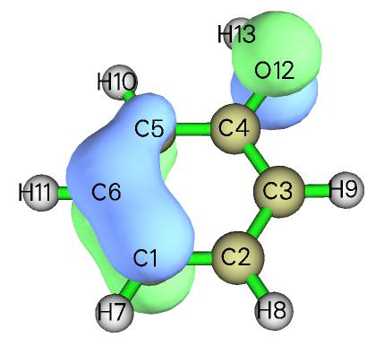
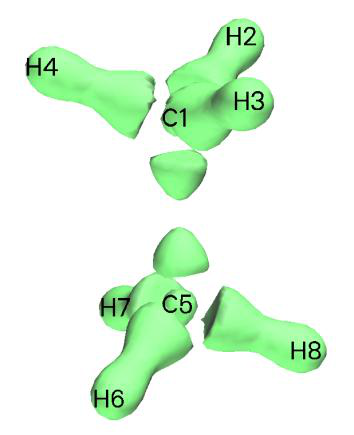
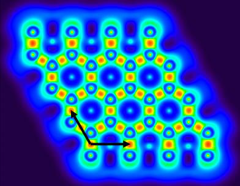
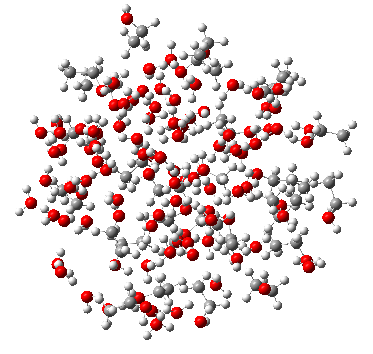
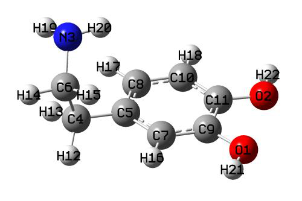
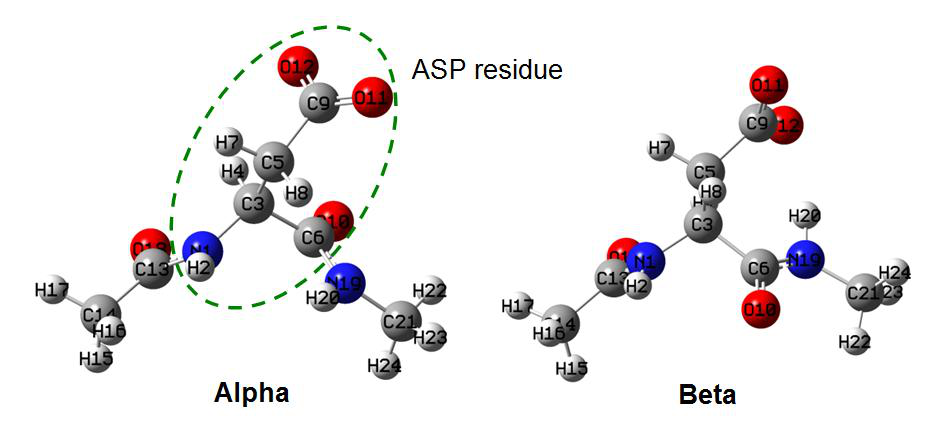
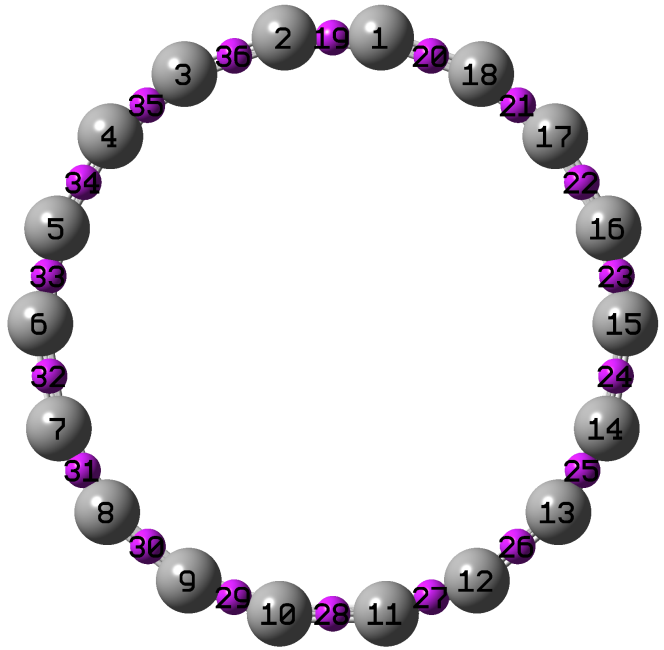
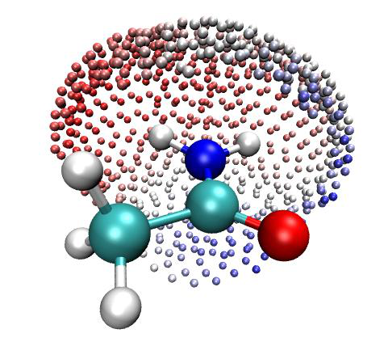
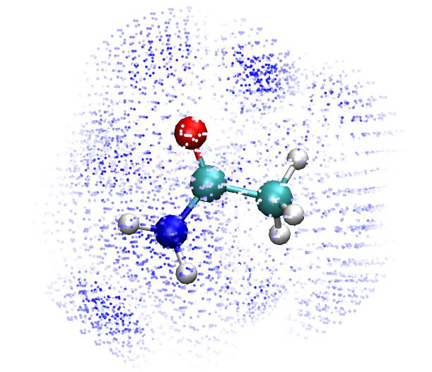

# Multiwfn：教程 4.0–4.8（中文）

> 序言、输入文件、轨道显示、点性质、拓扑实例、直线/平面作图、格点数据、波函数修改、布居电荷、轨道成分

> 英文原文见同目录 `06_教程4.0-4.8.md`｜图片目录：`../imgs/`

---

<!-- p.458 -->


# 4 教程与实例


## 前言与输入文件的生成

欢迎使用 Multiwfn！如果你还没有阅读本手册第 2 页的“ALL USERS MUST READ”，请先阅读。如果你在使用 Multiwfn 过程中遇到任何问题，欢迎在 Multiwfn 论坛发帖求助。

在开始之前，我首先向你展示如何生成各种输入文件。注意 Multiwfn 中的不同功能需要不同类型的输入文件，详见 2.5 节。简而言之，对于任何仅基于实空间函数的分析，你都可以使用 .wfn 或 .wfx 作为输入文件。然而，许多功能需要基函数信息，在这种情况下你必须使用 .mwfn、.fch/fchk、.molden 或 .gms 文件作为输入文件。由于这些文件比 .wfn/wfx 文件包含更丰富的信息（即基函数和虚轨道），原则上对于任何需要 .wfn/wfx 文件作为输入文件的功能，你也可以改用 .mwfn/fch/molden/gms。而 Multiwfn 中的少数功能（例如 AdNDP 和 ICSS 分析）依赖一些特殊文件，这些情况下对输入文件的要求已在第 3 章相应小节中明确说明。

生成 .wfn 和 .wfx 文件

- Gaussian：在路线节（route section）中写入 out=wfn，在分子坐标节之后留一空行，并写入 .wfn 文件的目标路径，例如 C:\otoboku\H2O.wfn（可参考“examples”文件夹中的 H2O.gjf），然后运行该文件。若任务正常结束，H2O.wfn 将出现在“C:\otoboku”文件夹中。

如果你想在 Gaussian 中生成 .wfx 文件（自 G09 B.01 起支持），只需在路线节中写 out=wfx 而不是 out=wfn。

如果你在 Gaussian 中使用 MCSCF，为了将自然轨道生成并导出到 .wfn 中，还应使用 pop=no 关键词。如果你使用的 Gaussian 早于 G09 C.01，请仔细阅读以下信息：

若理论方法为 post-HF 类型，还必须在路线节中添加“density”关键词以使用当前密度，否则输出到 .wfn 文件中的仍将是 HF 轨道。如果你使用 TDDFT 或 CIS 并想导出对应激发态波函数的自然轨道，同样需要指定“density”关键词。

对于基于非限制 HF 参考态的 CCD/CCSD、QCISD 或 MP2/3、MP4SDQ 任务，只有同时指定“pop=NOAB”关键词时，才会将自然自旋轨道而非空间自然轨道保存到 .wfn 文件中。Gaussian 的 TD、CI 和 MCSCF 任务不能产生自然自旋轨道。

如果你使用的 Gaussian 早于 G09 B.01，注意存在一个严重 bug，若你的任务为限制性开壳层（ROHF 和 RODFT），.wfn 文件中单占据轨道的占据数将被错误地写为 2.0，你必须用文本编辑器打开该文件，找到最后一处“OCC NO =”，然后手动将其后的值改为 1.0000000。

- GAMESS-US：在 \$CONTRL 节中添加 AIMPAC=.TRUE.。任务结束后，在由 \$SCR 环境变量定义的目录（参见 rungms 脚本）中生成的 .dat 文件将包含与 .wfn 文件格式相同的波函数信息，提取“----- TOP OF INPUT FILE FOR BADER'S AIMPAC PROGRAM -----”与“----- END OF INPUT FILE FOR BADER'S AIMPAC PROGRAM -----”之间的内容，并保存为带“.wfn”后缀的新文件。

- ORCA：只需在输入文件中使用 aim 关键词即可生成 .wfn 和 .wfx 文件，或使用命令 orca_2aim XXX 将 XXX.gbw 转换为 XXX.wfn 和 XXX.wfx。至少对于


<!-- p.459 -->


ORCA 4.1，当使用 ECP 时无法生成 .wfn 和 .wfx 文件。作为 Multiwfn 的输入文件，始终更推荐使用 .molden 文件。

至于在其他量子化学软件中输出 .wfn 文件的方法，请查阅相应手册。

生成 .fch 文件

- Gaussian：先运行一个例如带“%chk=test.chk”的 Gaussian 任务以产生二进制 checkpoint 文件 test.chk 文件，再运行命令 formchk test.chk 将 test.chk 转换为 test.fch。

注：.fch 与 .fchk 格式没有区别。前者与后者分别是 Windows 版和 Linux 版 Gaussian 的格式化 checkpoint 文件的默认扩展名。你可以将二者中的任一种作为 Multiwfn 的输入文件。

进行 post-HF 任务时，Gaussian .fch 文件中默认记录的轨道和占据数都是 HF 的，因此 Multiwfn 分析结果与 HF 相同。类似地，在默认情况下，基于 TDDFT 任务产生的 .fch 文件的分析结果与基态 DFT 波函数相同。要分析 post-HF 波函数或 TDDFT 激发态波函数，应使用相应级别的自然轨道（NOs）进行分析，有两种方法可以得到它们：

(1) 利用主功能 200（main function 200）的子功能 16（subfunction 16）让 Multiwfn 生成自然轨道（或自旋自然轨道，自然自旋轨道）。详见 3.200.16 节。该方法非常方便，推荐使用。

(2) 让 Gaussian 将自然轨道写入 .fch 文件。应先用“density”关键词进行 post-HF 或 TDDFT 任务，然后仅用路线节中的“guess (save,only,naturalorbitals) chkbasis”重新运行该任务。注意 Gaussian 会把轨道占据数填入 .fch 文件中的轨道能量字段，因此应在 .fch 文件第一行写入“saveNO”，以让 Multiwfn 知晓该行为。若你进行的是开壳层 post-HF 计算，即使经过上述过程也无法将自然自旋轨道正确存入 .fch 文件。一般而言，我强烈推荐使用 .wfn/.wfx 文件查看自然轨道并对 post-HF 波函数进行实空间函数分析。

对于 MCSCF 计算，应载入生成的 .fch 文件，并用主功能 200 的子功能 16 生成包含 MCSCF 级别 NOs 的 .molden 文件，再将此 .molden 文件作为输入文件。由于 MCSCF 的 alpha 与 beta 轨道不能分别生成，对于自旋多重度大于 1 的体系，必须手动打开 .fch 文件，将“Number of beta electrons”设为与“Number of alpha electrons”相同的值，以使 Multiwfn 识别出输入文件中只有一套轨道。

- Q-Chem：在 $rem 字段中写入 GUI 2，任务结束后，你将在当前文件夹中找到生成的 .fchk 文件。注意若你使用的是相当旧的版本（可能 ≤5.0）的 Q-Chem，在将 .fchk 文件载入 Multiwfn 之前，必须将 `settings.ini` 中的“ifchprog”设为 2。

- PSI4：目前最新版（非旧版）PSI4 产生的 .fchk 文件与 Multiwfn 兼容。examples\psi4_fch.inp 是在 B3LYP/6-31G** 级别生成 .fchk 文件的示例文件。在 4.A.8 节中，我还展示了如何基于 PSI4 的 .fchk 文件分析 post-HF 波函数。

生成 .molden 文件
- ORCA：使用命令 orca_2mkl XX -molden 将 XX.gbw 转换为 Molden 输入文件

XX.molden.input。你无需再手动将后缀从 .molden.input 改为 .molden，因为前者同样可被 Multiwfn 识别。你也可以将 `settings.ini` 中的“orca_2mklpath”设为 ORCA 文件夹中 orca_2mkl 可执行文件的实际路径，


<!-- p.460 -->


则 Multiwfn 将能直接载入 .gbw 文件。
- Molpro：在输入文件最后一行添加诸如 put,molden,ltwd.molden 的语句，计算结束后将产生 Molden

输入文件 ltwd.molden。
- Dalton：计算结束时程序会自动输出 .molden 文件。该文件

为 .tar.gz 包中的 molden.inp。此文件可直接载入，无需更改后缀。
- NWChem：示例输入文件为 examples\NWChem_molden.nw。运行

后，.molden 文件将生成在当前文件夹中。注意必须使用球谐基函数（即“spherical”关键词），且当体系具有点群对称性时必须使用“noautosym”关键词。
- MRCC：一旦计算正常结束，当前

文件夹中将生成名为 MOLDEN 的文件。然后重命名使其具有 .molden 后缀。4.A.8 节中给出了一个例子。
- xtb：运行带“--molden”选项的 xtb，则当前文件夹中将生成 molden.input。
- 其他程序：请查阅相应手册。

当使用赝势且需要做与核电荷有关的一些分析时，别忘了手动将 .molden 文件中的原子序号改为核电荷，详见 2.5 节。

注：目前仅正式支持由 Molpro、ORCA、xtb、Dalton、NWChem、MRCC、deMon2k、BDF 程序生成的 Molden 输入文件。若文件由其他程序生成，结果可能正确也可能不正确，因为众多程序产生的文件不规范或存在问题。幸运的是，molden2aim 工具能够处理更广泛程序产生的 Molden 输入文件，并输出标准化的 Molden 输入文件，该文件随后即可用作 Multiwfn 输入文件。详见 5.1 节。

生成 .gms 文件 GAMESS-US 和 Firefly（旧称 PC-GAMESS）输出文件也可用作 Multiwfn 输入文件，需将其后缀改为 .gms 以便 Multiwfn 识别。目前，我只能保证以默认 NPRINT 选项进行 HF/DFT 计算的输出文件可被 Multiwfn 正常载入。GAMESS-US 的输入与输出文件示例分别作为 GAMESS_US.inp 和 UKS_cc-pVDZ.gms 提供在 examples 文件夹中。

现在开始吧！注意 4.x 节中的例子与主功能 x 相关，因此你可以快速找到所需的例子。4.A 节包括专题与高级教程，其中可能涉及多个功能和一些高级技巧，例如研究芳香性和弱相互作用。这些例子中涉及的几乎所有文件都可在“examples”文件夹中找到。// 之后的所有文字均为注释，不应作为命令输入。本章教程仅涵盖 Multiwfn 的基本应用，若想了解更多功能和更多选项的用法，请阅读第 3 章相应小节，并尝试例子中未提到的选项。

对于大多数例子，我采用 .fch 或 .wfn 作为输入文件格式，但这绝不意味着这些功能只能接受这两种格式！如果你已读过 2.5 节，一定知道如何为不同功能恰当选择输入文件格式。

PS1：若想分析高于 CCSD 级别的波函数，建议阅读 4.A.8 节，你将需要 ORCA、PSI4 或 MRCC 程序。

PS2：在第 4 章中，涉及我的许多中文博客文章，它们常包含扩展讨论和更多例子。若你读不懂中文，可尝试使用 Google 翻译（例如，可安装名为“Google translator for Firefox”的 Mozilla Firefox 插件。成功安装后，你会在 Firefox 工具栏中发现一个“T”图标。现在打开


<!-- p.461 -->


所需的网页链接，点击“T”图标，即可看到译为所需语言的全文）。

PS3：若你能读中文，阅读这三篇文章将非常有帮助：“Multiwfn 上手小技巧”（http://sobereva.com/167）、“Multiwfn FAQ”（http://sobereva.com/452）以及“多功能波函数分析程序 Multiwfn 的意义、功能与用途”（http://sobereva.com/184）。


## 4.0 查看轨道与结构

在本节中，我将首先介绍如何使用内置界面可视化各种轨道，然后在 4.0.3 节中，我将展示如何将 Multiwfn 与 VMD 联用，轻松快速地绘制高质量的轨道图形。


### 4.0.1 查看环庚三烯的分子轨道

启动 Multiwfn，输入 examples\cycloheptatriene.fch 并按 ENTER 键，然后选择主功能 0（main function 0），将弹出一个 GUI 窗口，同时所有原子坐标信息以及特征分子轨道的基本信息会打印在 Multiwfn 控制台窗口中。

你可通过滚动鼠标滚轮放大/缩小体系，通过点击 GUI 右侧的 Up/Down/Left/Right 按钮旋转体系；也可在绘图区用鼠标左键拖动体系以自由旋转；还可按住 Ctrl 键并用鼠标左键水平和竖直拖动体系，以分别实现沿屏幕旋转和放大/缩小；此外，还可按住 Shift 键拖动体系以平移。注意若你使用 Linux 版，须先单击一次绘图区使图标变为手形，上述鼠标拖动操作才可用。

你还可通过 GUI 右侧的相应控件调整成键阈值、调整原子球与标签大小、将图形保存为图像文件等。详见 3.2 节


<!-- p.462 -->


了解更多信息。

右下角列表中的数字为轨道序号，你可通过选择相应序号，或在文本框中直接输入轨道序号再按 ENTER 键，来查看轨道等值面。注意若体系为非限制开壳层，要选择 beta 轨道应输入负序号，例如，-5 对应第 5 个 beta 轨道。在此窗口中同时绘制两个轨道也是可能的，如 4.0.2 节所示。

为方便起见，若输入文件记录的是 R/U/RO(HF/KS) 波函数，可在右下角文本框中直接输入轨道标记。例如，输入 h 表示选择 HOMO，l+2 对应 LUMO+2，la 对应 alpha 的 LUMO，hb-3 对应 beta 的 HOMO-3，等等。

绿色与蓝色等值面分别对应正值与负值部分。等值面值可通过拖动滑动条调节，也可通过 GUI 顶部“Other settings（其他设置）”下拉列表中的“Set isovalue（设置等值面值）”选项输入其值。等值面风格与颜色可通过“Isosur#1 style（等值面#1 风格）”中的相应子选项更改。等值面质量可通过菜单中的“Isosur. quality（等值面质量）”选项设置。

选择“Orbital info.（轨道信息）”-“Show all（显示全部）”，所有轨道的能量、占据数与类型将显示在 Multiwfn 控制台窗口中。若不想显示太多高能虚 MO，可选择“Show up to LUMO+10（显示至 LUMO+10）”或“Show occupied orbitals（显示占据轨道）”。若载入的 .mwfn/molden/gms 文件中记录了不可约表示，则它们将显示在最后一列。

菜单栏的“Other settings（其他设置）”与“Tools（工具）”中有许多有用选项，请逐一尝试，遇到疑惑时参见 3.2 节的说明。“Tools（工具）”-“Batch plotting orbitals（批量绘制轨道）”相当值得注意，通过该工具可非常方便地将大量选定轨道分别保存为当前文件夹中的图像文件，视频演示见 https://youtu.be/SHwrQhqBHZ0。

若想绘制轨道的概率密度而非其波函数，可选择“Other settings（其他设置）”-“Choose plotting wavefunction or density（选择绘制波函数或密度）”，再选择“Density（密度）”。

要关闭窗口，点击“RETURN”按钮。关于此界面的更详细说明见 3.2 节。

注：用 Multiwfn 的主功能 0 可视化 Rydberg 轨道的等值面也是可能的，但由于它们非常弥散，为避免等值面被截断，应在菜单中选择“Other settings（其他设置）”-“Set extension distance（设置扩展距离）”，再输入相对较大的值，例如 12（单位为 Bohr），然后选择轨道进行可视化。扩展距离的默认值由 `settings.ini` 中的“Aug3D”控制。在 4.200.5 节第二部分给出了可视化 Rydberg 轨道的例子。

提示：获得美观轨道等值面图的推荐步骤

- 进入主功能 0，选择要可视化的轨道，恰当设置等值面值
- 点击“Show Labels（显示标签）”以关闭坐标轴
- 恰当调整视角
- 恰当改变原子标签大小。注意标签类型可通过菜单栏“Other settings（其他设置）”中的“Set atomic label type（设置原子标签类型）”更改

- 若等值面的渲染效果不太好，用“Other settings（其他设置）”中的“Set lighting（设置光照）”调节光照。

- 在菜单栏选择“Isosur. quality（等值面质量）”，设为“high-quality（高质量）”（中等大小体系）或“very high-quality（超高质量）”（大体系）。

- 点击“Save picture（保存图片）”。用诸如 Irfanview 或 Photoshop 程序打开它，将图像文件尺寸缩小至 50%（此过程会自动重采样，从而有效实现抗锯齿


<!-- p.463 -->


效果），然后恰当裁剪图形。

下面是经上述步骤得到的一个例子，质量相当好

建议使用“face+mesh（面+网格）”绘制风格而非默认的“solid face（实心面）”，因为此时保存的图片将更具立体感。


### 4.0.2 查看乙醇的自然键轨道（NBO）

查看 NBO 有两种方法，若你是 Gaussian 用户，方法 2 可能更方便，但若还需查看自然杂化轨道（NHO）或自然原子轨道（NAO）或 NBO 程序产生的其他类型轨道，则必须用方法 1。

方法 1：使用 NBO 绘图文件 通常的方法是生成 NBO 绘图文件（.31~.40）并载入 Multiwfn。要用 Gaussian 生成这些文件，应在路线节中添加 pop=nboread，即表示输入文件末尾的 NBO 关键词将被传递给 NBO 模块（Gaussian 中的 Link 607），然后在输入文件末尾添加例如 $NBO plot file=C:\NH2COH $END，并在其前留一空行，可参考“example”目录中的 NH2COH_NBO.gjf。用 Gaussian 运行该输入文件，你会发现 C:\ 文件夹中已生成 NH2COH.31、NH2COH.32 ... NH2COH.41。“example”文件夹中已提供了 NH2COH.31 与 NH2COH.37。现在启动 Multiwfn 并输入以下命令

examples\NH2COH.31 // .31 文件包含绘图所需的基函数信息 examples\NH2COH.37 // .37 文件包含 NBO 信息。.32~.40 文件分别对应 PNAO/NAO/PNHO/NHO/PNBO/NBO/PNLMO/NLMO/MO。提示：你可只输入 37，因为在本例中 .37 与 .31 文件同名

0 // 进入 GUI 你可从右下角列表中选择相应的 NBO 轨道以查看等值面。Multiwfn 还能同时绘制两个轨道，例如，这里我们将绘制 NBO 12 与 NBO 56，它们分别对应氮原子的占据孤对与碳氧之间的非占据反 π 键。首先，我们从轨道列表中选择 12 以绘制 NBO 12，然后点击“Show+Sel. isosur#2（显示+选择等值面#2）”，之后在列表中点击 56，你将看到 NBO 12 与 NBO 56 同时显示。NBO 56（等值面#2）的黄绿色与紫色部分分别对应正值与负值部分。


<!-- p.464 -->


从实心面图形很难研究两个轨道间的重叠程度，因此我们在“Isosur#1 style（等值面#1 风格）”及其在“Isosur#2 style（等值面#2 风格）”中的对应项里选择“Use mesh（使用网格）”，使两个等值面以网格表示，见下图。（也请尝试“transparent face（透明面）”风格）此时重叠程度变得清晰，可见 NBO 12 与 NBO 56 明显重叠，由此产生的强离域是二者间二阶微扰能很大（约 60 kcal/mol）的主要原因之一。在 4.4.5 节中，你将学到如何为这两个轨道获得等值线图。

注意对于非限制计算，Gaussian 中 NBO 3.1 模块输出的 .32 与 .33 文件不正确——缺少标题部分，这会导致奇怪的结果，应参考诸如 .34 的其他绘图文件进行修复，非常容易。

关于在其他量子化学软件中向 NBO 模块传递生成 NBO 绘图文件所需关键词的方法，请查阅相应手册。也可使用独立版 NBO 程序（GENNBO）生成 NBO 绘图文件，需先准备输入文件（.47）。要生成它，应先将包含基函数信息的文件载入 Multiwfn，再进入主功能 100（main function 100），选择子功能 2（subfunction 2），然后选择相应选项导出 .47 文件。之后，在 .47 文件的“\$NBO”与“\$END”之间手动添加 plot 关键词。再用 GENNBO 程序运行 .47 文件，即可得到 NBO 绘图文件。

方法 2：以 .fch 文件作为 NBO 信息载体 Gaussian 提供了 pop=saveNBO 关键词，若在 Gaussian 输入文件中添加它，NBO 将被存入 checkpoint 文件而非 MO。可用相应的 .fch 文件作为 Multiwfn


<!-- p.465 -->


输入文件以查看 NBO。若任务的理论级别为 HF 或 DFT，应在 .fch 文件第一行添加 saveNBOene；若使用 post-HF 方法且同时指定了 density 关键词，应在 .fch 文件第一行添加 saveNBOocc，此时 Multiwfn 将在内部做一些特殊处理。不过，若目的仅是在主功能 0 中查看 NBO，可忽略此步。

注意 Gaussian 在将 NBO 存入 checkpoint 文件时可能会自动重排。例如，你可能在 Gaussian 输出文件中看到如下信息：


```text
Reordering of NBOs for storage:     7    8    3    1    2    4    6    5    9   38 ...
```

即 .chk/.fch 文件中的第 1、2、3、4 ... 个轨道实际上分别对应 NBO 模块产生的第 7、8、3、1 ... 个 NBO。

值得一提的是，若将 Multiwfn 与 VMD 联用，可绘制非常漂亮的 NBO 等值面图，详见我的博客文章“使用 Multiwfn 绘制 NBO 及相关轨道”（中文，http://sobereva.com/134）。下图是某 Multiwfn 用户在其工作 J. Mol. Graph. Model., 59, 31 (2015) 中绘制的图。


### 4.0.3 使用 Multiwfn + VMD 快速绘制高质量轨道


### 等值面图

注：本教程的中文版是我的博客文章“使用 Multiwfn+VMD 快速绘制高质量分子轨道等值面图”（http://sobereva.com/447）与“用 VMD 结合 Multiwfn 绘制最美观轨道等值面图的方法”（http://sobereva.com/449）。

与本节对应的视频演示见 https://youtu.be/-3TXfdO8H7s，请务必观看！！！

前言 若利用 Multiwfn 为感兴趣的轨道导出 cube 文件，再在 VMD（http://www.ks.uiuc.edu/Research/vmd/）中渲染为等值面图，可得到非常理想的轨道等值面图，该过程已在我的博客文章“使用 Multiwfn 可视化分子轨道”（中文，http://sobereva.com/269）中详细描述。然而该文章介绍的过程略显冗长，需要许多手动操作。为了尽量简化过程，这里我展示如何用脚本非常轻松快速地联用 Multiwfn 与 VMD 绘制高质量轨道等值面图。本节仅 illustrate 如何绘制 MO，但同样过程也可用于绘制其他种类轨道，只是需恰当修改输入流文件（见下文）。若不知如何在静默模式下运行 Multiwfn，建议先阅读 5.2 节，以便更好理解本节。这里假设你使用 Windows 系统，对于 Linux 平台应手动编写相应脚本。这里使用的 VMD 程序为 1.9.3 版。


<!-- p.466 -->


准备工作 将 showorb.bat 与 showorb.txt 从“examples\scripts”复制到含 Multiwfn 可执行文件的文件夹中。

showorb.bat 为 Windows 批处理文件，用于调用 Multiwfn 计算所选轨道的波函数格点数据，再将导出的 cube 文件移至 VMD 文件夹。应手动编辑此文件，使输入文件路径对应输入文件的实际路径，并将此文件中的 VMD 文件夹替换为你机器中的实际 VMD 文件夹。

showorb.txt 为输入流文件，每行对应需在 Multiwfn 交互界面中输入的命令。应手动将第三行设为你想绘制的轨道序号，例如 10,20-23,28-30。

“examples\scripts”中的 showorb.vmd 为 VMD 绘图脚本，应将其复制到 VMD 文件夹，再将 source showorb.vmd 添加到 VMD 文件夹中 vmd.rc 文件的末尾，以便 VMD 启动时自动执行该脚本。此脚本定义了三个自定义命令：

·orb i：用于载入轨道 i 的 cube 文件并以等值面显示。默认等值面值为 0.05，可通过编辑 showorb.vmd 更改

·orbiso x：用于将等值面值改为 x。 ·orbclean：用于删除 VMD 文件夹中的所有轨道 cube 文件。

示例 这里我们为 examples\excit\D-pi-A.fchk 绘制 MO。确保所有准备工作已完成，然后编辑 showorb.bat，将默认输入文件 1.fch 替换为 examples\excit\D-pi-A.fchk，并确保此文件中已正确指定实际 VMD 文件夹。然后打开 showorb.txt，将第三行设为 54-59，以便可视化 54 至 59 的 MO。然后双击 showorb.bat，Multiwfn 将被调用以载入输入文件，计算并导出所选轨道波函数的格点数据。例如对于轨道 54，导出文件将被命名为 orb000054.cub。所有轨道 cube 文件随后自动移至 VMD 文件夹。之后，启动 VMD，在 VMD 控制台窗口输入 orb 56，则 orb000056.cub 将被载入 VMD 并绘制为等值面：

上图中，正负相分别以红蓝两色表示。默认使用“Glossy”材质。若想更改颜色或材质，应进入“Graphics”-“Representation”修改相应选项。也可通过修改 showorb.vmd 脚本更改默认颜色与材质。

若随后想可视化另一轨道，例如 MO54，只需在 VMD 控制台窗口输入 orb 54。

若想将等值面值改为例如 0.02，只需输入 orbiso 0.02。


<!-- p.467 -->


若可视化后想清除 VMD 文件夹中的所有轨道 cube 文件，只需输入 orbclean，则所有 orb??????.cub 文件将被删除。

默认使用“medium-quality grid（中等质量格点）”（约 512000 点）计算轨道波函数，这对中小体系足够。但对大体系，例如含一百个以上原子的体系，必须使用更多格点数。若想将默认格点改为“high-quality grid（高质量格点）”，应将 showorb.txt 中的第四行设为 3。此外，如 4.0.1 节所述，可视化 Rydberg 轨道时必须增大格点数据的扩展距离。为此，应在 showorb.txt 第三与第四行之间添加


```text
-10
12
```

则扩展距离将从默认值增大至 12 Bohr。

绘制高质量轨道等值面图 若想得到更优质的轨道等值面图，只需按以下过程操作（请用 VMD 1.9.3，切勿用其他 VMD 版本！）：

(1) 如上所述在 VMD 中绘制一个轨道 (2) 将 examples\scripts\VMDrender.txt 中的全部内容复制到 VMD 控制台窗口以修改绘制设置

(3) 在 VMD 中选择“File”-“Render”-“Tachyon”，点击“Start Rendering”。然后 VMD 文件夹中将出现 vmdscene.dat，它是 Tachyon 渲染器的输入文件。

(4) 将 examples\scripts\VMDrender_full.bat 复制到 VMD 文件夹 (5) 双击 VMDrender_full.bat，则 VMD 文件夹中的 Tachyon 渲染器（tachyon_WIN32.exe）将被调用执行渲染。稍后，VMD 文件夹中出现 full.bmp，即生成的图像文件。

examples\excit\D-pi-A.fchk 的 MO56 的渲染图像如下所示，图形极其精美！

渲染对大体系耗时相当长。为节省时间，可用 VMDrender_noshadow.bat 代替 VMDrender_full.bat，此时生成图形中无阴影效果，而渲染开销相应降低。

有时，尤其对大体系，透明轨道等值面投下的阴影使图形显得太暗，可在 .bat 文件中手动添加 -shadow_filter_off 参数以在渲染时关闭此类阴影。


<!-- p.468 -->


## 4.1 计算某点处的性质


### 4.1.1 显示三重态水在给定点处的所有性质

本例 illustrate 如何为三重态水计算给定点处的多种实空间函数。启动 Multiwfn 并输入以下命令

examples\H2O_m3ub3lyp.wfn 1 // 主功能 1，显示某点处的性质 0.2,2.1,2 // 该点的 X、Y、Z 坐标 1 // 输入坐标的单位为 Bohr 此时 Multiwfn 支持的所有实空间函数在该点处的值连同电子密度梯度/Laplacian 分量、Hessian 矩阵及其本征值/本征向量一并打印。若不能完全理解输出，请仔细阅读 2.6 与 2.7 节，输出中的所有术语都有非常详细的描述。


```text
Note: Unless otherwise specified, all units are in a.u.
 Density of all electrons:  0.4598301528E-02
 Density of Alpha electrons:  0.2861566387E-02
 Density of Beta electrons:  0.1736735141E-02
 Spin density of electrons:  0.1124831246E-02
 Lagrangian kinetic energy G(r):  0.3365319167E-02
 G(r) in X,Y,Z:  0.1342141336E-03  0.1888713104E-02  0.1342391929E-02
 Hamiltonian kinetic energy K(r):  0.1088761528E-03
 Potential energy density V(r): -0.3474195320E-02
 Energy density E(r) or H(r): -0.1088761528E-03
 Laplacian of electron density:  0.1302577206E-01
 Electron localization function (ELF):  0.1998328717E+00
 Localized orbital locator (LOL):  0.1008002781E+00
 Local information entropy:  0.3533635333E-02
 Interaction region indicator (IRI):  0.3583198766E+01
 Reduced density gradient (RDG):  0.2033111359E+01
 Reduced density gradient with promolecular approximation:  0.2294831921E+01
 Sign(lambda2)*rho: -0.4598301528E-02
 Sign(lambda2)*rho with promolecular approximation: -0.3918852312E-02
 Corr. hole for alpha, ref.:   0.00000   0.00000   0.00000 : -0.1251859403E-03
 Source function, ref.:   0.00000   0.00000   0.00000 : -0.3565867942E-03
 Wavefunction value for orbital       1 :  0.1536978161E-03
 Average local ionization energy (ALIE):  0.4664637535E+00
 van der Waals potential (probe atom: C ):  0.5566195299E+04 kcal/mol
 Delta-g (under promolecular approximation):  0.3210501179E-03
 Delta-g (under Hirshfeld partition):  0.2394976411E-03
 User-defined real space function:  0.1000000000E+01
 ESP from nuclear charges:  0.3453377860E+01
```


<!-- p.469 -->


```text
 Total ESP:  0.1431404144E-01 a.u. ( 0.3895049E+00 eV, 0.8982204E+01 kcal/mol)

 Note: The following information is for electron density

 Components of gradient in x/y/z are:
 -0.7919856828E-03 -0.6903543769E-02 -0.6651181972E-02
 Norm of gradient is:  0.9618959378E-02

 Components of Laplacian in x/y/z are:
 -0.3809549089E-02  0.1052804857E-01  0.6307272576E-02
 Total:  0.1302577206E-01

 Hessian matrix:
 -0.3809549089E-02  0.1394394193E-02  0.1197923973E-02
  0.1394394193E-02  0.1052804857E-01  0.1008387143E-01
  0.1197923973E-02  0.1008387143E-01  0.6307272576E-02
 Eigenvalues of Hessian: -0.3959672207E-02 -0.1883455778E-02  0.1886890004E-01
 Eigenvectors (columns) of Hessian:
  0.9964397434E+00 -0.2418531975E-01  0.8076452238E-01
 -0.4735415689E-01  0.6320255930E+00  0.7734993430E+00
 -0.6975257409E-01 -0.7745700228E+00  0.6286301443E+00
 Determinant of Hessian:  0.1407217564E-06
 Ellipticity of electron density:    1.102344
 eta index:    0.209852
 Stiffness:    0.099818

 Stress tensor:
 -0.1220815539E-02  0.1483611490E-04  0.1618000275E-04
  0.1483611490E-04 -0.1145414066E-02  0.3494514646E-04
  0.1618000275E-04  0.3494514646E-04 -0.1107965714E-02
 Eigenvalues of stress tensor: -0.1224514565E-02 -0.1166013495E-02 -0.1083667260E-02
 Eigenvectors (columns) of stress tensor:
 -0.9852173517E+00  0.7263017197E-01  0.1551503399E+00
  0.1433520595E+00  0.8453962002E+00  0.5145439259E+00
  0.9379209402E-01 -0.5291787248E+00  0.8433106903E+00
 Stress tensor stiffness:    1.129973
 Stress tensor polarizability:    0.884977
```

所有数据均以科学计数法表示，E 之后的值为指数，例如 0.6307272576E-02 对应 0.006307272576。

在“Corr. hole (correlation hole)（相关洞）”与“Source function（源函数）”行中，所谓“ref”为参考点位置，由 `settings.ini` 中的“refxyz”参数决定。

默认输出的波函数值对应轨道 1，可输入例如 o6 以选择轨道 6。


<!-- p.470 -->


默认情况下，梯度与 Laplacian 分量以及 Hessian 及其本征值/本征向量均为针对电子密度的。可输入诸如 f10 以选择序号为 10 的实空间函数（即 ELF），之后所有这些量均为针对 ELF 的。若想查询所有可用实空间函数的序号，输入 allf。

可继续输入其他坐标，当想返回上一级菜单时，输入 q；若想退出程序，按“CTRL+C”键或直接关闭命令行窗口。


### 4.1.2 计算核位置处的 ESP 以评估 H2O∙∙∙HF 的相互作用强度

这是一个高级例子，若对弱相互作用不感兴趣，可跳过本节。

在 J. Phys. Chem. A, 118, 1697 (2014) 中，Mohan 与 Suresh 研究了一批以静电为主的相互作用体系，包括氢键、卤键与双氢键，它们都属于电子给体-受体相互作用，其中给体指富电子片段（Lewis 碱），而受体为缺电子片段（Lewis 酸）。他们拟合出一条 surprisingly 好的

直线方程，将 ΔΔVn 指数与各类相互作用的相互作用能（Enb）关联起来，R2 高达 0.9762。其结果可总结为下图

对于以静电为主的复合物，假设我们能得到 ΔΔVn，则根据上图所示方程，可轻松预测相互作用能为


$$E_{\mathrm{n b}}=-89.2857\times\Delta\Delta V_{\mathrm{n}}-0.125$$

<!-- formula-ocr: formula_p470_336.png 已替换为LaTeX, 原图保留备查 -->

ΔΔVn 基于核位置处的 ESP 定义为

$$\Delta\Delta V_{\mathrm{n}}=\Delta V_{\mathrm{n-D}}-\Delta V_{\mathrm{n-A}}=(V_{\mathrm{n-D^{\prime}}}-V_{\mathrm{n-D}})-(V_{\mathrm{n-A^{\prime}}}-V_{\mathrm{n-A}})$$

其中 Vn-D' 为复合物环境中给体原子核位置处的 ESP，但忽略该给体原子核的贡献。Vn-D 与 Vn-

D' 的唯一区别在于前者在单体状态下计算，因此 ΔVn-D = Vn-D' - Vn-D 可视为


<!-- p.471 -->


由于另一分子的存在而引起的给体原子核位置处 ESP 的变化，它直接反映分子间相互作用的强度。Vn-A' 与 Vn-A 的定义与 Vn-D'、Vn-D 完全相同，只是针对受体原子计算。

本例中，我们计算 H2O∙∙∙HF 的 ΔΔVn，并检验基于 ΔΔVn 预测的相互作用能是否真的接近精确计算的相互作用能。在此复合物中 H2O 的氧为电子给体原子，HF 的氢为电子受体原子。由于 Mohan 与 Suresh 给出的方程是针对特定计算级别拟合的，为恰当使用其方程，这里采用的计算级别与他们完全相同。下面使用的 .wfn 文件在 MP2/6-311++G** 优化几何下以 MP4(SDQ)/aug-cc-pVTZ 级别产生，这些 .wfn 文件与相应的 Gaussian 输入文件可在“examples\Vn”文件夹中找到。

注意若使用较旧版本的 G09 且采用 post-HF 方法，“density”关键词不可或缺，否则生成的 .wfn 文件中的密度将对应 Hartree-Fock 密度。此外，在 G09 与 G16 中，MP4 级别无法产生密度，因此我们改用 MP4(SDQ) 关键词（MP4 关键词默认为 MP4(SDTQ），比 MP4(SDQ）更精确但昂贵得多）。

首先，我们计算 Vn-A' 与 Vn-D'。启动 Multiwfn 并输入 examples\Vn\H2O-HF.wfn 1 // 计算某点处的性质 a1 // 原子 1 的核位置 从输出中可见


```text
Total ESP without contribution from nuclear charge of atom     1:
-0.2228775074E+02 a.u. ( -0.6064805E+03 eV, -0.1398579E+05 kcal/mol)
```

即 Vn-D' 为 -22.2877 a.u.。再输入 a5，可发现 Vn-A' 为 -0.9608 a.u.。

接下来计算 Vn-D。重新启动 Multiwfn 并输入以下命令 ?H2O.wfn // 符号 ? 表示上次载入文件所在文件夹 1 a1 // H2O.wfn 中氧为原子 1 发现 Vn-D 为 -22.3339 a.u.。再计算 Vn-A。重启 Multiwfn 并输入

?HF.wfn 1 a2 // HF.wfn 中氢为原子 2 发现 Vn-A 为 -0.9136 a.u.。

于是 ΔΔVn 为 -22.2877-(-22.3339) - [-0.9608-(-0.9136)] = 0.0462 + 0.0472 = 0.0933 a.u.。用前面提到的方程，相互作用能可近似预测为

-89.2857×0.0933-0.125 = -8.45 kcal/mol，该值与 Mohan 与 Suresh 在 MP4/aug-cc-pVTZ 级别加 Counterpoise 校正得到的精确相互作用能（-8.31 kcal/mol）相当接近。

即使对如本例研究的小复合物，在 MP4(SDQ)/aug-cc-pVTZ 下产生波函数也相当耗时，因此找到一个能显著节省计算时间又不牺牲太多精度的计算级别很重要。对当前体系，基于 MP2/6-311++G** 几何，我尝试用几个级别评估 ΔΔVn：

B3LYP/6-311+G**: 0.1021 a.u. MP2/cc-pVTZ: 0.1052 a.u. MP2/aug-cc-pVTZ: 0.0955 a.u. B3LYP/aug-cc-pVTZ: 0.0985 a.u. MP2/aug-cc-pVDZ: 0.0939 a.u. B3LYP/aug-cc-pVDZ: 0.0980 a.u. 在 MP2/aug-cc-pVDZ 下产生的 ΔΔVn（0.0939）与我们上面在 MP4(SDQ)/aug-cc-pVTZ 下得到的值（0.0933）非常接近，而计算开销降低了两倍。因此，在实际研究中，


<!-- p.472 -->


用 MP2/aug-cc-pVDZ 级别评估 ΔΔVn 是非常理想的选择。


## 4.2 拓扑分析

Multiwfn 能对任何实空间函数进行拓扑分析，如电子密度及其 Laplacian 函数、ELF、LOL、轨道波函数、自旋密度、静电势等。可定位四种临界点（CPs），并轻松得到这些点处的实空间函数值；可生成连接 CPs 的拓扑路径与 basin 间表面。还有许多附加功能，详见 3.14 节。下面我将给出一些实际应用以 illustrate 如何使用这个强大模块。

注意 Multiwfn 不仅能基于波函数文件进行拓扑分析，还能基于格点数据进行，如 http://sobereva.com/wfnbbs/viewtopic.php?pid=2276 所示。因此，对由实验晶体衍射确定的电子密度进行拓扑分析也是可能的。


### 4.2.1 2-pyridoxine 2-aminopyridine 的分子中的原子（AIM）拓扑分析与芳香性


### 分析

电子密度的拓扑分析是 Bader 分子中的原子（AIM）理论的主要内容。本例中我们将对 2-pyridoxine 2-aminopyridine 复合物进行此类分析。

启动 Multiwfn 并输入以下命令 examples\2-pyridoxine_2-aminopyridine.wfn // 假设输入文件在当前目录的子目录中，可只输入相对路径而非完整绝对路径

2 // 拓扑分析 然后输入以下命令搜索所有临界点（CPs） 2 // 以核位置作为初始猜测，一般用于搜索 (3,-3) CPs 3 // 依次以每对原子的中点作为初始猜测。一般可找到所有 (3,-1) CPs，同时也可能找到一些 (3,+1) 或 (3,+3)

CPs 的搜索非常快。之后输入 0，所有找到的 CPs 的位置与类型将打印在命令行窗口中，输出末尾给出每类 CPs 的数目：


```text
(3,-3):    25,   (3,-1):    27,   (3,+1):     3,   (3,+3):     0
  25  -   27  +    3  -    0  =   1
```

第二行表明 Poincaré-Hopf 关系已满足，即可能已找到所有 CPs。


<!-- p.473 -->


若该关系不满足，则必有 CPs 缺失。从弹出的 GUI 窗口（如下图）可见所有预期的 CPs 均已呈现，因此可确认已找到所有 CPs。

点击 GUI 窗口右上角的“RETURN”按钮并输入 8 以生成拓扑路径（在当前语境中对应“bond paths（键径）”），再选择选项 0 以查看 CPs 与路径。此时从命令行窗口可直接看到与每个 BCP 相连的两个原子。在 GUI 窗口中稍作调整绘图设置后，图形如下所示（若未显示 CPs 序号，点击 GUI 右侧的“CP labels”）：


<!-- p.474 -->

上图中的品红色、橙色和黄色小球分别对应于 (3,-3)、(3,-1) 和 (3,+1) 临界点。棕色线表示键径。临界点的序号用青色标出。

$$BE\approx-332.34\times\rho(\mathbf{r}_{\mathrm{BCP}})-1.0661\ (for\ charged\ H-bond)$$

值得注意的是，临界点的标签颜色可以通过菜单栏中“临界点标注设置（CP labelling settings）”下拉列表中的“设置标签颜色（Set label color）”选项来更改。如果你只想标注某个特定的临界点，可以在“临界点标注设置（CP labelling settings）”中选择“只标注一个临界点（Labelling only one CP）”，然后输入其序号（当体系很大且存在大量临界点时，此选项对于清晰显示或查找感兴趣的临界点非常有用。如果你在此选项中不输入任何内容，则允许显示所有临界点标签）。

现在关闭图形界面窗口。拓扑分析模块提供了许多分析选项；例如，让我们测量 CP30 与 H25 原子核位置之间的距离。选择选项 -9，然后输入 c30 a25，结果为 5.877601 Å。接着我们测量 C14-N13-H12 之间的夹角，即输入 a14 a13 a12，结果为 120.297432 度。现在输入 q 返回。

评估氢键结合能 J. Comput. Chem., 40, 2868 (2019) DOI: 10.1002/jcc.26068 是一篇关于氢键的非常重要的论文，对广泛的氢键体系进行了透彻的研究和深入的分析。在这项工作中，我与合作者提出了两个极其有用且重要的方程，用于基于与氢键对应的键临界点（BCP）处的电子密度来预测氢键结合能（BE）。

𝐵𝐸≈−223.08 × 𝜌(𝐫BCP) + 0.7423 (for neutral H−bond) 𝐵𝐸≈−332.34 × 𝜌(𝐫BCP) −1.0661 (for charged H−bond)

其中 ρ 的单位为 a.u.，BE 的单位为 kcal/mol。研究表明，这些公式不仅可靠，而且具有普适性。第一个方程适用于本配合物，这里我们采用它

$$BE\approx-332.34\times\rho(\mathbf{r}_{\mathrm{BCP}})-1.0661\ (for\ charged\ H-bond)$$

选择选项 7，然后输入相应 BCP 的序号，即 53，你将看到该点处许多实空间函数的值都被显示出来：

```text
CP Position:    0.44887255865472    3.56434324597741   -0.10652884364257
CP type: (3,-1)
Density of all electrons:  0.3129478049E-01
Density of Alpha electrons:  0.1564739024E-01
Density of Beta electrons:  0.1564739024E-01
Spin density of electrons:  0.0000000000E+00
```


<!-- p.475 -->

```text
Lagrangian kinetic energy G(r):  0.2530207716E-01
Hamiltonian kinetic energy K(r):  0.8463666362E-03
Potential energy density V(r): -0.2614844379E-01
Energy density: -0.8463666362E-03
Laplacian of electron density:  0.9782284209E-01
Electron localization function (ELF):  0.1105388527E+00
... (Ignored)
```

输出表明，该 BCP 处的 ρ(r) 为 0.03129 a.u.，因此氢键结合能可估算为 BE = -223.08*0.03129+0.7423 = -6.2 kcal/mol = -26.1 kJ/mol。

同样值得注意的是，在 Chem. Phys. Lett., 285, 170 (1998) 中，Espinosa 及其合作者

$$BE=V(\mathbf{r}_{BCP})/2$$

BE=V(rBCP)/2

如上述输出所示，N23-H25····O1 的 BCP 处的 V(r) 为 -0.026148，因此可预测 BE 为 -0.026148/2*2625.5 = -34.3 kJ/mol，这与使用 J. Comput. Chem. (2019) 论文中提出的预测方程得到的 -26 kJ/mol 有显著差异。哪一个更准确？正如在 J. Comput. Chem. 文章中严格证明的那样，流行的 V(rBCP)/2 方程实际上具有明显更大的误差，因此不能被推荐；换言之，-26.1 kJ/mol 的 BE 应该更为可靠。

基于临界点性质评估芳香性 在本部分，我们使用拓扑分析模块中的两个特殊选项来评估芳香性。如果你对该主题不感兴趣，可以跳过。

首先，我们使用信息熵方法来检验二聚体中的氨基吡啶（上图中左侧的单体）是否可以被视为芳香性分子。该方法在 Phys. Chem. Chem. Phys., 12, 4742 (2010) 中提出，基于环上 BCP 处的电子密度，详见 3.14.6 节。首先，我们选择选项“20 计算 Shannon 芳香性指数（Calculate Shannon aromaticity index）”，然后输入环中 BCP 的序号，即 44,42,32,29,31,40，输出的 Shannon 芳香性指数（SA）为 0.000812。SA 指数越小，环的芳香性越强。在原文中，选择 0.003 < SA < 0.005 作为芳香性/反芳香性的分界。由于我们的结果远小于 0.003，我们可以得出结论，氨基吡啶是芳香性分子。2-吡啶酮（上图中右侧的单体）的 SA 为 0.000865，因此显示出比氨基吡啶稍弱的芳香性。

接下来，我们计算环临界点（RCP）处垂直于环平面的电子密度的曲率。在 Can. J. Chem., 75, 1174 (1997) 中表明，更负的曲率意味着更强的芳香性。我们首先计算氨基吡啶的曲率。选择选项“21 计算沿给定方向的电子密度梯度和曲率（Calculate gradient and curvature of electron density along a given direction）”，输入 RCP 的序号（即 36），选择模式 2，然后输入至少三个原子以拟合环平面，这里我们输入 15,13,17。从输出中我们发现曲率为 -0.0187 a.u.。然后我们计算 2-吡啶酮的曲率（CP41，使用原子 2, 7, 4 定义平面），结果为 -0.0164 a.u.。两个曲率的比较再次表明氨基吡啶具有更强的芳香性。在 Multiwfn 中，还可以通过许多其他方案来衡量芳香性，如 HOMA、FLU、PDI、ELF-π 和多中心键级，它们在 4.A.3 节中集中讨论。

生成盆间表面 盆间表面（IBS）将整个分子空间分割成各个独立的盆，每个 IBS 实际上是一束从 (3,-1) 临界点发出的梯度线。现在我们生成与之对应的 IBS

<!-- p.476 -->

即序号为 53、38 和 37 的 (3,-1) 临界点。选择功能 10，并输入

53 // 生成与序号为 33 的 (3,-1) 临界点对应的 IBS，如下同。对于每个 IBS 的生成，你可能需要等待几秒钟

38 37 q // 返回 通过选择功能 0 来可视化结果，图形将如下所示。这三个曲面即为 IBS。

在 4.20.1 节中，我们将使用另一种重要的弱相互作用分析方法 NCI 来进一步研究该体系。

你可能会觉得当前用于显示临界点和拓扑路径的 Multiwfn 图形界面对于大体系使用起来有些困难，因为体系无法完全流畅地旋转，有时感兴趣临界点的序号难以观察到。在 4.2.5 节中，我将介绍如何基于 Multiwfn 的输出使用强大的 VMD 程序来非常方便地绘制临界点和拓扑路径，在这种情况下图形非常美观，视角完全可控，感兴趣临界点的序号也很容易找到。

关于 AIM 拓扑分析，我想提及两点重要事项，尽管它们与本例无关。

如果电子密度的某些临界点未能成功定位，我该怎么办？对于小体系，通常可以通过进入图形界面并可视化临界点的分布来检查是否所有临界点都已被定位。还有一个有用的方程，称为 Poincaré-Hopf 关系。对于孤立体系，该关系为

1CCPRCPBCPNCP=−+−nnnn

如果所有临界点都已被找到，该关系必须满足，但满足该关系并不一定意味着所有临界点都已被找到。如果 Poincaré-Hopf 关系不满足，则必定缺少某些临界点。


<!-- p.477 -->

有时，你可能会发现在搜索后一些预期的临界点未能成功定位。造成此问题有两个可能的原因：(1) 初始猜测位置与临界点不够接近 (2) 默认的临界点搜索参数不太适合当前情况。有一些常用方法可以解决此问题，如下所示。更详细的描述可在 3.14.2 节中找到。

a) 如果你已尝试过选项 2~5 而仍有某些临界点未被定位，尝试使用选项 6 的子选项 -1。这种搜索模式功能强大但开销较大，默认在每个原子周围的球形区域内放置 1000 个起始点。如果重复此模式数次后缺失的临界点仍无法定位，则很可能是由于搜索参数不合适，而非起始点位置的原因。

b) 如果某些键临界点（BCP）无法定位，你可以进入选项 -1，将步长的缩放因子设为 0.5，然后重试

c) 特重原子的核临界点（NCP）很难定位，因为在这种情况下原子核处电子密度的峰非常尖锐，因此在默认参数下搜索算法很难捕捉到 NCP。为了定位它们，你可以进入选项 -1，将梯度模和位移收敛标准放宽几个数量级，然后尝试使用选项 2 重新搜索 NCP。如果随后成功找到 NCP，不要忘记恢复原来的收敛标准。事实上，由于重原子的 NCP 几乎恰好位于原子核位置，你也可以直接进入选项 -4 并选择子选项 3，在相应的原子核位置手动添加 NCP。

d) 如果一些缺失的临界点预期出现在远离原子的区域，例如，在非常大的笼或管状体系中心处的笼临界点（CCP），请进入选项 -1，使用子选项 8 将判断 Hessian 矩阵奇异性的标准收紧几个数量级，然后重新搜索临界点。

顺便说一下，在极少数情况下，你可能会发现少数临界点出现在远离体系的意外区域，它们应该是由于数值噪声造成的人为假象。避免定位它们的一个有用方法是进入选项 -1 并选择子选项 8，将该标准增大几个数量级（例如增大到 1E-15），然后像往常一样搜索临界点。

关于特重原子电子密度的描述 特重原子（比重比 Kr 重）比轻原子带来大得多的计算负担，且相对论效应不可忽略。有两种不同的方法来描述它们。

- 使用赝势（PS）：如 2.5 节所述，如果使用 PS，但以 Gaussian 产生的 .wfx 文件作为输入文件，.wfx 文件中的 EDF（电子密度函数）字段默认将被载入 Multiwfn，它代表内层芯电子密度。对于其他类型的输入文件，如 .mwfn、.wfn、.fch、.molden 和 .gms，默认情况下 Multiwfn 会自动从内置的 EDF 库中载入适当的 EDF 信息。

当提供 EDF 信息时，电子密度的所有临界点都能被正确定位，且绝不会出现人为假象临界点，从 BCP 发出的键径能正常连接到核临界点（NCP），所有仅基于电子密度的临界点性质都将是合理的。在这种情况下，虽然可以使用大核赝势而没有问题，但我仍建议使用小核赝势，因为所得临界点位置和性质的精度必定优于使用大核赝势。

Lanl1 Lanl2, Lan2TZ/08 SDD cc-pVnZ-PP, def2 series SBKJC

Main groups Large Large L/S (optional) Small Large

<!-- p.478 -->

Transition metals Large Small L/S (optional) Small Small

如果你决定不使用 EDF 信息（详见 `settings.ini` 中的 "readEDF" 和 "isupplyEDF"），显然不可能在原子核位置找到 (3,-3) 临界点，相应地，从 BCP 发出的键径将无法连接到原子核。相反，由于内层芯密度的缺失，你可能会在原子核位置发现 (3,+3)，并且在原子核周围会出现许多不同类型的临界点，这是因为电子密度不再从原子核呈指数衰减，因此电子密度的拓扑结构变得相当复杂。然而，你可以简单地忽略那些不相关的临界点，而只关注你真正感兴趣的 BCP。

- 使用相对论哈密顿量的全电子基组：这是表示重原子电子结构最昂贵但最准确的解决方案。对于 AIM 分析，仅考虑标量相对论效应完全足够。DKH2 哈密顿量是一个非常好的选择（在 Gaussian 中，只需使用 int=DKH2 关键词即可采用，注意必须使用为 DK 计算优化的基组，例如 cc-pVDZ-DK）。

更多讨论，请参阅我的博客文章“谈谈在赝势下做波函数分析”（中文，http://sobereva.com/156）。

### 4.2.2 醋酸的定域轨道定位子（LOL）的拓扑分析

定域轨道定位子（LOL）的简介已在 2.6 节中给出。在本例中，我们将为醋酸定位其临界点并生成 LOL 的拓扑路径。采用完全相同的步骤，你也可以研究许多其他实空间函数的拓扑特征，如电子定域函数（ELF）、静电势（ESP）和电子密度的 Laplacian。

启动 Multiwfn 并输入以下命令 examples\acetic_acid.wfn 2 // 进入拓扑分析模块（Enter topology analysis module） -11 // 选择实空间函数（Select a real space function） 10 // 定域轨道定位子（LOL）(Localized orbital locator (LOL)) 注意 LOL 的分布特征比电子密度复杂得多，因此很难定位其所有临界点。幸运的是，一般来说我们只对其中一小部分 LOL 临界点感兴趣，一旦找到所有感兴趣的临界点就可以中止搜索。

我们首先使用选项“2 从原子核位置搜索临界点（Search CPs from nuclear positions）”来定位非常靠近原子核的临界点。然而，其他区域临界点的位置有些不可预测，因此必须在每个原子周围随机散布大量起始点以尝试定位这些临界点。现在，输入以下命令：

6 // 在此搜索模式下，起始点将在球形区域内随机散布，球心、半径、点数等可由用户定义。这次我们保持默认值不变

-1 // 依次以每个原子核为球心搜索临界点。由于有 8 个原子，且每个球内起始点为 1000 个，Multiwfn 将基于 8*1000 个起始点尝试搜索临界点。当然，你设置的起始点越多，在此次搜索中找到所有临界点的概率越大，但计算成本也越高

<!-- p.479 -->

-9 // 返回上一级菜单（Return to upper menu） 0 // 可视化结果（Visualize the result）

从上图中可以看出，LOL 的临界点数量非常多。实际上，在搜索中仍有一些临界点尚未找到。如果你再重复搜索一次，可能会定位到一些缺失的临界点。由于目前我们感兴趣的所有临界点都已找到，因此无需重复搜索。在图中，每个紫色小球表示一个 (3,-3) 类型的临界点，代表电子定域性的局部极大值。可以看出，CP15 描述了两个碳之间的共价键。CP8 和 CP9 对应于两个 C-O 键。CP 7、57、12 和 13 对应于氧的孤对电子。

注意，通过选项 6 定位的临界点的序号每次都不同，因为起始点的分布是完全随机的。

现在选择选项 8 生成连接 (3,-1) 和 (3,-3) 临界点的拓扑路径，然后选择选项 0 再次可视化结果。为了减轻视觉负担，可以通过适当调整相应的图形界面控件来关闭某些不感兴趣对象的显示。从下图中可以看出，拓扑路径阐明了临界点之间的内在连接关系。


<!-- p.480 -->

提示：使用最速上升算法搜索极大值的例子 对于 LOL 和 ELF，通常我们真正感兴趣的是它们的 (3,-3) 临界点，即极大值。默认的临界点搜索方法是 Newton 方法，它定位所有种类的临界点，如上所示。值得注意的是，Multiwfn 还支持其他搜索算法，其中最速上升法专门用于搜索极大值。例如，这里我们采用它来搜索醋酸的 ELF 极大值。启动 Multiwfn 并输入

examples\acetic_acid.wfn 2 // 进入拓扑分析模块（Enter topology analysis module） -11 // 选择实空间函数（Select a real space function） 9 // ELF -1 // 设置临界点搜索参数（Set CP searching parameters） 12 // 选择搜索算法（Choose searching algorithm） 3 // 最速上升（Steepest ascent） 0 // 返回（Return） 6 // 从球内一批点出发搜索临界点(Search CPs from a batch of points within sphere(s)) -1 // 依次以每个原子核为球心开始搜索（Start the search using each nucleus as sphere center in turn） -9 // 返回（Return） 0 // 可视化结果（Visualize result） 经过对绘图设置的一些调整后，你可以清楚地看到 ELF 的极大值：


<!-- p.481 -->

ELF 极大值与 LOL 极大值的分布非常相似，但也有一些显著差异。有两个 LOL 极大值代表 O1 的孤对电子，而在相应区域只有一个 ELF 极小值。此外，LOL 用一个极大值表示 C3-O4 相互作用，而在 ELF 图中有两个。

### 4.2.3 沿键径绘制实空间函数

Multiwfn 支持的所有实空间函数都可以很容易地沿拓扑路径绘制。在本例中，我们沿丁二烯端部 C-C 键的键径绘制电子密度的椭率。

首先打开 `settings.ini` 文件并将 "iuserfunc" 参数改为 30，因为第 30 个自定义函数对应于电子密度椭率，详见 2.7 节。

然后启动 Multiwfn 并输入以下命令： examples\butadiene.fch 2 // 拓扑分析（Topology analysis） 2 // 从原子核位置搜索核临界点（Search nuclear critical points from nuclear positions） 3 // 从原子对中点搜索键临界点（Search bond critical points from midpoint of atomic pairs） 8 // 生成键径（Generate bond path） 0 // 进入图形界面窗口以可视化结果（Enter GUI window to visualize result） 点击图形界面窗口右侧的“原子标签（Atom labels）”和“路径标签（Path labels）”按钮，然后我们会发现路径 5 和 6 共同构成了端部 C-C 键的键径：

点击“返回（RETURN）”关闭窗口，然后输入 -5 // 对路径的各种操作（Various operations on paths） 7 // 沿路径计算并绘制特定的实空间函数（Calculate and plot a specific real space function along a path）


<!-- p.482 -->

5,6 // 路径的序号（事实上，你也可以等价地在这里输入 c13） 100 // 自定义函数，目前对应于电子密度椭率(User-defined function, which corresponds to ellipticity of electron density currently)

沿端部 C-C 键键径的电子密度椭率曲线立即显示在屏幕上，虚线表示键临界点的位置。在图中，左端和右端分别对应于 CP3 和 CP4。同时，曲线的原始数据显示在命令行窗口中，你可以将它们复制出来，以便在 Origin 等第三方绘图工具中进一步分析或重绘。

从图中可以清楚地看出，电子密度椭率在键径中部区域为正，表现出 C-C 键的双键特征。

你还可以沿键径绘制其他实空间函数，如 ELF 和动能密度，请尝试一下。

### 4.2.4 将临界点处的性质分解为轨道贡献

许多实空间函数可以精确或近似地分解为轨道贡献。如果除轨道 i 外所有轨道的占据数都设为零，则计算出的函数值恰好对应于轨道 i 的贡献。

Multiwfn 能够在任意点将任何实空间函数分解为轨道贡献，主功能 1 和主功能 2 均支持此特性；在前者中，点的位置可由用户直接输入，而在后者中，点可选为已找到的临界点之一。在本节中，我将以 1,3-丁二烯为例说明此特性。

我们将首先检查哪些分子轨道（MO）对与端部 C-C 键对应的 BCP 有明显贡献。启动 Multiwfn 并输入

examples\butadiene.fch 2 // 拓扑分析（Topology analysis） 2 // 搜索核临界点（Search nuclear critical points） 3 // 搜索 BCP(Search BCPs) 0 // 可视化临界点（Visualize CPs）


<!-- p.483 -->

如图所示，CP13 和 CP17 是端部 C-C 键的 BCP。关闭图形界面，然后输入

7 // 显示临界点处的性质（Show properties at a CP） 13d // 分解 CP13 的性质（Decompose properties of CP13） 1 // 要分解的实空间函数为电子密度（The real space function to be decomposed is electron density） [按回车键（Press ENTER button）] // 将所有占据轨道都考虑在内，但只打印贡献最大的十个轨道(Take all occupied orbitals into account, but only print ten orbitals having largest contributions)

你将看到以下输出

```text
 Contribution from orbital    11 (occ= 2.000000):      0.107469 a.u. ( 31.34% )
 Contribution from orbital     6 (occ= 2.000000):      0.085220 a.u. ( 24.85% )
 Contribution from orbital     9 (occ= 2.000000):      0.061997 a.u. ( 18.08% )
 Contribution from orbital     5 (occ= 2.000000):      0.059119 a.u. ( 17.24% )
 Contribution from orbital    12 (occ= 2.000000):      0.011205 a.u. (  3.27% )
 Contribution from orbital    10 (occ= 2.000000):      0.008898 a.u. (  2.60% )
 Contribution from orbital     7 (occ= 2.000000):      0.004864 a.u. (  1.42% )
 Contribution from orbital     8 (occ= 2.000000):      0.003807 a.u. (  1.11% )
 Contribution from orbital     2 (occ= 2.000000):      0.000070 a.u. (  0.02% )
 Contribution from orbital     1 (occ= 2.000000):      0.000070 a.u. (  0.02% )
 Sum of above values:      0.34286855 a.u. ( 100.00% )
 Exact value:      0.34286855 a.u.
```

显然，该 BCP 处的电子密度由许多分子轨道同时贡献，最大贡献为 31.3%。如果我们将分子轨道变换为定域分子轨道（LMO），会发生什么？（关于轨道定域化和 LMO 的介绍见 3.21 节）。为检验这一点，返回主功能菜单，然后输入

19 // 轨道定域化（Orbital localization） 1 // 仅定域占据轨道（Only localize occupied orbitals） 2 // 再次进入拓扑分析功能（Enter topology analysis function again）。我们不需要重做拓扑分析，因为当你退出拓扑分析模块时，所有拓扑信息都被保留

7 // 显示临界点处的性质（Show properties at a CP） 13d // 分解 CP13 的性质（Decompose properties of CP13） 1 // 要分解的实空间函数为电子密度（The real space function to be decomposed is electron density） [按回车键（Press ENTER button）] 你将看到

```text
 Contribution from orbital    11 (occ= 2.000000):      0.339266 a.u. ( 98.95% )
```


<!-- p.484 -->

```text
 Contribution from orbital     6 (occ= 2.000000):      0.001072 a.u. (  0.31% )
 Contribution from orbital     7 (occ= 2.000000):      0.000630 a.u. (  0.18% )
...[ignored]
 Sum of above values:      0.34286855 a.u. ( 100.00% )
 Exact value:      0.34286855 a.u.
```

如图所示，目前只有一个轨道，即 LMO11，对该 BCP 做出了显著贡献。这正是我们所预期的，因为在 LMO 框架下，每个化学键通常主要仅由一个或极少数 LMO 表示。你可以使用主功能 0 可视化 LMO11：

很明显，LMO11 完全对应于端部 C-C σ 键，这就是为什么相应 BCP 的电子密度等性质完全由 LMO11 主导。

接下来，让我们检查哪些 LMO 对端部 C-C 键对应的 BCP 上方 1 Bohr 处的点有不可忽略的贡献。BCP 的序号为 13，当你选择选项 0 时，可以在控制台窗口中找到其坐标：

```text
Index               XYZ Coordinate (Bohr)                 Type
...[ignored]
  11    -2.227945085    -3.985434919     0.000000000   (3,-1)
  12    -0.041512516    -3.979859852     0.000000000   (3,-1)
  13    -1.131478160    -2.047305989     0.000000000   (3,-1)
...[ignored]
```

显然，CP13 上方 1 Bohr 处的点应为 (-1.131,-2.047,1.0)。输入以下命令

-10 // 返回主菜单（Return to main menu） 1 // 在给定点打印各种性质（Print various properties at a given point） d // 分解为轨道贡献（Decompose to orbital contributions） -1.131,-2.047,1.0 1 // 输入坐标的单位为 Bohr(The unit of inputted coordinate is Bohr) 1 // 分解电子密度（Decompose electron density） [按回车键（Press ENTER button）] 然后你将看到以下信息

```text
 Contribution from orbital    11 (occ= 2.000000):      0.110266 a.u. ( 66.33% )
 Contribution from orbital    15 (occ= 2.000000):      0.055354 a.u. ( 33.30% )
 Contribution from orbital     1 (occ= 2.000000):      0.000215 a.u. (  0.13% )
...[ignored]
Exact value:      0.16623908 a.u.
```

可以看出，不仅 LMO11，LMO15 也有明显贡献。如果你

在主功能 0 中查看此轨道，你会发现它对应于端部 C-C 键的 π 键。


<!-- p.485 -->

用类似的方法，我们接着分解中间 C-C 键的 BCP 上方 1 Bohr 处点的电子密度，结果为

```text
 Contribution from orbital    13 (occ= 2.000000):      0.097450 a.u. ( 78.20% )
 Contribution from orbital    14 (occ= 2.000000):      0.013348 a.u. ( 10.71% )
 Contribution from orbital    15 (occ= 2.000000):      0.013348 a.u. ( 10.71% )
...[others are not shown due to negligible contribution]
 Exact value:      0.12461415 a.u.
```

三个 LMO 的等值面图如下所示。

尽管 LMO 14 和 LMO 15 主要对应于边缘 C-C 键的 π 键，但它们对中间 C-C 键上方 1Å 处位置有 10.7% 的贡献，这意味着

中间 C-C 键必定也具有 π 特征，尽管比端部 C-C 键弱得多。

### 4.2.5 在 VMD 可视化程序中基于 Multiwfn 输出轻松绘制高质量 AIM 拓扑图

注 1：本教程的中文版是我的博客文章“使用 Multiwfn+VMD 快速绘制高质量 AIM 拓扑分析图”(http://sobereva.com/445)。

注 2：本节有对应的视频说明：https://youtu.be/mgsnhvWH5SI。我强烈建议观看它！！！！！！！！！！

在 4.2.1 节中，我已展示了如何对 2-吡啶酮 2-氨基吡啶复合物进行 AIM 拓扑分析，在本节中我将展示如何在非常强大且免费的 VMD 程序（http://www.ks.uiuc.edu/Research/vmd/）中非常方便地渲染已定位的临界点和生成的拓扑路径。该图非常美观，你可以轻松找到感兴趣临界点的序号。整个过程是高度自动化的，因为它是基于预先提供的 Windows 批处理文件和 VMD 绘图脚本。如果你不知道如何在静默模式下运行 Multiwfn，我强烈建议先阅读 5.2 节，以便你能完全理解批处理文件的工作原理。如果你手动编写类似的 shell 脚本，此方法在 Linux 平台下也可实现。

脚本文件 我们需要先做一些准备工作。从 "examples\scripts" 复制 AIM.bat 和 AIM.txt 到含有 Multiwfn 可执行文件的文件夹。编辑 AIM.bat，将默认的 VMD 文件夹修改为你机器上实际的 VMD 文件夹。然后将 VMD 绘图脚本 AIM.vmd 复制到 VMD 文件夹，


<!-- p.486 -->

并在 VMD 文件夹中的 vmd.rc 文件末尾添加 proc aim {} {source AIM.vmd}，这样你只需在命令中输入 aim 即可激活此脚本。

AIM.txt 是用于在静默模式下运行 Multiwfn 的输入流文件，它执行以下操作：(1) 进行标准的 AIM 分析（依次通过选项 2,3,4,5 定位临界点并生成拓扑路径）

(2) 将临界点和路径导出为当前文件夹中的 CPs.pdb 和 paths.pdb (3) 计算所有已定位临界点处除 ESP 外的所有性质，并将结果导出到当前文件夹中的 CPprop.txt (4) 将当前体系的结构导出为当前文件夹中的 mol.pdb 如果你想降低 VMD.bat 的计算成本，可以删除 VMD.txt 的第四行和第五行，在这种情况下 Multiwfn 将只尝试从原子核位置和原子对中点出发定位临界点。然而，这种处理可能会导致缺失某些临界点。

例子：2-吡啶酮_2-氨基吡啶 在本例中，我们将 examples\2-pyridoxine_2-aminopyridine.wfn 复制到含有 Multiwfn 可执行文件的文件夹，将 VMD.bat 中的输入文件名修改为 2-pyridoxine_2-aminopyridine.wfn，然后双击 VMD.bat，该批处理文件将调用 Multiwfn 根据 VMD.txt 中的命令对该 .wfn 文件进行分析。过一会儿，该文件夹中生成了 CPprop.txt，同时生成的 mol.pdb、CPs.pdb 和 paths.pdb 被自动移动到 VMD 文件夹。

现在启动 VMD 并在 VMD 控制台窗口中输入命令 aim，你将立即看到下图。

注意为了获得稍好的效果，我使用了内置的 Tachyon 渲染来得到下图，即选择“文件（File）”-“渲染（Render）”，改为“Tachyon (internal, in-memory rendering)”并点击“开始渲染（Start Rendering）”按钮（所得文件为 .tga 格式，你需要使用高级图像查看器查看它，如 IrfanView，可在 https://www.irfanview.com 免费获得）

也可以在图上同时显示分子结构。双击下图所示截图中的“D”使其变为黑色：

则分子结构将可见：


<!-- p.487 -->

显示临界点的标签 临界点的序号可以很容易地标注在图上。AIM.vmd 脚本定义了一个名为 labcp 的命令来执行此操作，用法为：

labcp [type] [label size] [offset in X] [offset in Y] “type”可以是“all”、“no”、“3n3”、“3n1”、“3p1”、“3p3”。“offset in X”和“offset in Y”用于定义标签的位置偏移，默认分别为 -0.1 和 0.0。

例子： labcp all：标注所有临界点的序号 labcp no：移除所有临界点标签 labcp 3n1 1.3：以 1.3 的尺寸标注所有 (3,-1) 临界点 labcp 3p3 1.8 -0.05 0.1：将所有 (3,+3) 临界点以 1.8 的尺寸标注，X 和 Y 方向的位置偏移分别设为 -0.05 和 0.1

对于当前体系，我们在 VMD 控制台窗口中输入 labcp 3n1 1.5 -0.1 0.1，你将看到

上图中的标签与 CPprop.txt 中的标签一一对应。例如，标签为 38 的临界点恰好对应于 CPprop.txt 中的 CP 38。显然你可以通过查看 CPprop.txt 中的相应条目轻松检查各种临界点的性质。

此外，AIM.vmd 还定义了 labcpidx 命令，用于根据序号标注特定的临界点。例如，你可以使用 labcpidx "2 7 to 10 14" 来仅标注 CP 2、7、8、9、10、14，你也可以在序号后面加上 [label size] [offset in X] [offset in Y] 选项。

显示特定的临界点 如果你想隐藏某些类型的临界点，应进入“图形（Graphics）”-“表示（Representations）”，然后将“选定分子（Selected Molecule）”切换为“CPs.pdb”，如下所示。


<!-- p.488 -->

由于在 CPs.pdb 中，C、N、O、F 原子分别用于表示 (3,-3)、(3,-1)、(3,+1)、(3,+3) 临界点，如果你想在图中隐藏 (3,+1) 和 (3,+3)，可以双击 "name O" 和 "name F" 条目使它们不可见。

此外，例如，在所有 (3,-1) 临界点中你只想显示序号为 3,5,6,7,11 的那些，你可以选择 "name N" 条目，然后在“选定原子（Selected Atoms）”框中输入 name N and serial 3 5 to 7 11 并按回车键。而如果你想将这些临界点隐藏，应输入 name N and not {serial 3 5 to 7 11}。显然，VMD 中的选择非常灵活。

显示特定的拓扑路径 也可以选择性地显示拓扑路径。从 paths.pdb 的内容中可以发现，每条路径对应于唯一的残基序号，因此你可以使用 VMD 中的 "resid" 属性来选择哪些路径可见或不可见。例如，如果你想隐藏拓扑路径 3 和 7，应进入“图形（Graphics）”-“表示（Representations）”面板，从“选定分子（Selected Molecule）”下拉框中选择 "paths.pdb"，然后在“选定原子（Selected Atoms）”框中输入 not resid 3 7。

如果你想查询拓扑路径的序号，应激活 VMD 图形窗口，按按钮 "0" 进入查询模式，然后在图形窗口中点击一条路径，则控制台窗口中显示的 "resid:" 即为路径序号。如果你想返回旋转模式，应按按钮 "r"。

### 4.2.6 以特殊方式进行拓扑分析：以 G-C...G-C 碱基对为例

由于 Multiwfn 极其灵活的设计，可以仅在你真正感兴趣的某些区域内或特定区域之间进行拓扑分析，从而显著降低总体成本，同时避免不需要的临界点。在本节中，将以下图所示的 G-C...G-C 碱基对作为实例。该体系可视为由四个片段组成。其 .wfn 文件可直接在 http://sobereva.com/multiwfn/extrafiles/GCGC.zip 下载。


<!-- p.489 -->

(1) 仅在弱相互作用区域进行 AIM 分析 首先，我展示如何仅在弱相互作用区域定位临界点并生成键径，其中电子密度必定相对较低。启动 Multiwfn 并输入

GCGC.wfn 2 // 拓扑分析（Topology analysis） 2 // 从原子核位置搜索临界点（Search CPs from nuclear positions） -1 // 设置临界点搜索参数（Set CP searching parameters） 9 // 设置保留临界点的值范围（Set value range for reserving CPs）： 0,0.1 // 在搜索过程中仅保留密度在 0~0.1 a.u. 内（即相对较低密度）的临界点(Only CPs with density within 0~0.1 a.u. (i.e. relatively low density) will be reserved during searching)

0 // 返回（Return） 3 // 从原子对中点搜索临界点（Search CPs from midpoint of atomic pairs） 8 // 生成连接 (3,-3) 和 (3,-1) 临界点的路径(Generating the paths connecting (3,-3) and (3,-1) CPs) 现在选择选项 0 可视化结果，见下图。左右两图实际上是相同的，只是右图中隐藏了分子结构。很明显，仅生成了与弱相互作用对应的 BCP 以及伴随的键径，而与化学键对应的 BCP 和键径没有得到。

如果你对环临界点(RCP，黄色小球)和笼临界点(CCP，绿色小球)不感兴趣，可以很容易地删除它们。输入以下命令：

-4 // 修改或导出临界点（Modify or export CPs） 2 // 删除某些临界点（Delete some CPs） 5 // 删除所有 (3,+1) 临界点(Delete all (3,+1) CPs) 6 // 删除所有 (3,+3) 临界点(Delete all (3,+3) CPs) 0 // 返回（Return）


<!-- p.490 -->


0 // 返回 然后如果你再次选择选项0来可视化结果，你会发现RCP和CCP已经消失了。

(2) 仅在局部空间区域内进行AIM分析 现在我说明如何仅对片段1和2进行AIM拓扑分析。启动Multiwfn并输入

GCGC.wfn 2 // 拓扑分析（Topology analysis） -1 // 设置临界点搜索参数（Set CP searching parameters） 10 // 设置在搜索模式2、3、4、5中所考虑的原子的范围(Set the range of the atoms considered in searching modes 2, 3, 4, 5) 1 // 将搜索限制在一个片段内（Confine the searching within a fragment） 1-29 // 片段1和2的原子序号范围（The atomic index range of fragments 1 and 2） 2 // 设置步长的缩放因子（Set scale factor of stepsize）。我们修改此项是因为在默认设置下，本体系中对应于C-H和N-H的某些BCP可能会缺失

0.5 // 步长将乘以0.5进行缩放（Stepsize will be scaled by 0.5） 0 // 返回（Return） 2 // 从核位置出发搜索临界点（Search CPs from nuclear positions） 3 // 从原子对中点出发搜索临界点（Search CPs from midpoint of atomic pairs） 8 // 生成连接(3,-3)和(3,-1)型临界点的路径(Generating the paths connecting (3,-3) and (3,-1) CPs) 选择选项0来可视化结果，你将看到如下图所示。显然，仅生成了与片段1和2相关的临界点和键路径，这正是我们所期望的。

(3) 仅保留连接两个特定片段的键路径和相应的BCP 有时我们只想研究两个特定片段之间的片段间相互作用，并希望完全删除所有无关的键路径和BCP，以使图形更清晰。虽然你可以通过选项-1和-2中的相应子选项分别手动删除不需要的BCP和键路径，但该过程通常很繁琐。幸运的是，在Multiwfn中有一个专门用于实现此目的的特殊选项。下面我将说明如何仅保留连接片段1和3的键路径和相应的BCP，同时删除所有其它BCP和键路径。

启动Multiwfn并输入 GCGC.wfn 2 // 拓扑分析（Topology analysis） 2 // 从核位置出发搜索临界点（Search CPs from nuclear positions）


<!-- p.491 -->


3 // 从原子对中点出发搜索临界点（Search CPs from midpoint of atomic pairs） 8 // 生成连接(3,-3)和(3,-1)型临界点的路径(Generating the paths connecting (3,-3) and (3,-1) CPs) -5 // 处理路径（Manipulate paths） 8 // 仅保留连接两个特定片段的键路径(及相应的BCP)，同时删除所有其它键路径和BCP(Only retain bond paths (and corresponding BCPs) connecting two specific fragments while delete all other bond paths and BCPs)

1-13 // 片段1中的原子序号（Atomic indices in fragment 1） 30-45 // 片段3中的原子序号（Atomic indices in fragment 3） y // 同时删除其它键路径中的BCP(Also delete BCPs in other bond paths) 然后如上所述手动删除所有(3,+1)和(3,+3)型临界点，再可视化结果，你将看到

显然，仅保留了表征片段1和3之间堆积相互作用的BCP和键路径，图形看起来非常清晰，这正是我们想要的。

(4) 仅在两个特定片段之间搜索临界点 如果你只对两个非常大的分子之间的分子间相互作用感兴趣，并且你发现搜索所有临界点的代价非常高，你可以让Multiwfn仅搜索这两个分子之间的临界点，如本例所示。我们将只尝试搜索GCGC复合物中片段1和3之间的临界点。启动Multiwfn并输入

GCGC.wfn 2 // 拓扑分析（Topology analysis） -1 // 设置临界点搜索参数（Set CP searching parameters） 10 // 设置在搜索模式2、3、4、5中所考虑的原子的范围(Set the range of the atoms considered in searching modes 2, 3, 4, 5) 2 // 在两个特定区域之间搜索临界点（Searching CPs between two specific regions） 1-13 // 区域1中的原子（The atoms in region 1） 30-45 // 区域2中的原子（The atoms in region 2） 0 // 返回（Return） 3 // 从原子对中点出发搜索临界点（Search CPs from midpoint of atomic pairs） 4 // 从三个原子的中心出发搜索临界点（Search CPs from center of three atom atoms） 现在选择选项0来可视化结果，你将看到


<!-- p.492 -->


由于要求每次搜索所涉及的原子的组合必须同时出现在我们定义的两个区域中(即所有原子不得出现在同一区域内)，因此尝试次数与对整个复合物搜索临界点相比大大减少，相应的代价也显著降低。如你所见，最终定位到的临界点大多出现在片段1和3之间，尽管有少数收敛到了片段1和2之间的区域，你可以随后手动删除它们。


### 4.2.7 通过精修由盆分析定位到的吸引子来进行拓扑分析：


### 以双自由基的自旋密度为例

拓扑分析模块能够精确定位各种类型的临界点，然而，如果实空间函数的分布相对复杂，例如ELF、轨道波函数和密度差，通常很难定位到所有临界点。相比之下，盆分析模块保证能够成功定位负值区域的所有极小值和正值区域的所有极大值，它们统称为“吸引子（attractors）”，参见4.17节的例子。然而，由于盆分析是基于均匀分布的格点进行的，吸引子的精度有限，因为每个吸引子对应一个格点，而格点间距通常大于0.05 Bohr，比拓扑分析的位移收敛阈值大好几个数量级。如果你只对实空间函数的极小值和极大值感兴趣，显然一个好主意是将由盆分析确定的吸引子作为拓扑分析模块中定位临界点的起始点，换句话说，可以用拓扑分析模块来精修吸引子的位置。这两个模块的联合使用确保了负值区域的所有极小值和正值区域的所有极大值都能被精确定位。在本例中，我以C4H8双自由基的自旋密度为例来说明如何实现这一点。

示例文件为examples\C4H8.wfn。在对自旋密度进行盆分析和拓扑分析之前，我们可以用主功能5来可视化其等值面，以考察其基本分布特征。自旋密度=0.01 a.u.对应的等值面如下所示


<!-- p.493 -->


我们首先进行盆分析。启动Multiwfn并输入 examples\C4H8.wfn 17 // 盆分析（Basin analysis） 1 // 生成盆并定位吸引子（Generate basins and locate attractors） 5 // 自旋密度（Spin density） 2 // 中等质量格点（Medium-quality grid） 0 // 查看定位到的吸引子（Check the located attractors） 在稍稍修改绘图设置后，你将看到

在上图中，蓝色和绿色小球分别对应负值部分的极小值和正值部分的极大值。显然它们的位置与我们的预期完全一致，而预期可从等值面图推断得出。

然后关闭图形界面并输入 -4 // 将吸引子导出为pdb/pqr/txt/gjf文件（Export attractors as pdb/pqr/txt/gjf file） 3 // 将所有吸引子的坐标和函数值作为attractors.txt导出（Export coordinates and function values of all attractors as attractors.txt） 现在当前文件夹中有了attractors.txt，其中前三列对应吸引子以Bohr为单位的X、Y、Z坐标。现在我们用它们作为自旋密度拓扑分析的起始点。重新启动Multiwfn并输入

examples\C4H8.wfn 2 // 拓扑分析（Topology analysis） -11 // 重新选择要研究的实空间函数（Reselect the real space function to be studied） 5 // 自旋密度（Spin density） 1 // 从给定起始点出发搜索临界点（Search CPs from given starting points） 4 // 使用来自.txt文件的起始点（Using starting points from a .txt file） [按ENTER键] // 使用当前文件夹中的attractors.txt(Use attractors.txt in current folder) 然后从屏幕上你可以看到attractors.txt中的全部16个点被依次用作起始


<!-- p.494 -->


点，最终找到了14个新的临界点。然后输入0返回并选择选项0来可视化这些临界点，你将看到

在上图中，紫色小球，即(3,-3)型临界点，代表自旋密度正值部分的极大值；而绿点，即(3,+3)型临界点，对应自旋密度负值部分的极小值。虽然用肉眼很难察觉，但它们的位置确实比盆分析模块直接给出的吸引子更准确。


### 4.2.8 密度差的拓扑分析：以

H2O的变形密度为例

在本例中，我进一步说明Multiwfn中拓扑分析的极大灵活性。我

将展示如何对H2O的变形密度进行拓扑分析，即ρdef = ρ(H2O) − ρ(H1) − ρ(H2) − ρ(O)。关于变形性质的更多信息参见3.7.2节。类似地，你可以用同样的方法对其它种类的密度差进行拓扑分析，例如Fukui函数和对偶描述符。

- 生成变形密度的格点数据 将“atomwfn”文件夹从“examples”文件夹移动到当前文件夹，以便Multiwfn在生成变形密度期间能直接利用其中的原子波函数文件。然后输入

examples\H2O.fch 5 // 格点数据计算（Grid data calculation） -2 // 获取变形性质（Obtain deformation property） 1 // 电子密度（Electron density） 3 // 高质量格点（High-quality grid）(格点质量必须对当前目的足够精细。对于大得多的体系，我建议选择“5 输入原点、格点间距和格点数目(Input original point, grid spacings, and the number of points)”并输入相对较小的格点间距，例如0.15)

0 // 返回主菜单（Return to main menu）

- 进行盆分析以定位极大值和极小值 17 // 盆分析模块（Basin analysis module） 1 // 生成盆（Generate basins） 2 // 使用内存中的格点数据（Use grid data in memory） -4 // 导出结果（Export result） 3 // 将定位到的极大值和极小值的位置导出到当前文件夹的attractors.txt中（Export position of located maxima and minima to attractors.txt in current folder） -10 // 返回主菜单（Return to main menu）


<!-- p.495 -->


- 对变形密度进行拓扑分析 iu // 改变自定义函数（Change user-defined function） -3 // 如2.7节所述，自定义函数将对应于基于内存中格点数据经B样条算法插值得到的函数(User-defined function will correspond to interpolation function via B-spline algorithm based on the grid data in memory, as mentioned in Section 2.7)

2 // 拓扑分析（Topology analysis） -11 // 改变要分析的函数（Change the function to be analyzed） 100 // 自定义函数（User-defined function） 1 // 从给定起始点出发搜索临界点（Search CPs from given starting points） 4 // 使用来自.txt文件的起始点（Using starting points from a .txt file） attractors.txt 0 // 返回（Return） 现在如果你进入选项0，你可以可视化极大值和极小值，即如下图所示中紫色和绿色小球所示的(3,-3)和(3,+3)型临界点

然后如果你想将临界点位置与当前格点数据的等值面进行比较，以确认位置确实正确，你可以接着输入

-10 // 返回主菜单（Return to main menu） 13 // 处理格点数据（Process grid data） -2 // 可视化内存中格点数据的等值面（Visualize isosurface of grid data in memory） 在将等值面值适当调节到0.09 a.u.并稍稍调节原子和键的半径后，如下所示，你可以清楚地看到绿色(正值)和蓝色(负值)等值面分别包围了一些极大值和极小值，因此变形密度的极小值和极大值确实被成功定位到了。

如果你还需要变形密度的(3,-1)和(3,+1)型临界点，现在你可以关闭图形窗口然后输入

-1 // 返回主菜单（Return to main menu） 2 // 再次进入拓扑分析模块（Enter topology analysis module again） 6 // 从球内的一批点出发搜索临界点(Search CPs from a batch of points within sphere(s))


<!-- p.496 -->


-1 // 依次以每个原子核为球心开始搜索（Start the search using each nucleus as sphere center in turn）(我建议多次选择此选项，直到找不到新的临界点为止)

-9 // 返回（Return） 8 // 生成连接(3,-3)和(3,-1)型临界点的路径(Generating the paths connecting (3,-3) and (3,-1) CPs)。这一步完全是可选的，我只是做个演示)

当前在选项0中显示的临界点为

如你所见，基本上所有临界点都已被找到，并且拓扑路径也已正确且成功地生成。当前Poincaré-Hopf关系可能满足，也可能不满足。对于像变形密度这样复杂的函数，该关系是否满足从来都不重要，你只需关注你真正感兴趣的临界点即可。

事实上，如果没有本例中所做的借助盆分析模块的帮助，直接在拓扑分析模块中定位变形密度的极小值和极大值并非不可能。然而，如果你直接通过拓扑分析模块中的选项6搜索变形密度的临界点，由于数值原因以及密度差的高度复杂性，一些极小值和极大值很难被定位到。


### 4.2.9 静电势（ESP）的拓扑分析

关于ESP拓扑分析的更多信息可在我的博客文章中找到：“使用Multiwfn对静电势和范德华势做拓扑分析以精确获得其极小值的位置和数值” http://sobereva.com/645 (中文)。

一些论文从拓扑分析的角度研究了分子ESP，例如见J. Comput. Chem., 39, 488 (2017)和J. Phys. Chem. A, 123, 10139 (2019)。如果你已仔细阅读过4.2.2、4.2.7和4.2.8节，你自然会知道如何用Multiwfn来实现。不过，这里我明确给出一些例子，因为它们涉及一些关键点。通常，只有ESP极小值，即ESP的(3,+3)型临界点是人们感兴趣的，因为ESP极大值总是出现在核位置，而(3,-1)和(3,+1)型ESP临界点的物理意义不太明显。

有三种搜索ESP临界点的方法，你需要根据实际情况决定使用哪一种：

(1) 拓扑分析模块中的牛顿法（Newton method）。可以定位到所有种类的ESP临界点 (2) 拓扑分析模块中的最速下降法（Steepest descent method），只会定位到ESP极小值 (3) 联合方法，即用盆分析模块粗略定位ESP极小值的位置，再用拓扑分析模块精修其坐标，过程与4.2.7和4.2.8节相同。

如果你对所有种类的临界点都感兴趣，必须使用(1)并配合随机分布的起始点。然而，如果你只对ESP极小值感兴趣，(2)是更好的选择，因为搜索


<!-- p.497 -->


过程不会收敛到其它种类的临界点，因此需要的随机起始点数目较少。不幸的是，如果极小值出现在狭窄的谷区，(2)的收敛行为非常差，而且如果起始点数目相对有限，(1)和(2)都不能保证找到所有ESP极小值；(3)没有这些问题，不过操作步骤稍多一些，而且在盆分析阶段生成的格点数据可能占用大量内存。

在接下来三部分中，我将依次说明如何使用这三种方法。

(1) 使用牛顿法定位ESP临界点 以乙酸为例说明使用牛顿法定位ESP临界点。启动Multiwfn并输入 examples\acetic_acid.wfn 2 // 拓扑分析（Topology analysis） -11 // 选择实空间函数（Select real space function） 12 // ESP 6 // 从球内的一批点出发搜索临界点(Search CPs from a batch of points within sphere(s)) 11 // 设置每个球中的起始点数目（Set number of starting points in each sphere） 100 // 因为搜索ESP临界点相当耗时，我们使用比默认值小的值，通常这已足够(Because searching ESP CPs is quite expensive, we use a relatively small value than default, usually this is adequate)

-1 // 依次以每个原子核为球心开始搜索（Start the search using each nucleus as sphere center in turn） 过一会儿，你可以发现已找到一批临界点(注意每次用此搜索模式能获得的临界点数目有一定随机性)：


```text
Index                       Coordinate               Type
    1    -0.94873432    -0.85713774    -0.00001303   (3,-1)
    2    -4.10014831    -1.74269848    -0.00054080   (3,+3)
    3    -4.18123989    -0.18759421    -0.00016317   (3,+1)
    4    -0.78813608     1.26880944    -0.00011552   (3,-1)
    5    -0.58790363     4.51467978     0.00010713   (3,+3)
    6    -3.68822894     2.43495579     0.00029260   (3,+3)
    7    -2.20123133     4.56852808     0.00030204   (3,+1)
    8     1.17777482     0.08729980    -0.00001956   (3,-1)
    9     3.17142044     1.10110206    -0.00221974   (3,-1)
   10     2.98644302    -0.75061380    -1.06273496   (3,-1)
   11     2.98614682    -0.74675779     1.06544103   (3,-1)
Totally find    11 new critical points
```

然后选择-9返回上一级界面，再选择选项0来可视化定位到的临界点，你将看到


<!-- p.498 -->


很明显，(3,+3)型临界点2、5、6对应于ESP极小值，它们出现主要是由于两个氧的孤对电子对ESP的显著负贡献。用选项7查看这些点处的ESP，你会发现它们的ESP分别为-1.634、-2.069和-2.312 eV。还要注意选项7还显示了ESP的梯度和Hessian信息。

然后你还可以将ESP等值面与临界点一起可视化。为此，输入以下命令

-10 // 返回主菜单（Return to main menu） 5 // 计算格点数据（Calculate grid data） 12 // ESP 2 // 中等质量格点（Medium-quality grid） -1 // 显示等值面图（Show isosurface graph）

在对可视化设置做一些调整后，ESP = ±0.055 a.u. (±1.497 eV)的等值面将为

蓝色透明等值面清楚地描绘了ESP明显为负的区域。从图中你可以直观地认识到CP 6必定是全局最小值，而CP2处的ESP负得不那么明显。这一观察与前面提到的临界点处的精确ESP值完全一致。

值得注意的是，原则上，通过上述方式搜索ESP临界点不可能找到它们全部，至少不可能定位到位于核位置的ESP极大值，因为在核位置ESP值为无限大且ESP梯度不为零。所以，你不需要关心ESP拓扑分析中Poincaré-Hopf关系是否满足。然而，如果一些感兴趣的临界点没有被找到，你应尝试反复使用选项“-1 依次以每个原子核为球心开始搜索（Start the search using each nucleus as sphere center in turn）”直到它们被找到。如果在多次选择后想要的临界点仍然缺失，你可以考虑将位移和梯度的收敛判据放宽一个数量级(通过选项“-1 设置临界点搜索参数（Set CP searching parameters）”中的相应子选项)并重新搜索。

(2) 使用最速下降法定位ESP极小值 我仍以乙酸为例说明如何用最速下降法定位ESP极小值。启动Multiwfn并输入

examples\acetic_acid.wfn 2 // 拓扑分析（Topology analysis） vmin


<!-- p.499 -->


-1 // 依次以每个原子核为球心开始搜索（Start the search using each nucleus as sphere center in turn） 你将看到已找到三个(3,+3)型临界点，即极小值，它们与用牛顿法定位到的相同：


```text
Index                       Coordinate               Type
    1    -4.10014914    -1.74269856    -0.00049544   (3,+3)
    2    -3.68823066     2.43494346     0.00029136   (3,+3)
    3    -0.58789573     4.51467533     0.00010994   (3,+3)
Totally find     3 new critical points
```

上面输入的vmin是一个快捷方式，它对应于输入以下命令：2 // 拓扑分析（Topology analysis） -11 // 选择实空间函数（Select real space function） 12 // ESP -1 // 设置临界点搜索参数（Set CP searching parameters） 12 // 选择搜索算法（Choose searching algorithm） 4 // 最速下降法（Steepest descent） 6 // 从球内的一批点出发搜索临界点(Search CPs from a batch of points within sphere(s)) 11 // 设置每个球中的起始点数目（Set the number of starting points in each sphere） 10 // 尽管每个中心10个起始点很少，但对大多数情况已足够(Although 10 starting points per center is small, it is adequate for most case)。与牛顿法不同，最速下降法的所有起始点都会收敛到极小值，因此需要的起始点数目较少(Unlike Newton method, all starting points of steepest descent method will converge towards to minima, therefore a smaller number of starting points is needed)

(3) 使用联合方法定位ESP极小值 二茂铁是一个典型例子，说明最速下降法不适合定位其ESP极小值，因为如下所示，一些极小值出现在ESP非常狭窄的谷区，使得该方法的收敛非常困难。牛顿法在这种情况下效果更好，因为其振荡行为不那么突出；然而，如果你希望定位到所有ESP极小值，需要设置非常多的起始点，这使得计算代价非常高。这里，我说明盆分析和拓扑分析模块的联合使用以定位所有ESP极小值，这非常适合此体系。顺便说一下，4.17.3节给出了ESP盆分析的详细例子，建议你先看一下。

启动Multiwfn并输入 examples\ferrocene.mwfn // B3LYP/6-31G*&SDD水平的波函数文件(Wavefunction file of B3LYP/6-31G*&SDD level) 17 // 盆分析（Basin analysis） 1 // 生成盆（Generate basins） 12 // ESP 1 // 低质量格点（Low-quality grid）。这样的质量对粗略定位极值目的已足够(使用更好质量的格点不会带来额外好处，而ESP的计算代价会显著增加)(Such quality is adequate for crudely locating extrema purpose (using better quality grid will not bring additional benefits, while computational cost of ESP will increase significantly))

一旦计算完成，进入选项0来可视化ESP极值：


<!-- p.500 -->


蓝色点对应于ESP极小值，而ESP极大值近似出现在核位置，被原子球所遮挡。

关闭图形窗口并输入以下命令，以用拓扑分析模块精修极小值的位置

-4 // 导出吸引子（Export attractors） 3 // 将所有吸引子的坐标和函数值作为当前文件夹中的attractors.txt导出(Export coordinates and function values of all attractors as attractors.txt in current folder) -10 // 返回主菜单（Return to main menu） 2 // 拓扑分析（Topology analysis） -11 // 选择实空间函数（Select real space function） 12 // ESP 1 // 从给定起始点出发搜索临界点（Search CPs from given starting points） 4 // 使用来自.txt文件的起始点（Using starting points from a .txt file） [按ENTER键] // 使用当前文件夹中的attractors.txt中记录的点（Use points recorded in the attractors.txt in current folder） 然后Multiwfn用默认的牛顿法基于attractors.txt中的起始点搜索临界点。一旦计算完成，输入0返回，再选择选项0来可视化定位到的临界点：

如你所见，ESP极小值(绿色小球)出现在预期的位置，其分布与分子对称性一致，意味着所有ESP极小值都已被找到。


<!-- p.501 -->


最后，如果你想将ESP等值面与极小值一起可视化以更好地理解它们，你可以输入

-10 // 返回主菜单（Return to main menu） 13 // 处理格点数据（Process grid data） -2 // 对内存中的格点数据可视化等值面（Visualize isosurface for the grid data in memory），其当前对应于之前使用盆分析模块时生成的ESP格点数据(which currently corresponds to the ESP grid data generated during using basin analysis module before)

在将等值面值改为0.025 a.u.并将等值面设为网格风格后，你可以看到

蓝色等值面(-0.025 a.u.)源于cp配体丰富的π电子，如预期的那样，在这些区域中有相应的ESP极小值。在二茂铁中部，有一个非常狭窄的环形等值面，其中有10个ESP极小值。如上所述，此类区域中的ESP极小值很难用最速下降法定位。而如果改用牛顿法，除非使用非常多的随机起始点，否则不容易成功定位到它们全部。


### 4.2.10 范德华势（van der Waals potential）的拓扑分析

关于范德华势拓扑分析的更多信息可在我的博客文章中找到：“使用Multiwfn对静电势和范德华势做拓扑分析以精确获得其极小值的位置和数值” http://sobereva.com/645 (中文)。

范德华（vdW）势是研究以vdW效应为主导的分子间相互作用的一个相当重要的函数，参见3.23.7节的介绍和4.20.6节的可视化研究与盆分析的例子。在本例中，我们对vdW势进行拓扑分析以精确定位其极小值，将以金刚烷为例。

启动Multiwfn并输入 examples\adamantane.xyz 2 // 拓扑分析（Topology analysis） -11 // 选择实空间函数（Select real space function） 25 // vdW势（vdW potential） 如屏幕提示所示，用于定位临界点的算法已自动改为最速下降法（Steepest descent method），因为它最适合定位vdW势的极小值(the algorithm for locating CPs has been automatically changed to steepest descent method, because which is most suitable for locating minima of vdW potential)。

然后输入 6 // 从球内的一批点出发搜索临界点(Search CPs from a batch of points within sphere(s))


<!-- p.502 -->


-1 // 依次以每个原子核为球心开始搜索（Start the search using each nucleus as sphere center in turn）。注意当前在每个原子周围随机分布100个点（Note that currently 100 points are randomly distributed around each atom）。

从屏幕上的信息可知，已定位到27个(3,+3)型临界点，即27个vdW势极小值。返回上一级菜单，再选择选项0来可视化这些极小值。在将“原子尺寸比例（Ratio of atomic size）”改为4.0(此时原子半径对应于vdW半径)并将“临界点尺寸比例（Ratio of CP size）”增大到2.0后，你将看到下图。极小值的分布与分子点群对称性（Td）一致，意味着所有极小值都已成功找到。

接下来，你可以用选项7查看这些vdW极小值处的vdW势数值。然后你可以返回主菜单，并用4.20.6节所述方法可视化vdW势的等值面，等值面和极小值将一起显示。下图中的蓝色等值面对应于-0.62 kcal/mol的vdW势。显然，极小值的分布与等值面一致。


### 4.2.11 相互作用区域指示符(IRI, interaction region indicator)和


### 约化密度梯度(RDG, reduced density gradient)的拓扑分析

相互作用区域指示符（IRI）在Chemistry-Methods, 1, 231 (2021) DOI: 10.1002/cmtd.202100007中提出，是揭示


<!-- p.503 -->


化学体系中各类相互作用的极其有用的方法，包括化学键和弱相互作用。通常，IRI分析是

通过绘制IRI函数的sign(λ2)ρ着色的等值面图来进行，参见4.20.4节的例子。IRI等值面的出现必定伴随着相应的IRI极小值，因此，你可以将IRI极小值视为相互作用区域内最具代表性的位置，其性质可能有助于表征相互作用的类型和强度。注意，IRI极小值分析绝不等同于原子-分子理论(AIM, atoms-in-molecules)中的电子密度拓扑分析。如在Chemistry-Methods, 1, 231 (2021)中仔细讨论的，IRI还能忠实揭示不存在AIM临界点的明显相互作用，例如，一些分子内氢键。因此，如果你希望通过考察代表点处实空间函数的数值来研究这类氢键，你应首先定位相应的IRI极小值，如下所示。你也可以用完全相同的步骤来定位约化密度梯度(RDG, reduced density gradient)的极小值，它被所谓的NCI方法用来揭示弱相互作用区域(参见3.23.1节的介绍)。尽管RDG在揭示非共价相互作用方面与IRI有非常相似的能力，但不幸的是它不像IRI那样能够揭示具有强共价特征的相互作用。

接下来，我将以Ni(NH3)2(OH)2为例展示如何精确定位IRI极小值，其波函数文件examples\Ni(NH3)2(OH)2.mwfn由B3LYP结合对Ni用SDD、对其它原子用6-311G**生成。如在Chemistry-Methods, 1, 231

(2021)中仔细分析的，此体系有两个明显的配体间N-H···O氢键。如果你用4.2.1节所述同样方法进行AIM拓扑分析，你会发现找不到对应于这两个氢键的键临界点。然而，IRI可以清楚地展现这些氢键的存在。

启动Multiwfn并输入 examples\Ni(NH3)2(OH)2.mwfn 2 // 拓扑分析（Topology analysis） -11 // 选择实空间函数（Select real space function） 24 // 相互作用区域指示符(Interaction region indicator (IRI)) 现在如屏幕提示所示，临界点搜索方法已从默认的牛顿法自动改为最速下降法（Steepest descent method），这是因为牛顿法很难收敛到某些IRI极小值，不仅因为它们常出现在非常小而狭窄的凹区，还因为这些极小值周围的局部区域不呈现二次行为(你可以通过绘制IRI的曲线图来直观理解这一点)。在这种情况下最速下降法比牛顿法合适得多。从屏幕提示你还可以发现梯度收敛判据已被自动设为非常大的值以使其在判断收敛时的作用失效，这是因为由于IRI(和RDG)特殊的函数行为，用最速下降法几乎不可能非常精确地收敛到梯度足够小的位置。

然后输入以下命令开始搜索临界点 6 // 从球内的一批点出发搜索临界点(Search CPs from a batch of points within sphere(s)) -1 // 依次以每个原子核为球心开始搜索（Start the search using each nucleus as sphere center in turn） 过一会儿，你会发现已定位到大量(3,+3)型临界点，即极小值。注意与默认的牛顿法能定位所有种类的临界点不同，这里用的最速下降法只定位极小值。然后输入0返回上一级菜单，并选择选项0来可视化结果，你将看到


<!-- p.504 -->


上图中的绿色小球对应于IRI极小值，可见它们出现在

每对相互作用原子之间，而CP34和CP41对应于配体间N-H···O氢键。请将它们的位置与着色的IRI等值面图，即Chemistry-Methods, 1, 231 (2021)的图5(b)进行比较。显然，你随后可以用选项7研究这两个临界点的性质，以尝试讨论氢键的特征。有两个临界点(22和31)离分子非常远(你需要适当旋转分子才能清楚观察它们的位置)，它们没有任何实际意义，应直接忽略。

如果你感兴趣，你还可以在XY平面绘制IRI的填充色图，此体系中所有非氢原子几乎都位于该平面内。为此，返回主菜单，然后输入

4 // 在平面上输出并绘制特定性质（Output and plot specific property in a plane） 24 // 相互作用区域指示符(Interaction region indicator (IRI)) 1 // 填充色图（Color-filled map） [按ENTER键] // 使用默认格点数（Use default number of grids） 0 // 设置扩展距离（Set extension distance） 1 // 1 Bohr 1 // XY平面（XY plane） 0 // Z=0 关闭图形，再稍稍修改绘图设置 4 // 启用显示原子标签和参考点（Enable showing atom labels and reference point） 1 // 红色（Red） 5 // 设置临界点和路径的绘制细节（Set details of plotting critical points and paths） 15 // 设置临界点的颜色（Set color for CPs） 4 // (3,+3) 10 // 品红（Magenta） 0 // 返回（Return） -1 // 再次显示图形（Show the graph again） 现在你可以看到


<!-- p.505 -->


可见图中相邻原子之间显著的相互作用区域被相对较低的IRI值清楚地揭示，绘制的IRI函数的极小值(图中的紫色点)确实出现在预期的位置。


## 4.3 在一条线上输出并绘制各种性质


### 4.3.1 沿碳和


### 氧原子绘制三重态甲酰胺的自旋密度曲线

启动Multiwfn并输入以下命令 examples\formamide-m3.wfn 3 // 主功能3，在一条线上绘制实空间函数(Main function 3, plot real space function along a line) 5 // 自旋密度（Spin density） 1 // 通过两个原子的核坐标定义直线（Defining the line by nuclear coordinate of two atoms） 1,6 // 两个原子的序号，在本例中碳和氧原子分别对应1和6(Indices of the two atoms, carbon and oxygen atoms correspond to 1 and 6 in present example, respectively)

图形会立即显示：


<!-- p.506 -->

X轴对应于你所定义的直线上的位置，虚线对应于Y=0的位置，左右两侧的红色圆圈分别表示你所选择的第一个和第二个原子的位置。在图上点击鼠标右键关闭图形后，命令行窗口会出现一个新菜单，你可以通过相应选项保存图形文件、调整Y轴范围、导出X-Y数据点并重新绘制图形，等等。通过选择选项6，可以定位极小值和极大值位置：

```text
Local maximum X:    0.753677  Value:    0.20104903D-01
Local minimum X:    1.219518  Value:   -0.55161276D-02
Local maximum X:    1.503567  Value:    0.29655008D+00
Local minimum X:    2.145518  Value:   -0.70202704D-02
Local maximum X:    3.736194  Value:    0.51047629D-01
Local minimum X:    4.006988  Value:    0.18918295D-01
Local maximum X:    4.184992  Value:    0.24448996D+00
Totally found    3 local minimum,    4 local maximum
```

使用上面所示的相同步骤，你可以绘制Multiwfn支持的任意实空间函数的曲线图，请尝试一下。

### 4.3.2 研究H2的Fermi空穴和Coulomb空穴

这是一个相对高级的例子，如果你是量子化学新手，可以跳过本节。

在本例中，我们将沿H2的轴线绘制相关空穴（Fermi空穴和Coulomb空穴）。这是一个高级话题，如果你对相关空穴的概念不熟悉，请参阅第2.6节第17部分的讨论。

Hartree-Fock波函数能够描述Fermi相关，但完全忽略了Coulomb相关。在这种情况下，可以用Multiwfn计算并绘制精确的Fermi空穴。如果需要分析Coulomb空穴，则必须使用post-HF波函数。在当前版本中，Multiwfn能够通过Müller近似对post-


<!-- p.507 -->

HF波函数计算并绘制近似的Fermi空穴和Coulomb空穴，该近似利用自然轨道来模拟精确的对密度。尽管引入了近似，但结果一般至少在定性上是正确的。

首先，我们在CCSD/cc-pVTZ水平下优化H2并生成.wfn文件。CCSD是Gaussian程序能够生成的最高水平的波函数（如果需要更高水平的波函数，必须借助其它程序，详见第4.A.8节）。该文件已作为examples\H2_CCSD.wfn提供。H1的坐标为(0.0, 0.0, 0.7016) Bohr，H2的坐标为(0.0, 0.0, -0.7016) Bohr。

相关空穴涉及两个电子的坐标，为了直观地研究它，我们必须确定参考电子的位置。在本例中，我们将参考点设在(0.0,0.0,-0.3) Bohr。因此，我们打开`settings.ini`，将refxyz参数改为0.0,0.0,-0.3。

我们首先分析的相关空穴是Fermi空穴（也称为交换空穴），因此我们

将`settings.ini`中的paircorrtype改为1。由于这是闭壳层体系，α或β电子的结果完全相同，而对于开壳层体系，你应使用`settings.ini`中的"pairfunctype"来选择将研究哪种自旋类型的电子，你也可以通过调整该参数来选择研究交换-相关密度或相关因子。

现在启动Multiwfn，输入以下命令examples\H2_CCSD.wfn 3 // 绘制曲线图（Draw curve map） 17 // 相关空穴（Correlation hole） 1 // 通过两个原子的核坐标定义直线（Defining the line by nuclear coordinate of two atoms） 2,1 // 沿H2和H1绘制曲线图（Draw curve graph along H2 and H1） 然后你将看到

该图表明，如果我们在(0.0,0.0,-0.3)处放置一个α电子，那么在两个核附近找到另一个α电子的概率将因同自旋电子之间的Pauli排斥而显著降低，且降低程度几乎相同。在H-H成键区域，概率也明显降低。根据Bader的论述“电子可以去它的空穴所去之处，如果Fermi空穴是定域的，那么电子也是定域的”(p251，见Atoms in molecules - A quantum


<!-- p.508 -->

theory)，我们可以说，如果一个α电子出现在(0.0,0.0,-0.3)，那么它必定能够容易地在整个H2分子空间离域。

现在我们研究Coulomb空穴。关闭Multiwfn，将"paircorrtype"改为2，重新启动Multiwfn，然后用相同步骤重新绘制曲线图，你将看到

左右两侧的红点分别突出显示H2和H1的位置。我如何在图上推断参考点的位置？从提示"Set extension distance for mode 1, current: 1.500000 Bohr"我们知道，绘制范围相对于H2和H1的Z坐标向两侧各外延了1.5 Bohr，而我们知道参考点的Z坐标比H2大约0.4016 Bohr，所以在上图中参考点的位置为1.5+0.4016=1.9016 Bohr（如果你想在图上标出参考点的位置，可以选择"4 Draw a vertical line at specific X"并输入1.9016，然后通过选项-1重新绘制图形）。上图表明，由于Coulomb排斥，在最靠近参考电子的氢（即H2）附近找到另一个

电子（α或β）的概率大幅降低。作为补偿，在H1背侧的概率有所增加。

最后，我们研究Fermi相关和Coulomb相关的综合效应。将"paircorrtype"改为3，再次绘制线图，你将看到


<!-- p.509 -->

该图实际上是前两张图的总和。从该图可以清楚地看出，

在最靠近参考电子的氢附近找到电子（α或β）的概率降低，比在另一个氢附近的降低更为严重。

### 4.3.3 通过PAEM-MO方法研究原子间相互作用

这是一个相对高级的例子，如果你是量子化学新手，可以跳过本节。

在J. Comput. Chem., 35, 965 (2014)中，作者提出了一种名为PAEM-MO的方法，用于揭示两个原子之间（共价或非共价成键）相互作用的本质。在本例中，我将简要介绍该方法，并展示如何在Multiwfn中实现PAEM-MO分析。

PAEM（分子中作用于一个电子的势，potential acting on one electron in a molecule）指作用于r处

电子的总势，可写为)()()(XCESPPAEMrrrVVV+−=；其中ESPV为

分子静电势，已在第2.6节第12部分介绍。-VESP可视为作用于体系中电子的经典势，而交换-相关（XC）势VXC代表由于量子效应而对经典势的重要修正。VXC有两个分量，即相关势（VC）和交换势（VXC）；事实上，只有后者是重要的，这意味着即使在Hartree-Fock水平得到的势一般也是对精确VXC的良好近似。

在波函数理论中，交换-相关势可明确写为

$$V_{XC}(\mathbf{r})=\frac{1}{\rho(\mathbf{r})}\int\frac{\Gamma_{XC}(\mathbf{r},\mathbf{r}')}{|\mathbf{r}-\mathbf{r}'|}\mathrm{d}\mathbf{r}'$$，其中Γ被称为交换-相关密度，详见第2.6节第17部分

。在DFT理论中，XC势直接来自泛函的变分，即 $$V_{XC}(\mathbf{r})=\delta E_{XC}[\rho(\mathbf{r})]/\delta\rho(\mathbf{r})$$

$$V_{\mathrm{PAEM}}(\mathbf{r}) = -V_{\mathrm{ESP}}(\mathbf{r}) + V_{\mathrm{XC}}(\mathbf{r})$$

VXC可以在Multiwfn中以自定义函数的形式使用。如果参数"iuserfunc"设为


<!-- p.510 -->

33，则将基于Γ计算VXC；如果设为34，则将以DFT XC势的形式计算VXC，此时计算代价比33低数倍。更多信息请查阅第2.7节中的相应说明。

HF和KS-DFT理论的本质是单电子本征值方程

)()(ˆrrεφφ=h

其中

PAEM2rVh+−= )()2/1(ˆ

求解该方程得到一组MO {φ}，其本征值对应于在这些轨道上运动的电子的能量。

根据PAEM-MO的观点，如果一个占据MO的能量高于一对原子之间VPAEM的势垒，那么该MO中的电子将能够在两个原子之间自由离域，从而对共价成键有直接贡献。

下面我给出两个非常简单的例子，说明如何使用PAEM-MO方法判断原子间相互作用的类型。更多例子和讨论可见J. Comput. Chem., 35, 965 (2014)。

氢分子中的H-H相互作用 首先将`settings.ini`中的"iuserfunc"设为33，则自定义函数将等价于基于Γ计算的VXC。启动Multiwfn并输入以下命令

examples\H2.fch // 在HF/def2-TZVP水平下产生（Produced at HF/def2-TZVP level） 3 // 沿直线绘制实空间函数（Plot real space function along a line） 100 // 自定义函数（User-defined function） 0 // 调整两侧的外延尺寸（Adjust extension size at both sides） 3 // 3 Bohr，大于默认值(3 Bohr, which is larger than the default value) 1 // 用两个核定义直线（Use two nuclei to define the line） 1,2 关闭图形，然后调整一些绘图参数使图形更好看 11 // 将图形的长度单位改为Å(Change length unit of the graph to Å) 3 // 改变Y轴范围（Change range of Y axis） -3,0.1 // 从-3.0 a.u.到0.1 a.u.(From -3.0 a.u. to 0.1 a.u.) 10 // 设置X和Y轴的标签间隔（Set label intervals of X and Y axes） 0.5,0.5 -1 // 重新绘制（Replot） 你将看到下图，其中展示了沿H2轴线的PAEM曲线

<!-- p.511 -->

如你所见，在H-H键中点附近存在一个PAEM势垒。为了定位势垒的准确值，我们关闭图形并选择6。从输出中我们发现曲线的最大值为-1.903 a.u. (-51.78 eV)。当前体系只有一个双占据MO，其能量(-16.23eV)明显超过了PAEM势垒，意味着该电子并不束缚在任一氢原子内，而是对H-H成键有实质贡献，因此H-H键必为共价键。

He2中的He-He相互作用 请用与上述相同的步骤绘制He2中沿He-He轴线的PAEM曲线。这里使用的波函数文件是examples\He2.fch，它是在间距为2.97 Å（一个合理的距离）下在HF/def2-TZVP水平产生的。所得图形应如下所示

显然，PAEM势垒(-9.78 eV)高于H2情形下的势垒。


<!-- p.512 -->

两个双占据MO的能量分别为-25.03和-24.91 eV，都低于该势垒，因此每个He原子中的电子很难（但由于隧穿效应，并非完全不可能）越过势垒自由离域到另一个He。He-He相互作用因此应视为非共价相互作用。

注意，在PAEM-MO的原始论文中，PAEM是基于昂贵的CISD波函数计算的，而我们仅使用了HF波函数。然而，我们的结果与CISD水平的结果符合得很好，表明在PAEM研究中相关势可以安全地忽略。

建议感兴趣的用户用iuserfunc=34重新绘制PAEM，以在PAEM中采用DFT XC势，你会发现结果与我们之前得到的非常相似。

值得注意的是，尽管PAEM-MO分析方法具有明确的物理意义，但其许多局限性严重阻碍了它成为像ELF或LOL那样区分共价与非共价相互作用的通用方法：(1) PAEM-MO分析并非在所有情况下都给出合理结论。例如，PAEM-MO错误地表明水二聚体中的氢键是共价相互作用。(2) PAEM-MO难以应用于多原子分子，因为其中往往有太多形状复杂的占据轨道。(3) 如果两个原子靠得太近，则PAEM-MO几乎总是表明该相互作用是共价的。

## 4.4 在平面内输出和绘制各种性质

Multiwfn的主功能4用于绘制实空间函数的各种平面图。该模块极为灵活，显然不可能通过有限的例子展示该功能的所有可能用法；但是，如果你认真跟随这些例子并尝试重现图形，你将获得关于使用Multiwfn绘制平面图足够的基础知识。强烈建议阅读第3.5节，其中介绍了绘制平面图的许多要点。

视频https://youtu.be/E7lAGac3aDM值得一看，其中演示了重现Multiwfn标志（Li6团簇的ELF图）的全过程。该视频还展示了如何使图的背景透明。

### 4.4.1 颜色填充图和等值线图的绘制示例

### 4.4.1.1 绘制氰化氢的电子密度

在本例中，我们将氰化氢的电子密度绘制为颜色填充图和等值线图。启动Multiwfn并输入以下命令

examples\HCN.wfn 4 // 在平面内绘制图形（Plot graph in a plane） 1 // 电子密度（Electron density） 1 // 颜色填充图（Color-filled map） [直接按ENTER键（Press ENTER button directly）] // 使用推荐的格点设置，即200,200。如果你增加格点数，图形会变得更精细、更平滑，但计算数据和绘制图形需要等待更长时间

2 // XZ平面（当前体系的分子轴为Z轴，你可通过主功能0确认）(XZ plane (Z-axis is the molecular axis of present system, you can confirm this via main function 0))

<!-- p.513 -->

几秒钟后图形弹出

碳和氮的中心区域为白色，表明电子密度超过了颜色标尺的上限(0.65)。关闭图形，然后会出现一个后处理菜单，其中有许多选项，其含义非常容易理解。你可以选择相应选项调整绘图参数，然后用选项-1重新绘制，或将X-Y数据集导出为纯文本文件，以便随后用外部软件（Sigmaplot、Origin、Matlab等）绘图，或将图像文件保存在当前目录下（图形格式由`settings.ini`中的"graphformat"控制）。

现在我们对上图稍作改进。输入以下命令：-8 // 将图形的长度单位改为Å(Change length unit of the graph to Å) -2 // 设置X、Y和颜色标尺轴的标签间隔(Set label interval in X, Y and color scale axes) 1,1,0.1 4 // 显示原子标签（Enable showing atom labels） 1 // 红色标签（Red labels） 8 // 显示化学键（Enable showing bonds） 3 // 化学键用蓝色（Blue color for bonds） -1 // 重新绘制图形（Redraw the graph） 现在你可以在屏幕上看到如下图


<!-- p.514 -->

在第4.6.2节中，我们将绘制HCN的价电子密度，你会发现价电子密度比总电子密度传达了更多的信息。

接下来，我们将电子密度绘制为等值线图。重复上面的例子，但选择"2 等值线图（Contour line map）"而不是"1 颜色填充图（Color-filled map）"，你将看到下图


<!-- p.515 -->

后处理菜单中有许多选项。如果选择选项2，等值线值将标注在相应的等值线上。一旦选择选项3，你将进入设置等值线的界面，颜色、粗细、等值线数值等各种参数都可以方便地自定义，请尝试操作一下；如果你感到困惑，请参阅第3.5.4节了解更多细节。

值得注意的是，.pdf格式比默认的.png格式更适合等值线图（以及其它主要由线条组成的图），因为.pdf是矢量格式，图形可以无损缩放，线条看起来更平滑。为了改为.pdf格式，你应将`settings.ini`中的"graphformat"改为pdf。

### 4.4.1.2 绘制FOX-7的定域轨道指示函数（LOL）

在本例中，我们为一种含能化合物FOX-7绘制定域轨道指示函数（LOL）。LOL是揭示电子定域特征的常用函数，见第2.6节介绍。它与另一个非常流行的函数——电子定域函数（ELF）具有类似特征。本节的输入文件是examples\FOX-7.wfn，如果你将其载入Multiwfn并进入主功能0，你将看到以下结构。我们将绘制由原子N9、C2、N12定义的平面。

启动Multiwfn并输入examples\FOX-7.wfn 4 // 绘制平面图（Plot plane map） 10 // 定域轨道指示函数（LOL）(Localized orbital locator (LOL)) 1 // 颜色填充图（Color-filled map） [直接按ENTER键（Press ENTER button directly）] 4 // 通过三个原子定义平面（Define the plane by three atoms） 9,2,12 // 使用这三个原子的核位置定义平面（Use nuclear position of the three atoms to define the plane） 直接显示在屏幕上的图形不易研究。因此，我们关闭图形，然后输入以下命令

8 // 显示化学键（Enable showing bonds） 14 // 棕色（Brown color） 4 // 显示原子标签（Enable showing atom labels） 1 // 红色（Red color） 18 // 改变原子标签样式（Change style of atomic labels） 3 // 同时绘制元素符号和原子序号（Plot both element symbol and atomic index） -1 // 再次显示图形（Show the graph again） 我们将看到下图


<!-- p.516 -->

你可以发现，许多原子的标签没有显示在图上，这是因为这些原子到绘图平面的垂直距离大于`settings.ini`中的"disshowlabel"参数。如果我们想在图上显示所有原子标签，应关闭图形并输入以下命令：

17 // 设置显示原子标签的距离阈值（Set distance threshold for showing atom labels） 10 // 将阈值放大到10 Bohr(Enlarge the threshold to 10 Bohr) y // 如果有原子到平面的垂直距离超过阈值，其标签仍将显示，但使用细体文本

-1 // 再次绘制图形以查看效果（Plot the map again to check effect） 你将看到下图，仅给出感兴趣的部分

如图所示，所有原子的标签都已显示，相应的化学键也已显示。在该图中，红色很大程度上揭示了成键中


<!-- p.517 -->

区域的高电子定域特征。N与O之间的电子定域程度不如C-N和C-C键的情形高，这是"电荷移键（charge-shift bond）"的已知特征，关于此点的更多信息见Chem. Eur. J., 11, 6358 (2005)。

默认的颜色过渡方式是"彩虹（Rainbow）"，在函数值低于和高于颜色标尺的区域分别为白色和黑色。着色方式可由用户改变。作为示例，在后处理菜单中我们输入

19 // 设置颜色过渡（Set color transition） 17 // 黑-蓝-青（Black-Blue-Cyan） 1 // 设置颜色标尺的下限和上限(Set lower&upper limit of color scale) 0,0.7 // 将上限从默认值降至0.7，以便颜色能更好地分辨不同区域的ELF(Decrease the upper limit from default value to 0.7 to make color able to better distinguish ELF in different regions)

-1 // 重新绘制（Replot） 下图看起来非常酷 ;-D

等值线可以叠加到颜色填充图上。为了制作漂亮的带等值线的颜色填充图，我们输入以下命令

19 // 设置颜色过渡（Set color transition） 8 // 蓝-白-红（Blue-White-Red） 2 // 显示等值线（Enable showing contour lines） 1 // 设置颜色标尺的下限和上限(Set lower&upper limit of color scale) 0,1 -2 // 设置X、Y和颜色标尺轴的标签间隔(Set label interval in X, Y and color scale axes) 2,2,0.1 -1 // 重新绘制（Replot） 当前图形如下所示，相当令人满意


<!-- p.518 -->

顺便提一下，如果你想在图形中平移或旋转所绘制的对象，在定义绘图平面的界面中，在选择选项4或5之前，应先选择选项"-1：设置平面类型4和5的图的平移和旋转（Set translation and rotation of the map for plane types 4 and 5）"，然后输入平移值和旋转角度，详见第3.5.2节。

### 4.4.2 单氟乙烷的电子定域

### 函数（ELF）的阴影浮雕投影图

本节说明如何绘制带投影效果的阴影浮雕图。启动Multiwfn并输入以下命令

examples\C2H5F.wfn 0 // 首先查看分子结构以找到我们感兴趣的平面（View the molecular structure first to find the plane we are interested in）。假设C-C-F平面是我们想要绘制的，记录原子序号(1, 5, 8)，然后点击RETURN键返回主菜单

4 // 在平面内绘制图形（Plot graph in a plane） 9 // 电子定域函数（ELF）(Electron localization function (ELF)) 5 // 带投影效果的阴影浮雕图（Shaded relief map with projection effect） [按ENTER键（Press ENTER button）] // 使用推荐的格点设置，即100,100(Use recommended grid setting, namely 100,100) 0 // 手动设置外延距离（Manually set extension distance）。如果你不这样做，你会发现所得图形在边界处有些被截断，因为默认外延距离对当前情形太小

6 // 将外延距离设为6 Bohr，略大于默认值(Set extension distance to 6 Bohr, which is slightly larger than the default value) 4 // 通过三个原子定义绘图平面（Define the plotting plane by three atoms） 1,5,8 // 这三个原子的序号（Indices of the three atoms） 下图立即弹出：


<!-- p.519 -->

我们可以看到，C-C和C-F共价键区域具有高LOL值，呈现出这些地方高度的电子定域。重原子价层与内层之间极低的电子定域区由每个核周围的蓝色环状区域揭示。氟原子的孤对区域由紫色箭头指出。

在GUI中看到的图形可通过后处理界面中的选项0保存为图形文件。如果你发现导出的图像中对象在边缘处被截断，应选择选项-1重新进入GUI窗口，将图形缩小后再导出图片。

### 4.4.3 绘制不含某些原子贡献的平面图

本节的主要目的是说明如何绘制不含某些原子贡献的实空间函数的平面图。在Multiwfn中可通过两种不同方式实现该目的，如下面两个例子分别所示。

例1：不含两个原子贡献的尿嘧啶电子密度Laplacian等值线图

在主功能6中，可使用子功能-3和-4删除以某些原子为中心的Gauss型函数（GTF），从而去除它们对各种基于实空间函数的分析的贡献。本例将利用该特性。由于这种处理减少了GTF总数，后续分析的计算代价将降低。

启动Multiwfn并输入以下内容examples\uracil.wfn 6 // 修改波函数（Modify wavefunction） -4 // 舍弃某些原子的贡献（Discard contribution of some atoms）


<!-- p.520 -->

3,4 // 将舍弃以原子3和4为中心的所有GTF。换句话说，将从当前波函数中去除原子3和4的贡献(All GTFs centered on atoms 3 and 4 will be discarded. In other words, contribution of atoms 3 and 4 will be removed from current wavefunction)

-1 // 返回主菜单（Return to main menu） 4 // 在平面内绘制图形（Plot graph in a plane） 3 // Laplacian函数（Laplacian function） 2 // 等值线图（Contour line map） [按ENTER键使用默认格点设置（Press ENTER button to use default grid setting）] 1 // 将绘制XY平面（XY plane will be plotted） 0 // XY平面的Z位置为零，即分子平面(The Z-position of the XY plane is zero, that is molecular plane) 下面是所得图形，实线和虚线分别对应正值和负值区域。

从图中可以看到，正如我们预期的那样，两个碳的贡献已被舍弃。

顺便说一下，如果你正在研究大体系，但只对局域区域感兴趣，可以去除远离该区域的原子上的GTF，以节省实空间函数分析（如拓扑分析、盆分析、计算格点数据……）的计算时间。

例2：仅由尿嘧啶环上原子贡献的LOL平面图 像通常一样绘制平面图后，可以要求程序仅绘制由某个片段贡献的图。具体而言，将生成用户定义片段的Hirshfeld权重函数并乘到平面数据上。这种处理只影响当前绘制的图，而不影响任何进一步的分析，因为这种处理并不修改波函数。

这里我们用该特性绘制仅由环上六个原子贡献的尿嘧啶的定域轨道指示函数（LOL）图。启动Multiwfn并输入以下命令：


<!-- p.521 -->

examples\uracil.wfn 4 // 平面图（Plane map） 10 // LOL 1 // 颜色填充图（Color-filled map） [按ENTER键使用默认格点设置（Press ENTER button to use default grid setting）] 1 // 将绘制XY平面（XY plane will be plotted） 0 // Z=0 关闭图形，然后输入-9 // 仅绘制某些原子周围的数据（Only plot the data around certain atoms） 1-6 // 尿嘧啶环上六个原子的序号（The index of the six atoms in the uracil ring） 8 // 显示化学键（Enable showing bonds） 14 // 棕色（Brown） -1 // 重新绘制（Replot） 然后你将看到

显然，远离环原子的格点处的LOL值已被显著屏蔽。然后如果你想恢复原始图，可以在后处理菜单中选择"-9 恢复原始平面数据（Recovery original plane data）"然后重新绘制。

### 4.4.4 三氟化氯静电势的等值线图

在本例中，我们将三氟化氯的静电势（ESP）绘制为等值线图。启动Multiwfn并输入以下命令

examples\ClF3.wfn // 在B3LYP/6-31G*水平下产生(Generated at B3LYP/6-31G* level) 4 // 在平面内绘制图形（Plot graph in a plane） 12 // 总静电势（Total electrostatic potential） 2 // 绘制等值线图（Draw contour line map） 120,120 // 每个方向的格点数（Number of grids in each direction） 3 // YZ平面（YZ plane） 0 // 将YZ平面的X坐标设为0(Set X coordinate of the YZ plane to 0)


<!-- p.522 -->

由于静电势（ESP）的计算显然比其它实空间函数更耗时，你需要等待一段时间。

计算完成后，会弹出 ESP 平面图。这张图不便于直观分析，因为我们感兴趣的往往是分子范德华表面上的 ESP 值，因此最好同时在这张图上绘制范德华表面。要做到这一点，可点击鼠标右键关闭图形，在后处理菜单（post-processing menu）中选择选项 15，然后选择选项 -1 重新绘制图形，你将看到如下图片。实线和虚线分别代表 ESP 取正值和负值的区域。

粗蓝色线对应范德华表面（电子密度为 0.001 a.u. 的等值面，由 R. F. W. Bader 定义）。从图中可以清楚地看出，氯原子整体带正电，因为靠近氯原子的范德华表面大都与实线等值线相交。出于同样的原因，我们可以看到，平伏氟原子（equatorial fluorine atom）比两个轴向氟原子拥有更少的电子，这一点将在 4.7.1 节计算该分子的原子电荷时得到进一步验证。

由原子电荷导出的 ESP 平面图也可以直接用 Multiwfn 绘制。首先，你需要准备一个扩展名为 .chg 的纯文本文件，第一列对应元素名，第 2、3、4 列分别对应以 Å 为单位的 X、Y、Z 坐标，最后一列为原子电荷。例如：


```text
  Cl    0.000000    0.000000    0.359408    0.529971
  F     0.000000    1.726507    0.294501   -0.228394
  F     0.000000    0.000000   -1.267884   -0.073185
  F     0.000000   -1.726507    0.294501   -0.228394
```

像往常一样启动 Multiwfn，然后使用该 .chg 文件作为输入。绘图过程与上文完全相同，只是当 Multiwfn 提示你选择实空间函数时，你应选择 8（由原子电荷导出的 ESP）而不是 12。


<!-- p.523 -->


### 4.4.5 两个轨道波函数的等值线图

Multiwfn 能够同时绘制两个轨道的等值线图。在本节中，我们将同时绘制 NH2COH 的 NBO 12 和 NBO 56 的等值线图（回顾 4.0.2 节）。我们选择的平面是垂直于分子平面且同时经过碳原子和氮原子的平面。如你将看到的，我们需要用一种特殊方式来定义这样的绘图平面。分子几何结构和原子编号如下所示。

启动 Multiwfn 并输入：examples\NH2COH.31 37 // 载入 NH2COH.37 4 // 绘制平面图 4 // 轨道波函数 12,56 // 两个轨道的编号。如果你只输入一个编号，则只绘制一个轨道

[按回车键（ENTER）使用默认格点设置] 7 // 该模式用于定义平行于一条键且同时垂直于由三个原子所定义平面的绘图平面

1,4 // 绘图平面平行于 C1-N4 3,1,4 // 绘图平面垂直于由 O3-C1-N4 定义的平面 10 // 所得图形 X 轴长度为 10 Bohr 10 // 所得图形 Y 轴长度为 10 Bohr 图形会立即弹出。我们点击鼠标右键关闭它，选择选项 2 并输入 25，以在等值线上显示数值，然后选择 -1 重新绘制图形，我们将看到：


<!-- p.524 -->


这张等值线图还不太理想，有太多等值线交织在一起，从而干扰了我们的视线。罪魁祸首是等值过小（绝对值小于 0.01）的等值线。由于这些等值线不重要，我们可以删除它们以使图形更清晰。因此，我们关闭图形并输入

3 // 修改等值线设置 4 // 删除部分等值线 1-4 // 删除等值线 1~4，它们分别对应 0.001、0.002、0.004、0.008 4 // 删除部分等值线 28-31 // 删除对应于 -0.001、-0.002、-0.004、-0.008 的四条等值线。为方便起见，你可以选择选项 6 将当前等值线设置导出到外部文件，下次使用 Multiwfn 时可直接在当前界面选择选项 7 载入当前设置

15 // 设置适合发表的绘图风格，即正值和负值部分分别绘制为红色实线和蓝色虚线

1 // 保存设置并返回上一级菜单 -8 // 将图形的长度单位改为 Å -2 // 设置 X 轴和 Y 轴的标签间隔 1,1 // X 轴和 Y 轴的间隔均为 1.0 Å -1 // 重新绘制等值线图 2 // 在等值线上显示数值 30 // 使用 30 号字体的标签 现在图形变得非常清晰且信息丰富，同相重叠区域非常明显。


<!-- p.525 -->


### 4.4.6 过氧化氢的电子密度梯度＋等值线图及拓扑路径


### （Gradient + contour map with topology paths）

如 3.5.5 节所述，临界点、键路径和盆间表面也可以绘制在平面图上，这里我给出一个简单例子。绘制这类图形有相应的视频说明 https://youtu.be/gv5FkiFWUY0，建议观看。

电子密度的梯度图 首先，我展示如何为过氧化氢绘制常规的电子密度梯度图。启动 Multiwfn 并输入以下命令

examples\H2O2.fch // 当然，你也可以使用其它类型的文件作为输入，只要该文件包含 GTF 信息即可

4 // 绘制平面图 1 // 电子密度 6 // 梯度线＋等值线图 [按回车键（ENTER）使用默认格点设置] 4 // 使用三个原子定义绘图平面 2,1,3 // 用原子 2、1 和 3 的核位置定义平面 生成数据并绘制梯度图比其它图形类型需要更多的计算时间，不过由于当前体系很小且基组只有 6-31G*，所得图形会立即显示：


<!-- p.526 -->


这类图形在 Bader 的 AIM 分析中非常有用。你也可以为 Multiwfn 支持的任何其它实空间函数绘制梯度＋等值线图。在后处理菜单（post-processing menu）中，你可以使用选项 11、12、13 和 14 调整梯度线的绘图效果，它们可分别控制梯度线的平滑度、密度、颜色和密度。

带键路径和电子密度临界点的电子密度梯度图 如果你希望图形上同时绘制临界点和路径，需要先按 4.2.1 节所述进行拓扑分析，然后再绘制平面图。现在我们输入以下命令

-5 // 返回主菜单（main menu） 2 // 拓扑分析（默认分析电子密度） 2 // 从核位置搜索临界点（CPs） 3 // 从原子对中点搜索临界点 8 // 生成连接 (3,-3) 和 (3,-1) 临界点的路径，即在当前语境下生成键路径

0 // 直观检查是否已生成所有预期的临界点和路径。此步可选 -10 // 返回主菜单（main menu） 然后按上述方式绘制电子密度的梯度线图。所得图形应如下所示。棕色、蓝色和橙色圆圈分别表示 (3,-3)、(3,-1) 和 (3,+1) 临界点，粗深棕色线表示键路径。


<!-- p.527 -->


在后处理菜单（post-processing menu）中，你可以进入“4 设置临界点和路径的绘制细节（Set details of plotting critical points and paths）”来调整临界点和路径的显示设置。

提示：不同类型临界点的颜色可通过 `settings.ini` 文件中的 "CP_RGB_2D" 设置。

盆间路径（Interbasin paths）也可以绘制在图形上。如果你已在拓扑分析模块中完成临界点搜索，在绘制等值线/梯度/矢量场图后，可在后处理阶段找到名为“生成并显示盆间路径（Generate and show interbasin paths）”的选项；选中它并重新绘制图形，盆间路径将以粗深蓝色线显示在图形上：


<!-- p.528 -->


注意，在生成盆间路径之前，可通过后处理菜单（post-processing menu）中的选项“7 设置盆间路径生成的步长和最大迭代数（Set stepsize and maximal iteration for interbasin path generation）”设置相关参数（步长和迭代数）。更大的迭代数可能导致更长的盆间路径。

带电子密度键路径和临界点的电子密度 Laplacian 等值线图

最后，我们绘制电子密度 Laplacian 的等值线图，其上同时显示之前生成的键路径和临界点。返回主菜单（main menu）然后输入以下命令

4 // 绘制平面图 3 // 电子密度的 Laplacian 2 // 等值线图 [按回车键（ENTER）使用默认格点设置] 4 // 使用三个原子定义绘图平面 2,1,3 // 用原子 2、1 和 3 的核坐标定义平面 所得图形如下所示（仅给出局部区域）


<!-- p.529 -->


### 4.4.7 乙酰氯的电子密度形变图

电子密度形变图清楚地显示了分子形成过程中电子密度分布的变化，其定义为实际分子电子密度减去其所有组成原子在自由态时的电子密度。形变密度分析的示例可参见我的论文 Acta Phys. -Chim. Sin., 34, 503 (2018)。

由于实际化学体系中有如此多的原子，通过自定义操作（custom operation）功能绘制这种图形是一项繁重的工作。幸运的是，Multiwfn 提供了一个特殊选项，以高度自动化的方式实现这一点。启动 Multiwfn 并输入以下命令

examples\CH3COCl.wfn 4 // 绘制平面图 -2 // 告诉 Multiwfn 你要绘制形变图，然后 Multiwfn 会准备自由态原子的波函数

B3LYP/6-31G* // 用于通过 Gaussian 生成原子波函数文件的理论水平，与生成 CH3COCl.wfn 所用的水平相同

D:\study\g09w\g09.exe // Gaussian 可执行文件的路径（你也可以使用其它版本的 Gaussian）。如果你已在 `settings.ini` 的“gaupath”参数中设置了正确路径，则 Multiwfn 不会每次都要求你输入路径

现在 Multiwfn 开始调用 Gaussian 计算原子波函数，然后在内部对其进行转换和球平均化处理。这些临时波函数文件存放在当前目录下的“wfntmp”文件夹中，得到预期图形后可删除该文件夹。继续输入其余命令。

1 // 电子密度函数 2 // 等值线图 [按回车键（ENTER）使用默认格点设置] 1 0 // 以 Z=0 的 XY 平面作为酰氯所在的平面 然后形变图弹出：


<!-- p.530 -->


正如我们所预期的，电子密度向成键区域集中。我们还发现，氯原子周围的密度分布明显偏离球形，这一观察结果与杂化轨道理论一致，氯原子形成了一定程度的 sp3 杂化态。

你也可以通过选择相应的实空间函数来绘制其它函数的形变图，尽管并非所有函数都有意义。

如果你下次想避免重新计算原子波函数文件，可将“wfntmp”文件夹中不带数字后缀的 .wfn 文件（如“C .wfn”）复制到当前目录下的“atomwfn”文件夹中，如果 Multiwfn 发现“atomwfn”文件夹中已存在所有需要的原子波函数，则不会再调用 Gaussian 重新计算它们。

提示：你也可以使用“examples”目录下的 genatmwfn.pdb 在一次运行中生成特定基组下的所有原子波函数，请参阅 3.7.3 节。

“examples”目录下的“atomwfn”文件夹包含前四周期所有元素的原子波函数（6-31G*），你可直接将该文件夹复制到当前目录，此后在绘制形变图时将不再需要 Gaussian。

如果你的体系涉及比 Kr 更重的元素，你必须手动计算相应的原子 .wfn 文件并将其放入 "atomwfn" 文件夹。关于准备原子波函数文件的更多详细信息可参见 3.7.3 节。


### 4.4.8 绘制水四聚体相对于其单体的电子密度和 ELF 差值图


### （difference map）

在本例中，我将说明如何为给定的实空间函数绘制体系与其组成


<!-- p.531 -->


片段之间的差值图。将以电子密度和 ELF 作为所研究的函数。

examples\water_tetramer\wfn\complex.wfn 是优化后的水四聚体的波函数文件，而该文件夹中的 water1/2/3/4.wfn 是每个水单体的波函数文件。相应的 Gaussian 输入文件也提供在该文件夹中。注意，单体坐标直接取自复合物坐标，且所有文件均使用了 nosymm 关键词，以避免 Gaussian 在计算过程中自动重定向分子几何结构。（请记住，只有当所有片段的坐标与整个复合物的坐标完全一致时，密度差值图才有意义）

绘制电子密度差值图 首先，我们为复合物相对于全部四个单体绘制电子密度差值的平面图。启动 Multiwfn 并输入

examples\water_tetramer\wfn\complex.wfn 4 // 绘制平面图 0 // 自定义操作（Custom operation） 4 // 将对最初载入的体系操作四个文件 -,examples\water_tetramer\wfn\water1.wfn -,examples\water_tetramer\wfn\water2.wfn -,examples\water_tetramer\wfn\water3.wfn -,examples\water_tetramer\wfn\water4.wfn 1 // 电子密度 2 // 等值线图 [按回车键（ENTER）使用默认格点设置] 4 // 由三个原子定义平面 7,10,1 图形会立即弹出。我们可以进一步改善绘图效果。关闭图形并输入

3 // 修改等值线设置 15 // 设置适合发表的线型和线宽 1 // 保存并返回 17 // 设置显示原子标签的距离阈值 0.2 // 0.2 Bohr y // 若原子与绘图平面的距离大于指定的 0.2 Bohr，则标签将以细体样式绘制

0 // 将图形保存为当前文件夹中的图像文件 所得图像文件应如下所示


<!-- p.532 -->


在图中，红色实线和蓝色虚线分别对应四聚体形成过程中电子密度增加和减少的区域。

在 Multiwfn 中，你也可以很容易地通过主功能（main function）5 以等值面图的形式绘制密度差值，所得图形如下所示，等值面值为 0.003。如果你不知道如何实现，请参阅 4.5.5 节。

绘制 ELF 差值图 接下来，我们绘制 ELF 的颜色填充差值图。输入以下命令 -5 // 返回主菜单（main menu） 4 // 绘制平面图 0 // 自定义操作（Custom operation） 4 // 将对最初载入的体系操作四个文件 -,examples\water_tetramer\wfn\water1.wfn -,examples\water_tetramer\wfn\water2.wfn -,examples\water_tetramer\wfn\water3.wfn -,examples\water_tetramer\wfn\water4.wfn


<!-- p.533 -->


9 // ELF 1 // 颜色填充图 [按回车键（ENTER）] 4 // 由三个原子定义平面 7,10,1 屏幕上显示的图形目前很难看，因为默认的颜色标尺不适合当前情形。关闭图形并输入

1 // 设置颜色标尺的下限和上限 -1.5,0.1 4 // 关闭原子标签显示 4 // 重新开启原子标签显示，此时可选择标签颜色 3 // 蓝色标签 -1 // 再次显示图形 你将看到

蓝色尤其是深蓝色区域表明相应区域的 ELF 有所降低。该图显示，在复合物形成过程中，分子间相互作用区域的电子定域性降低，这可归因于 Pauli 排斥效应的结果。


### 4.4.9 绘制卟啉的 LOL-π 图以揭示有利的电子


### 离域路径

众所周知的 ELF-π 是仅由 π 电子贡献的 ELF。类似地，LOL-π 可定义为定域轨道指示剂（LOL）的一种变体。相关知识见我的论文 Theor. Chem. Acc., 139, 25

(2020) DOI: 10.1007/s00214-019-2541-z。LOL-π 的特征与


<!-- p.534 -->


ELF-π 高度相似，但通常 LOL-π 的图形效果更好。在本节中，我将说明如何绘制卟啉上方 1.2 Bohr 处的颜色填充 LOL-π 平面图，你会发现该图对于理解优先电子离域路径非常有用，而这与分子芳香性密切相关。

绘制和分析 LOL 与 LOL-π 的唯一区别在于，对于后者，你应先将除 π 轨道外所有轨道的占据数设为零。如下所示，这可通过 Multiwfn 自动完成。

卟啉在 B3LYP/6-31G* 水平下的 .fch 文件可从 http://sobereva.com/multiwfn/extrafiles/porphyrin.rar 下载。启动 Multiwfn 并载入该 .fch 文件，然后输入以下命令：

100 // 其它功能（Other functions）

22 // 识别 π 轨道（Detect π orbitals） 0 // 对严格平面体系的离域轨道识别 π 轨道 2 // 将所有其它轨道的占据数设为零 0 // 返回主菜单（main menu） 4 // 绘制平面图 10 // LOL 1 // 颜色填充图 [按回车键（ENTER）] // 使用默认格点 3 // 绘制 YZ 平面 1.2 // X=1.2 Bohr 关闭图形，然后输入 1 // 设置颜色标尺的下限和上限 0,0.66 4 // 开启原子标签显示 7 // 青色 17 // 设置显示原子标签的距离阈值 2 // 由于绘图平面与分子的距离为 1.2 Bohr，为使所有原子标签都显示在图形上，该阈值必须设为大于 1.2 Bohr 的值。这里我们设为 2.0 Bohr

y 8 // 开启化学键显示 14 // 棕色 -1 // 重新绘制 现在你将看到下图


<!-- p.535 -->


高 LOL-π 区域（红色或橙色区域）清楚地揭示了有利的离域路径。如果你绘制由垂直于分子平面的外磁场诱导的当前图形（例如使用 AICD 或 GIMIC 方法，详见我的幻灯片：http://sobereva.com/148），你会发现单向连续的诱导电流主要

形成于 LOL-π 函数所突显的有利离域路径上。

接下来，为了充分展示 Multiwfn 平面绘图功能的灵活性，我说明如何以上述明显不同的风格绘制该图，即用颜色填充的等值线间区域。

我们返回主菜单（main menu），然后输入 4 // 绘制平面图 10 // LOL 2 // 颜色填充图 [按回车键（ENTER）] // 使用默认格点 0 // 设置扩展距离（extension distance） 1 // 1 Bohr（小于默认值，以减小分子周围的空白区域） 3 // 绘制 YZ 平面 1.2 // X=1.2 Bohr 关闭图形，然后输入 9 // 开启在当前等值线之间填充颜色 9 // 设置填充颜色的状态 2 // 设置填充的下限和上限 -0.2,0.52 4 // 切换颜色条显示 5 // 设置颜色条的标签间隔 0.1 3 // 设置颜色过渡（color transition）


<!-- p.536 -->


18 // Viridis 0 // 返回 -8 // 将图形的长度单位改为 Å -2 // 设置 X 轴和 Y 轴的标签间隔 2,2 3 // 修改等值线设置 8 // 按等差数列生成等值线数值 0,0.07,15 // 生成 0.00、0.07、0.14 … 0.98 的等值线 y // 删除已有的等值线 1 // 保存设置并返回 17 // 设置显示原子标签的距离阈值 2 // 最大距离为 2 Bohr y 8 // 开启化学键显示 14 // 棕色 -3 // 修改其它绘图设置 10 // 设置导出图像文件的格式 7 // pdf 格式。强烈建议将这类图形导出为 .pdf 等矢量格式 0 // 返回 0 // 将图形保存为当前文件夹中的图像文件 现在你可以打开导出的 .pdf 文件，你将看到如下图所示。可以看到，线条看起来非常光滑，颜色也非常舒适！现在这张图与带等值线的颜色填充图不同，因为相邻两条等值线之间只有一种颜色。


<!-- p.537 -->


### 4.4.10 绘制静电势的梯度线和矢量场图以揭示 LiF 的电场


### （potential to reveal electric field of LiF）

本节的主要目的是说明如何正确绘制有意义的梯度线图和矢量场图。

电场（F）定义为静电势（ESP）对坐标的一阶导数矢量（即梯度矢量）的负值；因此，若我们绘制 ESP 的梯度线或矢量场图，就能生动地展示电场（F）。在本节中，我将以离子化合物 LiF 为例。

梯度线图 启动 Multiwfn 并输入 examples\LiF.wfn // 在 B3LYP/6-31G* 水平下生成 4 // 绘制平面图 12 // ESP 6 // 梯度线图 [按回车键（ENTER）使用默认格点设置] 0 // 修改扩展距离（extension distance） 6 // 6 Bohr（大于默认值） 3 // YZ 平面 0 // X=0 关闭图形，然后输入 15 // 显示一条等值线以揭示范德华表面 10 // 在梯度线上显示箭头 现在你可以得到如下图所示的图形


<!-- p.538 -->


在上面的图中，灰色渐变线清晰地展示了各处的电场方向。注意，由于电场对应于静电势（ESP）的负梯度矢量，箭头实际上应该反向。

矢量场图（Vector field map） 接下来，我们绘制另一种风格的图来展示电场特征。输入以下命令：

-5 // 返回主菜单（Return to main menu） 4 // 绘制平面图（Plot plane map） 12 // 静电势（ESP） 7 // 矢量场图（Vector field map） 50,50 // 两个维度上的格点数（Number of grids in the two dimensions） 3 // YZ平面（YZ plane） 0 // X=0 关闭屏幕上显示的图形，然后输入 11 // 将颜色映射到箭头上（Map color to arrows） 10 // 设置用于缩放箭头的绝对值上限（Set upper limit of absolute value for scaling arrows） 0.05 15 // 显示一条等值线以揭示范德华表面（Show a contour line to reveal van der Waals surface） 13 // 反转梯度矢量，使箭头对应于电场方向(Invert gradient vectors, so that the arrows will correspond to direction of electric field) 1 // 关闭原子标签和参考点的显示（Disable showing atom labels and reference point） 1 // 开启原子标签和参考点的显示（Enable showing atom labels and reference point） 3 // 使用蓝色标签（Use blue label color） 现在重新绘制该图，你将看到


<!-- p.539 -->


在这幅图中，箭头越红，对应位置处的电场强度越大。可以看到，电场从每个原子核发出，而在离两个原子核相对较远的区域，电场矢量的总体方向是从Li一侧指向F一侧，这是因为在此体系中Li和F分别带有明显的正负净电荷。你还可以发现，在图的顶部有一个半圆形状的区域，那里的电场强度很小或为零。这个区域实际上具有最负的ESP值，因此表现为分子电场的终点(事实上，围绕该区域的所有箭头都指向该区域)。


### 4.4.11 绘制Kr原子漂亮的4p轨道图

本例说明如何绘制非常清晰漂亮的填色等值线图来展示Kr原子的4p原子轨道。波函数文件Kr.wfn已在“examples\atomwfn”文件夹中提供，它是由Gaussian在B3LYP/6-31G*水平下做单点任务生成的。

启动Multiwfn并输入以下命令 examples\atomwfn\Kr.wfn 4 // 在平面内输出并绘制特定性质（Output and plot specific property in a plane） 4 // 轨道波函数值（Value of orbital wavefunction） 17 // 对应于4pz的轨道(你可先用主功能0直观地找到你感兴趣的轨道)(The orbital corresponding to 4pz)

2 // 等值线图（Contour line map） [按回车键（Press ENTER button）] // 使用默认格点数（Use default number of grids） 0 // 修改扩展距离，使绘图区域略大于默认值（Modify extension distance to make plotting area slightly larger than default） 5 // 5 Bohr 2 // XZ平面（XZ plane） 0 // Y=0 现在点击鼠标右键关闭图形，然后输入以下命令以改善图形效果

9 // 允许为等值线填充颜色（Enable filling colors for contour lines） 9 // 设置等值线之间填充颜色的状态（Set status of filling colors between the contour lines） 3 // 设置颜色过渡（Set color transition） 8 // 蓝-白-红（Blue-White-Red） 0 // 返回（Return） 3 // 更改等值线设置（Change setting of contour lines） 5 // 使用适用于特殊用途的内置等值线值（Use built-in contour values suitable for special purpose）

3 // 适用于绘制轨道波函数(即±0.01*2(i-1)，i = 1-28)(Suitable for plotting orbital wavefunction) 1 // 保存设置并返回（Save setting and return） 现在你可以用选项-1来可视化当前图形。在本例中我们将把图形保存为.pdf文件。你可以通过settings.ini中的“graphformat”设置默认文件格式，不过这里我们临时把格式改为.pdf，因此输入

-3 // 更改其它绘图设置（Change other plotting settings） 10 // 设置导出图像文件的格式（Set format of exporting image file） 7 // pdf


<!-- p.540 -->


0 // 返回（Return） 最后，选择选项0保存图形文件。打开该文件后你将看到

如你所见，图形效果非常完美，十分清晰漂亮！


### 4.4.12 在等值线上显示函数的极值点

本例说明如何在平面图中展示实空间函数在特定等值（isovalue）的等值线上的极值位置。这里以苯酚为例，我们将在分子平面内绘制静电势(electrostatic potential，ESP)在ρ = 0.001 a.u.等值线上的极值。

启动Multiwfn并输入 examples\phenol.wfn 4 // 绘制平面图（Plot plane map） 1 // 电子密度（Electron density） 2 // 等值线图（Contour line map） [按回车键（Press ENTER button）] // 使用默认格点数（Use default number of grids） 1 // XY平面（XY plane） 0 // Z=0 现在关闭屏幕上显示的图，然后输入 19 // 允许在等值线上显示函数的极值（Enable showing extrema of a function on a contour line） 0.001 // 当前函数(即电子密度)的等值（Isovalue of present function） 12 // 静电势（ESP） -1 // 重新绘制平面图（Replot plane map） 现在你可以看到如下图所示，红色和蓝色小球分别对应等值线上的极大值和极小值


<!-- p.541 -->


此外，在控制台窗口中，你可以找到极值的信息，包括在平面图中的X和Y坐标，以及极值处的ESP值


```text
 Contour line    1
 Minimum found at   -2.757166   -6.243420  Value:    0.0124521154
 Maximum found at   -6.422139   -4.124796  Value:    0.0208512768
 Minimum found at   -6.092997   -1.331264  Value:    0.0178074993
[...ignored]
 Maximum found at    0.000055   -8.122282  Value:    0.0174823731
 Total maxima:     5
 Total minima:     5
```

如果你按照4.4.4节中的步骤绘制填色的ESP图并同时显示vdW表面，你将很容易理解为什么ESP极值会出现在那些位置。此外，注意Multiwfn的主功能12能够确定三维分子表面上ESP或其它函数的极值，如4.12.1节所示。


## 4.5 生成格点数据并查看等值面图

本节包含Multiwfn主功能5的示例，所有示例都需要计算格点数据。一旦生成了格点数据，就可以将其可视化为等值面图，或导出


<!-- p.542 -->


为.cub文件，以便用VMD等第三方工具渲染，或供其它分析程序进一步利用。

注意，使用我准备好的VMD脚本来渲染Multiwfn生成的cube文件非常容易，而图形质量非常好，关于如何实现请查看4.A.14节。


### 4.5.1 三氟化氯的电子定域函数

在本节中我们绘制三氟化氯的电子定域函数(electron localization function，ELF)的等值面图。启动Multiwfn并输入以下命令

examples\ClF3.wfn // 在B3LYP/6-31G*水平下生成(Generated at B3LYP/6-31G* level) 5 // 生成格点数据并查看等值面（Generate grid data and view isosurface） 9 // 电子定域函数（ELF）(Electron localization function (ELF)) 2 // 中等质量格点，将计算约512000个点，对于小体系此设置已足够精细，但对中等体系尤其是大体系则不够。关于格点设置的更多知识请查阅3.6节（Medium-quality grid）

现在Multiwfn开始计算格点数据。计算完成后，Multiwfn会输出一些统计信息。在新出现的菜单中有许多选项，你可以通过选择选项-1绘制等值面图，之后会弹出一个GUI窗口。在文本框中输入等值0.85并按回车键，你将看到如下等值面图

ELF等值面清晰地揭示了氟和氯原子的孤对电子区域。

如果你想把格点数据作为Gaussian cube文件导出到当前目录，应点击“Return”按钮关闭GUI窗口，然后选择选项2。

如果你用ChimeraX基于Multiwfn导出的ELF cube文件绘制等值面图，你将能够自由地为不同区域的各个域设置颜色。例如，下图是由ChimeraX绘制的乙酸ELF=0.83等值面，如果你仔细跟随此视频教程：“Plotting electron localization function (ELF) isosurface using Multiwfn and ChimeraX”(https://youtu.be/vC48iEB8PwI)，你就能很容易地重现此图。


<!-- p.543 -->


有些论文绘制了按相应盆类型(单突触或双突触)着色的ELF等值面图，虽然你可以用上述方法实现，但有一个明显缺点：如果你改变等值，着色就会改变，而且，不可能用不同颜色为整个等值面的各个子区域着色以展示其对应于不同类型盆的各个子区域。4.17.10节所述方法完美地解决了这些问题，它需要使用盆分析模块。


### 4.5.2 1,3-丁二烯的电子密度拉普拉斯

电子密度拉普拉斯是另一个像ELF和LOL一样揭示电子结构的有用实空间函数。由于分辨能力较差，拉普拉斯在突出定域区域方面不如ELF和LOL。例如，比氪重的原子的壳层结构不能完全由拉普拉斯展示，如果你尝试用拉普拉斯分析三氟化氯，你会发现氟原子的孤对电子区域难以辨认。而且，拉普拉斯的取值范围太大，给可视化分析带来困难。然而，对于许多体系，电子密度的拉普拉斯仍然有用。在本例中我们将为1,3-丁二烯绘制该函数的等值面图。

启动Multiwfn并输入以下命令 examples\butadiene.fch // 在B3LYP/6-31G**水平下得到(Yielded at B3LYP/6-31G** level) 5 // 生成格点数据并查看等值面（Generate grid data and view isosurface） 3 // 电子密度拉普拉斯（Electron density Laplacian） 2 // 中等质量格点(如果你想获得更好的图形效果，请改选“高质量格点”)(Medium-quality grid)

-1 // 查看等值面（View isosurface） 在新出现的窗口中，把等值面值从默认值改为0.3，则绿色和蓝色等值面将分别对应于0.3和-0.3的等值。当前图形如下所示


<!-- p.544 -->


C-C和C-H之间蓝色等值面的存在表明价壳层电子强烈集中在这些区域，这是共价键合的典型模式。如果你仔细检查碳原子之间的等值面，你会发现C6-C8或C1-C4之间的等值面比C4-C6之间的等值面更宽，这一现象反映了两条边界C-C共价键比中央那条更强。这一结论也可以用其它波函数分析方法验证，例如，Mayer键级(C6-C8之间的键级为1.863，而C4-C6之间的仅为1.136)。

我们在本节中得到的等值面图不太光滑，这是因为我们只用了中等质量格点。如果你改用高质量格点，将得到好得多的等值面。

### 4.5.3 计算ELF-σ和ELF-π以研究苯的芳香性

ELF-σ和ELF-π指数是常用的σ和π芳香性指数，它们定义为仅由σ轨道和π轨道贡献的ELF域的分叉点(即(3,-1)型临界点)处的ELF值，详见J. Chem. Phys., 120, 1670 (2004)和J. Chem. Theory Comput., 1, 83 (2005)。这两篇论文包含了运用

ELF-π分析π离域的非常好的例子：Theor. Chem. Acc., 139, 25 (2020)和Carbon, 165, 468 (2020)。

这些指数的理论基础是，分叉点处的ELF值衡量了相邻ELF域之间的相互作用，值越大意味着这些域之间的电子离域性越好。强的多中心离域通常被认为是芳香性的本质。据认为，如果ELF-π大于0.70，则分子具有π

芳香性。而如果ELF-π和ELF-σ的平均值大于0.70，则可说该分子是全局芳香的。在本例中，我们将计算苯的ELF-σ和ELF-π。

为了分离σ和π轨道，我们首先需要知道哪些轨道是π轨道。启动Multiwfn并输入以下命令

examples\benzene.wfn // 在B3LYP/6-311G*水平下优化(Optimized at B3LYP/6-311G* level) 0 // 查看分子轨道(View molecular orbitals (MOs)) 现在依次检查每个MO的轨道形状，我们发现第17、20和21个MO是π轨道，

如下所示。所有其它MO都被认定为σ轨道。


<!-- p.545 -->


我们先计算ELF-π。应略去σ轨道对ELF的贡献；这可以通过把所有σ轨道的占据数设为零来实现。

6 // 进入“修改并检查波函数”界面(Enter "Modify & Check wavefunction" interface) 26 // 为某些轨道设置占据数（Set occupation number for some orbitals） 0 // 选择所有轨道（Selecting all orbitals） 0 // 把所有轨道的占据数设为零（Set occupation number of all orbitals to zero） 17,20,21 // 选择MO 17、20和21，即所有π轨道(Select MO 17, 20 and 21) 2 // 把MO 17、20和21的占据数设为2.0(双占据)。如果你想检查占据数是否已正确设置，选择选项3。你会发现所有σ轨道的占据数(Set occupation numbers of MO 17, 20 and 21 to 2.0)

已变为零，即它们在后续计算的所有结果中将没有贡献（All other orbitals...）

q // 返回上一级菜单（Return to last menu） -1 // 返回主菜单（Return to main menu） 对于此体系，事实上还有一种更方便的方法把除π轨道之外的所有轨道的占据数设为零。步骤是：进入主功能100的子功能22，选择0，则所有π轨道将被自动识别，然后选择1把所有其它轨道的占据数设为零(若体系中涉及硅等较重元素则选择选项3)。最后，选择0返回主菜单。关于π轨道自动识别的更多细节见3.100.22节。

研究ELF-π 研究ELF-π有两种方式，方式1是直接检查ELF等值面，而方式2是进行拓扑分析。方式1更直观，但不如方式2准确。这里我先说明方式1。像往常一样用主功能5生成并查看ELF的等值面(回顾4.5.1节。推荐使用高质量格点)。这次ELF等值面只反映π电子定域特征。通过逐渐增大等值，你会发现两个圆环形ELF域在约0.91的等值处分叉为十二个类球形域(见下图)，意味着苯的ELF-π指数约为0.91。


<!-- p.546 -->


接下来，让我们用方式2重新评估ELF-π指数，这种方式比方式1更严格。选择0返回主菜单。

2 // 拓扑分析（Topology analysis） -11 // 选择实空间函数（Select real space function） 9 // ELF 6 // 起始点将依次分布在每个原子周围。这种搜索模式最适合定位ELF临界点（The starting points will be distributed around each atom in turn）

-1 // 开始临界点搜索（Start the CP search） -9 // 返回上一级菜单（Return to upper menu） 0 // 可视化结果（Visualize results）。结果图如下所示，两个(3,+1)临界点未显示

通过将此图与ELF等值面图比较，可以清楚看到(3,-1)临界点(橙色)是ELF域的分叉位置，而(3,-3)临界点(紫色)对应于十二个ELF域的极大值点。现在我们查看一个(3,-1)临界点处的ELF值，任选其一即可，因为它们都是等价的。

7 // 显示一个临界点处的所有性质（Show all properties at a CP） 23 // 临界点23(CP23) 从输出中，我们发现临界点23处的ELF值，即苯的ELF-π指数为0.91247，这一结果与Chem. Phys. Lett., 443, 439 (2007)中给出的0.913值非常吻合，注意我们的计算水平与该论文完全相同。显然，该值超过了π芳香性的标准(0.70)，表明苯具有强的π芳香性。

研究ELF-σ 现在我们计算苯的ELF-σ。重新启动Multiwfn并载入benzene.wfn，把MO 17、20和21的占据数设为零(用主功能100中的子功能22来做更方便)。然后像往常一样生成ELF的等值面，逐渐调节等值，试图找出

碳原子之间的σ键对应的域在哪个等值处分叉。最终可以发现，在等值等于0.71时该域分叉，表明ELF-

σ指数约为0.71。分叉点如下图中红箭头所示：


<!-- p.547 -->


进入拓扑分析模块并搜索ELF临界点，就像我们在ELF-π分析的方式2中所做的那样。你将得到下图。为清楚起见，(3,+1)和(3,+3)临界点已被隐藏。

将临界点的位置与ELF等值面图比较，可以清楚看到诸如临界点

48和58的(3,-1)临界点对应于碳原子之间σ键域的分叉点。查看临界点48处的ELF值，得到0.70907，这就是精确的ELF-σ值。我们的结果与Chem. Phys. Lett., 443, 439 (2007)中的0.717值吻合良好。

ELF-σ和ELF-π的平均值为(0.70907+0.91247)/2=0.81077，大于全局芳香性的标准，因此苯具有全局芳香性特征。


### 4.5.4 用Fukui函数和对偶描述符研究苯酚


### 亲电进攻的有利位点

Multiwfn支持一批预测最活泼位点的方法，详见4.A.4节。在本节中，我将介绍如何实现Fukui函数和对偶描述符，这是最流行的两种揭示活泼位点的方法。

重要提示：在日常研究中，我强烈建议你直接用主功能22


<!-- p.548 -->


来自动计算Fukui函数和对偶描述符，因为步骤比下述步骤简单得多，同时还能得到概念密度泛函理论中的许多有用物理量作为副产品，介绍见3.25节，例子见4.22.1节。

### 4.5.4.1 Fukui函数

理论 Fukui函数是概念密度泛函理论中非常重要的概念，已被广泛用于预测活泼位点。Fukui函数定义如下，原始论文见J. Am. Chem. Soc., 106, 4049 (1984)，相关讨论和比较见我的论文Acta Phys. -Chim. Sin., 30, 628 (2014)。


$$f(\mathbf{r})=\left[\frac{\partial\rho(\mathbf{r})}{\partial N}\right]_{\nu}$$

<!-- formula-ocr: formula_p548_337.png 已替换为LaTeX, 原图保留备查 -->

其中N为当前体系中的电子数，偏导数中的常数项ν为外势。一般来说，外势只来自于核电荷，因此对于孤立化学体系ν可简单视为核坐标。据认为，活泼位点应比其它区域具有更大的Fukui函数值。由于N为整数时的不连续性，我们无法直接求该偏导数。通过有限差分近似，Fukui函数可针对三种情形明确地计算：

$$\mathrm{Nucleophilic~attack:}\;f^{+}(\mathbf{r})=\rho_{N+1}(\mathbf{r})-\rho_{N}(\mathbf{r})\approx\rho^{\mathrm{LUMO}}(\mathbf{r})$$

$$\mathrm{Nucleophilic~attack:}\;f^{+}(\mathbf{r})=\rho_{N+1}(\mathbf{r})-\rho_{N}(\mathbf{r})\approx\rho^{\mathrm{LUMO}}(\mathbf{r})$$

$$Radical~attack:f^{0}(\mathbf{r})=\frac{f^{+}(\mathbf{r})+f^{-}(\mathbf{r})}{2}=\frac{\rho_{N+1}(\mathbf{r})-\rho_{N-1}(\mathbf{r})}{2}\approx\frac{\rho^{\mathrm{HOMO}}(\mathbf{r})+\rho^{\mathrm{LUMO}}(\mathbf{r})}{2}$$

准备波函数文件 下面我们首先用上述所示的Fukui

函数f −揭示苯酚亲电进攻的活泼位点。这里不使用基于前线轨道的Fukui函数近似形式。

我们需要准备计算f −所需的文件。假设你是Gaussian用户，你可以用.wfn、.wfx或.fch作为当前目的的输入文件。在本例中，我们进行以下计算以生成所需的.wfn文件，所有计算都在B3LYP/6-31G*水平下进行，这是产生有意义结果的最低可接受水平(当然你可以用更好的水平来改进结果)：

(1) 优化中性状态苯酚的几何结构。所得几何将用于后续步骤

(2) 对中性状态苯酚做单点任务以产生phenol.wfn(见examples\phenol.gjf)

(3) 对N-1状态(即阳离子状态)苯酚做单点任务以产生phenol_N-1.wfn(见examples\phenol_N-1.gjf)

注意，在做N-1状态的单点任务之前不应优化N-1状态的几何，因为在Fukui函数的偏导数中ν(在此即核坐标)是常数。顺便说一下，事实上如果你在步骤(1)中直接指定out=wfn关键词和.wfn文件的输出路径，则可省略步骤(2)。

<!-- p.549 -->


计算Fukui函数f − 为了研究f −的等值面，我们需要恰当使用Multiwfn的“自定义操作”功能(详见3.7.1节)。启动Multiwfn并输入以下命令：

examples\phenol.wfn // 中性状态的苯酚（Phenol of neutral state） 5 // 计算格点数据（Calculate grid data） 0 // 设置自定义操作（Set custom operation） 1 // 只有一个文件将与已载入的文件(即phenol.wfn)进行操作（Only one file will be operated with the file that has been loaded） -,examples\phenol_N-1.wfn // “-”为减号。首先载入的文件(即phenol.wfn)的性质将减去phenol_N-1.wfn的相应性质（Property of the firstly loaded file will be subtracted by corresponding property）

1 // 电子密度（Electron density） 2 // 中等质量格点（Medium-quality grid） 现在Multiwfn开始计算phenol.wfn的电子密度格点数据，然后计算phenol_N-1.wfn的格点数据，最后求其差值以产生f −的格点数据。我们选择选项-1查看等值面，把等值调到合适的值(0.007)后，图形将为

在图中，绿色和蓝色等值面分别对应f −的正值和负值区域。显然，f −函数最正的部分定域在O12、C1、C3、C4和C5上，这意味着羟基的对位和邻位是亲电进攻的有利活泼位点，这一结论与常识一致，即羟基是邻对位定位基。

计算Fukui函数f 0 接下来，我以丙烯为例说明如何绘制自由基进攻的Fukui函数，

即f 0 = (ρN+1 − ρN-1)/2。当然，我们应产生对应于N+1状态和N-1状态的波函数文件。我们先优化中性状态的几何(examples\propylene\opt_N.gjf)，然后用此几何对N-1和N+1状态做单点任务以产生相应的.fch文件。

启动Multiwfn并输入： examples\propylene\N+1.fch // N+1电子状态，即-1带电状态（N+1 electrons state） 5 // 计算格点数据（Calculate grid data） 0 // 设置自定义操作（Set custom operation） 1 // 有一个文件将与propylene-1.fch进行操作（One file will be operated with propylene-1.fch） -,examples\propylene\N-1.fch // N-1电子状态，即+1带电状态（N-1 electrons state） 1 // 电子密度（Electron density）


<!-- p.550 -->


2 // 中等质量格点（Medium-quality grid） 6 // 把所有格点数据除以一个因子（Divide all grid data by a factor） 2 // 除以2(Divided by 2) -1 // 可视化等值面图（Visualize isosurface map） f 0 = 0.01的等值面图如下所示

### 4.5.4.2 对偶描述符

理论 对偶描述符是另一个用于揭示活泼位点的有用函数，详见J. Phys. Chem. A,

109, 205 (2005)。形式上，对偶描述符Δf与Fukui函数有密切关系：

$$\\Delta f(\\mathbf{r})=f^{+}(\\mathbf{r})-f^{-}(\\mathbf{r})$$

$$=[\rho_{N+1}(\mathbf{r})-\rho_{N}(\mathbf{r})]-[\rho_{N}(\mathbf{r})-\rho_{N-1}(\mathbf{r})]=\rho_{N+1}(\mathbf{r})-2\rho_{N}(\mathbf{r})+\rho_{N-1}(\mathbf{r})$$

值得注意的是，对偶描述符也可以用自旋密度𝜌𝑠来求值。由于𝜌𝑁+1 −𝜌𝑁和𝜌𝑁−𝜌𝑁−1可分别近似为𝜌𝑁+1 𝑠，因此显然有∆𝑓(𝐫) ≈𝜌𝑁+1 𝑠(𝐫)。通常，基于三种状态(N+1、N、N-1)的电子密度求得的对偶描述符与基于两种状态(N+1、N-1)的自旋密度求得的对偶描述符之间没有明显的定性差别。𝑠(𝐫) −𝜌𝑁−1 𝑠和𝜌𝑁−1

与Fukui函数不同，通过Δf可同时揭示两种类型的活泼位点。据认为，若Δf > 0，则该位点有利于亲核进攻，而若Δf < 0，则该位点有利于亲电进攻。然而，根据我的经验，如果你的目的是在许多潜在位点中找出哪些更有利，你无需关心

Δf的符号，只需研究哪些位点的Δf更正或更负。如果位点A周围Δf的分布比另一位点B更正，则可说A是比B更有利的亲核进攻位点，同时B是比A更优先的亲电进攻位点。

基于自旋密度近似求值对偶描述符 这里我们基于N-1和N+1状态的自旋密度计算苯酚的对偶描述符。由于我们早已算得phenol_N-1.wfn，现在只需计算phenol_N+1.wfn(此文件及相应的输入文件phenol_N+1.gjf已在“example”文件夹中提供)。之后，启动Multiwfn并输入：

examples\phenol_N+1.wfn // N+1电子体系，即阴离子状态（N+1 electron system） 5 // 计算格点数据（Calculate grid data） 0 // 设置自定义操作（Set custom operation） 1 // 只有一个文件将与已载入的文件进行操作（Only one file will be operated with the file that has been loaded） -,examples\phenol_N-1.wfn // N-1电子体系，即阳离子状态（N-1 electron system）


<!-- p.551 -->


5 // 电子自旋密度（Electron spin density） 2 // 中等质量格点（Medium-quality grid） -1 // 可视化对偶描述符的等值面（Visualize isosurface of dual descriptor） 我们逐渐改变等值，以便能清晰区分不同位点处的对偶描述符，我们发现0.02是合适的值，相应的等值面如下所示

可以看到，在环上(除不能参与反应的C4外)，对位

碳具有明显的Δf负值，同时两个邻位碳处的Δf不如两个间位碳那么正，因此Δf的结论与Fukui函数f −完全一致，即只有对位和邻位碳被羟基活化而利于亲电进攻。

基于电子密度精确求值对偶描述符

如果你想以其精确形式(基于三种状态的ρ)求值Δf，可按以下步骤：

examples\phenol_N+1.wfn // N+1电子体系（N+1 electron system） 5 // 计算格点数据（Calculate grid data） 0 // 设置自定义操作（Set custom operation） 3 // 有三个文件将与已载入的文件进行操作（Three files will be operated with the file that has been loaded） -,examples\phenol.wfn // N电子体系（N electron system） -,examples\phenol.wfn // N电子体系（N electron system） +,examples\phenol_N-1.wfn // N-1电子体系（N-1 electron system） 1 // 电子密度（Electron density） 2 // 中等质量格点（Medium-quality grid） -1 // 可视化对偶描述符的等值面（Visualize isosurface of dual descriptor） 对应于等值0.01的图如下所示


<!-- p.552 -->


可见，虽然此图与基于自旋密度求得的Δf图定性一致，但邻位碳与间位碳之间的差别不那么显著，表明

这次Δf区分优先位点的能力不好。因此，用精确形式求值Δf不一定比用自旋密度近似求值Δf得到更好的结果！

关于“凝聚”Fukui函数和对偶描述符 上面我们用可视化方式考察了Fukui函数和对偶描述符并得到了预期的结论。然而，可视化分析有些含糊和主观。因此，有时我们希望Fukui函数和对偶描述符的讨论能够定量化，即为每个原子指定一个值以展示其作为活泼位点的程度。为此，应基于布居分析技术计算“凝聚”版Fukui函数和对偶描述符。由于布居分析在4.7节举例说明，凝聚Fukui函数和凝聚对偶描述符的计算方法将推迟到4.7.3节介绍。另一种研究Fukui函数和对偶描述符的方案是先把整个分子表面划分成对应于每个原子的局域表面，然后考察这些局域表面上的平均值。因为此方案依赖于定量分子表面分析技术，说明推迟到4.12.4节。


### 4.5.5 绘制电子密度差值图以研究咪唑配位卟啉镁的电子转移


###

在本例中，我将向你展示如何在Multiwfn中绘制片段电子密度差值。在咪唑与卟啉镁配位过程中，发生电子转移和极化，电子密度的变化可通过从整个体系(下称MN-NN)中减去孤立状态下咪唑(下称NN)和卟啉镁(下称MN)的电子密度而清晰揭示。MN-NN的几何如下所示：


<!-- p.553 -->


examples\MN-NN.gjf是MN-NN体系的Gaussian输入文件(几何已优化)，修改最后一行的.wfn输出路径后用Gaussian运行，则将产生MN-NN.wfn。接下来，分别从MN-NN.gjf中删除MN和NN部分并恰当修改.wfn输出路径，然后保存为MN.gjf和NN.gjf(它们已在“example”文件夹中提供)。然后用Gaussian运行它们以获得MN.wfn和NN.wfn。应注意，默认情况下，Gaussian总是把体系放到标准取向，这使得MN.wfn和NN.wfn中的坐标与MN-NN.wfn不一致，从而密度差值将毫无意义。因此，必须在route部分指定nosymm关键词以避免坐标的自动调整。(MN.wfn、NN.wfn和MN-NN.wfn也可直接从这里载入：http://sobereva.com/multiwfn/extrafiles/MN-NN.zip)

现在我们用Multiwfn生成电子密度差值的格点数据。启动Multiwfn并输入以下命令

MN-NN.wfn 5 // 计算格点数据（Calculate grid data） 0 // 设置自定义操作（Set custom operation） 2 // 有两个文件将与MN-NN.wfn进行操作（Two files will be operated with MN-NN.wfn） -,MN.wfn // 将从MN-NN.wfn的性质中减去MN.wfn的性质（Will subtract property of MN.wfn from that of MN-NN.wfn） -,NN.wfn // 将从MN-NN.wfn的性质中减去NN.wfn的性质（Will subtract property of NN.wfn from that of MN-NN.wfn） 1 // 性质选为电子密度（The property is selected as electron density） 3 // 由于当前体系相对较大，我们需要比通常情形更多的格点，因此选择高质量格点(Since present system is relatively huge, we need more grid points than normal cases, so we choose high-quality grid)

计算完成后，你可选择选项-1，然后把等值设为约0.001以可视化格点数据的等值面，如下所示。


<!-- p.554 -->

在VMD中绘制等值面图 Multiwfn在可视化格点数据方面不是很专业，对于尺寸较大的格点数据，可视化速度相对较慢。你可以选择选项2将格点数据导出为cube文件，然后用外部工具（如VMD）进行可视化。下面是由VMD（可在http://www.ks.uiuc.edu/Research/vmd/免费获得）基于Multiwfn生成的cube文件所作的图形。

红色和蓝色等值面（分别为+0.0012和-0.0012 a.u.）分别代表NN配位到MN之后电子密度增加和减少的区域。可以明显看出，电子密度从NN中氮背侧向镁原子转移，从而加强了配位键。此外可以看出，NN的出现并未显著扰动卟啉环的电子密度分布，只对MN中的四个配位氮产生了轻微极化。

在VMD中绘制上图的详细步骤：首先，将cube文件density.cub拖入VMD主窗口。选择“图形（Graphics）”-“表示（Representations）”，点击“创建表示（Create Rep）”按钮创建一个新的表示，将“绘制方法（Drawing method）”改为“等值面（Isosurface）”，将“绘制（Draw）”设为“实心表面（Solid Surface）”，将“显示（Show）”设为“等值面（Isosurface）”，将等值面值改为0.0012，将“着色方法（Coloring method）”设为“颜色编号（ColorID）”并选择红色。现在密度差正值部分的等值面已经显示出来。然后再次点击“创建表示（Create Rep）”按钮创建另一个表示，在“颜色编号（ColorID）”中选择蓝色


<!-- p.555 -->

并将等值面值改为-0.0012。如果你想使用白色背景而不是默认的黑色背景，请选择 图形（Graphics）-颜色（Colors）-显示（Display）-背景（Background）-8 白色（White）。

事实上，使用我提供的VMD作图脚本和批处理文件，只需少得多的步骤就能获得比上图好得多的效果。请务必查看第4.A.14节，其中说明了如何实现这一点。

绘制等高线图 接下来，我们在由原子16、14、9定义的平面内绘制电子密度差的等高线图。输入以下命令：

0 // 返回主菜单 4 // 绘制平面图 0 2 -,MN.wfn -,NN.wfn 1 2 // 等高线图 [按 ENTER 键使用默认格点设置] 4 // 由三个原子定义平面 16,14,9 等高线图会立即弹出。实线和虚线等高线分别表示电子密度增加和减少的位置。图中的等高线有点稀疏，因此我们调整等高线设置，使图形看起来更密，从而包含更多信息。关闭图形，然后输入

3 // 更改等高线设置 9 // 用几何级数生成等高线值 0.0001,2,30 // 分别为起始值、步长和步数 y // 清除已有等高线 9 -0.0001,2,30 // 设置负值等高线 n // 将新生成的等高线追加到已有等高线中 1 // 保存设置并返回 -1 // 重新绘制图形 下面是最终的图形，看起来很漂亮！

<!-- p.556 -->

提示：在完成等高线定义后，你可以选择选项6将设置保存到外部纯文本文件。下次可直接用选项7载入该设置。

注意，在Multiwfn中，电子密度或其它实空间函数的差值图的绘制可以很容易地推广到两个以上片段的情形，例子见第4.4.8节。

### 4.5.6 研究阴离子水二聚体的电子离域范围函数EDR(r;d)

本节由Arshad Mehmood撰写，经Tian Lu略作修改。

本例展示如何在用户自定义的长度尺度d下计算阴离子水团簇（H2O）2−的电子离域范围函数EDR(r;d)（参见Phys. Chem. Chem. Phys., 17, 18305 (2015)）。利用EDR(r;d)，我们可以生动地考察溶剂化电子的分布。

启动Multiwfn并输入以下命令： examples\solvatedelectron.wfn // 在B3LYP/6-311++G(2d,2p)水平下优化的阴离子水二聚体

5 // 计算格点数据 20 // EDR(r;d) 11.22 // 输入长度尺度d（Bohr）。这里我们考虑在d=11.22 Bohr时相对离域的溶剂化电子。更多细节见J. Chem. Phys., 141, 144104 (2014)。

2 // 中等质量格点 -1 // 显示等值面图


<!-- p.557 -->

此时会弹出一个GUI窗口。在“等值面值（Isosurface value）”框中输入等值面值0.74并按ENTER键。将出现如下等值面。

该图表明，在d=11.22 Bohr的长度尺度下，溶剂化电子位于两个H2O分子之间。

### 4.5.7 研究硫代甲酸的轨道重叠距离函数D(r)

本节由Arshad Mehmood撰写，经Tian Lu略作修改。

本例将展示硫代甲酸的轨道重叠距离函数D(r)的计算过程，并将其映射到分子电子密度表面上。如果你对D(r)不熟悉，可以查看第2.6节条目21或J. Chem. Theory Comput., 12, 3185 (2016)。

启动Multiwfn并输入以下命令： examples\ThioformicAcid.wfn // 在B3LYP/6-311++G(2d,2p)下优化的硫代甲酸 5 // 计算格点数据 21 // 轨道重叠长度函数D(r)，即对d最大化EDR(r;d) 现在我们需要设置EDR指数αi=1/di2的输入总数、起始值和增量，因为重叠距离是用均匀递变指数网格拟合的。起始值为最大指数（α1），后续指数由αi+1/αi = 1/αinc产生，其中αinc为增量。默认设置（即n=20，α1=2.50，αinc=1.50）对常见体系已足够。在选择手动输入（选项1）或默认设置（选项2）后，将出现一个指数列表，将用于D(r)的求值

2 // 中等质量格点 此时Multiwfn开始计算。等待计算完成后，选择选项2将D(r)的格点数据导出为当前文件夹下的EDRDmax.cub。下一步是生成分子密度等值面。

0 // 返回主菜单 5 // 计算格点数据 1 // 电子密度 2 // 中等质量格点（格点设置必须与D(r)计算时相同） 然后通过选择选项2将电子密度的格点数据导出为当前文件夹下的density.cub。

基于EDRDmax.cub和density.cub，就可以用许多可视化程序（如VMD和GaussView）将D(r)格点数据映射到分子密度等值面上。下面

是由GaussView绘制的D(r)映射的电子密度等值面（ρ = 0.001 a.u.）（如果你不知道如何基于两个cube文件通过GaussView和VMD将一个实空间函数以多种颜色映射到另一个实空间函数的等值面上，可以参阅我的博客文章“基于Multiwfn生成的cube文件绘制染色等值面图的方法”（http://sobereva.com/402，中文）。


<!-- p.558 -->

从图中可以看出，绘制在2.9 Bohr（红色）到3.4 Bohr（蓝色）之间的D(r)清楚地区分了化学上较硬的氧孤对（红色）和较软的硫孤对（蓝色）。

在第4.12.8节中，将通过定量分子表面分析模块对该体系作进一步研究。

## 4.6 修改和检查波函数

### 4.6.1 删除某些Gaussian函数

在主功能6的子功能25中，你可以设置满足某些条件的Gaussian型函数（GTF）的轨道展开系数。如果系数被设为零，就意味着这些GTF的信息被删除。在本例中，我们从苯酚的轨道23中删除属于原子2、3、4的所有Z型GTF，然后为该分子轨道绘制等值面。启动Multiwfn并输入以下命令

examples\phenol.wfn 6 // 修改波函数 25 // 设置满足某些条件的GTF的系数 0,0 // 设置GTF序号范围，只有满足此条件的GTF才会被保留到下一步。0,0告诉Multiwfn范围为“全部（ALL）”

2,4 // 只有归属于原子2、3、4的GTF才会被保留到下一步 Z // 只保留Z型GTF到下一步 23,23 // 设置轨道下限和上限，若相同，则只选择一个轨道

0 // 将轨道23中所选GTF的系数设为零，即删除它们的信息 0 // 将当前波函数保存为当前目录下的new.wfn 你可以选择选项4并输入23来查看轨道23的展开系数，以验证


<!-- p.559 -->

你的操作是否正确。让我们比较修改前后轨道23的等值面。为了绘制修改后的轨道23，你可以关闭Multiwfn并载入new.wfn，或直接选择选项-1返回主菜单，然后进入主功能0绘制其等值面。

左侧为未修改状态，分子平面平行于XY平面，因此若删除某些原子中的Z型GTF，等值面的相应部分应消失，这正是我们在右侧（修改后状态）所看到的。

### 4.6.2 价电子密度分析：移除某些轨道对实空间函数贡献的例子

在Multiwfn中，可以移除某些轨道对实空间函数的贡献。从第2.6节中的公式可以清楚看出，若将某些轨道的占据数设为零，它们就没有贡献，就好像不存在一样。实际上，在第4.5.3节中我们已经

用过这一技巧，将ELF分离为ELF-σ和ELF-π。注意，有些实空间函数相对轨道不是线性的，如ELF和LOL，因此不能计算为每个占据轨道贡献之和。相反，有些实空间函数相对轨道是线性的，如电子密度和动能密度，它们可以分解为各轨道的贡献。

若研究去掉内层芯分子轨道贡献后的电子密度，这种分析即称为“价电子密度分析”，已被证明在分析分子电子结构方面非常有效。这类分析的大量例子可在我的论文"Revealing Molecular Electronic Structure via Analysis of Valence Electron Density" Acta Phys. -Chim. Sin., 34, 503 (2018) DOI: 10.3866/PKU.WHXB201709252中找到。

下面，给出研究价电子密度的两个例子。

例1：绘制HCN价电子密度的填充图 在本例中，我们将手动移除由内层芯原子轨道构成的MO对HCN电子密度的贡献，从而绘制其价电子密度图，过程非常简单。内层芯原子轨道能量总是很低，因此只对能量最低的MO有贡献。氢没有内层芯原子轨道，而碳和氮各有一个内层芯原子轨道，因此我们需要做的就是将前两个MO的占据数设为零（注意这是闭壳层波函数）。

现在，启动Multiwfn，并输入以下命令 examples\HCN.wfn 6 // 修改波函数




<!-- p.560 -->

26 // 设置占据数 1,2 // 选择MO 1和2 0 // 将它们的占据数设为零 q // 返回上一级菜单 -1 // 返回主菜单 然后，若像往常一样用主功能4绘制电子密度的填充图（如第4.4节中的例子），我们将得到下图

从上图可以容易地辨认C-N和C-H键的成键区，也可清楚地观察到氮的孤对区。注意，碳和氮中心的白色小圆圈并不对应1s电子，而是由于价原子轨道对芯区有穿透效应所致。

例2：绘制乙烷价电子密度的等值面图 为方便起见，Multiwfn在主功能6中提供了选项34，可直接将所有由内层芯原子轨道构成的MO的占据数设为零。在本例中我们将使用该功能，并绘制乙烷价电子密度的等值面图。

启动Multiwfn并输入 examples\ethane.wfn 6 // 修改波函数 34 // 将内层轨道占据数设为零 -1 // 返回主菜单 5 // 计算格点数据并可视化等值面图 1 // 电子密度 3 // 高质量格点 -1 // 显示等值面图 将等值面值改为合适的值0.25并关闭分子结构的显示后，我们将看到


<!-- p.561 -->

如你所见，碳的芯电子，以及用于形成C-C键和C-H键的电子，都被等值面清楚地揭示出来。

最后，值得一提的是，价电子密度分析绝不限于作图分析。例如，通过使用主功能2和17，也可以直接对价电子密度分别进行拓扑分析和盆分析；你所要做的只是在对电子密度进行常规分析之前移除内层芯MO的贡献（如上所示）。

关于价电子密度分析的更多例子，见我的博客文章“通过电子定域函数（ELF）和价电子密度分析研究亲核进攻方向”（http://sobereva.com/606，中文）。

### 4.6.3 平移并复制石墨烯原胞波函数到周期体系

重要注记：要分析周期体系的波函数，最好将Multiwfn与CP2K联用，见第2.9.2节。本节的主要目的只是说明平移和复制波函数的功能。

Gaussian的周期边界条件（PBC）计算生成的.fch或.wfn文件只包含原胞的波函数，因此分析结果不显示任何周期特征，当然你也可以在PBC计算前将体系扩展为多个原胞，但计算要花费多得多的时间。Multiwfn提供了一种将原胞波函数转换为大超胞波函数的方法，从而在感兴趣区域内，实空间函数呈现周期特征。

注：注意，以这种方式构建超胞波函数只是一种非常粗糙的近似！由于忽略了相邻原胞之间的轨道混合，因此不能忠实地重现超胞的轨道波函数。

本节以石墨烯为例。首先，生成石墨烯原胞的.fch（或.wfn）文件。Gaussian输入文件中“分子坐标”字段的内容为

```text
C                  0.000000    0.000000    0.000000
C                  0.000000    1.429118    0.000000
TV                 2.475315    0.000000    0.000000
TV                -1.219952    2.133447    0.000000
```



<!-- p.562 -->

在路径行写“#P PBEPBE/3-21g/Auto SCF=Tight”。用Gaussian运行该输入文件，然后用formchk将二进制checkpoint文件转换为graphene.fch。然后启动Multiwfn并输入：

examples\graphene.fch 6 // 修改波函数 32 // 平移并复制原胞波函数 2.475315,0.0,0.0 // 平移矢量 1 2 // 单位为Å 3 // 沿此方向平移并复制当前体系三次 32 // 注意当前体系已有四个原胞，这次我们将在另一方向上平移并复制当前体系三次，因此最终体系将包含16个原胞

-1.219952,2.133447,0.0 // 平移矢量 2 2 // 单位为Å 3 // 沿此方向平移并复制当前体系三次 下图中左侧是原胞的LOL函数。经过上述操作后，我们重新计算LOL函数，得到右侧图形（黑色箭头表示平移矢量）。显然，扩展体系的中心区域显示出正确的周期特征，但边界区域的行为仍不正确，你可以进一步扩展体系以扩大“正确”区域。

注意，若PBC计算中未指定nosymm关键词，Gaussian可能自动将体系放入标准取向，此时不应使用Gaussian输入文件中的平移矢量作为在Multiwfn中平移复制体系的平移矢量，而应使用.fch文件中的“平移矢量（Translation vectors）”字段或Gaussian输出文件中的“PBC矢量（PBC vector）”段的内容。




<!-- p.563 -->

## 4.7 布居分析和原子电荷计算

### 4.7.0 对三重态乙醇做Mulliken布居分析

本节我将说明如何用Multiwfn进行Mulliken分析，以三重态乙醇为例。值得注意的是，Mulliken分析与弥散函数不相容，若使用了弥散函数，分析结果将无意义。

启动Multiwfn并输入 examples\ethanol_triplet.fch // 基于优化的单重态结构在UB3LYP/6-31G**水平下计算

7 // 布居分析和原子电荷 5 // Mulliken布居分析 1 // 输出Mulliken分析结果。默认结果输出到屏幕，你也可以选择“-1 选择选项1的输出目标（Choose output destination for option 1）”将输出目标改为指定的纯文本文件

从输出中，首先可以看到每个基函数的布居：

```text
Population of basis functions:
  Basis Type    Atom    Shell   Alpha pop.   Beta pop.  Total pop.   Spin pop.
     1   S        1(C )    1      0.99597     0.99597     1.99193    -0.00000
     2   S        1(C )    2      0.34180     0.34330     0.68510    -0.00150
     3   X        1(C )    3      0.34747     0.35290     0.70037    -0.00543
     4   Y        1(C )    3      0.34869     0.35220     0.70088    -0.00351
...
    60   Z        8(O )   30      0.64840     0.09113     0.73953     0.55726
    61   S        8(O )   31      0.30323     0.47550     0.77873    -0.17228
...
```

由于当前体系是开壳层体系，不仅输出总布居（即alpha+beta），还分别输出alpha和beta布居。自旋布居等于alpha与beta布居之差，也会被打印。输出内容很容易理解，例如从输出可以看出，C1原子第一个S基函数上约有两个电子，而O8原子其中一个PZ基函数上有大量未成对电子（0.557）。

接下来，可以看到每个原子的每个基函数壳层的布居：

```text
Population of shells:
Shell  Type     Atom     Alpha pop.  Beta pop.   Total pop.  Spin pop.
   1     S      1(C )     0.99597     0.99597     1.99193    -0.00000
   2     S      1(C )     0.34180     0.34330     0.68510    -0.00150
   3     P      1(C )     1.05533     1.06504     2.12037    -0.00971
   4     S      1(C )     0.30449     0.30842     0.61291    -0.00393
...
   28     S      8(O )     0.99668     0.99637     1.99305     0.00032
   29     S      8(O )     0.51929     0.45809     0.97739     0.06120
```

<!-- p.564 -->

```text
...
```

如你所见，例如，基函数壳层30对应O8的其中一个P壳层，有0.648的未成对电子，总布居为2.777。

接下来，可以看到每个原子的每种角动量原子轨道的布居：

```text
Population of each type of angular moment atomic orbitals:
     Atom    Type   Alpha pop.   Beta pop.    Total pop.   Spin pop.
...
     8(O )    s      1.81920      1.92996      3.74916     -0.11076
              p      2.49431      1.65216      4.14647      0.84216
              d      0.00748      0.00607      0.01355      0.00142
...
     Total    s      8.35987      7.42761     15.78748      0.93226
              p      5.61927      4.56478     10.18405      1.05448
              d      0.02087      0.00761      0.02847      0.01326
```

输出表明，d型原子轨道对整个体系的总布居（0.02847）和自旋布居（0.01326）只有微小贡献，因为D型基函数对当前体系仅起极化函数作用。在O8中，大多数未成对alpha电子位于其p原子轨道上，而少量未成对beta电子分布在其s原子轨道上（正值和负值分别表示未成对电子为alpha和beta）。

最后，可以看到原子布居和原子电荷：

```text
Population of atoms:
     Atom      Alpha pop.   Beta pop.    Spin pop.     Atomic charge
     1(C )      3.15460      3.16849     -0.01388        -0.32309
     2(H )      0.43857      0.43159      0.00698         0.12984
     3(H )      0.43857      0.43159      0.00698         0.12984
     4(H )      0.46846      0.43410      0.03437         0.09744
     5(C )      3.13963      2.95977      0.17986        -0.09940
     6(H )      0.49613      0.36169      0.13444         0.14218
     7(H )      0.49613      0.36169      0.13444         0.14218
     8(O )      4.32100      3.58819      0.73281         0.09082
     9(H )      1.04690      0.26289      0.78401        -0.30979
 Total net charge:  -0.00000      Total spin electrons:   2.00000
```

三重态体系有两个未成对电子，可以看到，在三重态乙醇中，大多数未成对电子（1.5以上）位于羟基上。众所周知，在基态乙醇中，由于氧电负性很大，氧原子应带显著负电荷。然而在当前体系中，氧甚至带微弱正电荷。这一现象反映出不同电子态的电子结构可能有显著差异。

Mulliken布居分析不显示每个原子轨道的布居信息，但是，若你先确定基函数与原子轨道的对应关系（详见第4.7.6节），只需将相应基函数的布居相加，就很容易得到每个原子轨道的布居。

<!-- p.565 -->

在Mulliken分析界面中还有其它几个选项，它们能帮助你更深入地理解电子布居，请参阅第3.9.3节中的相应说明，逐一试用。

### 4.7.1 计算三氟化氯的Hirshfeld和CHELPG原子电荷以及片段电荷

计算Hirshfeld电荷 我已在第3.9.1节介绍过Hirshfeld布居理论，要计算ClF3的Hirshfeld电荷，在Multiwfn中输入以下命令

examples\ClF3.wfn 7 // 布居分析和原子电荷 1 // Hirshfeld布居 Hirshfeld布居分析需要自由态原子的电子密度，你需要选择一种计算原子密度的方法。选择1使用内建原子密度非常方便，详见附录3；或者，你也可以选择2基于原子.wfn文件求值原子密度，详见第3.7.3节。这里我们选择选项1。现在你可以看到以下输出，不仅打印了原子电荷，还打印了基于原子电荷求得的偶极矩。

```text
Hirshfeld charge of atom     1(Cl) is    0.523322
Hirshfeld charge of atom     2(F ) is   -0.223879
Hirshfeld charge of atom     3(F ) is   -0.075550
Hirshfeld charge of atom     4(F ) is   -0.223879
Summing up all charges:     0.00001373

Total dipole moment from atomic charges:    0.309313 a.u.
X/Y/Z of dipole moment from atomic charges:    0.000000   -0.000000    0.309313 a.u.
```

从结果发现，三个氟原子的电荷不相等，平伏位（F3）为-0.075，而轴向（F2和F4）拥有更多电子，因此电荷更负，即-0.224。

如屏幕所示，所有计算电荷之和为0.00001373，而非我们预期的严格为零，这是由于空间积分不可避免的数值误差。考虑到这一点，Multiwfn还打印了归一化到消除微小数值误差后的结果：

```text
Final atomic charges, after normalization to actual number of electrons
 Atom    1(Cl):     0.523317
 Atom    2(F ):    -0.223882
 Atom    3(F ):    -0.075553
 Atom    4(F ):    -0.223882
```

在将计算的原子电荷用于研究和文章时，建议采用归一化后的电荷，因为它们之和严格等于当前体系的净电荷。

最后，Multiwfn会询问你是否导出结果，若选择y，元素名、原子坐标和原子电荷将被输出到带.chg扩展名的纯文本文件，.chg格式介绍见第2.6节。你可将此文件用作Multiwfn输入文件，并选择

<!-- p.566 -->

主功能3、4、5（或其它功能）中的“来自原子电荷的静电势（Electrostatic potential from atomic charges）”来研究由Hirshfeld电荷导出的静电势。

计算CHELPG电荷 接下来，我们计算CHELPG电荷。CHELPG电荷已在第3.9.10节介绍过。首先，在布居分析模块中选择子功能12，你将看到一个新菜单。通常你不需要修改默认选项，可直接选择选项1开始计算。由于ESP计算耗时，对于大体系你可能需要等待一会儿。结果为Cl为0.5772，轴向F为-0.2496，平伏向F为-0.0779。CHELPG电荷的结论与Hirshfeld电荷相同，即轴向F比平伏向F带更多负电。

快速求值片段电荷 片段电荷定义为构成片段的原子的电荷之和。你可以手动将原子电荷相加得到片段电荷；但对大体系，此过程必然繁琐。在Multiwfn中可直接计算片段的电荷。例如，这里我们计算由两个轴向F原子组成的片段的CHELPG电荷。启动Multiwfn并输入

examples\ClF3.wfn 7 // 布居分析 -1 // 定义片段 2,4 // 两个轴向F原子的序号 12 // CHELPG电荷 1 // 开始计算 由于已定义片段，Multiwfn不仅打印原子电荷，还在所有输出末尾打印片段电荷：

```text
Fragment charge:   -0.499331
```

### 4.7.2 计算并比较乙酰胺的ADCH原子电荷与Hirshfeld原子电荷

我提出的ADCH（原子偶极矩校正的Hirshfeld布居）电荷是Hirshfeld电荷的改进版，解决了Hirshfeld电荷的许多固有缺点，如偶极矩重现性差，简介见第3.9.9节，讨论和比较见我的论文J. Theor. Comput. Chem., 11, 163 (2012)。我强烈推荐使用ADCH电荷表征电荷分布。ADCH电荷的计算过程与上一节所述完全相同，唯一区别是在布居分析界面应选择选项11而非选项1。例如，这里我们计算CH3CONH2的ADCH电荷。启动Multiwfn并输入

examples\CH3CONH2.fch 7 // 布居分析和原子电荷 11 // 计算ADCH电荷 1 // 使用自由态内建原子密度 Multiwfn将先计算Hirshfeld电荷，然后对其做原子偶极矩校正以得到ADCH电荷。结果如下所示

<!-- p.567 -->

```text
    ======= Summary of atomic dipole moment corrected (ADC) charges =======
 Atom:    1C   Corrected charge:   -0.265840  Before:   -0.090370
 Atom:    2H   Corrected charge:    0.096194  Before:    0.037254
 Atom:    3H   Corrected charge:    0.105929  Before:    0.043058
 Atom:    4H   Corrected charge:    0.117894  Before:    0.048339
 Atom:    5C   Corrected charge:    0.272281  Before:    0.170596
 Atom:    6O   Corrected charge:   -0.364414  Before:   -0.308866
 Atom:    7N   Corrected charge:   -0.677574  Before:   -0.159120
 Atom:    8H   Corrected charge:    0.355620  Before:    0.131920
 Atom:    9H   Corrected charge:    0.359828  Before:    0.127108
 Summing up all corrected charges:  -0.0000816
 Note: The values shown after "Corrected charge" are ADCH charges, the ones afte
r "Before" are Hirshfeld charges

 Total dipole from ADC charges (a.u.)  1.4368131  Error:  0.0001385
 X/Y/Z of dipole moment from the charge (a.u.)  0.0432390 -1.4253486  0.1759079
```

显然，对所有原子，ADCH电荷的幅度都明显大于Hirshfeld电荷，前者符合常见化学直觉，而后者则显得过小。

ADCH电荷的一个显著特点是可严格重现分子偶极矩。由ADCH电荷导出的偶极矩为1.4368 a.u.（如上所示），与实际偶极矩即基于当前电子密度分布导出的偶极矩完全相同。（误差0.0001385来自微不足道的数值方面，完全可忽略）。

若向上滚动命令行窗口，你会发现以下信息

```text
Total dipole from atomic charges:    1.073849 a.u.
```

这是由Hirshfeld电荷导出的偶极矩，与实际偶极矩（1.4368 a.u.）明显偏离。事实上，对几乎所有小分子，Hirshfeld电荷总是严重低估分子偶极矩。

同样，建议采用归一化后的原子电荷（即标有“最终原子电荷（Final atomic charges）”字样下打印的电荷）。

### 4.7.3 计算凝聚Fukui函数和凝聚对偶描述符

理论 在第4.5.4节，我已介绍过如何计算和可视化Fukui函数和对偶描述符。本节我们将计算这两种函数的“凝聚”版本，从而可将原子能否作为反应位点的讨论提升到定量水平。仍以苯酚为例。

在计算苯酚之前，我们先推导凝聚Fukui函数和凝聚对偶描述符的表达式。在凝聚版本中，用原子布居数表示原子周围电子密度分布的多少。回想Fukui函数f +的定义：

)()()(1rrrNNfρρ−=++

原子（比如A）的凝聚Fukui函数的定义可写为

A1AANNfpp+ +=−

其中pA为原子A的电子布居数。

由于原子电荷定义为AAAqZp=−，其中Z为原子核电荷，

f +可表示为两种状态下原子电荷之差（注意两个Z项相消）

A1AANNfqq+ +=−

用类似处理，可容易地写出其它类型的凝聚Fukui函数

亲核进攻（Nucleophilic attack）: $$f^{+}(\mathbf{r})=\rho_{N+1}(\mathbf{r})-\rho_{N}(\mathbf{r})\approx \rho^{\mathrm{LUMO}}(\mathbf{r})$$

亲电进攻（Electrophilic attack）: $$f^{-}(\mathbf{r})=\rho_{N}(\mathbf{r})-\rho_{N-1}(\mathbf{r})\approx \rho^{\mathrm{HOMO}}(\mathbf{r})$$

自由基进攻（Radical attack）: $$f^{0}(\mathbf{r})=\frac{f^{+}(\mathbf{r})+f^{-}(\mathbf{r})}{2}=\frac{\rho_{N+1}(\mathbf{r})-\rho_{N-1}(\mathbf{r})}{2}\approx \frac{\rho^{\mathrm{HOMO}}(\mathbf{r})+\rho^{\mathrm{LUMO}}(\mathbf{r})}{2}$$

类似地，凝聚对偶描述符可写为

$$f_{A}^{+}=q_{N}^{A}-q_{N+1}^{A}$$

有许多方法可计算原子电荷，尽管目前对哪种方法最适合研究凝聚Fukui函数和对偶描述符尚无共识，但至少Hirshfeld电荷已被证明是非常合适的选择。例如，J. Phys. Chem. A, 106, 3885 (2002)、J. Phys. Chem. A, 107, 10428 (2003)以及我的工作J. Phys. Chem. A, 118, 3698 (2014)表明Hirshfeld电荷可成功用于以凝聚Fukui函数研究反应位点。此外，Theor. Chem. Acc., 138, 124 (2019)中的全面比较表明Hirshfeld电荷可能是求值凝聚Fukui函数的最佳选择。

实际例子：苯酚 这里我们计算苯酚的凝聚Fukui函数和对偶描述符，仍使用"examples"文件夹中的phenol.wfn、phenol_N+1.wfn和phenol_N-1.wfn，它们已在第4.5.4节中使用过

按照第4.7.1节介绍的步骤，我们分别计算苯酚在N、N+1和N-1电子态下所有碳的Hirshfeld电荷，共同列于

下表。然后，根据上面所示公式，可很容易地算出凝聚f −、f +和对偶描述符，如下所示。

<!-- p.568 -->


<!-- p.569 -->

N N-1 N+1 f − f + Δf

C1 (p) -0.059 0.085 -0.119 0.144 0.060 -0.084 C2 (m) -0.039 0.027 -0.167 0.066 0.128 0.063 C3 (o) -0.060 0.032 -0.187 0.092 0.128 0.036 C4 0.074 0.174 0.022 0.100 0.052 -0.048 C5 (o) -0.073 0.009 -0.196 0.082 0.123 0.040 C6 (m) -0.041 0.034 -0.173 0.075 0.131 0.056

注：上表报告的Hirshfeld电荷是基于内建球化原子密度估算的。

对f −，最小的两个值出现在C2和C6，因此间位原子不利于亲电进攻。

对对偶描述符，最正的值出现在C2和C6，表明它们是最不利于亲电进攻的位点。C1有大的负值，因此受亲电试剂青睐。虽然两个邻位碳（C3和C5）为正值，但其幅度不如间位碳大，因此对偶描述符表明邻位碳比间位碳更可能成为亲电进攻的反应位点。我们的结论与第4.5.4节完全一致，在该节中我们是通过直观观察Fukui函数和对偶描述符的等值面得出结论的。

重要注记：在日常研究中，我强烈建议你直接使用主功能22自动计算凝聚Fukui函数和对偶描述符，因为步骤极其简单，同时还能一起打印概念密度泛函理论中其它有用的量，介绍见第3.25节，例子见第4.22.1节。

### 4.7.4 计算Hirshfeld-I原子电荷示例

Hirshfeld-I（HI）是比其前身（Hirshfeld）更先进的定义原子空间的技术。在跟随下面的例子之前，请先简读第3.9.13节，以获得HI方法及其在Multiwfn中实现的基本知识。非常重要的一点是，为了计算HI电荷，当前体系中各元素在不同带电态下的原子径向密度文件（.rad）必须可用。通常，我建议你直接使用Multiwfn内建的.rad文件，这样在HI计算前就不需要生成它们。关于此点的细节见第3.9.13节。

这里我们计算CH3COCl的HI电荷。为方便起见，本例将直接使用内建.rad文件。为此，我们将"examples"目录下的"atmrad"文件夹复制到当前目录，然后Multiwfn在HI电荷计算中将采用该文件夹中的.rad文件。

启动Multiwfn并输入 examples\CH3COCl.wfn // 在B3LYP/6-31G*水平下生成 7 // 布居分析和原子电荷 15 // Hirshfeld-I方法 1 // 以默认设置开始计算 然后你将看到迭代过程

```text
Performing Hirshfeld-I iteration to refine atomic spaces...
Cycle    1
Cycle    2   Maximum change:  0.202864
```

<!-- p.570 -->


```text
Cycle    3   Maximum change:  0.152850
Cycle    4   Maximum change:  0.106642
Cycle    5   Maximum change:  0.080325
Cycle    6   Maximum change:  0.063412
[ignored]
```

“maximum change”表示 HI 原子电荷的最大变化量，迭代将持续进行，直到“maximum change”低于阈值，默认阈值为 0.0002。收敛后，Multiwfn 会打印出最终的 HI 原子电荷：


```text
 Atom    1(C ):    -0.64593923
 Atom    2(H ):     0.18144874
 Atom    3(H ):     0.17983150
 Atom    4(H ):     0.18144874
 Atom    5(C ):     0.72667580
 Atom    6(O ):    -0.42009700
 Atom    7(Cl):    -0.20336855
```

然后你可以选择是否将这些电荷输出到当前文件夹下的 .chg 文件。建议你将上述结果与 Hirshfeld 电荷进行比较，你会发现 HI 电荷的绝对值远大于 Hirshfeld 电荷。这种现象是预料之中的，因为 HI 原子空间会根据实际化学环境相对于中性状态发生适当的收缩或扩张，因而不同原子之间原子空间的大小差异被大大放大。

让 Multiwfn 自动调用 Gaussian 生成 .rad 文件 原则上，在与当前分子相同的理论水平下生成原子 .rad 文件可能是最好的，因为此时结果具有最强的物理意义。你可以直接让 Multiwfn 调用 Gaussian 来准备 .rad 文件。

在计算之前，你应该在 `settings.ini` 文件中将“gaupath”正确设置为实际的 Gaussian 可执行文件。此外，如果当前目录下已存在“atmrad”文件夹，且其中含有 C、H、O 和 Cl 元素的 .rad 文件，你应该将它们删除。

启动 Multiwfn 并输入 examples\CH3COCl.wfn // 在 B3LYP/6-31G* 水平下生成的 7 // 布居分析与原子电荷 (Population analysis and atomic charges) 15 // Hirshfeld-I 方法 (Hirshfeld-I method) 1 // 以默认设置开始计算 (Start calculation with default settings) B3LYP/6-31G* // 用于计算原子 .wfn 文件的 Gaussian 关键词 从屏幕上显示的提示信息中，你可以发现 Multiwfn 会调用 Gaussian，在多种带电状态下为当前分子所涉及的所有元素计算原子 .wfn 文件。然后 Multiwfn 将原子 .wfn 文件转换为 .rad 文件，其中记录了球平均后的原子径向密度。自动生成的 Gaussian 输入文件（.gjf）、生成的 Gaussian 输出文件（.out 或 .log）以及 .rad 文件都产生在当前文件夹下的“atmrad”文件夹中，如果你感兴趣可以手动查看它们。

在当前情况下，得到电荷为


```text
Atom    1(C ):    -0.667920
Atom    2(H ):     0.194766
Atom    3(H ):     0.188545
Atom    4(H ):     0.194766
```


<!-- p.571 -->


```text
Atom    5(C ):     0.755439
Atom    6(O ):    -0.414041
Atom    7(Cl):    -0.251555
```

可以看到，基于在 B3LYP/6-31G* 水平下生成的 .rad 文件计算得到的 HI 电荷，与基于内置 .rad 文件计算得到的结果基本相同，因此通常建议直接使用内置 .rad 文件，因为此时计算更简便，且不需要 Gaussian。

如果你没有删除“atmrad”文件夹或将其清空，那么当你重新计算 CH3COCl 的 HI 电荷，或计算仅由 C、H、O 和 Cl 元素中的部分或全部组成的分子时，Multiwfn 将直接基于“atmrad”文件夹中已有的 .rad 文件进行 HI 计算，而不会调用 Gaussian 重新计算它们。

最后，值得注意的是，Multiwfn 对 Hirshfeld-I 的支持绝不限于布居分析，该划分方法还可用于计算轨道组成（主功能 8），也可应用于模糊分析模块（主功能 15）。


### 4.7.5 计算乙醇-水团簇的 EEM 原子电荷

在学习本例之前，请先阅读 3.9.15 节，以了解电负性均衡方法 (Electronegativity Equalization Method, EEM) 电荷的基本特点。这里我们计算乙醇-水团簇的 EEM 电荷，该团簇含有多达 492 个原子：

显然，用量子化学方法计算如此大体系的原子电荷过于昂贵；然而，正如你将看到的，即使是对由数百个原子组成的体系，计算 EEM 电荷也是相当容易的。

注意，为了在 Multiwfn 中计算 EEM 电荷，目前你必须使用 MDL molfile (.mol) 或 .mol2 作为输入文件，因为只有这种文件提供原子连接信息，而这在 EEM 电荷计算中是必需的。

启动 Multiwfn 并输入以下命令 examples\ethanol_water.mol // 这是分子动力学模拟的一个快照 7 // 布居分析与原子电荷 (Population analysis and atomic charges)




<!-- p.572 -->


17 // EEM 电荷 (EEM charge) 0 // 开始计算 (Start calculation) 你将立即看到


```text
 EEM charge of atom    1(O ):   -0.658886
 EEM charge of atom    2(H ):    0.322520
 EEM charge of atom    3(H ):    0.270187
...
 EEM charge of atom  488(C ):   -0.071564
 EEM charge of atom  489(H ):    0.145191
 EEM charge of atom  490(H ):    0.125555
 EEM charge of atom  491(O ):   -0.616013
 EEM charge of atom  492(H ):    0.310970
 Electronegativity:    2.454144
```

默认的 EEM 参数是一些研究者为重现 B3LYP/6-31G* CHELPG 电荷而拟合的，因此，上述 EEM 电荷应接近于在 B3LYP/6-31G* 水平下计算的 CHELPG 电荷（事实上，对于当前体系，即使 CHELPG 电荷的计算是可行的，其结果也应远差于我们刚刚得到的 EEM 电荷。因为众所周知，对于远离范德华表面的原子，静电拟合电荷的质量很低，而在当前体系中存在大量被严重包埋的原子）。

注意，还有许多其他内置 EEM 参数，你可以在计算前通过选项 1 选择它们。

关于计算含 π 共轭体系的 EEM 电荷的说明 值得注意的是，如果一个或多个原子处于 π 共轭区域，则在输入的 .mol 或 .mol2 文件中，共轭必须表示为 Lewis 结构，否则计算无法进行。

例如，我们用 GaussView 创建一个偶氮苯分子：

将其保存为 .mol 文件，然后用 Multiwfn 计算 EEM 电荷，你会发现以下错误：


```text
Error: Multiplicity of atom    1 ( 4) exceeded upper limit ( 3)!
 The present EEM parameters do not support such bonding status, or connectivity
in your input file is wrong
```

为理解原因，用文本编辑器打开 .mol 文件，你可以发现以下两行


```text
  1  2  4  0  0  0  0
  1  6  4  0  0  0  0
```

这表明 1-2 和 1-6 键的键级为 4，显然这是不合理的，因为两个碳之间的形式键级不可能为四！该问题源于以下事实：


<!-- p.573 -->


GaussView 总是将 .mol 中的共轭键记录为四重键。要解决该问题，最好的方法是安装 OpenBabel（可在 http://openbabel.org 免费获得），然后用该命令将之前的 .mol 文件转换为新的 .mol 文件：obabel old.mol -O new.mol。然后如果你用 GaussView 打开 new.mol，你会发现成键已完全满足 Lewis 结构：

现在我们再次用 Multiwfn 计算其 EEM 电荷，你会发现以下输出，这是相当合理的：


```text
 EEM charge of atom    1(C ):  -0.1021985241
 EEM charge of atom    2(C ):  -0.0879338435
 EEM charge of atom    3(C ):  -0.1330865020
...ignored
 EEM charge of atom   11(H ):   0.1188370423
 EEM charge of atom   12(N ):  -0.3186294612
 EEM charge of atom   13(N ):  -0.3186294612
...ignored
```


### 4.7.6 通过布居分析确定基函数与原子轨道的对应关系

如果你想通过主功能 10 绘制某些原子轨道的 PDOS，或用主功能 8 计算特定原子轨道对分子轨道的贡献，确定基函数与原子轨道的对应关系是很重要的。如果使用 Pople 基组，对应关系很容易判断。例如，6-31G* 意味着用一个收缩度为 6 的基函数表示每个内层原子轨道，而每个价层原子轨道由一个收缩度为 3 的基函数和一个非收缩基函数表示。然而，对于大多数其他类型的基组，对应关系往往难以确定。幸运的是，正如本节将说明的，如果通过 Mulliken 布居分析研究基函数壳层的总布居和自旋布居，就可以明确地判断对应关系。

下面将给出两个典型例子，更多例子和讨论可参见我的博客文章“通过布居分析确定基函数与原子轨道的对应关系”（http://sobereva.com/418，中文）。下文中原子轨道将用小写表示（如 s、p、d...），而基函数将用大写表示（如 S、P、D...）。

例 1：硫的 cc-pVTZ 硫原子的电子组态为 1s22s22p63s23p4，基态为三重态。


<!-- p.574 -->


examples\sulfur_cc-pVTZ.fch 是用 Gaussian16 在 B3LYP/cc-pVTZ 水平下为单个三重态硫原子计算的 .fch 文件。将该文件载入 Multiwfn，然后输入

7 // 布居分析与原子电荷 (Population analysis and atomic charges) 5 // Mulliken 分析 (Mulliken analysis) 1 // 输出 Mulliken 分析结果 (Output Mulliken analysis result) 你将立即看到


```text
Shell  Type     Atom     Alpha_pop.  Beta_pop.   Total_pop.  Spin_pop.
   1     S      1(S )     0.99997     0.99997     1.99994    -0.00000
   2     S      1(S )     0.94424     0.94387     1.88812     0.00037
   3     S      1(S )     0.60678     0.56547     1.17225     0.04131
   4     S      1(S )     0.12371     0.13260     0.25631    -0.00889
   5     S      1(S )     0.32408     0.35782     0.68189    -0.03374
   6     P      1(S )     2.93141     2.90842     5.83983     0.02299
   7     P      1(S )     1.58628     0.47788     2.06416     1.10840
   8     P      1(S )     0.59303     0.26385     0.85688     0.32918
   9     P      1(S )     0.88863     0.34985     1.23848     0.53879
  10     D      1(S )     0.00064     0.00017     0.00081     0.00048
  11     D      1(S )     0.00058     0.00011     0.00069     0.00046
  12     F      1(S )     0.00065     0.00000     0.00065     0.00064
```

我们想判断哪些 S 基函数分别对应于 1s、2s 和 3s 原子轨道，以及哪些 P 基函数壳层分别对应于 2p 和 3p 原子轨道壳层。

三重态硫原子的两个未成对电子都分布在 3p 壳层上，由于 7P、8P 和 9P 的自旋布居之和为 1.10840+0.32918+0.53879=1.976，几乎等于二，我们可以说这三个 P 壳层对应于 3p 壳层。剩下的 6P 壳层显然对应于 2p 壳层，这也可以从其布居数为 5.840、接近 2p 壳层的预期占据数（6.0）得到证实。

然后我们检查 S 壳层的情况。3S、4S 和 5S 的布居数之和为 1.17225+0.25631+0.68189=2.110，接近 3s 原子轨道的实际占据数（2.0）；考虑到 1S 和 2S 的占据数都接近 2.0，可以得出结论：1S、2S 和（3S、4S、5S）分别主要代表 1s、2s 和 3s 原子轨道。

例 2：Au 的 def2-TZVP 对于 Au 原子，def2-TZVP 是带有 Stuttgart 小核赝势的赝势基组，60 个内层电子被赝势取代，因此只有价电子 5s25p65d106s1 被 def2-TZVP 基组显式表示。examples\Au_def2-TZVP.fch 是用 Gaussian16 在 B3LYP/def2-TZVP 水平下为单个基态（双重态）Au 原子计算的 .fch 文件。将该文件载入 Multiwfn 并如上例进行布居分析，你将看到


```text
Shell  Type     Atom     Alpha_pop.  Beta_pop.   Total_pop.  Spin_pop.
   1     S      1(Au)     0.01764     0.01588     0.03352     0.00175
   2     S      1(Au)    -0.25037    -0.22638    -0.47675    -0.02399
   3     S      1(Au)     0.90648     0.84814     1.75462     0.05834
   4     S      1(Au)     0.33047     0.35849     0.68895    -0.02802
   5     S      1(Au)     0.60949     0.00436     0.61385     0.60513
   6     S      1(Au)     0.38630    -0.00049     0.38581     0.38679
```


<!-- p.575 -->


```text
   7     P      1(Au)     1.32302     1.32562     2.64864    -0.00260
   8     P      1(Au)     1.43496     1.44146     2.87642    -0.00650
   9     P      1(Au)     0.24145     0.23250     0.47395     0.00896
  10     P      1(Au)     0.00057     0.00042     0.00099     0.00015
  11     D      1(Au)     3.11664     3.17522     6.29186    -0.05859
  12     D      1(Au)     1.48961     1.45237     2.94198     0.03724
  13     D      1(Au)     0.39375     0.37241     0.76616     0.02135
  14     F      1(Au)     0.00000     0.00000     0.00000     0.00000
```

毫无疑问，所有 P 壳层（7P、8P、9P、10P）代表唯一的 p 壳层（5p），而所有 D 壳层（11D、12D、13D）代表唯一的 d 壳层（5d）。由于 5S 和 6S 的布居数之和（即 0.61385+0.38581）恰好等于 1.0，同时 5S 和 6S 的自旋布居数之和也等于 1.0，显然 5S 和 6S 壳层共同代表具有单个未成对电子的 6s 原子轨道。另外四个 S 壳层（1S、2S、3S、4S）中的总电子数几乎恰好为 2.0，显然双占据的 5s 主要由它们表示。


### 4.7.7 用额外约束推导 RESP 电荷和普通 ESP 拟合电荷的说明


在本节中，我将用许多例子详细介绍功能极其强大而灵活的 Multiwfn RESP 模块的使用，该模块可以非常方便地计算标准 RESP 原子电荷以及带/不带电荷约束和等价约束的普通 ESP 拟合电荷。强烈建议阅读 3.9.16 节，以便你对 RESP 模块有足够的了解，并充分理解 ESP 拟合方法的思想。

更详细的描述和讨论可参见我的博客文章“RESP 电荷的原理及其在 Multiwfn 中的计算”（中文，http://sobereva.com/441）。

为节省篇幅，以下例子中涉及的最重要文件仅提供在“examples\RESP”文件夹中，而其他文件，包括 Gaussian 输出文件和 .fch 文件，可在 http://sobereva.com/multiwfn/extrafiles/RESP.zip 下载。

在本节中，仅给出推导基态 RESP 电荷的例子。计算激发态的 RESP 电荷同样容易。如果你是 Gaussian 用户，可以参照此例 http://sobereva.com/wfnbbs/viewtopic.php?pid=747。

提示：用 cubegen 加速 ESP 计算。由于计算拟合点上的 ESP 是计算量很大的步骤，而如果你的 CPU 核心数少于 10，Multiwfn 内部代码计算 ESP 的速度慢于 Gaussian 包中的 cubegen 工具，因此如果你的机器上有 Gaussian 且输入文件为 .fch/fchk，建议让 Multiwfn 调用 cubegen 计算 ESP，以降低推导 ESP 拟合电荷的耗时。你只需将 `settings.ini` 中的“cubegenpath”参数设为你机器上 cubegen 可执行文件的实际路径。详见 5.7 节。

### 4.7.7.1 例 1：在乙醇环境中推导多巴胺的 RESP 电荷

environment

在本节中介绍为多巴胺计算标准 RESP 原子电荷的流程。假设为乙醇溶剂环境，并用 IEFPCM 隐式溶剂模型表示。多巴胺的结构如下所示。


<!-- p.576 -->


通常，用于推导 RESP 电荷的几何结构应在合理的理论水平下优化。上述几何结构是在 B3LYP-D3(BJ)/6-311G** 水平下结合 IEFPCM 隐式溶剂模型优化的，发现为当前分子的最稳定构型。

现在，用 Gaussian 运行 examples\RESP\dopamine-single\dopamine.gjf，为该几何结构生成相应的 .fch 文件。正如在 .gjf 文件中看到的，关键词为 b3lyp/6-311g(d,p) SCRF=solvent=ethanol，该组合并不昂贵，而得到的波函数完全足以产生可靠的 RESP 电荷。

启动 Multiwfn 并输入 dopmaine.fch // 刚刚生成的 .fch 文件 7 // 布居分析 (Population analysis) 18 // RESP 模块 (RESP module) 1 // 用两步拟合流程计算标准 RESP 电荷 (Calculate standard RESP charges using two-stage fitting procedure) 在计算过程中，Multiwfn 首先设置原子半径并确定拟合点的位置，然后计算拟合点处的 ESP 值。之后，标准 RESP 计算的第一阶段开始，该阶段采用的参数和条件可从输出信息中找到：


```text
 No charge constraint is imposed in this stage
 No atom equivalence constraint is imposed in this fitting stage

 **** Stage 1: RESP fitting under weak hyperbolic penalty
 Convergence criterion: 0.00000100
 Hyperbolic restraint strength (a): 0.000500    Tightness (b): 0.100000
 Iter:   1   Maximum charge variation:    1.0067306224
 Iter:   2   Maximum charge variation:    0.0503406929
 Iter:   3   Maximum charge variation:    0.0040155661
 Iter:   4   Maximum charge variation:    0.0003425806
 Iter:   5   Maximum charge variation:    0.0000329903
 Iter:   6   Maximum charge variation:    0.0000032384
 Iter:   7   Maximum charge variation:    0.0000003207
 Successfully converged!
```

可以看到，在该阶段原子电荷的变化经过 7 个循环后收敛。然后第二阶段开始：


```text
**** Stage 2: RESP fitting under strong hyperbolic penalty
 Atoms equivalence constraint imposed in this fitting stage:
```




<!-- p.577 -->


```text
 Constraint   1:   12(H )   13(H )
 Constraint   2:   14(H )   15(H )
 Fitting objects: sp3 carbons, methyl carbons and hydrogens attached to them
 Indices of these atoms:
    4C    12H    13H     6C    14H    15H
 Convergence criterion: 0.00000100
 Hyperbolic restraint strength (a): 0.001000    Tightness (b): 0.100000
 Iter:   1   Maximum charge variation:    1.0237455608
 Iter:   2   Maximum charge variation:    0.0068736797
 Iter:   3   Maximum charge variation:    0.0000294321
 Iter:   4   Maximum charge variation:    0.0000001351
 Successfully converged!
```

如输出所示，在第二个拟合阶段，两个 −CH2− 基团上的两个氢在拟合过程中被要求等价。此外，在阶段 2 中仅拟合六个原子的电荷，它们是两个 −CH2− 基团中的碳和氢，而其他原子的电荷保持在拟合阶段 1 得到的值不变。

得到的 RESP 电荷为


```text
   Center      Charge
     1(O )  -0.5406621847
     2(O )  -0.5360154461
...[ignored]
    12(H )   0.0727189426
    13(H )   0.0727189426
    14(H )  -0.0640826813
    15(H )  -0.0640826813
...[ignored]
 Sum of charges:    0.000000
 RMSE:    0.002097   RRMSE:    0.110457
```

如果你仔细检查电荷，会发现所有电荷都具有化学意义。RMSE 和 RRMSE 都不大，表明 ESP 拟合质量很好。可以看到等价约束确实起作用，H12 和 H13 具有相同的电荷 0.0727，而 H14 和 H15 的电荷均为 -0.064。

直接从 Gaussian 输出文件中载入拟合点和 ESP 值 如 3.9.16.2 节所述，在 RESP 模块中计算 ESP 拟合电荷时，可以让 Multiwfn 直接从 pop=MK 或 pop=CHELPG 任务的 Gaussian 输出文件中载入拟合点和 ESP 值。作为示例，用于此目的的多巴胺 Gaussian 输入文件已提供为 examples\RESP\dopamine-single\dopamine_pop_MK.gjf，用 Gaussian 运行它，然后启动 Multiwfn 并输入

dopmaine.fch // 在当前情况下，该文件实际上仅用于提供几何信息，以便 Multiwfn 确定原子连接关系，因此你也可以用其他格式如 .xyz、.pdb 和 .wfn 代替

7 // 布居分析 (Population analysis) 18 // RESP 模块 (RESP module) 8 // 让 Multiwfn 直接从 Gaussian 输出文件载入拟合点信息 (Let Multiwfn directly load fitting points information from Gaussian output file)


<!-- p.578 -->


1 // 用两步流程计算标准 RESP 电荷 (Calculate standard RESP charges using two-stage procedure) dopamine_pop_MK.out // 带有 IOp(6/33=2,6/42=6) pop=MK 关键词的 Gaussian 输出文件

然后原子电荷的计算将非常迅速地完成，因为避免了 ESP 值的计算。由于 Multiwfn 生成的拟合点的数目和位置与 Gaussian pop=MK 任务生成的不同，当前结果与我们之前得到的结果略有差异。

### 4.7.7.2 例 2：在多巴胺的 RESP 电荷计算中考虑多构象

charge calculation of dopamine

在本例中我们仍计算多巴胺的标准 RESP 电荷，但在 ESP 拟合过程中显式考虑多构象。发现在气相中多巴胺有四种主导构象，在 examples\RESP\dopamine_4conf 文件夹中已提供了在 B3LYP-D3(BJ)/6-311G** 水平下优化任务的相应 Gaussian 输入文件，用 Gaussian 运行它们，然后将生成的 .chk 文件转换为 .fch 文件。

我早期的 Gibbs 自由能计算表明，在室温下，根据 Boltzmann 分布，四种构象异构体的布居分别为 8.48%、2.66%、48.45% 和 40.42%。因此我们应写一个名为 conf.txt 的纯文本文件（其他文件名也可），内容如下，假设所有 .fch 文件都已放入当前文件夹。


```text
dopamine1.fch 0.0848
dopamine2.fch 0.0265
dopamine3.fch 0.4844
dopamine4.fch 0.4041
```

第一列为每个构象异构体的文件路径，第二列为相应权重。显然，所有权重之和必须恰好等于或约等于 1。

启动 Multiwfn 并输入 dopamine1.fch // 在当前情况下，在此阶段载入的文件仅用于提供几何信息以确定原子连接关系，因此你也可以用其他构象异构体的 .fch，结果不会受影响

7 // 布居分析 (Population analysis) 18 // RESP 模块 (RESP module) -1 // 载入构象列表文件 (Load conformation list file) conf.txt // 输入该文件的实际路径 1 // 用两步流程计算标准 RESP 电荷 (Calculate standard RESP charges using the two-stage procedure) 结果为


```text
   Center      Charge
     1(O )  -0.5127119135
     2(O )  -0.4946153408
...[ignored]
    21(H )   0.4040820785
    22(H )   0.3885435037
```


<!-- p.579 -->


```text
 Conformer:    1   RMSE:    0.002885   RRMSE:    0.176042
 Conformer:    2   RMSE:    0.002727   RRMSE:    0.163666
 Conformer:    3   RMSE:    0.002234   RRMSE:    0.146771
 Conformer:    4   RMSE:    0.002102   RRMSE:    0.134091
 Weighted RMSE:    0.002249   Weighted RRMSE    0.144547
```

可以看到，当考虑多构象时，Multiwfn 给出每个构象异构体的 RMSE 和 RRMSE 以及加权 RMSE 和 RRMSE。数据显示当前原子电荷对构象 3 和 4 的 ESP 重现性好于构象 1 和 2。原因不难解释，因为在 conf.txt 中构象 3 和 4 的权重明显高于 1 和 2，因此拟合电荷倾向于忠实地表示构象异构体 3 和 4 的电荷分布。

值得注意的是，如果你在 conf.txt 中将构象异构体 1 的权重设为 1.0，而将其他设为零，则输出的统计误差为


```text
 Conformer:    1   RMSE:    0.002047   RRMSE:    0.124925
 Conformer:    2   RMSE:    0.002862   RRMSE:    0.171810
 Conformer:    3   RMSE:    0.003391   RRMSE:    0.222734
 Conformer:    4   RMSE:    0.004172   RRMSE:    0.266133
```

可以看到，此时得到的原子电荷很好地表示了构象异构体 1 的 ESP，因为 RMSE 和 RRMSE 很小，而出现概率最高的构象异构体 3 和 4 的 ESP 重现性不再很好。因此，当前 RESP 电荷不适合用于多巴胺的分子动力学建模。该观察反映了对柔性分子考虑多构象的重要性。事实上，在 ESP 拟合中显式考虑多构象有些麻烦且耗时，如果你决定仅用单个结构获得 ESP 拟合电荷，你至少应尽可能使用自由能最低的结构。

直接从每个构象异构体的 Gaussian 输出文件中载入拟合点和 ESP 值

当考虑多构象时，拟合点的坐标以及 ESP 值也可以直接从 Gaussian 输出文件中载入，这里给出一个例子。对于当前分子，与四个构象异构体对应的 pop=MK 任务的 Gaussian 输入文件已提供在“examples\RESP\dopamine_4conf\ESP”文件夹中，用 Gaussian 运行它们以获得 .out 文件，然后写一个例如名为 confESP.txt 的纯文本文件，内容如下，假设四个 .out 文件已放在 C:\ 目录下。


```text
C:\dopamine1_ESP.out 0.0848
C:\dopamine2_ESP.out 0.0265
C:\dopamine3_ESP.out 0.4844
C:\dopamine4_ESP.out 0.4041
```

之后，将任一构象异构体的 .fch（或其他类型文件）载入 Multiwfn 并进入 RESP 模块界面，然后选择

-1 // 载入构象列表文件 (Load conformation list file) confESP.txt // 输入该文件的实际路径 8 // 使 Multiwfn 直接从 Gaussian 输出文件载入拟合点信息 (Make Multiwfn directly load fitting point information from Gaussian output file) 1 // 用两步流程计算标准 RESP 电荷 (Calculate standard RESP charges using the two-stage procedure) 然后将立即显示标准 RESP 电荷。


<!-- p.580 -->


### 4.7.7.3 例 3：在磷酸二甲酯的 ESP 拟合中施加等价约束

Dimethyl phosphate

上面两个例子已说明标准 ESP 电荷的计算，接下来举例说明如何计算带等价约束的普通 ESP 拟合（即一步拟合）。以磷酸二甲酯为例，其结构如下所示

该体系的两个甲氧基在化学上是等价的，且在分子动力学模拟过程中容易绕 O-P 键旋转。因此，O5 和 O6 的电荷应相同，C7 和 C11 的电荷应相同，两个甲基上的共六个氢（H8、H9、H10、H12、H13、H14）也应相同。然而，当只考虑一个结构时，显然无法达到电荷分布的这种预期。本例用该体系演示如何计算满足上述等价要求的 ESP 拟合电荷。

我们首先创建一个例如名为 eqvcons.txt 的纯文本文件，其中每一行包含电荷将被约束为相同的原子的序号。因此，对应于当前情况的文件内容应为（顺序随机）


```text
5,6
7,11
8-10,12-14
```

运行当前分子在 B3LYP-D3(BJ)/6-311G** 水平下优化任务的 Gaussian 输入文件（examples\RESP\C2H7O4P\C2H7O4P.gjf），然后将生成的 .chk 文件转换为 .fch。接下来，启动 Multiwfn 并输入

C2H7O4P.fch 7 // 布居分析 (Population analysis) 18 // RESP 模块 (RESP module) 5 // 修改等价约束 (Modify equivalence constraint)（注意，对于一步 ESP 拟合，默认每个 CH2 和 CH3 基团中的氢被约束为等价）

1 // 从外部纯文本文件载入等价约束设置 (Load equivalence constraint setting from external plain text file) eqvcons.txt // 我们刚刚创建的文件 2 // 开始带约束的一步 ESP 拟合计算 (Start one-stage ESP fitting calculation with constraints) 结果为


```text
   Center       Charge
     1(P )   1.1205246388
```


<!-- p.581 -->


```text
     3(O )  -0.5887730856
     4(H )   0.4109873910
     5(O )  -0.4034641689
     6(O )  -0.4034641689
     7(C )   0.0352980588
     8(H )   0.0694288037
     9(H )   0.0694288037
    10(H )   0.0694288037
    11(C )   0.0352980588
    12(H )   0.0694288037
    13(H )   0.0694288037
    14(H )   0.0694288037
 Sum of charges:   0.0000000000
 RMSE:    0.002541   RRMSE:    0.136047
```

显然，结果完全满足我们所做的等价约束，且原子电荷值也非常合理，具有化学意义。如果我们不做自定义约束而采用默认等价设置，RRMSE 将为 0.113024。虽然我们所做的等价约束增大了 RRMSE，表明 ESP 重现性降低，但由于 RRMSE 增加不多，目前采用的约束在合理范围内。

注意，在标准两步 RESP 电荷计算中，也可以施加自定义电荷约束和等价约束，但它们仅对第一阶段生效（默认该阶段不采用约束）。对于当前分子，如果你从上述 eqvcons.txt 载入等价约束然后选择 0 进行两步 RESP 拟合，你会发现结果中 O5 和 O6 具有相同电荷，但 C7 和 C11 的电荷不同，不同甲基中氢的电荷也不同，这是因为自定义约束对第二阶段不生效（根据两步 RESP 拟合的标准定义，在第二阶段对两个甲基中的碳和氢进行重新拟合）。

### 4.7.7.4 例 4：带等价约束和电荷约束计算天冬氨酸残基的原子电荷

with equivalence and charge constraints

本例比前三个更复杂，因为同时涉及多构象、等价约束和电荷约束。仔细阅读本节后，相信你会深切感受到 Multiwfn 的 RESP 模块惊人地灵活。

在本节中我们将计算天冬氨酸（ASP）残基的 ESP 拟合电荷。ASP 是蛋白质中最重要的氨基酸之一。一般来说，为了使量子化学计算中给定残基的电子结构接近实际蛋白质环境中的情况，残基的氮端应用乙酰基（ACE）封端，而碳端应用 N-甲基酰胺（NME）封端。对于当前情况，该处理得到模型体系 ACE-ASP-NME。

蛋白质的两种最典型二级结构为 α 螺旋和 β 折叠。从组成它们的残基角度看，差异来自残基主链的 phi 和 psi 二面角。已有建议认为在 ESP 拟合过程中应同时考虑对应于两种二级结构的残基构象。还注意，在 ACE-ASP-NME 体系中残基片段的净电荷必须为整数。假设 ASP 侧链羧基的质子已解离，ASP 残基的净电荷应约束为 -1.0。此外，鉴于羧酸根的两个氧在化学上等价，最好对这两个氧施加等价约束。ASP 侧链 CH2 基团中的两个氢也应约束为等价。

对应于 α 螺旋和 β 折叠的 ACE-ASP-NME 模型的优化任务的 Gaussian 输入文件已提供为“examples\RESP\ACE-ASP-NME”文件夹中的 alpha.gjf 和 beta.gjf。从文件中可以看到，关键词对应于 B3LYP-D3/6-311G** 水平结合 IEFPCM 溶剂模型以表示水环境。在优化中，phi 和 psi 二面角固定为初始值（若不冻结，在优化过程中二面角会显著变化）。在 alpha.gjf 中，phi 和 psi 分别为 -90 和 -60，对应于 α 螺旋的典型情况。而在 beta.gjf 中，两个二面角设为 -100 和 130，反映 β 折叠的典型情况。

用 Gaussian 运行这两个 .gjf 文件，并将生成的 .chk 文件转换为 .fch 格式。两个优化后的结构如下所示。绿色虚线椭圆包围的区域为 ASP 残基，这些原子的电荷是我们感兴趣的。上述 phi 和 psi 二面角分别对应于 6-3-1-13 和 1-3-6-19。


<!-- p.582 -->

残基应约束为 -1.0。此外，鉴于羧酸根的两个氧在化学上等价，最好对这两个氧施加等价约束。ASP侧链CH2基团中的两个氢也应约束为等价。

对应于α螺旋和β折叠的ACE-ASP-NME模型的优化任务的Gaussian输入文件已提供为“examples\RESP\ACE-ASP-NME”文件夹中的alpha.gjf和beta.gjf。从文件中可以看到，关键词对应于B3LYP-D3/6-311G**水平结合IEFPCM溶剂模型以表示水环境。在优化中，phi和psi二面角固定为初始值（若不冻结，在优化过程中二面角会显著变化）。在alpha.gjf中，phi和psi分别为-90和-60，对应于α螺旋的典型情况。而在beta.gjf中，两个二面角设为-100和130，反映β折叠的典型情况。

用Gaussian运行这两个.gjf文件，并将生成的.chk文件转换为.fch格式。两个优化后的结构如下所示。绿色虚线椭圆包围的区域为ASP残基，这些原子的电荷是我们感兴趣的。上述phi和psi二面角分别对应于6-3-1-13和1-3-6-19。

我们创建一个例如名为chgcons.txt的纯文本文件，在该文件中每一行定义一个电荷约束项。由于我们要求ASP残基总电荷为-1，应在该文件中写入以下内容

```text
1-12 -1
```

注意，在RESP模块中，电荷约束项的数目没有上限。还注意，参与电荷约束的原子的序号不一定连续，例如如果你写1,3-5,8,9-12 1.5，则原子1、3、4、5、8、9、10、11、12的电荷之和将被约束为1.5。

然后我们创建一个例如名为eqvcons.txt的纯文本文件，在该文件中每一行定义一个等价约束项。如前所述，O11和O12应等价，H7和H8应等价，因此对于当前情况内容应为

```text
11,12
7,8
```

虽然模型体系两端甲基中的氢在化学上




<!-- p.583 -->


是等价的，但由于它们不是我们感兴趣的，忽略等价约束设置。

接下来，我们写一个例如名为 conflist.txt 的文件，其中包含所有构象异构体的 .fch 文件列表。在当前情况下我们希望得到的原子电荷能同等好地表示 ASP 残基在 α 螺旋和 β 折叠二级结构中的实际电荷分布，因此两个构象异构体的权重都应为 0.5。假设 .fch 文件已放在 D:\ 文件夹下，文件内容应为


```text
D:\alpha.fch 0.5
D:\beta.fch 0.5
```

最后，启动 Multiwfn，载入 alpha.fch 或 beta.fch，然后进入 RESP 模块并输入以下命令

5 // 修改等价约束 (Modify the equivalence constraint) 1 // 从外部纯文本文件载入等价约束设置 (Load equivalence constraint setting from external plain text file) eqvcons.txt // 我们创建的等价约束文件 6 // 设置电荷约束 (Set charge constraint) 1 // 从外部纯文本文件载入电荷约束设置 (Load charge constraint setting from external plain text file) chgcons.txt // 我们创建的电荷约束文件 -1 // 从外部文件载入构象异构体列表和权重 (Load list of conformers and weights from external file) conflist.txt // 我们创建的构象列表文件 2 // 开始带约束的一步 ESP 拟合计算 (Start one-stage ESP fitting calculation with constraint) 输出为


```text
   Center       Charge
     1(N )  -0.5680297892
     2(H )   0.2986898310
     3(C )   0.2320659798
     4(H )   0.0039518865
     5(C )  -0.1872465380
     6(C )   0.5806052594
     7(H )   0.0309424424
     8(H )   0.0309424424
     9(C )   0.7732537802
    10(O )  -0.6023381592
    11(O )  -0.7964185676
    12(O )  -0.7964185676
[ignored...]
 Sum of charges:  -1.0000000000
 Conformer:    1   RMSE:    0.002175   RRMSE:    0.017514
 Conformer:    2   RMSE:    0.002087   RRMSE:    0.017379
 Weighted RMSE:    0.002131   Weighted RRMSE    0.017446
```

上述计算结果非常合理，可以看到电荷约束和等价约束都完美起作用。此外，由于两个构象的权重设为相同，两个构象异构体对应的 RMSE 或 RRMSE 具有相当的量级。鉴于 RRMSE 非常小，当前拟合电荷应


<!-- p.584 -->


能很好地描述 ASP 残基在各种蛋白质中的状态。

### 4.7.7.5 例 5：根据局域或全局点群对称性设置等价约束的例子

local or global point group symmetry


**1：小分子** 要获得如下分子的 ESP 拟合电荷，我们应将三个氟原子约束为具有相同电荷，因为它们在化学上等价。此外，由于苯环部分局域几何的对称性，其两侧的原子应等价，即我们应约束 H5=H7、H10=H6、C2=C4、C3=C9。

虽然你可以手动创建包含上述等价约束的文件，但更方便的是让 Multiwfn 根据 CF3 基团和苯环部分局域区域的点群对称性自动创建文件，如下所示。

启动 Multiwfn 并输入 CF3benCOCH3.fch 7 // 布居分析与原子电荷计算 (Population analysis and atomic charge calculation) 18 // RESP 模块 (RESP module) 5 // 设置等价约束 (Set equivalence constraint) 11 // 根据所选区域的点群对称性生成包含等价约束的文件 (Generate a file containing equivalence constraints according to point group symmetry of selected regions)

然后我们需要输入每个具有局域对称性的片段中的原子序号。为了方便查找序号，建议用 GaussView 打开上述 .fch 文件，然后将片段选中为黄色，再进入“工具 (Tools)”-“原子选择 (Atom Selection)”并从文本框中将原子序号复制到 Multiwfn 窗口，如下图所示

黄色着色的区域点群为 C2v，如果我们向 Multiwfn 提供相应序号 1-7,9-10，则 Multiwfn 将找出对称等价原子并写入当前组中的 eqvcons_PG.txt（注意我们不应选择整个苯环部分，


<!-- p.585 -->


即 1-7,9-11，因为该片段点群为 D2h，此时 Multiwfn 还会将 C1 和 C11 视为对称等价原子）。

现在我们在 Multiwfn 窗口中输入 1-7,9-10，然后你将看到


```text
 Detected point group: C2v
 Number of symmetry-equivalence classes:    4
 Class    1 (C ):    2 atoms
    2,    4
 Class    2 (C ):    2 atoms
    3,    9
 Class    3 (H ):    2 atoms
    5,    7
 Class    4 (H ):    2 atoms
    6,   10
 Accept and append to eqvcons_PG.txt in current folder? (y/n)
```

显然，对称等价原子已被正确识别，因此我们输入 y 将相应约束设置写入当前文件夹下的 eqvcons_PG.txt。

接下来，我们用该功能将三个氟原子加入等价约束文件。在 Multiwfn 窗口中输入 CF3 基团的原子序号，即 13-16，然后你将看到


```text
 Detected point group: C3v
 Number of symmetry-equivalence classes:    1
 Class    1 (C ):    3 atoms
   14,   15,   16
```

打印信息显然正确，因此我们输入 y。然后输入 q 退出。现在你会发现 eqvcons_PG.txt 的当前内容为


```text
    2,    4
    3,    9
    5,    7
    6,   10
   14,   15,   16
```

该内容完全符合我们的预期。事实上，我们也可以类似地用此界面将甲基中的三个氢设为等价原子，但我们不这样做，因为在本例中我们将采用两步 RESP 拟合，在第二阶段会自动对三个氢施加等价约束。

随后，在 Multiwfn 窗口中输入 1 // 从外部文件载入等价约束 (Load equivalence constraint from external file) eqvcons_PG.txt // 刚刚生成的文件 1 // 开始标准两步 RESP 拟合 (Start standard two-stage RESP fitting) 结果为


```text
   Center       Charge
     1(C )   0.0091127275
     2(C )  -0.1055999399
     3(C )  -0.1400843859
     4(C )  -0.1055999399
     5(H )   0.1287865888
```

<!-- p.586 -->

```text
     6(H )   0.1361477888
     7(H )   0.1287865888
     8(C )   0.6140083901
     9(C )  -0.1400843859
    10(H )   0.1361477888
    11(C )  -0.0475485792
    12(O )  -0.4669646019
    13(C )   0.4344682195
    14(F )  -0.1667205104
    15(F )  -0.1667205104
    16(F )  -0.1667205104
    17(C )  -0.4512569713
    18(H )   0.1232807476
    19(H )   0.1232807476
    20(H )   0.1232807476
 Sum of charges:  -0.0000000000
 RMSE:    0.001518   RRMSE:    0.115139
```

可以看出，电荷非常合理，完全符合我们的预期。2：晕苯 下面来看一个含有较多原子数且具有高阶点群的分子，即晕苯，它具有 D6h 点群。

由于 ESP 拟合点的分布不满足点群对称性，因此所得电荷也不满足 D6h 对称性。例如，你会发现 C17 和 C18 的电荷分别为 -0.2243 和 -0.2169，然而它们的电荷本应相同。尽管差异可以忽略不计，但最好将其消除。使所得电荷完全满足点群的最理想方法是根据对称性施加等价约束，然而对于这样大的体系，手动编写约束文件相当费力，因此我们再次使用 Multiwfn 识别点群并自动生成约束文件。

启动 Multiwfn 并输入 coronene.fch


<!-- p.587 -->

7 // 布居分析与原子电荷计算（Population analysis and atomic charge calculation） 18 // RESP 模块（RESP module） 5 // 设置等价约束（Set equivalence constraint） 11 // 根据所选区域的点群对称性生成含有等价约束的文件(Generate file containing equivalence constraints according to point group symmetry of selected region)

a // 选择整个体系（Select the entire system） 你将看到等价原子已被正确识别：


```text
 Detected point group: D6h
 Number of symmetry-equivalence classes:    4
 Class    1 (C ):    6 atoms
    1,    2,    3,    4,    5,    6
 Class    2 (C ):    6 atoms
    7,    8,    9,   10,   11,   12
 Class    3 (C ):   12 atoms
   13,   14,   15,   16,   17,   18,   19,   20,   21,   22,   23,   24
 Class    4 (H ):   12 atoms
   25,   26,   27,   28,   29,   30,   31,   32,   33,   34,   35,   36
```

然后我们输入以下命令 y // 将四个类别的等价约束写入当前文件夹下的 eqvcons_PG.txt(Write the four classes equivalent constraints to eqvcons_PG.txt in current folder) q // 退出（Exit） 1 // 载入等价约束文件（Load equivalence constraint file） eqvcons_PG.txt 1 // 执行标准的两阶段 RESP 拟合（注意结果与单阶段拟合相同，因为对于该分子在第二阶段没有原子会被重新拟合）(Perform standard two-stage RESP fitting (note that the result is identical to one-stage fitting, because no atoms will be refitted in the second stage for this molecule))

从打印结果中，你可以发现上述四个已识别类别中的原子确实等价。前面提到的 C17 和 C18 的电荷现在为 -0.220866，这是相当合理的。

顺便提一下，通过选项 5 中的子选项 10，你可以将所有 CH2 和 CH3 中氢的等价约束导出到当前文件夹下的 eqvcons_H.txt 中。如果你将此文件与 eqvcons_PG.txt 合并为单个文件，然后载入 Multiwfn 并进行常规 ESP 拟合，则两种等价约束将同时生效（但是，两套约束的内容不应相互矛盾）

值得注意的是，有时在选项 5 的上述子功能 11 中输入原子序号后，Multiwfn 并未打印点群，这意味着点群的判定失败了。然而，这种失败并不一定意味着对称等价原子没有被正确识别，因此如果打印的原子序号是合理的，你仍可输入 y 将约束写入 eqvcons_PG.txt。相反，如果你发现对称等价原子的序号没有被正确识别，你应输入 n 取消写入，然后修改判定点群的容差（例如，输入 t 0.05 表示将容差改为 0.05），之后可再次输入原子序号并检查等价类别是否已被合理识别。默认容差为 0.1，当遇到问题时，你可以尝试增大或减小它。还需注意，如果正确打印出了点群，则等价原子总是被正确识别的。

### 4.7.7.6 例 6：带有额外拟合中心的 RESP 电荷计算

Multiwfn 能够为额外拟合中心计算 RESP 电荷，换句话说，一些待拟合的点电荷不一定位于原子核位置。这种非原子点电荷在某些情况下很有价值，例如可更好地复现孤对电子和 σ-hole 区域周围的 ESP，这一思想已在一些力场中采用。在本例中，我将说明如何拟合


<!-- p.588 -->

以 C18 体系为例说明非原子点的电荷拟合。

C18 在我的工作 Carbon, 165, 468 (2020)、Carbon, 165, 461 (2020) 以及 http://sobereva.com/carbon_ring.html 中得到了非常系统和详细的研究，更多内容见后者。其 ESP 着色的 vdW 表面图如下所示

C18 的最低点结构具有 D9h 点群，因此，如果我们按常规计算 RESP 电荷，所有所得原子电荷将恰好为零。显然，对于这个非常特殊的体系，这种以原子为中心的电荷在复现 vdW 表面周围 ESP 方面完全无用。为了更好地表示其 ESP，最好在每个 C-C 键中点处拟合一些点电荷。

对应于最低点结构 ωB97XD/def2-TZVP 波函数的 C18 体系的 .fchk 文件可从以下地址下载：http://sobereva.com/multiwfn/extrafiles/C18.zip。如果你将额外拟合中心放置在每个 C-C 键中点，情况将对应于下图，其中每个紫色小球对应一个额外拟合中心。与下图对应的 Gaussian .gjf 文件已作为 examples\RESP\C18\C18.gjf 提供。

在本例中，我们将同时拟合原子电荷和位于 C-C 键中点的点电荷。

在开始 RESP 拟合计算之前，我们需要编写一个文本文件，其中包含所有额外拟合中心的 X、Y、Z 坐标，第一行应为额外拟合中心




<!-- p.589 -->

的总数，见 examples\RESP\C18\fitcen.txt。

此外，我们需要编写一个等价约束文件，以确保每组所得点电荷完全相同：(1) 所有碳的原子电荷 (2) 所有位于短 C-C 键中点的点 (3) 所有位于长 C-C 键中点的点。该约束文件已作为 examples\RESP\C18\eqvcons.txt 提供，其内容定义了三批约束：


```text
1-18
19,21,23,25,27,29,31,33,35
20,22,24,26,28,30,32,34,36
```

注意额外拟合中心的序号在实际原子之后，因此 eqvcons.txt 中的 19~36 号点对应于 fitcen.txt 中定义的 18 个点。

还需注意，没有理由施加 RESP 方法中定义的惩罚函数，它在本例中会损害 ESP 的可复现性，因此我们将禁用默认启用的这一处理。

现在我们启动 Multiwfn 并输入以下命令 C18.fchk 7 // 原子电荷计算与布居分析（Atomic charge calculation and population analysis） 18 // RESP 18 // RESP 4 // 设置双曲惩罚参数（Set hyperbolic penalty parameters） 2 // 设置单阶段拟合的约束强度(a)(Set restraint strength (a) for one-stage fitting) 0 // 去除惩罚函数的影响（Remove effect of penalty function） 0 // 返回（Return） 9 // 载入额外拟合中心（Load additional fitting centers） examples\RESP\C18\fitcen.txt // 含有额外拟合中心的文件（The file containing additional fitting centers） 5 // 设置拟合中的等价约束（Set equivalence constraint in fitting） 1 // 从外部纯文本文件载入等价约束设置（Load equivalence constraint setting from external plain text file） examples\RESP\C18\eqvcons.txt 2 // 在约束下开始单阶段 ESP 拟合计算（Start one-stage ESP fitting calculation with constraints） 结果如下所示


```text
   Center       Charge
     1(C )   0.0642410906
     2(C )   0.0642410906
     3(C )   0.0642410906
...[ignored]
    19(X )  -0.5038220210
    20(X )   0.3753398397
    21(X )  -0.5038220210
    22(X )   0.3753398397
...[ignored]
 Sum of charges:   0.0000000000
 RMSE:    0.001058   RRMSE:    0.553294
```

如你所见，碳的原子电荷为 0.064，而在短和长 C-C 键中点处拟合的电荷分别为 -0.504 和 0.375。这一观察与前面给出的 ESP 映射的 vdW 表面图一致，即电子在短 C-C 键周围的集中程度远高于


<!-- p.590 -->

长 C-C 键周围。

如果在 RESP 计算中不指定额外拟合中心，你会发现所有碳的原子电荷恰好为零，且 ESP 复现误差为


```text
RMSE:    0.001911   RRMSE:    1.000000
```

该误差几乎是在键中点具有额外拟合中心情形的两倍，表明采用不在原子中心的点电荷对于忠实表示分子表面上的 ESP 至关重要。

关于额外拟合中心有几点说明：

- 额外拟合中心具有零半径，即它们不影响拟合点的分布和数目。

- RESP 方法中的惩罚函数对额外拟合中心同样生效。

- 当拟合中考虑多个构象时，应为不同构象定义额外拟合中心，此时定义这些点的文件格式在“选项 9(Option 9)”的第 3.9.16.2 节中有描述。不同构象的额外拟合中心分布可以不同，但数目必须相同。

- 等价约束（如本例所示）和电荷约束对额外拟合中心均正常起作用。

### 4.7.7.7 技巧 1：用两次单阶段拟合等价实现

标准 RESP 两阶段拟合

在本节的例 1 中，我已说明如何使用标准 RESP 两阶段拟合程序推导 RESP 电荷。得益于 Multiwfn 的 RESP 模块的灵活性，这一“组合程序”也可以通过两次独立的单阶段拟合手动实现，如本节所示。读完本节后，我相信你将更好地理解如何自定义 RESP 计算流程。下面我们将以非常简单的甲醇分子为例，其 .fch 文件可在 http://sobereva.com/multiwfn/extrafiles/RESP.zip 中找到。

启动 Multiwfn 并输入 methanol.fch 7 // 布居分析（Population analysis） 18 // RESP 电荷计算（RESP charge calculation） 5 // 设置等价约束（Set equivalence constraint） 0 // 去除默认等价约束（Remove default equivalence constraint） 2 // 使用单阶段拟合推导电荷（Using one-stage fitting to derive charges） 结果为


```text
   Center      Charge
     1(C )    0.238915
     2(H )    0.045904
     3(H )   -0.018089
     4(H )   -0.018089
     5(O )   -0.664522
     6(H )    0.415880
```

它们与标准 RESP 两阶段拟合第一阶段所得电荷相同。

根据标准 RESP 电荷计算程序的定义，甲醇羟基中原子的电荷在第二拟合阶段应保持固定，因此我们创建了含有以下内容的文件 chgcons.txt。


<!-- p.591 -->


```text
5 -0.664522
6 0.415880
```

然后在 Multiwfn 界面中输入以下命令 n // 不导出 .chg 文件（Do not export .chg file） 4 // 设置双曲惩罚参数（Set hyperbolic penalty parameters） 2 // 设置约束强度(a)(Set restraint strength (a)) 0.001 // 该值是标准 RESP 拟合程序第二阶段所用的值（This value is the one used in the second stage of standard RESP fitting procedure） 0 // 返回上一级菜单（Return to the upper menu） 5 // 设置等价约束（Set equivalence constraint） 2 // 将 CH2 和 CH3 基团中的氢约束为等价，如标准 RESP 拟合第二阶段所要求(Constraint hydrogens in CH2 and CH3 groups to be equivalent, as required by the second stage of standard RESP fitting)

6 // 设置电荷约束（Set charge constraint） 1 // 载入电荷约束设置文件（Load charge constraint setting file） chgcons.txt 2 // 通过单阶段拟合计算电荷（Calculate charges by one-stage fitting） 最终结果为


```text
     1(C )    0.235334
     2(H )    0.004436
     3(H )    0.004436
     4(H )    0.004436
     5(O )   -0.664522
     6(H )    0.415880
```

这与通过标准两阶段 RESP 拟合推导的电荷完全相同。

提示：当分子较大时，手动编辑 chgcons.txt 往往很麻烦。事实上，你可以在当前文件夹中创建一个名为 chgcons_stage2.txt 的空文件并进行标准两阶段 RESP 拟合，然后在执行第二阶段拟合之前，Multiwfn 会自动将第二阶段中电荷将被保持固定的原子的序号和电荷导出到该文件，这样你就无需手动编写 chgcons.txt 文件。

### 4.7.7.8 技巧 2：仅用一条命令从分子结构文件

快速获得 RESP 电荷

注 1：本节的中文版是我的博文“超懒脚本计算 RESP 原子电荷（一行命令算出结果）”(http://sobereva.com/476)。

注 2：examples\RESP\RESP_ORCA.sh 脚本与本节所述 RESP.sh 脚本用法相同，但它调用的是 ORCA 而非 Gaussian。在使用之前，请正确修改该脚本开头“ORCA=”、“orca_2mkl=”和“nprocs=”之后的内容。

在本节中，我将展示仅使用 Linux shell 脚本，仅用一条命令直接从分子结构文件生成 RESP 电荷是完全可能的，用户不需要任何量子化学程序的知识。

假设你的机器上已正确安装 Gaussian 和 Multiwfn，并且你想计算乙醇环境中 H2O.xyz 的 RESP 电荷，你只需做：

- 将“examples\RESP”文件夹中的 RESP.sh 复制到当前文件夹。


<!-- p.592 -->


- 运行 chmod +x ./RESP.sh 为该脚本添加可执行权限（Run chmod +x ./RESP.sh to add executable permission to the script）
- 将 H2O.xyz 移到当前文件夹（Move the H2O.xyz to current folder）
- 运行 ./RESP.sh H2O.xyz 0 1 ethanol，其中 0 和 1 分别对应净电荷和自旋多重度；ethanol 为溶剂名(Run ./RESP.sh H2O.xyz 0 1 ethanol, where 0 and 1 correspond to net charge and spin multiplicity, respectively; ethanol is solvent name)。

该脚本首先自动调用 Gaussian 在 B3LYP-D3(BJ)/def2-SVP 水平优化几何，然后在 B3LYP-D3(BJ)/def2-TZVP 水平进行单点任务并同时在 vdW 表面上产生 ESP 数据。使用隐式溶剂化模型表示乙醇环境。然后该脚本通过 formchk 将 .chk 文件转换为 .fchk 文件，最后调用 Multiwfn 以标准方式产生 RESP 电荷。在所有步骤成功完成后，你将在当前文件夹中找到 H2O.chg，其最后一列即为 RESP 电荷。

Multiwfn 支持的任何含有分子几何信息的输入文件都可用作该脚本的输入文件，如 .xyz、.mol、.mol2、.pdb、.gjf、.fch 等。

如果在启动脚本时未明确指定净电荷和自旋多重度，系统将默认为单重态中性体系。如果未指定溶剂名，将默认为水；如果你将溶剂名设为 gas，计算将在真空下进行。支持的溶剂名可在本页末尾找到：http://sobereva.com/g09/k_scrf.htm。

注意有时在运行前需要正确修改 RESP.sh。该脚本默认调用 Gaussian 09，因此如果你使用其他版本，需要将该脚本中的“g09”替换为“g16”。此外，如果你发现 def2-TZVP 太昂贵，或在极少数情况下发现几何优化难以收敛，你需要手动更改该脚本中的关键词。

4.7.7.9：专题：RESP2 电荷的计算

注：关于 RESP2 电荷的更深入讨论可见我的博文“RESP2 原子电荷的思想及其在 Multiwfn 中的计算”（中文，http://sobereva.com/531）。

RESP2 电荷的定义 在溶剂环境中，溶质的电荷分布明显被周围溶剂极化。因此，如果分子的原子电荷用于采用固定电荷力场（即非极化力场）的分子动力学（MD）模拟，必须将极化效应有效地计入原子电荷中。

在 Commun. Chem., 3, 44 (2020) 中，作者将 RESP2 电荷定义为

$$q^{\mathrm{R E S P2}}=(1-\delta)q_{\mathrm{g a s}}^{\mathrm{R E S P}}+\delta q_{\mathrm{w a t e r}}^{\mathrm{R E S P}}$$

其中 δ 为可调参数，𝑞gasRESP 和 𝑞water RESP 分别是在气相和在水环境（由 PCM 隐式溶剂化模型表示）中计算的 RESP 电荷。作者在量子化学计算过程中采用 PW6B95 交换相关泛函结合 aug-cc-pVDZ 基组。发现 δ=0.6 对各种凝聚相性质的模拟导致总体误差最低（δ=0.5 同样效果很好）。注意 δ=0.5 的 RESP2，即 RESP20.5，等价于 J. Comput. Aided Mol. Des., 28, 277 (2014) 中定义的 IPolQ-mod 原子电荷。这些研究表明 δ=0.5 应是评估 RESP2 电荷的相对通用且理想的选择。注意直接将 𝑞water RESP 用于水环境中的 MD 模拟对许多性质导致比 RESP20.6 更差的结果，这主要是


<!-- p.593 -->


因为 𝑞water RESP 夸大了极化程度或没有正确考虑电子极化的代价。because the 𝑞water

在我看来，用于凝聚相 MD 模拟的原子电荷的最佳计算方法应是如下定义的 RESP20.5

RESP2RESPRESPgassolv0.50.5qqq=×+×

其中 𝑞solv RESP 是在由 PCM（或 IEFPCM、CPCM、SMD）模型表示的实际溶剂环境下计算的 RESP 电荷。我建议使用 B3LYP-D3(BJ) 结合 def2-SVP（或更好的 def-TZVP）进行几何优化，并对气相和溶剂相的后续单点任务计算使用 B3LYP-D3(BJ)/def2-TZVP。原则上最好在实际溶剂环境下进行优化，然而如果体系为中性且没有高度离子性的局域区域，溶剂对几何的影响可安全忽略。where 𝑞solv

RESP2 电荷计算示例 作为例子，我们按上述推荐方式计算乙醇环境中 H2CO 的 RESP20.5 电荷。

将以下内容复制到 Gaussian 输入文件中，然后用 Gaussian 运行它。该任务由三步组成，即几何优化、气相单点计算，然后是乙醇相单点计算。


```text
%chk=C:\opt.chk
# B3LYP/TZVP em=GD3BJ opt

niconiconi

0 1
 C                  0.00000000    0.00000000    0.52887991
 H                  0.00000000    0.93775230    1.12379107
 O                  0.00000000    0.00000000   -0.67757652
 H                  0.00000000   -0.93775230    1.12379107

--link1--
%oldchk=C:\opt.chk
%chk=C:\SP_gas.chk
# B3LYP/def2TZVP em=GD3BJ geom=allcheck


--link1--
%oldchk=C:\opt.chk
%chk=C:\SP_solv.chk
# B3LYP/def2TZVP em=GD3BJ scrf=solvent=ethanol geom=allcheck
     Blank line
     Blank line
```

计算后，你将在 C:\ 文件夹中得到 SP_gas.chk 和 SP_solv.chk。将它们转换为 .fch 文件，然后如常规用 Multiwfn 计算 RESP 电荷，你会发现气相中的电荷为


<!-- p.594 -->


```text
Center       Charge
  1(C )   0.4195430529
  2(H )  -0.0050085243
  3(O )  -0.4095260044
  4(H )  -0.0050085243
```

而在乙醇相中结果为


```text
Center       Charge
  1(C )   0.4625344852
  2(H )   0.0093031373
  3(O )  -0.4811407598
  4(H )   0.0093031373
```

通过如用 Excel 简单地对上述两套电荷取平均，即可得到 RESP20.5 电荷：


```text
0.441038769
0.002147307
-0.445333382
0.002147307
```

用 shell 脚本方便地计算 RESP20.5 电荷 为了使 RESP2 电荷的计算更简便，在“examples\RESP”文件夹中提供了一个名为 calcRESP2.sh 的 Linux 脚本，它可计算 RESP 和 RESP2 电荷。用例：

- RESP 电荷的计算：./calcRESP.sh gas.fchk
- RESP20.5 电荷的计算：./calcRESP.sh gas.fchk solv.fchk
- RESP20.7 电荷的计算：./calcRESP.sh gas.fchk solv.fchk 0.7 由于该脚本调用 Multiwfn，在运行前应确保 Multiwfn 已在你的 Linux 系统中正确安装，见第 2.1.2 节关于如何安装。

脚本成功运行结束后，你将在当前文件夹中找到 RESP2.chg，最后一列对应所得 RESP2 电荷。

仅用一条命令从分子结构文件快速获得 RESP2 电荷 为了使 RESP2 电荷计算尽可能简便，我还在“examples\RESP”文件夹中提供了一个名为 RESP2.sh 的脚本。仅需要一个含有（未优化）几何的文件作为输入文件。该脚本与第 4.7.7.8 节介绍的 RESP.sh 非常相似。

用例：

- 为水相中的 MD 模拟计算单重态中性分子的 RESP20.5 电荷：

./RESP2.sh H2O.pdb

- 为水相中的 MD 模拟计算三重态中性分子的 RESP20.5 电荷：

./RESP2.sh yoshiko.xyz 0 3

- 为乙醇相中的 MD 模拟计算单重态阴离子的 RESP20.5 电荷：

./RESP2.sh yohane.mol -1 1 ethanol 如你从例子中所见，电荷和自旋多重度分别默认为 0 和 1，而溶剂默认为水。

如果脚本成功运行结束，你将在当前文件夹中找到与输入文件同名且扩展名为 .chg 的文件，最后一列对应 RESP20.5 电荷。在当前文件夹中你还可找到 gas.chg 和 solv.chg，它们分别对应气相和溶剂中的 RESP 电荷


<!-- p.595 -->


相。

具体而言，该脚本依次做以下事情，在这些过程中调用 Gaussian 和 Multiwfn：(1) 在溶剂环境中于 B3LYP-D3(BJ)/def2-SVP 水平进行几何优化(Geometry optimization at B3LYP-D3(BJ)/def2-SVP level in solvent environment) (2) 在气相中于 B3LYP-D3(BJ)/def2-TZVP 水平进行单点任务(Single point task at B3LYP-D3(BJ)/def2-TZVP level in gas phase) (3) 计算对应于气相的 RESP 电荷（Calculating RESP charge corresponding to gas phase） (4) 在溶剂相中于 B3LYP-D3(BJ)/def2-TZVP 水平进行单点任务(Single point task at B3LYP-D3(BJ)/def2-TZVP level in solvent phase) (5) 计算对应于溶剂相的 RESP 电荷（Calculating RESP charge corresponding to solvent phase） (6) 通过对 (3) 和 (5) 的结果取平均生成 RESP20.5 电荷(Generating RESP20.5 charge by averaging the result produced by (3) and (5))

examples\RESP\RESP2_ORCA.sh 脚本与本节所述 RESP2.sh 脚本用法相同，但它调用的是 ORCA 而非 Gaussian。在使用之前，请正确修改该脚本开头“ORCA=”、“orca_2mkl=”和“nprocs=”之后的内容。

### 4.7.8 检验原子电荷的静电势可复现性（Examine electrostatic potential reproducibility of atomic charges）

静电势（ESP）可复现性是原子电荷的关键性质，只有具有良好 ESP 可复现性的原子电荷才能用于揭示分子内和分子间静电相互作用。可以使用 MK 和 CHELPG 电荷计算模块检验用户提供的原子电荷的 ESP 可复现性，这两个模块已分别在第 3.9.10 和 3.9.11 节介绍。这里我们比较 Hirshfeld 和 ADCH 电荷在 Merz-Kollmann ESP 拟合点（分布在分子 van der Waals 表面周围）处对 CH3CONH2 的 ESP 值复现能力。我们首先如常规使用 examples\CH3CONH2.fch 计算 Hirshfeld 电荷（见第 4.7.1 节），然后选择“y”将原子电荷导出到 CH3CONH2.chg。然后我们进入 MK 电荷计算模块（主功能 7 的子功能 13）并输入

-3 // 使用来自 .chg 文件的原子电荷而非拟合新电荷（Using atomic charges from a .chg file instead of fitting new charges） CH3CONH2.chg // 原子电荷（即 Hirshfeld 电荷）将直接从此文件载入(Atomic charges (i.e. Hirshfeld charges) will be directly loaded from this file)

1 // 开始计算。在当前情况下将不产生 MK 电荷（Start calculation. In current case MK charges will not be yielded） 屏幕上显示的数据为


```text
   Center      Charge
     1(C )   -0.090370
     2(H )    0.037254
     3(H )    0.043058
     4(H )    0.048339
     5(C )    0.170596
     6(O )   -0.308866
     7(N )   -0.159120
     8(H )    0.131920
     9(H )    0.127108
 Sum of charges:   -0.000081
 RMSE:    0.006214   RRMSE:    0.310394
```

这些电荷正是从 CH3CONH2.chg 载入的 Hirshfeld 电荷，RMSE 和 RRMSE 度量 Hirshfeld 电荷的 ESP 可复现性。如果你按常规计算 MK 电荷，你会发现 RRMSE 约为 0.05，由于如上所示 Hirshfeld 电荷的 RRMSE 高达 0.31，显然 Hirshfeld 电荷的 ESP 可复现性远差于


<!-- p.596 -->


MK 电荷。如果你基于含有 ADCH 电荷的 .chg 文件重做分析，你会发现 RRMSE 为 0.21。显然，与 Hirshfeld 电荷相比，ADCH 电荷复现 ESP 的误差明显更低。

研究不同原子或片段周围的 ESP 可复现性（Studying ESP reproducibility around different atoms or fragment） 还可以度量在对应于特定原子或片段的拟合点上的 ESP 可复现性。默认情况下，MK 点依次在所有原子周围生成，然后剪除位于最内层之内的点。如果仅考虑特定原子，则构建的 MK 拟合点将仅对应于那些原子。让我们比较 Hirshfeld 和 ADCH 电荷在氨基周围的 ESP 可复现性，仅考虑两层 MK 层，比例因子为 1.4 和 1.6（无特殊原因，仅举例）。进入 MK 模块并输入

-3 // 使用来自 .chg 文件的原子电荷（Using atomic charges from a .chg file） CH3CONH2.chg // 假设此文件含有 Hirshfeld 电荷（Assume that this file contains Hirshfeld charges） 3 // 设置 MK 拟合点的层数和比例因子（Set number and scale factors of layers of MK fitting points） 1.4 // 设置第 1 层的比例因子（Set scale factor of layer 1） 1.6 // 设置第 2 层的比例因子（Set scale factor of layer 2） q // 设置已完成，现在退出(Setting has finished, now quit) 4 // 选择构建拟合点时考虑的原子（Choose the atoms considered in the construction of fitting points） 7-9 // 氨基的原子序号（Atomic indices of amino group） 1 // 开始计算（Start calculation） 你将从输出中找到以下信息


```text
RMSE:    0.008745   RRMSE:    0.374584
```

如果我们基于含有 ADCH 电荷的 .chg 文件重复计算，输出将为


```text
RMSE:    0.003817   RRMSE:    0.163478
```

由于 ADCH 电荷的 RRMSE（0.163）远小于 Hirshfeld 电荷（0.374），ADCH 电荷在氨基周围具有好得多的 ESP 可复现性。

注：CHELPG 模块同样支持仅对特定片段采用拟合点。

可视化拟合点和 ESP 值（Visualize fitting points and ESP values） 如果你想可视化对应于氨基的拟合点，你可以选择“6 任务后是否导出带 ESP 的拟合点（Toggle if exporting fitting points with ESP after the task）”一次，将状态改为“Yes”，然后使用选项 1 开始计算。一旦计算完成，选择 2 将拟合点导出到当前文件夹下的 ESPfitpt.pqr 中。该文件可直接载入著名的可视化工具 VMD。如果将绘制方法设为“VDW”，并将“Sphere Scale”改为 0.8，将“Coloring Method”设为“Charge”，然后将颜色过渡模式设为“BWR”（Graphics - “Colors” - “Color Scale”），你将看到下图（分子结构文件也已载入）。


<!-- p.597 -->


显然，拟合点很好地对应于氨基。越红（越蓝），点上的 ESP 越正（越负）。

可视化拟合点处 ESP 的复现误差（Visualizing reproducibility error of ESP at fitting points） 最后，我想提一下 ESP 的复现误差也可以结合使用 Multiwfn 和 VMD 进行可视化。这里我们检验 MK 电荷的情形。将 examples\CH3CONH2.fch 载入 Multiwfn，进入 MK 模块，选择选项 6 一次，然后选择选项 1 开始计算。一旦计算完成，选择 3 将带 ESP 复现误差的 ESP 拟合点导出到当前文件夹下的 ESPerr.pqr 中。在此文件中，“Charge”列对应精确 ESP 与基于当前原子电荷（即 MK 电荷）计算的 ESP 之差的绝对值（单位 kcal/mol）。如果你用 VMD 渲染此文件，你将看到下图。颜色标尺已设为 -1.5 至 1.5（可在“Graphics” - “Representation” - “Trajectory”页设置），使用默认颜色过渡“Red-White-Blue”，视角已设为正交（“Display” - “Orthographic”）。

在此图中，较蓝区域对应较高的 ESP 复现误差，而白色点处的 ESP 可被 MK 电荷很好地复现（即绝对误差接近零）。你也可用此方法可视化其他原子电荷的 ESP 可复现性（需使用 .chg 文件，






<!-- p.598 -->


如前所述）(as illustrated eariler)。


### 4.7.9 计算 PEOE（Gasteiger）电荷(Calculate PEOE (Gasteiger) charges)

在本例中我们为典型有机体系多巴胺计算 PEOE 电荷（也称为 Gasteiger 电荷）。建议阅读第 3.9.17 节以获得关于 Multiwfn 中 PEOE 方法原理、细节和实现的基本知识。

由于 PEOE 电荷的计算仅需几何信息，我们可使用如 .xyz、.pdb、.mol 作为输入文件。启动 Multiwfn 并输入

examples\dopamine.xyz 7 // 布居分析（Population analysis） 19 // PEOE（Gasteiger）电荷(PEOE (Gasteiger) charge) 首先，打印 PEOE 计算涉及的参数：


```text
Determined parameters:
    1(O )  numbond= 2   a=  14.180   b=  12.920   c=   1.390
    2(O )  numbond= 2   a=  14.180   b=  12.920   c=   1.390
    3(N )  numbond= 3   a=  11.540   b=  10.820   c=   1.360
    4(C )  numbond= 4   a=   7.980   b=   9.180   c=   1.880
[ignored...]
```

然后迭代开始


```text
Max cycles: 50  Charge convergence criterion: 0.00010  Damping factor: 0.500

 Cycle    1    Maximum change of charges:    0.312435
 Cycle    2    Maximum change of charges:    0.039963
[ignored...]
 Cycle   10    Maximum change of charges:    0.000062
 Convergence succeeded after  10 cycles
```

由于 PEOE 方法涉及的公式极其简单，迭代在一秒内完成（即使体系由数百个原子组成也是如此！）。然后你可找到 PEOE 电荷：


```text
Atom      Charge
  1(O )   -0.358163
  2(O )   -0.358170
  3(N )   -0.330120
  4(C )   -0.015405
[ignored...]
```


### 4.7.10 计算 CM5 和 1.2*CM5 电荷(Calculate CM5 and 1.2*CM5 charges)

CM5 原子电荷的计算（Calculation of CM5 atomic charges） 计算 CM5 电荷相当容易。例如，启动 Multiwfn 并输入以下命令：

examples\oxirane.fchk


<!-- p.599 -->


7 // 布居分析与原子电荷（Population analysis and atomic charges） 16 // CM5 16 // CM5 1 // 使用自由态的内置球平均原子密度（Use built-in sphericalized atomic densities in free-states） 然后你将看到


```text
Total dipole moment from CM5 charges   0.8110842 a.u.
 X/Y/Z of dipole moment from CM5 charges   0.00000  -0.00000  -0.81108 a.u.

 Final atomic charges, after normalization to actual number of electrons
 Atom    1(C ):    -0.07363783
 Atom    2(C ):    -0.07363783
 Atom    3(O ):    -0.27339074
 Atom    4(H ):     0.10516660
 Atom    5(H ):     0.10516660
 Atom    6(H ):     0.10516660
 Atom    7(H ):     0.10516660
```

注意根据 CM5 电荷的原始文献，由 CM5 电荷计算的偶极矩可很好地复现气相实验偶极矩，因此上面显示的偶极矩应是环氧乙烷实际气相偶极矩的合理估计。

1.2*CM5 原子电荷的计算(Calculation of 1.2*CM5 atomic charges) 如 J. Phys. Chem. B, 121, 3864 (2017) 所示，1.2*CM5 电荷非常适合在采用 OPLS-AA 力场的中性物种分子动力学模拟中采用，即当要采用 OPLS-AA 时，它可被视为推导原子电荷的通用方法。你可手动将上述打印的 CM5 电荷乘以 1.2 系数以获得 1.2*CM5 电荷，或更方便地，直接在主功能 7 中选择选项 -16。注意在这种情况下，CM5 电荷应基于真空计算产生的波函数计算，增强系数 1.2 用于考虑溶剂环境对溶质的有效极化。由于 CM5 对计算水平不敏感，常见 DFT 泛函结合 2-zeta 基组即足够，如 B3LYP/def2-SVP。

为了最大限度地简化对不懂量子化学计算的人评估 1.2*CM5 电荷的流程，提供了一个 Linux shell 脚本，用于通过调用 Gaussian 和 Multiwfn 全自动评估 1.2*CM5 电荷，见 examples\scripts\1.2CM5.sh。使用该脚本极其简单。例如，假设该脚本和手动搭建的分子结构文件 phenol.xyz 已在当前文件夹中，你只需运行 ./1.2CM5.sh phenol.xyz，然后该脚本将首先调用 Gaussian 在 B3LYP-D3(BJ)/def2-SVP 水平优化苯酚并产生相应水平的波函数，然后将调用 Multiwfn 计算 CM5 电荷，最后在当前文件夹中自动产生名为 phenol.chg 的文件，其最后一列即为 1.2*CM5 电荷。你还可在运行该脚本时指定净电荷和自旋多重度。别忘了打开 1.2CM5.sh 查看其开头的更多信息。

examples\scripts\1.2CM5_ORCA.sh 脚本与上述 1.2CM5.sh 脚本用法相同，但它调用的是 ORCA 而非 Gaussian。在使用之前，请正确修改该脚本开头“ORCA=”、“orca_2mkl=”和“nprocs=”之后的内容。


<!-- p.600 -->


### 4.7.11 计算 AIM 电荷（Calculate AIM charges）

我们在本例中计算 CH3NH2 的 AIM 电荷。启动 Multiwfn 并输入 examples\CH3NH2.wfn 7 // 布居分析与原子电荷计算（Population analysis and atomic charge calculations） 14 // AIM 电荷（AIM charge） 2 // 中等质量格点。这是在开销与精度之间的良好折中。格点质量越高，开销越高，而积分精度越好(Medium-quality grid. This is a good compromise between cost and accuracy. The higher the grid quality, the higher the cost, while better the integration accuracy)

然后你得到以下输出


```text
Final atomic charges:
 Atom    1(C ):     0.38812508
 Atom    2(H ):    -0.01581265
 Atom    3(H ):    -0.01581168
 Atom    4(H ):    -0.04790806
 Atom    5(N ):    -0.98865587
 Atom    6(H ):     0.34001793
 Atom    7(H ):     0.34004525
```

可以看出 AIM 电荷在化学上不是很合理，甲基上的两个氢原子 H2 和 H3 竟然带有轻微负电荷，这明显与氢和碳电负性之间的关系相矛盾。这是 AIM 电荷众所周知的缺陷。坦率地说，AIM 电荷基本上没有优点，见我对原子电荷的综述以获得全面比较和讨论：Partial Charges, In Exploring Chemical Concepts Through Theory and Computation. WILEY-VCH GmbH: Weinheim (2024); pp. 161-187. DOI: 10.1002/9783527843435.ch6。


## 4.8 分子轨道组成分析（Molecular orbital composition analysis）

在本节中，我将展示如何使用各种方法分析分子轨道组成。所示方法也适用于任何其他类型轨道，如自然轨道、自然跃迁轨道（NTOs）和定域分子轨道（LMOs）。关于轨道组成分析的细节可见第 3.10 节。不同方法的优缺点在我的论文 Acta Chim. Sinica, 69, 2393 (2011, http://sioc-journal.cn/Jwk_hxxb/CN/abstract/abstract340458.shtml) 中有非常详细的讨论，欢迎引用。如果你能阅读中文，还可参阅我的博文“轨道成分的计算方法”(http://sobereva.com/131)。

简单地说，如果你的目的仅是获得轨道中的原子组成，Hirshfeld/Becke 方法可能是最稳健方便的方法，见第 4.8.3 节；如果你还想获得原子轨道组成，那么第 4.8.2 节示例的 NAO 方法可能是最佳选择。第 4.8.1 节示例的 Mulliken 方法通常也效果良好，但不应使用弥散函数。


<!-- p.601 -->


### 4.8.1 用 Mulliken 方法分析乙酰胺（Analyze acetamide by Mulliken method）

在本例中我们采用 Mulliken 方法首先分析乙酰胺第 6 个分子轨道的组成，然后分析哪些轨道对甲酰胺部分与甲基之间成键有主要贡献。注意 Mulliken 方法与弥散函数不兼容，如果涉及它们，你应选择其他轨道组成方法（如 NAO、Hirshfeld...）或将它们从基组中删除。

启动 Multiwfn 并输入以下命令 examples\CH3CONH2.fch // 对于此类分析，你必须使用 .mwfn/.fch/.molden/.gms 文件作为输入（You have to use .mwfn/.fch/.molden/.gms file as input for this type of analysis）

8 // 轨道组成分析（Orbital composition analysis） 1 // 使用 Mulliken 分区（Use Mulliken partition） 6 // 轨道序号为 6（注意如屏幕提示所示，你也可在处输入轨道标记，例如 h-3 对应 HOMO-3，l+1 对应 LUMO+1 等）(The orbital index is 6 (Note that as shown in the prompt on the screen, you can also input orbital label here, for example h-3 corresponds to HOMO-3, l+1 corresponds to LUMO+1, etc.))

基函数、壳层和原子的组成随即打印，见下。


```text
Threshold of absolute value:  >   0.50000 %    // Only the basis functions with composition
larger than 0.5% will be printed, you can change the threshold by “compthres” parameter
in settings.ini.
Orbital:     6  Energy(a.u.):     -0.905290  Occ:  2.000000  Type: Alpha&Beta
 Basis Type    Atom    Shell      Local       Cross term        Total
   23   S        5(C )   14      0.44902 %      0.67507 %      1.12409 %
   24   X        5(C )   15      0.31240 %      0.50522 %      0.81762 %
   25   Y        5(C )   15      4.25271 %      5.88221 %     10.13493 %
   29   Y        5(C )   17      0.00777 %     -0.61063 %     -0.60286 %
   38   S        6(O )   20      3.50037 %      2.65507 %      6.15544 %
   42   S        6(O )   22      3.29488 %      1.71316 %      5.00803 %
   53   S        7(N )   26     15.20411 %     15.32688 %     30.53098 %
   57   S        7(N )   28     16.89006 %     17.40040 %     34.29046 %
   61   XX       7(N )   30      0.00774 %      0.58279 %      0.59053 %
   63   ZZ       7(N )   30      0.02793 %     -0.98090 %     -0.95297 %
   67   S        8(H )   31      1.27855 %      3.03091 %      4.30946 %
   69   S        9(H )   33      1.52931 %      3.60949 %      5.13880 %
Sum up those listed above:      46.75484 %     49.78967 %     96.54451 %
Sum up all basis functions:     51.95605 %     48.04395 %    100.00000 %

Composition of each shell, threshold of absolute value:  >    0.500000 %
Shell    14 Type: S    in atom    5(C ) :     1.12409 %
Shell    15 Type: P    in atom    5(C ) :    10.95268 %
Shell    17 Type: P    in atom    5(C ) :    -0.97156 %
Shell    20 Type: S    in atom    6(O ) :     6.15544 %
Shell    22 Type: S    in atom    6(O ) :     5.00803 %
Shell    26 Type: S    in atom    7(N ) :    30.53098 %
Shell    28 Type: S    in atom    7(N ) :    34.29046 %
Shell    31 Type: S    in atom    8(H ) :     4.30946 %
```

<!-- p.602 -->


```text
Shell    33 Type: S    in atom    9(H ) :     5.13880 %

Composition of different types of shells (%):
s:  88.193  p:  11.391  d:   0.416  f:   0.000  g:   0.000  h:   0.000

Composition of each atom:
Atom     1(C ) :     1.17249 %
Atom     2(H ) :     0.05445 %
Atom     3(H ) :     0.03212 %
Atom     4(H ) :     0.00817 %
Atom     5(C ) :    11.81245 %
Atom     6(O ) :    11.63274 %
Atom     7(N ) :    65.50085 %
Atom     8(H ) :     4.47022 %
Atom     9(H ) :     5.31651 %

Orbital delocalization index:   46.15
```

结果表明，氮对轨道6的贡献最大（65.5%），且该贡献由两个S壳层组成（30.5%和34.3%）。相邻碳的P壳层和氧的S壳层也有轻微贡献（均约为12%）。我们可以通过查看等值面图来检验该结果是否合理（此处等值面值设为0.1）：

从图中可以看出，轨道波函数数值较大的区域主要局域在氮原子周围，且没有节面，因此该区域的轨道波函数应由s型原子轨道构成。等值面也略微侵入原子C5和O6的区域，因此它们应对MO 6有较小贡献，而且，由于在C5处存在节面，用于构成MO 6的C5原子轨道应为p型。显然，这些结论与组成分析的结果相当吻合。组成分析的优势在于结果可以定量化，而通过直观观察只能得出定性结论，对于某些复杂体系甚至连定性结论都无法得出。

输出末尾打印的“轨道离域指数（Orbital delocalization index）”与轨道空间离域程度密切相关，这一点将在4.8.5节中详细介绍。

现在让我们找出哪些分子轨道对


<!-- p.603 -->


甲酰胺部分和甲基之间成键有主要贡献。启动Multiwfn并输入

examples\CH3CONH2.fch
8 // 轨道组成分析（Orbital composition analysis）
-1 // 定义碎片1(Define fragment 1)
a 1-4 // 将原子1、2、3、4（甲基）中的全部基函数加入碎片1
q // 保存碎片并返回上一级菜单
-2 // 定义碎片2(Define fragment 2)
a 5-9 // 将原子5、6、7、8、9（甲酰胺部分）中的全部基函数加入碎片2
q
4 // 用Mulliken分析打印全部轨道中碎片1的组成以及碎片1和2之间的交叉项。如果你只定义了碎片1，则只打印碎片1的组成

由于打印的信息量巨大，此处仅摘录全部占据轨道中的交叉项组成：


```text
Cross term between fragment 1 and 2 and their individual parts:
Orb#  Type   Ene(a.u.)   Occ       Frag.1 part     Frag.2 part        Total
    1  AB    -19.1036  2.00000       -0.0013 %       -0.0013 %       -0.0026 %
    2  AB    -14.3492  2.00000       -0.0001 %       -0.0001 %       -0.0003 %
    3  AB    -10.2819  2.00000        0.0606 %        0.0606 %        0.1211 %
    4  AB    -10.1845  2.00000        0.0604 %        0.0604 %        0.1209 %
    5  AB     -1.0376  2.00000        0.3535 %        0.3535 %        0.7070 %
    6  AB     -0.9053  2.00000        0.7295 %        0.7295 %        1.4590 %
    7  AB     -0.7387  2.00000        7.9504 %        7.9504 %       15.9008 %
    8  AB     -0.5884  2.00000       -1.8755 %       -1.8755 %       -3.7510 %
    9  AB     -0.5410  2.00000       -0.7506 %       -0.7506 %       -1.5011 %
   10  AB     -0.4663  2.00000        3.8098 %        3.8098 %        7.6197 %
   11  AB     -0.4472  2.00000        5.5270 %        5.5270 %       11.0539 %
   12  AB     -0.4016  2.00000       -0.3983 %       -0.3983 %       -0.7965 %
   13  AB     -0.3961  2.00000       -0.4274 %       -0.4274 %       -0.8549 %
   14  AB     -0.3674  2.00000       -5.8826 %       -5.8826 %      -11.7653 %
   15  AB     -0.2661  2.00000        0.1192 %        0.1192 %        0.2383 %
   16  AB     -0.2438  2.00000       -6.0931 %       -6.0931 %      -12.1863 %
```

轨道i中碎片1和2之间交叉项组成与相应轨道占据数的乘积，即为轨道i所贡献的它们之间的Mulliken键级。从上述信息可以看出，MO 7和11有利于成键，因为其组成相对较大，而MO 14和16不利于成键。MO 11（左侧）和14（右侧）的等值面如下所示，可见组成分析的结果是合理的。


<!-- p.604 -->


如你所见，使用Mulliken方法分析轨道组成非常方便。然而，Mulliken方法的结果对基组敏感，不如下面介绍的NAO方法和Hirshfeld方法稳健。特别地，当计算中涉及弥散函数时，切勿使用Mulliken方法，否则结果将毫无意义！


### 4.8.2 用自然原子轨道方法分析水

在本例中，我们用3.10.4节讨论的自然原子轨道（NAO）方法分析水的分子轨道组成。与Mulliken或类Mulliken方法（如SCPA和Stout-Politzer）相比，NAO方法具有好得多的基组稳定性（即对基组的选择不敏感）和更强的理论基础。

注：NAO绝不是获得MO中原子轨道组成的唯一途径，你也可以用Mulliken或类似方法（如SCPA）来完成。基函数与原子轨道之间的对应关系可根据基组定义确定，或通过布居分析手段确定，见4.7.6节。

执行NAO方法需要在NAO基下的MO系数矩阵，该矩阵无法由Multiwfn自身生成，但Multiwfn可以利用独立的NBO程序或量子化学软件内嵌的NBO模块输出的包含该矩阵的信息。Gaussian程序内嵌的NBO 3.1模块即为L607。下面是水的Gaussian输入文件，它将输出我们所需的矩阵。注意，Gaussian任务应为单点任务，不要连同几何优化一起做！


```text
# HF/6-31g* pop=nboread

Title Card Required

0 1
 O                  0.00000000    0.00000000    0.11472000
 H                  0.00000000    0.75403100   -0.45888100
 H                  0.00000000   -0.75403100   -0.45888100

$NBO NAOMO $END
[blank line]
[blank line]
```

其中，pop=nboread关键词表示将\$NBO和\$END包围的文本，即NAOMO，传递给NBO模块。NAOMO关键词告诉NBO模块输出NAO基下的MO系数矩阵。

假设Gaussian输出文件名为H2O_NAOMO.out（可在


<!-- p.605 -->


“examples”文件夹中找到），我们启动Multiwfn并输入：

examples/H2O_NAOMO.out // 注意在当前情况下不要用.fch作为输入文件
8 // 进入轨道组成分析模块（orbital composition analysis module）
7 // 进入NAO分析功能（NAO analysis function）
你会发现默认输出模式为“只显示核与价NAO(Only show core and valence NAOs)”。核与价NAO与实际原子轨道有一一对应关系，如果待分析的MO是占据轨道，一般只需关注这些NAO，而Rydberg NAO可以忽略。假设我们要分析MO 4，输入

0 // 显示特定MO的轨道组成（Show orbital composition of specific MO）
4 // 分析MO 4
屏幕上将出现以下信息


```text
Note: All Rydberg NAOs/shells or contributions <=  0.50 % will not be printed

    NAO#   Center   Label      Type    Composition
       2    1(O )    S        Val( 2s)     8.573 %
       9    1(O )    pz       Val( 2p)    84.089 %
      16    2(H )    S        Val( 1s)     3.542 %
      18    3(H )    S        Val( 1s)     3.542 %

 Condensed NAO terms to shells:
   Atom:     1(O )  Shell:     2( 2s Val)     8.573 %
   Atom:     1(O )  Shell:     5( 2p Val)    84.089 %
   Atom:     2(H )  Shell:     8( 1s Val)     3.542 %
   Atom:     3(H )  Shell:    10( 1s Val)     3.542 %

 Composition of different types of shells (%):
 s:  15.761  p:  84.104  d:   0.130  f:   0.000  g:   0.000  h:   0.000

 Condensed NAO terms to atoms:
   Center   Composition
     1(O )    92.899 %
     2(H )     3.548 %
     3(H )     3.548 %

 Core composition:        0.031 %
 Valence composition:    99.746 %
 Rydberg composition:     0.218 %

 Orbital delocalization index:   86.55
```

根据该结果，我们例如可以说，氧的2pz原子轨道对MO 4的贡献为84.09%。上列NAO的贡献（本例中不包括Rydberg组成）也根据其

<!-- p.606 -->


所属中心加和为原子贡献。

注意，非Rydberg组成之和（即Core + Valence）如上所示不是100%，而是99.777%。为了使物理意义更明确，我个人建议对结果手动做重归一化。例如，2pz的组成应为84.089% / 0.99777 = 84.277%。由于重归一化前后差异仅为0.188%，当前情况下重归一化并非必要。只有当非Rydberg组成不可忽略时（例如大于2%），重归一化才是必不可少的。

计算碎片对特定MO的贡献（Calculate fragment contribution to specific MOs）
输入0返回上一级菜单。接下来，我们分析位于两个氢上的NAO对MO 1~10的贡献。

输入-1进入定义碎片的界面（enter the interface for defining fragment）。如果你输入all，则会列出全部NAO的详细信息（此步可选）：


```text
  NAO#   Atom&Index    Type   Set&Shell    Occupancy   Energy (a.u.)
    1      O     1     S       Cor( 1S)     1.99992     -20.39645
    2      O     1     S       Val( 2S)     1.74644      -1.14691
...[ignored]
   15      O     1     dz2     Ryd( 3d)     0.00254       2.02361
   16      H     2     S       Val( 1S)     0.52321       0.33308
   17      H     2     S       Ryd( 2S)     0.00086       0.70497
   18      H     3     S       Val( 1S)     0.52321       0.33308
   19      H     3     S       Ryd( 2S)     0.00086       0.70497
```

我们输入a 2,3，即把属于原子2和3的全部NAO加入当前碎片。然后输入q保存并退出。从屏幕上打印的提示可以发现，该碎片中包含NAO 16、17、18和19。

然后选择选项1并输入1-8，四个NAO对MO 1~8的贡献将显示如下


```text
Orb.#       Core      Valence     Rydberg      Total
    1        0.000 %     0.119 %     0.002 %     0.121 %
    2        0.000 %    18.556 %     0.054 %    18.611 %
    3        0.000 %    26.557 %     0.018 %    26.576 %
    4        0.000 %     7.084 %     0.012 %     7.096 %
    5        0.000 %     0.000 %     0.000 %     0.000 %
    6        0.000 %    35.482 %    46.832 %    82.314 %
    7        0.000 %    27.558 %    61.538 %    89.096 %
    8        0.000 %    32.433 %    29.568 %    62.002 %
```

由于碎片中的四个NAO都不是核型，MO中Core项均为0%。Valence和Rydberg项分别对应NAO 16、18和NAO 17、19的贡献。NAO 16和18直接对应H2和H3的1s原子轨道，因此可以说两个氢合计对MO 3贡献26.56%。

本体系前五个MO为双占据。可见Rydberg NAO对占据MO的贡献很低，而它们对虚MO的贡献显著，已不能再忽略。Rydberg NAO的物理意义难以解释，这些NAO并不直接反映原子轨道特征。说两个氢对MO 8贡献32.43%还是62.00%都值得怀疑。尽管似乎可以

<!-- p.607 -->


采用重归一化过程来“消除”Rydberg组成，但当Rydberg组成过大时，例如大于10%，这种处理会破坏结果的意义。因此一般不建议用NAO方法分析虚MO的原子贡献；对于这种情况，下一节介绍的、3.10.5节引入的Hirshfeld和Becke方法是最好的选择。


### 4.8.3 用Hirshfeld和Becke方法分析乙酰胺

在本节中，我们将先用Hirshfeld方法再用Becke方法分析乙酰胺的MO组成，并与4.8.1节用Mulliken方法得到的结果比较。注意，Hirshfeld和Becke方法只能分析轨道中原子或碎片的组成，而无法获得原子轨道的组成。

启动Multiwfn并输入
examples\CH3CONH2.fch // 你也可以用.wfn和.wfx等文件作为输入。但.wfn和.wfx文件不含虚轨道信息！

8 // 轨道组成分析（Orbital composition analysis）
8 // 使用Hirshfeld划分（Use Hirshfeld partition）
Hirshfeld分析需要自由态原子的电子密度，你需要选择一种计算原子密度的方法。选择1使用内建原子密度非常方便，见附录3了解详情；或者，你也可以选择2基于原子.wfn文件计算原子密度，见3.7.3节了解详情。此处我们选择选项1。

然后Multiwfn初始化数据，对于大体系你可能需要等待一会儿。假设你要分析MO 6，则直接输入6，结果将打印在屏幕上，如下所示。（因为积分是数值计算的，所有项之和会略偏离100%，因此Multiwfn会自动对结果归一化。）


```text
 Atom     1(C ) :      1.555%
 Atom     2(H ) :      0.249%
 Atom     3(H ) :      0.155%
 Atom     4(H ) :      0.037%
 Atom     5(C ) :     14.922%
 Atom     6(O ) :     12.109%
 Atom     7(N ) :     56.339%
 Atom     8(H ) :      6.688%
 Atom     9(H ) :      7.946%
```

C5、O6和N7的组成分别为14.92%、12.11%和56.34%。该结果与Mulliken方法（4.8.1节）得到的结果接近，即分别为11.81%、11.63%和65.50%。事实上，对于占据MO，若未使用弥散基函数，一般Mulliken、NAO和Hirshfeld方法给出相似的结果。

现在让我们查看MO 14至19中7N的组成。我们输入
-2 // 打印原子在一段轨道范围内的贡献（Print atom contribution to a range of orbitals）
7 // 原子序号（Atom index）
14-19 // 轨道范围（Orbital range）


<!-- p.608 -->


你将看到：


```text
Orb#    Type       Ene(a.u.)     Occ    Composition    Population
  14 Alpha&Beta      -0.3674    2.000     16.072%       0.321446
  15 Alpha&Beta      -0.2661    2.000     48.508%       0.970161
  16 Alpha&Beta      -0.2438    2.000      6.792%       0.135840
  17 Alpha&Beta       0.0410    0.000     12.378%       0.000000
  18 Alpha&Beta       0.0762    0.000     21.755%       0.000000
  19 Alpha&Beta       0.1252    0.000     14.512%       0.000000
Population of this atom in these orbitals:    1.427447
```

其中1.427447（即0.321446+0.970161+0.135840）是N7在MO 14~19中的总布居数。

附注：如果指定的轨道范围是1~16，即全部占据MO，则输出值7.1589将是N7的原子布居数，其Hirshfeld原子电荷因此为7.0-7.1589 = -0.1589。

接下来，我们考察氨基对特定轨道——HOMO的贡献。输入以下命令：

-9 // 定义碎片（Define fragment）
7-9 // 氨基中的原子
h // 代表HOMO。你也可以直接输入其序号（16）
如下所示，你不仅可以看到全部原子对该轨道的贡献，还可以看到碎片对该轨道的贡献，8.703%即为6.791%+0.974%+0.938%之和。


```text
[...ignored]
 Atom     6(O ) :     69.178%
 Atom     7(N ) :      6.791%
 Atom     8(H ) :      0.974%
 Atom     9(H ) :      0.938%

 Fragment contribution:      8.703%
```

用Becke方法分析轨道组成的步骤与Hirshfeld方法完全相同。此处我们计算MO 6的组成。启动Multiwfn并输入

examples\CH3CONH2.fch
8 // 轨道组成分析（Orbital composition analysis）
9 // 使用Becke划分（Use Becke partition）
6 // 第6个轨道（The 6th orbital）
结果为


```text
Atom     1(C ) :      1.229%
Atom     2(H ) :      0.085%
Atom     3(H ) :      0.049%
Atom     4(H ) :      0.002%
Atom     5(C ) :     14.902%
Atom     6(O ) :     12.070%
Atom     7(N ) :     60.742%
Atom     8(H ) :      4.929%
Atom     9(H ) :      5.992%
```


<!-- p.609 -->


可见，该结果与Hirshfeld方法得到的结果非常接近。在Multiwfn中也可以用Hirshfeld-I划分计算轨道组成，但这并不常用，因为生成Hirshfeld-I原子空间需要额外的计算成本，而结果并没有很大改善（用Hirshfeld方法计算的轨道组成已足够可靠和有意义）。


### 4.8.4 用LOBA/mLOBA方法计算氧化态

注：本节的中文版是我的博客文章“在Multiwfn中使用LOBA方法计算氧化态”（http://sobereva.com/362），其中包含更多讨论。

请先阅读3.10.100节以理解LOBA和mLOBA方法的基本思想。这是一种评估氧化态（OS）的简单有用方法。在本节中我将用两个例子说明Multiwfn中的LOBA/mLOBA模块。所用的.fch文件可直接从http://sobereva.com/multiwfn/extrafiles/LOBA.rar下载。

(1) Fe(CN)63- 首先，我们用Gaussian对此体系做常规计算，输入文件为examples\Fe(CN)6_3-.gjf，请自行运行以得到Fe(CN)6_3-.fch文件。LOBA或mLOBA分析需要定域分子轨道（LMO），因此我们用Multiwfn进行轨道定域化。启动Multiwfn并输入以下命令：

Fe(CN)6_3-.fch
19 // 轨道定域化（Orbital localization）
1 // 仅定域占据轨道，这对LOBA/mLOBA分析已足够(Only localize occupied orbitals, this is enough for LOBA/mLOBA analysis)
此时内存中的分子轨道已被替换为LMO。然后输入
8 // 轨道组成分析（Orbital composition analysis）
100 // LOBA/mLOBA分析（LOBA/mLOBA analysis）
50 // 执行LOBA的百分比阈值（Percentage threshold for performing LOBA）


```text
Oxidation state of atom   1(Fe) :  3
Oxidation state of atom   2(C ) :  2
Oxidation state of atom   3(C ) :  2
Oxidation state of atom   4(C ) :  2
Oxidation state of atom   5(C ) :  2
Oxidation state of atom   6(C ) :  2
Oxidation state of atom   7(C ) :  2
Oxidation state of atom   8(N ) : -3
Oxidation state of atom   9(N ) : -3
Oxidation state of atom  10(N ) : -3
Oxidation state of atom  11(N ) : -3
Oxidation state of atom  12(N ) : -3
Oxidation state of atom  13(N ) : -3
The sum of oxidation states:  -3
```

结果看起来合理，与化学直觉很好地吻合。全部氧化态之和正好对应总净电荷-3。然而，LOBA并非没有歧义，阈值的选择高度任意。如果我们输入60而非50，将看到

<!-- p.610 -->


碳和氧的氧化态变为4和-1，氧化态之和变为21。幸运的是，过渡金属的OS对阈值的选择不那么敏感，只要阈值不设得过小或过大，本例中铁始终保持+3氧化态。通常，评估过渡金属OS最合适的阈值为50~60%。

我强烈建议使用mLOBA而非LOBA。如果你输入m，将得到mLOBA方法的结果，本例中mLOBA与LOBA的结果完全相同。mLOBA完全摆脱了阈值选择的任意性。

(2) 二茂铁（Ferrocene） 对于该体系，我们不仅要考察铁的OS，还要考察C5H5碎片的OS。相应的常规Gaussian输入文件为examples\Ferrocene.gjf，自行运行以获得相应的.fch文件，然后将其载入Multiwfn并如上所示先执行轨道定域化，之后进入LOBA/mLOBA分析界面并输入以下命令：

-1 // 定义碎片（Define fragment）
1-5,7-11 // 构成C5H5碎片的原子序号（Index of the atoms constituting the C5H5 fragment）
50 // 执行LOBA的百分比阈值（Percentage threshold for performing LOBA）
结果为


```text
Oxidation state of atom   1(C ) :  2
Oxidation state of atom   2(C ) :  2
Oxidation state of atom   3(C ) :  2
Oxidation state of atom   4(H ) :  1
Oxidation state of atom   5(H ) :  1
Oxidation state of atom   6(Fe) :  2
Oxidation state of atom   7(C ) :  2
Oxidation state of atom   8(C ) :  2
...[ignored]
The sum of oxidation state:  32
Oxidation state of the fragment:  -1
```

该体系中Fe的OS为+2，这同样是合理的。从输出可见，单个碳的OS没有用处，然而整个C5H5碎片的OS是-1这一有意义的值。

接下来，我们输入m查看mLOBA方法的结果，你会发现Zn和C5H5碎片的OS与LOBA完全相同。显然使用mLOBA优于LOBA，因为你无需担心如何设置合适的阈值。

最后，我们研究碳的OS。用LOBA得到的全部碳的OS均为2，这明显不正确，因为每个碳都没有与电负性比它更强的原子成键，因此碳的OS不应为正。mLOBA对不同碳给出不同的OS，即4、2或-2，这一不可接受的结果是由二茂铁的对称性造成的。用mLOBA推导碳的OS的正确做法是先把等价的10个碳定义为一个碎片（原子1-3,7,8,12-16），然后输入m后，你会发现mLOBA给出的该碎片OS为-12，因此每个碳的OS为-12/10 = -1.2。注意，尽管OS通常为整数，但对当前体系我们不得不接受非整数OS，否则全部OS之和将不等于体系净电荷。若需要碳的整数OS，将其视为-1可能是合理的，因为-1是与-1.2最接近的整数。


<!-- p.611 -->


### 4.8.5 通过轨道


### 离域指数（ODI）定量衡量轨道的空间离域程度

注：本节的中文版是我的博客文章“使用轨道离域指数（ODI）衡量轨道空间离域程度”（http://sobereva.com/525）。

当Multiwfn输出轨道中各原子的组成时，还会打印轨道离域指数（ODI）。ODI由我定义，轨道i的值表示为


$$ODI_{i}=0.01\times\sum_{A}(\Theta_{A,i})^{2}$$

<!-- formula-ocr: formula_p611_338.png 已替换为LaTeX, 原图保留备查 -->

其中ΘA,i为轨道i中原子A的组成。

ODI是定量衡量轨道空间离域程度的有用指标，ODI越低（越高），轨道离域（定域）越强。

如果你熟悉Pipek-Mezey轨道定域化方法，就能很容易理解ODI的思想。作为一个非常简单的例子，我们考虑两个轨道。第一个完全定域在一个原子上，而另一个平均分布在两个原子上，则第一个轨道的ODI为(1002)/100=100，而第二个轨道的ODI为(502+502)/100=50。由于后者远小于前者，第二个轨道比第一个轨道离域得多。

此外，Multiwfn还能计算空间离域指数（SDI）来研究轨道空间离域程度，见3.200.19节的介绍和4.200.19节的例子。SDI还可研究任意实空间函数的空间离域，因此比ODI通用得多。

### 4.8.5.1 基于轨道组成计算ODI的例子

在本节中，我将以一个实际分子为例展示其有用性和可靠性。启动Multiwfn并输入
examples\excit\D-pi-A.fchk
8 // 轨道组成分析（Orbital composition analysis）
1 // Mulliken方法（Mulliken method）
52 // 分析MO 52(Analyze MO 52)
你会在下方发现输出，即用Mulliken方法计算的MO 52的ODI为44.28


```text
Orbital delocalization index:   44.28
```

类似地，我们计算并记录MO 16、MO 53、MO 55、MO 56、MO 62的ODI。注意只有MO62是虚轨道。

为了比较，我们还基于Hirshfeld轨道组成分析方法计算ODI。输入以下命令

0 // 返回（Return）
8 // Hirshfeld方法（Hirshfeld method）
1 // 使用内建原子密度（Use built-in atomic density）
52 // 分析MO52(Analyze MO52)
输出为


```text
Orbital delocalization index:   38.93
```

类似地，我们用Hirshfeld方法计算并记录MO 16、MO 53、MO 55、MO 56、MO 62的ODI。


<!-- p.612 -->


所分析MO在等值面值为0.04下的等值面图汇总如下，红色和蓝色文字分别对应Mulliken和Hirshfeld方法计算的ODI。

通过比较ODI值和轨道等值面图可以看出，ODI值确实能忠实地定量衡量轨道离域程度。MO 16本质上是某个碳原子的核轨道，由于完全定域，ODI几乎达到其理论上限（100）。MO 52显示部分离域特征，两个氧主要且平均地

对该轨道有贡献，因此其ODI不算很高。MO 55对应环的π轨道，因而明显分布在两个以上原子上，这就是其ODI低于MO 52的原因。MO 53和MO 56显示强的全局离域特征，因此其ODI值相当低。因为它们的ODI值相当，可以得出MO 53和MO 56具有相似空间离域程度的结论。

虚轨道MO 62很值得一提，它本质上是Rydberg轨道，其主体包围氨基。从等值面图可以看出MO 62和MO 55具有相当的离域特征，用Hirshfeld方法计算的这两个轨道ODI（18.4 vs. 18.2）与该观察一致。然而，用Mulliken方法计算的MO 62的ODI远大于MO 55，这与事实完全相反，表明Mulliken（及其变体SCPA和Stout-Politzer）在计算虚轨道ODI时通常不可靠。

还要记住，由于Mulliken、SCPA和Stout-Politzer与弥散函数不兼容，当存在弥散函数时不应使用它们计算ODI，在这种情况下应改用Hirshfeld和NAO方法等。

总之，我建议用Hirshfeld方法计算ODI，它对任何情况都适用。然而，如果你只需分析占据轨道且未使用弥散函数，也可以用Mulliken或SCPA方法，它对大体系比Hirshfeld方法更快。

### 4.8.5.2 批量计算一批轨道基于轨道组成的ODI

Hirshfeld、Hirshfeld-I和Becke轨道组成分析模块能够直接


<!-- p.613 -->


计算一批轨道的ODI。例如，这里我们计算

上述D-π-A体系全部占据MO的ODI。

启动Multiwfn并输入
examples\excit\D-pi-A.fchk
8 // 轨道组成分析（Orbital composition analysis）
8 // Hirshfeld方法（Hirshfeld method）
1 // 使用内建原子密度（Use built-in atomic density）
-5 // 打印一批轨道的ODI(Print ODI for a batch of orbitals)
1-56 // 占据MO的范围（The range of occupied MOs）
我们立即得到以下结果


```text
 Orb:    1 Ene(a.u.):    -19.246317 Occ:  2.0000 Type: Alpha&Beta ODI:   55.03
 Orb:    2 Ene(a.u.):    -19.246291 Occ:  2.0000 Type: Alpha&Beta ODI:   55.03
 Orb:    3 Ene(a.u.):    -14.644365 Occ:  2.0000 Type: Alpha&Beta ODI:   98.40
[ignored...]
 Orb:   55 Ene(a.u.):     -0.315850 Occ:  2.0000 Type: Alpha&Beta ODI:   18.36
 Orb:   56 Ene(a.u.):     -0.257102 Occ:  2.0000 Type: Alpha&Beta ODI:   10.61
```

你可以把数据复制出来并绘制成柱状图：

100

90

80

70

60

ODI 50

40

30

20

10

5101520253035404550550

MO index

从该图可以非常迅速地识别出显示显著离域特征的轨道。该体系前16个MO为核轨道，从图中可见，它们比价轨道定域得多。图显示MO 50、51和52也高度定域，若通过主功能0查看它们的等值面图，你会发现它们主要定域在硝基上。

### 4.8.5.3 计算碎片的ODI

为了衡量特定碎片上的轨道离域程度，我定义了碎片ODI：


<!-- p.614 -->


$$\mathrm{ODI}_{i}^{\mathrm{frag}}=0.01\times\sum_{A\in\mathrm{frag}}\left(\frac{\Theta_{A,i}}{p_{i}}\right)^{2}$$

其中p是归一化因子，用于考虑不同碎片上轨道分布总量差异。若碎片包含全部原子，则ODIfrag与前述ODI相同。

显然，若要定量比较类似物共有碎片的轨道离域，碎片ODI非常有用。目前，只有Hirshfeld、Hirshfeld-I和Becke轨道组成分析模块能计算碎片ODI。现在来看一个例子。

如上给出的D-pi-A.fchk轨道等值面图所示，对于氨基，MO 53完全定域在氮原子上，而MO 56在整个基团上离域。现在我们用碎片ODI定量说明这一点。启动Multiwfn并输入

examples\excit\D-pi-A.fchk
8 // 轨道组成分析（Orbital composition analysis）
8 // Hirshfeld方法（Hirshfeld method）
-9 // 定义碎片（Define fragment）
24-26 // 氨基中原子的序号（Index of the atoms in the amino group）
接下来，若输入53，你将看到


```text
Fragment contribution:     13.564%
Orbital delocalization index of the fragment:   77.26
```

若输入62，你将看到


```text
Fragment contribution:     71.819%
Orbital delocalization index of the fragment:   33.41
```

由于MO 62的碎片ODI明显小于MO 53，显然MO 62在氨基上的离域比MO 53强得多。

注意，你也可以用选项“打印一批轨道的轨道离域指数（ODI）(Print orbital delocalization index (ODI) for a batch of orbitals)”来计算一批轨道的ODI和ODIfrag。ODI值打印后会接着打印ODIfrag值。


### 4.8.6 计算AIM盆和


### 其它类型盆所贡献的轨道组成

如3.10.7节所述，Multiwfn能通过盆分析模块（basin analysis module）（主功能17）基于AIM划分计算轨道组成，换言之，计算AIM盆所贡献的轨道组成。此外，由于盆分析模块极其灵活，还可以计算其它种类盆所贡献的轨道组成，如ELF盆、静电势盆和Fukui函数盆。在本节中，我将以CH3COCl为例说明这一点。只要包含GTF信息，你可用任何类型文件作为输入文件，见2.6节了解更多信息。

如果你对盆分析不熟悉且觉得难以理解以下例子，建议先阅读3.20节以获得盆分析的基本知识，并查看4.17节以熟悉盆分析模块的使用。


<!-- p.615 -->


计算AIM盆对分子轨道的贡献（Calculate contributions of AIM basins to molecular orbitals）
启动Multiwfn并输入
examples\CH3COCl.wfn // 你也可用其它格式，如wfx/fch/molden/mwfn...注意.wfn和.wfx只含占据轨道

17 // 盆分析（Basin analysis）
1 // 生成盆并定位吸引子（Generate basins and locate attractors）
1 // 用电子密度划分盆，即得到AIM盆(Use electron density to partition basins, namely yielding AIM basins)
2 // 中等质量格点（Medium-quality grid）
11 // 计算各盆所贡献的轨道组成（Calculate orbital compositions contributed by various basins）
现在你可直接输入轨道序号以计算其组成。例如，我们输入5，你将看到


```text
Final data after normalization:
Basin:       1   Contribution:     0.731 %
Basin:       2   Contribution:    72.113 %
Basin:       3   Contribution:     6.860 %
Basin:       4   Contribution:    14.708 %
Basin:       5   Contribution:     4.527 %
Basin:       6   Contribution:     0.330 %
Basin:       7   Contribution:     0.731 %

Contributions from atoms:
     1 (C )    Contribution:   6.860 %
     2 (H )    Contribution:   0.731 %
     3 (H )    Contribution:   0.330 %
     4 (H )    Contribution:   0.731 %
     5 (C )    Contribution:  14.708 %
     6 (O )    Contribution:   4.527 %
     7 (Cl)    Contribution:  72.113 %

Orbital delocalization index:   54.85
```

可见，Multiwfn首先输出各盆的贡献，然后为便于查看，再按原子顺序输出贡献（通常AIM盆与原子有一一对应关系）。若用Hirshfeld方法计算该轨道的组成，你会发现结果相似；例如，Cl7为69.6%，C5为16.3%。由于对大体系生成AIM盆相当耗时，而AIM划分并无特殊优势，通常我建议用Hirshfeld或Becke方法计算原子贡献。

在当前界面中，你还可用选项-9定义一组原子为碎片，以使碎片贡献一同输出。此外，你可用选项-4把全部轨道中的全部原子贡献输出到当前文件夹下的orbcomp.txt。

计算ELF盆对分子轨道的贡献（Calculate contributions of ELF basins to molecular orbitals）
这次我们将基于ELF划分分子空间，从而获得各ELF盆对特定轨道的贡献。由于每个ELF盆通常对应具有特征电子结构的局域区域，该分析可能有助于表征轨道。


<!-- p.616 -->


启动Multiwfn并输入
examples\CH3COCl.wfn
17 // 盆分析（Basin analysis）
1 // 生成盆并定位吸引子（Generate basins and locate attractors）
9 // 用ELF划分盆（Use ELF to partition basins）
2 // 中等质量格点（Medium-quality grid）
11 // 计算各盆所贡献的轨道组成（Calculate orbital compositions contributed by various basins）
10 // 研究第10个MO(Study the 10th MO)
然后你将看到


```text
Basin:       1   Contribution:     2.384 %
Basin:       2   Contribution:    30.179 %
Basin:       3   Contribution:    26.205 %
Basin:       4   Contribution:     8.479 %
Basin:       5   Contribution:    18.199 %
Basin:       6   Contribution:     1.953 %
Basin:       7   Contribution:     1.366 %
Basin:       8   Contribution:     1.870 %
Basin:       9   Contribution:     1.144 %
Basin:      10   Contribution:     4.512 %
Basin:      11   Contribution:     0.602 %
Basin:      12   Contribution:     0.244 %
Basin:      13   Contribution:     0.152 %
Basin:      14   Contribution:     0.326 %
Basin:      15   Contribution:     2.384 %
```

为理解数据的化学意义，我们可选0返回上一级菜单，然后选择选项“可视化吸引子与盆(0 Visualize attractors and basins)”。在GUI窗口中，选择盆5进行可视化，你将看到如下左图所示。若用主功能0绘制轨道10的等值面图，你将看到如下右图所示（等值面值=0.09）。

可见轨道10部分表现出C5与Cl7之间的成键特征，而盆5直接对应成键盆，可记为V(C5,Cl7)，显然该盆应对轨道10有显著贡献。从上示轨道组成数据可见，盆5的贡献确实突出（18.2%），表明ELF盆贡献


