# Multiwfn：教程 4.9–4.12（中文）

> 键级、DOS图、各类光谱、分子表面定量分析

> 英文原文见同目录 `07_教程4.9-4.12.md`｜图片目录：`../imgs/`

---

<!-- p.617 -->


以上述方式求得的值是合理的。


## 4.9 键级分析(Bond order analysis)

在本节中，我将举例说明如何使用 Multiwfn 进行不同种类的键级分析，以表征化学键。


### 4.9.1 对乙酰胺进行 Mayer 键级和模糊键级分析

本例展示如何计算乙酰胺的 Mayer 键级和模糊键级。相关理论已分别在 3.11.1 节和 3.11.6 节中介绍。最后，我将介绍一个技巧，即借助 GaussView 把计算得到的键级标注到分子结构图上，以便更方便地查看键级。

Mayer 键级的计算 我们首先计算 Mayer 键级。注意，计算 Mayer 键级需要基函数信息，因此目前必须使用 .mwfn/.fch/.molden/.gms 文件作为输入文件。

启动 Multiwfn 并输入：examples\CH3CONH2.fch 9 // 键级分析(Bond order analysis) 1 // 计算 Mayer 键级(Calculate Mayer bond order) 随即得到以下输出：


```text
Bond orders with absolute value >=  0.050000
#    1:         1(C )    2(H )    0.93802674
#    2:         1(C )    3(H )    0.93473972
#    3:         1(C )    4(H )    0.94494566
#    4:         1(C )    5(C )    0.96585484
#    5:         5(C )    6(O )    1.90392771
#    6:         5(C )    7(N )    1.11849509
#    7:         6(O )    7(N )    0.07620305
#    8:         7(N )    8(H )    0.83250273
#    9:         7(N )    9(H )    0.83869874

Total valences and free valences defined by Mayer:
Atom     1(C ) :    3.77555991    0.00000000
Atom     2(H ) :    0.93147308    0.00000000
Atom     3(H ) :    0.92778456    0.00000000
Atom     4(H ) :    0.93657474    0.00000000
Atom     5(C ) :    3.97788022    0.00000000
Atom     6(O ) :    2.05925868    0.00000000
Atom     7(N ) :    2.85041375    0.00000000
Atom     8(H ) :    0.86522064    0.00000000
Atom     9(H ) :    0.85875080    0.00000000
```


<!-- p.618 -->


默认情况下，只输出大于特定阈值的键级项，该阈值可在 `settings.ini` 中的 "bndordthres" 调整。Mayer 键级通常与经验键级符合得很好。在本例中，C5 与 O6 之间的键级为 1.9，非常接近理想值 2.0（双键）。

原子的总价是其所形成的 Mayer 键级之和。原子的自由价衡量其通过共用电子对形成新键的剩余能力，对于闭壳层体系该量恒为零。

然后如果你选择 "y"，完整的键级矩阵将被输出到当前文件夹下的 bndmat.txt 中。

轨道占据微扰 Mayer 键级分析 接下来，我们想找出哪些轨道对 C5 与 O6 之间的 Mayer 键级有主要贡献，为此计算所谓的“轨道占据微扰 Mayer 键级”是很有用的。因此，我们在键级分析模块中选择选项 6，然后输入 5,6。将输出以下信息：


```text
Mayer bond order before orbital occupancy-perturbation:    1.903928

Orbital     Occ      Energy    Bond order   Variance
     1     2.00000  -19.10356    1.906089    0.002162
     2     2.00000  -14.34920    1.903934    0.000006
     3     2.00000  -10.28192    1.905514    0.001586
     4     2.00000  -10.18447    1.903939    0.000011
     5     2.00000   -1.03758    1.606912   -0.297016
     6     2.00000   -0.90529    1.825661   -0.078267
     7     2.00000   -0.73868    1.872011   -0.031917
     8     2.00000   -0.58838    1.896333   -0.007594
     9     2.00000   -0.54103    1.868127   -0.035801
    10     2.00000   -0.46630    1.799351   -0.104576
    11     2.00000   -0.44722    1.512533   -0.391394
    12     2.00000   -0.40158    1.830827   -0.073101
    13     2.00000   -0.39610    1.659075   -0.244853
    14     2.00000   -0.36742    1.393122   -0.510805
    15     2.00000   -0.26611    1.743383   -0.160545
    16     2.00000   -0.24383    1.796157   -0.107770
Summing up occupancy perturbation from all orbitals:  -2.03987
```

从输出可知，例如，若从轨道 15 上移除两个电子，则 C5 与 O6 之间的 Mayer 键级将从 1.903928 降至 1.743383（即 1.903928-0.160545），也可以说轨道 15 的贡献为 0.160545。所有占据分子轨道贡献之和为 2.03987，该值不等于 1.903928 的原因是 Mayer 键级不是密度矩阵的线性函数，我们无需对此介意。

轨道 14 的轨道占据微扰 Mayer 键级具有最大的负值，因此该轨道必定对成键非常有利。这一结论可通过观察轨道等值面图得到进一步证实，见 4.8.1 节末尾给出的图形。正如预期的那样，该轨道表现出很强的 C5 与 O6 之间 π 成键特征。


<!-- p.619 -->


模糊键级的计算 现在我们计算模糊键级。与 Mayer 键级不同，模糊键级不依赖于基函数，因此你也可以使用诸如 .wfn/.wfx 作为输入文件。计算模糊键级比 Mayer 键级更耗时，其相对于 Mayer 键级的优点是基组敏感性大大降低，并且使用弥散基函数永远不会使结果变差。

在键级分析菜单中，我们选择 "7 模糊键级分析(Fuzzy bond order analysis)"，结果将被打印出来，如下所示


```text
Bond orders with absolute value >=  0.050000
#    1:         1(C )    2(H )    0.89666213
#    2:         1(C )    3(H )    0.89075146
#    3:         1(C )    4(H )    0.88888051
#    4:         1(C )    5(C )    1.08050669
#    5:         1(C )    6(O )    0.13600686
#    6:         1(C )    7(N )    0.11096284
#    7:         3(H )    5(C )    0.05357850
#    8:         5(C )    6(O )    2.00411901
#    9:         5(C )    7(N )    1.40339002
#   10:         6(O )    7(N )    0.24523041
#   11:         7(N )    8(H )    0.87233783
#   12:         7(N )    9(H )    0.88243512
```

将该结果与 Mayer 键级的结果比较，你会发现两种键级的结果非常相似，事实上这属于常见情形。然而，对于强极性键，它们的结果可能彼此偏差相对明显。

技巧：用 GaussView 把键级标注到分子结构图上

如果你有 GaussView（版本  6.0），可以用它把 Multiwfn 计算的键级显示在分子结构图上，以方便查看其数值。这里我以乙酰胺的 Mayer 键级为例说明这一点。

启动 Multiwfn 并输入 examples\CH3CONH2.fch 9 // 键级分析(Bond order analysis) 1 // 计算 Mayer 键级(Calculate Mayer bond order) y // 把键级矩阵导出为当前文件夹下的 bndmat.txt(Export the bond order matrix as bndmat.txt in current folder) 0 // 返回主菜单(Return to main menu) 1000 // 隐藏的主功能(Hidden main function) 13 // 把当前文件夹下的 bndmat.txt 转换为带键级信息的 Gaussian .gjf 文件(Convert the bndmat.txt in current folder to Gaussian .gjf file with bond order information) 现在我们在当前文件夹下得到了 gau.gjf，它不仅包含当前的分子坐标，还包含相连原子之间的键级（连接关系基于当前几何结构自动猜测，除非你使用包含连接信息的文件作为输入文件，如 .mol 和 .mol2，详见 2.5 节）。

把 gau.gjf 载入 GaussView，选择 "Results" - "Bond Properties"，再经过适当调整，即可得到如下效果。


<!-- p.620 -->


如图所示，我们还让 GaussView 用不同颜色来显示键级。颜色越绿，键级越大；颜色越红，键级越小。

### 4.9.2 对 Li6 团簇和菲进行多中心键级分析

复杂体系（如团簇或含有大范围电子离域的体系）的电子结构特征很难用简单的化学经验规则来研究，我们必须借助波函数分析方法。在本节中，给出应用多中心键级揭示多中心相互作用的例子。如果你对多中心键级不熟悉，请先查看 3.11.2 节以获得基础知识。注意，多中心键级分析需要基函数信息，因此你必须使用 .mwfn/.fch/.molden/.gms 文件作为输入文件。

第 1 部分：研究 Li6 团簇中的三中心键 在平面 Li6 团簇中，如下图所示，有两种三元环，即边界上的三个和中央的一个。我们将用多中心键级研究哪种三元环更稳定。

启动 Multiwfn 并输入以下命令 examples\Li6.fch 9 // 键级分析(Bond order analysis) 2 // 多中心键级分析(Multi-center bond order analysis) 1,3,4 // 边界三元环中原子的序号 输出为


```text
 The multicenter bond order:    0.1247848038
 The normalized multicenter bond order:    0.4997129069
```

然后我们计算中央三元环的三中心键级，因此输入 1,2,3，结果为


```text
 The multicenter bond order:    0.0351782167
 The normalized multicenter bond order:    0.3276608901
```

由于两个环中的原子数相同，你只需比较它们的 "The multicenter bond order" 值。数据已标注在下图中。粉色文字表示 Mayer 键级。


<!-- p.621 -->


从三中心键级数值可以明显看出，边界三元环比中央三元环更稳定（即结合得更强），这一结论在 Mayer 键级中也有一定程度的反映。我们可以通过绘制团簇平面上的 LOL 图进一步证明这一结论（如何绘制这类图形见 4.4.2 节）

显然，电子倾向于定域在边界三元环中以使其稳定，这种实空间函数分析的结论与键级分析的结论很好地一致。通过查看 Laplacian 图、ELF 图、电子密度形变图和价电子密度图，你可以得出完全相同的结论。

本例中使用的 Li6.fch 是在 B3LYP/6-31G* 水平下产生的。通常对于阴离子体系应使用弥散函数以恰当描述，此时你应当


<!-- p.622 -->


基于自然原子轨道（NAO）而非如上所示基于原始基函数来计算多中心键级，否则结果可能完全无用，详见 3.11.2 节（另见本节第 3 部分的例子）。或者，你也可以去掉弥散函数并做单点计算以生成用于多中心键级分析的波函数，但基组至少应为三 zeta 质量，例如 6-311G(2d,p) 或 def2-TZVP。

第 2 部分：研究菲中的六中心共轭 examples\phenanthrene.fch 包含在 B3LYP/6-31G* 水平下产生的菲的波函数。原子编号如下所示。在本例中，我们将用多中心键级研究哪个六元环具有更强的多中心共轭效应。

启动 Multiwfn 并输入以下命令 examples\phenanthrene.fch 9 // 键级分析(Bond order analysis) 2 // 多中心键级分析(Multi-center bond order analysis) 1,2,3,4,5,6 // 边界环中原子的序号。注意输入顺序必须与原子连接关系一致，即诸如 1,3,5,6,4,2 这样的输入将毫无意义

输出为


```text
 The multicenter bond order:    0.0593516368
 The normalized multicenter bond order:    0.6245570525
```

注：值得一提的是，在这种情况下若你按相反顺序输入原子序号，即 6,5,4,3,2,1，结果会有所不同，即 0.0591177129。但由于 0.05935 与 0.05911 之间的差异微不足道，我们不作区分。关于输入顺序影响的更多信息见 3.11.2 节

接下来，我们研究中央环的情形。我们输入 3,4,8,9,10,7，结果为


```text
 The multicenter bond order:    0.0264989378
 The normalized multicenter bond order:    0.5460152146
```

显然，中央环的电子共轭特征弱于边界环，因此我们也可以得出结论：边界环具有更强的芳香性。在 4.14.3、4.15.2 和 4.25.6 节中，我们将借助其它分析方法进一步研究环芳香性。

注意，"The normalized multicenter bond order" 的数据可在原子数不同的环之间进行比较。由于菲的边界六元环的该值为 0.6245，而 Li6 团簇的边界三元环的该值为 0.4997，我们可以推断前一种情形中的多中心相互作用可能更突出。

第 3 部分：基于自然原子轨道（NAO）计算六中心键级 在 Multiwfn 中，多中心键级也可以基于自然原子轨道（NAO）计算，如 3.11.2 节所介绍。与


<!-- p.623 -->


通常情形相比，使用 NAO 作为基组的主要优点是即使存在弥散函数仍能得到合理的结果。

这里我们对菲计算 NAO 基组下的多中心键级，此时需要带有 DMNAO 关键词的 NBO 输出信息作为输入。本例涉及的 Gaussian 输入文件为 exampes\phenanthrene_DMNAO.gjf，相应的输出文件为 examples\phenanthrene_DMNAO.out。从 .gjf 文件可以看出，调用了 Gaussian 内嵌的 NBO 模块，并向 NBO 模块传入了 DMNAO 关键词。

启动 Multiwfn 并输入 examples\phenanthrene_DMNAO.out 9 // 键级分析(Bond order analysis) -2 // NAO 基组下的多中心键级分析(Multi-center bond order analysis in NAO basis) 1,2,3,4,5,6 // 计算边界环的六中心键级 输出为


```text
 The multicenter bond order:    0.0588977456
 The normalized multicenter bond order:    0.6237584547
```

如图所示，结果与我们之前用主功能 9 中的选项 2 得到的结果几乎完全相同，这是预期的，因为目前没有使用弥散函数。


### 4.9.3 计算 Laplacian 键级（LBO）

Laplacian 键级（LBO）由我在 J. Phys. Chem. A, 117, 3100 (2013) 中提出，详见 3.11.7 节。LBO 非常适合有机体系，且与成键强度有密切关联。让我们计算乙烷、乙烯和乙炔中 C-C 键的 LBO。

启动 Multiwfn 并输入以下命令 examples\ethane.wfn // 在 B3LYP/6-31G** 下优化并产生 9 // 键级分析(Bond order analysis) 8 // Laplacian 键级(Laplacian bond order) 你将看到结果：


```text
The bond order >=  0.050000
#    1:    1(C )    2(H ):  0.887111
#    2:    1(C )    3(H ):  0.889492
#    3:    1(C )    4(H ):  0.889492
#    4:    1(C )    5(C ):  1.059879
#    5:    5(C )    6(H ):  0.887111
#    6:    5(C )    7(H ):  0.889492
#    7:    5(C )    8(H ):  0.889492
```

如你所见，C-C 和 C-H 的 LBO 非常接近形式键级（1.0）。LBO 只反映共价成键特征，由于 C-H 是弱极性键，其值略小于 1.0。

然后用 examples\ethene.wfn 计算乙烯的 LBO


```text
#    1:    1(C )    2(H ):  0.919443
#    2:    1(C )    3(H ):  0.919443
#    3:    1(C )    4(C ):  2.022583
#    4:    4(C )    5(H ):  0.919443
#    5:    4(C )    6(H ):  0.919443
```


<!-- p.624 -->


然后用 examples\C2H2.wfn 计算乙炔的 LBO


```text
#    1:    1(C )    2(H ):  0.958393
#    2:    1(C )    3(C ):  2.767449
#    3:    3(C )    4(H ):  0.958393
```

三个体系中 C-C 键的 LBO 分别为 1.060、2.022 和 2.767，比值为 1:1.907:2.61。已知这三个键的键解离能（BDE）之比为 1:1.85:2.61。显然，LBO 与 BDE 具有惊人好的相关性，换言之，LBO 很好地体现了成键强度（与 LBO 相比，没有其它键级定义与 BDE 有如此密切的关系）

此外，LBO 预测三个体系中 C-H 成键强度的顺序为乙炔（0.958）> 乙烯（0.919）> 乙烷（0.889），这与实验 BDE 顺序完全一致！（其它键级定义，如 Mayer 键级，未能重现这一顺序）

最后，用 examples\H2O.fch 计算水中 O-H 键的 LBO，结果为 0.638。该值明显小于 C-H 键级，反映出 O-H 键的极性比 C-H 键强得多。


### 4.9.4 对甲醛在 NAO 基组下的 Wiberg 键级进行分解分析


### (Decomposition analysis of Wiberg bond order in NAO basis for formaldehyde)

本例简要说明 Multiwfn 键级分析模块的一个独特功能，即把 Wiberg 键级分解为原子轨道对和原子壳层对贡献。将以非常简单的分子甲醛为例，当然你可以把该分析推广到复杂得多的体系。请先阅读 3.11.8 节以理解该分析方法的基本思想。

该分析需要 Weinhold 的 NBO 程序输出的自然原子轨道（NAO）信息和 NAO 基组下的密度矩阵。对于 Gaussian 用户，你可以运行 examples\H2CO_DMNAO.gjf，并使用相应的输出文件（examples\H2CO_DMNAO.out）作为本分析的输入文件。H2CO 分子在笛卡尔坐标系中的取向如下图所示。

启动 Multiwfn 并输入以下命令：examples\H2CO_DMNAO.out


<!-- p.625 -->


9 // 键级分析(Bond order analysis) 9 // 分解 NAO 基组下的 Wiberg 键级(Decompose Wiberg bond order in NAO basis) 然后你可以输入两个原子序号以得到它们在 NAO 基组下计算的 Wiberg 键级，同时得到主要成分（打印成分的阈值由 `settings.ini` 中的 "bndordthres" 参数控制）。例如，我们输入 1,4，以下结果立即显示在屏幕上：


```text
Contribution from NAO pairs that larger than printing threshold:
 Contri.  NAO   Center   NAO type            NAO   Center   NAO type
 0.0823     2    1(C )  Val( 2S) S      ---    21    4(O )  Val( 2S) S
 0.1907     2    1(C )  Val( 2S) S      ---    28    4(O )  Val( 2p) pz
 0.9145     5    1(C )  Val( 2p) px     ---    24    4(O )  Val( 2p) px
 0.0658     7    1(C )  Val( 2p) py     ---    26    4(O )  Val( 2p) py
 0.2482     9    1(C )  Val( 2p) pz     ---    21    4(O )  Val( 2S) S
 0.3700     9    1(C )  Val( 2p) pz     ---    28    4(O )  Val( 2p) pz

Contribution from NAO shell pairs that larger than printing threshold:
 Contri.  Shell  Center  Type        Shell  Center  Type
 0.0823     2    1(C )    2S   ---     2    4(O )    2S
 0.1907     2    1(C )    2S   ---     5    4(O )    2p
 0.2482     5    1(C )    2p   ---     2    4(O )    2S
 1.3504     5    1(C )    2p   ---     5    4(O )    2p

Total Wiberg bond order:  1.9161
```

从以上信息，总 Wiberg 键级 1.9161 的细节变得非常清楚。根据前面所示的分子图，px 型的 NAO 对应于垂直于分子平面的 2p 原子

轨道，因此 px-px 混合形成 π 键，其对总键级的贡献（0.9145）接近于 1，这与化学直觉相符。2s-2s 相互作用对 C=O 键只有微弱贡献，因为 0.0823 的值几乎可以忽略；原因应归于轨道重叠不足。此外，2py-2py 相互作用也只起微不足道的作用，贡献仅为 0.0658。2s(C)-2pz(O)、2pz(C)-2pz(O) 和 2pz(C)-s(O) 之间的相互作用对总键级有显著贡献，分别为 0.1907、0.3700 和 0.2482，三者之和高达到 0.8089。如此大的贡献必定主要源于良好的轨道重叠。

为便于讨论，程序还输出各种原子壳层对对 Wiberg 键级的贡献。例如，从以上信息可以看出，碳的所有 2p 轨道与氧的所有 2p 轨道之间的相互作用总共贡献了 1.3504 的键级。

在此功能中你还可以输入 -1 以定义两个片段，然后给出两个片段之间壳层相互作用的贡献。例如，我们想研究 CO 片段与两个 H 原子之间相互作用的本质，在当前功能中你应输入

-1 // 分解片段间 Wiberg 键级(Decompose interfragment Wiberg bond order) 1,4 // 片段 1 中的原子(Atoms in fragment 1) 2,3 // 片段 2 中的原子(Atoms in fragment 2)


<!-- p.626 -->


现在你可以看到


```text
Interfragment bond order analysis:
 Contribution   Fragment 1   Fragment 2
    0.66301         2s           1s
    1.27591         2p           1s

Interfragment Wiberg bond order:  1.9575
```

显然，CO 部分主要用其 2p 壳层与两个 H 原子形成共价键，而该片段的 2s 壳层也起了不可忽视的作用。


### 4.9.5 研究轨道对 CH3CONH2 中 C-C 键的 Mulliken 键级的贡献

### (Study orbital contributions to Mulliken bond order for C-C bond of CH3CONH2)

Mulliken 键级已在 3.11.4 节中介绍，它也被称为 Mulliken 重叠布居。这种键级不是特别有用，因为它既与成键强度相关不好，也与键多重度关系不密切。然而，一个独特的优点是它可以精确分解为轨道贡献，正值和负值分别对应成键和反键效应，该特征有助于揭示轨道特性。在本节中我将以 CH3CONH2 为例说明这一点。

启动 Multiwfn 并输入 examples\CH3CONH2.fch 9 // 键级分析(Bond order analysis) 5 // 把两个原子间的 Mulliken 键级分解为轨道贡献(Decompose Mulliken bond order between two atoms to orbital contributions) 1,5 // 分解 C1-C5 键(Decompose C1-C5 bond) 结果为


```text
...[ignored]
 Orbital     7 Occ:  2.000000 Energy:   -0.738679 contributes    0.30341308
 Orbital     8 Occ:  2.000000 Energy:   -0.588379 contributes   -0.03865545
 Orbital     9 Occ:  2.000000 Energy:   -0.541034 contributes   -0.00559743
 Orbital    10 Occ:  2.000000 Energy:   -0.466302 contributes    0.20938473
 Orbital    11 Occ:  2.000000 Energy:   -0.447220 contributes    0.12977388
 Orbital    12 Occ:  2.000000 Energy:   -0.401575 contributes    0.14101027
 Orbital    13 Occ:  2.000000 Energy:   -0.396099 contributes   -0.02147123
 Orbital    14 Occ:  2.000000 Energy:   -0.367424 contributes   -0.11159089
 Orbital    15 Occ:  2.000000 Energy:   -0.266106 contributes    0.00503022
 Orbital    16 Occ:  2.000000 Energy:   -0.243833 contributes    0.02829203
 Total Mulliken bond order:    0.66486037
```

可以看出，许多分子轨道有明显的正贡献，如 MO7（0.303）和 MO10（0.209）；少数分子轨道有负贡献，尤其是 MO14（-0.111）。还有一些分子轨道的贡献几乎为零，如 MO15（0.005）。因此，占据 MO7 和 MO10 应增强 C1-C5 键的强度，而占据 MO14 必定不利于 C1-C5 键的形成。

分子轨道对 Mulliken 键级的贡献值也可以用


<!-- p.627 -->


轨道等值面图来理解：

对于 MO7 和 MO10，从上图可以看出，在 C1 与 C5 之间没有节面，等值面实质上包围了 C1-C5 成键区域，因此 MO7 和 MO10 对 C1-C5 起成键轨道作用，对其 Mulliken 键级有正贡献。对于 MO14，在 C1-C5 中点处可清楚看到一个垂直于 C1-C5 键的明显节面，显然 MO14 对 C1-C5 键表现为反键轨道，因此应对其 Mulliken 键级有负贡献。对于 MO15，轨道等值面没有覆盖 C1-C5 成键区域，这就是 MO15 对 C1-C5 Mulliken 键级贡献可忽略的原因。

注意，在极少数情况下对 Mulliken 键级的贡献值不能很好地用等值面图解释，这显示出 Mulliken 键级定义的不足。此时你可以尝试改用轨道占据微扰 Mayer 键级（如 4.9.1 节所示），它更稳健。

值得注意的是，Mulliken 和 Mayer 键级的分解不仅可以基于正则分子轨道，还可以基于定域分子轨道（LMO），后一种情形下的讨论通常更有意义。为此，一般你应先用主功能 19 产生 LMO，然后像往常一样进行分解分析。


### 4.9.6 用本征键强度指数（IBSI）衡量化学键强度


### (Using intrinsic bond strength index (IBSI) to measure strength of chemical bonds)

在 J. Phys. Chem. A, 124, 1850 (2020) 中提出的本征键强度指数（IBSI）在表征共价键强度方面具有一定能力，请先查看 3.11.9 节的介绍。在本节中我将说明其计算。

如 3.11.9 节所述，IBSI 可基于 IGM、IGMH 或 mIGM 形式计算，它们将分别被称为 IBSIIGM、IBSIIGMH、IBSImIGM。要计算 IBSIIGM 或 IBSImIGM，输入文件只需包含原子坐标，而对于 IBSIIGMH，输入文件必须包含波函数信息。这里我们计算


<!-- p.628 -->


乙炔的 IBSIIGM 和 IBSIIGMH 指数，.wfn 文件在 B3LYP/6-31G** 水平下产生，其几何结构在同一水平下优化。

启动 Multiwfn 并输入 examples\C2H2.wfn 9 // 键级分析(Bond order analysis) 10 // 本征键强度指数(Intrinsic bond strength index (IBSI)) 1 // 开始计算(Start calculation)。由于当前输入文件包含波函数信息，默认要计算的 IBSI 为 IBSIIGMH

2 // 使用高质量积分格点(Use high-quality integration grid)（使用 "ultrafine grid" 只会带来略好的数值精度，而代价会相应增加）

结果为


```text
1(C )    2(H )  Dist:  1.0657   Int(dg_pair): 0.46835   IBSI: 0.72771
1(C )    3(C )  Dist:  1.2054   Int(dg_pair): 1.27376   IBSI: 1.54718
1(C )    4(H )  Dist:  2.2711   Int(dg_pair): 0.11093   IBSI: 0.03795
2(H )    3(C )  Dist:  2.2711   Int(dg_pair): 0.11093   IBSI: 0.03795
2(H )    4(H )  Dist:  3.3368   Int(dg_pair): 0.01482   IBSI: 0.00235
3(C )    4(H )  Dist:  1.0657   Int(dg_pair): 0.46835   IBSI: 0.72771
```

"Dist" 对应于两个原子之间的距离，Int(dg_pair) 代表 IBSI 表达式中的

∫𝛿𝑔pair d𝐫 项，"IBSI" 即 IBSIIGMH 值。

接下来，我们计算 IBSIIGM。选择选项 "2 设定 IGM 类型(Set type of IGM)" 然后输入 1 把要计算的 IBSI 形式改为 IBSIIGM，再选择选项 1 并选 "high-quality" 进行计算，结果为


```text
1(C )    2(H )  Dist:  1.0657   Int(dg_pair): 0.58725   IBSI: 0.92620
1(C )    3(C )  Dist:  1.2054   Int(dg_pair): 1.32387   IBSI: 1.63228
1(C )    4(H )  Dist:  2.2711   Int(dg_pair): 0.19366   IBSI: 0.06726
2(H )    3(C )  Dist:  2.2711   Int(dg_pair): 0.19366   IBSI: 0.06726
2(H )    4(H )  Dist:  3.3368   Int(dg_pair): 0.02242   IBSI: 0.00361
3(C )    4(H )  Dist:  1.0657   Int(dg_pair): 0.58725   IBSI: 0.92620
```

类似地，你可以计算乙烷和乙烯的 ∫𝛿𝑔paird𝐫 和 IBSI，它们在与 C2H2.wfn 相同水平下产生的 .wfn 文件已作为 ethane.wfn 和 ethene.wfn 提供在 "examples" 文件夹中。三个体系中 C-C 键的计算数据相对于

它们的键解离能（BDE）绘制在下图中，其中 δgIGM 和 δgIGMH 分别对应于基于 IGM 和 IGMH 计算的 ∫𝛿𝑔paird𝐫。


<!-- p.629 -->


如图所示，δgIGM 与成键强度（直接由 BDE 反映）相关不好。两种形式的 IBSI 和 δgIGMH 与 BDE 呈完美的线性关系，显示出它们的巨大价值。

注意，若输入文件只包含几何信息，如 .pdb 和 .xyz，则默认要计算的 IBSI 形式为 IBSIIGM。

严格来讲，IBSI 的参考值，即 IBSI 表达式中的分母，应在与当前体系相同的水平下计算，但在当前例子中我们直接使用了内置数据。如果你希望得到更严格的结果，可以更改它，参考值也可用当前功能求得，详见 3.11.9 节。


### 4.9.11 用 AV1245 和 AVmin 指数研究芳香性的例子


### (Example of using AV1245 and AVmin indices to study aromaticity)

注：本节的中文版是我的博文“使用 Multiwfn 计算 AV1245 指数研究大环芳香性”（http://sobereva.com/519）。

请先阅读 3.11.10 节以获得关于 AV1245 和 AVmin 指数的基础知识。在 4.9.11.1 节中，将用 AV1245 和 AVmin 区分菲中两种六元环之间的芳香性，然后在 4.9.11.2 节中，以卟啉为例展示这些指数定量大环芳香性的能力。

### 4.9.11.1 用 AV1245 和 AVmin 研究菲的局域芳香性

在 4.9.2 节中，已用 MCBO 研究菲中两类环局域芳香性的差异，其几何结构和原子编号如下所示。在本节中，我们将再次用 AV1245 和 AVmin 对其进行研究。


<!-- p.630 -->


启动 Multiwfn 并输入 examples\phenanthrene.fch 9 // 键级分析(Bond order analysis) 11 // 计算 AV1245(Calculate AV1245) 1,2,3,4,5,6 // 计算边界六元环的 AV1245(Calculate AV1245 for the boundary six-membered ring)。注意输入顺序应与连接关系一致

结果为


```text
 4-center electron sharing index of     1     2     4     5:    0.01304820
 4-center electron sharing index of     2     3     5     6:    0.01245026
 4-center electron sharing index of     3     4     6     1:    0.00801537
 4-center electron sharing index of     4     5     1     2:    0.01304820
 4-center electron sharing index of     5     6     2     3:    0.01245026
 4-center electron sharing index of     6     1     3     4:    0.00801537

 AV1245 times 1000 for the selected atoms is   11.17127674
 AVmin times 1000 for the selected atoms is     8.015375 (    3    4    6    1)
```

即 1000*AV1245 和 1000*AVmin 分别为 11.171 和 8.015。AVmin 值对应于 3-4-6-1 的 4c-ESI。

接下来，我们输入 3,4,8,9,10,7 计算中央环的 1000*AV1245 和 1000*AVmin，结果分别为 5.012 和 3.996。显然，边界环的芳香性强于中央环，因为它具有更大的 AV1245 和 AVmin，这一结论与 4.9.2 节中的 MCBO 分析一致。在 AV1245 的原始文献中，认为 AV1245 可作为 MCBO 的近似。

在自然原子轨道（NAO）基组下计算 AV1245 和 AVmin 在 Multiwfn 中，AV1245 和 AVmin 也可以基于自然原子轨道（NAO）计算，如 3.11.10 节所述。这种方式的主要优点是即使存在弥散函数仍能得到合理的结果（而若在采用弥散函数时仍像我们之前那样计算 AV1245 和 AVmin，结果将很误导）

这里我们在 NAO 基组下计算菲的 AV1245 和 AVmin，此时应采用带有 DMNAO 关键词的 NBO 输出信息作为输入。本例涉及的 Gaussian 输入文件为 exampes\phenanthrene_DMNAO.gjf，相应的输出文件为 examples\phenanthrene_DMNAO.out。从 .gjf 文件可以看出，调用了 Gaussian 内嵌的 NBO 模块，并向 NBO 模块传入了 DMNAO 关键词。

启动 Multiwfn 并输入 examples\phenanthrene_DMNAO.out 9 // 键级分析(Bond order analysis) 11 // 计算 AV1245(Calculate AV1245)


<!-- p.631 -->


1,2,3,4,5,6 // 计算边界环的 AV1245(Calculate AV1245 for the boundary ring) 输出为


```text
AV1245 times 1000 for the selected atoms is   10.98247818
AVmin times 1000 for the selected atoms is     8.283826 (    3    4    6    1)
```

如图所示，结果与我们之前得到的（11.171 和 8.015）几乎相同，这是预期的，因为目前没有使用弥散函数。

### 4.9.11.2 用 AV1245 和 AVmin 衡量卟啉的全局芳香性

在本例中我们用 AV1245 和 AVmin 定量卟啉不同离域路径对应的芳香性。在 B3LYP/6-31G* 水平下产生的 .fch 文件可从 http://sobereva.com/multiwfn/extrafiles/porphyrin.rar 下载。结构如下所示。

卟啉周围有几种可能的全局离域路径，现在我们计算其中一条。虽然你可以如上图所示沿原子连接关系手动输入原子序号，但这一过程非常费力，尤其当所研究的环较大时。更好的办法是用 GaussView 直观地选择所感兴趣环中的原子并直接提取其序号。为此，我们用 GaussView 打开 porphyrin.fch，然后点击

画笔图标 ，然后按住鼠标左键让光标经过环中的每个原子，

然后原子将被高亮为黄色，如下图左侧所示。之后，选择 "Tools" - "Atom Selection"，从文本框（见下图）中把原子序号复制到剪贴板，即 1,3-4,6-8,10-14,16-19,21-22,24。


<!-- p.632 -->


现在启动 Multiwfn 并输入 porphyrin.fch 9 // 键级分析(Bond order analysis) 11 // 计算 AV1245(Calculate AV1245) d // 进入该模式后，你可以按任意顺序输入原子序号，因为在这种情况下实际原子顺序将基于识别到的连接关系自动推测(After entering this mode, you can input the atom indices in arbitrary order, because in this case the actual atom sequence will be automatically guessed based on recognized connectivity)

1,3-4,6-8,10-14,16-19,21-22,24 // 所选环中原子的序号(Indices of the atoms in the selected ring) 现在你可以看到以下信息：


```text
 Number of selected atoms:    18
 Atomic sequence:
     1     3     6     8    12    14    17    18    19    22    21    16
    13    10    11     7     4    24
...[ignored]
AV1245 times 1000 for the selected atoms is    2.75856093
AVmin times 1000 for the selected atoms is     1.943425 (    3    6   12   14)
```

如你所见，原子顺序已被正确识别，它与环中的实际连接关系完全相符，因此结果 2.76 应是有意义的。AVmin 对应于 N3-C6-C12-C14，意味着该局域区域是整个路径上电子离域的瓶颈。

类似地，我们通过输入以下命令计算其它环的 AV1245 d 1-2,4-8,10-14,16-20,22-24 d 1,3-4,6,8-10,12-13,15-16,18-19,21-22,24 d 1-2,4-6,8-10,12-13,15-16,18-20,22-24 对于所有计算的环，所选原子以及结果总结如下，蓝色和绿色文字分别对应于 1000*AV1245 和 1000*AVmin。


<!-- p.633 -->

毫无疑问，经过吡咯氮原子但绕过N-H基团的路径是最有利的离域通道，因为其1000*AV1245和1000*AVmin值（2.76和1.94）都大于其他路径。值得一提的是，对于上面图中底部所示的两条路径，虽然它们的AV1245不相等，但它们的AVmin却完全相同。这一观察表明，尽管这两条选定路径上电子离域的平均程度有显著差异，但其瓶颈是相同的。

本体系在4.4.9节中还曾通过LOL-π进行过研究，所得图形如下，从中可以清楚地看到，沿不同路径的电子离域程度有显著差异，最优先的离域路径被红色或橙色生动地揭示出来。显然，由AV1245和AVmin揭示的最有利离域路径与由LOL-π揭示的路径十分

吻合。


<!-- p.634 -->


值得注意的是，使用方便的“d”模式输入原子序号的前提是，环中不存在与环内两个以上其他原子相连的原子。例如，对于下面所示的萘，你不应进入“d”模式并输入1-10来计算AV1245和AVmin以研究整个体系的全局芳香性，因为原子9和10同时连接三个原子，在这种情况下Multiwfn无法自动确定环中正确的原子顺序。


## 4.10 绘制态密度(DOS)图

在本节中，我将说明如何使用Multiwfn轻松绘制各种态密度(DOS)图。DOS模块的相关理论和使用介绍见3.12节。

更深入的讨论和DOS作图示例见我的博客文章“使用Multiwfn绘制态密度图研究电子结构”(http://sobereva.com/482，中文)


### 4.10.1 为N-苯基吡咯绘制总态密度、部分态密度和重叠态密度

在本例中，我们将为N-苯基吡咯绘制总态密度、部分态密度和重叠态密度(TDOS、PDOS和OPDOS)，其结构如下所示。本例由六个部分组成。如果你对DOS不熟悉，请先阅读3.12.1节。

由于绘制PDOS和OPDOS需要基函数信息，我们在这些例子中使用.fch作为


<!-- p.635 -->


输入文件，使用.mwfn、.molden或.gms文件也可以，但不能使用.wfn/.wfx，因为它们不包含基函数和虚轨道的信息。如果你只需要得到TDOS，你也可以简单地使用记录轨道能级的纯文本文件或带有pop=full关键词的Gaussian输出文件作为输入文件，文件格式见3.12.1节。

值得注意的是，如果你打算基于默认的Mulliken轨道成分方法绘制PDOS和OPDOS，必须避免使用弥散函数，因为它们会严重损害由Mulliken或SCPA方法评估的轨道成分的可靠性。但是，如果你让Multiwfn通过Hirshfeld或Becke方法计算轨道成分，则可以放心使用弥散函数，只是在这种情况下不能绘制OPDOS。当前体系的波函数是在B3LYP/6-31G*水平下产生的。

第1部分：绘制总态密度(TDOS) 启动Multiwfn并输入以下命令 examples\N-phenylpyrrole.fch 10 // 绘制各种DOS图(Plot various kinds of DOS maps) 0 // 作图(Plot map) 由于目前没有定义片段，因此只绘制TDOS。TDOS图立即弹出，见下图

TDOS

9.00

8.00

7.00

Density-of-states 6.00 5.00 4.00

3.00

2.00

1.00

0.00

-0.80-0.70-0.60-0.50-0.40-0.30-0.20-0.100.000.100.20Energy (a.u.)

在这张图中，曲线是基于轨道能级分布模拟的TDOS，每条离散竖线对应一个分子轨道(MO)，虚线标示HOMO的位置，黑色和灰色线分别表示占据和非占据轨道能级的位置。在负值部分，-0.40 a.u.附近区域的态密度明显大于其他区域。

在图形上点击鼠标右键关闭图形，并选择选项0返回上一级菜单。我们还可以改变能量单位和能量范围，并可用线高表示轨道简并度。为此，输入以下命令：

8 // 将单位由默认的a.u.切换为eV(Switch the unit from the default a.u. to eV) 2 // 设置能量范围(Set energy range) -30,5,5 // 将下限和上限设为-30 eV到5 eV，标签间隔为5 eV(Set lower and upper limits to -30 eV to 5 eV, the spacing between labels is 5 eV) 9 // 用线高表示轨道简并度(Using line height to show orbital degeneracy)


<!-- p.636 -->


0.05 // 若两个轨道能量差小于0.05 eV，则视为简并(If energy difference between two orbitals is less than 0.05 eV, they will be regarded as degenerate)

0 // 再次绘制TDOS图(Plot TDOS map again) 现在我们得到下图。线高表示简并度，对应右侧坐标轴。可以看到，一些轨道的简并度为2。

0.36 TDOS 10

0.32 9

8

0.28

7

Density-of-states 0.24 0.20 0.16 0.12 6 5 4 3 Degeneracy

0.08 2

0.04 1

0.00 0

-30.00-25.00-20.00-15.00-10.00-5.000.005.00Energy (eV)

另外，如果你想在曲线底部绘制竖线，可以在后处理菜单中选择选项“22 在曲线底部绘制竖线的开关(Toggle drawing lines at bottom of curves)”然后选择选项1重新作图，你将看到

0.36 TDOS

0.32

0.28

Density-of-states 0.24 0.20 0.16 0.12

0.08

0.04

0.00 2 0 Degen.

-30.00-25.00-20.00-15.00-10.00-5.000.005.00Energy (eV)

第2部分：为片段绘制PDOS和OPDOS


<!-- p.637 -->


接下来，我们将把吡咯部分的Heavy原子定义为片段1，把苯基部分的Heavy原子定义为片段2，以查看它们的PDOS和OPDOS。另外，我们将把所有氢定义为片段3。

启动Multiwfn并输入 examples\N-phenylpyrrole.fch 10 // 绘制各种DOS图(Plot various kinds of DOS maps) -1 // 进入定义片段的界面(Enter the interface for defining fragments)。你最多可定义10个片段。PDOS将对所有片段绘制，但OPDOS只在片段1和2之间绘制

1 // 定义片段1(Define fragment 1) a 1-5 // 把吡咯部分的碳和氮(原子1~5)加入该片段(Add carbons and nitrogen of pyrrole moiety to the fragment) q // 保存片段1(Save fragment 1) 2 // 定义片段2(Define fragment 2) a 10-13,15,17 // 把苯基部分(原子10~13、15和17)加入该片段(Add phenyl moiety to the fragment) q // 保存片段2(Save fragment 2) 3 // 定义片段3(Define fragment 3) a 6-9,14,16,18-20 // 把所有氢加入该片段(Add all hydrogens to the fragment) q // 保存片段3(Save fragment 3) 0 // 返回上一级菜单(Return to last menu) 2 // 设置X轴(Set X-axis) -1.1,-0.1,0.1 // 把X轴范围设为-1.2 ~ -0.1 a.u.，以便在图中显示所有价轨道。标签步长设为0.1 a.u.(Set the range of X-axis to -1.2 ~ -0.1 a.u., so that all valence MOs can be shown in the graph. The step between labels is set to 0.1 a.u.)

0 // 绘制TDOS+PDOS+OPDOS(Draw TDOS+PDOS+OPDOS) 当前的图形还不是很理想。关闭图形，你可以看到许多用于自定义图形的选项，例如设置曲线颜色、设置图例文字。试着逐个尝试，若有困惑可查阅3.12.3节。这里我们选择选项4并输入-2,9,1，把左侧Y轴(对应TDOS和PDOS)的下限、上限和标签间隔分别设为-2.0、9.0和1.0。选择14并输入比例因子0.2，则右侧Y轴(对应OPDOS)的范围将被设为-0.4、1.8(因为-2.0*0.2=-0.4且9.0*0.2=1.8)。缩小右侧Y轴的范围相当于放大OPDOS曲线的幅度，这使图中OPDOS的变化更清晰。然后选择选项1重新绘制DOS图，你将看到


<!-- p.638 -->


9.00 1.80

8.00 7.00 TDOSPDOS frag.1PDOS frag.2PDOS frag.3 TDOSPDOS frag.1PDOS frag.2PDOS frag.3OPDOS 1.58 1.36

6.00 1.14

Density-of-states 5.00 4.00 3.00 2.00 0.92 0.70 0.48 OPDOS

1.00 0.26

0.00 0.04

-1.00 -0.18

-2.00 -0.40

-1.10-1.00-0.90-0.80-0.70-0.60-0.50-0.40-0.30-0.20-0.10Energy (a.u.)

左侧坐标轴对应TDOS和PDOS，而右侧坐标轴对应OPDOS。红色、蓝色和品红色曲线及离散线分别代表片段1、2和3的PDOS。可以看到，在大多数价轨道中，片段1和2的贡献量相当。片段3(氢)主要贡献于-0.60 ~ -0.35 a.u.之间的轨道。绿色曲线是片段1和2之间的OPDOS，其正值部分意味着相应能量范围内的轨道在两片段之间呈现成键特征(例如位于-0.8 a.u.处对应MO14的轨道)；也有OPDOS为负的区域，例如HOMO-1(-0.213 a.u.)表现为两片段之间的反键轨道。

第3部分：绘制特定原子轨道的PDOS 当前分子位于YZ平面上，作为例子，让我们查看

氮原子的px原子轨道的PDOS，它代表该位点上的π电子。选择0返回上一级菜单然后输入

-1 // 定义片段(Define fragments) -2 // 不需要片段2，因此输入相应负值以取消设置(Unset fragment 2) -3 // 同样取消设置片段3(Unset fragment 3) 1 // 重新定义片段1(Redefine fragment 1) clean // 清空该片段现有内容(Clean existing content of the fragment) all // 打印所有基函数的信息(Print out information of all basis functions) 与氮原子对应的信息摘录如下所示


```text
Basis:    61    Shell:   25    Center:    5(N )    Type: S
Basis:    62    Shell:   26    Center:    5(N )    Type: S
Basis:    63    Shell:   27    Center:    5(N )    Type: X
Basis:    64    Shell:   27    Center:    5(N )    Type: Y
Basis:    65    Shell:   27    Center:    5(N )    Type: Z
Basis:    66    Shell:   28    Center:    5(N )    Type: S
Basis:    67    Shell:   29    Center:    5(N )    Type: X
Basis:    68    Shell:   29    Center:    5(N )    Type: Y
Basis:    69    Shell:   29    Center:    5(N )    Type: Z
```


<!-- p.639 -->


```text
Basis:    70    Shell:   30    Center:    5(N )    Type: XX
Basis:    71    Shell:   30    Center:    5(N )    Type: YY
Basis:    72    Shell:   30    Center:    5(N )    Type: ZZ
Basis:    73    Shell:   30    Center:    5(N )    Type: XY
Basis:    74    Shell:   30    Center:    5(N )    Type: XZ
Basis:    75    Shell:   30    Center:    5(N )    Type: YZ
```

当前体系是在6-31G*基组下计算的，根据基组定义，每个价层原子轨道由两个相应类型的基函数表示。因此，我们应做的就是把基函数63和67放入片段，它们共同代表氮的px轨道(对于其他种类的基组，你可参阅4.7.6节了解如何识别基函数与原子轨道的对应关系)。输入以下命令

b 63,67 // 然后你可以再次输入命令all，加到当前片段的基函数会被星号标记(Then you can input command all again, the basis functions added to present fragment are marked by asterisks)

q // 保存片段(Save fragment) 0 // 返回(Return) 0 // 绘制TDOS和PDOS(Plot TDOS and PDOS) 请自行分析所得图形。

9.00

8.00 TDOSPDOS frag.1

7.00

6.00

Density-of-states 5.00 4.00 3.00 2.00

1.00

0.00

-1.00

-2.00

-1.10-1.00-0.90-0.80-0.70-0.60-0.50-0.40-0.30-0.20-0.10Energy (a.u.)

第4部分：绘制所有π分子轨道的PDOS和OPDOS 该分子位于YZ平面上，假设我们只想研究吡咯和苯基部分的π轨道的PDOS/OPDOS，想排除所有其他轨道的影响，虽然在片段定义界面中我们可以逐个选择每个PX基函数，但由于原子太多，这个过程会花费你大量时间，因而非常麻烦。更好的办法是使用条件选择命令。

选择选项0返回上一级菜单然后输入 -1 // 定义片段(Define fragments) 1 // 重新定义片段1(Redefine fragment 1) clean // 清空该片段现有内容(Clean existing content of the fragment)


<!-- p.640 -->


cond // 用条件选择基函数(Use conditions to select basis functions)。你将被提示输入三个条件，同时满足这三个条件的基函数将被加入当前片段(You will be prompted to input three conditions, the basis functions simultaneously satisfying the three conditions will be added to current fragment)

1-5 // 第一个条件是基函数必须属于吡咯部分的Heavy原子(原子1~5)(The first condition is that the basis functions must belong to the heavy atoms in pyrrole moiety)

[Press ENTER button] // 第二个条件是基函数序号范围。直接按回车键意味着基函数序号任意(Press ENTER button directly means basis function index is arbitrary)

X // 第三个条件是基函数类型应为PX(The third condition is that the type of basis function should be PX) q // 保存片段1(Save fragment 1) 2 // 定义片段2(Define fragment 2) cond // 用条件选择基函数(Use conditions to select basis functions) 10-13,15,17 // 苯基部分碳的原子序号(Atom index of the carbons in the phenyl moiety) [Press ENTER button] // 对基函数序号无要求(No requirement on index of basis functions) X // 基函数必须为PX类型(Basis function must be PX type) q // 保存片段2(Save fragment 2) 0 // 返回上一级菜单(Return to last menu) 0 // 绘制TDOS+PDOS+OPDOS(Draw TDOS+PDOS+OPDOS)

9.00 1.80

8.00 7.00 TDOSPDOS frag.1PDOS frag.2 TDOSPDOS frag.1PDOS frag.2OPDOS 1.58 1.36

6.00 1.14

Density-of-states 5.00 4.00 3.00 2.00 0.92 0.70 0.48 OPDOS

1.00 0.26

0.00 0.04

-1.00 -0.18

-2.00 -0.40

-1.10-1.00-0.90-0.80-0.70-0.60-0.50-0.40-0.30-0.20-0.10Energy (a.u.)

这一次PDOS曲线只覆盖高能区，意味着当前体系中大多数π轨道的能量高于σ轨道。请使用Multiwfn的主功能0查看相应轨道等值面。

第5部分：分别绘制s、p、d原子轨道的PDOS 接下来，我说明如何分别绘制s、p、d原子轨道的PDOS。重启Multiwfn然后输入

examples\N-phenylpyrrole.fch 10 // 绘制各种DOS图(Plot various kinds of DOS maps) -1 // 定义片段(Define fragments) 1 // 定义片段1(Define fragment 1) l s // 把角动量为s的基函数加入该片段(Add basis functions with angular moment of s to the fragment)


<!-- p.641 -->


q // 保存片段(Save fragment) 2 // 定义片段2(Define fragment 2) l p // 把角动量为p的基函数加入该片段(Add basis functions with angular moment of p to the fragment) q // 保存片段(Save fragment) 3 // 定义片段3(Define fragment 3) l d // 把角动量为d的基函数加入该片段(Add basis functions with angular moment of d to the fragment) q // 保存片段(Save fragment) 0 // 返回上一级菜单(Return to last menu) 0 // 绘制TDOS+PDOS+OPDOS(Draw TDOS+PDOS+OPDOS) 然后关闭图形并输入以下命令以改善作图效果 9 // 不显示OPDOS曲线(Disable showing OPDOS curves) 10 // 不显示OPDOS竖线(Disable showing OPDOS lines) 4 // 设置Y轴范围(Set range of Y axis) 0,10,1 // 下限和上限设为0和10，标签间隔为1.0(Lower and upper limits are set to 0 and 10 with label interval of 1.0) 16 // 设置图例(Set legends) 1 // 设置片段1对应的PDOS图例(Set legend of PDOS corresponding to fragment 1) s 2 // 设置片段2对应的PDOS图例(Set legend of PDOS corresponding to fragment 2) p 3 // 设置片段3对应的PDOS图例(Set legend of PDOS corresponding to fragment 3) d 0 // 退出设置图例界面(Exit the interface for setting legends) 22 // 在曲线底部绘制竖线的开关(Toggle drawing lines at bottom of curves)， 1 // 重新作图(Replot the map) 现在你可以看到下图

10.00

9.00 8.00 TDOSspd

Density-of-states 7.00 6.00 5.00 4.00 3.00

2.00

1.00

0.00

-0.80-0.70-0.60-0.50-0.40-0.30-0.20-0.100.000.100.20Energy (a.u.)

从这张图可以清楚看到，占据的前线轨道(靠近虚线的那些)完全由p轨道贡献。


<!-- p.642 -->


如果你想为特定原子的特定角动量轨道绘制PDOS，也很容易。例如，通过在片段定义界面输入以下命令，就可以定义一个对应于吡咯部分四个碳的所有p轨道的片段。

cond // 用条件选择基函数(Use conditions to select basis functions) 1-4 // 原子1~4(Atoms 1~4) [Press ENTER button] // 对基函数序号无要求(No requirement on basis function index) P // P角动量的基函数(Basis function of P angular moment)

第6部分：基于由Hirshfeld方法得到的轨道成分绘制PDOS 绘制PDOS需要轨道成分。在上面的例子中，成分是用默认的Mulliken方法评估的。该方法速度很快，然而，它不够稳健(尤其对非占据轨道)，而且当使用弥散函数时结果完全无用。这里我还说明如何基于由Hirshfeld方法得到的轨道成分绘制PDOS，该方法更稳健且与弥散函数完全兼容。缺点是Hirshfeld方法更耗时，且它只能评估来自原子的贡献，即片段只能定义为一组原子。

这里我们重复“第2部分”中的例子，但使用由Hirshfeld方法得到的成分。启动Multiwfn并输入以下命令：

examples\N-phenylpyrrole.fch 10 // 绘制DOS(Plotting DOS) 7 // 改变计算轨道成分的方法(Change the method for calculating orbital compositions) 3 // Hirshfeld方法(Hirshfeld method)。然后Multiwfn计算所有轨道中所有原子的轨道成分，对于大体系你需要等待一会儿(Then Multiwfn calculates orbital compositions for all atoms in all orbitals, for large system you need to wait for a while)

-1 // 定义片段(Define fragments) 1 // 定义片段1(Define fragment 1) 1-5 // 把吡咯部分的碳和氮(原子1~5)设为该片段(Set carbons and nitrogen of pyrrole moiety as the fragment) 2 // 定义片段2(Define fragment 2) 10-13,15,17 // 把苯基部分(原子10~13、15和17)设为该片段(Set phenyl moiety as the fragment) 3 // 定义片段3(Define fragment 3) 6-9,14,16,18-20 // 把所有氢设为该片段(Set all hydrogens as the fragment) 0 // 返回上一级菜单(Return to last menu) 2 // 设置X轴(Set X-axis) -1.1,-0.1,0.1 0 // 绘制TDOS+PDOS(Draw TDOS+PDOS) 所得图形与基于默认Mulliken方法得到的成分绘制的图形几乎相同(不过，对于由非占据轨道组成的能量范围，差异往往很明显，显然基于Hirshfeld的PDOS更可靠)。注意，当采用Hirshfeld方法计算轨道成分时，不能绘制OPDOS。


### 4.10.2 为1,3-丁二烯绘制局域态密度

如果你不知道什么是局域态密度(LDOS)，请先查看3.12.4节。简而言之，TDOS代表整个体系的DOS曲线，PDOS描述一个原子(或片段)的DOS曲线，而LDOS展示一个点(即空间分辨)的DOS曲线。另外，


<!-- p.643 -->


我们还可以为构成一条线的一组点绘制LDOS，以填色图表示，X轴对应能量而Y轴表示在线上的位置。LDOS在解释扫描隧道显微镜(STM)数据时很有用，你可以在例如J. Phys. Chem. Lett., 5, 3701 (2014)中找到相关实验数据。

在当前例子中，我们为丁二烯选定点绘制LDOS。首先，我们为丁二烯端碳上方1.5 Bohr处的点绘制LDOS。启动Multiwfn并输入以下命令：

examples\butadiene.fch 0 // 查看分子结构(Visualize molecular structure) 从命令行窗口的输出中我们可以发现所期望的点应为1.137 3.308 1.5(C1上方1.5 Bohr)。关闭GUI窗口并输入

10 // DOS作图模块(DOS plotting module) 10 // 为一个点绘制局域态密度(Draw local DOS for a point) 1.137,3.308,1.5 然后你将看到(你可以将其与TDOS图比较)

0.038

0.034

0.030

0.026

Density-of-states 0.023 0.019 0.015

0.011

0.008

0.004

0.000

-0.80-0.70-0.60-0.50-0.40-0.30-0.20-0.100.000.100.20Energy (a.u.)

关闭图形并选择0返回上一级菜单。接下来，我们沿连接两个端碳(C1和C8)上方1.5 Bohr处两点的直线绘制填色图，输入以下命令

11 // 沿一条线绘制局域态密度(Draw local DOS along a line) 1.137,3.308,1.5 -1.137,-3.308,1.5 200 // 沿线均匀取200个点(Evenly taking 200 points along line) 然后关闭弹出的图形并输入 4 // 修改Y轴与X轴的比例(Modify the ratio between Y and X axes) 0.5 // Y轴长度将为X轴的一半(The length of Y-axis will be half of X-axis) 1 // 重新作图(Replot)


<!-- p.644 -->


然后你可以看到

此图中的颜色代表不同三维空间位置(Y轴)和不同能量(X轴)处的态密度。粉色箭头标示了三个不同空间位置处的能隙。

如果你仍觉得难以理解该图的含义，请查看下图，其中一些重要信息已明确标注。

很容易理解，上面图形中最下方的水平线(即Y=0处的绿色虚线)对应于C1上方1.5 Bohr位置处的LDOS曲线图，这正是我们之前绘制的。

### 4.10.3 为非限制性开壳层体系绘制DOS图：Na3O@Si12C12

在4.10.1节中，我们绘制了闭壳层体系，而在本节中，我将说明如何为典型的开壳层体系Na3O@Si12C12绘制DOS，它曾在我的工作J. Comput. Chem., 38, 1574 (2017)中研究过，为二重态。对于以非限制形式计算的开壳层情况，有两种自旋，必须同时考虑。.fchk文件可在此下载：http://sobereva.com/multiwfn/extrafiles/Na3O-Si12C12.rar，它对应于优化几何下UM06-2X/6-311G*波函数。


<!-- p.645 -->


首先，我们为alpha自旋绘制TDOS+PDOS图，PDOS将对应于Na3O。启动Multiwfn并输入

Na3O-Si12C12.fchk 10 // DOS作图模块(DOS plotting module) -1 // 定义片段(Define fragments) 1 // 定义片段1(Define fragment 1) a 1,4,27,28 // 这四个原子对应Na3O部分(These four atoms correspond to the Na3O moiety) q // 保存片段(Save fragment) 0 // 返回(Return) 0 // 绘制TDOS+PDOS(Plot TDOS+PDOS) 关闭弹出的图形 22 // 开启在曲线底部绘制竖线(Enable drawing lines at bottom of curves) 1 // 重新作图(Replot) 你将看到下图。默认情况下，对于非限制波函数，只考虑alpha轨道，因此下图是alpha自旋的DOS图。

27.81 TDOSPDOS frag.1

24.72

Density-of-states 21.63 18.54 15.45 12.36 9.27

6.18

3.09

0.00

-0.80-0.70-0.60-0.50-0.40-0.30-0.20-0.100.000.100.20Energy (a.u.)

选择选项0返回上一级菜单。如果你想绘制beta自旋的DOS图，你应选择“6 选择轨道自旋(Choose orbital spin)”然后选择“2 Beta自旋(Beta spin)”。如果你不想区分自旋而想把所有轨道都考虑在内，你应选择“3 两种自旋(Both spins)”。请选择beta自旋并通过选项0再次重新作图，你会发现该图与alpha自旋的图相似，表明在此体系中自旋极化不很明显。

为了使alpha和beta DOS图的比较直观，我们可以尝试制作一幅图，上半部分和下半部分分别对应alpha自旋和beta自旋。这样的图不能由Multiwfn直接产生，但通过Multiwfn结合第三方可视化软件如Origin可轻松制备，如下所示。我使用的Origin版本是9.0

我们首先用上述方法使用Multiwfn绘制alpha TDOS+PDOS图，在后处理菜单中，选择“3 将曲线和竖线数据导出为当前文件夹下的纯文本文件(Export curve and line data to plain text file in current folder)”。把

<!-- p.646 -->


DOS_curve.txt重命名为alpha.txt。返回DOS作图界面，切换到beta自旋，作图然后再次导出数据集，把DOS_curve.txt重命名为beta.txt。DOS_line.txt可以删除，因为我们不会用到它。

启动Origin，把alpha.txt和beta.txt都拖入其中以导入。目前，在对应beta自旋的工作表中，B列和C列分别对应TDOS和PDOS曲线数据。我们为目前为空的D列选择“设置列值(Set Column Values)”选项，把内容D设为-Col(B)；同样，我们把E列设为-Col(C)。

接下来，我们选择适当选项绘制线图。在对应alpha自旋的工作表中，我们加入A列作为X数据，加入B列和C列作为两组Y数据。在对应beta自旋的工作表中，我们加入A列作为X数据，而加入D列和E列作为Y数据。经过一些调整，你将得到下图，它很好地分别展示了alpha和beta自旋的DOS和PDOS。

30

20 α TDOS α PDOS (Na3O) α HOMO

β TDOS β PDOS (Na3O)

10

Density of states -10 0

-20 β HOMO

-0.8-0.7-0.6-0.5-0.4-0.3-0.2-0.10.00.10.2-30

Energy (Hartree)

注意，为了绘制对应于DOS=0的水平线以及标示alpha和beta自旋HOMO能级的两条竖线，我还创建了第三个工作表并适当填充了内容。alpha和beta HOMO的值可直接从在DOS模块中选择选项0绘制图形时的提示中找到，即


```text
Note: The vertical dash line corresponds to HOMO level at    -0.171 a.u.
```

和


```text
Note: The vertical dash line corresponds to HOMO level at    -0.221 a.u.
```

上述alpha.txt、beta.txt以及该图的Origin .opj文件已提供在“examples\DOS\”文件夹中。

### 4.10.4 为Cr3Si12−团簇绘制光电子能谱(PES)


<!-- p.647 -->


(http://sobereva.com/478)。

在3.12.5节中，已介绍了PES的理论和绘制PES的界面，如果你还没有读过请先阅读。在本节中，将以Cr3Si12-为例说明如何非常轻松地绘制PES，我们将采用广义Koopmans定理绘制PES。该体系已在J. Phys. Chem. A, 122, 9886 (2018)中在PBE/6-311+G*水平下研究过，值得注意的是该体系计算的第一垂直电离能为2.56 eV。

使用JPCA论文补充材料中提供的该体系的优化结构，我用Gaussian 16以与论文相同的水平做了单点任务，所得Cr3Si12-.fchk文件可在此下载：http://sobereva.com/multiwfn/extrafiles/Cr3Si12-.rar。

启动Multiwfn并输入 Cr3Si12-.fchk 10 // DOS模块(DOS module) 12 // 绘制PES的界面(Interface for plotting PES)。你会发现HOMO能级已显示在屏幕上，即-0.77 eV，它是alpha HOMO和beta HOMO中最高的一个

3 // 设置位移值以满足广义Koopmans定理(Set shift value to meet generalized Koopmans' theorem) 1.79 // 应为第一电离能+E(HOMO)。当前情况下该值为-0.77+2.56=1.79 eV(Should be 1st VIP + E(HOMO). For present case the value is -0.77+2.56=1.79 eV) 4 // 设置X轴(Set X-axis) 1,4.5,0.5 // 能量跨度为1.0~4.5 eV，标签步长为0.5 eV(The energy span is 1.0~4.5 eV, with label step of 0.5 eV) 9 // 设置曲线宽度(Set width of curve) 10 // 使曲线比默认更粗(Make the curve thicker than default) 1 // 绘制光谱(Plot the spectrum) 所得光谱如下所示。注意Y轴的绝对值事实上没有意义，你可以选择选项“13 Y轴标签和刻度的显示开关(Toggle showing labels and ticks on Y-axis)”一次将其状态切换为“No”以去掉Y轴上的标签和刻度。

下图为J. Phys. Chem. A论文中提供的实验光谱


<!-- p.648 -->


显然，我们模拟的光谱与实验光谱符合得非常好，表明我们的作图过程和方法完全合理。


### 4.10.5 绘制MO-PDOS图以揭示环[18]碳中不同


### 轨道贡献的PDOS

注：第一个提出MO-PDOS图想法并发表的论文是我的工作：Carbon, 165 461 (2020)，见图2。如果在你的工作中使用了MO-PDOS图，请引用该论文。

本节说明如何绘制和分析MO-PDOS图。所谓“MO-PDOS”是指一种特殊的PDOS，用于揭示由不同组轨道(而非常识中PDOS那样由原子或基函数)贡献的DOS，不同组轨道对应的PDOS曲线和离散线用不同颜色显示。如果需要，离散线的高度可用于反映轨道能级的简并度。

我们将为环[18]碳绘制MO-PDOS，其在ωB97XD/def2-TZVP水平下优化的结构如下所示，它是具有D9h点群的严格平面体系。该体系对应于极小点结构ωB97XD/def2-TZVP波函数的.fchk文件可在此下载：http://sobereva.com/multiwfn/extrafiles/C18.zip。

该体系的占据价轨道由三种类型组成，你可通过主功能0查看轨道识别其序号：

(1) σ轨道：19-36 (2) 面内π轨道：37,39,40,45,46,49,50,53,54 (3) 面外π轨道：38,41,42,43,44,47,48,51,52


<!-- p.649 -->

在要绘制的MO-PDOS图中，我们将使用不同颜色分别揭示这些轨道的能级位置及其对总DOS的贡献。

启动Multiwfn并输入 C18.fchk
10 // 绘制DOS图 (Plot DOS)
-2 // 进入定义MO-PDOS的MO碎片的界面 (Enter the interface for defining MO fragments of MO-PDOS)
1 // 定义第1个碎片 (Define 1st fragment)
19-36 // σ MOs (σ分子轨道)
2 // 定义第2个碎片 (Define 2nd fragment)
37,39,40,45,46,49,50,53,54 // 面内π MOs (in-plane π MOs)
3 // 定义第3个碎片 (Define 3rd fragment)
38,41,42,43,44,47,48,51,52 // 面外π MOs (out-of-plane π MOs)
0 // 返回 (Return)
0 // 绘制DOS图 (Plot DOS map)
我们会立即看到如下图所示的图形

18.10

16.29 14.48 TDOSPDOS frag.1PDOS frag.2PDOS frag.3

12.67

Density-of-states 10.86 9.05 7.24

5.43

3.62

1.81

0.00

-0.80-0.70-0.60-0.50-0.40-0.30-0.20-0.100.000.100.20Energy (a.u.)

在这张图中，红色、蓝色和紫色离散线分别表示σ MOs、面内π MOs和面外π MOs的位置。σ轨道的能量明显低于π轨道，而两种π MOs的能量分布相似。从展宽后的曲线中，我们可以分辨出这三类MOs各自的贡献，彩色曲线的高度之和正好等于黑色曲线，黑色曲线描绘的是总DOS。由于所定义的碎片仅由占据MOs组成，图中非占据区域与通常的TDOS图完全相同。

我们可以进一步改进MO-PDOS图的设置。关闭图形后，我们从后处理菜单输入
0 // 返回上一级菜单 (Return to last menu)
8 // 切换能量单位为eV (Switch the energy unit to eV)
2 // 设置能量范围和步长 (Set energy range and step)


<!-- p.650 -->

-28,1,3 // 将绘图区域的下限和上限设为-28~1 eV，步长为3 eV (Set lower and upper limits of plotting region to -28~1 eV with step of 3 eV)，以便在图中显示所有占据价MOs和少数最低的虚MOs

9 // 启用用离散线的高度表示轨道简并度 (Enabling using height of discrete lines to indicate orbital degeneracy)
[直接按ENTER键] // 使用默认阈值判断简并度 (Use default threshold to determine degeneracy)
0 // 绘制DOS图 (Plot DOS map)
关闭图形，然后在后处理菜单中输入
16 // 设置图例中的文本 (Set the texts in the legends)
1 // 设置PDOS 1的图例 (Set legend for PDOS 1)
sigma MOs
2 // 设置PDOS 2的图例 (Set legend for PDOS 2)
in-plane pi MOs
3 // 设置PDOS 3的图例 (Set legend for PDOS 3)
out-of-plane pi MOs
0 // 返回后处理菜单 (Return to post-processing menu)
6 // 不显示TDOS离散线 (Disable showing TDOS discrete lines)
1 // 重绘图形 (Redraw the graph)
你应该会看到如下图所示的图形，效果相当令人满意

10

0.45 0.40 TDOSsigma MOsin-plane pi MOsout-of-plane pi MOs 9 8

0.35 7

Density-of-states 0.30 0.25 0.20 6 5 4 Degeneracy

0.15 3

0.10 2

0.05 1

0.00 0

-28.00-25.00-22.00-19.00-16.00-13.00-10.00-7.00-4.00-1.00Energy (eV)

从彩色离散线的高度，你可以清楚地发现大多数占据价轨道都是二重简并的。

提示：保存和载入状态 (Save and load status)
如果你想把上面图形的当前状态（绘图设置、碎片定义和轨道信息）保存到文件中，以便下次快速恢复该图形，现在你可以输入0退出后处理菜单，然后输入s，再输入要保存状态的文件路径。

上面图形对应的状态文件已作为例子提供为 examples\DOS\C18_MO_PDOS.dat，因此如果你想直接重绘上面的图形，在启动Multiwfn并载入 C18.fchk 后，你应该输入

10 // DOS绘图模块 (DOS plotting module)


<!-- p.651 -->

l // 载入状态文件 (Load status file) examples\DOS\C18_MO_PDOS.dat
0 // 绘制图形 (Plot the map)


### 4.10.6 计算过渡金属团簇的d带中心 (Calculate d-band center for transition metal clusters)

注：本节的中文版及更多讨论见我的博客文章“使用Multiwfn计算过渡金属的d带中心” (Using Multiwfn to calculate d-band center of transition metals) (http://sobereva.com/582，中文)

d带中心是指与d轨道对应的PDOS的中心位置。过渡金属的d带中心是解释和预测小分子在过渡金属体系上化学吸附强度差异的重要量，也与表面催化活性密切相关，更多信息见 PNAS, 108, 937 (2011) 和 Sci. Rep., 6, 35916 (2016)。

Multiwfn的DOS绘图模块可用于计算d带中心。由于Multiwfn在绘制DOS图时会自动计算并打印每条PDOS曲线的中心，因此只需把所关心的过渡金属的所有D型基函数定义为一个碎片，就可以直接得到d带中心。在本节中，我将以Cu13（二重态）为例说明计算过程。该体系的d带中心在 J. Clust. Sci., 29, 867 (2018) 中也有报道。该体系在 UPBE/Lanl2DZ 水平下优化任务产生的 Gaussian .fchk 文件可直接在此下载：http://sobereva.com/multiwfn/extrafiles/Cu13.zip。此计算水平与 J. Clust. Sci. 论文相同。

启动Multiwfn并输入 Cu13.fchk
10 // 绘制DOS图 (Plot DOS map)
-1 // 定义碎片 (Define fragment)
1 // 定义碎片1 (Define fragment 1)
cond // 用条件定义碎片 (Define the fragment using conditions)
[直接按ENTER键] // 对原子序号无要求 (No requirement on atomic indices)
[直接按ENTER键] // 对基函数序号无要求 (No requirement on basis function indices)
D // 基函数必须为D型 (The basis functions must be D-type)
q // 保存当前碎片 (Save current fragment)
q // 返回DOS绘制界面 (Return to DOS plotting interface)
8 // 把能量单位从a.u.切换为eV (Switch the energy unit from a.u. to eV)
2 // 设置X轴范围 (Set range of X-axis)
-13,0,2 // 下限、上限和刻度间隔 (Lower limit, upper limit and spacing between ticks)
0 // 绘制DOS图 (Plot DOS map)
现在你可以看到如下图所示的图形。红色曲线对应d带的PDOS


<!-- p.652 -->

2.97 TDOSPDOS frag.1

2.64

2.31

Density-of-states 1.98 1.65 1.32

0.99

0.66

0.33

0.00

-13.00-11.00-9.00-7.00-5.00-3.00-1.00Energy (eV)

在命令行窗口中，你可以看到


```text
Center of TDOS:   -5.732445 eV
Center of PDOS  1:   -6.510656 eV

Note: The vertical dash line corresponds to HOMO level at  -4.16932 eV
```

通常d带中心是相对于费米能级 (Fermi energy level, Ef) 来报道的。然而，对于分子和团簇这类孤立体系，Ef并没有明确定义，但按惯例可以将其视为HOMO能级。因此，Cu13的d带中心为 -6.510656-(-4.16932) = -2.34 eV，与 J. Clust. Sci., 29, 867 (2018) 表3中报道的 -2.33 eV符合得非常好。

注意，对于本例这样的非限制性开壳层波函数，alpha和beta自旋的d带中心是不同的。默认只考虑alpha轨道，如果你需要计算beta轨道的情况，应该选择选项“6 选择轨道自旋 (Choose orbital spin)”并选择beta。

X轴范围的选择值得关注。计算PDOS中心的公式见3.21.1节，可以看出只有当前能量范围内（X轴范围）的PDOS段才会被计入，即-13到0 eV之间的PDOS参与了d带中心的计算。显然，能量范围的不同选择可能导致不同的d带中心值。你必须保证当前的能量范围完全包住所研究的d带的实际PDOS区域。下限相对比较任意，因为在-13 eV以下PDOS恰好为零，降低下限不会影响中心位置。上限的选择更为关键，如无特殊情况，我建议像本例一样直接将其设为零。上限不应设得非常高，否则会把缺乏化学意义的PDOS计入计算。例如，如果你把下限和上限分别设为-20和60 eV，PDOS将为


<!-- p.653 -->

2.97 TDOSPDOS frag.1

2.64

2.31

Density-of-states 1.98 1.65 1.32

0.99

0.66

0.33

0.00

-20.00-10.000.0010.0020.0030.0040.0050.0060.00Energy (eV)

如图所示，与D型基函数对应的碎片的PDOS在15~40 eV之间也很大，报道的中心位置甚至是无物理意义的正值。这种现象源于 Lanl2DZ 是一个扩展基组，每个Cu的d原子轨道由两个基函数表示。PDOS的高能部分本质上对应于与约-13~0 eV范围内的价d轨道正交的MOs。

类似地，p带中心也可以用类似方式计算。

### 4.10.7 绘制C60富勒烯和N-苯基吡咯的COHP (Plot COHP for C60 fullerene and N-phenylpyrrole)

如果你对COHP不熟悉，请先阅读3.12.6节。在本节中，我们先绘制C60富勒烯最近邻原子间的COHP，再绘制N-苯基吡咯两个片段间的COHP。

例1：C60富勒烯 (C60 fullerene)
所用的在 B3LYP/6-31G* 水平下产生的波函数文件 C60.fch 可在 http://sobereva.com/multiwfn/extrafiles/C60.zip 下载。

启动Multiwfn并输入 C60.fch
10 // DOS、PES和COHP绘图功能 (DOS, PES and COHP plotting function)
-7 // 切换到COHP绘图模式 (Change to COHP plotting mode)
1 // 基于波函数信息生成Kohn-Sham矩阵 (Generate Kohn-Sham matrix based on wavefunction information)
2 // 设置绘制COHP的能量范围 (Set energy range for plotting COHP)
-20,2,2 // X轴的下限和上限以及步长 (Lower and upper limits as well as stepsize of X-axis)
0 // 绘制最近邻原子间的COHP (Draw COHP between nearest atoms)
现在会在屏幕上看到COHP图。关闭图形后，分别用后处理菜单中的选项4和-4调节左、右Y轴，然后重绘，你将看到如下图所示的图形，该图


<!-- p.654 -->

对应于Multiwfn原文 J. Chem. Phys., 161, 082503 (2024) 的图S17。

右Y轴对应尖峰的高度，左轴对应由尖峰展宽得到的曲线。注意，两个Y轴对应的都是-COHP的负值（negative of COHP, -COHP）而不是COHP。在该图中，对曲线有正贡献的所有MOs都是所谓的成键态 (bonding states)，占据它们会使体系稳定。相反，对曲线有负贡献的所有MOs都是反键态 (antibonding states)，占据它们会降低总成键效应，从而使C60不稳定。图中的虚线标示了HOMO，可以看出大多数占据MOs都属于成键态，C60当然可以稳定存在。

例2：N-苯基吡咯 (N-phenylpyrrole)

在4.10.1节第4部分中，我们曾绘制OPDOS来研究N-苯基吡咯中吡咯和苯基部分之间的π相互作用。在本节中，采用完全相同的碎片定义，我们绘制片段间的COHP图。

启动Multiwfn并输入 examples\N-phenylpyrrole.fch
10 // DOS、PES和COHP绘图功能 (DOS, PES and COHP plotting function)
-7 // 切换到COHP绘图模式 (Change to COHP plotting mode)
1 // 基于波函数信息生成Kohn-Sham矩阵 (Generate Kohn-Sham matrix based on wavefunction information)
-1 // 定义用于绘制片段间COHP的碎片 (Define fragments for plotting COHP between fragments)
1 // 定义碎片1 (Define fragment 1)
cond // 用条件向碎片中添加基函数 (Use conditions to add basis functions to the fragment)
1 1-5 // 第一个条件是基函数必须属于吡咯部分的重原子（原子1-5）(The first condition is that the basis functions must belong to the heavy atoms in pyrrole moiety (atoms 1-5))

[直接按ENTER键] // 第二个条件，对基函数序号任意 (The second condition. Index of basis function is arbitrary)
X // 第三个条件，基函数类型必须为PX (The third condition, the type of the basis functions must be PX)（注意当前分子位于YZ平面，因此添加PX基函数等同于添加直接贡献于π相互作用的p原子轨道 (note that the current molecule is in YZ plane. So adding PX basis functions is equivalent to adding the p atomic orbitals directly contributing to the π-interaction)）

q // 保存碎片1 (Save fragment 1)
2 // 定义碎片2 (Define fragment 2)
cond // 用条件向碎片中添加基函数 (Use conditions to add basis functions to the fragment)
2


<!-- p.655 -->

10-13,15,17 // 苯基部分的碳的原子序号 (Atom index of the carbons in the phenyl moiety)
[直接按ENTER键] // 对基函数序号无要求 (No requirement on index of basis functions)
X // 基函数必须为PX型 (Basis functions must be PX type)
q // 保存碎片2 (Save fragment 2)
0 // 返回上一级菜单 (Return to last menu)
0 // 绘制两个已定义碎片间的COHP (Draw COHP between the two defined fragments)
现在你可以看到如下图所示的图形，它与4.10.1节第4部分中绘制的相应OPDOS曲线非常相似。这个例子表明COHP通常传达与OPDOS类似的信息。


## 4.11 绘制各种光谱 (Plot various kinds of spectra)

注：本节中的大多数例子也可参见我的博客文章“使用Multiwfn计算激发态之间的跃迁电偶极矩和各激发态的电偶极矩” (Using Multiwfn to calculate transition electric dipole moment between excited states and electric dipole moment of each excited state) (http://sobereva.com/224，中文)，其中还包含扩展讨论。

Multiwfn有一个非常强大而灵活的光谱绘制模块。该模块的基本原理、支持的输入文件和所有选项已在3.13节中详细介绍。在接下来的小节中我将简要举例说明该模块的用法。如果你对相关理论不熟悉，请先认真阅读3.13.1节。

值得注意的是，还有一篇文章介绍了如何结合ORCA使用Multiwfn模拟UV-Vis和ECD光谱的详细步骤，见 http://sobereva.com/485。

### 4.11.1 绘制NH3BF3的红外 (IR) 光谱 (Plot infrared (IR) spectrum for NH3BF3)

本例绘制NH3BF3的红外 (IR) 光谱。Multiwfn可以从 Gaussian 或 ORCA 振动分析任务（“freq”关键词）的输出文件中读取频率和强度。启动Multiwfn并输入以下命令

examples\spectra\NH3BF3_freq.out // 在 B3LYP/6-31G* 水平下的优化和振动分析任务的 Gaussian 输出文件 (The output file of optimization and vibrational analysis task of Gaussian at B3LYP/6-31G* level)


<!-- p.656 -->

11 // 绘制光谱 (Plot spectrum)
1 // 光谱类型为IR (The type of the spectrum is IR)
0 // 立即显示光谱 (Show the spectrum right now)
你将得到如下图所示的图形

6013.86 377.95

5392.43 338.90

Molar absorption coefficient (L/mol/cm) 4771.00 4149.56 3528.13 2906.70 2285.27 1663.83 1042.40 299.84 260.79 221.73 182.68 143.62 104.57 65.51 IR intensities (km/mol)

420.97 26.46

-200.46 -12.60

左轴对应曲线（展宽后的数据），右轴对应离散线（原始跃迁数据）。半峰全宽 (FWHM)、展宽函数、坐标轴单位和范围等绘图参数可通过界面中的相应选项调节。图形和离散线/曲线的X-Y数据集可分别通过选项1和2导出。4000.03600.03200.02800.02400.02000.01600.01200.0800.0400.00.0Wavenumber (cm^-1)

注意，在选择选项0绘制光谱后，Multiwfn会在控制台窗口中打印极值信息


```text
 Extrema on the spectrum curve:
 Maximum    1   X:      3578.5262   Value:       585.2897
 Maximum    2   X:      3454.4848   Value:       110.4777
 Maximum    3   X:      1695.2317   Value:       460.3222
 Maximum    4   X:      1359.1197   Value:      1717.7809
 Maximum    5   X:      1303.1010   Value:      5467.1462
...[ignored]
```

从该输出你可以得到吸收峰的准确位置和高度。如4.11.3节所示，极大值和极小值甚至可以直接标注在光谱上。

众所周知，在谐振子近似下产生的频率与实验振动频率存在系统偏差。为校正这一问题，应使用基频比例因子 (scale factor)，这在Multiwfn中很容易做到。我们关闭光谱，然后选择“14 设置振动频率的比例因子 (Set scale factor for vibrational frequencies)”，接着直接按ENTER键选择所有振动模式，再次直接按ENTER键采用为 B3LYP/6-31G* 水平拟合的比例因子，即0.9614，该值可在 J. Phys. Chem.,


<!-- p.657 -->

100, 16502 (1996) 的表1中找到。此后，若重绘光谱，所得光谱即对应于校正后的结果。

注：你可以对不同振动模式使用不同的比例因子。在对一批模式使用一个比例因子后，你可以再次进入选项14，Multiwfn会询问是否将所有振动频率恢复为原始值。如果你输入n，就可以为另一批模式输入不同的比例因子，效果会叠加。

一些实验IR光谱给出的是透过率而不是吸收率。为了模拟这类光谱，你可以选择“4 设置左Y轴 (Set left Y-axis)”然后输入例如6000,0,400，将下限、上限和标签间隔设为相应值，然后输入y让程序自动缩放右Y轴。由于目前下限（0）高于上限（6000），Y轴是反转的。

绘制Raman、UV-Vis、电子/振动圆二色 (ECD/VCD) 和ROA光谱的过程与绘制IR光谱非常相似，只需使用合适的输入文件，并在进入主功能11后选择相应选项。如果用于光谱计算的量子化学程序不是Multiwfn直接支持的，你可以从相应输出文件中手动提取数据，然后按3.13.2节所示格式写入纯文本文件，该文件即可作为Multiwfn绘制光谱的输入文件。


### 4.11.2 绘制乙酸的UV-Vis光谱及单个跃迁的贡献 (Plot UV-Vis spectrum and contributions from individual transitions for acetic acid)

Multiwfn的光谱绘制模块非常灵活，不仅可以输出总光谱，还可以输出单个跃迁的贡献。当你想确定光谱的性质时，这一功能特别有用。在本节中我将展示如何实现这种分析，以乙酸的UV-Vis光谱为例。

启动Multiwfn并输入 examples\spectra\acetic_acid_TDDFT.out // 由 Gaussian 在 TD-B3LYP/cc-pVDZ 水平下计算 (Calculated at TD-B3LYP/cc-pVDZ level by Gaussian)

11 // 绘制光谱 (Plot spectrum)
3 // 光谱类型为UV-Vis (The type of the spectrum is UV-Vis)
15 // 输出包含某些单个跃迁贡献的光谱 (Output the spectrum including the contributions from certain individual transitions)
0.01 // 选择跃迁的判据为振子强度大于0.01 (The criterion of selecting transitions is oscillator strength > 0.01)
UV-Vis光谱的曲线以及振子强度绝对值大于0.01的跃迁的贡献已输出到当前文件夹的 spectrum_curve.txt 中。前两列对应能量和摩尔吸光系数，其它列与跃迁模式的对应关系在屏幕上清楚地标示：


```text
Column#   Transition#
     3           2                //i.e. transition S0→S2
     4           3                //i.e. transition S0→S3
     5           5                //i.e. transition S0→S5
     6          11                //i.e. transition S0→S11
     7          13                //i.e. transition S0→S13
```

离散线数据已输出到当前文件夹的 spectrum_line.txt 中。

现在你可以用你喜欢的程序把这两个文件中的数据作为曲线绘制在同一张图中


<!-- p.658 -->

（如果你用Origin作图，可以直接把这两个文件拖入Origin窗口导入）。在这两个文件中，第一列应作为X轴数据，其它列应作为Y轴数据。用Origin绘制的光谱如下所示，如果你对步骤有疑问，可以参阅 "examples\spectra" 文件夹中提供的 acetic_acid_TDDFT.opj，它是 Origin 8 的.opj文件。

10000

0.24

Molar absorption coefficient (L mol-1cm-1) 9000 8000 7000 6000 5000 4000 3000 2000 Total S0→S2 S0→S3 S0→S5 S0→S11 S0→S13 0.22 0.20 0.18 0.16 0.14 0.12 0.10 0.08 0.06 0.04 Oscillator strength

1000 0.02

801001201401601802000 0.00

Wavelength (nm)

从图中，总UV-Vis光谱（黑色曲线）背后的特征现在

非常清楚。虽然 S0→S3 跃迁（146.28nm）的振子强度并不算很小（0.036），但没有吸收峰直接对应于该跃迁，因为其吸收曲线（蓝色

曲线）已完全合并到相邻的由 S0→S5 跃迁（青色曲线）造成的大吸收峰中。

如上一节所述，在选择选项0绘制光谱后，Multiwfn会直接打印光谱曲线的极值。当前情况下输出的数据为


```text
 Maximum    1   X:       113.0588   Value:      5680.9864
 Maximum    2   X:       122.5085   Value:      8239.4308
 Maximum    3   X:       138.0728   Value:      4667.7944
 Maximum    4   X:       159.7516   Value:      2123.3506
 Maximum    5   X:       213.7324   Value:        48.5312
...[ignored]
```

基于以上输出，我们可以计算不同跃迁对给定峰的贡献。例如，我们想研究138.0728 nm处峰的组成。在 spectrum_curve.txt 中，找到对应138.07278 nm的行，可以发现总值为4667.79439，而第4列和第5列的值分别为309.47267和4273.59757。

因此，S0→S3和S0→S5的贡献可分别计算为 309.47267/4667.79439×100% = 6.63% 和 4273.59757/4667.79439×100% = 91.55%。

在Multiwfn中可以非常容易地得到各跃迁对给定波长的主要贡献。例如，我们想了解对


<!-- p.659 -->

极大值3（138.0728 nm）贡献最大的跃迁，因此我们输入

15 // 输出单个跃迁对光谱的贡献 (Output contributions of individual transitions to the spectrum)
0 // 计算对给定位置贡献最大的10项 (Calculate maximal 10 contributions to a given position)
138.0728 // 感兴趣的位置 (The position of interest)
你将看到


```text
Sum of absolute values of all transitions:          4667.79444
The individual terms are ranked by magnitude of contribution:
   #Transition     Contribution      %
         5          4273.59504     91.555
         3           309.47511      6.630
         4            68.05085      1.458
         6            11.67756      0.250
        11             2.33209      0.050
         8             2.13478      0.046
         7             0.22284      0.005
         2             0.14507      0.003
        10             0.10019      0.002
         9             0.06091      0.001
```

可以清楚地看到，S0→S5对该极大值的贡献最大（91.5%），而 S0→S3 起的作用不重要但不可忽略（贡献6.6%）。


### 4.11.3 绘制天冬酰胺的电子圆二色 (ECD) 光谱 (Plot electronic circular dichroism (ECD) spectrum for asparagine)

在本例中我们绘制天冬酰胺的电子圆二色 (ECD) 光谱。启动Multiwfn并输入

examples\spectra\Asn_TDDFT.out // 在 PBE0/6-311G* 水平下的 Gaussian TDDFT任务，计算了最低30个激发态 (Gaussian TDDFT task at PBE0/6-311G* level, 30 lowest excited states were calculated)

11 // 绘制光谱 (Plot spectrum)
4 // ECD (ECD)
2 // 读取速度表示下的旋光强度 (Read the rotatory strengths in velocity representation)
0 // 显示光谱 (Show the spectrum)
从所得光谱中，你会发现X轴和Y轴的标签是小数。为了使图形更美观，建议修改刻度使每个刻度的标签都是整数。因此，我们关闭当前图形并输入以下命令：

3 // 设置X轴 (Set X-axis)
120,280,20 // X轴的下限和上限以及刻度间隔 (Lower and upper limits, as well as spacing between ticks of X-axis)
4 // 设置左Y轴 (Set left Y-axis)
-90,100,20 // 左Y轴的下限和上限以及刻度间隔 (Lower and upper limits, as well as spacing between ticks of left Y-axis)
y // 让程序适当调节右Y轴以保证左右轴的零点在同一水平线上 (Let program properly adjust right Y-axis to guarantee that zero points of left and right axes are in the same horizontal line)

0 // 显示光谱 (Show the spectrum)
然后你将看到如下图所示的图形


<!-- p.660 -->

注意，你可以用与4.11.2节所示完全相同的方法把总ECD光谱分解为每个跃迁的单个贡献。

从以上光谱可以看出，左轴Δε的单位标注为arb.，即“任意单位 (arbitrary unit)”。只有ECD的曲线形状才是关心的，这就是使用arb.的原因，也应该使用arb.。

在光谱上标注极小值和极大值标签 (Labelling minima and maxima labels on spectrum)
Multiwfn在绘制光谱方面的优势之一是可以直接在光谱上标注极大值、极小值或两者。为了标注波长的极大值和极小值，我们输入

16 // 进入设置光谱极小值和极大值标签显示状态的界面 (Enter the interface of setting status of showing labels of spectrum minima and maxima)
1 // 改变标签的显示状态 (Change displaying status of labels)
3 // 在光谱上同时标注极大值和极小值 (Label both maxima and minima on the spectrum)
0 // 返回 (Return)
4 // 设置左Y轴 (Set left Y-axis)
-100,110,20 // 使左Y轴范围稍宽一些，因为将显示标签 (Making range of left Y-axis slightly wider, because the labels will be shown)
y // 相应缩放右Y轴 (Correspondingly scale right Y-axis)
0 // 再次绘制光谱 (Plot spectrum again)
现在你可以看到如下图所示的图形


<!-- p.661 -->

100.0 155.3 63.2

80.0 50.6

60.0 37.9

(arb.) -20.0 40.0 20.0 0.0 132.4 139.2 144.5 193.0 210.9 234.4 -12.6 25.3 12.6 0.0 Rotatory strength (cgs)

-40.0 -25.3

-60.0 -37.9

-80.0 169.1 -50.6

-100.0 -63.2

你也可以让Multiwfn在图上标注极值处的Y轴值，现在我们这样做，同时自定义一些绘图参数。输入以下命令 120.0140.0160.0180.0200.0220.0240.0260.0280.0Wavelength (nm)

16 // 进入设置光谱极小值和极大值标签显示状态的界面 (Enter the interface of setting status of showing labels of spectrum minima and maxima)
6 // 把标签内容切换为Y轴值 (Switch the content of the labels to Y-axis value)
4 // 不旋转标签（此步可选）(Do not rotate the labels (this step is optional))
3 // 设置小数位数（此步可选）(Set decimal digits (this step is optional))
0 // 无小数位数，即以整数显示数据 (No decimal digits, namely show data as integer)
2 // 设置标签尺寸 (Set label size)
50 // 比默认（30）更大的文本尺寸 (Larger text size than default (30))
0 // 返回 (Return)
0 // 再次绘制光谱 (Plot spectrum again)
现在你可以看到如下图所示的图形


```text
|  | .3 |  |  |  |  |  |  |  |  |  |  |  |
| --- | --- | --- | --- | --- | --- | --- | --- | --- | --- | --- | --- | --- |
|  | 155 |  |  |  |  |  |  |  |  |  |  |  |
|  |  |  |  |  |  |  |  |  |  |  |  |  |
|  |  |  |  |  |  |  |  |  |  |  |  |  |
| 2 |  |  |  |  |  | 93.0 |  |  | 34.4 |  |  |  |
| 139. |  |  |  |  |  | 1 |  |  |  | 2 |  |  |
| 132 | 144. |  |  |  |  |  |  | 2 |  |  |  |  |
| .4 | 5 |  |  |  |  |  | 10.9 |  |  |  |  |  |
|  |  |  |  |  |  |  |  |  |  |  |  |  |
|  |  |  |  |  |  |  |  |  |  |  |  |  |
|  |  |  |  | 169.1 |  |  |  |  |  |  |  |  |
```

<!-- p.662 -->

100.0 63.2

80.0 50.6

60.0 37.9

(arb.) -20.0 40.0 20.0 0.0 -7-6 6 1313 -14 -12.6 25.3 12.6 0.0 Rotatory strength (cgs)

-40.0 -25.3

-60.0 -37.9

-80.0 -77 -50.6

-100.0 -63.2

 120.0140.0160.0180.0200.0220.0240.0260.0280.0Wavelength (nm)

提示：保存和载入绘图设置 (Save and load plotting settings)
为了将来快速重绘上面的图形，我建议把绘图设置保存到文件中，即输入以下命令：

s // 保存绘图设置 (Save plotting settings)
Asn_ECD.dat // 保存设置到当前文件夹的Asn_ECD.dat中 (Save settings to Asn_ECD.dat in current folder)
下次，如果你想恢复上面的图形，你只需输入 examples\spectra\Asn_TDDFT.out
11 // 绘制光谱 (Plot spectrum)
4 // ECD (ECD)
2 // 读取速度表示下的旋光强度 (Read the rotatory strengths in velocity representation)
l // 载入绘图设置 (Load plotting settings)
Asn_ECD.dat // 保存设置到当前文件夹的Asn_ECD.dat中 (Save settings to Asn_ECD.dat in current folder)
0 // 绘制光谱 (Plot the spectrum)
注意，上面图形对应的 Asn_ECD.dat 已在 examples\spectra 文件夹中提供。


### 4.11.4 绘制plumericin的构象加权UV-Vis和ECD光谱 (Plot conformational weighted UV-Vis and ECD spectra for plumericin)

注：本节的中文版是我的博客文章“使用Multiwfn绘制构象平均光谱” (Using Multiwfn to plot conformationally averaged spectrum) (http://sobereva.com/383)。

对于具有许多热可及构象（或构型）的柔性体系，在绘制其光谱时，考虑各种构象的加权平均至关重要，否则所得光谱不可能与实验光谱较好地比较。幸运的是，加权光谱可以非常方便地用Multiwfn绘制，我将在本节中展示如何做到。以绘制plumericin的构象加权UV-Vis和ECD光谱


```text
|  |  |  |  |  |  |  |  |  |  |  |  |  |
| --- | --- | --- | --- | --- | --- | --- | --- | --- | --- | --- | --- | --- |
|  | 88 |  |  |  |  |  |  |  |  |  |  |  |
|  |  |  |  |  |  |  |  |  |  |  |  |  |
|  |  |  |  |  |  |  |  |  |  |  |  |  |
|  |  |  |  |  |  |  |  |  |  |  |  |  |
|  | 6 |  |  |  |  | 13 |  |  |  | 13 |  |  |
| -7 | -6 |  |  |  |  |  |  | -14 |  |  |  |  |
|  |  |  |  |  |  |  |  |  |  |  |  |  |
|  |  |  |  |  |  |  |  |  |  |  |  |  |
|  |  |  |  |  |  |  |  |  |  |  |  |  |
|  |  |  |  | -77 |  |  |  |  |  |  |  |  |
```

<!-- p.663 -->

为例。

准备工作 (Preparation)
在计算构象加权光谱之前，我们需要评估这些构象的布居数，通常使用Boltzmann权重。我们假设plumericin有四个可及构象，并合理构建它们的初始几何，然后在 B3LYP/6-31G* 水平下优化它们并做频率分析，零点能比例因子为0.9806。基于优化后的几何，在 M06-2X/def2-TZVP 水平下计算高精度单点能。最后，我们把频率分析产生的Gibbs热校正加到单点能上，得到各种构象相对准确的Gibbs能量。此后，根据这些构象间的相对Gibbs能量，按Boltzmann公式计算它们在298.15 K下的权重。然后，用 TD-PBE0/TZVP 水平为这些构象计算最低20个激发态。TDDFT任务的输出文件已在 "examples\spectra\weighted" 文件夹中提供为 a.out、b.out、c.out 和 d.out（名称是任意的，你也可以用其它文件名）。

现在我们写一个名为 multiple.txt 的纯文本文件，内容如下（名称不应改变，但可加前缀，如 plumericin_multiple.txt）：


```text
examples\spectra\weighted\a.out 0.6046
examples\spectra\weighted\b.out 0.1950
examples\spectra\weighted\c.out 0.1686
examples\spectra\weighted\d.out 0.0317
```

如图所示，在 multiple.txt 中，每行包含一个构象的输出文件路径及其后我们上面计算的Boltzmann权重。下文中，这四个构象将分别称为a、b、c和d。

PS：如果你使用Linux系统，且路径中有/符号或空格，别忘了在路径两端加上双引号，否则Multiwfn无法识别文件路径，例如：

"examples/spectra/weighted/a.out" 0.6046 "examples/spectra/weighted/b.out" 0.1950 "examples/spectra/weighted/c.out" 0.1686 "examples/spectra/weighted/d.out" 0.0317

绘制构象加权UV-Vis光谱 (Plot conformational weighted UV-Vis spectrum)
启动Multiwfn并输入 examples\spectra\weighted\multiple.txt // 上述文件 (The aforementioned file)
11 // 绘制光谱 (Plot spectrum)
3 // UV-Vis (UV-Vis)
0 // 显示光谱 (Show the spectrum)
所得图形如下所示


<!-- p.664 -->

26402.31 0.120

Molar absorption coefficient (L/mol/cm) 23674.07 20945.83 18217.59 15489.36 12761.12 10032.88 7304.64 4576.40 Weighted 1 ( 60.5%) 2 ( 19.5%) 3 ( 16.9%) 4 ( 3.2%) 0.107 0.095 0.083 0.070 0.058 0.046 0.033 0.021 Oscillator strength

1848.16 0.008

-880.08 -0.004

粗红曲线对应构象加权UV-Vis光谱，而绿、蓝、紫、黑曲线分别对应构象a、b、c和d的UV-Vis光谱。图例中还显示了每个构象的权重。从该图中我们可以非常方便地比较加权光谱与单个构象光谱的特征。137.1154.5172.0189.5206.9224.4241.8259.3276.8294.2311.7Wavelength (nm)

图中的黑色离散线代表四个构象的所有跃迁数据，它们的高度已按构象权重缩放。因此，粗红曲线可视为由图中所示的所有离散线展宽得到。

Multiwfn提供了另一种绘制单个构象光谱的模式。我们关闭上面的图形并选择一次“18 切换是否对每个体系的光谱加权 (Toggle weighting spectrum of each system)”，然后选择选项0再次查看光谱，我们将看到

25486.27 0.120

Molar absorption coefficient (L/mol/cm) 22852.69 20219.11 17585.53 14951.95 12318.37 9684.78 7051.20 4417.62 Weighted 1 ( 60.5%) 2 ( 19.5%) 3 ( 16.9%) 4 ( 3.2%) 0.107 0.095 0.083 0.070 0.058 0.046 0.033 0.021 Oscillator strength

1784.04 0.008

-849.54 -0.004

137.1154.5172.0189.5206.9224.4241.8259.3276.8294.2311.7Wavelength (nm)


```text
|  |  |  |  |  |  |  |  |  |  |  |  |  |  | 2 ( 1<br/>3 ( 1<br/>4 ( 3 | 9.5%)<br/>6.9%)<br/>.2%) |
| --- | --- | --- | --- | --- | --- | --- | --- | --- | --- | --- | --- | --- | --- | --- | --- |
|  |  |  |  |  |  |  |  |  |  |  |  |  |  |  |  |
|  |  |  |  |  |  |  |  |  |  |  |  |  |  |  |  |
|  |  |  |  |  |  |  |  |  |  |  |  |  |  |  |  |
|  |  |  |  |  |  |  |  |  |  |  |  |  |  |  |  |
|  |  |  |  |  |  |  |  |  |  |  |  |  |  |  |  |
|  |  |  |  |  |  |  |  |  |  |  |  |  |  |  |  |
|  |  |  |  |  |  |  |  |  |  |  |  |  |  |  |  |
|  |  |  |  |  |  |  |  |  |  |  |  |  |  |  |  |
```


```text
|  |  |  |  |  |  |  |  |  |  |  |  |  |  |  | Weig<br/>1 ( 6 | hted<br/>0.5%) |
| --- | --- | --- | --- | --- | --- | --- | --- | --- | --- | --- | --- | --- | --- | --- | --- | --- |
|  |  |  |  |  |  |  |  |  |  |  |  |  |  |  | 2 ( 1<br/>3 ( 1<br/>4 ( 3 | 9.5%)<br/>6.9%)<br/>.2%) |
|  |  |  |  |  |  |  |  |  |  |  |  |  |  |  |  |  |
|  |  |  |  |  |  |  |  |  |  |  |  |  |  |  |  |  |
|  |  |  |  |  |  |  |  |  |  |  |  |  |  |  |  |  |
|  |  |  |  |  |  |  |  |  |  |  |  |  |  |  |  |  |
|  |  |  |  |  |  |  |  |  |  |  |  |  |  |  |  |  |
|  |  |  |  |  |  |  |  |  |  |  |  |  |  |  |  |  |
|  |  |  |  |  |  |  |  |  |  |  |  |  |  |  |  |  |
|  |  |  |  |  |  |  |  |  |  |  |  |  |  |  |  |  |
|  |  |  |  |  |  |  |  |  |  |  |  |  |  |  |  |  |
```

<!-- p.665 -->

此图中所显示的每一种构象的光谱曲线均已乘以了相应的权重。显然，这张图所表示的是每种构象对构象加权光谱的贡献。换言之，粗红色曲线的高度就是所有其它曲线高度之和。可以看出，构象a（绿线）对构象加权光谱有主要贡献，它们的谱形相当相似，这是因为a的布居高达60.5%。

上图中的分立谱线现在具有不同的颜色，颜色与右上角所示的图例相对应。对于每一种构象，由于分立谱线和曲线目前具有完全相同的颜色，我们可以说，例如，绿色曲线可由将绿色分立谱线展宽直接得到。

绘制构象加权ECD光谱 使用上一节所述的相同步骤，绘制构象加权ECD光谱以及全部四种构象各自的ECD光谱。

启动Multiwfn并输入 examples\spectra\weighted\multiple.txt 11 // 绘制光谱(Plot spectrum) 4 // 绘制ECD(Plot ECD) 2 // 读取速度表示下的旋光强度(Read rotatory strengths in velocity representation) 0 // 显示光谱(Show the spectrum) 你将看到

153.883 33.49

Δ摩尔吸收系数差(Delta molar absorption coefficient) (L/mol/cm) 123.106 -30.777 -61.553 -92.330 92.330 61.553 30.777 0.000 Weighted 1 ( 60.5%) 2 ( 19.5%) 3 ( 16.9%) 4 ( 3.2%) -13.40 -20.09 26.79 20.09 13.40 -6.70 6.70 0.00 旋光强度(Rotatory strength) (cgs)

-123.106 -26.79

-153.883 -33.49

从这张图中你可以看到构象加权ECD光谱（粗红曲线）以及各单个构象的ECD光谱（其它曲线）。137.1 154.5 172.0 189.5 206.9 224.4 241.8 259.3 276.8 294.2 311.7 波长(Wavelength) (nm)

然后选择一次“18 切换各体系加权光谱(Toggle weighting spectrum of each system)”选项并再次绘制光谱，你将看到


```text
|  |  |  |  |  |  |  |  |  |  |  |  |  |  | Weig<br/>1 ( 6 | hted<br/>0.5%) |
| --- | --- | --- | --- | --- | --- | --- | --- | --- | --- | --- | --- | --- | --- | --- | --- |
|  |  |  |  |  |  |  |  |  |  |  |  |  |  | 2 ( 1<br/>3 ( 1<br/>4 ( 3 | 9.5%)<br/>6.9%)<br/>.2%) |
|  |  |  |  |  |  |  |  |  |  |  |  |  |  |  |  |
|  |  |  |  |  |  |  |  |  |  |  |  |  |  |  |  |
|  |  |  |  |  |  |  |  |  |  |  |  |  |  |  |  |
|  |  |  |  |  |  |  |  |  |  |  |  |  |  |  |  |
|  |  |  |  |  |  |  |  |  |  |  |  |  |  |  |  |
|  |  |  |  |  |  |  |  |  |  |  |  |  |  |  |  |
|  |  |  |  |  |  |  |  |  |  |  |  |  |  |  |  |
|  |  |  |  |  |  |  |  |  |  |  |  |  |  |  |  |
|  |  |  |  |  |  |  |  |  |  |  |  |  |  |  |  |
```

<!-- p.666 -->

56.295 33.49

Δ摩尔吸收系数差(Delta molar absorption coefficient) (L/mol/cm) -11.259 -22.518 -33.777 45.036 33.777 22.518 11.259 0.000 Weighted 1 ( 60.5%) 2 ( 19.5%) 3 ( 16.9%) 4 ( 3.2%) -13.40 -20.09 26.79 20.09 13.40 -6.70 6.70 0.00 旋光强度(Rotatory strength) (cgs)

-45.036 -26.79

-56.295 -33.49

这张图把最终的加权ECD光谱分解为单个构象的贡献。同样，由于构象a（绿色）具有很高的布居并因此主导最终的加权曲线，这两条曲线的大多数特征是相似的。然而，来自其它构象的影响不能简单地忽略。从图中很容易发现，如果缺少构象c（紫色），那么在约180 nm处就不会有一个明显的ECD峰，因为只有c在此波长处的ECD具有显著信号。137.1 154.5 172.0 189.5 206.9 224.4 241.8 259.3 276.8 294.2 311.7 波长(Wavelength) (nm)


### 4.11.5 绘制2-甲基环氧乙烷的Raman和预共振光谱

绘制Raman光谱的步骤与绘制IR光谱非常相似，唯一建议你多做的一步是在绘制光谱之前，先把量子化学程序的Raman任务直接输出的Raman活性转换为Raman强度，这样得到的光谱才能与实验光谱相比。Raman强度依赖于入射光源的波长和环境温度，而Raman活性则不依赖。这一点已在3.13.1节中强调过。在本节中，我以(2S)-2-甲基环氧乙烷为例说明如何正确地绘制Raman光谱。

启动Multiwfn并输入 examples\spectra\2-methyloxirane_Raman.out // 由Gaussian09在B3LYP/6-31G*水平下计算的Raman任务的输出文件(Output file of Raman task calculated at B3LYP/6-31G* level by Gaussian09)

11 // 绘制光谱(Plot spectrum) 2 // Raman光谱(Raman spectrum) 14 // 对频率施加校正因子(Apply frequency scale factor) [按ENTER键(Press ENTER button)] // 选择所有频率(Select all frequencies) [按ENTER键(Press ENTER button)] // 采用基本校正因子(Employ the fundamental scale factor)0.9614，该因子适用于B3LYP/6-31G*水平

19 // 把Raman活性转换为强度(Convert Raman activities to intensities) 15000 // 入射光的波数(Wavenumber) (cm-1)。该值应与实际实验条件一致，我们在此处输入的值是任意选择的


```text
|  |  |  |  |  |  |  |  |  |  |  |  |  |  | 2 ( 1<br/>3 ( 1<br/>4 ( 3 | 9.5%)<br/>6.9%)<br/>.2%) |
| --- | --- | --- | --- | --- | --- | --- | --- | --- | --- | --- | --- | --- | --- | --- | --- |
|  |  |  |  |  |  |  |  |  |  |  |  |  |  |  |  |
|  |  |  |  |  |  |  |  |  |  |  |  |  |  |  |  |
|  |  |  |  |  |  |  |  |  |  |  |  |  |  |  |  |
|  |  |  |  |  |  |  |  |  |  |  |  |  |  |  |  |
|  |  |  |  |  |  |  |  |  |  |  |  |  |  |  |  |
|  |  |  |  |  |  |  |  |  |  |  |  |  |  |  |  |
|  |  |  |  |  |  |  |  |  |  |  |  |  |  |  |  |
```

<!-- p.667 -->

298.15 // 假设实验温度为298.15 K（你也可以直接按ENTER键，将使用298.15 K作为默认值）(Assume that experimental temperature is 298.15 K (You can also press ENTER button directly, 298.15 K will be used as default))

然后输入0绘制光谱，你将看到下面的Raman光谱

122.88 1244.70

110.18 1116.08

97.48 987.46

相对Raman强度(Relative Raman intensity) 84.79 72.09 59.39 46.69 34.00 858.84 730.23 601.61 472.99 344.37 Raman散射强度(Raman scattering intensities)

21.30 215.75

8.60 87.13

-4.10 -41.49

Multiwfn还可以绘制预共振Raman光谱。Gaussian的预共振Raman任务的示例输出文件为 examples\spectra\2-methyloxirane_Raman.out，相应的输入文件(.gjf)也已给出。该任务计算了入射4000.0 3600.0 3200.0 2800.0 2400.0 2000.0 1600.0 1200.0 800.0 400.0 0.0 波数(Wavenumber) (cm^-1)

波长为150 nm和140 nm时的Raman活性，它们接近在相同计算水平下的S0→S1和S0→S2的TDDFT激发能（在TD-B3LYP/6-31G*水平下分别为147.36 nm和138.81 nm）。你可以把该输出文件载入Multiwfn并像通常一样绘制Raman光谱。唯一的区别是，在进入光谱绘制界面之前，Multiwfn会要求你选择要载入其Raman活性的入射频率。如果你选择2或3，你最终得到的光谱将是相应频率处的预共振Raman；如果你选择“1: 0.00000000”，即静态极限情形，得到的光谱将与我们之前得到的完全相同。


### 4.11.6 同时绘制多个体系

在Multiwfn中，同时绘制多个体系的光谱非常容易，这些体系可以对应于不同构象、不同构型、不同分子或不同计算条件。在本节中提供两个例子。

比较不同理论方法和基组得到的光谱 在“examples\spectra\indigo”文件夹中，你可以找到在不同水平下进行的电子激发态任务的Gaussian输出文件。在本例中，我们把它们画在一起，以便能方便地比较它们的结果。

我们首先需要做的是准备一个名为multiple.txt的文件，其中包含各个体系的路径及其图例，该文件已作为 examples\spectra\indigo\multiple.txt 提供，其


<!-- p.668 -->

内容为：


```text
examples\spectra\indigo\ZINDO.out ZINDO
examples\spectra\indigo\TD-PBE0.out TD-PBE0/6-31G*
examples\spectra\indigo\TD-PBE0_TZVP.out TD-PBE0/def-TZVP
```

注意，图例绝不能仅仅是数字，否则它会被解释为相应体系的权重（见4.11.4节）。此外，在Linux系统中，如果文件路径包含/符号，不要忘记在路径两端加上双引号。

启动Multiwfn，载入multiple.txt，然后像通常一样绘制UV-Vis光谱，你将看到下图

48324.6 0.80

43331.0 ZINDO TD-PBE0/6-31G* TD-PBE0/def-TZVP 0.72

摩尔吸收系数(Molar absorption coefficient) (L mol-1 cm-1) 38337.5 33343.9 28350.4 23356.9 18363.3 13369.8 8376.3 0.63 0.55 0.47 0.39 0.30 0.22 0.14 振子强度(Oscillator strength)

3382.7 0.06

-1610.8 -0.03

从图中可以清楚地看出，基组对所得光谱只有很小的影响，而ZINDO的光谱形状与TD-PBE0的显著不同。所有体系的曲线都可经由选项2导出为curveall.txt，然后用第三方程序如Origin重新绘制。171.0 211.0 251.1 291.1 331.1 371.2 411.2 451.3 491.3 531.3 571.4 波长(Wavelength) (nm)

在“examples\spectra\indigo”文件夹中你还可以找到ZINDO_30.out，它对应于一个产生了30个激发态的ZINDO计算。你也可以把它加入multiple.txt中。

比较考虑和不考虑自旋-轨道耦合效应的光谱 ORCA程序能够在TDDFT计算中计入自旋-轨道耦合(SOC)效应，这里我们绘制并比较考虑SOC和不考虑SOC的UV-Vis光谱。请下载 http://sobereva.com/multiwfn/extrafiles/SOC-TDDFT_ORCA.zip，它是针对Ir(ppy)3配合物的TDDFT任务的ORCA输出文件，在计算中经由%tddft场中的dosoc true关键词启用了SOC处理。在输出信息中，有SOC校正前后各自的激发能和振子强度。

解压该.zip包，把.out文件放在当前文件夹下，然后创建一个内容如下的multiple.txt


```text
Ir_ppy3.out with SOC
Ir_ppy3.out without SOC
```

启动Multiwfn并输入multiple.txt


```text
|  |  |  |  |  |  |  |  |  |  |  |  |  |  |  |  | TD-PBE0 | /def-TZV |  |  |
| --- | --- | --- | --- | --- | --- | --- | --- | --- | --- | --- | --- | --- | --- | --- | --- | --- | --- | --- | --- |
|  |  |  |  |  |  |  |  |  |  |  |  |  |  |  |  |  |  |  |  |
|  |  |  |  |  |  |  |  |  |  |  |  |  |  |  |  |  |  |  |  |
|  |  |  |  |  |  |  |  |  |  |  |  |  |  |  |  |  |  |  |  |
|  |  |  |  |  |  |  |  |  |  |  |  |  |  |  |  |  |  |  |  |
|  |  |  |  |  |  |  |  |  |  |  |  |  |  |  |  |  |  |  |  |
|  |  |  |  |  |  |  |  |  |  |  |  |  |  |  |  |  |  |  |  |
|  |  |  |  |  |  |  |  |  |  |  |  |  |  |  |  |  |  |  |  |
|  |  |  |  |  |  |  |  |  |  |  |  |  |  |  |  |  |  |  |  |
|  |  |  |  |  |  |  |  |  |  |  |  |  |  |  |  |  |  |  |  |
```

<!-- p.669 -->

11 // 绘制光谱(Plot spectrum) 3 // 绘制UV-Vis(Plot UV-Vis) y // 对于第一条光谱，让Multiwfn使用考虑SOC的数据(For the first spectrum, let Multiwfn use the data with SOC consideration) n // 对于第二条光谱，让Multiwfn使用不考虑SOC的数据(For the second spectrum, let Multiwfn use the data without SOC consideration) 然后你将进入设置光谱的界面。在略微调整设置之后，你将得到下图。显然，SOC效应对当前体系的光谱有不可忽略的影响。

50000.0 0.347

with SOC without SOC

45000.0 0.312

摩尔吸收系数(Molar absorption coefficient) (L mol-1 cm-1) 40000.0 35000.0 30000.0 25000.0 20000.0 15000.0 10000.0 0.277 0.243 0.208 0.173 0.139 0.104 0.069 振子强度(Oscillator strength)

5000.0 0.035

0.0 0.000

值得注意的是，有SOC的态数目远远多于无SOC的态数目。因为SOC效应把每个原本简并的三重态分裂为三个子能级。例如，假设TDDFT计算了50个单重态和50个三重态，那么在计入SOC校正之后，将有50+3*50=200个态。由于与SOC-TDDFT对应的态数目高于与常规TDDFT对应的态数目，当把两组（或更多组）数据模拟为理论光谱时，multiple.txt中的第一个图例必须对应于SOC-TDDFT情形，并且在为第一条光谱载入数据时，你必须选择y以让Multiwfn载入经SOC校正的TDDFT数据，如上文我所演示的。150.0 200.0 250.0 300.0 350.0 400.0 450.0 500.0 550.0 波长(Wavelength) (nm)


### 4.11.7 绘制手性分子S-甲基环氧乙烷的VCD和ROA光谱

振动圆二色(VCD)和Raman光学活性(ROA)是手性分子的重要振动光谱类型，只有手性分子才有VCD和ROA信号，见3.21节了解详情。在本例中，我将说明如何为一种典型的手性分子S-甲基环氧乙烷绘制这些光谱。

绘制VCD光谱 相应的Gaussian输入和输出文件分别为examples\spectra文件夹中的 S-methyloxirane_VCD.gjf 和 S-methyloxirane_VCD.out。如你所见，使用了freq=VCD关键词，计算在B3LYP/6-31G*水平下进行。

启动Multiwfn并输入


<!-- p.670 -->

examples\spectra\methyloxirane_VCD.out 11 // 绘制光谱(Plot spectrum) 5 // VCD 14 // 以校正因子校正频率(Scale frequencies by a scale factor) [按ENTER键(Press ENTER button)] // 选择所有频率(Select all frequencies) 0.9614 // 采用为B3LYP/6-31G*水平预先拟合的基本校正因子(Employ fundamental scale factor prefitted for B3LYP/6-31G* level) 0 // 显示光谱(Show the spectrum) 你将看到

2.46 31.7

1.97 25.3

1.47 19.0

0.98 12.7

(arb.) -0.49 0.49 0.00 -6.3 6.3 0.0 旋光强度(Rotatory strength)

-0.98 -12.7

-1.47 -19.0

-1.97 -25.3

-2.46 -31.7

右轴对应于尖峰的高度，它们代表旋光强度。左轴对应于由尖峰展宽得到的VCD曲线，它们代表对左、右圆偏振光吸收的差。“arb.”表示单位是任意的，因为绝对大小在化学上并不重要。4000.0 3600.0 3200.0 2800.0 2400.0 2000.0 1600.0 1200.0 800.0 400.0 0.0 波数(Wavenumber) (cm-1)

绘制ROA光谱 该绘制基于Gaussian freq=ROA任务的输出文件。Gaussian输入和输出文件分别为examples\spectra文件夹中的 S-methyloxirane_ROA.gjf 和 S-methyloxirane_ROA.out。从输入文件中可以看出，该计算考虑了三种入射光频率（500、532和600 nm）。众所周知，弥散函数对于获得准确的ROA数据很重要，因此这里使用aug-cc-pVDZ。

启动Multiwfn并输入 examples\spectra\S-methyloxirane_ROA.out 11 // 绘制光谱(Plot spectrum) 6 // ROA 2 // 检测到三种入射光频率，这里我们选择532nm情形(Three incident light frequencies are detected, here we select the 532nm case) 2 // 总共有六种数据可供选择，这里我们选择通常研究的“ROA SCP(180)”，即背散射圆偏振ROA光谱(There are totally six kinds of data can be selected, here we select the commonly studied "ROA SCP(180)", namely backscattered circular polarization ROA spectrum)

14 // 以校正因子校正频率(Scale frequencies by a scale factor) [按ENTER键(Press ENTER button)] // 选择所有频率(Select all frequencies)


<!-- p.671 -->

0.97 // 采用0.97的基本校正因子，它适用于B3LYP/aug-cc-pVDZ水平(Employ fundamental scale factor of 0.97, which is suitable for B3LYP/aug-cc-pVDZ level)

19 // 把Gaussian输出的ROA数据转换为“真实”ROA强度(Convert the ROA data outputted by Gaussian to "real" ROA intensities) 532nm // 入射光波长(Wavelength of incident light)。该值应与实际实验条件一致

[按ENTER键(Press ENTER button)] // 假设实验温度为298.15K(Assume that experimental temperature is 298.15K) 3 // 调整光谱X轴范围(Adjust range of X axis of the spectrum) 3200,200,400 // 下限、上限和标签间隔(Lower limit, upper limit and label interval) 0 // 显示光谱(Show the spectrum) 现在你可以看到下面的ROA光谱：

2532.2 34333.5

2025.8 27466.8

1519.3 20600.1

1012.9 13733.4

- -506.4 506.4 0.0 -6866.7 6866.7 0.0 ROA强度(ROA intensity)

-1012.9 -13733.4

-1519.3 -20600.1

-2025.8 -27466.8

-2532.2 -34333.5

如果你打算在发表物中使用该光谱，我建议去掉左右纵坐标上的标签，因为绝对值没有意义，只有曲线的形状才具有化学意义。要做到这一点，选择“17 其它绘图设置(Other plotting settings)”然后选择子选项2和3，当你重新绘制光谱时就会发现标签消失了。3200.0 2800.0 2400.0 2000.0 1600.0 1200.0 800.0 400.0 0.0 波数(Wavenumber) (cm-1)


### 4.11.8 技巧：经由shell脚本对一批文件绘制光谱

注：与本节对应的说明视频为：https://youtu.be/x6jp40DR24k。

在本节中，我展示如何经由shell脚本对一批输入文件绘制光谱。经由此方式，仅用一条命令就能把当前文件夹中的所有输入文件立即转换为各自的光谱图像文件！

假设你使用的是Windows系统，并且你想把 examples\spectra\indigo 文件夹中的所有Gaussian TDDFT .out文件转换为UV-Vis光谱，你应该做的是：

- 把.out文件复制到Multiwfn文件夹
- 把 examples\spectra\UV-Vis.txt 和 examples\spectra\batchspec.bat 复制到Multiwfn文件夹
- 把 `settings.ini` 中的“isilent”设为1并保存文件


<!-- p.672 -->

- 双击batchspec.bat 现在批处理脚本根据UV-Vis.txt中的命令调用Multiwfn处理当前文件夹中的所有.out文件。几秒钟后，你会发现所有光谱图像文件已在当前文件夹中生成，名称与.out文件相同。

如果你想为当前文件夹中的一批文件绘制IR光谱，把 examples\spectra\IR.txt 复制到当前文件夹，并把.bat脚本中的“UV-Vis.txt”替换为“IR.txt”，然后运行该.bat文件。

如果你已经知道如何在静默模式和批处理模式下运行Multiwfn，UV-Vis.txt和IR.txt的内容是很容易理解的。如果你还没有读过5.2节和5.3节，在读完它们之后你将完全理解该脚本是如何工作的。通常，在用它为你的体系生成光谱之前，你应该适当地修改.txt文件中的设置（坐标轴范围）。

经由同样的方式，你也可以用Multiwfn为一批输入文件绘制其它种类的光谱，你需要手动编写包含适当命令的.txt文件。

在Linux环境下，你也可以用shell脚本实现批量绘制。examples\spectra\batchspec.sh 是一个Bash脚本，它与上面所示的batchspec.bat具有完全相同的功能。


### 4.11.9 技巧：用尖峰指示跃迁能级的位置

在Multiwfn中，可以在模拟光谱底部绘制一组尖峰以突出特定跃迁能级的位置。在4.11.1节中我们已为NH3BF3绘制了IR光谱，它有一些特征振动模式。这一次我们将用不同颜色的尖峰在图上突出两类模式的位置：(1) B-N键的伸缩振动 (2) N-H键的伸缩振动。这些模式的序号可通过在GaussView中查看振动动画来确定。

启动Multiwfn并输入以下命令 examples\spectra\NH3BF3_freq.out 11 // 绘制光谱(Plot spectrum) 1 // 光谱类型为IR(The type of the spectrum is IR) 23 // 设置显示指示跃迁能级的尖峰的状态(Set status of showing spikes to indicate transition levels) 1 // 设置第一组尖峰(Set the first set of spikes)。我们想用黑色尖峰显示所有振动(We want to use black spikes to reveal all vibrations) a // 选择所有模式(Select all modes) 5 // 黑色(Black) 2 // 设置第二组尖峰(Set the second set of spikes) 16-18 // 三个N-H键伸缩振动模式的序号(Indices of stretching vibration mode of the three N-H bonds) 1 // 红色(Red) 3 // 设置第三组尖峰(Set the third set of spikes) 4 // B-N键伸缩振动模式的序号(Index of vibration mode of B-N bond stretching) 2 // 绿色(Green) 0 // 返回(Return) 4 // 修改左侧Y轴(Modify Y-axis at left side) 0,6000,600 // 把下限和上限以及标签间隔设为(Set lower and upper limits as well as label spacing) y // 相应地缩放右侧Y轴(Correspondingly scale Y-axis at right side) 0 // 绘制图形(Plot the graph)


<!-- p.673 -->

你将看到如下的图

此图中的红色尖峰清楚地表明N-H伸缩模式具有最高频率，而B-N伸缩振动模式（绿色尖峰）的频率约为400 cm-1。所有其它振动模式都由黑色尖峰标出。

值得注意的是，尽管第一组尖峰是黑色的并且包含所有振动模式，但第二组和第三组尖峰是在它之后绘制的，因此N-H和B-N伸缩振动模式分别显示为红色和绿色而不是黑色。

恰当地使用尖峰来指示特征跃迁可以使图形信息量大得多。例如，当你绘制UV-Vis图时，你可以用不同颜色的尖峰来

区分不同的跃迁类型（例如π→π*和n→π*，或局域激发和电荷转移激发）。

如果某些跃迁是简并的，你可以让Multiwfn以尖峰高度来体现简并度。要做到这一点，在选项23中定义尖峰之后，选择其子选项“-3 切换考虑简并(Toggle considering degenerate)”并输入一个用于判断简并的阈值。如果跨越两个或更多跃迁的能量差小于该阈值，则这些跃迁将被视为简并的，只有能量最低的那个会被画为高度为简并度的尖峰，而其它则不可见。例如，下面是环[18]碳的IR光谱，绿色和蓝色尖峰分别揭示面内和面外振动跃迁的位置。大多数跃迁具有二重简并（全高），而少数是非简并的，因此尖峰高度只有一半。


<!-- p.674 -->

3500.0 250.0

摩尔吸收系数(Molar absorption coefficient) (L mol-1 cm-1) 3000.0 2500.0 2000.0 1500.0 1000.0 500.0 200.0 150.0 100.0 50.0 IR强度(IR intensities) (km mol-1)

0.0 0.0

2500.0 2200.0 1900.0 1600.0 1300.0 1000.0 700.0 400.0 100.0 0.0 波数(Wavenumber) (cm-1)


### 4.11.10 绘制NMR光谱

注：本节的中文版是我的博文“使用Multiwfn绘制NMR谱图”(Using Multiwfn to plot NMR spectra) (http://sobereva.com/565)，其中还包含扩展讨论。

请先阅读3.13.5节以获得关于绘制NMR光谱模块的基本知识。在本节中，将给出几个例子以展示如何在Multiwfn中容易而灵活地绘制NMR光谱。

### 4.11.10.1 绘制乙醛的1H和13C NMR光谱

在本例中我们绘制乙醛的1H和13C NMR光谱，如下所示。

examples\spectra\NMR\Acetaldehyde.out 是Gaussian 09的NMR任务的输出文件。几何结构在真空中用B3LYP/def2-SVP水平优化，而NMR任务在由SMD溶剂化模型表示的氯仿环境下用B97-2/def2-TZVP水平进行。已证明B97-2是理论评估NMR的好选择，至少对1H和13C是如此，见J. Chem. Theory Comput., 10, 572 (2014)的基准测试。四甲基硅烷(TMS)在相同计算水平下的NMR输出文件为 examples\spectra\NMR\TMS.out，从第355行和第360行可以看出，C和H的各向同性磁屏蔽值分别为186.8707和31.5143 ppm，稍后它们将被用作参考值。

我们先绘制13C NMR光谱。启动Multiwfn并输入


<!-- p.675 -->

examples\spectra\NMR\Acetaldehyde.out 11 // 绘制各种光谱(Plot various spectrum) 7 // NMR 从界面中的选项6可以发现，当前考虑的元素是碳。现在如果你直接选择选项0，你将看到13C谱，但X轴对应的是绝对屏蔽值。为了使X轴对应于化学位移，我们应该输入

7 // 设置如何确定化学位移(Set how to determine chemical shifts) 1 // 使用参考屏蔽值推导化学位移(Using reference shielding value to derive chemical shifts) 186.8707 // 碳在TMS中的参考值(Reference value of carbon in TMS)（见上文）。由于该值是内置数据，在这一步你也可以直接输入a来采用它

0 // 绘制NMR光谱(Plot NMR spectrum) 现在你可以看到

在上面的图中，黑色尖峰的高度对应于“简并度(Degeneracy)”轴，而红色曲线是由尖峰展宽得到的，它们的值对应于“信号强度(signal strength)”轴。蓝色文字指示峰对应的原子的序号。

你还可以在Multiwfn控制台窗口中看到以下信息


```text
 Term:    1   Chemical shift:    29.657 ppm   Atom:    1(C )
 Term:    2   Chemical shift:   208.011 ppm   Atom:    5(C )
```

在NMR绘制界面中，有许多选项用于调整各种绘图设置，如X和Y轴范围、原子标签样式、尖峰和曲线的颜色与粗细、展宽的FWHM参数等等，请根据你的实际需要试用它们以改进光谱。

接下来，我们绘制1H NMR光谱。输入以下命令 6 // 选择绘图中考虑的元素(Choose the element considered in plotting) H // 氢(Hydrogen) 7 // 设置如何确定化学位移(Set how to determine chemical shifts) 1 // 使用参考屏蔽值推导化学位移(Using reference shielding value to derive chemical shifts) a // 如上所述，该输入对应于使用TMS的内置参考数据


<!-- p.676 -->

在氯仿下B97-2/def2-TZVP水平评估的(evaluated at B97-2/def2-TZVP level under chloroform)

重要的是要注意，甲基中的三个氢的屏蔽值必须取平均，因为甲基在实际环境中容易旋转，因此该基团中的氢只有一个人NMR峰。于是我们输入

10 // 对特定原子的屏蔽值取平均(Average shielding values of specific atoms) 2-4 // H2、H3和H4是甲基中的氢(H2, H3 and H4 are the hydrogens in the methyl group) 0 // 绘制光谱(Plot the spectrum) 现在你可以看到

如你所见，绘制效果相当令人满意。当前在控制台窗口中显示的信息是：


```text
 Term:    1   Chemical shift:     2.070 ppm   Atom:    2(H )    3(H )    4(H )
 Term:    2   Chemical shift:    10.333 ppm   Atom:    7(H )
```

### 4.11.10.2 基于校正方法绘制吡啶的NMR光谱

如3.13.5节所介绍，还有另一种确定1H和

13C化学位移的方法，即校正方法(Scaling method)。经由此方法我们不需要计算参考值，而且即使使用便宜的计算水平也能得到好的化学位移，因为预先拟合的校正参数消除了大多数系统误差。在本节中我们基于校正方法绘制吡啶的NMR光谱。examples\spectra\NMR\pyridine_scale.out 是Gaussian在氯仿环境（由SMD溶剂化模型表示）下用B3LYP/6-31G*水平计算的NMR任务的输出文件，而几何结构在真空中用B3LYP/6-31G*水平优化。http://cheshirenmr.info 中给出的各种水平的误差统计表明，该水平是应用校正方法的最佳水平之一。

启动Multiwfn并输入 examples\spectra\NMR\pyridine_scale.out 11 // 绘制各种光谱(Plot various spectrum) 7 // NMR 7 // 设置如何确定化学位移(Set how to determine chemical shifts) 2 // 设置斜率和截距以经由校正方法确定化学位移(Set slope and intercept to determine chemical shifts by scaling method)


<!-- p.677 -->

a // 使用为带SMD(chloroform)的B3LYP/6-31G*水平预先拟合的内置斜率和截距参数，即13C NMR的斜率为-0.9449、截距为188.4418(Use built-in slope and intercept parameters prefitted for B3LYP/6-31G* with SMD(chloroform) level, namely slope of -0.9449 and intercept of 188.4418 for 13C NMR)

0 // 绘制NMR光谱(Plot NMR spectrum) 现在你可以看到

由于吡啶的对称性，有两个峰显示出二重简并特征。

类似地，你可以经由校正方法绘制1H NMR光谱，即输入 6 // 选择绘图中考虑的元素(Choose the element considered in plotting) H 7 // 设置如何确定化学位移(Set how to determine chemical shifts) 2 // 设置斜率和截距以经由校正方法确定化学位移(Set slope and intercept to determine chemical shift by scaling method) a 0 // 绘制光谱(Plot the spectrum)

### 4.11.10.3 绘制缬氨酸的构象加权NMR光谱

在本节中，我将说明如何绘制构象加权NMR光谱。缬氨酸是一种必需氨基酸，它在水环境中有两种构象体，如下所示。括号中的值是我在水中理论估计的构象权重。


<!-- p.678 -->

在本节中我们将模拟缬氨酸在水中的1H NMR光谱，并与在D2O溶剂中测量的实验光谱比较。注意，由于质子化氨基中的三个氢在重水环境中被氘完全取代，我们需要从光谱中消除它的贡献。此外，我们需要对两个甲基中每个甲基的氢的屏蔽值取平均。

“examples\spectra\NMR\valine”文件夹中的conf1.out和conf2.out是Gaussian 16的NMR任务的输出文件，NMR计算在B97-2/def2-TZVP水平进行，几何结构在B3LYP-D3(BJ)/6-311G**水平优化，在两种计算中都采用IEFPCM模型表示水环境。

我们首先创建一个名为multiple.txt的文本文件，其内容如下（文件名前可加前缀，如valine_multiple.txt）：


```text
examples\spectra\NMR\valine\conf1.out 0.825
examples\spectra\NMR\valine\conf2.out 0.175
```

如你所见，我们已指定了两个输入文件及相应的构象权重。注意，如果你使用的是Linux版，内容必须如下书写，否则路径无法被识别，下文亦然


```text
"examples/spectra/NMR/valine/conf1.out" 0.825
"examples/spectra/NMR/valine/conf2.out" 0.175
```

现在启动Multiwfn并输入 multiple.txt 11 // 绘制各种光谱(Plot various spectrum) 7 // NMR 6 // 选择绘图中考虑的元素(Choose the element considered in plotting) H 7 // 设置如何确定化学位移(Set how to determine chemical shifts) 1 // 设置参考屏蔽值以确定化学位移(Set reference shielding value to determine chemical shift) 31.8294 // TMS参考值，来自 examples\spectra\NMR\valine\TMS.out，它是以与当前体系完全相同的方式计算的(The TMS reference value that comes from examples\spectra\NMR\valine\TMS.out, which was calculated via exactly the same way as current system)

10 // 对特定原子的屏蔽值取平均(Average shielding values of specific atoms) 11-13 // 三个甲基氢(Three methyl group hydrogens) 10 // 对特定原子的屏蔽值取平均(Average shielding values of specific atoms) 14-16 // 三个甲基氢(Three methyl group hydrogens) 11 // 设置特定原子的强度(Set strength of specific atoms) 2,17,18 // 氨基中的三个氢(The three hydrogens in the amino group) 0 // 使它们在光谱中完全不可见(Making them fully invisible in the spectrum) 0 // 绘制NMR光谱(Plot the NMR spectrum) 现在你看到以下光谱


<!-- p.679 -->

为了改善图的效果，我们关闭图形然后输入 3 // 设置X轴的下限和上限(Set lower and upper limits of X-axis) 4,0,0.5 // 从4.0到0.0 ppm，标签间隔为0.5 ppm(From 4.0 to 0.0 ppm with label spacing of 0.5 ppm) 12 // 不显示尖峰以使光谱更清晰(Do not show spikes to make the spectrum clearer) 18 // 其它绘图设置(Other plotting settings) 5 // 设置图例的X位置(Set X position of legends) 1300 // 把图例位置移到比默认位置更靠左(Moving the position of the legends more left than default position) 0 // 返回(Return) 现在我们选择选项0重新绘制，当前的光谱已经相当令人满意

缬氨酸在水中的实验1H NMR光谱见 https://hmdb.ca/spectra/nmr_one_d/1582，把上面的图与之比较你会发现我们模拟的NMR光谱是合理的，抓住了实验光谱的所有主要特征。

注意，如果你只想绘制加权光谱或只绘制两个构象体各自的光谱，你可以在选项17中选择相应的子选项。


<!-- p.680 -->

### 4.11.10.4 同时绘制多个体系

Multiwfn能够容易地在同一张图上绘制多个体系的NMR光谱，如下例所示，前提是所有体系必须具有相同的原子数。在本例中，我们将把缬氨酸的两个构象体视为两个独立的体系。

创建一个名为multple.txt的文件（文件名前可加额外前缀），内容如下，每行包含一个输入文件的路径和相应的图例


```text
examples\spectra\NMR\valine\conf1.out conformer 1
examples\spectra\NMR\valine\conf2.out conformer 2
```

启动Multiwfn，载入multiple.txt，然后依次运行 examples\spectra\NMR\valine\drawmulti.txt 文件中所记录的所有命令，你将看到下图。每个命令的含义根据屏幕上的提示很容易理解。


### 4.11.11 绘制BODIPY的荧光光谱

在本例中，我说明如何绘制荧光光谱。绘制荧光光谱与绘制UV-Vis吸收光谱的区别有两点：

(1) 要绘制荧光光谱，你应该使用发射态（发射光子的激发态）的优化几何结构。而要绘制吸收光谱，你应该使用基态的优化几何结构。

(2) 要绘制荧光光谱，应把除发射态之外的所有计算激发态的振子强度手动设为零，以去除无关态对光谱的贡献。

几乎所有分子都满足Kasha规则，即荧光发射只对应于

S1→S0跃迁。因此，发射态通常是S1态。

接下来，我们将为著名的BODIPY分子绘制荧光发射：


<!-- p.681 -->

假设该体系适用 Kasha 规则，因此应对 S1 态进行几何优化。本任务在 TD-B3LYP/6-311G* 水平下 Gaussian 16 A.03 的输出文件为 examples\excit\BODIPY_S1_opt.out，同时还做了频率分析，因为我们想检查是否存在虚频（结果未发现虚频）。注意此处 “TD” 关键词未加额外选项，这种情况下将求解最低的三个激发态 S1、S2 和 S3，而感兴趣的态（要优化的态）默认为第一激发态（S1）。该默认设置非常适合用于优化 S1 态。

启动 Multiwfn 并输入 examples\excit\BODIPY_S1_opt.out 11 // 绘制光谱 (Plot spectrum) 3 // 紫外-可见光谱 (UV-Vis) 之后，在最终几何构型（S1 几何构型）下所有激发态的激发能和振子强度都被载入 Multiwfn。然后我们通过输入以下命令清除 S2 和 S3 态的振子强度：

20 // 修改振子强度 (Modify oscillator strengths) 2,3 // 选择 S2 和 S3 (Select S2 and S3) 0 // 新的振子强度 (New oscillator strength) 此时可输入选项 0 以绘制光谱，但默认的坐标轴设置并不理想。因此我们输入以下命令

3 // 设置 X 轴上下限 (Set lower and upper limit of X-axis)，300,750,50 // 下限、上限和步长，单位为 nm 4 // 设置左侧 Y 轴 (Set left Y-axis) 0,1100,100 // 下限、上限和步长 y // 相应缩放右侧 Y 轴 (Correspondingly scale the right Y-axis) 选择选项 0 之后，你将看到荧光光谱


<!-- p.682 -->


如控制台窗口所示，我们模拟的光谱峰位为 510.7 nm，与实验峰位 512 nm（见 https://en.wikipedia.org/wiki/BODIPY）非常接近。

关于绘制磷光光谱 值得注意的是，如果你是 Gaussian 用户，则无法用上述步骤绘制磷光光谱

（根据 Kasha 规则对应于 T1→S0 发射），因为若不考虑自旋-轨道耦合（SOC）效应，由于自旋禁阻，振子强度必定严格为零，而 Gaussian 的 TDDFT 计算无法考虑 SOC 效应。要绘制磷光光谱，我建议的步骤是：

(1) 用你喜欢的量子化学程序优化 T1 几何构型 (2) 基于 T1 几何构型，用 Dalton 程序在考虑 SOC 的情况下用 TDDFT 理论计算 T1 态的振子强度和激发能

(3) 从 Dalton 输出文件中提取 T1 的振子强度和激发能，并手动将其写入 Multiwfn 可识别格式的纯文本文件，格式见 3.12.2 节。

(4) 将该纯文本文件载入 Multiwfn，然后进入主功能 11，选择 “紫外-可见光谱 (UV-Vis)”，再直接选择选项 0 绘制光谱，即得到磷光光谱。


### 4.11.12 绘制部分振动光谱 (PVS) 和部分


### 振动电子态密度 (PVDOS)

部分振动光谱（partial vibrational spectrum，PVS）的概念已在 3.13.6 节介绍，如果缺乏相关知识请先仔细阅读。在接下来的几节中，我将说明如何用 Multiwfn 绘制它，以直观理解各种振动光谱的本质。你会发现 PVS 是一种非常通用而灵活的分析方法。同时，还将说明部分振动电子态密度（partial vibrational density-of-states，PVDOS）的绘制，这是一种以图形方式揭示所有（包括光谱非活性）振动模式组成的直观方法。

### 4.11.12.1 C18···B9N9 复合物红外光谱的 PVS-NC 分解分析

在本例中，我们用 PVS-NC 方法直观理解分子复合物 C18···B9N9 红外光谱所对应振动模式的组成，其优化后的几何构型如下所示


<!-- p.683 -->


将用作绘制红外光谱和 PVS-NC 曲线的输入文件是 Gaussian 16 程序在 ωB97XD/6-311G* 水平下频率分析任务的输出文件，即 examples\spectra\C18-B9N9.out。注意在 “freq” 关键词中指定了 “intmodes” 选项，该选项要求 Gaussian 打印每个振动模式中冗余内坐标（RICs）的组成，加此选项的原因是，在后续某个例子中我将说明如何基于由 RICs 构成的片段绘制 PVS-NC 图。如果你只想把片段定义为原子集合，则不需要此选项。

绘制普通红外光谱

我们先绘制 C18···B9N9 复合物的普通红外光谱。启动 Multiwfn 并输入 examples\spectra\C18-B9N9.out 11 // 绘制各类光谱 (Plot various kinds of spectrum) 1 // 红外光谱 (IR) 0 // 在屏幕上绘制光谱 (Plot spectrum on screen)

从上图中可以看到许多峰，它们的本质是什么？通过 PVS-NC 曲线，你可以很容易理解分子片段的运动对上图中可观测振动模式所对应简正坐标（由相应简正坐标表征）的参与程度。而通过 PVS-I，你可以直观理解分子片段对上图中各峰红外吸收强度的贡献是否显著。因此，PVS-NC 和 PVS-I 分别侧重于揭示光谱活性振动模式的不同方面。在本节余下部分，我将说明 PVS-NC 曲线的绘制，而在下一节，将举例说明 PVS-I 的绘制。更具体地说，本节绘制的 PVS-NC 是 PVS-NC(atom)，因为我们将把每个片段定义为原子集合。

绘制 PVS-NC(atom) 图 假设我们想研究 C18 原子和 B9N9 原子的运动如何对上述红外光谱所对应振动的振动做出贡献，应在光谱绘制界面输入以下命令

24 // 设置部分振动光谱 (PVS) 或振动电子态密度 (VDOS) (Set partial vibrational spectra (PVS) or vibrational DOS (VDOS))


<!-- p.684 -->


1 // 定义 PVS 片段 1 (Define PVS fragment 1) 1-18 // C18 中的原子 (Atoms in C18) 2 // 定义 PVS 片段 2 (Define PVS fragment 2) 19-36 // B9N9 中的原子 (Atoms in B9N9) l // 设置 PVS 曲线的图例 (Set legends of PVS curves) 1 // 设置 PVS 的图例 (Set legend for PVS) cyclo[18]carbon // C18 的全名 (Full name of C18) 2 // 设置 PVS 的图例 (Set legend for PVS) B9N9 q // 保存并返回 (Save and return) q // 生成 PVS 数据并返回光谱绘制界面 (Generate PVS data and return to spectrum plotting interface) 从屏幕上可以找到我们刚才定义的两个片段在每个振动模式中的组成：


```text
Vibrational mode     1 (      7.20 cm^-1 )
   Fragment  1   Composition:   62.1646 %
   Fragment  2   Composition:   37.8354 %
 Vibrational mode     2 (     10.65 cm^-1 )
   Fragment  1   Composition:   39.3017 %
   Fragment  2   Composition:   60.6983 %
...[ignored]
```

选择选项 0 绘制光谱，然后你将在屏幕上看到如下图

事实上，图中有三条曲线：总红外光谱（黑色）、片段 1（C18，红色）的 PVS 和片段 2（B9N9，蓝色）的 PVS，后两者之和对应前者。然而，从当前图中我们只能清楚地看到在约 2000 cm-1 处有一个异常强的吸收。因为该峰完全呈蓝色，我们可以断定该吸收必定纯粹对应于 B9N9 的振动。


<!-- p.685 -->


从上图可以看到在低频区有许多中等强度的红外吸收。为考察其细节，我们输入以下命令

3 // 设置 X 轴上下限 (Set lower and upper limit of X-axis) 750,350,50 // X 轴下限、上限和间隔 (Lower limit, upper limit and interval of X-axis) 4 // 设置左侧 Y 轴 (Set left Y-axis) 0,3000,300 // 左侧 Y 轴下限、上限和间隔 (Lower limit, upper limit and interval of left Y-axis) y // 相应缩放右侧 Y 轴 (Correspondingly scale right Y-axis) 16 // 设置光谱极小值和极大值标签的显示状态 (Set status of showing labels of spectrum minima and maxima) 1 // 改变标签的显示状态 (Change displaying status of labels) 1 // 在光谱上显示极大值 (Show maxima on the spectrum) 0 // 返回 (Return) 0 // 绘制光谱 (Plot spectrum) 此时你可以看到如下图

该图信息量很大。例如，可以清楚地看到 428.8 cm-1 处的峰几乎完全来自 C18 的振动，531.4 cm-1 处的峰几乎只对应于 B9N9 的振动，而 484.0 cm-1 处的峰则表现出明显的耦合振动特征。与上述峰最对应的模式的简正坐标如下所示，与我们从 PVS 图中观察到的预期一致。


<!-- p.686 -->


尽管在本节中我只说明了定义两个片段，但在 Multiwfn 中实际上最多可定义多达 10 个片段，所有 PVS 曲线可同时显示。片段的并集不一定对应于整个体系。

值得强调的是，PVS 曲线仅展示各片段对各振动模式简正坐标的贡献，它们并不直接反映片段对吸收强度的贡献。换句话说，某片段对某振动模式简正坐标的百分比贡献与其对该振动模式强度的贡献并不成正比。在讨论 PVS/OPVS 曲线时应正确认识这一点。例如，从一个非极性基团的 PVS 曲线中，你可能观察到一个明显的红外活性模式在其简正坐标中有该基团振动的很大组成，你不应据此得出该强红外吸收源于该非极性基团振动的结论。

绘制基于原子定义片段之间的 OPVS 图 我们还可以绘制两个片段之间的 OPVS 曲线，以非常方便地考察它们在不同波数范围内的集体振动贡献。要绘制 C18 与 B9N9 之间的 OPVS，我们输入

24 // 设置部分和重叠振动光谱 (Set partial and overlap vibrational spectra) 0 // 设置 OPVS (Set OPVS) 1,2 // OPVS 将在片段 1 和 2 之间绘制 (OPVS will be drawn between fragments 1 and 2) d // 设置 PVS/OPVS 曲线的显示状态 (Set display status of PVS/OPVS curves) 1 // 为清晰起见关闭片段 1 的 PVS 显示 (Disable showing PVS of fragment 1 for clarity) 2 // 为清晰起见关闭片段 2 的 PVS 显示 (Disable showing PVS of fragment 2 for clarity) q // 返回 (Return) q // 返回光谱绘制界面 (Return to spectrum plotting interface) 0 // 再次绘制光谱 (Plot spectrum again) 此时你可以看到总红外光谱以及 OPVS 曲线


<!-- p.687 -->


该 OPVS 图生动展示了对各红外吸收的耦合贡献。在 450 至 500 cm-1 区域，耦合效应很强；特别是在 462.7 cm-1 处，绿色曲线非常接近黑色曲线，因此根据 3.13.6 节所述 OPVS 的定义，我们知道相应的红外活性模式应完全且几乎均等地由 C18 和 B9N9 两部分的振动贡献。从两片段在该波数处的 PVS 曲线可以证实这一点。相比之下，在大于 650 cm-1 的波数区绿色曲线可忽略不计，因此 652.9、673.7 和 683.0 cm-1 处的峰必定仅由两片段中的某一个贡献。该例表明 OPVS 对快速理解不同波数范围内各片段间的振动耦合非常有帮助。

### 4.11.12.2 C18···B9N9 复合物红外光谱的 PVS-I 分解分析

待写

### 4.11.12.3 C18···B9N9 复合物振动光谱的 PVDOS 分析

本节待写 简而言之，VDOS 与假设所有振动模式强度均为 1 的振动光谱非常相似。PVDOS/OPVDOS 与 VDOS 的关系等同于 PVS/OPVS 与实际振动光谱的关系。

在本节中我说明如何绘制 VDOS、片段的部分 VDOS（PVDOS）以及片段间的重叠 PVDOS（OPVDOS）。仍以上一节的 C18···B9N9 复合物为例，并将两个分子定义为两个片段。

启动 Multiwfn 并输入


<!-- p.688 -->


examples\spectra\C18-B9N9.out 11 // 绘制各类光谱 (Plot various kinds of spectrum) 1 // 红外光谱 (IR) 24 // 设置部分和重叠振动光谱 (Set partial and overlap vibrational spectra) 1 // 定义 PVS 片段 1 (Define PVS fragment 1) 1-18 // C18 中的原子 (Atoms in C18) 2 // 定义 PVS 片段 2 (Define PVS fragment 2) 19-36 // B9N9 中的原子 (Atoms in B9N9) l // 设置 PVS 曲线的图例 (Set legends of PVS curves) 1 // 设置 PVS 的图例 (Set legend for PVS) cyclo[18]carbon // C18 的全名 (Full name of C18) 2 // 设置 PVS 的图例 (Set legend for PVS) B9N9 q // 返回 (Return) 0 // 设置 OPVS (Set OPVS) 1,2 // 在片段 1 和 2 之间绘制 (Plot between fragments 1 and 2) v // 切换为绘制振动电子态密度而非光谱。此时 PVS 对应于 PVDOS，OPVS 对应于 OPVDOS (Toggle plotting vibrational DOS instead of spectrum. Then PVS will correspond to PVDOS, and OPVS will correspond to OPVDOS)

q // 生成 PVS 数据并返回光谱绘制界面 (Generate PVS data and return to spectrum plotting interface) 3 // 设置 X 轴上下限 (Set lower and upper limit of X-axis) 2400,0,300 // 下限、上限和刻度间隔 (Lower limit, upper limit and interval between ticks) 17 // 其他绘图设置 (Other plotting settings) 11 // 设置图例位置 (Set position of legends) 8 // 左上角 (Upper left corner) 0 // 返回光谱绘制界面 (Return to spectrum plotting interface) 0 // 绘制光谱 (Plot spectrum) 此时你可以看到如下图


<!-- p.689 -->


从图中可以发现，振动模式在 600 cm-1 以上稀疏分布，而在 600 cm-1 以下振动模式的分布要密集得多。此外，还发现 600 cm-1 以上的振动模式在 C18 与 B9N9 之间未显示可察觉的耦合运动，强烈的片段间耦合模式密集出现在约 500 cm-1 附近和 100 cm-1 以下。若将 X 轴范围调整为仅绘制 0~600 cm-1 区域，这一点可看得更清楚，如下所示。还通过选项 16 标注了总光谱的峰位。


<!-- p.690 -->


VDOS 与振动光谱的一个很大不同在于，前者中所有模式对曲线均等贡献，换句话说，你可以观察到所有模式；而在后者中，只有强度不可忽略的模式才对曲线有贡献，从而在视觉上可被察觉。

### 4.11.12.4 苯丙氨酸 VCD 光谱的 PVS-NC 分解分析

待写

### 4.11.12.5 绘制方向红外光谱

待写


### 4.11.13 绘制方向紫外-可见光谱

注：本专题的中文版是我的博客文章“使用 Multiwfn 模拟特定方向的紫外-可见吸收光谱”（http://sobereva.com/648）。

如 3.13.1 节所述，可绘制方向紫外-可见光谱，以研究生体系与沿特定方向振荡的电场相互作用引起的光吸收，如果你对光谱特征的各向异性感兴趣，这特别有价值。

在本节中，我们研究具有以下结构和取向的碳纳米管片段：

首先，我们绘制该体系对应于与在 XY 平面内振荡的电场相互作用的紫外-可见光谱。现在，启动 Multiwfn 并输入

examples\spectra\CNT66_TDDFT.out // Gaussian 在 PBE0/6-31G* 水平下的 TDDFT 输出文件，计算了 100 个激发态 (TDDFT output file of Gaussian at PBE0/6-31G* level, 100 excited states were calculated)

11 // 绘制光谱 (Plotting spectra) -3 // 绘制方向紫外-可见光谱 (Plotting directional UV-Vis spectrum) 4 // XY 方向 (XY direction)


<!-- p.691 -->


0 // 绘制光谱 (Plot spectrum) 关闭屏幕上显示的图形，并输入以下命令调整绘图设置 3 // 调整 X 轴 (Adjust X-axis) 200,800,50 // 下限和上限，以及标签间隔 (Lower and upper limits, as well as label interval) 3 // 调整左侧 Y 轴 (Adjust left Y-axis) 200,800,50 // 下限和上限，以及标签间隔 (Lower and upper limits, as well as label interval) y // 相应缩放右侧 Y 轴 (Correspondingly scale right Y-axis) 选择选项 0 重新绘制图形，然后你将看到

类似地，你可以绘制对应于与沿 Z 方向振荡的电场相互作用的紫外-可见光谱。

在绘制上述 XY 和 Z 光谱后，若通过选项 2 将曲线数据和直线数据导出为 .txt 文件，然后可将其一并导入 Origin 等第三方软件，绘制包含总、XY 和 Z 数据的图，如下所示，其中 “Total” 曲线对应于 XY 与 Z 曲线之和，也对应于通常意义上的紫外-可见光谱。


<!-- p.692 -->


在上图中，可以看到约 370 nm 处的最强吸收完全来自该体系与在 XY 平面内振荡的电场的相互作用。由于电场的振荡方向垂直于光的传播方向，XY 曲线可理解为沿 Z 方向传播的光的吸收曲线。上图中 Z 曲线对约 300 和 480 nm 处的吸收贡献最大，它对应于在 XY 平面上传播且偏振沿 Z 方向的光的吸收。该观察也表明，只有这些波长处的电子激发具有显著的 Z 方向跃迁偶极矩。

该例表明，对于具有显著各向异性特征的体系，绘制特定方向的紫外-可见光谱显然有助于理解其吸收光谱的内在本质。


### 4.11.14 预测靛蓝和诱惑红的颜色

注：本例的中文版是“通过量子化学计算和 Multiwfn 程序预测化学物质的颜色”（http://sobereva.com/662），其中还包含更多讨论。

请阅读 3.13.7 节以理解 Multiwfn 中颜色预测功能的基本特征。在本节中，我们将基于理论计算预测靛蓝的颜色，然后基于其实验紫外-可见光谱预测诱惑红的颜色。

### 4.11.14.1 基于理论计算预测靛蓝的颜色

examples\spectra\indigo_TD-B3LYP_water.out 是在 IEFPCM 溶剂化模型表示的水环境中、在 TD-B3LYP/def2-TZVP 水平下计算电子激发态的 Gaussian 输出文件。几何构型已在 B3LYP/6-311G* 水平下对基态优化。启动 Multiwfn 并载入该文件，然后输入

11 // 绘制光谱 (Plotting spectrum) 3 // 紫外-可见光谱 (UV-Vis) 25 // 基于可见光范围内的光谱评估颜色 (Evaluate color based on the spectrum in visible range) Multiwfn 首先显示 360-830 nm 内的紫外-可见光谱，见下图（注：可见光范围为 380-760 nm，或 400-700 nm。360-830 nm 的范围对应于三刺激值函数有定义的范围，其参与内部颜色预测过程）：


<!-- p.693 -->


关闭窗口后，Multiwfn 显示基于光谱曲线预测的颜色：

“color” 标签下显示的颜色是对应于紫外-可见光谱的颜色，而“互补色 (complementary color)”下方显示的颜色对应于靛蓝透射光和反射光的颜色。窗口底部显示的两种颜色是通过平移 RGB 值使颜色的最大值分量等于 255（sRGB 色彩空间上限）而得到的窗口上方两种颜色的对应色。简而言之，窗口右下角所示的深蓝色可视为靛蓝水溶液实际呈现的颜色。该预测颜色与靛蓝的实际颜色完全一致，是极为成功的预测！

从 Multiwfn 的文本窗口中，你还可以找到图形窗口上显示的四种颜色的参数和一些中间数据：


```text
CIE1931 XYZ:              1077992.509       1123653.902        188673.482
Fractional CIE1931 XYZ:      0.9593634718      1.0000000000      0.1679106720
CIE1931 xy:              0.4509825283      0.4700851571
Note the R,G,B values shown below correspond to standard RGB (sRGB) color space
RGB (0-1):    1.487926  0.953110  0.026876
RGB (0-255):   379   243     7
Note: The color exceeds sRGB color space! Now the R,G,B values are scaled into
```


<!-- p.694 -->


```text
alid range:
RGB (0-1):    1.000000  0.953110  0.026876
RGB (0-255):   255   243     7
RGB of complementary color:     0    12   248
RGB of original color (maximum brightness):        255   243     7
RGB of complementary color (maximum brightness):     7    19   255
```

### 4.11.14.2 基于实验紫外-可见

光谱预测诱惑红的颜色

examples\spectra\Allura_red_UV-Vis.txt 是著名染料诱惑红的实验紫外-可见光谱的 X-Y 曲线数据。在本例中我们基于该光谱预测诱惑红的颜色。

启动 Multiwfn 并载入 examples\spectra\Allura_red_UV-Vis.txt，然后输入 11 // 绘制光谱 (Plotting spectrum) 0 // 基于文本文件中记录的紫外-可见光谱预测颜色 (Predicting color based on UV-Vis spectrum recorded in text file) 此时你可以在屏幕上看到如下图

从左下角显示的颜色可以看出，诱惑红的颜色为红色，这正是该物质实际观察到的颜色。该图还表明诱惑红吸收青色光。


## 4.12 分子表面的定量分析


### 4.12.1 苯酚分子表面上的静电势分析

下面我将以苯酚为例介绍分子表面的定量分析。理论基础已在 3.15.1 节记载，此处不再重复。在本节中我们仅分析苯酚 vdW 表面上的静电势（ESP），在下一节中我们将分析苯酚表面上的平均局部电离能。

启动 Multiwfn 并输入以下命令 examples\phenol_631Gxx.wfn // 在 B3PW91/6-31G** 水平下产生的苯酚波函数。对大多数体系，该水平可给出可接受的 ESP 分析结果。为获得更好精度，推荐 def-TZVP，而更昂贵的 def2-TZVP 基组能给出理想结果


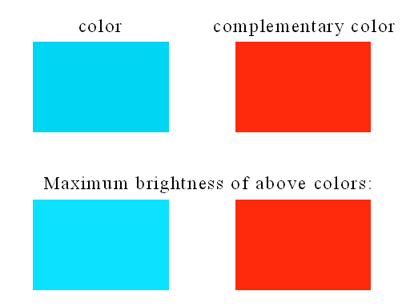

<!-- p.695 -->


12 // 分子表面的定量分析 (Quantitative analysis of molecular surface) 0 // 在默认设置下开始分析。默认情况下，被映射的函数为 ESP (Start the analysis under default settings. By default, the mapped function is ESP) 此时计算开始。由于计算 ESP 耗时较长，你需要等待一会儿。在计算过程中会打印一些中间信息，大多数用户无需关注。计算最终完成后屏幕上将打印以下结果：


```text
Global surface minimum: -0.041203 a.u. at   1.455097   3.343708  -0.007902 Ang.
Global surface maximum:  0.085761 a.u. at  -1.936645   3.093464   0.021360 Ang.

Number of surface minima:     3
   #       a.u.         eV      kcal/mol           X/Y/Z coordinate(Angstrom)
     1 -0.03046066   -0.828877  -19.112843       0.150202  -1.011077  -1.882004
     2 -0.03045989   -0.828856  -19.112362       0.192185  -0.985412   1.877656
*    3 -0.04120321   -1.121196  -25.853368       1.455097   3.343708  -0.007902

Number of surface maxima:     5
   #       a.u.         eV      kcal/mol           X/Y/Z coordinate(Angstrom)
     1  0.02275520    0.619200   14.277975      -3.344441  -2.281045   0.047286
*    2  0.08576096    2.333674   53.811572      -1.936645   3.093464   0.021360
     3  0.01935782    0.526753   12.146259       0.066223  -4.286661   0.040555
     4  0.01980285    0.538863   12.425498       3.340574  -2.325727   0.021485
     5  0.01583741    0.430958    9.937340       3.419218   1.225375  -0.019326

      ================= Summary of surface analysis =================
Volume:   835.71041 Bohr^3  ( 123.83953 Angstrom^3)
Overall surface area:         476.05682 Bohr^2  ( 133.30951 Angstrom^2)
Positive surface area:        231.09186 Bohr^2  (  64.71232 Angstrom^2)
Negative surface area:        244.96497 Bohr^2  (  68.59719 Angstrom^2)
Overall average value:   -0.00020233 a.u. (  -0.12695332 kcal/mol)
Positive average value:   0.01877643 a.u. (  11.78145591 kcal/mol)
Negative average value:  -0.01810626 a.u. ( -11.36095315 kcal/mol)
Overall variance (sigma^2_tot):  0.00041488 a.u.^2 ( 163.34165024 (kcal/mol)^2)
Positive variance:        0.00031106 a.u.^2 ( 122.46642148 (kcal/mol)^2)
Negative variance:        0.00010382 a.u.^2 (  40.87522876 (kcal/mol)^2)
Balance of charges (nu):   0.18762182
Product of sigma^2_tot and nu:   0.00007784 a.u.^2 (  30.6464578 (kcal/mol)^2)
Internal charge separation (Pi):   0.01842642 a.u. (  11.56183883 kcal/mol)
Molecular polarity index (MPI):   0.50154872 eV (     11.56600 kcal/mol)
Nonpolar surface area (|ESP| <= 10 kcal/mol):     67.26 Angstrom^2  ( 50.45 %)
Polar surface area (|ESP| > 10 kcal/mol):         66.05 Angstrom^2  ( 49.55 %)
```

上述信息包含与 ESP 相关的各种量，见 3.15.1 节了解其含义和定义。现在在后处理界面中选择选项 0 查看分子结构和表面极值点（红色和蓝色小球分别对应极大值和极小值）：


<!-- p.696 -->


侧视图中：

极小值 3（-25.85 kcal/mol）是表面上的全局最小值，其很大的负值源于氧的孤对电子。极大值 2（53.81 kcal/mol）是源于带正电的 H13 的全局最大值，该点处的 ESP 远大于其他极大值处（其他极大值处的 ESP 为 10 至 15 kcal/mol）。这是由于氧的存在，从 H13 吸引了大量电子。在复合物中，假设仅存在静电相互作用，单体总是以 ESP 互补最大化的方式彼此接触。因此，我们可以预期，在苯酚二聚体中，一个单体中的 H13 和极大值 2，与相邻单体中的 O12 和极小值 3 将位于一条直线上（形成氢键），这正是苯酚二聚体实际几何构型中的情形，见下图。注意在二聚体中，上述极大值 2 和极小值 3 已相互抵消。


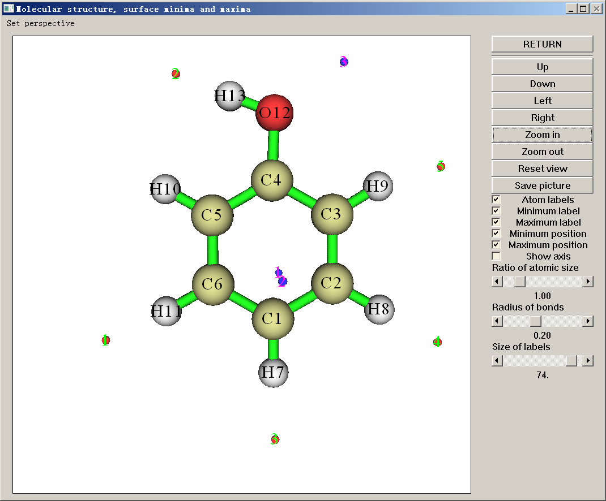


<!-- p.697 -->


极小点1和2（均为-19.11 kcal/mol）是该表面上的局域极小点，主要源自环上下方丰富的π电子。众所周知，亲电试剂总是优先进攻周围ESP非常低的原子，因此C1应该是亲电反应的理想反应位点。这一结论与羟基是邻对位定位基的一般常识部分一致。然而，尽管全局极小点最接近O12，O12却不是亲电反应位点；这一矛盾揭示了ESP分析方法固有的局限性。

注1：由于该分子具有Cs对称性，原则上极小点1和2应具有相同的X和Y坐标。然而，在数值计算过程中这无法被严格满足，因为散布在分子表面上的点不具有分子对称性，详见3.15.1节。因此，极小点1和2的X和Y坐标彼此略有偏离。如果您想改进结果，请选择选项3(option 3)“用于生成分子表面的格点数据的间距(Spacing of grid data for generating molecular surface)”，并输入一个比默认值更小的值。更小的格点间距会得到更准确的结果，但会带来更高的计算负担。

注2：由于Multiwfn图形界面的限制，有时很难查询感兴趣的ESP极值点的序号，此时建议改用VMD，见本视频的第6部分 https://youtu.be/QFpDf_GimA0。

注3：也可以在平面图中的特定等值线的等值线(contour line)上绘制ESP极值点，见4.4.12节。

相互穿透距离 在分子中的原子(AIM)理论框架下定义的非键半径，是原子核到ρ=0.001 a.u.等值面之间的最短距离。让我们计算O12和H13的非键半径。在后处理界面(post-processing interface)中选择选项10(option 10)并输入12，可以看到O12的非键半径为1.701 Å。选择10并输入13，H13的非键半径为1.172 Å。在苯酚二聚体中，氢键的H---O距离为1.937 Å，因此所谓的相互穿透距离为1.701+1.172-1.937=0.936 Å。这是一个不可忽略的数值，表明该氢键很强。

分子表面上的ESP统计分布 作为ESP分析的最后一部分，我们考察每个ESP区间内的分子表面积，这有助于定量讨论整个分子表面上的ESP分布。我们在后处理界面(post-processing interface)中选择选项9(option 9)，然后输入：

all // 将所有原子纳入统计（或者，例如若输入2-4，则只计入与原子2、3和4对应的局域表面，局域分子表面的概念见4.12.3节的说明）

-30,55 // 您感兴趣的ESP范围。由于我们已经知道表面上的最小和最大ESP分别为-25.85和53.81 kcal/mol，这里我们输入一个稍大的范围以将其包围


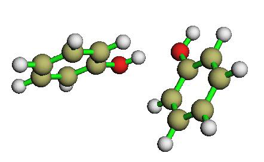

<!-- p.698 -->


15 // 区间数目 3 // 输入和输出单位均为kcal/mol 然后您将看到每个连续ESP区间内的表面积（单位为Å2）及其占整个表面积的百分比。


```text
     Begin        End       Center       Area         %
   -30.0000    -24.3333    -27.1667      1.8192      1.3647
   -24.3333    -18.6667    -21.5000      6.0284      4.5221
   -18.6667    -13.0000    -15.8333     20.9732     15.7327
   -13.0000     -7.3333    -10.1667     19.0390     14.2818
...
    43.6667     49.3333     46.5000      1.2690      0.9519
    49.3333     55.0000     52.1667      1.0457      0.7844
Sum:                                   133.3095    100.0000
```

利用这些数据，您可以用您喜欢的程序绘制直方图。例如，我们选择“center”列作为X轴、“Area”列作为Y轴来绘制下图

28

24

20

Surface area (Å2) 16 12 8

4

-30-20-10010203040500

Electrostatic potential (kcal/mol)

从图中可以看出，有很大一部分分子表面具有较小的ESP值，即从-20到20 kcal/mol。其中，负值部分主要对应六元环上方和下方的表面，显示了丰富的π电子云的效应；正值部分主要源自带正电的C-H氢；近中性部分代表负、正部分之间的边界区域。还有小部分面积具有显著的正、负ESP值，分别对应靠近全局ESP极大点和极小点的区域。

绘制ESP着色的分子表面 借助VMD程序，可以基于Multiwfn的输出绘制非常精美的、带有各种实空间函数表面极值点的颜色填充分子表面图。下面就是这样一幅ESP图，曾展示在笔者关于苯并[a]芘二醇环氧化物的研究中，见Struct. Chem., 25, 1521 (2014)。其中蓝色、白色和红色对应ESP从-30到35


<!-- p.699 -->


kcal/mol的变化，绿色和橙色小球分别对应ESP表面极小点和极大点

如果您想绘制类似的图形，请下载并参照本教程：http://sobereva.com/multiwfn/res/plotESPsurf.pdf。然而，该教程中有很多步骤，如果您想以简单得多的方式绘制效果相近甚至更好的图，见4.A.13节或本视频教程：https://youtu.be/QFpDf_GimA0。该节和视频还说明了如何绘制不同分子的范德华表面穿透图，这对讨论分子间相互作用很有用。

提示：若您的CPU核心数非常有限（少于10核），Gaussian程序包中的cubegen工具计算ESP的速度明显快于Multiwfn。若您的机器上安装了Gaussian且输入文件为.fch/fchk格式，建议将`settings.ini`文件中的“cubegenpath”参数设为cubegen的实际路径，以便Multiwfn在分析过程中自动调用cubegen来计算ESP。详见5.7节。

如果您是ORCA用户，同时又无法使用Gaussian，当CPU核心数非常有限时，可以利用ORCA程序包中的“orca_vpot”工具来尝试降低分子表面ESP分析的开销，详见http://sobereva.com/wfnbbs/viewtopic.php?pid=937。

常见问题：为什么有的表面ESP极小点（极大点）具有正（负）值？一些Multiwfn用户曾问我，为什么他们观察到有的表面ESP极小点（极大点）具有正（负）值。事实上，这种现象非常常见，它绝不是问题或程序错误。在数学上，极小点（极大点）是指其值低于（高于）周围点的点，显然这绝不意味着该点必定具有负（正）值。如果您仍有困惑，请看下面的示意图


<!-- p.700 -->


对于中性体系，通常具有正值（负值）的表面ESP极小点（极大点）在化学上并不重要，您在讨论时可以直接忽略它们。如果您想去掉这些不重要的极小点（极大点），可以在后处理菜单(post-processing menu)中选择选项3(option 3)（选项4(option 4)），然后输入d。然后您会发现这些不需要的极值点已经消失了。

还值得注意的是，对于阳离子（阴离子）体系，通常所有表面极值点都具有正（负）值，因为表面ESP极值点的整体数值总是被体系所带的净电荷强烈主导。

技巧：重复利用上次分析时产生的映射函数数据 这里介绍一个技巧。您可能已经注意到，在范德华表面上计算ESP很耗时，尤其是对使用高质量基组的大体系。如果您已对一个体系做过ESP分析，之后还要再次分析，实际上您可以把ESP数据导出为纯文本文件，以便下次分析同一体系时直接利用导出的数据。对于其它类型的映射函数，该技巧同样适用。

让我们看一个例子。我们先照常在范德华表面上做ESP分析，输入以下命令：

examples\N-phenylpyrrole.fch 12 // 定量分子表面分析(Quantitative molecular surface analysis) 0 // 开始分析(Start the analysis) 计算完成后，选择选项7(option 7)将带ESP值的表面顶点导出为当前文件夹中名为vtx.txt的纯文本文件。之后选择-1返回上一级菜单。

假设我们要再次进行分析。这次我们可以直接使用记录在纯文本文件中的ESP数据。输入以下命令

5 // 在分析过程中从外部文件载入映射函数值(Loading mapped function values from external file during analysis) 1 // 从纯文本文件载入所有表面顶点处的映射函数(Loading mapped function at all surface vertices from a plain text file) 0 // 开始分析(Start the analysis) 在分子表面构建完成后，Multiwfn会提示您输入记录所有表面顶点处映射函数值的纯文本文件的路径，此时您只需输入vtx.txt即可。

由于这次映射函数值即ESP值不是计算得到的，而是直接从vtx.txt载入的，分析结果会立即显示在屏幕上。

技巧：仅基于cube文件在分子表面上做ESP分析 一些量子化学和第一性原理程序，如Quantum ESPRESSO、ADF、


<!-- p.701 -->


Dmol3和FHI-aims，无法产生Multiwfn支持的波函数文件，但在这种情况下，只要您能用这些程序为您的体系生成电子密度和ESP的cube文件，仍然可以在分子表面上做ESP分析。一旦生成了cube文件，启动Multiwfn后输入以下命令即可：

density.cub // 首先载入电子密度的cube文件(Load cube file of electron density first) 12 // 定量分子表面分析(Quantitative molecular surface analysis) 1 // 选择定义表面的方式(Select the way to define surface) 11 // 内存中格点数据的等值面(Isosurface of the grid data in memory)

0.001 // 用ρ = 0.001 a.u.定义等值面(Use ρ = 0.001 a.u. to define the isosurface) 2 // 选择映射函数(Select mapped function) 1 // ESP 5 // 设置是否从外部文件载入映射函数值(Set if loading mapped function values from external file) 3 // 映射函数将从外部cube文件插值得到(The mapped function will be interpolated from an external cube file) 0 // 开始计算(Start calculation) ESP.cub // 记录ESP的cube文件(The cube file recording ESP) 注意，用于生成density.cub和ESP.cub的格点设置必须完全相同，且格点间距不宜太大（不大于0.25 Bohr），否则分析结果将不准确。


### 4.12.2 苯酚分子表面上的平均局域电离能(ALIE)分析(Average local ionization energy analysis (ALIE) on phenol molecular surface)


下面我们将分析苯酚范德华表面上的平均局域电离能𝐼̅。启动Multiwfn并输入

examples\phenol_631Gxx.wfn // 在B3PW91/6-31G**水平下产生(Produced at B3PW91/6-31G** level) 12 // 定量分子表面分析(Quantitative molecular surface analysis) 2 // 重新选择映射函数(Reselect mapped function) 2 // 选择𝐼̅作为映射函数(Choose 𝐼̅ as mapped function) 0 // 开始表面分析(Start the surface analysis)。由于𝐼̅的计算比ESP简单得多，计算很快就完成了。与ESP的表面分析不同，此时除极值点信息外，只输出范德华体积、表面积以及范德华表面上𝐼̅的平均值和方差。

选择0以可视化极值点(visualize extrema)。为了使极值点与原子的对应关系更清楚，我们将“原子尺寸比例(Ratio of atomic size)”滑块拖到4.0，这对应范德华表面，并关闭表面极大点的显示，然后我们将看到：


<!-- p.702 -->


侧视图见下图

𝐼̅值低意味着该位置的电子束缚不紧，范德华表面上𝐼̅最低的位点通常被认为是最易受亲电进攻或自由基进攻的位点。所有高极化性的位点，如π电子和孤对电子区域，通常都有相应的表面𝐼̅极小点。在当前例子中，极小点8和9对应O12的孤对电子，从屏幕输出上可发现它们的𝐼̅值均为10.59 eV。极小点4、5、11以及3、7、10对应π电子，它们的𝐼̅值均约为8.9 eV，可视为简并的全局极小点。值得注意的是，共轭环上方和下方的极小点只出现在邻位和对位碳处。这些观察完美地解释了羟基作为邻对位定位基的效应。由于极小点8和9处的𝐼̅明显大于碳环周围极小点处的𝐼̅，氧不应是亲电反应的易反应位点。

绘制平均局域电离能着色的分子表面图 注1：与本部分对应的有视频说明，请观看！https://youtu.be/-1sBa0lKhp8。注2：本部分的中文版是笔者的博客文章“使用Multiwfn和VMD绘制平均局域电离能(ALIE)着色的分子表面图”(http://sobereva.com/514)。

为了更完整地考察分子表面上𝐼̅的分布，最好绘制按𝐼̅着色的分子表面图。这可通过脚本和VMD程序(http://www.ks.uiuc.edu/Research/vmd/)极其容易地实现。下面展示在Windows环境下如何实现，仍以苯酚为例。请依次做以下步骤：


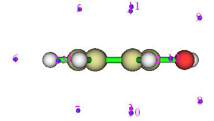

<!-- p.703 -->


- 将"examples\scripts\"中的ALIE.vmd复制到VMD文件夹
- 将"examples\scripts\"文件夹中的ALIE_isoext.bat和ALIE_isoext.txt复制到含有Multiwfn.exe的文件夹

- 编辑ALIE_isoext.bat，将默认输入文件改为examples\phenol_631Gxx.wfn，将VMD文件夹改为您的机器上实际的VMD文件夹

- 双击ALIE_isoext.bat图标执行它。该脚本将调用当前文件夹中的Multiwfn.exe进行一些计算，然后VMD文件夹中会出现avglocion.cub、density.cub和surfanalysis.pdb

- 启动VMD，在控制台窗口中输入source ALIE.vmd，您将立即看到下图（为了获得更好的效果，笔者使用了Tachyon渲染生成图像）

在上图中，显示的表面为ρ = 0.0005 a.u.等值面。不采用常用的ρ = 0.001 a.u.等值面作为表面的定义的原因是，若采用它，则表面上的𝐼̅分布几乎难以区分。青色小球对应𝐼̅的表面极小点。颜色过渡为蓝-白-红，因此蓝色突出显示具有相对低𝐼̅值的区域，那里是有利于亲电进攻的位点。

默认情况下，𝐼̅的颜色标尺为0.32~0.36 a.u.，若您发现颜色标尺对当前体系不合适，可以在VMD控制台窗口中输入例如mol scaleminmax 0 1 0.31 0.38将下限和上限分别改为0.31和0.38。


### 4.12.3 丙烯醛的原子局域分子表面分析(Atomic local molecular surface analysis for acrolein)

众所周知，丙烯醛（见下图）倾向于在羰基

碳和β碳处发生亲核进攻；特别是，前者是硬亲核试剂的主要位点。所谓硬，意味着亲核试剂的电子云难以极化；这种情况下反应位点的选择性通常由ESP主导。


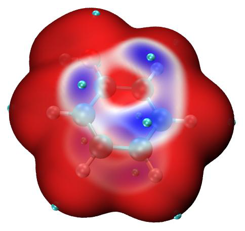


<!-- p.704 -->


在本例中，我们将尝试通过分析其范德华表面上的ESP来解释丙烯醛的位点选择性。注意，平均局域电离能只对研究亲电进攻有用，而对分析亲核进攻完全无用。

启动Multiwfn并输入：examples\acrolein.wfn // 在B3LYP/6-31G**水平下优化并产生(Optimized and produced at B3LYP/6-31G** level) 12 // 分子表面的定量分析(Quantitative analysis of molecular surface) 0 // 对ESP开始分析(Start the analysis for ESP) 计算完成后，选择0以可视化表面极值点(visualize surface extrema)：

如您所见，在α碳的边界处有一个ESP表面极小点，且它非常靠近β碳。这一观察间接揭示了α碳的核电荷被电子云屏蔽得更重，因而作为亲核进攻位点的可能性较小。然而，对整个丙烯醛表面的ESP定量分析并未对反应位点的偏好给出直接而明确的解释，因为在羰基

和β碳上没有发现表面极大点，因此我们无法直接考察羰基碳和β碳的特征。

在Multiwfn中，定量分析不仅可应用于整个分子表面，也适用于局域分子表面以揭示原子或片段的特征，见3.15.2.2节的介绍。这里我们在后处理界面(post-processing interface)中选择选项“11 输出每个原子的表面性质(11 Output surface properties of each atom)”来计算并输出每个原子对应的局域表面的性质。部分结果如下所示


```text
Note: Average and variance below are in kcal/mol and (kcal/mol)^2 respectively
 Atom#    All/Positive/Negative average       All/Positive/Negative variance
     1   -24.35251        NaN  -24.35251           NaN        NaN   72.72766
     2     4.65672    5.74594   -1.45401       9.79575    9.01495    0.78080
     3     1.30965    2.36405   -0.88391       2.70896    2.45972    0.24925
     4     8.37174   10.35813   -6.00120      36.74187   17.22299   19.51888
     5     7.07040    8.67973   -6.35468      49.99108   25.33899   24.65209
     6     2.21578    3.02322   -0.73880       5.15593    4.95305    0.20288
     7    15.34251   15.34251        NaN           NaN   22.85377        NaN
     8    14.68486   14.68486        NaN           NaN   25.92230        NaN
```

如您所见，羰基碳（原子2）、α碳和β碳的局域表面上ESP的平均值分别为4.657、1.310和2.216 kcal/mol。这一结果清楚地解释了位点选择性；羰基碳是最有利的位点，因为其局域


<!-- p.705 -->


表面上的平均ESP最正，因此亲核试剂（特别硬亲核试剂）倾向于

被吸引到该位点。相比之下，α碳的局域表面上ESP的平均值比另外两个碳小，因此α碳吸引亲核试剂的能力较弱。

注意，输出的部分数据为NaN（非数字，Not a Number），这些不是程序错误，而是可以理解的。例如，原子1的正ESP部分的平均值为NaN，这是因为氧具有很大的电负性，因此在原子1的局域表面上ESP完全为负，所以正ESP的平均值无法计算。

如果您对什么是“原子的局域表面(local surface of atoms)”感到困惑，或想将其可视化，在选择选项11(option 11)后您可以选择“y”以将表面面片输出为当前文件夹中的locsurf.pqr文件。该文件中的每个原子对应一个表面面片，残基序号对应其归属。利用该文件您可以可视化整个分子是如何划分的，方法是：启动VMD程序并将pqr文件拖入VMD主窗口，在“图形(Graphics)”-“显示方式(Representation)”中将“绘制方式(Drawing method)”设为“点(Points)”，将点尺寸设为4，并将“着色方式(Coloring Method)”设为“残基序号(ResID)”。在VMD主窗口中，选择“显示(Display)”-“正交投影(Orthographic)”并取消选择“显示(Display)”-“深度提示(Depth Cueing)”。然后将丙烯醛的分子结构文件载入VMD并渲染为CPK模式，您将看到下图

在图中，每个点代表一个表面面片；不同颜色代表不同的局域表面区域，每一个对应一个原子。

请注意，`settings.ini`中的“imolsurparmode”参数直接影响局域表面分析的结果，当前我们使用的是imolsurparmode=1。


### 4.12.4 苯酚分子表面上Fukui函数的定量分析(Quantitative analysis of Fukui function on molecular surface of phenol)

笔者已通过可视化其等值面（4.5.4节）和通过布居分析将其凝聚为原子值（4.7.3节）举例说明了如何研究Fukui函数。在本节中，笔者将

说明如何在分子表面上对Fukui函数f −做定量分析，包括三个方面：(1)获得f −的极小点和极大点的位置和数值 (2)研究各原子对应的局域分子表面上f −的平均值 (3)绘制带有表面极值点的f −颜色映射分子表面。笔者仍以苯酚为例：


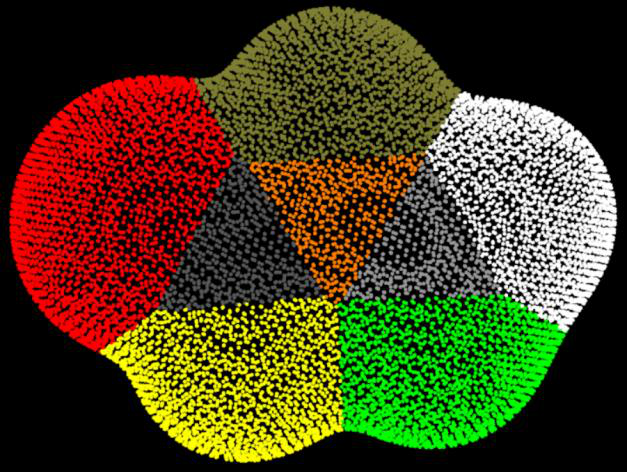

<!-- p.706 -->


注：若您无法顺利复现下面第1和第2部分所述的步骤，请看视频说明：http://sobereva.com/multiwfn/extrafiles/Molecular_surface_Fukui.mp4。

第1部分：获得f −的极小点和极大点的位置和数值 启动Multiwfn（称为Multiwfn A）并输入以下命令 examples\phenol.wfn 12 // 定量分子表面分析(Quantitative molecular surface analysis) 2 // 选择分子表面上的映射实空间函数(Select the mapped real space function on the molecular surface) 0 // 函数值将从外部文件载入(The function value will be loaded from an external file) 1 // 设置定义表面的方式(Set the way to define the surface) 1 // 用电子密度等值面作为分子表面(Use electron density isosurface as molecular surface)

0.01 // 由于在默认等值面ρ = 0.001上的Fukui函数的量级常常太小，将等值面值增大到0.01 a.u.使接下来的分析更有意义

0 // 开始表面分析(Start the surface analysis) Multiwfn将生成电子密度的格点数据，然后生成表面顶点。在这些顶点的坐标被自动输出到当前文件夹中的surfptpos.txt后，Multiwfn A暂停。不要终止Multiwfn A，我们现在启动另一个Multiwfn（称为Multiwfn B），然后在Multiwfn B中输入以下命令

examples\phenol.wfn 5 // 我们用此模块在surfptpos.txt中记录的点上生成Fukui函数(We use this module to generate Fukui function on the points recorded in surfptpos.txt) 0 // 设置自定义操作(Set custom operation) 1 -,examples\phenol_N-1.wfn // 减去phenol_N-1.wfn的性质，即将计算Fukui函数f −(Subtract a property of phenol_N-1.wfn from that of phenol.wfn,

namely Fukui function f − will be calculated)

1 // 电子密度(Electron density) 100 // 从外部文件载入待计算点的坐标(Load the coordinate of the points to be calculated from an external file) surfptpos.txt t.txt // 将点的坐标和计算的函数值（Fukui函数）输出到此文件(Output the coordinate and calculated function values (Fukui function) of the points (surface vertices) to this file)

接下来，我们终止Multiwfn B，回到Multiwfn A，然后输入t.txt // 从此文件载入表面顶点处的Fukui函数值(Load the Fukui function values at the surface vertices from this file)

现在您可以在屏幕上找到分子表面（在此为ρ = 0.01 a.u.）上f −的极小点和极大点信息：


```text
The number of surface minima:    16
   #             Value           X/Y/Z coordinate(Angstrom)
     1          0.0005211     -2.128861  -0.802735  -0.931871
     2          0.0005205     -2.076117  -0.773086   0.974712
     3          0.0005075     -1.359761  -2.550410  -0.046948
[ignored...]
```


<!-- p.707 -->


```text
 The number of surface maxima:    12
   #             Value           X/Y/Z coordinate(Angstrom)
     1          0.0015297     -2.922801   1.103604   0.049305
     2          0.0015567     -2.878717  -2.081768  -0.010490
     3          0.0015093     -1.538685   2.959157  -0.031439
*    4          0.0024437     -0.034784  -1.889426  -1.367278
     5          0.0024425     -0.047988  -1.899397   1.366144
[ignored...]
```

您也可以选择选项0(option 0)来可视化表面极值点的分布(visualize distribution of the surface extrema)：

第2部分：研究局域分子表面上f −的平均值 在后处理菜单(post-process menu)中，我们选择选项11(option 11)以输出分布在每个原子对应的局域范德华表面上的Fukui

函数f −的定量统计数据，然后您可以在屏幕上找到以下信息


```text
Atom#   All/Positive/Negative average
    1  1.88921E-03  1.88921E-03          NaN
    2  8.30558E-04  8.30558E-04          NaN
    3  1.20307E-03  1.20307E-03          NaN
    4  1.28067E-03  1.28067E-03          NaN
    5  1.06720E-03  1.06720E-03          NaN
    6  9.43611E-04  9.43611E-04          NaN
[ignored...]
```

NaN意味着局域分子表面上没有f −的负值。从结果中可以清楚地看出，与邻位（C3和C5）和对位（C1）碳对应的局域分子表面上Fukui函数的平均值大于间位碳（C2和C6），这一观察正确地反映了羟基是邻对位定位基的事实。

第3部分：绘制带有表面极值点的f −颜色映射分子表面 在主功能12(main function 12)的后处理菜单(post-process menu)中，选择选项“2 将表面极值点导出为当前文件夹中的surfanalysis.pdb(2 Export surface extrema as surfanalysis.pdb in current folder)”，然后您会得到surfanalysis.pdb。

接下来，为了通过VMD（可在http://www.ks.uiuc.edu/Research/vmd/免费下载）得到f −颜色映射的分子表面，我们需要准备两个分别含有电子密度和f −的cube文件。为此，我们重新启动Multiwfn并输入


<!-- p.708 -->


examples\phenol.wfn 5 // 计算格点数据(Calculate grid data) 0 // 设置自定义操作(Set custom operation) 1 -,examples\phenol_N-1.wfn 1 // 电子密度(Electron density) 3 // 高质量格点(High-quality grid) 2 // 导出格点数据(Export grid data) 现在将刚导出的density.cub重命名为mapped.cub。然后输入0 // 返回主菜单(Return to main menu) 5 // 计算格点数据(Calculate grid data) 1 // 电子密度(Electron density) 3 // 高质量格点(High-quality grid) 2 // 导出格点数据(Export grid data) 现在您在当前文件夹中有了density.cub。将density.cub、mapped.cub、surfanalysis.pdb移动到VMD文件夹。并将“examples\scripts\”文件夹中的VMD绘图脚本molsurfmap.vmd复制到VMD文件夹。之后，启动VMD并在VMD控制台窗口中运行source molsurfmap.vmd执行该脚本，然后您将看到

下图，其中青色和红色小球分别对应ρ = 0.01 a.u.等值面上的极大点和极小点。当前的着色方式为红-白-蓝，对应映射函数从0.0到0.002的变化。

您可以自行编辑molsurfmap.vmd以改变各种默认绘图设置，包括颜色标尺范围、等值面值等。它们也可以在VMD的“图形(Graphics)”-“显示方式(Representation)”界面中更改。


### 4.12.5 鸟嘌呤-胞嘧啶碱基对的Becke表面分析(Becke surface analysis on guanine-cytosine base pair)

Hirshfeld和Becke表面分析的概念已在3.15.5节介绍，请先阅读它们。在本节中笔者将举例说明如何对鸟嘌呤-胞嘧啶(GC)碱基对做Becke表面分析以展示两个单体之间的弱相互作用。注意


<!-- p.709 -->


Hirshfeld表面分析更为常用，见下一节。

启动Multiwfn并输入 examples\GC.wfn // 在M06-2X/6-31+G**水平下产生，在PM7水平下优化(Generated at M06-2X/6-31+G** level, optimized at PM7 level) 12 // 定量分子表面分析(Quantitative molecular surface analysis) 1 // 改变表面的定义(Change the definition of surface) 6 // 使用Becke表面(Use Becke surface)。您也可以选择5以使用Hirshfeld表面(You can also select 5 to use Hirshfeld surface) 1-13 // 您感兴趣的原子的序号范围（当前为胞嘧啶）(The index range of the atoms you are interested in (cytosine in present case)) 0 // 开始计算(Start calculation) Multiwfn找到了许多表面极小点，在这种情况下它们没有意义，同时找到了三个表面极大点


```text
The number of surface maxima:     3
   #             Value           X/Y/Z coordinate(Angstrom)
     1          0.0213498     -1.005651   2.428125   0.009227
     2          0.0251293      0.533238   0.687258   0.007815
*    3          0.0261531      1.861601  -1.067696  -0.009615
```

您可以选择0来将它们可视化(visualize them)，见下图（未显示极小点）

由于这些极大点处电子密度的顺序为32>1，可以预期氢键强度的顺序为O24···H13  H25···N6 > H29···O8。这一结论与AIM键临界点分析（4.2.1节）完全一致。

如果您想可视化Becke表面，只需选择选项-3(option -3)。如果您想绘制按映射函数值着色的Becke表面，需要利用VMD，有两种方式：(1)将Becke表面绘制为许多点（表面顶点），如下所示 (2)将Becke表面按等值面绘制，将在下一节说明

选择选项8(option 8)将所有表面顶点导出为当前文件夹中的vtx.pqr(export all surface vertices to vtx.pqr in current folder)。该文件中的每个原子对应一个表面顶点，其“电荷(Charge)”属性对应映射函数（当前为电子密度）的值。

将examples\GC.pdb（含有与GC.wfn相同几何结构的pdb文件）拖入VMD程序的主窗口。选择“图形(Graphics)”-“显示方式(Representation)”，将绘制方式改为“棒(Licorice)”并将键半径减小到0.2。然后将vtx.pqr拖入VMD主窗口，选择“图形(Graphics)”-“显示方式(Representation)”，将绘制方式改为“点(Points)”，将着色方式设为“电荷(Charge)”，适当放大点尺寸，在VMD控制台窗口中运行命令color scale method BWR（该命令将着色方式改为蓝-白-红）。现在您应看到


<!-- p.710 -->


上图中Becke表面用点表示，三个红色区域对应高电子密度区，它们源于氢键的存在。本例表明Becke表面分析有助于揭示分子间相互作用明显的区域。

本分析也可通过Hirshfeld表面分析实现，见下一节，当原子数较多时计算开销更低。


### 4.12.6 尿素晶体的Hirshfeld表面分析和指纹图分析(Hirshfeld surface analysis and fingerprint plot analysis on urea crystal)


在本节中我们对尿素晶体做Hirshfeld表面分析，以理解晶体中的分子间相互作用。

注：“用Multiwfn做Hirshfeld表面分析以直观展示分子晶体和配合物中的相互作用”(http://sobereva.com/701，中文)是一篇极其详细的博客文章，全面介绍了Multiwfn中的Hirshfeld/Becke分析并给出了非常丰富的例子，强烈建议阅读！如果您已读过，则无需阅读本节。

分析用结构的准备 您可以直接用尿素晶体的.cif文件作为输入文件，需要足够大的超胞来构建（可通过主功能300(main function 300)的子功能7(subfunction 7)中的选项19(option 19)完成），以便我们关注的分子能完全浸没在环境分子中。您也可以基于分子团簇做分析（这是更好的方式），团簇包含一个中心分子和一批围绕它的分子，Multiwfn直接提供了基于晶体结构构建团簇的功能。您只需启动Multiwfn并输入

urea.cif //尿素的.cif文件，请从互联网上寻找(.cif file of urea, please find it from Internet)。附言：不要手动将其扩展为超胞，否则计算开销会显著增加(PS: DO NOT manually extend it to supercell, otherwise computational cost will significantly increase)

300 // 主功能300(Main function 300) 7 // 几何操作(Geometry operation) 25 // 提取分子团簇（中心分子+周围分子）(Extract a molecular cluster (central molecule + surrounding ones)) 1 // 将含原子1的整个分子作为中心分子，该分子及与其靠近的所有周围尿素都将被提取出来(The whole molecule containing atom 1 is taken as the central molecule, this molecule and all surrounding ureas close to it will be extracted)

[按回车键] // 使用推荐的1.2接触判据([Press ENTER button] // Use recommended criterion of 1.2 to detect contact)


<!-- p.711 -->


现在团簇已被提取出来，中心尿素的原子序号显示在屏幕上，请记下它，稍后会用到。然后您可以用选项0(option 0)可视化团簇结构(visualize the cluster structure)，若发现合理，就可以用相应选项将其导出为结构文件。

尿素团簇的Hirshfeld表面分析 在本例中我们使用下图所示的尿素团簇模型，可按上述方式构建。相应的几何文件examples\Urea_crystal.pdb含有11个尿素，中心分子将在我们的Hirshfeld表面分析中被定义为片段。

启动Multiwfn并输入 examples\Urea_crystal.pdb 12 // 定量分子表面分析(Quantitative molecular surface analysis) 1 // 改变表面类型(Change surface type) 5 // 使用Hirshfeld表面(Use Hirshfeld surface) 16,36,58,2,77,55,34,13 // 中心尿素中原子的序号(The index of the atoms in the central urea) 0 // 开始计算(Start calculation)。注意这里使用默认的映射函数dnorm(After the calculation is finished, you can select option 8 to export the surface vertices with the mapped electron density to vtx.pqr, and then plot them in VMD via the way described in the last section.) 计算完成后，您可以选择选项8(option 8)将带映射电子密度的表面顶点导出为vtx.pqr，然后按上一节所述方式在VMD中绘制它们。

接下来，我们绘制指纹图。输入以下命令 20 // 指纹图分析(Fingerprint plot analysis) 0 // 开始指纹分析(Start fingerprint analysis) 1 // 将指纹图保存为图像文件(Save fingerprint plot to an image file) 您会发现在当前文件夹中已生成一个.pdf文件，打开后您将看到下图


<!-- p.712 -->


在此图中，X和Y轴分别对应di和de。Hirshfeld表面上的每个顶点对应图中的一个点。可以看到在图的左下方有两个尖峰，这一观察表明尿素既作为氢键受体（下方的尖峰，di > de），又作为氢键给体（左侧的尖峰，di < de）。黄色、绿色和紫色分别表示相应区域的点密度为高、中和低。

局域接触表面的指纹图 在Multiwfn中，指纹图不仅可为整体Hirshfeld表面绘制，也可为局域接触表面绘制（详见3.15.5节）。让我们考察中心尿素中的四个氢与周围尿素中所有原子之间的局域接触表面的指纹图。

关闭显示指纹图的窗口后，选择选项-1(option -1)返回上一级菜单(return to upper level of menu)。现在，我们需要定义“内侧原子(inside atoms)”和“外侧原子(outside atoms)”，只有两组之间的接触表面上的顶点才会在指纹图分析中被计入。我们选择选项1(option 1)来定义“内侧原子(inside atoms)”。系统会依次要求您输入两个条件，它们的交集将定义该集合。我们先直接按回车键使用默认原子范围，即中心尿素中的所有原子，然后输入H以只选中其中的所有氢。从屏幕上可以看到，中心尿素中的四个氢现已被定义为“内侧原子(inside atoms)”。由于默认的“外侧原子(outside atoms)”就是周围尿素中的所有原子，我们无需修改它。

现在，选择选项0(option 0)再次开始指纹图分析(start the fingerprint plot analysis)。您可以在屏幕上找到以下信息：


```text
The area of the local contact surface is    65.639 Angstrom^2
The area of the total contact surface is    94.511 Angstrom^2
The local surface occupies   69.45% of the total surface
```

该信息表明我们定义的局域接触表面的面积为65.6 Å2。显然，通过恰当利用该功能，您可以获得中心分子与周围分子之间任何特定接触对应的面积。

之后，选择选项1(option 1)将相应的指纹图保存为.pdf文件(save corresponding fingerprint plot as a .pdf file)，然后在


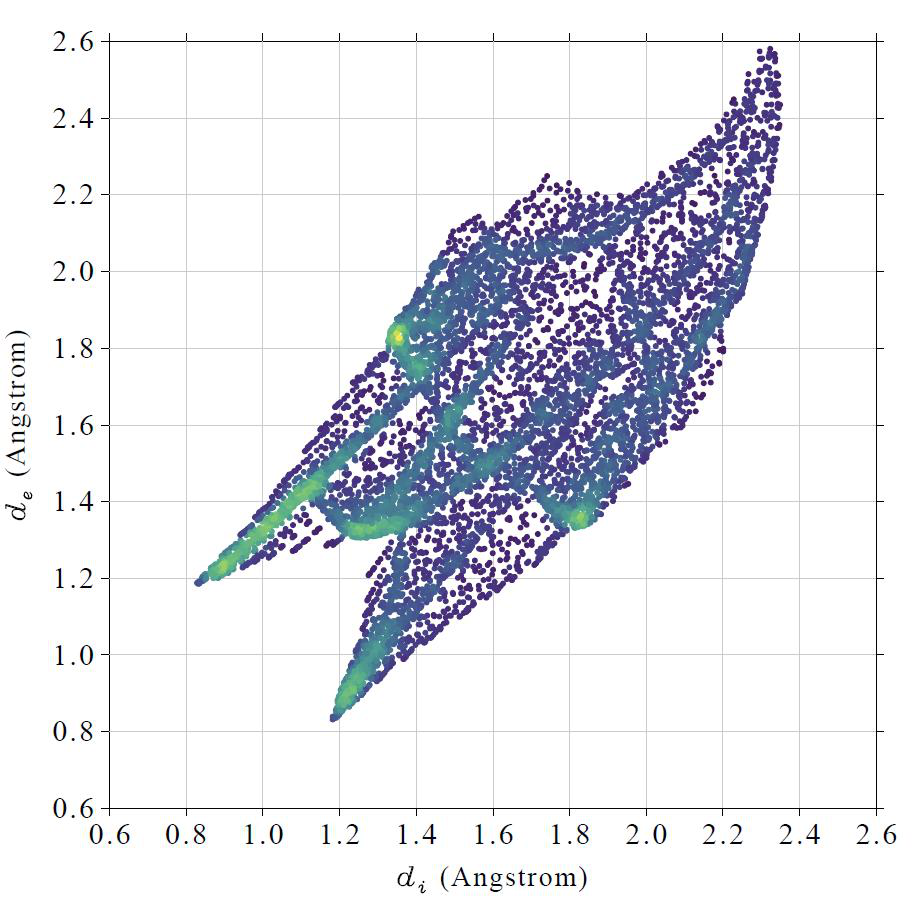

<!-- p.713 -->

打开它你会看到

由于这一次我们只考虑了中央尿素中的四个氢，它们纯粹表现为氢供体，因此在图的左侧只能观察到一个尖峰。上方图中的灰色点对应于整个 Hirshfeld 表面上但不在当前局域接触表面上的点。

检查局域接触表面的形状很有意思。为此，在关闭指纹图后，我们选择选项 4，将局域接触表面上的所有点导出为当前文件夹下的 finger.pqr。按照 4.12.5 节所述的方法在 VMD 中绘制它们，你会看到

显然，该表面很好地展示了中央尿素中的氢与周围尿素中的原子之间的接触。表面上有四个红色区域，它们对应于四个氢键，其中中央尿素中的 H 原子表现为氢键供体。

接下来，我们检查中央尿素中的氢与上图中黄色箭头所标记的氧

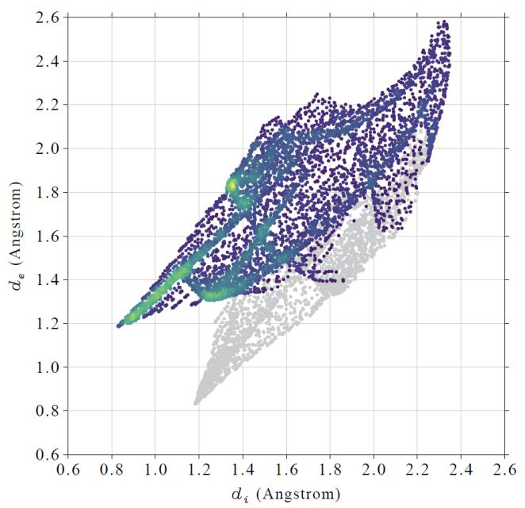

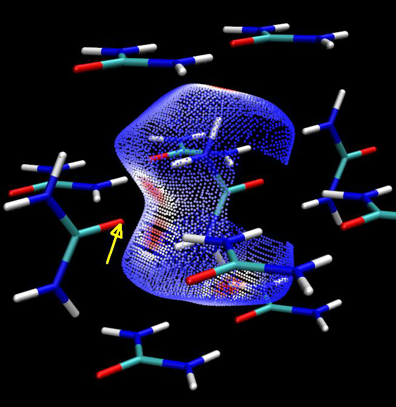

<!-- p.714 -->

原子之间的指纹图。输入以下命令

-1 // 返回上一级菜单(Return to upper level of menu) 1 // 设置要考虑的内侧原子(Set the inside atoms to consider) [按 ENTER 键(Press ENTER button)] // 不设置原子序号约束(Do not set constraint for atomic indices) H // 内侧原子必须是氢(The inside atoms must be hydrogen) 2 // 设置要考虑的外侧原子(Set the outside atoms to consider) 76 // 周围某个尿素中氧的序号(The index of the oxygen in one of surrounding urea) [按 ENTER 键(Press ENTER button)] // 不设置元素过滤条件(Do not set element filter condition) 0 // 开始指纹分析(Start fingerprint analysis) 从屏幕上输出的信息中，你可以发现这次产生的局域接触表面为 6.8 Ų，占总接触表面积的 7.2%。然后我们绘制指纹图及相应的表面顶点，如下所示

在指纹图中可以看到表面点的分布范围较窄，且尖峰非常明显，表明由于 H 与 O 的接触而具有很强的氢键特征。

指纹图对于比较不同晶体中的分子间相互作用特别有用，相关讨论见 CrystEngComm, 11, 19 (2009)。

获取每种元素对之间的接触面积 Multiwfn 还能够同时打印每种元素对之间的接触面积，并给出其占总接触面积的百分比。为此，在进入选项“20 指纹图与局域接触分析(Fingerprint plot and local contact analyses)”后，选择选项“3 计算不同元素之间的接触面积(Calculate contact area between different elements)”，随后将立即打印以下信息：


```text
Inside element, outside element, their contact area (Angstrom^2) and percentage (%)
 H-H        42.602      45.076
 H-C         3.355       3.550
 H-N         4.101       4.339
 H-O        15.581      16.486
 C-H         4.943       5.230
 N-H         7.156       7.572
 O-H        16.774      17.748

The same as above, but do not distinguish inside and outside elements
```

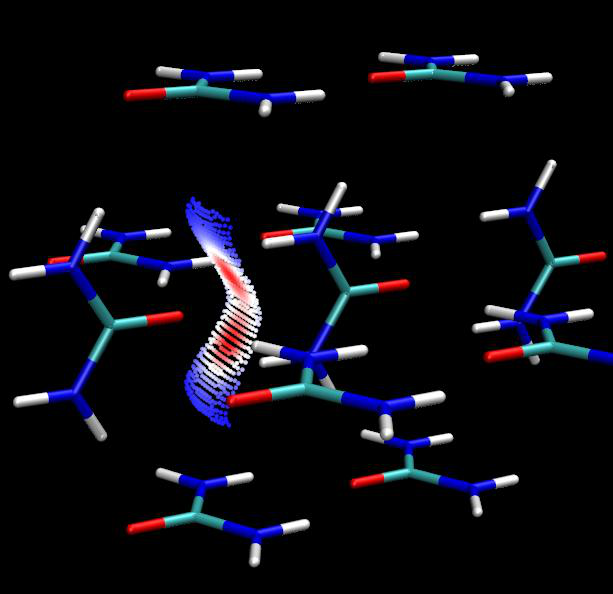

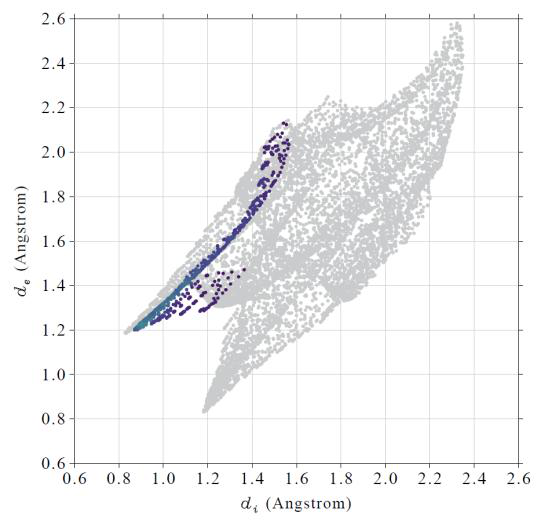

<!-- p.715 -->


```text
 H-H              42.602      45.076
 H-C/C-H           8.298       8.780
 H-N/N-H          11.257      11.910
 H-O/O-H          32.355      34.234

Area of total contact surface is    94.511 Angstrom^2
```

这些信息很容易理解。例如，如黄色高亮所示，内侧 H 原子与外侧 O 原子之间的接触面积为 15.581 Ų，内侧 O 原子与外侧 H 原子之间的接触面积为 16.774 Ų，分别占总接触面积（94.511 Ų）的 16.486% 和 17.748%。它们合计的百分比贡献为 16.486% + 17.748% = 34.234%。

为了更直观地查看，你可以将 Multiwfn 打印的数据复制并导入例如 Origin 软件，然后绘制如下饼图：

显然，H-N/N-H 和 H-O/O-H 类型的接触对应于典型的分子间氢键，从饼图中可以看到近一半的接触面积与氢键有关。虽然 H-H 接触占 Hirshfeld 表面的 45.1%，但它显然不对应于有利的分子间相互作用，因为氢显正电，因此 H-H 接触是静电排斥的。

使用 VMD 绘制 Hirshfeld/Becke 表面的颜色映射等值面 这里我介绍如何轻松绘制由电子密度以 promolecular 近似映射的非常漂亮的 Hirshfeld 表面，这种图比上面所示的那些要好看得多。仍以尿素簇为例。

启动 Multiwfn 并输入 examples\Urea_crystal.pdb 12 // 定量分子表面分析(Quantitative molecular surface analysis) 1 // 改变表面定义(Change surface definition) 5 // 使用 Hirshfeld 表面(Use Hirshfeld surface) 16,36,58,2,77,55,34,13 // 中央尿素中原子的序号(The index of the atoms in the central urea) 0 // 开始计算(Start calculation) -2 // 将用于定义 Hirshfeld 表面的格点数据导出为当前文件夹下的 surf.cub(Export the grid data used to define Hirshfeld surface as surf.cub in current folder) 13 // 计算映射函数的格点数据并导出为当前文件夹下的 mapfunc.cub(Calculate grid data of mapped function and export it to mapfunc.cub in current folder) 现在你在当前文件夹下得到了 surf.cub 和 mapfunc.cub，将它们移动到 VMD 文件夹。然后将 examples\scripts\hirsh_rho.vmd 文件复制到 VMD 文件夹。启动 VMD，在 VMD 命令窗口中输入 source hirsh_rho.vmd 以运行该脚本。对于当前情形，最好还在命令窗口中输入 material change diffuse Translucent 0.8 以使表面更亮。


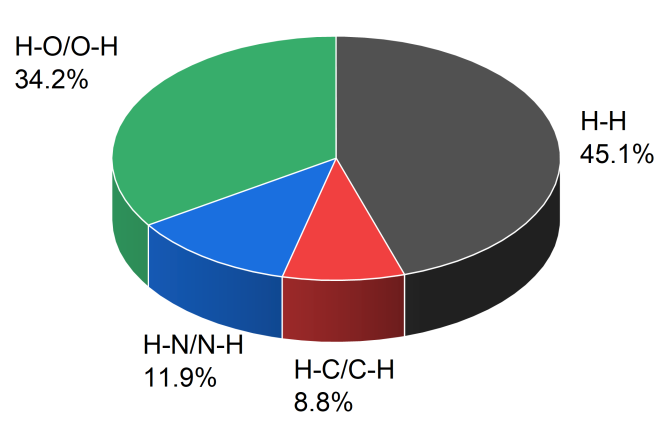

<!-- p.716 -->

最后，你可以看到如下图形。注意绘图脚本将颜色过渡设为蓝-白-红，对应于电子密度从 0.0 到 0.015 a.u. 变化。显然，从图中可以很容易识别出明显的分子间相互作用区域。

顺便提一下，有时需要微调颜色标尺。默认值可以在 hirsh_rho.vmd 中修改。你也可以在 VMD 中直接这样定义：进入“Graphics”-“Representation”，选择与等值面对应的表示，然后点击“Trajectory”选项卡，在两个文本框中输入下限和上限，然后按 ENTER 键使其生效。

基于 4.12.5 节中使用的 GC.wfn，你可以用上述相同方法绘制电子密度映射的 Hirshfeld 表面，见下图。

通过非常类似的步骤，你还可以绘制 dnorm 映射的 Hirshfeld 或 Becke 表面，与上述情形相比只有两处不同：(1) 在主功能 12 中，在选择选项 1 切换到 Hirshfeld 或 Becke 表面后，需要选择选项 2 并选择 dnorm 作为映射函数(mapped function)；(2) 应使用 examples\scripts\hirsh_dnorm.vmd 脚本代替上面使用的 hirsh_rho.vmd。

关于 Hirshfeld/Becke 分析的更多例子和相关技巧可以在我的博客文章 http://sobereva.com/701（中文）中找到。


### 4.12.7 预测 FOX-7 分子晶体的密度

如 3.15.1 节所介绍，基于静电势（ESP）定量分子表面分析的结果可以

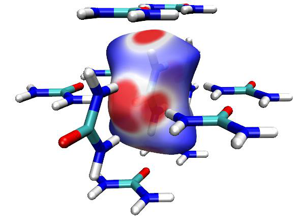

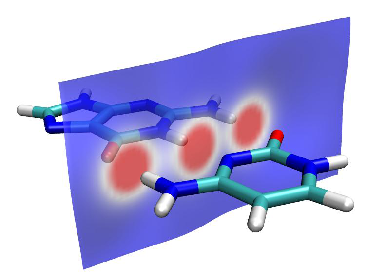

<!-- p.717 -->

预测分子的许多凝聚相性质。例如，在 Mol. Phys., 107, 2095 (2009) 中，Politzer 等人表明，仅含 C、H、N、O 的分子的晶体密度可预测为


$$\rho=\alpha\frac{M}{V_{\mathrm{m}}}+\beta(v\sigma_{\mathrm{tot}}^{2})+\gamma$$

<!-- formula-ocr: formula_p717_339.png 已替换为LaTeX, 原图保留备查 -->

其中当波函数在 B3PW91/6-31G** 水平下生成且 M/Vm 和 𝜈𝜎tot 2 的单位分别为 g/cm³ 和 (kcal/mol)² 时，α = 0.9183，β = 0.0028，γ = 0.0443。在本节中，我举例说明如何用上述公式预测 FOX-7（1,1-二氨基-2,2-二硝基乙烯）的分子晶体密度，它是一种不敏感高能炸药。关于性质预测的更多说明可以在我的博客文章“使用 Multiwfn 预测晶体密度、汽化热、沸点和溶剂化自由能”（中文，http://sobereva.com/337）中找到。

首先，我们在 B3PW91/6-31G** 水平下优化 FOX-7 的几何并产生波函数文件，这是 Politzer 等人在其 Mol. Phys. 论文中使用的水平。所得的 FOX-7.wfn 已作为 examples\FOX-7.wfn 提供。

启动 Multiwfn 并输入以下命令： examples\FOX-7.wfn 12 // 定量分子表面分析(Quantitative molecular surface analysis) 0 // 在默认表面（电子密度 0.001 a.u. 等值面）上对默认实空间函数（ESP）开始分析(Start analysis for default real space function (ESP) on default surface (0.001 a.u. isosurface of electron density))

稍候，你会在屏幕上发现以下输出


```text
 Volume:   942.48700 Bohr^3  ( 139.66220 Angstrom^3)
 Estimated density according to mass and volume (M/V):    1.7606 g/cm^3
...[ignored]
 Product of sigma^2_tot and miu:   0.00020164 a.u.^2 (   79.40119 (kcal/mol)^2)
 Internal charge separation (Pi):   0.03740373 a.u. (     23.47121 kcal/mol)
```

从输出中，我们发现 M/Vm=1.7606 g/cm³ 且 2totνσ=79.40119 (kcal/mol)²，因此

密度可预测为 0.9183*1.7606+0.0028*79.40119+0.0443=1.883 g/cm³。FOX-7 晶体的实验密度为 1.885 g/cm³，可在其相应的 wiki 页面（https://en.wikipedia.org/wiki/FOX-7）上查到。显然，我们的预测非常成功，误差仅为 -0.002 g/cm³！然而，这出奇好的结果在很大程度上是偶然的，因为根据 Mol. Phys. 论文中的测试，使用上述预测公式的均方根误差为 0.047 g/cm³。


### 4.12.8 硫代甲酸分子表面上轨道重叠距离函数 D(r) 的定量分析


### on thioformic acid molecular surface

本节内容由 Arshad Mehmood 热心提供，并经 Tian Lu 稍作修改。

本例是 4.5.7 节的延续。这里我举例说明在硫代甲酸的分子电子密度等值面上对轨道重叠长度函数 D(r) 的定量分析。

启动 Multiwfn 并输入以下命令：


<!-- p.718 -->


examples\ThioformicAcid.wfn // 在 B3LYP/6-311++G(2d,2p) 下优化的硫代甲酸(Thioformic acid optimized at B3LYP/6-311++G(2d,2p)) 12 // 分子表面的定量分析(Quantitative analysis of molecular surface) 2 // 选择映射函数(Select mapped function) 6 // 轨道重叠距离函数 D(r)，其使 EDR(r;d) 关于 d 最大(Orbital overlap distance function D(r), which maximizes EDR(r;d) with respect to d) 2 // 使用 EDR 指数的总数、起始值和增量的默认值(Use default value of total number, start and increment of EDR exponents)。更多信息请参阅 4.5.7 节(Please consult Section 4.5.7 for more information)。

0 // 现在开始分析(Start analysis now!) 现在分析开始。这一步需要一些时间。计算完成后，屏幕上将连同其它信息打印以下结果：


```text
Global surface minimum:  2.789918 a.u. at   1.983402  -0.346198   1.757884 Ang
Global surface maximum:  3.541349 a.u. at  -2.861073  -1.074395  -0.095237 Ang

 The number of surface minima:     4
   #             Value           X/Y/Z coordinate(Angstrom)
     1          3.296958      -1.622302   2.055665   0.423383
     2          3.218284       0.950838   2.841231   0.010991
*    3          2.789918       1.983402  -0.346198   1.757884
     4          2.790103       2.078805  -0.344424  -1.731277

 The number of surface maxima:    10
   #             Value           X/Y/Z coordinate(Angstrom)
*    1          3.541349      -2.861073  -1.074395  -0.095237
     2          3.401958      -0.539716   2.324441   0.014652
     3          3.502485       0.041422  -2.239222  -0.308278
     4          3.502696       0.089030  -2.257271   0.004859
     5          3.494004       0.207205  -2.075594  -0.673828
     6          3.496480       0.164501  -2.070255   0.707373
     7          3.359381       0.542328   1.465019  -1.650518
     8          3.358980       0.496994   1.456262   1.657761
     9          3.311711       2.030429   1.904600   0.023877
    10          2.918240       2.847314  -1.370280   0.021275
```

现在选择 0 以查看表面极小值和极大值：

该图显示了分子结构和表面极值（红色和蓝色小球分别对应表面极大值和极小值）。可以看到，由于紧凑的孤对电子，氧

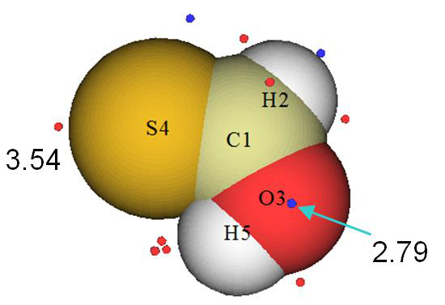

<!-- p.719 -->

原子上存在表面极小值，而由于硫更弥散、束缚较弱的孤对电子，表面极大值位于硫原子上。


### 4.12.9 评估整个体系以及单个片段的 vdW 表面积

注：本节的中文版是我的博客文章“使用 Multiwfn 和 VMD 计算分子表面积和片段表面积”（http://sobereva.com/487，中文），其中还包含更多讨论。

在阅读 4.12.1 节之后，你一定已经知道如何评估分子 vdW 表面的面积。在本节中，我将进一步讨论这个话题。将以多巴胺为例，其妥善优化后的几何如下所示

评估对应于凝聚相的多巴胺 vdW 表面积

根据 Bader 的论文 J. Am. Chem. Soc., 109, 7968 (1987)，ρ = 0.001 和 0.002 a.u. 等值面可分别定义为气相和凝聚相中的 vdW 表面。后者的体积小于前者，因为在凝聚相中由于分子间相互作用，vdW 表面的穿透必然很明显。这里我们将为多巴胺计算对应于凝聚相的 vdW 表面面积。启动 Multiwfn 并输入

examples\dopamine.wfn // 使用 B3LYP/6-31G* 水平生成。通常该水平下的密度质量绝对足够(Generated using B3LYP/6-31G* level. Commonly the quality of density at this level is absolutely adequate)

12 // 分子表面的定量分析(Quantitative analysis of molecular surface) 1 // 选择定义表面的方式(Select the way to define surface) 1 // 电子密度的等值面(Isosurface of electron density) 0.002 // 等值面数值（a.u.）(Isovalue (a.u.)) 6 // 不考虑映射函数，开始分析(Start analysis without consideration of mapped function) 你只需注意输出中的下面一行：


```text
Overall surface area:         648.64293 Bohr^2  ( 181.63855 Angstrom^2)
```

也就是说，整个分子的面积为 181.6 Ų。

评估多巴胺中氨基的表面积 接下来，我举例说明如何计算特定片段的表面积，以多巴胺中的氨基为例。在后处理菜单中，我们输入

12 // 输出特定片段的表面性质(Output surface properties of specific fragment) 3,19,20 // 氨基中原子的序号(The indices of the atoms in the amino group) 你会看到


```text
Overall surface area:          99.67659 Bohr^2  (  27.91229 Angstrom^2)
```

氨基对整个 vdW 表面的贡献 thus 可计算为 27.9/181.6*100%=15.4%。


<!-- p.720 -->

如果想将归属于氨基的 vdW 表面可视化，我们应输入 y 让 Multiwfn 在当前文件夹下导出 locsurf.pqr。然后将该文件载入 VMD 可视化程序（http://www.ks.uiuc.edu/Research/vmd/），在“Graphics”-“Representation”中将“Drawing method”设为“Points”，将“Coloring method”设为“ResID”，然后将当前体系的结构文件（examples\dopamine.xyz）也载入 VMD 以在图中同时绘制分子几何，稍作调整后你会看到

在上图中，每个点表示一个组成 0.002 a.u. 电子密度等值面的顶点，蓝色区域对应于属于氨基的局域区域。显然，整个 vdW 表面的划分非常合理，因此 Multiwfn 输出的氨基面积必定是可靠且有意义的。

在没有波函数信息时评估 vdW 表面积 有时由于各种原因我们难以生成波函数文件，在这种情况下我们仍可用 Multiwfn 评估 vdW 表面积。此时，我们采用的电子密度应为 promolecular 密度，即按照分子中原子的坐标，将每个原子孤立态的电子密度简单叠加而近似构建的分子电子密度。

例如，我们手头只有 examples\dopamine.xyz，你可以启动 Multiwfn 并载入该文件，然后输入

12 // 分子表面的定量分析(Quantitative analysis of molecular surface) 1 // 选择定义表面的方式(Select the way to define surface) 2 // 特定实空间函数的等值面(Isosurface of a specific real space function) 1 // Promolecular 电子密度(Promolecular electron density) 0.002 // 等值面数值（a.u.）(Isovalue (a.u.)) 6 // 不考虑映射函数，开始分析(Start analysis without consideration of mapped function) 计算结果为


```text
Overall surface area:         697.18104 Bohr^2  ( 195.23060 Angstrom^2)
```

显然结果是合理的，195.2 Ų 的值与我们之前基于 B3LYP/6-31G* 波函数计算的 181.6 Ų 定性一致。

如果接着计算氨基部分的面积，结果为 31.5 Ų，也接近基于 DFT 密度计算的 27.9 Ų。特别地，该基团的占比 31.5/195.2*100%=16.1% 甚至与我们之前计算的 15.4% 近乎定量一致。


<!-- p.721 -->


### 4.12.10 sigma-hole 与 pi-hole 面积的定量

简介

σ-hole 和 π-hole 分别对应于由于 σ 电子和 π 电子耗尽而在范德华（vdW）表面上具有明显正静电势（ESP）的局域区域。对应于这些空穴的区域可作为电子受体（局域 Lewis 酸）形成以静电吸引为主导的非共价相互作用，例如卤键。如果你对这两个概念不熟悉，建议阅读综述文章 J. Comput. Chem., 39, 464 (2017)。

推荐阅读。在文献中，σ-hole 和 π-hole 通常通过分析 vdW 表面上的 ESP 极值来揭示，相应极值处的 ESP 值常被用作电子受体潜在强度的定量度量。

在本节中，我将展示还可以用 Multiwfn 计算选定 σ-hole 和 π-hole 所对应的表面积，同时基于输出的文件，相应的局域表面可直接在 VMD 中可视化。建议你阅读 3.15.2.2 节的第 2 部分，其中描述了本分析中使用的算法。这里以 ClPO2 为例

它在氯原子末端含有 σ-hole，在磷原子上下方含有 π-hole。

vdW 表面上 ESP 的定量分析 首先，我们对 vdW 表面上的 ESP 进行常规定量分析。启动 Multiwfn 并输入

examples\ClPO2.fch // 几何与波函数在 PBE0/def2-TZVP 下产生(Geometry and wavefunction were produced at PBE0/def2-TZVP) 12 // 定量分子表面分析(Quantitative molecular surface analysis) 0 // 开始分析，映射函数默认为 ESP(Start analysis, the mapped function is default to ESP) 从输出中可以看到，在 vdW 表面上找到了三个 ESP 极大值，它们的 ESP 值和坐标如下所示：


```text
   #       a.u.         eV      kcal/mol           X/Y/Z coordinate(Angstrom)
     1  0.07562734    2.057924   47.456909      -1.949844  -0.043516  -0.320257
     2  0.04258971    1.158925   26.725470       0.015842  -0.054525   3.395121
*    3  0.07568641    2.059532   47.493977       1.945305   0.044502  -0.234288
```

现在进入选项 0 检查表面 ESP 极大值的序号并直观查看其位置，见下图左侧（所有表面极小值均已隐藏）。如果你按照 4.A.13 节所述方法绘制 ESP 着色的 vdW 表面以及表面极值，可得到下图右侧，其中红色和蓝色分别对应于正、负 ESP。


<!-- p.722 -->

从上图可以看出，表面极大值 1 和 3 对应于两侧的 π-hole，而极大值 1 对应于 σ-hole。[注：原文如此，依上下文此处应为极大值 2 对应 σ-hole]

检查对应于正 ESP 值的表面区域

由于 σ-hole 和 π-hole 对应于明显为正的 ESP 值，很自然地，围绕表面极大值的正 ESP 区域的面积就是 σ/π-hole 尺寸的直接度量。现在假设我们想测量对应于极大值 3 的 π-hole 的面积，在后处理菜单中应输入以下命令

14 // 计算表面极值周围区域内的面积与函数平均值(Calculate area and function average in a region around a surface extreme) 2 // 表面极大值(Surface maximum)

3 // 选择极大值 3（对应于其中一个 π-hole）(Select maximum 3 (corresponding to one of π-holes)) 0 // 将判据设为 0 a.u.(Set criterion as 0 a.u.) 现在我们可以发现以下输出


```text
Number of surface vertices in selected surface region:      4307
Area of selected surface region:    55.946 Angstrom^2
Average value of selected surface region:     0.02650 a.u.
Product of above two values:         1.48230 a.u.*Angstrom^2
```

输出表明，有 4307 个与极大值 3 直接或间接相连且 ESP 值大于 0（即正 ESP）的表面顶点，该局域表面的面积为 55.94 Ų，平均 ESP 为 0.0265 a.u.。根据化学直觉，与预期的 π-hole 面积相比，计算的面积显然

太大，原因是什么？

在当前文件夹中，你可以找到名为 selsurf.pqr 的文件，它包含所有选定表面顶点的坐标，其“Charge”列对应于以 a.u. 为单位的 ESP。现在我们将该文件载入 VMD 程序。此外，在 Multiwfn 的后处理菜单中，我们选择选项 5 导出包含分子几何的 pdb 文件，然后也将其载入 VMD。在 VMD 的“Graphics”-“Representation”面板中，我们将分子的“Drawing Method”设为“Licorice”并将“Bond Radius”设为 0.2，然后将表面顶点的“Drawing Method”设为“Point”并将“Size”设为 16，再将“Coloring Method”设为“Charge”。此时的图形应如下所示


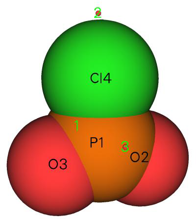

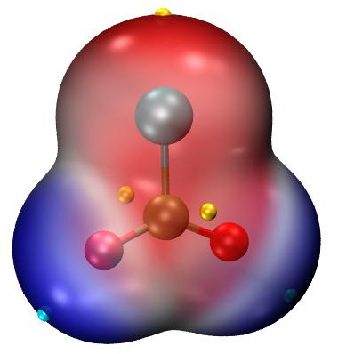

<!-- p.723 -->

在该图中，点越蓝，ESP 值越高。很明显，我们当前选定的

局域表面不仅对应于一个 π-hole，而是对应于整个正 ESP 表面区域。

计算对应于 π-hole 的表面积 显然，如果只想研究对应于一个 π-hole 的区域，ESP 判据应设为大于 0 但小于该 π-hole 表面极大值处 ESP 值（0.0756 a.u.，见上文）的一个较大值。为了找到合适的判据，在“Graphics”-“Representation”面板中，我们将“Selected Molecule”切换到与 selsurf.pqr 对应的条目，然后在“Selected Atoms”文本框中输入 charge > 0.04，此时图形窗口变为：

从图中可以看出，0.04 a.u. 的判据适合定义当前体系 π-hole 所对应的局域表面

上面的图包含两个蓝色局域表面，因为磷原子的每一侧都有一个 π-hole。要计算每个 π-hole 的面积，我们输入

14 // 计算表面极值周围区域内的面积与函数平均值(Calculate area and function average in a region around a surface extreme) 2 // 表面极大值(Surface maximum)

3 // 选择极大值 3（对应于其中一个 π-hole）(Select maximum 3 (corresponding to one of π-holes)) 0.04 // 将判据设为 0.04 a.u.(Set criterion as 0.04 a.u.) 结果为


```text
 Number of surface vertices in selected surface region:       271
 Area of selected surface region:     3.570 Angstrom^2
 Average value of selected surface region:     0.05772 a.u.
 Product of above two values:         0.20608 a.u.*Angstrom^2
```

计算得到的 3.57 Ų 是一个非常合理的典型 π-hole 面积。如果你用 VMD 将生成的 selsurf.pqr 可视化以检查选定的局域表面，你会发现该区域恰好对应

上面表面图中所示的两个 π-hole 之一。显然，当前体系中 π-hole 的总面积应为 2*3.57=7.14 Ų。


<!-- p.724 -->

计算对应于 σ-hole 的表面积 接下来，我们用类似方法计算氯原子末端 σ-hole 的面积。此时不应使用 0.04 a.u. 作为判据，因为该 σ-hole 表面极大值处的 ESP 值仅为 0.0425 a.u.。在 VMD 中，我们可通过输入 charge > xxx 尝试不同判据，直到

找到最能代表 σ-hole 的最佳值。经过几次尝试，发现 0.03 a.u. 是合理值，因此我们在后处理菜单中输入以下命令

14 // 计算表面极值周围区域内的面积与函数平均值(Calculate area and function average in a region around a surface extreme) 2 // 表面极大值(Surface maximum)

2 // 选择极大值 2（对应于 σ-hole）(Select maximum 2 (corresponding to the σ-hole)) 0.03 // 将判据值设为 0.03 a.u.(Set criterion value as 0.03 a.u.) 发现面积为 4.88 Ų，而该区域内的平均 ESP 值为 0.03617 a.u.，

明显小于 π-hole 的平均值。如果你将导出的 selsurf.pqr 在 VMD 中绘制为点，并将颜色标尺设为 0.0~0.05（在“Representation”面板中选择“Trajectory”选项卡，然后设置“Color Scale Data Range”），你会看到如下图，确实选定的表面区域很好地展示了

预期的 σ-hole 特征。

需要指出的是，计算的面积直接依赖于判据的选择，而没有唯一的方法确定完美判据。在实际研究中，你可以尝试将判据定义为例如相应表面极大值处 ESP 值的 60%，或考虑将判据定义为比表面极大值低例如 10 kcal/mol 的值。

值得注意的是，选项 14 不仅能测量表面极大值周围的面积，还能计算表面极小值周围的面积。因此，你可以尝试用该功能定量各种孤对电子所对应的面积。


### 4.12.11 静电势的分子表面的盆状分析


### potential

正如整个三维分子空间可基于例如电子密度和电子定域函数划分为盆，从而讨论局域区域的特征一样，也可以用类似思想基于特定的映射函数将整个分子表面划分为各自的局域表面，从而获得化学上感兴趣的信息。在本例中，我们将把 ClPO2 的整个 vdW 表面分解为源自其表面 ESP 极小值和极大值的贡献。请阅读 3.15.2.2 节的第 3 部分以了解本分析所用算法的基本知识。ClPO2 已在 4.12.10 节中通过分子表面分析进行了研究，如果尚未阅读请先阅读。


<!-- p.725 -->


启动 Multiwfn 并输入 examples\ClPO2.fch // 几何与波函数在 PBE0/def2-TZVP 下产生(Geometry and wavefunction were produced at PBE0/def2-TZVP) 12 // 定量分子表面分析(Quantitative molecular surface analysis) 0 // 开始分析，映射函数默认为 ESP(Start analysis, the mapped function is default to ESP) 15 // 表面的盆状划分并计算面积(Basin-like partition of surface and calculate areas) 然后你可以在屏幕上发现以下输出


```text
Minimum   1  N_vert:  1596,  19.615 Angstrom^2  Avg. value:   -0.023076 a.u.
Minimum   2  N_vert:  1613,  19.874 Angstrom^2  Avg. value:   -0.022824 a.u.

Maximum   1  N_vert:  1312,  16.689 Angstrom^2  Avg. value:    0.028729 a.u.
Maximum   2  N_vert:  1753,  21.539 Angstrom^2  Avg. value:    0.023524 a.u.
Maximum   3  N_vert:  1244,  16.040 Angstrom^2  Avg. value:    0.029336 a.u.
```

上述输出给出了对应于不同表面极值的“表面盆”（即局域分子表面）的信息。“N_vert”表示属于该表面盆的表面顶点数，同时还显示了该表面盆中的面积以及映射函数的平均值。Multiwfn 还在当前文件夹下导出了名为 surfbasin.pdb 的文件，它包含所有表面顶点，其 B-factor 对应于顶点所属表面盆的序号（正、负 Beta 值分别对应表面极大值和极小值的序号）。表面盆的序号与相应表面极值的序号相同，每个表面盆包含且仅包含一个表面极值。注意，具有正值的表面极小值和具有负值的表面极大值没有伴随的表面盆，如果你正确理解了 3.15.2.2 节所述的算法，这很容易理解。

为了生动地查看表面盆，你可以将 surfbasin.pdb 载入 VMD，然后将绘制方式设为“Points”，着色方式设为“Beta”。同时，我们在 Multiwfn 中选择相应选项导出分子结构的 pdb 文件（选项 5）和表面极值的 pdb 文件（选项 2），然后在 VMD 中显示它们。最后，你可以得到下图，计算数据也已标出

在当前图中，最小值 1 周围的红色点共同展示了表面盆 1 的区域，而灰色和冰蓝色点分别显示对应于极大值 1 和 2 的表面盆，


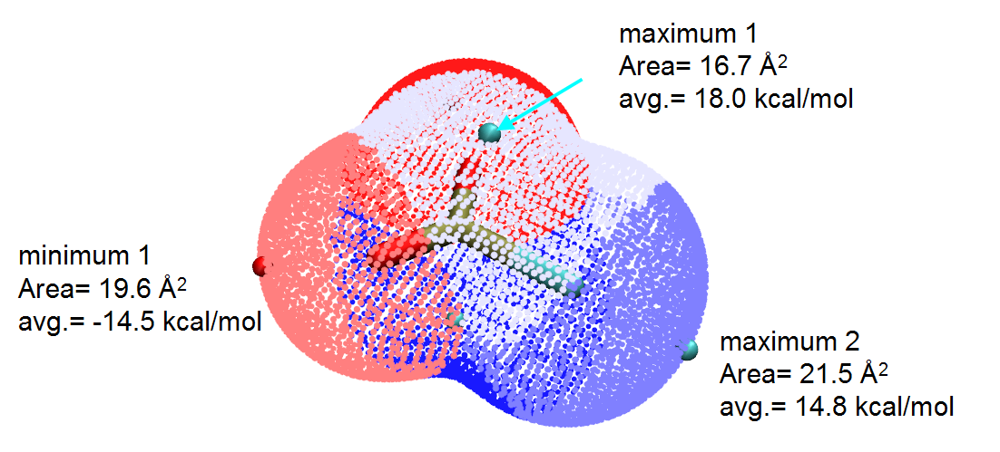

<!-- p.726 -->

分别。显然，通过我们目前采用的分析，能够清楚阐明不同极值对整个正或负表面区域的内在贡献。例如，由氯原子的 σ-hole 导致的极大值 2 对正表面区域的百分比贡献为

21.539/(16.689+21.539+16.040)×100%=39.7%。

所有极大值（极小值）的面积之和与“表面分析总结(Summary of surface analysis)”部分输出的正（负）表面积并不完全相同，因为存在一些边界表面片，其三个顶点不具有相同的归属。在计算表面盆的面积和函数平均值时忽略了这些面片。

顺便提一下，你也可以让 VMD 仅显示特定的表面盆。例如，在 VMD 的“Graphics”-“Representation”面板的“Selected Atoms”文本框中分别输入 beta=-1 和 beta=2 并将颜色设为橙色，你将分别观察到对应于最小值 1 和极大值 2 的表面盆：

值得注意的是，由于 C2v 分子对称性，最小值 1 和 2 应具有相同数值，极大值 1 和 3 也应具有相同数值。如上述计算数据所示，这种等价性的轻微破坏是由于数值方面的原因。当你报告对应于 π-hole（极大值 1 和 3）的表面盆数据时，取它们的平均是合理的，即每一侧的面积应为 (16.040+16.689)/2=16.4 Ų。


### 4.12.12 估算小分子的动力学直径

注：本节的中文版及更多讨论是我的博客文章“使用 Multiwfn 计算分子的动力学直径”（http://sobereva.com/503）。

动力学直径是气体分离研究中的重要量。小分子动力学直径最常引用的值取自 Breck 的书 Zeolite Molecular Sieves; Structure, Chemistry and Use，该书出版于 1974 年。在 J. Phys. Chem. A, 118, 1150 (2014) 中，作者提出了一种纯粹基于电子密度等值面计算动力学直径的通用方法。如下例所示（改编自该 J. Phys. Chem. A 论文），两黑色箭头所夹的距离可用于定义动力学直径


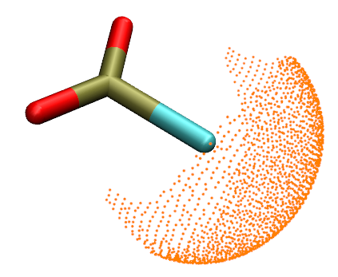

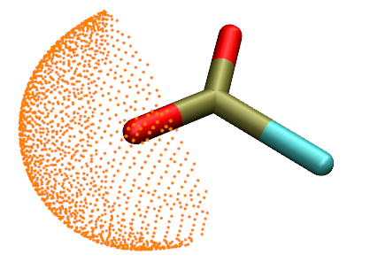

<!-- p.727 -->

在该论文中发现，当在波函数生成中使用 PBE0/def2-TZVP 时，若电子密度的等值面数值设为 0.0015 a.u.，计算值与 Breck 值符合得最好。

在本节中，我将展示如何使用定量分子表面分析模块实现上述方法，以计算典型分子 CO 的动力学直径。在 PBE0/def2-TZVP 水平下优化任务产生的 .fch 文件已作为 examples\CO.fch 提供。

在进行计算之前，我们应使用主功能 0 检查 CO.fch 中分子的取向，如下所示

显然，分子轴恰好平行于 Z 轴，因此动力学直径可计算为具有最大正 X 值的表面顶点与具有最大负 X 值的表面顶点之差（表面定义为电子密度 0.0015 a.u. 等值面）。

现在我们进行计算。启动 Multiwfn 并输入 examples\CO.fch 12 // 分子表面的定量分析(Quantitative analysis of molecular surface) 1 // 选择定义表面的方式(Select the way to define surface) 1 // 电子密度的等值面(Isosurface of electron density) 0.0015 // 等值面数值(Isovalue) 6 // 不考虑映射函数，开始分析(Start analysis without consideration of mapped function) 适当上翻后，你可以发现以下输出：


```text
Among all surface vertices:
Min-X:     -1.7527  Max-X:    1.7528 Angstrom
Min-Y:     -1.7527  Max-Y:    1.7528 Angstrom
```

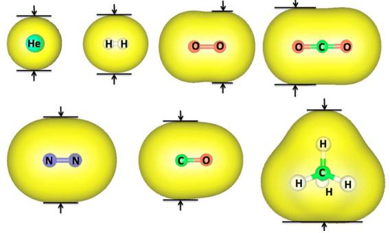

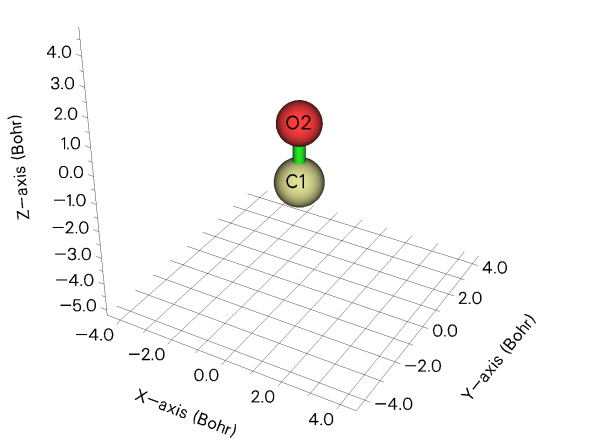

<!-- p.728 -->


```text
Min-Z:     -2.5093  Max-Z:    2.0951 Angstrom
```

这意味着动力学直径可计算为 1.7528-(-1.7527)=3.505 Å。根据该 J. Phys. Chem. A 论文表 2，拟合斜率为 1.025，因此最终估计值应为 3.505/1.025=3.42 Å，与 Breck 值（3.76 Å）定性一致。

CO 是非常简单的情况，而对于复杂得多的分子，必须使用 VMD（http://www.ks.uiuc.edu/Research/vmd/）测量两个合适表面顶点之间的距离以估计动力学直径。仍以 CO 为例，在后处理菜单中，选择选项 6 在当前文件夹下导出 vtx.pdb，它记录了所有表面顶点。然后将该文件载入 VMD，在“Graphics”-“Representation”中，将“Drawing method”设为“Points”。然后在 VMD 主窗口中，选择“Display”-“Orthographic”。之后，激活 VMD 图形窗口，按键盘上的按钮 2，然后点击位于合适位置的两个顶点。从下图可以发现，两顶点之间的距离为 3.47 Å，与上面给出的 3.505 Å 非常接近。

选择合适的表面顶点并不太容易，请务必耐心。如果顶点选错，可进入“Graphics”-“Labels”，然后删除不需要的原子标签和键标签。


### 4.12.13 使用局域电子亲和势和局域电子附着能揭示亲电区域

注：关于本主题的更多讨论和例子见我的博客文章“使用 Multiwfn 通过局域电子附着能（LEAE）研究亲核反应的优先位点与难易以及弱相互作用”（http://sobereva.com/676，中文）。

我们已在 4.12.2 节研究了平均局域电离能（IEL），如果尚未阅读请先阅读，因为本节可视为该节的扩展。有两个与 IEL 密切相关的函数，即局域电子亲和势（EAL）和局域电子附着能（Eatt），将在本节中介绍和举例说明。

J. Mol. Model., 9, 342 (2003) 提出了局域电子亲和势 IEL 并定义为


<!-- p.729 -->

$$E A_{\mathrm{L}}(\mathbf{r})=\frac{-\sum_{i\in\mathrm{v i r}}\left|\varphi_{i}(\mathbf{r})\right|^{2}\varepsilon_{i}}{\sum_{i\in\mathrm{v i r}}\left|\varphi_{i}(\mathbf{r})\right|^{2}}$$

<!-- formula-ocr: formula_p729_340.png 已替换为LaTeX, 原图保留备查 -->

i  vir

其中 ε 表示轨道能量，φ 为轨道波函数。EAL 对应于 Multiwfn 中的自定义函数 27。

EAL 基于 Koopmans 近似近似揭示给定点处的电子亲和。预期某点处的 EAL 越正，该区域的亲电性越强。显然，这一性质使 EAL 具有一定的揭示亲核进攻有利位点的能力。

展示 EAL 分布的最佳方式应是通过不同颜色将其映射到分子表面上。在 4.12.2 节中我已说明如何基于 Multiwfn 输出文件利用 VMD 程序的脚本绘制 IEL 映射的分子表面，下面我将说明如何用几乎相同的方式绘制 EAL 的这种图。

将以 examples\CH3Cl.fchk 为例，它在 B3LYP/6-31G* 水平下生成。注意，仅当未使用弥散函数时 EAL 才有意义。此外，你必须使用包含虚轨道的文件作为输入文件，例如 .mwfn、.fch 和 .molden，因为 EAL 计算涉及虚轨道。

要绘制该图，你应做以下事情（以下流程仅适用于 Windows 平台，对于 Linux 平台你应自行编写类似脚本）

- 将 LEA_isoext.bat 和 LEA_isoext.txt 从 "examples\scripts\local_EA" 文件夹复制到当前文件夹。用文本编辑器编辑 .bat 文件，将 VMD 路径设为你机器上实际的 VMD 文件夹，并将 Multiwfn 的输入文件路径设为其实际路径，即 examples\CH3Cl.fchk。

- 将 LEA_isoext.vmd 从 "examples\scripts\local_EA" 文件夹复制到 VMD 文件夹
- 双击 LEA_isoext.bat 运行它。然后将调用 Multiwfn 生成 density.cub（ρ 的 cube 文件）、userfunc.cub（EAL 的 cube 文件）和 surfanalysis.pdb（包含 ρ = 0.01 a.u. 等值面上的 EAL 表面极值点），然后它们将被自动移至 VMD 文件夹

启动 VMD 并在 VMD 控制台窗口中输入 source LEA_isoext.vmd 以运行此脚本，然后你将看到下图

此图显示了映射了 EAL 的 ρ = 0.01 a.u. 等值面，颜色标尺为 -0.80（蓝色）到 -0.30（红色）a.u.，青色小球对应于此表面上 EAL 的极大值点。可以看到，氢周围的区域具有最正的 EAL，表明它们是该分子最亲电的

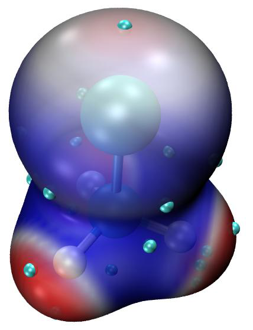

<!-- p.730 -->

分子部分。这些区域的存在源于氢带有正电荷的事实。在 Cl 原子末端也存在一个 EAL 相对更正的区域，这

表明 Cl 原子的 σ-hole 的存在。

要查询表面极值点的确切数值，你应激活 VMD 的 OpenGL 窗口，然后点击键盘上的 0 按钮进入查询模式，然后点击一个表面极值点的中心，例如，上图中顶部处的极值点，你将在 VMD 控制台窗口中找到它的索引（index 9）。然后在 VMD 控制台窗口中输入 [atomselect top "index 9"] get beta，你将发现其值为 -12.49，单位为 eV，对应于 -12.49/27.2114 = -0.46 a.u.。

值得注意的是，EAL 最合适的颜色标尺通常因体系而异。如果你发现整个等值面呈单色，或不同区域的颜色无法清晰区分，你应适当调整颜色标尺的下限和上限。例如，如果你在 VMD 控制台窗口中输入 mol scaleminmax 0 1 -1.0 -0.4，则颜色标尺将变为 -1.0 ~ -0.4 a.u.。

顺便提一下，为了充分理解该脚本的工作原理，鼓励你将记录在 LEA_isoext.txt 中的命令逐条手动输入到 Multiwfn 窗口中。

Local electron attachment energy 该函数在 J. Phys. Chem. A., 120, 10023 (2016) 中定义为

$$E_{\mathrm{att}}(\mathbf{r})=\frac{n\sum\limits_{i=LUMO}^{\varepsilon_{i}<0}\left|\varphi_{i}(\mathbf{r})\right|^{2}\varepsilon_{i}}{\rho(\mathbf{r})}$$

<!-- formula-ocr: formula_p730_341.png 已替换为LaTeX, 原图保留备查 -->

其中 i 遍历所有能量为负的非占据轨道。对于限制性和非限制性波函数，n 分别等于 2 和 1。Eatt 对应于 Multiwfn 中的自定义函数 -27，你可以在 Multiwfn 中通过多种方式研究它。

该函数的特征与 LEA 高度类似，但主要是因为计算中不涉及高能量非占据分子轨道（完全缺乏化学意义），该函数比 LEA 更稳健，且允许使用弥散函数。然而，要使用该函数，必须保证至少 LUMO 具有负能量，否则该函数在全空间将恒为零。在原始论文中发现 Eatt 在 B3LYP/6-31+G(d,p) 波函数下表现合理。因此，我们将使用在此水平下生成的波函数来说明 Eatt 的分析。值得注意的是，在 B3LYP/6-31G* 水平下，即使 LUMO 也具有正能量，因此至少在这种情况下添加弥散函数是必需的！

我们将像上面的 EAL 例子一样为 CH3Cl 绘制 Eatt 着色的分子表面。分子表面将定义为 0.004 a.u.，这是因为 Eatt 的原始论文建议在此表面上研究 Eatt。你应做以下事情（在 Windows 下）

- 将 LEAE_isoext.bat 和 LEAE_isoext.txt 从 "examples\scripts\local_EA" 文件夹复制到当前文件夹。用文本编辑器打开 .bat 文件，将 VMD 路径设为你机器上实际的 VMD 文件夹，并将 Multiwfn 的输入文件路径设为其实际路径，即 examples\CH3Cl_631+Gxx.fch，它是通过 Gaussian 16 以 B3LYP/6-31+G(d,p)//B3LYP/6-31G(d) 计算生成的。

- 将 LEAE_isoext.vmd 从 "examples\scripts\local_EA" 文件夹复制到 VMD 文件夹。
- 双击 LEAE_isoext.bat 运行它。然后将调用 Multiwfn 生成 density.cub（ρ 的 cube 文件）、userfunc.cub（Eatt 的 cube 文件）和 surfanalysis.pdb（包含表面
