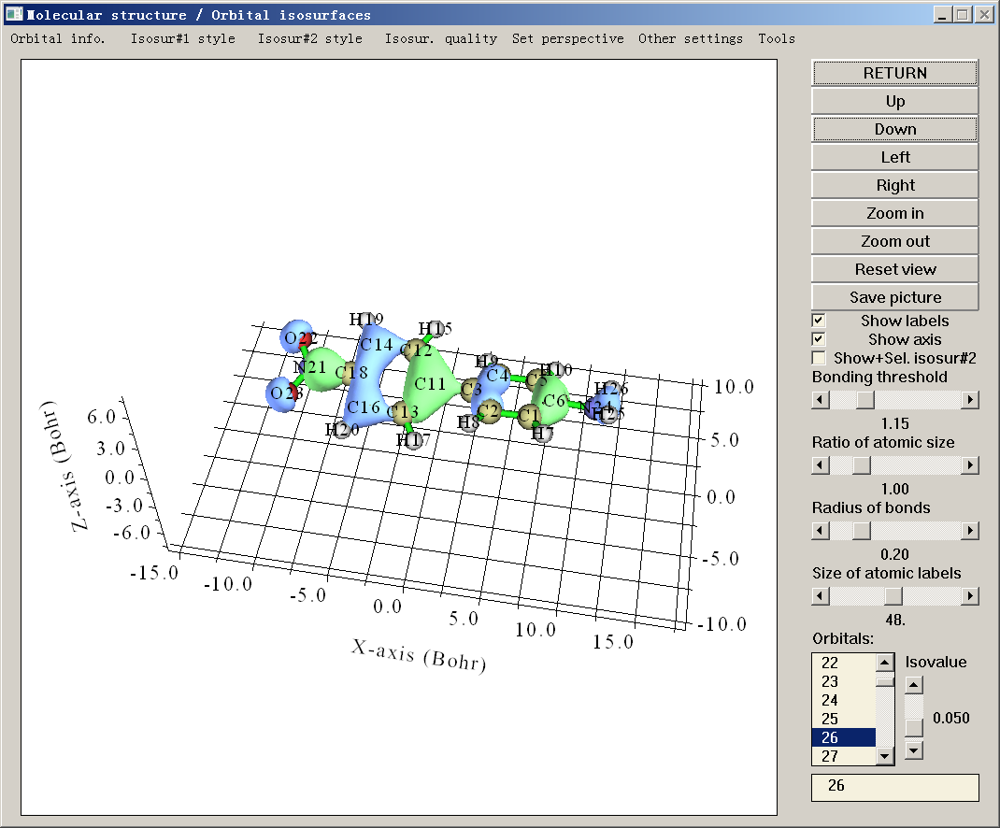

# 显示分子结构与查看轨道 /

> Multiwfn manual, p.77–79.英文原文见同名 English 章节。 Images: `../imgs/`.

---

<!-- p.77 -->

## 3 功能(Functions)

本章详细介绍 Multiwfn 的全部功能，二级标题括号中的数字为其在主菜单中对应的功能序号，三级标题括号中的数字为其在相应子菜单中对应的选项序号。Multiwfn 的不同功能需要不同类型的输入文件，每个功能所需的信息见相应小节末尾行。请根据 2.5 节中的表格选择合适类型的输入文件。

[由于历史原因不存在 3.1 节 ;-D]

## 3.2 显示分子结构与查看轨道 /

## 等值面(isosurfaces) (0)

当选择主功能 0 时，所有原子的信息以及特征轨道的基本信息（例如 HOMO 和 LUMO 的序号、HOMO-LUMO 能隙）将打印在文本窗口中，同时分子结构将显示在一个 GUI 窗口中。如果输入文件包含轨道信息，则可通过点击窗口右下角列表中相应的轨道序号，或在文本框中直接输入轨道序号来查看轨道，见下图截屏。如果输入文件为 .cub 或 .grd 格式，则可在该界面中查看网格数据的等值面。

<!-- p.78 -->

由于该 GUI 中的大多数控件都是自解释的，这里仅提及一些值得注意的要点。

改变视角

- 鼠标拖拽操作：在绘图区域中，可用鼠标左键拖拽体系以自由旋转。按住 Ctrl 键并水平拖拽体系可沿屏幕旋转，按住 Ctrl 键并垂直拖拽体系可缩放体系，按住 Shift 键并拖拽体系可平移体系。注意 Linux 用户请注意：只有在点击绘图区域一次使图标变为手形之后，上述拖拽操作才可用。

- 其它操作：也可通过点击 GUI 右侧的“向左(Left)”、“向右(Right)”、“向上(Up)”、“向下(Down)”按钮来旋转视角。在绘图区域中滚动鼠标滚轮也可实现放大与缩小。

若要精确设置视角，还可通过菜单中“设置视图(Set view)”下拉列表中的“设置视角旋转(Set rotation of viewpoint)”选项直接输入旋转角度，该列表中还有许多其它改变视图的选项。

改变绘图设置 “原子尺寸比例(Ratio of atomic size)”为屏幕上显示的原子半径的四分之一与其范德华(vdW)半径之比，因此若将滑动条拖至 4.0，则显示的即为 vdW 表面。

体系结构有三种预定义的绘图风格，可通过菜单中“其它设置(Other settings)”下的“使用 CPK 风格(Use CPK style)”、“使用 vdW 风格(Use vdW style)”和“使用线形风格(Use line style)”之一来启用。

Multiwfn 依据经验距离判据判断两个原子是否成键，若两原子间距离短于其 CSD 共价半径之和的 1.15 倍，则认为它们成键。可通过拖拽“成键阈值(Bonding threshold)”滑动条来调整该判据。

注：若输入文件包含连接信息，如 .mol 和 .mol2，则将直接根据所提供的连接关系显示化学键。

键、原子标签和原子球的颜色可分别通过 `settings.ini` 中的参数 `bondRGB`、`atmlabRGB` 和 `atmcolorfile` 设置，详见其中的相应注释。调整这些参数后，需重启 Multiwfn 才能生效。也可通过 GUI 中“其它设置(Other settings)”-“设置原子标签颜色(Set atomic label color)”直接改变原子标签颜色。

查看轨道 点击“轨道信息(Orbital info.)”再选择相应选项，可在文本窗口中打印基本轨道信息。

所有轨道序号列于右下角方框中，默认选择为“none”（不显示轨道）。若点击某一轨道序号，Multiwfn 将计算相应轨道波函数值的网格数据，随即出现轨道等值面。绿色与蓝色部分分别对应正值与负值区域。“等值面值(Isovalue)”滑动条控制等值面的等值面值。

出于效率考虑，网格数据的默认质量较粗糙，可通过“等值面质量(Isosur. quality)”设置网格点数，数值越大等值面越光滑（注意调整该数值后，当前等值面将被删除）。也可通过修改 `settings.ini` 中的 `nprevorbgrid` 设置默认网格点数。

对于非限制性波函数，alpha 与 beta 轨道分别记录。假设有 Na 个 alpha 轨道和 Nb 个 beta 轨道，则轨道选择列表中前 Na 个与后 Nb 个轨道分别对应 alpha 与 beta 轨道。而在轨道选择

<!-- p.79 -->

框中，负序号对应 beta 轨道。例如，若输入 -9，则将显示第 9 个 beta 轨道，轨道选择列表将自动切换至第 Na+9 项。

有时同时显示两个轨道很有用，例如分析两个 NBO 的位相重叠。这可通过“显示+选择等值面#2(Show+Sel. Isosur#2)”(Sel.=Select)复选框实现。该复选框默认未激活，一旦选择了一个轨道（其等值面将被称为等值面 #1），该复选框即被激活。勾选该复选框后，新选轨道的等值面（将被称为等值面 #2）将与之前所选轨道一起显示，黄绿色与紫色部分分别对应正值与负值区域。若取消勾选该复选框，等值面 #2 将消失，若重新勾选，同一等值面 #2 将被重绘。

等值面 #1 与 #2 的表现风格可分别通过“等值面 #1(Isosur. #1)”与“等值面 #2(Isosur. #2)”下的子选项单独调整，可用风格包括实面（默认）、网格(mesh)、点(points)、实面+网格以及透明面。(注意 Multiwfn 不能将单个等值面绘制为透明面)。面与网格/点的颜色也可通过相应子选项设置，程序将依次提示输入正值与负值部分的红、绿、蓝分量，分量应在 0.0 至 1.0 之间。例如，1.0,0.0,0.0 对应纯红，而 1.0,1.0,0.0 对应黄色。正值与负值部分的默认值可分别通过 `settings.ini` 中的 `isoRGB_same` 与 `isoRGB_oppo` 设置。透明面的不透明度也可自定义，有效范围为 0.0（完全透明）至 1.0（完全不透明）。

在显示轨道等值面之前，Multiwfn 首先在内部设置一个方框，然后在均匀分布于该方框中的点上计算轨道波函数值。设置方框的默认外延距离由 `settings.ini` 中的 `Aug3D` 参数控制。默认值对一般情形合适且高效；但在少数情形（如可视化 Rydberg 轨道）下可能需要手动增大外延距离，既可修改 Aug3D 以改变默认设置，也可选择“其它设置(Other settings)”-“设置外延距离(Set extension distance)”再输入数值以修改当前实例的外延距离。

当轨道等值面绘制为实面时，在少数情形下绘制效果不太好，例如正负区域难以区分，此时可尝试通过选择“其它设置(Other settings)”-“设置光照(Set lighting)”调整光照设置，或适当旋转体系以避开该问题。

若想可视化所选轨道的概率密度而非其波函数，可选择“其它设置(Other settings)”-“选择绘制波函数或密度(Choose plotting wavefunction or density)”，再选择“密度(Density)”。

“工具(Tools)”子菜单 在菜单栏的“工具(Tools)”中有许多选项：

- 将设置写入 GUI`settings.ini`(Write settings to GUI`settings.ini`)：将可视化状态（如颜色、视角、分子表现形式、文字大小等）写入当前文件夹下的 GUI`settings.ini`。若已定义 `Multiwfnpath` 环境变量，则 GUI`settings.ini` 将写入该环境变量所定义的文件夹。

- 从 GUI`settings.ini` 加载设置(Load settings from GUI`settings.ini`)：从当前文件夹下的 GUI`settings.ini` 加载可视化状态，从而可快速恢复之前的可视化状态。若已定义 `Multiwfnpath` 环境变量，Multiwfn 将首先尝试从该环境变量所定义的文件夹加载该文件。
