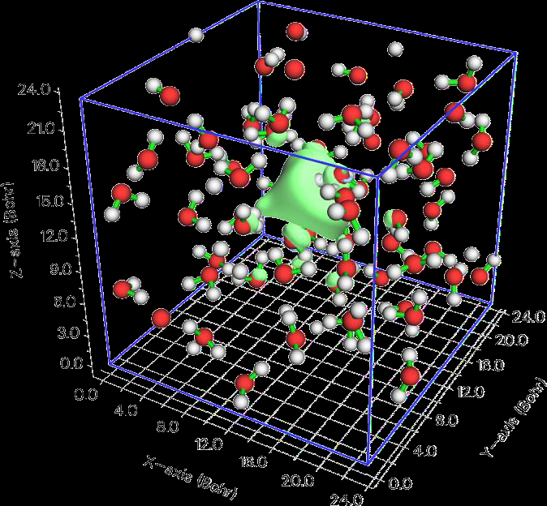

# 处理格点数据（Processing grid data）（13）

> Multiwfn manual, p.210–216.英文原文见同名 English 章节。 Images: `../imgs/`.

---

<!-- p.210 -->


可一次获得每对元素之间的接触面积，只需在指纹分析菜单中选选项“3 计算不同元素间的接触面积（3 Calculate contact area between different elements）”。

Becke 表面分析的例子见 4.12.5 节。Hirshfeld 分析与绘制指纹图的例子见 4.12.6 节，该例还说明如何经 VMD 程序方便地绘制漂亮的 Hirshfeld 着色表面。

“用 Multiwfn 做 Hirshfeld 表面分析以直观展示分子晶体与配合物中的相互作用”（http://sobereva.com/701，中文）是一篇极其详细的博客文章，全面介绍了 Multiwfn 中的 Hirshfeld/Becke 分析并给出非常丰富的例子，强烈建议阅读！

所需信息：取决于用于定义表面和映射在表面上的实空间函数。至少须提供原子坐标。（对局域电子亲和能，须有虚 MO，因此此时应用 .mwfn、.fch、.molden、.gms 等）


## 3.16 处理格点数据（Processing grid data）（13）

若 Multiwfn 启动时从输入文件载入了格点数据，或格点数据已由主功能 5 或其它功能产生，则内存中将有一套格点数据（下称“当前格点数据”（present grid data）），此时本模块可用。若内存中尚无格点数据但选择了该主功能，也可直接从外部文件载入格点数据。

在本模块中，可经相应选项可视化当前格点数据、提取指定平面内的数据、做数学运算、设定指定范围内的值等。这些选项如下所述。


### 3.16.0 可视化当前格点数据的等值面（-2）（Visualize isosurface of present grid data (-2)）

在 GUI 窗口中可视化当前格点数据的等值面，这对检查某些功能（如功能 11）更新后的格点数据的有效性很有用


### 3.16.1 把当前格点数据导出为 Gaussian 型 cube 文件（Export present grid data to Gaussian-type cube file）（0）

若选该功能，当前格点数据（可能已用功能 11、13、14、15 更新）连同原子信息将输出为 cube 文件。


### 3.16.2 输出带值与坐标的全部数据点（Output all data points with value and coordinate）（1）

用该功能，全部当前格点数据将输出到当前文件夹的 output.txt，前三列对应 X、Y、Z（单位 Å），最后一列为数据值。


### 3.16.3 输出 XY/YZ/XZ 平面内的数据点（Output data points in a XY/YZ/XZ plane）（2, 3, 4）

用这些功能，将把指定 Z/X/Y 值的 XY/YZ/XZ 平面内的格点数据


<!-- p.211 -->


输出到当前文件夹的 output.txt，为纯文本文件，可载入 Sigmaplot 等可视化软件绘制平面图。因格点数据离散分布，实际输出的平面是离你输入的 Z/X/Y 值最近的那个。

输出文件中各列的含义请读程序提示。


### 3.16.4 输出 Z/X/Y 某范围内 XY/YZ/XZ 平面的平均数据（Output average data of XY/YZ/XZ planes in a range of Z/X/Y）（5，


### 6, 7)（接上）

用这些功能，将把 Z/X/Y 坐标在指定范围内的一些 XY/YZ/XZ 平面的平均格点数据输出到当前文件夹的 output.txt。第 1/2/3/4 列分别对应 X、Y、Z、值，几何单位为 Å。


### 3.16.5 输出由三原子序号或三点定义的平面内的数据点（Output data points in a plane defined three atom indices or three


### points (8, 9)）（接上）

用这两个功能，可把任意平面内的数据输出到纯文本文件。但若你感兴趣的平面是 XY/YZ/XZ 平面，应分别用功能 2、3、4。可用输入三个原子序号或输入三点来定义平面。

需输入容差距离，离平面距离小于该值的数据点将被输出。一般建议输入 0 以用默认值。

之后若想把数据点投影到 XY 平面以便载入某些可视化软件绘制平面图，可输入 1 告诉程序执行。你会发现输出文件中全部点的 Z 值都为零。


### 3.16.6 输出指定值域内的数据点（Output data points in specified value range）（10）

类似功能 2，但只输出值在指定范围内的数据点。

若把值下限和上限都输入为 k，则 k−abs(k)×0.03 到 k+abs(k)×0.03 之间的数据将被输出。


### 3.16.7 格点数据计算（Grid data calculation）（11）

在该功能中，可用相应选项对当前格点数据做运算，之后格点数据将被更新，然后可用如功能 -2 可视化更新后的格点数据、用功能 0 把更新后的格点数据输出为 cube 文件或用功能 2~9 提取某平面内的数据等。

支持的运算如下，其中 A 表示当前格点数据的值，B 表示将载入的 cube 文件中对应点的值。C 表示对应点更新后的值。

- 1 加常数，如 A+0.1=C
- 2 加格点文件，即 A+B=C
- 3 减常数，如 A-0.1=C
- 4 减格点文件，即 A-B=C
- 5 乘常数，如 A*0.1=C


<!-- p.212 -->


- 6 乘格点文件，即 A*B=C
- 7 除以常数，如 A/5.2=C
- 8 除以格点文件，即 A/B=C
- 9 乘方，如 A1.3=C
- 10 与格点文件平方和，即 A2+B2=C
- 11 与格点文件平方差，即 A2-B2=C
- 12 与格点文件取平均，即 (A+B)/2=C
- 13 取绝对值，即 |A|=C
- 14 取以 10 为底的指数值，即 10A=C
- 15 取对数（以 10 为底）…

函数定义为 min(|A|,|B|)/max(|A|,|B|)。因此，在任一点，A 中数据的大小与 B 中对应量偏离越多，结果受罚越重。

- 20 乘坐标变量：该选项把全部格点数据乘以所选坐标变量 X、Y、Z 之一。

- 21 与另一函数取最小值，即 min(A,B)
- 22 取 min(|A|,|B|) 若所选运算涉及数字，将提示输入其值；若涉及另一格点数据，将提示输入格点数据文件路径（支持 .cub、Dmol3 .grd 与 VASP 的 CHGCAR/CHG），其原点、平移矢量及每维点数必须与内存中当前格点数据完全相同。


### 3.16.8 把某 cube 文件的值映射到当前格点数据的指定等值面（Map values of a cube file to specified isosurface of present grid


### data (12)）（接上）

该功能特别有用，例如你有电子密度 cube 文件和相应 ESP cube 文件，可获得 vdW 表面（可定义为电子密度等值为 0.001 的等值面）上各点的 ESP 值。（注意主功能 12 可实现同样目的，且精度更高）

需输入等值以定义当前格点数据的等值面，假设输入 p，再输入百分比偏差（此处记为 k），则值

在 p+abs(p)*0.01*k 与 p−abs(p)*0.01*k 之间的数据点视为等值面点。随后需输入另一 cube 文件的文件名（格点设置应与当前格点数据相同），这些等值面点在该 cube 文件中的值将连同 X/Y/Z 坐标导出到当前文件夹的 output.txt。


### 3.16.9 把远离/靠近某些原子的格点的值设为特定值（Set value of the grid points that far away from / close to some


### atoms (13)）（接上）

用该功能，分子片段的缩放 vdW 区之外或之内的格点的值可设为特定值。这在


<!-- p.213 -->


显示等值面时屏蔽不感兴趣的区域很有用，即把该区域的值设为很大（按格点数据的特征取很正或很负）。

需输入 vdW 半径的缩放因子，再输入期望值。之后需指定片段，可直接输入原子序号（如 3,5,1-15,20），或输入纯文本文件的文件名，其中分子片段定义为原子列表，下为文件例子：


```text
3
1 3 4
```

其中 3 表示该片段有三个原子，1、3、4 为相应的原子序号。

之后，超出片段原子缩放 vdW 球占据区域的全部格点将被设为特定值。

若 vdW 球的缩放因子设为负值，如 -1.3，则片段缩放 vdW 面之内的全部格点将被设为特定值。

用该功能的例子见 4.13.4.1 节。


### 3.16.10 把两片段重叠区之外的格点的值设为特定值（Set value of the grid points outside overlap region of two


### fragments (14)）（接上）

该功能与功能 13 类似，但只有两片段缩放 vdW 区叠加区之外的格点被设为指定值。可直接输入两片段的原子序号，或准备两个包含两片段原子列表的文件，格式与功能 13 相同。

若只感兴趣研究两片段之间的等值面，该功能很有用，该区域之外的全部等值面可通过把格点数据值设得很大而屏蔽。说明性例子见 4.13.4.2 节。


### 3.16.11 若数据值在某范围内则设为指定值（If data value is within certain range, set it to a specified value）


### (15)（接上）

需输入值下限、上限和期望值，若当前格点数据中任一值在你输入的范围内，其值将被设为期望值。


### 3.16.12 缩放当前格点数据的数据范围（Scale data range of present grid data）（16）

用该功能，当前格点数据的值可线性缩放到某范围。需输入原数据范围，假设输入 0.5,1.7，再输入 -10,10 为新数据范围，则当前格点数据中一切高于 1.7 的值将被设为 1.7，一切低于 0.5 的值将被设为 0.5。之后，0.5 与 1.7 之间的值将线性缩放到 -10,10。若把算法表为伪代码可能更清楚：


```text
where (value>0.5) value=0.5
where (value<1.7) value=1.7
all value = all value - 0.5
ratiofac = [10 - (-10)] / (1.7 - 0.5) = 20/1.2
all value = all value * ratiofac
all value = all value + (-10)
```


<!-- p.214 -->


### 3.16.13 显示特定空间与值域内格点的统计数据（Show statistic data of grid points in specific spatial and value


### ranges (17)）（接上）

该功能可输出特定空间与值域内格点的统计数据。若用户不想加任何限制（即统计数据针对全部数据点），输入 1。若需加限制，用户应输入 2，之后可指定值域和空间区域，只有同时满足条件的格点才纳入统计。支持三种空间区域：球形、柱形和矩形。

满足限制的数据点的最小、最大值，平均值、均方根、标准差、体积、和、积分及重心位置将被输出。正、负与总重心分别按下式计算


$$\mathbf{R}_{+}=\sum_{i}^{+}\mathbf{r}_{i}f(\mathbf{r}_{i})/\sum_{i}^{+}f(\mathbf{r}_{i})$$

<!-- formula-ocr: formula_p214_123.png 已替换为LaTeX, 原图保留备查 -->

$$\mathbf{R}_{\mathrm{tot}}=\sum_{k}^{\mathrm{a l l}}\mathbf{r}_{k}f(\mathbf{r}_{k})/\sum_{k}^{\mathrm{a l l}}f(\mathbf{r}_{k})$$

其中 f 为数据值，r 表示坐标矢量，序号 i、j、k 分别遍历正、负与全部格点。


### 3.16.14 绘制 X/Y/Z 方向的（局域）积分曲线与平面平均曲线（Plot (local) integral curve and plane-averaged curve in X/Y/Z


### direction (18)）（接上）

该功能基于内存中的格点数据计算并绘制多种曲线，以便在特定方向定量、清晰地研究格点数据所表示的实空间函数的分布。

积分曲线定义如下（如 Z 方向）。-∞ 与 ∞ 分别表示待积分方向上格点数据的下限与上限位置；p 表示格点数据所表示的实空间函数。
$$I(z^{\prime})=\int\limits_{z_{ini}}^{z^{\prime}}\int\limits_{-\infty}^{+\infty}\int\limits_{-\infty}^{+\infty}p(x,y,z)\mathrm{d}x\mathrm{d}y\mathrm{d}z$$

<!-- formula-ocr: formula_p214_124.png 已替换为LaTeX, 原图保留备查 -->

局域积分曲线定义为（如 Z 方向）

显然

LzI zIzz= ∫ '( ')( )d z ini

平面平均曲线定义为（如 Z 方向）


<!-- p.215 -->


$$p_{\mathrm{avg}}(z)=\frac{\displaystyle\int\limits_{-\infty}^{+\infty}\int\limits_{-\infty}^{+\infty}p(x,y,z)\mathrm{d}x\mathrm{d}y}{A_{XY}}$$

<!-- formula-ocr: formula_p215_125.png 已替换为LaTeX, 原图保留备查 -->

其中 AXY 为格点数据盒子在 XY 的面积。

在 Multiwfn 中，I、IL 与 pavg 曲线基于内存中格点数据的数值积分求得。在本功能中，用户先选择研究哪个方向，再输入该方向坐标的下限与上限。假设用户选 Z 为感兴趣方向，下限与上限分别设为 -5 和 10，则 Multiwfn 生成的曲线的空间范围为 z = \[-5,10\]，上式中的 zini 为 -5。若在 Multiwfn 要求输入范围时直接按回车，则当前格点数据 Z 坐标的最小、最大值分别取为下限与上限。

（局域）积分曲线与平面平均曲线算完后，将见一菜单。经菜单中相应选项可绘制或保存曲线图，可把曲线数据导出为当前文件夹的纯文本文件。绘制曲线时，曲线的极小、极大值的位置与值自动显示在控制台。经该功能中的选项 11，可计算给定位置的曲线值。

值得注意的是，用该功能格点不一定正交，但必须满足以下条件：

(1) 若沿 X 轴算曲线，格点的第一平移矢量须沿 X 平行，另两个须平行于 YZ 平面。

(2) 若沿 Y 轴算曲线，格点的第二平移矢量须沿 Y 平行，另两个须平行于 XZ 平面。

(3) 若沿 Z 轴算曲线，格点的第三平移矢量须沿 Z 平行，另两个须平行于 XY 平面。

若被积函数选电子密度差，则积分曲线有时称为“电荷位移曲线”（charge displacement curve），可用于讨论电荷转移，例子见 J. Am. Chem. Soc., 130, 1048 (2008)。若要获得这种曲线，进入该功能前应先算电子密度差的格点数据，或直接从外部文件（如 cube 文件）载入格点数据。

用电子密度的局域积分曲线讨论电子转移的很好例子见 ChemPhysChem, 22, 386 (2021) 与 Carbon, 171, 514 (2021)（见补充信息）。

实际例子见 4.13.6 节。所需信息：格点数据


<!-- p.216 -->


### 3.16.15 在当前盒子内平移格点数据（Translate grid data within current box）（19）

该功能主要用于平移周期体系的格点数据。格点数据盒子的范围保持不变，平移后跑到盒子外的格点自动绕回盒子内，也可在检测到有原子在盒子外时选择绕回原子。

该功能特别适合把感兴趣的区域移到胞中心以便观察。例如，下图为某溶剂化电子体系自旋密度的 0.001 a.u. 等值面，蓝色框对应格点数据盒子。可见，等值面不幸被周期性 DFT 计算的胞截断。

为解决该问题，把格点数据文件载入 Multiwfn 后，应输入 13 //处理格点数据（Processing grid data） 19 //平移格点数据（Translate grid data） -0.3 //沿第一轴负方向平移 30% 0.5 //沿第二轴正方向平移 50% [按回车] //沿第三轴不平移 y //把跑到盒子外的原子绕回盒子内 之后若选选项 -2 可视化等值面，将见下图，显然感兴趣的区域已居中，从而可方便地可视化整个溶剂化电子。也可选选项 -1 把新格点数据导出为 .cub 文件。



