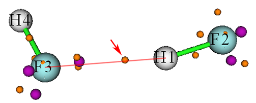
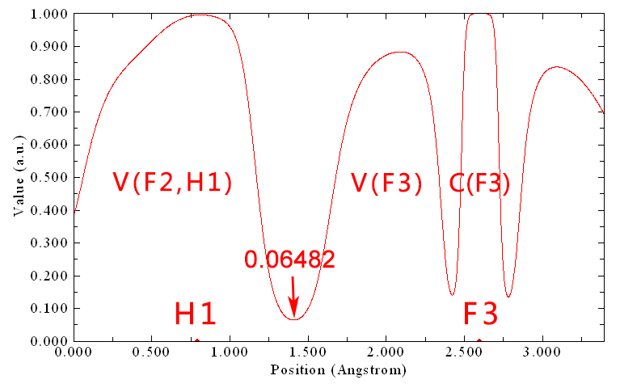
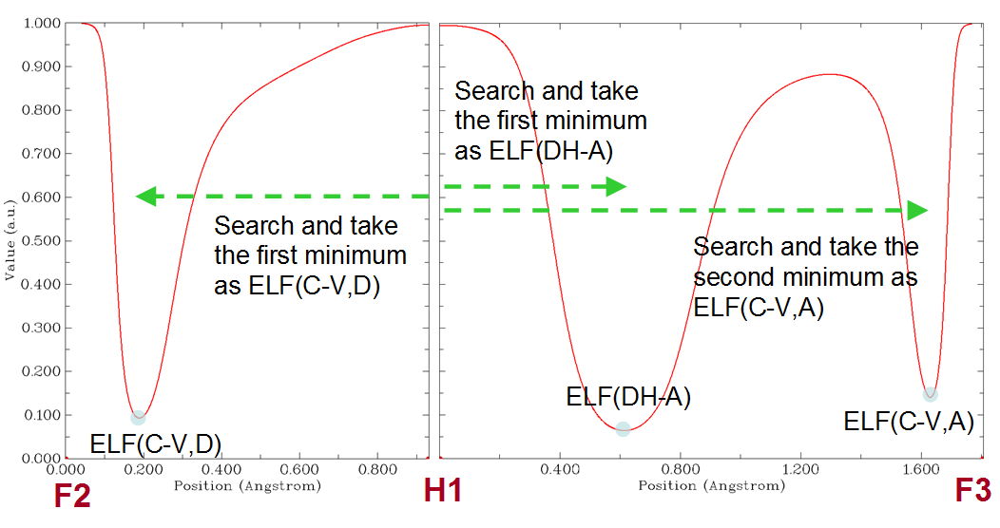
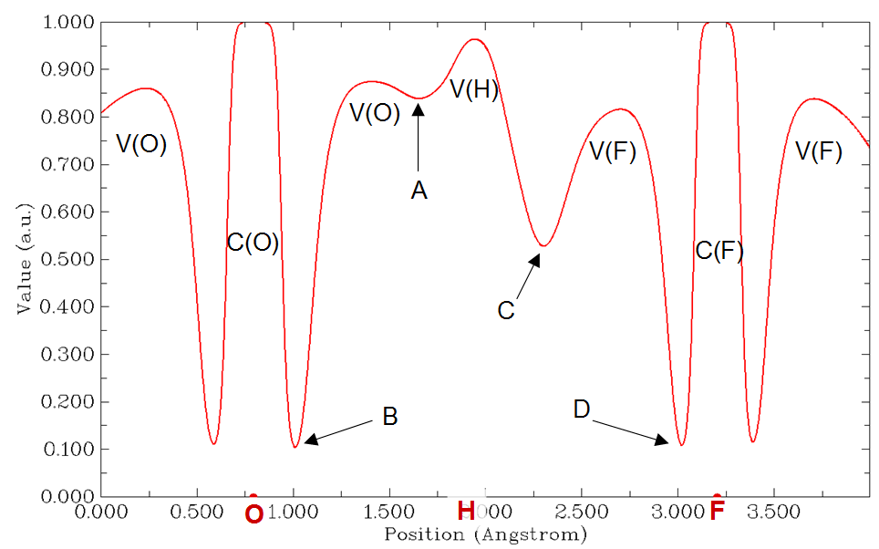

# 其他功能，第二部分 (Other functions, part 2) (200)

> Multiwfn manual, p.409–436.英文原文见同名 English 章节。 Images: `../imgs/`.

---

<!-- p.409 -->


在http://sobereva.com/wfnbbs/viewtopic.php?pid=1542的#4中给出了一个使用本功能基于用户提供的ESP cube文件评估ESP拟合电荷的例子。该例子说明了本模块的通用性。

所需信息 (Information needed)：原子坐标

## 3.200 其他功能，第二部分 (Other functions, part 2) (200)

### 3.200.1 计算核-价分岔 (CVB)指数及相关量 (Calculate core-valence bifurcation (CVB) index and related quantities)

注：本节的中文版是我的博客文章“使用Multiwfn计算CVB指数并衡量氢键强度”(http://sobereva.com/461)。

(1) CVB指数理论 所谓核-价分岔 (core-valence bifurcation，CVB)指数的思想最初在Theor. Chem. Acc., 104, 13 (2000)中提出，该指数基于电子定域函数 (ELF)定义，主要用于区分各种氢键 (H-bond)的强弱。对于典型形式 (D-H···A，其中D=给体，H=氢，A=受体)的氢键，该指数表示为：

CVB指数 = ELF(C-V) – ELF(DH-A) 其中ELF(C-V)对应于ELF核域与价域之间的ELF分岔值，而ELF(DH-A)代表V(D,H)与V(A)之间分岔点处的ELF值。

在上述Theor. Chem. Acc.论文中，作者考察了由HF与各种单体组成的许多氢键二聚体，发现CVB指数与氢键结合能具有良好的线性关系。在后续一些论文中，如Struct. Chem., 16, 203 (2005)和J. Phys. Chem. A, 115, 10078 (2011)，这一点得到了进一步证实，在前者中指出CVB指数“在弱复合物情况下为正，在较强复合物中为负”。此外，在Chem. Rev., 111, 2597 (2011)中作者称CVB指数“对弱氢键为正，若该相互作用增强则减小；对强氢键通常为负”。

我发现ELF(C-V)和ELF(DH-A)本身有时与氢键结合能的线性关系比CVB指数更好，因此建议你在实际研究中打算使用CVB指数时也考察这一点。

(2) 手动评估CVB指数

下面我将展示如何手动评估CVB指数中涉及的两项。以HF···HF二聚体为例，波函数文件已作为examples\HF_HF.wfn提供，它在B3LYP-D3(BJ)/def2-TZVP水平下生成，优化也在该水平下进行。该体系中的D、H、A原子分别对应于F2、H1、F3。

ELF(DH-A)项在原文中有明确定义。Multiwfn的拓扑分析模块能够定位ELF的分岔点，即ELF的(3,-1)临界点。

<!-- p.410 -->


然后你可以查看位于氢与受体原子之间的分岔点的ELF值（4.2.2节 (Section 4.2.2)说明了如何对LOL进行拓扑分析。ELF可以类似方式分析）。然而，对大体系进行ELF拓扑分析很耗时。考虑到V(D,H)与V(A)之间的实际ELF分岔点几乎严格位于连接H和A的直线上，更好的做法是使用Multiwfn的主功能3 (main function 3)绘制从H到A的ELF曲线图，然后直接读取相应极小值。下面是HF···HF二聚体的ELF拓扑分析结果截图

紫色和橙色小球分别为(3,-3)和(3,-1)型的ELF临界点 (CP)。箭头所指的(3,-1) CP对应于上述V(D,H)与V(A)之间的ELF分岔点，其ELF值 found 为0.06487，这正是当前体系的ELF(DH-A)。

从上图可以看出，红色连线基本穿过橙色小球的中心，这就是为什么也可以基于H1与F3之间的ELF曲线图近似评估ELF(DH-A)。使用主功能3 (main function 3)绘制的曲线图如下所示

箭头标出的极小值为0.06482，与基于耗时的ELF拓扑分析得到的0.06487非常接近。这一观察很好地证明了用H与A之间的ELF曲线图估计ELF(DH-A)的合理性。

至于ELF(C-V)，其定义相当含糊。由于在CVB指数的原文中作者没有明确清楚地解释该量应如何评估，不同论文常采用不同规则计算，导致现有文献中严重混乱。例如，在CVB原文即Theor. Chem. Acc., 104, 13 (2000)中，ELF(C-V)似乎被确定为D与A原子之间ELF曲线上分隔核与价壳的所有ELF极小值中的最大值。然而，在同一作者随后所写的Struct. Chem., 16, 203 (2005)一文中，我发现ELF(C-V)似乎是按





<!-- p.411 -->


给体原子的核与价盆相连的某个精确定位的ELF分岔点处的ELF值计算的（而受体原子似乎被忽略了）。

在我看来，ELF(C-V)的最佳定义应为D与H之间ELF曲线上分隔给体原子的核与价壳的极小值处的ELF值。仍以

HF···HF (H4-F3···H1-F2)二聚体为例，在F2与H1之间绘制的ELF曲线为：

即ELF(C-V) = 0.0936。因此，HF···HF体系的CVB指数应为0.0936 − 0.0648 = 0.0288。该值与Theor. Chem. Acc., 104, 13 (2000)表2中的对应值(-0.006)很不同，因为计算水平不同，获得ELF(C-V)的方式不同，且该论文中数据的符号被错误地写反了。

(3) 以全自动方式计算CVB指数 为了尽可能简化以上述方式计算CVB指数，Multiwfn提供了用于以全自动方式计算该指数的功能。仍以

HF···HF二聚体为例，启动Multiwfn并输入以下命令

examples\HF_HF.wfn 200 // 其他功能，第二部分 (Other function, part 2) 1 // 计算CVB指数及相关量 (Calculate CVB index and related quantities) 2,1,3 // 氢键的给体原子、氢和受体原子的序号，结果为

```text
Core-valence bifurcation value at donor, ELF(C-V,D):  0.0936
Distance between corresponding minimum and the hydrogen:   0.743 Angstrom

Core-valence bifurcation value at acceptor, ELF(C-V,A):  0.1408
Distance between corresponding minimum and the hydrogen:   1.628 Angstrom

Bifurcation value at H-bond, ELF(DH-A):  0.0648
Distance between corresponding minimum and the hydrogen:   0.614 Angstrom

The CVB index, namely ELF(C-V,D) - ELF(DH-A):    0.028768
```

结果与我们手动计算的完全相同。输出的ELF(CV,A)在当前语境下无用，但一些用户可能对此感兴趣。

为了使你更好地理解Multiwfn中CVB指数是如何自动计算的，


<!-- p.412 -->


这里我解释实现细节。在用户输入D、H和A原子的序号后，依次计算对应于D-H和H-A的ELF曲线，然后从曲线数据中自动识别ELF(CV,D)、ELF(DH-A)和ELF(CV-A)，如下图所示

(4) 特殊情况：计算某些非常强的氢键的CVB指数 原则上，上述CVB指数计算流程适用于大多数具有典型氢键的体系，分子间和分子内氢键都可以用同样方式分析。然而，对于某些非常强的氢键，其氢位于两个重原子中点

之间，如H2O···H+···OH2，该流程不再有效，因为其ELF曲线不显示典型特征，如下所示（由于该体系中O-H-O角接近

180°，只需一张图即可）：

可见V(D,H)已分岔为V(O)和V(H)。在这种情况下你应通过绘制ELF曲线图手动评估CVB指数，标准CVB指数表达式中的ELF(DH-A)应替换为曲线图中V(H)与V(O)之间局域极小值处的ELF值。

下面是一个更复杂的情况，F-···H··O-H，你也需要通过绘制ELF曲线图手动评估CVB指数。如下所示的ELF曲线图绘制于F与

O之间（F···H···O几乎呈线性，因此只需一张图即可），可见ELF




<!-- p.413 -->


相对于中心氢是不对称的：

该体系可视为具有两个氢键，O-H...F和O...H-F的氢键结合能必定很不同。对于前者，CVB指数 = ELF(B) - ELF(C)，而对于后者，CVB指数 = ELF(D) - ELF(A)。这是因为当将体系看作O-H...F (O...H-F)讨论时，O和F (F和O)分别表现为给体和受体原子。因此，H与F之间的C点极小值应视为ELF(DH-A)，而B点极小值应视为ELF(C-V,D)。

(5) 特殊情况：氢键受体不是单个原子

某些氢键的受体不是单个原子。例如，HF···乙烯的受体是乙烯的π区域。这类氢键称为π氢键。此时，你也不得不手动计算CVB指数。

HF···乙烯的波函数文件已作为examples\C2H4_HF.wfn提供，其几何结构如下所示。

对该体系，你可通过绘制F7与H8之间的ELF曲线图获得ELF(C-V,D)，并读取极小值处的ELF值，将发现该值为0.0944。

该体系的ELF(DH-A)可通过ELF拓扑分析获得。为此，我们在Multiwfn中输入以下命令：

2 // 拓扑分析 (Topology analysis) -11 // 选择要分析的实空间函数 (Select the real space function to be analyzed) 9 // ELF 6 // 通过在球内随机分布初始猜测点搜索临界点 (Search critical points by randomly distribute initial guesses within a sphere) 4 // 将球心设为三个原子的几何中心 (Set the sphere center as geometry center of three atoms) 1,4,8 // C1、C4和H8的中心将被设为球心




<!-- p.414 -->


0 // 开始搜索（球半径、起始点数目可通过界面中相应选项设置） (Start searching (the sphere radius, the number of starting points can be set by corresponding options in the interface))

-9 // 返回 (Return) 0 // 可视化拓扑分析结果 (Visualize topology analysis result) 现在你可以看到下图。显然，临界点5对应于V(D,H)与π电子盆之间的分岔

点。

关闭GUI，选择选项7 (option 7)，然后输入5查看临界点5的性质，你会发现其ELF值为0.1241，这正是该氢键的ELF(DH-A)。因此，该体系的CVB指数为0.0944 - 0.1241 = -0.0297。

事实上，由于该体系具有高对称性，你也可以通过简单绘制H8与C1-C4中点之间的ELF曲线图获得临界点5的ELF值。

所需信息 (Information needed)：原子坐标、GTF

### 3.200.2 在Hilbert空间中计算原子和键偶极矩 (Calculate atomic and bond dipole moments in Hilbert space)

本功能用于直接基于基函数（即在Hilbert空间中）计算原子和键偶极矩。你也可以参阅《量子化学思想 (Ideas of Quantum Chemistry)》(L. Piela, 2007)一书的12.3.2节。

理论 在基函数形式下，体系偶极矩可表示如下

$$\mathbf{\mu}=\mathbf{\mu}^{\mathrm{nuc}}+\mathbf{\mu}^{\mathrm{ele}}=\sum_{A}Z_{A}\mathbf{R}_{A}-\sum_{i}\sum_{j}P_{i,j}\left\langle\chi_{i}\middle|\mathbf{r}\right|\chi_{j}\rangle$$

其中Z和R分别为核的电荷和坐标。P为密度矩阵，ijχχr为

基函数i与j之间的偶极矩积分。

体系偶极矩可分解为单原子项与原子对项之和

$$\boldsymbol{\mu}=\sum_{A}\boldsymbol{\mu}_{A}^{\mathrm{tot}}+\sum_{A}\sum_{B>A}\boldsymbol{\mu}_{A B}^{\mathrm{tot}}=\sum_{A}\left(\boldsymbol{\mu}_{A}^{\mathrm{n u c}}+\boldsymbol{\mu}_{A}^{\mathrm{p o p}}+\boldsymbol{\mu}_{A}^{\mathrm{d i p}}\right)+\sum_{A}\sum_{B>A}\left(\boldsymbol{\mu}_{A B}^{\mathrm{p o p}}+\boldsymbol{\mu}_{A B}^{\mathrm{d i p}}\right)$$

五项的表达式和物理意义为


<!-- p.415 -->


𝛍𝐴 nuc：由核电荷引起的偶极矩

nucAAAZ=μR

pop：由定域在单个原子上的电子布居数引起的偶极矩（注意这不同于由Mulliken或类似方法计算的电子布居数，因为重叠布居数尚未归入各自原子） 𝛍𝐴

$$\begin{array}{r l}{\pmb{\mu}_{A}^{\mathrm{p o p}}=-p_{A}^{\mathrm{l o c}}\pmb{R}_{A}}&{{}p_{A}^{\mathrm{l o c}}=\displaystyle\sum_{i\in A}\displaystyle\sum_{j\in A}P_{i,j}\left\langle\left.\chi_{i}\right|\chi_{j}\right\rangle}\end{array}$$

dip：原子偶极矩，反映原子周围的电子偶极矩。rA为相对于原子核A的坐标变量 𝛍𝐴

$$\begin{aligned}\boldsymbol{\mu}_{A}^{\mathrm{d i p}}=&-\sum_{i\in A}\sum_{j\in A}P_{i,j}\left\langle\chi_{i}\left|\mathbf{r}_{A}\right|\chi_{j}\right\rangle\quad where\mathbf{r}_{A}=\mathbf{r}-\mathbf{R}_{A}\\=&-\sum_{i\in A}\sum_{j\in A}P_{i,j}\left\langle\chi_{i}\left|\mathbf{r}\right|\chi_{j}\right\rangle-\boldsymbol{\mu}_{A}^{\mathrm{p o p}}\end{aligned}$$

𝛍𝐴𝐵 pop：由原子A与B之间的重叠布居引起的偶极矩

$$\begin{array}{r l}{\pmb{\mu}_{A B}^{\mathrm{p o p}}=-p_{A B}\mathbf{R}_{A B}}&{{}p_{A B}=2\displaystyle\sum_{i\in A}\displaystyle\sum_{j\in B}P_{i,j}\left\langle\left.\chi_{i}\right|\chi_{j}\right\rangle\quad\mathbf{R}_{A B}=(\mathbf{R}_{A}+\mathbf{R}_{B})/2}\end{array}$$

dip：键偶极矩，一定程度上反映相应两原子几何中心周围的电子偶极矩。当然，如果A与B彼此不靠近，则该项会非常小，因而不宜称为键偶极矩。 𝛍𝐴𝐵

$$\begin{aligned}\boldsymbol{\mu}_{AB}^{\mathrm{dip}}&=-2\sum_{i\in A}\sum_{j\in B}P_{i,j}\left\langle\chi_{i}\left|\mathbf{r}_{AB}\right|\chi_{j}\right\rangle\quad where\mathbf{r}_{AB}=\mathbf{r}-\mathbf{R}_{AB}\\&=-2\sum_{i\in A}\sum_{j\in B}P_{i,j}\left\langle\chi_{i}\left|\mathbf{r}\right|\chi_{j}\right\rangle-\boldsymbol{\mu}_{AB}^{\mathrm{pop}}\end{aligned}$$

通过Mulliken型划分，可将键偶极矩并入原子偶极矩，从而体系偶极矩可写为单中心项之和

$$\mu_{A}^{nuc} + \mu_{A}^{dip} + \mu_{A}^{pop}$$

<!-- formula-ocr: formula_p415_301.png 已替换为LaTeX, 原图保留备查 -->

其中𝛍′𝐴 pop为由原子A的Mulliken布居数引起的偶极矩

$$\begin{array}{r l}{\pmb{\mu}_{A}^{\mathrm{^{\prime}\mathrm{p o p}}}=-\pmb{p}_{A}^{\mathrm{M u l}}\pmb{\mathrm{R}}_{A}}&{{}\pmb{p}_{A}^{\mathrm{M u l}}=\displaystyle\sum_{B}\displaystyle\sum_{i\in B}\displaystyle\sum_{j\in B}P_{i,j}\left\langle\pmb{\chi}_{i}\left|\pmb{\chi}_{j}\right.\right\rangle}\end{array}$$

𝛍′𝐴 dip为原子A的原子总偶极矩

$$\mathbf{\mu}_{A}^{\prime\mathrm{d i p}}=-\sum_{B}\sum_{i\in B}\sum_{j\in B}P_{i,j}\left\langle\chi_{i}\left|\mathbf{r}_{A}\right|\chi_{j}\right\rangle=-\sum_{B}\sum_{i\in B}\sum_{j\in B}P_{i,j}\left\langle\chi_{i}\left|\mathbf{r}\right|\chi_{j}\right\rangle-\mathbf{\mu}_{A}^{\mathrm{M u l}}$$

注意上述公式中的B指标遍历所有原子。

用法 输入文件必须包含基函数信息（例如.mwfn、.fch、.molden和.gms）。进入本功能后，你可选择选项1 (option 1)输出特定

dip；对体系偶极矩的贡献 due to 核电荷，𝛍𝐴 原子的信息，包括：原子局域布居数，𝑝𝐴 nuc；对体系偶极矩的贡献 due to loc；原子偶极矩，𝛍𝐴

电子，𝛍𝐴 pop。你也可选择选项2 (option 2)输出特定原子对之间的信息，包括：dip + 𝛍𝐴 pop；对体系偶极矩的贡献，𝛍𝐴 nuc + 𝛍𝐴 dip + 𝛍𝐴

键布居数，𝛍𝐴𝐵 pop；键偶极矩，𝛍𝐴𝐵 dip；对体系偶极矩的贡献，

<!-- p.416 -->


𝛍𝐴𝐵 pop + 𝛍𝐴𝐵 dip。若选择3，将输出

所选原子的原子总偶极矩及相关信息，包括：原子Mulliken布居数，𝑝𝐴 Mul；原子总偶极矩，

nuc；对体系偶极矩 due to 电子的贡献，𝛍′𝐴 𝛍′𝐴 nuc +𝛍′𝐴 pop。若选择选项10 (option 10)，则电子偶极矩矩阵的X/Y/Z分量将分别输出到当前文件夹下的dipmatx.txt、dipmaty.txt和dipmatz.txt。例如，Z分量的(i, j)元对应于 dip；对体系偶极矩 due to 核电荷的贡献，𝛍𝐴 dip + 𝛍′𝐴 dip + 𝛍′𝐴 pop；对体系偶极矩的贡献，𝛍𝐴

$$-\sum_{i}\sum_{j}P_{i,j}\left\langle\chi_{i}|z\right|\chi_{j}\rangle$$

<!-- formula-ocr: formula_p416_302.png 已替换为LaTeX, 原图保留备查 -->

所需信息 (Information needed)：原子坐标、基函数

### 3.200.3 为多个轨道波函数生成cube文件 (Generate cube file for multiple orbital wavefunctions)

通过本功能，可计算多个轨道波函数的格点数据，然后导出到单个cube文件或同时导出为多个cube文件。

进入本功能后，你需要先选择感兴趣的轨道（例如3,5,9-17），然后定义格点设置，再选择导出格点数据的方案。若选择方案1 (scheme 1)，则格点数据将导出为单独文件，例如orb000003.cub、orb000005.cub、orb000009.cub等。文件名中的数字对应于轨道序号。若选择方案2 (scheme 2)，则所选所有轨道的格点数据将集中导出到当前文件夹下的orbital.cub。许多可视化程序，包括VMD和Multiwfn，都支持包含多套格点数据的cube文件。

对于限制性和非限制性单行列式波函数，在本功能中你可以基于HOMO和LUMO选择轨道。例如，h-3表示HOMO-3，l+2对应于LUMO+2。更多例子见屏幕提示。

所需信息 (Information needed)：原子坐标、GTF

### 3.200.5 为实空间函数绘制径向分布函数 (Plot radial distribution function for a real space function)

本功能用于为实空间函数绘制径向分布函数 (RDF)

$$R D F(r)=\int f(r,\Omega)r^{2}\mathrm{d}\Omega$$

<!-- formula-ocr: formula_p416_303.png 已替换为LaTeX, 原图保留备查 -->

其中r为距球心的径向距离，Ω表示球层中的角坐标。

还可绘制RDF的积分曲线

$$I(r^{\prime})=\int_{r_{\mathrm{low}}}^{r^{\prime}}R D F(r)\mathrm{d}r=\int_{r_{\mathrm{low}}}^{r^{\prime}}\int f(r,\Omega)r^{2}\mathrm{d}\Omega\mathrm{d}r$$

显然，若rlow设为0（即球心），则I(∞)为f在全空间的积分。

在本功能中，可选择要研究的实空间函数，设置球心位置，设置要计算和绘制的下限和上限，设置

<!-- p.417 -->


径向和角向部分的点数。点数越多，积分曲线越准确。

在参数正确设置后，选择选项0 (option 0)开始计算，然后你会看到一个新菜单，其中可以绘制RDF及其积分曲线，保存图形或导出相应的原始数据。在该菜单中你还可以找到用于导出球平均函数 (f sph)的选项，它与RDF有以下关系

2( )( )4RDF rfrrπ= sph

一个例子见4.200.5节 (Section 4.200.5)。所需信息 (Information needed)：原子坐标、GTF

### 3.200.6 分析两个波函数中轨道的对应关系 (Analyze correspondence between orbitals in two wavefunctions)

理论 本功能主要用于分析两个波函数中轨道之间的对应关系。两套轨道可在不同基组下产生，用不同理论方法产生，处于不同外环境，处于不同电子态，或处于略有不同的几何结构下。两套轨道也可以是不同类型，例如第一套轨道为由Hartree-Fock计算产生的正则MO，而第二套轨道为由post-HF计算产生的自然轨道。

当前波函数（Multiwfn启动时载入的波函数）中的轨道{i}可表示为另一波函数（进入本模块后你指定的波函数）中轨道{j}的线性组合，即

$$\left|i\right\rangle=\sum_{j}C_{i,j}\left|j\right\rangle\quad\mathrm{where}\quad C_{i,j}=\left\langle i\right|j\rangle\equiv\int\varphi_{i}(\mathbf{r})\varphi_{j}(\mathbf{r})\mathrm{d}\mathbf{r}$$

一旦得到重叠积分，我们立即知道j与i如何关联。

轨道j对轨道i的贡献就是重叠积分的平方，即<i|j>2×100%。本功能能够计算C矩阵以及相应贡献，从而使你 легко 弄清两套轨道之间的关系。

用法 进入本功能后，首先需要输入当前波函数要考虑的轨道范围 (istart1~iend1)，然后输入第二个波函数的路径和要考虑的轨道范围 (istart2~iend2)。之后将通过Becke多中心数值积分方案计算istart1~iend1与istart2~iend2之间的重叠矩阵。然后你会看到istart2~iend2对istart1~iend1中每个轨道的五个最大贡献。

如果你想获得istart1~iend1中某个特定轨道的istart2~iend2的全部系数（以及相应贡献），可直接输入该轨道的序号。

如果当前波函数中的某轨道(i)可严格展开为istart2~iend2的线性组合，则必须满足归一化条件：

$$\sum_{j=start2}^{iend2}\left\langle i\middle|j\right\rangle^{2}\times100\%=100\%$$

<!-- formula-ocr: formula_p417_304.png 已替换为LaTeX, 原图保留备查 -->

j = istart2

<!-- p.418 -->


从Multiwfn输出中你可以找到对归一化条件的最大偏离。如果该值为零，意味着istart1~iend1中的所有轨道都可由istart2~iend2中的轨道严格表示。

注意，当前波函数的原子坐标与第二个波函数的原子坐标不一定相同，两波函数甚至可对应于不同分子。但如果两波函数中原子坐标分布范围差异很大，积分精度必定很低，结果不可靠。

通常默认积分格点已足够精细，即30个径向点、302个角向点，radcut=15。若想提高精度，应将settings.ini中的iautointgrid设为0，然后可在settings.ini中定义radpot、sphpot和radcut；增大它们的值将得到更好的积分精度。

本功能的计算 cost 直接取决于所考虑的轨道数；因此如果体系包含非常多的轨道，不要一次选择所有轨道。

特殊用法：评估两套轨道之间的重叠积分和叠加

本功能也可用于评估轨道之间的重叠，轨道可来自同一波函数，也可来自两个不同波函数。

进入本功能界面后，若想获得第一波函数中上述轨道istart1~iend1与第二波函数中轨道istart2~iend2之间的全部重叠积分（即所有<i|j>），只需输入-1，这些积分将输出到当前文件夹下的convmat.txt。

如果你需要的不是轨道波函数之间的普通重叠积分，而是轨道波函数模之间的重叠积分，它可用于衡量轨道叠加，表示为∫|𝜑𝑖(𝐫)||𝜑𝑗(𝐫)|d𝐫，你应在该功能界面输入-2，然后

istart1~iend1与istart2~iend2之间所有这些积分将输出到当前文件夹下的Snormmat.txt。类似地，如果你需要的是∫|𝜑𝑖(𝐫)|2|𝜑𝑗(𝐫)|2d𝐫，你应在界面输入

-3，则结果将输出到Snorm2mat.txt。

事实上，本功能在一定程度上可等价实现3.100.5节 (Section 3.100.5)、3.100.11节 (Section 3.100.11)和3.100.15节 (Section 3.100.15)介绍的功能，但输出格式和主要目的不同。

本功能的一些用法例子见4.200.6节 (Section 4.200.6)。所需信息 (Information needed)：原子坐标、GTF

### 3.200.9 计算平均键长和平均配位数 (Calculate average bond length and average coordinate number)

本功能用于计算两种元素之间的平均键长和平均配位数。本功能对分析原子簇的结构特征特别有用，例如下图所示的Ge12Au团簇（结构文件已作为examples\Ge12Au.pdb提供）。使用本功能，我们可立即获得平均Ge-Ge键长和平均Au-Ge键长，以及Ge由于Ge-Au或Ge-Ge键的平均配位数，或Au由于Ge-Au键的平均配位数。在J. Chem. Phys., 111, 1890 (1999)中可找到这类分析在Al上的一个很好的应用

<!-- p.419 -->


团簇。

平均键长定义如下

$$\left\langle R\right\rangle=\frac{1}{n_{\mathrm{b}}}\sum_{i>j}R_{i j}$$

<!-- formula-ocr: formula_p419_305.png 已替换为LaTeX, 原图保留备查 -->

其中Rij为原子i与j之间的距离，只有小于或等于给定距离截断（例如2.2 Å）的项才被视为键并计入求和。nb为键总数。

平均配位数按以下方式计算

$$CN=\frac{1}{n}\sum_{i}N_{i}$$

<!-- formula-ocr: formula_p419_306.png 已替换为LaTeX, 原图保留备查 -->

其中Ni为原子i周围的键数，n为原子总数。

进入本功能后，你需要输入两种元素，例如Ge,Au，并输入

距离截断，例如3.2，则≤3.2 Å的Ge-Au接触将被视为Ge-Au键并计算平均键长，同时输出最小和最大键长。之后，若选择y，将显示Ge由于Ge-Au键的平均配位数。

所需信息 (Information needed)：原子坐标

### 3.200.10 输出轨道之间的各种积分 (Output various kinds of integral between orbitals)

本功能用于计算轨道之间的电/磁偶极矩积分、速度积分、动能积分和重叠积分，高级用户会认识到这些数据的意义。在为一系列轨道时，结果导出到当前文件夹下的orbint.txt，第一列和第二列对应于两轨道的序号；在为一对轨道时，结果直接打印到屏幕上。

两轨道之间的电偶极矩积分矢量定义为

$$\mathbf{\mu}_{i j}=\mathbf{\mu}_{j i}=<\mathbf{\varphi}_{i}\mid-\mathbf{r}\mid\mathbf{\varphi}_{j}>$$

两轨道之间的磁偶极矩积分矢量按以下方式计算（更多细节


<!-- p.420 -->


可见3.21.1.1节 (Section 3.21.1.1)。忽略负号）

$$\mathbf{M}_{i j}=i<\varphi_{i}\mid\mathbf{r}\times\nabla\mid\varphi_{j}>$$

<!-- formula-ocr: formula_p420_307.png 已替换为LaTeX, 原图保留备查 -->

两轨道之间的速度积分矢量按以下方式评估（忽略负号）

$$\mathbf{v}_{ij}=i<\varphi_{i}\mid\nabla\mid\varphi_{j}>$$

<!-- formula-ocr: formula_p420_308.png 已替换为LaTeX, 原图保留备查 -->

值得注意的是，由于算符的Hermitian性质，我们有

$$\mathbf{M}_{ii}=0\qquad\mathbf{M}_{ij}=\mathbf{M}_{ji}^{*}=-\mathbf{M}_{ji}$$

$$\mathbf{v}_{i i}=0\quad\mathbf{v}_{i j}=\mathbf{v}_{j i}^{*}=-\mathbf{v}_{j i}$$

注意输出中未显式显示虚数符号。两轨道之间的动能积分和重叠积分分别按以下方式评估

$$\begin{array}{r}{K_{i j}=-\frac{1}{2}\big\langle\varphi_{i}\big|\nabla^{2}\big|\varphi_{j}\big\rangle\quad S_{i j}=\big\langle\varphi_{i}\big|\varphi_{j}\big\rangle}\end{array}$$

<!-- formula-ocr: formula_p420_309.png 已替换为LaTeX, 原图保留备查 -->

若需计算两轨道之间的Coulomb或交换积分，应使用3.200.17节 (Section 3.200.17)所述的功能。

所需信息 (Information needed)：原子坐标、GTF

### 3.200.11 计算函数的中心、一阶/二阶矩、回转半径和<r^2> (Calculate center, first/second moments, radius of gyration, and <r^2> of a function)

本功能用于计算表征所选实空间函数分布的各种量。

理论 实空间函数f的中心定义为

$$\mathbf{r}_{\mathrm{c}}=\frac{\int\mathbf{r}\times f(\mathbf{r})\mathrm{d}\mathbf{r}}{\int f(\mathbf{r})\mathrm{d}\mathbf{r}}$$

<!-- formula-ocr: formula_p420_310.png 已替换为LaTeX, 原图保留备查 -->

其中积分在全空间进行。

一阶矩为矢量，按以下方式评估

$$\mathbf{\mu}=\left[\begin{matrix}{\mu_{x}}\\ {\mu_{y}}\\ {\mu_{z}}\\ \end{matrix}\right]=\int\left[\begin{matrix}{x}\\ {y}\\ {z}\\ \end{matrix}\right]f(\mathbf{r})\mathrm{d}\mathbf{r}$$

<!-- formula-ocr: formula_p420_311.png 已替换为LaTeX, 原图保留备查 -->

其中x、y、z为相对于rc的笛卡尔坐标分量。

二阶矩为矩阵，定义为

$$\mathbf{\mu}=\left[\begin{matrix}{\mu_{x}}\\ {\mu_{y}}\\ {\mu_{z}}\\ \end{matrix}\right]=\int\left[\begin{matrix}{x}\\ {y}\\ {z}\\ \end{matrix}\right]f(\mathbf{r})\mathrm{d}\mathbf{r}$$

<!-- p.421 -->


若其本征值{ε}从低到高排序，则Θ的各向异性可按以下方式计算

$$\langle r^2 \rangle = \int(x^2 + y^2 + z^2)f(\mathbf{r})d\mathbf{r}$$

空间范围〈𝑟2〉= ∫(𝑥2 + 𝑦2 + 𝑧2)𝑓(𝐫)d𝐫就是二阶矩矩阵的迹，或其三个本征值之和。若f(r)选为电子密度，则<r2>对应于熟知的电子空间范围 (ESE)。注意ESE和电偶极/多极矩可用Multiwfn中的特定功能解析且高效得多地评估，见3.300.5节 (Section 3.300.5)。

用法 本功能采用Becke多中心积分方法评估上述量。精度完全由径向点和角向点决定，它们可分别通过settings.ini中的radpot和sphpot设置。

选项1 (Option 1)计算并输出所有上述量。待研究的实空间函数可通过选项3 (option 3)选择。中心 (rc)默认为(0,0,0)，可通过选项4 (option 4)手动设置。选项2 (Option 2)用于评估所选实空间函数的中心，可直接用作随后选项1 (option 1)计算的rc（显然，若rc设为所选函数的中心，算得的一阶矩将为零）。

使用选项1 (option 1)时，若待研究的实空间函数选为电子密度，则还会输出四极矩的核贡献和分子四极矩张量。事实上，后者可通过前者减去电子密度的二阶矩直接得到。

若感兴趣的实空间函数正负部分相当（例如具有明显正负相的轨道波函数），通常建议用选项5 (option 5)代替选项2 (option 2)评估所选实空间函数的分布中心，因为选项5 (option 5)在评估中使用函数绝对值，因此可避免抵消效应。此外，对这类实空间函数，为计算其上述统计量，建议在选择选项1 (option 1)之前先选择一次选项-1 (option -1)，此时评估将使用函数绝对值。

这里给出一个简短例子。为评估自旋密度的一阶和二阶矩（相对于自旋密度中心），在载入波函数文件后，你应输入

200 // 其他功能（第二部分）(Other function (Part 2)) 11 // 本功能 (The present function) 3 // 选择实空间函数 (Select a real space function) 5 // 自旋密度 (Spin density) 2 // 计算自旋密度中心 (Calculate center of spin density) y // 将算得的中心用于选项1中的各项数据评估 (Take the calculated center for evaluating various data in option 1) 1 // 评估自旋密度的各项数据 (Evaluate various data for spin density) 然后数据将显示在屏幕上。

关于使用本模块的更多说明见我的博客文章“使用Multiwfn展示多余电子并计算其回转半径”(http://sobereva.com/658，中文)。

<!-- p.422 -->


所需信息：原子坐标、GTFs


### 3.200.12 计算能量指数(EI)或键极性指数(BPI)

本功能用于计算能量指数(energy index, EI)和键极性指数(bond polarity index, BPI)，它们定义于 J. Phys. Chem., 94, 5602 (1990)，并在 J. Phys. Chem., 96, 157 (1992) 中进一步讨论。

分子中原子 A 的 EI 定义如下

$$\mathrm{EI}_{A}=\frac{\displaystyle\sum_{i}^{\mathrm{val}}\varepsilon_{i}\eta_{i}\Theta_{i,A}}{\displaystyle\sum_{i}^{\mathrm{val}}\eta_{i}\Theta_{i,A}}$$

i

其中 Θi,A 表示原子 A 在 MO i 中的组成。ηi 和 εi 分别为 MO i 的占据数和能量。求和遍及价 MOs。事实上，分母就是原子 A 的价电子数，而分子对应于其价电子的总能量。因此，EIA 可视为原子 A 每个价电子的平均能量。在 EI 的原始论文中，采用 Mulliken 方法计算原子对 MOs 的贡献，因此在当前 EI 实现中也采用该方法，尽管其它方法如 Hirshfeld 分割应该同样有效甚至更好。(注意，由于使用 Mulliken 方法，它与弥散函数不兼容，因此必须避免使用弥散基函数！)

分子中原子 A 与 B 之间的 BPI 定义为

)EIEI()EIEI(BPIrefref BBAAAB−−−=

其中 EIref 是由同核物种计算得到的参考 EI 值。例如，你

ref 是以 H2N-NH2 中的 EIN 计算得到。BPIAB 的绝对值越大，意味着 A-B 键的键极性越高。研究 H3C-NH2 的 BPICN，则 EIC ref 以乙烷中的 EIC 计算，而 EIN

基团电负性以相应自由基的 -EIX 来评价，X 为连接原子。例如，要得到 -CH3 基团的基团电负性，你应计算

·CH3 自由基的 -EIC。

Multiwfn 的本功能用于计算当前体系中特定原子的 EI，支持所有 R、RO 和 U 类型的 HF/DFT 波函数。Multiwfn 会自动判断内层芯电子数，并确定哪些 MOs 为价轨道从而应计入考虑。

实例见 Section 4.200.12。所需信息：原子坐标、基函数


### 3.200.13 评估轨道对密度差或其它


### 格点数据的贡献


**理论(Theory)** 本功能主要用于评估所选轨道中每一个轨道对给定

<!-- p.423 -->


密度差 Δρ 的贡献，从而使你能清楚理解哪一个(些)轨道是电子密度分布变化的主要贡献者。类似的思想已在 J. Mol. Model., 24, 25 (2017) 中用于研究各种 NBO 轨道对 Fukui 函数(一种特殊的电子密度，见 Section 4.5.4)的贡献，以更好地揭示其化学含义。下面概述本功能所用的理论与算法。

Δρ 可近似表示为轨道概率密度的线性组合，即相应轨道波函数的模方

$$\Delta\rho(\mathbf{r})\approx\sum_{i}p_{i}\mid\varphi_{i}(\mathbf{r})\mid^{2}$$

<!-- formula-ocr: formula_p423_312.png 已替换为LaTeX, 原图保留备查 -->

我们需要得到展开 Δρ 的 {p} 的最优值。pi 可视为轨道 i 对 Δρ 的贡献。{p} 可通过最小二乘法得到，即最小化

整个空间上 Δρ 与 p φr 之差，同时 {p} 2|( ) |iii

之和可通过 Lagrangian 乘子技术约束为给定值 P。实际实现中待最小化的误差函数为

$$F=\int\Bigg[\Delta\rho(\mathbf{r})-\sum_{i}p_{i}\mid\varphi_{i}(\mathbf{r})\mid^{2}\Bigg]^{2}\mathrm{d}\mathbf{r}+\lambda\Bigg[\sum_{i}p_{i}-P\Bigg]$$

<!-- formula-ocr: formula_p423_313.png 已替换为LaTeX, 原图保留备查 -->

在 Multiwfn 中，该积分按基于均匀分布格点的数值积分处理，即

$$F=\Delta_{V}\sum_{\mu}\Biggl[\Delta\rho(\mathbf{r})-\sum_{i}p_{i}\mid\varphi_{i}(\mathbf{r})\mid^{2}\Biggr]^{2}+\lambda\Biggl[\sum_{i}p_{i}-P\Biggr]$$

<!-- formula-ocr: formula_p423_314.png 已替换为LaTeX, 原图保留备查 -->

其中 μ 为格点序号，ΔV 为格点体积。

显然，为确定最优 {p} 应满足以下条件

∂==∂ Fip i 0{1,2,3} Λ


$$\frac{\partial F}{\partial p_{i}}=0\quad i=\{1,2,3\ldots\}$$

<!-- formula-ocr: formula_p423_315.png 已替换为LaTeX, 原图保留备查 -->

更明确地写为，

$$\frac{\partial F}{\partial p_{i}}=0\quad\Rightarrow\quad\sum_{j}p_{j}\sum_{\mu}|\varphi_{i}(\mathbf{r}_{\mu})|^{2}|\varphi_{j}(\mathbf{r}_{\mu})|^{2}+\lambda=\sum_{\mu}|\varphi_{i}(\mathbf{r}_{\mu})|^{2}\Delta\rho(\mathbf{r}_{\mu})$$

显然，确定 {p} 的工作方程应为

$$\left[\begin{array}{c c c c}{A_{1,1}}&{\cdots}&{A_{1,N}}&{1}\\ {\vdots}&{\ddots}&{\vdots}&{\vdots}\\ {A_{N,1}}&{\cdots}&{A_{N,N}}&{1}\\ {1}&{1}&{1}&{0}\\ \end{array}\right]\left[\begin{array}{c}{p_{1}}\\ {\vdots}\\ {p_{N}}\\ {\lambda}\\ \end{array}\right]=\left[\begin{array}{c}{B_{1}}\\ {\vdots}\\ {B_{N}}\\ {P}\\ \end{array}\right]$$

Multiwfn 报告的拟合误差用下式估计

<!-- p.424 -->


$$\mathrm{definition}1\colon\int\left|\Delta\rho(\mathbf{r})-\sum_{i}p_{i}\mid\varphi_{i}(\mathbf{r})\right|^{2}\mathrm{d}\mathbf{r}$$

$$\mathrm{definition}1\colon\int\left|\Delta\rho(\mathbf{r})-\sum_{i}p_{i}\mid\varphi_{i}(\mathbf{r})\right|^{2}\mathrm{d}\mathbf{r}$$

原则上，该算法适用于任何种类的 Δρ 和轨道。例如，Δρ 可对应于 Fukui 函数、电子激发过程中的密度变化等。轨道可以是定域分子轨道(LMO)、NBO、MO 等。贡献 p 可为正

或负，其符号反映轨道密度参与 Δρ 的相位。注意，轨道范围的选择高度任意，但显然会影响结果。例如，范围可包括某一类型的所有轨道，或仅包括占据轨道。


**用法(Usage)** 下面是通过本功能求得一组轨道对 Δρ 贡献的常用流程

(1) 用 Multiwfn 或其它程序产生 Δρ 的 cube 文件。计算 Δρ 格点数据的流程已在本手册许多节中充分说明，例如 Section 4.5.4 (Fukui 函数与对偶描述符) 和 Section 4.18.3 (对应于电子激发的 Δρ)。

(2) 将含有感兴趣轨道的文件载入 Multiwfn，然后进入主功能 200 的子功能 13。

(3) 输入含有 Δρ 的 cube 文件的路径，使 Multiwfn 加载它。(4) 用选项 1 设置对贡献之和的约束，即上述方程中的 P 值。P 默认为 1.0。

(5) 选择选项 0，然后设置计入考虑的轨道范围。计算后，所有选中轨道的贡献(p)将显示在屏幕上。

(6) 在后处理菜单中，你可以选择可视化 Δρ、拟合密度

p φr 或其差值 2|( ) |iii pρφΔ−r 的等值面，从而直观检查 2|( ) |iii

拟合质量。拟合密度也可导出为 cube 文件。

在 Multiwfn 中，在构建 A 矩阵和 B 向量期间处理轨道格点数据有两种模式。你可通过选项 2 切换模式。

- 基于内存(Memory based)(默认)：先自动计算所有选中轨道的密度格点数据并记录在内存中，此时计算相当快，但当所选轨道范围较大且格点质量较高时，对可用内存的要求非常高。若因内存不足未导致 Multiwfn 崩溃，强烈建议使用该模式。

- 基于 cube 文件(Cube file based)：所有选中轨道的密度格点数据自动计算并以 rho_xxxxx.cub 的形式作为单个 cube 文件保存在当前文件夹，其中 xxxxx 为轨道序号。当使用相应轨道构建 A 矩阵和 B 向量时将加载该文件。该模式的速度远慢于“基于内存”模式，但优点是内存消耗几乎可忽略。

注意，自动计算的轨道密度的格点设置被程序设为

<!-- p.425 -->


与所加载的 Δρ 格点数据完全相同。

需要特别指出的是，本功能通用、灵活，并不一定限于

研究轨道对 Δρ 的贡献。例如，若提供的 cube 文件含有的是 ρ 而非 Δρ 的格点数据，则本功能将给出所选轨道对 ρ 的贡献(当然，在此之前，应恰当设置 P 以使所得贡献值有意义。若你不确定如何设置，可直接去掉约束)

本功能的实际分析实例见 Section 4.200.13。


### 3.200.14 域分析(获得某


### 函数等值面内的性质)

本功能用于在域内对特定实空间函数积分。域指被某特定实空间函数的等值面包围的各个空间区域。例如，你可用本功能在由约化密度梯度(RDG)等值面定义的各个域内对电子密度积分，以研究不同位置弱相互作用的强度。若灵活利用该模块，可实现许多特殊分析。例如，可视化并求得分子空腔体积(见 Section 4.200.14.2 实例)。

基本用法 下面是使用该模块的基本流程：(1) 进入域分析模块后，用选项 2 和 3 设置定义域的方式。例如，你在选项 2 中选择 RDG，并在选项 3 中输入 <0.5，则 RDG 小于 0.5 的区域将被识别为不同的域。

注意，在识别域时可考虑周期性。要启用它，选择选项“4 在域分析中切换是否考虑周期性(4 Toggle considering periodicity during domain analysis)”将其状态设为“Yes”。

(2) 选择选项 1 并恰当定义格点，然后 Multiwfn 开始计算你所选实空间函数的格点数据，并识别满足你所设判据的域。

注：若内存中已有格点数据，例如你刚通过主功能 5 计算得到，或在 Multiwfn 启动时直接加载了 .cub 文件，你也可选择选项 -1 直接使用该格点数据，而不计算新的格点数据。这种情况下，选项 2 显然无意义。

(3) 上一步计算完成后，Multiwfn 输出每个域中的格点总数。在非常简单的情况下，仅凭该信息你可直接推断哪些域是你要研究的，而一般情况下，你需用选项“3 可视化域(3 Visualize domains)”在 GUI 窗口中可视化域，在其中你可在右下列表中选择域并查看其形状，图上每个绿点对应域中的一个格点。

一旦找到感兴趣的域，且你想在某域内对实空间函数积分，你可选择选项“1 对单个域执行积分(1 Perform integration for a domain)”，然后将被询问输入域的序号，再选择被积函数。被积函数可以是 (1) Multiwfn 支持的任意实空间函数 (2) 当前存于内存中的格点数据 (3) 记录在 .cub 文件中的格点数据(将被询问输入其路径。该文件中的格点分布必须与当前格点数据完全相同)。执行积分后，将输出积分值、

<!-- p.426 -->


域体积以及域内被积函数的平均/最大/最小值。此外，还将输出属于该域的格点的 X/Y/Z 最小值与最大值，以及 X/Y/Z 方向的跨度。你也可选择选项“2 对所有域执行积分(2 Perform integration for all domains)”一次性获得所有域的积分值。(提示：若你只需要域体积，可选择用户自定义函数作为被积函数，它默认处处为 1.0，因此对其积分不花费任何计算时间)。

此外，你感兴趣的某些区域可能被识别为分离的域，为更方便地研究这些区域的性质，你可选择选项“-1 合并特定域(-1 Merge specific domains)”将所选域合并为单个域，从而不必手动加和它们的积分值。

通过后处理菜单中的选项 12，你可将特定域中所有格点的 X、Y、Z 坐标连同格点数据值导出到当前文件夹的 domain.txt。

用第三方工具可视化域 若你希望在 VMD 等第三方程序中可视化域，有两种方式：

- 选择“10 将域导出为当前文件夹中的 domain.cub 文件(10 Export a domain as domain.cub file in current folder)”并输入感兴趣

域的序号，则 Multiwfn 将该域导出为 domain.cub，其中属于和不属于该域的格点值分别为 1 和 0(边界格点的值也输出为 0，以保证等值面看起来总是封闭的)。之后，你可将该 cube 文件载入可视化程序，用 0.5 等值面可视化等值面。

- 选择“11 将域的边界格点导出到当前文件夹的 domain.pdb 文件(11 Export boundary grids of a domain to domain.pdb file in current folder)”并输入

感兴趣域的序号，则所得 .pdb 文件将包含粒子，每一个对应一个边界格点。你可直接将该文件拖入 VMD 并将粒子渲染为球来可视化域。

特殊用法：研究相互作用 在后处理菜单中，有选项“5 计算某域的 q_bind 指数(5 Calculate q_bind index for a domain)”，用于计算定义于 J. Phys. Chem. A, 115, 12983 (2011) 的 qbind 指数，该文中证明对于氢键二聚体，qbind 指数的扫描曲线很好地模拟了实际势能曲线。该指数对某域定义为：

$$q_{\mathrm{rep}}=\int_{\lambda_{2}(\mathbf{r})>0}\rho^{n}(\mathbf{r})\mathrm{d}\mathbf{r}\quad\mathrm{repulsive~effect}$$


$$q_{\mathrm{b i n d}}=-(q_{\mathrm{a t t}}-q_{\mathrm{r e p}})$$

<!-- formula-ocr: formula_p426_316.png 已替换为LaTeX, 原图保留备查 -->

其中 λ2(r) 为 r 处电子密度 Hessian 矩阵的第二大本征值，其符号可用于判别相互作用类型。该文表明 n = 4/3 时 qbind 与实际势能曲线相关性最好。在 Multiwfn 中 n 可手动设置。注意该文计算此指数时用 RDG = 0.6 的等值面。qbind 越负可能意味着相互作用越稳定。

值得注意的是，后处理菜单中还有非常灵活的选项“根据 sign(lambda)*rho 范围对某些域的子区域执行积分(Perform integration for subregion of some domains according to range of sign(lambda)*rho)”，它在研究相互作用时可能有用。你可先选择一批域，然后通过设置 sign(λ2)ρ 范围定义将积分

域的哪些子区域(若你对此不熟悉，见 Section 3.23.1)，被积实空间函数可任意选择。在

<!-- p.427 -->


计算后，将依次输出每个所考虑域的所选实空间函数的积分与子区域体积；此外，子区域中 λ2 为正和为

负区域的结果也分别输出。利用该选项，你可实现特殊目的，例如，对应于分子间相互作用区域的 RDG < 0.6 域，获得 sign(λ2)ρ 在 -0.015 至 0.015 a.u. 之间的子区域内动能密度积分。

关于积分精度 本模块中对域积分所用的方法是均匀格点积分法。换言之，某域的实空间函数积分值就是构成该域的格点的实空间函数值之和乘以格点体积。因此，积分结果的精度直接受你设置的格点质量影响。

本模块的示例性应用实例见 Section 4.200.14。


### 3.200.15 计算电子相关指数

Matito 等人在 Phys. Chem. Chem. Phys., 18, 24015 (2016) 中提出的总、动态与非动态电子相关指数是衡量当前体系中电子相关大小的有用指标。

动态与非动态电子相关指数(ID 与 IND)定义为

$$I_{\mathrm{N D}}=\frac{1}{2}\sum_{i}\eta_{i}(1-\eta_{i})$$

<!-- formula-ocr: formula_p427_317.png 已替换为LaTeX, 原图保留备查 -->

i

其中 i 表示自然自旋轨道序号，η 为相应占据数。注意在某些情况下，η 可能略大于 1.0 或为负值，Multiwfn 会自动将其置为 1.0 和 0.0，以使计算可行。

总电子相关指数定义为

$$I_{\mathrm{T}}=I_{\mathrm{D}}+I_{\mathrm{N D}}=\frac{1}{4}\sum_{i}\sqrt{\eta_{i}(1-\eta_{i})}$$

<!-- formula-ocr: formula_p427_318.png 已替换为LaTeX, 原图保留备查 -->

本功能用于计算上述全部三种电子相关指数。任何携带有自然轨道占据数的波函数文件都可用作输入文件，如 .mwfn、.wfn、.wfx 和 .molden 文件。实例见 Section 4.A.6。

注意 Matito 等人还提出了这三种函数的局域版本以表征局域区域的电子相关，Multiwfn 也能研究它们，见 Section 4.A.6 实例。


### 3.200.16 基于 .fch/.fchk 文件中的密度矩阵产生自然轨道、自然自旋轨道(NSO)与


### 自旋自然轨道(SNO)

在 .fch (或 .fchk) 文件中，总记录有密度矩阵。例如，若你用 Gaussian 关键词“# MP2/cc-pVTZ density”对开壳层体系做了 MP2 任务，则所得 .fch 文件将有以下四个字段记录相应类型的密度矩阵：

<!-- p.428 -->


而对于闭壳层体系，若所用关键词为“# TD PBE1PBE/6-311G* density”，则所得 .fch 文件将含有以下类型的密度矩阵：

```text
Total SCF Density, Total SCF Density, Total CI Rho(1) Density, Total CI Density
```

若你不知道 .fch 文件中记录了哪几种密度矩阵，只需在文件中搜索“Density”即可。

各类自然轨道可通过对角化适当类型的密度矩阵得到：

自然轨道(NOs)：对角化总密度矩阵。占据数为 0.0 至 2.0。此类 NOs 也称为空间 NOs，具体地，对于非限制性波函数称为非限制性自然轨道(UNO)

α 与 β 自然轨道(统称为自然自旋轨道，NSOs)：分别对角化 α 与 β 密度矩阵。占据数为 0.0 至 1.0。

自旋自然轨道(SNOs)：对角化自旋密度矩阵(即 α 与 β 密度矩阵之差)。占据数为 -1.0 至 1.0。占据为正(负)的 SNO 代表未配对 α (β) 电子的分布。

用本功能，你可得到上述任何一套 NOs。例如，若你想得到三重态水在 CCSD/cc-pVDZ 水平的 SNOs，可运行以下 Gaussian 输入文件：

```text
%chk=C:\CCSD_water_m3.chk
#p CCSD/cc-pVDZ density

test

0 3
O 0.00000000     0.00000000     0.11930801
H 0.00000000     0.75895306    -0.47723204
H 0.00000000    -0.75895306    -0.47723204
```

将 .chk 文件转换为 .fch，然后启动 Multiwfn 并输入 C:\CCSD_water_m3.fch 200 16 CC // 意为我们要分析耦合簇密度矩阵。你也可在此输入 SCF 以分析 Hartree-Fock 密度矩阵

3 // 产生 SNOs (若体系为闭壳层，则不会出现此选项，因为此时只能产生 NOs)

此时内存中的基函数信息已更新为 SNOs。若接着你想可视化 SNOs，或进行实空间函数分析(如通过 Hirshfeld 分割分析 SNOs 的轨道组成)，你应选择 y 将波函数信息导出到当前文件夹的 new.mwfn，然后程序会自动加载它。此后，所有后续分析都将对应于 SNOs。

我的博客文章之一详细讨论并给出了 SNOs 的分析实例：“在 Multiwfn 中基于 fch 文件产生自然轨道的方式以及关于激发态波函数和自旋自然轨道的分析实例”(中文) http://sobereva.com/403。

注：一旦载入含有 SNOs 的 .mwfn 文件，体系将被视为开壳层，且 α 与 β 轨道数相同，只有前者对应 SNOs，而后者完全无意义，你应直接忽略它们。

本功能对 Gaussian 和 PSI4 产生的 .fch/.fchk 文件效果良好，对其它程序可能兼容也可能不兼容。

若本功能与 PSI4 联用，你可分析高达 CCSD(T) 水平的波函数，详见 Section 4.A.8。

Section 4.18.9 中的实例利用本功能为跃迁密度矩阵产生了自然轨道。

<!-- p.429 -->


态波函数与自旋自然轨道”(中文) http://sobereva.com/403。

注：一旦载入含有 SNOs 的 .mwfn 文件，体系将被视为开壳层，且 α 与 β 轨道数相同，只有前者对应 SNOs，而后者完全无意义，你应直接忽略它们。

本功能对 Gaussian 和 PSI4 产生的 .fch/.fchk 文件效果良好，对其它程序可能兼容也可能不兼容。

若本功能与 PSI4 联用，你可分析高达 CCSD(T) 水平的波函数，详见 Section 4.A.8。

Section 4.18.9 中的实例利用本功能为跃迁密度矩阵产生了自然轨道。

所需信息：.fch/.fchk 文件


### 3.200.17 计算两个


### 轨道间的库仑与交换积分

理论与实现 库仑(ii|jj)与交换积分(ij|ji)是量子化学中最重要的两类积分。本功能用于计算所选两个轨道 i 与 j 之间的这两类积分，其表达式为：

轨道 i 与 j 间的库仑 $(ii|jj)$ 与交换积分 $(ij|ji)$：

$$ (ii\mid jj)=\int\int\frac{\varphi_{i}^{*}(\mathbf{r}_{1})\varphi_{i}(\mathbf{r}_{1})\varphi_{j}^{*}(\mathbf{r}_{2})\varphi_{j}(\mathbf{r}_{2})}{r_{12}}\mathrm{d}\mathbf{r}_{1}\mathrm{d}\mathbf{r}_{2} $$

$$ (ij\mid ji)=\iint\frac{\varphi_{i}^{*}(\mathbf{r}_{1})\varphi_{j}(\mathbf{r}_{1})\varphi_{j}^{*}(\mathbf{r}_{2})\varphi_{i}(\mathbf{r}_{2})}{r_{12}}\mathrm{d}\mathbf{r}_{1}\mathrm{d}\mathbf{r}_{2} $$


<!-- formula-ocr-manual: formula_p429_319 见上 -->

本功能适用于任何种类轨道，如分子轨道、定域分子轨道、自然跃迁轨道等。

目前，积分基于均匀格点(即等距放置的格点)计算：

$$(ii\mid jj)=(d_{\mathrm{x}}d_{\mathrm{y}}d_{\mathrm{z}})^{2}\sum_{k}\varphi_{i}^{2}(\mathbf{r}_{k})\sum_{l\neq k}\frac{\varphi_{j}^{2}(\mathbf{r}_{l})}{|\mathbf{r}_{l}-\mathbf{r}_{k}|}$$

$$(ii\mid jj)=(d_{\mathrm{x}}d_{\mathrm{y}}d_{\mathrm{z}})^{2}\sum_{k}\varphi_{i}^{2}(\mathbf{r}_{k})\sum_{l\neq k}\frac{\varphi_{j}^{2}(\mathbf{r}_{l})}{|\mathbf{r}_{l}-\mathbf{r}_{k}|}$$

其中 k 与 l 为格点序号；dx、dy 与 dz 分别为 X、Y 与 Z 方向格点间距。

本功能相当耗时。对给定体系，间距越小，计算代价越高而精度越好。若你不知道当前采用的格点间距是否足够小，可做收敛测试，即逐渐减小间距并检查数值何时收敛。

有两种可用的输入文件：

- 含有轨道波函数的文件。若你在 Multiwfn 启动时用如 .mwfn、.fch 或 .molden 作为输入文件

<!-- p.430 -->


进入本功能后，将被要求输入两个轨道序号并选择格点设置，然后将为它们自动计算波函数的格点数据。

- 两个含有轨道波函数的 cube 文件。你应在 Multiwfn 启动时输入第一个轨道的 cube 文件，进入本功能后再输入另一轨道的 cube 文件。cube 文件可由任何量子化学程序产生(也包括 Multiwfn 的主功能 5)。

在本功能界面中，计算前你可分别为库仑(ζJ)积分与交换积分(ζK)设置截断值。库仑的最内层加和

$$\varphi_i^2(\mathbf{r}_k) < \zeta_J$$

显然，若截断值设置得当，代价可显著降低而精度几乎不变。通常建议用默认值。

注意若你需计算单电子轨道积分，应使用 Section 3.200.10 所述功能。

实例 这里以水分子为例说明这两类积分的计算。启动 Multiwfn 并输入

examples\H2O_iijj.fch // 含有 HF/6-31G* 水平的分子轨道 200 // 其它功能(第2部分)(Other functions (Part 2)) 17 // 计算两个轨道间的库仑与交换积分(Calculate Coulomb and exchange integrals between two orbitals) 4,10 // 所选两个轨道为 MO4 与 MO10 1 // 低质量格点(对应格点间距 0.2 Bohr) 1 // 以默认截断水平计算库仑积分。结果为 0.615700 3 // 以默认截断水平计算交换积分。结果为 0.122246 (ii|jj) 与 (ij|ji) 由解析积分算得的精确值分别为 0.623256 与 0.129893，显然我们基于数值积分算得的值精度基本令人满意。若你采用更好的格点，如间距 0.1 Bohr (对应“中等质量格点”)，精度将进一步明显改善(分别为 0.62143 与 0.12793)，但代价将高八倍，注意代价与格点间距的立方成反比。


### 3.200.18 计算键长/键级交替(BLA/BOA)与


### 角度/二面角交替

理论 在共轭聚合物中，共轭链上的原子与键性质呈现交替特征。键长交替(BLA)是研究此类体系的重要量。要计算 BLA，应给出共轭链中的原子序列。例如，原子序列给定为 3-5-6-9-10-12，则键 1 为 3-5，键 2 为 5-6，等等。此时的 BLA 计算为

BLA = (R5-6+R9-10)/2 − (R3-5+R6-9+R10-12)/3 其中 R 为键长。更一般地，BLA 定义如下(见 Handbook of

<!-- p.431 -->


Thiophene-based Materials: Applications in Organic Electronics and Photonics)

BLA = 偶数键的平均长度 − 奇数键的平均长度 BLA 绝对值越小，意味着沿所选路径电子共轭越好。该量在文献中被频繁使用，见 J. Chem. Phys., 136, 094904 (2012) 的研究实例，以及 http://photonicswiki.org/index.php?title=Structure-Property_Relationships 关于 BLA 与各种分子性质关系的全面综述。

键级是与键长密切相关的量，因此键级交替(BOA)也是与 BLA 同样有用的量。BOA 与 BLA 的唯一区别是后者中的键长被替换为键级。与 BLA 相比，BOA 从电子结构角度而非单纯几何角度展现键交替特征。如 Section 3.11 充分介绍，键级没有唯一定义。Mayer 键级非常适合评价 BOA，因为它相当通用、便宜，且其大小接近形式键级。

键角交替与二面角交替也经常被研究，Multiwfn 能计算沿链的键角与二面角变化。

用法 要使用本功能，必须定义原子序列，这很容易。进入本功能后，将被要求输入组成序列的原子的序号，顺序完全任意。然后需输入序列中起始原子与终止原子的序号。之后，基于这些信息与原子间连接关系，Multiwfn 自动识别实际原子序列并输出到屏幕，建议你简要检查以确保序列正确。然后，对原子序列中的每根键，Multiwfn 输出其序号、相应原子序号、键长与 Mayer 键级，再输出 BLA 与 BOA 值。键数据还导出到当前文件夹为 bondalter.txt，以便你导入到 Origin 等数据作图工具绘制“键长 vs. 键序号”与“键级 vs. 键序号”曲线图。最后，若你想研究沿序列的键角与二面角交替，也可让 Multiwfn 输出它们。

本功能也可用于研究闭合路径(如环)的上述性质，此时终止原子的序号应与起始原子相同。

若你的输入文件同时含有原子信息与基函数信息，如 .mwfn、.fch 与 .molden 文件，如上所述将同时输出键长与键级。然而，若你的输入文件仅含原子信息，如 .xyz、.mol2 与 .pdb 文件，则不计算和输出键级信息。

若输入文件含有原子间连接关系，如 .mol 与 .mol2 格式，将直接从中加载连接矩阵。对于其它文件格式，连接关系基于原子坐标与原子半径猜测。若本功能不能正常工作，建议用具有正确连接关系的 .mol 或 .mol2 文件作为输入文件。

由于 Mayer 键级与弥散函数不兼容，产生波函数时必须避免使用弥散函数。

计算 BLA/BOA 并绘制“键长/键级 vs. 键序号”图的实例见 Section 4.200.18。

所需信息：原子坐标、基函数(可选)


<!-- p.432 -->


### 3.200.19 计算轨道或某


### 函数的空间离域指数(SDI)

简介 空间离域指数(spatial delocalization index, SDI)由 Tian Lu 定义，用于衡量实空间函数 f 空间离域程度，表达式为

$$\mathrm{S D I}=\frac{1}{\sqrt{\int\left|f_{\mathrm{n o r m}}(\mathbf{r})\right|^{n}\mathrm{d}\mathbf{r}}}\quad f_{\mathrm{n o r m}}(\mathbf{r})=\frac{f(\mathbf{r})}{\int\left|f(\mathbf{r})\right|\mathrm{d}\mathbf{r}}$$

其中 fnorm 为归一化函数。当待比较的函数归一到不同值时，归一化使空间离域程度的比较可行。在 SDI 的标准定义中，n = 2。

SDI 越大，函数在整个三维空间分布越均匀。若函数分布趋于聚集在某些局域区域，则 SDI 必较小。

指数因子 n 越大，SDI 值区分空间离域程度的能力越强。若 n = 1，则对所有函数 SDI 恒为 1.0。

SDI 的一个关键应用是确定轨道的空间离域程度。此时，轨道 i 的 SDI 可写为

$$\mathrm{S D I}=\frac{1}{\sqrt{\int\left|f_{\mathrm{n o r m}}(\mathbf{r})\right|^{n}\mathrm{d}\mathbf{r}}}\quad f_{\mathrm{n o r m}}(\mathbf{r})=\frac{f(\mathbf{r})}{\int\left|f(\mathbf{r})\right|\mathrm{d}\mathbf{r}}$$

其中 φ 为轨道波函数。通过 SDI，可容易且定量地表征轨道的离域特征。它适用于任何种类轨道，如分子轨道、自然跃迁轨道等。

用法 用本功能计算 SDI 有三种方式：(1) 计算某实空间函数的 SDI：将被要求从菜单中选择实空间函数，然后计算 SDI。

(2) 计算轨道波函数密度的 SDI：将被要求输入要计算 SDI 的轨道序号。输入文件当然应含波函数信息，见 Section 2.5。Multiwfn 将输出所有选中轨道的 SDI。

(3) 基于内存中的格点数据计算 SDI：要使用该模式，应在 Multiwfn 启动时加载格点数据文件(如含有均匀分布格点上 f 值的 .cub 文件)。若 f 不能由 Multiwfn 直接计算，该模式很有用。

对情形 (1) 和 (2)，用 Becke 多中心积分算法评价 SDI，而对情形 (3)，基于均匀格点评价 SDI。

在本功能中，选项 -1 用于调节指数因子 n。通常无需调节。

使用本功能的实例见 Section 4.200.19。


<!-- p.433 -->


### 3.200.20 键级密度(BOD)与自然适应轨道


### (NAdO)分析

1 前言 离域指数(DI)的概念已在 Section 3.18.5 详细介绍。两区域间的 DI 与两区域间的电子相关密切相关。本质上，Mayer 键级与模糊键级是分别基于 Hilbert 分割与模糊分割定义的原子空间计算的 DI。

DI 是一个数值。若能将其可视化，则对理解其本质与原子间相互作用很有帮助。在 J. Phys. Chem. A, 124, 339 (2020) 中，作者提出了名为键级密度(bond order density, BOD)的实空间函数，它在全空间的积分就是 DI，因此 BOD 直接揭示对 DI 的局域贡献。显然 BOD 必是表征化学键的有用函数。自然适应轨道(natural adaptive orbital, NAdO)是与 BOD 密切相关的一类轨道，它能以轨道图像展示 DI 的来源。我还推广了 BOD/NAdO 的思想，使它们能研究盆间或特定片段间的相互作用。下面我详细介绍关于 BOD 与 NAdO 的所有细节。

注意 NAdO 与 Section 3.17 介绍的适应性自然密度分割(AdNDP)轨道毫无关系！

2 BOD 理论 为充分理解 BOA 背后的思想，首先熟悉一些相关概念至关重要。

𝑛(𝐫1,𝐫2 ⋯𝐫𝑛) 在 Comput. Theor. Chem., 1003, 71 (2013) 中详细介绍，它代表 n 阶约化密度 𝜌𝑛(𝐫1,𝐫2 ⋯𝐫𝑛) 中不能用低阶约化密度表示的部分，从而为体系中存在的 n 电子相关提供了恰当度量。𝜌C 3 的显式表达式如下(其它阶的表达式见 Comput. Theor. Chem. 论文)。

- n 阶累积密度 n 阶累积密度 𝜌C 1、𝜌C 2 与 𝜌C

$$\rho_C^n(\mathbf{r}_1,\mathbf{r}_2\cdots\mathbf{r}_n)$$

<!-- formula-ocr: formula_p433_320.png 已替换为LaTeX, 原图保留备查 -->

其中 𝜌2(𝐫1,𝐫2) 对应于 Section 2.6 介绍的对密度 π。

𝜌C 𝑛 有重要特征

$$\begin{aligned}\rho_{\mathrm{C}}^{3}(\mathbf{r}_{1},\mathbf{r}_{2},\mathbf{r}_{3})&=\rho(\mathbf{r}_{1})\rho(\mathbf{r}_{2})\rho(\mathbf{r}_{3})+(1/2)\rho^{3}(\mathbf{r}_{1},\mathbf{r}_{2},\mathbf{r}_{3})\\&\quad-(1/2)[\rho(\mathbf{r}_{1})\rho^{2}(\mathbf{r}_{2},\mathbf{r}_{3})+\rho(\mathbf{r}_{2})\rho^{2}(\mathbf{r}_{1},\mathbf{r}_{3})+\rho(\mathbf{r}_{3})\rho^{2}(\mathbf{r}_{1},\mathbf{r}_{2})]\end{aligned}$$

<!-- formula-ocr: formula_p433_321.png 已替换为LaTeX, 原图保留备查 -->

其结果是，

其中 N 为总电子数。

- n 中心布居与 DI

<!-- p.434 -->


n 中心布居定义如下

$$N(A,B...n)=\int_{A}\int_{B}\cdot\int_{n}\cdot\rho_{\mathrm{C}}^{n}(\mathbf{r}_{1}...\mathbf{r}_{n})\mathrm{d}\mathbf{r}_{1}\mathrm{d}\mathbf{r}_{2}...\mathrm{d}\mathbf{r}_{n}$$

<!-- formula-ocr: formula_p434_322.png 已替换为LaTeX, 原图保留备查 -->

积分下标表示积分区域，通常对应于原子空间。经恰当归一化后，n 中心布居可称为 n 中心离域指数，以定量多中心离域程度。

2 恰对应于熟知的交换相关密度 ΓXC 的负值，其积分直接定义 DI (δ)：需要注意的是 𝜌C

$$\delta(A,B)=-2\int_{A}\int_{B}\Gamma_{\mathrm{XC}}(\mathbf{r}_{1},\mathbf{r}_{2})\mathrm{d}\mathbf{r}_{1}\mathrm{d}\mathbf{r}_{2}\equiv2\int_{A}\int_{B}\rho_{\mathrm{C}}^{2}(\mathbf{r}_{1},\mathbf{r}_{2})\mathrm{d}\mathbf{r}_{1}\mathrm{d}\mathbf{r}_{2}$$

DI 的详细介绍见 Section 3.18.5。显然，δ(A,B) 本质对应于 2 中心布居(仅差因子 2)。

- BOD 的定义 区域 A 与 B 间的单电子函数 BOD 定义为

BOD( )2( )ABABρ=rr

其中

$$\delta(A,B)=-2\int_{A}\int_{B}\Gamma_{\mathrm{XC}}(\mathbf{r}_{1},\mathbf{r}_{2})\mathrm{d}\mathbf{r}_{1}\mathrm{d}\mathbf{r}_{2}\equiv2\int_{A}\int_{B}\rho_{\mathrm{C}}^{2}(\mathbf{r}_{1},\mathbf{r}_{2})\mathrm{d}\mathbf{r}_{1}\mathrm{d}\mathbf{r}_{2}$$

<!-- formula-ocr: formula_p434_323.png 已替换为LaTeX, 原图保留备查 -->

对闭壳层情形，单行列式波函数(从而波函数中无 Coulomb 相关的显式表示)的工作方程为

$$\rho_{_{AB}}(\mathbf{r})=\sum_{i}^{occ}\sum_{j}^{occ}\varphi_{i}^{*}(\mathbf{r})D_{i,j}^{AB}\varphi_{j}(\mathbf{r})$$

其中 i 与 j 为双占据空间轨道，φ 为轨道波函数。在 Multiwfn 中，计算可采用以下 S 的定义：

- 原子重叠矩阵(AOM)
- 盆重叠矩阵(BOM)
- 片段重叠矩阵(FOM)，定义为所涉原子的 AOM 之和

有将 BOD 与 DI 及定域指数(LI, λ)联系的重要关系

$$\mathrm{BOD}_{AB}(\mathbf{r})=2\rho_{AB}(\mathbf{r})$$

<!-- formula-ocr: formula_p434_324.png 已替换为LaTeX, 原图保留备查 -->

显然，BOD 能揭示每个空间位置对 DI 与 LI 的贡献。

对非限制性开壳层单行列式波函数，α 与 β 自旋应分别考虑：

BOD( )BOD( )BOD( )ABABABαβ=+rrr

σ 自旋的工作方程为

<!-- p.435 -->


$$\mathrm{BOD}_{AB}^{\sigma}(\mathbf{r})=2\rho_{AB}^{\sigma}(\mathbf{r})=\sum_{i\in\sigma}^{\mathrm{occ}}\sum_{j\in\sigma}^{\mathrm{occ}}\varphi_{i}^{*}(\mathbf{r})D_{i,j}^{\sigma,AB}\varphi_{j}(\mathbf{r})$$

$$\mathbf{D}^{\sigma,A B}=\mathbf{S}^{\sigma}(A)\mathbf{S}^{\sigma}(B)+\mathbf{S}^{\sigma}(B)\mathbf{S}^{\sigma}(A)$$

$$S_{i,j}^{\sigma}(A)=\int_{A}\varphi_{i}^{*}(\mathbf{r})\varphi_{j}(\mathbf{r})\mathrm{d}\mathbf{r}\quad i,j\in\sigma$$

相关关系：

$$\mathrm{BOD}_{AB}^{\sigma}(\mathbf{r})=2\rho_{AB}^{\sigma}(\mathbf{r})=\sum_{i\in\sigma}^{\mathrm{occ}}\sum_{j\in\sigma}^{\mathrm{occ}}\varphi_{i}^{*}(\mathbf{r})D_{i,j}^{\sigma,AB}\varphi_{j}(\mathbf{r})$$

<!-- formula-ocr: formula_p435_325.png 已替换为LaTeX, 原图保留备查 -->

事实上，给定(考虑轨道正交归一条件)下这些关系很容易证明

$$D_{i,j}^{\sigma,A B}=\sum_{k\in\sigma}^{\mathrm{o c c}}\Big[S_{i,k}^{\sigma}(A)S_{k,j}^{\sigma}(B)+S_{i,k}^{\sigma}(B)S_{k,j}^{\sigma}(A)\Big]$$

我们有(注意 S 为对称矩阵)

$$\int\mathrm{BOD}_{AB}^{\sigma}(\mathbf{r})\mathrm{d}\mathbf{r}=\delta^{\sigma}(A,B)$$

$$(1/2)\int\mathrm{BOD}_{AA}^{\sigma}(\mathbf{r})\mathrm{d}\mathbf{r}=\lambda^{\sigma}(A)$$

$$D_{i,j}^{\sigma,A B}=\sum_{k\in\sigma}^{\mathrm{o c c}}\Big[S_{i,k}^{\sigma}(A)S_{k,j}^{\sigma}(B)+S_{i,k}^{\sigma}(B)S_{k,j}^{\sigma}(A)\Big]$$

$$D_{i,j}^{\sigma,A B}=\sum_{k\in\sigma}^{\mathrm{o c c}}\Big[S_{i,k}^{\sigma}(A)S_{k,j}^{\sigma}(B)+S_{i,k}^{\sigma}(B)S_{k,j}^{\sigma}(A)\Big]$$

这对应于 Section 3.18.5 给出的 δ σ 表达式。

原则上 BOD 可用于多组态波函数，但目前 Multiwfn 仅支持对单行列式波函数的 BOD 分析。

3 自然适应轨道(NAdO)

σ 自旋的 BOD 也可用 σ 自旋的自然适应轨道(NAdOs, φ)表示：

$$\int\mathrm{BOD}_{AB}^{\sigma}(\mathbf{r})\mathrm{d}\mathbf{r}=\delta^{\sigma}(A,B)$$

$$(1/2)\int\mathrm{BOD}_{AA}^{\sigma}(\mathbf{r})\mathrm{d}\mathbf{r}=\lambda^{\sigma}(A)$$

<!-- formula-ocr: formula_p435_326.png 已替换为LaTeX, 原图保留备查 -->

σ,𝑖 为 σ 自旋中 NAdO i 的本征值。显然，若将本征值视为占据数，则 BOD 将等价于基于 NAdOs 计算的电子密度。该 𝑛𝐴𝐵

区域 A 与 B 间的 NAdOs 很容易构建。首先，对角化 DAB 得到本征值矩阵 n 与本征向量矩阵 U

1AB−=U DUn

然后 MOs 可通过幺正变换矩阵 U 变换为 NAdOs

<!-- p.436 -->


NAdOMOocc=CCU

其中 𝐂occMO 与 𝐂occNAdO 分别为基函数下占据 MOs 与 NAdOs 的系数矩阵，不同列对应不同轨道。设占据 MOs 有 m 个，则两者都有 m 列。

注意对非限制性波函数，α 与 β NAdOs 分别基于 α 与 β 占据 MOs 按上述方式分别产生。

尽管 NAdO 不是 Fock/KS 算符的本征函数，其能量仍可有意义地作为 Fock/KS 算符的期望来评价。

5 BOD/NAdO 分析模块的用法 该模块对应主功能 200 的子功能 20，也可经键级分析模块(主功能 9)的子功能 20 进入。如界面所示，它可做三种分析：

(1) 基于原子重叠矩阵(AOM)的原子间相互作用分析：AOM 将从文件加载，该文件可由模糊原子空间分析模块或盆分析模块(AIM 分割情形)产生。然后将被要求输入两个原子序号。

(2) 基于盆重叠矩阵(BOM)的盆间相互作用分析：BOM 将从文件加载，该文件可由盆分析模块(可用任何盆)产生。然后将被要求输入两个盆序号。

(3) 基于片段重叠矩阵(FOM)的片段间相互作用分析，FOM 有两种提供方式，分别对应选项 3 与 4

- 方式 1：提供含有 AOMs 的文件(与情形 (1) 完全相同)，然后输入两片段中原子的序号。然后将基于 AOM 产生 FOM。

- 方式 2：直接提供含有两片段 FOM 的文件。该文件可由主功能 15 的子功能 33 直接产生，见 Section 3.18.4。若两片段中仅涉及小部分原子，且你发现用主功能 15 的子功能 3 产生 AOM 的计算代价太高，则建议用此方式提供 FOM，因为用主功能 15 的子功能 33 产生两个 FOM 的计算代价显著更低。

然后将产生 NAdOs 并导出到当前文件夹的 NAdOs.mwfn，其中输入波函数文件中原来占据的轨道现已被 NAdOs 取代，其占据数对应 NAdO 本征值，从而占据数之和恰等于 DI。NAdOs.mwfn 中的非占据轨道仍为原来的轨道。

接着，若你想直接查看 BOD 与 NAdOs，应选择“y”加载 NAdOs.mwfn，然后你可例如经主功能 0 可视化 NAdOs，或经主功能 8 进行轨道组成分析。注意如上所述，当前电子密度对应于 BOD，因此例如若你想绘制 BOD 的等值面，可用主功能 5 计算并绘制电子密度，所得图像将对应 BOD 等值面。

默认不计算 NAdOs 能量而直接置零。若你希望得到能量，应在进入 BOD/NAdO 功能后选择选项“-1 是否计算 NAdOs 能量的开关(-1 Toggle if calculating energies for NAdOs)”，然后可选择两种方式之一提供 Fock 矩阵 F：(1) 基于
