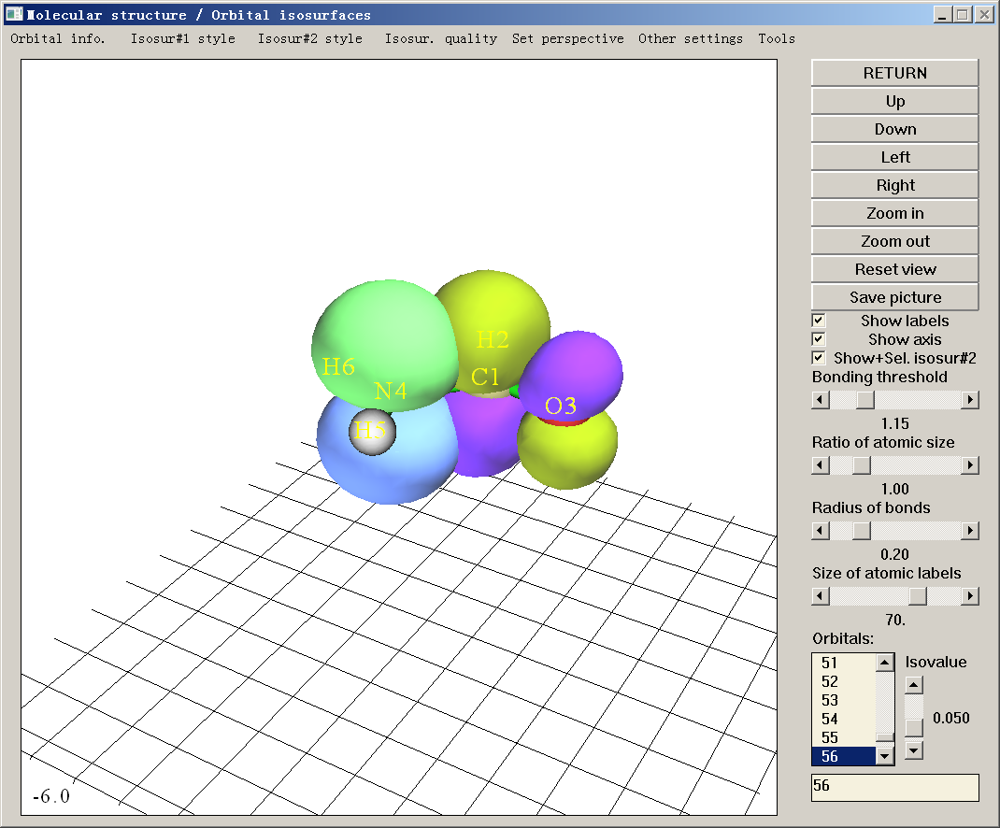
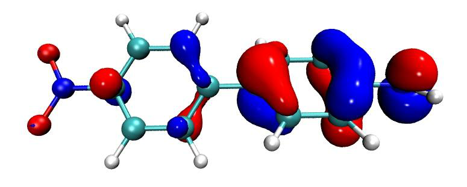

# 查看轨道与结构

> Multiwfn manual, p.461–467.英文原文见同名 English 章节。 Images: `../imgs/`.

---

<!-- p.461 -->


所需的网页链接，点击“T”图标，即可看到译为所需语言的全文）。

PS3：若你能读中文，阅读这三篇文章将非常有帮助：“Multiwfn 上手小技巧”（http://sobereva.com/167）、“Multiwfn FAQ”（http://sobereva.com/452）以及“多功能波函数分析程序 Multiwfn 的意义、功能与用途”（http://sobereva.com/184）。


## 4.0 查看轨道与结构

在本节中，我将首先介绍如何使用内置界面可视化各种轨道，然后在 4.0.3 节中，我将展示如何将 Multiwfn 与 VMD 联用，轻松快速地绘制高质量的轨道图形。


### 4.0.1 查看环庚三烯的分子轨道

启动 Multiwfn，输入 examples\cycloheptatriene.fch 并按 ENTER 键，然后选择主功能 0（main function 0），将弹出一个 GUI 窗口，同时所有原子坐标信息以及特征分子轨道的基本信息会打印在 Multiwfn 控制台窗口中。

你可通过滚动鼠标滚轮放大/缩小体系，通过点击 GUI 右侧的 Up/Down/Left/Right 按钮旋转体系；也可在绘图区用鼠标左键拖动体系以自由旋转；还可按住 Ctrl 键并用鼠标左键水平和竖直拖动体系，以分别实现沿屏幕旋转和放大/缩小；此外，还可按住 Shift 键拖动体系以平移。注意若你使用 Linux 版，须先单击一次绘图区使图标变为手形，上述鼠标拖动操作才可用。

你还可通过 GUI 右侧的相应控件调整成键阈值、调整原子球与标签大小、将图形保存为图像文件等。详见 3.2 节


<!-- p.462 -->


了解更多信息。

右下角列表中的数字为轨道序号，你可通过选择相应序号，或在文本框中直接输入轨道序号再按 ENTER 键，来查看轨道等值面。注意若体系为非限制开壳层，要选择 beta 轨道应输入负序号，例如，-5 对应第 5 个 beta 轨道。在此窗口中同时绘制两个轨道也是可能的，如 4.0.2 节所示。

为方便起见，若输入文件记录的是 R/U/RO(HF/KS) 波函数，可在右下角文本框中直接输入轨道标记。例如，输入 h 表示选择 HOMO，l+2 对应 LUMO+2，la 对应 alpha 的 LUMO，hb-3 对应 beta 的 HOMO-3，等等。

绿色与蓝色等值面分别对应正值与负值部分。等值面值可通过拖动滑动条调节，也可通过 GUI 顶部“Other settings（其他设置）”下拉列表中的“Set isovalue（设置等值面值）”选项输入其值。等值面风格与颜色可通过“Isosur#1 style（等值面#1 风格）”中的相应子选项更改。等值面质量可通过菜单中的“Isosur. quality（等值面质量）”选项设置。

选择“Orbital info.（轨道信息）”-“Show all（显示全部）”，所有轨道的能量、占据数与类型将显示在 Multiwfn 控制台窗口中。若不想显示太多高能虚 MO，可选择“Show up to LUMO+10（显示至 LUMO+10）”或“Show occupied orbitals（显示占据轨道）”。若载入的 .mwfn/molden/gms 文件中记录了不可约表示，则它们将显示在最后一列。

菜单栏的“Other settings（其他设置）”与“Tools（工具）”中有许多有用选项，请逐一尝试，遇到疑惑时参见 3.2 节的说明。“Tools（工具）”-“Batch plotting orbitals（批量绘制轨道）”相当值得注意，通过该工具可非常方便地将大量选定轨道分别保存为当前文件夹中的图像文件，视频演示见 https://youtu.be/SHwrQhqBHZ0。

若想绘制轨道的概率密度而非其波函数，可选择“Other settings（其他设置）”-“Choose plotting wavefunction or density（选择绘制波函数或密度）”，再选择“Density（密度）”。

要关闭窗口，点击“RETURN”按钮。关于此界面的更详细说明见 3.2 节。

注：用 Multiwfn 的主功能 0 可视化 Rydberg 轨道的等值面也是可能的，但由于它们非常弥散，为避免等值面被截断，应在菜单中选择“Other settings（其他设置）”-“Set extension distance（设置扩展距离）”，再输入相对较大的值，例如 12（单位为 Bohr），然后选择轨道进行可视化。扩展距离的默认值由 `settings.ini` 中的“Aug3D”控制。在 4.200.5 节第二部分给出了可视化 Rydberg 轨道的例子。

提示：获得美观轨道等值面图的推荐步骤

- 进入主功能 0，选择要可视化的轨道，恰当设置等值面值
- 点击“Show Labels（显示标签）”以关闭坐标轴
- 恰当调整视角
- 恰当改变原子标签大小。注意标签类型可通过菜单栏“Other settings（其他设置）”中的“Set atomic label type（设置原子标签类型）”更改

- 若等值面的渲染效果不太好，用“Other settings（其他设置）”中的“Set lighting（设置光照）”调节光照。

- 在菜单栏选择“Isosur. quality（等值面质量）”，设为“high-quality（高质量）”（中等大小体系）或“very high-quality（超高质量）”（大体系）。

- 点击“Save picture（保存图片）”。用诸如 Irfanview 或 Photoshop 程序打开它，将图像文件尺寸缩小至 50%（此过程会自动重采样，从而有效实现抗锯齿


<!-- p.463 -->


效果），然后恰当裁剪图形。

下面是经上述步骤得到的一个例子，质量相当好

建议使用“face+mesh（面+网格）”绘制风格而非默认的“solid face（实心面）”，因为此时保存的图片将更具立体感。


### 4.0.2 查看乙醇的自然键轨道（NBO）

查看 NBO 有两种方法，若你是 Gaussian 用户，方法 2 可能更方便，但若还需查看自然杂化轨道（NHO）或自然原子轨道（NAO）或 NBO 程序产生的其他类型轨道，则必须用方法 1。

方法 1：使用 NBO 绘图文件 通常的方法是生成 NBO 绘图文件（.31~.40）并载入 Multiwfn。要用 Gaussian 生成这些文件，应在路线节中添加 pop=nboread，即表示输入文件末尾的 NBO 关键词将被传递给 NBO 模块（Gaussian 中的 Link 607），然后在输入文件末尾添加例如 $NBO plot file=C:\NH2COH $END，并在其前留一空行，可参考“example”目录中的 NH2COH_NBO.gjf。用 Gaussian 运行该输入文件，你会发现 C:\ 文件夹中已生成 NH2COH.31、NH2COH.32 ... NH2COH.41。“example”文件夹中已提供了 NH2COH.31 与 NH2COH.37。现在启动 Multiwfn 并输入以下命令

examples\NH2COH.31 // .31 文件包含绘图所需的基函数信息 examples\NH2COH.37 // .37 文件包含 NBO 信息。.32~.40 文件分别对应 PNAO/NAO/PNHO/NHO/PNBO/NBO/PNLMO/NLMO/MO。提示：你可只输入 37，因为在本例中 .37 与 .31 文件同名

0 // 进入 GUI 你可从右下角列表中选择相应的 NBO 轨道以查看等值面。Multiwfn 还能同时绘制两个轨道，例如，这里我们将绘制 NBO 12 与 NBO 56，它们分别对应氮原子的占据孤对与碳氧之间的非占据反 π 键。首先，我们从轨道列表中选择 12 以绘制 NBO 12，然后点击“Show+Sel. isosur#2（显示+选择等值面#2）”，之后在列表中点击 56，你将看到 NBO 12 与 NBO 56 同时显示。NBO 56（等值面#2）的黄绿色与紫色部分分别对应正值与负值部分。


<!-- p.464 -->


从实心面图形很难研究两个轨道间的重叠程度，因此我们在“Isosur#1 style（等值面#1 风格）”及其在“Isosur#2 style（等值面#2 风格）”中的对应项里选择“Use mesh（使用网格）”，使两个等值面以网格表示，见下图。（也请尝试“transparent face（透明面）”风格）此时重叠程度变得清晰，可见 NBO 12 与 NBO 56 明显重叠，由此产生的强离域是二者间二阶微扰能很大（约 60 kcal/mol）的主要原因之一。在 4.4.5 节中，你将学到如何为这两个轨道获得等值线图。

注意对于非限制计算，Gaussian 中 NBO 3.1 模块输出的 .32 与 .33 文件不正确——缺少标题部分，这会导致奇怪的结果，应参考诸如 .34 的其他绘图文件进行修复，非常容易。

关于在其他量子化学软件中向 NBO 模块传递生成 NBO 绘图文件所需关键词的方法，请查阅相应手册。也可使用独立版 NBO 程序（GENNBO）生成 NBO 绘图文件，需先准备输入文件（.47）。要生成它，应先将包含基函数信息的文件载入 Multiwfn，再进入主功能 100（main function 100），选择子功能 2（subfunction 2），然后选择相应选项导出 .47 文件。之后，在 .47 文件的“\$NBO”与“\$END”之间手动添加 plot 关键词。再用 GENNBO 程序运行 .47 文件，即可得到 NBO 绘图文件。

方法 2：以 .fch 文件作为 NBO 信息载体 Gaussian 提供了 pop=saveNBO 关键词，若在 Gaussian 输入文件中添加它，NBO 将被存入 checkpoint 文件而非 MO。可用相应的 .fch 文件作为 Multiwfn





<!-- p.465 -->


输入文件以查看 NBO。若任务的理论级别为 HF 或 DFT，应在 .fch 文件第一行添加 saveNBOene；若使用 post-HF 方法且同时指定了 density 关键词，应在 .fch 文件第一行添加 saveNBOocc，此时 Multiwfn 将在内部做一些特殊处理。不过，若目的仅是在主功能 0 中查看 NBO，可忽略此步。

注意 Gaussian 在将 NBO 存入 checkpoint 文件时可能会自动重排。例如，你可能在 Gaussian 输出文件中看到如下信息：


```text
Reordering of NBOs for storage:     7    8    3    1    2    4    6    5    9   38 ...
```

即 .chk/.fch 文件中的第 1、2、3、4 ... 个轨道实际上分别对应 NBO 模块产生的第 7、8、3、1 ... 个 NBO。

值得一提的是，若将 Multiwfn 与 VMD 联用，可绘制非常漂亮的 NBO 等值面图，详见我的博客文章“使用 Multiwfn 绘制 NBO 及相关轨道”（中文，http://sobereva.com/134）。下图是某 Multiwfn 用户在其工作 J. Mol. Graph. Model., 59, 31 (2015) 中绘制的图。


### 4.0.3 使用 Multiwfn + VMD 快速绘制高质量轨道


### 等值面图

注：本教程的中文版是我的博客文章“使用 Multiwfn+VMD 快速绘制高质量分子轨道等值面图”（http://sobereva.com/447）与“用 VMD 结合 Multiwfn 绘制最美观轨道等值面图的方法”（http://sobereva.com/449）。

与本节对应的视频演示见 https://youtu.be/-3TXfdO8H7s，请务必观看！！！

前言 若利用 Multiwfn 为感兴趣的轨道导出 cube 文件，再在 VMD（http://www.ks.uiuc.edu/Research/vmd/）中渲染为等值面图，可得到非常理想的轨道等值面图，该过程已在我的博客文章“使用 Multiwfn 可视化分子轨道”（中文，http://sobereva.com/269）中详细描述。然而该文章介绍的过程略显冗长，需要许多手动操作。为了尽量简化过程，这里我展示如何用脚本非常轻松快速地联用 Multiwfn 与 VMD 绘制高质量轨道等值面图。本节仅 illustrate 如何绘制 MO，但同样过程也可用于绘制其他种类轨道，只是需恰当修改输入流文件（见下文）。若不知如何在静默模式下运行 Multiwfn，建议先阅读 5.2 节，以便更好理解本节。这里假设你使用 Windows 系统，对于 Linux 平台应手动编写相应脚本。这里使用的 VMD 程序为 1.9.3 版。


<!-- p.466 -->


准备工作 将 showorb.bat 与 showorb.txt 从“examples\scripts”复制到含 Multiwfn 可执行文件的文件夹中。

showorb.bat 为 Windows 批处理文件，用于调用 Multiwfn 计算所选轨道的波函数格点数据，再将导出的 cube 文件移至 VMD 文件夹。应手动编辑此文件，使输入文件路径对应输入文件的实际路径，并将此文件中的 VMD 文件夹替换为你机器中的实际 VMD 文件夹。

showorb.txt 为输入流文件，每行对应需在 Multiwfn 交互界面中输入的命令。应手动将第三行设为你想绘制的轨道序号，例如 10,20-23,28-30。

“examples\scripts”中的 showorb.vmd 为 VMD 绘图脚本，应将其复制到 VMD 文件夹，再将 source showorb.vmd 添加到 VMD 文件夹中 vmd.rc 文件的末尾，以便 VMD 启动时自动执行该脚本。此脚本定义了三个自定义命令：

·orb i：用于载入轨道 i 的 cube 文件并以等值面显示。默认等值面值为 0.05，可通过编辑 showorb.vmd 更改

·orbiso x：用于将等值面值改为 x。 ·orbclean：用于删除 VMD 文件夹中的所有轨道 cube 文件。

示例 这里我们为 examples\excit\D-pi-A.fchk 绘制 MO。确保所有准备工作已完成，然后编辑 showorb.bat，将默认输入文件 1.fch 替换为 examples\excit\D-pi-A.fchk，并确保此文件中已正确指定实际 VMD 文件夹。然后打开 showorb.txt，将第三行设为 54-59，以便可视化 54 至 59 的 MO。然后双击 showorb.bat，Multiwfn 将被调用以载入输入文件，计算并导出所选轨道波函数的格点数据。例如对于轨道 54，导出文件将被命名为 orb000054.cub。所有轨道 cube 文件随后自动移至 VMD 文件夹。之后，启动 VMD，在 VMD 控制台窗口输入 orb 56，则 orb000056.cub 将被载入 VMD 并绘制为等值面：

上图中，正负相分别以红蓝两色表示。默认使用“Glossy”材质。若想更改颜色或材质，应进入“Graphics”-“Representation”修改相应选项。也可通过修改 showorb.vmd 脚本更改默认颜色与材质。

若随后想可视化另一轨道，例如 MO54，只需在 VMD 控制台窗口输入 orb 54。

若想将等值面值改为例如 0.02，只需输入 orbiso 0.02。




<!-- p.467 -->


若可视化后想清除 VMD 文件夹中的所有轨道 cube 文件，只需输入 orbclean，则所有 orb??????.cub 文件将被删除。

默认使用“medium-quality grid（中等质量格点）”（约 512000 点）计算轨道波函数，这对中小体系足够。但对大体系，例如含一百个以上原子的体系，必须使用更多格点数。若想将默认格点改为“high-quality grid（高质量格点）”，应将 showorb.txt 中的第四行设为 3。此外，如 4.0.1 节所述，可视化 Rydberg 轨道时必须增大格点数据的扩展距离。为此，应在 showorb.txt 第三与第四行之间添加


```text
-10
12
```

则扩展距离将从默认值增大至 12 Bohr。

绘制高质量轨道等值面图 若想得到更优质的轨道等值面图，只需按以下过程操作（请用 VMD 1.9.3，切勿用其他 VMD 版本！）：

(1) 如上所述在 VMD 中绘制一个轨道 (2) 将 examples\scripts\VMDrender.txt 中的全部内容复制到 VMD 控制台窗口以修改绘制设置

(3) 在 VMD 中选择“File”-“Render”-“Tachyon”，点击“Start Rendering”。然后 VMD 文件夹中将出现 vmdscene.dat，它是 Tachyon 渲染器的输入文件。

(4) 将 examples\scripts\VMDrender_full.bat 复制到 VMD 文件夹 (5) 双击 VMDrender_full.bat，则 VMD 文件夹中的 Tachyon 渲染器（tachyon_WIN32.exe）将被调用执行渲染。稍后，VMD 文件夹中出现 full.bmp，即生成的图像文件。

examples\excit\D-pi-A.fchk 的 MO56 的渲染图像如下所示，图形极其精美！

渲染对大体系耗时相当长。为节省时间，可用 VMDrender_noshadow.bat 代替 VMDrender_full.bat，此时生成图形中无阴影效果，而渲染开销相应降低。

有时，尤其对大体系，透明轨道等值面投下的阴影使图形显得太暗，可在 .bat 文件中手动添加 -shadow_filter_off 参数以在渲染时关闭此类阴影。


