# 拓扑分析

> Multiwfn manual, p.472–504.英文原文见同名 English 章节。 Images: `../imgs/`.

---

<!-- p.472 -->


用 MP2/aug-cc-pVDZ 级别评估 ΔΔVn 是非常理想的选择。


## 4.2 拓扑分析

Multiwfn 能对任何实空间函数进行拓扑分析，如电子密度及其 Laplacian 函数、ELF、LOL、轨道波函数、自旋密度、静电势等。可定位四种临界点（CPs），并轻松得到这些点处的实空间函数值；可生成连接 CPs 的拓扑路径与 basin 间表面。还有许多附加功能，详见 3.14 节。下面我将给出一些实际应用以 illustrate 如何使用这个强大模块。

注意 Multiwfn 不仅能基于波函数文件进行拓扑分析，还能基于格点数据进行，如 http://sobereva.com/wfnbbs/viewtopic.php?pid=2276 所示。因此，对由实验晶体衍射确定的电子密度进行拓扑分析也是可能的。


### 4.2.1 2-pyridoxine 2-aminopyridine 的分子中的原子（AIM）拓扑分析与芳香性


### 分析

电子密度的拓扑分析是 Bader 分子中的原子（AIM）理论的主要内容。本例中我们将对 2-pyridoxine 2-aminopyridine 复合物进行此类分析。

启动 Multiwfn 并输入以下命令 examples\2-pyridoxine_2-aminopyridine.wfn // 假设输入文件在当前目录的子目录中，可只输入相对路径而非完整绝对路径

2 // 拓扑分析 然后输入以下命令搜索所有临界点（CPs） 2 // 以核位置作为初始猜测，一般用于搜索 (3,-3) CPs 3 // 依次以每对原子的中点作为初始猜测。一般可找到所有 (3,-1) CPs，同时也可能找到一些 (3,+1) 或 (3,+3)

CPs 的搜索非常快。之后输入 0，所有找到的 CPs 的位置与类型将打印在命令行窗口中，输出末尾给出每类 CPs 的数目：


```text
(3,-3):    25,   (3,-1):    27,   (3,+1):     3,   (3,+3):     0
  25  -   27  +    3  -    0  =   1
```

第二行表明 Poincaré-Hopf 关系已满足，即可能已找到所有 CPs。


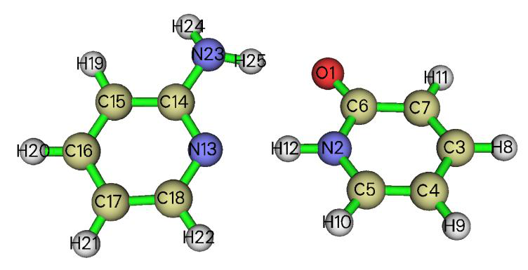

<!-- p.473 -->


若该关系不满足，则必有 CPs 缺失。从弹出的 GUI 窗口（如下图）可见所有预期的 CPs 均已呈现，因此可确认已找到所有 CPs。

点击 GUI 窗口右上角的“RETURN”按钮并输入 8 以生成拓扑路径（在当前语境中对应“bond paths（键径）”），再选择选项 0 以查看 CPs 与路径。此时从命令行窗口可直接看到与每个 BCP 相连的两个原子。在 GUI 窗口中稍作调整绘图设置后，图形如下所示（若未显示 CPs 序号，点击 GUI 右侧的“CP labels”）：


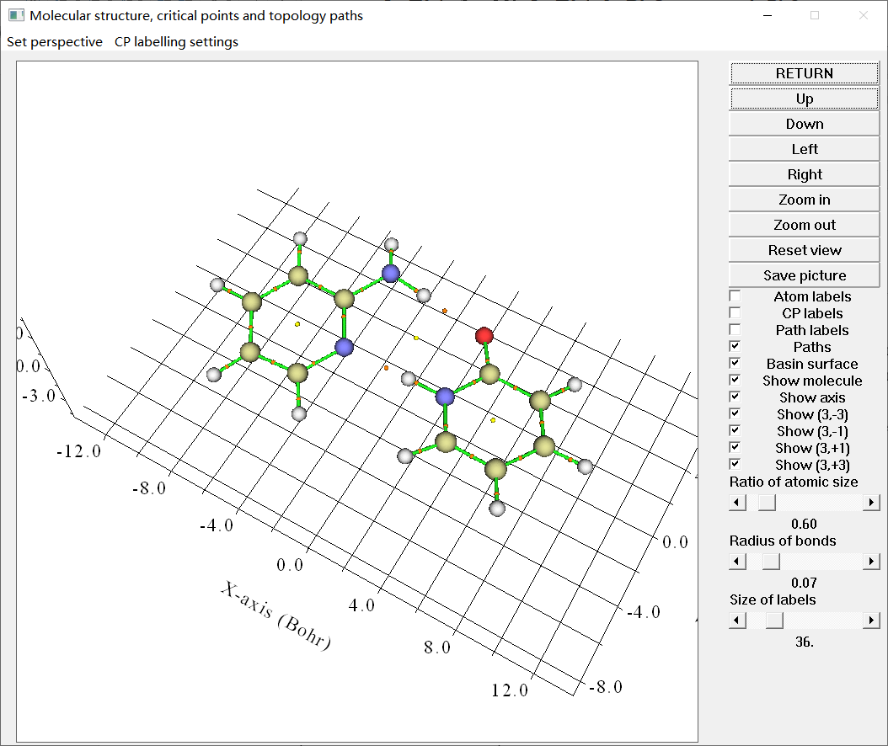

<!-- p.474 -->


上图中的品红色、橙色和黄色小球分别对应于 (3,-3)、(3,-1) 和 (3,+1) 临界点。棕色线表示键径。临界点的序号用青色标出。

$$BE\approx-332.34\times\rho(\mathbf{r}_{\mathrm{BCP}})-1.0661\ (for\ charged\ H-bond)$$

值得注意的是，临界点的标签颜色可以通过菜单栏中“临界点标注设置（CP labelling settings）”下拉列表中的“设置标签颜色（Set label color）”选项来更改。如果你只想标注某个特定的临界点，可以在“临界点标注设置（CP labelling settings）”中选择“只标注一个临界点（Labelling only one CP）”，然后输入其序号（当体系很大且存在大量临界点时，此选项对于清晰显示或查找感兴趣的临界点非常有用。如果你在此选项中不输入任何内容，则允许显示所有临界点标签）。

现在关闭图形界面窗口。拓扑分析模块提供了许多分析选项；例如，让我们测量 CP30 与 H25 原子核位置之间的距离。选择选项 -9，然后输入 c30 a25，结果为 5.877601 Å。接着我们测量 C14-N13-H12 之间的夹角，即输入 a14 a13 a12，结果为 120.297432 度。现在输入 q 返回。

评估氢键结合能 J. Comput. Chem., 40, 2868 (2019) DOI: 10.1002/jcc.26068 是一篇关于氢键的非常重要的论文，对广泛的氢键体系进行了透彻的研究和深入的分析。在这项工作中，我与合作者提出了两个极其有用且重要的方程，用于基于与氢键对应的键临界点（BCP）处的电子密度来预测氢键结合能（BE）。

𝐵𝐸≈−223.08 × 𝜌(𝐫BCP) + 0.7423 (for neutral H−bond) 𝐵𝐸≈−332.34 × 𝜌(𝐫BCP) −1.0661 (for charged H−bond)

其中 ρ 的单位为 a.u.，BE 的单位为 kcal/mol。研究表明，这些公式不仅可靠，而且具有普适性。第一个方程适用于本配合物，这里我们采用它

$$BE\approx-332.34\times\rho(\mathbf{r}_{\mathrm{BCP}})-1.0661\ (for\ charged\ H-bond)$$

选择选项 7，然后输入相应 BCP 的序号，即 53，你将看到该点处许多实空间函数的值都被显示出来：

```text
CP Position:    0.44887255865472    3.56434324597741   -0.10652884364257
CP type: (3,-1)
Density of all electrons:  0.3129478049E-01
Density of Alpha electrons:  0.1564739024E-01
Density of Beta electrons:  0.1564739024E-01
Spin density of electrons:  0.0000000000E+00
```

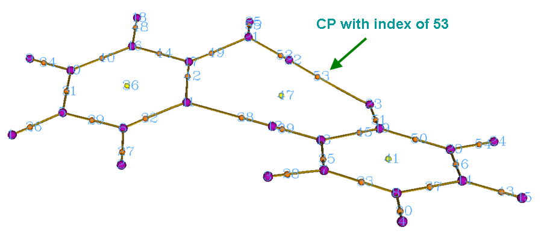

<!-- p.475 -->


```text
Lagrangian kinetic energy G(r):  0.2530207716E-01
Hamiltonian kinetic energy K(r):  0.8463666362E-03
Potential energy density V(r): -0.2614844379E-01
Energy density: -0.8463666362E-03
Laplacian of electron density:  0.9782284209E-01
Electron localization function (ELF):  0.1105388527E+00
... (Ignored)
```

输出表明，该 BCP 处的 ρ(r) 为 0.03129 a.u.，因此氢键结合能可估算为 BE = -223.08*0.03129+0.7423 = -6.2 kcal/mol = -26.1 kJ/mol。

同样值得注意的是，在 Chem. Phys. Lett., 285, 170 (1998) 中，Espinosa 及其合作者

$$BE=V(\mathbf{r}_{BCP})/2$$

BE=V(rBCP)/2

如上述输出所示，N23-H25····O1 的 BCP 处的 V(r) 为 -0.026148，因此可预测 BE 为 -0.026148/2*2625.5 = -34.3 kJ/mol，这与使用 J. Comput. Chem. (2019) 论文中提出的预测方程得到的 -26 kJ/mol 有显著差异。哪一个更准确？正如在 J. Comput. Chem. 文章中严格证明的那样，流行的 V(rBCP)/2 方程实际上具有明显更大的误差，因此不能被推荐；换言之，-26.1 kJ/mol 的 BE 应该更为可靠。

基于临界点性质评估芳香性 在本部分，我们使用拓扑分析模块中的两个特殊选项来评估芳香性。如果你对该主题不感兴趣，可以跳过。

首先，我们使用信息熵方法来检验二聚体中的氨基吡啶（上图中左侧的单体）是否可以被视为芳香性分子。该方法在 Phys. Chem. Chem. Phys., 12, 4742 (2010) 中提出，基于环上 BCP 处的电子密度，详见 3.14.6 节。首先，我们选择选项“20 计算 Shannon 芳香性指数（Calculate Shannon aromaticity index）”，然后输入环中 BCP 的序号，即 44,42,32,29,31,40，输出的 Shannon 芳香性指数（SA）为 0.000812。SA 指数越小，环的芳香性越强。在原文中，选择 0.003 < SA < 0.005 作为芳香性/反芳香性的分界。由于我们的结果远小于 0.003，我们可以得出结论，氨基吡啶是芳香性分子。2-吡啶酮（上图中右侧的单体）的 SA 为 0.000865，因此显示出比氨基吡啶稍弱的芳香性。

接下来，我们计算环临界点（RCP）处垂直于环平面的电子密度的曲率。在 Can. J. Chem., 75, 1174 (1997) 中表明，更负的曲率意味着更强的芳香性。我们首先计算氨基吡啶的曲率。选择选项“21 计算沿给定方向的电子密度梯度和曲率（Calculate gradient and curvature of electron density along a given direction）”，输入 RCP 的序号（即 36），选择模式 2，然后输入至少三个原子以拟合环平面，这里我们输入 15,13,17。从输出中我们发现曲率为 -0.0187 a.u.。然后我们计算 2-吡啶酮的曲率（CP41，使用原子 2, 7, 4 定义平面），结果为 -0.0164 a.u.。两个曲率的比较再次表明氨基吡啶具有更强的芳香性。在 Multiwfn 中，还可以通过许多其他方案来衡量芳香性，如 HOMA、FLU、PDI、ELF-π 和多中心键级，它们在 4.A.3 节中集中讨论。

生成盆间表面 盆间表面（IBS）将整个分子空间分割成各个独立的盆，每个 IBS 实际上是一束从 (3,-1) 临界点发出的梯度线。现在我们生成与之对应的 IBS

<!-- p.476 -->


即序号为 53、38 和 37 的 (3,-1) 临界点。选择功能 10，并输入

53 // 生成与序号为 33 的 (3,-1) 临界点对应的 IBS，如下同。对于每个 IBS 的生成，你可能需要等待几秒钟

38 37 q // 返回 通过选择功能 0 来可视化结果，图形将如下所示。这三个曲面即为 IBS。

在 4.20.1 节中，我们将使用另一种重要的弱相互作用分析方法 NCI 来进一步研究该体系。

你可能会觉得当前用于显示临界点和拓扑路径的 Multiwfn 图形界面对于大体系使用起来有些困难，因为体系无法完全流畅地旋转，有时感兴趣临界点的序号难以观察到。在 4.2.5 节中，我将介绍如何基于 Multiwfn 的输出使用强大的 VMD 程序来非常方便地绘制临界点和拓扑路径，在这种情况下图形非常美观，视角完全可控，感兴趣临界点的序号也很容易找到。

关于 AIM 拓扑分析，我想提及两点重要事项，尽管它们与本例无关。

如果电子密度的某些临界点未能成功定位，我该怎么办？对于小体系，通常可以通过进入图形界面并可视化临界点的分布来检查是否所有临界点都已被定位。还有一个有用的方程，称为 Poincaré-Hopf 关系。对于孤立体系，该关系为

1CCPRCPBCPNCP=−+−nnnn

如果所有临界点都已被找到，该关系必须满足，但满足该关系并不一定意味着所有临界点都已被找到。如果 Poincaré-Hopf 关系不满足，则必定缺少某些临界点。

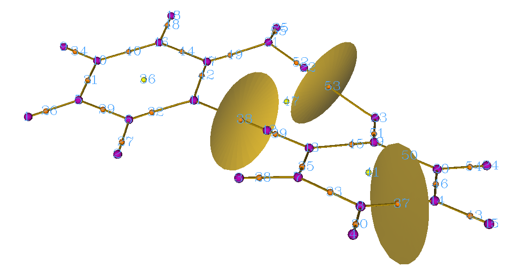

<!-- p.477 -->


有时，你可能会发现在搜索后一些预期的临界点未能成功定位。造成此问题有两个可能的原因：(1) 初始猜测位置与临界点不够接近 (2) 默认的临界点搜索参数不太适合当前情况。有一些常用方法可以解决此问题，如下所示。更详细的描述可在 3.14.2 节中找到。

a) 如果你已尝试过选项 2~5 而仍有某些临界点未被定位，尝试使用选项 6 的子选项 -1。这种搜索模式功能强大但开销较大，默认在每个原子周围的球形区域内放置 1000 个起始点。如果重复此模式数次后缺失的临界点仍无法定位，则很可能是由于搜索参数不合适，而非起始点位置的原因。

b) 如果某些键临界点（BCP）无法定位，你可以进入选项 -1，将步长的缩放因子设为 0.5，然后重试

c) 特重原子的核临界点（NCP）很难定位，因为在这种情况下原子核处电子密度的峰非常尖锐，因此在默认参数下搜索算法很难捕捉到 NCP。为了定位它们，你可以进入选项 -1，将梯度模和位移收敛标准放宽几个数量级，然后尝试使用选项 2 重新搜索 NCP。如果随后成功找到 NCP，不要忘记恢复原来的收敛标准。事实上，由于重原子的 NCP 几乎恰好位于原子核位置，你也可以直接进入选项 -4 并选择子选项 3，在相应的原子核位置手动添加 NCP。

d) 如果一些缺失的临界点预期出现在远离原子的区域，例如，在非常大的笼或管状体系中心处的笼临界点（CCP），请进入选项 -1，使用子选项 8 将判断 Hessian 矩阵奇异性的标准收紧几个数量级，然后重新搜索临界点。

顺便说一下，在极少数情况下，你可能会发现少数临界点出现在远离体系的意外区域，它们应该是由于数值噪声造成的人为假象。避免定位它们的一个有用方法是进入选项 -1 并选择子选项 8，将该标准增大几个数量级（例如增大到 1E-15），然后像往常一样搜索临界点。

关于特重原子电子密度的描述 特重原子（比重比 Kr 重）比轻原子带来大得多的计算负担，且相对论效应不可忽略。有两种不同的方法来描述它们。

- 使用赝势（PS）：如 2.5 节所述，如果使用 PS，但以 Gaussian 产生的 .wfx 文件作为输入文件，.wfx 文件中的 EDF（电子密度函数）字段默认将被载入 Multiwfn，它代表内层芯电子密度。对于其他类型的输入文件，如 .mwfn、.wfn、.fch、.molden 和 .gms，默认情况下 Multiwfn 会自动从内置的 EDF 库中载入适当的 EDF 信息。

当提供 EDF 信息时，电子密度的所有临界点都能被正确定位，且绝不会出现人为假象临界点，从 BCP 发出的键径能正常连接到核临界点（NCP），所有仅基于电子密度的临界点性质都将是合理的。在这种情况下，虽然可以使用大核赝势而没有问题，但我仍建议使用小核赝势，因为所得临界点位置和性质的精度必定优于使用大核赝势。

Lanl1 Lanl2, Lan2TZ/08 SDD cc-pVnZ-PP, def2 series SBKJC

Main groups Large Large L/S (optional) Small Large

<!-- p.478 -->


Transition metals Large Small L/S (optional) Small Small

如果你决定不使用 EDF 信息（详见 `settings.ini` 中的 "readEDF" 和 "isupplyEDF"），显然不可能在原子核位置找到 (3,-3) 临界点，相应地，从 BCP 发出的键径将无法连接到原子核。相反，由于内层芯密度的缺失，你可能会在原子核位置发现 (3,+3)，并且在原子核周围会出现许多不同类型的临界点，这是因为电子密度不再从原子核呈指数衰减，因此电子密度的拓扑结构变得相当复杂。然而，你可以简单地忽略那些不相关的临界点，而只关注你真正感兴趣的 BCP。

- 使用相对论哈密顿量的全电子基组：这是表示重原子电子结构最昂贵但最准确的解决方案。对于 AIM 分析，仅考虑标量相对论效应完全足够。DKH2 哈密顿量是一个非常好的选择（在 Gaussian 中，只需使用 int=DKH2 关键词即可采用，注意必须使用为 DK 计算优化的基组，例如 cc-pVDZ-DK）。

更多讨论，请参阅我的博客文章“谈谈在赝势下做波函数分析”（中文，http://sobereva.com/156）。

### 4.2.2 醋酸的定域轨道定位子（LOL）的拓扑分析

定域轨道定位子（LOL）的简介已在 2.6 节中给出。在本例中，我们将为醋酸定位其临界点并生成 LOL 的拓扑路径。采用完全相同的步骤，你也可以研究许多其他实空间函数的拓扑特征，如电子定域函数（ELF）、静电势（ESP）和电子密度的 Laplacian。

启动 Multiwfn 并输入以下命令 examples\acetic_acid.wfn 2 // 进入拓扑分析模块（Enter topology analysis module） -11 // 选择实空间函数（Select a real space function） 10 // 定域轨道定位子（LOL）(Localized orbital locator (LOL)) 注意 LOL 的分布特征比电子密度复杂得多，因此很难定位其所有临界点。幸运的是，一般来说我们只对其中一小部分 LOL 临界点感兴趣，一旦找到所有感兴趣的临界点就可以中止搜索。

我们首先使用选项“2 从原子核位置搜索临界点（Search CPs from nuclear positions）”来定位非常靠近原子核的临界点。然而，其他区域临界点的位置有些不可预测，因此必须在每个原子周围随机散布大量起始点以尝试定位这些临界点。现在，输入以下命令：

6 // 在此搜索模式下，起始点将在球形区域内随机散布，球心、半径、点数等可由用户定义。这次我们保持默认值不变

-1 // 依次以每个原子核为球心搜索临界点。由于有 8 个原子，且每个球内起始点为 1000 个，Multiwfn 将基于 8*1000 个起始点尝试搜索临界点。当然，你设置的起始点越多，在此次搜索中找到所有临界点的概率越大，但计算成本也越高

<!-- p.479 -->


-9 // 返回上一级菜单（Return to upper menu） 0 // 可视化结果（Visualize the result）

从上图中可以看出，LOL 的临界点数量非常多。实际上，在搜索中仍有一些临界点尚未找到。如果你再重复搜索一次，可能会定位到一些缺失的临界点。由于目前我们感兴趣的所有临界点都已找到，因此无需重复搜索。在图中，每个紫色小球表示一个 (3,-3) 类型的临界点，代表电子定域性的局部极大值。可以看出，CP15 描述了两个碳之间的共价键。CP8 和 CP9 对应于两个 C-O 键。CP 7、57、12 和 13 对应于氧的孤对电子。

注意，通过选项 6 定位的临界点的序号每次都不同，因为起始点的分布是完全随机的。

现在选择选项 8 生成连接 (3,-1) 和 (3,-3) 临界点的拓扑路径，然后选择选项 0 再次可视化结果。为了减轻视觉负担，可以通过适当调整相应的图形界面控件来关闭某些不感兴趣对象的显示。从下图中可以看出，拓扑路径阐明了临界点之间的内在连接关系。

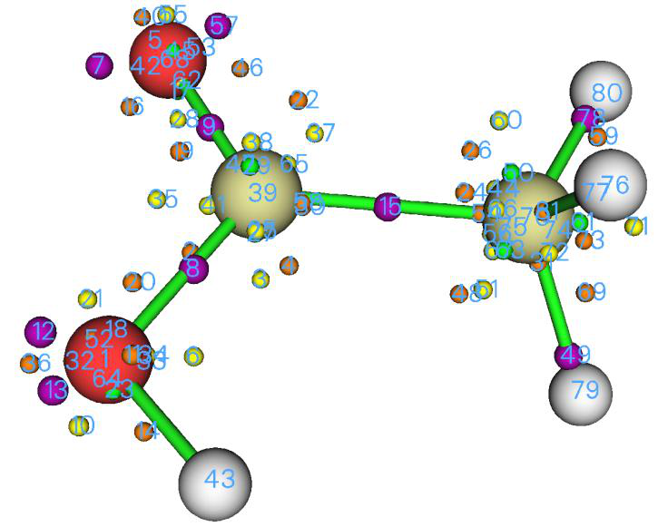

<!-- p.480 -->


提示：使用最速上升算法搜索极大值的例子 对于 LOL 和 ELF，通常我们真正感兴趣的是它们的 (3,-3) 临界点，即极大值。默认的临界点搜索方法是 Newton 方法，它定位所有种类的临界点，如上所示。值得注意的是，Multiwfn 还支持其他搜索算法，其中最速上升法专门用于搜索极大值。例如，这里我们采用它来搜索醋酸的 ELF 极大值。启动 Multiwfn 并输入

examples\acetic_acid.wfn 2 // 进入拓扑分析模块（Enter topology analysis module） -11 // 选择实空间函数（Select a real space function） 9 // ELF -1 // 设置临界点搜索参数（Set CP searching parameters） 12 // 选择搜索算法（Choose searching algorithm） 3 // 最速上升（Steepest ascent） 0 // 返回（Return） 6 // 从球内一批点出发搜索临界点(Search CPs from a batch of points within sphere(s)) -1 // 依次以每个原子核为球心开始搜索（Start the search using each nucleus as sphere center in turn） -9 // 返回（Return） 0 // 可视化结果（Visualize result） 经过对绘图设置的一些调整后，你可以清楚地看到 ELF 的极大值：

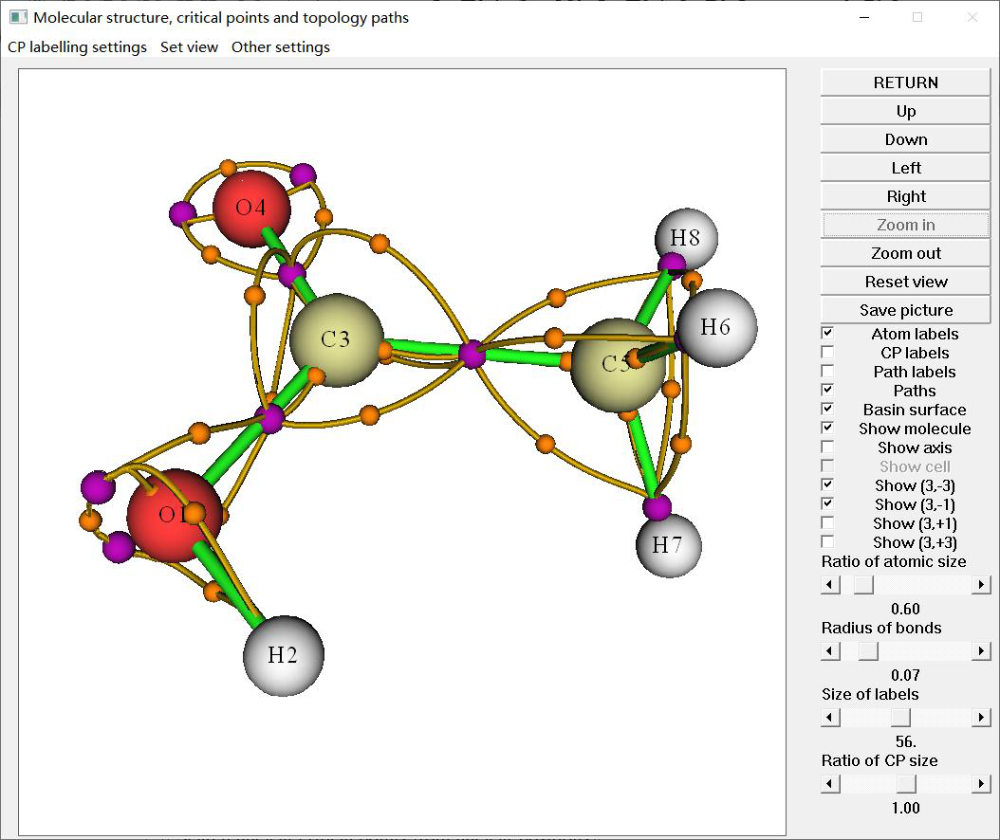

<!-- p.481 -->


ELF 极大值与 LOL 极大值的分布非常相似，但也有一些显著差异。有两个 LOL 极大值代表 O1 的孤对电子，而在相应区域只有一个 ELF 极小值。此外，LOL 用一个极大值表示 C3-O4 相互作用，而在 ELF 图中有两个。

### 4.2.3 沿键径绘制实空间函数

Multiwfn 支持的所有实空间函数都可以很容易地沿拓扑路径绘制。在本例中，我们沿丁二烯端部 C-C 键的键径绘制电子密度的椭率。

首先打开 `settings.ini` 文件并将 "iuserfunc" 参数改为 30，因为第 30 个自定义函数对应于电子密度椭率，详见 2.7 节。

然后启动 Multiwfn 并输入以下命令： examples\butadiene.fch 2 // 拓扑分析（Topology analysis） 2 // 从原子核位置搜索核临界点（Search nuclear critical points from nuclear positions） 3 // 从原子对中点搜索键临界点（Search bond critical points from midpoint of atomic pairs） 8 // 生成键径（Generate bond path） 0 // 进入图形界面窗口以可视化结果（Enter GUI window to visualize result） 点击图形界面窗口右侧的“原子标签（Atom labels）”和“路径标签（Path labels）”按钮，然后我们会发现路径 5 和 6 共同构成了端部 C-C 键的键径：

点击“返回（RETURN）”关闭窗口，然后输入 -5 // 对路径的各种操作（Various operations on paths） 7 // 沿路径计算并绘制特定的实空间函数（Calculate and plot a specific real space function along a path）

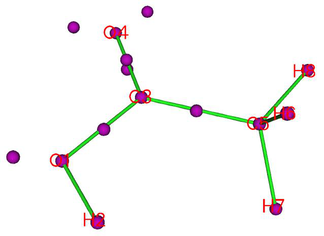

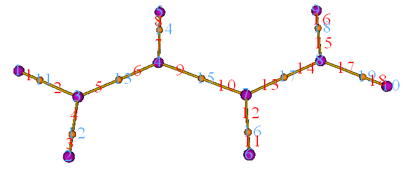

<!-- p.482 -->


5,6 // 路径的序号（事实上，你也可以等价地在这里输入 c13） 100 // 自定义函数，目前对应于电子密度椭率(User-defined function, which corresponds to ellipticity of electron density currently)

沿端部 C-C 键键径的电子密度椭率曲线立即显示在屏幕上，虚线表示键临界点的位置。在图中，左端和右端分别对应于 CP3 和 CP4。同时，曲线的原始数据显示在命令行窗口中，你可以将它们复制出来，以便在 Origin 等第三方绘图工具中进一步分析或重绘。

从图中可以清楚地看出，电子密度椭率在键径中部区域为正，表现出 C-C 键的双键特征。

你还可以沿键径绘制其他实空间函数，如 ELF 和动能密度，请尝试一下。

### 4.2.4 将临界点处的性质分解为轨道贡献

许多实空间函数可以精确或近似地分解为轨道贡献。如果除轨道 i 外所有轨道的占据数都设为零，则计算出的函数值恰好对应于轨道 i 的贡献。

Multiwfn 能够在任意点将任何实空间函数分解为轨道贡献，主功能 1 和主功能 2 均支持此特性；在前者中，点的位置可由用户直接输入，而在后者中，点可选为已找到的临界点之一。在本节中，我将以 1,3-丁二烯为例说明此特性。

我们将首先检查哪些分子轨道（MO）对与端部 C-C 键对应的 BCP 有明显贡献。启动 Multiwfn 并输入

examples\butadiene.fch 2 // 拓扑分析（Topology analysis） 2 // 搜索核临界点（Search nuclear critical points） 3 // 搜索 BCP(Search BCPs) 0 // 可视化临界点（Visualize CPs）

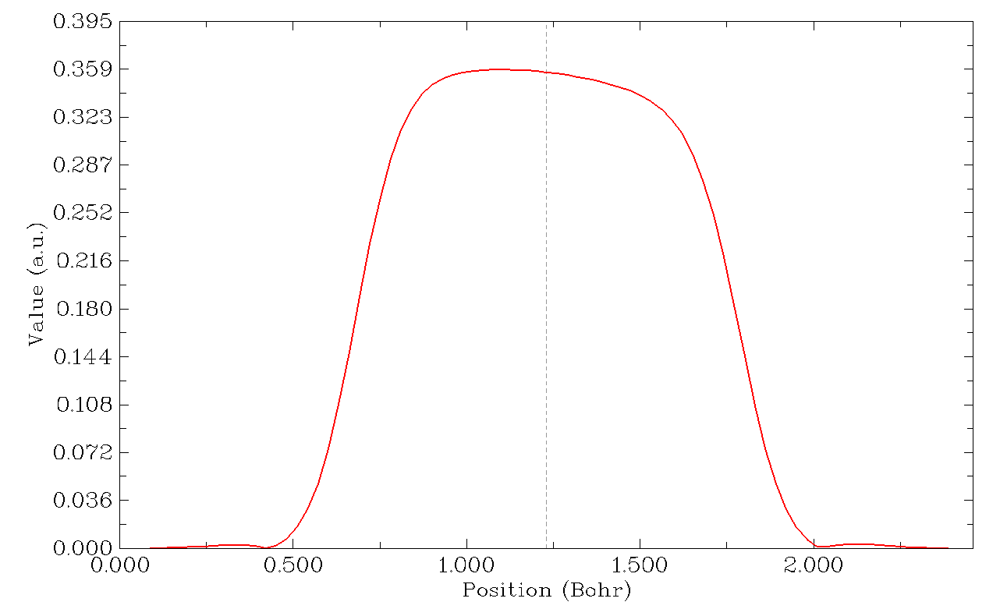

<!-- p.483 -->


如图所示，CP13 和 CP17 是端部 C-C 键的 BCP。关闭图形界面，然后输入

7 // 显示临界点处的性质（Show properties at a CP） 13d // 分解 CP13 的性质（Decompose properties of CP13） 1 // 要分解的实空间函数为电子密度（The real space function to be decomposed is electron density） [按回车键（Press ENTER button）] // 将所有占据轨道都考虑在内，但只打印贡献最大的十个轨道(Take all occupied orbitals into account, but only print ten orbitals having largest contributions)

你将看到以下输出

```text
 Contribution from orbital    11 (occ= 2.000000):      0.107469 a.u. ( 31.34% )
 Contribution from orbital     6 (occ= 2.000000):      0.085220 a.u. ( 24.85% )
 Contribution from orbital     9 (occ= 2.000000):      0.061997 a.u. ( 18.08% )
 Contribution from orbital     5 (occ= 2.000000):      0.059119 a.u. ( 17.24% )
 Contribution from orbital    12 (occ= 2.000000):      0.011205 a.u. (  3.27% )
 Contribution from orbital    10 (occ= 2.000000):      0.008898 a.u. (  2.60% )
 Contribution from orbital     7 (occ= 2.000000):      0.004864 a.u. (  1.42% )
 Contribution from orbital     8 (occ= 2.000000):      0.003807 a.u. (  1.11% )
 Contribution from orbital     2 (occ= 2.000000):      0.000070 a.u. (  0.02% )
 Contribution from orbital     1 (occ= 2.000000):      0.000070 a.u. (  0.02% )
 Sum of above values:      0.34286855 a.u. ( 100.00% )
 Exact value:      0.34286855 a.u.
```

显然，该 BCP 处的电子密度由许多分子轨道同时贡献，最大贡献为 31.3%。如果我们将分子轨道变换为定域分子轨道（LMO），会发生什么？（关于轨道定域化和 LMO 的介绍见 3.21 节）。为检验这一点，返回主功能菜单，然后输入

19 // 轨道定域化（Orbital localization） 1 // 仅定域占据轨道（Only localize occupied orbitals） 2 // 再次进入拓扑分析功能（Enter topology analysis function again）。我们不需要重做拓扑分析，因为当你退出拓扑分析模块时，所有拓扑信息都被保留

7 // 显示临界点处的性质（Show properties at a CP） 13d // 分解 CP13 的性质（Decompose properties of CP13） 1 // 要分解的实空间函数为电子密度（The real space function to be decomposed is electron density） [按回车键（Press ENTER button）] 你将看到

```text
 Contribution from orbital    11 (occ= 2.000000):      0.339266 a.u. ( 98.95% )
```

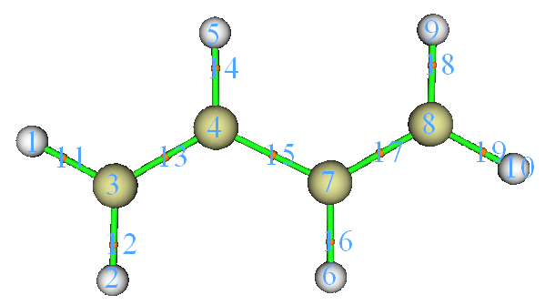

<!-- p.484 -->


```text
 Contribution from orbital     6 (occ= 2.000000):      0.001072 a.u. (  0.31% )
 Contribution from orbital     7 (occ= 2.000000):      0.000630 a.u. (  0.18% )
...[ignored]
 Sum of above values:      0.34286855 a.u. ( 100.00% )
 Exact value:      0.34286855 a.u.
```

如图所示，目前只有一个轨道，即 LMO11，对该 BCP 做出了显著贡献。这正是我们所预期的，因为在 LMO 框架下，每个化学键通常主要仅由一个或极少数 LMO 表示。你可以使用主功能 0 可视化 LMO11：

很明显，LMO11 完全对应于端部 C-C σ 键，这就是为什么相应 BCP 的电子密度等性质完全由 LMO11 主导。

接下来，让我们检查哪些 LMO 对端部 C-C 键对应的 BCP 上方 1 Bohr 处的点有不可忽略的贡献。BCP 的序号为 13，当你选择选项 0 时，可以在控制台窗口中找到其坐标：

```text
Index               XYZ Coordinate (Bohr)                 Type
...[ignored]
  11    -2.227945085    -3.985434919     0.000000000   (3,-1)
  12    -0.041512516    -3.979859852     0.000000000   (3,-1)
  13    -1.131478160    -2.047305989     0.000000000   (3,-1)
...[ignored]
```

显然，CP13 上方 1 Bohr 处的点应为 (-1.131,-2.047,1.0)。输入以下命令

-10 // 返回主菜单（Return to main menu） 1 // 在给定点打印各种性质（Print various properties at a given point） d // 分解为轨道贡献（Decompose to orbital contributions） -1.131,-2.047,1.0 1 // 输入坐标的单位为 Bohr(The unit of inputted coordinate is Bohr) 1 // 分解电子密度（Decompose electron density） [按回车键（Press ENTER button）] 然后你将看到以下信息

```text
 Contribution from orbital    11 (occ= 2.000000):      0.110266 a.u. ( 66.33% )
 Contribution from orbital    15 (occ= 2.000000):      0.055354 a.u. ( 33.30% )
 Contribution from orbital     1 (occ= 2.000000):      0.000215 a.u. (  0.13% )
...[ignored]
Exact value:      0.16623908 a.u.
```

可以看出，不仅 LMO11，LMO15 也有明显贡献。如果你

在主功能 0 中查看此轨道，你会发现它对应于端部 C-C 键的 π 键。


<!-- p.485 -->


用类似的方法，我们接着分解中间 C-C 键的 BCP 上方 1 Bohr 处点的电子密度，结果为

```text
 Contribution from orbital    13 (occ= 2.000000):      0.097450 a.u. ( 78.20% )
 Contribution from orbital    14 (occ= 2.000000):      0.013348 a.u. ( 10.71% )
 Contribution from orbital    15 (occ= 2.000000):      0.013348 a.u. ( 10.71% )
...[others are not shown due to negligible contribution]
 Exact value:      0.12461415 a.u.
```

三个 LMO 的等值面图如下所示。

尽管 LMO 14 和 LMO 15 主要对应于边缘 C-C 键的 π 键，但它们对中间 C-C 键上方 1Å 处位置有 10.7% 的贡献，这意味着

中间 C-C 键必定也具有 π 特征，尽管比端部 C-C 键弱得多。

### 4.2.5 在 VMD 可视化程序中基于 Multiwfn 输出轻松绘制高质量 AIM 拓扑图

注 1：本教程的中文版是我的博客文章“使用 Multiwfn+VMD 快速绘制高质量 AIM 拓扑分析图”(http://sobereva.com/445)。

注 2：本节有对应的视频说明：https://youtu.be/mgsnhvWH5SI。我强烈建议观看它！！！！！！！！！！

在 4.2.1 节中，我已展示了如何对 2-吡啶酮 2-氨基吡啶复合物进行 AIM 拓扑分析，在本节中我将展示如何在非常强大且免费的 VMD 程序（http://www.ks.uiuc.edu/Research/vmd/）中非常方便地渲染已定位的临界点和生成的拓扑路径。该图非常美观，你可以轻松找到感兴趣临界点的序号。整个过程是高度自动化的，因为它是基于预先提供的 Windows 批处理文件和 VMD 绘图脚本。如果你不知道如何在静默模式下运行 Multiwfn，我强烈建议先阅读 5.2 节，以便你能完全理解批处理文件的工作原理。如果你手动编写类似的 shell 脚本，此方法在 Linux 平台下也可实现。

脚本文件 我们需要先做一些准备工作。从 "examples\scripts" 复制 AIM.bat 和 AIM.txt 到含有 Multiwfn 可执行文件的文件夹。编辑 AIM.bat，将默认的 VMD 文件夹修改为你机器上实际的 VMD 文件夹。然后将 VMD 绘图脚本 AIM.vmd 复制到 VMD 文件夹，

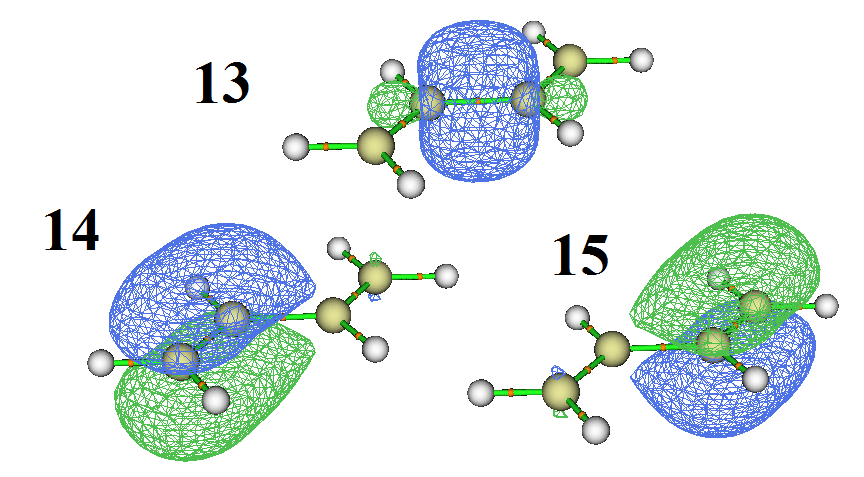

<!-- p.486 -->


并在 VMD 文件夹中的 vmd.rc 文件末尾添加 proc aim {} {source AIM.vmd}，这样你只需在命令中输入 aim 即可激活此脚本。

AIM.txt 是用于在静默模式下运行 Multiwfn 的输入流文件，它执行以下操作：(1) 进行标准的 AIM 分析（依次通过选项 2,3,4,5 定位临界点并生成拓扑路径）

(2) 将临界点和路径导出为当前文件夹中的 CPs.pdb 和 paths.pdb (3) 计算所有已定位临界点处除 ESP 外的所有性质，并将结果导出到当前文件夹中的 CPprop.txt (4) 将当前体系的结构导出为当前文件夹中的 mol.pdb 如果你想降低 VMD.bat 的计算成本，可以删除 VMD.txt 的第四行和第五行，在这种情况下 Multiwfn 将只尝试从原子核位置和原子对中点出发定位临界点。然而，这种处理可能会导致缺失某些临界点。

例子：2-吡啶酮_2-氨基吡啶 在本例中，我们将 examples\2-pyridoxine_2-aminopyridine.wfn 复制到含有 Multiwfn 可执行文件的文件夹，将 VMD.bat 中的输入文件名修改为 2-pyridoxine_2-aminopyridine.wfn，然后双击 VMD.bat，该批处理文件将调用 Multiwfn 根据 VMD.txt 中的命令对该 .wfn 文件进行分析。过一会儿，该文件夹中生成了 CPprop.txt，同时生成的 mol.pdb、CPs.pdb 和 paths.pdb 被自动移动到 VMD 文件夹。

现在启动 VMD 并在 VMD 控制台窗口中输入命令 aim，你将立即看到下图。

注意为了获得稍好的效果，我使用了内置的 Tachyon 渲染来得到下图，即选择“文件（File）”-“渲染（Render）”，改为“Tachyon (internal, in-memory rendering)”并点击“开始渲染（Start Rendering）”按钮（所得文件为 .tga 格式，你需要使用高级图像查看器查看它，如 IrfanView，可在 https://www.irfanview.com 免费获得）

也可以在图上同时显示分子结构。双击下图所示截图中的“D”使其变为黑色：

则分子结构将可见：

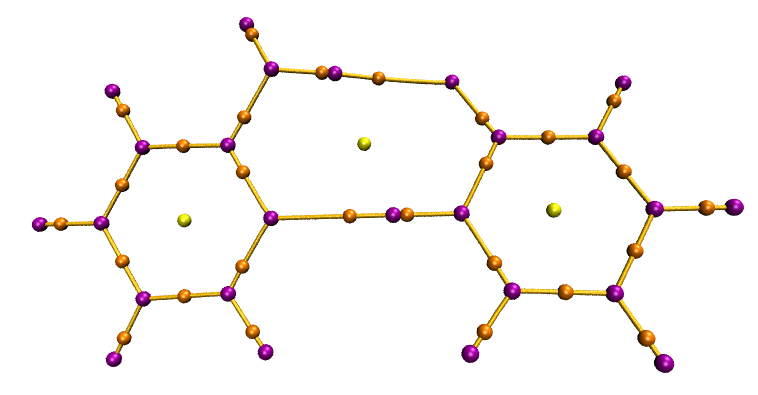


<!-- p.487 -->


显示临界点的标签 临界点的序号可以很容易地标注在图上。AIM.vmd 脚本定义了一个名为 labcp 的命令来执行此操作，用法为：

labcp [type] [label size] [offset in X] [offset in Y] “type”可以是“all”、“no”、“3n3”、“3n1”、“3p1”、“3p3”。“offset in X”和“offset in Y”用于定义标签的位置偏移，默认分别为 -0.1 和 0.0。

例子： labcp all：标注所有临界点的序号 labcp no：移除所有临界点标签 labcp 3n1 1.3：以 1.3 的尺寸标注所有 (3,-1) 临界点 labcp 3p3 1.8 -0.05 0.1：将所有 (3,+3) 临界点以 1.8 的尺寸标注，X 和 Y 方向的位置偏移分别设为 -0.05 和 0.1

对于当前体系，我们在 VMD 控制台窗口中输入 labcp 3n1 1.5 -0.1 0.1，你将看到

上图中的标签与 CPprop.txt 中的标签一一对应。例如，标签为 38 的临界点恰好对应于 CPprop.txt 中的 CP 38。显然你可以通过查看 CPprop.txt 中的相应条目轻松检查各种临界点的性质。

此外，AIM.vmd 还定义了 labcpidx 命令，用于根据序号标注特定的临界点。例如，你可以使用 labcpidx "2 7 to 10 14" 来仅标注 CP 2、7、8、9、10、14，你也可以在序号后面加上 [label size] [offset in X] [offset in Y] 选项。

显示特定的临界点 如果你想隐藏某些类型的临界点，应进入“图形（Graphics）”-“表示（Representations）”，然后将“选定分子（Selected Molecule）”切换为“CPs.pdb”，如下所示。

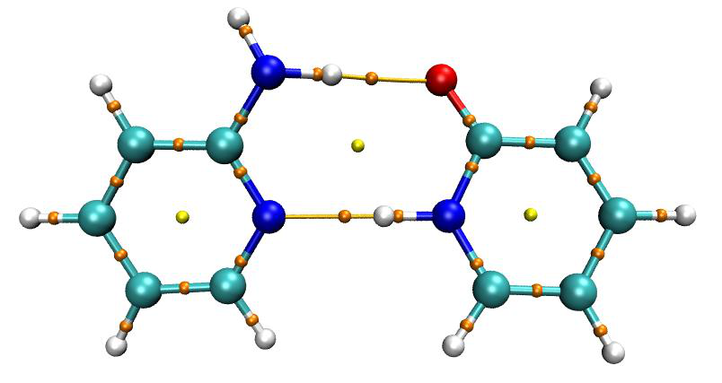


<!-- p.488 -->


由于在 CPs.pdb 中，C、N、O、F 原子分别用于表示 (3,-3)、(3,-1)、(3,+1)、(3,+3) 临界点，如果你想在图中隐藏 (3,+1) 和 (3,+3)，可以双击 "name O" 和 "name F" 条目使它们不可见。

此外，例如，在所有 (3,-1) 临界点中你只想显示序号为 3,5,6,7,11 的那些，你可以选择 "name N" 条目，然后在“选定原子（Selected Atoms）”框中输入 name N and serial 3 5 to 7 11 并按回车键。而如果你想将这些临界点隐藏，应输入 name N and not {serial 3 5 to 7 11}。显然，VMD 中的选择非常灵活。

显示特定的拓扑路径 也可以选择性地显示拓扑路径。从 paths.pdb 的内容中可以发现，每条路径对应于唯一的残基序号，因此你可以使用 VMD 中的 "resid" 属性来选择哪些路径可见或不可见。例如，如果你想隐藏拓扑路径 3 和 7，应进入“图形（Graphics）”-“表示（Representations）”面板，从“选定分子（Selected Molecule）”下拉框中选择 "paths.pdb"，然后在“选定原子（Selected Atoms）”框中输入 not resid 3 7。

如果你想查询拓扑路径的序号，应激活 VMD 图形窗口，按按钮 "0" 进入查询模式，然后在图形窗口中点击一条路径，则控制台窗口中显示的 "resid:" 即为路径序号。如果你想返回旋转模式，应按按钮 "r"。

### 4.2.6 以特殊方式进行拓扑分析：以 G-C...G-C 碱基对为例

由于 Multiwfn 极其灵活的设计，可以仅在你真正感兴趣的某些区域内或特定区域之间进行拓扑分析，从而显著降低总体成本，同时避免不需要的临界点。在本节中，将以下图所示的 G-C...G-C 碱基对作为实例。该体系可视为由四个片段组成。其 .wfn 文件可直接在 http://sobereva.com/multiwfn/extrafiles/GCGC.zip 下载。


<!-- p.489 -->


(1) 仅在弱相互作用区域进行 AIM 分析 首先，我展示如何仅在弱相互作用区域定位临界点并生成键径，其中电子密度必定相对较低。启动 Multiwfn 并输入

GCGC.wfn 2 // 拓扑分析（Topology analysis） 2 // 从原子核位置搜索临界点（Search CPs from nuclear positions） -1 // 设置临界点搜索参数（Set CP searching parameters） 9 // 设置保留临界点的值范围（Set value range for reserving CPs）： 0,0.1 // 在搜索过程中仅保留密度在 0~0.1 a.u. 内（即相对较低密度）的临界点(Only CPs with density within 0~0.1 a.u. (i.e. relatively low density) will be reserved during searching)

0 // 返回（Return） 3 // 从原子对中点搜索临界点（Search CPs from midpoint of atomic pairs） 8 // 生成连接 (3,-3) 和 (3,-1) 临界点的路径(Generating the paths connecting (3,-3) and (3,-1) CPs) 现在选择选项 0 可视化结果，见下图。左右两图实际上是相同的，只是右图中隐藏了分子结构。很明显，仅生成了与弱相互作用对应的 BCP 以及伴随的键径，而与化学键对应的 BCP 和键径没有得到。

如果你对环临界点(RCP，黄色小球)和笼临界点(CCP，绿色小球)不感兴趣，可以很容易地删除它们。输入以下命令：

-4 // 修改或导出临界点（Modify or export CPs） 2 // 删除某些临界点（Delete some CPs） 5 // 删除所有 (3,+1) 临界点(Delete all (3,+1) CPs) 6 // 删除所有 (3,+3) 临界点(Delete all (3,+3) CPs) 0 // 返回（Return）


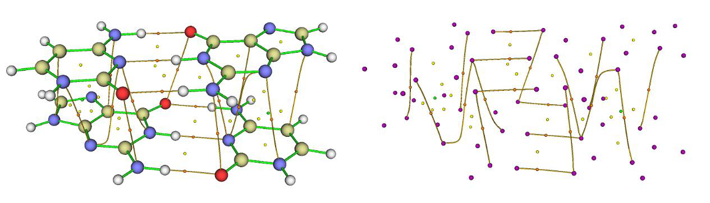

<!-- p.490 -->


0 // 返回 然后如果你再次选择选项0来可视化结果，你会发现RCP和CCP已经消失了。

(2) 仅在局部空间区域内进行AIM分析 现在我说明如何仅对片段1和2进行AIM拓扑分析。启动Multiwfn并输入

GCGC.wfn 2 // 拓扑分析（Topology analysis） -1 // 设置临界点搜索参数（Set CP searching parameters） 10 // 设置在搜索模式2、3、4、5中所考虑的原子的范围(Set the range of the atoms considered in searching modes 2, 3, 4, 5) 1 // 将搜索限制在一个片段内（Confine the searching within a fragment） 1-29 // 片段1和2的原子序号范围（The atomic index range of fragments 1 and 2） 2 // 设置步长的缩放因子（Set scale factor of stepsize）。我们修改此项是因为在默认设置下，本体系中对应于C-H和N-H的某些BCP可能会缺失

0.5 // 步长将乘以0.5进行缩放（Stepsize will be scaled by 0.5） 0 // 返回（Return） 2 // 从核位置出发搜索临界点（Search CPs from nuclear positions） 3 // 从原子对中点出发搜索临界点（Search CPs from midpoint of atomic pairs） 8 // 生成连接(3,-3)和(3,-1)型临界点的路径(Generating the paths connecting (3,-3) and (3,-1) CPs) 选择选项0来可视化结果，你将看到如下图所示。显然，仅生成了与片段1和2相关的临界点和键路径，这正是我们所期望的。

(3) 仅保留连接两个特定片段的键路径和相应的BCP 有时我们只想研究两个特定片段之间的片段间相互作用，并希望完全删除所有无关的键路径和BCP，以使图形更清晰。虽然你可以通过选项-1和-2中的相应子选项分别手动删除不需要的BCP和键路径，但该过程通常很繁琐。幸运的是，在Multiwfn中有一个专门用于实现此目的的特殊选项。下面我将说明如何仅保留连接片段1和3的键路径和相应的BCP，同时删除所有其它BCP和键路径。

启动Multiwfn并输入 GCGC.wfn 2 // 拓扑分析（Topology analysis） 2 // 从核位置出发搜索临界点（Search CPs from nuclear positions）


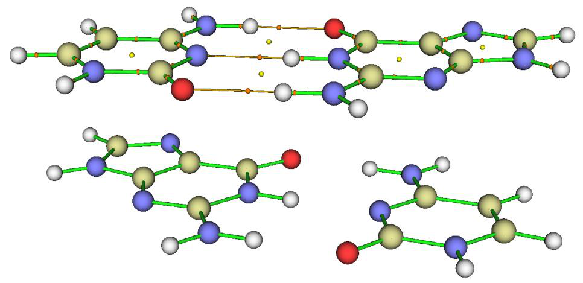

<!-- p.491 -->


3 // 从原子对中点出发搜索临界点（Search CPs from midpoint of atomic pairs） 8 // 生成连接(3,-3)和(3,-1)型临界点的路径(Generating the paths connecting (3,-3) and (3,-1) CPs) -5 // 处理路径（Manipulate paths） 8 // 仅保留连接两个特定片段的键路径(及相应的BCP)，同时删除所有其它键路径和BCP(Only retain bond paths (and corresponding BCPs) connecting two specific fragments while delete all other bond paths and BCPs)

1-13 // 片段1中的原子序号（Atomic indices in fragment 1） 30-45 // 片段3中的原子序号（Atomic indices in fragment 3） y // 同时删除其它键路径中的BCP(Also delete BCPs in other bond paths) 然后如上所述手动删除所有(3,+1)和(3,+3)型临界点，再可视化结果，你将看到

显然，仅保留了表征片段1和3之间堆积相互作用的BCP和键路径，图形看起来非常清晰，这正是我们想要的。

(4) 仅在两个特定片段之间搜索临界点 如果你只对两个非常大的分子之间的分子间相互作用感兴趣，并且你发现搜索所有临界点的代价非常高，你可以让Multiwfn仅搜索这两个分子之间的临界点，如本例所示。我们将只尝试搜索GCGC复合物中片段1和3之间的临界点。启动Multiwfn并输入

GCGC.wfn 2 // 拓扑分析（Topology analysis） -1 // 设置临界点搜索参数（Set CP searching parameters） 10 // 设置在搜索模式2、3、4、5中所考虑的原子的范围(Set the range of the atoms considered in searching modes 2, 3, 4, 5) 2 // 在两个特定区域之间搜索临界点（Searching CPs between two specific regions） 1-13 // 区域1中的原子（The atoms in region 1） 30-45 // 区域2中的原子（The atoms in region 2） 0 // 返回（Return） 3 // 从原子对中点出发搜索临界点（Search CPs from midpoint of atomic pairs） 4 // 从三个原子的中心出发搜索临界点（Search CPs from center of three atom atoms） 现在选择选项0来可视化结果，你将看到


<!-- p.492 -->


由于要求每次搜索所涉及的原子的组合必须同时出现在我们定义的两个区域中(即所有原子不得出现在同一区域内)，因此尝试次数与对整个复合物搜索临界点相比大大减少，相应的代价也显著降低。如你所见，最终定位到的临界点大多出现在片段1和3之间，尽管有少数收敛到了片段1和2之间的区域，你可以随后手动删除它们。


### 4.2.7 通过精修由盆分析定位到的吸引子来进行拓扑分析：


### 以双自由基的自旋密度为例

拓扑分析模块能够精确定位各种类型的临界点，然而，如果实空间函数的分布相对复杂，例如ELF、轨道波函数和密度差，通常很难定位到所有临界点。相比之下，盆分析模块保证能够成功定位负值区域的所有极小值和正值区域的所有极大值，它们统称为“吸引子（attractors）”，参见4.17节的例子。然而，由于盆分析是基于均匀分布的格点进行的，吸引子的精度有限，因为每个吸引子对应一个格点，而格点间距通常大于0.05 Bohr，比拓扑分析的位移收敛阈值大好几个数量级。如果你只对实空间函数的极小值和极大值感兴趣，显然一个好主意是将由盆分析确定的吸引子作为拓扑分析模块中定位临界点的起始点，换句话说，可以用拓扑分析模块来精修吸引子的位置。这两个模块的联合使用确保了负值区域的所有极小值和正值区域的所有极大值都能被精确定位。在本例中，我以C4H8双自由基的自旋密度为例来说明如何实现这一点。

示例文件为examples\C4H8.wfn。在对自旋密度进行盆分析和拓扑分析之前，我们可以用主功能5来可视化其等值面，以考察其基本分布特征。自旋密度=0.01 a.u.对应的等值面如下所示


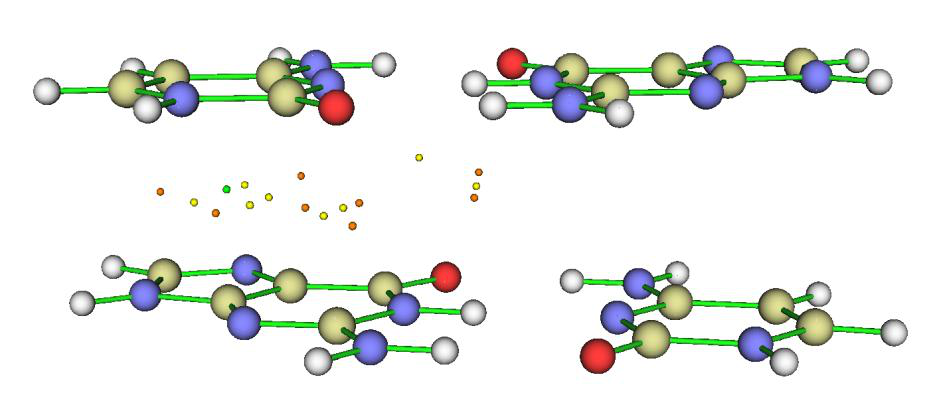

<!-- p.493 -->


我们首先进行盆分析。启动Multiwfn并输入 examples\C4H8.wfn 17 // 盆分析（Basin analysis） 1 // 生成盆并定位吸引子（Generate basins and locate attractors） 5 // 自旋密度（Spin density） 2 // 中等质量格点（Medium-quality grid） 0 // 查看定位到的吸引子（Check the located attractors） 在稍稍修改绘图设置后，你将看到

在上图中，蓝色和绿色小球分别对应负值部分的极小值和正值部分的极大值。显然它们的位置与我们的预期完全一致，而预期可从等值面图推断得出。

然后关闭图形界面并输入 -4 // 将吸引子导出为pdb/pqr/txt/gjf文件（Export attractors as pdb/pqr/txt/gjf file） 3 // 将所有吸引子的坐标和函数值作为attractors.txt导出（Export coordinates and function values of all attractors as attractors.txt） 现在当前文件夹中有了attractors.txt，其中前三列对应吸引子以Bohr为单位的X、Y、Z坐标。现在我们用它们作为自旋密度拓扑分析的起始点。重新启动Multiwfn并输入

examples\C4H8.wfn 2 // 拓扑分析（Topology analysis） -11 // 重新选择要研究的实空间函数（Reselect the real space function to be studied） 5 // 自旋密度（Spin density） 1 // 从给定起始点出发搜索临界点（Search CPs from given starting points） 4 // 使用来自.txt文件的起始点（Using starting points from a .txt file） [按ENTER键] // 使用当前文件夹中的attractors.txt(Use attractors.txt in current folder) 然后从屏幕上你可以看到attractors.txt中的全部16个点被依次用作起始


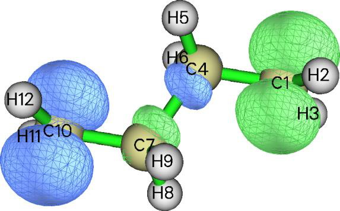


<!-- p.494 -->


点，最终找到了14个新的临界点。然后输入0返回并选择选项0来可视化这些临界点，你将看到

在上图中，紫色小球，即(3,-3)型临界点，代表自旋密度正值部分的极大值；而绿点，即(3,+3)型临界点，对应自旋密度负值部分的极小值。虽然用肉眼很难察觉，但它们的位置确实比盆分析模块直接给出的吸引子更准确。


### 4.2.8 密度差的拓扑分析：以

H2O的变形密度为例

在本例中，我进一步说明Multiwfn中拓扑分析的极大灵活性。我

将展示如何对H2O的变形密度进行拓扑分析，即ρdef = ρ(H2O) − ρ(H1) − ρ(H2) − ρ(O)。关于变形性质的更多信息参见3.7.2节。类似地，你可以用同样的方法对其它种类的密度差进行拓扑分析，例如Fukui函数和对偶描述符。

- 生成变形密度的格点数据 将“atomwfn”文件夹从“examples”文件夹移动到当前文件夹，以便Multiwfn在生成变形密度期间能直接利用其中的原子波函数文件。然后输入

examples\H2O.fch 5 // 格点数据计算（Grid data calculation） -2 // 获取变形性质（Obtain deformation property） 1 // 电子密度（Electron density） 3 // 高质量格点（High-quality grid）(格点质量必须对当前目的足够精细。对于大得多的体系，我建议选择“5 输入原点、格点间距和格点数目(Input original point, grid spacings, and the number of points)”并输入相对较小的格点间距，例如0.15)

0 // 返回主菜单（Return to main menu）

- 进行盆分析以定位极大值和极小值 17 // 盆分析模块（Basin analysis module） 1 // 生成盆（Generate basins） 2 // 使用内存中的格点数据（Use grid data in memory） -4 // 导出结果（Export result） 3 // 将定位到的极大值和极小值的位置导出到当前文件夹的attractors.txt中（Export position of located maxima and minima to attractors.txt in current folder） -10 // 返回主菜单（Return to main menu）


<!-- p.495 -->


- 对变形密度进行拓扑分析 iu // 改变自定义函数（Change user-defined function） -3 // 如2.7节所述，自定义函数将对应于基于内存中格点数据经B样条算法插值得到的函数(User-defined function will correspond to interpolation function via B-spline algorithm based on the grid data in memory, as mentioned in Section 2.7)

2 // 拓扑分析（Topology analysis） -11 // 改变要分析的函数（Change the function to be analyzed） 100 // 自定义函数（User-defined function） 1 // 从给定起始点出发搜索临界点（Search CPs from given starting points） 4 // 使用来自.txt文件的起始点（Using starting points from a .txt file） attractors.txt 0 // 返回（Return） 现在如果你进入选项0，你可以可视化极大值和极小值，即如下图所示中紫色和绿色小球所示的(3,-3)和(3,+3)型临界点

然后如果你想将临界点位置与当前格点数据的等值面进行比较，以确认位置确实正确，你可以接着输入

-10 // 返回主菜单（Return to main menu） 13 // 处理格点数据（Process grid data） -2 // 可视化内存中格点数据的等值面（Visualize isosurface of grid data in memory） 在将等值面值适当调节到0.09 a.u.并稍稍调节原子和键的半径后，如下所示，你可以清楚地看到绿色(正值)和蓝色(负值)等值面分别包围了一些极大值和极小值，因此变形密度的极小值和极大值确实被成功定位到了。

如果你还需要变形密度的(3,-1)和(3,+1)型临界点，现在你可以关闭图形窗口然后输入

-1 // 返回主菜单（Return to main menu） 2 // 再次进入拓扑分析模块（Enter topology analysis module again） 6 // 从球内的一批点出发搜索临界点(Search CPs from a batch of points within sphere(s))


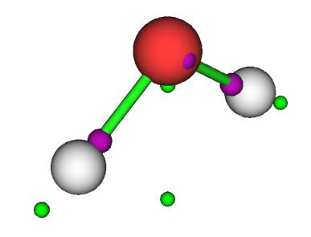


<!-- p.496 -->


-1 // 依次以每个原子核为球心开始搜索（Start the search using each nucleus as sphere center in turn）(我建议多次选择此选项，直到找不到新的临界点为止)

-9 // 返回（Return） 8 // 生成连接(3,-3)和(3,-1)型临界点的路径(Generating the paths connecting (3,-3) and (3,-1) CPs)。这一步完全是可选的，我只是做个演示)

当前在选项0中显示的临界点为

如你所见，基本上所有临界点都已被找到，并且拓扑路径也已正确且成功地生成。当前Poincaré-Hopf关系可能满足，也可能不满足。对于像变形密度这样复杂的函数，该关系是否满足从来都不重要，你只需关注你真正感兴趣的临界点即可。

事实上，如果没有本例中所做的借助盆分析模块的帮助，直接在拓扑分析模块中定位变形密度的极小值和极大值并非不可能。然而，如果你直接通过拓扑分析模块中的选项6搜索变形密度的临界点，由于数值原因以及密度差的高度复杂性，一些极小值和极大值很难被定位到。


### 4.2.9 静电势（ESP）的拓扑分析

关于ESP拓扑分析的更多信息可在我的博客文章中找到：“使用Multiwfn对静电势和范德华势做拓扑分析以精确获得其极小值的位置和数值” http://sobereva.com/645 (中文)。

一些论文从拓扑分析的角度研究了分子ESP，例如见J. Comput. Chem., 39, 488 (2017)和J. Phys. Chem. A, 123, 10139 (2019)。如果你已仔细阅读过4.2.2、4.2.7和4.2.8节，你自然会知道如何用Multiwfn来实现。不过，这里我明确给出一些例子，因为它们涉及一些关键点。通常，只有ESP极小值，即ESP的(3,+3)型临界点是人们感兴趣的，因为ESP极大值总是出现在核位置，而(3,-1)和(3,+1)型ESP临界点的物理意义不太明显。

有三种搜索ESP临界点的方法，你需要根据实际情况决定使用哪一种：

(1) 拓扑分析模块中的牛顿法（Newton method）。可以定位到所有种类的ESP临界点 (2) 拓扑分析模块中的最速下降法（Steepest descent method），只会定位到ESP极小值 (3) 联合方法，即用盆分析模块粗略定位ESP极小值的位置，再用拓扑分析模块精修其坐标，过程与4.2.7和4.2.8节相同。

如果你对所有种类的临界点都感兴趣，必须使用(1)并配合随机分布的起始点。然而，如果你只对ESP极小值感兴趣，(2)是更好的选择，因为搜索


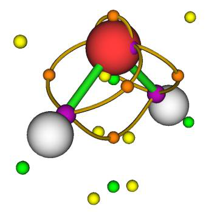

<!-- p.497 -->


过程不会收敛到其它种类的临界点，因此需要的随机起始点数目较少。不幸的是，如果极小值出现在狭窄的谷区，(2)的收敛行为非常差，而且如果起始点数目相对有限，(1)和(2)都不能保证找到所有ESP极小值；(3)没有这些问题，不过操作步骤稍多一些，而且在盆分析阶段生成的格点数据可能占用大量内存。

在接下来三部分中，我将依次说明如何使用这三种方法。

(1) 使用牛顿法定位ESP临界点 以乙酸为例说明使用牛顿法定位ESP临界点。启动Multiwfn并输入 examples\acetic_acid.wfn 2 // 拓扑分析（Topology analysis） -11 // 选择实空间函数（Select real space function） 12 // ESP 6 // 从球内的一批点出发搜索临界点(Search CPs from a batch of points within sphere(s)) 11 // 设置每个球中的起始点数目（Set number of starting points in each sphere） 100 // 因为搜索ESP临界点相当耗时，我们使用比默认值小的值，通常这已足够(Because searching ESP CPs is quite expensive, we use a relatively small value than default, usually this is adequate)

-1 // 依次以每个原子核为球心开始搜索（Start the search using each nucleus as sphere center in turn） 过一会儿，你可以发现已找到一批临界点(注意每次用此搜索模式能获得的临界点数目有一定随机性)：


```text
Index                       Coordinate               Type
    1    -0.94873432    -0.85713774    -0.00001303   (3,-1)
    2    -4.10014831    -1.74269848    -0.00054080   (3,+3)
    3    -4.18123989    -0.18759421    -0.00016317   (3,+1)
    4    -0.78813608     1.26880944    -0.00011552   (3,-1)
    5    -0.58790363     4.51467978     0.00010713   (3,+3)
    6    -3.68822894     2.43495579     0.00029260   (3,+3)
    7    -2.20123133     4.56852808     0.00030204   (3,+1)
    8     1.17777482     0.08729980    -0.00001956   (3,-1)
    9     3.17142044     1.10110206    -0.00221974   (3,-1)
   10     2.98644302    -0.75061380    -1.06273496   (3,-1)
   11     2.98614682    -0.74675779     1.06544103   (3,-1)
Totally find    11 new critical points
```

然后选择-9返回上一级界面，再选择选项0来可视化定位到的临界点，你将看到


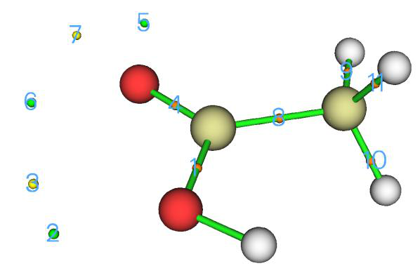

<!-- p.498 -->


很明显，(3,+3)型临界点2、5、6对应于ESP极小值，它们出现主要是由于两个氧的孤对电子对ESP的显著负贡献。用选项7查看这些点处的ESP，你会发现它们的ESP分别为-1.634、-2.069和-2.312 eV。还要注意选项7还显示了ESP的梯度和Hessian信息。

然后你还可以将ESP等值面与临界点一起可视化。为此，输入以下命令

-10 // 返回主菜单（Return to main menu） 5 // 计算格点数据（Calculate grid data） 12 // ESP 2 // 中等质量格点（Medium-quality grid） -1 // 显示等值面图（Show isosurface graph）

在对可视化设置做一些调整后，ESP = ±0.055 a.u. (±1.497 eV)的等值面将为

蓝色透明等值面清楚地描绘了ESP明显为负的区域。从图中你可以直观地认识到CP 6必定是全局最小值，而CP2处的ESP负得不那么明显。这一观察与前面提到的临界点处的精确ESP值完全一致。

值得注意的是，原则上，通过上述方式搜索ESP临界点不可能找到它们全部，至少不可能定位到位于核位置的ESP极大值，因为在核位置ESP值为无限大且ESP梯度不为零。所以，你不需要关心ESP拓扑分析中Poincaré-Hopf关系是否满足。然而，如果一些感兴趣的临界点没有被找到，你应尝试反复使用选项“-1 依次以每个原子核为球心开始搜索（Start the search using each nucleus as sphere center in turn）”直到它们被找到。如果在多次选择后想要的临界点仍然缺失，你可以考虑将位移和梯度的收敛判据放宽一个数量级(通过选项“-1 设置临界点搜索参数（Set CP searching parameters）”中的相应子选项)并重新搜索。

(2) 使用最速下降法定位ESP极小值 我仍以乙酸为例说明如何用最速下降法定位ESP极小值。启动Multiwfn并输入

examples\acetic_acid.wfn 2 // 拓扑分析（Topology analysis） vmin


<!-- p.499 -->


-1 // 依次以每个原子核为球心开始搜索（Start the search using each nucleus as sphere center in turn） 你将看到已找到三个(3,+3)型临界点，即极小值，它们与用牛顿法定位到的相同：


```text
Index                       Coordinate               Type
    1    -4.10014914    -1.74269856    -0.00049544   (3,+3)
    2    -3.68823066     2.43494346     0.00029136   (3,+3)
    3    -0.58789573     4.51467533     0.00010994   (3,+3)
Totally find     3 new critical points
```

上面输入的vmin是一个快捷方式，它对应于输入以下命令：2 // 拓扑分析（Topology analysis） -11 // 选择实空间函数（Select real space function） 12 // ESP -1 // 设置临界点搜索参数（Set CP searching parameters） 12 // 选择搜索算法（Choose searching algorithm） 4 // 最速下降法（Steepest descent） 6 // 从球内的一批点出发搜索临界点(Search CPs from a batch of points within sphere(s)) 11 // 设置每个球中的起始点数目（Set the number of starting points in each sphere） 10 // 尽管每个中心10个起始点很少，但对大多数情况已足够(Although 10 starting points per center is small, it is adequate for most case)。与牛顿法不同，最速下降法的所有起始点都会收敛到极小值，因此需要的起始点数目较少(Unlike Newton method, all starting points of steepest descent method will converge towards to minima, therefore a smaller number of starting points is needed)

(3) 使用联合方法定位ESP极小值 二茂铁是一个典型例子，说明最速下降法不适合定位其ESP极小值，因为如下所示，一些极小值出现在ESP非常狭窄的谷区，使得该方法的收敛非常困难。牛顿法在这种情况下效果更好，因为其振荡行为不那么突出；然而，如果你希望定位到所有ESP极小值，需要设置非常多的起始点，这使得计算代价非常高。这里，我说明盆分析和拓扑分析模块的联合使用以定位所有ESP极小值，这非常适合此体系。顺便说一下，4.17.3节给出了ESP盆分析的详细例子，建议你先看一下。

启动Multiwfn并输入 examples\ferrocene.mwfn // B3LYP/6-31G*&SDD水平的波函数文件(Wavefunction file of B3LYP/6-31G*&SDD level) 17 // 盆分析（Basin analysis） 1 // 生成盆（Generate basins） 12 // ESP 1 // 低质量格点（Low-quality grid）。这样的质量对粗略定位极值目的已足够(使用更好质量的格点不会带来额外好处，而ESP的计算代价会显著增加)(Such quality is adequate for crudely locating extrema purpose (using better quality grid will not bring additional benefits, while computational cost of ESP will increase significantly))

一旦计算完成，进入选项0来可视化ESP极值：


<!-- p.500 -->


蓝色点对应于ESP极小值，而ESP极大值近似出现在核位置，被原子球所遮挡。

关闭图形窗口并输入以下命令，以用拓扑分析模块精修极小值的位置

-4 // 导出吸引子（Export attractors） 3 // 将所有吸引子的坐标和函数值作为当前文件夹中的attractors.txt导出(Export coordinates and function values of all attractors as attractors.txt in current folder) -10 // 返回主菜单（Return to main menu） 2 // 拓扑分析（Topology analysis） -11 // 选择实空间函数（Select real space function） 12 // ESP 1 // 从给定起始点出发搜索临界点（Search CPs from given starting points） 4 // 使用来自.txt文件的起始点（Using starting points from a .txt file） [按ENTER键] // 使用当前文件夹中的attractors.txt中记录的点（Use points recorded in the attractors.txt in current folder） 然后Multiwfn用默认的牛顿法基于attractors.txt中的起始点搜索临界点。一旦计算完成，输入0返回，再选择选项0来可视化定位到的临界点：

如你所见，ESP极小值(绿色小球)出现在预期的位置，其分布与分子对称性一致，意味着所有ESP极小值都已被找到。


<!-- p.501 -->


最后，如果你想将ESP等值面与极小值一起可视化以更好地理解它们，你可以输入

-10 // 返回主菜单（Return to main menu） 13 // 处理格点数据（Process grid data） -2 // 对内存中的格点数据可视化等值面（Visualize isosurface for the grid data in memory），其当前对应于之前使用盆分析模块时生成的ESP格点数据(which currently corresponds to the ESP grid data generated during using basin analysis module before)

在将等值面值改为0.025 a.u.并将等值面设为网格风格后，你可以看到

蓝色等值面(-0.025 a.u.)源于cp配体丰富的π电子，如预期的那样，在这些区域中有相应的ESP极小值。在二茂铁中部，有一个非常狭窄的环形等值面，其中有10个ESP极小值。如上所述，此类区域中的ESP极小值很难用最速下降法定位。而如果改用牛顿法，除非使用非常多的随机起始点，否则不容易成功定位到它们全部。


### 4.2.10 范德华势（van der Waals potential）的拓扑分析

关于范德华势拓扑分析的更多信息可在我的博客文章中找到：“使用Multiwfn对静电势和范德华势做拓扑分析以精确获得其极小值的位置和数值” http://sobereva.com/645 (中文)。

范德华（vdW）势是研究以vdW效应为主导的分子间相互作用的一个相当重要的函数，参见3.23.7节的介绍和4.20.6节的可视化研究与盆分析的例子。在本例中，我们对vdW势进行拓扑分析以精确定位其极小值，将以金刚烷为例。

启动Multiwfn并输入 examples\adamantane.xyz 2 // 拓扑分析（Topology analysis） -11 // 选择实空间函数（Select real space function） 25 // vdW势（vdW potential） 如屏幕提示所示，用于定位临界点的算法已自动改为最速下降法（Steepest descent method），因为它最适合定位vdW势的极小值(the algorithm for locating CPs has been automatically changed to steepest descent method, because which is most suitable for locating minima of vdW potential)。

然后输入 6 // 从球内的一批点出发搜索临界点(Search CPs from a batch of points within sphere(s))


<!-- p.502 -->


-1 // 依次以每个原子核为球心开始搜索（Start the search using each nucleus as sphere center in turn）。注意当前在每个原子周围随机分布100个点（Note that currently 100 points are randomly distributed around each atom）。

从屏幕上的信息可知，已定位到27个(3,+3)型临界点，即27个vdW势极小值。返回上一级菜单，再选择选项0来可视化这些极小值。在将“原子尺寸比例（Ratio of atomic size）”改为4.0(此时原子半径对应于vdW半径)并将“临界点尺寸比例（Ratio of CP size）”增大到2.0后，你将看到下图。极小值的分布与分子点群对称性（Td）一致，意味着所有极小值都已成功找到。

接下来，你可以用选项7查看这些vdW极小值处的vdW势数值。然后你可以返回主菜单，并用4.20.6节所述方法可视化vdW势的等值面，等值面和极小值将一起显示。下图中的蓝色等值面对应于-0.62 kcal/mol的vdW势。显然，极小值的分布与等值面一致。


### 4.2.11 相互作用区域指示符(IRI, interaction region indicator)和


### 约化密度梯度(RDG, reduced density gradient)的拓扑分析

相互作用区域指示符（IRI）在Chemistry-Methods, 1, 231 (2021) DOI: 10.1002/cmtd.202100007中提出，是揭示


<!-- p.503 -->


化学体系中各类相互作用的极其有用的方法，包括化学键和弱相互作用。通常，IRI分析是

通过绘制IRI函数的sign(λ2)ρ着色的等值面图来进行，参见4.20.4节的例子。IRI等值面的出现必定伴随着相应的IRI极小值，因此，你可以将IRI极小值视为相互作用区域内最具代表性的位置，其性质可能有助于表征相互作用的类型和强度。注意，IRI极小值分析绝不等同于原子-分子理论(AIM, atoms-in-molecules)中的电子密度拓扑分析。如在Chemistry-Methods, 1, 231 (2021)中仔细讨论的，IRI还能忠实揭示不存在AIM临界点的明显相互作用，例如，一些分子内氢键。因此，如果你希望通过考察代表点处实空间函数的数值来研究这类氢键，你应首先定位相应的IRI极小值，如下所示。你也可以用完全相同的步骤来定位约化密度梯度(RDG, reduced density gradient)的极小值，它被所谓的NCI方法用来揭示弱相互作用区域(参见3.23.1节的介绍)。尽管RDG在揭示非共价相互作用方面与IRI有非常相似的能力，但不幸的是它不像IRI那样能够揭示具有强共价特征的相互作用。

接下来，我将以Ni(NH3)2(OH)2为例展示如何精确定位IRI极小值，其波函数文件examples\Ni(NH3)2(OH)2.mwfn由B3LYP结合对Ni用SDD、对其它原子用6-311G**生成。如在Chemistry-Methods, 1, 231

(2021)中仔细分析的，此体系有两个明显的配体间N-H···O氢键。如果你用4.2.1节所述同样方法进行AIM拓扑分析，你会发现找不到对应于这两个氢键的键临界点。然而，IRI可以清楚地展现这些氢键的存在。

启动Multiwfn并输入 examples\Ni(NH3)2(OH)2.mwfn 2 // 拓扑分析（Topology analysis） -11 // 选择实空间函数（Select real space function） 24 // 相互作用区域指示符(Interaction region indicator (IRI)) 现在如屏幕提示所示，临界点搜索方法已从默认的牛顿法自动改为最速下降法（Steepest descent method），这是因为牛顿法很难收敛到某些IRI极小值，不仅因为它们常出现在非常小而狭窄的凹区，还因为这些极小值周围的局部区域不呈现二次行为(你可以通过绘制IRI的曲线图来直观理解这一点)。在这种情况下最速下降法比牛顿法合适得多。从屏幕提示你还可以发现梯度收敛判据已被自动设为非常大的值以使其在判断收敛时的作用失效，这是因为由于IRI(和RDG)特殊的函数行为，用最速下降法几乎不可能非常精确地收敛到梯度足够小的位置。

然后输入以下命令开始搜索临界点 6 // 从球内的一批点出发搜索临界点(Search CPs from a batch of points within sphere(s)) -1 // 依次以每个原子核为球心开始搜索（Start the search using each nucleus as sphere center in turn） 过一会儿，你会发现已定位到大量(3,+3)型临界点，即极小值。注意与默认的牛顿法能定位所有种类的临界点不同，这里用的最速下降法只定位极小值。然后输入0返回上一级菜单，并选择选项0来可视化结果，你将看到


<!-- p.504 -->


上图中的绿色小球对应于IRI极小值，可见它们出现在

每对相互作用原子之间，而CP34和CP41对应于配体间N-H···O氢键。请将它们的位置与着色的IRI等值面图，即Chemistry-Methods, 1, 231 (2021)的图5(b)进行比较。显然，你随后可以用选项7研究这两个临界点的性质，以尝试讨论氢键的特征。有两个临界点(22和31)离分子非常远(你需要适当旋转分子才能清楚观察它们的位置)，它们没有任何实际意义，应直接忽略。

如果你感兴趣，你还可以在XY平面绘制IRI的填充色图，此体系中所有非氢原子几乎都位于该平面内。为此，返回主菜单，然后输入

4 // 在平面上输出并绘制特定性质（Output and plot specific property in a plane） 24 // 相互作用区域指示符(Interaction region indicator (IRI)) 1 // 填充色图（Color-filled map） [按ENTER键] // 使用默认格点数（Use default number of grids） 0 // 设置扩展距离（Set extension distance） 1 // 1 Bohr 1 // XY平面（XY plane） 0 // Z=0 关闭图形，再稍稍修改绘图设置 4 // 启用显示原子标签和参考点（Enable showing atom labels and reference point） 1 // 红色（Red） 5 // 设置临界点和路径的绘制细节（Set details of plotting critical points and paths） 15 // 设置临界点的颜色（Set color for CPs） 4 // (3,+3) 10 // 品红（Magenta） 0 // 返回（Return） -1 // 再次显示图形（Show the graph again） 现在你可以看到


