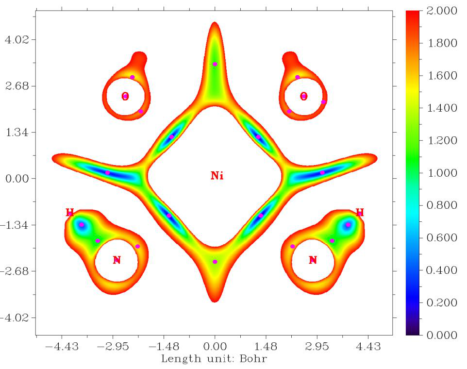
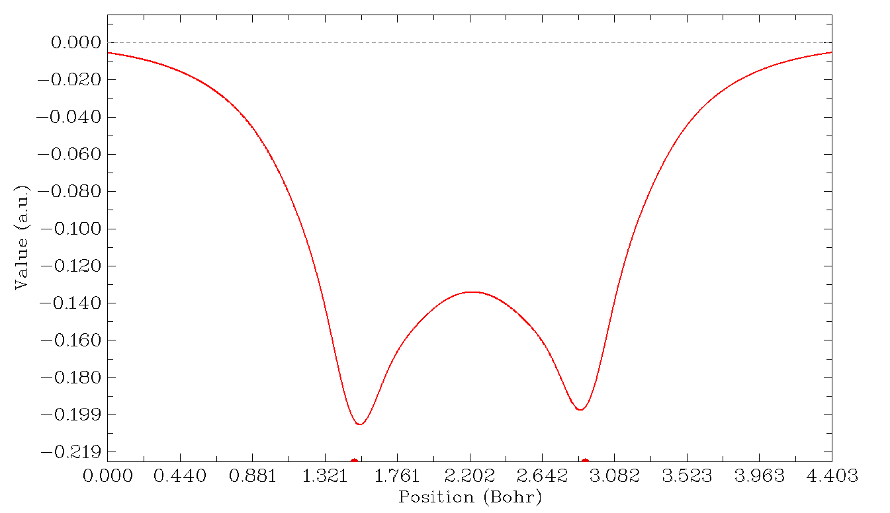
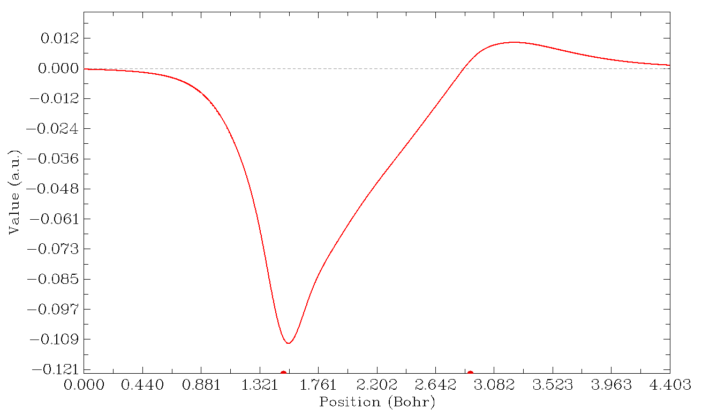
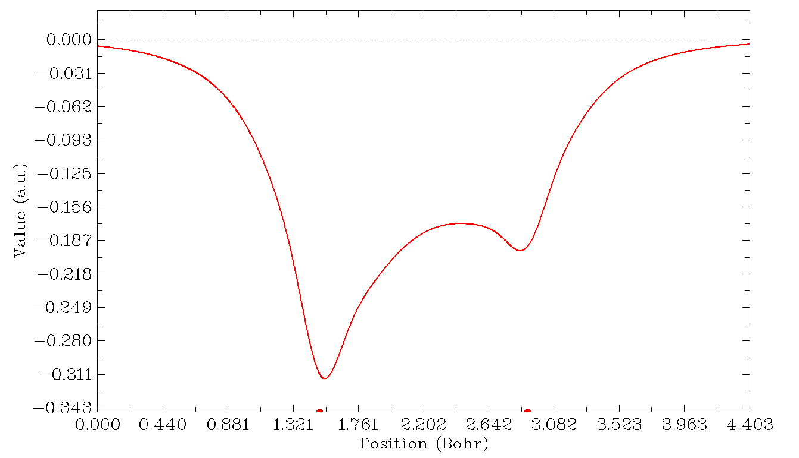
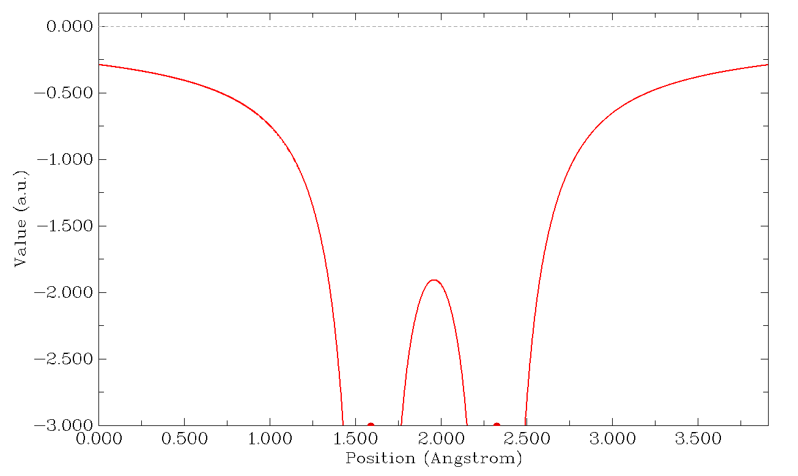

# 在一条线上输出并绘制各种性质

> Multiwfn manual, p.505–511.英文原文见同名 English 章节。 Images: `../imgs/`.

---

<!-- p.505 -->


可见图中相邻原子之间显著的相互作用区域被相对较低的IRI值清楚地揭示，绘制的IRI函数的极小值(图中的紫色点)确实出现在预期的位置。


## 4.3 在一条线上输出并绘制各种性质


### 4.3.1 沿碳和


### 氧原子绘制三重态甲酰胺的自旋密度曲线

启动Multiwfn并输入以下命令 examples\formamide-m3.wfn 3 // 主功能3，在一条线上绘制实空间函数(Main function 3, plot real space function along a line) 5 // 自旋密度（Spin density） 1 // 通过两个原子的核坐标定义直线（Defining the line by nuclear coordinate of two atoms） 1,6 // 两个原子的序号，在本例中碳和氧原子分别对应1和6(Indices of the two atoms, carbon and oxygen atoms correspond to 1 and 6 in present example, respectively)

图形会立即显示：




<!-- p.506 -->


X轴对应于你所定义的直线上的位置，虚线对应于Y=0的位置，左右两侧的红色圆圈分别表示你所选择的第一个和第二个原子的位置。在图上点击鼠标右键关闭图形后，命令行窗口会出现一个新菜单，你可以通过相应选项保存图形文件、调整Y轴范围、导出X-Y数据点并重新绘制图形，等等。通过选择选项6，可以定位极小值和极大值位置：

```text
Local maximum X:    0.753677  Value:    0.20104903D-01
Local minimum X:    1.219518  Value:   -0.55161276D-02
Local maximum X:    1.503567  Value:    0.29655008D+00
Local minimum X:    2.145518  Value:   -0.70202704D-02
Local maximum X:    3.736194  Value:    0.51047629D-01
Local minimum X:    4.006988  Value:    0.18918295D-01
Local maximum X:    4.184992  Value:    0.24448996D+00
Totally found    3 local minimum,    4 local maximum
```

使用上面所示的相同步骤，你可以绘制Multiwfn支持的任意实空间函数的曲线图，请尝试一下。

### 4.3.2 研究H2的Fermi空穴和Coulomb空穴

这是一个相对高级的例子，如果你是量子化学新手，可以跳过本节。

在本例中，我们将沿H2的轴线绘制相关空穴（Fermi空穴和Coulomb空穴）。这是一个高级话题，如果你对相关空穴的概念不熟悉，请参阅第2.6节第17部分的讨论。

Hartree-Fock波函数能够描述Fermi相关，但完全忽略了Coulomb相关。在这种情况下，可以用Multiwfn计算并绘制精确的Fermi空穴。如果需要分析Coulomb空穴，则必须使用post-HF波函数。在当前版本中，Multiwfn能够通过Müller近似对post-


<!-- p.507 -->


HF波函数计算并绘制近似的Fermi空穴和Coulomb空穴，该近似利用自然轨道来模拟精确的对密度。尽管引入了近似，但结果一般至少在定性上是正确的。

首先，我们在CCSD/cc-pVTZ水平下优化H2并生成.wfn文件。CCSD是Gaussian程序能够生成的最高水平的波函数（如果需要更高水平的波函数，必须借助其它程序，详见第4.A.8节）。该文件已作为examples\H2_CCSD.wfn提供。H1的坐标为(0.0, 0.0, 0.7016) Bohr，H2的坐标为(0.0, 0.0, -0.7016) Bohr。

相关空穴涉及两个电子的坐标，为了直观地研究它，我们必须确定参考电子的位置。在本例中，我们将参考点设在(0.0,0.0,-0.3) Bohr。因此，我们打开`settings.ini`，将refxyz参数改为0.0,0.0,-0.3。

我们首先分析的相关空穴是Fermi空穴（也称为交换空穴），因此我们

将`settings.ini`中的paircorrtype改为1。由于这是闭壳层体系，α或β电子的结果完全相同，而对于开壳层体系，你应使用`settings.ini`中的"pairfunctype"来选择将研究哪种自旋类型的电子，你也可以通过调整该参数来选择研究交换-相关密度或相关因子。

现在启动Multiwfn，输入以下命令examples\H2_CCSD.wfn 3 // 绘制曲线图（Draw curve map） 17 // 相关空穴（Correlation hole） 1 // 通过两个原子的核坐标定义直线（Defining the line by nuclear coordinate of two atoms） 2,1 // 沿H2和H1绘制曲线图（Draw curve graph along H2 and H1） 然后你将看到

该图表明，如果我们在(0.0,0.0,-0.3)处放置一个α电子，那么在两个核附近找到另一个α电子的概率将因同自旋电子之间的Pauli排斥而显著降低，且降低程度几乎相同。在H-H成键区域，概率也明显降低。根据Bader的论述“电子可以去它的空穴所去之处，如果Fermi空穴是定域的，那么电子也是定域的”(p251，见Atoms in molecules - A quantum



<!-- p.508 -->


theory)，我们可以说，如果一个α电子出现在(0.0,0.0,-0.3)，那么它必定能够容易地在整个H2分子空间离域。

现在我们研究Coulomb空穴。关闭Multiwfn，将"paircorrtype"改为2，重新启动Multiwfn，然后用相同步骤重新绘制曲线图，你将看到

左右两侧的红点分别突出显示H2和H1的位置。我如何在图上推断参考点的位置？从提示"Set extension distance for mode 1, current: 1.500000 Bohr"我们知道，绘制范围相对于H2和H1的Z坐标向两侧各外延了1.5 Bohr，而我们知道参考点的Z坐标比H2大约0.4016 Bohr，所以在上图中参考点的位置为1.5+0.4016=1.9016 Bohr（如果你想在图上标出参考点的位置，可以选择"4 Draw a vertical line at specific X"并输入1.9016，然后通过选项-1重新绘制图形）。上图表明，由于Coulomb排斥，在最靠近参考电子的氢（即H2）附近找到另一个

电子（α或β）的概率大幅降低。作为补偿，在H1背侧的概率有所增加。

最后，我们研究Fermi相关和Coulomb相关的综合效应。将"paircorrtype"改为3，再次绘制线图，你将看到



<!-- p.509 -->


该图实际上是前两张图的总和。从该图可以清楚地看出，

在最靠近参考电子的氢附近找到电子（α或β）的概率降低，比在另一个氢附近的降低更为严重。

### 4.3.3 通过PAEM-MO方法研究原子间相互作用

这是一个相对高级的例子，如果你是量子化学新手，可以跳过本节。

在J. Comput. Chem., 35, 965 (2014)中，作者提出了一种名为PAEM-MO的方法，用于揭示两个原子之间（共价或非共价成键）相互作用的本质。在本例中，我将简要介绍该方法，并展示如何在Multiwfn中实现PAEM-MO分析。

PAEM（分子中作用于一个电子的势，potential acting on one electron in a molecule）指作用于r处

电子的总势，可写为)()()(XCESPPAEMrrrVVV+−=；其中ESPV为

分子静电势，已在第2.6节第12部分介绍。-VESP可视为作用于体系中电子的经典势，而交换-相关（XC）势VXC代表由于量子效应而对经典势的重要修正。VXC有两个分量，即相关势（VC）和交换势（VXC）；事实上，只有后者是重要的，这意味着即使在Hartree-Fock水平得到的势一般也是对精确VXC的良好近似。

在波函数理论中，交换-相关势可明确写为

$$V_{XC}(\mathbf{r})=\frac{1}{\rho(\mathbf{r})}\int\frac{\Gamma_{XC}(\mathbf{r},\mathbf{r}')}{|\mathbf{r}-\mathbf{r}'|}\mathrm{d}\mathbf{r}'$$，其中Γ被称为交换-相关密度，详见第2.6节第17部分

。在DFT理论中，XC势直接来自泛函的变分，即 $$V_{XC}(\mathbf{r})=\delta E_{XC}[\rho(\mathbf{r})]/\delta\rho(\mathbf{r})$$

$$V_{\mathrm{PAEM}}(\mathbf{r}) = -V_{\mathrm{ESP}}(\mathbf{r}) + V_{\mathrm{XC}}(\mathbf{r})$$

VXC可以在Multiwfn中以自定义函数的形式使用。如果参数"iuserfunc"设为



<!-- p.510 -->


33，则将基于Γ计算VXC；如果设为34，则将以DFT XC势的形式计算VXC，此时计算代价比33低数倍。更多信息请查阅第2.7节中的相应说明。

HF和KS-DFT理论的本质是单电子本征值方程

)()(ˆrrεφφ=h

其中

PAEM2rVh+∇−= )()2/1(ˆ

求解该方程得到一组MO {φ}，其本征值对应于在这些轨道上运动的电子的能量。

根据PAEM-MO的观点，如果一个占据MO的能量高于一对原子之间VPAEM的势垒，那么该MO中的电子将能够在两个原子之间自由离域，从而对共价成键有直接贡献。

下面我给出两个非常简单的例子，说明如何使用PAEM-MO方法判断原子间相互作用的类型。更多例子和讨论可见J. Comput. Chem., 35, 965 (2014)。

氢分子中的H-H相互作用 首先将`settings.ini`中的"iuserfunc"设为33，则自定义函数将等价于基于Γ计算的VXC。启动Multiwfn并输入以下命令

examples\H2.fch // 在HF/def2-TZVP水平下产生（Produced at HF/def2-TZVP level） 3 // 沿直线绘制实空间函数（Plot real space function along a line） 100 // 自定义函数（User-defined function） 0 // 调整两侧的外延尺寸（Adjust extension size at both sides） 3 // 3 Bohr，大于默认值(3 Bohr, which is larger than the default value) 1 // 用两个核定义直线（Use two nuclei to define the line） 1,2 关闭图形，然后调整一些绘图参数使图形更好看 11 // 将图形的长度单位改为Å(Change length unit of the graph to Å) 3 // 改变Y轴范围（Change range of Y axis） -3,0.1 // 从-3.0 a.u.到0.1 a.u.(From -3.0 a.u. to 0.1 a.u.) 10 // 设置X和Y轴的标签间隔（Set label intervals of X and Y axes） 0.5,0.5 -1 // 重新绘制（Replot） 你将看到下图，其中展示了沿H2轴线的PAEM曲线

<!-- p.511 -->


如你所见，在H-H键中点附近存在一个PAEM势垒。为了定位势垒的准确值，我们关闭图形并选择6。从输出中我们发现曲线的最大值为-1.903 a.u. (-51.78 eV)。当前体系只有一个双占据MO，其能量(-16.23eV)明显超过了PAEM势垒，意味着该电子并不束缚在任一氢原子内，而是对H-H成键有实质贡献，因此H-H键必为共价键。

He2中的He-He相互作用 请用与上述相同的步骤绘制He2中沿He-He轴线的PAEM曲线。这里使用的波函数文件是examples\He2.fch，它是在间距为2.97 Å（一个合理的距离）下在HF/def2-TZVP水平产生的。所得图形应如下所示

显然，PAEM势垒(-9.78 eV)高于H2情形下的势垒。




