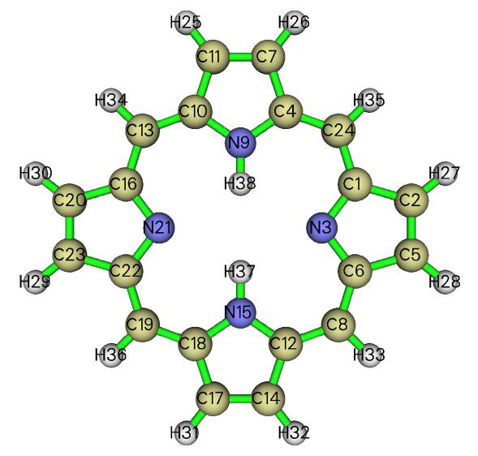
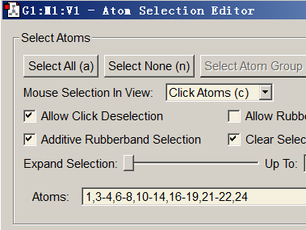
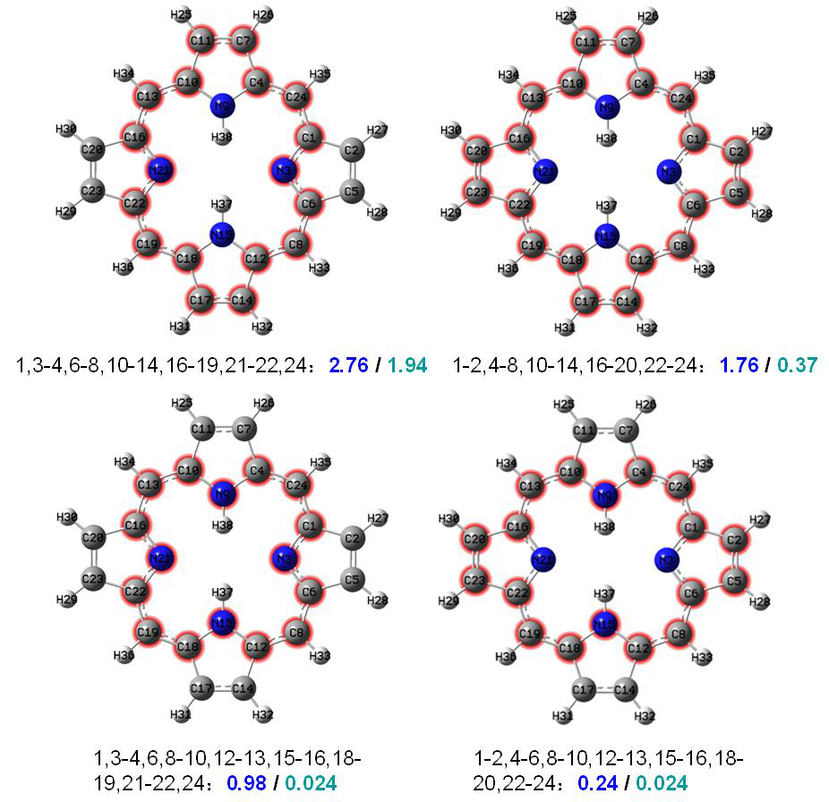

# 键级分析(Bond order analysis)

> Multiwfn manual, p.617–633.英文原文见同名 English 章节。 Images: `../imgs/`.

---

<!-- p.617 -->


以上述方式求得的值是合理的。


## 4.9 键级分析(Bond order analysis)

在本节中，我将举例说明如何使用 Multiwfn 进行不同种类的键级分析，以表征化学键。


### 4.9.1 对乙酰胺进行 Mayer 键级和模糊键级分析

本例展示如何计算乙酰胺的 Mayer 键级和模糊键级。相关理论已分别在 3.11.1 节和 3.11.6 节中介绍。最后，我将介绍一个技巧，即借助 GaussView 把计算得到的键级标注到分子结构图上，以便更方便地查看键级。

Mayer 键级的计算 我们首先计算 Mayer 键级。注意，计算 Mayer 键级需要基函数信息，因此目前必须使用 .mwfn/.fch/.molden/.gms 文件作为输入文件。

启动 Multiwfn 并输入：examples\CH3CONH2.fch 9 // 键级分析(Bond order analysis) 1 // 计算 Mayer 键级(Calculate Mayer bond order) 随即得到以下输出：


```text
Bond orders with absolute value >=  0.050000
##    1:         1(C )    2(H )    0.93802674
##    2:         1(C )    3(H )    0.93473972
##    3:         1(C )    4(H )    0.94494566
##    4:         1(C )    5(C )    0.96585484
##    5:         5(C )    6(O )    1.90392771
##    6:         5(C )    7(N )    1.11849509
##    7:         6(O )    7(N )    0.07620305
##    8:         7(N )    8(H )    0.83250273
##    9:         7(N )    9(H )    0.83869874

Total valences and free valences defined by Mayer:
Atom     1(C ) :    3.77555991    0.00000000
Atom     2(H ) :    0.93147308    0.00000000
Atom     3(H ) :    0.92778456    0.00000000
Atom     4(H ) :    0.93657474    0.00000000
Atom     5(C ) :    3.97788022    0.00000000
Atom     6(O ) :    2.05925868    0.00000000
Atom     7(N ) :    2.85041375    0.00000000
Atom     8(H ) :    0.86522064    0.00000000
Atom     9(H ) :    0.85875080    0.00000000
```


<!-- p.618 -->


默认情况下，只输出大于特定阈值的键级项，该阈值可在 `settings.ini` 中的 "bndordthres" 调整。Mayer 键级通常与经验键级符合得很好。在本例中，C5 与 O6 之间的键级为 1.9，非常接近理想值 2.0（双键）。

原子的总价是其所形成的 Mayer 键级之和。原子的自由价衡量其通过共用电子对形成新键的剩余能力，对于闭壳层体系该量恒为零。

然后如果你选择 "y"，完整的键级矩阵将被输出到当前文件夹下的 bndmat.txt 中。

轨道占据微扰 Mayer 键级分析 接下来，我们想找出哪些轨道对 C5 与 O6 之间的 Mayer 键级有主要贡献，为此计算所谓的“轨道占据微扰 Mayer 键级”是很有用的。因此，我们在键级分析模块中选择选项 6，然后输入 5,6。将输出以下信息：


```text
Mayer bond order before orbital occupancy-perturbation:    1.903928

Orbital     Occ      Energy    Bond order   Variance
     1     2.00000  -19.10356    1.906089    0.002162
     2     2.00000  -14.34920    1.903934    0.000006
     3     2.00000  -10.28192    1.905514    0.001586
     4     2.00000  -10.18447    1.903939    0.000011
     5     2.00000   -1.03758    1.606912   -0.297016
     6     2.00000   -0.90529    1.825661   -0.078267
     7     2.00000   -0.73868    1.872011   -0.031917
     8     2.00000   -0.58838    1.896333   -0.007594
     9     2.00000   -0.54103    1.868127   -0.035801
    10     2.00000   -0.46630    1.799351   -0.104576
    11     2.00000   -0.44722    1.512533   -0.391394
    12     2.00000   -0.40158    1.830827   -0.073101
    13     2.00000   -0.39610    1.659075   -0.244853
    14     2.00000   -0.36742    1.393122   -0.510805
    15     2.00000   -0.26611    1.743383   -0.160545
    16     2.00000   -0.24383    1.796157   -0.107770
Summing up occupancy perturbation from all orbitals:  -2.03987
```

从输出可知，例如，若从轨道 15 上移除两个电子，则 C5 与 O6 之间的 Mayer 键级将从 1.903928 降至 1.743383（即 1.903928-0.160545），也可以说轨道 15 的贡献为 0.160545。所有占据分子轨道贡献之和为 2.03987，该值不等于 1.903928 的原因是 Mayer 键级不是密度矩阵的线性函数，我们无需对此介意。

轨道 14 的轨道占据微扰 Mayer 键级具有最大的负值，因此该轨道必定对成键非常有利。这一结论可通过观察轨道等值面图得到进一步证实，见 4.8.1 节末尾给出的图形。正如预期的那样，该轨道表现出很强的 C5 与 O6 之间 π 成键特征。


<!-- p.619 -->


模糊键级的计算 现在我们计算模糊键级。与 Mayer 键级不同，模糊键级不依赖于基函数，因此你也可以使用诸如 .wfn/.wfx 作为输入文件。计算模糊键级比 Mayer 键级更耗时，其相对于 Mayer 键级的优点是基组敏感性大大降低，并且使用弥散基函数永远不会使结果变差。

在键级分析菜单中，我们选择 "7 模糊键级分析(Fuzzy bond order analysis)"，结果将被打印出来，如下所示


```text
Bond orders with absolute value >=  0.050000
##    1:         1(C )    2(H )    0.89666213
##    2:         1(C )    3(H )    0.89075146
##    3:         1(C )    4(H )    0.88888051
##    4:         1(C )    5(C )    1.08050669
##    5:         1(C )    6(O )    0.13600686
##    6:         1(C )    7(N )    0.11096284
##    7:         3(H )    5(C )    0.05357850
##    8:         5(C )    6(O )    2.00411901
##    9:         5(C )    7(N )    1.40339002
##   10:         6(O )    7(N )    0.24523041
##   11:         7(N )    8(H )    0.87233783
##   12:         7(N )    9(H )    0.88243512
```

将该结果与 Mayer 键级的结果比较，你会发现两种键级的结果非常相似，事实上这属于常见情形。然而，对于强极性键，它们的结果可能彼此偏差相对明显。

技巧：用 GaussView 把键级标注到分子结构图上

如果你有 GaussView（版本  6.0），可以用它把 Multiwfn 计算的键级显示在分子结构图上，以方便查看其数值。这里我以乙酰胺的 Mayer 键级为例说明这一点。

启动 Multiwfn 并输入 examples\CH3CONH2.fch 9 // 键级分析(Bond order analysis) 1 // 计算 Mayer 键级(Calculate Mayer bond order) y // 把键级矩阵导出为当前文件夹下的 bndmat.txt(Export the bond order matrix as bndmat.txt in current folder) 0 // 返回主菜单(Return to main menu) 1000 // 隐藏的主功能(Hidden main function) 13 // 把当前文件夹下的 bndmat.txt 转换为带键级信息的 Gaussian .gjf 文件(Convert the bndmat.txt in current folder to Gaussian .gjf file with bond order information) 现在我们在当前文件夹下得到了 gau.gjf，它不仅包含当前的分子坐标，还包含相连原子之间的键级（连接关系基于当前几何结构自动猜测，除非你使用包含连接信息的文件作为输入文件，如 .mol 和 .mol2，详见 2.5 节）。

把 gau.gjf 载入 GaussView，选择 "Results" - "Bond Properties"，再经过适当调整，即可得到如下效果。


<!-- p.620 -->


如图所示，我们还让 GaussView 用不同颜色来显示键级。颜色越绿，键级越大；颜色越红，键级越小。

### 4.9.2 对 Li6 团簇和菲进行多中心键级分析

复杂体系（如团簇或含有大范围电子离域的体系）的电子结构特征很难用简单的化学经验规则来研究，我们必须借助波函数分析方法。在本节中，给出应用多中心键级揭示多中心相互作用的例子。如果你对多中心键级不熟悉，请先查看 3.11.2 节以获得基础知识。注意，多中心键级分析需要基函数信息，因此你必须使用 .mwfn/.fch/.molden/.gms 文件作为输入文件。

第 1 部分：研究 Li6 团簇中的三中心键 在平面 Li6 团簇中，如下图所示，有两种三元环，即边界上的三个和中央的一个。我们将用多中心键级研究哪种三元环更稳定。

启动 Multiwfn 并输入以下命令 examples\Li6.fch 9 // 键级分析(Bond order analysis) 2 // 多中心键级分析(Multi-center bond order analysis) 1,3,4 // 边界三元环中原子的序号 输出为


```text
 The multicenter bond order:    0.1247848038
 The normalized multicenter bond order:    0.4997129069
```

然后我们计算中央三元环的三中心键级，因此输入 1,2,3，结果为


```text
 The multicenter bond order:    0.0351782167
 The normalized multicenter bond order:    0.3276608901
```

由于两个环中的原子数相同，你只需比较它们的 "The multicenter bond order" 值。数据已标注在下图中。粉色文字表示 Mayer 键级。


<!-- p.621 -->


从三中心键级数值可以明显看出，边界三元环比中央三元环更稳定（即结合得更强），这一结论在 Mayer 键级中也有一定程度的反映。我们可以通过绘制团簇平面上的 LOL 图进一步证明这一结论（如何绘制这类图形见 4.4.2 节）

显然，电子倾向于定域在边界三元环中以使其稳定，这种实空间函数分析的结论与键级分析的结论很好地一致。通过查看 Laplacian 图、ELF 图、电子密度形变图和价电子密度图，你可以得出完全相同的结论。

本例中使用的 Li6.fch 是在 B3LYP/6-31G* 水平下产生的。通常对于阴离子体系应使用弥散函数以恰当描述，此时你应当


<!-- p.622 -->


基于自然原子轨道（NAO）而非如上所示基于原始基函数来计算多中心键级，否则结果可能完全无用，详见 3.11.2 节（另见本节第 3 部分的例子）。或者，你也可以去掉弥散函数并做单点计算以生成用于多中心键级分析的波函数，但基组至少应为三 zeta 质量，例如 6-311G(2d,p) 或 def2-TZVP。

第 2 部分：研究菲中的六中心共轭 examples\phenanthrene.fch 包含在 B3LYP/6-31G* 水平下产生的菲的波函数。原子编号如下所示。在本例中，我们将用多中心键级研究哪个六元环具有更强的多中心共轭效应。

启动 Multiwfn 并输入以下命令 examples\phenanthrene.fch 9 // 键级分析(Bond order analysis) 2 // 多中心键级分析(Multi-center bond order analysis) 1,2,3,4,5,6 // 边界环中原子的序号。注意输入顺序必须与原子连接关系一致，即诸如 1,3,5,6,4,2 这样的输入将毫无意义

输出为


```text
 The multicenter bond order:    0.0593516368
 The normalized multicenter bond order:    0.6245570525
```

注：值得一提的是，在这种情况下若你按相反顺序输入原子序号，即 6,5,4,3,2,1，结果会有所不同，即 0.0591177129。但由于 0.05935 与 0.05911 之间的差异微不足道，我们不作区分。关于输入顺序影响的更多信息见 3.11.2 节

接下来，我们研究中央环的情形。我们输入 3,4,8,9,10,7，结果为


```text
 The multicenter bond order:    0.0264989378
 The normalized multicenter bond order:    0.5460152146
```

显然，中央环的电子共轭特征弱于边界环，因此我们也可以得出结论：边界环具有更强的芳香性。在 4.14.3、4.15.2 和 4.25.6 节中，我们将借助其它分析方法进一步研究环芳香性。

注意，"The normalized multicenter bond order" 的数据可在原子数不同的环之间进行比较。由于菲的边界六元环的该值为 0.6245，而 Li6 团簇的边界三元环的该值为 0.4997，我们可以推断前一种情形中的多中心相互作用可能更突出。

第 3 部分：基于自然原子轨道（NAO）计算六中心键级 在 Multiwfn 中，多中心键级也可以基于自然原子轨道（NAO）计算，如 3.11.2 节所介绍。与


<!-- p.623 -->


通常情形相比，使用 NAO 作为基组的主要优点是即使存在弥散函数仍能得到合理的结果。

这里我们对菲计算 NAO 基组下的多中心键级，此时需要带有 DMNAO 关键词的 NBO 输出信息作为输入。本例涉及的 Gaussian 输入文件为 exampes\phenanthrene_DMNAO.gjf，相应的输出文件为 examples\phenanthrene_DMNAO.out。从 .gjf 文件可以看出，调用了 Gaussian 内嵌的 NBO 模块，并向 NBO 模块传入了 DMNAO 关键词。

启动 Multiwfn 并输入 examples\phenanthrene_DMNAO.out 9 // 键级分析(Bond order analysis) -2 // NAO 基组下的多中心键级分析(Multi-center bond order analysis in NAO basis) 1,2,3,4,5,6 // 计算边界环的六中心键级 输出为


```text
 The multicenter bond order:    0.0588977456
 The normalized multicenter bond order:    0.6237584547
```

如图所示，结果与我们之前用主功能 9 中的选项 2 得到的结果几乎完全相同，这是预期的，因为目前没有使用弥散函数。


### 4.9.3 计算 Laplacian 键级（LBO）

Laplacian 键级（LBO）由我在 J. Phys. Chem. A, 117, 3100 (2013) 中提出，详见 3.11.7 节。LBO 非常适合有机体系，且与成键强度有密切关联。让我们计算乙烷、乙烯和乙炔中 C-C 键的 LBO。

启动 Multiwfn 并输入以下命令 examples\ethane.wfn // 在 B3LYP/6-31G** 下优化并产生 9 // 键级分析(Bond order analysis) 8 // Laplacian 键级(Laplacian bond order) 你将看到结果：


```text
The bond order >=  0.050000
##    1:    1(C )    2(H ):  0.887111
##    2:    1(C )    3(H ):  0.889492
##    3:    1(C )    4(H ):  0.889492
##    4:    1(C )    5(C ):  1.059879
##    5:    5(C )    6(H ):  0.887111
##    6:    5(C )    7(H ):  0.889492
##    7:    5(C )    8(H ):  0.889492
```

如你所见，C-C 和 C-H 的 LBO 非常接近形式键级（1.0）。LBO 只反映共价成键特征，由于 C-H 是弱极性键，其值略小于 1.0。

然后用 examples\ethene.wfn 计算乙烯的 LBO


```text
##    1:    1(C )    2(H ):  0.919443
##    2:    1(C )    3(H ):  0.919443
##    3:    1(C )    4(C ):  2.022583
##    4:    4(C )    5(H ):  0.919443
##    5:    4(C )    6(H ):  0.919443
```


<!-- p.624 -->


然后用 examples\C2H2.wfn 计算乙炔的 LBO


```text
##    1:    1(C )    2(H ):  0.958393
##    2:    1(C )    3(C ):  2.767449
##    3:    3(C )    4(H ):  0.958393
```

三个体系中 C-C 键的 LBO 分别为 1.060、2.022 和 2.767，比值为 1:1.907:2.61。已知这三个键的键解离能（BDE）之比为 1:1.85:2.61。显然，LBO 与 BDE 具有惊人好的相关性，换言之，LBO 很好地体现了成键强度（与 LBO 相比，没有其它键级定义与 BDE 有如此密切的关系）

此外，LBO 预测三个体系中 C-H 成键强度的顺序为乙炔（0.958）> 乙烯（0.919）> 乙烷（0.889），这与实验 BDE 顺序完全一致！（其它键级定义，如 Mayer 键级，未能重现这一顺序）

最后，用 examples\H2O.fch 计算水中 O-H 键的 LBO，结果为 0.638。该值明显小于 C-H 键级，反映出 O-H 键的极性比 C-H 键强得多。


### 4.9.4 对甲醛在 NAO 基组下的 Wiberg 键级进行分解分析


### (Decomposition analysis of Wiberg bond order in NAO basis for formaldehyde)

本例简要说明 Multiwfn 键级分析模块的一个独特功能，即把 Wiberg 键级分解为原子轨道对和原子壳层对贡献。将以非常简单的分子甲醛为例，当然你可以把该分析推广到复杂得多的体系。请先阅读 3.11.8 节以理解该分析方法的基本思想。

该分析需要 Weinhold 的 NBO 程序输出的自然原子轨道（NAO）信息和 NAO 基组下的密度矩阵。对于 Gaussian 用户，你可以运行 examples\H2CO_DMNAO.gjf，并使用相应的输出文件（examples\H2CO_DMNAO.out）作为本分析的输入文件。H2CO 分子在笛卡尔坐标系中的取向如下图所示。

启动 Multiwfn 并输入以下命令：examples\H2CO_DMNAO.out


<!-- p.625 -->


9 // 键级分析(Bond order analysis) 9 // 分解 NAO 基组下的 Wiberg 键级(Decompose Wiberg bond order in NAO basis) 然后你可以输入两个原子序号以得到它们在 NAO 基组下计算的 Wiberg 键级，同时得到主要成分（打印成分的阈值由 `settings.ini` 中的 "bndordthres" 参数控制）。例如，我们输入 1,4，以下结果立即显示在屏幕上：


```text
Contribution from NAO pairs that larger than printing threshold:
 Contri.  NAO   Center   NAO type            NAO   Center   NAO type
 0.0823     2    1(C )  Val( 2S) S      ---    21    4(O )  Val( 2S) S
 0.1907     2    1(C )  Val( 2S) S      ---    28    4(O )  Val( 2p) pz
 0.9145     5    1(C )  Val( 2p) px     ---    24    4(O )  Val( 2p) px
 0.0658     7    1(C )  Val( 2p) py     ---    26    4(O )  Val( 2p) py
 0.2482     9    1(C )  Val( 2p) pz     ---    21    4(O )  Val( 2S) S
 0.3700     9    1(C )  Val( 2p) pz     ---    28    4(O )  Val( 2p) pz

Contribution from NAO shell pairs that larger than printing threshold:
 Contri.  Shell  Center  Type        Shell  Center  Type
 0.0823     2    1(C )    2S   ---     2    4(O )    2S
 0.1907     2    1(C )    2S   ---     5    4(O )    2p
 0.2482     5    1(C )    2p   ---     2    4(O )    2S
 1.3504     5    1(C )    2p   ---     5    4(O )    2p

Total Wiberg bond order:  1.9161
```

从以上信息，总 Wiberg 键级 1.9161 的细节变得非常清楚。根据前面所示的分子图，px 型的 NAO 对应于垂直于分子平面的 2p 原子

轨道，因此 px-px 混合形成 π 键，其对总键级的贡献（0.9145）接近于 1，这与化学直觉相符。2s-2s 相互作用对 C=O 键只有微弱贡献，因为 0.0823 的值几乎可以忽略；原因应归于轨道重叠不足。此外，2py-2py 相互作用也只起微不足道的作用，贡献仅为 0.0658。2s(C)-2pz(O)、2pz(C)-2pz(O) 和 2pz(C)-s(O) 之间的相互作用对总键级有显著贡献，分别为 0.1907、0.3700 和 0.2482，三者之和高达到 0.8089。如此大的贡献必定主要源于良好的轨道重叠。

为便于讨论，程序还输出各种原子壳层对对 Wiberg 键级的贡献。例如，从以上信息可以看出，碳的所有 2p 轨道与氧的所有 2p 轨道之间的相互作用总共贡献了 1.3504 的键级。

在此功能中你还可以输入 -1 以定义两个片段，然后给出两个片段之间壳层相互作用的贡献。例如，我们想研究 CO 片段与两个 H 原子之间相互作用的本质，在当前功能中你应输入

-1 // 分解片段间 Wiberg 键级(Decompose interfragment Wiberg bond order) 1,4 // 片段 1 中的原子(Atoms in fragment 1) 2,3 // 片段 2 中的原子(Atoms in fragment 2)


<!-- p.626 -->


现在你可以看到


```text
Interfragment bond order analysis:
 Contribution   Fragment 1   Fragment 2
    0.66301         2s           1s
    1.27591         2p           1s

Interfragment Wiberg bond order:  1.9575
```

显然，CO 部分主要用其 2p 壳层与两个 H 原子形成共价键，而该片段的 2s 壳层也起了不可忽视的作用。


### 4.9.5 研究轨道对 CH3CONH2 中 C-C 键的 Mulliken 键级的贡献

### (Study orbital contributions to Mulliken bond order for C-C bond of CH3CONH2)

Mulliken 键级已在 3.11.4 节中介绍，它也被称为 Mulliken 重叠布居。这种键级不是特别有用，因为它既与成键强度相关不好，也与键多重度关系不密切。然而，一个独特的优点是它可以精确分解为轨道贡献，正值和负值分别对应成键和反键效应，该特征有助于揭示轨道特性。在本节中我将以 CH3CONH2 为例说明这一点。

启动 Multiwfn 并输入 examples\CH3CONH2.fch 9 // 键级分析(Bond order analysis) 5 // 把两个原子间的 Mulliken 键级分解为轨道贡献(Decompose Mulliken bond order between two atoms to orbital contributions) 1,5 // 分解 C1-C5 键(Decompose C1-C5 bond) 结果为


```text
...[ignored]
 Orbital     7 Occ:  2.000000 Energy:   -0.738679 contributes    0.30341308
 Orbital     8 Occ:  2.000000 Energy:   -0.588379 contributes   -0.03865545
 Orbital     9 Occ:  2.000000 Energy:   -0.541034 contributes   -0.00559743
 Orbital    10 Occ:  2.000000 Energy:   -0.466302 contributes    0.20938473
 Orbital    11 Occ:  2.000000 Energy:   -0.447220 contributes    0.12977388
 Orbital    12 Occ:  2.000000 Energy:   -0.401575 contributes    0.14101027
 Orbital    13 Occ:  2.000000 Energy:   -0.396099 contributes   -0.02147123
 Orbital    14 Occ:  2.000000 Energy:   -0.367424 contributes   -0.11159089
 Orbital    15 Occ:  2.000000 Energy:   -0.266106 contributes    0.00503022
 Orbital    16 Occ:  2.000000 Energy:   -0.243833 contributes    0.02829203
 Total Mulliken bond order:    0.66486037
```

可以看出，许多分子轨道有明显的正贡献，如 MO7（0.303）和 MO10（0.209）；少数分子轨道有负贡献，尤其是 MO14（-0.111）。还有一些分子轨道的贡献几乎为零，如 MO15（0.005）。因此，占据 MO7 和 MO10 应增强 C1-C5 键的强度，而占据 MO14 必定不利于 C1-C5 键的形成。

分子轨道对 Mulliken 键级的贡献值也可以用


<!-- p.627 -->


轨道等值面图来理解：

对于 MO7 和 MO10，从上图可以看出，在 C1 与 C5 之间没有节面，等值面实质上包围了 C1-C5 成键区域，因此 MO7 和 MO10 对 C1-C5 起成键轨道作用，对其 Mulliken 键级有正贡献。对于 MO14，在 C1-C5 中点处可清楚看到一个垂直于 C1-C5 键的明显节面，显然 MO14 对 C1-C5 键表现为反键轨道，因此应对其 Mulliken 键级有负贡献。对于 MO15，轨道等值面没有覆盖 C1-C5 成键区域，这就是 MO15 对 C1-C5 Mulliken 键级贡献可忽略的原因。

注意，在极少数情况下对 Mulliken 键级的贡献值不能很好地用等值面图解释，这显示出 Mulliken 键级定义的不足。此时你可以尝试改用轨道占据微扰 Mayer 键级（如 4.9.1 节所示），它更稳健。

值得注意的是，Mulliken 和 Mayer 键级的分解不仅可以基于正则分子轨道，还可以基于定域分子轨道（LMO），后一种情形下的讨论通常更有意义。为此，一般你应先用主功能 19 产生 LMO，然后像往常一样进行分解分析。


### 4.9.6 用本征键强度指数（IBSI）衡量化学键强度


### (Using intrinsic bond strength index (IBSI) to measure strength of chemical bonds)

在 J. Phys. Chem. A, 124, 1850 (2020) 中提出的本征键强度指数（IBSI）在表征共价键强度方面具有一定能力，请先查看 3.11.9 节的介绍。在本节中我将说明其计算。

如 3.11.9 节所述，IBSI 可基于 IGM、IGMH 或 mIGM 形式计算，它们将分别被称为 IBSIIGM、IBSIIGMH、IBSImIGM。要计算 IBSIIGM 或 IBSImIGM，输入文件只需包含原子坐标，而对于 IBSIIGMH，输入文件必须包含波函数信息。这里我们计算


<!-- p.628 -->


乙炔的 IBSIIGM 和 IBSIIGMH 指数，.wfn 文件在 B3LYP/6-31G** 水平下产生，其几何结构在同一水平下优化。

启动 Multiwfn 并输入 examples\C2H2.wfn 9 // 键级分析(Bond order analysis) 10 // 本征键强度指数(Intrinsic bond strength index (IBSI)) 1 // 开始计算(Start calculation)。由于当前输入文件包含波函数信息，默认要计算的 IBSI 为 IBSIIGMH

2 // 使用高质量积分格点(Use high-quality integration grid)（使用 "ultrafine grid" 只会带来略好的数值精度，而代价会相应增加）

结果为


```text
1(C )    2(H )  Dist:  1.0657   Int(dg_pair): 0.46835   IBSI: 0.72771
1(C )    3(C )  Dist:  1.2054   Int(dg_pair): 1.27376   IBSI: 1.54718
1(C )    4(H )  Dist:  2.2711   Int(dg_pair): 0.11093   IBSI: 0.03795
2(H )    3(C )  Dist:  2.2711   Int(dg_pair): 0.11093   IBSI: 0.03795
2(H )    4(H )  Dist:  3.3368   Int(dg_pair): 0.01482   IBSI: 0.00235
3(C )    4(H )  Dist:  1.0657   Int(dg_pair): 0.46835   IBSI: 0.72771
```

"Dist" 对应于两个原子之间的距离，Int(dg_pair) 代表 IBSI 表达式中的

∫𝛿𝑔pair d𝐫 项，"IBSI" 即 IBSIIGMH 值。

接下来，我们计算 IBSIIGM。选择选项 "2 设定 IGM 类型(Set type of IGM)" 然后输入 1 把要计算的 IBSI 形式改为 IBSIIGM，再选择选项 1 并选 "high-quality" 进行计算，结果为


```text
1(C )    2(H )  Dist:  1.0657   Int(dg_pair): 0.58725   IBSI: 0.92620
1(C )    3(C )  Dist:  1.2054   Int(dg_pair): 1.32387   IBSI: 1.63228
1(C )    4(H )  Dist:  2.2711   Int(dg_pair): 0.19366   IBSI: 0.06726
2(H )    3(C )  Dist:  2.2711   Int(dg_pair): 0.19366   IBSI: 0.06726
2(H )    4(H )  Dist:  3.3368   Int(dg_pair): 0.02242   IBSI: 0.00361
3(C )    4(H )  Dist:  1.0657   Int(dg_pair): 0.58725   IBSI: 0.92620
```

类似地，你可以计算乙烷和乙烯的 ∫𝛿𝑔paird𝐫 和 IBSI，它们在与 C2H2.wfn 相同水平下产生的 .wfn 文件已作为 ethane.wfn 和 ethene.wfn 提供在 "examples" 文件夹中。三个体系中 C-C 键的计算数据相对于

它们的键解离能（BDE）绘制在下图中，其中 δgIGM 和 δgIGMH 分别对应于基于 IGM 和 IGMH 计算的 ∫𝛿𝑔paird𝐫。


<!-- p.629 -->


如图所示，δgIGM 与成键强度（直接由 BDE 反映）相关不好。两种形式的 IBSI 和 δgIGMH 与 BDE 呈完美的线性关系，显示出它们的巨大价值。

注意，若输入文件只包含几何信息，如 .pdb 和 .xyz，则默认要计算的 IBSI 形式为 IBSIIGM。

严格来讲，IBSI 的参考值，即 IBSI 表达式中的分母，应在与当前体系相同的水平下计算，但在当前例子中我们直接使用了内置数据。如果你希望得到更严格的结果，可以更改它，参考值也可用当前功能求得，详见 3.11.9 节。


### 4.9.11 用 AV1245 和 AVmin 指数研究芳香性的例子


### (Example of using AV1245 and AVmin indices to study aromaticity)

注：本节的中文版是我的博文“使用 Multiwfn 计算 AV1245 指数研究大环芳香性”（http://sobereva.com/519）。

请先阅读 3.11.10 节以获得关于 AV1245 和 AVmin 指数的基础知识。在 4.9.11.1 节中，将用 AV1245 和 AVmin 区分菲中两种六元环之间的芳香性，然后在 4.9.11.2 节中，以卟啉为例展示这些指数定量大环芳香性的能力。

### 4.9.11.1 用 AV1245 和 AVmin 研究菲的局域芳香性

在 4.9.2 节中，已用 MCBO 研究菲中两类环局域芳香性的差异，其几何结构和原子编号如下所示。在本节中，我们将再次用 AV1245 和 AVmin 对其进行研究。


<!-- p.630 -->


启动 Multiwfn 并输入 examples\phenanthrene.fch 9 // 键级分析(Bond order analysis) 11 // 计算 AV1245(Calculate AV1245) 1,2,3,4,5,6 // 计算边界六元环的 AV1245(Calculate AV1245 for the boundary six-membered ring)。注意输入顺序应与连接关系一致

结果为


```text
 4-center electron sharing index of     1     2     4     5:    0.01304820
 4-center electron sharing index of     2     3     5     6:    0.01245026
 4-center electron sharing index of     3     4     6     1:    0.00801537
 4-center electron sharing index of     4     5     1     2:    0.01304820
 4-center electron sharing index of     5     6     2     3:    0.01245026
 4-center electron sharing index of     6     1     3     4:    0.00801537

 AV1245 times 1000 for the selected atoms is   11.17127674
 AVmin times 1000 for the selected atoms is     8.015375 (    3    4    6    1)
```

即 1000*AV1245 和 1000*AVmin 分别为 11.171 和 8.015。AVmin 值对应于 3-4-6-1 的 4c-ESI。

接下来，我们输入 3,4,8,9,10,7 计算中央环的 1000*AV1245 和 1000*AVmin，结果分别为 5.012 和 3.996。显然，边界环的芳香性强于中央环，因为它具有更大的 AV1245 和 AVmin，这一结论与 4.9.2 节中的 MCBO 分析一致。在 AV1245 的原始文献中，认为 AV1245 可作为 MCBO 的近似。

在自然原子轨道（NAO）基组下计算 AV1245 和 AVmin 在 Multiwfn 中，AV1245 和 AVmin 也可以基于自然原子轨道（NAO）计算，如 3.11.10 节所述。这种方式的主要优点是即使存在弥散函数仍能得到合理的结果（而若在采用弥散函数时仍像我们之前那样计算 AV1245 和 AVmin，结果将很误导）

这里我们在 NAO 基组下计算菲的 AV1245 和 AVmin，此时应采用带有 DMNAO 关键词的 NBO 输出信息作为输入。本例涉及的 Gaussian 输入文件为 exampes\phenanthrene_DMNAO.gjf，相应的输出文件为 examples\phenanthrene_DMNAO.out。从 .gjf 文件可以看出，调用了 Gaussian 内嵌的 NBO 模块，并向 NBO 模块传入了 DMNAO 关键词。

启动 Multiwfn 并输入 examples\phenanthrene_DMNAO.out 9 // 键级分析(Bond order analysis) 11 // 计算 AV1245(Calculate AV1245)


<!-- p.631 -->


1,2,3,4,5,6 // 计算边界环的 AV1245(Calculate AV1245 for the boundary ring) 输出为


```text
AV1245 times 1000 for the selected atoms is   10.98247818
AVmin times 1000 for the selected atoms is     8.283826 (    3    4    6    1)
```

如图所示，结果与我们之前得到的（11.171 和 8.015）几乎相同，这是预期的，因为目前没有使用弥散函数。

### 4.9.11.2 用 AV1245 和 AVmin 衡量卟啉的全局芳香性

在本例中我们用 AV1245 和 AVmin 定量卟啉不同离域路径对应的芳香性。在 B3LYP/6-31G* 水平下产生的 .fch 文件可从 http://sobereva.com/multiwfn/extrafiles/porphyrin.rar 下载。结构如下所示。

卟啉周围有几种可能的全局离域路径，现在我们计算其中一条。虽然你可以如上图所示沿原子连接关系手动输入原子序号，但这一过程非常费力，尤其当所研究的环较大时。更好的办法是用 GaussView 直观地选择所感兴趣环中的原子并直接提取其序号。为此，我们用 GaussView 打开 porphyrin.fch，然后点击

画笔图标 ，然后按住鼠标左键让光标经过环中的每个原子，

然后原子将被高亮为黄色，如下图左侧所示。之后，选择 "Tools" - "Atom Selection"，从文本框（见下图）中把原子序号复制到剪贴板，即 1,3-4,6-8,10-14,16-19,21-22,24。




<!-- p.632 -->


现在启动 Multiwfn 并输入 porphyrin.fch 9 // 键级分析(Bond order analysis) 11 // 计算 AV1245(Calculate AV1245) d // 进入该模式后，你可以按任意顺序输入原子序号，因为在这种情况下实际原子顺序将基于识别到的连接关系自动推测(After entering this mode, you can input the atom indices in arbitrary order, because in this case the actual atom sequence will be automatically guessed based on recognized connectivity)

1,3-4,6-8,10-14,16-19,21-22,24 // 所选环中原子的序号(Indices of the atoms in the selected ring) 现在你可以看到以下信息：


```text
 Number of selected atoms:    18
 Atomic sequence:
     1     3     6     8    12    14    17    18    19    22    21    16
    13    10    11     7     4    24
...[ignored]
AV1245 times 1000 for the selected atoms is    2.75856093
AVmin times 1000 for the selected atoms is     1.943425 (    3    6   12   14)
```

如你所见，原子顺序已被正确识别，它与环中的实际连接关系完全相符，因此结果 2.76 应是有意义的。AVmin 对应于 N3-C6-C12-C14，意味着该局域区域是整个路径上电子离域的瓶颈。

类似地，我们通过输入以下命令计算其它环的 AV1245 d 1-2,4-8,10-14,16-20,22-24 d 1,3-4,6,8-10,12-13,15-16,18-19,21-22,24 d 1-2,4-6,8-10,12-13,15-16,18-20,22-24 对于所有计算的环，所选原子以及结果总结如下，蓝色和绿色文字分别对应于 1000*AV1245 和 1000*AVmin。




<!-- p.633 -->


毫无疑问，经过吡咯氮原子但绕过N-H基团的路径是最有利的离域通道，因为其1000*AV1245和1000*AVmin值（2.76和1.94）都大于其他路径。值得一提的是，对于上面图中底部所示的两条路径，虽然它们的AV1245不相等，但它们的AVmin却完全相同。这一观察表明，尽管这两条选定路径上电子离域的平均程度有显著差异，但其瓶颈是相同的。

本体系在4.4.9节中还曾通过LOL-π进行过研究，所得图形如下，从中可以清楚地看到，沿不同路径的电子离域程度有显著差异，最优先的离域路径被红色或橙色生动地揭示出来。显然，由AV1245和AVmin揭示的最有利离域路径与由LOL-π揭示的路径十分

吻合。



