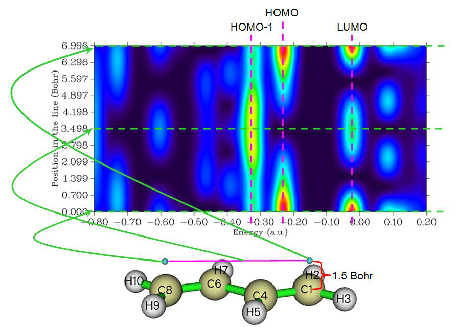

# 绘制态密度(DOS)图

> Multiwfn manual, p.634–654.英文原文见同名 English 章节。 Images: `../imgs/`.

---

<!-- p.634 -->


值得注意的是，使用方便的“d”模式输入原子序号的前提是，环中不存在与环内两个以上其他原子相连的原子。例如，对于下面所示的萘，你不应进入“d”模式并输入1-10来计算AV1245和AVmin以研究整个体系的全局芳香性，因为原子9和10同时连接三个原子，在这种情况下Multiwfn无法自动确定环中正确的原子顺序。


## 4.10 绘制态密度(DOS)图

在本节中，我将说明如何使用Multiwfn轻松绘制各种态密度(DOS)图。DOS模块的相关理论和使用介绍见3.12节。

更深入的讨论和DOS作图示例见我的博客文章“使用Multiwfn绘制态密度图研究电子结构”(http://sobereva.com/482，中文)


### 4.10.1 为N-苯基吡咯绘制总态密度、部分态密度和重叠态密度

在本例中，我们将为N-苯基吡咯绘制总态密度、部分态密度和重叠态密度(TDOS、PDOS和OPDOS)，其结构如下所示。本例由六个部分组成。如果你对DOS不熟悉，请先阅读3.12.1节。

由于绘制PDOS和OPDOS需要基函数信息，我们在这些例子中使用.fch作为


<!-- p.635 -->


输入文件，使用.mwfn、.molden或.gms文件也可以，但不能使用.wfn/.wfx，因为它们不包含基函数和虚轨道的信息。如果你只需要得到TDOS，你也可以简单地使用记录轨道能级的纯文本文件或带有pop=full关键词的Gaussian输出文件作为输入文件，文件格式见3.12.1节。

值得注意的是，如果你打算基于默认的Mulliken轨道成分方法绘制PDOS和OPDOS，必须避免使用弥散函数，因为它们会严重损害由Mulliken或SCPA方法评估的轨道成分的可靠性。但是，如果你让Multiwfn通过Hirshfeld或Becke方法计算轨道成分，则可以放心使用弥散函数，只是在这种情况下不能绘制OPDOS。当前体系的波函数是在B3LYP/6-31G*水平下产生的。

第1部分：绘制总态密度(TDOS) 启动Multiwfn并输入以下命令 examples\N-phenylpyrrole.fch 10 // 绘制各种DOS图(Plot various kinds of DOS maps) 0 // 作图(Plot map) 由于目前没有定义片段，因此只绘制TDOS。TDOS图立即弹出，见下图

TDOS

9.00

8.00

7.00

Density-of-states 6.00 5.00 4.00

3.00

2.00

1.00

0.00

-0.80-0.70-0.60-0.50-0.40-0.30-0.20-0.100.000.100.20Energy (a.u.)

在这张图中，曲线是基于轨道能级分布模拟的TDOS，每条离散竖线对应一个分子轨道(MO)，虚线标示HOMO的位置，黑色和灰色线分别表示占据和非占据轨道能级的位置。在负值部分，-0.40 a.u.附近区域的态密度明显大于其他区域。

在图形上点击鼠标右键关闭图形，并选择选项0返回上一级菜单。我们还可以改变能量单位和能量范围，并可用线高表示轨道简并度。为此，输入以下命令：

8 // 将单位由默认的a.u.切换为eV(Switch the unit from the default a.u. to eV) 2 // 设置能量范围(Set energy range) -30,5,5 // 将下限和上限设为-30 eV到5 eV，标签间隔为5 eV(Set lower and upper limits to -30 eV to 5 eV, the spacing between labels is 5 eV) 9 // 用线高表示轨道简并度(Using line height to show orbital degeneracy)


<!-- p.636 -->


0.05 // 若两个轨道能量差小于0.05 eV，则视为简并(If energy difference between two orbitals is less than 0.05 eV, they will be regarded as degenerate)

0 // 再次绘制TDOS图(Plot TDOS map again) 现在我们得到下图。线高表示简并度，对应右侧坐标轴。可以看到，一些轨道的简并度为2。

0.36 TDOS 10

0.32 9

8

0.28

7

Density-of-states 0.24 0.20 0.16 0.12 6 5 4 3 Degeneracy

0.08 2

0.04 1

0.00 0

-30.00-25.00-20.00-15.00-10.00-5.000.005.00Energy (eV)

另外，如果你想在曲线底部绘制竖线，可以在后处理菜单中选择选项“22 在曲线底部绘制竖线的开关(Toggle drawing lines at bottom of curves)”然后选择选项1重新作图，你将看到

0.36 TDOS

0.32

0.28

Density-of-states 0.24 0.20 0.16 0.12

0.08

0.04

0.00 2 0 Degen.

-30.00-25.00-20.00-15.00-10.00-5.000.005.00Energy (eV)

第2部分：为片段绘制PDOS和OPDOS


<!-- p.637 -->


接下来，我们将把吡咯部分的Heavy原子定义为片段1，把苯基部分的Heavy原子定义为片段2，以查看它们的PDOS和OPDOS。另外，我们将把所有氢定义为片段3。

启动Multiwfn并输入 examples\N-phenylpyrrole.fch 10 // 绘制各种DOS图(Plot various kinds of DOS maps) -1 // 进入定义片段的界面(Enter the interface for defining fragments)。你最多可定义10个片段。PDOS将对所有片段绘制，但OPDOS只在片段1和2之间绘制

1 // 定义片段1(Define fragment 1) a 1-5 // 把吡咯部分的碳和氮(原子1~5)加入该片段(Add carbons and nitrogen of pyrrole moiety to the fragment) q // 保存片段1(Save fragment 1) 2 // 定义片段2(Define fragment 2) a 10-13,15,17 // 把苯基部分(原子10~13、15和17)加入该片段(Add phenyl moiety to the fragment) q // 保存片段2(Save fragment 2) 3 // 定义片段3(Define fragment 3) a 6-9,14,16,18-20 // 把所有氢加入该片段(Add all hydrogens to the fragment) q // 保存片段3(Save fragment 3) 0 // 返回上一级菜单(Return to last menu) 2 // 设置X轴(Set X-axis) -1.1,-0.1,0.1 // 把X轴范围设为-1.2 ~ -0.1 a.u.，以便在图中显示所有价轨道。标签步长设为0.1 a.u.(Set the range of X-axis to -1.2 ~ -0.1 a.u., so that all valence MOs can be shown in the graph. The step between labels is set to 0.1 a.u.)

0 // 绘制TDOS+PDOS+OPDOS(Draw TDOS+PDOS+OPDOS) 当前的图形还不是很理想。关闭图形，你可以看到许多用于自定义图形的选项，例如设置曲线颜色、设置图例文字。试着逐个尝试，若有困惑可查阅3.12.3节。这里我们选择选项4并输入-2,9,1，把左侧Y轴(对应TDOS和PDOS)的下限、上限和标签间隔分别设为-2.0、9.0和1.0。选择14并输入比例因子0.2，则右侧Y轴(对应OPDOS)的范围将被设为-0.4、1.8(因为-2.0*0.2=-0.4且9.0*0.2=1.8)。缩小右侧Y轴的范围相当于放大OPDOS曲线的幅度，这使图中OPDOS的变化更清晰。然后选择选项1重新绘制DOS图，你将看到


<!-- p.638 -->


9.00 1.80

8.00 7.00 TDOSPDOS frag.1PDOS frag.2PDOS frag.3 TDOSPDOS frag.1PDOS frag.2PDOS frag.3OPDOS 1.58 1.36

6.00 1.14

Density-of-states 5.00 4.00 3.00 2.00 0.92 0.70 0.48 OPDOS

1.00 0.26

0.00 0.04

-1.00 -0.18

-2.00 -0.40

-1.10-1.00-0.90-0.80-0.70-0.60-0.50-0.40-0.30-0.20-0.10Energy (a.u.)

左侧坐标轴对应TDOS和PDOS，而右侧坐标轴对应OPDOS。红色、蓝色和品红色曲线及离散线分别代表片段1、2和3的PDOS。可以看到，在大多数价轨道中，片段1和2的贡献量相当。片段3(氢)主要贡献于-0.60 ~ -0.35 a.u.之间的轨道。绿色曲线是片段1和2之间的OPDOS，其正值部分意味着相应能量范围内的轨道在两片段之间呈现成键特征(例如位于-0.8 a.u.处对应MO14的轨道)；也有OPDOS为负的区域，例如HOMO-1(-0.213 a.u.)表现为两片段之间的反键轨道。

第3部分：绘制特定原子轨道的PDOS 当前分子位于YZ平面上，作为例子，让我们查看

氮原子的px原子轨道的PDOS，它代表该位点上的π电子。选择0返回上一级菜单然后输入

-1 // 定义片段(Define fragments) -2 // 不需要片段2，因此输入相应负值以取消设置(Unset fragment 2) -3 // 同样取消设置片段3(Unset fragment 3) 1 // 重新定义片段1(Redefine fragment 1) clean // 清空该片段现有内容(Clean existing content of the fragment) all // 打印所有基函数的信息(Print out information of all basis functions) 与氮原子对应的信息摘录如下所示


```text
Basis:    61    Shell:   25    Center:    5(N )    Type: S
Basis:    62    Shell:   26    Center:    5(N )    Type: S
Basis:    63    Shell:   27    Center:    5(N )    Type: X
Basis:    64    Shell:   27    Center:    5(N )    Type: Y
Basis:    65    Shell:   27    Center:    5(N )    Type: Z
Basis:    66    Shell:   28    Center:    5(N )    Type: S
Basis:    67    Shell:   29    Center:    5(N )    Type: X
Basis:    68    Shell:   29    Center:    5(N )    Type: Y
Basis:    69    Shell:   29    Center:    5(N )    Type: Z
```


<!-- p.639 -->


```text
Basis:    70    Shell:   30    Center:    5(N )    Type: XX
Basis:    71    Shell:   30    Center:    5(N )    Type: YY
Basis:    72    Shell:   30    Center:    5(N )    Type: ZZ
Basis:    73    Shell:   30    Center:    5(N )    Type: XY
Basis:    74    Shell:   30    Center:    5(N )    Type: XZ
Basis:    75    Shell:   30    Center:    5(N )    Type: YZ
```

当前体系是在6-31G*基组下计算的，根据基组定义，每个价层原子轨道由两个相应类型的基函数表示。因此，我们应做的就是把基函数63和67放入片段，它们共同代表氮的px轨道(对于其他种类的基组，你可参阅4.7.6节了解如何识别基函数与原子轨道的对应关系)。输入以下命令

b 63,67 // 然后你可以再次输入命令all，加到当前片段的基函数会被星号标记(Then you can input command all again, the basis functions added to present fragment are marked by asterisks)

q // 保存片段(Save fragment) 0 // 返回(Return) 0 // 绘制TDOS和PDOS(Plot TDOS and PDOS) 请自行分析所得图形。

9.00

8.00 TDOSPDOS frag.1

7.00

6.00

Density-of-states 5.00 4.00 3.00 2.00

1.00

0.00

-1.00

-2.00

-1.10-1.00-0.90-0.80-0.70-0.60-0.50-0.40-0.30-0.20-0.10Energy (a.u.)

第4部分：绘制所有π分子轨道的PDOS和OPDOS 该分子位于YZ平面上，假设我们只想研究吡咯和苯基部分的π轨道的PDOS/OPDOS，想排除所有其他轨道的影响，虽然在片段定义界面中我们可以逐个选择每个PX基函数，但由于原子太多，这个过程会花费你大量时间，因而非常麻烦。更好的办法是使用条件选择命令。

选择选项0返回上一级菜单然后输入 -1 // 定义片段(Define fragments) 1 // 重新定义片段1(Redefine fragment 1) clean // 清空该片段现有内容(Clean existing content of the fragment)


<!-- p.640 -->


cond // 用条件选择基函数(Use conditions to select basis functions)。你将被提示输入三个条件，同时满足这三个条件的基函数将被加入当前片段(You will be prompted to input three conditions, the basis functions simultaneously satisfying the three conditions will be added to current fragment)

1-5 // 第一个条件是基函数必须属于吡咯部分的Heavy原子(原子1~5)(The first condition is that the basis functions must belong to the heavy atoms in pyrrole moiety)

[Press ENTER button] // 第二个条件是基函数序号范围。直接按回车键意味着基函数序号任意(Press ENTER button directly means basis function index is arbitrary)

X // 第三个条件是基函数类型应为PX(The third condition is that the type of basis function should be PX) q // 保存片段1(Save fragment 1) 2 // 定义片段2(Define fragment 2) cond // 用条件选择基函数(Use conditions to select basis functions) 10-13,15,17 // 苯基部分碳的原子序号(Atom index of the carbons in the phenyl moiety) [Press ENTER button] // 对基函数序号无要求(No requirement on index of basis functions) X // 基函数必须为PX类型(Basis function must be PX type) q // 保存片段2(Save fragment 2) 0 // 返回上一级菜单(Return to last menu) 0 // 绘制TDOS+PDOS+OPDOS(Draw TDOS+PDOS+OPDOS)

9.00 1.80

8.00 7.00 TDOSPDOS frag.1PDOS frag.2 TDOSPDOS frag.1PDOS frag.2OPDOS 1.58 1.36

6.00 1.14

Density-of-states 5.00 4.00 3.00 2.00 0.92 0.70 0.48 OPDOS

1.00 0.26

0.00 0.04

-1.00 -0.18

-2.00 -0.40

-1.10-1.00-0.90-0.80-0.70-0.60-0.50-0.40-0.30-0.20-0.10Energy (a.u.)

这一次PDOS曲线只覆盖高能区，意味着当前体系中大多数π轨道的能量高于σ轨道。请使用Multiwfn的主功能0查看相应轨道等值面。

第5部分：分别绘制s、p、d原子轨道的PDOS 接下来，我说明如何分别绘制s、p、d原子轨道的PDOS。重启Multiwfn然后输入

examples\N-phenylpyrrole.fch 10 // 绘制各种DOS图(Plot various kinds of DOS maps) -1 // 定义片段(Define fragments) 1 // 定义片段1(Define fragment 1) l s // 把角动量为s的基函数加入该片段(Add basis functions with angular moment of s to the fragment)


<!-- p.641 -->


q // 保存片段(Save fragment) 2 // 定义片段2(Define fragment 2) l p // 把角动量为p的基函数加入该片段(Add basis functions with angular moment of p to the fragment) q // 保存片段(Save fragment) 3 // 定义片段3(Define fragment 3) l d // 把角动量为d的基函数加入该片段(Add basis functions with angular moment of d to the fragment) q // 保存片段(Save fragment) 0 // 返回上一级菜单(Return to last menu) 0 // 绘制TDOS+PDOS+OPDOS(Draw TDOS+PDOS+OPDOS) 然后关闭图形并输入以下命令以改善作图效果 9 // 不显示OPDOS曲线(Disable showing OPDOS curves) 10 // 不显示OPDOS竖线(Disable showing OPDOS lines) 4 // 设置Y轴范围(Set range of Y axis) 0,10,1 // 下限和上限设为0和10，标签间隔为1.0(Lower and upper limits are set to 0 and 10 with label interval of 1.0) 16 // 设置图例(Set legends) 1 // 设置片段1对应的PDOS图例(Set legend of PDOS corresponding to fragment 1) s 2 // 设置片段2对应的PDOS图例(Set legend of PDOS corresponding to fragment 2) p 3 // 设置片段3对应的PDOS图例(Set legend of PDOS corresponding to fragment 3) d 0 // 退出设置图例界面(Exit the interface for setting legends) 22 // 在曲线底部绘制竖线的开关(Toggle drawing lines at bottom of curves)， 1 // 重新作图(Replot the map) 现在你可以看到下图

10.00

9.00 8.00 TDOSspd

Density-of-states 7.00 6.00 5.00 4.00 3.00

2.00

1.00

0.00

-0.80-0.70-0.60-0.50-0.40-0.30-0.20-0.100.000.100.20Energy (a.u.)

从这张图可以清楚看到，占据的前线轨道(靠近虚线的那些)完全由p轨道贡献。


<!-- p.642 -->


如果你想为特定原子的特定角动量轨道绘制PDOS，也很容易。例如，通过在片段定义界面输入以下命令，就可以定义一个对应于吡咯部分四个碳的所有p轨道的片段。

cond // 用条件选择基函数(Use conditions to select basis functions) 1-4 // 原子1~4(Atoms 1~4) [Press ENTER button] // 对基函数序号无要求(No requirement on basis function index) P // P角动量的基函数(Basis function of P angular moment)

第6部分：基于由Hirshfeld方法得到的轨道成分绘制PDOS 绘制PDOS需要轨道成分。在上面的例子中，成分是用默认的Mulliken方法评估的。该方法速度很快，然而，它不够稳健(尤其对非占据轨道)，而且当使用弥散函数时结果完全无用。这里我还说明如何基于由Hirshfeld方法得到的轨道成分绘制PDOS，该方法更稳健且与弥散函数完全兼容。缺点是Hirshfeld方法更耗时，且它只能评估来自原子的贡献，即片段只能定义为一组原子。

这里我们重复“第2部分”中的例子，但使用由Hirshfeld方法得到的成分。启动Multiwfn并输入以下命令：

examples\N-phenylpyrrole.fch 10 // 绘制DOS(Plotting DOS) 7 // 改变计算轨道成分的方法(Change the method for calculating orbital compositions) 3 // Hirshfeld方法(Hirshfeld method)。然后Multiwfn计算所有轨道中所有原子的轨道成分，对于大体系你需要等待一会儿(Then Multiwfn calculates orbital compositions for all atoms in all orbitals, for large system you need to wait for a while)

-1 // 定义片段(Define fragments) 1 // 定义片段1(Define fragment 1) 1-5 // 把吡咯部分的碳和氮(原子1~5)设为该片段(Set carbons and nitrogen of pyrrole moiety as the fragment) 2 // 定义片段2(Define fragment 2) 10-13,15,17 // 把苯基部分(原子10~13、15和17)设为该片段(Set phenyl moiety as the fragment) 3 // 定义片段3(Define fragment 3) 6-9,14,16,18-20 // 把所有氢设为该片段(Set all hydrogens as the fragment) 0 // 返回上一级菜单(Return to last menu) 2 // 设置X轴(Set X-axis) -1.1,-0.1,0.1 0 // 绘制TDOS+PDOS(Draw TDOS+PDOS) 所得图形与基于默认Mulliken方法得到的成分绘制的图形几乎相同(不过，对于由非占据轨道组成的能量范围，差异往往很明显，显然基于Hirshfeld的PDOS更可靠)。注意，当采用Hirshfeld方法计算轨道成分时，不能绘制OPDOS。


### 4.10.2 为1,3-丁二烯绘制局域态密度

如果你不知道什么是局域态密度(LDOS)，请先查看3.12.4节。简而言之，TDOS代表整个体系的DOS曲线，PDOS描述一个原子(或片段)的DOS曲线，而LDOS展示一个点(即空间分辨)的DOS曲线。另外，


<!-- p.643 -->


我们还可以为构成一条线的一组点绘制LDOS，以填色图表示，X轴对应能量而Y轴表示在线上的位置。LDOS在解释扫描隧道显微镜(STM)数据时很有用，你可以在例如J. Phys. Chem. Lett., 5, 3701 (2014)中找到相关实验数据。

在当前例子中，我们为丁二烯选定点绘制LDOS。首先，我们为丁二烯端碳上方1.5 Bohr处的点绘制LDOS。启动Multiwfn并输入以下命令：

examples\butadiene.fch 0 // 查看分子结构(Visualize molecular structure) 从命令行窗口的输出中我们可以发现所期望的点应为1.137 3.308 1.5(C1上方1.5 Bohr)。关闭GUI窗口并输入

10 // DOS作图模块(DOS plotting module) 10 // 为一个点绘制局域态密度(Draw local DOS for a point) 1.137,3.308,1.5 然后你将看到(你可以将其与TDOS图比较)

0.038

0.034

0.030

0.026

Density-of-states 0.023 0.019 0.015

0.011

0.008

0.004

0.000

-0.80-0.70-0.60-0.50-0.40-0.30-0.20-0.100.000.100.20Energy (a.u.)

关闭图形并选择0返回上一级菜单。接下来，我们沿连接两个端碳(C1和C8)上方1.5 Bohr处两点的直线绘制填色图，输入以下命令

11 // 沿一条线绘制局域态密度(Draw local DOS along a line) 1.137,3.308,1.5 -1.137,-3.308,1.5 200 // 沿线均匀取200个点(Evenly taking 200 points along line) 然后关闭弹出的图形并输入 4 // 修改Y轴与X轴的比例(Modify the ratio between Y and X axes) 0.5 // Y轴长度将为X轴的一半(The length of Y-axis will be half of X-axis) 1 // 重新作图(Replot)


<!-- p.644 -->


然后你可以看到

此图中的颜色代表不同三维空间位置(Y轴)和不同能量(X轴)处的态密度。粉色箭头标示了三个不同空间位置处的能隙。

如果你仍觉得难以理解该图的含义，请查看下图，其中一些重要信息已明确标注。

很容易理解，上面图形中最下方的水平线(即Y=0处的绿色虚线)对应于C1上方1.5 Bohr位置处的LDOS曲线图，这正是我们之前绘制的。

### 4.10.3 为非限制性开壳层体系绘制DOS图：Na3O@Si12C12

在4.10.1节中，我们绘制了闭壳层体系，而在本节中，我将说明如何为典型的开壳层体系Na3O@Si12C12绘制DOS，它曾在我的工作J. Comput. Chem., 38, 1574 (2017)中研究过，为二重态。对于以非限制形式计算的开壳层情况，有两种自旋，必须同时考虑。.fchk文件可在此下载：http://sobereva.com/multiwfn/extrafiles/Na3O-Si12C12.rar，它对应于优化几何下UM06-2X/6-311G*波函数。




<!-- p.645 -->


首先，我们为alpha自旋绘制TDOS+PDOS图，PDOS将对应于Na3O。启动Multiwfn并输入

Na3O-Si12C12.fchk 10 // DOS作图模块(DOS plotting module) -1 // 定义片段(Define fragments) 1 // 定义片段1(Define fragment 1) a 1,4,27,28 // 这四个原子对应Na3O部分(These four atoms correspond to the Na3O moiety) q // 保存片段(Save fragment) 0 // 返回(Return) 0 // 绘制TDOS+PDOS(Plot TDOS+PDOS) 关闭弹出的图形 22 // 开启在曲线底部绘制竖线(Enable drawing lines at bottom of curves) 1 // 重新作图(Replot) 你将看到下图。默认情况下，对于非限制波函数，只考虑alpha轨道，因此下图是alpha自旋的DOS图。

27.81 TDOSPDOS frag.1

24.72

Density-of-states 21.63 18.54 15.45 12.36 9.27

6.18

3.09

0.00

-0.80-0.70-0.60-0.50-0.40-0.30-0.20-0.100.000.100.20Energy (a.u.)

选择选项0返回上一级菜单。如果你想绘制beta自旋的DOS图，你应选择“6 选择轨道自旋(Choose orbital spin)”然后选择“2 Beta自旋(Beta spin)”。如果你不想区分自旋而想把所有轨道都考虑在内，你应选择“3 两种自旋(Both spins)”。请选择beta自旋并通过选项0再次重新作图，你会发现该图与alpha自旋的图相似，表明在此体系中自旋极化不很明显。

为了使alpha和beta DOS图的比较直观，我们可以尝试制作一幅图，上半部分和下半部分分别对应alpha自旋和beta自旋。这样的图不能由Multiwfn直接产生，但通过Multiwfn结合第三方可视化软件如Origin可轻松制备，如下所示。我使用的Origin版本是9.0

我们首先用上述方法使用Multiwfn绘制alpha TDOS+PDOS图，在后处理菜单中，选择“3 将曲线和竖线数据导出为当前文件夹下的纯文本文件(Export curve and line data to plain text file in current folder)”。把

<!-- p.646 -->


DOS_curve.txt重命名为alpha.txt。返回DOS作图界面，切换到beta自旋，作图然后再次导出数据集，把DOS_curve.txt重命名为beta.txt。DOS_line.txt可以删除，因为我们不会用到它。

启动Origin，把alpha.txt和beta.txt都拖入其中以导入。目前，在对应beta自旋的工作表中，B列和C列分别对应TDOS和PDOS曲线数据。我们为目前为空的D列选择“设置列值(Set Column Values)”选项，把内容D设为-Col(B)；同样，我们把E列设为-Col(C)。

接下来，我们选择适当选项绘制线图。在对应alpha自旋的工作表中，我们加入A列作为X数据，加入B列和C列作为两组Y数据。在对应beta自旋的工作表中，我们加入A列作为X数据，而加入D列和E列作为Y数据。经过一些调整，你将得到下图，它很好地分别展示了alpha和beta自旋的DOS和PDOS。

30

20 α TDOS α PDOS (Na3O) α HOMO

β TDOS β PDOS (Na3O)

10

Density of states -10 0

-20 β HOMO

-0.8-0.7-0.6-0.5-0.4-0.3-0.2-0.10.00.10.2-30

Energy (Hartree)

注意，为了绘制对应于DOS=0的水平线以及标示alpha和beta自旋HOMO能级的两条竖线，我还创建了第三个工作表并适当填充了内容。alpha和beta HOMO的值可直接从在DOS模块中选择选项0绘制图形时的提示中找到，即


```text
Note: The vertical dash line corresponds to HOMO level at    -0.171 a.u.
```

和


```text
Note: The vertical dash line corresponds to HOMO level at    -0.221 a.u.
```

上述alpha.txt、beta.txt以及该图的Origin .opj文件已提供在“examples\DOS\”文件夹中。

### 4.10.4 为Cr3Si12−团簇绘制光电子能谱(PES)


<!-- p.647 -->


(http://sobereva.com/478)。

在3.12.5节中，已介绍了PES的理论和绘制PES的界面，如果你还没有读过请先阅读。在本节中，将以Cr3Si12-为例说明如何非常轻松地绘制PES，我们将采用广义Koopmans定理绘制PES。该体系已在J. Phys. Chem. A, 122, 9886 (2018)中在PBE/6-311+G*水平下研究过，值得注意的是该体系计算的第一垂直电离能为2.56 eV。

使用JPCA论文补充材料中提供的该体系的优化结构，我用Gaussian 16以与论文相同的水平做了单点任务，所得Cr3Si12-.fchk文件可在此下载：http://sobereva.com/multiwfn/extrafiles/Cr3Si12-.rar。

启动Multiwfn并输入 Cr3Si12-.fchk 10 // DOS模块(DOS module) 12 // 绘制PES的界面(Interface for plotting PES)。你会发现HOMO能级已显示在屏幕上，即-0.77 eV，它是alpha HOMO和beta HOMO中最高的一个

3 // 设置位移值以满足广义Koopmans定理(Set shift value to meet generalized Koopmans' theorem) 1.79 // 应为第一电离能+E(HOMO)。当前情况下该值为-0.77+2.56=1.79 eV(Should be 1st VIP + E(HOMO). For present case the value is -0.77+2.56=1.79 eV) 4 // 设置X轴(Set X-axis) 1,4.5,0.5 // 能量跨度为1.0~4.5 eV，标签步长为0.5 eV(The energy span is 1.0~4.5 eV, with label step of 0.5 eV) 9 // 设置曲线宽度(Set width of curve) 10 // 使曲线比默认更粗(Make the curve thicker than default) 1 // 绘制光谱(Plot the spectrum) 所得光谱如下所示。注意Y轴的绝对值事实上没有意义，你可以选择选项“13 Y轴标签和刻度的显示开关(Toggle showing labels and ticks on Y-axis)”一次将其状态切换为“No”以去掉Y轴上的标签和刻度。

下图为J. Phys. Chem. A论文中提供的实验光谱


<!-- p.648 -->


显然，我们模拟的光谱与实验光谱符合得非常好，表明我们的作图过程和方法完全合理。


### 4.10.5 绘制MO-PDOS图以揭示环[18]碳中不同


### 轨道贡献的PDOS

注：第一个提出MO-PDOS图想法并发表的论文是我的工作：Carbon, 165 461 (2020)，见图2。如果在你的工作中使用了MO-PDOS图，请引用该论文。

本节说明如何绘制和分析MO-PDOS图。所谓“MO-PDOS”是指一种特殊的PDOS，用于揭示由不同组轨道(而非常识中PDOS那样由原子或基函数)贡献的DOS，不同组轨道对应的PDOS曲线和离散线用不同颜色显示。如果需要，离散线的高度可用于反映轨道能级的简并度。

我们将为环[18]碳绘制MO-PDOS，其在ωB97XD/def2-TZVP水平下优化的结构如下所示，它是具有D9h点群的严格平面体系。该体系对应于极小点结构ωB97XD/def2-TZVP波函数的.fchk文件可在此下载：http://sobereva.com/multiwfn/extrafiles/C18.zip。

该体系的占据价轨道由三种类型组成，你可通过主功能0查看轨道识别其序号：

(1) σ轨道：19-36 (2) 面内π轨道：37,39,40,45,46,49,50,53,54 (3) 面外π轨道：38,41,42,43,44,47,48,51,52


<!-- p.649 -->


在要绘制的MO-PDOS图中，我们将使用不同颜色分别揭示这些轨道的能级位置及其对总DOS的贡献。

启动Multiwfn并输入 C18.fchk
10 // 绘制DOS图 (Plot DOS)
-2 // 进入定义MO-PDOS的MO碎片的界面 (Enter the interface for defining MO fragments of MO-PDOS)
1 // 定义第1个碎片 (Define 1st fragment)
19-36 // σ MOs (σ分子轨道)
2 // 定义第2个碎片 (Define 2nd fragment)
37,39,40,45,46,49,50,53,54 // 面内π MOs (in-plane π MOs)
3 // 定义第3个碎片 (Define 3rd fragment)
38,41,42,43,44,47,48,51,52 // 面外π MOs (out-of-plane π MOs)
0 // 返回 (Return)
0 // 绘制DOS图 (Plot DOS map)
我们会立即看到如下图所示的图形

18.10

16.29 14.48 TDOSPDOS frag.1PDOS frag.2PDOS frag.3

12.67

Density-of-states 10.86 9.05 7.24

5.43

3.62

1.81

0.00

-0.80-0.70-0.60-0.50-0.40-0.30-0.20-0.100.000.100.20Energy (a.u.)

在这张图中，红色、蓝色和紫色离散线分别表示σ MOs、面内π MOs和面外π MOs的位置。σ轨道的能量明显低于π轨道，而两种π MOs的能量分布相似。从展宽后的曲线中，我们可以分辨出这三类MOs各自的贡献，彩色曲线的高度之和正好等于黑色曲线，黑色曲线描绘的是总DOS。由于所定义的碎片仅由占据MOs组成，图中非占据区域与通常的TDOS图完全相同。

我们可以进一步改进MO-PDOS图的设置。关闭图形后，我们从后处理菜单输入
0 // 返回上一级菜单 (Return to last menu)
8 // 切换能量单位为eV (Switch the energy unit to eV)
2 // 设置能量范围和步长 (Set energy range and step)


<!-- p.650 -->


-28,1,3 // 将绘图区域的下限和上限设为-28~1 eV，步长为3 eV (Set lower and upper limits of plotting region to -28~1 eV with step of 3 eV)，以便在图中显示所有占据价MOs和少数最低的虚MOs

9 // 启用用离散线的高度表示轨道简并度 (Enabling using height of discrete lines to indicate orbital degeneracy)
[直接按ENTER键] // 使用默认阈值判断简并度 (Use default threshold to determine degeneracy)
0 // 绘制DOS图 (Plot DOS map)
关闭图形，然后在后处理菜单中输入
16 // 设置图例中的文本 (Set the texts in the legends)
1 // 设置PDOS 1的图例 (Set legend for PDOS 1)
sigma MOs
2 // 设置PDOS 2的图例 (Set legend for PDOS 2)
in-plane pi MOs
3 // 设置PDOS 3的图例 (Set legend for PDOS 3)
out-of-plane pi MOs
0 // 返回后处理菜单 (Return to post-processing menu)
6 // 不显示TDOS离散线 (Disable showing TDOS discrete lines)
1 // 重绘图形 (Redraw the graph)
你应该会看到如下图所示的图形，效果相当令人满意

10

0.45 0.40 TDOSsigma MOsin-plane pi MOsout-of-plane pi MOs 9 8

0.35 7

Density-of-states 0.30 0.25 0.20 6 5 4 Degeneracy

0.15 3

0.10 2

0.05 1

0.00 0

-28.00-25.00-22.00-19.00-16.00-13.00-10.00-7.00-4.00-1.00Energy (eV)

从彩色离散线的高度，你可以清楚地发现大多数占据价轨道都是二重简并的。

提示：保存和载入状态 (Save and load status)
如果你想把上面图形的当前状态（绘图设置、碎片定义和轨道信息）保存到文件中，以便下次快速恢复该图形，现在你可以输入0退出后处理菜单，然后输入s，再输入要保存状态的文件路径。

上面图形对应的状态文件已作为例子提供为 examples\DOS\C18_MO_PDOS.dat，因此如果你想直接重绘上面的图形，在启动Multiwfn并载入 C18.fchk 后，你应该输入

10 // DOS绘图模块 (DOS plotting module)


<!-- p.651 -->


l // 载入状态文件 (Load status file) examples\DOS\C18_MO_PDOS.dat
0 // 绘制图形 (Plot the map)


### 4.10.6 计算过渡金属团簇的d带中心 (Calculate d-band center for transition metal clusters)

注：本节的中文版及更多讨论见我的博客文章“使用Multiwfn计算过渡金属的d带中心” (Using Multiwfn to calculate d-band center of transition metals) (http://sobereva.com/582，中文)

d带中心是指与d轨道对应的PDOS的中心位置。过渡金属的d带中心是解释和预测小分子在过渡金属体系上化学吸附强度差异的重要量，也与表面催化活性密切相关，更多信息见 PNAS, 108, 937 (2011) 和 Sci. Rep., 6, 35916 (2016)。

Multiwfn的DOS绘图模块可用于计算d带中心。由于Multiwfn在绘制DOS图时会自动计算并打印每条PDOS曲线的中心，因此只需把所关心的过渡金属的所有D型基函数定义为一个碎片，就可以直接得到d带中心。在本节中，我将以Cu13（二重态）为例说明计算过程。该体系的d带中心在 J. Clust. Sci., 29, 867 (2018) 中也有报道。该体系在 UPBE/Lanl2DZ 水平下优化任务产生的 Gaussian .fchk 文件可直接在此下载：http://sobereva.com/multiwfn/extrafiles/Cu13.zip。此计算水平与 J. Clust. Sci. 论文相同。

启动Multiwfn并输入 Cu13.fchk
10 // 绘制DOS图 (Plot DOS map)
-1 // 定义碎片 (Define fragment)
1 // 定义碎片1 (Define fragment 1)
cond // 用条件定义碎片 (Define the fragment using conditions)
[直接按ENTER键] // 对原子序号无要求 (No requirement on atomic indices)
[直接按ENTER键] // 对基函数序号无要求 (No requirement on basis function indices)
D // 基函数必须为D型 (The basis functions must be D-type)
q // 保存当前碎片 (Save current fragment)
q // 返回DOS绘制界面 (Return to DOS plotting interface)
8 // 把能量单位从a.u.切换为eV (Switch the energy unit from a.u. to eV)
2 // 设置X轴范围 (Set range of X-axis)
-13,0,2 // 下限、上限和刻度间隔 (Lower limit, upper limit and spacing between ticks)
0 // 绘制DOS图 (Plot DOS map)
现在你可以看到如下图所示的图形。红色曲线对应d带的PDOS


<!-- p.652 -->


2.97 TDOSPDOS frag.1

2.64

2.31

Density-of-states 1.98 1.65 1.32

0.99

0.66

0.33

0.00

-13.00-11.00-9.00-7.00-5.00-3.00-1.00Energy (eV)

在命令行窗口中，你可以看到


```text
Center of TDOS:   -5.732445 eV
Center of PDOS  1:   -6.510656 eV

Note: The vertical dash line corresponds to HOMO level at  -4.16932 eV
```

通常d带中心是相对于费米能级 (Fermi energy level, Ef) 来报道的。然而，对于分子和团簇这类孤立体系，Ef并没有明确定义，但按惯例可以将其视为HOMO能级。因此，Cu13的d带中心为 -6.510656-(-4.16932) = -2.34 eV，与 J. Clust. Sci., 29, 867 (2018) 表3中报道的 -2.33 eV符合得非常好。

注意，对于本例这样的非限制性开壳层波函数，alpha和beta自旋的d带中心是不同的。默认只考虑alpha轨道，如果你需要计算beta轨道的情况，应该选择选项“6 选择轨道自旋 (Choose orbital spin)”并选择beta。

X轴范围的选择值得关注。计算PDOS中心的公式见3.21.1节，可以看出只有当前能量范围内（X轴范围）的PDOS段才会被计入，即-13到0 eV之间的PDOS参与了d带中心的计算。显然，能量范围的不同选择可能导致不同的d带中心值。你必须保证当前的能量范围完全包住所研究的d带的实际PDOS区域。下限相对比较任意，因为在-13 eV以下PDOS恰好为零，降低下限不会影响中心位置。上限的选择更为关键，如无特殊情况，我建议像本例一样直接将其设为零。上限不应设得非常高，否则会把缺乏化学意义的PDOS计入计算。例如，如果你把下限和上限分别设为-20和60 eV，PDOS将为


<!-- p.653 -->


2.97 TDOSPDOS frag.1

2.64

2.31

Density-of-states 1.98 1.65 1.32

0.99

0.66

0.33

0.00

-20.00-10.000.0010.0020.0030.0040.0050.0060.00Energy (eV)

如图所示，与D型基函数对应的碎片的PDOS在15~40 eV之间也很大，报道的中心位置甚至是无物理意义的正值。这种现象源于 Lanl2DZ 是一个扩展基组，每个Cu的d原子轨道由两个基函数表示。PDOS的高能部分本质上对应于与约-13~0 eV范围内的价d轨道正交的MOs。

类似地，p带中心也可以用类似方式计算。

### 4.10.7 绘制C60富勒烯和N-苯基吡咯的COHP (Plot COHP for C60 fullerene and N-phenylpyrrole)

如果你对COHP不熟悉，请先阅读3.12.6节。在本节中，我们先绘制C60富勒烯最近邻原子间的COHP，再绘制N-苯基吡咯两个片段间的COHP。

例1：C60富勒烯 (C60 fullerene)
所用的在 B3LYP/6-31G* 水平下产生的波函数文件 C60.fch 可在 http://sobereva.com/multiwfn/extrafiles/C60.zip 下载。

启动Multiwfn并输入 C60.fch
10 // DOS、PES和COHP绘图功能 (DOS, PES and COHP plotting function)
-7 // 切换到COHP绘图模式 (Change to COHP plotting mode)
1 // 基于波函数信息生成Kohn-Sham矩阵 (Generate Kohn-Sham matrix based on wavefunction information)
2 // 设置绘制COHP的能量范围 (Set energy range for plotting COHP)
-20,2,2 // X轴的下限和上限以及步长 (Lower and upper limits as well as stepsize of X-axis)
0 // 绘制最近邻原子间的COHP (Draw COHP between nearest atoms)
现在会在屏幕上看到COHP图。关闭图形后，分别用后处理菜单中的选项4和-4调节左、右Y轴，然后重绘，你将看到如下图所示的图形，该图


<!-- p.654 -->


对应于Multiwfn原文 J. Chem. Phys., 161, 082503 (2024) 的图S17。

右Y轴对应尖峰的高度，左轴对应由尖峰展宽得到的曲线。注意，两个Y轴对应的都是-COHP的负值（negative of COHP, -COHP）而不是COHP。在该图中，对曲线有正贡献的所有MOs都是所谓的成键态 (bonding states)，占据它们会使体系稳定。相反，对曲线有负贡献的所有MOs都是反键态 (antibonding states)，占据它们会降低总成键效应，从而使C60不稳定。图中的虚线标示了HOMO，可以看出大多数占据MOs都属于成键态，C60当然可以稳定存在。

例2：N-苯基吡咯 (N-phenylpyrrole)

在4.10.1节第4部分中，我们曾绘制OPDOS来研究N-苯基吡咯中吡咯和苯基部分之间的π相互作用。在本节中，采用完全相同的碎片定义，我们绘制片段间的COHP图。

启动Multiwfn并输入 examples\N-phenylpyrrole.fch
10 // DOS、PES和COHP绘图功能 (DOS, PES and COHP plotting function)
-7 // 切换到COHP绘图模式 (Change to COHP plotting mode)
1 // 基于波函数信息生成Kohn-Sham矩阵 (Generate Kohn-Sham matrix based on wavefunction information)
-1 // 定义用于绘制片段间COHP的碎片 (Define fragments for plotting COHP between fragments)
1 // 定义碎片1 (Define fragment 1)
cond // 用条件向碎片中添加基函数 (Use conditions to add basis functions to the fragment)
1 1-5 // 第一个条件是基函数必须属于吡咯部分的重原子（原子1-5）(The first condition is that the basis functions must belong to the heavy atoms in pyrrole moiety (atoms 1-5))

[直接按ENTER键] // 第二个条件，对基函数序号任意 (The second condition. Index of basis function is arbitrary)
X // 第三个条件，基函数类型必须为PX (The third condition, the type of the basis functions must be PX)（注意当前分子位于YZ平面，因此添加PX基函数等同于添加直接贡献于π相互作用的p原子轨道 (note that the current molecule is in YZ plane. So adding PX basis functions is equivalent to adding the p atomic orbitals directly contributing to the π-interaction)）

q // 保存碎片1 (Save fragment 1)
2 // 定义碎片2 (Define fragment 2)
cond // 用条件向碎片中添加基函数 (Use conditions to add basis functions to the fragment)
2


