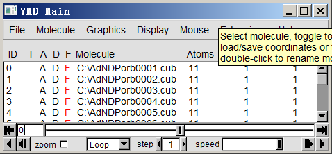
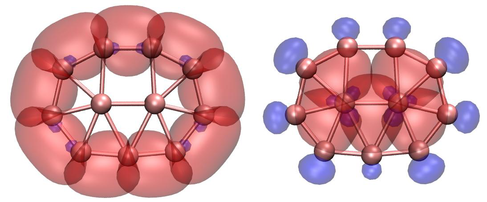
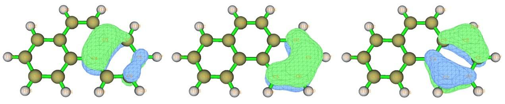

# 自适应自然密度划分 (Adaptive natural density partitioning, AdNDP)

> Multiwfn manual, p.743–752.英文原文见同名 English 章节。 Images: `../imgs/`.

---

<!-- p.743 -->


## 4.14 自适应自然密度划分 (Adaptive natural density partitioning, AdNDP)


## 分析 (analysis)

AdNDP 分析的理论基础已在 3.17.1 节介绍，请先阅读。下面我将展示如何用 AdNDP 方法研究几个实际分子的多中心轨道。关于 AdNDP 分析更详细的讨论可参见我的博客文章“通过 AdNDP 方法以及 ELF/LOL 和多中心键级研究多中心键”（中文，http://sobereva.com/138）。

注意：在 AdNDP 分析中强烈不建议使用弥散函数，因为它们经常引起数值问题（有时会导致 Multiwfn 载入输入文件时崩溃），而从不会改善 AdNDP 结果！

### 4.14.1 分析 Li5+ 团簇 (Analyze Li5+ cluster)

在 Chem. Eur. J., 6, 2982 (2000) 中，作者通过考察 ELF 等值面表明 Li5+ 团簇具有两个 4 中心 2 电子 (4c-2e) 键。在本例中，我们将用 AdNDP 方法研究该团簇以验证他们的说法。我们首先在 B3LYP/6-311G* 水平下优化 Li5+ 团簇，然后编写 Gaussian 单点任务的输入文件。路径段必须指定 pop=nboread 关键词，并在输入文件末尾加上 \$NBO AONAO DMNAO \$END。用 Gaussian 运行该文件，然后将 checkpoint 文件转换为 .fch 格式。输入文件、输出文件和 .fch 文件已在 “examples\AdNDP”文件夹中给出。

启动 Multiwfn 并输入 examples\AdNDP\Li5+.out，然后选择主功能14 (Main function 14)。在 Multiwfn 载入一些必要信息后，出现一个菜单。由于该团簇很小，我们可以直接用穷举方式依次搜索所有可能的 1c-2e、2c-2e、3c-2e、4c-2e 和 5c-2e 轨道。我们首先选择选项 2 搜索 1c-2e 轨道（即孤对），然而，由于所有尝试的 1c 轨道的占据数都低于默认阈值（该值接近 2.0，可用选项 4 调整），菜单前面的候选轨道列表仍为空。然后我们两次选择选项 2 依次搜索 2c-2e 和 3c-2e 轨道，仍找不到占据数高的轨道。接下来我们再次选择选项 2 搜索 4c-2e 轨道，这次候选轨道列表不再为空，其中有两个轨道：


```text
##   2 Occ:  1.9966  Atom:   1Li   2Li   3Li   4Li
##   1 Occ:  1.9966  Atom:   1Li   2Li   3Li   5Li
```

由于它们的占据数很高，显然它们是理想的 4c-2e 轨道，因此我们决定选择选项 0 并输入 2，从候选列表中挑出它们并保存为 AdNDP 轨道。此后可用选项 5 打印 AdNDP 轨道列表。

你可能已经注意到，剩余价电子数（显示在菜单顶部）已更新为 0.020，已非常接近零，这表明继续搜索 5c-2e 轨道没有意义，因为不可能再找到。

现在你可以选择选项 7 显示这两个 4c-2e AdNDP 轨道。为了计算轨道波函数，Multiwfn 需要先从相应的 .fch 文件载入基组信息。由于 Li5+.fch 与 Li5+.out 在同一文件夹且同名，.fch 文件将被直接载入。载入完成后，弹出一个图形界面，与主功能0 (Main function 0) 的完全相同。在右下列表中选择相应序号即可绘制 AdNDP 轨道。这两个轨道的 0.05 等值面如下所示。


<!-- p.744 -->


AdNDP 轨道的格点数据可用选项 9 导出为 Gaussian cube 文件，以便你用 VMD 和 Molekel 等第三方可视化程序绘制。你需要输入轨道序号范围，假设我们要输出刚才找到的两个 4c-2e AdNDP 轨道，应输入 1,2 并选择合适的格点设置，然后它们将被导出为当前文件夹下的 AdNDPorb0001.cub 和 AdNDPorb0002.cub。

用选项 3，你可以设置下一次穷举搜索中多中心轨道的中心数。因此，假设你已经知道当前体系中有两个 4c-2e 轨道，你可以直接选择选项 3，输入 4，然后选择选项 2 开始 4c-2e 轨道的穷举搜索，将跳过 1c-2e、2c-2e 和 3c-2e 轨道的穷举搜索。

评估 AdNDP 轨道能量 (Evaluating AdNDP orbital energies) 也可以得到已挑出的 AdNDP 轨道的能量。为实现这一点，你需要提供额外的纯文本文件，其中包含当前体系以下三角序列排列的 Fock 矩阵，以便经过一些变换后得到轨道能量。Fock 矩阵也可从 .47 文件载入。最直接的步骤是：将 examples\AdNDP\Li5+.gjf 复制为 examples\AdNDP\Li5+_47.gjf，将其最后一行改为 $NBO archive file=C:\Li5+ $END。然后用 Gaussian 运行该文件后，将得到 C:\Li5+.47，它是 GENNBO 程序的输入文件，包含我们需要的 Fock 矩阵。然后我们在 AdNDP 分析界面中选择选项“16 输出已挑出的 AdNDP 轨道的能量 (Output energy of picked AdNDP orbital)”，输入 Li5+.47 的路径（该文件已在 “examples\AdNDP\”文件夹中提供），Multiwfn 将载入它并立即打印 AdNDP 轨道能量，如下所示：


```text
Energy of picked AdNDP orbitals:
Orbital:     1  Energy (a.u./eV):   -0.325776     -8.8648
Orbital:     2  Energy (a.u./eV):   -0.325776     -8.8648
```

正如预期的那样，这两个轨道在能量上简并，因为它们具有完全等同的形状。

当然，如果你在 .gjf 文件的最后一行写 $NBO DMNAO AONAO archive file=C:\Li5+ $END，那么运行它之后，不仅输出文件可用作 AdNDP 分析的输入文件，同时还将得到用于导出 AdNDP 轨道能量的 .47 文件。

### 4.14.2 分析 B11− 团簇 (Analyze B11− cluster)

这一次，我们将尝试重现 AdNDP 原始论文（Phys. Chem. Chem. Phys., 10, 5207 (2008)）中给出的 B11− 团簇的 AdNDP 分析结果。


<!-- p.745 -->


本例所需的文件，即 B11-.out 和 B11-.fch，可在 “examples\AdNDP”文件夹中找到。几何结构在 B3LYP/6-311+G* 下优化，而波函数在 HF/STO-3G 水平下产生。你可能会怀疑在如此低的基组水平下结果是否有意义；实际上，AdNDP 分析对基组质量相当不敏感，即使 STO-3G 也能产生至少定性合理的结果。此外，使用更大的基组会在 AdNDP 分析阶段带来额外开销。

启动 Multiwfn 并输入 examples\AdNDP\B11-.out，然后选择 14 进入 AdNDP 模块 (AdNDP module)。和往常一样，我们先选择 2 搜索 1c-2e 轨道，但一无所获（这是常见情况）。然后再次选择 2，从 11 个原子中穷举搜索 2c-2e 轨道，Multiwfn 总共将尝试 11!/(11-2)!/2!=55 种组合，最终候选列表中有九个 2c 轨道（按占据数从大到小排序）：


```text
##   9 Occ:  1.9727  Atom:   6B   10B
##   8 Occ:  1.9727  Atom:   5B   11B
##   7 Occ:  1.9742  Atom:   7B    9B
##   6 Occ:  1.9742  Atom:   7B    8B
##   5 Occ:  1.9869  Atom:   2B    6B
##   4 Occ:  1.9869  Atom:   3B    5B
##   3 Occ:  1.9871  Atom:   9B   11B
##   2 Occ:  1.9871  Atom:   8B   10B
##   1 Occ:  1.9942  Atom:   2B    3B
```

它们都具有接近 2.0 的占据数，表面上可以直接将它们全部挑出作为 AdNDP 轨道，然而，不建议这样做，因为相邻轨道可能共享相同的密度。例如，第 1 个和第 4 个候选轨道共享部分密度，因为它们都与原子 3 有关。为了避免电子重复计数，首先应选择选项 0 并输入 3，挑出前三个轨道，然后这前三个轨道的密度将从密度矩阵中耗尽，此后剩余候选轨道的波函数和占据数将自动更新。此时候选列表变为


```text
##   6 Occ:  1.9538  Atom:   6B   10B
##   5 Occ:  1.9538  Atom:   5B   11B
##   4 Occ:  1.9556  Atom:   7B    8B
##   3 Occ:  1.9556  Atom:   7B    9B
##   2 Occ:  1.9750  Atom:   2B    6B
##   1 Occ:  1.9750  Atom:   3B    5B
```

由于部分密度已被耗尽，剩余六个候选轨道的占据数略有下降。现在，我们选择选项 0 并输入 4，挑出前四个候选轨道。虽然第 3 个和第 4 个轨道都与原子 7 有关，这里不得不忽略轻微的电子重复计数，否则它们的简并性将被破坏，从而最终的 AdNDP 图像将不再与分子对称性一致（在决定挑出之前你可选择选项 8 仔细检查候选轨道）。最后，我们挑出最后两个轨道（即 6B-10B 和 5B-11B）。目前剩余价电子数为 16.307，这表明很可能找到几个占据数接近 2 电子的更高中心数的轨道。

现在我们选择选项 2 开始搜索 3c-2e 轨道，当前候选轨道列表为：


```text
##   9 Occ:  1.7399  Atom:   1B    6B   10B
```


<!-- p.746 -->


```text
##   8 Occ:  1.7399  Atom:   4B    5B   11B
##   7 Occ:  1.7502  Atom:   1B    3B    4B
##   6 Occ:  1.7502  Atom:   1B    2B    4B
##   5 Occ:  1.8504  Atom:   1B    2B    6B
##   4 Occ:  1.8504  Atom:   3B    4B    5B
##   3 Occ:  1.8603  Atom:   1B    4B    7B
##   2 Occ:  1.8673  Atom:   4B    9B   11B
##   1 Occ:  1.8673  Atom:   1B    8B   10B
```

在我们依次挑出两个轨道（1B-8B-10B 和 4B-9B-11B）、一个轨道（1B-4B-7B）和两个轨道（3B-4B-5B 和 1B-2B-6B）后，剩余候选轨道的最高占据数仅为 1.41，显然太低而不能视为 3c-2e 轨道，因此不再考虑。目前剩余价电子数为 7.03。

然后你可以开始搜索更高中心数的轨道，注意这绝非易事，而且关于如何合理挑出候选轨道没有绝对规则，不同的挑取方式会导致不同的 AdNDP 图像。在最终得到最佳 AdNDP 图像之前你可能需要尝试多次。建议用选项 11 将当前密度矩阵和 AdNDP 轨道列表保存到内存中，这样你就不必担心候选轨道挑取不当，因为随时可用选项 12 恢复已保存的状态。

现在选择选项 2 开始搜索 4c-2e 轨道，最高占据数仅为 1.71，其中没有可挑出的。

再次选择选项 2 搜索 5c-2e 轨道，你会发现许多 5c 候选轨道，前两个的占据数为 1.89，我们将它们都挑出。

然后选择选项 2 搜索 6c-2e 轨道，没有发现好的候选，最高占据数仅为 1.84。然后选择选项 2 搜索 7c-2e 轨道，我们挑出占据数最高的一个（1.90）。现在剩余价电子仅为 1.34，远小于 2.0，表明不可能再找到额外的 2 电子 AdNDP 轨道，因此现在可以结束 AdNDP 搜索过程。剩余电子的量反映了不能被当前 AdNDP 图像完全表示的电子（类似于 NBO 框架中的非 Lewis 电子）

选择选项 5，可打印出所有 AdNDP 轨道的信息：


```text
##    1 Occ:  1.9942 Atom:   2B    3B
##    2 Occ:  1.9871 Atom:   8B   10B
##    3 Occ:  1.9871 Atom:   9B   11B
##    4 Occ:  1.9750 Atom:   2B    6B
##    5 Occ:  1.9750 Atom:   3B    5B
##    6 Occ:  1.9556 Atom:   7B    9B
##    7 Occ:  1.9556 Atom:   7B    8B
##    8 Occ:  1.9337 Atom:   6B   10B
##    9 Occ:  1.9337 Atom:   5B   11B
##   10 Occ:  1.8673 Atom:   4B    9B   11B
##   11 Occ:  1.8673 Atom:   1B    8B   10B
##   12 Occ:  1.8533 Atom:   1B    4B    7B
##   13 Occ:  1.8451 Atom:   3B    4B    5B
##   14 Occ:  1.8451 Atom:   1B    2B    6B
```

<!-- p.747 -->


```text
##   15 Occ:  1.8908 Atom:   1B    2B    6B    8B   10B
##   16 Occ:  1.8908 Atom:   3B    4B    5B    9B   11B
##   17 Occ:  1.9036 Atom:   2B    3B    5B    6B    7B    8B    9B
Total occupation number in above orbitals:   32.6607
```

通过 VMD 脚本同时绘制一批 AdNDP 轨道 现在你可以使用选项 7 来可视化所有已选出的 AdNDP 轨道。不过，这次我展示如何通过 VMD 来绘制 AdNDP 轨道，这种方法可以同时绘制一批轨道，而且图形质量很好。VMD 可从 http://www.ks.uiuc.edu/Research/vmd/ 免费获取。

选择选项 9，选择“中等质量格点(Medium-quality grid)”，然后输入 1-17，将全部 17 个 AdNDP 轨道以 cube 文件形式导出到当前文件夹，文件名的格式为 AdNDPorb[index].cub。假设你已将它们全部移动到 C:\ 目录，你应该编辑 examples\AdNDP\plotAdNDP.vmd，并将这一行


```text
set name "D:\\CM\\my_program\\Multiwfn\\AdNDPorb$idx.cub"
```

改为


```text
set name "C:\\AdNDPorb$idx.cub"
```

你还需要确保在该脚本中，“set istart”和“set iend”后面的值已分别设为 1 和 17，这样从 AdNDPorb0001.cub 到 AdNDPorb0017.cub 的 cube 文件都会被加载。轨道等值面的正、负相的颜色由“set posclr”和“set negclr 0”后面的值决定，轨道等值面的等值由“set isoval”决定。

现在启动 VMD，将 plotAdNDP.vmd 中的全部内容复制到 VMD 控制台窗口，所有 AdNDP 轨道的 cube 文件都将被载入 VMD。现在 VMD 主窗口如下所示

每个条目对应一个 AdNDP 轨道。目前全部 17 个轨道都处于显示状态。如果你双击一个“D”标签，则图形窗口中对应的轨道将被隐藏。为了显示分子结构，将 examples\AdNDP\B11-.xyz 拖入 VMD 主窗口以加载它，然后进入“图形(Graphics)”-“表示(Representation)”，将绘制样式改为 CPK。

如果你让 VMD 只显示全部九个 2c-2e 轨道和全部五个 3c-2e 轨道，你将分别看到下图的左半部分和右部分




<!-- p.748 -->


两个 5c-2e 轨道和一个 7c-2e 轨道如下所示（图中 7c-2e 轨道看起来像 5c 轨道，主要原因是绘图脚本中的等值较高，即 0.06）。


### 4.14.3 分析菲

菲（C14H10，见上图）的 AdNDP 分析已在 J. Org. Chem., 73, 9251 (2008) 中给出，在本节我们将重复他们的结果，你将学会如何使用用户导向搜索。本例所用的文件可在 examples\AdNDP 文件夹中找到，前缀为“phenanthrene”。

首先我们加载 examples\AdNDP\phenanthrene.out 并进入主功能 14。与前面的例子一致，我们选择两次选项 2，先搜索 1c 轨道，然后搜索 2c 轨道。没有找到 1c-2e 轨道，而列表中有 31 个候选 2c 轨道。其中十个对应 C-H σ 键且彼此之间没有重叠，因此我们可以先将它们选出，即选择选项 0，输入 8-15，然后再次选择选项 0 并输入 9,10。接着，我们依次选出对应于 C-C σ 键的十六个 2c 候选轨道。最稳妥的选出轨道的方法是输入 0 2 0 1 0 2 0 1 0 2 0 2 0 2 0 2 0 2，其中空格表示按一次回车(ENTER)键。

现在只剩下五个轨道：





<!-- p.749 -->


```text
 #   5 Occ: 1.7182 Atom:   5C    6C
 #   4 Occ: 1.7182 Atom:  14C   15C
 #   3 Occ: 1.7192 Atom:  11C   13C
 #   2 Occ: 1.7192 Atom:   1C    2C
 #   1 Occ: 1.8033 Atom:   7C   10C
```

第一个占据数为 1.80 的轨道对应于 C7 和 C10 之间的 π 键，我们现在将其选出。其余四个轨道的占据数约为 1.72，因此它们不是很理想的 2c-2e 键，我们暂时不考虑它们。

虽然我们可以像往常一样用选项 2 穷举搜索 3c、4c、5c……轨道，但对于当前体系这可能不是个好主意，因为用户导向搜索通常更有效。我们首先选择选项 13 查看每个原子上的剩余电子布居，见下文，这些信息通常有助于指导用户正确设置穷举搜索列表。（注意：由选项 2 触发的穷举搜索仅应用于穷举搜索列表中的原子，默认情况下该列表包含当前体系中的所有原子）


```text
 1C :  1.0250       2C :  1.0370       3C :  1.0280       4C :  1.0414
 5C :  1.0339       6C :  1.0262       7C :  0.1322       8C :  1.0414
 9C :  1.0280      10C :  0.1322      11C :  1.0370      12H :  0.0117
13C :  1.0250      14C :  1.0262      15C :  1.0339      16H :  0.0121
17H :  0.0113      18H :  0.0117      19H :  0.0126      20H :  0.0111
21H :  0.0121      22H :  0.0113      23H :  0.0111      24H :  0.0126
```

从以上数据可以清楚看出，氢上几乎已没有剩余布居，因此在搜索过程中可以忽略它们。出于同样原因，C7 和 C10 也可以忽略。其他原子，其占据数约为 1.03，是组成分子两侧两个六元环的碳。可以预期，这两个环可能类似于苯环，从而代表菲中的局域芳香性。

基于这一考虑，我们选择选项 1 并输入 1-6，对由原子 1、2、3、4、5、6 组成的片段搜索 AdNDP 轨道，我们发现


```text
...ignored
 #   5 Occ: 0.2157 Atom:   1C    2C    3C    4C    5C    6C
 #   4 Occ: 0.2998 Atom:   1C    2C    3C    4C    5C    6C
 #   3 Occ: 1.8214 Atom:   1C    2C    3C    4C    5C    6C
 #   2 Occ: 1.9850 Atom:   1C    2C    3C    4C    5C    6C
 #   1 Occ: 2.0000 Atom:   1C    2C    3C    4C    5C    6C
```

显然前三个轨道适合作为 6c-2e AdNDP 轨道选出，因此我们现在将它们选出。它们的 0.03 等值面如下所示，看起来非常像苯的 π 分子轨道，表明边界六元环具有与苯一样强的芳香性。

接着，用同样的方法在另一个边界环上搜索 6c-2e 轨道，即再次选择选项 1 并输入 8,9,11,13-15，之后选出占据数最高的三个轨道。




<!-- p.750 -->


现在剩余价电子数只有 1.15，已经非常小，显然 AdNDP 搜索应到此结束。最终，共找到 33 个轨道（27 个 2c-2e，6 个 6c-2e）。

注：在由原子 1~6 组成的环上搜索 6c-2e 轨道时，实际上还有另一种做法（虽然更繁琐），即选择选项 -1 进入定义穷举搜索列表的界面，输入 clean 清空默认内容，然后输入 a 1-6 将环原子 1、2、3、4、5、6 加入列表，再输入 x 保存并退出。之后，选择选项 3 并输入 6，将下一次穷举搜索的原子数设为六，然后选择选项 2 在该环上搜索 6 中心轨道。

评估 AdNDP 轨道能量 用类似的步骤，我们像 4.14.1 节那样评估 AdNDP 轨道能量。包含当前分子 Fock 矩阵的 NBO .47 文件已作为 examples\AdNDP\phenanthrene.47 提供，它由 examples\AdNDP\phenanthrene_47.gjf 生成。我们选择选项 16 并输入该文件的路径，Multiwfn 会立即从中加载 Fock 矩阵并输出轨道能量：


```text
...(ignored)
 Orbital:    25  Energy (a.u./eV):   -0.685803    -18.6616
 Orbital:    26  Energy (a.u./eV):   -0.685803    -18.6616
 Orbital:    27  Energy (a.u./eV):   -0.260794     -7.0966
 Orbital:    28  Energy (a.u./eV):   -0.348201     -9.4750
 Orbital:    29  Energy (a.u./eV):   -0.255535     -6.9535
 Orbital:    30  Energy (a.u./eV):   -0.264372     -7.1939
 Orbital:    31  Energy (a.u./eV):   -0.348201     -9.4750
 Orbital:    32  Energy (a.u./eV):   -0.255535     -6.9535
 Orbital:    33  Energy (a.u./eV):   -0.264372     -7.1939
```

如你所见，轨道 28-33 对应于 π 轨道，能量比 σ 轨道高得多。左侧六元环中的三个 π 轨道（28-30）与右侧六元环中对应的轨道（31-33）对称。在每一侧，两个能量最高的轨道（例如 32 和 33）近乎简并，且明显高于能量最低的那个（例如

31），这种情况与孤立苯的占据 π 轨道非常相似。

评估 AdNDP 轨道的组成 有时 AdNDP 轨道的组成很有意思。在 AdNDP 模块中我们可以直接选择选项 15 用 NAO 方法分析轨道组成，该方法已在 3.10.4 节介绍。NAO 方法特别适合分析 AdNDP 轨道。

选择选项 15，然后输入一个已选出的 AdNDP 轨道的序号，例如 31，你将看到（默认只显示绝对贡献大于 0.5% 的项）


```text
    NAO#   Center   Label      Type    Composition
      67    8(C )    px       Val( 2p)     2.247%
      76    9(C )    px       Val( 2p)     1.929%
      94   11(C )    px       Val( 2p)    13.276%
     105   13(C )    px       Val( 2p)    32.846%
     114   14(C )    px       Val( 2p)    34.484%
     123   15(C )    px       Val( 2p)    15.204%

 Condensed NAO terms to shells:
   Atom:     8(C )  Shell:    39( 2p Val)     2.247%
```


<!-- p.751 -->


```text
   Atom:     9(C )  Shell:    44( 2p Val)     1.929%
   Atom:    11(C )  Shell:    54( 2p Val)    13.276%
   Atom:    13(C )  Shell:    61( 2p Val)    32.846%
   Atom:    14(C )  Shell:    66( 2p Val)    34.484%
   Atom:    15(C )  Shell:    71( 2p Val)    15.204%

 Condensed NAO terms to atoms:
   Center   Composition
     8(C )     2.251%
     9(C )     1.932%
    11(C )    13.276%
    13(C )    32.849%
    14(C )    34.487%
    15(C )    15.204%
```

正如预期的，这个 π 型的 6c-2e 轨道纯粹由 px 自然原子轨道组成，其轴垂直于菲的平面。该轨道离域在整个环上，但主要分布在原子 13 和 14 上。

注意还有另一种评估 AdNDP 轨道组成的方法，即通过选项 14 将 AdNDP 轨道导出为当前文件夹下的 AdNDP.mwfn，然后将此文件作为 Multiwfn 的输入文件，像往常一样进行轨道组成分析（例如通过 Mulliken 分析、Hirshfeld 分析等，见 4.8 节的例子）。对于本例，该 .mwfn 文件包含 146 个轨道，因为原来有 146 个自然原子轨道，但只有前 33 个轨道对应于 AdNDP 轨道，因而是有意义的。

### 4.14.4 分析 Au20 团簇

在本节我们对 Au20 团簇进行 AdNDP 分析，所需文件可从 http://sobereva.com/multiwfn/extrafiles/Au20.rar 下载。

!!! terminal "Multiwfn 交互"

    - **启动 Multiwfn 并输入： Au20.out** — 基于优化好的几何结构在 B3PW91/Lanl2DZ 水平下生成的
    - **14** — AdNDP 分析 2

0 // 选出轨道 100 // 选出全部 100 个候选轨道 2 // 穷举搜索 2 中心轨道。什么也没找到 2 // 穷举搜索 3 中心轨道。同样什么也没找到 2 // 穷举搜索 4 中心轨道。现在你可以看到四个占据数为 1.84 e 的候选轨道和六个占据数为 1.7589 e 的候选轨道

0 // 选出轨道 4 // 选出前四个轨道。此时剩余轨道的占据数为 1.6913，虽然不是很高，但在当前情况下仍值得选出

0 // 选出轨道 6 // 选出剩余的六个轨道。


<!-- p.752 -->


绘制 AdNDP 轨道 接下来我们用绘图脚本通过 VMD 绘制所有十个已选出的 4c 轨道。我们首先导出它们的 cube 文件，输入以下命令

9 // 导出已选出的 AdNDP 轨道的 cube 文件 2 // 中等质量格点(Medium-quality grid)，这对为当前体系生成光滑的轨道等值面已足够

101-110 // 已选出的 4c 轨道的序号范围 过一会儿，我们在当前文件夹中有了十个 cube 文件，第一个是 AdNDPorb0101.cub，最后一个是 AdNDPorb0110.cub。我们打算用红色绘制轨道 101-104（occ=1.84），用橙色绘制 105-110（occ=1.69），以便将它们清楚地区分开。

我们编辑 examples\AdNDP\plotAdNDP.vmd，将“istart”和“iend”分别设为 101 和 104。然后修改“set name”后面的路径，使其对应于实际包含 cube 文件的路径。此外，在两个“mol modmaterial...”行前面加上 # 符号将其注释掉，以便等值面以不透明方式绘制。之后我们启动 VMD，将 VMD 脚本的全部内容复制到 VMD 控制台窗口运行，你会发现前四个 4c 轨道已作为等值面显示在 VMD 图形窗口中。

我们还需要在图上绘制轨道 105-110。我们将脚本中的“istart”和“iend”分别设为 105 和 110。将“posclr”设为 3，使正相的等值面颜色为橙色（注意这些 4c 轨道只有正相）。将“idinit”设为 4，因为显示轨道 101、102、103 和 104 的体系在 VMD 中已被分配为 ID=0、ID=1、ID=2 和 ID=3，因此下一个要加载的轨道对应的 ID 必须为 4。然后将脚本内容复制到 VMD 控制台窗口运行，你会发现其余六个 4c 轨道也已显示出来。

最后，选择“图形(Graphics)”-“表示(Representations)”，点击“创建表示(Create Rep)”，将“绘制方式(Drawing method)”改为“CPK”。现在你应该看到下图，每个红色和橙色等值面分别代表位于团簇每个顶点和每条棱处的 4c-2e 轨道。


