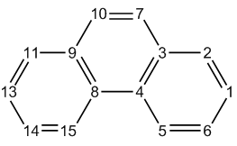

# 模糊原子空间分析

> Multiwfn manual, p.753–764.英文原文见同名 English 章节。 Images: `../imgs/`.

---

<!-- p.753 -->


## 4.15 模糊原子空间分析

模糊原子空间的基本概念已在 3.18.0 节介绍。在本节，将给出几个例子来说明模糊原子空间分析模块的一些功能。在大多数情况下将采用默认的 Becke 模糊原子空间定义，因为它易于计算且对大多数情况都合理。然而，Hirshfeld-I 和 MBIS 原子空间更稳健，在某些情况下明显更好，但它们需要通过迭代来优化原子空间，对大体系来说 somewhat 昂贵。你可以通过选项 -1 选择模糊分析模块中使用的原子空间的定义。


### 4.15.1 研究苯的离域指数

离域指数(DI)的定义已在 3.18.5 节详细介绍。DI 最初是为 AIM 原子空间提出的，而研究表明，如果在模糊原子空间中计算它，计算成本会显著降低，而结果仍然有意义。在本例中，我们将在 Becke 模糊原子空间中计算 DI，以研究苯中不同原子对之间电子离域的程度。

!!! terminal "Multiwfn 交互"

    - **启动 Multiwfn，并输入以下命令 examples\benzene.wfn** — 在 B3LYP/6-311G* 下生成的
    - **15** — 模糊原子空间分析 4

n // 不将 LI 和 DI 输出到纯文本文件 Multiwfn 会自动检查并输出 AOM 的误差，对于当前计算，误差小于 0.001，完全可以忽略。如果误差大到无法接受，你可以将 `settings.ini` 中的“iautointgrid”设为 0，并将“radpot”和“sphpot”设为较大的值。当“iautointgrid”等于 1 时，Multiwfn 使用 (40,230) 格点计算 AOM，其精度直接影响 LI、DI 以及 PDI 和 FLU 的精度。

从屏幕上输出的 DI 矩阵可以看出，相邻两个碳原子（例如 1-2）之间和相邻 C-H 原子（例如 1-7）之间的 DI 很大（分别为 1.467 和 0.877），这意味着成键原子之间的电子离域很强，这主要归因于 σ 键的共享电子。相比之下，非键碳原子之间的 DI 很小，约为 0.1，但明显不为零，反映了 π 电子高度离域的本质。

在模糊原子空间中计算的 DI 本质上就是 Mayer 提出的模糊键级。根据 DI 数据，我们可以说苯中 C-C 键和 C-H 键的键级分别为 1.467 和 0.877，前者对应于单个 σ 键加“半个”π 键，而后者对应于典型的单 σ 键。

由于苯是严格的平面分子，我们可以将 DI 分解为 DI-σ 和 DI-π。这里我们计算后者。输入 0 返回主菜单，然后输入以下命令

!!! terminal "Multiwfn 交互"

    - **6** — 修改波函数
    - **26** — 修改占据数
    - **0** — 选择所有轨道
    - **0** — 将所有轨道的占据数置为零
    - **17,20,21** — MO 17,20,21 对应于 π 轨道。
    - **2** — 将它们的占据数设为 2（闭壳层轨道）


<!-- p.754 -->


q // 返回上一级菜单 -1 //返回主菜单 现在像之前一样重新计算 DI，由于除 π 轨道外所有轨道的占据数都已被设为零，结果将是 DI-π。

C1-C6、C1-C5 和 C1-C4 之间的 DI-π 分别为 0.438、0.055 和 0.093，显然对位相关的碳之间比间位相关的碳之间 π 电子离域更大。


### 4.15.2 用 PDI、FLU、FLU-π 和


### PLR 研究菲的芳香性

PDI、FLU、FLU-π 和 PLR 是有用的芳香性指标，它们的定义已在 3.18.6、3.18.7 和 3.18.9 节介绍。在本例中，我们将在 Becke 模糊原子空间中计算它们，以研究菲的不同环的芳香性。

计算 PDI 我们首先计算 PDI。启动 Multiwfn，并输入以下命令：

!!! terminal "Multiwfn 交互"

    - **examples\phenanthrene.wfn** — 在 B3LYP/6-31G* 水平下优化的
    - **15** — 模糊原子空间分析
    - **5** — 计算 PDI

然后 Multiwfn 开始计算原子重叠矩阵(AOM)，这是一项计算密集型工作。之后 AOM 将被转换为离域指数(DI)，然后 DI 矩阵将输出到屏幕上。最后，你将被提示输入你感兴趣的环的原子序号，输入顺序应与原子连接顺序一致。我们首先计算中心环的 PDI，即输入 4,8,9,10,7,3，结果为


```text
Delocalization index of     4(C )   --   10(C ):    0.052992
Delocalization index of     8(C )   --    7(C ):    0.052992
Delocalization index of     9(C )   --    3(C ):    0.036334
PDI value is    0.047439
```

PDI 值正好是 C4-C10、C8-C7 和 C9-C3 之间的 DI 的平均值。现在我们输入 8,9,11,13,14,15 计算边界环的 PDI，结果为 0.0817。从该结果可以明显看出，边界环中的电子离域比中心环中更强，因此




<!-- p.755 -->


边界环具有更大的芳香性。接下来，我们用 FLU 和 FLU-π 研究芳香性，并检验是否能得出相同的结论。

计算 FLU 输入 q 返回上一级菜单，再输入 6 计算 FLU，然后依次输入 4,8,9,10,7,3 和 8,9,11,13,14,15。中心环和边界环的 FLU 分别为 0.025289 和 0.007499，该结果表明边界环更像典型的芳香体系（苯），因而比中心环具有更大的芳香性。注意，由于在计算 PDI 期间 AOM 已经算过，所以这次 AOM 的计算过程会自动跳过。

计算 FLU-π 接着，输入 q 返回上一级菜单，再输入 7 计算 FLU-π。首先你需要输入 π 轨道的序号。通过目视检查所有轨道的等值面（或利用主功能 100 中的选项 22），我们知道 36、40、43、44、45、46 和 47 是 π 轨道，因此这里我们输入 36,40,43,44,45,46,47，然后将输出 π 电子的 DI。之后你将被提示输入环中的原子序号，我们依次输入 4,8,9,10,7,3 和 8,9,11,13,14,15。中心环和边界环的 FLU-π 分别为 0.149238 和 0.034904。显然，FLU-π 分析也证实边界环更芳香。

计算 PLR 最后，让我们计算对位线性响应指数(PLR)。PLR 基于线性响应核，它依赖于虚 MO 的信息；然而 .wfn 文件只包含占据 MO，因此我们必须使用 .mwfn/.fch/.molden/.gms 文件作为输入。重新启动 Multiwfn 并输入以下命令

!!! terminal "Multiwfn 交互"

    - **examples\phenanthrene.fch** — 与 phenanthrene.wfn 在相同水平下得到的
    - **15** — 模糊空间分析 10

注意，PDI 和 PLR 都可以分离为 α 和 π 部分，以分别研究 α 和 π 芳香性，详见 3.18.6 和 3.18.9 节。


### 4.15.3 计算片段偶极矩以展示局域极性

注：本专题的中文版是我的博客文章“使用 Multiwfn 计算分子片段的偶极矩和复合物中单体的偶极矩”（http://sobereva.com/558，中文），其中包含额外的例子和扩展讨论。

片段的偶极矩可定义为


$$\mathbf{D}_{F}=\sum_{A\in F}\left[Z_{A}\mathbf{R}_{A}-\int w_{A}(\mathbf{r})\rho(\mathbf{r})\mathbf{r}\mathrm{d}\mathbf{r}\right]$$

<!-- formula-ocr: formula_p755_342.png 已替换为LaTeX, 原图保留备查 -->

其中 A 是片段 F 中的原子序号，ZA 和 RA 分别是原子 A 的核电荷和位置。wA(r) 是原子 A 的原子权重函数。

如 3.18.3 节所述，Multiwfn 能够计算原子和分子


<!-- p.756 -->


偶极/多极矩；如果你定义一个原子列表，那么输出的分子偶极和多极矩将对应于该片段的矩。在本计算中，我们利用这一功能计算苯酚二聚体中两个单体各自的偶极矩。我们将使用 Hirshfeld 权重函数，因为它的计算简单且物理意义相对清晰。

启动 Multiwfn 并输入以下命令：

!!! terminal "Multiwfn 交互"

    - **examples\phenoldimer.wfn** — 优化好的苯酚二聚体的波函数文件
    - **15** — 模糊原子空间分析
    - **-1** — 选择定义原子空间的方法
    - **3** — 基于内建球平均原子密度的 Hirshfeld
    - **2** — 计算原子和分子多极矩
    - **1** — 在屏幕上输出结果

然后 Multiwfn 开始计算每个原子的布居数、偶极和多极矩，最后打印整个体系的数据（此处的“分子(molecular)”对应于整个当前体系）：


```text
              *****  Molecular dipole and multipole moments  *****
 Total number of electrons:    100.000331   Net charge: -0.000331
 Molecular dipole moment (a.u.):       1.227306     -0.128087      0.650833
 Molecular dipole moment (Debye):      3.119501     -0.325563      1.654252
 Magnitude of molecular dipole moment (a.u.&Debye):      1.395088      3.545959
 Molecular quadrupole moments (Standard Cartesian form):
 XX=  -56.973177  XY=    3.413050  XZ=    4.769915
 YX=    3.413050  YY=  -58.109370  YZ=    4.188508
 ZX=    4.769915  ZY=    4.188508  ZZ=  -57.714457
 Molecular quadrupole moments (Traceless Cartesian form):
 XX=    0.938737  XY=    5.119575  XZ=    7.154872
 YX=    5.119575  YY=   -0.765553  YZ=    6.282762
 ZX=    7.154872  ZY=    6.282762  ZZ=   -0.173184
 Magnitude of the traceless quadrupole moment tensor:    0.999096
 Molecular quadrupole moments (Spherical harmonic form):
 Q_2,0 =  -0.173184   Q_2,-1=   7.254708   Q_2,1=   8.261735
 Q_2,-2=   5.911576   Q_2,2 =   0.983972
 Magnitude: |Q_2|=   12.523257
 Molecular electronic spatial extent <r^2>:     3515.944316
 Components of <r^2>:  X=    2590.720451  Y=     631.865745  Z=     293.358120
 Molecular octopole moments (Cartesian form):
 XXX=   27.1548  YYY=  -34.6763  ZZZ=   12.9803  XYY=   31.5970  XXY=  -32.1231
 XXZ=   11.3712  XZZ=   18.8632  YZZ=   -6.4625  YYZ=   25.0005  XYZ=   21.8843
 Molecular octopole moments (Spherical harmonic form):
 Q_3,0 =   -41.5772  Q_3,-1=    25.0762  Q_3,1 =    10.2272
 Q_3,-2=    84.7574  Q_3,2 =   -26.3932  Q_3,-3=   -48.7725  Q_3,3 =   -53.4710
 Magnitude: |Q_3|=    124.8215
```

可以看出，二聚体的偶极矩为 (1.227306,-0.128087,0.650833) a.u.。

接下来，我们计算第一个苯酚的偶极矩。我们输入

!!! terminal "Multiwfn 交互"

    - **-5** — 定义要计算的原子


<!-- p.757 -->


!!! terminal "Multiwfn 交互"

    - **1-13** — 第一个苯酚的原子序号
    - **2** — 计算原子和分子多极矩
    - **1** — 在屏幕上输出结果 你将看到


```text
Total number of electrons:     50.095624   Net charge: -0.095624
Molecular dipole moment (a.u.):       0.570356     -0.356257      0.284025
Molecular dipole moment (Debye):      1.449701     -0.905516      0.721919
Magnitude of molecular dipole moment (a.u.&Debye):      0.729997      1.855468
...[ignored]
```

显示第一个苯酚的偶极矩为 (0.570356,-0.356257,0.284025) a.u.，该苯酚带有 -0.096 的净电荷。

然后我们输入

!!! terminal "Multiwfn 交互"

    - **-5** — 定义要计算的原子
    - **14-26** — 第二个苯酚的原子序号

!!! terminal "Multiwfn 交互"

    - **2** — 计算原子和分子多极矩
    - **1** — 在屏幕上输出结果 你会发现第二个苯酚的偶极矩为 (0.656950 0.228171 0.366808) a.u.。

总之，现在我们有了三个偶极矩：

- 二聚体：(1.227306,-0.128087,0.650833) a.u.
- 第一个苯酚：(0.570356,-0.356257,0.284025) a.u.
- 第二个苯酚：(0.656950,0.228171,0.366808) a.u. 为了便于直观查看，我们将在 VMD 可视化程序中把偶极矩绘制为箭头，VMD 可从 http://www.ks.uiuc.edu/Research/vmd/ 免费获取。我使用的版本是 VMD 1.9.3。由于 VMD 无法加载 .wfn 文件，我们需要将当前体系转换为 .xyz 文件。为此，我们返回主菜单，进入主功能 100 并选择子功能 2，然后你会找到用于导出 .xyz 文件的相应选项。我们将当前体系导出为 phenoldimer.xyz。

启动 VMD，然后将 phenoldimer.xyz 载入其中。将 examples\scripts\drawarrow.tcl 脚本文件中的全部信息复制到 VMD 控制台窗口运行，将定义一个新的自定义命令“drawarrow”，它将用于绘制箭头。然后我们在 VMD 控制台输入以下命令：


```text
draw color green
drawarrow all 1.227306 -0.128087 0.650833 2
draw color red
drawarrow "serial 1 to 13" 0.570356 -0.356257 0.284025 2
draw color yellow
drawarrow "serial 14 to 26" 0.656950 0.228171 0.366808 2
```

这意味着整个体系（用“all”选择）的偶极矩将用绿色箭头绘制，第一和第二个苯酚分子的偶极矩将分别用红色和黄色箭头绘制。“serial 1 to 13”和“serial 14 to 26”是 VMD 中的选择语法。命令末尾的参数“2”使箭头长度加倍，以便能清楚地用箭头表示偶极矩。


<!-- p.758 -->


经过一些图形效果调整（例如在“图形(Graphics)”-“表示(Representation)”界面中将绘制方法设为“甘草式(licorice)”），你可以看到如下图。红色、黄色和绿色箭头的中心分别置于两个苯酚和二聚体的几何中心；箭头长度对应于偶极矩的模（乘以 2）。

由于两个单体的偶极矩矢量几乎彼此平行，它们的矢量和，即二聚体的偶极矩，明显大于单体偶极矩。

请记住，如果片段的净电荷不为零，片段偶极矩依赖于原点的选择。对于本例，由于两个苯酚分子之间有微弱的电荷转移，单体偶极矩必然略微依赖于原点。不过，这不是明显的问题，因为单体的净电荷很小，且当前原点是合适的（位于二聚体的核电荷中心）。


### 4.15.4 计算原子有效体积、自由体积、原子极化率

和原子 C6 系数：以环氧乙烷和 SiH4 为例

更多讨论和例子见我的博客文章“使用 Multiwfn 计算分子中的原子极化率”（http://sobereva.com/600，中文）和“使用 Multiwfn 计算原子 C6 色散系数”（http://sobereva.com/709，中文）。

如果你不知道什么是原子有效体积(Veff)、

原子自由体积(Vfree)、原子静态极化率(αeff(0))和原子 C6 系数(C6,AA)，请先阅读 3.18.12 节。在本节我们将为两个常见分子计算它们。

第 1 部分：环氧乙烷的原子有效体积/自由体积/极化率

在本例中我们重点评估环氧乙烷（C2OH4）中原子的 Vfree 和 αeff(0)。其波函数文件为 examples\oxirane.fchk，它由 Gaussian 16 在 B3LYP/6-31G* 水平下生成。

在使用 Multiwfn 计算上述量之前，我们需要手动在与分子计算相同的水平下生成当前体系中所有元素（C、O、H）的孤立态波函数文件。你可以用你喜欢的量子化学程序完成这一步。以 .wfn 格式（H.wfn、C.wfn 和 O.wfn）、由 Gaussian 16 在 B3LYP/6-31G* 水平下生成的原子波函数文件可直接在这里下载：http://sobereva.com/multiwfn/extrafiles/oxirane_atmvol.zip，同时也提供了 Gaussian 输入文件。注意原子波函数文件不一定


<!-- p.759 -->


非得是 .wfn 格式，它们可以是 Multiwfn 支持的任何格式，例如 .mwfn、.fch 和 .molden。

!!! terminal "Multiwfn 交互"

    - **启动 Multiwfn 并输入 examples\oxirane.fchk 15** — 模糊分析 13
    - **计算原子有效体积、自由体积、极化率和 C6 系数 H.wfn** — 孤立态氢原子的波函数文件的路径 C.wfn
    - **孤立态碳原子的波函数文件的路径 O.wfn** — 孤立态氧原子的波函数文件的路径 输出为


```text
Atom    1(C )  Effective V:    21.536  Free V:    30.181 a.u.  Ratio: 0.714
Atom    2(C )  Effective V:    21.536  Free V:    30.181 a.u.  Ratio: 0.714
Atom    3(O )  Effective V:    21.858  Free V:    19.915 a.u.  Ratio: 1.098
Atom    4(H )  Effective V:     2.170  Free V:     6.680 a.u.  Ratio: 0.325
Atom    5(H )  Effective V:     2.170  Free V:     6.680 a.u.  Ratio: 0.325
Atom    6(H )  Effective V:     2.170  Free V:     6.680 a.u.  Ratio: 0.325
Atom    7(H )  Effective V:     2.170  Free V:     6.680 a.u.  Ratio: 0.325
Calculation took up       0 seconds wall clock time

Atomic polarizabilities estimated using Tkatchenko-Scheffler method:
   1(C ):   8.063 a.u.  Contribution: 29.01 %  (Ref. data:  11.300 a.u.)
   2(C ):   8.063 a.u.  Contribution: 29.01 %  (Ref. data:  11.300 a.u.)
   3(O ):   5.817 a.u.  Contribution: 20.92 %  (Ref. data:   5.300 a.u.)
   4(H ):   1.464 a.u.  Contribution:  5.27 %  (Ref. data:   4.507 a.u.)
   5(H ):   1.464 a.u.  Contribution:  5.27 %  (Ref. data:   4.507 a.u.)
   6(H ):   1.464 a.u.  Contribution:  5.27 %  (Ref. data:   4.507 a.u.)
   7(H ):   1.464 a.u.  Contribution:  5.27 %  (Ref. data:   4.507 a.u.)
Sum of atomic polarizabilities:    27.800 a.u.
...[ignored]
```

可以看出，与 Vfree 相比，大多数原子的 Veff 明显减小，意味着在分子环境中这些原子的极化率比自由态有所降低，因为众所周知体积与极化率之间存在近似的正相关。

自由态原子的极化率（αfree(0)）是 Multiwfn 中的内建数据，在以上输出中作为“参考数据(Ref. data)”打印。用 Tkatchenko-Scheffler 方法估计的环氧乙烷中的原子极化率 αeff(0)，就是 Veff/Vfree 与 αfree(0) 的简单乘积。如所示，所有 αeff(0) 之和为 27.8 a.u.，与基于当前几何结构在 MP2/aug-cc-pVTZ 水平下估计的环氧乙烷分子极化率（28.8 a.u.）符合得很好。

所有 αeff(0) 之和并不总是接近分子极化率，且偏差对原子权重函数的选择非常敏感。例如，如果你在模糊分析界面中选择选项 -1，选用 Hirshfeld 分割而非默认的 Becke

分割，所有 αeff(0) 之和将高达 37.9 a.u.。在这种情况下，Multiwfn 打印的“贡献(Contribution)”（α%），即某原子的 αeff(0) 与所有 αeff(0) 之和的比值，将更有用，因为它的敏感性较低，可用于直观分析分子极化率的主要来源。


<!-- p.760 -->


例如，根据 Multiwfn 打印的原子贡献百分比，我们可以发现碳原子贡献非常大（每个贡献分子极化率的 29%）。

值得一提的是，如果原子间相互作用极弱，Veff 应非常接近 Vfree。例如，Ar2 二聚体中 Ar 原子的 Veff 与 Ar 的 Vfree 几乎相同。

在实际化学环境中还有另一种评估原子体积的方法，即对电子密度进行盆分析。这一思想来自于分子中的原子(AIM)理论。一个例子见 4.17.1 节。

第 2 部分：SiH4 的 C6 系数 在本例中我们重点评估 SiH4 中的原子 C6 系数和同分子 C6 系数。根据 MBIS 原论文（J. Chem. Theory Comput., 12, 3894 (2016)）第 5 节的基准，MBIS 原子空间与 B3LYP/6-311+G(2df,p) 水平结合，用 Tkatchenko-Scheffler 方法评估分子 C6 系数时表现最好。因此，在本例中我们也采用该方案。SiH4 的 .fch 文件以及在 B3LYP/6-311+G(2df,p) 水平下计算的 Si 和 H 原子的 .wfn 文件已在“examples\SiH4_C6\”文件夹中提供。

启动 Multiwfn 并输入 examples\SiH4_C6\SiH4.fch

!!! terminal "Multiwfn 交互"

    - **15** — 模糊分析
    - **-1** — 选择划分原子空间的方法
    - **5** — MBIS
    - **1** — 开始计算。然后将构建 MBIS 原子空间
    - **13** — 计算原子有效体积、自由体积、极化率和 C6 系数
    - **examples\SiH4_C6\H.wfn** — 孤立态 H 原子的波函数文件
    - **examples\SiH4_C6\Si.wfn** — 孤立态 Si 原子的波函数文件

你将看到以下输出以及


```text
Atomic C6 coefficients estimated using Tkatchenko-Scheffler method:
   1(Si):  118.31 a.u. (Ref. data:   305.0 a.u.)
   2(H ):    3.83 a.u. (Ref. data:     6.5 a.u.)
   3(H ):    3.83 a.u. (Ref. data:     6.5 a.u.)
   4(H ):    3.83 a.u. (Ref. data:     6.5 a.u.)
   5(H ):    3.83 a.u. (Ref. data:     6.5 a.u.)

Note: Reference data denotes the built-in value of free-state atom
Homomolecular C6 coefficient:    347.07 a.u.
```

你可以看到 SiH4 中每个原子的 C6 系数。根据它们的大小，显然 Si 原子对比 H 原子对色散效应的贡献显著更大。“参考数据(Ref. data)”表示孤立态原子的 C6 系数，取自文献。可以看到 Multiwfn 还计算并打印了 SiH4 的同分子 C6 系数，它对应于用于计算两个 SiH4 分子之间色散相互作用的 C6 系数。当前值 347.07 a.u. 与 J. Chem. Phys., 123, 024101 (2005) 表 I 中给出的 343.9 a.u. 符合得非常好！但应注意，这样计算的分子 C6 系数并不总是很准确，有时相对误差可能接近 10% 甚至更大。此外，应认识到 MBIS 并非在所有情况下都表现最好；对某些分子，


<!-- p.761 -->


使用 Hirshfeld 分割可能得到更好的结果。


### 4.15.5 可视化原子电偶极矩和四极矩

请查看 3.18.3 节以理解原子电偶极矩(μA)和原子电四极矩(ΘA)的定义。这两个量在给定原子空间划分方案下传达了关于核周围电子密度分布的重要信息。在接下来两节的例子中，我们将计算它们，然后通过特殊脚本在 VMD 程序中可视化，你会发现它们在理解实际化学环境中原子的状态方面非常直观且重要。

### 4.15.5.1 绘制原子偶极矩

这里我以 H2O2 分子为例，展示如何在 VMD 程序中计算并绘制原子偶极矩。VMD 可从 http://www.ks.uiuc.edu/Research/vmd/ 免费获取，本例中我使用的版本是 1.9.3。

!!! terminal "Multiwfn 交互"

    - **启动 Multiwfn 并输入 examples\H2O2.fch 15** — 模糊原子空间分析模块
    - **2** — 计算原子和分子多极矩和 <r^2>
    - **2** — 将结果输出到纯文本文件 现在你在当前文件夹中有了 multiple.txt 和 atom_moment.txt。前者包含关于原子多极矩（从单极矩到八极矩）的详细信息，而后者包含原子偶极矩以及原子四极矩张量的本征值和本征矢量。

为了将原子偶极矩矢量与分子结构一起在 VMD 中绘制，我们需要将从 H2O2.fch 加载的几何结构导出为 H2O2.xyz，输入以下命令

!!! terminal "Multiwfn 交互"

    - **0** — 返回主菜单
    - **100** — 其它功能（第 1 部分）(Other functions (Part 1))
    - **2** — 导出文件
    - **2** — 将当前结构输出为 .xyz 文件
    - **[按回车(ENTER)键]** — 使用默认文件名

现在你在当前文件夹中有了 H2O2.xyz。启动 VMD，加载 H2O2.xyz。然后将 atom_moment.txt 和“examples\scripts\”文件夹中的 VMD 绘图脚本 atomdip.tcl 都移动到 VMD 文件夹。接着，在 VMD 控制台窗口输入以下命令，第一条命令执行该脚本，定义了一个绘图函数，而第二条命令用默认参数运行该绘图函数。

source atomdip.tcl atomdip 现在你可以在 VMD 控制台窗口中找到原子偶极矩信息（以 a.u. 为单位）：


```text
Information of atom 1
Atomic dipole moment:  -0.198   -0.245    0.080  Norm:   0.325

 Information of atom 2
```


<!-- p.762 -->


```text
Atomic dipole moment:   0.066   -0.045   -0.043  Norm:   0.090
...[ignored]
```

在 VMD 图形窗口你可以看到

黄色箭头对应于每个原子的 μA 矢量，从相应原子空间中的负电荷中心指向正电荷中心，其长度与

μA 的大小成正比。图中氧原子上箭头的方向很容易理解。众所周知，H2O2 中的氧有明显的孤对电子，孤对区域带有密集的负电荷，而原子空间中的正电荷仅由核电荷贡献，因此箭头必然近似从孤对区域指向原子核。

调整图形效果 图形效果可以调整。例如，在“图形(Graphics)”-“表示(Representation)”面板中你可以将绘制方法设为 CPK，并适当定义键的粗细和原子球的半径。然后在 VMD 控制台窗口输入以下命令以改变背景颜色和所绘制对象的材质

color Display Background white draw material GlassBubble 现在你可以看到下图

注意“atomdip”命令有一些可选参数，用于控制箭头的颜色、长度、半径以及所考虑原子的范围，请查看 atomdip.tcl 文件的开头。作为例子，如果你输入 atomdip “serial 1 to 2 4” orange 5 0.05，箭头将只为原子 1、2、4 以橙色绘制，且箭头长度比默认更长，而箭头粗细比默认更细。

使用不同的原子空间划分方案 某些化学环境中某些原子的偶极矩对原子空间划分的选择高度敏感。除了默认的 Becke 定义外，你也可以使用其它原子空间定义。在模糊原子空间分析模块中，你可以用选项 -1 来改变


<!-- p.763 -->


分区的定义。

如4.17.1节所示，如果你为电子密度生成了盆(basin)（即AIM分区），那么盆分析模块中的子功能8能够计算原子多极矩，如果在计算后输入y，就会导出atom_moment.txt，基于该文件你可以通过上述步骤绘制AIM分区下的原子偶极矩。你会发现H2O2中氧原子上箭头的方向发生了很大变化（在我看来，不如Becke分区理想）。

### 4.15.5.2 原子四极矩的绘制(Plotting atomic quadrupole moments)

在本例中，我们将在VMD中可视化C6H5Br的原子四极矩，数据将与上一节一样在Becke分区下计算。相应的波函数文件examples\C6H5Br.mwfn是在B3LYP/def-TZVP水平下生成的。

启动Multiwfn并载入examples\C6H5Br.mwfn，然后使用与上一节完全相同的步骤生成atom_moment.txt和C6H5Br.xyz。将atom_moment.txt以及“examples\scripts\”文件夹中的atomquad.tcl移动到VMD文件夹。启动VMD，载入C6H5Br.xyz，然后在VMD控制台窗口中运行以下两条命令以激活绘制脚本并执行绘制命令

source atomquad.tcl atomquad 经过一些图形效果调整后，你可以看到

每个原子上的黄色椭球直观地表征了无迹笛卡尔原子电四极矩张量ΘA。椭球的形状由三个主轴方向（ΘA的本征矢量）和半轴长度决定，在运行“atomquad”命令后打印在VMD控制台窗口中：


```text
Information of atom 1
Principal axis 1:   1.000    0.000    0.000  Semi-axis length:    0.162
Principal axis 2:   0.000   -0.880    0.475  Semi-axis length:    0.405
Principal axis 3:   0.000    0.475    0.880  Semi-axis length:    0.432
...[ignored]
```

椭球半轴长度{l}由我提出的以下方式确定。

鉴于ΘA的本征值即{v}可能为负，为了使可视化可行，首先通过以下方程将它们转换为等于或大于1的值


$$t_{i}=1+v_{i}-v_{\min}\qquad i=1,2,3$$

<!-- formula-ocr: formula_p763_343.png 已替换为LaTeX, 原图保留备查 -->

其中vmin是最负的本征值。然后{l}按以下方式计算


<!-- p.764 -->


$$l_{i}=s\frac{t_{i}}{t_{1}+t_{2}+t_{3}}\qquad i=1,2,3$$

<!-- formula-ocr: formula_p764_344.png 已替换为LaTeX, 原图保留备查 -->

显然，三个半轴长度之和等于s，s是控制椭球大小的比例因子，可以通过“atomquad”命令的可选参数设置。默认值s=1适用于大多数情况。

根据ΘA的物理意义（见3.18.3节），很容易理解，在某一方向上椭球的长度越短，该方向上电子密度分布越弥散，反之亦然。因此，从上图椭球的形状可以很容易得出结论，碳原子的电子分布在

垂直于六元环的方向上高度伸长，这可能是由于丰富的π电子。对于Br原子，电子密度沿C-Br键明显收缩，这一观察

对应于众所周知的σ-hole特征。

“atomquad”命令有许多控制绘制效果的可选参数，请查看atomquad.tcl文件开头的注释。

在上面的示例中使用了“atomquad”命令的模式1，而通过模式2，所绘制椭球的形状可以直观地描绘原子空间内电子密度的伸长趋势。例如，在VMD控制台窗口中运行atomquad noh green 1 2 50，将以比例因子1和分辨率50用模式2在所有非氢原子上绘制绿色椭球，然后你可以看到下图

上图中椭球的半轴长度与原子空间内相应方向上电子分布的扩展程度呈正相关。具体而言，半轴长度按与前面相同的方式计算，但{t}的定义不同，即


$$t_{i}=\frac{1}{1+v_{i}-v_{\min}}\qquad i=1,2,3$$

<!-- formula-ocr: formula_p764_345.png 已替换为LaTeX, 原图保留备查 -->

上图本质上传达了与前面给出图形完全相同的信息，但显然该图更便于对电子分布进行直观分析。例如，可以清楚地看到，在Br原子空间内，电子密度在垂直于C-Br键轴的平面内更为扩展。


