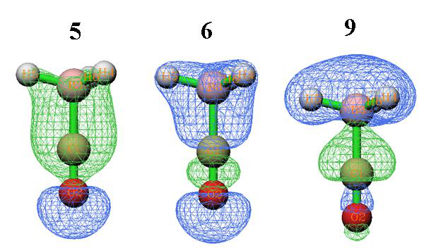
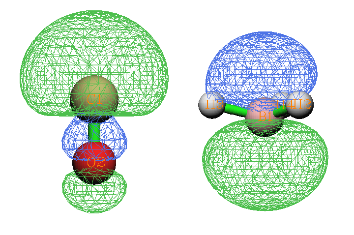
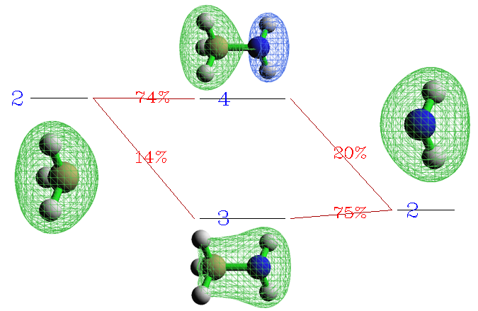
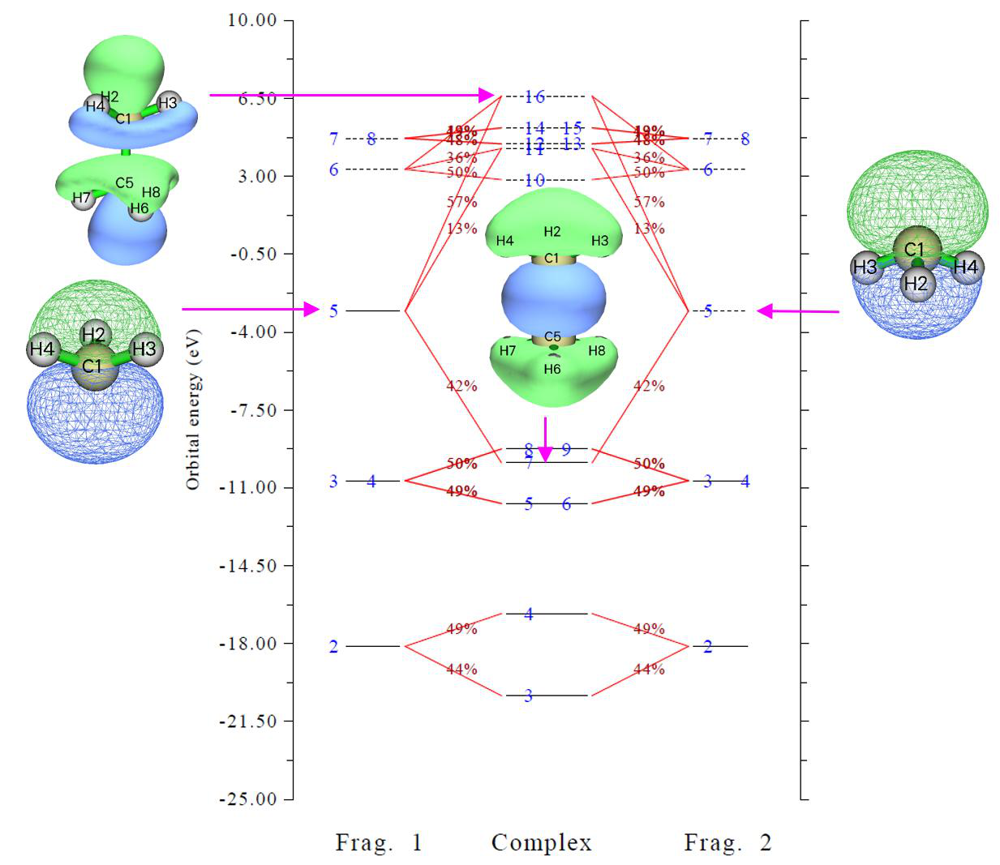

# 电荷分解分析与轨道相互作用图的绘制(Charge decomposition analysis and plotting orbital interaction diagram)

> Multiwfn manual, p.765–774.英文原文见同名 English 章节。 Images: `../imgs/`.

---

<!-- p.765 -->


## 4.16 电荷分解分析与轨道相互作用图的绘制(Charge decomposition analysis and plotting orbital interaction diagram)

注：本节的中文是我的博客文章“使用Multiwfn进行电荷分解分析(CDA)并绘制轨道相互作用图”（http://sobereva.com/166，中文），其中还包含更多讨论。

电荷分解分析(CDA)、扩展CDA(ECDA)和广义CDA(GCDA, J. Adv. Phys. Chem., 4, 111-124 (2015) DOI: 10.12677/JAPC.2015.44013)的理论以及CDA模块的用法，已在3.19节中详细介绍。本节我将给出几个实际例子。

CDA模块支持.fch、.mwfn、.molden、GAMESS-US输出文件(.gms)和Gaussian输出文件作为输入。在接下来几节中仅使用Gaussian的.fch文件来示例CDA模块的用法。

### 4.16.1 闭壳层相互作用情形：COBH3

在COBH3中，CO利用其孤对电子与缺电子体系BH3（Lewis酸）形成配位键。因此，在配合物形成过程中电子将从CO转移到BH3。在本例中我们将采用CDA方法对电子转移进行更深入的分析。

首先，我们为CO（片段1）、BH3（片段2）和COBH3（配合物）生成Gaussian输出文件。.fch文件和相应的输入文件已提供在"examples\CDA\COBH3"文件夹中。计算在HF/6-31G*水平下进行。关于如何准备用于CDA的输入文件，详见3.19.2节

现在启动Multiwfn，并输入以下内容：examples\CDA\COBH3\COBH3.fch // 配合物的Gaussian .fch文件 16 // 进入CDA模块(Enter CDA module) 2 // 我们定义两个片段(We define two fragments) examples\CDA\COBH3\CO.fch // 片段1的Gaussian .fch文件 examples\CDA\COBH3\BH3.fch // 片段2的Gaussian .fch文件 随即，以下CDA结果输出到屏幕上


```text
   Orb.      Occ.          d           b        d - b          r
      1    2.000000   -0.000004   -0.000000   -0.000004   -0.000001
      2    2.000000    0.001119   -0.000023    0.001141    0.000326
      3    2.000000   -0.000002   -0.000471    0.000469    0.000313
      4    2.000000   -0.013250   -0.000704   -0.012546   -0.005676
      5    2.000000    0.041648   -0.003309    0.044957    0.232262
      6    2.000000    0.037385   -0.020136    0.057521    0.212422
      7    2.000000   -0.000543    0.000647   -0.001190    0.022166
      8    2.000000   -0.000543    0.000647   -0.001190    0.022166
      9    2.000000    0.171353    0.026952    0.144401   -0.741381
     10    2.000000   -0.000569    0.043713   -0.044281   -0.038916
     11    2.000000   -0.000569    0.043713   -0.044282   -0.038916
```


<!-- p.766 -->


```text
     13    0.000000    0.000000    0.000000    0.000000    0.000000
     14    0.000000    0.000000    0.000000    0.000000    0.000000
     15    0.000000    0.000000    0.000000    0.000000    0.000000
 ......
-------------------------------------------------------------------
Sum:      22.000000    0.236023    0.091027    0.144996   -0.335233
```

"Orb."表示配合物轨道的序号；"occ."是相应的占据数。"d(i)"表示通过相应的配合物轨道从片段1施舍(donate)给片段2的电子量，"b(i)"表示通过相应的配合物轨道从片段2反馈(back donate)给片段1的电子量。"r(i)"对应于在相应配合物轨道中两个片段的占据片段轨道(FO)之间的重叠布居；其正负号意味着在该配合物轨道中，占据FO的电子分别累积到两个片段之间的重叠区和从重叠区耗尽（主要由于Pauli排斥）。r(i)之和即-0.335，表明占据FO之间的排斥效应主导了整体相互作用，导致相应电子从重叠区移向非重叠区。

d(i)与b(i)之差在某种程度上可视为由于相应配合物轨道形成而从片段1向片段2净转移的电子数。但请记住，该值中还包含了电子极化效应。

从数据可以看出，前三个配合物轨道的b、d和r值几乎为零，这是因为它们分别是O、C和B的芯轨道，因此可以预期它们不参与成键。虚拟配合物轨道的b、d和r项恰好为零，因为它们的占据数恰好为零。轨道9导致0.171个电子从CO施舍给BH3，这是施主-受体成键的主要来源，并导致高达0.741个电子从CO与BH3之间的重叠区移走，这通过减小电子排斥而稳定了配合物。轨道5和6对电子施舍有较小贡献，同时导致各自占据FO的电子明显累积到重叠区，这必定有利于两个片段之间的成键。轨道10和11是π轨道且能量简并，表现出π-反馈特征。

轨道9、5和6的等值面如下所示。如你所见，在轨道9中CO与BH3之间的重叠区出现了一个节点，而轨道5和6的等值面均匀覆盖了重叠区。这些观察很大程度上解释了为什么r(9)是一个大的负值，而r(5)和r(6)是明显的正值。


<!-- p.767 -->


注意Multiwfn中使用的CDA定义是我提出的广义版本，因此CDA也适用于后HF和开壳层情形，详见3.19.1节相应部分。对于原始CDA适用的情形（即片段用MO、配合物用MO或自然轨道），广义CDA产生的d和b项与原始定义产生的完全相同，而r项恰好是原始定义产生的两倍。

注：COBH3的例子也在CDA原始文献中给出，其中尽管d、b和r的公式是正确的，但例子中的数据是不正确的：所有数据都应除以二。我还发现Dapprich和Frenking编写的CDA程序以及AOMix程序的所有结果都应除以二。因此，如果你想将Multiwfn计算的CDA结果与它们比较，应先将d和b项乘以二。但不要对r项这样做，因为Multiwfn计算的r项相对于其原始定义已经加倍。

两个片段之间净电子转移量可以用b-d项表征，但有人认为ECDA是计算净电子转移量更合理的方法，因为它完全排除了电子极化效应(PL)的贡献。ECDA结果在CDA结果之后输出：


```text
     ========== Extended Charge decomposition analysis (ECDA) ==========
  Contribution to all occupied complex orbital:
Occupied, virtual orbitals of fragment  1:     680.4194%         8.0593%
Occupied, virtual orbitals of fragment  2:     390.3988%        21.1226%
  Contribution to all virtual complex orbital:
Occupied, virtual orbitals of fragment  1:      19.5806%      2291.9407%
Occupied, virtual orbitals of fragment  2:       9.6012%      1678.8774%
PL( 1) + CT( 1-> 2) =    0.3916      PL( 1) + CT( 2-> 1) =    0.1612
PL( 2) + CT( 1-> 2) =    0.4225      PL( 2) + CT( 2-> 1) =    0.1920
The net electrons obtained by frag. 2 = CT( 1-> 2) - CT( 2-> 1) =    0.2304
```

通常，你只需关注最后一行。数据显示从片段1向片段2净转移的电子数为0.2304。

在屏幕上出现的菜单中，通过选项2可以输出特定配合物轨道的FO组成。这里我们选择该选项并输入9，配合物轨道9的组成如下所示




<!-- p.768 -->


```text
Occupation number of orbital     9 of the complex:  2.00000000
Orbital     7 of fragment  1, Occ: 2.00000    Contribution:   25.8560%
Orbital    13 of fragment  1, Occ: 0.00000    Contribution:    1.0798%
Orbital     2 of fragment  2, Occ: 2.00000    Contribution:   57.2921%
Orbital     5 of fragment  2, Occ: 0.00000    Contribution:   14.5640%
```

仅显示对配合物轨道贡献≥1%的FO（阈值可通过`settings.ini`中的"compthresCDA"修改）。如前所述，从CO到BH3的电子转移主要归因于配合物轨道9，因此从上述数据我们可以推断，CO→BH3电子转移的本质在很大程度上可解释为CO的FO 7（占据轨道）与BH3的FO 5（虚拟轨道）之间的混合。将这两个FO的形状（见下）与上面给出的配合物轨道9的形状比较也可以证实这一观点。

注：有时少数FO的贡献可能为负，这是Mulliken分析众所周知的缺点，CDA模块中计算配合物轨道组成采用的正是该方法。由于负值的幅度通常很小，你可以直接忽略它们。

我们还可以将一个配合物轨道的d、b、r项直接分解为FO对贡献，让我们对配合物轨道9这样做。现在输入0返回上一级菜单，选择选项6并输入9，然后输入阈值如0.005，则所有对d、b、r任一项贡献大于0.005的FO对都会被打印：


```text
FragA Orb(Occ.)  FragB Orb(Occ.)      d           b        d - b          r
   4( 2.0000)       2( 2.0000)    0.000000    0.000000    0.000000   -0.009969
   7( 2.0000)       1( 2.0000)    0.000000    0.000000    0.000000   -0.005759
   7( 2.0000)       2( 2.0000)    0.000000    0.000000    0.000000   -0.723845
   7( 2.0000)       5( 0.0000)    0.176503    0.000000    0.176503    0.000000
   7( 2.0000)       8( 0.0000)    0.006221    0.000000    0.006221    0.000000
   7( 2.0000)      11( 0.0000)    0.005846    0.000000    0.005846    0.000000
   7( 2.0000)      12( 0.0000)   -0.023941    0.000000   -0.023941    0.000000
  13( 0.0000)       2( 2.0000)    0.000000    0.021958   -0.021958    0.000000
```

从输出可以清楚地看到，CO的FO 7与BH3的FO 5之间的混合贡献了配合物轨道9的大部分d项。

最后，我们绘制轨道相互作用图。输入0返回上一级菜单，然后选择5进入绘制轨道相互作用图的菜单(Plot orbital interaction diagram)。选择选项3并输入-30,10，将图的能量下限和上限分别设为-30eV和10eV。然后选择选项1在默认设置下绘制该图，屏幕上会弹出一个图形：




<!-- p.769 -->


在上图中，占据和虚拟轨道分别用实线和虚线条表示。轨道序号用蓝色文本标注。如果同一条带中出现两个或多个标签，如7和8，意味着这些轨道能量简并。如果一个FO在配合物轨道中的组成大于10%，则相应的两条带将用红线连接，组成标注在线上。通过简单查看该图我们可以直接理解COBH3的MO是如何由CO和BH3的FO构建的。例如，配合物轨道7和8在此图中仅与CO的FO 5和6连接，因此我们立即知道这两个轨道在配合物形成过程中基本保持不变。事实上，它们是CO的π轨道，当然它们不能参与CO与BH3之间的σ型施主-受体相互作用。

有许多选项用于调整绘图参数（如标签大小、绘制和连接条带的规则、组成标签位置、能量范围），请尝试它们，并重新绘制图形以查看其效果。

### 4.16.2 开壳层相互作用情形：CH3NH2

在本例中，我用CH3NH2来说明如何对两个片段以共价方式（开壳层相互作用）相互作用的配合物进行CDA。

首先，我们需要为CH3（片段1）、NH2（片段2）和CH3NH2（配合物）生成Gaussian输出文件。对于片段1和2，在本例中我们使用非限制B3LYP方法；而对于配合物，由于这是闭壳层体系，我们使用限制B3LYP方法（也可以使用非限制B3LYP，CDA结果将相同）。.fch文件和相应的输入文件可在"examples\CDA\CH3NH2"文件夹中找到，几何结构已预先

在B3LYP/6-31G**水平下优化。


<!-- p.770 -->


注意CH3和NH2都有5个alpha和4个beta电子，而CH3NH2有9个alpha和9个beta电子。显然，两个片段中的alpha和beta电子总数即5+5和4+4，与配合物的不匹配。因此，我们必须翻转一个片段（CH3或NH2均可）的电子自旋。在本例中，我们将翻转NH2的电子自旋，即交换其所有关于alpha和beta电子的信息。

启动Multiwfn并输入以下内容：examples\CDA\CH3NH2\CH3NH2.fch // 配合物的Gaussian输出文件 16 // 进入CDA模块(Enter CDA module) 2 // 我们定义两个片段(We define two fragments) examples\CDA\CH3NH2\CH3.fch // 片段1的Gaussian输出文件 examples\CDA\CH3NH2\NH2.fch // 片段2的Gaussian输出文件 n // 不翻转片段1的电子自旋(Do not flip electron spin) y // 翻转片段2的电子自旋(Flip electron spin)，则NH2将有4个alpha和5个beta电子。CDA和ECDA结果将分别对alpha电子和beta电子计算并打印在屏幕上。如你所见，对于alpha（beta）部分，d - b和CT(1->2) - CT(2->1)项均为正（负），表明alpha（beta）电子从CH3转移到NH2（从NH2转移到CH3）。这主要是因为CH3的alpha电子（5个）多于beta电子（4个），而翻转电子自旋后NH2的beta电子（5个）多于alpha电子（4个），因此当它们结合形成CH3NH2时，CH3倾向于向NH2施舍alpha电子并从NH2接受beta电子。

总电子的结果即alpha和beta结果之和也被输出。下面分别是CDA和ECDA的总结果


```text
d=  0.044335  b=  0.145181  d - b = -0.100847  r= -0.172318
CT( 1-> 2) - CT( 2-> 1) for all electrons:    0.1252
```

显然电子应从CH3转移到NH2，因为氮的电负性明显更大。总的ECDA结果符合我们的预期，显示从CH3向NH2转移的电子量为0.1249。然而，d - b项与我们的预期冲突，转移方向完全反转。该例说明对于开壳层相互作用，d - b项不如ECDA可靠，不能很好揭示净电子转移总量，尽管d和b项对于将电子转移分解为轨道贡献仍然非常有用。

如果你在载入它们的Gaussian输出文件时选择翻转CH3而非NH2的电子自旋，你会看到CDA和ECDA的alpha和beta结果互换，但总电子的结果保持不变。

现在选择2并输入6，你将看到配合物的第6 alpha轨道和第6 beta轨道的组成都打印在屏幕上。虽然配合物是闭壳层体系因此这两个轨道本质上相同，但由于两个片段中的alpha和beta FO不等价，打印的组成略有差异。然后输入0返回。

选择选项5进入绘制轨道相互作用图的菜单(Plot orbital interaction diagram)。通过该菜单中的选项5，你可以切换将要绘制的轨道的自旋。我们选择它一次将状态切换为"Beta"，然后选择选项3并输入-30,10，将图的下限和上限分别改为-30和10 eV。然后选择选项1绘制轨道

<!-- p.771 -->


相互作用图(Interaction diagram)。从图中可以非常清楚地看到CH3NH2的beta轨道3和4是由CH3中的beta FO 2与NH2中的beta FO 2混合形成的。为了更直观地说明这一点，从整图中截取了相应部分，并附上了轨道等值面，见下

可以看到beta配合物轨道3显示成键特征（这就是为什么r(3)为正值即0.103），它由CH3的beta FO 2以相同波函数相位轻微混入NH2的beta FO 2而构建。Beta配合物轨道4是反键轨道（这解释了为什么r(4)为负值即-0.056），其形成是由于NH2的beta FO 2以不同相位混入CH3的beta FO 2。

### 4.16.3 多于两个片段的情形：Pt(NH3)2Cl2

在本节中我以顺铂（见下）为例展示如何对由多于两个片段组成的体系进行CDA分析。

我们将Pt2+阳离子、(Cl2)2-阴离子和(NH3)2分别定义为片段1、2和3。这种片段定义是当前体系的最佳选择。注意Pt2+阳离子处于3d8低自旋组态，因此所有片段都处于闭壳层状态，从而我们无需分别分析alpha和beta自旋。

相关的Gaussian输入文件和生成的.fch文件已提供在examples\CDA\Pt(NH3)2Cl2文件夹中。对Pt使用Lanl2DZ赝势基组，对其它原子使用cc-pVDZ。理论方法选择B3LYP泛函。配合物的几何结构已经优化。在Pt2+的输入文件中，使用了"scf=xqc"关键词以解决不收敛问题，但一般情况下不需要。

注1：对于某些类型的基组，如Pople系列基组（如6-31G*），默认情况下Gaussian采用笛卡尔型基函数而非球谐基函数，这可能导致配合物与片段计算之间的基组不一致问题。如果你对Gaussian不是很熟悉，我强烈建议在配合物计算使用混合基组时，在所有Gaussian输入文件中始终加上5d关键词。

注2：片段的顺序至关重要。因为在配合物的输入文件中，原子顺序是





<!-- p.772 -->


Pt--Cl2--(NH3)2，我们不应例如将Pt2+、(NH3)2和(Cl2)2-分别定义为片段1、2和3。

现在启动Multiwfn并输入：examples\CDA\Pt(NH3)2Cl2\Pt(NH3)2Cl2.fch // 配合物(Complex) 16 // CDA模块(CDA module) 3 // 定义三个片段(Define three fragments) examples\CDA\Pt(NH3)2Cl2\Pt.fch // 片段1(Fragment 1) examples\CDA\Pt(NH3)2Cl2\Cl2.fch // 片段2(Fragment 2) examples\CDA\Pt(NH3)2Cl2\(NH3)2.fch // 片段3(Fragment 3) 然后选择选项0并输入1,2以输出片段对1-2的CDA分析结果。类似地，我们得到片段对1-3和2-3的CDA结果。我们无法得到当前体系的ECDA结果，因为ECDA仅适用于两片段情形。总的CDA结果总结如下。

1-2 1-3 2-3

d 0.0017 0.0077 0.0538 b 0.5156 0.0368 0.0071 d-b -0.5139 -0.0291 0.0467 r 0.0581 -0.0579 -0.1415

该表显示分别有0.5156和0.0368个净电子从(Cl2)2-和(NH3)2转移到Pt2+。基本上，没有电子从Pt2+施舍给其配体。该结果符合我们的化学直觉，因为根据经典理论，配位键的电子纯粹由配体贡献。(Cl2)2-与(NH3)2之间的电荷转移微不足道，主要由于它们之间没有直接化学相互作用。注意片段2与3之间的r项是一个小但不可忽略的负值，表明配体之间存在可察觉的电子排斥效应。

对该体系更深入的分析留给你。你可以基于CDA分析的详细输出讨论轨道对电荷转移的贡献，使用选项2研究配合物轨道在片段轨道基下的组成，使用选项5绘制轨道相互作用图。


### 4.16.4 基于限制性开壳层波函数的CDA分析：乙烷(CDA analysis based on restricted open-shell wavefunction: ethane)

通常在CDA分析中对开壳层体系（配合物和/或片段）使用非限制(U)形式，因为U比限制性开壳层(RO)形式更便宜更快。然而，使用RO波函数进行CDA分析的优点是无需显式区分alpha和beta轨道，因为RO只产生单套轨道；换句话说，alpha和beta轨道具有完全相同的形状。在本节中，我说明如何正确地基于RO波函数进行CDA分析。以乙烷为例，两个甲基将被选为两个片段。

首先，我们在(R)B3LYP/6-31G*水平下优化乙烷，相应的Gaussian输入文件是examples\CDA\CH3CH3\ethane.gjf，输出文件也已提供，相应的经formchk工具转换得到的.fch文件是同一文件夹中的ethane.fch。我们从优化的乙烷中提取两个甲基的坐标并分别保存为两个Gaussian输入文件，即“examples\CDA\CH3CH3\”文件夹中的CH3_1.gjf和CH3_2.gjf；如


<!-- p.773 -->


你所见，它们的计算水平是ROB3LYP/6-31G*。运行这两个.gjf文件并经formchk转换.chk文件后，我们得到CH3_1.fch和CH3_2.fch。

尽管你可以直接像往常一样使用ethane.fch、CH3_1.fch和CH3_2.fch进行CDA分析（因为它们都不是非限制波函数，CDA将以闭壳层形式进行），你会发现CDA结果不正确，因为两个甲基片段都被视为具有5个alpha和4个beta电子。

为了正确地基于RO波函数进行CDA分析，你应手动将RO波函数转换为U波函数；换句话说，将RO轨道拆分为alpha和beta自旋轨道。作为例子，我们对CH3_1.fch进行此转换。启动Multiwfn并输入

examples\CDA\CH3CH3\CH3_1.fch 6 // 修改波函数(Modify wavefunction) 37 // 将空间轨道（当前语境中的RO轨道）拆分为alpha和beta自旋轨道(Split spatial orbitals as alpha and beta spin orbitals) -1 // 返回(Return) 100 // 其它功能（第一部分）(Other functions (Part 1)) 2 // 将当前波函数导出为文件(Export current wavefunction to a file) 7 // 导出为.fch文件(Export to .fch file) CH3_1_UKS.fch // 新文件的名称(Name of new file) CH3_1_UKS.fch记录了UKS波函数，其中包括形状和能量相同但占据数不同的alpha和beta轨道。类似地，请以同样方式将CH3_2.fch转换为CH3_2_UKS.fch。

现在我们可以进行CDA分析。启动Multiwfn并输入examples\CDA\CH3CH3\ethane.fch 16 // CDA 2 // 两个片段(Two fragments) examples\CDA\CH3CH3\CH3_1_UKS.fch examples\CDA\CH3CH3\CH3_2_UKS.fch n // 不翻转片段1的自旋(Do not flip spin) y // 翻转片段2的自旋(Flip spin) 结果是：


```text
                     **** Result for alpha electrons ****

    Orb.      Occ.          d           b        d - b          r
       1    1.000000   -0.000018   -0.000036    0.000018   -0.000201
       2    1.000000    0.000406    0.000237    0.000169    0.000750
[ignored]
      13    0.000000    0.000000    0.000000    0.000000    0.000000
  ......
 -------------------------------------------------------------------
 Sum:       9.000000    0.154365   -0.001225    0.155589   -0.137034

                     **** Result for beta electrons ****

    Orb.      Occ.          d           b        d - b          r
       1    1.000000   -0.000036   -0.000018   -0.000018   -0.000201
```


<!-- p.774 -->


```text
       2    1.000000    0.000237    0.000406   -0.000169    0.000750
[ignored]
      13    0.000000    0.000000    0.000000    0.000000    0.000000
  ......
 -------------------------------------------------------------------
 Sum:       9.000000   -0.001225    0.154365   -0.155589   -0.137034
```

根据关于化学键的常识，第一个CH3用其alpha未成对电子与另一个CH3的beta未成对电子形成C-C键。从CDA角度看，如上所示，在C-C键形成过程中，第一个CH3向第二个CH3的未占据alpha轨道转移了0.155个alpha电子，而第二个CH3向第一个CH3的未占据beta轨道转移了0.155个beta电子。该结果看起来合理且符合化学直觉。

然后我们绘制轨道相互作用图。输入以下命令 5 // 绘制轨道相互作用图(Plot orbital interaction diagram) 3 // 设置要绘制的能量范围(Set the energy range) -25,10 // 从-25到10 eV，经发现适合当前情形(From -25 to 10 eV) 1 // 现在绘制该图(Plot the diagram now) 现在你可以看到（还附上了一些MO图）

从上图你可以清楚地识别成键轨道是如何由两个片段的MO混合生成的。该图当前是针对alpha自旋绘制的，而由于当前情形中alpha和beta MO本质上相同（片段的两套自旋轨道如我们之前所做是从ROKS轨道等同拆分而来，而配合物的两套自旋轨道在CDA分析过程中由RKS轨道等同拆分自动生成），针对beta自旋绘制的图与上图相同；唯一细微差别是在beta自旋的图中



