# 盆分析(Basin analysis)

> Multiwfn manual, p.775–803.英文原文见同名 English 章节。 Images: `../imgs/`.

---

<!-- p.775 -->


自旋(Spin)，你可以发现片段1的轨道5的条带是虚线（未占据）而片段2的是实线（占据）。事实上，无需将alpha和beta轨道相互作用图视为两个不同图，你可以认为实际上只有一个轨道相互作用图，其中片段1和2的轨道1~4是双占据的，而片段1的轨道5是未成对alpha电子轨道，片段2的轨道5是未成对beta电子轨道。

值得注意的是，如果你基于ROKS片段轨道绘制此轨道相互作用图，你会发现对于每种自旋，尽管两个甲基化学等价，配合物轨道并不总是被两个片段的片段轨道等同贡献，这是因为alpha和beta ROKS轨道不具有相同的能量和形状。显然，基于ROKS轨道分析比基于UKS轨道明显更容易，对后者你必须分别研究alpha和beta自旋的相互作用图。


## 4.17 盆分析(Basin analysis)

注：本节中的一些例子也可在我的博客文章“使用Multiwfn进行电子密度、ELF、静电势、密度差及其它函数的盆分析”（http://sobereva.com/179，中文）中找到。

下面我将展示如何使用Multiwfn的盆分析模块对几个分子和各种实空间函数进行盆分析。相关理论、数值算法及该模块的用法已在3.20节中详细介绍。如果你对盆的概念不熟悉，请先查阅3.20.1节。而如果你想了解关于盆分析的更多细节，请查阅3.20.2和3.20.3节。

你应该知道Multiwfn使用基于网格的方法（特别是近网格方法）来定位吸引子、生成和积分盆；换句话说，盆分析模块中实现的大多数任务都依赖于网格数据。这就是为什么在下面几节中频繁提到"网格数据"。

### 4.17.1 HCN和Li6的AIM盆分析(AIM basin analysis for HCN and Li6)

在本例中我们将分析HCN分子的电子密度盆（也称为AIM盆），这是一个非常有代表性的分子。仅在本节最后部分，我还将展示如何对Li6原子簇进行电子密度盆分析，因为这是一个特殊情形，其中存在一些"伪原子"。

仔细阅读本节后，我相信你将理解Multiwfn中盆分析模块的大多数基本操作。

生成盆并定位吸引子(Generate basins and locate attractors) 启动Multiwfn并输入以下命令 examples\HCN.wfn

!!! terminal "Multiwfn 交互"

    - **17** — 盆分析(Basin analysis)
    - **1** — 生成盆并定位吸引子(Generate basins and locate attractors)
    - **1** — 要计算并从而分析的网格数据是电子密度(The grid data to be calculated)
    - **2** — 中等质量网格(Medium-quality grid)。这对大多数情形已足够，如果你想获得更好结果，可以选择"高质量网格(High-quality grid)"，但将花费更多计算时间


<!-- p.776 -->


Multiwfn现在开始计算电子密度的网格数据，然后基于网格数据生成盆并定位吸引子；很快你将看到吸引子信息，如下所示（注意如果启用了并行模式，吸引子顺序可能与你的实际情况不同，下同）：


```text
Attractor       X,Y,Z coordinate (Angstrom)                Value
    1   -0.02645886   -0.02645886   -1.52058663          0.33959944
    2    0.02645886    0.02645886   -0.51514986         49.48609717
    3   -0.02645886   -0.02645886    0.64904009         76.55832377
```

从现在起你可以通过选项-3随时查看已定位吸引子的信息。

盆和吸引子的可视化(Visualization of basins and attractors) 现在选择选项0以可视化盆和吸引子。紫色标签指示已定位吸引子的序号。由于电子密度的吸引子非常接近原子核，如果你想看到它们，应先取消选中"显示分子(Show molecule)"复选框。这里我们从右下角的盆列表中选择1，对应于吸引子1的盆将立即显示。默认情况下，仅显示盆的盆间部分，如果你想检查整个盆应选中"显示盆内部(Show basin interior)"复选框。选中后，GUI将如下所示：

如果你只想可视化vdW表面（当前语境中定义为

ρ=0.001 a.u.）内的原子盆区域，你可以选择"设置盆绘制方法(Set basin drawing method)" - "仅rho>0.001区域(rho>0.001 region only)"，然后你可以看到：


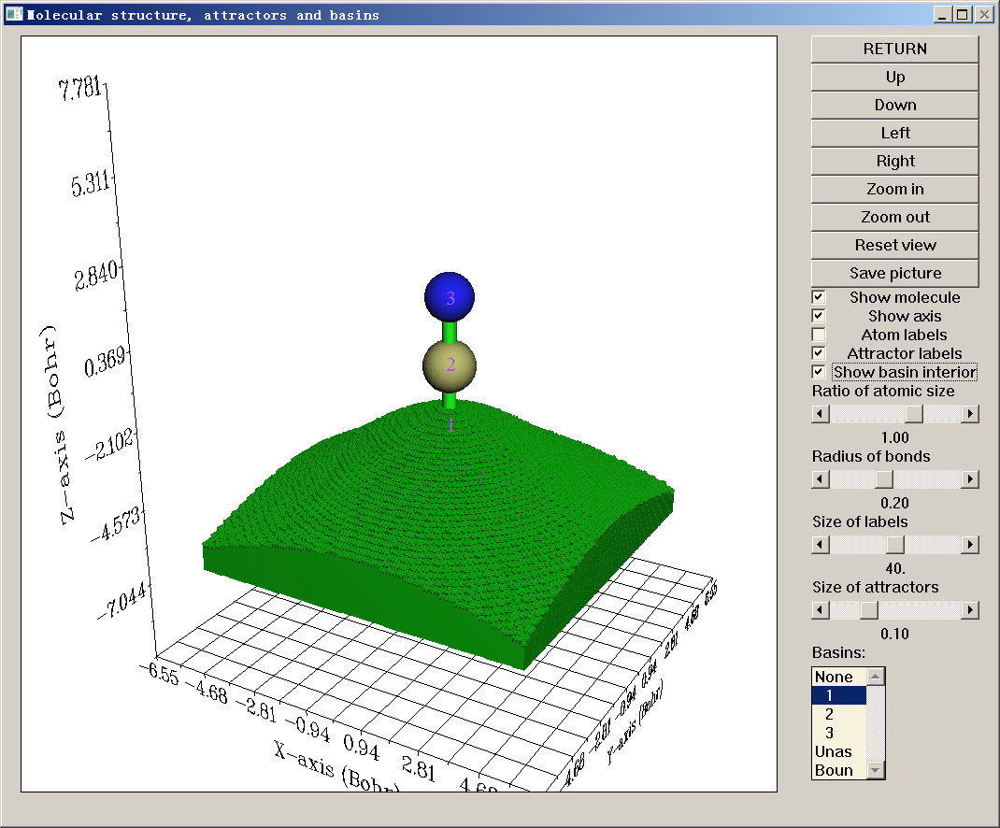

<!-- p.777 -->


现在点击"返回(RETURN)"按钮关闭GUI。你可能已注意到命令行窗口中的以下信息


```text
The number of unassigned grids:           0
The number of grids travelled to box boundary:           0
```

通常这两类网格的数量应为零，仅在罕见情况下不为零；在这种情况下，你可以通过在GUI的盆列表中分别选择"Unas"和"Boun"来可视化它们。这些网格不属于任何盆，一般没有物理意义；要理解它们何时以及为何出现请查阅3.20.2节。

积分盆(Integrating basins) 接下来，我们计算这些盆中电子密度的积分（电子布居数）。

选择功能2，然后你将看到许多选项。每个序号≥1的选项对应一个实空间函数；如果你选择其中之一，相应的实空间函数将在已生成的盆中积分。在本例中我们可以选择选项1，其对应于电子密度。然而，由于我们已经计算了电子密度的网格数据，且电子密度的网格数据已存储在内存中，我们可以直接使用它而不必重新计算以减少计算时间，因此这里我们选择选项0以使用"存储在内存中的网格数据的值(The values of the grid data stored in memory)"。由于网格处的电子密度无需重新计算，积分立即输出：


```text
  #Basin        Integral(a.u.)      Volume(a.u.^3)
      1          0.7356142812        441.70000000
      2          5.3511723358        566.84900000
      3          7.9020047534        829.72600000
Sum of above values:         13.98879137
```

当前体系中总共应有1+6+7=14个电子；不幸的是，电子密度积分之和为13.98879，明显偏离理想值！

因为我们研究的盆是AIM盆，获得盆积分的最佳选择是使用功能7而非功能2。在功能7中，使用混合原子中心和均匀网格，而功能2仅使用均匀网格进行积分。我们输入：

!!! terminal "Multiwfn 交互"

    - **7** — 在AIM盆中用混合型网格积分实空间函数(Integrate real space functions in AIM basins)
    - **1** — 用原子中心+均匀网格积分特定函数(Integrate a specific function)
    - **1** — 选择电子密度作为被积函数(Select electron density) 结果是


```text
   #Basin        Integral(a.u.)      Vol(Bohr^3)    Vol(rho>0.001)
       1          0.7356461300         441.710          34.884
```


<!-- p.778 -->


```text
       2          5.3552275427         566.347         102.832
       3          7.9086499057         830.218         134.228
 Sum of above integrals:         13.99952358
 Sum of basin volumes (rho>0.001):     271.944 Bohr^3
```

如你所见，电子密度积分之和（13.999）几乎与期望值14.0完全相同，显然结果比使用功能2好得多。盆体积也被输出。"vol(Bohr^2)"项没有明确物理意义，因为它们直接受网格设置空间范围影响。然而，"vol(rho>0.001)"项有用，它们显示了由电子密度>0.001等值面（Bader的vdW表面）包围的盆体积，因此可视为原子大小。

这些原子的原子电荷（AIM电荷）及其体积也被输出


```text
Normalization factor of the integral of electron density is    0.999966
The atomic charges after normalization and atomic volumes:
     1 (C )    Charge:    0.644590     Volume:   102.832 Bohr^3
     2 (N )    Charge:   -0.908919     Volume:   134.228 Bohr^3
     3 (H )    Charge:    0.264329     Volume:    34.884 Bohr^3
```

注意上述AIM电荷不是很精确！为了在AIM盆中获得更精确的积分，你应在功能7中选择选项2或3；与1相比，它们将细化盆边界的归属以显著提高积分精度，但必须付出额外计算成本。这里我们试一下，在功能7中选择选项2，然后输入1，结果是


```text
Normalization factor of the integral of electron density is    0.999967
The atomic charges after normalization and atomic volumes:
     1 (C )    Charge:    0.748980     Volume:   100.160 Bohr^3
     2 (N )    Charge:   -1.003918     Volume:   136.304 Bohr^3
     3 (H )    Charge:    0.254938     Volume:    35.480 Bohr^3
```

可见原子电荷与之前相比发生了变化（比之前更精确）。

为了进一步提高积分精度，在生成盆时应选择比"中等质量网格"更好的网格设置，如"高质量网格(High-quality grid)"甚至"超高精度网格(Lunatic quality grid)"。但请记住对于大体系，高质量网格可能消耗非常大量的计算时间和内存，超高精度网格需要更多。

尽管如我们所见功能7（均匀+原子中心积分网格）的积分精度远好于功能2（纯均匀积分网格），前者仅适用于积分AIM盆，而后者可用于任何类型的盆（如ELF盆）。

注：如果你在功能7中使用了选项2或3，在边界网格细化过程中，盆边界的归属将被永久更新，这意味着后续分析（如计算LI/DI、电多极矩）的结果也将变得更精确。

总之，在你进入盆分析模块后获得可靠AIM电荷的常见步骤是

!!! terminal "Multiwfn 交互"

    - **1** — 生成盆(Generate basin)
    - **1** — 电子密度(Electron density)
    - **2** — 中等质量网格(Medium-quality grid)。若希望得到更精确结果请选择高质量网格(High-quality grid)
    - **7** — 在AIM盆中用混合型网格积分实空间函数(Integrate real space functions in AIM basins)
    - **2** — 积分同时细化盆边界(Integrate and refine basin boundary)
    - **1** — 电子密度(Electron density) 在Multiwfn中计算AIM电荷最方便的方式就是简单地选择

<!-- p.779 -->


如4.7.11节所示的主功能7的子功能14！它会自动执行上述所有步骤。

计算盆的电多极矩 现在进入功能8，使用混合网格计算AIM盆的电多极矩（你也可以使用功能3基于均匀网格来做，但精度会显著较差）。下面仅粘贴碳的结果

```text
*****  Result of atom     1 (C ), corresponding to basin     2
Basin monopole moments (from electrons):   -5.250848
Atomic charge:    0.749152
Basin dipole moments:
X=    0.000003  Y=    0.000000  Z=    1.095848  Norm=    1.095848
Basin electron contribution to molecular dipole moment:
X=    0.000003  Y=    0.000000  Z=    6.026238  Norm=    6.026238
Basin quadrupole moments (Traceless Cartesian form):
XX=   -0.759567  XY=    0.000000  XZ=   -0.000002
YX=    0.000000  YY=   -0.759565  YZ=   -0.000005
ZX=   -0.000002  ZY=   -0.000005  ZZ=    1.519132
Magnitude of the traceless quadrupole moment tensor:    1.519132
Basin quadrupole moments (Spherical harmonic form):
Q_2,0 =   1.519132   Q_2,-1=  -0.000006   Q_2,1=  -0.000002
Q_2,-2=   0.000000   Q_2,2 =  -0.000001
Magnitude: |Q_2|=    1.519132
Basin electronic spatial extent <r^2>:        8.542655
Components of <r^2>:  X=       3.353930  Y=       3.353928  Z=       1.834797
```

用于计算这些量的公式与3.18.3节给出的基本相同，只是核位置应替换为吸引子位置，积分的空间范围应为盆而不是模糊原子空间。

电单极矩（-5.251 a.u.）就是盆中电子布居数的负值。盆电偶极矩的Z分量为正值（1.096 a.u.），表明在盆2中，大多数电子分布在比吸引子2的Z坐标更负的区域。盆电四极矩的ZZ分量为正（1.519 a.u.），而其他对角分量为负，表明相对于吸引子2，该盆中的电子云在Z方向上收缩，而在其他方向上伸展。

<r2>反映了原子盆中电子分布的空间扩展。从输出中可以发现该值的顺序为N2（14.37）> H3（1.04）> C1（8.54），表明氮和氢分别具有最宽和最窄的电子空间扩展。

计算盆的定域化指数和离域化指数 离域化指数（DI）是定量衡量两个区域之间离域（或称共享）电子数的指标，而定域化指数（LI）定量衡量定域在某一区域的电子数。关于LI和DI的细节请见3.18.5节。与该节所述相比，唯一的区别在于这里的LI和DI将基于盆计算，而不是基于模糊原子空间计算。

选择功能4，然后选择选项2以使用混合网格计算盆重叠矩阵，随后还会计算LI和DI。从屏幕上可以看到，LI和DI矩阵被输出

<!-- p.780 -->


首先基于盆序号输出，之后，Multiwfn识别原子序号与盆序号之间的对应关系，然后基于原子序号打印LI和DI矩阵，如下所示

```text
Detecting correspondence between basin and atom indices (criterion: <0.3 Bohr)
Basin     2 corresponds to atom     1 (C )
Basin     3 corresponds to atom     2 (N )
Basin     1 corresponds to atom     3 (H )

************** Total delocalization index matrix (atom index) **************
              1             2             3
    1    3.49274177    2.59233062    0.90041116
    2    2.59233062    2.66486431    0.07253370
    3    0.90041116    0.07253370    0.97294485

Total localization index (atom index):
   1:  3.50427    2:  6.67098    3:  0.25855
```

由于当前分子是闭壳层体系，只输出总LI和DI，不分别输出α和β电子的LI和

DI。正如你所见，在C1和N2原子盆之间，DI为2.592，表明这两个原子之间有效共享了2.592个电子。在某种程度上DI可视为共价键级，DI值2.592确实与HCN中C与N之间的形式键级（3.0）相当。对角元是相应行/列元素之和，对于闭壳层情形，它们在某种程度上可视为原子价。因此，我们可以说HCN中的N2原子的原子价为2.665。

H3的LI仅为0.256，与盆电子布居数明显偏离。这一现象反映了在HCN中，氢的AIM原子空间中的电子很容易离域出去。

特殊情形：存在赝原子时的盆分析 赝原子也称为电子密度的非核吸引子（NNA），指不在核位置处的电子密度极大点。NNA可能由多种原因引起，例如，存在金属键或波函数质量太差。这里以Li6团簇为例说明如何处理存在NNA的情形。

!!! terminal "Multiwfn 交互"

    - **启动Multiwfn并输入 examples\Li6.fch 17** — Basin analysis
    - **1** — Generate basins and locate attractors
    - **1** — Electron density
    - **1** — For illustration purposes, here we only use low-quality grid for saving time
    - **0** — Visualize attractors and basins 下图左侧显示了该团簇的几何结构，三个绿色球表示三个NNA的位置；右侧显示了其中一个NNA对应的盆。正如你所见，吸引子2、4、8为NNA。

<!-- p.781 -->


如果你按照4.6.2节所示步骤绘制Li6的价电子密度的颜色填充图，你会立刻理解为什么在边界Li三角形的中心存在NNA。从下图可以清楚看到，在每个边界三角形的中心确实存在电子密度极大，这一现象也意味着三中心键的存在

接下来，我们计算AIM盆的布居数。输入以下命令

!!! terminal "Multiwfn 交互"

    - **7** — Integrate real space functions in AIM basins with mixed type of grids
    - **2** — Integrate and meantime refine basin boundary
    - **1** — Electron density

在积分盆的过程中，计算会暂停三次，同时你会在屏幕上看到如下提示。这是因为程序不知道如何正确处理三个NNA，即吸引子2、4、8：

```text
Warning: Unable to determine the attractor     2 belongs to which atom!
 If this is a non-nuclear attractor, simply press ENTER button to continue. If you used
pseudopotential and this attractor corresponds to the cluster of all maxima of its valence
```

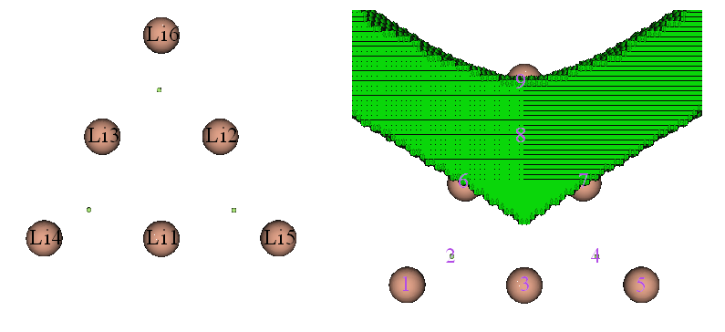

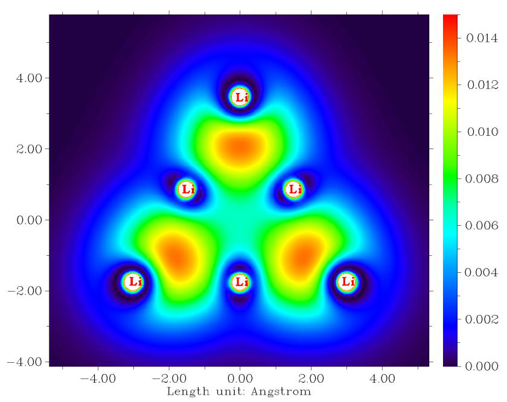

<!-- p.782 -->


```text
electron, then input the index of this atom (e.g. 9). Else you should input q to return
and regenerate basins with smaller grid spacing
```

由于我们已经知道吸引子2、4、8是正常的NNA，根据提示，我们只需按回车键（ENTER）继续计算即可。最后，你会看到以下输出

```text
Normalization factor of the integral of electron density is    0.999992
The atomic charges after normalization and atomic volumes:
     2 (NNA)   Charge:   -1.249592     Volume:   273.680 Bohr^3
     4 (NNA)   Charge:   -1.249536     Volume:   273.680 Bohr^3
     8 (NNA)   Charge:   -1.249079     Volume:   274.048 Bohr^3
     1 (Li)    Charge:    0.757502     Volume:    69.792 Bohr^3
     2 (Li)    Charge:    0.756323     Volume:    70.000 Bohr^3
     3 (Li)    Charge:    0.756331     Volume:    70.000 Bohr^3
     4 (Li)    Charge:    0.492816     Volume:   139.296 Bohr^3
     5 (Li)    Charge:    0.492759     Volume:   139.296 Bohr^3
     6 (Li)    Charge:    0.492477     Volume:   139.392 Bohr^3
```

如可见，每个NNA盆携带1.249个电子，因此盆电荷为-1.249。当存在NNA时，显然无法严格定义AIM原子电荷，因为所有AIM原子电荷之和将不等于整个体系的净电荷。这是AIM原子电荷的严重局限之一。

经由VMD程序绘制盆 在显示盆时，如果利用VMD程序，可以很容易获得更好的图形效果。参见视频说明：“Drawing AIM basins (atomic basins) in Multiwfn and VMD”（https://youtu.be/9D5do80XcbI）。

简而言之，你需要做的是在盆分析模块中选择选项-5，输入感兴趣的盆的序号，然后选择“3 Output all basin grids where electron density > 0.001 a.u.”以将盆作为单独的cube文件导出。然后将它们载入VMD并以等值面(isovalue=0.5)绘制，你就可以得到如下图形（examples\acrolein.wfn的氧盆）：

如上述视频教程所示，你甚至可以在VMD中同时绘制多个盆并显示临界点+键径。例如，下图表示丙烯醛四个非氢原子的原子盆，橙色和紫色球分别对应键临界点和核临界点，黄色粗线为键径。

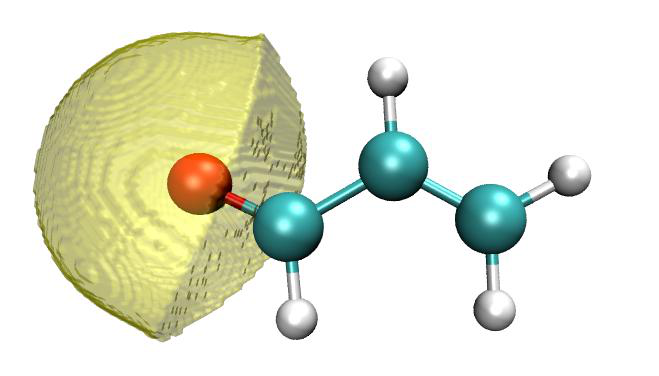

<!-- p.783 -->


### 4.17.2 ELF盆分析示例

Multiwfn在ELF盆分析方面非常强大。作为例子，本节分析一个典型小分子乙炔的ELF盆。启动Multiwfn并输入

!!! terminal "Multiwfn 交互"

    - **examples\C2H2.wfn 17** — Basin analysis
    - **1** — Generate basins and locate attractors
    - **9** — ELF 2

第1部分：可视化吸引子与盆(Visualize attractors and basins) 我们进入选项0以可视化ELF吸引子和盆，你将看到下图。吸引子以绿色球表示，紫色文字为盆序号。你可以发现有许多紧密排列的吸引子环绕着C-C键，它们具有基本相同的ELF值，共同代表环状ELF吸引子。这些吸引子已被Multiwfn自动聚类在一起，因此它们都具有相同的吸引子序号，即2；换句话说，吸引子2是一个简并吸引子，包含许多成员吸引子（或原始吸引子）。相应地，盆2由所有成员盆组成。

你可以在GUI右下角的列表中选择2以可视化盆2，你可以看到


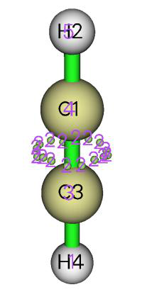

<!-- p.784 -->


有时只可视化电子密度高于0.001 a.u.的盆区域会更好。为此，在菜单栏中选择设置盆绘制方法(Set basin drawing method)，然后选择“rho>0.001 region only”，接着勾选GUI右侧的显示盆内部(Show basin interior)复选框，你将看到

所有对C1-C3键有贡献的电子都位于上图所示的盆2中。

吸引子2的存在标志着被两个碳共享的π电子。根据熟知的ELF符号方案，盆2应标识为V(C1,C3)，这意味着该盆由C1和C3的价电子组成，并对C1-C3键的存在有贡献。

吸引子3和4对应核型ELF吸引子，它们的盆应标识为C(C3)和C(C1)，其中括号外的字母C代表“核(Core)”。如果你取消勾选显示分子(Show molecule)复选框并在盆列表中选择相应项，就可以可视化这些盆。下图所示为C(C3)盆


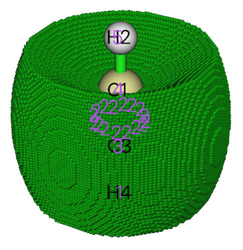

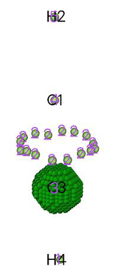

<!-- p.785 -->


尽管盆1和盆5覆盖了H4和H2的原子空间，但它们应标识为V(C3,H4)和V(C1,H2)，而不是C(H4)和C(H2)。这是因为氢没有核电子，且这两个盆中的电子直接对C3-H4和C1-H2键有贡献。

现在点击GUI右上角的返回(RETURN)按钮关闭GUI窗口。

第2部分：自动指定ELF盆标记 当体系相对较大，或有许多结构需要研究时（例如，在键演化理论分析中你需要研究一批IRC点），手动为ELF盆指定标记相当麻烦。幸运的是，只要你选择的实空间函数是ELF，Multiwfn就能够自动指定盆标记。

我们选择选项“12 Assign ELF basin labels”，然后你会立刻看到

```text
The following information is printed according to basin indices
Basin indices, populations (e), volumes (Angstrom^3) and assigned labels
Basin    1  Pop.:  2.2160  Vol.:  113.865  Label: V(C3,H4)
Basin    2  Pop.:  5.3670  Vol.:  144.158  Label: V(C1,C3)
Basin    3  Pop.:  2.0949  Vol.:    0.123  Label: C(C3)
Basin    4  Pop.:  2.0949  Vol.:    0.123  Label: C(C1)
Basin    5  Pop.:  2.2160  Vol.:  113.884  Label: V(C1,H2)

Sum of core basin populations:         4.1898
Sum of valence basin populations:      9.7990
Sum of all basin populations:         13.9888

Sorting basins according to labels...
The following information is printed according to order of basin labels
Basin indices, populations (e), volumes (Angstrom^3) and assigned labels
##    1  Basin    4  Pop.:  2.0949  Vol.:    0.123  Label: C(C1)
##    2  Basin    3  Pop.:  2.0949  Vol.:    0.123  Label: C(C3)
##    3  Basin    5  Pop.:  2.2160  Vol.:  113.884  Label: V(C1,H2)
##    4  Basin    2  Pop.:  5.3670  Vol.:  144.158  Label: V(C1,C3)
##    5  Basin    1  Pop.:  2.2160  Vol.:  113.865  Label: V(C3,H4)

Number of core basins is     2, their indices:
3,4
Number of  2-synaptic basins is     3, their indices:
1,2,5
```

如上可见，数据被输出了两次。首先，按盆序号顺序打印盆布居数、体积和标记。然后，根据标记对盆排序，并再次输出数据。从标记中，可以快速清楚地认出每个盆的物理意义。

注意，对于使用赝势的原子，ELF盆标记可能无法被正确指定。

第3部分：估算盆性质 Multiwfn能够计算已生成盆中任何实空间函数的积分。例如

<!-- p.786 -->


我们计算每个盆中电子密度的积分，现在输入

!!! terminal "Multiwfn 交互"

    - **2** — Integrate a real space function in the basins
    - **1** — Electron density

很快，我们得到积分，即每个盆中的平均电子布居数：

```text
  #Basin        Integral(a.u.)      Volume(a.u.^3)
      1          2.2159821094        768.40000000
      2          5.3670483807        972.85100000
      3          2.0949016050          0.83200000
      4          2.0949016050          0.83200000
      5          2.2159826437        768.49900000
Sum of above values:         13.98881634
```

C(C1)和C(C3)都平均包含2.095个电子，这与碳在其核中有两个电子的事实一致。此外，V(C3,H4)和V(C1,H2)中的平均布居数接近2，近似反映了平均而言在C与H之间共享一对电子。

根据经典化学键理论，有三对电子、即六个电子被两个碳共享，然而在V(C1,C3)盆中的积分仅为5.37。虽然偏差相对较大，但这是正常情况。指望ELF盆分析的结果必须能够重现经典Lewis图像是没有意义的，实际上，ELF分析更先进，也更接近真实物理图像。

第4部分：盆的电多极矩 ELF盆的电多极矩能够表征特征区域中的电子分布。为了计算它们，我们进入选项“3 Calculate electric multipole moments and <r^2> for basins”。假设我们需要所有盆的结果，根据屏幕提示我们输入-1。每个盆的结果依次输出，盆4的数据如下所示，它对应于C(C1)

```text
***** Basin       4
Basin monopole moment:   -2.094902
Basin dipole moment:
X=   -0.104745  Y=   -0.104745  Z=    0.020728  Norm=    0.149575
Basin electron contribution to molecular dipole moment:
X=   -0.000000  Y=    0.000000  Z=   -2.388409  Norm=    2.388409
Basin quadrupole moment (Traceless Cartesian form):
XX=   -0.003034  XY=   -0.007856  XZ=    0.001555
YX=   -0.007856  YY=   -0.003034  YZ=    0.001555
ZX=    0.001555  ZY=    0.001555  ZZ=    0.006067
Magnitude of the traceless quadrupole moment tensor:    0.006067
Basin quadrupole moments (Spherical harmonic form):
Q_2,0 =   0.006067   Q_2,-1=   0.001795   Q_2,1=   0.001795
Q_2,-2=  -0.009071   Q_2,2 =   0.000000
Magnitude: |Q_2|=    0.011205
Basin electronic spatial extent <r^2>:        0.196110
Components of <r^2>:  X=       0.067392  Y=       0.067392  Z=       0.061325
```

首先你应注意，尽管在当前情形下，由于对称性，盆电偶极矩的X和Y

<!-- p.787 -->


分量应为零，但实际值并不十分接近零，意味着积分精度不是很高。这就是为什么对于电多极矩分析通常需要“高质量网格”的原因。不过，当前结果仍可用于定性分析。盆中电四极矩的大小定量描述了盆中电子分布偏离球对称的明显程度。该值对于C(C1)非常小（0.0061），表明碳的核电子分布在分子形成过程中基本保持不受扰动。

现在输入0返回盆分析模块。注意：如果感兴趣的盆仅为价盆，“中等质量网格”对电多极矩分析就足够了，因为价密度不如核密度高，因此不需要很高的积分精度。

第5部分：定域化指数（LI）与离域化指数（DI） Multiwfn能够计算每个盆的LI以及每对盆之间的DI。现在我们选择选项4研究LI和DI。结果如下所示

```text
********************* Total delocalization index matrix *********************
              1             2             3             4             5
    1    1.31231709    1.03496562    0.16085935    0.02291204    0.09358009
    2    1.03496562    2.71090548    0.32048710    0.32048709    1.03496568
    3    0.16085935    0.32048710    0.51131492    0.00705643    0.02291205
    4    0.02291204    0.32048709    0.00705643    0.51131492    0.16085937
    5    0.09358009    1.03496568    0.02291205    0.16085937    1.31231718

Total localization index:
   1:  1.55970    2:  4.01124    3:  1.83397    4:  1.83397    5:  1.55970
```

C(C1)与C(C3)之间的DI，即DI(3,4)，微不足道，反映了原子核区域之间电子离域相当困难的一般规律。DI(1,3)和DI(2,3)是很小但不接近零的值，表示C(C3)中的电子与V(C3,H4)和V(C1,C3)中的电子交换的概率很小，而这两个盆是与C(C3)相邻的仅有的两个盆。

DI(2,1)和DI(2,5)约为1.0，如此大的值表明C-C键区域与C-H键区域之间的电子离域很容易。尽管C(C1)和C(C3)中的平均电子布居数均为2.095，但它们的LI值高达1.834，表明碳的核电子高度倾向于停留在核区域，而不是向内外离域。相比之下，对于V(C,H)和V(C,H)，它们的LI值明显小于其平均电子布居数，揭示了这些盆中的电子没有表现出很强的定域特征。

在ELF盆分析中，一些研究者更喜欢使用方差（σ2）和协方差（Cov）的概念而不是LI和DI来讨论问题。电子对涨落的协方差就是DI负值的一半，例如，Cov(2,5) = -DI(2,5)/2 = -1.035/2 = -0.518。电子涨落的方差可计算为Multiwfn输出的DI矩阵相应对角元的一半，例如，σ2(2) = DI(2,2)/2 = 2.710/2 = 1.355（注意如前所述，Multiwfn输出的DI矩阵的对角元是相应行/列元素之和）。

第6部分：关于在VMD和GaussView中可视化吸引子的提示 Multiwfn定位的吸引子可经由第三方软件可视化。要在VMD（http://www.ks.uiuc.edu/Research/vmd/）中可视化它们，你应选择“-4 Export attractors as

<!-- p.788 -->


pdb/pqr/txt/gjf file”并选择相应选项将所有吸引子导出为.pdb或.pqr文件，可载入VMD并绘制（注：在.pqr文件中，原子电荷列对应于吸引子处的函数值）。原子和吸引子也可以使用子选项4导出为.gjf文件，然后你可以用GaussView轻松可视化吸引子。将.gjf文件载入GaussView后，建议选择文件(File)-首选项(Preference)-视图(View)-显示格式(Display Format)-分子(Molecule)，然后将低层设为管状(Tube)样式。吸引子被记录为幽灵原子（Bq），它们在GaussView中的序号减去真实原子数即为盆分析模块中的吸引子序号。下图显示了以这种方式显示的CH3NO2的ELF吸引子，未显示标记：

### 4.17.3 H2O静电势的盆分析

在本例中我将以一个非常简单的分子H2O为例说明静电势（ESP）的盆分析。尽管这种分析在文献中目前并不常见，但你会看到这种分析确实有用；特别是，这种分析能够很好揭示孤对电子的出现区域。

值得注意的是，与我们之前分析过的电子密度和ELF不同，ESP同时具有正部和负部。对于这类实空间函数，Multiwfn会自动为正部定位吸引子（极大点），为负部定位“排斥子”（极小点），但在Multiwfn中它们都被统记录为“吸引子”。你可以在GUI中通过它们的颜色轻松区分它们。

不仅盆分析模块，Multiwfn的拓扑分析模块也能定位ESP极小点，且后者确定的ESP极小点要准确得多。因此，使用拓扑分析模块比使用本节介绍的方法要可取得多。见4.2.9节的ESP拓扑分析例子。

注：如果你的系统上安装了Gaussian且输入文件为.fch/fchk，cubegen工具在Gaussian软件包中计算ESP网格数据的速度明显快于Multiwfn内部代码。强烈建议将settings.ini中的“cubegenpath”参数设为cubegen的实际路径，这样在盆分析中计算ESP网格数据时，Multiwfn会自动调用cubegen计算ESP。关于调用cubegen的更多信息见5.7节。

执行ESP盆分析的基本步骤 启动Multiwfn并输入以下命令：

!!! terminal "Multiwfn 交互"

    - **examples\H2O.fch** — Optimized and produced at B3LYP/6-31G** level
    - **17** — Basin analysis
    - **1** — Select real space function used to partitioning basins
    - **12** — ESP


<!-- p.789 -->


2 // Medium-quality grid 一旦ESP网格数据的计算和盆生成完成，就找到了五个吸引子。注意这次游走到盒子边界的网格数再次不为零（约1954个网格），但这完全无关紧要。

选择选项0打开GUI，你可以看到吸引子1、2和3对应于由核电荷引起的ESP极大点。孤对电子的出现常使相应区域的ESP为负，显然吸引子4和5表现了这种效应。吸引子4和5因位于负值区域而显示为浅蓝色，实际上它们不是吸引子而是ESP的“排斥子”（极小点）。通过在盆列表中点击“4”并勾选显示盆内部(Show basin interior)框，你将看到下图，它展示了相应的盆区域。

如果你想可视化在盆生成过程中哪些网格游走到了盒子边界，你可以在盆列表中选择“Boun”，见下图。显然，这些网格缺乏物理意义，因此可以直接忽略。它们只存在于远离原子的区域。

现在点击返回(RETURN)按钮关闭GUI。

测量几何 有时需要获得吸引子与核之间的几何信息。作为例子，我们进入功能-2，输入a1 c4，将在屏幕上显示原子1（即氧）的核与吸引子4之间的距离，值为2.272 Bohr。接下来，输入c4 a1 c5，则输出“吸引子2 -- 原子1 -- 吸引子3”的夹角，值为86.01度，

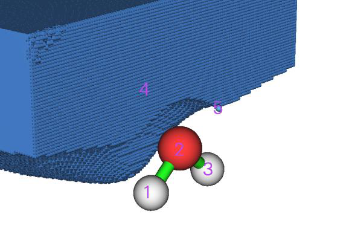

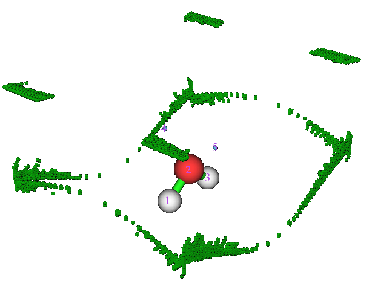

<!-- p.790 -->


这在某种意义上可视为两个孤对电子之间的夹角。

输入q退出几何测量界面。

聚类吸引子 假设我们想把吸引子4和5聚类在一起作为一个简并吸引子，使它们共同代表两个孤对电子，我们可以输入

!!! terminal "Multiwfn 交互"

    - **-6** — Set parameter for attractor clustering or manually perform clustering
    - **3** — Cluster specified attractors
    - **4,5** — Attractors 4 and 5 will be clustered as a single one
    - **0** — Return 选择选项0打开GUI，如下所示，你会发现所有吸引子的序号都已改变，对应于氧孤对电子的两个吸引子现在共享同一序号，即4。

积分盆 点击返回(RETURN)按钮关闭GUI，选择选项2然后选择1以在ESP盆中积分电子密度，结果为

```text
   #Basin        Integral(a.u.)      Volume(a.u.^3)
       1          0.8776693902        390.34100000
       2          7.5388327160         26.52400000
       3          0.8776693895        390.28300000
       4          0.6822297997        654.32200000
 Sum of above values:          9.97640130
 Integral of the grids travelled to box boundary:          0.00000007
```

由于目前盆4就是整个负ESP区域，结果表明平均而言在负ESP区域中有0.682个电子。确实这个值不大（人们可能预期由于有两个孤对电子应有约四个电子），这是因为分子空间大多数区域的ESP由核电荷主导，因而为正。

同时显示ESP极小点和等值面 在J. Comput. Chem., 39, 488 (2018)中，作者表明通过在同一图中绘制ESP极小点和等值面，可以非常清楚地展示孤对电子区域。等值面值选择为比ESP全局最小值高10 kcal/mol。这里我们绘制这种图。

回想我们刚完成盆生成时，每个ESP极小点的值都打印在屏幕上（你也可以随时选择选项“-3 Show information of attractors”再次显示它们）：

```text
Attractor       X,Y,Z coordinate (Angstrom)                Value
```


<!-- p.791 -->


```text
     1   -0.02645886   -0.76730701   -0.48343728         17.61230000
     2    0.02645886   -0.02645886    0.09865769         79.16270000
     3    0.02645886    0.76730701   -0.48343728         17.61230000
     4   -0.82022474    0.02645886    0.99825901         -0.09222160
     5    0.82022474    0.02645886    0.99825901         -0.09222160
```

显然，全局最小值为-0.09222*627.51 = -57.9 kcal/mol，等值面值则应设为-0.09222+10/627.51 = -0.07628 a.u.。

进入选项0，在GUI窗口中取消勾选吸引子标记(Attractor labels)，然后输入-10

!!! terminal "Multiwfn 交互"

    - **Return to main menu 13** — Process grid data
    - **-2** — Visualize isosurface of the grid data in memory 在GUI中，在等值面值(Isosurface value)框中输入-0.07628，取消勾选显示双号(Show both sign)，选择等值面样式(Isosurface style)-使用网格(Use mesh)，确保已激活显示原子标记(Show atomic labels)，选择其他设置(Other settings)-设置原子标记类型(Set atomic label type)-元素符号(Element symbol)。最后，点击保存图片(Save picture)按钮将图像文件保存到当前文件夹，你将看到以下效果（数值为手动标注）

使用外部cube文件执行盆分析 Multiwfn能够仅基于网格数据执行盆分析，因此待分析的实空间函数可以不是Multiwfn形式上支持的任何函数，例如诱导电流密度的各向异性（Chem. Rev., 105, 3758 (2005)），它可由AICD或GIMIC程序计算。为了说明这一重要功能，现在我们直接使用Gaussian中的cubegen工具生成的网格数据重做上面所示的一些分析。

在你系统的控制台窗口中运行以下命令以生成density.cub和ESP.cub。

```text
cubegen 0 fdensity H2O.fch density.cub 0 h
cubegen 0 potential H2O.fch ESP.cub 0 h
```

然后启动Multiwfn并输入 ESP.cub // This file contains ESP grid data. After loading it, the grid data will be stored in memory

!!! terminal "Multiwfn 交互"

    - **17** — Basin analysis
    - **1** — Select real space function used to partitioning basins
    - **2** — Generate the basins by using the grid data stored in memory 现在在选项0中可视化定位的吸引子：

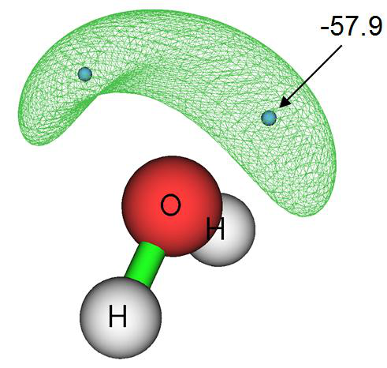

<!-- p.792 -->


退出GUI，然后输入以下命令

!!! terminal "Multiwfn 交互"

    - **2** — Integrate real space functions in the basins
    - **-1** — Use the grid data stored in external file as integrand
    - **density.cub** — This file contains electron density grid data

结果与我们在本节第1部分中获得的非常接近。例如，我们这里得到的负ESP区域中的电子布居数为0.339*2=0.678，而我们之前得到的相应值为0.682。

最后，我们选择选项3计算盆的电多极矩。因为cube文件不包含GTF（Gaussian型函数）信息，你将被提示输入包含当前体系GTF信息的文件路径，以便计算电多极矩。我们输入H2O.fch文件的路径，然后输入-1，所有盆的电多极矩将立刻输出到屏幕上。

### 4.17.4 H2O电子密度差的盆分析

在本例中我们分析H2O电子密度差的盆，以定量研究分子形成过程中的电子密度变形。

在做盆分析之前，我们需要先经由主功能5生成电子密度差的网格数据，所有相关元素的原子波函数文件必须可用。这里我们直接使用Multiwfn软件包中提供的一组原子波函数文件，即将“example”文件夹中的“atomwfn”子文件夹复制到当前文件夹，然后在生成电子密度差网格数据时Multiwfn会自动使用它们。准备原子波函数文件有几种不同方法，请回顾4.4.7节并查阅3.7.3节。

!!! terminal "Multiwfn 交互"

    - **之后，启动Multiwfn并输入：examples\H2O.fch** — Generated at B3LYP/6-31G** level
    - **5** — Calculate grid data
    - **-2** — Obtain deformation property
    - **1** — Electron density
    - **3** — High-quality grid。由于电子密度差的变化很复杂，使用相对高质量的网格是必需的。注意我们这里选择的“高质量网格”仅定义网格总数，因此与盆分析模块功能1中涉及的含义不同

!!! terminal "Multiwfn 交互"

    - **0** — After the calculation is finished, return to main menu
    - **17** — Basin analysis module
    - **1** — Generate basins and locate attractors
    - **2** — Generate the basins by using the grid data stored in memory (namely the grid data we just

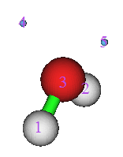

<!-- p.793 -->


calculated by main function 5)

进入功能0以可视化结果，你将看到如下左图所示。取消勾选显示分子(Show molecule)后，图形将如右图所示

电子密度差的正（负）部对应于分子形成后电子密度增加（减少）的区域。浅绿色球表示正部的极大点，而浅蓝色球表示负部的极小点。

如果你难以想象极大点和极小点为何如此分布，我建议你绘制电子密度差的平面图。下左图为垂直于分子平面的电子密度差图，而下右图为分子平面内的图。

通过比较吸引子与平面图，显然吸引子4和5是由于O-H键形成而导致电子密度增强区域中的极大点。而吸引子6的出现源于孤对电子形成导致的电子聚集。

注1：吸引子6是二重简并的，即如你所见，它对应于两个吸引子。这是因为这两个吸引子具有相同的值，且彼此放置得非常近。

注2：吸引子8在对称平面的另一侧没有对应点。造成这一问题的原因是所用网格质量相对于电子密度差的复杂特征而言不够高。

考察由于键形成而在C与H之间聚集了多少电子是很有意思的。测量这一量可以有许多方法；对于当前情形，最合理的是在盆4或盆5中积分电子密度差。现在让我们来做。选择功能2，然后选择选项0以取电子密度差的网格数据作为被积函数。从输出中我们发现积分为0.102 e。

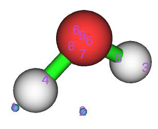


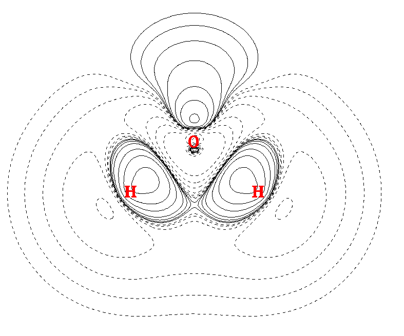


<!-- p.794 -->


如果你想将吸引子与电子密度差的等值面进行比较，你只需选择选项-10返回Multiwfn主菜单，然后在主功能13中选择子选项-2以绘制内存中网格数据的等值面，我们定位的吸引子将一起显示，如下所示（isovalue=0.05），其中绿色和蓝色部分分别对应正和负区域。

### 4.17.5 在AIM盆中研究源函数

源函数已在2.6节第19部分中简介。通常，在讨论成键问题时取键临界点（BCP）作为源函数的参考点。在本例中我们计算乙烷在AIM盆中的源函数；特别是，基于源函数我们将得到甲基对与其C-H键的BCP处电子密度的贡献。在计算源函数之前，我们应先执行拓扑分析以找出BCP的位置。

!!! terminal "Multiwfn 交互"

    - **启动Multiwfn并输入：examples\ethane.wfn** — Optimized and produced at B3LYP/6-31G*
    - **2** — Topology analysis
    - **2** — Search nuclear critical points
    - **3** — Search BCPs
    - **0** — Visualize result, see below


<!-- p.795 -->


临界点(Critical point) 11 将被选作源函数(source function)的参考点。当然，选择哪个键临界点(BCP)是完全任意的。现在关闭拓扑分析模块的图形界面。

你最好选择选项 7 然后输入 11 来查看该临界点(CP)处的电子密度，因为理论上源函数在全空间的积分应等于其参考点处的电子密度，因此该数值对于检验源函数积分是否足够准确非常重要。该 CP11 处的电子密度为 0.276277。

从命令行窗口显示的信息中可以找到 CP11 的坐标为 (0.0,-1.199262548,-1.909104063)，将其从窗口复制到剪贴板（若不知如何操作请参阅第 5.4 节）。接下来，我们将把 CP11 设为源函数的参考点。虽然你可以通过 `settings.ini` 中的 “refxyz” 参数来定义参考点，但有一个技巧可以达到同样的效果，用这种方法你无需关闭 Multiwfn 再重新启动以使参数生效！

输入以下命令

!!! terminal "Multiwfn 交互"

    - **-10** — 从拓扑分析模块返回主菜单(Return to main menu from topology analysis module)
    - **1000** — 一个隐藏界面(A hidden interface)
    - **1** — 设置参考点(Set reference point)

把 CP11 的坐标粘贴到窗口中然后按回车键。

!!! terminal "Multiwfn 交互"

    - **17** — 流域分析(Basin analysis)
    - **1** — 生成流域并定位吸引子(Generate basins and locate attractors)
    - **1** — 电子密度(Electron density)
    - **2** — 中等质量网格(Medium-quality grid)

通过选择功能 0 进入图形界面，你将看到

现在我们在 AIM 流域中对源函数进行积分。输入以下命令

!!! terminal "Multiwfn 交互"

    - **7** — 以混合型网格在 AIM 流域中对实空间函数积分(Integrate real space functions in AIM basins with mixed type of grids)
    - **1** — 以原子中心+均匀网格对特定函数积分(Integrate a specific function with atomic-center + uniform grids)
    - **19** — 源函数(Source function)

结果为


```text
    Atom       Basin       Integral(a.u.)   Vol(Bohr^3)   Vol(rho>0.001)
     1 (C )       5          0.00361772       149.307        70.392
     2 (H )       8          0.00289355       468.732        50.058
     3 (H )       6          0.00280041       443.982        50.097
     4 (H )       7          0.00280276       418.343        50.095
     5 (C )       2          0.12224052       150.514        70.396
     6 (H )       1          0.12040142       475.383        50.054
```


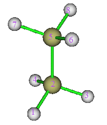

<!-- p.796 -->


```text
     7 (H )       4          0.01051821       424.105        50.095
     8 (H )       3          0.01051742       450.072        50.097
Sum of above integrals:             0.27579202
Sum of basin volumes (rho>0.001):     441.284 Bohr^3
```

上述积分之和与 CP13 处的电子密度（0.276277）非常接近。流域 1、2、3 和 4 中的积分之和为 0.1204+0.1222+0.0105*2=0.2636，它代表甲基基团空间中的积分，占总积分值的 0.2636/0.2758*100%=95.6%，表明甲基是其 C-H 键 BCP 处电子密度的主要来源。


### 4.17.6 聚炔的局域区域流域分析(Local region basin analysis for polyyne)

有时，我们所研究体系的几何结构相当延展，例如聚炔 C14H2，其形式上可表示为

H1−C2≡C3−C4≡C5−C6≡C7−C8≡C9−C10≡C11−C12≡C13−C14≡C15−H16 如果我们只对该体系中局域区域的电子结构特征感兴趣，通过适当设置网格，可以只对感兴趣的区域而不是整个体系进行流域分析，以节省计算时间。作为例子，本节我们将尝试以最小的计算代价获取 V(C7,C8) 和 V(C8,C9) 的 ELF 流域中的电子布居数。

启动 Multiwfn 并输入以下命令：

!!! terminal "Multiwfn 交互"

    - **examples\polyyne.wfn** — 在 B3LYP/6-31G* 下优化并产生
    - **17** — 流域分析(Basin analysis)
    - **1** — 生成流域并定位吸引子(Generate basins and locate attractors)
    - **9** — 电子定域函数(ELF)
    - **8** — 通过输入中心坐标、网格间距和盒子长度设置网格(Set the grid by inputting center coordinate, grid spacing and box length)
    - **a8** — 以 8 号原子的位置作为盒子中心(Take the position of atom 8 as box center)
    - **0.08** — 网格间距（Bohr）(Grid spacing (Bohr))
    - **10,10,8** — X、Y 和 Z 方向的盒子长度（Bohr）(Box length in X, Y and Z directions (Bohr))

注意当前分子是沿 Z 轴取向的。显然，盒子越大，花费的计算时间必然越长。而盒子也不应太小，否则感兴趣的流域可能被截断。选择合适的盒子尺寸高度依赖于用户的经验

计算完成后，通过选择选项 0 进入图形界面，你将看到如右侧所示的图形。显然，只定位到了 C8 附近的几个吸引子。流域 5 和流域 21 分别对应于 V(C7,C8) 和 V(C8,C9)。注意，虽然也定位到了吸引子 1 和 6，但由于它们对应的流域不仅很大而且靠近盒子边界，可以预期流域 1 和 6 被严重截断，因此研究它们没有意义。

当你用上述方式研究局域区域时，总会发现有许多格点走到了盒子边界。在本例中，如命令行窗口所示，此类格点的数目为 60668。你可以通过在图形界面的流域列表中选择 “Boun” 来将它们可视化，见下图


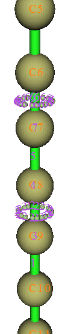

<!-- p.797 -->


现在关闭图形界面，选择选项 2 然后再选择 1，结果显示 V(C7,C8) 和 V(C8,C9) 中的电子密度积分分别为 2.78 和 5.02。显然，C8-C9 之间的成键比 C7-C8 强得多，这就是为什么前者的键长（1.236Ǻ）比后者（1.338Ǻ）短。注意乙炔中 V(C,C) 的电子布居数为 5.37（见第 4.17.2 节），因此可以预期 C8-C9 弱于典型的 C-C 三键，这主要是由于聚炔中的电子全局共轭所致。

感兴趣的用户可以用相同的网格间距（0.08 Bohr）对整个体系重新做流域分析，计算量将比当前例子大得多。对于 V(C7,C8) 和 V(C8,C9)，你会发现结果与我们上面得到的结果没有可察觉的差别。


### 4.17.7 评估对 ELF 流域布居的原子贡献(Evaluate atomic contribution to population of ELF basins)

本节中，我将以 CH3NH2 为例，展示如何基于 AIM 原子空间划分获得 C 和 N 对 V(C,N) ELF 成键流域布居的贡献，这对于检验键极性很有用。你也可以用类似的方法获得对任何其他种类流域（如 LOL 流域、ESP 流域）布居的原子贡献。

首先，我们需要生成一个名为 basin.cub 的立方体文件，其格点值对应于 ELF 流域的编号。启动 Multiwfn 并输入

!!! terminal "Multiwfn 交互"

    - **examples\CH3NH2.wfn 17** — 流域分析(Basin analysis)
    - **1** — 生成流域并定位吸引子(Generate basins and locate attractors)
    - **9** — 电子定域函数(ELF)
    - **2** — 中等质量网格(Medium-quality grid) 现在进入选项 0 查看流域编号


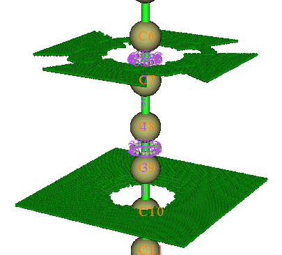

<!-- p.798 -->


显然，流域 5 对应于 V(N,C)，这正是我们要研究的。然后关闭图形界面并输入

!!! terminal "Multiwfn 交互"

    - **-5** — 将流域导出为立方体文件(Export basin as cube file)
    - **a** — 在当前文件夹导出 basin.cub(Export basin.cub in current folder)

接下来，按常规生成 AIM 流域，网格设置必须与 basin.cub 完全相同

!!! terminal "Multiwfn 交互"

    - **1** — 重新生成流域(Regenerate basins)
    - **1** — 选择实空间函数(Select real space function)
    - **1** — 电子密度(Electron density)
    - **9** — 使用另一个立方体文件的网格设置，这是确保将要生成的网格数据与 basin.cub 具有相同网格设置的最稳妥方法(Use grid setting of another cube file, this is the safest way to ensure the grid data to be generated has the same grid setting as basin.cub)

basin.cub

!!! terminal "Multiwfn 交互"

    - **0** — 查看吸引子(Check attractors)

很清楚，对应于 N 和 C 的吸引子编号分别为 2 和 3。然后我们评估对 basin.cub 中定义的流域的原子贡献

!!! terminal "Multiwfn 交互"

    - **9** — 然后程序载入当前文件夹中的 basin.cub(Then program loads basin.cub in current folder)
    - **2** — 对应于 N 的吸引子的编号(The index of the attractor corresponding to N)
    - **5** — 第 5 个 ELF 流域，即 V(N,C) 流域(The 5th ELF basin, i.e. V(N,C) basin) 结果为 1.15866，即 N 对 V(N,C) 流域贡献了 1.159 个电子。然后输入
    - **3** — 对应于 C 的吸引子的编号(The index of the attractor corresponding to C)
    - **5** — 第 5 个 ELF 流域，即 V(N,C) 流域(The 5th ELF basin, i.e. V(N,C) basin) 从结果可知 C 对 V(N,C) 流域贡献了 0.463 个电子。由于 N 比 C 对它们 ELF 成键流域的电子贡献大得多，因此可以得出结论 C-N 是具有显著极性的键。


### 4.17.8 计算高 ELF 定域域布居和


### 体积（HELP、HELV）(Calculating high ELF localization domain population and volume (HELP, HELV))

高 ELF 定域域布居和高 ELF 定域域体积（分别记为 HELP 和 HELV）提出于 ChemPhysChem, 14, 3714 (2013)，已表明它们是在


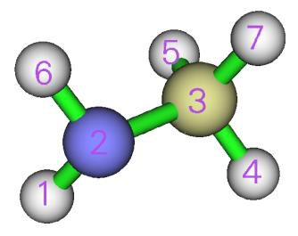

<!-- p.799 -->


表征孤对电子方面的有用定量指标，并且它们与和孤对电子相关的分子性质（如电离势和前线分子轨道能量）有密切关系，详见该 ChemPhysChem 论文。下面以 PH3 为例，在图中清楚地说明了 HELP 和 HELV 的定义。

从上图可以看出，该方法定义了一个称为高 ELF 定域域（HEL）的区域，它同时满足三个条件：

(1) 电子密度大于 0.001 a.u. (2) 电子定域函数（ELF）大于 0.5 (3) 每个点都属于对应于孤对电子的 ELF 流域 HEL 的体积和电子布居分别记为 HELV 和 HELP。据信该定义比（3）更能代表孤对电子区域，因为不重要的

区域（即 vdW 面之外，对应于 ρ = 0.001 a.u.）和没有明确化学意义的区域（即 ELF < 0.5）被排除了。

现在我们用 Multiwfn 计算 PH3 的 HELV 和 HELP。启动 Multiwfn 并输入

!!! terminal "Multiwfn 交互"

    - **examples\PH3.wfn** — 在 M06-2X/def2-TZVPP 水平产生，在相同水平优化
    - **17** — 流域分析(Basin analysis)
    - **1** — 生成流域并定位吸引子(Generate basins and locate attractors)
    - **9** — 若打算计算 HELP 和 HELV 必须选择 ELF 来定义流域(ELF must be chosen to define basins if you intend to calculate HELP and HELV)
    - **2** — 中等质量网格(Medium-quality grid)

现在我们选择选项 0 查看吸引子编号：

从上图可以发现吸引子 5 对应于 P 原子的孤对电子。


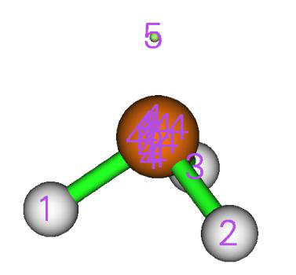

<!-- p.800 -->


接下来，我们输入

!!! terminal "Multiwfn 交互"

    - **10** — 计算 HELP 和 HELV(Calculate HELP and HELV)
    - **0** — 选择流域并计算它们的 HELP 和 HELV(Select basins and calculate their HELP and HELV)
    - **5** — 对应于 P 原子孤对电子的流域编号(The basin index corresponding to the lone pair of the P atom)

稍后，你将看到：


```text
Basin information: (constraints are not taken into account)
Population:  2.0719   Volume: 1561.1570 Bohr^3

High ELF localization domain population (HELP):    1.4858
High ELF localization domain volume (HELV):       80.5500 Bohr^3
```

可见，HELP 和 HELV 分别为 1.4858 和 80.55 Bohr3，与原文中的数值即 1.50 和 80 Bohr3 非常接近。微小的差异源于我们采用的计算水平与原文不完全相同，此外，我们计算中的数值设置细节必然与原文有所不同。

从上述输出中你还可以找到 ELF 流域的布居和体积，它们也可以通过流域分析模块的选项 2 计算。


### 4.17.9 评估对体系电子能量的原子贡献(Evaluate atomic contributions to system electronic energy)

背景知识体系的总电子能量可视为所有原子的电子能量之和，原子电子能量对应于电子能量密度 E(r) 在原子流域中的积分。这种对体系能量的分解对于深入理解不同化学环境中原子的状态非常有帮助，在揭示不同构型或构象之间相对能量的主要影响因素方面也很重要。见 Russ. Chem. Rev., 78, 283 (2009) 中的广泛讨论和应用实例。

存在关系 E(r) = -K(r)，其中 K(r) 为 Hamilton 动能。T_Ω 的积分

$$E_{_\Omega}=\frac{E_{_{QC}}}{T}\times T_{_\Omega}$$

粒子被吸收到交换相关泛函中。因此，实际的 EΩ 应最终按如下缩放，以使所有 EΩ 之和恰好等于 EQC：


$$E_{_\Omega}=\frac{E_{_{QC}}}{T}\times T_{_\Omega}$$

<!-- formula-ocr: formula_p800_346.png 已替换为LaTeX, 原图保留备查 -->

重要的是不应使用赝势，因为它会使维里定理被严重违反。此外，几何结构应充分优化，以减小对维里定理的偏离。

例子 在本例中，我们计算 H2CO 的原子能量。启动 Multiwfn 并输入 examples\H2CO.wfn // 由 B3LYP/6-31G* 在相应极小点计算产生


<!-- p.801 -->


结构(structure)

!!! terminal "Multiwfn 交互"

    - **17** — 流域分析(Basin analysis)
    - **1** — 生成流域(Generate basins)
    - **1** — 电子密度(Electron density)
    - **2** — 中等质量网格(Medium-quality grid)
    - **7** — 以混合型网格在 AIM 流域中对实空间函数积分(Integrate real space functions in AIM basins with mixed type of grids)
    - **2** — 流域边界的精确精修(Exact refinement of basin boundary)
    - **6** — Hamilton 动能 K(r)(Hamiltonian kinetic energy K(r)) 结果为


```text
    Atom       Basin       Integral(a.u.)   Vol(Bohr^3)   Vol(rho>0.001)
     1 (C )       2         36.98331415       243.914        67.166
     2 (H )       4          0.59352399       554.936        49.848
     3 (O )       1         75.30251602       887.039       127.096
     4 (H )       3          0.59369956       567.076        49.832
Sum of above integrals:           113.47305372
Sum of basin volumes (rho>0.001):     293.942 Bohr^3
```

量子化学计算给出的电子能量可在 H2CO.wfn 末尾手动找到，即 -114.50047 a.u.，载入该文件后 Multiwfn 也会打印该值。注意 T 为 113.47305 a.u.，因此 O3 的原子能量可计算为 75.30252*-114.50047/113.47305 = -75.98433 a.u.，其他原子类似。然后你还可以手动将某些原子的原子能量加和以得到片段能量。

值得注意的是，H2CO.wfn 的实际维里比为 2.009，可在该文件末尾找到，Multiwfn 载入该文件后也会打印。由于它与精确维里比 2.0 的偏离不显著，我们对 EΩ 的缩放处理是合理且可接受的。

一个明显更方便且更好的获得对能量的原子贡献的方法是选择用户自定义函数 -11 作为被积函数，它是包含维里比的标度电子能量密度，其在全空间的积分恰好等于量子化学程序给出的电子能量，见第 2.7 节相应部分对其定义。现在我们重做上面的例子。打开 `settings.ini` 并将 “iuserfunc” 设为 -11，然后启动 Multiwfn 并输入

!!! terminal "Multiwfn 交互"

    - **examples\H2CO.wfn 17** — 流域分析(Basin analysis)
    - **1** — 生成流域(Generate basins)
    - **1** — 电子密度(Electron density)
    - **2** — 中等质量网格(Medium-quality grid)
    - **7** — 以混合型网格在 AIM 流域中对实空间函数积分(Integrate real space functions in AIM basins with mixed type of grids)
    - **2** — 流域边界的精确精修(Exact refinement of basin boundary) 100 //用户自定义函数，现在对应于标度电子能量密度(User-defined function, which now corresponds to the scaled electron energy density) 结果为


```text
    Atom       Basin       Integral(a.u.)   Vol(Bohr^3)   Vol(rho>0.001)
     1 (C )       2        -37.32041642       244.279        67.166
     2 (H )       4         -0.60162114       554.745        49.848
     3 (O )       1        -75.97660985       887.040       127.096
     4 (H )       3         -0.60179889       566.901        49.832
```


<!-- p.802 -->


```text
Sum of above integrals:          -114.50044630
```

可见积分 -114.50044630 a.u. 基本上恰好等于 .wfn 文件中记录的电子能量 -114.50047 a.u.。O3 对总电子能量的贡献为 -75.97661 a.u.，与我们通过前述方式得到的 -75.98433 a.u. 非常接近。


### 4.17.10 绘制按流域类型着色的 ELF 等值面图(Plotting ELF isosurface map colored by basin types)

许多论文通过绘制 ELF 等值面图并根据流域类型（单齿、双齿及其他）对等值面着色来研究 ELF。在第 4.5.1 节我已经提到可以用 ChimeraX 软件基于 Multiwfn 导出的 .cub 文件轻松绘制这种图，但存在一些局限，即着色会随等值改变而变化，且一个完整等值面在对应于不同类型流域的子区域中不能着以不同颜色。本节中，我将展示如何结合使用 Multiwfn 的流域分析模块与 VMD（可从 http://www.ks.uiuc.edu/Research/vmd/ 免费获得）来绘制无上述局限的按流域类型着色的 ELF 等值面图。以简单分子环氧乙烷为例，其波函数文件为 examples\oxirane.fchk。我使用的 VMD 版本为 1.9.3。

!!! terminal "Multiwfn 交互"

    - **启动 Multiwfn 并输入 examples\oxirane.fchk 17** — 流域分析(Basin analysis)
    - **1** — 生成流域(Generate basins)
    - **9** — 电子定域函数(ELF)
    - **2** — 中等质量网格(Medium-quality grid) 现在你可以选择选项 0 可视化定位到的吸引子：

关闭图形界面窗口，并选择选项 “12 指认 ELF 流域标签(Assign ELF basin labels)”，你将看到


```text
Basin indices, populations (e), volumes (Angstrom^3) and assigned labels
##    1  Basin    7  Pop.:  2.0953  Vol.:    0.125  Label: C(C1)
##    2  Basin    6  Pop.:  2.0953  Vol.:    0.125  Label: C(C2)
##    3  Basin   12  Pop.:  2.1351  Vol.:    0.043  Label: C(O3)
##    4  Basin   11  Pop.:  2.6773  Vol.:   33.139  Label: V(O3)
##    5  Basin   10  Pop.:  2.6773  Vol.:   33.143  Label: V(O3)
##    6  Basin    9  Pop.:  0.9741  Vol.:    1.471  Label: V(C1,O3)
##    7  Basin    3  Pop.:  1.8936  Vol.:    9.852  Label: V(C1,C2)
##    8  Basin    5  Pop.:  2.1096  Vol.:   82.164  Label: V(C1,H4)
##    9  Basin    4  Pop.:  2.1096  Vol.:   82.154  Label: V(C1,H5)
##   10  Basin    8  Pop.:  0.9741  Vol.:    1.477  Label: V(C2,O3)
##   11  Basin    2  Pop.:  2.1096  Vol.:   83.498  Label: V(C2,H6)
```


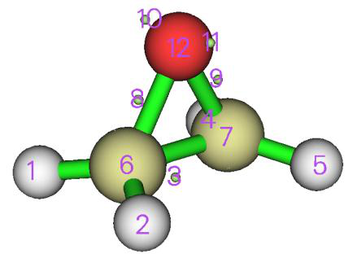

<!-- p.803 -->


```text
##   12  Basin    1  Pop.:  2.1095  Vol.:   83.498  Label: V(C2,H7)

Number of core basins is     3, their indices:
6,7,12
Number of  1-synaptic basins is     2, their indices:
10,11
Number of  2-synaptic basins is     7, their indices:
1-5,8,9
```

通过比较自动指认的流域标签与图形界面窗口中的图形，你可以确认流域确实被正确标记了。

然后输入

!!! terminal "Multiwfn 交互"

    - **-5** — 将流域导出为立方体文件(Export basins as cube file)
    - **b** — 专为在 VMD 中绘制按流域类型着色的 ELF 等值面设计的特殊模式(A special mode designed for plotting basin type colored ELF isosurfaces in VMD)
    - **10,11** — 单齿流域的编号，对应于上面高亮的文本(Indices of the monosynaptic basins, corresponding to the highlighted text above)
    - **1-5,8,9** — 双齿流域的编号，对应于上面高亮的文本(Indices of the disynaptic basins, corresponding to the highlighted text above)

现在 basinsyn.cub 和 basinfunc.cub 已导出到当前文件夹。在 basinsyn.cub 中，单齿和双齿流域区域内的值分别为 -1 和 1，而所有其他区域的值为 0。basinfunc.cub 记录了用于生成流域的实空间函数，在当前情况下即 ELF。

将 basinsyn.cub 和 basinfunc.cub 以及绘图脚本 examples\scripts\basinsyn.vmd 移动到 VMD 文件夹。然后启动 VMD，输入 source basinsyn.vmd 以执行该脚本，你将看到下图。默认等值面为 0.8，对应于单齿和双齿流域的区域分别着为绿色和红色，而其他流域（本例中对应于核流域）着为白色。

你可以通过进入 “图形(Graphics)” - “表示(Representation)” 并在 “等值(Isovalue)” 文本框中输入期望值来改变等值。在该面板中你还可以调整等值面的材质。若想改变不同类型流域的颜色，进入 “图形(Graphics)” - “颜色(Colors)” - “色标(Color Scale)” 并更改相应选项。

上述绘图方法绝不限于 ELF，你可以类似地将其用于其他函数，如 LOL、IRI 等。

接下来，假设我们想把上图中的 V(C,H) 流域着为黄色，该如何做


