# 电子激发分析(Electron excitation analysis)

> Multiwfn manual, p.804–864.英文原文见同名 English 章节。 Images: `../imgs/`.

---

<!-- p.804 -->


呢？你只需让 Multiwfn 导出相应流域的函数值网格数据，将它们绘制为等值面然后直接指定颜色即可。让我们这样做，输入以下命令

-5 // 将流域导出为立方体文件(Export basins as cube file) c // 将特定流域区域的函数值网格数据导出为当前文件夹中的 basinsel.cub 文件(Export grid data of function value in the region of specific basins as basinsel.cub file in current folder)

1,2,4,5 // 四个 V(C,H) 流域的编号(Indices of the four V(C,H) basins) 0 // 在导出的 .cub 文件中，若格点不属于所选流域，其值将为你在此指定的值(In the exported .cub file, if a grid does not belong to the selected basins, its value will be the value you specified here)

现在 basinsel.cub 已生成在当前文件夹中。将其载入 VMD，选择 “图形(Graphics)” - “表示(Representation)”，将 “绘制方式(Drawing Method)” 设为 “等值面(Isosurface)”，将 “着色方式(Coloring Method)” 改为 “颜色编号(Color ID)” 并选择 “4 黄色(yellow)”。然后将 “等值(Isovalue)” 改为比已有等值面略小的值以保证覆盖它们（例如本例中的 0.795，略小于 basinsyn.vmd 设置的 0.8），现在你可以看到下图，效果相当令人满意！


## 4.18 电子激发分析(Electron excitation analysis)

Multiwfn 的主功能 18 非常强大，它是电子激发分析方法的集合，能够对电子跃迁特征的各个方面提供非常深入的洞察。本节我将用实际例子说明其中大多数方法。在跟随下面的例子之前，请至少先阅读第 3.21 节开头，以了解对输入文件的要求。虽然我基于 Gaussian 产生的文件说明所有分析，但这些分析绝不限于 Gaussian 用户！本节说明的大多数分析（如空穴-电子分析）需要参考态的轨道波函数和组态系数，若你是 ORCA 用户并想进行这些分析，我强烈建议阅读我的博客文章“结合 ORCA 的 TDDFT 计算通过 Multiwfn 进行空穴-电子及相关分析的方法”（http://sobereva.com/758，中文）。


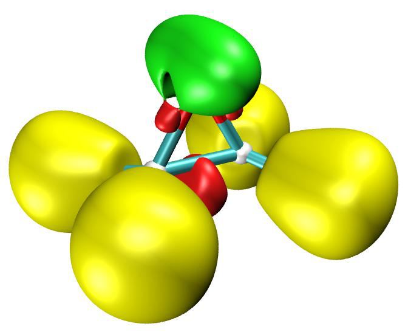

<!-- p.805 -->


### 4.18.1 用空穴-电子分析全面表征电子


### 激发(Using hole-electron analysis to fully characterize electron excitations)

Multiwfn 的空穴-电子分析模块相当强大，它能够对各种电子激发给出非常全面的表征。若你不熟悉空穴-电子分析的基本理论和思想，请阅读第 3.21.1 节。对空穴-电子分析的输入文件要求已在第 3.21 节开头描述，请仔细核对。下面我将采用两个体系来说明空穴-电子分析的使用，

第一个是典型的给体-π-受体体系，第二个是典型的配合物。本节的中文版是我的博客文章“使用 Multiwfn 进行空穴-电子分析以全面考察电子激发特征”（http://sobereva.com/434），其中还有一个额外的例子，即研究 H2CO 的 Rydberg 激发。

若你的工作中使用了空穴-电子分析，请不仅引用 Multiwfn 原文，还请引用我的工作：Carbon, 165, 461 (2020) DOI: 10.1016/j.carbon.2020.05.023，其中在补充信息中简要描述了空穴-电子分析。

### 4.18.1.1 例 1：NH2-联苯-NO2

本节的例子相当长，请认真耐心阅读。本节我将以 NH2-联苯-NO2 为例，其几何结构如下所示。

在该体系中联苯部分充当 π 桥，已知硝基和氨基在电子激发过程中分别充当电子受体和给体，因此预期必定存在对应于电子从氨基侧向硝基侧整体位移的电荷转移（CT）态。

准备 这里假设你是 Gaussian 用户（其他量子化学程序的用户同样可以利用空穴-电子分析）。我们在 B3LYP/6-31G* 水平优化几何结构，然后用以下设置进行 TDDFT 计算（输入文件已作为 examples\excit\D-pi-A.gjf 提供），将计算五个最低单重激发态。注意必须指定 IOp(9/40=4)，原因已在第 3.21 节开头清楚说明。这里采用 CAM-B3LYP 是因为它能忠实描述 CT 激发。

%chk=D-pi-A.chk # CAM-B3LYP/6-31g(d) TD(nstates=5) IOp(9/40=4) 计算后，将 .chk 文件转换为 .fch/fchk 文件，所得 .fchk 文件已作为 examples\excit\D-pi-A.fchk 提供。该任务的输出文件已作为 examples\excit\D-pi-A.out 提供。


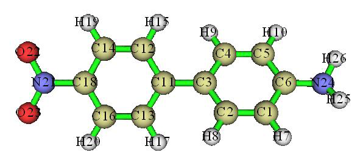

<!-- p.806 -->


检验空穴-电子分析框架中定义的定量指标(Examining quantitative indices defined in the hole-electron analysis framework) 启动 Multiwfn 并输入以下命令 examples\excit\D-pi-A.fchk 18 // 电子激发分析(Electron excitation analysis) 1 // 空穴-电子分析(Hole-electron analysis) examples\excit\D-pi-A.out // 事实上你也可以直接按回车键，因为 .out 文件与 .fchk 文件同名且在同一文件夹(In fact you can also press ENTER button directly, because the name of the .out file is identical to the .fchk file and they are in the same folder)

1 // 研究基态（S0）与第一激发态（S1）之间的激发(Study excitation between ground state (S0) and the first excited state (S1)) 1 // 计算空穴、电子等的分布以及各种指标(Calculate distribution of hole, electron and so on as well as various indices) 2 // 中等质量网格（适合中小体系。对于大体系，你应至少使用“高质量网格”，或手动输入合适的网格间距）(Medium-quality grid (this is suited for small and medium sized systems. For large systems, you should use at least "high-quality grid", or manually input a proper grid spacing))

计算完成后，你将在屏幕上看到以下信息。数据（激发能除外）均由基于网格的积分算得。显然，对于同一体系，格点数越多，数据精度越好。


```text
 Integral of hole:        1.000343
 Integral of electron:    0.999793
 Integral of transition density:   -0.000033
 Transition dipole moment in X/Y/Z:   0.444063  -0.000186  -0.001753 a.u.
 Sm index (integral of Sm function):   0.27369 a.u.
 Sr index (integral of Sr function):   0.51896 a.u.
 Centroid of hole in X/Y/Z:       -4.531729    0.000425    0.003252 Angstrom
 Centroid of electron in X/Y/Z:   -4.010033    0.001760    0.002643 Angstrom
 D_x:   0.522  D_y:   0.001  D_z:   0.001    D index:   0.522 Angstrom
 Variation of dipole moment with respect to ground state:
 X:   -0.985930  Y:   -0.002523  Z:    0.001150    Norm:    0.985934 a.u.
 RMSD of hole in X/Y/Z:       1.443   1.160   0.437   Norm:   1.902 Angstrom
 RMSD of electron in X/Y/Z:   1.596   0.974   0.634   Norm:   1.974 Angstrom
 Difference between RMSD of hole and electron (delta sigma):
 X:  0.153  Y: -0.186  Z:  0.197    Overall:  0.072 Angstrom
 H_x:  1.520  H_y:  1.067  H_z:  0.536  H_CT:  1.520  H index:  1.938 Angstrom
 t index: -0.998 Angstrom
 Hole delocalization index (HDI):      22.68
 Electron delocalization index (EDI):  17.11
 Ghost-hunter index:    -18.831 eV, 1st term:  8.771 eV, 2nd term:    27.601 eV
 Excitation energy of this state:     3.907 eV
```

输出中，“空穴积分(Integral of hole)”和“电子积分(Integral of electron)”分别是空穴和电子在全空间的积分，原则上它们应恰为 1.0。但由于不可避免的数值积分误差，算得的值与 1.0 有轻微偏离。由于偏离极小，我们可以说对于当前体系的当前激发态，我们采用的网格设置完全足够。

注：若你发现空穴或电子积分明显偏离 1.0，则输出的指标可能不可靠。有三种可能：（1）你忘记使用 IOp(9/40=3 或 4）(You forgot to use IOp(9/40=3 or 4))（2）网格质量太低(The grid quality is too low)（3）延展距离不够大，因此格点空间区域没有完全覆盖空穴或电子的主要分布区域（当研究 Rydberg 激发时，默认延展距离总是应增大）(The extension distance is not large enough, therefore the spatial region of the grid points does not fully cover the main distribution region of hole or electron (when Rydberg excitation is investigated, the default extension distance should always be enlarged))。

上述输出中的其余项依次为：在全空间


<!-- p.807 -->


跃迁密度的积分（理想值为 0）、跃迁电偶极矩、Sm 和 Sr 指标、空穴

和电子的质心坐标、Dλ 和 D 指标、激发态相对于基态偶极矩变化的 X/Y/Z 分量和模、空穴和电子的 RMSD（σ）、Δσλ 和 Δσ 指标、Hλ/HCT/H 指标、t 指标、空穴和电子离域指标、Ghost-hunter 指标、激发能（直接从 Gaussian 输出文件中读取）。

注意上述输出中的 “Ghost-hunter 指标(Ghost-hunter index)”与原文定义略有不同，Multiwfn 中的实现必然更合理，详见第 3.21.7 节。第一项表示依赖于组态系数和 MO 能量的部分，而第二项对应于 1/D。Ghost-hunter 指标即两项之差。

上述输出的跃迁偶极矩是通过对均匀分布格点的跃迁偶极矩密度积分得到的。它也可直接从 Gaussian 输出文件中读出，X/Y/Z 分量为 0.4427、-0.0005、-0.0012 a.u.，与 Multiwfn 输出的 0.444063、-0.000186、-0.001753 非常接近。该观察进一步表明我们采用的网格设置是合适的。

对于当前研究的 S0→S1 激发，从上述输出可见 D 指标仅为 0.522 Å，这显然是很小的值，因为它甚至不到典型 C-C 键长的一半。Sr 指标达到 0.519（理论上限为 1.0），这是很大的值，意味着约一半的空穴和电子完全重合。因此，仅通过考察 Sr 和 D 指标，我们已能得出该激发应为典型局域激发（LE）的结论。再看 t 指标，其总值为 -0.998，远小于 0，意味着空穴和电子分布没有显著分离，进一步表明该激发应归为 LE 型。

在空穴-电子框架下对各种实空间函数的可视化研究(Now you should see the post-processing menu on the screen...) 现在你应在屏幕上看到后处理菜单。后处理菜单(Post-processing menu)中每个选项的含义是不言自明的。请仔细通读每个选项。这里我们选择选项 3，我们将同时看到空穴和电子的分布：

在上图中，绿色代表电子分布，蓝色代表空穴分布，等值已设为 0.005。空穴和电子几乎都只出现在硝基

基团中，因此 S0→S1 为 LE 激发毫无疑问，很好地验证了我们基于 D、Sr 和 t 指标的结论。此外，根据上述空穴分布图，空穴似乎由氧的孤对轨道组成，因为每个氧的两侧各有一个瓣。电子分布沿硝基有一个节面，因此我们可以推断电子

分布应由 π* 轨道组成。现在我们可以得出结论 S0→S1 是具有 n→π* 特征的 LE 激发。

然后关闭图形窗口并选择选项 8 可视化 Chole 和 Cele，它们分别由空穴和电子分布变换而来，以使其分布行为更光滑。等值面图如下所示（为看清楚，使用了透明风格）。


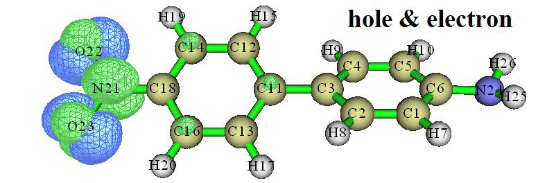

<!-- p.808 -->


可见，Chole 和 Cele 的图形显然更直观，它们非常光滑，不像空穴和电子那样有任何节面特征。因此，在许多情况下用 Chole/Cele 图代替空穴/电子图是很好的选择。（顺便说：若在图形界面窗口中看不到 Chole 和 Cele 的等值面，意味着当前等值太大，你应逐渐小心地减小它直到等值面可见）

接下来，让我们看看空穴和电子的重叠函数，即 Sr 函数。关闭当前图形窗口，在后处理菜单(post-processing menu)中选择选项 4，然后选择选项 2 显示 Sr 函数，你将看到如下图（等值设为 0.005）

从图中可清楚发现空穴和电子在哪里显著重叠。可见，每个氧周围有四个空穴和电子高度重叠的区域。通过比较前面所示的空穴和电子等值面，很容易理解 Sr 图为何如此。

然后关闭窗口并选择选项 7，将显示激发态与基态之间的电荷密度差（CDD），见下图。此图中，等值设为 0.005，绿色和蓝色分别对应于激发态密度相对于基态密度的增加和减少。

CDD 图与同时显示空穴和电子分布的图（后文称为“空穴&电子图”）相似，但也有差异。关键差异在于在 CDD 图中，空穴和电子在其重叠区域已 largely 相互抵消；相反，在空穴&电子图中，空穴和电子之间的重叠可被忠实展现。我认为空穴&电子图比 CDD 图对研究电子激发的本征特征更有用，因为它直接展现了空穴和电子的原始分布。


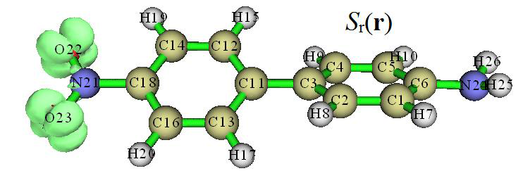

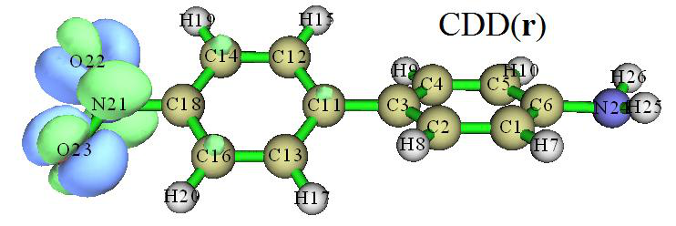

<!-- p.809 -->


顺便说，若在后处理菜单(post-processing menu)中选择选项 18，程序将开始计算空穴和电子之间的库仑吸引能（也称激子结合能）。即使对中等大小的体系，计算也相当耗时，因此请耐心等待。最终输出为：


```text
Coulomb attractive energy:    0.287031 a.u.  (    7.810524 eV )
```

重要提示：用 VMD 软件，你只需几步即可绘制上述质量好得多的函数图。强烈建议你查看第 4.A.14 节给出的例子以了解做法。

检验对空穴和电子的定量贡献(Examining quantitative contributions to hole and electron) 接下来，我将演示如何评估 MO 对空穴和电子的贡献。在后处理菜单(post-processing menu)中选择选项 0 返回空穴-电子分析界面后，我们选择子功能 2 并输入输出阈值。这里我们输入 1，则对空穴或电子贡献高于 1% 的 MO 将显示在屏幕上：


```text
 MO   52, Occ:   2.00000    Hole:   96.207 %    Electron:    0.000 %
 MO   56, Occ:   2.00000    Hole:    3.415 %    Electron:    0.000 %
 MO   57, Occ:   0.00000    Hole:    0.000 %    Electron:   85.411 %
 MO   59, Occ:   0.00000    Hole:    0.000 %    Electron:   12.222 %
 MO   61, Occ:   0.00000    Hole:    0.000 %    Electron:    2.163 %
 Sum of hole:  100.001 %    Sum of electron:  100.001 %
```

从数据可见 MO52 对空穴绝对主导，高达 96.2%，而电子主要由 MO57 组成，贡献为 85.4%。该观察意味着若仅基于 MO52 和 MO57 讨论电子激发，虽然本例中电子激发可被定性描述，但仍有不可忽略的偏差。上述 “空穴之和(Sum of hole)”和“电子之和(Sum of electron)”分别是所有轨道对空穴和电子贡献之和（包括未输出的项），这两个值原则上应恰为 100%，但目前有 0.001% 误差。这样小的误差可完全忽略，它源于 Gaussian 没有打印所有组态系数（Gaussian 计算时经由 IOp(9/40=4) 要求只输出大于 0.0001 的组态系数）

然后我们查看原子或片段对空穴和电子的贡献。在空穴-电子分析界面选择子功能 3，然后选择类 Mulliken 划分(Mulliken-like partition)，你将看到


```text
 The number of non-hydrogen atoms:        16
 Contribution of each non-hydrogen atom to hole and electron:
    1(C )  Hole:  0.19 %  Electron:  0.02 %  Overlap:  0.07 %  Diff.:  -0.17 %
    2(C )  Hole:  0.18 %  Electron:  0.48 %  Overlap:  0.30 %  Diff.:   0.30 %
    3(C )  Hole:  0.59 %  Electron:  0.13 %  Overlap:  0.28 %  Diff.:  -0.46 %
    4(C )  Hole:  0.18 %  Electron:  0.49 %  Overlap:  0.30 %  Diff.:   0.32 %
    5(C )  Hole:  0.19 %  Electron:  0.02 %  Overlap:  0.06 %  Diff.:  -0.18 %
    6(C )  Hole:  0.31 %  Electron:  0.37 %  Overlap:  0.34 %  Diff.:   0.06 %
   11(C )  Hole:  0.15 %  Electron:  4.17 %  Overlap:  0.78 %  Diff.:   4.03 %
   12(C )  Hole:  0.41 %  Electron:  0.14 %  Overlap:  0.24 %  Diff.:  -0.26 %
   13(C )  Hole:  0.37 %  Electron:  0.14 %  Overlap:  0.23 %  Diff.:  -0.23 %
   14(C )  Hole:  0.94 %  Electron:  5.03 %  Overlap:  2.18 %  Diff.:   4.09 %
   16(C )  Hole:  0.92 %  Electron:  5.01 %  Overlap:  2.15 %  Diff.:   4.09 %
```


<!-- p.810 -->


```text
   18(C )  Hole: -0.01 %  Electron:  1.16 %  Overlap:  0.00 %  Diff.:   1.17 %
   21(N )  Hole:  2.39 %  Electron: 33.90 %  Overlap:  9.00 %  Diff.:  31.52 %
   22(O )  Hole: 46.18 %  Electron: 24.38 %  Overlap: 33.55 %  Diff.: -21.80 %
   23(O )  Hole: 46.12 %  Electron: 24.39 %  Overlap: 33.54 %  Diff.: -21.73 %
   24(N )  Hole:  0.46 %  Electron:  0.15 %  Overlap:  0.26 %  Diff.:  -0.32 %
```

由于氢原子一般不参与有化学意义的电子激发，只输出非氢原子的信息，包括原子对空穴、电子、空穴-电子重叠、电子-空穴差（即 CDD）的贡献。硝基中原子的编号为 21、22 和 23，从数据可见硝基的两个氧

对空穴贡献最大，它们的贡献之和为 2×46.1≈92%。电子的空间离域相对更强，硝基中的三个原子共贡献

2×24.4+33.9≈83%，电子的其余部分基本由联苯部分的原子贡献。

虽然空穴和电子的分布特征可通过可视化空穴和电子的等值面图来考察，但所见等值面显然依赖于等值的选择。因此，仅用一张图不可能充分展示所有区域的空穴和电子分布。相反，上面给出的定量原子贡献是非常确切的。

N21、O22 和 O23 的 “差值(Diff.)”之和约为 -12%，表明硝基中密度差（CDD）的积分值为 -0.12，揭示电子激发过程中硝基失去了 0.12 个电子，其中一部分转移到了联苯部分（若想考察特定片段之间的电荷转移量，建议使用 IFCT 方法，如第 4.18.8 节所示）。

以热图显示对空穴和电子的原子贡献(Showing atomic contributions to hole and electron in terms of heat map) 我们还可将原子贡献绘制为热图，从而立即轻松抓住主要特征。在当前菜单中选择 “4 设置 X 轴标签间隔(Set interval between labels in X axis)”然后输入 1 将横坐标步长改为 1，再选择 “1 将空穴/电子组成绘制为热图(Plot hole/electron composition as heat map)”，你将立即看到如下图

图中，横坐标中的数字为非氢原子的编号。该图用颜色描述每个非氢原子对空穴、电子及其重叠的贡献（如 0.4 对应于 40%）。例如，基于前面所示的非氢原子对空穴/电子贡献列表，我们可知图中横坐标位置 16 实际对应于原子 N24。为更方便地找到横坐标中编号与实际原子编号的对应关系，你可用 GaussView 打开相应的 .fch/.gjf/.out 文件，选择 “编辑(Edit)” - “原子列表(Atom List)”，再选择 “编辑(Edit)” - “重排(Reorder)” - “所有原子：氢在后(All atoms: Hydrogens Last)”，然后你将在 GaussView 中看到下图，其中所有氢原子的编号已被排到非氢原子编号之后。显然，此时分子结构中的原子编号与热图横坐标中的编号直接对应。


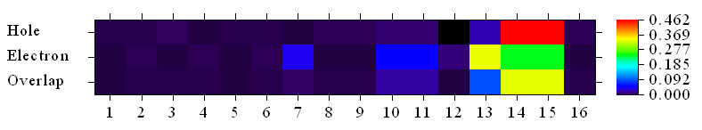

<!-- p.811 -->


从上面的图中的序号可以发现，热图中的位置 13、14 和 15 对应硝基中的两个氧原子和一个氮原子，位置 16 对应氨基中的氮，其余为联苯部分的碳原子。在热图中，空穴(hole)所对应的行清楚地表明空穴几乎完全由硝基中的两个氧贡献，因为相应的矩阵元为红色(大值)。电子(electron)也主要由硝基贡献，但分子其它区域也有不可忽略的贡献，这就是为什么在电子所对应的行中，除 13~15 位置之外的矩阵元会出现蓝色。重叠(overlap)所对应行的颜色所传达的信息是：在硝基的氧上空穴和电子之间存在显著重叠，而体系其它区域的重叠远没有这么显著。

在空穴/电子组成分析界面中有许多选项，它们可用于调整热图的绘制效果、将热图保存为图片文件、切换是否将氢原子包含进热图，以及将数据导出到当前文件夹下的 he_atm.txt 以便你自己在 Origin 等其它程序中绘制热图。这些选项在此不再一一解释，请自行尝试。

考察碎片对空穴和电子的贡献 上述空穴/电子组成分析界面中的选项“-1 加载碎片定义(Load fragment definition)”很重要，它用于加载碎片定义，随后将显示碎片对空穴和电子的贡献，并可绘制基于碎片的热图，这使讨论显著更加方便。在此我们按以下方式将体系划分为四个碎片。

选择选项“-1 加载碎片定义(Load fragment definition)”，然后输入 4 // 定义四个碎片 21-23 // 碎片 1(硝基)的原子序号 11-20 // 碎片 2(与硝基相邻的苯环)的原子序号 1-10 // 碎片 3(与氨基相邻的苯环)的原子序号 24-26 // 碎片 4(氨基)的原子序号 你将立即看到以下输出

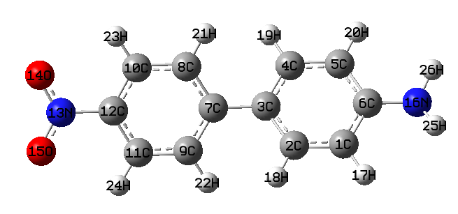

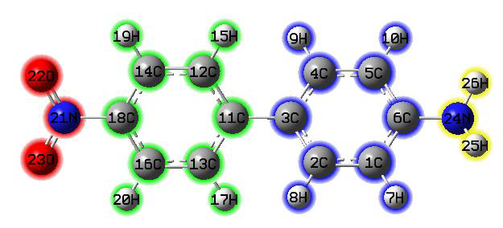

<!-- p.812 -->


```text
  Contribution of each fragment to hole and electron:
 #  1   Hole: 94.68 %  Electron: 82.67 %  Overlap: 88.47 %  Diff.: -12.01 %
 #  2   Hole:  3.20 %  Electron: 15.67 %  Overlap:  7.09 %  Diff.:  12.47 %
 #  3   Hole:  1.64 %  Electron:  1.53 %  Overlap:  1.59 %  Diff.:  -0.12 %
 #  4   Hole:  0.47 %  Electron:  0.13 %  Overlap:  0.25 %  Diff.:  -0.34 %
```

数据显示 94.68% 的空穴位于硝基上，而 82.67% 和 15.67% 的电子分别位于硝基和相邻苯环上。空穴和电子在硝基上的重叠程度约为 90%。由于硝基的“Diff.”为 -12.01%，而当前考察的激发是单电子激发，因此可以说，在电子激发过程中硝基上的电子减少了 0.1201，而与硝基相邻的苯环获得了 0.1247 个电子。然后，若想使上述数据的表示更加直观，我们可以选择选项 1 绘制基于碎片的热图。此时的横坐标对应碎片序号，如下所示：

从图中可以看出电子的空间分布范围比空穴更大。

所有电子激发的总体比较

至此，对 NH2-联苯-NO2 体系 S0→S1 激发的空穴-电子框架下的各种分析已全部完成。若你还想分析其它激发态，应通过选项 0 返回主功能 18 的菜单，再次进入空穴-电子分析功能，然后选择相应的激发态。在此我们把该体系中计算的全部五个激发态的 D、Sr、H、t 指数和空穴-电子库仑吸引能放在一起。此前未讨论过的空穴离域指数(HDI)和电子离域指数(EDI)也一并给出：

D(Å) Sr H(Å) t(Å) Ecoul(eV) HDI EDI

S0→S1 0.52 0.52 1.94 -1.00 7.81 22.7 17.1

S0→S2 3.48 0.65 3.15 0.56 4.71 7.2 9.5

S0→S3 0.57 0.55 1.70 -0.68 8.54 19.7 17.2

S0→S4 0.97 0.87 2.88 -1.55 5.56 7.0 7.0

S0→S5 0.54 0.87 2.93 -2.06 5.56 6.9 7.1

下面是全部五个激发的空穴&电子图、Chole&Cele 图和 Sr 函数图。等值面值均设为 0.003。可以看出 Chole&Cele 图总能以更清晰、更直观的方式显示空穴&电子图的主要分布特征。但在转换过程中丢失了许多细节；例如仅根据 Chole&Cele 图无法判断电子激发的具体类型(如 n-π*、π-π*)。

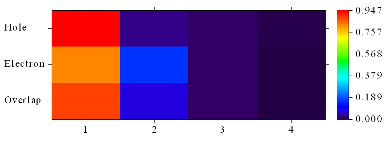

<!-- p.813 -->


现在我们结合等值面图一起看这些指数。对于 D 指数，只有

S0→S2 的值非常大(3.48 Å)，因此可明显视为 CT 激发。确实，从上图可以看出蓝色和绿色等值面的中心(即 Chole 和 Cele 的质心)之间距离很大。而对于其它激发，蓝色和绿色等值面的中心靠得很近，因此应视为 LE 激发。

然后考察 Sr 指数。我们发现所有激发态的 Sr 指数都相对

较大。特别是 S0→S4 和 S0→S5 的值相当大，高达 0.87，主要原因是这两个激发是高度局域在苯环上的 π-π* 型激发。值得一提的是，尽管 S0→S1 也是高度局域的激发，其 Sr(0.52)甚至小于作为 CT 激发的 S0→S2 的 Sr(0.65)。S0→S1 的 Sr 指数不如预期那么大的原因不难理解。如前所述，S0→S1 表现出 n→π* 特征，孤对电子的主体在 NO2 平面上，而 π* 轨道在 NO2 平面上有节面，因此空穴和电子的重叠应是有限的。

接下来看 H 指数，它反映空穴和电子平均分布的广度。从空穴&电子图可以看出 S0→S1 和 S0→S3 的空穴和电子都分布在局域区域，这就是为什么它们的 H 指数不大。由于 S0 到 S2、S4 和 S5 激发所对应的空穴和电子分布

明显比 S0→S1 更宽，它们的 H 指数明显更大。

可以看到，只有 S0→S2 的 t 指数为略正的值，表明空穴和电子的分离很明显，因此将 S0→S2 视为 CT 激发更为合理。从 S0 到其它激发态所对应的 t 指数均为明显的负值，表明它们的空穴和电子分离程度很低。

通过比较空穴和电子等值面图，可以发现 HDI 和 EDI 指数确实很好地定量了空穴

和电子空间分布的均匀性(即离域程度)。可以看到 S0→S1 和 S0→S3 的空穴和电子都是高度局域的，对应计算出的 HDI 和 EDI 值较大。相比之下，S0→S2/S4/S5 的空穴和

电子分布明显更加离域，这一点被它们相对较小的 HDI 和 EDI 值如实揭示。

表中给出的空穴-电子库仑吸引能与电子激发特征密切相关，影响最大的因素应是 D 指数。不难理解，D 指数越大，空穴和电子主要分布

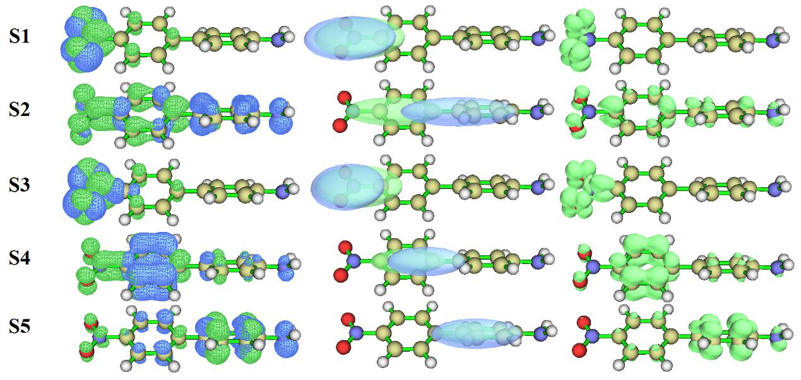

<!-- p.814 -->


区域之间的距离越远，从而库仑吸引能越弱。从数据中

确实发现 S0→S2(唯一的 CT 激发)的库仑吸引能是全部五个电子激发中最小的一个。而对于 S0→S1 和 S0→S3 激发，由于它们的 D 指数非常小，且根据 H 指数其空穴和电子的空间范围非常窄，不难想象相应的库仑吸引应非常强。确实，如前表所示，它们的空穴-电子库仑吸引能是最负的(-7.81 和 -8.54 eV)。

结合上述等值面图和定量数据，我们可以明确判断五个激发的特征：

·S0→S1：硝基上 n-π* 型的 LE 激发 ·S0→S2：从氨基指向硝基的 π-π* 型 CT 激发 ·S0→S3：与 S0→S1 相同 ·S0→S4：发生在与硝基相连的苯环上的 π-π* LE 激发 ·S0→S5：发生在与氨基相连的苯环上的 π-π* LE 激发 在此，一并给出显示全部五个激发的所有碎片对空穴、电子和重叠贡献的热图。为便于平行比较，所有激发态的颜色标尺统一设为 0.0~1.0。

从这些热图中，通过查看矩阵元的颜色可立即弄清激发电子来自哪里、到哪里去。例如，从 S0→S2 的图中可容易识别出激发电子主要源自碎片 3(与氨基相连的苯)，大部分转移到碎片 1(硝基)，较小部分转移到碎片 2(与硝基相连的苯)。再如，从

S0→S4 图中可发现激发电子来自碎片 2，激发后大部分仍留在碎片 2，但少部分转移到碎片 1，且碎片 2 上空穴和电子之间的重叠明显高于其它区域。


<!-- p.815 -->


值得注意的是，电子激发过程中碎片间电荷转移的细节特征可用 IFCT 方法得到更好的揭示，见 4.18.8 节的例子。

在 VMD 中绘制格点数据 空穴、电子、Cele、Chole 等的格点数据可通过后处理菜单中的相应选项导出为 cube 文件，然后你可在 VMD 程序中渲染它们以获得更好的可视化效果。若你不知如何操作，请参阅 4.18.3 节末尾关于 VMD 中操作的说明。此外，可先用 VMD 对 Cele 和 Chole 绘制等值面图，然后输入如下命令将空穴和电子的质心绘制为紫色和橙色小球，使图形信息更丰富

```text
draw color purple
draw sphere {1.411500   -0.007015   -0.025494} radius 0.25 resolution 20
draw color orange
draw sphere {-2.069784   -0.000346   -0.000830} radius 0.25 resolution 20
```

对于 S0→S2 激发，以上述方式在 VMD 中绘制的图形如下所示

为便于理解，图上附加了一个箭头以突出 CT 方向，同时标注了 D 指数以使图形信息更丰富。

提示：通过脚本获取一系列激发态的各种指数 通过 Linux shell 脚本，可一次性获取一系列激发态的各种指数。

例如，我们想获取 S0→S1、S2、S3 激发的全部指数，应将输入文件 D-pi-A.fchk 和 D-pi-A.out 以及 examples\excit 文件夹中的 all_index.sh 复制到合适的文件夹，然后在 Linux 终端中进入该文件夹，运行 chmod +x ./batch.sh 添加可执行权限，再运行 ./all_index.sh 执行脚本。每个激发将依次被分析，状态会显示在屏幕上，直到出现“Finished!”。然后打开当前文件夹中生成的 result.txt 文件，你将发现

```text
     1  Sr index (integral of Sr function):   0.51896 a.u.
     2  Sr index (integral of Sr function):   0.64906 a.u.
     3  Sr index (integral of Sr function):   0.54538 a.u.

     1  D_x:   0.522  D_y:   0.001  D_z:   0.001    D index:   0.522 Angstrom
     2  D_x:   3.481  D_y:   0.007  D_z:   0.025    D index:   3.481 Angstrom
     3  D_x:   0.574  D_y:   0.001  D_z:   0.001    D index:   0.574 Angstrom

     1  RMSD of hole in X/Y/Z:       1.443   1.160   0.437   Norm:   1.902 Angstrom
     2  RMSD of hole in X/Y/Z:       3.055   0.826   0.740   Norm:   3.251 Angstrom
```


<!-- p.816 -->


```text
[ignored...]
```

这是所有指数的汇总。你可以很容易地修改脚本以满足实际需要，若对此不熟悉，请查看 5.3 节。

### 4.18.1.2 例 2：水中的 Ru(bpy3)2+ 阳离子

下面我们基于 TDDFT 输出，通过空穴-电子分析考察水中 Ru(bpy3)2+ 配合物的几个激发态。

相应的 Gaussian 输入文件已作为 examples\excit\Ru(bpy3)2+.gjf 提供，请用 Gaussian 计算它。若想直接获取生成的输出文件和 .fchk 文件，可在 http://sobereva.com/multiwfn/extrafiles/Ru_bpy3_2+_TDDFT.zip 下载。从 .gjf 文件可以看出，所用关键词为 B3LYP/genecp TD(nstates=50) scrf IOp(9/40=3)，其中 scrf 要求 Gaussian 采用 IEFPCM 溶剂化模型表示水环境。由于该体系不小，且计算了多达 50 个激发态，为避免空穴-电子分析中计算时间过高和 Gaussian 输出文件过大，使用 IOp(9/40=3)代替上一节所用的 IOp(9/40=4)，此时的分析精度仍完全足够。

我们任意选取三个激发态进行空穴-电子分析，结果为

D (Å) Sr H (Å) t (Å) hole (Ru%) ele (Ru%) MLCT(%)

S0→S24 0.30 0.71 2.73 -1.35 77.3 19.6 57.7

S0→S37 0.11 0.84 3.52 -2.10 16.9 8.8 8.1

S0→S40 0.13 0.71 2.00 -1.05 80.3 42.4 38.0

此表中所有 D 指数都很小，而所有 Sr 指数都相当大。主要原因是当前分子是对称体系，因此 CT 跃迁是多方向的。表中的 MLCT(%)表示金属到配体电荷转移特征的百分比，可通过金属在空穴中的百分比(即 hole(Ru%))减去其在电子中的百分比(即 ele(Ru%))很容易地求得。注意，严格来说，我们得到的是净 MLCT 百分比，它已与 LMCT(配体到金属电荷转移)部分抵消。

下面是等值面值为 0.002 的 S0→S24 激发的空穴&电子图。由于空穴和电子分布有很大重叠，为清晰起见，空穴和电子的等值面分别给出。


<!-- p.817 -->


结合图形与表中的定量数据，清楚表明 S0→S24 激发不仅具有金属中心(MC)特征，即金属的电子被激发到金属自身的空轨道，而且具有明显的 MLCT 特征。如空穴&电子等值面图所示，空穴和电子的主体都在金属上，且可见电子的等值面在配体上也有很大一部分。计算的 MLCT 特征百分比为 77.3-19.6 = 57.7%，该值应说与空穴-电子等值面图所传达的信息非常一致。注：空穴在配体上也有不可忽略的分布，为 100%-77.3% = 22.7%。配体上看不到空穴等值面的原因是其在该区域的分布非常弥散，只有将等值面值减小到更小的值(如 0.0005)才能清楚看到配体上的空穴。

然后看 S0→S37 激发。从下所示的空穴&电子等值面图可以看出空穴和电子的主体都位于其中一个配体上，因此毫无疑问这是 LC(配体中心)激发，对应电子从

配体激发到其自身 π* 轨道的情形。因为金属上也有空穴和电子分布，因此该激发也显示出一定的 MLCT 特征，计算为 16.9% - 8.8% = 8.1%。

最后，看 S0→S40 激发，其空穴和电子等值面如上图右侧部分所示。从空穴等值面和前表

所示的金属上空穴百分比(16.9%)发现，其空穴分布特征与 S0→S24 非常相似，但配体上的电子量明显不如 S0→S24 多，只有一小部分分布在与 Ru 直接配位的四个氮上，因此 S0→S40 的 MLCT 特征


<!-- p.818 -->


明显弱于 S0→S24。相比之下，其 MC 特征肯定高于 S0→S24。

顺便说一下，对于配位体系，若想分别获得 MLCT、LMCT、LLCT、MC、LC，应借助 4.18.8 节所述的 IFCT 分析。

我们已经知道 S0 到 S24 和 S40 激发中的电子主要源自 Ru 原子，但如何揭示电子是从哪些原子轨道激发的？尽管多少可从空穴的等值面图判断，但仍有一些主观性。要弄清这一点，我们可计算基函数对空穴和电子的贡献。例如，在进入空穴-电子分析功能并选择第 40 个激发态后，我们选择“4 显示基函数对空穴和电子的贡献(Show basis function contribution to hole and electron)”然后输入输出阈值，如 2，则将打印对空穴或电子贡献高于 2% 的基函数信息：

```text
   Basis  Type    Atom    Shell     Hole      Electron     Overlap      Diff.
    22    D 0      1(Ru)   12     23.81 %      0.00 %      0.33 %    -23.81 %
    23    D+1      1(Ru)   12      8.90 %     13.63 %     11.01 %      4.72 %
    24    D-1      1(Ru)   12      9.06 %     25.12 %     15.09 %     16.05 %
    25    D+2      1(Ru)   12     13.96 %      6.94 %      9.84 %     -7.02 %
    26    D-2      1(Ru)   12     14.06 %     15.57 %     14.80 %      1.51 %
    27    D 0      1(Ru)   13      3.66 %      0.00 %      0.06 %     -3.66 %
    30    D+2      1(Ru)   13      2.32 %     -0.01 %      0.00 %     -2.32 %
    31    D-2      1(Ru)   13      2.33 %     -0.03 %      0.00 %     -2.35 %
 Sum of above printed terms:      78.10 %     61.22 %                 16.88 %
```

从数据可以看出，对空穴的主要贡献是 Ru 原子的 D 基函数。当前使用的 SDD 赝势基组对 Ru 只描述 4s、4p、4d 和 5s

电子，因此 S0→S40 激发的激发电子必定来自 4d 原子轨道。对电子有贡献的 Ru 基函数也是 D 型。因此，

现在我们知道 S0→S40 中的 MC 成分对应 Ru 上的 d-d 跃迁。

注意，这不是判断激发电子来自哪些轨道、去往哪些轨道的唯一方法，例如你也可用 Multiwfn 进行 NTO 分析并考察本征值最大的 NTO 对的形状。但若所研究的电子激发不能被任何一对 NTO 很好地描述，则该方法将行不通。相比之下，空穴-电子分析没有任何限制。

### 4.18.2 跃迁密度(矩阵)和跃迁偶极

### 矩密度(矩阵)分析

跃迁密度和跃迁偶极矩密度是电子激发分析中涉及的非常重要的量，它们可通过空穴-电子模块以实空间函数形式研究，或通过绘制为彩色矩阵图(也称热图)在 Hilbert 空间中研究。4.18.2.1、4.18.2.2 和 4.18.2.3 节的例子将说明这些分析。此外，尽管通常研究的跃迁是从基态到激发态的跃迁，但两个激发态之间的这些量在某些特殊研究中也有用，4.18.2.4 节将提及如何实现这一点。

关于这些主题的更多讨论可见我的博客文章：“使用 Multiwfn 绘制跃迁密度矩阵和电荷转移矩阵研究电子激发特征”(中文，http://sobereva.com/436)。

<!-- p.819 -->


### 4.18.2.1 在实空间中分析跃迁密度和跃迁偶极矩密度

实空间函数形式的跃迁密度理论，即 T(r)，已作为 3.21.1.1 节中的“理论 4(Theory 4)”介绍，T(r) 的等值面图能够揭示空穴和电子之间明显的相干区域。而实空间函数形式的跃迁电偶极矩密度，即 Tx(r)、Ty(r) 和 Tz(r)，能够展示各个区域对跃迁电偶极矩(Dx、Dy、Dz)的贡献，这一点已作为 3.21.1.1 节的“理论 5(Theory 5)”介绍。在本节中，将以 N-苯基吡咯为例说明这类分析，所用文件与 4.18.1 节例子中所用的完全相同。

启动 Multiwfn 并输入 examples\excit\N-phenylpyrrole.fch // Gaussian TDDFT 任务产生的 .fch 文件 18 // 电子激发分析 1 // 空穴-电子分析模块 examples\excit\N-phenylpyrrole.out // 带 IOp(9/40=4) 关键词的 Gaussian TDDFT 任务的输出文件

1 // 分析从基态到第 1 激发态的电子跃迁(S0→S1) 1 // 可视化并分析空穴、电子、跃迁密度等 2 // 中等质量格点 现在你可在输出中找到以下信息，它们是基于格点数据积分求得的 Dx、Dy 和 Dz

```text
Transition dipole moment in X/Y/Z:  -0.000021  -0.000045   1.767332 a.u.
```

值得注意的是，这些值与 Gaussian 输出文件中打印的值非常接近，如下所示(N-phenylpyrrole.out 第 773 行)，表明当前采用的格点质量已足够好

```text
       state          X           Y           Z        Dip. S.      Osc.
         1         0.0000      0.0000      1.7813      3.1729      0.3935
...[ignored]
```

我们在后处理菜单中选择选项 5 显示跃迁密度等值面，随后将看到下图所示图像中的左图，它展示了实空间表示的跃迁密度。若将跃迁密度乘以 Z 坐标变量的负值，则将得到跃迁偶极矩密度的 Z 分量，即 Tz(r)。要可视化它，我们关闭当前 GUI 窗口并选择“6 显示跃迁偶极矩密度等值面(Show isosurface of transition dipole moment density)”然后选择“3: Z 分量(3: Z component)”，你将看到下图右图

<!-- p.820 -->


从上述 T(r) 图可以看出，空穴和电子处处有强相干，意味着空穴和电子的分布都覆盖整个分子(这可通过可视化空穴和电子分布进一步容易确认，如 4.18.1 节所述)。从上所示右图可以看出其正(绿色)部分明显大于负(蓝色)部分，回想 Tz(r)在全空间的积分正是跃迁电偶极矩的 Z 分量(Dz)，这一观察解释了为什么 S0→S1 的 Dz 是大的正值(1.7813 a.u.)。若你感兴趣，可尝试绘制 Tx(r)或 Ty(r)图来解释所研究的电子激发为何 Dx 和 Dy 为零。

需要特别指出的是，当前体系的 S0→S1 较为特殊，即其跃迁电偶极矩矢量(D)恰好指向 Z 轴。但对大多数实际情况，D 并不平行于三个笛卡尔轴中的任一个，此时我们无法通过可视化 Tx(r)或 Ty(r)或 Tz(r)中的任一个直接研究其来源。幸运的是，很容易将分子重新取向使 D 恰好指向选定的笛卡尔轴，从而使上述分析可行。关于如何实现这一点见 4.A.7 节附录 2。

接下来，我们查看 S0→S4 激发的 Tz(r)等值面。我们先返回主功能 18 的菜单，然后重复上述步骤，最终你将看到

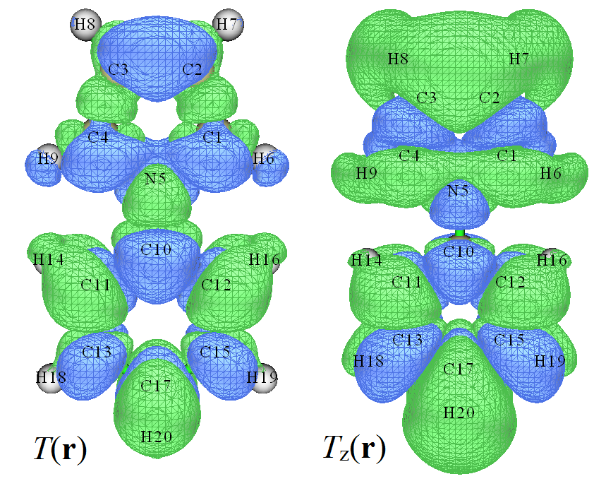

<!-- p.821 -->


绿色和蓝色等值面占据同样大小的空间，表明对 Dz 的正负贡献完全相同，这就是为什么 S0→S4 的 Dz 为零。注意 Tz(r)几乎只分布在吡咯区域，这是因为该电子激发对应吡咯部分的局域激发(如 4.18.1 节所示)。

你可能已感到跃迁偶极矩密度的可视化研究有趣且有用；确实，通过这种方式可清楚识别分子不同区域对跃迁偶极矩的贡献。T(r)以及 Tx(r)、Ty(r)和 Tz(r)的 cube 文件可通过后处理菜单导出，以便你也可用 VMD 等其它可视化软件绘制它们(4.A.14 节)，或用如盆分析模块(3.20 节)或域分析模块(3.200.14 节)进一步定量其分布，或通过主功能 4 将它们绘制为平面图(使用基于已加载格点数据的插值函数，即用户自定义函数 -1)。

可视化跃迁磁偶极矩密度 上面讨论的跃迁偶极矩是跃迁电偶极矩。还有其它种类的跃迁偶极矩，如跃迁速度偶极矩和跃迁磁偶极矩。Multiwfn 也能计算跃迁磁偶极矩并绘制相应密度的等值面图，相关知识可见 3.21.1 节的“理论 5(Theory 5)”。由于该量不如跃迁电偶极矩重要，我不深入讨论，只给出一个简单例子。使用 N-苯基吡咯的 .out 和 .fch 文件，我们先进入空穴-电子模块并选择第二个激发态，然后输入

-1 // 默认情况下，空穴-电子模块的选项 1 为节省时间不计算跃迁磁偶极矩密度，我们现在选择此选项使选项 1 也计算该量

1 // 可视化并分析空穴、电子、跃迁密度等 2 // 中等质量格点 计算完成后，从屏幕上可找到基于格点数据求得的跃迁磁偶极矩：

```text
      Transition magnetic dipole moment in X/Y/Z: -0.503315  0.000119 -0.000177 a.u.
```

然后我们选择选项 9 并选择感兴趣的跃迁磁偶极矩密度分量

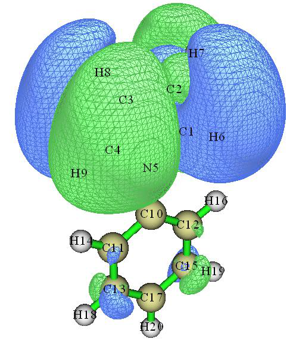

<!-- p.822 -->


之后你将看到相应的等值面图。下图是等值面值为 0.005 下绘制的跃迁磁偶极矩密度的 X 分量。与绿色区域相比蓝色区域相对更大，解释了为什么跃迁磁偶极矩的 X 分量为负值(-0.503 a.u.)。

### 4.18.2.2 绘制并分析跃迁密度矩阵(TDM)

注：有视频演示使用 Multiwfn 和 Origin 绘制跃迁密度矩阵的步骤，见 https://youtu.be/JPlZk4Aa6bQ。

跃迁密度矩阵(TDM)已在 3.21.2 节仔细介绍，TDM 的热图对理解电子激发本质特别有用，请先阅读 3.21.2 节。在本节中，我们将通过 TDM 热图分析给体-π-受体型线性体系的跃迁特征。分子结构如下所示。

Gaussian 输出文件以及 .fchk 文件可在“examples\excit\NH2_C8_NO2”文件夹中找到，关键词为 CAM-B3LYP/6-31G* IOp(9/40=4) TD(nstates=10)。

值得注意的是，TDM 与空穴-电子分析框架中定义的电荷转移矩阵密切相关。在 4.18.8.2 节给出了绘制电荷转移矩阵热图的例子。通常 TDM 和电荷转移矩阵的热图彼此非常相似并传达基本相同的信息。

原子跃迁密度矩阵 首先，我们绘制“原子 TDM”的热图，即 TDM 的序号对应原子序号。通常，这种图只适于研究链状体系，如


<!-- p.823 -->


当前分子，否则热图中的序号将难以映射到分子中的实际原子。对于形状更复杂的体系，通常应绘制“碎片 TDM”，稍后将描述。

注意，在“原子 TDM”中，通常忽略氢，因为它们很少对感兴趣的化学激发有贡献。因此，在当前分子的激发态计算之前，氢的序号已被移到重原子之后。从上所示分子结构图可以看出，重原子的范围是 1~12，而氢的范围是 13~22。

这里我们先研究该体系的 S0→S1 跃迁。以下使用的 fchk 和 .out 文件是使用 CAM-B3LYP/6-31G* IOp(9/40=4) TD(nstates=10) 关键词产生的。启动 Multiwfn 并输入

examples\excit\NH2_C8_NO2\NH2_C8_NO2.fchk 18 // 电子激发分析 2 // 绘制跃迁矩阵热图(Plot heat map of transition matrix) examples\excit\NH2_C8_NO2\NH2_C8_NO2.out 1 // 研究基态到第 1 激发态之间的跃迁。然后 Multiwfn 将计算相应的 TDM

n // 不对新生成的 TDM 做对角化，因为原始形式的 TDM 携带更多有用信息

1 // 如 3.21.2 节所述，有几种方式可将 TDM(以基函数表示)收缩为原子 TDM。在此我们用方式 1。方式 2 和方式 3 也可用并可得到类似的图，而方式 4 通常不推荐

1 // 绘制热图(Plot heat map) 下图立即显示在屏幕上，粉色线为手动添加以突出对角线，“hole”和“electron”文字也是手动标注的。默认情况下，颜色标尺下限为 0，而上限为最大矩阵元。

电子激发可视为空穴→电子跃迁。如 3.21.2 节所介绍，TDM 热图的对角元可反映在哪些原子上空穴和电子同时有大分布。对于非对角元，应先看 X 轴


<!-- p.824 -->


(对应空穴位置)再看 Y 轴(对应电子位置)，就能识别电子如何在不同位点间转移。在当前实例的 TDM 图中，对角线上的大多数元都被绿色或红色包围，因此该激发必定是整体激发，即激发电子分布于整个体系。矩阵元关于对角线不对称，可清楚看到图的上左部分大于下右部分，特别是对角线附近的元有相对较大的值。该观察表明非氢原子上的电子转移到与其相邻的原子，更具体地说，序号较小的原子上的电子倾向于转移到序号较大的原子。由于非氢原子的序号是从氨基端到硝基端排序的，因此可推断该 S0→S1 激发导致电子整体从氨基端移向硝基端。

若你觉得难以理解上述文字，可将 TDM 图与以下空穴&电子等值面图比较(见 4.18.1 节关于如何绘制它)。你会发现 TDM 热图和等值面图传达类似的信息，并可证实我们基于 TDM 图得出的所有结论。

若想为其它激发态绘制 TDM 热图，可退出热图绘制功能，然后重新进入该功能并选择要研究的态。值得注意的是，若选择选项“4 切换是否考虑氢(Toggle if taking hydrogens into account)”一次将其状态切换为“Yes”然后重新绘制，你将看到下图

氢的序号范围是 13-22，上图显示氢确实不明显参与电子激发，因为它们的元非常小(表示为

紫色)，显然将氢包含进 S0→S1 TDM 热图是没有意义的。

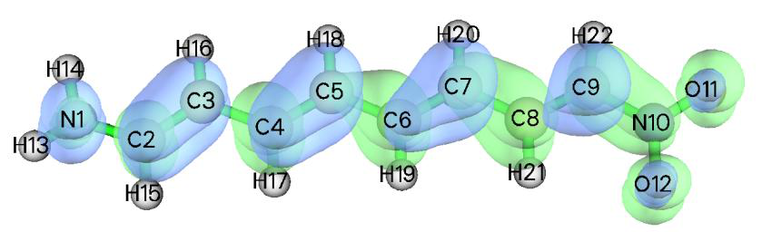

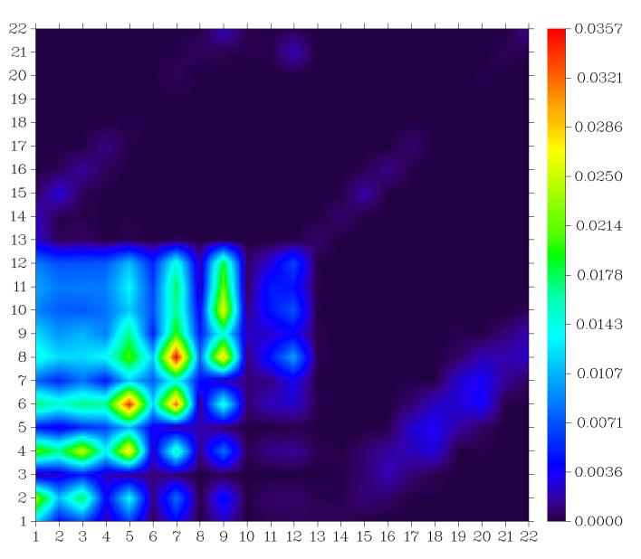

<!-- p.825 -->


我们再看另一个激发，S0→S2。热图和空穴&电子等值面图如下所示。

热图的右上角有大值区域，对应体系末端的硝基，因此空穴和电子必定在该区域同时有大分布。此外，图像最右侧一列的非对角元的值也不是很小，因此可认为硝基向体系中部区域转移了一定量的电子，这与在空穴&电子等值面图中可见的现象一致。该观察也可描述为在 S0→S2 激发中硝基部分与体系中间区域之间存在所谓“相干”。

碎片跃迁密度矩阵 下面我们将绘制基于碎片的 TDM 热图，即图的序号对应自定义碎片的序号。这种 TDM 图的优点是待研究体系不一定是线性的，任何形状的体系(如环形、星形)也可容易地考察。

接下来要考察的体系如下所示，分子被分为五个碎片，以不同颜色表示。Gaussian 输入、输出和 fchk 文件，以及下文涉及的其它文件可从 http://sobereva.com/attach/436/file.rar 下载。

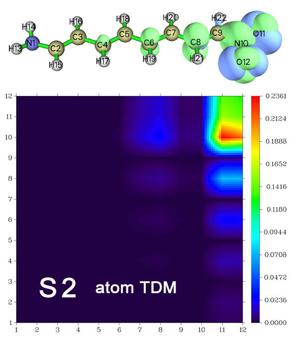

<!-- p.826 -->


我们先研究 S0→S1 激发。启动 Multiwfn 并输入 tdmat.fchk 18 // 电子激发 2 // 绘制跃迁矩阵热图(Plot heat map of transition matrix) tdmat.out

1 // 研究 S0→S1 激发 n // 不对新生成的 TDM 做对称化 1 // 用方式 1 将以基函数表示的 TDM 收缩为原子 TDM 现在你可选择选项 1 绘制原子 TDM。但我们当前目的是绘制碎片 TDM。为此，我们可创建一个纯文本文件(在 file.rar 包中已作为 tdmfrag.txt 提供)，其每行定义一个碎片，本例中该文件内容为

```text
1-23
24-33
34-43
44-55
56-63
```

注意你也可用如 2,5-8,12-15,20 来将一批序号不连续的原子定义为一个碎片。

然后输入以下命令 -1 // 定义碎片(Define fragments) 0 // 从外部文件加载碎片定义(按提示，你也可直接输入原子序号)

tdmfrag.txt // 包含碎片定义的文件 5 // 修改颜色标尺范围(Modify range of color scale) 0,0.4 // 下限和上限 1 // 绘制热图(Plot heat map) 现在你可看到下图，其序号对应碎片序号，空穴&电子等值面图也一并给出以供比较。蓝色框标记的区域是第 4 个碎片(己三烯)。


<!-- p.827 -->


根据热图中的颜色可知，电子和空穴主要分布在片段 4 上，但同时也在一定程度上出现在片段 1 和片段 5 上，这些发现与等值面所展示的情况一致。由于图中没有特别大的非对角元，本次电子激发并未在各片段之间引起显著的电子转移。粗略地说，此激发的主要特征是片段 4 上的局域激发。

类似地，我们绘制基态与 S2~S7 各激发态之间的片段 TDM，所得图集中展示如下

S0→S2~S5 的图中，非对角元的值相对于对角元并不显著，因此片段间的电子转移应该不明显。

根据对角项可以发现，S0→S2 和 S0→S3 的跃迁主要发生在片段 1 上，而 S0→S2 还少量涉及片段 4。总的来说，两者


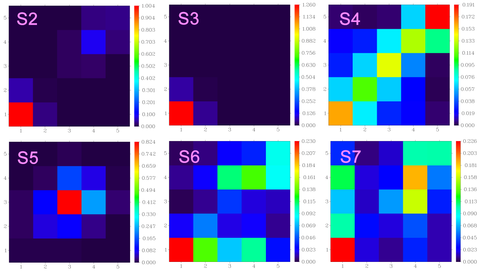

<!-- p.828 -->


都可视为局域激发。S0→S4 显然是整体激发，因为所有

对角项都很显著。S0→S5 的主要特征是片段 3（对应一个苯环）上的局域激发，但其相邻片段也或多或少参与其中。

S0→S6 和 S0→S7 在某种程度上互为镜像，从图中可以看出，电子激发过程中几乎每个片段都参与其中，它们或被空穴分布占据，或被电子分布占据，或两者兼有。对于 S0→S6，我们可以推测片段 2、3 和 4 向片段 1 转移了一定量的电子，因为 (1,2)、(1,3) 和 (1,4) 元较大，同时片段 3 和 5 也向片段 4 转移了一些电子。

上图及讨论清楚地表明，当你在撰写文章时想同时讨论从基态到大量激发态的跃迁特征时，提供一张包含所有激发的 TDM 热图的图是非常直观的。

技巧：用 shell 脚本批量绘制一批激发态的 TDM 热图 如果你想就 TDM 热图研究一批激发态，而又觉得逐个绘图很费力，可以用 Linux shell 脚本实现全自动化。

一次性为指定范围的激发态生成片段 TDM 热图的脚本是 examples\scripts\allTDM.sh。例如，若将上例中用到的 tdmat.fchk、tdmat.out、tdmfrag.txt 和 allTDM.sh 都放入 Multiwfn 目录并进入该文件夹，运行 chmod +x allTDM.sh 添加可执行权限，然后运行 ./allTDM.sh，该脚本将自动调用 Multiwfn 在当前目录生成 1.png、2.png……直到 7.png，它们

分别对应 S0→S1、S0→S2……至 S0→S7 的 TDM 热图。整个过程转眼即可完成，显然使用脚本极为方便。

### 4.18.2.3 绘制并分析跃迁偶极矩矩阵

事实上，上节介绍的热图绘制功能是一个通用模块，它还可以绘制其它种类的原子或片段矩阵。在 3.21.11 节中介绍了原子跃迁偶极矩矩阵（atom TDMM）的概念。该矩阵有 X、Y、Z 三个分量。例如，X 分量矩阵的所有元之和恰好对应跃迁偶极矩的 X 分量。因此，通过将 TDMM 绘制成热图，我们能够弄清哪些原子或片段对跃迁偶极矩有显著贡献。

下面，我们仍以 4.18.2.2 节用的给体-π-受体为例，展示如何将 TDMM 绘制成热图。Multiwfn 既能绘制跃迁电偶极矩矩阵，也能绘制跃迁磁偶极矩矩阵，本节仅限于前者。

首先需要生成包含原子 TDMM 的文件。启动 Multiwfn 并输入 examples\excit\NH2_C8_NO2\NH2_C8_NO2.fchk 18 // 电子激发分析 (Electron excitation analysis) 11 // 将跃迁偶极矩分解为基函数和原子贡献 (Decompose transition dipole moment as basis function and atom contributions) examples\excit\NH2_C8_NO2\NH2_C8_NO2.out

1 // 研究 S0→S1 激发 (Study S0→S1 excitation) 1 // 所研究的跃迁偶极矩为“电”偶极矩 (“electric”) y // 导出原子 TDMM (Export atom TDMM) 如屏幕所示，矩阵已以 “AAtrdip” 为


<!-- p.829 -->


前缀导出为当前文件夹下的 .txt 文件，其中 AAtrdipX.txt 包含原子 TDMM 的 X 分量。接下来，我们将基于该矩阵绘制热图。

重新启动 Multiwfn 并输入 o // 载入上次载入的文件 (Load the file last time loaded) 18 // 电子激发分析 (Electron excitation analysis) 2 // 绘制跃迁矩阵的热图 (Plot heat map of transition matrix) AAtrdipX.txt 此时可在屏幕上看到以下信息


```text
 Sum of all elements (including hydrogens):     -4.38875223
 Maximum and minimum (including hydrogens):      0.65818572     -0.82543408
 Sum of all elements (without hydrogens):       -2.86353889
 Maximum and minimum (without hydrogens):        0.65818572     -0.82543408
```

其中 -4.38875223 恰为 S0→S1 激发的跃迁电偶极矩的 X 分量，该值与在 Gaussian 输出文件中能找到的值完全相同。

如上述提示所示，该矩阵的最小值为负值 -0.825，而本功能默认的颜色标尺下限为 0，因此必须更改颜色标尺，最好使下限和上限的绝对值相同。你可以反复尝试，找到最能反映矩阵特征的值。若范围太窄，超出颜色标尺上下限的部分将分别显示为白色和黑色，不美观。若范围太宽，矩阵元的差异则难以靠颜色区分。

现在在 Multiwfn 中输入以下命令 5 // 修改颜色标尺范围 (Modify range of color scale) -0.7,0.7 // 下限和上限 (Lower and upper limits) 1 // 绘制热图 (Plot heat map) 立即即可看到下图。为了更好地理解热图，还一并展示了 X 分量的跃迁偶极矩密度的等值面（绘制方法见 4.18.2.1 节）


<!-- p.830 -->


该热图中越蓝（越红）的矩阵元对 X 分量跃迁偶极矩的负（正）贡献越大。由于热图大部分区域为蓝色，所有矩阵元之和必为负，这就解释了为什么跃迁偶极矩的 X 分量是一个显著的负值（-4.388 a.u.）。因为所有远离对角线的矩阵元都非常接近于 0（显示为绿色），所以原子间的长程耦合对 X 分量跃迁偶极矩没有实质性贡献。图中有几处区域显示出很深的蓝色，如 (2,2) 和 (9,9) 附近，表明相应原子及其邻近原子有显著的负贡献，这一点在跃迁偶极矩密度的等值面图中也清楚地反映出来。有些位置如 (1,2) 明显为正，意味着这两个原子间的耦合对 X 分量跃迁偶极矩有显著的正贡献，这也是为什么在等值面图中原子 1 和 2 之间存在绿色等值面。热图中间部分基本为绿色，表明数值很小；相应地，等值面图上分子中部没有等值面。

可见，将跃迁偶极矩密度与跃迁偶极矩矩阵结合起来，有助于阐明跃迁偶极矩的内在特征。

我们也可以基于片段序号绘制 TDMM，这非常容易，此处不再赘述。你只需在热图绘制功能中定义片段然后绘图即可（请回顾 4.18.2.3 节）。

### 4.18.2.4 研究激发态之间的跃迁密度和跃迁密度矩阵

在前几节中，我已介绍了如何就（跃迁偶极矩）密度这一实空间函数以及基态与激发态之间的跃迁（偶极矩）密度矩阵来研究跃迁特征。


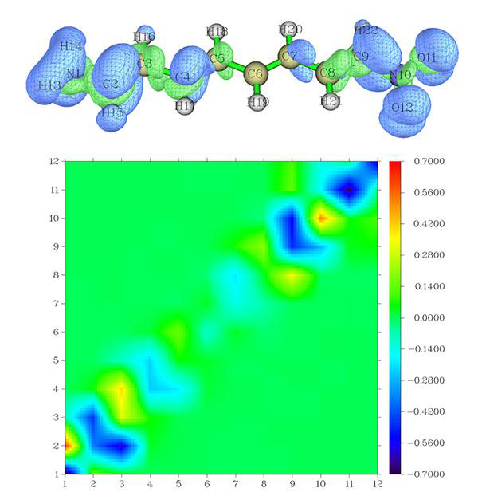

<!-- p.831 -->


事实上，这类研究也可用于分析两个激发态之间的跃迁，此类分析在特殊应用中可能有用，如瞬态吸收光谱和双光子过程。本节我将展示如何实现这些分析。

激发态之间实空间函数的跃迁密度分析 如 4.18.2.1 节所示，Multiwfn 能很容易地生成基态与所选激发态之间跃迁密度的格点数据。事实上，两个激发态之间的跃迁密度也可生成。为此，应先生成两态之间的跃迁密度矩阵（TDM），然而，由于 Multiwfn 中所有与实空间函数相关的分析都基于轨道，我们接着需要将 TDM 变换为相应的自然轨道。最后，基于这些自然轨道计算的电子密度将直接对应跃迁密度。

这里以 N-苯基吡咯的 S2→S3 跃迁为例，下述步骤将生成相应跃迁密度的 cube 文件。启动 Multiwfn 并输入

examples\excit\N-phenylpyrrole.fch 18 // 电子激发分析 (Electron excitation analysis) 9 // 生成并导出跃迁密度矩阵 (Generate and export transition density matrix) 2 // 生成两个激发态之间的跃迁密度矩阵 (Generate transition density matrix between (TDM) two excited states) examples\excit\N-phenylpyrrole.out

2,3 // 假设你要分析 S2→S3 跃迁 [直接按 ENTER 键使用默认阈值] y // 以通常方式对称化所得 TDM (Symmetrize the resulting TDM in usual way) y // 将当前波函数信息（含新生成的 TDM）导出为当前文件夹下的 TDM.fch (Export present wavefunction information including the newly generated TDM to TDM.fch in current folder)

重新启动 Multiwfn 并输入 TDM.fch 200 // 其它功能，第二部分 (Other function, part 2) 16 // 基于 .fch/.fchk 文件中的密度矩阵生成自然轨道 (Generate natural orbitals based on the density matrix in .fch/.fchk file) SCF // 我们输入此项是因为 TDM.fch 中当前的 “Total SCF Density” 场

对应 S2→S3 TDM

y // 导出 new.mwfn，它包含对应 S2→S3 TDM 的自然轨道，并让 Multiwfn 直接载入它

0 // 返回主菜单 (Return to main menu) 5 // 计算格点数据 (Calculate grid data) 1 // 电子密度 (Electron density) 2 // 中等质量格点 (Medium-quality grid) 2 // 导出 cube 文件 (Export cube file) 现在当前目录下生成的 density.cub 记录的即为 S2 与 S3 之间的跃迁密度，你也可以选择选项 -1 直接可视化等值面。

也可以生成激发态之间跃迁偶极矩密度的格点数据。例如，若将 `settings.ini` 中的 “iuserfunc” 参数设为 22，即把自定义函数设为 −𝑥𝜌(𝐫)，那么当你使用之前生成的 new.mwfn 作为输入文件时，用户

自定义函数将对应 S2→S3


<!-- p.832 -->


跃迁的跃迁偶极矩密度的 X 分量。显然，你接下来要做的就是计算自定义函数的格点数据。

激发态之间跃迁密度矩阵的热图 这里我们用 4.18.2.2 节用过的 NH2-C8-NO2.fchk 和 NH2-C8-NO2.out 为例，说明如何绘制任意选定的两个激发态（S1 和 S2）之间跃迁密度矩阵的热图。

启动 Multiwfn 并输入 examples\excit\NH2_C8_NO2\NH2_C8_NO2.fchk 18 // 电子激发分析 (Electron excitation analysis) 9 // 生成跃迁密度矩阵 (Generate transition density matrix) 2 // 针对两个激发态 (For two excited states) examples\excit\NH2_C8_NO2\NH2_C8_NO2.out 1,2 // 所选态为 S1 和 S2 [按 ENTER 键使用默认阈值] 0 // 不对称化所得 TDM (Do not symmetrize the resulting TDM) n // 不生成 TDM.fch (Do not yield TDM.fch)

现在当前文件夹下有了 tdmat.txt，它记录 S1→S2 的 TDM。

重新启动 Multiwfn 然后输入 o // 载入上次载入的文件 (Load the file last time loaded) 18 // 电子激发分析 (Electron excitation analysis) 2 // 绘制跃迁矩阵的热图 (Plot heat map for transition matrix) tdmat.txt // 将从此文件载入矩阵数据 (Matrix data will be loaded from this file) 1 // 按方式 1 构建原子跃迁矩阵 (Construct atom transition matrix in terms of way 1) 1 // 绘制热图 (Plot heat map) 所得图形如下，还给出了用 S2 密度减去 S1 密度得到的密度差的等值面图（绘制方法见 4.18.13 节）。


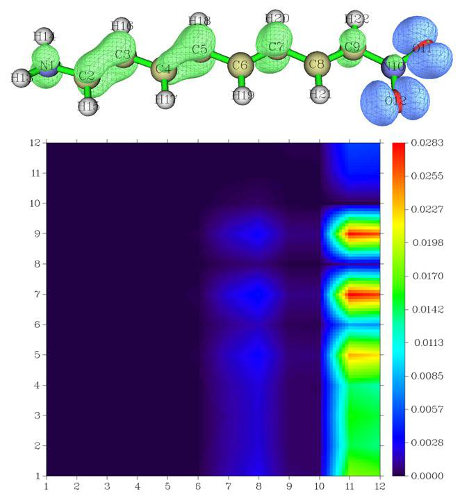

<!-- p.833 -->


由于热图右侧（X=11 和 12）对应原子 1~9 的区域有很大的值，我们可以推测在 S1→S2 激发过程中有大量电子从原子 11 和 12 转移到原子

1~9。从密度差的等值面图也可得到完全相同的结论。此例表明，密度矩阵热图不仅对分析基态到激发态的跃迁有用且可靠，对各激发态之间的跃迁同样如此。


### 4.18.3 基于电子密度差分析电子激发过程中的电荷转移


注：博客文章“使用 Multiwfn 基于电子密度差描述符分析电荷转移”（中文，http://sobereva.com/776）包含比本节多得多的信息。

本例我们将在乙醇溶剂中分析如下所示分子（记为 P2）的第一单重激发态与基态之间的电荷转移（CT）。相关理论已在 3.21.3 节介绍。本例的讨论与 4.18.1 节涉及的内容有些关联，但本节所用方法纯粹基于电子密度差，因此更具通用性，可用于任何能产生基态和激发态波函数的方法（如 CCSD 联用 EOM-CCSD）。

由于激发态和基态对应的 .wfn 文件较大，未提供。取而代之的是在 “examples\excit” 文件夹中提供了用于生成这两个 .wfn 文件的 Gaussian 输入文件（extP2.gjf 和 basP2.gjf）。我假设相应的 .wfn 文件已生成在当前文件夹的 “CT” 子文件夹中。我要再次提醒，两态波函数文件中的几何结构必须完全相同，否则结果将毫无意义！若你手头没有 Gaussian，也可以直接从 http://sobereva.com/multiwfn/extrafiles/extP2_basP2.zip 下载 extP2.wfn 和 basP2.wfn。

首先，我们计算激发过程中电子密度变化 Δρ 的格点数据。启动 Multiwfn 并输入：

CT\extP2.wfn // 激发态波函数文件 5 // 生成格点数据 (Generate grid data) 0 // 设置自定义操作 (Set custom operation) 1 // 只处理一个文件 (Only one file will be dealt with) -,CT\basP2.wfn // 基态波函数文件。将从激发态中减去相应密度以生成 Δρ

1 // 电子密度 (Electron density) 2 // 中等质量格点。若体系比当前大得多，需要更多格点（如用高质量格点） (Medium-quality grid. If the system is much larger than present one, more grid points is required (e.g. using high-quality grid))

一旦计算正常完成，你可选择选项 -1 查看电子激发过程中的电子密度变化（默认等值对可视化密度

<!-- p.834 -->


差来说太大，本例推荐用 0.005）。绿色和蓝色区域分别对应正值和负值区域，它们代表激发引起的电子密度的增加和减少。

然而这张密度差图并不很直观，因为正负部分交织在一起且有很多节点。我们将看到 C+ 和 C- 函数使图像清晰得多。

0 // 返回主菜单 (Return to main menu) 18 // 电子激发分析 (Electron excitation analysis) 3 // 基于电子密度差格点数据分析 CT (Analyzing CT based on electron density difference grid data) 以下信息立即显示。注意，若

qCT 的正负部分明显不等，说明生成 Δρ 所用格点设置太粗，需要用更细的格点重新计算。


```text
 q_CT (positive and negative parts):   0.844  -0.844 a.u.
 Barycenter of positive part in x,y,z (Angstrom):  -2.659  -0.001  -0.000
 Barycenter of negative part in x,y,z (Angstrom):   2.294  -0.009  -0.029
 Distance of CT in x,y,z (Angstrom):   4.953   0.009   0.029  D index:   4.953
 Dipole moment variation (a.u.) :   7.896  -0.014  -0.046 Norm:   7.896
 Dipole moment variation (Debye):  20.070  -0.035  -0.117 Norm:  20.070
 RMSD of positive part in x,y,z (Angstrom):  2.993  1.250  0.821 Total:   3.346
 RMSD of negative part in x,y,z (Angstrom):  3.290  1.144  0.881 Total:   3.593
 Difference between RMSD of positive and negative parts (Angstrom):
 X:  -0.297  Y:   0.106  Z:  -0.060  delta_sigma index:  -0.247
 H_x:  3.141  H_y:  1.197  H_z:  0.851  H_CT:  3.141  H index:  3.469 Angstrom
 t index:   1.811 Angstrom
 Overlap integral between C+ and C- (i.e. S+- index):  0.742365
```

以上信息是不言自明的，若有困惑，请查阅 3.21.3 节。

t 指数明显的正值意味着 Δρ 的正负分布因强 CT 而已显著分离。很大的 D 指数（4.95 Å）表明

CT 距离相当长。显然，该体系 S0→S1 跃迁应判为典型的 CT 激发。激发引起偶极矩显著变化，如数据所示，高达

20.07 Debye。Δρ 正负部分的分布空间展布宽度相近，因此量度其 RMSD 差异的 Δσ 指数仅为 -0.247 Å。


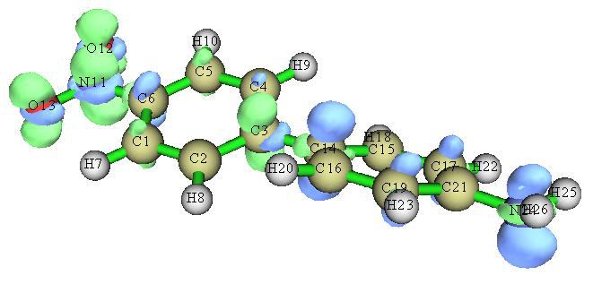

<!-- p.835 -->


通过选择选项 1，可显示 C+（绿色）和 C-（蓝色）函数的等值面。下图的等值为 0.0015。

若将等值提高到 0.0024，可大致定位质心位置（C+ 和 C- 的质心恰好对应其等值面的中心）。

从图中可明显看出电子转移方向是从氨基侧（电子给体）到硝基侧（电子受体）。然而，质心并不恰好位于两个取代基上，这一观察表明此电子激发中实际的电子给体不只是氨基，还包括苯撑。这与苯基是弱电子给体的事实相符。

提示：若想获得更好的 C+ 和 C- 等值面显示效果，可用 VMD 程序（可在 http://www.ks.uiuc.edu/Research/vmd/ 免费获得）显示，步骤为：先启动 VMD，将 Cpos.cub 拖入 VMD 主窗口，再将 Cneg.cub 拖入。选择 “Graphics”-“Representations”，在 “Selected Molecule” 中选中第一项，点击 “Create Rep” 按钮新建一个显示方式（既有显示方式用于显示分子结构），将 “drawing method” 改为 “isosurface”，将 “Draw” 设为 “solid surface”，将等值设为 0.0015，将 “coloring method” 设为 “ColorID” 并选 “7 green”。此时 Cpos 的等值面已正确显示。接着，在 “Selected Molecule” 中选中第二项，用类似方法设置各选项，但 “ColorID” 选 “0 blue”，等值用 -0.0015。最后，图形将如上图所示。你还可将 “Material” 设为 “transparent”，以便清楚区分 C+ 和 C- 的重叠区域。


<!-- p.836 -->


### 4.18.4 计算 N-苯基吡咯各电子激发的 ∆r 和 Λ 指数


### 以表征各类电子激发

本节我将说明如何计算 J. Chem. Theory Comput., 9, 3118 (2013) 提出的 Δr 指数和 J. Chem. Phys., 128, 044118 (2008) 提出的 Λ 指数，以表征 N-苯基吡咯的电子激发。若你对这两个指数不熟悉，请查看 3.21.4 节和 3.21.14 节。

依我个人看法，用空穴-电子框架中定义的 D 和 Sr 指数等量来表征电子激发已完全足够，如

### 4.18.1 节所示。理论上，Δr 和 Λ 指数可分别视为 D 和 Sr 的近似。Δr 和 Λ 唯一的优点是，在 Multiwfn 中它们可对所有选定的激发态同时输出，并可分解为轨道对贡献。此

外，Δr 指数的计算代价几乎可忽略。

本节所用文件是 “examples\excit” 文件夹中的 N-phenylpyrrole.fch 和 N-phenylpyrrole.out，它们由 Gaussian 产生，关键词为 CAM-B3LYP/6-31+G(d) TD(nstates=5) IOp(9/40=4)。由于计算中使用的是优化过的基态几何，因此分析结果可视为对应垂直吸收过程。

计算 Δr 指数 Δr 指数是定量量度电子激发电荷转移（CT）长度的指标，Δr 指数越大意味着 CT 距离越长。

启动 Multiwfn 并输入 examples\excit\N-phenylpyrrole.fch 18 // 电子激发分析 (Electron excitation analysis)

4 // 计算 Δr 指数 (Calculate Δr index) examples\excit\N-phenylpyrrole.out

1-5 // 假设我们要计算全部五个单重激发态的 Δr 指数

立即，结果打印在屏幕上：


```text
 Excited state    1:   Delta_r =    1.499249 Bohr,    0.793368 Angstrom
 Excited state    2:   Delta_r =    3.489064 Bohr,    1.846333 Angstrom
 Excited state    3:   Delta_r =    4.641132 Bohr,    2.455982 Angstrom
 Excited state    4:   Delta_r =    5.869424 Bohr,    3.105966 Angstrom
 Excited state    5:   Delta_r =    7.091127 Bohr,    3.752463 Angstrom
```

Δr 指数意味着从基态（S0）到第 3、4、5 激发态的激发具有强 CT 特征，因为它们有很大的 Δr，而 S0→S1 和 S0→S2 激发基本应视为 LE 激发，因为它们的 Δr 指数不太大（Δr 原文建议用 2.0 Å 作为区分 LE 和 CT 激发的判据）。请记住，只有在用 Multiwfn 的空穴-电子分析模块可视化空穴和电子分布之后，才能对激发特征得出确定性结论。

在 Multiwfn 中可以将 Δr 指数分解为轨道对跃迁的贡献。例如，我们想对 S0→S4 激发做此分解，应先进入 Δr 指数计算界面然后输入

4 // 只计算单个激发（S0→S4）的 Δr 指数，此时结果可被


<!-- p.837 -->


分解 (Only calculate Δr index for a single excitation (S0→S4), in this case the result can be decomposed)

y // 打印轨道对贡献 (Print orbital pair contributions) 0.01 // 只打印贡献大于 0.01 Å 的轨道对 (Only the orbital pairs having contribution larger than 0.01 Å will be printed) 你将立即看到以下信息


```text
Note: The configuration coefficients shown below have combined both excitation
and de-excitation parts
 Sum of square of configuration coefficients:    0.497953
    #Pair     Orbitals      Coefficient     Contribution (Bohr and Angstrom)
     378     37     41       0.5004500          3.7301590       1.9739153
     379     37     43       0.4452400          1.8477898       0.9778083
     381     37     47      -0.1067900          0.0929645       0.0491947
     382     37     49      -0.0782100          0.0700060       0.0370456
     383     37     53      -0.0639300          0.0285116       0.0150877
     389     37     72       0.0436900          0.0215865       0.0114231
```

可见，MO37→MO41 跃迁对 S0→S4 的 Δr 指数（3.11 Å）有主导贡献（1.97 Å），而 MO37→MO43 跃迁也有不可忽略的贡献（0.97 Å）。

计算 Λ (lambda) 指数 Λ 指数本质上量度电子激发的空穴和电子的重叠程度。这里我们计算 N-苯基吡咯全部五个激发的 Λ 指数。

启动 Multiwfn 并输入 examples\excit\N-phenylpyrrole.fch 18 // 电子激发分析 (Electron excitation analysis)

14 // 计算 Λ 指数 (Calculate Λ index) examples\excit\N-phenylpyrrole.out 1-5 // 分析全部五个单重激发态 (Analyze all the five calculated singlet excited states) 立即，结果打印在屏幕上：


```text
 Excited state    1:   lambda =    0.684853
 Excited state    2:   lambda =    0.563804
 Excited state    3:   lambda =    0.530928
 Excited state    4:   lambda =    0.198710
 Excited state    5:   lambda =    0.235255
```

从以上输出可见，Λ 指数与 Δr 指数近乎成反比，因为空穴-电子重叠程度越大，通常空穴-电子分离距离越短（但请记住，此关系并非恒成立）。

接着我们分解第四个激发的 Λ 指数。输入以下命令 y // 重新做 Λ 指数分析 (Do the Λ index analysis again) 4 // 第四个激发 (The fourth excitation)

y // 对 Λ 指数做分解分析 (Decompose analysis on Λ index) 0.01 // 打印阈值 (Printing threshold)

然后你将看到所有对 Λ 指数贡献大于 0.01 的 MO 对：


```text
Sum of square of configuration coefficients:    0.497953
    #Pair     Orbitals      Coefficient     Contribution
     378     37     41       0.5004500          0.0865190
```


<!-- p.838 -->


```text
     379     37     43       0.4452400          0.0915297
```

数据表明只有占据 MO 37 与非占据 MO 有不可忽略的重叠；具体而言，只有 MO37-MO41 之间和 MO37-MO43 之间的重叠相对可观。


### 4.18.5 计算 4-硝基苯胺各激发态偶极矩及所有态之间的跃迁偶极矩


本例将利用 3.21.5 节所述功能，请先阅读该节以获得相关知识。本例我用 4-硝基苯胺说明如何计算各态的电偶极矩，再说明如何计算所有态之间的跃迁磁偶极矩。此处的态指 TDDFT 计算得到的基态和激发态。用于生成本例所用 .fch 和 .out 文件的相应 Gaussian TDDFT 输入文件是 examples\excit\4-nitroaniline.gjf。

启动 Multiwfn 并输入 examples\excit\4-nitroaniline.fch 18 // 电子激发分析 (Electron excitation analysis) 5 // 计算所有态之间及各态的跃迁电/磁偶极矩 (Calculate transition electric/magnetic dipole moments between all states and for each state) examples\excit\4-nitroaniline.out 4 // 获取各态的电偶极矩 (Obtain electric dipole moment of each state) 此时当前文件夹下已有 dipmom.txt，可看到基态和各激发态的电偶极矩。


```text
 Note: The electric dipole moments shown below include both nuclear charge and electronic
contributions
 Ground state electric dipole moment in X,Y,Z:    0.326322   -2.792165    0.000000 a.u.

 Excited state electric dipole moments (a.u.):
  State         X             Y             Z        exc.(eV)    exc.(nm)
     1      0.334929     -1.219854      0.000000      4.0557      305.70
     2      0.251666     -7.797482      0.000000      4.2762      289.94
     3      0.334065     -1.439663      0.000000      4.5846      270.44
```

接下来，我们计算所有态之间的跃迁磁偶极矩。启动 Multiwfn 并输入

examples\excit\4-nitroaniline.fch 18 // 电子激发分析 (Electron excitation analysis) 5 // 计算所有态之间及各态的跃迁电/磁偶极矩 (Calculate transition electric/magnetic dipole moments between all states and for each state) examples\excit\4-nitroaniline.out 0 // 选择要计算的（跃迁）偶极矩类型 (Choose type of (transition) dipole moment to be calculated) 2 // 磁性 (Magnetic) 1 // 在屏幕上输出（跃迁）偶极矩 (Output (transition) dipole moments on screen) 此时可看到


```text
Transition magnetic dipole moment between ground state (0) and excited states (
```


<!-- p.839 -->


```text
a.u.)
     i     j         X             Y             Z        Diff.(eV)
     0     1    -0.0005545    -0.6041898    -0.0000000     4.05570
     0     2     0.0000000    -0.0000000     0.0137951     4.27620
     0     3     0.0000000    -0.0000000     1.0423466     4.58460

 Transition magnetic dipole moment between excited states (a.u.):
     i     j         X             Y             Z        Diff.(eV)
     1     1    -0.0000000    -0.0000000    -0.0113149     0.00000
     1     2     0.0060715     0.1120542     0.0000000     0.22050
     1     3    -0.2144702     0.0000589     0.0000000     0.52890
     2     2    -0.0000000    -0.0000000    -0.0099328     0.00000
     2     3    -0.0000000    -0.0000000    -0.1215811     0.30840
     3     3    -0.0000000    -0.0000000    -0.0074159     0.00000
```

从以上输出可找到基态与激发态之间，以及各激发态之间的跃迁磁偶极矩。

类似地，你可计算各态之间的跃迁电偶极矩。


### 4.18.6 生成并分析尿嘧啶的自然跃迁轨道 (NTOs)


注：本节的中文版是我的博客文章“使用 Multiwfn 做自然跃迁轨道 (NTO) 分析”（http://sobereva.com/377），其中有扩展讨论。

本节我以尿嘧啶为例说明如何用 Multiwfn 做非常流行的自然跃迁轨道（NTO）分析。请先阅读 3.21.6 节以掌握 NTO 的基本知识。虽然本例用 Gaussian 输出的文件作输入文件，事实上 ORCA 输出的文件也完全支持，关于输入文件的要求详见 3.21.1.2 节。

在展示如何做 NTO 分析之前，我想先让你理解为什么 NTO 分析有意义。例如，我们用 Gaussian 在 PBE0/6-31G* 水平计算尿嘧啶单重激发态的 TDDFT，你将发现以下信息


```text
Excited State   3:      Singlet-A"     6.0180 eV  206.02 nm  f=0.0000  <S**2>=0.000
      26 -> 30         0.54135
      26 -> 31        -0.20634
      28 -> 30        -0.15424
      28 -> 31         0.36715
```

显然，在 S0→S3 激发中，没有占主导的 MO 跃迁，单个 MO 对的最大贡献仅为 0.541^2*2*100%=58.5%，因此仅看一对 MO 不可能判断此激发的性质。在这类困难情形下，NTO 分析常有用武之地，因为将 MO 变换为 NTO 后，通常你会发现只有一对 NTO 的本征值非常接近于 1，这对 NTO 之间的跃迁忠实代表电子激发的真实特征。

NTO 分析所需文件已在 3.21 节开头提及。


<!-- p.840 -->


简言之，假设你是 Gaussian 用户，想在 TD-PBE0/6-31G* 水平研究尿嘧啶从基态到最低三个单重激发态的电子激发，你需要做的就是用这些关键词做常规 TDDFT 计算：# PBE1PBE/6-31G* TD IOp(9/40=4)，还要让 Gaussian 生成相应的 .fch 文件。输入文件、输出文件和 .fch 文件已在 “examples\excit\NTO” 文件夹中提供。关键词 IOp(9/40=4) 非常重要，没有它 NTO 结果会明显不准，该 IOp 的含义已在 4.18.1 节提及。

现在我们开始做 NTO 分析。启动 Multiwfn 并输入 examples\excit\NTO\uracil.fch 18 // 电子激发分析 (Electron excitation analysis) 6 // 生成 NTOs (Generate NTOs) examples\excit\NTO\uracil.out // Gaussian 计算了最低三个激发态，你可分析其中任意一个

3 // 研究从基态（S0）到第 3 激发态（S3）的跃迁 (Study transition from ground state (S0) to the 3rd excited state (S3))

此时 Multiwfn 从 Gaussian 输出文件中载入 S0→S3 的跃迁信息并生成 NTOs，NTO 对的本征值如下所示


```text
The highest 10 eigenvalues of NTO pairs:
   0.865529    0.134025    0.000582    0.000121    0.000063
   0.000024    0.000016    0.000015    0.000007    0.000006
Sum of all eigenvalues:  1.000387
```

可见最大本征值为 0.8655，即该 NTO 对对 S0→S3 跃迁的贡献高达

86.55%。所以，若要表征此跃迁的性质，我们只需研究这对 NTO 中的占据 NTO 和虚 NTO。

此时你可选择是否输出含 NTOs 的 .fch/.mwfn/.molden 文件。我们选 “3 Output NTO orbitals to .mwfn file”（输出 NTO 轨道到 .mwfn 文件）并输入输出路径，如 C:\S3.mwfn。.mwfn 成功生成后，可重新启动 Multiwfn 并载入 S3.mwfn，在主功能 0 中可视化 NTOs，此时轨道能量对应 NTO 本征值。要绘制贡献为 86.55% 的那对 NTO 对应的占据和虚 NTO，在主功能 0 的 GUI 中可在菜单选 “orbital info.” - “Show up to LUMO+10”，在文本窗口将看到如下输出


```text
Orb:    27 Ene(au/eV):     0.000582       0.0158 Occ: 2.000000 Type: A+B
Orb:    28 Ene(au/eV):     0.134025       3.6470 Occ: 2.000000 Type: A+B
Orb:    29 Ene(au/eV):     0.865529      23.5522 Occ: 2.000000 Type: A+B
Orb:    30 Ene(au/eV):     0.865529      23.5522 Occ: 0.000000 Type: A+B
Orb:    31 Ene(au/eV):     0.134025       3.6470 Occ: 0.000000 Type: A+B
Orb:    32 Ene(au/eV):     0.000582       0.0158 Occ: 0.000000 Type: A+B
```

可见序号为 29 的占据 NTO 与序号为 30 的虚 NTO 构成那对本征值为 0.8655 的 NTO 对，因此在 GUI 中选相应序号可视化它们，等值面如下所示


<!-- p.841 -->


毫无疑问，此 S0→S3 激发可视为从 O12 的孤对到尿嘧啶环反键 π 轨道的跃迁，至少我们有 86.55% 的把握这么说。从 NTO 本征值注意到 NTO28→NTO31 跃迁也有小贡献（13.40%），请绘制相应轨道并讨论其特征。

NTOs 也可做定量分析。例如，你可进入主功能 8，用合适的选项定量分析其轨道组成，或用主功能 100 的子功能 11 计算所选两个 NTO 之间的重叠程度和质心距离。

在 Multiwfn 中可计算任何种类轨道的能量。在 4.300.6 节给出了计算 NTO 轨道能量的详细例子。

值得注意的是，NTO 分析相对于空穴-电子分析各有优缺点，这一点已在 3.21.6 节末提及。对许多体系和激发，即使做了 NTO 变换，仍没有占主导贡献的 NTO 对，此时不得不借助空穴-电子分析来讨论激发特征。空穴-电子分析的缺点是不能像 NTO 分析那样呈现轨道相位信息，且计算代价更高。

用脚本批量做 NTO 分析 有时我们想对一批激发做 NTO 分析，例如，想

生成分别包含 S0→S1、S0→S2 和 S0→S3 跃迁的 NTOs 的一批 .fch 文件，虽然你可在 Multiwfn 的交互界面手动做，但更高效更巧妙的方法是用 shell 脚本。若你是 Linux 用户，可运行以下 shell

脚本生成 S1.fch、S2.fch 和 S3.fch，它们分别包含对应 S0→S1、S0→S3 和 S0→S3 的 NTOs。只要你有基本水平的 shell 编程知识，此脚本很容易理解。


```text
#!/bin/bash
cat << EOF > allNTO.txt
18
6
examples/NTO/uracil.out
EOF
for ((i=1;i<=3;i=i+1))
do
cat << EOF >> allNTO.txt
$i
2
```


<!-- p.842 -->


```text
S$i.fch
6
EOF
done
./Multiwfn examples/excit/NTO/uracil.fch < allNTO.txt
rm ./allNTO.txt
```

该脚本也作为 examples\excit\NTO\allNTO.sh 提供。若不对脚本做任何修改，应将该脚本复制到 Multiwfn 文件夹并在 Multiwfn 文件夹中作为 ./allNTO.sh 运行，则 S1.fch、S2.fch 和 S3.fch 将生成在同一文件夹。在实际研究中，应根据实际情况适当修改脚本，所研究的激发范围由 “i=1;i<=3” 决定。


### 4.18.8 用 IFCT 方法和电荷转移矩阵热图研究电子激发过程中的片段间电荷转移


IFCT（片段间电荷转移）是基于空穴-电子分析衍生出的定量研究不同片段间电荷转移量的方法。电荷转移矩阵的热图是 IFCT 分析的副产品，借此可非常直观地理解电荷转移情况。若你对这些概念不熟悉，请仔细阅读 3.21.8 节。

在接下来两节中，我将分别用两个分子说明如何做 IFCT 分析和绘制电荷转移矩阵的热图，这两类分析可提供互补的视角。

### 4.18.8.1 4-硝基苯胺的 IFCT 分析

本例我将说明如何用 IFCT 方法研究 4-硝基苯胺在电子激发过程中三个片段（-NO2、-NH2 和连接体苯）之间的 CT。

4-硝基苯胺在 PBE0/6-311G* 水平的 TDDFT 任务的 Gaussian 输入文件已作为 examples\excit\4-nitroaniline.gjf 提供。注意用了 IOp(9/40=4) 以便 Gaussian 打印足够的组态系数。用 Gaussian 运行它得到 .chk 文件和 .out 文件，再经 formchk 将 .chk 文件转为 .fch。.fch 和 .out 文件已在 “examples\excit” 文件夹中提供。

启动 Multiwfn 并输入以下命令 examples\excit\4-nitroaniline.fch


<!-- p.843 -->


18 // 电子激发分析(Electron excitation analysis) 8 // 用IFCT方法计算电子激发中的片段间电荷转移(Calculate interfragment charge transfer in electron excitation via IFCT method) 1 // Mulliken布居划分(Mulliken partition) [按回车键(Press ENTER button)] // 加载(Load) examples\excit\4-nitroaniline.out 2 // 我们首先分析从基态(S0)到第二激发态(S2)的跃迁(We first analyze transition from ground state (S0) to the second excited state (S2)) 3 // 定义三个片段(Define three fragments) 11-13 // 氨基的原子序号(片段1)(Atomic indices of amino group (fragment 1)) 1-10 // 苯环的原子序号(片段2)(Atomic indices of benzene group (fragment 2)) 14-16 // 硝基的原子序号(片段3)(Atomic indices of nitro group (fragment 3)) 接着你将看到(Then you will see)

```text
 Contribution of each fragment to hole and electron:
  1  Hole:  28.17 %     Electron:   3.02 %
  2  Hole:  65.89 %     Electron:  29.52 %
  3  Hole:   5.94 %     Electron:  67.46 %
 Construction of interfragment charger-transfer matrix has finished!

 Variation of population number of fragment  1:  -0.25150
 Variation of population number of fragment  2:  -0.36369
 Variation of population number of fragment  3:   0.61519

 Intrafragment electron redistribution of fragment  1:   0.00849
 Intrafragment electron redistribution of fragment  2:   0.19453
 Intrafragment electron redistribution of fragment  3:   0.04009

 Transferred electrons between fragments:
  1 ->  2:   0.08315       1 <-  2:   0.01987     Net  1 ->  2:   0.06328
  1 ->  3:   0.19001       1 <-  3:   0.00179     Net  1 ->  3:   0.18821
  2 ->  3:   0.44452       2 <-  3:   0.01754     Net  2 ->  3:   0.42697

 Intrinsic charge transfer percentage, CT(%):     75.688 %
 Intrinsic local excitation percentage, LE(%):    24.312 %
```

输出非常容易理解，如果你感到困惑，请查看(The output is very easy to understand, if you are confused, please check corresponding)

第3.21.8节中相应的解释(explanation in Section 3.21.8)。例如，数据表明，在S0→S2激发过程中，硝基(片段3)向氨基(片段1)给出了0.00179个电子，同时从氨基接受了0.19001个电子，因此硝基总共从氨基净获得了0.18821个电子(For example, the data shows that during the S0→S2 excitation, nitro group (fragment 3) donates 0.00179 electrons to amino group (fragment 1) and meantime accept 0.19001 electrons from amino group, therefore nitro group totally gains 0.18821 electron from amino group)。如果把苯片段也考虑在内，电子激发总共使硝基的电子布居增加了0.61519(If the benzene fragment is also taken into account, the electron excitation totally increases electron population of nitro group by 0.61519)。两个端基内的电子重排现象并不显著，然而，如数据所示(0.19453)，作为π桥的苯环内部的电子

重排非常显著(redistribution within the benzene, which behaves as π linker, is remarkable)。由于CT(%)明显大于LE(%)，该激发基本可以看作电荷转移态(Because CT(%) is notably larger than LE(%), this excitation can be mostly regarded as a charge transfer state)。

为便于讨论，我将所有IFCT分析数据总结在下表中。对角线项对应片段内电子重排的量(For facilitating discussion, I summarized all IFCT analysis data in the table below. The diagonal terms correspond to amount of intrafragment electron redistribution)。

给体(Donor) 氨基(Amino group) 苯(benzene) 硝基(nitro group)

<!-- p.844 -->


氨基(amino group) 0.008 0.083 0.190 苯(benzene) 0.020 0.195 0.445 硝基(nitro group) 0.002 0.018 0.040

从表中可以看出，有三个显著的片段间CT项(按大小排序)

(As you can see from the table, there are three prominent interfragment CT terms (sorted according to magnitude))：苯→硝基(benzene→nitro)、氨基→硝基(amino→nitro)、氨基→苯(amino→benzene)，它们的方向都是从氨基指向硝基(all of them direct from amino group towards nitro group)。

为了更好、更直观地理解上述数据，我们用第4.18.1节中描述的方法绘制空穴-电子等值面图(For better and intuitively understanding above data, we plot hole-electron isosurface map using the method described in Section 4.18.1)：

图中，空穴和电子的主要分布区域分别对应蓝色和绿色(In the graph, main distribution regions of hole and electron correspond to blue and green, respectively)。可以看到，空穴主要分布在氨基和苯环部分，而电子主要位于苯桥和硝基上，显然整体CT方向是从氨基到硝基，这与我们定量的片段间CT分析的观察完全一致(As you can see, hole mainly distributes on the amino group and benzene moiety, while electron mainly locates at the benzene linker and nitro group, clearly the overall CT direction is from amino group to nitro group, this is completely in line with our observation of quantitative interfragment CT analysis)。

使用Hirshfeld划分(Using Hirshfeld partition) 通常，类似Mulliken的划分(如本例中所用的)是一个很好的选择，因为其计算非常快，且结果通常是合理的(Commonly, the Mulliken-like partition, as what we have employed in this example, is a good choice because its calculation is quite fast and the result is usually reasonable)。不幸的是，它与弥散函数不兼容，有时会出现非物理的片段对空穴或电子的负贡献(Unfortunately, it is incompatible with diffuse functions, and sometimes there are unphysical negative fragment contributions to hole or electron)。当必须使用弥散函数时(例如阴离子体系)，或当Multiwfn警告你存在负贡献时，你应当改用更稳健的Hirshfeld划分(When diffuse functions must be adopted (e.g. anionic system), or Multiwfn warns you that there are negative contributions, you should use the more robust Hirshfeld partition instead)。它适用于任何情形，但代价明显更高(It works well for any case, but the cost is markedly higher)。要切换到Hirshfeld划分，你只需要在Multiwfn询问你选择计算空穴和电子组成的的方法时输入2(To change to the Hirshfeld partition, you simply need to input 2 when Multiwfn asks you to select the method for calculating hole and electron composition)。上面例子中用Hirshfeld划分计算的数据如下所示；可以看到，结果与类似Mulliken划分下的结果近似相同(The data in the example above calculated by Hirshfeld partition is shown below; as you can see, the result is approximately identical to the result under Mulliken-like partition)。

```text
Intrafragment electron redistribution of fragment  1:   0.01047
Intrafragment electron redistribution of fragment  2:   0.19579
Intrafragment electron redistribution of fragment  3:   0.05327

Transferred electrons between fragments:
 1 ->  2:   0.08246       1 <-  2:   0.02485     Net  1 ->  2:   0.05761
 1 ->  3:   0.17946       1 <-  3:   0.00311     Net  1 ->  3:   0.17636
 2 ->  3:   0.42612       2 <-  3:   0.02448     Net  2 ->  3:   0.40164
```

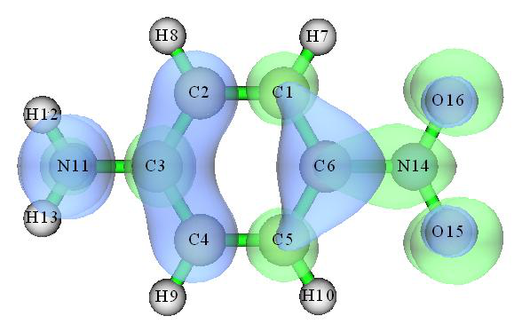

<!-- p.845 -->


```text
Charge transfer percentage, CT(%):     74.047 %
Local excitation percentage, LE(%):    25.953 %
```

值得注意的是，Multiwfn能够一次性对一批激发态计算IFCT，因此可以很容易地识别所有激发态的主要特征，见第4.18.6节的示例说明(It is worth to notice that Multiwfn is able to calculate IFCT for a batch of excited states at once, hence can easily recognize major character of all excited states, see Section 4.18.6 for illustration)。

关于IFCT分析的更多讨论和示例可以在我的博客文章“使用Multiwfn中的IFCT方法评估电子激发过程中任意定义的两个片段之间的电子转移量”(中文，http://sobereva.com/433)中找到(More discussions and illustrations about the IFCT analysis can be found from my blog article "Using the IFCT method in Multiwfn to evaluate amount of electron transfer between arbitrarily defined two fragments during electron excitation" (in Chinese, http://sobereva.com/433))。

### 4.18.8.2 绘制电荷转移矩阵的热图以直观理解电子激发的本质(Plotting heat map of charge transfer matrix to intuitively understand nature of electron excitation)

电荷转移矩阵(CTM)与跃迁密度矩阵(TDM)密切相关，它们的热图通常为电子激发提供相似的信息(The charge transfer matrix (CTM) is closely related to transition density matrix (TDM) and their heat maps often provide similar information for an electron excitation)。绘制TDM的方法已在第4.18.2.2节中说明(The method of plotting TDM has been illustrated in Section 4.18.2.2)。依我之见，CTM的物理意义比TDM更清晰，更能揭示实际的电荷转移特征(In my opinion, the physical meaning of CTM is somewhat clearer than TDM and can better reveal actual charge transfer character)。此外，由于CTM是在空穴-电子分析的理论框架下导出的(见第3.21.1节)，CTM热图总能很好地与空穴和电子的分布相对照(In addition, since CTM is derived in the theory framework of hole-electron analysis (see Section 3.21.1), the CTM heat map can always well compare with distribution of hole and electron)。

这里我仍以第4.18.2.2节中研究的分子为例(Here I still use the molecule studied in Section 4.18.2.2 as instance)。在绘制CTM的热图之前，我们应先生成CTM(Before plotting the heat map of CTM, we should first generate CTM)。启动Multiwfn并输入(Boot up Multiwfn and input)

examples\excit\NH2_C8_NO2\NH2_C8_NO2.fchk 18 // 电子激发分析(Electron excitation analysis) 8 // IFCT分析(IFCT analysis) 1 // 用类似Mulliken划分得到原子对空穴和电子的贡献(Mulliken-like partition to derive atomic contribution to hole and electron) examples\excit\NH2_C8_NO2\NH2_C8_NO2.out

1 // 研究S0→S1激发(Study S0→S1 excitation) -1 // 将原子-原子CTM导出到当前文件夹下的atmCTmat.txt(Export atom-atom CTM to atmCTmat.txt in current folder) 2 // 进入用于绘制热图的功能(Enter the function used for plotting heat map) atmCTmat.txt // 从该文件加载矩阵数据(Load matrix data from this file) 1 // 显示热图(Show heat map) 现在你可以看到下图，紫色线和文字是手动添加的(Now you can see the map below, the purple line and texts are manually added)。

<!-- p.846 -->


该图与第4.18.2.2节给出的原子TDM热图具有相似的特征，但也存在不可忽视的差异(This figure has similar features of the heat map of atom TDM given in Section 4.18.2.2, but there are also differences that cannot be ignored)。根据IFCT的观点，当前图中每个非对角元严格地给出了原子间转移的电子量(According to the IFCT point of view, each of the non-diagonal elements of the current graph rigorously exhibits the amount of electron transferred between atoms)。逐列观察，可以直观地看到碳链上的每个原子都向其前后两端的原子转移了电子，且向硝基一侧转移的量明显多于向氨基一侧(Looking at the graph column by column, it can be visually seen that each atom on the carbon chain transferred electrons to the atoms at its front and back ends, and the amount of transfer to the nitro side is significantly more than to the amino side)。例如，从图中可以看出，在第五列中，第六个元的值大于第四个元

的值，因此C5→C6的电子转移量必定多于C5→C4(For example, it can be seen from the figure that in the fifth column, the value of the sixth element is larger than the fourth element, so the amount of electron transfer of C5→C6 must be more than C5→C4)。

接下来，我们再看另一个激发的CTM热图(Next, we also look into heat map of CTM of another excitation)。用与上面相同的方式绘制的S0→S9的图如下所示，相应的空穴&电子等值面图也一并给出(The map of S0→S9 plotted in the same way as above is given below, corresponding hole&electron isosurface map is also appended)。因为发现S0→S9跃迁明显涉及一些氢，因此在图中也把氢考虑在内(通过选择一次“4 切换是否考虑氢(Toggle if taking hydrogens into account)”) (Because it was found that S0→S9 transition evidently involves some hydrogens, therefore hydrogens are also taken into account in the map (by choosing "4 Toggle if taking hydrogens into account" once))。

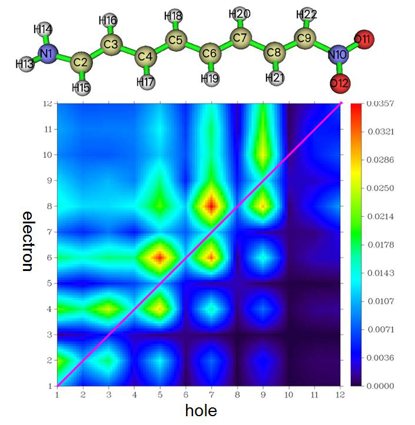

<!-- p.847 -->


从上述热图可以看出，存在从原子1~5和7~9区域向序号为13的氢原子的强电子转移，该观察与空穴&电子等值面图完全一致，即在H13处有很大的绿色等值面(It can be seen from the above heat map that, there is strong electron transfer from the region of atoms 1~5 and 7~9 to the hydrogen atom with index of 13, this observation fully agrees with the hole&electron isosurface map, namely there is a large green isosurface at H13)。此外，从等值面图可以看到原子6基本只被绿色等值面包围，这意味着该原子不向其它原子转移电子，而大量接受来自其它原子的电子；相应地，热图中Y=6的那一行颜色鲜明，而X=6对应的列则非常暗(In addition, from the isosurface map we can see that atom 6 is basically only surrounded by green isosurface, that means this atom does not transfer electrons to others while largely accepts electrons from others; accordingly, the color of the row of Y=6 in the heat map is distinct, while the column corresponding to X=6 is very dark)。

从这个例子可以发现，空穴&电子等值面图提供了最直观的可视效果，但若与CTM热图结合讨论，就能从定量的角度更透彻地理解电荷转移，也避免了等值面取值选择的任意性可能导致不合理判断的可能性(From this example, we can find that the hole&electron isosurface map provides the most intuitive visual effect, but if it is discussed together with the heat map of CTM, the charge transfer can be understood more thoroughly from a quantitative point of view, it also avoids the possibility that the arbitrariness of the choice of isovalue leads to an unreasonable judgment)。

CTM也可以基于片段来绘制(To do this, you simply need to load fragment definition file or directly input fragment definition in the heat map plotting function, and then plot the map again)。为此，你只需要在绘制热图的功能中加载片段定义文件或直接输入片段定义，然后重新绘制即可(The CTM can also be plotted based on fragment. To do this, you simply need to load fragment definition file or directly input fragment definition in the heat map plotting function, and then plot the map again)。

### 4.18.9 生成跃迁密度矩阵并将其转换到轨道表象(Generate transition density matrix and transform it to orbital representation)

注：本节对大多数Multiwfn用户可能不太感兴趣，但对专家很有价值(Note: This section may not be interesting for most Multiwfn users, but valuable for experts)

在第4.18.2节中，我已表明在Multiwfn中可以用实空间函数和彩色矩阵(热图)来研究跃迁密度(In Section 4.18.2, I have shown that in Multiwfn the transition density can be studied in terms of real space function and colored matrix (heat map))。Multiwfn对跃迁密度还能做更多。如本节将说明的，Multiwfn能够将生成的跃迁密度矩阵转换到轨道表象并将轨道导出为波函数文件。这带来

了很多便利；例如，当你基于该文件分析“电子密度”时，实际研究的函数将直接对应于跃迁密度。注意这些轨道可被视为跃迁密度矩阵(TDM)的自然轨道，但它们与第3.21.6节介绍的NTO(自然跃迁轨道)有显著不同(Multiwfn can do even more for transition density. As will be illustrated in this section, Multiwfn is able to transform the generated transition density matrix to orbital representation and export the orbitals as wavefunction file. This brings a lot of conveniences; for example, when you analyze "electron density" based on this file, the actual function to be studied will directly correspond to transition density. Note that these orbitals can be regarded as natural orbitals of transition density matrix (TDM), but they are remarkably different to the NTO (nature transition orbital), which has been introduced in Section 3.21.6)。

这里以N-苯基吡咯为例，其S0→S1的跃迁密度已在第4.18.2节中绘制为等值面(Here will take the N-phenylpyrrole as example, whose transition density of S0→S1 has been plotted as isosurface in Section 4.18.2)。我们在本节的目的是将该跃迁密度转换为轨道并导出为.wfx文件，以便之后我们可以非常方便地基于该文件研究跃迁密度的性质(Our purpose in this section is to transform this transition density into orbitals and export them as .wfx file so that then we can very easily study properties of the transition density based on this file)。

首先，我们生成包含TDM的.fch文件(First, we generate a .fch file containing TDM)。启动Multiwfn并输入(Boot up Multiwfn and input) examples\excit\N-phenylpyrrole.fch // 由Gaussian TDDFT任务产生的.fch文件(The .fch file yielded by Gaussian TDDFT task) 18 // 电子激发分析(Electron excitation analysis) 9 // 生成并导出TDM(Generate and export TDM) 1 // 生成基态与激发态之间的TDM(Generate TDM between ground state and excited state) examples\excit\N-phenylpyrrole.out // 带有IOp(9/40=4)关键词的Gaussian TDDFT任务的输出文件(The output file of Gaussian TDDFT task with IOp(9/40=4) keyword)

1 // 分析从基态到第一激发态的电子跃迁(S0→S1)(Analyze electron transition from ground state to the 1st excited state (S0→S1)) 1 // 对原始TDM对称化。这很重要，若不对TDM对称化，之后无法正确得到自然轨道(Symmetrize the raw TDM. This is important, the natural orbitals cannot be properly yielded later without symmetrization of the TDM)

y // 将当前波函数导出到当前文件夹下的TDM.fch，其“Total SCF Density”字段记录刚才生成的对称化TDM(Export current wavefunction to TDM.fch in current folder, whose "Total SCF Density" field records the just generated symmetrized TDM)

接下来，我们将TDM转换为自然轨道(Next, we transform the TDM into natural orbitals)。重新启动Multiwfn并输入(Reboot Multiwfn and input) TDM.fch 200 // 其它功能(第2部分)(Other functions (Part 2)) 16 // 基于.fch/.fchk文件中的密度矩阵生成自然轨道(Generate natural orbitals based on the density matrix in .fch/.fchk file) SCF // 要转换的矩阵来自“Total SCF Density”字段(The matrix to be transformed comes from the "Total SCF Density" field) y // 将生成的轨道导出到new.mwfn并加载它(Export the generated orbitals to new.mwfn and load it) 现在当前文件夹中有了new.mwfn，它包含从

S0→S1 TDM转换而来的自然轨道。现在内存中的轨道也对应于这些自然轨道。假设我们还想将它们导出为.wfx文件，我们应输入以下命令(Now we have new.mwfn in current folder, which contains natural orbitals transformed from the S0→S1 TDM. The orbitals in memory now also correspond to these natural orbitals. Assume that we also want to export them as .wfx file, we should input the commands below)。

0 // 返回主菜单(Return to main menu) 100 // 其它功能(第1部分)(Other functions (Part 1)) 2 // 导出各种文件(Export various kinds of files) 4 // 将当前波函数输出为.wfx文件(Output current wavefunction as .wfx file) TDM.wfx // 要生成的文件的路径(The path of the file to be generated) 将来，如果你以TDM.wfx为输入文件并经由主功能5计算“电子密度”的格点数据，你会发现所得等值面图(在适当调节等值面取值后)与第4.18.2.1节所示的跃迁密度T(r)图完全相同(In the future, if you use the TDM.wfx as input file and calculate grid data of "electron density" via main function 5, you will find the resulting isosurface map (after properly adjusting isovalue) is exactly identical to the transition density T(r) graph shown in Section 4.18.2.1)。


<!-- p.848 -->


很多便利(lot of conveniences)；例如，当你基于此文件分析“电子密度”时，实际研究的函数将直接对应于跃迁密度。注意这些轨道可视为跃迁密度矩阵(TDM)的自然轨道，但它们与NTO(自然跃迁轨道，已在第3.21.6节介绍)有显著不同(for example, when you analyze "electron density" based on this file, the actual function to be studied will directly correspond to transition density. Note that these orbitals can be regarded as natural orbitals of transition density matrix (TDM), but they are remarkably different to the NTO (nature transition orbital), which has been introduced in Section 3.21.6)。

这里将以N-苯基吡咯为例，其S0→S1的跃迁密度已在第4.18.2节中绘制为等值面(Here will take the N-phenylpyrrole as example, whose transition density of S0→S1 has been plotted as isosurface in Section 4.18.2. Our purpose in this section is to transform this transition density into orbitals and export them as .wfx file so that then we can very easily study properties of the transition density based on this file)。

首先，我们生成一个包含TDM的.fch文件。启动Multiwfn并输入(First, we generate a .fch file containing TDM. Boot up Multiwfn and input) examples\excit\N-phenylpyrrole.fch // 由Gaussian TDDFT任务产生的.fch文件(The .fch file yielded by Gaussian TDDFT task) 18 // 电子激发分析(Electron excitation analysis) 9 // 生成并导出TDM(Generate and export TDM) 1 // 生成基态与激发态之间的TDM(Generate TDM between ground state and excited state) examples\excit\N-phenylpyrrole.out // 带有IOp(9/40=4)关键词的Gaussian TDDFT任务的输出文件(The output file of Gaussian TDDFT task with IOp(9/40=4) keyword)

1 // 分析从基态到第一单重激发态(S0→S1)的电子跃迁(Analyze electron transition from ground state to the 1st excited state (S0→S1)) 1 // 对原始TDM对称化。这很重要，若不对TDM对称化，之后无法正确得到自然轨道(Symmetrize the raw TDM. This is important, the natural orbitals cannot be properly yielded later without symmetrization of the TDM)

y // 将当前波函数导出到当前文件夹下的TDM.fch，其“Total SCF Density”字段记录刚才生成的对称化TDM(Export current wavefunction to TDM.fch in current folder, whose "Total SCF Density" field records the just generated symmetrized TDM)

接下来，我们将TDM转换为自然轨道。重新启动Multiwfn并输入(Next, we transform the TDM into natural orbitals. Reboot Multiwfn and input) TDM.fch 200 // 其它功能(第2部分)(Other functions, part 2) 16 // 基于.fch/.fchk文件中的密度矩阵生成自然轨道(Generate NOs based on the density matrix in .fch/.fchk) SCF // 要转换的矩阵来自“Total SCF Density”字段(The label of TDDFT density matrix in the file is “CI”) y // 在当前文件夹导出new.mwfn然后自动加载它，其中包含新生成的自然轨道(Export new.mwfn in current folder and then automatically load it, which contains the newly generated NOs)

现在内存中的轨道已对应于基于第2激发态的弛豫密度生成的自然轨道，接着我们就可以做任意的波函数分析，例如(Now the orbitals in memory have corresponded to the NOs generated based on the relaxed density of the 2nd excited state, then we can do arbitrary wavefunction analysis, for example)

0 // 返回主菜单(Return to main menu) 100 // 其它功能(第1部分)(Other functions (Part 1)) 2 // 导出各种文件(Export various kinds of files) 4 // 将当前波函数输出为.wfx文件(Output current wavefunction as .wfx file) TDM.wfx // 要生成的文件的路径(The path of the file to be generated) 将来，如果你以TDM.wfx为输入文件并经由主功能5计算“电子密度”的格点数据，你会发现所得等值面图(在适当调节等值面取值后)与第4.18.2.1节所示的跃迁密度T(r)图完全相同(In the future, if you use the TDM.wfx as input file and calculate grid data of "electron density" via main function 5, you will find the resulting isosurface map (after properly adjusting isovalue) is exactly identical to the transition density T(r) graph shown in Section 4.18.2.1)。

<!-- p.849 -->


### 4.18.10 获得分子轨道对跃迁偶极矩的贡献(Obtain molecular orbital pair contributions to transition dipole moment)

为了更深入地理解跃迁电偶极矩或磁偶极矩，Multiwfn提供了一个用于将其分解为各种MO对跃迁贡献的功能，见第3.21.10节的介绍(In order to gain a deeper insight into transition electric or magnetic dipole moment, Multiwfn provides a function used to decompose it to contributions from various MO pair transitions, see Section 3.21.10 for introduction)。这里我给出一个例子。本例涉及的.fch和.out文件由Gaussian的TDDFT计算产生(Here I present an example. The .fch and .out files involved in this example were produced by TDDFT calculation of Gaussian)。

启动Multiwfn并输入(Boot up Multiwfn and input) examples\excit\N-phenylpyrrole.fch 18 // 电子激发分析(Electron excitation analysis) 10 // 将跃迁偶极矩分解为分子轨道对的贡献(Decompose transition dipole moment as molecular orbital pair contributions) 1 // 跃迁偶极矩的类型为电偶极矩(The type of transition dipole moment is electric) examples\excit\N-phenylpyrrole.out 1 // 选择从基态(S0)到第一单重激发态(S1)的激发(Select the excitation from ground state (S0) to the first singlet excited state (S1)) 现在屏幕上显示关于该激发的以下信息(Now the information below about this excitation is shown on screen)

```text
 Transition dipole moment in X/Y/Z:   -0.000000  -0.000000   1.781438 a.u.
 Norm of transition dipole moment:     1.781438 a.u.
 Oscillator strength:   0.3935306
```

接着你可以在屏幕上看到几个选项，它们是不言自明的(Then you can find several options on screen, they are self-explanatory)。我们首先选择选项1并输入例如0.02，则所有贡献大于0.02的MO对都会被打印出来(We first choose option 1 and input for example 0.02, then all MO pairs having contribution larger than 0.02 are printed)：

```text
#Pair   Orbital trans. Coefficient      Transition dipole X/Y/Z   Norm (a.u.)
  1213     35 ->     46   0.040230   0.000000   0.000000   0.037709   0.037709
  1214     35 ->     50  -0.047670   0.000000  -0.000000   0.040152   0.040152
  1239     36 ->     40  -0.101270   0.000000  -0.000000  -0.280355   0.280355
  1259     37 ->     40  -0.127550   0.000000   0.000000  -0.148489   0.148489
  1260     37 ->     52   0.069960  -0.000000  -0.000000  -0.122222   0.122222
  1262     37 ->     58  -0.036060  -0.000000   0.000000  -0.025065   0.025065
  1278     38 ->     39   0.672690  -0.000000   0.000000   2.796678   2.796678
  1280     38 ->     50   0.052570  -0.000000   0.000000   0.046724   0.046724
  2489     36 <-     40  -0.014330   0.000000  -0.000000  -0.039671   0.039671
  2506     37 <-     52   0.015140  -0.000000  -0.000000  -0.026450   0.026450
  2522     38 <-     39  -0.027240   0.000000  -0.000000  -0.113249   0.113249
Sum of the above      11 pairs:     -0.000000  -0.000000   2.165763
```

从输出中，我们可以立即发现MO38→MO39跃迁具有主导贡献(2.796678 a.u.)(From the output, we can immediately find that transition of MO38→MO39 has dominating contribution (2.796678 a.u.) to this S0→S1 excitation)。

当有太多MO对对跃迁偶极矩有不可忽略的贡献从而难以识别重要的MO跃迁时，你可以让Multiwfn按照它们对跃迁偶极矩特定分量的贡献排序MO对(When there are too many MO pairs having nonnegligible contributions to transition dipole moment and thus difficult to identify important MO transitions, you can let Multiwfn sort the MO pairs according to their contributions to specific component of transition dipole moment)。例如，这里我们选择选项“4 按对Z分量的绝对贡献打印轨道对(Print orbital pairs in the order of absolute contribution to Z component)”然后输入5，则你将看到对跃迁偶极矩Z分量贡献最大的五个MO对(For example, here we choose the option " 4 Print orbital pairs in the order of absolute contribution to Z component" and then input 5, then you will see the five MO pairs having largest contribution to Z component of transition dipole moment)：

```text
  #Pair   Orbital trans. Coefficient      Transition dipole X/Y/Z   Norm (a.u.)
   1278     38 ->     39   0.672690  -0.000000   0.000000   2.796678   2.796678
   1239     36 ->     40  -0.101270   0.000000  -0.000000  -0.280355   0.280355
```

<!-- p.850 -->


```text
   1259     37 ->     40  -0.127550   0.000000   0.000000  -0.148489   0.148489
   1260     37 ->     52   0.069960  -0.000000  -0.000000  -0.122222   0.122222
   2522     38 <-     39  -0.027240   0.000000  -0.000000  -0.113249   0.113249
```

顺便说一下，振子强度(f)直接与跃迁电偶极矩模的平方相关，因此可以预期，如果把对应于

MO38→MO39的组态系数设为零，即忽略其贡献，则f将明显降低。如前所示，S0→S1的原始f为0.39353。让我们定量检查MO38→MO39对f的影响有多大。为此，我们可以手动将该跃迁的组态系数设为零，然后重新考察f值。为此，我们输入以下命令(By the way, oscillator strength (f) directly relates to square of norm of transition electric dipole moment, therefore it can be expected that if the configuration coefficient corresponding to MO38→MO39 is set to zero, namely ignoring its contribution, then f will be lowered evidently. As shown earlier, the original f of S0→S1 is 0.39353. Let us quantitatively check how MO38→MO39 affects the f. To do this, we can manually set configuration coefficient of this transition to zero and then re-examine the f value. To this aim, we input following commands)

0 // 返回电子激发分析菜单(Return to menu of electron excitation analysis) -1 // 检查、修改并导出一个激发的组态系数(Check, modify and export configuration coefficients of an excitation) 1 // 选择第一激发态(Choose the first excited state) 1 // 设置一个MO对的系数(Set coefficient of a MO pair) 38,39 // 该MO对的MO序号(The MO indices of the MO pair)

1 // 跃迁类型选为“激发(Excitation)”，因此选中MO38→MO39(若输入2，则选中的将是MO38←MO39)(The transition type is chosen as "Excitation", hence MO38→MO39 is selected (if inputting 2, then what we selected will be MO38←MO39))

0 // 将组态系数设为零(Set the configuration coefficient to zero) -3 // 将当前激发信息导出到纯文本文件(Export current excitation information to a plain text file)

S1.txt // 存储S0→S1激发信息的文件的路径(The path of the file to store excitation information of S0→S1) 现在当前文件夹中已生成S1.txt，如果你用文本编辑器打开它，你会发现

对应于MO38→MO39的系数确实为零(Now S1.txt has been generated in current folder, if you open it with text editor, you will find the coefficient corresponding to MO38→MO39 is indeed zero)。

然后重新启动Multiwfn并输入(Then reboot Multiwfn and input) o // 加载上次使用的文件，即examples\excit\N-phenylpyrrole.fch(Load the file used at the last time, namely examples\excit\N-phenylpyrrole.fch) 18 // 电子激发分析(Electron excitation analysis) 10 // 将跃迁偶极矩分解为分子轨道对的贡献(Decompose transition dipole moment as molecular orbital pair contributions) 1 // 跃迁偶极矩的类型为电偶极矩(The type of transition dipole moment is electric) S1.txt 现在打印的f只有0.1278，不到其原始值(0.39353)的1/3，表明

MO38→MO39对S0→S1激发的强度有决定性影响(Now the printed f is only 0.1278, which is less than 1/3 of its original value (0.39353), showing that MO38→MO39 has crucial influence on strength of S0→S1 excitation)。

由于MO38→MO39的系数高达0.6727，将其设为零后，现在剩余系数的平方和已远小于0.1，远离闭壳情形的理想值(0.5)(Since the coefficient of MO38→MO39 is as large as 0.6727, after setting it to zero, now the sum of the square of remaining coefficients has been much less than 0.1, which is far from the ideal value of closed-shell case (0.5))。

在我的论文Carbon, 165, 461 (2020)中，我曾用上面说明的功能研究环[18]碳的极强吸收，建议你查看图4及相关讨论。如果你的工作中用了该功能，建议也引用这篇论文(In my paper Carbon, 165, 461 (2020), I employed the function illustrated above to study the nature of the extremely strong absorption of cyclo[18]carbon, you are suggested to look at Fig. 4 and relevant discussion. If this function is employed in your work, it is suggested to also cite this paper)。

经由上面说明的类似方式，你也可以将跃迁磁偶极矩分解为MO对跃迁的贡献，这对研究旋光强度很有用(Via similarly way illustrated above, you can also decompose transition magnetic dipole moment as contributions of MO pair transitions, which is useful in studying rotatory strength)。

### 4.18.11 将片段贡献的跃迁偶极矩绘制为箭头(Plot transition dipole moment vector contributed by molecular fragments as arrows)

注：本节的中文版是我的博客文章“使用Multiwfn+VMD绘制特定片段贡献的跃迁偶极矩矢量”(http://sobereva.com/396)(Note: Chinese version of this section is my blog article “Using Multiwfn+VMD to plot transition dipole moment vector contributed by specific fragment” (http://sobereva.com/396))。

<!-- p.851 -->


在第4.18.2.1节中，我已展示如何绘制实空间中的跃迁偶极矩密度，这对研究三维空间中不同区域的贡献极为有用(In Section 4.18.2.1, I have shown how to plot transition dipole moment density in real space, which is extremely useful for studying contribution of different regions in three-dimension space)。事实上，若使用下面提供的VMD(http://www.ks.uiuc.edu/Research/vmd/)专用绘图脚本，片段贡献的跃迁偶极矩可很容易地画成箭头，这极大方便了对总跃迁偶极矩组成的讨论(In fact, if using a special plotting script of VMD (http://www.ks.uiuc.edu/Research/vmd/) provided below, transition dipole moments contributed by molecular fragments can be easily drawn as arrows, which greatly facilitates discussion of composition of total transition dipole moment)。

这里，以偶氮苯为例。偶氮苯的Gaussian TDDFT任务的输入文件已作为examples\excit\Azobenzene.gjf提供。注意用了IOp(9/40=4)且计算后保存了.chk文件。用Gaussian运行它，然后将azobenzene.chk转换为azobenzene.fch。(若你手头没有Gaussian，也可以直接从http://sobereva.com/multiwfn/extrafiles/Azobenzene_exc.zip下载.out和.fch文件)(Here, azobenzene is taken as example. The input file of TDDFT task of Gaussian for azobenzene is provided as examples\excit\Azobenzene.gjf. Note that IOp(9/40=4) is used and .chk file is saved after calculation. Run it by Gaussian, and then convert azobenzene.chk to azobenzene.fch. (If you do not have Gaussian in hand, you can also directly download the .out and .fch files from http://sobereva.com/multiwfn/extrafiles/Azobenzene_exc.zip))

启动Multiwfn，加载azobenzene.fch，然后输入(Boot up Multiwfn, load the azobenzene.fch, then input) 18 // 电子激发分析(Electron excitation analysis) 11 // 将跃迁偶极矩分解为基函数和原子贡献(Decompose transition dipole moment as basis function and atom contributions) Azobenzene.out // 运行Azobenzene.gjf得到的Gaussian输出文件(The Gaussian output file obtained by running Azobenzene.gjf) 2 // 假设我们要研究的是从基态到第2激发态的电子激发(你也可以输入两个序号来研究两个激发态之间的跃迁)(Assume that we want to study is electron excitation from ground state to excited state 2 (you can also input two indices to study transition between the two excited states))

1 // 要分解的跃迁偶极矩类型为电偶极矩(The type of transition dipole moment to be decomposed is electric) n // 不生成AAtrdip.txt，本例中不涉及它(Do not generate AAtrdip.txt, which is not involved in the present example) 现在trdipcontri.txt已输出到当前文件夹，其中包含每个基函数和每个原子贡献的跃迁偶极矩。将该文件移到VMD文件夹(Now trdipcontri.txt is outputted to current folder, which contains transition dipole moment contributed by each basis function and each atom. Move this file to VMD folder)。

返回主菜单，然后进入主功能100的子功能2，将当前分子几何导出为azobenzene.pdb(Return to main menu, then enter subfunction 2 of main function 100, export current molecular geometry to azobenzene.pdb)。

将examples\excit\loadip.tcl复制到VMD文件夹，这是我写的VMD脚本，它能从trdipcontri.txt加载数据。它还定义了自定义命令“dip”和“dipatm”，用于将特定分子片段贡献的跃迁偶极矩画成箭头(Copy examples\excit\loadip.tcl to VMD folder, this is a VMD script written by me, it can load data from trdipcontri.txt. It also defines custom commands "dip" and "dipatm" used to draw transition dipole moment contributed by specific molecular fragment as arrow)。

启动VMD，将文件azobenzene.pdb拖入VMD主窗口以加载它，然后在VMD控制台窗口运行source loaddip.tcl以执行该脚本。假设我们想把分子分为三部分分别考察它们对跃迁偶极矩的贡献，即第一个苯基(原子1~11)、N2部分(原子12和13)和第二个苯基(原子14~24)，我们应在VMD控制台窗口运行以下命令(Boot up VMD, drag the file azobenzene.pdb into VMD main window to load it, then run source loaddip.tcl in VMD console window to execute the script. Assume that we want to divide the molecule as three parts to separately investigate their contributions to transition dipole moment, namely the first phenyl group (atoms 1~11), N2 part (atoms 12 and 13) and the second phenyl group (atoms 14~24), we should run below commands in VMD console window)

```text
draw color red
dip "serial 1 to 11"
dip "serial 12 13"
dip "serial 14 to 24"
```

现在你将在VMD图形窗口看到三个红色箭头。箭头的圆柱部分的长度对应片段跃迁偶极矩的大小，箭头的中心对应片段的几何中心。注意当我们使用“dip”命令时，所选片段的几何中心和对跃迁偶极矩的定量贡献也会显示在VMD控制台窗口中(Now you will see three red arrows in the VMD graphical window. The length of cylindrical part of the arrows correspond to magnitude of fragmental transition dipole moments, the center of the arrows corresponds to geometric center of the fragments. Note that when we use "dip" command, the fragment geometry center and quantitative contribution to transition dipole moment by the selected fragment are also shown in VMD console window)。

顺便说一下：若你感兴趣的原子的序号不连续也没有关系。例如，dip "serial 1 5 to 8 11 to 14 18"将为由原子1、5、6、7、8、11、12、13、14、18组成的片段绘制跃迁偶极矩(BTW: It does not matter if the serial of the atoms of your interest is not contiguous. For example, dip "serial 1 5 to 8 11 to 14 18" will plot the transition dipole moment for the fragment consisting of atoms 1, 5, 6, 7, 8, 11, 12, 13, 14, 18)。

为了提高图形质量，我们在控制台窗口输入color Display Background white以将背景色设为白色，进入Graphics - Representation并将绘制方式(Drawing method)

<!-- p.852 -->


设为CPK，然后在VMD主窗口选择Display - Orthographic。最终图形如下所示(to CPK, and then choose Display - Orthographic in VMD main window. The final graph will look like below)。

可以看到，两个苯基都对总跃迁偶极矩的Y分量有显著贡献(图中左下角坐标轴的红、绿、蓝分别对应X、Y、Z方向)(As you can see, both the two phenyl groups have significant contribution to Y component of total transition dipole moment (the red, green and blue of the axis shown at left-bottom part of the graph correspond to X, Y and Z directions, respectively))。为定量比较，总跃迁偶极矩矢量及其组成也列在下面(For quantitative comparison purposes, total transition dipole moment vector and its compositions are also listed below)

```text
Total：           0.1155  -2.8868  0.0
Phenyl group 1：0.14262 -1.43288 0.0
N2：             -0.16948 -0.02138 0.0
Phenyl group 2：0.14262 -1.43288 0.0
```

若你还想在图上把总跃迁偶极矩画成绿色箭头，可以输入draw color green然后输入dip all(If you also want to plot total transition dipole moment as green arrow on the graph, you can input draw color green and then input dip all)。

还可以绘制每个原子贡献的跃迁偶极矩。为此，我们输入draw delete all删除所有已有的箭头，然后输入dipatm，你将立即看到(It is also possible to plot transition dipole moment contributed by each atom. To do that, we input draw delete all to remove all existing arrows, and then input dipatm, you will immediately see)

在使用上述分解跃迁偶极矩的方法时，有一点非常重要必须注意，即片段的贡献常常依赖于原点的选择，因为片段的跃迁电荷常常非零(There is a very important point that should be paid attention to when using above method to decompose transition dipole moment, namely contribution of a fragment is often dependent of choice of origin, because transition charge of a fragment is often non-zero)。例如，若我们用空穴-电子分析模块的子功能6导出原子跃迁电荷然后加和为片段跃迁电荷，你会发现第一个苯基的值为0.2116。由于它非零，可以证明若整体平移偶氮苯的坐标，该片段对应的跃迁偶极矩必然变化；换言之，结果不是确定的。因此，在论文中讨论片段跃迁偶极矩时应谨慎(For example, if we use subfunction 6 of hole-electron analysis module to export atomic transition charges and then sum them as fragment transition charges, you will find the value of the first phenyl group is 0.2116. Since it is non-zero, it can be proved that if overall coordinate of the azobenzene is translated, the transition dipole moment corresponding to this fragment must be varied; in other words, the result is not definite. Therefore, one should carefully discuss fragmental transition dipole moment in papers)。

另一点非常重要，即由于跃迁偶极矩是经由Mulliken方法分解的，当电子激发计算中出现弥散函数时，上述分析方法将毫无意义(Another very important point is that since the transition dipole moment is decomposed via Mulliken method, the analysis method shown above will be meaningless when diffuse functions are presented in the electron excitation calculation)。


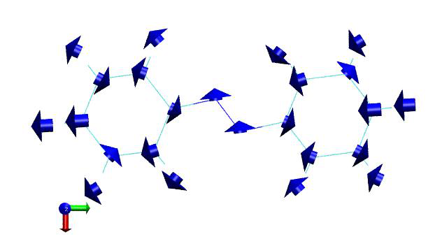

<!-- p.853 -->


原点的选择(choice of origin)，因为片段的跃迁电荷常常非零。例如，若我们用空穴-电子分析模块的子功能6导出原子跃迁电荷然后加和为片段跃迁电荷，你会发现第一个苯基的值为0.2116。由于它非零，可以证明若整体平移偶氮苯的坐标，该片段对应的跃迁偶极矩必然变化；换言之，结果不是确定的。因此，在论文中讨论片段跃迁偶极矩时应谨慎(because transition charge of a fragment is often non-zero. For example, if we use subfunction 6 of hole-electron analysis module to export atomic transition charges and then sum them as fragment transition charges, you will find the value of the first phenyl group is 0.2116. Since it is non-zero, it can be proved that if overall coordinate of the azobenzene is translated, the transition dipole moment corresponding to this fragment must be varied; in other words, the result is not definite. Therefore, one should carefully discuss fragmental transition dipole moment in papers)。

另一点非常重要，即由于跃迁偶极矩是经由Mulliken方法分解的，当电子激发计算中出现弥散函数时，上述分析方法将毫无意义(Another very important point is that since the transition dipole moment is decomposed via Mulliken method, the analysis method shown above will be meaningless when diffuse functions are presented in the electron excitation calculation)。

### 4.18.13 研究单个激发态的电子结构以及两个激发态之间的差异(Study electronic structure of a single excited state and difference between two excited states)

第4.18节中的大多数其它小节侧重于举例说明如何研究电子跃迁特征，然而，有时我们想研究单个激发态在特定性质上的特征或两个激发态之间的差异(Most other subsections in Section 4.18 focus on exemplifying how to study electron transition characters, however, sometimes we want to study character of a single excited state or difference between two excited states in specific property)。在Multiwfn中，人们可以像往常一样对激发态做各种波函数分析，然而，输入文件必须包含该激发态的波函数(In Multiwfn, one can perform various kinds of wavefunction analysis for an excited state as usual, however, the input file must contain wavefunction of this excited state)。对于能研究激发态的多组态方法，如CIS和TDDFT，激发态波函数必须记录为自然轨道(NOs)，因为Multiwfn总是以轨道的形式加载波函数(For multi-configuration methods that can study excited state, such as CIS and TDDFT, the excited state wavefunction must be recorded as natural orbitals (NOs), because Multiwfn always load wavefunction in terms of orbitals)。

本节的主要目的是说明用于生成包含激发态NOs的.mwfn文件的功能，以便我们可以分析该态的波函数特征(The main purpose of this section is to illustrate the function used to generate .mwfn file containing NOs of an excited state, so that we can analyze wavefunction character of this state)。强烈建议你先阅读第3.21.13节，其中详述了生成激发态NOs的细节(I strongly suggest you read Section 3.21.13 first, in which the details of generating NOs of excited states are described)。

注：CIS/TDHF/TDA-DFT/TDDFT激发态波函数(或密度矩阵)有两种类型：(1)非弛豫密度(Unrelaxed density) (2)弛豫密度(Relaxed density)。其差别已在第3.21.1.1节中详细描述。简言之，前者不如后者真实，但生成后者需要额外代价(远高于单纯计算激发能)。接下来，我将首先说明如何基于非弛豫密度对激发态做波函数分析并研究两个激发态之间的差异，而在本节最后我还将举例说明如何基于其弛豫密度分析激发态(NOTE: There are two types of CIS/TDHF/TDA-DFT/TDDFT excited state wavefunction (or density matrix): (1) Unrelaxed density (2) Relaxed density. The difference has been detailedly described in Section 3.21.1.1. Briefly speaking, the former is not as real as the latter, but generating the latter requires additional cost (much higher than simply evaluating excitation energy). Next, I will first illustrate how to perform wavefunction analysis for an excited state and study difference between two excited states based on unrelaxed density, while at final part of this section I will also exemplify how to analyze excited state based on its relaxed density)。

基于非弛豫密度的激发态波函数分析示例(Example of wavefunction analysis of an excited state (based on unrelaxed density)) 这里以N-苯基吡咯为例，假设我们想考察第二单重激发态的Mayer键级(Here I take N-phenylpyrrole as example, assume that we want to examine Mayer bond orders for the second singlet excited state)。为此，我们先用IOp(9/40=4)关键词做常规TDDFT计算，examples\excit\N-phenylpyrrole.out是输出文件，examples\excit\N-phenylpyrrole.fch是相应的.fch文件。几何结构先前已对基态优化(To do so, we first carry out a regular TDDFT calculation with IOp(9/40=4) keyword, the examples\excit\N-phenylpyrrole.out is output file and examples\excit\N-phenylpyrrole.fch is corresponding .fch file. The geometry was previously optimized for ground state)。

启动Multiwfn并输入以下命令(Boot up Multiwfn and input below commands) examples\excit\N-phenylpyrrole.fch 18 // 电子激发分析(Electron excitation analysis) 13 // 生成特定激发态的自然轨道(Generate natural orbitals of specific excited states) examples\excit\N-phenylpyrrole.out 2 // 选择第2激发态(Choose the 2nd excited state)

<!-- p.854 -->


现在，当前文件夹中已生成NO_0002.mwfn，它以NOs的形式记录了第二激发态的波函数(Now, NO_0002.mwfn has been generated in current folder, it records wavefunction of the second excited state in terms of NOs)。

重新启动Multiwfn并输入(Reboot Multiwfn and input) NO_0002.mwfn 9 // 键级分析(Bond order analysis) 1 // Mayer键级(Mayer bond order) 从输出中你会发现连接吡咯和苯部分的N5-C10键的键级为0.794(From the output you will find the bond order of the N5-C10 bond, namely the bond linking pyrrole and benzene moieties, is 0.794)。若你对examples\excit\N-phenylpyrrole.fch重复计算，结果将对应于基态，你会发现Mayer键级为0.713。显然，在S0极小点处从S0到S2的垂直激发明显削弱了N5-C10的强度(If you repeat the calculation for examples\excit\N-phenylpyrrole.fch, the result will correspond to ground state, and you will find the Mayer bond order is 0.713. Clearly, the vertical excitation from S0 to S2 at minimum point of S0 weakens the strength of N5-C10 detectably)。

绘制激发态之间的密度差(Plotting density difference between excited states) 接下来我说明如何绘制各激发态之间的密度差(对应于非弛豫密度)。事实上这非常容易，你只需分别生成包含两个激发态NOs的Multiwfn输入文件，然后经由第4.5.5或4.18.3节说明的步骤求其差即可(Next I illustrate how to plot density difference between various excited states (corresponding to unrelaxed density). In fact, this is very easy, you simply need to generate Multiwfn input files containing NOs of the two excited states respectively, and then get their difference via the steps illustrated in Sections 4.5.5 or 4.18.3)。

我仍以N-苯基吡咯为例(We repeat aforementioned steps using the N-phenylpyrrole.fch and N-phenylpyrrole.out to generate .mwfn files)。我们用N-phenylpyrrole.fch和N-phenylpyrrole.out重复上述步骤生成.mwfn文件，当Multiwfn请你输入激发态序号时，我们输入1-3，则当前文件夹中将生成NO_0001.mwfn、NO_0002.mwfn和NO_0003.mwfn，显然现在我们可以研究1-2、1-3和2-3之间的密度差(when Multiwfn asks you to input the index of excited states, we input 1-3, then NO_0001.mwfn, NO_0002.mwfn and NO_0003.mwfn will be generated in current folder, clearly now we can study density difference between 1-2, 1-3 and 2-3)。

假设当前我们想可视化第三与第一激发态之间的电子密度差的等值面图，我们重新启动Multiwfn并输入(Assume that currently we want to visualize isosurface map of electron density difference between the third and the first excited state, we reboot Multiwfn and input)

NO_0003.mwfn 5 // 计算格点数据(Calculate grid data) 0 // 自定义操作(Custom operation) 1 // 将用第一个加载的文件处理一个文件(One file will be dealt with the first loaded file) -,NO_0001.mwfn 1 // 电子密度(Electron density) 2 // 中等质量格点(Medium-quality grid) -1 // 可视化等值面(Visualize isosurface) 将等值面取值设为0.005后，我们将得到下图(After setting isovalue to 0.005, we will obtain the graph below)

<!-- p.855 -->


其它激发态之间的密度差图可类似得到(Although you can also directly use your quantum chemistry program to generate wavefunction file containing NOs for various excited states, the procedure is evidently much more cumbersome than using Multiwfn, because as shown above, the advantage of Multiwfn is that it is able to simultaneously generate .mwfn file containing NOs for a batch of excited states)。尽管你也可以直接用你的量子化学程序生成包含各激发态NOs的波函数文件，但该过程显然比用Multiwfn繁琐得多，因为如上所示，Multiwfn的优势在于它能同时为一批激发态生成包含NOs的.mwfn文件(The density difference map between other excited states can be obtained similarly. Although you can also directly use your quantum chemistry program to generate wavefunction file containing NOs for various excited states, the procedure is evidently much more cumbersome than using Multiwfn, because as shown above, the advantage of Multiwfn is that it is able to simultaneously generate .mwfn file containing NOs for a batch of excited states)。

计算激发态之间片段电荷的差(Next, as an example, we will study difference of electron distribution at quantitative level by comparing fragment charge of the pyrrole ring between excited states 3 and 1) 接下来，作为例子，我们将通过比较激发态3和1之间吡咯环的片段电荷，在定量水平上研究电子分布的差异(Calculate difference in fragment charge between excited states)。

启动Multiwfn并输入(Boot up Multiwfn and input) NO_0003.mwfn 7 // 布居分析(Population analysis) -1 // 定义片段(Define fragment) 1-9 // 吡咯片段，由原子1~9组成(The pyrrole fragment, which is composed of atoms 1~9) 11 // ADCH电荷(ADCH charge) 1 // 使用内置原子密度(Use built-in atomic densities) 你将发现(You will find)

```text
Fragment charge:    0.54421290
```

即吡咯环在第3激发态的片段电荷为0.544(Namely the fragment charge of the pyrrole ring is 0.544 at the 3rd excited state)。对NO_0001.mwfn重复计算，会发现吡咯环的电荷为0.117。数据表明，在(假想的)从第1到第3激发态的跃迁中，吡咯

片段将失去0.544−0.117=0.43个电子，这很好地解释了为什么在相应的密度差图中有明显的围绕吡咯环的等值面且多数为蓝色。不要忘记当前结果仍对应于非弛豫激发态密度(Repeat the calculation for the NO_0001.mwfn, the charge of the pyrrole ring will be found to be 0.117. The data shows that during the (hypothetical) transition from the 1st to the 3rd excited state, the pyrrole fragment will lose 0.544−0.117=0.43 electron, this well explains why in the corresponding density difference map there are obvious isosurfaces around the pyrrole ring and most of them are in blue color. Do not forget that the current result still corresponds to unrelaxed excited state density)。

基于弛豫密度的激发态波函数分析(Wavefunction analysis of an excited state (based on relaxed density)) 在本节最后部分，我展示如何基于其弛豫密度对激发态做波函数分析。仍以N-苯基吡咯为例(At final part of this section, I show how to carry out wavefunction analysis for an excited state based on its relaxed density. N-phenylpyrrole is still taken as example)。

我们准备一个内容如下的Gaussian输入文件。完整文件已作为examples\excit\ N-phenylpyrrole_relaxS2.gjf提供(We prepare a Gaussian input file with the content below. The full file has been provided as examples\excit\ N-phenylpyrrole_relaxS2.gjf)。

```text
%chk=C:\N-phenylpyrrole_relaxS2.chk
```

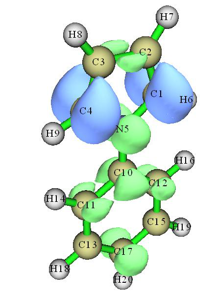

<!-- p.856 -->


```text
...[ignored]
```

用Gaussian运行该文件，则对应于第2激发态弛豫密度的密度矩阵将被写入N-phenylpyrrole_relaxS2.chk。然后用formchk工具将其转换为N-phenylpyrrole_relaxS2.fch(也可直接从http://sobereva.com/multiwfn/extrafiles/N-phenylpyrrole_relaxS2.zip下载)(Run this file by Gaussian, then the density matrix corresponding to relaxed density of the 2nd excited state will be written into the N-phenylpyrrole_relaxS2.chk. Then use formchk utility to convert it to N-phenylpyrrole_relaxS2.fch (which can also be directly downloaded from http://sobereva.com/multiwfn/extrafiles/N-phenylpyrrole_relaxS2.zip))。

我们首先需要将密度矩阵转换为NOs。启动Multiwfn并输入(We first need to transform the density matrix to NOs. Boot up Multiwfn and input) N-phenylpyrrole_relaxS2.fch 200 // 其它功能，第2部分(Other functions, part 2) 16 // 基于.fch/.fchk文件中的密度矩阵生成自然轨道(Generate NOs based on the density matrix in .fch/.fchk) CI // 文件中TDDFT密度矩阵的标记为“CI”(The label of TDDFT density matrix in the file is “CI”) y // 在当前文件夹导出new.mwfn然后自动加载它，其中包含新生成的NOs(Export new.mwfn in current folder and then automatically load it, which contains the newly generated NOs)

现在内存中的轨道已对应于基于第2激发态弛豫密度生成的NOs，接着我们就可以做任意的波函数分析，例如(Now the orbitals in memory have corresponded to the NOs generated based on the relaxed density of the 2nd excited state, then we can do arbitrary wavefunction analysis, for example)

0 // 返回主菜单(Return to main menu) 9 // 键级分析(Bond order analysis) 1 // Mayer键级(Mayer bond order) 从输出中你可以发现N5-C10的键级为0.756，而如前所示，该值对应于非弛豫密度时为0.794。小的差别意味着基于非弛豫密度的分析结果至少定性正确，与基于准确但昂贵的弛豫密度的结果一样有用(From the output you can find the bond order of the N5-C10 is 0.756, while as shown earlier, this value corresponding to unrelaxed density is 0.794. The small difference implies that the analysis result based on unrelaxed density is at least qualitatively correct and as useful as those derived based on the accurate but expensive relaxed density)。

基于弛豫密度计算两个激发态之间的密度差也是可能的。你需要重复上述步骤两次以分别为两个不同的激发态生成.mwfn文件，然后像往常一样基于这两个.mwfn文件求密度差(It is also possible to calculate density difference based on relaxed density between two excited states. You need to repeat above steps twice to respectively generate .mwfn file for two different excited states, and then get density difference as usual based on the two .mwfn files)。

对于Gaussian用户，事实上人们可以用诸如“# PBE1PBE/6-31G* out=wfn TD(root=x)”关键词将激发态x的NOs导出到特定的.wfn文件，该文件也可被用作做激发态波函数分析的输入文件。然而，不要忘记Multiwfn中的许多功能需要基函数信息，而.wfn文件无法提供它，因此在这种情形下可用的分析种类受到严重限制。此外，仅用Gaussian也有可能产生并将NOs存到.fch文件，如第4章开头明确描述的，然而该过程相对繁琐。注意以这些方式生成的NOs对应于弛豫的激发态波函数。若你只需要对应于非弛豫激发态波函数的NOs，只需在route section中添加“density=rhoci”关键词(For Gaussian users, in fact one can use such as “# PBE1PBE/6-31G* out=wfn TD(root=x)” keywords to export NOs of excited state x to specific .wfn file, which can also be employed as input file for performing wavefunction analysis of the excited state. However, do not forget that many functions in Multiwfn require basis function information, which cannot be provided by .wfn file, thus in this case the kind of analyses can used is severely limited. In addition, by solely using Gaussian it is also possible to yield and store the NOs to .fch file, as explicitly described at the beginning of Chapter 4, however this procedure is relatively cumbersome. Notice that the NOs generated in these ways correspond to relaxed excited state wavefunction. If you only need the NOs corresponding to the unrelaxed excited state wavefunction, simply adding “density=rhoci” keyword in route section)。

### 4.18.16 绘制电荷转移光谱并计算所有激发态的主要特征：以N-苯基吡咯为例(Plot charge-transfer spectrum and calculate major characters of all excited states: N-phenylpyrrole as an instance)

本节的中文版是我的博客文章“使用Multiwfn绘制电荷转移光谱(CTS)直观分析电子光谱的内在特征”(http://sobereva.com/628)，其中还包含扩展讨论(Chinese version of this section is my blog article “Using Multiwfn to plot charge transfer spectrum (CTS) to intuitively analyze intrinsic characteristics of electronic spectrum” (http://sobereva.com/628), which also contains extended discussions)。

如果你对IFCT分析不熟悉，请先查看第3.21.8节以获得基本知识，并跟随第4.18.8节经由实际例子更好地理解IFCT分析。所谓电荷转移光谱(CTS)是在IFCT分析之上定义的，已在第4.21.16节介绍，请在跟随本例之前先阅读它。若你的工作中涉及CTS，请引用Carbon, 187, 78 (2022) DOI: 10.1016/j.carbon.2021.11.005，我在其中首次提出CTS并在补充信息中介绍(If you are not familiar with IFCT analysis, please check Section 3.21.8 first to gain basic knowledge and follow Section 4.18.8 to better understand IFCT analysis via a practical example. The so-called charge-transfer spectrum (CTS), which was defined on the top of IFCT analysis, has been introduced in Section 4.21.16, please read it first before following the present example. If CTS is involved in your work, please cite Carbon, 187, 78 (2022) DOI: 10.1016/j.carbon.2021.11.005, in which I proposed CTS first time and introduced it in supplemental information)。

在本节中，我将举例说明如何为所有激发态计算IFCT数据以便你

<!-- p.857 -->


能容易识别它们的主要特征，然后我还将说明如何绘制CTS，它能直观揭示UV-Vis光谱各峰的本质(can easily identify their major characters, then I will also illustrate how to plot CTS, which is able to intuitively reveal the nature of various peaks of UV-Vis spectrum)。

将以N-苯基吡咯为例，用Gaussian在CAM-B3LYP/6-31+G(d)水平下用TDDFT计算了五个激发态。注意计算中已用IOp(9/40=4)关键词。在本研究中，苯基和吡咯基将分别定义为两个片段，以便我们能从片段内电子重排和片段间电子转移的角度识别激发态的本质(The N-phenylpyrrole will be employed as an instance, five excited states were calculated by Gaussian using TDDFT at CAM-B3LYP/6-31+G(d) level. Note that IOp(9/40=4) keyword has been employed in the calculation. In this study, the phenyl group and the pyrrole group will be defined as two respective fragments, so that we can identify nature of the excited states from perspective of intrafragment electron redistribution and interfragment electron transfer)。

为所有激发态计算IFCT数据(Calculate IFCT data for all excited states) 启动Multiwfn并输入(Boot up Multiwfn and input) examples\excit\N-phenylpyrrole.fch // 由Gaussian的TDDFT任务产生(Produced by TDDFT task of Gaussian) 18 // 电子激发分析(Electron excitation analysis) 16 // 计算电荷转移光谱和所有激发态的特征(Calculate charge-transfer spectrum and characters of all excited states) 2 // 定义两个片段(Define two fragments) 1-9 // 片段1，即吡咯部分(Fragment 1, namely the pyrrole moiety) 10-20 // 片段2，即苯基部分(Fragment 2, namely the phenyl moiety) [直接按回车键(Press ENTER button directly)] // 加载(Load) examples\excit\N-phenylpyrrole.out，即Gaussian TDDFT任务的输出文件(which is output file of Gaussian TDDFT task)

2 // Hirshfeld划分(Hirshfeld partition)(因为TDDFT任务中用了弥散函数，不应使用类似Mulliken划分)(because diffuse functions were employed in the TDDFT task, Mulliken-like partition should not be used here))

然后Multiwfn依次开始为每个激发态计算IFCT项，所得空穴和电子分布被打印在屏幕上。计算完成后，你将在当前文件夹得到IFCTdata.txt和IFCTmajor.txt，你还会发现一个新的子文件夹“CT_multiple”(该子文件夹已在“examples\excit\”中提供)(Then Multiwfn starts to calculate IFCT terms for every excited state in turn, and the resulting hole and electron distributions are printed on screen. Once the calculation is finished, you will obtain IFCTdata.txt and IFCTmajor.txt in current folder, and you will also find a new subfolder "CT_multiple" (This subfolder has been provided in “examples\excit\”))。

IFCTdata.txt的内容如下所示。可以看到，它包含所有激发态的详细IFCT分析结果。各项的含义容易理解。例如，hole(1)和ele(1)分别对应片段1(吡咯)对空穴和电子分布的贡献。redis(1)表示片段1内的电子重配量。1->2表示从片段1到片段2的电子转移量(The content of IFCTdata.txt is shown below. As you can see, it contains the detailed IFCT analysis results for all excited states. The meaning of the terms is easy to understand. For example, hole(1) and ele(1) correspond to contribution of fragment 1 (pyrrole) to hole and electron distributions, respectively. redis(1) denotes amount of electron redistribution within fragment 1. 1->2 stands for amount of electron transfer from fragment 1 to fragment 2)。

```text
state  hole(1) ele(1)  hole(2) ele(2)  redis(1) redis(2)  1->2   1<-2
   1   0.5191  0.3931  0.4809  0.6069   0.2041   0.2918  0.3150 0.1890
   2   0.2452  0.0742  0.7548  0.9258   0.0182   0.6988  0.2270 0.0560
   3   0.9522  0.4356  0.0478  0.5644   0.4148   0.0270  0.5375 0.0208
   4   0.9812  0.7392  0.0188  0.2608   0.7253   0.0049  0.2560 0.0139
   5   0.9620  0.0779  0.0380  0.9221   0.0749   0.0351  0.8871 0.0030
```

由于IFCTdata.txt中有大量数据，很难快速识别激发态的主要特征，尤其当定义的片段数多于两个时。因此，Multiwfn还导出IFCTmajor.txt，其中只显示对每个

激发贡献大于5%的IFCT项(Since there are lots of data in IFCTdata.txt, it is difficult to quickly identify major characters of excited states, especially when the number of defined fragments is more than two. Therefore, Multiwfn also exports IFCTmajor.txt, in which only the IFCT terms with contribution to each excitation larger than 5% are shown)。该文件的内容为(The content of this file is)

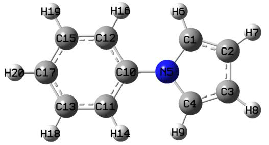

<!-- p.858 -->


```text
state    f     nm
   1  0.3935  245.0:  Redis(1) 20.4 %  Redis(2) 29.2 %  1->2 31.5 %  1<-2 18.9 %
   2  0.0139  244.4:  Redis(2) 69.9 %  1->2 22.7 %  1<-2  5.6 %
   3  0.0214  236.4:  Redis(1) 41.5 %  1->2 53.7 %
   4  0.0000  208.9:  Redis(1) 72.5 %  1->2 25.6 %
   5  0.1674  207.8:  Redis(1)  7.5 %  1->2 88.7 %
```

可以看到，振子强度(f)、波长(nm)以及主要IFCT项都被清晰显示。显然，激发态5(S5)主要显示电荷转移特征，而激发态1(S1)显示强混合特征。由于所有其它激发态的f都很小，它们对UV-Vis光谱没有显著贡献(As you can see, oscillator strength (f), wavelength (nm) along with major IFCT terms are clearly shown. Obviously, excited state 5 (S5) mainly shows charge transfer character, while excited state 1 (S1) shows strongly mixed character. Since all other excited states have very small f, they do not notably contribute to UV-Vis spectrum)。

绘制电荷转移光谱(CTS)(Plot charge-transfer spectrum (CTS)) 我提出的电荷转移光谱(CTS)意指将总UV-Vis光谱分解为分别由各种IFCT项贡献的各个子光谱，从而能以图形方式展示每个显著峰的内在本质。为绘制这类光谱，我们重新启动Multiwfn并输入(The charge-transfer spectrum (CTS) proposed by me means decomposing the total UV-Vis spectrum to individual subspectra respectively contributed by various IFCT terms, and hence the underlying nature of every noticeable peak can be graphically exhibited. To plot this kind of spectrum, we reboot Multiwfn and input)

CT_multiple\CT_multiple.txt // 包含用于绘制各种CTS的输入文件和相应图例的列表文件(The list file containing input files for plotting various types of CTS and corresponding legends)

11 // 绘制光谱的主功能(The main function for plotting spectrum) 3 // UV-Vis 0 // 绘制光谱(Plot spectrum) 现在光谱显示在屏幕上。我们稍微调节绘图设置使其更好看。关闭光谱然后输入(Now the spectrum is shown on screen. We slightly adjust plotting settings to make it look better. Close the spectrum and then input)

22 // 设置曲线/线/文本/坐标轴/网格的粗细(Set thickness of curves/lines/texts/axes/grid) 1 // 设置曲线的粗细(Set thickness of curves) 5 0 // 返回(Return) 17 // 其它绘图设置(Other plotting settings) 11 // 设置图例位置(Set position of legends) 8 // 左上角(Upper left corner) 10 // 设置图例文本尺寸(Set text size of legend) 45 0 // 返回(Return) 3 // 设置X轴下限和上限(Set lower and upper limit of X-axis) 170,300,20 // 下限、上限和标签间隔(Lower limit, upper limit, and label interval) 0 // 重新绘制(Replot) 当前CTS如下所示(The current CTS is shown below)

<!-- p.859 -->


正如可以清楚看到的，约 210 nm 附近的峰基本上对应于纯电荷转移激发，因为在此区域内“Electron transfer 1->2”曲线接近黑色的紫外-可见光谱曲线。约 245 nm 处的最高峰表现出高度杂化特征，两条片段内电子重排曲线和两条片段间电子转移曲线都呈现出相当的高度。

本例相对简单，因为我们只定义了两个片段，实际上你可以定义任意数目的片段。例如，如果你定义三个片段（例如分别

对应于 D-π-A 体系的 D、π、A 部分），那么 CTS 中将有 9 条曲线，即：redis(1)、redis(2)、redis(3)、1->2、1->3、2->3、1<-2、1<-3、2<-3。


### 4.18.17 基于电子激发进行电子密度极化分析的例子


###

本节说明如何进行基于电子激发的电子密度极化分析，该方法在 J. Phys. Chem. A, 124, 633 (2020) 中提出。请先认真阅读第 3.21.17 节以获得基础知识。本节将重现该 J. Phys. Chem. A 论文中的第一个例子，该例子使用一个 -0.1 e 的点电荷来近似模拟 SN2 反应起始阶段的亲核试剂。遭受亲核攻击的分子是 CH3Cl。点电荷与碳之间的距离任意设为 3 Å。示意图如下。


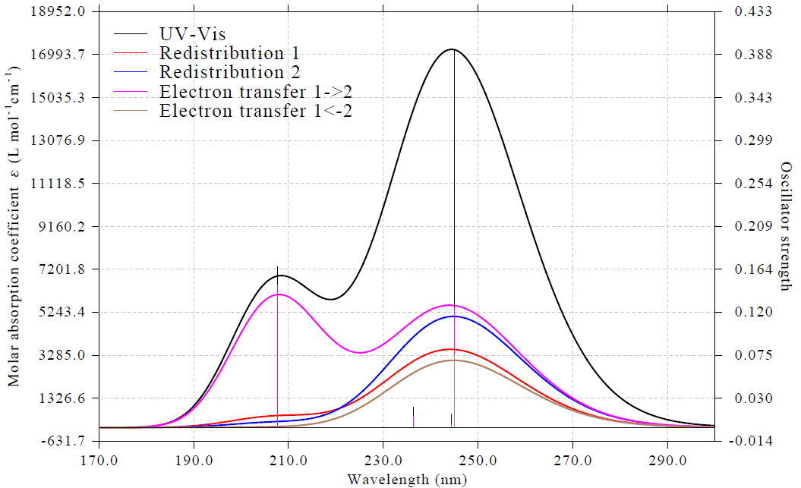

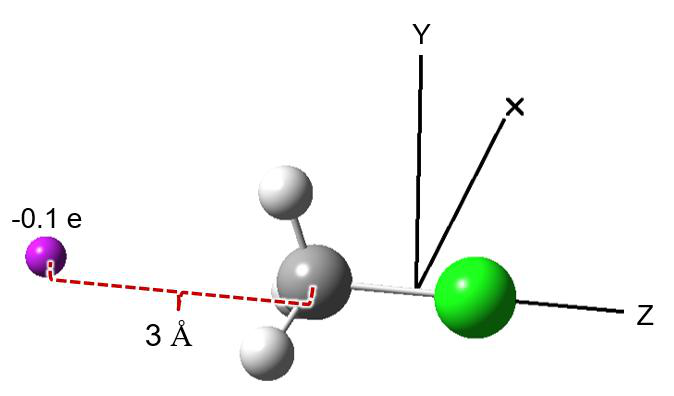

<!-- p.860 -->


在本例中，我们使用 ωB97XD/def2-TZVP 水平通过 Gaussian 对 CH3Cl 进行包含 50 个激发态的 TDDFT 计算，几何结构在 B3LYP/def-TZVP 水平下优化。Gaussian 输入和输出文件已提供在“examples\excit\CH3Cl\”文件夹中，由所得 .chk 文件转换而来的 .fch 文件作为 CH3Cl.fch 提供。注意在该任务中使用了 IOp(9/40=4) 关键词，其必要性已在第 3.21.A 节中强调。由于碳原子的 XYZ 坐标为 (0.0, 0.0, -1.13395200) Å，根据上图，显然点电荷应放置在 (0.0, 0.0, -4.13395200) Å 处。

启动 Multiwfn 并输入 CH3Cl.fch 18 // 电子激发分析(Electron excitation analyses) 17 // 基于电子激发的电子密度极化分析(Electron density polarization analysis based on electron excitations) 1 // 将只设置一个点电荷作为外电势(Only one point charge will be set as the external potential) 0.0,0.0,-4.13395200,-0.1 // 点电荷的 XYZ 坐标(Å)和电荷值(e)(XYZ coordinate (Å) and value (e) of the point charge) 2 // 中等质量格点(Medium-quality grid)（对应于 0.2 Bohr 的格点间距。如果你想降低成本，也可以使用低质量格点）

[按 ENTER 键(Press ENTER button)] // 载入与 CH3Cl.fch 在同一文件夹中的 Gaussian 输出文件 CH3Cl.out

现在 Multiwfn 开始依次计算 50 个激发态的数据，然后你将看到以下输出：


```text
Excited state contributions:
  State #    Exc. Ene (Ha)       c_k          E2(kJ/mol)
       1        0.273727     -0.00000190     -0.00000000
       2        0.273727     -0.00000299     -0.00000001
       3        0.339810      0.00000105     -0.00000000
[ignored...]
      50        0.705411     -0.00008669     -0.00001392

 Excited state contributions sorted by |c_k|:
  State #    Exc. Ene (Ha)       c_k          E2(kJ/mol)
       9        0.421066      0.00755963     -0.06317769
      22        0.503194     -0.00329586     -0.01435108
      14        0.456544     -0.00278408     -0.00929093
      42        0.651216     -0.00259838     -0.01154363
      38        0.633059     -0.00208700     -0.00723935
      47        0.666453      0.00156450     -0.00428287
[ignored...]

 Total E2:   -0.001206 eV (   -0.1164 kJ/mol)
 Integral of density polarization:    5.01383559E-07
 Amount of electrons polarized:  0.01196258
```

可以看出，第 9 个激发态具有最大的 ck，对 E(2) 的贡献最大，因此这个激发态值得进一步考察。“Total E2”和“Amount of electrons polarized”分别对应


<!-- p.861 -->


E(2) 和 δN，由于点电荷很小且与任何原子都不太接近，它们的值都很小。

我们选择选项“1 可视化密度极化的等值面(Visualize isosurface of density polarization)”来可视化 ρpol，然后将等值面值改为 0.0002，你将看到下图中的左图，其中绿色和蓝色分别对应正（电子积累）和负（电子耗尽）区域。为了便于理解，所放置点电荷的位置在图中自动

绘制为 Bq 原子。这样得到的 ρpol 是近似的。如果你想得到严格的 ρpol（下图中的右图），你应该使用常规方法，即取有和没有背景电荷时得到的电子密度之差（关于如何绘制电子密度图请参阅第 4.5.5 节），有和没有背景电荷时生成的波函数文件分别对应于 examples\excit\CH3Cl\bkchg\CH3Cl_Q.fch

和前述的 CH3Cl.fch。可以看出，近似的 ρpol 与严格的 ρpol 在定性上是一致的，表明通过微扰理论估计的近似 ρpol 是有意义的。

如上图所示，在 Cl-C 键轴末端存在一个电子密度降低的区域，因此可以认为，当携带局域负电荷、引发 CH3Cl SN2 反应的亲核试剂接近碳原子时，碳原子变得更具亲电性。

接下来，我们选择选项“2 可视化某个激发态的跃迁密度的等值面(Visualize isosurface of transition density of an excited state)”然后输入 9，以可视化对

ρpol 贡献最大的第 9 个电子激发的跃迁密度。将等值面值设为 0.004 后，你将看到下图，其中绿色和蓝色分别代表正部和负部。可以看出其分布相当接近

ρpol，进一步证实了从基态到第 9 激发态的激发对响应外电势的电子密度重排有最关键的贡献。值得一提的是，第 k 个电子激发对 ρpol 的贡献简单地为 2𝑐𝑘𝜌0 𝑘，其中 𝜌0 𝑘 为跃迁密度。


<!-- p.862 -->


可以利用 NTO 分析从轨道跃迁图像更好地理解第 9 个电子激发的本质，例子见第 4.18.6 节，或者如果存在主导的 MO 跃迁，直接查看 MO 图即可。如果你使用第 3.21.15 节介绍的功能，你会发现第 9 个电子激发主要由从 HOMO-2 到 LUMO 的跃迁主导（81.7%），它们由主功能 0 绘制的等值面图如下所示。可以看出 HOMO-2 呈现 C-H 和 C-Cl 键的成键特征，而 LUMO 呈现 C-Cl 键的反键特征。因此，我们可以得出结论，点电荷的外微扰引起了电子从成键轨道向反键轨道的转移，C-Cl 键因此应被削弱。这一推测可以通过计算键级直接证实。基于 CH3Cl.fch 计算的 C-Cl 键的 Mayer 键级和 Laplacian 键级分别为 1.068 和 0.432，而对 CH3Cl_Q.fch 计算的值分别为 1.061 和 0.428，清楚地表明点电荷的存在可察觉地降低了 C-Cl 成键强度。如前所述，点电荷用于模拟 CH3Cl 的 SN2 反应起始阶段的亲核试剂，我们的观察表明亲核试剂所带电荷产生的静电势引发了 C-Cl 键的断裂。

最后，如果你对外电势的分布感兴趣，可以选择选项“3 可视化外电势的等值面(Visualize isosurface of external potential)”，你会发现等值面呈球形，正好包围点电荷。

从这个例子可以看出，用电子激发来分析电子密度极化确实为理解化学体系对外微扰的响应提供了有价值且独特的见解。更多应用实例和讨论见 J. Phys. Chem. A, 124, 633 (2020) 和 J. Comput. Chem., 42, 1118 (2021)。


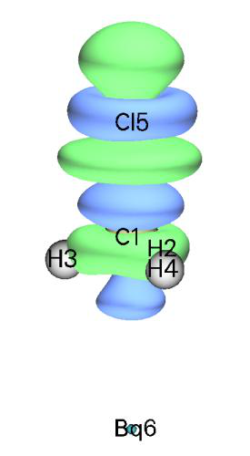


<!-- p.863 -->


### 4.18.18 计算(P)-[6]螺烯的 ECD/CPL 不对称因子(g)的例子


###

请查看第 3.21.18 节以了解相关背景信息和本节所说明功能的特点。在本节中，我将举例说明如何使用 Multiwfn 轻松计算典型手性分子 (P)-[6]螺烯的 ECD 和 CPL 不对称因子(g)，我还将展示跃迁电偶极矩和跃迁磁偶极矩可以非常方便地可视化。将使用 Gaussian 的 TDDFT 输出文件进行说明，而 ORCA 电子激发任务的输出文件也可以使用（examples\excit\g_factor\TDDFT_S0geom_ORCA.out 是一个示例文件）。

ECD 光谱的不对称因子(gCD) examples\excit\g_factor\TDDFT_S0geom.out 是在 CAM-B3LYP/def2-SV(P) 水平下对处于基态结构的螺烯进行的 Gaussian 16 TDDFT 任务的输出文件，该基态结构使用相同水平优化，计算了 30 个激发态，CH2Cl2 溶剂环境用 IEFPCM 溶剂化模型表示。这里我们将获得这些态的 gCD 和相关信息。启动 Multiwfn，载入该文件，然后输入

18 // 电子激发分析(Electron excitation analyses) 18 // 计算手性体系的 ECD/CPL 不对称因子(g)(Calculate ECD/CPL dissymmetry factor (g) of chiral systems) 1 // 本研究针对 ECD(This study is for ECD) 然后 Multiwfn 从 Gaussian 输出文件中载入跃迁电偶极矩和磁偶极矩并打印在屏幕上，并输出所有激发态的 gCD 以及与之密切相关的各种量：


```text
 Wavlen: Wavelength (nm)
 |e_tran|: Magnitude of transition electric dipole moment (in 1E-20 esu*cm)
 |m_tran|: Magnitude of transition magnetic dipole moment (in 1E-20 erg/Gauss)
 angle: Angle between transition electric and magnetic moments (degree)
 R: Rotatory strength (in 1E-40 cgs = erg*esu*cm/Gauss)
 D: Dipole strength (in 1E-38 cgs = esu^2*cm^2)
 g: ECD dissymmetry factor (dimensionless)

 State Wavlen  |e_tran| |m_tran| angle  cos(angle)     R        D        g
    1   339.5    63.17    0.272   90.01    -0.000      0.0     39.9   0.000003
    2   320.6    28.09    0.078    0.00     1.000     -2.2      7.9  -0.011134
    3   303.5   611.95    3.922  110.89    -0.357    856.0   3745.0   0.009143
    4   288.0   106.78    0.307    0.00     1.000    -32.8    114.0  -0.011492
[ignored...]
   29   182.1   182.09    0.280  180.00    -1.000     51.0    331.6   0.006156
   30   181.8    97.30    0.811  153.75    -0.897     70.8     94.7   0.029912
```

很清楚 S3 应该是实验 ECD 和紫外-可见光谱中最低的可观测激发，因为 S1 和 S2 的旋光强度(R)和偶极强度(D)都可以忽略不计。


<!-- p.864 -->


注意到在关于螺烯衍生物的研究工作 Chem. Sci., 12, 5522 (2021) 中，实际的 S3 甚至（有些令人困惑地）被标记为 S1，因为它是第一个光学活性的吸收。S3 的

gCD 为 0.0091，与 Chem. Sci., 12, 5522 (2021) 图 3(f) 中报道的 0.85×10-2 符合得很好。

现在我们在 VMD 可视化程序(http://www.ks.uiuc.edu/Research/vmd/)中直观查看 S3 的跃迁电偶极矩(𝛍tran)和跃迁磁偶极矩(𝐦tran)。在本功能的后处理菜单中，选择选项“2 将当前结构导出为 .pdb 文件(Export current structure to .pdb file)”然后输入 S0.pdb，以在当前文件夹中生成名为“S0.pdb”的 pdb 文件，其中包含当前结构。还选择选项“1 生成用于可视化跃迁电/磁矩的 VMD 脚本文件(Generate VMD script file for visualizing transition electric/magnetic moments)”然后输入 ECD.vmd，以在当前文件夹中生成名为“ECD.vmd”的 VMD 脚本。

启动 VMD（推荐 1.9.3 版本），将 S0.pdb 载入其中，可以用 licorice 风格绘制分子结构。将 ECD.vmd 移到 VMD 文件夹并在 VMD 命令窗口中运行 source ECD.vmd 以执行该脚本。之后，你可以在 VMD 命令窗口中运行 emtran 3 以将 S3 的 𝛍tran 和 𝐦tran 分别绘制为红色和青色箭头，如下所示。默认情况下，箭头长度为 5 Å，箭头半径为 0.15 Å。关于如何微调绘图设置，见 ECD.vmd 顶部的注释。

接下来，我们看 S2。S2 态的 𝛍tran 和 𝐦tran 都严格平行于 Z 轴。当在同一张图中一起绘制它们时，必须对箭头中心稍作平移以使它们在视觉上可区分。在 VMD 命令窗口中我们运行此命令：emtran 2 5 5 0.15 0 0.3 0 0 -0.3 0，其中“5 5 0.15”表示两个箭头的长度均为 5 Å，半径为 0.15 Å。“0 0.3 0”和“0 -0.3 0”表示红色和蓝色箭头的中心分别平移了 (0.0 0.3 0.0) 和 (0.0 -0.3 0.0) Å。现在你可以看到下图，由于中心平移，两个箭头彼此不重叠。


