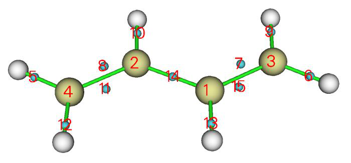
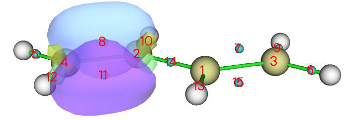
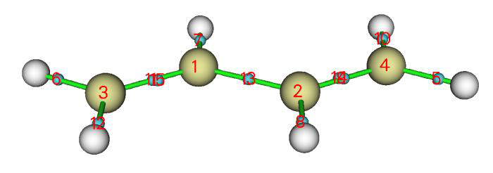
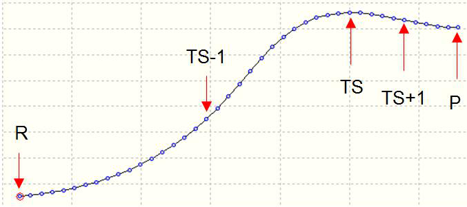
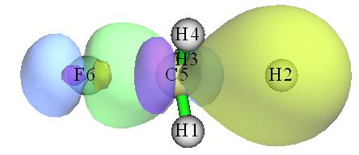

# 轨道定域化分析(Orbital localization analysis)

> Multiwfn manual, p.865–872.英文原文见同名 English 章节。 Images: `../imgs/`.

---

<!-- p.865 -->


CPL 的不对称因子(gCPL) examples\excit\g_factor\TDDFT_opt_S1.out 是对该螺烯 S1 态的 TDDFT 几何优化的输出文件，以 S0 最低点作为初始几何。仅计算了 3 个激发态，这已足够，因为 CPL 的发射态就是 S1（Kasha 规则）。为了获得 gCPL，我们将此文件载入 Multiwfn，进入主功能 18 的子功能 18，Multiwfn 将载入最后输出的 𝛍tran 和 𝐦tran，它们对应于 S1 最低点结构处的数据。然后选择“2 本研究针对 CPL(This study is for CPL)”你将在屏幕上看到以下信息：


```text
 State Wavlen  |e_tran| |m_tran| angle  cos(angle)     R        D        g
    1   372.4    72.32    0.226   97.32    -0.127     -2.1     52.3  -0.001592
    2   348.4    45.88    0.137  180.00    -1.000     -6.3     21.0  -0.011926
    3   334.0   748.12    3.693   73.04     0.292    805.8   5597.0   0.005759
```

显然，gCPL 为 -0.0016，与 Commun. Chem., 1, 38 (2026) 表 1 中报道的相同分子在相同溶剂下的实验值 -0.0009 符号相同。Chem. Sci., 12, 5522 (2021) 图 3(f) 中报道的相应值为 +0.0013，他们的计算水平与我们相同，大小与我们非常接近，但符号不同。我怀疑他们在符号上弄错了。gCPL 与 S1 的 gCD（0.000003）之间的差异来自 S0 和 S1 最低点之间微小的结构差异。如前所述，你也可以让 Multiwfn 将当前结构导出为 pdb 文件并导出用于可视化 S1 的 𝛍tran 和 𝐦tran 的 VMD 脚本，以深入理解 gCPL。相关文件已作为 S1.pdb 和 CPL.vmd 提供在“examples\excit\g_factor\”文件夹中。


## 4.19 轨道定域化分析(Orbital localization analysis)

注：本节中的大多数信息也可参见我的博客文章“Multiwfn 的轨道定域化功能的使用以及与 NBO 和 AdNDP 分析的比较”(http://sobereva.com/380，为中文)。

轨道定域化是一种非常强大且有用的技术，它可以将常常表现出高度离域特征的正则分子轨道转化为定域形式，即定域分子轨道(LMO)。LMO 与许多经典


<!-- p.866 -->


化学概念如化学键和孤对电子有密切关系，

注意：默认的轨道定域化方法，即基于 Mulliken 布居的 Pipek-Mezey 方法(PM-Mulliken)方法，在大量使用弥散函数时不建议使用，否则结果可能具有误导性。如果必须使用弥散函数，你应该换用基于 Becke 布居的 Pipek-Mezey 方法(PM-Becke)方法，或 Foster-Boys 方法，各种轨道定域化方法的优缺点见第 3.22 节介绍。


### 4.19.1 用 Pipek-Mezey 方法定域 1,3-丁二烯的分子轨道


###

本节以反式-1,3-丁二烯为例说明 Multiwfn 的轨道定域化分析的使用。

进行 LMO 分析的基本步骤 输入文件是 examples\butadiene.fch，它是在 B3LYP/6-31G** 水平下产生的。你可以先通过主功能 0 可视化其 MO，你会发现所有 MO 都是高度离域的，没有一个与化学键理论的经典概念有直接对应。现在我们进行轨道定域化，将它们转化为更具化学意义的轨道。启动 Multiwfn 并输入

examples\butadiene.fch 19 // 轨道定域化(Orbital localization)。默认使用基于 Mulliken 布居的 Pipek-Mezey 定域化方法

2 // 对占据和非占据 MO 都进行定域化(Perform localization for both occupied and unoccupied MOs) 由于该体系很小，定域化迭代立即收敛，并打印所得轨道的主要特征。之后 Multiwfn 自动将 LMO 作为 new.fch 导出到当前文件夹然后载入。现在，内存中的轨道系数已完全更新为 LMO。你可以用不同方式表征它们。我们进入主功能 0 可视化这些轨道，你会发现所有轨道都表现出很强的定域特征，特别是占据轨道。下面是涉及 C6-C8 的三个 LMO 的截图，

前两个是占据的，它们分别对应于 σ 键和 π 键；第三个是非占据的，它可以模糊地认定为反 π 键轨道。

评估 LMO 能量 可以评估 LMO 的能量，如下所示。启动 Multiwfn 并输入 examples\butadiene.fch


<!-- p.867 -->


19 // 轨道定域化(Orbital localization) -4 // 允许 Multiwfn 生成并打印 LMO 的能量(Allow Multiwfn to generate and print energy for LMOs) 1 // 使用通过 F=SCEC-1 关系由 MO 能量和系数生成的 Fock 矩阵评估 LMO 的能量(Evaluate energies of the LMOs using the Fock matrix generated by MO energies and coefficients via F=SCEC-1 relationship)

2 // 定域化占据和非占据轨道(Localize both occupied and unoccupied orbitals) 计算完成后，Multiwfn 评估 LMO 的能量并按能量从低到高排序。你可以在屏幕上找到所有 LMO 的能量。最高占据和最低非占据 LMO 的信息如下所示


```text
   14   Energy:   -0.2750728 a.u.      -7.4851 eV   Type: A+B   Occ: 2.0
   15   Energy:   -0.2750728 a.u.      -7.4851 eV   Type: A+B   Occ: 2.0
   16   Energy:    0.2185911 a.u.       5.9482 eV   Type: A+B   Occ: 0.0
   17   Energy:    0.2185913 a.u.       5.9482 eV   Type: A+B   Occ: 0.0
```

请在主功能 0 中绘制这些轨道以尝试识别它们的特征。

顺便说一下，也可以基于从外部文件载入的 Fock 矩阵评估 LMO 的能量（详见附录 7），如果无法基于 MO 能量和系数成功生成 Fock 矩阵，这就是唯一选择。例如，Fock 矩阵可以从 NBO .47 文件载入；为了对本体系实现这一点，我们可以进入主功能 100 并选择子功能 2，然后选择选项 10 将当前体系导出为 Gaussian 输入文件。然后适当修改输入文件以要求 Gaussian 输出 .47 文件，我们需要确保计算水平与 examples\butadiene.fch（B3LYP/6-31G**）完全相同。准备好的输入文件已作为 examples\butadiene_47.gjf 提供。用 Gaussian 运行它，你将在 C:\ 中找到所得的 BUTADIENE.47（此文件已作为 examples\butadiene.47 提供）。在主功能 19 中，在选择选项 -4 允许 Multiwfn 评估 LMO 能量后，如果你选择子选项“2 载入 Fock 矩阵从文件评估(Evaluate, loading Fock matrix from a file)”然后输入 .47 文件的路径，将载入记录在 .47 文件中的 Fock 矩阵，并将在适当时候用于评估 LMO 轨道能量

显示所有 LMO 的中心位置 可以可视化所有生成的 LMO 的中心位置，从而立即理解 LMO 的分布。这里我说明如何实现这一点。

重新启动 Multiwfn 并输入 examples\butadiene.fch 19 // 轨道定域化(Orbital localization) -8 // 切换“是否计算 LMO 的中心位置和偶极矩(If calculating center position and dipole moment of LMOs)”的状态为“Yes” -6 // 改变定域化方法(Change localization method) 10 // Foster-Boys 1 // 定域化占据轨道(Localize occupied orbitals)（非占据 LMO 的中心位置一般没什么意义，因此我们不定域非占据 MO）

n // 跳过偶极矩分析(Skip the dipole moment analysis) 如你从提示中所见，在轨道定域化如常完成、新生成的 new.fch 被自动载入 Multiwfn 后，程序计算每个 LMO 的中心位置。为了使中心的可视化容易，Multiwfn 在当前体系中加入 Bq 原子（即鬼原子）来代表 LMO 的中心。中心坐标以及 LMO 编号与 Bq 编号之间的对应关系自动导出到当前文件夹作为 LMOcen.txt。此实例中该文件的内容为


```text
 LMO     1 corresponds to Bq    11, X,Y,Z:    1.1372    0.7759   -0.0000 Bohr
 LMO     2 corresponds to Bq    12, X,Y,Z:   -1.1372   -0.7759   -0.0000 Bohr
 LMO     3 corresponds to Bq    13, X,Y,Z:    1.1372    3.3081   -0.0000 Bohr
...[ignored]
```

然后我们返回主菜单并进入主功能 0 以可视化 LMO 中心和


<!-- p.868 -->


轨道等值面。绘图设置已自动设为特殊状态以最好地可视化 LMO，目前你可以看到：

从该图我们可以非常清楚地理解生成的 LMO 的分布。每个青色球是一个鬼原子，代表一个 LMO 的中心。在当前设置下鬼原子的编号从 1 开始，因此图中显示的编号直接对应于 LMO 编号。例如，我们想同时可视化边界 C-C 键处的两个 LMO，由于标号为 8 和 11 的青色球位于该键周围，我们在轨道列表中选择轨道 8 来显示它，然后选择“显示+选择等值面#2(Show+Sel. isour#2)”并选择轨道 11。之后，将等值面值改为 0.13 并将绘制风格设为透明，你将看到

显然，通过 Foster-Boys 方法得到的两个 LMO 共同代表了边界 C-C 键的双键特征。这两个 LMO 被称为“香蕉”轨道，不

表现出 σ-π 分离特征。

你也可以尝试可视化通过 Pipek-Mezey 算法生成的 LMO 的中心位置。因为该方法将每个双键表示为一对分离的 σ 和 π LMO，它们的中心应该非常接近，从下图你可以发现中心确实几乎无法区分：

值得注意的是，有两种方法可以快速找到与你感兴趣的键对应的 LMO 的编号。第一种是检查轨道定域化过程中打印的轨道组成，第二种是直接可视化 LMO 中心并找到适当位置处青色球上方显示的编号，正如我刚才说明的。








<!-- p.869 -->


### 4.19.2 分析 SN2 反应的定域分子轨道的变化


###

在本例中，我们研究定域分子轨道(LMO)沿反应路径的变化，以可视化化学键的变化，以一个典型的 SN2 反应为实例。

此 SN2 反应涉及 F-C 键的形成和 C-H 键的断裂，因此在以下分析中我们将聚焦于相应的两个 LMO。该 SN2 反应的 IRC 如下所示，考虑了五个点，它们的 .fch 文件已提供在 examples\SN2 文件夹中。

首先，我们为过渡态(TS)几何生成 LMO。启动 Multiwfn 并输入 examples\SN2\TS.fch 19 // 轨道定域化(Orbital localization) 1 // 定域化占据轨道(Localize occupied orbitals) 0 // 可视化轨道(Visualize orbitals) 我们可以发现有两个轨道分别对应于 F-C 和 C-H 键，我们将它们画在一起以便于比较

绿-蓝等值面和紫-黄等值面清楚地描绘了分别对应于 F-C 和 C-H 键的轨道。

我们对 R.fch、TS-1.fch、TS+1.fch 和 P.fch 绘制同样类型的图，然后将图放在一起，如下所示






<!-- p.870 -->


从图中，SN2 反应过程中化学键的变化相当清楚（R→TS-1→TS→TS+1→P）。在反应物状态，绿-蓝等值面对应于氟原子的孤对电子，而紫-黄等值面显示典型的 C-H 共价键特征。随着反应进行，两个 LMO 平滑变化，C-F 共价键特征越来越突出，在最终产物状态，紫-黄等值面代表的 LMO 已经对应于 H- 阴离子的 1s 轨道。

### 4.19.3 表征 [Re2Cl8]2- 阴离子的 Re-Re 键

人们广泛接受 [Re2Cl8]2- 阴离子中的 Re-Re 键是四重键，

构型为 (σ2π4δ2)。σ 键来自两个铼原子的 𝑑𝑧2 −𝑝𝑧 杂化轨道的重叠，两个 π 键源于它们的 dxz 和 dyz 轨道的重叠，而 δ 键由它们的 dxy 轨道重叠形成。这一经典概念能否通过轨道定域化分析验证？

在 B3LYP 下对 Cl 用 6-31G*、对 Re 用 SDD 产生的 [Re2Cl8]2- 阴离子的 .fchk 文件作为 examples\Re2Cl82-.fchk 提供。将其载入 Multiwfn 并对占据轨道进行轨道定域化，从输出中我们可以立即识别出对应于 Re-Re 键的四个 LMO：


```text
Almost two-center LMOs: (Sum of two largest contributions > 80.0%)
  57:   7(Cl) 73.8%   2(Re) 22.5%        58:  10(Cl) 73.8%   2(Re) 22.5%
  59:   4(Cl) 73.8%   1(Re) 22.5%        60:   2(Re) 48.1%   1(Re) 48.1%
  61:   8(Cl) 73.8%   2(Re) 22.5%        62:   3(Cl) 73.8%   1(Re) 22.5%
  64:   1(Re) 45.9%   2(Re) 45.9%        66:   6(Cl) 73.8%   1(Re) 22.5%
  67:   9(Cl) 73.8%   2(Re) 22.5%        69:   5(Cl) 73.8%   1(Re) 22.5%
  83:   1(Re) 45.9%   2(Re) 45.9%        84:   2(Re) 43.6%   1(Re) 43.6%
```

提示：如果你想更容易找到对应于 Re1-Re2 键的 LMO 的编号，最好的方法是在启动 Multiwfn 之前将 `settings.ini` 中的 "iprintLMOorder" 设为 1。之后，LMO 的组成将按原子和原子对的顺序打印。

然后我们进入主功能 0 以可视化它们（在默认等值面值 0.05 下）：


<!-- p.871 -->


从 LMO 的等值面图可以清楚看出，LMO60 对应于 σ 键，LMO64 和 LMO83 对应于 π 键，LMO84 对应于 δ 键。这一观察支持了四重键的说法。

然而，如果我们计算 Mayer 键级，会发现情况并不那么简单。用主功能 9 计算的 Re-Re 键的 Mayer 键级为 2.94，为什么该值明显低于预期的 4.0？

为了获得更深入的理解，我们使用主功能 9 对 Re-Re 键进行“轨道占据数微扰的 Mayer 键级(Orbital occupancy-perturbed Mayer bond order)”分析，输出为


```text
Mayer bond order after orbital occupancy-perturbation:
 Orbital     Occ      Energy    Bond order   Variance
...[Ignored]
    60     2.00000   -0.14354    2.001481   -0.935449
...[Ignored]
    64     2.00000   -0.12793    2.276388   -0.660542
...[Ignored]
    83     2.00000   -0.01749    2.276388   -0.660542
    84     2.00000    0.02809    2.466317   -0.470613
```

结果表明 σ LMO 的贡献为 0.935，每个 π LMO 贡献 0.661，δ LMO 贡献 0.471。虽然原则上 Mayer 键级不能精确分解，但这些数据足以帮助我们理解每个成键

LMO 的相对重要性。显然 σ 键对 Re-Re 键最重要，而 δ 键的重要性相对最低。

现在出现了一个新问题，为什么四个 LMO 对 Re-Re 键 Mayer 键级的贡献不同？这可以通过用更低的等值面值可视化它们的等值面来回答。下面展示了等值面值为 0.01 的四个 LMO 的图

从图中我们发现 LMO60 基本上只出现在两个 Re 原子周围，因此


<!-- p.872 -->


它对 Re-Re Mayer 键级的贡献应接近 1.0。LMO64 和 LMO83 都略微离域到四个 Cl 原子上，因此它们并不纯粹表现出 Re-Re 键特征，从而对 Re-Re Mayer 键级的贡献较低。LMO84 离域到全部八个 Cl 原子上，自然可以预期它对 Re-Re Mayer 键级的贡献应最小。

顺便说一下，如果你有兴趣，可以对 Cr2 进行轨道占据数微扰的 Mayer 键级分析，你会发现 Mayer 键级几乎恰好为 6.0，对应于 Cr-Cr 键的所有六个 MO 基本上贡献都为 1.0，这主要是因为这些轨道没有离域到任何其他原子上。


### 4.19.4 基于双中心 LMO 研究 CH3NH2 的键偶极矩

如第 4.A.11 节所述，Multiwfn 支持几种评估键偶极矩的方法。在本节中我以 CH3NH2 为例说明基于双中心 LMO 可以研究键偶极矩，它在某种程度上反映键极性。相关理论介绍见第 3.22 节。

启动 Multiwfn 并输入 examples\CDA\CH3NH2\CH3NH2.fch 19 // 轨道定域化(Orbital localization) -8 // 切换“是否计算 LMO 的中心位置和偶极矩(If calculating center position and dipole moment of LMOs)”的状态为“Yes” 1 // 定域化占据轨道(Localize occupied orbitals) y // 对 LMO 进行偶极矩分析(Perform dipole moment analysis for the LMOs) 现在当前文件夹中已生成 LMOdip.txt，在此文件中你可以找到以下内容，它们是用第 3.22 节“专题 3(Special topic 3)”中所示的特殊方法计算的：


```text
Single-center orbital dipole moments (a.u.):
    1 (   5N )  X/Y/Z:  -0.04465   0.01500   0.00001  Norm:   0.04710
    2 (   1C )  X/Y/Z:   0.00010   0.00014   0.00000  Norm:   0.00017
    9 (   5N )  X/Y/Z:  -1.28448   0.41598   0.00001  Norm:   1.35016
 Sum            X/Y/Z:  -1.32903   0.43112   0.00001  Norm:   1.39721

 Two-center bond dipole moments (a.u.):
    3 (   5N  -   6H )  X/Y/Z:  -0.08951  -0.20801   0.30542  Norm:   0.38021
    4 (   1C  -   4H )  X/Y/Z:  -0.06753   0.08375  -0.00000  Norm:   0.10758
    5 (   5N  -   7H )  X/Y/Z:  -0.08950  -0.20802  -0.30543  Norm:   0.38022
    6 (   5N  -   1C )  X/Y/Z:   0.17708   0.25312  -0.00000  Norm:   0.30891
    7 (   1C  -   3H )  X/Y/Z:   0.08532   0.06534  -0.09566  Norm:   0.14387
    8 (   1C  -   2H )  X/Y/Z:   0.08532   0.06534   0.09566  Norm:   0.14387
 Sum                    X/Y/Z:   0.10119   0.05152  -0.00001  Norm:   0.11355
```

进入主功能 0 后，我们可以看到下图

## Multiwfn

> 弱作用可视化、能量分解、CDFT、ETS-NOCV、(超)极化率

> 英文原文见同目录 `09_教程4.20-4.24.md`｜图片目录：`../mw_imgs/`

---
