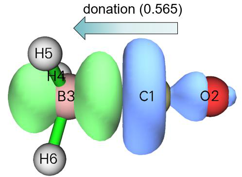
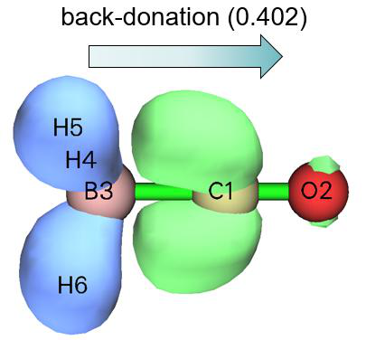
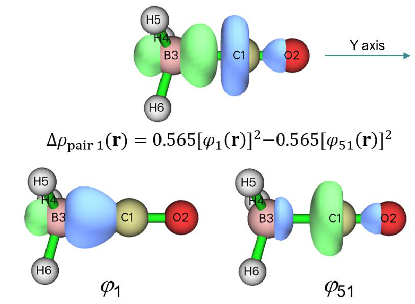
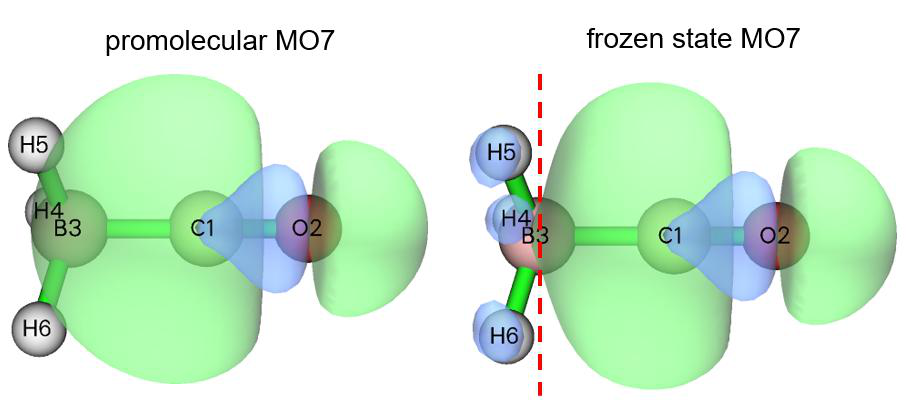
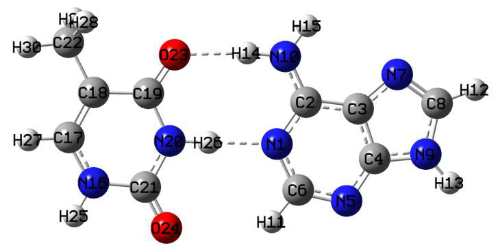
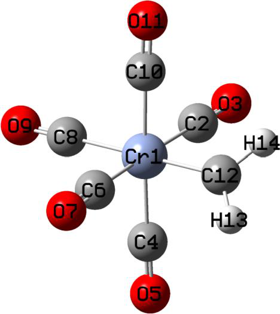
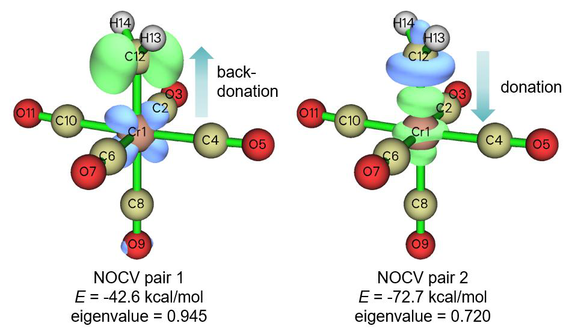
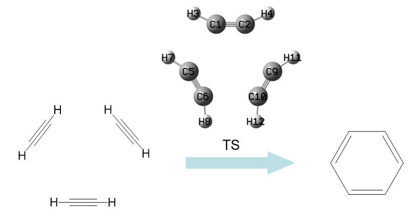
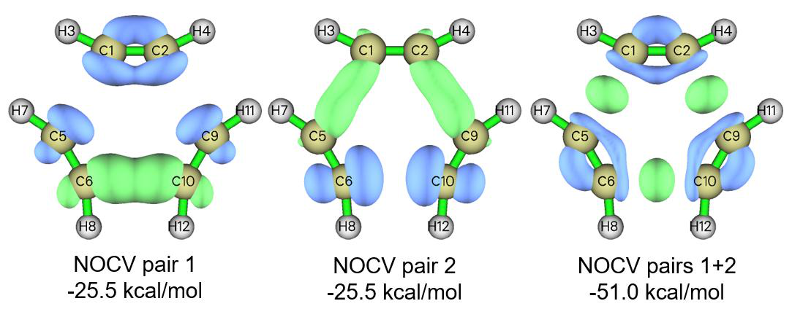

# ETS-NOCV分析的例子

> Multiwfn manual, p.949–968.英文原文见同名 English 章节。 Images: `../imgs/`.

---

<!-- p.949 -->


2 // 通过Hirshfeld划分计算AOM(Calculate AOM via Hirshfeld partition) 现在AOM已生成，你可输入两个原子的序号来研究相应键的DDD。例如，我们输入1,6，它对应间位-对位C-C键，你将看到


```text
Result of    1(C )   --    6(C )
f-:      0.067452
f+:      0.026544
g-:      0.017868
g+:      0.011229
f(1):   -0.040907
f(2):   -0.056481
```

该结果与DDD原始论文表2中的相应数据完全相同，

只是g−例外，我们的结果是表2中值的两倍。我们的结果是正确的，实际上若严格按该论文方程29评估，表2中的g−应加倍。


## 4.23 ETS-NOCV分析的例子

注：本节的中文版是我的博客文章“在Multiwfn中使用ETS-NOCV方法深入分析片段间轨道相互作用”(In-depth analysis of orbital interactions between fragments using the ETS-NOCV method in Multiwfn)（http://sobereva.com/609）。

本节给出几个例子说明如何用ETS-NOCV（扩展过渡态-化学价自然轨道）分析研究片段间相互作用。若你尚未读过3.26节，请先读它以获得关于ETS-NOCV分析理论及其在Multiwfn中实现细节的相关知识。下面多数例子用的输入文件是由Gaussian生成的.fch文件，只要携带基函数信息（见2.5节），其他波函数文件也可用，例如你可用ORCA程序生成.molden文件作为输入文件。

需要强调的是，若无特殊原因，请勿使用弥散函数，否则可能因无法直接生成Fock/Kohn-Sham矩阵而无法通过所述步骤获得轨道能量（此时你须向Multiwfn提供含Fock/Kohn-Sham矩阵的文件，见附录7），而且ETS-NOCV模块中用SCPA方法评估的轨道组成可能很不合理。

### 4.23.1 简单闭壳层例子：CO-BH3

本例中，我们用ETS-NOCV在B3LYP/6-31G*水平下研究COBH3配合物中CO与BH3之间的相互作用，所有相关文件可在“examples\ETS-NOCV\COBH3”文件夹中找到。因这是第一个ETS-NOCV例子，过程将描述得非常详细。

准备输入文件 起初，我们需要分别为COBH3、CO和BH3生成波函数文件。我们先搭建COBH3的几何构型，然后创建几何优化任务的输入文件，相应的Gaussian输入文件为“examples\ETS-NOCV\COBH3”中的COBH3.gjf。运行它并将得到的.chk文件转为.fch后，你将得到COBH3.fch。

接下来，从优化好的COBH3几何构型中提取CO和BH3的笛卡尔坐标，然后创建相应的单点任务输入文件，它们是“examples\ETS-NOCV\COBH3”文件夹中的CO.gjf和BH3.gjf。注意为避免Gaussian计算中几何构型自动重取向，须使用nosymm关键词。在运行这两个片段输入文件后，你将得到CO.fch和BH3.fch。注意不应

<!-- p.950 -->


对两个片段做几何优化，否则它们的坐标将与在配合物中的坐标不一致。

片段电子态的选择，即ETS-NOCV分析中参考态的定义，在某种程度上是任意的。在当前例子中，显然CO和BH3应为单重态，这不仅是因为单重态是CO和BH3在孤立态下最稳定的状态，更重要的是，因为它们以闭壳层状态彼此成键

（OC→BH3为配位键）。

ETS-NOCV数据的定量分析

!!! terminal "Multiwfn 交互"

    - **启动Multiwfn并输入examples\ETS-NOCV\COBH3\COBH3.fch** — 配合物波函数文件(Complex wavefunction file)
    - **23** — ETS-NOCV分析(ETS-NOCV analysis)
    - **2** — 两个片段(Two fragments) examples\ETS-NOCV\COBH3\CO.fch

examples\ETS-NOCV\COBH3\BH3.fch // 片段2的波函数文件(Wavefunction file of fragment 2) 现在NOCV轨道和NOCV对的信息立即打印出来：


```text
       --------------- Pair and NOCV orbital information --------------
There are totally   26 NOCV pairs and    51 NOCV orbitals
NOCV orbitals whose eigenvalues are smaller than 1.0E-03 are not shown
Note: Energies of NOCV orbitals have not been evaluated, so they are all zero

 Pair  Energy | Orbital  Eigenvalue    Energy  | Orbital  Eigenvalue    Energy
    1    0.00       1      0.56514       0.00       51     -0.56514       0.00
    2    0.00       2      0.40205       0.00       50     -0.40205       0.00
    3    0.00       3      0.40204       0.00       49     -0.40204       0.00
    4    0.00       4      0.13007       0.00       48     -0.13007       0.00
    5    0.00       5      0.03704       0.00       47     -0.03704       0.00
    6    0.00       6      0.03703       0.00       46     -0.03703       0.00
    7    0.00       7      0.03419       0.00       45     -0.03419       0.00
    8    0.00       8      0.00834       0.00       44     -0.00834       0.00
    9    0.00       9      0.00273       0.00       43     -0.00273       0.00
Sum of NOCV eigenvalues:   0.00000
```

NOCV轨道按其本征值从最正到最负排序。从输出可以看出，NOCV轨道是成对出现的，每两个具有相反本征值的NOCV轨道构成一个NOCV对。例如，从上述输出可以看出NOCV 3和NOCV 49的本征值分别为0.402和-0.402，因此它们组成一个NOCV对，即NOCV对3。所有NOCV轨道本征值之和恰为零，因为轨道相互作用不影响总电子数。

具有较大本征值绝对值的NOCV对对轨道相互作用引起的密度差有更大的潜在影响。从上述信息可以看出，总共有多达26个NOCV对，但因默认

<!-- p.951 -->


打印阈值（即本征值绝对值须大于0.001）只打印了其中九个，其中只有对1至对4对密度差有显著影响。因此，你只需考察这些NOCV对的特征即可研究CO与BH3之间的轨道相互作用

目前，NOCV轨道和对的能量尚未计算。要计算它们，你应提供一个含HF情形Fock矩阵或DFT情形Kohn-Sham（KS）矩阵的文件，详见本手册附录7。在本例及后续例子中我们用更方便的方式，即直接让Multiwfn基于配合物波函数COBH3.fch中分子轨道的能量和系数矩阵生成Fock/KS矩阵。于是，我们在后处理菜单中选择选项“-2 生成Fock/KS矩阵并评估NOCV轨道能量(Generate Fock/KS matrix and evaluate NOCV orbital energies)”，然后生成KS矩阵并评估NOCV能量，之后NOCV信息再次打印到屏幕上，如下所示


```text
Pair  Energy | Orbital  Eigenvalue    Energy  | Orbital  Eigenvalue    Energy
    1  -77.88       1      0.56514    -120.88       51     -0.56514      16.93
    2  -15.83       2      0.40205    -139.60       50     -0.40205    -100.22
    3  -15.84       3      0.40204    -139.62       49     -0.40204    -100.23
    4   -5.53       4      0.13007     -44.60       48     -0.13007      -2.06
    5   -0.41       5      0.03704     -18.25       47     -0.03704      -7.19
    6   -0.41       6      0.03703     -18.19       46     -0.03703      -7.13
    7   -0.65       7      0.03419      21.33       45     -0.03419      40.48
    8   -0.06       8      0.00834    -308.53       44     -0.00834    -301.42
    9   -0.02       9      0.00273   -1661.86       43     -0.00273   -1655.69
Sum of NOCV eigenvalues:   0.00000
Sum of pair energies:    -116.63 kcal/mol
```

从输出可以看出，此时每个NOCV对都有相应能量，所有NOCV对能量之和为-116.63 kcal/mol，表明轨道相互作用使配合物稳定了116.63 kcal/mol，这将被称为ΔEorb。NOCV对的能量计算为属于

该对的NOCV轨道能量与本征值乘积之和。例如，NOCV对1的能量(Δ𝛦1

orb )为-77.88 kcal/mol，它是这样算得的：−120.88×0.5651 + 16.93×(−0.5651)。

重要的是注意，如3.26.2节所述，由于Multiwfn中ETS-NOCV分析用的Fock/KS矩阵是基于实际配合物波函数而非人工过渡态波函数构建的，打印的“所有对能量之和(Sum of pair energies)”并非严格的轨道相互作用能，打印的NOCV能量也并非标准ETS-NOCV分析中的确切对应值。不过，一般发现偏差很小，不会明显影响由分析得出的结论。

你可能已注意到NOCV对9由两个能量非常负的NOCV轨道组成，但对能量绝对值极小（-0.02 kcal/mol），原因何在？事实上，相应的NOCV轨道9和43非常类似于核轨道（你可用很小的等值面可视化轨道等值面来证实），显然它们感受到很强的核吸引势，能量必定相当负；但由于这类轨道几乎不参与成键，它们的本征值必定很小，使得NOCV对能量小到可完全忽略。

NOCV对的可视化分析

显然，NOCV对1（-77.9 kcal/mol）是对ΔEorb（-116.6 kcal/mol）的主导贡献，通过可视化该对密度的等值面可对在CO与BH3络合中起关键作用的相互作用机制获得更深入的理解。NOCV对2和3的贡献不完全可忽略，因此通过可视化它们的密度我们可以了解哪类相互作用对片段间结合起次要作用。

现在我们选择选项“2 显示NOCV对密度的等值面(Show isosurface of NOCV pair density)”，然后选择“2 中等质量格点(Medium-quality grid)”，这对展示像COBH3这样小体系的NOCV对密度已足够精细。


<!-- p.952 -->


现在NOCV信息再次打印到屏幕上以方便用户选择感兴趣的NOCV对。接下来，我们输入1计算NOCV对1密度的格点数据并显示其等值面。在0.005 a.u.等值下，你可在图形界面窗口中看到下图（箭头为手动添加）

在此图中，蓝色和绿色等值面分别显示因NOCV对1描述的轨道相互作用而电子密度减少和增加的区域。显然，NOCV对1对应从CO部分向BH3部分的显著电子位移。转移电子量对应此NOCV对本征值的绝对值，即0.565。出现这类相互作用是自然预期的，因为CO富电子而倾向于给出电子，而BH3是缺电子物种，倾向于通过

位于硼的未占据轨道接受电子。由于这种CO→BH3给体相互作用如此突出并大大稳定了该配合物，很容易理解相应NOCV对能量为何高达-77.9 kcal/mol。

接下来，我们查看NOCV对2的密度。点击图形界面窗口右上角“返回(RETURN)”按钮，然后输入2。把等值调到合适的值0.002 a.u.后，你将看到

显然，NOCV对2代表从BH3的占据σ(B-H)轨道向CO未占据π*轨道的反馈作用。由于这种反馈效应不强，NOCV对2的能量只有适中的值-15.8 kcal/mol。然而，NOCV对2对电子密度差的影响并不比NOCV对1小多少，因为前者的本征值（0.402，对应反馈电子量）并不比后者（0.565）显著更低。

类似地，你可接着观察NOCV对3，因COBH3的C3v点群，其能量和本征值与NOCV对2简并，它们的特征相同，只

是NOCV对3中CO通过其另一个未占据π轨道从BH3接受电子。

最后，我们可视化所有其余NOCV对密度之和。关闭图形界面窗口然后输入4-26（记得总共有26个NOCV对），你将发现如下信息






<!-- p.953 -->


在控制台窗口上


```text
Sum of positive eigenvalues of selected pairs:   0.25072
Sum of energies of selected pairs:       -7.09 kcal/mol
```

你将看到如下等值面（等值面取值为 0.001 a.u.）

该等值面的形状很复杂，很难对其这种集体相互作用给出清晰的化学解释。不过，我们仍能看出存在一定程度的从 BH3 到 CO 的反向捐赠，且在每个碎片区域内发生了电子密度极化。由于这些 NOCV 对的能量之和仅为 -7.09 kcal/mol，由 NOCV 对 4 至 26 所代表的带有极化效应的反向捐赠并不起重要作用。

可视化 NOCV 轨道 接下来，我将展示如何可视化 NOCV 轨道，从中你可以更好地理解 NOCV 对的密度是如何构成的。关闭 GUI 窗口，然后输入 q 返回后处理菜单，再选择选项“1 显示NOCV轨道等值面 (Show isosurface of NOCV orbitals)”。此时 NOCV 信息会打印在屏幕上，同时会出现一个 GUI 窗口，你可以通过右下角的列表选择想要可视化的 NOCV 轨道，也可以直接在右下角的文本框中输入 NOCV 轨道的编号然后按 ENTER 按钮。该 GUI 的功能与主功能 0 完全相同（关于该界面的更多介绍参见 4.0 节中的例子）。

从控制台窗口可以发现 NOCV 对 1 由 NOCV 轨道 1 和 51 组成：


```text
Pair  Energy | Orbital  Eigenvalue    Energy  | Orbital  Eigenvalue    Energy
   1  -77.88       1      0.56514    -120.88       51     -0.56514      16.93
[...ignored]
```

因此，为了更深入地理解 NOCV 对 1 的特征，我们应该可视化轨道 1 和 51。这两个轨道在等值面取值为 0.15 时的等值面，以及 NOCV 对 1 在等值面取值为 0.01 a.u. 时的等值面如下集中所示。从该图中你可以清楚地认识到 NOCV 对 1 的密度是如何由 NOCV 轨道 1 和 51 经本征值加权的轨道密度构成的。


<!-- p.954 -->


通常，可视化 NOCV 轨道并不是很有用，因为 NOCV 轨道的化学含义并不很强。

研究 NOCV 对和轨道的组成 Multiwfn 能够计算 NOCV 对及相应轨道的组成，如果你希望定量地探究它们的本质，这很有用。现在我们选择选项“14 计算NOCV轨道和对的组成 (Calculate composition of NOCV orbitals and pairs)”，NOCV 信息随即打印在屏幕上。这里我们研究 NOCV 对 1 及相关的两个 NOCV 轨道的组成，因此我们输入 1，然后你将看到如下输出。组成采用 3.10.3 节中提到的 SCPA 方法评估，注意它与弥散函数不兼容。


```text
Note: Only the basis functions and shells having absolute composition in the NO
CV pair or corresponding NOCV orbitals larger than   0.500 % are printed below.
The threshold can be changed via "compthres" parameter in settings.ini

 Contribution of each basis function to NOCV pair/orbitals:
  Basis    Type    Atom    Shell    Orb.    1   Orb.   51   Pair    1
     1     S        1(C )    1        0.09 %      1.13 %     -0.58 %
     2     S        1(C )    2        1.05 %      4.09 %     -1.72 %
     4     Y        1(C )    3        1.81 %      5.53 %     -2.10 %
     6     S        1(C )    4       15.77 %     49.68 %    -19.17 %
     8     Y        1(C )    5        5.07 %      5.06 %      0.00 %
    19     Y        2(O )    9        0.01 %      1.60 %     -0.90 %
    23     Y        2(O )   11        0.02 %      0.68 %     -0.37 %
    32     S        3(B )   14        9.89 %      9.27 %      0.35 %
    34     Y        3(B )   15       42.83 %     10.50 %     18.27 %
    36     S        3(B )   16       11.57 %      9.02 %      1.44 %
    38     Y        3(B )   17        4.37 %      1.23 %      1.77 %
    47     S        4(H )   20        1.99 %      0.09 %      1.07 %
    49     S        5(H )   22        1.97 %      0.09 %      1.06 %
    51     S        6(H )   24        1.97 %      0.09 %      1.06 %
```




<!-- p.955 -->


```text
 Contribution of each basis function shell to NOCV pair/orbitals:
  Shell    Type    Atom         Orb.    1   Orb.   51   Pair    1
     1     S        1(C )         0.09 %      1.13 %     -0.58 %
     2     S        1(C )         1.05 %      4.09 %     -1.72 %
     3     P        1(C )         1.81 %      5.53 %     -2.10 %
     4     S        1(C )        15.77 %     49.68 %    -19.17 %
     5     P        1(C )         5.07 %      5.06 %      0.00 %
     9     P        2(O )         0.01 %      1.60 %     -0.90 %
    11     P        2(O )         0.02 %      0.68 %     -0.37 %
    14     S        3(B )         9.89 %      9.27 %      0.35 %
    15     P        3(B )        42.83 %     10.50 %     18.27 %
    16     S        3(B )        11.57 %      9.02 %      1.44 %
    17     P        3(B )         4.37 %      1.23 %      1.77 %
    18     D        3(B )         0.55 %      0.09 %      0.26 %
    20     S        4(H )         1.99 %      0.09 %      1.07 %
    22     S        5(H )         1.97 %      0.09 %      1.06 %
    24     S        6(H )         1.97 %      0.09 %      1.06 %

 Contribution of various types of shells to NOCV pair/orbitals:
 Type     Orb.    1   Orb.   51   Pair    1
  s:       45.14 %     74.98 %    -16.87 %
  p:       54.10 %     24.59 %     16.67 %
  d:        0.76 %      0.42 %      0.19 %
  f:        0.00 %      0.00 %      0.00 %
  g:        0.00 %      0.00 %      0.00 %
  h:        0.00 %      0.00 %      0.00 %

 Contribution of each atom to NOCV pair/orbitals:
   Atom         Orb.    1   Orb.   51   Pair    1
     1(C ):      23.99 %     65.82 %    -23.64 %
     2(O ):       0.28 %      2.94 %     -1.50 %
     3(B ):      69.40 %     30.30 %     22.10 %
     4(H ):       2.12 %      0.32 %      1.02 %
     5(H ):       2.11 %      0.31 %      1.01 %
     6(H ):       2.11 %      0.31 %      1.01 %
```

如你所见，各种基函数、壳层、角动量类型和原子对 NOCV 对 1 以及相应 NOCV 轨道 1 和 51 的贡献依次被输出。你可以将这些信息与前面给出的等值面图进行比较，会发现定量的组成确实与等值面所反映的特征一致。根据我们所用的 6-31G* 基组的定义和基函数的贡献，我们还可以估计各种原子轨道在 NOCV 对和轨道中的组成。例如，第 2 个和第 6 个基函数分别是原子 4 的第二和第三个 S 型基函数，它们共同代表 2s 原子轨道，因此它们对 NOCV 对的贡献之和

（−1.72% −19.17% = −20.89%）正是 2s 原子轨道在 NOCV 对 1 中的组成，它


<!-- p.956 -->


主要负责该 NOCV 对的负值部分。类似地，你可以发现 2pz 原子轨道对 NOCV 对 1 的贡献为 18.27% +1.77% = 20.04%，它是该 NOCV 对正值部分的主要贡献者；这与从 NOCV 对 1 等值面观察到的现象完全一致，即在硼原子周围有一个绿色（正值）等值面，带有沿 Y 轴伸展的两个瓣，显然它主要由硼的 pz 原子轨道组成。0

注意，正如一个 NOCV 对在全空间的积分必须恰好为零一样，一个 NOCV 对的组成之和也总是为零。

Pauli / 轨道 / 总变形密度的可视化

$$\Delta\rho^{\mathrm{Pauli}}$$

要可视化这三种变形密度，我们分别选择选项“3 显示Pauli变形密度等值面 (Show isosurface of Pauli deformation density)”、“4 显示轨道变形密度等值面 (Show isosurface of orbital deformation density)”和“5 显示总变形密度等值面 (Show isosurface of total deformation density)”。相应的等值面图集中显示如下

从 ΔρPauli 的图中可以清楚地看出，Pauli 排斥使 CO 与 BH3 之间相互作用区域的电子密度明显降低。相比之下，Δρorb 图显示两个碎片之间的轨道相互作用使成键区域的电子密度显著累积，这是形成共价电子相互作用的典型信号。

Δρ 的等值面表明，碎片间相互作用的总体效应导致 CO 与 BH3 之间的电子密度相当大地增加。

顺便值得注意的是，Δρorb 对应于所有 NOCV 对密度之和。换句话说，如果你选择“2 显示NOCV对密度等值面 (Show isosurface of NOCV pair density)”然后输入所有 NOCV

对的编号，即在当前情况下为 1-26，所得等值面图将与 Δρorb 完全相同。

前分子 / 冻结态 / 实际复合物轨道的可视化 如果你有兴趣了解 Pauli 排斥如何使碎片轨道变形，可以直观比较前分子轨道和冻结态轨道，前者对应于碎片的原始分子轨道（MOs）（即 CO.fch 和 BH3.fch 中 MOs 的并集），而后者对应于碎片的占据轨道之间正交化之后的碎片 MOs（对于未占据的碎片 MOs，前分子态和冻结态之间没有差别


<!-- p.957 -->


两者在前分子态和冻结态之间）。

要可视化前分子轨道，在后处理菜单中选择选项“11 可视化前分子轨道 (Visualize promolecular orbitals)”；要可视化冻结态轨道，选择选项“12 可视化冻结态轨道 (Visualize frozen state orbitals)”。选项“13 可视化实际复合物轨道 (Visualize actual complex orbitals)”用于直接可视化记录在复合物波函数文件中的轨道，即 COBH3.fch。

在选择上述任一选项后，所有占据轨道的信息都会显示在控制台窗口中（见下文），以便你方便地找到想要可视化的轨道的编号。


```text
Orb:     1 Ene(au/eV):     0.000000       0.0000 Occ: 2.000000 Type:A+B
Orb:     2 Ene(au/eV):     0.000000       0.0000 Occ: 2.000000 Type:A+B
Orb:     3 Ene(au/eV):     0.000000       0.0000 Occ: 2.000000 Type:A+B
Orb:     4 Ene(au/eV):     0.000000       0.0000 Occ: 2.000000 Type:A+B
Orb:     5 Ene(au/eV):     0.000000       0.0000 Occ: 2.000000 Type:A+B
Orb:     6 Ene(au/eV):     0.000000       0.0000 Occ: 2.000000 Type:A+B
Orb:     7 Ene(au/eV):     0.000000       0.0000 Occ: 2.000000 Type:A+B
Orb:    31 Ene(au/eV):     0.000000       0.0000 Occ: 2.000000 Type:A+B
Orb:    32 Ene(au/eV):     0.000000       0.0000 Occ: 2.000000 Type:A+B
Orb:    33 Ene(au/eV):     0.000000       0.0000 Occ: 2.000000 Type:A+B
Orb:    34 Ene(au/eV):     0.000000       0.0000 Occ: 2.000000 Type:A+B
```

从轨道编号的连续性，我们从上述信息可知轨道 1 至 7 和 8 至 30 分别对应碎片 1（CO）的占据轨道和未占据轨道；而轨道 31 至 34 及其他轨道分别对应碎片 2（BH3）的占据轨道和未占据轨道。在下图中我分别绘制了前分子态和冻结态下 MO 7（CO 的 HOMO）的等值面，等值面取值设为很小的 0.02，以便你可以清楚地察觉它们的差别

显然，由于 Pauli 排斥效应，冻结态下 CO 的 HOMO 在 BH3 区域多了一个节面，如红色虚线所标，这对于满足该轨道与 BH3 所有占据轨道之间的正交条件是必需的。

这就是 COBH3 体系分析的结束。在本节我已全面说明了 ETS-NOCV 模块各种选项的用法，而在实际研究中通常你只需关注前几个 NOCV 对的能量、本征值和密度等值面。




<!-- p.958 -->


### 4.23.2 一个简单的开壳层例子：乙烷

在本节我用一个简单的分子来说明开壳层

相互作用的 ETS-NOCV 分析。我们将研究两个 ·CH3 自由基如何形成乙烷（C2H6）。

首先，我们在 B3LYP/6-31G* 水平下优化乙烷并为它和两个 ·CH3 自由基生成波函数文件。步骤与上一节完全相同。相应的 Gaussian 输入文件和所得的 .fch 文件已提供在“examples\ETS-NOCV\ethane”文件夹中。

显然，在单点计算中 ·CH3 自由基应设为二重态。

启动 Multiwfn 并输入

!!! terminal "Multiwfn 交互"

    - **examples\ETS-NOCV\ethane\ethane.fch** — 整个体系的波函数文件
    - **23** — ETS-NOCV 分析
    - **2** — 两个碎片

!!! terminal "Multiwfn 交互"

    - **examples\ETS-NOCV\ethane\CH3_1.fch** — 第一个 ·CH3 自由基的波函数文件
    - **examples\ETS-NOCV\ethane\CH3_2.fch** — 第二个 ·CH3 自由基的波函数文件
    - **n** — 不翻转第一个 ·CH3 自由基的自旋
    - **y** — 翻转第二个 ·CH3 自由基的自旋 与上一节 exemplified 的闭壳层情形不同，在本例中你被要求选择是否翻转两个开壳层碎片的自旋。翻转自旋意味着交换 alpha 和 beta 电子的信息。正确地翻转自旋很重要，因为我们需要保证所有碎片的 alpha（beta）电子数之和与整个

体系的相同。乙烷有 9 个 alpha 电子和 9 个 beta 电子，而每个 ·CH3 自由基有 5 个 alpha 电子和 4 个 beta 电子。显然，我们需要翻转第一个或第二个 ·CH3 自由基中的一个，否则将两个碎片合并后将有 5+5=10 个 alpha 电子和 4+4=8 个 beta 电子，这与乙烷不符。

接下来，我们选择选项 -2 以生成 NOCV 轨道/对能量，然后两种自旋的 NOCV 信息都显示在屏幕上：


```text
       --------------- Pair and NOCV orbital information --------------
There are totally   42 NOCV pairs and    84 NOCV orbitals
NOCV orbitals with absolute eigenvalues smaller than 1.0E-03 are not shown
Note: All energies are given in kcal/mol
                        ----- Alpha NOCV orbitals -----
 Pair  Energy | Orbital  Eigenvalue    Energy  | Orbital  Eigenvalue    Energy
    1  -93.24       1      0.44471    -117.62       42     -0.44471      92.06
    2   -1.20       2      0.04959     -28.00       41     -0.04959      -3.76
    3   -1.20       3      0.04959     -28.00       40     -0.04959      -3.76
    4   -0.85       4      0.04192       8.65       39     -0.04192      28.92
    5   -0.85       5      0.04192       8.65       38     -0.04192      28.92
    6   -1.09       6      0.03679     -19.92       37     -0.03679       9.79
    7   -0.48       7      0.02349      -4.18       36     -0.02349      16.23
    8   -0.01       8      0.00125   -2808.79       35     -0.00125   -2799.86
                        ----- Beta NOCV orbitals -----
 Pair  Energy | Orbital  Eigenvalue    Energy  | Orbital  Eigenvalue    Energy
   22  -93.24      43      0.44471    -117.62       84     -0.44471      92.06
   23   -1.20      44      0.04959     -28.00       83     -0.04959      -3.76
```


<!-- p.959 -->


```text
   24   -1.20      45      0.04959     -28.00       82     -0.04959      -3.76
   25   -0.85      46      0.04192       8.65       81     -0.04192      28.92
   26   -0.85      47      0.04192       8.65       80     -0.04192      28.92
   27   -1.09      48      0.03679     -19.92       79     -0.03679       9.79
   28   -0.48      49      0.02349      -4.18       78     -0.02349      16.23
   29   -0.01      50      0.00125   -2808.79       77     -0.00125   -2799.86
Sum of NOCV eigenvalues:  Alpha=   0.00000  Beta=   0.00000
Sum of pair energies:  Alpha=     -98.93  Beta=     -98.93  Total=    -197.86
```

上面显示的 alpha 和 beta NOCV 信息看似完全相同，这是因为两个碎片彼此对称。“Sum of pair energies”一项表明

碎片间轨道相互作用对两个 ·CH3 之间结合能的贡献几乎高达 -200 kcal/mol，每种自旋贡献约 -100 kcal/mol。

从上面的 NOCV 信息可以看出，对于每种自旋只有一个 NOCV 对起关键作用，现在我们考察它的特征。输入以下命令

!!! terminal "Multiwfn 交互"

    - **2** — 显示NOCV对密度等值面 (Show isosurface of NOCV pair density)
    - **2** — 中等质量格点 1

如可见，NOCV 对 1 主要表现为 alpha 电子从第一个 ·CH3 碎片（由 C1、H2、H3 和 H4 组成）转移到第二个 ·CH3 碎片（由 C5、H6、H7 和 H8 组成），这是由于第一个 ·CH3 的单占据 alpha 轨道与第二个 ·CH3 的未占据 alpha 轨道的混合所致。NOCV 对 22 显示出与 NOCV 对 1 类似的特征，但它对应于 beta 电子的转移且方向相反。NOCV 对 1 和 22 之和对应于两个碎片之间成键区域电子密度的集中，这是形成共价键非常典型的特征。从上图我们还可以发现，将两种自旋的 NOCV 密度加和时，每种自旋的轨道相互作用导致的乙烷两端电子密度的增加或减少基本被抵消


<!-- p.960 -->


加和时。

让我们也看看 NOCV 对 2 和 3，它们是简并的，对应于 alpha 自旋的次要轨道相互作用，每一个仅对碎片间结合贡献 -1.2 kcal/mol 的能量。0.0015 a.u. 的等值面如下所示

这些相互作用似乎是由占据的 σ(C-H) 轨道到未占据的 π(C-C) 轨道的超共轭引起的，因为氢区域的电子密度减少而 C-C 键区域的电子密度增加，且沿该键有一个节面。如果你可视化相应的 NOCV 轨道，这种相互作用特征可以更清楚地辨认。一般

认为乙烷中的两个 ·CH3 碎片由一条 σ 键结合，这与我们的观察一致，即这些伴随的 σ(C-H)→π(C-C) 相互作用只有微不足道的能量贡献和可忽略的 NOCV 本征值（0.049）。

如果你有兴趣，可以使用后处理菜单中的选项 1 可视化构成上述 NOCV 对的 NOCV 轨道，就像我们在上一节所做的那样，你将对轨道相互作用获得更丰富的认识；具体而言，对于显示强烈电子转移特征的 NOCV 对，你可以通过直观查看 NOCV 轨道等值面分别讨论起供体和受体作用的轨道。


### 4.23.3 具有多重键的开壳层体系：乙烯

在本节我们用 ETS-NOCV 理论研究乙烯中两个 CH2 之间的双键相互作用。最好将当前分析中的 CH2 视为三重态，不仅因为众所周知孤立态的 CH2 卡宾基态为三重态，更重要的是，两个 CH2

只有当它们处于自旋不同的三重态（即 CH2 和 CH2）时才能形成双键，在此状态下 CH2 有一个未配对电子占据在平行于碎片平面的轨道中，另一个未配对电子占据在垂直于碎片的轨道中。

现在如上例在 B3LYP/6-31G* 水平下为乙烯及其两个 CH2 碎片生成波函数文件，相应的 Gaussian 输入文件和 .fch 文件已提供在“examples\ETS-NOCV\ethene”文件夹中。

启动 Multiwfn 并输入

!!! terminal "Multiwfn 交互"

    - **examples\ETS-NOCV\ethene\ethene.fch** — 乙烯的波函数文件
    - **23** — ETS-NOCV 分析
    - **2** — 两个碎片 examples\ETS-NOCV\ethene\CH2_1.fch
    - **第一个 CH2 碎片的波函数文件 examples\ETS-NOCV\ethene\CH2_2.fch** — 第二个 CH2 碎片的波函数文件


<!-- p.961 -->


!!! terminal "Multiwfn 交互"

    - **n** — 不翻转第一个 CH2 碎片的自旋
    - **y** — 翻转第二个 CH2 碎片的自旋
    - **-2** — 生成 Fock/KS 矩阵并计算 NOCV 轨道能量 现在我们可以看到


```text
       --------------- Pair and NOCV orbital information --------------
There are totally   38 NOCV pairs and    76 NOCV orbitals
NOCV orbitals with absolute eigenvalues smaller than 1.0E-03 are not shown
Note: All energies are given in kcal/mol
                        ----- Alpha NOCV orbitals -----
 Pair  Energy | Orbital  Eigenvalue    Energy  | Orbital  Eigenvalue    Energy
    1  -63.11       1      0.57168    -125.97       38     -0.57168     -15.57
    2  -99.78       2      0.38673    -101.82       37     -0.38673     156.21
    3   -2.28       3      0.07016     -66.15       36     -0.07016     -33.70
    4   -1.64       4      0.05624      13.27       35     -0.05624      42.50
    5   -1.73       5      0.04700     -26.85       34     -0.04700       9.99
    6   -0.48       6      0.02675     -62.39       33     -0.02675     -44.32
    7   -0.01       7      0.00136   -2733.67       32     -0.00136   -2723.71
                        ----- Beta NOCV orbitals -----
 Pair  Energy | Orbital  Eigenvalue    Energy  | Orbital  Eigenvalue    Energy
   20  -63.11      39      0.57168    -125.97       76     -0.57168     -15.57
   21  -99.78      40      0.38673    -101.82       75     -0.38673     156.21
   22   -2.28      41      0.07016     -66.15       74     -0.07016     -33.70
   23   -1.64      42      0.05624      13.27       73     -0.05624      42.50
   24   -1.73      43      0.04700     -26.85       72     -0.04700       9.99
   25   -0.48      44      0.02675     -62.39       71     -0.02675     -44.32
   26   -0.01      45      0.00136   -2733.67       70     -0.00136   -2723.71
Sum of NOCV eigenvalues:  Alpha=   0.00000  Beta=   0.00000
Sum of pair energies:  Alpha=    -169.05  Beta=    -169.05  Total=    -338.09
```

对于每种自旋，只有两个 NOCV 对对应于显著的轨道相互作用。我们用选项 2 可视化相应 NOCV 对的密度，相应的等值面图在等值面取值 = 0.01 a.u. 时集中显示如下，这些 NOCV 对对应的电子转移用箭头标出


<!-- p.962 -->


可见 NOCV 对 1 和 2 分别代表 alpha 电子的 π 和 σ 相互作用；beta 自旋的对应物为 NOCV 对 20 和 21。NOCV 对 1

和 20 之和对应于总的 π 相互作用，从上面所示的相应密度等值面图可以看出该相互作用导致 C-C 键上方和下方

的电子密度显著增加。乙烯中 C-C σ 相互作用的特征与已在上一节讨论的乙烷非常相似。从 NOCV 对能量可以发现，两个 CH2 之间结合中来自 π 相互作用的能量贡献（-126.2 kcal/mol）明显弱于 σ 相互作用（-199.6 kcal/mol）。值得注意的是乙烯中的 σ 相互作用略强于乙烷中的（-186.4 kcal/mol，如上一节所示），这可能是 σ 与 π 相互作用之间的协同

效应。


### 4.23.4 弱相互作用例子：A-T 碱基对

在本例中我们用 ETS-NOCV 分析弱相互作用。在腺嘌呤-胸腺嘧啶（A-T）碱基对中已知两个分子之间有两个氢键，如下面的虚线所示，它们将接受 ETS-NOCV 分析。

A-T 碱基对的几何结构取自 JSCH-2005 测试集（Phys. Chem. Chem. Phys.,




<!-- p.963 -->


8, 1985 (2006)），它已在合适的水平下优化过，因此我们不再进一步优化。在本

例中我们将使用 ORCA 5.0 程序在 ωB97M-V/def2-TZVP 水平下进行单点计算，当然你也可以用 Gaussian 等其他程序进行计算。二聚体和两个单体的 ORCA 输入文件 AT.inp、A.inp 和 T.inp 在“examples\ETS-NOCV\AT”文件夹中。运行它们后，用 ORCA 包中的“orca_2mkl”工具将所得的 .gbw 文件转为 Molden 输入文件；如果你不知道怎么做，请查看第 4 章开头。生成的 AT.molden、A.molden 和 T.molden 可在 http://sobereva.com/multiwfn/extrafiles/A-T_base_pair_molden.zip 下载。

启动 Multiwfn 并输入 AT.molden // A-T 碱基对的波函数文件

!!! terminal "Multiwfn 交互"

    - **23** — ETS-NOCV 分析
    - **2** — 两个碎片 A.molden

胸腺嘧啶（T）碎片的波函数文件

!!! terminal "Multiwfn 交互"

    - **-2** — 生成 Fock/KS 矩阵并重新计算 NOCV 轨道能量 目前，在默认打印阈值（NOCV 本征值 > 0.001）下屏幕上打印有多达 40 个 NOCV 对，数量太多不便查看。因此，我们适当提高打印阈值，输入

!!! terminal "Multiwfn 交互"

    - **-3** — 设置NOCV本征值的打印阈值 (Set printing threshold of NOCV eigenvalues) 0.02
    - **0** — 重新打印 NOCV 信息 (Print NOCV information again) 现在打印的 NOCV 对数量显著减少：


```text
       --------------- Pair and NOCV orbital information --------------
There are totally  328 NOCV pairs and   655 NOCV orbitals
NOCV orbitals with absolute eigenvalues smaller than 2.0E-02 are not shown
Note: All energies are given in kcal/mol

 Pair  Energy | Orbital  Eigenvalue    Energy  | Orbital  Eigenvalue    Energy
    1  -11.20       1      0.20598     -15.91      655     -0.20598      38.45
    2   -4.05       2      0.11820     -18.61      654     -0.11820      15.66
    3   -0.79       3      0.07198     -91.72      653     -0.07198     -80.71
    4   -0.79       4      0.07066     -77.74      652     -0.07066     -66.59
    5   -0.59       5      0.04312     -29.08      651     -0.04312     -15.45
    6   -0.34       6      0.03551     -40.19      650     -0.03551     -30.49
    7   -0.27       7      0.02859     -24.18      649     -0.02859     -14.72
    8   -0.15       8      0.02619     -56.34      648     -0.02619     -50.77
    9   -0.15       9      0.02032     -16.97      647     -0.02032      -9.45
Sum of NOCV eigenvalues:  -0.00000
Sum of pair energies:     -18.33 kcal/mol
```

如可见，只有 NOCV 对 1 和 2 对应于显著的轨道相互作用，它们的能量比常见的对应于化学键相互作用的 NOCV 对低至少一个数量级。它们的密度等值面图如下所示，所有其他 NOCV 对的总密度也一并给出。等值面取值设为非常小的 0.002 a.u.，明显小于前几节所用的值，因为轨道相互作用


<!-- p.964 -->


对应于氢键的远弱于化学键相互作用（事实上，如我的工作 J. Comput. Chem., 40, 2868 (2019) 中明确指出的，常见强度的氢键由静电相互作用主导）

从上图可以看出 NOCV 对 1 和 2 主要代表轨道

(CO)5Cr=CH2

所有其他 NOCV 对，如上图中 NOCV 对 3 至 328 之和所示，大多

对应于从氢键供体原子到氢键受体原子的边缘 π 电子转移。由于相应的总能量很小，我不再进一步探讨。

### 4.23.5 过渡金属配位例子：(CO)5Cr=CH2

在本例中，我们用 ETS-NOCV 研究一个过渡金属配位物 (CO)5Cr=CH2，它将被划分为两个碎片 (CO)5Cr 和 CH2，以研究它们之间的配位键。


<!-- p.965 -->


本例中计算使用 Gaussian 16。Cr 采用 SDD 赝势及相应的标准价基组，配体原子采用 6-311G*，TPSSh 交换相关泛函，因为它通常是含 3d 金属配位物的理想选择。理论方法和基组的这种组合适用于大多数过渡金属配位体系。我们首先优化整个配位物以得到其波函数文件 (CO)5CrCH2.fch，之后提取两个碎片的坐标并做单点任务以得到它们的波函数文件 (CO)5Cr.fch 和 CH2.fch。Gaussian 输入文件以及所得的 .fch 文件已提供在“examples\ETS-NOCV\(CO)5CrCH2\”文件夹中。

值得注意的是，如果像本例这样在碎片和整个体系的计算中使用不同基组（配位物用“genecp”而 CH2 配体用 6-311G*），且你不熟悉 Gaussian 中适配 Cartesian 和 spherical-harmonic 基函数的默认规则，强烈建议在输入文件中始终加上 5d 关键词以保证所有计算都用 spherical-harmonic 基函数，否则所有碎片的基函数数之和可能与整个体系的基函数数不同。

在本研究中正确选择电子态很重要。整个配位物和 (CO)5Cr 碎片中的 Cr 原子应为低自旋（六个 3d 电子全部配对），因此计算时整个配位物和 (CO)5Cr 的自旋多重度应设为 1。尽管已知 CH2 基态为三重态，但为了对该体系做 ETS-NOCV 分析，在其单点计算中必须对 CH2 采用单重态，因为该状态比三重态更接近 (CO)5Cr=CH2 中 CH2 的实际电子结构（自然可以预期单重态 CH2 利用其孤对与低自旋 Cr 原子的未占据 3d 轨道形成配位键）。

现在启动 Multiwfn 并输入 examples\ETS-NOCV\(CO)5CrCH2\(CO)5CrCH2.fch

!!! terminal "Multiwfn 交互"

    - **23** — ETS-NOCV 分析
    - **2** — 两个碎片 examples\ETS-NOCV\(CO)5CrCH2\(CO)5Cr.fch
    - **碎片 1 examples\ETS-NOCV\(CO)5CrCH2\CH2.fch** — 碎片 2 -2


```text
Pair  Energy | Orbital  Eigenvalue    Energy  | Orbital  Eigenvalue    Energy
   1  -42.57       1      0.94516    -139.72      247     -0.94516     -94.68
   2  -72.70       2      0.71995    -114.71      246     -0.71995     -13.74
   3   -3.49       3      0.16177     -28.10      245     -0.16177      -6.51
```




<!-- p.966 -->


```text
   5   -0.58       5      0.05439     -52.30      243     -0.05439     -41.65
   6   -0.77       6      0.04558      54.27      242     -0.04558      71.17
[...ignored]
```

可见 NOCV 对 1 和 2 对两个碎片之间配位键形成的能量贡献远大于其他 NOCV 对，因此我们只关注它们。现在用选项 2 分别可视化这两个 NOCV 对的密度等值面，相应的在等值面取值为 0.01 a.u. 时的等值面图如下所示

建议在选择选项 2 后选择“高质量格点 (High-quality grid)”，因为当前体系不算很小。若选择“中等质量格点 (Medium-quality grid)”等值面会有些锯齿。当在可视化等值面后发现当前格点设置不合适时，可以返回后处理菜单选择选项“-5 设置计算各种密度的格点 (Set grid for calculation of various densities)”以重新定义下次可视化的格点设置。

从等值面的形状和颜色可以清楚地看出 NOCV 对 2 表现出从单重态 CH2 的孤对到 Cr 空 dz2 轨道的电子捐赠特征，而 NOCV 对 1 显示从占据的 3d 轨道到 CH2 垂直于其碎片平面的未占据轨道的电子反向捐赠。前者对应于一条 σ 键的形成，其对结合的能量贡献（-72.7 kcal/mol）明显大于后者（-42.6 kcal/mol），后者

显示 π 特征。对于同一根键，σ 相互作用强于单套 π 相互作用是很常见的，这一点也反映在我们在 4.23.3 节乙烯例子中的观察中。然而，根据 NOCV 对本征值，注意到 π 型反向捐赠相互作用引起的电子密度变化大于 σ 型捐赠相互作用。顺便在此值得强调的是 NOCV 本征值与 NOCV 能量之间没有必然的正相关。


### 4.23.6 多于两个碎片的例子：乙炔三聚过渡态


### 乙炔三聚的过渡态

ETS-NOCV 也可用于多于两个碎片的情形，也可应用于势能面极小点之外的结构，如过渡态。在本例中，我用乙炔三聚的过渡态（TS）作为例子说明这一点。该反应如下示意图所示，图中的 TS 几何结构在 B3LYP/6-31G* 水平下优化。我们将分析在 TS 结构下三个弯曲的乙炔如何因轨道相互作用而彼此作用。




<!-- p.967 -->


“examples\ETS-NOCV\C2H2_trimerization_TS”文件夹中的 TS.gjf 是预优化 TS 几何的单点任务的 Gaussian 输入文件。该文件夹中的 1.gjf、2.gjf 和 3.gjf 对应于 TS 几何下三个扭曲乙炔分子的单点任务。所有文件中的计算水平均为 B3LYP/6-31G*，这足以得到定性合理的 ETS-NOCV 结果。运行这些文件并用 formchk 工具转换所得的 .chk 文件，然后你将得到该文件夹中的 .fch 文件。

启动 Multiwfn 并输入 examples\ETS-NOCV\C2H2_trimerization_TS\TS.fch

!!! terminal "Multiwfn 交互"

    - **23** — ETS-NOCV 分析
    - **3** — 三个碎片 examples\ETS-NOCV\C2H2_trimerization_TS\1.fch
    - **碎片 1 examples\ETS-NOCV\C2H2_trimerization_TS\2.fch** — 碎片 2 examples\ETS-NOCV\C2H2_trimerization_TS\3.fch

生成 Fock/KS 矩阵并计算 NOCV 轨道能量 然后你将看到


```text
There are totally   51 NOCV pairs and   102 NOCV orbitals
NOCV orbitals with absolute eigenvalues smaller than 1.0E-03 are not shown
Note: All energies are given in kcal/mol

 Pair  Energy | Orbital  Eigenvalue    Energy  | Orbital  Eigenvalue    Energy
    1  -25.50       1      0.57545     -95.07      102     -0.57545     -50.76
    2  -25.50       2      0.57545     -95.07      101     -0.57545     -50.76
    3   -0.93       3      0.09515     -66.85      100     -0.09515     -57.12
    4   -0.93       4      0.09515     -66.85       99     -0.09515     -57.12
    5   -1.31       5      0.07688    -114.89       98     -0.07688     -97.89
    6   -1.50       6      0.07168      62.87       97     -0.07168      83.83
    7   -0.33       7      0.03245       3.82       96     -0.03245      14.08
    8   -0.33       8      0.03245       3.82       95     -0.03245      14.07
    9   -0.13       9      0.02029      -0.40       94     -0.02029       6.16
[...ignored]
```

可见 NOCV 对 1 和 2 是简并的，它们的密度在等值面取值为 0.005 a.u. 时的等值面图如下所示，也给出了它们之和




<!-- p.968 -->


NOCV 对 1 和 2 具有相同的能量是因为该体系具有 D3h 对称点群，它是一个转动群。从等值面图显然看出 NOCV 对 1 或对 2 单独都没有意义，但它们之和是有意义的。如上

图中第三个子图所示，在 TS 几何中相邻乙炔之间已在一定程度上存在 σ 键相互作用，因为在新 C-C 键将形成区域可检测到电子集中。还注意该子图中的蓝色等值面显示

乙炔中 C-C 键的面内 π 区域电子密度降低，清楚地表明乙炔之间的新 σ C-C 键是以牺牲原来的面内 π 键为代价形成的。

已知在乙炔三聚反应的产物即苯分子中，每个 C-C 键都有一定程度的 π 相互作用，一个自然的问题是：在 TS 结构下乙炔之间的 π 相互作用是否也已形成？为探讨这一点，我们查看其他 NOCV 对的等值面，我们会很快发现只有 NOCV 对 3 和 4 显示 π 特征，如它们的密度等值面如下所示。单独可视化 NOCV 对 3 或 4 实际上没有意义，因此我们也绘制两个对密度之和的等值面，如下图第三个子图所示；然而，只有当等值面取值设为相当小的值（0.0002 a.u.）时等值面才能清楚地可视化。

NOCV 对 3 和 4 之和的等值面表明相邻乙炔之间确实已存在 π 相互作用，因为在将形成的新 C-C 键上方和下方的 π 区域可发现绿色等值面。然而，由于能量仅为 -1.85 kcal/mol，且

等值面仅在极小的密度等值面取值下才能检测到，乙炔之间的 π 相互作用在实践中完全可以忽略。该论点也可由计算得到支持





