# 其它功能（第二部分）(Other functions (Part 2))

> Multiwfn manual, p.1031–1066.英文原文见同名 English 章节。 Images: `../imgs/`.

---

<!-- p.1031 -->


```text
   24      2.000000     -6.762986
   25      2.000000     -5.798201
   26      0.000000     -0.739482
   27      0.000000      0.770830
  110      0.000000     74.313859
```

然后我们输入examples\cycloheptatriene.fch // 包含MOs的文件 [直接按ENTER键使用50%的打印阈值] 结果如下所示


```text
 Orbital    23 (Occ= 2.00000)   pi composition:  65.003%
 Orbital    24 (Occ= 2.00000)   pi composition:  84.466%
 Orbital    25 (Occ= 2.00000)   pi composition:  92.863%
 Orbital    26 (Occ= 0.00000)   pi composition:  84.033%
 Orbital    27 (Occ= 0.00000)   pi composition:  72.481%
 Orbital    29 (Occ= 0.00000)   pi composition:  57.811%
```

如可见，有三个非占据MOs的π组成大于50%，而占据MOs的π组成与我们早先得到的结果相同。现在我们进入主功能0绘制MO27的等值面图，它是非占据MOs之一，π组成为72.5%。从下图可以清楚看到，此轨道的主要特征的确是

π。

关于分析π电子特征的更多讨论和说明见我的博客文章“在Multiwfn中单独考察π电子结构”（中文，http://sobereva.com/432）。


## 4.200 其它功能（第二部分）(Other functions (Part 2))


### 4.200.5 绘制电子密度的径向分布函数

Multiwfn能够绘制任意实空间函数的径向分布函数（RDF），见第3.200.5节了解细节。此功能对研究球状体系的电子结构特征特别有用。

本节由两部分组成。在第一部分，我们将绘制富勒烯


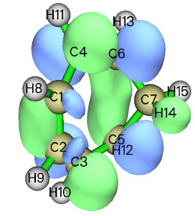

<!-- p.1032 -->


（C60）电子密度的RDF；而在第二部分，我将展示如何绘制Rydberg轨道电子密度的RDF以定量表征它。

第一部分：富勒烯电子密度的RDF 由于B3LYP/6-31G*水平的富勒烯.wfn文件很大，我只为你提供相应的Gaussian输入文件（"example"文件夹中的C60.gjf），请适当修改并用Gaussian运行它以产生C60.wfn。

启动Multiwfn并输入：C60.wfn 200 // 其它功能（第二部分）(Other functions (Part 2)) 5 // 对实空间函数绘制RDF(Plot RDF for a real space function) 3 1,6 // 把RDF的下限和上限分别设为1.0和6.0 Å 0 // 计算RDF及其积分曲线 计算完成后，选择选项0，下面的RDF图将显示在屏幕上，X轴对应径向距离

如你所见，RDF的峰约在3.5 Å，这是因为碳原子核与球心的距离为3.545 Å。众所周知，除氢外，任何原子的电子密度在核位置处最大。

如果你仔细检查RDF曲线，你会发现曲线在峰

右侧略高于左侧。原因是富勒烯外侧的π电子数量比内侧更丰富。你也可以绘制并分析ELF等值面图来证实这一点。

你也可以选择选项2绘制RDF的积分曲线，如下所示


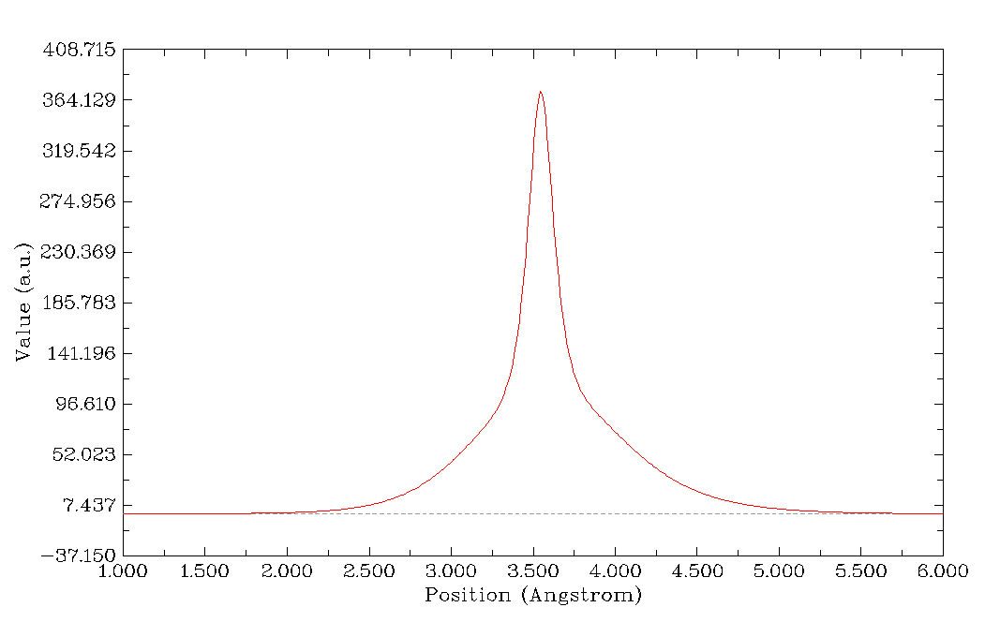

<!-- p.1033 -->


你可能已经注意到，计算后屏幕上有如下提示：


```text
Integrating the RDF in the specified range is        344.9321931513
```

这意味着从r=1.0到r=6.0 Å积分RDF得到344.932，它也对应积分曲线在r=6.0处的值。该值与我们的预期，即当前体系的电子数（360），明显偏离。一个原因是默认的积分点数不够大（径向和角向部分分别为500和2030。你可以手动增加它们），而另一个原因更重要，即当前体系太大，用单中心积分方法很难得到非常精确的结果，至少对积分电子密度而言是如此。

第二部分：用电子密度的RDF定量表征丙酮的Rydberg轨道

Rydberg轨道指空间上非常弥散的MOs，它们的轨道形状类似于原子轨道，因为Rydberg轨道中的电子可视为被一个小阳离子核弱束缚，而该核的行为如同原子核。为了忠实表现Rydberg轨道的弥散特征，必须使用带有大量弥散函数的基组，例如aug-cc-pVTZ。

下面我们用的例子文件是Gaussian在B3LYP/aug-cc-pVTZ水平下计算的甲醛。我们将首先把Rydberg轨道可视化为等值面，然后计算这些轨道对应电子密度的RDF以定量表征它们。

启动Multiwfn，加载examples\H2CO_aVTZ.fch，然后进入主功能0。由于Rydberg轨道非常弥散，为了在观察时避免截断它们的等值面，你应先选择“其它设置(Other settings)”-“设置扩展距离(Set extension distance)”并输入一个大值，这里我们输入12。之后，把等值改为比默认值小得多的值，例如0.01。然后我们任意选一些虚轨道来查看其特征。你会发现很多虚MOs都显示出非常弥散的特征，例如，下面的MO10和MO11所示：


<!-- p.1034 -->


它们的主要分布区都远离分子。MO10几乎是球对称的，因此可记为s型的Rydberg轨道。而MO11有两个相位，它们平均分布在两侧，整体形状非常接近原子p轨道，因此MO11可识别为p型的Rydberg轨道。

如何定量证明这些Rydberg轨道的主要分布区远离分子中心？最好的方法之一是绘制这些轨道对应电子密度的RDF图。这里我们为MO11绘制这种RDF图。我们关闭主功能0的GUI，然后输入以下命令：

6 // 修改波函数(Modify wavefunction) 26 // 修改轨道占据数(Modify orbital occupation number) 0 // 选择全部轨道 0 // 把全部轨道的占据数选为零 11 // 选择轨道11 2 // 把轨道11的占据数设为2.0（假设它被双占据） q // 返回 -1 // 返回主菜单 200 5 // 绘制RDF(Plot RDF) 3 // 设置径向作图的下限和上限 0,10 // 从0到10 Å 4 // 设置积分的角向点数。默认值对当前目的来说不必要地高，因此我们设为较小值以减少计算时间

302 // 302个角向点 0 // 计算电子密度的RDF（默认实空间函数） 1 // 绘制RDF图


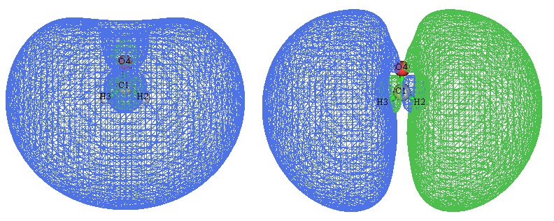

<!-- p.1035 -->


从图中可见，全局最大峰在约4.6Å处，表明此轨道波函数的主要分布区离原点很远（在当前.fch文件中，直角坐标原点对应分子中心），因此MO11可明确无误地识别为Rydberg轨道。

请也为规则的价虚MO，例如作为π*轨道的MO9，绘制这样的RDF图。它的峰位置在哪里？


### 4.200.6 研究不同


### 波函数文件中轨道之间的对应关系

在本节中，给出两个例子来说明如何使用第3.200.6节介绍的功能，此功能旨在揭示不同波函数文件中轨道之间的关系。

### 4.200.6.1 揭示CH3NH2的HF和MP2轨道之间的关系

在本节中，我们研究CH3NH2的HF/6-31+G* MOs与MP2/6-31+G*自然轨道（NO）之间的对应关系。

启动Multiwfn后我们输入C:\CH3NH2_MP2.wfn // MP2/6-31+G*波函数文件，共有48个NOs 200 // 其它功能，第二部分(Other function, part 2) 6 // 分析两个波函数中轨道之间的对应关系(Analyze correspondence between orbitals in two wavefunctions) [直接按ENTER键选择全部轨道] C:\CH3NH2_HF.wfn // HF/6-31+G*波函数文件，共有9个MOs [直接按ENTER键选择全部轨道] 然后你将看到


```text
   1:       2( 94.63%)    1(  5.36%)    4(  0.01%)    3(  0.00%)    6(  0.00%)
   2:       1( 94.64%)    2(  5.36%)    3(  0.00%)    9(  0.00%)    6(  0.00%)
```


<!-- p.1036 -->


```text
   3:       3( 85.21%)    4(  9.87%)    7(  3.24%)    9(  0.88%)    6(  0.79%)
   4:       4( 86.88%)    3( 10.66%)    6(  1.94%)    9(  0.48%)    7(  0.02%)
   5:       6( 54.88%)    7( 41.11%)    9(  3.20%)    4(  0.45%)    3(  0.34%)
   6:       8( 57.50%)    5( 42.47%)    7(  0.00%)    6(  0.00%)    4(  0.00%)
   7:       5( 57.50%)    8( 42.48%)    7(  0.00%)    4(  0.00%)    6(  0.00%)
   8:       9( 86.62%)    6( 10.30%)    7(  1.63%)    4(  0.89%)    3(  0.50%)
   9:       7( 53.98%)    6( 32.07%)    9(  8.76%)    3(  3.28%)    4(  1.89%)
  10:       9(  0.00%)    7(  0.00%)    6(  0.00%)    4(  0.00%)    2(  0.00%)
  11:       5(  0.00%)    8(  0.00%)    3(  0.00%)    7(  0.00%)    4(  0.00%)
... (ignored)
  47:       6(  0.01%)    7(  0.00%)    9(  0.00%)    3(  0.00%)    4(  0.00%)
  48:       9(  0.04%)    7(  0.00%)    6(  0.00%)    4(  0.00%)    3(  0.00%)
```

第一列表示MP2 NOs的序号，右侧显示了Hartree-Fock MOs对它们最大的五个贡献。如可见，第一个（第二个）NO几乎等价于第二个（第一个）MO。而第9个NO不能仅用任何MO单独表示，它主要来自第7个（53.98%）和第6个MOs（32.07%）的严重混合，第9个MO也有不可忽略的贡献（8.76%）。

如果你想得到当前波函数某轨道（例如第5个NO）的全部系数和组成，只需输入5，你将看到


```text
    1   Contribution:     0.000 %    Coefficient:    0.001509
    2   Contribution:     0.000 %    Coefficient:   -0.000042
    3   Contribution:     0.339 %    Coefficient:   -0.058201
    4   Contribution:     0.447 %    Coefficient:    0.066869
    5   Contribution:     0.000 %    Coefficient:    0.000000
    6   Contribution:    54.882 %    Coefficient:    0.740826
    7   Contribution:    41.113 %    Coefficient:   -0.641194
    8   Contribution:     0.000 %    Coefficient:    0.000000
    9   Contribution:     3.199 %    Coefficient:   -0.178856
Total:    99.980 %
```

此输出表明NO 50.7408 MO 60.6412 MO 70.1788 MO 9=−− Λ 最后一行的

99.98%表明第5个NO可被这九个MOs的线性组合完美表示。

### 4.200.6.2 研究氮孤对对多巴胺MOs的贡献

有时研究诸如“杂原子的孤对对分子轨道有多大贡献？”之类的问题很有用，结合轨道定域化技术与主功能200的子功能6可以对此问题给出明确回答。在本节中，我们

将研究Donor-π-acceptor型分子的氨基中氮孤对对占据MOs的贡献。波函数文件为examples\excit\D-pi-A.fchk，其结构和原子编号如下所示


<!-- p.1037 -->


我们应首先产生定域分子轨道（LMOs），因为通常孤对可用一个LMO表示。

启动Multiwfn并输入以下命令examples\excit\D-pi-A.fchk 19 // 轨道定域化分析(Orbital localization analysis) 1 // 定域化占据轨道(Localize occupied orbitals) LMOs自动导出到当前文件夹下的new.fch。从屏幕上输出的LMO组成中，我们可以发现有几个LMOs与N24，即氨基中的氮密切相关。下面是轨道组成输出的相关行。


```text
    4:  24(N ) 99.3%        5:  18(C ) 98.9%        6:   6(C ) 98.6%
...
   19:  24(N ) 60.1%  25(H ) 32.9%        20:  21(N ) 57.5%  18(C ) 33.7%
   27:   2(C ) 45.6%   3(C ) 44.5%        28:  24(N ) 53.6%   6(C ) 37.8%
   33:  23(O ) 65.8%  21(N ) 27.5%        34:  24(N ) 59.9%  26(H ) 33.2%
   43:   5(C ) 46.2%   4(C ) 44.9%        44:  24(N ) 77.7%   6(C )  9.9%
```

为了确认哪一个对应N24的孤对，我们进入主功能0并逐个检查高亮LMOs的等值面，我们发现LMO 44可视为N24的孤对轨道，等值=0.1的等值面图如下所示

现在我们可以检查此LMO对各个MOs的贡献。重新启动Multiwfn并输入examples\excit\D-pi-A.fchk 200 // 其它功能（第二部分）(Other functions (Part 2)) 6 // 分析两个波函数中轨道之间的对应关系(Analyze correspondence between orbitals in two wavefunctions) 1,56 // 我们要检查全部占据MOs（序号范围为1~56） new.fch // 包含LMOs的文件 44,44 // 只考虑new.fch中的第44个轨道 从输出中，我们可以发现一些MOs有LMO 44的较大组成，相关行如下所示（由于只考虑了LMO 44，其它LMOs的贡献恰为零）


```text
    44:     44( 10.04%)   43(  0.00%)   42(  0.00%)   41(  0.00%)   40(  0.00%)
*   45:     44(  8.73%)   43(  0.00%)   42(  0.00%)   41(  0.00%)   40(  0.00%)
*   49:     44( 33.29%)   43(  0.00%)   42(  0.00%)   41(  0.00%)   40(  0.00%)
```


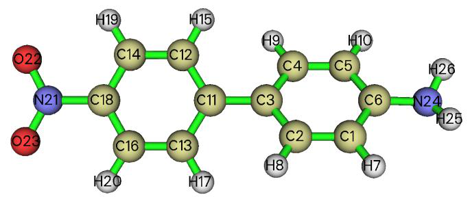

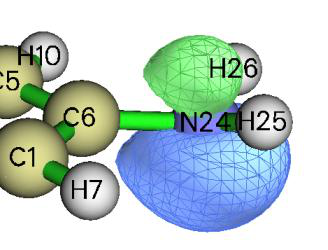

<!-- p.1038 -->


```text
*   53:     44( 14.28%)   43(  0.00%)   42(  0.00%)   41(  0.00%)   40(  0.00%)
*   56:     44( 19.74%)   43(  0.00%)   42(  0.00%)   41(  0.00%)   40(  0.00%)
```

我们返回主菜单(main menu)，进入主功能(main function) 0并可视化MO 49，以检查LMO 44（N24的孤对电子）是否确实对其有较大贡献（33.29%）。下图为等值面(isovalue)设为0.05时的等值面图

如图所示，确实MO 44很大程度上由N24的孤对电子贡献，因为其等值面的很大一部分覆盖了N24的孤对电子区域，计算得到的组成33.29%应该是一个合理的值。


### 4.200.12 计算能量指数(energy index, EI)与键极性指数(bond polarity index, BPI)

在本节中，我将举例说明如何计算EI和BPI指数，它们定义于J. Phys. Chem., 94, 5602 (1990)。如果你对这两个量不熟悉，请先阅读第3.200.12节。本例所涉及的几何结构和波函数是在HF/6-31G*水平下产生的，这正是上述文献中所用的水平。

我们将计算CH3NH2中C-N键的BPI，在此之前我们首先需要计算C和N原子的参考EI值，它们分别对应乙烷中C的EI和H2N-NH2中N的EI。启动Multiwfn并输入

examples\EI_BPI\ethane.fch 200 // 其他功能，其他部分2(Other function, part 2) 12 // 计算能量指数(EI)或键极性指数(BPI)(Calculate energy index (EI) or bond polarity index (BPI)) 1 // C1原子 你将看到参考分子乙烷中C的EI值为-0.667639 a.u.。

重新启动Multiwfn并输入 examples\EI_BPI\N2H4.fch 200 // 其他功能，其他部分2(Other function, part 2) 12 // 计算EI或BPI(Calculate EI or BPI) 1 // N1原子 你可以看到参考分子H2N-NH2中N的EI值为-0.718126 a.u.。

接下来我们计算CH3NH2中C和N的EI。重新启动Multiwfn并输入 examples\EI_BPI\CH3NH2.fch 200 // 其他功能，其他部分2(Other function, part 2) 12 // 计算EI或BPI(Calculate EI or BPI) 1 // C1，结果为-0.693374 a.u. 5 // N5，结果为-0.698092 a.u.。CH3NH2中的BPICN计算为


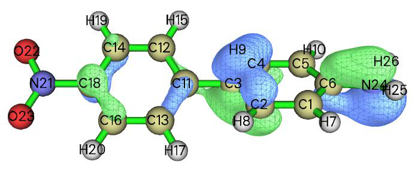

<!-- p.1039 -->


$$\begin{aligned}\mathrm{BPI}_{\mathrm{CN}}&=(\mathrm{EI}_{\mathrm{C}}-\mathrm{EI}_{\mathrm{C}}^{\mathrm{ref}})-(\mathrm{EI}_{\mathrm{N}}-\mathrm{EI}_{\mathrm{N}}^{\mathrm{ref}})\\&=-0.693374+0.667639+0.698092-0.718126\\&=-0.046\end{aligned}$$

<!-- formula-ocr: formula_p1039_347.png 已替换为LaTeX, 原图保留备查 -->

作为对比，用examples\EI_BPI\F2.fch计算F的参考值，结果应为-0.992542 a.u.，用examples\EI_BPI\CH3F.fch计算CH3F分子中C和F的EI，结果应分别为-0.750302和-0.885961。然后计算BPICF值为-0.750302+0.667639+0.885961-0.992542= -0.189。由于CH3F中的BPICF明显比CH3NH2中的BPICN更负，可以得出结论：CH3F中的C-F键比CH3NH2中的C-N键极性更强。

通过EI指数我们还可以评估所谓基团电负性(group electronegativity)，它往往比原子电负性更有用。这里我们计算-CH3基团的电负性，它就是CH3自由基的EIC的负值。启动Multiwfn并输入

examples\EI_BPI\CH3.fch // 在UHF/6-31G*下优化并产生 200 // 其他功能，其他部分2(Other function, part 2) 12 // 计算EI或BPI(Calculate EI or BPI) 1 // 碳原子 结果为-0.630656 a.u.，对应CH3基团的电负性为0.631。然后我们用examples\EI_BPI\F.fch计算-F的基团电负性，结果为0.957。显然-F基团的电负性要高得多，因此由于其平均每个价电子能量更低，它比-CH3基团具有更强的吸引电子的能力。


### 4.200.13 研究轨道对密度差的贡献

注：本节的中文版是我的博客文章“使用Multiwfn研究分子轨道、NBO等对密度差和福井函数的贡献”(http://sobereva.com/502)。

在本节中，我将用几个例子说明如何求得各类

轨道对不同类型密度差(density difference, Δρ)的贡献，并展示通过这些分析可以获得哪些有化学价值的信息。请先阅读第3.200.13节以获得关于本节所用功能的基础知识。

### 4.200.13.1 MO对苯酚福井函数f −的贡献

福井函数(Fukui function)的基本概念已在第4.5.4节中详细介绍。福井

函数f −在文献中常被用来识别亲电进攻的有利位点，它是Δρ的一个特例，定义为𝜌𝑁(𝐫) −𝜌𝑁−1(𝐫)，其中N为原始状态的电子数。研究各个MO对f −的相对贡献很有意义，这样我们可以从轨道角度更好地认识其特征。其基本思想是，如果把

MO的密度看作可用来线性展开f −的基函数，那么最优展开系数就可用来衡量每个MO对f −的贡献。

显然，如果没有轨道弛豫效应，f −必定与N态HOMO的概率密度完全相同。当然，这一假设并不成立，因为实际上当电子数从N变为N-1时，N态的所有MO都必然会发生某种程度的变形。

下面我们将以苯酚为例说明如何计算所有占据


<!-- p.1040 -->


MO对f −的贡献。分别携带N和N-1态轨道波函数的文件已作为phenol.wfn和phenol_N-1.wfn提供在"examples"文件夹中。在计算

贡献之前，我们首先需要生成f −的cube文件。为此，启动Multiwfn并输入

examples\phenol.wfn // N态的波函数文件 5 // 计算格点数据(Calculate grid data) 0 // 设置自定义操作(Set custom operation) 1 // 只对已载入的文件操作一个文件(Only one file will be operated with the file that has been loaded) -,examples\phenol_N-1.wfn 1 // 电子密度(Electron density) 2 // 中等质量格点(Medium-quality grid) 2 // 将格点数据作为density.cub导出到当前文件夹(Export the grid data as density.cub in current folder)

现在，我们可以直接进入用于求轨道对Δρ贡献的功能。输入以下命令

0 // 返回主菜单(Return to main menu) 200 // 其他功能(Other functions, Part 2) 13 // 评估轨道对密度差或其他格点数据的贡献(Evaluate orbital contributions to density difference or other grid data)

density.cub // 包含f −格点数据的文件 0 // 选择轨道范围并开始分析(Choose orbital range and start analysis) o // 在拟合中只考虑占据数非零的轨道(Only consider orbitals with non-zero occupation in the fitting)。对于本例选择所有占据MO（注意我们载入的波函数文件是.wfn格式，实际上它只包含占据轨道，因此即使你想选也无法选择非占据轨道）

很快贡献值按升序列出：


```text
 Orbital    20   Value:    -0.108
 Orbital    11   Value:    -0.089
 Orbital     9   Value:    -0.065
[ignored]
 Orbital    23   Value:     0.111
 Orbital    24   Value:     0.214
 Orbital    25   Value:     0.766
 Sum of all values:       1.000
 Fitting error (definition 1):      0.8911
 Fitting error (definition 2):    0.003828
```

因为默认将所有贡献之和约束为1.0，所以"Sum of all values"恰为1.0。默认约束对本例是有意义的，因为N和N-1恰好相差1个电子。"Fitting error"显示拟合质量。拟合误差越小，拟合质量越好。然而，检验拟合质量的最好方法是直观比较

实际Δρ的等值面与拟合Δρ的等值面。从上述数据可以清楚看到，MO25（HOMO）主导了f −，而MO24（HOMO-1）和MO23（HOMO-2）也有不可忽略的作用。

在后处理菜单(post-processing menu)中，我们可以选择选项2和3分别可视化所提供的格点数据（即从density.cub载入的）和拟合的格点数据的等值面。两套格点数据之差可通过选项4可视化。相应的图形如下，等值面(isovalue)设为0.005。为便于比较，贡献最大的三个MO也一并给出，等值面(isovalue)为0.07，贡献值


<!-- p.1041 -->


已在括号中标出。

从上图可以看出，我们拟合的格点数据与所提供的数据非常接近，

至少拟合数据能够合理地再现π区域的基本特征。所提供与拟合格点数据的主要差别在σ区域，如"diff"子图所示。这表明失去一个电子引起了σ电子的严重弛豫，这无法完全基于N态的占据MO来表示。

上图所示的MO23、MO24和MO25都是π轨道，这一事实解释了为什么f −的σ部分无法在拟合的格点数据中得到忠实表示。注意有几个MO具有负贡献，负值最大的MO是MO20（-0.108）。如果你查看这个

轨道，你会发现它是一个σ轨道。然而，由于其形状与"diff"格点数据不太相似，它的存在的贡献并没有改善拟合质量，也没有减小所提供与拟合格点数据之间的差别。

从上图我们还可以发现MO25的等值面轮廓与

f −非常相似，这就是为什么MO25有主导性贡献，也是为什么f −常常能被HOMO分布合理近似的原因。显然，如果没有轨道弛豫效应，MO25的贡献应恰为1.0，而所有其他MO的贡献应为0.0。

值得强调的是，拟合中所考虑的轨道范围会影响所得贡献。例如，你只想计算MO 10~15的贡献，你会发现当选择MO 1~15和当选择MO 10~15时，它们的贡献是不同的。

### 4.200.13.2 NBO轨道对1,3-丁二烯福井函数f −的贡献

这次我们计算各种高占据NBO对1,3-丁二烯f −的贡献。N和N-1态的.fch文件，以及为N态生成的NBO绘图文件.31和.37已提供在"examples\orb_densdiff\butadiene"文件夹中。几何结构已对N态优化。

注意.37文件中记录的NBO轨道可分为两类，Lewis型和Rydberg型。Lewis NBO的占据数约为2.0，而Rydberg型几乎未占据。由于只有Lewis NBO对N态电子密度有显著贡献，我们只考虑这些轨道。


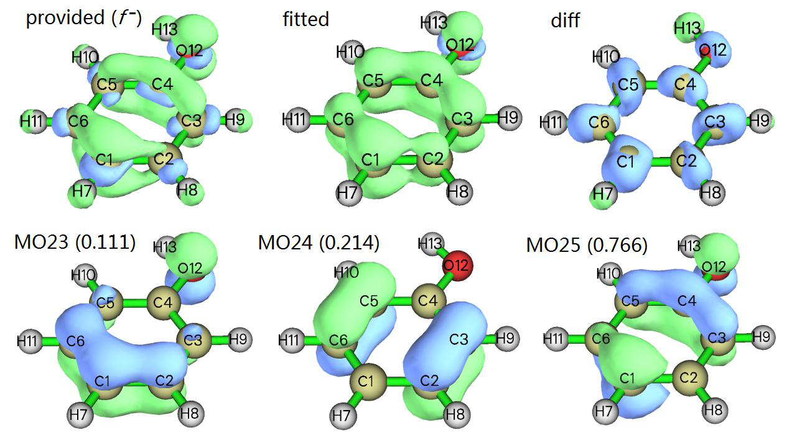

<!-- p.1042 -->


首先，我们生成f −型福井函数的cube文件。启动Multiwfn并输入 examples\orb_densdiff\butadiene\butadiene.fch 5 // 计算格点数据(Calculate grid data) 0 // 设置自定义操作(Set custom operation) 1 // 只对已载入的文件操作一个文件(Only one file will be operated with the file that has been loaded) -,examples\orb_densdiff\butadiene\butadiene_N-1.fch 1 // 电子密度(Electron density) 1 // 低质量格点(Low-quality grid)（由于当前体系很小，低质量格点已足够） 2 // 将格点数据作为density.cub导出到当前文件夹(Export the grid data as density.cub in current folder) 现在重新启动Multiwfn并输入 examples\orb_densdiff\butadiene\BUTADIENE.31 37 // 载入同一文件夹中的BUTADIENE.37，它记录了NBO轨道 现在如果你进入主功能(main function) 6并选择选项3查看轨道信息，你会发现由于高占据数，前15个轨道对应于Lewis型NBO。接下来，我们在主菜单(main menu)中输入以下命令

200 // 其他功能(Other functions, Part 2) 13 // 评估轨道对密度差或其他格点数据的贡献(Evaluate orbital contributions to density difference or other grid data)

density.cub // 包含f −格点数据的文件 0 // 选择轨道范围并开始分析(Choose orbital range and start analysis) 1-15 // Lewis NBO的范围 结果如下所示


```text
 Orbital     3   Value:    -0.047
 Orbital     8   Value:    -0.046
[ignored]
 Orbital    10   Value:     0.017
 Orbital     4   Value:     0.530
 Orbital     9   Value:     0.531
 Sum of all values:       1.000
 Fitting error (definition 1):      0.9008
 Fitting error (definition 2):    0.004961
```

数据清楚表明NBO4和NBO9同等且完全主导了f −，而其他轨道的参与可以安全忽略。

所提供的f −与拟合结果的等值面（等值面(isovalue)=0.01），以及NBO4和NBO9的等值面（等值面(isovalue)=0.1）共同显示如下


<!-- p.1043 -->


从图中显然看出NBO4和NBO9分别对应C1-C4和C6-C8的π键，且拟合函数与所提供的f −定性一致，我们可以得出结论：f −主要由C1-C4和C6-C8键上的π电子组成。

### 4.200.13.3 NBO轨道对H2CO的S0

与S1态之间密度差的贡献

最后，我们研究NBO对H2CO的S1与S0态之间Δρ的贡献。本节所用的所有相关文件已提供在"examples\orb_densdiff\H2CO"文件夹中，包括为基态生成的NBO绘图文件、基态波函数文件（S0.fch）和第一激发态波函数（S1.wfn）。用于生成这些文件的Gaussian输入文件也一并提供。

我们首先生成S1与S0态之间的Δρ。启动Multiwfn并输入 examples\orb_densdiff\H2CO\S1.wfn 5 // 计算格点数据(Calculate grid data) 0 // 设置自定义操作(Set custom operation) 1 // 只对已载入的文件操作一个文件(Only one file will be operated with the file that has been loaded) -,examples\orb_densdiff\H2CO\S0.fch 1 // 电子密度(Electron density) 1 // 低质量格点(Low-quality grid) 2 // 将格点数据作为density.cub导出到当前文件夹(Export the grid data as density.cub in current folder) -1 // 可视化等值面(Visualize the isosurface) 等值面(isovalue)=0.03时的等值面如下所示。

现在我们计算NBO轨道对ΔρS0→S1的贡献，以表征S0→S1跃迁的性质。重新启动Multiwfn并输入以下命令


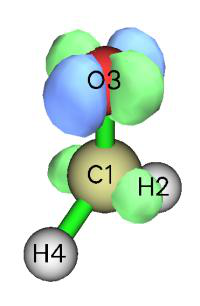

<!-- p.1044 -->


examples\orb_densdiff\H2CO\H2CO.31 37 // 载入同一文件夹中的H2CO.37，它记录了NBO轨道 200 // 其他功能(Other functions, Part 2) 13 // 评估轨道对密度差或其他格点数据的贡献(Evaluate orbital contributions to density difference or other grid data)

density.cub // 包含ΔρS0→S1格点数据的文件 1 // 设置对贡献之和的约束(Set constraint on the sum of contributions) 2 // 将约束设为特定值(Set the constraint to a specific value) 0 // 由于电子激发不改变电子数，将贡献之和约束为零

0 // 选择轨道范围并开始分析(Choose orbital range and start analysis) [直接按回车键(Press ENTER button)以考虑所有轨道] // 注意在电子激发过程中，一部分电子被激发到空轨道，因此只考虑Lewis NBO显然不够，所以在当前情况下应考虑所有轨道

结果如下所示


```text
 Orbital     8   Value:    -0.719
 Orbital    16   Value:    -0.254
 Orbital     9   Value:    -0.151
[ignored]
 Orbital    11   Value:     0.115
 Orbital    22   Value:     0.132
 Orbital    18   Value:     0.148
 Orbital    32   Value:     0.894
 Sum of all values:       0.000
 Fitting error (definition 1):      0.4778
 Fitting error (definition 2):    0.001770
```

可见，具有主导性正值的是NBO32。具有最大负贡献的是NBO8，其负贡献的幅度远大于任何其他NBO。从Gaussian输出文件examples\orb_densdiff\H2CO\S0.out中NBO模块打印的"Natural Bond Orbitals (Summary)"字段可以看出，NBO8被识别为" LP ( 2) O 3"，即O3的孤对电子(lone pair)。

拟合Δρ的等值面（等值面(isovalue)=0.03）以及NBO8和NBO32的等值面（等值面(isovalue)均设为0.17）如下所示。

将"fitted"图与前面所示的ΔρS0→S1图比较，显然拟合的Δρ与严格计算的结果几乎完全相同，因此


<!-- p.1045 -->


当前情况下拟合质量相当高，贡献值必定非常可靠且有意义。从轨道等值面图显然看出NBO8确实对应O3的孤对电子，

而NBO32对应C1-O3的反π轨道，因此S0→S1激发可明确识别为n(O3)→π*(C1-O3)型跃迁。

你也可以计算各种NAO对S0→S1激发的贡献，与上例唯一的区别是在载入H2CO.31之后，你应输入33以载入

记录NAO轨道的H2CO.33。你会发现S0→S1激发主要涉及从高占据p型NAO到几乎未占据的那些NAO的跃迁。


### 4.200.14 域分析例子

域分析(domain analysis)指对给定实空间函数等值面所包围区域的定量分析，详见第3.200.14节。为说明域分析模块的强大功能和灵活性，下面给出域分析的一些实际应用。

### 4.200.14.1 在约化密度梯度

(RDG)等值面内积分实空间函数以定量研究弱相互作用

在阅读本节之前，请先阅读第3.23.1节以了解如何用约化密度梯度(reduced density gradient, RDG)揭示弱相互作用区域。在本节中，我将展示通过在RDG等值面所包围的域内积分来表征弱相互作用的可能性。

体系1：苯酚二聚体 首先，我们以苯酚二聚体为例。启动Multiwfn并输入 examples\phenoldimer.wfn 200 // 其他功能(Other functions, Part 2) 14 // 在实空间函数的等值面内积分实空间函数(Integrate real space functions within isosurfaces of a real space function) 这里我们要研究由RDG = 0.5等值面定义的RDG域；换句话说，这些域由RDG < 0.5的格点组成。因此，我们选择选项2并选择"13 Reduced density gradient"，然后选择选项3并输入判据，即<0.5（实际上，RDG < 0.5是默认设置，你不需要手动做这些步骤）。接下来，输入以下命令：

1 // 开始计算格点数据并生成域(Start calculation grid data and generate domains) -10 // 调整扩展距离(Adjust extension distance) 0 // 将扩展距离设为零以避免在边界区域浪费格点，在边界区域通常不会出现RDG等值面(Set extension distance to zero to avoid wasting of grid points at boundary area, where RDG isosurfaces commonly do not occur)

2 // 中等质量格点(Medium-quality grid)（格点间距(grid spacing)=0.1 Bohr），一般这已足够精确 现在Multiwfn开始为所选实空间函数（即RDG）计算格点数据，然后根据RDG<0.5的判据识别各个RDG域。最后，找到四个域，构成域的格点数如下最后一列所示：


```text
Domain:     1    Grids:     208    Volume:     0.031 Angstrom^3
Domain:     2    Grids:     290    Volume:     0.043 Angstrom^3
Domain:     3    Grids:     200    Volume:     0.030 Angstrom^3
Domain:     4    Grids:    2597    Volume:     0.385 Angstrom^3
```

要可视化它们，选择"3 可视化域(Visualize domains)"。在图形界面(GUI)中，你可以在


<!-- p.1046 -->


右下列表选择域编号。如下所示为第2和第4个域：

如果你已读过第3.23.1节，你必定知道这些域分别对应两个苯酚之间的氢键(H-bond)和范德华(van der Waals, vdW)相互作用。我们可以通过在相应区域内积分特定实空间函数来研究这些域的性质。我们输入

1 // 积分一个域(Integrate a domain) 2 // 所感兴趣域的编号(Index of the domain of interest) 2 // 选择一个实空间函数(Choose a real space function) 1 // 以电子密度作为被积函数(Using electron density as integrand) 结果为：


```text
 Integration result:    0.6932973049E-02 a.u.
 Volume:    0.290000 Bohr^3  (    0.042974 Angstrom^3 )
 Average:    0.2390680362E-01
 Maximum:    0.2766231164E-01   Minimum:    0.1994457517E-01
```

类似地，我们对域4做同样的操作：


```text
 Integration result:    0.1181667175E-01 a.u.
 Volume:    2.597000 Bohr^3  (    0.384836 Angstrom^3 )
 Average:    0.4550123895E-02
 Maximum:    0.6217203920E-02   Minimum:    0.3102088666E-02
```

从输出我们知道对应氢键和vdW相互作用的域中所涉及的电子数分别为0.006933和0.011817。它们可解释为重叠电子数，与同类型相互作用的强度密切相关。然而，由于这两个域对应不同类型的弱相互作用，重叠电子数的大小与它们的强度并不正相关，也就是说我们无法据此得出两个苯酚之间的vdW相互作用强于分子间氢键的结论。输出中的"Volume"表示域的体积，我们可以发现vdW相互作用涉及的空间区域比氢键宽得多。"Average"对应域内实空间函数的平均值，从该量可以很容易推断氢键每个接触区域的相互作用强度必定显著高于vdW相互作用，因为如上所示，它们的平均值分别为0.0239和0.0045，前者远大于后者。

体系2：2-吡哆醇 2-氨基吡啶 2-吡哆醇 2-氨基吡啶(PP)的分子间氢键已在第4.2.1节中通过AIM分析研究过，而这次我们将通过qint指数分析它们。该指数在J. Phys. Chem. A, 115, 12983 (2011)中提出，用于判断各种分子间距离下氢键的相互作用，请查看第3.200.14节了解其定义。通常，qint指数越负，相互作用越稳定。


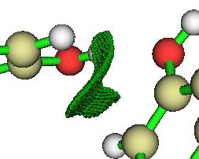

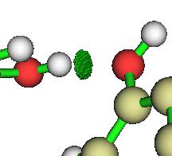

<!-- p.1047 -->


qint指数基于在RDG = 0.6等值面所包围的域内积分定义，因此我们需要先计算RDG格点数据并生成相应域。注意，将RDG格点数据的扩展距离设为零并不总是合适的。对于本体系，如果你用主功能(main function) 5计算RDG格点数据并将扩展距离设为零，你会看到一些RDG等值面被盒子边界截断，如下图所示红色箭头所示。在这种情况下Multiwfn的域积分模块无法正常工作。

因此，在计算本例的RDG格点数据时，扩展距离应设为比零稍大的值，3 Bohr足以避免意外截断。扩展距离也不应设为过大，否则要计算的格点数会非常高，从而非常耗时。

启动Multiwfn并输入以下命令： examples\2-pyridoxine_2-aminopyridine.wfn 200 // 其他功能(Other functions, Part 2) 14 // 在实空间函数的等值面内积分实空间函数(Integrate real space functions within isosurfaces of a real space function) 3 // 改变定义域的默认判据(Change the default criterion of defining domain) <0.6 1 // 开始计算格点数据(Start calculation of grid data) -10 // 改变扩展距离(Change extension distance) 3 // 3.0 Bohr扩展距离 2 // 中等质量格点(Medium-quality grid) 现在可视化所得域。如下所示为域2和域4，显然它们分别对应

N23-H25······O1和N2-H12······N13的氢键。

接下来，选择选项"5 计算域的q_bind指数(Calculate q_bind index for a domain)"并输入2，然后直接按回车键(ENTER button)

以使用ρ4/3作为被积函数（这正是J. Phys. Chem. A, 115, 12983 (2011)中所用的），所得域的qint及相关细节如下所示


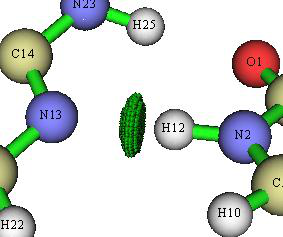


<!-- p.1048 -->


```text
 q_att:       0.00490957 a.u.
 q_rep:       0.00005590 a.u.
 q_bind:     -0.00485367 a.u.
 Volume (lambda2<0):     0.599000 Bohr^3
 Volume (lambda2>0):     0.010000 Bohr^3
 Volume (Total):         0.609000 Bohr^3
Similarly, we obtain results for domain 4
 q_att:       0.00805204 a.u.
 q_rep:       0.00037346 a.u.
 q_bind:     -0.00767858 a.u.
 Volume (lambda2<0):     0.745000 Bohr^3
 Volume (lambda2>0):     0.052000 Bohr^3
 Volume (Total):         0.797000 Bohr^3
```

$$\delta g^{\mathrm{inter}}$$

由于两种相互作用都是氢键，也可以简单比较域中所含电子数来估计它们的相对强度。我们选择"2 对所有域进行积分(Perform integration for all domains)"，然后输入2，再选择电子密度作为被积函数以获得所有域的电子布居：


```text
Domain    Integral (a.u.)     Volume (Bohr^3)      Average
     1    0.1212147834E-03         0.111000    0.1092025076E-02
     2    0.1647945811E-01         0.609000    0.2705986553E-01
     3    0.1714432107E-02         0.319000    0.5374395319E-02
     4    0.2618188584E-01         0.797000    0.3285054685E-01
     5    0.8932587581E-02         0.412000    0.2168103782E-01
     6    0.7764521413E-02         0.394000    0.1970690714E-01
 Integration result of all domains:    0.6119409984E-01 a.u.
 Volume of all domains:     2.642000 Bohr^3       0.391504 Angstrom^3
```

不仅域2的积分值（0.01648）明显小于域4（0.02618），而且域2的平均值（0.02706）也小于域4（0.03285），

$$\delta g^{\mathrm{inter}}$$

用本节所述类似步骤，你还可以在其他

实空间函数的等值面所包围的域内积分其他实空间函数，例如势能密度和自旋密度，例如IRI、δginter和ELF。

注意域内积分的精度直接由格点设置决定，格点质量越高精度越好。例如，在可视化域时，如果你发现一个域只由很少的格点组成，且其轮廓很粗糙，那么该域的积分精度必定很低。

### 4.200.14.2 用域

分析模块可视化分子空腔并计算其体积

这是域分析模块的一个应用实例，我将简要说明如何用Multiwfn可视化分子空腔并计算空腔体积。关于该主题的更多例子和


<!-- p.1049 -->


信息可在我的博客文章“使用Multiwfn可视化分子空腔并计算空腔体积”(http://sobereva.com/408，中文)中找到。

用域分析研究分子空腔的思想非常简单：我们先计算前分子密度(promolecular density)，然后把电子密度低于阈值（例如0.0001）的区域定义为分子空腔。可能存在不止一个这样的区域，域分析模块会自动为它们分配不同的域编号。之后，通过可视化这些域，应该很容易找到对应分子空腔的域。阈值的选择有些任意，通常0.001~0.0001 a.u.是合适的。

本节以α-环糊精(α-cyclodextrin)为例。在用域分析模块研究空腔之前，建议先在不同等值面(isovalue)下可视化前分子密度。启动Multiwfn并输入：

examples\alpha-cyclodextrin.pdb 5 // 计算格点数据(Calculate grid data) 1 // 前分子密度(Promolecular density) -10 // 设置扩展距离(Set extension distance) 0 // 零扩展距离，即让盒子恰好包住分子(Zero extension distance, namely let the box just enclose the molecule) 1 // 低质量格点(Low-quality grid) -1 // 显示等值面图(Show isosurface map) 在图形界面(GUI)窗口中点击"Show data range"以显示格点数据盒子（蓝色框），并分别将等值面(isovalue)设为0.01和0.001，你将看到

很容易理解，如果我们用0.001 a.u.的阈值，则无法定义对应分子中心空腔的域，因为内部区域和外部区域通过红色箭头所指的三个通道连通。而在0.0001 a.u.的情况下，分子空腔可清晰辨认，因此我们可以用该阈值配合域分析模块研究空腔。

返回主菜单(Return to main menu)，然后输入以下命令 200 // 其他功能(Other functions, Part 2) 14 // 域分析(Domain analysis) 2 // 选择要计算并用于划分域的实空间函数(Choose the real space function to be calculated and used for partitioning domains) 1 // 前分子密度(Promolecular density) 3 // 定义确定域的规则(Define the rule of determining domains) <0.0001 // 电子密度小于0.0001的区域将被定义为域(Regions with electron density less than 0.0001 will be defined as domains)


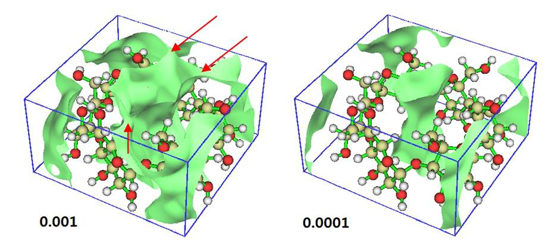

<!-- p.1050 -->


1 // 计算格点数据并划分域(Calculate grid data and assign domains) -10 // 改变扩展距离(Change extension distance) 0 // 无扩展距离(No extension distance) 1 // 低质量格点(Low-quality grid) 计算完成后，你将在屏幕上看到以下信息。共找到六个域，所有域的格点数和体积如下所示


```text
Domain:     1    Grids:       4    Volume:     0.005 Angstrom^3
Domain:     2    Grids:   12010    Volume:    14.238 Angstrom^3
Domain:     3    Grids:    5822    Volume:     6.902 Angstrom^3
Domain:     4    Grids:   39654    Volume:    47.009 Angstrom^3
Domain:     5    Grids:   13949    Volume:    16.536 Angstrom^3
Domain:     6    Grids:    7438    Volume:     8.818 Angstrom^3
```

然后我们可以用选项3可视化每个域。在检查各域后，我们发现编号为4的域对应于分子空腔，如下所示：

由于该域很好地代表了实际分子空腔的形状，其体积是空腔大小的良好指标。如前所示，其体积为47.0 Å3。

关闭图形界面(GUI)，选择选项1在域内进行积分，并输入4以选择积分对应空腔的域。我们选择"100 用户自定义实空间函数(User-defined real space function)"作为被积函数（默认情况下，该函数处处为1.0，因此不花费任何计算成本），然后屏幕上打印以下信息


```text
Integration result:    0.3172320000E+03 a.u.
 Volume:  317.232000 Bohr^3  (   47.008943 Angstrom^3 )
 Average:    0.1000000000E+01
 Maximum:    0.1000000000E+01   Minimum:    0.1000000000E+01
```


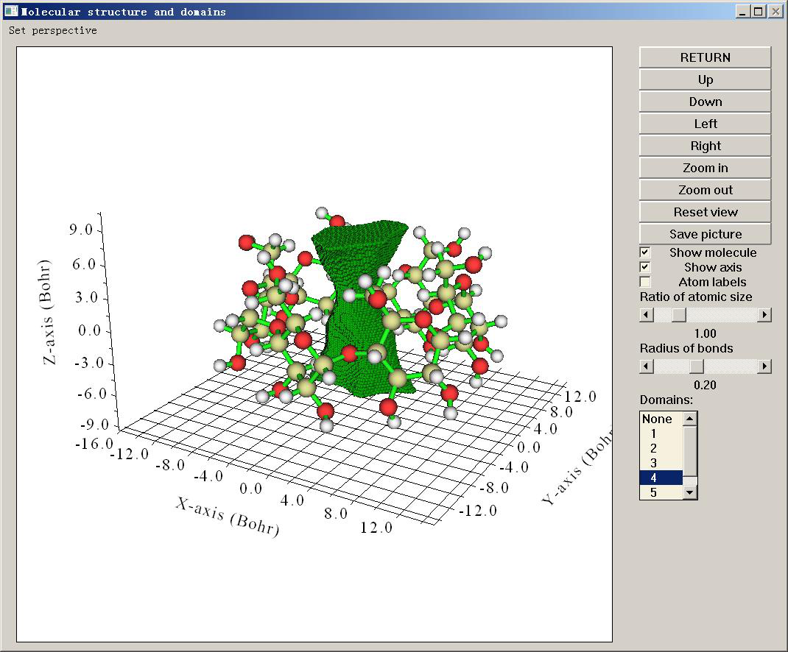

<!-- p.1051 -->


```text
 Position statistics for coordinates of domain points (Angstrom):
 X minimum:   -2.7823  X maximum:    3.1445  Span:    5.9268
 Y minimum:   -2.6823  Y maximum:    2.6095  Span:    5.2918
 Z minimum:   -3.1770  Z maximum:    3.9140  Span:    7.0910
```

积分结果直接对应域的体积（47.0 Å3），因为当前被积函数处处为1.0，从输出我们还发现域的跨度距离，在Z方向该值为7.09 Å，即域中具有最大Z坐标和最小Z坐标的点之间的差。因此，用Multiwfn我们不仅能获得空腔体积，还能获得空腔跨度距离。

此外，我们可以用选项10将选定的域作为domain.cub导出到当前文件夹，以便在第三方可视化工具（如VMD）中将其描绘为等值面。在所得domain.cub中，所选域内的格点值为1，而其他区域（以及边界格点）的值为0，因此域的等值面可用介于0和1之间的等值面(isovalue)绘制（通常用0.5）。我们对域4做此操作并在VMD中将其绘制为等值面，将得到下图

我们还可以用选项11将域的边界格点导出为domain.pdb，其中每个粒子对应一个边界格点。你可以将此文件载入VMD并将粒子渲染为点。然后如果你想测量域，可以点击键盘按键2，再在图形窗口中点击两个点，将出现连线并标注距离，如下图所示（为便于查看选择了"Display" - "Orthographic"）


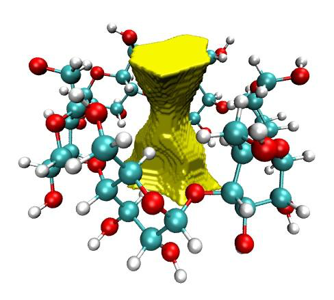

<!-- p.1052 -->


### 4.200.14.3 在电子密度差的等值面内积分电子密度差

在本节中，我们在电子密度差(electron density difference, EDD)的等值面内积分电子密度差。具体而言，

本节中的EDD对应于形变密度(deformation density, Δρdef)，见第3.7.2节了解其定义。以苯为例。

苯的EDD的.cub文件（benzene_EDD.cub）已提供在http://sobereva.com/multiwfn/extrafiles/benzene_EDD.zip。你也可以用主功能(main function) 5很容易地生成它。我们先查看其等值面图。启动Multiwfn并载入benzene_EDD.cub，然后进入主功能(main function) 0，将等值面(isovalue)设为0.015，你将看到下图。绿色和蓝色等值面分别对应正和负部分，它们对应于由孤立原子形成苯时电子密度增加和减少的区域。在本例中，我们将用域分析模块分别在红色和蓝色圆圈标示的两个域内积分EDD。

返回主菜单(Return to main menu)，然后输入 200 // 其他功能(Other functions, Part 2) 14 // 域分析(Domain analysis) 3 // 设置定义域的判据(Set criterion for defining domain) <-0.015 // 函数值比-0.015更负的区域将被确定为域，这与上图所示蓝色等值面一致(The regions with function value more negative than -0.015 will be determined as domains, which is in line with the blue isosurfaces shown above)


<!-- p.1053 -->


-1 // 基于内存中的格点数据生成域(Yield domains based on the grid data in memory) 域立即生成：


```text
Domain:      1    Grids:     1912    Volume:     0.8502 Angstrom^3
Domain:      2    Grids:      433    Volume:     0.1925 Angstrom^3
Domain:      3    Grids:      423    Volume:     0.1881 Angstrom^3
Domain:      4    Grids:      434    Volume:     0.1930 Angstrom^3
Domain:      5    Grids:      432    Volume:     0.1921 Angstrom^3
Domain:      6    Grids:      430    Volume:     0.1912 Angstrom^3
Domain:      7    Grids:      427    Volume:     0.1899 Angstrom^3
```

输入选项3可视化这些域。通过检查每个域的分布，我们发现域3对应于上述蓝色等值面，如下所示。每个小绿球对应域内的一个格点。

然后我们在域3内积分EDD。关闭图形界面(GUI)窗口并输入 1 // 对一个域进行积分(Perform integration for a domain) 3 // 域编号为3(Domain index is 3) 1 // 被积函数就是内存中的格点数据，即EDD(The integrand is just the grid data in memory, namely EDD) 结果为-0.032 a.u.。接下来，我们在前面提到的绿色等值面内积分EDD。输入： 0 // 退出域分析模块(Exit domain analysis module) 14 // 域分析(Domain analysis) 3 // 设置定义域的判据(Set criterion for defining domain) >0.015 -1 // 基于内存中的格点数据生成域(Yield domains based on the grid data in memory) 经直观检查后，我们发现域14对应于所感兴趣的等值面，如下所示


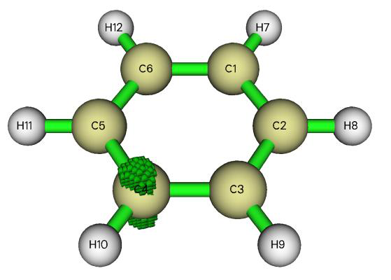

<!-- p.1054 -->


关闭GUI窗口并输入 1 // 对一个域执行积分 14 // 域编号为14 1 // 被积函数就是内存中的网格数据，即EDD 结果为0.156 a.u.。最后值得强调的是，由于积分是基于均匀网格以数值方式计算的，网格间距越小，积分精度越高。

你可以类似地对其他种类的EDD进行积分，包括Fukui函数和对偶描述符(dual descriptor)。


### 4.200.18 研究特定路径的键长/键级交替(BLA/BOA)以及


### 键角和二面角的变化

注：本节的中文版是我的博客文章“使用Multiwfn计算键长/键级交替(BLA/BOA)并研究键长、键级和角度随键序号的变化”(http://sobereva.com/501)，其中包含更多讨论。

关于键长交替(BLA)和键级交替(BOA)的定义和计算的基本知识已在3.200.18节介绍过。Multiwfn不仅能计算BLA和BOA，还能计算键长、键级、键角和二面角沿给定路径的变化。该功能在研究共轭链特征时非常有用。本节将给出两个例子。

在此功能中，任何携带几何结构信息的文件格式都可用作输入文件，如.xyz、.pdb和.mol。但如果你还想研究BOA，输入文件必须包含基函数信息，如.mwfn、.fch、.molden或.gms。

### 4.200.18.1 噻吩低聚物的BLA和BOA

本节我们将计算具有5个重复单元的噻吩低聚物的BLA和BOA，在PBE0/6-31G*水平下生成的.fchk文件可在此下载：http://sobereva.com/multiwfn/extrafiles/TP5.zip。几何结构是在B3LYP/6-31G*水平下优化的。

计算之前，你需要先确定所关心的共轭链中原子的序号。最简单的方法是使用GaussView。现在我们使用GaussView(版本 6.0)


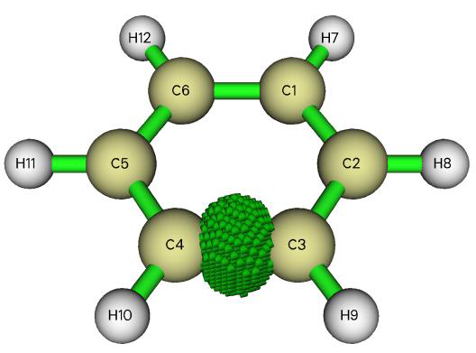

<!-- p.1055 -->


打开TP5.fchk，在“Builder”面板中选择按钮，然后按住鼠标左键，让光标依次经过共轭链中的每个原子，将它们选中为黄色。此后，GaussView窗口中的图像应如下所示：

然后进入“工具(Tools)”-“原子选择(Atom Selection)”，你会发现所选链的原子序号为10,12,14,16-17,19,21,23-24,26,28,30-31,33,35。另外，从上图可以看出，起始端和末端的原子序号分别为1和35。

注：当然，对于本功能而言，使用GaussView并非绝对必要。但是，如果不用GaussView，你必须通过目视检查手动记录链中所有原子的序号，显然这个过程相当麻烦！

现在启动Multiwfn并输入 TP5.fchk 200 // 其他功能(Other functions)(第二部分，Part 2) 18 // 计算键长/键级交替(BLA/BOA)并研究键特征随键序号的变化(Calculate bond length/order alternation (BLA/BOA) and study variation of bond characteristics with respect to bond index)

10,12,14,16-17,19,21,23-24,26,28,30-31,33,35 // 链中原子的序号 1,35 // 起始端和末端原子的序号 然后Multiwfn会根据你输入的信息自动识别链的原子顺序。从屏幕上可以看到，识别出的顺序为


```text
Sequence of the atoms in the chain from the beginning side to the ending side
       1       2       3       4       9      10      12      14      16
      17      19      21      23      24      26      28      30      31
      33      35
```

如果你将该顺序与分子结构图对比，会发现该顺序完全正确，因此后续数据应该是有意义的。

接下来，给出了键序号、组成键的两个原子的序号、键长和键级：


```text
  Bond     Atom1     Atom2   Length (Angstrom)   Mayer bond order
     1         1         2        1.3678              1.6303
     2         2         3        1.4232              1.2924
     3         3         4        1.3795              1.5445
     4         4         9        1.4468              1.0985
     5         9        10        1.3799              1.5273
[ignored...]
```

最后，显示了一些统计数据以及BLA和BOA：


```text
 The number of even bonds:     9
```


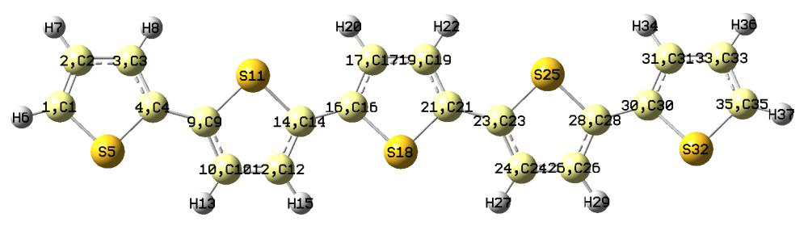

<!-- p.1056 -->


```text
 The number of odd bonds:     10
 Average length of even bonds:       1.4300 Angstrom
 Average length of odd bonds:        1.3779 Angstrom
 Bond length alternation (BLA):      0.0521 Angstrom
 Average bond order of even bonds:      1.2109
 Average bond order of odd bonds:       1.5465
 Bond order alternation (BOA):         -0.3356
```

如屏幕上所述，键数据也已导出到当前文件夹下的bondalter.txt中，你可以绘制“键长随键序号变化”和“键级随键序号变化”曲线图。下面的图是用Origin绘制的，相应的.opj文件已作为bondalter.opj提供在“examples”文件夹中。

1.48 1.7

1.46 1.6

1.44 1.5

Bond length (Å) 1.42 1.40 1.4 1.3 1.2 Mayer bond order

1.38

1.1

1.36

1.0

02468101214161820

Bond index

Multiwfn还会询问你是否输出键角和二面角沿原子顺序的变化，我们输入n，因为它们不是我们目前感兴趣的内容。

### 4.200.18.2 研究环[18]碳环中的

键长、键角和二面角变化

下图是从头算分子动力学轨迹中200 K下环[18]碳的一帧。该模拟是在我的研究论文Chem. Asian J., 16, 56 (2021) DOI: 10.1002/asia.202001228中进行的。本节我们将研究键长、键角和二面角沿该环的变化。


<!-- p.1057 -->


启动Multiwfn并输入 examples\C18_MD_1.xyz // 从分子动力学轨迹中抽取的一帧 200 // 其他功能(Other functions)(第二部分，Part 2) 18 1-18 // 环中的原子序号 1,1 // 所研究的路径是闭合路径，即环，此时输入的两个原子序号必须相同。环中任意原子的序号都可输入，它将被视为起始原子

输出的键长变化如下所示


```text
  Bond     Atom1     Atom2   Length (Angstrom)
    1         1         2         1.208
    2         2         3         1.375
    3         3         4         1.209
[...ignored]
   17        17        18         1.201
   18        18         1         1.384
```

接下来，我们输入y让Multiwfn输出键角和二面角沿所定义路径的变化，你将看到：


```text
Note The unit of printed values is degree

 Atoms:     1     2     3  Angle:   164.841
 Atoms:     2     3     4  Angle:   154.976
 Atoms:     3     4     5  Angle:   155.200
[ignored]
 Atoms:    17    18     1  Angle:   162.906
 Atoms:    18     1     2  Angle:   158.520

 Atoms:     1     2     3     4  Dihedral:  28.69, deviation to planar:  28.69
 Atoms:     2     3     4     5  Dihedral:  25.51, deviation to planar:  25.51
 Atoms:     3     4     5     6  Dihedral:  22.98, deviation to planar:  22.98
[...ignored]
 Atoms:    17    18     1     2  Dihedral:  16.91, deviation to planar:  16.91
 Atoms:    18     1     2     3  Dihedral:  18.13, deviation to planar:  18.13
```

从上述输出我们可以方便地检查键角和二面角沿


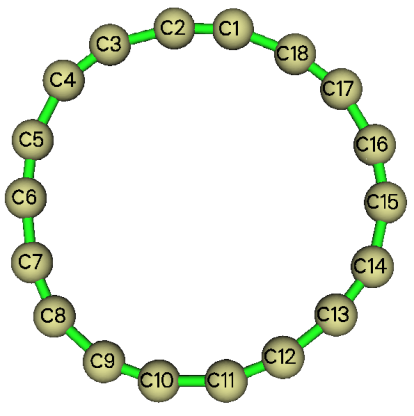

<!-- p.1058 -->


18元环的变化情况。注意二面角(D)的值域为0~180，“偏离平面的偏差(deviation to planar)”在D处于0~90范围内时与D相同，而在D处于90~180范围内时对应于180−D。

如果你从屏幕上复制数据(如果你不知道如何操作，请参阅5.4节)并通过Origin等外部软件作图，你可以得到如下图，它们非常清楚地展示了该环的几何特征：

由于键角和二面角沿环存在明显起伏，我们可以得出结论：在分子动力学模拟过程中该环发生了显著的几何形变。


### 4.200.19 计算空间离域指数的例子

请阅读3.200.19节以了解空间离域指数(SDI)的基本知识。在本例中，我们将计算轨道波函数密度的SDI，以表征各轨道的空间离域程度。SDI也可用于定量描述其他任何函数的空间离域，如自旋密度。

注意4.8.5节所述的ODI也能比较轨道离域程度；但ODI和SDI的定义不同，原则上SDI更为严格，且不受原子划分方法选择的影响。

基于波函数文件计算SDI 作为例子，我们计算examples\excit\D-pi-A.fchk中所有占据轨道密度的SDI。启动Multiwfn，载入该文件，然后输入

200 // 其他功能(Other function)(第二部分，Part 2) 19 // 计算SDI(Calculating SDI) 2 // 计算轨道波函数密度的SDI(Calculate SDI for density of orbital wavefunctions) 1-56 // 占据MO的序号 你将立即在屏幕上看到以下结果，单位为a.u.。


```text
...ignored
SDI of orbital    11:    0.3763
SDI of orbital    12:    0.5834
SDI of orbital    13:    0.5287
SDI of orbital    14:    0.4195
SDI of orbital    15:    0.3759
SDI of orbital    16:    0.3759
```


<!-- p.1059 -->


```text
SDI of orbital    18:    4.5899
SDI of orbital    19:    6.0700
SDI of orbital    20:   11.5668
...ignored
```

你可以用Origin等软件绘制SDI值随轨道序号变化的图：

轨道密度的SDI越大，轨道离域特征越明显。从上图可以推断，轨道44是 strongly 离域的(SDI = 15.41 a.u.)，而轨道33(SDI = 5.97 a.u.)则是高度定域的。对比下图即可看出。轨道1至16显示出极端的定域特征，SDI极低，显然是芯轨道。

基于网格数据文件计算SDI 要计算SDI，你不仅可以提供含有波函数信息的文件作为输入文件，还可以提供含有待研究函数的网格数据文件(如cube文件)。作为例子，我们基于D-pi-A体系MO19密度的网格数据计算SDI，该文件可从http://sobereva.com/multiwfn/extrafiles/D-pi-A_MO19_dens.zip下载。启动Multiwfn并载入压缩包中的cube文件，然后输入

200 // 其他功能(Other function)(第二部分，Part 2)


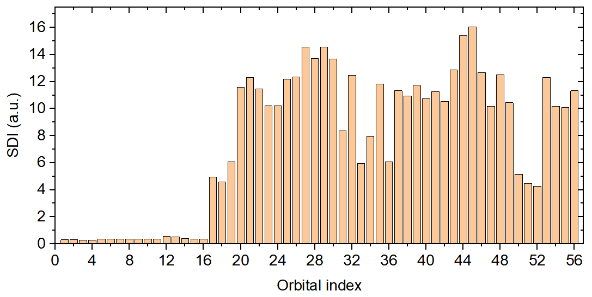

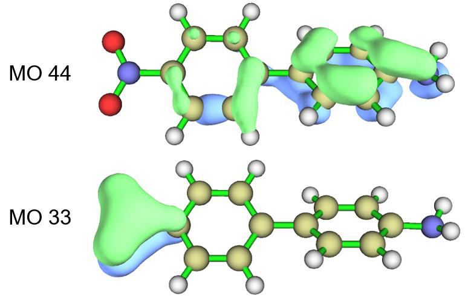

<!-- p.1060 -->


19 // 计算SDI(Calculating SDI) 3 // 基于内存中的网格数据计算SDI(Calculate SDI based on grid data in memory) 然后你将看到：


```text
Spatial delocalization index is    6.030145
```

该结果与基于examples\excit\D-pi-A.fchk计算的MO19的SDI(6.07)符合得很好。

有时能够产生网格数据文件的量子化学或第一性原理程序无法生成Multiwfn支持的波函数文件，此时若你需要计算SDI来研究轨道离域，就必须像本例这样基于网格数据文件计算SDI。

只要函数是Multiwfn原生支持的，或者你能提供该函数的网格数据文件，Multiwfn也可用于计算任何其他函数的SDI。例如，若你使用记录自旋密度的cube文件作为输入文件并输入与本例相同的命令，则所得SDI可用于表征自旋密度离域的空间范围。


### 4.200.20 使用键级密度和自然自适应轨道研究


### 化学键

注：本主题的中文版是“使用键级密度(BOD)和自然自适应轨道(NAdO)以图形方式研究化学键”(http://sobereva.com/535)，其中包含更多例子和更充分的讨论。

键级密度(BOD)和自然自适应轨道(NAdO)的理论已在3.200.20节详细介绍，请先仔细阅读。本节我将给出两个例子，展示如何使用BOD和NAdO研究化学键。

### 4.200.20.1 绘制N2分子的键级密度

离域指数(DI)代表两个原子间平均共用的电子对数，可视为(共价)键级的定义。通过绘制BOD，我们可以更好地理解其数值的本质。对两个原子定义的BOD在全空间积分恰好对应于它们之间的DI，因此BOD能够展示各处对DI的局域贡献。

本节以N2分子为例，我们将在分子平面内将其BOD绘制为色彩填充图。在Multiwfn中，离域指数(DI)可通过模糊原子空间分析模块(主功能15)基于模糊划分计算，也可通过盆分析模块(主功能17)基于原子-分子中的原子(AIM)划分计算；相应地，两个模块都能导出BOD分析所需的原子重叠矩阵(AOM)。本例中我们使用前者(后者同样可行，但更耗时)。

启动Multiwfn并输入以下命令 examples\N2.fch // 在B3LYP/def-TZVP水平下优化并生成。只要文件含有基函数信息，你也可以使用其他文件(如.molden和.mwfn)

15 // 模糊原子空间分析(Fuzzy atomic space analysis) 3 // 计算原子重叠矩阵并输出到当前文件夹下的AOM.txt(Calculate and output atomic overlap matrix to AOM.txt in current folder) 0 // 返回主菜单(Return to main menu)


<!-- p.1061 -->


200 // 其他功能(Other functions)(第二部分，Part 2) 20 // 键级密度(BOD)和自然自适应轨道(NAdO)分析(Bond order density (BOD) and natural adaptive orbital (NAdO) analyses) 1 // 使用原子重叠矩阵(AOM)进行分析(Use atomic overlap matrix (AOM) for the analysis) [按ENTER键(Press ENTER button)] // 载入当前文件夹下的AOM.txt(Load the AOM.txt in current folder) 1,2 // 待分析的两个原子的序号 然后生成NAdO，你可以找到以下信息


```text
Generating natural adaptive orbitals (NAdOs)...
Eigenvalues of NAdOs: (sum=   3.11681 )
  1.00000   0.99999   0.99999   0.05728   0.05728   0.00113   0.00113
```

这些值是NAdO轨道的本征值，其总和(3.11681)恰好对应于两原子间的DI。同时，当前文件夹下生成了NAdOs.mwfn，其中前7个轨道为NAdO轨道，它们的占据数对应于NAdO本征值。该文件中所有其他轨道与N2.fch中的虚轨道相同。

接下来，我们输入y让Multiwfn载入新生成的NAdOs.mwfn。从现在起，电子密度函数直接对应于BOD函数。现在我们将BOD绘制为色彩填充图。输入以下命令

0 // 返回主菜单(Return to main menu) 4 // 绘制平面图(Plot plane map) 1 // 电子密度(在当前语境下对应于BOD)(Electron density (which corresponds to BOD in the present context)) 1 // 色彩填充图(Color-filled map) [按ENTER键(Press ENTER button)] // 使用推荐的网格设置(Use recommended grid setting) 0 // 设置扩展距离(Set extension distance) 2 // 2 Bohr 3 // YZ平面(YZ plane) 0 // Z=0 此时BOD图弹出。对绘图设置做一些调整后，你可以看到下图


<!-- p.1062 -->


可以看出BOD的分布是合理的，其主体分布在成键区域，表明该区域的电子对DI值有主要贡献，在共价键中起关键作用。

### 4.200.20.2 研究丁二烯中C-C键的BOD和NAdO轨道

本节我们将研究1,3-丁二烯中两种C-C键的BOD和NAdO轨道，其几何结构如下所示。这次分析将基于由AIM划分产生的AOM进行(像上例那样使用模糊划分也是合理的)。

启动Multiwfn并输入 examples\butadiene.fch // 在B3LYP/6-31G**水平下生成 17 // 盆分析模块(Basin analysis module) 1 // 产生盆并定位吸引子(Generate basins and locate attractors) 1 // 用电子密度定义盆(即AIM盆)(Use electron density to define basins (i.e. AIM basins)) 2 // 中等质量网格(Medium-quality grid) 6 // 将原子中的轨道重叠矩阵输出到当前文件夹下的AOM.txt(Output orbital overlap matrix in atoms to AOM.txt in current folder) -10 // 返回主菜单(Return to main menu) 200 // 其他功能(Other functions)(第二部分，Part 2) 20 // 键级密度(BOD)和自然自适应轨道(NAdO)分析(Bond order density (BOD) and natural adaptive orbital (NAdO) analyses) 1 // 使用原子重叠矩阵(AOM)进行分析(Use atomic overlap matrix (AOM) for the analysis)


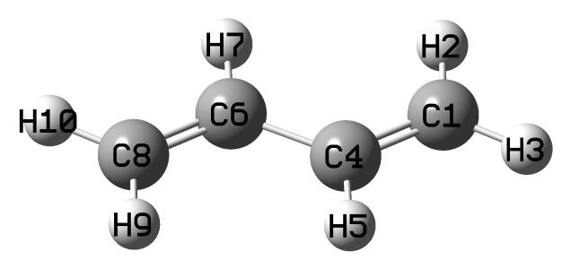

<!-- p.1063 -->


[按ENTER键(Press ENTER button)] // 载入当前文件夹下的AOM.txt(Load the AOM.txt in current folder) 4,6 // 体系中心两个碳的序号 现在你可以看到


```text
Eigenvalues of NAdOs: (sum=   1.11455 )
   0.90121   0.24533   0.07666   0.00358   0.00062   0.00006   0.00001
   0.00000  -0.00000  -0.00003  -0.00004  -0.00316  -0.00966  -0.02645
  -0.07359
```

这意味着中心C-C键的DI为1.114。然后输入y载入新生成的NAdOs.mwfn文件。此后，我们用主功能5计算电子密度网格数据，此时它对应于BOD，然后将其绘制为等值面。等值面值为0.05时所得图如下所示。

很明显，对C4-C6键有显著贡献的大多数电子集中在该键周围，这正是我们所预期的。

接下来，进入主功能0以可视化各个NAdO轨道。注意若你在GUI菜单中选择“轨道信息(Orbital info.)”-“显示全部(Show all)”，你可以看到以下轨道信息


```text
 Orb:     1 Ene(au/eV):     0.000000       0.0000 Occ: 0.901215 Type:A+B (?   )
 Orb:     2 Ene(au/eV):     0.000000       0.0000 Occ: 0.245331 Type:A+B (?   )
 Orb:     3 Ene(au/eV):     0.000000       0.0000 Occ: 0.076660 Type:A+B (?   )
 Orb:     4 Ene(au/eV):     0.000000       0.0000 Occ: 0.003580 Type:A+B (?   )
 Orb:     5 Ene(au/eV):     0.000000       0.0000 Occ: 0.000621 Type:A+B (?   )
[...ignored]
 Orb:    14 Ene(au/eV):     0.000000       0.0000 Occ:-0.026445 Type:A+B (?   )
 Orb:    15 Ene(au/eV):     0.000000       0.0000 Occ:-0.073586 Type:A+B (?   )
 Orb:    16 Ene(au/eV):    -0.023511      -0.6398 Occ: 0.000000 Type:A+B (?   )
 Orb:    17 Ene(au/eV):     0.084006       2.2859 Occ: 0.000000 Type:A+B (?   )
 Orb:    18 Ene(au/eV):     0.115938       3.1548 Occ: 0.000000 Type:A+B (?   )
[...ignored]
```

前15个轨道为NAdO，它们的“Occ”值对应于NAdO本征值，可视为NAdO对DI的贡献。序号大于15的所有轨道均为examples\butadiene.fch中的虚轨道，不是我们关心的。从上述列表可以看出，只有前两个NAdO轨道对DI有突出贡献，它们的等值面图如下所示，同时标注了本征值。


<!-- p.1064 -->


可以看出，第一个NAdO看起来像σ型定域轨道(关于这一点可参见4.19.1节中的例子)，对DI值

(1.114)有关键贡献(0.901)；这完全可以理解，因为C4-C6键的主要成分必定是σ作用。第二个NAdO也有不可忽略的贡献(0.245)。由于它显示出典型的π轨道特征，我们可以推断C4-C6键中存在弱π作用。

现在我们把注意力转向边界C-C键，即C1-C4(或C6-C8)。重新启动Multiwfn并输入以下命令(你可以先手动备份之前的NAdOs.mwfn以避免被覆盖)

examples\butadiene.fch 200 // 其他功能(Other functions)(第二部分，Part 2) 20 // 键级密度(BOD)和自然自适应轨道(NAdO)分析(Bond order density (BOD) and natural adaptive orbital (NAdO) analyses) 1 // 使用原子重叠矩阵(AOM)进行分析(Use atomic overlap matrix (AOM) for the analysis) [按ENTER键(Press ENTER button)] // 载入当前文件夹下的AOM.txt(Load the AOM.txt in current folder) 1,4 // 体系边界两个碳的序号 y // 载入新生成的NAdOs.mwfn 此后，用主功能0可视化仅有的两个对DI有显著贡献的轨道，如下所示(等值面值=0.05)

C1-C4的σ型NAdO轨道的本征值与C4-C6的相当，表明这两种C-C键具有相近强度的σ作用。相比之下，C1-C4的π型NAdO轨道对DI的贡献远高于C4-C6，很好地反映了

边界C-C键比中心键具有强得多的π作用这一事实。

在本节末尾，我想强调BOD/NAdO方法一个非常值得注意的特点，即你可以直接指定待研究的键，如上已充分说明。例如，对于如下所示的多巴胺，若你想研究某个键(如C5-C7)的BOD或相应NAdO，当Multiwfn询问


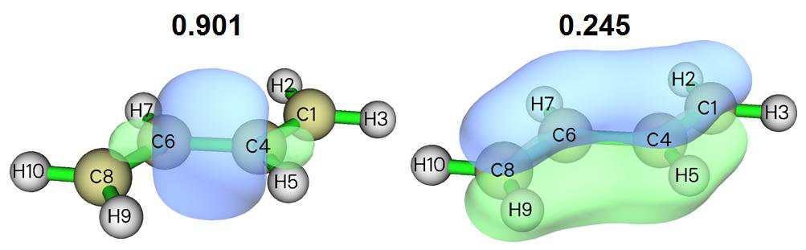


<!-- p.1065 -->


你输入原子序号时，你只需输入5,7，显然这一特点使成键分析非常方便！下图展示了C5-C7的BOD=0.03等值面。

另外值得注意的是，BOD/NAdO分析也可用于基于盆分析模块导出的BOM.txt可视化两个盆之间的DI。例如，你可以用盆分析模块产生电子定域函数(ELF)盆，然后通过相应选项将盆重叠矩阵(BOM)导出到BOM.txt。此后，在BOD/NAdO分析功能中，选择载入BOM.txt，再输入所关心的两个盆的序号，就会生成这两个局域区域的NAdO。通过这种方式，你可以直观地研究例如两个孤对电子区域之间或孤对电子与共价成键区域之间的电子共享。显然，BOD/NAdO分析模块极为灵活！

### 4.200.20.3 使用BOD/NAdO研究两个片段间的相互作用

我还将BOD和NAdO分析扩展到片段间相互作用的情形。为说明如何实现，本节以环氧乙烷为例，氧原子和两个碳原子将分别定义为两个片段。此外，本例还将说明NAdO能量的计算。

我们像前面的例子一样产生含有AOM的文件。启动Multiwfn并输入 examples\oxirane.fchk 15 // 模糊原子空间分析(Fuzzy atomic space analysis) 3 // 计算原子重叠矩阵并输出到当前文件夹下的AOM.txt(Calculate and output atomic overlap matrix to AOM.txt in current folder) 0 // 返回主菜单(Return to main menu) 200 // 其他功能(Other functions)(第二部分，Part 2) 20 // 键级密度(BOD)和自然自适应轨道(NAdO)分析(Bond order density (BOD) and natural adaptive orbital (NAdO) analyses) -1 // 切换是否计算NAdO能量(Toggle if calculating energies for NAdOs) 1 // 基于由MO能量和系数产生的Fock矩阵计算NAdO能量(Evaluate NAdOs energies based on the Fock matrix generated by MO energies and coefficients)


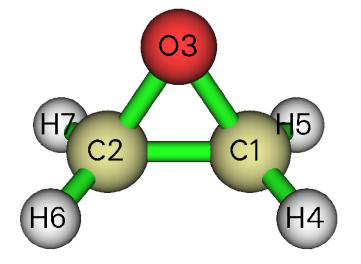

<!-- p.1066 -->


3 // 基于片段重叠矩阵(FOM)的片段间相互作用分析(Interfragment interaction analysis based on fragment overlap matrix (FOM)) [按ENTER键(Press ENTER button)] // 载入当前文件夹下的AOM.txt(Load AOM.txt in current folder) 3 // 片段1：氧原子 1,2 // 片段2：两个碳 载入的AOM用于构建两个片段的FOM，所生成NAdO的本征值为


```text
Eigenvalues of NAdOs: (sum=   2.47514 )
  0.97214   0.86882   0.35986   0.10399   0.08304   0.03930   0.02916
  0.02059   0.00045   0.00042   0.00013  -0.00275
```

可见，有三个NAdO轨道对DI有显著贡献。此外，如屏幕提示所示，此时还计算了NAdO的能量。

输入y载入当前文件夹中新生成的NAdOs.mwfn后，你可以在主功能0中可视化它们的等值面，如下所示。同时标注了本征值和能量：

很明显，上述三个NAdO轨道很好地阐释了片段O1与片段C1-C2之间的轨道相互作用，在相互作用区域可清楚观察到同相重叠。其中，第一个NAdO能量最低，表明它对片段间结合的贡献最大。请接着通过主功能4在由C1、C2和O3定义的平面内绘制BOD图，以可视化直接贡献于片段间相互作用的电子分布。

这只是一个展示BOD/NAdO揭示片段间相互作用用途的非常简单的例子，显然它也可应用于复杂得多的情形以获得更深入的认识，如二茂铁中铁原子与两个环戊二烯基环之间的相互作用、原子簇中被包封原子与笼之间的相互作用。

最后，我还想提一下，在模糊原子空间分析模块中，你可以用选项-1将空间划分方法切换为Hirshfeld-I再产生AOM文件；在某些情形下，尤其涉及金属时，结果可能明显好于使用默认划分。


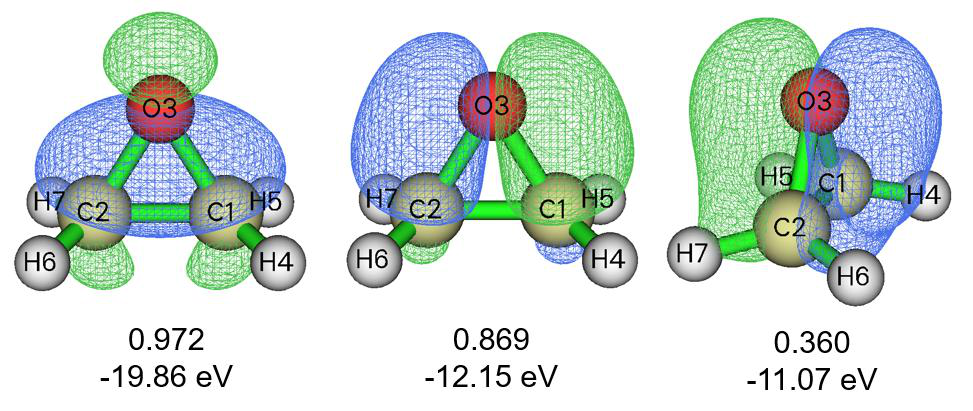
