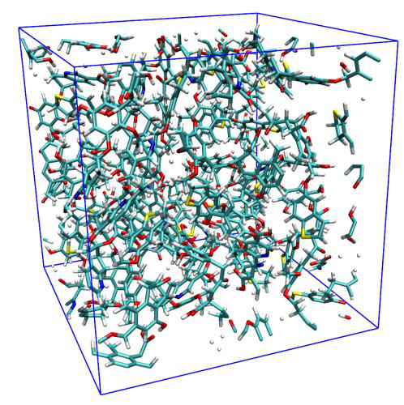
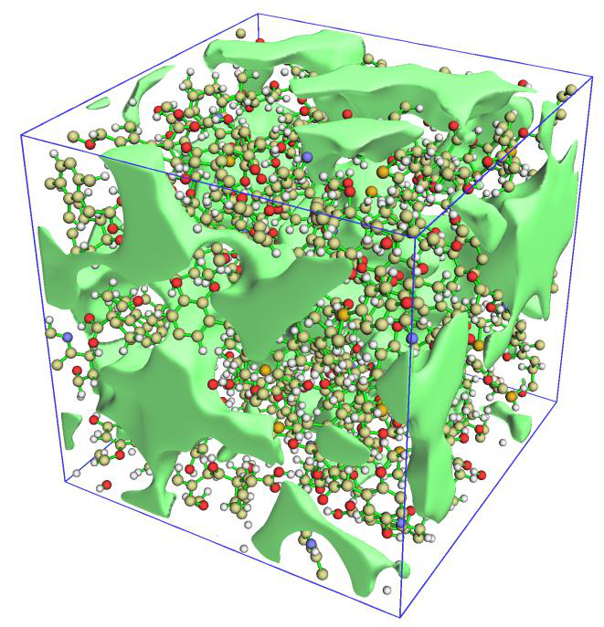
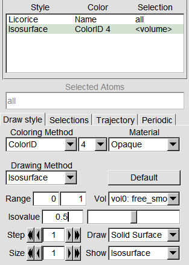
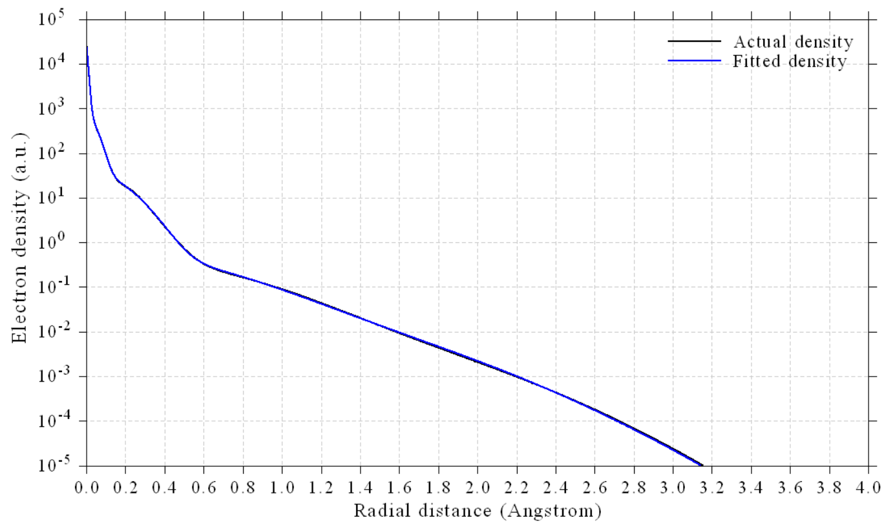
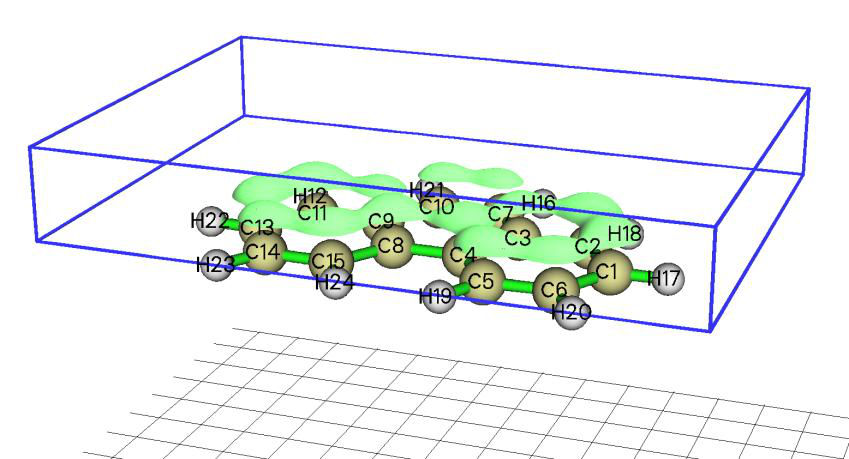
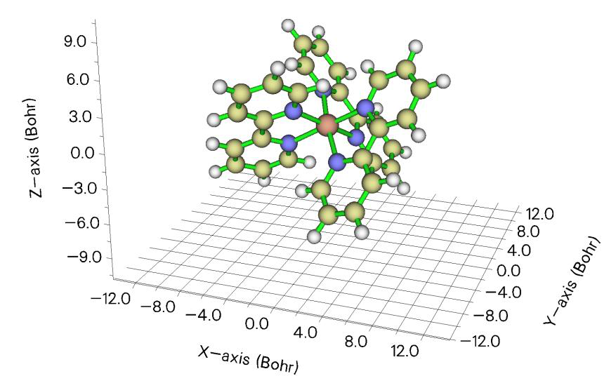

# 其他功能(Other functions)(第三部分，Part 3)

> Multiwfn manual, p.1067–1083.英文原文见同名 English 章节。 Images: `../imgs/`.

---

<!-- p.1067 -->


## 4.300 其他功能(Other functions)(第三部分，Part 3)


### 4.300.1 可视化晶胞中的自由区域并计算自由体积的例子


### 在晶胞中

注：本主题的中文版是我的博客文章“使用Multiwfn图形化显示分子动力学中的孔洞和自由区域”(http://sobereva.com/539)和“使用Multiwfn计算晶体结构中自由区域体积并图形化显示自由区域”(http://sobereva.com/617)，其中包含更多讨论并介绍了更多技巧。

Multiwfn能够可视化晶胞中的自由区域(即孔洞或空腔)并计算自由体积，关于本节所示例功能使用的基本信息和算法，请仔细阅读3.300.1节。下面我将通过两个例子示范该功能。

例子1：分子动力学模拟产生的煤结构 第一个例子中，我们以examples\coal.pdb为例，它是周期性边界条件下煤分子动力学模拟的一帧：

注意若你用文本编辑器打开该文件，你可以找到以下一行：


```text
CRYST1   31.064   31.100   31.093  90.00  90.00  90.00 P 1         1
```

含义是盒子为长方形，X、Y、Z方向长度分别为31.064、31.100、31.093 Å。

!!! terminal "Multiwfn 交互"

    - **启动Multiwfn并输入 examples\coal.pdb 300** — 其他功能(Other functions)(第三部分，Part 3)
    - **1** — 查看自由区域并计算晶胞中的自由体积(Viewing free regions and calculating free volume in a cell)
    - **4** — 设置平滑方法(Set method of smoothing)
    - **1** — 高斯函数(Gaussian function)
    - **1.8** — 高斯函数的半高宽(FWHM)为vdW半径的1.8倍，经发现该值能对当前体系产生令人满意的平滑网格数据等值面图

!!! terminal "Multiwfn 交互"

    - **1** — 设置网格并开始计算(Set grid and start calculation) [按ENTER键(Press ENTER button)]

使用默认盒子长度，它们对应于当前晶胞三条




<!-- p.1068 -->


边的长度

[按ENTER键(Press ENTER button)] // 使用默认网格间距0.25 Å，它通常已足够精细(Use default grid space 0.25 Å, which is usually fine enough) 网格数据计算完成后，你将发现关于自由区域大小的信息：


```text
Volume of entire box:   30038.649 Angstrom^3
Free volume:   14783.074 Angstrom^3, corresponding to   49.21 % of whole space
```

该输出表明整个晶胞中约有一半不在体系的vdW表面之内。

在新出现的菜单中，选择选项3可视化平滑网格数据的等值面，然后在GUI中勾选“显示分子(Show molecule)”和“显示数据范围(Show data range)”复选框，你将看到分子结构以及代表自由区域的等值面：

从上图可以看出，实际自由区域被等值面非常生动清楚地揭示出来。默认等值面值为0.5。若你增大它，等值面将收缩，只有显著的孔洞可见。反之，若你减小等值面值，现有等值面将膨胀，更多不显著的孔洞将出现在图中。

注：平滑方法的选择显著影响平滑网格数据的等值面。如从上图可见，半高宽(FWHM)=1.8 Bohr的高斯函数对该体系效果很好，但有时并不如预期那样合理。例如，当体系由拥挤的原子组成(如原子簇)时，该平滑函数可能带来人为效应，因为它衰减太慢，有时对应于自由区域的等值面面积太小或完全消失。此时你可以尝试其他平滑函数，如Becke函数或误差函数，默认的是尺度因子为1.0的误差函数。你也可以尝试比本例更小半高宽(FWHM)的高斯函数。

在后处理菜单中，你还可以将平滑网格数据导出为.cub文件，以便通过第三方可视化工具渲染，如VMD、ChimeraX和VESTA。你还可以找到用于可视化原始网格数据等值面的选项，然而，正如你将看到的，该等值面在本体系中几乎不能展示孔洞特征，且等值面非常锯齿状，这体现了Multiwfn中所用平滑算法的重要性，网格数据计算算法详见3.300.1节。

值得注意的是，如4.200.14.2节所示，Multiwfn的域分析模块也能可视化空腔并计算空腔体积，但该模块仅适合研究单个分子的内部空腔，不能像当前体系这样用于研究大晶胞中的所有孔洞。




<!-- p.1069 -->


第二部分：共价有机框架晶体 Multiwfn也能查看实验测定的分子晶体的自由区域并计算其体积。本例以共价有机框架(COF)体系为例说明这一点。注意尽管该晶体的晶胞是非正交的，Multiwfn也能正确工作。

启动Multiwfn并输入 examples\COF_12000N2.cif

!!! terminal "Multiwfn 交互"

    - **300** — 其他功能(Other functions)(第三部分，Part 3)
    - **1** — 查看自由区域并计算晶胞中的自由体积(Viewing free regions and calculating free volume in a cell)
    - **1** — 设置网格并开始计算(Set grid and start calculation) [按ENTER键(Press ENTER button)]

使用默认盒子长度(Use default box lengths) [按ENTER键(Press ENTER button)] // 使用默认网格间距0.25 Å(Use default grid space 0.25 Å) 屏幕上显示的定量数据为


```text
Volume of entire box:    2996.151 Angstrom^3
Free volume:    1953.217 Angstrom^3, corresponding to   65.19 % of whole space
```

显然，该COF必定密度很低，因为其自由体积约占整个晶胞的2/3。

当网格为非正交时，Multiwfn无法直接绘制其等值面图，因此这次我们在后处理菜单中选择选项4将平滑网格数据导出为当前文件夹下的free_smooth.cub。此后，将其载入VMD软件(http://www.ks.uiuc.edu/Research/vmd/)，进入“图形(Graphics)”-“显示方式(Representation)”，将体系的绘制方法设为“Licorice”，再添加一个用于显示等值面的显示方式，并按下述截图设置(我使用的VMD为1.9.3版本)

然后在控制台窗口中，输入pbc box绘制网格数据框，并将背景色设为白色，你将看到




<!-- p.1070 -->


图形效果非常令人满意，自由区域被很好地揭示出来。

顺便说一下，如果将结构的绘制方式设为“VDW”，你会发现自由区域的等值面与范德华表面形成了明显的互补，表明自由区域的确得到了合理的展现。

你也可以基于free_smooth.cub使用VESTA软件绘制自由区域图，图形效果甚至更好，详见http://sobereva.com/617。


### 4.300.2 将径向原子密度拟合为STOs或GTFs的例子(Example of fitting radial atomic density as STOs or GTFs)

Multiwfn能够将孤立原子的球平均电子密度拟合为多个Slater型轨道（STOs）或Gaussian型函数（GTFs），请阅读第3.300.2节以了解基础知识。在本节中，我将说明如何使用该功能实现拟合。

### 4.300.2.1 将硅的径向密度粗略拟合为若干STOs(Crudely fitting radial density of silicon as several STOs)

在本节中，我们将把硅原子的径向密度拟合为少数几个STOs的线性组合。由于拟合函数数量较少，拟合过程很快，对拟合密度的评估也相当耗时，然而，拟合质量预计不会非常高。

!!! terminal "Multiwfn 交互"

    - **启动Multiwfn并输入examples\atomwfn\Si.wfn** — 在ROHF/6-31G*水平下产生(Generated at ROHF/6-31G* level)
    - **300** — 其他功能（第3部分）(Other functions (Part 3))
    - **2** — 将原子径向密度拟合为多个STOs或GTFs(Fitting atomic radial density as multiple STOs or GTFs)
    - **3** — 检查或设置拟合函数的系数和指数初猜(Check or set initial guess of coefficients and exponents of fitting functions)
    - **2** — 将初猜设为“用少数几个变指数STOs进行粗略拟合”(Set initial guess as "crude fitting by a few STOs with variable exponents")。然后从屏幕上可以看到拟合中只会使用四个STOs，它们的初始状态为


<!-- p.1071 -->


```text
           Coefficient       Exponent
STO  1:    1.000000E+03    2.700000E+01
STO  2:    3.000000E+02    9.000000E+00
STO  3:    2.000000E+01    3.000000E+00
STO  4:    1.000000E+00    1.000000E+00
```

初始参数看起来是合理的。然后输入以下命令

!!! terminal "Multiwfn 交互"

    - **0** — 返回上一级菜单(Return to upper level of menu)
    - **1** — 开始拟合(Start fitting) 默认情况下，用于拟合的是4000个均匀分布的点，间距为0.001 Å，显然它们覆盖了r = 0-4 Å的径向范围。如果你已认真阅读第3.300.2节，你会发现拟合过程中输出的信息是很容易理解的。输出的后半部分如下所示


```text
Integral of fitted density calculated using 100 points:   13.13399890
Fitted coefficients are scaled by      1.06593583

Fitted parameters (a.u.) after scaling:
           Coefficient       Exponent
STO  1:   -1.995734E+00    1.190199E+00
STO  2:    2.505769E+00    1.217813E+00
STO  3:    1.004017E+02    6.877422E+00
STO  4:    2.231748E+03    3.681991E+01

RMSE of fitting error at all points:           17.562831 a.u.^2
Pearson correlation coefficient r:    0.995316  r^2:    0.990654
```

如你所见，最初拟合的密度在全空间的积分为13.13399890，因此拟合函数的系数被乘以14/13.13399890=1.06593583进行缩放，其中14是硅的实际电子数。在当前拟合中，四个STOs的系数和指数都被优化了，最终参数打印在“Fitted parameters (a.u.) after scaling”标题下。RMSE是定量衡量拟合质量的一个有用量。拟合密度与实际密度之间的r2系数高达0.99，意味着拟合是合理的；然而，仍强烈建议采用其他方式进一步检验拟合质量并确认拟合的可靠性，以便拟合参数能安全地用于实际研究中估计密度。

在新出现的菜单中你可以看到许多选项，它们的含义不是自明的，就是已在第3.300.2.2节中描述过。为了在4000个拟合点上定量检查拟合质量，我们选择选项1，然后你将看到


```text
Radial distance (Angstrom), actual density (a.u.), difference between fitted an
d actual density (a.u.) as well as relative difference
##    1  r: 0.00100  rho:     1632.43875869  Diff:    548.91831985 (   33.63 %)
##    2  r: 0.00200  rho:     1580.36292117  Diff:    459.79079234 (   29.09 %)
##    3  r: 0.00300  rho:     1507.61800756  Diff:    400.75362143 (   26.58 %)
##    4  r: 0.00400  rho:     1427.66453603  Diff:    357.71394386 (   25.06 %)
[ignored...]
## 3997  r: 3.99700  rho:        0.00000506  Diff:     -0.00000029 (   -5.71 %)
```


<!-- p.1072 -->


```text
## 3998  r: 3.99800  rho:        0.00000504  Diff:     -0.00000029 (   -5.81 %)
## 3999  r: 3.99900  rho:        0.00000502  Diff:     -0.00000030 (   -5.91 %)
## 4000  r: 4.00000  rho:        0.00000500  Diff:     -0.00000030 (   -6.01 %)
```

“Diff”是拟合密度与实际密度之差，括号中的数值为相对误差。可以看到，在非常靠近原子核的区域误差并不小，但这并不重要，因为该区域不是化学上感兴趣的区域，通常化学家主要关注价层区域的电子密度。

接下来，我们选择选项3，用对数坐标直观检查拟合密度和实际密度的曲线，然后你将看到

该拟合显然是成功的，因为在1.8 Å以内的区域拟合密度曲线与实际密度曲线很接近。值得一提的是，硅的Bondi vdW半径为2.1 Å。

你也可以选择选项4，用线性坐标绘制拟合密度与实际密度的对比图，你会进一步发现拟合密度确实很好地再现了实际密度。

如果你选择选项5，则会在当前文件夹中输出fitdens.txt。该文件包含从0到10 Å均匀分布的点上的拟合密度（第二列），网格间距为拟合点的一半，即0.001/2=0.0005 Å。从该文件的数据中你可以发现，拟合密度平滑且单调变化，没有发现负值，进一步表明拟合是成功的，拟合参数是可靠的。

最后，我们选择选项6，通过不同点数的高斯求积来检验拟合密度在全空间的积分，你将看到：


```text
Number of integration points:   40    Integral:     13.99999923
Number of integration points:   60    Integral:     13.99999993
Number of integration points:   80    Integral:     13.99999999
[ignored...]
Number of integration points:  280    Integral:     14.00000000
Number of integration points:  300    Integral:     14.00000000
```

可以看到，在所有情况下积分几乎都与实际电子数完全一致


<!-- p.1073 -->


（14），进一步证明了我们的拟合是合理的。

由于我们拟合的密度已通过多种方式的质量检验，我们最终可以得出结论：这四个STOs的拟合参数可以在未来的研究中安全可靠地使用。

### 4.300.2.2 将溴的径向密度精确拟合为多个GTFs(Accurately fitting radial density of bromine as many GTFs)

为了可靠而精确地拟合径向密度，通常需要不少于10个（变指数）GTFs。在本例中我们将以这种方式拟合溴原子的径向密度。这种拟合几乎适用于周期表中的任何元素。

!!! terminal "Multiwfn 交互"

    - **启动Multiwfn并输入examples\atomwfn\Br.wfn** — 在ROHF/6-31G*水平下产生(Generated at ROHF/6-31G* level)
    - **300** — 其他功能（第3部分）(Other functions (Part 3))
    - **2** — 将原子径向密度拟合为STOs或GTFs(Fitting atomic radial density as STOs or GTFs)
    - **3** — 检查或设置拟合函数的系数和指数初猜(Check or set initial guess of coefficients and exponents of fitting functions)
    - **5** — 用10个变指数GTFs进行精细拟合(Fine fitting by 10 GTFs with variable exponents)（当然，使用更多GTFs会得到更好的拟合）

从屏幕上可以看到，拟合中将使用10个GTFs，所有系数初始都设为1.0，而它们的指数跨越很大范围，最小为0.1，最大为381，相邻两个GTFs之间的比值为2.5。小、中、大指数的GTFs分别主要用于表示尾部区域、价层区域和非常靠近原子核的区域。

然后输入0返回上一级菜单，再选择选项1开始拟合。在拟合过程中，从提示中你会发现有1个冗余拟合函数被自动删除以避免数值问题，它具有非常小的系数：


```text
Delete redundant function (coeff=-5.59231E-05 exp= 9.99991E-02), refitting...
Totally  1 redundant fitting functions have been eliminated
```

得到的拟合参数为：


```text
Fitted parameters (a.u.) after scaling:
           Coefficient       Exponent
GTF  1:    8.328778E-02    2.556435E-01
GTF  2:    5.163781E-01    6.322086E-01
GTF  3:    1.221206E+01    5.157472E+00
GTF  4:    2.475569E+01    5.176644E+00
GTF  5:    5.926930E+02    6.326802E+01
GTF  6:    4.017684E+03    7.298312E+02
GTF  7:    1.006232E+04    2.458635E+03
GTF  8:    1.046461E+04    1.557579E+04
GTF  9:    1.658191E+07    1.206884E+09
```

你还可以看到误差统计：


```text
Pearson correlation coefficient r:    0.999706  r^2:    0.999413
```

从该数据我们发现拟合质量几乎完美！r2几乎正好为1.0！

请用与上一节相同的方式检验拟合质量，你会发现当前拟合是完全成功的。例如，选择选项3后我们可以看到如下图所示，它显示在所有区域拟合质量都是完美的。


<!-- p.1074 -->


显然，当你想要达到非常高的拟合质量时，本节所示的拟合过程是相当理想的。

顺便说一下，从前面所示的拟合GTF函数的参数中，你可以发现GTF 3和GTF 4的指数几乎相同，这意味着它们可以合并为单个GTF以减少参数。为此，我们输入

!!! terminal "Multiwfn 交互"

    - **0** — 返回(Return)
    - **3** — 检查或设置拟合函数的系数和指数初猜(Check or set initial guess of coefficients and exponents)。然后从屏幕上你可以看到我们之前拟合的参数

!!! terminal "Multiwfn 交互"

    - **10** — 将两个拟合函数合并在一起(Combine two fitting functions together) 3,4 //要合并的两个拟合函数的序号(Indices of the two fitting functions to combine)
    - **0** — 返回(Return)
    - **1** — 开始拟合(Start fitting) 然后你可以用选项3再次可视化径向密度，你会发现用当前的8个GTFs拟合的质量没有变化，因此8个GTFs完全足以对当前原子达到精确拟合。

Multiwfn中的拟合模块非常灵活，有许多选项可用于控制拟合策略，更多信息见第3.300.2节。


### 4.300.4 模拟扫描隧道显微镜（STM）的例子(Example of simulating scanning tunneling microscope (STM))


### 图像(image)

注：本专题的中文版是我博客文章“使用Multiwfn模拟扫描隧道显微镜（STM）图像”（http://sobereva.com/549，中文），其中给出了扩展讨论并以cyclo[18]carbon为例。

如果你对STM理论或Multiwfn中STM模拟不熟悉，请查看第3.300.4节。在接下来两节中，我们将分别为菲分别模拟恒高和恒流模式的STM。模拟将基于




<!-- p.1075 -->


examples\phenanthrene.fch中的波函数，该文件在B3LYP/6-31G*水平下产生。

需要特别指出的是，为了在Multiwfn中模拟STM，分子必须平行于XY平面（尽管分子不一定是平面的），然而，在phenanthrene.fch中分子是平行于YZ平面的。因此，在STM模拟之前必须先旋转分子。当然，我们可以先重定向分子然后通过量子化学做单点任务来产生波函数文件，但更好的办法是使用Multiwfn直接旋转波函数和几何结构，即在Multiwfn中输入以下命令

examples\phenanthrene.fch 6 // 检查并修改波函数(Check & modify wavefunction)

!!! terminal "Multiwfn 交互"

    - **33** — 旋转波函数，即X→Y，Y→Z，Z→X(Rotate wavefunction, namely X→Y, Y→Z, Z→X)
    - **0** — 旋转所有轨道(Rotate all orbitals) y

再次旋转波函数(Rotate wavefunction again)

!!! terminal "Multiwfn 交互"

    - **0** — 旋转所有轨道(Rotate all orbitals)
    - **y** — 同时旋转分子结构(Also rotate molecule structure) 现在菲正好位于Z=0 Å的XY平面上（你可以通过主功能0检查这一点）。然后我们进入主功能100，选择子功能2，再选择相应选项将当前波函数导出为新的.mwfn文件。在接下来几节中，该新文件将被称为mol.mwfn。

### 4.300.4.1 为菲模拟恒高STM图像(Simulating constant height STM image for phenanthrene)

这里我们为菲模拟恒高模式的STM图像。启动Multiwfn并输入

!!! terminal "Multiwfn 交互"

    - **mol.mwfn 300** — 其他功能（第3部分）(Other function (Part 3))
    - **4** — 模拟STM图像(Simulating STM image) 从屏幕上的信息可以看到，费米能级（EF）已被设为HOMO能量和LUMO能量的平均值，偏压（V）已被自动设为HOMO能量与EF之差，在这种情况下只有HOMO能对STM图像有贡献。为了得到预期的STM图像，正确定义V至关重要。在V为负的情况下，电子从样品流向STM针尖，V越负，可能对STM图像有贡献的分子轨道就越多。还要注意，样品中原子与针尖之间的距离会显著影响STM图像。从选项7的信息中你会发现默认要绘制的平面的Z坐标为0.7 Å。由于mol.mwfn中所有原子的Z坐标均为

0 Å，原子核与针尖之间的距离为0.7 − 0.0 = 0.7 Å。在本例中，我们将在Z=1.2 Å处绘制V= -5.0 V的STM图像。

现在输入以下命令

!!! terminal "Multiwfn 交互"

    - **2** — 设置偏压(Set bias voltage)
    - **-5** — -5.0 V的偏压(Bias voltage of -5.0 V)
    - **7** — 设置Z坐标(Set Z coordinate)
    - **1.2** — Z=1.2 Å 0


```text
Lower limit of MO energy considered in the calculation:      -8.362 eV
Upper limit of MO energy considered in the calculation:      -3.362 eV
```


<!-- p.1076 -->


```text
The MOs taken into account in the current STM simulation:
MO    44   Occ= 2.000   Energy=     -7.6491 eV   Type: Alpha&Beta
MO    45   Occ= 2.000   Energy=     -7.0599 eV   Type: Alpha&Beta
MO    46   Occ= 2.000   Energy=     -6.0337 eV   Type: Alpha&Beta
MO    47   Occ= 2.000   Energy=     -5.7308 eV   Type: Alpha&Beta
Totally   4 MOs are taken into account

Grid spacings in X and Y are    0.118428    0.082980 Bohr
Calculating, please wait...
Maximal value (LDOS) is    0.010218 a.u.
```

可以看到，有4个占据分子轨道的能量位于EF+eV（-8.362 eV）与EF（-3.362 eV）之间，因此STM图像的平面数据对应于它们在该平面内几率密度乘以其占据数（当前情况下为2.0，因为它们都是闭壳分子轨道）之和，该数据也称为局域态密度（LDOS）。如提示所示，所计算平面中LDOS的最大值为0.010218 a.u.。

现在你已进入STM绘图菜单，你可以看到许多用于调整绘图效果的选项，它们都是自明的，请自行尝试。我们直接选择选项0在默认设置下绘制图像，你将看到

在这张图中，白色越亮，LDOS越大，因而隧穿电流（I）越强，因为Tersoff-Hamann模型表明I与LDOS成正比。可以看到，两侧边六元环上的I信号比中央六元环更显著。

### 4.300.4.2 为菲模拟恒流STM图像(Simulating constant current STM image for phenanthrene)

在本节中我们再次为菲绘制STM图像，但使用恒流模式。启动Multiwfn并输入

!!! terminal "Multiwfn 交互"

    - **mol.mwfn 300** — 其他功能（第3部分）(Other function (Part 3))
    - **4** — 模拟STM图像(Simulating STM image)
    - **1** — 将STM图像模式切换为恒流(Switch the mode of STM image to constant current)


<!-- p.1077 -->


!!! terminal "Multiwfn 交互"

    - **2** — 设置偏压(Set bias voltage)
    - **-5** — 我们再次使用-5.0 V的偏压(Again we use bias voltage of -5.0 V) 在恒流模式下，对均匀分布在三维区域中每一点计算LDOS，其X、Y和Z范围可分别用选项5、6和7设置，通常默认设置是合适的。我们直接选择选项0开始计算，从屏幕信息中你会发现所计算区域中LDOS的最大值为0.048 a.u.。

在后处理菜单中，你可以看到几个选项，我们首先用选项1可视化隧穿电流的等值面图，在当前语境下它对应于LDOS。对应于LDOS=0.015 a.u.的等值面如下所示。注意，虽然等值面的选择是任意的，但它应在0与最大值之间（本例中为0.048 a.u.）

在上图中，隧穿电流的等值面通常出现在碳原子上方，意味着默认的计算区域对当前情况是合适的。点击“Show data range”复选框可显示蓝色方框，它显示了计算LDOS的区域。

接下来，我们绘制平面图。选择选项“3 计算并可视化恒流STM图像(Calculate and visualize constant current STM image)”然后输入预期的隧穿电流值，在本例中我们输入0.01。之后，Multiwfn开始计算隧穿电流（LDOS）约等于0.01 a.u.处的Z值，显然Z在不同（x,y）位置是不同的。然后从屏幕上你可以看到


```text
Minimal Z is    0.700000 Angstrom
Maximal Z is    1.206432 Angstrom
```

它们分别是STM图像颜色标尺的合适下限和上限。

现在你已进入恒流模式STM图像的绘图界面，我们输入以下命令

!!! terminal "Multiwfn 交互"

    - **2** — 选择图的类型(Choose map type)
    - **2** — 带等值线线的颜色填充图(Color-filled map with contour lines)
    - **7** — 设置X、Y和颜色标尺轴的标签间隔(Set label interval in X, Y and color scale axes) 1.5,1.5,0.05
    - **-3** — 改变其他绘图设置(Change other plotting settings)
    - **2** — 设置刻度标签小数位数(Set number of decimal places of tick labels)
    - **1** — 设置X轴(Set X axis)
    - **1** — 设置Y轴(Set Y axis)
    - **2** — 设置Z轴(Set Z axis)
    - **0** — 返回(Return)
    - **0** — 绘制STM图像(Plot the STM image)




<!-- p.1078 -->


然后你可以在屏幕上看到这张图：

在上图中，数值对应于STM针尖的Z距离。可以看到，在恒定电流（LDOS）为0.01 a.u.时，STM针尖在两侧边六元环上方的Z位置相对较高。该图的特征与恒高模式的STM图像非常相似。

如果你想用其他恒流值进一步研究STM平面图，可以退出绘图界面，然后再次进入选项“3 计算并可视化恒流STM图像(Calculate and visualize constant current STM image)”并输入预期的电流值。


### 4.300.5 计算尿嘧啶的电偶极矩、多极矩和(Calculate electric dipole moment, multipole moments and)


### 电子空间范围(electronic spatial extent for uracil)

如第3.300.5节所述，Multiwfn能够解析计算电偶极矩、四极矩、八极矩、十六极矩和电子空间范围<r2>。在本节中我们为一个简单分子尿嘧啶计算这些量。

!!! terminal "Multiwfn 交互"

    - **启动Multiwfn并输入examples\uracil.wfn 300** — 其他功能（第3部分）(Other function (Part 3))
    - **5** — 计算电偶极矩和多极矩(Calculate electric dipole moment and multipole moments) 计算非常快，你会立即看到以下信息，如果你已读过第3.300.5节，这些信息是很容易理解的。如屏幕上明确指出的，除非另有说明，单位均为a.u.。


```text
 Dipole moment from nuclear charges (a.u.):    0.000000   0.000000   0.000000
 Dipole moment from electrons (a.u.):          0.473309   1.823683   0.000736

 Dipole moment (a.u.):       0.473309      1.823683      0.000736
 Dipole moment (Debye):      1.203031      4.635340      0.001872
 Magnitude of dipole moment:      1.884103 a.u.      4.788911 Debye
```


<!-- p.1079 -->


```text
 Quadrupole moments (Standard Cartesian form):
 XX=  -43.878975  XY=    1.812455  XZ=   -0.000544
 YX=    1.812455  YY=  -28.230039  YZ=   -0.004831
 ZX=   -0.000544  ZY=   -0.004831  ZZ=  -34.463441
 Quadrupole moments (Traceless Cartesian form):
 XX=  -12.532235  XY=    2.718682  XZ=   -0.000816
 YX=    2.718682  YY=   10.941169  YZ=   -0.007246
 ZX=   -0.000816  ZY=   -0.007246  ZZ=    1.591066
 Magnitude of the traceless quadrupole moment tensor:   13.645453
 Quadrupole moments (Spherical harmonic form):
 Q_2,0 =   1.591066   Q_2,-1=  -0.008367   Q_2,1=  -0.000942
 Q_2,-2=   3.139264   Q_2,2 = -13.552376
 Magnitude: |Q_2|=   14.001908

 Octopole moments (Cartesian form):
 XXX=   14.0946  YYY=    8.6123  ZZZ=    0.0027  XYY=    6.6643  XXY=   46.4098
 XXZ=   -0.0099  XZZ=    2.7809  YZZ=   -7.6843  YYZ=    0.0159  XYZ=   -0.0033
 Octopole moments (Spherical harmonic form):
 Q_3,0 =    -0.0062  Q_3,-1=   -52.5167  Q_3,1 =    -5.9005
 Q_3,-2=    -0.0129  Q_3,2 =    -0.0500  Q_3,-3=   103.2618  Q_3,3 =    -4.6630
 Magnitude: |Q_3|=    116.0929

Hexadecapole moments:
XXXX=       -684.9560  YYYY=       -289.5418  ZZZZ=        -39.7011
XXXY=         13.4854  XXXZ=         -0.0058  YYYX=         12.7574
YYYZ=         -0.0243  ZZZX=         -0.0009  ZZZY=         -0.0061
XXYY=       -168.4269  XXZZ=       -104.4367  YYZZ=        -71.1599
XXYZ=         -0.0008  YYXZ=         -0.0039  ZZXY=          2.9446

Electronic spatial extent <r^2>:      822.650952
Components of <r^2>:  X=     501.328431  Y=     286.859071  Z=      34.463450
```

如果settings.ini中的“ispecial”设为1，那么在计算偶极矩和多极矩之前，体系会被平移以使偶极矩的核贡献为零。

注意，你也可以用主功能15的子功能2计算上述量，但它是基于多中心格点数值计算的，耗时明显更高而数值精度略低。不过，它有一个独特优点，即可以计算当前体系中特定片段的偶极矩和多极矩，例子见第4.15.3节。

<r2>是定量表征电子分布广度的有用指标，我有一篇博客文章详细讨论了这一点：http://sobereva.com/616（中文）。


<!-- p.1080 -->


### 4.300.6 计算轨道能量：以NTO轨道为例(Calculating orbital energies: NTO orbital as an example)

如第3.300.6节所述，Multiwfn有一个功能，可基于用户提供的Fock/Kohn-Sham矩阵评估内存中存储的轨道能量。原则上，人们可以用该功能计算任何种类轨道的能量！在本例中，我将说明如何

利用该功能评估自然跃迁轨道（NTOs）的能量。将以典型的给体-π-受体体系的S0→S1激发为例。请确保你已理解如何做NTO分析，例子见第4.18.6节。本例包含三步：（1）通过TDDFT计算产生NTO轨道（2）产生包含Fock/Kohn-Sham矩阵的文件（3）计算NTO轨道能量。

首先，我们产生NTO轨道，TDDFT任务的Gaussian输入文件为examples\excit\D-pi-A.gjf，相应的输出文件和.fchk文件也已在同一文件夹中提供。启动Multiwfn并输入以下命令

!!! terminal "Multiwfn 交互"

    - **examples\excit\D-pi-A.fchk 18** — 电子激发分析(Electron excitation analysis)
    - **6** — 产生自然跃迁轨道（NTOs）(Generate natural transition orbitals (NTOs)) examples\excit\D-pi-A.out
    - **1** — 第一激发态（S1态）(The first excited state (S1 state)) 然后你可以看到


```text
The highest 10 eigenvalues of occupied NTOs:
   0.000022    0.000023    0.000038    0.000057    0.000105
   0.000149    0.000172    0.000339    0.008236    0.992492

The highest 10 eigenvalues of virtual NTOs:
   0.992492    0.008236    0.000339    0.000172    0.000149
   0.000105    0.000057    0.000038    0.000023    0.000022
```

这些数据显示NTO对当前情况很有效，因为具有最高

本征值的NTO对对该激发的贡献达99.2%，即S0→S1激发几乎可以被该NTO跃迁完美表示。然后我们选择选项3将NTOs导出为当前文件夹中的NTO.mwfn。

接下来，我们产生包含当前体系Kohn-Sham矩阵的文件，详见第3.100.17节。启动Multiwfn并输入

!!! terminal "Multiwfn 交互"

    - **examples\excit\D-pi-A.fchk 100** — 其他功能（第1部分）(Other functions (Part 1))
    - **17** — 基于轨道能量和系数产生Fock/KS矩阵(Generate Fock/KS matrix based on orbital energies and coefficients) KS.txt 现在当前文件夹中的KS.txt包含了从D-pi-A.fchk中分子轨道能量和系数反推转换得到的Kohn-Sham矩阵。

最后，我们计算NTO轨道的能量。启动Multiwfn并输入NTO.mwfn 300 // 其他功能（第3部分）(Other functions (Part 3))


<!-- p.1081 -->


6 // 计算当前轨道的能量(Calculate energies of the present orbitals) KS.txt 然后Multiwfn从KS.txt文件加载Kohn-Sham矩阵，NTO轨道能量的计算立即完成。然后你可以通过选择“1 将轨道能量导出到当前文件夹中的orbene.txt(1 Export orbital energies to orbene.txt in current folder)”，将其导出到当前文件夹中的orbene.txt，其内容为


```text
...[ignored]
     54  Occ=  2.0000  E=     -0.41616309 Hartree    -11.3244 eV
     55  Occ=  2.0000  E=     -0.27176663 Hartree     -7.3951 eV
     56  Occ=  2.0000  E=     -0.34791315 Hartree     -9.4672 eV
     57  Occ=  0.0000  E=     -0.02609500 Hartree     -0.7101 eV
     58  Occ=  0.0000  E=      0.03073422 Hartree      0.8363 eV
     59  Occ=  0.0000  E=      0.76811627 Hartree     20.9015 eV
...[ignored]
```

在NTO.mwfn中，具有最高本征值的占据和非占据NTOs分别是轨道56和57，根据上述数据可知它们的能量分别为-9.4672和-0.7101 eV，这是非常合理的。

注意，还有其他方式向Multiwfn提供Kohn-Sham矩阵，见本手册附录7。例如，你也可以用Gaussian直接产生.47文件，它同样能向Multiwfn提供Kohn-Sham矩阵以产生轨道能量。现在我说明如何做。我们新建一个Gaussian输入文件，内容如下，注意几何结构、DFT泛函和基组必须与examples\excit\D-pi-A.gjf完全相同。（该文件已作为examples\excit\D-pi-A_get47.gjf提供）


```text
## CAM-B3LYP/6-31g(d) pop=nboread

b3lyp/6-31g(d) opted

0 1
[geometry part]

$NBO archive file=C:\D-PI-A $END
```

用Gaussian运行该文件后，你将在C:\文件夹中得到D-PI-A.47文件，它已作为examples\excit\D-PI-A.47提供。然后在主功能300中选择子功能6后，你可以输入该.47文件的路径，Multiwfn将从中加载Kohn-Sham矩阵然后计算轨道能量。

由于数值原因，.47文件中记录的Kohn-Sham矩阵与Multiwfn直接产生的略有差异，因此两种情况下得到的NTO能量也略有不同。然而，该差异对实际研究完全可以忽略。

当大量使用弥散函数从而量子化学程序自动删除了一些线性相关的基函数时，Multiwfn将无法直接产生Kohn-Sham矩阵，此时你必须用其他方式向Multiwfn提供Kohn-Sham矩阵，例如使用.47文件。

### 4.300.8 为[Ru(bpy)3]2+阳离子绘制表面距离投影图(Plotting surface distance projection map for [Ru(bpy)3]2+ cation)


### 坐标(coordinate)

注：本教程的中文版及更多讨论是“使用Multiwfn绘制分子和固体的表面距离


<!-- p.1082 -->


投影图”(Using Multiwfn to plot surface distance projection map for molecules and solids)（http://sobereva.com/589）。

请先阅读第3.300.8节以了解分子表面距离投影图的基础知识。在本节中，将以[Ru(bpy)3]2+为例展示如何绘制这种图。examples\excit\Ru(bpy3)2+.gjf包含了该体系的优化几何结构，因此将用作输入文件（当然，你也可以用其他格式的文件如.xyz、.pdb和.mol2作为输入文件）。该体系已处于适合研究配体对Ru原子包埋的取向，见下图。如果当前取向不适合绘制该图，你应使用GaussView等分子可视化软件进行旋转。

启动Multiwfn并输入examples\excit\Ru(bpy3)2+.gjf

!!! terminal "Multiwfn 交互"

    - **300** — 其他功能（第3部分）(Other functions (Part 3))
    - **8** — 绘制分子表面距离投影图(Plot molecular surface distance projection map) 这次我们不改变任何默认设置，而直接选择选项0开始计算。此时，分子表面定义为0.05 a.u.的promolecular电子密度等值面。

计算完成后，你将进入绘制平面图的界面。我们直接选择选项0在屏幕上显示该图，你将看到




<!-- p.1083 -->


可以看到，不同颜色很好地展现了分子表面各区域到屏幕的距离，Ru原子与配体的相对位置可以非常清楚地被识别。在默认设置下，Z=0对应于具有最正Z坐标的原子的Z位置。如果当前图令你不满意，可以关闭该图并用界面中丰富的选项进一步改善图形效果。

接下来，我们再次绘制该图，但使用另一种分子表面定义，即原子范德华球的叠加。现在输入以下命令

!!! terminal "Multiwfn 交互"

    - **-1** — 返回(Return)
    - **1** — 设置分子表面的定义(Set definition of molecular surface)
    - **3** — 按比例缩放的原子范德华球的叠加(Superposition of atomic van der Waals spheres scaled by a factor)
    - **1** — 本例中我们不缩放范德华半径，所以将缩放因子设为1(We do not scale van der Waals radii in this example, so we set scale factor to 1)
    - **0** — 开始计算(Start calculation)
    - **0** — 在屏幕上显示该图(Show the map on screen) 然后你将看到下图，从中明显看出Ru原子被周围配体深深包埋，由于很强的空间位阻，外来分子不易接近Ru原子。


