# 教程与实例（Tutorials and Examples） .................................................................... 437

> Multiwfn manual, p.1084–1141.英文原文见同名 English 章节。 Images: `../imgs/`.

---

<!-- p.1084 -->


由原子球叠加构建的范德华表面显然不太光滑。使用0.005 a.u.电子密度等值面作为分子表面定义可以产生具有可比特征的图，而颜色过渡和等值线要光滑得多（返回上一级菜单后，你可以选择选项1，选1然后输入0.005切换到该定义）。

注意，Multiwfn也能为固体表面绘制这种图，例子见http://sobereva.com/589的第4节。


## 4.A 专题与高级教程(Special topics and advanced tutorials)

本节内容涉及Multiwfn的不止一个主功能，或包含特殊用法和技巧。


### 4.A.1 研究沿IRC路径的电子结构变化(Study variation of electronic structure along IRC path)

注：本节的中文版是我的博客文章“通过键级曲线图和ELF/LOL/RDG等值面动画研究化学反应过程”（http://sobereva.com/200），它基本涵盖了本节的全部内容。

在本教程中，我将简要向你展示如何用Multiwfn研究Diels-Alder加成IRC路径上电子结构的变化。我们将研究Mayer键级的变化，并对ELF等值面的变形制作动画。以类似方式你也可以很容易研究其他性质的变化，如原子电荷、电子密度、芳香性等。


<!-- p.1085 -->


本教程全程使用Gaussian 09。除非另有说明，所有计算都在Windows 7 64bit系统下进行。在本教程中标为深红色的文件可在“examples\IRC”或“examples”文件夹中找到。

在开始本教程之前，你应先设置好Gaussian的运行环境，否则在Windows环境下无法正常调用Gaussian。设置方法是：进入“控制面板(control panel)”-“系统属性(System properties)”-“高级(Advanced)”，点击“环境变量(Environment variables)”按钮，然后在“用户变量(User variables)”框中点击“新建(New)”按钮，输入GAUSS_EXEDIR作为变量名，输入Gaussian的安装目录作为变量值（例如D:\study\g09w\，假设g09.exe在该文件夹中）。之后修改“PATH”环境变量，将Gaussian安装目录加入其中。

1 进行IRC计算(Run DA_IRC.gjf by Gaussian to produce DA_IRC.out) 用Gaussian运行DA_IRC.gjf以产生DA_IRC.out。我们会发现该IRC路径在两个方向上实际分别包含18和13个点。该计算使用B3LYP/6-31+G*。

2 为IRC每一点产生波函数文件(Generate wavefunction file for each point of IRC) 写一个Gaussian单点任务的输入文件（DA_SP.gjf），它稍后将用作“模板(template)”。其中的几何结构实际上可以任意填写。


```text
DO NOT write anything here (e.g. %chk)
#p B3LYP/6-31G* nosymm

DA adduction

0 1
 C                 -0.26156800    1.56679300    0.69509600
 C                 -0.26156800    1.56679300   -0.69509600
 C                  0.50031400   -0.43279300   -1.43864500
 C                 -0.26156800   -1.32826500   -0.70392000
 C                 -0.26156800   -1.32826500    0.70392000
 H                 -1.19341600    1.44689700   -1.23752300
 H                 -1.19341600    1.44689700    1.23752300
 H                  0.52507600    2.08588200    1.23621300
 H                  0.38154400   -0.37781200    2.51847500
 H                  0.38154400   -0.37781200    -2.51847500
 H                  1.46467600   -0.09643600   -1.07409700
 H                 -1.04094400   -1.89294000   -1.21418700
 H                 -1.04094400   -1.89294000    1.21418700
 H                  1.46467600   -0.09643600    1.07409700
 H                  0.52507600    2.08588200   -1.23621300
```


<!-- p.1086 -->


```text
     ← blank line
     ← blank line
```

注意，此处我们使用的基组（6-31G*）与 IRC 任务中所用的基组（6-31+G*）不同，因为当存在弥散函数时 Mayer 键级的效果不好。顺便一提，忽略弥散函数不会对 ELF 等值面的形状产生可察觉的影响。还请注意指定了 "nosymm" 关键词，因为若不这样做，Gaussian 会自动平移和旋转分子以将其置于标准取向，这可能导致 ELF 动画出现不连续问题（你会在动画的某些帧中看到分子突然跳动）。

IRCsplit.exe 是一个用于为 Gaussian 的 IRC 和 SCAN 任务的每个点生成 .wfn/.chk 文件的工具，IRCsplit.f90 是相应的源代码，用它可以编译出 Linux 版的 IRCsplit。用鼠标双击图标启动 IRCsplit.exe，然后输入

DA_IRC.out //IRC 任务的输出文件 DA_SP.gjf //用于生成单点输入文件的模板文件 2 //只生成 .chk 文件 C:\DA_IRCchk\DA //最终生成的 .chk 文件的路径和前缀

!!! terminal "Multiwfn 交互"

    - **18,13** — 程序检测到在 DA_IRC.out 中 IRC 两个方向上分别有 18 和 13 个点。这里将它们与过渡态点一起全部提取

现在你可以在当前文件夹中找到 DA_SP0001.gjf、DA_SP0002.gjf ... DA_SP0032.gjf。请手动检查其中一个，以确认这些输入文件的合理性。注意 DA_SP0014.gjf 对应于过渡态几何结构。

新建文件夹 "C:\DA_IRCchk"，并将 .gjf 文件以及脚本 runall.bat 复制到其中。双击 runall.bat 的图标，它将调用 Gaussian 09 依次运行所有的 .gjf 文件。

现在你在 "C:\DA_IRCchk" 文件夹中有了 DA0001.chk、DA0002.chk ... DA0032.chk。将 chk2fch.bat 复制到此文件夹并运行，届时将自动调用 Gaussian 软件包中的 formchk 工具把所有 .chk 文件转换为 .fch 文件。

3 计算所有 IRC 点的 Mayer 键级 我们特别感兴趣的是 C1-C16 的 Mayer 键级，它的形成是 DA 加成的关键过程。由于默认情况下 Multiwfn 只输出数值 > 0.05 的 Mayer 键级，而在 DA 加成的初始阶段 C1-C16 必然非常弱，我们需要把 Multiwfn 文件夹中 `settings.ini` 文件里的 "bndordthres" 参数设为 0.0，这样所有大于 0.0 的键级都能被输出。

写一个纯文本文件（MBObatch.txt）并放入 Multiwfn 文件夹，内容为

!!! terminal "Multiwfn 交互"

    - **9** — 进入键级分析模块 (Enter bond order analysis module)
    - **1** — 计算 Mayer 键级 (Calculate Mayer bond order) 注：如果你不明白为什么这个文件要这样写，请阅读 5.2 节以学习如何在静默模式下运行 Multiwfn。

然后再写一个带 .bat 后缀的纯文本文件（MBObatchrun.bat）并放入 Multiwfn 文件夹，内容应为


```text
for /f %%i in ('dir C:\DA_IRCchk\*.fch /b') do Multiwfn C:\DA_IRCchk\%%i < MBObatch.txt >
C:\DA_IRCchk\%%~ni.txt
```

batchrun.bat 实际上是一个 Windows 批处理脚本。双击它的图标运行它，"C:\DA_IRCchk\" 文件夹中的 .fch 文件将被依次载入 Multiwfn，计算得到的 Mayer 键级将被导出到同一文件夹中的 .txt 文件。


<!-- p.1087 -->


4 绘制 Mayer 键级 接下来我们要做的是从 DA0001.txt、DA0002.txt ... DA0032.txt 中提取 C1-C16 的键级。最方便的方法是利用 Linux 中的 "grep" 命令。因此我们把所有这些 .txt 文件复制到 Linux 系统的一个文件夹中，然后在此文件夹中运行


```text
grep "1(C )   16(C )" * > out.txt
```

此时 out.txt 文件中就包含了 IRC 上所有点的 C1-C16 键级：


```text
DA0001.txt:#    9:         1(C )   16(C )    0.05929972
DA0002.txt:#    7:         1(C )   16(C )    0.06877306
DA0003.txt:#    7:         1(C )   16(C )    0.07926829
DA0004.txt:#    7:         1(C )   16(C )    0.09089774
DA0005.txt:#    7:         1(C )   16(C )    0.10380144
DA0006.txt:#    7:         1(C )   16(C )    0.11815120
DA0007.txt:#    7:         1(C )   16(C )    0.13417828
DA0008.txt:#    7:         1(C )   16(C )    0.15218555
```

... 最后一列即为 C1-C16 的 Mayer 键级数值，你现在可以用你喜欢的程序把它们绘制出来，你将看到

1.1

1.0

0.9 C1-C16

0.8

Mayer bond order 0.7 0.6 0.5 0.4 0.3 TS

0.2

0.1

024681012141618202224262830320.0

IRC point

显然，随着反应的进行，C1-C16 变得越来越强，其 Mayer 键级逐渐增大到 1.0（典型的单键）。

用同样的方法，我们还计算 C1-C2 和 C4-C5 的 Mayer 键级，即运行以下命令


```text
grep "1(C )    2(C )" * > out2.txt
grep "4(C )    5(C )" * > out3.txt
```

把 out.txt、out2.txt 和 out3.txt 中的数据画在一起，你将看到


<!-- p.1088 -->


TS

2.0

1.8

1.6

1.4

Mayer bond order 1.2 1.0 0.8 0.6 C1-C16 C1-C2 C4-C5

0.4

0.2

024681012141618202224262830320.0

IRC point

这张图生动地显示，在 DA 加成过程中 C1-C2 平滑地从双键变为单键，而反应显著增强了 C4-C5 的双键特征。

5 制作 ELF 等值面动画 接下来，我们制作动画来研究在 DA 加成过程中 ELF 等值面如何变化。在 Multiwfn 文件夹中创建一个纯文本文件 ELFbatch.txt，内容如下

!!! terminal "Multiwfn 交互"

    - **5** — 生成格点数据 (Generate grid data)
    - **9** — ELF 2

把格点数据导出为当前文件夹中的 ELF.cub (Export the grid data to ELF.cub in current folder) 创建一个名为 ELFbatchrun.bat 的脚本文件，其内容为


```text
for /f %%i in ('dir C:\DA_IRCchk\*.fch /b') do (
Multiwfn C:\DA_IRCchk\%%i < ELFbatch.txt
rename ELF.cub %%~ni.cub
)
```

运行 ELFbatchrun.bat，Multiwfn 将依次载入 "C:\DA_IRCchk" 中的 .fch 文件，并把相应的 ELF 格点数据导出为当前文件夹中的 DA0001.cub、DA0002.cub ... DA0032.cub。

我们使用 VMD 1.9.1 程序（可从 http://www.ks.uiuc.edu/Research/vmd/ 免费获得）为这些 cube 文件渲染等值面。把所有的 cube 文件移到 VMD 文件夹，并在 VMD 文件夹中创建一个名为 isoall.tcl 的纯文本文件，内容为


```text
set isoval 0.88
axes location Off
color Display Background white
for {set i 1} {$i<=32} {incr i} {
set name DA[format %04d $i]
```


<!-- p.1089 -->


```text
puts "Processing $name.cub..."
mol default style CPK
mol new $name.cub
#translate by -0.100000 0.20000 0.000000
#scale to 0.30
rotate y by 50
rotate z by 90
rotate x by -30
rotate y by -20
mol addrep top
mol modstyle 1 top Isosurface $isoval 0 0 0 1 1
mol modcolor 1 top ColorID 3
render snapshot $name.bmp
mol delete top
}
```

这个文件本质上是一个 VMD 脚本，其中命令 set isoval 0.88 表示将绘制数值为 0.88 的等值面，默认视角通过 scale、rotate 和 translate 命令调节。for {set i 1} {$i<=32} {incr i} 表示将依次处理从 DA0001.cub 到 DA0032.cub 的文件。

现在启动 VMD，并在其命令行窗口中输入命令 source isoall.tcl，然后你就会得到 DA0001.bmp、DA0002.bmp ... DA0032.bmp。

有许多程序能把单帧图形文件转换为动画，如 Atani、FFmpeg、Videomach 等。这里我们使用 Linux 中的 ImageMagick 工具来完成，并选择 gif 作为动画格式，因为 gif 动画可以直接嵌入网页。

把所有的 .bmp 文件复制到 Linux 系统，并在相应文件夹中运行以下命令：


```text
convert -delay 12 -colors 100 -monitor *.bmp ELF_IRC.gif
```

其中 -delay 控制动画中每帧之间的时间间隔，-colors 决定使用的颜色数，数值越大，颜色变化越平滑，但动画文件也越大。你可以运行 convert --help 来学习该工具的更多参数。

如果生成的 ELF_IRC.gif 在你的系统上无法正常显示，请用网页浏览器或高级图片浏览器（如 IrfanView）打开它。此动画中 ELF 等值面的变形非常直观地展示了新键是如何形成的，以及已有键的特征如何变化。


### 4.A.2 自旋布居的计算 (Calculation of spin population)

正如有许多计算原子电荷的方法（介绍见 3.9 节，例子见 4.7 节），计算自旋布居的方法也有多种。自旋布居定义为 α 电子布居数减去 β 电子布居数。自旋布居是表征开壳层体系（即自由基和反铁磁体系）电子结构的关键量。从自旋布居我们可以清楚地知道自旋电子主要分布在哪里。此外，我们可以讨论不同区域（原子轨道、原子或片段）对源于电子自旋的总磁偶极矩 m 的贡献。如果某区域的自旋布居为 x，则它对 m 的贡献为 xμB，其中玻尔磁子 μB=eћ/(2me)（e：电子电荷，me：电子质量）代表单个电子产生的磁矩。注意，在


<!-- p.1090 -->


化学体系中电子在轨道中的运动和核自旋对 m 也有贡献，但量级明显更弱，因此常常可以忽略。

在 Multiwfn 中，可以通过三个模块计算许多不同定义下的自旋布居，下面简要讨论它们。

(1) 布居分析模块 (Population analysis module)（主功能 7 (main function 7)）。在此模块中，若选择 Mulliken 或 Löwdin 布居分析，将输出每个基函数、壳层和角动量轨道的 α、β 和自旋布居。若选择修正的 Mulliken 布居分析（如 SCPA），则只显示每个原子的 α/β/自旋布居。若你先经由主功能 7 中的选项 -1 定义了一个片段，则片段的自旋布居也会一起打印。当基组中含有弥散基函数时不要使用这些方法，否则结果可能可靠也可能不可靠。

(2) 模糊原子空间分析模块 (Fuzzy atomic spaces analysis module)（主功能 15 (main function 15)）。进入此模块后，选择选项 1 并选择电子自旋密度 (electron spin density)，将显示每个原子的自旋布居。它们是通过在每个原子的模糊空间内积分电子自旋密度得到的。若想得到片段的自旋布居，应先用选项 -5 定义要计算的原子。

默认采用 Becke 定义的模糊原子空间，因此结果可称为 Becke 自旋布居。若在计算前经由选项 -1 切换到 Hirshfeld 或 Hirshfeld-I 模糊原子空间，则结果将对应于 Hirshfeld 或 Hirshfeld-I 自旋布居。Becke、Hirshfeld 和 Hirshfeld-I 方法在所有情况下都是可靠的。更多细节可查阅 3.18 节。

(3) 盆分析模块 (Basin analysis module)（主功能 17 (main function 17)）。在此模块中，你可以用 AIM 方法计算自旋布居。关于如何在 AIM 原子盆中积分实空间函数，请查阅 4.17.1 节。若选择电子自旋密度作为被积函数，则结果即对应于 AIM 自旋布居。一般我不建议使用此方法，因为计算代价明显高于使用布居分析模块和模糊原子空间分析模块。

总体而言，若只需计算原子自旋布居，建议使用模糊原子空间分析模块，而当未使用弥散基函数时 SCPA 也是很好的选择。但若需要更详细的信息，如不同角动量轨道中的自旋布居，请使用 Mulliken 或 Löwdin 布居分析。


### 4.A.3 研究芳香性的方法概述 (Overview of methods for studying aromaticity)

芳香性是有机化学和波函数分析领域中的基本概念。此前我写过一篇帖子透彻讨论了研究芳香性的方法，见“衡量芳香性的方法以及它们在 Multiwfn 中的计算”（中文，http://sobereva.com/176）。Multiwfn 支持非常多研究芳香性的方法，它们总结在下表中，并将依次简要介绍。还有许多其它方法，如诱导环电流、ARCS、磁化率宏观增量、芳香稳定化能 (ASE)、CiLC；因与 Multiwfn 的功能无直接关系，将不提及。

方法 (Method) 原理 (Principle) 年份 (Year) 流行度 (Pop.) 可靠性 (Reliab.) 普适性 (Univ.) 参考体系 (Ref.) 反芳香性 (Anti.) σ/π 区分 (σ/π) 代价 (Cost) 价值 (Value)

1 分子轨道 (Molecular orbital) Hückel 1951 ++ 0 0 N Y Y 0 +


<!-- p.1091 -->


2 AdNDP Hückel 2008 + 0 + N Y Y 0 +

3 NICS 磁学性质 (Magnet.) 1996 +++ ++ ++ N Y Y + +++

4 ICSS 磁学性质 (Magnet.) 2001 0 ++ ++ N Y Y +++ +

5 HOMA 几何 (Geom.) 1972 + + 0 Y Y N − − +

6 Bird 几何 (Geom.) 1985 − − 0 − Y ? N − − − 7 多中心键级 (Multi-center BO) 离域 (Delocal.) 1990 + +++ ++ N N Y − +++

8 ELF-σ/π 离域 (Delocal.) 2004 + 0 − N Y Y 0 +

9 PDI 离域 (Delocal.) 2003 0 + 0 N N Y 0 +

10 ATI 离域 (Delocal.) 2005 − − + 0 N N Y − 0

11 PLR 离域 (Delocal.) 2012 − − + 0 N N Y 0 0

12 ΔDI 离域 (Delocal.) 2003 − − − − N N Y 0 − − 13 FLU, FLU-π 离域 (Delocal.) 2005 0 + 0 Y/N N Y 0 +

14 RCP 性质 (RCP properties) ρ 1997 − 0 0 N N ? − 0

15 Shannon 芳香性 (Shannon aromat.) ρ 2010 N Y N −

16 EL 指标 (EL index) ρ 2012 − − − − Y Y N − − −

17 AV1245/AVmin 离域 (Delocal.) 2017 − + ++ N N Y − − ++

在表中，"+++"、"++"、"+"、"0"、"−" 和 "− −" 分别对应非常高、高、较高、一般、较低和低。"Y" 和 "N" 分别代表“是 (Yes)”和“否 (No)”。各列的含义如下。原理 (Principle)：方法背后的原理。“Hückel”= Hückel 规则；“磁学性质 (Magnet.)”= 磁学性质 (Magnetic properties)；“几何 (Geom.)”= 分子几何 (Molecular geometry)；“离域 (Delocal.)”= 电子离域特征 (Electron delocalization character)；“ρ”= 电子密度分布 (Electron density distribution)。年份 (Year)：该方法首次提出的年份。流行度 (Pop.)：近年来的流行程度。可靠性 (Reliab.)：衡量该方法能否忠实反映芳香性。普适性 (Univ.)：普适性。具有高普适性的方法必须能应用于多种体系和情形，如含杂原子和过渡金属的环、非平衡几何（如 Diels-Alder 加成的过渡态）、激发态等。参考体系 (Ref.)：该方法是否依赖于参考体系。普适的方法必须避免这一特点。反芳香性 (Anti.)：该方法是否也能衡量反芳香性。σ/π：该方法能否分别讨论 σ 和 π 芳香性。代价 (Cost)：应用该方法的计算代价。价值 (Value)：总体价值。这是最重要的描述符。

接下来，将依次简要介绍上表中的方法，并说明如何在 Multiwfn 中实现它们。

1. 分子轨道 (MO) (Molecular orbital (MO))：著名的判断芳香性特征的 Hückel 4n+2 和 4n 规则最早明确发表于 J. Am. Chem. Soc., 73, 876 (1951)。对于一个分子，若在 π (σ) 分子轨道中共有 4n+2 个电子，且这组分子轨道具有相似的离域模式，则这些分子轨道所涉及的环将表现出 π (σ) 芳香性。若有 4n 个电子，则该环应具有反芳香性。注意对于 Möbius 型分子，4n+2 和 4n 规则是反过来的。

为了用 Hückel 规则判断芳香性，应先通过可视化分子轨道等值面挑选出合适的分子轨道，你可以用主功能 0 (main function 0) 实现此目的。若体系是严格


<!-- p.1092 -->


平面型的，你可以直接利用 3.100.22 节介绍的功能找出所有 π 分子轨道的序号。

2. AdNDP（自适应自然密度划分）(Adaptive natural density partitioning)：上面所示的分子轨道方法通常只适用于只含一个环的分子。当存在多个环时，如菲，分子轨道就没用了，因为分子轨道一般离域在整个分子上，因而不能用于研究不同环的局域芳香性。AdNDP 方法发表于 Phys. Chem. Chem. Phys., 10, 5207 (2008)，能够克服这一困难。AdNDP 已在 3.17 节中仔细介绍，4.14 节给出了许多例子。

3. NICS（核独立化学位移）(Nucleus-independent chemical shift)：NICS 用环中心处磁屏蔽值的负值来衡量其芳香性。这是当今最流行的芳香性指标，最初发表于 J. Am. Chem. Soc., 118, 6317 (1996)，综述见 Chem. Rev., 105, 3842 (2005)。还有一些变体，其中研究 π 芳香性最好的是 NICS(1)ZZ，比较见 Org. Lett, 8, 863 (2006)。对于非平面体系，常常难以计算 NICS(1)ZZ，这种情况下你会发现 3.28.4 节介绍的功能极为有用。

Multiwfn 还能沿一条直线扫描 NICS 从而绘制一维 NICS 曲线图，介绍见 3.28.13 节，例子见 4.25.13 节。Multiwfn 还能在平面内扫描 NICS 并绘制二维 NICS 平面图，介绍见 3.28.14 节，例子见 4.25.14 节。经由曲线图和平面图，与仅计算特定点处的 NICS 相比，能获得丰富得多的信息，而且这些分析更加直观。

4. ICSS（等化学屏蔽面）(Iso-chemical shielding surface)：ICSS 的原始文献是 J. Chem. Soc., Perkin Trans., 2, 1893 (2001)。该方法通过可视化分子周围磁屏蔽值的等值面来分析芳香性。介绍见 3.28.3 节，例子见 4.25.3 节。此方法的主要缺点是在三维区域中计算磁屏蔽值的格点数据相当耗时。

5. HOMA（谐振子芳香性度量）、HOMAc 和 HOMER (Harmonic oscillator measure of aromaticity)：HOMA 基于所关心的环中的键长来衡量芳香性。介绍见 3.28.6 节，例子见 4.25.6 节。HOMAc 是 HOMA 的改进版，更值得推荐。HOMA 完全无法表征 T1 态的芳香性，而其变体 HOMER 对此情形效果合理。HOMAc 和 HOMER 的介绍见 3.28.7 节。

6. Bird 指标 (Bird index)：与上相同。7. 多中心键级 (MCBO) (Multi-center bond order (MCBO))：MCBO 是环上电子离域能力的指标，是我最强烈推荐的芳香性指标。MCBO 值越大对应芳香性越强。介绍见 3.11.2 节。MCBO 在芳香性研究中的一些应用见 J. Phys. Org. Chem., 26, 473 (2013)、Phys. Chem. Chem. Phys., 2, 3381 (2000) 和 J. Phys. Chem. A, 109, 6606 (2005)。通过 MCBO 分别讨论 π 和 σ 芳香性很直接，即在计算 MCBO 值之前，先经由主功能 100 (main function 100) 的子功能 22 分别把所有 σ 和 π 分子轨道的占据数置零。

注意许多文献中 MCBO 的定义与 Multiwfn 中的定义相差一个常数系数。

8. ELF-σ/π：仅基于 π 轨道计算的 ELF 和基于其余所有轨道计算的 ELF 分别称为 ELF-π 和 ELF-σ。曾有人认为 ELF-π（ELF-


<!-- p.1093 -->


σ）的分叉点数值是 π (σ) 芳香性的指标，一些应用见 J. Chem. Phys., 120, 1670 (2004)、J. Chem. Theory Comput., 1, 83 (2005) 和 Chem. Rev., 105, 3911 (2005)。计算 ELF-σ/π 的例子见 4.5.3 节。此外，4.4.9 节给出了通过绘制平面图研究 LOL-π（与 ELF-π 非常相似）的例子。我认为 ELF-σ/π 不是衡量芳香性的很理想的方法，主要是因为此方法常常有歧义（若你曾用此方法研究过许多实际体系就会认识到这一点）。还请注意，许多文献中的 ELF-σ/π 分叉值是错误的；若你尝试复现，会发现根本不可能复现它们的结果。（所以不要总是相信文献！）

9. PDI（对位离域指数）(Para-delocalization index)：此芳香性指标只适用于六元环。PDI 最早发表于 Chem. Eur. J., 9, 400 (2003)，综述见 Chem. Rev., 105, 3911 (2005)。PDI 的介绍见 3.18.6 节，使用 PDI 的例子见 4.15.2 节。

10. ATI（平均两中心指标）(Average two-center indices)：ATI 最早发表于 J. Phys. Org. Chem., 18, 706 (2005)。事实上，ATI 不含任何新思想，它只是把 PDI 公式中的离域指数换成相应的 Mayer 键级，而根据 J. Phys. Chem. A, 109, 9904 (2005) 中的讨论，Mayer 键级与离域指数在物理本质上没有实质差别。若你想用 ATI，可直接用 Multiwfn 计算 Mayer 键级，然后按其公式手动计算 ATI。

11. PLR（对位线性响应指数）(Para linear response index)：与 ATI 一样，PLR 也与 PDI 非常相似。PLR 与 PDI 的唯一区别是把 PDI 中的离域指数换成相应的凝聚线性响应核。PLR 的原始文献是 Phys. Chem. Chem. Phys., 14, 3960 (2012)。PLR 的介绍见 3.18.9 节，使用 PLR 的例子见 4.15.2 节。

12. ΔDI：此方法发表于 Chem. Eur. J., 9, 400 (2003)，用于衡量五元体系的芳香性。考虑如下情形

ΔDI 简单定义为形式 C=C 双键与 C-C 单键之间的离域指数 (DI) 之差。DI 既可用模糊原子空间分析模块计算，也可用盆分析模块计算（尽管这两个模块中原子空间的定义不同，但在一般情形下结果相似）。事实上，你也可以用 Mayer 键级代替 DI。我不认为 ΔDI 可靠，因为芳香性是体系的整体性质，而 ΔDI 中完全忽略了 C-X 键上的离域。

13. FLU 和 FLU-π（芳香涨落指数）(Aromatic fluctuation index)：它们发表于 J. Chem. Phys., 122, 014109 (2005)。介绍见 3.18.7 节，例子见 4.15.2 节。

14. RCP 性质 (RCP properties)：在 Can. J. Chem., 75, 1174 (1997) 中表明，环临界点 (RCP) 处的密度以及垂直于环平面的密度曲率与环的芳香性密切相关。密度越大，或曲率越负，芳香性越大。你可以用 Multiwfn 的拓扑分析模块应用此方法。详细介绍见 3.14.6 节，例子见 4.2.1 节。

15. Shannon 芳香性 (Shannon aromaticity)：此方法发表于 Phys. Chem. Chem. Phys., 12, 4742 (2010)，它基于环中键临界点 (BCP) 处的电子密度来衡量芳香性。


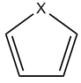

<!-- p.1094 -->


环。介绍见 3.14.6 节，例子见 4.2.1 节。

16. EL 指标 (EL index)：EL 指标的思想与 HOMA 相当相似，最突出的区别是把 HOMA 公式中的键长换成了环中 BCP 处的电子密度椭率。更多细节见原始文献 Struct. Chem., 23, 1173 (2012)。BCP 处的电子密度椭率可直接用 Multiwfn 的拓扑分析模块计算。由于 BCP 处的椭率对强极性键通常不明确，EL 指标对含杂原子的环可能不可靠。此外，EL 指标与 HOMA 有同样的缺点，即需要参考体系。若无法得到参考体系，如金属团簇的情形，此方法就行不通。

17. 基于信息论量定义的芳香性指标 (Aromaticity indices defined based on information-theoretic quantities)：在 ACS Omega, 3, 18370 (2018) 中证明，构成环的原子的平均信息论量与芳香性密切相关。此方法作为主功能 15 (main function 15) 的子功能 12 被支持，细节见 3.18.11 节。

18. AV1245 和 AVmin：AV1245 可视为 MCBO 的近似。AVmin 与 AV1245 密切相关，它能揭示电子离域的瓶颈，从而揭示选定路径的芳香性。介绍见 3.11.10 节，例子见 4.9.11 节。


### 4.A.4 预测反应位点的概述 (Overview of methods for predicting reactive sites)

注：在我的博客文章“Multiwfn 支持的预测反应位点和反应活性的方法概述”（http://sobereva.com/767）中可找到丰富得多的信息。

有许多能够预测亲电、亲核和自由基反应位点的方法，几乎所有这些方法都被 Multiwfn 支持。在本节中，我将总结并简要介绍 Multiwfn 中可用的方法。强烈建议感兴趣的读者看一看 Acta Phys.-Chim. Sinica, 30, 628 (2014) 和 Science China Chemistry, 58, 1845 (2015)，其中仔细介绍并透彻比较了预测亲电和亲核位点的各种方法。你可能还会觉得 Multiwfn 网站“相关资源和帖子 (Related resources and posts)”栏目中的幻灯片“预测反应位点 (Predicting reactive sites)”有用。

1 静电势 (ESP) (Electrostatic potential (ESP))。若你对 ESP 不熟悉，请查阅 2.6 节中的相应介绍。由于亲电体（亲核体）局域带有正（负）电荷，因而倾向于被 ESP 为负（正）的区域吸引，分子 vdW 表面上 ESP 极小值（极大值）的位置和数值常被用来揭示亲电（亲核）进攻的有利位点。ESP 分析可经由定量分子表面分析模块实现，详细介绍见 4.12 节，例子见 4.12.1 节。还有其它研究 ESP 的方式；如 4.12.3 节所示，每个原子对应的局域 vdW 表面上 ESP 的平均值也很有用，而且这种方法比分析 vdW 表面上的 ESP 极值点更可靠、更稳健。对于平面体系，还可以计算并比较分子平面上方 1.6Å（约等于碳的 vdW 半径）处不同原子上方的 ESP 值来考察它们的活性；为此，你需要使用主功能 1 (main function 1)，它直接输出给定点处的各种实空间函数值。

然而，正如我的论文 Acta Phys.-Chim. Sin., 30, 628 (2014) 所示，ESP 通常不是预测反应位点的可靠性质。

2 平均局域电离能 (ALIE) 和局域电子亲和能 (LEA) (Average local ionization energy (ALIE) and local electron affinity (LEA))。若你对 ALIE 不熟悉，请阅读 2.6 节中的相应介绍。ALIE 可以用与 ESP 类似的方式研究。基于 ALIE 预测反应位点最常见的方式是分析 vdW 表面上 ALIE 的极小值，例子见 4.12.2 节。同样，你也可以研究局域 vdW 表面上 ALIE 的平均值，或对平面体系评估分子平面上方 1.6Å 处的 ALIE。

ALIE 分析适用于亲电和自由基进攻，但对亲核进攻无用。而以类似方式定义的局域电子亲和能 (LEA) (local electron affinity (LEA)) 可能对此目的有用，见 J. Mol. Model., 9, 342 (2003)。LEA 在 Multiwfn 中作为自定义函数 27 (user-defined function 27) 被支持，细节见 2.7 节中的相应描述。分析 LEA 的最佳方式应是绘制 LEA 着色的分子表面图，如 4.12.13 节明确所示。


<!-- p.1095 -->


3 原子电荷 (Atomic charges)。很容易理解，有利的亲电和亲核反应位点应分别带有负和正的原子电荷，以便吸引亲电体和亲核体来进攻它们。Multiwfn 支持许多计算原子电荷的方法，介绍见 3.9 节，一些实例见 4.7 节。在可用的原子电荷中，用于预测反应位点目的最好的可能是 Hirshfeld，建议感兴趣的读者查阅 J. Phys. Chem. A, 118, 3698 (2014)，尤其是 Theor. Chem. Acc., 138, 124 (2019)，后者非常漂亮地证明了 Hirshfeld 电荷在预测亲电和亲核反应位点中的可靠性和价值。不要用 Mulliken 电荷，它可能是最差的一种，尽管它是最流行的电荷模型。

4 前线分子轨道 (FMO) 理论 (Frontier molecular orbital (FMO) theory)。对 HOMO (LUMO) 贡献较大的原子更可能是亲电（亲核）进攻的优先位点。Multiwfn 支持多种计算分子轨道成分的方法，介绍见 3.10 节，例子见 4.8 节。通常我建议用 Becke 或 Hirshfeld 方法。若没有弥散函数，Mulliken 方法效果同样好。NAO 方法也是很好的选择，但不适合分析虚轨道。此外，你也可直接用主功能 0 (main function 0) 可视化分子轨道的等值面来讨论它们的组成。

5 Fukui 函数和凝聚 Fukui 函数 (Fukui function and condensed Fukui function)。Parr 在 J. Am. Chem. Soc., 106, 4049 (1984) 中提出的 Fukui 函数是当今最广泛用于预测反应位点的方法。请查阅 4.5.4 节的介绍和说明。Fukui 函数是实空间函数，通常通过可视化等值面的方式研究。为了便于定量比较不同位点，可基于原子电荷计算凝聚 Fukui 函数，请查阅 4.7.3 节。此外，如 4.12.4 节所示，Fukui 函数的分布也可用局域定量分子表面分析技术表征。再者，Multiwfn 能够评估各种轨道（MO、NBO、NAO 等）对 Fukui 函数的贡献，以从轨道角度表征它，例子见 4.200.13.1 节，算法介绍见 3.200.13 节。

6 对偶描述符、描述符势、凝聚对偶描述符和键对偶描述符 (Dual descriptor, descriptor potential, condensed dual descriptor, and bond dual descriptor)。如 Acta Phys.-Chim. Sinica, 30, 628 (2014) 所示，在 J. Phys. Chem. A, 109, 205 (2005) 中提出的对偶描述符可能是预测反应位点最稳健的方法，至少对亲电反应如此。与 Fukui 函数一样，对偶描述符也有凝聚版本以便于定量比较不同原子。对偶描述符及其凝聚版本分别在 4.5.4 节和 4.7.3 节介绍。

注意，计算 Fukui 函数、对偶描述符以及它们的凝聚版本最简便的方法是使用主功能 22 (main function 22)，如 3.25 节介绍、4.22.1 节示例所示。还有一个额外的优点是，在概念密度泛函理论框架下定义的许多其它重要量可以不花任何额外代价一并得到，包括 Mulliken 电负性、硬度、亲电性和亲核性指数、软度、凝聚局域软度、相对亲电性和亲核性等，它们对研究活性问题也很有用。

键对偶描述符 (Bond dual descriptor) 是对每根键定义的，借此可以容易且定量地研究哪些键是亲核或亲电的，以及研究不同键之间亲核性和亲电性的相对强弱。介绍见 3.25.1 节，实际例子见 4.22.5 节。

对偶描述符势 (DDP) (Dual descriptor potential (DDP)) 在原理上比对偶描述符在预测反应位点方面更严格，但评估代价大得多。若你的体系不大，强烈建议用 DDP 代替对偶描述符。DDP 的计算见 4.22.4 节。


<!-- p.1096 -->


### 4.22.1 节。一个额外的优点是，在概念密度泛函理论框架下定义的许多其它重要量可以不花任何额外代价一并得到，包括 Mulliken 电负性、硬度、亲电性和亲核性指数、软度、凝聚局域软度、相对亲电性和亲核性等，它们对研究活性问题也很有用。

键对偶描述符 (Bond dual descriptor) 是对每根键定义的，借此可以容易且定量地研究哪些键是亲核或亲电的，以及研究不同键之间亲核性和亲电性的相对强弱。介绍见 3.25.1 节，实际例子见 4.22.5 节。

对偶描述符势 (DDP) (Dual descriptor potential (DDP)) 在原理上比对偶描述符在预测反应位点方面更严格，但评估代价大得多。若你的体系不大，强烈建议用 DDP 代替对偶描述符。DDP 的计算见 4.22.4 节。

7 轨道加权 Fukui 函数和轨道加权对偶描述符 (Orbital-weighted Fukui function and orbital-weighted dual descriptor)：它们是 Fukui 函数和对偶描述符的特殊形式，这种轨道加权形式的独特优点是能合理处理具有简并或近简并前线分子轨道的体系，如 C60、晕苯和环[18]碳，通常这类体系具有高点群对称性。介绍见 3.25.3 节，示例应用见 4.22.2 节。

8 （准）简并 HOMO 和 LUMO 情形的 Fukui 函数和对偶描述符 (Fukui function and dual descriptor for (quasi-)degenerate HOMO and LUMO case)：这种特殊形式的 Fukui 函数和对偶描述符的目的与轨道加权形式相似，但它完全基于电子密度定义，因而在物理上更严格。介绍见 3.25.4 节，例子见 4.22.3 节。

9 轨道重叠距离函数 (Orbital overlap distance function)。分析此函数可能有助于揭示有利的反应位点，例子见 4.12.8 节。


### 4.A.5 研究弱相互作用的方法概述 (Overview of methods for studying weak interactions)

有许多表征弱相互作用的方法，其中大多数都被 Multiwfn 支持，这里我给你一个简要总结。若你能读中文，建议阅读我的博客文章“Multiwfn 支持的弱相互作用分析方法概述”（http://sobereva.com/252），其中对此主题有更深入广泛的讨论。

(1) AIM 拓扑分析是研究强和弱相互作用都非常流行的方法。其在弱相互作用分析中的应用在 4.2.1 节部分说明。

(2) 2010 年提出的 NCI 分析可视为 AIM 分析的可视化扩展，此方法在提出后迅速变得相当流行。使用 NCI 分析的例子见 3.23.1、4.20.1 和 4.20.2 节。NCI 分析还能用于研究分子动力学模拟等动态环境中的弱相互作用，这称为平均 NCI (aNCI) 分析，介绍见 3.23.2 节，相应例子见 4.20.3 节。对 NCI 的作用区域积分是定量讨论弱相互作用的有用方式，例子见 4.200.14 节。

IRI 和 DORI 分析与 NCI 方法密切相关。IRI 和 DORI 的优点是能同时可视化所有种类的相互作用，包括化学键和弱相互作用，如 4.20.4 和 4.20.5 节所示。IRI 明显优于 DORI，因为 IRI 的图形效果好得多且计算代价更低。IRI、DORI 与 NCI 的详细比较见 IRI 原始文献：


<!-- p.1097 -->


Chemistry−Methods, 1, 231 (2021)。

(3) IGM 分析。与 NCI 分析相比，IGM 分析的关键优点是此方法能通过恰当定义片段分别可视化研究片段内和片段间相互作用区域。原子和原子对的贡献可分别量化为 IGM 框架下定义的原子 δg 指数和原子对 δg 指数，还可根据原子 δg 指数对原子着色以生动展示各原子所起的作用。支持三种形式的 IGM，即原始 IGM，以及我提出的 IGMH 和 mIGM，介绍分别见 3.23.5、3.23.6、3.23.10 节，例子分别见 4.20.10、4.20.11、4.20.12 节。IGMH 的图形效果比 IGM 好得多，但计算代价明显更高。mIGM 与 IGMH 的图形效果相似，而代价与原始 IGM 相同，因此在我看来原始 IGM 已不再有用。

我还把 IGM 分析推广到分子动力学模拟情形并提出了一种新形式的 IGM，即平均 IGM (aIGM)，它能表示模拟轨迹中特定片段间的平均相互作用。aIGM 的一个变体是 amIGM，后者的图形效果显著更好，因此应总是用 amIGM 代替 aIGM。amIGM 的介绍见 3.23.11 节，例子见 4.20.13 节。

(4) 静电势 (ESP) 分析 (Electrostatic potential (ESP) analysis)。ESP 已在 2.6 节介绍，这是研究以静电为主的弱相互作用极其重要的实空间函数。进行 ESP 分析有许多不同方式：

·可视化研究 ESP 着色的分子 vdW 表面，此分析可用于快速找出潜在的静电相互作用位点并定性研究相互作用强度。例子见 4.12.1 节末尾和 J. Mol. Model., 13, 291 (2007)。

·研究分子 vdW 表面上的 ESP 极小值和极大值。这可用定量分子表面分析模块完成，例子见 4.12.1 节，更多细节见 3.15 节。vdW 表面上这些 ESP 极值点的数值与静电相互作用能强烈相关，你可以发现许多论文用过此方法，例如 Phys. Chem. Chem. Phys., 15, 14377 (2013)、J. Mol. Model., 13, 305 (2007)、Int. J. Quantum. Chem., 107, 3046 (2007)、Phys. Chem. Chem. Phys., 12, 7748 (2010)、J. Mol. Model., 14, 659 (2008)、J. Mol. Model., 18, 541 (2012)、J. Mol. Model., 15, 723 (2009)、专著 Practical Aspects of Computational Chemistry (2009) 第 6 章。

·研究特征区域（如 σ-洞、π-洞和孤对电子）对应的面积和平均 ESP 值，例子见 4.12.10 节。

·ESP 等值线图的叠加分析。此方法由卢天在 J. Mol. Model., 19, 5387 (2013) 中提出，它非常生动、易用且强大。已证明此方法能相当好地预测复合物构型的稳定性。4.4.4 节展示了如何绘制 ESP 等值线图。

·在 J. Phys. Chem. A, 118, 1697 (2014) 中，作者表明利用原子核位置处的 ESP 能非常准确地预测以静电为主的分子间相互作用能。介绍和例子见 4.1.2 节。

(5) 范德华 (vdW) 势 (van der Waals (vdW) potential)。vdW 势与 ESP 同等重要，尤其对相互作用以 vdW 相互作用而非静电相互作用为主的情形。Multiwfn 能以多种形式轻松进行 vdW 势分析。介绍见 3.23.7 节，例子见 4.20.6 节。vdW 势的深入介绍和讨论见我的研究论文 J. Mol. Model., 26, 315 (2020)


<!-- p.1098 -->


(6) 原子电荷分析 (Atomic charge analysis)。原子电荷是描述电荷分布非常简单直观的模型，可用于分析不同位点间静电相互作用的强度。计算原子电荷的功能在 3.9 节介绍，一些实际例子见 3.7 节。

(7) Hirshfeld 和 Becke 表面分析 (Hirshfeld and Becke surface analysis)。这类分析对揭示分子晶体中的弱相互作用极为有用，但也可应用于分子团簇，例子见 4.12.5 和 4.12.6 节，理论介绍见 3.15.5 节。

(8) 键级和离域指数 (DI) 分析 (Bond order and delocalization index (DI) analysis)。通常弱相互作用以静电和/或 vdW 相互作用为主，因此主要反映共价特征的键级和 DI 分析在这些情形常常无用。但对“较强”的弱相互作用，如低垒氢键 (LBHB) 和电荷辅助卤键，共价贡献可能不可忽略，因而可以应用键级和 DI 分析。键级计算在 4.9 节说明。在 Multiwfn 中，DI 可基于模糊原子空间或 AIM 盆计算，前者等同于模糊键级，而后者可在盆分析模块中评估，例子见 4.17.1 节。

(9) ELF 分析 (ELF analysis)。在 Theor. Chem. Acc., 104, 13 (2000) 中，Fuster 和 Silvi 基于 ELF 定义了 CVB 指数以区分氢键强度。J. Phys. Chem. A, 115, 10078 (2011) 用此方法研究了大量共振辅助氢键，发现此指数与其它氢键强度指标有良好的相关性。CVB 指数在 Multiwfn 中很容易计算，细节见 3.200.1 节。还有其它用 ELF 研究氢键的论文，如 Chem. Rev., 111, 2597 (2011)。

(10) 电荷变化分析 (Charge variation analysis)。弱相互作用常伴随电荷转移和极化，因此研究电子如何在分子之间或分子内转移，以及电子密度如何因另一分子的存在而极化，是重要的。有许多可用方式来考察这些问题：

·绘制复合物与单体之间电子密度的差值图。这是最直接直观的研究电子密度变化的方式。步骤在 4.5.5 节说明。

·绘制电荷位移曲线。在生成密度差的格点数据后，为了定量研究某方向上的电荷变化，你可以绘制电荷位移曲线，介绍见 3.16.14 节，例子见 4.13.6 节。

·单体在孤立状态和在复合物状态下原子电荷的变化能定量清楚地显示由于相互作用电子在不同原子/片段之间如何转移。

·在生成复合物与单体之间电子密度差的格点数据后，你可以用盆分析模块对密度差的盆积分，以研究各特征区域（如对应于 σ-洞的区域）中电子变化的量。你可查阅 4.17.4 节中的例子。

·电荷分解分析 (CDA) (Charge decomposition analysis (CDA))。CDA 用于揭示电荷转移的内在细节，可研究由于各种复合物分子轨道导致的两个片段之间电子的给体和反馈量。此外，Multiwfn 的 CDA 模块能告诉你片段分子轨道如何混合从而生成复合物分子轨道。CDA 常用于强相互作用，但也可能有助于探索弱相互作用。CDA 理论在 3.19 节介绍，实际例子见 4.16 节。


<!-- p.1099 -->


·Multiwfn 有一个专门基于电子密度差分析电子激发中电荷转移的功能，可得到许多表征转移的重要量，介绍见 3.21.3 节，例子见 4.18.3 节。基于复合物与单体之间电子密度差的格点数据，此功能也可能有助于研究由弱相互作用导致的电荷转移。

(11) vdW 表面的相互穿透距离 (Mutual penetration distance of vdW surfaces)。对同类弱相互作用，一般 vdW 表面的穿透越大，相互作用强度越强。对非共价相互作用的原子对 AB，A-B 距离与它们非键半径之和的差值称为相互穿透距离。非键原子半径是原子核到分子 vdW 表面的最近距离，可经由 Multiwfn 定量分子表面分析模块后处理界面中的选项 10 得到。

(12) 能量分解分析是表征弱相互作用本质的重要方法，可分别得到总相互作用能的物理分量。sobEDA 和 sobEDAw 能量分解方法分别是研究化学键相互作用和弱相互作用本质的很好选择。它们可结合 Multiwfn 和 Gaussian 实现，见 3.24.3 节。Multiwfn 还能基于分子力场进行能量分解分析，此功能非常有用、灵活，可用于评估/分解大体系（甚至数千原子）的弱相互作用能，介绍见 3.24.1 节，例子见 4.21.1 节。

(13) LOLIPOP 指标有助于衡量 π-π 堆积能力，介绍见 3.100.14 节，例子见 4.100.14 节。

(14) 源函数分析是在 AIM 理论框架下定义的。Gatti 等人建议用源函数研究强和弱相互作用。源函数的介绍见 2.6 节，源函数分析的教程见 4.17.5 节。透彻的综述是 Struct. & Bond., 147, 193 (2010)，其中涉及氢键分析。

(15) 原子多极矩分析 (Atomic multipole moment analysis)。原子多极矩的定义见 3.18.3 节。原子多极矩衡量原子周围电子密度分布的各向异性，它对原子间静电相互作用有重要影响。示例见 Bader 专著 Atoms in molecules-A quantum theory 的 7.4.3 节。在 Multiwfn 中，原子多极矩既可用模糊空间分析模块计算，也可用盆分析模块计算，对后者情形例子见 4.17.1 节。

(16) 轨道重叠。对于涉及轨道相互作用的弱相互作用，你可以用 Multiwfn 研究轨道重叠，它与轨道相互作用强度密切相关。4.100.15 节示例说明了如何计算分子间轨道重叠积分。4.0.2 节示例说明了如何可视化两个 NBO 轨道的重叠程度，高（低）重叠程度通常意味着两个 NBO 之间的二阶微扰能 E(2) 大（小）。

(17) 如 J. Mol. Model., 19, 2035 (2013) 所示，卤键复合物的相互作用能与 σ-洞位置处电子密度 Laplacian 的 (3,-1) 临界点的性质良好相关。电子密度 Laplacian 的拓扑分析可在主功能 2 (main function 2) 中方便实现。4.2.2 节展示了如何对 LOL 进行拓扑分析，你可用同样的方法分析电子密度的 Laplacian。

(18) 概念密度泛函理论框架下定义的 ωcubic 亲电性指数与弱相互作用能强度有密切关系。在 J. Phys. Chem. A, 124,


<!-- p.1100 -->


2090 (2020) 中表明，卤键二聚物中卤原子处的凝聚形式 ωcubic 与结合能有很好的线性关系，因此此量在某些情形可能有助于预测相互作用强度和揭示相互作用本质。此量可经由主功能 22 (main function 22) 以全自动方式计算，细节见 3.25 节。

(18) ETS-NOCV。此流行方法发表于 J. Chem. Theory Comput., 5, 962 (2009)，它聚焦于解读片段间的轨道相互作用。此分析的关键优点是能把由轨道相互作用导致的电子密度变化转化为一组 NOCV 对，每对对轨道相互作用能有相应的能量贡献，并有相应的可可视化的密度以容易理解本质，因此 ETS-NOCV 分析为轨道相互作用提供了非常深刻的洞见。详细介绍见 3.26 节，把 ETS-NOCV 应用于研究各种相互作用的例子见 4.23 节。尽管轨道相互作用通常不是弱相互作用的主导物理分量，ETS-NOCV 在某些情形仍有用。例如，4.23.4 节说明了如何利用 ETS-NOCV 研究氢键相互作用。

(19) Multiwfn 能计算原子对色散能的贡献并计算色散密度。它使用非常方便，计算特别快，还支持周期性体系。可以通过对原子着色和绘制等值面图直观显示在当前体系中哪些原子对色散效应有显著贡献。还可通过比较两个不同体系中原子色散贡献的差异来讨论与色散效应相关的问题，如在构象变化过程中哪些原子的色散贡献有显著变化、哪些原子对物理吸附（当色散效应主导时）有主要贡献，等等。此功能的介绍见 3.24.4 节，分析例子见 3.21.4 节。

还有其它研究弱相互作用的可能方式，但它们与 Multiwfn 无直接关系。这些方法包括：NBO E(2) 和 NBO 删除分析、重杂化分析（专门针对氢键，基于自然布居分析）、键长和振动频率变化、Mayer 能量分解分析 (Phys. Chem. Chem. Phys., 8, 4630 (2006))、磁诱导电流 (Phys. Chem. Chem. Phys., 13, 20500 (2011))、相互作用量子原子 (IQA，例子见 J. Phys. Chem. A, 117, 8969 (2013))、SAPT 分析（PSI4、Molpro 等支持，见 WIREs Comput. Mol. Sci., 2, 254 (2012)）。


### 4.A.6 计算奇电子密度 (Calculate odd electron density)

奇电子指未配对电子。所谓奇电子密度 (OED) (odd electron density (OED)) 定义为表示奇电子分布，思想源于 Chem. Phys. Lett., 372, 508 (2003)，并在 Theor. Chem. Acc., 130, 711 (2011) 和 J. Phys. Chem. C, 116, 19729 (2012) 中进一步明确表为函数形式。OED 有助于图形化展示未配对电子的分布，尤其当无法得到自旋密度时（例如，用 TDDFT 计算的激发态）。在本节中，我将介绍 OED，并展示如何结合 Gaussian 产生的 .wfn 文件用 Multiwfn 绘制它。

OED 理论 空间（无自旋）自然轨道通过对角化总密度矩阵得到，具有

<!-- p.1101 -->


介于 0.0 与 2.0 之间的占据数。第 k 个自然轨道贡献的 OED 定义为

$$\rho_{k}^{\mathrm{odd}}(\mathbf{r})=min(2-n_{k},n_{k})\rho_{k}(\mathbf{r})$$

其中 ρk(r) 和 nk 分别为自然轨道 k 的概率密度和占据数。显然，对 nk<1，前置因子直接对应于占据数，而对 nk≥1，前置因子对应于达到闭壳层所需的补数。min(2-nk, nk) 项衡量当前轨道占据数偏离闭壳层极限的程度，被视为该轨道表达的有效未配对电子数。

OED 定义为所有自然轨道 OED 之和，即


$$\rho_{k}^{\mathrm{odd}}(\mathbf{r})=min(2-n_{k},n_{k})\rho_{k}(\mathbf{r})$$

<!-- formula-ocr: formula_p1101_348.png 已替换为LaTeX, 原图保留备查 -->

奇电子总数为

以闭壳层体系 OC-BH3 为例计算 OED 尽管 OED 原本被提出用于展示未配对电子的分布，但依我个人观点，此函数也可能有助于揭示电子相关显著的区域，因为轨道占据数对 0.0 和 2.0 的偏离是由电子相关效应引起的。

作为例子，我们在 CCSD/def2-SVP 水平计算典型闭壳层体系 OC-BH3 的 OED（而在 HF/DFT 水平，此量显然处处为零）。Gaussian 输入文件见 examples\COBH3_CCSD.gjf，注意使用了 density out=wfn 关键词。生成的文件 examples\COBH3_CCSD.wfn 包含所有 CCSD 自然轨道。

我们先计算总 OED。启动 Multiwfn 并输入 examples\COBH3_CCSD.wfn

!!! terminal "Multiwfn 交互"

    - **6** — 修改波函数 (Modify wavefunction)
    - **26** — 修改占据数 (Modify occupation number)
    - **0** — 选择所有轨道 (Select all orbitals) odd


```text
Sum of occupation numbers of selected orbitals:    0.628552
```

此值即为奇电子总数，它也对应于 OED 在全空间的积分。它可用作电子相关的度量。然后输入

!!! terminal "Multiwfn 交互"

    - **q** — 返回 (Return)
    - **-1** — 返回主菜单 (Return to main menu) 然后我们用通常的方式输入以下命令绘制电子密度的等值面图。由于当前轨道占据数已被转换为 min(2-nk, nk)，所得图即对应于 OED 图

!!! terminal "Multiwfn 交互"

    - **5** — 计算格点数据 (Calculate grid data)
    - **1** — 电子密度 (Electron density)
    - **2** — 中等质量格点 (Medium-quality grid)
    - **-1** — 可视化等值面 (Visualize isosurface) 然后把等值设为 0.005 a.u.，在图形界面窗口中显示的 OED 图即为

<!-- p.1102 -->


从上图可以看出，电子相关效应在CO的多重键区域最为显著。众所周知，多重键的电子相关作用要比单键强得多。

如果你想查看每个自然轨道对奇电子密度(OED)的贡献，可以进入主功能0(main function 0)，在菜单栏中选择“轨道信息(Orbital info.)”－“显示全部(Show all)”，然后在控制台窗口中可以看到


```text
[Ignored...]
Orb:     8 Ene(au/eV):     0.000000       0.0000 Occ: 0.044509 Type:A+B
Orb:     9 Ene(au/eV):     0.000000       0.0000 Occ: 0.047150 Type:A+B
Orb:    10 Ene(au/eV):     0.000000       0.0000 Occ: 0.052490 Type:A+B
Orb:    11 Ene(au/eV):     0.000000       0.0000 Occ: 0.052490 Type:A+B
Orb:    12 Ene(au/eV):     0.000000       0.0000 Occ: 0.054139 Type:A+B
Orb:    13 Ene(au/eV):     0.000000       0.0000 Occ: 0.054139 Type:A+B
Orb:    14 Ene(au/eV):     0.000000       0.0000 Occ: 0.023915 Type:A+B
[Ignored...]
```

“Occ”后面的数值就是前述公式中的min(2-nk, nk)。在主功能0(main function 0)的图形界面窗口中，你可以将“Occ”较大的轨道可视化，以考察哪些轨道与电子相关效应密切相关。

也可以计算原子对OED的贡献。返回主菜单后，依次输入以下命令

!!! terminal "Multiwfn 交互"

    - **15** — 模糊原子空间分析(Fuzzy atomic space analysis)
    - **1** — 对实空间函数在模糊原子空间中做积分(Perform integration in fuzzy atomic spaces for a real space function)
    - **1** — 电子密度(目前对应OED)(Electron density (corresponds to OED currently)) 然后可以看到


```text
  Atomic space        Value                % of sum            % of sum abs
    1(C )            0.17435408            27.739003            27.739003
    2(O )            0.20206854            32.148257            32.148257
    3(B )            0.14039803            22.336737            22.336737
    4(H )            0.03724382             5.925335             5.925335
    5(H )            0.03724381             5.925334             5.925334
    6(H )            0.03724381             5.925334             5.925334
Summing up above values:          0.62855211
Summing up absolute value of above values:          0.62855211
```


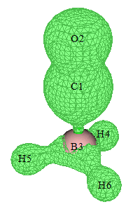

<!-- p.1103 -->


显然，O对OED的贡献最大，其次是C，再次是B。默认采用Becke划分的原子空间，你也可以通过选项-1换成其它原子划分方法。

值得注意的是，还可以绘制特定轨道贡献的OED。例如，我们想只绘制由10至13号自然轨道贡献的OED。在主功能6(main function 6)的子功能26(subfunction 26)中输入odd之后，还需要将其它所有轨道的占据数清零，即在子功能26(subfunction 26)中还需要再输入

!!! terminal "Multiwfn 交互"

    - **1-9** — 选择轨道1至9(Select orbitals 1 to 9)
    - **0** — 将占据数设为0(Set occupation number to 0)
    - **14-57** — 选择轨道14至57(Select orbitals 14 to 57)
    - **0** — 将占据数设为0(Set occupation number to 0) 之后即可返回主菜单并像往常一样绘制电子密度。

开壳层体系OED的计算：C4H8双自由基 为了说明OED在表现双自由基未成对电子分布方面的价值，下面我们将以非限制M06-2X水平绘制典型的双自由基体系C4H8的OED。在这种情况下，需要做非限制开壳层计算，并使用guess=mix关键词以得到破对称态。此外，必须指定pop=no out=wfn，以便通过混合alpha和beta密度矩阵并随后对角化来产生空间自然轨道，再导出到.wfn文件。通过这种非限制DFT计算得到的自然轨道有时被称为非限制自然轨道(UNO)。用于产生.wfn文件的Gaussian输入文件为examples\C4H8-UNO.gjf，得到的.wfn文件为examples\C4H8-UNO.wfn。请用此文件像上面的例子一样绘制OED，等值面图(等值面数值为0.02 a.u.)应如下所示。可以看到其分布特征与自旋密度颇为相似，只是不能用正负号区分alpha和beta自旋。

CASSCF方法常被用于计算双自由基体系。OED也可以对CASSCF波函数绘制，只需生成一个包含CASSCF计算产生的自然轨道的波函数文件即可。

OED还可用于表现由TDDFT方法计算的激发态未成对电子的分布，详见我的博客文章“使用Multiwfn计算奇电子密度研究激发态未成对电子分布”(http://sobereva.com/583，中文)中的详细说明和讨论。值得注意的是，TDDFT激发态波函数没有自旋密度可用，因此OED是表征未成对电子的唯一途径


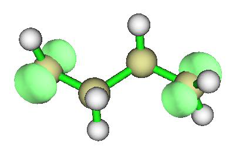

<!-- p.1104 -->


分布。


### 4.A.7 直观揭示不同区域的电子相关

电子相关效应在化学体系中普遍存在，可分为动态和静态(非动态)两部分。本节介绍两种旨在直观揭示不同局域区域电子相关效应的方法。4.A.7.1节所述的部分占据数加权电子密度(FOD)更为常用，侧重于揭示静态相关，而4.A.7.2节所述的局域电子相关函数则能够分别揭示电子相关的动态和非动态成分。因此，这两种方法都很有用。

这两种方法都要求输入包含部分占据轨道的波函数文件。换句话说，如果所有轨道不是完全占据就是完全空置，那么这些函数处处为零，就无法揭示电子相关。FOD是基于DFT定义的，部分占据轨道应通过有限温度DFT计算(ORCA、CP2K等支持)得到。相比之下，局域电子相关函数是基于波函数理论定义的，部分占据轨道应是通过CCSD、CASSCF等多组态方法得到的自然轨道。由于有限温度DFT的计算代价与普通DFT基本相同，显著低于任何多组态方法，如果你只关心静态电子相关，FOD是首选。

FOD和局域电子相关函数都可以在全空间积分，得到用于定量整个体系相应类型电子相关强度的数值。

4.A.7.1 部分占据数加权电子密度(FOD)

理论 FOD由Grimme首先在Angew. Chem. Int. Ed., 54, 1 (2015)中定义，并在Chem. Eur. J., 23, 6150 (2017)中进一步讨论。FOD表示为


$$\rho^{\mathrm{F O D}}(\mathbf{r})=\sum_{i}(\delta_{1}-\delta_{2}\eta_{i})\left|\varphi_{i}(\mathbf{r})\right|^{2}$$

<!-- formula-ocr: formula_p1104_349.png 已替换为LaTeX, 原图保留备查 -->

其中i遍历所有自旋分子轨道，其占据数范围为[0,1]。轨道由特定电子温度下的DFT计算得到。在合适的温度设置下，得到的前线轨道将明显部分占据。对于低于费米能级的轨道，δ1=δ2=1，而对于其它轨道，δ1=0且δ2=-1。因此，FOD相当于衡量在有限温度下各位置电子密度偏离0 K(整数占据)程度的量。某位置FOD越大，相应区域的静态相关越强。FOD在全空间的积分称为NFOD，它像著名的T1诊断值一样定量整个体系的总体静态相关。由于T1诊断依赖于昂贵的CCSD计算，对于中小大体系静态相关的衡量强烈推荐NFOD。

注意FOD对应第90号自定义函数。

实例 作为例子，我们对HNO2做FOD分析。使用ORCA 6.0.1程序对此分子做

<!-- p.1105 -->


9000 K下的有限温度B3LYP计算。注意适合FOD分析的电子温度为T=20000*ax+5000，其中ax是所用DFT泛函中的Hartree-Fock成分。因为B3LYP的ax为0.2，本例所用温度为9000 K。ORCA输入文件为examples\HNO2_FOD.inp。用ORCA运行它之后会得到HNO2_FOD.gbw，再用orca_2mkl HNO2_FOD -molden命令将其转换为HNO2_FOD.molden.input，该文件已在“examples”文件夹中提供。

首先，我们绘制FOD等值面图。将`settings.ini`中的“iuserfunc”设为90，然后启动Multiwfn并载入examples\HNO2_FOD.molden.input，再输入

!!! terminal "Multiwfn 交互"

    - **5** — 计算格点数据(Calculate grid data)
    - **100** — 自定义函数(目前对应FOD)(User-defined function, which corresponds to FOD now)
    - **2** — 中等质量格点(Medium-quality grid) 此时从屏幕上可以看到以下信息，表明用均匀格点在全空间对FOD积分的结果为0.139，这就是NFOD指标。HNO2的NFOD不大(丰富实例见Chem. Eur. J., 23, 6150 (2017))，表明HNO2没有明显的静态相关。


```text
Summing up all value and multiply differential element:
 0.139077305675630
```

然后选择选项-1可视化等值面图并将等值面数值设为0.005 a.u.，将看到如下图。它表明静态相关主要来自氮原子上下方区域，以及围绕O2的环形区域。

由于Multiwfn的设计非常灵活，还可以得到基函数、壳层、角动量、原子、碎片对NFOD的贡献。下面，我说明如何用Mulliken布居分析实现这一目的(其它许多布居方法如Löwdin和Hirshfeld同样可行)。在Multiwfn主菜单中，我们直接输入fod以按FOD公式变换轨道占据数，然后从屏幕上可发现NFOD为0.139077，它对应于当前(变换后)轨道占据数之和。从现在起，按通常步骤研究电子密度就等价于研究FOD。

接下来，我们输入7 // 布居分析(Population analysis)

!!! terminal "Multiwfn 交互"

    - **5** — Mulliken分析(Mulliken analysis)
    - **1** — 在屏幕上输出Mulliken布居和原子电荷(Output Mulliken population and atomic charges on screen) 此时可以看到以下信息，布居数正对应于原子对NFOD的贡献。此时的“净电荷(Net charge)”没有意义。可以看到此体系的静态相关主要来自N1和O2，其次是O3，这与等值面图完全一致


```text
Atom     1(N )    Population:  0.05877131    Net charge:  6.94122869
Atom     2(O )    Population:  0.05320397    Net charge:  7.94679603
```


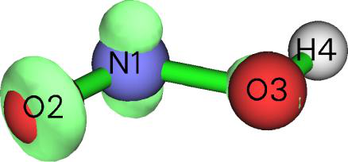

<!-- p.1106 -->


```text
Atom     3(O )    Population:  0.02487142    Net charge:  7.97512858
Atom     4(H )    Population:  0.00223030    Net charge:  0.99776970
```

由于Mulliken布居分析以非常细致的方式分解电子布居，你还可以发现更多关于NFOD本质的信息。例如，屏幕上的以下信息表明静态相关几乎完全由p电子产生。


```text
Population of each type of angular moment orbitals:
 Atom     1(N ) s: 0.0104 p: 0.0477 d: 0.0007 f: 0.0000 g: 0.0000 h: 0.0000
 Atom     2(O ) s:-0.0003 p: 0.0535 d: 0.0001 f: 0.0000 g: 0.0000 h: 0.0000
 Atom     3(O ) s:-0.0013 p: 0.0261 d: 0.0001 f: 0.0000 g: 0.0000 h: 0.0000
 Atom     4(H ) s: 0.0020 p: 0.0002 d: 0.0000 f: 0.0000 g: 0.0000 h: 0.0000
 Sum  s:   0.0107 p:   0.1275 d:   0.0008 f:   0.0000 g:   0.0000 h:   0.0000
```

4.A.7.2 局域电子相关函数

理论 在J. Chem. Theory Comput., 13, 2705 (2017)中提出的局域总、动态和非动态电子相关函数分别是旨在揭示各区域总、动态和非动态电子相关的实空间函数。它们分别对应自定义函数87、88和89，定义如下：

- 局域总电子相关函数：$$I_{T}(\mathbf{r})=\frac{1}{4}\sum_{i}\sqrt{\eta_{i}(1-\eta_{i})}\,|\varphi_{i}(\mathbf{r})|^{2}$$，$i$表示自然自旋轨道指标，η为相应占据数。注意在某些情况下，η可能略大于1.0或为负值，Multiwfn会自动将其分别设为1.0和0.0以使计算可行。

- 局域动态电子相关函数：$$I_{D}(\mathbf{r})=\frac{1}{4}\sum_{i}\left[\sqrt{\eta_{i}(1-\eta_{i})}-2\eta_{i}(1-\eta_{i})\right]|\varphi_{i}(\mathbf{r})|^{2}$$

- 局域非动态电子相关函数：$$I_{ND}(\mathbf{r})=\frac{1}{2}\sum_{i}\eta_{i}(1-\eta_{i})\,|\varphi_{i}(\mathbf{r})|^{2}$$

显然IT(r) = ID(r) + IND(r)。值得注意的是，这些函数的形式与4.A.6节介绍的OED密切相关。

局域总、动态和非动态电子相关函数的全空间积分分别对应于Phys. Chem. Chem. Phys., 18, 24015 (2016)中提出的总、动态和非动态相关指标。

实例 作为例子，我们来绘制OC-BH3的IT。将`settings.ini`中的"iuserfunc"设为87，然后启动Multiwfn并输入

!!! terminal "Multiwfn 交互"

    - **examples\COBH3_CCSD.wfn** — 含CCSD/def2-SVP自然轨道的波函数文件(Wavefunction file containing CCSD/def2-SVP natural orbitals)
    - **5** — 格点数据计算(Grid data calculation)
    - **100** — 自定义函数(目前对应IT)(User-defined function, currently corresponding to IT)
    - **2** — 中等质量格点(Medium-quality grid)
    - **-1** — 可视化等值面(Visualize isosurface) 将等值面数值设为0.013，然后将看到


<!-- p.1107 -->


此图与4.A.6节中OED的等值面图颇为相似。由于IT是专门用于揭示电子相关的实空间函数，我们的观察表明OED也能够直观展示电子相关。

用类似方式，你也可以很容易地绘制ID和IND函数，只需在启动Multiwfn之前将`settings.ini`中的"iuserfunc"分别设为88和89，再重复上述操作即可。

注意可以绘制特定轨道对局域电子相关函数的贡献，你可以通过主功能6(main function 6)的子选项26将不感兴趣的自然轨道的占据数设为零来筛除它们。

使用主功能100(main function 100)的子功能4(subfunction 4)，你可以在全空间对局域电子相关函数积分，结果表明整个体系电子相关的大小。例如，我们返回主菜单并输入

!!! terminal "Multiwfn 交互"

    - **100** — 其它功能(第一部分)(Other function (Part 1))
    - **4** — 对实空间函数在全空间积分(Integrate a real space function over the whole space)
    - **100** — 自定义函数(目前对应IT)(User-defined function, currently corresponding to IT) 结果即所谓的总相关指标，为1.576。对动态和非动态电子相关函数重复此计算，会发现所得指标分别为1.267和0.309。显然，对OC-BH3体系动态相关主导了总的相关效应。

一次性方便地计算所有电子相关指标 总、动态和非动态相关指标也可以通过主功能200(main function 200)的子功能15(subfunction 15)计算，这要快得多，也方便得多。仍以COBH3_CCSD.wfn为例，我们进入主功能200(main function 200)再选择子功能15(subfunction 15)，会立即看到以下输出，结果与我们前面手动得到的一模一样


```text
Nondynamic correlation index:  0.30880061
Dynamic correlation index:     1.26746042
Total correlation index:       1.57626103
```


### 4.A.8 分析高于CCSD水平的波函数

注：本节的中文版是我的博客文章“在Multiwfn中分析高于CCSD水平的波函数的方法”(http://sobereva.com/395)。

在最常用的程序Gaussian中，最高水平的波函数是CCSD。虽然CCSD波函数对几乎所有情况都绝对足够，但由于某些特殊


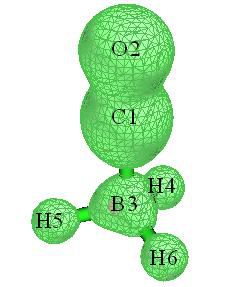

<!-- p.1108 -->


原因，人们可能想研究更高水平产生的波函数。下面我描述如何使Multiwfn能够分析以下波函数：

- 由ORCA的AUTOCI模块产生的波函数(CCSD(T)、CCSDT、CISDT、MP5等)

- 由PSI4程序(http://www.psicode.org)产生的CCSD(T)波函数
- 由MRCC程序(http://www.mrcc.hu)产生的任意阶耦合簇和CI波函数(包括Full CI)。

(1) ORCA 这里我说明如何使Multiwfn能够分析ORCA产生的(驰豫)CCSD(T)波函数。我目前使用的ORCA版本是6.1。下面是一个名为H2CO.inp的输入文件示例，它使用AUTOCI模块在CCSD(T)/cc-pVTZ水平计算H2CO。


```text
! autoci-CCSD(T) cc-pVTZ verytightSCF
%maxcore     5000
%pal nprocs  96 end
%autoci density relaxed end
* xyz   0   1
 C                  0.00000000    0.00000000   -0.52887900
 H                  0.00000000    0.93777000   -1.12367000
 O                  0.00000000    0.00000000    0.67757700
 H                  0.00000000   -0.93777000   -1.12367000
*
```

运行此输入文件后，在当前文件夹中会有很多文件，包括H2CO.gbw、H2CO.densities等等，但后续步骤只需要这两个。

我们首先运行orca_2mkl H2CO -molden将.gbw转换为.molden文件，然后在当前文件夹中会得到H2CO.molden.input。

然后，我们需要将CCSD(T)水平的1阶密度矩阵(1RDM)在AO基下从二进制.gbw和.densities文件导出到纯文本.json文件。为此，我们在当前文件夹创建一个名为orca.json.conf的文本文件，内容如下。此文件将要求orca_2json把AUTOCI模块产生的1RDM导出到json文件。


```text
{
"Densities": ["autocipre"]
}
```

现在运行orca_2json H2CO.gbw，然后在当前文件夹中会得到H2CO.json。

启动Multiwfn并输入H2CO.molden.input // 输入实际路径(Input actual path)

!!! terminal "Multiwfn 交互"

    - **1000** — 主功能1000(隐藏功能)(Main function 1000 (a hidden function))
    - **98** — 基于ORCA程序输出的密度矩阵产生自然轨道(Generate natural orbitals based on density matrix outputted by ORCA program) H2CO.json

json文件中待载入的1RDM标签(Label of the 1RDM to be loaded in the json file) 之后，Multiwfn载入1RDM并通过对角化产生自然轨道(NOs)，你可以在屏幕上看到各NO的占据数。接下来，我们输入y，Multiwfn会把NO导出到new.mwfn并载入。现在，内存中的波函数就是以NO表示的CCSD(T)波函数，你可以像往常一样做各种波函数分析，还可以


<!-- p.1109 -->


用主功能0(main function 0)可视化NO。

下面，我提及一些细节和相关信息：

- 如果参考波函数是非限制的，你需要让orca_2json也把自旋密度的1RDM导出到json文件，即应将


```text
"Densities": ["autocipre"]
```

替换为


```text
"Densities": ["autocipre","autocirre"]
```

然后，在主功能1000(main function 1000)中选择选项98并输入autocipre后，Multiwfn会询问如何产生NO。如果你选择产生“alpha和beta自然轨道(alpha and beta natural orbitals)”或“自旋自然轨道(Spin natural orbitals)”，Multiwfn还会要求你输入json文件中自旋密度1RDM的标签，你应输入autocirre。

- 用与上面完全相同的方式，你还可以使Multiwfn分析AUTOCI模块产生的其它驰豫波函数。例如，你希望在CCSDT水平做波函数分析，只需把ORCA输入文件中的autoci-CCSD(T)换成autoci-CCSDT。AUTOCI中可用的所有水平列表见ORCA手册的AUTOCI部分。

- 只要在orca.json.conf和Multiwfn中正确指定1RDM标签，Multiwfn还可以分析任何其它水平的波函数。例如，总密度和自旋密度的SCF水平1RDM标签分别为“scfp”和“scfr”；由MDCI模块产生的则标签分别为“mdcip”和“mdcir”。你可以运行orca_plot H2CO.gbw -i再选择选项“输入图的类别(Enter type of plot)”查看此文件中有哪些密度可用，各种密度的标签也会明确显示在屏幕上。

还需注意，如果你在


```text
"Densities": ["all"]
```

中写入

在orca.json.conf中，那么orca_2json会把所有可用的1RDM导出到.json文件(你会在屏幕上看到所导出的1RDM完整列表)，然后你可以在Multiwfn中输入相应标签选择载入其中任何一个；此外，若计算中使用了AUTOCI模块，这种情况下2RDM也会被导出到.json文件，使文件体积很大。

(2) PSI4 我目前使用的PSI4版本是1.3.2。下面是输入文件示例，它在CCSD(T)/cc-pVTZ水平计算氟化氢，并在当前文件夹产生HF_CCSDpT.fchk。


```text
molecule HF {
H        0.0        0.0       -0.831975
F        0.0        0.0        0.092442
 }

set basis cc-pVTZ
grad, wfn = gradient('CCSD(T)', return_wfn=True)
fchk_writer = psi4.FCHKWriter(wfn)
fchk_writer.write('HF_CCSDpT.fchk')
```

如果你使用的PSI4版本≥ 1.4，上面例子最后两行应替换为fchk(wfn,'HF_CCSDpT.fchk')。

得到的HF_CCSDpT.fchk记录了Hartree-Fock分子轨道和CCSD(T)密度矩阵。如果


<!-- p.1110 -->


直接把此文件喂给Multiwfn，因为Multiwfn从不利用密度矩阵而只从文件载入轨道，后续分析结果将对应于Hartree-Fock水平。为了使Multiwfn分析CCSD(T)波函数，应做以下步骤：

1. 像往常一样启动Multiwfn并载入HF_CCSDpT.fchk 2. 进入主功能200(main function 200)并选择子功能16(subfunction 16)。此功能用于把.fch/.fchk文件中的密度矩阵变换为自然轨道，详见3.200.16节。

3. 输入CCSD，然后.fchk文件中的“总CCSD密度(Total CCSD Density)”场将被载入，你会立即看到对角化CCSD(T)密度矩阵产生的自然轨道(NOs)占据数。

4. 输入y。然后在当前文件夹产生new.mwfn，它记录了CCSD(T)水平的NO。此文件被自动载入Multiwfn，因此内存中的轨道现在对应于CCSD(T)波函数的NO，从而所有后续分析都将对应于CCSD(T)波函数。

注意若这是开壳层体系，你可选择要产生的NO类型，包括空间NO、alpha/beta NO和自旋NO。详见3.200.16节。

(3) MRCC 我目前使用的MRCC版本是2017年9月25日版。下面是输入文件示例，它在CCSDT/cc-pVTZ水平计算氟化氢。


```text
basis=cc-pvtz
calc=CCSDT
mem=2500MB
dens=1

geom=xyz
2

H        0.0        0.0       -0.831975
F        0.0        0.0        0.092442
```

用MRCC运行它之后，会在当前文件夹发现名为MOLDEN的文件，它是Molden输入文件，记录了Hartree-Fock分子轨道。在当前文件夹还可发现名为CCDENSITIES的文件，它记录了2阶和1阶约化密度矩阵(2RDM和1RDM)。为了使Multiwfn分析CCSDT波函数，必须把1RDM转换为自然轨道并保存到.molden文件。

启动Multiwfn并载入MOLDEN文件，进入主功能1000(main function 1000)并选择子功能97(subfunction 97)，输入CCDENSITIES文件路径。再输入冻结核轨道数。默认情况下，MRCC在电子相关计算中冻结核分子轨道。当前体系有两个核电子(在输出文件中可见" Number of core electrons: 2")，而这是闭壳层体系，每个占据分子轨道有两个电子，因此只有一个核分子轨道被冻结，所以我们输入1。对角化CCSDT密度矩阵产生自然轨道完成后，占据数打印在屏幕上，一个名为MOLDEN.mwfn的文件被自动导出到当前文件夹，它载有CCSDT波函数的自然轨道。然后若输入y，Multiwfn将载入MOLDEN.mwfn，之后你就可以对CCSDT波函数做各种波函数分析。


<!-- p.1111 -->


用MRCC产生的CI波函数的分析过程与上面所示完全相同。下面是无冻结核处理、在FCI/aug-cc-pVDZ水平计算拉长的LiH的输入文件示例。


```text
basis=aug-cc-pvdz
calc=fci
mem=2500MB
dens=1
core=0

geom=xyz
2

H        0.0        0.0      0.0
Li       0.0        0.0      3.0
```


### 4.A.9 计算TrEsp(由静电势得出的跃迁电荷)电荷并分析激子耦合


**1. 关于TrEsp的理论** 分子(比如A)的静电势(ESP)一般形式可写为


$$\varphi_{aa^{\prime}}^{A}(\mathbf{r})=\delta_{a,a^{\prime}}\sum_{I}\frac{Z_{I}}{|\mathbf{r}-\mathbf{R}_{I}|}-\int\frac{\rho_{aa^{\prime}}(\mathbf{r}^{\prime})}{|\mathbf{r}-\mathbf{r}^{\prime}|}\mathrm{d}\mathbf{r}^{\prime}$$

<!-- formula-ocr: formula_p1111_350.png 已替换为LaTeX, 原图保留备查 -->

其中ZI和RI分别为原子I的核电荷和坐标，δ为Kronecker函数。ρa,a为态a与a'之间的跃迁密度。

我们通常研究的ESP是单个态的ESP，即a=a'。当a和a'对应不同态时，该势可称为“跃迁静电势”，它衡量对应于a-a'跃迁的激发所施加的ESP。

已知单态的精确ESP常可用基于ESP拟合电荷(如CHELPG和MK电荷，见3.9.10和3.9.11节)计算的势很好地近似表示，

$$\varphi_{a}^{A}(\mathbf{r})=\sum_{I}\frac{Z_{I}}{|\mathbf{r}-\mathbf{R}_{I}|}-\int\frac{\rho_{a}(\mathbf{r}^{\prime})}{|\mathbf{r}-\mathbf{r}^{\prime}|}\mathrm{d}\mathbf{r}^{\prime}\approx\sum_{I}\frac{q_{a}^{I}}{|\mathbf{r}-\mathbf{R}_{I}|}$$

其中𝑞𝑎𝐼为电子态a下原子I的ESP拟合电荷。

有鉴于此，J. Phys. Chem. B, 110, 17268 (2006)提出了TrEsp(由静电势得出的跃迁电荷)的概念，并表明精确的跃迁ESP可很好地近似为


$$\varphi_{a}^{A}(\mathbf{r})=\sum_{I}\frac{Z_{I}}{|\mathbf{r}-\mathbf{R}_{I}|}-\int\frac{\rho_{a}(\mathbf{r}^{\prime})}{|\mathbf{r}-\mathbf{r}^{\prime}|}\mathrm{d}\mathbf{r}^{\prime}\approx\sum_{I}\frac{q_{a}^{I}}{|\mathbf{r}-\mathbf{R}_{I}|}$$

<!-- formula-ocr: formula_p1111_351.png 已替换为LaTeX, 原图保留备查 -->

其中𝑞𝑎𝑎′𝐼为由a-a'跃迁密度得到的原子I的TrEsp。TrEsp电荷的计算方式与普通电荷几乎完全相同


<!-- p.1112 -->


ESP拟合电荷的计算方式几乎完全相同，唯一区别在于应忽略核贡献，并将单态密度替换为两态之间的跃迁密度。

2. 计算TrEsp电荷的例子 现在我用简单分子4-硝基苯胺说明如何计算其S0-S2跃迁的TrEsp电荷。这里假设你是Gaussian用户(若你更喜欢用ORCA程序，步骤会稍长，但通过写shell脚本可显著简化。详情见此帖#2：http://sobereva.com/wfnbbs/viewtopic.php?pid=389)。

首先，运行Gaussian输入文件examples\4-Nitroaniline_TrESP.gjf，关键词PBE1PBE/6-31g(d) TD density=transition=2 out=wfn意味着将在TD-PBE0/6-31G(d)水平产生基态(S0)到S2的跃迁密度，然后自动对角化得到相应自然轨道，最终保存到指定的.wfn文件。若你感到困惑或手头没有Gaussian，可直接从http://sobereva.com/multiwfn/extrafiles/TrEsp.zip下载相关文件

!!! terminal "Multiwfn 交互"

    - **启动Multiwfn并输入S0S2.wfn** — 上述过程产生的.wfn文件。可在TrEsp.zip中找到(Can be found in the TrEsp.zip)
    - **7** — 布居分析(Population analysis)
    - **12** — CHELPG拟合方法(也可用MK或RESP方法代替)(CHELPG fitting method (you can also use MK or RESP method instead))
    - **5** — 选择ESP形式(Choose form of ESP)
    - **3** — 跃迁电子(即专门用于计算TrEsp的ESP)(Transition electronic (i.e. the ESP specific for evaluating TrEsp))
    - **1** — 开始计算(Start calculation) 即使中等大小体系ESP的计算也很耗时，需要耐心等待。最后，TrEsp电荷显示在屏幕上：


```text
   Center       Charge
     1(C )   0.2134106035
     2(C )  -0.1679471876
     3(C )   0.1841565861
[...ignored]
    16(O )  -0.0948987209
 Sum of charges:  -0.0000000000
 RMSE:    0.000970   RRMSE:    0.044908
```

电荷之和恰为零，这正是我们预期的，因为电子跃迁过程不改变电子总数。然后若想把原子X、Y、Z坐标和TrESP导出到.chg文件(此格式说明见2.5节)，可输入y。

注意，这样得到的TrEsp电荷之后必须再手动除以√2！这是因为导出.wfn文件中的自然轨道是基于对称化形式的跃迁密度矩阵(TDM)产生的，而Gaussian做对称化的方式很奇怪


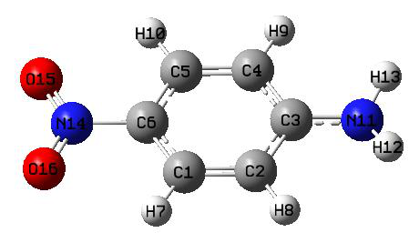

<!-- p.1113 -->


即TDMi,j=(TDMi,j+TDMj,i)/ √2，而非预期的TDMi,j=(TDMi,j+TDMj,i)/2，因此应通过把所得电荷除以√2来手动修正此问题。

事实上，在Multiwfn中跃迁电荷也可以通过空穴-电子分析模块用Mulliken方法计算，见3.21.1.3节，计算代价几乎可忽略。然而，Mulliken跃迁电荷在近似表示跃迁静电势和分析分子间激子耦合方面绝不如TrEsp电荷好。

技巧1：利用cubegen工具加速TrEsp计算 若你的CPU核数有限(少于10核)，利用Gaussian包中的cubegen工具有可能显著降低ESP相关分析的耗时，详见5.7节。cubegen也可用于降低TrEsp电荷的计算代价，过程如下。

由于cubegen基于.fch/fchk文件中的密度矩阵信息计算ESP，我们必须先产生TDM并存入.fch文件，3.21.9节提到的功能可做到这一点。我们首先在Gaussian中用PBE1PBE/6-31g(d) TD IOp(9/40=4)关键词做电子激发计算并同时保留.fch文件，4-硝基苯胺的相应文件为前述TrEsp.zip包中的4-Nitroaniline_IOp.gjf、4-Nitroaniline_IOp.out和4-Nitroaniline.fchk。

启动Multiwfn并输入4-Nitroaniline.fchk 18 // 电子激发分析(Electron excitation analysis)

!!! terminal "Multiwfn 交互"

    - **9** — 产生并导出TDM(Generate and export TDM)
    - **1** — 产生基态与激发态之间的TDM(Generate TDM between ground state and excited state) 4-Nitroaniline_IOp.out
    - **2** — 产生S0与S2之间的TDM(Generate TDM between S0 and S2) y

导出TDM.fch，其密度矩阵场对应于刚产生的TDM(Export TDM.fch, whose density matrix field corresponds to the just generated TDM) 请确认`settings.ini`中的"cubegenpath"参数已设为Gaussian文件夹中cubegen工具的实际路径，然后重启Multiwfn并输入

!!! terminal "Multiwfn 交互"

    - **TDM.fch 7** — 布居分析(Population analysis)
    - **12** — CHELPG拟合方法(CHELPG fitting method)
    - **5** — 选择ESP形式(Choose form of ESP)
    - **3** — 专门用于计算TrEsp的ESP类型(The ESP type specific for evaluating TrEsp)
    - **1** — 开始计算(Start calculation) TrESP电荷会立即显示在屏幕上。不需要再把所得电荷手动除以√2，因为Multiwfn产生的TDM已经以正确方式对称化。

值得注意的是，若想验证拟合的TrEsp电荷是否合理，可比较由这些电荷算出的电偶极矩与Gaussian(或其它量子化学程序)打印的跃迁电偶极矩。众所周知ESP拟合电荷能很好地复现电偶极矩，通常TrEsp电荷也能很好地复现实际的电跃迁偶极矩。


<!-- p.1114 -->


算出TrEsp电荷后，我们选择y让Multiwfn把电荷导出到当前文件夹的TDM.chg文件。然后启动并载入此文件，会在屏幕上发现以下信息


```text
Component of electric dipole moment:
X=   -0.011607 a.u.  (   -0.029501 Debye )
Y=   -1.781254 a.u.  (   -4.527495 Debye )
Z=    0.000011 a.u.  (    0.000029 Debye )
```

在4-Nitroaniline_IOp.out中可找到以下信息


```text
Ground to excited state transition electric dipole moments (Au):
       state          X           Y           Z        Dip. S.      Osc.
         1        -0.0000     -0.0000      0.0001      0.0000      0.0000
         2        -0.0165     -1.7911      0.0000      3.2083      0.3408
         3         0.0210      0.0188      0.0000      0.0008      0.0001
```

由于基于我们的TrEsp电荷算出的电偶极矩与精确的跃迁电偶极矩非常接近，显然我们的TrEsp电荷必定合理。

技巧2：在TrEsp拟合过程中施加自定义电荷约束 Multiwfn的限制性静电势(RESP)模块已在3.9.16节详细介绍。可见，此模块比MK或CHELPG模块更通用、更强大，因为你可以对所得ESP拟合电荷任意施加自定义约束，例如，可要求某些原子必须具有完全相同的电荷，或要求一批电荷之和必须等于预定值。

这里，我举例说明如何用RESP模块基于MK拟合格点计算TrEsp，并附加所有氢原子电荷必须为零的约束。

首先，写一个纯文本文件(如chgcons.txt)，内容如下：


```text
7 0
8 0
9 0
10 0
```

此文件将用于RESP模块。7~10是氢原子的序号，0意味着拟合时其电荷将被约束为零。

!!! terminal "Multiwfn 交互"

    - **启动Multiwfn并输入S0S2.wfn** — 我们之前用过的.wfn文件(The .wfn file we previously used)
    - **7** — 布居分析(Population analysis)
    - **18** — RESP模块(RESP module)
    - **11** — 选择ESP形式(Choose form of ESP)
    - **3** — 跃迁电子(Transition electronic)
    - **6** — 在单阶段拟合中设置电荷约束(Set charge constraint in one-stage fitting)
    - **1** — 从外部纯文本文件载入电荷约束设置(Load charge constraint setting from external plain text file) chgcons.txt

开始带自定义约束的单阶段ESP拟合计算。默认拟合格点为MK(也可用选项3换成CHELPG)(Start one-stage ESP fitting calculation with customized constraint. The default fitting grid is MK (you can also change to CHELPG by option 3))

结果为


```text
Center      Charge
   1(C )    0.158613
```


<!-- p.1115 -->


```text
...
   7(H )    0.000000
   8(H )   -0.000000
   9(H )    0.000000
  10(H )   -0.000000
  11(N )    0.178112
...
```

显然，我们的电荷约束已生效，其它原子仍有合理的TrEsp电荷。通过阅读4.7.7节相应例子可进一步了解RESP模块。值得注意的是，当你在选项3中选择“跃迁电(Transition electric)”时，默认的原子等价约束会被自动移除，单阶段拟合中的约束强度会被自动设为零，因为这些处理在当前情况下无用。

3. 基于TrEsp计算激子耦合能 分子间库仑相互作用能的一般形式可表示为

$$\begin{aligned}V_{aa^{\prime},bb^{\prime}}^{A,B}=\delta_{a,a^{\prime}}\delta_{b,b^{\prime}}\sum_{I\in A}\sum_{J\in B}\frac{Z_{I}Z_{J}}{\left|\mathbf{R}_{I}-\mathbf{R}_{J}\right|}+\iint\frac{\rho_{a,a}^{A}(\mathbf{r})\rho_{b,b}^{B}(\mathbf{r}^{\prime})}{\left|\mathbf{r}-\mathbf{r}^{\prime}\right|}\mathrm{d}\mathbf{r}\mathrm{d}\mathbf{r}^{\prime}\\-\delta_{a,a^{\prime}}\sum_{I\in A}\int\frac{Z_{I}\rho_{b,b}^{B}(\mathbf{r})}{\left|\mathbf{R}_{I}-\mathbf{r}\right|}\mathrm{d}\mathbf{r}-\delta_{b,b^{\prime}}\sum_{J\in B}\int\frac{Z_{J}\rho_{a,a}^{A}(\mathbf{r})}{\left|\mathbf{R}_{J}-\mathbf{r}\right|}\mathrm{d}\mathbf{r}\end{aligned}$$

$$\begin{aligned}V_{aa^{\prime},bb^{\prime}}^{A,B}=\delta_{a,a^{\prime}}\delta_{b,b^{\prime}}\sum_{I\in A}\sum_{J\in B}\frac{Z_{I}Z_{J}}{\left|\mathbf{R}_{I}-\mathbf{R}_{J}\right|}+\iint\frac{\rho_{a,a}^{A}(\mathbf{r})\rho_{b,b}^{B}(\mathbf{r}^{\prime})}{\left|\mathbf{r}-\mathbf{r}^{\prime}\right|}\mathrm{d}\mathbf{r}\mathrm{d}\mathbf{r}^{\prime}\\-\delta_{a,a^{\prime}}\sum_{I\in A}\int\frac{Z_{I}\rho_{b,b}^{B}(\mathbf{r})}{\left|\mathbf{R}_{I}-\mathbf{r}\right|}\mathrm{d}\mathbf{r}-\delta_{b,b^{\prime}}\sum_{J\in B}\int\frac{Z_{J}\rho_{a,a}^{A}(\mathbf{r})}{\left|\mathbf{R}_{J}-\mathbf{r}\right|}\mathrm{d}\mathbf{r}\end{aligned}$$

此量可有不同物理意义。例如，𝑉00,00 𝐴,𝐵：A与B在基态下的库仑相互作用能 𝑉00,11 𝐴,𝐵：A处于基态、B处于第一激发态时的库仑相互作用能 𝑉01,10 𝐴,𝐵= 𝑉10,01 𝐴,𝐵：两分子跃迁之间的激发能转移耦合

𝑉𝑎𝑎′,𝑏𝑏′ 𝐴,𝐵中积分的计算很困难，有一种称为跃迁密度立方(TDC)的方法，它基于均匀分布格点用数值积分计算积分，对大体系代价极高。幸运的是，已表明用对两分子算出的TrEsp

电荷，可用下式以通常令人满意的精度方便地计算其激子耦合能𝑉𝑎𝑎′,𝑏𝑏′ 𝐴,𝐵：

$$V_{aa^{\prime},bb^{\prime}}^{A,B}\approx\sum_{I\in A}\sum_{J\in B}\frac{q_{a,a^{\prime}}^{I}q_{b,b^{\prime}}^{J}}{|\mathbf{R}_{I}-\mathbf{R}_{J}|}$$

在Multiwfn中，你可以很容易地基于两分子的TrEsp电荷计算激子耦合能。步骤简述如下：

(1) 优化二聚体结构 (2) 提取每个单体的坐标并写入Gaussian输入文件，适当修改关键词并做电子激发计算以得到含由跃迁密度导出的自然轨道的.wfn文件。注意必须用nosymm关键词以避免Gaussian自动平移旋转整体单体坐标。

(3) 用上步产生的各自.wfn文件对每个单体产生TrEsp电荷，再把TrEsp电荷导出为.chg文件。

(4) 手动合并两个单体.chg文件内容为单个.chg文件。

<!-- p.1116 -->


此文件中单体坐标应与优化后的二聚体坐标一致。

(5) 把二聚体.chg文件载入Multiwfn，进入主功能7(main function 7)并选择选项-2，再依次输入两单体的原子列表，激子耦合能会立即打印。


### 4.A.10 通过给原子着色直观展示原子性质

有一种非常有用的直观展示Multiwfn算出的原子性质的方式，即在VMD程序(http://www.ks.uiuc.edu/Research/vmd/)中给原子着色，这里我通过两个例子说明做法。更详细的讨论和例子见我的博客文章“用Multiwfn+VMD给原子着色展示原子电荷、自旋布居、电荷转移和凝聚Fukui函数”(http://sobereva.com/425)。

(1) 按原子电荷给原子着色 首先，我说明如何用这种方式生动表现聚炔的原子电荷。此体系在4.13.6节也涉及过。

第一步是计算原子电荷。启动Multiwfn并输入以下命令：examples\polyyne.wfn

!!! terminal "Multiwfn 交互"

    - **7** — 布居分析(Population analysis)
    - **11** — ADCH电荷(一般推荐此种电荷)(ADCH charge (this type of charge is generally recommended)) 1 y

其它功能(第一部分)(Other functions (Part 1))

!!! terminal "Multiwfn 交互"

    - **2** — 导出新文件(Export new file)
    - **1** — 新文件格式为.pqr(The format of the new file is .pqr) polyyne.pqr 现在当前文件夹中有polyyne.pqr。.pqr格式与流行的.pdb格式很相似，主要区别在于.pqr格式中最后两列专门记录原子电荷和原子半径。在当前文件中，原子电荷对应于聚炔ADCH电荷，而原子半径对应于Bondi范德华半径。

.pqr文件可被VMD识别。我们启动VMD，再把polyyne.pqr拖入VMD主窗口载入。之后，修改绘图设置：

(a) 用白色背景：在VMD控制台窗口输入color Display Background white (b) 修改绘制风格和着色设置：进入“图形(Graphics)”－“表示(Representation)”，将绘制方式设为“CPK”，将着色方式设为“电荷(Charge)”。再选择“轨迹(Trajectory)”选项卡，在“颜色标尺数据范围(Color Scale Data Range)”文本框中输入-0.4和0.4并按ENTER键。

(c) 改变颜色过渡风格：进入“图形(Graphics)”－“颜色(Colors)”，选择“颜色标尺(Color Scale)”选项卡，把默认RWB改为BWR(蓝-白-红)(Blue-White-Red)

(e) 选择“显示(Display)”－“正交(Orthographic)”以用正交视角。此时在VMD OpenGL窗口中会看到下图。两端原子为氢，其它原子均为碳。


<!-- p.1117 -->


在上图中，红色和蓝色分别反映原子带正电荷和负电荷。红色(蓝色)越深电荷越正(越负)。可见，由于碳的电负性比氢大，两个氢带明显的正电荷，与之相连的碳带明显的负电荷。白色表明分子中部区域碳的电荷接近零。

聚炔是高度共轭体系，预计外电场可显著极化其电荷分布。为了研究此问题，我们用同样过程基于examples\polyyne_field.wfn绘图，该文件是在沿分子轴0.03 a.u.外电场下产生的。所得图形如下，外电场方向为从右侧到左侧。

可见原子电荷分布不再对称。由于场源在右侧，大量电子从左向右转移，结果左侧碳原子净电荷变为正，而右侧变为负。

(2) 按原子对分子轨道的贡献给原子着色 原子着色法不仅能用于展示原子电荷，还可用于展示其它原子性质。作为例子，我说明如何用给原子着色表示原子对分子轨道的贡献，以examples\N-phenylpyrrole.fch为例分子。

首先，我们计算一个轨道的轨道组成。启动Multiwfn并输入examples\N-phenylpyrrole.fch

!!! terminal "Multiwfn 交互"

    - **8** — 轨道组成(Orbital composition)
    - **3** — SCPA方法(SCPA method)
    - **36** — 选择MO 36为例(Select MO 36 as example) 然后我们用5.4节所述方法把Multiwfn窗口中的所有原子贡献复制到文本文件。

!!! terminal "Multiwfn 交互"

    - **0** — 返回(Return)
    - **-10** — 返回主菜单(Return to main menu)
    - **100** — 其它功能(第一部分)(Other functions (Part 1))
    - **2** — 导出新文件(Export new file)
    - **2** — 新文件格式为xyz，因为.xyz与.chg很相似(The format of the new file is xyz, because .xyz is very similar to .chg) N-phenylpyrrole.chg


```text
C      -0.00000000      1.12162908      1.82507914  0.396870
C      -0.00000000      0.71310006      3.13457424  0.099898
C      -0.00000000     -0.71310006      3.13457424  0.099898
...[ignored]
```


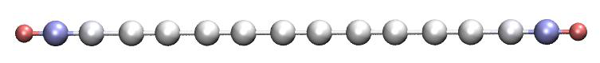


<!-- p.1118 -->


```text
H       0.00000000      2.14896316     -3.05414223  0.000000
H       0.00000000     -0.00000000     -4.31975533  0.000000
```

我们用 Multiwfn 载入该 .chg 文件并将其转换为 N-phenylpyrrole.pqr，然后用 VMD 进行可视化，具体步骤与上一个例子完全相同。不过这一次，颜色标尺的下限和上限应分别设为 -50 和 50。所得结果如下方图中的左半部分所示；作为对比，MO36 相应的等值面图示于右半部分。

原子越红，其对该轨道的贡献越大。可以看出，本节介绍的原子着色方法很好地反映了实际的轨道分布。对于非常大的分子，等值面图可能会变得相当复杂，而原子着色图则要清晰得多。

当然，原子着色方法也适用于 Multiwfn 计算的其它各类原子性质，例如凝聚 Fukui 函数、原子自旋布居、原子跃迁电荷、原子的源函数、原子空间内电子能量的积分、电子跃迁或分子间相互作用过程中原子电荷的变化。更多例子可参见我的博客文章 http://sobereva.com/425（中文）。


### 4.A.11 研究化学键的方法概览

注：本节的中文版是我的博客文章“Multiwfn 支持的化学键分析方法概览”（http://sobereva.com/471），其中还包含扩展讨论。

在本节中，我对所有可用于研究化学键的方法给出概览。你会发现 Multiwfn 在表征和揭示键的本质方面是不可或缺的有用工具。大多数分析既可应用于基态，也可应用于激发态（关于这一点，见 4.18.13 节的更多说明）

1 AIM（分子中的原子）分析 在 AIM 框架下，键临界点（BCP）是键最具代表性的点，

因此化学键的特征可以用相应 BCP 处的各种性质来表征，例如：


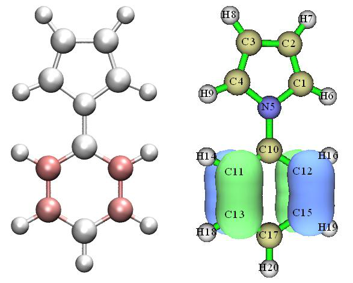

<!-- p.1119 -->


·BCP 处的电子密度和势能，即 ρ(BCP) 和 V(BCP)，常用于讨论成键强度。对于同一种键，它们通常分别与成键强度呈正相关和负相关。

·BCP 处的电子密度拉普拉斯值，即 ∇2ρ(BCP)，常用于判断键是否主要呈现共价特征。负值和正值分别意味着该键的主要性质为共价和非共价。但请注意，这一判据常常是

错误的（例如 CO 的 ∇2ρ(BCP) 为正，但它显然是极性共价键）

·在 Angew. Chem. Int. Ed. Engl., 23, 627 (1984) 中曾提出，BCP 处能量密度的负值和正值，即 H(BCP)，分别意味着该键具有共价和非共价性质。但这一判据并不总是成立；例如 CaO 中的 Ca-O 是典型的离子键，但其 H(BCP) 为负。

·在 J. Chem. Phys., 117, 5529 (2002) 中提出了 V(BCP)/G(BCP)，其中 G(BCP) 表示 BCP 处的拉格朗日动能密度。据称，该量的 <0、>1 但 <2、>2 分别意味着成键主要属于闭壳相互作用、中间（混合）相互作用和共价相互作用。

·eta 指数在 J. Phys. Chem. A, 114, 552 (2010) 中提出，并在

Angew. Chem. Int. Ed., 53, 2766 (2014) 中进一步研究，其定义为 |λ1(r)|/λ3(r)，其中 λ1 和 λ3 分别是电子密度 Hessian 矩阵的最小和最大本征值。据称，若 BCP 处的 eta 指数小于 1，则成键应为闭壳相互作用；而若大于 1，则相互作用应具有共价性质，且数值越正，共价特征越强。然而，我发现这一说法并不总是成立，例如 Ni(CO)4 中 Ni-C 和 C-O 键的该量均小于 1，但毫无疑问它们应归为极性共价键。

·键度（BD）在 J. Chem. Phys., 117, 5529 (2002) 中提出，定义为

H(BCP)/ρ(BCP)。BD 的物理意义是 BCP 处单位电子的能量密度。对于共价相互作用（通常 H(BCP)<0），BD 越负，成键越强；而对于非共价相互作用（通常 H(BCP)>0），BD 越正，相互作用越弱。

·键椭率在 J. Am. Chem. Soc., 105, 5061 (1983) 中提出，定义为 ε(r)=

[λ1(r)/λ2(r)]-1。在 BCP 处 λ1 和 λ2 必为负值，体现垂直于键方向的电子密度曲率。该值偏离 0 越大，BCP 处电子密度在垂直于键的平面内呈非对称分布的趋势越强。

·以 BCP 为参考点的源函数已被用于研究化学键，全面综述见 Struct. & Bond., 147, 193 (2010)，分析实例见 4.17.5 节。

还有一些研究论文利用 BCP 性质讨论化学键，例如 J. Am. Chem. Soc., 120, 13429 (1998) 和 J. Comput. Chem., 39, 1697 (2018)。值得注意的是，某些临界点处的性质还可用于估计晶体的金属性，见 J. Am. Chem. Soc., 124, 14721 (2002)、Chem. Phys. Lett., 471, 174 (2009) 和 J. Phys.: Condens. Matter, 14, 10251 (2002)。

键径也是 AIM 框架中非常重要的概念，它严格揭示了连接各原子的主要相互作用路径。需要理解的一个重要事实是，强的

<!-- p.1120 -->


化学键必定伴随有键径和 BCP，而键径和 BCP 的存在并不意味着化学键的存在。

AIM 拓扑分析已在 3.14 节系统介绍，并在 4.12.1 节举例说明，上述所有量都可由 Multiwfn 轻松快速地求得。值得注意的是，在 Multiwfn 中，临界点（或特定点）处的许多实空间函数可分解为各轨道（通常为 MO 或 LMO）的贡献，例子见 4.2.4 节；此外，任何实空间函数都可沿键径绘制，例子见 4.2.3 节。这些有用的功能常常能对成键提供深刻得多的见解。

上述实空间函数还可绘制为曲线图、平面图或等值面图，从而直观地研究其分布，实际例子分别见 4.3、4.4 和 4.5 节。∇2ρ(r) 的等值线图和等值面图特别有用且常用。

2 键级与离域指数分析 键级是表征化学键非常有用且直接的方式。Multiwfn 支持大量键级定义，详细介绍请查阅 3.11 节。不同键级具有不同特点和物理意义。例如，拉普拉斯键级（LBO）衡量键的共价成分，通常与键解离能（BDE）有很好的关系，而 Mayer 键级本质上反映两个相互作用原子间共享的电子数。Multiwfn 的键分析模块除了计算键级数值外还能做更多事情。例如，Multiwfn 可将某些键级分解为各轨道的贡献，Wiberg 键级可分解为原子轨道对的贡献。4.8 节给出了许多键级的详细分析实例。

值得一提的是，离域指数（DI）在物理本质上与 Mayer 键级和模糊（fuzzy）键级基本等价。差别在于原子空间如何定义。对于非极性键，DI 通常与 Mayer 和 Fuzzy 键级非常接近，但对于极性键，它们在数值上有差异。对于 DI，采用 AIM 原子盆作为原子空间。DI 可通过盆分析模块计算，DI 的详细介绍见 3.18.5 节，DI 分析实例见 4.17.1 节。通常我不建议使用 DI，因为其计算代价远高于 Mayer 和 Fuzzy 键级。

对于同一种化学键，例如不同过渡金属配合物中的 C-O 键，Mayer 键级和 LBO 与成键强度正相关。对于不同种类的化学键，不应用 Mayer 键级比较成键强度，例如，N2 中的键与 P2 中的键的 BDE 显然不同，但由于两者都是典型的三键，它们的 Mayer 键级基本相同。相比之下，LBO 能忠实反映 P2 中的键比 N2 弱得多。更多讨论、比较和例子请查阅 LBO 原始论文（J. Phys. Chem. A, 117, 3100 (2013)）。

绘制键级随反应坐标的变化是揭示化学反应中电子结构潜在变化的非常好的思路，关于如何轻松实现，见 4.A.1 节。

3 键级密度与自然适应性轨道分析 键级密度（BOD）与自然适应性轨道（NAdO）的概念已在 3.200.20 节详细介绍，如果你想以图形方式讨论给定共价键的键级，它们相当有用。BOD 是表示各处

<!-- p.1121 -->


对键级贡献（严格说，在当前语境下为离域指数）的实空间函数，而 NAdO 则从轨道角度揭示键级的本质。应用实例见 4.200.20 节，你会发现该方法在许多情况下特别有用。

4 轨道定域化分析 分子轨道（MO）通常不能用于研究成键特征，因为它们高度离域，并不直接对应化学键。轨道定域化是非常强大的技术，它可将 MO 转化为定域分子轨道（LMO），后者高度定域，与成键有非常密切的关系。通过 LMO，可以提取关于化学键的大量有用信息，如键极性、键 multiplicity、键类型、参与成键的原子轨道等。LMO 的详细介绍请查阅 3.22 节，LMO 分析实例见 4.19 节。

5 AdNDP 分析 自适应自然密度划分（AdNDP）方法的目的与轨道定域化方法有些类似，AdNDP 的优点是还能从复杂的多电子波函数中导出具有半离域特征的轨道。若 AdNDP 分析得到恰当执行，所得轨道将忠实揭示当前体系中的所有多中心键。AdNDP 分析的缺点是用户必须从候选列表中手动挑选轨道，这一过程略显麻烦，且要求用户具有足够的化学直觉。当不存在多中心键时，使用轨道定域化远比 AdNDP 更合适，因为它是全自动、快速且无主观性的；而如果你怀疑当前体系可能存在明显的多中心键并想研究它们，通常 AdNDP 是唯一选择。AdNDP 方法在 3.17 节详细介绍，相关例子见 4.14 节。

6 ELF 及相关实空间函数的分析 ELF 是非常重要的实空间函数，它能揭示化学体系中电子的定域与离域。ELF 的简要介绍见 2.6 节。在 Multiwfn 中 ELF 可以用多种不同方式分析，如下所示

·可视化研究。在 Multiwfn 中，ELF 可通过主功能 3 (main function 3) 绘制为曲线图，通过主功能 4 (main function 4) 绘制为平面图，通过主功能 5 (main function 5) 绘制为等值面图，例子分别见 4.3、4.4 和 4.5 节。从图中可以容易识别哪个区域存在明显的共价相互作用（即明显的电子共享），并判断给定化学键的性质。此外，键 multiplicity 可从键周围 ELF

等值面的形状推断。Multiwfn 还能研究 ELF-π 和 ELF-σ，从而分别研究 π 相互作用和 σ 相互作用，例子见 4.5.3 和 4.100.22 节。

注意，有许多实函数具有与 ELF 类似的分布特征，尽管其背后的思想可能与 ELF 不太相同。Multiwfn 支持其中大多数，它们也可以用与 ELF 完全相同的方式绘制。这些实空间函数包括 LOL、SCI、SEDD、RoSE、PS-FID。LOL 在 2.6 节介绍，因其图形效果更清晰，有时比 ELF 更受青睐；其它实空间函数的介绍见 2.7 节。

∇2ρ 图中两原子之间的负值部分能揭示因共价键形成而导致电子聚集的区域，这一点与 ELF 类似。在 J. Phys. Chem., 100,

15398 (1996) 中，Bader 认为 ∇2ρ 与 ELF 是同胚的，它们的相似与

<!-- p.1122 -->


差异能为理解化学键提供互补信息。

然而，注意对于涉及很重原子的键，∇2ρ 图常常无法揭示共价特征。例如，Re-Re 键相互作用区域的 ∇2ρ 全部为正。

利用 Multiwfn 与 shell 脚本以及第三方软件，可以轻松生成化学过程（通常表示为内禀反应坐标或刚性扫描任务所得轨迹）中 ELF 或其它函数的动画，这种动画能非常生动地展示化学键特征的变化，关于如何制作动画，见 4.A.1 节。

·ELF（或类似函数）的盆分析：这类分析可通过盆分析模块（主功能 17 (main function 17)）进行，例子见 4.17.2 节。所有 ELF 盆共同构成整个空间，每个 ELF 盆对应具有特征电子结构的区域。例如，ELF 盆可能对应共价键、孤对、核区等。通过分析键盆的特征，可以获得关于键的大量信息，如出现在成键区域的平均电子数、成键区域电子定域程度、成键区域的偶极矩。还可得到每个原子对成键区域电子布居的贡献，如 4.17.7 节所示。

·ELF（或类似函数）的拓扑分析：这类分析可获得 ELF 极大值（亦称 ELF 吸引子）和 (3,-1) 型 ELF 临界点（亦称 ELF 分歧点）的准确位置，前者显示 ELF 盆最具代表性的点，后者的数值在一定程度上反映两个 ELF 盆之间电子共享（离域程度）的大小。ELF 的拓扑分析可通过主功能 2 (main function 2) 实现，例子见 4.2.2 节。基于 ELF 和 LOL 拓扑分析的实际研究见 Nature, 371, 683 (1994) 和 J. Comput. Chem., 30, 1093 (2009)。追踪 ELF 吸引子的变化对理解化学过程中电子结构和成键特征的变化特别有用，此类分析的示例见 RSC Adv., 5, 62248 (2015)、Chem. Phys., 501, 128 (2018) 和 Comput. Theor. Chem., 1154, 17 (2019)。

注意，盆分析也能给出 ELF 吸引子的位置，步骤甚至比用拓扑分析模块更简单，但盆分析模块给出的位置精度不如拓扑分析模块，因为盆分析基于均匀分布的格点进行。

7 IRI 分析 与 ELF/LOL 相比，Tian Lu 定义的相互作用区域指示符（IRI）的独特优势是能清晰揭示化学体系中的各种相互作用，包括共价和非共价。在 IRI 原始论文中表明，IRI 甚至能完美直观地呈现整个化学反应过程中成键的变化。IRI 的介绍见 3.23.8 节，相关分析例子见 4.20.4 节。

在同一篇 IRI 论文中，还提出了其变体 IRI-π，据表明它能很好地区分不同化学键上 π 相互作用的类型和强度，其原始论文中可找到许多例子。

关于如何进行 IRI 和 IRI-π 分析的非常详细的文档见 http://sobereva.com/multiwfn/res/IRI_tutorial.zip。注意 DORI 是另一个与 IRI 能力类似的函数，但其图形效果明显不如 IRI，且其定义比 IRI 复杂得多。

8 价电子密度的分析 如我的论文 Acta Phys. -Chim. Sin., 34, 503 (2018) DOI: 10.3866/PKU.WHXB201709252 中清楚阐明的，可视化价电子的电子密度是揭示电子结构和研究化学键特征的非常有用、强大且直观的方式，

<!-- p.1123 -->


请仔细阅读该论文。此外，盆分析可应用于价电子密度以揭示更多化学上感兴趣的信息。关于如何进行这类分析的例子见 4.6.2 节。

9 电子密度差分析 化学键的形成总是导致显著的电子重排（极化和电荷转移），特别地，共价键的形成必定伴随电子向成键区域聚集的现象。绘制电子密度差（EDD）图是揭示这一点的最佳方式之一，在 Multiwfn 中 EDD 可分别通过主功能 3、4 和 5 (main functions 3, 4 and 5) 轻松绘制为曲线图、平面图和等值面图。EDD 可以有不同定义，若想研究两个片段间形成的键，应研究整个体系与两个片段之间的 EDD，例子见 4.5.5 节；若想研究体系中各原子间因成键导致的电子密度重排，应研究形变密度，其定义为整个体系的电子密度与所有孤立态原子之差，例子见 4.4.7 节。

不要忘记 Multiwfn 还提供分析 EDD 的高级技术，例如，盆分析可应用于 EDD，例子见 4.17.4 节。此外，可绘制电荷位移曲线以更好地定量研究沿特定方向的电子重排，例子见 4.13.6 节。

值得注意的是，绘制整个体系与其片段之间 ELF 的差值图也很有价值，说明见 4.4.8 节。

10 δg 函数与 IBSI 指数的分析 实空间函数 δg 在 IGM 理论框架下定义，介绍见 3.23.5 节。δg 能揭示各种相互作用，包括化学成键和弱相互作用，以及共价和非共价。此外，δg 在成键区域的大小常与成键强度正相关，因此可通过观察填充色图中的颜色或在等值面图中

适当调节等值面值轻松考察不同区域的成键强度。另外，δg 等值面可用 sign(λ2)ρ 函数以各种颜色映射，使等值面图信息丰富。IGM 例子请查阅 4.20.10 和 4.20.11 节；虽然例子侧重研究弱相互作用，但同样步骤也可迁移到化学键分析。

本征键强度指数（IBSI）基于 δg 在全空间的积分定义。在 J. Phys. Chem. A, 124, 1850 (2020) 中表明，它能在一定程度上衡量成键强度并区分键类型，介绍见 3.11.9 节，例子见 4.9.6 节。

11 定量成键导致的电荷转移量 两个不同片段间化学键的形成必定导致两片段间可察觉的电荷转移（CT）。CT 量可由实际体系中片段电荷与片段孤立态净电荷之差得到。片段电荷定义为片段中各原子电荷之和。在 Multiwfn 的布居分析模块中，若已通过子功能 -1 (subfunction -1) 定义片段，在计算原子电荷时会直接输出片段电荷，例子见 4.7.1 节。

12 电荷分解分析（CDA）


<!-- p.1124 -->


用片段电荷可轻松讨论 CT 总量，但为了考察成键导致电荷转移的细节，必须采用 CDA。CDA 能在轨道相互作用分辨率下明确显示每对用户定义片段之间的电子给予与反馈，还提供整个体系的 MO 如何由各片段 MO 组成的清晰信息。介绍见 3.19 节，例子见 4.16 节。

13 扩展过渡态-化学价自然轨道（ETS-NOCV） 这一流行方法在 J. Chem. Theory Comput., 5, 962 (2009) 中提出，聚焦于解读片段间的轨道相互作用。该分析的关键优势是能将轨道相互作用导致的电子密度变化转化为一组 NOCV 对，每对具有相应的对轨道相互作用能的能量贡献，并具有可可视化的相应密度以便理解本质，因此 ETS-NOCV 分析为轨道相互作用提供了非常深刻的见解。该分析的详细介绍见 3.26 节，将 ETS-NOCV 应用于研究各类相互作用的例子见 4.23 节。

14 态密度（DOS）分析 偏态密度（PDOS）曲线图有助于直观展示各能量范围内用户定义片段（可定义为一批原子、壳层或原子轨道）之间相互作用导致的成键与反键，介绍见 3.12 节，例子见 4.10.1 节。

15 能量分解分析 能量分解分析用于将键能分解为不同物理成分，以更深入理解成键本质。Multiwfn 支持的“简单能量分解”可应用于化学键，例子请查阅 4.100.8 节。使用该功能需要 Gaussian。

16 研究键极性 研究键的极性常常很有意义，有几种可行方式，如下所示。由于该概念本身不能唯一定义，结果常常差异显著。

·计算成键两原子对相应于该键的 LMO 的各自贡献（ΘA 和 ΘB），则键的离子性可评价为 |ΘA-ΘB|。显然该值越大，键极性越高。为得到 ΘA 和 ΘB，应先进行轨道定域化，然后在主功能 0 (main function 0) 中找到对应于该键的 LMO，最后用主功能 8 (main function 8) 以适当方法评价该 LMO 的组成。

·首先评价成键两原子对相应于该键的 ELF 盆布居数的各自贡献，如 4.17.7 节所示，然后取两贡献值之差估计键极性。

·计算键极性指数。介绍见 3.200.12 节，例子见 4.200.12 节。

· 值得注意的是，拉普拉斯键级仅反映键的共价成分，而 Mayer 键级可视为总键级。因此，在某些情况下，拉普拉斯与 Mayer 键级之差可用于揭示键极性。

17 研究键偶极矩 Multiwfn 中有三种可行方式：


<!-- p.1125 -->


·基于双中心定域分子轨道计算键偶极矩，介绍请查阅 3.22 节，例子见 4.19.4 节。

·进行 ELF 盆分析，查看相应于所关注键的盆的偶极矩。说明见 4.17.2 节。同时，还可得到键盆的四极矩。

·在 Hilbert 空间计算键偶极矩。介绍见 3.200.2 节

18 分子中单电子势（PAEM）分析 PAEM 指作用于某点电子的总势。通过分析两原子间适当位置的 PAEM，可确定相互作用性质（共价或非共价）。说明见 4.3.3 节。


### 4.A.12 电子激发分析方法概览

在本节中，我对 Multiwfn 支持的可用于分析电子激发问题的所有方法给出系统概览。

注：本节的中文版对应我的博客文章“Multiwfn 支持的电子激发分析方法概览”（http://sobereva.com/437）。

1 空穴-电子分析 所有激发本质上都可描述为“空穴到电子”跃迁，即“空穴”是激发电子离开的区域，“电子”是激发电子最终去往的区域。空穴-电子分析对应主功能 18 (main function 18) 的子功能 1 (subfunction 1)，介绍见 3.21.1 节，说明见 4.18.1 节。该分析非常强大且通用，是几乎所有电子激发问题不可或缺的分析方法。具体而言，空穴-电子分析具有以下能力：

·显示空穴与电子的等值面。从该图可直观理解电子如何被激发

·将空穴与电子分布转化为高斯函数描述的形式，使其在视觉上显著更易考察

·计算衡量电子激发特征的定量指标，包括衡量空穴与电子重叠程度的 Sr 指数、衡量

空穴与电子质心间距离的 D 指数、衡量空穴与电子分布宽度的 σ 指数、衡量空穴与电子分离程度的 t 指数，等等。

·绘制密度差图，即由电子减去空穴 ·计算基函数、原子轨道、原子、分子片段和分子轨道对空穴与电子的贡献，从而透彻分析空穴与电子的性质。此外，各种原子和片段上的空穴与电子量以及空穴-电子重叠程度可直接显示为热图（填充色矩阵图），便于直观横向比较。

·计算空穴与电子间的库仑吸引，即激子结合能的常用定义。

2 自然跃迁轨道（NTO）分析 做电子激发计算时，常发现许多轨道跃迁对电子激发贡献可忽略，

<!-- p.1126 -->


这一现象使通过观察轨道讨论电子激发特征变得困难，此时需同时考察多个轨道。用主功能 18 (main function 18) 的子功能 6 (subfunction 6) 将分子轨道转化为 NTO 后，在大多数情况下电子激发可仅由一对 NTO 跃迁描述，从而使讨论简单得多。NTO 分析的介绍见 3.21.6 节，实际例子见 4.18.6 节。

3 Λ 指数与 Δr 指数 2008 年提出的 Λ 指数可能是最早定量考察电子激发特征的指数，其内在物理意义是衡量电子与空穴重叠程度。2013 年提出的 Δr 是基于 Λ 指数思想表征电子激发的另一指数。Δr 本质上衡量电子与空穴的质心距离。Λ 与 Δr 在 3.21.14 和 3.21.4 节详述，可分别通过主功能 18 (main function 18) 的子功能 14 和 4 (subfunctions 14 and 4) 计算。

事实上，有了空穴-电子分析框架下定义的 Sr 与 D 指数，就不再需要用 Δr 与 Λ 指数，因为 Sr 与 D 在原理上物理意义更重要。然而，由于 Multiwfn 能对大量选定激发态同时计算 Δr 与 Λ，若只想一次粗略考察一批激发态的电子激发特征，采用 Δr 与 Λ 仍是好选择。

4 IFCT 分析 IFCT 全称为“片段间电荷转移(interfragment charge transfer)”，是我提出的用于估计电子激发过程中原子或片段间电子转移量的方法。计算代价极低。该方法已在 3.21.8 节详述，说明见 4.18.8 节。虽然用激发态与基态的片段电荷之差也可研究电子激发过程中电子布居的变化，但无法在“谁转移给谁”层面理解电荷转移细节，因此 IFCT 分析对研究电子激发问题具有重要且不可替代的实用价值。特别地，在研究过渡金属配合物时，MC、LC、LLCT、MLCT 与 LMCT 的确切量可分别由 IFCT 分析求得。

如 4.18.16 节所示，Multiwfn 能非常轻松地计算当前体系所有激发态的 IFCT 项，并可直接打印主要项（贡献 > 5%），从而轻松识别所有激发态的主要特征。

5 电荷转移光谱 “电荷转移光谱（CTS）”已在 3.21.16 节介绍，例子见 4.18.16 节。CTS 是我在 IFCT 分析之上定义的。CTS 与常见 UV-Vis 的关系类似于偏态密度与总态密度的关系。CTS 将整个 UV-Vis 光谱分解为子曲线，包括片段内电子重排曲线和片段间电子转移曲线。通过 CTS，可生动理解 UV-Vis 光谱的主要性质。

6 基于激发态与基态间密度差的分析 密度差分析是广泛使用且被普遍接受的研究体系两电子态间电荷分布差异的方法。Multiwfn 支持多种基于激发态与基态间密度差的分析方法，如下所示：


<!-- p.1127 -->


·绘制密度差图 首先，Multiwfn 可轻松计算激发态与基态间的密度差，并通过主功能 3、4、5 (main functions 3, 4, 5) 分别绘制为曲线图、平面图和等值面图，例子分别见 4.3、4.4 和 4.5 节。此外，不仅可绘制激发态与基态间的密度差，还可轻松绘制两激发态间的密度差，说明见 4.18.13 节。

·平滑密度差并计算密度差统计数据 激发态与基态间的原始密度差图不易考察，因为其正负区域交错，显得杂乱。算得密度差格点数据后，可用主功能 18 (main function 18) 的子功能 3 (subfunction 3) 将其转化为以非常平滑的高斯函数替代密度差的正负部分，则图像将直观得多，更易分析。同时，程序输出关于密度差的各种统计数据，如正负部分质心坐标、电荷转移距离、正负部分分离程度。介绍见 3.21.3 节，例子见 4.18.3 节。

·局域积分曲线与电荷位移曲线 若所研究体系为线型或界面体系（如吸附于 TiO2 表面的染料分子），可沿分子链方向或垂直于界面方向绘制局域积分曲线与电荷位移曲线。局域积分曲线显示垂直于选定方向的每个截面上的密度差积分值，而电荷位移曲线显示由起始端到当前位置的密度差积分。这两类图有助于定量研究沿某方向的电子转移特征。在 Multiwfn 中绘制这两类图很容易，介绍请查阅手册 3.16.14 节，例子见 4.13.6 节。

·密度差的盆积分 Multiwfn 能对密度差进行盆积分，从而研究某些特征局域区域内电子数的变化，例子见 4.17.4 节。

7 分析激发态与基态在电子布居或原子/片段电荷上的差异

主功能 7 (main function 7) 用于进行布居分析或原子电荷计算，若在求原子电荷前用子功能 -1 (subfunction -1) 定义片段，输出中还会给出片段电荷。相应例子见 4.7 节。分别算得激发态与基态的片段电荷后，两者之差可用于理解电子激发过程中不同片段失去或得到多少电子，从而在定量层面考察电子激发对电荷分布的影响。

虽然 IFCT 分析能实现同样目的，但用原子/片段电荷讨论该问题的优点是评价原子电荷的方法有很大选择余地，且激发态电荷分布可对应弛豫密度。

8 绘制跃迁密度等值面图、绘制跃迁密度矩阵热图 跃迁密度矩阵（TDM）对揭示电子激发的内在本质非常有用。TDM 有两种形式：

(1) 三维实空间形式，可通过绘制等值面图表示。


<!-- p.1128 -->


某点数值大对应空穴与电子在该处重叠大，详细介绍见 3.21.1.1 节，分析例子见 4.18.2.1 节。

(2) 通常意义的矩阵形式。这种形式的 TDM 可展示为热图（即填充色矩阵图），可基于原子或基于片段。其对角元生动显示哪些原子或片段同时被空穴与电子占据，而非对角元直接反映相应原子或片段间电子转移的方向与程度。TDM 热图的介绍见 3.21.2 节，分析例子见 4.18.2.2 节。

9 分析电荷转移矩阵热图 若在上述 IFCT 分析中将每个原子定义为一个片段，各原子间电荷转移量与每原子内电荷重排量将构成一个矩阵，我称之为“原子-原子电荷转移矩阵”，可进一步收缩为片段-片段电荷转移矩阵。这两种矩阵都可用主功能 18 (main function 18) 的子功能 2 (subfunction 2) 绘制为热图，介绍见 3.21.2 和 3.21.8 节，实际例子见 4.18.8 节。电荷转移矩阵热图携带的信息与 TDM 热图非常相似，分析方式完全相同，但电荷转移矩阵定义更严格，物理意义更清晰。此外，电荷转移矩阵与空穴-电子分析模块给出的空穴与电子分布完全一致，因此我认为电荷转移矩阵图分析是比流行的 TDM 热图分析更好的方法。

10 跃迁偶极矩分析 对于吸收过程，电子激发的振子强度越大，相应吸收峰越强。两激发态间的跃迁几率主要由振子强度决定，而振子强度与相应跃迁电偶极矩的平方成正比。因此，深入分析影响跃迁电偶极矩的内在因素非常有意义。Multiwfn 提供多种分解跃迁偶极矩（包括电偶极矩与磁偶极矩）的功能，如下所述。

·绘制跃迁偶极矩密度 跃迁偶极矩密度是衡量三维空间中某点对跃迁偶极矩贡献的函数，其在全空间的积分恰等于跃迁偶极矩。显然，若将跃迁偶极矩密度绘制为等值面图或平面图，可生动展示各区域对跃迁偶极矩的贡献。介绍见 3.21.1.1 节，例子见 4.18.2.1 节。

·绘制跃迁偶极矩矩阵热图 主功能 18 (main function 18) 的子功能 2 (subfunction 2) 可绘制跃迁偶极矩矩阵热图，可基于原子或基于片段。所有矩阵元之和恰为体系的跃迁偶极矩，因此图中的对角元显示原子或片段仅靠自身对跃迁偶极矩的贡献，而非对角元反映原子-原子或片段-片段耦合对跃迁偶极矩的贡献。显然，通过这类热图可清晰理解跃迁偶极矩的内部结构。分析例子见 4.18.2.3 节。

·将跃迁偶极矩分解为基函数贡献与原子


<!-- p.1129 -->


贡献

主功能 18 (main function 18) 的子功能 11 (subfunction 11) 可将跃迁偶极矩分解为每个原子与每个基函数的贡献，详见 3.21.11 节。此外，基于 Multiwfn 输出的数据，可通过 VMD 脚本绘制箭头展示自定义片段对跃迁偶极矩的贡献矢量，从而直观理解体系各部分对跃迁偶极矩的贡献，例子见 4.18.11 节。

·将跃迁偶极矩分解为轨道跃迁的贡献 主功能 18 (main function 18) 的子功能 10 (subfunction 10) 可将跃迁偶极矩分解为每个轨道跃迁的贡献，同时程序基于当前电子激发信息输出振子强度。因此，当许多轨道显著参与电子激发时，可用该功能立即识别哪些轨道跃迁对振子强度有关键影响，以便进一步讨论。此外，可在主功能 18 (main function 18) 的子功能 -1 (subfunction -1) 中将某些轨道跃迁的组态系数置零，然后再次进入该功能查看忽略那些轨道跃迁对振子强度的影响。相应介绍见 3.21.10 节，例子见 4.18.10 节。

·计算激发态间跃迁偶极矩与各激发态偶极矩

激发态间跃迁偶极矩对某些研究很重要。例如，计算（超）极化率的态求和（SOS）方法需要它们（见 3.27.2 节）；此外，模拟瞬态吸收光谱需要激发态间的振子强度（f），而 f 的求值需要相应两激发态间的跃迁偶极矩。在 Multiwfn 中，主功能 18 (main function 18) 的子功能 5 (subfunction 5) 可求激发态间跃迁偶极矩，各激发态偶极矩也可直接输出。该功能的详情见 3.21.5 节。

11 分析激发态波函数 Multiwfn 在电子结构分析方面极其强大，分析不仅可应用于基态，也可应用于激发态，只要输入文件包含激发态波函数。注意，若激发态由 CIS/TDHF/TDDFT/TDA-DFT 方法算得，输入文件必须记录相应激发态的自然轨道（NO）。用 Multiwfn 可基于 .fch 文件中的激发态密度矩阵生成 NO，详见 3.200.16 节；也可基于组态系数生成 NO，如 3.21.13 节所示。

将激发态波函数载入 Multiwfn 后，可进行多种电子结构分析。例如，主功能 9 (main function 9) 可用于计算激发态的各种键级，主功能 7 (main function 7) 可对激发态进行布居分析并计算原子电荷，主功能 3、4、5 (main functions 3,4,5) 能对激发态绘制一百多种实空间函数，AIM 分析可通过主功能 2 和 17 (main functions 2 and 17) 应用于激发态，激发态弱相互作用可通过主功能 20 (main function 20) 直观研究，激发态芳香性可用 Multiwfn 中的一系列方法考察（见 4.A.3 节）。通过比较激发态与基态的分析结果，可充分揭示电子激发对电子结构的影响。

12 轨道组成分析 Multiwfn 有非常强大的轨道组成分析模块（主功能 8 (main function 8)），

<!-- p.1130 -->


支持所有轨道组成分析方法。通过该功能，可研究主要参与电子激发的 MO 或 NTO，阐明各原子轨道、原子与片段所起的作用。

13 考察轨道间重叠程度与质心距离 主功能 100 (main function 100) 的子功能 11 (subfunction 11) 用于计算两选定轨道间的重叠程度与质心距离。显然，该功能有助于研究电子激发。例如，用该功能分析主导电子激发的 MO 对或 NTO 对，可考察电子激发过程中的电荷位移与分离程度。

14 求原子跃迁电荷 我们通常说的原子电荷是针对单个电子态，它本质上由该态的密度矩阵决定。也可用两态间的跃迁密度矩阵为每个原子计算电荷，这些电荷称为原子跃迁电荷。正如计算原子电荷的方法不唯一，计算原子跃迁电荷也有许多不同方法。Multiwfn 可计算 Mulliken 原子跃迁电荷，相应说明见 3.21.12 节。Multiwfn 还可通过静电势拟合方法计算原子跃迁电荷，J. Phys. Chem. B, 110, 17268 (2006) 及一些其它论文称这类电荷为 TrEsp（由静电势得到的跃迁电荷）。TrEsp 的基本理论与计算例子见手册 4.A.9 节。原子跃迁电荷的主要用途是快速计算相应于跃迁密度的静电势，从而考察分子间的激子耦合，这一点也在 4.A.9 节详述。

15 考察轨道跃迁对电子激发的贡献 计算轨道跃迁对电子激发的贡献相当简单，介绍见 3.21 节开头。为便于分析，进入主功能 18 (main function 18) 的子功能 -1 (subfunction -1) 时，会直接列出对所选电子激发贡献最大的十个轨道跃迁的贡献，更多信息见 3.21.0 节。

16 识别鬼态 纯或低 HF 交换成分杂化 DFT 泛函的交换势渐近行为明显不正确。当用这类交换相关泛函的 TDDFT 计算大共轭体系激发态时，往往出现一批低能的人工电荷转移激发态。鬼态没有物理意义，它们的存在不仅浪费计算时间，还可能使初学者误将鬼态当作发光态。在 J. Comput. Chem., 38, 2151 (2017) 中提出的 ghost-hunter 指数可用于诊断 TDDFT 计算产生的激发态是否为鬼态。该指数在进行空穴-电子分析后自动输出，详细介绍见 3.21.7 节，例子见 4.18.1 节。若发现鬼态，研究者可在讨论中避开这些态，或尝试用更高 HF 交换成分或长程校正泛函消除这些态。

17 评价 NBO 轨道对电子跃迁的贡献 如 4.200.13.3 节充分示例的，通过将 NBO 轨道密度拟合到两

<!-- p.1131 -->


电子态间的密度差，可得到 NBO 轨道对电子跃迁的贡献。由于 NBO 轨道常具有清晰特征与化学意义，该方法能对电子跃迁本质提供更深入的见解。同一模块还可用于研究其它各类轨道（如 LMO）对电子跃迁的贡献，理论与算法介绍见 3.200.13 节。

其它 主功能 18 (main function 18) 的子功能 17 (subfunction 17) 能为外部微扰（如点电荷）下电子密度极化的本质提供非常有价值的见解，可用于研究取代效应、亲电/亲核反应机理、原子极化率等。Multiwfn 手册 3.21.17 节为介绍，4.18.17 节为例子。

主功能 18 (main function 18) 的子功能 15 (subfunction 15) 能快速打印每个激发态中所有主要分子轨道跃迁，若想从分子轨道角度考察每个电子激发的基本特征，这很有用。该功能的介绍见 3.21.15 节。

不要忘记 Multiwfn 有主功能 11 (main function 11)，可基于量子化学程序输出的振子/旋光强度与激发能绘制 UV-Vis 与 ECD 光谱。该模块远比其它绘图工具强大灵活，能提供关于光谱的详细信息。介绍请查阅 3.13 节，丰富例子见 4.11 节。

还值得一提的是双正交化方法，它在研究三重激发态本质时也可能有用，即该方法通常能以轨道跃迁模型描述由 UKS 或 UHF 方法算得的三重激发态，从而简化对激发本质的讨论。介绍见 3.100.12 节，例子见 4.100.12 节。

最后，注意只有上述第 5 条（密度差分析）、第 6 条（原子/片段电荷分析）与第 10 条（激发态波函数分析），可用任意电子激发计算方法，只要它们能产生激发态波函数。例如，对于密度差分析，差值可取为 KS-DFT 算得的最低三重激发态与单重态电子密度之差，也可取为 EOM-CCSD 产生的激发态密度与 CCSD 产生的基态密度之差。而对于其它分析，如空穴-电子分析、IFCT 分析，只能用 CIS、TDHF、TDDFT 与 TDA-DFT 计算激发态。


### 4.A.13 绘制静电势着色的范德华表面图


### 与范德华表面穿透图

注 1：强烈建议观看视频教程 https://youtu.be/QFpDf_GimA0，它清晰充分地展示了本节的大部分内容。

注 2：分子表面上的平均局域电离能（ALIE）也可用 VMD 脚本绘制，例子见 4.12.2 节。

注 3：本教程的中文版是我的博客文章“用 Multiwfn+VMD 快速绘制静电势着色的分子范德华表面图与分子间穿透图”（http://sobereva.com/443），其中比本节包含更多讨论与例子。

注 4：也可只绘制 vdW 表面局域区域的 ESP，见“用 Multiwfn 结合 VMD 绘制分子表面局域区域静电势的方法”（中文，http://sobereva.com/750）


<!-- p.1132 -->


1 前言 在教程“用 Multiwfn 和 VMD 绘制静电势着色分子表面图及 ESP 表面极值”（http://sobereva.com/multiwfn/res/plotESPsurf.pdf）中，我详细描述了如何绘制静电势（ESP）着色的分子范德华（vdW）表面，这类图非常重要，在文献中经常涉及。然而，该教程中有大量步骤。为了使绘制这类图尽可能容易，这里我介绍基于脚本的方法绘制类似图形，同时我将介绍如何绘制 vdW 表面的穿透图，这对讨论分子间相互作用非常有用。不过，我仍建议你在读完本节内容后也阅读上述教程，从而理解更多细节，并能手动改善所得图的效果。


2 准备工作 本次绘图需要 VMD 程序，可从 http://www.ks.uiuc.edu/Research/vmd/ 免费下载，我这里用的版本是 1.9.3。这里假设你用的是 Windows 系统，但下述方法也适用于 Linux 系统，见本节第 9 部分。

下面用的所有文件都已在 "examples\drawESP" 文件夹中给出，简要介绍如下：

- .bat 文件：Windows 系统的批处理文件。用于调用 Multiwfn 计算在 VMD 中绘图所需数据。文件内容非常易懂，可轻松修改。若你不懂如何在静默模式下运行 Multiwfn，请查阅 5.2 节

- .txt 文件：.bat 文件中涉及的 Multiwfn 输入流文件。
- .vmd 文件：VMD 绘图脚本。绘图前，应做以下事情：(1) 将所有 .bat 与 .txt 文件移到含 Multiwfn 可执行文件的文件夹 (2) 将 .bat 文件中的 VMD 路径修改为你机器上 VMD 的实际路径 (3) 将所有 .vmd 文件复制到 VMD 文件夹 (4) 将以下内容加到 VMD 文件夹中 vmd.rc 文件末尾：


```text
proc iso {} {source ESPiso.vmd}
proc iso2 {} {source ESPiso2.vmd}
proc pt {} {source ESPpt.vmd}
proc pt2 {} {source ESPpt2.vmd}
proc ext {} {source ESPext.vmd}
```

这些定义了快捷命令。例如，简单输入 iso 等价于输入 source ESPiso.vmd。

3 绘制单分子的 ESP 着色 vdW 表面 这里以乙酰胺为例。将 "examples" 文件夹中的 CH3CONH2.fch 移到含 Multiwfn 可执行文件的文件夹，将文件名改为 1.fch。双击 ESPpt.bat，Multiwfn 将被调用对 1.fch 做定量分子表面分析（主功能 12 (main function 12)），计算完成后，导出的 mol1.pdb 与 vtx1.pdb


<!-- p.1133 -->


将自动移到 VMD 文件夹。然后启动 VMD，在 VMD 命令窗口输入命令 pt，则 ESPpt.vmd 将被激活，载入 mol1.pdb 与 vtx1.pdb 绘制如下图：

默认颜色标尺下限与上限分别为 -50 和 50 kcal/mol，默认颜色过渡为 BWR（蓝-白-红），因此上图中白色区域对应 ESP 值几乎为零的区域，而红色与蓝点分别具有明显正与负的 ESP。你可通过修改 ESPpt.vmd 手动改变默认设置，也可在 VMD 图形界面中改变设置，详见 plotESPsurf.pdf 教程。

上图中，ESP 着色的 vdW 表面以表面顶点表示，该图也可用另一种方式绘制，即把 ESP 映射到电子密度等值面上，我们现在就来做。双击 ESPiso.bat，则 Multiwfn 将被调用计算并导出电子密度与 ESP 的 cube 文件，所得 density1.cub 与 ESP1.cub 将自动移到 VMD 文件夹。然后启动 VMD，在 VMD 命令窗口输入命令 iso，则 ESPiso.vmd 将被激活，载入两个 cube 文件绘制下图。注意为了获得稍好效果，我用了内置 Tachyon 渲染得到下图，即选择“文件(File)”—“渲染(Render)”，切换到“Tachyon (internal, in-memory rendering)”并点击“开始渲染(Start Rendering)”按钮（所得文件为 .tga 格式，需用高级图像查看器查看，如 IrfanView，可在 https://www.irfanview.com 免费获得）。

很值得解释一下“ESPrhoiso”参数。它既可通过运行命令的参数设置（如你在 ESPiso.bat 中看到的“-ESPrhoiso 0.001”），也可通过 `settings.ini` 中的相应参数设置。若 ESPrhoiso 设为大于 0 的值，例如 0.001，则在用 Multiwfn 自身代码计算 ESP 格点数据时，仅对电子密度 0.001 a.u. 等值面周围格点求 ESP，而其它格点的


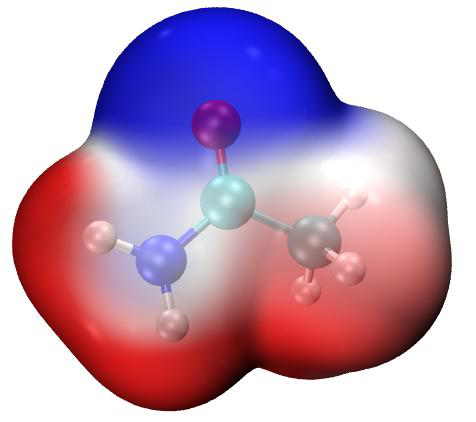

<!-- p.1134 -->


将被自动设为 0。这个技巧绝不会影响最终 ESP 着色的 vdW 表面图的质量，而由于完全跳过了对无关格点的 ESP 计算，计算耗时会显著降低。

4 同时在分子表面上显示 ESP 极值点 可以在图上叠加 ESP 表面极值点。要做到这一点，双击 ESPext.bat，它会完成 ESPpt.bat 所做的所有事情，但它还会输出 surfanalysis.pdb 并将其移动到 VMD 文件夹。该文件记录了所有表面极值点。然后启动 VMD，先输入命令 pt 或 iso 绘制相应的图，再输入 ext，此时就会激活 ESPext.vmd 以加载 surfanalysis.pdb，并将表面极值点渲染为小球。下图中左侧和右侧分别显示了 pt+ext 和 iso+ext 的组合效果。注意，为了使背面的 ESP 极值点可见，我已将电子密度等值面的材质改为了“透明(Transparent)”（即进入“图形(Graphics)”—“表示(Representation)”，切换到“density1.cub”，将“材质(Material)”改为“透明(Transparent)”。如果你想将其作为默认设置，请修改 ESPiso.vmd，把其中的“$id EdgyGlass”改为“id Transparent”）

在上图中，橙色和青色小球分别对应 vdW 表面上 ESP 极大值和极小值的位置。你也可以用图像编辑软件手动在极值点上标注 ESP 值，具体做法见 plotESPsurf.pdf 教程。获取某个极值点 ESP 值的一个简便方法是：按键盘上的“0”进入查询模式，点击某个小球的中心，其序号就会显示在控制台窗口中。假设序号为 3，你应在 VMD 控制台窗口中输入以下命令

[atomselect top "index 3"] get beta 然后就会显示 ESP 值。打印出的 ESP 的单位见 surfanalysis.pdb 的第一行。

正如我在 4.12.1 节中提到的，即使对于中性体系，也可能存在一些数值为正（负）的表面极小值（极大值），它们通常在化学上不重要，可以忽略。如果你不想在图上绘制它们，可以用 examples\drawESP\ESPext_noinsig.txt 的内容替换 ESPext.txt 的内容。与 ESPext.txt 相比，该文件多出的四行用于去除这些不重要的极值点。

5 绘制单体的 ESP 着色 vdW 表面穿透图 这里我用水四聚体来说明如何绘制这种图。本例所用的文件位于“examples\water_tetramer\fch”文件夹中。四个水分子的 Gaussian 输入文件分别为 1/2/3/4.gjf，它们的坐标直接从优化后的四聚体坐标中提取得到，四聚体坐标可在 complex.gjf 中找到。用 Gaussian 运行这些 .gjf 文件，你将得到 1/2/3/4.fch。注意已使用了 nosymm 关键词，否则单体的笛卡尔坐标将不再与 complex 中的坐标一致，因为


<!-- p.1135 -->


如果没有该关键词，Gaussian 会自动将体系放到标准取向。

将 1/2/3/4.fch 文件复制到含有 Multiwfn 可执行文件的文件夹，运行 ESPpt.bat，此时 Multiwfn 将被依次调用以计算这四个 .fch 文件，得到的 mol1/2/3/4.pdb 和 vtx1/2/3/4.pdb 会被自动移动到 VMD 文件夹。然后启动 VMD 并输入 pt2 以激活 ESPpt2.vmd 脚本，你会立即看到下图的左半部分。如果你运行的是 ESPiso.bat，然后在 VMD 中输入 iso2，则会激活 ESPiso2.vmd，基于导出的 density1/2/3/4.cub 和 ESP1/2/3/4.cub 绘制出下图的右半部分。

从上图可以清楚看到，由于氢键的形成，四个单体的 vdW 表面之间发生了相互穿透。此外，映射的颜色表明四聚体是以 ESP 正负互补的方式形成的，揭示了氢键的静电本质。

作为练习，请尝试用上述两种方式绘制鸟嘌呤-胞嘧啶二聚体的 ESP 着色 vdW 表面穿透图，两个单体的 .fch 文件可从 http://sobereva.com/multiwfn/extrafiles/GC_fch.rar 下载。注意，在绘图之前，你应手动删除 VMD 文件夹中之前为其它体系生成的 .pdb 和 .cub 文件。

6 提示：材质的调节 对于某些体系，用 iso 命令绘制的 ESP 着色图不太理想。例如，下图看起来很杂乱


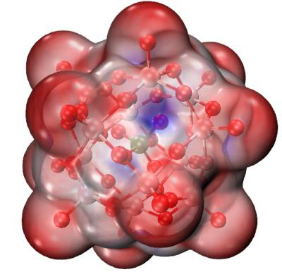

<!-- p.1136 -->


在这种情况下，你可以进入“图形(Graphics)”—“材质(Materials)”，选择当前用于表示表面的“EdgyGlass”，然后调节其中的各项设置，尤其是“不透明度(Opacity)”。如果我们改成下面的设置，你会发现 vdW 表面上 ESP 的差异现在可以区分得更清楚了。

7 提示：为非常巨大的体系绘制 ESP 映射的 vdW 表面 有时我们需要为由数百个原子组成的体系绘制 ESP 映射的表面，在这种情况下，即使使用 DFT 以 6-31G* 做单点计算也非常昂贵或计算上不可行。对于这种情况，我建议的步骤如下：

- 通过 Grimme 的 xtb 程序（https://github.com/grimme-lab/xtb/）进行单点任务或优化任务。xtb 的所有计算都基于 GFN-xTB 理论，可以将其视为 DFT 的半经验版本。应使用 --molden 参数使 xtb 输出 Molden 输入文件（molden.input）。由于 xtb 速度极快，即使对于由数百个原子组成的体系，在个人电脑上单点任务也不超过 1 分钟即可完成。

- 将 molden.input 载入 Multiwfn，然后用主功能 100 的子功能 2 导出 .fch 文件（例如 xtb.fch）。

- 确保 `settings.ini` 中的“cubegenpath”已正确设置。确保你已定义 GAUSS_MEMDEF 环境变量，细节见 5.7 节。

- 将 xtb.fch 载入 Multiwfn，用主功能 5 依次计算电子密度和 ESP 的格点数据并导出 cube 文件，导出的 density.cub 和 totesp.cub 应手动重命名为 density1.cub 和 ESP1.cub。注意，由于体系较大，应使用“高质量格点(High-quality grid)”。ESP 的计算相对耗时，例如，使用常见的 Intel 4 核 CPU，对一个含 336 个原子的体系需要半小时。

- 将 density1.cub 和 ESP1.cub，以及前面提到的 examples\drawESP\ 中的 ESPiso.vmd 移动到 VMD 文件夹。

- 启动 VMD，在 VMD 控制台窗口中输入 source ESPiso.vmd。现在你就可以看到 ESP 着色的 vdW 表面图。我建议你也如前所述适当调节材质设置。下面是一个含有 336 个原子的体系。


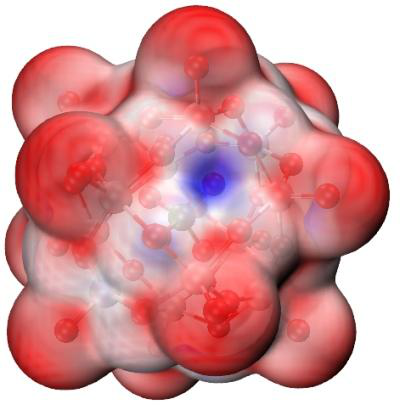

<!-- p.1137 -->


即使你只有一台 4 核的个人电脑，从结构文件出发得到上图的总耗时也不超过 1 小时。而如果你有一台数十核的服务器，10 分钟内即可得到该图。

值得注意的是，尽管 xtb 程序速度极快，但基于 xtb 波函数得到的 ESP 质量通常是令人满意的。据我的测试，基于 xtb 波函数生成的 ESP 着色分子表面图与基于高质量 B3LYP/def2-TZVP 波函数的结果之间没有明显差别。

关于该主题的更多信息可在我的文章“为巨大体系快速绘制静电势着色范德华表面”（中文，http://sobereva.com/481）中找到。

8 其它值得注意的事项 可以在图上添加 ESP 的颜色条，见该视频结尾附近的说明：https://youtu.be/QFpDf_GimA0。

我强烈建议读者查看 .bat、.txt 和 .vmd 文件的内容，以弄清它们是如何工作的。可以看到，ESPpt.bat 和 ESPiso.bat 最多只能处理四个 .fch 文件（1/2/3/4.fch），你也可以将它们扩展到更多分子。在 ESPpt2.vmd 和 ESPiso2.vmd 中，变量“nsystem”被设为 4，即最多会加载并绘制 mol4.pdb&vtx4.pdb 和 density4.cub&ESP4.cub，显然如果你想用这些绘图脚本同时绘制更多单体，应增大“nsystem”。

值得注意的是，ESPpt.txt 中的数值 0.15 是定量分子表面分析中的格点间距；如果你增大它，表面顶点会变得更稀疏，计算耗时会降低。ESPiso.txt 中的默认命令对应于对电子密度使用高质量格点而对 ESP 使用低质量格点（为了节省计算耗时的目的），这种组合适合大多数体系，但对于极大的体系，你可能需要修改该文件，以便分别对电子密度和 ESP 使用更好质量的格点，否则得到的等值面可能不光滑，映射的颜色可能模糊。

为了获得更好的图形效果，建议用户手动改变颜色标尺的下限和上限，以便 vdW 表面上 ESP 的变化能尽可能清楚地用颜色表示。对于带电体系，默认的颜色标尺必须更改，否则 vdW 表面会是单色的。对于这些体系，你应载入输入文件，进入主功能 12，选择选项 1 对 ESP 做定量分子表面分析，将 ESP 的全局最小值和最大值复制到设置颜色标尺的文本框中，如下所示，


<!-- p.1138 -->


然后按回车(ENTER)按钮使设置生效。

注意：如果图是用 ESPiso.bat 绘制的，你应取 a.u. 单位的 ESP 值，然后将其设为颜色标尺。然而，如果图是用 ESPpt.bat 绘制的，你应用文本编辑器打开 VMD 文件夹中的 vtx1.pdb，前几行清楚地指明了该文件中使用的单位，你应从 Multiwfn 控制台窗口读取该单位下的 ESP 值并设置颜色标尺。

如果你在使用 iso 或 iso2 命令绘制 ESP 图时更喜欢用 eV 而不是 a.u. 作为 ESP 单位，你在上述流程中应用“examples\drawESP”文件夹中的 ESPiso_eV.bat 和 ESPiso_eV.txt 分别代替 ESPiso.bat 和 ESPiso.txt，并手动编辑 ESPiso.vmd 和 ESPiso2.vmd 文件，去掉“set colorlow -0.8”和“set colorhigh 0.8”这两行前面的 # 号。在这种情况下，.cub 文件中的 ESP 数据将以 eV 为单位，颜色标尺默认下限和上限分别为 -0.8 和 0.8 eV。按照上述 YouTube 教程视频绘制的颜色条也将以 eV 为单位。

在极端带电体系（如 DNA）的情况下，当使用 ESPpt.bat 时，B-factor 列可能无法正确记录映射的 ESP 值，因为其数值太大。在这种情况下，你应用“examples\drawESP”文件夹中的 ESPpt_pqr.bat、ESPpt_pqr.txt、ESPpt_pqr.vmd 和 ESPext_pqr.vmd 分别代替上述提到的 ESPpt.bat、ESPpt.txt、ESPpt.vmd 和 ESPext.vmd，此时将用 .pqr 文件的“电荷(Charge)”列代替 .pqr 文件的 B-factor 列来记录数据，前者可记录大得多范围的数据，且单位恒为 a.u.。还要注意，不再需要 ESPext.txt 和 ESPext.bat，因为当你使用 ESPpt_pqr.bat 时，extrema1.pqr 也会被导出并移动到 VMD 文件夹。

9 在 Linux 下绘制 ESP 着色 vdW 图 上述方法也可用于 Linux（可能也包括 MacOS）环境。在“examples\drawESP”文件夹中，你可以找到 ESPiso.sh、ESPpt.sh 和 ESPext.sh，它们是上述 .bat 文件对应的 Linux 脚本。

例如，你想用 ESPiso.sh 为 cosplay.fchk 绘制 ESP 着色 vdW 表面，你需要做的是

- 严格按照 2.1.2 节安装 Multiwfn。以通常方式安装 VMD
- 将“examples\drawESP”中的 ESPiso.sh、ESPiso.txt 和 ESPiso.vmd 复制到工作目录

- 将 cosplay.fchk 复制到工作目录
- 编辑 ESPiso.sh，把其中的 1.fchk 改为 cosplay.fchk
- 进入工作目录，运行 chmod +x ./ESPiso.sh，然后运行 ./ESPiso.sh。（然后你


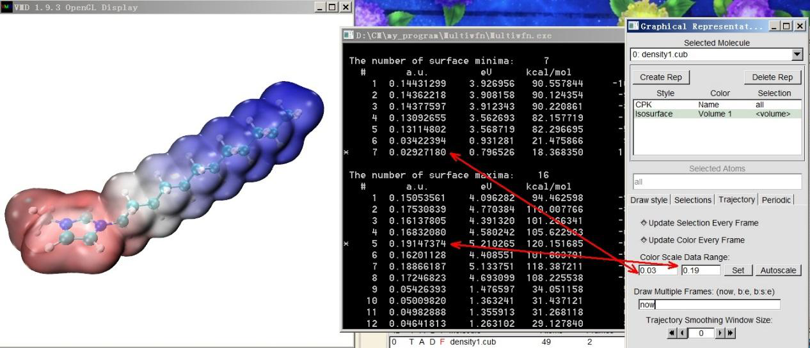

<!-- p.1139 -->


可能会看到诸如“File not found”和“No such file or directory”之类的错误提示。它们是无害的，直接忽略即可）

- 输入 vmd 以启动 VMD，然后在 VMD 控制台窗口中输入 source ESPiso.vmd 以绘制图形


### 4.A.14 用 VMD 脚本非常轻松地将 cube 文件渲染为一流水平的等值面


### 图

注：本教程的中文版为 http://sobereva.com/483，它比本节包含更多的讨论和例子。

简介 尽管在大多数情况下，Multiwfn 直接绘制的等值面图已经令人满意，但若用 VMD 来渲染等值面可获得更好的效果。VMD 可从 http://www.ks.uiuc.edu/Research/vmd/ 免费获得。事实上，在 4.5.5 节我已举例说明了如何基于 Multiwfn 产生的 cube 文件绘制等值面图，但步骤有些繁琐，且效果达不到一流水平。在本节，我将展示用 VMD 脚本仅需很少步骤即可绘制非常高质量等值面图的方法。本节方法仅适用于 Windows 平台，但你也许也能找到办法使其在 Linux 下工作。

VMD 脚本为 examples\scripts\showcub.vmd。在使用之前，你应将其移动到 VMD 文件夹，并在 VMD 文件夹中的 vmd.rc 文件里加一行 source showcub.vmd，这样启动 VMD 后该文件中的四个自定义命令就可用了。这些命令说明如下。

➢ cub 和 cubiso：用于显示单个 cube 文件。用法示例：cub DD：把当前文件夹中的 DD.cub 绘制为等值面图，正负部分分别以默认等值 0.05 和 -0.05 显示为绿色和蓝色。

cubiso 0.02：将正负两部分的等值都改为 0.02。cub DD 0.02：相当于先用 cub DD 再用 cubiso 0.02。➢ cub2 和 cub2iso：用于同时显示两个 cube 文件。用法示例：cub2 f+ f-：将当前文件夹中的 f+.cub 和 f-.cub 分别绘制为绿色和蓝色等值面。注意只会显示 cube 的正值部分。

cub2iso 0.02：将两个等值面的等值都改为 0.02。cub2 f+ f- 0.02：相当于先用 cub2 f+ f- 再用 cub2iso 0.02。在用上述命令于 VMD 图形窗口中显示等值面后，你可用 examples\scripts 文件夹中的批处理文件 VMDrender_full.bat 或 VMDrender_noshadow.bat 调用 Tachyon 渲染以获得更好的效果，稍后会举例说明。两者的区别在于前者开启了阴影效果而后者关闭了阴影效果。

接下来，我将给出两个实际例子。在跟随操作之前，请复制上述两个 .bat 文件和 showcub.vmd 到 VMD 文件夹，并正确设置 vmd.rc。我使用的 VMD 版本是 1.9.3。

例 1：C4H8 单重态双自由基的自旋布居图 启动 Multiwfn 并输入 examples\C4H8.wfn // C4H8 单重态双自由基的 .wfn 文件


<!-- p.1140 -->


!!! terminal "Multiwfn 交互"

    - **5** — 计算格点数据
    - **5** — 自旋布居
    - **3** — 高质量格点
    - **2** — 把格点数据导出为当前文件夹中的 spindensity.cub 现在，把 spindensity.cub 移动到 VMD 文件夹，启动 VMD 并在 VMD 控制台窗口中输入 cub spindensity 0.01，你会看到等值为 0.01 的该 cube 文件的等值面图已显示在图形窗口中。

为了获得更好的效果，在 VMD 中选择“文件(File)”—“渲染(Render)”—“Tachyon”，然后点击“开始渲染(Start Rendering)”，你会发现 VMD 文件夹中出现了 vmdscene.dat。现在双击 VMDrender_full.bat，它将以 vmdscene.dat 作为 Tachyon 渲染的输入文件，在当前文件夹中生成名为 full.bmp 的图像文件。得到的图形如下所示，质量显然非常好！

例 2：NH2-联苯-NO2 的空穴-电子图 4.18.1 节中介绍的空穴-电子分析在理解电子激发本质方面极为有用。尽管 Multiwfn 可以在内置 GUI 窗口中直接同时绘制空穴和电子分布，但借助 VMD 可以获得好得多的效果。

我仍以 4.18.1 节中分析的 NH2-联苯-NO2 为例，我们将通过 VMD 绘制 S0→S2 跃迁的空穴和电子的等值面

图。为此，启动 Multiwfn 并输入

!!! terminal "Multiwfn 交互"

    - **examples\excit\D-pi-A.fchk 18** — 电子激发分析 1
    - **空穴-电子分析 examples\excit\D-pi-A.out 2** — 研究基态（S0）与第二激发态（S2）之间的激发
    - **1** — 计算空穴、电子等的分布以及各种指数
    - **3** — 高质量格点 计算完成后，依次选择选项 10 和 11，将空穴和电子的格点数据分别导出为当前文件夹中的 hole.cub 和 electron.cub。然后将它们移动到 VMD 文件夹，启动 VMD 并输入 cub2 electron hole。你会发现没有显示等值面，这是因为默认等值（0.05）不适合该格点数据。我们用 cub2 命令测试不同的等值，最终发现输入 cub2 0.005 后图形效果令人满意，即等值面能充分表现空穴和电子的分布特征。当前 VMD 图形窗口中显示的图形如下所示，绿色和蓝色分别对应电子和空穴。


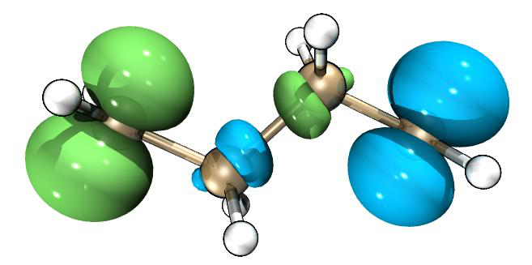

<!-- p.1141 -->


当前效果已经不错，但空穴和电子之间的重叠特征还不能清楚辨认。为了改善效果，我们进入“图形(Graphics)”—“表示(Representation)”，将“材质(Material)”设为“EdgyGlass”，然后在“所选分子(Selected Molecules)”中选择“electron.cub”，也将其“材质(Material)”设为“EdgyGlass”。接着选择“文件(File)”—“渲染(Render)”—“Tachyon”，然后点击“开始渲染(Start Rendering)”。如果这次直接用 VMDrender_full.bat 来渲染图形，你会发现图形太暗。为了获得最佳效果，我们用文本编辑器打开 VMDrender_full.bat，把其中的“-trans_raster3d”改为“-trans_vmd”，再添加一个参数“-shadow_filter_off”。最后，执行该 .bat 文件得到 full.bmp，如下所示，效果非常完美！（注：我用 Photoshop 将图形亮度提高了 20）


### 4.A.15 计算信息论量及一些相关


### 量

刘述斌教授提出了许多信息论量并将其应用于各种化学问题，得到了许多有价值的发现。Multiwfn 能够计算所有的信息论量。在 Multiwfn 网站的“资源(Resources)”页面有一篇文档“用 Multiwfn 计算信息论量及一些相关量”专门介绍如何用 Multiwfn 计算这些量，请查阅。


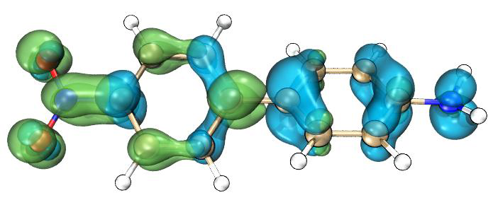
