# Multiwfn 官方手册（PDF 转 Markdown）
> 来源：`Multiwfn_manual_2026.10.1.pdf`，共 1161 页，由 PyMuPDF 直接提取（可复制文本）。等宽终端输出保留为代码块，独立显示公式渲染为图片，行内公式保留原文字符。
## 目录（来自 PDF 书签）
- !!!!!!!!!! ALL USERS MUST READ !!!!!!!!!!（p.2）
- Linux and Mac OS USERS MUST READ（p.3）
- 1  Overview（p.22）
- 2  General information（p.31）
  - 2.1 Install（p.31）
    - 2.1.1 Windows version（p.31）
    - 2.1.2 Linux version（p.31）
    - 2.1.3 Mac OS version（p.32）
  - 2.2 Using Multiwfn（p.33）
  - 2.3 Files of Multiwfn（p.34）
  - 2.4 Parallel implementation（p.34）
  - 2.5 Input files and wavefunction types（p.34）
  - 2.6 Real space functions（p.41）
  - 2.7 User-defined real space function（p.54）
  - 2.8 Graphic formats and image size（p.70）
  - 2.9 Analysis of periodic systems（p.70）
    - 2.9.1 Wavefunction analysis on wavefunction of cluster model（p.70）
    - 2.9.2 Wavefunction analysis on periodic wavefunction（p.72）
    - 2.9.2.1 Generating .molden wavefunction file（p.72）
    - 2.9.2.2 Functions available for analyzing periodic wavefunction（p.73）
    - 2.9.2.3 Related parameters for analyzing periodic wavefunctions（p.74）
    - 2.9.3 Other kinds of analyses on periodic systems（p.75）
    - 2.9.4 Files that can provide cell information to Multiwfn（p.76）
- 3  Functions（p.77）
  - 3.2 Showing molecular structure and viewing orbitals / isosurfaces (0)（p.77）
  - 3.3 Outputting all properties at a point (1)（p.80）
  - 3.4 Outputting and plotting specific property in a line (3)（p.81）
  - 3.5 Outputting and plotting specific property in a plane (4)（p.82）
    - 3.5.1 Graph types（p.82）
    - 3.5.2 Setting up grid, plane and plotting region（p.87）
    - 3.5.3 Options in post-processing interface（p.90）
    - 3.5.4 Setting up contour lines（p.90）
    - 3.5.5 Plot critical points, paths and interbasin paths on plane graph（p.91）
  - 3.6 Outputting and plotting specific property within a spatial region (5)（p.93）
  - 3.7 Custom operation, promolecular and deformation properties (options 0, -1, -2 in main functions 3, 4, 5)（p.97）
    - 3.7.1 Custom operation for multiple wavefunctions (0)（p.97）
    - 3.7.2 Promolecular and deformation properties (-1, -2)（p.98）
    - 3.7.3 Generation of atomic wavefunctions（p.98）
    - 3.7.4 Sphericalization of atom wavefunction（p.99）
  - 3.8 Checking & modifying wavefunction (6)（p.100）
  - 3.9 Population analysis and calculation of atomic charges (7)（p.103）
    - 3.9.1 Hirshfeld atomic charge (1)（p.104）
    - 3.9.2 Voronoi deformation density (VDD) atom population (2)（p.105）
    - 3.9.3 Mulliken atom & basis function population analysis (5)（p.105）
    - 3.9.4 Löwdin atom & basis function population (6)（p.107）
    - 3.9.5 Modified Mulliken atom population defined by Ros & Schuit (SCPA) (7)（p.107）
    - 3.9.6 Modified Mulliken atom population defined by Stout & Politzer (8)（p.108）
    - 3.9.7 Modified Mulliken atom population defined by Bickelhaupt (9)（p.108）
    - 3.9.8 Becke atomic charge with atomic dipole moment correction (10)（p.109）
    - 3.9.9 Atomic dipole moment corrected Hirshfeld atomic charges (ADCH, 11)（p.109）
    - 3.9.10 CHELPG (Charges from electrostatic potentials using a grid-based method) ESP fitting atomic charge (12)（p.111）
    - 3.9.11 Merz-Kollmann (MK) ESP fitting atomic charge (13)（p.114）
    - 3.9.12 AIM atomic charge (14)（p.115）
    - 3.9.13 Hirshfeld-I atomic charge (15)（p.115）
    - 3.9.14 CM5 and 1.2*CM5 atomic charge (16, -16)（p.118）
    - 3.9.15 Electronegativity Equalization Method (EEM) atomic charge (17)（p.120）
    - 3.9.16 Restrained ElectroStatic Potential (RESP) atomic charge (18)（p.122）
      - 3.9.16.1 Theory（p.122）
      - 3.9.16.2 Usage and some details（p.127）
    - 3.9.17 PEOE (Partial equalization of orbital electronegativity) or Gasteiger charge (19)（p.130）
    - 3.9.18 Minimal Basis Iterative Stockholder (MBIS) charge (20)（p.132）
    - 3.9.19 Constrained MBIS (cMBIS), elliptical MBIS (EMBIS), asymmetric elliptical MBIS (AEMBIS) (21, 22, 23)（p.134）
  - 3.10 Orbital composition analysis (8)（p.134）
    - 3.10.1 Output basis function, shell and atom composition in a specific orbital by Mulliken, Stout-Politzer and SCPA approaches (1, 2, 3)（p.135）
    - 3.10.2 Define fragments 1 and 2 (-1, -2)（p.136）
    - 3.10.3 Output composition of fragment 1 and inter-fragment composition by Mulliken, Stout-Politzer and SCPA approaches (4, 5, 6)（p.137）
    - 3.10.4 Orbital composition analysis by natural atomic orbital approach (7)（p.137）
    - 3.10.5 Calculate atom and fragment contributions by Hirshfeld or Hirshfeld-I method (8,10)（p.139）
    - 3.10.6 Calculate atom and fragment contributions by Becke method (9)（p.139）
    - 3.10.7 Calculate atom and fragment contributions by AIM method (11)（p.140）
    - 3.10.100 Evaluate oxidation state by LOBA and mLOBA method (100)（p.140）
  - 3.11 Bond order analysis (9)（p.141）
    - 3.11.1 Mayer bond order analysis (1)（p.141）
    - 3.11.2 Multi-center bond order analysis (2, -2, -3)（p.142）
    - 3.11.3 Wiberg bond order analysis in Löwdin orthogonalized basis (3)（p.147）
    - 3.11.4 Mulliken bond order analysis (4) and decomposition (5)（p.148）
    - 3.11.5 Orbital occupancy-perturbed Mayer bond order (6)（p.148）
    - 3.11.6 Fuzzy bond order (7)（p.149）
    - 3.11.7 Laplacian bond order (8)（p.149）
    - 3.11.8 Decompose Wiberg bond order in NAO basis as atomic orbital pair contributions (9)（p.150）
    - 3.11.9 Intrinsic bond strength index (IBSI) (10)（p.151）
    - 3.11.10 AV1245 index (approximate multi-center bond order for large rings) and AVmin（p.152）
    - 3.11.12 Delocalization index (DI) between AIM basins（p.154）
  - 3.12 Plotting density-of-states (DOS), photoelectron spectrum (PES), and COHP (10)（p.155）
    - 3.12.1 Theory（p.155）
    - 3.12.2 Input file（p.157）
    - 3.12.3 Options for plotting DOS and basic usage（p.158）
    - 3.12.4 Local DOS（p.160）
    - 3.12.5 Photoelectron spectrum（p.160）
    - 3.12.6 COHP（p.162）
  - 3.13 Plotting IR, Raman, UV-Vis, ECD, VCD, ROA and NMR spectra (11)（p.163）
    - 3.13.1 Theory（p.164）
    - 3.13.2 Input file（p.167）
    - 3.13.3 Usage and options（p.171）
    - 3.13.4 Plotting multiple systems together and weighted spectrum（p.173）
    - 3.13.5 Plotting NMR spectrum（p.174）
    - 3.13.6 Partial vibrational spectrum (PVS) and partial vibrational density-of-states (PVDOS)（p.177）
      - 3.13.6.1 Theory（p.177）
      - 3.13.6.2 Usage（p.180）
    - 3.13.7 Predicting color based on UV-Vis spectrum curve（p.181）
  - 3.14 Topology analysis (2)（p.183）
    - 3.14.1 Theory（p.183）
    - 3.14.2 Search critical points（p.185）
    - 3.14.3 Generate topology paths（p.188）
    - 3.14.4 Generate interbasin surfaces（p.189）
    - 3.14.5 Visualize, analyze, modify and export results（p.190）
    - 3.14.6 Calculate the aromaticity indices based on topology properties of electron density（p.191）
  - 3.15 Quantitative analysis of molecular surface (12)（p.192）
    - 3.15.1 Theory（p.192）
    - 3.15.2 Numerical algorithm（p.197）
      - 3.15.2.1 Analysis on the whole molecular surface（p.197）
      - 3.15.2.2 Analysis on local molecular surface（p.198）
    - 3.15.3 Parameters and options（p.200）
    - 3.15.4 Options in post-processing menu（p.203）
    - 3.15.5 Special topic: Hirshfeld and Becke surface analyses（p.207）
  - 3.16 Processing grid data (13)（p.210）
    - 3.16.0 Visualize isosurface of present grid data (-2)（p.210）
    - 3.16.1 Export present grid data to Gaussian-type cube file (0)（p.210）
    - 3.16.2 Output all data points with value and coordinate (1)（p.210）
    - 3.16.3 Output data points in a XY/YZ/XZ plane (2, 3, 4)（p.210）
    - 3.16.4 Output average data of XY/YZ/XZ planes in a range of Z/X/Y (5, 6, 7)（p.211）
    - 3.16.5 Output data points in a plane defined three atom indices or three points (8, 9)（p.211）
    - 3.16.6 Output data points in specified value range (10)（p.211）
    - 3.16.7 Grid data calculation (11)（p.211）
    - 3.16.8 Map values of a cube file to specified isosurface of present grid data (12)（p.212）
    - 3.16.9 Set value of the grid points that far away from / close to some atoms (13)（p.212）
    - 3.16.10 Set value of the grid points outside overlap region of two fragments (14)（p.213）
    - 3.16.11 If data value is within certain range, set it to a specified value (15)（p.213）
    - 3.16.12 Scale data range of present grid data (16)（p.213）
    - 3.16.13 Show statistic data of grid points in specific spatial and value ranges (17)（p.214）
    - 3.16.14 Plot (local) integral curve and plane-averaged curve in X/Y/Z direction (18)（p.214）
    - 3.16.15 Translate grid data within current box (19)（p.216）
    - 3.16.16 Duplicate grid data periodically (20)（p.217）
  - 3.17 Adaptive natural density partitioning (AdNDP) analysis (14)（p.217）
    - 3.17.1 Theory（p.217）
    - 3.17.2 Input file（p.219）
    - 3.17.3 Options（p.220）
  - 3.18 Fuzzy atomic space analysis (15)（p.222）
    - 3.18.0 Basic concepts（p.222）
    - 3.18.1 Integration of a real space function in fuzzy atomic spaces (1)（p.226）
    - 3.18.2 Integration of a real space function in overlap spaces (8)（p.226）
    - 3.18.3 Atomic and molecular multipole moments and <r2> (2)（p.227）
    - 3.18.4 Atomic overlap matrix and fragment overlap matrix (3, 33)（p.229）
    - 3.18.5 Localization index (LI) and delocalization index (DI) (4, 44)（p.230）
      - 3.18.5.1 Theoretical background（p.230）
      - 3.18.5.2 Usage（p.234）
    - 3.18.6 Para-delocalization index (PDI) (5)（p.234）
    - 3.18.7 Aromatic fluctuation index (FLU) and FLU-π (6,7)（p.235）
    - 3.18.8 Condensed linear response kernel (CLRK) (9)（p.236）
    - 3.18.9 Para linear response index (PLR) (10)（p.237）
    - 3.18.10 Multi-center delocalization index (11)（p.237）
    - 3.18.11 Information-theoretic aromaticity index (12)（p.237）
    - 3.18.12 Atomic effective volume, free volume, polarizability and C6 coefficient (13)（p.238）
  - 3.19 Charge decomposition analysis and plotting orbital interaction diagram (16)（p.240）
    - 3.19.1 Theory（p.240）
    - 3.19.2 Input file（p.243）
    - 3.19.3 Usage（p.244）
  - 3.20 Basin analysis (17)（p.247）
    - 3.20.1 Theory（p.247）
    - 3.20.2 Numerical aspects（p.248）
    - 3.20.3 Usage（p.251）
  - 3.21 Electron excitation analysis (18)（p.257）
    - 3.21.A Basic information about electron excitation analysis module（p.257）
      - 3.21.A.1 Overview（p.257）
      - 3.21.A.2 Basic knowledge about single-reference methods（p.258）
      - 3.21.A.3 Input files（p.258）
    - 3.21.0 Check, modify and export configuration coefficients of an excitation (-1)（p.262）
    - 3.21.1 Analyze and visualize hole&electron distribution, transition density, and transition electric/magnetic dipole moment density (1)（p.263）
      - 3.21.1.1 Theory（p.263）
      - 3.21.1.2 Usage and Functions（p.271）
    - 3.21.2 Plot atom/fragment transition matrix of various kinds as heat map (2)（p.274）
    - 3.21.4 Calculate ∆r index to measure charge-transfer length (4)（p.278）
    - 3.21.3 Analyze charge-transfer based on density difference grid data (3)（p.279）
    - 3.21.5 Calculate transition electric/magnetic dipole moments between all states and for each state (5)（p.281）
    - 3.21.6 Generate natural transition orbitals (NTOs) (6)（p.284）
    - 3.21.7 Calculate ghost-hunter index (7)（p.285）
    - 3.21.8 Calculate interfragment charge transfer in electron excitation via IFCT method (8)（p.287）
    - 3.21.9 Generate and export transition density matrix (9)（p.290）
    - 3.21.10 Decompose transition electric/magnetic dipole moment as molecular orbital pair contributions (10)（p.292）
    - 3.21.11 Decompose transition electric/magnetic dipole moment as basis function and atom contributions (11)（p.293）
    - 3.21.12 Calculate Mulliken atomic transition charges (12)（p.294）
    - 3.21.13 Generate natural orbitals of specific excited states (13)（p.295）
    - 3.21.14 Calculate Λ index to characterize electron excitation (14)（p.296）
    - 3.21.15 Print major MO transitions in all excited states（p.297）
    - 3.21.16 Charge-transfer spectrum (CTS) analysis（p.298）
    - 3.21.17 Electron density polarization analysis based on electron excitations（p.300）
    - 3.21.18 Calculate ECD/CPL dissymmetry factor (g) for chiral systems（p.303）
  - 3.22 Orbital localization analysis (19)（p.305）
  - 3.23 Visual study of weak interaction (20)（p.310）
    - 3.23.1 Noncovalent interaction (NCI) analysis (1)（p.310）
    - 3.23.2 NCI analysis based on promolecular density (2)（p.319）
    - 3.23.3 Averaged NCI analysis (aNCI. 3)（p.320）
    - 3.23.4 Density Overlap Regions Indicator (DORI) analysis (5)（p.322）
    - 3.23.5 Independent Gradient Model (IGM) analysis based on promolecular density (10)（p.322）
    - 3.23.6 IGM analysis based on Hirshfeld partition of molecular density (IGMH) (11)（p.328）
    - 3.23.7 Visualization of van der Waals potential (6)（p.329）
    - 3.23.8 Interaction region indicator (IRI) and IRI-pi analysis (4)（p.330）
    - 3.23.9 Averaged independent gradient model (aIGM) analysis (12)（p.331）
    - 3.23.10 Modified IGM (mIGM) analysis (-10)（p.332）
    - 3.23.11 Averaged modified IGM (amIGM) analysis (-12)（p.332）
  - 3.24 Energy decomposition analysis (21)（p.333）
    - 3.24.1 Energy decomposition analysis based on molecular forcefield (EDA-FF)（p.333）
    - 3.24.2 Shubin Liu's energy decomposition（p.337）
    - 3.24.3 SobEDA and sobEDAw energy decomposition analyses（p.339）
    - 3.24.4 Analysis of atomic contribution to dispersion energy（p.339）
  - 3.25 Conceptual density functional theory (CDFT) analysis (22)（p.341）
    - 3.25.1 Theory（p.341）
    - 3.25.2 Usage（p.345）
    - 3.25.3 Special topic 1: Orbital-weighted Fukui function and dual descriptor（p.346）
    - 3.25.4 Special topic 2: (Quasi-)degenerate Fukui function and dual descriptor based on electron density（p.348）
      - 3.25.4.1 Closed-shell case（p.348）
      - 3.25.4.2 Open-shell case（p.349）
    - 3.25.5 Special topic 3: Nucleophilic and electrophilic superdelocalizabilities（p.350）
    - 3.25.6 Special topic 4: Dual delocalization descriptor（p.352）
  - 3.26 Extended Transition State - Natural Orbitals for Chemical Valence (ETS-NOCV) analysis (23)（p.354）
    - 3.26.1 Theory（p.354）
    - 3.26.2 Implementation details（p.357）
    - 3.26.3 Usage（p.359）
  - 3.27 (Hyper)polarizability analysis (24)（p.361）
    - 3.27.1 Parse output of (hyper)polarizability task of Gaussian and evaluate relevant quantities（p.361）
    - 3.27.2 Study (hyper)polarizability by sum-over-states (SOS) method and two- or three-level model analyses（p.367）
      - 3.27.2.1 Calculation of (hyper)polarizability（p.367）
      - 3.27.2.2 Two-level and three-level model analyses for hyperpolarizability（p.370）
    - 3.27.3 Study (hyper)polarizability density（p.372）
    - 3.27.5 Visualize (hyper)polarizability via unit sphere and vector representations（p.374）
  - 3.28 Electron delocalization and aromaticity analyses (25)（p.377）
    - 3.28.3 Generate iso-chemical shielding surfaces (ICSS) and related quantities（p.377）
    - 3.28.4 Obtain NICSZZ value for non-planar or tilted system（p.378）
    - 3.28.6 Calculate HOMA and Bird aromaticity index（p.380）
    - 3.28.7 HOMAc and HOMER（p.381）
    - 3.28.13 NICS-1D scan curve map, integral NICS (INICS) and FiPC-NICS（p.382）
    - 3.28.14 NICS-2D scan plane map（p.383）
  - 3.100 Other functions, part 1 (100)（p.384）
    - 3.100.1 Draw scatter graph between two functions and generate their cube files（p.384）
    - 3.100.2 Export various files or generate input file of quantum chemistry programs（p.385）
    - 3.100.3 Calculate molecular van der Waals volume（p.386）
    - 3.100.4 Integrate a function over the whole space（p.387）
    - 3.100.5 Show overlap integral between alpha and beta orbitals（p.388）
    - 3.100.6 Monitor SCF convergence process of Gaussian（p.389）
    - 3.100.8 Generate Gaussian input file with initial guess combined from fragment wavefunctions（p.390）
    - 3.100.9 Evaluate interatomic connectivity and atomic coordination number（p.392）
    - 3.100.11 Calculate overlap and centroid distance between two orbitals（p.393）
    - 3.100.12 Biorthogonalization between alpha and beta orbitals（p.394）
    - 3.100.14 Calculate LOLIPOP (LOL Integrated Pi Over Plane)（p.396）
    - 3.100.15 Calculate intermolecular orbital overlap（p.397）
    - 3.100.17 Generate Fock/KS matrix based on orbital energies and coefficients（p.398）
    - 3.100.18 Yoshizawa's electron transport route analysis（p.399）
    - 3.100.19 Generate new wavefunction by combining fragment wavefunctions（p.401）
    - 3.100.20 Calculate Hellmann-Feynman forces（p.401）
    - 3.100.21 Calculate properties based on geometry information for specific atoms（p.402）
    - 3.100.22 Detect π orbitals, set occupation numbers and calculate π composition（p.405）
    - 3.100.23 Fit function distribution to atomic value（p.408）
  - 3.200 Other functions, part 2 (200)（p.409）
    - 3.200.1 Calculate core-valence bifurcation (CVB) index and related quantities（p.409）
    - 3.200.2 Calculate atomic and bond dipole moments in Hilbert space（p.414）
    - 3.200.3 Generate cube file for multiple orbital wavefunctions（p.416）
    - 3.200.5 Plot radial distribution function for a real space function（p.416）
    - 3.200.6 Analyze correspondence between orbitals in two wavefunctions（p.417）
    - 3.200.9 Calculate average bond length and average coordinate number（p.418）
    - 3.200.10 Output various kinds of integral between orbitals（p.419）
    - 3.200.11 Calculate center, first/second moments, radius of gyration, and <r^2> of a function（p.420）
    - 3.200.12 Calculate energy index (EI) or bond polarity index (BPI)（p.422）
    - 3.200.13 Evaluate orbital contributions to density difference or other grid data（p.422）
    - 3.200.14 Domain analysis (obtaining properties within isosurfaces of a function)（p.425）
    - 3.200.15 Calculate electron correlation index（p.427）
    - 3.200.16 Generate natural orbitals, natural spin orbitals (NSO) and spin natural orbitals (SNO) based on the density matrix in .fch/.fchk file（p.427）
    - 3.200.17 Calculate Coulomb and exchange integral between two orbitals（p.429）
    - 3.200.18 Calculate bond length/order alternation (BLA/BOA) and angle/dihedral alternation（p.430）
    - 3.200.19 Calculate spatial delocalization index (SDI) for orbitals or a function（p.432）
    - 3.200.20 Bond order density (BOD) and natural adaptive orbital (NAdO) analyses（p.433）
    - 3.200.21 Perform Löwdin orthogonalization between occupied orbitals（p.437）
  - 3.300 Other functions, part 3 (300)（p.437）
    - 3.300.1 Viewing free regions and calculating free volume in a cell（p.437）
    - 3.300.2 Fitting atomic radial density as linear combination of multiple STOs or GTFs（p.439）
      - 3.300.2.1 Algorithm and technical details（p.440）
      - 3.300.2.2 Usage（p.443）
    - 3.300.4 Simulating scanning tunneling microscope (STM) image（p.445）
    - 3.300.5 Calculate electric dipole/multipole moments and electronic spatial extent（p.448）
    - 3.300.6 Calculate energies of present orbitals by inputting Fock matrix（p.450）
    - 3.300.7 Geometry relevant operations on the present system（p.450）
    - 3.300.8 Plot surface distance projection map（p.454）
    - 3.300.9 Determine Fermi level（p.455）
- 4  Tutorials and Examples（p.458）
  - Prologue and generation of input files（p.458）
  - 4.0 View orbitals and structure（p.461）
    - 4.0.1 Viewing molecular orbitals of cycloheptatriene（p.461）
    - 4.0.2 Viewing natural bond orbitals (NBO) of ethanol（p.463）
    - 4.0.3 Using Multiwfn + VMD to rapidly plot high-quality orbital isosurface map（p.465）
  - 4.1 Calculate properties at a point（p.468）
    - 4.1.1 Show all properties of triplet water at a given point（p.468）
    - 4.1.2 Calculate ESP at nuclear positions to evaluate interaction strength of H2O∙∙∙HF（p.470）
  - 4.2 Topology analysis（p.472）
    - 4.2.1 Atoms-in-molecules (AIM) topology analysis and aromaticity analysis for 2-pyridoxine 2-aminopyridine（p.472）
    - 4.2.2 Topology analysis of localized orbital locator (LOL) for acetic acid（p.478）
    - 4.2.3 Plot real space function along bond path（p.481）
    - 4.2.4 Decompose properties at a critical point as orbital contributions（p.482）
    - 4.2.5 Easily plot high-quality AIM topology map in VMD visualization program based on Multiwfn outputs（p.485）
    - 4.2.6 Topology analysis in special ways: G-C...G-C base pair as an example（p.488）
    - 4.2.7 Topology analysis via refining attractors located by basin analysis: Spin density of biradical as an example（p.492）
    - 4.2.8 Topology analysis for density difference: Deformation density of H2O as an example（p.494）
    - 4.2.9 Topology analysis for electrostatic potential (ESP)（p.496）
    - 4.2.10 Topology analysis for van der Waals potential（p.501）
    - 4.2.11 Topology analysis for interaction region indicator (IRI) and reduced density gradient (RDG)（p.502）
  - 4.3 Output and plot various properties in a line（p.505）
    - 4.3.1 Plot the spin density curve of triplet formamide along carbon and oxygen atoms（p.505）
    - 4.3.2 Study Fermi hole and Coulomb hole of H2（p.506）
    - 4.3.3 Study interatomic interaction via PAEM-MO method（p.509）
  - 4.4 Output and plot various properties in a plane（p.512）
    - 4.4.1 Illustration of plotting color-filled map and contour line map（p.512）
      - 4.4.1.1 Plotting electron density of hydrogen cyanide（p.512）
      - 4.4.1.2 Plotting localized orbital locator (LOL) for FOX-7（p.515）
    - 4.4.2 Shaded relief map with projection effect of electron localization function (ELF) of monofluoroethane（p.518）
    - 4.4.3 Plotting plane map without contributions from some atoms（p.519）
    - 4.4.4 Contour map of electrostatic potential of chlorine trifluoride（p.521）
    - 4.4.5 Contour map of two orbital wavefunctions（p.523）
    - 4.4.6 Gradient + contour map with topology paths of electron density of hydrogen peroxide（p.525）
    - 4.4.7 Deformation map of electron density of acetyl chloride（p.529）
    - 4.4.8 Plot difference map of electron density and ELF for water tetramer with respect to its constituent monomers（p.530）
    - 4.4.9 Plotting LOL-π map for porphyrin to reveal favorable electron delocalization path（p.533）
    - 4.4.10 Plotting gradient line and vector field map of electrostatic potential to reveal electric field of LiF（p.537）
    - 4.4.11 Plotting a pretty 4p orbital of Kr atom（p.539）
    - 4.4.12 Showing extrema of a function on contour line(s)（p.540）
  - 4.5 Generate grid data and view isosurface map（p.541）
    - 4.5.1 Electron localization function of chlorine trifluoride（p.542）
    - 4.5.2 Laplacian of electron density of 1,3-butadiene（p.543）
    - 4.5.3 Calculate ELF-( and ELF-π to study aromaticity of benzene（p.544）
    - 4.5.4 Use Fukui function and dual descriptor to study favorable sites of electrophilic attack for phenol（p.547）
      - 4.5.4.1 Fukui function（p.548）
      - 4.5.4.2 Dual descriptor（p.550）
    - 4.5.5 Plot difference map of electron density to study electron transfer of imidazole coordinated magnesium porphyrin（p.552）
    - 4.5.6 Study electron delocalization range function EDR(r;d) of anionic water dimer（p.556）
    - 4.5.7 Study orbital overlap distance function D(r) of thioformic acid（p.557）
  - 4.6 Modify and check wavefunction（p.558）
    - 4.6.1 Delete certain Gaussian functions（p.558）
    - 4.6.2 Valence electron density analysis: Example of removing contributions from certain orbitals to real space functions（p.559）
    - 4.6.3 Translate and duplicate graphene primitive cell wavefunction to periodic system（p.561）
  - 4.7 Population analysis and atomic charge calculation（p.563）
    - 4.7.0 Mulliken population analysis on triplet ethanol（p.563）
    - 4.7.1 Calculate Hirshfeld and CHELPG atomic charges as well as fragment charge for chlorine trifluoride（p.565）
    - 4.7.2 Calculate and compare ADCH atomic charges with Hirshfeld atomic charges for acetamide（p.566）
    - 4.7.3 Calculate condensed Fukui function and condensed dual descriptor（p.567）
    - 4.7.4 Illustration of computing Hirshfeld-I atomic charges（p.569）
    - 4.7.5 Calculating EEM atomic charges for ethanol-water cluster（p.571）
    - 4.7.6 Determining correspondence between basis functions and atomic orbitals via population analysis（p.573）
    - 4.7.7 Illustration of deriving RESP charges and normal ESP fitting charges with extra constraints（p.575）
      - 4.7.7.1 Example 1: Deriving RESP charges for dopamine in ethanol environment（p.575）
      - 4.7.7.2 Example 2: Taking multiple conformations into account during RESP charge calculation of dopamine（p.578）
      - 4.7.7.3 Example 3: Imposing equivalence constraint in ESP fitting of Dimethyl phosphate（p.580）
      - 4.7.7.4 Example 4: Evaluation of atomic charges of aspartic acid residue with equivalence and charge constraints（p.581）
      - 4.7.7.5 Example 5: Example of setting equivalence constraint according to local or global point group symmetry（p.584）
      - 4.7.7.6 Example 6: RESP charge calculation with additional fitting centers（p.587）
      - 4.7.7.7 Skill 1: Using two times of one-stage fitting to equivalently realize standard RESP two-stage fitting（p.590）
      - 4.7.7.8 Skill 2: Quickly obtaining RESP charges from molecular structure file by only one command（p.591）
      - 4.7.7.9: Special topic: Calculation of RESP2 charges（p.592）
    - 4.7.8 Examine electrostatic potential reproducibility of atomic charges（p.595）
    - 4.7.9 Calculate PEOE (Gasteiger) charges（p.598）
    - 4.7.10 Calculate CM5 and 1.2*CM5 charges（p.598）
    - 4.7.11 Calculate AIM charges（p.600）
  - 4.8 Molecular orbital composition analysis（p.600）
    - 4.8.1 Analyze acetamide by Mulliken method（p.601）
    - 4.8.2 Analyze water by natural atomic orbital method（p.604）
    - 4.8.3 Analyze acetamide by Hirshfeld and Becke method（p.607）
    - 4.8.4 Calculate oxidation state by LOBA/mLOBA method（p.609）
    - 4.8.5 Quantifying extent of spatial delocalization of orbitals via orbital delocalization index (ODI)（p.611）
      - 4.8.5.1 Example of calculating ODI based on orbital composition（p.611）
      - 4.8.5.2 Calculating ODI based on orbital composition for a batch of orbitals（p.612）
      - 4.8.5.3 Calculating ODI for a fragment（p.613）
    - 4.8.6 Calculate orbital composition contributed by AIM basins and other type of basins（p.614）
  - 4.9 Bond order analysis（p.617）
    - 4.9.1 Mayer bond order and fuzzy bond order analysis on acetamide（p.617）
    - 4.9.2 Multi-center bond order analysis on Li6 cluster and phenanthrene（p.620）
    - 4.9.3 Calculate Laplacian bond order (LBO)（p.623）
    - 4.9.4 Decomposition analysis of Wiberg bond order in NAO basis for formaldehyde（p.624）
    - 4.9.5 Study orbital contributions to Mulliken bond order for C-C bond of CH3CONH2（p.626）
    - 4.9.6 Using intrinsic bond strength index (IBSI) to measure strength of chemical bonds（p.627）
    - 4.9.11 Example of using AV1245 and AVmin indices to study aromaticity（p.629）
      - 4.9.11.1 Using AV1245 and AVmin to study local aromaticity of phenanthrene（p.629）
      - 4.9.11.2 Using AV1245 and AVmin to measure global aromaticity of porphyrin（p.631）
  - 4.10 Plot density-of-states (DOS) maps（p.634）
    - 4.10.1 Plot total, partial and overlap DOS for N-phenylpyrrole（p.634）
    - 4.10.2 Plot local DOS for 1,3-butadiene（p.642）
    - 4.10.3 Plot DOS map for unrestricted open-shell system: Na3O@Si12C12（p.644）
    - 4.10.4 Plot photoelectron spectrum (PES) for Cr3Si12( cluster（p.646）
    - 4.10.5 Plot MO-PDOS map to reveal PDOS contributed by different MOs for cyclo[18]carbon（p.648）
    - 4.10.6 Calculate d-band center for transition metal clusters（p.651）
    - 4.10.7 Plot COHP for C60 fullerene and N-phenylpyrrole（p.653）
  - 4.11 Plot various kinds of spectra（p.655）
    - 4.11.1 Plot infrared (IR) spectrum for NH3BF3（p.655）
    - 4.11.2 Plot UV-Vis spectrum and contributions from individual transitions for acetic acid（p.657）
    - 4.11.3 Plot electronic circular dichroism (ECD) spectrum for asparagine（p.659）
    - 4.11.4 Plot conformational weighted UV-Vis and ECD spectra for plumericin（p.662）
    - 4.11.5 Plot Raman and pre-resonance spectra for 2-methyloxirane（p.666）
    - 4.11.6 Simultaneously plot multiple systems（p.667）
    - 4.11.7 Plot VCD and ROA spectra for chiral molecule S-methyloxirane（p.669）
    - 4.11.8 Skill: Plot spectrum for a batch of files via shell script（p.671）
    - 4.11.9 Skill: Use spikes to indicate position of transition levels（p.672）
    - 4.11.10 Plotting NMR spectrum（p.674）
      - 4.11.10.1 Plotting 1H and 13C NMR spectra for acetaldehyde（p.674）
      - 4.11.10.2 Plotting NMR spectra for pyridine based on scaling method（p.676）
      - 4.11.10.3 Plotting conformation weighted NMR spectrum for valine（p.677）
      - 4.11.10.4 Plotting multiple systems simultaneously（p.680）
    - 4.11.11 Plotting fluorescence spectrum of BODIPY（p.680）
    - 4.11.12 Plotting partial vibrational spectrum (PVS) and partial vibrational density-of-states (PVDOS)（p.682）
      - 4.11.12.1 PVS-NC decomposition analysis of IR spectrum of C18(((B9N9 complex（p.682）
      - 4.11.12.2 PVS-I decomposition analysis of IR spectrum of C18(((B9N9 complex（p.687）
      - 4.11.12.3 PVDOS analysis of vibrational spectrum C18(((B9N9 complex（p.687）
      - 4.11.12.4 PVS-NC decomposition analysis of VCD spectrum of phenylalanine（p.690）
      - 4.11.12.5 Plotting directional IR spectrum（p.690）
    - 4.11.13 Plotting directional UV-Vis spectrum（p.690）
    - 4.11.14 Predicting color of indigo and allura red（p.692）
      - 4.11.14.1 Predicting color of indigo based on theoretical calculation（p.692）
      - 4.11.14.2 Predicting color of allura red based on experimental UV-Vis spectrum（p.694）
  - 4.12 Quantitative analysis of molecular surface（p.694）
    - 4.12.1 Electrostatic potential analysis on phenol molecular surface（p.694）
    - 4.12.2 Average local ionization energy analysis (ALIE) on phenol molecular surface（p.701）
    - 4.12.3 Atomic local molecular surface analysis for acrolein（p.703）
    - 4.12.4 Quantitative analysis of Fukui function on molecular surface of phenol（p.705）
    - 4.12.5 Becke surface analysis on guanine-cytosine base pair（p.708）
    - 4.12.6 Hirshfeld surface analysis and fingerprint plot analysis on urea crystal（p.710）
    - 4.12.7 Predict density of molecular crystal of FOX-7（p.716）
    - 4.12.8 Quantitative analysis of orbital overlap distance function D(r) on thioformic acid molecular surface（p.717）
    - 4.12.9 Evaluate vdW surface area of the whole system as well as individual fragment（p.719）
    - 4.12.10 Quantification of area of sigma-hole and pi-hole（p.721）
    - 4.12.11 Basin-like analysis of molecular surface for electrostatic potential（p.724）
    - 4.12.12 Estimate kinetic diameter for small molecules（p.726）
    - 4.12.13 Using local electron affinity and local electron attachment energy to reveal electrophilic regions（p.728）
  - 4.13 Process grid data（p.731）
    - 4.13.1 Extract data points in a plane（p.731）
    - 4.13.2 Perform mathematical operation on grid data（p.732）
    - 4.13.3 Scaling numerical range of grid data（p.733）
    - 4.13.4 Screen isosurfaces in local regions（p.733）
      - 4.13.4.1 Screen isosurfaces inside or outside a region（p.733）
      - 4.13.4.2 Screen isosurfaces outside overlap region of two fragments（p.734）
    - 4.13.5 Acquire barycenter of a molecular orbital（p.736）
    - 4.13.6 Plot charge displacement curve（p.737）
    - 4.13.7 Evaluation of electron density overlap（p.739）
    - 4.13.8 Integrate electron density in a cylindrical region（p.741）
  - 4.14 Adaptive natural density partitioning (AdNDP) analysis（p.743）
    - 4.14.1 Analyze Li5+ cluster（p.743）
    - 4.14.2 Analyze B11( cluster（p.744）
    - 4.14.3 Analyze phenanthrene（p.748）
    - 4.14.4 Analyze Au20 cluster（p.751）
  - 4.15 Fuzzy atomic space analysis（p.753）
    - 4.15.1 Study delocalization index of benzene（p.753）
    - 4.15.2 Study aromaticity of phenanthrene by PDI, FLU, FLU-π and PLR（p.754）
    - 4.15.3 Calculate fragment dipole moment to exhibit local polarity（p.755）
    - 4.15.4 Calculate atomic effective, free volumes, atomic polarizability and atomic C6 coefficient: Oxirane and SiH4 as examples（p.758）
    - 4.15.5 Visualizing atomic electric dipole and quadrupole moments（p.761）
      - 4.15.5.1 Plotting atomic dipole moments（p.761）
      - 4.15.5.2 Plotting atomic quadrupole moments（p.763）
  - 4.16 Charge decomposition analysis and plotting orbital interaction diagram（p.765）
    - 4.16.1 Closed-shell interaction case: COBH3（p.765）
    - 4.16.2 Open-shell interaction case: CH3NH2（p.769）
    - 4.16.3 More than two fragments case: Pt(NH3)2Cl2（p.771）
    - 4.16.4 CDA analysis based on restricted open-shell wavefunction: ethane（p.772）
  - 4.17 Basin analysis（p.775）
    - 4.17.1 AIM basin analysis for HCN and Li6（p.775）
    - 4.17.2 Example of ELF basin analysis（p.783）
    - 4.17.3 Basin analysis of electrostatic potential for H2O（p.788）
    - 4.17.4 Basin analysis of electron density difference for H2O（p.792）
    - 4.17.5 Study source function in AIM basins（p.794）
    - 4.17.6 Local region basin analysis for polyyne（p.796）
    - 4.17.7 Evaluate atomic contribution to population of ELF basins（p.797）
    - 4.17.8 Calculating high ELF localization domain population and volume (HELP, HELV)（p.798）
    - 4.17.9 Evaluate atomic contributions to system electronic energy（p.800）
    - 4.17.10 Plotting ELF isosurface map colored by basin types（p.802）
  - 4.18 Electron excitation analysis（p.804）
    - 4.18.1 Using hole-electron analysis to fully characterize electron excitations（p.805）
      - 4.18.1.1 Example 1: NH2-biphenyl-NO2（p.805）
      - 4.18.1.2 Example 2: Ru(bpy3)2+ cation in water（p.816）
    - 4.18.2 Illustration of transition density (matrix) and transition dipole moment density (matrix) analysis（p.818）
      - 4.18.2.1 Analyzing transition density and transition dipole moment density in real space（p.819）
      - 4.18.2.2 Plotting and analyzing transition density matrix (TDM)（p.822）
      - 4.18.2.3 Plotting and analyzing transition dipole moment matrix（p.828）
      - 4.18.2.4 Investigating transition density and transition density matrix between excited states（p.830）
    - 4.18.3 Analyze charge-transfer during electron excitation based on electron density difference（p.833）
    - 4.18.4 Calculate ∆r and Λ indices to characterize various electron excitations for N-phenylpyrrole（p.836）
    - 4.18.5 Calculate dipole moment of each excited state and transition dipole moment between all states for 4-nitroaniline（p.838）
    - 4.18.6 Generate and analyze natural transition orbitals (NTOs) for uracil（p.839）
    - 4.18.8 Using IFCT method and heat map of charge transfer matrix to study interfragment charge transfer during electron excitation（p.842）
      - 4.18.8.1 IFCT analysis for 4-nitroaniline（p.842）
      - 4.18.8.2 Plotting heat map of charge transfer matrix to intuitively understand nature of electron excitation（p.845）
    - 4.18.9 Generate transition density matrix and transform it to orbital representation（p.847）
    - 4.18.10 Obtain molecular orbital pair contributions to transition dipole moment（p.849）
    - 4.18.11 Plot transition dipole moment vector contributed by molecular fragments as arrows（p.850）
    - 4.18.13 Study electronic structure of a single excited state and difference between two excited states（p.853）
    - 4.18.16 Plot charge-transfer spectrum and calculate major characters of all excited states: N-phenylpyrrole as an instance（p.856）
    - 4.18.17 Example of performing electron density polarization analysis based on electron excitations（p.859）
    - 4.18.18 Example of calculating ECD/CPL dissymmetry factor (g) for (P)-[6]helicene（p.863）
  - 4.19 Orbital localization analysis（p.865）
    - 4.19.1 Localizing molecular orbital of 1,3-butadiene by Pipek-Mezey method（p.866）
    - 4.19.2 Analyze variation of localized molecular orbitals for SN2 reaction（p.869）
    - 4.19.3 Characterize Re-Re bond of [Re2Cl8]2- anion（p.870）
    - 4.19.4 Study bond dipole moment based on two-center LMOs for CH3NH2（p.872）
  - 4.20 Visual study of weak interactions（p.873）
    - 4.20.1 Studying weak interaction in 2-pyridoxine 2-aminopyridine by NCI method（p.873）
    - 4.20.2 Studying weak interaction in DNA by NCI method based on promolecular density（p.876）
    - 4.20.3 Visually studying weak interaction for water in bulk environment by aNCI method（p.878）
    - 4.20.4 Revealing both chemical bonding and weak interaction regions in phenol dimer by IRI analysis（p.884）
    - 4.20.5 Simultaneously revealing covalent and noncovalent interactions in phenol dimer by DORI analysis（p.888）
    - 4.20.6 Visualizing and analyzing van der Waals potential（p.888）
      - 4.20.6.1 Example 1: Helicene（p.889）
      - 4.20.6.2 Example 2: Cyclo[18]carbon（p.891）
    - 4.20.10 Visualize and quantify weak interactions by Independent Gradient Model (IGM)（p.894）
      - 4.20.10.1 Example 1: Guanine-cytosine (GC) base pair（p.894）
      - 4.20.10.2 Example 2: C60-coronene dimer（p.901）
      - 4.20.10.3 Example 3: Oxazolidinone trimer（p.903）
    - 4.20.11 Using IGMH (IGM based on Hirshfeld partition of molecular density) to study weak interactions（p.906）
    - 4.20.12 Using mIGM to study weak interactions（p.908）
    - 4.20.13 Using amIGM to reveal weak interactions in dynamic environments（p.909）
  - 4.21 Energy decomposition analysis（p.913）
    - 4.21.1 Examples of energy decomposition analysis based on forcefield (EDA-FF)（p.913）
      - 4.21.1.1 Example 1: Water dimer（p.913）
      - 4.21.1.2 Example 2: Circumcoronene-Cytosine-Guanine trimer（p.917）
    - 4.21.2 Shubin Liu's energy decomposition analysis for ethane rotation barrier（p.923）
    - 4.21.3 Examples of sobEDA and sobEDAw energy decomposition analyses（p.925）
    - 4.21.4 Examples of analysis of atomic contribution to dispersion energy（p.925）
      - 4.21.4.1 Investigating dispersion energy contributed by atoms in helicene and dispersion density（p.925）
      - 4.21.4.2 Difference in dispersion energy between two conformations of actos（p.927）
      - 4.21.4.3 Adsorption of toluene on zeolite（p.928）
  - 4.22 Examples of conceptual density functional theory (CDFT) analysis（p.931）
    - 4.22.1 Automatically calculate conceptual density functional theory quantities for phenol（p.931）
    - 4.22.2 Illustration of studying orbital-weighted Fukui function and orbital-weighted dual descriptor（p.935）
    - 4.22.3 Examples of CDFT analysis in (quasi-)degenerate HOMO/LUMO case（p.941）
      - 4.22.3.1 Fukui function and dual descriptor of benzene（p.941）
      - 4.22.3.2 Local softness and local hyper-softness of C60 fullerene（p.943）
      - 4.22.3.3 Fukui function and dual descriptor of an open-shell molecule, O2（p.945）
    - 4.22.4 Example of plotting Fukui potential and dual descriptor potential（p.946）
    - 4.22.5 Examples of calculating bond dual descriptor (BDD)（p.947）
    - 4.22.6 Examples of calculating dual delocalization descriptor (DDD)（p.948）
  - 4.23 Examples of ETS-NOCV analysis（p.949）
    - 4.23.1 A simple closed-shell instance: CO-BH3（p.949）
    - 4.23.2 A simple open-shell instance: Ethane（p.958）
    - 4.23.3 An open-shell system with multiple bond: Ethene（p.960）
    - 4.23.4 Weak interaction instance: A-T base pair（p.962）
    - 4.23.5 Transition metal coordinate instance: (CO)5Cr=CH2（p.964）
    - 4.23.6 More than two fragments instance: Transition state of trimerization of acetylene（p.966）
  - 4.24 Examples of (hyper)polarizability analyses（p.969）
    - 4.24.1 Parse output file of “polar” task of Gaussian to obtain (hyper)polarizability and calculate related quantities（p.969）
    - 4.24.2 Studying polarizability and hyperpolarizability based on sum-over-states (SOS) method（p.972）
      - 4.24.2.1 Calculate polarizability and hyperpolarizability for NH3（p.972）
      - 4.24.2.2 Perform two- and three-level model analysis for first hyperpolarizability of NH2-biphenyl-NO2（p.977）
    - 4.24.3 Example of studying (hyper)polarizability density（p.980）
    - 4.24.5 Example of using unit sphere representation to visually study (hyper)polarizability（p.985）
      - 4.24.5.1 First-order hyperpolarizability of CH3NHCHO（p.985）
      - 4.24.5.2 Polarizability and second-order hyperpolarizability of cyclo[18]carbon（p.988）
  - 4.25 Examples of electron delocalization and aromaticity analyses（p.990）
    - 4.25.3 Study iso-chemical shielding surface (ICSS) and magnetic shielding distribution for benzene（p.990）
    - 4.25.6 Calculate HOMA and Bird aromaticity index for phenanthrene（p.996）
    - 4.25.13 Example of plotting one-dimension NICS curve, calculating integral (INICS) and FiPC-NICS（p.997）
      - 4.25.13.1 Example 1: NICSZZ curve of infinitene（p.997）
      - 4.25.13.2 Example 2: NICSsigma,ZZ and NICSpi,ZZ curves of benzene（p.999）
      - 4.25.13.3 Example 3: Calculate FiPC-NICS index for benzene（p.1001）
    - 4.25.14 Example of plotting two-dimension NICS plane map（p.1002）
      - 4.25.14.1 Plotting NICSZZ plane map above 1 Å of coronene（p.1002）
      - 4.25.14.2 Plotting NICSZZ plane map above 1 Å of a phenyl ring of N(phenyl)3（p.1004）
  - 4.100 Other functions (Part 1)（p.1006）
    - 4.100.4 Calculate kinetic energy and nuclear attraction potential energy of phosgene by numerical integration（p.1006）
    - 4.100.8 Perform simple energy decomposition by using combined fragment wavefunctions（p.1007）
    - 4.100.12 Biorthogonalization analysis for orbitals of unrestricted open-shell wavefunction（p.1008）
    - 4.100.14 Calculate LOLIPOP index（p.1012）
      - 4.100.14.1 Example of planar system: phenanthrene（p.1012）
      - 4.100.14.2 Example of non-planar system: biphenyl（p.1013）
    - 4.100.15 Calculate intermolecular orbital overlap integral of DB-TTF（p.1015）
    - 4.100.18 Yoshizawa's electron transmission route analysis for phenanthrene（p.1016）
    - 4.100.19 ELF analysis on the whole wavefunction combined from fragment wavefunctions（p.1017）
    - 4.100.21 Examples of characterizing geometric structure（p.1020）
      - 4.100.21.1 Calculate molecular diameter and length/width/height for alpha-cyclodextrin（p.1020）
      - 4.100.21.2 Study molecular planarity of [14]annulene（p.1022）
      - 4.100.21.3 Study evolution of molecular planarity of cyclo[18]carbon in molecular dynamics trajectory（p.1024）
      - 4.100.21.4 Evaluating cavity diameter and graphically illustrating its region（p.1025）
    - 4.100.22 Analyze π electron character of non-planar system: cycloheptatriene（p.1027）
  - 4.200 Other functions (Part 2)（p.1031）
    - 4.200.5 Plot radial distribution function of electron density（p.1031）
    - 4.200.6 Studying correspondence between orbitals in different wavefunction files（p.1035）
      - 4.200.6.1 Revealing relationship between HF and MP2 orbitals of CH3NH2（p.1035）
      - 4.200.6.2 Study contribution of lone pair of nitrogen to MOs of dopamine（p.1036）
    - 4.200.12 Calculate energy index (EI) and bond polarity index (BPI)（p.1038）
    - 4.200.13 Study orbital contributions to density difference（p.1039）
      - 4.200.13.1 Contribution of MOs to Fukui function f ( of phenol（p.1039）
      - 4.200.13.2 Contribution of NBO orbitals to Fukui function f ( of 1,3-butadiene（p.1041）
      - 4.200.13.3 Contribution of NBO orbitals to density difference between S0 and S1 states of H2CO（p.1043）
    - 4.200.14 Domain analysis examples（p.1045）
      - 4.200.14.1 Integrate real space functions within reduced density gradient (RDG) isosurface to study weak interaction quantitatively（p.1045）
      - 4.200.14.2 Visualize molecular cavity and calculate its volume by domain analysis module（p.1048）
      - 4.200.14.3 Integrate electron density difference in its isosurfaces（p.1052）
    - 4.200.18 Studying bond length/order alternation (BLA/BOA) as well as alteration of bond angle and dihedral for specific paths（p.1054）
      - 4.200.18.1 BLA and BOA of thiophene oligomer（p.1054）
      - 4.200.18.2 Study variation of bond lengths, bond angles and dihedrals in the ring of cyclo[18]carbon（p.1056）
    - 4.200.19 Examples of calculating spatial delocalization index（p.1058）
    - 4.200.20 Using bond order density and natural adaptive orbital to study chemical bonds（p.1060）
      - 4.200.20.1 Plot bond order density for N2 molecule（p.1060）
      - 4.200.20.2 Study BOD and NAdO orbitals for C-C bonds in butadiene（p.1062）
      - 4.200.20.3 Study interaction between two fragments using BOD/NAdO（p.1065）
  - 4.300 Other functions (Part 3)（p.1067）
    - 4.300.1 Example of visualizing free regions and calculating free volume in a cell（p.1067）
    - 4.300.2 Example of fitting radial atomic density as STOs or GTFs（p.1070）
      - 4.300.2.1 Crudely fitting radial density of silicon as several STOs（p.1070）
      - 4.300.2.2 Accurately fitting radial density of bromine as many GTFs（p.1073）
    - 4.300.4 Example of simulating scanning tunneling microscope (STM) image（p.1074）
      - 4.300.4.1 Simulating constant height STM image for phenanthrene（p.1075）
      - 4.300.4.2 Simulating constant current STM image for phenanthrene（p.1076）
    - 4.300.5 Calculate electric dipole moment, multipole moments and electronic spatial extent for uracil（p.1078）
    - 4.300.6 Calculating orbital energies: NTO orbital as an example（p.1080）
    - 4.300.8 Plotting surface distance projection map for [Ru(bpy)3]2+ cation coordinate（p.1081）
  - 4.A Special topics and advanced tutorials（p.1084）
    - 4.A.1 Study variation of electronic structure along IRC path（p.1084）
    - 4.A.2 Calculation of spin population（p.1089）
    - 4.A.3 Overview of methods for studying aromaticity（p.1090）
    - 4.A.4 Overview of methods for predicting reactive sites（p.1094）
    - 4.A.5 Overview of methods for studying weak interactions（p.1096）
    - 4.A.6 Calculate odd electron density（p.1100）
    - 4.A.7 Visually revealing electron correlation in different regions（p.1104）
      - 4.A.7.1 Fractional Occupation Number Weighted Electron Density (FOD)（p.1104）
      - 4.A.7.2 Local electron correlation functions（p.1106）
    - 4.A.8 Analyze wavefunction higher than CCSD level（p.1107）
    - 4.A.9 Calculate TrEsp (transition charge from electrostatic potential) charges and analyze exciton coupling（p.1111）
    - 4.A.10 Intuitively exhibiting atomic properties by coloring atoms（p.1116）
    - 4.A.11 Overview of methods for studying chemical bonds（p.1118）
    - 4.A.12 Overview of methods for analyzing electron excitation（p.1125）
    - 4.A.13 Plot electrostatic potential colored van der Waals surface map and penetration graph of van der Waals surfaces（p.1131）
    - 4.A.14 Very easily rendering cube files as state-of-the-art isosurface map via VMD script（p.1139）
    - 4.A.15 Calculating information-theoretic quantities and some relevant quantities（p.1141）
- 5  Skills（p.1142）
  - 5.1 Make Multiwfn support more quantum chemistry programs（p.1142）
  - 5.2 Running Multiwfn in silent mode（p.1142）
  - 5.3 Running Multiwfn in batch mode（p.1144）
  - 5.4 Copy outputs from command-line window to clipboard（p.1146）
  - 5.5 Make command-line window capable to record more outputs（p.1147）
  - 5.6 Rapidly load a file into Multiwfn（p.1148）
  - 5.7 Make use of cubegen utility in Gaussian package to reduce computational time of electrostatic potential analyses（p.1149）
  - 5.8 Some tips on achieving ideal drawing quality（p.1150）
- 6 Appendix（p.1152）
  - 6.1 Setting up running environment for Gaussian in Windows（p.1152）
  - 6.2 The routines for evaluating real space functions（p.1152）
  - 6.3 Detail of built-in atomic densities（p.1155）
  - 6.4 Details about supplying inner-core electron density for the wavefunctions involving pseudopotential（p.1156）
  - 6.5 Check sanity of wavefunction（p.1157）
  - 6.6 Special functions（p.1158）
    - 6.6.1 Add Bq atoms at specific positions（p.1158）
    - 6.6.2 Calculate nuclear attractive energy between a fragment and an orbital（p.1158）
    - 6.6.3 Output Becke's integration points（p.1158）
    - 6.6.4 Make orbitals equivalent to basis functions（p.1159）
    - 6.6.5 Generating promolecular wavefunction（p.1159）
  - 6.7 About providing Fock/KS matrix to Multiwfn（p.1159）

---

<!-- p.1 -->

# Multiwfn

− A Multifunctional Wavefunction Analyzer −

Software Manual


## with tutorials and abundant examples in Chapter 4 Corresponding to Multiwfn version 2026.10.1


Official website: http://sobereva.com/multiwfn

Tian Lu

sobereva@sina.com

Beijing Kein Research Center for Natural Sciences

(http://www.keinsci.com)


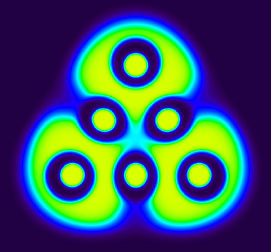

<!-- p.2 -->

# !!!!!!!!!! ALL USERS MUST READ !!!!!!!!!!

1. Please feel free to ask questions about using Multiwfn by posting topic on Multiwfn English forum (http://sobereva.com/wfnbbs) or Multiwfn Chinese forum (http://bbs.keinsci.com/wfn)! I am always willing to provide as much help as I can for any Multiwfn user!!! \()/

2. To very quickly understand how to use Multiwfn to carry out very common tasks, please check "Multiwfn quick start.pdf" in the Multiwfn binary package.

3. The BEST way to get started is reading through Chapter 1, Sections 2.1~2.5 of Chapter 2, and then follow the tutorials in Chapter 4. After that if you want to learn more about theoretical backgrounds and details of Multiwfn, then read Section 2.6~2.8 of Chapter 2 and Chapter 3. Note that the tutorials and examples given in Chapter 4 only cover most important and frequently used functions rather than all functions of Multiwfn.

4. Different functions of Multiwfn require different types of input file, please carefully read Section 2.5 for explanation.

5. Usually Multiwfn runs in interactive mode, however Multiwfn can also be run in command-line mode, and it is very convenient to write shell script to make Multiwfn deal with a large number of input files. See Sections 5.2 and 5.3 for detail.

6. If you do not know how to copy the output of Multiwfn from command-line window to a plain text file, consult Section 5.4. If you do not know how to enlarge screen buffer size of command-line window of Windows system, consult Section 5.5.

7. If error “No executable for file l1.exe” appears in screen when Multiwfn is invoking Gaussian, you should set up Gaussian environment variable first. For Windows version, you can refer Appendix 1. (Note: Most functions in Multiwfn DO NOT require Gaussian installed on your local machine)

8. The so-called “current folder” in this manual and in prompts of Multiwfn refers to the path where you are invoking Multiwfn. If you boot up Multiwfn by clicking the icon of executable file in Windows platform, the “current folder” is the folder containing Multiwfn executable file. In the case of command-line mode, if you are in “D:\study\” directory when invoking Multiwfn, then “D:\study\” is “current directory”.

9. Please frequently check Multiwfn website and update the program to the latest version. Multiwfn is always in active development, useful new functions are frequently added, bugs are continuously fixed and efficiency is continuously improved.


<!-- p.3 -->

# Linux and Mac OS USERS MUST READ

1. If you are new to Multiwfn, using Windows version is highly recommended, since this version of Multiwfn is more stable than others, the appearance of GUI has the best effect, and you do not need to set up your system.

2. See Section 2.1.2 and 2.1.3 on how to install Linux and Mac OS versions of Multiwfn, respectively.

3. Transparent style does not work when showing isosurfaces in GUI window. But if you choose to save the graph as image file, the transparent isosurfaces can be rendered normally in the resulting graphical file.

4. Using Mac OS version is deprecated, some functions may not work normally.


<!-- p.4 -->

## About the manual

This content in the manual is organized in the following sequence:

Chapter 1 Overview: Briefly describes what is Multiwfn and what Multiwfn can do.

Chapter 2 General information: Introduces all aspects beyond specific functions of Multiwfn, such as how to install, how to use, supported file types, etc.

Chapter 3 Functions: Describes all functions and related theories of Multiwfn in detail.

Chapter 4 Tutorials and examples: Plenty of practical examples are provided for helping users to use Multiwfn and understand value of various analysis methods. Section 4.A contains some advanced tutorials, important overviews and special topics.

Chapter 5 Skills: Some useful skills in using Multiwfn. Appendix

In general, italics font is used for inputted commands, journal names and filenames throughout this manual. Very important contents are highlighted by red color or bolded.

You can directly jump to specific section by choosing corresponding entry in bookmark window of your pdf reader.

The purpose of this manual is not only helping users to use Multiwfn, but also introducing related theories. I hope any quantum chemist can benefit from this manual.

Albeit I have tried to write this manual as readable as possible for beginners, some topics request the readers have basic knowledge of quantum chemistry. If the readers have carefully read the book "Quantum Chemistry 7ed" written by Ira. Levine, then they will never encounter any difficulty during reading through the whole manual.


<!-- p.5 -->

## Contents !!!!!!!!!! ALL USERS MUST READ !!!!!!!!!! ..........................................i Linux and Mac OS USERS MUST READ ............................................ ii 1  Overview ................................................................................................ 1 2  General information ........................................................................... 10 3  Functions .............................................................................................. 56


<!-- p.12 -->

### 4  Tutorials and Examples .................................................................... 437


<!-- p.13 -->
4.7.7.4 Example 4: Evaluation of atomic charges of aspartic acid residue with equivalence


<!-- p.18 -->
4.21.1 Examples of energy decomposition analysis based on forcefield (EDA-FF) ............. 892


<!-- p.19 -->
4.200.6.1 Revealing relationship between HF and MP2 orbitals of CH3NH2 ................. 1014


<!-- p.20 -->
4.A.7.1 Fractional Occupation Number Weighted Electron Density (FOD) ................... 1083


<!-- p.21 -->

### 5  Skills ................................................................................................. 1121


### 6 Appendix ........................................................................................... 1131


<!-- p.22 -->

# 1  Overview

Multiwfn is a powerful wavefunction analysis program, it supports almost all of the most important wavefunction analysis methods. Multiwfn is free, open-source, high-efficient, very user-friendly and flexible. Multiwfn can be downloaded at Multiwfn official website http://sobereva.com/multiwfn. This code is developed by Tian Lu at Beijing Kein Research Center for Natural Sciences (http://www.keinsci.com).

Input files supported by Multiwfn Multiwfn accepts many kinds of files for loading wavefunction information: .mwfn (Multiwfn wavefunction file), .wfn/.wfx (Conventional / Extended PROAIM wavefunction file), .fch (Gaussian formatted check file), .molden (Molden input file), .31~.40 (NBO plot files) and .gms (GAMESS-US and Firefly output file). Other types such as Gaussian input and output files, .cub, .grd, .pdb, .xyz and .mol files can be used for specific functions.

Briefly speaking, Multiwfn can perform wavefunction analyses based on outputted file of almost all well-known quantum chemistry programs, such as Gaussian, ORCA, GAMESS-US, Molpro, NWChem, Dalton, xtb, PSI4, Molcas, Q-Chem, MRCC, deMon2k, Firefly, CFOUR, Turbomole... Since .molden file exported by CP2K is also supported, Multiwfn is not only able to deal with molecular systems but can also analyze periodic systems (though limited functions can be used, see Section 2.9 of manual for detail).

Special points of Multiwfn (1) Very comprehensive functions. Almost all of the most important wavefunction analysis methods have been well supported by Multiwfn.

(2) Extremely user-friendly. Multiwfn is designed as an interactive program (but can also run silently and be embedded into shell script), prompts shown on screen in each step clearly tell users what should input next. Multiwfn also never prints obscure messages, therefore there is no any barrier even for beginners. In addition, all wavefunction analysis theories are very detailedly documented, and there are more than one hundred well-written examples in the manual; furthermore, there is a "quick start" document that guides new users to master common analyses immediately. Moreover, the developer always very timely and patiently replies all users' questions in Multiwfn official forum.

(3) High flexibility. The design of the overall framework, functions and user interface of Multiwfn is rather flexible, but this does not sacrifice ease of use. Different modules of Multiwfn are organically integrated together to make numerous analyses that single module cannot realize feasible

(4) High efficiency. The code of Multiwfn is substantially optimized. Most parts are parallelized by OpenMP technology. For computationally intensive tasks, the efficiency of Multiwfn exceeds analogous programs significantly.

(5) Results can be visualized directly. A high-level graphical library DISLIN is invoked internally and automatically by Multiwfn for visualizing results, most plotting parameters are controllable in interactive interface. This remarkably simplified wavefunction analysis, especially


<!-- p.23 -->
for studying distribution of real space functions.

Major functions of Multiwfn PS: Despite that there are so many functions in Multiwfn and the manual is quite thick, you can easily learn how to realize the functions listed below by checking the "Multiwfn quick start" document in Multiwfn binary package.

- Showing molecular structure and viewing orbitals (MO, NBO, natural orbital, NTO, LMO, etc.). Speed of generating orbital graph is extremely fast, and the use is very convenient.
- Outputting all supported real space functions as well as gradient and Hessian at a point. Value can be decomposed to orbital contributions.
- Calculating real space function along a line and plot curve map.
- Calculating real space function in a plane and plot plane map. Supported graph types include filled-color map, contour map, relief map (with/without projection), gradient map and vector field map.
- Calculating real space function in a spatial scope, data can be exported to Gaussian-type cube grid file (.cub) and can be visualized as isosurface.
- For the calculation of real space functions in one-, two- and three-dimensions, users can define the operations between the data generated from multiple wavefunction files. Therefore one can calculate and plot such as Fukui function, dual descriptor and density difference very easily. Meanwhile promolecule and deformation properties for all real space functions can be calculated directly.
- Topology analysis for any real space function, such as electron density (AIM analysis), Laplacian, ELF, LOL, electrostatic potential and so on. Critical points (CPs) can be located, topology paths and interbasin surfaces can be generated, and then they can be directly visualized in a 3D GUI window or be plotted in plane map. Value of various real space functions can be calculated at critical points or along topology paths. CP properties can be decomposed as orbital contributions.
- Checking and modifying wavefunction. For example, print orbital and basis function information, manually set orbital occupation number and type, translate and duplicate system, discard wavefunction information from specified atoms.
- Population analysis. Supported methods: ADCH (Atomic dipole moment corrected Hirshfeld), Hirshfeld, Hirshfeld-I, MBIS, cMBIS, EMBIS, AEMBIS, VDD, Mulliken, Löwdin, Modified Mulliken (including three methods: SCPA, Stout & Politzer, Bickelhaupt), Becke, CM5, 1.2*CM5, CHELPG, Merz-Kollmann, RESP, RESP2, AIM (Atoms-in-Molecules) and EEM (Electronegativity Equalization Method). Electrostatic interaction energy of two given fragments can be calculated based on atomic charges.
- Orbital composition analysis. Mulliken, Stout & Politzer, SCPA, Hirshfeld, Hirshfeld-I, Becke, natural atomic orbital (NAO) and AIM methods are supported to obtain orbital composition. Orbital delocalization index (ODI) or spatial delocalization index (SDI) can be calculated to quantify extent of spatial delocalization of orbitals.
- Bond order/strength analysis. Mayer bond order; multi-center bond order (MCBO) and multi-center index (MCI) in AO or natural atomic orbital (NAO) basis (arbitrary number of centers); Wiberg bond order in Löwdin orthogonalized basis; Mulliken bond order; AV1245 index; intrinsic bond strength index (IBSI). Mayer and Mulliken bond order can


<!-- p.24 -->
be decomposed to orbital contributions. Wiberg bond order can be decomposed to contribution from various NAO pair interactions.
- Plotting total, partial, overlap population density-of-states (TDOS, PDOS, OPDOS) and MO-PDOS. Up to 10 fragments can be very flexibly and conveniently defined. Local DOS (LDOS) can also be plotted for a point as curve map or for a line as color-filled map. Furthermore, plotting photoelectron spectrum (PES) based on (generalized) Koopmans' theorem is fully supported, d-band and p-band centers can be calculated. Crystal overlap Hamilton populations (COHP) can also be plotted.
- Plotting various kinds of spectra: IR (infrared), regular/pre-resonance Raman, UV-Vis, directional UV-Vis, ECD (electronic circular dichroism), VCD (vibrational circular dichroism), Raman optical activity (ROA) and NMR. For vibrational spectra, not only harmonic spectrum, but also anharmonic fundamental, overtone and combination bands can be plotted. Spin-orbit coupling effect could be incorporated for electronic spectra. Abundant parameters (broadening function, FWHM, scale factor, etc.) can be customized by users. Maxima and minima of the spectra can be printed and directly labelled on the map. Spikes can be added to bottom of the graph to clearly indicate position and degeneracy of transition levels. Total spectrum can be decomposed to individual contribution of each transition. Spectrum of multiple systems can be conveniently plotted together. Conformational weighted spectrum can be easily plotted. In addition, for vibrational type of spectra, partial vibrational spectrum (PVS) can be plotted to intuitively understand how different atoms or internal coordinates participate in the spectra, and overlap partial vibration spectrum (OPVS) can be plotted to visualize coupling of various terms. Partial vibrational density-of-states (PVDOS) can also be plotted. Color displayed by a chemical substance can be exactly predicted based on its theoretically simulated and experimentally determined UV-Vis spectrum.
- Quantitative analysis of molecular surface. Surface properties such as (total/positive/negative/polar/nonpolar) surface area, enclosed volume, average value and std. of mapped functions can be computed for overall molecular surface or local surfaces; Various kinds of GIPF descriptors and molecular polarity index (MPI) can be evaluated; minima and maxima of mapped functions on the surface can be located; area of

characteristic region corresponding to e.g. σ/π-hole and lone pair can be calculated based on ESP; Basin-like analysis on molecular surface for arbitrary mapped function can be realized.
- Processing grid data (can be loaded from .cub/.grd/.vti/.dx/CHGCAR... or directly generated by Multiwfn). Users can perform very rich mathematical operations on grid data, set value in certain range, extract data in specified plane, plot (local) integral and plane-averaged curve, perform translation, etc.
- Adaptive natural density partitioning (AdNDP) analysis. The interface is interactive and the AdNDP orbitals can be visualized directly. Energy and orbital composition of AdNDP orbitals can be obtained.
- Fuzzy atomic space analysis. Becke, Hirshfeld, Hirshfeld-I, and MBIS atomic space partition methods are supported, the following quantities can be computed: Integral of real space functions in atomic spaces or in overlap region between atomic spaces, dipole and multipole moments of atom/fragment/molecule, atomic multipole moments, atomic


<!-- p.25 -->
overlap matrix (AOM), fragment overlap matrix (FOM), localization and delocalization indices (LI, DI), interfragment DI (IFDI) and fragment LI (FLI), condensed linear response kernel, multi-center DI, as well as five aromaticity indices, namely FLU, FLU-p, PDI, PLR and information-theoretic aromaticity index. Atomic effective volume, free volume, polarizability, and C6 dispersion coefficient can also be calculated according to Tkatchenko-Scheffler method.
- Charge decomposition analysis (CDA) and extended CDA analysis. Orbital interaction diagrams can be plotted. Infinite number of fragments can be defined.
- Basin analysis. Attractors can be located for any real space function, corresponding basins can be generated and visualized at the same time. All real space functions can be integrated in the generated basins. Electric multipole moments, basin/atomic overlap matrix (BOM/AOM), localization index (LI) and delocalization index (DI) can be calculated for the basins. Atomic contribution to basin population can be obtained. Labels of ELF basins can be automatically assigned. High ELF localization domain population and volume (HELP and HELV) can be evaluated.
- Electron excitation analyses: Visualizing and analyzing hole-electron distribution, transition density, transition electric/magnetic dipole moment and charge density difference; Calculating Coulomb attractive energy between hole and electron (exciton binding energy); Calculating Mulliken atomic transition charges and TrEsp (transition charge from electrostatic potential); Decomposing transition electric/magnetic dipole moment to MO pair contribution or basis function/atom contribution; Analyzing charge-transfer by the method proposed in JCTC, 7, 2498; Plotting atom/fragment transition density matrix, transition dipole moment matrix and charge transfer matrix as heat maps;

Calculating Δr index (JCTC, 9, 3118) and Λ index (JCP, 128, 044118) to reveal electron excitation character; Calculating transition electric/magnetic dipole moments between excited states; Generating natural transition orbitals (NTOs); Calculating ghost-hunter index (JCC, 38, 2151); Calculating amount of interfragment charge transfer via IFCT; method; Generating natural orbitals for a batch of excited states; Quickly examining major MO transitions in all excited states; Plotting charge-transfer spectrum (Carbon, 187, 78); Electron density polarization analysis based on electron excitations (JPCA, 124, 633); Calculating ECD/CPL dissymmetry factor (g) for chiral systems.
- Orbital localization analysis: Pipek-Mezey (based on Mulliken, Löwdin or Becke population) and Foster-Boys localization methods are supported. Composition, energy and dipole moment of the resulting LMOs can be derived, shape and center of the LMOs can be easily visualized. Furthermore, based on the LMOs, oxidation states can be evaluated via LOBA method (PCCP, 11, 11297) or modified LOBA method.

- Visual study of weak interactions: Interaction region indicator (IRI and IRI-π, Chem.-Methods, 1, 231); RDG/NCI method (JACS, 132, 6498); aNCI method (noncovalent interaction analysis in fluctuating environments, JCTC, 9, 2226); DORI method (JCTC, 10, 3745); independent gradient model (IGM) method (PCCP, 19, 17928); IGM based on Hirshfeld partition of molecular density (IGMH) (JCC, 43, 539); modified IGM (mIGM, Struct. Bond., 190, 297); averaged IGM and averaged mIGM (mIGM and amIGM, Struct. Bond., 190, 297). Individual regions enclosed by isosurface of these real space functions can be integrated for quantitative analysis. Becke and Hirshfeld surface analyses, as well


<!-- p.26 -->
as fingerprint analysis are also supported. van der Waals potential (J. Mol. Model., 26, 315) can be visualized and extrema can be located.
- Conceptual density functional theory (CDFT) analysis: Fukui function and dual descriptor, as well as their condensed form and orbital-weighted variants; Fukui potential and dual descriptor potential; Mulliken electronegativity; hardness; electrophilicity and nucleophilicity indices; electrophilic descriptor; softness; condensed local softness; relative electrophilicity and nucleophilicity; electrophilic and nucleophilic superdelocalizabilities; bond dual descriptor; dual delocalization descriptor, and so on. A specific model is supported to properly treat the situation with (quasi-)degenerate HOMO and LUMO.
- Extended Transition State - Natural Orbitals for Chemical Valence (ETS-NOCV): Arbitrary number of fragments can be defined, both closed-shell and open-shell cases are supported. NOCV eigenvalues, energies and compositions can be obtained, many related functions can be easily visualized as isosurfaces, including NOCV orbital wavefunctions, NOCV pair densities, frozen state orbitals, Pauli deformation density, orbital deformation density and total density difference.
- Energy decomposition analysis: sobEDA and sobEDAw (J. Phys. Chem. A, 127, 7023 (2023)), EDA based on UFF/AMBER/GAFF molecular force fields (EDA-FF); Shubin Liu's energy decomposition (EDA-SBL); Analysis of atomic contribution to dispersion energy and evaluation of dispersion density.
- Electron delocalization and aromaticity analyses: Multi-center bond order (MCBO), AV1245 and AVmin; Iso-chemical shielding surface (ICSS); NICS_ZZ for non-planar or

tilted system; ELF-π and ELF-σ; harmonic oscillator measure of aromaticity (HOMA) and Bird indices; reparameterized HOMA (HOMAc and HOMER indices); Shannon aromaticity index; para-delocalization index (PDI); aromatic fluctuation index (FLU) and

FLU-π; para linear response index (PLR); information-theoretic (ITA) aromaticity index; properties of ring critical point; NICS-1D scan curve map; integral NICS (INICS) and FiPC-NICS indices; NICS-2D scan plane map, and so on.
- (Hyper)polarizability study: Parsing Gaussian output file of "polar" task and calculating many data related to (hyper)polarizability; Calculating quantities related to Hyper-Rayleigh scattering (HRS); plotting (hyper)polarizability density; obtaining atomic contribution to (hyper)polarizability; calculating (hyper)polarizability by means of sum-over-states (SOS) method; two-level and three-level model analyses; unit sphere and vector representation of (hyper)polarizability tensor; calculating atomic polarizabilities in molecules
- Structure and geometry related analyses: Molecular van der Waals (vdW) volume; area of vdW surface of whole system or individual fragments; molecular length/height/weight, vdW diameter and kinetic diameter; cavity volume and diameter; interatomic connectivity and atomic coordination number; average bond length of atomic cluster; bond length alternation (BLA), bond order alternation (BOA) as well as bond angle and dihedral alternations; molecular planarity parameter (MPP) and span of deviation from plane (SDP); visualizing free regions (pores) in a cell and evaluating their volumes; very rich geometry operations; plotting surface distance projection map; minimum/maximum and geometry/mass center distances between two fragments; area and perimeter of a specific


<!-- p.27 -->
ring
- Other functions (incomplete list): Integrating a real space function over the whole space by Becke's multi-center method; evaluating overlap integral between alpha and beta orbitals; evaluating overlap and centroid distance between two orbitals; generating new wavefunction by combining fragment wavefunctions; calculating LOLIPOP index; calculating intermolecular orbital overlap; Yoshizawa's electron transport route analysis; calculating atomic and bond dipole moment in Hilbert space; plotting radial distribution function for real space functions; calculating overlap integral between orbitals in two different wavefunctions; outputting various kinds of integrals between orbitals; evaluating the first and second moments and radius of gyration for a real space function; exporting loaded structure/wavefunction to many popular formats such as .wfn, .wfx, .molden, .fch, NBO .47, .pdb, .xyz and yield input file for a lot of known quantum chemistry codes; calculating bond polarity index (BPI); domain analysis (obtaining properties within isosurfaces defined by a real space function); calculating electron correlation indices;

detecting π orbitals and evaluating orbital π composition; perform biorthogonalization between alpha and beta orbitals to maximally pair them; evaluating core-valence bifurcation (CVB) index; evaluating orbital contributions to density difference (e.g. Fukui function) or other kind of grid data; bond order density (BOD) and natural adaptive orbital (NAdO) analyses; fitting atomic radial density as STOs or GTFs; simulating scanning tunneling microscope (STM) image; evaluating electric dipole/quadrupole/octopole/hexadecapole moments and electronic spatial extent, etc. Real space functions supported by Multiwfn Real space function analysis is one of the most powerful features of Multiwfn, more than 100 real space functions are supported and listed below, detailed descriptions can be found in Section 2.6 and 2.7 of the manual:

- Electron density
- Gradient norm of electron density
- Laplacian of electron density
- Wavefunction value and probability density of an orbital
- Electron spin density
- Hamiltonian kinetic energy density K(r)
- Lagrangian kinetic energy density G(r)
- Electron localization function (ELF) defined by Becke and the one defined by Tsirelson
- Localized orbital locator (LOL) defined by Becke and the one defined by Tsirelson

- Interaction region indicator (IRI) and IRI-π
- δg function defined in Independent Gradient Model (IGM) and IGM based on Hirshfeld partition (IGMH)

- Local information entropy
- Electrostatic potential (ESP), and that from nuclear / electronic / atomic charges
- van der Waals potential
- Reduced density gradient (RDG) with/without promolecular approximation

- sign(λ2)ρ (product of the sign of the second largest eigenvalue of electron density Hessian matrix and electron density) with/without promolecular approximation


<!-- p.28 -->
- Exchange-correlation density, correlation hole and correlation factor
- Average local ionization energy (ALIE) and local electron attachment energy (LEAE)
- Source function
- Electron delocalization range function EDR(r;d) and orbital overlap distance function D(r)
- Others (incomplete list): Potential energy density, electron energy density, orbital-weighted Fukui function and dual descriptor, strong covalent interaction index (SCI), ultrastrong interaction (USI), bonding and noncovalent interaction (BNI), local electron affinity/electronegativity/hardness, ellipticity and stiffness of electron density, eta index, on-top pair density, numerous forms of DFT exchange-correlation potential, numerous forms of DFT kinetic energy density, Weizsäcker potential, Fisher information entropy, Ghosh/Shannon entropy density, integrand of Rényi entropy, shape function, local temperature, bond metallicity, linear response kernel, steric energy/potential/charge, Pauli potential/force/charge, quantum potential/force/charge, PAEM, density overlap regions indicator (DORI), region of slow electrons (RoSE), PS-FID, single exponential decay detector (SEDD), electron linear momentum density, electric/magnetic dipole moment density, local electron correlation function, magnitude of electric field, stress tensor stiffness, stress tensor polarizability, fractional occupation number weighted electron density (FOD), and so on.

Implementing a new real space function into Multiwfn is extremely easy, as illustrated in Section 2.7 of the manual.

Things that Multiwfn can do The analyses that Multiwfn support for different topics are briefly listed below, you can easily find related manual sections by searching "Multiwfn quick start.pdf" document. Do not forget to ask questions in Multiwfn official forum when you are confused!

- Visualizing various kinds of orbitals generated by various programs in various forms
- Characterizing chemical bonds: Various form of AIM analyses; studying real space functions

(ELF, LOL, 2ρ, kinetic/potential energy density, IRI and IRI-π, valence electron density, fragment density difference, deformation density, source function, bond ellipticity, bond degree, eta index, V(r)/G(r), SCI, PAEM, IGM...); various kinds of bond orders analysis (Mayer, Laplacian, Mulliken, Wiberg, Fuzzy and multi-center bond orders, as well as decomposition analysis for Mayer, Mulliken and Wiberg bond orders); intrinsic bond strength index (IBSI); localization/delocalization index; orbital localization analysis; bond order density (BOD) and natural adaptive orbital (NAdO) analyses; various methods of measuring bond polarity and bond dipole moment; charge decomposition analysis (CDA); Extended Transition State - Natural Orbitals for Chemical Valence (ETS-NOCV); overlap population density-of-states (OPDOS); energy decomposition analysis and so on. See Section 4.A.11 of manual for an overview. Variation of various properties of chemical bonds during scan and IRC processes can also be easily studied via shell scripts, see Section 4.A.1 of manual.

- Characterizing electron distribution and variation: Atomic charges (AIM, Mulliken, SCPA, Hirshfeld, Hirshfeld-I, Voronoi, Löwdin, ADCH, CM5, MBIS, EEM, CHELPG, MK, RESP, RESP2...); total and spin population analyses for basis functions/shells/atoms/fragments; atomic electric dipole and multipole moment analysis (can also be visualized in VMD program via a plotting script provided in Multiwfn); plotting / basin analysis / domain analysis for density difference; charge displacement curve


<!-- p.29 -->
- Aromaticity and electron delocalization analyses: See Section 4.A.3 of manual for an overview

- Characterizing intramolecular and intermolecular weak interactions: AIM analysis (bond path visualization and analysis of various properties at bond critical point); visual analyses of weak

interactions (NCI, IGM, IGMH, aIGM, IRI, DORI); atom and atomic pair δg indices based on IGM or IGMH; quantitative molecular surface analysis for electrostatic potential (ESP); plotting ESP in various form; plotting van der Waals potential; energy decomposition analysis based on forcefield (EDA-FF); Hirshfeld/Becke surface analysis; LOLIPOP; mutual penetration distance and penetration volume analysis; atomic charge and multipole moment analysis; charge transfer analysis (density difference map, CDA, variation of population ...); ELF and core-valence bifurcation (CVB) index and so on. See Section 4.A.5 of manual for an overview

- Electron excitation analysis: Analysis of hole and electron (distribution, atom/fragment/orbital contribution, centroid position, displacement and overlap, exciton binding energy); charge transfer analysis (IFCT, density difference...); NTO; overlap and centroid distance between crucial MOs; plotting atom/fragment transition density matrix and charge transfer matrix; ∆r index; decomposition of transition dipole moment to basis function/atom/fragment/MO pair contributions; transition dipole moment between various excited states; transition atomic charge; ghost-hunter index; revealing variation of electronic structure (bonding and population) during excitation; printing major MO transitions in all excited states; plotting charge-transfer spectrum to graphically reveal nature of UV-Vis spectrum, and so on. See Section 4.A.12 of manual for an overview

- Prediction of reactive sites and reactivity analysis: ESP and ALIE analyses on molecular surface; atomic charges; orbital composition analysis for frontier molecular orbitals; population of

π electron; orbital overlap distance function analysis; automatically calculating all quantities defined in the framework of conceptual density functional theory; evaluating contribution of orbitals (MO, NBO, NAO, etc.) to Fukui function. See Section 4.A.4 of manual for an overview

- Prediction properties of molecular condensed phase: Using ESP distribution on vdW surface to empirically predict heat of vaporization, heat of sublimation, density of molecular crystal, boiling point, heat of fusion, surface tension, pKb and so on. Molecular polarity can be quantified. See Section 3.15.1 of manual

- Plotting spectra: IR, Raman, UV-Vis, ECD, VCD, ROA, NMR and photoelectron spectra. In the case of UV-Vis, displayed color can be exactly predicted

- Characterizing geometric structure
- (Hyper)polarizability study
- Electric conduction analysis: TDOS and PDOS; orbital overlap analysis between neighbouring monomers; Yoshizawa's transport route analysis; bond length/order alternation (BLA/BOA)

- Many others: Teaching structure chemistry; simulating scanning tunneling microscope (STM) image; converting file formats containing geometry or wavefunction information; studying electron correlation effect; realizing ELF-tuning and LOL-tuning for DFT functionals; evaluating oxidation state by LOBA or modified LOBA method; studying distribution of real space functions (in terms of radial distribution function, centroid, first and second moments, integral over whole space and

local region...); evaluating σ or π component in molecular orbitals, geometry transformation, and so on


<!-- p.30 -->
Citing Multiwfn If Multiwfn is used in your research, at least the following papers must be cited in the main text, which are original papers of Multiwfn program:

Tian Lu, Feiwu Chen, Multiwfn: A Multifunctional Wavefunction Analyzer, J. Comput. Chem. 33, 580-592 (2012) DOI: 10.1002/jcc.22885 Tian Lu, A comprehensive electron wavefunction analysis toolbox for chemists, Multiwfn, J. Chem. Phys., 161, 082503 (2024) DOI: 10.1063/5.0216272

My other papers should be cited depending on the method and function employed in your work. Please carefully check How to cite Multiwfn.pdf document in the Multiwfn binary package.

Whenever possible, please mention and cite Multiwfn in main text rather than in supplemental information, otherwise not only Multiwfn will be difficult for readers to notice, but also the paper will not be included in citation statistics.

Discussion zones There are two Multiwfn official forums, with different languages. You can discuss anything about Multiwfn and wavefunction analysis in either one. If you encountered problems in using Multiwfn, please do not hesitate to post topic on these forums!

Multiwfn English forum: http://sobereva.com/wfnbbs Multiwfn Chinese forum: http://bbs.keinsci.com/wfn BTW: Multiwfn Youtube channel contains some valuable illustration videos of Multiwfn, it is highly recommended to look at them and subscribe to this channel.


<!-- p.31 -->

# 2  General information


## 2.1 Install


### 2.1.1 Windows version

What you need to do is just uncompressing the program package, then you can start to use by double-clicking the icon.

A few functions in Multiwfn rely on Gaussian, if you need to carry out these analyses, you need to setup environment variables for Gaussian manually, see Appendix 1.

It is strongly suggested to set "nthreads" in `settings.ini` to actual number of CPU physical cores of your machine, so that all computing power of your CPU could be utilized during calculation. See Section 2.4 for more detail.

If you want to make Multiwfn able to directly open .chk file produced by Gaussian, set "formchkpath" in `settings.ini` to actual path of formchk executable file in Gaussian package.


### 2.1.2 Linux version

Note: Chinese version of this section is my blog article “Chinese instructions for installing Multiwfn under Linux” (http://sobereva.com/688).

- Uncompress the Multiwfn binary package
- Make sure that you have installed motif package, which provides libXm.so.4, full version of Multiwfn cannot boot up without this file. The motif is freely available at https://motif.ics.com/motif/downloads. If you are a CentOS or Red Hat Linux user and have not installed motif, you can directly run yum install motif to install it; alternatively, you can download corresponding rpm package (e.g. motif-2.3.4-1.x86_64.rpm) and manually install it; If you are an Ubuntu user, run sudo apt-get install libxm4 libgl1 to install it, or download deb package (e.g. libmotif4_2.3.4-1_amd64.deb) and manually install it.

- Add below lines to ~/.bashrc file (using e.g. vi ~/.bashrc command)


```text
export OMP_STACKSIZE=1000M
ulimit -s unlimited
```

These lines remove limitation on stacksize memory, and define stacksize of 1000MB for each OpenMP thread during parallel calculations, see Section 2.4 for detail.

Note: If ulimit -s unlimited does not work properly on your system, try to use ulimit -Sn unlimited instead.

- Run cat /proc/sys/kernel/shmmax to check if the size of SysV shared memory segments is large enough (unit is in bytes); if the value is too small, Multiwfn may crash when analyzing big wavefunction. To enlarge the size, for example you can add kernel.shmmax = 5000000000 to /etc/sysctl.conf and reboot system, then the upper limit will be enlarged to about 5GB.

- Assume that you are using Bash shell, and you have decompressed the Multiwfn package as “/sob/Multiwfn_3.6_bin_Linux” folder, you should add below lines into ~/.bashrc file:


```text
export Multiwfnpath=/sob/Multiwfn_3.6_bin_Linux
export PATH=$PATH:/sob/Multiwfn_3.6_bin_Linux
```


<!-- p.32 -->
- Run below command to add executable permission to Multiwfn executable file:


```text
chmod +x /sob/Multiwfn_3.6_bin_Linux/Multiwfn
```

- Configure the `settings.ini` file in Multiwfn folder in the same way as described in last Section. After re-entering the terminal, you can boot up Multiwfn anywhere by simply running Multiwfn command.

If you use Multiwfn via remote connection to a server with text-only mode, and you find Multiwfn get stuck by about two seconds after loading input file, please add export DISPLAY=":0" to your ~/.bashrc file.

Linux version of Multiwfn works well on CentOS 6/7/8, Rocky Linux 9 and Ubuntu 12/14/16/22. I cannot guarantee that the program is completely compatible with all other Linux distributions. If system prompts you that some dynamical link libraries (.so files) are missing when booting up Multiwfn, please try to find and install the packages which contain the corresponding .so files.

If you encounter difficulty when running/compiling Multiwfn due to missing or incompatibility of some graphics related library files, and meantime you do not need any visualization function of Multiwfn, you can run/compile Multiwfn without GUI supported, all functions irrelevant to GUI and map plotting will still work normally. Please check “COMPLIATION_METHOD.txt” in source code package on how to compile this special version, the pre-compiled executable file of this version can also be downloaded from Multiwfn website (termed as "noGUI" version).


### 2.1.3 Mac OS version

As I am not a MacOS user, there is no MacOS release of Multiwfn. If you want to compile Multiwfn on MacOS, please check https://github.com/digital-chemistry-laboratory/multiwfn-mac-build. If you can read Chinese, see http://bbs.keinsci.com/thread-46059-1-1.html.

After compilation of Multiwfn, you should do following steps (but I cannot guarantee that the first two steps below still work for latest version of MacOS):

(1) Add the following line to your .profile file (e.g. /Users/sob/.profile) to make them take effect automatically, then reboot your terminal. If the .profile is nonexistent, you should create it manually.


```text
export OMP_STACKSIZE=64000000
```

OMP_STACKSIZE defines stacksize (in bytes) for each thread in parallel implementation, see Section 2.4 for detail.

(2) Run sysctl -a|grep shmmax to check if the size of SysV shared memory segments is large enough (unit is in bytes), if the value is too small, Multiwfn may crashes when analyzing big wavefunction. In order to enlarge the size, you should edit or create the file /etc/sysctl.conf, and add kern.sysv.shmmax = 512000000 to it and reboot system, then the upper limit will be enlarged to about 512MB.

(3) Set Multiwfnpath environment variable if needed, see point 5 of Section 2.1.2. (4) Configure the `settings.ini` file in the same way as described in Section 2.1.1. An alternative method of running Multiwfn on MacOS was provided by a Multiwfn user Maciej Spiegel:

First of all, a user should download the newest version of Unofficial Wineskin (https://github.com/Gcenx/WineskinServer/releases/tag/V1.8.4). After that, run it, update the wrapper version and download one of the most recent engines. These are WS11WineCX64Bit19.0.1-1 (for 64bit system) or WS11WineCX19.0.1-1 (for 32bit system). Finally, one should create new wrapper and use Windows GUI installer.


<!-- p.33 -->

## 2.2 Using Multiwfn

Using Multiwfn is very easy, by simply reading the prompts shown on screen, you will know what should input next. If you get stuck, please read corresponding section carefully in Chapter 3 or corresponding tutorials in Chapter 4.

In Windows, usually Multiwfn is booted up by directly double-clicking the icon of the executable file, then you should input the path of the file to be loaded. You can also boot up Multiwfn via command line, and the same time the path of input file may be also given, for example you can run Multiwfn /sob/test.wfn.

If the input file is in current directory, you can input file name without the path of directory. If the input file is just the one that last time used, you can simply input the letter o after entering Multiwfn (the path of the input file successfully read at last time was recorded in `settings.ini`). If the input file is in the same folder as the one last time used, for convenience the path can be replaced by symbol ?. For example, last time you loaded C:\sob\wives\K-ON\Mio.wfn, this time you can simply input ?Azusa.fch to load C:\sob\wives\K-ON\Azusa.fch. If you preferred to choose input file in GUI window, you can directly press ENTER button after entering Multiwfn, then a GUI window will be shown for selecting input file.

You can press CTRL+C or click “×” button at right-top of Multiwfn window any time to exit Multiwfn, but a more graceful way of exiting Multiwfn is inputting q in main menu. When graphical window is showing on screen, you can click “RETURN” button to close the window, if there is no such button, clicking right mouse button on the graph to close it.

If you want to load another file into Multiwfn, you can reboot Multiwfn or start a new Multiwfn instance. Alternatively, in main menu you can input r to initialize Multiwfn and load a new file, at the meantime the `settings.ini` will also be reloaded. However, please note that the safest way of loading a new file is rebooting Multiwfn.

Multiwfn can also run via silent mode instead of interactive mode, by which users do not need to press any keyboard button during running. This is useful for batch processing, please consult Sections 5.2 and 5.3.

Supported arguments For convenience, there are a few arguments that may be added when running Multiwfn via command line:

- -nt: Number of threads for parallel calculation
- -uf: Index of user-defined function
- -silent: Run Multiwfn in silent mode
- -set: Path of `settings.ini` For example,

Multiwfn COCl2.fch -nt 36 -set /sob/tmp/settings.ini -silent The priorities of these arguments are higher than those in `settings.ini`. If `settings.ini` cannot be found when Multiwfn boots up, these arguments will not take effect and only the default parameters will be used.


<!-- p.34 -->

## 2.3 Files of Multiwfn

You will find following files after uncompressing Multiwfn package, only the bolded files are indispensable for running Multiwfn:

- Multiwfn.exe (Windows) or Multiwfn (Linux/Mac OS) : The executable file of Multiwfn.
- libiomp5md.dll (Windows) : Intel OpenMP Runtime library.
- `settings.ini` : All detail parameters for running Multiwfn are recorded here, most of them do not need to be frequently modified. When booting up, Multiwfn will try to find and use this file in current folder, if it is not presented in current folder, the file in the path defined by "Multiwfnpath" environment variable will be used; if the file still cannot be found, default settings will be used instead. If you run Multiwfn via command line, you can also directly specify position of this file via "-set" argument, for example: Multiwfn test.wfn -set /sob/3.7/settings.ini.

The meanings of all parameters in `settings.ini` are not documented in this manual systematically, since they have already been commented in detail, only those important will be mentioned in this manual. I suggest you read through the `settings.ini` and find out the ones useful for you.

- “examples” folder : Some useful files, scripts and the files involved in the examples of Chapter 4.

- LICENSE.txt : The terms that all users must follow.
- Multiwfn quick start.pdf : A short document lets new users immediately understand how to use Multiwfn to carry out very common tasks.

- How to cite Multiwfn.pdf : Please properly cite Multiwfn according to this document.


## 2.4 Parallel implementation

Most time-consuming codes of Multiwfn have been parallelized by OpenMP technique. If your CPU has multiple cores, you can greatly benefit from parallelization. To enable parallelization, just modify “nthreads” parameter in `settings.ini` to a proper number. For example, your computer has a CPU with 12-cores physical cores, then commonly you should change “nthreads” to 12.

If Multiwfn crashes during parallel calculation for a very large system, try to enlarge “ompstacksize” in `settings.ini` (for Windows version) or enlarge the value of the environment variable OMP_STACKSIZE (for Linux or Mac OS version).


## 2.5 Input files and wavefunction types

Wavefunction types supported by Multiwfn include restricted/unrestricted single-determinant wavefunction, restricted open-shell wavefunction and post-HF wavefunction (in natural orbital formalism).

Cartesian or spherical harmonic Gaussian functions with angular moments up to h are supported.

There is no upper limit of the number of atoms / basis functions / GTFs / orbitals in Multiwfn, the actual upper limit is only decided by available memory in your computer.


<!-- p.35 -->
Multiwfn determines the input file type by file extension. Notice that different functions need different types of information, you should choose proper type of input file, see the table below. For example, the wavefunction represented by GTFs is enough for Hirshfeld population, so you can use .mwfn/.fch/.molden/.gms/.31~.40/.wfn/.wfx file as input, but .pdb, .xyz, .mol, etc. do not carry any wavefunction information hence cannot be used; in contrast, generating grid data of RDG function with promolecular approximation only requires atom coordinates, so all supported file formats can be used (except for plain text file). The requirement on information types by each function is commonly described at the end of corresponding section in Chapter 3 by red text.

About ghost atom: In any wavefunction format described below, ghost atoms (the points with basis functions but without nuclear charges) are allowed to occur. Their element indices should be 0, and if the file format records element names, the ghost atom should have element name of Bq. Their nuclear charges are loaded by Multiwfn in common way from the file, but of course, in principle they should be zero since they are ghost atoms.

Multiwfn wavefunction file (.mwfn): This format is defined and supported since Multiwfn 3.7. This is the most ideal format for wavefunction storage and exchange purposes. This file records all information for wavefunction analysis in a strict, concise, compact and extensible format. The introduction and definition of this format have been carefully described in my paper: ChemRxiv (2020) DOI: 10.26434/chemrxiv.11872524.

AIM wavefunction file (.wfn): This format was first introduced by Bader’s AIMPAC program, and currently supported by a lot of mainstream quantum chemistry softwares, such as Gaussian, ORCA, GAMESS-US/UK, Firefly, Q-Chem and NWChem. The information in .wfn file include atomic coordinates, elements, orbital energies, occupation numbers, expansion coefficients of Cartesian Gaussian type functions (GTF). Supported angular momentum of GTF is up to f. The wfn


| File Format | Provided information types<br/>Basis Atom Grid Atomic<br/>GTFs<br/>functions coordinates data charges |  |  |  |  |
| --- | --- | --- | --- | --- | --- |
| .fch/.fchk/.chk | √ | √ | √ | × | × |
| .mwfn, .molden, .gbw, .gms | √ | √ | √ | × | × |
| NBOplot file (.31 to .40) | × | √ | √ | × | × |
| .wfn and .wfx | × | √ | √ | × | × |
| .pdb, .xyz, .mol/sdf, .mol2, .gro, .cif, .mop,<br/>Gaussian/ORCA input/output file,<br/>CP2K input/restart file, POSCAR,<br/>Quantum ESPRESSO input file<br/>Turbomole coordination file | × | × | √ | × | × |
| .chg and .pqr | × | × | √ | × | √ |
| .cub/.cube<br/>CHGCAR/CHG/ELFCAR/LOCPOT | × | × | √ | √ | × |
| .vti, .grd, .dx | × | × | × | √ | × |
| Others (plain text file) | × | × | × | × | × |

<!-- p.36 -->
file does not contain any virtual orbital. The generation method of .wfn file is documented at the beginning of Chapter 4.

Note: Although GTFs with angular moment of g and h are not formally supported by original .wfn format, if g and h-type GTFs are recorded in following manner, then Multiwfn is able to recognize them: 21~35 in "TYPE ASSIGNMENT" correspond to YZZZ, XYYY, XXYY, XYZZ, YZZZ, XYYZ, XXXX, XXXY, XZZZ, XXYZ, XXXZ, XXZZ, YYYY, YYYZ, ZZZZ, respectively. 36~56 correspond to ZZZZZ, YZZZZ, YYZZZ, YYYZZ, YYYYZ, YYYYY, XZZZZ, XYZZZ, XYYZZ, XYYYZ, XYYYY, XXZZZ, XXYZZ, XXYYZ, XXYYY, XXXZZ, XXXYZ, XXXYY, XXXXZ, XXXXY, XXXXX, respectively. The sequence shown here in fact is also the sequence used in the .wfn outputted by Molden2AIM and Gaussian09 since B.01.

AIM extended wavefunction files (.wfx) : This is a format introduced as an extension of .wfn, and it was supported by Gaussian 09 since B.01 revision. Relative to .wfn format, .wfx supports higher data record precision and infinitely high GTF angular moment. The most special point of this format is the newly added electron density function (EDF) field, that is using multiple GTFs to represent inner core electron density of the wavefunction in which effective core potential (ECP) is used. Due to this, the result of electron density analysis for the wavefunction using ECP is nearly identical to that for full electron wavefunction. Currently the real space functions supported EDFs in Multiwfn include: electron density, its gradient and Laplacian, local information entropy, reduced density gradient as well as Sign(λ2(r)). Meanwhile topology analyses of electron density and its Laplacian also take into account EDFs. Notice that EDF information has neither effect on ESP nor the real space functions that relied on wavefunction (e.g. kinetic energy density, ELF). If you you want to analyze these properties for heavy elements, you should use full-electrons basis sets, at lease small-core ECP. Currently the only supported GTF type in EDF field is S-type (actually S-type is enough for fitting inner density, since which is nearly spherical symmetry). Like .wfn, Multiwfn does not allow virtual orbitals presented in .wfx file.

Multiwfn has a powerful built-in EDF library, taken from Molden2aim program developed by Wenli Zou. As long as the input file contains GTF information (e.g. .fch, .wfn, .molden, .gms...), Multiwfn always automatically loads EDF information from this library for the atoms using ECP. Only when you use .wfx file as input and the .wfx itself already contains EDF field, the EDF information will be loaded from the .wfx file rather than from EDF library. See Appendix 4 for more details.

Note that although some programs other than Gaussian can also generate .wfx file (e.g. ORCA), these .wfx files are unable to provide EDF field.

Notice: For certain version of Gaussian (e.g. G09 B.01), I found that the EDF field recorded in .wfx for rare cases is problematic, namely the number of electrons represented by EDF field is unequal to the actual number of core electrons exhibited by ECP. In order to verify if the EDF field is correct, you can use subfunction 4 in main function 100 to obtain the integral of total electron density over the whole space, if the result is approximately equal to the total number of electrons (core+valence electrons), that means the EDF field is correct.

Gaussian formatted checkpoint file (.fch/.fchk): Checkpoint file of Gaussian program (.chk) can be converted to formatted checkpoint file (.fch/.fchk) via formchk utility in Gaussian package. There is no difference between .fch and .fchk. "fch" ("fchk") is the default extension generated by Windows (Linux) version of formchk.

If you want to make Multiwfn able to directly load .chk file, you must set "formchkpath" in `settings.ini` to actual path of formchk executable file in Gaussian package. In this case Multiwfn will automatically invoke formchk to convert .chk file to .fch/fchk file, and if conversion is successful, the .fch/fchk will be loaded and then be automatically deleted once loading is finished.

.fch/.fchk contains richer information than .wfn/.wfx files, virtual orbital wavefunctions are


<!-- p.37 -->
also recorded, and meanwhile it provides basis function information for Multiwfn. If you want to use .fch/.fchk file as carrier for post-HF wavefunction, read the beginning of Chapter 4 carefully!

The .fchk file generated by Q-Chem and PSI4 can also be used as input file of Multiwfn. (If the .fchk file was generated by relatively old version of Q-Chem, you must set “ifchprog” in `settings.ini` to 2. You do not need to do this if your Q-Chem version is equal or newer than 5.0).

Molden input file (.molden or .molden.input or molden.inp): Currently, a wide variety of quantum chemistry packages, such as Molpro, Molcas, ORCA, Q-Chem, CFour, Turbomole, PSI4, MRCC and NWChem, as well as a first-principles code CP2K, are able to produce input file of Molden visualization program. This type of file records atomic coordinates, basis set definition, information of all occupied and virtual orbitals (including expansion coefficient of basis functions, occupation number, spin, energy and symmetry), meanwhile there is no information only specific for Molden. So in fact, Molden input file can be regarded as a standard and general file format for exchanging wavefunction information. For Multiwfn, this type of file can provide atomic coordinate, basis function information and GTF information.

Beware that the Molden input files produced by a lot of programs are quite non-standard! Currently Multiwfn only formally supports the Molden input file generated by Molpro, ORCA, xtb, Dalton, NWChem (only for spherical harmonic functions and meantime symmetry is disabled), MRCC (only for spherical harmonic functions), deMon2k, BDF, CP2K (only for spherical harmonic functions). If the Molden input file you used is generated by other programs, the analysis result may or may not be correct, you should first use the methods described in Appendix 5 to check if the wavefunction has been correctly loaded.

Hint: Multiwfn fully supports the Molden input file standardized by molden2aim utility (see Section 5.1 for detail), which is able to properly recognize Molden input files generated by many other quantum chemistry codes, such as CFOUR and Molcas.

.molden file only formally supports basis functions up to g angular moment. However, subfunction 2 of main function 100 can generate .molden file containing h functions, and Multiwfn can then normally load it. Multiwfn can also normally load .molden file generated by ORCA and Dalton even if h functions are presented.

Although Molden input file also supports Slater type orbital (STO), Multiwfn can only utilize the Molden input file recording Gaussian type basis functions.

One severe drawback of Molden format is that it does not explicitly record nuclear charges as other formats such as wfn and fch, therefore the results relying on nuclear charges (e.g. electrostatic potential and atomic charge) will be problematic when ECP is used. To address this issue, Multiwfn loads atomic indices in the file (i.e. the third column in [Atoms] field) as nuclear charges, thus if you manually change the atomic index to the number of atomic valence electrons (equivalent to effective nuclear charge) that explicitly represented in the quantum chemistry calculation, then the result will be correct. If you are confused about this point, please check this post: http://sobereva.com/wfnbbs/viewtopic.php?pid=721. Alternatively, you can manually insert [Nval] field at the beginning of this file to explicitly specify number of valence electrons for specific elements; for example, the following lines ask Multiwfn to set number of valence electrons of Na and Cl to 9 and 7, respectively, while that of other elements remain unchanged.


```text
[Nval]
Na 9
Cl 7
```


<!-- p.38 -->
It is noteworthy that if you are using ORCA >=6.0, you do not need to perform the aforementioned modification on the molden file, because the molden file exported by ORCA contains [Pseudo] field, which provides correct nuclear charge for the atoms with ECP and Multiwfn automatically loads it (in this case the title line of the molden file must contain orca word so that Multiwfn is able to recognize that it was generated by ORCA).

Another evident disadvantage of using Molden input file as wavefunction carrier is that this format is not as compact as .mwfn and .fch. Due to this reason, for the same wavefunction, loading speed of .molden file is much slower than .mwfn and .fch. Therefore, if you need to frequently analyze a .molden file, I suggest you use subfunction 2 of main function 100 to convert it to .mwfn format.

The way of generating Molden input file by some quantum chemistry programs is described at the beginning of Chapter 4. If you are an ORCA user and you do not want to manually convert the .gbw file to Molden input file via the orca_2mkl utility in ORCA, you can set "orca_2mklpath" in `settings.ini` to actual path of orca_2mkl executable file in ORCA folder, then Multiwfn will be able to directly load .gbw file.

PS: Detailed description about .molden format can be found on Molden official site: https://www3.cmbi.umcn.nl/molden/molden_format.html.

GAMESS-US or Firefly output file (.gms): If you want to use GAMESS-US or Firefly (originally known as PC-GAMESS) output file as input file, you can change its extension as .gms, then Multiwfn will properly recognize it. Currently, I can only guarantee that output file of HF/DFT/TDDFT calculation with default NPRINT option can be normally loaded by Multiwfn. If the point group is not C1, Multiwfn will be unable to deal with the output file.

The role of .gms is similar as .molden and .fch file, i.e. all of them provide atomic coordinates, GTF and basis function information.

Since I am not an experienced Firefly user, I cannot guarantee that the compatibility with Firefly output files is as good as GAMESS-US output files. For the former I only tested DFT single point task and TDDFT task.

Plot files of NBO program (.31~.40): The main purpose of supporting these file types is for visualizing PNAO/NAO/PNHO/NHO/PNBO/NBO/PNLMO/NLMO/MO (their orbital coefficients are recorded in .32~.40 respectively), .31 recorded basis function information. After booting up Multiwfn, you should input the path of .31 file first, and then input the path of one of .32~.40 files (for simplicity, you can only input the suffix when the filenames are identical).

Notice that among all types of orbitals generated by NBO program, only using NBO or NLMO to calculate real space functions is meaningful!

Protein data bank format (.pdb), .xyz, MDL Molfile (.mol/sdf), .mol2: These are the most widely used formats for recording atom coordinates. They do not carry any wavefunction information, but for the functions which only require atom coordinates, using these kinds of files as input is adequate. An advantage of .mol and .mol2 with respect to .pdb and .xyz is that they contain atomic connectivity table, which is need by a few functions of Multiwfn, e.g. Calculation of EEM atomic charges. If .xyz file contains multiple frames, only the first frame will be loaded.

Notice that the .mol file supported by Multiwfn is V2000 version, both the maximum number of atoms and bonds that can be recorded are 999. More descriptions about .mol format can be found in https://en.wikipedia.org/wiki/Chemical_table_file. .sdf file is simply a wrapper of .mol file with additional information.


<!-- p.39 -->
In a standard .xyz file, the name of each atom is element name. However, the .xyz file exported by VMD based on trajectory of some molecular dynamics programs is atom name used in the simulation, in this case Multiwfn is unable to always correctly recognize actual elements from the atom names, so there is special rule in Multiwfn to circumvent this issue: If there is a .pdb file with identical name in the same folder as the inputted .xyz file, element name in the .pdb file will be used instead (however, if for an atom the element name is missing in the .pdb file, the Multiwfn will still guess element from atom name in the .xyz file).

.pqr file: This format is very similar to .pdb format, but with different content. Behind the columns corresponding to atomic X/Y/Z coordinate, there are two columns recording atomic charges and atomic radii, respectively (the number of decimals of the two columns is not important, the fields must be delimited by white-space). This kind of file can provide atom information as well as atomic charge information to Multiwfn. Below is an example .pqr file of water. The REMARK field could exist to record comments, they will be skipped during loading the file.


```text
REMARK From file m1charges.out
REMARK ESP charges
ATOM      1 O    O 1     1       0.000   0.123   0.000 -0.680698  2.9000
ATOM      2 H    O 1     1       0.757  -0.490   0.000  0.340338  2.6000
ATOM      3 H    O 1     1      -0.757  -0.490   0.000  0.340361  2.6000
```

Charge files (.chg): This type of plain text file can be generated by some functions of Multiwfn (e.g. population analysis functions), it contains element names (less than or equal to two characters), atom coordinates (first three columns, in Å) and charges (the fourth column), users can modify them manually. This file is free-formatted, all fields must be delimited by white-space. This file can provide atomic charge information, the main use of which is to visualize electrostatic potential and analyze it on molecular surface based on atomic charges, the electrostatic interaction energy based on atomic charges can also be evaluated by subfunction -2 of main function 7 using .chg as input file. When .chg file is loaded, the sum of all atomic charges as well as electric dipole moment calculated using the atomic charges will be shown on screen.

An example of .chg file of water molecule is given below:


```text
  O     0.000000    0.000000    0.119308   -0.301956
  H     0.000000    0.758953   -0.477232    0.150977
  H     0.000000   -0.758953   -0.477232    0.150977
```

.gro file: GROMOS structure format. This kind of file is most frequently employed in GROMACS molecular dynamics program. .gro file can only provide atomic information for Multiwfn. Note that since this file records atom name rather than element, Multiwfn automatically guesses the actual element based on atom names and residue names during loading. However, sometime the guessed element may be incorrect, therefore it is recommended to examine the printed molecular formula after loading the file.

.cif file: This is the standard format for recording crystal structure. Symmetry operations must be explicitly given in this file, otherwise positions of equivalent atoms cannot be generated.

Gaussian-type cube file (.cub or .cube): This is the most popular volumetric data format, it can be generated by vast computational chemistry softwares and can be recognized by the majority of molecular graphics programs. Atom coordinates, a set of grid data of real space function or multiple sets of grid data of molecular orbitals could be recorded in this file. After a cube file is


<!-- p.40 -->
loaded into Multiwfn, one can choose main function 0 to visualize isosurfaces, or use main function 13 to process the grid data.

.vti, .dx and DMol3 grid file (.grd) .vti is "ParaView VTK Image Data" format, which can record scalar field and vector field. This kind of file can be generated by e.g. GIMIC 2.0 and ParaView programs. Only .vti file containing scalar data of ASCII type is supported. Briefly speaking, this file is very similar to .cub file, but no atom information is presented.

.dx is volumetric data format that can be exported by e.g. Volmap plugin of VMD program. .grd file is the volumetric data format mainly used by DMol3 program. No atom information is recorded in .grd.

Gaussian input file (.gjf), ORCA input file and MOPAC input file (.mop): These files can

provide atom coordinate information as well as the number of α and β electrons information to Multiwfn. Note that the atoms must be recorded as Cartesian coordinate. .gjf can also provide cell information to Multiwfn via “Tv” field.

Gaussian and ORCA output files Gaussian and ORCA output files may provide atom information for Multiwfn.

- Gaussian output file: When "iloadGaugeom" in `settings.ini` is set to 1 (default, load input orientation) or 2 (load standard orientation), Multiwfn will load (final) geometry and number of electrons from this file.

- ORCA output file: When "iloadORCAgeom" in `settings.ini` is set to 1 (default), Multiwfn will load (final) geometry from this file.

CP2K input and restart file (.inp and .restart): These files can provide atom coordinate information and cell information to Multiwfn. Note that the atoms must be recorded as Cartesian coordinate in Å.

Quantum ESPRESSO input (.inp or .in): It can provide atom coordinate information and cell information to Multiwfn. Only ibrav=0 is supported.

Turbomole coordination file: If the first line of a plain text file is &coord, then it will be loaded as Turbomole coordination file. $coord field provides atomic information. If $periodic and $lattice are available, they will also provide cell information.

VASP related files The following files are related to VASP code. Multiwfn is able to load them, the file name must contain corresponding string and there is no .in or .inp extension. For example, to load a file as POSCAR, the file name could be such as POSCAR_Si8 and MOF.POSCAR.

- POSCAR: This is one of input files of VASP, records cell and atom information.
- CHGCAR or CHG: This file records electron density generated by VASP. For spin polarization case, it also records spin density at the same time

- ELFCAR: This file records ELF generated by VASP. For spin polarization case, it records


<!-- p.41 -->
ELF for α and β electrons separately.

- LOCPOT: This file records external potential felt by one electron generated by VASP. For spin polarization case, it records the potential for α and β electrons separately. If LVHAR=.TRUE., the potential corresponds to negative of electrostatic potential; while if LVHAR=.FALSE., it corresponds to “potential acting on one electron in a molecule” (PAEM, described in Section 2.7).

Plain text file: This file type is only used for special functions, such as plotting DOS graph, plotting spectrum, generating Gaussian input file with initial guess. See explanations in corresponding sections.


## 2.6 Real space functions

The "Real space functions" in this manual are referred to as the functions whose variables are coordinate of the three-dimension space of present system. Real space function analysis is one of the most important functions of Multiwfn, the supported real space functions are listed below. All wavefunctions are assumed to be real type, all units are in atomic unit (a.u.).

Notice that for speeding up calculation, especially for big system, when evaluating a exponential function (except for some real space functions, such as 12, 14 and 16), if the exponent is more negative than -40, then this evaluation will be skipped. The default cutoff value is safe enough and cannot cause detectable loss of precision even in quantitative analysis, you can also disable this treatment or adjust cutoff, see “expcutoff” in `settings.ini`.

1 Electron density


$$\rho(\mathbf{r})=\sum_{i}\eta_{i}\left|\varphi_{i}(\mathbf{r})\right|^{2}=\sum_{i}\eta_{i}\left|\sum_{\mu}C_{\mu,i}\chi_{\mu}(\mathbf{r})\right|^{2}$$

<!-- formula-ocr: formula_p41_001.png 已替换为LaTeX, 原图保留备查 -->

where ηi is occupation number of orbital i, φ is orbital wavefunction, χ is basis function. C is coefficient matrix, the element of the ith row jth column corresponds to the expansion coefficient of orbital j respect to basis function i. Atomic unit for electron density can be explicitly written as 1/Bohr3 (which corresponds to 6.74833/Å3, since 1 Bohr = 0.529177Å).

When input file does not contain GTF information, this function will be calculated as promolecular density, which is approximate molecular electron density simply constructed by superposing built-in spherically averaged free-state atomic density of all atoms in the system. See Appendix 3 on how the built-in atomic densities were derived.

It is worth to note that distribution character of valence electron density is much more informative than electron density, this point was thoroughly discussed in my work Acta Phys. -Chim. Sin., 34, 503 (2018) DOI: 10.3866/pku.Whxb201709252.

2 Gradient norm of electron density


$$\left|\nabla\rho(\mathbf{r})\right|=\sqrt{\left(\frac{\partial\rho(\mathbf{r})}{\partial x}\right)^{2}+\left(\frac{\partial\rho(\mathbf{r})}{\partial y}\right)^{2}+\left(\frac{\partial\rho(\mathbf{r})}{\partial z}\right)^{2}}$$

<!-- formula-ocr: formula_p41_002.png 已替换为LaTeX, 原图保留备查 -->


<!-- p.42 -->
3 Laplacian of electron density


$$\nabla^{2}\rho(\mathbf{r})=\frac{\partial^{2}\rho(\mathbf{r})}{\partial x^{2}}+\frac{\partial^{2}\rho(\mathbf{r})}{\partial y^{2}}+\frac{\partial^{2}\rho(\mathbf{r})}{\partial z^{2}}$$

<!-- formula-ocr: formula_p42_003.png 已替换为LaTeX, 原图保留备查 -->

The positive and negative values of this function correspond to electron density is locally depleted and locally concentrated, respectively. The relationships between ∇2𝜌 and valence shell electron pair repulsion (VSEPR) model, chemical bond type, electron localization and chemical reactivity have been built by Bader and many other researchers.

Notice that in some other codes, such as AIMALL and AIM2000, Laplacian of electron density

is defined as (− 1 4)∇2𝜌, which differs from the value given by Multiwfn by a factor of -1/4.

If “laplfac” in `settings.ini` is set to other value rather than the default one 1.0, ∇2𝜌 will be multiplied with this value.

The ∇2𝜌 outputted by Multiwfn is in atomic unit, which can be explicitly written as 1 Bohr-5 (corresponding to 24.09874 Å-5, since 1 Bohr = 0.529177 Å).

4 Value of orbital wavefunction; 44 Orbital probability density They are respectively defined as


$$\varphi_{i}(\mathbf{r})=\sum_{\mu}C_{\mu,i}\chi_{\mu}(\mathbf{r})$$

<!-- formula-ocr: formula_p42_004.png 已替换为LaTeX, 原图保留备查 -->

When you select these functions from function list, you will be prompted to input the index of the orbital of interest.

5 Electron spin density Spin density is defined as the difference between alpha and beta density


$$\rho^{s}(\mathbf{r})=\rho^{\alpha}(\mathbf{r})-\rho^{\beta}(\mathbf{r})$$

<!-- formula-ocr: formula_p42_005.png 已替换为LaTeX, 原图保留备查 -->

If “ipolarpara” in `settings.ini` is set to 1, then spin polarization parameter function will be returned instead of spin density


$$\zeta(\mathbf{r})=\frac{\rho^{\alpha}(\mathbf{r})-\rho^{\beta}(\mathbf{r})}{\rho^{\alpha}(\mathbf{r})+\rho^{\beta}(\mathbf{r})}$$

<!-- formula-ocr: formula_p42_006.png 已替换为LaTeX, 原图保留备查 -->

The absolute value of ζ going from zero to unity corresponds to the local region going from unpolarized case to completely polarized case.

6 Hamiltonian kinetic energy density K(r) The kinetic energy density is not uniquely defined, since the expected value of kinetic energy

operator −φφ|)2/1(|2 can be recovered by integrating kinetic energy density from

alternative definitions. One of commonly used definitions is


<!-- p.43 -->

$$K(\mathbf{r})=-\frac{1}{2}\sum_{i}\eta_{i}\varphi_{i}^{*}(\mathbf{r})\nabla^{2}\varphi_{i}(\mathbf{r})$$

<!-- formula-ocr: formula_p43_007.png 已替换为LaTeX, 原图保留备查 -->

7 Lagrangian kinetic energy density G(r) Relative to K(r), the local kinetic energy definition given below guaranteed positiveness everywhere, hence the physical meaning is clearer and more commonly used. G(r) is also known as positive definite kinetic energy density.

$$G(\mathbf{r})=\frac{1}{2}\sum_{i}\eta_{i}\left|\nabla\varphi_{i}(\mathbf{r})\right|^{2}=\frac{1}{2}\sum_{i}\eta_{i}\left\{\left(\frac{\partial\varphi_{i}(\mathbf{r})}{\partial x}\right)^{2}+\left(\frac{\partial\varphi_{i}(\mathbf{r})}{\partial y}\right)^{2}+\left(\frac{\partial\varphi_{i}(\mathbf{r})}{\partial z}\right)^{2}\right\}$$

$$V_{\mathrm{nuc}}(\mathbf{r})=\sum_{A}\frac{Z_{A}}{\left|\mathbf{r}-\mathbf{R}_{A}\right|}$$

K(r) and G(r) are directly related by Laplacian of electron density


$$\nabla^{2}\rho(\mathbf{r})/4=G(\mathbf{r})-K(\mathbf{r})$$

<!-- formula-ocr: formula_p43_008.png 已替换为LaTeX, 原图保留备查 -->

8 Electrostatic potential from nuclear / atomic charges


$$V_{\mathrm{nuc}}(\mathbf{r})=\sum_{A}\frac{Z_{A}}{\left|\mathbf{r}-\mathbf{R}_{A}\right|}$$

<!-- formula-ocr: formula_p43_009.png 已替换为LaTeX, 原图保留备查 -->

where RA and ZA denote position vector and nuclear charge of atom A, respectively. If pseudopotential is used, then Z is the number of explicitly expressed electrons. When .chg file is used as input, Z will stand for the atomic charges recorded in the file (the fourth column), at this time Vnu is useful for analyzing the difference between exact electrostatic potential and the electrostatic potential reproduced by atomic charges.

Notice that at nuclear positions, this function will be infinite and may cause some numerical problems in program, hence at these cases this function always returns 1000 instead of infinity.

9 Electron localization function (ELF) The larger the electron localization is in a region, the more likely the electron motion is confined within it. If electrons are completely localized, then they can be distinguished from the ones outside. Bader found that the regions which have large electron localization must have large magnitudes of Fermi hole integration. However, the Fermi hole is a six-dimension function and thus difficult to study visually. Becke and Edgecombe noted that spherically averaged like-spin conditional pair probability has direct correlation with the Fermi hole and then suggested electron localization function (ELF) in the paper J. Chem. Phys., 92, 5397 (1990). Angew. Chem. Int. Ed., 137, e202504895 (2025) DOI: 10.1002/anie.202504895 is a nice review illustrating the great practical value of ELF in deciphering electronic structure, and Chapter 5 of Theoretical Aspects of Chemical Reactivity (2007) provides some additional information.

The ELF adopted in Multiwfn is the form generalized for spin-polarized system by me, see my paper Acta Phys. -Chim. Sin., 27, 2786 (2011) for introduction.


<!-- p.44 -->

$$\mathrm{ELF}(\mathbf{r})=\frac{1}{1+[\boldsymbol{D}(\mathbf{r})/\boldsymbol{D}_{0}(\mathbf{r})]^{2}}$$

<!-- formula-ocr: formula_p44_010.png 已替换为LaTeX, 原图保留备查 -->

where


$$D(\mathbf{r})=\frac{1}{2}\sum_{i}\eta_{i}\big|\nabla\varphi_{i}(\mathbf{r})\big|^{2}-\frac{1}{8}\Biggl[\frac{\big|\nabla\rho_{\alpha}(\mathbf{r})\big|^{2}}{\rho_{\alpha}(\mathbf{r})}+\frac{\big|\nabla\rho_{\beta}(\mathbf{r})\big|^{2}}{\rho_{\beta}(\mathbf{r})}\Biggr]$$

<!-- formula-ocr: formula_p44_011.png 已替换为LaTeX, 原图保留备查 -->

D 3/53/53/220 3)( rrr += ])()([)6(10 ρρπ βα

$$\mathrm{ELF}(\mathbf{r})=\frac{1}{1+[\boldsymbol{D}(\mathbf{r})/\boldsymbol{D}_{0}(\mathbf{r})]^{2}}$$


$$D(\mathbf{r})=\frac{1}{2}\sum_{i}\eta_{i}\left|\nabla\varphi_{i}(\mathbf{r})\right|^{2}-\frac{1}{8}\frac{\left|\nabla\rho(\mathbf{r})\right|^{2}}{\rho(\mathbf{r})}$$

<!-- formula-ocr: formula_p44_012.png 已替换为LaTeX, 原图保留备查 -->

Savin et al. have reinterpreted ELF in the view of kinetic energy, see Angew. Chem. Int. Ed. Engl., 31, 187 (1992), which makes ELF also meaningful for Kohn-Sham DFT wavefunction and even multi-configuration wavefunction. The first term of D(r) can be seen as the exact kinetic energy density of the non-interacting electron system defined by KS-DFT theory, namely

$$\mathrm{ELF}(\mathbf{r})=\frac{1}{1+[\boldsymbol{D}(\mathbf{r})/\boldsymbol{D}_{0}(\mathbf{r})]^{2}}$$

i

$$\mathrm{ELF}(\mathbf{r})=\frac{1}{1+[\boldsymbol{D}(\mathbf{r})/\boldsymbol{D}_{0}(\mathbf{r})]^{2}}$$

energy density caused by Pauli repulsion and it is known as Pauli kinetic energy density. The D0(r)

can be interpreted as Thomas-Fermi kinetic energy density τTF, which is the exact kinetic energy density of non-interacting, uniform electron gas. Since D0(r) is introduced into ELF as reference, what the ELF reveals is actually degree of relative localization.

ELF is within the range of [0,1]. A large ELF value means that electrons are greatly localized, indicating that there is a covalent bond, a lone pair or inner shells of the atom involved. ELF has been widely used for a wide variety of systems, such as organic and inorganic small molecules, atomic crystals, coordination compounds, clusters, and for different problems, such as the revealing atomic shell structure, classification of chemical bonding, verification of charge-shift bonds, studying aromaticity.

BTW: Someone questioned the implementation of ELF in Multiwfn for multi-configuration wavefunctions. The following paragraphs are my response to a Multiwfn user in an E-mail, which justifies the definition of ELF employed by Multiwfn that given above:

It should be noted that ELF has different interpretations, or there are different ways of deriving ELF. Originally, Becke et al. derived ELF based on average Fermi hole for HF wavefunction, therefore the original form of ELF is incompatible with multi-configuration wavefunctions like MP2, CASSCF and CCSD (it is not even strictly applicable to DFT wavefunction!). I noticed that some people extended ELF to multi-configuration wavefunctions by following Becke's original idea, which, however, is fairly complicated and difficult to implement, and thus not adopted by Multiwfn.

In contrast, for multi-configuration wavefunctions, Multiwfn calculates ELF simply based on their natural orbitals, as mentioned in Section 2.6 of manual. I believe this is never incorrect but physically sound. In Angew. Chem. Int. Ed. Engl., 31, 187 (1992), Savin et al. reinterpreted the physical meaning of ELF in terms of kinetic energy, this paves a way of calculating ELF for any kind of wavefunction as long as kinetic energy density is available. By following this viewpoint, all three kinds of kinetic energy densities involved in the expression of ELF are calculated based on natural orbitals. Although the result of this implementation is not identical as the one


<!-- p.45 -->
mentioned above (i.e. based on Fermi hole exactly derived from multi-configuration wavefunctions), it is also strict and physically meaningful.

In short, for multi-configuration wavefunctions, the realization of ELF is not unique, which depends on how one looks at ELF.

Notice that there is a deficiency of ELF, sometimes with r going beyond from molecular boundary, D(r) decreases faster than D0(r) and then ELF reaches 1 (completely localized). To overcome the problem, Multiwfn automatically adds a minimal value 10-5 to D(r), this treatment almost does not affect the ELF value in interesting regions. You can also disable this treatment by modifying “ELF_addminimal” in `settings.ini` to 0.

Tsirelson and Stash put forward an approximate version of ELF in Chem. Phys. Lett., 351, 142 (2002), in which the actual kinetic energy term in D(r) is replaced by Kirzhnits type second-order gradient expansion, that is


$$(1/2)\sum_{i}\eta_{i}\left|\nabla\varphi_{i}(\mathbf{r})\right|^{2}\approx\tau_{\mathrm{T F}}(\mathbf{r})+(1/72)\left|\nabla\rho(\mathbf{r})\right|^{2}/\rho(\mathbf{r})+(1/6)\nabla^{2}\rho(\mathbf{r})$$

<!-- formula-ocr: formula_p45_013.png 已替换为LaTeX, 原图保留备查 -->

i

so that ELF is totally independent from wavefunction, and then can be used to analyze electron density from X-ray diffraction data. Of course, Tsirelson’s ELF can also be used to analyze electron density from quantum chemistry calculation, but is not as good as the ELF defined by Becke owing to the approximation introduced in kinetic energy term, however, qualitative conclusions can still be recovered in general. If you want to use Tsirelson’s definition of ELF, change “ELFLOL_type” in `settings.ini` from 0 to 1.

If “ELFLOL_type” is set to 2, another formalism will be used:


$$\frac{1}{1+D(\mathbf{r})/D_{0}(\mathbf{r})}$$

<!-- formula-ocr: formula_p45_014.png 已替换为LaTeX, 原图保留备查 -->

A real space function closely related to ELF is SCI index, it is very useful for identifying strong covalent bonds, see introduction of user-defined function 37 in Section 2.7.

10 Localized orbital locator (LOL) This is another function for locating high localization regions likewise ELF, defined by Schmider and Becke in the paper J. Mol. Struct. (THEOCHEM), 527, 51 (2000):


$$\mathrm{LOL}(\mathbf{r})=\frac{\tau(\mathbf{r})}{1+\tau(\mathbf{r})}$$

<!-- formula-ocr: formula_p45_015.png 已替换为LaTeX, 原图保留备查 -->

where


$$\tau(\mathbf{r})=\frac{D_{0}(\mathbf{r})}{(1/2)\sum_{i}\eta_{i}\left|\nabla\varphi_{i}(\mathbf{r})\right|^{2}}$$

<!-- formula-ocr: formula_p45_016.png 已替换为LaTeX, 原图保留备查 -->

i

D0(r) for spin-polarized system and closed-shell system are defined in the same way as in ELF.

LOL has a similar expression compared to ELF. Actually, the chemically significant regions that are highlighted by LOL and ELF are generally qualitatively comparable. It is highly recommended to read my review Angew. Chem. Int. Ed., 137, e202504895 (2025) DOI: 10.1002/anie.202504895, which exemplified the important practical value of LOL. Obviously, LOL


<!-- p.46 -->
can be interpreted in kinetic energy way as for ELF, however, LOL can also be interpreted in view of localized orbital. Small (large) LOL value usually appears in boundary (inner) region of localized orbitals because the gradient of orbital wavefunction is large (small) in this area. The value range of LOL is identical to ELF, namely [0,1].

Multiwfn also supports the approximate version of LOL defined by Tsirelson and Stash (Acta. Cryst., B58, 780 (2002)), namely the actual kinetic energy term in LOL is replaced by second-order gradient expansion, as what they do for ELF. This Tsirelson’s version of LOL can be activated by setting “ELFLOL_type” to 1.

For special reason, if “ELFLOL_type” in `settings.ini` is changed from 0 to 2, another formalism

will be used: 21LOL( ) +r 1 [1/ ( )]τ= r .

11 Local information entropy Information entropy is a quantification of information, this theory was proposed by Shannon in his study of information transmission in noise channel, nowadays its application has been largely widened to other areas, including theoretical chemistry. For example, Aslangul and coworkers attempted to decompose diatomic and triatomic molecules into mutually exclusive space by minimizing information entropy (Adv. Quantum Chem., 6, 93 (1972)), Parr et al. discussed the relationship between information entropy and atom partition as well as molecular similarity (J. Phys. Chem. A, 109, 3957 (2005)), Noorizadeh and Shakerzadeh suggested using information entropy to study aromaticity (Phys. Chem. Chem. Phys., 12, 4742 (2010)). The formula of Shannon’s information entropy for normalized and continuous probability function is


$$V_{\mathrm{ESP}}(\mathbf{r})=V_{\mathrm{nuc}}(\mathbf{r})+V_{\mathrm{ele}}(\mathbf{r})=\sum_{A}\frac{Z_{A}}{\left|\mathbf{r}-\mathbf{R}_{A}\right|}-\int\frac{\rho(\mathbf{r}^{\prime})}{\left|\mathbf{r}-\mathbf{r}^{\prime}\right|}\mathrm{d}\mathbf{r}^{\prime}$$

<!-- formula-ocr: formula_p46_017.png 已替换为LaTeX, 原图保留备查 -->

For chemical system, if P(x) is replaced with ρ(r)/N, then the integrand may be called as local information entropy of electrons

$$V_{\mathrm{ESP}}(\mathbf{r})=V_{\mathrm{nuc}}(\mathbf{r})+V_{\mathrm{ele}}(\mathbf{r})=\sum_{A}\frac{Z_{A}}{\left|\mathbf{r}-\mathbf{R}_{A}\right|}-\int\frac{\rho(\mathbf{r}^{\prime})}{\left|\mathbf{r}-\mathbf{r}^{\prime}\right|}\mathrm{d}\mathbf{r}^{\prime}$$

where N is the total number of electrons in current system. Integrating this function over whole space yields information entropy.

12 Total electrostatic potential (ESP)

$$V_{\mathrm{ESP}}(\mathbf{r})=V_{\mathrm{nuc}}(\mathbf{r})+V_{\mathrm{ele}}(\mathbf{r})=\sum_{A}\frac{Z_{A}}{\left|\mathbf{r}-\mathbf{R}_{A}\right|}-\int\frac{\rho(\mathbf{r}^{\prime})}{\left|\mathbf{r}-\mathbf{r}^{\prime}\right|}\mathrm{d}\mathbf{r}^{\prime}$$

where Z is nuclear charge, the index A cycles over all atoms. If pseudopotential is used, then ZA is the number of explicitly represented electrons. The atomic unit (a.u.) of ESP is Hartree/e, where e

is elementary charge. Other commonly used units are eV/e and kcal/(mol·e), however for simplicity, in Multiwfn they are printed as eV and kcal/mol, respectively. The value in eV/e unit is equal to the value in SI unit (J/C).

This function measures the electrostatic interaction energy between a unit point charge placed at r and the present without consideration of charge polarization and transfer. A positive (negative)


<!-- p.47 -->
value implies that current position is dominated by nuclear (electronic) charges. Molecular electrostatic potential (ESP) has been widely used for prediction of nucleophilic and electrophilic sites for a long time. It is also valuable in studying hydrogen bonds, halogen bonds, molecular recognition and the intermolecular interaction of aromatics. Moreover, based on statistical analysis, Murray and coworkers found a set of functions called GIPF, see J. Mol. Struct. (THEOCHEM), 307, 55, which connects ESP in molecular surface and macroscopic properties. There are a lot of reviews on ESP, interested readers are suggested to consult WIREs Comput. Mol. Sci., 1, 153 (2011), Theor. Chem. Acc., 108, 134 (2002), Chapter 17 of the book Chemical Reactivity Theory-A Density Functional View, the entry "Electrostatic Potentials: Chemical Applications" (page 912) in the book Encyclopedia of Computational Chemistry and Chapter 7 of the book Reviews in Computational Chemistry vol.2.

By the way, if you only want to obtain the electrostatic potential contributed by electrons, namely Vele(r), you can use the 14th user-defined function. If you want to omit contribution of specific nucleus during evaluating VESP(r), use 39th user-defined function. See corresponding entries in Section 2.7 for details.

Note 1: Currently there are two sets of internal code in Multiwfn for evaluating ESP, they can be selected by "iESPcode" in `settings.ini`. iESPcode=1 corresponds to the old and slow code written by Tian Lu, iESPcode=2 (default) corresponds to the newer and fast code provided by Jun Zhang based on his LIBRETA electron repulsion integral library. In addition, in many kinds of analyses, if you are using .fch/fchk as input file and Gaussian has been installed on your machine, you can allow Multiwfn to invoke the cubegen utility in Gaussian package to calculate ESP, the speed is even faster than "iESPcode=2" if number of your CPU cores is less than 10, see Section 5.7 for detail.

Note 2: Some functions in Multiwfn modify orbital occupations. For example, users can use subfunction 26 of main function 6 to manually modify occupation number of specific orbitals. Only the ESP calculated by internal code with "iESPcode=1" directly reflects the effect of the modification on occupation. In the case of using "iESPcode=2", in order to represent the effect of modification in the ESP calculation, you should first export the modified wavefunction to .wfn/wfx/molden/mwfn (via subfunction2 of main function 100), then reboot Multiwfn and load the file.

13 Reduced density gradient (RDG)

RDG and sign(λ2)ρ are a pair of very important functions for revealing weak interaction regions, they are collectively employed in NCI method, see J. Am. Chem. Soc., 132, 6498 (2010) for detail, and application examples in Section 3.23.1. RDG is defined as


$$\mathrm{RDG}(\mathbf{r})=\frac{1}{2(3\pi^{2})^{1/3}}\frac{\left|\nabla\rho(\mathbf{r})\right|}{\rho(\mathbf{r})^{4/3}}$$

<!-- formula-ocr: formula_p47_018.png 已替换为LaTeX, 原图保留备查 -->

Notice that there is a parameter “RDG_maxrho” in `settings.ini`, if the value is set to x, then RDG function will be set to an arbitrary big value (100.0) where the electron density is larger than x. This mechanism allows uninteresting regions to be shielded when viewing isosurfaces of weak interaction regions. By default x is 0.05, you can nullify this treatment by setting the parameter to zero.

14 Reduced density gradient (RDG) with promolecular approximation Weak interaction has significant influence on conformation of macromolecules, binding mode of proteins and ligands; however, reproduction of electron density by ab initio and grid data calculation of RDG for such huge systems are always too time-consuming. Fortunately, it is found that weak interaction analysis under promolecular density is still reasonable. Promolecular density is simply constructed by superposing electron densities of free-state atoms and hence can be


<!-- p.48 -->
evaluated extremely rapidly

$$\rho^{\mathrm{p r o}}(\mathbf{r})=\sum_{A}\rho_{A}^{\mathrm{f r e e,f i t}}(\mathbf{r}-\mathbf{R}_{A})$$

free,fit(𝐫) is pre-fitted spherically averaged electron density of atom A. The atomic densities for H~Lr are built-in data of Multiwfn, among which the data for H~Ar are taken from supplemental material of J. Am. Chem. Soc., 132, 6498 (2010), while those for other elements are evaluated according to the description in Appendix 3. For elements heavier than Lr the promolecular approximation is not currently available. where 𝜌𝐴

For efficiency consideration, if contribution from H, C, N or O atom to the function value at a specific point is less than 0.00001, then the contribution will not be calculated, for huge system this treatment improves efficiency several times and the result is almost unperturbed. You can also disable this treatment by setting “atomdenscut” in `settings.ini` to 0.

The parameter “RDGprodens_maxrho” in `settings.ini` is the counterpart of “RDG_maxrho” in the case of promolecular approximation.

15 sign(λ2)ρ


$$\Omega(\mathbf{r})=sign[\lambda_{2}(\mathbf{r})]\rho(\mathbf{r})$$

<!-- formula-ocr: formula_p48_019.png 已替换为LaTeX, 原图保留备查 -->

where sign[λ2(r)] means the sign of the second largest eigenvalue of electron density Hessian matrix at position r.

16 sign(λ2)ρ with promolecular approximation The actual electron density used to evaluate sign[λ2(r)] is approximated by promolecular electron density, see the description in real space function 14.

17 Exchange-correlation density, correlation hole and correlation factor These functions involve advanced topics, in order to clarify their physical meanings and to avoid confusion of the symbols used in a wide variety of papers, I think it is worth to use many more texts to introduce theoretical background. For more detailed discussions, please consult Chapter 2 of A Chemist's Guide to Density Functional Theory 2ed and Chapter 5 of Methods of molecular quantum mechanics (2ed, McWeeny).


> **Usage** — ======= Theoretical basis ====== Pair density is defined as

$$\pi(\mathbf{r}_{1},\mathbf{r}_{2})=N(N-1)\int\int\cdots\int\left|\Psi(\mathbf{x}_{1},\mathbf{x}_{2}\ldots\mathbf{x}_{N})\right|^{2}\mathrm{d}\sigma_{1}\mathrm{d}\sigma_{2}\mathrm{d}\mathbf{x}_{3}\mathrm{d}\mathbf{x}_{4}\ldots\mathrm{d}\mathbf{x}_{N}$$

where Ψ is system wavefunction, r is space coordinate, σ is spin coordinate, x is space-spin coordinate. Pair density denotes the probability that finding an electron at r1 and another electron at r2, regardless of the spin type. If we perform double-integration for pair density over the whole space, we will get N(N-1), reflecting the nature that there are N(N-1) electron pairs in present system. Obviously, pair density can be decomposed to contributions from different spin types of electron pairs


$$\mathbf{r}$$

<!-- formula-ocr: formula_p48_020.png 已替换为LaTeX, 原图保留备查 -->

If the electron motions are completely independent with each other, then the probability density of finding two electrons with spin σ1 at r1 and with σ2 at r2 respectively should simply be


<!-- p.49 -->
$$f_{\mathrm{XC}}^{\sigma_{1}\sigma_{2}}(\mathbf{r}_{1},\mathbf{r}_{2})=\frac{h_{\mathrm{XC}}^{\sigma_{1}\sigma_{2}}(\mathbf{r}_{1},\mathbf{r}_{2})}{\rho^{\sigma_{2}}(\mathbf{r}_{2})}=\frac{\Gamma_{\mathrm{XC}}^{\sigma_{1}\sigma_{2}}(\mathbf{r}_{1},\mathbf{r}_{2})}{\rho^{\sigma_{1}}(\mathbf{r}_{1})\rho^{\sigma_{2}}(\mathbf{r}_{2})}$$

motions are correlated. The pair density thereby should be corrected by exchange-correlation density Г

1212121212XC12( ,)( )( )( ,)σσσσσσπρρ=+ r rrrr r

If we have already known that an electron with spin σ1 presents at r1, then the probability of finding another electron with spin σ2 at r2 is known as conditional probability (This function is also known as Lennard-Jones function)


$$\pi^{\sigma_{1}\sigma_{2}}(\mathbf{r}_{1},\mathbf{r}_{2})=\rho^{\sigma_{1}}(\mathbf{r}_{1})\rho^{\sigma_{2}}(\mathbf{r}_{2})+\Gamma_{\mathrm{X C}}^{\sigma_{1}\sigma_{2}}(\mathbf{r}_{1},\mathbf{r}_{2})$$

<!-- formula-ocr: formula_p49_021.png 已替换为LaTeX, 原图保留备查 -->

Correlation hole reveals the decrease of probability of finding another electron with spin σ2 at r2 when an electron with spin σ1 presents at r1 owing to electron correlation effect


$$h_{\mathrm{XC}}^{\sigma_{1}\sigma_{2}}(\mathbf{r}_{1},\mathbf{r}_{2})=\frac{\Gamma_{XC}^{\sigma_{1}\sigma_{2}}(\mathbf{r}_{1},\mathbf{r}_{2})}{\rho^{\sigma_{1}}(\mathbf{r}_{1})}=\Omega^{\sigma_{1}\sigma_{2}}(\mathbf{r}_{1},\mathbf{r}_{2})-\rho^{\sigma_{2}}(\mathbf{r}_{2})=\frac{\pi^{\sigma_{1}\sigma_{2}}(\mathbf{r}_{1},\mathbf{r}_{2})}{\rho^{\sigma_{1}}(\mathbf{r}_{1})}-\rho^{\sigma_{2}}(\mathbf{r}_{2})$$

<!-- formula-ocr: formula_p49_022.png 已替换为LaTeX, 原图保留备查 -->

Correlation factor is a function closely related to correlation hole


$$f_{\mathrm{XC}}^{\sigma_{1}\sigma_{2}}(\mathbf{r}_{1},\mathbf{r}_{2})=\frac{h_{\mathrm{XC}}^{\sigma_{1}\sigma_{2}}(\mathbf{r}_{1},\mathbf{r}_{2})}{\rho^{\sigma_{2}}(\mathbf{r}_{2})}=\frac{\Gamma_{\mathrm{XC}}^{\sigma_{1}\sigma_{2}}(\mathbf{r}_{1},\mathbf{r}_{2})}{\rho^{\sigma_{1}}(\mathbf{r}_{1})\rho^{\sigma_{2}}(\mathbf{r}_{2})}$$

<!-- formula-ocr: formula_p49_023.png 已替换为LaTeX, 原图保留备查 -->

Collectively, one can write out

$$f_{\mathrm{XC}}^{\sigma_{1}\sigma_{2}}(\mathbf{r}_{1},\mathbf{r}_{2})=\frac{h_{\mathrm{XC}}^{\sigma_{1}\sigma_{2}}(\mathbf{r}_{1},\mathbf{r}_{2})}{\rho^{\sigma_{2}}(\mathbf{r}_{2})}=\frac{\Gamma_{\mathrm{XC}}^{\sigma_{1}\sigma_{2}}(\mathbf{r}_{1},\mathbf{r}_{2})}{\rho^{\sigma_{1}}(\mathbf{r}_{1})\rho^{\sigma_{2}}(\mathbf{r}_{2})}$$

ГXC can be decomposed to the sum of exchange correlation (also called as Fermi correlation) part ГX and Coulomb correlation part ГC, therefore hXC can be straightforwardly decomposed to exchange hole hX (also called as Fermi hole) and Coulomb hole hC as follows. Likewise, fXC can be decomposed to fX and fC


$$\pi^{\sigma_{1}\sigma_{2}}(\mathbf{r}_{1},\mathbf{r}_{2})=\rho^{\sigma_{1}}(\mathbf{r}_{1})\rho^{\sigma_{2}}(\mathbf{r}_{2})+\rho^{\sigma_{1}}(\mathbf{r}_{1})h_{\mathrm{X C}}^{\sigma_{1}\sigma_{2}}(\mathbf{r}_{1},\mathbf{r}_{2})=\rho^{\sigma_{1}}(\mathbf{r}_{1})\rho^{\sigma_{2}}(\mathbf{r}_{2})\left[1+f_{\mathrm{X C}}^{\sigma_{1}\sigma_{2}}(\mathbf{r}_{1},\mathbf{r}_{2})\right]$$

<!-- formula-ocr: formula_p49_024.png 已替换为LaTeX, 原图保留备查 -->

Fermi correlation only presents between like-spin electrons; while Coulomb correlation occurs between any two electrons. Fermi correlation is much more important than Coulomb correlation, even at Hartree-Fock level, Fermi correlation is always well represented due to the anti-symmetry requirement of Slater determinant, while Coulomb is completely omitted. Only post-HF wavefunction is capable of simultaneously exhibiting Fermi and Coulomb correlation effects. Commonly we only focus on Fermi hole while neglecting Coulomb hole. One can easily show that integration of hX over whole space is exactly equal to -1, hence Fermi correlation perfectly avoided self-pairing problem, which may cause significant rise in system energy; while the integration for hC is zero, this is mainly why Coulomb correlation has less influence on system energy.

It is also rather straightforward to obtain the pair density and conditional probability when only exchange correlation or Coulomb correlation is taken into account.


<!-- p.50 -->
The total π, Ω, ГXC (or ГX, ГC) and hXC (or hX, hC) for an electron with spin σ, regardless the spin of another electron can be defined as


$$\Gamma_{\mathrm{XC}}^{\sigma,\mathrm{tot}}(\mathbf{r}_{1},\mathbf{r}_{2})=\Gamma_{\mathrm{XC}}^{\sigma\alpha}(\mathbf{r}_{1},\mathbf{r}_{2})+\Gamma_{\mathrm{XC}}^{\sigma\beta}(\mathbf{r}_{1},\mathbf{r}_{2})$$

<!-- formula-ocr: formula_p50_025.png 已替换为LaTeX, 原图保留备查 -->


> **Usage** — ======= Technical aspects ======

For single-determinant wavefunctions, exchange-correlation density for an α electron can be explicitly written as

$$\Gamma_{\mathrm{X C}}^{\alpha,\mathrm{tot}}(\mathbf{r}_{1},\mathbf{r}_{2})=\Gamma_{\mathrm{X C}}^{\alpha\alpha}(\mathbf{r}_{1},\mathbf{r}_{2})=-\sum_{i\in\alpha}^{\mathrm{o c c}}\sum_{j\in\alpha}^{\mathrm{o c c}}\varphi_{i}^{*}(\mathbf{r}_{1})\varphi_{j}^{*}(\mathbf{r}_{2})\varphi_{j}(\mathbf{r}_{1})\varphi_{i}(\mathbf{r}_{2})$$

$$\begin{aligned}\Gamma_{\mathrm{C,approx}}^{\alpha,\mathrm{tot}}(\mathbf{r}_{1},\mathbf{r}_{2})&=\Gamma_{\mathrm{XC,approx}}^{\alpha,\mathrm{tot}}(\mathbf{r}_{1},\mathbf{r}_{2})-\Gamma_{\mathrm{X,approx}}^{\alpha\alpha}(\mathbf{r}_{1},\mathbf{r}_{2})\\&=\sum_{i\in\alpha}\sum_{j\in\alpha}[(\eta_{i}\eta_{j}-\sqrt{\eta_{i}\eta_{j}})\varphi_{i}^{*}(\mathbf{r}_{1})\varphi_{j}^{*}(\mathbf{r}_{2})\varphi_{j}(\mathbf{r}_{1})\varphi_{i}(\mathbf{r}_{2})]\end{aligned}$$

for β electron, just replace α by β, similarly hereinafter.

For post-HF wavefunction, exact evaluation of pair density requires two-particle density matrix (2PDM). Unfortunately, 2PDM is very difficult to obtain, mainstream quantum chemistry packages including Gaussian cannot directly output it. In Multiwfn, exchange-correlation density for post-HF wavefunction is approximately evaluated by natural orbital formalism. Note that the approximate method is not unique, see J. Chem. Theory Comput., 6, 2736 (2010) for discussion. The most popular form among them, which is firstly derived by Müller, is currently implemented in Multiwfn as below. See Phys. Lett. A, 105, 446 (1984), also see Mol. Phys., 100, 401 (2002) for extensive discussion (especially equation 32).

$$\Gamma_{\mathrm{XC,approx}}^{\alpha,\mathrm{tot}}(\mathbf{r}_{1},\mathbf{r}_{2})=-\sum_{i\in\alpha}\sum_{j\in\alpha}\sqrt{\eta_{i}\eta_{j}}\varphi_{i}^{*}(\mathbf{r}_{1})\varphi_{j}^{*}(\mathbf{r}_{2})\varphi_{j}(\mathbf{r}_{1})\varphi_{i}(\mathbf{r}_{2})$$

α,tot reduces to single-determinant form. so XC,approx Obviously, if occupation numbers of natural spin orbitals are integer (0 or 1), then XC,approx α,tot can be regarded as a general form to evaluate

exchange-correlation density. Note that post-HF wavefunction has taken Coulomb correlation between unlike-spin electrons into account, however there is no way to separate XC,approx αα and

$$\Gamma_{\mathrm{XC},\mathrm{approx}}^{\alpha,\mathrm{tot}}$$

The exchange-only part of Г for post-HF wavefunction can be approximately evaluated as

below (of course, there is no exchange correlation between αβ electron pair)

$$\Gamma_{\mathrm{XC,approx}}^{\alpha,\mathrm{tot}}(\mathbf{r}_{1},\mathbf{r}_{2})=-\sum_{i\in\alpha}\sum_{j\in\alpha}\sqrt{\eta_{i}\eta_{j}}\varphi_{i}^{*}(\mathbf{r}_{1})\varphi_{j}^{*}(\mathbf{r}_{2})\varphi_{j}(\mathbf{r}_{1})\varphi_{i}(\mathbf{r}_{2})$$

So Coulomb-only part of Г can be evaluated as (including both αα and αβ pair contributions)

$$\Gamma_{\mathrm{XC},\mathrm{approx}}^{\alpha,\mathrm{tot}}$$


$$\Gamma_{\mathrm{X C}}^{\alpha,\mathrm{tot}}(\mathbf{r}_{1},\mathbf{r}_{2})=\Gamma_{\mathrm{X C}}^{\alpha\alpha}(\mathbf{r}_{1},\mathbf{r}_{2})=-\sum_{i\in\alpha}^{\mathrm{o c c}}\sum_{j\in\alpha}^{\mathrm{o c c}}\varphi_{i}^{*}(\mathbf{r}_{1})\varphi_{j}^{*}(\mathbf{r}_{2})\varphi_{j}(\mathbf{r}_{1})\varphi_{i}(\mathbf{r}_{2})$$

<!-- formula-ocr: formula_p50_026.png 已替换为LaTeX, 原图保留备查 -->


<!-- p.51 -->
Since we already have explicit expression to calculate ГXC term, other quantities introduced earlier can be easily computed according to the relationships between them and ГXC. Recall that


$$\rho^{\sigma}(\mathbf{r})=\sum_{i\in\sigma}\eta_{i}\left|\varphi_{i}(\mathbf{r})\right|^{2}$$

<!-- formula-ocr: formula_p51_027.png 已替换为LaTeX, 原图保留备查 -->

Postscript: One can show that XC,approx α,tot(𝐫1, 𝐫2) also exactly holds the requirement that

integration of r2 over the whole space is equal to −𝜌α(𝐫1). However, in common, integrating r2 over the whole space for X,approx α,tot(𝐫1,𝐫2) and C,approx α,tot(𝐫1, 𝐫2) deviate from −𝜌α(𝐫1) and zero,

respectively, which are basic properties of exact form of X α,tot. α,tot and C


> **Usage** — In Multiwfn, r1 is seen as reference point and r2 is seen as variable, to define the coordinate of reference point, just modifying “refxyz” in `settings.ini` before booting up.

“paircorrtype” parameter in `settings.ini` controls which type of correlation effect will be taken into consideration in calculation of Г. Since correlation hole and correlation factor are calculated based on Г, this setting also affects them. For single-determinant wavefunction, =1 and =3 are equivalent and =2 is meaningless, because Coulomb correlation is completely omitted.

=1: Only consider exchange correlation =2: Only consider Coulomb correlation =3: Consider both exchange and Coulomb correlation “pairfunctype” parameter in `settings.ini` controls which function and which spin will be calculated by real space function 17, see below, those enclosed by parentheses are for single-

determinant wavefunction cases. Of course, for closed-shell system, the results for α spin are exactly identical to those for β spin. Note that correlation factor for post-HF wavefunction case is undefined.

$$\Gamma_{\mathrm{XC,approx}}^{\alpha,\mathrm{tot}}(\mathbf{r}_{1},\mathbf{r}_{2})$$

$$\Gamma_{\mathrm{XC,approx}}^{\alpha,\mathrm{tot}}(\mathbf{r}_{1},\mathbf{r}_{2})$$

exchange correlation. This quantity can be interpreted as Fermi hole at r2 caused by an β electron present at r1.

18 Average local ionization energy Average local ionization energy is written as (Can. J. Chem., 68, 1440 (1990))


$$\bar{I}(\mathbf{r})=\frac{\displaystyle\sum_{i}\rho_{i}(\mathbf{r})\mid\varepsilon_{i}\mid}{\rho(\mathbf{r})}$$

<!-- formula-ocr: formula_p51_028.png 已替换为LaTeX, 原图保留备查 -->

where ρi(r) and εi are the electron density function and orbital energy of the ith molecular orbital, respectively. Hartree-Fock and typical DFT functionals such as B3LYP are both suitable for computing 𝐼̅. Lower value of 𝐼̅ indicates that the electrons at this point are more weakly bounded. 𝐼̅ has widespread uses, for example revealing atomic shell structures, measuring electronegativity, predicting pKa, quantifying local polarizability and hardness, but the most important one may be


<!-- p.52 -->
predicting reactive site of electrophilic or radical attack. It was proved that the minima of ALIE on vdW surface are good indicators to reveal which atoms are more likely to be the preferential site of electrophilic or radical attack. There are also many potential uses of 𝐼̅ waiting for further investigation. Excellent reviews of 𝐼̅ have been given by Politzer et al, see J. Mol. Model., 16, 1731 (2010) and Chapter 8 of the book Theoretical Aspects of Chemical Reactivity (2007).

Since 𝐼̅ is dependent upon orbital energies, while orbital energy for post-HF wavefunction is undefined, therefore when post-HF wavefunction is used, 𝐼̅ will be simply outputted as zero everywhere.

If the parameter "iALIEdecomp" in `settings.ini` is set to 1, in main function 1, not only 𝐼̅ will be outputted, the contribution from each occupied MOs will also be outputted, the contribution due to MO i is defined as


$$\overline{I}_{i}(\mathbf{r})=\frac{\rho_{i}(\mathbf{r})\mid\varepsilon_{i}\mid}{\rho(\mathbf{r})}$$

<!-- formula-ocr: formula_p52_029.png 已替换为LaTeX, 原图保留备查 -->

19 Source function Source function was proposed by Bader and Gatti, see Chem. Phys. Lett., 287, 233 (1998).


$$\rho(\mathbf{r})=\int S F(\mathbf{r},\mathbf{r}^{\prime})\mathrm{d}\mathbf{r}^{\prime}$$

<!-- formula-ocr: formula_p52_030.png 已替换为LaTeX, 原图保留备查 -->

It can be shown that

where r' ranges entire space. This equation suggests that SF(r,r') represents the effect of electronic Laplacian at r' on electron density at r. If at r' the electron is concentrated (namely Laplacian is negative, also suggesting potential energy dominates kinetic energy), then r' will be a source for the electron density at r; conversely, if at r' the electron is depleted, then r' diminish the electron density

at r. If the range of integration in above formula is restricted to a local region  and we get a value S(r,), then S(r,)/ρ(r)×100% can be regarded as the contribution from region  to the electron density at r. Source function has many uses, when it is used to discuss bonding problems, usually bond critical points are taken as r. A very comprehensive review of theoretical background and applications of source function is given by Gatti in Struct. & Bond., 147, 193 (2010).

In Multiwfn, source function has two modes: (1) If "srcfuncmode" in `settings.ini` is set to 1, then r' is regarded as variable, while r is regarded as fixed reference point, whose coordinate is determined by “refxyz” in `settings.ini`. This is default mode, useful to study effects of electronic Laplacian at everywhere on specific point (2) If "srcfuncmode" is set to 2, then r becomes variable and r' becomes reference point, this is useful to study effect of electronic Laplacian at specific point on everywhere.

When r=r', this function will return −2ρ(r')/0.001 to avoid numerical problems.

20,21 Electron delocalization range function EDR(r;d) and orbital overlap distance function D(r)

Content of this section and all analysis code of EDR(r;d) and D(r) was kindly contributed by Arshad Mehmood and then slightly adapted by Tian Lu.


<!-- p.53 -->
The electron delocalization range function EDR(r;d) (J. Chem. Phys., 141, 144104 (2014); J. Chem. Theory Comput., 12, 3185 (2016); Angew. Chem. Int. Ed., 56, 6878 (2017)) quantifies the extent to which electrons at point r in a wave function occupy orbital lobes of size d. EDR(r;d) is

built from the nonlocal one-particle reduced density matrix (1-RDM) ( , ')( ) ( ')iiγηφφ= r rrr

as


$$\begin{aligned}&EDR(\mathbf{r};d)=\int g_{d}(\mathbf{r},\mathbf{r}^{\prime})\gamma(\mathbf{r},\mathbf{r}^{\prime})d\mathbf{r}^{\prime}\\&g_{d}(\mathbf{r},\mathbf{r}^{\prime})=\left(\frac{2}{\pi d^{2}}\right)^{3/4}\rho^{-1/2}(\mathbf{r})\exp\left(-\frac{|\mathbf{r}-\mathbf{r}^{\prime}|^{2}}{d^{2}}\right)\\ \end{aligned}$$

<!-- formula-ocr: formula_p53_031.png 已替换为LaTeX, 原图保留备查 -->

$$\begin{aligned}&EDR(\mathbf{r};d)=\int g_{d}(\mathbf{r},\mathbf{r}^{\prime})\gamma(\mathbf{r},\mathbf{r}^{\prime})d\mathbf{r}^{\prime}\\&g_{d}(\mathbf{r},\mathbf{r}^{\prime})=\left(\frac{2}{\pi d^{2}}\right)^{3/4}\rho^{-1/2}(\mathbf{r})\exp\left(-\frac{|\mathbf{r}-\mathbf{r}^{\prime}|^{2}}{d^{2}}\right)\\ \end{aligned}$$

Here ρ(r) is the electron density at point r. The prefactor ensures that the EDR is between -1 and +1. The Multiwfn implementation evaluates the EDR on grids, for a single global input value of distance d. Section 4.5.6 illustrates an example.

At each point, the orbital overlap distance function D(r)=argmaxdEDR(r;d) corresponds to the distance d that maximizes EDR(r;d). Compact, chemically "hard" regions of small D(r) are distinguished from diffuse, chemically "soft" regions of large D(r). Atomic averages of valence-electron D(r) complement the information obtained from atomic partial charges. Plots of D(r) on density isosurfaces, and quantitative analysis of such surfaces, complement molecular electrostatic potentials. The Multiwfn implementation evaluates EDR(r;di) on a grid of distances di, then uses a three-point numerical fit to find the maximum. Sections 4.5.7 and 4.12.8 illustrate example calculations.

22, 23 δg function defined in Independent Gradient Model (IGM) method The δg function is defined as below in the original paper of Independent Gradient Model (IGM) method (Phys. Chem. Chem. Phys., 19, 17928 (2017)):

$$\delta g(\mathbf{r})=g^{\mathrm{I G M}}(\mathbf{r})-g(\mathbf{r})=\left|\sum_{A}\mathrm{a b s}[\nabla\rho_{A}(\mathbf{r})]\right|-\left|\sum_{A}\nabla\rho_{A}(\mathbf{r})\right|$$

where ρA stands for atomic density of atom A, the abs() operator makes each of the three gradient components to be its absolute value. Specifically, Multiwfn supports two ways to calculate the δg:

- Real space function 22: Corresponding to the δg calculated under promolecular approximation, namely the ρA corresponds to spherically density of atom A in its isolated state, in this case only geometry information is needed to be supplied by input file, since the atomic densities are built-in data in Multiwfn (see Appendix 3 for detail).

- Real space function 23: Corresponding to the δg calculated based on Hirshfeld partition of actual molecular electron density, thus wavefunction must be supplied by input file. This definition

was proposed by me in J. Comput. Chem., 43, 539 (2022). In this case the ρA is defined as wAρ, where ρ is molecular electron density calculated in usual way, wA is Hirshfeld weighting function of atom A (see Section 3.9.1 for its definition).

The δg function at bond critical point in weak interaction region is shown to be closely related to interaction strength. This function can also be plotted as plane map or isosurface map to reveal all bonding regions. Very detailed introduction of IGM method is given in Section 3.23.5, and if you want to study weak interaction due to specific two or more fragments, you should use the function described in this section.


<!-- p.54 -->
24 Interaction region indicator (IRI) IRI was proposed by me in Chemistry—Methods, 1, 231 (2021), which is extremely useful in revealing all kinds of interaction regions of chemical system. See Section 3.23.8 for detailed information. IRI is defined as


$$IRI(\mathbf{r})=\frac{|\nabla\rho(\mathbf{r})|}{\left[\rho(\mathbf{r})\right]^{a}}$$

<!-- formula-ocr: formula_p54_032.png 已替换为LaTeX, 原图保留备查 -->

where a corresponds to "uservar" in `settings.ini`. When it is set to 0, then the recommended value 1.1 is employed. See Section 3.23.8 for detailed introduction of IRI. Note that IRI is set to an

arbitrarily large value (5.0) if ρ is equal or smaller than “IRI_rhocut” in `settings.ini`, so that IRI isosurfaces in uninterested extremely low ρ regions will not occur. If “IRI_rhocut” is set to 0 then this treatment is not applied. For basin analysis and topology analysis for IRI or IRI-π, it should be set to 0 to avoid occurrence of artificial extrema due to this treatment (this is automatically done by Multiwfn).

25 van der Waals potential Van der Waals (vdW) potential is very important for studying intermolecular interactions dominated by vdW effect, it has comparable role of electrostatic potential for intermolecular interactions dominated by electrostatic effect. See Section 3.23.7 for introduction of this function. The unit of this function is in kcal/mol, the probe atom can be set by "ivdwprobe" in `settings.ini`.


## 2.7 User-defined real space function

In real space function selection menu, you can find a term named "User-defined real space function". In order to avoid lengthy list of real space functions, numerous uncommonly used real space functions are not explicitly presented in the list. However, if you want to use them, you can set "iuserfunc" parameter in `settings.ini` to one of the indices (see below), then the user-defined function will be pinned to corresponding function. For example, before running Multiwfn, if you set "iuserfunc" to 2, then the user-defined real space function will be equivalent to density of beta electrons. An alternative way of setting user-defined function is inputting iu in the main menu, you can input the index of the user-defined function.

In fact, the user-defined function corresponds to “userfunc” function in source file function.f90. By filling in proper code yourself, the functions supported by Multiwfn can be easily extended. For example, after filling the code "userfunc=fgrad(x,y,z,'t')**2/8/fdens(x,y,z)" into proper place of “function userfunc” in function.f90 and recompile Multiwfn, the integrand of Weizsäcker kinetic

energy functional, namely 2W[ ]( ) /[8 ( )]dτρρρ=rrr , will be ready for use. When you

write your own code you can refer to existing codes, a list of built-in functions is given in Appendix 2 of this manual.

Prebuilt user-defined functions


<!-- p.55 -->
-2 Promolecular density calculated based on built-in sphericalized atomic densities. You can check Appendix 3 on how these atomic densities are produced. Options -3 and -4 of main function 6 could be used to exclude contribution of some atoms to promolecular density.

Please note that this promolecular density is different to the promolecular density used in real space functions 14 and 16, because in which the atomic densities from H to Ar are directly taken from the original paper of NCI method rather than calculated according to the method described in Appendix 3.

-1 Value evaluated by trilinear interpolation from grid data. The grid data can be generated by main function 5, or loaded from .cub/.grd/.vti file when Multiwfn boot up. This function is quite useful. For example, by making use of this function you can plot the grid data as curve map and plane map via main functions 3 and 4, respectively; you can also gain atomic contribution to the total value via subfunction 1 of fuzzy atomic space analysis module (main function 15). -3 The same as -1, but use 3D cubic B-spline interpolation instead. The cost is higher than trilinear interpolation but smoother and usually more accurate especially when grid spacing is relatively large.

However, the function interpolated via cubic B-spline shows unwanted feature where the variation of actual function cannot be well approximated by polynomial and in this case the result is even worse than trilinear interpolation. For example, cusp character of electron density at nucleus cannot be faithfully represented. In addition, the function shows fluctuating feature when the actual function shows a steep slope close to a region of small slope, or when the grid points inadequately represent the actual function.

About consideration of periodicity for user-defined functions -1 and -3: Note that if the grid data represent a real space function in the entire crystal cell, and you want to consider periodic boundary condition during the interpolation, you should select option 18 in main function 1000 (a hidden function) to set box information of the grid data as cell information before performing calculation. Alternatively, add a string box2cell into the first line of the .cub file to be loaded to inform Multiwfn automatically doing this.

In the case that periodicity is not taken into account, the position to be evaluated should be fully within the spatial range of the grid data, otherwise the interpolation cannot be carried out and thus the returned function value will simply be zero.

0 This function corresponds to a constant value of 1.0

1 Alpha density: $$V_{\mathrm{ESP}}(\mathbf{r}) / \rho(\mathbf{r})$$

2 Beta density: 2/)]()([)(rrrsρρρβ−=

3 Integrand of electronic spatial extent <r2>: 222() ( )xyzρ++r

4 Weizsäcker potential (closed-shell form): $$V_{\mathrm{ESP}}(\mathbf{r}) / \rho(\mathbf{r})$$

5 Integrand of Weizsäcker functional (closed-shell form): 2W( )( )/[8 ( )]τρρ= rrr, which is

the exact kinetic energy density of any one-orbital system (one or two electrons, or any number of bosons). If you need spin polarized form, use user-defined function 1200.

6 Radial distribution function of electron density: $$(x^2 + y^2 + z^2)\rho(\mathbf{r})$$

spherical symmetry of electron density is assumed.

7 Local temperature, in Hartree/kB (PNAS, 81, 8028): ( )[2 ( )]/[3 ( )]TGρ=rrr. Note that if ρ is

less than the “uservar” parameter in `settings.ini`, then T will be treated as 0.

8 Average local electrostatic potential (J. Chem. Phys., 72, 3027 (1980)): )(/)(ESPrrρV

9 Shape function: ρ(r)/N, where N is the total number of electrons


<!-- p.56 -->
10 Potential energy density (Virial field): $$V_{\mathrm{ele}}(\mathbf{r}) = V_{\mathrm{ESP}}(\mathbf{r}) - V_{\mathrm{nuc}}(\mathbf{r}) = -\int \frac{\rho(\mathbf{r}^{\prime})}{|\mathbf{r} - \mathbf{r}^{\prime}|} \, \mathrm{d}\mathbf{r}^{\prime}$$

11 Electron energy density: ( )( )( )( )EGVK=+= −rrrr (Sometimes E is written as H). Note that

integral of E(r) over the whole space is not exactly identical to the electronic energy printed by quantum chemistry code, because in practice the virial ratio is always more or less violated.

-11 Scaled electron energy density: scl( )( ) (1)EKR= −×−rr, where R is the virial ratio loaded from

input file (beware that not all kinds of input file contain this information! fch/mwfn/wfx/wfn format have specific field to record it). Integral of Escl(r) over the whole space is exactly identical to the electronic energy printed by quantum chemistry code. Section 4.17.9 illustrates the usefulness of this function.

12 Local nuclear attraction potential energy: $$V_{\mathrm{ele}}(\mathbf{r}) = V_{\mathrm{ESP}}(\mathbf{r}) - V_{\mathrm{nuc}}(\mathbf{r}) = -\int \frac{\rho(\mathbf{r}^{\prime})}{|\mathbf{r} - \mathbf{r}^{\prime}|} \, \mathrm{d}\mathbf{r}^{\prime}$$

13 Kinetic energy density per electron: ( ) /( )Gρrr This quantity at bond critical point is able to

discriminate covalent bonding and closed-shell interaction, see J. Am. Soc. Chem., 120, 13429 (1998)

14 Electrostatic potential from electrons: $$V_{\mathrm{ele}}(\mathbf{r}) = V_{\mathrm{ESP}}(\mathbf{r}) - V_{\mathrm{nuc}}(\mathbf{r}) = -\int \frac{\rho(\mathbf{r}^{\prime})}{|\mathbf{r} - \mathbf{r}^{\prime}|} \, \mathrm{d}\mathbf{r}^{\prime}$$

negative of this function is also known as Hartree potential, which represents classical Coulomb potential on an electron at r caused by all electrons.

15 Bond metallicity: $$V_{\mathrm{ele}}(\mathbf{r}) = V_{\mathrm{ESP}}(\mathbf{r}) - V_{\mathrm{nuc}}(\mathbf{r}) = -\int \frac{\rho(\mathbf{r}^{\prime})}{|\mathbf{r} - \mathbf{r}^{\prime}|} \, \mathrm{d}\mathbf{r}^{\prime}$$

interaction, see J. Phys.: Condens. Matter, 14, 10251 (2002).

16 Dimensionless bond metallicity: $$V_{\mathrm{ele}}(\mathbf{r}) = V_{\mathrm{ESP}}(\mathbf{r}) - V_{\mathrm{nuc}}(\mathbf{r}) = -\int \frac{\rho(\mathbf{r}^{\prime})}{|\mathbf{r} - \mathbf{r}^{\prime}|} \, \mathrm{d}\mathbf{r}^{\prime}$$

value corresponds to stronger metallicity of the bond, see Chem. Phys. Lett., 471, 174 (2009).

17 Energy density per electron: E(r)/ρ(r), this value at BCP is called as bond degree parameter (BD), see J. Chem. Phys., 117, 5529 (2002) for detail, in which the authors advocate that for covalent bonds (viz. EBCP<0), the BD renders covalence degree, and the stronger the interaction the greater the BD magnitude; while for closed-shell interactions (viz. EBCP>0), the BD can be viewed as softening degree, and the weaker the interaction the larger the BD magnitude. 18 Region of Slow Electrons (RoSE), which is defined in Chem. Phys. Lett., 582, 144 (2013) and

has a pattern very similar to ELF, with value space of [-1,1]: ( )( )( )( )DGDGν± −= 0 0 +rrrr

19 Single exponential decay detector (SEDD), which is highly analogous to ELF. Its updated definition in J. Chem. Theory Comput., 10, 3745 (2014) is implemented:


$$V_{\mathrm{ele}}(\mathbf{r}) = V_{\mathrm{ESP}}(\mathbf{r}) - V_{\mathrm{nuc}}(\mathbf{r}) = -\int \frac{\rho(\mathbf{r}^{\prime})}{|\mathbf{r} - \mathbf{r}^{\prime}|} \, \mathrm{d}\mathbf{r}^{\prime}$$

<!-- formula-ocr: formula_p56_033.png 已替换为LaTeX, 原图保留备查 -->

20 Density overlap regions indicator (DORI), defined in J. Chem. Theory Comput., 10, 3745 (2014):


<!-- p.57 -->
$$E_{\mathrm{att}}(\mathbf{r}) = \frac{n \sum_{i=LUMO}^{E_i < 0} |\varphi_i(\mathbf{r})|^2 \varepsilon_i}{\rho(\mathbf{r})}$$

mainly used to reveal interatomic interaction regions, see Section 3.23.3 for more information. IRI works much better than DORI.

21 Integrand of X component of electric dipole moment: −x×ρ(r) 22 Integrand of Y component of electric dipole moment: −y×ρ(r) 23 Integrand of Z component of electric dipole moment: −z×ρ(r) 24 Approximate form of DFT linear response kernel for closed-shell (Phys. Chem. Chem. Phys., 14,

$$\begin{array}{r l r l}{{3}960\mathrm{(2012))}\mathrm{:}}&{\chi(\mathbf{r}_{1},\mathbf{r}_{2})\approx4\displaystyle\sum_{i\in\mathrm{o c c}}\displaystyle\sum_{j\in\mathrm{v i r}}\frac{\varphi_{i}^{*}(\mathbf{r}_{1})\varphi_{j}(\mathbf{r}_{1})\varphi_{j}^{*}(\mathbf{r}_{2})\varphi_{i}(\mathbf{r}_{2})}{\varepsilon_{i}-\varepsilon_{j}}}\end{array}$$

25 Magnitude of fluctuation of electronic momentum: $$E_{\mathrm{att}}(\mathbf{r}) = \frac{n \sum_{i=LUMO}^{E_i < 0} |\varphi_i(\mathbf{r})|^2 \varepsilon_i}{\rho(\mathbf{r})}$$

localized electrons detector (LED), is useful to discuss bonding and very similar to reduced density gradient, see Theor. Chem. Acc., 127, 393 (2010)

26 Integrand of Thomas-Fermi kinetic energy functional (closed-shell form): τTF(r) = CTFρ(r)5/3, where CTF=(3/10)(3π2)2/3=2.871234. This is the exact kinetic energy density of non-interacting, uniform electron gas. If you need spin-polarized form, use user-defined function 1200.

27 Local electron affinity (LEA): $$E_{\mathrm{att}}(\mathbf{r}) = \frac{n \sum_{i=LUMO}^{E_i < 0} |\varphi_i(\mathbf{r})|^2 \varepsilon_i}{\rho(\mathbf{r})}$$

i  vir

local ionization energy, but i cycles all unoccupied orbitals. See J. Mol. Model., 9, 342 (2003). Illustration of applying this function for a practical molecule is given in Section 4.12.13.

-27 Local electron attachment energy: iiinE LUMOatt ( )( )( ) ==rrr ε i  0 ρ φε 2 . i loops over all unoccupied

orbitals with negative energy. For restricted and unrestricted wavefunctions, n equals 2 and 1, respectively. See J. Phys. Chem. A., 120, 10023 (2016). This function has similar usefulness to LEA but is more robust. Illustration of applying this function for a practical molecule is given in Section 4.12.13.

28 Local Mulliken electronegativity: $$E_{\mathrm{att}}(\mathbf{r}) = \frac{n \sum_{i=LUMO}^{E_i < 0} |\varphi_i(\mathbf{r})|^2 \varepsilon_i}{\rho(\mathbf{r})}$$

(2003)

29 Local hardness: $$E_{\mathrm{att}}(\mathbf{r}) = \frac{n \sum_{i=LUMO}^{E_i < 0} |\varphi_i(\mathbf{r})|^2 \varepsilon_i}{\rho(\mathbf{r})}$$

Note: In order to use EAL, Eatt, χL and ηL, the input file must contain both occupied and unoccupied orbitals of a single determinant wavefunction (but restricted open-shell is not supported), formats such as .mwfn, .fch, .molden and .gms should be used as input file.

Generally, EAL (and thus χL and ηL) is not compatible with basis sets with diffuse functions, while any basis set may be used for evaluating Eatt. The much better compatibility with augmented basis set is a notable advantage of Eatt over EAL. However, in order to use Eatt, at least LUMO should


<!-- p.58 -->
has a negative energy, while often this condition is not satisfied under commonly used levels. It is found in the original paper of Eatt that this function works reasonably with B3LYP/6-31+G(d,p) orbitals.

30 Ellipticity of electron density: $$V_{\mathrm{P A E M}}(\mathbf{r})=-V_{\mathrm{E S P}}(\mathbf{r})+V_{\mathrm{X C}}(\mathbf{r})=-V_{\mathrm{E S P}}(\mathbf{r})+\frac{1}{\rho(\mathbf{r})}\int\frac{\Gamma_{\mathrm{X C}}^{\alpha,\mathrm{tot}}(\mathbf{r},\mathbf{r}^{\prime})+\Gamma_{\mathrm{X C}}^{\beta,\mathrm{tot}}(\mathbf{r},\mathbf{r}^{\prime})}{|\mathbf{r}-\mathbf{r}^{\prime}|}\mathrm{d}\mathbf{r}^{\prime},\mathrm{w h e r e}V_{\mathrm{E S P}}(\mathbf{r}^{\prime})=\Gamma_{\mathrm{X C}}(\mathbf{r}^{\prime})+\Gamma_{\mathrm{X C}}(\mathbf{r}),$$

the second lowest eigenvalues of Hessian matrix of ρ, respectively. At bond critical point (BCP), λ1 and λ2 are both negative and exhibit the curvatures of electron density in the two orthogonal directions that perpendicular to the bond. The ε at BCP is often viewed as an indicator of asymmetric distribution of electron density around the bond, the higher deviation to axisymmetric distribution,

the larger the ε value at BCP.

31 eta index: 13( )( ) /( )ηλλ=rrr , where λ1 and λ3 are the lowest and the highest eigenvalues of

Hessian matrix of ρ, respectively. It was argued that the value of η at bond critical point is less than unity for closed shell interactions and increases with increasing covalent character, see Angew. Chem. Int. Ed., 53, 2766 (2014), as well as J. Phys. Chem. A, 114, 552 (2010) for discussions.

32 Modified eta index by Tian Lu: $$V_{\mathrm{P A E M}}(\mathbf{r})=-V_{\mathrm{E S P}}(\mathbf{r})+V_{\mathrm{X C}}(\mathbf{r})=-V_{\mathrm{E S P}}(\mathbf{r})+\frac{1}{\rho(\mathbf{r})}\int\frac{\Gamma_{\mathrm{X C}}^{\alpha,\mathrm{tot}}(\mathbf{r},\mathbf{r}^{\prime})+\Gamma_{\mathrm{X C}}^{\beta,\mathrm{tot}}(\mathbf{r},\mathbf{r}^{\prime})}{|\mathbf{r}-\mathbf{r}^{\prime}|}\mathrm{d}\mathbf{r}^{\prime},\mathrm{w h e r e}V_{\mathrm{E S P}}(\mathbf{r}^{\prime})=\Gamma_{\mathrm{X C}}(\mathbf{r}^{\prime})+\Gamma_{\mathrm{X C}}(\mathbf{r}),$$

η' corresponds to closed shell interactions. 33 Potential acting on one electron in a molecule (PAEM), see J. Comput. Chem., 35, 965 (2014):

$$V_{\mathrm{P A E M}}(\mathbf{r})=-V_{\mathrm{E S P}}(\mathbf{r})+V_{\mathrm{X C}}(\mathbf{r})=-V_{\mathrm{E S P}}(\mathbf{r})+\frac{1}{\rho(\mathbf{r})}\int\frac{\Gamma_{\mathrm{X C}}^{\alpha,\mathrm{tot}}(\mathbf{r},\mathbf{r}^{\prime})+\Gamma_{\mathrm{X C}}^{\beta,\mathrm{tot}}(\mathbf{r},\mathbf{r}^{\prime})}{|\mathbf{r}-\mathbf{r}^{\prime}|}\mathrm{d}\mathbf{r}^{\prime},\mathrm{w h e r e}V_{\mathrm{E S P}}(\mathbf{r}^{\prime})=\Gamma_{\mathrm{X C}}(\mathbf{r}^{\prime})+\Gamma_{\mathrm{X C}}(\mathbf{r}),$$

$$V_{\mathrm{P A E M}}(\mathbf{r})=-V_{\mathrm{E S P}}(\mathbf{r})+V_{\mathrm{X C}}(\mathbf{r})=-V_{\mathrm{E S P}}(\mathbf{r})+\frac{1}{\rho(\mathbf{r})}\int\frac{\Gamma_{\mathrm{X C}}^{\alpha,\mathrm{tot}}(\mathbf{r},\mathbf{r}^{\prime})+\Gamma_{\mathrm{X C}}^{\beta,\mathrm{tot}}(\mathbf{r},\mathbf{r}^{\prime})}{|\mathbf{r}-\mathbf{r}^{\prime}|}\mathrm{d}\mathbf{r}^{\prime},\mathrm{w h e r e}V_{\mathrm{E S P}}(\mathbf{r}^{\prime})=\Gamma_{\mathrm{X C}}(\mathbf{r}^{\prime})+\Gamma_{\mathrm{X C}}(\mathbf{r}),$$

is the total molecular electrostatic potential and VXC is exchange-correction potential. In Multiwfn, the exchange-correlation density Γ is evaluated in terms of Müller approximation, see part 17 of Section 2.6 for detail. It was shown in the original paper that PAEM may be useful to distinguish covalent and noncovalent interactions. An example of application of PAEM can be found in Section 4.3.3. 34 The same as 33, but now VXC directly corresponds to DFT exchange-correlation potential. Its specific form can be chosen via "iDFTxcsel" parameter, see the end of this section for detail. This form of PAEM is significantly cheaper than 33 but only supports closed-shell wavefunction. For very large systems, cost of 33 is computationally forbidden, so 34 is the only choice. 35 |𝑉(𝐫)|/𝐺(𝐫). In J. Chem. Phys., 117, 5529 (2002) it was proposed that this quantity at BCP can be used to discriminate interaction types. <1 corresponds to closed-shell interaction; >2 corresponds to covalent interaction; while the case that >1 and < 2 corresponds to intermediate interaction.

36 On-top pair density, namely the two positions of the pair density are identical: π(r,r). See such as Int. J. Quantum Chem., 61, 197 (1995) for discussion. "paircorrtype" parameter in `settings.ini` mentioned earlier affects the result. 37 The strong covalent interaction index (SCI) defined in J. Phys. Chem. A, 122, 3087 (2018) and further examined in J. Mol. Model., 24, 213 (2018). This function was shown to be very useful for

$$V_{\mathrm{P A E M}}(\mathbf{r})=-V_{\mathrm{E S P}}(\mathbf{r})+V_{\mathrm{X C}}(\mathbf{r})=-V_{\mathrm{E S P}}(\mathbf{r})+\frac{1}{\rho(\mathbf{r})}\int\frac{\Gamma_{\mathrm{X C}}^{\alpha,\mathrm{tot}}(\mathbf{r},\mathbf{r}^{\prime})+\Gamma_{\mathrm{X C}}^{\beta,\mathrm{tot}}(\mathbf{r},\mathbf{r}^{\prime})}{|\mathbf{r}-\mathbf{r}^{\prime}|}\mathrm{d}\mathbf{r}^{\prime},\mathrm{w h e r e}V_{\mathrm{E S P}}(\mathbf{r}^{\prime})=\Gamma_{\mathrm{X C}}(\mathbf{r}^{\prime})+\Gamma_{\mathrm{X C}}(\mathbf{r}),$$


<!-- p.59 -->
τW(r)]/τTF. The meaning of τS, τW and τTF are described in Section 2.6 where ELF is introduced. It is easy to find SCI index is closely related to ELF, which can be written as ELF(r) = 1/[1+ζ 2(r)]. 38 The angle between the second eigenvector of Hessian of electron density and the vector perpendicular to a given plane, which can be defined by option 4 of main function 1000; the unit vector normal to the plane will be shown on screen, assume that you use three points A, B, C to define the plane and you get vector u, but what you really want is -u, you can then input the points again but in reverse sequence, i.e. C, B, A. In J. Phys. Chem. A, 115, 12512 (2011) this quantity along bond paths was used to reveal π interaction. 39 Electrostatic potential without contribution of a specific nucleus:

$$V_{\mathrm{n}}(\mathbf{r}) = \sum_{A \neq K} \frac{Z_A}{|\mathbf{r} - \mathbf{R}_A|} - \int \frac{\rho(\mathbf{r}')}{|\mathbf{r} - \mathbf{r}'|} \, \mathrm{d}\mathbf{r}'$$

1000 (which is hidden in main interface but can be chosen). Vn is a useful quantity, for example if K is chosen as index of a hydrogen, then the value correlates with its pKa, because in this case Vn approximately reflects the binding energy of a proton at the position of K and rest of the system; In addition, J. Phys. Chem. A, 118, 1697 (2014) showed that Vn can be used to quantitatively predict interaction energy of the weak interactions dominated by electrostatic effect (viz. H-bonds, halogen-bonds, dihydrogen bonds), see Section 4.1.2 for introduction and example.

It is worth to mention that in main function 1, when you request Multiwfn to print properties at nuclear position of an atom, the electrostatic potential without contribution of nuclear charge of this atom is automatically printed.

40 Steric energy density: $$V_{\mathrm{n}}(\mathbf{r}) = \sum_{A \neq K} \frac{Z_A}{|\mathbf{r} - \mathbf{R}_A|} - \int \frac{\rho(\mathbf{r}')}{|\mathbf{r} - \mathbf{r}'|} \, \mathrm{d}\mathbf{r}'$$

functional.

41 Steric potential: $$\mathrm{ELF}(\mathbf{r}) = 1/[1+\zeta^{2}(\mathbf{r})]$$

known as one-electron potential (OEP). Notice that the δ is a very small term artificially introduced to avoid the denominator converges to zero faster than nominator. The value of δ can be determined by "steric_addminimal" in `settings.ini`. If δ is set to 0, then the original expression of steric potential is recovered.

42 Steric charge: $$V_{\mathrm{n}}(\mathbf{r}) = \sum_{A \neq K} \frac{Z_A}{|\mathbf{r} - \mathbf{R}_A|} - \int \frac{\rho(\mathbf{r}')}{|\mathbf{r} - \mathbf{r}'|} \, \mathrm{d}\mathbf{r}'$$

43 Magnitude of steric force: |)(|)(SSrrυ−=F. Evaluated analytically.

Notice that the δ term, which is mentioned above, also affects steric force and steric charge. Discussions of steric energy/potential/force/charge can be found in J. Chem. Phys., 126, 244103 (2007). 44,45,46 Damped Steric potential, steric force based on damped steric potential, directly damped Steric force: Documented privately 47 Damped steric charge: Documented privately

49 Relative Shannon entropy density, also known as information gain density: 𝑖G = 𝜌(𝐫)ln 𝜌0(𝐫), 𝜌(𝐫)

where ρ0(r) is promolecular density. Before performing any analysis or visualization for this function, you must enter main function 1000 (a hidden function) and then select subfunction 17 to construct promolecular wavefunction and store it into a special space in memory; this promolecular


<!-- p.60 -->
wavefunction is generated by preparing wavefunction files for all atoms (see Section 3.7.3 for details) and then combining them together. Note that in the subfunction 17, when Multiwfn asks you “Do you want to make wavefunction information in memory correspond to the just generated promolecular wavefunction? (y/n)”, you should input n to avoid replacing the present wavefunction with the promolecular wavefunction.

50 Shannon entropy density: $s_{\mathrm{S}}(\mathbf{r}) = -\rho(\mathbf{r}) \ln \rho(\mathbf{r})$.

51 Fisher information density: )(/|)(|)(2Frrrρρ=i. Note that this quantity is only different

from Weizsäcker functional by a constant factor of 1/8.

52 Second Fisher information density: $i_{\mathrm{F}}^{\prime}(\mathbf{r}) = -\nabla^{2} \rho(\mathbf{r}) \ln \rho(\mathbf{r})$.

Shannon entropy and Fisher information can be found in J. Chem. Phys., 126, 191107 (2007). The integration of this function over the whole space is exactly identical to that of Fisher information density. 53 Ghosh entropy density or Ghosh-Berkowitz-Parr (GBP) entropy density, in kB (PNAS, 81, 8028

$$s(\mathbf{r}) = (3/2)\rho(\mathbf{r})\{\lambda + \ln[t(\mathbf{r})/t_{\mathrm{TF}}(\mathbf{r})]\}$$

Thomas-Fermi constant (3/10)(3π2)2/3=2.871234, Lagrangian kinetic energy density G(r) is chosen to be the kinetic energy density term t(r).

54 The same as 53, but G(r) − 2ρ(r)/8, which is the kinetic energy density exactly corresponding to Eq. 22 of PNAS, 81, 8028 (1984), is employed as the t(r). In rare cases this definition of kinetic energy density leads to a very small negative value, since at these points tTF(r) is also very close to zero, in order to normally get result, ln[t(r)/tTF(r)] in this case is simply set to zero.

55 Integrand of the integral part of quadratic form of Rényi entropy: ρ2(r). The integral of this function over the whole space corresponds to second-order Onicescu information.

56 Integrand of the integral part of cubic form of Rényi entropy: ρ3(r) . The integral of this function over the whole space and then divided by 2 corresponds to third-order Onicescu information.

57 $$g_{1}(\mathbf{r})=\nabla^{2}\rho(\mathbf{r})\ln\frac{\rho(\mathbf{r})}{\rho_{0}(\mathbf{r})}$$

58 $$g_{2}(\mathbf{r})=\rho(\mathbf{r})\left[\frac{\nabla^{2}\rho(\mathbf{r})}{\rho(\mathbf{r})}-\frac{\nabla^{2}\rho_{0}(\mathbf{r})}{\rho_{0}(\mathbf{r})}\right]$$

59 $$g_{3}(\mathbf{r})=\rho(\mathbf{r})\bigg[\nabla\ln\frac{\rho(\mathbf{r})}{\rho_{0}(\mathbf{r})}\bigg]^{2}$$

Note that user-defined functions 57, 58, 59 can only be studied by plotting as map in main functions 3, 4, 5, and meantime deformation and promolecular maps are not available.

60 Pauli potential: Vθ. Multiwfn supports two ways to evaluate this function, depending on "ispecial" in `settings.ini`:

- ispecial=0: According to Eq. 17 of Comput. Theor. Chem., 1006, 92 (2013), Vθ = μ + VESP − VXC − VW, where μ is chemical potential (assumed to be zero by Multiwfn), VESP is electrostatic potential


<!-- p.61 -->
(as described in Section 2.6) and VXC is exchange-correlation potential (its form is determined by "iDFTxcsel" in `settings.ini`, see later).

- ispecial=1: Use original definition, namely 𝑉θ = 𝑉S −𝑉W = 𝛿𝜏S[𝜌]/𝛿𝜌−𝛿𝜏W[𝜌]/𝛿𝜌, where VS is potential of non-interacting kinetic energy functional (τS), and VW is potential of Weizsäcker kinetic energy functional (τW). The form of τS can be chosen by "iKEDsel" in `settings.ini`, see later; currently only iKEDsel of 3, 5, 7 are supported.

Since Pauli force and charge are calculated by finite difference based on Pauli potential, and quantum potential/force/charge are defined based on Pauli potential/force/charge, the user-defined functions 61~65 are also affected by "ispecial".

61 Pauli force magnitude: θθ( ) |( ) |FV= −rr

62 Pauli charge: $$q_\theta(\mathbf{r}) = \nabla^2 V_\theta(\mathbf{r}) / (-4\pi)$$

63 Quantum potential: qθXCVVV=+. When ispecial=0, clearly in Multiwfn it simply corresponds

to VESP − VW

64 Quantum force magnitude: |)(|)(qqrrVF−=


$$\upsilon_{\mathrm{e}}(\mathbf{r})=\rho(\mathbf{r})\left[\int\frac{\rho(\mathbf{r}^{\prime})}{|\mathbf{r}-\mathbf{r}^{\prime}|}\mathrm{d}\mathbf{r}^{\prime}-\sum_{A}\frac{Z_{A}}{|\mathbf{r}-\mathbf{R}_{A}|}\right]=-V_{\mathrm{ESP}}(\mathbf{r})\rho(\mathbf{r})\mathrm{d}\mathbf{r}^{\prime}\mathrm{d}\mathbf{r}\mathrm{d}\mathbf{r}^{\prime}\mathrm{d}\mathbf{r}$$

<!-- formula-ocr: formula_p61_034.png 已替换为LaTeX, 原图保留备查 -->

66 Magnitude of electrostatic force: ESPESP( ) |[( )]|FV= −−rr . As discussed in Phys. Chem.

Chem. Phys., 19, 1496 (2017), there is a very close relationship between steric force, quantum force and electrostatic force, which are user-defined functions 43, 64 and 66, respectively.

67 Electrostatic charge: 2ESPESP( )[( )] / ( 4 )qVπ= −−rr

68 Energy density of electronic part of electrostatic term of Shubin Liu's energy decomposition:

$$\upsilon_{\mathrm{e}}(\mathbf{r})=\rho(\mathbf{r})\left[\int\frac{\rho(\mathbf{r}^{\prime})}{|\mathbf{r}-\mathbf{r}^{\prime}|}\mathrm{d}\mathbf{r}^{\prime}-\sum_{A}\frac{Z_{A}}{|\mathbf{r}-\mathbf{R}_{A}|}\right]=-V_{\mathrm{ESP}}(\mathbf{r})\rho(\mathbf{r})\mathrm{d}\mathbf{r}^{\prime}\mathrm{d}\mathbf{r}\mathrm{d}\mathbf{r}^{\prime}\mathrm{d}\mathbf{r}$$

Liu's energy decomposition, see Section 3.24.2.

69, -69 Energy density of quantum part of Shubin Liu's energy decomposition: τs(r) − τW(r) + εXC(r), where τs is Hamiltonian kinetic energy density (if userfunc = 69) or Lagrangian kinetic energy density (if userfunc = -69). τW is integrand of Weizsäcker functional (the same as userfunc=5), εXC is exchange-correlation energy density (the same as userfunc=1000), whose form can be chosen by "iDFTxcsel" parameter in `settings.ini`, see later for detail.


**r** 70 Phase-space-defined Fisher information density (PS-FID): )( rrrrGTkiρρ== , Bfr )(3)( )(29)( 2

where T(r) is local temperature as shown above. This function has very similar characters to ELF and LOL, the spatial localization of electron pairs can be clearly revealed. See Chem. Phys., 435, 49 (2014) for introduction and illustrative applications.


<!-- p.62 -->
71, 72, 73, 74 Electron linear momentum density (EMD) in 3D representation. The electron linear momentum operator is −i , for an orbital the expectation value of linear momentum in X is

$$m_{\mathrm{tot}}(\mathbf{r}) = \sqrt{m_x^2(\mathbf{r}) + m_y^2(\mathbf{r}) + m_z^2(\mathbf{r})}$$

$$m_{\mathrm{tot}}(\mathbf{r}) = \sqrt{m_x^2(\mathbf{r}) + m_y^2(\mathbf{r}) + m_z^2(\mathbf{r})}$$

defined functions correspond to X, Y, Z component, respectively. The magnitude (74) of EMD is


$$m_{\mathrm{tot}}(\mathbf{r}) = \sqrt{m_x^2(\mathbf{r}) + m_y^2(\mathbf{r}) + m_z^2(\mathbf{r})}$$

<!-- formula-ocr: formula_p62_035.png 已替换为LaTeX, 原图保留备查 -->

75, 76, 77, 78 Magnetic dipole moment density (MDMD). The operator for magnetic dipole moment is the angular momentum operator (see Theor. Chim. Acta, 6, 341 (1966))


$$m_{x}(\mathbf{r})=-\sum_{i}\eta_{i}\varphi_{i}^{*}(\mathbf{r})\Bigg[y\frac{\partial\varphi_{i}(\mathbf{r})}{\partial z}-z\frac{\partial\varphi_{i}(\mathbf{r})}{\partial y}\Bigg]$$

<!-- formula-ocr: formula_p62_036.png 已替换为LaTeX, 原图保留备查 -->

where i, j, k are unity vectors in X, Y and Z directions, respectively. Therefore, X, Y and Z component of MDMD can be defined as follows (the imaginary sign is ignored)


$$m_{y}(\mathbf{r})=-\sum_{i}\eta_{i}\varphi_{i}^{*}(\mathbf{r})\Bigg[z\frac{\partial\varphi_{i}(\mathbf{r})}{\partial x}-x\frac{\partial\varphi_{i}(\mathbf{r})}{\partial z}\Bigg]$$

<!-- formula-ocr: formula_p62_037.png 已替换为LaTeX, 原图保留备查 -->

The 75, 76, 77th user-defined functions correspond to X, Y, Z components, respectively. The 78th

user-defined function is magnitude of MDMD: )()()()(222totrrrrzyxmmmm++=.

79 Gradient norm of electron energy density: |E(r)| 80 Laplacian of electron energy density: 2E(r) 81, 82, 83 X, Y, Z component of Hamiltonian kinetic energy density, respectively. 84, 85, 86 X, Y, Z component of Lagrangian kinetic energy density, respectively.

87, 88, 89 Local total, dynamic, nondynamic electron correlation functions, respectively. See introduction and calculation example of these functions in Section 4.A.7.2. 90 Fractional Occupation Number Weighted Electron Density (FOD) proposed by Grimme in Angew. Chem. Int. Ed., 54, 1 (2015). See introduction and calculation example of FOD in Section 4.A.7.1.

91 δginter between two fragments defined in independent gradient model based on Hirshfeld partition (IGMH) method, see Sections 3.23.5 and 3.23.6 for detail. To use this function, you should first enter main function 1000 and select option 16 to define two fragments.


<!-- p.63 -->
92, 93, 94 Van der Waals potential, repulsion potential and dispersion potential based on UFF forcefield parameters, see Section 3.23.7 for detailed introduction. The unit is in kcal/mol, the probe atom can be set by "ivdwprobe" in `settings.ini`. Note that 92 is identical to the 25th function described in Section 2.6.

95, 96, 97, 98 Orbital-weighted f +, f −, f 0 Fukui functions as well as orbital-weighted dual descriptor, respectively. They were originally proposed in J. Comput. Chem., 38, 481 (2017) and J. Phys. Chem. A, 123, 10556 (2019). They are useful in studying local reactivity for systems whose frontier molecular orbitals are (quasi-)degenerate, see Section 3.25.3 for brief introduction and Section

4.22.2 for illustrative examples. The Δ parameter in these functions can be set by option 6 of main function 1000 (a hidden option). Since these functions involve virtual orbitals, you should use mwfn/fch/molden/gms as input file. Only closed-shell single-determinant wavefunction is supported. 99 Interaction region indicator (IRI): The same as function 24 described in Section 2.6. 100 Disequilibrium (also known as semi-similarity): 𝐷r(𝐫) = 𝜌2(𝐫). See illustrative applications in Int. J. Quantum Chem., 113, 2589 (2013). 101 Positive part of ESP: 𝑉ESP += 𝑉ESP; where ESP is negative, 𝑉ESP += 0. 102 Negative part of ESP: 𝑉ESP + . 103 Magnitude of electric field |F|. Since electric field vector is simply negative gradient vector of ESP, therefore this quantity corresponds to norm of gradient of ESP. −, defined similarly as 𝑉ESP + . In the region where VESP is positive, 𝑉ESP

110 Total energy density of the steric, electrostatic and quantum components defined in Shubin Liu's energy decomposition analysis (see Section 3.24.2 for introduction), corresponding to sum of user-defined functions 40, 68 and 69 111 Sum of steric potential, electrostatic potential and quantum potential. Note that "ispecial", "iDFTxcsel" and "iKEDsel" in `settings.ini` affect this and next two functions, see description of user-defined function 60 for detail. 112 Magnitude of vector sum of steric force, electrostatic force and quantum force. 113 Sum of steric charge, electrostatic charge and quantum charge.

114 Pauli kinetic energy density: 𝜏θ(𝐫) = 𝜏S(𝐫) −𝜏W(𝐫), where τS(r) is the kinetic energy density that can be chosen by "iKEDsel" in `settings.ini` (see later), and τW(r) is Weizsäcker kinetic energy density.

115 Stiffness 𝑆= |𝜆1|/|𝜆3| , where λ1 < λ2 < λ3 are the three eigenvalues of Hessian matrix of electron density. See J. Comput. Chem., 37, 2722 (2016).

116, 117, 118: Stress tensor stiffness 𝑆𝜎= |𝜆1𝜎|/|𝜆3𝜎|, stress tensor polarizability 𝑃= |𝜆3𝜎|/|𝜆1𝜎|,

$$\epsilon_{\sigma H} = |\lambda_{1\sigma}| / |\lambda_{2\sigma}| - 1$$

For interested users, the stress tensor σ is briefly outlined here. It was defined by Bader in J. Chem. Phys., 73, 2871 (1980) as follows (expressed in a.u. here)


$$\mathbf{\sigma}(\mathbf{r})=-\frac{1}{4}\Big[\big(\nabla\nabla^{\prime}+\nabla^{\prime}\nabla-\nabla\nabla-\nabla^{\prime}\nabla^{\prime}\big)\Gamma^{(1)}(\mathbf{r},\mathbf{r}^{\prime})\Big]_{\mathbf{r}=\mathbf{r}^{\prime}}$$

<!-- formula-ocr: formula_p63_038.png 已替换为LaTeX, 原图保留备查 -->


<!-- p.64 -->
explicitly, its element can be written as


$$\sigma_{i,j}(\mathbf{r})=-\frac{1}{4}\Biggl[\Biggl(\frac{\partial^{2}}{\partial r_{i}^{\phantom{*}}\partial r_{j}^{\prime}}+\frac{\partial^{2}}{\partial r_{i}^{\phantom{*}}\partial r_{j}^{\phantom{*}}}-\frac{\partial^{2}}{\partial r_{i}^{\phantom{*}}\partial r_{j}^{\phantom{*}}}-\frac{\partial^{2}}{\partial r_{i}^{\phantom{*}}\partial r_{j}^{\prime}}\Biggr)\Gamma^{(1)}(\mathbf{r},\mathbf{r}^{\prime})\Biggr]_{\mathbf{r}=\mathbf{r}^{\prime}}$$

<!-- formula-ocr: formula_p64_039.png 已替换为LaTeX, 原图保留备查 -->

where r1=x, r2=y, r3=z, and the one-electron reduced density matrix in real space form can be

evaluated based on orbitals as Γ(1)(𝐫,𝐫′) = ∑𝜂𝑖𝜑𝑖 ∗(𝐫)𝜑𝑖(𝐫′)𝑖. Currently only real wavefunctions are considered, so elements of stress tensor are readily evaluated in Multiwfn as

$$\sigma_{i,j}(\mathbf{r})=-\frac{1}{4}\sum_{t}\eta_{t}\left[2\frac{\partial\varphi_{t}(\mathbf{r})}{\partial r_{i}}\frac{\partial\varphi_{t}(\mathbf{r})}{\partial r_{j}}-2\frac{\partial^{2}\varphi_{t}(\mathbf{r})}{\partial r_{i}\partial r_{j}}\varphi_{t}(\mathbf{r})\right]$$

If you need to obtain the entire stress tensor, you can input coordinate in main function 1, stress tensor will be outputted along with other quantities.

The path-packets analysis, which is very closely related to stress tensor, can be realized using the shell script contributed by Asdrubal Lozada based on patched Multiwfn code, check http://sobereva.com/wfnbbs/viewtopic.php?pid=4698 for relevant information and https://github.com/aslozada/Stress_tensor. 200 Random number of [0,1).

819 Ultrastrong interaction (USI): USI(𝐫) = ∇2𝜌(𝐫)/𝜌5/3(𝐫) . See J. Phys. Chem. A, 126, 2437 (2022) for detail. 820 Bonding and noncovalent interaction (BNI): BNI(𝐫) = [𝐺(𝐫) −𝜏W(𝐫)]/𝜏W(𝐫), where G(r) is Lagrangian kinetic energy density. See J. Phys. Chem. A, 126, 2437 (2022) for detail. 900, 901, 902 X, Y and Z coordinate variables, respectively.

Functions 910~914 shown below calculate atomic weighting function. The atom to be calculated is determined by “uservar” in `settings.ini`. Periodic system is supported except for Becke atomic weighting function. 910 Hirshfeld atomic weighting function. 911,912 Becke atomic weighting function using Tian Lu covalent radii and CSD covalent radii, respectively. Sharpness parameter of the boundary is 3 913 Tian Lu error function type atomic weighting function 914 Tian Lu Gaussian function type atomic weighting function

999 Local Hartree-Fock exchange energy (or Hartree-Fock exchange energy density). Its integral over the whole space corresponds to Hartree-Fock exchange energy.

Closed-shell situation:

bdbdbdeEEv= −rrrr HFX 1( )( )( )( )4

where


<!-- p.65 -->
$$E_{b}(\mathbf{r})=\sum_{i}P_{i b}\chi_{i}(\mathbf{r})$$


$$E_{d}(\mathbf{r})=\sum_{i}P_{id}\chi_{i}(\mathbf{r})$$

<!-- formula-ocr: formula_p65_040.png 已替换为LaTeX, 原图保留备查 -->

in which χ is basis function, P is total density matrix.

Open-shell situation: eHFX is the sum of its alpha and beta parts

$$e_{\mathrm{H F X}}^{\alpha}(\mathbf{r})=-\frac{1}{2}\sum_{b d}E_{b}^{\alpha}(\mathbf{r})E_{d}^{\alpha}(\mathbf{r})v_{b d}(\mathbf{r})$$

where

$$E_{b}(\mathbf{r})=\sum_{i}P_{i b}\chi_{i}(\mathbf{r})$$

1000 Integrand of DFT exchange-correlation functionals, which is also known as exchange-correlation energy density. 1100 DFT exchange-correlation potential, only available for closed-shell systems:

$$V_{\mathrm{XC}}(\mathbf{r}) = \delta E_{\mathrm{XC}} / \delta\rho(\mathbf{r})$$

1101 DFT exchange-correlation potential of α electrons, only available for open-shell systems:

$$V_{\mathrm{XC}}(\mathbf{r}) = \delta E_{\mathrm{XC}} / \delta\rho(\mathbf{r})$$

1102 DFT exchange-correlation potential of β electrons, only available for open-shell systems:

$$V_{\mathrm{XC}}(\mathbf{r}) = \delta E_{\mathrm{XC}} / \delta\rho(\mathbf{r})$$

For user-defined functions 1000 and 1100/1101/1102, "iDFTxcsel" in `settings.ini` is used to select XC functional. 0-29 are X part only, 30-69 are C part only, 70-99 are entire XC. For example, if iDFTxcsel=32, then iuserfunc=1000 corresponds to integrand of LYP correlation functional, and iuserfunc=1100 corresponds to LYP potential.

[See below for details]


<!-- p.66 -->

**Available options of "iDFTxcsel" parameter** Currently only LSDA and some GGA functionals are supported


0 LSDA exchange: $$-(3/2)\left[3/(4\pi)\right]^{1/3}[\rho_{\alpha}(\mathbf{r})^{4/3}+\rho_{\beta}(\mathbf{r})^{4/3}]$$. For closed-shell cases the equivalent form is $$-(3/4)(3/\pi)^{1/3}\rho(\mathbf{r})^{4/3}$$.

1 Becke 88 (B88) exchange, see Phys. Rev. A, 38, 3098 (1988). 2 Perdew-Burke-Ernzerhof (PBE) exchange, see Phys. Rev. Lett., 77, 3865 (1996). 3 Perdew-Wang 91 (PW91) exchange, see Electronic Structure of Solids '91; Ziesche, P., Eschig, H., Eds.; Akademie Verlag: Berlin, 1991; p. 11. 30 Vosko-Wilk-Nusair V (VWN5) correlation, see Can. J. Phys., 58, 1200 (1980). 31 Perdew 86 (P86) correlation, see Phys. Rev. B, 33, 8822 (1986). 32 Lee-Yang-Parr (LYP) correlation, see Phys. Rev. B, 37, 785 (1988). 33 Perdew-Wang 91 (PW91) correlation, see the reference of its exchange counterpart. 34 Perdew-Burke-Ernzerhof (PBE) correlation, see the reference of its exchange counterpart. 70 Becke 97 (B97) exchange-correlation, see J. Chem. Phys., 107, 8554 (1997). 71 Hamprecht-Cohen-Tozer-Handy with 407 training molecules (HCTH407) exchange-correlation, see J. Chem. Phys., 114, 5497 (2001). 80 SVWN5 exchange-correlation. 81 BP86 exchange-correlation. 82 BLYP exchange-correlation. 83 BPW91 exchange-correlation. 84 PBEPBE exchange-correlation. 85 PW91PW91 exchange-correlation.

About iuserfunc=1200 The kinetic energy density (KED) denotes integrand of kinetic energy functional. User-defined function 1200 is a collection of all KEDs supported by Multiwfn, which were systematically examined in J. Chem. Phys., 150, 204106 (2019). The "iKEDsel" in `settings.ini` is used to choose the form of KED.

Note that if "iKEDsel" is not at its default value (0), then the τS term (Lagrangian kinetic energy density) of ELF and strong covalent interaction index (SCI) will be replaced with corresponding KED.

There is a subfunction 92 in the main function 1000 (hidden in the main menu), it can calculate integral of all KEDs over the whole space, namely evaluating kinetic energy based on the kinetic energy functionals. The GEA4 KED is calculated only when "iKEDsel" is set to 24 since it needs Laplacian of electron density, while other KEDs only need electron density and its gradient. Integral of Hamiltonian KED is not calculated by this function since the result is identical to that of Lagrangian KED.

- iKEDsel=1: Hamiltonian KED, identical to real space function 6


<!-- p.67 -->
- iKEDsel=2: Lagrangian KED, identical to real space function 7

- iKEDsel=3: Thomas-Fermi KED: σσαβσαβττρ 5/3TFTFTF,,( )[( )]Cσ ====rr,

where 22/33TF10 (6)4.557799872Cπ== is Thomas-Fermi constant in spin polarized case.

- iKEDsel=4: Weizsäcker KED:  σρρτ W)(8 )()(rrr = βασσ = , 2

Most of below-mentioned KEDs can be represented using a general form

$$\bullet\mathrm{iKEDsel}=10:\mathrm{Pearson}\mathrm{KED},\tau_{\mathrm{Pear}}^{\sigma}=\tau_{\mathrm{TF}}^{\sigma}+\frac{1}{1+[s_{r}^{\sigma}(\mathbf{r})/\zeta]^{6}}\frac{1}{72}\frac{\left|\nabla\rho^{\sigma}(\mathbf{r})\right|^{2}}{\rho^{\sigma}(\mathbf{r})},\mathrm{where}\zeta\mathrm{is}\mathrm{fixed}\mathrm{to}1,$$

factor, see J. Chem. Phys., 127, 144109 (2007) for detail. This paper systematically introduced and compared a variety of existing KEDs. Note that a lot of expressions given in this paper are wrong, while the formulae given below are absolutely correct, and all of them are explicitly written as spin polarized form, if they will be involved in your works, please cite my paper J. Chem. Phys., 150, 204106 (2019); citation of each KED is also given in this paper. More information and comparison about KEDs can be found in Phys. Rev. A, 46, 6920 (1992) and J. Chem. Phys., 100, 4446 (1994).

- iKEDsel=5: Second order gradient expansion approximation,  11rσσsCF TF2GEA)(72 +=2 

- iKEDsel=6: Thomas-Fermi + 1/5 Weizsäcker KED,  11rσσsCF TFW5TF)(40 +=2 

- iKEDsel=7: Thomas-Fermi + Weizsäcker KED,  11rσσsCF TFTFvW)(8 +=2 

- iKEDsel=8: Thomas-Fermi + b/9 Weizsäcker KED,  067.11rσσsCF TFW9TF)(72 +=2 

- iKEDsel=9: N-dependent Thomas-Fermi KED, 3/23/1NTF 187.0313.01NNF−+=−σ , where N is the

number of total electrons in the system

- iKEDsel=10: Pearson KED, )( ζττ σσσ 6TFPearr ++= 1]/)([1 rs 1 rσ 72  ρ ρ σ )( r 2 , where ζ is fixed to 1,

$$s_{r}^{\sigma}(\mathbf{r})=s^{\sigma}(\mathbf{r})/[2(6\pi^{2})^{1/3}],\mathrm{similarly}\mathrm{hereinafter}$$

- iKEDsel=11: DePristo-Kress Pade KED, 1 xaxaxaxbFσ , where 1223343PadeDK+++ ++++=xbxbxb 19 12233

)72/()]([TF2Csxrσ=, a1 = 0.95, a2 = 14.28111, a3 = −19.57962, b1 = −0.05, b2 = 9.99802 and

b3=2.96085


<!-- p.68 -->
- iKEDsel=12: Lee-Lee-Parr KED, 0.0044188[( )]110.0253( )arcsinh[( )]sFss LLP σσ σσ= + + rrr 2

- iKEDsel=13: Ou-Yang–Levy 1 KED, 11[( )]0.00187( )72FssC 2OL1 σσσ= ++rr TF

- iKEDsel=14: Ou-Yang–Levy 2 KED, )(21 sssCF+++= TF2OLrrrσ σσσ 113/52 )(0245.0)]([72

- iKEDsel=15: Thakkar KED, Thak5/30.0055[( )]0.072( )110.0253( )arcsinh[( )]12( )ssFsss σσσ σσσ= +−++rrrrr 2

- iKEDsel=16: Becke 86A KED, B86A2[( )]10.003910.004[( )]sFs σσ σ= ++ r 2 r

- iKEDsel=17: Becke 86B KED, B86B24/5[( )]10.00403{10.007[( )] }sFs σσ σ= ++ r 2 r

- iKEDsel=18: DePristo-Kress 87 KED,


$$\bullet\mathrm{i K E D s e l=12:L e e-L e e-P a r r~K E D},F_{\mathrm{L L P}}^{\sigma}=1+\frac{0.0044188[s^{\sigma}(\mathbf{r})]^{2}}{1+0.0253s^{\sigma}(\mathbf{r})\operatorname{a r c s i n h}[s^{\sigma}(\mathbf{r})]}$$

<!-- formula-ocr: formula_p68_042.png 已替换为LaTeX, 原图保留备查 -->

- iKEDsel=19: Perdew-Wang 86 KED,

$$F_{\mathrm{P W86}}^{\sigma}=\left\{1+1.296[s_{r}^{\sigma}(\mathbf{r})]^{2}+14[s_{r}^{\sigma}(\mathbf{r})]^{4}+0.2[s_{r}^{\sigma}(\mathbf{r})]^{6}\right\}^{1/15}$$

- iKEDsel=20: Perdew-Wang 91 KED,

$$F_{\mathrm{P W}91}^{\sigma}=\frac{1+a_{1}s_{r}^{\sigma}(\mathbf{r})\operatorname{a r c s i n h}[b\times s_{r}^{\sigma}(\mathbf{r})]+\{a_{2}-a_{3}e^{-100[s_{r}^{\sigma}(\mathbf{r})]^{2}}\}[s_{r}^{\sigma}(\mathbf{r})]^{2}}{1+a_{1}s_{r}^{\sigma}(\mathbf{r})\operatorname{a r c s i n h}[b\times s_{r}^{\sigma}(\mathbf{r})]+a_{4}[s_{r}^{\sigma}(\mathbf{r})]^{4}}\;,\;\mathrm{w h e r e}\quad a_{1}{=}0.19645,$$

a2=0.2743, a3=0.1508, a4=0.004 and b=7.7956

- iKEDsel=21: Lacks-Gordon 94 KED

$$F_{\mathrm{LG}94}^{\sigma}=\frac{\left\{1+a_{2}[s_{r}^{\sigma}(\mathbf{r})]^{2}+a_{4}[s_{r}^{\sigma}(\mathbf{r})]^{4}+a_{6}[s_{r}^{\sigma}(\mathbf{r})]^{6}+a_{8}[s_{r}^{\sigma}(\mathbf{r})]^{8}+a_{10}[s_{r}^{\sigma}(\mathbf{r})]^{10}+a_{12}[s_{r}^{\sigma}(\mathbf{r})]^{12}\right\}^{b}}{1+10^{-8}[s_{r}^{\sigma}(\mathbf{r})]^{2}}$$

, where a2=(10-8+0.1234)/0.024974, a4=29.790, a6=22.417, a8=12.119, a10=1570.1, a12=55.944 and b=0.024974

- iKEDsel=22: Acharya-Bartolotti-Sears-Parr KED, 11.412[( )]18FsCN 2ABSP1/3TF σσ=+ −r

- iKEDsel=23: Gázquez-Robles KED, +−−+=3/23/12 NNNsCFrσσ TFGR 029.0303.1121)]([8 1

- iKEDsel=24: Fourth order gradient expansion approximation,


<!-- p.69 -->
$$\tau_{\mathrm{GEA4}}^{\sigma}=\tau_{\mathrm{GEA2}}^{\sigma}+\frac{(6\pi^{2})^{-2/3}}{540}\left[\rho^{\sigma}(\mathbf{r})\right]^{1/3}\left\{\left[\frac{\nabla^{2}\rho^{\sigma}(\mathbf{r})}{\rho^{\sigma}(\mathbf{r})}\right]^{2}-\frac{9}{8}\frac{\nabla^{2}\rho^{\sigma}(\mathbf{r})}{\rho^{\sigma}(\mathbf{r})}\left|\frac{\nabla\rho^{\sigma}(\mathbf{r})}{\rho^{\sigma}(\mathbf{r})}\right|^{2}+\frac{1}{3}\left|\frac{\nabla\rho^{\sigma}(\mathbf{r})}{\rho^{\sigma}(\mathbf{r})}\right|^{4}\right\}$$

Note that if the "uservar" in `settings.ini` is not equal to zero, all above-mentioned KEDs will be

added by "2ρ /uservar" term. For example, when iuserfunc=1200, iKEDsel=5 and uservar=6, the user-defined function will correspond to τGEA2+2ρ /6 (which corresponds to the KED employed by Tsirelson type of ELF and LOL, as shown in Section 2.6).

1201 Difference between KED selected by "iKEDsel" and Weizsäcker KED. 1202 Difference between KED selected by "iKEDsel" and Lagrangian KED. 1203 Absolute difference between KED selected by "iKEDsel" and Lagrangian KED.

1204 Local temperature T(r)=[2τ(r)]/[3ρ(r)]. The kinetic energy density τ(r) used in this function is determined by "iKEDsel". In contrast, the user-defined function 7 uses Lagrangian kinetic energy

density. Note that if ρ is less than the “uservar” parameter in `settings.ini`, then T will be treated as 0. 1210 Potential of kinetic energy functional, whose form is determined by "iKEDsel" in `settings.ini`. Only valid for closed-shell case and available for the following KEDs: iKEDsel=3: Thomas-Fermi iKEDsel=5: Second order GEA iKEDsel=7: Thomas-Fermi + Weizsäcker

Main real space function as user-defined function For flexibility consideration, main real space functions can also be invoked as user-defined function. If you set “iuserfunc” in `settings.ini` to 10000+i, then the ith real space function will be chosen as the user-defined function. For example, if “iuserfunc” is set to 10009, then the 9th real space function (ELF) will be chosen as the user-defined function.


<!-- p.70 -->

## 2.8 Graphic formats and image size

Multiwfn supports a lot of mainstream graphic formats, including: 1 Postscript (ps) 2 Encapsulated postscript (eps) 3 Portable document format (pdf) 4 Windows metafile format (wmf) 5 Graphics interchange format (gif) 6 TIFF (tiff) 7 Portable network graphics (png) 8 Windows bitmap format (bmp) 9 Scalable vector graphics (svg) The graphic format of the picture exported by Multiwfn is controlled by “graphformat” parameter in `settings.ini`, you can set this parameter to the texts in the parentheses listed above, the default format is “png”.

For curve maps, the height and weight of the image file are controlled by “graph1Dsize” parameter in `settings.ini`. “graph2Dsize” is responsible for two-dimension data plotting (color-filled map, contour map, relief map, etc.). “graph3Dsize“ is responsible for three-dimension data plotting (isosurface graph, molecular structure graph, etc.).

Tip 1: If the graph is mainly composed of lines, e.g. contour line map and curve map, the best formats are pdf and svg. However, if you need to embed the resulting graph to Office, commonly wmf format should be used.

Tip 2: If you want to make background of exported image file transparent, please look this video illustration: https://youtu.be/E7lAGac3aDM.


## 2.9 Analysis of periodic systems

Multiwfn is able to deal with periodic systems, details will be given in this section. To analyze wavefunction for periodic systems, you can use either wavefunction of cluster model produced by quantum chemistry codes, or use periodic wavefunction produced by CP2K program, as will be described in Section 2.9.1 and 2.9.2, respectively. There are many analyses in Multiwfn independent of wavefunction, special attention of applying them to periodic systems will be described in Section 2.9.3.

2.9.1 Wavefunction analysis on wavefunction of cluster model

You can extend primitive cell of the crystal to a large supercell, then extract a cluster from the supercell. Based on this cluster, you can use any quantum chemistry code to carry out optimization or single point task and then analyze the resulting wavefunction as usual in Multiwfn. Of course, to minimize artificial boundary effect due to the finite cluster size, the cluster should be large enough. If you are not sure what the minimum acceptable size is, you can perform a convergence test for the


<!-- p.71 -->
result with respect to cluster size. It is important to recognize that electronic structure of boundary atoms of the cluster should not be included in the discussion since it must be meaningless due to unavoidable boundary effect.

If the crystal structure was determined by X-ray diffraction experiment, you should always perform an optimization for positions of hydrogens, since hydrogens usually cannot be accurately determined by X-ray diffraction.

If the atomic positions were determined experimentally with satisfactory resolution, geometry optimization of heavy atoms (i.e. non-hydrogen atoms) should be ignored. However, if you want to study surface reaction or adsorption, or investigate reaction inside the crystal, you should freeze boundary heavy atoms to mimic bulk circumstance while optimize central region of the cluster to represent the influence on geometry due to the reaction or adsorption.

There are four common kinds of crystals, some comments are given below:

- Molecular crystal: This is the simplest situation. Section 4.12.6 illustrates how to extract a urea cluster from urea crystal, you can follow it to construct other kinds of cluster. A good example of using cluster model to analyze wavefunction of molecular crystal is Fig. 6 of J. Comput. Chem., 33, 580 (2012), in which reduced density gradient analysis was employed for urea cluster based on B3LYP/6-31G** wavefunction. Another example: “Calculate absorption spectrum of a molecule in crystal environment based on background charge” (http://sobereva.com/579).

- Metal crystal: An example of utilizing this model can be found in my blog article: "Calculating adsorption on metal surface by quantum chemistry program based on cluster model" (http://sobereva.com/540). It is not recommended to use cluster model to study d-group and f-group metals, since self-consistent field of the corresponding cluster is very difficult to converge, and it is easy to converge to unstable wavefunction.

- Covalent crystal: Graphene and diamond are typical instances, you should saturate the boundary atoms by hydrogens to avoid dangling bonds, which make electronic structure of the current system highly artificial. Of course, the position of the added hydrogens should be optimized. A good example is Mater. Sci. Eng. B, 273, 115425 (2021) DOI: 10.1016/j.mseb.2021.115425, which studies interaction between cyclo[18]carbon and graphene fragment using Multiwfn.

- Ionic or semi-ionic crystal: NaCl and TiO2 are typical cases. This type of crystal needs special attention to properly account for boundary effect. Usually, the embedded cluster model should be used, as mentioned below. One should first determine a region of suitable size to be treated quantum chemically (known as QM region). The larger the region, often the better the result, but more expensive. Numerous layers of point charges at crystal sites around the QM region should be added as background charges to mimic electrostatic interaction between QM atoms and the environmental atoms. Oxidation states of the environmental atoms may be chosen as the values of the point charges, while there is a better but more complicated way to determine them by means of iteration process, see Inorg. Chem., 58, 9303 (2019). In addition, effective core potentials (ECP, without basis functions) of corresponding elements should be added to a layer of environmental atoms closest to the QM region, they are known as capped ECP (cECP), and this very thin region is recognized as buffer region. Presence of buffer region is needed to avoid electron spill-out from the QM region towards the neighboring positive Coulomb singularities of the point charges, it is of great importance when the QM region is negatively charged. See Inorg. Chem., 58, 9303 (2019) and J. Chem. Theory Comput., 16, 6950 (2020) for details about the aforementioned embedded cluster model, SI in the former paper provides an example ORCA input file. Also see Surface Sci., 471, 21


<!-- p.72 -->
(2001) for another application. Note that another way of avoiding the electron spill-out problem is using Gaussian charge distribution to represent the environmental atoms, this is known as Gaussian expansion of the electrostatic potential (GEEP) and supported by QM/MM treatment of CP2K, see J. Chem. Theory Comput., 1, 1176 (2005).

2.9.2 Wavefunction analysis on periodic wavefunction

To directly use Multiwfn to analyze periodic wavefunctions, you should use the freely available and efficient CP2K code (https://www.cp2k.org) to carry out calculation for periodic systems, details are described as follows. Currently no first-principles code other than CP2K can be supported by Multiwfn. The .fch/fchk file produced by periodic calculation of Gaussian program is also fully supported, however it lacks practical use because the periodic calculation in Gaussian is extremely slow.

2.9.2.1 Generating .molden wavefunction file

Note: For more information and discussion about this topic, see “On the using CP2K to generate wavefunction files in molden format for Multiwfn” (http://sobereva.com/651, in Chinese)

The .molden file exported by CP2K can be used as input file of Multiwfn. In order to generate it, you should add the following content in the $DFT field of input file


```text
    &PRINT
      &MO_MOLDEN
        NDIGITS 9
      &END MO_MOLDEN
    &END PRINT
```

After calculation, you will obtain a .molden file in current folder.

·For users of CP2K  2026.2 If the system is periodic, also insert WRITE_CELL T into the &MO_MOLDEN field to ask CP2K to write cell information into the .molden file as [Cell] field.

If pseudopotential is used, also insert WRITE_PSEUDO T into the &MO_MOLDEN field to ask CP2K to write actual number of valence electrons of every atom into the .molden file as [Pseudo] field.

·For users of CP2K < 2026.2 You should edit the file to manually add cell information at the beginning of the file, for example


```text
[Molden Format]
[Cell]
7.13358000    0.00000000    0.00000000
0.00000000    7.13358000    0.00000000
0.00000000    0.00000000    7.13358000
 [Atoms] AU
 C        1       4       0.000000       0.000000       0.000000
 C        2       4       1.685064       1.685064       1.685064
 C        3       4       0.000000       3.370128       3.370128
```


<!-- p.73 -->

```text
...ignored
```

The three highlighted rows respectively correspond to the three translation vectors of the cell (also known as cell vectors) in Å. Any type of cell is supported, the cell is not necessarily to be orthogonal.

For convenience, you can also specify the cell information in terms of cell lengths (a, b, c) and

cell angles (α, β, γ). For example, the following content defines a = 15 Å, b = 13 Å, c = 18.5 Å, α = 90, β = 90, γ = 121.3.


```text
[Cell]
15 13 18.5 90 90 121.3
```

In addition, if you do not hope to modify .molden file, you can also provide the cell information (three lines for three cell vectors, or one line for six cell parameters) in a text file named [Cell].txt and put it in current folder. When [Cell] cannot be found from .molden file while [Cell].txt is detected in current folder, Multiwfn will ask you if loading cell information from it.

If you employed pseudopotential, it is suggested to modify the element index of the atoms to actual number of valence electrons, so that appropriate electron density function (EDF) can be automatically employed to represent electron density of inner core electrons when you studying electron density and its derivatives (see Appendix 4 for detail), and Multiwfn can correctly calculate atomic charges, this is why the second term after "C" in the example above has been changed to 4 from the element index (6). If you find it is too troublesome to modify the file for every atom one by one, you can use the [Nval] field to manually specify number of valence electrons for specific elements, for example


```text
...ignored
0.00000000    7.13358000    0.00000000
0.00000000    0.00000000    7.13358000
[Nval]
C 4
O 6
 [Atoms] AU
...ignored
```

An example CP2K input file of generating .molden file for 2×2 supercell of diamond has been provided as examples\PBC\CP2K_diamond_2x2_DZVP-MOLOPT.inp.

2.9.2.2 Functions available for analyzing periodic wavefunction

Currently limited functions in Multiwfn formally support periodic wavefunctions, the following ones have been tested and they are found to work well for periodic systems, other functions may or may not work normally. More functions will formally support periodic wavefunctions in the future.

- Viewing orbitals (main function 0)
- Calculate properties at a point (main function 1)
- Topology analysis (main function 2)
- Plotting curve map for real space functions (main function 3), including promolecular and deformation properties

- Plotting plane map for real space functions (main function 4), including promolecular and


<!-- p.74 -->
deformation properties

- Calculating grid data and plotting isosurface maps for real space functions (main function 5), including promolecular and deformation properties. Note that in the case of nonorthogonal cell, isosurface map cannot be correctly plotted in Multiwfn, however you can export the grid data as cube file and then visualize it in VMD and VESTA

- Atomic charge and population analysis: Hirshfeld, Hirshfeld-I, MBIS, CM5, 1.2*CM5, Mulliken population, Löwdin population, various modified Mulliken populations, PEOE (Gasteiger), EEM, and AIM (via basin analysis module)

- Orbital composition analysis by Mulliken, Stout-Politzer, SCPA and Hirshfeld methods, including showing fragment contributions (subfunctions 1-6 in main function 8)

- LOBA/mLOBA method for calculating oxidation states
- Bond order analysis: Mayer bond order, Wiberg bond order, Mulliken bond order and its decomposition analysis, orbital occupancy-perturbed Mayer bond order, fuzzy bond order

- Electron delocalization and aromaticity analyses: Multi-center bond order, HOMA, HOMAc, HOMER, Bird, AV1245

- Plotting TDOS, PDOS, OPDOS, LDOS, MO-PDOS and COHP (main function 10)
- Charge decomposition analysis (CDA)
- Orbital localization by Pipek-Mezey method with Mulliken or Löwdin population (main function 19)

- Visualization analyses of weak interactions (IGMH, mIGM, amIGM, aIGM, IGM, IRI, NCI, aNCI, DORI).

- Electron excitation analyses: Electron-hole analysis (hole and electron distributions, transition density and transition dipole moment density, various indices that irrelevant to centroids including ghost-hunter index), IFCT analysis, NTO analysis, generate and export transition density matrix, calculate Mulliken atomic transition charges, generate natural orbitals of excited states, "Check, modify and export configuration coefficients of an excitation", print major MO transitions in all excited states, CTS analysis

- Fuzzy atomic space analysis: Performing integration in fuzzy atomic spaces for a real space function, calculating AOM, calculating LI, DI, fragment LI, IFDI, PDI, FLU, FLU-π, CLRK, PLR. Hirshfeld, Hirshfeld-I and MBIS partitions are supported.

- Others: Integrate a function in whole space; biorthogonalization; NAdO and BOD Analysis of electrostatic potential (ESP) has not been supported yet! Because Multiwfn is unable to directly calculate ESP based on wavefunction information.

2.9.2.3 Related parameters for analyzing periodic wavefunctions

There are some parameters in `settings.ini` that related to analysis of periodic wavefunctions and structures, as shown below. Notice that for non-orthogonal cells, the X, Y, Z mentioned above in fact refer to the first, second, third dimensions, respectively.

- ifdoPBCxyz: Its three values control if considering periodicity in X, Y and Z respectively when cell information is provided in input file. For example, if "ifdoPBCxyz" is set to be 1,1,0, then periodicity in Z will be fully ignored.

- PBCnxnynz: Its three values control how many neighbouring mirrors are considered in X, Y and Z respectively. For example, if "PBCnxnynz" is set to be 1,1,1, then the +1 and -1 neighbouring mirror cells in all directions with respect to the current cell will be considered during calculation. The "current cell" denotes the cell in which the position or atom to be considered resides. The default


<!-- p.75 -->
1,1,1 is commonly suitable and should not be changed without special reason. In principle, increasing the values will make the result more accurate but significantly increase costs.

- expcutoff_PBC: In order to reduce cost of evaluation of exponential term during calculating real space functions, if x of exp(x) is found to be smaller than this parameter, evaluation will be skipped. The default value is a good balance between speed and accuracy. Clearly, increasing this parameter will worsen the result but decrease cost.

Note on studying one- and two- dimension systems: If you want to study a two-dimension system which is parallel to XY plane, it is highly suggested to set the "ifdoPBCxyz" to 1,1,0, then periodicity in Z direction will not be taken into account, the computational cost will also be reduced. Similarly, for a one-dimension system with periodicity of Z direction, it is suggested to set "ifdoPBCxyz" to 0,0,1.

Very important note on CP2K calculation k-point sampling is not considered by Multiwfn, that means only gamma point should be involved in CP2K calculation. So, the size of the cell should be sufficiently large to avoid the need to consider k-point sampling.

If the cell is very small, for example, conventional cell of diamond, whose size is about 3.5 Å, it is best to set the aforementioned "PBCnxnynz" parameter to 2,2,2, otherwise the result will be slightly inaccurate.

If the analysis method you want to employ is incompatible with diffuse functions, such as Mayer bond order and Mulliken population analysis, you should never use a basis set containing basis functions showing strong diffuse character, otherwise the result will be unphysical. According to my test, DZVP-GTH is usually inacceptable, while MOLOPT-SR-GTH series of basis set is a good choice.

2.9.3 Other kinds of analyses on periodic systems

Some functions in Multiwfn are independent of wavefunction, only atom information or grid data is needed, such as independent gradient model (IGM) analysis, reduced density gradient (RDG) analysis under promolecular approximation, Hirshfeld surface analysis, calculation of coordination number. In this case, you can use any first-principles code such as CP2K, Quantum ESPREESO, Abinit and VASP to optimize the crystal or surface, then convert the resulting geometry to any file format supported by Multiwfn (e.g. .xyz, .pdb, .mol2) and then use it as input file.

Currently, only a few of these functions explicitly support taking periodic boundary condition (PBC) into account, as shown below (in other words, other functions will simply treat the current system as an isolated system):

- Visualizing geometry and grid data (main function 0)
- Processing grid data (main function 13), including plotting (local) integral curve
- RDG/NCI analysis based on promolecular density, independent gradient model (IGM), modified IGM (mIGM), averaged IGM (aIGM), averaged mIGM (amIGM)

- van der Waals potential analysis (subfunction 6 of main function 20)
- Analysis of atomic contributions to dispersion energy and dispersion density (Section 3.24.4)
- Evaluate interatomic connectivity and atomic coordination number (subfunction 9 of main


<!-- p.76 -->
function 100)

- Calculating cavity diameter (described in Section 3.100.21)
- Visualizing free regions and calculating free volume for a porous system (subfunction 1 of main function 300)

- Plot molecular surface distance projection map (subfunction 8 of main function 300)
- Domain analysis (subfunction 14 of main function 200)
- Calculating bond length/order alternation (BLA/BOA) (subfunction 9 of main function 200) Note that the "ifdoPBCxyz" parameter mentioned in the last section also affects result of geometry analysis of periodic systems.

2.9.4 Files that can provide cell information to Multiwfn

In order to explicitly consider PBC in the above functions, cell information is needed. The following files can provide cell information to Multiwfn

- .cif file
- .molden file produced by CP2K and modified according to Section 2.9.2
- .mwfn file containing "Ndim" field and Ndim>0
- .pdb and .pqr file containing "CRYST1" field
- .gro file of GROMACS/GROMOS code
- .mol2 file containing "@<TRIPOS>CRYSIN" field
- Gaussian input file containing "Tv" (translation vector) information
- .fch/fchk file produced by Gaussian PBC calculation
- CP2K input file or restart file
- POSCAR, CHGCAR, CHG, ELFCAR, LOCPOT file of VASP program
- .xyz file. The original format does not have a field to record cell information, however you can manually add cell information in the second line of this file to provide cell information to Multiwfn. For example, the following content in second line defines three translation vectors as (7.426 0.0 0.0), (-3.66 6.40 0.0) and (0.0 0.0 10.0) Å:


```text
Tv_1: 7.426 0.0 0.0 Tv_2: -3.66 6.40 0.0 Tv_3: 0.0 0.0 10.0
```

Alternatively, in the second line you can use the same way as extended xyz format (“Lattice” label) to record cell information, for example


```text
Lattice="7.426 0.0 0.0 -3.66 6.40 0.0 0.0 0.0 10.0"
```

- .wfn file. The original format does not have a field to record cell information, however you can manually add cell information like the following one at the end of the file. The field contains three cell vectors and has the same format as the [Cell] field in CP2K file as mentioned above, the unit is Å.


```text
[Cell]
 9.901    0.0     0.0
-4.879   8.534   0.0
 0.0    0.0    10.0
```

If cell information is available, these files exported by subfunction 2 of main function 100 will also carry cell information: .mwfn, .molden, .pdb, .pqr, .xyz, .fch, .gjf, .wfn, CP2K input file.


<!-- p.77 -->

# 3  Functions

This chapter introduces all functions of Multiwfn in detail, the numbers in the parentheses of secondary titles are indices of corresponding functions in main menu, the numbers in the parentheses of tertiary titles are indices of corresponding options in corresponding submenus. Different functions of Multiwfn require different types of input file, the information needed by each function are shown in the final line of corresponding section. Please choose proper type of input file according to the table in Section 2.5.

[There is no Section 3.1 due to history reason ;-D]


## 3.2 Showing molecular structure and viewing orbitals / isosurfaces (0)


When main function 0 is selected, information of all atoms as well as basic information of featured orbitals (e.g. index of HOMO and LUMO, HOMO-LUMO gap) will be printed on text window, meanwhile molecular structure will be shown in a GUI window. If the input file contains orbital information, the orbitals can be viewed by selecting corresponding orbital index in the list at right-bottom corner of the window, or by directly inputting orbital index in the text box, see below screenshot. If the input file is .cub or .grd format, then one can view isosurface of the grid data in this interface.


<!-- p.78 -->
Since most widgets in this GUI are self-explanatory, I only mention some worth noting points here.

Changing viewpoint

- Mouse dragging operations: In the drawing region, one can use the left mouse button to drag the system to freely rotate it. Holding down the Ctrl key and drag the system horizontally can rotate it along the screen. Holding down the Ctrl key and dragging the system vertically can scale the system. Holding down the Shift key and drag the system can translate it. Notice for Linux users: only after clicking the drawing region once to make the icon become a hand, the aforementioned dragging operations will be available.

- Other operations: You can also rotate the viewpoint by clicking "Left", "Right", "Up", "Down" buttons at the right side of GUI. Zoom in and out can also be realized by scrolling mouse wheel in the drawing region.

To exactly set the view, one can also directly input rotation angles by selecting "Set rotation of viewpoint" option in "Set view" dropdown list in the menu, in this list there are also many other options to change view.

Changing drawing settings "Ratio of atomic size" is the ratio of one-fourth of atom radius shown on screen to its van der Waals (vdW) radius, so if the slide bar is dragged to 4.0, then what to be shown is vdW surface.

There are three predefined drawing styles of system structure, you can activate one of them via “Use CPK style”, “Use vdW style” and “Use line style” in “Other settings” in the menu.

Multiwfn determines if two atoms are bonded by empirical distance criteria, if the distance between two atoms is short than 1.15 times of the sum of their CSD covalent radii, they will be considered as bonded. You can adjust this criterion by dragging "Bonding threshold" slide bar.

Note: If your input file contains connectivity information, such as .mol and .mol2, then the bonds will be displayed directly according to the provided connectivity.

The color of bonds, atomic labels and atom spheres can be set by parameters "bondRGB", "atmlabRGB" and "atmcolorfile" in `settings.ini`, respectively. See corresponding comments for detail. After adjusting these parameters, you need to reboot Multiwfn to make them take effect. You can also directly change atomic label color in the GUI via “Other settings”-“Set atomic label color”.

Viewing orbitals By clicking "Orbital info." and then selecting corresponding options, basic orbital information can be printed on text window.

All orbital indices are listed in the right-bottom box, default selection is “none” (no orbital is shown). If you click an orbital index, Multiwfn will calculate grid data of wavefunction value for corresponding orbital, and then the orbital isosurface appears immediately. Green and blue parts correspond to positive and negative regions, respectively. The “Isovalue” slide bar controls the isovalue of the isosurface.

For efficiency consideration, the default quality of grid data is relatively coarse, the number of grid points can be set by "Isosur. quality", the larger number leads to the smoother isosurface (Note that after you adjust the number, present isosurface will be deleted). You can also set default number of grid points through changing “nprevorbgrid” in `settings.ini`.

For unrestricted wavefunction, the alpha and beta orbitals are recorded separately. Assume that there are Na alpha orbitals and Nb beta orbitals, then the first Na and latter Nb orbitals in the orbital selection list correspond to alpha and beta orbitals, respectively. Whereas in the orbital selection


<!-- p.79 -->
box, negative index corresponds to beta orbitals. For example, if you input -9, then the 9th beta orbital will be shown, and the orbital selection list will be automatically switched to the Na+9 term.

Sometimes it is useful to display two orbitals simultaneously; for example, analysis of phase overlapping of two NBOs. This can be realized by "Show+Sel. Isosur#2" (Sel.=Select) check box. This check box is inactive by default, once you have chosen an orbital (corresponding isosurface will be referred to as Isosurface #1), this check box will be activated. After you clicked the check box, the isosurface of the orbital you newly selected (which will be referred to as Isosurface #2) will be shown together with the orbital you previously selected, yellow-green and purple parts correspond to positive and negative regions respectively. If the check box is deselected, Isosurface #2 will disappear, then if you reselect the check box the same Isosurface #2 will be redrawn.

The representation styles of Isosurface #1 and #2 can be adjusted by suboptions in "Isosur. #1" and "Isosur. #2" individually, available styles include solid face (default), mesh, points, solid face+mesh and transparent face. (Notice that Multiwfn cannot plot only one isosurface as transparent face). The colors for face and mesh/points can be set by corresponding suboptions too, users will be prompted to input Red, Green, Blue components for positive and negative parts in turn, the component should be between 0.0 and 1.0. For instance, 1.0,0.0,0.0 corresponds to pure red while 1.0,1.0,0.0 corresponds to Yellow. The default values for positive and negative parts can be set by "isoRGB_same" and "isoRGB_oppo" in `settings.ini`, respectively. Opacity for transparent face can also be customized, valid range is from 0.0 (completely transparent) to 1.0 (completely opaque).

Before showing orbital isosurfaces, Multiwfn first sets up a box internally, then calculates orbital wavefunction value at the points evenly placed in the box. The default extension distance for setting up the box is controlled by "Aug3D" parameter in `settings.ini`. The default value is suitable and efficient for general cases; however, in rare cases (e.g. visualizing Rydberg orbitals) you may need to manually enlarge the extension distance, you can either change the Aug3D to modify the default setting, or select "Other settings"-"Set extension distance" and then input a value to modify extension distance for present instance.

When orbital isosurface is portrayed as solid face, in rare cases the plotting effect is not quite good, for example positive and negative regions are difficult to be distinguished, in these cases you can try to adjust lighting setting by choosing "Other settings"-"Set lighting" or properly rotate the system to bypass this issue.

If you want to visualize probability density of the selected orbital instead of its wavefunction, you can choose “Other settings” - “Choose plotting wavefunction or density”, and then choose “Density”.

“Tools” submenu In the "Tools" of the menu bar, there are many options:

- Write settings to GUI`settings.ini`: Write visualization state (e.g. color, view angle, molecular representation, text size, etc.) to GUI`settings.ini` in current folder. If "Multiwfnpath" environment variable has been defined, the GUI`settings.ini` will be written to the folder defined by this environment variable instead.

- Load settings from GUI`settings.ini`: Load visualization state from GUI`settings.ini` in current folder, so that you can quickly retrieve previous visualization state. If "Multiwfnpath" environment variable has been defined, Multiwfn will first try to load this file from the folder defined by this environment variable.


<!-- p.80 -->
- Measure geometry: By inputting two, three and four atom indices in the boxes and press ENTER button, the bond length, angle, and dihedral will be returned.

- Batch plotting orbitals: Via this tool you can very conveniently save a lot of selected orbitals to respective image file in current folder, see https://youtu.be/SHwrQhqBHZ0 for video illustration.

- Select fragment: After selecting it and inputting an atom index, the whole fragment where the atom attributes will be highlighted, and the indices of all atoms in the fragment will be returned. This is useful when you perform some analyses, in which you need to input atom indices in the fragment of interest.

- Get atom indices of a given element: Input an element name, program will return indices of all atoms corresponding to this element.

- Print XYZ coordinates in Angstrom: X, Y, Z coordinates of all atoms with Å as unit will be shown in console window.

- Print fractional coordinates: Fractional coordinates of all atoms will be shown in console window. This option is available only when cell information is available.

- Export all internal coordinates: This option exports all bonds, angles, and dihedrals of present system to int_coord.txt in current folder. If you want to use this function with noGUI version of Multiwfn, after entering main menu, you can input geomparm, then all internal coordinates can be exported to specific file.

More functions and illustrations of the use of the main function 0 are described in Section 4.0. Information needed: GTFs (only for viewing orbitals), atom coordinates, grid data (only for viewing isosurface of grid data)


## 3.3 Outputting all properties at a point (1)

Input coordinate of a point or index of an atom, then values of all real space functions supported by Multiwfn at the point or corresponding nuclear position will be printed on screen, as well as each component of gradient and Hessian matrix of the specified function (default is electron density). If the specified function is electron, Multiwfn also outputs stress tensor, its eigenvalues and eigenvectors, as well as stress tensor stiffness and stress tensor polarizability.

The function to be studied can be specified by f?, for example f9 select ELF, which is real space function 9. You can input allf to list all available functions. The orbital of which the wavefunction value will be outputted can be selected by command o?, for example o4 choose the 4th orbital.

If the input file merely contains atom coordinates (such as pdb file), then only limited functions based on electron density will be outputted, the electron density used is promolecular density constructed from fitted free atom density, see the introduction of real space function 14 in Section 2.6.

If input d, value of a real space function at a given point can be decomposed into orbital contributions. The contribution from orbital i is evaluated as follows: First set occupation number of all orbitals to zero except for orbital i, and then calculate real space function as usual. Note that sum of contribution of all orbitals may be different to the result when all orbitals are simultaneously into account, since many real space functions contain nonlinear operators, such as ELF.


<!-- p.81 -->
Electrostatic potential is the most expensive one among all of the real space functions supported by Multiwfn. If you are not interested in it, you can set "ishowptESP" parameter in `settings.ini` to 0 to skip calculation of electrostatic potential.

Information needed: GTFs (depending on the choice of real space function), atom coordinates


## 3.4 Outputting and plotting specific property in a line (3)

In this function, what you should do is just selecting a real space function and then define a line. There are two ways to define the line:

(1) By inputting indices of two atoms, the line will be automatically extended by a small distance in each side, the extended distance can be adjusted by "aug1D" in `settings.ini` or by the option “0 Set extension distance for mode 1”, default value is 1.5 Bohr.

(2) By inputting the coordinates of the two endpoints. Generally, the calculation only takes a few seconds, then curve map pops up, like this:

The gray dashed line indicates the position of Y=0. If the line is defined in the second way, two red circles with Y=0 will appear in the graph, they indicate the position of the two nuclei. Click right button on the graph and then you can select what to do next, you can redefine the scale of Y-axis, export the data to line.txt in current directory, save the graph to a file, locate minimal and maximal positions and so on. Note that the process of searching stationary points and the position where Y equals specified value is based on the data you have calculated, that means the finer the points, the more accurate X position you will get.

The data points are evenly distributed in the line, the number of points is 3000 by default, which is fine enough for most cases. The number can also be adjusted by “num1Dpoints” parameter in `settings.ini`. Of course, the more points the more time is needed for calculating data. Notice that for ESP calculation, the number of points is decreased to one-sixth automatically, because it is much more time-consuming than other tasks.


<!-- p.82 -->
Information needed: GTFs (except for ESP from nuclear/atomic charges and promolecular

approximation version of RDG and sign(λ2)ρ), atom coordinates


## 3.5 Outputting and plotting specific property in a plane (4)

The basic steps of using this function are listed below. Users can finish all operations by simply following program prompts, there are only a few key points that need to be described.

1. Select a real space function 2. Select a graph type 3. Set the number of grid points in both dimensions 4. Define a plane 5. View the graph 6. Post-processes (adjust plotting parameters, save graph, export data to plain text file, etc.) It is noteworthy that after you enter this function, you will see real space function selection menu; if you select option 111 (a hidden option), then the real space function to be plotted will be Becke weight of an atom or Becke overlap weight between two atoms. If you select option 112 (another hidden option), Hirshfeld weight of a given atom or fragment will be plotted.

If the parameter "iplaneextdata" in `settings.ini` is set to 1, then the data in the plane will not be calculated by Multiwfn internally but directly loaded from an external plain text file. The coordinate of the points in the plane will be automatically outputted to current folder, you can use third-party tools (e.g. cubegen utility of Gaussian) to calculate function value at these points.


### 3.5.1 Graph types

Currently Multiwfn supports seven graph types for exhibiting data in a plane. 1 Color-filled map. This type of map uses different colors to represent real space function value in different regions, two examples are given below.

By default, "Rainbow" coloring transition is employed, and if the function value exceeds lower (upper) limit of color scale, then the region will be filled by black (white). By selecting "Set color transition" in post-processing menu, you can choose other color transition methods.

By selecting “Enable showing contour lines” in post-processing menu, contour lines can be


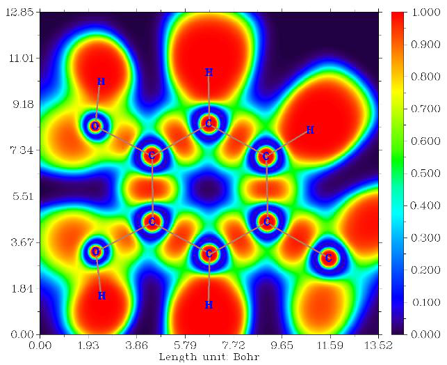


<!-- p.83 -->
plotted together on the graph. You can also use other options to control if showing atomic labels and bonds.

2 Contour line map. This map usually uses solid lines to represent positive regions, and dashed lines to exhibit negative regions.

The number of contour lines can be adjusted by user (see Section 3.5.4 for detail), you can also mark the isovalues on the contour lines by using the option “2 Enable showing isovalue on contour lines” in post-processing menu.

To fill colors between contour lines (see the figure on the right above), you can choose "9 Enable filling colors for contour lines" in the post-processing menu. Then if you choose option 9 again, you can further adjust filling effect, such as color scale, color transition and so on.

Only for the contour line map, if the real space function selected to be plotted is orbital wavefunction, you can not only plot one orbital by inputting one orbital index, but also plot two orbitals simultaneously by inputting two orbital indices (e.g. 3,5), see Section 4.4.5 for example.

Option 4 in post-processing menu is used to toggle if showing atoms labels or the reference point (involved in some real space functions such as correlation hole and source function) in the graph. The size and form (i.e. if showing atom index or element name) of the atom labels can be set by "pleatmlabsize" and "iatmlabtype" parameters in `settings.ini`, respectively. The reference point is represented as a blue asterisk on the graph. By default, only when the distance between the atoms and the plane is smaller than "disshowlabel" in `settings.ini` the corresponding atom labels will be shown. To change this distance threshold, you can either adjust this value in setting.ini or choose option 17 in post-processing menu. If "iatom_on_plane_far" parameter in `settings.ini` is set to 1, then even if the distance is larger than the threshold, the label will still be shown, but in thin text rather than bold text.

Option 8 in post-processing menu is used to toggle if showing bonds. The bond is shown for an atomic pair if these two conditions are satisfied: (1) The distance between the two atoms is smaller than bonding threshold, which can be adjusted in the GUI window of main function 0 using corresponding scale bar. (2) Both atoms are close enough to the plotting plane (smaller than the "disshowlabel" parameter mentioned above).

Option 15 in post-processing is used to plot a contour line corresponding to vdW surface (electron density=0.001 a.u., which is defined by R. F. W Bader in J. Am. Chem. Soc., 109, 7968


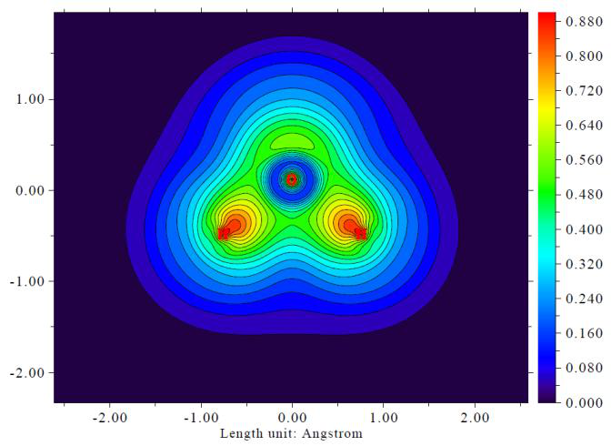

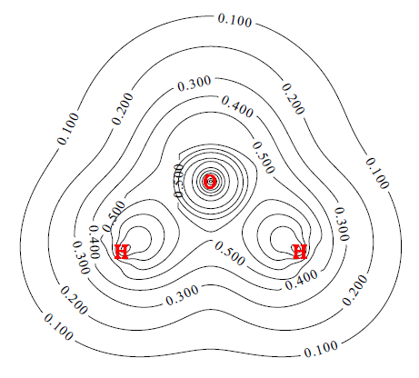

<!-- p.84 -->
(1987)). This is useful to analyze distribution of electrostatic potential on vdW surface. Such a contour line can be plotted in gradient line and vector field map too by the same option. Color, label size and line style of the contour line can be adjusted by Option 16.

The content in the above paragraphs also applies to color-filled map, gradient lines map and vector field map (see below).

3 Relief map. Use height to represent value at every point. If values are too large, they will be truncated in the graph, you can choose to scale the data with a factor to avoid truncation. The graph is shown on interactive interface, you can rotate, zoom in/out the graph.

4 Shaded relief map and 5 Shaded relief map with projection. The relief map is shaded in these two types. The latter also plots a color-filled map as projection. The meshes on the surface can disabled at post-processing stage.


<!-- p.85 -->
6 Gradient line map with/without contour lines. This graph type represents gradient direction of real space function, you can determine if the contour lines are also shown on the graph. Note that since gradients of real space function are needed to be evaluated, and graphical library needs to take some time to generate gradient lines, the calculation and plotting costs are evidently higher than other graph types.

In the option "11 Set detailed parameters of plotting gradient line" at the post-processing menu, you can set various plotting parameters:

- Suboption 1: Integration step for gradient lines, the smaller the value the finer the graph
- Suboption 2: Interstice between gradient lines, the smaller the value the denser the lines
- Suboption 3: Criteria for plotting new gradient line, try to play with it and you will know how this parameter affects the graph

- Suboption 4: Integration method. The RK4 is the most robust but most expensive. The default RK2 is good balance between accuracy and speed

- Suboptions 5 and 6: Color and width of gradient lines


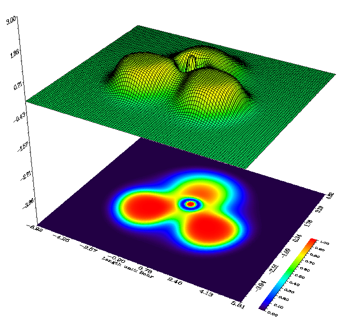

<!-- p.86 -->
7 Vector field map with/without contour lines. This graph type is very similar to last graph type, however the gradient lines are replaced by arrows, which distribute on grids evenly and represent gradient vectors at corresponding point. You can set color of arrows, or map different colors on arrows according to magnitude of function value, you can also invert the direction of arrows. Option 10 is worth mentioning, if you set upper limit for scaling to x by this option, then if the norm of a gradient vector exceeds this value, the vector will be scaled so that its norm equals x.


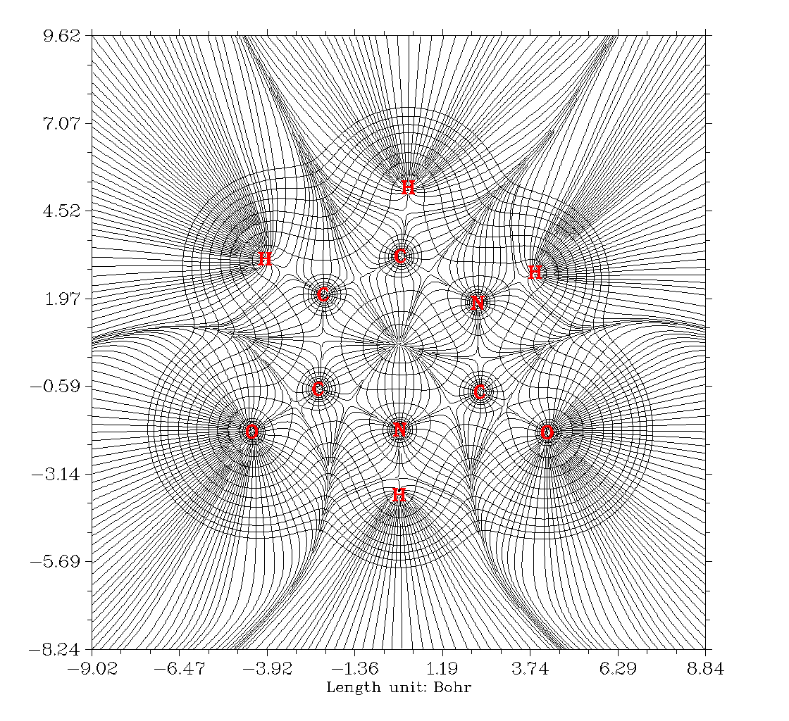

<!-- p.87 -->

### 3.5.2 Setting up grid, plane and plotting region

When program asking you to input the number of grid points in both dimensions, you can input such as 100,150, which means in dimensions 1 and 2 the number of grid points are 100 and 150, respectively, so total number is 100*150=15000, they are evenly distributed in the plotting region. For “Relief map”, “Shaded relief map” and “Shaded relief map with projection”, commonly I recommend 100,100; if this value is exceeded, the lines in the graph will look too crowd. For other graph types I recommend 200,200. Of course, the picture will become prettier and smoother if you set the value to be larger, but you have to wait more time for calculation. Bear in mind that total ESP calculation is very time-consuming, you’d better use less grid points, for previewing purposes I recommend 80,80 or less.

Multiwfn provides 8 modes to define the plotting plane: 1. XY plane: User inputs Z value to define a XY plane uniquely. 2. XZ plane: User inputs Y value to define a XZ plane uniquely. 3. YZ plane: User inputs X value to define a YZ plane uniquely. 4. Define by three atoms: Input indices of three atoms to define a plane by their nuclear coordinates. 5. Define by three points: Input coordinates of three points to define a plane. 6. Input origin and transitional vector: This way is only suitable for experts, the two inputted translation vectors must be orthogonal. 7. Define a plane parallel to a bond and meantime normal to a plane defined by three atoms 8. Above or below the plane consisting of specific atoms


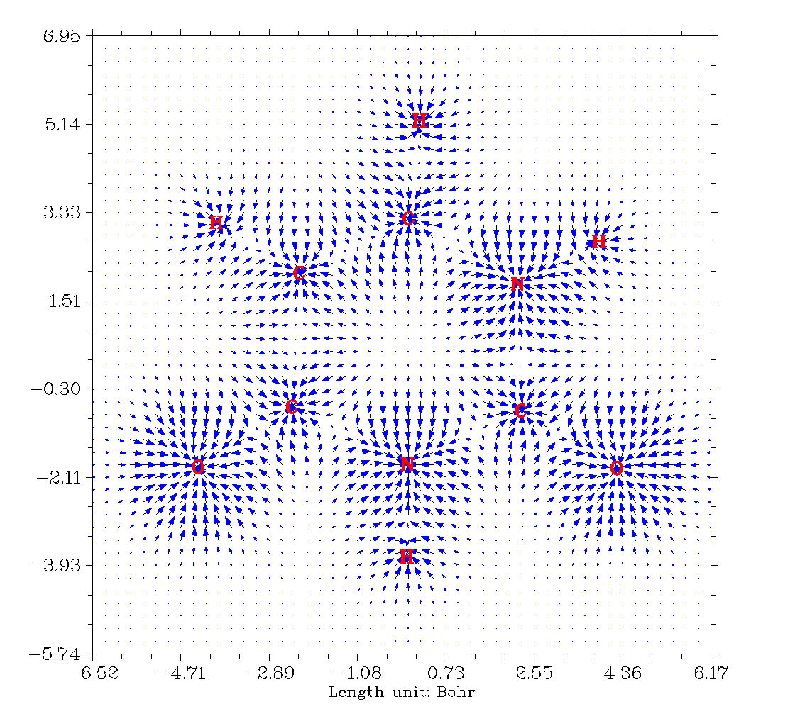

<!-- p.88 -->
Details are described below:

Modes 1 to 5 For modes 1~5, the actual plotting region is a subregion of the plane you defined. Multiwfn automatically sets the plotting region to tightly enclose the whole molecule (for modes 1, 2 and 3) or cover the three nuclei / points you inputted (for modes 4 and 5), finally the plotting region is extended by a small distance to avoid truncating the interesting region. The extension distance is 4.5 Bohr by default, if you find the region you are interested in is still be truncated, simply enlarging the value by option “0 Set extension distance for plane type 1~5”, you can also directly modify the default value, which is controlled by “Aug2D” parameter in `settings.ini`.

Below diagram illustrates how the actual plotting region is determined when you select mode 4 or 5 to define the plotting plane. The X and Y axes shown in the graph correspond to the actual X and Y axes you finally see. Evidently, the input sequence of the three points or atoms directly affects the graph.

Mode 6 For mode 6, the plotting region is determined as follows, in which each black arrow denotes translational vector 1, each brown arrow denotes translational vector 2, blue point denotes origin point. The number of arrows is the number of grids set by users. Evidently, this mode enables users to fully control the plotting plane setting.


<!-- p.89 -->
Mode 7 Mode 7 is very useful when you want to define a plotting plane cutting a bond, see following map for illustration, the purple rectangle is the plane you will plot:

To define this plane, you should select mode 7, and then input 3,5 to use these two atoms to define the axis that the plotting will be parallel to, and then input 2,3,10 (or 2,5,10 etc.) to use them to define a plane that the plotting plane will be normal to. After that you need to input the length of X and Y axes, e.g. 10 and 7 Bohr, respectively.

Mode 8 Via this mode you can plot a local plane above or below interesting atoms. Typically, this mode is used to study function distribution above/below a ring. See following map for example, the transparent blue region corresponds to the plotting plane. In this mode you should input indices of the atoms to define a fitting plane (plotting plane will parallel to it) and a geometric center, then input the vertical distance between plotting plane and the geometric center (namely the d in the following map. Positive and negative values correspond to above and below the fitting plane), then input length of the plotting plane. Note that in this mode the plotting plane is square, and the projection point of the geometric center to this plane corresponds to the plane center.

After that, you will find three commands in Multiwfn command-line window, you can copy them into VMD console window to run them, then the plotting plane will be drawn, just like the following map, which allows you to determine if the plotting plane is correctly defined.


<!-- p.90 -->
About rotation and translation of the plotting plane For the modes 4, 5 and 8, if you find the content is skewed in the final graph, or the interesting part is not located at the center of the graph, you can choose "-1: Set translation and rotation of the map for plane types 4, 5 and 8" before selecting one of these modes. For example, if you find the content in the graph your previously plotted should be translated by (-3,1.5) Bohr and then rotated

by 35, then in this option you should first input -3,1.5 and then input 35, the resulting graph will meet your expectation. A practical instance of using this option was posted on http://bbs.keinsci.com/thread-11037-1-1.html.


### 3.5.3 Options in post-processing interface

After plotting the graph, you will see a menu, in which there are a lot of options used to adjust or improve the quality of the graph. Since many of them have already been introduced above and some of them will be mentioned in next sections, and lots of them are self-explanatory, only a few will be mentioned here.

-9 Only plot the data around certain atoms: Sometimes in the graph only a few regions are interesting; if you want to screen other regions, you may find this option useful. After selecting this option, assume that you input 2,4,8-10, then only the real space function around atoms 2,4,8,9,10 will be plotted (the data to be plotted then in fact is the original plane data multiplied by the Hirshfeld weight of the fragment you inputted). Next time you select this option, the original data will be recovered.

-7 Multiply data by a factor: This is mainly used to scale the range of the plane data. -6 Export the current plane data to plane.txt in current folder: After using this option to export the plane data, you can very conveniently use third-part plotting softwares such as Sigmaplot to redraw the data.

-2 Set label interval in X, Y (and color scale) axes: This option determines the spacing between the labels in the coordinate axes. If axis labels are not shown on your map, that means the current interval(s) are too large.

-1 Show the graph again: After adjusting plotting parameters, choose this option to replot the graph to check the effect.

0 Save the graph to a file: Export the graph to a graphic file in current folder. See Section 2.8 on how to determine the graphic format and size.

19 Enable showing extrema of a function on a contour line: Via this option, you can plot e.g. maxima and minima of electrostatic potential on a contour line of electron density. See Section 4.4.12 on illustration of this option.


### 3.5.4 Setting up contour lines

For graph types 1, 2, 6 and 7, the contour lines can be plotted (if not shown, select "2 Enable showing contour lines" in the post-processing menu). There is also an option “Change setting of contour lines” in the post-processing menu. In this interface, values of current contour lines are first listed and you can modify them by using the suboptions below:

Option 1: Save current setting and return to upper menu. Then if you select “Show the graph


<!-- p.91 -->
again”, the graph with new isovalue setting will appears.

Option 2: Input a new value to replace old value of a contour line. Option 3: Add a new contour line and input the isovalue for it. Option 4: Delete some contour lines. Option 6: Export current isovalue setting to a plain text file, you can use this function to save multiple sets of your favourite isovalue settings for different systems and real space functions.

Option 7: Load isovalue setting from external file, the format should be identical to the file outputted by subfunction 6.

Option 8: Generate isovalues according to arithmetic sequence, user need to input initial value, step size and total number. For plotting ELF/LOL, I suggest user input 0,0.05,21 to generate isovalues in the range 0.0~1.0 with step size 0.05. You can choose if cleaning existing contour lines, if you select n, then new contour lines will be appended to old ones.

Option 9: Like function 8, but according to geometric series. Option 10: Some contour lines can be bolded with this function, by default no line is bolded. To bold some lines, select this function and input how many lines you want to bold, then input indices of them in turn. If there are some lines already been bolded, selecting this function will disable bolding for all of them.

Option 11: Set color for positive contour lines, you need to input a color index. Option 12: Set line style for positive contour lines, you need to input two integer numbers, the first one denotes the length of line segment, the second one denotes the length of interstice between line segments. For example, 10,15 means positive contour lines are composed of line segments with length of 10 and spaces with length of 15 alternatively.

Option 13, 14: Like options 11 and 12, but for negative part. Option 15: If this option is selected, the positive and negative lines will be set to "crimson, width=6, solid line" and "blue, width=6, long dashed line", respectively. Then the saved picture will be very suitable for publication; as you can see in the resulting graphical file, the two kinds of lines are clear and can be distinguished easily.


### 3.5.5 Plot critical points, paths and interbasin paths on plane graph

CPs and paths can be plotted on a color-filled map, contour line map, gradient line map and vector field map. Below is a typical electron density gradient line map containing critical points, topology paths and interbasin paths.


<!-- p.92 -->
In order to append the CPs and paths on the plane map, before drawing the plane graph using main function 4, you need to enter topology analysis module (main function 2), then search CPs and generate paths. After that, return to main menu and draw plane graph as usual, you will find that the CPs and paths have appeared on the graph. In the graph, brown, blue, orange, green dots denote (3,-3), (3,-1), (3,+1), (3,+3) critical points, respectively. Bold dark brown lines depict bond paths.

In the option “4 Set details of plotting critical points and paths” at post-processing menu, you can choose which types of CPs are allowed to be shown, and you can set size of markers, thickness, distance threshold and color of path lines. By default, if the vertical distance between a CP or a point in a path and the plotting plane exceeds 0.5 Bohr, the CP or path point will not be shown, the thresholds can be altered by “8 Set distance threshold for showing CPs” and “9 Set distance threshold for showing paths”.

Interbasin paths (deep blue lines in the graph above) are derived from (3,-1) CPs, these paths dissect the whole space into individual atomic basins. You can also append the interbasin paths on contour line map, gradient line map and vector field map. In order to draw interbasin paths, you should first confirm that at least one (3,-1) CP has been found in topology analysis module and it is close enough to current plotting plane (smaller than "disshowlabel" in `settings.ini`), then you can find a option "Generate and show interbasin paths" in post-processing stage, choose it, wait until the generation of interbasin paths is completed, then replot the plane graph again, you will find these interbasin paths have already presented.

If you hope the interbasin paths become shorter or longer, choose option "Set stepsize and maximal iteration for interbasin path generation" in post-processing stage before generating interbasin paths, you will be prompted to input stepsize and the number of iterations, the maximum


<!-- p.93 -->
length of yielded interbasin paths equals product of the two values. Note that if distance between a point in interbasin path and the plotting plane exceeds the "disshowlabel" in `settings.ini`, corresponding points in the interbasin path will not be shown on the plane graph.

Information needed: GTFs (depending on the choice of real space function), atom coordinates


## 3.6 Outputting and plotting specific property within a spatial region (5)


The main purpose of this function is calculating grid data or generating Gaussian-type cube file (.cub) for specific real space function. The .cub file is supported by a lot of chemistry visualization softwares, such as VMD, GaussView, and VESTA. The isosurface of generated grid data can be viewed directly in Multiwfn too. This function can also be used to calculate function values for a set of points recorded in a plain text file.

The basic procedure of using this function is: (1) Select a real space function (2) Set up grid (3) Use post-processing options to visualize isosurfaces, modify and export data PS: In the real space function selection menu, if you select option 111 (a hidden option), then the real space function to be calculated will be Becke weight of an atom or Becke overlap weight between two atoms. If you select option 112 (another hidden option), Hirshfeld weight of a given atom or fragment will be calculated.

Setting up grid Multiwfn provides many modes for setting up grid points: Mode 1: Low-quality grid, about 125000 points in total (corresponding to 50*50*50 grid, assuming the spatial region is cubic), this mode is recommended for previewing purposes.

Mode 2: Medium-quality grid, about 512000 points in total (corresponding to 80*80*80 grid, assuming the spatial region is cubic). For small molecular, this quality is enough for most analysis.

Mode 3: High-quality grid, about 1728000 points in total (corresponding to 120*120*120 grid, assuming the spatial region is cubic).

For modes 1, 2 and 3, the actual number of points in each direction is automatically determined by Multiwfn so that grid spacings in each direction are nearly equal. The method of determining spatial scope of grid data is illustrated below in two-dimension case.


<!-- p.94 -->
First, Multiwfn sets up a box (red dashed line) to just enclose the entire molecule, and then the box is suitably extended in each dimension to avoid truncating boundary part of isosurfaces, the green rectangle in the graph below is the actual spatial scope of grid data. If the extension distance is inappropriate, you can set the value by using option “-10 Set extension distance of grid range", or directly set default value by modifying “Aug3D” in `settings.ini`.

The so-called “Low-quality”, “Medium-quality” and “High-quality” respectively corresponding to modes 1, 2 and 3 are only relative to medium-sized systems, because each of them corresponds to a fixed number of grid points. For a large system, spatial range of grid data is often wide, then grid density of mode 3 will not be very fine and should actually be called “Medium quality” in this context, and mode 2 should be called “Low quality”. In contrast, for a micro system, the density of grid points of mode 1 is already fine enough for most purposes.

Mode 4: Specify the number of grid points or grid spacing in X, Y and Z directions yourself, the spatial scope is determined automatically as shown above.

Mode 5: Specify all details of grid setting by user, including original point, the number of points and grid spacings in X, Y and Z directions. This mode is useful for experienced users.

Mode 6: Specify the center coordinate, number of points and extension distance in X, Y and Z directions. For example, the center coordinate you inputted is 2.3,1.0,5.5, the extension distance in X, Y and Z is k,k,m, then the coordinates of two most distant endpoints are (2.3-k,1.0-k,5.5-m) and (2.3+k,1.0+k,5.5+m). This mode is useful for analyzing local properties.

Mode 7: Like function 6, but inputting indices of two atoms instead of inputting center coordinate, the midpoint between the two nuclei will be set as center. This mode is very useful for weak interaction analysis by RDG function. For example, we want to study the weak interaction region between the dimer shown below, and we found C1 and C14 may enclose this region, so we input 1,14, see Section 3.23.1 for example. If the two atom indices are identical, then the nuclear coordinate will be set as center.


<!-- p.95 -->
Mode 8: Use grid setting (origin, number of points and grid spacing) of an existing cube file. You will be prompted to input the file name. This mode is useful to generate multiple cube files with exactly identical grid setting.

Mode 9: This mode is visible only when input file contains cell information (i.e. modified .molden file of CP2K is used as input file, see Section 2.9.2.1, or other files carrying cell information are used as input file, see Section 2.9.3). You will be requested to input coordinate of origin, box lengths, and grid spacing (shared by all the three dimensions). If you press ENTER button directly when Multiwfn asks you to set origin and box lengths, the relationship of the box and the cell will correspond to the situation shown below, in which each point of intersection corresponds to a grid point to be calculated. As you can see, in each direction, the length of the box differs from the length of cell by a grid spacing. In this case, integral of a function can be straightforwardly evaluated based on grid data as ∑𝑓(𝑖)𝑣𝑖, where f(i) is function value at grid i and v is grid volume. Note that the inputted grid spacing will be automatically adjusted to that the number of grids is an integer.

Mode 10: Set up the grid data in a GUI window. This mode is quite convenient, the box is clearly visible in the graphic window, and you can directly change box length, box center and grid spacing by dragging corresponding scale bars (the X, Y, Z directions share the same grid spacing). The total number of grids under present grid setting can be directly seen at the right bottom side of the window.


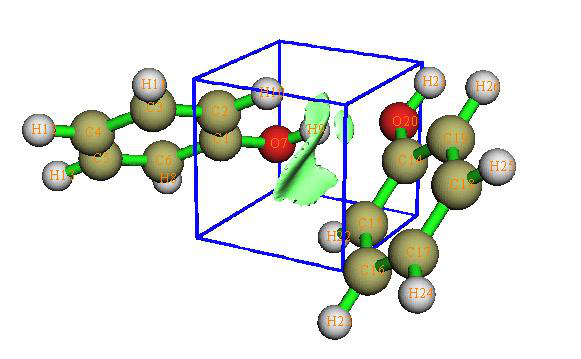


<!-- p.96 -->
Mode 11: You will be asked to input atomic indices to define a fragment and input extension distance, then the box will be determined by extending the given distance around the fragment. You will be also prompted to input grid spacing, which is shared by all three directions. This mode is particularly useful when you want to employ non-covalent interaction (NCI) and independent gradient model (IGM) methods to visually study interaction between a molecule (the fragment you defined) and surroundings.

Notice that the more grid points you set, the finer the isosurface graph you will get, however the more time is needed for calculating grid data and generating isosurface graph. The increase of calculation time with the number of points is nearly linear.

After setting grid points, the program starts to calculate grid data, once the calculation is finished, the minimum/maximum and corresponding coordinate, the sum of all/positive/negative data multiplied by the differential element are printed on screen immediately. If what you calculated is electron density, the molecular dipole moment evaluated based on grid data is also printed out. Then you will see post-processing menu.

Post-processing options In the post-processing menu if the option “-1 Show isosurface graph” is selected, a GUI window will pop up, which shows the isosurface of grid data, all widgets are self-explanatory, you can change isosurface value by both dragging slide bar (upper and lower limit are -5 and +5 respectively) or inputting precise value in text box (then press “Enter” button in your keyboard); if “Show data range” is selected, the spatial scope will be marked by a blue frame as the one in above picture (if spatial scope exceeds the range of coordinate axis, the frame will not be displayed). The isosurfaces with the same and reverse sign of current isovalue are in green and blue respectively.

Option 1 can export isosurface graph to a graphical file in current directory. Option 2 can export


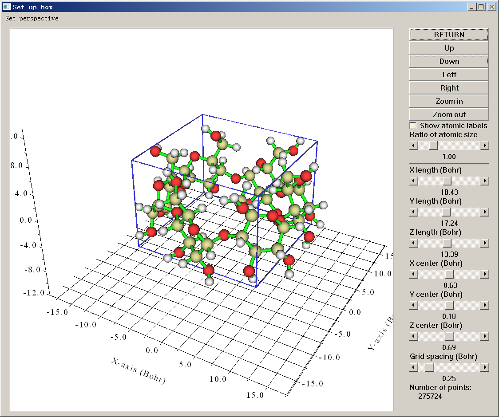

<!-- p.97 -->
grid data to .cub file in current directory. By selecting option 3 the grid data will be exported to plain text file output.txt in current directory. Using option 4 you can set isovalue without entering GUI window and dragging slide bar, it is useful for batch process and in command-line environment. With options 5~8, you can perform addition, subtraction, multiplication and division operations on the grid data, respectively; after that, you may use option 10 to restore to original grid data.

If you only want to visualize isosurface of a specific fragment, you can select option 9 in post-processing menu, then input indices of the atoms in this fragment. After that, Hirshfeld weight of the fragment will be calculated at every grid, which will then be multiplied to the original grid data. Via this manner, value of the grid points far from the fragment will be zero, and thus will not be shown in isosurface map.

Special case: Calculate data for a set of arbitrarily distributed points If you want to use Multiwfn to calculate real space function value for a set of points (maybe arbitrarily distributed), in the interface for setting up grid, you should choose "100 Load a set of points from external file" and then input the path of the plain text file recording the points. In the file the first line should be the number of points recorded, and followed by X/Y/Z coordinates of all points. For example,


```text
1902
   -3.3790050   -2.0484700    0.0274117
   -3.3844930   -1.9472468   -0.2500274
   -3.4064601   -1.9221635   -0.1287148
   -3.4118258   -1.9232203   -0.0003350
   -3.4059106   -1.9218280    0.1351179
....
```

The coordinates must be given in Bohr. The format is in free format, and can have more than four columns of data, but the columns after the fourth one will be simply ignored.

Multiwfn will load coordinates of the points from this file, and then calculate function value for them. Finally, the X/Y/Z coordinate and function value of all points will be outputted to a plain text file, whose path is specified by users.

Information needed: Atom coordinates, GTFs (depends on the choice of real space function)


## 3.7 Custom operation, promolecular and deformation properties (options 0, -1, -2 in main functions 3, 4, 5)


### 3.7.1 Custom operation for multiple wavefunctions (0)

In main functions 3, 4 and 5, there is a subfunction that allows you to set custom operation for

multiple wavefunctions. Supported operators include + (add), − (minus), * (multiply), / (divide), there is no upper limit of the number of wavefunctions involved in custom operation. For example, if the first loaded wavefunction after booting up Multiwfn is a.wfn, then in the setting step of custom operation you inputted 2 (viz. there are two wavefunctions will be put into “custom operation list”


<!-- p.98 -->
and thus will be operated with a.wfn in turn), then you inputted -,b.wfn and *,c.wfn, the property finally you get will be [(property of a.wfn) - (property of b.wfn)] * (property of c.wfn). If you are confused, you can consult the example in Sections 4.5.4 and 4.5.5.

Sometimes the molecular structure in the first loaded file and that in the subsequently loaded files are not identical, the grid points you set will be for the first loaded file, all of the other files will share the same grid setting.

Avoid using custom operation in conjunction with main functions -4, -3 and 6, otherwise you may get absurd result.


### 3.7.2 Promolecular and deformation properties (-1, -2)

If you selected subfunction -1 in main functions 3, 4 or 5 before choosing a property (viz. a real space function), what you finally get will be promolecular property. Promolecular property is the superposition property of atoms in their free-states

$$P^{\mathrm{pro}}(\mathbf{r})=\sum_{A}P_{A}^{\mathrm{free}}(\mathbf{r}-\mathbf{R}_{A})$$

If the property you chose is electron density, then the promolecular property is generally referred to as promolecular density

$$P^{\mathrm{pro}}(\mathbf{r})=\sum_{A}P_{A}^{\mathrm{free}}(\mathbf{r}-\mathbf{R}_{A})$$

This is an artificial density that corresponds to the state when the molecule has formed but the density has not relaxed.

Deformation property is the difference between actual property and promolecular property of a molecule under the same geometry


$$P^{\mathrm{def}}\left(\mathbf{r}\right)=P^{\mathrm{mol}}\left(\mathbf{r}\right)-P^{\mathrm{pro}}\left(\mathbf{r}\right)$$

<!-- formula-ocr: formula_p98_043.png 已替换为LaTeX, 原图保留备查 -->

If the property is chosen as electron density, then the deformation property is generally called deformation density or known as electronic bonding charge distributions (BCD), which is very useful for analyzing charge transfer and bonding nature. Application example of deformation density can be found from my paper Acta Phys. -Chim. Sin., 34, 503 (2018) and Angew. Chem. Int. Ed., 137, e202504895 (2025) DOI: 10.1002/anie.202504895.


### 3.7.3 Generation of atomic wavefunctions

Evaluation of promolecular and deformation properties and some functions in Multiwfn request atomic wavefunction files, such as calculating Hirshfeld, VDD and ADCH charges, fuzzy atomic space analysis and orbital composition analysis based on Hirshfeld partition, etc. The process of generating atomic .wfn files are exactly the same.

After you select subfunctions -1 or -2 to study promolecular and deformation properties, Multiwfn checks whether .wfn files of all elements involved in present system have been presented in “atomwfn” subdirectory of current directory, if not, Multiwfn automatically invokes Gaussian to generate the missing element .wfn files and sphericalizes their densities. If the path of Gaussian executable file (“gaupath” parameter in `settings.ini`) is incorrect or has not been defined, Multiwfn


<!-- p.99 -->
will ask you to input the path of Gaussian executable file. The basis set for generating the element wavefunctions can be arbitrarily set by user, however it is suggested to use the same basis set as the molecular wavefunction.

The newly generated element wavefunction files or those taken from “atomwfn” directory are stored in “wfntmp” subdirectory in current directory. They will be translated to actual position of the atoms in present system, meanwhile atomic indices will be added to the .wfn filename (e.g. "Cr 30.wfn"). These are the files that will directly be used to calculate promolecular and deformation properties.

Details and skills If you want to avoid the step of generating element wavefunctions every time, you can move the .wfn files that without number suffix (such as C .wfn) from “wfntmp” directory to “atomwfn” directory (if “atomwfn” directory is non-existing, build it yourself), next time if Multiwfn detected that all needed element .wfn files have already been presented in “atomwfn” folder, then Multiwfn will directly use them. Multiwfn only invokes Gaussian to calculate the missing element .wfn files.

“atomwfn” subdirectory in “examples” directory contains element wavefunction files of all first four rows, they were generated under 6-31G*, and they have been sphericalized. If you want to use them, simply copy the "atomwfn" directory to current folder.

There is a quick way to generate all first four-rows element wavefunction files: the file “examples\genatmwfn.pdb” contains all first four-rows atoms, load it into Multiwfn and generate promolecular property, after the calculation of element wavefunctions is finished, copy the .wfn files that without suffix in “wfntmp” directory to “atomwfn” directory.

If your system involves elements heavier than Kr, Multiwfn is unable to generate atom wavefunction files by invoking Gaussian and sphericalize their density automatically; in that cases you have to calculate and sphericalize atom wavefunctions manually, and then put them into “atomwfn” directory, Multiwfn will directly use them.

The default theoretical method for generating wavefunction for main group elements in first four-rows (index from 1 to 20 and 31 to 36) is ROHF, for the transition metals in the fourth row, UB3LYP is used. In general, the promolecular and deformation properties are insensitive to theoretical method. If you want to specify theoretical method yourself, you can input theoretical method and basis set at the same time with slash as separator, for example BLYP/6-311G*. Do not add “RO” or “U” prefix since they will be added automatically. If error occurs during generation of atom wavefunctions, please check Gaussian input and output files in “wfntmp” directory carefully.

Notice that the maximum character length of the path of .wfn file permitted by Gaussian is only 60! The path will be truncated and cause error if the length exceeded this threshold. So do not put Multiwfn in the directory with too long path!


### 3.7.4 Sphericalization of atom wavefunction

The main purpose of Multiwfn supporting promolecular and deformation property is for generating promolecular and deformation density, however, electron density of most elements in free and ground state is not in spherical symmetry, hence will lead to orientation dependence problem. To tackle it, atomic electron density must be sphericalized. However, there is no unique way to do this. In Multiwfn, atom electron density is sphericalized by modifying atom wavefunction artificially, here I describe the detail. If you want to skip the sphericalization step, simply set the “ispheratm” in `settings.ini` to 0.


<!-- p.100 -->
For elements in IV A group, Multiwfn uses sp3 configuration to replace s2p2 ground state by default. This treatment is reasonable, since in most molecules these atoms are in sp3 hybridization. For VI A, VII A and Fe, Co, Ni, Multiwfn equalizes the occupation number of orbitals within the same shell; for example, oxygen has two singly occupied 2p orbitals and one doubly occupied 2p orbitals in ground state, the number of electrons in this shell is 4, so Multiwfn sets the occupation number of all the three orbitals to 4/3. This method works because the shapes of occupied orbitals are always nearly identical, regardless of the original occupation number is one or two. However, the difference between virtual orbital and occupied orbital is remarkable, thus Multiwfn uses another method to sphericalize electron density of elements in III A group, as well as Sc, Ti and V. In this method, the singly occupied orbitals are duplicated and rotated. Taking boron as example, assume that the singly occupied 2p orbital is directing along Z-axis, Multiwfn replicates this orbital twice and turn them toward X-axis and Y-axis respectively, finally the occupation numbers of the three orbitals are set to 1/3. (Users needn’t to check the orientation of singly occupied orbital by themselves). If you hope that Multiwfn sphericalizes atoms in IV A group in such manner instead of using sp3 configuration, set “SpherIVgroup” in `settings.ini` to 1.

Notice that the sphericalization methods used in Multiwfn are closely related to wavefunction type, the methods fail if unrestricted wavefunction is used for main group elements or restricted open-shell wavefunction is used for transition metals. These methods also fail if Hartree-Fock method is used for transition metals, because orbital order produced by HF is different from most DFT cases (the HF’s order is wrong, 4s is higher than 3d).


## 3.8 Checking & modifying wavefunction (6)

This function provides a lot of subfunctions for checking and modifying loaded wavefunction, all subfunctions take effect immediately, so after modification(s) you can print related information via proper subfunction to check if your previous operations are correct. After returning to main menu, all subsequent analyses which make use of wavefunction information will be affected. The title in this interface shows the number of GTFs, orbitals, atoms and alpha/beta/total electrons of present wavefunction.

Once you finish all modifications of wavefunction, you can save current wavefunction to new.wfn in current folder via subfunction 0. If you want to save to other wavefunction format, you should return to main menu first, and then enter subfunction 2 of main function 100, then choose corresponding option to save to an expected format.

Below I briefly introduce each subfunction in this main function. Subfunction -3 and -4: Defining molecular fragment. In -3 you directly define a fragment by inputting atomic indices; while in -4 you should input the indices of the atoms to be excluded, the remaining atoms will constitute the fragment. The GTFs whose centers do not belong to this fragment will be discarded (can be imagined as corresponding GTF coefficients in all orbitals are set to zero). This function affects all the following analyses which make use of GTF information, in particular, the calculations involving real space functions.

When use these two subfunctions? For large molecules, what you are interested in may be only a small region, by discarding atoms in other regions, the calculation speed of time-consuming task


<!-- p.101 -->
such as generating grid data can be increased evidently. Besides, sometimes you only want to obtain real space function contributed by certain atoms, these two functions can fulfill your purpose.

This function can be safely used together with main functions 1~6. For other tasks, DO NOT use this function if you do not understand what you are exactly doing, otherwise you may obtain wrong or meaningless results. Notice that this function is irreversible, the discarded GTFs cannot be recovered, unless you reboot the program and reload the wavefunction file.

Subfunction 0: Save current wavefunction to new.wfn file in current directory. Notice that the orbitals with zero occupation number and the atoms do not have GTFs will be automatically discarded during saving.

Subfunction 1: Print information of all GTFs, including the centers they belong to, GTF types and exponents.

Subfunction 2: Print information of all basis functions, including the shells/centers they attributed to, types, and corresponding GTF index ranges.

Subfunction 3: Print basic information of all orbitals, including energies, occupation numbers, orbital types (Alpha, beta or alpha+beta).

Subfunction 4: Print detail information of an orbital, including the expansion coefficients with respect to GTFs (along with GTF information), note that the coefficients include GTF normalization constants.

Subfunction 5: Print coefficient matrix in basis functions (not the coefficients with respect to GTFs), only available when the input file contains basis function information.

Subfunction 6: Print one-particle density matrix in basis functions, only available when the input file contains basis function information.

Subfunction 7: Print various kinds of integral matrix between basis functions, including overlap integrals, electric/magnetic dipole moment integrals, kinetic energy integrals, velocity integrals, electric quadrupole and octopole integrals. For overlap matrix, eigenvalues are printed together, which are useful for checking linear dependency. Only available when the input file contains basis function information.

Subfunction 11: Exchange centers or types or exponents or orbital expansion coefficients of two GTFs, or exchange all information of two GTFs at once (equivalent to exchanging recording order of two GTFs, thus does not affect any analysis result)

Subfunction 21 to 24: Set center, type, exponent and expansion coefficient of a specific GTF in an orbital, respectively.

Subfunction 25: Set expansion coefficients of some GTFs in some orbitals to a specific value. The GTFs simultaneously satisfying the three inputted conditions will be selected: Index range of GTFs, index range of the atoms that GTFs centered at, GTF types (input specific type, such as YZ, XXZ, etc., or input angular moment, such as S, P, D, etc.).

If the input file also contains basis function information, by this option you can also set expansion coefficients of basis functions.

Subfunction 26: Set occupation number of some orbitals. You can directly set them to a specific value, or add, minus, multiply, divide them by a given value. This function is very useful for shielding the contributions from certain orbitals to real space functions, namely setting their occupation numbers to zero before calculating real space functions.

Subfunction 27: Set orbital type of some orbitals, then wavefunction type will be automatically updated, please check the prompts shown on the screen.


<!-- p.102 -->
Subfunction 28: Set energy of some orbitals. You can directly set them to a specific value, or add, minus, multiply, divide them by a given value. This function is useful when you want to rectify the orbital energies using a given relationship (e.g. J. Am. Chem. Soc., 121, 3414 (1999)) before plotting density-of-states (DOS) map.

Subfunction 29: Input indices of two orbitals, then all of their information (energy, occupation, coefficients) will be exchanged

Subfunction 30: Exchange energies and occupation numbers for all orbitals. This is particularly useful in obtaining EDDB grid data based on EDDB code of D. W. Szczepanik. After loading the .fchk file exported by EDDB code, entering this function, and selecting option 1 (exchange orbital energies in eV with occupation numbers), then occupation numbers will correspond to eigenvalues of Natural Orbital for Bond Delocalization (NOBD). Then if you use main function 5 to calculate grid data of electron density as usual, the resulting grid data will directly correspond to EDDB.

Subfunction 31: Translate the whole wavefunction and all atom coordinates of current system by inputting translation vectors and their units.

Subfunction 32: Translate and duplicate the whole wavefunction and all atom coordinates of current system, users need to input translation vectors, their units and how many times the system will be translated and duplicated according to the translation vectors. This function is useful for extending the primitive cell wavefunction outputted by Gaussian PBC function to supercell wavefunction, of course you can calculate supercell wavefunction directly by Gaussian, but much more computational time will be consumed. Notice that constructing wavefunction of a supercell by this way is only an approximation, because the mix between orbitals of neighbouring primitive cells to new supercell orbitals is completely ignored.

Subfunction 33: Rotate wavefunction, namely X→Y, Y→Z, Z→X Subfunction 34: Set occupation number of all inner molecular orbitals in present system to zero, namely only contribution from valence orbitals will be reserved for subsequent studies. The number of inner MOs is automatically determined, however, the atoms using pseudopotential are not taken into account.

Subfunction 35: This function is very useful if you want to discard contribution of orbitals with certain irreducible representation (IRREP) in all kinds of analyses. After you enter this subfunction, IRREP of all occupied orbitals will be shown, the "N_orb" denotes the number of occupied orbitals belonging to the corresponding IRREP. If you want to discard contribution of some IRREPs in the succeeding analyses, you can select option 1 and input the index of the IRREPs, then the occupation number of corresponding orbitals will be set to zero and thus their contributions are eliminated, and you will also see their status are changed from "Normal" to "discarded". Then you can choose option 0 to save wavefunction and quit. You can also choose option 2 to recover the original occupation number of all orbitals, or choose 3 to reverse the status of every IRREP between "Normal" and "Discarded". Note that this subfunction only works for .mwfn, .molden and .gms files, because only these files record orbital IRREPs (beware that the IRREPs in the .molden file produced by many quantum chemistry programs are missing or incorrect). Besides, only restricted and unrestricted SCF wavefunctions are supported.

Subfunction 36: Invert phase of some orbitals (i.e. replacing expansion coefficients of basis functions and GTFs of these orbitals with their negative values).

Subfunction 37: This option converts restricted (R) or restricted open-shell (RO)


<!-- p.103 -->
wavefunction to unrestricted wavefunction. More precisely, each spatial orbital will be split to an alpha and a beta orbital, which have identical energy and shape, but their occupancy may be different. This option is useful for CDA analysis based on ROKS wavefunctions, see Section 4.16.4 for example.

Subfunction 38: This option is used to make occupation of orbitals integer and satisfy Aufbau principle. For example, originally the occupation of orbitals (from energy of low to high) is 2.0 1.95 1.93 0.09 0.03 0.0, then after using this option, the occupations will be 2.0 2.0 2.0 0.0 0.0 0.0. In addition, if the number of electrons is an integer and the wavefunction was originally determined as a multi-determinant wavefunction, this option will also automatically set the wavefunction type to single-determinant. Note that this function assumes that the orbitals in the inputted wavefunction file were ordered by energy from low to high.

Information needed: Basis function (only for subfunctions 2, 5, 6, 7), GTFs, atom coordinates


## 3.9 Population analysis and calculation of atomic charges (7)


This module is used to calculate population number of basis functions, shells, atoms, fragments, or atomic charges. There are some points that should be noted:

Regardless of which subfunction you choose, if you want to evaluate fragment charge/population (the sum of charge/population of the atoms in a fragment), you should select option "-1 Define fragment" first and input atom indices to define the fragment. Then once the calculation of atomic charges is finished, fragment charge will be printed along with atomic charges. If your input file is .chg or .pqr, which contains atomic charge information, this option also automatically prints the sum of atomic charges of the atoms in the fragment.

After atomic charge calculation, you can choose to output atomic coordinates with calculated charges to [name of loaded file].chg file in current directory, see Section 2.5 for detail about .chg format.

If the file loaded when Multiwfn boots up is .chg format, you can use option "-2 Calculate interaction energy between fragments based on atomic charges" in present function to evaluate interfragment electrostatic interaction energy between two given fragments by classic Coulomb formula (see below) using the atomic charges in this .chg file.

$$E_{Coul-int}=\sum_{A\in frag1}\sum_{B\in frag2}\frac{q_{A} q_{B}}{\left|\mathbf{R}_{A}-\mathbf{R}_{B}\right|}$$

This feature is useful for studying electrostatic interaction component in total molecular interaction energy, as well as evaluating intermolecular exciton coupling energy based on atomic transition charges (see Section 4.A.9 on how to derive them).

If you are not familiar with atomic charges, it is strongly suggested to read my review article, which very comprehensively introduced concepts, characteristics, applications, calculation methods of atomic charges:


<!-- p.104 -->
Tian Lu,* Qinxue Chen, Partial Charges, In Exploring Chemical Concepts Through Theory and Computation. WILEY-VCH GmbH: Weinheim (2024); pp. 161-187. DOI: 10.1002/9783527843435.ch6.


### 3.9.1 Hirshfeld atomic charge (1)

Hirshfeld is a very popular atomic population method based on deformation density partition, Hirshfeld charge is defined as (Theor. Chim. Acta (Berl.), 44, 129 (1977))

def( )( )dAAqwρ= −rrr Hirsh

where


$$\begin{aligned}&q_{_{A}}=-\int w_{_{A}}^{Hirsh}(\mathbf{r})[\rho(\mathbf{r})-\rho^{pro}(\mathbf{r})]\mathrm{d}\mathbf{r}\\&=-\int w_{_{A}}^{Hirsh}(\mathbf{r})\rho(\mathbf{r})-\rho_{_{A}}^{free}(\mathbf{r}-\mathbf{R}_{_{A}})\mathrm{d}\mathbf{r}\\&=-\int w_{_{A}}^{Hirsh}(\mathbf{r})\rho(\mathbf{r})\mathrm{d}\mathbf{r}+\int\rho_{_{A}}^{free}(\mathbf{r}-\mathbf{R}_{_{A}})\mathrm{d}\mathbf{r}\\&=-p_{_{A}}+Z_{_{A}}\\ \end{aligned}$$

<!-- formula-ocr: formula_p104_044.png 已替换为LaTeX, 原图保留备查 -->

A

$$w_{_{A}}^{^{Hirsh}}\left(\mathbf{r}\right)=\frac{\rho_{_{A}}^{^{free}}\left(\mathbf{r}-\mathbf{R}_{_{A}}\right)}{\rho^{^{pro}}\left(\mathbf{r}\right)}$$

It can also be rewritten as follows to make its physical meaning clearer

$$\begin{aligned}&q_{_{A}}=-\int w_{_{A}}^{Hirsh}(\mathbf{r})[\rho(\mathbf{r})-\rho^{pro}(\mathbf{r})]\mathrm{d}\mathbf{r}\\&=-\int w_{_{A}}^{Hirsh}(\mathbf{r})\rho(\mathbf{r})-\rho_{_{A}}^{free}(\mathbf{r}-\mathbf{R}_{_{A}})\mathrm{d}\mathbf{r}\\&=-\int w_{_{A}}^{Hirsh}(\mathbf{r})\rho(\mathbf{r})\mathrm{d}\mathbf{r}+\int\rho_{_{A}}^{free}(\mathbf{r}-\mathbf{R}_{_{A}})\mathrm{d}\mathbf{r}\\&=-p_{_{A}}+Z_{_{A}}\\ \end{aligned}$$


$$q_{A}=-p_{A}+Z_{A}$$

where pA is population number of the atom in actual chemical system. Z is nuclear charge, which equals the number of electrons carried by the atom in its free state.

The advantages of Hirshfeld population are: 1. Result is qualitatively consistent with general chemical concepts such as electronegativity rule.

2. The weighting function w for space partition has clear physical meaning. 3. Unlike the methods based on integrating electron density such as AIM charge, what the Hirshfeld charge reflects is the amount of transferred electron density during molecule formation, the density not transferred is not involved.

4. Insensitive to the quality of wavefunction. 5. Although calculating Hirshfeld charge needs integration in real space, due to the smooth integrand, sophisticated density functional theory (DFT) grid-based integration schemes can be directly used, so Hirshfeld population is high-efficient.

6. The wide application field. Deformation density data can also be obtained by X-ray crystallography experiments. Moreover, the applicability of Hirshfeld population is not constrained by the type of wavefunction, the method can be directly applied to solid system, where the wavefunction generally be described by plane-wave functions.

The disadvantages of Hirshfeld population are the charge is always too small and the poor


<!-- p.105 -->
reproducibility of observable quantities, such as molecular dipole moment and ESP, the reason is Hirshfeld population completely ignores atomic dipole moments.

After calculation, if the printed sum of all Hirshfeld charges is very close to integer, that means the quadrature is accurate; if not, that means the outputted Hirshfeld charges are unreliable, you need to increase the density of integration points by setting “radpot” and “sphpot” to larger value and calculate again. For balancing computational time and accuracy, the default value of “radpot” and “sphpot” are 75 and 434, respectively, you can set them to 100 and 590 respectively to obtain more accurate results.

An example is given in Section 4.7.1. Information needed: GTFs, atom coordinates


### 3.9.2 Voronoi deformation density (VDD) atom population (2)

The only difference between VDD and Hirshfeld population is the weighting function w. In VDD population, the Voronoi cell-like partition is used, each cell corresponds to an atom, see J. Comput. Chem., 25, 189 (2004) for details.

The results of VDD population are similar to Hirshfeld population in common, because the magnitude of deformation density is always small, so there is no significant change in charges when different weighting functions are used. The outputted terms are identical to Hirshfeld population. Personally, I suggest you use Hirshfeld population instead of VDD.

Note that if the sum of VDD atomic charge deviates from molecular net charge evidently, that means the numerical integration accuracy is not satisfactory, and hence you should enlarge "sphpot" parameter in `settings.ini` to improve the result. "radpot" parameter also influences the result, but not so significantly as "sphpot".

Information needed: GTFs, atom coordinates


### 3.9.3 Mulliken atom & basis function population analysis (5)

Theory Mulliken analysis is the oldest population method based on orbital wavefunction, supported by almost all quantum chemistry packages.

Orthonormality condition of spin orbital wavefunction entails 21( ) dφ= rr , if we assume

$$\mathrm{I}=\int\left(\sum_{a}C_{a,i}\chi_{a}(\mathbf{r})\right)^{2}\mathrm{d}\mathbf{r}=\sum_{a}C_{a,i}^{2}+\sum_{a}\sum_{b\neq a}C_{a,i}C_{b,i}S_{a,b}=\sum_{a}C_{a,i}^{2}+2\sum_{a}\sum_{b>a}C_{a,i}C_{b,i}S_{a,b}\right)$$

a

it, we get

$$\mathrm{I}=\int\left(\sum_{a}C_{a,i}\chi_{a}(\mathbf{r})\right)^{2}\mathrm{d}\mathbf{r}=\sum_{a}C_{a,i}^{2}+\sum_{a}\sum_{b\neq a}C_{a,i}C_{b,i}S_{a,b}=\sum_{a}C_{a,i}^{2}+2\sum_{a}\sum_{b>a}C_{a,i}C_{b,i}S_{a,b}\right)$$


<!-- p.106 -->
$$S_{a,b}=\int\chi_{a}(\mathbf{r})\chi_{b}(\mathbf{r})\mathrm{d}\mathbf{r}$$

term is “local term”, denotes the net population of each basis function in orbital i, the second term is “cross term”, denotes the shared electrons between basis function pairs in orbital i. Certainly the local terms should be completely attributed to corresponding basis functions, however for cross terms the partition method is not unique. Mulliken defined the population of basis function a in spin orbital i as


$$\Theta_{i,a}=C_{a,i}^{2}+\sum_{b\neq a}C_{a,i}C_{b,i}S_{a,b}$$

<!-- formula-ocr: formula_p106_046.png 已替换为LaTeX, 原图保留备查 -->

That is each cross term baibiaSCC,,,2 is equally partitioned to corresponding two basis functions.

The population number of atom A is simply the sum of population numbers of all basis functions attributed to atom A in all orbitals. Mulliken atomic charge is defined as

$$q_{_{A}}=Z_{_{A}}-\sum_{i}n_{_{i,A}}=Z_{_{A}}-\sum_{i}\eta_{_{i}}\sum_{a\in A}\Theta_{_{i,a}}$$

where η is orbital occupation number, ni,A is the contribution from orbital i.

Mulliken analysis is not ideal for practical application due to these shortcomings: 1. Poor reproducibility of observable properties such as molecular dipole moment 2. The “equal partition” of cross term has no strict physical meaning 3. Very high basis set dependence. In particular, diffuse functions must not be presented, otherwise the result will be misleading.

4. Occasionally, meaningless results occur (population number is negative).

Usage Since amount of outputted information is huge for large systems, before selecting below subfunctions, you can use option -1 to change the default output destination from screen to a specific plain text file.

·Subfunction 1 (Output Mulliken population and atomic charges): Population of basis functions, population of basis function shells, population of each angular moment of atomic orbitals, as well as atomic charges are printed.

·Subfunction 2 (Output gross atomic population matrix and decompose it): Gross atom population matrix is printed, from which you can get local terms of each atom (diagonal element) and cross terms between each atomic pair (non-diagonal element multiplies 2). The matrix element is defined as


$$2C_{a,i}C_{b,i}S_{a,b}$$

<!-- formula-ocr: formula_p106_047.png 已替换为LaTeX, 原图保留备查 -->

Note that the last row of outputted matrix is the sum of corresponding column elements, that is the total population number of corresponding atom. You can also choose to decompose the matrix

to contribution of each occupied orbital, the  matrices will be outputted to groatmdcp.txt in current directory.

𝑖 is just the Mulliken bond order between atom A and B contributed from orbital i, as we will see in Section 3.11.4. By the way, the quantity 2𝐴,𝐵

·Subfunction 3 (Output gross basis function population matrix and decompose it): Gross basis function population matrix can be outputted by this option for further analyzing detail of


<!-- p.107 -->
electron distribution, the matrix element is defined as


$$\Gamma_{a,b}=\sum_{i}\Gamma_{a,b}^{i}=\sum_{i}\eta_{i}C_{a,i}C_{b,i}S_{a,b}$$

<!-- formula-ocr: formula_p107_048.png 已替换为LaTeX, 原图保留备查 -->

Likewise, in subfunction 2, the last row of the outputted matrix is total population number of corresponding basis function. You can also select to output contribution of each occupied orbital, namely 𝑎,𝑏 𝑖, to grobasdcp.txt in current directory (notice that this file is extremely large even for medium-sized system).

·Subfunction 4 (Output orbital contributions to atomic populations to atmpopdcp.txt): This option is used to output contributions of occupied orbitals to atomic populations, namely all

$$\Gamma_{a,b}=\sum_{i}\Gamma_{a,b}^{i}=\sum_{i}\eta_{i}C_{a,i}C_{b,i}S_{a,b}$$

An example of Mulliken population analysis is given in Section 4.7.0. Information needed: Basis functions


### 3.9.4 Löwdin atom & basis function population (6)

The only difference between Löwdin and Mulliken population analysis is whether Löwdin orthogonalization is performed first. In Löwdin orthogonalization, the transformation matrix is


$$\mathbf{X}=\mathbf{U}\mathbf{s}^{1/2}\mathbf{U}^{\mathrm{T}}$$

<!-- formula-ocr: formula_p107_049.png 已替换为LaTeX, 原图保留备查 -->

where U is eigenvector matrix of overlap matrix, matrix s is diag(λ1, λ2...), where {λ} is eigenvalue set of overlap matrix. After Löwdin orthogonalization, the overlap matrix becomes identity matrix, and new coefficient matrix is X-1C.

Ostensibly, Löwdin population avoids the partition for cross terms since they have become zero, actually, the partition step is no more than hidden in the orthogonalization. Since Löwdin orthogonalization still has no strong physical meaning, it cannot make conclusion that Löwdin population is better than Mulliken. In view of practical results, one also found Löwdin charges have no evident advantages relative to Mulliken charges, though some people argued that Löwdin charges have better basis set stability and reproducibility of molecular dipole moment. Besides, Mayer et. al. found Löwdin population has rotation dependence to some extent when Cartesian type Gaussian basis functions are used, however the dependency can be safely ignored in generally, for detail please see Chem. Phys. Lett., 393, 209 (1968) and Int. J. Quantum Chem., 106, 2065 (2006).

Information needed: Basis functions


### 3.9.5 Modified Mulliken atom population defined by Ros & Schuit (SCPA) (7)


Some people had proposed several different partition methods of cross term to improve Mulliken analysis, they are generally called as modified Mulliken population analysis (MMPA). In the method proposed by Ros and Schuit (Theo. Chim. Acta, 4, 1 (1966)), the composition of basis


<!-- p.108 -->
function a in orbital i is defined as


$$\Theta_{i,a}=\frac{C_{a,i}^{2}}{\sum\limits_{b}C_{b,i}^{2}}$$

<!-- formula-ocr: formula_p108_050.png 已替换为LaTeX, 原图保留备查 -->

b

only the square of coefficients are presented in the formula, so this method is also called C-squared Population Analysis (SCPA). By inserting the identity


$$1=\sum_{a}C_{a,i}^{2}+\sum_{a}\sum_{b\neq a}C_{a,i}C_{b,i}S_{a,b}$$

<!-- formula-ocr: formula_p108_051.png 已替换为LaTeX, 原图保留备查 -->

into the right most of above formula, Θ can be rewritten as

$$1=\sum_{a}C_{a,i}^{2}+\sum_{a}\sum_{b\neq a}C_{a,i}C_{b,i}S_{a,b}$$

b

It is clear that when calculating composition of basis function a in orbital i, what is partitioned is not the cross terms between atom a and other atoms, but the total cross term of all atomic pairs. The SCPA atomic charges can be calculated in the same manner as Mulliken charges by using the newly

defined Θ. Relative to Mulliken population, the advantage of SCPA is that negative value of population number never occurs.

Information needed: Basis functions


### 3.9.6 Modified Mulliken atom population defined by Stout & Politzer (8)


Stout and Politzer defined the Θ as (Theor. Chim. Acta, 12, 379 (1968))


$$\Theta_{i,a}=C_{a,i}^{2}+\frac{C_{a,i}^{2}}{\displaystyle\sum_{b}C_{b,i}^{2}}\sum_{a}\sum_{b\neq a}C_{a,i}C_{b,i}S_{a,b}$$

<!-- formula-ocr: formula_p108_052.png 已替换为LaTeX, 原图保留备查 -->

That is cross terms are partitioned according to the ratio of the squares of corresponding coefficients. Ostensibly, this definition has more consideration on the unbalanced nature of cross term, however in practical applications the results are even worse than Mulliken, therefore this method is rarely used now. Besides, Grabenstetter and Whitehead had pointed out that this MMPA definition has unitary transformation dependence, so if the molecule is rotated the results will change (the dependence is remarkable and cannot be ignored).

Information needed: Basis functions


### 3.9.7 Modified Mulliken atom population defined by Bickelhaupt (9)

The population number of a basis function defined in Organometallics, 15, 2923 (1996) is


<!-- p.109 -->
$$\Lambda_{a}=\sum_{i}\eta_{i}C_{a,i}^{2}+\sum_{b\neq a}w_{a,b}\sum_{i}2\eta_{i}C_{a,i}C_{b,i}S_{a,b}$$

where the weight of basis function a for partitioning the total cross term between a and b in all orbitals is

$$w_{a,b}=\frac{\displaystyle\sum_{k}\eta_{k}C_{a,k}^{2}}{\displaystyle\sum_{i}\eta_{i}C_{a,i}^{2}+\displaystyle\sum_{j}\eta_{j}C_{b,j}^{2}}$$

Essentially, it is equivalent to define Θ as


$$\Lambda_{a}=\sum_{i}\eta_{i}C_{a,i}^{2}+\sum_{b\neq a}w_{a,b}\sum_{i}2\eta_{i}C_{a,i}C_{b,i}S_{a,b}$$

<!-- formula-ocr: formula_p109_053.png 已替换为LaTeX, 原图保留备查 -->

This method is similar to the MMPA defined by Stout and Politzer, the difference is in the latter the weight wa,b is only related to local terms of basis functions a and b in current orbital, while in present method the weight is related to total local terms of basis functions a and b.

Information needed: Basis functions


### 3.9.8 Becke atomic charge with atomic dipole moment correction (10)

In the paper J. Chem. Phys., 88, 2547 (1988), Becke proposed a weighting function for converting whole space integral to multiple single-center spherical integrals, although the weighting function is not intended for population analysis, Multiwfn still makes an attempt to use this weighting function as atomic space to obtain atomic charges. The Becke charge can be defined as


$$q_{A}=Z_{A}-\int w_{A}(\mathbf{r})\rho(\mathbf{r})\mathrm{d}\mathbf{r}$$

<!-- formula-ocr: formula_p109_054.png 已替换为LaTeX, 原图保留备查 -->

The radii used for evaluating the Becke weighting function (or say Becke atomic space) can be controlled by uses, see corresponding options shown on screen. For details about Becke weighting function please see J. Chem. Phys., 88, 2547 (1988) or Section 3.18.0. According to my experiences, by using the default "modified CSD" radii, Becke charge is reasonable for typical organic systems, but not very appropriate for ionic systems. For details about the "modified CSD" radii, see the end of Section 3.18.0.

After the Becke charges are calculated, atomic dipole moment correction will be performed automatically. The correction process is identical to the one used for correcting Hirshfeld charge (see next section). After the correction the charges will have better electrostatic potential reproducibility and can exactly reproduce molecular dipole moment.

Information needed: GTFs, atom coordinates


### 3.9.9 Atomic dipole moment corrected Hirshfeld atomic charges (ADCH, 11)


Basic characteristics and usage The main reason why Hirshfeld charges are too small and have poor reproducibility of


<!-- p.110 -->
observable quantity is that atomic dipole moments are completely neglected. In the ADCH method proposed by me (J. Theor. Comput. Chem., 11, 163 (2012)), atomic dipole moment of each atom is expanded to correction charges placed at neighbouring atoms, then ADCH charge is just the sum of original Hirshfeld charge and correction charge. ADCH atomic charges are very reasonable in chemical sense, molecular dipole moment is exactly reproduced, the reproducibility of ESP is close to the atomic charges obtained from fitting ESP. Compared to another method that try to improve Hirshfeld charges, namely Hirshfeld-I (see Section 3.9.13), the computational cost of ADCH charge is negligible. Owing to its many advantages, ADCH is a highly recommended atomic charge model. For an extensive comparison of atomic charge models, see Acta Phys. -Chim. Sin, 28, 1 (2012).

Before doing ADCH correction, Hirshfeld charge will be calculated first. In the summary field, “corrected” and “before” correspond to ADCH charge and Hirshfeld charge respectively. At final stage, the “Error” means the difference between molecular dipole moment produced by ADCH charges and the one produced by actual electron density, “Error” is always equal to or very close to zero, because ADCH charges in principle exactly reproduce molecular dipole moment.

If you would like to obtain the detail of charge transfer between atoms in the atomic dipole moment correction process, you can set “ishowchgtrans” in `settings.ini` to 1.

Algorithm detail about expanding atomic dipole moment Full details of ADCH charge can be found from its original paper, here I only mention how the atomic dipole moment correction (ADC) is realized.

Assume that we want to expand atomic dipole moment of atom A as correction charges, clearly, the sum of all correction charges should be zero, and the dipole moment evaluated based on the correction charges should be exactly equal to atomic dipole moment, namely below conditions should be satisfied


$$\mathbf{\mu}_{A}=\sum_{B}\Delta q_{A\rightarrow B}\mathbf{R}_{B}$$

<!-- formula-ocr: formula_p110_055.png 已替换为LaTeX, 原图保留备查 -->

B

where ΔqA→B is transferred charge from atom A to B, in other words, it is the correction charge on atom B due to A. The index B cycles all atoms in the system. RB is relative coordinate (column vector) of atom B with respect to atom A

The correction charges are expected to be distributed only around atoms neighbouring to A, this could be realized by minimizing function F:

$$F=\sum_{B}\frac{\left(\Delta q_{A\rightarrow B}\right)^{2}}{v_{AB}}+\alpha\sum_{B}\Delta q_{A\rightarrow B}+\beta\left(\boldsymbol{\mu}_{A}-\sum_{B}\Delta q_{A\rightarrow B}\mathbf{R}_{B}\right)$$

where α and β are Lagrangian multipliers used to satisfy the two constraint conditions, the υAB is a function that decreases rapidly as increase of distance between A and B, and its detailed form is dependent on atomic radii of A and B, see original paper of ADCH for more information. Obviously, this design of F suppresses occurrence of large correction charge on the atoms far away from atom A.

It is shown that after some manipulations, the working equation of evaluating ΔqA→B is


$$\Delta q_{A\rightarrow B}=\frac{\mathcal{V}_{A B}}{\sum_{B}\mathcal{V}_{A B}}[(\mathbf{R}_{B}-\left\langle\mathbf{R}_{B}\right\rangle)^{\mathrm{T}}\cdot\mathbf{\Lambda}^{-1}\cdot\mathbf{\mu}_{A}]$$

<!-- formula-ocr: formula_p110_056.png 已替换为LaTeX, 原图保留备查 -->

B


<!-- p.111 -->
where superscript "T" is sign of transpose, and


$$\mathbf{\Lambda}=\left\langle\mathbf{R}_{B}\cdot\left(\mathbf{R}_{B}\right)^{\mathrm{T}}\right\rangle-\left\langle\mathbf{R}_{B}\right\rangle\left\langle\mathbf{R}_{B}\right\rangle^{\mathrm{T}}$$

<!-- formula-ocr: formula_p111_057.png 已替换为LaTeX, 原图保留备查 -->

$$\left\langle\mathbf{R}_{B}\right\rangle=\frac{\displaystyle\sum_{B}\upsilon_{A B}\mathbf{R}_{B}}{\displaystyle\sum_{B}\upsilon_{A B}},\quad\left\langle\mathbf{R}_{B}\cdot\left(\mathbf{R}_{B}\right)^{\mathrm{T}}\right\rangle=\frac{\displaystyle\sum_{B}\upsilon_{A B}\mathbf{R}_{B}\cdot\left(\mathbf{R}_{B}\right)^{\mathrm{T}}}{\displaystyle\sum_{B}\upsilon_{A B}}$$

B B

If atom A is in local planar region, the Λ matrix will be exactly or almost singular matrix, in this case inversed matrix of Λ obviously cannot be obtained. Notice that the solution to this problem in current implementation is slightly different to the one introduced in the ADCH original paper. In

current Multiwfn, the Λ matrix is first diagonalized, the eigenvalues with absolute value less than 10-5 will be simply set to zero (the corresponding eigenvector typically perpendicular to the local plane of atom A), and remaining eigenvalues are inversed, now this matrix has corresponded to the

Λ-1 in the new local coordinate. Then 𝐑𝐵−〈𝐑𝐵〉 and μA are transformed to the new local coordinate by doing left multiplication of transpose of eigenvector matrix of Λ on them. Finally, the ΔqA→B is obtained using above formula.

An example of calculating ADCH charges is given in Section 4.7.2. Information needed: GTFs, atom coordinates


### 3.9.10 CHELPG (Charges from electrostatic potentials using a grid- based method) ESP fitting atomic charge (12)


Theory CHELPG (J. Comput. Chem., 11, 361 (1990)) is one of most widely used electrostatic potential (ESP) fitting charge models. Compared to CHELP and Merz-Kollman methods, CHELPG charges have better rotational invariance, mostly due to the fitting points are distributed in cubic grid manner.

In CHELPG model, a box is defined first to enclose the whole molecule, extension distance in each side is 2.8 Å, see the red box in the following picture

Fitting points are evenly distributed in the box, the default spacing is 0.3 Å. For any fitting point, if the distance between the point and any nucleus is smaller than vdW radius of the atom, or


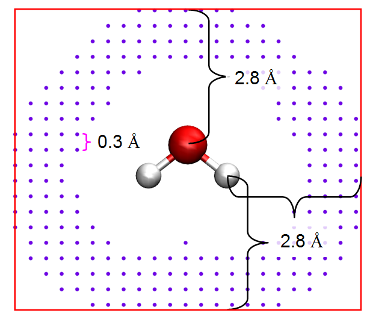

<!-- p.112 -->
the distances between the point and all nuclei are larger than 2.8 Å, then the fitting point will be discarded. The purple dots shown above are finally used fitting points.

Like other ESP fitting methods, in CHELPG, the deviation function shown below is minimized to make the ESP calculated by atomic charges (Vq) close to the ESP calculated based on wavefunction (V) as good as possible.


$$F(q_{1},q_{2}...q_{N})=\sum_{i}[V_{q}(\mathbf{r}_{i})-V(\mathbf{r}_{i})]^{2}$$

<!-- formula-ocr: formula_p112_058.png 已替换为LaTeX, 原图保留备查 -->

where ri is coordinate of fitting point i. {q} are fitted point charges, their positions are referred to as fitting centers. Notice that q does not necessarily correspond to atomic charge, the fitting centers can be defined at arbitrary positions.

It can be shown that the minimization of F could be formulated to the following matrix equation


$$\mathbf{A}\mathbf{q}=\mathbf{B}$$

<!-- formula-ocr: formula_p112_059.png 已替换为LaTeX, 原图保留备查 -->

which can be further explicitly written as

$$\left[\begin{array}{c c c c c}A_{11}&A_{12}&\cdots&A_{1N}&1\\ A_{21}&A_{22}&\cdots&A_{2N}&1\\ \vdots&\vdots&\ddots&\vdots&1\\ A_{N1}&A_{N2}&\cdots&A_{N N}&1\\ 1&1&1&1&0\end{array}\right]\left[\begin{array}{c}q_{1}\\ q_{2}\\ \vdots\\ q_{N}\\ \lambda\end{array}\right]=\left[\begin{array}{c}B_{1}\\ B_{2}\\ \vdots\\ B_{N}\\ q_{tot}\end{array}\right]$$

with

$$\mathbf{A}_{A,B}=\sum_{i}\frac{1}{r_{i A}r_{i B}}\qquad\mathbf{B}_{A}=\sum_{i}\frac{V(\mathbf{r}_{i})}{r_{i A}}\quad q_{\mathrm{tot}}=\sum_{A}q_{A}$$

where A and B are indices of fitting centers and N is total number of fitting centers. The column vector q is what we need, its first N elements correspond to charges of the fitting centers. The q could be easily evaluated as q=A-1B.

Usage In the interface there are many options which are introduced below.

- Option 1: If selecting this option, Multiwfn will start to calculate ESP value at each fitting point, then fitted atomic charges of all fitting centers will be outputted on screen. RMSE and RRMSE are also outputted automatically, they measure quality of fitting, the smaller value suggests that the fitted charges have better ESP reproducibility. RMSE and RRMSE are defined as (where N is the number of fitting points)


$$RMSE=\sqrt{\frac{\sum_{i}[V_{q}(\mathbf{r}_{i})-V(\mathbf{r}_{i})]^{2}}{N}}$$

<!-- formula-ocr: formula_p112_060.png 已替换为LaTeX, 原图保留备查 -->

i

- Options 2~4: These options are used to set parameters for distributing fitting points. The default values are reasonable and should not be changed without special reasons.


<!-- p.113 -->
- Option 4: If you hope fitting points only distribute over a certain fragment, you can select this option and input atom indices, then a fitting point will be taken into account only if the atom closest to it belongs to the given atom list.

- Option 5: During the ESP fitting, three kinds of ESP can be calculated and used, namely "Nuclear + Electronic" (default), "Electronic" and "Transition electronic". Commonly you should not change this option. The "Transition electronic" should be chosen if you want to evaluate the so-called TrEsp (transition charge from electrostatic potential), please check Section 4.A.9 for details.

- Option 6: If it is switched to "Yes", then after calculation, coordinates with ESP values of all fitting points can be exported to ESPfitpt.txt or ESPfitpt.pqr in current folder, the former is more readable, while the latter can be directly loaded into VMD program to visualize the fitting points (and can be colored according to the "charge" column, which records ESP values). In addition, fitting points with absolute difference between exact ESP and the ESP evaluated based on atomic charges can be exported to ESPerr.pqr so that ESP reproduction error in various molecular regions can be visualized in VMD. See Section 4.7.8 for illustration.

- Option 8: If it is switched to "Yes", then additional constraints are applied so that the fitted atomic charges will exactly reproduce the electric dipole moment calculated based on wavefunction. The idea comes from J. Comput. Chem., 11, 297 (1990). Note that this type of constraint is usually unimportant, because ESP fitting charges computed in the common manner already have good capability to reproduce dipole moment.

- Option 10: Choose the atomic radii used in fitting. The atomic radii employed in fitting affects the distribution of fitting points, and thus influence the resulting charges. There are three modes that can be chosen to set the radii:

(1) This is default mode, the radii defined in original paper of CHELPG are used. However, only the elements in the first three rows are defined, if your system contains other elements, Multiwfn will ask you to input their vdW radii in turn. If you do not have proper radii in hand, you can directly press ENTER button, then vdW radius of UFF forcefield of corresponding element multiplied by 1/1.2 will be used, which is commonly a reasonable choice.

(2) Employing the UFF radii scaled by 1/1.2 for all elements. The UFF radii can be found in Table 1 of UFF original paper J. Am. Chem. Soc., 114, 10024 (1992).

(3) Load radii of all elements involved in present system from external file. Multiwfn will ask you to input the file path during fitting, the format of the file should like follows, the unit of the radii should be in Å, all elements in the system must be defined:


```text
H 1.2
O 1.8
Cu 2.2
```

- Option -1: For flexibility consideration, by using this option, coordinates of fitting points are allowed to be read from external file to replace the CHELPG fitting points. The format of the file should be

numdata

X Y Z [ESPval]  For fitting point 1 X Y Z [ESPval]  For fitting point 2 ... where the ESPval is an optional term, which denotes precalculated ESP value at corresponding point. If numdata is a negative value, then the ESP values used in charge fitting will be read from the


<!-- p.114 -->
fourth column rather than calculated by Multiwfn.

- Option -2: If you have special reasons (e.g. you want to place additional fitting centers at lone pair or σ-hole region to enhance description of ESP around corresponding region), then coordinates of additional fitting centers can be read from external file by using this option. The format of the file should be

numdata

X Y Z  For additional fitting center 1 X Y Z  For additional fitting center 2 ... where numdata denotes how many entries are in this file. X, Y, Z are coordinates (in Å).

- Option -3: If you simply want to examine reproducibility for ESP at the fitting points of given atomic charges, then you can use this option to load atomic charges from specific .chg file. Then when you select option 1 to start the ESP fitting process, no ESP fitting charges will be yielded, only the RMSE and RRMSE of the given atomic charges will be outputted (note that if you have chosen option -2 to load additional fitting centers, then the number of charges in the loaded .chg file should be identical to the total number of fitting centers). If you only want to study reproducibility of ESP for the fitting points around specific fragment, you can choose option 4 and input the atom indices.

An example is given in Section 4.7.1. Information needed: GTFs, atom coordinates


### 3.9.11 Merz-Kollmann (MK) ESP fitting atomic charge (13)

Merz-Kollmann (MK) charge is another well-known charge model derived from ESP fitting, see J. Comput. Chem., 11, 431 (1990). The only difference between MK and CHELPG is grid setting. In MK, the fitting points are evenly distributed on the layers of 1.4, 1.6, 1.8 and 2.0 times the vdW radius of each atom, if distance between a fitting point and any atom is smaller than 1.4 times of its vdW radius, then this fitting point will be discarded.

In the MK module of Multiwfn, the density of points per Å2 on the MK layers can be set by option 2, the number of layers and the scale factor of atomic vdW radii used to define the layers can be set by option 3, the atoms used to construct the MK fittings points can be set by option 4. For description of other options and outputs, see the last section.

Like the CHELPG module, in the MK module you can also choose the mode for determining atomic radii used in the fitting by option 10. Notice that the original paper of MK method does not explicitly present atomic radii. In Multiwfn, the default MK radii for the first and second rows and P, S, Cl are in line with those in MK code of Gaussian, while the default radii for Na-Si are defined as 1.57, 1.65, 1.65, 1.80 Å, respectively.

In the example in Section 4.7.8, I exemplified how to use the MK module to investigate ESP reproducibility of given atom charges on all MK fitting points and on the fitting points corresponding to specific atoms. In addition, the example showed how to visualize ESP reproduction error at various molecular regions.


<!-- p.115 -->
Information needed: GTFs, atom coordinates


### 3.9.12 AIM atomic charge (14)

AIM (Atoms-in-molecules) population corresponds to the number of electrons in AIM basin, and accordingly, subtracting AIM population from nuclear charge yields AIM charge, which is also sometimes incorrectly referred to as Bader charge. AIM charges can be calculated in basin analysis module, please check the example given in 4.17.1 on how to do. Related theories and algorithms of the basin analysis module are introduced in Section 3.20. However, in Multiwfn, the most convenient way of obtaining AIM charges is directly using subfunction 14 of main function 7. In this case, you only need to choose grid quality, then AIM charges will be calculated and printed. Atomic-center + uniform integration grids with exact refinement of basin boundaries are automatically employed.

An example is given in Section 4.7.11. Information needed: GTFs, atom coordinates


### 3.9.13 Hirshfeld-I atomic charge (15)

Hirshfeld-I (HI) method was proposed in J. Chem. Phys., 126, 144111 (2007), it is an important extension of Hirshfeld method. It is believed that the atomic space defined by Hirshfeld is not quite ideal, because it does not respond to the actual molecular environment. In HI, atomic spaces are gradually refined via an iterative scheme. After convergence, the final HI atomic spaces are evidently more physically meaningful than the Hirshfeld ones.

There are some variants of HI method, including the Hirshfeld-E proposed in J. Chem. Theory

Comput., 9, 2221 (2013), the Hirshfeld-Iλ proposed in J. Comput. Chem., 32, 1561 (2011) and the fractional occupation Hirshfeld-I (FOHI) proposed in J. Chem. Theory Comput., 7, 1328 (2011). Also, there is an iterative atomic space method named iterated stockholder atoms (ISA), which is closely related to HI, see Chem. Commun., 2008, 5909.

Basic theory of HI method In HI method, the weighting function of atom A at iteration n is defined as

$$w_{A}^{(n)}(\mathbf{r}-\mathbf{R}_{A})=\frac{\rho_{A}^{(n-1)}(\mathbf{r}-\mathbf{R}_{A})}{\displaystyle\sum_{B}\rho_{B}^{(n-1)}(\mathbf{r}-\mathbf{R}_{B})}\equiv\frac{\rho_{A}^{(n-1)}(\mathbf{r}-\mathbf{R}_{A})}{\rho_{\mathrm{p r o}}^{(n-1)}(\mathbf{r})}$$

where r and R denote spatial coordinate and position of atomic nucleus, respectively. The atomic density involved in HI is obtained by linear interpolation between spherically averaged free-state atomic density of adjacent charge states:

$$\rho_{_{A}}^{(n)}(r)=(q_{_{\mathrm{u p}}}-q_{_{A}}^{(n-1)})\rho_{_{A,\mathrm{l o w}}}^{\mathrm{f r e e}}(r)+(q_{_{A}}^{(n-1)}-q_{_{\mathrm{l o w}}})\rho_{_{A,\mathrm{u p}}}^{\mathrm{f r e e}}(r)$$

where qhigh and qlow are upper and lower integer of atomic charge of atom A at n-1 iteration, while 𝜌𝐴,up free are spherically averaged atomic density of atom A at these two charged states, respectively. For example, if atom A carries charge of 0.2 at n-1 step, then its radial atomic density free and 𝜌𝐴,low


<!-- p.116 -->
at step n will be computed as

$$\rho_{_{A}}^{(n)}(r)=0.8\times\rho_{_{A,q=0}}^{free}(r)+0.2\times\rho_{_{A,q=+1}}^{free}(r)$$

Before the HI iteration, radial densities of all atoms are initialized to their neutral state.

Based on HI atomic weighting functions, HI atomic charges can be straightforwardly obtained. The HI iteration continues until all atomic charges converged to a given criterion.

Note: It is clear that the HI atomic charges yielded at the first iteration are in principle identical to Hirshfeld charges. However, this is not exactly true in Multiwfn, because currently the rule of generating spherically averaged free-state atomic density involved in HI is not completely identical to that used in Hirshfeld, but the difference is very small and can be ignored. It is never incorrect to directly take the atomic charges printed at the first iteration of HI as Hirshfeld charges.

Usage After entering the HI analysis module, you will find many options, you can adjust convergence criterion and maximum number of cycles, also you can switch the algorithm for realizing HI iterations (see below), and you can decide if printing atomic charges every iteration.

If you select option 0, Multiwfn will start the HI calculation. Before this, Multiwfn first checks atomic radial density files (.rad) in "atmrad" folder, if they are available for all elements in the current system, HI calculation will directly start; if they are not available, Multiwfn will try to calculate atomic .wfn files by invoking Gaussian and convert them to .rad files, and then start the HI iterations.

After convergence of HI iterations, HI atomic charges and fragment charge/population (if you have defined fragment) are printed. Note that the printed HI atomic charges have been properly normalized to eliminate noise of numerical integration (i.e. making sum of HI population of all atoms equal to total number of electrons). Finally, you can select if outputting resulting atomic charges as .chg file.

There is an option "-3 Switch if speeding up calculation using distance cutoff". By default, this treatment is enabled to significantly reduce cost for large systems. If you find the HI charges are problematic or the calculation cannot be normally finished, you can select this option once to disable this treatment and retry. Alternatively, you can select it twice, then you will be prompted to input a cutoff value for this treatment, the larger the value, the more accurate the result and more robust the calculation will be, however, at the expense of increasing computational cost. The default cutoff is 2.0, which should be very safe for almost all cases.

About preparing atomic radial density files (.rad files) Before igniting HI iteration, atomic radial density files (.rad files) must be available for all elements in the systems at different charged states. There are three ways to provide them:

- Using built-in .rad files The easiest way of providing the .rad files is simply copying the "atmrad" folder from "examples" directory to current folder, then Multiwfn will directly utilize the .rad files in it during HI calculation. This "atmrad" folder contains .rad file of all elements (except for lanthanides and actinides) of all possible charged states, therefore in this case HI charges can be directly computed without any additional step.

The .rad files in this folder were carefully generated based on highly accurate densities. Specifically, elements of the first three rows were calculated at PBE0/def2-QZVPP level, all other main group elements were calculated by PBE0/ANO-RCC with DKH2 relativistic Hamiltonian, while all transition metal atoms were calculated by PBE0/Sapporo-DK3-QZP-2012 with DKH2. For each element of each charged state, ground state spin multiplicity was employed, and meantime wavefunction stability test and wavefunction optimization were carried out to make sure that the wavefunction is stable and thus the resulting radial density is realistic.

- Let Multiwfn automatically invoke Gaussian to generate .rad files If needed .rad files are not found in "atmrad" folder, Multiwfn will invoke Gaussian to calculate


<!-- p.117 -->
atomic wavefunctions and generate .rad files, there are below two steps. Note that .rad file cannot be generated in this way for lanthanides and actinides.

(1) Generating atomic .wfn files in "atmrad" folder: Multiwfn generates Gaussian input files (.gjf) in "atmrad" subdirectory in current folder and invokes Gaussian to run them to generate atomic .wfn files for all elements involved in present system. Charge states ranging from -2 to +2 are taken into account, while calculation of meaningless charge states is skipped. For example, its meaningless to calculate -2 and +2 charge states for alkali elements, since in practical systems it is impossible that an alkali atom has atomic charge between -1 to -2, or between +1 to +2. The multiplicity of each charge state of each element is set to ground state (this cannot be well guaranteed for all cases, for example, ground state at different calculation levels may even be different. However, this is never an important problem, so please do not concern it too much). The path of Gaussian executable file should be set by "gaupath" in `settings.ini` file, if it is not properly set, you will be prompted to input it in the Multiwfn interface. You also need to input the keywords of Gaussian used to calculate the atomic .wfn files. After Gaussian calculation has finished, the atomic .wfn files are generated in "atmrad" folder, the file name directly corresponds to element name and charge state. For example, the file corresponding to -1, 0, +1 and +2 charged states of Be will be generated in "atmrad" folder as Be-1.wfn, Be_0.wfn, Be+1.wfn and Be+2.wfn, respectively. If corresponding file has already been found in the "atmrad" folder, then the file will be directly used and not be recalculated. If you find Gaussian calculation is failed (mostly due to SCF nonconvergence problem), you should carefully check Gaussian output file and properly adjust the keywords used.

(2) Converting atomic .wfn files to .rad files: As mentioned earlier, HI calculation requires spherically averaged atomic densities. However, the electron density corresponding to the atomic .wfn files generated at last step often does not meet this requirement. For example, carbon at its neutral ground state has s2p2 configuration, and thus C_0.wfn corresponds to elliptical density distribution. To get spherically averaged representation of atomic densities, Multiwfn automatically loads each atomic .wfn files in "atmrad" folder, calculates spherically averaged radial density, and write the data as .rad file, whose name is identical to its parental .wfn file. For example, C_0.wfn will be converted to C_0.rad. The .rad file is a plain text file, the first line is the number of data points, the first and second columns respectively correspond to radial distance with respect to nucleus (in Bohr) and corresponding electron density. Note that if needed .rad file has already

presented in "atmrad" folder, then the conversion of .wfn→.rad will be skipped.

Note: If you are using Windows version of Multiwfn and Gaussian cannot be invoked properly, please read Appendix 1 to set environment variable for Gaussian.

It is best (but never compulsory) that the atomic .wfn files are generated at the same calculation level as the molecule under study, so that the result has strict physical meaning. If you want to let Multiwfn regenerate all needed atomic .wfn/.rad files at a specific level prior to HI analysis, evidently you should clean up the "atmrad" folder before calculation.

- Manually generate .rad files It is also possible to manually calculate .rad files and put them in the "atmrad" folder, so that they will be used in HI calculation. At least .rad files corresponding to below charged states must be provided for the elements in the present system, otherwise Multiwfn will try to employ Gaussian to calculate missing ones.


```text
IA, VIIIA: -1,0,1
IIA: -1,0,1,2
IIIA, IVA, VA, VIA: -2,-1,0,1,2
VIIA: -1,0,1,2
```


<!-- p.118 -->
For lanthanides and actinides, the consideration of charged states is up to you. It is suggested to consider -1, 0, 1 and 2.

As an example, if you want to calculate HI charges for water, you should provide O-2.rad, O-1.rad, O_0.rad, O+1.rad, O+2.rad, H-1.rad, H_0.rad and H+1.rad in "atmrad" folder of current directory. Generating .rad file is easy. Taking generation of O-1.rad as example, you should use Gaussian or other code to calculate an oxygen atom with charge of -1 and spin multiplicity of 2. Then load the resulting wavefunction file (e.g. wfn/molden/fch...) into Multiwfn, enter main function 1000 and select subfunction 14, you will immediately obtain a .rad file with same name as the input file.

Note that if your system contains lanthanides or actinides, this is the only way of preparing corresponding .rad files and thus calculating HI charges.

Appendix: Two numerical algorithms of HI Multiwfn provides below two algorithms to realize HI methods, the results are exactly the same, they only differ by efficiency and memory requirement.

(1) Fast & large memory requirement (default): This algorithm computes as much as possible data before starting iteration. Therefore, once initialization stage is done, the HI iteration can be finished rapidly. The drawback of this algorithm is that large amount of memory is needed, the

memory consumed is at least 7×natm×natm×nrad×nang, where natm is the number of total atoms, nrad and nang corresponds to the number of radial and angular integration grid per atom. Evidently, this algorithm is unable to be applied for very large systems unless you have huge physical memory.

(2) Slow & low memory requirement: This algorithm utilizes very low amount of memory, however, the data needed to be calculated in each iteration is much more than algorithm (1), thus the total computational cost is much higher.

For both the two algorithms, the higher the integration grid number, the more accurate the result. By default, nrad and nang are properly set by Multiwfn. If the system only consists of first two rows

elements, then nrad×nsph will be 30*170=5100. If you want to manually set nrad and nsph, you can set "iautointgrid" in `settings.ini` to 0 and change "radpot" and "sphpot" parameters.

An example of computing HI charges is given in Section 4.7.4. Information needed: GTFs, atom coordinates


### 3.9.14 CM5 and 1.2*CM5 atomic charge (16, -16)

CM5 charge was proposed by Truhlar et al. in J. Chem. Theory Comput., 8, 527 (2012). This charge is somewhat akin to the ADCH charge proposed by me, both of them are defined as applying additional correction to Hirshfeld charges. Unlike ADCH, which is free of empirical parameters, CM5 method contains global parameters as well as parameters for individual elements. The CM5 parameters are optimized for best reproduction of highly accurate experimental or theoretical molecular dipole moments.

It is noteworthy that there is a remarkable difference between the basic feature of ADCH and CM5: ADCH charges can exactly reproduce molecular dipole moment corresponding to present


<!-- p.119 -->
calculation level, that means if the level used is very high (e.g. CCSD/aug-cc-pVTZ), then the dipole moment calculated by the resulting ADCH charge must be very close to the molecular dipole moment in real world; while if the used level is poor (e.g. HF/6-31G), then the ADCH charges will be almost useless. In contrast, the CM5 charges do not attempt to reproduce molecular dipole moment at present calculation level, but to reproduce real molecular dipole moment, therefore even if low level such as B3LYP/6-31G* is used, which is certainly unable to give good dipole moment result, the CM5 charges derived at this level commonly are still able to yield molecular dipole moment at acceptable accuracy.

The expression of CM5 charge is

BTqq ijijii Hirsh5CM +=

RRrB jiijij −−−= )](exp[ α ij

where rij is distance between atom i and j, Bij may be regarded as their Pauling bond order, Ri and Rj are their atomic covalent radii, which are defined as follows: For Z=1~96, the average between CSD radii and Pyykkö radii are used, while for Z=97-118, the Pyykkö radii are employed. The global

parameter α equals 2.474 Å-1. The Tij is defined as Dij if both i and j are attributed to H, C, O, N, note that Dij=0 when i and j belong to the same element and Dij=-Dji. All the involved six Dij parameters (H-C, H-N, H-O, C-N, C-O, N-O) are tabulated in the original paper. For other cases, Tij is defined as Di - Dj, the optimized D parameters for all elements throughout the whole periodic table are provided in the supplemental material of CM5 original paper.

Like usual Hirshfeld and ADCH calculations, after you enter this function, I suggest you select option 1 to use the built-in sphericalized atomic densities in free-states, since it is the most convenient. Then Multiwfn starts calculation of Hirshfeld charges, and then print CM5 charges. If you want to gain detailed information about the CM5 correction process during the calculation, you can set "ishowchgtrans" parameter in `settings.ini` to 1.

As demonstrated in J. Phys. Chem. B, 121, 3864 (2017), 1.2*CM5 is well-suited for molecular dynamics with OPLS-AA forcefield. Details and calculation example can be found in Section 4.7.9.

uESE and xESE are good solvation models based on CM5 charges in gas phase, there are

corresponding codes for calculating free energy of solvation (ΔGsolv) based on them, see website http://iqcc.udg.edu/~vybo/ESE/. In J. Comput. Chem., 1, 11 (2021) it was shown that uESE is much

better on average than SMD solvation model for evaluating ΔGsolv of ions, while xESE performs somewhat better than SMD for evaluating ΔGsolv of neutral species. Multiwfn is able to generate input file of uESE code (the input file of xESE is the same as uESE). You simply need to set “uESEinp” in `settings.ini` to 1. Note that since uESE was parameterized at B3LYP/def2-TZVP level in gas phase, the CM5 charges should also be calculated at this level, and it is advised that geometry optimization is also performed at this level.

Information needed: GTFs, atom coordinates


<!-- p.120 -->

### 3.9.15 Electronegativity Equalization Method (EEM) atomic charge (17)

Theory The EEM method is also known as Full Equalization of Orbital Electronegativity (FEOE), it was firstly proposed in J. Am. Chem. Soc., 107, 829 (1985). The idea of EEM is very clear. The electronegativity of atom i can be written as


$$\chi_{i}=(\chi_{i}^{0}+\Delta\chi_{i})+2(\eta_{i}^{0}+\Delta\eta_{i})q_{i}+\sum_{j\neq i}\frac{q_{j}}{r_{i,j}}$$

<!-- formula-ocr: formula_p120_061.png 已替换为LaTeX, 原图保留备查 -->

where χ𝑖 0 are Sanderson electronegativity and Parr-Pearson hardness of corresponding element, respectively, while ∆χ𝑖 and ∆η𝑖 are fitted parameters. qi denotes atomic charge of atom i, 0 and η𝑖

and ri,j is distance between atoms i and j. For convenience, above formula is commonly expressed as

$$\chi_{i}=A_{i}+B_{i}q_{i}+\kappa\sum_{j\neq i}\frac{q_{j}}{r_{i,j}}$$

where κ is global parameter, A and B are element parameters. It can be seen that atomic electronegativity in a chemical system is function of atomic charges.

EEM method assumes that in a chemical system, all atoms have equal electronegativity, hence the EEM charges can be determined by solving linear equations according to the conditions below


$$\begin{aligned}&\chi_{1}=\chi_{2}=\ldots=\chi_{N}=\chi_{mol}\\ &\sum_{i}q_{i}=Q\\ \end{aligned}$$

<!-- formula-ocr: formula_p120_062.png 已替换为LaTeX, 原图保留备查 -->

where Q stands for net charge of the whole system, χmol is (unknown) molecular electronegativity, N is number of atoms.

It is easy to show that the working matrix equation for solving EEM charges can be written as follows

$$\left[\begin{matrix}{B_{1}}&{\frac{\kappa}{r_{1,2}}}&{\cdots}&{\frac{\kappa}{r_{1,N}}}&{-1}\\ {\frac{\kappa}{r_{2,1}}}&{B_{2}}&{\cdots}&{\frac{\kappa}{r_{2,N}}}&{-1}\\ {\vdots}&{\vdots}&{\ddots}&{\vdots}&{\vdots}\\ {\frac{\kappa}{r_{N,1}}}&{\frac{\kappa}{r_{N,2}}}&{\cdots}&{B_{N}}&{-1}\\ {1}&{1}&{\cdots}&{1}&{0}\\ \end{matrix}\right]\left[\begin{matrix}{q_{1}}\\ {q_{2}}\\ {\vdots}\\ {q_{N}}\\ {\chi_{\mathrm{m o l}}}\\ \end{matrix}\right]=\left[\begin{matrix}{-A_{1}}\\ {-A_{2}}\\ {\vdots}\\ {-A_{N}}\\ {Q}\\ \end{matrix}\right]$$

Since EEM matrix elements are very simple and the above matrix equation can be solved easily, EEM charges could be evaluated rather rapidly even for very large systems.

Parameters

The result of EEM charges is directly dependent on EEM parameters κ, {A} and {B}. There is no unique way to determine the parameters, the most common way to obtain them is fitting, so that the resulting EEM charges are close to quantum chemistry atomic charges (e.g. NPA, CHELPG, Mulliken) as much as possible. Many papers presented EEM parameters fitted to various kinds of atomic charges calculated at different levels. In Multiwfn, the following EEM parameters can be directly chosen:


<!-- p.121 -->
- Parameters fitted to Mulliken charges at HF/STO-3G, see Int. J. Mol. Sci., 8, 572 (2007).

Available for H, C, N, O, S
- Parameters fitted to MK charges at B3LYP/6-31G* and at HF/6-31G*, see J. Comput. Chem.,

30, 1174 (2009). Available for H, C, N, O, F, S, Cl, Br, Zn
- Parameters fitted to NPA charges at B3LYP/6-311G*, they were extracted from SI of J.

Cheminform., 8, 57 (2016). Available for H, C, N, O, F, P, S, Cl, Br

Note that for some elements, their A and B parameters also depend on multiplicity, namely the maximal formal bond order between this atom and its neighboring atoms, so that influence of chemical environment can be taken into account.

With above-mentioned parameters, EEM charges have good reproducibility of target atomic charges for typical organic systems, but do not expect EEM method can work well for systems with a complicated electronic structure, since common training set of EEM parameters only include organic systems with typical bonding.

Usage Since formal bond order is involved in the EEM calculation, you must use MDL molfile (.mol) or .mol2 as input file, because in all file types that supported by Multiwfn, only this file contains connectivity information between atoms. Do not forget that there is a severe limitation of .mol format, namely the number of atoms cannot exceed 999, therefore .mol2 must be used for very large system. The .mol/.mol2 file can be outputted by many programs, such as GaussView and OpenBabel.

After you load a .mol/.mol2 file and then enter present function, you can directly choose option 0 to calculate EEM charges, the molecular electronegativity will also be outputted together. The default EEM parameters are those fitted for reproducing B3LYP/6-31G* CHELPG charges.

Before calculation, you can choose option "1 Choose EEM parameters", present EEM parameters will be shown on screen, and then you can select a built-in parameter set that you want to use. Alternatively, you can load parameters from an external file using suboption 0, the format of parameter file should mimic to this:


```text
    0.302000
 H   1  2.38500  0.73700
 C   1  2.48200  0.46400
 C   2  2.46400  0.39200
 N   1  2.59500  0.46800
 N   2  2.55600  0.37700
 O   1  2.82500  0.84400
 O   2  2.78900  0.83400
```

The first line is κ, after that, defining parameter for each element of each multiplicity. The second, third and fourth columns are multiplicity, A and B, respectively. Free format is used. Using corresponding option, the present parameters can also be exported to EEMparm.txt in current folder.

If the system under study is an ionic system, do not forget to use option "2 Set net charge" to set net charge to actual status before calculation!

if the system contains aromatic ring(s), in order to assign suitable EEM parameters, the aromatic ring(s) in the inputted .mol/mol2 file must be represented by alternate variation of single and double bonds rather than represented by consecutive aromatic bonds (namely bond type 4 of .mol format, or “ar” type of .mol2 format). For this kind of system, I suggest first saving the structure to e.g. pdb or xyz format, and then use OpenBabel to convert it to .mol format (using the


<!-- p.122 -->
command obabel old.xyz -O new.mol2), which can then be used as input file for EEM charge calculation, because in this case OpenBabel will automatically represent aromatic ring(s) by alternative single and double bonds.

An example of calculating EEM charges is given in Section 4.7.5. Information needed: Atom coordinates with connectivity (.mol or .mol2 file)


### 3.9.16 Restrained ElectroStatic Potential (RESP) atomic charge (18)

This module is quite powerful and flexible, it can calculate the standard RESP charge proposed by Kollman and coworkers in J. Phys. Chem., 97, 10269 (1993), and can also calculate ESP fitting charges under various equivalence and charge constraints. In Section 3.9.16.1 I first describe basic ideas of RESP charge and related treatments, then in Section 3.19.16.2 the usage of this module is introduced. If you are not interested in relevant theories, you can skip Section 3.9.16.1. However, if you are not familiar with ESP fitting method, you should at least read Section 3.9.10 first to gain minimal knowledge.

Some more discussions about this topic can be found in my blog article "Principle of RESP charge and its calculation in Multiwfn" (in Chinese, http://sobereva.com/441).

3.9.16.1 Theory

Theory Part 1: Conformation dependency, equivalence constraint and penalty function The ESP fitting charges generated by MK and CHELPG methods introduced in Section 3.19.10 and 3.19.11 can be perfectly used for molecular modeling purpose for rigid molecules, however, they are not quite suitable for modeling flexible molecules, due to below reasons:

(1) The results are highly dependent on conformation. Flexible molecules have many different conformations, the conformation often changes during molecular dynamics simulation, while the ESP fitting charges are highly sensitive to the conformation. If only one conformation is used to calculate the ESP fitting charges and the simulation is conducted based on these charges, the dynamic behavior of the molecule may be wrong and the relative energies between different conformations may be seriously incorrect, since single set of fixed atomic charges is unable to equitably well describe all relevant conformations.

(2) The atomic charges fitted at single conformation do not faithfully reflect chemical equivalency of atoms. For example, three hydrogens on the methyl group of methanol are chemically equivalent. During molecular dynamic simulation in room temperature, the methyl group can rotate frequently, therefore, three hydrogens should share the same charge. However, the calculated charges are not identical regardless of choice of conformation used in the ESP fitting procedure (since this system does not have triple rotational symmetry along the methyl bond axis), clearly this problem also brings some irrationality to the simulation phenomenon.

(3) The quality of fitted charge of buried atoms is poor. The ESP fitting points are distributed in the vicinity of and outside the van der Waals surface. For atoms connected to multiple atoms (such as sp3 hybridized carbon), especially the atoms inside a macromolecule, because of their far distances to fitting points, their atomic charges have low fitting quality and large numerical uncertainty. Moreover, as the conformation changes, the charge fluctuation of these buried atoms


<!-- p.123 -->
tends to be significant, therefore the presence of these atoms further aggravate the conformational dependence of the ESP fitting charges.

ESP fitting charges cannot be well used for modeling flexible molecules without solving above problems.

For the above problem (1), a good solution is to simultaneously consider multiple conformations during the ESP fitting process. One first determines the weight of each conformation, then constructs A matrix and B vector using fitting points of various conformers with consideration of conformational weights, then the solved ESP fitting charges can at least be able to well reproduce the ESP of those conformations with relatively large weights. This idea has been examined in J. Am. Chem. Soc., 114, 9075 (1992). Of course, this way of considering multiple conformations can be very expensive for flexible molecules with many rotatable bonds, because the number conformations increases exponentially with the increase in rotatable bonds.

For the above problem (2), equivalence constraints can be imposed on chemically equivalent atoms in the fitting process so that their atomic charges are the same (Another way is to calculate the ESP fitting charges as usual, and then average the charges of chemical equivalent atoms. However, the charge obtained in this way is not as ideal as employing equivalence constraints).

For the above problem (3), the solution proposed in Kollman's RESP paper is to add a

hyperbolic penalty function 222 1/2rstr[()]AAaqbbχ=+− to the function of measuring

reproducibility of the ESP calculated based on wavefunction, where index A corresponds to atomic index of non-hydrogen atoms. The penalty function involves a tightness parameter b and a restraint strength parameter a. The former is generally set to 0.1, while the latter can be adjusted in the actual calculation. The larger the a, the stronger the tendency of the atomic charge to be pulled down, and meantime the worse the ESP reproducibility becomes. Obviously, the parameter a should be properly selected, generally a value less than or equal to 0.001 is employed. It has been found that introduction of this form of penalty function significantly lowers charges of buried atoms, while other atoms, in particular polar atoms, are not evidently affected. Kollman believes that this treatment also significantly reduces the conformational dependence of the ESP fitting charge. After introducing the hyperbolic penalty function, the ESP fitting procedure can no longer be solved in one step, iteration is needed until changes of all atomic charges are small enough.

Below I give detailed derivation of the working equation used to calculate ESP fitting charges under above special considerations. When equivalence constraint is employed, the function to be minimized using least square method in the ESP fitting procedure will be

$$F=\left[\sum_{i}\left(V_{i}-\sum_{A}q_{A}\sum_{a\in A}\frac{1}{r_{ia}}\right)\right]^{2}+\lambda\left(\sum_{A}n_{A}q_{A}-q_{tot}\right)$$

where i cycles fitting points, Vi is the ESP calculated based on wavefunction at point i, {q} is the set of uniquely derived atomic charges, ria denotes distance between point i and atom a, which belongs to equivalence constraints A. nA is the number of atoms constrained to be equivalent in batch A. If nA=1, that means A just corresponds to an atom without equivalence constraint.

Minimization of F with respect to variables yields


<!-- p.124 -->
$$\frac{\partial F}{\partial q_{B}}=0=-2\left(\sum_{b\in B}\frac{1}{r_{ib}}\right)\sum_{i}\left(V_{i}-\sum_{A}q_{A}\sum_{a\in A}\frac{1}{r_{ia}}\right)+n_{B}\lambda$$

The second equation can be further reorganized as follows, with considering the fact that the

value of Lagrangian multiplier λ is arbitrary

$$\frac{\partial F}{\partial q_{B}}=0=-2\left(\sum_{b\in B}\frac{1}{r_{ib}}\right)\sum_{i}\left(V_{i}-\sum_{A}q_{A}\sum_{a\in A}\frac{1}{r_{ia}}\right)+n_{B}\lambda$$

The set of linear equations can be formulated as a matrix equation

$$\begin{aligned}\begin{bmatrix}A_{11}&A_{12}&\cdots&A_{1N}&n_{1}\\A_{21}&A_{22}&\cdots&A_{2N}&n_{2}\\\vdots&\vdots&\ddots&\vdots&\vdots\\A_{N1}&A_{N2}&\cdots&A_{NN}&n_{N}\\n_{1}&n_{2}&\cdots&n_{N}&0\end{bmatrix}\begin{bmatrix}q_{1}\\q_{2}\\\vdots\\q_{N}\\\lambda\end{bmatrix}=\begin{bmatrix}B_{1}\\B_{2}\\\vdots\\B_{N}\\q_{tot}\end{bmatrix}\end{aligned}\Rightarrow\mathbf{A}\mathbf{q}=\mathbf{B}$$

with


$$\begin{array}{r l r l r}{A_{A,B}=\displaystyle\sum_{a\in A}\displaystyle\sum_{b\in B}\displaystyle\sum_{i}\frac{1}{r_{i a}r_{i b}}}&{{}}&{B_{A}=\displaystyle\sum_{a\in A}\displaystyle\sum_{i}\frac{V_{i}}{r_{i a}}}&{{}}&{q_{\mathrm{tot}}=\displaystyle\sum_{A}q_{A}}\\ \end{array}$$

<!-- formula-ocr: formula_p124_063.png 已替换为LaTeX, 原图保留备查 -->

where A and B are atomic indices, and there are totally N atoms. Once construction of the A and B is completed, the charge vector can be easily obtained as q=A-1B.

Now we consider the case that penalty function is added to the function F. Given that

$$\partial\chi^{2}_{rstr}/\partial q_{A}=aq_{A}(q^{2}_{A}+b^{2})^{-1/2}$$

by incorporating it into the above expression of 0/=∂∂BqF, we finally get


$$\sum_{A}q_{A}\sum_{a\in A}\sum_{b\in B}\sum_{i}\frac{1}{r_{ia}r_{ib}}+aq_{A}(q_{A}^{2}+b^{2})^{-1/2}+\lambda=\sum_{b\in B}\sum_{i}\frac{V_{i}}{r_{ib}}$$

<!-- formula-ocr: formula_p124_064.png 已替换为LaTeX, 原图保留备查 -->

$$\begin{aligned}\begin{bmatrix}A_{11}&A_{12}&\cdots&A_{1N}&n_{1}\\A_{21}&A_{22}&\cdots&A_{2N}&n_{2}\\\vdots&\vdots&\ddots&\vdots&\vdots\\A_{N1}&A_{N2}&\cdots&A_{NN}&n_{N}\\n_{1}&n_{2}&\cdots&n_{N}&0\end{bmatrix}\begin{bmatrix}q_{1}\\q_{2}\\\vdots\\q_{N}\\\lambda\end{bmatrix}=\begin{bmatrix}B_{1}\\B_{2}\\\vdots\\B_{N}\\q_{tot}\end{bmatrix}\end{aligned}\Rightarrow\mathbf{A}\mathbf{q}=\mathbf{B}$$

diagonal terms of A should remain unchanged. In practical calculation, the {q} in initial A is set to zero, then updated {q'} is obtained by solving the matrix equation, after that {q'} is used to construct the A of the second iteration. The iteration is repeated until charge variation of all atoms is smaller than a given threshold.

The easiest way of taking multiple conformations into the ESP fitting procedure is replacing the A matrix and B vector with their weighted averaged counterparts, as suggested in J. Am. Chem. Soc., 114, 9075 (1992):


<!-- p.125 -->

$$\mathbf{A}=\sum_{\mu}w_{\mu}\mathbf{A}^{\mu}\qquad\mathbf{B}=\sum_{\mu}w_{\mu}\mathbf{B}^{\mu}$$

<!-- formula-ocr: formula_p125_065.png 已替换为LaTeX, 原图保留备查 -->

where μ is index of conformer and wμ is corresponding weight. The weights could be determined in different ways, the common way is calculating relative Gibbs free energies and then evaluating weights according to Boltzmann distribution.

Theory Part 2: The standard RESP charge The Restrained ElectroStatic Potential (RESP) charge proposed by Kollman et al. in J. Phys. Chem., 97, 10269 (1993) may be the most suitable atomic charge model for molecular simulation of flexible molecules. It takes advantage of many aforementioned ideas and largely solves the above-mentioned problems in MK/CHELPG charges. The fitting process of the RESP charges is divided into the following two steps.

- Step 1: During the charge fitting, a hyperbolic penalty function with a=0.0005 is used to impose a weak charge restraint on non-hydrogen atoms. Charges of all atoms are fitted, and no equivalence constraint is employed. This step allows atomic charges to change with the greatest degree of freedom to make polar atoms fit the ESP as well as possible.

- Step 2: Using the hyperbolic penalty function with a=0.001 to impose a strong restraint on non-hydrogen atoms. This step only allows charge of sp3 hybridized carbons, methylene carbons and hydrogens attached on them to be fitted, while charges of all the other atoms keep fixed at the

value obtained at step 1. Equivalence constraint is applied to hydrogens on each −CH3, =CH2, −CH2− group.

The reason why the RESP charge fitting is divided into two steps is because the authors found that only by doing so, the problems of normal ESP fitting charges in modeling flexible molecules could be largely solved without causing too much damage on the reproducibility of ESP. Since RESP charge is fairly ideal for molecular dynamic modeling purposes, it has been employed by many famous forcefields, such as AMBER, GAFF and GLYCAM.

Notice that although conformation dependency has been diminished to large extent in the subtly designed RESP fitting process, if you want to obtain a set of atomic charges that can equally well describe all important conformations, you still need to explicitly take multiple conformations in the RESP fitting procedure.

The MK type of fitting points is employed in original paper of RESP, however, changing to CHELPG type of fitting points is also completely reasonable.

Theory Part 3: ESP fitting with charge constraints When calculating the ESP fitting charges, various constraints can be added via the Lagrangian multiplier method. The most significant one should be constraint on net charge of specific fragments. The charge constraints can achieve many special purposes:

(1) Biomacromolecules, polymers and other systems are all polymerized one by one. Each component of such a macromolecule is called residue. The atomic charges of the whole system are made up of that of individual residues. It is obvious that the net charge of each residue should be an integer. If we want to derive atomic charges of a given residue, we can cap the two terminals of the residue with appropriate group or fragment, and then impose charge constraint on the residue segment during ESP fitting process so that its net charge exactly corresponds to a desired integer.

(2) Some force fields, such as GROMOS, use the charge-group concept to reduce the error of the electrostatic interaction evaluated via cut-off method. Each charge group contains several atoms, and all the atomic charges are summed to an integer. For example, the total charge of a carboxyl


<!-- p.126 -->
group should be 0, and its charge should become -1 after dissociation of the proton. In order to obtain a set of ESP fitting charges that are compatible with the charge group concept, charge constraints can be utilized to maintain the charge of each segment as a specified integer value.

(3) Sometimes one wants to calculate ESP fitting charges based on wavefunction of dimer or multimer, and hopes that the charge of each monomer is exactly integer, this purpose could be realized by employing charge constraints.

Technically, adapting charge constraint into ESP fitting in terms of Lagrangian multiplier is straightforward, we only need to properly modify the form of matrix equation. For example, we want to add below constraints:


$$\frac{\partial F}{\partial\lambda^{\prime}}=0=q_{1}+q_{N}-0.5\quad\frac{\partial F}{\partial\lambda^{\prime\prime}}=0=q_{2}-0.2$$

<!-- formula-ocr: formula_p126_066.png 已替换为LaTeX, 原图保留备查 -->

Then the terms below should be added to the function F, which is to be minimized:

correspondingly, two new equations appear

and

∂+∂∂==∂∂ FqFqF 1 '0''0'00 21 0 λλλ+∂ ∂+∂∂==∂ FqFq 2 0 ∂==∂ Fq NNq

where F0 is the function F without charge constraint. Clearly, the current ESP fitting problem in matrix equation form can be given as

$$\left[\begin{array}{c c c c c c c}A_{11}&A_{12}&\cdots&A_{1N}&n_{1}&1&0\\ A_{21}&A_{22}&\cdots&A_{2N}&n_{2}&0&1\\ \vdots&\vdots&\ddots&\vdots&\vdots&0&0\\ A_{N1}&A_{N2}&\cdots&A_{N N}&n_{N}&1&0\\ n_{1}&n_{2}&\cdots&n_{N}&0&0&0\\ 1&0&0&1&0&0&0\\ 0&1&0&0&0&0&0\end{array}\right]\left[\begin{array}{c}q_{1}\\ q_{2}\\ \vdots\\ q_{N}\\ \lambda\\ \lambda^{\prime}\\ \lambda^{\prime\prime}\end{array}\right]=\left[\begin{array}{c}B_{1}\\ B_{2}\\ \vdots\\ B_{N}\\ q_{\mathrm{tot}}\\ 0.5\\ -0.2\end{array}\right]$$

In practical programming implementation, when multiple conformations, equivalence constraint, charge constraint and penalty function are simultaneously taken into account, the ESP fitting calculation is carried out in following process: Because of introduction of the hyperbolic form of penalty function, the A and q should be updated alternately until convergence criterion is reached.

In each iteration, only the first Natom×Natom block of A matrix and first Natom elements of B vector are constructed with consideration of conformation weights and penalty function, then remainder parts of A and B are filled according to charge constraint. Finally, according to equivalence constraint, the corresponding rows of A are combined together (e.g. if atoms 3, 6, 7 are constrained to be equivalent, then these three rows should be summed up) to form a temporary matrix, whose columns are further properly combined according to equivalence constraint to form Aeqv matrix. Similarly, the rows of B vector are transformed to Beqv according to equivalence constraint. After


<!-- p.127 -->
that, solving the equation qeqv=Aeqv-1Beqv and correspondingly updating atomic charges according to the given equivalency relationship. In the next cycle, the diagonal terms of A matrix are updated using the atomic charges obtained in last cycle, while non-diagonal terms of A and all elements of B vector do not need to be changed. Multiwfn simply uses zero as initial charges for the atoms to be fitted.

3.9.16.2 Usage and some details

Options in the RESP module Any input file carrying GTF information could be used for this module. After loading input file and entering this RESP module (subfunction 18 of main function 7), you will find many options, as described below

·Option 1: If you just want to calculate the standard RESP charges defined by Kollman et al., you should simply select this option, then the RESP charges will be calculated and printed. Since this calculation contains two steps, it will be referred to as "two-stage RESP fitting".

·Option 2: If you simply need to calculate normal ESP fitting charges with/without specific constraints, you should select this option. This process only includes one step, therefore it will be referred to as "one-stage ESP fitting".

·Option -1: In the calculation of standard RESP charges and normal ESP fitting charges with/without additional constraints, multiple conformations could be taken into the fitting process. By selecting this option, you will be asked to input path of a plain text file containing conformer list, each line of this file consists of file path and weight for each conformer. For example:


```text
D:\a\conf1.fch  0.2
D:\a\conf2.fch  0.75
D:\b\conf.fch  0.05
```

Evidently, the sum of all weights must be exactly or very close to 1.0. After that, in the charge calculation, all files involved in this file will be loaded and calculated in turn (if you use this feature, the input file loaded when Multiwfn boots up will be unimportant, it can even only contain structure information of present system, therefore you can also use e.g. .pdb and .xyz as input file).

·Option 3: By default, MK type of fitting points is employed, if you want to change to CHELPG type of fitting points, or you want to modify detailed setting of distribution of fitting points (such as point density), you can use this option. Note that the density of fitting points under default setting is already high enough, thus it does not need to be further enhanced without special reason.

·Option 4: This option is used to set parameters of hyperbolic penalty function for non-hydrogen atoms. The a used in "one-stage fitting" (0.0005 is employed by default), the respective a parameters used in the first and second stages of the standard RESP fitting, as well as the b parameter can be customized. Also, this option is able to manually define maximum number of RESP iterations and convergence threshold of charge variation.

·Option 5: This option is use to set equivalence constraint. You can customize the constraint by providing a plain text file containing entries of equivalence constraints. For example, if the file content is


```text
4,6,9-11
5,7
```

Then there will be two equivalence constraints, the first one requires that atoms 4, 6, 9, 10, 11 share


<!-- p.128 -->
the same charge, the second one requires that atoms 5 and 7 share the same charge. The equivalence constraint defined in this way takes effect for both "one-stage fitting" and the first step of "two-stage RESP fitting".

Note that for "one-stage fitting", by default hydrogens in each CH3 and CH2 group are constrained to be equivalent. You can modify or simply remove this equivalence constraint setting via this option.

Suboption 10 can generate plain text file named eqvcons_H.txt containing equivalence constraint setting of "hydrogens in each CH3 and CH2 group are the same". You can then manually modify this file to meet your special requirement.

Subfunction 11 can generate a plain text file containing equivalence constraint of symmetrically equivalent atoms in local region or the entire system. The point group of the selected atoms will be detected, and each class of equivalent atoms will be written to eqvcons_PG.txt in current folder. This feature is quite useful in certain cases.

·Option 6: This option is use to set charge constraint in "one-stage fitting" or the first step of "two-stage RESP fitting" (the charge constraint does not apply to the second step, mainly because the automatically determined equivalent constraint may conflict with user-defined charge constraint). In this option you can provide a plain text file to customize the rule of charge constraint. For example, if the file content is


```text
4,6,9-11 0.8
5,7  -0.32
```

Then sum of charges of atoms 4, 6, 9, 10, 11 will be constrained to 0.8 during the fitting, while sum of charges of atoms 5 and 7 will be constrained to -0.32.

·Option 7 and details about determination of connectivity: To calculate the standard RESP charge, or to calculate the normal ESP fitting charges but requiring the charges of the hydrogens in each CH3 and CH2 group to be equivalent, interatomic connectivity is needed for automatically determining which atomic charges should be fitted and which hydrogens should be constrained to be equivalent. By default, if distance between two atoms is less than 1.15 times the sum of their CSD covalent radii, then they will be regarded as bonded. If you feel that the current connection relationship does not match your expectation, you can select option 7 to read the connectivity from a specific .mol file, the .mol format contains a field recording connectivity information and can be generated by many visualization programs such as GaussView. (Alternatively, you can modify the threshold for judging bonding in main function 0, in which you can gradually change the bonding threshold until the bonding relationship shown in the graphical window completely in line with your expectation, the threshold will be retained and applied to the calculation in the RESP module).

·Option 8: This option enables Multiwfn directly load fitting points and corresponding ESP values from Gaussian output file. If you have selected this option once, then during the ESP fitting charge calculation process, Multiwfn will no longer attempts to determine position of fitting points and calculate ESP values, but ask you to input path of a Gaussian output file of pop=MK or pop=CHELPG task in combination with IOp(6/33=2) keyword. In addition, Gaussian also has a keyword IOp(6/42=x), where x is the number of fitting points per Å2 for pop=MK task. x is recommended to set to 6, which corresponds to Multiwfn default setting. Notice that since the code in Multiwfn and in Gaussian for generating MK fitting points is different, the result calculated with and without loading Gaussian pop=MK output file must have slight deviation.

In general, this option is not needed, but if you prefer to perform time-consuming calculations


<!-- p.129 -->
on server and use Multiwfn to realize analyses on a poorly configured PC, then this function will be useful. In addition, if you may calculate ESP fitting charges for a system many times (due to some reasons, such as each time of calculation uses a different setting), then if Gaussian output file containing fitting points information is generated, calculation of ESP values in each time of ESP fitting can be avoided and thus a lot of time could be saved.

- Option 9: This option is used to set additional fitting centers for the RESP fitting, which may

be used to enhance representation of ESP due to e.g. lone pairs and σ-holes. The coordinates are read from a given text file, whose format should look like


```text
numdata
```

X Y Z  Additional fitting center 1 of conformer 1

X Y Z  Additional fitting center 2 of conformer 1


```text
[blank line]
```

X Y Z  Additional fitting center 1 of conformer 2

X Y Z  Additional fitting center 2 of conformer 2


```text
[blank line]
```

X Y Z  Additional fitting center 1 of conformer 3

X Y Z  Additional fitting center 2 of conformer 3

where numdata denotes the number of additional fitting centers for each conformer (the number is the same for all conformers). X, Y, Z denote the coordinates in Å. You can set arbitrary number of additional fitting centers for arbitrary number of conformers. The additional center definition between different conformers should be separated by a blank line, as illustrated above. Note that these fitting centers are regarded as polar non-hydrogen atoms in the RESP charge fitting procedure, however, their radii are set to zero (i.e. they do not affect number and distribution of ESP fitting points). An example of utilizing this feature is given as "Example 6" of Section 4.7.7.

·Option 10: This option is used to set the atomic radii employed in the fitting, please check corresponding description in the CHELPG section (Section 3.9.10) for detail. Notice that the default mode is "automatic", in this case, if the fitting points of MK type are employed, then MK radii will be adopted (see Section 3.9.11 on how the MK radii are defined in Multiwfn); if fitting points of CHELPG type are employed, then CHELPG radii will be adopted.

·Option 11: This option is used to choose the type of ESP that you want to fit. Commonly, this option should not be changed, the default type of ESP is the ESP defined in usual way. However, if you intend to use this RESP module to derive atomic transition charges, you should choose this option and change the ESP type to “3 Transition electronic”. Please check Section 4.A.9 for more information and examples.

More information about equivalence constraint and charge constraint In the user-provided equivalence constraint file involved in option 5, no atom can be shared by multiple entries. For example, if the first entry is 2~7, while the second entry is 5, 8~10, the result will be completely meaningless, because both of them involve atom 5.

Intersection between different sets of charge constraints is allowed, for example, you can require charge of atom 5 is 0.35 while sum of charges of atoms 3~8 is 1.0.

Charge constraint could also be used in combination with equivalence constraint; however, there should not be intersection between any charge constraint entry and equivalence constraint entry. For example, charges of atoms 2, 5, 9 are required to be identical, and meantime you constrain total charge of 5, 10~15, 17~19 to be 0.15, such a combination never works since both of them


<!-- p.130 -->
involve atom 5.

FAQ: Why sometimes spatially equivalent atoms have different charges? You may frequently find a phenomenon that spatially equivalent atoms often have marginally different charges. The reason is that the distribution of fitting points does not always happen to be coincident with molecular point group. There are two ways to solve this problem:

(1) Write an equivalence constraint file and use option 5 to load it to make the spatially equivalent atoms share exactly the same charge during fitting. Writing this file is quite easy even if the system is large, because by subfunction 11 of option 5 you can make Multiwfn automatically recognize point group of local fragments or the entire system and write corresponding equivalence constraint setting to eqvcons_PG.txt. This point is fully exemplified in "Example 6" in Section 4.7.7.

(1) Choose option "3 Set method and parameters for distributing fitting points", select CHELPG, and then select "1 Set grid spacing", input a value much smaller than the default one. The smaller the grid spacing, the better the atomic charges satisfy the point group symmetry. This treatment does not completely solve the problem but only relieve it, and it increases computational costs because the number of points to be calculated is increased. Therefore, way (1) is preferred over this way.

Many examples of evaluating standard RESP charges and normal ESP fitting charges with various constraints, as well as some special skills can be found in Section 4.7.7.

The RESP2 method is an extension of RESP method. The RESP2 charge is more suitable than RESP charge for molecular dynamics simulation in condensed phase since it better takes solvent effect into account. See Section 4.7.7.9 for instance on how to calculate RESP2 charge.

Information needed: GTFs, atom coordinates


### 3.9.17 PEOE (Partial equalization of orbital electronegativity) or Gasteiger charge (19)


Theory The PEOE (Partial equalization of orbital electronegativity) charge is also known as Gasteiger charge or Gasteiger-Marsili charge, the idea was first proposed by Gasteiger and Marsili in Tetrahedron Lett., 19, 3181 (1978), and then matured in Tetrahedron, 36, 3219 (1980). PEOE charge is determined according to interatomic connectivity, chemical environment and partially based on electronegativity equalization principle. The major advantage of PEOE method is that it is able to estimate atomic charges for huge systems with negligible computational costs. However, there are several drawbacks in this method: (1) Only limited elements are supported (2) Actual electronic structure is not taken into account, the charges only reflect bonding types and connectivity (3) Poor reproducibility to many observable quantities, such as dipole moment and electrostatic potential. (4) Cannot be used for charged systems. Despite there are many shortcomings, PEOE is still very popular for crude estimation of atomic charges purpose, and have been widely employed in molecular docking and drug design fields.

The principle of PEOE method is simple. It defines atomic electronegativity as follows


<!-- p.131 -->
2AAAabqcqχ=++

where qA is atomic charge of atom A, while a, b and c are parameters derived by Gasteiger et al. based on ionization potential and electron affinity of corresponding element at neutral and charge states. The parameters are dependent of atomic hybridization state, which can be determined according to the number and type of bonded atoms.

PEOE charges are calculated via iterative process. In every iteration, certain amount of electron is transferred between each pair of bonded atoms. In iteration n, the variation of atomic charge of A due to its bonded atom B is calculated as:

$$\Delta q_{A}^{(n)}=f^{n}\left(\sum_{K}\frac{\chi_{K}^{(n-1)}-\chi_{A}^{(n-1)}}{\chi_{A}^{q=1}}+\sum_{L}\frac{\chi_{L}^{(n-1)}-\chi_{A}^{(n-1)}}{\chi_{L}^{q=1}}\right)$$

The f is damping factor, which is usually set to 0.5, χ𝐴 𝑞=1 is the electronegativity of atom A at q=1 state, clearly χ𝐴 𝑞=1 is always equal to 20.02 eV. Since the f n term decreases swiftly with increase of iteration number n, the flow of electrons between atoms is increasingly suppressed. In contrast to the EEM method described in Section 3.19.5, the PEOE does not finally meet the electronegativity equalization condition. The 𝑞=1 = 𝑎+ 𝑏+ 𝑐. However, note that, only for hydrogen, the χ𝐴

main reason that PEOE method violates this condition is that the formula for evaluating χ employed by PEOE method is not quite rigorous, therefore damping factor must be introduced to compensate this.

Clearly, the total amount of charge variation of atom A in iteration n can be written as


$$\Delta q_{A}^{(n)}=f^{n}\left(\sum_{K}\frac{\chi_{K}^{(n-1)}-\chi_{A}^{(n-1)}}{\chi_{A}^{q=1}}+\sum_{L}\frac{\chi_{L}^{(n-1)}-\chi_{A}^{(n-1)}}{\chi_{L}^{q=1}}\right)$$

<!-- formula-ocr: formula_p131_067.png 已替换为LaTeX, 原图保留备查 -->

$$\Delta q_{A}^{(n)}=f^{n}\left(\sum_{K}\frac{\chi_{K}^{(n-1)}-\chi_{A}^{(n-1)}}{\chi_{A}^{q=1}}+\sum_{L}\frac{\chi_{L}^{(n-1)}-\chi_{A}^{(n-1)}}{\chi_{L}^{q=1}}\right)$$

The atomic charges at iteration n are updated as

( )(1)( )nnnAAAqqq−=+ Δ,

then the atomic electronegativities {χ(n)} are recalculated based on {q(n)} via the aforementioned equation.

The iteration stops when maximum of charge variation is smaller than the given threshold. In Multiwfn the threshold is set to 0.0001, in this case the iteration can usually converge after a dozen of cycles. In Multiwfn the f parameter is fixed to 0.5.

The initial charges, namely {q(0)}, are default to zero except for very few kinds of atoms, whose q(0) is automatically set to a specific value. For example, the =O atom in sulfonyl group has default q(0) of -1. Sum of all final charges is equivalent to that of all initial charges, therefore you should guarantee that sum of all initial charges is equal to actual net charge of present system. If you want to manually set initial charges to override the default ones, you can prepare a file named PEOEinit.txt in current folder, each line contains atom index and initial charge, for example:


```text
32 -0.5
33 -0.5
36 1.0
```

Usage


<!-- p.132 -->
Calculating PEOE charges is quite easy. You only need to load a file containing geometry information into Multiwfn, then enter subfunction 19 of main function 7, the determined PEOE parameters in the current system as well as calculated charges will be printed immediately.

If you want to monitor variation in atomic charges and atomic electronegativities in each cycle, you can set "outmedinfo" in `settings.ini` to 1 before booting up Multiwfn.

Currently the PEOE module of Multiwfn supports H, C, N, P, O, S, F, Cl, Br, I, most parameters are taken from Tetrahedron, 36, 3219 (1980), while some of them are supplemented from parameter file of the Antechamber utility in AmberTools.

The interatomic connectivity involved in PEOE calculation is automatically guessed according to bond length and atomic covalent radii. If the input file is in .mol or .mol2 format, then the connectivity will be directly loaded from the input file.

It is strongly encouraged to optimize the geometry at least by lowest acceptable level that can qualitatively represent the system, so that the actual connectivity can be correctly guessed according to bond lengths. In addition, the hybridization state of tri-coordinated nitrogen atoms is determined by the relative position to the three atoms bonded to it, thus it is even more important to provide an optimized geometry when the system contains nitrogens.

Charged system is not supported by PEOE method. An example of evaluating PEOE charges is given in Section 4.7.9. Information needed: Atom coordinates


### 3.9.18 Minimal Basis Iterative Stockholder (MBIS) charge (20)

This method was proposed in J. Chem. Theory Comput., 12, 3894 (2016) and reviewed in J. Phys. Chem. A, 122, 17, 4219 (2018). Like Hirshfeld-I, MBIS method refines atomic spaces by an iteration process, however, precalculated densities of atoms in different charged states are not needed, which makes MBIS much easier to realize. MBIS also avoids the problem that non-physical atomic charged states may be involved in the calculation process of the Hirshfeld-I method (for example, Hirshfeld-I charge of oxygen in MgO is more negative than -2!). For most cases, values of MBIS charges are comparable with Hirshfeld-I charges.

Theory In MBIS, each atom has different shells, and each shell is represented as a Slater function with

specific population and width. For example, i shell of atom A has population of NAi and width of σAi. Population of each atom evidently equals sum of populations of all its shells.

Reference electron density of shell Ai at a point r is expressed as


$$\rho_{A i}^{0}(\mathbf{r})=N_{A i}f_{A i}(\mathbf{r})=N_{A i}\frac{1}{\sigma_{A i}{}^{3}8\pi}\mathrm{e x p}\left(-\frac{|\mathbf{r}-\mathbf{R}_{A}|}{\sigma_{A i}}\right)$$

<!-- formula-ocr: formula_p132_068.png 已替换为LaTeX, 原图保留备查 -->

where fAi(r) is normalized Slater function, RA is nuclear position of atom A. Reference electron density of atom A can be straightforwardly constructed as


$$\rho_{A}^{0}(\mathbf{r})=\sum_{i=1}^{m_{A}}\rho_{A i}^{0}(\mathbf{r})$$

<!-- formula-ocr: formula_p132_069.png 已替换为LaTeX, 原图保留备查 -->


<!-- p.133 -->
where mA is number of shells that atom A possesses.

𝑁𝐴𝑖 is determined as


$$N_{A i}=\int\rho(\mathbf{r})\frac{\rho_{A i}^{0}(\mathbf{r})}{\rho_{0}(\mathbf{r})}\mathrm{d}\mathbf{r}$$

<!-- formula-ocr: formula_p133_070.png 已替换为LaTeX, 原图保留备查 -->

where total reference density 𝜌0(𝐫) = ∑𝜌𝐴 0(𝐫)𝐴. σ𝐴𝑖 is determined as


$$\sigma_{A i}=\frac{1}{3N_{A i}}\int\rho(\mathbf{r})\frac{\rho_{A i}^{0}(\mathbf{r})}{\rho_{0}(\mathbf{r})}|\mathbf{r}-\mathbf{R}_{A}|\mathrm{d}\mathbf{r}$$

<!-- formula-ocr: formula_p133_071.png 已替换为LaTeX, 原图保留备查 -->

Because NAi and {𝜌𝐴𝑖 0 } are dependent on each other, therefore they cannot be determined

directly, and iteration update is necessary. In practice, initial guess of {NAi} and {σAi} are assigned, based on them the {𝜌𝐴𝑖 0 } and 𝜌0 are calculated, which are further used to evaluate {NAi} and {σAi} of next iteration. MBIS atomic charges are calculated every iteration as follows


$$q_{A}=Z_{A}-\sum_{i=1}^{m_{A}}N_{Ai}$$

<!-- formula-ocr: formula_p133_072.png 已替换为LaTeX, 原图保留备查 -->

If maximal change of MBIS charges is smaller than a threshold, the iteration will be ended.

The initial values of {NAi} are set to the number of electrons in each shell of the corresponding

neutral isolated atom, for example, NA1=2, NA1=8, NA1=7 for Cl atom. Regarding the initial {σAi} (in Bohr unit), the innermost shell is 1/(2ZA), the outermost shell is 1/2. For intermediate shells, their values are set to geometric interpolated value among the two


$$\sigma_{Ai}=\frac{1}{2Z_{A}^{1-[(i-1)/(m_{A}-1)]}}$$

<!-- formula-ocr: formula_p133_073.png 已替换为LaTeX, 原图保留备查 -->

Once MBIS iteration is finished, atomic weighting functions will be available, which may be used in other analysis, such as calculating atomic multipole moments. The weighting function of atom A is expressed as follows, where 𝜌𝐴 0(𝐫)/𝜌0(𝐫) Evidently, the density of present system belonging to atom A is 𝜌(𝐫)𝑤𝐴(𝐫). 0 and 𝜌0 are computed using the converged {NAi} and {σAi} 𝑤𝐴(𝐫) = 𝜌𝐴

It is noteworthy that according to the definition of MBIS method, the following condition is exactly satisfied


$$\int\rho(\mathbf{r})w_{A}(\mathbf{r})\mathrm{d}\mathbf{r}=\int\rho_{A}^{0}(\mathbf{r})\mathrm{d}\mathbf{r}$$

<!-- formula-ocr: formula_p133_074.png 已替换为LaTeX, 原图保留备查 -->

Usage After entering the present function (subfunction 20 of main function 7), usually you can directly choose option 1 to start MBIS iteration, finally MBIS atomic charges are printed. Maximum number of iterations and convergence threshold can be customized by corresponding options.

If you want to obtain values of converged {NAi} and {σAi}, you should choose option -2 to switch its status to “Yes”. Then after MBIS calculation is finished, they will be printed.

The current implementation of MBIS supports elements up to Rn. Information needed: GTFs, atom coordinates


<!-- p.134 -->

### 3.9.19 Constrained MBIS (cMBIS), elliptical MBIS (EMBIS), asymmetric elliptical MBIS (AEMBIS) (21, 22, 23)


The codes of constrained MBIS (cMBIS), elliptical MBIS (EMBIS), asymmetric elliptical MBIS (AEMBIS) correspond to subfunctions 21, 22 and 23 in main function 7, respectively. They were contributed by Prof. Frank Jensen (frj@chem.au.dk), please contact him for any details about these functions.

cMBIS is described in: J. E. S. Mikkelsen, F. Jensen "Minimal Basis Iterative Stockholder Decomposition with Multipole Constraints", J. Chem. Theory Comput., 21, 1179-1193 (2025)

EMBIS is described in: A. M. H. Nielsen, F. Jensen "Minimal Basis Iterative Stockholder Decomposition with Ellipsoidal Atoms", J. Chem. Theory Comput., 21, 8753-8761 (2025)

The AEMBIS is not published (yet) but corresponds to adding a beta*R term to the sqrt(Rt*alpha*R) in the EMBIS and also optimize the three beta parameters. This can be considered as adding a dipole-like term to the ellipsoidal basin and thus makes the ellipsoid non-centrosymmetric. A possible citation could be: B. L. Wessel, A. M. H. Nielsen, F. Jensen, (unpublished).

The cMBIS and EMBIS codes have the capacity of employing multipole constraint. EMBIS with the constraint is referred to as cEMBIS in the original paper. The constraint code in AEMBIS is just a straight copy of the EMBIS, and thus produces EMBIS results.

In addition to the information loss value, the atomic volumes and the bond-order matrix are also calculated.

In cMBIS code, there is a possibility to calculate Vne and Vee atomic contributions by numerical and double numerical, respectively. Integration of the Vee is numerically (very) intensive. The Vee is only the Coulomb interaction, but it allows an IQA decomposition into atom-atom energy interactions using the MBIS atom definition to give at least a semi-quantitative measure of interaction

There is also an option of plotting the density along directions in these functions. When entering these functions, you will be asked to choose integration grids. 1 (fine) and 2 (ultrafine) are required to get ~10-4 accuracy for the non-spherical decompositions and high-rank multipoles.

Information needed: GTFs, atom coordinates


## 3.10 Orbital composition analysis (8)

Notice that the word “orbital” here is not restricted to molecular orbital, for example, if the input file carries natural bond orbitals (NBO), then what will be analyzed is NBOs. There is an excellent paper comparing various orbital composition analysis approaches, see Acta Chim. Sinica, 69, 2393 (2011) (in Chinese, http://sioc-journal.cn/Jwk_hxxb/CN/abstract/abstract340458.shtml).

No matter which orbital composition analysis method you choose, if you request Multiwfn to


<!-- p.135 -->
print composition of various atoms in an orbital, in the output you can find a value "Orbital delocalization index" (ODI). The lower the value, the stronger the orbital delocalization. When you intend to quantitatively compare extent of spatial delocalization of various orbitals, you will find this index quite useful. This ODI is detailedly described and illustrated in Section 4.8.5.


### 3.10.1 Output basis function, shell and atom composition in a specific orbital by Mulliken, Stout-Politzer and SCPA approaches (1, 2, 3)


Mulliken, SCPA and Stout-Politzer methods support decomposing orbital to basis function, shell and atom compositions. Actually, I have introduced the theories in Sections 3.9.5, 3.9.6 and

3.9.7, Θi,a×100% is just the composition of basis function a in orbital i, if we sum up all the compositions of basis functions that within a shell we will get shell composition, and if we sum up all the compositions of shells that attributed to the same atom, we will get atom composition.

These approaches rely on basis expansion, in current Multiwfn version you must use .mwfn, .fch, .molden or .gms as input file.

When you entered “Orbital composition analysis” submenu from main menu, select which method you want to use for decomposition, and then input the index of orbital, the result will be printed on screen immediately, you can also input -1 to print basic information of all orbitals to find which one you are interested in. By default, only those terms with composition larger than 0.5% will be printed, this threshold can be adjusted by “compthres” in `settings.ini`.

If the basis functions stored in .mwfn/.fch/.molden file are spherical harmonic type, then the label of basis functions printed will look like D+1, F-3 rather than XX, XYY. The labels of spherical harmonic basis functions used in Multiwfn are completely identical to Gaussian program, the conversion relationship is:


```text
D 0=-0.5*XX-0.5*YY+ZZ  Note: This corresponds to dz2
D+1=XZ
D-1=YZ
D+2=√3/2*(XX-YY)  Note: This corresponds to d(x2-y2)
D-2=XY

F 0=-3/2/√5*(XXZ+YYZ)+ZZZ
```

F+1=-√(3/8)*XXX-√(3/40)*XYY+√(6/5)*XZZ

F-1=-√(3/40)*XXY-√(3/8)*YYY+√(6/5)*YZZ


```text
F+2=√3/2*(XXZ-YYZ)
F-2=XYZ
```

F+3=√(5/8)*XXX-3/√8*XYY

F-3=3/√8*XXY-√(5/8)*YYY


```text
G 0=ZZZZ+3/8*(XXXX+YYYY)-3*√(3/35)*(XXZZ+YYZZ-1/4*XXYY)
```

G+1=2*√(5/14)*XZZZ-3/2*√(5/14)*XXXZ-3/2/√14*XYYZ

G-1=2*√(5/14)*YZZZ-3/2*√(5/14)*YYYZ-3/2/√14*XXYZ

G+2=3*√(3/28)*(XXZZ-YYZZ)-√5/4*(XXXX-YYYY)

G-2=3/√7*XYZZ-√(5/28)*(XXXY+XYYY)

G+3=√(5/8)*XXXZ-3/√8*XYYZ


<!-- p.136 -->
G-3=-√(5/8)*YYYZ+3/√8*XXYZ

G+4=√35/8*(XXXX+YYYY)-3/4*√3*XXYY


```text
G-4=√5/2*(XXXY-XYYY)
```

H 0=ZZZZZ-5/√21*(XXZZZ+YYZZZ)+5/8*(XXXXZ+YYYYZ)+√(15/7)/4*XXYYZ

H+1=√(5/3)*XZZZZ-3*√(5/28)*XXXZZ-3/√28*XYYZZ+√15/8*XXXXX+√(5/3)/8*XYYYY+√


```text
(5/7)/4*XXXYY
```

H-1=√(5/3)*YZZZZ-3*√(5/28)*YYYZZ-3/√28*XXYZZ+√15/8*YYYYY+√(5/3)/8*XXXXY+√


```text
(5/7)/4*XXYYY
```

H+2=√5/2*(XXZZZ-YYZZZ)-√(35/3)/4*(XXXXZ-YYYYZ)

H-2=√(5/3)*XYZZZ-√(5/12)*(XXXYZ+XYYYZ)

H+3=√(5/6)*XXXZZ-√(3/2)*XYYZZ-√(35/2)/8*(XXXXX-XYYYY)+√(5/6)/4*XXXYY

H-3=-√(5/6)*YYYZZ+√(3/2)*XXYZZ-√(35/2)/8*(XXXXY-YYYYY)-√(5/6)/4*XXYYY

H+4=√35/8*(XXXXZ+YYYYZ)-3/4*√3*XXYYZ


```text
H-4=√5/2*(XXXYZ-XYYYZ)
```

H+5=3/8*√(7/2)*XXXXX+5/8*√(7/2)*XYYYY-5/4*√(3/2)*XXXYY

H-5=3/8*√(7/2)*YYYYY+5/8*√(7/2)*XXXXY-5/4*√(3/2)*XXYYY

An example is given in Section 4.8.1. Information needed: Basis functions


### 3.10.2 Define fragments 1 and 2 (-1, -2)

Before doing composition analysis for fragments by Mulliken, Stout-Politzer and SCPA approaches, you have to define fragments in advance. If what you are interested in is only composition of one fragment rather than the composition between two fragments (cross term composition), you only need to define fragment 1. The content of the fragment can be chosen to basis functions, shells, atoms or mixture of them, whatever you choose, only the indices of corresponding basis functions are recorded eventually. Notice that the "fragment" I referred to here has no relationship with the "fragment" involved in Section 3.1, the fragment defined here does not disturb wavefunction at all.

All supported commands in the interface of defining fragment are self-explanatory, so I will not reiterate them but only give an examples, that is define fragment as all P-shells of atom 3: First, type command all, information of all basis functions is listed, find out the shells that attributed to center 3 and contain X, Y and Z type of basis functions (viz. PX, PY and PZ). Assume that the indices of such shells are 3, 6 and 7, then input s 3,6,7 to add them into fragment. If you want to verify your operation, input all again and check if asterisks have appeared in the leftmost of corresponding rows, the marked basis functions are those that have been included in the fragment. Finally, input the letter q to save current fragment and return to last menu, the indices of basis functions in the fragment will be printed at the same time.

By default, fragments do not have any content. Each time you enter the fragment definition interface, the status of fragment is identical to that when you leave the interface last time. So, if you have defined the fragment earlier and you want to completely redefine it, do not forget to use “clean”


<!-- p.137 -->
command to empty the fragment first.


### 3.10.3 Output composition of fragment 1 and inter-fragment composition by Mulliken, Stout-Politzer and SCPA approaches (4, 5, 6)


After you define fragment 1, the fragment composition analysis based on Mulliken, Stout-Politzer and SCPA approaches is available. The fragment composition is the sum of all basis function compositions within the fragment, in this function the fragment compositions of all orbitals are printed on screen at the same time. If the analysis method you chose is Mulliken (subfunction 4) or Stout-Politzer (subfunction 5), below component terms are outputted together with total composition:

c^2 term: The sum of square of coefficients of basis functions within fragment 1, namely


$$\sum_{a\in frag1} C_{a,i}^2 \times 100\%$$

<!-- formula-ocr: formula_p137_075.png 已替换为LaTeX, 原图保留备查 -->

Int.cross: The sum of internal cross terms in fragment 1, namely

$$\sum_{a\in frag1} \sum_{b\notin frag1} w_{a,b} 2C_{a,i} C_{b,i} S_{a,b} \times 100\%$$

Ext.cross: Fragment 1 part of the total cross term between fragment 1 and all other atoms,

$$\sum_{a\in frag1} \sum_{b\notin frag1} w_{a,b} 2C_{a,i} C_{b,i} S_{a,b} \times 100\%$$

It is clear that total composition of fragment 1 equals c^2 term + Int.cross + Ext.cross. If fragment 2 is also defined (you must have already defined fragment 1), in subfunction 5 (Mulliken) or subfunction 5 (Stout-Politzer) the cross term between fragment 1 and fragment 2 in

each orbital, namely ,,,frag1frag2 2100%a ib ia bab  × will be outputted too. “Frag1 part” and C C S

“Frag2 part” correspond to the components of cross term attributed to fragment 1 and fragment 2 respectively, for Mulliken analysis the two terms are of course exactly equal due to the “equal partition”.


### 3.10.4 Orbital composition analysis by natural atomic orbital approach (7)


This function is used to calculate orbital composition based on natural atomic orbitals (NAOs). This idea was proposed in my paper Acta Chim. Sinica, 69, 2393 (2011) http://sioc-journal.cn/Jwk_hxxb/CN/abstract/abstract340458.shtml.

Theory The first step of the famous natural bond orbital (NBO) analysis is converting original basis functions to NAOs based on density matrix. Resulting NAOs can be classified into three categories:

- Core-type NAOs, describing inner core densities, their occupation numbers are almost equal to integer

- Valence-type NAOs, describing valence densities, generally they have high occupation


<!-- p.138 -->
numbers

- Rydberg-type NAOs, mainly displaying characteristics of polarization and delocalization of electrons, the occupation numbers of them are very low

Core and valence NAOs are collectively called as minimal set, they have strong physical meaning and have one-to-one correspondence with "actual" atomic orbitals, so they are what we should be most concerned about. Occupied MOs are almost exclusively contributed by minimal set NAOs. Rydberg NAOs do not have clear physical interpretation, their contributions can be ignored in occupied MOs, however they often have great contribution to virtual orbitals.

Since NAOs is an orthonormal set, if we have MO coefficient matrix in NAO basis, we can get contribution from a NAO to specific MO by simply squaring corresponding expansion coefficient and then multiplying it by 100%. Composition of an atom can be calculated as sum of composition of minimal set NAOs in this center.

This orbital composition calculation method based on NAOs has great basis set stability as Hirshfeld approach, it is especially suitable for analyzing composition of occupied orbitals. However, for virtual orbitals, since contribution from Rydberg NAOs is often large, this method no longer works well.

Input file The MO coefficient matrix in NAO basis cannot be generated by Multiwfn itself, you need to provide an output file of NBO program containing this matrix as Multiwfn input file. By default, NBO program does not output this matrix, so you need to manually add NAOMO keyword between \$NBO ... \$END field in NBO input file. The NBO program we referred to here may be stand-alone NBO program (also known as GENNBO), or NBO module embedded in quantum chemistry software, such as L607 in Gaussian.

Options After loading proper input file and entering present function, you will find following options in the interface:

-1 Define fragment: This option is used to define a fragment, which is needed by fragment contribution analysis (option 1). All commands are self-explanatory.

0 Show composition of an orbital: Print contribution from NAOs, shells and atoms to a specific MO. At the meantime, contributions from core, valence and Rydberg type of NAOs are reported respectively.

1 Show fragment contribution to a batch of orbitals: Print contribution from the fragment defined by option -1 to specific orbitals.

2 Select output mode: This option controls which set of terms will be printed by option 0, there are four modes:

(0) Show all terms (1) Show non-Rydberg terms (2) Show the terms whose contributions are larger than specific criterion (3) Show non-Rydberg terms whose contributions are larger than specific criterion (default) 3 Switch spin type: You can find this option if the current system is open shell. You can select the spin of the MOs to be analyzed.

An example is given in Section 4.8.2.


<!-- p.139 -->
Information needed: MO coefficients in NAO basis


### 3.10.5 Calculate atom and fragment contributions by Hirshfeld or Hirshfeld-I method (8,10)


Hirshfeld and Hirshfeld-I weighting function (see Sections 3.9.1 and 3.9.13, respectively) can also be used for decomposing orbital to atom and fragment compositions, the composition of atom

$$\int \varphi_i^2(\mathbf{r}) w_A(\mathbf{r}) \mathrm{d}\mathbf{r} \times 100\%$$

the compositions of the atoms that belong to the fragment. These methods have great basis set stability and are always more reliable and reasonable than Mulliken and MMPA. In fact, the Hirshfeld partition is already good enough, the more sophisticated and computationally demanding Hirshfeld-I partition is not necessary.

If you choose to use Hirshfeld partition, you will be prompted to select the way to generate atomic densities for constructing Hirshfeld weighting function, I strongly suggest using the built-in atomic densities rather than using atomic .wfn files, since the former is much more convenient. If you choose to use Hirshfeld-I partition, regular HI iterations will be performed first to yield converged atomic weighting functions (if you are confused by the operations, please consult the example of computing HI charges in Section 4.7.4 and the implementation details of Hirshfeld-I introduced in Section 3.9.13).

Before calculating orbital composition, data initialization is automatically carried out. Once it is finished, you can input the orbital index that you are interested in. Because numerical quadrature always introduces some errors, so the sum of all atom compositions is not exactly equal to 100%, the deviation might be relatively significant in rare cases, so Multiwfn normalizes results automatically and prints them under the title “After normalization”.

If you want to view composition of an atom in specific range of orbitals at the same time, choose option -2, then input the atom index and the index range of orbitals.

If you wish to study contribution of a fragment to orbitals, use -9 to define a fragment first, then when you input an orbital index, the contribution of the fragment will be outputted along with the contributions of all atoms. Also, you can choose -3 to calculate the contribution from the fragment you defined to a range of orbitals.

If selecting option -4, program will calculate composition of every atom in every orbital and then export all of them to orbcomp.txt in current folder.

An example is given in Section 4.8.3. Information needed: Atom coordinates and GTFs


### 3.10.6 Calculate atom and fragment contributions by Becke method (9)

This function is very similar to the function introduced in Section 3.10.5, the only difference is that Becke partition is used instead of Hirshfeld partition. For most cases, their results are in qualitative agreement with each other. Using Becke partition instead of Hirshfeld partition has a prominent advantage, namely the atomic wavefunction files are not needed, since the Becke atomic


<!-- p.140 -->
space can be simply constructed based on atomic radius. For more details about Becke partition, see Section 3.18.0. An example is given in Section 4.8.3.

Information needed: Atom coordinates and GTFs


### 3.10.7 Calculate atom and fragment contributions by AIM method (11)

Multiwfn is also able to compute orbital composition based on atoms-in-molecules (AIM) partition of molecular space. In this partition method, each atomic basin corresponds to space of an atom, see Section 3.20 on detail about the concept of basin and AIM partition. To calculate orbital composition under AIM partition, you should use subfunction 11 of basin analysis module (main function 17), see Section 4.8.6 for example.

Usually, I do not recommend calculating orbital composition in this way, because the cost is significantly higher than other ways while the result is not better.

Information needed: Atom coordinates and GTFs


### 3.10.100 Evaluate oxidation state by LOBA and mLOBA method (100)

This function is an implementation of the localized orbital bonding analysis (LOBA) method proposed in Phys. Chem. Chem. Phys., 11, 11297 (2009), and the modified LOBA (mLOBA) proposed by me (to be published).

Theory LOBA is a method used to evaluate atomic oxidation state based on orbital composition of localized MOs (LMOs). The idea is very simple: if an atom has nuclear charge of Z, and its compositions in N occupied LMOs are larger than a given threshold (e.g. 50%. In this case the electrons in these LMOs can be approximately viewed as completely attributed to the atom. If a LMO is doubly occupied, it should be counted twice), then the oxidation state of the atom will be

Z−N.

The idea of LOBA can also be extended to define oxidation state of a fragment, namely if the sum of nuclear charge in a fragment is Z, and the fragment contribution to N LMOs are larger than

a certain threshold, then the fragment oxidation state will be Z−N.

mLOBA employs a different way of determining attribution of electrons of LMOs. In this method, electrons in each LMO are assigned to the atom with maximal contribution to it. This not only removes the arbitrariness of the choice of the threshold, but also guarantees that sum of oxidation states exactly equal to net charge of present system. In addition, oxidation state of a fragment in mLOBA is simply the sum of oxidation states of all its constituent atoms. I strongly suggest using mLOBA instead of LOBA!

The only shortcoming of mLOBA is that when there is (local) geometric symmetry, the result may be unbalanced. For example, in ethane there is an LMO corresponding to the C-C bond, the two carbon atoms contribute equally to it. In mLOBA, the two electrons in LOBA may be assigned to either one of the two carbons, and finally, one carbon has oxidation state of -4 and another one has oxidation state of -2. The best way of circumventing this issue is defining the two carbons as a


<!-- p.141 -->
fragment and obtain fragment oxidation state, the result will be -6, and oxidation state of each carbon should be regarded as -6/2 = -3, which is fully reasonable.

The result of LOBA/mLOBA method somewhat depends on the choice of orbital composition analysis method. Multiwfn employs Hirshfeld method for LOBA/mLOBA analysis, which is much more robust than the Mulliken method employed in the original paper of LOBA. So, despite some papers reported some failure instances of LOBA, most of these instances are not failed in Multiwfn!

Usage To use this function, you should provide .mwfn, .fch or .molden file recording LMOs (or NBOs). For example, you can use Multiwfn to carry out orbital localization to generate a wavefunction file containing LMOs. If you are a Gaussian user, you can use the .fch file resulting from pop=saveNBO or pop=saveNLMO task as input file to conduct LOBA analysis based on NBO or NLMO. When LMOs are available in memory, you can enter subfunction 100 of main function 8, then if you input a threshold (e.g. 50), you will obtain oxidation states of LOBA method; alternatively, if you input m, you will obtain oxidation states of mLOBA method. You can also define a fragment in the LOBA/mLOBA interface by inputting -1, fragment oxidation state will be printed together with atomic oxidation states.

An example is given in Section 4.8.4.


## 3.11 Bond order analysis (9)

In the bond order analysis module, you can directly select an option to analyze bond order by corresponding method.

If you want to obtain total bond order between atoms in two molecular fragments, you can use option -1 to define fragments 1 and 2 prior to bond order analysis. Then if you choose an option to calculate bond order, the total bond order IRS between the two fragments will be calculated as follows by summing up interatomic bond orders, and meantime be outputted along with two-center bond orders RSABA R B SII = 

Evidently, interfragment bond order calculation is not available for multi-center bond order analysis, orbital occupancy-perturbed Mayer bond order and Wiberg bond order decomposition analysis.


### 3.11.1 Mayer bond order analysis (1)

The Mayer bond order between atom A and B is defined as (Chem. Phys. Lett, 97, 270 (1983))


$$I_{_{AB}}=I_{_{AB}}^{\alpha}+I_{_{AB}}^{\beta}=2\sum_{a\in A}\sum_{b\in B}[(\mathbf{P}^{\alpha}\mathbf{S})_{ba}(\mathbf{P}^{\alpha}\mathbf{S})_{ab}+(\mathbf{P}^{\beta}\mathbf{S})_{ba}(\mathbf{P}^{\beta}\mathbf{S})_{ab}]$$

<!-- formula-ocr: formula_p141_076.png 已替换为LaTeX, 原图保留备查 -->

where Pα and Pβ are alpha and beta density matrix respectively, S is overlap matrix. Above formula can be equivalently rewritten using total density matrix P=Pα+Pβ and spin density matrix Ps=Pα−Pβ


$$I_{_{AB}}=\sum_{a\in A}\sum_{b\in B}[(\mathbf{P}\mathbf{S})_{ba}(\mathbf{P}\mathbf{S})_{ab}+(\mathbf{P}^{\mathrm{s}}\mathbf{S})_{ba}(\mathbf{P}^{\mathrm{s}}\mathbf{S})_{ab}]$$

<!-- formula-ocr: formula_p141_077.png 已替换为LaTeX, 原图保留备查 -->

For restricted closed-shell circumstance, since spin density matrix is zero, the formula can be simplified to


<!-- p.142 -->

$$I_{_{AB}}=\sum_{a\in A}\sum_{b\in B}(\mathbf{PS})_{ab}(\mathbf{PS})_{ba}$$

<!-- formula-ocr: formula_p142_078.png 已替换为LaTeX, 原图保留备查 -->

Generally, the value of Mayer bond order is in agreement with empirical bond order; for single, double and triple bonds, the values are close to 1.0, 2.0 and 3.0 respectively. For unrestricted or restricted open-shell wavefunction, alpha, beta and total Mayer bond orders will be outputted separately. By default, only the bonds whose bond order exceed 0.05 will be printed on screen, the threshold can be adjusted by “bndordthres” parameter in `settings.ini`, you can also select to export full bond order matrix.

Moreover, Multiwfn outputs total and free valences, the former is defined as


$$F_{A}=V_{A}-\sum_{B\neq A}I_{AB}=\sum_{a\in A}\sum_{b\in A}(\mathbf{P}^{\mathrm{s}}\mathbf{S})_{ab}(\mathbf{P}^{\mathrm{s}}\mathbf{S})_{ba}$$

<!-- formula-ocr: formula_p142_079.png 已替换为LaTeX, 原图保留备查 -->

The latter is defined as

For restricted closed-shell wavefunctions free valences are zero since Ps=0, thus total valence of an atom is simply the sum of the related bond orders


$$V_{A}=\sum_{B\neq A}I_{AB}$$

<!-- formula-ocr: formula_p142_080.png 已替换为LaTeX, 原图保留备查 -->

Total valence (also known as atomic valence) measures atomic bonding capacity, while free valence characterizes the remaining ability of forming new bonds by sharing electron pairs.

For unrestricted or restricted open-shell system, there is another way to calculate total bond order rather than summing up alpha and beta bond orders, that is summing up alpha and beta density matrices to form total density matrix first and then calculate Mayer bond order by using restricted closed-shell formula, this treatment is sometimes called “generalized Wiberg bond order“, these total bond orders are printed following the title “Mayer bond order from mixed alpha&beta density matrix”.

Similar to Mulliken population, Mayer bond order and the multi-center bond order described below are sensitive to basis set, so do not use the basis sets having diffuse functions, otherwise the bond order result will be unreliable.

Although Mayer bond order was originally defined for single-determinant wavefunctions, for post-HF wavefunctions, Multiwfn calculates Mayer bond orders via exactly the same formulae as shown above based on corresponding post-HF density matrix. The reasonableness of this treatment has been validated in Chem. Phys. Lett., 544, 83 (2012).

Some applications of Mayer bond order can be seen in J. Chem. Soc., Dalton Trans., 2001, 2095.

Information needed: Basis functions


### 3.11.2 Multi-center bond order analysis (2, -2, -3)

In main function 9 there are three options (2, -2, -3) used to calculate multi-center bond order, they are very similar and will be introduced below in turn. Finally, a notable point about the input order of atomic indices is mentioned.


<!-- p.143 -->

**Option 2: Standard multi-center bond order** Multi-center bond index was originally proposed in Struct. Chem., 1, 423 (1990), I prefer to call it as multi-center bond order (MCBO) because of its very similar form with Mayer bond order. In some sense MCBO may be viewed as an extension of Mayer bond order to multi-center cases. Three/four/five/six-center bond orders are defined respectively as


$$\begin{aligned}&I_{ABC}=\sum_{a\in A}\sum_{b\in B}\sum_{c\in C}(\mathbf{PS})_{ab}(\mathbf{PS})_{bc}(\mathbf{PS})_{ca}\\&I_{ABCD}=\sum_{a\in A}\sum_{b\in B}\sum_{c\in C}\sum_{d\in D}(\mathbf{PS})_{ab}(\mathbf{PS})_{bc}(\mathbf{PS})_{cd}(\mathbf{PS})_{da}\\&I_{ABCDE}=\sum_{a\in A}\sum_{b\in B}\sum_{c\in C}\sum_{d\in D}\sum_{e\in E}(\mathbf{PS})_{ab}(\mathbf{PS})_{bc}(\mathbf{PS})_{cd}(\mathbf{PS})_{de}(\mathbf{PS})_{ea}\\&I_{ABCDEF}=\sum_{a\in A}\sum_{b\in B}\sum_{c\in C}\sum_{d\in D}\sum_{e\in E}\sum_{f\in F}(\mathbf{PS})_{ab}(\mathbf{PS})_{bc}(\mathbf{PS})_{cd}(\mathbf{PS})_{de}(\mathbf{PS})_{ef}(\mathbf{PS})_{fa}\\ \end{aligned}$$

<!-- formula-ocr: formula_p143_081.png 已替换为LaTeX, 原图保留备查 -->

$$\begin{aligned}&I_{ABC}=\sum_{a\in A}\sum_{b\in B}\sum_{c\in C}(\mathbf{PS})_{ab}(\mathbf{PS})_{bc}(\mathbf{PS})_{ca}\\&I_{ABCD}=\sum_{a\in A}\sum_{b\in B}\sum_{c\in C}\sum_{d\in D}(\mathbf{PS})_{ab}(\mathbf{PS})_{bc}(\mathbf{PS})_{cd}(\mathbf{PS})_{da}\\&I_{ABCDE}=\sum_{a\in A}\sum_{b\in B}\sum_{c\in C}\sum_{d\in D}\sum_{e\in E}(\mathbf{PS})_{ab}(\mathbf{PS})_{bc}(\mathbf{PS})_{cd}(\mathbf{PS})_{de}(\mathbf{PS})_{ea}\\&I_{ABCDEF}=\sum_{a\in A}\sum_{b\in B}\sum_{c\in C}\sum_{d\in D}\sum_{e\in E}\sum_{f\in F}(\mathbf{PS})_{ab}(\mathbf{PS})_{bc}(\mathbf{PS})_{cd}(\mathbf{PS})_{de}(\mathbf{PS})_{ef}(\mathbf{PS})_{fa}\\ \end{aligned}$$


$$I_{ABCDEF\ldots K}=\sum_{a\in A}\sum_{b\in B}\sum_{c\in C}\cdots\sum_{k\in K}(\mathbf{PS})_{ab}(\mathbf{PS})_{bc}(\mathbf{PS})_{cd}\cdots(\mathbf{PS})_{ka}$$

<!-- formula-ocr: formula_p143_082.png 已替换为LaTeX, 原图保留备查 -->

Similarly, infinite-center bond order can be written as

For open-shell cases, there are two definitions of the MCBO, the first one is the sum of alpha part and beta parts:


$$\begin{aligned}I_{ABCDEF\cdots K}&=I_{ABCDEF\cdots K}^{\alpha}+I_{ABCDEF\cdots K}^{\beta}\\&=2^{n-1}\left[\sum_{a\in A}\sum_{b\in B}\sum_{c\in C}\cdots\sum_{k\in K}(\mathbf{P}^{\alpha}\mathbf{S})_{ab}(\mathbf{P}^{\alpha}\mathbf{S})_{bc}(\mathbf{P}^{\alpha}\mathbf{S})_{cd}\cdots(\mathbf{P}^{\alpha}\mathbf{S})_{ka}\right]\\&\quad+2^{n-1}\left[\sum_{a\in A}\sum_{b\in B}\sum_{c\in C}\cdots\sum_{k\in K}(\mathbf{P}^{\beta}\mathbf{S})_{ab}(\mathbf{P}^{\beta}\mathbf{S})_{bc}(\mathbf{P}^{\beta}\mathbf{S})_{cd}\cdots(\mathbf{P}^{\beta}\mathbf{S})_{ka}\right]\\ \end{aligned}$$

<!-- formula-ocr: formula_p143_083.png 已替换为LaTeX, 原图保留备查 -->

Another definition is using the mixed density matrix, this is not rigorous as above:

$$I_{A B C D E F\ldots K}=\sum_{a\in A}\sum_{b\in B}\sum_{c\in C}\ldots\sum_{k\in K}(\mathbf{P}^{\mathrm{m i x e d}}\mathbf{S})_{a b}(\mathbf{P}^{\mathrm{m i x e d}}\mathbf{S})_{b c}(\mathbf{P}^{\mathrm{m i x e d}}\mathbf{S})_{c d}\ldots(\mathbf{P}^{\mathrm{m i x e d}}\mathbf{S})_{k a}$$

PPP mixed =+ αβ

For unrestricted or restricted open-shell wavefunction, the output of MCBO analysis consists of four terms, which have been explained above: (1) The result from alpha density matrix (2) The result from beta density matrix (3) The sum of the result of alpha and beta parts (4) The result from mixed alpha&beta density matrix. Commonly, if you are only interested in total MCBO, you should use (3).

Notice that the MCBO for different number of centers are not directly comparable, since the result is not in the same magnitude. However, in Phys. Chem. Chem. Phys., 18, 11839 (2016), it was shown that the normalized MCBO is comparable for different ring size and can be simply calculated as MCBO1/n, where n is the number of centers. For example, at B3LYP/6-31G* level, the MCBO for H3+, benzene (6 centers) and naphthalene (10 centers) are 0.2963, 0.0863 and 0.0080, respectively, while the normalized results are 0.667, 0.665 and 0.617, respectively. When MCBO is negative, the normalized value will be calculated as -|MCBO|1/n. Commonly, if you need to compare MCBO between different number of centers, you should take the normalized MCBO from the information printed by Multiwfn, else using raw MCBO value is suggested.

Multiwfn is able to automatically search multi-center bonds. If you input -3 when Multiwfn


<!-- p.144 -->
asks you to input atom combination, all three-center bond orders will be calculated, only those larger than the threshold you inputted will be printed. Similarly, four-, five- and six-center bonds can be searched by inputting -4, -5 and -6 respectively. Due to efficiency consideration, the search may not be exhaustive. Also note that the search is based on mixed alpha&beta density matrix for open-shell cases.

There is a hidden option -3 in main function 9, it is used to calculate MCBO under Löwdin orthogonalized basis. The only difference between this option and the option 2 described above is that this option performs Löwdin orthogonalization for basis functions before calculating the MCBO. Since this method does not have obvious advantage over the standard MCBO definition, this option is rarely used and thus invisible in the interface. However, if you have interest, you can have a try.

Option -2: Multi-center bond order in natural atomic orbital (NAO) basis The most severe drawback of the MCBO is its high basis set dependency. In particular, if diffuse functions are presented, then MCBO result may be misleading or completely meaningless. In order to tackle this problem, I proposed an alternative way (to be published) to calculate the MCBO, and the idea is implemented as option -2.

Option -2 is very similar to option 2 (as introduced above), the only difference is that the MCBO is calculated based on natural atomic orbital (NAO) basis rather than based on the basis functions originally defined by the basis set. Since NAO is an orthonormal set and thus overlap matrix S is an identity matrix, the formula can be simplified as (using closed-shell form for example)


$$I_{_{ABCDEF\ldots K}}=\sum_{a\in A}\sum_{b\in B}\sum_{c\in C}\cdots\sum_{k\in K}P_{ab}P_{bc}P_{cd}\cdots P_{ka}$$

<!-- formula-ocr: formula_p144_084.png 已替换为LaTeX, 原图保留备查 -->

The MCBO calculated in this manner has very good stability with respect to change in basis set. Even if diffuse functions are presented the result is still fully reliable. According to my experience, if no basis function shows diffuse character, the results given by option 2 and -2 will be very similar, though not exactly identical.

In order to use option -2, the output file of NBO module embedded in Gaussian or standalone NBO program (namely GENNBO) should be used as input file, and DMNAO keyword must be used to make NBO print density matrix in NAO basis. If you are a Gaussian user, for example, you can use output file of below instance as input file of Multiwfn (DO NOT use .fch file for this analysis!).


```text
#p PBE1PBE/6-311G** pop=nboread

opted

0 1
 C                  0.00000000    1.38886900    0.00000000
... [ignored]
 H                 -2.14060700    1.23588000    0.00000000

$NBO DMNAO $END
```

In this function, if you only input indices of two atoms, then the result is just Wiberg bond order under NAO basis, which is completely identical to that printed by bndidx keyword of NBO program.


<!-- p.145 -->

**Influence of input order of atomic indices on the result** Both the direction (e.g. A,B,C,D vs. D,C,B,A) and permutation (e.g. A,B,C,D vs. B,D,C,A ...) of the inputted atomic indices can influence the calculated MCBO, below I describe this point in detail.

- Input direction Due to the mathematical form of the original MCBO (i.e. the one calculated by option 2), the result of MCBO may rely on input direction. For example, the result yielded by inputting A,B,C,D can be different from that by inputting D,C,B,A. The reason is clear: The term corresponding to A,B,C,D is (PS)ab(PS)bc(PS)cd(PS)da, while if we invert the input order, the term will become (PS)dc(PS)cb(PS)ba(PS)ad. Although both P and S are symmetry matrices, their product PS is not necessarily symmetry, so the two terms are not equivalent. In my own viewpoint, in order to obtain more reasonable result, if in a ring the atom connectivity is A-B-C-D-E-F (A also connects to F), one should calculate A,B,C,D,E,F and F,E,D,C,B,A respectively and then take their average. If you want Multiwfn to directly print the averaged value, you can set "iMCBOtype" in `settings.ini` to 1, in this case you do not need to manually perform the calculation twice, however, of course, the computational cost is doubled compared to normal case.

An advantage of using option -2 to calculate MCBO in NAO basis and using option -3 to calculate it in Löwdin orthogonalized basis is that the result is irrelevant to the input direction, this is because in these cases the overlap matrix S is not explicitly involved and the density matrix P is a symmetry matrix.

- Index permutation Permutation of inputted atomic indices in the calculation of MCBO can significantly alter the result. For example, the result of inputting 1,2,3,4,5,6 may be very different to that of inputting 2,4,3,5,6,1, regardless of which form of MCBO is used. If your aim is to study aromaticity and characterize cyclic delocalization of electrons over a ring, you should input the atomic indices in clockwise or anti-clockwise order, or take their average as mentioned above.

Some people advocated that it is needed to take all possible permutations into account to get a definitive result, see J. Phys. Org. Chem., 18, 706 (2005); that means for a region consisting of six atoms, the bond order of (B,C,A,D,E,F), (C,A,B,D,E,F), (D,B,C,A,F,E) and so on (6!=720 in total) are all required to be taken into account. This definition became known as multi-center index (MCI) in Phys. Chem. Chem. Phys., 18, 11839 (2016). An explicit definition is given below, see Eq. 9 of Phys. Chem. Chem. Phys., 18, 11839 (2016):


$$\mathrm{M C I}=\frac{1}{2n}\sum_{\hat{P}(A,B,C\ldots)}I_{A,B,C\ldots}$$

<!-- formula-ocr: formula_p145_085.png 已替换为LaTeX, 原图保留备查 -->

where n is the number of atoms involved in the calculation, 𝑃̂ is permutation operator that generates all possible permutation sequences. The MCI is significantly more expensive than the MCBO, and it is not suitable for measuring aromaticity or cyclic delocalization. However, it may be useful in measuring "global" electron delocalization among atoms in a cluster-like region.

If you want to make Multiwfn directly print MCI, you can set "iMCBOtype" in `settings.ini` to 2, then if you calculate MCBO as usual (via any of options 2, -2 and -3), the printed result will correspond to MCI.

Finally, it is worth to note that MCBO may be marginally negative in some cases. If you did


<!-- p.146 -->
not employ diffuse functions, or the MCBO was calculated based on NAOs, then you can simply view the very small negative MCBO as zero. For three-center cases, if MCBO is an evident negative value, then it is implied that there is a three-center four-electron (3c-4e) interaction (e.g. CO2).

Information needed: Basis functions (options 2, -3), NBO output file with DMNAO keyword (option -2)

Appendix: The extremely efficient implementation of MCBO in Multiwfn According to the expression, the computational cost of MCBO seems to increase exponentially with the increase of the number of atoms in the ring, making its evaluation infeasible for large rings. Thanks to the special implementation of MCBO proposed by me, the cost of MCBO in Multiwfn grows only linearly with number of ring members, computational time is negligible even for a ring consisting of many dozens of atoms! The algorithm is described as follows.

Five-center MCBO is taken as an example here, whose original definition is

$$I_{A B C D E}=\sum_{a\in A}\sum_{b\in B}\sum_{c\in C}\sum_{d\in D}\sum_{e\in E}(P S)_{a b}(P S)_{b c}(P S)_{c d}(P S)_{d e}(P S)_{e a}$$

$$I_{A B C D E}=\sum_{a\in A}\sum_{b\in B}\sum_{c\in C}\sum_{d\in D}\sum_{e\in E}(P S)_{a b}(P S)_{b c}(P S)_{c d}(P S)_{d e}(P S)_{e a}$$

, then MCBO can be simplified to ,() ()d adeeae EAPSPS = 

$$I_{A B C D E}=\sum_{a\in A}\sum_{b\in B}\sum_{c\in C}\sum_{d\in D}\sum_{e\in E}(P S)_{a b}(P S)_{b c}(P S)_{c d}(P S)_{d e}(P S)_{e a}$$

, then MCBO can be simplified to ,,()c acdd ad DBPSA = 

$$I_{A B C D E}=\sum_{a\in A}\sum_{b\in B}\sum_{c\in C}\sum_{d\in D}\sum_{e\in E}(P S)_{a b}(P S)_{b c}(P S)_{c d}(P S)_{d e}(P S)_{e a}$$

, then MCBO can be finally simplified to ,,()b abcc ac CCPSB = 

It is clear that using the intermediate matrices A, B, C, MCBO can be evaluated in a quite simple manner, while construction of A, B, C is also very cheap. The formal cost of this ,()ABCDEabb aa A b BIPSC = 


<!-- p.147 -->
reformulation of MCBO only increases linearly with number of atoms, and thus can be easily applied for a ring even consisting of more than 100 atoms.

In order to prove the correctness and the significant value of the special implementation of MCBO in Multiwfn, a comparison of the results and time consumption for calculating MCBO1/n of

cyclo[n]carbon system at ωB97XD/def2-TZVP level is given below. In the table, “old” denotes the direct programming based on the original equation of MCBO, which was conducted using Multiwfn 3.6 (in which the current algorithm has not been available), “current” denotes the algorithm described above. Intel i9-13980HX CPU was used for the test. It can be seen that the two algorithms give exactly the same result, however the cost of the “old” algorithms is already high for cyclo[8]carbon (even using a small basis set like 6-31G*, MCBO usually can at most be used for a ring containing a dozen atoms). In contrast, the current algorithm can exactly calculate MCBO of cyclo[48]carbon only within 1 second!

n Wall time (s) MCBO1/n old current old current

6 <1s <1s 0.639945 0.639945 8 358s <1s 0.578652 0.578652 10 <1s 0.649397 12 <1s 0.611403 14 <1s 0.637272 24 <1s 0.561782 48 <1s 0.549418


### 3.11.3 Wiberg bond order analysis in Löwdin orthogonalized basis (3)

Wiberg bond order is defined as follows, see footnote in Tetrahedron, 24, 1083 (1968) 2ABaba A b BIP = 

The original definition of Wiberg bond order is only suitable for the wavefunction represented by orthogonal basis functions such as most semiempirical wavefunctions, and only defined for restricted closed-shell system. Actually, Mayer bond order can be seen as a generalization of Wiberg bond order, for restricted closed-shell system and orthonormal basis function (namely S matrix is identity matrix) cases their results are completely identical.

In this function, Multiwfn first orthogonalizes basis functions by Löwdin method and then performs usual Mayer bond order analysis. The threshold for printing is controlled by “bndordthres” in `settings.ini` too.

As shown in J. Mol. Struct. (THEOCHEM), 870, 1 (2008), the Wiberg bond order calculated in this manner, say WL, has much less sensitivity to basis set than Mayer bond order (whereas for small basis sets, their results are close to each other). One should be aware that WL tends to overestimate bond order for polar bonds in comparison with Mayer bond order.

Commonly, if there is no special reason, using Mayer bond order is preferred. Notice that numerous papers used NBO program to calculate Wiberg bond order, the result


<!-- p.148 -->
must be somewhat different to that produced by present function, because in NBO program the Wiberg bond orders are calculated under the basis of natural atomic orbitals (NAO), which are generated by OWSO orthogonalization method. Multiwfn is also possible to calculate Wiberg bond order in NAO basis, and furthermore, the result can be decomposed as atomic orbital pair contributions, see Section 3.11.8 for details.

Information needed: Basis functions


### 3.11.4 Mulliken bond order analysis (4) and decomposition (5)

Mulliken bond order is the oldest bond order definition, it is defined as

$$I_{_{AB}}=\sum_{i}\eta_{i}\sum_{a\in A}\sum_{b\in B}2C_{a,i}C_{b,i}S_{a,b}=2\sum_{a\in A}\sum_{b\in B}P_{a,b}S_{a,b}$$

Mulliken bond order has low agreement with empirical bond order, it is deprecated for quantifying bonding strength, for which Mayer bond order always performs better. However, Mulliken bond order is a good qualitative indicator for bonding (positive value) and antibonding (negative value). The threshold for printing results is controlled by “bndordthres” parameter in `settings.ini`.

Mulliken bond order is easy to be decomposed to orbital contributions, the contribution from orbital i to bond order AB is ,,,2iABia ib ia ba A b BIC C Sη = 

From the decomposition, we can know which orbitals are favourite and unfavourable for specific bonding.

Information needed: Basis functions


### 3.11.5 Orbital occupancy-perturbed Mayer bond order (6)

Orbital occupancy-perturbed Mayer bond order was first proposed in J. Chem. Theory Comput., 8, 908 (2012). Put simply, by using this method one can obtain how large is the contribution from specific orbital to Mayer bond order.

Orbital occupancy-perturbed Mayer bond order can be written as

$$I_{A,B}^{*}=I_{AB}^{*,\alpha}+I_{AB}^{*,\beta}=2\sum_{a\in A}\sum_{b\in B}[(\mathbf{P}_{X}^{\alpha}\mathbf{S})_{ba}(\mathbf{P}_{X}^{\alpha}\mathbf{S})_{ab}+(\mathbf{P}_{X}^{\beta}S)_{ba}(\mathbf{P}_{X}^{\beta}S)_{ab}]$$

The only difference between this definition and Mayer bond order shown in Section 3.11.1 is that

𝛽 respectively. PX stands for the density matrix generated when occupation number of a specific orbital is set to zero. The difference between 𝐼𝐴,𝐵 Pα and Pβ have been replaced by 𝐏𝑋 𝛼 and 𝐏𝑋 ∗ and Mayer

bond order can be regarded as a measure of contribution from the orbital to Mayer bond order. Bear in mind, because Mayer bond order is not a linear function of density matrix, the sum of 𝐼𝐴,𝐵 ∗ for all

orbitals is not equal to Mayer bond order generally.

∗ for all occupied orbitals and the difference between 𝐼𝐴,𝐵 In Multiwfn, you only need to input indices of two atoms, then 𝐼𝐴,𝐵 ∗ and Mayer bond order will be outputted. The more negative


<!-- p.149 -->
(positive) the difference, the more beneficial (harmful) to the bonding due to the existence of the orbital.

You can also use another way to calculate 𝐼𝐴,𝐵 ∗, that is using wavefunction modification module

(main function 6) to manually set occupation number of a specific orbital to zero, and then calculate Mayer bond order as usual, but this manner may be tedious if you want to calculate 𝐼𝐴,𝐵 ∗ for many

orbitals.

This kind of analysis is illustrated in Section 4.9.1 and Section 4.19.3. Information needed: Basis functions


### 3.11.6 Fuzzy bond order (7)

Fuzzy bond order (FBO) was first proposed by Mayer in Chem. Phys. Lett., 383, 368 (2004):


$$S_{\mu\nu}^{A}=\int w_{A}(\mathbf{r})\chi_{\mu}^{*}(\mathbf{r})\chi_{\nu}(\mathbf{r})\mathrm{d}\mathbf{r}$$

<!-- formula-ocr: formula_p149_086.png 已替换为LaTeX, 原图保留备查 -->

where S is the overlap matrix between basis functions in fuzzy atomic spaces. In Multiwfn, Becke's fuzzy atomic space with sharpness parameter k=3 in conjunction with modified CSD radii is used for calculating FBO. (See Section 3.18.0 for introduction of fuzzy atomic space).

Commonly the magnitude of FBO is close to Mayer bond order, especially for low-polar bonds, but much more stable with respect to the change in basis set. According to the comparison between FBO and delocalization index (DI) given in J. Phys. Chem. A, 109, 9904 (2005), FBO is essentially the DI calculated in fuzzy atomic space. See Section 3.18.5 for details about DI.

Calculation of FBO requires performing Becke's DFT numerical integration, due to which the computational cost is larger than evaluation of Mayer bond order. By default, 40 radial points and 230 angular points are used for numerical integration. This setting is able to yield accurate enough results in general. If you want to further refine the result, you can set the number of radial and angular points by "radpot" and "sphpot" in `settings.ini` manually, and ensure that "iautointgrid" has been set to 0.

The threshold for printing results is controlled by “bndordthres” parameter in `settings.ini`. Information needed: GTFs, atom coordinates


### 3.11.7 Laplacian bond order (8)

In J. Phys. Chem. A, 117, 3100 (2013) (http://pubs.acs.org/doi/abs/10.1021/jp4010345), I proposed a novel definition of covalent bond order based on the Laplacian of electron density ∇2𝜌 in fuzzy overlap space, called Laplacian bond order (LBO). The LBO between atom A and B can be simply written as


$$L_{A,B}=-10\times\int\limits_{\nabla^{2}\rho<0}w_{A}(\mathbf{r})w_{B}(\mathbf{r})\nabla^{2}\rho(\mathbf{r})\mathrm{d}\mathbf{r}$$

<!-- formula-ocr: formula_p149_087.png 已替换为LaTeX, 原图保留备查 -->


<!-- p.150 -->
where w is a smoothly varying weighting function proposed by Becke and represents fuzzy atomic space, hence wAwB corresponds to fuzzy overlap space between A and B. Note that the integration is only restricted to negative part of ∇2𝜌. The physical basis of LBO is that the larger magnitude the integral of negative ∇2𝜌 in the fuzzy overlap space, the more intensively the electron density is concentrated in the bonding region, and therefore, the stronger the covalent bonding.

In the original paper of LBO, the reasonableness and usefulness of LBO were demonstrated by applying it to a wide variety of molecules and by comparing it with many existing bond order definitions. It is shown that LBO has a direct correlation with bond polarity, bond dissociation energy and bond vibrational frequency. The computational cost of LBO is low, also LBO is insensitive to the computational level used to generate electron density. In addition, since LBO is inherently independent of wavefunction, one can in principle obtain LBO by making use of accurate electron densities derived from X-ray diffraction data.

In Multiwfn, Becke's fuzzy atomic space with sharpness parameter k=3 in conjunction with modified CSD radii is used for calculating LBO. (See Section 3.18.0 for detail about fuzzy atomic space). The threshold for printing results is controlled by “bndordthres” parameter in `settings.ini`.

Note that in current implementation, LBO is particularly suitable for organic systems, but not for ionic bonds since in these cases a better definition of atomic space should be used to faithfully exhibit actual atomic space. LBO is also not very appropriate for studying the bond between two very heavy atoms (heavier than Ar), because these bonds are often accompanied by insignificant charge concentration in the fuzzy overlap space, even though the bonding is doubtless covalent.

A good application example of LBO is Carbon, 165, 468 (2020), in which LBO was employed to characterize the bonding between two different kinds of C-C bonds in cyclo[18]carbon.

Information needed: GTFs, atom coordinates


### 3.11.8 Decompose Wiberg bond order in NAO basis as atomic orbital pair contributions (9)


Theory As mentioned in Section 3.11.3, Wiberg bond order is expressed as


$$I_{_{AB}}=\sum_{a\in A}\sum_{b\in B}P_{ab}^{2}$$

<!-- formula-ocr: formula_p150_088.png 已替换为LaTeX, 原图保留备查 -->

The data is calculated for atomic pairs. Since the expression is simply a linear combination of square of density matrix element, it is straightforward to decompose Wiberg bond order as basis function pair contribution (this idea is to be published). For example, Pab2 is simply the contribution from interaction between basis functions a and b. Since one-to-one correspondence between basis function and atomic orbital is lacking when extended basis set is used, in order to make the decomposition method full of physical meaning, the decomposition is best to be carried out under natural atomic orbitals (NAOs). Each non-Rydberg type of NAO uniquely corresponds to an atomic orbital, thus, by above decomposition method, Wiberg bond order at the atomic orbital scale can be obtained.

In addition, contribution from interaction between atomic orbital shells i and j can be obtained


<!-- p.151 -->
$$I_{ABC}=\sum_{a\in A}\sum_{b\in B}\sum_{c\in C}P_{ab}P_{bc}P_{ca}$$


By the way, it is also possible to decompose multi-center bond order as atomic orbital contribution. For example, three-center bond order is expressed as


$$I_{_{ABC}}=\sum_{a\in A}\sum_{b\in B}\sum_{c\in C}P_{ab}P_{bc}P_{ca}$$

<!-- formula-ocr: formula_p151_089.png 已替换为LaTeX, 原图保留备查 -->

Clearly, PabPbcPca can be regarded as the contribution from interaction between NAOs a, b and c. However, decomposition of multi-center bond order under NAO basis has not been implemented.

Usage After entering this function, simply input indices of two atoms, the nonnegligible contribution from NAO pairs and NAO shell pairs together with total Wiberg bond will be printed.

You can also input -1 to input atom indices to define two fragments, then NAO shell contributions between the two fragments to the interfragment Wiberg bond order will be given.

The input file of this function is completely identical to the option -2 described in Section 3.11.2, namely the output file of NBO program containing density matrix information (i.e. "DMNAO" keyword is required).

An illustrative example of this decomposition analysis is given in Section 4.9.4.


### 3.11.9 Intrinsic bond strength index (IBSI) (10)

Theory The intrinsic bond strength index (IBSI) was proposed in J. Phys. Chem. A, 124, 1850 (2020) to quantify strength of chemical bonds, it may also be used to compare strength of weak interactions. The IBSI was originally defined in the framework of independent gradient model (IGM), which is very detailedly described in Section 3.23.5. The IBSI is expressed as


$$\mathrm{IBSI}=\frac{(1/d^{2})\int\delta g^{\mathrm{pair}}\mathrm{d}\mathbf{r}}{(1/d^{2}_{H_{2}})\int\delta g^{\mathrm{H}_{2}}\mathrm{d}\mathbf{r}}$$

<!-- formula-ocr: formula_p151_090.png 已替换为LaTeX, 原图保留备查 -->

where d is the distance between the two atoms for which the interaction is to be studied. The integral

in the numerator is equivalent to the atomic pair δg index defined by me between the two atoms, see Section 3.23.6 for detail. The denominator is the data for reference system, the 𝑑H2 and the

integral are the bond length and atomic pair δg index of H2 in its equilibrium structure, respectively. In the original paper of IBSI, it was shown that the IBSI value is modestly positively correlated with strength of covalent bond. Furthermore, it was found that magnitude of IBSI of transition metal coordinate bond is markedly smaller than that of covalent bond, and magnitude of IBSI of weak interactions is even much lower, this feature of IBSI may be used to distinguish type of interaction.

Implementation It is important to note that in the IBSI paper the authors calculated the IBSI using the IGM based on gradient-based partition (IGMGBP), however this form of IGM is not supported by Multiwfn. Currently Multiwfn supports the original form of IGM, namely IGM based on promolecular approximation (IGMpro), and also supports IGM based on Hirshfeld partition of


<!-- p.152 -->
molecular density (IGMH), as well as mIGM. Different forms of IGM correspond to different ways of evaluating gradient of atomic density, and thus the value of the integral in the IBSI expression is correspondingly different. In Multiwfn, the IBSI can be computed based on IGMpro, IGMH, and mIGM, their results are very different, I found the result based IGMpro is obviously closer to the original paper of IBSI.

Usage To calculate IBSI, you simply need to enter main function 9 and select subfunction 10, then select option 0 to start calculation.

Before calculation, Multiwfn asks you to choose quality of integration grid, evidently the better the grid, the higher the cost, while the more accurate the result. According to my experience, for IGMpro, "medium quality" is already able to give a quantitatively accurate result; while for IGMH and mIGM, at least "high-quality" should be used if you have requirement on accuracy.

You can choose which form of IGM will be used in the IBSI calculation by option 2. If the input file contains wavefunction information, by default IGMH is used, while if the input file only contains geometry information (e.g. .pdb, .mol, .xyz...), IGMpro or mIGM can be used. Note that IGMH is much more expensive than IGMpro, since its formula to evaluate gradient of atomic density is much more complicated.

If you are only interested in the interactions in a local region, you can choose option 3 to define the region to be studied, only the IBSI between the atoms in the defined fragment will be evaluated and outputted, the cost is correspondingly lower than the IBSI calculation for the whole system, especially when the system is huge.

The reference value can be set by option 4, it corresponds to the denominator of the IBSI formula. Of course, this value must be different for IGMpro, IGMH, and mIGM. The default reference values were calculated for H2 with experimental bond length (0.74144 Å), in the IGMH case B3LYP/6-311G** wavefunction was employed. Commonly, the reference value does not need to be changed. However, for calculating IBSI in terms of IGMH, if you want to obtain the reference value at your current calculation level to pursue stricter result, you can load wavefunction file of H2, then enter the present function, set reference value to 1.0, then use option 0 to start to calculate IBSI, the result can be employed as reference value for studying practical molecules.

In order to avoid excessive output, by default only the data for the atomic pairs with separation smaller than 3.5 Å are printed, because IBSI should be negligible if the separation is larger. If you need to adjust the distance printing threshold, use option 5.

Example of calculating IBSI is given in Section 4.9.6. Information needed: Atom coordinates (for IBSI based on IGMpro and mIGM), GTF information (for IBSI based on IGMH)


### 3.11.10 AV1245 index (approximate multi-center bond order for large rings) and AVmin


Theory The multi-center bond order (MCBO), as introduced in Section 3.11.2, is a very rigorous and


<!-- p.153 -->
popular way of characterizing aromaticity. In Phys. Chem. Chem. Phys., 18, 11839 (2016), the authors proposed the AV1245 index to quantify aromaticity for large rings, it can be regarded as an approximation of MCBO.

The original key advantage of AV1245 over MCBO is that the computational cost of AV1245 only increases linearly with number of atoms, while the cost of MCBO is usually prohibitively high for a ring composed of more than 11~12 atoms. However, since Multiwfn 3.8, the computational time of MCBO also becomes linearly proportional to ring members and thus MCBO can be easily employed for very large rings, the value of AV1245 becomes much less obvious.

The definition of AV1245 in the original paper is "average all the 4c-ESI values along the ring that keeps a positional relationship of 1, 2, 4, 5". Here I clarify its definition. As an instance, for below ring,

its AV1245 is calculated as

AV1245=[ESI(1,2,4,5)+ESI(2,3,5,6)+ESI(3,4,6,1)+ESI(4,5,1,2)+ESI(5,6,2,3)+ESI(6,1,3,4)] / 6

where the nc-ESI (n-center electron sharing index) can be directly obtained via the multi-center bond order with all possible permutations (namely I perm, see Section 3.11.2 for detail) by below relationship

perm2ESI In= (1)! −

where n is the number of atoms. Evidently, 4c-ESI = (4c-Iperm) / 3.

The central idea of AV1245 is based on the fact that in an aromatic ring, the resonance between 1-2 bond and 4-5 bond is strong, as illustrated below. This feature can be captured by ESI(1,2,4,5).

Larger value of AV1245 of a cyclic path implies stronger delocalization and thus larger aromaticity of the ring. Since magnitude of AV1245 is small, it is often multiplied by 1000 when presenting the data.

It is worth to note that in the original paper of AV1245, the MCBO was calculated in terms of atomic overlap matrix under AIM partition, this way of calculation is not only expensive but complicated. In Multiwfn, the MCBO involved in the AV1245 is calculated in usual way, namely based on density matrix and overlap matrix. Since in this case the calculation of 4-center I perm is fairly cheap, the AV1245 can be quickly obtained even for large systems and macro-rings. However, due to the difference in the calculation of MCBO, the result of AV1245 produced by Multiwfn is smaller than that in the original paper. In addition, when directly calculating AV1245 by Multiwfn (in other words, calculating AV1245 in original basis functions), the employed basis set should not contain diffuse functions, otherwise the AV1245 will be meaningless.

Multiwfn also supports calculating AV1245 in natural atomic orbital (NAO) basis, in this case reasonable result can be obtained even if diffuse functions are presented. If there is no diffuse


<!-- p.154 -->
function, the result calculated in original basis functions and that in NAO basis is nearly the same.

The AVmin index was proposed in J. Phys. Chem. C, 121, 27118 (2017) and further discussed in Phys. Chem. Chem. Phys., 20, 2787 (2018). It corresponds to minimal absolute value of all 4c-ESIs involved in the calculation of AV1245. Unlike AV1245, AVmin quantifies lowest degree of conjugation in the whole pathway, therefore it has unique value in distinguishing aromaticities of different delocalization pathways, since according to common intuition, aromaticity of a path should be predominated by the local region mostly disconnecting the delocalization over the whole path. In other words, AVmin is able to determine the bottleneck of aromaticity of a given path.

Usage

- Calculating AV1245 and AVmin in original basis functions You should enter subfunction 19 of main function 200, then input indices of the atoms in the ring in the order of connectivity (clockwise or counterclockwise along the ring). After that, the AV1245 together with its constituent 4c-ESI values as well as AVmin will be outputted

Multiwfn provides convenience for inputting the atomic indices for large rings. If you input d first and press ENTER button, then you can input the atomic indices in arbitrary order, because in this case the actual order will be automatically guessed according to interatomic connectivity. However, this input mode cannot be used when any atom in the ring connects to more than two other atoms in the ring.

- Calculating AV1245 and AVmin in NAO basis The operation process is the same as "Calculating AV1245 and AVmin in original basis functions", however, you should use output file of standalone NBO program or the NBO module embedded in quantum chemistry codes as input file of Multiwfn, and meantime the "DMNAO" keyword must be employed in the NBO analysis. Note that in this case the aforementioned "d" mode of index inputting is not available.

Examples of employing AV1245 and AVmin to study aromaticity of small rings and large rings are given in Section 4.9.11.

Information needed: Atom coordinates, basis functions


### 3.11.12 Delocalization index (DI) between AIM basins

The concept of delocalization index (DI) is given in Section 3.18.5. The DI calculated between atoms-in-molecules (AIM) basins, namely the basins partitioned for electron density, is a quantification of number of electron pairs shared by different atoms, and can also be regarded as a metric of bond order. However, this kind of DI tends to be lower for bonds with higher bond polarity. Due to this reason, for nonpolar bonds, DI is usually very close to Mayer bond order and fuzzy bond order, while for polar bonds, the discrepancy can be quite large.

The basin analysis module can calculate DI, as described in Section 3.20. However, the most straightforward way of obtaining DI between atoms is directly using the dedicated function, namely subfunction 12 of main function 9. You will be asked to select grid quality, the better the quality, the higher the cost, while more accurate the result. Uniform with atomic centered integration grids are employed to calculate DI in this function.


<!-- p.155 -->
Information needed: Atom coordinates, basis functions


## 3.12 Plotting density-of-states (DOS), photoelectron spectrum (PES), and COHP (10)


TDOS, PDOS and OPDOS are most frequently studied DOS types, their definitions and plotting methods in Multiwfn will be described in Sections 3.12.1, 3.12.2 and 3.12.3. The local DOS (LDOS) is a special kind of DOS, which will be introduced in Section 3.12.4. Since the TDOS is closely related to photoelectron spectra (PES), this module is also capable of plotting PES, which will be introduced in Section 3.12.5. In Section 3.12.6, crystal overlap Hamilton populations (COHP) will be introduced, which is closely related to OPDOS.


### 3.12.1 Theory

Density-of-states (DOS) is an important concept of solid physics, which represents the number of states in unit energy interval, since energy levels are contiguous, so DOS can be plotted as a curve map. In isolated system (such as molecules), the energy levels are discrete, the concept of DOS is questionable and some people argued that DOS is completely valueless in this situation. However, if the discrete energy levels are broadened to curve artificially, DOS graph can be used as a valuable tool for analyzing the nature of electron structure.

The total DOS (TDOS) of isolated systems can be written as


$$\mathrm{TDOS}(E)=\sum_{i}\delta(E-\varepsilon_{i})$$

<!-- formula-ocr: formula_p155_091.png 已替换为LaTeX, 原图保留备查 -->

where {ε} is eigenvalue set of single-particle Hamilton, δ is Dirac delta function. If δ is replaced by broadening function F(x), such as Gaussian, Lorentzian and pseudo-Voigt function, we get broadened TDOS.

The normalized Gaussian function is defined as

xecxG 221)(c −= π 2 2 where 2ln22 FWHM=c

FWHM is acronym of “full width at half maximum”, it is an adjustable parameter in Multiwfn. The larger the FWHM, the smoother the TDOS graph, but the more detailed information about energy level distribution is lost.

The normalized Lorentzian function is defined as

12FWHM)(×+=xxLπ 22FWHM25.0

Pseudo-Voigt function is weighted linear combination of Gaussian function and Lorentzian function:

GaussGauss( )( )(1) ( )P xwG xwL x=+−

Obviously, if G(x) and L(x) are normalized, normalization condition for P(x) always holds


<!-- p.156 -->
regardless of the select of wGauss.

The curve map of broadened partial DOS (PDOS) and overlap DOS (OPDOS) are very valuable for visual study of orbital composition. PDOS of fragment A is defined as


$$\mathrm{P D O S}_{A}(E)=\sum_{i}\Theta_{i,A}F(E-\varepsilon_{i})$$

<!-- formula-ocr: formula_p156_092.png 已替换为LaTeX, 原图保留备查 -->

where Θi,A is the composition of fragment A in orbital i. Note that the word "projected DOS" used in some papers is essentially equivalent to the partial DOS.

The OPDOS between fragment A and B is defined as


$$\mathrm{OPDOS}_{A,B}(E)=\sum_{i}\mathrm{X}_{A,B}^{i}F(E-\varepsilon_{i})$$

<!-- formula-ocr: formula_p156_093.png 已替换为LaTeX, 原图保留备查 -->

where X𝐴,𝐵 𝑖 is the composition of total cross term between fragment A and B in orbital i. I have

discussed how to calculate Θ and  in Section 3.10.3.

In Multiwfn, OPDOS can also be calculated between all nearest atoms. In this case, OPDOS is calculated as

$$\mathrm{OPDOS}^{\mathrm{near}}(E)=\sum_{i}\sum_{A}n_{A,A_{\mathrm{adj}}}^{i}F(E-\varepsilon_{i})$$

where A loops over all atoms, Aadj denotes the atom in the system closest to A. 𝑛𝐴,𝐴adj 𝑖 corresponds

to overlap population between A and Aadj in orbital i.

When one or more fragments are defined by users, Multiwfn will automatically calculate center of PDOS of every fragment as follows and print it in command-line window when showing DOS map

$$\mathcal{E}_{c,F}=\frac{\displaystyle\int_{\mathrm{low}}^{\mathrm{high}}E\times\mathrm{PDOS}_{F}(E)\mathrm{d}E}{\displaystyle\int_{\mathrm{low}}^{\mathrm{high}}\mathrm{PDOS}_{F}(E)\mathrm{d}E}$$

where low and high are lower and upper limits of current X-axis (energy range), the F denotes the fragment under consideration. Via this feature, one can easily calculate d-band center, which is important in studying chemisorption on transition metal surface. See Section 4.10.6 for example.

Illustration of DOS: Ferrocene Below is a DOS map of a typical molecule ferrocene, Lanl2DZ basis set in combination with Lanl2 pseudopotential was employed for iron, while 6-31G* was employed for other elements. In this system the Z-axis is perpendicular to cyclopentadienyl groups.


<!-- p.157 -->
The graph clearly exhibits orbital characteristics in different energy ranges, each discrete line corresponds to a MO. The curves are yielded by applying a broadening function to the discrete lines. The left and right Y-axes correspond to the curves and discrete lines, respectively. Notice that only relative height rather than absolute height of curves is meaningful. It is obvious that the major contribution from s, px and py atomic orbitals of carbon (magenta curve) is due to low-lying MOs rather than frontier MOs. The major composition of MOs around -0.25 a.u. comes from pz orbital of carbon (blue curve) and iron atom (red curve). Inspection of the green OPDOS curve, which corresponds to the bonding between carbon pz and iron atom, suggests that carbon pz orbitals are very important for stabilization of ferrocene, since OPDOS has large positive value in these ranges. HOMO is almost purely contributed by iron orbitals, however its slight overlap with carbon pz orbitals is still beneficial to bonding. For all virtual MOs, OPDOS curve is in negative region and shows antibonding characteristic, this is due to the unfavorable overlapping in orbital phase, as can been seen from LUMO isosurface.


### 3.12.2 Input file

.mwfn/.fch/.molden/.gms files can be used as input. You can also use output file of single point task of Gaussian program as input (pop=full keyword must be specified).

For generality, Multiwfn also supports using plain text file as input file, the format is free, there is no upper limit of the number of orbitals. The format of the file should be

nmo inp

energy occ [strength] [FWHM]  For orbital 1 energy occ [strength] [FWHM]  For orbital 2 energy occ [strength] [FWHM]  For orbital 3 ...

energy occ [strength] [FWHM]  For orbital nmo where energy and occ denote orbital energy and occupation number, respectively. nmo is the number of orbitals recorded in this file. inp is input type, there are four cases:


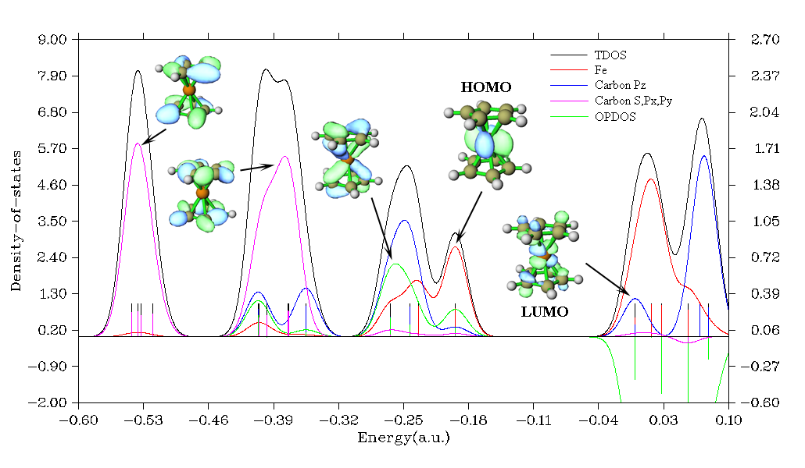

<!-- p.158 -->
- 1: Only energies (in a.u.) and occupation numbers will be loaded, while strengths and FWHMs of all orbitals will be automatically set to 1.0 and 0.25 a.u., respectively
- 2: The same as 1, but you also have to specify strength and FWHM for each orbital as columns 3 and 4 because in this case they will also be loaded. If the strength of an orbital is set to k, then the broadened curve from this orbital will be normalized to k rather than 1 (default value)
- 3: The same as 1, but energy unit is eV.
- 4: The same as 2, but energy unit is eV.


### 3.12.3 Options for plotting DOS and basic usage

When you enter the interface of plotting DOS, you will see following options. Notice that options -1 and 7 only appear when the input file contains basis function information, that is if you want to draw PDOS and OPDOS graph, you have to use .mwfn/.fch/.molden/.gms file as input.

Also note that in this interface, you can input s to save current status (plotting settings, fragment definition and orbital information) to a specific file, and you can input l to load status from a specific file, so that you can quickly replot a map without redoing the settings.

-6 Set shift of energy levels: In this option, orbital energies can be shifted by an inputted value. If you input H, then the shift will be set to negative of HOMO energy, so that HOMO in the DOS map corresponds to position of 0.

-5 Customize energy levels, occupations, strengths and FWHMs for specific MOs: By this option, you can manually set energies, occupations, strengths and FWHMs for specific orbitals. For example, if you would like only to plot DOS for a few MOs, you can set strengths of the other MOs to zero (by default, strengths for all MOs are 1.0).

-4 Show all orbital information: Print information of all orbitals on screen. -3 Export energy levels, strengths, FWHMs to plain text file: Export energy, strength and FWHM of each orbital to orginfo.txt in current directory, this file complies with the format introduced in last section, so can be directly used as input file.

-2 Define MO fragments for MO-PDOS: The "MO-PDOS" is a special kind of PDOS, which is used to reveal DOS contributed by different sets of MOs (rather than atoms or basis functions), the DOS curves and discrete lines corresponding to different sets of MOs are drawn using different colors. This option is used to define different sets of MOs involved in the "MO-PDOS" plot. See Section 4.10.5 for example.

-1 Define fragments for PDOS/OPDOS: You can define up to 10 fragments in this option, so that you can plot PDOS and OPDOS. After you entered this option, the information of present fragments is shown on screen. You can input x to define fragment x, and input -x to unset fragment x, or input i,j to exchange the definition of fragment i and j. To leave this interface, input 0 or q. By option 0, PDOS will be plotted for every fragment defined in this option. OPDOS can be drawn only when both fragments 1 and 2 have been defined.

It is noteworthy that, when plotting OPDOS, the defined fragment 1 and fragment 2 can share one or more basis functions, the two fragments can even have the same definition. In this case only cross terms between basis functions will be calculated, while local terms (characterizing on-site interactions) will be ignored.

0 Draw TDOS/PDOS/OPDOS graph: After selecting this option, TDOS map will be immediately shown on screen. If any fragment has been defined, TDOS+PDOS will be plotted. If both fragments 1 and 2 have been defined, TDOS+PDOS+OPDOS will be plotted, however you can also choose option -0 in this case to only plot TDOS+PDOS.


<!-- p.159 -->
00 Draw TDOS and OPDOS between nearest atoms: This option is visible if you have not defined any fragments. After selecting it, TDOS and the OPDOSnear mentioned in Section 3.12.1 will be plotted together.

1 Select broadening function: Select which broadening function will be used, you can select Lorentzian, Gaussian or Pseudo-Voigt function. Default is Gaussian.

2 Set energy range and step: This option is used to set the lower limit, upper limit and step between labels of X-axis.

3 Set full width at half maximum (FWHM): As the title says. 4 Set scale ratio for DOS curve: If this option is set to k, then height of all curves will multiply k (in full energy range).

5 Set Gaussian-weighting coefficient: This option sets wgauss, which is mentioned in last section. This option only appears when Pseudo-Voigt function is chosen.

6 Choose orbital spin: This option appears only when the loaded file contains basis function information and the wavefunction is unrestricted. This option determines which set of orbitals (alpha, beta, or both alpha and beta) will be taken into account.

7 Set the method for calculating PDOS: Mulliken, SCPA, Hirshfeld and Becke methods are supported for calculating orbital compositions used in plotting PDOS, via this option you can select one of them. Hirshfeld and Becke methods are more robust than Mulliken and SCPA methods, especially for unoccupied MOs, unfortunately they are more expensive, and in this case OPDOS cannot be plotted (i.e. the fragments can only be defined as a set of atoms). It is very important to note that when diffuse functions are presented, the PDOS maps plotted based on Mulliken or SCPA methods will be meaningless! If you diffuse functions cannot be ignored due to special reasons, Hirshfeld or Becke method has to be employed.

For isolated systems, Mulliken is the default method; while for periodic systems, SCPA is the default method, because evaluation of overlap matrix for large periodic cell may be very time-consuming, and SCPA does not need overlap matrix.

8 Switch unit between a.u. and eV: You can switch the unit for X-axis of the DOS map via this option. eV is more commonly used.

9 Toggle using line height to show orbital degeneracy: If you want to show degeneracy of orbitals in the DOS map, you can choose this option to enable this effect, then you will be asked to input threshold of energy difference for determining degeneracy. This feature can be used when plotting TDOS and MO-PDOS, but cannot be utilized when plotting PDOS.

Once you choose option 0 in the DOS module, Multiwfn starts to calculate data and then DOS graph pops up. You can see there is a vertical dash line, which highlights position of HOMO level. Note that some people believe this is Fermi energy, which, however, is an ill-defined concept for

isolated systems, any energy that  EHOMO and < ELUMO may be regarded as "Fermi energy".

After closing the graph, a post-processing menu appears on the screen, it contains many options, which are self-explanatory and can be used to adjust various plotting parameters. When the parameters have been changed, you can choose "1 Show graph again" to check the effect. It is noteworthy that there is an option named “Set scale factor of Y-axis range for OPDOS”, if the value is set to k and the range of left-axis (for TDOS/PDOS) is set to e.g. [-3.5, 2.0], then the range of right-axis (for OPDOS) will become [-3.5*k, 2.0*k]. The reason why Multiwfn uses double axis is because the magnitude of OPDOS is generally much smaller than TDOS and PDOS. You can also


<!-- p.160 -->
choose to export the DOS map as graphical file in current folder, or export X-Y data set of DOS to plain text files so that you can reproduce the graph by third-part softwares, such as Origin. By choosing option 0 you can return to last interface, the quality of DOS graph can be gradually improved by repeating the adjustments until you are satisfied.

The absolute value of the DOS curves does not have evident practical meaning, only relative height of the curves at different energy regions is interesting. Hence, after you have properly set each plotting parameter, you can choose option "13 Toggle showing labels and ticks on Y-axis" in the post-processing menu to switch its status to "No".

Very detailed examples of plotting TDOS, PDOS and OPDOS are given in Section 4.10.1, while Section 4.10.3 illustrates how to plot DOS for open-shell systems via Multiwfn in combination with Origin software to get better effect.


### 3.12.4 Local DOS

There is a special kind of DOS named local DOS (LDOS), which is also known as spatial DOS. LDOS curve for a given point r is evaluated as follows:


$$\mathrm{L D O S}(\mathbf{r},E)=\sum_{i}\varphi_{i}^{2}(\mathbf{r})f(E-\varepsilon_{i})$$

<!-- formula-ocr: formula_p160_094.png 已替换为LaTeX, 原图保留备查 -->

It is worth to note that in some first-principles books and papers, the word "Local DOS" in fact refers to the PDOS introduced in Section 3.12.1, do not be confused!

To plot LDOS map, choose option "10 Draw local DOS for a point" after you entered main function 10, you will be prompted to input the coordinate of the point r.

One can also plot LDOS for a set of points placed evenly in a line as color-filled map, the X-axis corresponds to energy, while the Y-axis corresponds to coordinate in the line relative to starting point. To plot this kind of LDOS map, choose option "11 Draw local DOS along a line", you will be prompted to input the coordinate of starting point and end point defining the line, as well as the number of points consisting of the line.

In the DOS module, the options controlling FWHM, energy unit, energy range and scale ratio affect the resulting LDOS graphs.

Note that fragment definition does not affect the result of LDOS, i.e. the LDOS always corresponds to total DOS. However, if you want to separate angular moment contribution to LDOS, you can use subfunction 25 of main function 6 to set coefficient of unwanted GTF in all MOs to zero, then they will not contribute to LDOS.

An example of plotting LDOS can be found in Section 4.10.2.


### 3.12.5 Photoelectron spectrum

The plotting of photoelectron spectrum (PES) spectrum based on (generalized) Koopmans' theorem) is closely related to plotting TDOS. Since PES is a kind of spectrum under frequent studies, a special interface in the DOS module is provided for easily generating theoretically simulated PES spectrum.


<!-- p.161 -->
Theory The position of the peaks in the PES spectrum reflects the energy difference between various N-1 states and the original N-electronic state. If a system is neutral, the system is usually in vibrational ground state of neutral electronic state. After ionization of an electron, the system can be in different vibrational states of the cationic state. Therefore, the PES has a fine structure, which reflects the vibration coupling effect. However, in order to simplify the problem, we often ignore the quantum effect of nuclear motion, and the ionization is assumed to be a vertical process starting from minimum point of potential energy surface of initial state. At this time, the peak positions in the PES are equivalent to the vertical ionization energy (VIP) of the electrons of different shells of present system. Clearly, as long as we optimize the system and then calculate the VIPs, we can simulate the PES.

The 1st VIP corresponds to the energy needed for ionizing out the electron of outermost shell, it is usually calculated as E(N-1) - E(N) for a system containing N electrons at minimum point geometry of potential energy surface of the N-electronic state; the E signifies electronic energy. The VIP corresponding to inner electrons can also be theoretically calculated, but special methods are needed, such as OVGF, IP-EOM-CC, ADC and so on.

The easiest way to plot PES is based on the Koopmans' theorem, which stated that the ionization energy of an electron is equal to the negative value of orbital energy of corresponding shell. Note that this is only an approximate relationship, it fully ignores the electron correlation and orbital relaxation effect. Under the Koopmans' theorem, the simulated PES simply corresponds to the TDOS curve broadened by all occupied MOs, however before the broadening the sign of orbital energies should be reversed (corresponding to "electronic binding energy").

Because of the fact that Koopmans' theorem does not work well for most popular DFT functionals (except for some special ones, such as QTP17), the negative values of MO energies deviate from actual VIP evidently, leading to poor PES compared to the experimental one. Fortunately, there is a so-called generalized Koopmans' theorem, if it is applied to theoretical simulation of PES, it essentially corresponds to adding a shift value to all electronic binding energies before PES plotting, the shift value is defined as 1st VIP + E(HOMO). After taking the shift into account, the first peak of simulated PES will exactly correspond to the 1st VIP, which does not deviate from the first peak of experimental PES evidently as long as the DFT functionals and basis set are properly chosen, the geometry has been substantially optimized, and the electronic state to be computed corresponds to actual ground state.

Usage The PES plotting interface is embedded in the DOS module as option 12, it allows the user to extremely easily plot PES spectrum based on (generalized) Koopmans' theorem. Any kind of input files that are used for plotting DOS can also be employed for PES plotting purposes.

If you want to plot the PES based on Koopmans' theorem, simply select option 1 after entering the PES plotting interface. If you want to adopt generalized Koopmans' theorem, you should choose option 3 to set a shift value before plotting.

There are many parameters and options in the PES plotting interface similar to those in the DOS plotting interface, such as range and step of X and Y axes, FWHM, if showing discrete lines and so on, however most parameters are not shared by the two interfaces. Note that only eV unit and Gaussian broadening function can be employed for PES plotting. If present wavefunction is an unrestricted open-shell one, the type of orbital spin is not distinguished.


<!-- p.162 -->
If you want to adjust relative height between the PES curve and the discrete lines corresponding to various binding energy levels, you can use "11 Set scale ratio for PES curve" to set a scale ratio. The smaller the ratio, the lower the curve.

If nothing is shown after choosing option 1 to plot the PES spectrum, you should:
- Select option "-2 Show all binding energy level information" and then check if values of binding energies are correct.
- Check if range of X-axis has been properly set. To plot PES, there must be at least one binding energy that occurs within the current range of X-axis. By default, all orbitals have identical strength (1.0) and FWHM (0.2 eV), the latter can be directly set in the PES interface via option 6. If you want to adjust strength and FWHM for individual orbitals, you can select "-3 Export occupied MO energies, strengths and FWHMs to plain text file", then a file PESinfo.txt in a format as described in Section 3.12.2 will be exported to current folder. You can then manually adjust strengths and FWHMs of certain orbitals in this file, and then use this file as input file to plot PES, so that the simulated PES could be closer to the experimental one.

The absolute value of the PES curve does not have practical meaning. Hence, after you have properly set the range of Y-axis, you can choose "13 Toggle showing labels and ticks on Y-axis" to switch its status to "No".

An example of plotting PES is given in Section 4.10.4. Information needed: For PDOS, OPDOS and local DOS, see Section 3.12.2. For TDOS and PES spectrum, use .mwfn/.fch/.molden/.gms file, or Gaussian output file with pop=full, or plain text file in a format as described in Section 3.12.2.


### 3.12.6 COHP

Theory In the field of first-principles research, OPDOS is often referred to as crystal orbital overlap population (COOP), and there is a concept closely related to it named crystal overlap Hamilton populations (COHP). COHP was originally proposed in J. Phys. Chem., 97, 8617 (1993), and has wide applications in understanding bonding in solids and material design, see J. Phys. Chem. A, 115, 5461 (2011) and Angew. Chem. Int. Ed., 39, 1560 (2000) for review.

For wavefunctions represented by atomic-centered basis functions, like those produced by Gaussian and CP2K, COHP can be regarded as simply replacing the overlap matrix in COOP with Kohn-Sham matrix, so COHP is related to interactions between atoms or fragments from the energy perspective. Each MO has its COOP and COHP value for the interaction of interest, both positive COOP and negative COHP suggest that the MO has positive contribution to the interatomic or interfragment bonding when it is occupied (i.e. bonding state), and the more positive the COOP and the more negative the COHP, the larger the contribution. In contrast, MO of antibonding state has negative COOP and positive COHP. COHP may correlate better than COOP with the interatomic/interfragment bonding strength as it takes energy factor into account. However, I found COHP curve is somewhat sensitive to the basis set used. So, when comparing COHP between different cases, exactly the same basis set should be used.


<!-- p.163 -->
Usage The DOS module of Multiwfn also supports plotting COHP between fragments or between nearest atoms. To plot COHP, you should do the following steps

(1) Load a wavefunction file containing basis function information such as .mwfn, .fch or .molden file, see Section 2.5.

(2) Enter DOS plotting module (main function 10), and choose option “-7 Change to COHP plotting mode”.

(3) Now Multiwfn asks you to provide Kohn-Sham matrix. You can directly let Multiwfn generate it based on wavefunction information, or load it from an external file, see Section 6.7 for details.

(4) If you want to plot COHP between nearest atoms, simply choose option 0. If you want to plot COHP between two fragments, you should define two fragments in option -1 first and then choose option 0. Note that the interface for defining COHP fragments is exactly the same as that for defining PDOS fragments.

(5) Now Multiwfn calculates COHP between nearest atoms or between fragments for every MO in the plotted energy range, then broadens them as a curve and shows it on screen.

(6) The post-processing menu of plotting COHP is very similar to that of plotting DOS. However, there is a dedicated option “-2 Show COHP raw data and ICOHP”, by which you can let Multiwfn print COHP values of all MOs in the COHP map, so that you can quantitatively compare COHP data between different situations. The sum of COHP values of the occupied levels in the map is also printed, which may be used to assess contribution of the MOs to interatomic or interfragment bonding.

An example of plotting COHP is given in Section 4.10.7.


## 3.13 Plotting IR, Raman, UV-Vis, ECD, VCD, ROA and NMR spectra (11)


Multiwfn has a very powerful and flexible module to plot IR (Infrared), normal Raman / Pre-resonance Raman, UV-Vis (ultraviolet-visible), ECD (electronic circular dichroism), VCD (vibrational circular dichroism) and Raman optical activity (ROA) spectra, see Sections 3.13.1~3.13.4 for introduction. Many examples of plotting various kinds of spectra are given in Section 4.11.

Multiwfn is also able to plot NMR spectrum, see Section 3.13.5 for introduction and Section 4.11.10 for examples.

For vibrational spectra, Multiwfn is able to decompose them to gain insight into their nature, this is known as partial vibrational spectrum (PVS), which will be described in Section 3.13.6, relevant examples are given in Section 4.11.12.

Multiwfn can exactly predict color based on theoretical or experimental UV-Vis spectrum, see Section 3.12.7 for introduction and 4.11.14 for example.


<!-- p.164 -->

### 3.13.1 Theory

For comparing theoretical results with experimental spectrum, the discrete lines corresponding to each transition mode have to be broadened to emulate the situation in real world, the commonly used broadening function for vibrational spectra (IR, Raman, VCD and ROA) is Lorentzian function, while for electronic spectra (UV-Vis and ECD), Gaussian function is often used, see Section 3.12.1 for details. Unlike DOS graph, in which the strengths for each energy level are always simply set to 1.0 (namely broadened curves from each energy level are normalized to 1.0), the strengths of transitions are very important data for plotting spectrum.

The unit of transition energy of IR, Raman, VCD and ROA spectra is cm-1 in common, for UV-

Vis and ECD spectra all of eV (1 eV=8.0655×1000 cm-1), nm and 1000 cm-1 are common units. The strength data of each transition mode outputted by quantum chemistry programs is proportional to the area under the broadened curve. Below we discuss some details of the six types of spectra supported by Multiwfn respectively.

IR: The frequently used unit of molar absorptivity ε, namely L(mol·cm)-1, can be rewritten as

$$\frac{L}{\mathrm{mol}\times\mathrm{cm}}=\frac{1000\mathrm{cm}^{3}}{\mathrm{mol}\times\mathrm{cm}}=\frac{1000\mathrm{cm}^{2}}{\mathrm{mol}}$$


$$\frac{1000cm^{2}}{mol}(cm^{-1})=\frac{1000cm}{mol}=\frac{0.01km}{mol}$$

<!-- formula-ocr: formula_p164_095.png 已替换为LaTeX, 原图保留备查 -->

However, km/mol is the more commonly used unit for IR intensity, therefore if IR intensity of a vibrational mode is p km/mol, then the broadened curve from which should be normalized to 100*p (in other words, the area under the curve is 100*p). Sometimes the unit esu2cm2 is used for IR intensity, the relationship with km/mol is 1 esu2cm2 = 2.5066 km/mol.

Below is an example of IR spectrum plotted by Multiwfn. Notice that the left axis corresponds to the curve (artificially broadened data), the right axis corresponds to the discrete lines (original transition data).


<!-- p.165 -->
7480.21 473.59

6707.25 424.65

Molar absorption coefficient (L/mol/cm) 5934.30 5161.34 4388.39 3615.43 2842.48 2069.52 1296.57 375.72 326.78 277.84 228.90 179.96 131.03 82.09 IR intensities (km/Mol)

523.61 33.15

-249.34 -15.79

0.00401.37802.741204.12 1605.49 2006.86 2408.23 2809.60 3210.98 3612.35 4013.72

Raman (normal or pre-resonance): Raman spectrum measures intensity of scattered light. Beware that for a specific vibration mode i, its Raman activity Si and Raman intensity Ii are two different quantities. Raman activity is an intrinsic property of each molecular vibrational mode, while Raman intensity is directly related to experimental Raman spectrum, and its value is Frequencies (cm**-1)

dependent on the choice of wavenumber of incident light ν0 as well as temperature. The conversion relationship can be found in many papers, for example my paper Chem. Asian J., 16, 56 (2021) DOI: 10.1002/asia.202001228 gave it and you can cite:

$$I_{i}=\frac{C(v_{0}-v_{i})^{4}S_{i}}{v_{i}B_{i}}\quad B_{i}=1-\exp\left(-\frac{h c v_{i}}{k T}\right)$$

where C is a suitably chosen common normalization factor for all peak intensities, νi is vibrational frequency. Only the Raman spectrum broadened based on Raman intensities is strictly comparable to the experimental one; however, as the peak position of Raman activity and intensity are identical, and for a specific vibrational mode its intensity is proportional to its activity, the Raman spectrum broadened from Raman activities is also useful in some sense.

Almost all quantum chemistry codes only output Raman activities, therefore by default, Multiwfn emulates the Raman spectrum in terms of broadening Raman activities. However, you can also let Multiwfn to first convert the activities to intensities via option 19 (v0 and T are provided by users) based on above formula, then the Raman spectrum will be obtained by broadening Raman intensities. The normalization coefficient C is fixed to 10-12 in Multiwfn (which is unimportant since what we are interested in is the shape rather than the absolute height of Raman spectrum). The integral of the peak broadened by one unit of Raman activity or intensity is equal to 1.

UV-Vis: In theoretical chemistry field, oscillator strength (f) is used for representing the transition strength involved in UV-Vis spectrum, which is defined as

22 () ||3ijjiijfEE=−μ

where i and j stand for initial and final states, and they correspond to ground state and excited state


<!-- p.166 -->
in the context of UV-Vis spectrum, respectively. E is energy of state. |μij|2 is squared norm of transition electric dipole moment vector between the two states.

There is a relation between theoretical data and experimental spectra: If the unit 1000 cm-1 and L/mol/cm are used for X-axis and Y-axis respectively, then the area under the curve that broadened from per unit f should be 1/4.32*106. Equivalently, if eV is used as X-axis unit, the value should be 1/4.32/8.0655*106=28700. Via this relation, UV-Vis spectrum can be simulated by theoretical data.

Fluorescence spectrum can also be plotted with exactly the same manner as UV-Vis, the only difference to UV-Vis is that according to Kasha's rule, you should only take the first singlet excited state (S1) into account, and geometry of optimized S1 state should be used (however, note that some systems break Kasha’s rule). For plotting phosphorescence spectrum, you should only take the first triplet excited state (T1) into account, and geometry of optimized T1 state should be used. Note that in order to obtain non-vanishing f corresponding to phosphorescence emission, spin-orbit coupling effect must be taken into account.

Directional UV-Vis: The |μij|2 mentioned above can be written as sum of its three Cartesian

components, namely |𝛍𝑖𝑗| 2 = (𝜇𝑖𝑗 𝑋) 2 + (𝜇𝑖𝑗 𝑌) 2 + (𝜇𝑖𝑗 𝑍) 2. The so-called directional UV-Vis spectrum

in Multiwfn refers to the case of only taking contribution of specific components of |μij|2 into account. You can choose to plot X, Y, Z, X+Y, X+Z, Y+Z or specific direction type of the spectrum. For

example, if you plot X+Y type, then the |𝛍𝑖𝑗| 2 will be replaced with (𝜇𝑖𝑗 𝑋) 2 + (𝜇𝑖𝑗 𝑌) 2 , and the

resulting spectrum will only exhibit the absorption due to interaction between present system and the electric field oscillating in X and Y directions. If you manually define the direction as (1,0,1),

which corresponds to normalized vector of ( √2 , 0, 1 √2), then |𝛍𝑖𝑗| 1 2 = ( √2 𝜇𝑖𝑗 1 𝑋) 2 + ( √2 𝜇𝑖𝑗 1 𝑍) 2 . Clearly,

directional UV-Vis spectrum is very helpful in understanding the nature of optical absorption in terms of interaction with oscillating electric field of specific direction(s). In contrast, common UV-Vis spectrum corresponds to the case that the incident oscillating electric field is isotropic. Note that directional UV-Vis spectrum is additive, for example, sum of X and Y and Z types of the spectrum, and sum of X+Y and Z types of the spectrum, all equivalent to common UV-Vis spectrum.

ECD：The significance of rotatory strengths in ECD spectrum is analogous to oscillator strengths in UV-Vis spectrum, each electron transition mode corresponds to a rotatory strength. If the rotatory strengths are broadened, after somewhat scaling and shifting, the resultant curve will be comparable to experimental ECD spectrum. The integral of the peak broadened by one unit of rotatory strength is equal to 1. In quantum chemistry programs, such as Gaussian, rotatory strengths can be calculated in length representation or in velocity representation, in the former case the strengths are origin-dependent, while in the latter case the strengths are origin-independent. For complete basis set situation, the results in the two representations converge to the same values. Commonly, velocity representation is recommended to be used.

VCD: VCD measures difference in molecular absorption coefficient of left- and right-

circularly polarized lights at different wavenumber λ, namely VCD curve can be expressed as ∆𝜀(λ) = 𝜀L(λ) −𝜀R(λ). Each vibrational mode has a rotatory strength, after broadening rotatory strengths of all vibrational modes, the shape of the resulting curve can be compared with experimental VCD spectrum. The integral area under the curve ∆𝜀(λ) contributed by a vibrational mode is proportional to its rotatory strength.


<!-- p.167 -->
ROA: The ROA spectrum measures the difference between scattering intensity of right and left circularly polarized light:

$$\mathrm{ROA~intensity}\equiv I_{i}^{\mathrm{R}}-I_{i}^{\mathrm{L}}\propto\frac{\left(\nu_{0}-\nu_{i}\right)^{4}A_{i}}{\nu_{i}B_{i}}\quad B_{i}=1-\exp\left(-\frac{h c\nu_{i}}{k T}\right)$$

The ROA strength data outputted by Gaussian ROA task in fact is the Ai term, which should be converted to actual ROA intensity according to above equation. The Ai term is dependent on frequency of incident light. The integral of the peak broadened by one unit of ROA intensity/strength is equal to 1. There are several different forms of ROA, including ROA SCP(180), ROA SCP(90), ROA DCP(180). The 90 and 180 denote the angle between incident light and scattered light. The SCP (scattered circular polarization) means the incident light is linearly polarized light while the scattered light is circularly polarized light; DCP (dual circular polarization) corresponds to the case that both incident and scattered lights are circularly polarized light. The ROA SCP(180) is commonly employed, and it is also known as SCP backscattered ROA.

The ROA task of Gaussian also simultaneously outputs frequency-dependent Raman strength, which corresponds to the Ri term of below equation

$$\mathrm{Raman~intensity}\equiv I_{i}^{\mathrm{R}}+I_{i}^{\mathrm{L}}\propto\frac{\left(\nu_{0}-\nu_{i}\right)^{4}R_{i}}{\nu_{i}B_{i}}\quad B_{i}=1-\exp\left(-\frac{h c\nu_{i}}{k T}\right)$$

correspondingly, there are also Raman SCP(180), Raman SCP(90) and Raman DCP(180) data. Since the current used incident light should be far from electron excitation energy, such Raman spectrum is called as far from resonance Raman.


### 3.13.2 Input file

Only the input files mentioned in this section are supported by Multiwfn for plotting spectrum purposes. DO NOT use such as .fch, .molden and .wfn as input file, evidently the data needed for plotting spectrum are not recorded in these files.

1 Gaussian output file

- IR spectrum: Use output file of freq task as input. If you use Gaussian 09 D.01 or later revisions and meantime freq=anharm keyword was specified to carry out anharmonic analysis, Multiwfn will prompt you to choose if loading anharmonic frequencies and IR intensities instead of the harmonic ones.

- Raman spectrum: Use output file of freq=raman task as input. If you would like to plot pre-resonance Raman spectrum, you should at the same time use CPHF=rdfreq keyword and write the frequencies of the incident lights after a blank line under the geometry specification, e.g. 300nm 400nm 500nm. If you hope to plot anharmonic Raman spectrum, use freq(raman,anharm) keywords, then Multiwfn will prompt you to choose if loading anharmonic frequencies and Raman activities instead of the harmonic ones.

- VCD spectrum: Use output file of freq=VCD task as input. If you hope to plot anharmonic Raman spectrum (supported by Gaussian since G16), use freq(VCD,anharm) keywords, then Multiwfn will prompt you to choose if loading anharmonic frequencies and rotatory strengths instead of the harmonic ones.


<!-- p.168 -->
For anharmonic IR, Raman and VCD spectra, you can choose if only loading anharmonic fundamental data, or simultaneously loading anharmonic overtone band or combination band data.

- UV-Vis, directional UV-Vis and ECD spectrum: Use output file of TDDFT, TDHF, CIS, ZINDO or EOM-CCSD task as input, no additional keywords are required. The rotatory strengths in both length and velocity representation (the data under "R(length)" and "R(velocity)", respectively) can be chosen to be loaded by Multiwfn. Output file of optimization task for excited state can also be used, only the last output for transition information will be loaded by Multiwfn, therefore the resulting spectrum corresponds to final geometry.

- ROA spectrum: Use output file of freq=ROA task as input. The frequencies of incident lights should be specified after a blank line under the geometry specification, e.g. 0.02, 0.03, 0.04, 0.05, the unit is default to a.u.; or write e.g. 500nm 520nm 550nm.

2 ORCA output file

- IR spectrum: Use freq keyword.
- Raman spectrum: Use keywords like below ! b3lyp def2-SVP numfreq %elprop Polar 1 end

- UV-Vis, directional UV-Vis and ECD spectrum: Commonly TDDFT is used, example of keywords:

! b3lyp def2-SVP %tddft nroots 20 TDA false end Notice that for TDDFT calculation, ORCA by default uses Tamm-Dancoff Approximation (TDA), in this case the oscillator strength and rotatory strengths are evidently not as good as those produced by TDDFT, therefore in the example above TDA false is used to make ORCA use standard TDDFT formalism. Also, it is worth noting that ORCA employs length representation for rotatory strengths in ECD.

Output file of sTDA or sTD-DFT task of ORCA (see below for details) is also supported by Multiwfn for plotting (directional) UV-Vis or ECD spectrum purpose. Below are example keywords:

! PBE0 def2-SVP def2/J RIJCOSX %maxcore 6000 %pal nprocs 36 end %tddft Mode sTDDFT Ethresh 10.0 maxcore 6000 end Since ORCA 4.1 spin-orbit coupling (SOC) effect can be taken into account during TDDFT calculation, and all data needed for plotting SOC corrected UV-Vis and ECD spectra are automatically outputted. Therefore, when output file of SOC-TDDFT task is loaded into Multiwfn, when you enter UV-Vis and ECD plotting option, you can select if loading SOC corrected data instead of the one without SOC consideration. It is very easy to conduct SOC-TDDFT, simply adding dosoc true in %tddft section, for example:


<!-- p.169 -->
%tddft nroots=40 TDA false dosoc true end Output file of CIS, TDHF, ZINDO, EOM-CCSD, (DLPNO-)STEOM-CCSD calculations can also be used as input file for simulating (directional) UV-Vis and ECD spectra in Multiwfn.

- VCD: Output file of regular frequency analysis task with %freq doVCD true end setting.
- ROA spectra: Currently not supported by ORCA.

3 Grimme's sTDA output file The sTDA proposed by Grimme in J. Chem. Phys., 138, 244104 (2013) is a method approximately solving the TDDFT equation and thus reduces the computational cost of the electron excitation part of TDDFT calculation by about two or three orders of magnitude. The corresponding sTDA program can be freely downloaded at https://github.com/grimme-lab/stda.

Although the Grimme's sTDA code has already been implanted into ORCA program, the tda.dat file outputted by standalone sTDA code can also be used as input file of Multiwfn for plotting UV-Vis or ECD purpose.

When ECD is to be plotted, you can choose which representation of rotatory strength will be used. The length and velocity representations have been mentioned above, while the mixed-form of

representation, which is recommended in the sTDA original paper, is defined as RM= RV × fL / fV, where fL and fV are length and velocity representations of oscillator, respectively, and RV is the velocity representation of rotatory strength.

4 Grimme's xtb output file The xtb program written by Grimme is mainly used to carry out GFN-xTB calculation (J. Chem. Theory Comput., 13, 1989 (2017) and J. Chem. Theory Comput., 15, 1652 (2019)), which may be viewed as a semiempirical variant of DFT method. It is not only robust but also rather fast, it can be conveniently applied to systems consisting of hundreds of atoms. Note that although the accuracy of xtb frequency has been verified to be basically reasonable, the quality of IR intensities outputted by xtb is not quite satisfactory (according to my experiences). xtb program can be freely obtained via https://github.com/grimme-lab/xtb/.

By running xtb test.xyz --ohesst, xtb will optimize the structure in test.xyz and then perform frequency analysis. The vibspectrum outputted in the current folder contains harmonic frequencies and IR intensities, it can be used as input file of Multiwfn for plotting IR spectrum purpose.

5 CP2K output file Output file of vibrational analysis task of CP2K can be used as input file for plotting IR and Raman spectra. INTENSITIES T should present in &VIBRATIONAL_ANALYSIS. In addition, for plotting IR, the following content should present in &DFT:


```text
    &PRINT
      &MOMENTS
        PERIODIC T  (for isolated systems, use F)
      &END
    &END
```

For plotting Raman spectrum, the following content should be presented in &FORCE_EVAL


```text
  &PROPERTIES
    &LINRES
      PRECONDITIONER FULL_ALL
      &POLAR
```


<!-- p.170 -->

```text
        DO_RAMAN T
        PERIODIC_DIPOLE_OPERATOR T  (for isolated systems, use F)
      &END POLAR
    &END LINRES
  &END PROPERTIES
```

In addition, if you request CP2K to export .mol (Molden) file containing vibrational modes and IR intensities by adding the following content to &VIBRATIONAL_ANALYSIS field, then the .mol file can also be used as input file for plotting IR spectrum.


```text
  &PRINT
    &MOLDEN_VIB
    &END MOLDEN_VIB
  &END PRINT
```

Output file of TDDFPT calculation of CP2K can be used as input file for plotting (directional) UV-Vis spectrum, and sTDA kernel is also supported. When spin-orbit coupling is activated by using following content in &TDDFPT section, then spin-orbit coupling corrected UV-Vis spectrum can be plotted.


```text
      &SOC
      &END SOC
      &PRINT
        &SOC_PRINT
          SPLITTING
          SOME
        &END SOC_PRINT
      &END PRINT
```

X-adsorption spectrum may be plotted by Multiwfn based on .spectrum file produced by &XAS_TDP task of CP2K. You need to manually reorganize the data in the .spectrum to the plain text file, as shown below.

Note that CP2K input file of aforementioned tasks can be easily generated by corresponding option in subfunction 2 of main function 100.

6 BDF output file Output file of TDDFT task of BDF can be used as input file for plotting UV-Vis spectrum.

7 Plain text file For generality, Multiwfn supports plain text file as input, you can extract transition data from output files of computational chemistry packages other than the aforementioned ones, and then fill them into a file according to the format shown below

numdata inptype

energy strength [FWHM]  For transition 1 energy strength [FWHM]  For transition 2 energy strength [FWHM]  For transition 3 ...

energy strength [FWHM]  For transition numdata where numdata denotes how many entries are in this file. If inptype is set to 1, then only energy and strength will be read, and FWHMs for all transitions will be automatically set. If inptype is set to 2, then FWHMs will be read too. The transitions should be sorted according to the energies from low


<!-- p.171 -->
to high. The unit of both energy and FWHM should be in cm-1 for IR, Raman, VCD and ROA spectra, in eV for UV-Vis and ECD spectra. The unit of strength should be in km/mol, Å4/amu, cgs (10-40 erg-esu-cm/Gauss), 10-44 esu2 cm2, 104 K for IR, Raman, ECD, VCD, ROA spectra, respectively (oscillator strength of UV-Vis is dimensionless).

An example of the plain text file is shown below (for IR)


```text
6 2
  81.32920        0.72170    8.0
 417.97970        3.58980    8.0
 544.67320       21.06430    8.0
 583.12940       41.33960    8.0
 678.66900       91.47940    8.0
 867.37410        2.94480    8.0
```


### 3.13.3 Usage and options

After booting up Multiwfn, first input path of output file of aforementioned programs or the plain text file containing transition data, then enter main function 11, and you will be asked to select the type of spectrum (for pre-resonance Raman and ROA, you also need to choose the frequency of interest), after that you will see below options. The meaning of some options may be different for various types of spectra.

Note that in this interface you can input s anytime to save current plotting settings to a file, or input l to load plotting settings from a file, so that you can quickly recover plotting status.

-4 Set format of saving graphical file: This is used to choose the format of the graphical file exported by option 1. Commonly, using vector formats such as ps, pdf and svg is recommended.

-2 Export transition data to plain text file: Output energies, intensities and FWHMs of all transitions to transinfo.txt in current directory, this file fully complies with the format introduced in last section, so it can be directly used as input file.

-1 Show transition data: Print energy and intensity data of all transitions on screen. 0 Plot spectrum: Plot spectrum right now! The spectrum will be shown on screen, and meantime the minima and maxima of the spectrum curve will be shown in console window.

1 Save graphical file of the spectrum in current folder: As the title says. 2 Export X-Y data set of lines and curves to plain text file: Export X-Y data set of lines and broadened spectrum to spectrum_line.txt and spectrum_curve.txt in current directory, respectively, you can replot the curve and discrete line graph directly by the two files via external program, such as Origin.

3 Set lower and upper limit of X-axis: As the title says. The interval between ticks also needs to be inputted. By default, the range of X-axis is adjusted automatically according to minimum and maximum transition energies.

4 Set left Y-axis: Set starting value, ending value and step size for left Y-axis. By default, the range of Y-axis is adjusted automatically according to the maximum peak.

5 Set right Y-axis: Like option 4, but for right Y-axis. In many cases, after you adjust setting for Y-axis at one side, the position of zero point of this Y-axis deviates from that of Y-axis at another side, which makes the graph weird; To address this problem, options 4 and 5 enable you to choose if correspondingly adjusting range of Y-axis at


<!-- p.172 -->
another side. If you input y, then lower/upper limit and label interval of Y-axis at another side will be proportionally scaled to make zero point of left and right Y-axes are in the same horizontal line.

6 Select broadening function: Gaussian, Lorentzian and Pseudo-Voigt function can be selected for broadening discrete lines as curves.

7 Set scale ratio for curve: If the value is set to k, then the height of curve will multiply k in full range. For Raman, ECD, VCD and ROA spectra the default value is 1.0, for IR the value is 100, for UV-Vis spectrum an empirical value 28700.0 is used when energy unit is eV or nm, when unit is 1000 cm-1 the value 1/(4.32*10-6) is used.

8 Input full width at half maximum (FWHM): As the title says. 9 Toggle showing discrete lines: Choose if show the discrete lines corresponding to transitions on the spectrum graph.

10 Switch the unit of infrared intensity / Set the unit of excitation energy: For IR spectrum, switch the unit of IR intensities between km/mol (default) and esu2*cm2. For UV-Vis and ECD spectra, choose the unit of energy between eV, nm and 1000 cm-1.

11 Set Gaussian-weighting coefficient: Sets wgauss, which is mentioned in Section 3.12.1, this option only appears when Pseudo-Voigt function is chosen.

12 Set shift value in X: If the value is set to k, then the final curve and discrete lines will be shifted by k in X direction.

13 Set colors of curve and discrete lines: As the title says. 14 Set scale factor for transition energies (or vibrational frequencies): Using this option, transition energies can be scaled by a factor, the spectrum to be plotted will be affected.

For scaling vibrational frequencies, there are two methods that can be used: (1) Uniform scaling: The selected frequencies are simply multiplied by a factor inputted by

the user. You can choose the frequencies according to their index range or frequency range. (2) Power-law scaling: This method was proposed in J. Chem. Theory Comput. (2026) DOI:

10.1021/acs.jctc.6c01138, it performs better than the uniform scaling. Every frequency is

scaled as 𝜆1𝜔𝜆2, where λ1 and λ2 are fitted parameters specified by the user and ω is the original frequency. 15 Output contributions of individual transitions to the spectrum: If select this option, user will be prompted to input a criterion (e.g. k), then not only the total spectrum (as option 2), but also the contributions from the individual transitions whose absolute value of strength larger than k will be outputted to spectrum_curve.txt in current folder. This feature is particularly useful for identifying the nature of total spectrum.

In this function you can also input 0 first, then input an X position of the spectrum, then 10 transitions having largest contribution to this position will be shown, this is quite convenient to make clear major contributors at specific spectrum positions (e.g. peak positions of important absorptions).

16 Set status of showing labels of spectrum minima and maxima: You will enter an interface, in which there are many options used to set how to show spectrum minima and maxima on the plotted map, they are self-explanatory.

17 Other plotting settings: Miscellaneous plotting settings can be set here, such as if showing dashed grid lines, if showing labels on axes, text size of axis name / ticks / legends, number of decimal places in axes, type of labels in left Y-axis, position of legends, set color of line and curve of different systems.

18 Toggle weighting spectrum of each system: See explanation in next section.


<!-- p.173 -->
19 Convert Raman (or ROA) activities to intensities: As mentioned earlier, this option is used to convert Raman (or ROA) activities to intensities. After that, the Raman (or ROA) spectrum plotted by option 0 will be the one broadened based on Raman (or ROA) intensities rather than Raman (or ROA) activities. The wavenumber of incident light and temperature are inputted by users.

20 Modify strengths: You can select some transitions and change their strengths (depending on spectrum type) to specific value. This option is very useful if you would like to plot fluorescence spectrum, in this case you need to set oscillator strength of all transitions except for the lowest singlet excitation to zero (Kasha's rule).

21 Set status of showing weighted curve and curves of individual systems: As shown in the next section, Multiwfn is able to plot weighted spectrum according to given weights of multiple systems. This option controls if plotting weighted curves and curves of various systems.

22 Set thickness of curves/lines/texts/axes: As the title says. 23 Set status of showing spikes to indicate transition levels: Via this option, you can plot one or multiple sets of spikes at bottom of the spectrum to indicate position of different sets of transitions. If some transitions are degenerated, the height of spikes can be used to reflect degree of degeneracy. See Section 4.11.9 for illustration of this option. This option is not available when multiple systems are considered in the plotting simultaneously.

Note that the actual number of points constituting the spectrum is controlled by "num1Dpoints" parameter in `settings.ini`. The default value is commonly large enough and thus need not to be adjusted.


### 3.13.4 Plotting multiple systems together and weighted spectrum

In Multiwfn, it is possible to simultaneously plot spectrum for multiple files, and meantime taking weights into account. This feature is quite useful for obtaining actual spectrum of a flexible molecule with many thermally accessible conformations.

For example, there is a molecule containing four accessible conformations, their distribution ratio has been determined according to Boltzmann's method based on calculated free energies. If you want to plot its weighted spectrum and spectrum of each conformation, you should write a plain text file named multiple.txt (other file name cannot be recognized by Multiwfn), the content is:


```text
boltz\Excit\a.out 0.6046
boltz\Excit\b.out 0.1950
boltz\Excit\c.out 0.1686
boltz\Excit\d.out 0.0317
```

where the first and second column correspond to path of input file and weight of each conformation. Different types of input file can be presented together in this file. If you use this file as input file, after you entered spectrum plotting module, Multiwfn will load data from these files in turn. When plotting spectrum, spectrum of all the four conformations will be separately calculated and drawn with different colors. In addition, the weighted spectrum is plotted on the graph as thick red curve, it is simply evaluated as follows:

weighted spectrum = 0.6046×a + 0.1950×b + 0.1686×c + 0.0317×d In the graph you can also observe many black discrete lines, these are collection of discrete lines corresponding to different conformations. Notice that their heights have already been multiplied by


<!-- p.174 -->
corresponding weights.

If before plotting spectrum you have chosen option 18 once, then the spectrum of various conformations shown on graph are the weighted ones; in other words, these curves represent contribution of each conformation to actual spectrum (thick red curve). In this case, the color of weighted discrete lines is no longer all black but in accordance with color of curves, so that users can easily recognize correspondence between curve and discrete among different systems.

If you simply want to simultaneously plot spectrum for multiple systems but do not want to draw weighted spectrum, then the second column of multiple.txt should not be weights, but customized legends, for example


```text
boltz\Excit\a.out Molecule A
boltz\Excit\b.out Molecule B
boltz\Excit\c.out Molecule C
boltz\Excit\d.out Molecule D
```

Then plot spectrum as usual, curve of all the four systems will be shown together, and the legends will be "Molecule A", "Molecule B", etc.

When the legend is completely composed of numbers, the legend will be regarded as weight. If the legends have to be a number, you should add $ in front of the legend to let Multiwfn know it is legend rather than weight. For example, $50 will be recognized as legend of “50”.

If you are using Linux platform and some file paths in the multiple.txt contains / symbol or space, you should add double quotation marks at the two ends of the file path, so that the path could be properly loaded.


### 3.13.5 Plotting NMR spectrum

Theory

Many quantum chemistry programs are able to compute magnetic shielding tensors σ at nuclei, usually only the average of its diagonal terms, namely isotropic magnetic shielding value σiso, is of interest, because NMR spectrum is commonly determined in solvent environment and the solute is able to freely rotate.

The chemical shift δ is calculated as follows


$$in front of the legend to let Multiwfn know it is legend rather than weight. For example,$$

<!-- formula-ocr: formula_p174_096.png 已替换为LaTeX, 原图保留备查 -->

where σref is shielding value of reference substance (tetramethylsilane for 13C and 1H NMR), while the σ is shielding value of the sample to be determined. The two values should be evaluated at exactly the same calculation setting (theoretical method, basis set, solvation model...).

Another way of determining chemical shift is scaling method, see http://cheshirenmr.info for

detail. Briefly speaking, this method evaluates δ in a very simple way:


$$\delta=a\times\sigma+b$$

<!-- formula-ocr: formula_p174_097.png 已替换为LaTeX, 原图保留备查 -->

where the a and b are prefitted slope and intercept parameters based on a training set for specific calculation level. For example, if the optimization is conducted under vacuum using B3LYP/6-31G* while shielding value is calculated using B3LYP/6-31G* under chloroform environment represented by SMD solvation model, then a = -1.0157 and b = 32.2109 for 1H NMR, while a = -0.9449 and b = 188.4418 for 13C NMR.


<!-- p.175 -->
If there are methyl groups in the system, the δ of its three hydrogens should be averaged before generating NMR spectrum, since methyl groups can freely rotate in actual environment due to its extremely low rotation barrier. In addition, if there are multiple thermally accessible conformers and they can interconvert with each other easily, the weighted average shielding value should be calculated for each atom based on weights of the conformers:


$$\overline{\delta^{A}}=\sum_{i}p_{i}\delta_{i}^{A}$$

<!-- formula-ocr: formula_p175_098.png 已替换为LaTeX, 原图保留备查 -->

where i is conformer index and A is atom index. pi stands for weight of conformer i, which can be calculated according to Boltzmann distribution based on relative free energies between the conformers.

With δ of all atoms in hand, one can plot discrete line map of NMR, the X-axis of the spikes in the map corresponds to δ while Y-axis corresponds to degeneracy, which is N if maximal spacing between N chemical shifts is less than specific threshold (e.g. 0.05 ppm), for other cases the degeneracy is 1.0.

Actual NMR spectrum with finite peak width can be generated by broadening the spikes by Lorentzian function, the full width at half maximum (FWHM) is a key parameter of controlling peak shape. In this curve map, the peak height corresponds to strength of NMR signal.

Input file Output file of NMR task of Gaussian, ORCA and BDF programs are directly supported as input file for plotting NMR spectrum. .data file generated by NMR task of CP2K can also be used.

- Example of NMR task of Gaussian


```text
# B972/def2tzvp scrf=solvent=chloroform NMR

Title Card Required

0 1
 N                 -0.14557000    1.69364200    0.17479300
 H                 -1.18363600    1.59873700    0.51496300
[...ignored]
```

- Example of NMR task of ORCA


```text
! B3LYP/G 6-31G* NMR cpcm(chloroform) RIJK autoaux
* xyz   0   1
 C                     0.        1.14218   0.72212
 C                     0.        1.19872  -0.67302
[...ignored]
```

- Example of NMR task of CP2K. Adding the following content into &FORCE_EVAL of input file of a common GAPW task. In addition, it is suggested to set &SCF / EPS_SCF to 1E-7 and EPS_DEFAULT to 1E-14 to guarantee sufficient numerical accuracy.


```text
&LINRES
  PRECONDITIONER FULL_KINETIC
  EPS 1E-8
  MAX_ITER 300
  &CURRENT
```


<!-- p.176 -->

```text
    CHI_PBC T
    GAUGE R_AND_STEP_FUNCTION
    ORBITAL_CENTER ATOM
  &END CURRENT
  &LOCALIZE
     MAX_ITER 20000
     EPS_LOCALIZATION 1E-5
  &END LOCALIZE
  &NMR
  &END NMR
&END LINRES
```

- Plain text file Plain text file recording atom names and shielding values can also be used as input file for plotting NMR spectrum, see examples\spectra\NMR\general.txt for example. Thus in principle Multiwfn can plot NMR for any program that can yield shielding values.

Usage After loading input file, entering main function 11 and selecting NMR, you will see the NMR plotting interface. Then if you select option 0, NMR spectrum will be displayed, and raw data will be shown on console window. Since most options in this interface are self-explanatory, only a few noteworthy options are mentioned below.

- -2 Export NMR data to a plain text file: This option exports shielding values to NMRdata.txt in current folder. If you have used option 7 to convert shielding values to chemical shifts, then both of them will be exported.

- 6 Choose the element considered in plotting: Via this option you can choose the element to be considered. For example, if you want to plot 1H NMR spectrum or examine relevant data, you should select this option and input H.

- 7 Set how to determine chemical shifts: By default, the X-axis in the plotted NMR spectrum corresponds to magnetic shielding value, while if want to make chemical shift δ as X-axis, you should select this option prior to plotting. In this option you can select the way of determining δ:

(1) Taking difference between shielding value of current system and reference system. You can manually input reference value or directly use built-in data.

(2) Using scaling method to determine the δ. You can manually input the fitted slope and intercept, or directly use built-in data.

There are several sets of built-in data, they correspond to the levels very suitable for calculating

δ.

- 10 Average shielding values of specific atoms: For example, usually the δ of the hydrogens in the same methyl group should be averaged, you can use this function to realize this purpose.

- 11 Set strength of specific atoms: By default, every atom has strength of 1.0, namely contributes to degeneracy by 1.0. You can use this option to modify strength of specific atoms. For example, if you set strength of atoms 3, 6, 7 to 0, then these atoms will disappear in the plotted spectrum.

- 16 Change setting of labelling atoms: In order to distinguish the atoms in the NMR spectrum, Multiwfn labels atomic indices on the plotted peaks. You can use this option to control details of


<!-- p.177 -->
labelling, such as position, size, color, content of the labels and so on.

Plotting conformation weighted spectrum and spectrum containing multiple systems Conformation weighted NMR spectrum can be plotted by using plain text file as input (the name must contain "multiple", for example, valine_multiple.txt is a valid name), each line contains path of an input file and corresponding conformation weight, for example:


```text
D:\valine\conf1.out 0.43
D:\valine\conf2.out 0.25
D:\valine\conf3.out 0.32
```

If you simply want to plot NMR spectrum of multiple systems together, specifying file path and legend in each line, for example


```text
/lovelive/nico.out Isomer 1
/lovelive/nozomi.out Isomer 2
```

Then after entering NMR plotting interface, you can plot the spectrum via exactly the same steps as plotting single system. Note that all systems must have the same number of atoms.

Special notes To save the NMR spectrum as graphical file, you can choose option 1. It is highly suggested to use pdf format, because it is a vectorial format, the spectrum can be losslessly zoomed in and out, and the lines and texts look very smooth. The format can be chosen by option -3, and the default format can be changed by "graphformat" in `settings.ini`.

After adjusting various plotting settings, you can input s in the interface to save plotting settings to a specific text file, so that when you want to replot the NMR spectrum with exactly the same effect in the future, you can input l to directly restore plotting settings from the text file. Note that any operation on plotted data must be manually redone every time (e.g. averaging shielding values, converting shielding values to chemical shifts, etc.).

Some examples of plotting NMR spectrum are given in Section 4.11.10.


### 3.13.6 Partial vibrational spectrum (PVS) and partial vibrational density-of-states (PVDOS)


The partial vibrational spectrum (PVS) was proposed by me to intuitively understand nature of peaks of vibrational spectra. Partial vibrational density-of-states (PVDOS) is closely related to it. In this section I will describe their definition and implementation in Multiwfn.

3.13.6.1 Theory

PVS and PVDOS Recall that vibrational spectrum curve can be represented as follows


$$\varepsilon(E)=c\sum_{i}f_{i}G(E-E_{i}^{\mathrm{v i b}})$$

<!-- formula-ocr: formula_p177_099.png 已替换为LaTeX, 原图保留备查 -->

where c is a constant depending on type of vibrational spectrum, i loops over all vibrational modes, f and Evib respectively correspond to strength (e.g. IR intensity for IR spectrum, rotatory strength for VCD spectrum) and transition energy of a vibration mode, and G is broadening function (usually


<!-- p.178 -->
Lorentzian function for vibrational spectrum).

PVS method decomposes the total vibrational spectrum as contributions from different fragments. The PVS curve of fragment A is expressed as


$$\mathcal{E}_{A}(E)=c\sum_{i}\Theta_{A}^{i}f_{i}G(E-E_{i}^{\mathrm{v i b}})$$

<!-- formula-ocr: formula_p178_100.png 已替换为LaTeX, 原图保留备查 -->

𝑖 is composition of fragment A in vibrational mode i. Vibrational density-of-states (VDOS) represents density of vibrational transitions per wavenumber, which is represented as where Θ𝐴


$$\rho(E)=c\sum_{i}G(E-E_{i}^{\mathrm{v i b}})$$

<!-- formula-ocr: formula_p178_101.png 已替换为LaTeX, 原图保留备查 -->

The coefficient c and the unit of VDOS are arbitrary, only relative magnitude of VDOS at different energies is of interest. The partial VDOS (PVDOS) curve of fragment A is expressed as


$$\rho_{_{A}}(E)=c\sum_{i}\Theta_{_{A}}^{i}G(E-E_{i}^{\mathrm{v i b}})$$

<!-- formula-ocr: formula_p178_102.png 已替换为LaTeX, 原图保留备查 -->

Type of fragment In Multiwfn, maximally 10 fragments can be defined simultaneously to draw their PVS or PVDOS curves. The fragment(s) can be defined in two ways:

(1) A set of atoms. Their all Cartesian coordinates or specific Cartesian components (i.e. X, Y, Z, XY, XZ, or YZ) can be taken into account.

(2) A set of redundant internal coordinates (RIC). The RICs may be bonds, angles and dihedrals, and they are allowed to be mixed in a fragment.

Composition of fragment in vibrational modes

𝑖 is not unique. Each vibration mode has two key characters, normal coordinate and intensity, so Θ𝐴 𝑖 can be defined as percentage contribution of fragment A to either of them of vibrational mode i, as described below. The way of calculating Θ𝐴

Composition type 1: Percentage contribution to normal coordinate Normal coordinate q of each vibrational mode represents motion of 3Natom atomic Cartesian coordinates {x} involved in the vibration. Let Lj,i represent component of xj in qi, and assume that qi

is normalized, then Θ𝐴 𝑖 is defined as


$$\Theta_{A}^{i}=100\%\times\sum_{j\in A}L_{j,i}^{2}$$

<!-- formula-ocr: formula_p178_103.png 已替换为LaTeX, 原图保留备查 -->

where j loops over all or specific Cartesian coordinates of atoms in fragment A.

Composition type 2: Percentage contribution to intensity This type of composition is much more complicated than the composition type 1, and currently is only applicable to IR intensity. IR intensity of vibrational mode i is expressed as


$$I^{i}=s\left|\frac{\partial\boldsymbol{\mu}}{\partial q_{i}}\right|^{2}=s\sum_{\sigma=x,y,z}\left(\frac{\partial\boldsymbol{\mu}_{\sigma}}{\partial q_{i}}\right)^{2}$$

<!-- formula-ocr: formula_p178_104.png 已替换为LaTeX, 原图保留备查 -->

where s is a constant factor, and μσ stands for Cartesian component σ of electric dipole moment of present system. The derivative of μσ with respect to qi can be further written as sum of product of dipole moment derivative to atomic Cartesian coordinates and corresponding components of normal coordinates:


<!-- p.179 -->

$$\frac{\partial\mu_{\sigma}}{\partial q_{i}}=\sum_{j}\frac{\partial\mu_{\sigma}}{\partial x_{j}}\frac{\partial x_{j}}{\partial q_{i}}\equiv\sum_{j}\frac{\partial\mu_{\sigma}}{\partial x_{j}}L_{j,i}$$

<!-- formula-ocr: formula_p179_105.png 已替换为LaTeX, 原图保留备查 -->

After a simple arrangement, IR intensity can be expressed as follows, where fragment B contains all atomic Cartesian coordinates that do not belong to fragment A

$$I^{i}=s\sum_{\sigma=x,y,z}\left[I_{A,\mathrm{intra}}^{i,\sigma}+I_{B,\mathrm{intra}}^{i,\sigma}+I_{AB}^{i,\sigma}\right]$$

where

$$I_{A,\mathrm{intra}}^{i,\sigma}=\left(\sum_{j\in A}\frac{\partial\mu_{\sigma}}{\partial x_{j}}L_{j,i}\right)^{2}\quad I_{B,\mathrm{intra}}^{i,\sigma}=\left(\sum_{k\in B}\frac{\partial\mu_{\sigma}}{\partial x_{k}}L_{k,i}\right)^{2}$$

in which 𝐼𝐴,intra 𝑖,𝜎 stands for intrafragment contribution of fragment A to mode i in σ direction, and

𝑖,𝜎 corresponds to contribution from coupling of fragments A and B. There is no unique way to partition the coupling term to the fragments, I prefer to simply equally dissect it, in this case contribution of fragment A to Ii is written as 𝐼𝐴B

$$I_{A}^{i}=s\sum_{\sigma=x,y,z}\left(I_{A,\mathrm{intra}}^{i,\sigma}+\frac{1}{2}I_{AB}^{i,\sigma}\right)=s\sum_{\sigma=x,y,z}\left(\sum_{j\in A}\frac{\partial\mu_{\sigma}}{\partial x_{j}}L_{j,i}\right)\left(\sum_{k}\frac{\partial\mu_{\sigma}}{\partial x_{k}}L_{k,i}\right)$$

Finally, Θ𝐴 𝑖 is calculated as


$$I_{AB}^{i,\sigma}$$

<!-- formula-ocr: formula_p179_106.png 已替换为LaTeX, 原图保留备查 -->

𝑖 defined in above way could be slightly negative or larger than 100% in some cases, this is unavoidable and never means the result is incorrect. Negative value comes from the fact that the interfragment coupling contribution may be negative, whose magnitude can even be greater than the positive intrafragment contribution. Note that the Θ𝐴

Summary of type of fragment spectrum Taking all information described above, now we can define different forms of spectrum representing fragment contribution to vibration modes, the following ones are currently supported in Multiwfn:

- PVS-NC(atom)
- PVS-NC(RIC)
- PVS-I(atom)
- PVDOS-NC(atom)
- PVDOS-NC(RIC) The meaning of PVS and PVDOS is clear. “I” and “NC” mean that the composition of fragment in a vibrational mode are defined as fragment contribution to its intensity and normal coordinate, respectively. (atom) and (RIC) denote that the fragments are composed of a set of atoms (and maybe some of their Cartesian components) and redundant internal coordinates, respectively.

As mentioned earlier, PVS-I(atom) can only be used for decomposition analysis of IR spectrum,


<!-- p.180 -->
while PVS-NC(atom/RIC) can be used to decompose any kind of vibrational spectrum. PVDOS is independent of type of vibrational spectrum, because it does not involve strength information.

Different types of spectra have different practical values. For example, from PVS-NC(atom) you can intuitively recognize which atoms mainly participate in active vibration modes in different wavenumber ranges, while PVS-NC(RIC) allows you to study this in terms of internal coordinate motions. Via PVS-I(atom), you can vividly understand which atomic motions in vibrations make a notable contribution to IR absorption intensity at different wavenumbers. Spectral inactive vibrational modes cannot be visually studied by means of PVS-NC or PVS-I spectra, however, one can respectively utilize PVDOS-NC(atom) and PVDOS-NC(RIC) to easily understand which atoms and internal coordinates are significantly involved in vibration modes lying in different energy regions.

Overlap PVS (OPVS) and overlap PVDOS (OPVDOS) In order to visually study coupling effect of atomic motions of different two fragments in vibrational spectrum, I defined OPVS and OPVDOS, which are respectively expressed as

$$\mathcal{E}_{A B}(E)=c\sum_{i}\Theta_{A B}^{i}f_{i}G(E-E_{i}^{\mathrm{v i b}})$$

𝑖 is their percentage coupling contribution to vibrational mode i. where A and B are the two fragments for which you want to study their coupling effect, Θ𝐴𝐵

For overlap PVS-NC (OPVS-NC) and overlap PVDOS-NC (OPVDOS-NC), Θ𝐴𝐵 𝑖 is defined as


$$\mathcal{E}_{A B}(E)=c\sum_{i}\Theta_{A B}^{i}f_{i}G(E-E_{i}^{\mathrm{v i b}})$$

<!-- formula-ocr: formula_p180_107.png 已替换为LaTeX, 原图保留备查 -->

𝑖= 100%. At a wavenumber, the closer the OPVS-NC (𝜀𝐴𝐵) curve to ε curve, or the close the OPVDOS-NC (𝜌𝐴𝐵) curve to ρ curve, the more the spectrum at this wavenumber exhibits the collective motion of fragments A and B. If mode i is equally contributed by fragments A and B, namely Θ𝐴 𝑖= Θ𝐵 𝑖= 50%, then Θ𝐴𝐵

𝑖 is coupling contribution of fragments A and B to vibration mode i: For overlap PVS-I (OPVS-I) spectrum, Θ𝐴𝐵 iiABABx y zIsI σ==  𝑖 is defined as 100% × 𝐼𝐴𝐵 , , , σ 𝑖/𝐼𝑖 , where 𝐼𝐴𝐵

The more positive (negative) the OPVS-I curve, the more the IR absorption is enhanced (suppressed) by the interfragment coupling effect.

3.13.6.2 Usage

To plot the spectrum curves contributed by fragments introduced above, after booting up Multiwfn, you need to load input file for plotting common vibrational spectrum, then enter main function 11, select the type of the vibrational spectrum you want to plot, including IR, Raman, VCD or ROA (PVS-I only supports IR. For VDOS, all of them are equivalent). Then, after choosing option “24 Set partial vibrational spectra (PVS) or vibrational DOS (VDOS)”, you will enter an interface for defining fragments and adjusting relevant plotting settings. As you can see from screen, by inputting t, you can select the type of the fragment spectrum. By inputting a number, you can define the fragment with that index, please carefully follow the prompts on screen, at most 10


<!-- p.181 -->
fragments can be defined. If you have defined two or more fragments, you can then use option 0 to choose two fragments for which the OPVS or OPVDOS curve will be plotted.

Once defining fragments has finished, you can input q to leave the interface, and at the same time, Multiwfn will load needed data from input file and generate composition of various fragments in every vibrational mode, and the quantitative result will be shown on screen. (For PVS-I, you will also be asked to input the .fch/fchk file produced by “freq” task of Gaussian, from which Multiwfn will load data needed for calculating IR intensities. At the same time, Multiwfn asks you if outputting IRinten.txt file, which contains very detailed raw and intermediate information about IR

𝑖,𝜎) After leaving option 24, you can plot vibrational spectrum as usual by choosing option 0, the PVS/OPVS or VDOS/OPVDOS curves will be displayed together with vibrational spectrum curve. intensity evaluation, which is particularly helpful for you to understand source of 𝐼𝐴

Note that for plotting Raman or ROA spectrum together with accompanied PVS-NC curves, you need to convert Raman activities to Raman intensities first as usual.

Input file

- PVS-NC(atom) and PVDOS-NC(atom): You can use output file of frequency analysis of Gaussian, ORCA, and CP2K programs as input file.

xtb program is also supported but the situation is slightly special: After performing Hessian calculation task by xtb, you will have vibspectrum and g98.out files. After booting up Multiwfn you should load the vibspectrum, and after defining fragments and leaving the interface of option 24, you will be asked to input the path of the g98.out, from which Multiwfn will load normal coordinates.

- PVS-NC(RIC) and PVDOS-NC(RIC): You should use output file of frequency analysis of Gaussian as input file. freq=intmodes keyword of Gaussian must be used, so that composition of RICs in various vibrational modes will be written to Gaussian output file, which will be loaded by Multiwfn when leaving option 24.

- PVS-I(atom): You should use output file of frequency analysis of Gaussian as input file, and the .fch/fchk file converted from the .chk file produced by this task must be kept, which is requested to be provided by Multiwfn when leaving option 24.

Examples of plotting (O)PVS and (O)VDOS are given in Section 4.11.12.


### 3.13.7 Predicting color based on UV-Vis spectrum curve

Multiwfn provides a very useful and powerful function to predict color of a chemical substance based on its UV-Vis adsorption spectrum curve. Very detailed explanation can be found in my blog article “Predicting color of chemical substances through quantum chemistry calculations and Multiwfn program” (http://sobereva.com/662, in Chinese), here only key information is given.

Theory A chemical substance displays a color if it has optical adsorption in visible light range, and the displayed color corresponds to the reflection and transmission lights. Essentially, the displayed color is the complementary color with respect to the color corresponding to the UV-Vis adsorption spectrum (i.e. adsorption color). In order to convert the UV-Vis spectrum to the displayed color, the following steps are needed:

(1) Calculate X, Y, Z values of CIE1931 XYZ color space based on CIE1931 2 tristimulus


<!-- p.182 -->
functions (tabulated data given in literature) and the UV-Vis spectrum generated in usual way. See https://www.oceanopticsbook.info/view/photometry-and-visibility/chromaticity for details.

(2) Convert X, Y, Z values to R, G, B values of sRGB color space via linear transformation. See https://www.oceanopticsbook.info/view/photometry-and-visibility/from-xyz-to-rgb for details. Note that Gamma correction is not used.

(3) If any of R, G, B values exceeds valid range of sRGB color space, scale it into valid range, namely [0,1].

(4) Take complementary color of the color corresponding to the adsorption light as (1.0-R,1.0-G,1.0-B).

(5) Obtain maximum brightness colors of the adsorption color and its complementary color by respectively shifting their maximum components to 1.0, so that the two colors have equal brightness.

Now, the maximum brightness of complementary color can be regarded as the color actually displayed by the chemical substance.

Note that Multiwfn not only reports R, G, B components of adsorption color and complementary color in [0,1], but also reports in [0,255] range.

Usage There are two ways of using Multiwfn to predict color

- Case 1: Predicting color directly based on the theoretical UV-Vis spectrum generated by Multiwfn

In this case, the input file is the same as that for plotting UV-Vis spectrum as described in Section 3.13.2. After loading input file, enter main function 11, select option “25 Evaluate color based on the spectrum in visible range”, then UV-Vis spectrum within 360-830 nm will be first shown on screen, after closing it, you will see adsorption color corresponding the UV-Vis spectrum and its complementary color. At the same time, maximum brightness forms of these two colors are also shown on screen. Commonly the color shown at bottom right corner of the window can be regarded as the actually displayed color of the substance. Meantime, from command-line window of Multiwfn, you can find detailed parameters of the colors shown on screen, such as CIE1931 XYZ values, RGB values in sRGB color space, etc.

- Case 2: Predicting color for a given spectrum curve recorded in plain text file In this case, you can predict color based on e.g. experimentally determined spectrum curve. The input file should be a plain text file containing two column data, the first column is wavelength in nm, the second column is absorbance in arbitrary unit (see examples\spectra\Allura_red_UV-Vis.txt for example. The data range and spacing are arbitrary, the two columns should be separated by space or comma). After loading the input file, enter main function 11 and then choose option “0: Predicting color based on UV-Vis spectrum recorded in text file”, you will see predicted colors, the information provided by Multiwfn has the same form as that mentioned in case (1).

Two noteworthy points The present function evidently can also be used to predict color of emission spectrum. For example, there is a system satisfying Kasha’s rule. To predict its fluorescence spectrum, you should perform electron excitation calculation at its optimized S1 geometry, and use the output file as input file of Multiwfn. After entering main function 11 and selection option 3 to enter the module for plotting UV-Vis spectrum, you should first select option “20 Modify oscillator strengths” to set oscillator strength of all excited states except for S1 to zero, and then use option 25 to predict color of the present spectrum (corresponding to fluorescence spectrum). In this case you should take the


<!-- p.183 -->
color shown under “color” label on the graphic window as the color of fluorescence emission, and the complementary color shown on the window is useless in this case.

Flexible molecules often have multiple conformations with nonnegligible weight at the temperature of interest, if some of them show distinctly different light adsorption character in visible light range, to reliably predict color you must take conformation weighting average of spectrum into account. You should use multiple.txt containing weights of the conformations (see Section 3.13.4) as input file of Multiwfn in this case, and then predict color via regular steps mentioned above.

Examples of predicting colors can be found in Section 4.11.14.


## 3.14 Topology analysis (2)


### 3.14.1 Theory

The topology analysis module of Multiwfn is quite flexible, powerful and general, it can be applied to any real space function supported by Multiwfn as long as the variation of the function is smooth and thus its gradient is contiguous. All commonly studied functions, such as electron density, its Laplacian, orbital wavefunction, spin density, ELF, LOL, ESP... can be analyzed by this function. The default real space function to be studied is electron density, it can be altered by option -11. Notice that once option -11 is chosen, all previous topology analysis results will be clean.

The topology analysis technique proposed by Bader was firstly used for analyzing electron density in "atoms in molecules" (AIM) theory, which is also known as "the quantum theory of atoms in molecules" (QTAIM), this technique has also been extended to other real space functions, e.g. the first topology analysis research of ELF for small molecules is given by Silvi and Savin, see Nature, 371, 683 (1994). In topology analysis language, the points at where gradient norm of function value is zero (except at infinity) are called as critical points (CPs), CPs can be classified into four types according to how many eigenvalues of Hessian matrix of real space function are negative.

(3,-3): All three eigenvalues of Hessian matrix of function are negative, namely the local maximum. For electron density analysis and for heavy atoms, the position of (3,-3) are nearly identical to nuclear positions, hence (3,-3) is also called nuclear critical point (NCP). Generally, the number of (3,-3) is equal to the number of atoms, only in rare cases the former can be more than (e.g. Li2) or less than (e.g. KrH+) the latter.

(3,-1): Two eigenvalues of Hessian matrix of function are negative, namely the second-order saddle point. For electron density analysis, (3,-1) generally appears between attractive atomic pairs and hence commonly called as bond critical point (BCP). The value of real space functions at BCP

have great significance, for example the value of ρ and the sign of ∇2𝜌 at BCP are closely related to bonding strength and bonding type respectively for analogous bonds (The Quantum Theory of Atoms in Molecules-From Solid State to DNA and Drug Design, p11); I have demonstrated that the

ρ at BCP can be reliably used to predict hydrogen bond binding energies (J. Comput. Chem, 40, 2868 (2019)); local information entropy at BCP is a good indicator of aromaticity (Phys. Chem. Chem. Phys., 12, 4742 (2020)).

(3,+1): Only one eigenvalue of Hessian matrix of function is negative, namely first-order saddle point (like transition state in potential energy surface). For electron density analysis, (3,+1)


<!-- p.184 -->
generally appears in the center of ring system and displays steric effect, hence (3,+1) is often named as ring critical point (RCP).

(3,+3): None of eigenvalues of Hessian matrix of function are negative, namely the local minimum. For electron density analysis, (3,+3) generally appears in the center of cage system (e.g. pyramid P4 molecule), hence is often referred to as cage critical point (CCP).

The positions of CPs are searched by Newton method by default. If one chooses a starting point, then Newton iterations will converge to the CP that closest to it. By assigning proper guessing positions and performing Newton iterations starting from every of them, all CPs could be finally found. Once search for CPs is finished, one may verify if all CPs may have been found according to Poincaré-Hopf relationship, which states that

n(3,-3) – n(3,-1) + n(3,+1) – n(3,+3) = 1 (for isolated systems) n(3,-3) – n(3,-1) + n(3,+1) – n(3,+3) = 0 (for periodic systems) If the relationship is unsatisfied, then some CPs must be missing; if you are interested in them, you need to further perform CP searching by using starting points different to the previous ones. However, even if the Poincaré-Hopf relationship is satisfied, it does not necessarily mean that all CPs have been found. Notice that behaviors of many real space functions, such as ELF, LOL, density

difference, Laplacian of ρ, are much more complex than ρ, it is very difficult to locate all CPs for these functions, especially for medium and large systems. So, the attempt to search for CPs could be terminated once you have found all CPs of interest have been found.

The maximal gradient path linking BCP and associated two local maxima of density is termed as “bond path”, which reveals atomic interaction path for all kinds of bonding. The collection of bond paths is known as molecular graph, which provides an unambiguous definition of molecular structure. Bond path can be straight line or curve, obviously for the latter case the length of bond path is longer than the sum of the distances between BCP and associated two (3,-3) CPs.

Let us see an example. In the complex shown below, the imidazole plane is vertical to magnesium porphyrin plane, the nitrogen in imidazole coordinated to magnesium. Magenta, orange and yellow spheres correspond to (3,-3), (3,-1) and (3,+1) critical points, brown lines denote bond paths.


<!-- p.185 -->
The topology paths for other real space functions can be generated too in Multiwfn, they are very helpful to clarify intrinsic relationship between CPs.

About degenerate CP Appearance of degenerate CPs in general system is very rare, so I mention it in the final of this section. The so-called degenerate CP is the CP that has one or two zero eigenvalues of Hessian matrix. These CPs are very instable, slight perturbation of molecular geometry can break them into other type CPs. However, degenerate CPs commonly occur in axisymmetric system. For example, in fluorine atom at ground state, one of p orbital is singly occupied while other two are doubly occupied, topology analysis on LOL gives below picture:

The two (3,-3) correspond to the two valves of the singly occupied p orbital, while the local maximum of electron localization arises from the other two p orbitals are represented by a circle of CPs. Ostensibly, the CPs in the circle are either (3,-1) or (3,+1) type, but in fact they are the same type of degenerate CP, in which one eigenvalue is zero. Simply because the reasons of numerical convergence of the eigenvalue, they are formally recorded as different CP types in Multiwfn.


### 3.14.2 Search critical points

Searching modes In Multiwfn, several modes are provided to assign starting points for searching CPs:


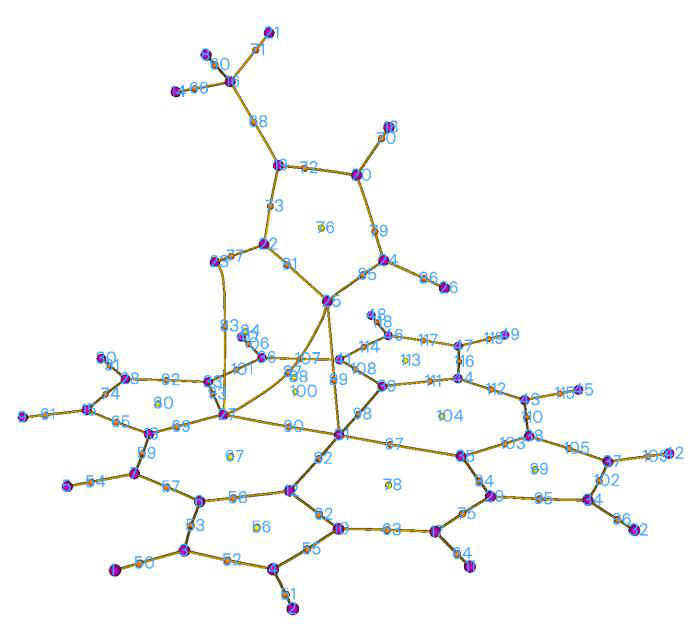


<!-- p.186 -->
- (1) Search CPs from given starting points: If you already know approximate position of CPs or you are able to reasonably guess where CPs may appear, then this mode is very suitable for you, the iteration will start from the provided coordinates. In this mode, you can directly input coordinate of a starting point, or input two atomic indices, then their midpoint will be taken as starting point. You can also provide a .pdb or .pqr file, the atom coordinates in it will be treated as starting points in turn. In addition, a .txt file containing all starting points can also be provided, the format should look like follows, each line corresponds to X, Y, Z coordinate of a starting point in Bohr, the format is free


```text
1.2 3.10 -0.4
0.477 5.2 5.92
-3.26 3.3 0.5
...
```

- (2) Search CPs from nuclear positions: This mode uses all nuclear positions in turn as starting points, this mode is very suitable for searching all (3,-3) for ρ, and those (3,-3) CPs in innermost region of atom for ELF/LOL and Laplacian of ρ. For electron density analysis, if you located n CPs after using this mode while there are more than n atoms in your system, it generally implies that some (3,-3) CPs were missed during searching.

- (3) Search CPs from midpoint of atomic pairs: This mode uses midpoint of all atomic pairs in turn as starting points. This mode is very suitable for searching all (3,-1) CPs for ρ.

- (4) Search CPs from triangle center of three atoms: Like mode 3, but use triangle center of all combinations of three atoms in your system. Suitable for searching all (3,+1).

- (5) Search CPs from pyramid center of four atoms: Like mode 3, but use pyramid center of all combinations of four atoms in your system. For electron density analysis, if you have tried mode 2 and mode 3 but still cannot find certain (3,+3), this mode is worth trying. This mode is more expensive than mode 3 since more combinations will be considered.

Note that for periodic cases, mode 3 looping both real and image atoms, while modes 4 and 5 only loop real atoms.

- (6) Search CPs from a batch of points within sphere(s): You need to set sphere center, radius and the number of points first, then select option 0, the specified number (but not the exact number you set) of points will randomly distribute in the sphere as starting points for searching. The sphere center can be defined in very flexible way by options 2~6. If you choose option -1, then the search starts and each atom center will be taken as sphere center in turn, assume that there are n atoms and the number of points in sphere you set is m, then about n*m points will be used as initial guesses. If you choose option -2, then you will be prompted to input indices of atoms, the nuclei of these atoms will be used as sphere center in turn.

This mode is very appropriate for searching the CPs that are difficult to be located by other modes. For ELF, LOL and Laplacian, it is highly recommended to use option -1 in this mode to try to locate all possible CPs. Note that each time you carry out the search the positions of starting points are different, if some interesting CPs were not found in previous searches, try to launch the search again and again to locate missing CPs.

Beware that the index of the CPs located by searching mode 6 may be different in each time of execution!

CP searching parameters The default searching parameters are appropriate for most systems, however in some cases you


<!-- p.187 -->
have to adjust parameters manually to ensure expected CPs could be found. These parameters can be set in the option "-1 Set CP searching parameters".

(1) Set maximal iterations: If the number of iterations exceeds this value before converging to a CP or before Hessian matrix becomes singular (that is the iteration cannot continue), then the iteration will be terminated.

(2) Set scale factor of stepsize: The default value is 1.0, that means the stepsize determined by standard algorithm is unchanged. Sometimes reducing the stepsize is benefit for locating CPs. For example, in the topology analysis of examples\uracil.wfn, the BCP linking N6 and H12 cannot be found by using mode 2 with default parameter. If you reduce the stepsize to 0.5, then this problem will be solved.

(3)/(4) Set criteria for gradient norm / displacement convergence: If both gradient norm in current position and displacement in last step is smaller than the two values, then the iteration will stop and current position will be regarded as a critical point.

Notice that for searching mode 2, which is usually employed for locating NCPs, the convergence criterion of gradient norm is temporarily removed, since electron density peak is quite sharp at nuclear position for very heavy atoms, the iteration can hardly converge if gradient norm criterion is taken into account.

(5) Minimal distance between CPs: If an iteration converged to a CP, however the distance between this CP and any CP that has been found is smaller than this value, then the CP just found will not be considered as a new CP, and hence discarded.

(6) Skip search if distance between atoms is longer than the sum of their vdW radius multiplied by: In CP searching mode 3, 4 and 5, if the distance of any two atoms that involved in the combination is longer than the sum of their vdW radii multiplied this value then current search will be skipped. The purpose of this option is to reduce the number of searches and hence computational cost of huge system. For example, the imidazole--magnesium porphyrin complex mentioned earlier, there are 49*48/2=1176 atomic pairs, hence if this cutoff strategy is not employed when you choose searching mode 2, Multiwfn will try as many as 1176 searches. While if this strategy is used, since only closely related atomic pairs will be considered, only 274 searches need to be performed, it can be found that their results are identical.

(7) If print details of CP searching procedure: This option is present only in serial mode. The user can select output level of details of CP search procedure. This option is mainly used for debugging.

(8) Set criterion for determining if Hessian matrix is singular: If the absolute value of determinant of Hessian matrix is lower than this value, then the Hessian matrix will be regarded as singular and terminate search. A too large value may cause some CPs to be omitted, while a too small value may cause numerical instability and occurrence of CPs in regions far from system. Default value is appropriate for most cases.

(9) Set value range for reserving CPs: By making use of this option, during the CP searching, only the CP with value within user-defined range will be reserved, and thus unnecessary CPs could be ignored. By default, all CPs are reserved. Via this option you can for example only search for the CPs in weak interaction regions (corresponding to low electron density regions).

(10) Set the atoms to be considered in searching modes 2, 3, 4, 5: This option is used to set the range of the atoms for searching modes 2, 3, 4, 5. By default, all atoms will be considered in the search. However, there are two special ways that can be selected in this option:

Way 1: Searching CPs only in a local region. You will be asked to define a fragment, then only the atoms in this fragment will be taken into account during searching. This way is useful if you are


<!-- p.188 -->
only interested in CPs in a local region.

Way 2: Searching CPs between two regions. You will be asked to define two fragments (there should be no overlap), then during CP searching, all atoms involved in a combination will not simultaneously occur in the same fragment; in other words, at least one atom must occur in another fragment. This way is particularly useful for searching for CPs between two molecules (the cost may be significantly lower than searching for CPs for the whole complex)

There is no difference between the two ways for searching mode 2, in which only one atom is involved in each search.

(11) Set trust radius of searching: If norm of displacement is larger than this value, the displacement vector will be scaled so that its norm is identical to this radius. Setting trust radius to a smaller value (e.g. 0.1 Bohr) than default can increase stability of convergence.

(12) Choose searching algorithm: This option is rarely used, because the default Newton method works reasonably for most cases. However, Multiwfn provides alternatives which may be useful in special cases:

The Barzilai-Borwein (BB) method is a special form of steepest descent algorithm, at each step the displacement direction and distance along gradient vector is determined by a specific way to mimic convergence behavior of Newton method. BB is able to locate any kind of CPs and tends to converge to the CP nearest to starting point like Newton method, while it does not rely on Hessian matrix. Although in most cases Newton method is more robust and converges faster, when you found it does not locate expected CPs successfully, you can try BB instead.

The steepest ascent (SA) and steepest descent (SD) methods are also supported by Multiwfn, they are only used to locate (3,-3) and (3,+3) CPs, respectively. In other words, other kinds of CPs will never be located if you choose these methods. So, they are useful if you only focus on locating maxima (e.g. maxima of ELF and LOL) or minima (e.g. minima of electrostatic potential). In addition, for functions without a well behavior, namely their local character around minima and maxima is far from quadratic function, Newton and BB methods do not converge at all, the SA and SD are only choices. Moreover, some functions have very crowded CPs or minima/maxima in very narrow quadratic regions, I frequently found Newton and BB can hardly converge to minima/maxima, in this case SA/SD should also be used if the minima/maxima are what you are really interested in. The SA (SD) in Multiwfn utilizes microiteration to determine suitable displacement magnitude toward positive (negative) direction of gradient vector; in each microiteration, if displacement is unable to cause increase (decrease) of function value, the displacement magnitude will be reduced to 40% and retry, until function value indeed increases (decreases).


### 3.14.3 Generate topology paths

Path generating methods Once CPs have been found, you can choose to generate topology paths, which connect various CPs. In Multiwfn, the paths are essentially represented as a bunch of points evenly distributed in a curve. Using options 8 and 9, two kinds of paths can be generated:

(1) Generate the paths connecting (3,-3) and (3,-1) CPs: Arithmetically, firstly displacing the coordinate of each (3,-1) forward and backward respectively along the eigenvector that corresponds to the positive eigenvalue of Hessian, and then go uphill following the gradient vector until encounter a (3,-3), the resulting trajectories constitute the bond paths.


<!-- p.189 -->
(2) Generate the paths connecting (3,+1) and (3,+3) CPs: Like above, the difference is that the starting points are (3,+1), and their coordinates are firstly moved forward and backward along the eigenvector corresponding to the negative eigenvalue of Hessian, and then go downhill following the gradient vector.

Path generating parameters In the option "-2 Set path generating parameters", there are some suboptions used to adjust parameters for generating paths:

(1) Maximum number of points of a path: In the generation of each path, if the number of steps reached this value before encountering a CP, then the trajectory will be discarded. For generating very long paths, default value may need to be enlarged.

(2) Stepsize: The space between neighbouring points that constitutes the paths. For paths with large curvature, sometimes they cannot be generated under default stepsize, you need to properly decrease the stepsize and try to regenerate paths. If you set maximum number of points and stepsize

of paths as m and n respectively, then the maximum length of paths will not be longer than m×n.

(3) Stop generation if distance to any CP is smaller than: During the generation of paths, if the distance between current point and a located CP is found to be smaller than this value, then the path will be regarded as connected to the CP.


### 3.14.4 Generate interbasin surfaces

The interbasin surfaces (IBS) generated by Multiwfn actually consist of a bunch of paths derived from (3,-1) CPs, these surfaces divide the whole space into respective region for each (3,-3) CPs. By the option "10 Add or delete interbasin surfaces", you can generate, delete and check interbasin surfaces. Notice that before generating IBS, generation of CPs should be completed first, and at least one (3,-1) CP must be found.

If you want to generate the IBS from the (3,-1) CP with index of 15, then simply input 15 (you will find it is useful to visualize CPs by function 0 first to get the CP index). To delete this surface, input -15 (negative sign means "delete"). If there is no IBS presented and you hope to generate all IBSs, input 0. To delete all already generated IBS, also input 0. A list of generated IBS can be printed by inputting the letter l If you need to export the paths of a specific IBS (e.g. corresponding to the (3,-1) CP with index of 4) to external file, input o 4, then the coordinates of all paths derived from the CP4 will be saved to surpath.txt in current folder. Input letter q can return to upper-level menu.

Parameters for generating IBSs can be adjusted by the option "-3 Set interbasin surface generating parameters". Enlarging number of paths in each IBS or lowering stepsize will make IBSs looks smoother. The length of paths in IBSs, or say the area of IBSs, is proportional to product of stepsize and number of points in each IBS path. Notice that once the parameters are changed, all generated IBSs will be lost.

There are three ways to portray IBSs in Multiwfn, which can be controlled by "isurfstyle" in `settings.ini`. Way 1 represents the IBS directly by the paths derived from corresponding (3,-1) CP; By Way 2 IBSs are shown by solid surfaces, this is default style; Way 3 is uncommonly used, you can try it yourself.


<!-- p.190 -->

### 3.14.5 Visualize, analyze, modify and export results

Visualize results (option 0) If you select the option “0 Print and visualize all generated CPs, paths and interbasin surfaces”, a GUI will pop up, you can visually examine CPs, topology paths and interbasin surfaces, and you can control if showing each type of CPs, paths, interbasin surfaces, molecular structure, labels, etc. Meanwhile, a summary of found CPs and paths are printed in the command-line window. The satisfaction of Poincaré-Hopf relationship is also checked.

If the real space function to analyze is electron density, the correspondence between nuclear CPs and atoms will be shown in the command-line window. If bond paths have been generated, then the two atoms connecting to each BCP via the bond paths will also be given in the command-line window.

Evaluate CP properties (option 7) You can obtain values of all real space functions supported by Multiwfn (as well as gradient and Hessian matrix of the selected real space function) at a given CP or at all CPs by function “7 Show real space function values at specific CP or all CPs”. Note that electrostatic potential is the most expensive one among all of the real space functions, if you are not interested in it, you can set "ishowptESP" parameter in `settings.ini` to 0 to skip calculation of electrostatic potential.

In this function, you can also decompose a selected real space function at a given CP into contributions from a range of orbitals. See corresponding example in Section 4.2.4.

Measure geometry (option -9) Distance, angle and dihedral angle between atoms and CPs can be conveniently measured by using the option "-9 Measure distances, angles and dihedral angles between CPs or atoms".

Manipulate CPs (option -4) In the option “-4 Modify or export CPs”, you can print, add, delete and export CPs. In the suboption 2, the CPs can be deleted according to various condition, including: (1) CP type (2) CP index range (3) Distance to specific molecular fragment (thus you can remove CPs in irrelevant regions) (4) Range of electron density (using this feature you can solely delete CPs with low density and thus remove the CPs in weak interaction regions, or delete CPs with high density and thus remove those in the chemical bond regions).

The positions and types of all found CPs can be saved to a formatted text file CPs.txt in current folder by suboption 4. The information of CPs can also be loaded from an external formatted text


<!-- p.191 -->
file by suboption 5 (the found CP at current session will be clean), notice that the file format must be identical to the one outputted by suboption 4.

All CPs can be exported as .pdb file by suboption 6, so that CPs can be conveniently visualized by external visualization softwares such as VMD. In this file, element C/N/O/F corresponds to (3,-3)/(3,-1)/(3,+1)/(3,+3) respectively.

Manipulate topology paths (option -5) In the option “-5 Modify or print detail or export paths, or plot property along a path”, you can print summary of generated paths and print coordinate of all points in a specific path via suboptions 1 and 2, respectively.

By suboption 4 you can export out the detail information of all paths to paths.txt in current folder. By suboption 5, the paths can be imported from an external file, the file format must be identical to the one outputted by suboption 4.

By suboption 6, all points in all paths can be exported to a pdb file in current folder, so that paths can be conveniently visualized by external visualization softwares.

By suboption 7, value of real space functions along selected topology paths can be plotted as a curve map or exported as a plain text file. You can also take the data corresponding to "Dist." and "Value" column as X and Y axes respectively to plot curve graph by third-part plotting softwares.

Paths can be manually deleted via suboption 3 by directly inputting their indices. Suboption 8 is also used to delete paths, it is designed for only retaining bond paths (and corresponding BCPs) connecting two fragments but removing all other bond paths, so that one can more easily study interfragment interactions via AIM method. The usefulness of this option will be illustrated in the example in Section 4.2.6.


### 3.14.6 Calculate the aromaticity indices based on topology properties of electron density


If the real space function you selected is electron density, options 20 and 21 will be visible, they are utilities used to analyze aromaticity.

Shannon aromaticity index Option 20 is used to calculate Shannon aromaticity (SA) index, see Phys. Chem. Chem. Phys., 12, 4742 (2010) for detail. The formula can be briefly written as

$$SA=\ln(N)-\sum_{i}^{N}(-p_{i}\ln p_{i})\quad p_{i}=\frac{\rho(\mathbf{r}_{BCP_{i}})}{\sum_{i}^{N}\rho(\mathbf{r}_{BCP_{i}})}$$

i

In above formula, N is the total number of the BCPs in the ring you want to study aromaticity, BCPr

is the position of BCP. In option 20, you need to input N and the index of these CPs in turn, then Shannon aromaticity index will be printed immediately. The smaller the SA index, the more aromatic is the molecule. The range of 0.003 < SA < 0.005 is chosen as the boundary of aromaticity/antiaromaticity in original paper.

Curvature of electron density perpendicular to ring plane at RCP


<!-- p.192 -->
In Can. J. Chem., 75, 1174 (1997), the authors showed that electron density at RCP is closely related to aromaticity of corresponding ring. The larger the density, the stronger the aromaticity. They also pointed out that the curvature of electron density perpendicular to the ring plane at the RCP has more significant correlation with the ring aromaticity. The more negative the curvature, the stronger the aromaticity. Assume that the ring is strictly perpendicular to a Cartesian axis, for example, a ring perpendicular to Z axis (viz. the ring is in XY plane), then the curvature is just ZZ component of Hessian matrix of electron density at the RCP, which can be directly obtained by using option 7 to print out properties of a given RCP. However, if the ring is not exactly perpendicular to any Cartesian plane, you should use option 21 to calculate the curvature. In option 21, you should input the index of the RCP (or directly input coordinate of a point), then choose 2, then input indices of at three atoms comprising the plane (they are used to fit the ring plane). After that, the electron density, the gradient and the curvature of electron density perpendicular to the ring plane at the RCP will be outputted on screen. In addition, unit normal vector, the coordinates of the two points above and below 1 Å of the RCP in normal direction will be outputted together, which can be taken as the point used to calculate NICS(1).

Examples of various kinds of topology analysis can be found in Section 4.2. Information needed: GTFs, atom coordinates


## 3.15 Quantitative analysis of molecular surface (12)

Quantitative analysis of molecular surface is a powerful tool, it has a lot of practical applications, such as predicting reactive sites, predicting molecular properties, and interpreting intermolecular weak interactions. The theory and numerical algorithm involved in present module have been detailedly described in my paper J. Mol. Graph. Model., 38, 314 (2012). In the next two sections, these two aspects will only be briefly introduced.


### 3.15.1 Theory

In Multiwfn, in principle, distribution of any real space function on molecular surface (or the surface defined by isosurface of a certain function) can be quantitatively studied. Electrostatic potential and average local ionization energy on molecular vdW surface are particularly useful, therefore they will be discussed detailed in this section. Same kind of quantitative analyses could also be applied to other real space functions, such as user-defined functions, electron delocalization range function (EDR) and even Fukui function and dual descriptor.

(1) Electrostatic potential on vdW surface Molecular electrostatic potential (ESP), V(r), has been widely used for prediction of nucleophilic and electrophilic sites, as well as molecular recognition mode for a long time, the theoretical basis is that molecules always tend to approach each other in a complementary manner of ESP. These analyses of ESP are commonly performed on molecular van der Waals (vdW) surface. Although the definition of such a surface is arbitrary, most people are prone to take the 0.001 a.u.


<!-- p.193 -->
isosurface of electron density as vdW surface, since this definition reflects specific electron structure features of a molecule, such as lone pairs and π electrons, this is also what the definition used in our analyses.

The analysis of ESP on vdW surface has been further quantified to extract more information. It is shown that the strength and orientation of weak interaction, including such as hydrogen bonding, dihydrogen bonding and halogen bonding, can be well predicted and explained by analyzing the magnitude and positions of minima and maxima on the surface. Politzer and coworkers (J. Mol. Struct. (THEOCHEM), 307, 55 (1994)) have defined a set of molecular descriptors based on ESP on vdW surface, which are taken as independent variables of general interaction properties function (GIPF). GIPF successfully connects distribution of ESP on vdW surface and many condensed phase properties, including density, boiling point, surface tension, heats of vaporization and sublimation, LogP, impact sensitivity, diffusion constant, viscosity, solubility, solvation energy and so on. Below I enumerate and brief these descriptors.

A+ and A− indicate the surface area in which the ESP has positive and negative value, respectively. Total surface area A is the sum of them.

+SV and −SV denote average of positive and negative ESP on vdW surface respectively


$$\begin{array}{r l}{\overline{{V}}_{S}^{+}=(1/N_{+})\displaystyle\sum_{i}^{N_{+}}V(\mathbf{r}_{i})}&{{}\quad\overline{{V}}_{S}^{-}=(1/N_{-})\displaystyle\sum_{i}^{N_{-}}V(\mathbf{r}_{i})}\end{array}$$

<!-- formula-ocr: formula_p193_108.png 已替换为LaTeX, 原图保留备查 -->

where N+ and N− are number of sampling points in positive and negative regions respectively, and the index i only loops corresponding points. The S subscript means "molecular surface". The average of ESP over the entire surface is


$$\overline{V}_{s}=(1/N)\sum_{i}^{N}V(\mathbf{r}_{i})$$

<!-- formula-ocr: formula_p193_109.png 已替换为LaTeX, 原图保留备查 -->

where N=N++N− is the total number of surface points.

 is the average deviation over the surface, which is viewed as an indicator of internal charge separation:


$$\Pi=(1/N)\sum_{i}^{N}\left|V(\mathbf{r}_{i})-\overline{V}_{s}\right|$$

<!-- formula-ocr: formula_p193_110.png 已替换为LaTeX, 原图保留备查 -->

The total ESP variance can be written as the sum of positive and negative parts:


$$\sigma_{\mathrm{tot}}^{2}=\sigma_{+}^{2}+\sigma_{-}^{2}=(1/N_{+})\sum_{i}^{N_{+}}[V(\mathbf{r}_{i})-\overline{V}_{s}^{+}]^{2}+(1/N_{-})\sum_{j}^{N_{-}}[V(\mathbf{r}_{j})-\overline{V}_{s}^{-}]^{2}$$

<!-- formula-ocr: formula_p193_111.png 已替换为LaTeX, 原图保留备查 -->

The variance reflects the variability of ESP. The larger the 𝜎+2 and 𝜎−2, the more tendency that the molecule interacts with other molecules by positive and negative ESP regions respectively.

Degree of charge balance (also known as balance of charges) is defined as


$$\nu=\frac{\sigma_{+}^{2}\sigma_{-}^{2}}{\left(\sigma_{\mathrm{tot}}^{2}\right)^{2}}$$

<!-- formula-ocr: formula_p193_112.png 已替换为LaTeX, 原图保留备查 -->

When 𝜎+2 equals 𝜎−2, ν attains its maximum value of 0.250. The closer the ν to 0.250, the more possible that the molecule can interact to others through positive and negative region with similar


<!-- p.194 -->
extent.

2 is an indicative of a molecule that has relatively strong tendencies to interact with others of its own kind electrostatically. The product of 𝜎tot 2 and ν is a very useful quantity too, a large value of ν𝜎tot

In order to quantify molecular polarity, I defined a quantity named molecular polarity index

(MPI), which is closely related to the  index.


$$\mathrm{MPI}=(1/N)\sum_{i}^{N}\left|V(\mathbf{r}_{i})\right|\equiv(1/A)\iint\limits_{S}\left|V(\mathbf{r})\right|\mathrm{d}S$$

<!-- formula-ocr: formula_p194_113.png 已替换为LaTeX, 原图保留备查 -->

where S denotes molecular surface. My test for some representative molecules showed that MPI is a quite reliable index of measuring molecular polarity, the larger the index, the higher the polarity. If MPI is involved in your research, please cite my paper Carbon, 171, 514 (2021), which is the first publication introducing the MPI index.

Skewness can be used to measure the asymmetry of distribution of a real space function about its mean over molecular surface. Positive skewness is calculated as follows


$$\tilde{\mu}_{3}(V_{S}^{+})=\frac{\displaystyle\sum_{i}^{N_{+}}[V(\mathbf{r}_{i})-\overline{V}_{S}^{+}]^{3}}{N_{+}(\sigma_{+}^{2})^{3/2}}$$

<!-- formula-ocr: formula_p194_114.png 已替换为LaTeX, 原图保留备查 -->

Similarly, for calculating negative skewness, only surface points with negative ESP are taken into account. While for calculating overall skewness, all surface points are used. For each kind of skewness, the more positive (negative) the value, the stronger the tendency that ESP distributes toward negative (positive) direction with respect to the average value.

In Multiwfn, above-mentioned surface descriptors can be calculated not only on the whole vdW surface, but also on the subregions corresponding to atoms or user-defined fragments. The detail of the theory is to be published, and thus not documented here at the moment. In addition, these surface descriptors can be calculated for any other real space function.

(2) Some practical applications of GIPF descriptors ·Predicting heat of vaporization and heat of sublimation A practical application of above GIPF descriptors is presented in J. Phys. Chem. A, 110, 1005 (2006). The authors showed that for a series of molecules containing C, H, N and O elements, the heat of vaporization can be well evaluated as


$$\Delta H_{\mathrm{vap}}=a\sqrt{A}+b\sqrt{\nu\sigma_{\mathrm{tot}}^{2}}+c$$

<!-- formula-ocr: formula_p194_115.png 已替换为LaTeX, 原图保留备查 -->

with least-squares fit coefficients a = 2.130, b = 0.930 and c = -17.844. The heat of sublimation can be predicted as

$$\Delta H_{\mathrm{s u b}}=a A^{2}+b\sqrt{\nu\sigma_{\mathrm{tot}}^{2}}+c$$

with a = 0.000267, b = 1.650087 and c = 2.966078. In above equations the surface area A is in Å2,

2 is in (kcal/mol)2. Note that the coefficients are more or less dependent on the calculation level used. The author used B3LYP/6-31G* to optimize geometry and B3LYP/6-311++G(2df,2p) to calculate ESP. ΔHsub is in kcal/mol, 𝜎tot

In Int. J. Quantum Chem., 105, 341 (2005), Politzer et al. proposed other equations for


<!-- p.195 -->
predicting ΔHvap and ΔHsub in standard state, their equations can be used for molecules containing C, H, O, N, F, Cl, S:


$$\Delta H_{\mathrm{s u b}}=4.4307\times10^{-4}A^{2}+2.0599\sqrt{\nu\sigma_{\mathrm{tot}}^{2}}-2.4825$$

<!-- formula-ocr: formula_p195_116.png 已替换为LaTeX, 原图保留备查 -->

2 is in (kcal/mol)2. B3PW91/6-31G** was employed in their study. The mean absolute error of ΔHvap and ΔHsub were found to be 2.0 kcal/mol and 2.8 kcal/mol, respectively. The ΔHvap and ΔHsub are in kcal/mol, A is in Å2 and 𝜎tot

·Predicting density of molecular crystal Another typical application of statistical data of ESP on vdW surface is predicting crystal density of organic molecules containing C, H, N and O elements. The crystal density is a crucial property of energetic compounds. In J. Phys. Chem. A, 111, 10874 (2007), it was shown that the

density can be estimated by ρ = M / Vm, where M is molecular mass and Vm is molecular vdW volume defined by ρ = 0.001 a.u. isosurface; for ionic crystal (e.g. ammonium azide), M and Vm correspond the sum of mass and volume of the cation and anion comprising a formula unit of the compound. Although the relationship is quite simple, it indeed works well for most neutral species, but the error is evidently larger for ionic species. In order to improve the prediction accuracy for neutral ones, in Mol. Phys., 107, 2095 (2009), the authors introduced GIPF descriptors into the formula:


$$\rho=\alpha\frac{M}{V_{\mathrm{m}}}+\beta(v\sigma_{\mathrm{tot}}^{2})+\gamma$$

<!-- formula-ocr: formula_p195_117.png 已替换为LaTeX, 原图保留备查 -->

At B3PW91/6-31G** level, the fitted coefficients are α = 0.9183, β = 0.0028 and γ = 0.0443. This formula has proven to have improved accuracy, because intermolecular electrostatic interaction is somewhat effectively taken into consideration. In a succeeding paper Mol. Phys., 108, 1391 (2010),

the author showed that the crystal density of ionic compounds can be estimated much better than ρ = M / Vm if GIPF descriptors are introduced:

$$\rho=\alpha\frac{M}{V_{\mathrm{m}}}+\beta\left(\frac{\overline{V}_{S(\mathrm{cation})}^{+}}{A_{(\mathrm{cation})}^{+}}\right)+\gamma\left(\frac{\overline{V}_{S(\mathrm{anion})}^{-}}{A_{(\mathrm{anion})}^{-}}\right)+\delta$$

with least-squares fit coefficients α = 1.0260, β = 0.0514, γ = 0.0419 and δ = 0.0227 at B3PW91/6-31G** level. In the equation, 𝑉̅S(cation) − and 𝐴(anion) − denote the 𝑉̅S − and 𝐴− of the anion. For 30 test cases, the average absolute error is + and 𝐴(cation) + denote the 𝑉̅S + and 𝐴+ of the cation; 𝑉̅S(anion)

merely 0.033 g/cm3.

Notice that above relationships are only appropriate for small organic compounds containing C, H, N, O elements, the error are significantly larger for other kinds of systems.

·Predicting boiling point In J. Phys. Chem., 97, 9369 (1993), it is shown that boiling point can be predicted as


$$T_{\mathrm{b p}}=\alpha A+\beta\sqrt{\nu\sigma_{\mathrm{tot}}^{2}}+\gamma$$

<!-- formula-ocr: formula_p195_118.png 已替换为LaTeX, 原图保留备查 -->

where α = 2.736, β = 33.31, γ = -72.05 were fitted at HF/STO-5G*//HF/STO-3G* level. This paper also showed equations for predicting critical temperature, volume and pressure.

·Predicting solvation free energy


<!-- p.196 -->
In J. Phys. Chem. A, 103, 1853 (1999), the prediction equation for solvation free energy is presented as (Vmin denotes the ESP value at its global minimum in the whole space):

−×−=Δ VVVG )(106412.217201.0(kJ/mol)3minS,maxS,5minsolv −


$$\begin{aligned}\Delta G_{solv}(kJ/mol)=&0.17201W_{min}-2.6412\times10^{-5}(V_{S,max}-V_{S,min})^{3}\\&+0.051892A^{-}\overline{V}_{s}^{-}+9704.2/(A^{-}\overline{V}_{s}^{-})+46.827\end{aligned}$$

<!-- formula-ocr: formula_p196_119.png 已替换为LaTeX, 原图保留备查 -->

·Predicting pKb In J. Chem. Inf. Model., 60, 1445 (2020), the authors showed that pKb of amino groups can be nicely estimated by fitting equation, for example, primary amine cases:

bS,minp0.495224.5880KV=×+

where VS,min is in kcal/mol and should be calculated at ωB97XD/cc-pVDZ level. Prediction accuracy of this equation is fairly satisfactory, the R2 is as high as 0.9519 with mean absolute error of merely 0.12. Similar fitted equations are also available for secondary amines, tertiary amines and tertiary amines.

·Predicting other properties In addition, the equations used to predict heat of fusion, surface tension and crystal/liquid density can be found in J. Phys. Chem., 99, 12081 (1995), the equations used to predict lattice energy for ionic crystal containing NH4+, K+ and Na+ are given in J. Phys. Chem. A, 102, 1018 (1998). More formulae used to predict physical properties of organic molecules based on GIPF descriptors are summarized in Table 3 of J. Mol. Struct. (THEOCHEM), 425, 107 (1998). GIPF also has many important uses in study of biochemical systems, see Int. J. Quantum Chem., 85, 676 (2001) for a review.

(3) Other mapped functions: Average local ionization energy and so on Average local ionization energy, 𝐼̅, has attracted more and more attentions, see corresponding part of Section 2.6 for brief introduction. This function has many uses, for example, reproducing atomic shell structure, measuring electronegativity, quantifying local polarizability and hardness. However, the most important use may be the prediction of reactivity according to function value on vdW surface, 𝐼̅𝑆. Lower value of 𝐼̅𝑆 indicates that the electron at r is more weakly bounded, therefore more likely r is the site of electrophilic or radical attack. Many studies have shown that the global minimum of 𝐼̅ on vdW surface exactly locates the experimental reaction site, while relative magnitude of 𝐼̅ at corresponding reaction site in homologues correlates well with relative reactivity. The interested users are recommended to take a look at J. Mol. Model, 16, 1731 (2010) and Chapter 8 of the book Theoretical Aspects of Chemical Reactivity (2007).

Local electron affinity EAL is a quantity very similar to 𝐼̅, the only difference is that the MOs under consideration are not all occupied ones, but all unoccupied ones. It was shown that EAL on molecular surface is useful for analyzing nucleophilic attacking, for detail see J. Mol. Model., 9, 342 (2003).

Quantitative analysis on molecular surface for Fukui function and orbital overlap distance function D(r) have also been proven to be fairly useful, see Sections 4.12.4 and 4.12.8 for example, respectively.

About sphericity At the end of this section, it is worth to mention that Multiwfn automatically prints "sphericity" of the molecular surface during the calculation irrespective of the choice of mapped function. This


<!-- p.197 -->
quantity is defined as follows (see https://en.wikipedia.org/wiki/Sphericity for detail)


$$S=\frac{\pi^{1/3}(6V)^{2/3}}{A}$$

<!-- formula-ocr: formula_p197_120.png 已替换为LaTeX, 原图保留备查 -->

where A and V are surface area and volume, respectively. Sphericity is essentially the ratio of the surface area of a sphere with the same volume as the present system to the surface area of the present system. The closer it to 1.0, the more the surface looks like an ideal sphere. Therefore, for example, you will find sphericity of vdW surface of benzene is notably smaller than Ar atom, and the

sphericity of ρ = 0.01 a.u. isosurface is always smaller than that of ρ = 0.001 a.u. isosurface for any molecule because the latter is smoother.

Notice that the sphericity calculated in the above way does not work for systems with cavity. For example, it cannot be used to reasonably determine sphericity of C60 fullerene, because there is a cavity (isosurface) at the center of the ball.


### 3.15.2 Numerical algorithm

3.15.2.1 Analysis on the whole molecular surface

In summary, in the common task of quantitative analysis of molecular surface, what we need to obtain are minima and maxima of a selected real space function (i.e. mapped function) on vdW

surface (or isosurface of a specific real space function), as well as quantitative indices such as +SV,

−SV, SV, , 2+σ, 2−σ and so on. Here I briefly describe how these properties are computed in

Multiwfn, the basic steps are given below.

1. Grid data of electron density enclosing the entire molecular space is computed. The smaller the grid spacing is used, the more accurate result you will get, however the more vertices will be generated in next step and therefore you will wait longer time in step 3.

2. Marching Tetrahedra algorithm is performed by making use of the grid data generated above, this step generally does not cost much computational time. The volume enclosed by the isosurface is computed at the same time. This step generates vertices representing the isosurface, along with their connectivity. Each neighbouring three vertices constitute a triangle (will be referred to as facet below). The example below is a water molecule, vertices (red points) and connectivity (black lines) are portrayed:


<!-- p.198 -->
3. Since computing ESP is time consuming, in order to cut down overall computational time, Multiwfn eliminates redundant points automatically. Specifically, if the distance between two points is smaller than a specific value, one of the points will be eliminated, and the other point will be moved to their average position. In the graph above, the aggregated points such as those inside blue circles will be finally merged to one point.

4. Calculate mapped function (ESP, 𝐼̅ and so on) at each vertex on the isosurface. For ESP, this is the most time-consuming step; however, for such as 𝐼̅ and EAL, this step can be finished immediately.

5. Locate and then output minima and maxima of the mapped function on the surface by making use of connectivity. If the mapped function value at a vertex is lower (larger) than that at its first-shell neighbours and second-shell neighbours, then this vertex will be regarded as surface minimum (maximum).

$$\overline{V}_{s}=(1/A)\sum_{i}^{N}A_{i}F_{i}$$

volume, area of total vdW surface, the area where the mapped function is positive and where is

negative. As an example, SV is computed as


$$\overline{V}_{s}=(1/A)\sum_{i}^{N}A_{i}F_{i}$$

<!-- formula-ocr: formula_p198_121.png 已替换为LaTeX, 原图保留备查 -->

where N is the total number of facets, A is the sum of area of all facets, Ai is the area of facet i, Fi is the ESP value (or value of other mapped function) of facet i, which is calculated as the average of ESP at the three vertices composing the facet.

3.15.2.2 Analysis on local molecular surface

In order to unveil more chemically useful information from distribution of mapped function on vdW surface, Multiwfn supports three kinds of analyses for local vdW surface, as described below.


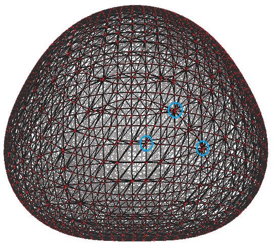

<!-- p.199 -->
(1) Analysis of local molecular surface corresponding to various atoms In this mode the whole molecular surface will be first decomposed to local surfaces corresponding to individual atoms, and then all surface properties are calculated for these atomic surfaces. This function is very helpful to study atomic properties. See Section 4.12.3 for example.

Note that atomic local regions on molecular surface cannot be uniquely defined. The rule employed by Multiwfn is shown as follows, which is simple and has clear physical meaning. For any given point r on the molecular surface, Multiwfn calculates weight w for all atoms via


$$w_{_{A}}=1-\frac{\left|\mathbf{r}-\mathbf{r}_{_{A}}\right|}{R_{_{A}}}$$

<!-- formula-ocr: formula_p199_122.png 已替换为LaTeX, 原图保留备查 -->

where A denotes atomic index, rA and RA are coordinate and radius of atom A, respectively. The surface point r is attributed to the atom that has the maximal weight. It can be seen that at the position of nucleus A, wA reaches its maximal value 1.0. wA linearly attenuates with increase of the distance |r-rA|, it attains zero when the distance just equals corresponding atomic radius. The larger radius the atom has, the slower the weight attenuates, therefore the above definition of weight makes larger sized atoms have higher possibility to cover broader range on molecular surface.

In Multiwfn it is also possible to perform analysis of local molecular surface corresponding to a user-defined fragment, the region of the fragment is simply the sum of the regions of all the atoms that constitute it.

(2) Analysis of local molecular surface around specific surface extreme

This kind of analysis is mainly used for measuring area and graphically revealing region of σ-hole and π-hole, see Section 4.12.10 for practical example, but it can also be used for other analysis purposes if the mapped function is not chosen to be electrostatic potential.

In this mode, you need to select a surface extreme and set a criterion. When you select a surface maximum (minimum), if a surface vertex is directly or indirectly connected to the surface extreme and value of mapped function at this vertex is higher (lower) than the criterion, the vertex will be selected, all the selected vertices collectively define the local molecular surface. In order to make you intuitively understand how this mode defines the local surface around a selected surface extreme, a graphical illustration is provided below, in this map one-dimension ESP distribution is used to abstractly represent two-dimensions distribution of ESP on molecular surface.

(3) Analysis of local molecular surface based on Basin-like partition


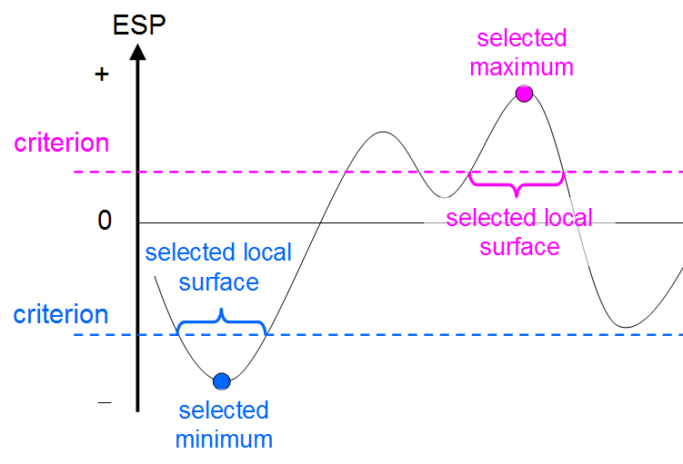

<!-- p.200 -->
Basin partition generally refers to partitioning the whole molecular space into individual local spaces by employing zero-flux surfaces of gradient of a real space function as basin boundaries, each basin contains a maximum, see Section 3.20.1 for detailed introduction. The same idea may also be employed for partitioning the molecular surface. When this technique is adopted in combination with ESP, some chemically useful information could be gained, see Section 4.12.11 for practical example.

The algorithm of applying basin partition to molecular surface is proposed by me (to be published). The main purpose is to determine the attribution relationship between surface vertices and surface extrema. Because the mapped function may have both positive and negative values, absolute value of the mapped function is firstly taken, then all surface vertices are considered in turn. Iteration is performed for each surface vertex; in each step, the vertex temporarily moves towards the neighbouring vertex having largest value, namely climbing up hill. The iteration continues until the vertex reaches a surface extreme, which is just the extreme that the surface vertex finally attributed to. Note that after usual quantitative molecular surface analysis, the connection relationship between various surface vertices is already known, if vertex B is directly connected to A, then B will be the neighbouring vertex of A. To make you better understand central idea of this method, a figure is shown below

In this graph, the black curve represents the original ESP distribution, the cyan and black curves collectively correspond to the absolute value of the ESP. The region enclosed by blue bracket corresponds to the local surface corresponding to minimum 1, while the two pink brackets respectively correspond to the two local surfaces corresponding to maxima 1 and 2.

For the above-mentioned modes (2) and (3), if all the three vertices of a surface facet are selected, this surface facet will be regarded as attributed to the selected local surface. Then the area as well as average of mapped function of the selected local surface can be straightforwardly evaluated.


### 3.15.3 Parameters and options

You will see below options in the main interface of quantitative analysis of molecular surface. 0 Start analysis now!: When this option is selected, the analysis boots up. All steps described in last section will be implemented sequentially.


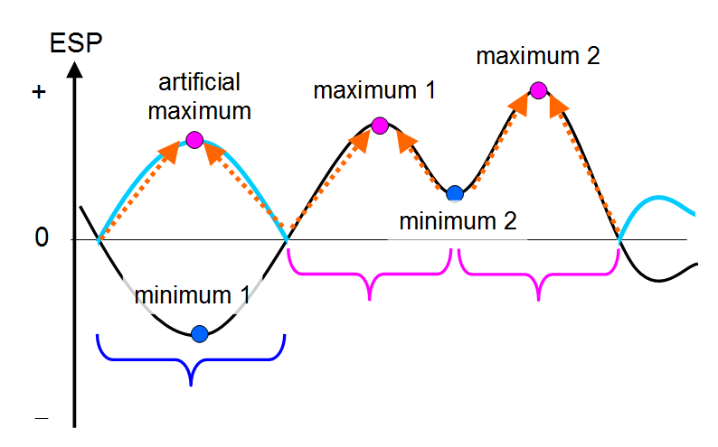

<!-- p.201 -->
6 Start analysis without considering mapped function: This option also starts analysis like option 0, however calculation and analysis of mapped function are skipped. This option is useful if you are only interested in e.g. volume and area of molecular surface while value of mapped function is not of interest.

1 The isovalue of electron density used to define molecular surface: Default value is 0.001, corresponding to the most frequently used definition of vdW surface. In general, it is not recommended to adjust this value.

2 Select mapped function: The mapped function to be studied can be selected by this option. Such as ESP, 𝐼̅ , EAL and user-defined function (Section 2.7) are directly supported and can be automatically computed by internal code of Multiwfn during the surface analysis. Alternatively, if you intend to load value of mapped functions at all surface vertices from an external file, you should choose "0 Function from external file", in this case you may analyze broader type of mapped functions (e.g. Fukui function), see description of option 5 given below for more detail.

Note that by default the ESP is evaluated based on wavefunction, this process may be quite time-consuming for large systems. However, if you choose "Electrostatic potential from atomic charge", then Multiwfn will evaluate ESP based on atomic charges, which are loaded from a .chg file, the computational time will be reduced by several orders. You can use main function 7 to calculate atomic charge and produce the .chg file, or you can write the .chg file manually, see corresponding part of Section 2.5 on the .chg file format. Note that the analysis result will be reasonable only when the method used to generate atomic charges can reproduce ESP well (e.g. CHELPG, MK and ADCH methods). Also note that in some cases ESP generated by atomic charges differ significantly from the ESP generated based on wavefunction, see J. Chem. Theory Comput., 10, 4488 (2014) for comprehensive discussion.

3 Spacing of grid points for generating molecular surface: This setting defines the spacing of electron density grid data, see step 1 introduced in the last section. The spacing directly determines the accuracy and computational cost of the analysis. Default value is suitable for general cases. Increasing this value can reduce computational time evidently, however if this value is not small enough, the vertices on the isosurface will be spare, this may cause missing or erroneous locating of some extrema. In general, the results under the default spacing are accurate and reliable. If you find some extrema were not located under default spacing, try to decrease spacing and rerun the task.

4 Advanced options: Suboptions in this option do not need to be frequently adjusted by normal users.

(1) The ratio of vdW radius used to extend spatial region of grid data: The role of this parameter is exactly identical to the parameter k introduced in Section 3.100.3. Enlarging this value will lead to a larger spatial extension of grid data of electron density around the molecule. If isovalue of electron density is set to a lower value than default, or the system is negatively charged, you may need to enlarge this parameter to ensure that the isosurface will not be truncated.

(2) Toggle if eliminating redundant vertices: If this option is switched to "No", then the elimination of redundant vertices (step 3 described in last section) will be skipped, and you will waste vast time to calculate mapped function at those meaningless vertices. If this option is switched to "Yes", you will be prompted to input a distance criterion for merging adjacent vertices. Commonly, 0.4~0.5 times of grid spacing is recommended to be used as the criterion.

(3) Number of bisections before linear interpolation: Simply speaking, the larger the value, the more exactly the isosurface (corresponding to vdW surface) can be generated. Enlarging this


<!-- p.202 -->
value will bring additional cost in step 2. The generated isosurface under default value is exact enough in general. You can decrease it to 2 even to 1 to save computational time, however, decreasing it to 0 will frequently lead to false surface extrema.

(4) Toggle using focal-point approximation to evaluate ESP I proposed a way to approximately estimate high-quality ESP with relatively lower computational cost, this idea will be referred to as focal-point approximation (FPA). Specifically, given the fact that electron density estimated by high-level method with large basis set can be

approximately expressed as 𝜌large BS high≈𝜌small BS high+ (𝜌large BS low−𝜌small BS low) , since ESP is linear to

electron density, high-quality ESP (V) can thus be approximately estimated as 𝑉large BS high≈

𝑉small BS high+ (𝑉large BS low−𝑉small BS low) , the cost is evidently much lower than calculating ESP directly

using the high-level method with large basis set.

If you want to use the FPA during ESP analysis, you should load the wavefunction file produced by “high method / small basis-set” calculation after booting up Multiwfn, then enter the present function and choose this option once to switch its status to “Yes”, then Multiwfn will ask you to input paths of wavefunction files produced by “low method / small basis-set” and “low method / large basis-set” calculations (obviously, their geometries must be exactly identical to the “high method / small basis-set” wavefunction). Then in the stage of calculation of ESP, they will be automatically adopted to evaluate high-quality ESP via the FPA equation shown above.

5 Loading mapped function values from external file By choosing proper suboption in this option, during surface analysis, the value of mapped function at surface vertices can be loaded from external file rather than directly calculated by Multiwfn. This option has two uses: (1) Reduce overall analysis cost (2) Analyze a special function that cannot be calculated by Multiwfn, or the analyze a function requiring mathematical operations and thus not directly available in present module (e.g. dual descriptor).

This option has four suboptions: (0) Do not load mapped function but directly calculate by Multiwfn: This is default case. (1) Load mapped function at all surface vertices from plain text file: If this option is selected, then after generation of molecular surface, coordinate of all surface vertices (in Bohr) will be automatically exported to surfptpos.txt in current folder. Then you can use your favourite program to calculate mapped function value at these points, and write the values as the fourth column in this file (in free format, unit is in a.u.). For example,


```text
1324              // The first line is the total number of points
   -1.6652369   -0.5480503   -0.2554867       -0.0196978306
   -1.6835983   -0.5563165   -0.1342924       -0.0242275610
   -1.6977125   -0.5530614   -0.0099311       -0.0287667191
   -1.7013207   -0.5536310    0.1194197       -0.0330361826
   -1.6954099   -0.5523031    0.2547866       -0.0371580132
....
```

Then input the path of this file (the name can still be surfptpos.txt), Multiwfn will directly read the values. An exemplificative application of this option is given in Section 4.12.4.


<!-- p.203 -->
Hint: If you will analyze a system twice or more times, and want to avoid calculating mapped function values every time for saving time, at the first time you analyze the system, you can select option 7 at post-processing interface to export coordinates and corresponding mapped function values of surface vertices to vtx.txt in current folder. At next time you analyze the system, if you choose this option, and input the path of the vtx.txt during the surface analysis, then mapped function values will be directly loaded rather than re-calculated (See Section 4.12.1 for example).

(2) Similar to 1, but specific for the case of using cubegen utility of Gaussian: A file named cubegenpt.txt will be generated in current folder after generation of molecular surface. This file is very similar to surfptpos.txt, the difference is that in this file the first line is not presented, and coordinate unit is in Å. Based on this file, you can make use of cubegen utility of Gaussian to calculate mapped function at all surface vertices. After that, input the path of cubegen output file, the data will be loaded by Multiwfn.

(3) Interpolate mapped function from an external cube file: After generation of molecular surface, a template cube file named template.cub will be generated in current folder. Then you will be prompted to input the path of a cube file representing the mapped function you are interested in, the grid setting of this cube file must be exactly identical to template.cub. The mapped function values at surface vertices will be evaluated by interpolation from the cube file you provided.


### 3.15.4 Options in post-processing menu

Once all calculations of surface analysis are finished, a summary will be printed on screen. Meanwhile the options below will appear on screen used to check, adjust and export results.

-3 Visualize the surface: By this option you can directly visualize the isosurface analyzed. -2 Export the grid data to surf.cub in current folder: The grid data used to generate isosurface will be exported to the cube file surf.cub in current folder.

-1 Return to upper-level menu 0 View molecular structure, surface minima and maxima: A GUI window will pop up if this option is chosen. Red and blue spheres represent the position of maxima and minima. All widgets are self-explanatory and hence not be explained here.


<!-- p.204 -->
1 Export surface extrema as surfanalysis.txt in current folder: This option exports value of mapped function and X, Y, Z coordinates of surface extrema to surfanalysis.txt in current folder.

2 Export surface extrema as surfanalysis.pdb in current folder: This option outputs surface extrema to surfanalysis.pdb in current folder. The B-factor column records mapped function value (the actually used unit is shown on screen).

3 Discard surface minima in certain value range: If the mapped function value at a surface minimum is between the lower and upper limit inputted by user, then this minimum will be discarded and cannot be recovered. This option is useful to screen the minima with too large value.

4 Discard surface maxima in certain value range: If the mapped function value at a surface maximum is between the lower and upper limit inputted by user, then this maximum will be discarded and cannot be recovered. This option is useful to screen the maxima with too small value.

5 Export present molecule as pdb format file: This option outputs structure of present system to a specified pdb file. Since pdb is a widely supported format, in conjunction with the output by option 2, surface extrema can be conveniently analyzed in external visualization softwares such as VMD.

6 Export all surface vertices to vtx.pdb in current folder: This option outputs surface vertices to vtx.pdb file in current folder, mapped function values are written to B-factor field (the actually used unit is shown on screen). This option is mainly used to check validity of isosurface polygonization and visualize distribution of mapped function on molecular surface.

There is a hidden option 66, which not only outputs surface vertices to vtx.pdb, but also outputs connectivity into CONECT field of this file. If you would like to visualize connectivity based on the vtx.pdb in VMD program, please consult my blog article "Setting connectivity of atoms according to CONECT field in VMD" (http://sobereva.com/121, in Chinese)

7 Export all surface vertices to vtx.txt in current folder: Namely outputting all reserved surface vertices to a plain text file named vtx.txt in current folder, including vertex X/Y/Z


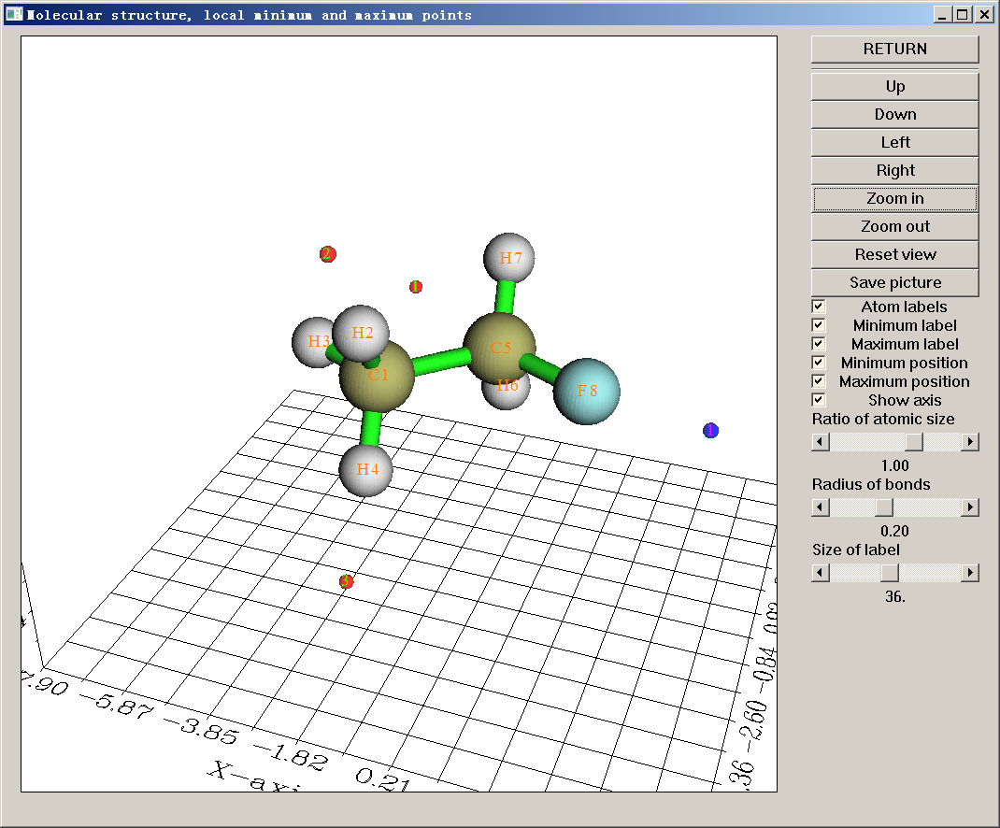

<!-- p.205 -->
coordinates in Bohr and mapped function values in various units.

8 Export all surface vertices and surface extrema as vtx.pqr and extrema.pqr: This option exports all surface vertices and surface extrema as vtx.pqr and extrema.pqr in current folder, respectively. The column originally designed for recording atomic charge in this format (i.e. the third last column) is used to record mapped function value in a.u. Because recording precision in this case is relatively high, if the value of mapped function is too small to be properly recorded as B-factor field of .pdb file (e.g. Fukui function on vdW surface), obviously you should use this option to replace options 2 and 6.

9 Output surface area in specific value range of mapped function By using this option, one can gain knowledge of the distribution of molecular surface area in different ranges of the mapped function. First one needs to input the index range of the atoms under consideration, then input overall range, interval and the unit. For example, one sequentially inputs 2,6-9, then -45,50, then 10, and finally 3, the statistic then is applied on the local molecular surface corresponding to atoms 2, 6, 7, 8 and 9, the output looks like below:


```text
     Begin        End       Center       Area         %
   -50.0000    -40.0000    -45.0000      4.8764      1.5171
   -40.0000    -30.0000    -35.0000     28.0413      8.7242
   -30.0000    -20.0000    -25.0000     23.2699      7.2397
   -20.0000    -10.0000    -15.0000     17.6022      5.4764
   -10.0000      0.0000     -5.0000     61.4759     19.1263
     0.0000     10.0000      5.0000     72.6197     22.5933
    10.0000     20.0000     15.0000     55.2707     17.1957
    20.0000     30.0000     25.0000     53.9060     16.7712
    30.0000     40.0000     35.0000      2.8590      0.8895
    40.0000     50.0000     45.0000      1.5000      0.4667
Sum:                                   321.4212    100.0000
```

where "begin" and "end" are the lower and upper limit of local value range, respectively. "Center" is their average value. Area is in Å2, "%" denotes the proportion of the area in overall molecular surface area.

10 Output the closest and farthest distance between the surface and a point In this option, after defining a point (you can define a nuclear position or geometry center as the point, you can also directly input the coordinate of the point), the closest and farthest distance between the molecular surface and the point will be outputted. These two quantities have two main uses:

(1) In atoms in molecules (AIM) theory, for systems in gas phase, the vdW isosurface is defined as the ρ=0.001 a.u. isosurface. The closest distance between a nucleus and the surface can be regarded as non-bonded atomic radius. For a non-covalently interacting atomic pair AB, the difference between the length of A-B and the sum of their non-bonded radii is termed as mutual penetration distance. In general, the larger the distance is, the stronger the interaction will be.

(2) The farthest distance between molecular surface and geometry center can be viewed as a definition of molecular radius. Of course, the concept of molecular radius is only meaningful for sphere-like molecules.

If you input f, Multiwfn will output the farthest distance between all surface points. This can be regarded as a definition of molecular diameter.


<!-- p.206 -->
11 Output surface properties of each atom This option is used to realize the analysis on the local molecular surfaces corresponding to different atoms, as introduced in Section 3.15.2.2. After outputting the surface properties, the user can select if outputting the surface facets to locsurf.pqr in current folder. If choosing "y", then in the outputted pqr file, each atom corresponds to a surface facet, residue index corresponds to the attribution of the surface facets, e.g. a facet having residue index of 11 means the facet belongs to the local surface of atom 11. In addition, the atomic charge field (the third last column) corresponds to mapped function value in a.u. If you load the pqr file into VMD and set "Coloring Method" as "ResID", then you can visually recognize how the whole molecular surface is decomposed to atomic surfaces.

12 Output surface properties of specific fragment Similar to function 11, but the user can define a fragment, the surface properties will only be calculated on the local surface corresponding to this fragment, so that one can study fragment properties according to the local surface descriptors. Also, you can choose to output the surface facets to locsurf.pqr in current folder, in which the atoms with residue index of 1 and 0 correspond to that the facet belongs to and does not belong to the local surface of the fragment you defined, respectively.

13 Calculate grid data of mapped function and export it to mapfunc.cub For example, if the mapped function you selected before the quantitative surface analysis is ALIE, then if you select this option in post-processing menu, grid data of ALIE will be calculated and exported to mapfunc.cub in current folder, the grid setting is the same as the one employed in the quantitative surface analysis. Based on the surf.cub exported by option -2 and the mapfunc.cub, you can plot color-mapped isosurface map via VMD program. Section 4.12.6 illustrates value of this option.

14 Calculate area and function average in a region around a surface extreme This option is used to realize the analysis "(2) Analysis of local molecular surface around specific surface extreme" described in Section 3.15.2.2. The area as well as averaged mapped function value of the local surface region will be printed on screen, and meantime a file selsurf.pqr will be exported to current folder, you can load it into VMD program to visualize the selected local surface region (drawing as "Points" method and coloring according to "Charge" property are recommended, the charge column in this file correspond to the mapped function values in a.u.).

15 Basin-like partition of surface and calculate areas This option is used to realize the analysis "(3) Analysis of local molecular surface based on Basin-like partition" described in Section 3.15.2.2. The number of surface vertices of each surface basin, the area of each surface basin, as well as average value of mapped function on each surface basin are outputted. At the meantime, surfbasin.pdb is exported to current folder and it contains all surface vertices, B-factor corresponds to index of the extreme that the vertex attributed to.

19 Discard some surface extrema by inputting indices Sometimes due to numerical noise or other reasons, there are some unwanted surface extrema. In this case you can use this option to conveniently remove them by inputting their indices.

Abundant examples of various kinds of quantitative molecular surface analyses can be found in Section 4.12.


<!-- p.207 -->

### 3.15.5 Special topic: Hirshfeld and Becke surface analyses

The quantitative molecular surface analysis module is also able to carry out Hirshfeld and Becke surface analysis, present section is devoted to introducing this point.

Theory of Hirshfeld and Becke surface analyses Hirshfeld surface analysis was first proposed in Chem. Phys. Lett., 267, 215 (1997) and comprehensively reviewed in CrystEngComm, 11, 19 (2009). This method focuses on analyzing the so-called Hirshfeld surface to reveal weak interactions between molecules in complex or in molecular crystal.

Hirshfeld surface in fact is a kind of interfragment (or intermonomer) surface, which is defined based on the concept of Hirshfeld weight. Probably Hirshfeld surface is the most reasonable way to define interfragment surface.

Atomic Hirshfeld weighting function of an atom is expressed as

$$w_{A}^{\mathrm{H i r s h}}(\mathbf{r})=\frac{\rho_{A}^{0}(\mathbf{r})}{\displaystyle\sum_{B}\rho_{B}^{0}(\mathbf{r})}$$

B

where 𝜌𝐴 0 denotes the density of atom A in free-state. Summing up weight of all atoms in a fragment yields Hirshfeld weight of this fragment HirshHirsh( )( )PAA Pww = rr

Hirsh = 0.5. Motivated by Hirshfeld surface, I proposed Becke surface, which replaces Hirshfeld weight with Becke weight (see Section 3.18.0 for introduction of Becke weight), only geometry and atomic covalent radii are required to construct Becke surface. Commonly the profile of Becke surface and that of Hirshfeld surface are comparable. Hirshfeld surface is faster for large system and thus preferred over than Becke surface in most cases, however Becke surface has an advantage that it can be constructed normally in the region where electron density is vanished (very far from atoms), in which region Hirshfeld weight is undefined and thus Hirshfeld surface cannot be constructed. Hirshfeld surface of fragment P is just the isosurface of 𝑤𝑃

To intuitively illustrate Hirshfeld/Becke surface, acetic acid dimer in two-dimension case is taken as example here


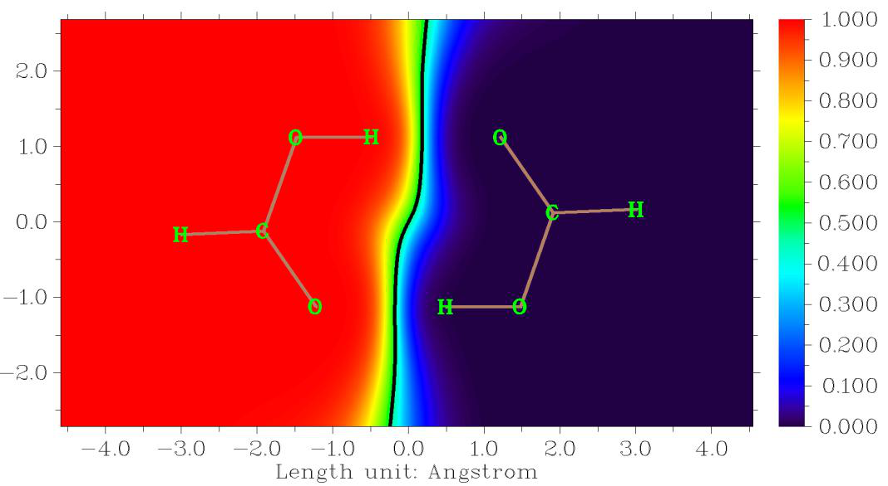

<!-- p.208 -->
Hirshfeld weighting function of the monomer at left side of the graph is represented by color bar, going from red to dark purple corresponds to the weight varying from 1.0 to 0.0. The black line, which is the contour line of 0.5, is just its Hirshfeld surface. Evidently, Hirshfeld surface very elegantly partitioned the whole space into two monomer regions, the difference in atomic size is properly and automatically taken into account. The Hirshfeld surface in this case is an open surface, the surface extends to infinity; while if the monomer is completely buried, such as in molecular crystal or metal-organic framework environment, then its Hirshfeld surface will be a close surface and enclose all of its nuclei, just like common molecular surface.

If we map specific real space functions on Hirshfeld/Becke surface and study their distributions, just like quantitative analysis on molecular surface, we can gain many important information about intermolecular interaction. There are three real space functions that are very useful for this purpose

(1) Normalized contact distance vdWe rdd−+−= , where di (de) is the vdWiinormr rdr vdWeevdWi

vdWand 𝑟𝑒vdW denote vdW radius of the corresponding two atoms. Small value of dnorm indicates close intermolecular contact and implies evident interaction. distance from a point on the surface to the nearest nucleus inside (outside) the surface, 𝑟𝑖

(2) Electron density. If electron density is large in some local regions of Hirshfeld/Becke surface, obviously the intermolecular interactions crossing these regions must be prominent. The usefulness of electron density is similar to dnorm, while the former is more physically meaningful and leads to smoother color variation on the surface.

(3) sign(λ2)ρ, see corresponding part Section 2.6 for detailed explanation. This function can not only exhibit interaction strength but also reveal interaction type.

Below is urea crystal, the isosurface represents Hirshfeld surface of the central urea, and dnorm is the mapped function. Red parts correspond to small dnorm and thus exhibit close contact, which mainly originates from H-bond interaction.

Fingerprint plot and local contact The so-called "fingerprint plot" defined in the framework of Hirshfeld/Becke surface analysis is useful in investigating the noncovalent interactions in molecular crystals. X and Y axes in this


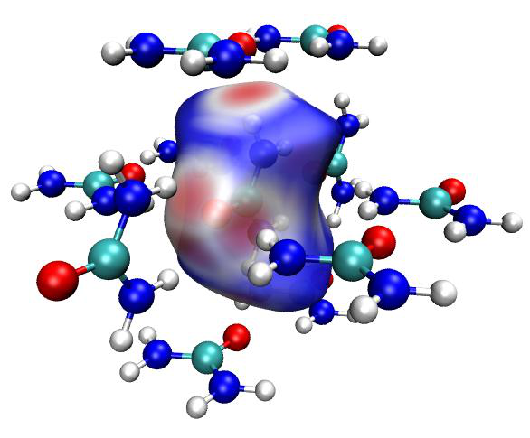

<!-- p.209 -->
plot correspond to di and de, respectively. Each vertex on the Hirshfeld/Becke surface is drawn as a scatter point on the fingerprint plot. According to the distribution of the scatter points, possible intermolecular interactions can be inferred. The usefulness of the fingerprint plot is demonstrated in page 24 and 25 of CrystEngComm, 11, 19 (2009).

The Hirshfeld/Becke surface in fact can be viewed as the contact surface between the atoms in the Hirshfeld/Becke fragment you defined and all other atoms. The remarkable flexibility of Multiwfn allows the overall contact surface to be decomposed to various local contact surfaces and draw the corresponding local fingerprint plots. For example, one can draw fingerprint plot for the local contact surface between the nitrogen atoms in central urea and the hydrogens in surrounding ureas. In this case, all vertices on the local contact surface simultaneously satisfy two conditions: (1) In the Hirshfeld/Becke fragment (viz. the central urea), the atoms closest to the vertices are nitrogen (2) Among all surrounding atoms, the ones closest to the vertices are hydrogen. Undoubtedly, fingerprint plot of local contact surface greatly facilitates one to study the noncovalent interaction in local region due to the contact between specific atom sets.

Usage The procedure to perform Hirshfeld/Becke surface analysis is similar to usual quantitative molecular surface analysis. After you enter main function 12, choose option 1 and select Hirshfeld or Becke surface, then input the index of the atoms in the fragment. Now mapped function is automatically switched to electron density (if no wavefunction information is available, it corresponds to promolecular density). You can also choose option 2 to select another mapped function. After that, choose option 0 to start calculation. Quantitative data on the surface such as average value and standard deviation will be outputted, and surface extrema will be located. Then via corresponding options you can visualize surface minima/maxima, export result and so on, all options in the post-processing menu (except for option 20) have already been introduced in Section 3.15.4 and thus will not be described again.

In the post-processing menu, you can see an option named "20 Fingerprint plot and local contact analyses", after entering it you will see a menu, in which if you select option 0, the fingerprint analysis will be started. By default, the analysis is performed over the entire Hirshfeld/Becke surface. If you intend to perform fingerprint plot analysis for local contact region, you should use options 1 and 2 in this menu to respectively define "inside atoms" and "outside atoms", only the contact surface between these two sets of atoms will be taken into account in the analysis. Any atom in the "inside atoms" should be an atom in the current fragment, while any atom in the "outside atoms" should not belong to the current fragment. In options 1 and 2 you will be asked to input two filter conditions, their intersection defines the set. Condition 1 is atom index range, condition 2 is element. For example, if you input 1,3-6 as condition 1 and Cl as condition 2, then the Cl atom(s) within the range of 1,3-6 will be chosen.

After carrying out the fingerprint plot analysis, the area of the contact surface will be shown on screen. Then, in the new post-processing menu you can find many options, which can be used to draw fingerprint plot or modify plotting settings. By option 4 you can export the vertices on the local contact surface and entire Hirshfeld/Becke surface to finger.pqr and finger_all.pqr in current folder, respectively, in which “Charge” property (penultimate column of the files) corresponds to the value of mapped function. In addition, by option 5, you can export di and de values of the points on the local contact surface and entire Hirshfeld/Becke surface to di_de.txt and di_de_all.txt in current folder, respectively.


<!-- p.210 -->
It is possible to obtain contact area between every pair of elements at the same time, just choose option “3 Calculate contact area between different elements” in fingerprint analysis menu.

An example of Becke surface analysis is given in Section 4.12.5. An example of Hirshfeld analysis and drawing fingerprint plot is given in Section 4.12.6, this example also illustrates how to easily plot pretty colored Hirshfeld surface via VMD program.

“Performing Hirshfeld surface analysis by Multiwfn to visually display interactions in molecular crystals and complexes” (http://sobereva.com/701, in Chinese) is an extremely detailed blog article which comprehensively introduces the Hirshfeld/Becke analysis in Multiwfn and present very rich examples, highly recommend reading!

Information needed: Depending on the real space function used to define the surface and that mapped on the surface. At least atom coordinates must be provided. (For local electron affinity, virtual MOs must be presented, hence such as .mwfn, .fch, .molden and .gms should be used in this case)


## 3.16 Processing grid data (13)

If grid data was loaded from input file when Multiwfn boots up, or grid data has been generated by main function 5 or other functions, a set of grid data will be presented in memory (which will be referred to as "present grid data" below), then this module will be available. If grid data has not been presented in memory but you choose this main function, you can also directly load grid data from an external file.

In this module, you can visualize present grid data, extract data in a specified plane, perform mathematical algorithm, set value in specified range by corresponding options and so on. These options will be described below.


### 3.16.0 Visualize isosurface of present grid data (-2)

Visualize isosurface of present grid data in a GUI window, this is useful to check validity of the grid data updated by some functions (e.g. function 11)


### 3.16.1 Export present grid data to Gaussian-type cube file (0)

If you choose this function, present grid data (may have been updated by using function 11, 13, 14, 15) along with atom information will be outputted to a cube file.


### 3.16.2 Output all data points with value and coordinate (1)

By this function, all present grid data will be outputted to output.txt in current folder, the first three columns correspond to X, Y, and Z in Å, the last column is data value.


### 3.16.3 Output data points in a XY/YZ/XZ plane (2, 3, 4)

By these functions, the grid data in the XY/YZ/XZ plane with specified Z/X/Y value will be


<!-- p.211 -->
outputted to output.txt in current folder, which is a plain text file, you can load it to visualization softwares such as Sigmaplot and then plot plane graphs. Since grid data is discretely distributed, the actual outputted plane is the one nearest to your input Z/X/Y value.

Please read program prompts for the meaning of each column in output file.


### 3.16.4 Output average data of XY/YZ/XZ planes in a range of Z/X/Y (5, 6, 7)


By these functions, the average grid data in some XY/YZ/XZ planes whose Z/X/Y coordinate are in specified range will be outputted to output.txt in current folder. The column 1/2/3/4 correspond to X, Y, Z, value, respectively, geometry unit is Å.


### 3.16.5 Output data points in a plane defined three atom indices or three points (8, 9)


By these two functions, the data in an arbitrary plane can be outputted to a plain text file. However, if the plane you are interested in is XY/YZ/XZ plane, you should use function 2,3,4 instead respectively. You can define the plane by inputting three atom indices or by inputting three points.

You need to input tolerance distance, the data points whose distance to the plane are short than this value will be outputted. In general, it is recommended to input 0 to use default value.

Then if you want to project the data points to XY plane so that you can load them into some visualization softwares and then plot them as plane graph, you can input 1 to tell program to do that. You will find Z values of all points in the output file are zero.


### 3.16.6 Output data points in specified value range (10)

Like function 2, but only the data points whose value are in specified range will be outputted.

If you input both lower and upper limit of value as k, then the data between k−abs(k)×0.03 and k+abs(k)×0.03 will be outputted.


### 3.16.7 Grid data calculation (11)

In this function, you can perform algorithm for present grid data by corresponding options, then the grid data will be updated, and then you can use such as function -2 to visualize the updated grid data, use function 0 to output the updated grid data as cube file or extract data in a plane by functions 2~9, etc.

Supported operations are shown below, where A means value of present grid data, B means value at corresponding point in the cube file that will be loaded. C means the updated value at corresponding point.

- 1 Add a constant e.g. A+0.1=C
- 2 Add a grid file i.e. A+B=C
- 3 Subtract a constant e.g. A-0.1=C
- 4 Subtract a grid file i.e. A-B=C
- 5 Multiplied by a constant e.g. A*0.1=C


<!-- p.212 -->
- 6 Multiplied by a grid file i.e. A*B=C
- 7 Divided by a constant e.g. A/5.2=C
- 8 Divided by a grid file i.e. A/B=C
- 9 Exponentiation e.g. A1.3=C
- 10 Square sum with a grid file i.e. A2+B2=C
- 11 Square subtract with a grid file i.e. A2-B2=C
- 12 Get average with a grid file i.e. (A+B)/2=C
- 13 Get absolute value i.e. |A|=C
- 14 Get exponential value with base 10 i.e. 10A=C
- 15 Get logarithm (base 10) ...

function is defined as min(|A|,|B|)/max(|A|,|B|). So, at any point, the more the magnitude of the data in A deviates from the counterpart in B, the severely the result will be punished.
- 20 Multiplied by a coordinate variable: This option multiplies all grid data by one of

selected coordinate variables X, Y and Z.
- 21 Get minimal value with another function i.e. min(A,B)
- 22 Get min(|A|,|B|) If the operation you selected involves a number, you will be prompted to input its value; if it involves another grid data, you will be prompted to input the path of grid data file (supporting .cub, Dmol3 .grd and CHGCAR/CHG of VASP), of which the origin, translation vectors and number of points in each dimension must be identical to the grid data currently presented in memory.


### 3.16.8 Map values of a cube file to specified isosurface of present grid data (12)


The function is especially useful if you have an electron density cube file and corresponding ESP cube file, you can obtain ESP values of the points laying on the vdW surface, which may be defined as the isosurface with electron density isovalue of 0.001. (Note that main function 12 can realize the same goal, meanwhile the accuracy is higher)

You need to input a isovalue to define the isosurface of present grid data, assume that you input p, and then input deviation in percentage, referred to as k here, then the data points whose values

are between p+abs(p)*0.01*k and p−abs(p)*0.01*k will be regarded as isosurface points. Subsequently, you need to input the filename of another cube file (should have identical grid setting as present grid data), the value in this cube file of those isosurface points will be exported to output.txt in current folder, along with X/Y/Z coordinates.


### 3.16.9 Set value of the grid points that far away from / close to some atoms (13)


By this function, the value of grid points beyond or within scaled vdW region of a molecular fragment can be set to a specific value. This is very useful for screening uninteresting regions when


<!-- p.213 -->
showing isosurface, namely setting value of this region to a very large value (very positive or very negative, according to the character of the grid data).

You need to input a scale factor for vdW radius, then input expected value. After that, you need to specify a fragment, you can either directly input atomic indices (e.g. 3,5,1-15,20), or input filename of a plain text file, in which a molecular fragment is defined as atomic list, below is an example of the file:


```text
3
1 3 4
```

where 3 means there are three atoms in this fragment, 1, 3, 4 are corresponding atom indices.

Then all grid points that are beyond the region occupied by scaled vdW spheres of the fragment atoms will be set to specific value.

If the scale factor of vdW sphere is set to a negative value, e.g. -1.3, then all grid points that within the scaled vdW surface of the fragment will be set to the specific value.

An example of using this function is given in Section 4.13.4.1.


### 3.16.10 Set value of the grid points outside overlap region of two fragments (14)


This function is similar to function 13, but only the grid points outside superposition region of scaled vdW regions of two fragments will be set to a specified value. You can either directly input atomic indices of the two fragments, or prepare two files containing atom lists for the two fragments, the format is the same as function 13.

This function is very useful if you are only interested in studying isosurfaces between two fragments, all isosurfaces outside this region can be screened by setting grid data value to very large. An illustrative example is given in Section 4.13.4.2.


### 3.16.11 If data value is within certain range, set it to a specified value (15)


You need to input lower and upper limit value and an expected value, if any value in present grid data is within the range you inputted, its value will be set to the expected value.


### 3.16.12 Scale data range of present grid data (16)

By this function, the value of present grid data can be linearly scaled to certain range. You need to input original data range, assumed that you inputted 0.5,1.7, and you inputted -10,10 as new data range, then all the value of present grid data that higher than 1.7 will be set to 1.7, all the value lower than 0.5 will be set to 0.5. After that, the value between 0.5 and 1.7 will be linearly scaled to -10,10. It may be clearer if the algorithm is expressed as pseudo-code:


```text
where (value>0.5) value=0.5
where (value<1.7) value=1.7
all value = all value - 0.5
ratiofac = [10 - (-10)] / (1.7 - 0.5) = 20/1.2
all value = all value * ratiofac
all value = all value + (-10)
```


<!-- p.214 -->

### 3.16.13 Show statistic data of grid points in specific spatial and value ranges (17)


This function can output statistic data of the grid points in specific spatial and value ranges. If the user do not want to impose any constraint (namely the statistical data is for all data points), input 1. If constraint(s) are needed to be imposed, the user should input 2, then value range and spatial region can be specified, only grid points simultaneously satisfy the conditions will be included into the statistics. Three types of spatial regions are supported: spherical, cylindrical and rectangular.

The minimum and maximum value, average, root mean square, standard deviation, volume, sum, integral and barycenter position of the data points satisfied the constraints will be outputted. The positive, negative and total barycenter are computed respectively as


$$\mathbf{R}_{+}=\sum_{i}^{+}\mathbf{r}_{i}f(\mathbf{r}_{i})/\sum_{i}^{+}f(\mathbf{r}_{i})$$

<!-- formula-ocr: formula_p214_123.png 已替换为LaTeX, 原图保留备查 -->

$$\mathbf{R}_{\mathrm{tot}}=\sum_{k}^{\mathrm{a l l}}\mathbf{r}_{k}f(\mathbf{r}_{k})/\sum_{k}^{\mathrm{a l l}}f(\mathbf{r}_{k})$$

where f is the data value, r denotes coordinate vector, the indices i, j and k run over positive, negative and all grid points respectively.


### 3.16.14 Plot (local) integral curve and plane-averaged curve in X/Y/Z direction (18)


This function calculates and plots various kinds of curve based on the grid data in memory, so that distribution of the real space function represented by the grid data can be studied quantitatively and clearly in a specific direction.

Integral curve is defined as below (e.g. in Z direction). The - and  denote the position of lower and upper limits of the grid data in the direction to be integrated, respectively; p denotes the real space function represented by the grid data.


$$I(z^{\prime})=\int\limits_{z_{ini}}^{z^{\prime}}\int\limits_{-\infty}^{+\infty}\int\limits_{-\infty}^{+\infty}p(x,y,z)\mathrm{d}x\mathrm{d}y\mathrm{d}z$$

<!-- formula-ocr: formula_p214_124.png 已替换为LaTeX, 原图保留备查 -->

Local integral curve is defined as (e.g. in Z direction)

Evidently

LzI zIzz=  '( ')( )d z ini

Plane-averaged curve is defined as (e.g. in Z direction)


<!-- p.215 -->

$$p_{\mathrm{avg}}(z)=\frac{\displaystyle\int\limits_{-\infty}^{+\infty}\int\limits_{-\infty}^{+\infty}p(x,y,z)\mathrm{d}x\mathrm{d}y}{A_{XY}}$$

<!-- formula-ocr: formula_p215_125.png 已替换为LaTeX, 原图保留备查 -->

where AXY is area of the box of the grid data in XY.

In Multiwfn, I, IL and pavg curves are evaluated based on numerical integration of the grid data in memory. In the present function, user first needs to choose which direction to study, and then input the lower and upper limit of the coordinate in this direction. Assume that user has chosen Z as the direction of interest, and the lower and upper limits were set to -5 and 10, respectively, then the spatial range of the curve generated by Multiwfn will be z = [-5,10], and the zini in above formula will be -5. If you press ENTER button directly when Multiwfn asks you to input range, then the minimal and maximal values of Z coordinate of present grid data will be taken as lower and upper limit, respectively.

After calculation of (local) integral curve and plane-averaged curve is finished, you will see a menu. By corresponding options in the menu, the graph of the curves can be plotted or saved, the curve data can be exported to current folder as a plain text file. When a curve is plotted, position and value of minima and maxima of the curve are automatically shown on console window. Via option 11 in this function, you can calculate curve value at a given position.

It is noteworthy that to use this function, the grid is not necessarily orthogonal, however the following conditions must be satisfied:

(1) If calculate the curve along X axis, the first translation vector of the grid must be parallel along X, while the other two must be parallel to YZ plane.

(2) If calculate the curve along Y axis, the second translation vector of the grid must be parallel along Y, while the other two must be parallel to XZ plane.

(3) If calculate the curve along Z axis, the third translation vector of the grid must be parallel along Z, while the other two must be parallel to XY plane.

If the integrand is chosen as electron density difference, then the integral curve sometimes is known as "charge displacement curve" and useful in discussion of charge transfer, see J. Am. Chem. Soc., 130, 1048 (2008) for example. If you want to obtain such a curve, before entering this function, you should calculate grid data of electron density difference, or directly load the grid data from external file (e.g. cube file).

Very nice examples of applying local integral curve of electron density in discussing electron transfer are ChemPhysChem, 22, 386 (2021) and Carbon, 171, 514 (2021) (see Supplemental Information).

A practical example is given in Section 4.13.6. Information needed: Grid data


<!-- p.216 -->

### 3.16.15 Translate grid data within current box (19)

This function is mainly used to translate grid data for periodic systems. The range of the grid data box is kept unchanged, the grid points outside the box after translation will be automatically wrapped into the box, and you can also choose to wrap atoms when any atom is detected to be outside the box.

This function is particularly useful to make the region of interest centered in the cell for ease of visual inspection. For example, the 0.001 a.u. isosurface of spin density of a solvated electron system is shown below, the blue frame corresponds to the grid data box. As can be seen, the isosurface is unfortunately truncated by the cell of the periodic DFT calculation.

To fix this issue, after loading the grid data file into Multiwfn, you should input 13 //Processing grid data 19 //Translate grid data -0.3 //Translate 30% in the negative direction along the first axis 0.5 //Translate 50% in the positive direction along the second axis [Press ENTER button] //Do not translate along the third axis y //Wrap atoms that outside the box into the box Now if you choose option -2 to visualize the isosurface, you will see the following map, clearly the region of interest has been centered, and thus you can easily visualize the entire solvated electron. Also, you can choose option -1 to export the new grid data as a .cub file.


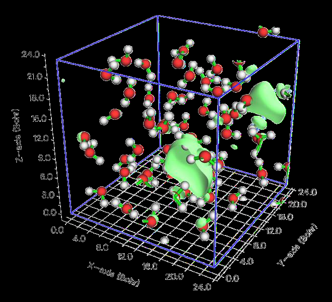


<!-- p.217 -->
Information needed: Grid data (both orthogonal and nonorthogonal grids are supported)


### 3.16.16 Duplicate grid data periodically (20)

This function is used to duplicate grid data along the 1st/2nd/3rd box vector by specific times, and you can also let Multiwfn to duplicate atoms at the same time. If the box information of the present grid data is exactly coincident with cell information of a crystal, then you can obtain grid data and structure corresponding to supercell via this function. See “Using Multiwfn to rapidly generate grid data of supercell” (http://sobereva.com/770) for illustrative application of this function.

Information needed: Grid data (both orthogonal and nonorthogonal grids are supported)


## 3.17 Adaptive natural density partitioning (AdNDP) analysis (14)


### 3.17.1 Theory

Famous NBO analysis developed by Weinhold and coworkers is able to recover up to 3-centers 2-electrons (3c-2e) orbitals from density matrix (e.g. by using "3cbond" keyword in NBO program). Adaptive natural density partitioning (AdNDP), which was proposed by Boldyrev et al. (Phys. Chem. Chem. Phys., 10, 5207 (2008)), may be viewed as a natural extension of NBO analysis aiming for locating N>3 centers orbitals. AdNDP has been extensively used to study electronic structure characteristic of a widespread cluster systems, by googling "AdNDP" you can find much related literature.

Canonical molecular orbitals (CMOs) are generally highly delocalized, often lacking chemical significances; While 2c or 3c NBOs are substantially localized, for highly conjugated system resonant description is often needed (otherwise large non-Lewis composition will occur, that means current system is inappropriate to be portrayed by single set of NBOs), this somewhat conflicts with modern quantum chemistry concepts and obscures delocalization natural of electrons in conjugated system. AdNDP orbitals seamlessly bridged CMOs and NBOs, AdNDP bonding patterns avoid resonant description and are always consistent with the point symmetry of the molecule.

The basic idea of AdNDP to generate multi-center orbitals is very similar to NBO analysis, that is constructing proper sub-block of density matrix in natural atomic orbital (NAO) basis and then diagonalize it, the eigenvalues and eigenvectors correspond to occupation number and orbital wavefunction respectively. For example, we want to generate all possible 4-centers orbitals for atom A,B,C,D, we first pick out corresponding sub-blocks and then combine them altogether:


<!-- p.218 -->
$$P^{(\boldsymbol{A},\boldsymbol{B},\boldsymbol{C},\boldsymbol{D})}=\left[\begin{matrix}{P_{\boldsymbol{A},\boldsymbol{A}}}&{P_{\boldsymbol{A},\boldsymbol{B}}}&{P_{\boldsymbol{A},\boldsymbol{C}}}&{P_{\boldsymbol{A},\boldsymbol{D}}}\\ {P_{\boldsymbol{B},\boldsymbol{A}}}&{P_{\boldsymbol{B},\boldsymbol{B}}}&{P_{\boldsymbol{B},\boldsymbol{C}}}&{P_{\boldsymbol{B},\boldsymbol{D}}}\\ {P_{\boldsymbol{C},\boldsymbol{A}}}&{P_{\boldsymbol{C},\boldsymbol{B}}}&{P_{\boldsymbol{C},\boldsymbol{C}}}&{P_{\boldsymbol{C},\boldsymbol{D}}}\\ {P_{\boldsymbol{D},\boldsymbol{A}}}&{P_{\boldsymbol{D},\boldsymbol{B}}}&{P_{\boldsymbol{D},\boldsymbol{C}}}&{P_{\boldsymbol{D},\boldsymbol{D}}}\\ \end{matrix}\right]$$

After diagonalization of P(A,B,C,D), if one or more eigenvalues exceeded the predefined threshold, which is commonly set to close to 2.0 (e.g. 1.7), then corresponding orbitals will be regarded as candidate 4c-2e bonds. Completely identical strategy can be used to generate orbitals with higher number of centers.

Indeed, the orbital generating process of AdNDP is quite easy once atom combination is determined, however the searching process of final Nc-2e orbitals in entire system is complicated, manual inspections and operations are necessary. AdNDP approach has large ambiguity, it is possible that the searching process carried out by different peoples finally results in different AdNDP pattern, I think this is the most serious limitation of current AdNDP approach. So, AdNDP is never a black box, before using it users must have preliminary understanding of the searching process of the AdNDP implemented in Multiwfn.

Before the search, densities from core-type NAOs are automatically eliminated from the density matrix, since they have no contribution to bonding. After that, 1-center orbitals (lone pair), 2-centers orbitals, 3-centers orbitals, 4-centers orbitals ... will be searched in turn, until residual density (trace of density matrix) is close to zero. The search could be exhaustive, that means when searching N-centers orbitals, Multiwfn will construct and diagonalize M!/(M-N)!/N! sub-blocks of density matrix, where M is the total number of atoms. All of the orbitals whose occupation numbers are larger than the threshold will be added to candidate orbital list. For large system, the searching process may be very time-consuming or even forbidden, for example, exhaustive search of 10-centers orbitals in the system with 30 atoms needs to construct and diagonalize 30045015 sub-blocks of density matrix! This is very difficult to finish in personal computer, for such case, user-directed searching is necessary. In Multiwfn you can define a search list, then the exhaustive search will only apply to the atoms in the search list, so that the amount of computation would be greatly reduced. You can also directly let Multiwfn construct and diagonalize sub-block of density matrix for specified atom combination. Note that user-directed searching has relatively high requirements of skill and experience on users.

Once the search of N-centers orbitals is finished, we will get a list containing candidate N-centers orbitals. We need to pick some of them out as final N-centers AdNDP orbitals. Commonly, one or more orbitals with the highest occupation numbers will be picked out. Notice that, since some densities are simultaneously shared by multiple candidate orbitals, if we directly pick out several candidate orbitals with the largest occupation at one time, the electrons may be overcounted. To avoid this problem, assume that K orbitals with the highest occupation numbers obviously overlap with some other candidate orbitals meanwhile there is no evident overlapping between the K orbitals, we should first pick out K orbitals as final AdNDP orbitals, then Multiwfn will automatically deplete their density from the density matrix and then reconstruct and diagonalize the corresponding sub-blocks of density matrix for remained candidate orbitals to update their shapes and occupation numbers. If there are still some candidate orbitals with occupation numbers close to 2.0, you may consider picking them out, then remained orbitals will be updated again. Such process may be repeated several times until there is no orbital that has a high occupation number. After that, you can


<!-- p.219 -->
start to search N+1 centers orbitals.

The general requirements of AdNDP analysis are that: The final residual density (corresponds to non-Lewis composition in NBO analysis) should as low as possible; the occupation numbers of each AdNDP orbital should as close to 2.0 as possible; the number of centers of AdNDP orbitals should as less as possible; the resulting orbitals must be consistent with molecular symmetry.

However, there is no unique rule on how to search orbitals and pick out candidate orbitals as AdNDP orbitals. For example, one can first search 5-centers orbitals before completing search of 3-centers orbitals, and one can also directly search 6-centers orbitals after the search of 2-centers orbitals has finished. The sequence of picking out candidate orbitals is also not necessarily always in accordance with magnitude of occupation numbers. The final AdNDP pattern obtained by different operations may be different, how to do AdNDP analysis is largely dependent on users themselves. Actually, some molecules may have two or even more equally reasonable AdNDP patterns, sometimes it is difficult to discriminate which pattern is the best. I have confidence to say that some AdNDP patterns presented in published papers are not the optimal ones. The experience of using AdNDP approach can be gradually enriched in practices and during reading related papers.

AdNDP is very insensitive to basis set quality as NBO analysis, 6-31G* is enough to produce accurate results for main group elements in the first few rows. Over enhancing basis set quality will not improve AdNDP analysis results but only lead to increase of the computational burden in diagonalization step, since the size of sub-block of density matrix is directly determined by size of basis set.

Multiwfn offers capacity for evaluating AdNDP orbital energies. You need to provide a file containing Fock (or Kohn-Sham) matrix in original basis functions. The Fock matrix can be obtained from output of Gaussian or other programs. The energy of AdNDP orbital is corresponding diagonal term of Fock matrix in AdNDP orbital representation. Specifically, Multiwfn performs below representation transform:

TAdNDPAOAONAO==FC FCCXc

where FAO is the Fock matrix in original basis function that loaded from user-provided file, C(r,i) corresponds to coefficient of basis function r in AdNDP orbital i. c(s,i) corresponds to coefficient of NAO s in AdNDP orbital i. XAONAO is transformation matrix between original basis function and NAO, i.e. X(t,s) is coefficient of basis function t in NAO s. Energy of AdNDP orbital j is simply FAdNDP(j,j), which is expectation value of Fock operator of AdNDP orbital wavefunction.


### 3.17.2 Input file

The output file of NBO program containing density matrix in NAO basis (DMNAO) can be used as input file for AdNDP analysis. If you also need to visualize AdNDP orbitals or export orbitals as cube files, .fch file must be provided, meanwhile transformation matrix between NAO and original basis functions (AONAO) must be presented in the NBO output file.

Assume that you are a Gaussian user, in order to obtain a Gaussian output file containing all information needed by Multiwfn to perform the AdNDP analysis and visualization, you should write a Gaussian input file of single point task with pop=nboread keyword in route section, and write \$NBO AONAO DMNAO \$END after molecular geometry section with a blank line as separator. Then run the input file by Gaussian and then convert .chk file to .fch format by formchk utility.

The Gaussian output file (not .fch file) should be used as the initial input file when Multiwfn


<!-- p.220 -->
boots up. Once you entered AdNDP module, Multiwfn will load NAO information and DMNAO matrix from this file. If then you choose corresponding options to visualize or export orbitals, AONAO matrix will be loaded and the program will prompt you to input the path of the .fch file (if .fch is in the same folder and has identical name as the Gaussian output file, then the .fch will be automatically loaded).

Multiwfn is also compatible with the output files of stand-alone NBO program (GENNBO), of course you have to add DMNAO keywords in $NBO section in .47 file. In this case it is impossible to visualize AdNDP orbitals.

Formally, AdNDP approach is also applicable to open-shell systems; of course, the occupation threshold should be divided by 2. When you enter AdNDP module, Multiwfn will ask you which density matrix should be used, the so-called total density matrix is the sum of alpha and beta density matrix.

Notice that if after you entered AdNDP module Multiwfn suddenly crashes, and the basis set you used contains diffuse functions, you can try to use another basis set without diffuse functions. This problem is caused by the bug in NBO 3.1 module, namely in rare cases the DMNAO output may be slightly problematic if diffuse functions present. Since AdNDP analysis is quite insensitive to diffuse functions, they can be safely removed without any loss of accuracy.

If you want to obtain AdNDP orbital energies, Fock matrix corresponding to present system at the same calculation level must be provided in lower-triangular sequence in a plain text file, namely: F(1,1) F(2,1) F(2,2) F(3,1) F(3,2) F(3,3) ... F(nbasis,nbasis), where nbasis is the total number of basis functions. The format is free. If you are a Gaussian user, you can add archive file=XXX keyword between \$NBO ... \$END, then in the resulting XXX.47 file, search \$FOCK and copy all data between \$FOCK ... \$END to a plain text file, then this file can be directly used to provide Fock matrix to Multiwfn (In fact, Multiwfn is also able to automatically locate and read the \$FOCK field when the file name has .47 suffix).


### 3.17.3 Options

All of the options involved in AdNDP module are introduced below, some options are invisible in certain cases. If current candidate orbital list is not empty, then all candidate orbitals will always be printed on screen in front of the menu (except when you select option 5 or 13), the candidate orbital indices are determined according to occupation numbers. The number of residual valence electrons of all atoms in the search list is always printed at the upper of the menu, this value decreases with gradually picking out candidate orbitals as final AdNDP orbitals. If this value is very low (e.g. lower than 1.4), it is suggested that new Nc-2e AdNDP orbitals will be impossible to be found between the atoms in the search list.

-10 Return to main menu: Once you choose this option, you will return to main menu, meantime all results of AdNDP analysis will be lost. Hence the status of AdNDP module can be reset by choosing this option and then re-entering the module.

-2 Various other settings and functions: This option has several unimportant subfunctions and settings. The option "Set maximum number of candidate orbitals to be printed" is worth to mention, it is used to set how many candidate orbitals will be printed on screen, proper choice of the threshold can avoid excessive output when very large number of candidates are found.

-1 Define exhaustive search list: In this option, one can define a search list, exhaustive search (option 2) will only apply to the atoms in the search list. All commands in this defining interface are


<!-- p.221 -->
self-explanatory. Notice that default search list includes all atoms of the molecule.

0 Pick out some candidate orbitals and update occupations of others: This is used to pick out orbitals from candidate list to actual AdNDP orbital list. As shown by prompt on screen, the user can input indices of the orbitals to pick out. For convenience, if user only inputs one number, e.g. 5, then 5 candidate orbitals with largest occupation numbers will be picked out. After that, the eigenvectors (orbital shape) and eigenvalues (occupation numbers) of remaining candidate orbitals will be updated as mentioned earlier.

1 Perform orbitals search for a specific atom combination: Users need to input indices of some atoms, e.g. 3,4,5,8,9, then sub-block of density matrix for atom 3,4,5,8,9 will be constructed and diagonalized, all resultant eigenvectors will be added to candidate orbitals list, meantime all previous candidate orbitals will be removed. There is no limit on the number of inputted atoms.

2 Perform exhaustive search of N-centers orbitals within the search list: N atoms will be selected out from the search list in an exhaustive manner, assume that the search list contains M atoms, then totally M!/(M-N)!/N! atom combinations will be formed. For each combination, corresponding sub-block of density matrix will be constructed and diagonalized, all eigenvectors with eigenvalues larger than user-defined threshold will be added to candidate orbital list. Old candidate orbital list will be cleaned.

3 Set the number of centers in the next exhaustive search: Namely set the value N in option 2. Once exhaustive search of N-centers orbitals is finished, N will be automatically increased by one.

4 Set occupation threshold in the next exhaustive search: Namely set the threshold used in option 2.

5 Show information of AdNDP orbitals: Print occupation numbers and involved atoms of all saved AdNDP orbitals.

6 Delete some AdNDP orbitals: Input two numbers, e.g. i, j, then saved AdNDP orbitals from i to j will be removed.

7 Visualize AdNDP orbitals and molecular geometry: The path of corresponding .fch file will be prompted to be inputted, after loading some necessary information from the file, a GUI window will pop up and molecular geometry will be shown. Isosurfaces of AdNDP orbitals can be plotted by clicking corresponding numbers in the right-bottom list

8 Visualize candidate orbitals and molecular geometry: Analogous to option 7, but used to visualize isosurfaces of candidate orbitals. It is useful to visualize the isosurfaces before picking out some candidate orbitals as final AdNDP orbitals.

9 Export some AdNDP orbitals to Gaussian-type cube files: User need to choose grid setting and then input index range, e.g. 2-4, then wavefunction value of AdNDP orbitals 2, 3, 4 will be calculated and exported to AdNDPorb0002.cub, AdNDPorb0003.cub and AdNDPorb0004.cub in current folder, respectively. They are Gaussian-type cube files and can be visualized by many softwares such as VMD.

10 Export some candidate orbitals to Gaussian-type cube files: Analogous to option 9, but used to export cube files for candidate orbitals.

11/12 Save/Load current density matrix and AdNDP orbital list: Option 11 is used to save current density matrix and AdNDP orbital list in memory temporarily, when density matrix and AdNDP orbital list is changed, you can choose option 12 to recover previous state.

13 Show residual density distributions on the atoms in the search list: After choosing this option, population number of each atom in the search list will be calculated according to present


<!-- p.222 -->
density matrix and then printed out. If some neighboring atoms have large population number, it is suggested that multi-center orbitals with high occupation number may appear on these atoms; while the atoms with low population number often can be ignored in the following searching process. Thus this option is very helpful for setting up user-directed searching.

14 Export AdNDP orbitals to .mwfn file: Via this option, all picked AdNDP orbitals will be exported as AdNDP.mwfn in current folder (see Section 2.5 for introduction of .mwfn format). By using this file as input file, you can perform various kinds of analyses for AdNDP orbitals (e.g. orbital composition analysis by main function 8, plotting plane map via main function 4). Note that if there are N basis functions and M AdNDP orbitals have been picked out, then the first M orbitals in the AdNDP.mwfn will correspond to the AdNDP orbitals, while the other N-M orbitals in this file are meaningless and can be simply ignored.

15 Evaluate and output composition of AdNDP orbitals: This option is used to calculate orbital composition of picked AdNDP orbitals by natural atomic orbital (NAO) method, which has been introduced in Section 3.10.4.

16 Evaluate and output energy of AdNDP orbitals: This function is used to evaluate energy of AdNDP orbitals that have already been picked out. Multiwfn will prompt you to input the path of the file containing Fock matrix in original basis functions, the elements of the matrix should be recorded in lower-triangular sequence, the NBO .47 file containing $FOCK field can also be directly used as input file. Then after a simple transformation, orbital energies are immediately outputted.

AdNDP analysis is relatively complicated and not a black box, please follow the examples in Section 4.14 before using this module to analyze your systems.

Information needed: NBO output file (with AONAO DMNAO keywords), .fch file (only needed when visualizing and exporting cube file for AdNDP orbitals, or exporting AdNDP orbitals as .mwfn file), plain text file (containing Fock matrix. Only needed if you want to gain orbital energies)


## 3.18 Fuzzy atomic space analysis (15)


### 3.18.0 Basic concepts

Before introducing each individual function, here I first introduce some basic concepts of fuzzy atomic space.

Atomic space is the local space attributed to a specific atom in the whole three-dimension molecular space. Below we will express atomic space as weighing function w. The methods used to partition the whole space into atomic spaces can be classified into two categories:

1 Discrete partition methods: The two representative methods are Bader's partition (also known as AIM partition) and Voronoi partition. They partition molecular space discretely, so any point can be attributed to only one atom, in other words,


$$\left\{\begin{aligned}w_{A}(\mathbf{r})&=1&\text{if }\mathbf{r}\in\Omega_{A}\\ w_{A}(\mathbf{r})&=0&\text{if }\mathbf{r}\notin\Omega_{A}\end{aligned}\right.$$


<!-- p.223 -->
where ΩA is atomic space of atom A.

2 Fuzzy partition methods: The representative methods include Hirshfeld, Becke, Hirshfeld-I, MBIS and ISA. They partition molecular space contiguously, atomic spaces overlap with each other, any point may be simultaneously attributed to many atoms to different extent, and the weights are normalized to unity. In other words, the two following conditions hold for all atoms and any point


$$\begin{aligned}&0\leq w_{A}(\mathbf{r})\leq1\quad\forall A\\&\sum_{B}w_{B}(\mathbf{r})=1\\ \end{aligned}$$

<!-- formula-ocr: formula_p223_127.png 已替换为LaTeX, 原图保留备查 -->

B

The most significant advantage of the fuzzy partition may be that the integration of real space function in fuzzy atomic space is much easier than in discrete atomic space. By using Becke's numerical DFT integration scheme (J. Chem. Phys., 88, 2547 (1988)), high accuracy of integration in fuzzy atomic space can be achieved for most real space functions at the expense of relatively low computation effort. In the fuzzy atomic space analysis module of Multiwfn, all integrations are realized by this scheme. The more integration points are used, the higher integration accuracy can be reached, one can adjust the number of points by "radpot" and "sphpot" parameter in `settings.ini`.

In fuzzy atomic space analysis module of Multiwfn, one can obtain many properties that based on fuzzy atomic spaces. Currently, the most widely used definitions of fuzzy atomic spaces, namely Hirshfeld, Hirshfeld-I and Becke are supported, they are introduced below. One can choose which fuzzy atomic spaces will be used by option -1.

Hirshfeld atomic space: In Theor. Chim. Acta (Berl.), 44, 129 (1977), Hirshfeld defined the atomic space as


$$w_{_{A}}^{^{Hirsh}}(\mathbf{r})=\frac{\rho_{_{A}}^{^{free}}(\mathbf{r}-\mathbf{R}_{_{A}})}{\sum\limits_{B}\rho_{_{B}}^{^{free}}(\mathbf{r}-\mathbf{R}_{_{A}})}$$

B

where R is coordinate of nucleus, ρfree denotes spherically averaged atomic electron density in free-state.

In option -1, you will find two options "Hirshfeld" and "Hirshfeld*". The former uses atomic .wfn files to calculate the weights, they must be provided yourself or let Multiwfn automatically invoke Gaussian to generate them, see Section 3.7.3 for detail. The latter evaluates the weights directly based on built-in radial atomic densities and thus is more convenient, detail can be found in Appendix 3. I strongly suggest using "Hirshfeld*" instead of "Hirshfeld".

Hirshfeld-I (HI) atomic space: This is a well-known extension of Hirshfeld method, it was proposed in J. Chem. Phys., 126, 144111 (2007). Commonly the atomic space defined by HI is more physically meaningful than that of Hirshfeld, since it can respond to the actual molecular environment. Unfortunately, HI is much more expensive than Hirshfeld due to its iterative nature. Details of Hirshfeld-I and its implementation in Multiwfn have been introduced in Section 3.9.13 and thus will not be repeated here. When you choose HI in option -1, Multiwfn will first perform regular HI iterations (If you are confused by the operations, please consult the example of computing HI charges in Section 4.7.4). After HI atomic spaces have converged, you can do subsequent analyses.


<!-- p.224 -->
MBIS atomic space: Like HI, MBIS refine atomic spaces iteratively. See Section 3.9.18 for details. When you choose MBIS in option -1, you will enter the interface of performing MBIS iteration, you should choose option 1 to start the atomic space refinement process. After MBIS atomic spaces have converged, you can do subsequent analyses.

Becke atomic space: First, consider a function p


$$p(d)=(3/2)d-(1/2)d^{3}$$

<!-- formula-ocr: formula_p224_128.png 已替换为LaTeX, 原图保留备查 -->

which can be iterated many times

dpdf dppdf dpppdf 1 3 2 )()( )]}([{)( )]([)( ===

...

Then define a function s


$$s_{k}(t)=(1/2)[1-f_{k}(t)]$$

<!-- formula-ocr: formula_p224_129.png 已替换为LaTeX, 原图保留备查 -->

The plot of sk versus to t is

1.0

0.9 0.8 0.7 k=1 k=2 k=3 k=4 k=5

0.6

sk(t) 0.5

0.4

0.3

0.2

0.1

-1.0-0.8-0.6-0.4-0.20.00.20.40.60.81.00.0

t

From the graph above it can be seen that sk gradually reduces from 1 to 0 with t varying from -1 to 1. The larger the k is, the sharper the curve becomes. The weighting function of Becke atomic space is based on simple transformation of sk, for details please consult original paper J. Chem. Phys., 88, 2547 (1988).

$$w_{A}^{\mathrm{Becke}}\left(\mathbf{r}\right)=\frac{P_{A}(\mathbf{r})}{\sum_{B}P_{B}(\mathbf{r})}$$

B


<!-- p.225 -->
$$P_{A}(\mathbf{r})=\prod_{B\neq A}s_{k}(v_{_{AB}}(\mathbf{r}))\quad v_{_{AB}}(\mathbf{r})=\mu_{_{AB}}(\mathbf{r})+a_{_{AB}}(1-\mu_{_{AB}}(\mathbf{r})^{2})$$

$$a_{_{AB}}=\frac{u_{_{AB}}}{u_{_{AB}}^{2}-1}\quad u_{_{AB}}=\frac{\chi_{_{AB}}-1}{\chi_{_{AB}}+1}\quad\chi_{_{AB}}=\frac{R_{_{A}}^{\mathrm{cov}}}{R_{_{B}}^{\mathrm{cov}}}$$

$$\left\{\begin{aligned}a_{AB}&=-0.5&\text{if }a_{AB}<-0.5\\ a_{AB}&=0.5&\text{if }a_{AB}>0.5\end{aligned}\right.$$

μ BAAB )( RrRrRRr −=−=−=−= rr rrRR BBAABAABAB

where R stands for coordinates of nucleus. Rcov denotes covalent radius.

The number of iterations, namely k value, can be set by option -3. The default value (3) is appropriate for most cases. The definition of the covalent radius used to generate Becke atomic space can be chosen by option -2. Through corresponding suboptions, one can directly select a set of built-in radii (CSD radii, modified CSD radii, Pyykkö radii, Suresh radii, Hugo radii), load radii information from external plain text file (the format required is described in the program prompts), or modify current radii by manual input.

The origin paper of CSD radii is Dalton Trans., 2008, 2832, these radii were deduced from statistic of Cambridge Structural Database (CSD) for the elements with atomic numbers up to 96. Pyykkö radii were defined in Chem. Eur. J., 15, 186 (2008), which covers the entire periodic table, Groups 1–18, Z=1–118. Suresh radii were proposed in J. Phys. Chem. A, 105, 5940 (2001), which is based on theoretically calculated geometries of H3C-EHn, the defined radii cover most of main group and transition elements in periodic table. Hugo radii were proposed in Chem. Phys. Lett., 480, 127 (2009), which has clear physical meaning and is based on atomic ionization energy. Notice that Hugo radius for hydrogen is rather large (even larger than Kr by 0.01 Bohr).

I found it is inappropriate to directly use any covalent radii definition shown above to define Becke's atomic space. The covalent radii of metal elements in IA and IIA groups are always large, e.g. CSD radius of lithium is 1.28 Å. While covalent radii of elements in such as VIIA group are always small, e.g. CSD radius of fluorine is only 0.58 Å. For main groups, the elements with small (large) covalent radius generally have large (small) electronegativity. So, in molecule environment, the atoms with small (large) covalent radius prefer to withdraw (donate) electrons to expand (shrink) their effective size, this behavior makes actual radii of main group elements in each row equalized. In order to faithfully reflect this behavior, I defined the so-called "modified CSD radii", namely the CSD radii of all main group elements (except for the first row) are replaced by CSD radii of the IVA group element in corresponding row, while transition elements still use their original CSD radii. The modified CSD radii are the default radii definition for Becke's atomic space.

The Becke atomic space of carbon in acetamide constructed by default parameters is illustrated below


<!-- p.226 -->

### 3.18.1 Integration of a real space function in fuzzy atomic spaces (1)

This function is used to integrate real space function f in atomic spaces


$$I_{A}=\int_{A}w_{A}(\mathbf{r})f(\mathbf{r})\mathrm{d}\mathbf{r}$$

<!-- formula-ocr: formula_p226_130.png 已替换为LaTeX, 原图保留备查 -->

For example, if f is chosen as electron density, then IA will be the electron population number of atom A.

f may be also chosen as the real space functions involving coordinates of two electrons, such as exchange-correlation density and source function. For this case, the coordinate of reference point can be set by option -10 (this is equivalent to set "refxyz" in `settings.ini`). If you have carried out topology analysis, you can also use option -11 to set a critical point as reference point, this is especially convenient for studying source function (for which bond critical point is usually set as reference point).

The "% of sum" and "% of sum abs" in output are defined as (/) 100%ABBII× and


$$I_{_{AB}}=\int_{_{A}}w_{_{A}}(\mathbf{r})w_{_{B}}(\mathbf{r})f(\mathbf{r})\mathrm{d}\mathbf{r}$$

<!-- formula-ocr: formula_p226_131.png 已替换为LaTeX, 原图保留备查 -->

By default, all atomic spaces will be integrated. If you only need integral value of certain atoms, you can use option -5 to define the atom list.


### 3.18.2 Integration of a real space function in overlap spaces (8)

This function is used to integrate specified real space function f in overlap spaces between atomic pairs


$$I_{AB}=\int_{A}w_{A}(\mathbf{r})w_{B}(\mathbf{r})f(\mathbf{r})\mathrm{d}\mathbf{r}$$


<!-- p.227 -->
For example, if f is chosen as electron density, then IAB will be the number of electrons shared by atom A and B. f may be also chosen as the real space functions involving coordinates of two electrons.

Integrals of positive and negative parts of f are outputted separately. Meanwhile, sum of diagonal elements ∑𝐼𝐴𝐴𝐴 , sum of non-diagonal elements ∑∑𝐼𝐴𝐵𝐵≠𝐴𝐴 and sum of all elements ∑∑𝐼𝐴𝐵𝐵𝐴 for positive and negative parts are also outputted together. Currently only the fuzzy atomic space defined by Becke can be employed in this function.

3.18.3 Atomic and molecular multipole moments and <r2> (2)

This function is used to evaluate atomic and molecular monopole, dipole, quadrupole moments and octopole moments as well as <r2>. All units in the output are in a.u.

In below formulae, superscript A means an atom named A. x, y and z are the components of electron coordinate r relative to nuclear coordinate R.


$$x=r_{x}-R_{x}^{A}\quad y=r_{y}-R_{y}^{A}\quad z=r_{z}-R_{z}^{A}$$

<!-- formula-ocr: formula_p227_133.png 已替换为LaTeX, 原图保留备查 -->

and r2 = x2 + y2 + z2.

Atomic monopole moment due to electrons is just negative of electron population number


$$p_{A}=-\int w_{A}(\mathbf{r})\rho(\mathbf{r})\mathrm{d}\mathbf{r}$$

<!-- formula-ocr: formula_p227_134.png 已替换为LaTeX, 原图保留备查 -->

Atomic charges are outputted together, namely qA = pA + ZA, where Z denotes nuclear charge.

Atomic dipole moment is useful to measure polarization of electron distribution around the atom, which is defined as


$$\mathbf{\mu}^{A}=\left[\begin{matrix}{\mu_{x}^{A}}\\ {\mu_{y}^{A}}\\ {\mu_{z}^{A}}\\ \end{matrix}\right]=-\int\left[\begin{matrix}{x}\\ {y}\\ {z}\\ \end{matrix}\right]w_{A}(\mathbf{r})\rho(\mathbf{r})\mathrm{d}\mathbf{r}$$

<!-- formula-ocr: formula_p227_135.png 已替换为LaTeX, 原图保留备查 -->

Its magnitude, or say its norm, is

Multiwfn also outputs the contribution of present atom to total molecular dipole moment,

which is evaluated as qAR + μA.

Traceless Cartesian form of atomic quadrupole moment tensor is defined as (see Section 1.8.7 of book The Quantum Theory of Atoms in Molecules-From Solid State to DNA and Drug Design).

$$\mathbf{\mu}^{A}=\left[\begin{matrix}{\mu_{x}^{A}}\\ {\mu_{y}^{A}}\\ {\mu_{z}^{A}}\\ \end{matrix}\right]=-\int\left[\begin{matrix}{x}\\ {y}\\ {z}\\ \end{matrix}\right]w_{A}(\mathbf{r})\rho(\mathbf{r})\mathrm{d}\mathbf{r}$$

whose magnitude can be calculated as


$$\left|\boldsymbol{\mu}^{A}\right|=\sqrt{\left(\boldsymbol{\mu}_{x}^{A}\right)^{2}+\left(\boldsymbol{\mu}_{y}^{A}\right)^{2}+\left(\boldsymbol{\mu}_{z}^{A}\right)^{2}}$$

<!-- formula-ocr: formula_p227_136.png 已替换为LaTeX, 原图保留备查 -->

Atomic quadrupole moments in Cartesian form can be used to exhibit deviation of electron


<!-- p.228 -->
distribution from spherical symmetry around nuclei. Specifically, Θ𝑖𝑖 𝐴>0) indicates that the electron density of atom A is elongated (contracted) along i direction. If the atomic electron density has exact spherical symmetry, then Θxx = Θyy = Θzz. Noticeably, the Cartesian quadrupole moment tensor Θ given here is traceless, namely the condition Θxx + Θyy + Θzz = 0 holds. 𝐴<0 (Θ𝑖𝑖

Standard Cartesian form of atomic quadrupole moment tensor is defined as follows. It is not outputted by default because it is rarely useful. However, if you hope it to be outputted, you can set “ispecial” in `settings.ini` to 1.

$$\mathbf{\Theta}^{A}=\left[\begin{matrix}{\Theta_{x x}^{A}}&{\Theta_{x y}^{A}}&{\Theta_{x z}^{A}}\\ {\Theta_{y x}^{A}}&{\Theta_{y y}^{A}}&{\Theta_{y z}^{A}}\\ {\Theta_{z x}^{A}}&{\Theta_{z y}^{A}}&{\Theta_{z z}^{A}}\\ \end{matrix}\right]=-\int\left[\begin{matrix}{x^{2}}&{x y}&{x z}\\ {y x}&{y^{2}}&{y z}\\ {z x}&{z y}&{z^{2}}\\ \end{matrix}\right]w_{A}(\mathbf{r})\rho(\mathbf{r})\mathrm{d}\mathbf{r}$$

Inspired by electronic spatial extent (see Section 3.300.5), I defined atomic electronic spatial

extent 〈𝑟𝐴 2〉, it is expressed as


$$\mathbf{\Theta}^{A}=\left[\begin{matrix}{\Theta_{x x}^{A}}&{\Theta_{x y}^{A}}&{\Theta_{x z}^{A}}\\ {\Theta_{y x}^{A}}&{\Theta_{y y}^{A}}&{\Theta_{y z}^{A}}\\ {\Theta_{z x}^{A}}&{\Theta_{z y}^{A}}&{\Theta_{z z}^{A}}\\ \end{matrix}\right]=-\int\left[\begin{matrix}{x^{2}}&{x y}&{x z}\\ {y x}&{y^{2}}&{y z}\\ {z x}&{z y}&{z^{2}}\\ \end{matrix}\right]w_{A}(\mathbf{r})\rho(\mathbf{r})\mathrm{d}\mathbf{r}$$

<!-- formula-ocr: formula_p228_137.png 已替换为LaTeX, 原图保留备查 -->

whose X component is expressed as follows


$$\langle r_{A}^{2}\rangle=\int r^{2}w_{A}(\mathbf{r})\rho(\mathbf{r})\mathrm{d}\mathbf{r}=\langle x_{A}^{2}\rangle+\langle y_{A}^{2}\rangle+\langle z_{A}^{2}\rangle$$

<!-- formula-ocr: formula_p228_138.png 已替换为LaTeX, 原图保留备查 -->

and similarly for 〈𝑦𝐴 2〉 is a useful metric of overall spatial extent of electron distribution within a fuzzy atom, while its Cartesian component reveals electronic spatial extent in specific direction. 2〉. 〈𝑟𝐴 2〉 and 〈𝑧𝐴

The atomic quadrupole and octopole moments in spherical harmonic form are also outputted. The general expression of multipole moments in spherical harmonic form is

,, ( )( ) ( )dAAl ml mAQRwρ= −rrrr

All of the five components of quadrupole moment in spherical harmonic form correspond to


$$R_{2,-1}=\sqrt{3}y z\quad R_{2,1}=\sqrt{3}x z$$

<!-- formula-ocr: formula_p228_139.png 已替换为LaTeX, 原图保留备查 -->

All of the 7 components of octopole moment in spherical harmonic form correspond to

Rzrz 223,0 =− (1/ 2)(53)

RzryRzrx 22223, 13,1 − =−=− 3/ 8(5)3/ 8(5)

RxyzRxyz 223, 23,2 − ==− 15( 15 / 2)()

RxyyRxyx 22223, 33,3 − =−=− 5 / 8(3)5 / 8(3)

The magnitude of multipole moments in spherical harmonic form is calculated as


$$\left|Q_{l}^{A}\right|=\sqrt{\sum_{m}\left(Q_{l,m}^{A}\right)^{2}}$$

<!-- formula-ocr: formula_p228_140.png 已替换为LaTeX, 原图保留备查 -->

m


<!-- p.229 -->
At the end of the calculation, the total number of electrons, molecular dipole moment and its magnitude are outputted. Molecular dipole moment is calculated as the sum of all contributions from atomic dipole moments and atomic charges (i.e. the sum of all "Contribution to molecular dipole moment" terms in the output information)


$$\mathbf{\mu}^{\mathrm{m o l}}=\sum_{A}(q_{A}\mathbf{R}^{A}+\mathbf{\mu}^{A})$$

<!-- formula-ocr: formula_p229_141.png 已替换为LaTeX, 原图保留备查 -->

In addition, Multiwfn outputs molecular quadrupole and octopole moments in Cartesian form and spherical harmonic form, they can also be viewed as sum of contributions of atoms. For example, molecular quadrupole moment of Θxy is expressed as

$$\Theta_{xy}=\frac{3}{2}\Biggl[\sum_{A}R_{x}^{A}R_{y}^{A}Z_{A}-\sum_{A}\int xy w_{A}(\mathbf{r})\rho(\mathbf{r})\mathrm{d}\mathbf{r}\Biggr]$$

where x, y, z in this context are Cartesian components of r with respect to (0,0,0) position. <r2> of molecule can be written as


$$\Theta_{xy}=\frac{3}{2}\Biggl[\sum_{A}R_{x}^{A}R_{y}^{A}Z_{A}-\sum_{A}\int xy w_{A}(\mathbf{r})\rho(\mathbf{r})\mathrm{d}\mathbf{r}\Biggr]$$

<!-- formula-ocr: formula_p229_142.png 已替换为LaTeX, 原图保留备查 -->

where r is radial distance with respect to (0,0,0).

By default, atomic multipole moments and <r2> for all atoms are evaluated, and finally, these quantities of the whole system are printed. If you only need them for specific atoms, you can use option -5 to define an atom list, in this case only the quantities of selected atoms will be calculated and outputted. In addition, via this feature you can calculate the quantities of a molecule in a molecular complex, or calculate them of a fragment in a molecule, because in this case the "Molecular dipole and multipole moments" printed at the end of output are only contributed by the atoms in the defined list. See example in Section 4.15.3 for illustration of use of this feature.

After entering the present function, you will be asked to choose destination of outputting. If you choose 2 to output result to multipole.txt, a file named atom_moment.txt will also be produced in the current folder. Based on this file, atomic electric dipole and quadrupole moments can be visualized in VMD program via a special script, see Section 4.15.5 for detail.

PS 1: If your purpose is only calculating electric dipole/multipole moments and <r2> for the whole system, it is best to use the function described in Section 3.300.5, it is significantly faster and more accurate since it calculates them analytically.

PS 2: If “ispecial” in `settings.ini` is set to 1, then the electron density involved in this function will be replaced with user-defined function. Via this feature, it is possible to realize some special purpose, such as calculating atomic dipole moments corresponding to variation of electron density, see #10 and relevant discussions in http://sobereva.com/wfnbbs/viewtopic.php?id=650.


### 3.18.4 Atomic overlap matrix and fragment overlap matrix (3, 33)

Subfunction 3 in fuzzy analysis module is used to calculate atomic overlap matrix (AOM) for orbitals in atomic spaces, the AOM will be outputted to AOM.txt in current folder. The element of AOM is defined as


$$S_{i j}(A)=\int_{A}\varphi_{i}(\mathbf{r})\varphi_{j}(\mathbf{r})\mathrm{d}\mathbf{r}$$

<!-- formula-ocr: formula_p229_143.png 已替换为LaTeX, 原图保留备查 -->

where i and j are orbital indices, integration is performed within fuzzy space of atom A. For

unrestricted wavefunctions, AOMs between α orbitals and between β orbitals are outputted


<!-- p.230 -->
separately for each atom.

Notice that the highest virtual orbitals will not be taken into account during calculation. For example, present system has 10 orbitals in total, in which 7, 8, 9, 10 are not occupied, and user has set the occupation number of orbital 3 to zero via option 26 in main function 6, then the dimension of each AOM outputted by Multiwfn will be (6,6), corresponding to the overlap integral between the first 6 orbitals in each atomic space. If you hope to take all orbitals into account, set “ispecial” in `settings.ini` to 3.

Since orbitals are orthonormal in the whole space, in principle, summing up AOMs for all atoms (corresponding to integrating in the whole space) should yield an identity matrix


$$\mathbf{S U M}=\sum_{A}\mathbf{S}(A)=\mathbf{I}$$

<!-- formula-ocr: formula_p230_144.png 已替换为LaTeX, 原图保留备查 -->

A

Of course, this condition is not strictly held, because the integration is performed numerically. The deviation of SUM to identity matrix is a useful metric of integration accuracy

$$\mathbf{S U M}=\sum_{A}\mathbf{S}(A)=\mathbf{I}$$

$$Error=\frac{\displaystyle\sum_{i}\displaystyle\sum_{j}\left|\operatorname{SUM}_{i,j}-\mathbf{I}_{i,j}\right|}{N_{atom}}$$

Multiwfn automatically outputs the "Error" value. If it is not small enough, e.g. >0.001, then you may want to improve the integration accuracy via following ways

(1) Enlarge "radpot" and "sphpot" in `settings.ini` (2) Set "radcut" in `settings.ini` to 0 (3) Choose option -6 to change the default atomic integration grid to the much more expensive molecular integration grid

(4) If diffuse functions were heavily employed, remove them

Fragment overlap matrix Fragment overlap matrix (FOM) is simply sum of AOM of the atoms in the fragment. FOM of one fragment or two fragments can be calculated by subfunction 33 in fuzzy analysis module, the result is outputted to FOM.txt in current folder. You can directly define the atoms in the fragment(s) in this subfunction.

When atomic integration grid is used to evaluate AOM, and the number of atoms involved in the one or two fragments is significantly smaller than total number of atoms, the calculation cost of FOM is significantly lower than using subfunction 3 to calculate the entire AOM, because atoms not involved in the fragment(s) will simply be skipped.


### 3.18.5 Localization index (LI) and delocalization index (DI) (4, 44)

3.18.5.1 Theoretical background

Definition of LI and DI

For open-shell systems, the LI (λ) and DI (δ) are calculated for each spin of electrons respectively. Below only the expression of LI and DI for α electrons is given. For β electrons, just replacing α with β, similarly hereinafter. The electrons in atomic space A that can delocalize to atomic space B is computed as

$$\delta^{\alpha}(A\to B)=-\int_{A}\int_{B}\Gamma_{\mathrm{X C}}^{\alpha,\mathrm{tot}}(\mathbf{r}_{1},\mathbf{r}_{2})\mathrm{d}\mathbf{r}_{1}\mathrm{d}\mathbf{r}_{2}$$

where ГXC is exchange-correlation density; if you are not familiar with it, please consult the


<!-- p.231 -->
discussion in part 17 of Section 2.6. The electrons in atomic space B that can delocalize to atomic space A is

$$\delta^{\alpha}(B\to A)=-\int_{B}\int_{A}\Gamma_{\mathrm{X C}}^{\alpha,\mathrm{tot}}(\mathbf{r}_{1},\mathbf{r}_{2})\mathrm{d}\mathbf{r}_{1}\mathrm{d}\mathbf{r}_{2}$$

Clearly, above two terms are identical in value, therefore we define DI between A and B as below,

it measures the total number of α electrons shared by atom A and B

$$\delta^{\alpha}(B\to A)=-\int_{B}\int_{A}\Gamma_{\mathrm{X C}}^{\alpha,\mathrm{tot}}(\mathbf{r}_{1},\mathbf{r}_{2})\mathrm{d}\mathbf{r}_{1}\mathrm{d}\mathbf{r}_{2}$$

The LIα measures the number of α electrons localized in an atom. Note that this quantity is not additive.

$$\delta^{\alpha}(B\to A)=-\int_{B}\int_{A}\Gamma_{\mathrm{X C}}^{\alpha,\mathrm{tot}}(\mathbf{r}_{1},\mathbf{r}_{2})\mathrm{d}\mathbf{r}_{1}\mathrm{d}\mathbf{r}_{2}$$

The relationship between LI, DI and the population number of electrons in atomic space is

given below, the physical meaning is that the sum of α electrons of atom A that localized in atom A and that delocalized to other regions is the total number of α electrons in space A.

$$\begin{aligned}&\lambda^{\alpha}(A)+(1/2)\sum_{B\neq A}\delta^{\alpha}(A,B)\equiv\lambda^{\alpha}(A)+\sum_{B\neq A}\delta^{\alpha}(A\rightarrow B)=\\ &=-\int_{A}\int\Gamma_{\mathrm{X C}}^{\alpha,\mathrm{tot}}(\mathbf{r}_{1},\mathbf{r}_{2})\mathrm{d}\mathbf{r}_{1}\mathrm{d}\mathbf{r}_{2}=\int_{A}\rho^{\alpha}(\mathbf{r})\mathrm{d}\mathbf{r}=N_{A}^{\alpha}\\ \end{aligned}$$

Using the Müller approximate expression of ГXC, the DI and LI can be explicitly written as

follows (δ in this form is also known as Fulton index, see Phys. Chem. Chem. Phys., 28, 19133 (2026) for a review)

$$\delta^{\alpha}(A,B)=2\sum_{i\in\alpha}\sum_{j\in\alpha}\sqrt{\eta_{i}\eta_{j}}S_{i j}(A)S_{i j}(B)$$

where S is atomic overlap matrix (AOM), see Section 3.18.4 for introduction.

Total DI and LI are the summation of α part and β part


$$\delta^{\alpha}(B\to A)=-\int_{B}\int_{A}\Gamma_{\mathrm{X C}}^{\alpha,\mathrm{tot}}(\mathbf{r}_{1},\mathbf{r}_{2})\mathrm{d}\mathbf{r}_{1}\mathrm{d}\mathbf{r}_{2}$$

<!-- formula-ocr: formula_p231_145.png 已替换为LaTeX, 原图保留备查 -->

Also worth noting is the DI of Ángyán-Loos-Mayer (ALM) formulation (J. Phys. Chem., 98,

5244 (1994)) as shown below, where orbitals are spatial with η within [0.0,2.0]. It is not implemented in Multiwfn.


$$\delta^{\alpha}(A,B)=2\sum_{i\in\alpha}\sum_{j\in\alpha}\sqrt{\eta_{i}\eta_{j}}S_{i j}(A)S_{i j}(B)$$

<!-- formula-ocr: formula_p231_146.png 已替换为LaTeX, 原图保留备查 -->

Special form of closed-shell cases

$$\begin{aligned}&\lambda^{\alpha}(A)+(1/2)\sum_{B\neq A}\delta^{\alpha}(A,B)\equiv\lambda^{\alpha}(A)+\sum_{B\neq A}\delta^{\alpha}(A\rightarrow B)=\\ &=-\int_{A}\int\Gamma_{\mathrm{X C}}^{\alpha,\mathrm{tot}}(\mathbf{r}_{1},\mathbf{r}_{2})\mathrm{d}\mathbf{r}_{1}\mathrm{d}\mathbf{r}_{2}=\int_{A}\rho^{\alpha}(\mathbf{r})\mathrm{d}\mathbf{r}=N_{A}^{\alpha}\\ \end{aligned}$$

$$\delta(A,B)=2\delta^{\alpha}(A,B)=2\times2\sum_{m}\sum_{n}\sqrt{\frac{\eta_{m}}{2}\frac{\eta_{n}}{2}}S_{mn}(A)S_{mn}(B)=2\sum_{m}\sum_{n}\sqrt{\eta_{m}\eta_{n}}S_{mn}(A)S_{mn}(B)$$

where m and n denote closed-shell natural orbitals. Similarly, the total LI for closed-shell cases is


<!-- p.232 -->

$$\lambda(A)=\sum_{m}\sum_{n}\sqrt{\eta_{m}\eta_{n}}S_{mn}(A)S_{mn}(A)$$

<!-- formula-ocr: formula_p232_147.png 已替换为LaTeX, 原图保留备查 -->

For closed-shell systems, it is argued that the value of total DI is a quantitative measure of the

number of electron pairs shared between two atoms. For example, total δ(A,B)=1.0 implies a pair of electrons (an α and a β electrons) is shared between atom A and B. (In fact, this is strictly true only for nonpolar bonds such as H-H bond in H2. In polar bonds, the DI must be lower than formal bond, because what total DI actually reflects is the effective number of electron pairs shared by two atoms and thus somewhat reflects covalency. Note that the value of DI is very sensitive to the definition of atomic space employed.

Fragment LI and interfragment DI Interfragment DI (IFDI) between fragments F and G can be evaluated as


$$\begin{aligned}&\delta^{\alpha}(F,G)=2\sum_{i\in\alpha}\sum_{j\in\alpha}\sqrt{\eta_{i}\eta_{j}}S_{ij}(F)S_{ij}(G)\\&\rightarrow2\sum_{i\in\alpha}\sum_{j\in\alpha}\sqrt{\eta_{i}\eta_{j}}\sum_{A\in F}S_{ij}(A)\sum_{B\in G}S_{ij}(B)\\&\rightarrow\sum_{A\in F}\sum_{B\in G}\left[2\sum_{i\in\alpha}\sum_{j\in\alpha}\sqrt{\eta_{i}\eta_{j}}S_{ij}(A)S_{ij}(B)\right]\\&\rightarrow\sum_{A\in F}\sum_{B\in G}\delta^{\alpha}(A,B)\\ \end{aligned}$$

<!-- formula-ocr: formula_p232_148.png 已替换为LaTeX, 原图保留备查 -->


In Phys. Chem. Chem. Phys., 24, 11486 (2022), it was demonstrated that IFDI between two terminal fragments in a globally conjugated system is very useful in characterizing extent of global delocalization, and it IFDI is found to be well positively correlated with rotational barrier between

the two fragments. This is because the stronger the original π conjugation is, the more obvious the destruction of conjugation will be when the two groups rotate relative to each other, and the higher the energy will rise.

Fragment LI (FLI) of fragment F can be evaluated as


$$\begin{aligned}&\lambda^{\alpha}(F)=\sum_{i\in\alpha}\sum_{j\in\alpha}\sqrt{\eta_{i}\eta_{j}}S_{ij}(F)S_{ij}(F)\\&\rightarrow\sum_{A\in F}\sum_{B\in F}\sum_{i\in\alpha}\sum_{j\in\alpha}\sqrt{\eta_{i}\eta_{j}}S_{ij}(A)S_{ij}(B)\\&\rightarrow\sum_{A\in F}\sum_{i\in\alpha}\sum_{j\in\alpha}\sqrt{\eta_{i}\eta_{j}}S_{ij}(A)S_{ij}(A)+\sum_{(B>A)\in F}2\sum_{i\in\alpha}\sum_{j\in\alpha}\sqrt{\eta_{i}\eta_{j}}S_{ij}(A)S_{ij}(B)\\&\rightarrow\sum_{A\in F}\lambda^{\alpha}(A)+\sum_{(B>A)\in F}\delta^{\alpha}(A,B)\\ \end{aligned}$$

<!-- formula-ocr: formula_p232_149.png 已替换为LaTeX, 原图保留备查 -->

$$\begin{aligned}&\delta^{\alpha}(F,G)=2\sum_{i\in\alpha}\sum_{j\in\alpha}\sqrt{\eta_{i}\eta_{j}}S_{ij}(F)S_{ij}(G)\\&\rightarrow2\sum_{i\in\alpha}\sum_{j\in\alpha}\sqrt{\eta_{i}\eta_{j}}\sum_{A\in F}S_{ij}(A)\sum_{B\in G}S_{ij}(B)\\&\rightarrow\sum_{A\in F}\sum_{B\in G}\left[2\sum_{i\in\alpha}\sum_{j\in\alpha}\sqrt{\eta_{i}\eta_{j}}S_{ij}(A)S_{ij}(B)\right]\\&\rightarrow\sum_{A\in F}\sum_{B\in G}\delta^{\alpha}(A,B)\\ \end{aligned}$$


Special form for single-determinant wavefunctions For single-determinant wavefunction, because of integer occupation number of orbitals, DI and LI can be simplified as


<!-- p.233 -->
$$\delta^{\alpha}(A,B)=2\sum_{i\in\alpha}^{cc}\sum_{j\in\alpha}^{occ}S_{ij}(A)S_{ij}(B)$$

$$\delta^{\alpha}(A,B)=2\sum_{i\in\alpha}^{cc}\sum_{j\in\alpha}^{occ}S_{ij}(A)S_{ij}(B)$$

$$\delta(A,B)=4\sum_{m}^{occ}\sum_{n}^{occ}S_{mn}(A)S_{mn}(B)$$

Relationship between DI and fuzzy bond order Conventionally, LI and DI are calculated in AIM atomic spaces (also called AIM basins). While in fuzzy atomic space analysis module of Multiwfn, they are calculated in fuzzy atomic space, the physical nature is the same. According to the discussion presented in J. Phys. Chem. A, 109, 9904 (2005) (compare Eq. 13 and Eq. 18), the DI calculated in fuzzy atomic space is just the so-called fuzzy bond order, which was defined by Mayer in Chem. Phys. Lett., 383, 368 (2004).

For closed-shell system, atomic valence can be calculated as the sum of its fuzzy bond orders


$$V(A)=\sum_{B\neq A}\delta(A,B)$$

<!-- formula-ocr: formula_p233_151.png 已替换为LaTeX, 原图保留备查 -->

Separation of σ and π contributions For strictly planar molecules, because overlap integral of σ orbital and π orbital is exactly zero in atomic space, the contributions from σ and π electrons to DI can be exactly decomposed as DI-σ and DI-π


$$\delta_{\sigma}^{\alpha}(A,B)=2\sum_{i\in\alpha}^{\sigma}\sum_{j\in\alpha}^{\sigma}\sqrt{\eta_{i}\eta_{j}}S_{i j}(A)S_{i j}(B)$$

<!-- formula-ocr: formula_p233_152.png 已替换为LaTeX, 原图保留备查 -->

Similarly, LI can be decomposed as LI-σ and LI-π. Summing up corresponding off-diagonal elements in DI-σ and DI-π matrix gives σ-atomic valence and π-atomic valence, respectively. If you want to compute DI/LI-σ (DI/LI-π), before the DI/LI calculation, you should set the occupation numbers of all π orbitals (σ orbitals) to zero by subfunction 26 of main function 6.

Covariance and relative fluctuation parameter In some papers, especially the ones written by Bernard Silvi, the variance of electronic fluctuation in atomic space σ2(A) and the covariance of fluctuation of electron pair between two atomic spaces cov(A,B) are discussed. They are not directly outputted by Multiwfn, because there is a very simple relationship correlates σ2(A), cov(A,B) and DI(A,B), thus you can calculate them quite easily, see Chem. Rev., 105, 3911 (2005) for derivation

$$\sigma^{2}(A)=N_{A}-\lambda(A)=-\sum_{B\neq A}\mathrm{cov}(A,B)=\sum_{B\neq A}\delta(A,B)/2$$

B AB A 

where NA is the electron population number in A. As mentioned above, the diagonal terms of the DI


<!-- p.234 -->
matrix outputted by Multiwfn are calculated as the sum of off-diagonal elements in the corresponding row (or column), hence you can simply obtain σ2 by dividing corresponding diagonal term of DI matrix by two.

A quantity closely related to σ2 is the relative fluctuation parameter introduced by Bader, which indicates the electronic fluctuations for a given atomic space relative to its electron population, you can calculate it manually if you want

2F( )( ) /AAANλσ=

Alternatively, you can calculate below value to measure the proportion of the electrons localized in the atomic space


$$l(A)=\lambda(A)/N_{A}$$

<!-- formula-ocr: formula_p234_153.png 已替换为LaTeX, 原图保留备查 -->

3.18.5.2 Usage

In Multiwfn, before calculating LI and DI, AOM is calculated first automatically, this is the

most time-consuming step. For open-shell systems, the LI and DI for α and β electrons, as well as for all electrons are outputted respectively. Notice that the diagonal terms of DI matrix are calculated as the sum of corresponding off-diagonal row (or column) elements. For closed-shell system, as stated above, they correspond to atomic valence.


### 3.18.6 Para-delocalization index (PDI) (5)

Para-delocalization index (PDI) is a quantity used to measure aromaticity of six-membered rings. PDI was first proposed in Chem. Eur. J., 9, 400 (2003), also see Chem. Rev., 105, 3911 (2005) for more discussion. PDI is essentially the averaged para-delocalization index (para-DI) in six-membered rings.

)6,3()5,2()4,1(PDIδδδ++= 3

The basic idea behind PDI is that Bader and coworkers reported that DI in benzene is greater for para-related than for meta-related carbon atoms. Obviously, the larger the PDI, the larger the delocalization, and the stronger the aromaticity. The main limitation of the definition of PDI is that it can only be used to study aromaticity of six-membered rings, and it was shown that PDI is inappropriate for the cases when the ring plane has an out-plane distortion.

In Multiwfn, before calculating PDI, AOM and DI are first calculated automatically. Then you will be prompted to input the indices of the atoms in the ring that you are interested in, the input order must be consistent with atom connectivity.

PDI currently is only available for closed-shell systems, although theoretically it may be possible to be extended to open-shell cases.

Note that for completely planar systems, since DI can be decomposed to α and π parts, PDI can also be separated as PDI-α and PDI-π to individually study α aromaticity and π aromaticity. In


<!-- p.235 -->
order to calculate PDI-α (PDI-π), before entering present module, you should first manually set occupation number of all MOs except for π (α) MOs to zero (or you can utilize option 22 in main function 100 to do this step, which will be much more convenient).


### 3.18.7 Aromatic fluctuation index (FLU) and FLU-π (6,7)

Aromatic fluctuation index (FLU) was proposed in J. Chem. Phys., 122, 014109 (2005), also see Chem. Rev., 105, 3911 (2005) for more discussion. Like PDI, FLU is an aromaticity index based on DI, but can be used to study rings with any number of atoms. The FLU index was constructed by following the HOMA philosophy (see Section 3.28.6), i.e. measuring divergences (DI differences for each single pair bonded) from aromatic molecules chosen as a reference. FLU is defined as below

$$FLU=\frac{1}{n}\sum_{A-B}^{ring}\left[\left(\frac{V(B)}{V(A)}\right)^{\alpha}\left(\frac{\delta(A,B)-\delta_{ref}(A,B)}{\delta_{ref}(A,B)}\right)\right]^{2}$$

where the summation runs over all adjacent pairs of atoms around the ring, n is equal to the number

of atoms in the ring, δref is the reference DI value, which is precalculated parameter. α is used to ensure the ratio of atomic valences is greater than one


$$FLU=\frac{1}{n}\sum_{A-B}^{ring}\left[\left(\frac{V(B)}{V(A)}\right)^{\alpha}\left(\frac{\delta(A,B)-\delta_{ref}(A,B)}{\delta_{ref}(A,B)}\right)\right]^{2}$$

<!-- formula-ocr: formula_p235_154.png 已替换为LaTeX, 原图保留备查 -->

The first factor in the formula of FLU penalizes those with highly localized electrons, while the second factor measures the relative divergence with respect to a typical aromatic system. Obviously, lower FLU corresponds to stronger aromaticity.

The dependence on reference value is one of main weaknesses of FLU. The default δref in Multiwfn for C-C, C-N, B-N are 1.468, 1.566 and 1.260 respectively, they are obtained from calculation of benzene, pyridine and borazine respectively under HF/6-31G* (geometry is optimized at the same level. Becke's atomic space with modified CSD radii and with sharpness parameter k=3

is used to derive δref). Users can modify or add δref through option -4.

The original paper of FLU also defined FLU-π, which is based on DI-π and π-atomic valence

$$FLU=\frac{1}{n}\sum_{A-B}^{ring}\left[\left(\frac{V(B)}{V(A)}\right)^{\alpha}\left(\frac{\delta(A,B)-\delta_{ref}(A,B)}{\delta_{ref}(A,B)}\right)\right]^{2}$$

where δπ is the average value of the DI-π for the bonded atomic pairs in the ring, and the other symbols denote the aforementioned quantities calculated using π-orbitals only. The advantage of FLU-π over FLU is that FLU-π does not rely on predefined reference DI value, while the disadvantage is that FLU-π can only be exactly calculated for planar molecules.

Akin to FLU, the lower the FLU-π, the stronger aromatic the ring. If FLU-π is equal to zero, that means DI-π is completely equalized in the ring. The reasonableness to measure aromaticity by FLU-π is that aromaticity for most aromatic molecules is almost purely contributed by π electrons, rather than σ electrons.


<!-- p.236 -->
In fuzzy atomic space analysis module of Multiwfn, PDI, FLU and FLU-π are calculated in fuzzy atomic spaces. In J. Phys. Chem. A, 110, 5108 (2006), the authors showed that the correlation between the PDI, FLU and FLU-π calculated in fuzzy atomic space and the ones calculated in AIM atomic space is excellent.

In Multiwfn, before calculating FLU and FLU-π, AOM will be calculated automatically. If you are calculating FLU-π, you will be prompted to input the indices of π orbitals, you can find out their indices by checking isosurface of all orbitals by main function 0. Then DI or DI-π matrix will be generated. Next, you should input the indices of the atoms in the ring, the input order must be consistent with atom connectivity. Besides FLU or FLU-π value, the contributions from each bonded atomic pair are outputted too.

FLU and FLU-π are only available for closed-shell system in Multiwfn. It is not well known whether FLU and FLU-π are also applicable for open-shell systems.


### 3.18.8 Condensed linear response kernel (CLRK) (9)

Linear response kernel (LRK) is an important concept defined in DFT framework, which can be written as


$$\chi(\mathbf{r}_{1},\mathbf{r}_{2})=\left(\frac{\delta^{2}E}{\delta\nu(\mathbf{r}_{1})\delta\nu(\mathbf{r}_{2})}\right)_{N}=\left(\frac{\delta\rho(\mathbf{r}_{1})}{\delta\nu(\mathbf{r}_{2})}\right)_{N}$$

<!-- formula-ocr: formula_p236_155.png 已替换为LaTeX, 原图保留备查 -->

This quantity reflects the impact of the perturbation of external potential at r2 on the electron density at r1, which may also be regarded as the magnitude coupling between electron at r1 and r2.

In Multiwfn, LRK is evaluated by an approximation form based on second-order perturbation theory (see Eq.3 of Phys. Chem. Chem. Phys., 14, 3960 (2012))

$$\chi(\mathbf{r}_{1},\mathbf{r}_{2})\approx4\sum_{i\in\mathrm{occ}}\sum_{j\in\mathrm{vir}}\frac{\varphi_{i}^{*}(\mathbf{r}_{1})\varphi_{j}(\mathbf{r}_{1})\varphi_{j}^{*}(\mathbf{r}_{2})\varphi_{i}(\mathbf{r}_{2})}{\varepsilon_{i}-\varepsilon_{j}}$$

where φ is molecular orbital, ε stands for MO energy. Note that this approximation form is only applicable to HF/DFT closed-shell systems, therefore present function only works for HF/DFT closed-shell systems.

Condensed linear response kernel (CLRK) is calculated as

$$\chi_{_{A,B}}=\int_{A}\int_{B}\chi(\mathbf{r}_{1},\mathbf{r}_{2})\mathrm{d}\mathbf{r}_{1}\mathrm{d}\mathbf{r}_{2}=4\sum_{i\in\mathrm{occ}}\sum_{j\in\mathrm{vir}}\frac{S_{ij}(A)S_{ji}(B)}{\varepsilon_{i}-\varepsilon_{j}}$$

where A and S(A) denote fuzzy atomic space and atomic overlap matrix for atom A, similar for atom B. In Phys. Chem. Chem. Phys., 15, 2882 (2013), it was shown that CLRK is useful for investigation of aromaticity and anti-aromaticity.

Present function is used to calculate CLRK between all atomic pairs in current system, and the result will be outputted as a matrix. Due to evaluation of LRK requires virtual MO information, in current version .mwfn/.fch/.molden/.gms file must be used as input file.

Note that CLRK can be decomposed to orbital contribution, e.g. for MO i


<!-- p.237 -->
$$\mathcal{X}_{A,B}^{(i)}=4\sum_{j\in\mathrm{vir}}\frac{S_{ij}(A)S_{ji}(B)}{\varepsilon_{i}-\varepsilon_{j}}$$

For instance, assume that you want to evaluate the contribution from MO 3,4,7, then before calculating CLRK, you should enter main function 6 and use option 26 to set occupation number of all MOs except for 3,4,7 to zero. (Note that the virtual MOs used to calculate LRK will automatically still be the original virtual MOs, rather than the ones after modification of MO occupation numbers.)


### 3.18.9 Para linear response index (PLR) (10)

The definition of para linear response index (PLR) has an analogy to PDI, the only difference is that DI is replaced by CLRK

$$PLR(A,B)=\frac{\chi_{1,4}+\chi_{2,5}+\chi_{3,6}}{3}$$

In Phys. Chem. Chem. Phys., 14, 3960 (2012), the authors argued that PLR is as useful as PDI in quantitatively measuring aromaticity, and it is found that the linear relationship between PLR and PDI is as high as R2=0.96.

Present function is used to calculate PLR. Multiwfn will first calculate CLRK, and then you should input the indices of the atoms constituting the ring in question, e.g. 3,5,6,7,9,2. The input order must be consistent with atom connectivity. Then PLR will be immediately outputted on screen. PLR is only applicable to HF/DFT closed-shell systems, and currently .mwfn/.fch/.molden/.gms must be used as input file.

Note that for completely planar systems, PLR can be exactly separated as PLR-α and PLR-π to individually study α aromaticity and π aromaticity. In order to calculate PLR-α (PLR-π), before entering present module, you should first manually set occupation number of all MOs except for π

(α) MOs to zero (or you can utilize option 22 in main function 100 to do this step, which will be much more convenient).


### 3.18.10 Multi-center delocalization index (11)

n-center multi-center DI is calculated as

$$\delta(A,B,C...H)=2^{n-1}\sum_{i}\sum_{j}\sum_{k}\cdots\sum_{q}S_{i j}(A)S_{j k}(B)S_{k l}(C)\cdots S_{q i}(H)$$

where i, j, k... only cycle occupied orbitals. The normalized form of multi-center DI is defined as

δ1/n, and may be compared between rings with different numbers of members.

Currently this function is only available for single-determinant closed-shell wavefunctions, and supports up to 10 centers. Note that for relatively large size of systems, calculating multi-center DI for more than 6 centers may be quite time-consuming.


### 3.18.11 Information-theoretic aromaticity index (12)

In ACS Omega, 3, 18370 (2018) it is shown that arithmetic mean of some information-theoretic quantities of the atoms constituting a ring has good linear relationship with other widely accepted


<!-- p.238 -->
aromaticity indices, such as HOMA and aromatic stabilization energy (ASE). It is thus clear that the arithmetic mean may be used as index for measuring aromaticity, although this point needs to be further explored.

The information-theoretic aromaticity index, namely the above-mentioned arithmetic mean can be calculated via subfunction 12 of fuzzy analysis module. After entering this function, you should choose the way of defining atomic information-theoretic quantity, three choices are currently available:

$$\mathrm{A t o m i c~S h a n n o n~e n t r o p y:}~s_{s}(A)=\int-\rho(\mathbf{r})\ln\rho(\mathbf{r})w_{A}(\mathbf{r})\mathrm{d}\mathbf{r}$$

$$\mathrm{A t o m i c~F i s h e r~i n f o r m a t i o n:}i_{\mathrm{F}}(A)=\int|\nabla\rho(\mathbf{r})|^{2}/\rho(\mathbf{r})w_{A}(\mathbf{r})\mathrm{d}\mathbf{r}$$

$$\mathrm{A t o m i c G B P e n t r o p y}\colon s_{\mathrm{G B P}}(A)=\int(3/2)\rho(\mathbf{r})\{\lambda+\ln[t(\mathbf{r})/t_{\mathrm{T F}}(\mathbf{r})]\}w_{A}(\mathbf{r})\mathrm{d}\mathbf{r}$$

Essentially, the three quantities correspond to the integral of user-defined functions 50, 51 and 54 in fuzzy atomic space. In this function, you also need to input the index of the atoms in the ring. Once calculation of the selected quantity for all atoms in the ring is finished, the average will be shown, and it can be regarded as an aromaticity index.

Before using this function, you can first select the way of defining atomic space. In the original paper, Hirshfeld partition was employed, while the default partition method of the fuzzy analysis module is Becke.

Information needed by fuzzy analysis module: GTFs, atom coordinates

3.18.12 Atomic effective volume, free volume, polarizability and C6


### coefficient (13)

Theory

Atomic (effective) polarizability of zero frequency, 𝛼eff(0), in a molecule system, is a quantity of great important; however, there is no unique way to estimate it and it is not experimentally observable in general. In the original paper of Tkatchenko-Scheffler (TS) dispersion correction method, Phys. Rev. Lett., 102, 073005 (2009), the authors suggested a simple way of estimating it

by scaling known free-atom polarizability 𝛼free(0), they assumed that atomic polarizability of an element is positively proportional to its atomic volume. Then in a review article Chem. Rev., 117, 4714 (2017), this method is explicitly expressed as

VVαα= free(0)(0)AAA effefffree A

where atomic effective volume Veff in a molecule and atomic free volume Vfree are expressed as

$$V_{A}^{\mathrm{e f f}}=\int\rho(\mathbf{r})w_{A}(\mathbf{r})\mid\mathbf{r}-\mathbf{R}_{A}\mid^{3}\mathrm{d}\mathbf{r}$$

in which wA is atomic weighting function of atom A. RA is nuclear position of atom A. ρ is molecular


<!-- p.239 -->
free is electron density of atom A in its free state. Note that the calculation level used for evaluating ρ and ρfree must be exactly the same. electron density, and 𝜌𝐴

Ideally, the sum of 𝛼eff(0) of all atoms should be equal to static polarizability of the whole system. However, since the above method is not rigorous, this condition is obviously impossible to achieve. In addition, it is worth noting that the choice of atomic weighting function significantly affects calculation result, but it is unclear which weighting function is the best choice for this purpose.

In my opinion, it is useful to define percentage contribution of an atom to total polarizability as


$$\alpha_{_{A}}^{\%}=\frac{\alpha_{_{A}}^{\mathrm{eff}}(0)}{\sum\limits_{A}\alpha_{_{A}}^{\mathrm{eff}}(0)}\times100\%$$

<!-- formula-ocr: formula_p239_156.png 已替换为LaTeX, 原图保留备查 -->

This quantity is evidently useful in analyzing the major source of molecular polarizability.

According to the TS method, C6 dispersion coefficient of an atom in practical chemical environment can be easily and approximately evaluated as

$$C_{6,A A}^{\mathrm{T S}}=\left(\frac{V_{A}^{\mathrm{e f f}}}{V_{A}^{\mathrm{f r e e}}}\right)^{2}C_{6,A A}^{\mathrm{f r e e}}$$

where 𝐶6,𝐴𝐴 free is the known C6 dispersion coefficient of the atom in free state. Furthermore, C6 between different two atoms can be calculated as

$$C_{6,A B}^{\mathrm{T S}}=\frac{2C_{6,A A}^{\mathrm{T S}}C_{6,B B}^{\mathrm{T S}}}{\frac{\alpha_{B}^{\mathrm{e f f}}\left(0\right)}{\alpha_{A}^{\mathrm{e f f}}\left(0\right)}C_{6,A A}^{\mathrm{T S}}+\frac{\alpha_{A}^{\mathrm{e f f}}\left(0\right)}{\alpha_{B}^{\mathrm{e f f}}\left(0\right)}C_{6,B B}^{\mathrm{T S}}}$$

Finally, intermolecular C6 coefficient can be obtained as follows

$$C_{6}^{\mathrm{m o l}}=\sum_{A\in\mathrm{m o l}1}\sum_{B\in\mathrm{m o l}2}C_{6,A B}^{\mathrm{T S}}$$

Usage

TS for all atoms. In addition, the 𝐶6 mol, is also given. To evaluate them, the steps are: mol between two present systems, in other words, homomolecular 𝐶6 Multiwfn is able to calculate Veff, Vfree, 𝛼eff(0), 𝛼%, and 𝐶6,𝐴𝐴

(1) Manually generate wavefunction file of each kind of atom in the current system by your

favourite quantum chemistry code. (2) Boot up Multiwfn and load the wavefunction file of the system. (3) Enter main function 15, choose the weighting function you want to use by option -1. (4) Choose option 13. Multiwfn will ask you to input path of wavefunction file of each kind

of element involved in the present system, the corresponding density will be used to evaluate Vfree. After inputting the paths, calculation will be started. During calculation, you can see Veff, Vfree and their ratio Veff/Vfree are printed for each atom. Once the calculation is completely finished, Multiwfn will print αeff(0), α% and 𝐶6,𝐴𝐴 TS for all atoms.

Note that the αfree(0) used for their evaluations come from the recommended values in CTCP atomic polarizability table (http://ctcp.massey.ac.nz/index.php?menu=dipole&page=dipole, data of Nov 16, 2020 version was taken). The built-in 𝐶6,𝐴𝐴 free comes from J. Chem. Phys., 121, 4083 (2004), the value of H comes from Table I of original paper of TS method. Only the 𝐶6,𝐴𝐴 free values of elements


<!-- p.240 -->
of the first five rows except for Zr-Cd are available, other elements have zero value.

If you only need aforementioned data for certain atoms in the system, you can use option -5 to define an atom list first, then other atoms will not be involved in the calculation of option 13.

It is worth noting that if you choose to construct atomic weighting functions by Hirshfeld or Hirshfeld-I method in the way that manually providing atomic wavefunction files, these atomic wavefunction files are completely irrelevant to those used to evaluate Vfree. The former must correspond to sphericalized density, while this requirement is dispensable for the latter.

An example of using this function is given in Section 4.15.4.


## 3.19 Charge decomposition analysis and plotting orbital interaction diagram (16)


### 3.19.1 Theory

The charge decomposition analysis (CDA) proposed by Dapprich and Frenking (J. Phys. Chem., 99, 9352 (1995)) is used to provide deep insight into how charges are transferred between fragments in a complex to achieve charge equilibrium. The idea of CDA is based on fragment orbital (FO), which denotes the molecular orbital (MO) of fragment in its isolated state. Besides, once the compositions of FOs in MOs of complex are obtained, the orbital interaction diagram can be directly plotted, which allows one visually and directly understand how orbitals of fragments are mixed to form orbitals of complex.

For simplicity, in this section we assume that the complex consists of only two fragments. The CDA can also be straightforwardly employed for more than two fragment cases.

Fragment orbitals Consider we are studying complex AB, NA basis functions are located in the atoms of fragment A, NB basis functions in fragment B, then each MO of complex will be linearly expanded by NA+NB basis functions, and meanwhile, the complex has NA+NB MOs. By using the same basis set, and maintaining the same geometry as in complex, if we calculate the two fragments respectively, we can obtain NA MOs of fragment A, and NB MOs of fragment B, they are collectively called fragment orbital (FO). We can take these FOs as basis functions to linearly expand the MOs of complex. Since the dimension (the number of basis functions) is still NA+NB, the expansion is exact. In other words, we equivalently transformed the basis.

Charge decomposition analysis In the original paper of CDA, the authors defined three terms:


<!-- p.241 -->
$$d_{i}=\sum_{m\in A}^{occ}\sum_{n\in B}^{vir}\eta_{i}C_{m,i}C_{n,i}S_{m,n}$$

$$d_{i}=\sum_{m\in A}^{occ}\sum_{n\in B}^{vir}\eta_{i}C_{m,i}C_{n,i}S_{m,n}$$

$$d_{i}=\sum_{m\in A}^{occ}\sum_{n\in B}^{vir}\eta_{i}C_{m,i}C_{n,i}S_{m,n}$$

$$b_{i}=\sum_{m\in A}^{vir}\sum_{n\in B}^{occ}\eta_{i}C_{m,i}C_{n,i}S_{m,n}$$

$$d_{i}=\sum_{m\in A}^{occ}\sum_{n\in B}^{vir}\eta_{i}C_{m,i}C_{n,i}S_{m,n}$$

$$r_{i}=\sum_{m\in A}^{occ}\sum_{n\in B}^{occ}\eta_{i}C_{m,i}C_{n,i}S_{m,n}$$

where i and η are index and occupation number of MO of complex, respectively.

,( )( )dm nmnSφφ= rrr is overlap integral between FO m and FO n. Note that though the NA and

NB FOs are respectively orthonormal sets, the NA set are in common not normal to the NB set, so S is not an identity matrix. Cm,i denotes the coefficient of FO m in MO i of complex. The superscript "vir" and "occ" mean virtual (viz. unoccupied) and occupied, respectively.

The term di denotes the amount of electron donated from fragment A to B via MO i of complex;

similarly, the term bi denotes the electron back donated from B to A. In fact, ηiCm,iCn,iSm,n can be regarded as the half of overlap population between FO m and n in MO i. Hence, the difference between term d and b is that which fragment provides its electrons from its occupied FOs to virtual FOs of another fragment. The term r reveals closed-shell interaction between two occupied FOs in different fragments; positive value of ri means that owing to MO i, the electrons of the two fragments are accumulated in their overlap region and shows bonding character, while negative value indicates that the electrons are depleted from the overlap region and thus reflecting electron repulsive effect. The sum of all ri terms is in general negative, because overall interaction between filled orbitals are generally repulsive. r is also known as "repulsion polarization" term

Beware that although the CDA formulae given in original paper are correct, by carefully inspecting the data, I found the d, b and r terms in the examples presented in the original paper are erroneous (the data should be divided by two).

Generalization of CDA The original definition of CDA has two drawbacks. First, it is only applicable to closed-shell cases (namely, complex and each fragment must be closed-shell) and hence unable to be used when the two fragments are bound by covalent bonding. Second, in post-HF calculations, though the MOs of complex can be replaced by natural orbitals (NOs), the FOs can only be produced by HF or DFT calculation, because occupation numbers of FOs are not explicitly considered in the original CDA formulae.

To address the limitations of the original definition, in my paper J. Adv. Phys. Chem., 4, 111-124 (2015) (http://dx.doi.org/10.12677/JAPC.2015.44013) I proposed a generalized form of CDA, which is the form used in CDA module of Multiwfn:

$$\begin{aligned}t_{i}&=\sum_{m\in A}\sum_{n\in B}\eta_{i}\frac{\left|\eta_{m}^{\mathrm{FO}}-\eta_{n}^{\mathrm{FO}}\right|}{\eta_{\mathrm{ref}}}C_{m,i}C_{n,i}S_{m,n}\\r_{i}&=\sum_{m\in A}\sum_{n\in B}2\frac{\min(\eta_{m}^{\mathrm{FO}},\eta_{n}^{\mathrm{FO}})}{\eta_{\mathrm{ref}}}\eta_{i}C_{m,i}C_{n,i}S_{m,n}\end{aligned}$$

$$\begin{aligned}t_{i}&=\sum_{m\in A}\sum_{n\in B}\eta_{i}\frac{\left|\eta_{m}^{\mathrm{FO}}-\eta_{n}^{\mathrm{FO}}\right|}{\eta_{\mathrm{ref}}}C_{m,i}C_{n,i}S_{m,n}\\r_{i}&=\sum_{m\in A}\sum_{n\in B}2\frac{\min(\eta_{m}^{\mathrm{FO}},\eta_{n}^{\mathrm{FO}})}{\eta_{\mathrm{ref}}}\eta_{i}C_{m,i}C_{n,i}S_{m,n}\end{aligned}$$

In the generalized CDA, orbitals of complex and fragments can be produced either by HF/DFT or by post-HF method, corresponding to MOs and NOs, respectively. η𝑚 FO stands for occupation

number of FO m. For open-shell cases, ηref is 1.0, CDA will be performed for alpha spin and beta


<!-- p.242 -->
spin separately; for the former, i denotes alpha orbital of complex, m and n run over all alpha FOs; for the latter, i denotes beta orbital of complex, m and n run over all beta FOs. For closed-shell cases, ηref is 2.0, m and n run over space orbitals. min() is the function used to extract minimum from two values. During calculation of t, if the values are only accumulated for the cases η𝑚 FO, then the resulting t is d; if only for the cases η𝑚 FO < η𝑛 FO, then t will be b. FO > η𝑛

For the situations when the original CDA is applicable, the b and d calculated by the generalized form are exactly identical to the ones obtained via original definition; while r will be exactly twice of the one produced via original definition. The reason why factor 2 is introduced into the generalized form of r is because after doing so, r has a clearer physical meaning, namely it equals overlap population (also known as Mulliken bond order) between the occupied FOs in the two fragments.

Because the CDA has been generalized, below, FO will stand for MO or NO of fragment, "complex orbital" will denote MO or NO of complex. The orbitals can either be spin-space orbital (for open-shell) or space orbital (for closed-shell).

It is clear that the d, b and r terms can be decomposed into FO pair contributions, this kind of decomposition is supported by Multiwfn and greatly facilitates analysis of the nature of FO interaction.

Composition of FO in complex orbital and orbital interaction diagram By using the methods discussed in Section 3.10, the composition of FO in complex orbital can be calculated. In common, Mulliken method is the best choice for this purpose, the composition of FO m in complex orbital i is calculated as


$$\Theta_{m,i}=\left(C_{m,i}^{2}+\sum_{n\neq m}C_{m,i}C_{n,i}S_{m,n}\right)\times100\%$$

<!-- formula-ocr: formula_p242_157.png 已替换为LaTeX, 原图保留备查 -->

Note that due to a well-known drawback of Mulliken method, sometimes negative contributions may occur. Since the negative values are often not large, you can simply view them as zero. In addition, sometimes contribution may be slightly larger than 100%, you can simply view it as 100%. Using SCPA method instead of Mulliken method to compute the composition is also supported, you just need to change “iCDAcomp” in `settings.ini` to 2. The advantage of SCPA over Mulliken is that the composition will never exceed 100%, and it is always positive. However, if i is a high-lying virtual orbital, the calculated composition may not be very reasonable.

From Θ, we can clearly understand how each complex orbital is formed by mixing FOs of the two fragments. Furthermore, one can plot orbital interaction diagram to visually and intuitively study the relationship between complex orbitals and FOs, namely plot a bar for each complex orbital and FO according to its energy, and then check each Θ to determine how to link the bars, e.g. if the value of Θm,i is larger than 5%, then the two bars corresponding to FO m and complex orbital i will be linked. Consequently, from the graph we will directly know that FO m has important contribution to complex orbital i.

Extended charge decomposition analysis (ECDA) The difference between the total number of donation and back donation electrons, that is d - b, may be regarded as the net transferred electrons. However, in J. Am. Chem. Soc., 128, 278 (2006), the authors argued that this viewpoint is not correct, because b and d terms not only represent charge transfer effect (CT), but also electron polarization effect (PL); the latter describes the adjustment of electron distribution within the fragment, which is caused by mixing virtual and occupied FOs of


<!-- p.243 -->
the same fragment during formation of the complex, and should be excluded in the calculation of the amount of net transferred electrons. In this paper they proposed extended charge decomposition analysis (ECDA) method, by which they argued that the number of net transferred electrons can be calculated more reasonably.

In ECDA viewpoint, four terms can be defined as follows 1. PL(A) + CT(A→B) = The sum of compositions of occupied FOs of fragment A in all virtual orbitals of complex, multiplied by Occ

2. PL(A) + CT(B→A) = The sum of compositions of virtual FOs of fragment A in all occupied orbitals of complex, multiplied by Occ

3. PL(B) + CT(B→A) = The sum of compositions of occupied FOs of fragment B in all virtual orbitals of complex, multiplied by Occ

4. PL(B) + CT(A→B) = The sum of compositions of virtual FOs of fragment B in all occupied orbitals of complex, multiplied by Occ where Occ is 1.0 and 2.0 for open-shell and closed-shell cases, respectively.

After the four terms are calculated, the number of net transferred electrons from fragment A to B can be directly obtained as

CT(A→B) - CT(B→A) = [ PL(A) + CT(A→B) ] - [ PL(A) + CT(B→A) ] The composition of complex orbitals can be calculated by various methods, leading to different ECDA results. The method used in Multiwfn is identical to the one in ECDA original paper, namely Mulliken method.

Note that ECDA can neither be applied to post-HF calculation nor the system consisting of more than two fragments. ECDA can also not be used when SCPA is employed to evaluate orbital composition.

According to the name, ECDA is as if an extension of CDA, however in my personal opinion, ECDA is irrelevant to CDA, their basic ideas are quite different, and thus the amount of net transferred electron calculated by ECDA is not comparable with the d - b produced by CDA at all. In addition, though ECDA is realized in Multiwfn, I do not think this is a useful method. The most remarkable feature of CDA is that the electron transfer can be decomposed to contribution of complex orbitals, however ECDA is incapable to do this; ECDA can only reveal how many electrons is transferred between two fragments, but this quantity actually can be obtained by a more straightforward approach, namely calculating the fragment charge by summing up all atomic charges in the fragment, and then subtracting it by the net charge of the fragment in its isolated state.


### 3.19.2 Input file

CDA analysis can be carried out as long as you have files containing basis function information for complex and all fragments. As described in Section 2.5, .mwfn, .fch, .gms, .molden can be used as input file in this case.

Below requirements for input files should be noticed: (1) The method and basis set employed in the calculation of complex and fragments must be the same, otherwise the result will be meaningless. For example, assume that you are preparing input files of CDA analysis for a transition metal complex, if mixed basis set is employed for complex calculation (e.g. Lanl2TZ for metal and 6-31G* for ligands), then in the fragment calculations, Lanl2TZ must be used for the metal fragment, and 6-31G* must be used for the ligand fragment(s).

(2) The coordinate of each fragment in their wavefunction files must be exactly identical to the


<!-- p.244 -->
coordinate in the complex wavefunction file.

In order to guarantee this, it is best to first optimize the complex (and meantime obtain its wavefunction file), and then directly extract coordinates of various fragments from the optimized complex geometry and then write them as individual input files of single point task (after calculating them you will obtain wavefunction files of the fragments). Clearly, the fragments should never be optimized, otherwise their coordinates will become inconsistent with the complex coordinate.

(3) The sequence of atoms in fragments and in complex must be identical, that means the actual atom sequence in the complex can be retrieved by successively combining the atoms in fragment 1, 2, 3 ...

(4) Avoid employing diffuse functions whenever possible! According to my experience, when diffusion basis functions are presented, the CDA results are often unreasonable or even completely meaningless.

"examples\CDA\COBH3_ORCA" folder contains example .molden files generated by ORCA 3.0.1 for performing CDA analysis of COBH3 system.

Special notes for Gaussian users For Gaussian users, the points below should be noted.

- Since Gaussian automatically puts the system in standard orientation, in order to satisfy the above requirement (2), nosymm keyword should be used in the calculation to avoid this treatment.

- If you intend to use mixed basis set, and in particular Pople type basis set is involved (such as 6-31G*), it is best to specify 5d keyword in the fragment calculations to force Gaussian to use spherical-harmonic type of basis functions for d shell.

- By default, Gaussian automatically eliminates linearly dependent basis functions, hence in some cases (usually when diffuse functions are employed), the number of basis functions is not equal to the number of orbitals, in this case CDA cannot be performed. Using IOp(3/32=2) can avoid this problem.

- If you employed post-HF for complex and fragment calculations, you need to follow the steps described at the beginning of Chapter 4 to save natural orbitals into .fch file.

Gaussian output file of single point task can also be used for CDA analysis. nosymm pop=full must be employed in all cases, and IOp(3/33=1) should also be specified in the complex calculation. Molecular geometry must be given in Cartesian coordinate. If you want to perform CDA analysis at post-HF level, do not use pop=full but use density pop=NO and density pop=NOAB for closed-shell and open-shell cases, respectively, so that coefficients of natural orbitals can be outputted.


### 3.19.3 Usage

After booting up Multiwfn, you should first input the path of the file of complex, and then enter the CDA module. Next, you should set the number of fragments, and then input the path of the file for each fragment in turn.

For open-shell fragments, you will be prompted to choose if flipping its electron spin. If you select "y", then orbital information of its alpha and beta orbitals will be exchanged. The reason for introduction of this step is clear: for example, we want to use CDA to decompose electron transfer between fragment CH3 and NH2 in CH3NH2; CH3NH2 has 9 alpha and 9 beta electrons. However, during calculation via quantum chemistry codes, both CH3 and NH2 will be regarded as having 5 alpha and 4 beta electrons. Therefore, in order to carry out CDA, we have to flip electron spin of either CH3 or NH2, otherwise the total numbers of alpha and beta electrons in the two fragments, namely 5+5=10 and 4+4=8, respectively, will be unequal to those of the complex, namely 9 and 9.


<!-- p.245 -->
Once the loading is finished, Multiwfn starts to calculate some data. If only two fragments are defined, CDA and ECDA result will be directly shown. Then you will see a menu:

-3 Set threshold of printing CDA result in options 0 and -1: Only the complex orbitals with contribution to d or b or r term larger than the specified threshold in this option will be printed in option 0. This option is useful to screen out insignificant complex orbitals in printing CDA result.

-2 Switch output destination (for options 0 and 1): By default, the options 0 and 1 output results on screen; if you select this option once, then their results will be outputted to CDA.txt in current folder.

0 Print CDA result and ECDA result: Input the index of two fragments (not needed if there are only two fragments in total), then the CDA and ECDA analysis result between them will be outputted.

1 Print full CDA result: This option is only available when orbitals are natural orbitals (non-integer occupation numbers), and all complex orbitals will be shown. In contrast, in option 0, Multiwfn does not output CDA result for the complex orbitals lying higher than LUNO+4, because the number of such orbitals is often very large, whereas their contributions to d, b and r terms are often completely negligible due to their occupation numbers are often quite small.

2 Show fragment orbital contributions to specific complex orbital: If you input x, then the composition of complex orbital x will be outputted (for open-shell cases, the xth alpha and the xth beta complex orbital will be outputted respectively). By default only the FOs having contribution

1% will be shown, but this threshold can be altered by "compthresCDA" parameter in `settings.ini`.

If you want to obtain composition of a fragment orbital in all complex orbitals, you can input for example 1,6, which means orbital 6 of fragment 1 is selected.

3 Export coefficient matrix of complex orbitals in fragment orbital basis: The coefficient matrix corresponding to all FOs in all complex orbitals will be outputted to coFO.txt in current folder.

4 Export overlap matrix between fragment orbitals: The overlap matrix between all FOs will be outputted to ovlpint.txt in current folder.

6 Decompose complex orbital contribution to CDA: You need to input index of a complex orbital and set threshold for printing, if contribution of a pair of fragmental orbitals to any of d, b and r term of this complex orbital is larger than the threshold then the contribution value will be shown. This greatly facilitates analysis of interaction between fragment orbitals.

5 Plot orbital interaction diagram: If you select this option, you will enter a new menu, in which by corresponding options you can plot and save orbital interaction diagram and adjust plotting parameters, such as size of labels, energy range (namely Y-axis range) and the criterion for linking bars. The orbital interaction diagram plotted under default settings looks like this:


<!-- p.246 -->
In the graph above, occupied and virtual orbitals are represented as solid and dashed bars, respectively, the vertical positions are determined by their energies. The bars at left and right sides correspond to the FOs of the two fragments you selected; the bars in the middle correspond to complex orbitals. Orbital indices are labelled by blue texts. If two or more labels occur in the same bar, that means these orbitals are degenerated in energy. If composition of a FO in a complex orbital is larger than specific criterion, then the corresponding two bars will be connected by red line, so that simply by viewing the diagram one can directly understand the complex orbitals are constructed by mainly mixing which FOs. The compositions are labelled in the center of the lines.

By default, all FOs and complex MOs are plotted, and if the contribution of a FO of fragment A or B to a complex MO is larger than 10% then they will be connected. For large systems, usually there are too many bars and linking lines in the diagram, and it is hence difficult to identify the orbital interaction mode based on the diagram. In these cases, you should properly use the option "4 Set the rule for connecting and drawing orbital bars" to manually set up the rule for connecting and plotting the orbital bars. See the prompt shown on the screen on how to use this option.

Sometimes the difference between orbital energies of the two fragments in the orbital interaction diagram is too large and thus hinders one to analyze the diagram, so you may want to equalize their energies. In this case, you can use the option "12 Set orbital energy shifting value" to set the value used to shifting orbital energies of the complex or the two fragments presented at the left and right side of the diagram; their orbital energies will be augmented by the given value.

Some notes If complex or any fragment is an unrestricted open-shell system, then CDA will be performed separately for alpha and beta electrons.

Files containing restricted open-shell wavefunction can also be used as input file for CDA analysis, however, Multiwfn will deal with this situation in the same way as closed-shell case, therefore CDA data is completely wrong because occupancy of alpha and beta orbitals is incorrect,


<!-- p.247 -->
but orbital interaction diagram is still usable. If you want to correctly perform CDA based on restricted open-shell wavefunction to avoid explicitly distinguishing alpha and beta orbitals, you should manually convert restricted open-shell wavefunction to equivalent unrestricted open-shell wavefunction prior to the analysis, see Section 4.16. 4 for example.

Infinite number of fragments can be defined; however, if more than two fragments are defined, ECDA analysis will be unavailable.

ECDA analysis and orbital interaction diagram are not available if complex or any fragment was calculated by multiconfiguration method (e.g. MP2, double-hybrid functional), since orbital energy of natural orbitals is not undefined.

Some examples of CDA are given in Section 4.16.


## 3.20 Basin analysis (17)


### 3.20.1 Theory

The concept of basin was first introduced by Bader in his atom in molecular (AIM) theory, after that, this concept was transplant to the analysis of ELF by Savin and Silvi. In fact, basin can be defined for any real space function, such as molecular orbital, electron density difference, electrostatic potential and even Fukui function.

A real space function in general has one or more maxima, which are referred to as attractors or (3,-3) critical points. Each basin is a subspace of the whole space, and uniquely contains an attractor. The basins are separated with each other by interbasin surfaces, which are essentially the zero-flux surface of the real space functions; mathematically, such surfaces consist of all points {r} satisfying ∇𝑓(𝐫) ∙𝐧(𝐫) = 0, where n(r) stands for the unit normal vector of the surface at position r.

Below figure illustrates the basins of total electron density of NH2COH, such a figure is often involved in AIM analysis. Brown points are attractors; in this case they correspond to maxima of total electron density and thus are very close to nuclei. Blue bolded lines correspond to interbasin surfaces, they dissect the whole molecular space into basins, which in present case are also known as AIM atomic space or AIM basin. Grey lines are gradient paths of total electron density, they emanated from attractors.


<!-- p.248 -->
Multiwfn is able to generate basins for any supported real space functions, such as electron density, ELF, LOL, electrostatic potential. Alternatively, one can let Multiwfn load the grid file generated by third-part programs (e.g. cube file or .grd file) and then generate basins for the real space function recorded in the grid data.

After the basins were generated, some analyses based on the basins can be conducted to extract information of chemical interest. The three most useful types of basin analyses are supported by Multiwfn and are briefed below. All of them require performing integration in the basin.

(1) Study integral of a real space function in the basins. For example, one can first use electron density to define the basins, and then integrate electron density in the basins to acquire electron population numbers in the basins; this quantity is known as AIM atomic population number. Another example, one can first partition the space into basins according to ELF function, and then calculate integral of spin density in the basins.

(2) Study electric multipole moments in the basins. In Multiwfn electric monopole, dipole and quadrupole moments can be calculated in the basins. This is very useful to gain a deep and quantitative insight into how the electrons are distributed in different regions of a system. Based on these data, one can clearly understand such as how lone pair electrons contribute to molecular dipole moment (see J. Comput. Chem., 29, 1440 (2008) for example, in which ELF basins are used), how the electron density around an atom is polarized as another molecule approaching.

(3) Study localization index and delocalization index in the basins. The former one measures how many electrons are localized in a basin on average, while the latter one is a quantitative measure of the number of electrons delocalized (or say shared) between two basins. They have been very detailedly introduced in Section 3.18.5 and hence will not be reintroduced here. The only difference relative to Section 3.18.5 is that the range of integration in our current consideration is basins rather than fuzzy atomic spaces.


### 3.20.2 Numerical aspects

In this section, I will describe many numerical aspects involved in basin analysis, so that you can understand how the basin analysis module of Multiwfn works.

Algorithms for generating basins The algorithms used to generate/integrate basins can be classified into three categories: (1) Analytical methods. Due to the popularity and importance of AIM theory, and the complex shape of AIM basins, since long time ago numerous methods have been proposed to attempt to speed up integration efficiency and increase integration accuracy for AIM basins, e.g. J. Comput. Chem., 21, 1040 (2000) and J. Phys. Chem. A, 115, 13169 (2011). All of these methods are analytical, and they are employed by almost all old or classical AIM programs, such as AIMPAC, AIM2000, Morphy and AIMAll. This class of methods suffers many serious disadvantages: 1. The algorithm is very complicated 2. High computational cost 3. Only applicable to the analysis of total electron density 4. Before generating basins, (3,-3) and (3,-1) critical points must be first located in some ways. The only advantage of these methods is that the integration accuracy is very satisfactory.

(2) Grid-based methods. This class of methods relies on cubic (or rectangle) grid data. Since the publication of TopMoD program, which aims to analyze ELF basin and for the first time uses a grid-based method, grid-based methods continue to be proposed and incurred more and more


<!-- p.249 -->
attention. Grid-based methods solved all of the drawbacks in analytical methods; they are easy to be coded, the computational cost is relatively low, and more important, they are suitable for any type of real space function. Unfortunately, these methods are not free of shortcomings, the central one is that the integration accuracy is highly dependent on the quality of grid data; to obtain a high accuracy of integral value the grid spacing must be small enough.

(3) Mixed analytical and grid-based method. The only instance in this class of method is described in J. Comput. Chem., 30, 1082 (2009), in which Becke's multicenter integration scheme is used to integrate basins. This method is faster than analytical method, and more accurate than grid-based method, but it is only suitable to analyze total electron density, thus the application range is seriously limited. Since the basin analysis module of Multiwfn focuses on universality, this method is not currently implemented.

Currently the best grid-based method is near-grid method (J. Phys.: Condens. Matter, 21, 084204 (2009)), which is employed in Multiwfn as default method to generate basins. Multiwfn also supports on-grid method (Comput .Mat. Sci., 36, 354 (2006)), which is the predecessor of near-grid method.

Basic steps of generating basins and locating attractors in Multiwfn In Multiwfn, generating basins and locating attractors are carried out simultaneously; the basic process can be summarized as follows: Given a grid data, all grids (except for the grids at box boundary) are cycled in turn. From each grid, a trajectory evolved continuously in the direction of maximal gradient. Each step of movement is restricted to its neighbouring grid, and the gradient in each grid is evaluated via one direction finite difference by using the function values of it and its neighbouring grids. There are four circumstances to terminate the evolvement of present trajectory and then cycle the next grid (a) The trajectory reached a grid, in which the gradient in all directions is equal or less than zero; such a grid will be regarded as an attractor, meanwhile all grids contained in the trajectory will be assigned to this attractor. (b) The trajectory reached a grid that has already been assigned; all of the grids contained in the trajectory will be assigned to the same attractor. This treatment greatly reduced computational expenses. (c) The upper limit of step number is reached (d) The trajectory reached the grids at box boundary; all of the grids in the trajectory will be marked as "travelled to boundary" status.

After all grids have been cycled, we obtained position of all attractors covered by the spatial scope of the grid data. Each set of grids assigned to the same attractor collectively constitutes the basin corresponding to the attractor. Interbasin grids will then be detected, according to the criterion that if any neighbouring grid belongs to different attractors. Note that sometimes after finished above processes, some grids may remain unassigned, and some grids may have the status "travelled to boundary". Such grids are often far away from atoms and thus unimportant, in general you can safely ignore them.

The only difference between on-grid method and near-grid method is that in the latter one, the so-called "correction step" is introduced to continuously calibrate the evolvement direction of the trajectory, which greatly eliminates the artificiality problem of interbasin surfaces due to on-grid method, and in turn makes the basin integration closer to actual values. Near-grid method can be supplemented by a refinement step for interbasin surfaces at the final stage, so that the partition of basin can be even more accurate, this additional step is not very time-consuming.

For ELF (and maybe other real space functions), if sphere- or ring-shape attractors exist in the system, in corresponding regions a large number of attractors having basically the same value will


<!-- p.250 -->
be found. Two examples below illustrate the existence of the ring-shape ELF attractor encircling N-C bond of HCN and the sphere-shape ELF attractor encompassing the Ar atom.

Based on nearest neighbor algorithm, Multiwfn automatically checks the distances and the relative value differences between all pairs of located attractors, and then clusters some attractors together. The resulting attractors thus have multiple member attractors, and will be referred to as "degenerate attractors" later. For example, the left graph and right graph given below displayed the attractor indices before and after clustering, respectively. As you can see, after clustering, all of the attractors constituting the ring-shape ELF attractor now have the same index, suggesting that the corresponding basins have been merged together as basin #2.

For certain cases, in regions far beyond the systems, some artificial or physically meaningless attractors are located. These attractors have very low function value and thus are called "insignificant" attractors; in contrast, other attractors can be called as "significant" attractors. The presence of insignificant attractors is because in corresponding regions the function values are rather small, hence the function behavior is not very definitive, even a very slight fluctuation of function value or trivial numerical perturbation is enough to result in new attractors. When insignificant attractors are detected, Multiwfn will prompt you to select how to deal with them, there are three options: (1) Do nothing, namely do not remove these attractors (2) Remove these attractors meanwhile set corresponding grids as unassigned grids (3) Remove these attractors meanwhile assign corresponding grids to the nearest significant attractors. The third option is generally recommended.

If the real space function simultaneously possesses positive and negative parts, e.g. electrostatic potential, Multiwfn will automatically invert the sign of negative part of the grid data and then locate attractors and generate basins as usual, after that the sign will be retrieved. Therefore, for negative parts, the "attractors" located by Multiwfn actually are "repulsors".

If the grid data is found to be non-negative everywhere, and you want to locate its minima (repulsors) rather than maxima (attractors), you can either choose corresponding suboption in option “-1 Select the method for generating basins” in basin analysis module to switch the objects to locate, or set "ibasinlocmin" parameter in `settings.ini` to 1. The attractors reported subsequently will correspond to repulsors. This feature is useful to locate minima of RDG and IRI, which have unique value in revealing interactions.

Integration of basins Once the basins have been generated by grid-based method, the integral of a real space function


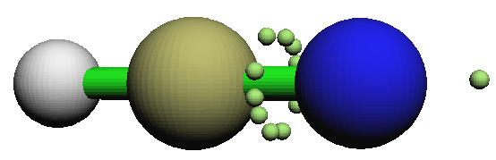

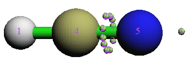

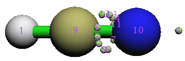

<!-- p.251 -->
f in a basin P can be readily evaluated as 𝐹= ∑𝑓(𝐫𝒊) × d𝑉𝑖∈𝑃, where i is grid index, dV is volume differential element. Evidently, the finer the grid data (smaller grid spacing) is used, the more accurate the integral values will be, and correspondingly, the more computational effort must be paid.

Since the arrangement of grids in general is not in coincidence with system symmetry, one should not expect that the integral values always satisfy system symmetry well, unless very fine grid is used.

Note that different functions have different requirements on the quality of grid data. For the same grid spacing, the faster the function varies, the lower the integration accuracy will be. Due to Laplacian of electron density, source function and kinetic density function, etc. fluctuate violently near nuclei, it is impossible to directly integrate these functions in AIM basins solely by grid-based method at satisfactory accuracy (since only uniform grids are used, which is incapable to represent nuclear region well enough). In order to tackle this difficulty, an integration method based on mixed atomic-center and uniform grids is proposed by me and supported by Multiwfn, in which the regions close to nuclei are integrated by atomic-center grids, while the other regions are integrated by uniform grids. This method is able to integrate AIM basin for any real space function, including the ones having complicated behavior at generally acceptable accuracy without evident additional computational cost with respect to grid-based method. In order to further improve the integration accuracy for AIM basins, Multiwfn also enables one to exactly refine the assignment of the grids at basin boundary. An exact steepest ascent trajectory is emitted from each boundary grid, and terminates when reaches an attractor. Since there are often very large numbers of boundary grids and each steepest ascent step requires evaluating gradient of electron density once, this process is time-consuming. In Multiwfn these gradients can also be approximately evaluated by trilinear interpolation based on pre-calculated grid data of gradient, 1/3~1/2 of overall time cost of the AIM basin integration can be saved. Note that if the mixed type of atomic-center and uniform grids is employed, and especially when the exact refinement process of boundary basin is enabled at the same time, then the requirement on quality grid will be markedly lowered, usually accurate result can be obtained at "Medium-quality grid" level (grid spacing = 0.1 Bohr).

It is worth noting that even though basin analysis module of Multiwfn can be used to acquire position of attractors, the accuracy is directly limited by the quality of grid data, since the attractors will be located on a grid point. Moreover, this module is unable to be used to search other types of critical points (attractor corresponds to (3,-3) type critical point); So, if you want to obtain accurate coordinate and value for all types of critical points, you should make use of main function 2, namely topology analysis function.


### 3.20.3 Usage

The basin analysis module in Multiwfn is very powerful, fast and flexible. Basins can be generated and visualized for any real space function, meanwhile any real space function can be integrated in the generated basins. Electric multipole moments and localization index in the basins and delocalization index between basins can be calculated.

Basic steps To perform basins analysis in Multiwfn, there are five basic steps you need to do (1) Load input file into Multiwfn and then enter main function 17.


<!-- p.252 -->
(2) Select option 1 to generate basins and locate attractors. Before doing this, you can change the method used to generate basins via option -1, or adjust the parameters for clustering attractors via option -6.

(3) Visualize attractors and basins by option 0. This step is optional. (4) Perform the analyses you want. Integral of a real space function in generated basins, electric multipole moments in the basins and localization/delocalization index of the basins can be calculated by option 2 (or 7), 3 (or 8) and 4, respectively.

You can export the generated basins as cube files by option -5, export attractors as .pdb file by option -4, check the coordinate of the located attractors by option -3, measure the distances, angles and dihedrals angles between attractors or atoms by option -2. Also, you can use suboption 3 in option -6 to manually merge specified basins as a single one. If you want to regenerate basins and locate attractors for other real space functions or under new settings, you can select option 1 again.

About input file and grid data Grid data must be obtained first before generating basins. In option 1 of basin analysis module, you can let Multiwfn calculate the grid data. However, if a grid data has already been stored in memory, you can directly choose to use it. There are two circumstances in which grid data will be stored in memory: (1) The input file contains grid data, e.g. .cub and .grd file (2) You have used main function 5 or 13 to calculate grid data before entering main function 17. This design makes Multiwfn rather flexible: you can use Multiwfn to generate basins for a real space function recorded in a .cub or .grd file, which may be outputted by a third-part program; and you can also first use main function 5 or 17 to generate grid data for electron density difference, Fukui function, dual descriptor and so on, and then generate basins for them.

In the function of basin integration, namely option 2, the value of integrand at each grid must be available so that the integral can be evaluated. These values can come from three ways, you can choose anyone: (1) Let Multiwfn directly calculate them (2) Load and use the grid data in e.g. a .cub file, note that this operation will not overwrite the grid data already stored in memory (3) Use the grid data already stored in memory. Beware that the grid setting of the grid data stored in memory or the grid data recorded in a grid data file must be exactly in coincidence with that of the grid data used to generate basin, otherwise the integral is meaningless.

Note that if you have made Multiwfn calculate grid data for a real space function, then this grid data will be stored in memory and hence you can directly use it in the basin integration step.

Visualization In option 0, you can visualize attractors and basins, for example


<!-- p.253 -->
Most of buttons are self-explanatory, please feel free to play with them. You can plot a basin by choosing corresponding index in the basin list at right-bottom corner. By default, only the grids at the basin boundary are shown. If you want to plot the whole basin region, "Show basin interior"

check box should be selected. If you only want to visualize the region of the basin enclosed by ρ = 0.001 a.u. isosurface (common definition of vdW surface), you should select "Set basin drawing method" - "rho>0.001 region only".

At the end of the basin list, the "Unas" entry means unassigned grids during basin generation, while the "Boun" term corresponds to the grids travelled to box boundary, you can select them to plot corresponding grids. Some basins are very small and very close to nucleus, such as core-type basin of ELF, they are often screened by molecular structure; if you want to inspect these basins, you should deselect "Show molecule" check box.

Light green spheres denote attractors, and corresponding basins are colored as green. If the real space function simultaneously has positive and negative parts, the "attractors" in negative regions (in fact they are repulsors) will be shown as light blue spheres, and corresponding basin will be portrayed as blue color.

If a set of attractors have been clustered as a single one, although all of them will be displayed in the GUI, the index labels shown above them will be the same, which is the index of corresponding degenerate attractor.

After using option 1 to locate the attractors, if you visualize isosurface by the GUI of main function 5 or 13, you can also see the attractors and their labels. This design facilitates comparative study of attractors and isosurfaces.


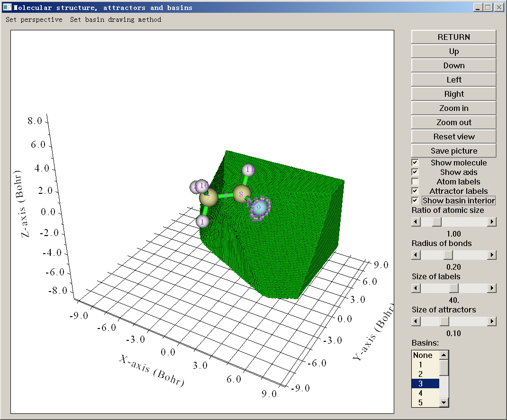

<!-- p.254 -->
Details of various options All of the options involved in basin analysis module are described below; some options have been partially discussed above.

- -6 This option controls the parameter used in attractor clustering: If the parameters in suboption 1 and 2 are set as A and B, respectively, that means for any two attractors, if between them the relative value difference is smaller than A, meanwhile their interval is less than B*sqrt(dx2+dy2+dz2), where dx, dy, dz are grid spacings in X, Y, Z, then they will be clustered together. If you want to nullify the automatic clustering step after generating basins, simply set the parameter in suboption 2 to 0.

After basins have been generated, you can also use suboption 3 to manually cluster specified attractors.

- -45 Export attractor information and cube file of present grid data: This option is available when attractors and basins have been generated. By this option you can export attractor and basin information as basinana.txt in current folder and export present grid data as basinana.cub in current folder. When you perform the same basin analysis next time, after choosing option 1 to try to generate basins, if the two files are found in current folder, Multiwfn will ask you if directly loading them; if you choose y, the attractor&basin information as well as grid data will be loaded, and hence the cost for regeneration of them is fully avoided.

- -5 Export basins as cube file: If you input indices of basins, the selected basins will be outputted to basinXXXX.cub files in current folder, where XXXX is the index of the basin. Via this option, you may use other visualization software such as VMD to render the basins by drawing them as isosurface map with isovalue of 0.5, see corresponding description and illustration in some examples in Section 4.17 for more detail.

In this option you can also input a, then all basins will be collectively exported to basin.cub in current folder, in which grid value corresponds to the basin index that the grid belongs to.

There is a special mode in this option that can be entered by inputting b, it is mainly used for plotting basin type colored isosurface map of ELF or LOL in VMD, see Section 4.17.10 for illustration.

In this option you can also input c and input basin indices, then grid data of function value in the region of specific basins will be exported to basinsel.cub in current folder, by which you can visualize isosurface only for the selected basins. See Section 4.17.10 for example of using this option.

- -4 Export attractors as pdb/pqr/txt/gjf file: Via this option, you can export all found attractors as one of following files:

attractors.pdb: In this file, the atom indices correspond to the attractor indices before clustering, while the residue indices correspond to the attractor indices after clustering.

attractors.pqr: The same as pdb, however, the "charge" column in this file corresponds to function value at the attractor

attractors.txt: Each line contains X, Y, Z coordinate (in Bohr) and function value of an attractor attractors.gjf: Gaussian input file, real atoms are defined as high layer, and attractors are recorded as ghost atoms (Bq) in medium layer. You can load it to GaussView to easily visualize attractors. In order to make graphical effect of attractors satisfactory, it is suggested to choose "File"-"Preference"-"Display Format"-"Molecule", and set low layer as "Tube". It is also suggested to disable showing atomic labels.

- -3 Show information of attractors: The coordinate and value of all attractors will be outputted


<!-- p.255 -->
on screen. For degenerate attractors, the shown coordinates and values are the average ones of their member attractors, the coordinate and the value of all of the member attractors will also be individually shown on screen. This option also asks you if printing attractor information after sorting the value from most negative to most positive.

- -2 Measure distances, angles and dihedral angles between attractors or atoms: As the title says. Please follow the prompts shown on the screen.

- -1 Select the method for generating basins: In this option, you can choose which kind of extrema (minima or maxima) will be located, and you can also choose the algorithm for partitioning basins, there are three algorithms supported: (1) On-grid method (2) near-grid method (3) near-grid method with boundary refinement step. Note that the near-grid method used in Multiwfn has been adapted by me, and thus become more robust. In general, (3) is recommended, which is also the default one.

- 0 Visualize attractors and basins: This option has already been introduced above.
- 1 Generate basins and locate attractors: Choose a real space function, and select a grid setting, then Multiwfn will calculate grid data, and then generate basins meanwhile locate attractors. After that, as mentioned earlier, if there are some attractors having similar value and closely placed then they will be automatically clustered. If a set of grid data has been stored in memory, you can directly choose to use this grid data to avoid calculating new grid data. You can use this option to regenerate basins again and again.

Multiwfn provided a lot of ways to define the grid setting. If you want to study the basins in the whole system, commonly "medium-quality grid" is recommended for qualitative analysis purposes; while if you want to obtain higher integration accuracy, "high-quality grid" is in general recommended. If you only need to study the basins in a local region of the whole system, you can make the spatial scope of the grid data only cover this region; for this purpose, I suggest you to use the option "Input center coordinate, grid spacing and box length", by which you can easily define the spatial scope of the grid data.

- 2 Integrate real space functions in the basins: Select a real space function, or select the grid data stored in memory, or choose to use external .cub/.grd file, then the real space function you selected or the real space function recorded in the grid data will be integrated in the basins that have been generated by option 1, the integral in each basin and basin volumes will be outputted. If there are some unassigned grids or the grids travelled to box boundaries, their integrals will also be shown.

If the basins you analyzed are AIM basins, it is highly recommended to use option 7 instead to gain much better integration accuracy.

- 3 Calculate electric dipole and multipole moments as well as <r2> for basins: Please refer to Section 3.18.3. The differences with respect to Section 3.18.3 are that spatial ranges of integrations are confined in respective basins rather than fuzzy atomic spaces, and nuclear positions are replaced with attractor positions. The multipole moments are outputted up to quadrupole, while octopole and higher orders are not calculated, because based on grid integration they are difficult be evaluated accurately.

If the basins to study are AIM basins, it is highly recommended to use option 8 instead to gain much better integration accuracy.

- 4 Calculate localization index (LI) and delocalization index (DI) for basins: Please consult Section 3.18.5. The only difference relative to Section 3.18.5 is that the range of integration in our current consideration is basins rather than fuzzy atomic spaces.


<!-- p.256 -->
to define the basins, namely the basins are AIM basins, Multiwfn will ask you to choose the type of integration grid used for evaluating BOM, generally you should choose mixed type of grids since its result is better than uniform grid, especially for the BOM matrix elements relating to core MOs because they vary sharply around nucleus.

- 5 Calculate and output orbital overlap matrix in all basins (also known as basin overlap matrix, BOM) to BOM.txt in current folder: The (i,j) element of BOM of basin K is defined as

$$S_{ij}(K) = \int_{\Omega_K} \varphi_i(\mathbf{r}) \varphi_j(\mathbf{r}) \, \mathrm{d}\mathbf{r}$$

molecular orbital i. All virtual orbitals are not taken into account.

Options 6~9 introduced below are visible in the menu only when the real space function used to define the basins is electron density

- 6 Calculate and output orbital overlap matrix in all atoms (also known as atomic overlap matrix, AOM) to AOM.txt in current folder: The definition is identical to BOM, the only difference is that the atom index is used instead of basin index. Note that the basins corresponding to non-nuclear attractors are not outputted.

- 7 Integrate real space functions in AIM basins with mixed type of grids: This option is specific for integrating AIM basins; there are three different ways to realize it:

Hint: Accuracy: (2)≥(3)>>(1). Time spent: (2)>(3)>>(1). Memory requirement: (3)>(2)=(1)

(1) Integrate a specific function with atomic-center + uniform grids: Atomic-center grids are mainly used to integrate the real space function near nuclei, while uniform grids are mainly used for other regions. The accuracy is much better than solely using uniform grids (namely option 2 in basin analysis module).

(2) The same as (1), but with exact refinement of basin boundary: Compared to option (2), when integrating the grids at basin boundary, the assignment of these grids will be exactly refined by steepest ascent scheme, hence the result will be more accurate than using option (1), unfortunately the refinement step is time consuming.

(3) The same as (2), but with approximate refinement of basin boundary: This is an approximate version of option (2). The gradient of electron density used in refinement step will not be evaluated exactly, but obtained by trilinear interpolation of pre-calculated grid data of gradient. Although evaluating the grid data of gradient is also time consuming, the overall time cost is lower than option (2), and the loss of accuracy is trivial.

After you used option (2) or (3) once, the assignment of the boundary grids will be updated permanently, that means then if you use option (1), the result will be identical to (2) or (3).

Not only the basin volumes are outputted along with the integrals, the basin volumes with electron density > 0.001 are also outputted, which can be regarded as atomic sizes.

- 8 Calculate electric dipole and multipole moments in AIM basins with mixed type of grids: Similar to option 3, but use mixed atomic-center and uniform grids to calculate electric multipole moments to gain a better accuracy without bringing evident additional computational cost. This option is only applicable to AIM basins.

After calculation, you will be asked to choose if also writing the result to multipole.txt. If you choose y, a file named atom_moment.txt will also be produced in the current folder. Based on this file, atomic electric dipole and quadrupole moments can be visualized in VMD program via a special script, see Section 4.15.5 for detail.

When using options 7 and 8, if effective core potential (ECP) is used for an atom and meantime you did not allow Multiwfn to supply EDF information (see "isupplyEDF" parameter in `settings.ini`), then many attractors will occur at valence region of the atom; hence before entering options 7 and 8, you have to manually cluster these attractors into one by suboption 3 in option -6.

- 9 Obtain atomic contribution to population of external basins: The external basins mean the


<!-- p.257 -->
basin defined by a cube file named basin.cub in current folder, in which the grid value corresponds to basin index. This option aims to obtain atomic contribution to population of ELF bond basins (or other type of basins) based on AIM partition. Please check Section 4.17.7 for example.

- 10 Calculate high ELF localization domain population and volume (HELP, HELV): This option is used to calculate the HELP and HELV, which were defined in ChemPhysChem, 14, 3714 (2013) to characterize lone pair electrons. This option appears only when the real space function used to partition basin is ELF. See Section 4.17.8 for example on using this option to calculate HELP and HELV.

- 11 Calculate orbital compositions contributed by various basins: Via this option, you can calculate contribution to specific orbital contributed by AIM basins or other kinds of basins, such as ELF basins. See Section 4.8.6 for example.

- 12 Assign ELF basin labels: This option is used to automatically assign labels for all basins when the real space function used to generate basins is ELF, the basin volumes and populations are also printed together. Examples of assigned labels: C(F2), V(O3), V(S5,F7), V(Li1,Li2,Li3). The labels are outputted twice, at the first time the data are outputted according to basin indices, at the second time the data are outputted according to sorted basin labels. See Section 4.17.2 for example.

Algorithm detail of automatic assignment of ELF basin labels: Core basins are assigned first. If distance between an ELF attractor and a nucleus is smaller than a threshold, then the corresponding basin will be assigned as core type. The threshold distances are built-in and different for different elements. For an element, the threshold was determined as the position of outermost minimum of radial curve of spherically averaged ELF of the atom based on high-quality atomic wavefunction of ground state. The built-in thresholds have been determined for H~Lr, therefore if the system contains element(s) heavier than Lr then this option cannot be used, namely you have to manually determine the labels by visualizing attractor positions and/or spatial range of basins.

After that, all other basins will be labelled as valence type. If any grid of an attractor is next to a grid of a core basin, then the atom corresponding to the core basin will be added to the member list of this attractor. Assume that finally an attractor has members of C1 and O2, then its label will be V(C1,O2). H and Ne are relatively special, if distance between an attractor and nucleus of H or Ne is smaller than 0.2 Bohr, then the atom will be added to the member list.

Notice that basin labels cannot be correctly assigned for elements using pseudopotential, because in this case core basins cannot be assigned.

For options 3, 4, 5, 7 and 8, if the input file you used does not contain GTF information (e.g. .cub file is used as input file and you directly use the grid data carried by it to generate basins), then Multiwfn will prompt you to input a new file, which should contain GTF information of present system, you can use for example mwfn/.wfn/.wfx/.fch/.molden/.gms as input.

Many examples of this module can be found in Section 4.18. Information needed: GTFs or grid data loaded from external file (e.g. .cub), atom coordinates


## 3.21 Electron excitation analysis (18)


### 3.21.A Basic information about electron excitation analysis module

3.21.A.1 Overview

Main function 18 contains a lot of subfunctions aiming for electron excitation analysis, namely characterizing the electron excitation in various ways. All functions in this category fully support


<!-- p.258 -->
single-reference methods (i.e. reference wavefunction for generating excited state wavefunction is single Slater-determinant), including TDDFT, TDA-DFT, CIS and TDHF, while ZINDO is also supported by transition density matrix plotting function. Other kinds of methods for excited state problems such as EOM-CCSD, LR-CC2/3, CASSCF, CASPT2 and MRCI are not formally supported. Examples of some of these electron excitation analysis functions are provided in Section 4.18.

Both closed-shell and open-shell systems are fully supported by all kinds of electron excitation analyses of Multiwfn.

3.21.A.2 Basic knowledge about single-reference methods

Excited state wavefunction (exc) of CIS and TDA-DFT methods can be represented as


$$\Psi^{\mathrm{e x c}}=\sum_{i\rightarrow a}w_{i}^{a}\Phi_{i}^{a}\equiv\sum_{i}^{\mathrm{o c c}}\sum_{a}^{\mathrm{v i r}}w_{i}^{a}\Phi_{i}^{a}$$

<!-- formula-ocr: formula_p258_158.png 已替换为LaTeX, 原图保留备查 -->

where i and a respectively run over all occupied and all virtual MOs, similarly hereafter in. 𝑖 𝑎 is the configuration state wavefunction corresponding to moving an electron from originally occupied MO i to virtual MO a. w is known as configuration coefficient. The electron excitation in CIS or TDA-DFT framework therefore can be represented as linear combination of orbital pair transitions. The weighting coefficients w satisfy this normalization condition:


$$100\% \times (w_i^a)^2$$

<!-- formula-ocr: formula_p258_159.png 已替换为LaTeX, 原图保留备查 -->

Clearly, the i→a orbital pair transition has contribution of 100% × (𝑤𝑖 𝑎)2 to the electron excitation. While for TDHF and TDDFT, excited state wavefunction also contains so-called de-excitation part:


$$\Psi^{\mathrm{e x c}}=\sum_{i\rightarrow a}w_{i}^{a}\Phi_{i}^{a}+\sum_{i\leftarrow a}w_{i}^{\prime a}\Phi_{i}^{a}$$

<!-- formula-ocr: formula_p258_160.png 已替换为LaTeX, 原图保留备查 -->

where w and w' correspond to configuration coefficient of excitation and de-excitation, respectively. In this case, the normalization condition becomes:


$$\sum_{i\rightarrow a}(w_{i}^{a})^{2}-\sum_{i\leftarrow a}(w_{i}^{\prime a})^{2}=1$$

<!-- formula-ocr: formula_p258_161.png 已替换为LaTeX, 原图保留备查 -->

The MOs used for CIS/TDHF and TDA-DFT/TDDFT are yielded by HF and DFT calculation for ground state of present system, respectively. The Slater determinant that consisted of the occupied MOs, namely the ground state wavefunction, is known as reference state. If the reference

state is closed-shell, then α and β MOs are exactly matched with each other, and thus β→β orbital transitions have one-to-one correspondence with α→α orbital transitions; in this situation, only one set of orbital transition is recorded, and correspondingly, the configuration coefficients are normalized to 0.5 instead of 1.

3.21.A.3 Input files

Input files of almost all electron excitation analysis functions are basically the same, except for subfunction 3 (Analyzing charge transfer based on density difference grid data). Two kinds of input files are needed:

(1) A file containing basis function and molecular orbital information (orbital


<!-- p.259 -->
wavefunctions of reference state)

mwfn, .fch/.fchk, .molden, and .gms files produced by excited state calculation (e.g. TDDFT) can be directly used. This file should be loaded when Multiwfn boots up. For example, you can use the .fch file converted by formchk from .chk file of TDDFT task of Gaussian, and another example, you can use the .molden.input file converted by orca_2mkl from .gbw file of TDDFT task of ORCA.

(2) A file containing configuration coefficients of excited states. The path of this kind of file should be inputted when you enter corresponding analysis function, Multiwfn will load configuration coefficients from this file. There are several situations, as shown below:

- Gaussian users: Output file (.out or .log) of CIS, TDHF, TDDFT and TDA-DFT tasks can be used. Both single point and optimization tasks are supported; for the latter case, Multiwfn analyzes electron excitation at the final geometry. Since by default Gaussian only outputs the configuration coefficients whose absolute value is larger than 0.1, In order to achieve acceptable accuracy, you must add IOp(9/40=4) keyword in the route section so that all configuration coefficients whose magnitude larger than 0.0001 will be printed (If the calculation in Multiwfn is found to be too expensive, using IOp(9/40=3) instead is also generally acceptable). Implicit solvation model, including external iteration (state specific) treatment of solvent response to transition, is fully compatible.

- ORCA users using CIS or TDA-DFT: Output file of CIS or TDA-DFT tasks can be used. Beware that TPrint keyword should be used in %cis or %tddft, otherwise only very small amount of configuration coefficients will be printed. TPrint x means outputting configurations whose contribution to excited state is larger than x*100%. Typically, I suggest using TPrint 1E-8. Since contribution is calculated as square of configuration coefficient, TPrint 1E-8 simply corresponds to outputting configurations who have absolute value of coefficients larger than 1E-4, the effect is identical to IOp(9/40=4) in Gaussian. Below is an example input:


```text
! PBE0 def2-SVP
%tddft
nroots 8
tprint 1E-8
end
```

Spin-flip TDDFT output file of ORCA is also supported, you just need to add SF TRUE

into %tddft field and set spin multiplicity of reference state  3. Note that only a few functions, including generating natural orbitals of excited state, hole-electron analysis and related analyses, are formally supported, other functions were not tested. In particular, all analyses directly based on transition density matrix (including NTO analysis) are not supported in this case.

- ORCA users using TDDFT: Because coefficients of excitation and de-excitation configurations are not recorded explicitly in output file, in this case, not only TDDFT output file is needed, but also a json file recording all configuration coefficients is needed. After running a typical TDDFT input file named e.g. TDDFT.inp, you will have TDDFT.gbw in current folder. Then you should create a text file named TDDFT.json.conf with the following content.


```text
{
"CIS": true,
```


<!-- p.260 -->

```text
"CISNRoots": true
}
```

Then run orca_2json TDDFT.gbw, you will have TDDFT.json in current folder. After that, when Multiwfn attempts to load the TDDFT.out you inputted during an analysis, if the file with the same name and folder but with .json suffix (i.e. TDDFT.json), the excitation and de-excitation configurations will be automatically loaded from TDDFT.json instead. If you are still confused, please read my blog article http://sobereva.com/758 (in Chinese), which described how to prepare files and run a typical analysis using Multiwfn in combination with TDDFT calculation of ORCA.

- ORCA users using sTDA or sTDDFT: They are approximations of regular TDA and TDDFT, respectively, and their output file can be used. In ORCA, their calculations are based on DFT MOs; once the single point task of DFT has finished, the excited states will be calculated by sTDA/sTDDFT with negligible cost. To carry out these calculations, use keywords like follows (see ORCA manual for details)


```text
! wB97X-D3 def2-SV(P) def2/J RIJCOSX
%tddft
Mode sTDDFT    //The sTDDFT may also be changed to sTDA
Ethresh 7.0
PThresh 1e-4
PTLimit 30
maxcore 6000
end
```

It is important to note that only the three largest configuration coefficients are printed during the calculation (unfortunately, TPrint does not work for sTDA/sTDDFT calculation), therefore often the normalization condition of configuration coefficients is violated evidently, in this case the analysis result is unreliable or even fully misleading! So, please take care of the "Deviation to expected normalization value" shown on screen after loading selected excited state.

- BDF users: Output file of TDDFT task of BDF program can be used.

- CP2K users: Periodic TDDFT (with/without sTDA kernel) task of CP2K is supported. Currently, only hole-electron analysis, NTO analysis, “Generate natural orbitals of specific excited states “, “Check, modify and export configuration coefficients of an excitation” and “Print major MO transitions in all excited states” are formally supported, other analyses may or may not work (at least I have not tested).

After booting up Multiwfn, the .molden file containing all virtual orbitals and cell information should be loaded. Then, after you enter an analysis module, output file of CP2K should be loaded.

It is noteworthy that using Multiwfn to prepare input file of TDDFT task of CP2K is quite easy. After booting up Multiwfn, load a structure file first (for crystal, often .cif is used, see Section 2.9.3 for detail), then input cp2k and the path of the input file to export. After that, you may first enter option -11 and then suboption 19 to extend the current cell to a supercell if needed. Then return to the interface of creating CP2K input file, choose option 15 to enable TDDFT calculation, then input y to allow CP2K to generate the .molden file containing all orbitals and specify how many virtual orbitals to solve and record in the .molden file. Finally, choose option 0 to yield CP2K input file. Then use CP2K to run the input file, after the calculation is finished, manually insert cell information


<!-- p.261 -->
to .molden file (as mentioned in Section 2.9.2.1). Now the .molden file and output file can be used for electron excitation analyses.

Note that the virtual orbitals recorded in .molden file should cover all virtual orbitals involved in the printed configurations. If you do not know how many virtual orbitals should be calculated, simply set it to a very large value so that all virtual orbitals will be solved and recorded, however in this case the .molden file may be quite large. You can also perform TDDFT once, then check the printed configurations and find the highest virtual orbital, then properly set the number of virtual orbitals to solve in the input file and redo a single point calculation to generate the .molden file.

- General cases: You can also use plain text file as the input file. The format of transition information should be completely identical to Gaussian output, for instance: (the // and all text after it should not appear in your file)


```text
Excited State   1   1   5.7945    // Label, index, multiplicity and excitation energy (eV)
       5 ->  6         0.70642    // MO pairs and configuration coefficients
                                  // Use a blank line to separate each excited state
Excited State   2   1   7.8943
       5 ->  7         0.63860
       5 ->  8         0.30006

Excited State   3   1   7.8943
       5 ->  7        -0.30006
       5 ->  8         0.63860
       4 <-  8         0.01000
```

Example of unrestricted TDDFT calculation is given below. Note that spin multiplicity is set to 0, meaning undefined, since the excited states produced by this kind of calculation are not pure spin states.


```text
Excited State   1      0     2.07774
       600B -> 601B        -0.676085
       598A -> 602A         0.454805
       600A -> 603A         0.416875
...ignored

 Excited State   2      0     2.07792
       599B -> 601B         0.561757
       598A -> 601A         0.496762
       600B -> 603B         0.468381
...ignored
```

Evidently, the above-mentioned two kinds of files must correspond to the same geometry and same calculation level. For example, if the MOs in the .fch were produced at B3LYP/6-31G* level while the Gaussian output file corresponds to the TDDFT task carried out at PBE0/6-31G* level, the analysis results will be completely meaningless.

NOTE 1: For closed-shell reference case, the coefficients in the plain text file should follow convention of Gaussian, namely the sum of square of all coefficients should be 0.5 (rather than normalize to 1.0).

NOTE 2: The MO indices in the plain text file provided to Multiwfn should start from 1. However, in some programs like ORCA, the MO indices start from 0, so their users need to manually add the MO indices in by 1 when preparing the plain text file.


<!-- p.262 -->
- Special case for GAMESS-US and Firefly users: If you are a user of Firefly or GAMESS-US program, you do not need to separately provide two kinds of files as mentioned above for electron excitation analysis. If the input file used for Multiwfn is TDDFT output file with .gms suffix, the Multiwfn will not only load basis function and molecular orbital information from this file when Multiwfn boots up, but also load configuration coefficients of excited states when performing electron excitation analysis. The H2CO_TDDFT_Firefly.gms and H2CO_TDDFT_GAMESS.gms in "examples\excit\" folder are example file of TDDFT output file of Firefly and GAMESS-US, respectively.

For Firefly user, you should decrease the "PRTTOL" parameter in $TDDFT so that more configuration coefficients could be printed.

For GAMESS-US, there is no option used to control the printing threshold of configuration coefficients, therefore some analysis results may not be very accurate because some configurations, which have non-negligible contributions, may be ignored. In addition, CIS task of GAMESS-US is not supported by Multiwfn.

Output files of excited state optimization and frequency tasks of GAMESS-US and Firefly are not supported.


### 3.21.0 Check, modify and export configuration coefficients of an excitation (-1)


This function allows one to check, modify and export configuration coefficients. The input files needed by this function have been detailedly described at the beginning of Section 3.21, namely you should load a file containing basis function information when Multiwfn boots up, then load a file containing configuration coefficients of excited states. The summary of all recognized excited states will be printed on screen, you should select one of them, the configuration coefficients of orbital pairs involved in this electron excitation will be loaded. After that, up to 10 orbital pairs that have largest absolute contribution to the excitation are automatically shown. Then in the newly appeared menu, you can find below options:

1 Set coefficient of an orbital pair: You can use this option to replace the loaded configuration coefficients of an orbital pair with inputted value.

2 Set coefficient for specific range of orbital pairs: This option is used to replace a batch of loaded configuration coefficients with inputted values. You should input index range of the occupied MOs and virtual MOs corresponding to the orbital transitions.

After manually modifying coefficients using above two options, in order to make the modification affect following electron excitation analysis, you should use option -3 to export the modified coefficients as plain text file, and then use this file as the second kind of input file for electron excitation analyses.

-1 Retrieve original coefficient of all orbital pairs: If configuration coefficients have been manually modified by above two options, you can select this option to retrieve the coefficients to the original loaded values.

-2 Print coefficient (and contribution to excitation) of some orbital pairs: You can use this option to print configuration coefficients whose absolute value are larger than specific value, meantime the corresponding contributions to the electron excitation are shown together. Via this


<!-- p.263 -->
option you can easily find out which orbital pair transition has crucial contribution to the electron excitation.

-3 Export current excitation information to a plain text file: Basic information and configuration coefficients of currently selected excited state can be exported to a specific plain text file. This file can then be employed as the second kind of input file for various electron excitation analysis functions of Multiwfn, e.g. hole-electron analysis and NTO analysis, and then the analysis result will correspond to the modified configuration coefficients.

Obviously, if you set coefficient of some orbital pairs to zero, then their contributions to the quantities you studied will be completely ignored; while if you have cleaned all coefficients except for a specific orbital pair, then the resulting quantities will only reveal characters of this orbital transition.

The example given in Section 4.18.10 utilized this function.


### 3.21.1 Analyze and visualize hole&electron distribution, transition density, and transition electric/magnetic dipole moment density (1)


This very powerful module is used to analyze and visualize hole-electron distribution, transition density and transition electric/magnetic dipole moment density. Moreover, hole and electron can be decomposed to orbital pair contributions as well as atom and fragment contributions; furthermore, the atom/fragment contributions can be directly plotted as heat map for visual inspection.

3.21.1.1 Theory

There are many knowledge points involved in this module, they will be described below first.

Theory 1: Real space representation of hole and electron Process of single-electron excitation can be described as "an electron leaves hole and goes to electron", the "hole" and "electron" can be defined in different ways. If an excitation can be perfectly

described as HOMO→LUMO transition, then hole and electron could be simply represented by HOMO and LUMO, respectively. However, in most practical cases, the single orbital pair representation is not suitable, excitations have to be represented as transition of multiple MO pairs with corresponding weighting coefficients.

How to represent hole and electron distributions when there is no single dominant MO pair transition? One way is using natural transition orbital (NTO) analysis, as introduced in Section 3.21.6. Unfortunately, in many cases, even though the MOs have been transformed to NTOs, there is still no single NTO pair that has dominating contribution. The best representation of hole and electron should be the one introduced in this Section, the idea was originally proposed by me and my collaborator Cheng Zhong in 2013. Although the paper detailedly introducing this method has not been published, if this theory is involved in your study, please cite my work: Carbon, 165, 461-467 (2020) DOI: 10.1016/j.carbon.2020.05.023, in which hole-electron analysis is utilized and briefly described.

It can be shown that density distribution of hole and electron can be perfectly defined as


<!-- p.264 -->
$$\rho^{\mathrm{hole}}(\mathbf{r})=\rho_{(\mathrm{loc})}^{\mathrm{hole}}(\mathbf{r})+\rho_{(\mathrm{cross})}^{\mathrm{hole}}(\mathbf{r})=\sum_{i\rightarrow a}(w_{i}^{a})^{2}\varphi_{i}(\mathbf{r})\varphi_{i}(\mathbf{r})+\sum_{i\rightarrow a}\sum_{j\neq i\rightarrow a}w_{i}^{a}w_{j}^{a}\varphi_{i}(\mathbf{r})\varphi_{j}(\mathbf{r})$$

note that the notions used here:

$$\sum_{i\to a}\equiv\sum_{i}^{\mathrm{o c c}}\sum_{a}^{\mathrm{v i r}}\qquad\sum_{i\to a}\sum_{j\neq i\to a}\equiv\sum_{i}^{\mathrm{o c c}}\sum_{j\neq i}^{\mathrm{o c c}}\sum_{a}^{\mathrm{v i r}}$$

where φ denotes MO wavefunction. "loc" and "cross" stand for the contribution of local term and cross term to the hole and electron distribution, respectively. Note that the definition of hole and electron given above is in density form rather than wavefunction form, hence the hole and electron do not have phase (If you really need phase information of hole and electron, you should resort on NTO analysis, see Section 3.21.6).

Due to the orthonormality of MOs and the fact that the sum of square of all configuration coefficients is 1.0, it is clear that


$$\int\rho^{\mathrm{h o l e}}(\mathbf{r})\mathrm{d}\mathbf{r}=1\quad\int\rho^{\mathrm{e l e}}(\mathbf{r})\mathrm{d}\mathbf{r}=1$$

<!-- formula-ocr: formula_p264_162.png 已替换为LaTeX, 原图保留备查 -->

This is an important property that any reasonable definition of hole and electron distribution should satisfy, it indicates that one electron is excited.

The overlap function between hole and electron distribution can be defined as


$$\rho^{\mathrm{excited}}(\mathbf{r})=\rho^{\mathrm{ground}}(\mathbf{r})-\rho^{\mathrm{hole}}(\mathbf{r})+\rho^{\mathrm{ele}}(\mathbf{r})$$

<!-- formula-ocr: formula_p264_163.png 已替换为LaTeX, 原图保留备查 -->

namely taking the minimal value of ρhole and ρele everywhere. Another function for measuring the overlap is


$$S_{\mathrm{m}}(\mathbf{r})=\min[\rho^{\mathrm{hole}}(\mathbf{r}),\rho^{\mathrm{ele}}(\mathbf{r})]$$

<!-- formula-ocr: formula_p264_164.png 已替换为LaTeX, 原图保留备查 -->

It is evident that Sr is always equal or larger than Sm. Both the two definitions are reasonable, but I prefer to use Sr, since its graphical effect is better and its mathematical meaning is clearer.

The charge density difference (CDD) between excited state and ground state can be easily evaluated as


$$S_{\mathrm{r}}(\mathbf{r})=\sqrt{\rho^{\mathrm{hole}}(\mathbf{r})\rho^{\mathrm{ele}}(\mathbf{r})}$$

<!-- formula-ocr: formula_p264_165.png 已替换为LaTeX, 原图保留备查 -->

NOTE: Beware that if you are a Gaussian user, the Δρ calculated in this way is obviously different to the Δρ produced via subtracting excited state density by ground state density, unless you specified keyword density=rhoci when generating .wfn/wfx file of excited state. Because by default the excited state density exported to .wfn/wfx file by Gaussian is relaxed density rather than unrelaxed density (which is directly constructed by MOs and excited state configuration coefficients). In other

words, unrelaxed excited state density can be simply written as 𝜌excited(𝐫) = 𝜌ground(𝐫) −𝜌hole(𝐫) + 𝜌ele(𝐫) , while deriving relaxed excited state density requires employing the very complicated "Z-vector" method.

After generalization, above definitions of hole and electron can also be applied to TDHF and TDDFT cases, where de-excitations must be taken into account. The generalized local terms are


<!-- p.265 -->
$$\rho_{(\mathrm{loc})}^{\mathrm{hole}}=\sum_{i\rightarrow a}(w_{i}^{a})^{2}\rho_{i}-\sum_{i\leftarrow a}(w_{i}^{\prime a})^{2}\rho_{i}$$

where ρi=|φi|2 stands for electron density of orbital i, w' denotes configuration coefficient of de-excitation. The generalized cross terms are

$$\begin{array}{r l}&{\rho_{\mathrm{(c r o s s)}}^{\mathrm{h o l e}}=\displaystyle\sum_{i\to a}\displaystyle\sum_{j\neq i\to a}w_{i}^{a}w_{j}^{a}\varphi_{i}\varphi_{j}-\displaystyle\sum_{i\leftarrow a}\displaystyle\sum_{j\neq i\leftarrow a}w_{i}^{\prime a}w_{j}^{\prime a}\varphi_{i}\varphi_{j}}\end{array}$$

$$\begin{array}{r l}&{\rho_{\mathrm{(c r o s s)}}^{\mathrm{h o l e}}=\displaystyle\sum_{i\to a}\displaystyle\sum_{j\neq i\to a}w_{i}^{a}w_{j}^{a}\varphi_{i}\varphi_{j}-\displaystyle\sum_{i\leftarrow a}\displaystyle\sum_{j\neq i\leftarrow a}w_{i}^{\prime a}w_{j}^{\prime a}\varphi_{i}\varphi_{j}}\end{array}$$

$$\begin{array}{r l}&{\rho_{\mathrm{(c r o s s)}}^{\mathrm{h o l e}}=\displaystyle\sum_{i\to a}\displaystyle\sum_{j\neq i\to a}w_{i}^{a}w_{j}^{a}\varphi_{i}\varphi_{j}-\displaystyle\sum_{i\leftarrow a}\displaystyle\sum_{j\neq i\leftarrow a}w_{i}^{\prime a}w_{j}^{\prime a}\varphi_{i}\varphi_{j}}\end{array}$$

$$\rho_{(\mathrm{c r o s s})}^{\mathrm{e l e}}=\sum_{i\rightarrow a i\rightarrow b\neq a}w_{i}^{a}w_{i}^{b}\varphi_{a}\varphi_{b}-\sum_{i\leftarrow a i\leftarrow b\neq a}w_{i}^{\prime a}w_{i}^{\prime b}\varphi_{a}\varphi_{b}$$

Theory 2: Contribution of MOs, basis functions, atoms and fragments to hole and electron distributions

In order to investigate which MOs have significant contributions to hole and electron, I defined the contribution of occupied MO to hole and contribution of virtual MO to electron as follows

$$\rho_{(\mathrm{loc})}^{\mathrm{hole}}=\sum_{i\rightarrow a}(w_{i}^{a})^{2}\rho_{i}-\sum_{i\leftarrow a}(w_{i}^{\prime a})^{2}\rho_{i}$$

Below normalization conditions are held evidently:


$$\rho_{(\mathrm{loc})}^{\mathrm{hole}}=\sum_{i\rightarrow a}(w_{i}^{a})^{2}\rho_{i}-\sum_{i\leftarrow a}(w_{i}^{\prime a})^{2}\rho_{i}$$

<!-- formula-ocr: formula_p265_166.png 已替换为LaTeX, 原图保留备查 -->

Contribution to hole/electron by an atom can be easily evaluated using real space partition like Hirshfeld, Hirshfeld-I and Becke. For example, contribution to hole by atom A using Hirshfeld partition:

$$\Theta_{A}^{\mathrm{h o l e}}=\int w_{A}^{\mathrm{H i r s h}}(\mathbf{r})\rho^{\mathrm{h o l e}}(\mathbf{r})\mathrm{d}\mathbf{r}$$

Hirsh is weighting function of atom A under Hirshfeld partition, see Section 3.9.1 for its detail. where 𝑤𝐴

Mulliken-like partition is also possible, and the working equation is derived as follows. Considering the normalization condition of the hole (de-excitation part is temporarily ignored for simplicity)


<!-- p.266 -->

$$\int\left(\sum_{i,j\rightarrow a}w_{i}^{a}w_{j}^{a}\sum_{\mu}\sum_{\nu}C_{\mu,i}C_{\nu,j}\chi_{\mu}\chi_{\nu}\right)\mathrm{d}\mathbf{r}=1$$

<!-- formula-ocr: formula_p266_167.png 已替换为LaTeX, 原图保留备查 -->

where χ denotes basis function, S and C are overlap matrix and coefficient matrix, respectively. If

$$\Theta_{A}^{\mathrm{h o l e}}=\sum_{i,j\rightarrow a}w_{i}^{a}w_{j}^{a}\frac{1}{2}\Biggl(\sum_{\mu\in A}\sum_{\nu}C_{\mu,i}C_{\nu,j}S_{\mu,\nu}+\sum_{\mu}\sum_{\nu\in A}C_{\mu,i}C_{\nu,j}S_{\mu,\nu}\Biggr)$$

then we can define contribution of atom A to hole in below form

$$\Theta_{A}^{\mathrm{h o l e}}=\sum_{i,j\rightarrow a}w_{i}^{a}w_{j}^{a}\frac{1}{2}\Biggl(\sum_{\mu\in A}\sum_{\nu}C_{\mu,i}C_{\nu,j}S_{\mu,\nu}+\sum_{\mu}\sum_{\nu\in A}C_{\mu,i}C_{\nu,j}S_{\mu,\nu}\Biggr)$$

Above treatment can be similarly applied to de-excitation part of hole as well as electron. The actual working equations used to evaluate atomic contribution to hole and electron are

$$\Theta_{A}^{\mathrm{h o l e}}=\sum_{i,j\rightarrow a}w_{i}^{a}w_{j}^{a}\frac{1}{2}\Biggl(\sum_{\mu\in A}\sum_{\nu}T_{\mu,\nu}^{i j}+\sum_{\mu}\sum_{\nu\in A}T_{\mu,\nu}^{i j}\Biggr)-\sum_{i,j\leftarrow a}w_{i}^{\prime a}w_{j}^{\prime a}\frac{1}{2}\Biggl(\sum_{\mu\in A}\sum_{\nu}T_{\mu,\nu}^{i j}+\sum_{\mu}\sum_{\nu\in A}T_{\mu,\nu}^{i j}\Biggr)$$

$$\Theta_{A}^{\mathrm{c l e}}=\sum_{i\rightarrow a,b}w_{i}^{a}w_{i}^{b}\frac{1}{2}\Biggl(\sum_{\mu\in A}\sum_{\nu}T_{\mu,\nu}^{a b}+\sum_{\mu}\sum_{\nu\in A}T_{\mu,\nu}^{a b}\Biggr)-\sum_{i\leftarrow a,b}w_{i}^{\prime a}w_{i}^{\prime b}\frac{1}{2}\Biggl(\sum_{\mu\in A}\sum_{\nu}T_{\mu,\nu}^{a b}+\sum_{\mu}\sum_{\nu\in A}T_{\mu,\nu}^{a b}\Biggr)$$

$$\Theta_{A}^{\mathrm{h o l e}}=\sum_{i,j\rightarrow a}w_{i}^{a}w_{j}^{a}\frac{1}{2}\Biggl(\sum_{\mu\in A}\sum_{\nu}C_{\mu,i}C_{\nu,j}S_{\mu,\nu}+\sum_{\mu}\sum_{\nu\in A}C_{\mu,i}C_{\nu,j}S_{\mu,\nu}\Biggr)$$

Contribution of a basis functions μ to hole and electron can be defined as

$$\Theta_{A}^{\mathrm{h o l e}}=\sum_{i,j\rightarrow a}w_{i}^{a}w_{j}^{a}\frac{1}{2}\Biggl(\sum_{\mu\in A}\sum_{\nu}T_{\mu,\nu}^{i j}+\sum_{\mu}\sum_{\nu\in A}T_{\mu,\nu}^{i j}\Biggr)-\sum_{i,j\leftarrow a}w_{i}^{\prime a}w_{j}^{\prime a}\frac{1}{2}\Biggl(\sum_{\mu\in A}\sum_{\nu}T_{\mu,\nu}^{i j}+\sum_{\mu}\sum_{\nu\in A}T_{\mu,\nu}^{i j}\Biggr)$$

$$\Theta_{A}^{\mathrm{c l e}}=\sum_{i\rightarrow a,b}w_{i}^{a}w_{i}^{b}\frac{1}{2}\Biggl(\sum_{\mu\in A}\sum_{\nu}T_{\mu,\nu}^{a b}+\sum_{\mu}\sum_{\nu\in A}T_{\mu,\nu}^{a b}\Biggr)-\sum_{i\leftarrow a,b}w_{i}^{\prime a}w_{i}^{\prime b}\frac{1}{2}\Biggl(\sum_{\mu\in A}\sum_{\nu}T_{\mu,\nu}^{a b}+\sum_{\mu}\sum_{\nu\in A}T_{\mu,\nu}^{a b}\Biggr)$$

In order to significantly save computational time, Multiwfn ignores all terms if magnitude of product of corresponding two configuration coefficients is less than 0.001. The loss of accuracy due to this trick is negligible.

For both Mulliken-like and Hirshfeld partitions, fragment contributions to hole and electron can be simply evaluated by summing up atomic contributions:

$$\Theta_{f r a g}^{\mathrm{h o l e}}=\sum_{A\in f r a g}\Theta_{A}^{\mathrm{h o l e}}\quad\Theta_{f r a g}^{\mathrm{e l e}}=\sum_{A\in f r a g}\Theta_{A}^{\mathrm{e l e}}$$

Furthermore, I defined contribution of atom and fragment to charge density difference (variation of electron population of the atom and fragment) as

$$\Theta_{A}^{\mathrm{C D D}}=\Theta_{A}^{\mathrm{e l e}}-\Theta_{A}^{\mathrm{h o l e}}\quad\Theta_{f r a g}^{\mathrm{C D D}}=\Theta_{f r a g}^{\mathrm{e l e}}-\Theta_{f r a g}^{\mathrm{h o l e}}$$

Overlap between hole and electron in atom and fragment spaces are defined as geometry


<!-- p.267 -->
average of their contributions:


$$\Theta_{A}^{\mathrm{o v l p}}=\sqrt{\Theta_{A}^{\mathrm{e l e}}\Theta_{A}^{\mathrm{h o l e}}}\quad\Theta_{f r a g}^{\mathrm{o v l p}}=\sqrt{\Theta_{f r a g}^{\mathrm{e l e}}\Theta_{f r a g}^{\mathrm{h o l e}}}$$

<!-- formula-ocr: formula_p267_168.png 已替换为LaTeX, 原图保留备查 -->

Notice that the overlap in this form is not additive, namely ABBAΘΘ+Θ. ovlpovlpovlp

Mulliken-like partition works reasonably for most cases, however, it is incompatible with diffuse functions. Another well-known shortcoming of this partition is that some atomic contributions may be small negative values in certain situations, obviously in this case the overlap between hole and electron in corresponding atomic spaces cannot be evaluated, so Multiwfn automatically sets the overlap values to zero. Obviously, when diffuse functions must be employed (e.g. anionic system, Rydberg excited state), or you have observed notable negative atomic contribution to hole or electron, you have to change to Hirshfeld partition, which is more robust but computational cost is higher.

Mulliken-like and Hirshfeld partitions can be directly selected in hole-electron analysis module. Due to the extreme flexibility of Multiwfn, you may also use other ways to determine atomic contributions to hole and electron, such as Becke and Hirshfeld-I partitions. However, you have to manually evaluate them. For example, if you want to employ Becke partition for hole and electron, you should first export cube file of hole or electron, then set "iuserfunc" in `settings.ini` to -1 (in this case the user-defined function will correspond to the interpolated function based on the grid data), then load hole or electron cube file into Multiwfn, use subfunction 1 of main function 15 to integrate "user-defined function" in each Becke's atomic fuzzy space. Note that if in the main function 15, you first select option -4 to define a fragment and then use subfunction 1 to integrate user-defined function, then the sum of results of all atoms will correspond to the fragment contribution.

Theory 3: Quantitative characterization of hole and electron distribution in the whole space

The overall distribution of hole and electron can be quantitatively characterized in following ways, they are quite useful for identifying type of electron excitations.

To characterize overlapping extent of hole and electron, Sm index and Sr index are defined as follows (Sr must be equal or larger than Sm index)

$$S_{\mathrm{m}}\mathrm{index}=\int S_{\mathrm{m}}(\mathbf{r})\mathrm{d}\mathbf{r}\equiv\int\min[\rho^{\mathrm{hole}}(\mathbf{r}),\rho^{\mathrm{ele}}(\mathbf{r})]\mathrm{d}\mathbf{r}$$

Centroid can be calculated to reveal most representative position of hole and electron distribution. For example, X coordinate of centroid of electron is written as


$$S_{\mathrm{m}}\mathrm{index}=\int S_{\mathrm{m}}(\mathbf{r})\mathrm{d}\mathbf{r}\equiv\int\min[\rho^{\mathrm{hole}}(\mathbf{r}),\rho^{\mathrm{ele}}(\mathbf{r})]\mathrm{d}\mathbf{r}$$

<!-- formula-ocr: formula_p267_169.png 已替换为LaTeX, 原图保留备查 -->

where x is X component of position vector r.

The charge transfer (CT) length in X/Y/Z can be measured by distance between centroid of hole and electron in corresponding directions:


<!-- p.268 -->
xeleholeyeleholezeleholeDXXDYYDZZ=−=−=−

The total magnitude of CT length is referred to as D index:


$$D\operatorname{index}=|\mathbf{D}|\equiv\sqrt{(D_{x})^{2}+(D_{y})^{2}+(D_{z})^{2}}$$

<!-- formula-ocr: formula_p268_170.png 已替换为LaTeX, 原图保留备查 -->

It is noteworthy that the variation of dipole moment of excited state (corresponding to unrelaxed density) with respect to ground state in X, Y and Z can be simply calculated as

$$D_{\mathrm{x}}=\left|X_{\mathrm{ele}}-X_{\mathrm{hole}}\right|\quad D_{\mathrm{y}}=\left|Y_{\mathrm{ele}}-Y_{\mathrm{hole}}\right|\quad D_{\mathrm{z}}=\left|Z_{\mathrm{ele}}-Z_{\mathrm{hole}}\right|$$

The RMSD of hole and electron can be used to characterize their extent of spatial distribution. For example, X component of RMSD of hole is expressed as

$$\sigma_{\mathrm{hole,x}}=\sqrt{\int\left(x-X_{\mathrm{hole}}\right)^{2}\rho^{\mathrm{hole}}(\mathbf{r})\mathrm{d}\mathbf{r}}$$

The |σhole| and |σele| are referred to as σhole and σele indices, they measure overall RMSD of hole and electron, respectively.

The difference between RMSD of electron and hole in X/Y/Z direction can be measured via

$$H\operatorname{index}=\left(\left|\pmb{\sigma}_{\mathrm{c l c}}\right|+\left|\pmb{\sigma}_{\mathrm{h o l c}}\right|\right)/2$$

$$\Delta\sigma\ \mathrm{index}=\mid\pmb{\sigma}_{\mathrm{ele}}\mid-\mid\pmb{\sigma}_{\mathrm{hole}}\mid$$

Hλ measures average degree of spatial extension of hole and electron distribution in X/Y/Z direction, HCT is that in CT direction, and H index is an overall measure

$$D_{\mathrm{x}}=\left|X_{\mathrm{ele}}-X_{\mathrm{hole}}\right|\quad D_{\mathrm{y}}=\left|Y_{\mathrm{ele}}-Y_{\mathrm{hole}}\right|\quad D_{\mathrm{z}}=\left|Z_{\mathrm{ele}}-Z_{\mathrm{hole}}\right|$$

H CTCT ·= || uH

H 2/|)||(|index += σσ holeele

where uCT is unit vector in CT direction and can be straightforwardly derived using centroid of hole and electron.

t index is designed to measure separation degree of hole and electron in CT direction:

CTindexindexHDt−=

If t index<0, it implies that hole and electron are not substantially separated due to CT. Clear separation of hole and electron distributions must correspond to evidently positive t index.

The hole delocalization index (HDI) and electron delocalization index (EDI) are defined as follows


$$\begin{aligned}&HDI=100\times\sqrt{\int[\rho^{hole}(\mathbf{r})]^{2}d\mathbf{r}}\\ &EDI=100\times\sqrt{\int[\rho^{ele}(\mathbf{r})]^{2}d\mathbf{r}}\\ \end{aligned}$$

<!-- formula-ocr: formula_p268_171.png 已替换为LaTeX, 原图保留备查 -->

It is found that the smaller the HDI (EDI), the larger the spatial delocalization of hole (electron); in


<!-- p.269 -->
other words, the more evenly distributed throughout the system. HDI and EDI are pretty useful in

quantifying breadth of spatial distribution (although |σhole| and |σele| can also reveal this point, they are not suitable when hole or electron are concentrated in multiple areas).

There are often many nodes or complicated fluctuations in hole and electron distributions. In order to make visual study of hole and electron easier, Chole and Cele functions are defined as follows. The function behavior of Chole and Cele is similar to Gaussian function, they are highly smooth functions, the value asymptotically approaches zero from centroid of hole/electron.

$$C_{\mathrm{hole}}(\mathbf{r})=A_{\mathrm{hole}}\exp\left(-\frac{(x-X_{\mathrm{hole}})^{2}}{2\sigma_{\mathrm{hole,x}}^{2}}-\frac{(y-Y_{\mathrm{hole}})^{2}}{2\sigma_{\mathrm{hole,y}}^{2}}-\frac{(z-Z_{\mathrm{hole}})^{2}}{2\sigma_{\mathrm{hole,z}}^{2}}\right)$$

The factor A is introduced so that Chole and Cele are normalized.

In fact, the definition of RMSD, Chole, Cele, H and t indices introduced above was motivated by J. Chem. Theory Comput., 7, 2498 (2011), these quantities were originally used to analyze electron excitation based on density difference, but I found all of them work well under the framework of hole-electron analysis. Also note that many details of these indices have been modified when introduced to hole-electron analysis framework.

The above defined quantitative indices could be used for distinguishing type of electron excitation. My empirical rule is summarized as follows, it should be suitable for most cases.

In the table, three kinds of excitations are involved:

- Local excitation (LE): The hole and electron occupy similar spatial region.
- Charge-transfer excitation (CT): The spatial separation of hole and electron is large, leading to evident displacement of charge density. The CT may be single directional or multiple directional (centrosymmetric CT is a special case of the latter).

- Rydberg excitation: Electron mainly consists of very diffuse MOs, therefore the overlap between electron and hole must be small. This type of excitation in general does not lead to prominent long-range displacement of charge density.

Theory 4: Transition density matrix and transition density (One-electron, spinless) transition density matrix between excited state and ground state of an N-electron system in real space representation is defined as follows (real type of wavefunctions is assumed, so complex conjugation sign is omitted)

$$T(\mathbf{r};\mathbf{r}^{\prime})\equiv T(\mathbf{r}_{1};\mathbf{r}_{1}^{\prime})=\int\Phi^{0}(\mathbf{x}_{1},\mathbf{x}_{2},\cdots\mathbf{x}_{N})\Psi^{\mathrm{e x c}}(\mathbf{x}_{1}^{\prime},\mathbf{x}_{2},\cdots\mathbf{x}_{N})\mathrm{d}\sigma_{1}\mathrm{d}\mathbf{x}_{2}\mathrm{d}\mathbf{x}_{3}\cdots\mathrm{d}\mathbf{x}_{N}$$


| Excitation type | Index |  |  |  |
| --- | --- | --- | --- | --- |
|  | D | S<br/>r | t | ∆σ |
| LE | small | medium ~ large | <0 | small |
| Single direction CT | large | ? | ? | ? |
| Centrosymmetric CT | small | ? | <0 | large |
| Rydberg | small | Small | <0 | large |

<!-- p.270 -->
where 0 is Slater-determinant of ground state wavefunction. x is spin-space coordinate, σ stands for spin coordinate. The T is referred to as a matrix because it has two continuous indices.

For excited state wavefunction generated by single-reference methods, after expanding exc and applying Slater-Condon rule, it can be easily shown that T can be explicitly written as


$$T(\mathbf{r};\mathbf{r}^{\prime})=\sum_{i}\sum_{a}w_{i}^{a}\varphi_{i}(\mathbf{r})\varphi_{a}(\mathbf{r}^{\prime})$$

<!-- formula-ocr: formula_p270_172.png 已替换为LaTeX, 原图保留备查 -->

If we only take the diagonal terms of the transition density matrix, then we obtain transition density


$$T(\mathbf{r})=\sum_{i}\sum_{a}w_{i}^{a}\varphi_{i}(\mathbf{r})\varphi_{a}(\mathbf{r})$$

<!-- formula-ocr: formula_p270_173.png 已替换为LaTeX, 原图保留备查 -->

T(r) can be studied as a common real space function, for example, visualized in terms of isosurface

map. Assuming that there is only one dominant orbital transition, for example, HOMO→LUMO, then T(r) is simply φHOMO(r)φLUMO(r). Therefore, it is easy to understand, if a region has large magnitude of transition density, the hole and electron must be strongly coupled in this region; while if a region has small distribution of T(r), then overlap between hole and electron in this area should be insignificant. Clearly, T(r) is a useful function for characterizing underlying nature of electron excitation, and its main distribution characteristics are closely related to the Sr(r) function.

Note that due to the orthonormality of MOs, integral of T(r) over the whole space is exactly zero. If the excited state and ground state correspond to different spin states, due to the orthonormality of spin coordinate, T(r;r') must be a zero matrix, and T(r) is correspondingly zero everywhere. However, notice that only spatial part of T(r) is taken into account when Multiwfn

evaluates it, therefore you are still able to study T(r) for e.g. S0→T1 excitation.

Theory 5: Transition electric/magnetic dipole moment density Note that there are many kinds of transition dipole moment, including transition electric dipole moment, transition magnetic dipole moment, transition velocity dipole moment and so on. The word "transition dipole moment" commonly refers to transition electric dipole moment.

X, Y and Z components of transition electric dipole moment density can be written as negative of product of X, Y and Z coordinate variables and transition density, respectively:

)()()()()()(zyxrrrrrrzTTyTTxTT−=−=−=

Integrating transition electric dipole moment density over the whole space yields transition dipole moment D

$$D_{x}=\int T_{x}(\mathbf{r})\mathrm{d}\mathbf{r}\qquad D_{y}=\int T_{y}(\mathbf{r})\mathrm{d}\mathbf{r}\qquad D_{z}=\int T_{z}(\mathbf{r})\mathrm{d}\mathbf{r}$$

Obviously, one can conveniently study contribution to transition electric dipole moment of various molecular regions by plotting transition electric dipole moment density.

Next, we look at transition magnetic dipole moment. The operator for magnetic dipole moment due to movement of electrons is the angular momentum operator L (see e.g. Theor. Chim. Acta, 6, 341 (1966))

Lrijk xyzˆˆˆˆ() = −×=++ iLLL


$$\begin{aligned}&\hat{\mathbf{L}}=-i\left(\mathbf{r}\times\nabla\right)=\hat{\mathbf{i}}L_{\mathrm{x}}+\hat{\mathbf{j}}L_{\mathrm{y}}+\hat{\mathbf{k}}L_{\mathrm{z}}\\&=-i\left[\hat{\mathbf{i}}\left(y\frac{\partial}{\partial z}-z\frac{\partial}{\partial y}\right)+\hat{\mathbf{j}}\left(z\frac{\partial}{\partial x}-x\frac{\partial}{\partial z}\right)+\hat{\mathbf{k}}\left(x\frac{\partial}{\partial y}-y\frac{\partial}{\partial x}\right)\right]\\ \end{aligned}$$

<!-- formula-ocr: formula_p270_174.png 已替换为LaTeX, 原图保留备查 -->


<!-- p.271 -->
where i, j, k are unity vectors in X, Y and Z directions, respectively. Therefore, the X component of transition magnetic dipole moment can be explicitly defined as below. In order to get real value, the imaginary and negative signs are dropped; the symbol "←" denotes de-excitation MO pairs in TDHF/TDDFT formalism.

$$M_{x}=\left\langle\Phi^{0}\Big|y\frac{\partial}{\partial z}-z\frac{\partial}{\partial y}\Big|\Psi^{\mathrm{e x c}}\right\rangle=\sum_{i\rightarrow a}w_{i}^{a}\left\langle\varphi_{i}\Big|y\frac{\partial}{\partial z}-z\frac{\partial}{\partial y}\Big|\varphi_{a}\right\rangle-\sum_{j\leftarrow b}w_{j}^{\prime b}\left\langle\varphi_{j}\Big|y\frac{\partial}{\partial z}-z\frac{\partial}{\partial y}\Big|\varphi_{b}\right\rangle$$

My and Mz can be defined similarly. Notice that to convert the transition magnetic dipole moment

given above (also that outputted by Multiwfn) to the more common definition, 1 2 𝑖⟨𝜓𝑖|𝐫× 𝛁|𝜓𝑗⟩, it

should be manually divided by 2.

We can define transition magnetic dipole moment density component mi(r) by considering the

relationship ( )d, ,iiMmix y z==rr , so that distribution of transition magnetic dipole

moment can be visualized in terms of e.g. isosurface map. Explicit expression of mi(r) of X component is given below, Y and Z components can be defined similarly.

$$m_{\mathrm{x}}(\mathbf{r})=\sum_{i\rightarrow a}w_{i}^{a}\varphi_{i}(\mathbf{r})\Bigg[y\frac{\partial\varphi_{a}}{\partial z}(\mathbf{r})-z\frac{\partial\varphi_{a}}{\partial y}(\mathbf{r})\Bigg]-\sum_{j\leftarrow b}w_{j}^{\prime b}\varphi_{j}(\mathbf{r})\Bigg[y\frac{\partial\varphi_{b}}{\partial z}(\mathbf{r})-z\frac{\partial\varphi_{b}}{\partial y}(\mathbf{r})\Bigg]$$

Theory 6: Coulomb attraction between hole and electron (exciton binding energy) The "electron" of course carries negative charge, while "hole" can be regarded as carrying positive charge, therefore formally there is a Coulomb attractive energy between them, its negative value is known as exciton binding energy, which is a positive value. This term can be calculated via simple Coulomb formula (in atomic unit form):


$$E_{\mathrm{C}}=\iint\frac{\rho^{\mathrm{hole}}(\mathbf{r}_{1})\rho^{\mathrm{ele}}(\mathbf{r}_{2})}{|\mathbf{r}_{1}-\mathbf{r}_{2}|}\mathrm{d}\mathbf{r}_{1}\mathrm{d}\mathbf{r}_{2}$$

Some discussions about the exciton binding energy can be found in e.g. J. Chem. Phys., 143, 244905 (2015) and J. Phys. Chem. C, 121, 17088 (2017).

Note that the exciton binding energy calculated in above form is different to the exciton binding energy defined in another form, namely EC=(IP-EA)-Eoptical gap (see Mater. Horiz., 1, 17 (2014) for more details), because electronic correlation and orbital relaxation effects are involved in practical electron ionization and electron affinity processes; moreover, in fact there is an exchange term in EC (though it is negligible when separation of hole and electron is significant). All of these factors are ignored in the evaluation of exciton binding energy in Multiwfn.

In Multiwfn, above integral is directly calculated based on evenly distributed grid data of hole and electron. Notice that although the code has been substantially optimized and parallelized, the computational cost is still high, therefore you need to wait patiently during calculation. The cost is formally proportionally to square of the number of grids; therefore, the cost of medium-quality grid will be higher than low-quality grid by one order of magnitude.

3.21.1.2 Usage and Functions

The input files needed by present module have been detailedly described at the beginning of Section 3.21, namely you should load a file containing basis function information when Multiwfn boots up, and then load a file containing configuration coefficient information of excited states. The summary of recognized excited states will be printed on screen, you should select the excited state


<!-- p.272 -->
that you want to carry out aforementioned analyses. Each time only one state can be analyzed, if you want to analyze another state, you should exit this function, then enter again and select another state.

Present module has many functions, they will be described below in turn.

Function 1: Visualize and analyze hole, electron and transition density and so on After you enter this function, you are requested to set up grid data, then grid data will be calculated for hole distribution, electron distribution, overlap of hole and electron, transition density, transition electric/magnetic dipole moment density, charge density difference and Cele/Chole functions.

After calculation of grid data is finished, various quantities introduced in Section 3.21.1.1 will be evaluated based on the evenly distributed grid data and then shown on screen, their meanings should be very easy to understand. The outputted transition electric/magnetic dipole moment is calculated by integrating grid data of transition dipole moment density, the value should be very close to the one directly outputted by quantum chemistry program. The ideal value of the integral of hole or electron over the whole space is 1.0, while for transition density the ideal value is 0. If the actual outputted values deviate too far from expected values, then the printed t index, H index, D index, Sm index and so on may be unreliable. There are three reasons that may lead to this problem:

(1) The grid quality is too poor. Higher number of grid points should be used (2) The spatial extent of the grid data is too narrow, you should enlarge extension distance so that the grid data could cover broader regions

(3) You forgot to use the IOp(9/40=x) option mentioned at the beginning of Section 3.21, as a result, only very small number of configuration coefficients are loaded

In post-processing menu, grid data of hole, electron, transition density, Sm/Sr and so on can be directly visualized as isosurface map, or be exported as cube file in current folder by corresponding options. You can also choose corresponding option to calculate Coulomb attractive energy between hole and electron distribution, notice that this calculation is expensive even if you only choose low-quality grid.

By default, the transition magnetic dipole moment density is not evaluated because it is less important than the transition electric dipole moment density. If you want to calculate it, select option -1 before entering this function.

For large systems, if computational cost for grid data is too high and you only need to qualitatively examine isosurface map of hole, electron, transition density and so on, in Gaussian you can safely use IOp(9/40=3) instead of IOp(9/40=4), so that smaller number of configurations will be taken into account.

Function 2: Show molecular orbital contribution to hole and electron distribution You only need to input printing threshold, then contribution of MO to hole and electron distribution will be shown. This function is very useful to identify which MOs have significant contribution to hole and electron. Below is an output example:


```text
 MO     126, Occ:   2.00000    Hole:  0.29664     Electron:  0.00000
 MO     127, Occ:   2.00000    Hole:  0.19783     Electron:  0.00000
 MO     128, Occ:   2.00000    Hole:  0.38666     Electron:  0.00000
 MO     130, Occ:   0.00000    Hole:  0.00000     Electron:  0.08058
```


<!-- p.273 -->

```text
 MO     132, Occ:   0.00000    Hole:  0.00000     Electron:  0.16703
 MO     133, Occ:   0.00000    Hole:  0.00000     Electron:  0.22976
 Sum of hole:  1.00000    Sum of electron:  1.00000
```

Function 3: Show atom or fragment contribution to hole and electron and plot the contributions as heat map

After you enter this function, many quantities mentioned in "Theory 2" of Section 3.21.1.1 will be printed on screen, below is an output example. Mulliken type of partition is used to derive the atomic contributions.


```text
Contribution of each non-hydrogen atom to hole and electron:
    1(C )  Hole:  1.37 %  Electron:  8.96 %  Overlap:  3.50 %  Diff.:   7.59 %
    2(C )  Hole: 11.86 %  Electron:  0.74 %  Overlap:  2.97 %  Diff.: -11.11 %
    3(C )  Hole:  8.96 %  Electron: 11.00 %  Overlap:  9.93 %  Diff.:   2.04 %
...[ignored]
   14(N )  Hole:  0.18 %  Electron: 23.80 %  Overlap:  2.07 %  Diff.:  23.62 %
   15(O )  Hole:  3.07 %  Electron: 17.23 %  Overlap:  7.28 %  Diff.:  14.16 %
   16(O )  Hole:  3.07 %  Electron: 17.23 %  Overlap:  7.28 %  Diff.:  14.16 %
```

In the output, the "Overlap" is simply the geometry average of "Hole" and "Electron", while "Diff." is obtained by subtracting "Hole" from "Electron". Since hydrogens commonly do not participate in electron excitations of interest, by default hydrogens are ignored, but you can choose "Toggle if taking hydrogens into account" option to switch status.

If you need contribution of molecular fragments to above-mentioned quantities, you can select option "-1 Load fragment definition" and then input the number of fragments and atomic index of each fragment in turn. Fragment definition can also be loaded from an external plain text file, in which each fragment occupies a line, for example


```text
1,3,6-10,12
2,4,5
11
13-15
```

This example totally defines four fragments, the first fragment consists of atoms 1,3,6,7,8,9,10,12. Once defining fragments is completed, contribution of the fragments to various quantities will be immediately printed on screen.

Composition of atom/fragment in hole and electron, as well as hole-electron overlaps in various atom/fragment spaces can be plotted as heat map, so that their distribution character can be very vividly exhibited. Below is an example, the color corresponds to function value, while abscissa corresponds to atom index.

From the graph, you can immediately recognize that this is a local excitation, since most part of both hole and electron are distributed on the fragments consisting of atoms 1-14. In particular, atoms 7 and 8 are the atoms that contribute most to this electron excitation. If you load fragment definition before plotting, then the abscissa of the heat map will correspond to fragment index. In the menu,


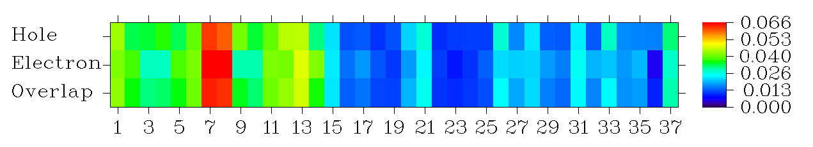

<!-- p.274 -->
there are also options used to adjust color scale, ratio of the map and interval between labels in X axis.

A very detailed example of this hole-electron module is given in Section 4.18.1. Example of analyzing transition density and transition dipole moment density using this module is given in Section 4.18.2.1. More discussion and examples can be found from my blog article "Using Multiwfn to perform hole-electron analysis to fully investigate electron excitation character" (in Chinese, http://sobereva.com/434).

Information needed: See beginning of Section 3.21.


### 3.21.2 Plot atom/fragment transition matrix of various kinds as heat map (2)


This function is used to plot atom transition matrix (ATM) of various kinds as heat map (color-filled matrix map). The ATM refers to any kind of atom-based matrix that represents electron transition information between two states. For example, it may correspond to the atom-based transition density matrix (see below), the atom-atom charge transfer matrix, the atom transition dipole moment matrix and so on. In this function, the ATM can also be further transformed to fragment transition matrix (FTM) and then plotted as heat map.

Although this function can also plot heat maps for other matrices, the major purpose of developing this function is plotting atom or fragment-based transition density matrix, therefore I will first introduce theories related to transition density matrix.

Theories about transition density matrix (TDM) Below, the word "TDM" refers to the transition density matrix in basis function representation. The TDM between ground state and an excited state can be calculated as (de-excitation transitions have been ignored for simplicity)

$$P_{\mu\nu}^{\mathrm{t r a n}}=\sum_{i}^{\mathrm{o c c}}\sum_{a}^{\mathrm{v i r}}w_{i}^{a}C_{\mu i}C_{v a}$$

ia

where Cμi denotes the expansion coefficient of basis function μ in MO i. It is worth to note in passing that the TDM in real space representation, which is introduced in Section 3.21.1.1, can be

constructed easily via TDM in basis function representation (χ stands for basis function):


$$P_{\mu\nu}^{\mathrm{t r a n}}=\sum_{i}^{\mathrm{o c c}}\sum_{a}^{\mathrm{v i r}}w_{i}^{a}C_{\mu i}C_{v a}$$

<!-- formula-ocr: formula_p274_175.png 已替换为LaTeX, 原图保留备查 -->

The off-diagonal elements of TDM essentially represent the coupling between various basis functions during electron excitation. Assume there are only two basis functions and meantime the

excitation can be perfectly represented as i→a MO transition, then the TDM could be explicitly written as below form (notice that the index of the elements has been rearranged according to convention of TDM heat map)

$$P_{\mu\nu}^{\mathrm{t r a n}}=\sum_{i}^{\mathrm{o c c}}\sum_{a}^{\mathrm{v i r}}w_{i}^{a}C_{\mu i}C_{v a}$$


<!-- p.275 -->
If magnitude of off-diagonal element 𝑃1,2 tran is large, it implies that basis functions 1 and 2

significantly participate in occupied orbital i and virtual orbital a, respectively. More generally, we may say that basis functions 1 and 2 have large contribution to hole and electron, respectively, in this case the two basis functions are strongly coupled during the excitation. The diagonal terms are also meaningful, if element 𝑃μ,μtran has large magnitude, it implies that basis function μ must

simultaneously have large contribution to both hole and electron.

Since TDM in general is not a symmetric matrix, in order to make certain discussions easier, some papers employ below symmetrized form


$$\overline{P}_{\mu\nu}^{\mathrm{tran}}=\frac{P_{\mu\nu}^{\mathrm{tran}}+P_{\nu\mu}^{\mathrm{tran}}}{\sqrt{2}}$$

<!-- formula-ocr: formula_p275_176.png 已替换为LaTeX, 原图保留备查 -->

The TDM can be contracted to atom-based form according to correspondence between basis functions and atoms, it will be symbolized as p. In Multiwfn, below construction ways are available:

$$Way1\colon p_{A B}=\sum_{\mu\in A}\sum_{\nu\in B}(P_{\mu\nu}^{\mathrm{t r a n}})^{2}$$

$$Way1\colon p_{A B}=\sum_{\mu\in A}\sum_{\nu\in B}(P_{\mu\nu}^{\mathrm{t r a n}})^{2}$$

||:3Way Pp ABAB = μν   μν tran

$$Way1\colon p_{A B}=\sum_{\mu\in A}\sum_{\nu\in B}(P_{\mu\nu}^{\mathrm{t r a n}})^{2}$$

where μ and ν denote the basis functions centered at atom A and on B, respectively. Both original form and symmetrized form of TDM could be employed here.

If way 1 is employed, the p will correspond to the matrix of so-called correlated electron-hole probability diagram (CEHPD), its (A,B) element was interpreted as the probability of simultaneously finding a hole in atom A and an electron in atom B (this interpretation is not strictly true in general cases). See J. Chem. Phys., 113, 10002 (2000) and J. Am. Chem. Soc., 129, 14257 (2007) for example, in which the authors used 𝑃̅μνtran obtained at ZINDO level.

If the p is constructed in way 2, 3 or 4, the resulting matrix may be referred to as atom transition density matrix. For example, the way 4 has been employed in Chem. Rev., 102, 3171 (2002). However, according to my experiences, using way 2 or 3 is preferred, since I found that the diagonal terms obtained in way 4 is often too large compared to the off-diagonal terms.

Assume that the TDM used to construct p was not symmetrized, the general structure of the resulting p could be expressed in below form


$$\mathbf{p}\equiv\mathrm{e l e c t r o n}\left[\begin{matrix}{1,N}&{2,N}&{\cdots}&{N,N}\\ {\vdots}&{\vdots}&{\ddots}&{\vdots}\\ {1,2}&{2,2}&{\cdots}&{N,2}\\ {1,1}&{2,1}&{\cdots}&{N,1}\\ \end{matrix}\right]$$

<!-- formula-ocr: formula_p275_177.png 已替换为LaTeX, 原图保留备查 -->

hole

In complete analogy with the discussion about TDM, the physical meaning of the matrix elements of p can be roughly understood as follows, irrespective of the choice of the specific way of


<!-- p.276 -->
constructing the p:

- Diagonal terms: If (A,A) is large, it implies that atom A has large contribution to both hole and

electron, therefore the electron excitation should result in evident charge reorganization within atom A
- Off-diagonal terms: If (A,B) is large, then atom A should have large contribution to hole and

meantime atom B should have large contribution to electron, implying that electron excitation leads to CT from A to B The "hole" and "electron" mentioned above are highly abstract concepts, although they have the same physical meaning as the those defined in the hole-electron analysis (Section 3.21.1), one cannot expect that the pattern of the p defined in any one of above ways is always very close to the atom-atom charge transfer matrix, which is much more strictly defined and more meaningful.

If symmetrized form of TDM was used to build p, then CT directional information will not be reflected by p. In this case, if off-diagonal term (A,B)=(B,A) is large, then we can simply say that coherence between atoms A and B is strong during the electron excitation, in other words, charge transfer occurs between atoms A and B.

The heat map of p is particularly useful for analyzing large-size and highly conjugated molecules. Commonly hydrogens are omitted in the plot to make the map compact, since hydrogens rarely participate in electron excitation of chemical interest.

If fragments are defined, the p (or other kinds of atom transition matrix) can further be contracted to fragment-based form: fragfragRSABAR BSpp = 

This form is very convenient when one wishes to study role of various fragments in electron excitation.

Input files Since there are different types of atom transition matrix, and the matrix can be passed to Multiwfn in different ways, there are several circumstances as shown below, you should use proper input files. The file that should be loaded when Multiwfn boots up is always the file containing basis function information, and it should correspond to another file that needed to be loaded when you enter present function.

(1) Plotting heat map of p in usual way You should load a file containing configuration coefficient information of excited states when you enter this function (see beginning of Section 3.21). Then Multiwfn will automatically generate TDM between ground state and you selected excited state, and at the same time you can choose if symmetrizing the resulting TDM in aforementioned way.

(2) Plotting heat map of p based on the TDM recorded in Gaussian output file You should load Gaussian output file of electron excitation task when you enter this function. The keywords density=transition=x IOp(6/8=3) must be specified in Gaussian input file, so that TDM between ground state and excited state x can be printed in output file by Link 601 of Gaussian. Via this way, not only the TDM of CIS/TDHF/TDA-DFT/TDDFT can be plotted, but also the TDM generated by the EOM-CCSD and semi-empirical ZINDO method can be plotted.

Note 1: The TDM outputted by Gaussian is in aforementioned symmetrized form. Note 2: If your ground state is singlet state while you used such as TD=triplet to request Gaussian to compute triplet excited states, then the outputted TDM will be exactly zero due to spin forbidden, and thus Multiwfn is unable to plot corresponding TDM map. However, it is possible to draw spatial part of the singlet-triplet TDM. To do this, you should let Multiwfn itself to generate TDM, see (1).


<!-- p.277 -->
Note 3: If the basis set you used contains diffuse basis functions, in rare cases, the TDM outputted by Gaussian is incorrect, and thus the resulting heat map will be useless.

In summary, if the method you are using is not ZINDO, do not let Multiwfn to load TDM directly from Gaussian output file.

(3) Plotting heat map of p based on the TDM recorded in a plain text file You should load a file named tdmat.txt when you enter this function, Multiwfn will read TDM from this file. Commonly, the tdmat.txt is generated by subfunction 9 of main function 18 (see Section 3.21.9 for detail), which can not only generate TDM between ground state and an excited state, but can also generate TDM between two excited states. An example file has been provided as examples\excit\tdmat.txt.

For above three cases, you can choose the way used to contract the TDM to the p. (4) Plotting atom transition dipole moment matrix You should load a file named one of AAtrdip.txt, AAtrdipX.txt, AAtrdipY.txt, AAtrdipZ.txt when you enter this function, Multiwfn will read atom transition dipole moment matrix from this file. Commonly, they are generated by subfunction 11 of main function 18 (see Section 3.21.11 for detail). By plotting heat map of these matrices, one can easily recognize which atoms and which interatomic couplings notably affect transition dipole moment.

(5) Plotting atom-atom charge transfer matrix You should load a file named atmCTmat.txt when you enter this function, Multiwfn will read atom-atom charge transfer matrix from this file. Commonly, the atmCTmat.txt is generated by subfunction 8 of main function 18 (see Section 3.21.8 for detail). By plotting heat map of this kind of matrix, charge transfers between various atoms or fragments as well as charge reorganization sites can be intuitively recognized.

Hint: In fact, you can also make the tdmat.txt or AAtrdip.txt/atmCTmat.txt contain other kinds of matrices so that they can be plotted as heat map via present module. For example, you can export bond order matrix as bndmat.txt using corresponding subfunction in main function 9, then rename it as atmCTmat.txt and delete the first line from it, then if you load this file into Multiwfn when entering present module, the plotted heat map will correspond to the bond order matrix.

Usage After loading all needed files and generating all needed data as mentioned above, you will enter the interface for plotting heat map of the atom transition matrix (ATM). Some options are self-explanatory, others are described below:

Option 0: Showing heat map of ATM on screen. By default, labels in abscissa and ordinate of this map correspond to indices of non-hydrogen atoms.

Option 1: The same as option 0, but save the heat map as graphical file in current folder. Option 3: Exporting the ATM as matrix.txt in current folder, so that it can then be conveniently plotted by some third-party tools such as Origin and Sigmaplot.

Option 4: Switching the status if hydrogens will be included in the heat map Option 5: Changing upper and lower limits of color scale. By default, they are automatically set to maximum and minimum matrix elements of ATM, respectively.

Option 6: Changing the number of interpolation steps between grid data. If you want to make the graph look smooth, it should be set to a large value (the default 10 is already quite large); if the value is set to 1, then interpolation will not be performed, in this case each square grid in the map exactly corresponds to a matrix element.

Option 8: Determining if performing normalization. If the status is switched to "Yes", then normalization factor will be applied so that the sum of all elements of ATM is equal to unity.


<!-- p.278 -->
If you select option "-1 Define fragments", fragment definition can be directly inputted or loaded from a plain text file, which should look like below, each fragment occupies a line:


```text
1,3,6-10,12
2,4,5
11
13-15
```

Then Multiwfn will contract the atom transition matrix to fragment transition matrix (FTM). After that, the matrix to be plotted or exported in present module will be FTM instead of ATM

An example of plotting and studying p matrix is given in Section 4.18.2.2; example of analyzing transition dipole moment matrix is given in Section 4.18.2.3; example of plotting atom-atom charge transfer matrix is given in Section 4.18.8.


### 3.21.4 Calculate ∆r index to measure charge-transfer length (4)

Theory

In the paper J. Chem. Theory Comput., 9, 3118 (2013), Δr index was proposed to measure CT length during electron excitation. The Δr can be expressed as


$$\Delta r_{i}^{a}=\frac{(K_{i}^{a})^{2}}{\displaystyle\sum_{i,a}(K_{i}^{a})^{2}}\big|\big\langle\varphi_{a}\big|\mathbf{r}\big|\varphi_{a}\big\rangle-\big\langle\varphi_{i}\big|\mathbf{r}\big|\varphi_{i}\big\rangle\big|$$

<!-- formula-ocr: formula_p278_178.png 已替换为LaTeX, 原图保留备查 -->

where ∆𝑟𝑖 𝑎 is contribution of orbital transition between i and a to the Δr index:

The index i and a run over all occupied and virtual MOs, respectively. φ is orbital wavefunction. Assume that the method you used to calculate electron excitation is CIS or the TDDFT under Tamm-Dancoff approximation, then 𝐾𝑖 𝑎 is simply the configuration coefficient corresponding to excitation

of i→a. While if the method you used is TDHF or TDDFT, then 𝐾𝑖 𝑎 and 𝑤′𝑖 𝑎 denote the configuration coefficient corresponding to excitation of i→a and de-excitation of 𝑎= 𝑤𝑖 𝑎+ 𝑤′𝑖 𝑎, where 𝑤𝑖

ia, respectively.

Δr is especially useful for diagnosing when certain classes of DFT functionals are failure for TDDFT purpose. When Δr is large, pure functionals such as BLYP and PBE, and the hybrid functionals with low Hartree-Fock exchange composition such as B3LYP and PBE0, will not work well. In this case, long-range corrected functionals should be employed; for instance, CAM-B3LYP and ωB97XD.

It is worth to mention that if an electron excitation can be perfectly represented by one pair of

MO transition, then the Δr index and D index defined in hole-electron analysis framework will be exactly identical in principle:

$$\begin{aligned}&\Delta r=\left|\left\langle\varphi_{a}\left|\mathbf{r}\right|\varphi_{a}\right\rangle-\left\langle\varphi_{i}\left|\mathbf{r}\right|\varphi_{i}\right\rangle\right|\equiv\left|\int\mathbf{r}\left|\varphi_{a}(\mathbf{r})\right|^{2}\mathrm{d}\mathbf{r}-\int\mathbf{r}\left|\varphi_{i}(\mathbf{r})\right|^{2}\mathrm{d}\mathbf{r}\right|\\ &D\ \mathrm{index}=\left|\mathbf{D}\right|=\left|\int\mathbf{r}\rho^{\mathrm{ele}}(\mathbf{r})\mathrm{d}\mathbf{r}-\int\mathbf{r}\rho^{\mathrm{hole}}(\mathbf{r})\mathrm{d}\mathbf{r}\right|=\left|\int\mathbf{r}\left|\varphi_{a}(\mathbf{r})\right|^{2}\mathrm{d}\mathbf{r}-\int\mathbf{r}\left|\varphi_{i}(\mathbf{r})\right|^{2}\mathrm{d}\mathbf{r}\right|\\ \end{aligned}$$

However, their values outputted by Multiwfn should be marginally different, since they are


<!-- p.279 -->
evaluated based on different numerical integration algorithms.

Usage The input files needed by present module have been detailedly described at the beginning of Section 3.21, namely you should load a file containing basis function information when Multiwfn boots up, and then load a file containing configuration coefficient information of excited states.

After entering present function (subfunction 4 of main function 18), you will be prompted to

select the excited states for which the Δr will be calculated, then the results will be printed on screen immediately.

If you only selected one state, then Multiwfn will ask you to choose if decomposing the Δr into orbital pair contributions. If you input e.g. 0.01, then orbital pairs which have contribution to Δr larger than 0.01 will be printed. From the output, you can easily identify which orbital pairs have significant contribution to charge-transfer of electron excitation.

An example of present function is provided as Section 4.18.4. Information needed: See beginning of Section 3.21.


### 3.21.3 Analyze charge-transfer based on density difference grid data (3)

Theory In the paper J. Chem. Theory Comput., 7, 2498 (2011), the authors proposed a method for analyzing charge-transfer (CT) during electron transition, present function fully implements this analysis method. It is also probable that this method can be used to study CT in other processes, such as formation of molecular complex. In the original paper, the author only discussed the cases when charge-transfer is in one-dimension, while in Multiwfn this scheme has been generalized to three-dimension case. In addition, some quantities introduced below are not proposed in the original paper but proposed by me, definition of some quantities in the original paper have also been modified by me to make the analysis more meaningful.

The electron density variation between excited state (EX) and ground state (GS) is


$$\Delta\rho(\mathbf{r})=\rho_{\mathrm{E X}}(\mathbf{r})-\rho_{\mathrm{G S}}(\mathbf{r})$$

<!-- formula-ocr: formula_p279_179.png 已替换为LaTeX, 原图保留备查 -->

$$\Delta\rho(\mathbf{r})=\rho_{\mathrm{E X}}(\mathbf{r})-\rho_{\mathrm{G S}}(\mathbf{r})$$

ρ+ and ρ− as well as their integrals over the whole space in principle can also be larger than 1.0, this is because excitation of an electron must lead to reorganization of distribution of the rest of electrons,

which also make contribution to Δρ.

The transferred charge qCT is the magnitude of the integral of ρ+ and ρ− over the whole space. It is important to correctly recognize the physical meaning of this quantity. qCT only corresponds to the total amount of charge whose distribution is perturbed during electron excitation, it does not


<!-- p.280 -->
correspond to net charge transfer from one fragment to another fragment (e.g. from donor group to acceptor group)

The barycenter of positive and negative parts of Δρ can be computed as


$$\begin{aligned}\mathbf{R}_{+}=&\int\mathbf{r}\rho_{+}(\mathbf{r})\mathrm{d}\mathbf{r}/\int\rho_{+}(\mathbf{r})\mathrm{d}\mathbf{r}\\\mathbf{R}_{-}=&\int\mathbf{r}\rho_{-}(\mathbf{r})\mathrm{d}\mathbf{r}/\int\rho_{-}(\mathbf{r})\mathrm{d}\mathbf{r}\end{aligned}$$

<!-- formula-ocr: formula_p280_180.png 已替换为LaTeX, 原图保留备查 -->

The Cartesian component coordinates of R+ will be referred to as X+, Y+, Z+ below, while that of R− will be referred to as X−, Y−, Z−.

The distance between the two barycenters measures the CT length, its three Cartesian components:


$$\sqrt{(D_x)^2 + (D_y)^2 + (D_z)^2} \equiv |\mathbf{R}_+ - \mathbf{R}_-|$$

<!-- formula-ocr: formula_p280_181.png 已替换为LaTeX, 原图保留备查 -->

$$\begin{aligned}&\Delta\sigma_{\lambda}=\sigma_{+,,\lambda}-\sigma_{-,,\lambda}\qquad\lambda=\{x,y,z\}\\&\Delta\sigma index=|\pmb{\sigma}_{+}|-|\pmb{\sigma}_{-}|\\ \end{aligned}$$

length.

The dipole moment variation caused by electron excitation can be evaluated as

$$\Delta\mu_{_{X}}=(X_{+}-X_{-})q_{\mathrm{CT}}\quad\Delta\mu_{_{Y}}=(Y_{+}-Y_{-})q_{\mathrm{CT}}\quad\Delta\mu_{_{Z}}=(Z_{+}-Z_{-})q_{\mathrm{CT}}$$

The RMSDs of distribution of ρ+ and ρ− in each direction are defined as


$$\sigma_{a,\lambda}=\sqrt{\frac{\int\rho_{a}(\mathbf{r})(\lambda^{\prime}-\lambda_{a})^{2}\mathrm{d}\mathbf{r}}{\int\rho_{a}(\mathbf{r})\mathrm{d}\mathbf{r}}}$$

<!-- formula-ocr: formula_p280_182.png 已替换为LaTeX, 原图保留备查 -->

where a={+,-}, λ’={x,y,z}, λ={X, Y, Z}. x, y and z are Cartesian components of position vector r. For example, σ+,y can be explicitly written as


$$\sigma_{+,y}=\sqrt{\frac{\int\rho_{+}(\mathbf{r})(y-Y_{+})^{2}\mathrm{d}\mathbf{r}}{\int\rho_{+}(\mathbf{r})\mathrm{d}\mathbf{r}}}$$

<!-- formula-ocr: formula_p280_183.png 已替换为LaTeX, 原图保留备查 -->

$$\begin{aligned}&\Delta\sigma_{\lambda}=\sigma_{+,,\lambda}-\sigma_{-,,\lambda}\qquad\lambda=\{x,y,z\}\\&\Delta\sigma index=|\pmb{\sigma}_{+}|-|\pmb{\sigma}_{-}|\\ \end{aligned}$$


$$\begin{aligned}&\Delta\sigma_{\lambda}=\sigma_{+,,\lambda}-\sigma_{-,,\lambda}\qquad\lambda=\{x,y,z\}\\&\Delta\sigma index=|\pmb{\sigma}_{+}|-|\pmb{\sigma}_{-}|\\ \end{aligned}$$

<!-- formula-ocr: formula_p280_184.png 已替换为LaTeX, 原图保留备查 -->

It is noteworthy that D index is zero for exactly centrosymmetric systems, therefore, it is useless for

discussing CT problem of such kind of system. However, Δσ index is often useful to identify this type of excitation, since in this case Δσ index must be large because diffuseness extent of ρ+ is much higher than ρ−.

C+ and C− functions are defined aiming for visualizing CT more intuitively than Δρ. Their structures are similar to Gaussian function, the value asymptotically approaches zero from the centroid of the function.


<!-- p.281 -->
$$C_{+}(\mathbf{r})=A_{+}\exp\left(-\frac{\left(x-X_{+}\right)^{2}}{2\sigma_{+,x}^{2}}-\frac{\left(y-Y_{+}\right)^{2}}{2\sigma_{+,y}^{2}}-\frac{\left(z-Z_{+}\right)^{2}}{2\sigma_{+,z}^{2}}\right)$$

Normalization factor A is introduced so that the integrals of C+ and C− over the whole space are equal to that of ρ+ and ρ−, respectively.

Hλ measures average degree of spatial extension of ρ− and ρ+ in X/Y/Z direction, HCT is that in CT direction, and H index is an overall measure:


$$\begin{aligned}&H_{\lambda}=(\sigma_{+,\lambda}+\sigma_{-,\lambda})/2\quad\lambda=\{x,y,z\}\\&H_{\mathrm{CT}}=\mid\mathbf{H}\cdot\mathbf{u}_{\mathrm{CT}}\mid\\&H\operatorname{index}=\left(\mid\pmb{\sigma}_{+}\mid+\mid\pmb{\sigma}_{-}\mid\right)/2\\ \end{aligned}$$

<!-- formula-ocr: formula_p281_185.png 已替换为LaTeX, 原图保留备查 -->

H CTCT ·= || uH

H 2/|)||(|index += σσ −+

where uCT is unit vector in CT direction and can be straightforwardly derived using centroid of ρ− and ρ+.

t index measures separation degree of ρ+ and ρ−:

CTindexindexHDt−=

If t index<0, it implies that ρ− and ρ+ are not substantially separated due to CT. Clear separation of ρ− and ρ+ distributions must correspond to evidently positive t index.

I defined another quantity to measure overlapping extent between C+ and C−:


$$S_{+-}=\int\sqrt{C_{+}(\mathbf{r})/A_{+}}\sqrt{C_{-}(\mathbf{r})/A_{-}}\mathrm{d}\mathbf{r}$$

<!-- formula-ocr: formula_p281_186.png 已替换为LaTeX, 原图保留备查 -->

If the value equals 1, that means the two functions are completely superposed, else if the value equals zero, it indicates that their distributions are completely separated. This index is dimensionless.

Usage Because all numerical integrals mentioned above are computed based on evenly distributed

grid data, user needs to generate grid data of Δρ by using custom operation of main function 5, see Section 3.7.1, or load a file (e.g. cube file) containing grid data of density difference when Multiwfn boots up. After that, enter subfunction 3 of main function 18, all aforementioned quantities will be

shown on screen immediately. The "Overlap integral between C+ and C-" term is the S+− introduced above. In the post-processing menu, the user can choose to visualize C+ and C−, or export grid data for the two functions to cube file in current folder.

An example is given in Section 4.18.3. Information needed: Grid data of electron density difference


### 3.21.5 Calculate transition electric/magnetic dipole moments between all states and for each state (5)


This function is used to calculate transition electric/magnetic dipole moment between all states


<!-- p.282 -->
(including both ground state and excited states). This function is also able to print electric dipole moment for each state.

For a transition i → j, the transition electric dipole moment is defined as ⟨𝜓𝑖|−𝐫|𝜓𝑗⟩; when i=j, this quantity corresponds to electric dipole moment of this state contributed by electrons. The

transition magnetic dipole moment is defined as 1 2 𝑖⟨𝜓𝑖|𝐫× 𝛁|𝜓𝑗⟩, but the moment outputted by this

function simply corresponds to ⟨𝜓𝑖|𝐫× 𝛁|𝜓𝑗⟩ , which is the same as the value outputted by electronic excitation calculations in Gaussian.

The input files needed by this function have been detailedly described at the beginning of Section 3.21, namely you should load a file containing basis function information when Multiwfn boots up, and then load a file containing configuration coefficient information of excited states. If you need very accurate transition dipole moments, you should use IOp(9/40=5) keyword of Gaussian or TPrint 1E-10 keyword of ORCA to make the program print as much configuration coefficients as possible.

After you enter present function, summary of all excitations will be printed. "Normalization" should be as close as possible to expected value (0.5 and 1.0 for closed- and open-shell reference states, respectively). If the deviation is large, then the resulting transition dipole moments must have a large error, and you must make your quantum chemistry program output more configuration coefficients.

In the interface you can use option 0 to choose the type of (transition) dipole moments to be calculated, by default they are electric, but you can change to magnetic. You can use options 1 ~ 4 to choose the task to conduct, see below, in which options 3 and 4 are available only if the (transition) dipole moment to be calculated is set to electric.

- Option 1: Output transition electric dipole moments between all states (including both ground state and excited states) to screen

- Option 2: The same as 1, but output to transdipmom.txt in current folder.
- Option 3: Generate input file of SOS module of Multiwfn as SOS.txt in current folder. Then if you use the SOS.txt as input file, you can use SOS module to evaluate (hyper)polarizability, see Section 3.27.2 for detail.

- Option 4: Output electric dipole moment of each excited state to dipmom.txt in current folder. Note that both electronic and nuclear contributions to the value are taken into account (this is clearly different to the values corresponding to i=j cases printed by option 1 and 2, which only considers contribution from electrons).

The calculation process of all the tasks consists of three stages: Stage 1: Calculate dipole moment integrals between all basis functions Stage 2: Calculate dipole moment integrals between all MOs Stage 3: Calculate dipole moment integrals between all excited states. Usually this is the most time-consuming step.

If the output file of quantum chemistry program includes both singlet and triplet excited states, for example, you used TD(50-50) keyword in Gaussian and reference state is closed-shell, only aforementioned tasks (1) and (2) are available, and transition dipole moment of all singlet-singlet pairs (including ground state) and triplet-triplet pairs will be calculated by Multiwfn and outputted


<!-- p.283 -->
separately, while singlet-triplet pairs are ignored because due to spin-forbidden the result must be zero. In addition, excitation energies between S0 and all excited states are printed at the end of output. This function is of great importance if you want to use PySOC code to calculate spin-orbit coupling matrix element, see my blog article "Using Gaussian+PySOC to calculate spin-orbit coupling matrix element under TDDFT" (http://sobereva.com/411, in Chinese) for detail.

There is a parameter "maxloadexc" in `settings.ini`, if this value is not 0 (default) and the actual number of excited states is higher than this value, then only the first "maxloadexc" excited states will be loaded and subjected to transition electric dipole moment calculation.

Calculation of transition dipole moments between excited states is quite time-consuming for large systems. However, if you only need them between ground state and excited states, the data can always be quickly calculated. In this case, before starting calculation, you should select option “-1: Toggle if only calculating between ground and excited states” to change its status to “Yes”, then transition dipole moments between excited states will not be calculated and printed.

Examples of this function are given in Section 4.18.5. Information needed: See beginning of Section 3.21.

Appendix The formulae used to derive transition electric/magnetic dipole moment between electronic states used in the present function are given as follows

(1) Transition electric dipole moment between ground state and an excited state K:

$$\mathbf{D}_{0\rightarrow K}=\left\langle\Psi_{0}\left|-\mathbf{r}\right|\Psi_{K}\right\rangle=\sum_{i}^{\mathrm{o c c}}\sum_{a}^{\mathrm{v i r}}w_{i,a}^{K}\left\langle\varphi_{i}\left|-\mathbf{r}\right|\varphi_{a}\right\rangle+\sum_{i}^{\mathrm{o c c}}\sum_{a}^{\mathrm{v i r}}w_{i,a}^{\prime K}\left\langle\varphi_{i}\left|-\mathbf{r}\right|\varphi_{a}\right\rangle$$

where w and w’ are coefficients of excitation and de-excitation configurations respectively. i and a denote indices of occupied and unoccupied molecular orbitals, respectively.

(2) Transition magnetic dipole moment between ground state and an excited state K:

$$\mathbf{M}_{0\rightarrow K}=\left\langle\psi_{0}\left|\mathbf{r}\times\nabla\right|\psi_{K}\right\rangle=\sum_{i}^{o c c}\sum_{a}^{v i r}w_{i,a}^{K}\left\langle\varphi_{i}\left|\mathbf{r}\times\nabla\right|\varphi_{a}\right\rangle-\sum_{i}^{o c c}\sum_{a}^{v i r}w_{i,a}^{\prime K}\left\langle\varphi_{i}\left|\mathbf{r}\times\nabla\right|\varphi_{a}\right\rangle$$

See Eqs. 22 and 24 in J. Chem. Phys., 66, 3460 (1977) on why the consideration of excitations and de-excitations is different for evaluating electric and magnetic transition dipole moments.

(3) Transition electric/magnetic dipole moment between excited states K and L:

$$\mathbf{T}_{K\rightarrow L}=\left\langle\psi_{K}\left|\hat{\mathbf{v}}\right|\psi_{L}\right\rangle=\sum_{i}^{\mathrm{o c c}}\sum_{a}^{\mathrm{v i r}}\tilde{w}_{i,a}^{K}\sum_{j}^{\mathrm{o c c}}\sum_{b}^{\mathrm{v i r}}\tilde{w}_{j,b}^{L}V^{i a j b}$$

with


<!-- p.284 -->
$$V^{i a j b}=\begin{cases}{\left\langle\varphi_{i}\right\vert\hat{\mathbf{v}}\big\vert\varphi_{a}\big\rangle}&{(i=j,a\neq b)}\\ {-\Big\langle\varphi_{i}\Big\vert\hat{\mathbf{v}}\Big\vert\varphi_{a}\Big\rangle}&{(i\neq j,a=b)}\\ {\mathbf{v}^{0}-\Big\langle\varphi_{i}\Big\vert\hat{\mathbf{v}}\Big\vert\varphi_{i}\Big\rangle+\Big\langle\varphi_{a}\Big\vert\hat{\mathbf{v}}\Big\vert\varphi_{a}\Big\rangle}&{(i=j,a=b)}\\ {0}&{(i\neq j,a\neq b)}\\ \end{cases}$$


$$\mathbf{v}^{0}=\sum_{l}^{\mathrm{o c c}}\eta_{l}\left\langle\varphi_{l}\right|\hat{\mathbf{v}}\left|\varphi_{l}\right\rangle$$

<!-- formula-ocr: formula_p284_187.png 已替换为LaTeX, 原图保留备查 -->

where 𝑤̃ denotes both w and w’. v0 corresponds to ground state property with η being orbital occupancy. The operator 𝐯̂ = −𝐫 is for transition electric dipole moment and 𝐯̂ = 𝐫× ∇ is for transition magnetic dipole moment. For TD case, the V terms between excitation and de-excitation configurations are simply ignored. In addition, when calculating V terms between de-excitation

configurations, it is replaced with −V.


### 3.21.6 Generate natural transition orbitals (NTOs) (6)

Theory This function is used to generate natural transition orbitals (NTOs). NTO was proposed in J. Chem. Phys., 118, 4775 (2003), it has become a very popular and useful way to analyze character electron excitation obtained by single-reference methods.

Transition of electronic state is often not predominated by only one MO pair, in many cases multiple MO pair transitions simultaneously have non-negligible contributions, which can be evaluated as square of corresponding configuration coefficient. This fact brings great hindrance of analyzing electron excitation character by simply visualizing related MOs. The NTO method aims to relieve this difficulty, it separately performs unitary transformation for occupied MOs and virtual MOs, so that only one or very few number of orbital pairs have dominant contributions.

The basic procedure of yielding NTOs is outlined below: (1) Generating transition density matrix in MO basis (T). Assume that the system has nocc occupied MOs and nvir virtual MOs, then T has dimension of (nocc, nvir), its (i,l) element is simply constructed as

ai liTw= ,

𝑎 stands for configuration coefficient corresponding to i→a orbital transition. Note that for TD formalism, there may be some de-excitations, their configuration coefficients are simply ignored in constructing the T. where i<nocc, l<nvir and a=l+nocc. 𝑤𝑖

(2) Generating temporary matrix for occupied and virtual orbitals, respectively

TToccvir==TTTTT T

Evidently, both Tocc and Tvir are square matrices, their dimensions are nocc and nvir, respectively.

(3) Diagonalizing Tocc and Tvir to obtain eigenvalues and eigenvectors

11occoccoccoccvirvirvirvir−−==UT UΛU T UΛ

(4) The diagonal terms of Λocc and Λvir are eigenvalues of occupied and virtual NTOs, respectively. For the former, the eigenvalues are commonly sorted from low to high, while for the latter, the eigenvalues are commonly sorted from high to low. A NTO pair consists of an occupied


<!-- p.285 -->
NTO and a virtual NTO sharing the same eigenvalue. Eigenvalue of a NTO pair multiplied by 100 is just its percentage contribution to the electron excitation.

For CIS and TDA-DFT, the range of eigenvalue must be 0.0~1.0. However, in the TDHF and TDDFT cases, due to presence of de-excitations, which is not explicitly considered in the NTO analysis, it is possible that a NTO pair has eigenvalue slightly larger than 1.0, in this situation you can simply treat it as 1.0 (However, if the value is much larger than 1.0, the TDDFT result may be unreliable, and I suggest using TDA-DFT instead).

(5) MOs are transformed to NTOs via unitary transformation matrix U

NTOMONTOMOoccoccoccvirvirvir==CCUCCU

where 𝐂occMO and 𝐂vir MO are coefficient matrix of occupied MOs and virtual MOs in original basis functions, respectively; their columns correspond to different MOs. The counterpart matrices with NTO superscript denote coefficient matrix of occupied and virtual NTOs.

Implementation and Usage The input files needed by present function have been detailedly described at the beginning of Section 3.21, namely you should load a file containing basis function information when Multiwfn boots up, and then load a file containing configuration coefficient information of excited states.

After you enter present function, you should input the index of the electron excitation to be studied, then Multiwfn will load corresponding configuration coefficients and generate NTOs according to the equations shown above, and then output eigenvalues of NTO pairs. Next, you can choose if exporting the NTOs to .fch/.molden/.mwfn file. If you choose to export, then you can use Multiwfn to load the newly generated file to visualize the NTOs, analyze NTO orbital composition and so on (note that in this case the data in orbital energy field in fact is NTO eigenvalues).

Present function works for both restricted and unrestricted reference states; for the latter, the result of Alpha part and Beta part are calculated and printed separately, you only need to pay attention to the NTO pairs having largest eigenvalues (e.g. the largest eigenvalue of Alpha part is 0.03, while the largest eigenvalue of Beta part of 0.95, that means this electron excitation is dominated by transition of the Beta NTO pair)

According to my experiences, NTO analysis often works equally well as the hole-electron analysis introduced in Section 3.21.1, namely both of them are able to avoid necessity of inspecting many MOs when discussing electron excitation. An additional advantage of NTO analysis over hole-electron analysis is that the orbital phase information is retained; however, in some cases NTO analysis completely fails, namely even after transformation from MO to NTO representation, there is still no dominant orbital pair transition. Clearly in this case you have to resort to hole-electron analysis.

An example of generating and analyzing NTOs is provided in Section 4.18.6. Information needed: See beginning of Section 3.21


### 3.21.7 Calculate ghost-hunter index (7)

Theory background


<!-- p.286 -->
The ghost states are spurious very low-lying charge transfer (CT) excited states with excitation wavelength usually around 1000 nm or more, they result from evidently incorrect asymptotic behavior of exchange potential of pure DFT functionals or the hybrid functionals having low Hartree-Fock exchange composition in long range electron interaction. Since the ghost states are unreal states, they should be ignored when discussing electron excitations and plotting electronic spectra. When ghost states are identified, then DFT functionals with relatively high global HF exchange composition (e.g. M06-2X and BH&HLYP), or long-range corrected functional (e.g.

ωB97XD), or range-separated functional with high HF exchange composition at long range of electronic interaction (e.g. CAM-B3LYP), should be employed to get rid of them.

The lower bound of TDDFT excitation energy of a CT state can be expressed as

𝜔low = 𝐼𝑃𝐷−𝐸𝐴𝐴−1/𝑅 where IPD is ionization potential of electron donor moiety (energy consumption of leaving an electron), EAA is electron affinity of electron acceptor moiety (its negative is energy lowering due to receiving an electron), and R denotes the electrostatic interaction between the hole and electron

after the CT excitation. According to Koopmans’ theorem, IP−εHOMO, EA−εLUMO, and we assume that the excitation fully corresponds to HOMO→LUMO transition, where HOMO and LUMO are completely localized in donor and acceptor regions respectively, we have

𝜔low−𝜀HOMO + 𝜀LUMO −1/𝑅 In practice, electron excitation is contributed by multiple orbital transitions, so weighted MO energies should be employed instead. In addition, the R may be estimated using DCT index (see later). So, the above equation can be converted to

$$\omega_{\mathrm{low}}=\underbrace{\sum_{i,a}\left[\frac{\left(w_{i}^{a}\right)^{2}}{\sum_{i,a}\left(w_{i}^{a}\right)^{2}}\left(\varepsilon_{a}-\varepsilon_{i}\right)\right]}_{\mathrm{term1}}-\frac{1}{D_{\mathrm{CT}}}_{\mathrm{term2}}$$

term 1

where i and a denote occupied and virtual MOs, respectively. The summation loops all TDDFT

configurations. w is configuration coefficient. ε stands for MO energy.

In J. Comput. Chem., 38, 2151 (2017), the authors proposed ghost-hunter index (MAC) to diagnose if an excited state yielded by current TDDFT calculation may be a ghost state. The MAC is

simply the ωlow shown above.

Notice that in the original MAC paper, they erroneously used w rather than w2 in the above

equation, and the sign in front of εa is wrong, these problems have been fixed in their later publication J. Chem. Phys., 154, 204102 (2021). This paper and the original MAC paper did not explicitly mention how to deal with de-excitation configurations, in the implementation in Multiwfn, all de-excitation configurations are ignored.

Since the MAC corresponds to the theoretical lower bound of CT excitation energy calculated by TDDFT (ETDDFT), in the paper of ghost-hunter index, it is argued that

𝐸TDDFT < 𝑀AC →ghost CT state

𝐸TDDFT > 𝑀AC →real CT state Ghost-hunter index is undoubtedly useful, however, according to my experience, this criterion is often too stringent. I suggest only regard ETDDFT<MAC as a necessary rather than sufficient condition for determining presence of ghost CT state.

Evaluation of ghost-hunter index


<!-- p.287 -->
To calculate the MAC, you should perform hole-electron analysis as usual, see introduction in Section 3.21.1 and example in Section 4.18.1. Once calculation of grid data of hole and electron is finished, Multiwfn automatically prints the MAC index as well as its two terms (see above equation for the meaning of the two terms).

Beware that in Multiwfn, the DCT used in the MAC expression is evaluated as the distance between centroid of electron and hole distributions, this case corresponds to adopting unrelaxed density of excited state. It is more or less different to the DCT evaluated in original paper of MAC (referred to as DCT' below), which is calculated as centroid distance between positive and negative parts of density difference between relaxed excited state density and ground state density. The DCT calculated by hole-electron analysis module of Multiwfn is not only reasonable enough, but also much cheaper than DCT', since evaluating TDDFT relaxed density for large systems is fairly expensive. However, if you really want to calculate MAC index based on DCT', you should obtain the first term of MAC via electron-hole analysis module, and then obtain DCT' via subfunction 3 of main function 18 (see the example given in Section 4.18.3) and manually calculate the second term of MAC (namely -1/DCT'), and finally sum up the two terms to derive MAC.

It is worth to mention that the MAC index is in principle only applicable to one-dimension CT case, if the CT takes place in multiple directions, then this index is incapable of correctly identifying ghost state.

Calculation of MAC is involved in the hole-electron analysis example in Section 4.18.1. Information needed: See beginning of Section 3.21


### 3.21.8 Calculate interfragment charge transfer in electron excitation via IFCT method (8)


Theory Interfragment charge transfer is a very important phenomenon in electron excitation process. I devised an albeit simple but quite useful way of evaluating amount of interfragment charge transfer between any number of fragments, the method is described below (to be published). This method will be referred to as IFCT (InterFragment Charge Transfer).

The IFCT method contains three steps: (1) Calculating atomic contribution to hole and electron (see introduction of the concept of hole and electron in Section 3.21.1.1)

(2) Calculating fragment contributions to hole and electron by summing up atomic contributions

(3) Constructing interfragment charge transfer matrix Q. Its (R,S) element corresponds to the electron transfer from fragment R to fragment S during the excitation:

,,hole,eleR SRSQ= ΘΘ

where ΘR,hole and ΘS,ele denote contribution of fragment R to hole and contribution of fragment S to electron, respectively. Above formula is very easy to comprehend, it essentially assumes that electron transfer from R to S is proportional to both composition of R in hole (where electron leaves)


<!-- p.288 -->
and composition of S in electron (where electron goes).

Then three additional useful quantities could be defined:

·Electron net transferred from fragments S to R: ,,SRS RR SpQQ→=−

$$\begin{aligned}\Delta p_{_{R}}&=\sum_{S\neq R}(Q_{_{S,R}}-Q_{_{R,S}})=\sum_{S\neq R}(\Theta_{_{S,\mathrm{hole}}}\Theta_{_{R,\mathrm{ele}}}-\Theta_{_{R,\mathrm{hole}}}\Theta_{_{S,\mathrm{ele}}})\\&=\Theta_{_{R,\mathrm{ele}}}\sum_{S\neq R}\Theta_{_{S,\mathrm{hole}}}-\Theta_{_{R,\mathrm{hole}}}\sum_{S\neq R}\Theta_{_{S,\mathrm{ele}}}\\&=\Theta_{_{R,\mathrm{ele}}}(1-\Theta_{_{R,\mathrm{hole}}})-\Theta_{_{R,\mathrm{hole}}}(1-\Theta_{_{R,\mathrm{ele}}})\\&=\Theta_{_{R,\mathrm{ele}}}-\Theta_{_{R,\mathrm{hole}}}\\ \end{aligned}$$

·Intrafragment electron redistribution of fragment R: QR,R By the way, it is easy to show that variation of electron population of a fragment evaluated in above way is quite reasonable:

$$\begin{aligned}\Delta p_{_{R}}&=\sum_{S\neq R}(Q_{_{S,R}}-Q_{_{R,S}})=\sum_{S\neq R}(\Theta_{_{S,\mathrm{hole}}}\Theta_{_{R,\mathrm{ele}}}-\Theta_{_{R,\mathrm{hole}}}\Theta_{_{S,\mathrm{ele}}})\\&=\Theta_{_{R,\mathrm{ele}}}\sum_{S\neq R}\Theta_{_{S,\mathrm{hole}}}-\Theta_{_{R,\mathrm{hole}}}\sum_{S\neq R}\Theta_{_{S,\mathrm{ele}}}\\&=\Theta_{_{R,\mathrm{ele}}}(1-\Theta_{_{R,\mathrm{hole}}})-\Theta_{_{R,\mathrm{hole}}}(1-\Theta_{_{R,\mathrm{ele}}})\\&=\Theta_{_{R,\mathrm{ele}}}-\Theta_{_{R,\mathrm{hole}}}\\ \end{aligned}$$

$$\begin{aligned}\Delta p_{_{R}}&=\sum_{S\neq R}(Q_{_{S,R}}-Q_{_{R,S}})=\sum_{S\neq R}(\Theta_{_{S,\mathrm{hole}}}\Theta_{_{R,\mathrm{ele}}}-\Theta_{_{R,\mathrm{hole}}}\Theta_{_{S,\mathrm{ele}}})\\&=\Theta_{_{R,\mathrm{ele}}}\sum_{S\neq R}\Theta_{_{S,\mathrm{hole}}}-\Theta_{_{R,\mathrm{hole}}}\sum_{S\neq R}\Theta_{_{S,\mathrm{ele}}}\\&=\Theta_{_{R,\mathrm{ele}}}(1-\Theta_{_{R,\mathrm{hole}}})-\Theta_{_{R,\mathrm{hole}}}(1-\Theta_{_{R,\mathrm{ele}}})\\&=\Theta_{_{R,\mathrm{ele}}}-\Theta_{_{R,\mathrm{hole}}}\\ \end{aligned}$$

$$\begin{aligned}\Delta p_{_{R}}&=\sum_{S\neq R}(Q_{_{S,R}}-Q_{_{R,S}})=\sum_{S\neq R}(\Theta_{_{S,\mathrm{hole}}}\Theta_{_{R,\mathrm{ele}}}-\Theta_{_{R,\mathrm{hole}}}\Theta_{_{S,\mathrm{ele}}})\\&=\Theta_{_{R,\mathrm{ele}}}\sum_{S\neq R}\Theta_{_{S,\mathrm{hole}}}-\Theta_{_{R,\mathrm{hole}}}\sum_{S\neq R}\Theta_{_{S,\mathrm{ele}}}\\&=\Theta_{_{R,\mathrm{ele}}}(1-\Theta_{_{R,\mathrm{hole}}})-\Theta_{_{R,\mathrm{hole}}}(1-\Theta_{_{R,\mathrm{ele}}})\\&=\Theta_{_{R,\mathrm{ele}}}-\Theta_{_{R,\mathrm{hole}}}\\ \end{aligned}$$


$$\begin{aligned}\Delta p_{_{R}}&=\sum_{S\neq R}(Q_{_{S,R}}-Q_{_{R,S}})=\sum_{S\neq R}(\Theta_{_{S,\mathrm{hole}}}\Theta_{_{R,\mathrm{ele}}}-\Theta_{_{R,\mathrm{hole}}}\Theta_{_{S,\mathrm{ele}}})\\&=\Theta_{_{R,\mathrm{ele}}}\sum_{S\neq R}\Theta_{_{S,\mathrm{hole}}}-\Theta_{_{R,\mathrm{hole}}}\sum_{S\neq R}\Theta_{_{S,\mathrm{ele}}}\\&=\Theta_{_{R,\mathrm{ele}}}(1-\Theta_{_{R,\mathrm{hole}}})-\Theta_{_{R,\mathrm{hole}}}(1-\Theta_{_{R,\mathrm{ele}}})\\&=\Theta_{_{R,\mathrm{ele}}}-\Theta_{_{R,\mathrm{hole}}}\\ \end{aligned}$$

<!-- formula-ocr: formula_p288_188.png 已替换为LaTeX, 原图保留备查 -->

It is easy to comprehend that this is a quite reasonable way of evaluating variation of electron population of fragment R, and thus well demonstrated reasonableness of the interfragment charge analysis formalism introduced above.

In addition, it is worth to note that sum of amount of interfragment transferred electrons and amount of intrafragment redistribution electrons exactly equals unity, reflecting the fact that only one electron is excited:


$$\begin{aligned}&\sum_{R}\sum_{S\neq R}Q_{R,S}+\sum_{S}Q_{S,S}\\&=\sum_{R}\sum_{S}Q_{R,S}\\&=\sum_{R}\sum_{S}\Theta_{R,\mathrm{hole}}\Theta_{S,\mathrm{ele}}\\&=\sum_{R}\Theta_{R,\mathrm{hole}}\sum_{S}\Theta_{S,\mathrm{ele}}\\&=1\end{aligned}$$

<!-- formula-ocr: formula_p288_189.png 已替换为LaTeX, 原图保留备查 -->

RS

RS

RS

On the evaluation of CT% The concepts of charge transfer percentage (CT%) and its complement local excitation percentage (LE%) are frequently involved in electron excitation studies. In the IFCT framework, they can be defined in two different ways, I believe it is useful to explicitly distinguish them.

- Intrinsic CT% and LE%: The former is evaluated as CT% = 100% × ∑∑𝑄𝑅,𝑆𝑆≠𝑅𝑅, and the latter is evaluated as LE% = 100% × ∑𝑄𝑆,𝑆𝑆, clearly they sum up to 100%. This definition works

for any number of fragments.

- Apparent CT% and LE%: This definition only works for two fragment cases. Apparent CT% is simply evaluated as 100%×|ΔpR|, and apparent LE% is defined as 100%−CT%, where R denotes either fragment.

In the case of two fragments (R and S), the intrinsic CT% and apparent CT% must be somewhat


<!-- p.289 -->
different, both of them have their own value. Intrinsic CT% represents the amount of electrons that essentially participate in charge transfer, which does not reflect the cancellation effect between

electron transfers of R→S and SR. In contrast, the apparent CT% corresponds to the apparent phenomenon of net electron transfer between R and S, namely the cancellation of the bidirectional electron transfer is taken into account. Clearly, intrinsic CT% must be equal or larger than apparent CT%, and they are equal only if the interfragment charge transfer is completely single directional, that is hole and electron fully and respectively localize on the two fragments.

It is worth to emphasize that %CT is directly dependent of the definition of fragments, because it characterizes amount of charge transfer between the fragments. In the limiting case, you define the whole system as a single fragment, then %CT must be exactly zero for all excitations.

Usage The input files needed by the IFCT analysis have been detailedly described at the beginning of Section 3.21, namely you should load a file containing basis function information when Multiwfn boots up, and then load a file containing configuration coefficient information of excited states.

After entering this function, you need to choose the method for calculating fragment distribution to hole and electron, and select the excited state to be studied, then input the total number of fragments, after that you should define each fragment in turn by inputting atomic indices. If you prefer to load fragment definition from a plain text file, you can input 0 when Multiwfn let you set the total number of fragments, then you can input the path of the file containing fragment definition, the file format should look like below, definition of each fragment occupies a line:


```text
1,3,6-10,12
2,4,5
11
13-15
```

If in this step you input -1, Multiwfn will not carry out regular IFCT analysis but export a file named atmCTmat.txt in current folder, this file records atom-atom charge transfer matrix, whose element

is defined as QA,B = ΘA,holeΘB,ele. If you input path of this file after entering the function used to plot atom/fragment transition matrix (see Section 3.21.2), this matrix could be plotted as heat map so that you can visually study its matrix elements.

Once definition of fragments is completed, Multiwfn will calculate and print contribution of all defined fragments to hole and electron, as well as amount of electron transfer between fragments. In addition, net electron transfer as well as variation of electron population of each fragment are also printed. Below is an output instance:


```text
 Variation of population number of fragment  1:  -0.25313
 Variation of population number of fragment  2:  -0.23110
 Variation of population number of fragment  3:   0.48423

 Intrafragment electron redistribution of fragment  1:   0.00334
 Intrafragment electron redistribution of fragment  2:   0.31271
 Intrafragment electron redistribution of fragment  3:   0.02419

 Transferred electrons between fragments:
  1 ->  2:   0.11977       1 <-  2:   0.00874     Net  1 ->  2:   0.11103
```


<!-- p.290 -->

```text
  1 ->  3:   0.14299       1 <-  3:   0.00089     Net  1 ->  3:   0.14210
  2 ->  3:   0.36476       2 <-  3:   0.02263     Net  2 ->  3:   0.34213
```

If two fragments are defined, then both intrinsic and apparent CT(%) and LE(%) will then be printed, while if more than two fragments are defined, only intrinsic CT(%) and LE(%) are printed.

Usually Mulliken-like partition is reasonable choice for evaluating fragment contribution to hole and electron, see "Theory 2" of Section 3.21.1.1 for detail of this method. However, diffuse functions must not be employed in this case, otherwise the result may be very misleading. Hirshfeld method is more robust and fully compatible with diffuse functions, but it is evidently more expensive. When diffuse functions do not occur, the IFCT result under Mulliken-like partition and Hirshfeld partition are in good agreement with each other.

An example of IFCT analysis is given in Section 4.18.8. Information needed: See beginning of Section 3.21


### 3.21.9 Generate and export transition density matrix (9)

According to MO expansion coefficients and configuration coefficients, transition density matrix (TDM) in basis function representation can be constructed by this function. Two kinds of TDMs can be generated:

(1) TDM between ground state and a selected excited state K:

$$P_{\mu\nu}^{\mathrm{t r a n}}=\sum_{i}^{\mathrm{o c c}}\sum_{a}^{\mathrm{v i r}}w_{i,a}^{K}C_{\mu i}C_{\nu a}$$

where w corresponds to coefficient of the configurations involved in the excitation, Cμi denotes the expansion coefficient of basis function μ in MO i. Excitation and de-excitation cases are not distinguished in this context (PS: The TDM constructed in this way is suitable for studying transition electric dipole moment, but not suitable for studying transition velocity and magnetic dipole moment, see Eqs. 22, 23 and 24 in J. Chem. Phys., 66, 3460 (1977)).

(2) TDM between two selected excited states K and L:

$$P_{\mu\nu}^{K L}=\sum_{i}^{\mathrm{o c c}}\sum_{a}^{\mathrm{v i r}}w_{i,a}^{K}\sum_{j}^{\mathrm{o c c}}\sum_{b}^{\mathrm{v i r}}w_{j,b}^{L}V_{\mu\nu}^{i a j b}$$

$$P_{\mu\nu}^{K L}=\sum_{i}^{\mathrm{o c c}}\sum_{a}^{\mathrm{v i r}}w_{i,a}^{K}\sum_{j}^{\mathrm{o c c}}\sum_{b}^{\mathrm{v i r}}w_{j,b}^{L}V_{\mu\nu}^{i a j b}$$

where P is density matrix of ground state. For TD case, the V between excitation and de-excitation configurations is simply ignored. In addition, when calculating V between de-excitation

configurations, it is replaced with −V.

Once generation of TDM has been finished, you can choose if symmetrizing the TDM. There are two ways


<!-- p.291 -->
- Way 1: trantrantran() / 2PPPμνμννμ=+

- Way 2: trantrantran() /2PPPμνμννμ=+

The way 1 is reasonable and should be used in common cases. However, it should be noted that the TDM generated by Gaussian program corresponds to the one symmetrized by way 2, therefore you should choose way 2 if you want the resulting TDM follows convention of Gaussian.

The generated matrix will be outputted to tdmat.txt in current folder. You can also choose to output TDM.fch in current folder, whose “Total SCF Density” field will correspond to TDM (this file is useful if you would like to calculate TrEsp type of atomic transition charges by making use of cubegen utility in Gaussian, see Section 4.A.9 for detail).

Note that when ground state and excited state have different spin multiplicities, due to the orthonormality of spin coordinates, although in principle the transition density matrix should be zero, the outputted matrix is not, because Multiwfn only takes spatial part of the MOs into account during constructing the matrix.

The input files needed by present function have been detailedly described at the beginning of Section 3.21, namely you should load a file containing basis function information when Multiwfn boots up, and then load a file containing configuration coefficient information of excited states.

The example in Section 4.18.2.4 and Section 4.18.9 utilized present function. Information needed: See beginning of Section 3.21

Appendix: Derivation of the formula of evaluating TDM between two excited states The TDM between two excited states K and L in real space representation is

$$T^{K L}(\mathbf{r};\mathbf{r}^{\prime})=\int\Psi^{K}(\mathbf{r},\mathbf{r}_{2},...,\mathbf{r}_{N})\Psi^{L}(\mathbf{r}^{\prime},\mathbf{r}_{2},...,\mathbf{r}_{N})\mathrm{d}\mathbf{r}_{2}\ldots\mathrm{d}\mathbf{r}_{N}$$

where the excited state wavefunctions are represented by linear combination of singly excited Slater determinants

$$\begin{array}{r l}{\Psi^{K}=\displaystyle\sum_{i}^{\mathrm{o c c}}\displaystyle\sum_{a}^{\mathrm{v i r}}w_{i,a}^{K}\Phi_{i}^{a}}&{{}\quad\Psi^{L}=\displaystyle\sum_{j}^{\mathrm{o c c}}\displaystyle\sum_{b}^{\mathrm{v i r}}w_{j,b}^{L}\Phi_{j}^{b}}\end{array}$$

We have

$$T^{K L}(\mathbf{r};\mathbf{r}^{\prime})=\sum_{i}^{\mathrm{o c c}}\sum_{a}^{\mathrm{v i r}}w_{i,a}^{K}\sum_{j}^{\mathrm{o c c}}\sum_{b}^{\mathrm{v i r}}w_{j,b}^{L}\int\Phi_{i}^{a}(\mathbf{r},\mathbf{r}_{2},\ldots,\mathbf{r}_{N})\Phi_{j}^{b}(\mathbf{r}^{\prime},\mathbf{r}_{2},\ldots,\mathbf{r}_{N})\mathrm{d}\mathbf{r}_{2}\ldots\mathrm{d}\mathbf{r}_{N}$$

Slater-Condon rule shows that for an single-electron operator ℵ̂ = ∑ℎ𝑖𝑖, integral between two singly excited determinants, namely ⟨𝑖 𝑎|ℵ̂|𝑗 𝑏⟩, satisfies


$$\begin{aligned}&=0\quad\left(i\neq j,a\neq b\right)\\&=\left\langle a\middle|h\middle|b\right\rangle\quad\left(i=j,a\neq b\right)\\&=-\left\langle j\middle|h\middle|i\right\rangle\quad\left(i\neq j,a=b\right)\\&=\sum_{p}^{N}\left\langle p\middle|h\middle|p\right\rangle-\left\langle i\middle|h\middle|i\right\rangle+\left\langle a\middle|h\middle|a\right\rangle\quad\left(i=j,a=b\right)\end{aligned}$$

<!-- formula-ocr: formula_p291_190.png 已替换为LaTeX, 原图保留备查 -->

p


<!-- p.292 -->
Without performing the integral and view the h operator as 1, based on the above relations we have

$$T^{KL}(\mathbf{r};\mathbf{r}^{\prime})=\left\{\begin{aligned}0&\quad(i\neq j,a\neq b)\\ \sum_{i}\sum_{a}\sum_{b}w_{i,a}^{K}w_{i,b}^{L}\varphi_{a}(\mathbf{r})\varphi_{b}(\mathbf{r}^{\prime})&\quad(i=j,a\neq b)\\ -\sum_{i}\sum_{j}\sum_{a}w_{i,a}^{K}w_{j,a}^{L}\varphi_{j}(\mathbf{r})\varphi_{i}(\mathbf{r}^{\prime})&\quad(i\neq j,a=b)\\ \sum_{i}\sum_{a}w_{i,a}^{K}w_{i,a}^{L}\left[\sum_{p}^{N}\varphi_{p}(\mathbf{r})\varphi_{p}(\mathbf{r}^{\prime})-\varphi_{i}(\mathbf{r})\varphi_{i}(\mathbf{r}^{\prime})+\varphi_{a}(\mathbf{r})\varphi_{a}(\mathbf{r}^{\prime})\right]&\quad(i=j,a=b)\end{aligned}\right.$$

Given that


$$\begin{aligned}T^{KL}(\mathbf{r};\mathbf{r}^{\prime})=&\sum_{i}\sum_{a}\sum_{b}w_{i,a}^{K}w_{i,b}^{L}\varphi_{a}(\mathbf{r})\varphi_{b}(\mathbf{r}^{\prime})\\=&\sum_{i}\sum_{a}\sum_{b}w_{i,a}^{K}w_{i,b}^{L}\sum_{\mu}\sum_{\nu}C_{\mu a}C_{\nu b}\chi_{\mu}(\mathbf{r})\chi_{\nu}(\mathbf{r}^{\prime})\\\Rightarrow P^{KL}=&\sum_{i}\sum_{a}\sum_{b}w_{i,a}^{K}w_{i,b}^{L}C_{\mu a}C_{\nu b}\end{aligned}$$

<!-- formula-ocr: formula_p292_191.png 已替换为LaTeX, 原图保留备查 -->

where χ is basis function, we can finally reach the formula or evaluating PKL shown earlier in this section. For example, in the case of i=j, ab:

$$T^{KL}(\mathbf{r};\mathbf{r}^{\prime})=\left\{\begin{aligned}0&\quad(i\neq j,a\neq b)\\ \sum_{i}\sum_{a}\sum_{b}w_{i,a}^{K}w_{i,b}^{L}\varphi_{a}(\mathbf{r})\varphi_{b}(\mathbf{r}^{\prime})&\quad(i=j,a\neq b)\\ -\sum_{i}\sum_{j}\sum_{a}w_{i,a}^{K}w_{j,a}^{L}\varphi_{j}(\mathbf{r})\varphi_{i}(\mathbf{r}^{\prime})&\quad(i\neq j,a=b)\\ \sum_{i}\sum_{a}w_{i,a}^{K}w_{i,a}^{L}\left[\sum_{p}^{N}\varphi_{p}(\mathbf{r})\varphi_{p}(\mathbf{r}^{\prime})-\varphi_{i}(\mathbf{r})\varphi_{i}(\mathbf{r}^{\prime})+\varphi_{a}(\mathbf{r})\varphi_{a}(\mathbf{r}^{\prime})\right]&\quad(i=j,a=b)\end{aligned}\right.$$


$$\mathbf{D}^{\mathrm{t r a n}}=\sum_{i,a}(w_{i,a}+w_{i,a}^{\prime})\langle\varphi_{i}\big|-\mathbf{r}\big|\varphi_{a}\rangle$$

<!-- formula-ocr: formula_p292_192.png 已替换为LaTeX, 原图保留备查 -->


### 3.21.10 Decompose transition electric/magnetic dipole moment as molecular orbital pair contributions (10)


Theoretical chemists often prefer to study electron excitations in terms of molecular orbital transitions, this function helps them in this respect. This function decomposes transition electric or magnetic dipole moment from ground state to an excited state of interest as molecular orbital pair contributions to provide users a deeper insight into electron excitation.

Theory As mentioned in Section 3.13.1, oscillator strength (f) of an electron excitation directly relates to the integral area of the corresponding absorption peak. f has direct relationship with transition electric dipole moment Dtran (in atomic unit):

tran22||3fE=Δ×D

where ΔE denotes the transition energy between the two electronic states. Clearly, Dtran is a crucial quantity of electron excitations and largely determines optical absorption. Dtran between ground state and an excited state is calculated as follows


$$\mathbf{D}^{\mathrm{tran}}=\sum_{i,a}(w_{i,a}+w_{i,a}^{\prime})\langle\varphi_{i}|-\mathbf{r}|\varphi_{a}\rangle$$

where i and a loop over all occupied and virtual MOs, respectively. w and w are configuration


<!-- p.293 -->
coefficient of excitations and de-excitations, respectively. φ denotes molecular orbital wavefunction. It is clear that the transition dipole moment can be straightforwardly decomposed into contribution of various MO pairs. Via such a decomposition, one can easily study why some excitations have relatively large oscillator strength and thus have strong absorption, and why some excitations only have small oscillator strength and thus they are difficult to observe in electronic spectrum.

Transition magnetic dipole moment Mtran is also an important quantity of electron excitation, because Mtran and Dtran collectively determine rotatory strength, which determines electronic circular dichroism (ECD) and circularly polarized luminescence (CPL) spectra. Mtran between ground state and an excited state is calculated as follows


$$\mathbf{M}^{\mathrm{t r a n}}=\sum_{i,a}(w_{i,a}-w_{i,a}^{\prime})\left\langle\varphi_{i}\left|\mathbf{r}\times\nabla\right|\varphi_{a}\right\rangle$$

<!-- formula-ocr: formula_p293_194.png 已替换为LaTeX, 原图保留备查 -->

Obviously, Mtran can also be straightforwardly decomposed into contribution of various MO pairs.

Usage The input files needed by present function have been detailedly described at the beginning of Section 3.21, namely you should load a file containing basis function information when Multiwfn boots up, and then load a file containing configuration coefficient information of excited states when you enter this function.

In this function, you will be asked to select the type of transition dipole moment, and will be prompted to choose the excited state for which the transition dipole moment will be decomposed as MO pairs, then a menu appears. You can select corresponding option to make Multiwfn output contribution of every MO pair to transdip.txt in current folder, or let Multiwfn sort the MO pairs according to their contributions to transition dipole moment and then output the first few or dozens of terms, so that you can immediately identify the most important MO transitions. In addition, you can request Multiwfn to only output MO pairs with contribution larger than a given threshold.

An example of this function is given in Section 4.18.10. Information needed: See beginning of Section 3.21


### 3.21.11 Decompose transition electric/magnetic dipole moment as basis function and atom contributions (11)


This function is used to decompose the transition electric or magnetic dipole moment between ground state and a selected excited state, or between two excited states, into contributions from various basis functions and atoms. The result is exported to trdipcontri.txt. Therefore, from which you can easily examine which part of the system has significant impact on excitation properties such as oscillator strength.

There are many possible ways to realize the decomposition. In this function Mulliken-like partition is employed due to its simplicity. The contribution of basis function μ to transition electric dipole moment vector is evaluated as

$$\mathbf{D}_{\mu}=P_{\mu\mu}^{\mathrm{t r a n}}\left\langle\boldsymbol{\chi}_{\mu}\middle|-\mathbf{r}\middle|\boldsymbol{\chi}_{\mu}\right\rangle+\frac{1}{2}\sum_{\nu\neq\mu}\left(P_{\mu\nu}^{\mathrm{t r a n}}\left\langle\boldsymbol{\chi}_{\mu}\middle|-\mathbf{r}\middle|\boldsymbol{\chi}_{\nu}\right\rangle+P_{\nu\mu}^{\mathrm{t r a n}}\left\langle\boldsymbol{\chi}_{\nu}\middle|-\mathbf{r}\middle|\boldsymbol{\chi}_{\mu}\right\rangle\right)$$


<!-- p.294 -->
and the contribution of basis function μ to transition magnetic dipole moment vector is evaluated as

$$\mathbf{M}_{\mu}=P_{\mu\mu}^{\mathrm{t r a n}}\left\langle\boldsymbol{\chi}_{\mu}\middle|\mathbf{r}\times\nabla\middle|\boldsymbol{\chi}_{\mu}\right\rangle+\frac{1}{2}\sum_{\nu\neq\mu}\left(P_{\mu\nu}^{\mathrm{t r a n}}\left\langle\boldsymbol{\chi}_{\mu}\middle|\mathbf{r}\times\nabla\middle|\boldsymbol{\chi}_{\nu}\right\rangle+P_{\nu\mu}^{\mathrm{t r a n}}\left\langle\boldsymbol{\chi}_{\nu}\middle|\mathbf{r}\times\nabla\middle|\boldsymbol{\chi}_{\mu}\right\rangle\right)$$

where Ptran is transition density matrix from ground state to the excited state of interest. The contribution from an atom is simply the sum of the contribution from the basis functions belonging to it.

Since Mulliken partition is incompatible with diffuse functions, the decomposition result is unreliable if diffuse functions are presented in the basis set you used. In this case, the best way to study contribution from various atoms is visualizing the transition dipole moment density (see Section 3.21.1).

This function also asks you if outputting atom transition dipole moment matrix, if you choose y, then X, Y, Z components of the matrix will be exported to AAtrdipX.txt, AAtrdipY.txt, AAtrdipZ.txt in current folder, respectively, the matrix elements are defined as follows (I take atom-atom contribution matrix of transition electric dipole moment as example, the matrix for transition magnetic dipole moment is defined similarly and thus not explicitly shown here)


$$D_{A,B}^{X}=\sum_{\mu\in A}\sum_{\nu\in B}P_{\mu\nu}^{\mathrm{t r a n}}\left\langle\chi_{\mu}\right|-x\left|\chi_{\mu}\right\rangle$$

<!-- formula-ocr: formula_p294_195.png 已替换为LaTeX, 原图保留备查 -->

For example, the term 𝐷𝐴,𝐵 𝑋 corresponds to joint contribution of A-B atomic pair to X component of

transition dipole moment, the sum of all elements of DX equals X component of transition dipole moment of current system. Total transition dipole moment matrix (sum of square of X, Y, Z) is exported as AAtrdip.txt in current folder. All of these .txt files can be directly plotted as colored matrix map (heat map) by atom transition matrix plotting module (see Section 3.21.2 for detail).

The input files needed by present function have been detailedly described at the beginning of Section 3.21, namely you should load a file containing basis function information when Multiwfn boots up, and then load a file containing configuration coefficient information of excited states when you enter this function.

The example of Section 4.18.11 utilized this function. Information needed: See beginning of Section 3.21


### 3.21.12 Calculate Mulliken atomic transition charges (12)

This function is used to calculate atomic transition charges, which is useful for studying Coulomb coupling between ground state and excited state (exciton coupling) of two molecules, see e.g. J. Phys. Chem. B, 110, 17268 (2006) and Photosynth. Res., 111, 47 (2012).

Transition population of a basis function μ derived by Mulliken method is


$$\Theta_{\mu}^{\mathrm{t r a n}}=P_{\mu\mu}^{\mathrm{t r a n}}+\sum_{\nu\neq\mu}S_{\mu\nu}(P_{\mu\nu}^{\mathrm{t r a n}}+P_{\nu\mu}^{\mathrm{t r a n}})/2$$

<!-- formula-ocr: formula_p294_196.png 已替换为LaTeX, 原图保留备查 -->


<!-- p.295 -->
So, the Mulliken atomic transition charge of atom A should be μμ−Θ . Sum of all atomic A tran

transition charges must be zero because the total number of electrons keeps unchanged during electron excitation.

The input files needed by present function have been detailedly described at the beginning of Section 3.21, namely you should load a file containing basis function information when Multiwfn boots up, and then load a file containing configuration coefficient information of excited states when you enter this function. After that, you should choose the excited state for which the Mulliken transition charges will be calculated. Then the result will be outputted to atmtrchg.chg file in current folder, the format of this kind of file has been introduced in Section 2.5, the last column of this file corresponds to the transition charges.

Below is an example of the calculation. Boot up Multiwfn and input examples\excit\N-phenylpyrrole.fch 18 // Electron excitation analysis 12 // Calculate Mulliken transition charges N-phenylpyrrole.out 3 // Study the transition from ground state to the third excited state Then you will find atmtrchg.chg in current folder. Note that in Multiwfn it is also possible to calculate the TrEsp (transition charge from electrostatic potential) introduced in J. Phys. Chem. B, 110, 17268 (2006), which is derived by ESP fitting method based on transition density. See Section 4.A.9 on how to do this. For studying exciton coupling purpose, TrEsp should work better than Mulliken atomic transition charge, but for large systems, cost of evaluating the former is is significantly higher than the latter.

Information needed: See beginning of Section 3.21


### 3.21.13 Generate natural orbitals of specific excited states (13)

This function is used to generate natural orbitals (NOs) for a batch of selected excited states, and then export the NOs as .mwfn file. After that, if you want to perform wavefunction analysis for an excited state, you can simply load corresponding .mwfn file. Of course, you can also calculate e.g. density difference between two excited states using corresponding two .mwfn files via custom operation feature of main functions 3, 4 and 5.

To use this function, you should load a file containing basis function information, and then load a file containing configuration coefficients when you enter this file, see beginning of Section 3.21 for detail. After that, you will be prompted to input the indices of the excited state for which NOs will be generated. For each selected excited state, the program will do below steps:

(1) Generating density matrix of excited state PES (note that the density matrix constructed in this way corresponds to unrelaxed density):


$$\mathbf{P}^{\mathrm{E S}}=\mathbf{P}^{\mathrm{G S}}+\Delta\mathbf{P}^{\mathrm{l o c a l}}+\Delta\mathbf{P}^{\mathrm{c r o s s}}$$

<!-- formula-ocr: formula_p295_197.png 已替换为LaTeX, 原图保留备查 -->

where PGS is density matrix of ground state, ΔPlocal and ΔPcross are local part and cross part of


<!-- p.296 -->
variation of density matrix of excited state with respect to ground state, respectively.

The local part is calculated as

$$\begin{array}{r}{\Delta\mathbf{P}^{\mathrm{l o c a l}}=\displaystyle\sum_{i\to a}(w_{i}^{a})^{2}(-\mathbf{P}^{i i}+\mathbf{P}^{a a})+\sum_{i\leftarrow a}(w_{i}^{a})^{2}(-\mathbf{P}^{a a}+\mathbf{P}^{i i}).}\end{array}$$

where i and j loop over all occupied MOs, while a and b loop over all virtual MOs. The matrix like Prs is evaluated as follows, where Cr is column vector of expansion coefficients of MO r

rs=PC C Trs

The cross part is calculated as

$$\begin{array}{r}{\Delta\mathbf{P}^{\mathrm{l o c a l}}=\displaystyle\sum_{i\to a}(w_{i}^{a})^{2}(-\mathbf{P}^{i i}+\mathbf{P}^{a a})+\sum_{i\leftarrow a}(w_{i}^{a})^{2}(-\mathbf{P}^{a a}+\mathbf{P}^{i i}).}\end{array}$$

(2) Diagonalizing the PES to yield NOs. Each NO is an eigenvector of PES, the accompanied eigenvalue is occupation number of the NO.

(3) Exporting information of basis function and NOs to .molden file. If the excited state you selected is 2, then they will be exported as NO_0002.mwfn in current folder.

This function supports both closed-shell and open-shell reference states. For the latter case, density matrices of alpha and beta spins are calculated separately, and natural orbitals of alpha and beta spins are generated and exported to the .mwfn file respectively.

The example given in Section 4.18.13 fully utilizes this function. In addition, in http://sobereva.com/wfnbbs/viewtopic.php?pid=2446 I illustrated the full steps of generating natural orbitals for states solved by SF-TDDFT calculation of ORCA program.

Information needed: See beginning of Section 3.21


### 3.21.14 Calculate Λ index to characterize electron excitation (14)

Theory

In the paper J. Chem. Phys., 128, 044118 (2008), Λ index was proposed to distinguish types of electron excitations. The form of the Λ index and the Δr index (see Section 3.21.4) is very similar. Λ index can be expressed as


$$\begin{array}{r}{\Delta\mathbf{P}^{\mathrm{l o c a l}}=\displaystyle\sum_{i\to a}(w_{i}^{a})^{2}(-\mathbf{P}^{i i}+\mathbf{P}^{a a})+\sum_{i\leftarrow a}(w_{i}^{a})^{2}(-\mathbf{P}^{a a}+\mathbf{P}^{i i}).}\end{array}$$

<!-- formula-ocr: formula_p296_198.png 已替换为LaTeX, 原图保留备查 -->

where a iΛ is contribution of MO transition between i and a to the Λ index:


$$\Lambda_{i}^{a}=\frac{(K_{i}^{a})^{2}}{\displaystyle\sum_{i,a}(K_{i}^{a})^{2}}\int\bigl|\varphi_{i}(\mathbf{r})\bigr|\bigl|\varphi_{a}(\mathbf{r})\bigr|\mathrm{d}\mathbf{r}$$

<!-- formula-ocr: formula_p296_199.png 已替换为LaTeX, 原图保留备查 -->

All quantities involved in above expression are identical those in Δr index. The integral corresponds to overlap extent of the MO i and a, it is calculated numerically via Becke's multicenter grid-based


<!-- p.297 -->
integration approach. The default grid is a good compromise between cost and accuracy; if you want to change it, you can set "iautogrid" in `settings.ini` to 0 and then specify "radpot" and "sphpot" in

`settings.ini` as your expected values. Note that calculation cost of the Λ index is by far higher than the Δr index, because the above numerical integral step is expensive, especially for large systems.

The theoretical lower and upper limits of the Λ index are 0.0 and 1.0, respectively; the former (latter) corresponds to the case that hole and electron are completely separated (perfectly overlapped).

As the Δr index, the Λ index is useful for distinguishing type of electron excitations. Notice that their intrinsic characteristics are different, the Δr index is essentially an indicator of configuration weighted orbital separation distance, while Λ index reflects configuration weighted orbital overlapping extent. In some sense, the physical nature of Δr and Λ indices are similar to the D and Sr indices defined in hole-electron analysis framework, respectively (see Section 3.21.1.1), however I believe that the D and Sr indices are more reasonable, since their physical meanings are clearer and couplings between different configurations are fully taken into account. Therefore, without special reasons, using D and Sr indices is more recommended.

It is worth to mention that if an electron excitation can be perfectly represented by one pair of

MO transition, then the Λ index and Sr index defined in hole-electron analysis framework will be exactly identical in principle:

$$\begin{aligned}\Lambda=&\int\left|\varphi_{i}(\mathbf{r})\right|\left|\varphi_{a}(\mathbf{r})\right|\mathrm{d}\mathbf{r}\\S_{\mathrm{r}}=&\int\sqrt{\rho^{\mathrm{hole}}(\mathbf{r})\rho^{\mathrm{ele}}(\mathbf{r})}\mathrm{d}\mathbf{r}=\int\sqrt{\left|\varphi_{i}(\mathbf{r})\right|^{2}\left|\varphi_{a}(\mathbf{r})\right|^{2}}\mathrm{d}\mathbf{r}=\int\left|\varphi_{i}(\mathbf{r})\right|\left|\varphi_{a}(\mathbf{r})\right|\mathrm{d}\mathbf{r}\end{aligned}$$

However, their values outputted by Multiwfn should be marginally different, since they are evaluated based on different numerical integration algorithms.

Usage The input files needed by present module have been detailedly described at the beginning of Section 3.21, namely you should load a file containing basis function information when Multiwfn boots up, and then load a file containing configuration coefficient information of excited states.

After entering present function (subfunction 14 of main function 18), the matrix containing overlap integral between norms of all occupied and unoccupied MOs will be evaluated first, then

you will be prompted to select the excited states for which the Λ will be calculated, then the results will be printed on screen immediately.

If you only selected one state, then Multiwfn will ask you to choose if decomposing the Λ into orbital pair contributions. If you inputted e.g. 0.01, then orbital pairs which have contribution to Λ larger than 0.01 will be printed.

An example of present function is provided as Section 4.18.4. Information needed: See beginning of Section 3.21.


### 3.21.15 Print major MO transitions in all excited states

This is a useful function used to show major MO transitions for all excited states, so that you


<!-- p.298 -->
can quickly recognize basic characteristics of various excited states in terms of MOs.

Below is an example. Boot up Multiwfn and input examples\excit\D-pi-A.out // Output file of TDDFT task of Gaussian 18 // Electron excitation analysis 15 // The present function You can see the following information immediately, including excitation energy, spin multiplicity, notable MO transitions and their contributions of each excited state.


```text
#   1   3.9069 eV    317.35 nm   f=  0.01880   Spin multiplicity= 1:
   H-4 -> L 81.9%, H-4 -> L+2 12.1%
 #   2   4.0624 eV    305.20 nm   f=  0.63550   Spin multiplicity= 1:
   H -> L 86.0%, H-3 -> L 5.3%
 #   3   4.4166 eV    280.72 nm   f=  0.00010   Spin multiplicity= 1:
   H-6 -> L 85.3%, H-6 -> L+2 11.9%
 #   4   4.7912 eV    258.77 nm   f=  0.01350   Spin multiplicity= 1:
   H-2 -> L 54.5%, H -> L+1 27.6%, H-3 -> L+1 6.4%
 #   5   4.8872 eV    253.69 nm   f=  0.00790   Spin multiplicity= 1:
   H -> L+3 57.3%, H-2 -> L 17.0%, H-1 -> L+2 8.8%, H-1 -> L 8.0%
```

From above output, for example, we can find HOMO-4 → LUMO transition contributes 81.9% to the excitation from ground state to S1 state.

For open-shell cases, orbital spins are explicitly indicated. For example, Ha-4 means

HOMOalpha−4.

By default, only MO transitions with contribution larger than 5% are printed. The printing threshold corresponds to 10 times of "compthres" parameter in `settings.ini`.

You can use output file of ZINDO/CIS/TDHF/TDA-DFT/TDDFT task of Gaussian, ORCA, GAMESS-US/Firefly as input file. Unlike most functions in main function 18, the file containing basis function information is not needed in the present function.


### 3.21.16 Charge-transfer spectrum (CTS) analysis

This function is used to calculate data for plotting the charge-transfer spectrum (CTS). At the meantime, major characters given by IFCT analysis of all excited states are presented.

The idea of CTS was firstly proposed by me in Carbon, 187, 78-85 (2022) DOI: 10.1016/j.carbon.2021.11.005 for studying spectrum nature of C18@Li complex, please cite this paper if this method is employed in your study.

Theory of CTS Please first recall the hole-electron analysis introduced in Section 3.21.1. For every excited state, it is able to calculate hole and electron distributions. Using Mulliken-like partition or Hirshfeld partition, contributions of various fragments to hole and electron can be calculated. Then, according to the IFCT analysis introduced in Section 3.21.8, amount of intrafragment electron redistribution and amount of interfragment electron transfer can be calculated. Sum of all redistribution terms and electron transfer terms of an excited state equals unity.

As introduced in Section 3.13.1, UV-Vis spectrum is obtained via broadening excitation energies (Eexc) and oscillator strength (f) of all excited states by Gaussian function (G).


<!-- p.299 -->
Mathematically, the spectrum curve is expressed as


$$\varepsilon(E)=c\sum_{i}f_{i}G(E-E_{i}^{\mathrm{exc}})$$

<!-- formula-ocr: formula_p299_200.png 已替换为LaTeX, 原图保留备查 -->

where ε(E) is molar absorption coefficient at energy E. i loops over all excited states. c is a constant.

The CTS aims at graphically exhibit contribution of electron transfer component and redistribution component to UV-Vis spectrum. The idea is very simple, and only the f will be modified. Assume there are two fragments, A and B, then the absorption curve of CTS corresponding to electron transfer from A to B is expressed as


$$\mathcal{E}_{A,B}(E)=\sum_{i}f_{i}Q_{i}^{A,B}G(E-E_{i}^{\mathrm{e x c}})$$

<!-- formula-ocr: formula_p299_201.png 已替换为LaTeX, 原图保留备查 -->

𝐴,𝐵 is amount of electron transfer from A to B of excited state i. The absorption curve of CTS corresponding to electron redistribution within fragment A is expressed as where 𝑄𝑖


$$\mathcal{E}_{A,A}(E)=\sum_{i}f_{i}Q_{i}^{A,A}G(E-E_{i}^{\mathrm{e x c}})$$

<!-- formula-ocr: formula_p299_202.png 已替换为LaTeX, 原图保留备查 -->

where 𝑄𝑖 𝐵,𝐴= 1 (see Section 3.21.8 for proof), sum of four types of charge-transfer spectra is exactly the UV-Vis spectrum: 𝐴,𝐴 is amount of electron redistribution within fragment A of excited state i. Because 𝑄𝑖 𝐴,𝐴+ 𝑄𝑖 𝐵,𝐵+ 𝑄𝑖 𝐴,𝐵+ 𝑄𝑖

,,,,( )( )( )( )( )A AB BA BB AEEEEEεεεεε+++=

It is obvious that charge-transfer spectrum is able to make the underlying nature of significant peaks of UV-Vis spectrum very easy to recognize. In order words, the total UV-Vis spectrum is decomposed as different subparts corresponding to different physical natures.

Procedure of plotting CTS (1) Prepare input files for present function. The input file is exactly identical to hole-electron or IFCT analysis, namely a file containing basis function information and a file containing configuration coefficients of excited states. See Section 3.21.A for detail of generation of these files via quantum chemistry programs.

(2) Calculate IFCT data and generate data files used for plotting CTS. Boot up Multiwfn and load the file containing basis function information. Enter present function (subfunction 16 of main function 18). Input the number of fragments (there is no upper limit), input atomic indices for each fragment, then input the path of the file containing configuration coefficients. Finally, choose the method for calculating fragment contributions to hole and electron. After that, contribution to hole and electron of each fragment will be computed for every excited state in turn.

Hint: If there are very large number of atoms and excited states and diffuse functions were not employed, choosing Mulliken method is suggested because it is fairly fast. However, if diffuse functions were employed, you have to choose the more expensive but more robust Hirshfeld method.

After the calculation is complete, you can find IFCTdata.txt in current folder, which contains full IFCT data for all excited states. The IFCTmajor.txt in current folder records major IFCT terms (those with contribution larger than 5%), from which you can easily recognize major characters of all excited states. You also have a batch of files in the newly created "CT_multiple" subfolder of current folder; in which the CT_multiple.txt is the file used in spectrum plotting module of Multiwfn; if you open it by text editor you can see it contains path of many files with labels. Specifically, the total_spectrum.txt is used to plot UV-Vis spectrum, the files with "ET_" prefix is used to plot interfragment electron transfer spectra, the files with "Redis_" prefix is used to plot intrafragment


<!-- p.300 -->
electron redistribution spectra. Note that when the "CT_multiple" subfolder is moved, you should also manually modify the paths of the included files.

(3) Boot up Multiwfn, use the CT_multiple.txt in "CT_multiple" subfolder as input file, then enter main function 11, select "UV-Vis", and choose option 0 to plot the spectrum. You will find the interfragment electron transfer spectrum and intrafragment electron redistribution spectrum together with UV-Vis spectrum are shown. You can also use the rich options in the interface to improve the graph, see Section 3.13.3 for explanation.

An example of calculating IFCT data for a batch of excited states and plotting CTS is given in Section 4.18.16.


### 3.21.17 Electron density polarization analysis based on electron excitations


1. Introduction

An applied external potential, δv(r), can cause polarization of electron density of a chemical system. Usually, the corresponding variation of electron density, which will be referred to as density

polarization (ρpol) later, can be obtained by taking difference between the densities obtained with and without δv. Obviously, this needs two single point calculations to generate wavefunction files of the respective status.

J. Phys. Chem. A, 124, 633 (2020) proposed a novel way of evaluating and analyzing ρpol based on electron excitation calculations (e.g. TDDFT). Currently only the δv consisting of one or more point charges are explored. There are some practical applications illustrated in this paper, also this method has been employed in J. Comput. Chem., 42, 1118 (2021) to study substitution effect on the performance of Mo-oxo catalyst. This method has two unique advantages:

(1) After a regular electron excitation calculation with a sufficient number of excited states,

one can easily obtain the ρpol induced by an arbitrary time-independent δv. That means one does not need to perform a quantum chemistry calculation for each δv of interest. But note that the ρpol obtained via this method is less accurate than that obtained via the aforementioned traditional method, because this method was derived based on the low-order perturbation theory. This also

implies that the δv should not be too strong. For example, it may be a point charge of no more than 0.1 e, while 0.5 e may be too large unless it was placed far from the system.

(2) More importantly, this method is able to provide deep understanding of and chemical

insights into ρpol in terms of electron excitations. One can gain information about which excitation(s) contribute significantly to the ρpol, and discuss why the contributions are significant by further analyzing the distribution of the transition density of the excitations. In other words, this method

decomposes ρpol to reveal its nature.

2. Theory

According to perturbation theory, the ground state wavefunction perturbed by δv can be linearly expanded by the ground (k=0) and excited states (k>0) without the perturbation at the same geometry:


$$|\Psi_{0}\rangle=\sum_{k=0}^{\infty}c_{k}|\psi_{k}^{(0)}\rangle$$

<!-- formula-ocr: formula_p300_203.png 已替换为LaTeX, 原图保留备查 -->


<!-- p.301 -->
where


$$c_{k}=-\frac{\left\langle\Psi_{k}^{(0)}\right|\delta v\left|\Psi_{0}^{(0)}\right\rangle}{E_{k}^{(0)}-E_{0}^{(0)}}=-\frac{\int\rho_{0}^{k}(\mathbf{r})\delta v(\mathbf{r})\mathrm{d}\mathbf{r}}{E_{k}^{(0)}-E_{0}^{(0)}}$$

<!-- formula-ocr: formula_p301_204.png 已替换为LaTeX, 原图保留备查 -->

𝑘 is the transition density between ground state and this excited state. Definition of transition density can be found in Section 3.21.1.1. Clearly, for an excited state, the smaller the excitation energy, and the larger the effective overlap (with care of phase cancellation) between the distribution of transition density and external potential, the larger the magnitude of the coefficient. Note that the magnitude is much more sensitive to the latter. The square of the coefficients of k>0 can be understood as the contributions from the electronic states. The square of the coefficient of ground state (k=0) is always close to 1.0 because in which the denominator is the excitation energy of excited state k, while 𝜌0

of the assumption of weak δv.

2 ≈1, the density polarization, which is the difference between the electron density with and without the perturbation (𝜌pert and 𝜌0), can be evaluated as follows Further, with the condition 𝑐0


$$\rho_{\mathrm{p o l}}(\mathbf{r})=\rho_{\mathrm{p e r t}}(\mathbf{r})-\rho_{0}(\mathbf{r})\approx2\sum_{k=1}^{\infty}c_{k}\rho_{0}^{k}(\mathbf{r})$$

<!-- formula-ocr: formula_p301_205.png 已替换为LaTeX, 原图保留备查 -->

Integral of ρpol over the whole space must be zero since the perturbation does not alter the number of electrons, nonetheless, it is useful to characterize the amount of electrons polarized (δN); to this aim, one can integrate positive or negative part of ρpol, or equivalently, calculate it as 𝛿𝑁=


$$\delta N = \frac{1}{2} \int |\rho_{\mathrm{pol}}(\mathbf{r})| \mathrm{d}\mathbf{r}$$

<!-- formula-ocr: formula_p301_206.png 已替换为LaTeX, 原图保留备查 -->

Finally, according to the second-order perturbation theory, the first-order perturbation correction energy represents the interaction energy between the external potential and permanent electron distribution


$$E^{(1)}=\left\langle\Psi_{0}^{(0)}\right|\delta v\left|\Psi_{0}^{(0)}\right\rangle=\int\rho_{0}(\mathbf{r})\delta v(\mathbf{r})\mathrm{d}\mathbf{r}$$

<!-- formula-ocr: formula_p301_207.png 已替换为LaTeX, 原图保留备查 -->

and the second-order correction energy represents the energetic stabilization experienced by the system by distorting its electron density (caused by mix of ground and excited states) in response to the perturbation


$$E^{(2)}=\sum_{k>0}^{\infty}\frac{\left|\left\langle\Psi_{k}^{(0)}\right|\delta v\left|\Psi_{0}^{(0)}\right\rangle\right|^{2}}{E_{0}^{(0)}-E_{k}^{(0)}}=\sum_{k>0}^{\infty}c_{k}^{2}\left(E_{0}^{(0)}-E_{k}^{(0)}\right)$$

<!-- formula-ocr: formula_p301_208.png 已替换为LaTeX, 原图保留备查 -->

It is seen that E(2) can be exactly decomposed into contributions of different excited states, from which one can recognize the significance of different excited states in the response to the perturbation from an energetic point of view.

3. Practical guidance Arbitrary number of point charges can be taken as the external potential, which is expressed as 𝛿𝑣(𝐫) = −∑𝑞𝑖|𝐫−𝐑𝑖|⁄𝑛𝑖 , where qi and Ri are value and coordinate vector of point charge i, respectively. The negative sign comes from the fact that electron carries charge of -1 e. The point charge(s) can be placed anywhere as long as you believe it is meaningful. Please check the original paper for illustrative applications. For example, to approximately mimic the effects of an electron-withdrawing (electron-donating) substituent, one can place a point charge of +0.1 e (-0.1 e) at the nuclear position of the atom linking to the substituent, see J. Comput. Chem., 42, 1118 (2021) for


<!-- p.302 -->
instance. For another example, to examine the effect of a Lewis base approaching the system on the electron distribution, a slight negative point charge can be placed at the position of the Lewis base atom in the expected reaction complex.

Theoretically, any methods for calculating excited states may be used in this analysis as long as excited state wavefunction is available. However, in the present implementation, only the methods based on singly excited configurations, are supported, such as CIS and TDDFT. Usually TDDFT with a proper DFT functional is the preferential choice. Generally, I recommend using

ωB97XD or CAM-B3LYP in combination with def-TZVP.

In the expressions given above, infinite number of excited states are involved, clearly this is inaccessible in practical studies. The larger the number of excited states calculated, the higher the computational cost in the quantum chemistry program and Multiwfn, while the lower the risk that important excited states are overlooked. In the original papers and J. Comput. Chem., 42, 1118 (2021), 50 excited states were taken into account, this choice is likely to be a good starting point, but larger number of states may be needed in certain cases.

In Multiwfn, the integral involved in evaluating {ck} is calculated based on uniform grids. The smaller the grid spacing, the better the accuracy, while the higher the cost. For a small system, I suggest using the very fine grid spacing 0.1 or 0.15 Bohr, while for a large system, considering the high computational cost, a larger grid spacing such as 0.2 or 0.25 Bohr has to be used (to guarantee numerical accuracy, performing a convergence test of grid spacing is suggested).

4. Usage

The present function is able to calculate ρpol, {ck}, E(2), δN. The needed input files for this analysis are exactly the same as those described in Section 3.21.A.

The steps of using this function are as follows: (1) Load a file containing basis function information when Multiwfn boots up. For example, the .fchk file resulting from TDDFT calculation of Gaussian

(2) Enter subfunction 17 of main function 18 (3) Input total number of point charges, and then input X, Y, Z coordinates and charge value for each of them

(4) Setting up grid (5) Load a file containing the configuration coefficients from an excited state calculation, such as Gaussian output file of TDDFT task

Then Multiwfn starts to calculate data for each excited state. Once calculation is finished,

excitation energy, ck and E(2) of each excited state is shown on screen, and then total E(2) and δN are given. Integral of ρpol over the whole space is also shown, the more it is close to 0, indicating that the more the current grid quality is satisfactory.

Later, post-processing menu appears, in which ρpol, δv, and transition densities of the excited states of interest (for example, the ones with largest |ck|), and be directly plotted as isosurface maps, or be exported as .cub files.

An example of this function is given in Section 4.18.17.


<!-- p.303 -->

### 3.21.18 Calculate ECD/CPL dissymmetry factor (g) for chiral systems

The function introduced in this section enables one to very easily obtain dissymmetry factor (g) and relevant quantities involved in ECD/CPL of chiral systems based on output file of Gaussian or ORCA, and at the meantime the transition electronic/magnetic dipole moments (𝛍tran and 𝐦tran) can be easily and intuitively visualized in VMD.

Background Theory

(1) Absorption case Chiral systems have different absorptions for left and right circularly polarized lights due to electronic excitations, which is reflected by electronic circular dichroism (ECD). For each excited state, the dissymmetry factor of absorption (gabs) is defined as


$$g_{\mathrm{a b s}}=\frac{\varepsilon_{\mathrm{L}}-\varepsilon_{\mathrm{R}}}{\frac{1}{2}(\varepsilon_{\mathrm{L}}+\varepsilon_{\mathrm{R}})}$$

<!-- formula-ocr: formula_p303_209.png 已替换为LaTeX, 原图保留备查 -->

where 𝜀L and 𝜀R are molecular absorption coefficients for left and right circularly polarized lights, respectively.

gabs can be evaluated as based on rotatory strength (R) and dipole strength (D)


$$g_{abs}=4\frac{R}{D}$$

<!-- formula-ocr: formula_p303_210.png 已替换为LaTeX, 原图保留备查 -->

Rotatory strength is calculated as

tran|cos𝜃 where θ is the angle between 𝛍0𝑣 tran) For real wavefunctions, 𝐦𝑣0 tran, so 𝑅= −Im(𝛍0𝑣 tran = −𝐦0𝑣 tran = ⟨Ψ0|−𝐫|Ψ𝑣⟩ and 𝐦0𝑣 tran ∙𝐦0𝑣 𝑅= Im(𝛍0𝑣 tran) = −|𝛍0𝑣 tran ∙𝐦𝑣0 tran||𝐦0𝑣 tran = 1 2𝑖⟨Ψ0|𝐫× 𝛁|Ψ𝑣⟩ , which are

respectively the transition electric dipole moment and transition magnetic dipole moment from ground state (0) to an excited state (v).

Dipole strength is calculated as

tran|2 𝛍tran of 1 a.u. corresponds to 2.541746×10-18 esu·cm, 𝐦tran of 1 a.u. corresponds to 1.85480201566(56)×10-20 erg/Gauss, so R of 1 a.u. corresponds to 2.541746×1.85480201566×10-38 erg·esu·cm/Gauss, where erg·esu·cm/Gauss is cgs unit. Usually, R is reported in the unit of 10-40 cgs. Actually 1 esu·cm = 1 erg/Gauss = 1 g1/2·cm5/2/s, so it is easy to understand why g is dimensionless. 𝐷= |𝛍0𝑣 tran|2 + |𝐦0𝑣

Because magnitude of 𝐦tran is usually significantly smaller than 𝛍tran, at least for organic systems, an approximation is often used in literature:

𝑔≈−4 |𝐦0𝑣 tran|cos𝜃|𝛍0𝑣 tran|

tran outputted by electronic excitation calculation of Gaussian actually corresponds to ⟨Ψ0|𝐫× 𝛁|Ψ𝑣⟩, and that outputted by ORCA corresponds to 1 It should be noticed that the 𝐦0𝑣 2⟨Ψ0|𝐫× 𝛁|Ψ𝑣⟩.

Many papers missed the negative sign, leading to incorrect inverted result.

(2) Emission case Chiral systems also have circularly polarized luminescence (CPL) phenomenon. The dissymmetry factor of luminescence (glum), also known as CPL dissymmetry factor (gCPL), is defined


<!-- p.304 -->
as


$$g_{\mathrm{lum}}=\frac{I_{\mathrm{L}}-I_{\mathrm{R}}}{\frac{1}{2}\left(I_{\mathrm{L}}+I_{\mathrm{R}}\right)}$$

<!-- formula-ocr: formula_p304_211.png 已替换为LaTeX, 原图保留备查 -->

where 𝐼L and 𝐼R are strength of the left and right circularly polarized luminescence, respectively. According to Kasha’s rule, organic systems usually only have one emission state, which corresponds to the lowest singlet excited state (S1). Like gabs, glum is also theoretically calculated as 4𝑅/𝐷, but it should only be calculated for the emission state at optimized minimum structure of this excited state.

It is important to note that at exactly the same geometry (geometry relaxation is fully ignored), according to the property of operator, with the assumption that wavefunctions are real, absorption and emission processes have the same transition electric dipole moment, namely 𝛍𝑣0 tran , while their transition magnetic dipole moments have opposite directions, namely 𝐦𝑣0 tran. However, one should never naively substitute these relationships into the aforementioned formula tran = −𝐦0𝑣 tran = 𝛍0𝑣

to reach the conclusion that Rlum of S1→S0 equals negative value of Rabs of S0→S1. In fact, Rabs = Rlum, and thus gabs = glum, due to the physical definition of the rotatory strength of absorption and emission process (somewhat involved, I will not go into detail here). In practice, due to the geometry relaxation between S0 and S1 minima, it is frequently observed that Rabs and Rlum have different signs.

I found many papers ignored the points mentioned here, making the glum or relevant intermediate data presented in the papers incorrect, especially the sign of Rlum and/or direction of transition magnetic dipole moment of CPL process are incorrectly inverted.

Usage To use this function, input file should be the output file of electronic excitation task (typically TDDFT) of Gaussian or ORCA. For CPL case, output file of geometry optimization task of emission state is also acceptable as Multiwfn automatically loads the data outputted last time (corresponding to minimum structure of emission state). After entering subfunction 18 of main function 18, Multiwfn will load transition electric and magnetic dipole moments from the output file, then

calculate and print |𝛍tran|, |𝐦tran|, θ, cos(θ), R, g for all excited states. You need to distinguish the situation for ECD and CPL cases:

·For ECD: Electronic excitation calculation should be performed at minimum structure of ground state, and you should select “1 This study is for ECD” after entering this function.

·For CPL: Electronic excitation calculation should be performed at minimum structure of actual emission state (can usually be determined by Kasha’s rule), and you should select “1 This study is for CPL” after entering this function, which inverts the loaded transition magnetic dipole moment (calculation of rotatory strength is not affected by this treatment due to the aforementioned reason). Evidently, only the printed data corresponding to the actual emission state is meaningful.

In the post-processing menu, you can select option 1 to generate a plotting script of VMD, and if you execute the script in VMD, a customized command emtran will be available. If you run for example emtran 3, then 𝛍tran and 𝐦tran of the 3rd excited state will be drawn in the graphical window as red and cyan arrows, respectively, so that you can intuitively understand their orientations. You can also supplement arguments to this command to control arrow length, radius, and shift of arrow centers, please check comment lines at the top of the script for full description of the usage.


<!-- p.305 -->
An example is given in Section 4.18.18.


## 3.22 Orbital localization analysis (19)

Theory of orbital localization Canonical molecular orbitals (CMOs) often show strong delocalization character and thus do not convey useful information about chemical bonding. There are many ways to localize MOs, the most popular ones are Foster-Boys (FB) localization, Edmiston–Ruedenberg (ER) localization and Pipek–Mezey (PM) localization. The NLMO method supported in NBO program is also a kind of orbital localization algorithm. The resulting orbitals from these methods are known as localized molecular orbitals (LMOs). Both the LMOs and CMOs are orthonormal sets and have identical dimensions, they can be transformed to each other via unitary transformation.

The FB is the oldest orbital localization method; it was proposed in Rev. Mod. Phys., 32, 300 (1960). This method minimizes the quantity below, so that the spatial distribution range of all orbitals becomes as narrow as possible

$$\left\langle\Omega\right\rangle_{\mathrm{B o y s}}=\sum_{i}\iint\rho_{i}(\mathbf{r}_{1})(\mathbf{r}_{1}-\mathbf{r}_{2})^{2}\rho_{i}(\mathbf{r}_{2})\mathrm{d}\mathbf{r}_{1}\mathrm{d}\mathbf{r}_{2}\quad\rho_{i}=\mid\varphi_{i}\mid^{2}$$

The FB method is very popular and widely used, so it is supported by Multiwfn.

The ER localization proposed in Rev. Mod. Phys., 35, 457 (1963) is also a well-known method, it localizes orbitals via maximizing below quantity (orbital self-repulsion integral)


$$\left\langle\Omega\right\rangle_{\mathrm{E R}}=\sum_{i}\iint\rho_{i}(\mathbf{r}_{1})\frac{1}{\left|\mathbf{r}_{1}-\mathbf{r}_{2}\right|}\rho_{i}(\mathbf{r}_{2})\mathrm{d}\mathbf{r}_{1}\mathrm{d}\mathbf{r}_{2}$$

<!-- formula-ocr: formula_p305_212.png 已替换为LaTeX, 原图保留备查 -->

The ER method is highly deprecated, because it needs evaluation of two-electrons integral, which is very complicated; furthermore, transformation of the integral from AO basis to MO basis is very expensive. Although in a few papers some people argue that ER method has better physical meaning and the computational cost can be considerably reduced via introducing resolution-of-identity technique, I never think there is any convincing reason to employ ER method instead of FB, so ER method is not supported by Multiwfn.

The most popular orbital localization method is PM. The essence of PM localization is to maximize below quantity, so that distribution range of all orbitals can be shrunk as much as possible


$$p_{A}^{i}$$

<!-- formula-ocr: formula_p305_213.png 已替换为LaTeX, 原图保留备查 -->

iA

In the original paper of PM method J. Chem. Phys., 90, 4916 (1989), pAi corresponds to Mulliken population of atom A in MO i. While in J. Chem. Theory Comput., 10, 642 (2014), it was shown that other population methods such as Löwdin, Hirshfeld, Becke, AIM can also be used in combination with PM and obtaining reasonable result. Currently PM method based on Mulliken, Löwdin and Becke populations are supported in Multiwfn.

Algorithm details If you are not interested in the implementation details of the orbital localization methods, you can safely skip this part.


<!-- p.306 -->
The maximization or minimization of above-mentioned quantities can be done via Jacob sweep algorithm, which is employed in the original paper of the orbital localization methods and still be prevalently used until now. This method has lower efficiency than the later developed sophisticated methods such as unitary optimization and trust region; however, the Jacob sweep is very simple and works well for most cases, in particular when only occupied orbitals are needed to be localized, therefore this algorithm is employed in Multiwfn.

The working equation of PM localization based on various population methods is largely identical, see Eq. 9 of J. Comput. Chem., 14, 736 (1993), they only differ in the definition of the term Q, which is needed to be computed in each iteration of Jacob sweep for every orbital pair.

For PM localization based on Mulliken population (PM-Mulliken method), the term Q corresponding to orbitals i and j for atom A is


$$\begin{array}{r}{Q_{A}^{i j}=\frac{1}{2}\displaystyle\sum_{\mu\in A}\displaystyle\sum_{v}[C_{v i}C_{\mu j}+C_{\mu i}C_{v j}]S_{\mu v}}\end{array}$$

<!-- formula-ocr: formula_p306_214.png 已替换为LaTeX, 原图保留备查 -->

where μ and ν correspond to basis function index and the latter cycles all basis functions.

For PM-Löwdin method, because the basis functions have been orthonormalized by Löwdin symmetrization, the term Q is simplified as ijAijAQC Cμμμ= 

The PM-Löwdin is seemingly much cheaper than PM-Mulliken; however, if properly programming, the cost of two methods are essentially identical, because the Q for PM-Mulliken case can be reformulated as


$$Q_{A}^{i j}=\frac{1}{2}\sum_{\mu\in A}[C_{\mu j}(\mathbf{S C})_{\mu i}+C_{\mu i}(\mathbf{S C})_{\mu j}]$$

<!-- formula-ocr: formula_p306_215.png 已替换为LaTeX, 原图保留备查 -->

If the SC matrix is calculated and stored in memory before Jacob sweep and updated frequently

during iteration, the summation for index ν can be completely ignored. In fact, because symmetric diagonalization step of Löwdin method is time-consuming for large system, the overall cost of PM-Mulliken is generally lower than PM-Löwdin.

In the PM-Becke, namely PM localization based on Becke population (see Section 3.9.8), the Q is written as


$$\boldsymbol{Q}_{A}^{ij}=\boldsymbol{\mathbf{c}}_{i}^{\mathrm{T}}\boldsymbol{\mathbf{S}}^{A}\boldsymbol{\mathbf{c}}_{j}$$

<!-- formula-ocr: formula_p306_216.png 已替换为LaTeX, 原图保留备查 -->

where SA is atomic overlap matrix between basis functions at atom A, the wA(r) is Becke weighting

function of atom A, the χ is basis function, ci stands for the column array of expansion coefficients of orbital i. The cost of PM-Becke method is high, especially for large systems, this is not only because calculating atomic overlap matrices for all atoms by numerical integration is quite time-consuming, but also the Q term is calculated numerous times during the whole localization process while each time expensive matrix multiplications are involved.

Regarding the FB method, because it involves transformation of dipole moment integrals from AO to MO basis, which requires large amount of arithmetic operations, it is more expensive compared to PM-Mulliken and PM-Löwdin, but the cost is significantly lower than PM-Becke.

Which orbital localization method should I use? Commonly, PM-Mulliken and PM-Löwdin are recommended to use, because their results are usually satisfactory and the cost is very low. However, when abundant diffuse functions are


<!-- p.307 -->
presented, these methods may (but not always) break down, as it is well known that diffuse functions severely breaks meaning of Löwdin and Mulliken populations.

If you need to use PM method and diffuse functions are dispensable for representing the electronic structure of present system (e.g. anion or a neutral molecule heavily polarized by a strong external electric field), you should use the more robust but significantly more expensive PM-Becke method instead.

FB localization is also compatible with diffuse functions, and it is not as expensive as PM-

Becke. However, the orbitals localized by FB method do not preserve σ-π separation character as PM orbitals, for example, the double-bond will be represented as two banana orbitals, which somewhat contradicts with common chemical intuition, you can use FB method if you do not care about this.

Usage of orbital localization module The input file must contain basis function information, thus you can use e.g. .mwfn, .fch, .molden or .gms as input file. This function only works for restricted and unrestricted SCF wavefunction.

Due to the robustness and very low cost of PM-Mulliken method, it is chosen as the default orbital localization method in Multiwfn. If you want to change to other methods, use option "-6 Set localization method".

In the interface, you can use option 1 to choose to localize occupied MOs only, or use option 2 to localize both occupied and unoccupied MOs (the two set of orbitals will be localized separately, i.e. no mixture between occupied and unoccupied orbitals is allowed). For unrestricted wavefunctions, the alpha and beta parts are treated separately. Via option 3 you can localize specific subset of MOs; in other words, only specific MOs are allowed to be mixed during localization. This feature enables you to realize special purposes, for example, obtaining fully or semi- localized MOs in certain region by selecting proper MOs.

Orbital localization is an iterative process, thus you should set criterion of convergence and maximum number of cycles. The default values are commonly appropriate and need not to be modified. The convergence status is printed during iteration, for all localizations methods, the

change of 2()iAiAPp= is used for judging convergence.

Once the localization is converged, orbital composition of all resulting LMOs will be calculated and major characters of the LMOs are printed. By default, the robust Hirshfeld method is employed for evaluating orbital compositions (see Section 3.9 for detail), but you can also change to other methods via option "-9 Set the method for calculating orbital composition" before the orbital localization.

Finally, the LMOs are exported to new.fch in current folder, and then Multiwfn automatically loads it, after that you can analyze the localized orbitals in various ways; for example, plotting them as isosurfaces by main function 0 or performing orbital composition analysis by main function 8. If you do not want to let Multiwfn automatically load the newly generated new.fch, you can choose option -3 once to switch the status.

Hints on performing orbital localization analysis In Multiwfn, the cost of PM-Löwdin and PM-Mulliken methods are proportional to Norb2Nbas, while cost of FB is proportional to Norb2Nbas2, where Norb and Nbas are the number of orbitals to be localized and the number of basis functions, respectively. Clearly, FB is much more expensive. The


<!-- p.308 -->
PM-Becke method is already extremely expensive for medium-sized system with medium-quality basis set (e.g. C60 with 6-31G* basis set), so never consider to employ it for large systems.

Convergence is usually more difficult for unoccupied orbitals than occupied orbitals, more difficult for large systems than small systems, and more difficult for FB than PM method.

Without special reasons, you only need to localize occupied orbitals, since only occupied orbitals carry interesting information about electronic structure. Localization of unoccupied orbitals is much more time-consuming than localizing occupied orbitals, since the number of unoccupied orbitals is often very higher when extended basis set is used. Commonly, via PM-Mulliken/Löwdin method, occupied orbitals can be easily localized for a system containing up to 200 atoms with medium-sized basis set. While for FB, in general this work can only be realized for a system containing up to 100 atoms.

If you want to decrease the cost of localization of occupied orbitals, you can choose "-5 If also localizing core orbitals" once to switch the status from the default "Yes" to "No". Commonly, mix between valence orbitals and core orbitals is rather weak, therefore ignoring inner-core orbitals during localization of valence orbitals is safe. However, in rare cases, ignoring the inner-core orbitals may cause difficulty in convergence.

PM-Mulliken and PM-Löwdin method are not parallelized in Multiwfn, because I found that parallelization does not improve its speed evidently but sometimes make convergence more difficult. FB method is fully parallelized, thus using multi-cores CPU will reduce computational cost considerably.

Basis set of 2-zeta with polarization functions quality (e.g. 6-31G* and def2-SVP) is completely adequate for orbital localization analysis, using larger quality basis set never leads to detectably improved result.

Special topic 1: Evaluating LMO energies Despite LMO is not an eigenfunction of Fock operator, its energy may be evaluated as expectation of Fock operator, which can be solved via a matrix equation. Specifically, Fock matrix in the basis of LMOs can be obtained as

CFCFAOTLMO =

where FAO is the Fock matrix in original basis functions, C(μ,i) corresponds to coefficient of basis function μ in LMO i. Energy of LMO i is simply the diagonal term FLMO(i,i).

If you want to obtain energy of LMOs in this way, you should choose option “-4 If calculating and print orbital energies” before starting orbital localization. Then you can choose two ways to provide the FAO: (1) Generate it based on energies and coefficient matrix of MOs via FAO=SCEC-1 relationship (2) Input path of a file containing FAO, then the matrix will be loaded, see Appendix 7 of this manual for details.

Special topic 2: Revealing center of LMOs To facilitate capturing basic distribution character of the generated LMOs, Multiwfn is able to calculate center position of LMOs and add them as Bq atom (ghost atom) into current system, so that you can use main function 0 to easily visualize them. The center of LMO is evaluated as follows

iiiφφ=Rr

where r is coordinate vector.

To generate the LMO centers, you should choose “-8 If calculating center position and dipole


<!-- p.309 -->
moment of LMOs” once to switch its status to “Yes”. Then after generating LMOs, exporting .fch and reloading it, the center positions of the LMOs will be evaluated and added as Bq atoms. The coordinate of LMO centers as well as the correspondence between LMO indices and Bq indices will be outputted to LMOcen.txt in current folder, meantime the setting of main function 0 will be set to the best status for showing LMO centers (as illustrated in Section 4.19.1). Since the newly added Bq atoms do not have accompanying basis functions, the current wavefunction should not be subjected to wavefunction analyses, otherwise Multiwfn may crash or the result is completely meaningless.

Note that if there are multiple bonds and PM localization algorithm is used, the Bq atom

corresponding to the center of σ-LMO and π-LMO of the same bond may overlay with each other. This can be avoided using FB algorithm instead, because FB represents multiple bond as multiple banana LMOs, whose center positions are evidently different with each other.

Special topic 3: Dipole moment analysis for occupied LMOs Once “-8 If calculating center position and dipole moment of LMOs” has been switched to “Yes”, after performing orbital localization, you will be asked to choose if also performing dipole moment analysis for occupied LMOs. If you input y, then you will have LMOdip.txt, which contains dipole moment analysis result for all occupied LMOs. In order to make you correctly understand the output, below I describe the details.

The contribution of electron of an occupied LMO to dipole moment of the whole system is


$$\mathbf{D}_{i}=\left\langle\boldsymbol{\varphi}_{i}\middle|-\mathbf{r}\middle|\boldsymbol{\varphi}_{i}\right\rangle$$

<!-- formula-ocr: formula_p309_217.png 已替换为LaTeX, 原图保留备查 -->

This vector for all LMOs is outputted as “Contributions of all occupied LMOs to system dipole moment” in the LMOdip.txt file.

However, this quantity is unable to be directly used to measure polarity of a LMO. Given that r = (r-rc)+rc, where rc is a fixed point, the above quantity can be rewritten as follows

$$\mathbf{D}_{i}=\left\langle\varphi_{i}\left|-(\mathbf{r}-\mathbf{r}_{\mathrm{c}}^{i})\right|\varphi_{i}\right\rangle-\left\langle\varphi_{i}\left|\mathbf{r}_{\mathrm{c}}^{i}\right|\varphi_{i}\right\rangle=-\left\langle\varphi_{i}\left|\mathbf{r}-\mathbf{r}_{\mathrm{c}}^{i}\right|\varphi_{i}\right\rangle-\mathbf{r}_{\mathrm{c}}^{i}\left\langle\varphi_{i}\left|\varphi_{i}\right|\varphi_{i}\right\rangle=-\left\langle\varphi_{i}\left|\mathbf{r}-\mathbf{r}_{\mathrm{c}}^{i}\right|\varphi_{i}\right\rangle-\mathbf{r}_{\mathrm{c}}^{i}$$

we can define a quantity di, which measures dipole moment of the orbital with respect to the rc:

cciiiiiiφφ= −−=+drrDr

If we properly choose the rc for an orbital, then the di may be able to reflect polarity of the LMO.

For each LMO that identified as single-center one, the rc is automatically set to be the position of the atom having largest contribution to the LMO. Therefore, the di represents deviation of centroid of the LMO electron distribution with respect to the nuclear position. These {d} are printed as “Single-center orbital dipole moments (a.u.)” in the LMOdip.txt.

For each LMO that identified as two-center one, assume that the two atoms with largest contributions are A and B, the rc is set to

RRRRRR=+++rrr c BAABABAB

where rA and RA are nuclear position and covalent radius of atom A, respectively. Similarly for atom B. The rc locates at center of the bonding region, therefore the di, which exhibits deviation of centroid of LMO electron distribution from rc, is capable of revealing the bond polarity. These {d} are printed as “Two-center orbital dipole moments (a.u.)” in the LMOdip.txt.


<!-- p.310 -->
For closed-shell case, the printed d data are multiplied by a factor of 2, because the LMOs are doubly occupied. For open-shell case, the d of alpha and beta LMOs are printed separately.

As byproducts, dipole moment of the whole system, as well as nuclear contribution and electronic contribution are also printed at the beginning of the LMOdip.txt. It is important to notice that even if there are no more delocalized LMOs, the sum of d of all LMOs is generally unequal to the dipole moment of the whole system.

BTW: In fact, only when sum of the rc vectors in all d equals −∑𝑍𝐴𝐫𝐴𝐴 , namely exactly cancels the nuclear contribution to the system dipole moment, the sum of all d will be equal to the system dipole moment. If one wants to satisfy this point, the (rA+rB)/2 should be employed as rc for all two-center LMOs, and all LMOs should just correspond to a Lewis structure of current system. Of course, these conditions are not met in present implementation of LMO analysis (but met in the “DIPOLE” analysis of NBO theory). Note that if (rA+rB)/2 is taken as rc and meantime you use the d of two-center LMOs to measure bond polarity, ridiculous result will be obtained, for example you will find C-H is even much more polar than O-H!

Examples of orbital localization analysis are provided in Section 4.19. The examples of LOBA/mLOBA method (Section 4.8.4) and Section 4.100.22 also utilized the present function.

Information needed: Atom coordinates, basis functions


## 3.23 Visual study of weak interaction (20)

Visual study of weak interaction has become increasingly popular, and numerous related analysis methods were put forward. Main function 20 of Multiwfn is a collection of these analysis methods.

My article Angew. Chem. Int. Ed., 137, e202504895 (2025) DOI: 10.1002/anie.202504895 and book chapter “Visualization Analysis of Weak Interactions in Chemical Systems” Comprehensive Computational Chemistry, Vol. 2 pp. 240-264. Oxford: Elsevier. DOI: 10.1016/B978-0-12-821978-2.00076-3 are very comprehensive and detailed reviews introducing all methods about visual study of weak interactions, it is strongly recommended to read them.


### 3.23.1 Noncovalent interaction (NCI) analysis (1)

The noncovalent interaction (NCI) method, which is also known as reduced density gradient (RDG) method, is a very popular method for studying weak interaction. The theory of NCI method is described in its original paper J. Am. Chem. Soc., 132, 6498 (2010). In this section, I will detailedly introduce the basic idea of this method and illustrate how to realize it in Multiwfn. If you just want to learn how to plot the color-filled RDG map, you can directly jump to “Part 3” of this section. It is also strongly recommended to look at this video tutorial: https://youtu.be/e4FpVc9ao48, you will very quickly learn how to plot various maps related to the NCI analysis.

If you can read Chinese, you are also suggested to check my blog article "Visual study of weak interactions by Multiwfn" (in Chinese, see http://sobereva.com/68) and "Some key points and common problems of carrying out RDG analysis via Multiwfn+VMD" (in Chinese, see http://sobereva.com/291).

Part 1: Using RDG isosurface to reveal weak interaction regions


<!-- p.311 -->
How to visualize weak interaction? The first thing is to find a way to distinguish weak interaction regions from other regions. From the table given below we can find that if only the regions where the value of reduced density gradient (RDG) function is in the range of 0~medium are preserved, then “Around nuclei” and “Boundary of molecule” regions will be shielded.

Around nuclei Around chemical bond Weak interaction region Boundary of molecule

|ρ(r)| Large 0~Minor 0 ~ Small Very small ~ Small

ρ(r) Large Medium Small 0~Small

RDG(r) Medium 0~Minor 0 ~ Medium Medium ~Very large

The definition of the RDG function is shown below, it is essentially a dimensionless form of electron density gradient norm function


$$\mathrm{RDG}(\mathbf{r})=\frac{1}{2(3\pi^{2})^{1/3}}\frac{\left|\nabla\rho(\mathbf{r})\right|}{\rho(\mathbf{r})^{4/3}}$$

<!-- formula-ocr: formula_p311_218.png 已替换为LaTeX, 原图保留备查 -->

For remaining regions ("Around chemical bond" and " Weak interaction region"), if we only

keep the region where ρ(r) is small, then only weak interaction region will be revealed.

Now I use phenol dimer to exemplify this idea, we will calculate grid data of RDG function and visualize it as isosurface. Boot up Multiwfn and input following commands

examples\PhenolDimer.wfn // Any format containing GTF information can be used as input file, see Section 2.5 for detail

5 // Generate grid data 13 // RDG function 7 // Use middle point of two atoms as center of grid data, this way of defining spatial scope is very suitable for weak interaction analysis

1,14 // The indices of the two atoms are set to 1 and 14, because from molecular structure (see the graph below) we can estimate that the weak interaction region occurs between C1 and C14

40,40,40 // The weak interaction region is small, so 40*40*40=64000 grid is fine enough 3,3,3 // Set extension distance (buffer distance) in all X/Y/Z directions to 3 Bohr -1 // Show the isosurface of RDG Please make sure that the isovalue in the GUI window is set to 0.5, which is suitable for visualizing weak interaction regions (if the isovalue is too small, then RDG isosurface will be too thin and thus ugly; if too large, then unwanted “Around nuclei” and “Around chemical bond” regions will appear). Now you can see the graph below in the GUI window:


<!-- p.312 -->
The green isosurface represents the weak interaction region between phenol dimer very clearly. Notice that by default, RDG function is set to an arbitrarily large value (100.0) where electron density is larger than or equal to 0.05, so that the isosurfaces in the region “around chemical bond” can be shielded. The threshold is determined by “RDG_maxrho” parameter in `settings.ini` file. The default 0.05 is suitable for visualizing weak interaction regions for most cases. If you do not want to enable the screening treatment due to special reason, you can set “RDG_maxrho” to 0.

The cubic blue frame in the graph above shows spatial scope of the calculated grid data, it is only visible when “Show data range” is checked in the GUI window. Because the extension distance from center of the grid data was set to 3.0 Bohr, the side length is 2*3=6 Bohr.

Part 2: Discriminating weak interaction types by filling color to RDG isosurfaces In Bader’s AIM theory, appearance of a (3,-1) type of critical point (CP) usually implies that electron density is locally aggregated, it commonly appears on bond path or between the atoms which have attractive interaction. (3,+1) type of CP often implies that electron density is locally depleted and exhibits steric effect, it generally occurs at center of a ring. The criterion for distinguishing (3,-1) and (3,+1) CPs is the second largest eigenvalue of Hessian matrix of electron

density (referred to as λ2 below). If λ2 exceeds zero, then the CP is (3,+1), else it is (3,-1). Besides, the strength of weak interaction has positive correlation with electron density ρ in the corresponding region. Van der Waals interaction regions always have very small ρ, while the regions corresponding to strong steric effect or evident attractive weak interaction (e.g. H-bond, Halogen bond) always

have relatively large ρ. So, we can define a real space function sign(λ2)ρ, namely the product of sign of λ2 and ρ. If we use different colors to represent value of this function according to below color bar, and map it on RDG isosurfaces, we can not only know where weak interaction occurs, but also intuitively capture the type of the interaction.


<!-- p.313 -->
High-resolution of the above labelled color bar is examples\RGB_bar.png, you can directly embed it into figures of your paper.

Current Multiwfn does not support plotting color-filled isosurface graph, however, we can use

Multiwfn to generate cube file for sign(λ2)ρ and RDG, and then use plotting script of VMD to draw such map. VMD is one of the best visualization tools and can be freely downloaded at http://www.ks.uiuc.edu/Research/vmd. Here I illustrate how to do this for phenol dimer by using subfunction 1 of main function 20. This time we do not only want to study the weak interaction region between the two monomers, but also want to examine the steric effect within in aromatic ring of phenol, therefore the spatial scope of grid data should cover the entire dimer.

Boot up Multiwfn and input following commands examples\PhenolDimer.wfn 20 // Visual study of weak interaction 1 // NCI analysis -10 // Set extension distance in all directions with respect to molecular boundary 0 // Because weak interaction regions only appear in internal region of present system, we do not need to leave a buffer region at system boundary, so we set the extension distance to 0 Bohr

2 // Medium-quality grid (about 512000 points). Because the spatial scope of grid data is evidently larger than last example, we need more grid points than last example, otherwise the RDG isosurfaces will look discrete

I first discuss the characteristics of various kinds of regions via scatter graph, I think it will be helpful to understand the nature and idea of the NCI method. Select option -1 in the post-processing menu, a scatter graph immediately pops up (you can also select option 1 to export this graph as file):

In the graph, the X-axis and Y-axis correspond to sign(λ2)ρ and RDG functions, respectively; each point in the graph corresponds to a grid point in 3D space. There are four spikes, the points at their peaks are just the approximate CP positions in AIM theory. If you draw a horizontal line on the graph as below, then the segments crossing the spikes just correspond to the points used to construct


<!-- p.314 -->
the RDG isosurfaces. Hence, the NCI analysis method can be regarded as an extension of the AIM theory for visual study. The spikes can be classified into three types, I marked them by blue, green and red circles, as shown above.

Then close the scatter map, select option 3 to export grid data of sign(λ2)ρ and RDG as func1.cub and func2.cub in current directory, respectively, then copy the two files as well as the RDGfill.vmd file in “examples” folder to VMD installation directory. The RDGfill.vmd is a plotting script of VMD written by me. Boot up VMD, select "file"-"Load state", choose RDGfill.vmd (alternatively, you can directly input source RDGfill.vmd in console window), you will see the graph below in OpenGL window.

The default RDG isosurface is 0.5, the color range is -0.035 to 0.02. You can manually edit the RDGfill.vmd to change the default settings, the current values are suitable for general cases.

From the color-filled RDG isosurface, we can identify different types of regions by simply examining their colors. Recall the color scale bar I showed previously, the bluer implies the stronger attractive interaction; in current graph it can be seen that the elliptical slab between oxygen and hydrogen atoms shows light blue color, so we can conclude that there is a hydrogen bond, but not very strong. The interaction region marked by green circle can be identified as vdW interaction region, because the mapped color is green or light brown, which shows that the electron density in this region is low. Obviously, the regions at the center of the two rings correspond to strong steric interaction, since they are filled by red.

Part 3: Summary of general steps for generating color-filled RDG map Above I have talked a lot about the NCI analysis. In order to make you clearly and quickly

understand how to plot the sign(λ2)ρ mapped RDG isosurface graph using Multiwfn, below I present the minimum steps to do this, which are suitable for most cases.

Boot up Multiwfn and input xxx.wfn (or wfx/mwfn/fch/molden... file) // Load input file 20 // Visual study of weak interaction 1 // NCI analysis 3 // Please properly define the grid points at this step. “High-quality grid” is usually adequate


<!-- p.315 -->
for small and medium sized system

3 // Export func1.cub and func2.cub Move the two .cub files and examples\RDGfill.vmd to VMD folder. Boot up VMD and input source RDGfill.vmd in console window, then you will see the graph you need.

Part 4: On the grid setting

Here I talk more about grid setting for computing grid data of RDG and sign(λ2)ρ, because this point significantly influences computational cost and quality of the resulting RDG isosurface map.

The total time spent in the calculation is linearly proportional to the total number of grid points, and the quality of RDG isosurface is highly dependent on grid spacing. The smaller the grid spacing, the smoother the resulting isosurfaces. Too large grid spacing will result in severe jaggies at the edges or holes at internal regions of the isosurfaces. It is easy to comprehend, if the box size (i.e. spatial range of grid data) keeps fixed, then the higher number of grid points you set, the smaller the grid spacing will be. Clearly, the box should be properly defined, its spatial range should not be too broad, otherwise the grid spacing will be large and thus lowers the graph quality; it should also not be too narrow, otherwise the interesting RDG isosurfaces may be truncated. The best practice is to make the box just enclose the interesting region. Then, if you can afford high computational cost, you can use as large number of points as possible to improve the final isosurface quality.

Note that the "low/medium/high-quality grid" options in the interface of setting up grid are relative to small or medium sized systems. If the system is huge and you have to employ large box, even "high-quality grid" will correspond to relatively large grid spacing, and thus the graphical quality is not satisfactory. In this case, you should use the option "4 Input the number of points or grid spacing in X,Y,Z, covering whole system" and manually input a reasonable grid spacing value.

Below is an illustration of various grid setting for the phenol dimer system, the value denotes grid spacing. From this plot you can intuitively understand how grid spacing influences the result.

Part 5: Some worth mentioning points about NCI analysis

- Choice of level for generating wavefunction: It is absolutely unnecessary to use large basis set to carry the NCI analysis. Using moderate size of basis set such as def2-SVP or 6-31G** is


<!-- p.316 -->
completely adequate for NCI analysis, further enlarging the basis set is just waste of time. Regarding the choice of theoretical method, using popular DFT functionals such as B3LYP or M06-2X to yield wavefunction is adequate. Although post-HF density is known to be more accurate than DFT density, the improvement in electron density quality can hardly be detected in the final NCI analysis result. You may have known that the computational levels such as B3LYP/6-31G* perform quite poor for weak interactions, however, it never means that using electron density produced at this level is insufficient for NCI analysis, because electron density is never as sensitive as interaction energy to calculation level, and there is not strictly positive relationship between the quality of calculated interaction energy and electron density.

A frequently encountered annoying problem is that unexpected RDG isosurfaces occurred around interesting regions and thus polluted the NCI graph, this makes visual analysis of weak interaction at interesting regions difficult. For example, there is a system consisting of three molecules, we only want to study weak interaction between molecules 1 and 2; however, in the actual generated NCI graph, you may find unwanted isosurfaces corresponding to interactions between 1-3 and 2-3 as well as those corresponding to intramolecular interactions also occur. To screen the uninteresting isosurfaces, you can try to use the methods described in Section 4.13.4; alternatively, you can consider using IGM method instead, which can be completely free of this problem as long as you properly define fragment, see Section 3.23.5 for introduction.

- Domain analysis for RDG: Multiwfn is capable of integrating any real space function within isosurface defined by any real space function, this is known as “domain analysis”. Therefore, you can calculate such as volume and number of electrons enclosed within an isosurface of RDG (or other related functions such as IRI, IGM and IGMH) to try to discuss weak interactions at quantitative level. Introduction of this kind of analysis is provided in Section 3.200.14, illustrative examples are given in Section 4.200.14.

- NCI analysis for huge systems: If you want to apply the NCI analysis to very large systems (e.g. more than 300 atoms), commonly the cost will be extremely high and thus not computationally feasible. One of the best solutions is using promolecular version of NCI analysis or IGM analysis instead, please check Section 3.23.2 and 3.23.5, respectively. Another solution is using Grimme's xtb code to rapidly calculate the system using semi-empirical variant of DFT, and then using the resulting .molden file as input file to perform the NCI analysis, the result should be better than the promolecular NCI result.

- Averaged NCI: If you want to study interaction between a molecule with environmental atoms during molecular dynamics process, the average NCI method should be used instead of performing NCI analysis only for single structure, please check Section 3.23.3 for detail.

- NCI+AIM map: It is also possible to simultaneously plot AIM critical points and bond paths in the color-filled RDG map, so that more information about weak interactions could be revealed, the map below is an example provided by a Multiwfn user. The way of plotting this kind of map is exemplified in Section 4.20.1 and illustrated as part 4 of this video: https://youtu.be/e4FpVc9ao48.


<!-- p.317 -->
- NCI+ELF map: As introduced in Section 2.6 and illustrated in relevant examples in Sections 4.4 and 4.5, the ELF (electron localization function) is very useful function for exhibiting character of chemical bonds. Clearly, plotting NCI maps and ELF isosurfaces together can convey more information. Part 5 of this video tutorial illustrated how to realize this by Multiwfn in combination with VMD: https://youtu.be/e4FpVc9ao48.

Special skill 1: Generating color mapped scatter map It is also possible to map color to scatter map to facilitate identification of correspondence between spikes and RDG isosurfaces. A plotting script of gnuplot program (http://www.gnuplot.info) has been provided as examples\scripts\RDGscatter.gnu, which can realize this purpose. First, select the option "2 Output scatter points to output.txt in current folder" in the post-processing menu to exported output.txt in current folder, then move it and the RDGscatter.gnu into the folder containing gnuplot executable file, then in this folder run command: gnuplot RDGscatter.gnu. After a while you will obtain RDGscatter.ps in this folder, this is a graphic file of postscript format, you can open it using such as Acrobat, Photoshop or Irfanview (ghostscript must be installed in the machine). You can also use online image converter https://cloudconvert.com/image-converter to convert to common image format. The graph should look like this:


<!-- p.318 -->
The default color range in this plotting script is from -0.035 to 0.02, if you intend to correlate this map with RDG color-filled map, you should ensure that the color scale setting in RDGscatter.gnu and RDGfill.vmd are completely identical.

If you find difficulty in reproducing this map, please follow part 2 of this video tutorial: https://youtu.be/e4FpVc9ao48.

Special skill 2: Interactively set RDG value where sign(λ2)ρ is in specific range Multiwfn allows you to interactively set RDG value where sign(λ2)ρ is in specified value range, using this feature you can easily screen unwanted regions. Here I continue the phenol dimer example described in “Part 2” and illustrate how to screen RDG isosurface corresponding to the H-bond from

the graph. From the original scatter map, we find that the H-bond region corresponds to sign(λ2)ρ range of -0.035 ~ -0.015, therefore we can input below command in post-processing menu

-2 // Set RDG value where sign(λ2)ρ in within given data range -0.035,-0.015 // The lower and upper limit of sign(λ2)ρ 100 // Set RDG value in these regions to an arbitrarily large value to screen RDG isosurface Then, if you select option -1 to plot the scatter map again, you will see


<!-- p.319 -->
Clearly the spike corresponding to H-bond no longer exists. We can also export the cube files and use VMD redraw the color-filled map, as shown below, the H-bond RDG isosurface has indeed disappeared.

Notice that the original grid data cannot be retrieved once modified as exemplified above.

Information needed: Atom coordinates, GTFs


### 3.23.2 NCI analysis based on promolecular density (2)

Generating wavefunction and calculating grid data of RDG and sign(λ2)ρ for large system are very time-consuming, which greatly hinders application range of NCI analysis method. Fortunately, it is shown that the NCI analysis based on promolecular density is also reasonable in general. The so-called promolecular density is the electron density approximately constructed by superposing electron density of atoms in their free-state, this is known as “Promolecular approximation”. High-quality free-state atomic electron density for almost all elements in periodic table are predetermined


<!-- p.320 -->
and built-in, hence NCI analysis based on promolecular density can be in principle used for any system in Multiwfn.

To carry out NCI analysis under promolecular approximation, just choose subfunction 2 in main function 20, all operation steps are completely identical to regular NCI analysis. Since only atom coordinate information is required for constructing promolecular density, any input file containing atomic coordinate information can be used as input file, such as the popular .pdb and .xyz formats.

The VMD plotting script for NCI analysis based on promolecular density is offered as examples\RDGfill_pro.vmd, which is slightly different to examples\RDGfill.vmd in the default setting of color scale and isovalue.

By default, RDG value is automatically set to 100.0 where ρ is larger than 0.1 when promolecular approximation is used, this threshold may not be suitable for certain circumstances. You can manually change the threshold by “RDGprodens_maxrho” in `settings.ini`.

Example of performing NCI analysis based on promolecular density is given in Section 4.20.1 and illustrated as part 3 of this video: https://youtu.be/e4FpVc9ao48.

Information needed: Atom coordinates


### 3.23.3 Averaged NCI analysis (aNCI. 3)

Theory In J. Chem. Theory Comput., 9, 2226 (2013), the NCI method described in last sections is extended to analyzing dynamic environment (e.g. molecular dynamics trajectory), resulting in the averaged NCI (aNCI) method. This method was also carefully reviewed in book chapter DOI: 10.1016/B978-0-12-821978-2.00076-3. Present function aims at realizing the aNCI analysis.

The only difference between aNCI and the original NCI method is that in the former, the

electron density ρ and its gradient norm |ρ| are not calculated for only one geometry, but for multiple frames in a trajectory file, then get average (namely 𝜌̅ and ∇𝜌̅̅̅̅). Therefore, the isosurface of averaged reduced density gradient (aRDG)

$$\mathrm{aRDG}(\mathbf{r})=\frac{1}{2(3\pi^{2})^{1/3}}\frac{|\overline{\nabla\rho}(\mathbf{r})|}{\left[\overline{\rho}(\mathbf{r})\right]^{4/3}}$$

can be directly used to reveal the averaged weak interaction regions for a dynamics process.

Similarly, in order to exhibit averaged weak interaction type, in aNCI method, the λ2 term in

sign(λ2)ρ function is obtained as the second largest eigenvalue of the averaged electron density Hessian matrix computed throughout the dynamical trajectory.

aNCI method also defines a new quantity named thermal fluctuation index (TFI) to reveal the stability of weak interaction


$$\mathrm{TFI}(\mathbf{r})=\frac{std[\rho(\mathbf{r})]}{\overline{\rho}(\mathbf{r})}$$

<!-- formula-ocr: formula_p320_219.png 已替换为LaTeX, 原图保留备查 -->

whose numerator is standard deviation of electron density in the dynamical trajectory, which can be calculated as


<!-- p.321 -->

$$s t d[\rho(\mathbf{r})]=\sqrt{\frac{\sum_{i}[\rho_{i}(\mathbf{r})-\overline{\rho}(\mathbf{r})]^{2}}{n}}$$

<!-- formula-ocr: formula_p321_220.png 已替换为LaTeX, 原图保留备查 -->

where n is the number of frames in consideration, ρi is the density calculated based on the geometry of frame i. After mapping TFI on the isosurface of aNCI, the stability of each weak interaction region can be clearly identified by visually examining the colors.

The quality of aNCI graph directly depends on the number of frames that are taken into account. Small number of frames, for example 50 frames, can only leads to inaccurate and very unsmooth isosurface graph. In general, at least 500 frames should be used to generate aNCI graph.

Usage Firstly, note that since calculating electron density based on wavefunction for large number of geometries is very expensive, promolecular approximation is forced to be used in the aNCI analysis function of Multiwfn. This approximation is reasonable and always works well.

The trajectory stored in .xyz file format is acceptable as input file. You can use such as VMD program to convert other format of trajectory files to .xyz trajectory file.

PS: The structure of a multiple frame .xyz file looks like below [Number of atoms in frame 1] [Element, x, y and z of atom 1 in frame 1] [Element, x, y and z of atom 2 in frame 1] ... [Element, x, y and z of atom n in frame 1] [Number of atoms in frame 2] [Element, x, y and z of atom 1 in frame 2] [Element, x, y and z of atom 2 in frame 2] ... [Element, x, y and z of atom n in frame 2] [Number of atoms in frame 3] ...

In all of the frames, the coordinate of the molecule of interest should be fixed. For example, if you want to study the weak interaction between solvents and a benzene molecule, then the position of the benzene must be fixed throughout the whole trajectory. Note that the molecule of interest should be far away from box boundary so that it is always surrounded by environment atoms.

After you enter present function, you will be prompted to input the frame range to be analyzed, for example inputting 140,450 means the frame from 140 to 450 will be used in the aNCI analysis. Then you need to set up grid, the spatial range of the box should properly enclose the molecule of interest. After that, averaged electron density, averaged density gradient and averaged density Hessian will be calculated for each frame, you should wait patiently. Once the calculation is finished, you can use corresponding options to draw scatter graph between averaged NCI and averaged

sign(λ2)ρ, output scatter points, export their cube files, etc. Thermal fluctuation index can also be calculated and exported to a cube file.

An example is given in Section 4.20.3. NOTE: Using aNCI method is generally deprecated, because the amIGM method (Section 3.23.11) is a much better choice in most cases! Mostly because the amIGM allows users to define fragments to specifically study interactions between them, and users do not need to screen out unwanted isosurfaces. Also the isosurfaces of amIGM is smoother than aNCI, and sometimes aNCI is fully failed when amIGM works reasonably. amIGM analysis cost is only two or three times of


<!-- p.322 -->
aNCI. See original paper of amIGM for comprehensive comparison. The only advantage of aNCI is that TFI can be mapped on aNCI isosurfaces, while it is found that the TFI mapping effect on amIGM isosurfaces is not good (often the two sides have significantly different colors).

Information needed: Multiple frames of atom coordinates


### 3.23.4 Density Overlap Regions Indicator (DORI) analysis (5)

Sometimes ELF and RDG are used in combination to simultaneously investigate covalent and noncovalent interactions, see J. Chem. Theory Comput., 8, 3993 (2012) for example. Is it possible to study both kinds of interactions by a single real space function? The answer is yes. In J. Chem. Theory Comput., 10, 3745 (2014) the authors proposed a function named density overlap regions indicator (DORI), it was found that if properly choosing an isovalue, both covalent and noncovalent

interaction regions can be exhibited by DORI isosurface, and sign(λ2)ρ can also be mapped on to DORI isosurfaces to facilitate analysis of the nature of interactions.

The expression of DORI is


$$\mathrm{DORI}(\mathbf{r})=\frac{\theta(\mathbf{r})}{1+\theta(\mathbf{r})}$$

<!-- formula-ocr: formula_p322_221.png 已替换为LaTeX, 原图保留备查 -->

$$\mathrm{DORI}(\mathbf{r})=\frac{\theta(\mathbf{r})}{1+\theta(\mathbf{r})}$$

To plot the sign(λ2)ρ mapped DORI isosurface map, enter subfunction 5 of main function 20, the subsequent operations are exactly identical to NCI analysis. After exporting the grid data of

sign(λ2)ρ and DORI as cube files by option 3 in post-processing menu, you can then copy them along with examples\DORIfill.vmd to VMD folder, then boot up VMD and execute the plotting script DORIfill.vmd to plot the color-filled isosurface map.

I do not recommend to use DORI, because the interaction region indicator (IRI) introduced in Section 3.23.8 is not only defined in a simpler way and thus the computational cost is lower, but also the graphical effect of IRI is significantly better.

An example of performing DORI analysis is given in Section 4.20.5 Information needed: Atom coordinates, GTFs


### 3.23.5 Independent Gradient Model (IGM) analysis based on promolecular density (10)


Preface In Phys. Chem. Chem. Phys., 19, 17928 (2017), Hénon et al. proposed a useful way for visually studying interfragment and intrafragment interactions, it is named as Independent Gradient Model (IGM). Note that currently IGM has three versions:

(1) IGM based on promolecular density. This is the original version of IGM proposed in 2017, the function introduced in this section implements this form of IGM, only molecular structure is


<!-- p.323 -->
needed in the analysis.

(2) IGM based on gradient-based partitioning (GBP). This version was proposed in ChemPhysChem, 19, 724 (2018) and requires actual molecular electron density. This is not supported by Multiwfn.

(3) IGM based on Hirshfeld partition (IGMH). This version was proposed by me, see Section 3.23.6 for details. The IGMH is more expensive than IGM and meantime wavefunction must be provided in input file, the advantage of IGMH is that the result is more meaningful and the graphical effect is significantly better than IGM. Whenever computational cost is affordable, I always suggest using IGMH instead of IGM.

Idea of IGM A complete and easy-to-understand overview of IGM method can be found in J. Comput. Chem., 43, 539 (2022) DOI: 10.1002/jcc.26812 and book chapter DOI: 10.1016/B978-0-12-821978-2.00076-3. Below I only outline the key idea of IGM method. Let us first look at a very simple system, the H2 molecule. The atomic density in free-state of each atom along the molecular axis is shown below

From the graph above one notices that the gradient of atomic density of the two atoms in the interatomic region have opposite signs. For example, at the position of X=1.2, the density gradient of H1 is negative, while that of H2 is positive. Therefore, in the gradient of promolecular density (the curve g in the following map), the contributions from the two atoms are largely cancelled with each other in the region between the two atoms. Note that at the midpoint of the two hydrogens, g is exactly zero, such point corresponds to bond critical point (BCP) in AIM theory under promolecular density.

In the map above, the gIGM is IGM type of density gradient, it is calculated as sum of absolute value of density gradient of each atom in their free-states; in other words, phase is ignored and thus


<!-- p.324 -->
the density gradients originating from various atoms do not cancel with each other. Due to this feature, gIGM is upper limit of g.

δg function is defined as the difference between gIGM and g, it is plotted as deep blue curve in the map above. It can be seen that δg is non-zero in the interatomic interaction region, and has maximum value at the midpoint of the bond. Clearly, δg could be used to reveal interaction regions like IRI function (see Section 3.23.8). In addition, as will be illustrated in the examples in Section

4.20.10, magnitude of δg in interaction region has close relationship with interaction strength.

For three-dimensional cases, gIGM and δg can be defined as follows

$$g(\mathbf{r})=\left|\sum_{i}\nabla\rho_{i}^{\mathrm{f r e e}}(\mathbf{r})\right|\qquad g^{\mathrm{I G M}}(\mathbf{r})=\sum_{i}\left|\nabla\rho_{i}^{\mathrm{f r e e}}(\mathbf{r})\right|$$

free stands for spherically averaged density of atom i in its free state. Such atomic density for almost all elements is directly available in Multiwfn, see Appendix 3 for detail. The 𝜌𝑖

Based on the idea of gIGM and δg, the IGM method also defines δginter and δgintra aiming to study interfragment and intrafragment interactions, respectively

$$g^{\mathrm{IGM,inter}}(\mathbf{r})=\sum_{A}\left|\sum_{i\in A}\nabla\rho_{i}^{\mathrm{free}}(\mathbf{r})\right|$$

in which


$$g^{\mathrm{inter}}(\mathbf{r})=\left|\sum_{A}\sum_{i\in A}\nabla\rho_{i}^{\mathrm{free}}(\mathbf{r})\right|$$

<!-- formula-ocr: formula_p324_222.png 已替换为LaTeX, 原图保留备查 -->

$$g^{\mathrm{IGM,inter}}(\mathbf{r})=\sum_{A}\left|\sum_{i\in A}\nabla\rho_{i}^{\mathrm{free}}(\mathbf{r})\right|$$

where A and i are index of fragments and atoms, respectively. The fragments can be arbitrarily defined according to character of actual system and research purpose. Note that the above

expressions of δginter and δgintra are general forms proposed by me and implemented in Multiwfn, they were not explicitly given in the IGM original paper.

The idea of δginter is easy to understand from above formula. One first calculates density gradient in usual way as ginter, and then calculates the gIGM,inter, which ignores cancellation effect of density gradient of various fragments due to possible different phases; then the difference between

gIGM,inter and ginter, namely δginter, must be able to reveal the interaction between the fragments. The δg reveals all kinds of interactions in present system, irrespective of the type is interfragment or intrafragment. Therefore, if δginter is subtracted from δg, the remaining part, namely δgintra, must be capable of revealing intrafragment interactions.

In Section 3.23.1, it is shown that interaction region and interaction type can be simultaneously

exhibited by plotting RDG isosurface map colored by sign(λ2)ρ function. Similarly, if sign(λ2)ρ function is mapped on δginter and δgintra isosurfaces using various colors, the type and position of inter- and intra-fragment interactions could also be vividly revealed.

Quantitative indices of atoms and atomic pairs

I define atomic pair δg index (δGpair) to quantify the contribution of atomic pair to interaction between two fragments (A and B)


<!-- p.325 -->
$$\delta G_{i,j}^{\mathrm{pair}}=\int\delta g_{i,j}(\mathbf{r})\mathrm{d}\mathbf{r}=\int[g_{i,j}^{\mathrm{IGM}}(\mathbf{r})-g_{i,j}(\mathbf{r})]\mathrm{d}\mathbf{r}\quad i\in A,j\in B$$

where

$$g_{i,j}(\mathbf{r})=\left|\nabla\rho_{i}^{\mathrm{f r e e}}(\mathbf{r})+\nabla\rho_{j}^{\mathrm{f r e e}}(\mathbf{r})\right|$$

$$g_{i,j}^{\mathrm{IGM}}(\mathbf{r})=\left|\nabla\rho_{i}^{\mathrm{free}}(\mathbf{r})\right|+\left|\nabla\rho_{j}^{\mathrm{free}}(\mathbf{r})\right|$$

It is also useful to define percentage atomic pair contribution to interfragment interaction as

$$\delta G_{i,j}^{\mathrm{pair}}(\%)=\frac{\delta G_{i,j}^{\mathrm{pair}}}{\sum\limits_{k\in A}\sum\limits_{l\in B}\delta G_{k,l}^{\mathrm{pair}}}\times100\%$$

Since definition of δGpair(%) is so simple, it is certainly not expected that it is able to accurately represent contribution of atomic pairs to interaction energy between two fragments, however

δGpair(%) should be able to identify “hot” atomic pairs, which may indeed have large actual contribution to interfragment binding.

I also defined atomic δg index (δGatom) to quantify importance of atom to interfragment interaction


$$\delta G_{i}^{\mathrm{atom}}=\sum_{j\in B}\delta G_{i,j}^{\mathrm{pair}}$$

<!-- formula-ocr: formula_p325_223.png 已替换为LaTeX, 原图保留备查 -->

The percentage atomic contribution could be defined as

$$\delta G_{i}^{\mathrm{atom}}=\sum_{j\in B}\delta G_{i,j}^{\mathrm{pair}}$$

When plotting molecule structure, if atoms are colored according to the δGatom or δGatom(%), the relative importance between various atoms to interfragment interaction can be vividly exhibited.

Inspired by the IBSI (intrinsic bond strength index) introduced in Section 3.11.9, I defined IBSIW (IBSI for weak interaction) as follows

GIBSIW i jdδ=× 2,( , )100() i j i j pair ,

where di,j is distance between atoms i and j in Å. My preliminary test showed that IBSIW has somewhat better ability to distinguish interaction strengths. Clearly, the larger the IBSIW, the

stronger the interaction. Since in Multiwfn the δGpair is given in a.u., the formal unit of IBSIW should be a.u./Å2.

Advantage of IGM over NCI According to my viewpoint and experiences, the advantage of IGM method over the popular NCI method can be summarized as follows:

·The inter- and intra-fragment interactions can be studied individually and thus mutual interference is avoided

·Calculation of the functions defined by IGM method is rather fast and only dependent of geometry, thus the method can be applied to broad range of systems (Note that NCI also has a promolecular approximation version).

·As will be shown in the examples in Section 4.20.10, the isosurface graph given by the IGM


<!-- p.326 -->
method is smoother than the NCI map, and thus the IGM map has low requirement on grid spacing. In contrast, NCI graph is prone to ugly jaggies and holes when the grid points are sparse.

·Contribution of atoms and atomic pairs to interfragment interaction can be quantified, and the former can be vividly rendered on molecular structure, these features make identification of "hot" atoms easy.

·The value of δg function in interaction region directly reflects interaction strength. In

particular, I found δg at bond critical point of AIM theory is a good quantitative indicator of strength of corresponding interaction.

Usage of IGM analysis in Multiwfn Using Multiwfn to carry out IGM analysis is extremely easy and flexible. First, you should load a file containing atomic coordinates. The most commonly used formats such as .xyz, .pdb and .mol are all supported by Multiwfn (of course, any wavefunction file such as .wfn and .fch can also be used). Notice that the geometry must have been optimized using proper theoretical level, otherwise the IGM result may be misleading.

IGM module is subfunction 10 of main function 20, after you enter this module, you should define fragments. The definition of fragments is quite flexible, you can define any number of fragments (at least one fragment). No atom can be shared by two or more fragments. The union set of defined fragments is not forced to be equal to the whole system, only the atoms in the defined fragments will be finally taken into calculation.

Next, you need to set up grid, it is better to make the box just enclose the region where the interesting interactions may occur. Some advice about setting grid are given in Section 3.23.1.

`IGM_inter.vmd`

Once the calculation of grid data is complete, Multiwfn will show integrals of δg, δginter and δgintra over the whole space, and then post-processing menu appears.

The options in post-processing menu are self-explanatory, I will briefly describe them here:

-1: Suboptions 1, 2 and 3 of this option are used to draw scatter map of δg, δginter, δgintra vs. sign(λ2)ρ, respectively. While suboption 4 is used to draw δginter and δgintra vs. sign(λ2)ρ simultaneously with different colors. As shown in the original paper of IGM, this kind of map is

useful for discussing details about interactions (recall that RDG vs. sign(λ2)ρ scatter map is frequently involved in NCI analysis). If you want to directly save the scatter map in current folder as graphic file, use option 1. If the default axis range is not appropriate, use option -2 or -3 to adjust.

2: If you want to draw scatter map using third-part softwares such as Origin and gnuplot, use

this option to export data of δg, δginter, δgintra and sign(λ2)ρ to plain text in current folder. Meaning of each column of this file is shown on screen.

3: Output grid data of sign(λ2)ρ, δg, δginter and δgintra to cube file in current folder. After exporting the cube files, you can use IGM_inter.vmd and IGM_intra.vmd scripts in "examples"

folder to draw color-filled δginter and δgintra isosurfaces map in VMD, respectively. See examples of Section 4.20.10.

`IGM_inter.vmd`


<!-- p.327 -->
Multiwfn.

5: This option is used to set δgintra to zero where sign(λ2)ρ is not within specified value range. By this option uninterested regions could be screened from δgintra scatter and isosurface maps. For example, we merely want to study weak intrafragment interactions, then we can input the range

corresponding to relatively small value of sign(λ2)ρ. (The aim of this option resembles the “RDG_maxrho” parameter used in NCI analysis)

6: This option is used to evaluate quantitative indices. If you have defined more than two fragments, here you need to choose two fragments for which the indices will be calculated. Multiwfn

will compute δg grid data of every atomic pair between the two fragments and calculate integral of the δg function to derive the indices. The integrals are calculated using Becke's multi-center integration method, there are several choices of integration grids, the better the grid, the more accurate the result, but the higher the cost. Once the calculation is complete, atmdg.txt will be

outputted to current folder, which records all δGatom, δGatom(%), δGpair and δGpair(%), the values are sorted from high to low. The sum of all δGpair is also outputted at the end. Then the program asks you if also outputting atmdg.pdb in current folder, which contain coordinate of all atoms in present system. The "beta" and “occupancy” fields (the data in the second and third columns from last) of

this file correspond to atom δg index multiplied by 10 and percentage atom δg index, respectively. Clearly, if you load one of them into VMD visualization program and color the atoms according to “beta” or “occupancy” property, then relative importance of various atoms to interfragment interactions can be intuitively identified.

At the same time of outputting atmdg.txt, IBSIW indices for atom and atomic pairs are also exported to IBSIW.txt in current folder.

7&8: These two options are used to set value of δg and δginter functions respectively if the sign(λ2)ρ at corresponding grid is out of specific range. Clearly, these options are useful when you want to screen unwanted region from IGM isosurface map. For example, you only want to visualize

isosurface of δginter where sign(λ2)ρ is within -0.04 ~ -0.025 a.u., then you can enter option 8, input -0.04,-0.025 and then input 0 to set δginter of these grids to zero; next, you can plot the updated scatter map or export cube files to visualize IGM map in VMD.

If your input file contains GTF or basis function information (e.g. mwfn, .wfn, .fch, .molden),

when carrying out IGM analysis, Multiwfn will let you choose the type of the sign(λ2)ρ to be used, the first one is that based on actual electron density, the second one is that based on promolecular density. Using the former should give more meaningful result, however, calculation the cost for the former is evidently higher than that of the latter (if your input file only contains atomic coordinate information, the latter one is always used).

Several examples of IGM analysis are given in Section 4.20.10. More discussions and instances about IGM method can be found in my blog article "Investigating intermolecular weak interactions via Independent Gradient Model (IGM)" (in Chinese, http://sobereva.com/407).

Information needed: Atom coordinates


<!-- p.328 -->

### 3.23.6 IGM analysis based on Hirshfeld partition of molecular density (IGMH) (11)


As shown in Section 3.23.5, the original version of IGM is calculated purely based on density of atoms in their free states, namely promolecular approximation is used. A different form of IGM was proposed by me named as "IGM based on Hirshfeld partition of molecular density" (IGMH). A very detailed article introducing theory background of IGMH and containing very rich examples is J. Comput. Chem., 43, 539 (2022) DOI: 10.1002/jcc.26812. An erratum about implementation was later published as ChemRxiv (2022) DOI: 10.26434/chemrxiv-2022-g1m34. Please cite these papers if your research utilizes IGMH analysis. IGMH method was also comprehensively reviewed in my book chapter DOI: 10.1016/B978-0-12-821978-2.00076-3 and my article Angew. Chem. Int. Ed., 137, e202504895 (2025) DOI: 10.1002/anie.202504895.

Theory The key difference compared to IGM is that, in IGMH the atomic densities involved in

definition of δg, δginter and δgintra are derived based on Hirshfeld partition, namely 𝜌𝑖 Hirsh(𝐫) =𝜌(𝐫)𝑤𝑖(𝐫), where ρ is the electron density of the whole system calculated based on wavefunction, and the Hirshfeld weighting function of atom i is expressed as

$$w_{i}(\mathbf{r})=\frac{\rho_{i}^{\mathrm{f r e e}}(\mathbf{r})}{\rho^{\mathrm{p r o}}(\mathbf{r})}=\frac{\rho_{i}^{\mathrm{f r e e}}(\mathbf{r})}{\sum_{j}\rho_{j}^{\mathrm{f r e e}}(\mathbf{r})}$$

free is spherically averaged electron density of atom i in its free state, 𝜌pro corresponds to promolecular density, the index j loops over all atoms. It is important to note that the Cartesian where 𝜌𝑖

IGMH term involved in IGMH is not evaluated in the mathematically correct way as components of the ∇𝜌𝑖


$$\frac{\partial\rho_{i}^{IGMH}}{\partial\mu}=\frac{\partial(\rho w_{i})}{\partial\mu}=w_{i}\frac{\partial\rho}{\partial\mu}+\rho\frac{\partial w_{i}}{\partial\mu}\quad(\mu=x,y,z)$$

<!-- formula-ocr: formula_p328_224.png 已替换为LaTeX, 原图保留备查 -->

but evaluated in the following special way (see ChemRxiv (2022) DOI: 10.26434/chemrxiv-2022-g1m34 for detailed information)

$$\frac{\partial\rho_{i}^{Hirsh}}{\partial\mu}=w_{i}\frac{\partial\rho}{\partial\mu}-\rho\frac{\partial w_{i}}{\partial\mu}\quad(\mu=x,y,z)$$

In the IGMH analysis, the sign(λ2)ρ function is always calculated based on actual electron density rather than promolecular density. Clearly IGMH is evidently more expensive than IGM, since both gradient and Hessian of actual electron density must be evaluated.

Advantages of IGMH The significant advantages of IGMH over IGM are three:

(1) The graphical effect of isosurface map is much better. The isosurfaces of δg or δginter function defined in IGM are often too bulgy, and sometimes the color according to mapped function

sign(λ2)ρ on them are unreasonable; in contrast, the shape of the δg function calculated in terms of IGMH is thinner and thus easier to examine and compare, at the meantime the misleading coloring issue is always avoided.

It is worth to note that the isosurface of δg in IGMH is close to the isosurface of reduced density gradient (RDG), which is employed in the NCI method (see Section 3.23.1). The advantage of the former is that the isosurface looks


<!-- p.329 -->
much smoother under the same grid spacing, and unsightly jagged edges in the RDG isosurface is greatly avoided.

(2) The physical meaning of IGMH is more rigorous than IGM, since all factors that influence distribution of electron density during formation of the system have been intrinsically taken into account.

(3) For some chemical bond interactions, IGM completely fails to reveal their real characters since electron distribution changes significantly during formation of bonds, while IGM is fully based on promolecular approximation and thus ignores this crucial effect. In contrast, IGMH, has a markedly better capability in revealing chemical bonds, see original paper of IGMH for comparison.

Due to above reasons, using IGMH instead of IGM is always strongly recommended if the system is not quite large and thus the computational cost is affordable. Even if IGMH is too expensive or wavefunction is not available, it is strongly recommended to use the mIGM described in Section 3.23.10 instead of IGM, because mIGM has graphical effect nearly as good as IGMH in most cases, while the cost is basically the same as IGM, and mIGM only needs atomic information like IGM.

Usage The use of the present function, namely subfunction 11 of main function 20, is exactly the same as the IGM function, see Section 3.23.5 for introduction of various options.

It is also worth noting that δginter of IGMH is also a stand-alone function, which corresponds to the 91th user-defined function. Therefore, you can easily check its value at bond critical points in topology analysis module, plotting it as plane map in main function 4, etc. Before using it, you must first enter option 16 of main function 1000 (a hidden function) to define two fragments.

Example of using IGMH analysis is given in Section 4.20.11. Information needed: Atom coordinates, GTF information


### 3.23.7 Visualization of van der Waals potential (6)

Please check my paper for full description of idea, implementation and application of the van der Waals (vdW) potential analysis: J. Mol. Model., 26, 315 (2020) DOI: 10.1007/s00894-020-04577-0. This analysis was also illustrated in my review Angew. Chem. Int. Ed., 137, e202504895 (2025) DOI: 10.1002/anie.202504895. Here I only briefly introduce this function in a nutshell.

Recall that the vdW interaction energy between two atoms A and B is usually expressed in terms of Lennard-Jones potential in below form

$$E_{AB}^{\mathrm{vdW}}=E_{AB}^{\mathrm{repul}}+E_{AB}^{\mathrm{disp}}=\varepsilon_{AB}\left(\frac{R_{AB}^{0}}{r_{AB}}\right)^{12}-2\varepsilon_{AB}\left(\frac{R_{AB}^{0}}{r_{AB}}\right)^{6}$$

where the potential well ε and equilibrium distance R0 are dependent of atom types. The two components of EvdW, namely Erepul and Edisp, correspond to exchange-repulsion and dispersion interaction, respectively.

I define vdW potential of a chemical system as follows


<!-- p.330 -->
$$V^{\mathrm{vdW}}(\mathbf{r})=V^{\mathrm{repul}}(\mathbf{r})+V^{\mathrm{disp}}(\mathbf{r})=\sum_{A}\varepsilon_{AB}\left(\frac{R_{AB}^{0}}{|\mathbf{R}_{A}-\mathbf{r}|}\right)^{12}+\sum_{A}\left[-2\varepsilon_{AB}\left(\frac{R_{AB}^{0}}{|\mathbf{R}_{A}-\mathbf{r}|}\right)^{6}\right]$$

where B can be regarded as probe atom. The Vrepul and Vdisp denote repulsion and dispersion potentials, respectively.

In the implementation in Multiwfn, the vdW parameters from UFF forcefield are employed, this is because the elements supported by UFF almost cover the whole periodic table (H~Lr), and the parameters are only dependent of elements, thus the problem in assigning atom types is fully avoided. The element index of the probe atom can be set by "ivdwprobe" in `settings.ini`, the default is carbon (i.e. ivdwprobe=6). If the "ivdwprobe" is set to 0, then program will ask you to input element name of probe atom when entering this function.

The vdW potential can be easily calculated by subfunction 6 of main function 20, the unit of result is kcal/mol. In this function, you need to first select grid setting, then grid data of VvdW, Vrepul and Vdisp will be calculated, then you can visualize their isosurfaces or export them as cube files by corresponding options.

Note that the VvdW, Vrepul and Vdisp also directly correspond to user-defined functions, 92, 93 and 94, respectively.

Example of visualization and analysis of VvdW is given in Section 4.20.6. Information needed: Atom coordinates


### 3.23.8 Interaction region indicator (IRI) and IRI-pi analysis (4)

Please read my original paper describing interaction region indicator (IRI) and IRI-π, namely Chemistry−Methods, 1, 231 (2021) DOI: 10.1002/cmtd.202100007, in which the idea of IRI, comparison with other methods as well as many illustrations are given. IRI-π was also introduced in this paper. In addition, the IRI and IRI-π methods have been reviewed in Angew. Chem. Int. Ed., 137, e202504895 (2025) DOI: 10.1002/anie.202504895 and my book chapter DOI: 10.1016/B978-0-12-821978-2.00076-3, it is strongly recommended to read them.

Features of IRI The IRI is defined as follows

( ) |( ) | /[ ( )]aIRIρρ= rrr

where a corresponds to "uservar" in `settings.ini`. If "uservar" is set to 0, then a will be the recommended value 1.1.

IRI is able to clearly reveal both chemical bond regions and weak interaction regions by its isosurfaces (usually isovalue of 1.0 is recommended), this point is similar to the DORI introduced in Section 3.23.4. Indeed, the isosurface maps of IRI and DORI have similar characters, however IRI is always preferred over DORI due to the two evident advantages:

(1) The definition of IRI is much simpler, only electron density and its gradient are needed, while DORI also requires Hessian of electron density. Clearly, evaluation of IRI is thus cheaper than DORI.


<!-- p.331 -->
(2) The graphical effect of IRI isosurface is significantly better than DORI. This point can be easily recognized from the comparison between IRI and DORI in the original paper of IRI.

It is worth to note that if the parameter a is set to 4/3, then IRI only differs from RDG by a constant prefactor. Though the difference is trivial, the RDG isosurfaces is unable to simultaneously clearly reveal weak interactions and chemical bond regions under a single isovalue like IRI.

It is sometimes observed that IRI isosurfaces occur in uninterested extremely low ρ regions. To screen them in the isosurface map at commonly used isovalue (around 1.0), IRI is set to a large

value (5) if ρ is equal or smaller than “IRI_rhocut” in `settings.ini`. The default value 0.00005 a.u. commonly works well.

IRI analysis in Multiwfn

Like NCI, IGM and DORI analyses, sign(λ2)ρ can also be mapped to IRI isosurfaces to visually distinguish the nature of interactions. To plot such a map, you should

(1) Enter subfunction 4 of main function 20 (2) Select proper grid setting, then in the post-processing menu export the grid data to func1.cub and func2.cub

(3) Copy the two cube files as well as examples\IRIfill.vmd to VMD installation folder (4) Boot up VMD and input source IRIfill.vmd in the console window to run the script. IRI function corresponds to the 24th real space function. You can also use main function 4 to plot it as plane map, performing basin analysis on IRI to find its minima by main function 17, and so on.

On the IRI-π IRI-π is a byproduct in my study of IRI, it is simply defined as the IRI calculated based on π electron. In the aforementioned my Chemistry−Methods paper, IRI-π is shown to be able to nicely distinguish type of π interactions and reveal π interaction strengths. A good application example of IRI-π is my paper Chem. Eur. J. (2022) DOI: 10.1002/chem.202103815, from which you can see that IRI-π is able to clearly represent π interaction of different C-C bonds in C18(CO)n (n = 2,4,6) molecules.

To evaluate IRI-π, you simply need to set occupancy of other orbitals to zero prior to the calculation of IRI.

A complete and detailed document showing how to perform various kinds of IRI and IRI-π analyses can be downloaded here: http://sobereva.com/multiwfn/res/IRI_tutorial.zip. A very simple

example showing the procedure of plotting IRI isosurface map colored by sign(λ2)ρ is given in Section 4.20.4.

Information needed: Atom coordinates, GTF information


### 3.23.9 Averaged independent gradient model (aIGM) analysis (12)

Averaged IGM (aIGM) was proposed by Tian Lu, it is an extension of the standard IGM analysis (Section 3.23.5) to dynamic environment. aIGM has been described in Struct. Bond., 190, 297 (2026) DOI: 10.1007/430_2025_95 and in review article DOI: 10.1016/B978-0-12-821978-


<!-- p.332 -->
2.00076-3, please cite them if aIGM is employed in your work.

The relationship between IGM and aIGM is exactly the same as that between mIGM (Section 3.23.10) and amIGM (3.23.11). So amIGM will not be described here detailedly, please just check Section 3.23.11.

The amIGM has significantly better graphical effects than aIGM (just like mIGM is much better than IGM), while aIGM is only slightly cheaper than amIGM, so aIGM is useless! Always use amIGM instead!

The use of aIGM is exactly the same as amIGM, see the amIGM example in Section 4.20.13. The only difference is that you should select subfunction 12 rather than -12 in main function 20.

Information needed: Multiple frames of atom coordinates


### 3.23.10 Modified IGM (mIGM) analysis (-10)

The present section introduces the modified IGM (mIGM) by Tian Lu in Struct. Bond., 190, 297 (2026) DOI: 10.1007/430_2025_95, which is another variant of IGM. The idea of mIGM is very simple: Calculating all terms in the same way as IGMH, except that using promolecular density instead of the actual molecular density. So, mIGM only depends on atomic coordinates like IGM, and its computational cost is basically the same as IGM. At least for studying weak interactions, the isosurfaces and coloring effect of mIGM is nearly the same as IGMH. Therefore, when IGMH cannot be used due to high computational cost or unavailability of wavefunction, mIGM is the best alternative.

The use of mIGM is exactly the same as IGM, the only difference is that you should choose subfunction -10 rather than subfunction 10 in main function 20.

An example of mIGM analysis is given in Section 4.20.12. Information needed: Atom coordinates


### 3.23.11 Averaged modified IGM (amIGM) analysis (-12)

Averaged mIGM (amIGM) was proposed by Tian Lu in Struct. Bond., 190, 297 (2026) DOI: 10.1007/430_2025_95, it is an important extension of mIGM analysis (Section 3.23.10) to dynamic environment, so that the average interactions between two or more specific fragments in molecular dynamics simulation can be visually studied.

amIGM defines a real space function 𝛿𝑔̅inter, which measures average interactions between a set of user-defined fragments and is defined as

intermIGM,inter( )( )ggδδ=rr

the < > symbol stands for time average for all considered trajectory frames.

Usually, amIGM analysis is performed by plotting 𝛿𝑔̅inter isosurface map colored by averaged sign(λ2)ρ, which is calculated based on promolecular electron density and its derivatives averaged


<!-- p.333 -->
for trajectory frames.

To perform amIGM analysis, you should provide a multiple frame .xyz file recording the molecular dynamics trajectory as input file, then enter subfunction -12 of main function 20, then define fragments for amIGM analysis like the standard mIGM/IGM analysis, then choose the range of frames to be considered, and finally define a proper box for calculating grid data. After that, various grid data will be calculated, and post-processing menu appears. In this menu, you can export

cube files of 𝛿𝑔̅inter and averaged sign(λ2)ρ as avgdg_inter.cub and avgsl2r.cub, respectively. There is an option (-1) to a plot scatter map between the two functions, which may be useful in the amIGM analysis. You can can also export the averaged RDG (a byproduct of amIGM analysis) and thermal fluctuation index (TFI) mentioned Section 3.23.3 as cube files.

To plot 𝛿𝑔̅inter isosurface map colored by averaged sign(λ2)ρ, you should put the exported avgdg_inter.cub and avgsl2r.cub as well as examples\aIGM.vmd to VMD folder, then boot up VMD and input source aIGM.vmd command in VMD console window to execute the plotting script, you will immediately see the amIGM map.

In the post-processing menu, you can also choose option 8 to generate grid data of standard

deviation of 𝛿𝑔inter and thermal fluctuation index of amIGM (TFIamIGM), which are defined as follows

$$\mathrm{TFI}^{\mathrm{amIGM}}(\mathbf{r})=\frac{s t d(\delta g^{\mathrm{inter}})(\mathbf{r})}{\delta g^{-\mathrm{inter}}(\mathbf{r})}$$

$$\mathrm{TFI}^{\mathrm{amIGM}}(\mathbf{r})=\frac{s t d(\delta g^{\mathrm{inter}})(\mathbf{r})}{\delta g^{-\mathrm{inter}}(\mathbf{r})}$$

where 𝛿𝑔𝑖 inter denotes 𝛿𝑔inter of frame i, and N denotes number of considered frames. By mapping TFIamIGM or 𝑠𝑡𝑑(𝛿𝑔inter) onto isosurface of 𝛿𝑔̅inter with a properly chosen color range, stability of interactions at different areas can be distinguished.

An example of amIGM analysis is given in Section 4.20.13.

Information needed: Multiple frames of atom coordinates


## 3.24 Energy decomposition analysis (21)


### 3.24.1 Energy decomposition analysis based on molecular forcefield (EDA-FF)


Energy decomposition analysis (EDA) is an important method to reveal the nature of interaction. Most EDA analysis methods are based on wavefunction, they are accurate, rigorous and the results are meaningful, unfortunately they are often too expensive for large systems. Present module is designed for analyzing intramolecular and intermolecular weak interactions based on classical molecular force field (FF), this method could be referred to as EDA-FF, the computational


<!-- p.334 -->
cost is negligible for systems consisting of hundreds of atoms, and it can even be applied to systems with more than ten thousand atoms. Due to the limitation of FF, this module evidently cannot be used to discuss nature of chemical bond interactions. The word "weak interaction" in this section refers to the interatomic interaction separated by more than three bonds.

If EDA-FF analysis is utilized in your work, please cite this article, in which I briefly described EDA-FF and employed it in studying interaction between cyclo[18]carbon and graphene: Mat. Sci. Eng. B, 273, 115425 (2021) DOI: 10.1016/j.mseb.2021.115425.

Theory There are many popular FFs for molecular systems. The major ingredients of weak interactions are van der Waals (vdW) interaction and electrostatic interaction, most FFs represent them by mean of pairwise potential, as shown below.

·Electrostatic interaction energy between atoms A and B (atomic unit is used):


$$E_{_{AB}}^{ele}=\frac{q_{_{A}}q_{_{B}}}{r_{_{AB}}}$$

<!-- formula-ocr: formula_p334_225.png 已替换为LaTeX, 原图保留备查 -->

where q is atomic charge and rAB is distance between A and B.

·vdW interaction energy between atoms A and B:

EEE ABABAB disprepvdW +=

$$E_{_{AB}}^{\mathrm{vdW}}=E_{_{AB}}^{\mathrm{rep}}+E_{_{AB}}^{\mathrm{disp}}$$

where Erep represents repulsive interaction due to Pauli repulsion effect (also known as exchange-

repulsion), while Edisp is attractive dispersion interaction. The εAB is well depth of interatomic vdW interaction potential, while R0AB is vdW nonbond distance. When rAB=RAB0, the interaction energy just corresponds to well depth.

The parameters ε and R0 are provided by FFs, and the values are commonly defined for each atom type. The interatomic parameters used in practical calculation are commonly evaluated as geometric average or arithmetic average of atomic parameters. For example, in UFF forcefield, the following mixing rule is used


$$E_{_{AB}}^{\mathrm{vdW}}=E_{_{AB}}^{\mathrm{rep}}+E_{_{AB}}^{\mathrm{disp}}$$

<!-- formula-ocr: formula_p334_226.png 已替换为LaTeX, 原图保留备查 -->

While for some other FFs such as AMBER and GAFF, atomic ε and R* are defined, the employed mixing rule is


$$E_{AB}^{\mathrm{rep}}=\varepsilon_{AB}\left(\frac{R_{AB}^{0}}{r_{AB}}\right)^{12}\quad E_{AB}^{\mathrm{disp}}=-2\varepsilon_{AB}\left(\frac{R_{AB}^{0}}{r_{AB}}\right)^{6}$$

<!-- formula-ocr: formula_p334_227.png 已替换为LaTeX, 原图保留备查 -->

where R* is known as atomic nonbond radius or atomic vdW radius.

Given the interatomic interaction terms, evaluating various physical components of interfragment interaction energy is straightforward:


$$E_{IJ}^{\mathrm{ele}}=\sum_{A\in I}\sum_{B\in J}E_{AB}^{\mathrm{ele}}\qquad E_{IJ}^{\mathrm{rep}}=\sum_{A\in I}\sum_{B\in J}E_{AB}^{\mathrm{rep}}\qquad E_{IJ}^{\mathrm{disp}}=\sum_{A\in I}\sum_{B\in J}E_{AB}^{\mathrm{disp}}$$

<!-- formula-ocr: formula_p334_228.png 已替换为LaTeX, 原图保留备查 -->

The present module is mainly used to evaluate above three terms between two or more user-defined fragments, many useful quantities can be obtained at the meantime.

Usage The basic steps of using this module are:


<!-- p.335 -->
(1) Prepare a "molecule list" file, which contains paths of "molecule type" files. Detailed description is given later.

(2) Load a file containing geometry information of the whole system. Evidently, many formats supported by Multiwfn could be used, for example, .xyz, .mol, .pdb, .fch and so on.

(3) Enter subfunction 1 of main function 21. (4) Use option 3 to load molecule list file. This step is used to assign an atomic charge and type for each atom.

(5) Use option 2 to define fragments. Infinite number of fragments may be defined, any atom should not simultaneously appear in two or more fragments. If you want to study interaction between two fragments in the same molecule, any atomic pair between the two fragments should be separated by at least three bonds (otherwise the interaction will no longer belong to the scope of weak interaction). Note that the order of the steps (4) and (5) could be exchanged.

(6) Choose option 1 to start analysis, then interaction energy components between each fragment pair, as well as atomic contributions will be printed. Before the analysis, if you want to check whether the charges and types have been properly assigned, you can choose option 4.

There are other options you can select before calculation: ·Option -1: This is used to choose the FF employed in the calculation. Currently, AMBER99 & GAFF (default) and UFF are supports, their difference is that the built-in atomic vdW parameters and the mixing rule used in the calculation are different.

·Option -2: This option can choose the operator in calculating electrostatic interactions. By default 1/r operator is employed, while using this option you can change it to 1/r2. Obviously, the attenuation of Eele calculated based on 1/r2 with respect to interaction distance r is much faster than the default case, this is why some studies employ this simple strategy to effectively exhibit water environment, since it is well-known that polar solvents such as water can significantly shield electrostatic interaction strength due to its large dielectric constant.

·Option -3: If you choose this option once to switch the status to "Yes", then after calculation, all interatomic interaction energy terms including their physical components will be exported to interatm.txt in current folder.

·Option -4: In the standard .pqr format, the last two columns are specific for storing atomic vdW radii and atomic charges. If you choose this option once to switch the status to "Yes", then during calculation, atmint_tot.pqr, atmint_ele.pqr, atmint_rep.pqr, atmint_disp.pqr and atmint_vdW.pqr will be outputted in current folder, their last columns record atomic contribution to total, electrostatic, repulsion, dispersion and vdW (i.e. repulsion + dispersion) interaction energies, respectively. In the popular VMD visualization program, you can load one of these .pqr file and color the atoms according to "atomic charges" data, then the atom colors will vividly exhibit contribution of each atom to corresponding kind of interaction energy.

Next, I introduce the rule of writing the molecular list file. The content of the file should look like this:


```text
C:\mol1\phenol.txt 1
C:\mol2\H2O.txt 4
C:\HCl.txt 2
```

This example file implies that, in the geometry information provided by the file loaded when


<!-- p.336 -->
Multiwfn boots up, the recording sequence is: one phenol molecule, four H2O molecules and two HCl molecules. The three .txt files contain atom types (case sensitive) and charges of respective molecule. For example, below is the content of the C:\mol2\H2O.txt, which records information of the atoms in H2O molecule, the OW and HW are atom types of AMBER force field.


```text
OW -0.728713
HW  0.364427
HW  0.364286
```

The first column is atom type corresponding to the FF you currently choose, the second column corresponds to atomic charge. Notice that the atom sequence in this file must be exactly identical to the geometry information loaded when Multiwfn boots up. If the forcefield employed in analysis is UFF, then this file should only contain atomic charge, thus there should be only one column (because for each element, all relevant atom types share the same UFF vdW parameters, therefore users do not need to define atom types).

·About atom types: Detailed description of atom types can be found in original paper of corresponding forcefields. For AMBER, see Table 1 of J. Am. Chem. Soc., 117, 5179 (1995). For GAFF, see Table 1 of J. Comput. Chem., 25, 1157 (2004); you can also consult the AMBER99.txt and GAFF.txt in "examples\EDA\EDA_FF" folder for description of atom types. In general, you can manually find appropriate atom type for each atom in current system according to its actual chemical environment. However, if you feel this process is troublesome, you can use third-part programs to help you identify atom types and construct the molecular files. For example, GaussView can automatically assign AMBER atom types (enter "Atom List", click the icon with large organge "M" symbol, double click head of "AMBER Type" column, select "File"-"Export Data", then extract the data corresponding to "AMBER Type" column), while Antechamber utility in AmberTools package is able to assign GAFF atom types. Note that AMBER and GAFF atom types can be mixed together in the same molecule file, since these two forcefields are completely compatible with each other, the AMBER and GAFF atom types use upper and lower case, respectively.

Note: The atom types assigned by GaussView are always in upper case, however, some atom types of AMBER99 are lower case, e.g. Br. Clearly, you should manually make modification before loading the file into Multiwfn. If you are confused, take a look at examples\EDA\EDA_FF\AMBER99.txt.

·On the choice of forcefield: For organic type of systems, commonly I suggest using AMBER/GAFF forcefield to conduct the analysis, the result should be reasonable and chemically meaningful. In fact, since vdW parameters of GAFF are directly inherited from AMBER, commonly there should be no difference between using GAFF and AMBER atom types. Evidently, the geometry used in the analysis should be firstly optimized under reasonable level. Using UFF is generally deprecated, since I found that when UFF is employed, the total interfragment interaction energy is usually positive due to overestimation of Erep, even if the geometry has already been substantially optimized with appropriate quantum chemistry method. A way to solve this problem is using the geometry optimized by UFF itself (many programs can do this, such as Gaussian and OpenBabel), however the resulting geometry for weakly interacting molecular dimer or multimer is often not quite good. The unique advantage of UFF is that it covers almost entire periodic table. Considering this, I designed a trick in Multiwfn: If you are using AMBER/GAFF, when atom type is written as UF, then UFF vdW parameter will be employed. This treatment greatly extends the application scope of AMBER and GAFF.


<!-- p.337 -->
·On the choice of atomic charges: The atomic charges used for energy decomposition analysis should be able to reproduce electrostatic potential (ESP) around molecular vdW surface well. Commonly I suggest using CHELPG atomic charge, which is obtained via ESP fitting process and can be directly calculated via Multiwfn, see Section 3.9.10 for introduction and Section 4.7.1 for example. Note that if a type of molecule appears more than once in current system with significantly different conformations, given that ESP fitting charges of each monomer may be very different to others, it is suggested to treat these replicas as different types of molecules, so that atomic charges can be individually assigned. If some monomers of the system are too large to calculate their ESP fitting atomic charges, you may change to EEM atomic charges using the parameters fitted for reproducing ESP fitting charges, see Section 3.9.15 for introduction. The computational cost of EEM charges is negligible for a system composed of hundreds of atoms, since the calculation is purely based on molecular geometry information and empirical parameters.

Examples of this module are provided in Section 4.21.1. Information needed: Atom coordinates and special files containing atomic charges/types


### 3.24.2 Shubin Liu's energy decomposition

Theory In J. Chem. Phys., 126, 244103 (2007), the author Shubin Liu proposed an idea of energy decomposition, which will be referred to as EDA-SBL below. In this method, the total molecular energy is decomposed as

stericelectrostaticquantumEEEE=++

The steric term is simply the energy derived by Weizsäcker kinetic functional, which corresponds to the exact kinetic energy under assumption that the electrons in present system are non-interacting bosons:


$$E_{\mathrm{s t e r i c}}=T_{\mathrm{W}}=\left|\nabla\rho(\mathbf{r})\right|^{2}/\left[8\rho(\mathbf{r})\right]$$

<!-- formula-ocr: formula_p337_229.png 已替换为LaTeX, 原图保留备查 -->

The electrostatic term is the sum of all classical Coulomb interactions of the particles in the system:

$$E_{\mathrm{e l e c t r o s t a t i c}}=E_{\mathrm{J}}+E_{\mathrm{N-E}}+E_{\mathrm{N-N}}=\iint\frac{\rho(\mathbf{r}_{1})\rho(\mathbf{r}_{2})}{r_{12}}\mathrm{d}\mathbf{r}_{1}\mathrm{d}\mathbf{r}_{2}-\int\rho(\mathbf{r})\sum_{A}\frac{Z_{A}}{|\mathbf{r}-\mathbf{R}_{A}|}\mathrm{d}\mathbf{r}+\sum_{A>B}\frac{Z_{A}Z_{B}}{R_{AB}}$$

Finally, the quantum term is the energy purely caused by quantum effect:

quantumPauliXCEEE=+

where the EXC is exchange-correlation energy, the EPauli=TS-TW is Pauli kinetic energy, in which the TS stands for total kinetic energy of non-interacting electron model and can be computed as the sum of kinetic energy of all occupied molecular orbitals. The Equantum essentially exhibits electronic correlation effect as well as influence of Pauli exclusion principle on electronic kinetic energy under non-interacting particle assumption.


<!-- p.338 -->
The EDA-SBL method has been employed in many research papers, such as the ones shown below, which are suggested to read to if you want to understand how this method can be used to study practical chemical problems: J. Phys. Chem. A, 117, 962 (2013), J. Chem. Phys., 133, 114110 (2010), Phys. Chem. Chem. Phys., 17, 27052 (2015), J. Phys. Chem. A, 119, 8216 (2015), Chem. Phys. Lett., 687, 131 (2017).

Usage Multiwfn itself is unable to evaluate all terms in the EDA-SBL method, Multiwfn needs to read relevant information from Gaussian output file. The way of using Gaussian to perform EDA-SBL analysis is summarized as follows:

(1) Manually create a special Gaussian input file of single point task based on optimized geometry

(2) Run the input file by Gaussian and get output file as well as fch/fchk file (3) Boot up Multiwfn and load the fch/fchk file, then enter subfunction 2 of main function 21 (4) Input the path of the Gaussian output file Then Multiwfn calculates the Esteric term, and prints all three energy components defined by the EDA-SBL method. Other intermediate terms involved in the EDA-SBL terms are also simultaneously given, such as Pauli kinetic energy, nuclear-electronic Coulomb attraction energy and so on.

The special Gaussian input file should be coincident with following format, the geometry has been optimized using appropriate level.


```text
%chk=H2O.chk
# B3LYP/6-31G* ExtraLinks=L608

Optimized water

0 1
O 0.00000000     0.00000000     0.11930801
H 0.00000000     0.75895306    -0.47723204
H 0.00000000    -0.75895306    -0.47723204

-5
```

The DFT functional and basis set can be arbitrarily chosen, the "ExtraLinks=L608" must be specified so that Gaussian can break total energy into various components and print them to output file. After calculation, the resulting H2O.chk should be converted to fch/fchk file using formchk utility. As you can see, there is a value "-5" at the end of the input file, this value should be specified according to the DFT functional you actually used, you can find corresponding value by consulting IOp(3/74) in Gaussian IOp reference. The values for commonly employed hybrid functionals are:

-73 (MN15) -58 (ωB97XD), -55 (M06-2X), -54 (M06), -53 (M06L), -40 (CAM-B3LYP), -35 (TPSSh), -13 (PBE0), -5 (B3LYP), -6 (B3PW91), -3 (BHandHLYP), 402 (BLYP), 1009 (PBE), 2523 (TPSS).

An alternative way of finding the corresponding value of IOp(3/74) for present DFT functional is carrying out a simple calculation and check the value of IOp(3/74) automatically shown at the beginning of the output file, for example, the output file using B3LYP/6-31G* level will contain a line "3/5=1,6=6,7=1,11=2,16=1,25=1,30=1,


<!-- p.339 -->
74=-5/1,2,3;", showing that the IOp(3/74) is -5. More explanation of ExtraLinks=L608 can be found in http://gaussian.com/faq1/.

IMPORTANT NOTE for Gaussian with version ≤ G16 C.01: According to response from Gaussian support, at least for G16 C.01 or older, range-separated functionals such as ωB97XD and CAM-B3LYP are not compatible with ExtraLinks=L608. In addition, for consistency reason, if you are using G16, you should also add value "5" after the functional index to request Gaussian to use “ultrafine” grid for the ExtraLinks=L608, because “ultrafine” is the default DFT grid since G16. For example, if you need to use M06-2X, you should write -55 5 rather than simply 55.

A practical example of EDA-SBL analysis is given in Section 4.21.2.


### 3.24.3 SobEDA and sobEDAw energy decomposition analyses

The sobEDA and sobEDAw energy decomposition analyses defined based on dispersion-corrected density functional theory are very robust, efficient, universal, and easy-to-use, and thus highly recommended to use! They can be easily performed using sobEDA.sh shell script based on Gaussian and Multiwfn. Please check the original paper J. Phys. Chem. A, 127, 7023 (2023) for introduction about the theory background and illustrative applications, a very detailed tutorial is available at http://sobereva.com/soft/sobEDA_tutorial.zip. My blog article “Using sobEDA and sobEDAw methods to perform very accurate, fast, convenient and universal energy decomposition analysis” (http://sobereva.com/685, in Chinese) contains additional discussions.


### 3.24.4 Analysis of atomic contribution to dispersion energy

Theory For a DFT functional such as B3LYP whose ability to describe dispersion interaction is zero, the well-known DFT-D3 dispersion correction energy can be approximately regarded as the dispersion energy. This point has been proposed in J. Phys. Chem. A, 127, 7023 (2023), and further confirmed in J. Chem. Theory Comput., 20, 1923 (2024) by comparing with the dispersion energy calculated by DLPNO-CCSD(T). Without considering the three-body coupling term, the total dispersion correction energy of DFT-D3 is the sum of the dispersion interaction energy between each pair of atoms. Therefore, the contribution of atom A to dispersion energy of a system can be

calculated as 𝜀𝐴= (1/2) ∑𝜀𝐴,𝐵𝐵≠𝐴, where 𝜀𝐴,𝐵 is DFT-D3 dispersion correction energy between atoms A and B. Contribution of a fragment to dispersion energy is simply the sum of contributions of its atoms. The dispersion interaction energy between two fragments is equal to the sum of the dispersion interaction energy between each pair of atoms between them.

Furthermore, J. Chem. Theory Comput., 20, 1923 (2024) proposed the idea of dispersion energy, which is defined as


$$\rho_{\mathrm{d i s p}}(\mathbf{r})=\left(\frac{\pi}{\alpha}\right)^{-3/2}\sum_{A}\varepsilon_{A}e^{-\alpha(\mathbf{r}-\mathbf{R}_{A})^{2}}$$

<!-- formula-ocr: formula_p339_230.png 已替换为LaTeX, 原图保留备查 -->

where α usually takes 0.5, RA is coordinate of atom A. Essentially, the 𝜌disp broadens atomic

contributions to dispersion energy into Gaussian functions to obtain a real space function, which can be exhibited graphically.

The difference in dispersion energy contributed by a certain atom A shared by different chemical environments (such as structures m and n) is denoted as ∆𝜀𝐴. Replacing 𝜀𝐴 in the above formula with ∆𝜀𝐴 results in the ∆𝜌disp function. If the nuclear coordinates used to calculate ∆𝜌disp correspond to the structure m, then ∆𝜌disp can be used to color the atoms of structure m, or drawn


<!-- p.340 -->
as isosurfaces and appended to a structure map, to highlight the region contribute most to variation of dispersion energy.

The aforementioned information is also true for other types of dispersion correction schemes, such as DFT-D4, however Multiwfn currently only supports performing the analysis based on DFT-D3.

Functions All data in this module are calculated based on DFT-D3(BJ) dispersion correction energy with parameters fitted for B3LYP. Periodic system is supported.

The functions of the present module are as follows
- Calculate atomic contributions to dispersion energy for current system: The value of each atom is shown on screen, and a file named atomdisp.pqr can be exported, in which the “charge” property (third to last column in the file) corresponds to the atomic contributions to dispersion energy. If you load the file into VMD program, you can color atoms according to the “charge” property to intuitively exhibit the atomic contributions.
- Calculate dispersion density for current system: You will be asked to define grid setting, then grid data of dispersion density will be calculated, and then can be exported as dispdens.cub in current folder. After that, you can use such as VMD and VESTA to load it and plot isosurface of dispersion density.
- Calculate difference of atomic contributions to dispersion energy between current and another system: You will be asked to define a fragment for present system (fragment i for system A), and then be asked to input file path of another system and define a fragment for it (fragment j for system B). The two systems do not necessarily correspond to the same system, but the two fragments must have the same number of atoms and same atomic order. After that, Multiwfn will print total dispersion energy for system B and then for system A in turn. Then difference between contributions of atoms in fragment i to dispersion energy of system A and contributions of atoms in fragment j to dispersion energy of system B will be printed, and diffatomdisp.pqr can be exported, whose “charge” property corresponds to the difference.
- Calculate dispersion density difference between current and another system. Similar to the last function, but grid data of ∆𝜌disp is calculated and exported as dispdensdiff.cub in

current folder.
- Calculate contribution of a fragment to dispersion energy
- Calculate dispersion interaction energy between two fragments

Usage This module corresponds to subfunction 4 of main function 21. The input file must contain atom information, such as xyz, pdb, mol2, gjf, fch, mwfn, see Section 2.5 for comprehensive introduction. If the input file contains cell information, then the calculation will be considered as periodic.

This function needs Grimme’s dftd3 code modified by Tian Lu, which can be downloaded at http://sobereva.com/soft/dftd3_TLmod.zip, and contains modified source code, precompiled Windows version of executable file (dftd3.exe), precompiled Linux version of executable file (dftd3). You should set “dftd3path” in `settings.ini` to actual path of the dftd3 executable file before booting up Multiwfn, so that Multiwfn can invoke dftd3. In the case of Linux environment, do not forget to use “chmod” to add executable permission for the dftd3.


<!-- p.341 -->
Examples of this analysis are given in Section 4.21.4.


## 3.25 Conceptual density functional theory (CDFT) analysis (22)


The conceptual density functional theory (CDFT) originally developed by Robert Parr and extended by numerous researchers is a theory framework aiming for unraveling reactivity of chemical systems. CDFT contains numerous concepts and quantities, some of them can be used to predict favorable reactive sites and reactive character, and some of them can compare reactivity among different chemical species. Due to the high popularity and important role of CDFT in quantum chemistry, as well as there are so many meaningful relevant quantities, I believe it is very useful to develop a module to calculate all commonly employed quantities involved in CDFT with minimal steps.

In Part 1 of this section, I will briefly describe the definition of all quantities that can be studied via this module; then in Part 2, I will show how to use this module. This module is able to calculate the so-called orbital-weighted quantities, which will be specifically described in Part 3.

Note that aside from CDFT, Multiwfn also supports many other methods for revealing reactive sites, see Section 4.A.4 for overview.

If the functions described in this section are used in your research, please NOT ONLY cite original papers of Multiwfn, BUT ALSO cite the following book chapter, which comprehensively introduces feature and implementation of this module:

Tian Lu, Qinxue Chen, Realization of Conceptual Density Functional Theory and Information-Theoretic Approach in Multiwfn Program. In Conceptual Density Functional Theory, WILEY-VCH GmbH: Weinheim (2022); pp 631-647. DOI: 10.1002/9783527829941.ch31


### 3.25.1 Theory

To yield all below quantities, electronic energy (E) and electron density of N, N+1 and N-1 electronic states must be available. Commonly N refers to the number of electrons carried by a chemical system at its most stable status. Geometry optimized for N-electrons state is employed for all calculations.

➢ Global indices

- First vertical ionization potential (I1): E(N-1) − E(N)
- First vertical electron affinity (A): E(N) − E(N+1)
- Mulliken electronegativity (χ): (I1+A)/2
- Chemical potential (μ): −χ
- Hardness (η): I1−A, which is also equivalent to fundamental gap. See J. Am. Chem. Soc., 105, 7512 (1983). Note that according to the convention employed by many CDFT papers, the prefix of

1/2 in original definition of η is dropped.


<!-- p.342 -->
- Softness (S): 1/η. See Proc. Nati. Acad. Sci., 82, 6723 (1985)
- Electrophilicity index (ω): μ2/(2η). See J. Am. Chem. Soc., 121, 1922 (1999)
- Nucleophilicity index (NNu): EHOMO(Nu) − EHOMO(TCE), where Nu denotes nucleophile, TCE denotes tetracyanoethylene, whose HOMO energy is almost the lowest one among all organic molecules and therefore it is chosen as reference system. See J. Org. Chem., 73, 4615 (2008).

➢ Real space functions

- Fukui function f(r) and dual descriptor Δf(r): See Section 4.5.4 for detailed introduction
- Local softness: s+(r) = Sf +(r), s−(r) = Sf −(r), s0(r) = Sf 0(r) for nucleophilic, electrophilic, radical attacks, respectively, where f(r) is Fukui function of corresponding type. See Proc. Nati. Acad. Sci., 82, 6723 (1985)

- Local hyper-softness: s(2)  S2Δf(r), see J. Math. Chem., 62, 461 (2024)
- Local electrophilicity index: 𝜔loc(𝐫) = 𝜔𝑓+(𝐫)

- Local nucleophilicity index: 𝑁Nu loc(𝐫) = 𝑁Nu𝑓−(𝐫) ➢ Atom indices

- Condensed Fukui function (fA) and dual descriptor (ΔfA): See Section 4.7.3 for detailed introduction

- Condensed local softness For nucleophilic attack: 𝑠𝐴 + For electrophilic attack: 𝑠𝐴 − For radical attack attack: 𝑠𝐴 0
- Relative electrophilicity index: 𝑠𝐴 −, see J. Phys. Chem. A, 102, 3746 (1998)
- Relative nucleophilicity index: 𝑠𝐴 +, see J. Phys. Chem. A, 102, 3746 (1998)
- Condensed local electrophilicity index: 𝜔𝐴= 𝜔𝑓𝐴 + = 𝑆𝑓𝐴 −= 𝑆𝑓𝐴 0 = 𝑆𝑓𝐴 −/𝑠𝐴 +/𝑠𝐴 +

(2) ≈𝑆2∆𝑓𝐴 ➢ Bond dual descriptor (BDD) BDD is an index defined for each bond, negative (positive) BDD implies the bond is nucleophilic (electrophilic), and the more negative (positive), the stronger the nucleophilicity (electrophilicity)
- Condensed local nucleophilicity index: 𝑁Nu −
- Condensed local hyper-softness: 𝑠𝐴 𝐴= 𝑁Nu𝑓𝐴

BDD essentially is the first derivative of bond order (P) with respect to number of electrons under constant external potential. According to J. Math. Chem., 63, 1588 (2025), using finite-difference approximation, BDD for bond A-B can be calculated as 𝐵𝐷𝐷𝐴,𝐵= 𝑓𝐴,𝐵 + and 𝑓𝐴,𝐵 − are two types of bond Fukui function and evaluated as follows + −𝑓𝐴,𝐵 −, where 𝑓𝐴,𝐵


$$f_{A,B}^{+}=P_{A,B}(N+1)-P_{A,B}(N)$$

<!-- formula-ocr: formula_p342_231.png 已替换为LaTeX, 原图保留备查 -->

In J. Math. Chem., 63, 1588 (2025) the author employed Wiberg bond order based on atomic natural orbitals as P, but in the current implementation of Multiwfn, fuzzy bond order based on Hirshfeld partition (see Section 3.11.6 for details) is used as P for evaluating BDD, because this bond order is insensitive to basis set (much better than Mayer bond order in this regards), works reasonably (according to my test), and relatively easy to realize.


<!-- p.343 -->
➢ ωcubic electrophilicity index The electrophilicity index ωcubic introduced in J. Phys. Chem. A, 124, 2090 (2020) is somewhat special, it also relies on N-2 electronic states. It includes higher-order terms than the aforementioned

electrophilicity index ω. Its definition is


$$\omega_{cubic}=\omega\left(1+\frac{\mu}{3\eta^{2}}\gamma\right)$$

<!-- formula-ocr: formula_p343_232.png 已替换为LaTeX, 原图保留备查 -->

In practice, it is calculated as

$$\omega_{cubic}=\frac{\left(\mu_{cubic}\right)^{2}}{2\eta_{cubic}}\left[1+\frac{\mu_{cubic}}{3\left(\eta_{cubic}\right)^{2}}\gamma_{cubic}\right]$$

where

$$\mu_{cubic}=(1/6)(-2A-5I_{1}+I_{2})$$

$$\eta_{cubic}=I_{1}-A$$

$$\gamma_{cubic}=2I_{1}-I_{2}-A$$

where I2 is the second vertical ionization potential and defined as E(N-2) − E(N-1). Correspondingly, there is a cubic form of condensed local electrophilicity index 𝜔cubic +. In J. Phys. Chem. A, 124, 2090 (2020) is shown that 𝜔cubic 𝐴 value of halogen atom (which behaves as Lewis acid due to its σ-hole) in halogen-bond dimers R-X···NH3 has excellent correlation with calculated binding energies (however, note that they employed AIM partition for atomic spaces rather than the Hirshfeld partition utilized in the present module). 𝐴= 𝜔cubic𝑓𝐴

➢ Electrophilic descriptor (ε) The electrophilic descriptor (ε) was introduced in Int. J. Quantum Chem., 124, e27366 (2024), it was shown to correlate with Mayr’s electrophilic parameter (E) significantly better than the

electrophilicity index (ω) using a test set consisting of 35 organic molecules. In contrast to ω, whose derivation is only based on second-order Taylor expansion of system energy, derivation of ε is based on third-order expansion, which makes ε explicitly involve hyperhardness. Like ωcubic, calculation of ε also relies on N-2 electronic state.

The working equation for computing ε is as follows


$$\varepsilon=\chi\left(\frac{\phi}{\gamma}\right)-\left(\frac{\phi}{\gamma}\right)^{2}\left(\frac{\eta}{2}+\frac{\phi}{6}\right)$$

with

$$\phi=\sqrt{\eta^{2}-2\gamma\mu}-\eta$$

It is important to note that the η, γ, χ, μ involved in above equations should be calculated in a different way than those described earlier, namely


$$\begin{aligned}&\mu=a\\&\chi=-a\\&\eta=2(b-ac)\\&\gamma=-3c(b-ac)\\ \end{aligned}$$

<!-- formula-ocr: formula_p343_234.png 已替换为LaTeX, 原图保留备查 -->


<!-- p.344 -->
where


$$b=\frac{I_{1}-A^{\prime}}{2}-\frac{I_{1}+A^{\prime}}{2}c$$

<!-- formula-ocr: formula_p344_235.png 已替换为LaTeX, 原图保留备查 -->

with A’ = E(N+1) − E(N), which is electron affinity but differs with standard definition by the sign.

➢ Fukui potential and dual descriptor potential Definition and physical meaning of Fukui potential were carefully discussed in J. Phys. Chem. A, 115, 2325 (2011) and Int. J. Quantum Chem., 101, 520 (2005). Fukui potential is complementary to ESP in understanding energy variation in the early stage of chemical reaction when electron transfer is nonnegligible. For example, when an electrophile is attacked by a nucleophile, the external potential generated by the nucleophile felt by the electrophile is

𝑣𝑁−phile(𝐫) ≈𝑉𝑁−phile ESP(𝐫) −∆𝑁∫ 𝑓𝑁−phile −(𝐫′) |𝐫−𝐫′|d𝐫′

where ΔN is number of transferred electrons from the electrophile to nucleophile (negative value in this case), 𝑓𝑁−phile − is Fukui function f− of the nucleophile. Three kinds of Fukui potential are defined

as follows


$$v_{N-\mathrm{p h i l e}}(\mathbf{r})\approx V_{N-\mathrm{p h i l e}}^{\mathrm{E S P}}(\mathbf{r})-\Delta N\int\frac{f_{N-\mathrm{p h i l e}}^{-}(\mathbf{r}^{\prime})}{|\mathbf{r}-\mathbf{r}^{\prime}|}\mathrm{d}\mathbf{r}^{\prime}$$

<!-- formula-ocr: formula_p344_236.png 已替换为LaTeX, 原图保留备查 -->

ESP is only able to predict regioselectivity dominated by electrostatics effect with assumption that there is no electron transfer, however, evidently this assumption is far from true for general chemical reactions (but basically true for many noncovalent interactions). Clearly, Fukui potential should be more focused on in studying general reactions, especially for those with significant electron transfer.

Fukui potential is more rigorous than Fukui function in predicting regioselectivity, as emphasized in J. Phys. Chem. A, 115, 2325 (2011) that “It is the value of the Fukui potential, more than the value of the Fukui function itself, that determines the reactive site”. However, Fukui potential is not so popular as Fukui function, because their distribution characteristics usually coincide with each other, while evaluation of Fukui potential needs calculating ESP twice, which is considerably more expensive than evaluating electron density twice. According to finite difference definition of Fukui function, for example, 𝑉𝑓− can be evaluated as


$$V_{f^{-}}(\mathbf{r})=\int\frac{f^{-}(\mathbf{r}^{\prime})}{|\mathbf{r}-\mathbf{r}^{\prime}|}\mathrm{d}\mathbf{r}^{\prime}=\int\frac{\rho_{N}(\mathbf{r}^{\prime})-\rho_{N-1}(\mathbf{r}^{\prime})}{|\mathbf{r}-\mathbf{r}^{\prime}|}\mathrm{d}\mathbf{r}^{\prime}=V_{N-1}^{\mathrm{ESP}}(\mathbf{r})-V_{N}^{\mathrm{ESP}}(\mathbf{r})$$

<!-- formula-ocr: formula_p344_237.png 已替换为LaTeX, 原图保留备查 -->

Furthermore, dual descriptor potential (DDP) was introduced in J. Math. Chem., 62, 1094 (2024), which is defined as


$$D D P(\mathbf{r})=\int\frac{\Delta f(\mathbf{r}^{\prime})}{|\mathbf{r}-\mathbf{r}^{\prime}|}\mathrm{d}\mathbf{r}^{\prime}=\int\frac{f^{+}(\mathbf{r}^{\prime})-f^{-}(\mathbf{r}^{\prime})}{|\mathbf{r}-\mathbf{r}^{\prime}|}\mathrm{d}\mathbf{r}^{\prime}=V_{f^{+}}(\mathbf{r})-V_{f^{-}}(\mathbf{r})$$

<!-- formula-ocr: formula_p344_238.png 已替换为LaTeX, 原图保留备查 -->

Unlike dual descriptor, which often has many nodal planes hindering discussion, distribution of DDP is much smoother, enabling researchers to identify preferential reactive sites easier.

Like the Fukui function, the more positive the 𝑉𝑓+ is in a region, the more likely it is for


<!-- p.345 -->
nucleophilic reaction to occur, and the region where the 𝑉𝑓− is more positive, the more likely it is

for electrophilic reaction to occur. Similar to dual descriptor, the more positive and negative the DPP is in a region, the more likely this region is susceptible to undergo nucleophilic and electrophilic attacks, respectively.


### 3.25.2 Usage

For using the present module, namely main function 22, the file loaded after booting up Multiwfn is relatively arbitrary, the only requirement is that the atomic information in this file is identical to the system under study.

After entering the present module, you will see a menu, in which options 2, 3 and 9 are used to calculate above quantities. Before using them, generally you should provide N.wfn, N-1.wfn and N+1.wfn in current folder, which contain wavefunction and electronic energy of N, N-1 and N+1 states respectively for present system, the geometries must be the same and correspond to the optimized geometry of N state. The calculation level of the three files must also be the same. If any of the three .wfn files is missing, Multiwfn will ask you to manually input path of .wfn file for corresponding state (.wfx, .fch and .mwfn files are also allowed, since they also carry wavefunction and electronic energy information).

Option 2: Used to calculate all aforementioned global indices and atomic indices, the result will be exported to CDFT.txt in current folder. Because as mentioned in Section 4.7.3, Hirshfeld method is an ideal choice for calculating condensed Fukui functions and may be other relevant atomic indices, therefore Hirshfeld charges are automatically calculated and used for evaluation of all atomic indices. Nucleophilicity index as well as its local version are dependent of HOMO energy of TCE, which should be calculated using the same level for present system, notice that these indices printed in present module simply employ the EHOMO(TCE) = -0.335198 Hartree calculated at the commonly used B3LYP/6-31G* level (clearly, if you want to get more reliable result and your current calculation level is not B3LYP/6-31G*, you should calculate EHOMO(TCE) yourself and then manually evaluate these indices).

Option 3: Used to calculate grid data of Fukui function, dual descriptor and functions related to them, then their isosurface maps can be directly visualized, the grid data can be exported to cube files in current folder. In this option you can set the scale factor to be multiplied to the calculated grid data. For example, if you set the scale factor to the global softness outputted by option 2, then

the scaled f −(r) Fukui function will correspond to s−(r).

Option 9: Similar to option 3, but used to calculate grid data of Fukui potential and dual descriptor potential. Because grid data of ESP needs to be calculated for each charged state, which is often expensive, you should choose a proper grid setting to avoid being too time consuming.

Option 10: Used to calculate bond dual descriptor. Multiwfn will load .wfn file of different electronic states and calculate fuzzy bond orders in turn, and finally evaluate and print BDD values. The cost is generally low.

Generation of .wfn files You can manually prepare the .wfn files used by options 2 and 3, alternatively, you can use option 1 of present module to automatically realize the preparation work.

After choosing option 1, you will be prompted to input Gaussian keywords for single point


<!-- p.346 -->
task, then Multiwfn asks you to input charge and spin multiplicity for N, N+1 and N-1 states in turn, then Gaussian single point input files N.gjf, N+1.gjf and N-1.gjf will be generated in current folder (the geometry in these files correspond to the geometry in the input file of Multiwfn). Then, you can manually use Gaussian to run them to obtain N.wfn, N+1.wfn and N-1.wfn, or if Gaussian has been installed on your computer, you can directly let Multiwfn to invoke Gaussian to calculate them (in this case the "gaupath" parameter in `settings.ini` must have been set to actual path of Gaussian executable file), after calculations the three .wfn files will appear in current folder.

Sometimes we need to use mixed basis set, in this case you should prepare a file named basis.txt in current folder, which records the definition of basis set (may be also accompanied by pseudopotential definition). If the inputted keyword contains "gen" or "genecp", then the content of basis.txt will be automatically appended to the end of the generated .gjf files.

Multiwfn is also able to generate input files of ORCA for producing the three .wfn files. You should choose option -2 and select ORCA, then choosing option 1 will generate N.inp, N-1.inp and N+1.inp. If you have set “orcapath” in `settings.ini` to actual path of ORCA executable file, you can directly let Multiwfn to invoke ORCA to run them to yield N.wfn, N-1.wfn and N+1.wfn; alternatively, you can run them by ORCA manually, and then put the resulting N.wfn, N-1.wfn and N+1.wfn in current folder.

To use present module to study large organic systems, commonly I suggest using B3LYP/6-31G* level, because this level is inexpensive, while the quality of the yielded quantities is already satisfactory.

Note on calculating ωcubic and ε By default, Multiwfn does not calculate ωcubic and ε, because they rely on N-2 electronic state. If you need them, you should first select option -1 to switch the status to "Yes". Then you can use option 1 to help you to prepare .wfn file for N, N+1, N-1, N-2 electronic states, or you manually provide them. Then after selecting option 2, the resulting CDFT.txt file will contain condensed local

ωcubic, global ωcubic, ε, as well as I2.

An example of using present module to calculate various CDFT quantities for phenol is provided in Section 4.22.1. Example of calculating Fukui potential and dual descriptor potential for maleic anhydride is given in Section 4.22.4. Examples of calculating bond dual descriptor are given in Section 4.22.5.


### 3.25.3 Special topic 1: Orbital-weighted Fukui function and dual descriptor


Theory The originally defined Fukui function and dual descriptor do not work well when frontier molecular orbitals are (quasi-)degenerate. For example, when HOMO and HOMO-1 have very

similar or exactly identical energies, the Fukui function f − may be unable to give meaningful result or the result is fully misleading; in addition, when the system shows point group symmetry, such as

C60 fullerene, the distribution of f − is usually not in consistency with molecular symmetry, this is an apparently unexpected observation.

In order to address these problems, in J. Comput. Chem., 38, 481 (2017), the authors proposed


<!-- p.347 -->
orbital-weighted Fukui function, and in J. Phys. Chem. A, 123, 10556 (2019), they further proposed orbital-weighted dual descriptor, they are summarized below (the 𝑓𝑤0 is defined by me)

$$\begin{array}{r l r l}&{f_{w}^{+}(\mathbf{r})=\displaystyle\sum_{i=\mathrm{L U M O}}^{\infty}w_{i}\mid\varphi_{i}(\mathbf{r})\mid^{2}}&{}&{w_{i}=\frac{\exp[-\left(\frac{\mu-\varepsilon_{i}}{\Delta}\right)^{2}]}{\displaystyle\sum_{i=\mathrm{L U M O}}^{\infty}\exp[-\left(\frac{\mu-\varepsilon_{i}}{\Delta}\right)^{2}]}}\end{array}$$

$$\begin{array}{r l}{f_{w}^{-}(\mathbf{r})=\displaystyle\sum_{i}^{\mathrm{H O M O}}w_{i}\mid\varphi_{i}(\mathbf{r})\mid^{2}}&{{}\quad w_{i}=\frac{\exp[-\left(\frac{\mu-\varepsilon_{i}}{\Delta}\right)^{2}]}{\displaystyle\sum_{i}^{\mathrm{H O M O}}\exp[-\left(\frac{\mu-\varepsilon_{i}}{\Delta}\right)^{2}]}}\end{array}$$

i

fff www 0 ( )[( )( )]/ 2 rrr =+ +−

Δ=− fff www ( )( )( ) rrr +−

where εi and φi are energy and wavefunction of orbital i; μ is chemical potential and approximately calculated as (EHOMO+ELUMO)/2 in the above formulae. The Δ is an adjustable parameter, in principle its best value is the one able to make the functions have ideal predictability of local reactivity.

Clearly the most appropriate Δ is dependent on practical system, usually 0.1 Hartree is a worth-trying guess. If you find the orbital-weighted functions under this value do not work well, you can try to properly change it and redo calculations.

Compared to the frozen orbital approximation form of f −, namely f −(r)=|φHOMO(r)|2, the advantage of 𝑓𝑤− is that it takes all orbitals into account with different weights. From the expression it can be seen that the closer a low-lying orbital energy is to the HOMO energy, the greater its weight. Evidently degenerate orbitals share the same weight. The Gaussian function involved in the formula

behaves as a decay function, the larger the Δ, the higher the contribution of low-lying orbitals to the 𝑓𝑤−. When energy difference between HOMO and HOMO-1 is significant, there will be no reason

to use 𝑓𝑤− instead of f −. The situation is similar for 𝑓𝑤+, 𝑓𝑤0 and ∆𝑓𝑤.

Usage Since orbital-weighted functions involve virtual orbitals, you should use .mwfn, .fch, .molden or .gms file as input file. Commonly, the geometry in the input file should correspond to the optimized geometry of N-electronic state; however, it is also possible to study them for nonequilibrium structure, such as a point in intrinsic reaction coordinate (IRC).

Only closed-shell single-determinant wavefunction is acceptable. Diffuse functions should not be used if you intend to calculate 𝑓𝑤+, 𝑓𝑤0and ∆𝑓𝑤, since they utilize virtural orbitals, whose chemical meaning may be severely broken when diffuse functions are employed.

In main function 22, four options are related to the orbital-weighted calculation:

- Option 4: Set the Δ parameter used in the subsequent orbital-weighted calculations
- Option 5: Print the highest 10 weights (i.e. the {w} in the aforementioned formulae) involved in the orbital-weighted calculations. This option is useful to check if current Δ parameter is reasonable and helps users to better understand how the orbital-weighted method works

- Option 6: Calculating condensed 𝑓𝑤+ , 𝑓𝑤− , 𝑓𝑤0 and Δ𝑓𝑤 values, in other words, calculating integration of these functions in Hirshfeld atomic spaces. The result is useful in quantitatively examining net amount of these functions at various atoms. The default radial and angular integration points are usually fine enough, if you find the sum of condensed 𝑓𝑤+ or 𝑓𝑤− deviates from 1.0 evidently, you should set "iautointgrid" parameter in `settings.ini` to 0 and then properly enlarge "radpot" and "sphpot" parameters.


<!-- p.348 -->
- Option 7: Calculating grid data of 𝑓𝑤+ , 𝑓𝑤− , 𝑓𝑤0 and Δ𝑓𝑤 functions, then you can directly visualize their isosurfaces or export them as cube files so that you can render them via third-part softwares such as VMD and ChimeraX.

Examples of using this module to calculate orbital-weighted Fukui function and orbital-weighted dual descriptor are provided in Section 4.22.2.


### 3.25.4 Special topic 2: (Quasi-)degenerate Fukui function and dual descriptor based on electron density


3.25.4.1 Closed-shell case

Theory In the last section, I have introduced orbital-weighted Fukui function and dual descriptor, which are suitable when frontier molecular orbitals are (quasi-)degenerate. However, they are defined based on orbital approximation, namely the orbital relaxation effect is not taken into account, while this effect cannot be always safely overlooked. In J. Comput. Chem., 37, 2279 (2016), an alternative form of Fukui function and dual descriptor that work for (quasi-)degenerate HOMO/LUMO case was proposed, and this form is defined directly based on electron density, that means orbital relaxation effect is fully taken into account as the original Fukui function and dual descriptor. This (quasi-)degenerate Fukui function and dual descriptor based on electron density will be referred to

as fQ and ΔfQ, respectively.

The idea of fQ is very simple. If at electronic state N the degree of degeneracy of LUMO and HOMO is p and q, respectively, then three forms of fQ are evaluated as follows

fp Q ++ ( )( )( ) rrr −= ρρ NpN

fq Q −− ( )( )( ) rrr −= ρρ NN q

fff 0QQQ ( )[( )( )] / 2 rrr =+ +−

ΔfQ can be evaluated based on 𝑓Q + and 𝑓Q − as usual

QQQ( )( )( )fff+−Δ=−rrr

Clearly, if both HOMO and LUMO are nondegenerate, then fQ and ΔfQ will be equivalent to the original form of Fukui function and dual descriptor, f and Δf, respectively.

To reasonably calculate fQ and ΔfQ, it is crucial to properly determine p and q. Commonly they can be assigned by inspecting energies of several lowest unoccupied MOs and several highest occupied MOs, respectively. If energy difference between an occupied (unoccupied) MO and HOMO (LUMO) is very small, e.g. less than 0.01 eV, then they may be regarded as degenerate. Obvious, there is no strict energy threshold for judging orbital degeneracy, and in some cases you may need to judge by considering various factors, e.g. HOMO-LUMO gap, reasonableness of actual calculation result, orbital shape, etc.

Note that fQ and ΔfQ are defined only for closed-shell case. Multiwfn is not only able to calculate fQ and ΔfQ, but also able to calculate local properties


<!-- p.349 -->
described in Section 3.25.1 (except for ωcubic) based on them. For example, local softness with consideration of degeneracy is product of global softness and fQ. Note that the involved first VEA

and VIP are still evaluated as usual, namely VEA = E(N) − E(N+1) and VIP = E(N-1) − E(N).

Spin multiplicity must be properly chosen for calculating wavefunction file of N+p and N-q states, usually they should be set to p+1 and q+1, see J. Comput. Chem., 37, 2279 (2016) for detailed discussion. This setting commonly is able to guarantee that the attached (detached) electrons equally enter (leave from) all degenerate LUMOs (HOMOs).

Usage In main function 22, both p and q are defaulted to be 1, namely degeneracy of frontier molecular orbitals (FMOs) is not taken into account. To manually set p and q and thus consider the (quasi-)degeneracy effect in the subsequent calculations, you should choose option “-3 Set degree of FMO degeneracy” first. Then information of 10 lowest unoccupied MOs and that of 10 highest occupied MOs will be listed on screen (in the case that the input file contains wavefunction information), you should properly input p and q according to the listed MO energies.

After setting p and q, you can use option 1 to use Multiwfn to help you generate input files of single point task of Gaussian or ORCA code for N, N+p and N-q states, you will be asked to input net charge and spin multiplicity for these states. In addition, if either p or q is not equal to 1, then Multiwfn will also ask you if also generating input file for N+1 and/or N-1 states, because E(N+1) and E(N-1) are needed to evaluate first VIP, VEA and related quantities in option 2. After running these input files, .wfn files of the states will be yielded. Of course, you can also manually generate wavefunction files for the states via any of your favourite quantum chemistry codes.

Finally, you can use corresponding options to calculate various quantities or functions that defined in the CDFT framework, the output content is exactly identical to the default nondegenerate case, though p and q have been properly considered in the current situation. Note that if p or q is not equal to 1, and at the same time either N+1.wfn or N-1.wfn is not available in current folder, then quantities related to first VIP and VEA will not be calculated and outputted by option 2.

An example is given in Section 4.22.3.

3.25.4.2 Open-shell case

Theory For open-shell cases, Martínez Araya proposed working equations of evaluating dual descriptor in Chem. Phys. Lett., 506, 104 (2011) based on the formalism of spin-polarized conceptual DFT. The equations were then further generalized (private communication) and summarized below, where ∆𝑁𝑆 corresponds to change in spin number (𝑁𝑆= 𝑁𝛼−𝑁𝛽), B denotes external magnetic field; 𝑝α

and 𝑝𝛽 are degeneracy of LUMO(α) and LUMO(β), respectively; 𝑞𝛼 and 𝑞𝛽 are degeneracy of

HOMO(α) and HOMO(β), respectively.

Different forms to evaluate 𝑓+ = ( 𝜕𝜌(𝐫) 𝜕𝑁) + 𝑣(𝐫),𝐁(𝐫) , namely spin multiplicity increases, decreases,

and approximately unchanged:


$$f^{+}_{\Delta N_{S}<0}(\mathbf{r})=\frac{\rho_{N+p_\beta}(\mathbf{r})-\rho_{N}(\mathbf{r})}{p_\beta}$$

<!-- formula-ocr: formula_p349_239.png 已替换为LaTeX, 原图保留备查 -->


<!-- p.350 -->

$$f^{+}_{\Delta N_{S}>0}(\mathbf{r})=\frac{\rho_{N+p_{\alpha}}(\mathbf{r})-\rho_{N}(\mathbf{r})}{p_{\alpha}}$$

<!-- formula-ocr: formula_p350_240.png 已替换为LaTeX, 原图保留备查 -->

Different forms to evaluate 𝑓−= ( 𝜕𝜌(𝐫) 𝜕𝑁) − 𝑣(𝐫),𝐁(𝐫) :


$$f_{\Delta N_{S}<0}^{-}(\mathbf{r})=\frac{\rho_{N}(\mathbf{r})-\rho_{N-q_{\alpha}}(\mathbf{r})}{q_{\alpha}}$$

<!-- formula-ocr: formula_p350_241.png 已替换为LaTeX, 原图保留备查 -->

Different forms of evaluating dual descriptor:

−(𝐫) In principle, Δ𝑓Δ𝑁𝑆≈0 should be the most ideal choice, because it follows the restriction of −(𝐫) Δ𝑓Δ𝑁𝑆>0(𝐫) = 𝑓Δ𝑁𝑆>0 Δ𝑓Δ𝑁𝑆<0(𝐫) = 𝑓Δ𝑁𝑆<0 −(𝐫) Δ𝑓Δ𝑁𝑆≈0(𝐫) = 𝑓Δ𝑁𝑆≈0 +(𝐫) −𝑓Δ𝑁𝑆<0 +(𝐫) −𝑓Δ𝑁𝑆>0 +(𝐫) −𝑓Δ𝑁𝑆≈0

keeping the spin-number constant. However, there are two ways to also keep the spin-number

constant, which only involve change in α and β electrons, respectively, but they are not examined in literature.


$$f_{\Delta N_{S}>0}^{-}(\mathbf{r})=\frac{\rho_{N}(\mathbf{r})-\rho_{N-q_{\beta}}(\mathbf{r})}{q_{\beta}}$$

<!-- formula-ocr: formula_p350_242.png 已替换为LaTeX, 原图保留备查 -->

Usage Subfunction 12 of the CDFT module is dedicated to evaluating all aforementioned functions. After booting up Multiwfn, usually you should:

(1) Load a wavefunction file containing basis function information and all orbitals (2) Enter subfunction 12 of main function 22 (3) If this system has degeneracy in frontier MOs, choose option 1 to set up degeneracy (4) Choose option 2 to generate input files of single point task of Gaussian for all involved electronic states. Then you can ask Multiwfn to invoke Gaussian to directly calculate them, or manually calculate them. Then put the resulting .wfn files (with the same names as the .gjf files) into the current folder.

(5) Choose option 3 to generate grid data of electron density of different electronic states. In the post-processing menu, you can directly visualize isosurface map of Fukui function or dual descriptor of selected form, or export corresponding grid data as .cub file.

An example is given in Section 4.22.3.3.

3.25.5 Special topic 3: Nucleophilic and electrophilic


### superdelocalizabilities

Theory


<!-- p.351 -->
Nucleophilic and electrophilic delocalizabilities are also known as nucleophilic and electrophilic superdelocalizabilities, they were proposed by Schüürmann in Environ. Toxicof. Chem., 9, 417 (1990) and Quant. Struct.-Act. Relat., 9, 326 (1990), and have been employed as molecular descriptors for building quantitative structure-activity relationship (QSAR) equations. In the Schüürmann’s work, nucleophilic superdelocalizability (DN) and electrophilic superdelocalizability (DE) of atom A are defined as follows, respectively

$$D^{N}(A)=2\sum_{i}^{unocc}\sum_{\mu\in A}\frac{C_{\mu,i}^{2}}{\alpha-\varepsilon_{i}}$$

where εi is energy of molecular orbital i, α = (EHOMO + ELUMO)/2, μA stands for basis function μ of atom A, and C is coefficient matrix. Evidently, both DN and DE are negative.

However, the expression of superdelocalizabilities by Schüürmann is only suitable for semi-empirical calculation, which employs orthonormal basis functions. In Sci. Rep., 5, 13695 (2015), a different version of electrophilic superdelocalizability was proposed and it is compatible with non-orthonormal basis functions. In this work, it was shown that electrophilic superdelocalizability of an atom is closely related to its atomic polarizability.

The above definitions of superdelocalizability are based on molecular orbital expansion coefficients; in contrast, in Multiwfn, superdelocalizabilities are evaluated based on Hirshfeld partition of atomic spaces, this form is more robust and fully compatible with diffuse functions. Specifically, in Multiwfn, the nucleophilic and electrophilic superdelocalizabilities are calculated as follows


$$D^{N}(A)=2\sum_{i}^{unocc}\sum_{\mu\in A}\frac{C_{\mu,i}^{2}}{\alpha-\varepsilon_{i}}$$

<!-- formula-ocr: formula_p351_243.png 已替换为LaTeX, 原图保留备查 -->

where ΘA,i is composition of atom A in orbital i calculated by Hirshfeld method, see Section 3.10.5 for detail. Multiwfn also calculates the superdelocalizabilities without the α shift parameter, namely


$$D^{N}(A)=2\sum_{i}^{unocc}\frac{\Theta_{A,i}}{\alpha-\varepsilon_{i}}$$

<!-- formula-ocr: formula_p351_244.png 已替换为LaTeX, 原图保留备查 -->

Usage Since superdelocalizabilities involve virtual orbitals, you should use .mwfn, .fch, .molden or .gms file as input file. Only closed-shell single-determinant wavefunction is acceptable. Diffuse functions should not be used if you intend to calculate DN and DN0, since it utilizes virtual orbitals, whose chemical meaning may be severely broken when diffuse functions are employed.

After loading input file, enter main function 22, then choose option 8, you will obtain DN, DE, DN0, and DE0 for all atoms. Example of output (examples\oxirane.fchk):


```text
    Atom             D_N                D_E              D_N_0             D_E_0
    1(C )        -26.56182        -10.85916        -35.92863         -8.75591
```


<!-- p.352 -->

```text
    2(C )        -26.56182        -10.85916        -35.92863         -8.75591
    3(O )        -20.09086        -19.14131        -25.62598        -14.71454
    4(H )        -10.19410         -2.66387        -14.52037         -2.13024
    5(H )        -10.19410         -2.66387        -14.52037         -2.13024
    6(H )        -10.19410         -2.66387        -14.52037         -2.13024
    7(H )        -10.19410         -2.66387        -14.52037         -2.13024

Sum of D_N:        -113.99092 /Hartree
Sum of D_E:         -51.51513 /Hartree
Sum of D_N_0:      -155.56471 /Hartree
Sum of D_E_0:       -40.74734 /Hartree
```


### 3.25.6 Special topic 4: Dual delocalization descriptor

Theory The theory of dual delocalization descriptor (DDD) was proposed in Phys. Chem. Chem. Phys., 28, 19133 (2026) by Samir Kenouche. This method quantifies responses of the interatomic delocalization index (DI) to variations in the total electron number. This theory is closely related to the bond dual descriptor (BDD) introduced in Section 3.25.1, essentially both of them exhibit how degree of electron sharing changes in the course of electron attachment or removal. However, BDD is calculated based on finite difference of bond orders between two electronic states (N and N-1, or N and N+1), while DDD has an analytical form and its calculation only relies on wavefunction of N state, therefore it has advantage in computational cost. Another advantage is that the components of DDD enable one to examine the role played by frontier molecular orbitals on the response, see original paper for discussions. Note that DDD theory was derived based on frozen orbital approximation (FOA), and only single-determinant closed-shell wavefunctions are supported.

Here I describe key ideas and ingredients of DDD. This theory was derived under the Ángyán-

Loos-Mayer (ALM) formulation of DI (δ):


$$\delta_{A,B}^{\mathrm{A L M}}=\sum_{i,j}\eta_{i}\eta_{j}S_{i j}(A)S_{i j}(B)$$

<!-- formula-ocr: formula_p352_245.png 已替换为LaTeX, 原图保留备查 -->

where η is orbital occupation number, S is atomic overlap matrix (AOM), so 𝑆𝑖𝑗(𝐴) corresponds to

integral of product of MO i and MO j in the space of atom A. i and j loop over all spatial orbitals.

Derivatives of DI have discontinuity at integer number of electrons. With FOA and assuming that electrons can only leave from HOMO, it is shown that left-sided 1st derivative of DI can be expressed as follows, which reflects HOMO-driven response of DI with respect to decrease in N


$$\left(\frac{\partial\delta_{A,B}}{\partial N}\right)^{-}=4\sum_{i<H}S_{\mathrm{H}i}(A)S_{\mathrm{H}i}(B)+4S_{\mathrm{H H}}(A)S_{\mathrm{H H}}(B)$$

<!-- formula-ocr: formula_p352_246.png 已替换为LaTeX, 原图保留备查 -->

in which the second term represents HOMO self-contribution part, while the first term is referred to as 𝑓𝐴𝐵 −, namely 𝑓𝐴𝐵 −= 4 ∑𝑆H𝑖(𝐴)𝑆H𝑖(𝐵)𝑖<H. Right-sided 1st derivative of DI is (i loops over all doubly occupied orbitals)


$$\left(\frac{\partial\delta_{A,B}}{\partial N}\right)^{+}=f_{A B}^{+}=4\sum_{i\in\mathrm{o c c}}S_{\mathrm{L}i}(A)S_{\mathrm{L}i}(B)$$

<!-- formula-ocr: formula_p352_247.png 已替换为LaTeX, 原图保留备查 -->

First-order dual delocalization descriptor is defined as 𝑓𝐴𝐵 (1) = 𝑓𝐴𝐵 + −𝑓𝐴𝐵 −, which characterizes


<!-- p.353 -->
the asymmetry in the response of DI to variations in the total electron number, >0 and <0 clearly indicate LUMO-dominated response and HOMO-dominated response, respectively.

g terms are related to quadratic contributions to the DI response from HOMO or LUMO:


$$\begin{aligned}\boldsymbol{g}_{AB}^{+}&=\boldsymbol{S}_{\mathrm{LL}}(A)\boldsymbol{S}_{\mathrm{LL}}(B)\\\boldsymbol{g}_{AB}^{-}&=2\boldsymbol{S}_{\mathrm{HH}}(A)\boldsymbol{S}_{\mathrm{HH}}(B)\\\left(\frac{\partial^{2}\delta_{A,B}}{\partial N^{2}}\right)^{+}&=2\boldsymbol{g}_{AB}^{+}\\ \left(\frac{\partial^{2}\delta_{A,B}}{\partial N^{2}}\right)^{-}&=\boldsymbol{g}_{AB}^{-}\end{aligned}$$

<!-- formula-ocr: formula_p353_248.png 已替换为LaTeX, 原图保留备查 -->

When the total number of electrons changes by an integer, variation of DI can be expressed as

It should be emphasized that ∆𝛿𝐴𝐵 − are just approximation to accurate variations of DI, which can be respectively evaluated using finite-difference as 𝛿+ = 𝛿(𝑁+ 1) −𝛿(𝑁) and 𝛿−=𝛿(𝑁) −𝛿(𝑁−1). + and ∆𝛿𝐴𝐵

− , which corresponds to the asymmetry of the response of DI resulting from the addition and removal of an electron. Second-order dual delocalization descriptor is defined as 𝑓𝐴𝐵 (2) = ∆𝛿𝐴𝐵 + −∆𝛿𝐴𝐵

When HOMO and/or LUMO are degenerated, the aforementioned terms are calculated as follows to take the degeneracy into account:


$$\begin{aligned}f_{AB}^{+}&=\frac{1}{n_{\mathrm{L}}}\sum_{l\in\mathrm{L}}f_{AB}^{+(l)}\quad&f_{AB}^{-}&=\frac{1}{n_{\mathrm{H}}}\sum_{h\in\mathrm{H}}f_{AB}^{-(h)}\\g_{AB}^{+}&=\frac{1}{n_{\mathrm{L}}}\sum_{l\in\mathrm{L}}g_{AB}^{+(l)}\quad&g_{AB}^{-}&=\frac{1}{n_{\mathrm{H}}}\sum_{h\in\mathrm{H}}g_{AB}^{-(h)}\end{aligned}$$

<!-- formula-ocr: formula_p353_249.png 已替换为LaTeX, 原图保留备查 -->

where nL and nH are degeneracy of LUMO and HOMO, l and h loop over all degenerated LUMOs and HOMOs, respectively. The terms with (l) or (h) superscript refer to those calculated with only

−(ℎ), orbital index only loops over the occupied orbitals that do not belong to the degenerated HOMOs. viewing l as LUMO and h and HOMO, respectively. Note that when calculating 𝑓𝐴𝐵

Usage

(2) for any bond in the system. The system should be closed-shell, and a wavefunction file containing basis function information (e.g. .fch, .molden) should be used as input when Multiwfn boots up. Multiwfn is able to calculate 𝑓𝐴𝐵 + , 𝑓𝐴𝐵 −, 𝑓𝐴𝐵 (1), 𝑔𝐴𝐵 + , 𝑔𝐴𝐵 −, 𝑓𝐴𝐵

This function corresponds to subfunction 11 of main function 22. After entering it, usually you should choose option 1 or option 2 to calculate AOM using AIM partition or Hirshfeld partition of atomic spaces, respectively, then you will be asked to input the bond to be studied, then results will be immediately shown on screen. It is worth noting that if Hirshfeld partition is used to generate AOM, the resulting DI also corresponds to fuzzy bond order (Section 3.11.6), and hence response of fuzzy bond order to N is studied.

If you already have a .txt file containing AOM of all MOs of the present system exported by fuzzy analysis module or basin analysis module, in this function you can also directly choose option 3 to load and use it, so that AOM will not be calculated here. Note that before generating AOM using fuzzy or basin analysis module, you should set “ispecial” in `settings.ini` to 3, otherwise only occupied orbitals will be involved in the AOM.


<!-- p.354 -->
An example is given in Section 4.22.6.


## 3.26 Extended Transition State - Natural Orbitals for Chemical Valence (ETS-NOCV) analysis (23)


The Extended Transition State - Natural Orbitals for Chemical Valence (ETS-NOCV) method was proposed in J. Chem. Theory Comput., 5, 962 (2009) by Ziegler et al., it is a combination of the NOCV method proposed in J. Phys. Chem. A, 112, 1933 (2008) and the idea of ETS proposed in Theor. Chim. Acta, 46, 1 (1977). ETS-NOCV has been widely employed in studying chemical bonds and weak interactions between fragments. Briefly speaking, ETS-NOCV enables one to gain a deep insight into interfragment interaction by visual decomposition analysis of the variation of density matrix caused by the interaction.

I will first introduce the theory of ETS-NOCV as clearly and detailedly as possible in Section 3.26.1, and then some implementation details of this analysis in Multiwfn will be mentioned in Section 3.26.2. In Section 3.26.3 I will describe the functions and usage of the ETS-NOCV module in Multiwfn. Application examples of ETS-NOCV analysis are provided in Section 4.23.


### 3.26.1 Theory

The ETS-NOCV analysis in Multiwfn supports arbitrary number of fragments. However, for simplicity, only two fragments are involved when I introduce the theory of ETS-NOCV below.

Physical components of interfragment interaction energy I first review the physical components of interfragment interaction energy, this is important preliminary knowledge for understanding ETS-NOCV.

Total energy variation due to interfragment interaction between fragments A and B may be expressed as (fragments mentioned below are in complex structure, so deformation energy due to distortion of fragment structure during combination is not taken into account in this context):

0 + ∆𝐸Pauli + ∆𝐸orb where EAB is the complex electronic energy, EA and EB are electronic energies of A and B at complex geometry. The four physical components are defined as follows ∆𝐸int = 𝐸𝐴𝐵−𝐸𝐴−𝐸𝐵= ∆𝐸els + ∆𝐸XC

- ∆𝐸els : Interfragment electrostatic interaction energy. It is evaluated as classical Coulomb interaction energy between original wavefunctions of A and B (Ψ𝐴 and Ψ𝐵).

0 : Change in exchange-correlation (XC) energy during combination from Ψ𝐴 and Ψ𝐵 to Ψ𝐴Ψ𝐵. It also accounts for interfragment dispersion interaction since dispersion effect is essentially interfragment Coulomb correlation.
- ∆𝐸XC

- ∆𝐸Pauli: Energy increase due to Pauli repulsion between electrons of the two fragments. It is also known as exchange-repulsion term.

- ∆𝐸orb : Orbital interaction energy due to mix of fragment orbitals, which accounts for polarization effect (intrafragment mix of occupied and unoccupied orbitals) and charge-transfer effect (interfragment mix of occupied and unoccupied orbitals).


<!-- p.355 -->
Specifically, the ΔEPauli is expressed as

0 ] −𝐸[Ψ𝐴Ψ𝐵] where E[ ] denotes the energy functional of the complex. Ψ𝐴 and Ψ𝐵 are original wavefunctions of A and B. Ψ𝐴Ψ𝐵 may be referred to as promolecular wavefunction, it is the Hartree product of Ψ𝐴 and Ψ𝐵, and it simply corresponds to the Slater determinant directly constructed by all occupied orbitals of A and B. Ψ𝐴𝐵 0 is denoted as frozen state wavefunction, it is defined as antisymmetric product of Ψ𝐴 and Ψ𝐵 ; specifically, it corresponds to the Slater determinant constructed by all occupied orbitals of A and B, and Löwdin orthonormalization has been employed among these orbitals to make them to be orthonormal with each other. The frozen state can be viewed as an artificial intermediate state comes from the fact that when two fragments are combined together to form an identical particle system, all electron orbitals must constitute an orthonormal set, or occupied orbitals of a fragment must be orthogonal to those of another fragment to comply Pauli exclusion principle. The interfragment Löwdin orthonormalization brings additional nodal plane(s) to original fragment orbitals, this phenomenon evidently makes kinetic energy of the orbitals ∆𝐸Pauli = 𝐸[Ψ𝐴𝐵

increase, this is mainly why ΔEPauli must be a positive value and plays a destabilization effect.

The ΔEorb is expressed as

0 ] where Ψ𝐴𝐵 is the actual complex wavefunction yielded after self-consistent field (SCF) convergence. The change from Ψ𝐴𝐵 0 to Ψ𝐴𝐵 arises from intrafragment and interfragment orbital mixing (also known as orbital relaxation). ΔEorb is always a negative term and thus stabilizes the complex. The ETS-NOCV method focuses on gaining deep chemical insights into the ΔEorb term. ∆𝐸orb = 𝐸[Ψ𝐴𝐵] −𝐸[Ψ𝐴𝐵

In summary, aforementioned terms can be organized as the following relationship

𝐸𝐴 iso + 𝐸𝐵 iso Δ𝐸prep→ 𝐸𝐴[Ψ𝐴] + 𝐸𝐵[Ψ𝐵] 0→ 𝐸[Ψ𝐴Ψ𝐵] Δ𝐸els+Δ𝐸XC Δ𝐸Pauli→ 𝐸[Ψ𝐴𝐵 0 ] Δ𝐸orb→ 𝐸[Ψ𝐴𝐵]

where ΔEprep is known as preparation energy, it includes distortion energy of fragments A and B from their isolated geometries to complex geometry, and it also includes the energy change of their

electronic states from most stable states to reference state A and B (for example, to use ETS-NOCV to study the double bond of H2Ge=GeH2, the reasonable fragment reference state should be triplet, however most stable state of GeH2 in its isolated status is singlet. This difference should be

incorporated into the ΔEprep). Clearly the choice of reference states of the fragments affects result of ETS-NOCV analysis while it is somewhat arbitrary in certain cases.

Frankly speaking, in my viewpoint, the above commonly accepted partition of interaction energy is not completely rigorous. Because during transformation of complex wavefunction from

promolecular (reference) state AB to actual state AB, the electrostatic interaction energy and exchange-correlation energy must also markedly change, therefore the ΔEorb term should not be regarded as solely reflecting the contribution to interaction energy due to orbital mix effect.

0 + ∆𝐸Pauli is sometimes referred to as steric term ΔEsteric in literature for convenience in discussion. Multiwfn is unable to directly evaluate it or its component, but you can The ∆𝐸els + ∆𝐸XC

calculate ΔEsteric by Gaussian in combination with Multiwfn, see Section 3.100.8. The ΔEprep can be directly manually calculated via any quantum chemistry code.

NOCV theory First, we look at the natural orbitals for chemical valence (NOCV) theory. The orbital interaction between the two fragments leads to a density matrix difference


<!-- p.356 -->
0 ] where P and P0 are density matrices of actual complex state and frozen state, respectively; they can be easily generated based on coefficient matrix of occupied orbitals in corresponding state. The ∆𝐏orb = 𝐏−𝐏0 = 𝐏[Ψ𝐴𝐵] −𝐏[Ψ𝐴𝐵

NOCV method diagonalizes the ∆𝐏orb to solve its eigenvalues and eigenvectors, namely one has the following relationship (the matrices are expressed in Löwdin orthogonalized basis functions)

∆𝐏orb𝐂NOCV = 𝐂NOCV𝐯 where CNOCV is the coefficient matrix of NOCV orbitals, each of its columns corresponds to expansion coefficients of a NOCV orbital with respect to Löwdin orthogonalized basis functions. v is a diagonal matrix, vi,i corresponds to eigenvalue of the ith NOCV orbital. One can also say NOCV orbitals are eigenfunctions of density matrix difference operator, namely

∆𝑃̂orb𝜑𝑖= 𝑣𝑖𝜑𝑖 Note that the number of NOCV orbitals (N) is equal to the number of basis functions. Hence, usually the N is large, but only very few NOCV orbitals have notable magnitude of eigenvalues and which are what one should focus on during analysis.

Orbital interaction results in variation of electron density, which can be represented as “orbital deformation density”

0 ] The ∆𝜌orb can be decomposed as contributions of various NOCV densities {𝑣𝑖𝜑𝑖 ∆𝜌orb(𝐫) = 𝜌(𝐫) −𝜌0(𝐫) = 𝜌[Ψ𝐴𝐵] −𝜌[Ψ𝐴𝐵 2}


$$\Delta\rho^{\mathrm{o r b}}(\mathbf{r})=\sum_{i=1}^{N}v_{i}\varphi_{i}^{2}(\mathbf{r})$$

<!-- formula-ocr: formula_p356_250.png 已替换为LaTeX, 原图保留备查 -->

Because ∆𝐏orb is a traceless matrix represented under a set of orthonormal basis, a noteworthy feature of NOCV orbitals is that they occur in pairs, that is if the eigenvalues are sorted from most

positive to most negative, then vN+1-i = −vi. For simplicity, N+1−i will be abbreviated to −i later. So, the ∆𝜌orb can also be decomposed as NOCV pair contributions for easier analysis and discussion


$$\Delta\rho^{\mathrm{o r b}}(\mathbf{r})=\sum_{i=1}^{N/2}v_{i}\varphi_{i}^{2}(\mathbf{r})+v_{-i}\varphi_{-i}^{2}(\mathbf{r})=\sum_{i=1}^{N/2}v_{i}[\varphi_{i}^{2}(\mathbf{r})-\varphi_{-i}^{2}(\mathbf{r})]$$

<!-- formula-ocr: formula_p356_251.png 已替换为LaTeX, 原图保留备查 -->

Obviously, the NOCV analysis allows us to look into the details of the orbital deformation density in terms of NOCV orbitals or densities to better understand the nature of the orbital interaction.

ETS and ETS-NOCV theory The extended transition state (ETS) theory shows that


$$\Delta E_{\mathrm{orb}}=\mathrm{Tr}\big(\Delta\mathbf{P}^{\mathrm{orb}}\mathbf{F}^{\mathrm{TS}}\big)=\sum_{\mu}^{N}\sum_{\nu}^{N}\Delta P_{\mu\nu}^{\mathrm{orb}}F_{\mu\nu}^{\mathrm{TS}}$$

<!-- formula-ocr: formula_p356_252.png 已替换为LaTeX, 原图保留备查 -->

∆𝐸orb = Tr(Δ𝐏orb𝐅TS) = ∑∑∆𝑃𝜇𝜈orb𝐹𝜇𝜈TS

where μ and ν are indices of Löwdin orthogonalized basis functions. FTS is the so-called extended transition state Fock matrix (or Kohn-Sham matrix in KS-DFT case), which is the Fock matrix constructed using average of Ψ𝐴𝐵 and Ψ𝐴𝐵 0 . Note that the “extended transition state” in this context is very different to the transition state in common sense, in the present context it refers to the artificial electronic structure at midpoint between Ψ𝐴𝐵 and Ψ𝐴𝐵 0 , where orbital interaction takes place only half.

ETS-NOCV theory shows that


<!-- p.357 -->

$$\Delta E_{\mathrm{orb}}=\sum_{i=1}^{N}\Delta E_{i}^{\mathrm{orb}}=\sum_{i=1}^{N}\nu_{i}\tilde{F}_{i,i}^{\mathrm{TS}}$$

<!-- formula-ocr: formula_p357_253.png 已替换为LaTeX, 原图保留备查 -->

where i is index of NOCV, and 𝐹̃𝑖,𝑖 TS is the ith diagonal term of Fock matrix in the basis of NOCV

orbitals; in other words, it corresponds to energy of the ith NOCV orbital estimated using 𝐹̂TS operator, namely 𝐹̃𝑖,𝑖 TS = ⟨𝜑𝑖|𝐹̂TS|𝜑𝑖⟩. Again, because NOCV orbitals are paired, the ∆𝐸orb can be decomposed as contributions of NOCV pairs


$$\Delta E_{\mathrm{orb}}=\sum_{i=1}^{N/2}v_{i}\big[\tilde{F}_{i,i}^{\mathrm{TS}}-\tilde{F}_{-i,-i}^{\mathrm{TS}}\big]$$

<!-- formula-ocr: formula_p357_254.png 已替换为LaTeX, 原图保留备查 -->

From the energy contributions, we can determine which NOCV pairs play a major role in orbital interaction and then analyze their characters emphatically. The NOCV pairs with very small eigenvalues or energies can be ignored during discussion.

Deformation density Finally, three kinds of deformation densities are summarized below, they are involved in ETS-NOCV analysis in Multiwfn, note that ρ, ρ0, ρA and ρB correspond to electron density of Ψ𝐴𝐵, Ψ𝐴𝐵 0 , Ψ𝐴 and Ψ𝐵, respectively.

Pauli deformation density:

∆𝜌Pauli(𝐫) = 𝜌0(𝐫) −[𝜌𝐴(𝐫) + 𝜌𝐵(𝐫)] Orbital deformation density:

∆𝜌orb(𝐫) = 𝜌(𝐫) −𝜌0(𝐫) Total deformation density:


$$\Delta\rho(\mathbf{r})=\Delta\rho^{\mathrm{o r b}}(\mathbf{r})+\Delta\rho^{\mathrm{P a u l i}}(\mathbf{r})=\rho(\mathbf{r})-[\rho_{A}(\mathbf{r})+\rho_{B}(\mathbf{r})]$$

<!-- formula-ocr: formula_p357_255.png 已替换为LaTeX, 原图保留备查 -->


### 3.26.2 Implementation details

Features The ETS-NOCV module in Multiwfn has the following capabilities:

- Calculate NOCV orbital wavefunctions, eigenvalues and energies
- Visualize NOCV orbitals and export corresponding cube files
- Calculate energy contributions to ΔEorb of NOCV pairs
- Visualize NOCV pair densities and export corresponding cube files
- Calculate composition of NOCV pair and orbitals using SCPA method
- Visualize promolecular, frozen state and actual complex orbitals
- Visualize ΔρPauli, Δρorb, and Δρ isosurfaces The ETS-NOCV module supports defining arbitrary number of fragments. If you defined M fragments, then the ETS-NOCV will analyze the total interaction between all the M fragments.

Only Hartree-Fock and Kohn-Sham DFT wavefunctions are supported. Multiconfiguration wavefunctions such as coupled-cluster, CASSCF, and double-hybrid functional wavefunctions are not supported.

Only restricted closed-shell or unrestricted open-shell wavefunctions are acceptable. Restricted open-shell wavefunction is not supported.


<!-- p.358 -->
If complex is open-shell, or any fragment is open-shell, the ETS-NOCV analysis will be automatically conducted in open-shell form. In this case, the alpha and beta NOCV orbitals are solved independently, and their energies are estimated using alpha and beta Fock matrices respectively.

The energies of NOCV orbitals in Multiwfn are not calculated in the strict way of the standard ETS-NOCV method as described above! This is because the FTS in ETS-NOCV analysis currently is not available in Multiwfn. In the post-processing menu of ETS-NOCV module, you can choose to load a file containing the actual Fock matrix of the complex outputted by a quantum chemistry code, or you can also choose to let Multiwfn directly generate the actual Fock matrix of the complex based on the orbital energies and coefficients recorded in input file via F=SCEC-1 relationship, then for example the ith NOCV orbital energy will be evaluated as ⟨𝜑𝑖|𝐹̂|𝜑𝑖⟩ , where 𝐹̂ is the Fock operator corresponding to the loaded or generated Fock matrix. According to my comparison with some published ETS-NOCV data and result of ORCA code, the NOCV energies evaluated in this

approximated way using 𝐹̂ is close to the NOCV energies in strict sense derived based on 𝐹̂TS (especially for weak interaction case), at least this discrepancy does not qualitatively affect your identification of dominant NOCV orbitals/pairs. Notice that due to this difference, the sum of

energies of all NOCV orbitals or pairs given by Multiwfn is not exactly equal to ΔEorb.

Input files You need to provide wavefunction files of the complex and that of each fragment. The file should contain basis function information, for example you can use .fch, .mwfn, .molden, and so on; however, .wfn and .wfx cannot be used since they do not contain basis function information. If you are confused, see Section 2.5.

To prepare the wavefunction files needed by ETS-NOCV analysis for a system, commonly you should do following steps

(1) Optimize the geometry of the complex first by your favourite quantum chemistry code, and meantime obtain wavefunction file of the complex

(2) Extract coordinate of each fragment from the optimized complex, and then save them as input files of single point task. If you are using Gaussian, do not forget to add nosymm keyword to avoid automatic reorientation during the calculation.

(3) Run input file of every fragment to obtain their wavefunction files. Evidently, the calculation level of the fragments must be identical to that of complex. If there is no special reason, using diffuse functions is not only completely unnecessary but also deprecated. Usually, using a 3-zeta basis set such as def2-TZVP is absolutely adequate, while using a 2-zeta basis set such as 6-31G* and def2-SVP is also sufficient for qualitative study.

After arranging the atoms in each fragment according to the loading order of the fragments in ETS-NOCV module, the order of the atoms must be consistent with that in the complex. Obviously, this requires that the order of atoms in fragment files must be the same as that in the complex, and the atoms of each fragment must occur consecutively in the complex.

Usually, using an implicit solvation model should be avoided, it makes situation much more complicated.


<!-- p.359 -->

### 3.26.3 Usage

The general process of using the ETS-NOCV module is: (1) Boot up Multiwfn, and load wavefunction file of the complex (2) Enter main function 23 (3) Input the number of fragments (4) Input file path of wavefunction file of each fragment. The loading order should be in line with the occurrence order of the fragments in the complex

Note that if a fragment is found to be unrestricted open-shell, you will also be asked to choose if flipping spin. If you choose y, then the wavefunctions and occupancies of alpha and beta orbitals will be exchanged. You should properly set spin flipping so that the sum of number of alpha (beta) electrons of all fragments is identical to that of the complex.

(5) Now the NOCV orbital wavefunctions and eigenvalues are calculated, and NOCVs are automatically paired. From the NOCV information on screen, you can directly find NOCV pair indices and corresponding NOCV indices as well as their eigenvalues. Currently NOCV energies have not been evaluated.

After that a post-processing menu occurs, and you can choose corresponding option according to your requirement, they are briefly mentioned below.

If you want to view NOCV information again, choose “0 Print NOCV information”. By default, the printing threshold of NOCV eigenvalues is 0.001, the NOCVs with absolute eigenvalue less than this threshold are not shown to avoid too lengthy output. You can manually change the threshold via “-3 Set printing threshold of NOCV eigenvalues”.

To obtain NOCV energies, you need to select either “-1 Load Fock/KS matrix and evaluate NOCV orbital energies” to load a file containing Fock matrix of the current complex calculated at the same level (see Appendix 7 of this manual for detail), or select “-2 Generate Fock/KS matrix and evaluate NOCV orbital energies” to generate Fock matrix of current complex based on the energies and coefficients of molecular orbitals in the complex wavefunction file (i.e. the file loaded after booting up Multiwfn). Then Multiwfn will calculate NOCV energies, and then NOCV information with energies will be shown on screen.

“1 Show isosurface of NOCV orbitals” is used to visualize NOCV orbitals. After selecting this option, NOCV information will be shown on screen for user’s convenience, and a GUI window appears, you can select corresponding NOCV orbital from the list at the bottom right corner of the window, you can also directly input the index of the NOCV orbital that you want to view in the text box at the bottom right corner of the window.

“2 Show isosurface of NOCV pair density” is used to visually examine density of NOCV pair(s). After choosing it, NOCV information will be shown on screen for user’s convenience, and then you can input the NOCV pair index of interest. For example, if then you input 6, then grid data of 𝑣6[𝜑6 2 (𝐫)] will be calculated and its isosurface map will be shown in a GUI window. It is important to note that you can input a range of pair indices to obtain their total density; for example, if you input 2,4-6,9, then the grid data of ∑𝑣𝑖[𝜑𝑖 2 (𝐫)]𝑖=2,4,5,6,9 will be calculated and plotted as isosurface. If there are e.g. 50 NOCVs in total and you input 1-50, then the grid data 2(𝐫) −𝜑−6 2(𝐫) −𝜑−𝑖

will simply correspond to the orbital deformation density Δρorb. In addition, it is worth to note that for open-shell case, pair index of alpha and beta spins is different (as shown on screen), therefore you can input proper indices to view sum of specific alpha and beta NOCV pair(s).

If you want to visualize the ΔρPauli, Δρorb, and Δρ mentioned above, you can respectively select


<!-- p.360 -->
“3 Show isosurface of Pauli deformation density”, “4 Show isosurface of orbital deformation density”

and “5 Show isosurface of total deformation density”. The ΔρPauli allows you to vividly understand how electrons are repulsed in the region between fragments due to Pauli repulsion. Δρorb enables you to graphically examine electron concentration between fragments due to formation of covalent interaction or electron transfer between fragments due to mix of occupied orbitals of fragment(s)

and unoccupied orbitals of other fragments. The Δρ is simply the sum of ΔρPauli and Δρorb, in fact it can also be calculated by making use of the custom operation feature of main function 5 (Section 3.7.1).

The grid data of a NOCV orbital, NOCV pair(s), ΔρPauli, Δρorb, and Δρ can also be exported as .cub file so that you can visualize them in third-part visualization softwares, you just need to select corresponding one of options 6~10.

When selecting options 2 to 8 to visualize or export various kinds of densities, if you have not defined grid setting by “-5 Set grid for calculation of various densities”, you will be automatically asked to set grid first. Next time you will not need to set the grid again, but you can still change grid setting anytime via option -5.

0 and Ψ𝐴𝐵 mentioned in Section 3.26.1, you can respectively select “11 Visualize promolecular orbitals”, “12 Visualize frozen state orbitals” and “13 Visualize actual complex orbitals” to visualize the corresponding orbital isosurfaces. The orbitals of Ψ𝐴Ψ𝐵 are simply the orbitals in the fragment wavefunction files, the orbitals of Ψ𝐴𝐵 are simply those in the complex wavefunction file. By comparing the orbitals in Ψ𝐴𝐵 0 and those in Ψ𝐴Ψ𝐵 , you can examine how Pauli repulsion between electrons of the fragments (realized by Löwdin orthogonalization as mentioned earlier) deform the occupied fragment molecular orbitals. If isovalue has been set to a small enough value, you will be able to observe the additional nodal plane(s) on the fragment orbitals of Ψ𝐴𝐵 0 caused by the Löwdin orthogonalization. Note that the orthogonalization is not applied to unoccupied orbitals during ETS-NOCV analysis in Multiwfn, hence the unoccupied orbitals in Ψ𝐴𝐵 0 and Ψ𝐴Ψ𝐵 are exactly the same. Studying composition of NOCV pairs and that of corresponding NOCV orbitals is often useful when you want to better understand their nature. If you choose option “14 Calculate composition of NOCV orbitals and pairs”, you will be asked to choose a NOCV pair, then contributions from every basis function, shell, angular moment, and atom to the NOCV pair and corresponding NOCV orbitals will be printed on screen. The compositions of NOCV orbitals are evaluated using the SCPA method mentioned in Section 3.10.3. The composition of NOCV pair is calculated as 𝑣𝑖Θ𝑖+ 𝑣𝑗Θ𝑗, If you are interested in the occupied orbitals of Ψ𝐴Ψ𝐵 , Ψ𝐴𝐵

where i and j are indices of the two paired NOCV orbitals, 𝑣𝑗= −𝑣𝑖, and Θ is orbital composition

evaluated by SCPA method. This option is useful in studying electron transfer. For example, if using this option you find contribution of atoms A and B to NOCV pair 1 is 34.12% and -20.53%, respectively, that means atom A gained 0.3412 electron and atom B lost 0.2053 electron due to the interaction characterized by NOCV pair 1. Note that diffuse functions should never be used since SCPA method is incompatible with them. If you really have to use diffuse functions, after performing ETS-NOCV analysis, you should return to main menu (in this case the orbitals in memory are NOCV orbitals) and then use main function 8 to compute orbital composition via e.g. Hirshfeld or Becke method, which works normally when diffuse functions are presented.

Option “-6 Manually define correspondence between NOCV pairs and orbitals” is sometimes useful. Multiwfn automatically constructs NOCV pairs according to NOCV orbitals sorted by eigenvalues. For symmetric systems (e.g. linear system Ne...BeO), some NOCV orbitals may be


<!-- p.361 -->
degenerated, namely having exactly the same eigenvalues; in this case their order (index) is arbitrary, and the automatically determined correspondence between NOCV pairs and orbitals may be unexpected. In this case you can use option -6 to choose a NOCV pair, and then manually input indices of the two orbitals that the pair should correspond to. This option can be used multiple times to redefine multiple NOCV pairs.

Abundant examples of ETS-NOCV analysis are given in Section 4.23.


## 3.27 (Hyper)polarizability analysis (24)

Main function 24 is a collection of functions of studying polarizability and hyperpolarizability. The subfunctions are described in this section. It is noteworthy that atomic polarizability can be calculated by fuzzy analysis module, which is described in Section 3.18.12.


### 3.27.1 Parse output of (hyper)polarizability task of Gaussian and evaluate relevant quantities


The output of (hyper)polarizability task of Gaussian (polar keyword) is difficult to understand, at least for beginners. This function is used to parse these outputs and then print them in a more readable format, and at the same time some quantities relating to (hyper)polarizability are outputted. Currently this function is formally compatible with Gaussian 09 and 16.

Basic concepts and theory backgrounds Energy of a system can be written as Taylor expansion with respect to uniform external electric field F

$$\begin{align*}E(\mathbf{F})&=E(\mathbf{0})+\frac{\partial E}{\partial\mathbf{F}}\bigg|_{\mathbf{F}=0}\mathbf{F}+\frac{1}{2}\frac{\partial^{2}E}{\partial\mathbf{F}^{2}}\bigg|_{\mathbf{F}=0}\mathbf{F}^{2}+\frac{1}{6}\frac{\partial^{3}E}{\partial\mathbf{F}^{3}}\bigg|_{\mathbf{F}=0}\mathbf{F}^{3}+\frac{1}{24}\frac{\partial^{4}E}{\partial\mathbf{F}^{4}}\bigg|_{\mathbf{F}=0}\mathbf{F}^{4}+\ldots\\&\equiv E(\mathbf{0})-\boldsymbol{\mu}_{0}\mathbf{F}-\frac{1}{2}\boldsymbol{\alpha}\mathbf{F}^{2}-\frac{1}{6}\boldsymbol{\beta}\mathbf{F}^{3}-\frac{1}{24}\boldsymbol{\gamma}\mathbf{F}^{4}-\frac{1}{120}\delta\mathbf{F}^{5}-\frac{1}{720}\varepsilon\mathbf{F}^{6}\ldots\end{align*}$$


$$\begin{align*}E(\mathbf{F})&=E(\mathbf{0})+\frac{\partial E}{\partial\mathbf{F}}\bigg|_{\mathbf{F}=0}\mathbf{F}+\frac{1}{2}\frac{\partial^{2}E}{\partial\mathbf{F}^{2}}\bigg|_{\mathbf{F}=0}\mathbf{F}^{2}+\frac{1}{6}\frac{\partial^{3}E}{\partial\mathbf{F}^{3}}\bigg|_{\mathbf{F}=0}\mathbf{F}^{3}+\frac{1}{24}\frac{\partial^{4}E}{\partial\mathbf{F}^{4}}\bigg|_{\mathbf{F}=0}\mathbf{F}^{4}+\ldots\\&\equiv E(\mathbf{0})-\boldsymbol{\mu}_{0}\mathbf{F}-\frac{1}{2}\boldsymbol{\alpha}\mathbf{F}^{2}-\frac{1}{6}\boldsymbol{\beta}\mathbf{F}^{3}-\frac{1}{24}\boldsymbol{\gamma}\mathbf{F}^{4}-\frac{1}{120}\delta\mathbf{F}^{5}-\frac{1}{720}\varepsilon\mathbf{F}^{6}\ldots\end{align*}$$

<!-- formula-ocr: formula_p361_256.png 已替换为LaTeX, 原图保留备查 -->

where μ0 is permanent dipole moment, which is a vector; α is polarizability, which is a matrix (second rank tensor); β is first hyperpolarizability, which is a third rank tensor and known as second-order nonlinear optical response (NLO) coefficient; γ is second hyperpolarizability, which is a fourth rank tensor and known as third-order NLO coefficient. The higher terms such as δ and ε are very unimportant and thus rarely discussed. The (hyper)polarizability tensors are directly correlated to the frequency of external field F. If F has zero-frequency (static electric field), then the (hyper)polarizabilities are known as static or frequency-independent ones. The dynamic or frequency-dependent (hyper)polarizabilities correspond to those at external electromagnetic fields with non-zero frequency.


<!-- p.362 -->
- Polarizability (α) Dipole moment of a system in uniform electric field can be written as

$$\mathbf{\mu}=-\frac{\partial E}{\partial\mathbf{F}}=\mathbf{\mu}_{0}+\underbrace{\mathbf{\alpha}\mathbf{F}}_{\mathbf{\mu}_{1}}+\underbrace{(1/2)\mathbf{\beta}\mathbf{F}^{2}}_{\mathbf{\mu}_{2}}+\underbrace{(1/6)\mathbf{\gamma}\mathbf{F}^{3}}_{\mathbf{\mu}_{3}}+\ldots$$

The linear response of dipole moment with respect to F, namely the μ1 term, can be explicitly written as below

$$\boldsymbol{\mu}_{1}=\boldsymbol{\alpha}\cdot\mathbf{F}\quad\Rightarrow\quad\begin{bmatrix}\mu_{x}\\ \mu_{y}\\ \mu_{z}\end{bmatrix}=\begin{bmatrix}\alpha_{xx}&\alpha_{xy}&\alpha_{xz}\\ \alpha_{yx}&\alpha_{yy}&\alpha_{yz}\\ \alpha_{zx}&\alpha_{zy}&\alpha_{zz}\end{bmatrix}\begin{bmatrix}F_{x}\\ F_{y}\\ F_{z}\end{bmatrix}$$

The polarizability α is a symmetric matrix rather than a scalar, implying the difference of polarizability in different directions. In order to facilitate comparison of overall polarizability between various systems, it is convenient to define the isotropic average polarizability


$$\boldsymbol{\mu}_{1}=\boldsymbol{\alpha}\cdot\mathbf{F}\quad\Rightarrow\quad\begin{bmatrix}\mu_{x}\\ \mu_{y}\\ \mu_{z}\end{bmatrix}=\begin{bmatrix}\alpha_{xx}&\alpha_{xy}&\alpha_{xz}\\ \alpha_{yx}&\alpha_{yy}&\alpha_{yz}\\ \alpha_{zx}&\alpha_{zy}&\alpha_{zz}\end{bmatrix}\begin{bmatrix}F_{x}\\ F_{y}\\ F_{z}\end{bmatrix}$$

<!-- formula-ocr: formula_p362_257.png 已替换为LaTeX, 原图保留备查 -->

Anisotropy of polarizability can be defined in various ways: Definition 1: See Chem. Phys., 410, 90 (2013) for example


$$\langle\alpha\rangle=\mathrm{T r}(\mathbf{a})/3=(\alpha_{x x}+\alpha_{y y}+\alpha_{z z})/3$$

<!-- formula-ocr: formula_p362_258.png 已替换为LaTeX, 原图保留备查 -->

Definition 2: This definition is the most commonly used one, see J. Chem. Phys., 98, 3022 (1993) for example


$$\Delta\alpha=\sqrt{[(\alpha_{xx}-\alpha_{yy})^{2}+(\alpha_{xx}-\alpha_{zz})^{2}+(\alpha_{yy}-\alpha_{zz})^{2}+6(\alpha_{xy}^{2}+\alpha_{xz}^{2}+\alpha_{yz}^{2})]/2}$$

<!-- formula-ocr: formula_p362_259.png 已替换为LaTeX, 原图保留备查 -->

Definition 3: {ε} stand for eigenvalues of α ranking from small to large


$$\Delta\alpha=\sqrt{[(\alpha_{xx}-\alpha_{yy})^{2}+(\alpha_{xx}-\alpha_{zz})^{2}+(\alpha_{yy}-\alpha_{zz})^{2}]}/2$$

<!-- formula-ocr: formula_p362_260.png 已替换为LaTeX, 原图保留备查 -->

The α value along each of the three Cartesian axes can be defined as

- First hyperpolarizability (β) First hyperpolarizability β is a third rank tensor that can be described by a 3×3×3 matrix. Gaussian is capable of calculating both static and dynamic β. For the latter case, dc-Pockels form β(-ω;ω,0) and SHG form β(-2ω;ω,ω) can be evaluated.

$$\boldsymbol{\mu}_{1}=\boldsymbol{\alpha}\cdot\mathbf{F}\quad\Rightarrow\quad\begin{bmatrix}\mu_{x}\\ \mu_{y}\\ \mu_{z}\end{bmatrix}=\begin{bmatrix}\alpha_{xx}&\alpha_{xy}&\alpha_{xz}\\ \alpha_{yx}&\alpha_{yy}&\alpha_{yz}\\ \alpha_{zx}&\alpha_{zy}&\alpha_{zz}\end{bmatrix}\begin{bmatrix}F_{x}\\ F_{y}\\ F_{z}\end{bmatrix}$$

The β value in one of the three Cartesian axes can be calculated by the general equation


<!-- p.363 -->

$$\beta_{i}=(1/3)\sum_{j}(\beta_{i j j}+\beta_{j j i}+\beta_{j i j})\quad i,j=\left\{x,y,z\right\}$$

<!-- formula-ocr: formula_p363_261.png 已替换为LaTeX, 原图保留备查 -->

The magnitude of β is defined as

$$\mathrm{d e f}2:\quad<\gamma>=(1/5)(\gamma_{x x x x}+\gamma_{y y y y}+\gamma_{z z z z}+\gamma_{x x y y}+\gamma_{x x z z}+\gamma_{y y z z}+\gamma_{y y x x}+\gamma_{z z x x}+\gamma_{z z y y})$$


$$\boldsymbol{\beta}_{\mathrm{p r j}}=\sum_{i}\frac{\mu_{i}\boldsymbol{\beta}_{i}}{\left|\boldsymbol{\mu}\right|}\qquad\boldsymbol{\beta}_{\parallel}=(3/5)\boldsymbol{\beta}_{\mathrm{p r j}}$$

<!-- formula-ocr: formula_p363_262.png 已替换为LaTeX, 原图保留备查 -->

Some people prefer to discuss the perpendicular and parallel components of β with respect to Z axis, they are defined respectively as


$$\gamma_{i}=(1/15)\sum_{j}(\gamma_{ijji}+\gamma_{ijij}+\gamma_{iijj})\quad i,j=\left\{x,y,z\right\}$$

<!-- formula-ocr: formula_p363_263.png 已替换为LaTeX, 原图保留备查 -->

For static case, we can explicitly write out β in x, y and z directions as

and zZββ)5/1()(=⊥.

- Second hyperpolarizability (γ) Second hyperpolarizability γ is a fourth rank tensor of 3×3×3×3 form. Gaussian can calculate its static limit form γ(0;0,0,0); while for dynamic case, Gaussian is capable of calculating its EOKO (Electro-optic Kerr effect) form γ(-ω;ω,0,0) and SHG form γ(-2ω;ω,ω,0).

The i components of γ is defined as


$$\gamma_{\perp}=(1/15)\sum_{i}\sum_{j}(2\gamma_{i j j i}-\gamma_{i i j j})\quad i,j=\left\{x,y,z\right\}$$

<!-- formula-ocr: formula_p363_264.png 已替换为LaTeX, 原图保留备查 -->

$$\mathrm{d e f}2:\quad<\gamma>=(1/5)(\gamma_{x x x x}+\gamma_{y y y y}+\gamma_{z z z z}+\gamma_{x x y y}+\gamma_{x x z z}+\gamma_{y y z z}+\gamma_{y y x x}+\gamma_{z z x x}+\gamma_{z z y y})$$

There are two definitions of average of γ, as shown below. Definition 1 is more common, and it is equivalent to γ||

$$\mathrm{d e f}2:\quad<\gamma>=(1/5)(\gamma_{x x x x}+\gamma_{y y y y}+\gamma_{z z z z}+\gamma_{x x y y}+\gamma_{x x z z}+\gamma_{y y z z}+\gamma_{y y x x}+\gamma_{z z x x}+\gamma_{z z y y})$$

The γ_|_ is defined as


$$\gamma_{\perp}=(1/15)\sum_{i}\sum_{j}(2\gamma_{ijij}-\gamma_{ijji})\quad i,j=\{x,y,z\}$$

Most of above-mentioned equations about γ can be found in Chapter 5 of Reviews in Computational Chemistry, Vol. 12 (1998).

- Hyper-Rayleigh scattering (HRS) and depolarization ratio (DR) The Hyper-Rayleigh Scattering (HRS) technique was developed as an alternative method to EFISHG for the measurement of molecular hyperpolarizabilities. HRS can be used to directly


<!-- p.364 -->
measure β of all molecules, including nonpolar molecules, which cannot be studied by EFISHG. See Acc. Chem. Res., 31, 675 (1998) for introduction.

According to intensity of incident light at given frequency (ω) and that of scattered light with doubled frequency (2ω) detected at 90 angle, the βHRS could be determined, which correlates components of frequency-dependent β tensor as follows. See Phys. Chem. Chem. Phys., 10, 6223 (2008) for more details.

$$\beta_{\mathrm{H R S}}(-2\omega;\omega,\omega)=\sqrt{\left\langle\beta_{Z Z Z}^{2}\right\rangle+\left\langle\beta_{X Z Z}^{2}\right\rangle}$$

$$\begin{aligned}\left\langle\beta_{X Z Z}^{2}\right\rangle=&\frac{1}{35}\sum_{\zeta}\beta_{\zeta\varsigma\varsigma}^{2}+\frac{4}{105}\sum_{\varsigma\neq\eta}\beta_{\varsigma\varsigma\varsigma}\beta_{\varsigma\eta\eta}-\frac{2}{35}\sum_{\varsigma\neq\eta}\beta_{\varsigma\varsigma\varsigma}\beta_{\eta\eta\varsigma}+\frac{8}{105}\sum_{\varsigma\neq\eta}\beta_{\varsigma\varsigma\eta}^{2}\\ &+\frac{3}{35}\sum_{\zeta\neq\eta}\beta_{\varsigma\eta\eta}^{2}-\frac{2}{35}\sum_{\zeta\varsigma\eta}\beta_{\varsigma\varsigma\eta}\beta_{\eta\varsigma\varsigma}+\frac{1}{35}\sum_{\zeta\neq\eta\neq\xi}\beta_{\varsigma\eta\eta}\beta_{\varsigma\varsigma\xi}-\frac{2}{105}\sum_{\zeta\neq\eta\neq\xi}\beta_{\varsigma\varsigma\varsigma}\beta_{\eta\eta\varsigma}\\ &-\frac{2}{105}\sum_{\varsigma\neq\eta\neq\xi}\beta_{\varsigma\varsigma\eta}\beta_{\eta\varsigma\varsigma}+\frac{2}{35}\sum_{\varsigma\neq\eta\neq\xi}\beta_{\varsigma\eta\xi}^{2}-\frac{2}{105}\sum_{\zeta\neq\eta\neq\xi}\beta_{\varsigma\eta\varsigma}\beta_{\eta\varsigma\varsigma}\end{aligned}$$


$$\beta_{\mathrm{H R S}}(-2\omega;\omega,\omega)=\sqrt{\left\langle\beta_{Z Z Z}^{2}\right\rangle+\left\langle\beta_{X Z Z}^{2}\right\rangle}$$

<!-- formula-ocr: formula_p364_266.png 已替换为LaTeX, 原图保留备查 -->

$$\begin{aligned}\left\langle\beta_{X Z Z}^{2}\right\rangle=&\frac{1}{35}\sum_{\zeta}\beta_{\zeta\varsigma\varsigma}^{2}+\frac{4}{105}\sum_{\varsigma\neq\eta}\beta_{\varsigma\varsigma\varsigma}\beta_{\varsigma\eta\eta}-\frac{2}{35}\sum_{\varsigma\neq\eta}\beta_{\varsigma\varsigma\varsigma}\beta_{\eta\eta\varsigma}+\frac{8}{105}\sum_{\varsigma\neq\eta}\beta_{\varsigma\varsigma\eta}^{2}\\ &+\frac{3}{35}\sum_{\zeta\neq\eta}\beta_{\varsigma\eta\eta}^{2}-\frac{2}{35}\sum_{\zeta\varsigma\eta}\beta_{\varsigma\varsigma\eta}\beta_{\eta\varsigma\varsigma}+\frac{1}{35}\sum_{\zeta\neq\eta\neq\xi}\beta_{\varsigma\eta\eta}\beta_{\varsigma\varsigma\xi}-\frac{2}{105}\sum_{\zeta\neq\eta\neq\xi}\beta_{\varsigma\varsigma\varsigma}\beta_{\eta\eta\varsigma}\\ &-\frac{2}{105}\sum_{\varsigma\neq\eta\neq\xi}\beta_{\varsigma\varsigma\eta}\beta_{\eta\varsigma\varsigma}+\frac{2}{35}\sum_{\varsigma\neq\eta\neq\xi}\beta_{\varsigma\eta\xi}^{2}-\frac{2}{105}\sum_{\zeta\neq\eta\neq\xi}\beta_{\varsigma\eta\varsigma}\beta_{\eta\varsigma\varsigma}\end{aligned}$$

The associated depolarization ratio (DR) is defined as

2DR β= β ZZZ XZZ 2

Molecules with Td point group have DR exactly equals 1.5. If the half of wavelength of incident light is close to absorption band of the current system calculated at same level using TDDFT, the printed DR may be lower than 1.5 due to SHG resonance.

There are some relevant quantities about HRS could be studied, as shown below, see also J. Chem. Phys., 136, 024506 (2012) for more information. Note that for consistency, the ZXX in the equations of this paper have been replaced with XZZ, they are numerically identical in the present context.

2〉 can be regarded as contributed by two components, dipolar (J=1) and octupolar (J=3): The 〈𝛽𝑍𝑍𝑍 2〉 and 〈𝛽𝑋𝑍𝑍


$$\left\langle\beta_{X Z Z}^{2}\right\rangle=\frac{1}{45}\mid\beta_{J=1}\mid^{2}+\frac{4}{105}\mid\beta_{J=3}\mid^{2}$$

<!-- formula-ocr: formula_p364_267.png 已替换为LaTeX, 原图保留备查 -->


<!-- p.365 -->
clearly the two components can be evaluated as follows


$$\begin{aligned}&|\boldsymbol{\beta}_{J=1}|=\sqrt{6\left\langle\boldsymbol{\beta}_{ZZZ}^{2}\right\rangle-9\left\langle\boldsymbol{\beta}_{XZZ}^{2}\right\rangle}\\&|\boldsymbol{\beta}_{J=3}|=\sqrt{\frac{1}{2}\left(-7\left\langle\boldsymbol{\beta}_{ZZZ}^{2}\right\rangle+63\left\langle\boldsymbol{\beta}_{XZZ}^{2}\right\rangle\right)}\\ \end{aligned}$$

<!-- formula-ocr: formula_p365_268.png 已替换为LaTeX, 原图保留备查 -->

$$\begin{aligned}&|\boldsymbol{\beta}_{J=1}|=\sqrt{6\left\langle\boldsymbol{\beta}_{ZZZ}^{2}\right\rangle-9\left\langle\boldsymbol{\beta}_{XZZ}^{2}\right\rangle}\\&|\boldsymbol{\beta}_{J=3}|=\sqrt{\frac{1}{2}\left(-7\left\langle\boldsymbol{\beta}_{ZZZ}^{2}\right\rangle+63\left\langle\boldsymbol{\beta}_{XZZ}^{2}\right\rangle\right)}\\ \end{aligned}$$


$$\rho = |\beta_{J=3}| / |\beta_{J=1}|$$

<!-- formula-ocr: formula_p365_269.png 已替换为LaTeX, 原图保留备查 -->

For small molecules, the one with larger dipole moment tends to have larger (βJ=1), higher DR and lower ρ, while the one with smaller dipole moment tends to have larger (βJ=3), lower DR and higher ρ.

Assuming a general elliptically polarized incident light propagating along the X direction, with

a state of polarization characterized by two angles (, δ), the intensity of the harmonic light scattered at 90° along the Y direction and vertically (V) polarized along the Z-axis are given by Bersohn’s

expression (the phase retardation δ is assumed to be π/2)


$$\mathrm{I}_{\Psi\mathrm{V}}^{2\omega}\propto\left\langle\beta_{X Z Z}^{2}\right\rangle\cos^{4}\Psi+\left\langle\beta_{Z Z Z}^{2}\right\rangle\sin^{4}\Psi+\sin^{2}\Psi\cos^{2}\Psi\left\langle(\beta_{Z X Z}+\beta_{Z Z X})^{2}-2\beta_{Z Z Z}\beta_{X Z Z}\right\rangle$$

<!-- formula-ocr: formula_p365_270.png 已替换为LaTeX, 原图保留备查 -->

$$\begin{aligned}&|\boldsymbol{\beta}_{J=1}|=\sqrt{6\left\langle\boldsymbol{\beta}_{ZZZ}^{2}\right\rangle-9\left\langle\boldsymbol{\beta}_{XZZ}^{2}\right\rangle}\\&|\boldsymbol{\beta}_{J=3}|=\sqrt{\frac{1}{2}\left(-7\left\langle\boldsymbol{\beta}_{ZZZ}^{2}\right\rangle+63\left\langle\boldsymbol{\beta}_{XZZ}^{2}\right\rangle\right)}\\ \end{aligned}$$

incident light beam.

According to theoretically calculated SHG form of β tensor, all above-mentioned quantities could be readily predicted. The variation of 𝐼V 2𝜔 with respect to  could be scanned and plotted as curve map.

Input file and usage In this function, Multiwfn outputs all components of dipole moment, polarizability and 1st/2nd hyperpolarizability (if available) with explicit labels, as well as all of their relevant quantities introduced above, such as isotropic polarizability, polarizability anisotropy, hyperpolarizability in

$$\begin{aligned}&|\boldsymbol{\beta}_{J=1}|=\sqrt{6\left\langle\boldsymbol{\beta}_{ZZZ}^{2}\right\rangle-9\left\langle\boldsymbol{\beta}_{XZZ}^{2}\right\rangle}\\&|\boldsymbol{\beta}_{J=3}|=\sqrt{\frac{1}{2}\left(-7\left\langle\boldsymbol{\beta}_{ZZZ}^{2}\right\rangle+63\left\langle\boldsymbol{\beta}_{XZZ}^{2}\right\rangle\right)}\\ \end{aligned}$$

The polar keyword in Gaussian is specific for calculating α, β and γ based on analytic derivatives (by means of coupled-perturbed SCF equation) or numerical derivatives (by means of finite field treatment). Notice that in the Gaussian input file you must specify #P, otherwise Multiwfn cannot properly parse relevant information.

After you enter present function of Multiwfn, you should select actual case of your Gaussian (hyper)polarizability calculation, so that Multiwfn can successfully parse the outputted information and show valuable data for you. As can be seen on the menu, there are seven options corresponding to different situations:

(1) polar keyword + methods supporting analytic 3-order derivatives (HF/DFT/Semi-empirical


<!-- p.366 -->
methods)

(2) polar keyword + methods supporting analytic 2-order derivatives (e.g. MP2) (3) polar=Cubic keyword + methods supporting analytic 2-order derivatives (4) polar keyword + methods supporting analytic 1-order derivatives (CISD, QCISD, CCSD, MP3, MP4(SDQ), etc.)

(5) polar=DoubleNumer (equivalent to Polar=EnOnly) keyword + methods supporting analytic 1-order derivatives

(6) polar keyword + methods only supporting energy calculation (CCSD(T), QCISD(T), MP4(SDTQ), MP5, etc.)

(7) polar=gamma keyword + methods supporting analytic 3-order derivatives (HF/DFT/Semi-empirical methods)

All options print polarizability and relevant data, only options (1), (3) and (5) also print first hyperpolarizability, only (7) also prints second hyperpolarizability.

For case (1), if CPHF=RdFreq is specified along with polar or you used polar=DCSHG, and meantime the external field frequencies (e.g. 0.05 0.07 0.1 or 532 nm 680 nm) are provided after molecular geometry with a blank line in front of it, Gaussian will calculate and output frequency-dependent (hyper)polarizabilities along with static (hyper)polarizability. The CPHF=RdFreq polar

`HRS_angle.txt`

For cases (1) and (7), by default Multiwfn only parses static (hyper)polarizability. If you wish to parse the frequency-dependent ones instead of the static one, before selecting option 1 or 7 to start parsing, you should select option “-1 Toggle loading frequency-dependent result for options 1 and 7” first. Then after starting parsing, user can choose the result at which frequency will be parsed.

Note that in the case (1) if you choose to parse β(-2ω;ω,ω), you must employ polar=DCSHG keyword in Gaussian input file.

The quantities related to hyper-Rayleigh scattering (HRS) experiment mentioned above are

also automatically printed when you request Multiwfn to parse frequency-dependent β(-2ω;ω,ω) based on output file of polar=DCSHG. After that, you can also let Multiwfn scan 𝐼V 2𝜔 versus , then the generated HRS_angle.txt could be plotted using Origin and so on.

It is noteworthy that, it is well known that the sign of all hyperpolarizability components outputted by Gaussian are wrong and should be multiplied by -1, Multiwfn automatically accounts for this problem.

Before carrying out parsing, via option -3 of interface of present function, you can choose the unit in the output. Atomic unit, SI unit and esu unit can be chosen. The conversion factors are

SI esu

μ 1 a.u. 8.47835×10-30 C m 2.54175 ×10-18 esu α 1 a.u. 1.6488×10-41 C2m2J-1 1.4819×10-25 esu β 1 a.u. 3.20636×10-53 C3m3J-2 8.63922×10-33 esu γ 1 a.u. 6.23538×10-65 C4m4J-3 5.03670×10-40 esu

The polarizability α is often expressed in terms of "polarizability volume" (α'), which has volume unit. α (1 a.u.)=α' (0.14818470 Å3).


<!-- p.367 -->
An example is given in Section 4.24.1. More discussion and examples about this function can be found in my blog article "Using Multiwfn to analyze polarizability and hyperpolarizability outputted by Gaussian" (http://sobereva.com/231, in Chinese)


### 3.27.2 Study (hyper)polarizability by sum-over-states (SOS) method and two- or three-level model analyses


This function is used to calculate polarizability, first, second, and third hyperpolarizabilities based on the well-known sum-over-states (SOS) method, as described below. In addition, the popular two-level model analysis for the first hyperpolarizability as well as its extension (three-level model) can also be realized in this module, as introduced in Section 3.27.2.2.

3.27.2.1 Calculation of (hyper)polarizability

A brief survey of the theories for evaluating (hyper)polarizability Some basic concepts of (hyper)polarizability are introduced in Section 3.27.1. There are a few different ways to calculate (hyper)polarizability, including derivative method, sum-over-states (SOS) and response method

(1) Derivative method: This is the most straightforward and commonly used one. The derivatives needed by static (hyper)polarizability can be evaluated analytically by means of coupled-perturbed SCF (CPSCF) equation; specifically, CPHF for HF and CPKS for KS-DFT. These derivatives can also be evaluated numerically by means of finite difference technique, which is also known as finite field (FF) method. Evidently FF is much slower and not as accurate as CPSCF, however it is still useful, because high-order of analytic derivatives, especially the ones at sophisticated post-HF levels, are not widely supported by many quantum chemistry programs due to the difficulties in coding. When all requested derivatives are available analytically, derivative method will be very efficient. The frequency-dependent variant of CPSCF equation enables the derivative method to evaluate dynamic (hyper)polarizability, but there is no way to evaluate dynamic (hyper)polarizability in terms of FF treatment. The polar keyword in Gaussian, as discussed carefully in Section 3.27.1, corresponds to this derivative method.

(2) SOS method: This method for evaluating static and dynamic (hyper)polarizability is relatively inefficient, because in principle it involves a sum over all excited states (in practical applications, taking 60-120 lowest states into account are often enough), while determination of a large number of excited states is usually quite time consuming in ab initio cases (e.g. CIS and TDDFT), especially for large system (e.g. > 40 atoms). Due to the high computational cost, SOS is generally not recommended for evaluation of (hyper)polarizability when derivative method can be carried out analytically. The only advantages of SOS may be that the contribution from different states can be separated and discussed respectively, and when transition dipole moments between different excited states are available in hand, the (hyper)polarizability at different frequencies can be evaluated rather rapidly. It is noteworthy that the SOS based on the cheap semi-empirical ZINDO calculation (SOS/ZINDO) is very popular for evaluating (hyper)polarizability of large systems.

(3) Response method: This method is specific for dynamic (hyper)polarizability and also known as propagator method. TDHF and TDDFT are its two practical realizations. This method is not prevalently supported by mainstream quantum chemistry codes.


<!-- p.368 -->
Working equations of SOS method The explicit SOS equations for evaluating polarizability and 1st/2nd/3rd hyperpolarizability can be found in J. Chem. Phys., 99, 3738 (1993), the idea was originally proposed by Orr and Ward in Mol. Phys., 20, 512 (1971).

The equations for polarizability α and first hyperpolarizability β are (all units are in a.u.)

$$\alpha_{_{AB}}(-\omega;\omega)=\sum_{i\neq0}\left[\frac{\mu_{0i}^{A}\mu_{i0}^{B}}{\Delta_{i}-\omega}+\frac{\mu_{0i}^{B}\mu_{i0}^{A}}{\Delta_{i}+\omega}\right]=\hat{P}[A(-\omega),B(\omega)]\sum_{i\neq0}\frac{\mu_{0i}^{A}\mu_{i0}^{B}}{\Delta_{i}-\omega}$$

$$\beta_{A B C}(-\omega_{\sigma};\omega_{1},\omega_{2})=\hat{P}[A(-\omega_{\sigma}),B(\omega_{1}),C(\omega_{2})]\sum_{i\neq0}\sum_{j\neq0}\frac{\mu_{0i}^{A}\mu_{i j}^{B}\mu_{j0}^{C}}{(\Delta_{i}-\omega_{\sigma})(\Delta_{j}-\omega_{2})}$$

where


$$\beta_{A B C}(-\omega_{\sigma};\omega_{1},\omega_{2})=\hat{P}[A(-\omega_{\sigma}),B(\omega_{1}),C(\omega_{2})]\sum_{i\neq0}\sum_{j\neq0}\frac{\mu_{0i}^{A}\mu_{i j}^{B}\mu_{j0}^{C}}{(\Delta_{i}-\omega_{\sigma})(\Delta_{j}-\omega_{2})}$$

<!-- formula-ocr: formula_p368_271.png 已替换为LaTeX, 原图保留备查 -->

i

A,B,C... denote one of directions {x,y,z}; ω is energy of external fields, ω=0 corresponds to static electric field; Δi stands for excitation energy of state i with respect to ground state 0. 𝑃̂ is permutation operator, for α and β evidently there are 2!=2 and 3!=6 permutations, respectively. 𝜇𝑖𝑗 𝐴 is A

component of transition dipole moment between state i and j; when i=j the term simply corresponds to electric dipole moment of state i. 𝜇̂ is dipole moment operator, e.g. 𝜇̂ 𝑥≡−𝑥.

The SOS equation for second hyperpolarizability γ is

$$\begin{aligned}\gamma_{ABCD}(-\boldsymbol{\omega}_{\sigma};\boldsymbol{\omega}_{1},\boldsymbol{\omega}_{2},\boldsymbol{\omega}_{3})&=\hat{P}[A(-\boldsymbol{\omega}_{\sigma}),B(\boldsymbol{\omega}_{1}),C(\boldsymbol{\omega}_{2}),D(\boldsymbol{\omega}_{3})](\boldsymbol{\gamma}^{\mathrm{I}}-\boldsymbol{\gamma}^{\mathrm{II}})\\\boldsymbol{\gamma}^{\mathrm{I}}&=\sum_{i\neq0}\sum_{j\neq0}\sum_{k\neq0}\frac{\mu_{0i}^{A}\overline{\mu_{ij}^{B}}\overline{\mu_{jk}^{C}}\mu_{k0}^{D}}{(\Delta_{i}-\boldsymbol{\omega}_{\sigma})(\Delta_{j}-\boldsymbol{\omega}_{2}-\boldsymbol{\omega}_{3})(\Delta_{k}-\boldsymbol{\omega}_{3})}\\\boldsymbol{\gamma}^{\mathrm{II}}&=\sum_{i\neq0}\sum_{j\neq0}\frac{\mu_{0i}^{A}\mu_{i0}^{B}\mu_{0j}^{C}\mu_{j0}^{D}}{(\Delta_{i}-\boldsymbol{\omega}_{\sigma})(\Delta_{i}-\boldsymbol{\omega}_{1})(\Delta_{j}-\boldsymbol{\omega}_{3})}\end{aligned}$$

$$\begin{aligned}\gamma_{ABCD}(-\boldsymbol{\omega}_{\sigma};\boldsymbol{\omega}_{1},\boldsymbol{\omega}_{2},\boldsymbol{\omega}_{3})&=\hat{P}[A(-\boldsymbol{\omega}_{\sigma}),B(\boldsymbol{\omega}_{1}),C(\boldsymbol{\omega}_{2}),D(\boldsymbol{\omega}_{3})](\boldsymbol{\gamma}^{\mathrm{I}}-\boldsymbol{\gamma}^{\mathrm{II}})\\\boldsymbol{\gamma}^{\mathrm{I}}&=\sum_{i\neq0}\sum_{j\neq0}\sum_{k\neq0}\frac{\mu_{0i}^{A}\overline{\mu_{ij}^{B}}\overline{\mu_{jk}^{C}}\mu_{k0}^{D}}{(\Delta_{i}-\boldsymbol{\omega}_{\sigma})(\Delta_{j}-\boldsymbol{\omega}_{2}-\boldsymbol{\omega}_{3})(\Delta_{k}-\boldsymbol{\omega}_{3})}\\\boldsymbol{\gamma}^{\mathrm{II}}&=\sum_{i\neq0}\sum_{j\neq0}\frac{\mu_{0i}^{A}\mu_{i0}^{B}\mu_{0j}^{C}\mu_{j0}^{D}}{(\Delta_{i}-\boldsymbol{\omega}_{\sigma})(\Delta_{i}-\boldsymbol{\omega}_{1})(\Delta_{j}-\boldsymbol{\omega}_{3})}\end{aligned}$$

$$\begin{aligned}\gamma_{ABCD}(-\boldsymbol{\omega}_{\sigma};\boldsymbol{\omega}_{1},\boldsymbol{\omega}_{2},\boldsymbol{\omega}_{3})&=\hat{P}[A(-\boldsymbol{\omega}_{\sigma}),B(\boldsymbol{\omega}_{1}),C(\boldsymbol{\omega}_{2}),D(\boldsymbol{\omega}_{3})](\boldsymbol{\gamma}^{\mathrm{I}}-\boldsymbol{\gamma}^{\mathrm{II}})\\\boldsymbol{\gamma}^{\mathrm{I}}&=\sum_{i\neq0}\sum_{j\neq0}\sum_{k\neq0}\frac{\mu_{0i}^{A}\overline{\mu_{ij}^{B}}\overline{\mu_{jk}^{C}}\mu_{k0}^{D}}{(\Delta_{i}-\boldsymbol{\omega}_{\sigma})(\Delta_{j}-\boldsymbol{\omega}_{2}-\boldsymbol{\omega}_{3})(\Delta_{k}-\boldsymbol{\omega}_{3})}\\\boldsymbol{\gamma}^{\mathrm{II}}&=\sum_{i\neq0}\sum_{j\neq0}\frac{\mu_{0i}^{A}\mu_{i0}^{B}\mu_{0j}^{C}\mu_{j0}^{D}}{(\Delta_{i}-\boldsymbol{\omega}_{\sigma})(\Delta_{i}-\boldsymbol{\omega}_{1})(\Delta_{j}-\boldsymbol{\omega}_{3})}\end{aligned}$$

The SOS equation for third hyperpolarizability δ is


$$\begin{aligned}\gamma_{ABCD}(-\boldsymbol{\omega}_{\sigma};\boldsymbol{\omega}_{1},\boldsymbol{\omega}_{2},\boldsymbol{\omega}_{3})&=\hat{P}[A(-\boldsymbol{\omega}_{\sigma}),B(\boldsymbol{\omega}_{1}),C(\boldsymbol{\omega}_{2}),D(\boldsymbol{\omega}_{3})](\boldsymbol{\gamma}^{\mathrm{I}}-\boldsymbol{\gamma}^{\mathrm{II}})\\\boldsymbol{\gamma}^{\mathrm{I}}&=\sum_{i\neq0}\sum_{j\neq0}\sum_{k\neq0}\frac{\mu_{0i}^{A}\overline{\mu_{ij}^{B}}\overline{\mu_{jk}^{C}}\mu_{k0}^{D}}{(\Delta_{i}-\boldsymbol{\omega}_{\sigma})(\Delta_{j}-\boldsymbol{\omega}_{2}-\boldsymbol{\omega}_{3})(\Delta_{k}-\boldsymbol{\omega}_{3})}\\\boldsymbol{\gamma}^{\mathrm{II}}&=\sum_{i\neq0}\sum_{j\neq0}\frac{\mu_{0i}^{A}\mu_{i0}^{B}\mu_{0j}^{C}\mu_{j0}^{D}}{(\Delta_{i}-\boldsymbol{\omega}_{\sigma})(\Delta_{i}-\boldsymbol{\omega}_{1})(\Delta_{j}-\boldsymbol{\omega}_{3})}\end{aligned}$$

<!-- formula-ocr: formula_p368_272.png 已替换为LaTeX, 原图保留备查 -->

$$\begin{aligned}\gamma_{ABCD}(-\boldsymbol{\omega}_{\sigma};\boldsymbol{\omega}_{1},\boldsymbol{\omega}_{2},\boldsymbol{\omega}_{3})&=\hat{P}[A(-\boldsymbol{\omega}_{\sigma}),B(\boldsymbol{\omega}_{1}),C(\boldsymbol{\omega}_{2}),D(\boldsymbol{\omega}_{3})](\boldsymbol{\gamma}^{\mathrm{I}}-\boldsymbol{\gamma}^{\mathrm{II}})\\\boldsymbol{\gamma}^{\mathrm{I}}&=\sum_{i\neq0}\sum_{j\neq0}\sum_{k\neq0}\frac{\mu_{0i}^{A}\overline{\mu_{ij}^{B}}\overline{\mu_{jk}^{C}}\mu_{k0}^{D}}{(\Delta_{i}-\boldsymbol{\omega}_{\sigma})(\Delta_{j}-\boldsymbol{\omega}_{2}-\boldsymbol{\omega}_{3})(\Delta_{k}-\boldsymbol{\omega}_{3})}\\\boldsymbol{\gamma}^{\mathrm{II}}&=\sum_{i\neq0}\sum_{j\neq0}\frac{\mu_{0i}^{A}\mu_{i0}^{B}\mu_{0j}^{C}\mu_{j0}^{D}}{(\Delta_{i}-\boldsymbol{\omega}_{\sigma})(\Delta_{i}-\boldsymbol{\omega}_{1})(\Delta_{j}-\boldsymbol{\omega}_{3})}\end{aligned}$$

)0( 

$$\begin{aligned}\gamma_{ABCD}(-\boldsymbol{\omega}_{\sigma};\boldsymbol{\omega}_{1},\boldsymbol{\omega}_{2},\boldsymbol{\omega}_{3})&=\hat{P}[A(-\boldsymbol{\omega}_{\sigma}),B(\boldsymbol{\omega}_{1}),C(\boldsymbol{\omega}_{2}),D(\boldsymbol{\omega}_{3})](\boldsymbol{\gamma}^{\mathrm{I}}-\boldsymbol{\gamma}^{\mathrm{II}})\\\boldsymbol{\gamma}^{\mathrm{I}}&=\sum_{i\neq0}\sum_{j\neq0}\sum_{k\neq0}\frac{\mu_{0i}^{A}\overline{\mu_{ij}^{B}}\overline{\mu_{jk}^{C}}\mu_{k0}^{D}}{(\Delta_{i}-\boldsymbol{\omega}_{\sigma})(\Delta_{j}-\boldsymbol{\omega}_{2}-\boldsymbol{\omega}_{3})(\Delta_{k}-\boldsymbol{\omega}_{3})}\\\boldsymbol{\gamma}^{\mathrm{II}}&=\sum_{i\neq0}\sum_{j\neq0}\frac{\mu_{0i}^{A}\mu_{i0}^{B}\mu_{0j}^{C}\mu_{j0}^{D}}{(\Delta_{i}-\boldsymbol{\omega}_{\sigma})(\Delta_{i}-\boldsymbol{\omega}_{1})(\Delta_{j}-\boldsymbol{\omega}_{3})}\end{aligned}$$

$$\begin{aligned}\gamma_{ABCD}(-\boldsymbol{\omega}_{\sigma};\boldsymbol{\omega}_{1},\boldsymbol{\omega}_{2},\boldsymbol{\omega}_{3})&=\hat{P}[A(-\boldsymbol{\omega}_{\sigma}),B(\boldsymbol{\omega}_{1}),C(\boldsymbol{\omega}_{2}),D(\boldsymbol{\omega}_{3})](\boldsymbol{\gamma}^{\mathrm{I}}-\boldsymbol{\gamma}^{\mathrm{II}})\\\boldsymbol{\gamma}^{\mathrm{I}}&=\sum_{i\neq0}\sum_{j\neq0}\sum_{k\neq0}\frac{\mu_{0i}^{A}\overline{\mu_{ij}^{B}}\overline{\mu_{jk}^{C}}\mu_{k0}^{D}}{(\Delta_{i}-\boldsymbol{\omega}_{\sigma})(\Delta_{j}-\boldsymbol{\omega}_{2}-\boldsymbol{\omega}_{3})(\Delta_{k}-\boldsymbol{\omega}_{3})}\\\boldsymbol{\gamma}^{\mathrm{II}}&=\sum_{i\neq0}\sum_{j\neq0}\frac{\mu_{0i}^{A}\mu_{i0}^{B}\mu_{0j}^{C}\mu_{j0}^{D}}{(\Delta_{i}-\boldsymbol{\omega}_{\sigma})(\Delta_{i}-\boldsymbol{\omega}_{1})(\Delta_{j}-\boldsymbol{\omega}_{3})}\end{aligned}$$

Input file Two kinds of input files could be used:


<!-- p.369 -->
- Plain text file containing excitation energies and transition dipole moments for all involved states. Polarizability, first, second and third hyperpolarizabilities can be calculated in this case. Below format should be satisfied (assume a very simple case, only 2 excited states).


```text
2      // The number of excited states
1  1.1        // Excited state 1, its index and excitation energy (eV)
2  3.2
0 0  0.845 0.2 0.4    // Electric dipole moment of ground in X,Y,Z (a.u.)
0 1  0.231 0.3 0.7    // Transition dipole moment between ground and excited state 1
0 2  0.112 0.564 0.21
1 1  0.021 0.465 0.0    // Electric dipole moment of excited state 1
1 2  0.001 0.3 0.11     // Transition dipole moment between excited states 1 and 2
2 2  0.432 0.14 0.42
```

You can directly utilize the function introduced in Section 3.21.5 to generate such a plain text file based on output file of electron excitation task of Gaussian or other codes.

If merely polarizability is the quantity of interest, only the content before the line "1 1" is needed to be provided, all other contents can be omitted; in this case, the number of excited states should be written as a negative number (-2 in above case) to tell Multiwfn do not to load them.

- Gaussian output file of common CIS, TDHF, TDDFT or ZINDO task. Since Gaussian does not output all transition dipole moments needed by SOS hyperpolarizability calculation, only polarizability will be calculated by Multiwfn in this case. In order to obtain accurate polarizability, the number of calculated states should be large enough. If nstates keyword is specified to a very large value, e.g. 1000000, then all states will be calculated. #P is suggested to be used, since the excitation energy will then be printed in a higher precision format.

Usage After you enter this function you will see a menu, there are three kinds of functions:

- Options 1~4: Used to calculate α, β, γ and δ at given frequencies, respectively. Users need to input frequency of each external field. The inputted frequencies may be negative. For example, to

compute hyperpolarizability β(-(0.25-0.32);0.25,-0.32), one should input 0.25,-0.32 in option 2. The default unit is a.u., if you prefer to input the frequencies in nm, you should add corresponding suffix, for example, 182.25,-142.385 nm.

Since calculation of γ and especially δ is often time-consuming, in these cases users will be prompted to input the number of states in consideration, smaller number leads to lower cost, but too small number may give rise to poor result.

- Options 5~7: Used to study the variation of α, β and γ with respect to the number of states in consideration. Users need to input frequency of each external field. For α and β, the number of states taken into account ranges from 1 to all states loaded, the stepsize is 1. While for γ, since the computational cost may be quite high, users are allowed to define the ending value and stepsize. The result will be outputted to plain text file in current folder, the meaning of each column is clearly indicated in command-line window.

- Options 15~17: Used to study the variation of the α, β and γ with respect to frequency of external fields. For α, users need to input initial value, ending value and stepsize of external field frequencies. For β and γ, users should write a plain text file, each row corresponds to a pair of frequency (in a.u.) to be calculated. Multiwfn will prompt users to input the path of the file. Below


<!-- p.370 -->
is an example file used to study how γ(-0;0,ω,-ω) varies as ω goes from 0 to 0.2 a.u. with stepsize of 0.02


```text
0.0  0.0  0.0
0.0  0.02  -0.02
0.0  0.04  -0.04
...[ignored]
0.0  0.2  -0.2
```

Since the computational cost for evaluating γ may be quite high, in this case users are allowed to set the number of states into consideration. The result will be outputted to plain text files in current folder, the meaning of each column is clearly indicated in command-line window.

- Option 19: This option is used to scan both ω1 and ω2 of β(-(ω1+ω2);ω1,ω2). You only need to input initial frequency, ending frequency and number of steps for ω1 and ω2. Then after a while, β at different ω1 and ω2 frequencies will be outputted to plain text files in current folder, the meaning of each column is clearly indicated in command-line window. Then you can use third-part software

to plot relief map of "β vs. ω1,ω2".

Multiwfn not only outputs the tensor of (hyper)polarizability, but also outputs many related quantities, such as anisotropy, magnitude and the component along Z axis. The quantities involving

$$\beta_{ABC}(-\omega_{\sigma};\omega_{1},\omega_{2})=\hat{P}[A(-\omega_{\sigma}),B(\omega_{1}),C(\omega_{2})]\sum_{i\neq0}\sum_{j\neq0}\frac{\mu_{0i}^{A}\mu_{ij}^{B}\mu_{j0}^{C}}{(\Delta_{i}-\omega_{\sigma})(\Delta_{j}-\omega_{2})}$$

An example is given in Section 4.24.2.1. More discussion and examples about this function can be found in my blog article "Using Multiwfn to calculate polarizability and hyperpolarizability based on sum-over-states (SOS) method" (http://sobereva.com/232, in Chinese)

3.27.2.2 Two-level and three-level model analyses for hyperpolarizability

Theory From the SOS expression of β, it is clear that magnitude of β is completely determined by character of excited states. Clearly it is a useful idea to interpret the nature of difference in β between different systems from excited state point of view. Indeed, this analysis has been prevalently employed in literature, such my works J. Comput. Chem., 38, 1574 (2017) and Phys. Chem. Chem. Phys., 27, 11993 (2025). Let us see how to derive such an analysis model.

Recall the SOS formula for β

$$\beta_{ABC}(-\omega_{\sigma};\omega_{1},\omega_{2})=\hat{P}[A(-\omega_{\sigma}),B(\omega_{1}),C(\omega_{2})]\sum_{i\neq0}\sum_{j\neq0}\frac{\mu_{0i}^{A}\mu_{ij}^{B}\mu_{j0}^{C}}{(\Delta_{i}-\omega_{\sigma})(\Delta_{j}-\omega_{2})}$$

Assume that only the ZZZ component is of our interest and we only focus on static limit case

(ω=0), the equation simplifies to

$$\beta_{ZZZ}^{SOS}=6\sum_{i\neq0}\sum_{j\neq0}\frac{\mu_{0i}^{Z}\overline{\mu_{ij}^{Z}}\mu_{j0}^{Z}}{\Delta_{i}\Delta_{j}}$$

Given that 00AAAijijijμμμδ=− , when i=j, this term corresponds to variation of dipole moment

between excited state i and ground state, namely 00AAAAiiiiiμμμμ=−= Δ; while if ij , this term


<!-- p.371 -->
AAijijμμ= corresponds to transition dipole moment between excited state i and j.

With the fact that 𝜇𝑖𝑗 𝐴= 𝜇𝑗𝑖 𝐴, the 𝛽𝑍𝑍𝑍 SOS shown above can be written as sum of contribution of

individual excited states and cross term contribution between various excited states:

$$\beta_{ZZZ}^{\mathrm{sos}}=\sum_{i}6\frac{\left(\mu_{0i}^{Z}\right)^{2}\Delta\mu_{i}^{Z}}{\Delta_{i}^{2}}+\sum_{i}\sum_{j>i}12\frac{\mu_{0i}^{Z}\mu_{0j}^{Z}\mu_{ij}^{Z}}{\Delta_{i}\Delta_{j}}$$

The two-level model is very popular, it assumes that the βZZZ is dominated by ground state and only one excited state:


$$\beta_{ZZZ}^{\mathrm{sos}}=\sum_{i}6\frac{\left(\mu_{0i}^{Z}\right)^{2}\Delta\mu_{i}^{Z}}{\Delta_{i}^{2}}+\sum_{i}\sum_{j>i}12\frac{\mu_{0i}^{Z}\mu_{0j}^{Z}\mu_{ij}^{Z}}{\Delta_{i}\Delta_{j}}$$

<!-- formula-ocr: formula_p371_273.png 已替换为LaTeX, 原图保留备查 -->

The excited state i is usually referred to as crucial state and commonly corresponds to the lowest-lying one with large oscillator strength (strictly speaking, in the present context, the crucial state should refer to the lowest-lying one with large Z component of transition dipole moment, however, the crucial state determined in this way is commonly identical to that determined according to oscillator strength).

Often the two-level model is equivalently expressed in terms of oscillator strength:

$$\beta_{Z Z Z}^{\mathrm{S O S}}=9\Delta\mu_{i}^{Z}f_{i}^{Z}/\Delta_{i}^{3}$$

where 20(2 / 3)()ZZiiifμ=Δ is Z component of oscillator strength. Furthermore, with assumption

that only Z component of transition dipole moment and variation of dipole moment are relatively

prominent, we have SOS3/iiifβμΔΔ . Obviously, now one can easily analyze the source of

difference of β between various systems by comparing the ∆𝜇𝑖 𝑍, fi and Δi terms. Occasionally, there is no well-defined crucial state. For example, both the 1st and 2nd excited states have large 𝜇0𝑖 𝑍, while their energy separation is marginal (nearly degenerate), in this case we should not simply ignore either one, the two excited states should be simultaneously taken into account, I define this model as three-level model:

$$\beta_{ZZZ}^{\mathrm{sos}}=\sum_{i}6\frac{\left(\mu_{0i}^{Z}\right)^{2}\Delta\mu_{i}^{Z}}{\Delta_{i}^{2}}+\sum_{i}\sum_{j>i}12\frac{\mu_{0i}^{Z}\mu_{0j}^{Z}\mu_{ij}^{Z}}{\Delta_{i}\Delta_{j}}$$

Usage In the SOS module (subfunction 2 of main function 24), the suboption 20 is used to carry out the two- and three-level model analyses, all involved terms in the models will be reported so that you can easily compare them among different systems. The input file of this function is completely the same as that used for SOS calculation of first hyperpolarizability, as described in the last section.

After entering this option, if you only input index of one excited state, then two-level model analysis will be carried out, if indices of two excited states are inputted, then three-level model analysis will be performed. If you input a range, e.g. 1-20, then two-level analysis will be performed for each excited state in the range.

An example is given in Section 4.24.2.2.


<!-- p.372 -->

### 3.27.3 Study (hyper)polarizability density

Blog article introducing (hyper)polarizability density is "Using Multiwfn to calculate (hyper)polarizability density" (http://sobereva.com/305, in Chinese).

(Hyper)polarizability density can be very easily plotted by Multiwfn as plane map and isosurface map. This quantity is quite useful in discussing nature of (hyper)polarizability of a given molecule. If this feature is used in your work, citing my paper J. Comput. Chem., 38, 1574 (2017) is recommended, in which the (hyper)polarizability density analysis is involved and brief introduction is given. My other publications also present illustrative applications of this method: Carbon, 165, 461 (2020), J. Phys. Chem. C, 124, 7353 (2020), J. Phys. Chem. A, 124, 5563 (2020), J. Phys. Chem. C, 124, 845 (2020).

Theory of (hyper)polarizability density and spatial contribution to (hyper)polarizability There is a well-known Taylor expansion for (electric) dipole moment


$$\mathbf{\mu}(\mathbf{F})=-\frac{\partial E}{\partial\mathbf{F}}=\mathbf{\mu}_{0}+\mathbf{\alpha}\mathbf{F}+(1/2)\mathbf{\beta}\mathbf{F}^{2}+(1/6)\mathbf{\gamma}\mathbf{F}^{3}+\ldots$$

<!-- formula-ocr: formula_p372_274.png 已替换为LaTeX, 原图保留备查 -->

where F is external electric field vector, E is system total energy, μ and μ0 are current electric dipole moment and permanent dipole moment, respectively. α, β and γ are polarizability, the first and second hyperpolarizability tensors, respectively.

Similarly, Taylor expansion with respect to F can be applied to electron density


$$\boldsymbol{\mu}(\mathbf{F}) = \int -\rho(\mathbf{r}, \mathbf{F}) \mathbf{r} \, \mathrm{d} \mathbf{r}$$

<!-- formula-ocr: formula_p372_275.png 已替换为LaTeX, 原图保留备查 -->

$$\mathbf{\mu}_{0}=-\frac{\partial E}{\partial\mathbf{F}}\bigg|_{\mathbf{F}=0}\quad\mathbf{a}=-\frac{\partial^{2}E}{\partial\mathbf{F}^{2}}\bigg|_{\mathbf{F}=0}\quad\mathbf{\beta}=-\frac{\partial^{3}E}{\partial\mathbf{F}^{3}}\bigg|_{\mathbf{F}=0}\quad\mathbf{\gamma}=-\frac{\partial^{4}E}{\partial\mathbf{F}^{4}}\bigg|_{\mathbf{F}=0}$$


$$\mathbf{\boldsymbol{\beta}}=\int-\mathbf{\boldsymbol{\rho}}^{(2)}(\mathbf{r})\mathbf{r}\mathrm{d}\mathbf{r}\qquad\boldsymbol{\gamma}=\int-\mathbf{\boldsymbol{\rho}}^{(3)}(\mathbf{r})\mathbf{r}\mathrm{d}\mathbf{r}$$

<!-- formula-ocr: formula_p372_276.png 已替换为LaTeX, 原图保留备查 -->

where ρ(1) is known as polarizability density, while ρ(2) and ρ(3) are known as the first and second hyperpolarizability densities, respectively. Using (hyper)polarizability densities, we can easily investigate contribution of various spatial regions to total molecular (hyper)polarizabilities.

The second hyperpolarizability density ρ(3) is a third-order tensor function, it can be explicitly represented as


$$\rho_{ijk}^{(3)}(\mathbf{r})=\frac{\partial^{3}\rho(\mathbf{r})}{\partial F_{i}\partial F_{j}\partial F_{k}}\bigg|_{\mathbf{F}=0}$$

<!-- formula-ocr: formula_p372_277.png 已替换为LaTeX, 原图保留备查 -->

It is impossible to discuss all of its components, since there are as many as 3×3×3=27 components. Assume that the γZZZZ is the most crucial component of γ, we can simply study ρZZZ(r):


<!-- p.373 -->

$$\rho_{zzz}^{(3)}(\mathbf{r})=\frac{\partial^{3}\rho(\mathbf{r})}{\partial F_{z}^{3}}\bigg|_{F_{z}=0}$$

<!-- formula-ocr: formula_p373_278.png 已替换为LaTeX, 原图保留备查 -->

which relates to γZZZZ via

(3)(𝐫) is the contribution of point r to the γZZZZ. If it is plotted as isosurface map or plane map, the source of γZZZZ can be intuitively revealed. However, the disadvantage of −𝑧𝜌𝑧𝑧𝑧 Clearly, −𝑧𝜌𝑧𝑧𝑧 (3)(𝐫) is that it depends on the choice origin, which is somewhat arbitrary, therefore 𝜌𝑧𝑧𝑧 (3) has its own value to study as it is independent of origin.

(3) is using finite difference method (see my article http://sobereva.com/305 on how to derive it) The easiest way of obtaining the 𝜌𝑧𝑧𝑧

FFFF−−−+−=ρρρρρ zzzF 3)3( )2()(2)(2)2( zzzz )(2 z

where Fz is strength of the external electric field applied along Z axis. The functions such as ρ(Fz) and ρ(-Fz) denote the electron density distribution yielded when Fz is applied along positive and negative directions of Z-axis, respectively. The Fz in this case corresponds to finite difference step size, it should not be too large or too small, otherwise numerical error will be significant. According to my experience, 0.003 a.u. is a good choice of Fz.

Similarly, one can easily derive the equation for polarizability density


$$\gamma_{z z z z}=\int-z\rho_{z z z}^{(3)}(\mathbf{r})\mathrm{d}\mathbf{r}$$

<!-- formula-ocr: formula_p373_279.png 已替换为LaTeX, 原图保留备查 -->

and that for first hyperpolarizability density

Use Multiwfn to study (hyper)polarizability density Via subfunction 3 of main function 24, one can very conveniently plot plane map and isosurface map of any kind of (hyper)polarizability density as well as spatial contribution to (hyper)polarizability. Once grid data of the latter is generated by Multiwfn and exported to .cub file, one can further evaluate atom or fragment contribution to (hyper)polarizability, as shown in the example in Section 4.24.3.

This function is used via the following steps (1) Boot up Multiwfn and load a file containing atom information of the studied system, such as .xyz, .pdb, .mwfn, .fch and so on, see Section 2.5.

(2) Enter subfunction 3 of main function 24. (3) Choose the quantity you hope to study (4) Choose the direction of interest (X or Y or Z) Assume that you chose “second hyperpolarizability density and spatial contribution to second

hyperpolarizability” in step (3) and choose “Z” in step (4), then you can study −𝑧𝜌𝑧𝑧𝑧 (3) and 𝜌𝑧𝑧𝑧 (3) later.


<!-- p.374 -->
(5) Choose option 1 to generate Gaussian input files of single point calculations under different external electric fields. You can manually modify the default keywords in these files. By default, the calculations are conducted at PBE0/aug-cc-pVTZ level.

(6) Run the .gjf files by Gaussian manually, then .wfx files will be generated (7) Choose option 2 to load the .wfx files (8) Now you can choose what you want to do. If you choose to calculate grid data of (hyper)polarizability or spatial contribution to (hyper)polarizability, then you can directly visualize their isosurface map or export grid data as .cub file. Also, you can choose to plot plane maps of these functions.

About molecular orientation It is important to note that in practice, what we are actually interested in is often the component along the direction of molecular dipole moment, which is often not parallel to any Cartesian axis. In this case, before using the present function, you should reorientate the system so that the dipole moment is exactly parallel to a Cartesian axis, such as Z. Multiwfn can easily realize the reorientation via the function described in Section 3.300.7. Namely you should load wavefunction file of the present system after booting up Multiwfn, and then input

300 //Other function (Part 3) 7 //Geometry operation on the present system 7 //Make electric dipole moment parallel to a vector or Cartesian axis 3 //Parallel to Z axis -1 //Output system to .xyz file Then you can use the exported .xyz file as input file for studying (hyper)polarizability density. See Section 4.24.3 for example of studying (hyper)polarizability density and spatial contribution to (hyper)polarizability.


### 3.27.5 Visualize (hyper)polarizability via unit sphere and vector representations


If you are not familiar with (hyper)polarizability, please check Section 3.27.1 first to gain basic knowledge. In this section, the unit sphere representation will be introduced, it was proposed in J. Comput. Chem., 32,1128 (2011) to intuitively represent first-order hyperpolarizability tensor, while I also extended this idea to polarizability and second-order hyperpolarizability.

Theory Recall the relationship between molecular dipole moment and external field

$$\mathbf{p}=\mathbf{p}_{0}+\mathbf{a}\cdot\mathbf{F}+(1/2)\mathbf{β}\cdot\mathbf{F}\cdot\mathbf{F}+(1/6)\mathbf{\gamma}\cdot\mathbf{F}\cdot\mathbf{F}\cdot\mathbf{F}+\ldots$$

The β is known as first order hyperpolarizability tensor, the component βABC is proportional to the magnitude of induced dipole moment in direction A caused by combination of two incident electric fields respectively in directions B and C.

In the unit sphere representation, effective dipole vector is defined as

$$\boldsymbol{\beta}^{\mathrm{e f f}}(\theta,\phi)=\boldsymbol{\beta}\cdot\mathbf{e}(\theta,\phi)\cdot\mathbf{e}(\theta,\phi)$$


<!-- p.375 -->
where θ and φ are angles of spherical polar coordinate, e(θ,φ) is unit vector normal to the sphere surface. More specifically, the components of βeff can be explicitly written as


$$\boldsymbol{\beta}_{i}^{\mathrm{e f f}}=\sum_{j}\sum_{k}\beta_{i,j,k}\boldsymbol{e}_{k}\boldsymbol{e}_{j}\quad i,j,k=\{\boldsymbol{x},\boldsymbol{y},\boldsymbol{z}\}$$

<!-- formula-ocr: formula_p375_280.png 已替换为LaTeX, 原图保留备查 -->

The orientation and length of βeff(θ,φ) vector respectively reflect the direction and magnitude of induced dipole moment caused by combination of two incident electric fields exerted in the

direction of (θ,φ). If βeff is calculated at every vertex of a sphere surface enclosing the molecule, one can clearly and vividly understand the response of molecular dipole moment with respect to external electric field exerted in various directions. The original paper only employs this representation to

second harmonic generation (SHG) type of β, in fact it can also be applied to other kinds of β, including both static and dynamic ones (in the latter case, the exerted external field with varying strength comes from incident electromagnetic wave, and its direction is perpendicular to the propagation direction of the electromagnetic wave).

Based on the same idea of βeff, I defined below quantities

$$\boldsymbol{\alpha}^{\mathrm{eff}}(\theta,\phi)$$

$$\begin{aligned}\mathbf{a}^{\mathrm{eff}}(\theta,\phi)&=\mathbf{a}\cdot\mathbf{e}(\theta,\phi)\\\boldsymbol{\gamma}^{\mathrm{eff}}(\theta,\phi)&=\boldsymbol{\gamma}\cdot\mathbf{e}(\theta,\phi)\cdot\mathbf{e}(\theta,\phi)\cdot\mathbf{e}(\theta,\phi)\end{aligned}$$

$$\begin{aligned}\mathbf{a}^{\mathrm{eff}}(\theta,\phi)&=\mathbf{a}\cdot\mathbf{e}(\theta,\phi)\\\boldsymbol{\gamma}^{\mathrm{eff}}(\theta,\phi)&=\boldsymbol{\gamma}\cdot\mathbf{e}(\theta,\phi)\cdot\mathbf{e}(\theta,\phi)\cdot\mathbf{e}(\theta,\phi)\end{aligned}$$

$$\begin{aligned}\mathbf{a}^{\mathrm{eff}}(\theta,\phi)&=\mathbf{a}\cdot\mathbf{e}(\theta,\phi)\\\boldsymbol{\gamma}^{\mathrm{eff}}(\theta,\phi)&=\boldsymbol{\gamma}\cdot\mathbf{e}(\theta,\phi)\cdot\mathbf{e}(\theta,\phi)\cdot\mathbf{e}(\theta,\phi)\end{aligned}$$

The so-called vector representation of β corresponds to plotting (βx, βy, βz) vector as an arrow, the components are defined as


$$\beta_{i}=(1/3)\sum_{j}(\beta_{i j j}+\beta_{j j i}+\beta_{j i j})\quad i,j=\left\{x,y,z\right\}$$

<!-- formula-ocr: formula_p375_281.png 已替换为LaTeX, 原图保留备查 -->

$$\begin{aligned}\mathbf{a}^{\mathrm{eff}}(\theta,\phi)&=\mathbf{a}\cdot\mathbf{e}(\theta,\phi)\\\boldsymbol{\gamma}^{\mathrm{eff}}(\theta,\phi)&=\boldsymbol{\gamma}\cdot\mathbf{e}(\theta,\phi)\cdot\mathbf{e}(\theta,\phi)\cdot\mathbf{e}(\theta,\phi)\end{aligned}$$

I also proposed vector representation for α, the situation is very different to the vector representation of β. Double sided arrows are drawn along X, Y and Z axes, and their lengths respectively represent magnitude of α in the corresponding directions, which are defined as


$$(\gamma_{x},\gamma_{y},\gamma_{z})$$

<!-- formula-ocr: formula_p375_282.png 已替换为LaTeX, 原图保留备查 -->

Similarly, vector representation for γ corresponds to drawing double sided arrows along X, Y and Z axes, and their lengths respectively represent magnitude of γ in the corresponding directions (γx, γy, γz), which are calculated as


$$\gamma_{i}=(1/15)\sum_{j}(\gamma_{ijji}+\gamma_{ijij}+\gamma_{iijj})\quad i,j=\left\{x,y,z\right\}$$

<!-- formula-ocr: formula_p375_283.png 已替换为LaTeX, 原图保留备查 -->


<!-- p.376 -->
Usage

Multiwfn is able to perform unit sphere representation analysis for α, β and γ, namely generating plotting script of VMD software (http://www.ks.uiuc.edu/Research/vmd/) based on loaded (hyper)polarizability tensor. In addition, plotting script corresponding to vector

representation can also be generated for β.

After booting up Multiwfn, you should load a file containing atom information for the molecule under study. For example, .xyz, .pdb and .fch can be used, see Section 2.5. The atom information will be used to determine proper radius of the sphere involved in the unit sphere representation.

After entering present module (subfunction 5 of main function 24), you can use many options to adjust parameters of unit sphere and vector representations, such as scale factor of arrow length, radius of arrow and so on, they are fully self-explanatory. By choosing options 1 or 2 or 3, Multiwfn

will respectively load α or β or γ tensor from a specific file (see below), then VMD plotting script corresponding to unit sphere representation will be generated in current folder (alpha.tcl, beta.tcl and gamma.tcl, respectively), and those corresponding to vector representation will also be generated (alpha_vec.tcl, beta_vec.tcl and gamma_vec.tcl). Then, using VMD to run the scripts, the corresponding graph will be immediately obtained.

It is worth mentioning that there is an option "-8 Toggle making longest arrow on sphere has specific length". If you select it once to switch its status to "Yes", then after selecting option 1 or 2 or 3, you will be asked to input the expected length of longest arrow on the sphere. Via this option, you can make map plotted by VMD for systems that have very different magnitude of (hyper)polarizability easily comparable.

Preparation of the file containing (hyper)polarizability tensor

The file containing α or β or γ tensor can be directly generated by subfunction 1 of main function 24 by extracting corresponding data from output file of "polar" task of Gaussian. In that function, you should choose option "-4 Export (hyper)polarizability as .txt file after parsing" once

to switch its status to "Yes", then after parsing data via corresponding option, α will be exported to alpha.txt, β will be exported to beta.txt, and γ will be exported to gamma.txt in current folder, they are what you need in the present function.

The files containing (hyper)polarizability can also be manually prepared, in this case the data can be generated by quantum chemistry codes other than Gaussian. The format of the file is free, the sequence of the tensor components is shown as follows (represented in Fortran grammar)

- Polarizability: ((α(i,j),j=1,3),i=1,3)
- First-order hyperpolarizability: (((β(i,j,k),k=1,3),j=1,3),i=1,3)
- Second-order hyperpolarizability: ((((γ(i,j,k,l),l=1,3),k=1,3),j=1,3),i=1,3) where the cycle of index i is the slowest. For example, below is a file recording α tensor (highlighted texts are comments):


```text
   3.62370000E+001   XX
  -2.20999000E+000   XY
   0.00000000E+000   XZ
  -2.20999000E+000   YX
   3.91836000E+001   YY
   0.00000000E+000   YZ
   0.00000000E+000   ZX
   0.00000000E+000   ZY
   2.54054000E+001   ZZ
```


<!-- p.377 -->
Example of using this function to study practical molecules are given in Section 4.24.5.


## 3.28 Electron delocalization and aromaticity analyses (25)

Some aromaticity analysis methods are introduced in following sections, while most electron delocalization and aromaticity analyses in Multiwfn are introduced in other sections, see Section 4.A.3 for an overview.


### 3.28.3 Generate iso-chemical shielding surfaces (ICSS) and related quantities


Theory Nuclear independent chemical shielding (NICS) is commonly studied at some special points (e.g. ring center), and in some papers NICS is investigated by scanning its value in a line (1D) or in a plane (2D). The so-called iso-chemical shielding surface (ICSS) actually is the isosurface of negative of NICS, which clearly exhibits the distribution of NICS in 3D space, and thus presents a very intuitive picture on aromaticity.

Present function is used to generate grid data and visualize isotropic ICSS, anisotropic ICSS, ICSSXX, ICSSYY and ICSSZZ, they essentially correspond to the isosurface of negative of NICS, NICSani, NICSXX, NICSYY and NICSZZ, respectively. By the way, at a given point, NICSani is defined

as ε3 - (ε1 + ε2)/2, where ε denotes the eigenvalue of magnetic shielding tensor ranked from small to large (viz. ε3 is the largest one).

The original paper of ICSS is J. Chem. Soc. Perkin Trans. 2, 2001, 1893. While ICSSani, ICSSXX, ICSSYY and ICSSZZ were proposed by me. If they are utilized in your work, please cite Carbon, 165, 468 (2020), which is one of my works employing ICSSZZ. I believe for planar systems, the component form of ICSS must be more meaningful and useful than ICSS, just like NICSZZ has conspicuous advantage over NICS. ICSSani is useful to reveal the anisotropic character of NICS in different regions.

Usage Multiwfn itself is incapable of calculating magnetic shielding tensors and thus requires Gaussian to do that. The general steps of performing ICSS analysis are shown below

(1) Prepare a Gaussian input file for the system under study, %chk have to be explicitly specified. The geometry should have been optimized. The keywords in this file will be used for preparing Gaussian input file of NMR task. For example, see examples\ICSS\anthracene.gjf.

(2) After booting up Multiwfn, load the .gjf file, then enter subfunction 3 of main function 25. (3) Set up grid by following the prompt. Beware that even using medium-quality grid may be fairly time-consuming. Hence low-quality grid is in general recommended for medium-size systems.

(4) Input n, namely do not skip steps 5. (5) Many input files of Gaussian NMR task are generated in current folder, they are named as NICS0001.gjf, NICS0002.gjf... It is recommended to manually check one of them to ensure the format and keywords are correct.

In these files, each Bq atom corresponds to a grid point. In the NMR task Gaussian will output magnetic


<!-- p.378 -->
shielding tensor at each Bq along with that at each nucleus. By default 8000 atoms (the real ones + Bq) are presented in each input file, but this can be altered via "NICSnptlim" parameter in `settings.ini`. The reason why separate files rather than a single file are generated is because Gaussian cannot run properly if the number of Bq atoms is too large due to over-consume of memory, also there is upper limit on the total number of atoms in each Gaussian run. You can try to set "NICSnptlim" to a larger value if you have large physical memory, this may reduce overall cost of ICSS analysis (however "NICSnptlim" should also not be too large, for example, the total computational cost of "NICSnptlim=10000" is even higher than "NICSnptlim=1000"!).

Note that for G09 D.01 and E.01, due to a bug in memory allocation when using the default Harris initial guess, you should always add "guess=huckel" to route section of template .gjf file, otherwise the NICSnptlim has to be set to a very small value (e.g. 1000) to make Gaussian work; in this case the overall cost of ICSS calculations is often quite high. For other Gaussian versions, this keyword should not be added. If error occurs in Link 401 module when "guess=huckel" is specified, try to use "guess=core" instead. For G16, the guess keyword is not needed.

(6) Run all of the Gaussian input files generated at last step to yield output files. The NICS0001.gjf must be run prior to any other ones. It is best to keep Multiwfn running (If you have terminated it, reboot Multiwfn and repeat steps 2 and 3 with exactly the same setting and input y at step 4).

Hint: You can make use of the script examples\runall.sh (for Linux) or examples\runall.bat (for Windows), which invokes Gaussian to run all .gjf files in current folder to yield output files with the same name but with .out suffix.

(7) Input the path of the folder containing Gaussian output files yielded in the last step. Then Multiwfn will load the magnetic shielding tensors from the NICS0001.out, NICS0002.out ... in this folder.

(8) Select the property you are interested in. (9) Visualize isosurface or export the grid data to cube file by corresponding option. For example, in step 8 you selected "ZZ component", then the isosurface and the grid data will correspond to ICSSZZ. You can also select "-1 Load another ICSS form" to study other forms.

Notice that if this is not the first time you analyze your system and you already have Gaussian output files of NMR task of present system in hand, you can start from step 2 and input y in step 4 to bypass steps 5 and 6. In this case, the grid setting selected in step 3 must exactly accord with the that originally used in generating the Gaussian output files of NMR task.

An example is given in Section 4.25.3.

3.28.4 Obtain NICSZZ value for non-planar or tilted system

Introduction Nucleus-independent chemical shift (NICS) is a very popular index used to measure aromaticity. In many papers, such as Org. Lett., 8, 863 (2006), It was shown that NICS(0)ZZ or NICS(1)ZZ is a better index than the original definition of NICS, which is currently known as NICS(0).

For exactly planar systems, if the system plane is parallel to XY plane, then NICS(0)ZZ means the ZZ component of magnetic shielding tensor at ring center. The only difference from NICS(1)ZZ to NICS(0)ZZ is that the calculated point is not ring center, but the point above (or below) 1 Å of the plane from ring center. Note that the definition of ring center is highly arbitrary, the original definition uses geometry center, while some people use center of mass, and some researchers recommend using ring critical point (RCP) of AIM theory as ring center, for example WIREs Comput. Mol. Sci., 3, 105 (2013). (Personally, I think using RCP is the best choice)

If the ring of interest is skewed, not exactly planar or tilted, calculation of NICSZZ is difficult,


<!-- p.379 -->
because one cannot directly acquire the component of magnetic shielding tensor perpendicular to the plane from output file of quantum chemistry programs. Moreover, for NICS(1)ZZ, it is difficult to properly set the position to be calculated. Present function is designed to solve these difficulties.

In this function, the component of magnetic shielding tensor perpendicular to a given ring is

calculated as σ⊥=uTσu, where σ is magnetic shielding tensor, u is column unit vector perpendicular to the ring, and uT is transpose of u.

Steps for obtaining NICS(1)ZZ If you want to calculate NICS(1)ZZ for a non-planar system, you should follow below steps: (1) Use Multiwfn to open a file containing atomic coordinates of your system (e.g. .xyz/.pdb/.mol/.wfn/.mwfn/.fch/.molden...)

(2) Determine ring center. You can use topology analysis module (main function 2) to locate RCP, or use subfunction 21 in main function 100 to obtain geometry center or center of mass.

(3) Enter subfunction 4 of main function 25 (namely the present function), input the ring center you just obtained, and input index of a series of atoms to fit the ring plane. Commonly the inputted atoms should be all atoms in the ring of interest. Then the coordinate of the points above and below 1 Å of the ring plane from the ring center will be outputted.

Hint 1: The unit normal vector perpendicular to the ring plane is also outputted by Multiwfn, by which you can easily derive the position used to calculate such as NICS(2), NICS(3.5)...

Hint 2: Step (2) can be skipped if you simply want to use geometry center and all atoms in the ring are selected to fit the plane, because as mentioned in the prompts on screen, if you directly press ENTER button when Multiwfn asks you to input the ring center, then it will be automatically determined as the geometry center of the atoms you selected for fitting the ring plane.

(4) Use any of the two points obtained in last step to calculate magnetic shielding tensor at corresponding position by quantum chemistry program

(5) Input all components of the magnetic shielding tensor in Multiwfn according to the output of your quantum chemistry program. Then the negative value of "The shielding value normal to the plane" outputted by Multiwfn is just NICS(1)ZZ.

Note that if the system is not symmetric with respect to the plane, in fact the NICS(1)ZZ and NICS(-1)ZZ are different. To obtain the NICS(1)ZZ in common sense, you can take their average when appropriate.

Steps for obtaining NICS(0)ZZ For calculating NICS(0)ZZ, the process is simpler: (1) Identical to the step 1 shown above (2) Identical to the step 2 shown above (3) Use the ring center you obtained in step (2) to calculate the magnetic shielding tensor at this position by quantum chemistry program.

(4) Enter subfunction 4 of main function 25, input ring center, and input index of a series of atoms to fit the ring plane. Then input all components of the magnetic shielding tensor according to the output of your quantum chemistry program. Then the negative value of "The shielding value normal to the plane" outputted by Multiwfn is just NICS(0)ZZ.

There is a blog article illustrating this function: “Using Multiwfn to calculate NICS_ZZ of tilted and twisted rings” http://sobereva.com/261 (in Chinese).

Information needed: Atom coordinates


<!-- p.380 -->

### 3.28.6 Calculate HOMA and Bird aromaticity index

HOMA index Harmonic oscillator measure of aromaticity (HOMA) is the most popular geometry-based index for measuring aromaticity. This quantity was originally proposed in Tetrahedron Lett., 13, 3839 (1972), and then the generalized form was given in J. Chem. Inf. Comput. Sci., 33, 70 (1993). The generalized HOMA can be written as (notice that the HOMA formula has been incorrectly cited by numerous papers)

,2ref,HOMA1()i j α= −− i ji RRN

where N is the total number of the atoms considered, j denotes the atom next to atom i, α and RRef are pre-calculated constants given in original paper for each type of atomic pair. If HOMA equals 1, that means length of each bond is identical to optimal value Rref and thus the ring is fully aromatic. While if HOMA is equal to 0, that means the ring is completely nonaromatic. If HOMA is a significantly negative value, then the ring shows anti-aromaticity characteristic.

The inventor of HOMA develops the HOMA parameters in the following way, see Chem. Inf. Comput. Sci., 33, 70 (1993) for detail


$$\begin{aligned}&R_{ref}=(R_{s}+wR_{d})/(1+w)\\ &\alpha=\frac{2}{(R_{s}-R_{ref})^{2}+(R_{d}-R_{ref})^{2}}\\ \end{aligned}$$

<!-- formula-ocr: formula_p380_284.png 已替换为LaTeX, 原图保留备查 -->

where Rs and Rd are experimental bond lengths of single bond and double bond, respectively. w=kd/ks, where ks and kd are force constants of single and double bonds, respectively. Usually, w is assumed

to be 2.0 (special case also exists, such as w=4.2 for BN bond). For example, the Rref and α parameters for CO bond were derived based on the experimental lengths of C-O and C=O bonds in formic acid with assumption of w=2.0.

HOMA can be calculated by subfunction 6 in main function 25. When you choose option 0, Multiwfn will prompt you to input the indices of the atoms in the local system, for example, 2,3,4,5,6,7 (assume that there are six atoms in the ring. The input order must be consistent with atom connectivity), then HOMA value and contributions from each atomic pair will be immediately outputted on the screen. For example, thiophene optimized under MP2/6-311+G**, the output is


```text
        Atom pair         Contribution  Bond length(Angstrom)
   1(C )  --    2(C ):      -0.001852        1.382006
   2(C )  --    3(C ):      -0.056708        1.421170
   3(C )  --    4(C ):      -0.001852        1.382006
   4(C )  --    5(S ):      -0.023886        1.712627
   5(S )  --    1(C ):      -0.023886        1.712627
HOMA value is    0.891817
```

Since 0.891817 is close to 1, the HOMA analysis suggests that thiophene has prominent aromaticity.

The source of built-in α and RRef parameters are shown below:
- CC, CN, CO, CP, CS, NN, NO: Chem. Inf. Comput. Sci., 33, 70 (1993)
- BN: Tetrahedron, 54, 14913 (1998)
- BC: Struct. Chem., 23, 595 (2012)


<!-- p.381 -->
The built-in parameters can be modified or supplemented by user via option 1.

Bird index Bird index (Tetrahedron, 41, 1409 (1985)) is another geometry-based quantity aimed at measuring aromaticity, and can be calculated by option 2 of subfunction 6 in main function 25. The formula is

K100[1(/)]IV V=−

where


$$V=\frac{100}{\overline{N}}\sqrt{\frac{\sum_{i}(N_{i.j}-\overline{N})^{2}}{n}}\quad N_{i.j}=\frac{a}{R_{i,j}}-b$$

<!-- formula-ocr: formula_p381_285.png 已替换为LaTeX, 原图保留备查 -->

In the formula, i cycles all of the bonds in the ring, j denotes the atom next to atom i. n is the total number of the bonds considered. N denotes Gordy bond order, 𝑁̅ is the average value of the N values. Ri,j is bond length. a and b are predefined parameters respectively for each type of bonds. VK is pre-determined reference V, for five and six-membered rings the value is 35 and 33.2, respectively. The more the Bird index close to 100, the stronger the aromaticity is.

Available a and b parameters include C-C, C-N, C-O, C-S, N-O and N-N, they are taken from Tetrahedron, 57, 5715 (2001), the B-N parameter was obtained from Tetrahedron, 54, 14913 (1998). For other type of bonds user should provide corresponding parameter by option 3. By option 4 user can adjust or add VK parameter.

Corresponding example of this function is provided in Section 4.25.6. Information needed: Atom coordinates


### 3.28.7 HOMAc and HOMER

HOMER and HOMAc were proposed in Phys. Chem. Chem. Phys., 25, 16763 (2023) and J.

Org. Chem., 90, 1297 (2025), respectively. They reparameterized Rref and α parameters, and can be used for a ring containing CC, CN, CO, NN bonds.

HOMER is abbreviation of Harmonic Oscillator Model of Excited-state aRomaticity. HOMER aims at characterizing aromaticity at T1 state simply based on optimized geometry, it is found that it has a reasonable correlation with NICS(1)zz index calculated for T1 state; in contrast, HOMA has negligible correlation with NICS(1)zz. Of course, HOMER is unable to characterize T1 aromaticity at Franck-Condon point, because the geometry is the same as S0.

HOMAc aims at improving the ability of HOMA in determining aromaticity for S0 ground state. Indeed, comparisons in original paper showed that it performs better than HOMA. So, using HOMAc instead of HOMA is recommended.

It is noted that HOMAc and HOMER derived the Rref parameters in the way that they are exactly 1.0 for prototypical S0 and T1 aromaticity molecules at corresponding minima, respectively,

while the α parameters of HOMAc and HOMER were further determined in the way that they are very close to -1 for prototypical S0 and T1 antiaromaticity molecules at corresponding minima,


<!-- p.382 -->
respectively. The parameters in HOMAc and HOMER were derived from geometries optimized at the very expensive CASPT2/cc-pVQZ level, however, these indices also work reasonably for DFT optimized structures.

HOMAc and HOMER can be calculated via subfunctions 6a and 6b in main function 25, respectively. The use is completely the same as HOMA.

Information needed: Atom coordinates


### 3.28.13 NICS-1D scan curve map, integral NICS (INICS) and FiPC- NICS


Background It is well known that nucleus-independent chemical shift (NICS) is a very useful quantity to measure aromaticity. Commonly NICS is calculated at ring center or above/below 1 Å of ring center. If NICS is scanned perpendicular to the ring and starts from ring center, evidently much richer information about aromaticity can be obtained.

As proposed in J. Phys. Chem. A, 123, 3922 (2019), integrating the NICS curve is a more reliable way than only studying NICS at specific points in determining aromaticity, this integral is known as INICS index.

The FiPC-NICS aromaticity index was proposed in Inorg. Chem., 53, 3579 (2014). NICS at any point can be regarded as sum of in-plane component NICSin=(NICSXX+NICSYY)/3 and out-of-plane component NICSout=NICSZZ/3. The NICSout value in the aforementioned scanning path where NICSin equals 0 is defined as free of in-plane component NICS (FiPC-NICS). Because NICSin is

contributed heavily by localized electrons corresponding to σ-bond and lone pairs, the FiPC-NICS value, which is the NICS fully free of contamination from in-plane component, is believed to be a more rigorous index than NICS(1)ZZ in characterizing aromaticity. In fact, the popular NICS(1)ZZ is an acceptable approximation of FiPC-NICS, because in this paper it was found that the distance for calculating FiPC-NICS from ring center is not far away from 1 Å. In addition, this paper showed that the characteristics of the curve map of scanning data with NICSin and NICSout as X-axis and Y-axis respectively is also useful in assigning aromaticity and anti-aromaticity.

Usage This function corresponds to subfunction 13 of main function 25. In this function, you can very easily plot a NICS curve map along a specific line and obtain INICS and FiPC-NICS. The following steps are needed:

(1) Boot up Multiwfn and then load a file containing structure information of the system to be

studied (2) Enter subfunction 13 of main function 25 (3) Define a line and number of scanning points distributed evenly on the line (4) Select option 1 to generate input file of Gaussian program. You need to input path of a

Gaussian template file, which should correspond to a standard NMR task, but coordinate part should be replaced with [geometry], see examples\NICS_scan\template_NMR.gjf for example. Then NICS_1D.gjf will be generated in current folder, you can properly modify


<!-- p.383 -->
keywords according to practical situation (5) Run the .gjf file by Gaussian manually (6) Select option 2 and input the path of the output file of Gaussian to load it (7) Select the component of interest. By default, the NICS data extracted by Multiwfn is the

negative value of the component of magnetic shielding tensor projected on the scanning line. You can also choose to extract isotropy, anisotropy, XX/YY/ZZ component, or the component in the direction of a specific vector. (8) In the new interface, you can plot NICS curve map, or save it as an image file, or export

curve data as .txt file. You can also calculate INICS or FiPC-NICS index using corresponding option in this interface (note that FiPC-NICS calculation if available only if the scanning path is parallel to a Cartesian axis). In step (3), The line can be specified via two ways:

- Manually specify coordinate of the two end points.
- Input indices of some atoms, a plane will be fitted for them. Then respectively specify the distance above and below the plane with respect to the geometric center of the atoms. It is noteworthy that if properly set the Gaussian template file, Multiwfn is able to plot NICS

curve contributed by specific molecular orbitals, such as plotting NICSσ,zz and NICSπ,zz curve.

Examples are given in Section 4.25.13.


### 3.28.14 NICS-2D scan plane map

Multiwfn is able to easily plot very nice NICS plane map, the following steps are needed: (1) Boot up Multiwfn and then load a file containing structure information of the system to be

studied (2) Enter subfunction 14 of main function 25 (3) Define plotting plane, the settings are exactly the same as that of main function 4 (4) Select option 1 to generate input file of Gaussian program. You need to input path of a

Gaussian template file, which should correspond to a standard NMR task, but coordinate part should be replaced with [geometry], see examples\NICS_scan\template_NMR.gjf for example. Then NICS_2D.gjf will be generated in current folder, you can properly modify keywords according to practical situation (5) Run the .gjf file by Gaussian manually (6) Select option 2 and input the path of the output file of Gaussian to load it (7) Select the component of NICS of interest (8) The NICS map shows on screen automatically. After closing it, you can adjust plotting

settings in the post-processing menu and the replot. Examples are given in Section 4.25.14.


<!-- p.384 -->

## 3.100 Other functions, part 1 (100)

Since Multiwfn has too many functions, some of the functions are relatively "small" compared to main functions, and some functions are not closely related to wavefunctions analysis, these functions are classified as "other functions". Because the number of subfunctions in "other functions" are huge, "other functions" are split as part 1 (main function 100) and part 2 (main function 200). Part 1 will be described below, and part 2 will be introduced in Section 3.200.


### 3.100.1 Draw scatter graph between two functions and generate their cube files


This function allows grid data of two functions to be generated at the same time with sharing grid setting, you can choose to export their cube files, view their isosurfaces and plot scatter graph between them.

After you entered this function, select two real space functions that you are interested in, for example you want to analyze real space functions 16 and 14, you should input 16,14 (the first and the second function will be referred to as functions 1 and 2 respectively below). Then select a mode to set up grid points. After that Multiwfn starts the calculation of grid data for them. Once the calculation is finished, Pearson correlation coefficient of the two functions in all grid points is printed and a menu appears on screen, all options are self-explanatory. If you choose -1 to draw scatter graph, a graph like this will pop up immediately:

Each scatter point corresponds to each grid point, the position in X-axis and Y-axis corresponds to the value of function 1 and function 2 at this point, respectively. Multiwfn determines the range of axes automatically according to the minimum and maximum value, sometimes you have to use option 4 and 5 to reset the range yourself, otherwise barely points can be seen in the graph. The size of points can be adjusted by “symbolsize” in `settings.ini`. The graph can be saved to current directory by option 1. The X-Y data set of the points can be exported to output.txt in current directory by option 2.


<!-- p.385 -->
Option -2 and -3 set the value of function 2 where the value of function 1 is within or without of a specific range respectively. Notice that the data once modified cannot be retrieved again.

Special usage: If you already have cube files of the two functions to be studied (referred to as func1.cub and func2.cub, respectively) and you want to directly use the functions in post-processing menu (e.g. plotting scatter map, modifying values), you should follow these steps: Input the path of func1.cub after booting up Multiwfn, then enter main function 100 and select subfunction 1, then input 0,0 when selecting real space functions, then input the path of func2.cub, after that the grid data of the two cube files will be directly taken as function 1 and function 2. Notice that, of course, the grid setting of func1.cub and func2.cub must be exactly identical.


### 3.100.2 Export various files or generate input file of quantum chemistry programs


Exporting various kinds of files This function can be used to output current structure to .pdb, .xyz, .gro, .cif, .cml files. Wavefunction information can be exported as .wfn or .wfx file when only GTF information is available, and can also be exported as .mwfn, .molden, .fch, GENNBO input file (.47), old Molekel input file (.mkl) when basis function information is presented. Clearly, Multiwfn can be used as a very useful file format converter, e.g. .mwfn/.wfn/.wfx/.fch/.molden/.gms ...

→ .pdb/.xyz/.cml/.gjf/.wfn/.wfx/.molden/.fch/.47 ...

In addition, it is worth to note that one can use Gaussian or other codes to generate .fch or .molden file, then use Multiwfn to convert it to .mkl file, and then use orca_2mkl test -gbw to convert test.mkl to test.gbw, so that ORCA can use wavefunction generated by other codes as initial guess. I also have a shell script to automate this procedure, see http://sobereva.com/517.

If current input file is .chg format, which carries atom information and atomic charges (see Section 2.5 for details), you can use option 1 to convert it to .pqr file. The .pqr and .pdb formats are very similar, the major differences is that the former has additional two columns to record atomic charges and atomic radii. In the resulting .pqr file, the atomic charges are identical to that in .chg file, while the atomic radii column corresponds to Bondi vdW radii. The .pqr can be directly loaded into VMD program, the atoms can be colored according to atomic charges (if the fourth column of .chg file records other atomic information such as atomic spin populations, in VMD the atoms can also be colored according to spin populations). This is very useful for intuitively exhibiting atomic properties, see Section 4.A.10 for illustrations.

Exporting grid data file When there is a set of grid data in memory (may be loaded from e.g. .cub file or calculated by e.g. main function 5), then:

Via option 35 you can export the popular .cub file. Via option 36 you can export .vti file, which is a format supported by the well-known and freely available volume data visualizer ParaView (https://www.paraview.org), also at the meantime Multiwfn asks you if also exporting a .cml file recording current system with Bohr as unit, if you choose to export it, you can use ParaView to load it so that grid data and molecule structure can be simultaneously plotted.

Via option 37 you can export grid data in VASP format, just like CHGCAR and LOCPOT.


<!-- p.386 -->
Generating input file of quantum chemistry and first-principles programs This function is also able to yield the input file for a batch of known quantum chemistry codes based on current structure, net charge and multiplicity, including Gaussian, GAMESS-US, ORCA, MOPAC, Dalton, MRCC, Molpro, NWChem, PSI4, CFOUR, Molcas. Input files of a popular first-principles codes CP2K and Quantum ESPRESSO can also be generated.

For generating Gaussian or GAMESS-US input file, if basis function information is presented, you can select if writing the orbital expansion coefficients to their input files so that the present wavefunction can be used as initial SCF guess. Notice that you must then manually specify the basis set in the input file as the one originally used to yield present wavefunction, otherwise the Gaussian or GAMESS-US task must be failed.

When exporting Dalton input files, if basis function information is presented, you can choose to write orbital expansion coefficients to the exported .dal file, which can be directly used as initial guess. Via this design, for example, you can easily use the unrestricted natural orbitals (UNO) generated from a UHF/UKS wavefunction as initial orbitals for CASSCF calculations of Dalton (Dalton itself does not support UHF/UKS!). See “Using Multiwfn to take orbitals generated by other programs as initial guess in Dalton calculations” (in Chinese, http://sobereva.com/740) for detailed information and examples.

Because ORCA is very popular, fast and has numerous important functions, while its keywords are not as easy to specify as Gaussian, therefore a special interface is provided for generating ORCA input file, in which commonly employed ORCA calculation levels can be selected, the generated keywords are the most appropriate and efficient ones for corresponding level. Very detailed description can be found in "On the function of generating ORCA input file in Multiwfn "(in Chinese, http://sobereva.com/490), also there is an practical example "Simulating UV-Vis and ECD spectra using ORCA and Multiwfn" (http://sobereva.com/485). The video "Study geometry, vibration, IR spectrum and orbitals based on ORCA program and other codes" (https://youtu.be/tiTmTbtbtig) also utilized this function.

Because PSI4 code is very popular in performing symmetry-adapted perturbation theory (SAPT), the function of generating PSI4 input file was elaborately designed for this purpose.

The ability of generating CP2K input file is extremely powerful and useful. After loading a geometry file of molecular or periodic system into Multiwfn, this function is able to generate CP2K input file of various tasks with wide variety of frequently used options. See "Using Multiwfn to very conveniently create input file of CP2K" (http://sobereva.com/587) for detail.

Information needed: Atom coordinates, GTFs (for exporting .wfn/.wfx), basis functions (for exporting .mwfn/.fch/.molden/.47), grid data (for export cub, vti and VASP grid data)


### 3.100.3 Calculate molecular van der Waals volume

In this function Monte Carlo method is used for evaluating van der Waals (vdW) volume of present system, two definitions of vdW region are provided: (1) The superposition of vdW sphere of atoms. This definition is not very accurate, because electron effect is not taken into consideration, but the speed of evaluation is very fast and wavefunction information is not required. (2) The region encompassed by certain isosurface of electron density, the isovalue of 0.001 is suitable for isolated system, while 0.002 is more suitable for molecules in condensed phase. One can choose the


<!-- p.387 -->
definition by "MCvolmethod" in `settings.ini`.

The principle of the Monte Carlo procedure is very simple: If we define a box (volume is L) which is able to hold the entire system, and let N particles randomly distributed in the box, if n particles are presented in the vdW region, then the vdW volume of present system is n/N*L. Of course, the result improves with the increase of N. In Multiwfn, you need to define N by input a number i, the relationship is N=100*2i, for small molecular when i=9 the accuracy is generally acceptable, for large system you may need to increase i gradually until the result variation between i and i+1 is small enough to be acceptable as converged. For definition 2 of vdW region, you also need to input the isovalue of density, and the factor k used to define the box, see below illustration, where Rvdw is vdW radius. If k is too small, then the vdW region may be truncated, however if k is too large, more points are needed to maintain enough accuracy. For isovalue of 0.001, k=1.7 is recommended.

Information needed: atom coordinates (for definition 1), GTFs (for definition 2)


### 3.100.4 Integrate a function over the whole space

This is a very useful and powerful function for integrating selected real space function in the whole space. The numerical integration method used here is based on the one proposed by Becke in the paper J. Chem. Phys., 88, 2547 (1988) for integrating DFT functional, which is also suitable for any real space function, but notice that the function must be smooth and converges to zero at infinite asymptotically. The accuracy is determined by the number of integration points, you can adjust the number of radial and angular integration points by “radpot” and “sphpot” parameters in `settings.ini`, respectively. The integrand can be selected from built-in functions, and you can also write new function yourself as user-defined function, see Sections 2.6 and 2.7.

If outmedinfo in `settings.ini` is set to 1, then during the calculation of this function, a file named integrate.txt will be exported in current folder, which contains these data for all integrating points: Index, Cartesian coordinate, function value, Lebedev integration weighting, and atom weighting function.

Examination of difference of a real space function between two wavefunction files


<!-- p.388 -->
By the way, if you would like to examine difference between two wavefunction files for a real space function, you can select function -4 or -5 (hidden functions) in main function 100, the function to be integrated will be [f(file1)-f(file2)]2 or |f(file1)-f(file2)|, respectively, where f is the real space function you will select, “file1” is the wavefunction file loaded when Multiwfn boots up, and “file2” is the wavefunction file you will choose in this function. In this function you can also set criterion of electron density and thus let Multiwfn only evaluate the difference for low density region (i.e. ignoring core region). In addition, after calculation, Multiwfn automatically exports grid data of file1 as a plain text file in current file, the file name directly reflects current calculation condition. For example, the file name a.wfn_003_0075_0434 implies that “file1” is a.wfn, the 3rd real space function was selected, the radial and angular integration points are 75 and 434, respectively. In later studies, if all calculation conditions match with the file name (the file must be placed in current folder), then Multiwfn will directly load data of “file1” from this file rather than recalculate them to reduce computational time.

Evaluation of spherically symmetric average ELF / LOL

In J. Comput. Chem., 38, 2258 (2017), the authors proposed that the optimal ω parameter of range-separated DFT functionals can be determined by means of below quantity:

$$r_{ELF}=\sqrt{\frac{\int ELF(\mathbf{r})\mathbf{r}^{2}ELF(\mathbf{r})d\mathbf{r}}{\int ELF(\mathbf{r})ELF(\mathbf{r})d\mathbf{r}}}$$

In Multiwfn, this quantity will be automatically calculated and outputted if you select ELF as the integrand in present function. The rELF is outputted as “spherically symmetric average ELF”, the numerator and denominator in the root sign are also outputted together.

In J. Phys. Chem. C, 123, 4407 (2019), the LOL-tuning is proposed, in which the “spherically symmetric average LOL” is involved:

$$r_{LOL}=\sqrt{\frac{\int L O L(\mathbf{r})\mathbf{r}^{2}LOL(\mathbf{r})d\mathbf{r}}{\int L O L(\mathbf{r})LOL(\mathbf{r})d\mathbf{r}}}$$

The rLOL along with its numerator and denominator in the root sign will be printed if LOL is selected in present function.

An example is given in Section 4.100.4. Information needed: Atom coordinates, GTFs.


### 3.100.5 Show overlap integral between alpha and beta orbitals

For unrestricted wavefunctions, the orthonormalization condition does not in general hold between alpha and beta orbitals. This function computes the overlap matrix between alpha and beta orbitals


$$S_{i,j}^{\alpha\beta}=\int\varphi_{i}^{\alpha}(\mathbf{r})\varphi_{j}^{\beta}(\mathbf{r})\mathrm{d}\mathbf{r}$$

<!-- formula-ocr: formula_p388_286.png 已替换为LaTeX, 原图保留备查 -->


<!-- p.389 -->
The diagonal elements are useful for evaluating the matching degree of corresponding spin orbital pairs, evident deviation to 1 indicates that spin polarization is remarkable.

In present function, there are two options, option 1 calculates the full overlap matrix, the diagonal elements will be printed on screen and the whole overlap matrix can be selected to output to ovlpmat.txt in current folder; in addition, the maximum pairing between Alpha and Beta orbitals are shown. This calculation may be time-consuming for large systems. Option 2 only calculates and prints the diagonal elements, this is always fast.

Since the expectation of S2 operator for single determinant (SD) wavefunction can be easily derived from the overlap matrix, if option 1 is selected, Multiwfn also outputs this quantity:


$$\left\langle S^{2}\right\rangle_{\mathrm{S D}}=\left\langle S^{2}\right\rangle_{\mathrm{e x a c t}}+N^{\beta}-\sum_{i}^{N^{\alpha}}\sum_{j}^{N^{\beta}}\left|S_{i,j}^{\alpha\beta}\right|^{2}$$

<!-- formula-ocr: formula_p389_287.png 已替换为LaTeX, 原图保留备查 -->

where Nα and Nβ are the number of alpha and beta electrons, 〈𝑆2〉exact is the exact value of square of total spin angular momentum


$$\left\langle S^{2}\right\rangle_{\mathrm{e x a c t}}=S(S+1)=\frac{N^{\alpha}-N^{\beta}}{2}\left(\frac{N^{\alpha}-N^{\beta}}{2}+1\right)$$

<!-- formula-ocr: formula_p389_288.png 已替换为LaTeX, 原图保留备查 -->

Information needed: GTFs


### 3.100.6 Monitor SCF convergence process of Gaussian

Difficulty in SCF convergence is an annoying problem that is often encountered in daily work, monitoring the convergence is important for finding proper solutions. Multiwfn can monitor SCF process by using the output file of Gaussian as input file. Notice that #P has to be specified in the route section, otherwise no intermediate information of SCF process will be recorded in output file.

When you enter this function (subfunction 6 of main function 100), all information of previous steps and the thresholds of convergence are printed on screen, such as


```text
Step#   RMSDP  Conv?   MaxDP  Conv?     DE    Conv?
    8  3.51D-06  NO   5.15D-05  NO   -8.43D-08  YES
    9  1.37D-06  NO   9.11D-06  NO   -2.17D-09  YES
   10  3.03D-07  NO   2.91D-06  NO   -3.75D-10  YES
   11  3.12D-08  NO   4.76D-07  YES  -1.07D-11  YES
   12  7.69D-09  YES  5.72D-08  YES  -1.56D-13  YES
Goal   1.00D-08       1.00D-06        1.00D-06
 SCF done!
```

Meanwhile a window pops up, which contains curves corresponding to convergence process of energy, maximum value and RMS variation of density matrix. After you close the window, you can print the information and draw the curve graphs again in specific step range by choosing corresponding options, the Y-axis is adjusted automatically according to the data range.

If the SCF task is working in progress, that is output file is updated constantly, every time you choose to print and draw the convergence process, the Gaussian output file will be reloaded, so what you see is always the newest information. For monitoring a time-consuming SCF process, I suggest you keep the interface on until the SCF task is finished, during this period you choose option 2 every


<!-- p.390 -->
so often to show the latest 5 steps and analyze the convergence trend.

In the graph, gray dashed line shows the zero position of Y-axis, the red dashed line shows the threshold of convergence. The picture below shows the last 10 SCF steps of a system. If “Done” appears in the rightmost, that means corresponding property has already converged, here all three terms are marked by “Done”, so the entire SCF process has finished.

This function is also compatible with keyword SCF=QC and SCF=XQC, but not with SCF=DM.


### 3.100.8 Generate Gaussian input file with initial guess combined from fragment wavefunctions


This function is used to combine several fragment wavefunctions to an initial guess wavefunction, there are three main uses:

1 Generate high-quality initial guess wavefunction for complex If you already have converged wavefunctions for each fragment, and the interaction between fragments is not very strong, by using the combined wavefunction as initial guess the SCF process of complex will converge faster.

2 Perform simple energy decomposition NOTE: The energy decomposition performed in the following way is strongly deprecated now! Using sobEDA or sobEDAw energy decomposition analysis (based on Multiwfn and Gaussian) is a much better choice, not only full terms can be obtained, but also much easier to use. See J. Phys. Chem. A, 127, 7023 (2023) and very detailed tutorial: http://sobereva.com/soft/sobEDA_tutorial.zip.

The total energy variation of forming a complex can be decomposed as


$$\Delta E_{\mathrm{tot}}=E^{\mathrm{c o m p l e x}}-\sum_{i}E_{i}^{\mathrm{f r a g}}=\left(\Delta E_{\mathrm{e l s}}+\Delta E_{\mathrm{X C}}+\Delta E_{\mathrm{P a u l i}}\right)+\Delta E_{\mathrm{o r b}}=\Delta E_{\mathrm{s t e r i c}}+\Delta E_{\mathrm{o r b}}$$

<!-- formula-ocr: formula_p390_289.png 已替换为LaTeX, 原图保留备查 -->

where ΔEels is electrostatic interaction term, normally negative if the fragments are neutral; ΔEXC is


<!-- p.391 -->
change of exchange-correlation energy during complexation process; ΔEPauli comes from the Pauli repulsion effect between electrons in occupied orbitals of the fragments and is invariably positive, sometimes it is also referred to as exchange-repulsion term. For convenience, it is customary to

combine these three terms as steric term (ΔEsteric).

ΔEorb in above formula is orbital interaction term, it arises from the mix of occupied MOs and virtual MOs, and it exhibits polarization and charge-transfer effects. If the combined wavefunction

is used as initial guess for complex, then ΔEorb can be evaluated by subtracting the first SCF iteration energy from the last SCF iteration energy:

$$\Delta E_{\mathrm{o r b}}=E_{\mathrm{S C F,l a s t}}-E_{\mathrm{S C F,l s t}}$$

Note that ESCF,last = Ecomplex. Obviously, we have the following relationship


$$\Delta E_{\mathrm{steric}}=\Delta E_{\mathrm{tot}}-\Delta E_{\mathrm{orb}}=E_{\mathrm{SCF,1st}}-\sum_{i}E_{i}^{\mathrm{frag}}$$

<!-- formula-ocr: formula_p391_290.png 已替换为LaTeX, 原图保留备查 -->

By the way, if the complex you studied involves evident dispersion interaction (vdW interaction), there are two possible ways to evaluate the dispersion energy component:

HF), then use MP2 (or better post-HF method) to calculate interaction energy again (∆𝐸tot (1) Use Hartree-Fock to calculate interaction energy first (∆𝐸tot MP2 ), then ∆𝐸disp = ∆𝐸tot MP2 −∆𝐸tot HF . This

relationship comes from the fact that dispersion energy is completely missing in HF energy. (2) Use HF or the DFT functionals that completely failed to represent dispersion energy to calculate interaction energy (e.g. B3LYP and BLYP), then use Grimme's DFT-D3 program (https://www.chemie.uni-bonn.de/grimme/de/software/dft-d3/get_dft-d3) with corresponding parameter to evaluate DFT-D3 dispersion correlation to interaction energy, which can be simply regarded as the dispersion component in total interaction energy. If you do not know how to do this and you can read Chinese, you may consult the post in my blog: http://sobereva.com/210.

An example of simple energy decomposition is given in Section 4.100.8.

3 Modelling antiferromagnetic coupling system I will exemplify this concept and show you how to use the function by a representative antiferromagnetic coupling system -- Mn2O2(NH3)8,

The ground state is singlet, while the two Mn atoms have opposite spin and each Mn atom has high spin. Obviously, restricted closed-shell calculation is not suitable for this system, unrestricted calculation is required, however, the default initial guess is non-symmetry-broken state, therefore the converged unrestricted wavefunction returns to restricted closed-shell wavefunction. In order to make the wavefunction converges to expected state, we have to compute wavefunction for four fragments separately and then combine them by Multiwfn to construct a proper symmetry-broken initial guess. The four fragments should be defined as

Fragment 1: Mn(NH3)4 at left side. Charge = +2, sextet. Fragment 2: Mn(NH3)4 at right side. Charge = +2, sextet. Fragment 3: One of bridge oxygen atoms. Charge = -2, singlet.


<!-- p.392 -->
Fragment 4: Another bridge oxygen atom. Charge = -2, singlet. Notice that nosymm and pop=full keywords must be specified in the calculation of each fragment. Assuming the output files are frag1.out, frag2.out, frag3.out and frag4.out, respectively, let Multiwfn load frag1.out first after booting up, then select function 100 and subfunction 8 to enter present function, input 4 to tell Multiwfn there are four fragments in total; since frag1.out has already been loaded, you only need to input the path (including filename) of frag2.out, frag3.out and frag4.out in turn. After that a Gaussian input file named new.gjf will be outputted in current directory. Notice that every time you input a fragment, Multiwfn asks you if flip its spin, only for fragment 2 you should choose y, that is make the spin direction of unpaired electrons down (by default the spin is in up direction) to exactly counteract the opposite spin in fragment 1, so that multiplicity of complex is 1.

From the comment of new.gjf (the texts behind exclamation mark), you can know clearly how the MOs of complex are combined from MOs of fragments. For example, a two-fragment system, one of complex MOs in new.gjf is


```text
! Alpha orbital:    12 Occ:  1.000000 from fragment   2
     0.00000E+00     0.00000E+00     0.00000E+00     0.00000E+00     0.00000E+00
     0.00000E+00     0.00000E+00     0.00000E+00     0.18850E-01    -0.53690E-01
    -0.74180E-01     0.48861E+00     0.16080E+00    -0.12897E+00    -0.12897E+00
     0.47150E-01    -0.25269E+00     0.39361E+00    -0.48811E+00     0.36123E+00
```

We already know there are 8 basis functions in fragment 1 and 12 basis functions in fragment 2, and this complex MO comes from fragment 2, so the first 8 data (highlighted) are zero and only the last 12 data have values (the same as corresponding MO coefficients in Gaussian output file of fragment 2).

If you used diffuse functions and encounter a problem at Link401 when running new.gjf by Gaussian, you can add IOp(3/32=2) keyword and retry.


### 3.100.9 Evaluate interatomic connectivity and atomic coordination number


In the original paper of DFT-D3 (J. Chem. Phys., 132, 154104 (2010)), the authors argued that the coordination number (CN) of atom A can be approximately expressed as


$$CN_{_{A}}=\sum_{_{B\neq A}}\frac{1}{1+\exp\left\{-16\times\left[(4/3)(R_{_{A}}+R_{_{B}})/r_{_{AB}}-1\right]\right\}}$$

<!-- formula-ocr: formula_p392_291.png 已替换为LaTeX, 原图保留备查 -->

where R is Pyykkö covalent radius from Chem. Eur. J., 15, 186 (2009), and rAB is distance between A and B.

According to this idea, in present module the interatomic connectivity index (I) between A and B is determined as follows:


$$I_{_{AB}}(r_{_{AB}})=\frac{1}{1+\exp\{-16\times[(4/3)(R_{_{A}}+R_{_{B}})/r_{_{AB}}-1]\}}$$

<!-- formula-ocr: formula_p392_292.png 已替换为LaTeX, 原图保留备查 -->

Assume that RA+RB=2.0, then the function could be plotted as follows. The I value equals 0.995


<!-- p.393 -->
when rAB=RA+RB

Note that the I should not be utilized as an indicator of bond order, it does not have capability of discriminating bonding type and strength.

Present module outputs I between each pair of atoms, the printing threshold can be inputted by user. Commonly, when I is close to 1.0, it implies that the two atoms are bonded, while if it is close to 0.0, then they may be regarded as not bounded by chemical bond. The nearest integer of I, namely nint(I), is also outputted for facilitating examination of the result.

For each atom (e.g. atom A), the ABB A  is printed as "Sum of connectivity", while I

()ABB A  is printed as "Sum of integer connectivity". The former and the latter may be regarded nint I

as raw and actual coordination number, respectively.

Finally, you can choose if exporting all I values as matrix to connmat.txt in current folder. Below is output example of ethyne at equilibrium geometry:


```text
    1C   ---    2C  :   0.99951   Nearest integer:  1
    1C   ---    3H  :   0.99974   Nearest integer:  1
    2C   ---    4H  :   0.99974   Nearest integer:  1

    1  C   Sum of connectivity:  2.0016   Sum of integer connectivity:  2
    2  C   Sum of connectivity:  2.0016   Sum of integer connectivity:  2
    3  H   Sum of connectivity:  1.0021   Sum of integer connectivity:  1
    4  H   Sum of connectivity:  1.0021   Sum of integer connectivity:  1
```

Information needed: atom coordinates


### 3.100.11 Calculate overlap and centroid distance between two orbitals

This function is used to calculate overlap and centroid distance between two orbitals, this is useful for many purposes, e.g. analyzing charge transfer during electron excitation. You need to input index of two orbitals, then X, Y, Z of centroid of the orbitals will be calculated as follows


<!-- p.394 -->

$$X_{i}=\int|\varphi_{i}(\mathbf{r})|^{2}x\mathrm{d}\mathbf{r}\qquad Y_{i}=\int|\varphi_{i}(\mathbf{r})|^{2}y\mathrm{d}\mathbf{r}\qquad Z_{i}=\int|\varphi_{i}(\mathbf{r})|^{2}z\mathrm{d}\mathbf{r}$$

<!-- formula-ocr: formula_p394_293.png 已替换为LaTeX, 原图保留备查 -->

then the centroid distance between orbital i and j is calculated as

Present function also calculates overlap degree of the two orbitals, below two quantities are calculated respectively (while directly calculating overlap integral of two orbital wavefunctions is clearly meaningless, since it must be zero due to orthonormalization condition):


$$\int|\varphi_{i}(\mathbf{r})||\varphi_{j}(\mathbf{r})|\mathrm{d}\mathbf{r}\qquad\quad\int|\varphi_{i}(\mathbf{r})|^{2}|\varphi_{j}(\mathbf{r})|^{2}\mathrm{d}\mathbf{r}$$

<!-- formula-ocr: formula_p394_294.png 已替换为LaTeX, 原图保留备查 -->

The integrals shown above are not calculated analytically but numerically via Becke's grid-based integration approach. The integration grid can be set by "radpot" and "sphpot" in `settings.ini`, the default values are high enough, and you may want to somewhat decrease them to reduced computational cost for large system, especially when you want to study many orbital pairs.

When the calculation is finished, Multiwfn will ask you whether or not add the two centroids as two additional dummy atoms (the symbol is Bq). If you choose y, then you can go to main function 0 to visualize corresponding orbital isosurfaces by transparent or mesh style to examine correspondence between centroid position and orbital shape.

Information needed: GTFs, atom coordinates


### 3.100.12 Biorthogonalization between alpha and beta orbitals

Introduction It is well known that for wavefunctions generated by unrestricted open-shell calculations (UHF or UKS), the alpha and beta orbitals are often evidently mismatch with each other, this phenomenon makes analysis of orbitals difficult, because one must simultaneously consider two set of orbitals. Although restricted open-shell (ROHF or ROKS) calculation does not have this problem, the total electronic energy, orbital energy and electron distribution is not as accurate as unrestricted open-shell calculation.

Present function is used to perform biorthogonalization between alpha and beta orbitals for unrestricted open-shell wavefunction with spin multiplicity higher than 1. Original alpha and beta molecular orbitals will be respectively transformed to a set of new orbitals. Although finally there are still two sets of orbitals, their wavefunctions have matched with each other almost perfectly, therefore then you only need to discuss one set of orbitals.

The so-called biorthogonalization mentioned here specifically refers to simultaneously satisfying two conditions: (1) For each set of spin orbitals, they are orthonormal with themselves (2) Alpha orbitals are orthonormal with respect to beta orbitals with different index. Without applying biorthogonalization, the UHF/UKS orbitals only satisfy the first condition.

Algorithm details The biorthogonalization is realized via singular value decomposition (SVD) technique. The overlap integral matrix O between alpha and beta orbitals is first constructed, and then SVD is applied to decompose it as O=UV †, where  is a diagonal matrix, the diagonal elements are referred


<!-- p.395 -->
to as "singular values", which essentially correspond to the overlap integrals between the orbitals after the biorthogonalization transformation, under normal situations they should be very close to 1.0. The column matrix U (V) corresponds to the transformation matrix between the original orbitals and the new orbitals of alpha (beta) spin. The coefficient matrix of the newly generated biorthogonalized orbitals can be obtained as

$$\begin{aligned}&C^{\alpha}_{biortho}=\mathbf{U}\mathbf{C}^{\alpha}_{original}\\&C^{\beta}_{biortho}=\mathbf{V}\mathbf{C}^{\beta}_{original}\\ \end{aligned}$$

Since U and V are unitary matrices, such a transformation does not affect observable quantities of current system.

Notice that the biorthogonalization transformation should not be done for all orbitals at once, because this will lead to mix between occupied and virtual orbitals and thus results in change of observable properties. In Multiwfn, the transformation is successively carried out via below three steps. The total number of orbitals of each spin will be denoted as ntot, the numbers of alpha and

$$\begin{aligned}&C^{\alpha}_{biortho}=\mathbf{U}\mathbf{C}^{\alpha}_{original}\\&C^{\beta}_{biortho}=\mathbf{V}\mathbf{C}^{\beta}_{original}\\ \end{aligned}$$

(1) Biorthogonalization between all occupied alpha orbitals (1~nα) and all occupied beta orbitals (1~nβ). This step makes each resulting occupied beta orbital paired with a resulting alpha orbital.

(2) Biorthogonalization between alpha orbitals (nβ+1~nα) and all virtual beta orbitals (nβ+1~ntot). This step makes each resulting "singly occupied" alpha orbital paired with a resulting beta virtual orbital

(3) Biorthogonalization between all alpha virtual orbitals (nα+1~ntot) and the virtual beta orbitals that have not been paired (nα+1~ntot).

Note that in biorthogonalization steps 2 and 3, the utilized overlap integral matrix O should be reconstructed based on the coefficient matrices updated at the last step.

After these three steps of transformation, in most cases, one-to-one pairing between all alpha and beta orbitals is nicely satisfied, namely the difference between orbital wavefunction distribution of an alpha orbital and that of the beta orbital with the same index is negligible. At the same time, each alpha orbital is nearly orthogonal to a beta orbital with different index. It is noteworthy that the alpha orbitals obtained in this way are not exactly orthonormal with respect to beta orbitals, because to reach the exact orthonormalization condition, all MOs must be transformed simultaneously, which will result in undesirable mixing between occupied and unoccupied MOs.

The biorthogonalized orbitals are not eigenfunctions of Fock operator (or Kohn-Sham operator, similarly hereinafter) like molecular orbitals, however their energies can be evaluated as expectation value of Fock operator of corresponding spin. Specifically, if you request Multiwfn to evaluate the orbital energies, Multiwfn performs the following representation transformation:

$$\mathbf{F}_{\mathrm{b i o r t h o}}^{\alpha}=(\mathbf{C}^{\alpha})^{\mathrm{T}}\mathbf{F}_{\mathrm{A O}}^{\alpha}\mathbf{C}^{\alpha}\qquad\mathbf{F}_{\mathrm{b i o r t h o}}^{\beta}=(\mathbf{C}^{\beta})^{\mathrm{T}}\mathbf{F}_{\mathrm{A O}}^{\beta}\mathbf{C}^{\beta}$$

where FσAO is the Fock matrix of σ spin in original basis functions that loaded from external file, Cσ(μ,i) corresponds to coefficient of basis function μ in biorthogonalized orbital i of σ spin. Energy of biorthogonalized orbital j is simply Fbiortho(j,j).

Note: Commonly, the numbers of α and β electrons are different, and/or their distributions are unsymmetric, therefore the single-electron effective potential (reflected by the corresponding Fock operator) of the two spins are different. So, even if you find an α and a β biorthogonalized orbitals with the same index show almost completely identical shape, their energies could be significantly different.


<!-- p.396 -->
Once generation of orbital energies is done, Multiwfn is able to order the orbitals according to their energies. Notice that the energy used in the ordering process is average of energy of alpha

orbital and its beta counterpart, and the three batch of orbitals (1~nβ), (nβ+1~nα) and (nα+1~ntot) are ordered individually (hence for example, index of an orbital originally in the second batch must still be higher than any orbital in the first batch after ordering).

Since the number of unoccupied MOs is generally much higher than the number of occupied MOs, while one often only has interest in occupied biorthogonalized orbitals, therefore Multiwfn provides an option to skip the biorthogonalization between unoccupied MOs, namely skipping the

step (3) shown above. In this case the alpha and beta orbitals in the range of (nα+1~ntot) will be meaningless and you should not then study them.

Usage After booting up Multiwfn, simply loading a file containing basis function information (e.g. .mwfn, .fch, .molden, .gms) that generated by UHF or UKS calculation, then go to subfunction 12 of main function 100, you will be asked to choose if also performing biorthogonalization for unoccupied MOs, if evaluating energies of biorthogonalized orbitals, and if ordering the biorthogonalized orbitals according to their energies in the way mentioned earlier. The Fock matrix used to evaluate energies of the biorthogonalized orbitals can either be directly generated using MO energies and coefficient matrix via F=SCEC-1, or be loaded from a file (see Appendix 7 of this manual).

After finishing the biorthogonalization, two files are exported to current folder

- biortho.txt: This file contains singular values and occupancy of the biorthogonalized orbitals. If energies of the orbitals have been evaluated, they will also be written into this file.

- biortho.fch: This file contains biorthogonalized alpha and beta orbitals. If you did not request Multiwfn to evaluate their energies, then in this file the orbital energies in a.u. will correspond to their singular values; while if their energies have been generated, then the energies will be written into this .fch file as orbital energy information.

Finally, if you input y, then the biortho.fch will be loaded directly, so that then you can directly visualize the newly generated orbitals via main function 0 or analyze them by various functions; if you input n, then the file that loaded when Multiwfn boots up will be reloaded to recover to the initial state.

Application of the biorthogonalization transformation for a practical system is illustrated in Section 4.100.12.

Information needed: Basis functions


### 3.100.14 Calculate LOLIPOP (LOL Integrated Pi Over Plane)

In the paper Chem. Commun., 48, 9239 (2012), the authors proposed a quantity named LOLIPOP (Localized Orbital Locator Integrated Pi Over Plane) to measure π-stacking ability of aromatic systems, they argued that a ring with smaller LOLIPOP value has stronger π-depletion (namely lower π-delocalization), and hence shows stronger π-stacking ability.

LOLIPOP is defined as definite integral of LOL-π (the LOL purely contributed by π-orbitals)


<!-- p.397 -->
from a distance of 0.5 Å away from the molecular plane. Only points with LOL-π > 0.55 are taken into account. The integration is made in a cylindrical region perpendicular to the molecular plane, with a radius of 1.94 Å corresponding to the average between the C and H ring radii in benzene.

In Multiwfn, function 14 in main function 100 is designed for calculating LOLIPOP, the default values 1.94 and 0.5 Å mentioned above can be changed by options 3 and 4 respectively. Before starting the calculation, you have to choose which orbitals are π orbitals by option 1. The calculation can be triggered by option 0, you need to input the indices of the atoms in the ring in accordance

with the atom connectivity, then grid data of LOL-π around the ring will be evaluated, then the LOLIPOP value will be computed by numerical integration. Of course, smaller grid spacing gives rise to higher integration accuracy, but brings higher computational cost on evaluating LOL. The default spacing of grid data is 0.08 Bohr, this value is fine enough in general.

If you want to calculate LOLIPOP separately for each side of the ring, you can use option 5 to choose the side. By default, both sides are taken into account.

If you want to examine if the calculated LOL-π is reasonable, you can choose option 7 once, then after LOLIPOP calculation, isosurface map of LOL-π will be shown.

If you want to visually verify the distribution of the points actually included in the integration of LOLIPOP value, you can choose option 6 once, then after LOLIPOP calculation you will have pt.xyz in current folder, you can use VMD software to visualize the points recorded in this file, they correspond to the points actually contributing to LOLIPOP.

Examples of this function is provided in Section 4.100.14. Information needed: GTFs, atom coordinates


### 3.100.15 Calculate intermolecular orbital overlap

This function is used to calculate orbital overlap integral between two molecules, namely

$$S_{i,j}^{\mathrm{i n t e r}}=\int\varphi_{i}^{\mathrm{m o n o m e r1}}(\mathbf{r})\varphi_{j}^{\mathrm{m o n o m e r2}}(\mathbf{r})\mathrm{d}\mathbf{r}$$

where i and l are molecular orbital indices of monomer 1 and monomer 2, respectively. This integral is useful in discussions of intermolecular charge transfer, e.g. J. Phys. Chem. B, 106, 2093 (2002).

Below three files are required for evaluating the integral, any kind of file containing basis function can be used as the input files.

(1) Wavefunction file of dimer (2) Wavefunction file of monomer 1 (3) Wavefunction file of monomer 2 To calculate the integral, after booting up Multiwfn, file (1) should be loaded first. After entering the present module, the paths of files (2) and (3) should be inputted in turn. Then you can input such as 8,15 to obtain 𝑆8,15 inter, that is the integral between MO 8 of monomer 1 and MO 15 of monomer 2. If you input letter o, then the entire Sinter matrix will be outputted to ovlpint.txt in current folder.

Notice that the atomic coordinates in files (2) and (3) must be in accordance with those in file (1), and the atomic sequence in the files should be identical. The basis set used for the three


<!-- p.398 -->
calculations must be the same. Also, notice that if in the dimer the atoms in molecule A occur prior to the atoms in molecule B, then in the present function, you must load wavefunction file of molecule A first and then load that of molecule B, otherwise the result will be incorrect.

Special case: If you are a Gaussian user, in addition to using .fch/fchk as input files, you can also use Gaussian output files for present module (though deprecated, because accuracy is slightly lower). The three files in this case should be

(1) Gaussian output file of dimer, IOp(3/33=1) nosymm guess=only should be specified in route section. Multiwfn will read overlap matrix from this file.

(2) Gaussian output file of monomer 1, nosymm pop=full should be specified in route section. Multiwfn will read orbital coefficients of monomer 1 from this file.

(3) Gaussian output file of monomer 2, nosymm pop=full should be specified in route section. Multiwfn will read orbital coefficients of monomer 2 from this file.

Corresponding example of this function is provided in Section 4.100.15.


### 3.100.17 Generate Fock/KS matrix based on orbital energies and coefficients


This function is used to generate one-electron effective Hamiltonian matrix based on orbital energies and expansion coefficients with respect to basis function. The generated matrix corresponds to Fock matrix for Hartree-Fock wavefunction and Kohn-Sham matrix for Kohn-Sham DFT wavefunction.

The principle of this function is very easy to comprehend: The HF or KS-DFT equation is FC=SCE, where F is Fock/KS matrix, C is coefficient matrix, S is overlap matrix, and E is a diagonal matrix whose diagonal terms correspond to various molecular orbital energies. Clearly F can be solved as F=SCEC-1 when other matrices are available.

To use this function to yield Fock/KS matrix, after booting up Multiwfn, you should load a file containing basis function information with all molecular orbitals. For example, the .fch/.molden/.mwfn/.gms file produced by HF or DFT calculation can be used. Then enter subfunction 17 of main function 100, Fock/KS matrix will be generated in the above-mentioned way. Then you will be asked to input path of a plain text file, the generated Fock/KS matrix will be exported to it in a lower-triangular form, thus the structure of the file is:

F(1,1) F(2,1) F(2,2) F(3,1) F(3,2) F(3,3) ... F(nbasis,nbasis) where nbasis is the total number of basis functions. For unrestricted open-shell case, alpha and beta Fock/KS matrices (Fa and Fb) are respectively generated and outputted in the following way

Fa(1,1) Fa(2,1) Fa(2,2) Fa(3,1) Fa(3,2) Fa(3,3) ... Fa(nbasis,nbasis) Fb(1,1) Fb(2,1) Fb(2,2) Fb(3,1) Fb(3,2) Fb(3,3) ... Fb(nbasis,nbasis) Note that some functions of Multiwfn need user to provide a file containing Fock/KS matrix so that energies of specific orbitals can be evaluated, the file exported by the present function is compatible with requirement of those functions.

It is worth to mention that due to numerical error, the Fock/KS matrix obtained as F=SCEC-1 is inevitably lower than that originally produced by quantum chemistry code, but the difference is very small.

The present function cannot be used if linearly dependent basis functions are automatically eliminated during quantum chemistry calculation, in this case the number of solved MOs (and hence the number of loaded MO energies) is smaller than the number of basis functions. Usually this issue


<!-- p.399 -->
only occurs when diffuse functions are heavily employed.

Example This example generates KS matrix for examples\ClPO2.fch. Boot up Multiwfn and input examples\ClPO2.fch 100 17 ClPO2_KSmat.txt Now you have ClPO2_KSmat.txt in current folder, which contains KS matrix elements in lower triangular form.


### 3.100.18 Yoshizawa's electron transport route analysis

Theory This function is used to analyze electron transport route and is mainly based on Yoshizawa's formula (Acc. Chem. Res., 45, 1612 (2012)), At the Fermi energy, the matrix elements of the zeroth

(0)𝑅/𝐴, which describes the propagation of a tunneling electron from site r to site s through the orbitals in a molecular part, can be written as follows: Green's function, 𝐺𝑟𝑠


$$G_{r s}^{(0)\mathrm{R/A}}(E_{\mathrm{F}})=\sum_{k}\frac{C_{r k}C_{s k}^{*}}{E_{\mathrm{F}}-\varepsilon_{k}\pm i\eta}$$

<!-- formula-ocr: formula_p399_295.png 已替换为LaTeX, 原图保留备查 -->

where Crk is the kth MO coefficient at site r, asterisk on the MO coefficient indicates a complex conjugate, εk is the kth MO energy, and η is an infinitesimal number determined by a relationship between the local density of states and the imaginary part of Green's function. By this formula, if two electrodes are connected to site r and s, by this formula we can readily predict the transmission probability between the two sites. From the expression of the denominator, it can be seen that HOMO and LUMO have the largest contribution to G. If only HOMO and LUMO are taken into account, the formula can be explicitly written as

$$G_{rs}^{(0)\mathrm{R/A}}(E_{\mathrm{F}})=\frac{C_{r\mathrm{HOMO}}C_{s\mathrm{HOMO}}^{*}}{E_{\mathrm{F}}-\varepsilon_{\mathrm{HOMO}}\pm i\eta}+\frac{C_{r\mathrm{LUMO}}C_{s\mathrm{LUMO}}^{*}}{E_{\mathrm{F}}-\varepsilon_{\mathrm{LUMO}}\pm i\eta}$$

This formula allows one to visually examine the possibility of electron transmission between site r and s by means of observing molecular orbital diagram. If both site r and s have large C in magnitude, and their relative phase in HOMO and in LUMO is different, then the magnitude of G will be large, indicating that transmission between r and s will be favourable. For example, see Acc. Chem. Res., 45, 1612 (2012). Note that G may be positive and negative, but only absolute value of G is meaningful for discussing transmission.

In Multiwfn, iη term in G is always ignored, since this is an infinitesimal number. The coefficient C comes from the output of "NAOMO" keyword in NBO program. In almost all organic conductors, σ orbitals have little contribution to conductance, therefore present function only takes π orbitals into account, and the molecular plane must be parallel in XY or YZ or XZ plane.

Input file To run this kind of analysis, there are two choices on the input file (1) Only using Gaussian output file


<!-- p.400 -->
In the route section, pop=nboread must be specified, and \$NBO NAOMO \$END must be written at the last line, for example:


```text
#P b3lyp/6-31g* pop=nboread

b3lyp/6-31g* opted

0 1
[Molecular geometry field]

$NBO NAOMO $END
```

(2) Load a file containing basis function information when Multiwfn boots up, then after entering present function, load a NBO output file containing NAOMO information (namely the NAOMO keyword has been passed to NBO program. If you are using GENNBO, you can add NAOMO into \$NBO…\$END field of .47 file).

Usage After you enter this function, you need to select which plane is the one your molecular plane parallel to. Then program will load file and find out the atoms having expected π atomic orbital (strictly speaking, the "Val"-type p natural atomic orbitals that perpendicular to the chosen plane). The coefficient of these atomic orbitals will be used to compute G.

Then you will see a menu, the options are explained below: -4 Set distance criterion: Input lower and upper limits. Then in option 2 and 3, the route whose distance exceeds this criterion will not be shown.

-3 Set value criterion: In option 1, the MO whose contribution to G is less than this criterion will not be shown. In option 2 and 3, the route whose |G| is smaller than this criterion will not be shown.

-2 Set Fermi energy level: Namely set EF in the Yoshizawa's formula. -1 Select the range of MOs to be considered: Namely set the MO range of the summation in the Yoshizawa's formula.

0 View molecular structure: As the title says. 1 Output detail of electron transport probability between two atoms: You need to input index for two atoms, they will be regarded as site r and s, then Grs (the value behind "Total value") will be outputted; meanwhile program also outputs the contribution from each MO, the distance between the two atoms, and the calculated Grs for the case when only HOMO and LUMO are taken into the summation.

2 Output and rank all electron transport routes in the system: All routes in current system will be tested, if the route simultaneously fulfills the G and distance criteria set by -3 and -4, then the involved atoms, G and distance of the route will be printed. The routes are ranked by absolute value of G.

3 Output and rank all electron transport routes for an atom: Similar to option 2, but only consider the routes involving specific atom.

Information needed: As mentioned above


<!-- p.401 -->

### 3.100.19 Generate new wavefunction by combining fragment wavefunctions


This function is used to generate a new wavefunction (in .wfn., .fch or .mwfn format) by combining wavefunctions of fragments. In the new wavefunction, the electron distribution simply corresponds to the superposition of the electron distribution of the combined fragments; in other words, in this combined state the electron polarization and charge transfer between the fragments have not occurred. Each combined orbital directly corresponds to one of the fragment orbitals.

Infinite number of fragments can be combined together in this function. If .wfn file of the combined wavefunction is to be exported, the fragment wavefunction files can be in any format; however, if the wavefunction is selected to be exported as a .mwfn or .fch file, the inputted fragment wavefunctions should contain basis function information, such as .fch/mwfn/molden/gms.

Assume that the combined wavefunction consists of N fragments, after booting up Multiwfn, you should let Multiwfn load the first fragment wavefunction file, and then go to the present function (subfunction 19 of main function 100), select the format of the new wavefunction to be exported, then input the total number of fragments (N), and input the path of the wavefunction files corresponding to the other fragments in turn. Finally, you will get the wavefunction file corresponding to the combined wavefunction.

In the exported combined wavefunction file, orbitals are sorted according to orbital occupation from high to low.

If any fragment is unrestricted open-shell, then the combined wavefunction will also be unrestricted open-shell, namely the alpha and beta orbitals will separately occur in the exported wavefunction file. In this case, for each unrestricted open-shell fragment, Multiwfn will ask you if flipping the spin of its orbitals; if you input y, then the information of all alpha and all beta orbitals will be exchanged. This treatment is particularly useful if you want to get the artificial wavefunction of the whole system combined from fragment wavefunctions of free radicals.

Ghost atom may be used in fragment wavefunction calculation. If the same basis functions and atoms were employed in every fragment calculation (they only differ by the choice of ghost atoms, and union of real atoms in each fragment just corresponds to the whole system), you should input negative of number of fragments to indicate this special case. In this case only single-determinant wavefunction is supported, and only occupied orbitals will be considered to generate the combined wavefunction, while unoccupied orbitals will be ignored (if export to .fch or .mwfn format, the virtual orbitals will have zero coefficients and energies). In the combined wavefunction, all atoms will be recorded as real atoms.

An example is given in Section 4.100.19.


### 3.100.20 Calculate Hellmann-Feynman forces

The Hellmann-Feynman (H-F) force is the actual force acting on nuclei in a quantum system, which is exerted by electron density and other nuclei:

$$\mathbf{F}_{A}=-\Big\langle\Psi\Big|\frac{\hat{H}}{\partial\mathbf{R}_{A}}\Big|\Psi\Big\rangle=\mathbf{F}_{A}^{\mathrm{e l e}}+\mathbf{F}_{A}^{\mathrm{n u c}}=-Z_{A}\int\frac{\rho(\mathbf{r})(\mathbf{R}_{A}-\mathbf{r})}{|\mathbf{R}_{A}-\mathbf{r}|^{3}}d\mathbf{r}+Z_{A}\sum_{B\neq A}\frac{Z_{B}(\mathbf{R}_{A}-\mathbf{R}_{B})}{|\mathbf{R}_{A}-\mathbf{R}_{B}|^{3}}$$


<!-- p.402 -->
Present function calculates and prints total H-F force as well as the contribution from electron density and other nuclei respectively.

In practice, notice that the H-F forces calculated as above based on the electronic wavefunction and nuclear information recorded in the wavefunction file are generally not equivalent to the forces computed by quantum chemistry program at current calculation level (FQC), which may be expressed as:

$$\mathbf{F}_{A}^{\mathrm{Q C}}=-\frac{\partial E}{\partial\mathbf{R}_{A}}=-\big\langle\Psi\big|\frac{\hat{H}}{\partial\mathbf{R}_{A}}\big|\Psi\big\rangle-2\big\langle\partial\Psi\big/\partial\mathbf{R}_{A}\big|\hat{H}\big|\Psi\big\rangle$$

The partial derivative of wavefunction with respect to nuclear coordinate involves partial derivative of orbital coefficients, configuration state coefficients and basis functions with respect to RA. Therefore, only for the fully variational wavefunctions such as HF, DFT and MCSCF with basis functions independent of nuclear coordinates (e.g. plane wave), the second term on the r.h.s. of above equation is vanishing, and then the H-F forces just equal to the force at current calculation level.

Information needed: GTFs, atom coordinates


### 3.100.21 Calculate properties based on geometry information for specific atoms


This function aims at characterizing structural properties of a molecule or its local region. It has many capabilities, as respectively shown below

Calculate geometry information for selected atoms Input index range of some atoms (or input all to select the whole system), then many properties based on geometry information will be calculated for them, including

(1) Mass (2) Geometry center, center of mass, center of nuclear charges (3) Radius of gyration (4) Sum of nuclear charges and dipole moments from nuclear charges (5) The atom having minimum/maximum coordinate in X/Y/Z (6) Minimum and maximum distance (7) Moments of inertia tensor, principal axes and principal moments of inertia (8) Rotational constant (9) Electrostatic interaction energy between nuclear charges Note: If the input file is .chg, then "nuclear charges" mentioned above will correspond to atomic charges.

Radius of gyration is computed as


$$R_{\mathrm{g}}=\sqrt{\frac{\sum\limits_{i}m_{i}\left(\mathbf{r}_{i}-\mathbf{r}_{\mathrm{c}}\right)^{2}}{\sum\limits_{j}m_{j}}}$$

<!-- formula-ocr: formula_p402_296.png 已替换为LaTeX, 原图保留备查 -->

where r is the coordinate of nucleus, rc is mass center, m is atomic mass.


<!-- p.403 -->
The moments of inertia tensor, which is a symmetry matrix, is calculated as

$$\mathbf{I}=\left[\begin{matrix}{I_{X X}}&{I_{X Y}}&{I_{X Z}}\\ {I_{Y X}}&{I_{Y Y}}&{I_{Y Z}}\\ {I_{Z X}}&{I_{Z Y}}&{I_{Z Z}}\\ \end{matrix}\right]=\left[\begin{matrix}{\displaystyle\sum_{i}m_{i}(y_{i}^{2}+z_{i}^{2})}&{-\displaystyle\sum_{i}m_{i}x_{i}y_{i}}&{-\displaystyle\sum_{i}m_{i}x_{i}z_{i}}\\ {-\displaystyle\sum_{i}m_{i}y_{i}x_{i}}&{\displaystyle\sum_{i}m_{i}(x_{i}^{2}+z_{i}^{2})}&{-\displaystyle\sum_{i}m_{i}y_{i}z_{i}}\\ {-\displaystyle\sum_{i}m_{i}z_{i}x_{i}}&{-\displaystyle\sum_{i}m_{i}z_{i}y_{i}}&{\displaystyle\sum_{i}m_{i}(x_{i}^{2}+y_{i}^{2})}\\ \end{matrix}\right]$$

where x, y, and z are Cartesian components of atoms relative to mass center. In the output, "The moments of inertia relative to X,Y,Z axes" correspond to the three diagonal terms of I.

The three eigenvectors of I are known as principal axes, they are outputted as the three columns of the matrix with the title "***** Principal axes (each column vector) *****". The corresponding three eigenvalues of I are the moments of inertia relative to principal axes.

If the moments of inertia are given in amu·Å2, then the rotational constants in GHz can be directly evaluated; for example, the rotational constant relative to Z axis is ℎ/(8𝜋2𝐼𝑍𝑍ζ) × 1011,

where h is Planck constant, and ξ=1.66053878*10-27 is a factor used to convert amu to kg.

Evaluate radius, diameter, length, width and height If you input size in this function, the system will be properly rotated to make its three principal axes respectively parallel to the three Cartesian axes. Then, according to position of boundary atoms and vdW radii proposed by Bondi (J. Phys. Chem., 68, 441 (1964)), the radius, diameter, length, width and height of present system are calculated and printed. The length, width and height can be visualized as a box enclosing the system in a GUI window, and the system can be exported as new.pdb file in current folder, which can be further visualized in VMD program.

An example is provided in Section 4.100.21.1.

Estimate distance between two fragments If you input dist in this function, you will be asked to define two fragments, then minimum and maximum distances between the fragments, as well as distances between their geometry centers or between their mass centers, will be outputted.

Calculate area and perimeter of a ring By inputting ring in this function, you can calculate area and perimeter of a ring. You need to input the index of the atoms in the ring in clockwise manner, for example, phenanthrene,

If you would like to calculate the middle ring, you should input for example 3,4,8,9,10,7.

During the calculation, the ring will be partitioned into multiple triangles, whose areas will be calculated separately and then summed up as the total area.

The ring can contain arbitrary number of atoms, and the ring may be non-planar; however, you should make sure that the ring is convex, otherwise the result could be meaningless. So, for a large ring with complex shape (e.g. porphyrin), it is better to calculate the area of its each part respectively and then manually sum them up.


<!-- p.404 -->
It is noteworthy that in J. Org. Chem., 72, 9163 (2007), it was proposed that the aromaticity of an entire polycyclic system can be evaluated as ΣNICS(1)ZZ/area2.

Study molecular planarity Molecular planarity has close relationship with numerous molecular properties. In J. Mol. Model., 27, 263 (2021), I proposed two rigorous, meaningful and universal metrics of planarity of a whole molecule or its local region, namely molecular planarity parameter (MPP) and span of deviation from plane (SDP), see the original paper for detail and application examples. Briefly speaking, for a given set of atoms (totally Natom atoms), the MPP is defined as


$$MPP=\sqrt{\frac{1}{N_{atom}}\sum_{i}d_{i}^{2}}$$

<!-- formula-ocr: formula_p404_297.png 已替换为LaTeX, 原图保留备查 -->

where di is the distance between atom i and the plane fitted for the considered atoms.

Signed distance between atom i and the fitting plane may be expressed as

AxByCzDd iiii s +++= ABC 222 ++

s, where 𝑑maxs and 𝑑min where A, B, C, D are parameters of the fitting plane. The SDP is simply defined as 𝑑maxs−𝑑min s denote the most positive and most negative ds among all considered atoms, respectively.

Clearly, MPP is a straightforward measure of the overall degree of deviation of the atoms from the fitting plane, while SDP aims at exhibiting deviation span of the system with respect to the fitting plane. Obviously, the two metrics are complementary to each other.

To calculate MPP and SDP, you can input MPP after entering subfunction 21 of main function 100. Alternatively, you can directly input MPP in Multiwfn main menu. After that, you will be asked to input indices of the atoms to be considered, then the fitting plane for these atoms will be calculated, and then MPP and SDP will be outputted. Then Multiwfn can also export a .pqr file, whose “charge” property corresponds to ds value, hence you can use VMD software to load it and color atoms according to their “charge” properties, the relative position of the atoms with respect to the fitting plane will be vividly exhibited.

If your input file is a multiple frame .xyz file, Multiwfn will ask you to input the indices of the frames to be processed, then MPP and SDP for all selected frames will be exported to MPP_SDP.txt in current folder.

An example is provided in Section 4.100.21.2 and 4.100.21.3.

Calculate diameter of cavity If you input cav in this function or in main menu of Multiwfn, you can enter the module for calculating diameter of cavity. I only brief describe this function here, more information is given in my blog article “Using Multiwfn to calculate cavity in molecule and crystal” http://sobereva.com/643 (in Chinese).

The idea behind calculation of cavity radius/diameter in Multiwfn is simple. User should first select a set of atoms that appear around the cavity and then define a sphere center (usually one can directly use the geometric center of the set of atoms), then the radius making the sphere contact nearest van der Waals (vdW) sphere of the selected atoms will be calculated, as shown by the orange sphere on the left part of the image below (green point is sphere center). In most cases, this radius cannot be used directly as the cavity radius, as it can be made larger if the center of the sphere is


<!-- p.405 -->
properly adjusted to give a more realistic picture of the actual radius of the cavity. Multiwfn iteratively adjusts the position of the sphere center by steepest ascent method to make the radius as large as possible. When the sphere center position converges (displacement less than 0.01Å), the diameter of the sphere is just the actual cavity diameter, see right part of the below figure. Note that the iteration algorithm requires that the maximum change in sphere center at each step does not exceed 0.3 Å. The vdW radii used in this function are those defined by Bondi in J. Phys. Chem., 68, 441 (1964).

Some systems contain more than one cavities. The algorithm described above can calculate any of them as long as you properly define the atoms used to detect contact and set the initial position of sphere center (during iteration process the sphere center will automatically move to the center of the nearest cavity, and thus the diameter of that cavity will be finally reported).

Examples are provided in Section 4.100.21.4.

Information needed: Atom coordinates


### 3.100.22 Detect π orbitals, set occupation numbers and calculate π composition


It is highly encouraged to read my paper Theor. Chem. Acc., 139, 25 (2020), in which the algorithm of this module is very detailedly described and many interesting research examples are given. If this module is involved in your work, please not only cite Multiwfn original paper but also cite this paper.

This function is designed for automatically identifying π orbitals, setting occupation numbers and evaluating π composition of a given set of orbitals. This function is crucially useful for studying π electrons, e.g. calculating ELF-π. After you entered present function (subfunction 22 of main function 100), you will see an interface, you should properly select an option according to the type of your orbitals, the methods for detecting delocalized and localized orbitals are completely different.

Detecting π orbitals for delocalized orbitals If your input file contains delocalized orbitals, e.g. molecular orbital (MO), natural orbital (NO) and natural transition orbitals (NTO), and meantime all atoms are in XY or YZ or XZ plane, you should select "0 Orbitals are in delocalized form". The program will automatically find the actual molecular plane, then during orbital detecting process, indices, occupation numbers and energies of identified π orbitals are shown on screen. After that, you can choose option 1 to set the occupation numbers of these π orbitals to zero, or choose option 2 to set the occupation number of all other


<!-- p.406 -->
orbitals to zero. Option 3 is similar to option 1, but only valence π orbitals are taken into account. Option 4 is used to clean occupation numbers for all orbitals except for valence π orbitals.

For a not exactly planar system, σ and π orbitals cannot be strictly separated or defined. Sometimes, local region of a system is planar, but other atoms are not exactly in the same plane, in this case it is also possible to use present mode to detect π-like orbitals that delocalize on the local planar region. For instance, for toluene, you want to obtain index of all π-like orbitals delocalized on the six-membered ring. Before single point calculation of this system, you should make the ring exactly parallel to the XY plane, then after calculation and loading the resulting wavefunction file into Multiwfn, you should use option -4 of main function 6 to remove all GTFs on the methyl group. After that, enter present function (subfunction 2 of main function 100) and choose option 0. In this case the program will ask you to manually choose a plane because the program is unable to automatically determine the plane, you should select the option corresponding to XY plane, and then input two tolerances. Finally, three π-like orbitals will be successfully identified.

Detecting π orbitals for orbitals in localized form If your input file contains orbitals in localized form (localized molecular orbital (LMO) is commonly employed, but others such as natural bond orbital are also supported), you should select option "-1 Orbitals are in localized form", you will enter an interface, in which if you select "0

Detect pi orbitals and then set occupation numbers", the π orbitals will be detected, and then you can set occupation number for the π orbitals or other orbitals.

The algorithm employed for this purpose was proposed by me (to be published). First, Multiwfn calculates orbital composition of present orbital and finds out the atom having largest contribution and the one having second largest contribution (they will be referred to as atoms A and B, respectively). If contribution of A is larger than a given threshold (default is 85%), then the orbital will be regarded as single-center orbital and thus be skipped. If the orbital is not singly centered,

orbital density, namely |φ(r)|2, at two probe points 0.7RA+0.3RB and 0.3RA+0.7RB, will be calculated, where RA and RB are coordinates of atoms A and B, respectively. If orbital density at both points is smaller than a given threshold (default is 0.01 a.u.), the orbital will be finally identified as π orbital. The idea of this identification method and the reason of introducing the density threshold is easy to understand: If an ideal π orbital forms between two atoms, since π orbital have a nodal plane along the bond, the orbital density at the two probe points on the linking line between the two atoms should be exactly zero. However, when the two atoms are not in an exactly planar local region,

since σ and π orbitals are not strictly separable due to unavoidable σ-π mixing, the orbital density along the linking line must not be completely vanished, therefore a threshold is set to tolerate this circumstance.

The interface has many options. By options 1 and 2, you can set the two thresholds used in the detecting algorithm described above. By option 3, you can choose the range of orbitals for which

the π ones will be identified. By option "5 Set constraint of atom range", you can set constraint of atom range by inputting atom indices. For example, if you inputted 2,4-7,9, then only the orbitals in which both the two atoms with largest contributions are in the range of 2,4,5,6,7,9 may be finally identified as π orbitals. Clearly, you can use this feature to identify all π type of LMOs lying at an interesting region, e.g. conjugated ring.

The default way of calculating the orbital compositions used for identifying the π orbitals is "Mulliken+SCPA", namely Mulliken method is used for occupied ones while SCPA method is employed for unoccupied ones, notice that in this case diffuse functions should never be used, otherwise the resulting compositions will be useless. The reason why SCPA is employed for unoccupied orbitals is that Mulliken method often gives physically meaningless compositions for them (e.g. atom with contribution larger than 100% or smaller than 0%). Via option "6 Set the method for calculating orbital composition", you can also choose other method for computing the compositions. Hirshfeld or Becke method is fully compatible with diffuse functions, they should be


<!-- p.407 -->
used if you have to employ diffuse functions when generating wavefunction. However, these two methods are relatively more expensive and according to my test, they sometimes result in wrong

identification of unoccupied π orbitals (one main reason is that their results do not faithfully reflect orbital nodal character). More information about orbital composition evaluation can be found in Section 3.10.

It is worth to note that only the LMOs yielded by Pipek-Mezey orbital localization method

show separation character of σ and π and thus could be used in for present function. Although Multiwfn also supports Foster-Boys localization, the σ and π characters are mixed together and result in banana type of bonds, and thus the resulting LMOs cannot be used in conjunction with present function.

Evaluating π composition for given orbitals After selecting the "-1 Orbitals are in localized form" mentioned above, if you choose "-1 Detect pi orbitals and then evaluate pi composition for orbitals in another file", then the π type of LMOs will be detected in aforementioned way first, then you will be asked to input path of a wavefunction file, whose geometry and the number of basis functions must be exactly identical to present wavefunction.π composition of the orbitals in this file will then be evaluated based on the detected π LMOs. For example, the π composition of orbital i is evaluated as:


$$\begin{aligned}&\Theta_{i}=100\%\times\sum_{j}^{\pi_{\mathrm{LMO}}}c_{j,i}^{2}\\&c_{j,i}=\left\langle j\middle|i\right\rangle=\sum_{\mu}\sum_{\nu}C_{\mu,i}C_{\nu,j}\left\langle\chi_{\mu}\middle|\chi_{\nu}\right\rangle\\ \end{aligned}$$

<!-- formula-ocr: formula_p407_298.png 已替换为LaTeX, 原图保留备查 -->

where C is orbital coefficient matrix, χ stands for basis function. You will be asked to input a threshold, only the orbitals having π composition larger than this threshold will be printed on screen.

For unrestricted wavefunction, the π compositions of alpha and beta orbitals are evaluated respectively based on alpha and beta π type of LMOs.

Note that after this analysis, the wavefunction in memory will correspond to the file you newly loaded.

There is a very important option "3 Switch the orbitals in consideration", which determines

which LMOs will be employed for computing π compositions. This option has below two statuses, you need to properly choose the status according to the orbitals you want to study.

- "Occupied localized orbitals": This is default status, only occupied π LMOs will be detected and employed for evaluating π compositions. If you only want to study π compositions of occupied MOs, occupied biorthogonalized orbitals or occupied NTOs, then this status is appropriate. because it can be easily demonstrated that these orbitals are only contributed by occupied LMOs. In this case only occupied LMOs need to be obtained first.

- "All localized orbitals": All π LMOs will be detected and used for evaluating π compositions, clearly both occupied and unoccupied LMOs must be available prior to the analysis. This status can be used to evaluate π compositions for unoccupied MOs/NTOs/biorthogonalized orbitals, which are only contributed by unoccupied LMOs. If you want to evaluate π compositions for natural orbitals, you also need to switch to this status, because these orbitals can be contributed by both occupied and unoccupied LMOs.

The use of this function for orbitals in localized form is illustrated in Section 4.100.22. Sections


<!-- p.408 -->
4.4.9 and 4.5.3 also involves this function, but for the case of delocalized orbitals.

Information needed: GTFs (delocalized orbital case), basis functions (localized orbital case), atom coordinates


### 3.100.23 Fit function distribution to atomic value

This function is very similar to the function used to fit ESP charge (see Section 3.9.10 and 3.9.11), but the real space function to be fitted is not limited to ESP, for example you can fit average local ionization energy or even Fukui function distributed on molecular surface to atomic values.

After selecting option 1, and then selecting a real space function, the function value will be calculated on the fitting points and then fit to atomic value by least-squares method, namely minimizing below error function


$$F(p_{1},p_{2}\ldots p_{N})=\sum_{i}[V(\mathbf{r}_{i})-V^{\prime}(\mathbf{r}_{i})]^{2}$$

<!-- formula-ocr: formula_p408_299.png 已替换为LaTeX, 原图保留备查 -->

i

where i denotes the index of fitting points, p is atomic value, V is the value of real space function, while V' is the function value evaluated by atomic value, which is defined as


$$V^{\prime}(\mathbf{r}_{i})=\sum_{A}\frac{p_{A}}{r_{A,i}}$$

<!-- formula-ocr: formula_p408_300.png 已替换为LaTeX, 原图保留备查 -->

where A denotes atom index, rA,i corresponds to the distance between nucleus of atom A and the fitting point i.

The error of fitting is measured by RMSE and RRMSE

$$RMSE=\sqrt{\frac{\sum_{i}\left[V(\mathbf{r}_{i})-V^{\prime}(\mathbf{r}_{i})\right]^{2}}{N}}\quad RRMSE=\sqrt{\frac{\sum_{i}\left[V(\mathbf{r}_{i})-V^{\prime}(\mathbf{r}_{i})\right]^{2}}{\sum_{i}V(\mathbf{r}_{i})^{2}}}$$

where N denotes the number of fitting points.

By default, all fitting centers are placed at nuclei, you can also load additional fitting centers from external file by option -2, see Section 3.9.10 for the format.

The default fitting points are exactly the ones used by Merz-Kollman method (see Section 3.9.11). You can use option 3 to customize the number of layers, use option 2 to adjust the density of the fitting points distributed on the surface, and use option 4 to set the scale factor of the vdW radii used for constructing each layer. (e.g. If you set two layers, and their scale factors are set to 1.0 and 1.2 respectively, then the first and the second layer will be constructed by superposing the vdW radii of all atoms multiplied by 1.0 and 1.2, respectively)

No constraint on the total value (viz. ∑𝑝𝑖𝑖) is applied by default. However, you can use option 5 to set a constraint on the total value. Evidently, if the constraint is set to the net charge of your system, and you choose ESP as fitting function, then the result will be identical to MK charges.

The fitting points can be directly defined via external plain text file by option -1 (and thus will not be constructed by superposing vdW spheres), see Section 3.9.10 for the file format. If the file contains calculated function values of all fitting points and meanwhile the first line of this file (the number of points) is set as negative value, then the real space function at each fitting point will not be evaluated by Multiwfn but loaded from this file directly.


<!-- p.409 -->
An example of using this function to evaluate ESP fitting charge based on user-provided ESP cube file is given in #4 of http://sobereva.com/wfnbbs/viewtopic.php?pid=1542. This example illustrates the universality of this module.

Information needed: Atom coordinates


## 3.200 Other functions, part 2 (200)


### 3.200.1 Calculate core-valence bifurcation (CVB) index and related quantities


Note: Chinese version of this section is my blog article “Using Multiwfn to calculate CVB index and measure strength of hydrogen bonds” (http://sobereva.com/461).

(1) Theory of CVB index The idea of the so-called core-valence bifurcation (CVB) index was firstly proposed in Theor. Chem. Acc., 104, 13 (2000), this index was defined based on electron localization function (ELF) and mainly used to distinguish strength of various kinds of hydrogen bonds (H-bonds). For a H-

bond of typical form (D-H···A, where D=donor, H=hydrogen, A=acceptor), this index is expressed as:

CVB index = ELF(C-V) – ELF(DH-A) where ELF(C-V) corresponds to the ELF bifurcation value between ELF core domain and valence domain, while the ELF(DH-A) stands for the ELF value at bifurcation point between V(D,H) and V(A).

In the above-mentioned Theor. Chem. Acc. paper, the authors examined many H-bond dimers composing of HF and various kinds of monomers, it was found that the CVB index has good linear relationship with H-bond binding energy. In some succeeding papers, such as Struct. Chem., 16, 203 (2005) and J. Phys. Chem. A, 115, 10078 (2011), this point has been further confirmed, and in the former it was pointed out at CVB index “is positive in the case of weak complexes and negative in stronger ones”. In addition, in Chem. Rev., 111, 2597 (2011) the author stated that CVB index “is positive for weak hydrogen bond, and it decreases if the strength of this interaction increases; usually this index is negative for strong hydrogen bonds”.

I found the ELF(C-V) and ELF(DH-A) themselves sometimes have a better linear relationship with H-bond binding energy than CVB index, therefore I suggest you also examine this point in your practical studies when you intend to use CVB index.

(2) Manual evaluation of CVB index

Below I will show how to manually evaluate the two terms involved in the CVB index. HF···HF dimer is taken as example, the wavefunction file is provided as examples\HF_HF.wfn, it was generated at B3LYP-D3(BJ)/def2-TZVP level, the optimization was also conducted at this level. The D, H, A atoms in this system correspond to F2, H1, F3, respectively

The ELF(DH-A) term is defined unambiguously in the original paper. The topology analysis module of Multiwfn is able to locate bifurcation points of ELF, namely (3,-1) critical points of ELF.


<!-- p.410 -->
Then you can check ELF value of the bifurcation point lying between the hydrogen and acceptor atom (Section 4.2.2 illustrated how to perform topology analysis for LOL. ELF can be analyzed in similar way). However, topology analysis of ELF is time-consuming for large systems. Considering the fact that the actual ELF bifurcation point between V(D,H) and V(A) is almost exactly lying on the straight line linking H and A, it is better to use main function 3 of Multiwfn to plot a ELF curve map from the H to A and then directly read the value of corresponding minimum. Below is a

screenshot of ELF topology analysis result for the HF···HF dimer

The purple and orange spheres are (3,-3) and (3,-1) type of ELF critical points (CPs), respectively. The (3,-1) CP pointed by the arrow corresponds to the aforementioned ELF bifurcation point between V(D,H) and V(A), its ELF value was found to be 0.06487, which is just the ELF(DH-A) of present system.

As can be seen from the graph above, the red linking line basically crosses the center of the orange sphere, this is why the ELF(DH-A) can also be approximately evaluated based on the ELF curve map between H1 and F3. The curve map plotted using main function 3 is shown below

The minimum highlighted by the arrow is 0.06482, which is very close to the value 0.06487 obtained based on the expensive ELF topology analysis. This observation well demonstrates the reasonableness of employing ELF curve map between H and A to estimate the ELF(DH-A).

As regards ELF(C-V), its definition is fairly ambiguous. Since in the original paper of CVB index the authors did not explicitly and clearly explain how this quantity should be evaluated, different papers often employ different rules to calculate it, leading to serious confusion in existing literature. For example, in the CVB original paper, namely Theor. Chem. Acc., 104, 13 (2000), it seems that the ELF(C-V) was determined as maximal value at all ELF minima dissecting core and valence shell on the ELF curve between D and A atoms. However, in the subsequent paper Struct. Chem., 16, 203 (2005) written by the same author, I found the ELF(C-V) is seemingly calculated as


<!-- p.411 -->
the ELF value at one of exactly located ELF bifurcation points connecting core and valence basin of donor atom (while acceptor atom is seemingly ignored).

In my viewpoint, the best definition of ELF(C-V) should be the ELF value at the minimum dissecting core and valence shell of donor atom on the ELF curve between D and H. Again taking

the HF···HF (H4-F3···H1-F2) dimer as example, the ELF curve plotted between F2 and H1 is:

Namely ELF(C-V) = 0.0936. Hence, the CVB index for the HF···HF system should be 0.0936 − 0.0648 = 0.0288. This value is very different to the counterpart (-0.006) in Table 2 of Theor. Chem. Acc., 104, 13 (2000), because the calculation levels are different, the ways of obtaining ELF(C-V) are different, and the sign of the data in this paper was erroneously reversed.

(3) Calculating CVB index in fully automatic way In order to simplify the calculation of CVB index in above-mentioned way as much as possible, Multiwfn provides a function used to calculate this index in fully automatic way. Still taking the

HF···HF dimer as example, boot up Multiwfn and input below commands

examples\HF_HF.wfn 200 // Other function, part 2 1 // Calculate CVB index and related quantities 2,1,3 // Index of donor atom, hydrogen and acceptor atom of the H-bond, respectively The result is


```text
Core-valence bifurcation value at donor, ELF(C-V,D):  0.0936
Distance between corresponding minimum and the hydrogen:   0.743 Angstrom

Core-valence bifurcation value at acceptor, ELF(C-V,A):  0.1408
Distance between corresponding minimum and the hydrogen:   1.628 Angstrom

Bifurcation value at H-bond, ELF(DH-A):  0.0648
Distance between corresponding minimum and the hydrogen:   0.614 Angstrom

The CVB index, namely ELF(C-V,D) - ELF(DH-A):    0.028768
```

The result is completely identical to that we calculated manually. The outputted ELF(CV,A) is useless in current context, but some users may be interested in it.

In order to make you better understand how the CVB index is automatically calculated in


<!-- p.412 -->
Multiwfn, here I explain the implementation detail. After the user inputted index of D, H and A atoms, the ELF curves corresponding to D-H and H-A are calculated in turn, and then the ELF(CV,D), ELF(DH-A) and ELF(CV-A) are automatically identified from the curve data, as illustrated below

(4) Special case: Calculating CVB index for some very strong H-bonds In principle, the CVB index calculation protocol described above works for most kinds of systems that have typical H-bond, both intermolecular and intramolecular H-bonds can be analyzed in the same way. However, for some very strong H-bonds, whose hydrogen is lying at midpoint

between two heavy atoms, such as H2O···H+···OH2, this protocol is no longer valid because its ELF curve does not show typical feature, as shown below (since the O-H-O angle in this system is close

to 180, only one plot is needed):

It can be seen that the V(D,H) has bifurcated as V(O) and V(H). In this case you should evaluate CVB index manually by plotting ELF curve maps, and the ELF(DH-A) in the standard CVB index expression should be replaced with the ELF value at the local minimum between the V(H) and V(O) in the curve map.

Below is a more complicated case, F-···H··O-H, you also need to manually evaluate the CVB index by plotting ELF curve map. The ELF curve map shown below was plotted between the F and

O (the F···H···O is almost linear, therefore only one plot is needed), as can be seen the ELF is


<!-- p.413 -->
unsymmetric with respect to the central hydrogen:

This system can be regarded as having two H-bonds, the H-bond binding energy of O-H...F and O...H-F must be very different. For the former, CVB index = ELF(B) - ELF(C), while for the latter, CVB index = ELF(D) - ELF(A). This is because when discussing the system as O-H...F (O...H-F), the O and F (F and O) behave as donor and acceptor atoms, respectively. Therefore, the minimum of point C between H and F should be regarded as the ELF(DH-A), while the minimum of point B should be viewed as ELF(C-V,D).

(5) Special case: H-bond acceptor is not a single atom

Acceptor of some H-bonds is not a single atom. For example, the acceptor of HF···ethylene is the π region of ethylene. This kind of H-bond is known as π-hydrogen bond. In this case, you also have to manually calculate the CVB index.

The wavefunction file of the HF···ethylene has been provided as examples\C2H4_HF.wfn, its geometry is shown below.

For this system, you can obtain ELF(C-V,D) by plotting ELF curve map between F7 and H8 and read the ELF value at minimum, the value will find to be 0.0944.

ELF(DH-A) of this system can be obtained via ELF topology analysis. To do this, we input below commands in Multiwfn:

2 // Topology analysis -11 // Select the real space function to be analyzed 9 // ELF 6 // Search critical points by randomly distribute initial guesses within a sphere 4 // Set the sphere center as geometry center of three atoms 1,4,8 // Center of C1, C4 and H8 will be set as the sphere center


<!-- p.414 -->
0 // Start searching (the sphere radius, the number of starting points can be set by corresponding options in the interface)

-9 // Return 0 // Visualize topology analysis result Now you can see the graph below. Clearly, the critical point 5 corresponds to the bifurcation

point between V(D,H) and the basin of π electron.

Close the GUI, select option 7, and then input 5 to check properties of the critical point 5, you will find its ELF value is 0.1241, which is just the ELF(DH-A) of this H-bond. Hence, the CVB index of this system is 0.0944 - 0.1241 = -0.0297.

In fact, since this system has high symmetry, you can also obtain ELF value of the critical point 5 by simply plotting ELF curve map between H8 and midpoint of C1-C4.

Information needed: Atom coordinates, GTFs


### 3.200.2 Calculate atomic and bond dipole moments in Hilbert space

This function is used to calculate atomic and bond dipole moments directly based on basis functions (viz. in Hilbert space). You can also consult Section 12.3.2 of the book Ideas of Quantum Chemistry (L. Piela, 2007).

Theory In the formalism of basis functions, the system dipole moment can be expressed as follows

$$\mathbf{\mu}=\mathbf{\mu}^{\mathrm{nuc}}+\mathbf{\mu}^{\mathrm{ele}}=\sum_{A}Z_{A}\mathbf{R}_{A}-\sum_{i}\sum_{j}P_{i,j}\left\langle\chi_{i}\middle|\mathbf{r}\right|\chi_{j}\rangle$$

where Z and R are charge and coordinate of nuclei, respectively. P is density matrix, ijχχr is

dipole moment integral between basis function i and j.

The system dipole moment can be decomposed as the sum of single-atom terms and atomic pair terms

$$\boldsymbol{\mu}=\sum_{A}\boldsymbol{\mu}_{A}^{\mathrm{tot}}+\sum_{A}\sum_{B>A}\boldsymbol{\mu}_{A B}^{\mathrm{tot}}=\sum_{A}\left(\boldsymbol{\mu}_{A}^{\mathrm{n u c}}+\boldsymbol{\mu}_{A}^{\mathrm{p o p}}+\boldsymbol{\mu}_{A}^{\mathrm{d i p}}\right)+\sum_{A}\sum_{B>A}\left(\boldsymbol{\mu}_{A B}^{\mathrm{p o p}}+\boldsymbol{\mu}_{A B}^{\mathrm{d i p}}\right)$$

The expression and physical meaning of the five terms are


<!-- p.415 -->
𝛍𝐴 nuc: Dipole moment due to nuclear charge

nucAAAZ=μR

pop: Dipole moment due to the electron population number localized on single atom (Notice that this is different to the electron population number calculated by Mulliken or similar methods, because the overlap population numbers have not been absorbed into respective atoms) 𝛍𝐴

$$\begin{array}{r l}{\pmb{\mu}_{A}^{\mathrm{p o p}}=-p_{A}^{\mathrm{l o c}}\pmb{R}_{A}}&{{}p_{A}^{\mathrm{l o c}}=\displaystyle\sum_{i\in A}\displaystyle\sum_{j\in A}P_{i,j}\left\langle\left.\chi_{i}\right|\chi_{j}\right\rangle}\end{array}$$

dip: Atomic dipole moment, which reflects the electron dipole moment around an atom. rA is the coordinate variable with respect to nucleus A 𝛍𝐴

$$\begin{aligned}\boldsymbol{\mu}_{A}^{\mathrm{d i p}}=&-\sum_{i\in A}\sum_{j\in A}P_{i,j}\left\langle\chi_{i}\left|\mathbf{r}_{A}\right|\chi_{j}\right\rangle\quad where\mathbf{r}_{A}=\mathbf{r}-\mathbf{R}_{A}\\=&-\sum_{i\in A}\sum_{j\in A}P_{i,j}\left\langle\chi_{i}\left|\mathbf{r}\right|\chi_{j}\right\rangle-\boldsymbol{\mu}_{A}^{\mathrm{p o p}}\end{aligned}$$

𝛍𝐴𝐵 pop: Dipole moment due to the overlap population between atom A and B

$$\begin{array}{r l}{\pmb{\mu}_{A B}^{\mathrm{p o p}}=-p_{A B}\mathbf{R}_{A B}}&{{}p_{A B}=2\displaystyle\sum_{i\in A}\displaystyle\sum_{j\in B}P_{i,j}\left\langle\left.\chi_{i}\right|\chi_{j}\right\rangle\quad\mathbf{R}_{A B}=(\mathbf{R}_{A}+\mathbf{R}_{B})/2}\end{array}$$

dip : Bond dipole moment, which somewhat reflects the electron dipole moment around geometry center of corresponding two atoms. Of course, if A and B are not close to each other, then this term will be very small, and thus inappropriate to be called as bond dipole moment. 𝛍𝐴𝐵

$$\begin{aligned}\boldsymbol{\mu}_{AB}^{\mathrm{dip}}&=-2\sum_{i\in A}\sum_{j\in B}P_{i,j}\left\langle\chi_{i}\left|\mathbf{r}_{AB}\right|\chi_{j}\right\rangle\quad where\mathbf{r}_{AB}=\mathbf{r}-\mathbf{R}_{AB}\\&=-2\sum_{i\in A}\sum_{j\in B}P_{i,j}\left\langle\chi_{i}\left|\mathbf{r}\right|\chi_{j}\right\rangle-\boldsymbol{\mu}_{AB}^{\mathrm{pop}}\end{aligned}$$

By means of Mulliken-type partition, the bond dipole moments can be incorporated into atomic dipole moments, so that the system dipole moment can be written as the sum of single center terms


$$\mu_{A}^{nuc} + \mu_{A}^{dip} + \mu_{A}^{pop}$$

<!-- formula-ocr: formula_p415_301.png 已替换为LaTeX, 原图保留备查 -->

where 𝛍′𝐴 pop is the dipole moment due to the Mulliken population number of atom A

$$\begin{array}{r l}{\pmb{\mu}_{A}^{\mathrm{^{\prime}\mathrm{p o p}}}=-\pmb{p}_{A}^{\mathrm{M u l}}\pmb{\mathrm{R}}_{A}}&{{}\pmb{p}_{A}^{\mathrm{M u l}}=\displaystyle\sum_{B}\displaystyle\sum_{i\in B}\displaystyle\sum_{j\in B}P_{i,j}\left\langle\pmb{\chi}_{i}\left|\pmb{\chi}_{j}\right.\right\rangle}\end{array}$$

and 𝛍′𝐴 dip is the atomic overall dipole moment of atom A

$$\mathbf{\mu}_{A}^{\prime\mathrm{d i p}}=-\sum_{B}\sum_{i\in B}\sum_{j\in B}P_{i,j}\left\langle\chi_{i}\left|\mathbf{r}_{A}\right|\chi_{j}\right\rangle=-\sum_{B}\sum_{i\in B}\sum_{j\in B}P_{i,j}\left\langle\chi_{i}\left|\mathbf{r}\right|\chi_{j}\right\rangle-\mathbf{\mu}_{A}^{\mathrm{M u l}}$$

Note that the B index in above formulae runs over all atoms.

Usage The input file must contain basis function information (e.g. .mwfn, .fch, .molden and .gms). After you enter present function, you can choose option 1 to output information of a specific

dip; contribution to system dipole moment due to nuclear charge, 𝛍𝐴 atom, including: Atomic local population number, 𝑝𝐴 nuc; contribution to system dipole moment due to loc; atomic dipole moment, 𝛍𝐴

electron, 𝛍𝐴 pop. You can also choose option 2 to output information between specific atomic pair, including: dip + 𝛍𝐴 pop; contribution to system dipole moment, 𝛍𝐴 nuc + 𝛍𝐴 dip + 𝛍𝐴

bond population number, 𝛍𝐴𝐵 pop; bond dipole moment, 𝛍𝐴𝐵 dip; contribution to system dipole moment,


<!-- p.416 -->
𝛍𝐴𝐵 pop + 𝛍𝐴𝐵 dip. If choose 3, atomic overall dipole moment and related information of selected atoms will be

outputted, including: Atomic Mulliken population number, 𝑝𝐴 Mul ; atomic overall dipole moment,

nuc; contribution to system dipole moment due to electron, 𝛍′𝐴 𝛍′𝐴 nuc +𝛍′𝐴 pop. If you choose option 10, then X/Y/Z components of electron dipole moment matrix will be outputted to dipmatx.txt, dipmaty.txt and dipmatz.txt in current folder, respectively. For example, the (i, j) element of Z component of electron dipole moment matrix corresponds to dip; contribution to system dipole moment due to nuclear charge, 𝛍𝐴 dip + 𝛍′𝐴 dip + 𝛍′𝐴 pop ; contribution to system dipole moment, 𝛍𝐴


$$-\sum_{i}\sum_{j}P_{i,j}\left\langle\chi_{i}|z\right|\chi_{j}\rangle$$

<!-- formula-ocr: formula_p416_302.png 已替换为LaTeX, 原图保留备查 -->

Information needed: Atom coordinates, basis functions


### 3.200.3 Generate cube file for multiple orbital wavefunctions

By this function, grid data of multiple orbital wavefunctions can be calculated and then exported to a single cube file or separate cube files at the same time.

After you entered this function, you need to first select the orbitals you are interested in (e.g. 3,5,9-17), then define grid setting, then choose the scheme to export the grid data. If you select scheme 1, then the grid data will be exported as separate files, for example orb000003.cub, orb000005.cub, orb000009.cub, etc. The number in the filename corresponds to orbital index. If you select scheme 2, then grid data of all orbitals you selected will be collectively exported to orbital.cub in current folder. Lots of visualization programs, including VMD and Multiwfn, support the cube file containing multiple sets of grid data.

For restricted and unrestricted single-determinant wavefunctions, in this function you can select orbital based on HOMO and LUMO. For example, h-3 means HOMO-3, l+2 corresponds to LUMO+2. See prompt on screen for more examples.

Information needed: Atom coordinates, GTFs


### 3.200.5 Plot radial distribution function for a real space function

This function is used to plot radial distribution function (RDF) for a real space function


$$R D F(r)=\int f(r,\Omega)r^{2}\mathrm{d}\Omega$$

<!-- formula-ocr: formula_p416_303.png 已替换为LaTeX, 原图保留备查 -->

where r is radial distance from sphere center, and  denotes angular coordinate in a sphere layer.

The integration curve of RDF can also be plotted

$$I(r^{\prime})=\int_{r_{\mathrm{low}}}^{r^{\prime}}R D F(r)\mathrm{d}r=\int_{r_{\mathrm{low}}}^{r^{\prime}}\int f(r,\Omega)r^{2}\mathrm{d}\Omega\mathrm{d}r$$

Clearly, if rlow is set to 0 (viz. sphere center), then I() will be the integral of f over the whole space.

In present function, one can choose the real space function to be studied, set the position of sphere center, set the lower and upper limit to be calculated and plotted, set the number of points in


<!-- p.417 -->
radial and angular parts. The larger the number of points, the more accurate the integration curve.

After the parameters have been properly set, selecting option 0 to start the calculation, then you will see a new menu, in which you can plot RDF and its integration curves, save the graph or export the corresponding original data. In this menu you can also find an option used to export spherically averaged function (f sph), it correlates with RDF via below relationship

2( )( )4RDF rfrrπ= sph

An example is given in Section 4.200.5. Information needed: Atom coordinates, GTFs


### 3.200.6 Analyze correspondence between orbitals in two wavefunctions

Theory This function is primarily used to analyze correspondence between the orbitals in two wavefunctions. The two sets of orbitals can be produced under different basis sets, by different theoretical methods, in different external environments, in different electronic states, or at slightly different geometries. The two sets of orbitals can also be different types, for example the first set of orbitals are canonical MOs produced by Hartree-Fock calculation, while the second set of orbitals are natural orbitals produced by post-HF calculation.

The orbitals {i} in present wavefunction (the wavefunction loaded when Multiwfn boots up) can be represented as linear combination of the orbitals {j} in another wavefunction (the wavefunction you specified after entering present module), i.e.

$$\left|i\right\rangle=\sum_{j}C_{i,j}\left|j\right\rangle\quad\mathrm{where}\quad C_{i,j}=\left\langle i\right|j\rangle\equiv\int\varphi_{i}(\mathbf{r})\varphi_{j}(\mathbf{r})\mathrm{d}\mathbf{r}$$

Once we have the overlap integral, we immediately know how j is associated with i. The

contribution from orbital j to orbital i is simply the square of overlap integral, namely <i|j>2×100%. The present function is able to compute the C matrix as well as the contributions, so that you can easily make clear the relationship between the two sets of orbitals.

Usage After you enter this function, first you need to input the orbital range to be considered for present wavefunction (istart1~iend1), then input the path of the second wavefunction and the orbital range to be considered (istart2~iend2). After that the overlap matrix between istart1~iend1 and istart2~iend2 will be calculated by Becke's multi-center numerical integration scheme. Then you will see the five largest contributions from istart2~iend2 to each orbital in istart1~iend1.

If you want to obtain all coefficients (as well as the corresponding contributions) of istart2~iend2 in a specific orbital among istart1~iend1, you can then directly input the index of the orbital.

If an orbital (i) in present wavefunction can be exactly expanded as linear combination of istart2~iend2, then the normalization condition must be satisfied:


$$\sum_{j=start2}^{iend2}\left\langle i\middle|j\right\rangle^{2}\times100\%=100\%$$

<!-- formula-ocr: formula_p417_304.png 已替换为LaTeX, 原图保留备查 -->

j = istart2


<!-- p.418 -->
From the Multiwfn output you can find the maximum deviation to normalization condition. If the value is zero, that means all orbitals in istart1~iend1 can be exactly represented by the orbitals in istart2~iend2.

Note that the atomic coordinate of present wavefunction and that of the second wavefunction are not necessarily identical, the two wavefunctions can even correspond to different molecules. However, if the difference of the distribution scope of the atomic coordinates in the two wavefunctions is large, the integration accuracy must be low and the result is not reliable.

Commonly the default integration grid is fine enough, i.e. 30 radial points, 302 angular points with "radcut=15". If you wish to improve the accuracy, you should set "iautointgrid" in `settings.ini` to 0, then you can define "radpot", "sphpot" and "radcut" in `settings.ini`; increasing their values will result in better integration accuracy.

The computational cost of this function directly depends on the number of orbitals in consideration; so if your system contains very large number of orbitals, do not choose all orbitals at once.

Special usage: Evaluating overlap integrals and superpositions between two sets of orbitals

Present function can also be used to evaluate overlap between orbitals, the orbitals may come from the same wavefunction, or come from two different wavefunctions.

After entering the interface of present function, if you want to obtain all overlap integrals (i.e. all <i|j>) between the above-mentioned orbitals istart1~iend1 in the first wavefunction and orbitals istart2~iend2 in the second wavefunction, simply input -1, then these integrals will be outputted to convmat.txt in current folder.

If what you need is not common overlap integral between orbital wavefunctions but overlap integral between norm of orbital wavefunctions, which is useful for measuring orbital superposition and expressed as ∫|𝜑𝑖(𝐫)||𝜑𝑗(𝐫)|d𝐫, you should input -2 in the interface of present function, then

all these integrals between the orbitals istart1~iend1 and istart2~iend2 will be outputted to Snormmat.txt in current folder. Similarly, if what you need is ∫|𝜑𝑖(𝐫)|2|𝜑𝑗(𝐫)|2d𝐫, you should input

-3 in the interface, then the result will be outputted to Snorm2mat.txt.

In fact, the present function can somewhat equivalently realize the functions introduced in Sections 3.100.5, 3.100.11 and 3.100.15, but the output format and main purpose are different.

Some usage examples of this function are given in Section 4.200.6. Information needed: Atom coordinates, GTFs


### 3.200.9 Calculate average bond length and average coordinate number

This function is used to calculate average bond length between two elements and average coordinate number. This function is particularly useful for analyzing structure character of atom clusters, for example the Ge12Au cluster shown below (the structure file is provided as examples\Ge12Au.pdb). By using this function, we can immediately obtain the average Ge-Ge bond length and average Au-Ge bond length, as well as average coordinate number of Ge due to Ge-Au or Ge-Ge bonds, or of Au due to Ge-Au bonds. A nice application of this kind of analysis on Al


<!-- p.419 -->
clusters can be found in J. Chem. Phys., 111, 1890 (1999).

The average bond length is defined as follows


$$\left\langle R\right\rangle=\frac{1}{n_{\mathrm{b}}}\sum_{i>j}R_{i j}$$

<!-- formula-ocr: formula_p419_305.png 已替换为LaTeX, 原图保留备查 -->

where Rij is the distance between atom i and j, only the terms smaller than or equal to a given distance cutoff (e.g. 2.2 Å) will be regarded as bonds and thus be taken into the summation. nb is the total number of bonds.

The average coordinate number is calculated as follows


$$CN=\frac{1}{n}\sum_{i}N_{i}$$

<!-- formula-ocr: formula_p419_306.png 已替换为LaTeX, 原图保留备查 -->

where Ni is the number of bonds surrounding the atom i, n is the total number of atoms.

After you entered this function, you need to input two elements, for example Ge,Au, and input

a distance cutoff, for example 3.2, then the Ge-Au contacts ≤ 3.2 Å will be regarded as Ge-Au bonds and the average bond length will be calculated, the minimum and maximum bond lengths will also be outputted. After that, if you select y, the average coordinate number of Ge due to Ge-Au bonds will be shown.

Information needed: Atom coordinates


### 3.200.10 Output various kinds of integral between orbitals

This function is used to calculate electric/magnetic dipole moment integral, velocity integral, kinetic energy integral and overlap integral between orbitals, advanced users may recognize the significance of these data. In the case of a range of orbitals, the results are exported to orbint.txt in current folder, the first and second columns correspond to the index of the two orbitals; In the case of a pair of orbitals, the result is directly printed on screen.

The electric dipole moment integral vector between two orbitals is defined as

$$\mathbf{\mu}_{i j}=\mathbf{\mu}_{j i}=<\mathbf{\varphi}_{i}\mid-\mathbf{r}\mid\mathbf{\varphi}_{j}>$$

The magnetic dipole moment integral vector between two orbitals is calculated as (more details


<!-- p.420 -->
can be found in Section 3.21.1.1. The negative sign is ignored)


$$\mathbf{M}_{i j}=i<\varphi_{i}\mid\mathbf{r}\times\nabla\mid\varphi_{j}>$$

<!-- formula-ocr: formula_p420_307.png 已替换为LaTeX, 原图保留备查 -->

The velocity integral vector between two orbitals is evaluated as (the negative sign is ignored)


$$\mathbf{v}_{ij}=i<\varphi_{i}\mid\nabla\mid\varphi_{j}>$$

<!-- formula-ocr: formula_p420_308.png 已替换为LaTeX, 原图保留备查 -->

It is noteworthy that, due to the Hermitian of the operators, we have

$$\mathbf{M}_{ii}=0\qquad\mathbf{M}_{ij}=\mathbf{M}_{ji}^{*}=-\mathbf{M}_{ji}$$

$$\mathbf{v}_{i i}=0\quad\mathbf{v}_{i j}=\mathbf{v}_{j i}^{*}=-\mathbf{v}_{j i}$$

Note that the imaginary sign is not explicitly shown in the output. The kinetic energy and overlap integrals between two orbitals are respectively evaluated as


$$\begin{array}{r}{K_{i j}=-\frac{1}{2}\big\langle\varphi_{i}\big|\nabla^{2}\big|\varphi_{j}\big\rangle\quad S_{i j}=\big\langle\varphi_{i}\big|\varphi_{j}\big\rangle}\end{array}$$

<!-- formula-ocr: formula_p420_309.png 已替换为LaTeX, 原图保留备查 -->

If you need to calculate Coulomb or exchange integral between two orbitals, you should use the function described in Section 3.200.17.

Information needed: Atom coordinates, GTFs


### 3.200.11 Calculate center, first/second moments, radius of gyration, and <r^2> of a function


This function is used to calculate various quantities characterizing distribution of a selected real space function.

Theory The center of a real space function f is defined as


$$\mathbf{r}_{\mathrm{c}}=\frac{\int\mathbf{r}\times f(\mathbf{r})\mathrm{d}\mathbf{r}}{\int f(\mathbf{r})\mathrm{d}\mathbf{r}}$$

<!-- formula-ocr: formula_p420_310.png 已替换为LaTeX, 原图保留备查 -->

where the integral is performed over the whole space.

The first moment is a vector and is evaluated as


$$\mathbf{\mu}=\left[\begin{matrix}{\mu_{x}}\\ {\mu_{y}}\\ {\mu_{z}}\\ \end{matrix}\right]=\int\left[\begin{matrix}{x}\\ {y}\\ {z}\\ \end{matrix}\right]f(\mathbf{r})\mathrm{d}\mathbf{r}$$

<!-- formula-ocr: formula_p420_311.png 已替换为LaTeX, 原图保留备查 -->

where x, y, z are the Cartesian coordinate components relative to rc.

The second moment is a matrix and defined as

$$\mathbf{\mu}=\left[\begin{matrix}{\mu_{x}}\\ {\mu_{y}}\\ {\mu_{z}}\\ \end{matrix}\right]=\int\left[\begin{matrix}{x}\\ {y}\\ {z}\\ \end{matrix}\right]f(\mathbf{r})\mathrm{d}\mathbf{r}$$


<!-- p.421 -->
If its eigenvalues {ε} are sorted from low to high, then the anisotropy of Θ can be calculated as

$$\langle r^2 \rangle = \int(x^2 + y^2 + z^2)f(\mathbf{r})d\mathbf{r}$$

Spatial extent 〈𝑟2〉= ∫(𝑥2 + 𝑦2 + 𝑧2)𝑓(𝐫)d𝐫 is simply the trace of the second moment matrix, or the sum of its three eigenvalues. If f(r) is chosen to be electron density, then <r2> corresponds to the well-known electronic spatial extent (ESE). Note that ESE and electric dipole/multipole moments can be evaluated analytically and much more efficiently by a specific function in Multiwfn, see Section 3.300.5.

Usage This function employs Becke's multicenter integration method for evaluating above-mentioned quantities. The accuracy is fully determined by radial points and angular points, which can be set by "radpot" and "sphpot" in `settings.ini`, respectively.

Option 1 calculates and outputs all aforementioned quantities. The real space function to be studied can be selected by option 3. The center (rc) defaults to (0,0,0), and it can be manually set by option 4. Option 2 is used to evaluate the center of the selected real space function, which can be directly taken as the rc for the subsequent calculation of option 1 (evidently, if rc is set to be the center of the selected function, the calculated first moment will be zero).

When using option 1, if the real space function to be studied is chosen as electron density, then the nuclear contribution of quadrupole moment and molecular quadrupole moment tensors will also be outputted. In fact, the latter can be straightforwardly obtained by subtracting the former by the second moment of electron density.

If the real space function of interest has both positive and negative parts with comparable magnitude (e.g. orbital wavefunction with evident positive and negative phases), option 5 is usually recommended to use instead of option 2 for evaluating the distribution center of the selected real space function, because option 5 uses absolute function value in the evaluation, therefore cancellation effect can be avoided. In addition, for such kind of real space function, in order to calculate their aforementioned statistical quantities, it is suggested to choose option -1 once before choosing option 1, in this case the absolute function value will be used in the evaluation.

A brief example is given here. To evaluate the first and second moments of spin density (relative to the center of spin density), after loading a wavefunction file, you should input

200 // Other function (Part 2) 11 // The present function 3 // Select a real space function 5 // Spin density 2 // Calculate center of spin density y // Take the calculated center for evaluating various data in option 1 1 // Evaluate various data for spin density Then the data will be shown on screen.

See my blog article “Using Multiwfn to exhibit excess electrons and calculate their radius of gyration” (http://sobereva.com/658, in Chinese) for more illustration of using this module.


<!-- p.422 -->
Information needed: Atom coordinates, GTFs


### 3.200.12 Calculate energy index (EI) or bond polarity index (BPI)

This function is used to calculate energy index (EI) and bond polarity index (BPI), which were defined in J. Phys. Chem., 94, 5602 (1990) and further discussed in J. Phys. Chem., 96, 157 (1992).

The EI for atom A in a molecule is defined as follows

$$\mathrm{EI}_{A}=\frac{\displaystyle\sum_{i}^{\mathrm{val}}\varepsilon_{i}\eta_{i}\Theta_{i,A}}{\displaystyle\sum_{i}^{\mathrm{val}}\eta_{i}\Theta_{i,A}}$$

i

where Θi,A denotes composition of atom A in MO i. ηi and εi are occupation and energy of MO i, respectively. The summation runs over valence MOs. In fact, the denominator is simply the number of valence electrons of atom A, and the numerator corresponds to total energy of its valence electrons. Therefore, EIA can be regarded as average energy per valence electron of atom A. In the original paper of EI, Mulliken method was used to compute the atomic contribution to MOs, thus this method is also employed in present implementation of EI, though other methods such as Hirshfeld partition should work equally well or even better. (Note that since Mulliken method is used, which is incompatible with diffuse functions, the use of diffuse basis functions must be avoided!)

The BPI between atoms A and B in a molecule is defined as

)EIEI()EIEI(BPIrefref BBAAAB−−−=

where EIref is reference EI value derived from calculation of homonuclear species. For example, you

ref is computed as EIN in H2N-NH2. The larger magnitude of BPIAB implies higher bond polarity of the A-B bond. study BPICN for H3C-NH2, then EIC ref is computed as EIC in ethane, and EIN

Group electronegativity is evaluated as negative of EIX for corresponding radical, X is the attaching atom. For example, to obtain group electronegativity for -CH3 group, you should calculate

-EIC for ·CH3 radical.

This function of Multiwfn is used to calculate EI for specific atoms in present system, all the R, RO and U types of HF/DFT wavefunction are supported. Multiwfn automatically detects the number of inner-core electrons and determines which MOs are the valence ones and thus should be taken into account.

An example is given in Section 4.200.12. Information needed: Atom coordinates, basis functions


### 3.200.13 Evaluate orbital contributions to density difference or other grid data


**Theory** This function is mainly designed to evaluate contribution of each of selected orbitals to a given


<!-- p.423 -->
density difference, Δρ, so that you can clearly understand which orbital(s) are main contributor(s) of change in electron density distribution. A similar idea has been employed in J. Mol. Model., 24, 25 (2017) to study contribution of various NBO orbitals to Fukui function (a special kind of electron density, see Section 4.5.4) to better unravel its chemical meaning. Below, the theory and algorithm used in the present function are outlined.

Δρ is able to be approximately represented as linear combination of probability density of orbitals, which is norm of corresponding orbital wavefunction


$$\Delta\rho(\mathbf{r})\approx\sum_{i}p_{i}\mid\varphi_{i}(\mathbf{r})\mid^{2}$$

<!-- formula-ocr: formula_p423_312.png 已替换为LaTeX, 原图保留备查 -->

What we need to obtain is the optimal value of {p} for expanding the Δρ. The pi can be regarded as contribution of orbital i to the Δρ. The {p} could be derived via least-squares method by minimizing

the difference between Δρ and p φr over the whole space, at the meantime the sum of 2|( ) |iii

{p} could be constrained to a given value P via Lagrangian multiplier technique. The error function to be minimized in the actual implementation is


$$F=\int\Bigg[\Delta\rho(\mathbf{r})-\sum_{i}p_{i}\mid\varphi_{i}(\mathbf{r})\mid^{2}\Bigg]^{2}\mathrm{d}\mathbf{r}+\lambda\Bigg[\sum_{i}p_{i}-P\Bigg]$$

<!-- formula-ocr: formula_p423_313.png 已替换为LaTeX, 原图保留备查 -->

In Multiwfn, the integral is treated as numerical integration based on evenly distributed grids, that is


$$F=\Delta_{V}\sum_{\mu}\Biggl[\Delta\rho(\mathbf{r})-\sum_{i}p_{i}\mid\varphi_{i}(\mathbf{r})\mid^{2}\Biggr]^{2}+\lambda\Biggl[\sum_{i}p_{i}-P\Biggr]$$

<!-- formula-ocr: formula_p423_314.png 已替换为LaTeX, 原图保留备查 -->

where μ is index of grid point, ΔV is grid volume.

Clearly, the conditions below should be satisfied to determine the optimal {p}

∂==∂ Fip i 0{1,2,3} Λ


$$\frac{\partial F}{\partial p_{i}}=0\quad i=\{1,2,3\ldots\}$$

<!-- formula-ocr: formula_p423_315.png 已替换为LaTeX, 原图保留备查 -->

more explicitly,

$$\frac{\partial F}{\partial p_{i}}=0\quad\Rightarrow\quad\sum_{j}p_{j}\sum_{\mu}|\varphi_{i}(\mathbf{r}_{\mu})|^{2}|\varphi_{j}(\mathbf{r}_{\mu})|^{2}+\lambda=\sum_{\mu}|\varphi_{i}(\mathbf{r}_{\mu})|^{2}\Delta\rho(\mathbf{r}_{\mu})$$

Obviously, the working equation to determine {p} should be

$$\left[\begin{array}{c c c c}{A_{1,1}}&{\cdots}&{A_{1,N}}&{1}\\ {\vdots}&{\ddots}&{\vdots}&{\vdots}\\ {A_{N,1}}&{\cdots}&{A_{N,N}}&{1}\\ {1}&{1}&{1}&{0}\\ \end{array}\right]\left[\begin{array}{c}{p_{1}}\\ {\vdots}\\ {p_{N}}\\ {\lambda}\\ \end{array}\right]=\left[\begin{array}{c}{B_{1}}\\ {\vdots}\\ {B_{N}}\\ {P}\\ \end{array}\right]$$

The fitting error reported by Multiwfn is estimated using the following formula


<!-- p.424 -->
$$\mathrm{definition}1\colon\int\left|\Delta\rho(\mathbf{r})-\sum_{i}p_{i}\mid\varphi_{i}(\mathbf{r})\right|^{2}\mathrm{d}\mathbf{r}$$

$$\mathrm{definition}1\colon\int\left|\Delta\rho(\mathbf{r})-\sum_{i}p_{i}\mid\varphi_{i}(\mathbf{r})\right|^{2}\mathrm{d}\mathbf{r}$$

In principle, this algorithm works for any kind of Δρ and orbital. For example, the Δρ may correspond to Fukui function, density variation during electron excitation and so on. The orbital could be localized molecular orbital (LMO), NBO, MO, etc. The contribution p can be positive or

negative, the sign reflects phase of participation of orbital density in the Δρ. Notice that the choice of orbital range is highly arbitrary while evidently affects the result. For example, the range can include all orbitals of a certain type, or only include occupied ones.


**Usage** Below is the common procedure to derive contribution of a set of orbitals to Δρ via the present function

(1) Use Multiwfn or other codes to generate cube file of Δρ. The procedure of calculating grid data of Δρ has been substantially illustrated in many sections of present manual, for example, Section 4.5.4 (Fukui function and dual descriptor) and Section 4.18.3 (Δρ corresponding to electron excitation).

(2) Load a file containing orbitals of interest into Multiwfn, then enter subfunction 13 of main function 200.

(3) Input the path a cube file containing Δρ to make Multiwfn load it. (4) Use option 1 to set the constraint on the sum of contributions, namely the P value in above equations. The P is default to 1.0.

(5) Select option 0, then set the range of orbitals to be taken into account. After calculation, contribution (p) of all chosen orbitals will be shown on screen.

(6) In the post-processing menu, you can choose to visualize isosurface of Δρ, fitted density

p φr or their difference 2|( ) |iii pρφΔ−r so that you can visually examine the 2|( ) |iii

fitting quality. The fitted density can also be exported as cube file.

In Multiwfn, there are two modes to deal with the grid data of orbitals during construction of the A matrix and B vector. You can switch the mode via option 2.

- Memory based (default): Grid data of density of all chosen orbitals are automatically calculated first and recorded in memory, in this case the calculation is fairly fast however the requirement on available memory is very high when large range of orbitals is selected and the grid quality is relatively high. This mode is strongly recommended to use if Multiwfn does not crash due to insufficient memory.

- Cube file based: Grid data of density of all chosen orbitals are automatically calculated and saved as individual cube files in current folder as rho_xxxxx.cub, where xxxxx is orbital index. The file will be loaded when corresponding orbital is used to construct the A matrix and B vector. The speed of this mode is by far slower than the "memory based" mode, but the advantage is that memory consumption is almost negligible.

Note that the grid setting of the automatically calculated orbital densities is set by the program


<!-- p.425 -->
to exactly identical to that of the loaded Δρ grid data.

It is important to note that the present function is general, flexible and not necessarily limited

to study orbital contributions to Δρ. For example, if the provided cube file contains grid data of ρ rather than Δρ, then the present function will yield contribution of selected orbitals to ρ (of course, before doing this, the P should be properly set to make the resulting contribution values meaningful. If you are not sure how to set it, you can simply remove the constraint)

Practical analysis examples of this function are given in Section 4.200.13.


### 3.200.14 Domain analysis (obtaining properties within isosurfaces of a function)


This function is used to integrate specific real space functions in domains. The domains refer to individual spatial regions enclosed by isosurfaces of a specific real space function. For example, you can use this function to integrate electron density within various domains defined by isosurfaces of reduced density gradient (RDG) to study strength of weak interactions at different places. If this module is flexibly utilized, many special analyses can be realized. For example, visualizing and obtaining volume of molecular cavity (see Section 4.200.14.2 for example).

Basic usage Below is basic procedure of using this module: (1) After entering the domain analysis module, use options 2 and 3 to set the way to define the domains. For example, you selected RDG by option 2 and inputted <0.5 in option 3, then the regions where RDG is smaller than 0.5 will be identified as different domains.

Note that periodicity can be taken into account during identification of domains. To enable it, choose option “4 Toggle considering periodicity during domain analysis” to set its status to “Yes”.

(2) Choose option 1 and properly define grid, then Multiwfn starts to calculate the grid data for the real space function you selected and identifies domains that satisfied the criterion you set.

NOTE: If you already have grid data in memory, for example you just calculated it via main function 5 or directly load a .cub file when Multiwfn boots up, you can also choose option -1 to directly use the grid data instead of calculating a new grid data. In this case, option 2 is evidently meaningless.

(3) Once calculation in last step is finished, Multiwfn prints total number of grids in each domain. In very simple case, from this information you may directly infer which domains are those you want to study, while for general cases, you need to use option "3 Visualize domains" to visualize domains in a GUI window, in which you can select domain at the right-bottom list and check its profile, each green point on the graph corresponds to a grid in the domain.

Once you have found the domains of interest, and you want to integrate a real space function in a domain, you can choose option "1 Perform integration for a domain", then you will be asked to input index of the domain, and then select the integrand. The integrand can be (1) An arbitrary real space function supported by Multiwfn (2) The grid data currently stored in memory (3) The grid data recorded in a .cub file (you will be asked to input its path. The grid distribution in this file must be exactly identical to that of present grid data). After performing the integration, the integral value,


<!-- p.426 -->
domain volume and average/maximum/minimum value of the integrand in the domain will be outputted. In addition, minimum and maximum X/Y/Z of grids belonging to the domain, as well as span distance in X/Y/Z will also be outputted. You can also select option "2 Perform integration for all domains" to obtain integral values for all domains at once. (Hint: If what you need is just domain volume, you can choose the user-defined function as integrand, which by default is 1.0 everywhere and thus integrating this function does not take any computational time).

In addition, some regions that you are interested in may be identified as separated domains, to study the property of the regions more conveniently, you can choose option "-1 Merge specific domains" to merge selected domains as a single domain, so that you do not need to manually sum up their integral values.

Via option 12 in post-process menu, you can export X, Y, Z coordinates along with value of grid data of all grids in specific domain to domain.txt in current folder.

Visualizing domains by third-part tool If you wish to visualize domains in third-part programs such as VMD, there are two ways:
- Select "10 Export a domain as domain.cub file in current folder" and input index of the domain

of interest, then Multiwfn will export the domain as domain.cub, in which the grid point belonging and not belonging to the domain have value of 1 and 0, respectively (value of boundary grids are also outputted as 0 to guarantee that the isosurfaces always look closed). After that, you can load the cube file into visualization program to visualize isosurface using isovalue of 0.5.
- Select "11 Export boundary grids of a domain to domain.pdb file in current folder" and input

index of the domain of interest, then the resulting .pdb file will contain particles, each one corresponds to a boundary grid. You can directly drag this file into VMD and render the particles as spheres to visualize domain.

Special usage: Studying interactions In the post-processing menu, there is an option "5 Calculate q_bind index for a domain", this is used to calculate the qbind index defined in J. Phys. Chem. A, 115, 12983 (2011), in which it was demonstrated that for hydrogen-bond dimer, the scan curve of qbind index well mimics to actual potential energy curve. This index for a domain is defined as:

$$q_{\mathrm{rep}}=\int_{\lambda_{2}(\mathbf{r})>0}\rho^{n}(\mathbf{r})\mathrm{d}\mathbf{r}\quad\mathrm{repulsive~effect}$$


$$q_{\mathrm{b i n d}}=-(q_{\mathrm{a t t}}-q_{\mathrm{r e p}})$$

<!-- formula-ocr: formula_p426_316.png 已替换为LaTeX, 原图保留备查 -->

where λ2(r) is the second largest eigenvalue of electron density Hessian matrix at r, its sign can be utilized to discriminate interaction type. The paper showed that n = 4/3 gives best correlation between qbind and actual potential curve. In Multiwfn the n can be manually set. Note that the paper used isosurface of RDG = 0.6 when calculating this index. More negative of qbind may imply more stable interaction.

It is noteworthy that in the post-processing menu there is a very flexible option "Perform integration for subregion of some domains according to range of sign(lambda)*rho", which may be useful in studying interactions. You can first select a batch of domains, and then define which

subregions of the domains will be integrated by setting range of sign(λ2)ρ (if you are not familiar with it, check Section 3.23.1), the real space function as integrand can be arbitrarily chosen. After


<!-- p.427 -->
calculation, integral of the selected real space function and volume of the subregion of each considered domain will be outputted in turn; in addition, the result for the areas with positive and

negative λ2 in the subregions is also individually printed. Via this option, you can realize special aim, for example, obtaining integral of kinetic energy density within the subregion where sign(λ2)ρ is between -0.015 and 0.015 a.u. for the RDG < 0.6 domain corresponding to an intermolecular interaction region.

About integration accuracy The method used to integrate domains in present module is even-grid integration method. In other words, the integration value of a real space function for a domain is simply the sum of the real space function value of the grids constituting the domain multiplied by grid volume. Therefore, the accuracy of integration result is directly affected by the quality of grid you set.

Illustrative application examples of present module are given in Section 4.200.14.


### 3.200.15 Calculate electron correlation index

The total, dynamic and nondynamic electron correlation indices proposed by Matito et al. in Phys. Chem. Chem. Phys., 18, 24015 (2016) are useful indicators of measuring magnitude of electron correlation in present system.

Dynamic and nondynamic electron correlation indices (ID and IND) are defined as


$$I_{\mathrm{N D}}=\frac{1}{2}\sum_{i}\eta_{i}(1-\eta_{i})$$

<!-- formula-ocr: formula_p427_317.png 已替换为LaTeX, 原图保留备查 -->

i

where i denotes index of natural spin orbital, η is corresponding occupation number. Note that in some cases, η may be marginally larger than 1.0 or negative, Multiwfn automatically set it to 1.0 and 0.0 respectively to make the calculation feasible.

Total electron correlation index defined is


$$I_{\mathrm{T}}=I_{\mathrm{D}}+I_{\mathrm{N D}}=\frac{1}{4}\sum_{i}\sqrt{\eta_{i}(1-\eta_{i})}$$

<!-- formula-ocr: formula_p427_318.png 已替换为LaTeX, 原图保留备查 -->

Present function is used to calculate all the three electron correlation indices. Any wavefunction file carrying occupation number of natural orbitals may be used as input file, e.g. .mwfn, .wfn, .wfx and .molden files. An example is given in Section 4.A.6.

Note that Matito et al. also proposed local version of the three functions to characterize electron correlation in local regions, Multiwfn is also able to study them, see Section 4.A.6 for example.


### 3.200.16 Generate natural orbitals, natural spin orbitals (NSO) and spin natural orbitals (SNO) based on the density matrix in .fch/.fchk file


In .fch (or .fchk) file, density matrix is always recorded. For example, if you carried out an MP2 task for an open-shell system with Gaussian keywords "# MP2/cc-pVTZ density", then the resulting .fch file will have below four fields recording corresponding type of density matrix:


<!-- p.428 -->
While for a closed-shell system, if the keyword used is "# TD PBE1PBE/6-311G* density", then the resulting .fch file will contain below type of density matrix:


```text
Total SCF Density, Total SCF Density, Total CI Rho(1) Density, Total CI Density
```

If you do not know which kinds of density matrix are recorded in the .fch file, simply search "Density" in the file.

Various kinds of natural orbitals can be obtained via diagonalization of proper type of density matrix:

Natural orbitals (NOs): Diagonalizing total density matrix. The occupation is from 0.0 to 2.0. This type of NOs is also known as spatial NOs, and specifically, unrestricted natural orbital (UNO) for unrestricted wavefunctions

Alpha and beta natural orbitals (collectively known as natural spin orbitals, NSOs): Diagonalizing alpha and beta density matrix, respectively. The occupation is from 0.0 to 1.0.

Spin natural orbitals (SNOs): Diagonalizing spin density matrix (i.e. Difference between alpha and beta density matrix). The occupation is from -1.0 to 1.0. The SNO with positive (negative) occupation represents distribution of unpaired alpha (beta) electrons.

Using the present function, you can obtain any set of above-mentioned types of NOs. For example, if you want to obtain SNOs of triplet water at CCSD/cc-pVDZ level, you can run below Gaussian input file:


```text
%chk=C:\CCSD_water_m3.chk
#p CCSD/cc-pVDZ density

test

0 3
O 0.00000000     0.00000000     0.11930801
H 0.00000000     0.75895306    -0.47723204
H 0.00000000    -0.75895306    -0.47723204
```

Convert the .chk file to .fch, then boot up Multiwfn and input C:\CCSD_water_m3.fch 200 16 CC // Meaning that we want to analyze coupled-cluster density matrix. You can also input SCF here to analyze Hartree-Fock density matrix

3 // Generate SNOs (if the system is closed-shell, this selection will not occur, since only NOs can be generated in this case)

Now the basis function information in memory has been updated to SNOs. If then you want to visualize SNOs, or to perform real space function analysis (e.g. analyzing orbital composition of SNOs via Hirshfeld partition), you should choose y to export wavefunction information to new.mwfn in current folder, and then program will automatically load it. After that, all subsequent analyses will correspond to SNOs.

One of my blog articles detailedly discussed and presented analysis example of SNOs: "The way of generating natural orbitals based on fch file in Multiwfn and analysis instances about excited


<!-- p.429 -->
state wavefunctions and spin natural orbitals" (in Chinese) http://sobereva.com/403.

Note: Once .mwfn file containing SNOs is loaded into Multiwfn, the system will be regarded as open-shell and there will be the same number of alpha and beta orbitals, only the former corresponds to SNOs, while the latter are completely meaningless and you should simply ignore them.

This function works well for .fch/.fchk files produced by Gaussian and PSI4, and may or may not be compatible with other programs.

If this function is used in combination with PSI4, you can analyze wavefunction as high as CCSD(T) level, please check Section 4.A.8 for detail.

The example in Section 4.18.9 utilized this function to generate natural orbitals for transition density matrix.

Information needed: .fch/.fchk file


### 3.200.17 Calculate Coulomb and exchange integral between two orbitals


Theory and implementation Coulomb (ii|jj) and exchange integral (ij|ji) are the two most important integrals in quantum chemistry. This function is used to calculate them between two selected orbitals i and j, their expressions are:

Coulomb $(ii|jj)$ and exchange integral $(ij|ji)$ between orbitals $i$ and $j$:

$$ (ii\mid jj)=\int\int\frac{\varphi_{i}^{*}(\mathbf{r}_{1})\varphi_{i}(\mathbf{r}_{1})\varphi_{j}^{*}(\mathbf{r}_{2})\varphi_{j}(\mathbf{r}_{2})}{r_{12}}\mathrm{d}\mathbf{r}_{1}\mathrm{d}\mathbf{r}_{2} $$

$$ (ij\mid ji)=\iint\frac{\varphi_{i}^{*}(\mathbf{r}_{1})\varphi_{j}(\mathbf{r}_{1})\varphi_{j}^{*}(\mathbf{r}_{2})\varphi_{i}(\mathbf{r}_{2})}{r_{12}}\mathrm{d}\mathbf{r}_{1}\mathrm{d}\mathbf{r}_{2} $$


<!-- formula-ocr-manual: formula_p429_319 见上 -->

This function is applicable for any kind of orbital, such as molecular orbitals, localized molecular orbitals, natural transition orbitals and so on.

Currently, the integral is calculated based on uniform grid (i.e. evenly placed grid):

$$(ii\mid jj)=(d_{\mathrm{x}}d_{\mathrm{y}}d_{\mathrm{z}})^{2}\sum_{k}\varphi_{i}^{2}(\mathbf{r}_{k})\sum_{l\neq k}\frac{\varphi_{j}^{2}(\mathbf{r}_{l})}{|\mathbf{r}_{l}-\mathbf{r}_{k}|}$$

$$(ii\mid jj)=(d_{\mathrm{x}}d_{\mathrm{y}}d_{\mathrm{z}})^{2}\sum_{k}\varphi_{i}^{2}(\mathbf{r}_{k})\sum_{l\neq k}\frac{\varphi_{j}^{2}(\mathbf{r}_{l})}{|\mathbf{r}_{l}-\mathbf{r}_{k}|}$$

where k and l are indices of grid; dx, dy and dz are grid spacing in X, Y and Z directions, respectively.

This function is fairly time-consuming. For a given system, the smaller the spacing, the higher the computational cost and better the accuracy. If you do not know if the grid spacing currently employed is small enough, you can make a convergence test, namely gradually decreasing the spacing and check when the value is converged.

There are two kinds of input files that could be used:

- A file containing orbital wavefunction. If you use such as .mwfn, .fch or .molden as input file


<!-- p.430 -->
when Multiwfn boots up, after entering present function, you will be asked to input two orbital indices and choose a grid setting, then grid data of wavefunction will be automatically calculated for them.

- Two cube files containing orbital wavefunction. You should input the cube file of the first orbital when Multiwfn boots up, and after entering present function, input cube file of another orbital. The cube file can be generated by any quantum chemistry code (also including main function 5 of Multiwfn).

In the interface of present function, you can set truncation value for Coulomb (ζJ) integral and exchange integral (ζK) respectively prior to the calculation. The innermost summation of Coulomb

$$\varphi_i^2(\mathbf{r}_k) < \zeta_J$$

Clearly, if the truncation values are properly set, the cost could be significantly reduced while keeping accuracy almost unchanged. Commonly using the default value is suggested.

Note that if you need to calculate one-electron orbital integrals, you should use the function described in Section 3.200.10.

Example Here I use a water molecule as example to illustrate calculation of the two kinds of integrals. Boot up Multiwfn and input

examples\H2O_iijj.fch // Containing molecular orbitals at HF/6-31G* level 200 // Other functions (Part 2) 17 // Calculate Coulomb and exchange integrals between two orbitals 4,10 // The two orbitals are selected to be MO4 and MO10 1 // Low-quality grid (corresponding to grid spacing of 0.2 Bohr) 1 // Calculate Coulomb integral with default truncation level. The result is 0.615700 3 // Calculate exchange integral with default truncation level. The result is 0.122246 The exact value of (ii|jj) and (ij|ji) computed by analytic integral are 0.623256 and 0.129893, respectively, clearly accuracy of our values calculated based on numerical integration is basically satisfactory. If you employ better grid, for example spacing of 0.1 Bohr (corresponding to "medium-quality grid"), the accuracy will be further noticeably improved (0.62143 and 0.12793, respectively), but the cost will be eight times higher, note that the cost is inversely proportional to cube of the grid spacing.


### 3.200.18 Calculate bond length/order alternation (BLA/BOA) and angle/dihedral alternation


Theory In conjugated polymers, the atom and bond properties in the conjugation chain show alternant character. The bond length alternation (BLA) is an important quantity in the study of this kind of systems. To calculate BLA, the atom sequence in the conjugated chain should be given. For example, the atom sequence is given as 3-5-6-9-10-12, the bond 1 is thus 3-5, the bond 2 is 5-6, etc. The BLA in this case is calculated as

BLA = (R5-6+R9-10)/2 − (R3-5+R6-9+R10-12)/3 where R is bond length. More generally, the BLA is defined as below (see Eq. 7.6 of Handbook of


<!-- p.431 -->
Thiophene-based Materials: Applications in Organic Electronics and Photonics)

BLA = average length of even bonds − average length of odd bonds Smaller magnitude of BLA implies better electron conjugation along the selected path. This quantity has been frequently employed in literature, see J. Chem. Phys., 136, 094904 (2012) for research example and http://photonicswiki.org/index.php?title=Structure-Property_Relationships for a comprehensive review about the relationship between BLA and various molecular properties.

Bond order is a quantity closely related to bond length, thus the bond order alternation (BOA) is also a quantity as useful as BLA. The only difference between BOA and BLA is that the bond length in the latter is replaced with bond order. Compared to the BLA, the BOA exhibits the bond alternation character from electronic structure aspect rather than simply from geometric aspect. As fully introduced in Section 3.11, there is no unique definition of bond order. The Mayer bond order is very suitable for evaluating BOA since it is quite general, cheap and its magnitude is close to formal bond order.

The bond angle alternation and dihedral alternation are also frequently studied, Multiwfn is able to calculate variation of bond angles and dihedrals along the chain.

Usage To use this function, an atom sequence must be defined, this is quite easy. After entering the present function, you will be asked to input the indices of the atoms that make up the sequence, the order is completely arbitrary. Then you need to input index of the beginning atom and ending atom in the sequence. After that, based on this information and interatomic connectivity, Multiwfn automatically identifies the actual atom sequence and prints it on the screen, you are suggested to briefly check it to ensure the sequence is correct. Then, for each bond in the atom sequence, Multiwfn prints its index, corresponding atom indices, bond length and Mayer bond order, then outputs BLA and BOA values. The bond data are also exported to current folder as bondalter.txt so that you can import it to data plotting tools such as Origin to plot "bond length vs. bond index" and "bond order vs. bond index" curve maps. Finally, if you want to study bond angle and dihedral alternation along the sequence, you can also let Multiwfn to output them.

The present function is also able to be used to study above-mentioned properties for a closed path (e.g. a ring), the index of ending atom in this case should be identical to the beginning atom.

If your input file contains both atom information and basis function information, such as .mwfn, .fch and .molden files, both bond lengths and bond orders will be outputted, as stated above. However, if your input file only contains atom information, such as .xyz, .mol2 and .pdb files, then bond order information will not be calculated and printed.

If the input file contains interatomic connectivity, such as .mol and .mol2 format, the connectivity matrix will be directly loaded from it. For other file formats, the connectivity is guessed based on atom coordinate and atomic radii. If present function does not properly work, using .mol or .mol2 file with correct connectivity as input file is recommended.

Since Mayer bond order is incompatible with diffuse functions, employing diffuse functions must be avoided when generating wavefunction.

An example of calculating BLA/BOA and plotting "bond length/order vs. bond index" map is given in Section 4.200.18.

Information needed: Atom coordinates, basis function (optional)


<!-- p.432 -->

### 3.200.19 Calculate spatial delocalization index (SDI) for orbitals or a function


Introduction Spatial delocalization index (SDI) is defined by Tian Lu to measure extent of spatial delocalization of a real space function f, it is expressed as

$$\mathrm{S D I}=\frac{1}{\sqrt{\int\left|f_{\mathrm{n o r m}}(\mathbf{r})\right|^{n}\mathrm{d}\mathbf{r}}}\quad f_{\mathrm{n o r m}}(\mathbf{r})=\frac{f(\mathbf{r})}{\int\left|f(\mathbf{r})\right|\mathrm{d}\mathbf{r}}$$

where fnorm is a normalized function. Normalization makes comparison of spatial delocalization extent feasible when the functions to be compared do not normalize to the same value. In standard definition of SDI, n = 2.

The larger the SDI, the more even distribution of the function in the whole 3D space. If the function distribution tends to aggregate in some local regions, then SDI must be small.

The larger the exponent factor n, the stronger the ability of SDI value to distinguish spatial delocalization extent. If n = 1, then SDI will always be 1.0 for all functions.

A key application of SDI is determining spatial delocalization extent of orbitals. In this case, SDI of orbital i can be written as

$$\mathrm{S D I}=\frac{1}{\sqrt{\int\left|f_{\mathrm{n o r m}}(\mathbf{r})\right|^{n}\mathrm{d}\mathbf{r}}}\quad f_{\mathrm{n o r m}}(\mathbf{r})=\frac{f(\mathbf{r})}{\int\left|f(\mathbf{r})\right|\mathrm{d}\mathbf{r}}$$

where φ is orbital wavefunction. Via SDI, one can easily and quantitatively characterize delocalization character of orbitals. It is applicable to any kind of orbitals, such as molecular orbitals, natural transition orbitals, and so on.

Usage There are three ways to use this function to calculate SDI: (1) Calculate SDI for a real space function: You will be asked to select a real space function from menu, then SDI will be calculated.

(2) Calculate SDI for density of orbital wavefunctions: You will be asked to input indices of the orbitals for which SDI will be calculated. The input file of course should contain wavefunction information, see Section 2.5. Multiwfn will print SDI for all selected orbitals.

(3) Calculate SDI based on the grid data in memory: To use this mode, a grid data file (e.g. .cub file) containing values of f at evenly distributed grids should be loaded when Multiwfn boots up. This mode is useful if f cannot be directly calculated by Multiwfn.

For cases (1) and (2), Becke’s multi-center integration algorithm is used to evaluate SDI, while for case (3), SDI is evaluated based on uniform grids.

In this function, option -1 is used to adjust the exponent factor n. Commonly it does not need to be adjusted.

Please check Section 4.200.19 for examples of using this function.


<!-- p.433 -->

### 3.200.20 Bond order density (BOD) and natural adaptive orbital (NAdO) analyses


1 Preface The concept of delocalization index (DI) has been detailedly introduced in Section 3.18.5. The DI between two regions is closely related to the electronic correlation between the two regions. Essentially, Mayer bond order and fuzzy bond order are DI calculated based on atomic spaces defined in terms of Hilbert partition and fuzzy partition.

DI is a value. If it can be visualized, then it will be quite helpful in understanding its nature and interatomic interaction. In J. Phys. Chem. A, 124, 339 (2020), the author proposed a real space function named bond order density (BOD), its integral over the whole space is just DI, therefore BOD directly reveals local contribution to DI. Clearly BOD must be a useful function in characterizing chemical bonds. Natural adaptive orbital (NAdO) is a kind of orbital closely related to BOD, it can exhibit source of DI in terms of an orbital picture. I also generalized the idea of BOD/NAdO, allowing them able to study interaction between basins or between specific fragments. Below I detailedly describe all details about BOD and NAdO.

Note that the NAdO has no relationship with the adaptive natural density partitioning (AdNDP) orbital introduced in Section 3.17!

2 Theory of BOD In order to fully understand underlying idea of BOA, it is crucial to first familiar yourself with some related concepts.

𝑛(𝐫1,𝐫2 ⋯𝐫𝑛) was detailedly introduced in Comput. Theor. Chem., 1003, 71 (2013), it represents the part of nth-order reduced density 𝜌𝑛(𝐫1,𝐫2 ⋯𝐫𝑛) that cannot be expressed in terms of lower orders of reduced density, and thus provides an appropriate measure of the n-electrons correlation existing in the system. Explicit expression of 𝜌C 3 are given below (expressions of other orders can be found in the Comput. Theor. Chem. paper).
- nth-order cumulant density The nth-order cumulant density 𝜌C 1, 𝜌C 2, and 𝜌C


$$\rho_C^n(\mathbf{r}_1,\mathbf{r}_2\cdots\mathbf{r}_n)$$

<!-- formula-ocr: formula_p433_320.png 已替换为LaTeX, 原图保留备查 -->

where 𝜌2(𝐫1,𝐫2) corresponds to the pair density π introduced in Section 2.6.

𝜌C 𝑛 has an important feature


$$\begin{aligned}\rho_{\mathrm{C}}^{3}(\mathbf{r}_{1},\mathbf{r}_{2},\mathbf{r}_{3})&=\rho(\mathbf{r}_{1})\rho(\mathbf{r}_{2})\rho(\mathbf{r}_{3})+(1/2)\rho^{3}(\mathbf{r}_{1},\mathbf{r}_{2},\mathbf{r}_{3})\\&\quad-(1/2)[\rho(\mathbf{r}_{1})\rho^{2}(\mathbf{r}_{2},\mathbf{r}_{3})+\rho(\mathbf{r}_{2})\rho^{2}(\mathbf{r}_{1},\mathbf{r}_{3})+\rho(\mathbf{r}_{3})\rho^{2}(\mathbf{r}_{1},\mathbf{r}_{2})]\end{aligned}$$

<!-- formula-ocr: formula_p433_321.png 已替换为LaTeX, 原图保留备查 -->

as a consequence,

where N is the total number of electrons.

- n-center population and DI


<!-- p.434 -->
n-center population is defined as follows


$$N(A,B...n)=\int_{A}\int_{B}\cdot\int_{n}\cdot\rho_{\mathrm{C}}^{n}(\mathbf{r}_{1}...\mathbf{r}_{n})\mathrm{d}\mathbf{r}_{1}\mathrm{d}\mathbf{r}_{2}...\mathrm{d}\mathbf{r}_{n}$$

<!-- formula-ocr: formula_p434_322.png 已替换为LaTeX, 原图保留备查 -->

The subscript of the integral denotes the integration region, usually it corresponds to atomic space. After properly normalization, the n-center population can be named as n-center delocalization index to quantify multi-center delocalization extent.

2 just corresponds to the negative of the well-known exchange-correlation density XC, whose integral directly defines DI (δ): It is important to note that 𝜌C

$$\delta(A,B)=-2\int_{A}\int_{B}\Gamma_{\mathrm{XC}}(\mathbf{r}_{1},\mathbf{r}_{2})\mathrm{d}\mathbf{r}_{1}\mathrm{d}\mathbf{r}_{2}\equiv2\int_{A}\int_{B}\rho_{\mathrm{C}}^{2}(\mathbf{r}_{1},\mathbf{r}_{2})\mathrm{d}\mathbf{r}_{1}\mathrm{d}\mathbf{r}_{2}$$

Extensive introduction of DI can be found in Section 3.18.5. Evidently, δ(A,B) essentially corresponds to the 2-center population (only differs by a factor of 2).

- Definition of BOD The one-electron function BOD between regions A and B is defined as

BOD( )2( )ABABρ=rr

where


$$\delta(A,B)=-2\int_{A}\int_{B}\Gamma_{\mathrm{XC}}(\mathbf{r}_{1},\mathbf{r}_{2})\mathrm{d}\mathbf{r}_{1}\mathrm{d}\mathbf{r}_{2}\equiv2\int_{A}\int_{B}\rho_{\mathrm{C}}^{2}(\mathbf{r}_{1},\mathbf{r}_{2})\mathrm{d}\mathbf{r}_{1}\mathrm{d}\mathbf{r}_{2}$$

<!-- formula-ocr: formula_p434_323.png 已替换为LaTeX, 原图保留备查 -->

For closed-shell cases, the working equations for single-determinant wavefunctions (and thus without explicit representation of Coulomb correlation in the wavefunction) are

$$\rho_{_{AB}}(\mathbf{r})=\sum_{i}^{occ}\sum_{j}^{occ}\varphi_{i}^{*}(\mathbf{r})D_{i,j}^{AB}\varphi_{j}(\mathbf{r})$$

where i and j are doubly occupied spatial orbitals, φ is orbital wavefunction. In Multiwfn, the following definitions of S can be adopted in the calculation:

- Atomic overlap matrix (AOM)
- Basin overlap matrix (BOM)
- Fragment overlap matrix (FOM), which is defined as sum of AOM of involved atoms

There are important relationships correlating the BOD with DI and localization index (LI, λ)


$$\mathrm{BOD}_{AB}(\mathbf{r})=2\rho_{AB}(\mathbf{r})$$

<!-- formula-ocr: formula_p434_324.png 已替换为LaTeX, 原图保留备查 -->

Obviously, BOD is able to reveal contribution of every spatial position to DI and LI.

For unrestricted open-shell single-determinant wavefunctions, α and β spins should be separately taken into account:

BOD( )BOD( )BOD( )ABABABαβ=+rrr

The working equation of σ spin is


<!-- p.435 -->
$$\mathrm{BOD}_{AB}^{\sigma}(\mathbf{r})=2\rho_{AB}^{\sigma}(\mathbf{r})=\sum_{i\in\sigma}^{\mathrm{occ}}\sum_{j\in\sigma}^{\mathrm{occ}}\varphi_{i}^{*}(\mathbf{r})D_{i,j}^{\sigma,AB}\varphi_{j}(\mathbf{r})$$

$$\mathbf{D}^{\sigma,A B}=\mathbf{S}^{\sigma}(A)\mathbf{S}^{\sigma}(B)+\mathbf{S}^{\sigma}(B)\mathbf{S}^{\sigma}(A)$$

$$S_{i,j}^{\sigma}(A)=\int_{A}\varphi_{i}^{*}(\mathbf{r})\varphi_{j}(\mathbf{r})\mathrm{d}\mathbf{r}\quad i,j\in\sigma$$

Relevant relationships:


$$\mathrm{BOD}_{AB}^{\sigma}(\mathbf{r})=2\rho_{AB}^{\sigma}(\mathbf{r})=\sum_{i\in\sigma}^{\mathrm{occ}}\sum_{j\in\sigma}^{\mathrm{occ}}\varphi_{i}^{*}(\mathbf{r})D_{i,j}^{\sigma,AB}\varphi_{j}(\mathbf{r})$$

<!-- formula-ocr: formula_p435_325.png 已替换为LaTeX, 原图保留备查 -->

In fact, the relationships can be easily demonstrated, given that (with consideration of the orbital orthogonality condition)

$$D_{i,j}^{\sigma,A B}=\sum_{k\in\sigma}^{\mathrm{o c c}}\Big[S_{i,k}^{\sigma}(A)S_{k,j}^{\sigma}(B)+S_{i,k}^{\sigma}(B)S_{k,j}^{\sigma}(A)\Big]$$

we have (note that S is a symmetric matrix)

$$\begin{aligned}\int\mathrm{BOD}_{AB}^{\sigma}(\mathbf{r})\mathrm{d}\mathbf{r}=&\sum_{i\in\sigma}^{\mathrm{occ}}\sum_{k\in\sigma}^{\mathrm{occ}}\Big[S_{i,k}^{\sigma}(A)S_{k,i}^{\sigma}(B)+S_{i,k}^{\sigma}(B)S_{k,i}^{\sigma}(A)\Big]\\=&\sum_{i\in\sigma}^{\mathrm{occ}}\sum_{k\in\sigma}^{\mathrm{occ}}\Big[S_{i,k}^{\sigma}(A)S_{i,k}^{\sigma}(B)+S_{i,k}^{\sigma}(A)S_{i,k}^{\sigma}(B)\Big]\\=&2\sum_{i\in\sigma}^{\mathrm{occ}}\sum_{k\in\sigma}^{\mathrm{occ}}S_{i,k}^{\sigma}(A)S_{i,k}^{\sigma}(B)\end{aligned}$$

$$D_{i,j}^{\sigma,A B}=\sum_{k\in\sigma}^{\mathrm{o c c}}\Big[S_{i,k}^{\sigma}(A)S_{k,j}^{\sigma}(B)+S_{i,k}^{\sigma}(B)S_{k,j}^{\sigma}(A)\Big]$$

$$D_{i,j}^{\sigma,A B}=\sum_{k\in\sigma}^{\mathrm{o c c}}\Big[S_{i,k}^{\sigma}(A)S_{k,j}^{\sigma}(B)+S_{i,k}^{\sigma}(B)S_{k,j}^{\sigma}(A)\Big]$$

which corresponds to the expression of δ σ given in Section 3.18.5.

In principle the BOD can be applied to multiconfiguration wavefunctions, however currently Multiwfn only supports BOD analysis for single-determinant wavefunctions.

3 Natural adaptive orbital (NAdO)

The BOD of σ spin can also be expressed in terms of natural adaptive orbitals (NAdOs, φ) of σ spin:


$$\begin{aligned}\int\mathrm{BOD}_{AB}^{\sigma}(\mathbf{r})\mathrm{d}\mathbf{r}=\delta^{\sigma}(A,B)\ $ 1/2)\int\mathrm{BOD}_{AA}^{\sigma}(\mathbf{r})\mathrm{d}\mathbf{r}=\lambda^{\sigma}(A)\end{aligned}$$

<!-- formula-ocr: formula_p435_326.png 已替换为LaTeX, 原图保留备查 -->

σ,𝑖 is eigenvalue of NAdO i in σ spin. Evidently, if the eigenvalues are viewed as occupation numbers, the BOD will be equivalent to the electron density calculated based on the NAdOs. The 𝑛𝐴𝐵

The NAdOs between regions A and B can be easily constructed. First, diagonalizing DAB to obtain eigenvalue matrix n and eigenvector matrix U

1AB−=U DUn

MOs can then be transformed into NAdOs via the unitary transformation matrix U


<!-- p.436 -->
NAdOMOocc=CCU

where 𝐂occMO and 𝐂occNAdO are coefficient matrices of occupied MOs and NAdOs in basis functions, respectively, and different columns correspond to different orbitals. Assume that there are m occupied MOs, then both of them have m columns.

Note that for unrestricted wavefunctions, the α and β NAdOs are generated in above way separately based on α and β occupied MOs, respectively.

Although NAdO is not an eigenfunction of Fock/KS operator, its energy can still be meaningfully evaluated as expectation of Fock/KS operator.

5 Usage of BOD/NAdO analysis module This module corresponds to subfunction 20 of main function 200, and can also be entered via subfunction 20 of bond order analysis module (main function 9). As shown in the interface, it can do three kinds of analysis:

(1) Interatomic interaction analysis based on atomic overlap matrix (AOM): AOM will be loaded from a file, which can be generated by fuzzy atomic space analysis module or basin analysis module (in the case of AIM partition). Then you will be asked to input two atomic indices.

(2) Interbasin interaction analysis based on basin overlap matrix (BOM): BOM will be loaded from a file, which can be generated by basin analysis module (any kind of basin can be used). Then you will be asked to input two basin indices.

(3) Interfragment interaction analysis based on fragment overlap matrix (FOM), which can be provided by two ways, corresponding options 3 and 4, respectively

- Way 1: Provide a file containing AOMs (exactly the same as case (1)), and then input indices of the atoms in the two fragments. Then FOM will be generated based on the AOM.

- Way 2: Provide a file directly containing FOM of the two fragments. This file can be directly generated by subfunction 33 of main function 15, see Section 3.18.4 for details. If only small portion of atoms is involved in the two fragments, and you found computational cost for generating AOM using subfunction 3 of main function 15 is too high, then it is suggested to provide FOM in this way, because computational cost of generating the two FOMs by subfunction 33 of main function 15 is significantly lower in this case.

Then NAdOs will be generated and exported to NAdOs.mwfn in current folder, in which the originally occupied orbitals in the inputted wavefunction file now have been replaced with NAdOs, whose occupation numbers correspond to NAdO eigenvalues, and hence the sum of the occupation numbers just equals DI. The unoccupied orbitals in the NAdOs.mwfn are still the original ones.

Next, if you want to directly examine BOD and NAdOs, you should select "y" to load the NAdOs.mwfn, then you can for example, visualize NAdOs via main function 0 or perform orbital composition analysis via main function 8. Note that as mentioned above, electron density corresponds to BOD currently, therefore, for example, if you want to plot isosurface of BOD, you can use main function 5 to calculate and plot electron density, the resulting map will correspond to BOD isosurface.

By default, energies of NAdOs are not calculated but simply set to zero. If you hope to obtain energies, you should choose option “-1 Toggle if calculating energies for NAdOs” after entering the BOD/NAdO function, then you can choose one of two ways to provide Fock matrix F: (1) Generate


<!-- p.437 -->
it based on energies and coefficient matrix of MOs via F=SCEC-1 relationship (2) Input path of a file containing F, then the matrix will be loaded, see Appendix 7 of this manual for details. After that, energies of NAdOs will be evaluated during generation of NAdOs and recorded to NAdOs.mwfn.

Examples of using BOD and NAdO to analyze practical chemical systems are given in Section 4.200.20.

Information needed: Atom coordinates, basis function.


### 3.200.21 Perform Löwdin orthogonalization between occupied orbitals

Sometimes, occupied orbitals are not orthonormal with each other. For example, the wavefunction combined from multiple monomer wavefunctions via the function described in Section 3.100.19 is an instance. The present function performs Löwdin orthogonalization between occupied orbitals, so that they form an orthonormal set. Coefficient matrix and density matrix in memory will be updated in this function.

This function only supports restricted closed-shell and unrestricted open-shell form of single-determinant wavefunction. For the latter case, Löwdin orthogonalization is performed between alpha occupied orbitals and between beta occupied orbitals respectively.

Information needed: Atom coordinates, basis function.


## 3.300 Other functions, part 3 (300)


### 3.300.1 Viewing free regions and calculating free volume in a cell

This function is used to visualize free regions in a cell generated by molecular dynamics simulation or in an experimental crystal. The volume of the free regions can also be calculated. This function is particularly for characterizing structure of systems containing pores, such as porous materials and coal.

Algorithm This function calculates the following two types of grid data, their isosurfaces are used to graphically exhibit free regions, in other words, the regions that are not occupied by atoms.

(1) Raw grid data Value of all grid points is initially set to 1, then all grid points are looped, if distance between a grid and any atom is smaller than Bondi van der Waals (vdW) radius of this atom, then this grid point will have value of 0, indicating already occupied.

The volume of free region, namely free volume, is calculated as the total number of occupied grid points multiplied by grid volume. The percentage of occupancy is obtained by dividing free volume by volume of the whole cell.

(2) Smoothed grid data


<!-- p.438 -->
The isosurface of raw grid data is always unsmooth, and thus graphical effect is quite poor. In order to circumvent this issue, smoothed grid data can be calculated. The idea is simple: Each atom does not have a clear boundary, but represented as a switching function, which varies smoothly. Three switching functions are supported, they all decay from 1.0 to 0.0 as radial distance from nucleus goes from 0 to infinity, and their decaying behaviors are affected by related parameters:

- Gaussian function (unnormalized). See Wikipedia for original expression of Gaussian function. The larger the full width at half maximum (FWHM), the slower the function decays

- Becke function (transformed). See Section 3.18.0 for original expression of this function. The smaller number of iterations, the slower the function decays

- Error function (transformed). See Wikipedia for original expression of error function. The larger the scale factor, the slower the function decays

In order to visually compare them, the characters of these functions are plotted together below. The position where they equal to 0.5 is set to vdW radius of carbon

As you can see, Gaussian function decays slowly, while transformed Becke and error functions vary relatively sharply, and the sharpness is dependent on parameter.

With the switching function, the smoothed grid data can be calculated easily: For any grid point, its value is initially set to be 1.0, which will be subtracted from the switching function value of each atom; then if the value is found to be negative, it will be set to zero. Value of 0.0 and 1.0 implies that this grid is fully occupied and free, respectively; while value between 0.0 and 1.0 indicates that the grid is partially occupied, and the lower the value, the higher the occupancy. In order to visualize free region based on the smoothed grid data, commonly isovalue can be set to 0.5, but it can be properly adjusted to improve graphical effect.

Usage This function supports any kind of cell, including non-orthogonal ones. You can use any kind of file containing cell information as input file, such as .cif, .gro, .pdb with CRYST1 field, and so on, see Section 2.9.3 for full introduction about this point. Other kinds of files carrying atom information can also be used as input file, but the cell will be assumed to be orthogonal.

After loading input file, you should enter subfunction 1 of main function 300, then you can see a menu, the options are described below

- 1 Set grid and start calculation: After selecting this option, Multiwfn will ask you to define


<!-- p.439 -->
the grid for calculation, you need to input coordinate of origin, length and grid spacing in all three directions of the grid data. If the input file contains cell information, the three directions will be in line with the three sides of the cell; if does not contain, the three directions will be assumed to X, Y, and Z.

After that, Multiwfn starts to calculate the grid data mentioned above, and then free volume and the percentage of free region in the whole cell are outputted. In the post-processing menu, you can directly visualize isosurface to examine free regions or export grid data as cube file.

- 2 Toggle considering periodic boundary condition: When status of this option is "Yes", periodic images of the atoms in the box will be taken into account during calculating the grid data. This treatment makes calculation much more expensive but results in much more realistic data.

- 3 Toggle calculating smoothed grid data of free regions: By default, Multiwfn generates both raw grid data and smoothed grid data. If status of this option is set to "No", then only the former will be generated, and the cost will thus be reduced by a fraction.

- 4 Set method of smoothing: In this option you can choose the switching function used for calculating smoothed grid data. The default one is error function with scale factor of 1.0, usually this is a suitable choice.

- 5 Toggle making isosurface closed at boundary: When status is set to "Yes", if there are isosurfaces at box boundary, the isosurfaces will look closed. If the status is switched to "No", then the isosurfaces will look open at boundary.

- 6 Set scale factor of vdW radii for calculating free volume and primitive free region: If value of this option is not the default 1.0 rather than set to a value x, then the vdW radii used for calculating raw grid data will be scaled by x. Clearly this option affects isosurface of raw grid data and calculated free volume.

The efficiency of the code of this function is high, and it is possible to use this function to study a system containing even tens of thousands of atoms. When you find the computational cost is too high to afford, you should consider the solutions below:

(1) Using better CPU. The code of this function is fully parallelized, therefore the more the CPU cores, the lower the calculation time.

(2) Using larger grid spacing. Clearly, the larger the spacing, the poorer the isosurface map and worse the accuracy of the outputted free volume.

(3) Do not take periodic boundary condition into account. The cost will be reduced by one order of magnitude, however the isosurfaces at some boundary regions will become artificial, and free volume will even be misleading.

An example of using this module is given in Section 4.300.1. Information needed: Atom coordinates


### 3.300.2 Fitting atomic radial density as linear combination of multiple STOs or GTFs


This function is used to fit atomic radial density as linear combination of multiple 1s-type Slater


<!-- p.440 -->
type orbitals (STOs) or S-type of Gaussian type functions (GTFs), so that the atomic radial density then can be evaluated analytically. The fitting involves many technical details, which will be introduced in Section 3.300.2.1, then the usage of the present module will be described in Section 4.300.2.2. Practical examples of using this module to perform fitting will be given in Section 4.300.2.

3.300.2.1 Algorithm and technical details

Basic idea The purpose of this function is performing below fitting

$$\rho(r)\approx\rho^{\mathrm{f i t}}(r)\quad\forall r$$

$$\rho^{\mathrm{fit}}(r)\left\{\begin{aligned}&\sum_{i\in\mathrm{STO}}c_{i}e^{-\zeta r}\\ &\sum_{i\in\mathrm{GTF}}c_{i}e^{-\zeta r^{2}}\end{aligned}\right.$$

where {c} are coefficients to be fitted, {ζ} are exponents to be fitted, r is radial distance to nuclear position.

Fitting type To realize the fitting, a set of fitting points should be defined. The fitting essentially corresponds to minimizing the least-square residual that measures overall error between actual density and fitted density at the fitting points. There are three ways to define the residual, which correspond to different fitting types:

$$\mathrm{(3)}Minimizing~error~of~radial~distribution~function~(RDF):\sum_{i}\Big[4\pi r_{i}^{2}\Big(\rho_{i}-\rho_{i}^{\mathrm{fit}}\Big)\Big]^{2}$$

$$\mathrm{(3)}Minimizing~error~of~radial~distribution~function~(RDF):\sum_{i}\Big[4\pi r_{i}^{2}\Big(\rho_{i}-\rho_{i}^{\mathrm{fit}}\Big)\Big]^{2}$$

$$\mathrm{(3)}Minimizing~error~of~radial~distribution~function~(RDF):\sum_{i}\Big[4\pi r_{i}^{2}\Big(\rho_{i}-\rho_{i}^{\mathrm{fit}}\Big)\Big]^{2}$$

In above formulae, {i} are fitting points placed at different radial distances, ri denotes radial distance

of point i. ρi is sphericalized (i.e. spherically averaged) electron density calculated based on loaded wavefunction file at point i. In Multiwfn, 170 Lebedev angular grid points are used to perform the spherical average.

Commonly, fitting type 2 is preferred over others and thus it is default, because the density fitted in this way can reproduce actual density over the entire range, including tail region where electron density is fairly small. The density fitted by type 1 can only well represent the region very close to nucleus, since electron density in this region is significantly larger than other regions. When fitting type 2 does not work well by visually inspecting the curve of fitted density, using type 3 instead may obtain better result. If none of types 2 and 3 work well, sometimes it is useful to use type 1 first and then 2 (namely using the fitted parameters from type 1 as initial guess for type 2), or use type 3 first and then 2.

Fitting functions The STO and GTF, which are most important functions in quantum chemistry calculation, are supported in the present module as fitting functions.

The fitting quality is quite sensitive to the number of fitting functions. Clearly, in principle, the


<!-- p.441 -->
more the number of fitting functions, the less the fitting error and the higher the time cost during fitting.

In Multiwfn, the least-square type of fitting is conducted by means of Levenberg-Marquardt (LM) algorithm, which is an iterative method to minimize the residual by gradually optimizing parameters until convergence tolerance is reached. It is important to note that this algorithm essentially is a local minimization method, therefore, the resulting fitted coefficients and exponents may be dependent on initial guess.

The coefficients of the fitting functions should always be fitted, however, the exponents can either be fitted together or be fixed at initial guess to diminish dimension of parameter space and thus make the convergence easier. Clearly, for a given number of fitting functions, if their exponents are variable during fitting, the fitting quality in principle should be better than the case that the exponents are fixed.

When number of fitting functions are large (e.g. >20), fitting exponents along with coefficients is usually deprecated, because in this case the convergence is often quite difficult, the cost is fairly high, and sometimes the routine for performing LM algorithm does not work normally.

Removing redundant fitting functions In order to achieve good fitting quality, usually dozens of fitting functions with small-to-large fixed exponents should be employed, these exponents are often generated in an even-tempered way,

namely ζi=a×bi. For example, ζi=0.05×2(i-1), i=1, 2, 3 ... 30. In this case, sometimes one or more fitting functions are redundant because their exponents are too large or too small, leading to severe numerical problems. In order to identify and remove the harmful redundant fitting functions possessing unreasonable exponents, the following three rules are employed in Multiwfn by default when GTF is chosen as fitting function:

(1) Steep fitting functions with relatively insignificant coefficient (ζ>105 and meantime c<5) and flat fitting functions with negligible coefficient (ζ<3 and c<10-4) are deleted.

(2) Apparently, fitted density should be positive everywhere. If fitted density at a detecting point is negative, then the fitting function having maximum negative contribution to this point will be deleted. The detecting points include all fitting points as well as midpoints between neighbouring evenly placed fitting points. Usually too large exponent tends to result in negative value in the region very close to nucleus, while too small exponent tends to lead to negative value in tail region.

(3) Variation of electron density should decrease monotonically with respect to increase of radial distance. This requirement is checked using double dense grid in the range spanned by first half of fitting points; if it is violated, then the fitting function with largest exponent will be deleted, because this problem is usually incurred by too large exponent.

Each time only one redundant is deleted. After deletion, Multiwfn will redo the fitting. The fitting repeats until no redundant fitting function can be found.

Sometimes from the result you may find two fitting functions have very close exponents, which indicates that one of them could be removed and then refit, the result will not detectably worsen. However, this kind of redundant fitting function is not automatically removed by Multiwfn, you can merge them in the interface of setting up initial guess prior to redoing the fitting.

Scaling coefficients Integral of fitted density over the whole space may deviate from actual number of electrons (Nelec), clearly this breaks physical meaning of fitted density and makes it useless in many scenarios. In order to solve this problem, the fitted coefficients should be scaled by a factor:


<!-- p.442 -->
$$\lambda=\frac{N_{elec}}{\int4\pi r^{2}\rho^{fit}(r)\mathrm{d}r}$$

In Multiwfn, the integral in the denominator is evaluated in terms of Gaussian quadrature of Chebyshev second kind with 100 integration points.

Number and stepsize of fitting points The common interesting atomic radial region is r = 0-4 Å, therefore fitting points should sufficiently cover this region. The smaller spacing between fitting points, the higher the fitting quality. By default, Multiwfn employs quite fine grid, which has grid spacing of 0.001 Å, and correspondingly, the default number of grid points is 4000. The default setting of fitting points is quite appropriate and should not be altered without special reasons. Indeed, properly enlarging grid spacing and correspondingly decreasing number of fitting points can save computational time, however, given that calculation of electron density for single atom is usually inexpensive, enlarging grid spacing is not a good idea.

Commonly, using evenly placed fitting points with small spacing is fully adequate to reach satisfactory fitting quality, however, Multiwfn also supports adding second kind Gauss-Chebyshev points into fitting points. This kind of points samples very heavily around nucleus, but sparsely samples in long range; in other words, the grid spacing is positively correlated with radial distance. Evidently, taking second kind Gauss-Chebyshev points into account will more or less improve fitting quality in the region very close to nucleus. However, since the improvement is not remarkable as long as spacing of evenly placed grid is small enough (e.g. the default 0.001 Å), this kind of points are not included in the fitting by default.

Examining fitting quality After fitting, it is crucial to examine fitting quality to ensure that the outputted coefficients and exponents are really reliable and meaningful in practice. There are several ways to do the check:

(1) Check root-mean-square error (RMSE), which is defined as

$$RMSE=\sqrt{\frac{\sum_{i}^{N}(\rho_{i}-\rho_{i}^{fit})^{2}}{N}}$$

where N is the number of fitting points. The lower the RMSE, the better the overall fitting quality. You can also use this quantity to compare fitting accuracy between various fitting settings.

(2) Pearson correlation coefficient (r) and r2 between fitted density and actual density at fitting points. The more the value close to 1, the better the fitting quality.

(3) Visually compare actual density and fitted density curves. This is the most rigorous way of checking fitting quality. The two curves should be close with each other sufficiently.

(4) Check integral of fitted density. The integral should be evaluated under different number of quadrature points, e.g. 60, 80 ... 300. If the fitted coefficients and exponents are indeed reasonable, in all cases the integral should be very close to actual number of electrons in the atom.

(5) Check fitted density in broad range with double or triple dense grid compared to fitting points. No negative density should be found, and the fitted density should vary monotonically.


<!-- p.443 -->
3.300.2.2 Usage

Common steps of fitting To use the present function to perform fitting, commonly you should do below steps (1) Load wavefunction file of an atom. The file should contain at least GTF information (e.g. .mwfn/.wfn/.fch/.molden), the atom must be at original point.

(2) Enter subfunction 2 of main function 300. (3) Choose option 3 and select a way to define initial guess, then briefly examine the initial guess printed on screen, then return to upper level of menu.

(4) Choose option 1 to start fitting. (5) Carefully check information printed on screen, then you can use proper options to further check quality of the fitting.

Options before fitting Meaning and details of the options in the interface of present module are described below

- Start fitting: After selecting this option, Multiwfn will do following things (some procedures may be skipped as requested by users)

· Print initial guess of fitting functions · Calculate sphericalized radial atomic density at fitting points · Use Levenberg-Marquardt algorithm to optimize coefficients/exponents of fitting functions. In this procedure some redundant fitting functions may be deleted

· Sort fitting functions according to their exponents · Calculate integral of fitted density and correspondingly scale coefficients · Print final coefficients and exponents of fitting functions · Print error statistics Then you will see a menu used to check fitting quality or export data, the options will be described later.

- Switch type of fitting functions: You can use this option to switch type of fitting function between STO and GTF

- Check or set initial guess of coefficients and exponents: After entering this option, information of current fitting functions will be shown first. By default, no fitting functions are set and thus you should use one of the options below to define them prior to starting to fit:

· 1 Load initial guess from text file: Via this option, coefficients and exponents will be loaded from a given plain text file, whose format should look like below:


```text
4.0 1000
2.0 100
1.0 1.5
```

This file defines three fitting functions, the first and second columns are initial coefficients and exponents. Clearly, this is the most flexible way of defining number and initial parameters of fitting functions.

The following options employ prebuilt settings for convenience (accuracy & number of functions: 3>4>5>7>2):

· 2 Crude fitting by a few STOs with variable exponents: This option aims at performing crude fitting, as only a few STOs are employed. Exponents will be optimized during fitting to make fitting quality better. Specifically, 1, 2, 4, 6 STOs are employed when the element is in the first, second,


<!-- p.444 -->
third&fourth and latter rows of periodic table, respectively. The initial parameters of fitting functions set by this option are commonly reasonable, however, the fitting maybe occasionally failed due to inappropriate initial parameters, in this case you should try to use option 1 to load manually provided parameters instead.

· 3 Ideal fitting by 30 GTFs with fixed exponents: If you want to accurately fit actual density over the entire range, using fitting functions set by this option is usually the best choice. 30 GTFs will be employed, and in order to guarantee numerical stability and significantly reduce fitting cost, only coefficients will be fitted, while exponents will be kept at the initial values, which are generated

as ζi=0.05×2(i-1), where integer i varies from 1 to 30.

· 4 Fine fitting by 15 GTFs with variable exponents: This option uses smaller number of GTFs than option 3, but exponents are simultaneously optimized. Even though the exponents are variable, the fitting quality of this option is not as perfect as option 3, and meantime the fitting cost is higher, and there is a danger that the iteration of Levenberg-Marquardt algorithm cannot get converged.

· 5 Fine fitting by 10 GTFs with variable exponents: Cheaper than option 4, with slightly reduced fitting accuracy.

· 7 Relatively fine fitting by no more than 10 GTFs with variable exponents: This option performs the fit by GTFs in a most economical way, 6 GTFs are used for first 18 elements, and 10 GTFs for heavier ones. Although inexpensive, usually this option is satisfactory enough.

Finally, option “10 Combine two fitting functions together” is able to replace two specific fitting functions with a new function, whose exponent is average of the two, and coefficient is the sum of the two. This option is mainly used to manually remove linearly dependent functions.

- Set fitting tolerance: The smaller the value, the better the numerical accuracy of the fitting while the higher the fitting cost. Commonly the default value is able to guarantee high numerical accuracy.

- "Set number of evenly placed fitting points" and "Set spacing between fitting points": The default number of evenly placed points (4000) is large enough and the default spacing (0.001 Å) is fine enough, the corresponding fitting points distribute from r = 0.001 to 4.0 Å. You can properly adjust these two options if you want to include points in longer range into fitting, or if you want to reduce fitting cost (the time cost is basically proportional to number of fitting points).

- Toggle scaling coefficients to actual number of electrons: When status of this option is "Yes" (default), then after calculating integral of fitted density, the coefficients of the fitting functions will be scaled in the way described in last section. Performing scaling is always recommended.

- Select fitting type: You can use this option to choose how to perform the fitting, including "Minimizing absolute error", "Minimizing relative error" and "Minimizing radial distribution function (RDF) error ", which have been introduced in the last section. The second one is usually the most recommended, thus it is the default.

- Toggle fixing exponents: When status of this option is set to "Yes", Multiwfn will optimize both coefficients and exponents of fitting functions during fitting procedure. If you want to keep exponents at their initial guess, this option should be switched to "No".

- Toggle sorting functions according to exponents: When status of this option is "Yes" (default), Multiwfn will reorder the fitting functions so that their exponents are ranked from low to high.

- Toggle removing redundant fitting functions: When status of this option is "Yes" (default), the redundant fitting functions will be automatically deleted during fitting, as described in the last section. This is important to guarantee numerical stability and reasonableness of the result and thus


<!-- p.445 -->
commonly should be enabled.

- Set number of second kind Gauss-Chebyshev fitting points: As described in the last section, if you want to add the points heavily sampling the region close to nucleus into fitting, evenly distributed points and some second kind Gauss-Chebyshev points can be combined together as the actually adopted fitting points. This option controls the number of employed second kind Gauss-Chebyshev points. When the value is set to 0 (default), this kind of points will not be employed.

- Set maximum number of function calls: This option sets maximum number of function calls during error minimization. If the minimization does not converge when reaches this condition, the minimization will stop and unconverged result will be reported.

Options after fitting In the menu that appears after fitting is complete, there are many options used to examine or export the result, also there are some options used to check fitting quality. Since most of them are self-explanatory, only a few are described here:

- Visualize actual density and fitted density curves using logarithmic scaling: This option is quite useful in visually examining fitting quality, the blue and black curves show fitted density and actual density, respectively. Clearly, the closer the two curves, the better the fitting quality. From this map you can also understand which regions are nicely or badly fitted.

- Export fitted density from 0 to 10 Angstrom with double dense grid to fitdens.txt in current folder: This option is useful in checking quality of fitted density over broad range. You can use this option to export fitdens.txt file, from which if you find the fitted density varies as expected (e.g. no negative value, decays smoothly and monotonically), then the fitted density should be reliable and usable.

- Check integral of fitted density: This option employs various numbers of quadrature points (from 40 to 300 with step of 20) of Gaussian integral to calculate radial integral of fitted density. If the results are all close to actual number of electrons, that means the fitted density should be reliable.

- Check fitted density at a given radial distance: Via this option you can check fitted density at specific radial distances by inputting their values. This is also a useful way of rationalizing the fitted density.

- Output coefficients and exponents as Fortran code to a .txt file: This option writes fitted coefficients and exponents in the form of Fortran code, then you can copy the information from the exported file into your Fortran program to utilize the data.

Practical examples of using this module to perform fitting are given in Section 4.300.2. Information needed: Atom coordinates, GTFs


### 3.300.4 Simulating scanning tunneling microscope (STM) image

Theory Scanning tunneling microscopy (STM) is a quite common experimental technique to image chemical systems at atomic level, also it has close relationship with electronic structure of the sample, see wiki page for more information. In the STM imaging process, a conducting tip is put over the sample and meantime bias voltage (V) is applied between them. Due to quantum tunneling


<!-- p.446 -->
effect, tunneling current (I) can form between the tip and sample with appropriate distance separation (usually 4~7 Å) and V. At different positions, I is different due to different interaction between the tip and sample, in essence the observed STM image characterizes the function I(r). The STM experiment can be illustrated by the following figure

There are two modes of STM:

- Constant height mode: The z coordinate of the tip is fixed at a given value while x and y are scanned. The two-dimension STM image in this case corresponds to the I(x,y) function.

- Constant current mode: Two-dimension scanning of x and y is performed, and for each (x,y), the z coordinate of the tip is gradually adjusted until finding the z position (zc) where the I is equal to a specific value. The STM image in this mode at a given current corresponds to the zc(x,y) function. Evidently, generating STM image of constant current mode is more time-consuming than constant height mode, since additional dimension (z) needs to be taken into account.

Despite that there are many ways to computationally simulate the STM image, the only popular one is the model derived by Tersoff and Hamann, see Phys. Rev. B, 31, 805 (1985) and Chapter 6 of book Introduction to Scanning Tunneling Microscopy (2ed, Julian Chen, 2008). In principle, to determine the I one must know realistic character of the tip, which, however, is usually unknown. The key point of the Tersoff-Hamann model is replacing the tip as a point probe, and hence the formula for deriving I is largely simplified (Tersoff and Hamann also discussed the case that the tip is locally spherical with specific radius, however this situation is not considered here). The original Tersoff-Hamann model corresponds to small V and low temperature limits, and it is only applicable to periodic systems; if finite V is explicitly taken into account, the I for an isolated system can be expressed as


$$I(\mathbf{r})\propto\sum_{a}^{E_{\mathrm{F}}\rightarrow E_{\mathrm{F}}+e V}|\varphi_{a}(\mathbf{r})|^{2}\qquad(V>0)$$

<!-- formula-ocr: formula_p446_327.png 已替换为LaTeX, 原图保留备查 -->

where i denotes occupied MOs whose energy is between EF+eV and EF, a denotes unoccupied MOs whose energy is between EF and EF+eV. The EF is Fermi level, which is not well defined for isolated system, but usually it is taken as average of EHOMO and ELUMO. The e is elementary charge, which is


<!-- p.447 -->
a positive value (1.602E-19 C). When V is positive, electrons in the tip tunnel into empty states of the sample; for a negative V, electrons tunnel out from occupied states of the sample into the tip.

Note: Some documents use -eV rather than +eV, this is because the e in these documents corresponds to the charge carried by an electron rather than elementary charge. Although the above formulae are usually referred to as Tersoff-Hamann model, strictly speaking, it is not the form proposed by Tersoff and Hamann.

The above formulae show that the I(r) is positively proportional to the local density-of-states (LDOS) at r contributed by the MOs between EF+eV and EF when V<0 or between EF and EF+eV when V>0 (note that the LDOS in this context is defined differently to that introduced in Section 3.12.4), therefore, if orbital wavefunctions are available and thus LDOS can be calculated, the STM image can be obtained straightforwardly. When discussing the simulated STM image in this way, it is suggested to write the unit of the I as that of LDOS, which corresponds to a.u. in Multiwfn.

The STM image simulated in above way cannot be rigorously compared with the experimental one, since the actual character of STM tip is not taken into account but simplified as a point (owing to this, the simulated STM image has infinite high resolution). Also note that the magnitude of I is unable to be determined using the present model due to introduction of approximations, hence only the relative difference of I between different positions is meaningful and can be discussed.

Usage To simulate STM image in Multiwfn, using the files containing basis function information is recommended, such as .mwfn, .fch and .molden. Using formats only containing GTF information such as .wfn is also acceptable, however, in this case the STM image with V>0 cannot be simulated, since they only contain occupied MOs information.

Since the STM simulation is based on molecular orbitals, the theoretical method only supports HF and KS-DFT (except for double-hybrid functionals), while multiconfiguration methods such as MP2 and CASSCF are not supported. Restricted closed-shell, restricted open-shell and unrestricted open-shell are all supported.

The subfunction 4 of main function 300 corresponds to the STM simulation function. After entering this function, please carefully read prompt on screen, which informs you how the default Fermi level and bias voltage are determined. In the interface, you can customize EF, V, number of grids, spatial range of the STM. The mode of STM image can also be selected, both constant height (default) and constant current modes are available. After making settings appropriate, you can choose option 0 to start calculation of the data used to plot STM map, the MOs considered in the calculation will be shown on screen so that you can easily examine if EF and V have been properly defined. Note that the computational cost is fully determined by the number of grids, the more the grids, the smoother the image, while higher the cost.

The way of simulating STM image of constant height and constant current modes is somewhat different, as described below:

- Constant height mode: Before calculation, you should properly set range of X and Y, by default they are determined by extending the position of boundary atoms by 3 Bohr. The default Z position of the plane to be calculated is 0.7 Å higher than the top atom (i.e. the atom with maximal Z coordinate). After selecting option 0 to calculate current at every point in the two-dimension plane, you can find an interface for plotting the STM image, all options are self-explanatory and thus will not be described here (the options are quite similar to those in the post-processing menu of main function 4). By default, the lower limit of color scale is 0, while upper limit is automatically set to maximal I in the plane data.

- Constant current mode: You should first choose option 1 once to switch the mode from the


<!-- p.448 -->
default constant height mode to constant current mode. Then you should properly define the calculation range in X, Y and Z. The default X and Y ranges are identical to the constant height mode, the default lower and upper limits of Z are 0.7 and 2.5 Å higher than the top atom, respectively. After selecting option 0, Multiwfn will start calculation of 3D grid data of I, then you can use corresponding options to visualize isosurface map of tunneling current, export the grid data as cube file, or visualize 2D STM image. For the latter case, you need to input the value of tunneling current, then Multiwfn will estimate the z value (zc) where I equals the value at every (x,y) point, the resulting plane data zc(x,y) can then be directly plotted as plane map via corresponding options on screen.

Examples of simulating STM images are given in Section 4.300.4. Information needed: Atom coordinates, GTFs


### 3.300.5 Calculate electric dipole/multipole moments and electronic spatial extent


This function calculates electric dipole, quadrupole, octopole and hexadecapole moments as well as electronic spatial extent <r2> based on analytically evaluated integrals (or based on atomic charges, see later). Note that the function described in Section 3.18.3 is also able to calculate dipole, quadrupole and octopole moments, however it calculates the data numerically based on integration grid, and thus it is evidently slower and its accuracy is marginally lower than the present function. The information printed by this function is shown below.

Dipole moment:


$$\mathbf{\mu}=\left[\begin{matrix}{\mu_{x}}\\ {\mu_{y}}\\ {\mu_{z}}\\ \end{matrix}\right]=\sum_{A}q_{A}\left[\begin{matrix}{X_{A}}\\ {Y_{A}}\\ {Z_{A}}\\ \end{matrix}\right]-\int\left[\begin{matrix}{x}\\ {y}\\ {z}\\ \end{matrix}\right]\rho(\mathbf{r})\mathrm{d}\mathbf{r}$$

<!-- formula-ocr: formula_p448_328.png 已替换为LaTeX, 原图保留备查 -->

where XA, YA and ZA are the three Cartesian coordinates of atom A. qA is nuclear charge of atom A. x, y and z are the three Cartesian coordinates of electron position.

Quadrupole moment (standard Cartesian form):

$$\mathbf{\mu}=\left[\begin{matrix}{\mu_{x}}\\ {\mu_{y}}\\ {\mu_{z}}\\ \end{matrix}\right]=\sum_{A}q_{A}\left[\begin{matrix}{X_{A}}\\ {Y_{A}}\\ {Z_{A}}\\ \end{matrix}\right]-\int\left[\begin{matrix}{x}\\ {y}\\ {z}\\ \end{matrix}\right]\rho(\mathbf{r})\mathrm{d}\mathbf{r}$$

Quadrupole moment (traceless Cartesian form):

$$\mathbf{\mu}=\left[\begin{matrix}{\mu_{x}}\\ {\mu_{y}}\\ {\mu_{z}}\\ \end{matrix}\right]=\sum_{A}q_{A}\left[\begin{matrix}{X_{A}}\\ {Y_{A}}\\ {Z_{A}}\\ \end{matrix}\right]-\int\left[\begin{matrix}{x}\\ {y}\\ {z}\\ \end{matrix}\right]\rho(\mathbf{r})\mathrm{d}\mathbf{r}$$

$$\mathbf{\mu}=\left[\begin{matrix}{\mu_{x}}\\ {\mu_{y}}\\ {\mu_{z}}\\ \end{matrix}\right]=\sum_{A}q_{A}\left[\begin{matrix}{X_{A}}\\ {Y_{A}}\\ {Z_{A}}\\ \end{matrix}\right]-\int\left[\begin{matrix}{x}\\ {y}\\ {z}\\ \end{matrix}\right]\rho(\mathbf{r})\mathrm{d}\mathbf{r}$$


<!-- p.449 -->
$$\Theta_{xyz}=\sum_{A}q_{A}X_{A}Y_{A}Z_{A}-\int xyz\rho(\mathbf{r})\mathrm{d}\mathbf{r}$$

Note that since quadrupole moment in Cartesian form is a symmetric matrix, only 6 components are unique.

The electronic spatial extent is defined as 〈𝑟2〉= ∫(𝑥2 + 𝑦2 + 𝑧2)𝜌(𝐫)d𝐫 . Essentially, it simply corresponds to the negative of the trace of the quadrupole moment tensor (Cartesian form) contributed by electrons. Multiwfn not only prints 〈𝑟2〉 , but also prints its three Cartesian components, so that you can understand its sources. A very detailed introduction of 〈𝑟2〉 is given in my blog article: http://sobereva.com/616 (in Chinese).

Quadrupole moment (spherical harmonic form):


$$\Theta_{xyz}=\sum_{A}q_{A}X_{A}Y_{A}Z_{A}-\int xyz\rho(\mathbf{r})\mathrm{d}\mathbf{r}$$

<!-- formula-ocr: formula_p449_329.png 已替换为LaTeX, 原图保留备查 -->

Octopole moment in Cartesian form is a third-order tensor with 3×3×3=27 components, however only 10 elements are unique. For example, the XYZ component is calculated as follows, the other components are calculated similarly


$$\Theta_{x y z z}=\sum_{A}q_{A}X_{A}Y_{A}Z_{A}Z_{A}-\int x y z z\rho(\mathbf{r})\mathrm{d}\mathbf{r}$$

<!-- formula-ocr: formula_p449_330.png 已替换为LaTeX, 原图保留备查 -->

Octopole moment in spherical harmonic form:

Q 3,0 =Θ−Θ (1/ 2)(53) zzzrrz

$$\Theta_{xyz}=\sum_{A}q_{A}X_{A}Y_{A}Z_{A}-\int xyz\rho(\mathbf{r})\mathrm{d}\mathbf{r}$$

$$\mathcal{Q}_{2,-1}=\sqrt{3}\Theta_{yz}\qquad\mathcal{Q}_{2,1}=\sqrt{3}\Theta_{xz}$$

QQ 3, 33,3 − =Θ−Θ=Θ−Θ 5 / 8(3)5 / 8(3) xxyyyyxxxyyx

$$\Theta_{xyz}=\sum_{A}q_{A}X_{A}Y_{A}Z_{A}-\int xyz\rho(\mathbf{r})\mathrm{d}\mathbf{r}$$


$$|\mathbf{Q}_{3}|=\sqrt{\sum_{m=-3}^{3}(Q_{3,m})^{2}}$$

Hexadecapole moment in Cartesian form is a fourth-order tensor with 3×3×3×3=81 components, however only 15 elements are unique. For example, the XYZZ component is calculated as follows, the other components are calculated similarly


$$\Theta_{xyzz}=\sum_{A}q_{A}X_{A}Y_{A}Z_{A}Z_{A}-\int xyzz\rho(\mathbf{r})\mathrm{d}\mathbf{r}$$


<!-- p.450 -->
This function also prints center of positive charges. The X component is defined as


$$\mathbf{\mu}=\left[\begin{matrix}{\mu_{x}}\\ {\mu_{y}}\\ {\mu_{z}}\\ \end{matrix}\right]=\sum_{A}q_{A}\left[\begin{matrix}{X_{A}}\\ {Y_{A}}\\ {Z_{A}}\\ \end{matrix}\right]$$

<!-- formula-ocr: formula_p450_333.png 已替换为LaTeX, 原图保留备查 -->

center of negative charges is also printed. For example, X component is evaluated as

Evaluation based on atomic charges If your input file is .chg or .pqr, this function can also be used, but the dipole and multipole moments are all calculated based on atomic charges recorded in the file. For example, dipole moment in this case is expressed as


$$\boldsymbol{\mu}=\begin{bmatrix}\mu_{x}\\\mu_{y}\\\mu_{z}\end{bmatrix}=\sum_{A}q_{A}\begin{bmatrix}X_{A}\\Y_{A}\\Z_{A}\end{bmatrix}$$

where qA stands for atomic charge of atom A in this context.

A simple example of this function is given in Section 4.300.5. Information needed: Atom coordinates, GTF information or basis functions or atomic charges.


### 3.300.6 Calculate energies of present orbitals by inputting Fock matrix

This function is subfunction 6 of main function 300, it is designed as a general module for evaluating energies of present orbitals (i.e. the orbitals stored in memory). Basis function information must be available in your input file, and after entering this function, you need to provide Fock or Kohn-Sham (KS) matrix to Multiwfn (see Appendix 7 of this manual for detail), then the energies of the orbitals will be evaluated as expectation of the Fock or KS operator.

Application of this function to calculate energies of natural transition orbitals (NTO) is illustrated in Section 4.300.6.

Information needed: Basis functions, plain text file containing Fock/KS matrix


### 3.300.7 Geometry relevant operations on the present system

Note: Chinese version of this section with abundant examples is my blog article “Introduction to the very useful geometric operations and coordinate transformation functions in Multiwfn” (http://sobereva.com/610).

This function is subfunction 7 of main function 300, it aims to perform a variety of geometry relevant operations on the present system, which may be involved in special-purpose studies. Note


<!-- p.451 -->
that transformation of coefficient matrix of orbitals due to rotation and inversion operations is not taken into account by this function.

In this function, you can perform many geometry operations, they will be briefly mentioned below. You can use them multiple times, the effects will be accumulated. You can choose option 0 anytime to visualize the current geometry in a GUI window. You can also use option -1, -2, -3 and -4 to export the current geometry to .xyz, .pdb, .gjf and .cif file, respectively. By option -9, you can restore the initial geometry loaded from input file.

- 1 Translate selected atoms according to a translation vector You will be asked to select a set of atoms and input a translation vector, the selected atoms will be translated using the vector

- 2 Translate the system such that the center of selected atoms is at origin You will be asked to select a set of atoms and choose type of their center (geometry center, mass center or center of nuclear charges), then the whole system will be translated so that their center is exactly at origin.

- 3 Rotate selected atoms around a Cartesian axis or a bond You will be asked to select a set of atoms, they will be rotated around a Cartesian axis, or a bond, or a vector by specific angle specified by you. The rotation matrix used to perform the coordinate transformation will also be shown on screen.

- 4 Rotate selected atoms by applying a given rotation matrix You will be asked to select a set of atoms and manually input rotation matrix (M), then geometry of each of selected atom will be transformed in turn via vnew=Mvold, where v is column vector consisting of X, Y and Z coordinates of the atom, or via wnew=woldM, where w is row vector consisting of X, Y and Z coordinates of the atom.

- 5 Make a bond parallel to a vector or Cartesian axis The system will be reoriented to make a bond defined by two selected atoms parallel to a specific vector or a Cartesian axis.

- 6 Make a vector parallel to a vector or Cartesian axis The system will be reoriented to make a vector in original coordinate system parallel to a specific vector or a Cartesian axis. For example, you have conducted an electron excitation calculation, and you want to make transition dipole moment of an excitation exactly parallel to X-axis, you can use this function.

- 7 Make electric dipole moment parallel to a vector or Cartesian axis Electric dipole moment will be automatically calculated, and the system will be reoriented to make the electric dipole moment parallel to a specific vector or a Cartesian axis. This function can be used only when your input file contains wavefunction information.

- 8 Make longest axis of selected atoms parallel to a vector or Cartesian axis You will be asked to select a set of atoms, the whole system will be reoriented to make the longest axis (the principal axis with smallest moment of inertia) of the selected atoms parallel to a specific vector or a Cartesian axis.

- 9 Mirror inversion for selected atoms You will be asked to select a set of atoms and choose a plane (XY, YZ or XZ), then mirror inversion with respect to the plane will be performed for selected atoms.

- 10 Center inversion for selected atoms You will be asked to select a set of atoms, then sign of their X, Y and Z coordinates will be


<!-- p.452 -->
inverted.

- 11 Make the plane defined by selected atoms parallel to a Cartesian plane You will be asked to select a set of atoms, a plane will be fitted by their coordinates. Then you will be asked to choose a Cartesian plane (XY, YZ or XZ), the whole system will be reoriented to make the fitted plane parallel to the selected Cartesian plane.

- 12 Scale Cartesian coordinates of selected atoms You will be asked to select a set of atoms, the type of coordinate (X or Y or Z or all) to be scaled, and the scale factor to apply. Then the corresponding coordinates will be multiplied by the scale factor. The scale factor can also be negative or zero.

If your input file contains cell information, after scaling atom coordinates, you will also be asked to choose if also scaling corresponding component of cell vectors. For example, if you have chosen to scale X coordinates before, then X component of all cell vectors will also be scaled.

- 13 Reorder atom sequence This option supports different rules to reorder atoms: (1) According to value of X or Y or Z coordinate (2) Put non-hydrogen atoms prior to hydrogens (3) According to bonding, namely making atom indices contiguous in each isolated fragment (4) According to element index (5) Exchange two specific atoms (6) Input a file containing new order of all atoms (see prompt on screen for its format) (7) Input indices of a batch of atoms, then they will appear in front of other atoms. In this function, you can also choose option -1 to reverse atom sequence.

- 15 Add an atom: You will be asked to input element and XYZ coordinate, a new atom will be added (as the last atom).

- 16 Remove some atoms: You will be asked to input a list of atoms, they will be removed from present system.

- 17 Crop some atoms: You will be asked to input a list of atoms, the atoms not belonging to the list will be removed.

- 18 Generate randomly displaced geometries You can obtain a number of randomly displaced geometries via this function, the new geometries will be exported to new.xyz in current folder. In the generation, Cartesian coordinate(s) of each of selected atoms will be randomly displaced, the displacement(s) satisfies normal distribution and the standard deviation is inputted by user. The considered direction of displacement can be set by the user, e.g. only X direction, both Y and Z directions, all directions, etc. If only generating one geometry, the displacement vector of each atom will be explicitly shown on screen.

The following options are related to periodic systems, they can be used only when cell information is available from your input file, see Section 2.9.3 on which files can provide cell information to Multiwfn.

- 19 Translate and duplicate cell (construct supercell) This option is used to construct a supercell. You will be asked to input number of replicas in each direction, the number could be either positive or negative value. For example, in a direction, if you input 3, then the system will be duplicated along positive direction by two times, and hence there will be three replicas in this direction; if you input -3, then the system will be duplicated along negative direction by three times, and finally there will be four replicas.

- 20 Make truncated molecules by cell boundary whole For experimental molecular crystal files, it is very common that cell boundary truncates


<!-- p.453 -->
molecules as individual fragments, this brings great disadvantage in visualizing molecular structure. This function is able to make each truncated molecule whole.

- 21 Scale cell length and atom coordinates correspondingly You will be asked to choose a direction and input a scale factor, then cell length as well as atom coordinates in this direction will be scaled. This option is particularly useful when you need to manually adjust density of your cell.

- 22 Wrap all atoms outside the cell into the cell Sometimes some atoms are lying outside the cell, this option is used to wrap them into the current cell; in other words, atoms outside the cell will be properly translated by cell vectors so that their fractional coordinates will be within the range 0.0~1.0.

- 23 Translate system along cell axes by given distances You will be asked to input translation distance (can either be positive or negative) in each direction, then all atoms in the system will be correspondingly translated. Note that the cell is not moved, therefore after the translation some atoms may be outside the cell, then you can use option 22 to wrap them into the cell.

- 24 Translate system to center selected part in the cell You will be asked to input indices of a batch of atoms, then the whole system will be translated so that the geometry center of the selected atoms will be moved to center of the cell. After that, some atoms may be outside the cell, then you can use option 22 to wrap them into the cell.

- 25 Extract a molecular cluster (central molecule + neighbouring ones) You will be asked to input index of an atom, and input a criterion (see below), then the whole molecule as well as the first shell of other molecules neighbouring it will be extracted as a molecular cluster. In addition, the indices of the atoms in the central molecule in the cluster will be shown on screen. This function is particularly useful if you want to use e.g. IGMH, IRI and Hirshfeld surface analyses to study intermolecular interaction in crystal. Note that if the closest distance between an atom of a neighbouring atom and the selected molecule is smaller than sum of their vdW radii multiplied by the criterion you inputted, then the neighbouring molecule will be included in the extraction. Usually criterion of 1.2 is suitable, increasing it may result in a larger cluster.

- 26 Set cell information Via this option, you can manually set size of a, b, c and value of α, β, γ angles of current cell. You can also manually define the three translation vectors of the cell.

- 27 Add boundary atoms Boundary atoms, namely the atoms lying at wall or edge of cell, will be detected and added to the present system as real atoms.

- 28 Axes interconversion You can choose to perform interconversion a  b, a  c, or b  c. The selected two components of atomic fractional coordinates and cell vector lengths will be exchanged. This function is particularly useful if you want to change orientation of two-dimension material: If the cell is orthogonal and the material layer is currently parallel to XY plane, while you hope to make the layer parallel to YZ plane, then you can use the present function to interconvert a and c axes.

Information needed: Atom coordinates


<!-- p.454 -->

### 3.300.8 Plot surface distance projection map

The surface distance projection map plotted by this function is very intuitive in visually characterizing molecular structure, it is particularly helpful in identifying steric effect. It can also be used to intuitively characterize structure of solid surface.

Briefly speaking, this function plots a color-filled map of XY plane, the value corresponds to relative Z position of system surface to a given Z layer, see the following figure for illustration. At every (x,y) point, the program scans Z coordinate from Zstart to Zend until reaching the surface, the Z value of ending point with respect to starting point is the function value to be plotted.

In the present function, once all parameters have been properly set by corresponding options, you can choose option 0 to start calculation, and then you will enter a menu, in which you can plot the map, and there are a lot of options used to fine tune the graphical effect.

Clearly, in order to obtain a useful molecular surface distance projection map, the system in your input file must be put in a proper orientation, this is the responsibility of users. This function is also applicable to periodic systems such as two-dimension material, the periodic boundary condition can be properly considered.

Some details There are three different ways in defining system surface, which can be selected by option 1 in the interface of this function:

(1) Isosurface of promolecular electron density (2) Isosurface of electron density based on wavefunction information (3) vdW surface defined by superposition of scaled atomic Bondi van der Waals radii, the scale factor can be manually inputted

If your input file only contains atom information, (1) and (3) can be used; if GTF information is available, (2) can also be employed. Computational cost is (2) > (1) > (3). Usually (1) is recommended, because its surface is much smoother than (3), and its cost is not high even for fairly large system, and any file containing atom information can be used as input file. The isovalue of electron density can be inputted after selecting (1) or (2), the choice of isovalue is largely arbitrary, the default 0.05 a.u. is able to display the main outline of the system, while if you want to exhibit steric effect, you can use e.g. 0.001 or 0.002 a.u., which corresponds to Bader's definition of vdW


<!-- p.455 -->
surface.

In the present function, you can use options 2 and 3 respectively to define range of X and Y axes of the plotting plane, the default range is automatically determined so that the map can cover the whole system. The number of grids in X and Y can be manually set by options 3 and 4, respectively, the computational cost is proportional to product of their numbers. The larger the number of grids, the finer the resulting graph.

Zstart and Zend can be defined by options 7 and 8, respectively. By default, they correspond to the Z coordinate of the atoms with most positive and most negative Z values, respectively. The number of steps of Z scan can be altered by option 6, the smaller the value, the more accurate the projection distance, but the higher the computational cost.

By default, contour lines are appended to the plotted color-filled map, 25 contour lines are

automatically evenly generated between Zend − Zstart and 0, which correspond to default lower and upper limits of color bar, respectively. The number of automatically generated contour lines can be modified by option 9.

This function is never limited to molecular system, it is also fully compatible with periodic system, therefore you can use this function to vividly reveal relative Z position of various sites of solid surface. In this case, the input file should contain cell information, which structure files and wavefunction files can provide cell information have been described in Section 2.9.3 and 2.9.2, respectively.

An example of plotting this kind of map is given in Section 4.300.8. Information needed: Atom coordinates


### 3.300.9 Determine Fermi level

This function is used to determine Fermi level based on specified temperature and orbital energies via Fermi-Dirac distribution.

Theory According to Fermi-Dirac distribution, at a given temperature (T), the occupation of orbital i can be evaluated as


$$n_{i}=\frac{\eta}{1+\exp[(E_{i}-E_{f})/(k_{B}T)]}$$

<!-- formula-ocr: formula_p455_335.png 已替换为LaTeX, 原图保留备查 -->

where Ei is energy of orbital i, Ef is Fermi-level, kB is Boltzmann constant, η is 2.0 and 1.0 if the orbital was produced by restricted and unrestricted calculations, respectively. Ef corresponds to the hypothetical level of 50% probability of being occupied.

By using the above way to assign orbital occupations, you will find the total number of electrons of all orbitals is dependent on the choice of Ef. Clearly, the physically meaningful Ef is the value making total number of electrons the same as the actual number of electrons in present system; so, in the present function of Multiwfn, the Ef is determined based on this fact (and this is the same


<!-- p.456 -->
way as CP2K program to determine Ef when smearing is enabled). Specifically, Multiwfn use bisection algorithm to iteratively adjust Ef until the deviation between current and expected total number of electrons is smaller than 1E-6. The maximum number of iterations is 1000, usually the iteration can converge within dozens of cycles.

Ef is temperature dependent, therefore in this function you need to input a temperature. It is noteworthy that Ef is ill defined in the case of T = 0 K, because in this case Fermi-Dirac function is a step function, and any value between energies of HOMO and LUMO may be acceptable.

Usage To use this function, you simply need to load a wavefunction file containing both occupied and virtual orbitals (you can use e.g. .mwfn, .fch, .molden, etc. .wfn format cannot be used, as it normally does not record virtual orbitals), then enter subfunction 9 of main function 300, and then input a temperature.

For example, boot up Multiwfn and input examples\Li6.fch 300 //Other function (Part 3) 9 //Determine Fermi level 3000 //Temperature (K) You will see


```text
 Iter:    1  Nelec:     18.00331025  Dev.:  0.33102D-02  Ef:   -0.09099563 a.u.
 Iter:    2  Nelec:     17.49559527  Dev.: -0.50440D+00  Ef:   -0.10918015 a.u.
 Iter:    3  Nelec:     17.81870305  Dev.: -0.18130D+00  Ef:   -0.10008789 a.u.
...ignored
 Iter:   17  Nelec:     17.99999281  Dev.: -0.71905D-05  Ef:   -0.09117931 a.u.
 Iter:   18  Nelec:     17.99999782  Dev.: -0.21801D-05  Ef:   -0.09117904 a.u.
 Iter:   19  Nelec:     18.00000033  Dev.:  0.32506D-06  Ef:   -0.09117890 a.u.
 Converged! Fermi level is   -0.09117890 Hartree     -2.481104 eV
```

Namely Ef is -2.481 eV.

Multiwfn employs average of energies of HOMO and LUMO as initial guess. Isolated systems usually have a relatively large gap, therefore if the specified temperature is not high enough, the iteration will converge within 1 cycle. For example, if you set temperature to only 500 K in the example above, the Ef will be -2.476 eV, which is just average of HOMO and LUMO.

Using plain text file as input file If the quantum chemistry or first-principles program you used cannot produce a wavefunction file that supported by Multiwfn, you can also use this function. You just need to manually write orbital information to a plain text and use it as input file. For closed-shell case, the format should look like this:


```text
5 20
 -19.138047
  -0.997376
  -0.514852
[...ignored]
   3.531811
   3.692553
```

In the first line, 5 and 20 denote the number of occupied and virtual MOs, respectively. Other part


<!-- p.457 -->
of this file records orbital energies from low to high in Hartree unit and in free format. For convenience, it is also allowed to write occupied and virtual orbital energies at two different lines, for example:


```text
5 20
 -19.138047 -0.997376 -0.514852 -0.371177 -0.291987
   0.065333 0.151203 0.756610 [...ignored] 3.307120 3.531811 3.692553
```

For open-shell case, the format of the plain text file should look like this:


```text
6 13 4 15
-19.33565   //The first alpha orbital
 -1.18124
 -0.66585
[...ignored]
  2.13855
  2.46757
  3.40210   //The last alpha orbital
-19.30115   //The first beta orbital
 -1.09028
 -0.63075
[...ignored]
  2.49486
  3.45566   // The last beta orbital
```

The first line records number of alpha occupied, alpha virtual, beta occupied and beta virtual orbitals in turn, and the following part records energies of the four kinds of orbitals in turn.


<!-- p.458 -->

# 4  Tutorials and Examples


## Prologue and generation of input files

Welcome to use Multiwfn! If you have not read "ALL USERS MUST READ" on page 2 of this manual, please read it first. If you encounter any problem in using Multiwfn, please free feel to post topic on Multiwfn forum.

Before getting started, I first show you how to generate various kinds of input files. Notice that different functions in Multiwfn require different types of input file, see Section 2.5 for explanation. Briefly speaking, for any analysis that is solely based on real space function, you can use .wfn or .wfx as input file. However, many functions require basis function information, in these cases you have to use .mwfn, .fch/fchk, .molden or .gms file as input file. Since these files contain richer information than .wfn/wfx file (i.e. basis functions and virtual orbitals), in principle for any function that requires .wfn/wfx file as input file, you can also use .mwfn/fch/molden/gms instead. A few functions in Multiwfn (e.g. AdNDP and ICSS analysis) rely on some special files, requirements on the input files for these situations are clearly indicated in corresponding section in Chapter 3.

Generating .wfn and .wfx files

- Gaussian: Write out=wfn in route section, leave a blank line after molecular coordinate section and write the destination path of .wfn file, e.g. C:\otoboku\H2O.wfn (you can consult H2O.gjf in “examples” folder), then run this file. If the task terminates normally, H2O.wfn will appear in "C:\otoboku" folder.

If you would like to generate .wfx file in Gaussian (supported since G09 B.01), simply write out=wfx instead of out=wfn in route section.

If you use MCSCF in Gaussian, in order to generate and export natural orbitals to .wfn, you should also use pop=no keyword. If you are using Gaussian older than G09 C.01, please carefully read the information below:

If the theoretical method is post-HF type, you have to also add “density” keyword in route section to use current density, otherwise what outputted to .wfn file will still be HF orbitals. If you are using TDDFT or CIS and you want to export natural orbitals corresponding to excited state wavefunction, you also need to specify "density" keyword.

For CCD/CCSD, QCISD or MP2/3, MP4SDQ tasks based on unrestricted HF reference state, only when “pop=NOAB” keyword is also specified then natural spin orbitals rather than spatial natural orbitals will be saved to the .wfn file. TD, CI and MCSCF tasks of Gaussian cannot produce natural spin orbitals.

If the Gaussian you are using is older than G09 B.01, be aware that there is a serious bug, if your task is restricted open-shell (ROHF and RODFT), the occupation numbers of singly occupied orbitals in .wfn file will erroneously be 2.0, you have to open the file by text editor, locate the last entry "OCC NO =", and then manually change the value behind it to 1. 0000000.

- GAMESS-US: Add AIMPAC=.TRUE. in $CONTRL section. After the task is finished, the generated .dat file in the folder defined by $SCR environment variable (see rungms script) will contain wavefunction information with the same format as .wfn file, extract the content between "----- TOP OF INPUT FILE FOR BADER'S AIMPAC PROGRAM -----" and "----- END OF INPUT FILE FOR BADER'S AIMPAC PROGRAM -----" and save them to a new file with “.wfn” suffix.

- ORCA: .wfn and .wfx files can be generated simply using aim keyword in the input file, or using the command orca_2aim XXX to convert XXX.gbw to XXX.wfn and XXX.wfx. At least for


<!-- p.459 -->
ORCA 4.1, .wfn and .wfx files cannot be generated when ECP is used. Using .molden file as input file of Multiwfn is always more recommended.

As regards the method of outputting .wfn files in other quantum chemistry packages, please consult corresponding manuals.

Generating .fch file

- Gaussian: First run a Gaussian task with e.g. "%chk=test.chk" to yield binary checkpoint file test.chk file, then run command formchk test.chk to convert test.chk to test.fch.

Note: There is no difference between .fch and .fchk formats. The former and the latter are the default extensions of formatted checkpoint file of Windows and Linux version of Gaussian, respectively. You can use either of them as input file of Multiwfn.

When post-HF task is performed, the orbitals and occupations recorded in Gaussian .fch file by default are the HF ones, hence the Multiwfn analysis results are identical to HF. Similarly, under default case, analysis results based on .fch file produced by TDDFT task are identical to ground state DFT wavefunction. To analyze wavefunction for post-HF wavefunction or TDDFT excited state wavefunction, analysis should be done using natural orbitals (NOs) at corresponding level, there are two ways to yield them:

(1) Make Multiwfn generate natural orbitals (or spin natural orbitals, natural spin orbitals) by using subfunction 16 of main function 200. See Section 3.200.16 for details. This way is recommended since it is very convenient.

(2) Make Gaussian write natural orbitals into .fch file. You should first perform post-HF or TDDFT task with “density” keyword, and then rerun the task only with "guess (save,only,naturalorbitals) chkbasis" in route section. Note that Gaussian fills orbital occupation numbers into orbital energy field in .fch file, hence you should write “saveNO” in the first line of .fch file to let Multiwfn know this behavior. Beware that if what you performed is open-shell post-HF calculation, even above process is unable to correctly store natural spin orbitals into .fch file. Generally, I strongly recommend using .wfn/.wfx file to view natural orbitals and analyze real space functions for post-HF wavefunctions.

For MCSCF calculation, you should load the resulting .fch file and use subfunction 16 of main function 200 to generate .molden file containing NOs at MCSCF level, and then use this .molden file as input file. Since for MCSCF the alpha and beta orbitals cannot be generated separately, for systems with spin multiplicity larger than 1, you must manually open the .fch file, set "Number of beta electrons" to the same value as "Number of alpha electrons" to make Multiwfn recognize that there is only one set of orbitals in the input file.

- Q-Chem: Write GUI 2 in $rem field, after task has finished, you will find the resulting .fchk file in current folder. Beware that if you are using quite old version (maybe ≤5.0) of Q-Chem, before loading the .fchk files into Multiwfn, you must set “ifchprog” in `settings.ini` to 2.

- PSI4: The .fchk file produced by currently latest version (not older versions) of PSI4 is compatible with Multiwfn. The examples\psi4_fch.inp is an example file of generating .fchk file at B3LYP/6-31G** level. In Section 4.A.8, I also show how to analyze post-HF wavefunction based on .fchk file of PSI4.

Generating .molden file
- ORCA: Using the command orca_2mkl XX -molden to convert XX.gbw to Molden input file

XX.molden.input. You do not need to then manually change the suffix from .molden.input to .molden, since the former can also be recognized by Multiwfn. You can also set "orca_2mklpath" in `settings.ini` to actual path of orca_2mkl executable file in ORCA folder,


<!-- p.460 -->
then Multiwfn will be able to directly load .gbw file.
- Molpro: Adding such as put,molden,ltwd.molden at the last line of your input file, the Molden

input file ltwd.molden will be produced after finishing the calculation.
- Dalton: The program automatically outputs .molden file when calculation is finished. The file

is molden.inp in .tar.gz package. This file can be directly loaded without changing suffix.
- NWChem: An example input file is provided as examples\NWChem_molden.nw. After running

it, the .molden file will be generated in current folder. Notice that spherical harmonic basis functions must be employed (i.e. the "spherical" keyword) and "noautosym" keyword must be employed when the system has symmetry of point group.
- MRCC: Once the calculation is normally finished, a file named MOLDEN will be generated in

current folder. Then rename it to make it have .molden suffix. An example is given in Section 4.A.8.
- xtb: Run xtb with "--molden" option, then molden.input will be generated in current folder.
- Other programs: Please consult corresponding manuals.

When pseudopotential is used and you need to do some analyses relating to nuclear charges, do not forget to manually change atomic indices in the .molden file as nuclear charges, see Section 2.5 for details.

Note: Currently, only the Molden input file generated by Molpro, ORCA, xtb, Dalton, NWChem, MRCC, deMon2k, BDF programs are formally supported. If the file is generated by other programs, the result may or may not be correct, because the files produced by numerous programs are non-standard or problematic. Fortunately, molden2aim utility is able to deal with the Molden input files produced by wider scope of programs and can output standardized Molden input files, which is then able to be used as Multiwfn input file. See Section 5.1 for detail.

Generating .gms file GAMESS-US and Firefly (old name is PC-GAMESS) output file can also be used as Multiwfn input file, you need to change its suffix as .gms so that Multiwfn can recognize it. Currently, I can only guarantee that output file of HF/DFT calculation with default NPRINT option can be normally loaded by Multiwfn. A sample of input and output files of GAMESS-US are provided as GAMESS_US.inp and UKS_cc-pVDZ.gms in examples folder, respectively.

Now let us start! Note that the examples in 4.x section are relevant to main function x, therefore you can quickly find the examples that you need. Section 4.A includes special topics and advanced tutorials, in which more than one functions and some advanced skills may be involved, such as studying aromaticity and weak interactions. You can find almost all of the files involved in these examples in “examples” folder. All the texts behind // are comments and should not be inputted as command. Tutorials in this chapter only cover basic applications of Multiwfn, if you want to learn the usage of more functions and more options, please read corresponding sections in Chapter 3 and play with the options that are not mentioned in the examples.

For most examples, I take .fch or .wfn as format of input file, however it never means these functions can only accept these two formats! If you have read Section 2.5, you must know how to properly choose format of input file for different functions.

PS1: If you would like to analyze wavefunction higher than CCSD level, reading Section 4.A.8 is suggested, you will need ORCA, PSI4 or MRCC program.

PS2: In chapter 4, many my blog articles written in Chinese are involved, they often contain extended discussion and more examples. If you cannot read Chinese, you can try to use Google translator (For example, you can install Mozilla Firefox add-on called "Google translator for Firefox". After a successful installation, you will find an icon "T" in the Firefox toolbar. Now open


<!-- p.461 -->
the desired weblink, click the "T" icon and you will find the entire text in the desired language).

PS3: If you can read Chinese, reading these three articles will be highly helpful: "Tips for getting start with Multiwfn" (http://sobereva.com/167), “Multiwfn FAQ” (http://sobereva.com/452) and "The significance, functions and uses of multifunctional wavefunction analysis program Multiwfn" (http://sobereva.com/184).


## 4.0 View orbitals and structure

In this section, I will first introduce how to use the built-in interface for visualizing various kinds of orbitals, then in Section 4.0.3, I will show how to use Multiwfn in combination with VMD to easily and quickly plot state-of-art orbital graphs.


### 4.0.1 Viewing molecular orbitals of cycloheptatriene

Boot up Multiwfn, input examples\cycloheptatriene.fch and press ENTER button, then select main function 0, a GUI window will pop up, meanwhile information of all atom coordinates along with basic information of featured molecular orbitals are printed on Multiwfn console window.

You can zoom in/out the system by scrolling mouse wheel, and rotating the system by clicking Up/Down/Left/Right buttons on the right side of the GUI. You can also freely rotate the system by dragging it in the drawing region via left mouse button; you can also hold the Ctrl key and drag the system with left mouse button horizontally and vertically to rotate it along the screen and zoom in/out, respectively; moreover, you can hold down the Shift key and drag the system to translate it. Note that if you are using Linux version, the aforementioned mouse dragging operations will be available only after clicking the drawing region once to make the icon become a hand.

You can also adjust bonding threshold, adjust size of atom spheres and labels, save the graph as image file, and so on, via corresponding widgets on the right side of the GUI. See Section 3.2 for


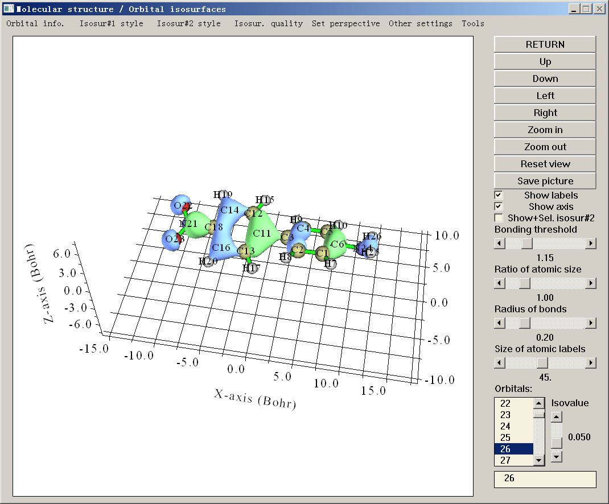

<!-- p.462 -->
more information.

The numbers in the right-bottom list are orbital indices, you can view orbital isosurface by selecting corresponding index, or directly inputting the orbital index in the text box and then press ENTER button. Note that if your system is unrestricted open-shell, to select beta orbital you should input negative index, for example, -5 corresponds to the 5th beta orbital. Plot two orbitals simultaneously in this window is also possible, as illustrated in Section 4.0.2.

For convenience, if your input file records R/U/RO(HF/KS) wavefunction, you can directly input orbital label in the text box at right-bottom corner. For example, inputting h stands for choosing HOMO, l+2 corresponds to LUMO+2, la corresponds to LUMO of alpha, hb-3 corresponds to HOMO-3 of beta, etc.

The green and blue isosurfaces correspond to positive and negative parts, respectively. The isovalue can be adjusted by dragging slide bar, you can also input its value via “Set isovalue” option in “Other settings” drop-down list at the top of the GUI. Isosurface style and colors and be altered by corresponding suboptions in "Isosur#1 style". The quality of the isosurface can be set by the options in "Isosur. quality".

By selecting "Orbital info."-"Show all", energy, occupation number and type of all orbitals will be shown in Multiwfn console window. If you do not want too many high-lying virtual MOs to be shown, you can choose "Show up to LUMO+10" or "Show occupied orbitals". If irreducible representations are recorded in the loaded .mwfn/molden/gms file, then they will be shown as the last column.

In the "Other settings" and "Tools" of the menu bar, there are many useful options, please play with them, and when you are confused, see Section 3.2 for explanation. The "Tools” - “Batch plotting orbitals" is quite worth noting, via this tool you can very conveniently save a lot of selected orbitals to respective image file in current folder, see https://youtu.be/SHwrQhqBHZ0 for video illustration.

If you want to plot probability density of an orbital instead of its wavefunction, you can choose “Other settings” - “Choose plotting wavefunction or density”, and then choose “Density”.

To close the window, click “RETURN” button. More detailed explanation about this interface can be found in Section 3.2.

Note: Visualizing isosurface of Rydberg orbitals by main function 0 of Multiwfn is also possible, however, since they show very diffuse character, in order to avoid truncating of isosurfaces, you should select "Other settings"-"Set extension distance" in the menu, and then input a relatively large value, for example, 12 (the unit is Bohr), then select the orbital to visualize it. The default value of extension distance is controlled by "Aug3D" in `settings.ini`. An example of visualizing Rydberg orbitals is given in Part 2 of Section 4.200.5.

Tip: Recommendation of the steps for obtaining pretty orbital isosurface graph

- Enter main function 0, select the orbital to be visualized, properly set isovalue
- Click "Show Labels" to disable axis
- Properly adjust viewpoint
- Properly change the size of atomic labels. Note that type of labels can be changed via "Set atomic label type" in "Other settings" at menu bar

- If the rendering effect of the isosurface is not quite good, use "Set lighting" in "Other settings" to adjust lighting.

- Select "Isosur. quality" in the menu bar, set to "high-quality" (medium sized system) or "very high-quality" (large system).

- Click "Save picture". Use such as Irfanview or Photoshop program to open it, shrink the size of the image file to 50% (in this process resample will be automatically done, making anti-aliasing


<!-- p.463 -->
effect effectively realized), then properly crop the graph.

Below is an example obtained via above steps, the quality is pretty good

It is suggested to use "face+mesh" drawing style instead of the default "solid face", since in this case the saved picture will be more stereoscopic.


### 4.0.2 Viewing natural bond orbitals (NBO) of ethanol

There are two ways to view NBOs, if you are a Gaussian user, way 2 may be more convenient, however if you also need to view natural hybrid orbital (NHO) or natural atomic orbital (NAO) or some other types of orbitals generated by NBO program, you have to use way 1.

Way 1: Using NBO plot files The common way is to generate NBO plot files (.31~.40) and load them into Multiwfn. To generate these files by Gaussian, you should add pop=nboread in route section, that means the keywords of NBO at the end of input file will be passed to NBO module (Link 607 in Gaussian), then add for example $NBO plot file=C:\NH2COH $END at the end of the input file with a blank line before it, you can refer to the NH2COH_NBO.gjf in “example” directory. Run the input file by Gaussian, you will find that NH2COH.31, NH2COH.32 ... NH2COH.41 have been generated in C:\ folder. The NH2COH.31 and NH2COH.37 have already been provided in “example” folder. Now boot up Multiwfn and input following commands

examples\NH2COH.31 // .31 file contains necessary basis function information for plotting examples\NH2COH.37 // .37 file contains NBO information. .32~.40 files correspond to PNAO/NAO/PNHO/NHO/PNBO/NBO/PNLMO/NLMO/MO respectively. Hint: You can only input 37, because in present example the .37 and the .31 file share the same name

0 // Enter the GUI You can choose corresponding NBO orbital from right-bottom list to view the isosurface. Multiwfn is also capable to plot two orbitals simultaneously, for instance, here we will plot NBO 12 and NBO 56, which correspond to occupied lone pair of nitrogen atom and unoccupied anti-π bond between carbon and oxygen atoms respectively. Firstly, we choose 12 from the orbital list to plot NBO 12, and then click "Show+Sel. isosur#2", after that we click 56 in the list, you will see both of NBO 12 and NBO 56 are shown. The yellow-green and purple parts of NBO 56 (isosurface#2) correspond to positive and negative parts, respectively.


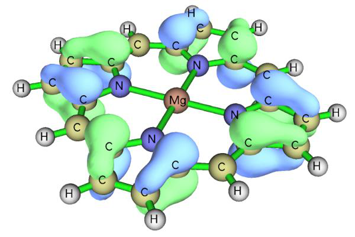

<!-- p.464 -->
It is somewhat difficult to study overlapping extent between the two orbitals from the solid face graph, so we choose "Use mesh" in "Isosur#1 style" and the counterpart in "Isosur#2 style" to make the two isosurfaces represented as mesh, see below. (Please also try "transparent face" style) Now the overlapping extent become distinct, it is quite clear that NBO 12 substantially overlapped with NBO 56, the resulting strong delocalization is one of the main reasons why the second-order perturbation energy between them is very large (~60 kcal/mol). In Section 4.4.5, you will learn how to obtain a contour map for the two orbitals.

Notice that for unrestricted calculations, .32 and .33 files outputted by NBO 3.1 module in Gaussian are incorrect -- the title parts are missing, which will lead to strange result, you should fix them by consulting other plot files such as .34, it is very easy.

Regarding the ways to pass the keywords for generating NBO plot files to NBO module in other quantum chemistry packages, please consult corresponding manual. You can also use stand-alone version of NBO program (GENNBO) to generate NBO plot files, an input file (.47) needs to be prepared first. To generate it, you should load a file containing basis function information into Multiwfn, then enter main function 100, select subfunction 2, then choose corresponding option to export .47 file. After that, manually add plot keyword between “\$NBO” and “\$END” in the .47 file. Then if you use GENNBO program to run the .47 file, you will get NBO plot files.

Way 2: Using .fch file as NBO information carrier Gaussian provides a keyword pop=saveNBO, if you add it in your Gaussian input file, NBOs will be saved to checkpoint file instead of MOs. You can use corresponding .fch file as Multiwfn


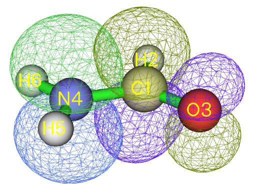

<!-- p.465 -->
input file to view NBOs. If theoretical level of the task is HF or DFT, you should add saveNBOene in the first line of the .fch file; if post-HF method is used and density keyword has also been specified, you should add saveNBOocc in the first line of the .fch file, in this case Multiwfn will do some special treatments internally. However, if your aim is just viewing NBOs in main function 0, you can ignore this step.

Beware that when Gaussian storing the NBOs to checkpoint file, they may be automatically reordered. For example, you may see the information like below in the Gaussian output file:


```text
Reordering of NBOs for storage:     7    8    3    1    2    4    6    5    9   38 ...
```

That means the 1st, 2nd, 3rd, 4th ... orbitals in the .chk/.fch file in fact correspond to the 7th, 8th, 3rd, 1st ... NBOs generated by the NBO module, respectively.

It is worth to note that if you use Multiwfn in combination with VMD, you can plot very pretty NBO isosurface maps, see my blog article "Using Multiwfn to plot NBO and related orbitals" (in Chinese, http://sobereva.com/134) for detail. Below is a map plotted by a Multiwfn user in his work J. Mol. Graph. Model., 59, 31 (2015).


### 4.0.3 Using Multiwfn + VMD to rapidly plot high-quality orbital isosurface map


Note: Chinese version of this tutorial is my blog articles “Using Multiwfn+VMD to rapidly plot high-quality isosurface map of molecular orbitals” (http://sobereva.com/447) and “Method of drawing state-of-the-art orbital isosurface map using VMD in combination with Multiwfn” (http://sobereva.com/449).

Video illustration corresponding to this section is available at https://youtu.be/-3TXfdO8H7s, please never forget to look at it!!!

Prologue If one employs Multiwfn to export cube file for the orbitals of interest, and then render them as isosurface map in VMD (http://www.ks.uiuc.edu/Research/vmd/), very ideal orbital isosurface map can be obtained, the procedure has been detailedly described in my blog article "Using Multiwfn to visualize molecular orbitals" (in Chinese, http://sobereva.com/269). However, the procedure introduced in this article is somewhat lengthy, many manual operations are needed. In order to simplify the procedure as much as possible, here I show how to use scripts to very easily and quickly draw high-quality orbital isosurface map by using Multiwfn and VMD in combination. In this section I only illustrate how to plot MOs, but the same procedure can also be applied for plotting other kinds of orbitals, however you need to properly modify the input stream file (see below). If you do not know how to run Multiwfn in silent mode, I suggest you read Section 5.2 first so that you can better understand this section. Here I assume you are using Windows system, for Linux platform you should manually write corresponding script. The VMD program I used here is version 1.9.3.


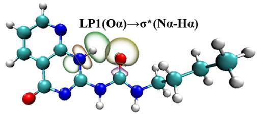

<!-- p.466 -->
Preparation work Copying showorb.bat and showorb.txt from "examples\scripts" to the folder containing Multiwfn executable file.

The showorb.bat is a Windows batch process file, it is used to invoke Multiwfn to calculate grid data of wavefunction for selected orbitals and then move the exported cube files to VMD folder. You should manually edit this file to make the input file path correspond to the actual path of input file, and then replace the VMD folder in this file with actual VMD folder in your machine.

The showorb.txt is input stream file, each line corresponds a command needed to be inputted in the Multiwfn interactive interface. You should manually set the third line as indices of the orbitals you want to plot, for example, 10,20-23,28-30.

The showorb.vmd in "examples\scripts" is a VMD plotting script, you should copy it to VMD folder, and then add source showorb.vmd to the end of the vmd.rc file in VMD folder, so that the script will be automatically executed when VMD boots up. This script defines three customized commands:

·orb i: Used to load cube file of orbital i and show it as isosurfaces. The default isovalue is 0.05, you can change it by editing showorb.vmd

·orbiso x: Used to change the isovalue to x. ·orbclean: Used to delete all orbital cube files in VMD folder.

Example Here we plot MOs for examples\excit\D-pi-A.fchk. Make sure that all preparation works have done, then edit the showorb.bat, replace the default input file 1.fch with examples\excit\D-pi-A.fchk, and ensure that the actual VMD folder has been properly specified in this file. Then open showorb.txt, set the third line as 54-59, so that we can visualize MOs from 54 to 59. Then double-click the showorb.bat, Multiwfn will be invoked to load input file, calculate and export grid data of wavefunction for the selected orbital. For e.g. orbital 54, the exported file will be named orb000054.cub. All the orbital cube files are then automatically moved to the VMD folder. After that, boot up VMD, input orb 56 in VMD console window, then orb000056.cub will be loaded into VMD and drawn as isosurfaces:

In the map above, positive and negative phases are represented as red and blue colors, respectively. "Glossy" material is used by default. If you want to change the color or material, you should enter "Graphics" - "Representation" and modify corresponding options. You can also change default color and material by modifying the showorb.vmd script.

If then you want to visualize another orbital, for example MO54, then simply input orb 54 in the VMD console window.

If you want to change the isovalue to e.g. 0.02, simply input orbiso 0.02.


<!-- p.467 -->
If after visualization, you want to clean all orbital cube files in the VMD folder, just input orbclean, then all orb??????.cub files will be deleted.

By default, "medium-quality grid" (about 512000 points) is used to calculate orbital wavefunction, this is adequate for small and medium sized systems. However, for large systems, such as those consisting of one hundred atoms or more, you must employ higher number of grid points. If you want to change the default grid to "high-quality grid", you should set the fourth line in showorb.txt to 3. In addition, as mentioned in Section 4.0.1, for visualizing Rydberg orbitals you must increase extension distance of grid data. To do so, you should add


```text
-10
12
```

between the third and fourth lines of showorb.txt, then extension distance will be increased from default value to 12 Bohr.

Plot state-of-the-art orbital isosurface map If you want to obtain an even better orbital isosurface graph, just follow below procedure (please use VMD 1.9.3, DO NOT use other VMD version!):

(1) Plot an orbital in VMD as described above (2) Copy all content in examples\scripts\VMDrender.txt to VMD console window to modify the plotting setting

(3) In VMD, select "File" - "Render" - "Tachyon", click "Start Rendering". Then vmdscene.dat will appear in VMD folder, it is input file of the Tachyon render.

(4) Copy the examples\scripts\VMDrender_full.bat to VMD folder (5) Double click the VMDrender_full.bat, then the Tachyon render (tachyon_WIN32.exe) in VMD folder will be invoked to carry out render. After a while, full.bmp appears in the VMD folder, it is the produced image file.

The rendered image of MO56 of examples\excit\D-pi-A.fchk is shown below, the graph looks extremely good!

The rendering time is fairly long for large systems. For saving time, you can use the VMDrender_noshadow.bat instead of the VMDrender_full.bat, in this case no shadow effect will be observed in the resulting graph, while the rendering cost is correspondingly reduced.

Sometimes, especially for large system, the shadows cast by the transparent orbital isosurfaces make the graph look too dark, you can manually add -shadow_filter_off argument in the .bat file to disable this kind of shadow during rendering.


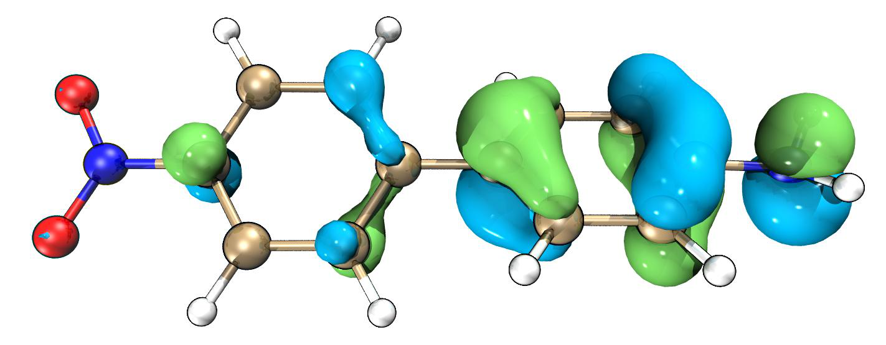

<!-- p.468 -->

## 4.1 Calculate properties at a point


### 4.1.1 Show all properties of triplet water at a given point

In this example I illustrate how to calculate a wide variety of real space functions at a given point for triplet water. Boot up Multiwfn and input below commands

examples\H2O_m3ub3lyp.wfn 1 // Main function function 1, show properties at a point 0.2,2.1,2 // X, Y, Z coordinate of the point 1 // The unit of inputted coordinate is Bohr Now all real space functions supported by Multiwfn at this point are printed along with components of electron density gradient/Laplacian, Hessian matrix and its eigenvalues/eigenvectors. If you are unable to fully understand the output, please read Sections 2.6 and 2.7 carefully, all terms in the output are very detailed described.


```text
Note: Unless otherwise specified, all units are in a.u.
 Density of all electrons:  0.4598301528E-02
 Density of Alpha electrons:  0.2861566387E-02
 Density of Beta electrons:  0.1736735141E-02
 Spin density of electrons:  0.1124831246E-02
 Lagrangian kinetic energy G(r):  0.3365319167E-02
 G(r) in X,Y,Z:  0.1342141336E-03  0.1888713104E-02  0.1342391929E-02
 Hamiltonian kinetic energy K(r):  0.1088761528E-03
 Potential energy density V(r): -0.3474195320E-02
 Energy density E(r) or H(r): -0.1088761528E-03
 Laplacian of electron density:  0.1302577206E-01
 Electron localization function (ELF):  0.1998328717E+00
 Localized orbital locator (LOL):  0.1008002781E+00
 Local information entropy:  0.3533635333E-02
 Interaction region indicator (IRI):  0.3583198766E+01
 Reduced density gradient (RDG):  0.2033111359E+01
 Reduced density gradient with promolecular approximation:  0.2294831921E+01
 Sign(lambda2)*rho: -0.4598301528E-02
 Sign(lambda2)*rho with promolecular approximation: -0.3918852312E-02
 Corr. hole for alpha, ref.:   0.00000   0.00000   0.00000 : -0.1251859403E-03
 Source function, ref.:   0.00000   0.00000   0.00000 : -0.3565867942E-03
 Wavefunction value for orbital       1 :  0.1536978161E-03
 Average local ionization energy (ALIE):  0.4664637535E+00
 van der Waals potential (probe atom: C ):  0.5566195299E+04 kcal/mol
 Delta-g (under promolecular approximation):  0.3210501179E-03
 Delta-g (under Hirshfeld partition):  0.2394976411E-03
 User-defined real space function:  0.1000000000E+01
 ESP from nuclear charges:  0.3453377860E+01
```


<!-- p.469 -->

```text
 Total ESP:  0.1431404144E-01 a.u. ( 0.3895049E+00 eV, 0.8982204E+01 kcal/mol)

 Note: The following information is for electron density

 Components of gradient in x/y/z are:
 -0.7919856828E-03 -0.6903543769E-02 -0.6651181972E-02
 Norm of gradient is:  0.9618959378E-02

 Components of Laplacian in x/y/z are:
 -0.3809549089E-02  0.1052804857E-01  0.6307272576E-02
 Total:  0.1302577206E-01

 Hessian matrix:
 -0.3809549089E-02  0.1394394193E-02  0.1197923973E-02
  0.1394394193E-02  0.1052804857E-01  0.1008387143E-01
  0.1197923973E-02  0.1008387143E-01  0.6307272576E-02
 Eigenvalues of Hessian: -0.3959672207E-02 -0.1883455778E-02  0.1886890004E-01
 Eigenvectors (columns) of Hessian:
  0.9964397434E+00 -0.2418531975E-01  0.8076452238E-01
 -0.4735415689E-01  0.6320255930E+00  0.7734993430E+00
 -0.6975257409E-01 -0.7745700228E+00  0.6286301443E+00
 Determinant of Hessian:  0.1407217564E-06
 Ellipticity of electron density:    1.102344
 eta index:    0.209852
 Stiffness:    0.099818

 Stress tensor:
 -0.1220815539E-02  0.1483611490E-04  0.1618000275E-04
  0.1483611490E-04 -0.1145414066E-02  0.3494514646E-04
  0.1618000275E-04  0.3494514646E-04 -0.1107965714E-02
 Eigenvalues of stress tensor: -0.1224514565E-02 -0.1166013495E-02 -0.1083667260E-02
 Eigenvectors (columns) of stress tensor:
 -0.9852173517E+00  0.7263017197E-01  0.1551503399E+00
  0.1433520595E+00  0.8453962002E+00  0.5145439259E+00
  0.9379209402E-01 -0.5291787248E+00  0.8433106903E+00
 Stress tensor stiffness:    1.129973
 Stress tensor polarizability:    0.884977
```

All data are expressed in scientific notation, the value behind E is exponent, e.g. 0.6307272576E-02 corresponds to 0.006307272576.

In the line of "Corr. hole (correlation hole)" and "Source function", the so-called "ref" is the position of reference point, which is determined by "refxyz" parameter in `settings.ini`.

By default, the outputted wavefunction value corresponds to orbital 1, you can input for example o6 to choose orbital 6.


<!-- p.470 -->
By default, the components of gradient and Laplacian as well as Hessian and its eigenvalue/eigenvectors are for electron density. You can input such as f10 to choose the real space function with index of 10 (namely ELF), after that all of these quantities will be for ELF. If you want to inquire about indices of all available real space functions, input allf.

You can continue to input other coordinates, when you want to return to upper-level menu, input q; If you want to exit the program, press “CTRL+C” button or directly close command-line window.


### 4.1.2 Calculate ESP at nuclear positions to evaluate interaction strength

of H2O∙∙∙HF

This is an advanced example, if you are not interested in weak interactions, you may skip this section.

In J. Phys. Chem. A, 118, 1697 (2014), Mohan and Suresh studied a batch of electrostatic dominated interacting systems, including hydrogen, halogen and dihydrogen bonds, all of them belong to electron donor-acceptor interactions, where donor stands for electron-rich moiety (Lewis base), while acceptor is electron-deficient moiety (Lewis acid). They fitted a surprisingly good

linear equation to correlate ΔΔVn index with interaction energy (Enb) for all kinds of interactions, the R2 is as high as 0.9762. Their results can be summarized as following graph

For an electrostatic dominated complex, assume that we can obtain ΔΔVn, then according to the equation shown in the graph above, we can easily predict the interaction energies as


$$E_{\mathrm{n b}}=-89.2857\times\Delta\Delta V_{\mathrm{n}}-0.125$$

<!-- formula-ocr: formula_p470_336.png 已替换为LaTeX, 原图保留备查 -->

The ΔΔVn is defined based on ESP at nuclear positions

$$\Delta\Delta V_{\mathrm{n}}=\Delta V_{\mathrm{n-D}}-\Delta V_{\mathrm{n-A}}=(V_{\mathrm{n-D^{\prime}}}-V_{\mathrm{n-D}})-(V_{\mathrm{n-A^{\prime}}}-V_{\mathrm{n-A}})$$

where Vn-D' is the ESP at nuclear position of donor atom in complex environment, but the contribution due to nucleus of this donor atom is ignored. The only difference between Vn-D and Vn-

D' is that the former is calculated in monomer state, therefore ΔVn-D = Vn-D' - Vn-D can be regarded as


<!-- p.471 -->
the change in ESP at nuclear position of donor atom due to presence of another molecule, which directly reflects strength of intermolecular interaction. The definition of Vn-A' and Vn-A are identical to Vn-D' and Vn-D, respectively, but they are calculated for acceptor atom.

In this example, we calculate ΔΔVn for H2O∙∙∙HF and check if the interaction energy predicted based on ΔΔVn is really closed to the accurately calculated interaction energy. In this complex the oxygen of H2O is electron donor atom and hydrogen of HF is electron acceptor atom. Because the equation presented by Mohan and Suresh was fitted for specific calculation level, in order to properly use their equation, the calculation level we employed here is identical to them. The .wfn files used below were produced at MP4(SDQ)/aug-cc-pVTZ level at MP2/6-311++G** optimized geometries, these .wfn files and the corresponding Gaussian input files can be found in "examples\Vn" folder.

Note that if you are using relatively old revision of G09 and post-HF method is employed, "density" keyword is indispensable, otherwise the density in the resultant .wfn file will correspond to Hartree-Fock density. Besides, in G09 and G16, density cannot be produced at MP4 level, so we use MP4(SDQ) keyword instead (MP4 keyword is default to MP4(SDTQ), which is more accurate and but much expensive than MP4(SDQ)).

First, we calculate Vn-A' and Vn-D'. Boot up Multiwfn and input examples\Vn\H2O-HF.wfn 1 // Calculate properties at a point a1 // Nuclear position of atom 1 From the output you can see


```text
Total ESP without contribution from nuclear charge of atom     1:
-0.2228775074E+02 a.u. ( -0.6064805E+03 eV, -0.1398579E+05 kcal/mol)
```

That means Vn-D' is -22.2877 a.u. Then input a5, you will find Vn-A' is -0.9608 a.u.

Next we calculate Vn-D. Reboot up Multiwfn and input below commands ?H2O.wfn // The symbol ? means the folder of the file we last time loaded 1 a1 // In H2O.wfn oxygen is atom 1 We find Vn-D is -22.3339 a.u. Then we calculate Vn-A. Reboot Multiwfn and input

?HF.wfn 1 a2 // In HF.wfn hydrogen is atom 2 The Vn-A is found to be -0.9136 a.u.

The ΔΔVn is thus -22.2877-(-22.3339) - [-0.9608-(-0.9136)] = 0.0462 + 0.0472 = 0.0933 a.u. Using the equation mentioned earlier, the interaction energy can be approximately predicted as

-89.2857×0.0933-0.125 = -8.45 kcal/mol, this value is quite close to the accurate interaction energies (-8.31 kcal/mol) obtained by Mohan and Suresh at MP4/aug-cc-pVTZ level with Counterpoise correction.

Generating wavefunction at MP4(SDQ)/aug-cc-pVTZ is quite time consuming even for small complex such as the system we studied here, thus it is important to find a calculation level that significantly saves computational time but without too much sacrifice in accuracy. For present system, based on the MP2/6-311++G** geometry, I tried using several levels to evaluate the ΔΔVn:

B3LYP/6-311+G**: 0.1021 a.u. MP2/cc-pVTZ: 0.1052 a.u. MP2/aug-cc-pVTZ: 0.0955 a.u. B3LYP/aug-cc-pVTZ: 0.0985 a.u. MP2/aug-cc-pVDZ: 0.0939 a.u. B3LYP/aug-cc-pVDZ: 0.0980 a.u. The ΔΔVn produced at MP2/aug-cc-pVDZ (0.0939) is very close to the value we obtained above at MP4(SDQ)/aug-cc-pVTZ (0.0933), while the computational cost is reduced by factors of two. So, in practical studies,


<!-- p.472 -->
using MP2/aug-cc-pVDZ level to evaluate ΔΔVn is a very ideal choice.


## 4.2 Topology analysis

Multiwfn is able to perform topology analysis for any real space functions, such as electron density, its Laplacian function, ELF, LOL, orbital wavefunctions, spin density, electrostatic potential and so on. Four kinds of critical points (CPs) can be located and real space function values at these points can be easily obtained; topology paths linking CPs and interbasin surfaces can be generated. There are also many additional capabilities, see Section 3.14 for details. Below I will present some practical applications to illustrate how to use this powerful module.

Note that Multiwfn can not only perform topology analysis based on wavefunction file, but also based on grid data, as illustrated in http://sobereva.com/wfnbbs/viewtopic.php?pid=2276. Therefore, performing topology analysis for electron density determined by experimental crystal diffraction is also possible.


### 4.2.1 Atoms-in-molecules (AIM) topology analysis and aromaticity analysis for 2-pyridoxine 2-aminopyridine


Topology analysis of electron density is a main ingredient of Bader's atoms in molecules (AIM) theory. In this example we will perform this kind of analysis for 2-pyridoxine 2-aminopyridine complex.

Boot up Multiwfn and input following commands examples\2-pyridoxine_2-aminopyridine.wfn // Assume that the input file is in a subdirectory of current directory, we can only input relative path rather than entire absolute path

2 // Topology analysis Then we search all critical points (CPs) by inputting below commands 2 // Use nuclear positions as initial guesses, generally used to search (3,-3) CPs 3 // Use midpoint of each atomic pair in turn as initial guesses. Generally all (3,-1) CPs could be found, some (3,+1) or (3,+3) may also be found at the same time

The search of CPs is very fast. After that input 0, the positions and types of all found CPs will be printed in the command-line window, at the end of the output the number of each type of CPs is shown:


```text
(3,-3):    25,   (3,-1):    27,   (3,+1):     3,   (3,+3):     0
  25  -   27  +    3  -    0  =   1
```

The second line shows that Poincaré-Hopf relationship has been satisfied, that means all CPs may


<!-- p.473 -->
have been found. If this relationship is unsatisfied, then some CPs must be missing. From the GUI window that popped up (the map below), we can see all expected CPs are presented, hence we can confirm that all CPs have been found.

Click "RETURN" button at top right corner of the GUI window and input 8 to generate topology paths (in the present context they correspond to "bond paths"), then select option 0 again to view CPs and paths. From the command-line window now you can find the two atoms connecting to each BCP have been directly given. After slight adjustment of plot settings in the GUI window, the graph looks like below (Click "CP labels" at the right side of the GUI if CPs indices are not shown):


<!-- p.474 -->
Magenta, orange and yellow spheres in the map above correspond to (3,-3), (3,-1) and (3,+1) critical points, respectively. Brown lines denote bond paths. The indices of CPs are labelled by cyan

$$BE\approx-332.34\times\rho(\mathbf{r}_{\mathrm{BCP}})-1.0661\ (for\ charged\ H-bond)$$

It is worth to note that the label color of the CPs can be changed via “Set label color” option in the “CP labelling settings” drop-down list in the menu bar. If you want to only label a specific CP, you can select “Labelling only one CP” in the “CP labelling settings” and then input its index (when system is very large and there are numerous CPs, this option will be useful to clearly visualize or find the CP of interest. If you input nothing in this option, then all CP labels are allowed to be shown).

Now close the GUI window. The topology analysis module provides many analysis options; for example, let us measure the distance between CP30 and the nuclear position of H25. Select option -9, then input c30 a25, the result is 5.877601 Å. Then we measure the angle between C14-N13-H12, namely input a14 a13 a12, the result is 120.297432 degrees. Now, we input q to return.

Evaluate H-bond binding energy J. Comput. Chem., 40, 2868 (2019) DOI: 10.1002/jcc.26068 is a very important paper about H-bond, a broad range of H-bond systems were subjected to thorough investigation and deep analysis. In this work I and my collaborators proposed two extremely useful and important equations for predicting H-bond binding energy (BE) based on electron density at BCP corresponding to H-bond.

𝐵𝐸≈−223.08 × 𝜌(𝐫BCP) + 0.7423 (for neutral H−bond) 𝐵𝐸≈−332.34 × 𝜌(𝐫BCP) −1.0661 (for charged H−bond)

where the unit of ρ is a.u., the unit of BE is kcal/mol. It was shown that these formulae are not only reliable but also universal. The first equation is suitable for present complexes, here we employ it

$$BE\approx-332.34\times\rho(\mathbf{r}_{\mathrm{BCP}})-1.0661\ (for\ charged\ H-bond)$$

Choose option 7 and then input the index of corresponding BCP, namely 53, you will see values of a lot of real space functions at this point are shown:


```text
CP Position:    0.44887255865472    3.56434324597741   -0.10652884364257
CP type: (3,-1)
Density of all electrons:  0.3129478049E-01
Density of Alpha electrons:  0.1564739024E-01
Density of Beta electrons:  0.1564739024E-01
Spin density of electrons:  0.0000000000E+00
```


<!-- p.475 -->

```text
Lagrangian kinetic energy G(r):  0.2530207716E-01
Hamiltonian kinetic energy K(r):  0.8463666362E-03
Potential energy density V(r): -0.2614844379E-01
Energy density: -0.8463666362E-03
Laplacian of electron density:  0.9782284209E-01
Electron localization function (ELF):  0.1105388527E+00
... (Ignored)
```

The output indicates that the ρ(r) at this BCP is 0.03129 a.u., therefore the H-bond BE could be evaluated as BE = -223.08*0.03129+0.7423 = -6.2 kcal/mol = -26.1 kJ/mol.

It is also worth to note that in Chem. Phys. Lett., 285, 170 (1998), Espinosa and coworkers

$$BE=V(\mathbf{r}_{BCP})/2$$

BE=V(rBCP)/2

As shown in above output, V(r) at the BCP of N23-H25····O1 is -0.026148, thus the BE could be predicted to be -0.026148/2*2625.5 = -34.3 kJ/mol, which notably differs from the -26 kJ/mol using the prediction equation proposed in the J. Comput. Chem. (2019) paper. Which one is more accurate? As rigorously demonstrated in the J. Comput. Chem. article, the popular V(rBCP)/2 equation in fact has an evidently larger error and thus cannot be recommended; in other words, the BE of -26.1 kJ/mol should be more reliable.

Evaluating aromaticity based on CP properties In this part we use two special options in the topology analysis module to evaluate aromaticity. If you are not interested in this topic you can skip it.

First, we use information entropy method to examine if the aminopyridine (the monomer at the left side of the graph above) in the dimer can be regarded as an aromatic molecule. This method was proposed in Phys. Chem. Chem. Phys., 12, 4742 (2010) and is based on electron density at BCPs of a ring, see Section 3.14.6 for detail. First, we select option “20 Calculate Shannon aromaticity index”, and then input indices of the BCPs in the ring, namely 44,42,32,29,31,40, the outputted Shannon aromaticity index (SA) is 0.000812. The smaller the SA index, the more aromatic is the ring. In origin paper, 0.003 < SA < 0.005 is chosen as the boundary of aromaticity/antiaromaticity. Since our result is much smaller than 0.003, we can conclude that aminopyridine is an aromatic molecule. The SA for 2-pyridoxine (the monomer at the right side of the graph above) is 0.000865, hence shows slightly weaker aromaticity than aminopyridine.

Next, we calculate the curvature of electron density perpendicular to ring plane at RCP. In Can. J. Chem., 75, 1174 (1997), it was shown that more negative curvature implies stronger aromaticity. We first calculate the curvature for aminopyridine. Select option “21 Calculate gradient and curvature of electron density along a given direction”, input index of the RCP (namely 36), choose mode 2, and then input at least three atoms to fit the ring plane, here we input 15,13,17. From the output we find the curvature is -0.0187 a.u. Then we calculate the curvature for 2-pyridoxine (CP41, use atoms 2, 7, 4 to define plane), the result is -0.0164 a.u. Comparison between the two curvatures again shows that aminopyridine has a stronger aromaticity. In Multiwfn, aromaticity can also be measured in many other schemes, such as HOMA, FLU, PDI, ELF-π and multicenter bond order, they are collectively discussed in Section 4.A.3.

Generating interbasin surfaces Interbasin surfaces (IBS) dissect the whole molecular space into individual basins, each IBS actually is a bunch of gradient paths derived from a (3,-1) CP. Now we generate IBS corresponding


<!-- p.476 -->
to the (3,-1) with index of 53, 38 and 37. Choose function 10, and input

53 // Generate the IBS corresponding to the (3,-1) CP with index of 33, the same as below. You may need to wait a few seconds for each generation of IBS

38 37 q // Return Visualize the results by choosing function 0, the graph will be shown as below. The three surfaces are IBS.

In Section 4.20.1, we will use another important weak interaction analysis method NCI to further study this system.

You may feel that the current Multiwfn GUI for showing CPs and topology paths is somewhat difficult to use for large system, since the system cannot be rotated completely smoothly, and sometimes index of interesting CP is difficult to be observed. In Section 4.2.5 I will introduce how to use the powerful VMD program based on Multiwfn outputs to very easily plot CPs and topology paths, in this case the graph is very pretty, the perspective is completely controllable, and index of interesting CPs can be easily found out.

There are two important points regarding AIM topology analysis I would like to mention here, though they are not related to present example.

What should I do if some CPs of electron density were not successfully located? For small systems, commonly we can check whether all CPs have been located by simply entering the GUI and visualizing the distributions of the CPs. There is also a useful equation named Poincaré-Hopf relationship. For isolate system, the relationship is

1CCPRCPBCPNCP=−+−nnnn

If all CPs have been found, this relationship must be satisfied, but the satisfaction of this relationship does not necessarily mean all CPs have been found. If the Poincaré-Hopf relationship is unsatisfied, then some CPs must be missing.


<!-- p.477 -->
Sometimes, you may find some expected CPs were not successfully located after searches. There are two reasons that may cause this problem: (1) The position of initial guesses are not close enough to the CPs (2) The default CP searching parameters are not well-suited for present case. There are some common ways to solve this problem, as shown below. More detailed descriptions may be found in Section 3.14.2.

a) If you have tried options 2~5 and some CPs were not located, try to use suboption -1 of option 6. This searching mode is powerful but expensive, which by default places 1000 starting points within a spherical region around every atom. If after repeating this mode several times the missing CPs are still unable to be located, it is highly possible that the reason is due to the inappropriate searching parameters rather than the positions of starting points.

b) If some BCPs are unable to be located, you can enter option -1, set the scale factor of stepsize to 0.5, and then try again

c) NCPs of very heavy atoms are difficult to be located, because the peak of electron density at nucleus in this case is very sharp, thus under default parameters the searching algorithm is difficult to capture the NCPs. In order to locate them, you can enter option -1, loosen the criteria for gradient-norm and displacement convergences by several orders of magnitude, and then try to use option 2 to search the NCPs again. If the NCPs are then successfully found, do not forget to recover the original convergence criteria. In fact, since NCP of heavy atoms are almost exactly located at nuclear position, you can also directly enter option -4 and choose suboption 3 to add NCPs manually at the corresponding nuclear positions.

d) If some missing CPs are expected to occur far away from atoms, for example, a CCP at the center of a very large cage or tube system, please enter option -1, using suboption 8 to tighten the criterion for determining singularity of Hessian matrix by several orders of magnitude, and then try to search the CPs again.

By the way, in rare cases you may find a few CPs occur in unexpected regions that far away from the system, they should be artificial due to numerical noise. A useful way to avoid locating them is entering option -1 and choosing suboption 8, increase the criterion by some orders of magnitude (e.g. increasing it to 1E-15) and then search CPs as usual.

On the describing electron density of very heavy atoms Very heavy atoms (heavier than Kr) bring much more computational burden than light atoms, and relativistic effect is nonnegligible. There are two different ways to describe them.

- Using pseudopotential (PS): As mentioned in Section 2.5, if PS is employed but the .wfx file produced by Gaussian is used as input file, the EDF (electron density functions) field in the .wfx file by default will be loaded into Multiwfn, which represents the inner-core electron density. For other type of input files, such as .mwfn, .wfn, .fch, .molden and .gms, by default Multiwfn automatically loads proper EDF information from built-in EDF library.

When EDF information is provided, all CPs of electron density can be properly located and artificial CPs will never occur, the bond paths emitting from BCPs can connect to NCPs normally, all CP properties that solely based on electron density will be reasonable. Although large core PS can be employed without problems in this situation, I still recommend using small core PS, because the accuracy of resultant CP positions and properties must be better than using large core PS.

Lanl1 Lanl2, Lan2TZ/08 SDD cc-pVnZ-PP, def2 series SBKJC

Main groups Large Large L/S (optional) Small Large


<!-- p.478 -->
Transition metals Large Small L/S (optional) Small Small

If you decide not to utilize EDF information (see "readEDF" and "isupplyEDF" in `settings.ini` for detail), evidently it is impossible to find out (3,-3) CP at nuclear position, and accordingly, the bond paths emitted from BCP will be unable to connect to the nucleus. Instead, you may find (3,+3) at nucleus position due to the vacancy of inner-core density, and a lot of CPs in different types will appear around the nucleus, this is because the electron density no longer decreases exponentially from nucleus, so the topology structure of electron density becomes quite complicated. However, you can simply ignore those irrelevant CPs but only focus on the BCPs that you are really interested in.

- Using all-electron basis set with relativistic Hamiltonian: This is the most expensive but most accurate solution for representing electron structure of heavy atoms. Only considering scalar relativistic effect is totally enough for AIM analysis. DKH2 Hamiltonian is a very good choice (in Gaussian, simply using int=DKH2 keyword to employ it, beware that basis set optimized for DK calculation must be used, e.g. cc-pVDZ-DK).

For more discussions, please consult my blog article "Some explanation of performing wavefunction analysis under pseudopotentials" (in Chinese, http://sobereva.com/156).


### 4.2.2 Topology analysis of localized orbital locator (LOL) for acetic acid

A brief of localized orbital locator (LOL) has been given in Section 2.6. In this example, we will locate its CPs and generate topology paths of LOL for acetic acid. With completely identical procedure, you can also study topology character for many other real space functions, such as electron localization function (ELF), electrostatic potential (ESP) and Laplacian of electron density.

Boot up Multiwfn and input following commands examples\acetic_acid.wfn 2 // Enter topology analysis module -11 // Select a real space function 10 // Localized orbital locator (LOL) Notice that the distribution feature of LOL is much more complex than electron density, so it is very difficult to locate all LOL CPs. Fortunately, in general only a small subset of LOL CPs is what we are interested in, the search of CPs can be aborted once all CPs of interested have been found.

We first use option "2 Search CPs from nuclear positions" to locate the CPs that very close to nuclei. However, the positions of CPs in other regions are somewhat unpredictable, hence a lot of starting points have to be randomly scattered around each atom to try to locate those CPs. Now, input below commands:

6 // In this searching mode, starting points will be randomly scattered within a spherical region, the sphere center, radius, number of points and so on can be defined by users. This time we leave the default value unchanged

-1 // Use each nucleus as sphere center in turn to search CPs. Since there are 8 atoms, and starting points in each sphere is 1000, Multiwfn will try to search CPs based on 8*1000 starting points. Of course, the more the starting points you set, the larger probability that all CPs could be found in this search, but the higher the computational cost


<!-- p.479 -->
-9 // Return to upper menu 0 // Visualize the result

From the map above it can be seen that the number of CPs of LOL is very large. Actually, there are still some CPs have not been found in the search. If you repeat the search one more time, some missing CPs may be located. Since all CPs of our interest have been found currently, repeating the search is unnecessary. In the graph, each purple sphere signifies a (3,-3) type of CP, which represents local maximum of electron localization. It can be seen that CP15 delineates the covalent bond between the two carbons. CP8 and CP9 correspond to the two C-O bonds. CPs 7, 57, 12 and 13 correspond to lone pairs of oxygens.

Note that the indices of the CPs located by the option 6 are different each time, because the distribution of the starting points is fully random.

Now choose option 8 to generate the topology paths linking (3,-1) and (3,-3) CPs, then choose option 0 to visualize the result again. To relieve visual burden, display of some uninteresting objects can be disabled by properly adjusting corresponding GUI widgets. As you can see from the graph below, the topology paths clarify the intrinsic connectivity between CPs.


<!-- p.480 -->
Hint: Example of using steepest ascent algorithm to search maxima For LOL and ELF, usually what we are really interested in are their (3,-3) CPs, namely maxima. The default CP searching method is Newton, which locate all kinds of CPs, as shown above. It is worth to note that Multiwfn also supports other searching algorithm, among which the steepest ascent is dedicated to searching maxima. As instance, here we adopt it to search ELF maxima for acetic acid. Boot up Multiwfn and input

examples\acetic_acid.wfn 2 // Enter topology analysis module -11 // Select a real space function 9 // ELF -1 // Set CP searching parameters 12 // Choose searching algorithm 3 // Steepest ascent 0 // Return 6 // Search CPs from a batch of points within sphere(s) -1 // Start the search using each nucleus as sphere center in turn -9 // Return 0 // Visualize result After some adjustment of plotting settings, you can clearly see maxima of ELF:


<!-- p.481 -->
The distributions of maxima of ELF maxima and those of LOL are very similar, however there are also some notable difference. There are two LOL maxima representing the lone pairs of O1, while there is only one ELF minimum in corresponding region. In addition, LOL employs one maxima to signify the C3-O4 interaction, while there are two in ELF map.


### 4.2.3 Plot real space function along bond path

All real space functions that supported by Multiwfn could be easily plotted along topology paths. In this example we plot ellipticity of electron density along bond path of boundary C-C bond of butadiene.

First open `settings.ini` file and change "iuserfunc" parameter to 30, because the 30th user-defined function corresponds to electron density ellipticity, see Section 2.7 for detail.

Then boot up Multiwfn and input below commands: examples\butadiene.fch 2 // Topology analysis 2 // Search nuclear critical points from nuclear positions 3 // Search bond critical points from midpoint of atomic pairs 8 // Generate bond path 0 // Enter GUI window to visualize result Clicking "Atom labels" and "Path labels" buttons at right side of the GUI window, then we can find paths 5 and 6 collectively constitute the bond path of a boundary C-C bond:

Clicking "RETURN" to close the window and then input -5 // Various operations on paths 7 // Calculate and plot a specific real space function along a path


<!-- p.482 -->
5,6 // The index of the paths (in fact, you can also equivalently input c13 here) 100 // User-defined function, which corresponds to ellipticity of electron density currently

The curve of electron density ellipticity along the boundary C-C bond path immediately shows on the screen, the dashed line denotes the position of bond critical point. In the plot, the left and right corner correspond to CP3 and CP4, respectively. At the same time, the raw data of the curve are shown on the command-line window and you can copy them out, so that the map can be further analyzed or replotted in third-part plotting tools such as Origin.

From the graph it is clear that the electron density ellipticity is positive in the middle region of the bond path, exhibiting the double-bond character of the C-C bond.

You can also plot other real space functions such as ELF and kinetic energy density along bond paths, please have a try.


### 4.2.4 Decompose properties at a critical point as orbital contributions

Many real space functions can be exactly or approximately decomposed as orbital contributions. If occupation number of all orbitals except for an orbital i is set to zero, then the calculated function value just corresponds to contribution of orbital i.

Multiwfn is able to decompose any real space function as orbital contributions at any point, this feature is supported by both main function 1 and main function 2; in the former the position of the point can be directly inputted by user, while in the latter the point can be selected as one of found CPs. In this section I will use 1,3-butadiene as example to illustrate this feature.

We will first check which MOs have evident contribution to BCP corresponding to the boundary C-C bonds. Boot up Multiwfn and input

examples\butadiene.fch 2 // Topology analysis 2 // Search nuclear critical points 3 // Search BCPs 0 // Visualize CPs


<!-- p.483 -->
As can be seen, CP13 and CP17 are the BCPs of boundary C-C bonds. Close the GUI and then input

7 // Show properties at a CP 13d // Decompose properties of CP13 1 // The real space function to be decomposed is electron density [Press ENTER button] // Take all occupied orbitals into account, but only print ten orbitals having largest contributions

You will see below output


```text
 Contribution from orbital    11 (occ= 2.000000):      0.107469 a.u. ( 31.34% )
 Contribution from orbital     6 (occ= 2.000000):      0.085220 a.u. ( 24.85% )
 Contribution from orbital     9 (occ= 2.000000):      0.061997 a.u. ( 18.08% )
 Contribution from orbital     5 (occ= 2.000000):      0.059119 a.u. ( 17.24% )
 Contribution from orbital    12 (occ= 2.000000):      0.011205 a.u. (  3.27% )
 Contribution from orbital    10 (occ= 2.000000):      0.008898 a.u. (  2.60% )
 Contribution from orbital     7 (occ= 2.000000):      0.004864 a.u. (  1.42% )
 Contribution from orbital     8 (occ= 2.000000):      0.003807 a.u. (  1.11% )
 Contribution from orbital     2 (occ= 2.000000):      0.000070 a.u. (  0.02% )
 Contribution from orbital     1 (occ= 2.000000):      0.000070 a.u. (  0.02% )
 Sum of above values:      0.34286855 a.u. ( 100.00% )
 Exact value:      0.34286855 a.u.
```

Clearly, electron density at this BCP is simultaneously contributed by many MOs, the largest contribution is 31.3%. What will happen if we transform the MOs to localized MOs (LMO)? (see Section 3.21 for introduction about orbital localization and LMO). To examine this, return to main function menu, then input

19 // Orbital localization 1 // Only localize occupied orbitals 2 // Enter topology analysis function again. We do not need to redo topology analysis, since all topology information is retained when you exit topology analysis module

7 // Show properties at a CP 13d // Decompose properties of CP13 1 // The real space function to be decomposed is electron density [Press ENTER button] You will see


```text
 Contribution from orbital    11 (occ= 2.000000):      0.339266 a.u. ( 98.95% )
```


<!-- p.484 -->

```text
 Contribution from orbital     6 (occ= 2.000000):      0.001072 a.u. (  0.31% )
 Contribution from orbital     7 (occ= 2.000000):      0.000630 a.u. (  0.18% )
...[ignored]
 Sum of above values:      0.34286855 a.u. ( 100.00% )
 Exact value:      0.34286855 a.u.
```

As can be seen, currently only one orbital, namely LMO11, has made a remarkable contribution to the BCP. This is what we expected, since in the LMO framework, each chemical bond is commonly mainly represented by only one or very few LMOs. You can visualize LMO11 using main function 0:

It is clear that LMO11 fully corresponds to the boundary C-C σ-bond, this is why properties such as electron density of the corresponding BCP are solely dominated by LMO11.

Next, let us check which LMOs have nonnegligible contribution to the point above 1 Bohr of the BCP corresponding to the boundary C-C bond. The index of the BCP is 13, when you choose option 0, you can find its coordinate in console window:


```text
Index               XYZ Coordinate (Bohr)                 Type
...[ignored]
  11    -2.227945085    -3.985434919     0.000000000   (3,-1)
  12    -0.041512516    -3.979859852     0.000000000   (3,-1)
  13    -1.131478160    -2.047305989     0.000000000   (3,-1)
...[ignored]
```

Evidently, the point above 1 Bohr of CP13 should be (-1.131,-2.047,1.0). Input below command

-10 // Return to main menu 1 // Print various properties at a given point d // Decompose to orbital contributions -1.131,-2.047,1.0 1 // The unit of inputted coordinate is Bohr 1 // Decompose electron density [Press ENTER button] Then you will see the information below


```text
 Contribution from orbital    11 (occ= 2.000000):      0.110266 a.u. ( 66.33% )
 Contribution from orbital    15 (occ= 2.000000):      0.055354 a.u. ( 33.30% )
 Contribution from orbital     1 (occ= 2.000000):      0.000215 a.u. (  0.13% )
...[ignored]
Exact value:      0.16623908 a.u.
```

It can be seen that not only LMO11, but also LMO15 has an evident contribution. If you inspect

this orbital in main function 0, you will find it corresponds to π bond of the boundary C-C bond.


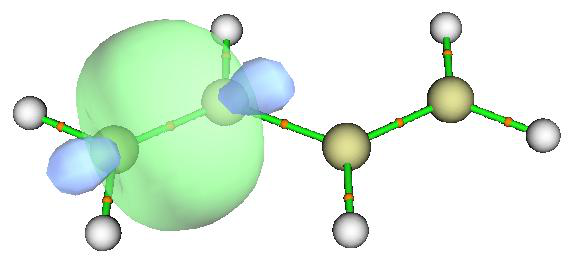

<!-- p.485 -->
Via similar way, we then decompose electron density of the point above 1 Bohr of the BCP corresponding to the middle C-C bond, the result is


```text
 Contribution from orbital    13 (occ= 2.000000):      0.097450 a.u. ( 78.20% )
 Contribution from orbital    14 (occ= 2.000000):      0.013348 a.u. ( 10.71% )
 Contribution from orbital    15 (occ= 2.000000):      0.013348 a.u. ( 10.71% )
...[others are not shown due to negligible contribution]
 Exact value:      0.12461415 a.u.
```

Isosurface graph of the three LMOs are shown below.

Although both the LMO 14 and LMO 15 mainly correspond to π bond of the marginal C-C bonds, they have 10.7% contribution to the position above 1Å of the middle C-C bond, implying that the

middle C-C bond must also have π character, though much weaker than the boundary C-C bonds.


### 4.2.5 Easily plot high-quality AIM topology map in VMD visualization program based on Multiwfn outputs


Note 1: Chinese version of this tutorial is my blog article “Using Multiwfn+VMD to rapidly plot high-quality AIM topology analysis map” (http://sobereva.com/445).

Note 2: There is a video illustration corresponding to this section: https://youtu.be/mgsnhvWH5SI. I strongly suggest looking at it!!!!!!!!!!!!

In Section 4.2.1 I have shown how to carry out AIM topology analysis for 2-pyridoxine 2-aminopyridine complex, in present section I will show how to very easily render the located CPs and generated topology paths in the very powerful and freely available VMD program (http://www.ks.uiuc.edu/Research/vmd/). The map is very pretty, and you can easily find index of interesting CPs. The whole process is highly automatic, because it is based on pre-provided Windows batch process file and VMD plotting script. If you do not know how to run Multiwfn in silent mode, I strongly recommend reading Section 5.2 first, so that you can fully understand how the batch process file works. If you manually write a similar shell script, this method can also be realized under Linux platform.

The script files We need to make a few preparations first. Copy AIM.bat and AIM.txt from "examples\scripts" to the folder containing Multiwfn executable file. Edit the AIM.bat, modify the default VMD folder to actual VMD folder on your machine. Then copy the VMD plotting script AIM.vmd to VMD folder,


<!-- p.486 -->
and add proc aim {} {source AIM.vmd} to the end of the vmd.rc file in VMD folder so that then you can activate this script by simply inputting command aim.

The AIM.txt is an input stream file for running Multiwfn in silent mode, it does below things: (1) Carrying out standard AIM analysis (locating CPs via options 2,3,4,5 in succession and generating topology paths)

(2) Exporting the CPs and paths as CPs.pdb and paths.pdb in current folder (3) Calculate all properties except for ESP at all located CPs and export the result to CPprop.txt in current folder (4) Exporting the structure of present system as mol.pdb in current folder If you want to reduce calculation cost of VMD.bat, you can remove the fourth and fifth lines of VMD.txt, in this case Multiwfn will only try to locate CPs starting from nuclear positions and midpoints of atomic pairs. However, this treatment may cause missing of some CPs.

Example: 2-pyridoxine_2-aminopyridine In this example, we copy the examples\2-pyridoxine_2-aminopyridine.wfn to the folder containing Multiwfn executable file, modify the input file name in the VMD.bat as 2-pyridoxine_2-aminopyridine.wfn, then double-click the VMD.bat, this batch process file will invoke Multiwfn to carry out analysis according to the commands in VMD.txt for this .wfn file. After a while, CPprop.txt is generated in this folder, the meantime generated mol.pdb, CPs.pdb and paths.pdb are automatically moved to the VMD folder.

Now boot up VMD and input command aim in VMD console window, you will immediately see the graph below.

Notice that in order to gain slightly better effect, I used the built-in Tachyon render to obtain the graph below, namely selecting "File" - "Render", change to "Tachyon (internal, in-memory rendering)" and click "Start Rendering" button (The resulting file is in .tga format, you need to use advanced image viewer to view it, such as IrfanView, which is freely available at https://www.irfanview.com)

It is also possible to simultaneously show molecular structure on the map. Double click the "D" shown in the screenshot below to make it become black:

Then the molecular structure will be visible:


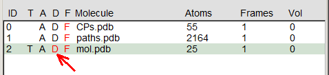

<!-- p.487 -->
Show labels for CPs The CP indices can be labelled on the graph easily. The AIM.vmd script defined a command named labcp to do this, the usage is:

labcp [type] [label size] [offset in X] [offset in Y] The “type” could be “all”, “no”, “3n3”, “3n1”, “3p1”, “3p3”. The “offset in X” and “offset in Y” are used to define position offset of the labels, they are default to -0.1 and 0.0, respectively.

Examples: labcp all: Labelling index of all CPs labcp no: Removing all CP labels labcp 3n1 1.3: Labelling all (3,-1) CPs with size of 1.3 labcp 3p3 1.8 -0.05 0.1: Labelling all (3,+3) CPs with size of 1.8, the position offset in X and Y are set to -0.05 and 0.1, respectively

For present system, we input labcp 3n1 1.5 -0.1 0.1 in VMD console window, you will see

The labels on the graph above have one-to-one correspondence to those in CPprop.txt. For example, the CP with label 38 just corresponds to the CP 38 in the CPprop.txt. Clearly you can easily examine properties of various CPs by checking corresponding entry in the CPprop.txt.

In addition, the AIM.vmd also defined labcpidx command to label specific CPs according to their indices. For example, you can use labcpidx "2 7 to 10 14" to only label CPs 2, 7, 8, 9, 10, 14, and you can also add [label size] [offset in X] [offset in Y] options behind the indices.

Show specific CPs If you want to hide some type of CPs, you should enter "Graphics" - "Representations", and then switch "Selected Molecule" to "CPs.pdb", as shown below.


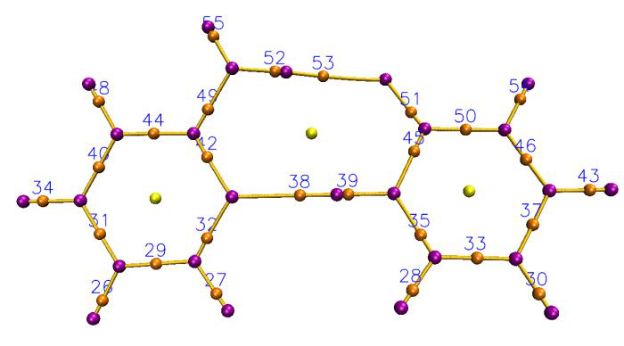

<!-- p.488 -->
Since in the CPs.pdb, the C, N, O, F atoms are used to represent (3,-3), (3,-1), (3,+1), (3,+3) CPs, respectively, if you want to hide (3,+1) and (3,+3) in the map, you can double click the entries of "name O" and "name F" to make them invisible.

In addition, for example, among all (3,-1) CPs you only want to show those with index of 3,5,6,7,11, you can select the "name N" entry, and then input name N and serial 3 5 to 7 11 in the "Selected Atoms" box and then press ENTER button. While if you want to make those CPs hidden, you should input name N and not {serial 3 5 to 7 11}. Clearly, the selection in VMD is very flexible.

Show specific topology paths It is also possible to selectively display topology paths. As you can find from the content of paths.pdb, each path corresponds to a unique residue index, so you can use "resid" property in VMD to choose which paths are visible or invisible. For example, if you want to hide topology paths 3 and 7, you should enter "Graphics" - "Representations" panel, choose "paths.pdb" from "Selected Molecule" drop-down box, then input not resid 3 7 in the "Selected Atoms" box.

If you want to inquire about the index of a topology path, you should active VMD graphical window, press button "0" to enter query mode, then click a path in the graphical window, then the "resid:" shown in the console window is just the path index. If you want to return to rotation model, you should press button "r".


### 4.2.6 Topology analysis in special ways: G-C...G-C base pair as an example


Owing to the extremely flexible design of Multiwfn, it is possible to perform topology analysis only within certain regions that you are really interested in or between specific regions, so that overall cost can be significantly reduced and meantime avoiding unwanted CPs. In this section, the G-C...G-C base pair shown below will be employed as an instance. This system can be regarded as consisting of four fragments. Its .wfn file can be directly downloaded at http://sobereva.com/multiwfn/extrafiles/GCGC.zip.


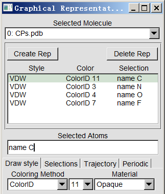

<!-- p.489 -->
(1) Perform AIM analysis only in weakly interacting regions First, I show how to only locate CPs and generate bond paths in weakly interacting regions, where electron density must be relatively low. Boot up Multiwfn and input

GCGC.wfn 2 // Topology analysis 2 // Search CPs from nuclear positions -1 // Set CP searching parameters 9 // Set value range for reserving CPs: 0,0.1 // Only CPs with density within 0~0.1 a.u. (i.e. relatively low density) will be reserved during searching

0 // Return 3 // Search CPs from midpoint of atomic pairs 8 // Generating the paths connecting (3,-3) and (3,-1) CPs Now choose option 0 to visualize the result, see below. The left and right graphs are actually the same, but molecule structure is hidden in the right graph. It is clear that only BCPs as well as accompanying bond paths corresponding to weak interactions have been generated, while BCPs and bond paths corresponding to chemical bonds are not obtained.

If you are not interested in RCPs (ring CPs, yellow spheres) and CCPs (cage CPs, green spheres), you can easily delete them. Input below commands:

-4 // Modify or export CPs 2 // Delete some CPs 5 // Delete all (3,+1) CPs 6 // Delete all (3,+3) CPs 0 // Return


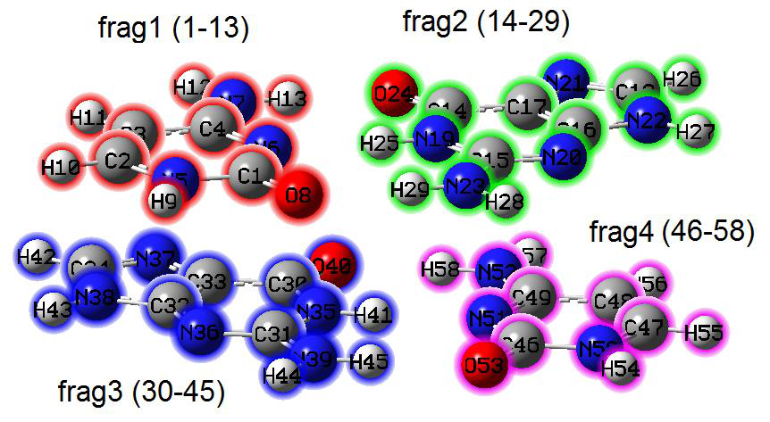


<!-- p.490 -->
0 // Return Then if you choose option 0 again to visualize the result, you will find RCPs and CCPs have disappeared.

(2) Perform AIM analysis only in local spatial region Now I illustrate how to perform AIM topology analysis only for fragments 1 and 2. Boot up Multiwfn and input

GCGC.wfn 2 // Topology analysis -1 // Set CP searching parameters 10 // Set the range of the atoms considered in searching modes 2, 3, 4, 5 1 // Confine the searching within a fragment 1-29 // The atomic index range of fragments 1 and 2 2 // Set scale factor of stepsize. We modify this because under default setting some BCPs corresponding to C-H and N-H of present system may be missing

0.5 // Stepsize will be scaled by 0.5 0 // Return 2 // Search CPs from nuclear positions 3 // Search CPs from midpoint of atomic pairs 8 // Generating the paths connecting (3,-3) and (3,-1) CPs Choose option 0 to visualize result, you will see the graph below. Clearly, only CPs and bond paths related to fragments 1 and 2 are generated, this is what we expected.

(3) Only retaining bond paths and corresponding BCPs connecting two specific fragments Sometimes we only want to study interfragment interaction between two specific fragments and hope that all irrelevant bond paths and BCPs could be fully removed to make the graph clearer. Although you can manually delete undesired BCPs and bond paths manually via corresponding suboptions in options -1 and -2, respectively, the process is usually tedious. Fortunately, in Multiwfn there is a special option aiming for realizing this purpose. Below I will illustrate how to only retain bond paths and corresponding BCPs connecting fragments 1 and 3 while removing all other BCPs and bond paths.

Boot up Multiwfn and input GCGC.wfn 2 // Topology analysis 2 // Search CPs from nuclear positions


<!-- p.491 -->
3 // Search CPs from midpoint of atomic pairs 8 // Generating the paths connecting (3,-3) and (3,-1) CPs -5 // Manipulate paths 8 // Only retain bond paths (and corresponding BCPs) connecting two specific fragments while delete all other bond paths and BCPs

1-13 // Atomic indices in fragment 1 30-45 // Atomic indices in fragment 3 y // Also delete BCPs in other bond paths Then we manually delete all (3,+1) and (3,+3) CPs as described above, and then visualize result, you will see

Evidently, only the BCPs and bond paths characterizing the stacking interaction between fragments 1 and 3 are retained, the graph looks very clear, this is what we desired.

(4) Only searching CPs between two specific fragments If you are only interested in intermolecular interactions between two very large molecules, and you have found the cost of searching all CPs is very high, you can ask Multiwfn to only search for CPs between the two molecules, as illustrated in this example. We will only try to search the CPs between fragments 1 and 3 of the GCGC complex. Boot up Multiwfn and input

GCGC.wfn 2 // Topology analysis -1 // Set CP searching parameters 10 // Set the range of the atoms considered in searching modes 2, 3, 4, 5 2 // Searching CPs between two specific regions 1-13 // The atoms in region 1 30-45 // The atoms in region 2 0 // Return 3 // Search CPs from midpoint of atomic pairs 4 // Search CPs from center of three atom atoms Now select option 0 to visualize the result, you will see


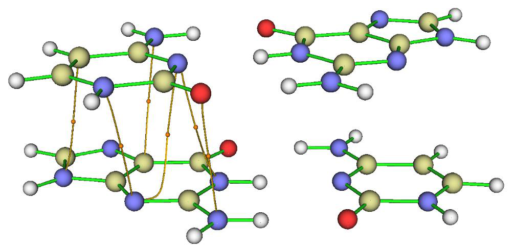

<!-- p.492 -->
Since the atoms involved in the combination of each search is required to simultaneously occur in the two regions we defined (i.e. all atoms must not occur in the same region), and thus the number of tries is largely reduced compared to that of searching CPs for the entire complex, the cost is correspondingly significantly lowered. As you can see, the finally located CPs mostly occur between fragments 1 and 3, though a few converge to the region between fragments 1 and 2, you may then manually delete them.


### 4.2.7 Topology analysis via refining attractors located by basin analysis: Spin density of biradical as an example


Topology analysis module is able to exactly locate various types of CPs, however, if distribution of a real space function is relatively complicated, such as ELF, orbital wavefunction and density difference, it is usually difficult to locate all CPs. In contrast, the basin analysis module guarantees that all minima of negative region and maxima of positive region can be successfully located, they are collectively known as "attractors", see examples of Section 4.17. However, since the basin analysis is carried out based on evenly distributed grid, the accuracy of the attractors is limited, because each attractor corresponds to a grid, while grid spacing is usually larger than 0.05 Bohr, which is several magnitudes larger than displacement convergence threshold of topology analysis. If you are only interested in minima and maxima of a real space function, obviously it is a good idea to use attractors determined by basin analysis as starting points for locating CPs in topology analysis module, in other words, one can use topology analysis module to refine the positions of the attractors. The joint use of the two modules ensures that all minima of negative region and maxima of positive region can be accurately located. In this example, I take spin density of C4H8 biradical as an example to illustrate how to realize this.

The example file is examples\C4H8.wfn. Before conducting basin and topology analyses for spin density, we can use main function 5 to visualize its isosurface to examine its basic distribution feature. The isosurface corresponding to spin density = 0.01 a.u. is shown below


<!-- p.493 -->
We perform basin analysis first. Boot up Multiwfn and input examples\C4H8.wfn 17 // Basin analysis 1 // Generate basins and locate attractors 5 // Spin density 2 // Medium-quality grid 0 // Check the located attractors After slightly modifying plotting settings, you will see

In the map above, blue and green spheres correspond to minima of negative part and maxima of positive part, respectively. Clearly their positions are fully in line with our expectations, which can be inferred from the isosurface map.

Then close the GUI and input -4 // Export attractors as pdb/pqr/txt/gjf file 3 // Export coordinates and function values of all attractors as attractors.txt Now we have attractors.txt in current folder, in which the first three columns correspond to X, Y, Z coordinate of the attractors in Bohr. Now we use them as starting points for topology analysis of spin density. Reboot Multiwfn and input

examples\C4H8.wfn 2 // Topology analysis -11 // Reselect the real space function to be studied 5 // Spin density 1 // Search CPs from given starting points 4 // Using starting points from a .txt file [Press ENTER button] // Use attractors.txt in current folder Then from screen you can find all the 16 points in the attractors.txt were employed as starting


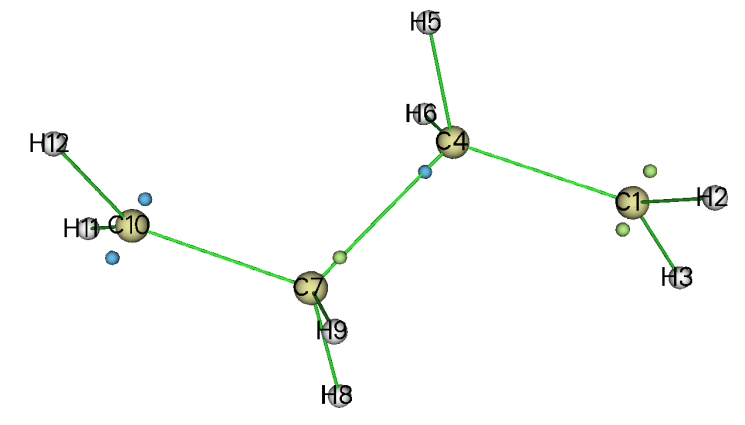

<!-- p.494 -->
points in turn, and finally 14 new CPs are found. Then input 0 to return and select option 0 to visualize the CPs, you will see

In the map above, the purple spheres, namely (3,-3) CPs, represent maxima of positive part of spin density; while the green points, namely (3,+3) CPs, correspond to minima of negative part of spin density. Although it is hard to detect visually, their positions are indeed more accurate than the attractors directly yielded by the basin analysis module.


### 4.2.8 Topology analysis for density difference: Deformation density of

H2O as an example

In this example, I further illustrate the extreme flexibility of topology analysis in Multiwfn. I

will show how to perform topology analysis for deformation density of H2O, that is ρdef = ρ(H2O) − ρ(H1) − ρ(H2) − ρ(O). See Section 3.7.2 for more information about deformation property. Similarly, you can use the same way to perform topology analysis for other kinds of density difference, such as Fukui function and dual descriptor.

- Generate grid data of deformation density Move “atomwfn” folder from “examples” folder to current folder so that Multiwfn can directly utilize atomic wavefunction files in it during generating deformation density. Then input

examples\H2O.fch 5 // Grid data calculation -2 // Obtain deformation property 1 // Electron density 3 // High-quality grid (grid quality must be fine enough for present purpose. For a much larger system, I suggest choosing “5 Input original point, grid spacings, and the number of points” and input a relatively small grid spacing, e.g. 0.15)

0 // Return to main menu

- Perform basin analysis to locate maxima and minima 17 // Basin analysis module 1 // Generate basins 2 // Use grid data in memory -4 // Export result 3 // Export position of located maxima and minima to attractors.txt in current folder -10 // Return to main menu


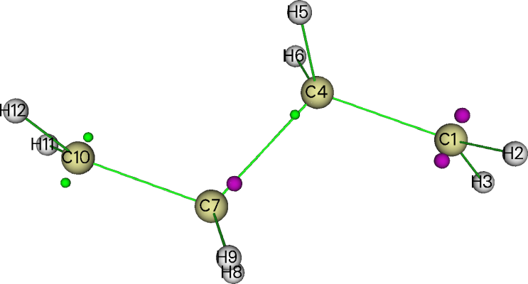

<!-- p.495 -->
- Topology analysis on deformation density iu // Change user-defined function -3 // User-defined function will correspond to interpolation function via B-spline algorithm based on the grid data in memory, as mentioned in Section 2.7

2 // Topology analysis -11 // Change the function to be analyzed 100 // User-defined function 1 // Search CPs from given starting points 4 // Using starting points from a .txt file attractors.txt 0 // Return Now if you enter option 0, you can visualize maxima and minima, namely (3,-3) and (3,+3) CPs, as shown by purple and green spheres in the following figure

Then if you want to compare the CP positions with isosurfaces of the current grid data to confirm if the positions are indeed correct, you can then input

-10 // Return to main menu 13 // Process grid data -2 // Visualize isosurface of grid data in memory After properly adjusting isovalue to 0.09 a.u. and slightly adjusting radius of atoms and bonds, as shown below, you can clearly see that green (positive) and blue (negative) isosurfaces respectively enclosed some maxima and minima, so the minima and maxima of deformation density were indeed successfully located.

If you also need (3,-1) and (3,+1) CPs of deformation density, now you can close GUI window and then input

-1 // Return to main menu 2 // Enter topology analysis module again 6 // Search CPs from a batch of points within sphere(s)


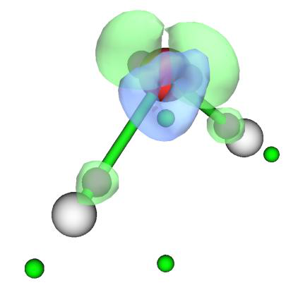

<!-- p.496 -->
-1 // Start the search using each nucleus as sphere center in turn (I suggest choosing this option several times until no new CPs can be further found)

-9 // Return 8 // Generating the paths connecting (3,-3) and (3,-1) CPs. This step is fully optional, I am just doing a demonstration

The current CPs shown in option 0 is

As you can see, basically all CPs have been found, and topology paths have been correctly and successfully generated. Currently Poincaré-hopf relationship may or may not be satisfied. Satisfaction of this relationship is never important for complicated functions like deformation density, you just need to focus on the CPs that you are really interested in.

In fact, it is not impossible to locate minima and maxima of deformation density directly in topology analysis module without help of the basin analysis module as what we did in this example. However, if you directly search for CPs of deformation density via option 6 in topology analysis module, some minima and maxima can hardly be located due to numerical reasons and the high complexity of the density difference.


### 4.2.9 Topology analysis for electrostatic potential (ESP)

More information about topology analysis for ESP can be found in my blog article: "Using Multiwfn to perform topology analysis for electrostatic potential and van der Waals to exactly obtain positions and values of their minima" http://sobereva.com/645 (in Chinese).

Some papers studied molecular ESP in terms of topology analysis, see J. Comput. Chem., 39, 488 (2017) and J. Phys. Chem. A, 123, 10139 (2019) for examples. If you have carefully read Section 4.2.2, 4.2.7 and 4.2.8, you will naturally know how to use Multiwfn to realize that. However, here I explicitly give you some examples, since they involve some key points. Usually, only minimum of ESP, namely (3,+3) type of ESP CP, is of interest, because ESP maximum always occurs at nuclear position, while physical meaning of (3,-1) and (3,+1) types of ESP CP are less evident.

There are three ways of searching for ESP CPs, you need to decide which one to use according to the actual situation:

(1) Newton method in topology analysis module. All kinds of ESP CPs could be located (2) Steepest descent method in topology analysis module, only minima of ESP will be located (3) Combination method, namely using basin analysis module to crudely locate positions of ESP minima, and then use topology analysis module to refine their coordinates, the procedure is the same as Section 4.2.7 and 4.2.8.

If you are interested in all kinds of CPs, (1) must be used with randomly distributed starting points. However, if you are only interested in ESP minima, (2) is better choice, because searching


<!-- p.497 -->
process will not converge to other kinds of CPs, therefore lesser number of random starting points is needed. Unfortunately, (2) has a very poor convergence behavior if a minimum occurs in narrow valley region, and both (1) and (2) cannot guarantee that all ESP minima can be found if number of starting point is relatively limited; (3) is free of these issues, however, there are slightly more operation steps, and the grid data generated during basin analysis stage may take up a lot of memory.

In the next three parts, I will illustrate how to use the three ways in turn.

(1) Using Newton method to locate ESP CPs Using Newton method to locate CPs of ESP will be illustrated by taking acetic acid as example. Boot up Multiwfn and input examples\acetic_acid.wfn 2 // Topology analysis -11 // Select real space function 12 // ESP 6 // Search CPs from a batch of points within sphere(s) 11 // Set number of starting points in each sphere 100 // Because searching ESP CPs is quite expensive, we use a relatively small value than default, usually this is adequate

-1 // Start the search using each nucleus as sphere center in turn After a while, you can find a batch of CPs have been found (note that the number of CPs that can be obtained using this searching mode each time is somewhat random):


```text
Index                       Coordinate               Type
    1    -0.94873432    -0.85713774    -0.00001303   (3,-1)
    2    -4.10014831    -1.74269848    -0.00054080   (3,+3)
    3    -4.18123989    -0.18759421    -0.00016317   (3,+1)
    4    -0.78813608     1.26880944    -0.00011552   (3,-1)
    5    -0.58790363     4.51467978     0.00010713   (3,+3)
    6    -3.68822894     2.43495579     0.00029260   (3,+3)
    7    -2.20123133     4.56852808     0.00030204   (3,+1)
    8     1.17777482     0.08729980    -0.00001956   (3,-1)
    9     3.17142044     1.10110206    -0.00221974   (3,-1)
   10     2.98644302    -0.75061380    -1.06273496   (3,-1)
   11     2.98614682    -0.74675779     1.06544103   (3,-1)
Totally find    11 new critical points
```

Then choose -9 to return to last interface, then choose option 0 to visualize the located CPs, you will see


<!-- p.498 -->
It is obvious that the (3,+3) CPs 2, 5, 6 correspond to minima of ESP, they occur mostly due to the significant negative contributions to ESP due to lone pairs of the two oxygens. We use option 7 to check ESP at these points, you will find they have ESP of -1.634, -2.069 and -2.312 eV, respectively. Also note that gradient and Hessian information of ESP are also shown by option 7.

You can then also visualize isosurface of ESP along with the CPs. To do so, input following commands

-10 // Return to main menu 5 // Calculate grid data 12 // ESP 2 // Medium-quality grid -1 // Show isosurface graph

After some adjustments of visualization setting, the isosurface of ESP = ±0.055 a.u. (±1.497 eV) will be

The blue transparent isosurfaces clearly portray the regions where ESP is evident negative. From the map you can intuitively recognize that CP 6 must be global minimum, while ESP at CP2 is not so negative. This observation is fully in line with the exact ESP values at the CPs mentioned earlier.

It is noteworthy that in principle, searching ESP CPs via the above way cannot find all of them, at least it is impossible to locate ESP maxima, which locate at nuclear positions, because at nuclear position the ESP value is infinite large and gradient of ESP is not zero. So, you do not need to care about if Poincaré-Hopf relationship is satisfied in topology analysis of ESP. However, if some interested CPs were not found, you should try to repeatedly using the option “-1 Start the search using each nucleus as sphere center in turn” until they are found. If after choosing it many times the wanted CPs are still missing, you could consider to loosen convergence criteria of displacement and gradient by one order of magnitude (via corresponding suboptions in option “-1 Set CP searching parameters”) and redo the search.

(2) Using steepest descent to locate ESP minima I still take acetic acid as example to illustrate how to use steepest descent method to locate ESP minima. Boot up Multiwfn and input

examples\acetic_acid.wfn 2 // Topology analysis vmin


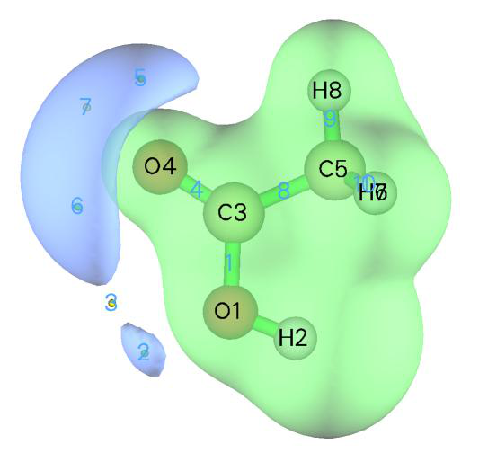

<!-- p.499 -->
-1 // Start the search using each nucleus as sphere center in turn You will see three (3,+3) CPs, namely minima, have been found, they are identical to those located by Newton method:


```text
Index                       Coordinate               Type
    1    -4.10014914    -1.74269856    -0.00049544   (3,+3)
    2    -3.68823066     2.43494346     0.00029136   (3,+3)
    3    -0.58789573     4.51467533     0.00010994   (3,+3)
Totally find     3 new critical points
```

The vmin inputted above is a shortcut, it corresponds to inputting following commands: 2 // Topology analysis -11 // Select real space function 12 // ESP -1 // Set CP searching parameters 12 // Choose searching algorithm 4 // Steepest descent 6 // Search CPs from a batch of points within sphere(s) 11 // Set the number of starting points in each sphere 10 // Although 10 starting points per center is small, it is adequate for most case. Unlike Newton method, all starting points of steepest descent method will converge towards to minima, therefore a smaller number of starting points is needed

(3) Using combination method to locate ESP minima Ferrocene is a typical example that steep descent method is not suitable for locating its ESP minima, because as shown below, some minima occur in very narrow valley region of ESP, making convergence of this method quite difficult. Newton method works better in this situation, as its oscillator behavior is not so prominent; however, if you hope to locate all ESP minima, you need to set very large number of starting points, which makes computational cost very high. Here, I illustrate the joint use of basin analysis and topology analysis modules to locate all ESP minima, which is well-suited for this system. By the way, a detailed example of basin analysis of ESP is given in Section 4.17.3, you are suggested to look at it first.

Boot up Multiwfn and input examples\ferrocene.mwfn // Wavefunction file of B3LYP/6-31G*&SDD level 17 // Basin analysis 1 // Generate basins 12 // ESP 1 // Low-quality grid. Such quality is adequate for crudely locating extrema purpose (using better quality grid will not bring additional benefits, while computational cost of ESP will increase significantly)

Once calculation is finished, enter option 0 to visualize ESP extrema:


<!-- p.500 -->
The blue points correspond to ESP minima, while ESP maxima approximately occur at nuclear positions and are hidden by the atom spheres.

Close the GUI window and input following commands to use topology analysis module to refine the positions of the minima

-4 // Export attractors 3 // Export coordinates and function values of all attractors as attractors.txt in current folder -10 // Return to main menu 2 // Topology analysis -11 // Select real space function 12 // ESP 1 // Search CPs from given starting points 4 // Using starting points from a .txt file [Press ENTER button] // Use points recorded in the attractors.txt in current folder Then Multiwfn uses the default Newton method to search CPs based on the starting points in the attractors.txt. Once calculation is finished, input 0 to return, and then choose option 0 to visualize the located CPs:

As you can see, the ESP minima (green spheres) occur in expected positions, and their distribution is in line with molecular symmetry, implying all ESP minima have been found.


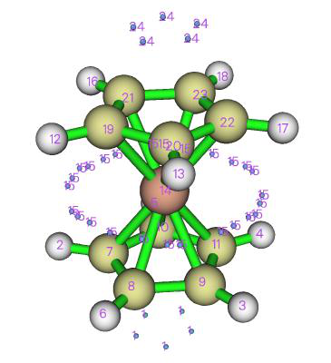

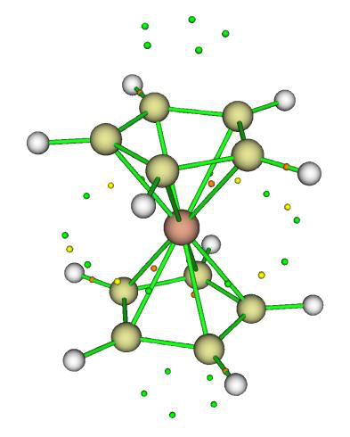

<!-- p.501 -->
Finally, if you want to visualize ESP isosurface along with the minima to better understand them, you can input

-10 // Return to main menu 13 // Process grid data -2 // Visualize isosurface for the grid data in memory, which currently corresponds to the ESP grid data generated during using basin analysis module before

After changing isovalue to 0.025 a.u. and set isosurface to mesh style, you can see

The blue isosurfaces (-0.025 a.u.) result from the rich π-electrons of the cp ligands, and as expected, there are corresponding ESP minima in these regions. In the middle part of ferrocene, there is a very narrow circular isosurface with 10 ESP minima within it. As mentioned above, the ESP minima in such region can hardly be located by steepest descent method. While if using Newton method instead, it is not easy to successfully locate all of them, unless very large number of random starting points are employed.


### 4.2.10 Topology analysis for van der Waals potential

More information about topology analysis for van der Waals potential can be found in my blog article: "Using Multiwfn to perform topology analysis for electrostatic potential and van der Waals to exactly obtain positions and values of their minima" http://sobereva.com/645 (in Chinese).

Van der Waals (vdW) potential is a quite important function to study intermolecular interaction dominated by vdW effect, see Section 3.23.7 for introduction and 4.20.6 for example of visual study and basins analysis. In this example, we perform topology analysis on vdW potential to exactly locate its minima, adamantane will be taken as example.

Boot up Multiwfn and input examples\adamantane.xyz 2 // Topology analysis -11 // Select real space function 25 // vdW potential As shown by prompt on screen, the algorithm for locating CPs has been automatically changed to steepest descent method, because which is most suitable for locating minima of vdW potential.

Then input 6 // Search CPs from a batch of points within sphere(s)


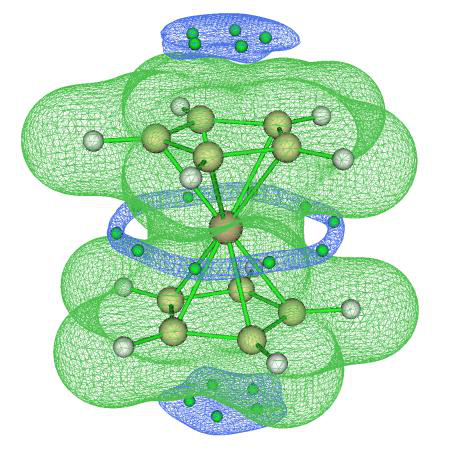

<!-- p.502 -->
-1 // Start the search using each nucleus as sphere center in turn. Note that currently 100 points are randomly distributed around each atom.

From information on screen, it is found that 27 (3,+3) CPs, namely 27 minima of vdW potential, have been located. Return to upper level of menu, then choose option 0 to visualize the minima. After changing “Ratio of atomic size” to 4.0 (in this case atomic radii corresponds to vdW radii) and increasing “Ratio of CP size” to 2.0, you will see below figure. The distribution of minima is in line with molecular point group symmetry (Td), implying that all minima have been successfully found.

Next, you can use option 7 to check values of vdW potential at these vdW minima. You can then return to main menu, and use the way described in Section 4.20.6 to visualize isosurface of vdW potential, the isosurface and minima will be shown together. The blue isosurface of the following map corresponds to vdW potential of -0.62 kcal/mol. Clearly, the distribution of the minima is in agreement with the isosurface.


### 4.2.11 Topology analysis for interaction region indicator (IRI) and reduced density gradient (RDG)


The interaction region indicator (IRI) proposed in Chemistry-Methods, 1, 231 (2021) DOI: 10.1002/cmtd.202100007 is an extremely useful method to reveal various kinds of interactions in


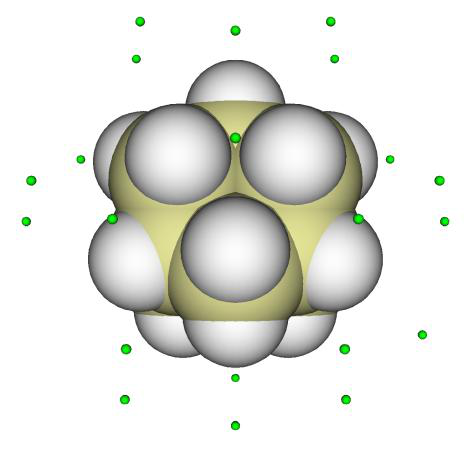

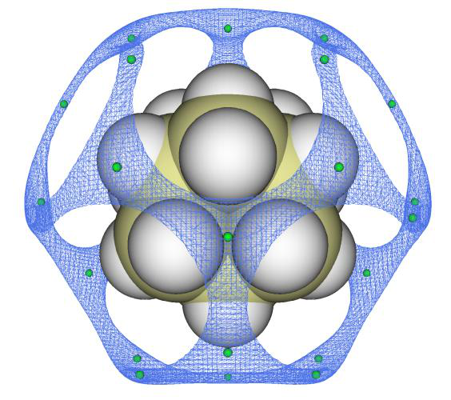

<!-- p.503 -->
chemical systems, including both chemical bonds and weak interactions. Usually, IRI analysis is

conducted in terms of plotting sign(λ2)ρ colored isosurface map of IRI function, see Section 4.20.4 for example. Occurrence of IRI isosurface must be accompanied by corresponding minima of IRI, therefore, you can view IRI minima as the most representative positions within interactions regions, whose properties may be useful in characterizing type and strength of the interactions. Note that, analysis of IRI minima is never equivalent to the topology analysis of electron density in atoms-in-molecules (AIM) theory. As carefully discussed in Chemistry-Methods, 1, 231 (2021), IRI can also faithfully reveal evident interactions where AIM CPs do not exist, for example, some intramolecular H-bonds. Therefore, if you hope to study such H-bonds by examining values of real space function at representative points, you should locate corresponding IRI minima first, as will be illustrated below. You can also use exactly the same steps to locate minima of reduced density gradient (RDG), which is employed by the so-called NCI method to reveal weak interaction region (see Section 3.23.1 for introduction). Although RDG has very similar capability with IRI to reveal non-covalent interactions, unfortunately it is unable to reveal interactions with strong covalent character like IRI.

Next, I will use Ni(NH3)2(OH)2 as example to show how to exactly locate IRI minima, its wavefunction file examples\Ni(NH3)2(OH)2.mwfn was generated by B3LYP in combination with SDD for Ni and 6-311G** for other atoms. As carefully analyzed in Chemistry-Methods, 1, 231

(2021), this system has two evident interligand N-H···O H-bonds. If you use the same way as described in Section 4.2.1 to perform AIM topology analysis, you will find no bond critical point corresponding to the two H-bonds can be found. However, the existence of the H-bonds can be clearly exhibited by IRI.

Boot up Multiwfn and input examples\Ni(NH3)2(OH)2.mwfn 2 // Topology analysis -11 // Select real space function 24 // Interaction region indicator (IRI) Now that as shown in the prompt on screen, the CP searching method has been automatically changed to steepest descent method from the default Newton method, this is because Newton method can hardly converge to some IRI minima, not only because they often occur in very small and narrow concave regions, but also the local regions around these minima do not show quadratic behavior (you can plot curve map of IRI to visually understand this point). Steepest descent is much more suitable than Newton method in this case. From the prompt on screen, you can also find gradient convergence criterion has been automatically set to a very large value to deactivate its role in determining convergence, because due to the special function behavior of IRI (and RDG), it is almost impossible to use steepest descent method to converge very accurately to a position with small enough gradient.

Then input the following commands to start CP searching 6 // Search CPs from a batch of points within sphere(s) -1 // Start the search using each nucleus as sphere center in turn After a while, you will find lots of (3,+3) CPs, namely minima, have been located. Note that unlike the default Newton method, which can locate all kinds of CP, the steepest descent method used herein only locate minima. Then input 0 to return to last menu, and choose option 0 to visualize result, you will see


<!-- p.504 -->
The green spheres in the map above correspond to IRI minima, it can be seen that they occur

between each pair of interacting atoms, and CP34 and CP41 correspond to interligand N-H···O H-bonds. Please compare their positions with the colored IRI isosurface map, namely Fig. 5(b) of Chemistry-Methods, 1, 231 (2021). Evidently, you can then use option 7 to study properties of the two CPs to try to discuss characters of the H-bonds. There are two CPs (22 and 31) very far from the molecule (you need to properly rotate the molecule to observe their positions clearly), they do not have any practical meaning and should be simply ignored.

If you have interest, you can also plot color-filled map of IRI in XY plane, the non-hydrogen atoms in this system are all nearly lying in this plane. To do so, return to main menu, then input

4 // Output and plot specific property in a plane 24 // Interaction region indicator (IRI) 1 // Color-filled map [Press ENTER button] // Use default number of grids 0 // Set extension distance 1 // 1 Bohr 1 // XY plane 0 // Z=0 Close the graph, and slightly modify plotting settings 4 // Enable showing atom labels and reference point 1 // Red 5 // Set details of plotting critical points and paths 15 // Set color for CPs 4 // (3,+3) 10 // Magenta 0 // Return -1 // Show the graph again Now you can see


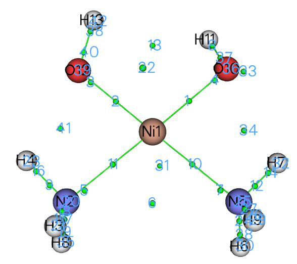

<!-- p.505 -->
It can be seen that notable interaction regions between adjacent atoms are clearly revealed by relatively low IRI values in the map, and minima of the plotted IRI function (purple points in the map) indeed occur in expected places.


## 4.3 Output and plot various properties in a line


### 4.3.1 Plot the spin density curve of triplet formamide along carbon and oxygen atoms


Boot up Multiwfn and input following commands examples\formamide-m3.wfn 3 // Main function 3, plot real space function along a line 5 // Spin density 1 // Defining the line by nuclear coordinate of two atoms 1,6 // Indices of the two atoms, carbon and oxygen atoms correspond to 1 and 6 in present example, respectively

The graph shows up immediately:


<!-- p.506 -->
The X-axis corresponds to the position in the line you defined, the dashed line corresponds to the position of Y=0, the left and right red circles denote the position of the first and the second atoms you selected. After clicking right mouse button on the graph to close it, a new menu appears on command-line window, you can save graphic file, adjust the range of Y-axis, export X-Y data points and replot the graph and so on by corresponding options. By selecting option 6, minimum and maximum positions can be located:


```text
Local maximum X:    0.753677  Value:    0.20104903D-01
Local minimum X:    1.219518  Value:   -0.55161276D-02
Local maximum X:    1.503567  Value:    0.29655008D+00
Local minimum X:    2.145518  Value:   -0.70202704D-02
Local maximum X:    3.736194  Value:    0.51047629D-01
Local minimum X:    4.006988  Value:    0.18918295D-01
Local maximum X:    4.184992  Value:    0.24448996D+00
Totally found    3 local minimum,    4 local maximum
```

Using the same procedure illustrated above, you can plot curve map for any real space function supported by Multiwfn, please have a try.

4.3.2 Study Fermi hole and Coulomb hole of H2

This is a relatively advanced example, you can skip this section if you are a newbie of quantum chemistry.

In this example we will plot correlation hole (Fermi hole and Coulomb hole) along the axis of H2. This is an advanced topic, if you are not familiar with the concept of correlation hole, please consult the discussion in part 17 of Section 2.6.

Hartree-Fock wavefunction is capable to exhibit Fermi correlation, but Coulomb correlation is completely omitted. In this case exact Fermi hole can be calculated and plotted by Multiwfn. If Coulomb hole is needed to be analyzed, then post-HF wavefunction must be employed. In current version, Multiwfn is able to evaluate and plot approximate Fermi hole and Coulomb hole for post-


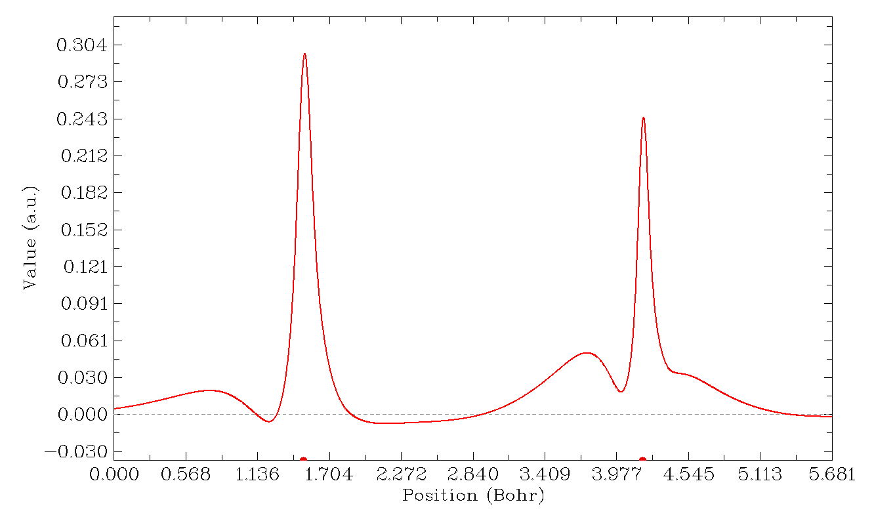

<!-- p.507 -->
HF wavefunctions by Müller approximation, which makes use of natural orbitals to mimic exact pair density. Although the approximation is introduced, the result is generally at least qualitatively correct.

First, we optimize and generate .wfn file for H2 under CCSD/cc-pVTZ level. CCSD is the highest level of wavefunction that can be generated by Gaussian program (If higher level of wavefunction is needed, you must resort on other programs, see Section 4.A.8 for details). The file has already been provided as examples\H2_CCSD.wfn. The coordinate of H1 is (0.0, 0.0, 0.7016) Bohr, the coordinate of H2 is (0.0, 0.0, -0.7016) Bohr.

Correlation hole involves coordinates of two electrons, to visually study it we must determine position of a reference electron. In this example, we set reference point at (0.0,0.0,-0.3) Bohr. Therefore, we open `settings.ini`, change refxyz parameter to 0.0,0.0,-0.3.

The correlation hole we first analyzed is Fermi hole (also known as exchange hole), so we

change paircorrtype in `settings.ini` to 1. Since this is closed-shell system, the results for α or β electron are exactly the same, while for open-shell system, you should use "pairfunctype" in `settings.ini` to select which type of spin electrons will be studied, you can also choose to study exchange-correlation density or correlation factor by adjusting this parameter.

Now boot up Multiwfn, input following commands examples\H2_CCSD.wfn 3 // Draw curve map 17 // Correlation hole 1 // Defining the line by nuclear coordinate of two atoms 2,1 // Draw curve graph along H2 and H1 Then you will see

This graph suggests that if we place an α electron at (0.0,0.0,-0.3), then the probability of finding another α electron around the two nuclei will be significantly decreased by almost identical extent due to Pauli repulsion between like-spin electrons. In the H-H bonding region, the probability also obviously decreases. According to Bader's statement "An electron can go where its hole goes and, if the Fermi hole is localized, then so is the electron" (p251 in Atoms in molecules - A quantum


<!-- p.508 -->
theory), we can say that if an α electron presents at (0.0,0.0,-0.3), then it must be able to easily delocalize over the whole H2 molecular space.

Now we study Coulomb hole. Close Multiwfn, change "paircorrtype" to 2, reboot Multiwfn and then replot the curve graph by using the same procedure, you will see

The red dots at left and right sides highlight position of H2 and H1, respectively. How can I infer the position of the reference point on the graph? From the prompt "Set extension distance for mode 1, current: 1.500000 Bohr" we know that the plotting range is extended by 1.5 Bohr in both sides relative to Z coordinates of H2 and H1, and we know that Z coordinate of reference point is larger than H2 by about 0.4016 Bohr, so the reference point on the graph above is 1.5+0.4016=1.9016 Bohr (If you want to highlight the position of reference point on the graph, you can select "4 Draw a vertical line at specific X" and input 1.9016, then redraw the graph via option -1). The graph above reveals that owing to Coulomb repulsion, the probability of finding another

electron (α or β) around the hydrogen closest to the reference electron (namely around H2) is largely decreased. As compensation, the probability is increased at backside of H1.

Finally, we study the collective effect of Fermi correlation and Coulomb correlation. Change "paircorrtype" to 3, and plot the line graph again, you will see


<!-- p.509 -->
This graph is actually the sum of the first two graphs. From this graph it is clear that the

probability decrease of finding an electron (α or β) around the hydrogen closest to reference electron is more severe than that around another hydrogen.


### 4.3.3 Study interatomic interaction via PAEM-MO method

This is a relatively advanced example, you can skip this section if you are a newbie of quantum chemistry.

In J. Comput. Chem., 35, 965 (2014), the authors proposed a method named PAEM-MO to reveal the nature of interaction between two atoms (covalently or non-covalently bounded). In this example I will briefly introduce this method and show how to realize PAEM-MO analysis in Multiwfn.

PAEM (potential acting on one electron in a molecule) refers to the total potential acting on an

electron at point r, and can be written as )()()(XCESPPAEMrrrVVV+−= ; where ESPV is

molecular electrostatic potential and has been introduced in part 12 of Section 2.6. -VESP can be regarded as the classical potential acting on an electron in the system, while the exchange-correlation (XC) potential VXC represents the important correction to the classical potential due to quantum effect. VXC has two components, namely correlation potential (VC) and exchange potential (VXC); in fact, only the latter is important, that means even the potential obtained at Hartree-Fock level is in general a good approximation to exact VXC.

In wavefunction theory, the exchange-correlation potential can be explicitly written as

1( , ')( )d( )||Vρ XCXC r rrr'rrr' =− , where Γ is known as exchange-correlation density, see part 17

of Section 2.6 for detail. In DFT theory, the XC potential directly comes from the variation of

$$V_{\mathrm{PAEM}}(\mathbf{r}) = -V_{\mathrm{ESP}}(\mathbf{r}) + V_{\mathrm{XC}}(\mathbf{r})$$

The VXC can be used in Multiwfn in terms of user-defined function. If parameter "iuserfunc" is set


<!-- p.510 -->
to 33, then VXC will be calculated based on Γ; if it is set to 34, VXC will be evaluated in terms of DFT XC potential, in this case the computational cost is several times lower than 33. For more information, please check corresponding description in Section 2.7.

The essence of HF and KS-DFT theories is the one-electron eigenvalue equation

)()(ˆrrεφφ=h

where

PAEM2rVh+−= )()2/1(ˆ

Solving the equation results in a set of MOs {φ}, their eigenvalues correspond to the energy of the electrons running in the orbitals.

According to the viewpoint of PAEM-MO, if the energy of an occupied MO is higher than the barrier of VPAEM between a pair of atoms, then the electrons in this MO will be able to freely delocalize over the two atoms, and thus have direct contribution to covalent bonding.

Below I present two very simple examples of using PAEM-MO method to judge the type of interatomic interaction. More examples and discussions can be found in J. Comput. Chem., 35, 965 (2014).

H-H interaction in hydrogen molecule First set "iuserfunc" in `settings.ini` to 33, then user-defined function will be equivalent to the VXC evaluated based on Γ. Boot up Multiwfn and input below commands

examples\H2.fch // Produced at HF/def2-TZVP level 3 // Plot real space function along a line 100 // User-defined function 0 // Adjust extension size at both sides 3 // 3 Bohr, which is larger than the default value 1 // Use two nuclei to define the line 1,2 Close the graph, then adjust some plotting parameters to make the graph better 11 // Change length unit of the graph to Å 3 // Change range of Y axis -3,0.1 // From -3.0 a.u. to 0.1 a.u. 10 // Set label intervals of X and Y axes 0.5,0.5 -1 // Replot You will see the graph below, which exhibits the PAEM curve along the H2 axis


<!-- p.511 -->
As you can see, there is a barrier of PAEM around the midpoint of H-H bond. In order to locate the exact value of the barrier, we close the graph and select 6. From the output we find the maximum of the curve is -1.903 a.u. (-51.78 eV). Present system only has one doubly occupied MOs, whose energy (-16.23eV) significantly exceeded the PAEM barrier, implying that the electron is not confined in any hydrogen atom but substantially contributes to the H-H binding, so the H-H bond must be covalent.

He-He interaction in He2 Please plot PAEM curve along the He-He axis in He2 with the same steps as above. The wavefunction file used here is examples\He2.fch, which was produced at HF/def2-TZVP level at separation of 2.97 Å (a reasonable distance). The resultant graph should look like below

Obviously, the PAEM barrier (-9.78 eV) is higher than that in the case of H2. The energy of the


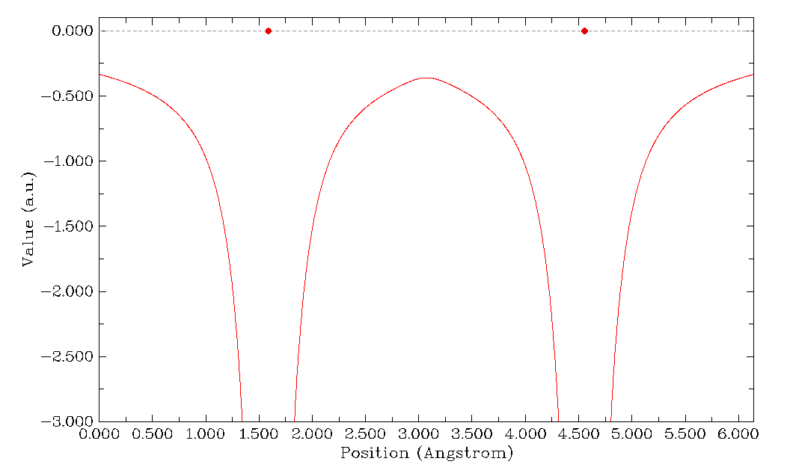

<!-- p.512 -->
two doubly occupied MOs are -25.03 and -24.91 eV respectively, both of them are lower than the barrier, therefore the electrons in each He atom are difficult (but not completely impossible due to tunnel effect) to overcome the barrier to freely delocalize to another He. The He-He interaction thus should be regarded as noncovalent interaction.

Note that in the original paper of PAEM-MO the PAEM is evaluated based on the expensive CISD wavefunction, while we merely use HF wavefunction. However, our results are in good agreement with that at CISD level, showing that correlation potential may be safely neglected in the study of PAEM.

The interested users are suggested to replot the PAEM with iuserfunc=34 to employ DFT XC potential in PAEM, you will find the results are very similar to those we obtained earlier.

It is noteworthy that, although the PAEM-MO analysis method has clear physical meaning, its many limitations severely hinder it to be a universal method to distinguish covalent and noncovalent interactions like ELF or LOL: (1) PAEM-MO analysis does not always present reasonable conclusion in all cases. For example, PAEM-MO erroneously indicates that the H-bond in water dimer is covalent interaction. (2) PAEM-MO is difficult to apply to polyatomic molecules, since there are often too many occupied orbitals with complex shapes. (3) If the two atoms are placed too close to each other, then PAEM-MO almost always indicates that the interaction is covalent.


## 4.4 Output and plot various properties in a plane

Main function 4 of Multiwfn is used to plot various kinds of plane maps for real space functions. This module is extremely flexible, it is obviously impossible to demonstrate all possible usages of this function via limited examples; however, if you carefully follow these examples and attempts to reproduce the graphs, you will gain enough basic knowledge about plotting plane maps using Multiwfn. Section 3.5 is highly suggested to read, in which many important points about plotting plane map are introduced.

The video https://youtu.be/E7lAGac3aDM is worth to look, the whole process of reproducing Multiwfn logo (ELF map of Li6 cluster) is illustrated. This video also shows how to make background of the map transparent.


### 4.4.1 Illustration of plotting color-filled map and contour line map

4.4.1.1 Plotting electron density of hydrogen cyanide

In this example we plot electron density for hydrogen cyanide as color-filled map and contour line map. Boot up Multiwfn and input following commands

examples\HCN.wfn 4 // Plot graph in a plane 1 // Electron density 1 // Color-filled map [Press ENTER button directly] // Use the recommended grid setting, namely 200,200. If you increase the number of grid points, graph will become finer and smoother, but you have to wait longer time for calculating data and plotting the graph

2 // XZ plane (Z-axis is the molecular axis of present system, you can confirm this via main function 0)


<!-- p.513 -->
After a few seconds the graph pops up

The central regions of carbon and nitrogen are white, suggesting that electron density exceeds the upper limit of color scale (0.65). Close the graph, then a post-processing menu appears, there are many options and their meanings are very easy to understand. You can choose corresponding options to adjust plotting parameters and then use option -1 to replot again, or export X-Y data set to a plain text file so that you can then plot the graph by external softwares (Sigmaplot, Origin, Matlab, etc.), or save image file in current directory (the graphical format is controlled by "graphformat" in `settings.ini`).

Now we slightly improve the graph above. Input below commands: -8 // Change length unit of the graph to Å -2 // Set label interval in X, Y and color scale axes 1,1,0.1 4 // Enable showing atom labels 1 // Red labels 8 // Enable showing bonds 3 // Blue color for bonds -1 // Redraw the graph Now you can see the map below on screen


<!-- p.514 -->
In Section 4.6.2 we will plot valence electron density for HCN, you will find valence electron density conveys much more information than total electron density.

Next, we plot the electron density as contour line map. Repeat the example above but select "2 Contour line map" instead of "1 Color-filled map", you will see the graph below


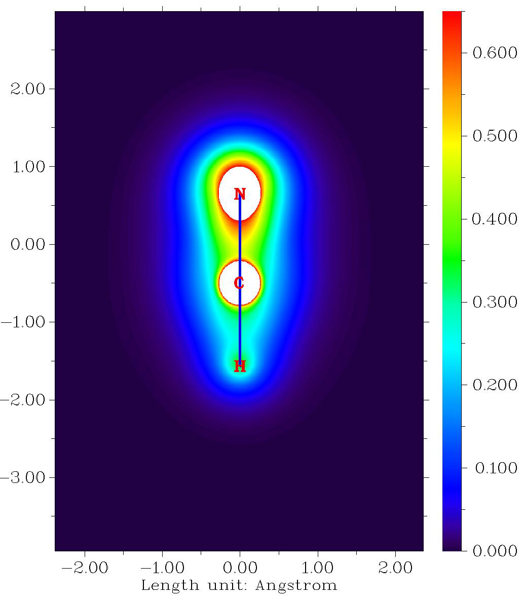

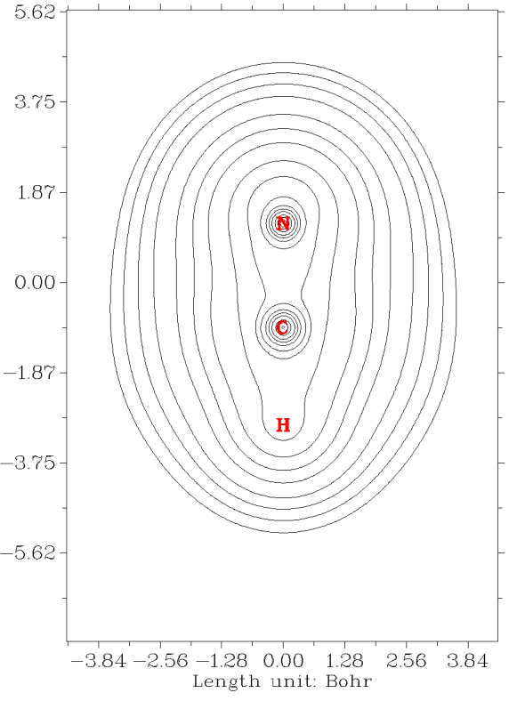

<!-- p.515 -->
There are numerous options in post-processing menu. If option 2 is chosen, the isovalues will be marked on corresponding contour lines. Once option 3 is chosen, you will enter an interface for setting up contour lines, various parameters such as color, thickness, contour values can be easily customized, please try to play with them; if you are confused, please consult Section 3.5.4 for more details.

It is worth to note that the .pdf format is more suitable than the default .png format for contour line maps (and other maps that mainly consist of lines), because .pdf is a vector format, the graph can be scaled losslessly, and the lines look smoother. In order to change to .pdf format, you should change "graphformat" in `settings.ini` to pdf.

4.4.1.2 Plotting localized orbital locator (LOL) for FOX-7

In this example we plot localized orbital locator (LOL) for an energetic compound, FOX-7. L LOL is a popular function for revealing electron localization character, see Section 2.6 for introduction. It shares analogous features with another very popular function, electron localization function (ELF). The input file in this section is examples\FOX-7.wfn, if you load it into Multiwfn and enter main function 0, you will see below structure. We will plot the plane defined by atoms N9, C2, N12.

Boot up Multiwfn and input examples\FOX-7.wfn 4 // Plot plane map 10 // Localized orbital locator (LOL) 1 // Color-filled map [Press ENTER button directly] 4 // Define the plane by three atoms 9,2,12 // Use nuclear position of the three atoms to define the plane The graph directly shown on screen is not easy to study. Therefore, we close the graph and then input below command

8 // Enable showing bonds 14 // Brown color 4 // Enable showing atom labels 1 // Red color 18 // Change style of atomic labels 3 // Plot both element symbol and atomic index -1 // Show the graph again We will see the graph below


<!-- p.516 -->
You can find that labels of many atoms are not shown on the map, this is because the vertical distance between these atoms and the plotting plane is larger than the "disshowlabel" parameter in `settings.ini`. If we want to display all atomic labels on the map, we should close the graph and input below commands:

17 // Set distance threshold for showing atom labels 10 // Enlarge the threshold to 10 Bohr y // If there is any atom whose vertical distance to the plane exceeds the threshold, its label will still be shown but using thin text

-1 // Plot the map again to check effect You will see the map below, only interesting part is given

As can be seen, labels of all atoms have been shown, and corresponding bonds are also displayed. In this map the red color substantially reveals the high electron localization nature in the bonding


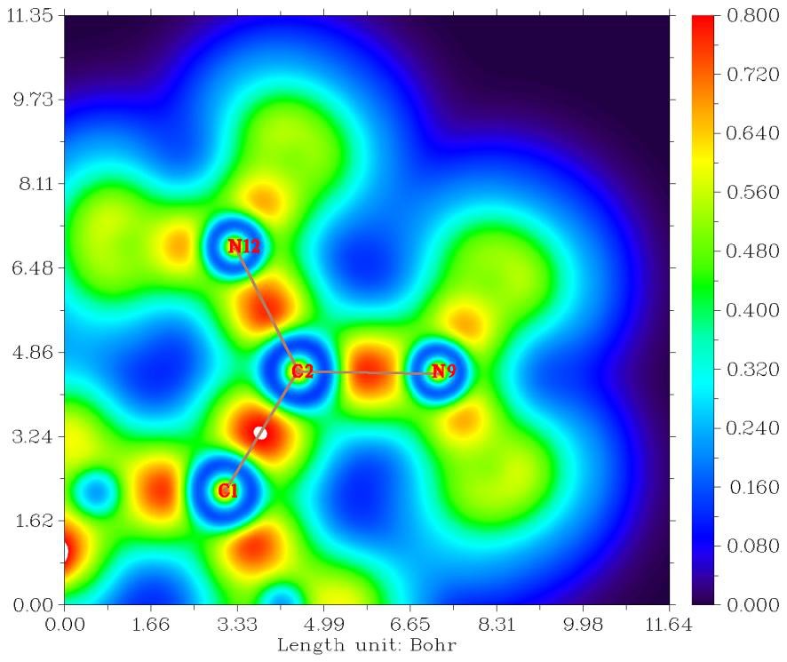


<!-- p.517 -->
regions. The degree of electron localization between N and O is not as high as the case of C-N and C-C bonds, this is a known feature of "charge-shift bond", see Chem. Eur. J., 11, 6358 (2005) for more information about this point.

The default color transition method is "Rainbow" with white and black colors in the region where function value is lower and higher than the color scale, respectively. The coloring method can be changed by user. As an illustration, in the post-processing menu we input

19 // Set color transition 17 // Black-Blue-Cyan 1 // Set lower&upper limit of color scale 0,0.7 // Decrease the upper limit from default value to 0.7 to make color able to better distinguish ELF in different regions

-1 // Replot The graph below looks very cool ;-D

Contour lines could be appended to the color-filled map. To make a pretty color-filled map with contour lines, we input below command

19 // Set color transition 8 // Blue-White-Red 2 // Enable showing contour lines 1 // Set lower&upper limit of color scale 0,1 -2 // Set label interval in X, Y and color scale axes 2,2,0.1 -1 // Replot The current graph is shown below, it is quite satisfactory


<!-- p.518 -->
Note in passing that if you want to translate or rotate the plotted object in the graph, in the interface of defining plotting plane, before choosing option 4 or 5, you should first choose the option "-1: Set translation and rotation of the map for plane types 4 and 5" and then input translation value and rotation angle, see Section 3.5.2 for more information.


### 4.4.2 Shaded relief map with projection effect of electron localization function (ELF) of monofluoroethane


This section illustrates how to plot shaded relief map with projection. Boot up Multiwfn and input following commands

examples\C2H5F.wfn 0 // View the molecular structure first to find the plane we are interested in. Suppose that the C-C-F plane is what we want to plot, record the atomic indices (1, 5, 8), and then click RETURN button to return to main menu

4 // Plot graph in a plane 9 // Electron localization function (ELF) 5 // Shaded relief map with projection effect [Press ENTER button] // Use recommended grid setting, namely 100,100 0 // Manually set extension distance. If you do not do this, you will find the resulting graph is somewhat truncated at boundary because the default extension distance is too small for present case

6 // Set extension distance to 6 Bohr, which is slightly larger than the default value 4 // Define the plotting plane by three atoms 1,5,8 // Indices of the three atoms The graph below immediately pops up:


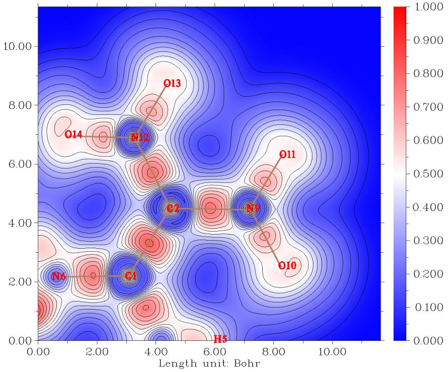

<!-- p.519 -->
We can see that C-C and C-F covalent bond regions have high LOL value, rendering high degree of electron localization in those places. The very low electron localization zones between valence and inner shells of heavy atoms are revealed by the blue ringlike region around each nucleus. A lone pair region of fluorine atom is pointed out by the purple arrow.

The graph you have seen in the GUI can be saved to graphic file by option 0 at post-processing interface. If you find the objects in the exported image are truncated at their edges, you should select option -1 to re-enter the GUI window, zoom out the graph and then export the picture again.


### 4.4.3 Plotting plane map without contributions from some atoms

The main purpose of this section is to illustrate how to plot plane map of a real space function without contribution of some atoms. This aim can be realized in two different ways in Multiwfn, as respectively exemplified in below two examples.

Example 1: Contour map of electron density Laplacian of uracil without contributions of two atoms

In main function 6, one can use subfunctions -3 and -4 to delete Gauss type functions (GTFs) centered at some atoms to remove their contributions to various kinds of analyses that are based on real space function. This feature will be utilized in present example. Since this treatment reduces total number of GTFs, the computational cost in the subsequent analyses will be lowered.

Boot up Multiwfn and input following content examples\uracil.wfn 6 // Modify wavefunction -4 // Discard contribution of some atoms


<!-- p.520 -->
3,4 // All GTFs centered on atoms 3 and 4 will be discarded. In other words, contribution of atoms 3 and 4 will be removed from current wavefunction

-1 // Return to main menu 4 // Plot graph in a plane 3 // Laplacian function 2 // Contour line map [Press ENTER button to use default grid setting] 1 // XY plane will be plotted 0 // The Z-position of the XY plane is zero, that is molecular plane Below is the resulting graph, solid and dashed line correspond to positive and negative regions, respectively.

From the graph you can see that the contributions from the two carbons have been discarded as we expected.

By the way, if you are studying a large system but only a local region is of interest, you can remove GTFs at atoms far from this region to save computational time of real space function analyses (e.g. topology analysis, basin analysis, calculating grid data...).

Example 2: Plane map of LOL only contributed by atoms in the uracil ring After plotting plane map as usual, one can request the program to plot the map only contributed by a certain fragment. Specifically, Hirshfeld weighting function of the user-defined fragment will be generated and multiplied to the plane data. This treatment only affects the currently plotted map while does not influence any further analysis, since this treatment does not modify wavefunction.

Here we use this feature to plot localized orbital locator (LOL) map of uracil that only contributed by the six atoms in the ring. Boot up Multiwfn and input below commands:


<!-- p.521 -->
examples\uracil.wfn 4 // Plane map 10 // LOL 1 // Color-filled map [Press ENTER button to use default grid setting] 1 // XY plane will be plotted 0 // Z=0 Close the graph and then input -9 // Only plot the data around certain atoms 1-6 // The index of the six atoms in the uracil ring 8 // Enable showing bonds 14 // Brown -1 // Replot Then you will see

Clearly, the value of LOL at the grids far from the ring atoms have been significantly screened. Then if you want to restore the original map, you can choose "-9 Recovery original plane data" in the post-processing menu and then replot.


### 4.4.4 Contour map of electrostatic potential of chlorine trifluoride

In this example we plot electrostatic potential (ESP) for chlorine trifluoride as contour map. Boot up Multiwfn and input following commands

examples\ClF3.wfn // Generated at B3LYP/6-31G* level 4 // Plot graph in a plane 12 // Total electrostatic potential 2 // Draw contour line map 120,120 // Number of grids in each direction 3 // YZ plane 0 // Set X coordinate of the YZ plane to 0


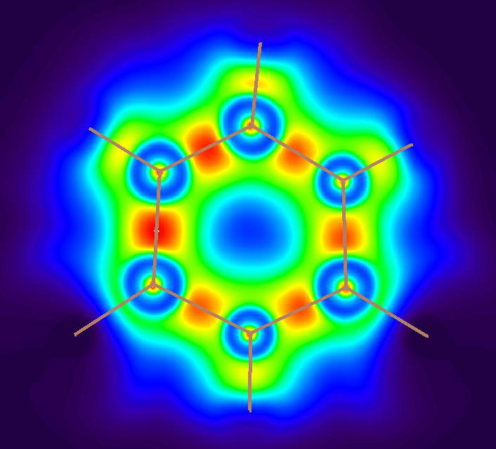

<!-- p.522 -->
Because evaluation of ESP is evidently more time-consuming than other real space functions, you need to wait for a while.

After the calculation is finished, ESP map pops up. This map is inconvenient to be visually analyzed, since what we are interested in is often the ESP value on molecular vdW surface, hence it is better to plot the vdW surface on this map simultaneously. In order to do this, we close the graph by clicking right mouse button, choose option 15 in post-processing menu, and then choose option -1 to replot the graph, you will see such a picture. The solid and dashed lines represented the region having positive and negative value of ESP, respectively.

The bold blue line corresponds to vdW surface (isosurface of electron density=0.001 a.u., as defined by R. F. W. Bader). From the graph it is clear that the chlorine atom is overall positively charged, because the vdW surface close to the chlorine atom largely intersects solid contour lines. For the same reason, we can see that the equatorial fluorine atom possesses less electrons than the two axial fluorine atoms, this point can be further verified when we calculate atomic charges for this molecule in section 4.7.1.

The plane map of the ESP derived from atomic charges can be directly plotted by Multiwfn too. First, you need to prepare a plain text file with .chg extension, the first column corresponds to element name, the 2nd, 3rd and 4th columns correspond to X, Y and Z coordinates in Å respectively, the last column is atomic charge. For example:


```text
  Cl    0.000000    0.000000    0.359408    0.529971
  F     0.000000    1.726507    0.294501   -0.228394
  F     0.000000    0.000000   -1.267884   -0.073185
  F     0.000000   -1.726507    0.294501   -0.228394
```

Boot up Multiwfn as usual, and then use the .chg file as input. The plotting procedure is completely identical to the one given above, except that when Multiwfn prompts you to select real space function, you should select 8 (ESP from atomic charges) instead of 12.


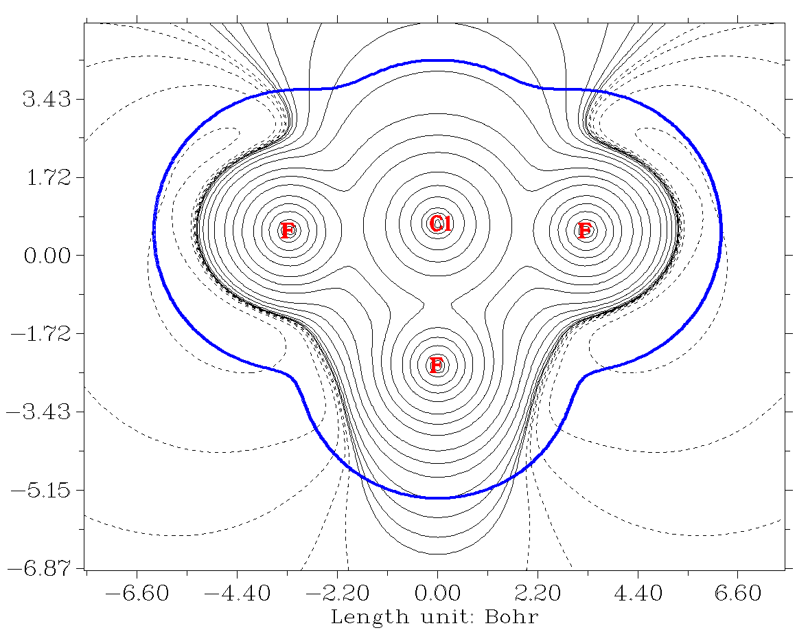

<!-- p.523 -->

### 4.4.5 Contour map of two orbital wavefunctions

Multiwfn is capable of plotting a contour map for two orbitals simultaneously. In this section, we will draw a contour map for simultaneously portraying NBO 12 and NBO 56 of NH2COH (recall Section 4.0.2). The plane we selected is the one perpendicular to molecular plane and passed through both carbon and nitrogen atoms. As you will see, we need to use a special manner to define such a plotting plane. The molecule geometry and atomic index are shown as follows.

Boot up Multiwfn and input: examples\NH2COH.31 37 // Load NH2COH.37 4 // Plot plane graph 4 // Orbital wavefunction 12,56 // The two orbital indices. If you only input one index, then only one orbital will be plotted

[Press ENTER button to use default grid setting] 7 // This mode is used to define a plotting plane parallel to a bond and meantime normal to a plane defined by three atoms

1,4 // The plotting plane is parallel to C1-N4 3,1,4 // The plotting plane is perpendicular to the plane defined by O3-C1-N4 10 // The length of X-axis of the resulting map is 10 Bohr 10 // The length of Y-axis of the resulting map is 10 Bohr Immediately a graph pops up. We close it by clicking right mouse button, choose option 2 and input 25 to enable showing isovalue on contour lines, then choose -1 to redraw the graph, we will see:


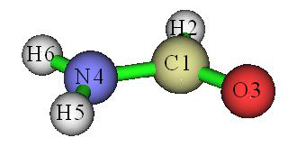

<!-- p.524 -->
This contour map is not quite ideal, there are too many contour lines intertwined together and thus confused our vision. The culprits are the contour lines with too small isovalue (magnitude smaller than 0.01). Since these contour lines are unimportant, we can delete them to make the graph clearer. Therefore, we close the graph and input

3 // Change contour line setting 4 // Delete some contour lines 1-4 // Delete contour lines 1~4, they respectively correspond to 0.001, 0.002, 0.004, 0.008 4 // Delete some contour lines 28-31 // Delete the four contour lines corresponding to -0.001, -0.002, -0.004, -0.008. For convenience, you can choose option 6 to export current contour line setting to an external file, when you use Multiwfn next time you can load present setting directly by choosing option 7 in current interface

15 // Set the drawing style suitable for publication, namely positive and negative parts are portrayed as red solid lines and blue dashed lines, respectively

1 // Save setting and return to the upper menu -8 // Change length unit of the graph to Å -2 // Set label interval in X and Y axes 1,1 // Intervals in both X and Y axes are 1.0 Å -1 // Replot the contour map 2 // Enable showing isovalue on contour lines 30 // Use label size of 30 Now the graph becomes very clear and informative, the overlapping region of same phase is very obvious.


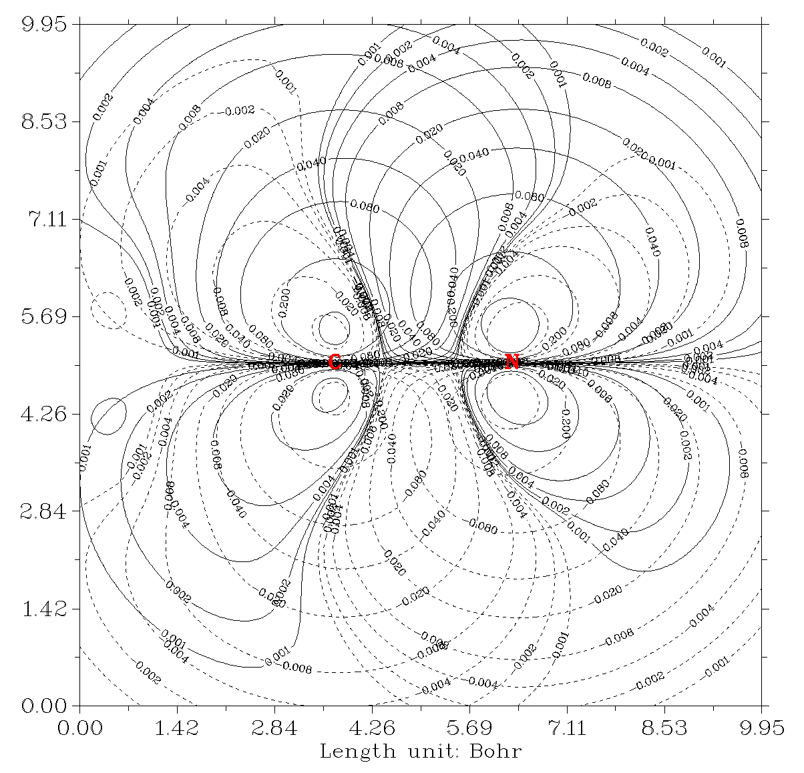

<!-- p.525 -->

### 4.4.6 Gradient + contour map with topology paths of electron density of hydrogen peroxide


As introduced in Section 3.5.5, critical points, bond paths and interbasin surfaces can also be plotted on a plane map, here I present a simple example. There is a corresponding video illustration of plotting this kind of map https://youtu.be/gv5FkiFWUY0, you are suggested to look at it.

Gradient map of electron density First, I show how to plot a normal gradient map of electron density for hydrogen peroxide. Boot up Multiwfn and input following commands

examples\H2O2.fch // Of course, you can also use other types of files as input, as long as the file contains GTF information

4 // Plotting plane map 1 // Electron density 6 // Gradient line with/without contour line map [Press ENTER button to use default grid setting] 4 // Use three atoms to define the plotting plane 2,1,3 // Define the plane by nuclear positions of atoms 2, 1 and 3 Generating data and plotting a gradient map take more computational time relative to other graph types, however since present system is small and the basis set is only 6-31G*, resulting graph shows up immediately:


<!-- p.526 -->
This type of graph is very useful in Bader’s AIM analysis. You can also plot gradient + contour map for any other real space functions supported by Multiwfn. In the post-processing menu, you can use options 11, 12, 13 and 14 to adjust plotting effect of the gradient lines, they can control the smoothness, density, color and density of the gradient lines.

Gradient map of electron density with bond paths and critical points of electron density If you hope critical points and paths also be portrayed on the graph, you need to do topology analysis as illustrated in Section 4.2.1 prior to plotting the map. Now we input below commands

-5 // Return to main menu 2 // Topology analysis (by default electron density is the function to be analyzed) 2 // Search CPs from nuclear positions 3 // Search CPs from midpoint of atomic pairs 8 // Generating the paths connecting (3,-3) and (3,-1) CPs, namely generating bond paths in current context

0 // Visually check if all expected CPs and paths have been generated. This step is optional -10 // Return to main menu Then draw a gradient line map for electron density via the way described above. The resulting graph should look like below. Brown, blue, and orange circles denote (3,-3), (3,-1) and (3,+1) critical points, respectively. Bold dark brown lines depict bond paths.


<!-- p.527 -->
In the post-processing menu, you can enter “4 Set details of plotting critical points and paths” to adjust settings for showing the critical points and paths.

Hint: The color of different types of critical points can be set by "CP_RGB_2D" in the `settings.ini` file.

Interbasin paths can also be drawn on the graph. If you have finished the search of CPs in topology analysis module, after drawing contour/gradient/vector field map, you could find an option named "Generate and show interbasin paths" in the post-processing stage; select it and replot the graph, the interbasin paths will be shown on the graph by bold dark blue lines:


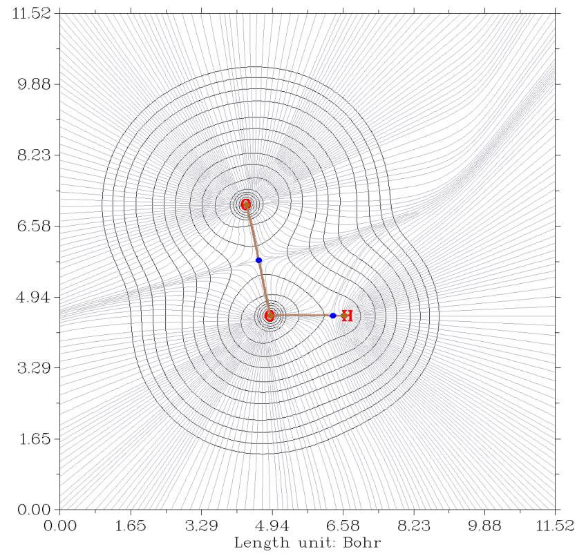

<!-- p.528 -->
Note that before generating the interbasin paths, related parameters (stepsize and the number of iterations) can be set by option "7 Set stepsize and maximal iteration for interbasin path generation" in the post-processing menu. Larger number of iterations may result in longer interbasin paths.

Contour line map of Laplacian of electron density with bond paths and CPs of electron density

Finally, we plot contour line map of Laplacian of electron density, on which the bond paths and CPs we generated before are also shown. Return to main menu and then input below commands

4 // Plotting plane map 3 // Laplacian of electron density 2 // Contour line map [Press ENTER button to use default grid setting] 4 // Use three atoms to define the plotting plane 2,1,3 // Define the plane by nuclear coordinates of atoms 2, 1 and 3 The resulting graph is shown below (only a local region is given)


<!-- p.529 -->

### 4.4.7 Deformation map of electron density of acetyl chloride

Deformation map of electron density clearly shows variation of electron density distribution during formation of a molecule, it is defined as subtracting actual molecular electron density by electron density of all of its constituent atoms in their free-states. Illustrative example of deformation density analysis can be found from my paper Acta Phys. -Chim. Sin., 34, 503 (2018).

It is a labor work to draw such a graph via custom operation feature since there are so many atoms in practical chemical systems. Fortunately, Multiwfn provides a special option to realize this in a highly automatic way. Boot up Multiwfn and input following commands

examples\CH3COCl.wfn 4 // Plot plane map -2 // Tell Multiwfn you want to draw deformation map, then Multiwfn prepares free-state atom wavefunctions

B3LYP/6-31G* // The level used to generate atomic wavefunction files by Gaussian, it is the same as the level used for generating CH3COCl.wfn

D:\study\g09w\g09.exe // The path of executable file of Gaussian (you can also use another Gaussian version). If you already set correct path in “gaupath” parameter in `settings.ini`, then Multiwfn will not ask you to input the path every time

Now Multiwfn starts to invoke Gaussian to calculate atom wavefunctions, then Multiwfn translates and sphericalizes them internally. These temporary wavefunction files are stored in “wfntmp” folder in current directory, after you get the expected graph you can delete the folder. Let us continue to input the remaining commands.

1 // Electron density function 2 // Contour map [Press ENTER button to use default grid setting] 1 0 // The XY plane with Z=0 is the plane of acyl chloride Then the deformation map pops up:


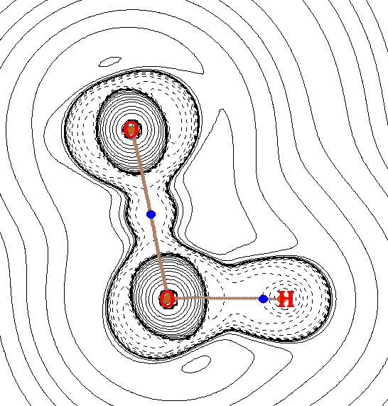

<!-- p.530 -->
As we expected, electron density concentrates towards bonding regions. We also find that the density distribution around chlorine atom is largely desphericalized, this observation is in line with hybrid orbital theory, chlorine atom forms somewhat sp3 hybrid state.

You can also plot deformation maps for other functions by choosing corresponding real space function, though not all of them are meaningful.

If you want to avoid recalculating atomic wavefunction files next time, you can copy the .wfn files without number suffix (such as “C .wfn“) from “wfntmp” folder to “atomwfn“ folder in current directory, if Multiwfn finds that all needed atom wavefunctions have already existed in “atomwfn” folder, then Multiwfn will not invoke Gaussian to calculate them again.

Hint: You can also use genatmwfn.pdb in “examples” directory to generate all atom wavefunctions under specific basis set in a single run, please consult Section 3.7.3.

The “atomwfn” folder in “examples” directory contains atom wavefunctions (by 6-31G*) for all first-four row elements, you can directly copy this folder to current directory, after that you will not need Gaussian again during plotting deformation map.

If your system involves some elements heavier than Kr, you have to manually calculate the corresponding atomic .wfn files and put them into "atomwfn" folder". More detailed information about preparing atomic wavefunction files can be found in Section 3.7.3.


### 4.4.8 Plot difference map of electron density and ELF for water tetramer with respect to its constituent monomers


In this example I will illustrate how to plot difference map between a system and its constituent


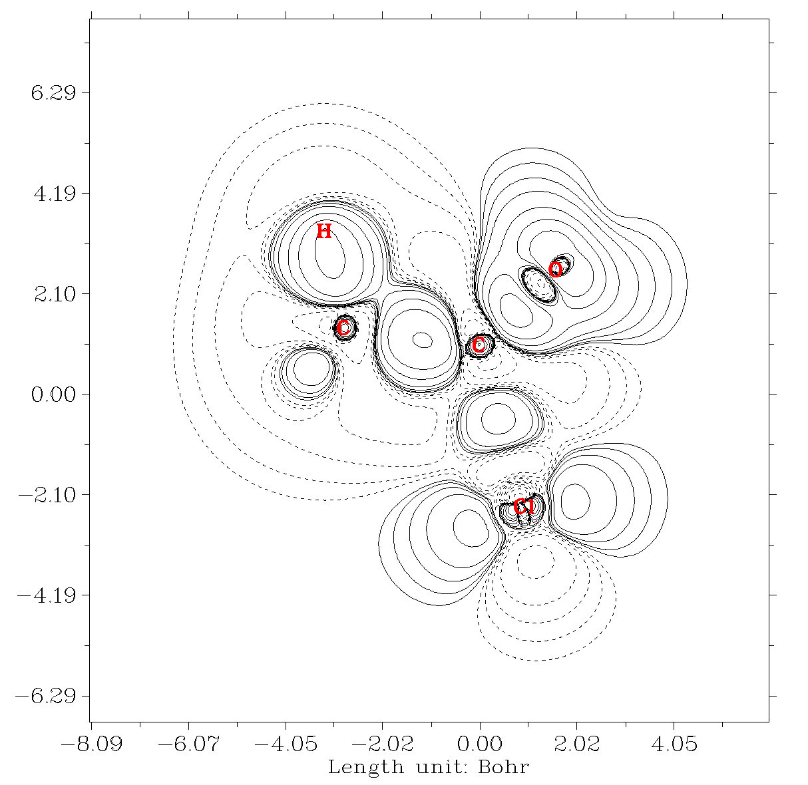

<!-- p.531 -->
fragments for a given real space function. Electron density and ELF will be employed as the function to be studied.

examples\water_tetramer\wfn\complex.wfn is wavefunction file of optimized water tetramer, while the water1/2/3/4.wfn in this folder is wavefunction file of each water monomer. The corresponding Gaussian input files are also provided in the folder. Notice that the monomer coordinates were directly extracted from the complex coordinate, and nosymm keyword was used for all files to avoid Gaussian automatically reorienting the molecular geometry during the calculations. (Bear in mind, a density difference map is meaningful only when coordinates of all fragments are completely consistent with that of the whole complex)

Plotting difference map of electron density First, we plot a plane map of electron density difference for the complex with respect to all four monomers. Boot up Multiwfn and input

examples\water_tetramer\wfn\complex.wfn 4 // Plot plane map 0 // Custom operation 4 // Four files will be operated on the firstly loaded system -,examples\water_tetramer\wfn\water1.wfn -,examples\water_tetramer\wfn\water2.wfn -,examples\water_tetramer\wfn\water3.wfn -,examples\water_tetramer\wfn\water4.wfn 1 // Electron density 2 // Contour map [Press ENTER to use default grid setting] 4 // Define plane by three atoms 7,10,1 The graph pops up immediately. We can further improve the plotting effect. Close the graph and input

3 // Change contour line settings 15 // Set line style and width suitable for publication 1 // Save and return 17 // Set distance threshold for showing atom labels 0.2 // 0.2 Bohr y // If the distance between an atom and the plotting plane is larger than the specified 0.2 Bohr, then the label will be drawn as thin style

0 // Save the plot as graphic file in current folder The graphic file should look like below


<!-- p.532 -->
In the graph, red solid lines and blue dashed lines correspond to the regions having increased electron density and decreased electron density during formation of the tetramer, respectively.

In Multiwfn you can also easily plot the density difference in the form of isosurface map by main function 5, the resulting graph is shown below, the isovalue is 0.003. If you do not know how to realize it, please consult Section 4.5.5.

Plotting difference map of ELF Next, we plot a color-filled difference map of ELF. Input below commands -5 // Return to main menu 4 // Plot plane map 0 // Custom operation 4 // Four files will be operated on the firstly loaded system -,examples\water_tetramer\wfn\water1.wfn -,examples\water_tetramer\wfn\water2.wfn -,examples\water_tetramer\wfn\water3.wfn -,examples\water_tetramer\wfn\water4.wfn


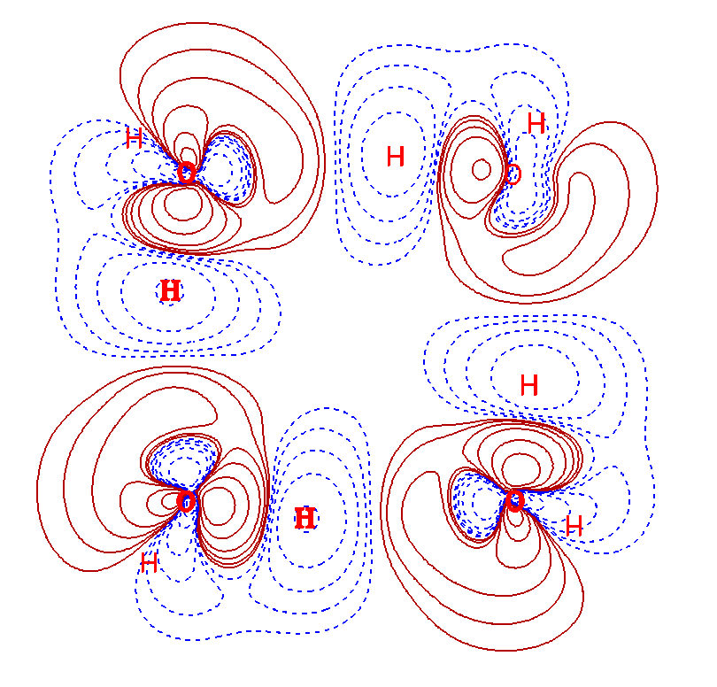

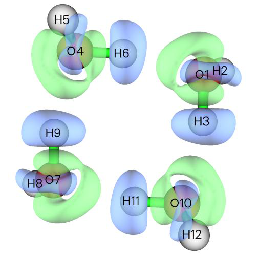

<!-- p.533 -->
9 // ELF 1 // Color-filled map [Press ENTER button] 4 // Define plane by three atoms 7,10,1 The graph shown on screen is ugly currently, because the default color scale is inappropriate for present case. Close the graph and input

1 // Set lower&upper limit of color scale -1.5,0.1 4 // Disable showing atomic labels 4 // Enable showing atomic labels again, now you can select label color 3 // Blue labels -1 // Show the graph again You will see

The blue and especially dark blue regions exhibit decrease of ELF in corresponding regions. This plot shows that during formation of the complex, the electron localization is reduced in the intermolecular interaction regions, it may be attributed to the consequence of the Pauli repulsion effect.


### 4.4.9 Plotting LOL-π map for porphyrin to reveal favorable electron delocalization path


The well-known ELF-π is the ELF solely contributed by π electrons. Similarly, LOL-π can be defined as a variant of localized orbital locator (LOL). See my paper Theor. Chem. Acc., 139, 25

(2020) DOI: 10.1007/s00214-019-2541-z on relevant knowledge. The features of LOL-π are highly


<!-- p.534 -->
analogous to ELF-π, but usually graphical effect of LOL-π is better. In this Section I will illustrate how to plot color-filled LOL-π plane map above 1.2 Bohr of porphyrin, you will find this map is quite useful for understanding preferential electron delocalization path, which is closely related to molecular aromaticity.

The only difference of plotting and analyzing LOL and LOL-π is that for the latter case, you should first set occupation number of all orbitals to zero except for π orbitals. As illustrated below, this can be automatically done via Multiwfn.

The .fch file of porphyrin calculated at B3LYP/6-31G* level can be downloaded from http://sobereva.com/multiwfn/extrafiles/porphyrin.rar. Boot up Multiwfn and load the .fch file, then input below commands:

100 // Other functions

22 // Detect π orbitals 0 // Detect π orbitals for delocalized orbitals of exactly planar system 2 // Set occupation number of all other orbitals to zero 0 // Return to main menu 4 // Plot plane map 10 // LOL 1 // Color-filled map [Press ENTER button] // Use default grids 3 // Plot YZ plane 1.2 // X=1.2 Bohr Close the graph, then input 1 // Set lower&upper limit of color scale 0,0.66 4 // Enable showing atom labels 7 // Cyan color 17 // Set distance threshold for showing atom labels 2 // Since the distance between the plotting plane and molecular is 1.2 Bohr, to make all atomic labels shown on the graph, this threshold must be set to a value larger than 1.2 Bohr. Here we set it to 2.0 Bohr

y 8 // Enable showing bonds 14 // Brown color -1 // Replot Now you will see the graph below


<!-- p.535 -->
The high LOL-π regions (red or orange color regions) clearly reveal the favorable delocalization path. If you plot current map induced by an external magnetic field vertical to the molecular plane (using for example AICD or GIMIC methods, see my slideshow for details: http://sobereva.com/148), you will find the unidirectional contiguous induced current is mainly

formed on the favorable delocalization path highlighted by the LOL-π function.

Next, in order to fully exhibit the flexibility of plane plotting function in Multiwfn, I illustrate how to plot the map above in an evidently different style, namely contour lines filled by colors.

We return to main menu, and then input 4 // Plot plane map 10 // LOL 2 // Color-filled map [Press ENTER button] // Use default grids 0 // Set extension distance 1 // 1 Bohr (smaller than default to decrease blank region around the molecule) 3 // Plot YZ plane 1.2 // X=1.2 Bohr Close the graph, then input 9 // Enable filling colors between current contour lines 9 // Set status of filling colors 2 // Set lower and upper limits of filling -0.2,0.52 4 // Toggle showing color bar 5 // Set label interval of color bar 0.1 3 // Set color transition


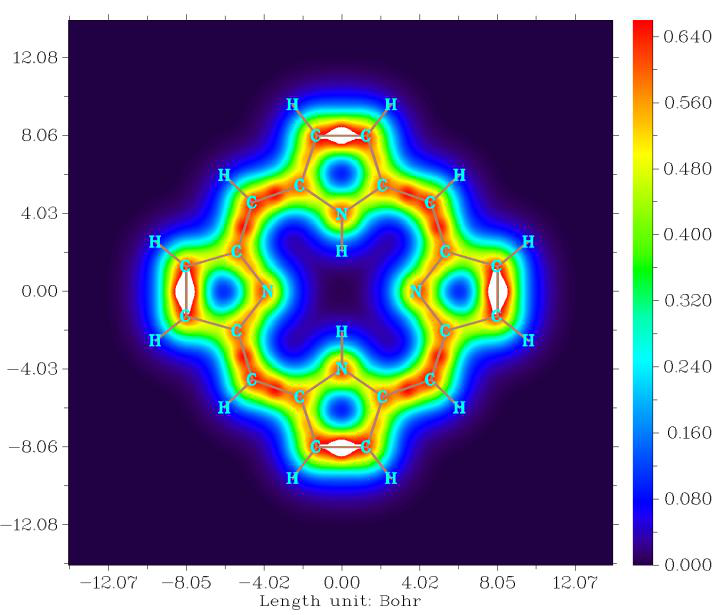

<!-- p.536 -->
18 // Viridis 0 // Return -8 // Change length unit of the graph to Å -2 // Set label interval in X and Y axes 2,2 3 // Change setting of contour lines 8 // Generate contour value by arithmetic progression 0,0.07,15 // Generate contour lines of 0.00, 0.07, 0.14 ... 0.98 y // Remove existing contour lines 1 // Save setting and return 17 // Set distance threshold for showing atom labels 2 // Maximal distance is 2 Bohr y 8 // Enable showing bonds 14 // Brown -3 // Change other plotting settings 10 // Set format of exporting image file 7 // pdf format. It is highly suggested to export this kind of map as vector format such as .pdf 0 // Return 0 // Save the graph to a graphical file in current folder Now you can open the exported .pdf file, you will see the figure shown below. It can be seen that the lines look quite smooth and the colors are quite comfortable! Now this graph is different to the color-filled map with contour line, because there is only one color between two neighbouring contour lines.


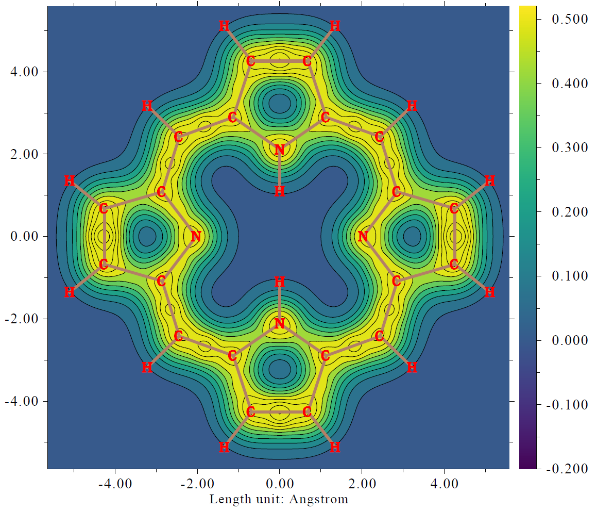

<!-- p.537 -->

### 4.4.10 Plotting gradient line and vector field map of electrostatic potential to reveal electric field of LiF


The main purpose of this section is to illustrate how to properly plot a meaningful gradient line map and vector field map.

Electric field (F) is defined as negative of 1st-derivative vector with respect to coordinate (i.e. gradient vector) of electrostatic potential (ESP); therefore, if we plot gradient line or vector field map of ESP, the F could be vividly exhibited. In this section, I will use an ionic compound LiF as example.

Gradient line map Boot up Multiwfn and input examples\LiF.wfn // Generated at B3LYP/6-31G* level 4 // Plot plane map 12 // ESP 6 // Gradient line map [Press ENTER button to use default grid setting] 0 // Modify extension distance 6 // 6 Bohr (larger than default value) 3 // YZ plane 0 // X=0 Close the graph, then input 15 // Show a contour line to reveal van der Waals surface 10 // Show arrow on the gradient lines Now you can obtain the map below


<!-- p.538 -->
In the map above, the gray gradient lines clearly exhibit direction of electric field everywhere. Note that since electric field corresponds to negative gradient vector of ESP, the arrows in fact should be inverted.

Vector field map Next, we draw a graph of another style to display electric field character. Input below commands:

-5 // Return to main menu 4 // Plot plane map 12 // ESP 7 // Vector field map 50,50 // Number of grids in the two dimensions 3 // YZ plane 0 // X=0 Close the graph shown on the screen and then input 11 // Map color to arrows 10 // Set upper limit of absolute value for scaling arrows 0.05 15 // Show a contour line to reveal van der Waals surface 13 // Invert gradient vectors, so that the arrows will correspond to direction of electric field 1 // Disable showing atom labels and reference point 1 // Enable showing atom labels and reference point 3 // Use blue label color Now replot the map, you will see


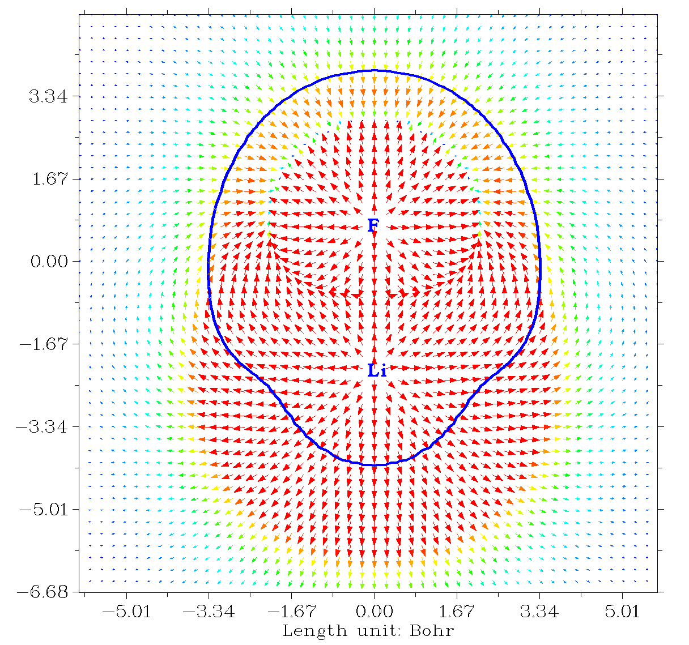

<!-- p.539 -->
In this map, the redder the arrow, the larger the magnitude of the electric field at corresponding position. We can see that electric field sources from each nucleus, while in the region relatively far from the two nuclei, the overall direction of the electric field vectors is from the Li side towards the F side, this is because in this system Li and F carry evidently positive and negative net charges, respectively. You can also find there is a semicircle shape region at top of the map, where magnitude of electric field is small or vanished. This region in fact has the most negative value of ESP and thus behaves as ending point of molecular electric field (indeed, all arrows around this region point towards this region).


### 4.4.11 Plotting a pretty 4p orbital of Kr atom

This example illustrates how to plot a very clear and pretty color-filled contour line map for showing 4p atomic orbital of Kr atom. The wavefunction file Kr.wfn has already been provided in “examples\atomwfn” folder, it was generated by single point task via Gaussian at B3LYP/6-31G* level.

Boot up Multiwfn and input following commands examples\atomwfn\Kr.wfn 4 // Output and plot specific property in a plane 4 // Value of orbital wavefunction 17 // The orbital corresponding to 4pz (you can first use main function 0 to visually find the orbital of your interest)

2 // Contour line map [Press ENTER button] // Use default number of grids 0 // Modify extension distance to make plotting area slightly larger than default 5 // 5 Bohr 2 // XZ plane 0 // Y=0 Now click right mouse button the graph to close it, and then input following commands to improve the graphical effect

9 // Enable filling colors for contour lines 9 // Set status of filling colors between the contour lines 3 // Set color transition 8 // Blue-White-Red 0 // Return 3 // Change setting of contour lines 5 // Use built-in contour values suitable for special purpose

3 // Suitable for plotting orbital wavefunction (namely ±0.01*2(i-1), i = 1-28) 1 // Save setting and return Now you can use option -1 to visualize the current map. In this example we will save the figure to a .pdf file. You can set the default file format via “graphformat” in `settings.ini`, however here we temporarily change the format to .pdf, so we input

-3 // Change other plotting settings 10 // Set format of exporting image file 7 // pdf


<!-- p.540 -->
0 // Return Finally, choose option 0 to save the graphical file. After opening the file you will see

As you can see, the graphical effects are perfect, very clear and pretty!


### 4.4.12 Showing extrema of a function on contour line(s)

This example illustrates how to exhibit position of extrema of a real space function on contour line of a specific isovalue in plane map. Here I take phenol as an example, we will plot extrema of

electrostatic potential (ESP) on contour line of ρ = 0.001 a.u. in the molecular plane.

Boot up Multiwfn and input examples\phenol.wfn 4 // Plot plane map 1 // Electron density 2 // Contour line map [Press ENTER button] // Use default number of grids 1 // XY plane 0 // Z=0 Now close the map shown on screen, and then input 19 // Enable showing extrema of a function on a contour line 0.001 // Isovalue of present function (i.e. electron density) 12 // ESP -1 // Replot plane map Now you can see the following map, red and blue spheres correspond to maxima and minima on the contour line, respectively


<!-- p.541 -->
In addition, in the console window, you can find information of the extrema, including X and Y coordinates in the plane map, as well as ESP value at the extrema


```text
 Contour line    1
 Minimum found at   -2.757166   -6.243420  Value:    0.0124521154
 Maximum found at   -6.422139   -4.124796  Value:    0.0208512768
 Minimum found at   -6.092997   -1.331264  Value:    0.0178074993
[...ignored]
 Maximum found at    0.000055   -8.122282  Value:    0.0174823731
 Total maxima:     5
 Total minima:     5
```

If you plot a color-filled ESP map and meantime showing vdW surface by following the procedure in Section 4.4.4, you will easily know why the ESP extrema appear on those positions. In addition, note that main function 12 of Multiwfn is able to determine the extrema of ESP or other functions on the 3D molecular surface, as illustrated in Section 4.12.1.


## 4.5 Generate grid data and view isosurface map

This section contains examples of main function 5 of Multiwfn, all of them need to calculate grid data. Once the grid data is generated, it can be visualized as isosurface map, or be exported


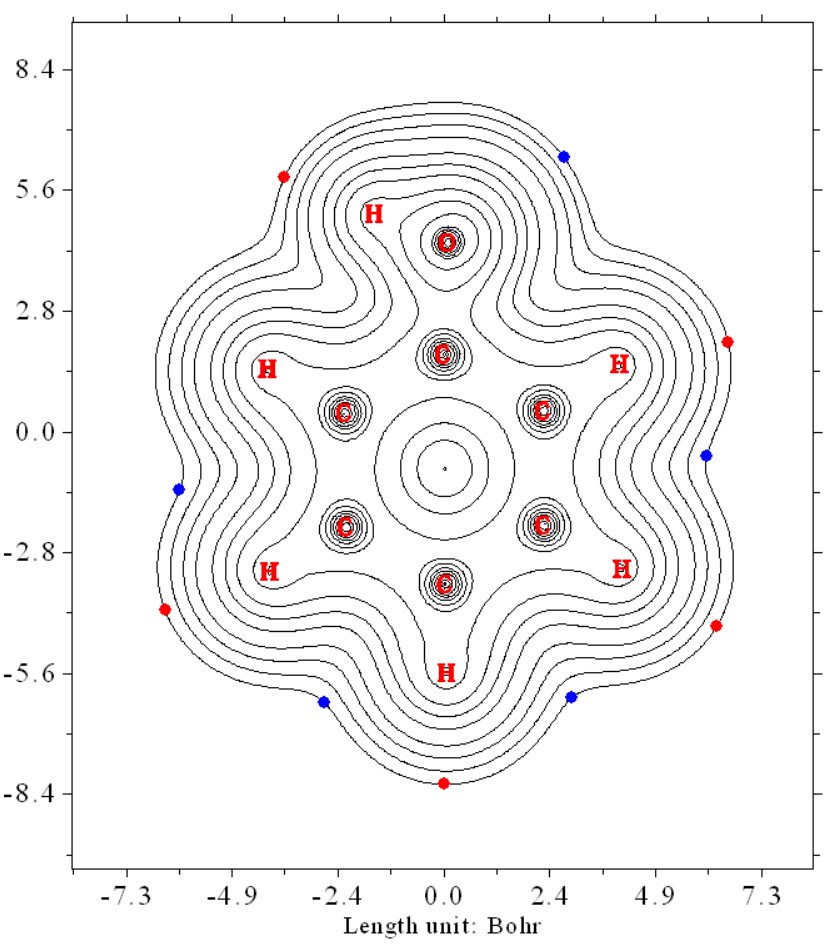

<!-- p.542 -->
to .cub file so that it can be rendered by third-part tool such as VMD or be further utilized by other analysis codes.

Note that using VMD to render the cube files generated by Multiwfn using my prepared VMD script is extremely easy, while the graphical quality is amazingly good, please check Section 4.A.14 on how to realize this.


### 4.5.1 Electron localization function of chlorine trifluoride

In this section we plot isosurface map of electron localization function (ELF) for chlorine trifluoride. Boot up Multiwfn and input following commands

examples\ClF3.wfn // Generated at B3LYP/6-31G* level 5 // Generate grid data and view isosurface 9 // Electron localization function (ELF) 2 // Medium-quality grid, about 512000 points will be evaluated, this setting is fine enough for small system but inadequate for medium and especially large system. Please consult Section 3.6 for more knowledge about grid setting.

Now Multiwfn starts to calculate grid data. Once the calculation is finished, Multiwfn outputs some statistical information. There are many options in the newly appeared menu, you can draw isosurface map by selecting option -1, after that a GUI window will pop up. Input isovalue of 0.85 in the text box and press ENTER button, you will see below isosurface map

The ELF isosurfaces clearly revealed the lone pair regions of the fluorine and chlorine atoms.

If you want to export the grid data as Gaussian cube file in current directory, you should click “Return” button to close the GUI window and then choose option 2.

If you use ChimeraX to plot isosurface map based on the ELF cube file exported by Multiwfn, you will be able to freely set color for various domains in different regions. For example, the following map is ELF=0.83 isosurface of acetic acid plotted by ChimeraX, you can easily reproduce this map if you carefully follow this video tutorial: "Plotting electron localization function (ELF) isosurface using Multiwfn and ChimeraX" (https://youtu.be/vC48iEB8PwI).


<!-- p.543 -->
Some papers plotted ELF isosurface map colored by corresponding basin types (monosynaptic or disynaptic), although you can use above way to realize this, there is an evident shortcoming: If you change isovalue, the coloring of the isosurfaces will be changed, and moreover, it is impossible to color a whole isosurface by different colors to exhibit its various subregions corresponding to different types of basins. The method described in Section 4.17.10 perfectly solves these problems, it requires employing basin analysis module.


### 4.5.2 Laplacian of electron density of 1,3-butadiene

Electron density Laplacian is another useful real space function like ELF and LOL to reveal electronic structure. Laplacian is not as good as ELF and LOL for highlighting localization region due to its poor distinguishability. For example, the shell structures of atoms heavier than krypton cannot be fully illustrated by Laplacian, and if you attempt to use Laplacian to analyze chlorine trifluoride, you will find the lone pair regions of fluorine atoms are difficult to identify. Moreover, the value range of Laplacian is too large, which brings difficulties on visual analysis. However, for many systems Laplacian of electron density is still useful. In this example we will plot isosurface map of this function for 1,3-butadiene.

Boot up Multiwfn and input following commands examples\butadiene.fch // Yielded at B3LYP/6-31G** level 5 // Generate grid data and view isosurface 3 // Electron density Laplacian 2 // Medium-quality grid (If you want to obtain better graphical effect, choose "high-quality grid" instead)

-1 // View isosurface In the newly occurred window, change isosurface value from default value to 0.3, then the green and blue isosurfaces will correspond to isovalue of 0.3 and -0.3 respectively. The current graph will look like below


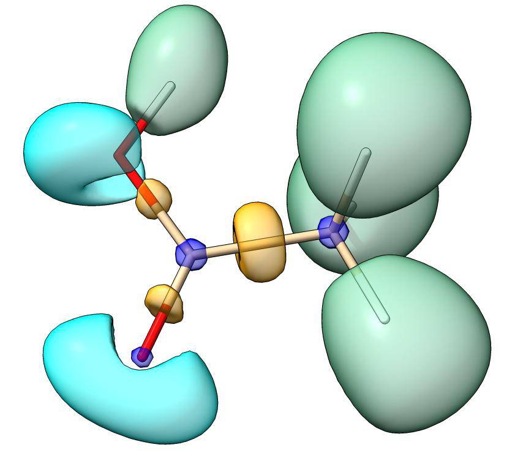

<!-- p.544 -->
The presence of blue isosurfaces between C-C and C-H suggests that valence-shell electrons are strongly concentrated on these regions, this is typical pattern of covalent bonding. If you inspect the isosurfaces between carbon atoms carefully, you will find that the isosurface between C6-C8 or C1-C4 is wider than the isosurface between C4-C6, this phenomenon reflects that the two boundary C-C covalent bonds are stronger than the central one. This conclusion can also be verified by other wavefunction analysis schemes, for example, Mayer bond order (bond order between C6-C8 is 1.863, while the bond order between C4-C6 is only 1.136).

The isosurface map we obtained in this section is not quite smooth, this is because we only used medium-quality grid. If you choose high-quality grid instead, much better isosurface will be obtained.

4.5.3 Calculate ELF-σ and ELF-π to study aromaticity of benzene

ELF-σ and ELF-π indices are commonly used σ and π aromaticity indices, they are defined as the ELF value at bifurcation point (i.e. (3,-1) type of CP) of ELF domains that solely contributed

from σ orbitals and π orbitals, respectively, see J. Chem. Phys., 120, 1670 (2004) and J. Chem. Theory Comput., 1, 83 (2005) for detail. These two papers contain very nice examples of employing

ELF-π to analyze π delocalization: Theor. Chem. Acc., 139, 25 (2020) and Carbon, 165, 468 (2020).

The theoretical basis of these indices is that the ELF value at bifurcation point measures interaction between adjoining ELF domains, the larger value means electrons have better delocalization between these domains. Strong multi-center delocalization is commonly recognized as nature of aromaticity. It is argued that if ELF-π is larger than 0.70, then the molecule has π

aromaticity. While if the average of ELF-π and ELF-σ is larger than 0.70, one can say that the molecule is global aromatic. In present example, we will calculate ELF-σ and ELF-π for benzene.

In order to separate σ and π orbitals, we need to know which orbitals are π orbitals first. Boot up Multiwfn and input following commands

examples\benzene.wfn // Optimized at B3LYP/6-311G* level 0 // View molecular orbitals (MOs) Now check orbital shape of each MO in turn, we found 17th, 20th and 21th MOs are π orbitals,

as shown below. All other MOs are recognized as σ orbitals.


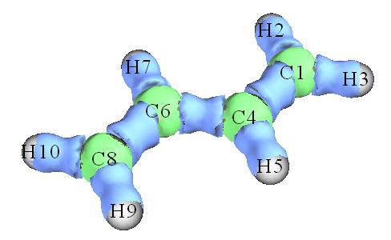


<!-- p.545 -->
We first calculate ELF-π. The contribution to ELF from σ orbitals should be omitted; this can be realized by setting occupation number of all σ orbitals to zero.

6 // Enter "Modify & Check wavefunction" interface 26 // Set occupation number for some orbitals 0 // Selecting all orbitals 0 // Set occupation number of all orbitals to zero 17,20,21 // Select MO 17, 20 and 21, namely all π orbitals 2 // Set occupation numbers of MO 17, 20 and 21 to 2.0 (doubly occupied). If you want to check if occupation numbers have been correctly set, choose option 3. You will find occupation

number of all σ orbitals have become zero, namely they will have no contribution to all results yielded in following calculations

q // Return to last menu -1 // Return to main menu For this system, in fact there is a much more convenient way to set occupation numbers of all orbitals except for the π ones to zero. The procedure is: Enter subfunction 22 of main function 100, select 0, then all π orbitals will be automatically identified, then choose 1 to set occupation number of all other orbitals to zero (or choose option 3, if heavier elements such as silicon are involved in present system). Finally, choose 0 to return to main menu. More details about automatic identification of π orbitals can be found in Section 3.100.22.

Studying ELF-π There are two ways to study ELF-π, the way 1 is to examine ELF isosurface directly, while the way 2 is performing topology analysis. Way 1 is more intuitive but less accurate than way 2. Here I illustrate way 1 first. Generate and view isosurface for ELF by main function 5 as usual (recall Section 4.5.1. Using High-quality grid is recommended). This time the ELF isosurface only reflects π-electron localization character. By gradually increasing isovalue, you will find that the two circle-shape ELF domains are bifurcated to twelve spherical-like domains at about the isovalue of 0.91 (see the graph below), implying that ELF-π index of benzene is about 0.91.


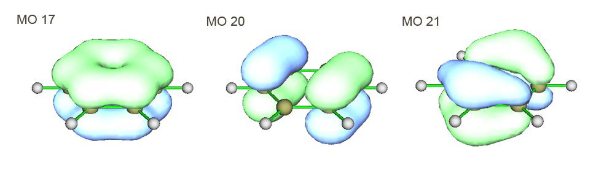


<!-- p.546 -->
Next, let us use way 2 to evaluate ELF-π index again, this way is more rigorous than way 1. Choose 0 to return to main menu.

2 // Topology analysis -11 // Select real space function 9 // ELF 6 // The starting points will be distributed around each atom in turn. This searching mode is the most appropriate one for locating ELF CPs

-1 // Start the CP search -9 // Return to upper menu 0 // Visualize results. The resulting graph is shown below, two (3,+1) CPs are not shown

By comparing this graph with ELF isosurface map, it clear that the (3,-1) CPs (orange) are bifurcation positions of ELF domains, while (3,-3) CPs (purple) correspond to the maximum points of the twelves ELF domains. Now we check ELF value at a (3,-1) CPs, we can choose anyone, since they are all equivalent.

7 // Show all properties at a CP 23 // CP23 From the output, we find the ELF value at CP 23, namely ELF-π index of benzene is 0.91247, this result is in very good agreement with the value 0.913 given in Chem. Phys. Lett., 443, 439 (2007), note that our calculation level is exactly identical to this paper. Evidently, this value exceeds the criteria (0.70) of π aromaticity, suggesting that benzene has strong π aromaticity.

Studying ELF-σ Now we calculate ELF-σ for benzene. Reboot Multiwfn and load benzene.wfn, set occupation number of MO 17, 20 and 21 to zero (it is more convenient to use subfunction 22 in main function 100 to do this). Then generate isosurface for ELF as usual, gradually adjust isovalue, try to find out

at which isovalue the domains corresponding to the σ bonds between carbon atoms are bifurcated. One can finally find that at the isovalue equals 0.71 the domain is bifurcated, suggesting that ELF-

σ index is about 0.71. The bifurcation point is pointed by red arrow in the graphs below:


<!-- p.547 -->
Enter topology analysis module and search ELF CPs, like what we did in way 2 of ELF-π analysis. You will obtain the graph below. For clarity, (3,+1) and (3,+3) CPs are hidden.

Comparing positions of CPs with ELF isosurface map, it is clear that the (3,-1) CPs such as CP

48 and 58 correspond to bifurcation points of the σ bond domains between the carbon atoms. Check ELF value at CP 48, we get 0.70907, which is the accurate ELF-σ value. Our result agrees well with the value 0.717 from Chem. Phys. Lett., 443, 439 (2007).

The average of ELF-σ and ELF-π is (0.70907+0.91247)/2=0.81077, which is larger than the criteria of global aromaticity, so benzene possesses global aromatic character.


### 4.5.4 Use Fukui function and dual descriptor to study favorable sites of electrophilic attack for phenol


Multiwfn supports a batch of methods for predicting the most reactive sites, see Section 4.A.4 for detail. In this section, I will introduce how to realize Fukui function and dual descriptor, which are the most popular two methods for revealing reactive sites.

IMPORTANT NOTE: In daily research, I strongly suggest you directly using main function 22


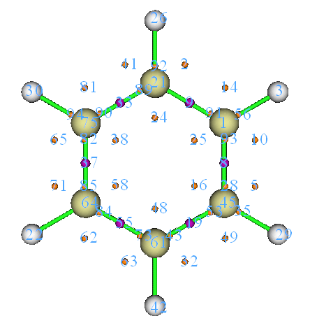

<!-- p.548 -->
to automatically calculate Fukui function and dual descriptor, because the steps are much simpler than the those described below, and meantime many useful quantities in conceptual density functional theory can be obtained as byproducts, see Section 3.25 for introduction and 4.22.1 for example.

4.5.4.1 Fukui function

Theory Fukui function is a very important concept in the conceptual density functional theory, it has been widely used in prediction of reactive sites. Fukui function is defined as follows, see J. Am. Chem. Soc., 106, 4049 (1984) for original paper and my paper Acta Phys. -Chim. Sin., 30, 628 (2014) for related discussions and comparison.


$$f(\mathbf{r})=\left[\frac{\partial\rho(\mathbf{r})}{\partial N}\right]_{\nu}$$

<!-- formula-ocr: formula_p548_337.png 已替换为LaTeX, 原图保留备查 -->

where N is number of electrons in present system, the constant term ν in the partial derivative is external potential. Generally, the external potential only comes from nuclear charges, so ν can be simply regarded as nuclear coordinates for isolated chemical system. It is argued that reactive sites should have larger value of Fukui function than other regions. We cannot directly evaluate the partial derivative due to the discontinuity when N is integer. Via the finite difference approximation, Fukui function can be calculated unambiguously for three situations:

$$\mathrm{Nucleophilic~attack:}\;f^{+}(\mathbf{r})=\rho_{N+1}(\mathbf{r})-\rho_{N}(\mathbf{r})\approx\rho^{\mathrm{LUMO}}(\mathbf{r})$$

$$\mathrm{Nucleophilic~attack:}\;f^{+}(\mathbf{r})=\rho_{N+1}(\mathbf{r})-\rho_{N}(\mathbf{r})\approx\rho^{\mathrm{LUMO}}(\mathbf{r})$$

$$Radical~attack:f^{0}(\mathbf{r})=\frac{f^{+}(\mathbf{r})+f^{-}(\mathbf{r})}{2}=\frac{\rho_{N+1}(\mathbf{r})-\rho_{N-1}(\mathbf{r})}{2}\approx\frac{\rho^{\mathrm{HOMO}}(\mathbf{r})+\rho^{\mathrm{LUMO}}(\mathbf{r})}{2}$$

Preparing wavefunction files Below we first reveal the reactive sites for electrophilic attack of phenol by means of the Fukui

function f − shown above. The approximate form of Fukui function based on frontier orbitals will not be used here.

We need to prepare the files needed by calculation of f −. Assume that you are a Gaussian user, you can use .wfn, .wfx or .fch as input file for present purpose. In this example, we perform following calculations to generate needed .wfn files, all calculations are conducted at B3LYP/6-31G* level, which is the lowest acceptable level for producing meaningful result (of course you can use better level to improve the result):

(1) Optimizing geometry structure of phenol of neutral state. The resulting geometry will be used for next steps

(2) Performing single point task for phenol of neutral state to yield phenol.wfn (see examples\phenol.gjf)

(3) Performing single point task for phenol of N-1 state (i.e. cationic state) to yield phenol_N-1.wfn (see examples\phenol_N-1.gjf)

Notice that the geometry of the N-1 state should not be optimized before performing single


<!-- p.549 -->
point task of the N-1 state, because the ν (nuclear coordinates in this context) is a constant in the partial derivative of Fukui function. By the way, in fact the step (2) could be omitted if you directly specify out=wfn keyword and output path of .wfn file at step (1).

Calculating Fukui functions f − To study the isosurface of f −, we need to properly use the "custom operation” feature of Multiwfn (see Section 3.7.1 for detail). Boot up Multiwfn and input following commands:

examples\phenol.wfn // Phenol of neutral state 5 // Calculate grid data 0 // Set custom operation 1 // Only one file will be operated with the file that has been loaded (namely phenol.wfn) -,examples\phenol_N-1.wfn // “-“ is subtraction sign. Property of the firstly loaded file (namely phenol.wfn) will be subtracted by corresponding property of phenol_N-1.wfn

1 // Electron density 2 // Medium-quality grid Now Multiwfn starts to calculate electron density grid data for phenol.wfn, then calculate that

for phenol_N-1.wfn, and finally get their difference to yield grid data of f −. We choose option -1 to check the isosurface, after adjusting the isovalue to a proper value (0.007), the graph will be

In the map, green and blue isosurface correspond to positive and negative region of f −, respectively. Clearly, most positive part of f − function is localized on O12, C1, C3, C4 and C5, that means para and ortho positions of hydroxyl are favourable reactive sites for electrophilic attack, this conclusion is in agreement with common knowledge, namely hydroxyl group is an ortho-para- director.

Calculating Fukui functions f 0 Next, I take propylene as an example to illustrate how to plot Fukui function for radical attack,

namely f 0 = (ρN+1 − ρN-1)/2. Of course, we should yield wavefunction file corresponding to N+1 state and N-1 state. We first optimize geometry of neutral state (examples\propylene\opt_N.gjf), then use this geometry to perform single point task of N-1 and N+1 states to yield corresponding .fch files.

Boot up Multiwfn and input: examples\propylene\N+1.fch // N+1 electrons state, namely -1 charged state 5 // Calculate grid data 0 // Set custom operation 1 // One file will be operated with propylene-1.fch -,examples\propylene\N-1.fch // N-1 electrons state, namely +1 charged state 1 // Electron density


<!-- p.550 -->
2 // Medium-quality grid 6 // Divide all grid data by a factor 2 // Divided by 2 -1 // Visualize isosurface map The isosurface map of f 0 = 0.01 is shown below

4.5.4.2 Dual descriptor

Theory Dual descriptor is another useful function used to reveal reactive sites, see J. Phys. Chem. A,

109, 205 (2005) for detail. Formally, the definition of the dual descriptor Δf has close relationship with Fukui function:

−=Δ fff )()()( rrr +−=−−−= )()(2)()]()([)]()([ ρρρρρρρ −+ NNNNNNN −+−+ 1111rrrrrrr

It is noteworthy that dual descriptor can also be evaluated in terms of spin density 𝜌𝑠. Since 𝜌𝑁+1 −𝜌𝑁 and 𝜌𝑁−𝜌𝑁−1 can be approximated as 𝜌𝑁+1 𝑠 respectively, it is clear that ∆𝑓(𝐫) ≈𝜌𝑁+1 𝑠(𝐫) . Commonly, there is no evident qualitative difference between the dual descriptor evaluated based on electron density of three states (N+1, N, N-1) and the one based on spin density of two states (N+1, N-1). 𝑠(𝐫) −𝜌𝑁−1 𝑠 and 𝜌𝑁−1

Unlike Fukui function, via Δf both types of reactive sites can be revealed simultaneously. It is argued that if Δf > 0, then the site is favorable for a nucleophilic attack, whereas if Δf < 0, then the site is favorable for an electrophilic attack. However, according to my experience, if your aim is to figure out which ones are more favorable among many potential sites, you do not need to concern

the sign of Δf, you only need to study which sites have more positive or more negative of Δf. If the distribution of Δf around a site A is more positive than another site B, then one can say A is a more favorable site for nucleophilic attack than B, and meantime B is a more preferential site for electrophilic attack than A.

Approximately evaluating dual descriptor based on spin density Here we calculate dual descriptor for phenol based on spin density of N-1 and N+1 states. Since we have already calculated phenol_N-1.wfn earlier, now we only need to calculate phenol_N+1.wfn (this file and corresponding input file phenol_N+1.gjf has been provided in "example" folder). After that, boot up Multiwfn and input:

examples\phenol_N+1.wfn // N+1 electron system, namely anionic state 5 // Calculate grid data 0 // Set custom operation 1 // Only one file will be operated with the file that has been loaded -,examples\phenol_N-1.wfn // N-1 electron system, namely cationic state


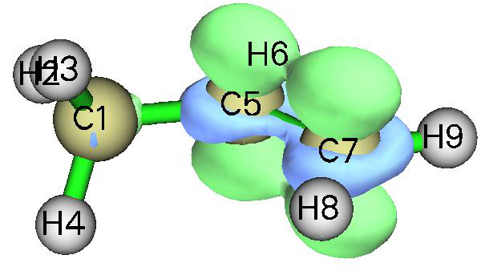

<!-- p.551 -->
5 // Electron spin density 2 // Medium-quality grid -1 // Visualize isosurface of dual descriptor We gradually change the isovalue so that the dual descriptor at different sites can be clearly distinguished, we find 0.02 is a proper value, the corresponding isosurface is shown below

We can see that in the ring (except for the C4, which cannot participate in reaction), the para-

carbon has evident negative value of Δf, and meantime the Δf at the two ortho-carbons is not so positive as the two meta-carbons, therefore the conclusion of Δf is identical to Fukui function f −, namely only para- and ortho- carbons are activated for electrophilic attack by the hydroxyl group.

Exactly evaluating dual descriptor based on electron density

If you would like to evaluate Δf in its exact form (based on ρ of three states), you can follow below steps:

examples\phenol_N+1.wfn // N+1 electron system 5 // Calculate grid data 0 // Set custom operation 3 // Three files will be operated with the file that has been loaded -,examples\phenol.wfn // N electron system -,examples\phenol.wfn // N electron system +,examples\phenol_N-1.wfn // N-1 electron system 1 // Electron density 2 // Medium-quality grid -1 // Visualize isosurface of dual descriptor The graph corresponding to isovalue of 0.01 is shown below


<!-- p.552 -->
It can be seen that although this map is qualitatively consistent with the Δf map evaluated based on spin density, the difference between ortho-carbons and meta-carbons is not so remarkable, showing

that this time Δf does not have good ability to discriminate preferential sites. So, using exact form to evaluate Δf does not necessarily give rise to better result than using spin density to approximately evaluate Δf !

On the "condensed" Fukui function and dual descriptor Above we used visualization manners to examine Fukui function and dual descriptor and obtained the conclusion what we expected. However, visual analysis is somewhat ambiguous and subjective. Therefore, sometimes we hope that the discussions of Fukui function and dual descriptor can be quantified, namely assigning a value for each atom to exhibit the extent that it can be acted as reactive site. To do so, one should calculate "condensed" version of Fukui function and dual descriptor based on population analysis techniques. Since population analysis is exemplified in Section 4.7, the method for calculating condensed Fukui function and condensed dual descriptor will be deferred to be introduced as Section 4.7.3. Another scheme to study Fukui function and dual descriptor is to first partition the whole molecular surface to local surface corresponding to each atom, and then examine their average values on these local surfaces. Because this scheme relies on quantitative molecular surface analysis technique, illustration is deferred to Section 4.12.4.


### 4.5.5 Plot difference map of electron density to study electron transfer of imidazole coordinated magnesium porphyrin


In this example, I will show you how to plot fragment electron density difference in Multiwfn. During coordination between imidazole and magnesium porphyrin, electron transfer and polarization occur, the variation of electron density can be clearly revealed by subtracting electron density of imidazole (referred to as NN below) and magnesium porphyrin (referred to as MN below) in their isolated states from the whole system (referred to as MN-NN below). The geometry of MN-NN is shown below:


<!-- p.553 -->
examples\MN-NN.gjf is Gaussian input file of the MN-NN system (geometry has been optimized), run it by Gaussian after modifying the .wfn output path at the last line, then MN-NN.wfn will be yielded. Next, respectively delete MN and NN parts from the MN-NN.gjf and properly modify .wfn output path and then save MN.gjf and NN.gjf (which have already been provided in "example" folder). Then run them by Gaussian to obtain MN.wfn and NN.wfn. It should be paid attention that by default, Gaussian always puts the system to standard orientation, which makes the coordinates in MN.wfn and NN.wfn inconsistent with MN-NN.wfn, and thus the density difference will be meaningless. Therefore, nosymm keyword must be specified in route section to avoid the automatic adjustment of coordinates. (The MN.wfn, NN.wfn and MN-NN.wfn can also be directly loaded from here: http://sobereva.com/multiwfn/extrafiles/MN-NN.zip)

Now we generate grid data of electron density difference by Multiwfn. Boot up Multiwfn and input following commands

MN-NN.wfn 5 // Calculate grid data 0 // Set custom operation 2 // Two files will be operated with MN-NN.wfn -,MN.wfn // Will subtract property of MN.wfn from that of MN-NN.wfn -,NN.wfn // Will subtract property of NN.wfn from that of MN-NN.wfn 1 // The property is selected as electron density 3 // Since present system is relatively huge, we need more grid points than normal cases, so we choose high-quality grid

After the calculation is finished, you can choose option -1 and then set isovalue to about 0.001 to visualize the isosurface of the grid data, as shown below.


<!-- p.554 -->
Plotting isosurface map in VMD Multiwfn is not very professional at visualization of grid data, for large size of grid data the visualization speed is relatively slow. You can choose option 2 to export the grid data to cube file and then visualize it by external tools, such as VMD. Below is the graph generated by VMD (freely available at http://www.ks.uiuc.edu/Research/vmd/) based on the cube file generated by Multiwfn.

The red and blue isosurfaces (+0.0012 and -0.0012 a.u., respectively) represent the region in which electron density is increased and decreased after NN coordinated to MN, respectively. It is obvious that electron density is shifted from backside of nitrogen in NN toward magnesium atom to strengthen the coordination bond. Besides, it can be seen that the appearance of NN does not perturb electron density distribution of porphyrin ring remarkably, only slight polarization occurs on the four coordination nitrogens in MN.

Detailed steps of drawing the graph above in VMD: First, drag the cube file density.cub into VMD main window. Select "Graphics" - "Representations", create a new representation by clicking "Create Rep" button, change the "drawing method" to "isosurface", set "Draw" to "solid surface", set "Show" to "Isosurface", change the isovalue to 0.0012, set "coloring method" to "ColorID" and choose red. Now the isosurface of positive part of density difference has been displayed. Then click "Create Rep" button again to create another representation, select blue in "ColorID"


<!-- p.555 -->
and change the isovalue to -0.0012. If you would like to use white background instead of the default black background, select Graphics - Colors - Display - Background - 8 white.

In fact, using the VMD plotting script and batch file provided by me, much better effect than the map above can be obtained with much fewer number of steps. Please be sure to check Section 4.A.14, which illustrates how to use realize this.

Plotting contour map Next, we plot contour map of electron density difference in the plane defined by atoms 16, 14, 9. Input following commands:

0 // Return to main menu 4 // Draw a plane graph 0 2 -,MN.wfn -,NN.wfn 1 2 // Contour line map [Press ENTER button to use default grid setting] 4 // Define the plane by three atoms 16,14,9 Immediately the contour map pops up. The solid and dashed contour lines exhibit where electron density is increased and decreased, respectively. The contour lines in the graph are a bit sparse, so we adjust contour line setting to make the graph look denser and thus more informative. Close the graph and then input

3 // Change contour line setting 9 // Generate contour value by geometric series 0.0001,2,30 // Start value, step size and the number of steps, respectively y // Clean existing contour lines 9 -0.0001,2,30 // Set negative contour lines n // Append the newly generated contour lines to existing ones 1 // Save setting and return -1 // Redraw the graph Below is the final graph, looks nice!


<!-- p.556 -->
Hint: After completing the definition the contour lines, you can choose option 6 to save the setting to external plain text file. Next time you can directly load the setting by option 7.

Note that in Multiwfn, plotting difference map for electron density or other real space functions can be easily extended to more than two fragments cases, see Section 4.4.8 for example.


### 4.5.6 Study electron delocalization range function EDR(r;d) of anionic water dimer


This section was contributed by Arshad Mehmood and slightly adapted by Tian Lu.

This example shows how to calculate electron delocalization range function EDR(r;d) at user-

defined length scale d for anionic water cluster (H2O)2− (cf. Phys. Chem. Chem. Phys., 17, 18305 (2015)). Using EDR(r;d) we can vividly inspect distribution of solvated electrons.

Boot up Multiwfn and input following commands: examples\solvatedelectron.wfn // Anionic water dimer optimized at B3LYP/6-311++G(2d,2p) level

5 // Calculate grid data 20 // EDR(r;d) 11.22 // Input length scale d (Bohr). Here we consider the relatively delocalized solvated electron at d=11.22 Bohr. Further details are given in J. Chem. Phys., 141, 144104 (2014).

2 // Medium-quality grid -1 // Show isosurface graph


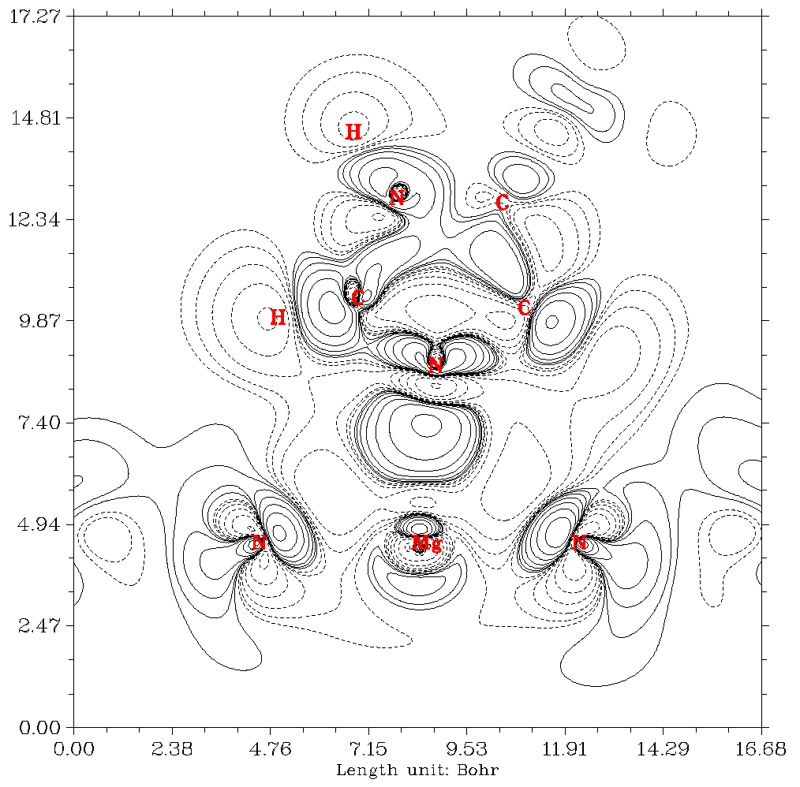

<!-- p.557 -->
Now a GUI window pops up. Input isovalue of 0.74 in the “Isosurface value” box and press ENTER button. The following isosurface will appear.

This figure shows that at length scale of d=11.22 Bohr the solvated electron is between the two H2O molecules.


### 4.5.7 Study orbital overlap distance function D(r) of thioformic acid

This section was contributed by Arshad Mehmood and slightly adapted by Tian Lu.

This example will show the calculation procedure of orbital overlap distance function D(r) of thioformic acid and map it on molecular electron density surface. If you are not familiar with D(r), you can check entry 21 of Section 2.6 or J. Chem. Theory Comput., 12, 3185 (2016).

Boot up Multiwfn and input following commands: examples\ThioformicAcid.wfn // Thioformic acid optimized at B3LYP/6-311++G(2d,2p) 5 // Calculate grid data 21 // Orbital overlap length function D(r), which maximizes EDR(r;d) with respect to d Now we need to set input total number, start and increment of EDR exponents αi=1/di2, since the overlap distance is fit using an even-tempered grid of exponents. The start value is the largest exponent (α1), subsequent exponents are yielded by αi+1/αi = 1/αinc, where αinc is increment. The default setting (i.e. n=20, α1=2.50, αinc=1.50) suffices for common systems. After selecting the manual input (option 1) or default setting (option 2), a list of exponents will appear, which will be used in evaluation of D(r)

2 // Medium-quality grid At this stage Multiwfn starts calculation. Wait until calculation is finished, then choose option 2 to export grid data of D(r) as EDRDmax.cub in current folder. The next step is to generate molecular density isosurface.

0 // Return to main menu 5 // Calculate grid data 1 // Electron density 2 // Medium-quality grid (The grid setting must be the same as for D(r) calculation) Then export grid data of electron density in current folder as density.cub by selecting option 2.

Based on the EDRDmax.cub and density.cub, then the D(r) grid data can be mapped on molecular density isosurface by many visualization programs, such as VMD and GaussView. Below

is the D(r) mapped electron density isosurface (ρ = 0.001 a.u.) plotted by GaussView (If you do not know how to map a real space function using various colors on isosurface of another real space


<!-- p.558 -->
function based on two cube files via GaussView and VMD, you can consult my blog article “The way of plotting color-filled isosurface maps based on cube files generated by Multiwfn” (http://sobereva.com/402, in Chinese).

As can be seen from the graph, D(r) plotted between 2.9 Bohr (red) to 3.4 Bohr (blue) clearly distinguishes the chemically hard oxygen lone pair (red) from the softer sulfur lone pair (blue).

This system will be further studied in Section 4.12.8 by means of quantitative molecular surface analysis module.


## 4.6 Modify and check wavefunction


### 4.6.1 Delete certain Gaussian functions

In subfunction 25 of main function 6, you can set orbital expansion coefficients of Gaussian type functions (GTFs) which satisfy certain conditions. If the coefficients are set to zero, that means the information of these GTFs are deleted. In this example, we delete all Z-type GTFs of atoms 2, 3 and 4 from orbital 23 of phenol and then plot isosurface for this molecular orbital. Boot up Multiwfn and input following commands

examples\phenol.wfn 6 // Modify wavefunction 25 // Set the coefficients of some GTFs that satisfied certain conditions 0,0 // Set the index range of GTFs, only the GTFs satisfied this condition will be reserved to next step. 0,0 tell Multiwfn the range is “ALL”

2,4 // Only the GTFs attributed to atoms 2, 3, 4 will be reserved to next step Z // Only reserve Z-type GTFs to next step 23,23 // Set lower and upper limit of orbital, if they are identical, then only one orbital is selected

0 // Set coefficients of selected GTFs in orbital 23 to zero, that is delete their information 0 // Save current wavefunction to new.wfn in current directory You can choose option 4 and input 23 to check expansion coefficient of orbital 23 to verify if


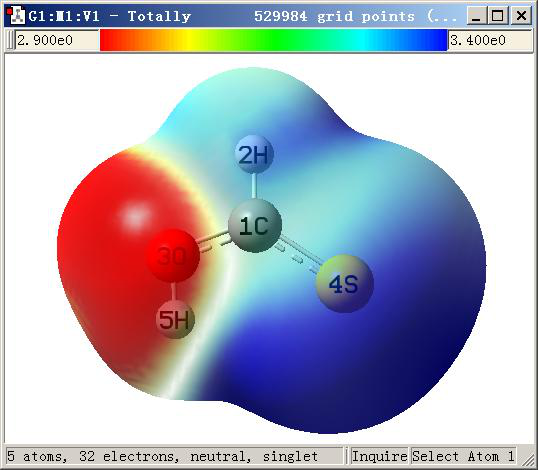

<!-- p.559 -->
your operation is correct. Let us compare the isosurfaces of orbital 23 before and after modification. In order to plot the modified orbital 23, you can close Multiwfn and load new.wfn, or directly select option -1 to return to the main menu, and then enter main function 0 to plot its isosurface.

Left side is unmodified state, the molecular plane is parallel to XY plane, so if Z-type GTFs in some atoms are deleted, the corresponding part of isosurface should disappear, this is what we have seen at right side (modified state).


### 4.6.2 Valence electron density analysis: Example of removing contributions from certain orbitals to real space functions


In Multiwfn, contributions from certain orbitals to real space functions can be removed. From the formulae in Section 2.6 it is clear that if occupation numbers of certain orbitals are set to zero, they will have no contribution, as if they do not exist. Actually, in Section 4.5.3 we have already

used this trick to separate ELF as ELF-σ and ELF-π. Notice that some real space functions are not linear with respect to orbitals, such as ELF and LOL, so they cannot be computed as the sum of contributions from each occupied orbital. In contrast, some real space functions are linear with respect to orbitals, such as electron density and kinetic energy density, they can be decomposed as contributions from various orbitals.

If we study electron density after removing contributions from inner-core molecular orbitals, then the analysis is known as “valence electron density analysis”, which was demonstrated to be quite powerful for analyzing molecular electronic structure. Lots of examples of this kind of analysis can be found in my paper "Revealing Molecular Electronic Structure via Analysis of Valence Electron Density" Acta Phys. -Chim. Sin., 34, 503 (2018) DOI: 10.3866/PKU.WHXB201709252.

Next, two examples of studying valence electron density are given.

Example 1: Plotting color-filled map of valence electron density for HCN In this example, we will manually remove contributions from the MOs consisting of inner-core atomic orbitals to electron density for HCN, so that we can plot its valence electron density map, the procedure is very simple. Inner-core atomic orbitals always have very low energy, so they can only contribute to the MOs with lowest energy. Hydrogen has no inner-core atomic orbital, while both carbon and nitrogen have an inner-core atomic orbital, hence what we need to do is to set occupation numbers of the first two MOs to zero (note that this is closed-shell wavefunction).

Now, boot up Multiwfn, and input following commands examples\HCN.wfn 6 // Modifying wavefunction


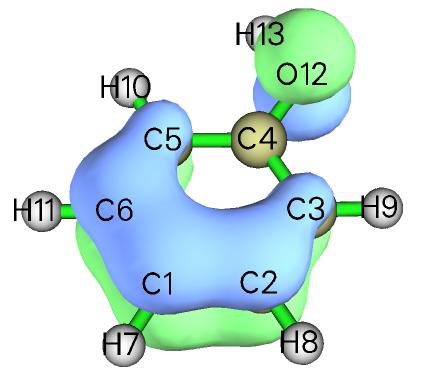


<!-- p.560 -->
26 // Set occupation numbers 1,2 // Select MOs 1 and 2 0 // Set their occupation numbers to zero q // Return to last menu -1 // Return to main menu Then, if we plot color-filled map of electron density as usual by main function 4 (see examples in Section 4.4), we will get the following graph

From the above picture, the bonding region of C-N and C-H bonds and be easily identified, and the lone pair region of nitrogen can also be clearly observed. Note that the small white circles in carbon and nitrogen centers do not correspond to 1s electrons, but result from the fact that valence atomic orbitals have penetration effect into core region.

Example 2: Plotting isosurface map of valence electron density for ethane For convenience consideration, Multiwfn provides option 34 in main function 6, one can directly choose it to set occupations of all MOs composed of inner-core atomic orbitals to zero. In this example we will use this feature, and plot isosurface map of valence electron density for ethane.

Boot up Multiwfn and input examples\ethane.wfn 6 // Modify wavefunction 34 // Set occupation number of inner orbitals to zero -1 // Return to main menu 5 // Calculate grid data and visualize isosurface map 1 // Electron density 3 // High-quality grid -1 // Show isosurface map After changing isovalue to a proper value 0.25 and disable showing molecular structure, we will see


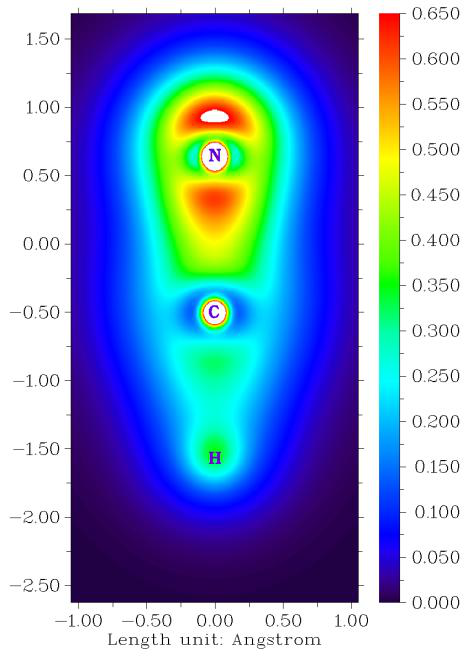

<!-- p.561 -->
As you can see, the core electrons of carbon, as well as the electrons used to form C-C bond and C-H bonds, are clearly revealed by the isosurfaces.

Finally, it is worth to mention that analysis of valence electron density is never limited to plotting analysis. For example, by using main functions 2 and 17, topology analysis and basin analysis can also be straightforwardly applied to valence electron density, respectively; what you need to do is removing contributions of inner-core MOs (as illustrated above) before performing usual analysis for electron density.

See my blog article “Studying direction of nucleophilic attack via electron localization function (ELF) and valence electron density analysis” (http://sobereva.com/606, in Chinese) on more examples about valence electron density analysis.


### 4.6.3 Translate and duplicate graphene primitive cell wavefunction to periodic system


IMPORTANT NOTE: To analyze wavefunction for periodic system, it is best to use Multiwfn in combination with CP2K, see Section 2.9.2. The main purpose of this section is simply illustrating the features of translating and duplicating wavefunction.

The .fch or .wfn file generated by periodic boundary condition (PBC) calculation of Gaussian only contains wavefunction of primitive cell, so the analysis results do not show any periodic character, of course you can expand your system to multiple cells before PBC calculation, but you have to spend much more time for computation. Multiwfn provides a way to convert primitive cell wavefunction to a large supercell wavefunction, so that in the region of interest, the real space functions show periodic character.

Note: Beware that constructing supercell wavefunction in this manner is only a very crude approximation! Since the orbital mix between neighbouring primitive cells is ignored, therefore the orbital wavefunctions of supercell cannot be faithfully reproduced.

In this section I use graphene as example. First, generating .fch (or .wfn) file of graphene primitive cell. The content of “molecular specification” field in the Gaussian input file is


```text
C                  0.000000    0.000000    0.000000
C                  0.000000    1.429118    0.000000
TV                 2.475315    0.000000    0.000000
TV                -1.219952    2.133447    0.000000
```


<!-- p.562 -->
In route section, write “#P PBEPBE/3-21g/Auto SCF=Tight”. Use Gaussian to run this input file and then use formchk to convert the binary checkpoint file to graphene.fch. Then boot up Multiwfn and input:

examples\graphene.fch 6 // Modify wavefunction 32 // Translate and duplicate primitive cell wavefunction 2.475315,0.0,0.0 // Translation vector 1 2 // Unit is Å 3 // Translate and duplicate present system three times in this direction 32 // Notice that current system already has four primitive cells, this time we will translate and duplicate current system in another direction three times, so the final system will contain 16 primitive cells

-1.219952,2.133447,0.0 // Translation vector 2 2 // Unit is Å 3 // Translate and duplicate present system three times in this direction The left part of the picture below is LOL function of primitive cell. After above manipulation, we recalculate LOL function and then the right graph is obtained (black arrows denote translation vectors). Apparently, the central region of the extended system shows correct periodic character, however the behavior of boundary region is still incorrect, you can extend the system further to enlarge “correct” region.

Notice that if nosymm keyword is not specified in PBC calculation, Gaussian may automatically put the system into standard orientation, at this time you should not use the translation vectors in Gaussian input file as the translation vectors for translating and duplicating system in Multiwfn, but should use the content in “Translation vectors” field of .fch file or “PBC vector” segment in Gaussian output file.


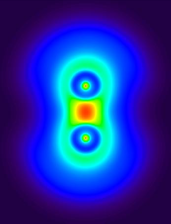


<!-- p.563 -->

## 4.7 Population analysis and atomic charge calculation


### 4.7.0 Mulliken population analysis on triplet ethanol

In this section I will illustrate how to use Multiwfn to carry out Mulliken analysis, triplet ethanol is taken as instance. It is worth to note that Mulliken analysis is incompatible with diffuse functions, if diffuse functions are employed, the analysis result will be meaningless.

Boot up Multiwfn and input examples\ethanol_triplet.fch // Calculated at UB3LYP/6-31G** level based on optimized singlet structure

7 // Population analysis and atomic charges 5 // Mulliken population analysis 1 // Output Mulliken analysis result. By default, the result is outputted on screen, you can also select "-1 Choose output destination for option 1" to change the output destination to a specified plain text file

From the output, first you can find population of each basis function:


```text
Population of basis functions:
  Basis Type    Atom    Shell   Alpha pop.   Beta pop.  Total pop.   Spin pop.
     1   S        1(C )    1      0.99597     0.99597     1.99193    -0.00000
     2   S        1(C )    2      0.34180     0.34330     0.68510    -0.00150
     3   X        1(C )    3      0.34747     0.35290     0.70037    -0.00543
     4   Y        1(C )    3      0.34869     0.35220     0.70088    -0.00351
...
    60   Z        8(O )   30      0.64840     0.09113     0.73953     0.55726
    61   S        8(O )   31      0.30323     0.47550     0.77873    -0.17228
...
```

Since present system is an open-shell system, not only the total population (i.e. alpha+beta), but also alpha and beta populations are outputted individually. The spin populations, which equal to difference between alpha and beta populations, are also printed. The output content is easy to understand, for example, from the output we can see that there are nearly two electrons located on the first S basis function of C1 atom, and one of PZ basis functions of O8 atom has a large amount of unpaired electrons (0.557).

Next, we can find population of each basis function shell of each atom:


```text
Population of shells:
Shell  Type     Atom     Alpha pop.  Beta pop.   Total pop.  Spin pop.
   1     S      1(C )     0.99597     0.99597     1.99193    -0.00000
   2     S      1(C )     0.34180     0.34330     0.68510    -0.00150
   3     P      1(C )     1.05533     1.06504     2.12037    -0.00971
   4     S      1(C )     0.30449     0.30842     0.61291    -0.00393
...
   28     S      8(O )     0.99668     0.99637     1.99305     0.00032
   29     S      8(O )     0.51929     0.45809     0.97739     0.06120
```


<!-- p.564 -->

```text
...
```

As you can see, for example, the basis function shell 30, which corresponds to one of P shells of O8, has unpaired electrons of 0.648 and total population of 2.777.

Next, you can find population of each angular moment atomic orbitals of each atom:


```text
Population of each type of angular moment atomic orbitals:
     Atom    Type   Alpha pop.   Beta pop.    Total pop.   Spin pop.
...
     8(O )    s      1.81920      1.92996      3.74916     -0.11076
              p      2.49431      1.65216      4.14647      0.84216
              d      0.00748      0.00607      0.01355      0.00142
...
     Total    s      8.35987      7.42761     15.78748      0.93226
              p      5.61927      4.56478     10.18405      1.05448
              d      0.02087      0.00761      0.02847      0.01326
```

The output shows that atomic orbitals of d type only have marginal contribution to total population (0.02847) and spin population (0.01326) of the whole system, since basis functions of D type only behave as polarization functions for present system. In O8, most unpaired alpha electrons are located on its p atomic orbitals, while slight unpaired beta electrons are distributed on its s atomic orbitals (positive and negative value indicate that the unpaired electrons are alpha and beta, respectively).

Finally, we can find atomic populations and atomic charges:


```text
Population of atoms:
     Atom      Alpha pop.   Beta pop.    Spin pop.     Atomic charge
     1(C )      3.15460      3.16849     -0.01388        -0.32309
     2(H )      0.43857      0.43159      0.00698         0.12984
     3(H )      0.43857      0.43159      0.00698         0.12984
     4(H )      0.46846      0.43410      0.03437         0.09744
     5(C )      3.13963      2.95977      0.17986        -0.09940
     6(H )      0.49613      0.36169      0.13444         0.14218
     7(H )      0.49613      0.36169      0.13444         0.14218
     8(O )      4.32100      3.58819      0.73281         0.09082
     9(H )      1.04690      0.26289      0.78401        -0.30979
 Total net charge:  -0.00000      Total spin electrons:   2.00000
```

Triplet system has two unpaired electrons, one can see that in the triplet ethanol, most unpaired electrons (more than 1.5) are located on the hydroxyl group. It is well known that in ground state ethanol, the oxygen atom should have significant negative charge due to very large electronegativity of oxygen. However, in present system, the oxygen even carries marginally positive charge. This observation reflects the fact that electronic structure of different electronic states may differ from each other remarkably.

Mulliken population analysis does not show population information of each atomic orbital, however, if you first identify correspondence between basis functions and atomic orbitals (see Section 4.7.6 for details), you can easily obtain population of each atomic orbital by simply summing up population of corresponding basis functions.


<!-- p.565 -->
There are several other options in the Mulliken analysis interface, they can help you to gain deeper insight into electronic population, please play with them by consulting corresponding explanation in Section 3.9.3.


### 4.7.1 Calculate Hirshfeld and CHELPG atomic charges as well as fragment charge for chlorine trifluoride


Calculating Hirshfeld charges I have introduced the theory of Hirshfeld population in Section 3.9.1, to calculate Hirshfeld charges for ClF3, input below commands in Multiwfn

examples\ClF3.wfn 7 // Population analysis and atomic charges 1 // Hirshfeld population Hirshfeld population analysis requires electron density of atoms in their free-states, you need to choose a method to calculate atomic densities. Selecting 1 to use built-in atomic densities is very convenient, see Appendix 3 for detail; alternatively, you can select 2 to evaluate atomic densities based on atomic .wfn files, see Section 3.7.3 for detail. Here we choose option 1. Now you can see below output, not only the atomic charges, but also the dipole moment evaluated based on the atomic charges is printed.


```text
Hirshfeld charge of atom     1(Cl) is    0.523322
Hirshfeld charge of atom     2(F ) is   -0.223879
Hirshfeld charge of atom     3(F ) is   -0.075550
Hirshfeld charge of atom     4(F ) is   -0.223879
Summing up all charges:     0.00001373

Total dipole moment from atomic charges:    0.309313 a.u.
X/Y/Z of dipole moment from atomic charges:    0.000000   -0.000000    0.309313 a.u.
```

From the result we find the charges of the three fluorine atoms are unequal, the equatorial one (F3) is -0.075, while the axial ones (F2 and F4) possess more electrons, their charges are thus more negative, that is -0.224.

As shown on the screen, the sum of all calculated charges is 0.00001373 rather than exactly zero as we expected, this is due to unavoidable numerical error of space integration. Considering this, Multiwfn also prints the result after normalization to eliminate the marginal numerical error:


```text
Final atomic charges, after normalization to actual number of electrons
 Atom    1(Cl):     0.523317
 Atom    2(F ):    -0.223882
 Atom    3(F ):    -0.075553
 Atom    4(F ):    -0.223882
```

When using the calculated atomic charges for your research and article, adapting the normalized charges is recommended, because their sum is exactly identical to net charge of current system.

Finally, Multiwfn asks you if exporting the result, if you select y, the element names, atom coordinates and atomic charges will be outputted to a plain text file with .chg extension, see Section 2.6 of introduction of .chg format. You can use this file as Multiwfn input file and select


<!-- p.566 -->
“Electrostatic potential from atomic charges” in main function 3, 4, 5 (or other functions) to study the electrostatic potential derived from Hirshfeld charges.

Calculating CHELPG charges Next, we calculate CHELPG charge. CHELPG charge has been introduced in Section 3.9.10. First, select subfunction 12 in the population analysis module, you will see a new menu. In general, you do not need to modify the default options, and you can directly select option 1 to start the calculation. Since calculation of ESP is time-consuming, for large system you may need to wait for a while. The result is 0.5772 for Cl, -0.2496 for axial F and -0.0779 for equatorial F. The conclusion of CHELPG charge is the same as Hirshfeld charge, namely axial F are more negatively charged than the equatorial one.

Quickly evaluating fragment charge Fragment charge is defined as sum of charge of atoms constituting a fragment. You can manually sum up atomic charges to derive fragment charge; however, for large systems this process must be laborious. In Multiwfn it is possible to directly calculate charge for a fragment. For example, here we calculate CHELPG charge for the fragment composed of the two axial F atoms. Boot up Multiwfn and input

examples\ClF3.wfn 7 // Population analysis -1 // Define fragment 2,4 // Index of the two axial F atoms 12 // CHELPG charge 1 // Start calculation Since the fragment has been defined, Multiwfn not only prints atomic charges, but also prints fragment charge at the end of all output:


```text
Fragment charge:   -0.499331
```


### 4.7.2 Calculate and compare ADCH atomic charges with Hirshfeld atomic charges for acetamide


The ADCH (atomic dipole moment corrected Hirshfeld population) charge proposed by me is an improved version of Hirshfeld charge, it resolved many inherent drawbacks of Hirshfeld charge, such as poor dipole moment reproducibility, see Section 3.9.9 for brief introduction and my paper J. Theor. Comput. Chem., 11, 163 (2012) for discussion and comparison. I highly recommend using ADCH charge to characterize charge distribution. The calculation process of ADCH charges is exactly identical to the one described in last section, the only difference is that you should select option 11 instead of option 1 in population analysis interface. For example, here we calculate ADCH charges for CH3CONH2. Boot up Multiwfn and input

examples\CH3CONH2.fch 7 // Population analysis and atomic charges 11 // Calculate ADCH charges 1 // Use built-in atomic densities in free-state Multiwfn will calculate Hirshfeld charges first, and then perform atomic dipole moment correction for them to yield ADCH charges. The result is shown below


<!-- p.567 -->

```text
    ======= Summary of atomic dipole moment corrected (ADC) charges =======
 Atom:    1C   Corrected charge:   -0.265840  Before:   -0.090370
 Atom:    2H   Corrected charge:    0.096194  Before:    0.037254
 Atom:    3H   Corrected charge:    0.105929  Before:    0.043058
 Atom:    4H   Corrected charge:    0.117894  Before:    0.048339
 Atom:    5C   Corrected charge:    0.272281  Before:    0.170596
 Atom:    6O   Corrected charge:   -0.364414  Before:   -0.308866
 Atom:    7N   Corrected charge:   -0.677574  Before:   -0.159120
 Atom:    8H   Corrected charge:    0.355620  Before:    0.131920
 Atom:    9H   Corrected charge:    0.359828  Before:    0.127108
 Summing up all corrected charges:  -0.0000816
 Note: The values shown after "Corrected charge" are ADCH charges, the ones afte
r "Before" are Hirshfeld charges

 Total dipole from ADC charges (a.u.)  1.4368131  Error:  0.0001385
 X/Y/Z of dipole moment from the charge (a.u.)  0.0432390 -1.4253486  0.1759079
```

It is obvious that for all atoms, the magnitude of ADCH charges is evidently larger than that of Hirshfeld charges, the former are in agreement with common chemical senses, while the latter turns out to be too small.

A remarkable feature of ADCH charges is that the molecular dipole moment can be exactly reproduced. The dipole moment derived from ADCH charges is 1.4368 a.u. (as shown above), which is exactly identical to the actual dipole moment, namely the one derived based on present electron density distribution. (The error 0.0001385 comes from trivial numerical aspects and is totally negligible).

If you scroll up the command-line window, you will find the following information


```text
Total dipole from atomic charges:    1.073849 a.u.
```

This is the dipole moment derived from Hirshfeld charges, which deviates to actual dipole moment (1.4368 a.u.) apparently. In fact, for almost all small molecules, Hirshfeld charges always underestimate molecular dipole moments severely.

Again, it is recommended to employ the atomic charges after normalization (namely the ones printed under "Final atomic charges" label).


### 4.7.3 Calculate condensed Fukui function and condensed dual descriptor


Theory In Section 4.5.4, I have introduced how to calculate and visualize Fukui function and dual descriptor. In this section, we will calculate "condensed" version of these two functions, so that the discussion of the possibility that an atom could act as a reactive site can be upgraded to quantitative level. Phenol will still be used as example case.

Before calculating phenol, we first derive the expression of condensed Fukui function and condensed dual descriptor. In the condensed version, atomic population number is used to represent


<!-- p.568 -->
the amount of electron density distribution around an atom. Recall the definition of Fukui function f +:

)()()(1rrrNNfρρ−=++

The definition of condensed Fukui function for an atom, say A, can be written as

A1AANNfpp+ +=−

where pA is the electron population number of atom A.

Since atomic charge is defined as AAAqZp=−, where Z is the charge of atomic nuclear, the

f + can be expressed as the difference of atomic charges in two states (note that the two Z terms are cancelled)

A1AANNfqq+ +=−

By analogous treatments, one can easily formulate other types of condensed Fukui function

Nucleophilic attack : fqq A1 + =− AANN +

Electrophilic attack : fqq A1 − =− AANN −

Radical attack : () / 2 fqq 0A11 =− AANN −+

Similarly, condensed dual descriptor can be written as

$$f_{A}^{+}=q_{N}^{A}-q_{N+1}^{A}$$

There are numerous ways to calculate atomic charges, although currently there is no consensus on which method is the most ideal one to study condensed Fukui function and dual descriptor, but at least Hirshfeld charge has proven to be a very suitable choice. For example, J. Phys. Chem. A, 106, 3885 (2002), J. Phys. Chem. A, 107, 10428 (2003) and my work J. Phys. Chem. A, 118, 3698 (2014) illustrated Hirshfeld charge can be successfully used to study reactive sites in terms of condensed Fukui function. Furthermore, a comprehensive comparison given in Theor. Chem. Acc., 138, 124 (2019) demonstrated that Hirshfeld charge may be the best choice for evaluating condensed Fukui function.

Practical example: Phenol Here we calculate the condensed Fukui function and dual descriptor for phenol, we still use the phenol.wfn, phenol_N+1.wfn and phenol_N-1.wfn in "examples" folder, which have already been utilized in Section 4.5.4

According to the procedure introduced in Section 4.7.1, we calculate Hirshfeld charges for all carbons in phenol in its N, N+1 and N-1 electrons states, respectively, they are collectively given in

the following table. Then, according to the formulae shown above, the condensed f −, f + and dual descriptor can be readily calculated, as shown below.


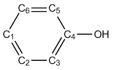

<!-- p.569 -->
N N-1 N+1 f − f + Δf

C1 (p) -0.059 0.085 -0.119 0.144 0.060 -0.084 C2 (m) -0.039 0.027 -0.167 0.066 0.128 0.063 C3 (o) -0.060 0.032 -0.187 0.092 0.128 0.036 C4 0.074 0.174 0.022 0.100 0.052 -0.048 C5 (o) -0.073 0.009 -0.196 0.082 0.123 0.040 C6 (m) -0.041 0.034 -0.173 0.075 0.131 0.056

Note: The Hirshfeld charges reported above were estimated based on built-in sphericalized atomic densities.

For f −, the smallest two values occur at C2 and C6, therefore meta atoms are unfavorable sites for electrophilic attack.

For dual descriptor, the most positive values occur at C2 and C6, suggesting that they are the most unfavorable sites for electrophilic attack. C1 has a large negative value and hence favored by electrophilic reactant. Although the two ortho carbons (C3 and C5) have positive value, their magnitude is not as large as meta carbons, so dual descriptor indicates that ortho carbons are more possible than meta carbons to be reactive site for electrophilic attack. Our conclusion is completely in line with that of Section 4.5.4, in which we obtained the conclusion by visual inspecting isosurface of Fukui function and dual descriptor.

IMPORTANT NOTE: In daily research, I strongly suggest you directly using main function 22 to automatically calculate condensed Fukui function and dual descriptor, because the steps are extremely simple and meantime other useful quantities in conceptual density functional theory can be printed together, see Section 3.25 for introduction and 4.22.1 for example.


### 4.7.4 Illustration of computing Hirshfeld-I atomic charges

Hirshfeld-I (HI) is a more advanced technique to define atomic spaces than its predecessor (Hirshfeld). Before following the example given below, please briefly read Section 3.9.13 to gain basic knowledge of HI method and its implementation in Multiwfn. It is very important to note that in order to calculate HI charge, atomic radial densities files (.rad) of various elements in the current system at different charged states must be available. Commonly, I suggest you directly use the built-in .rad files in Multiwfn, so that you do not need to generate them before HI calculation. See Section 3.9.13 for details about this point.

Here we calculate HI charges for CH3COCl. For convenience, we will directly use built-in .rad files in this example. To do so, we copy "atmrad" folder from "examples" directory to current directory, then the .rad files in this folder will be employed by Multiwfn in the HI charge calculation.

Boot up Multiwfn and input examples\CH3COCl.wfn // Generated at B3LYP/6-31G* level 7 // Population analysis and atomic charges 15 // Hirshfeld-I method 1 // Start calculation with default settings Then you will see iteration process


```text
Performing Hirshfeld-I iteration to refine atomic spaces...
Cycle    1
Cycle    2   Maximum change:  0.202864
```


<!-- p.570 -->

```text
Cycle    3   Maximum change:  0.152850
Cycle    4   Maximum change:  0.106642
Cycle    5   Maximum change:  0.080325
Cycle    6   Maximum change:  0.063412
[ignored]
```

The "maximum change" denotes the maximum change of HI atomic charges, the iteration continues until "maximum change" is lower than the threshold, which is 0.0002 by default. After convergence, Multiwfn prints final HI atomic charges:


```text
 Atom    1(C ):    -0.64593923
 Atom    2(H ):     0.18144874
 Atom    3(H ):     0.17983150
 Atom    4(H ):     0.18144874
 Atom    5(C ):     0.72667580
 Atom    6(O ):    -0.42009700
 Atom    7(Cl):    -0.20336855
```

Then you can choose if outputting these charges to .chg file in current folder. I suggest you compare above result with Hirshfeld charges, you will find the magnitude of HI charges is much higher than Hirshfeld charges. This phenomenon is expected, because HI atomic spaces properly contract or expand with respect to that of neutral state according to actual chemical environment, hence the size difference of atomic space among various atoms is greatly increased.

Letting Multiwfn automatically invoke Gaussian to generate .rad files In principle, it may be best to generate atomic .rad files at the same level as the current molecule, since in this case the result has strongest physical meaning. You can directly let Multiwfn invoke Gaussian to prepare the .rad files.

Before calculation, you should properly set "gaupath" in `settings.ini` file to actual Gaussian executable file. In addition, if "atmrad" folder has existed in current directory and it contains .rad files of C, H, O, and Cl elements, you should delete them.

Boot up Multiwfn and input examples\CH3COCl.wfn // Generated at B3LYP/6-31G* level 7 // Population analysis and atomic charges 15 // Hirshfeld-I method 1 // Start calculation with default settings B3LYP/6-31G* // The keyword of Gaussian used to calculate atomic .wfn files From the prompts shown on screen, you can find that Multiwfn invokes Gaussian to calculate atomic .wfn files for all elements involved in the present molecule at various charged states. Then Multiwfn converts atomic .wfn files to .rad files, which record spherically averaged atomic radial densities. The automatically generated Gaussian input file (.gjf), the resulting Gaussian output file (.out or .log) and the .rad files are all produced in "atmrad" folder of current folder, you can manually examine them if you are interested.

In the current case, the resulting charges are


```text
Atom    1(C ):    -0.667920
Atom    2(H ):     0.194766
Atom    3(H ):     0.188545
Atom    4(H ):     0.194766
```


<!-- p.571 -->

```text
Atom    5(C ):     0.755439
Atom    6(O ):    -0.414041
Atom    7(Cl):    -0.251555
```

As can be seen, the HI charges calculated based on the .rad files generated at B3LYP/6-31G* level are basically the same as those calculated based on built-in .rad files, therefore commonly I suggest directly using built-in .rad files since the calculation is easier in this case and Gaussian is not needed.

If you do not delete the "atmrad" folder or clean it up, then when you recalculate HI charges for CH3COCl, or calculate a molecule only consisting of C, H, O and Cl elements or some of them, Multiwfn will directly perform HI calculation based on the existing .rad files in the "atmrad" folder rather than invoke Gaussian to recalculate them.

Finally, it is noteworthy that the support of Hirshfeld-I in Multiwfn is never limited to population analysis, this partition method can also be used to calculate orbital composition (main function 8), and be applied in fuzzy analysis module (main function 15).


### 4.7.5 Calculating EEM atomic charges for ethanol-water cluster

Please first read Section 3.9.15 to understand basic features of Electronegativity Equalization Method (EEM) charges before following this example. Here we calculate EEM charges for ethanol-water cluster, which contains as many as 492 atoms:

Evidently, calculating atomic charges by quantum chemistry method for such a large system is too expensive; however, as you will see, evaluation of EEM charges even for a system composed by hundreds of atoms is rather easy.

Note that in order to calculate EEM charges in Multiwfn, currently you have to use MDL molfile (.mol) or .mol2 as input file, because only this file provides atomic connectivity information, which is needed in the calculation of EEM charges.

Boot up Multiwfn and input below commands examples\ethanol_water.mol // This is a snapshot of molecular dynamics simulation 7 // Population analysis and atomic charges


<!-- p.572 -->
17 // EEM charge 0 // Start calculation You will immediately see


```text
 EEM charge of atom    1(O ):   -0.658886
 EEM charge of atom    2(H ):    0.322520
 EEM charge of atom    3(H ):    0.270187
...
 EEM charge of atom  488(C ):   -0.071564
 EEM charge of atom  489(H ):    0.145191
 EEM charge of atom  490(H ):    0.125555
 EEM charge of atom  491(O ):   -0.616013
 EEM charge of atom  492(H ):    0.310970
 Electronegativity:    2.454144
```

The default EEM parameters were fitted by some researchers for reproducing B3LYP/6-31G* CHELPG charges, therefore, the above EEM charges should be close to CHELPG charges evaluated at B3LYP/6-31G* level (In fact, for present system, even if calculation of CHELPG charges is feasible, the result should be much worse than the EEM charges we just obtained. Because it is well-known that the quality of electrostatic fitting charges is very low for the atoms far from van der Waals surface, while in present system there are numerous heavily buried atoms).

Note that there are also many other built-in EEM parameters, you can choose them via option 1 before calculation.

Note on calculating EEM charge of the system containing π conjugation It is worth to note if one or more atoms are in π conjugation region, the conjugation must be represented as Lewis structure in the inputted .mol or .mol2 file, otherwise the calculation cannot be conducted.

For example, we use GaussView to create an azobenzene molecule:

Save it as .mol file, then use Multiwfn to calculate EEM charge based on this file, you will find below error:


```text
Error: Multiplicity of atom    1 ( 4) exceeded upper limit ( 3)!
 The present EEM parameters do not support such bonding status, or connectivity
in your input file is wrong
```

To understand the reason, open the .mol file by text editor, you can find below two lines


```text
  1  2  4  0  0  0  0
  1  6  4  0  0  0  0
```

which indicates that the bond multiplicity of 1-2 and 1-6 is 4, clearly this is unreasonable, because formal bond order between two carbons cannot be four! This issue comes from the fact that


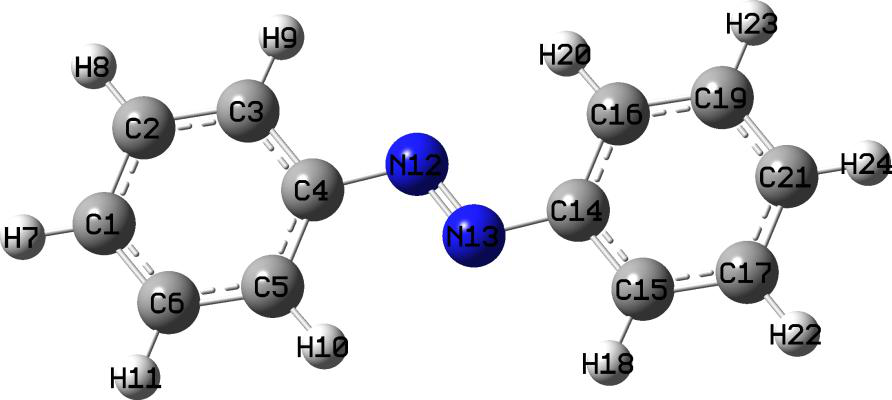

<!-- p.573 -->
GaussView always records a conjugated bond in .mol as a quadruple bond. To solve this problem, the best way is installing OpenBabel (freely available at http://openbabel.org), then use this command to convert the previous .mol file to a new .mol file: obabel old.mol -O new.mol. Then if you use GaussView to open the new.mol, you will find the bonding has fully satisfied Lewis structure:

Now we use Multiwfn to calculate its EEM charges again, you will find below output, which is quite reasonable:


```text
 EEM charge of atom    1(C ):  -0.1021985241
 EEM charge of atom    2(C ):  -0.0879338435
 EEM charge of atom    3(C ):  -0.1330865020
...ignored
 EEM charge of atom   11(H ):   0.1188370423
 EEM charge of atom   12(N ):  -0.3186294612
 EEM charge of atom   13(N ):  -0.3186294612
...ignored
```


### 4.7.6 Determining correspondence between basis functions and atomic orbitals via population analysis


Determine correspondence between basis functions and atomic orbitals is important if one wants to plot PDOS of some atomic orbitals via main function 10, or to evaluate contribution to molecular orbitals from specific atomic orbitals using main function 8. The correspondence is easy to be identified if Pople basis set is used. For example, 6-31G* implies using one basis function with contraction degree of 6 to represent each inner atomic orbital, while each valence atomic orbital is represented by a basis function with contraction degree of 3 and an uncontracted basis function. However, for most other types of basis sets, the correspondence is often difficult to determine. Fortunately, as will be illustrated in this section, if one studies total and spin population of basis function shells via Mulliken population analysis, the correspondence can be unambiguously identified.

Two typical examples will be given below, more examples and discussions can be found from my blog article “Determining correspondence between basis functions and atomic orbitals via population analysis” (http://sobereva.com/418, in Chinese). In the text below atomic orbitals will be denoted as lower case (e.g. s, p, d...), while basis functions will be written as upper case (e.g. S, P, D...).

Example 1: cc-pVTZ for sulfur Sulfur atom has configuration of 1s22s22p63s23p4, the ground state is triplet. The


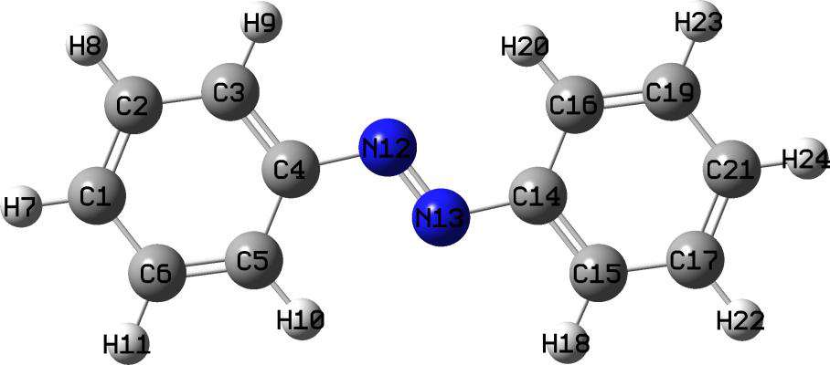

<!-- p.574 -->
examples\sulfur_cc-pVTZ.fch is the .fch file calculated at B3LYP/cc-pVTZ level by Gaussian16 for a single sulfur atom at its triplet state. Load this file into Multiwfn, then input

7 // Population analysis and atomic charges 5 // Mulliken analysis 1 // Output Mulliken analysis result You will immediately see


```text
Shell  Type     Atom     Alpha_pop.  Beta_pop.   Total_pop.  Spin_pop.
   1     S      1(S )     0.99997     0.99997     1.99994    -0.00000
   2     S      1(S )     0.94424     0.94387     1.88812     0.00037
   3     S      1(S )     0.60678     0.56547     1.17225     0.04131
   4     S      1(S )     0.12371     0.13260     0.25631    -0.00889
   5     S      1(S )     0.32408     0.35782     0.68189    -0.03374
   6     P      1(S )     2.93141     2.90842     5.83983     0.02299
   7     P      1(S )     1.58628     0.47788     2.06416     1.10840
   8     P      1(S )     0.59303     0.26385     0.85688     0.32918
   9     P      1(S )     0.88863     0.34985     1.23848     0.53879
  10     D      1(S )     0.00064     0.00017     0.00081     0.00048
  11     D      1(S )     0.00058     0.00011     0.00069     0.00046
  12     F      1(S )     0.00065     0.00000     0.00065     0.00064
```

We want to identify which S basis functions respectively correspond to 1s, 2s and 3s atomic orbitals, and which P basis function shells respectively correspond to 2p and 3p atomic orbital shells.

All the two unpaired electrons of triplet sulfur atom are distributed on 3p shell, since the sum of spin population of 7P, 8P and 9P is 1.10840+0.32918+0.53879=1.976, which is nearly equal to two, we can say that these three P shells correspond to 3p shell. The remainder 6P shell clearly corresponds to 2p shell, this can also be confirmed that its population number is 5.840, which is close to expected occupation number of 2p shell (6.0).

Then we check the case of S shells. The sum of population number of 3S, 4S and 5S is 1.17225+0.25631+0.68189=2.110, which is close to actual occupation number of 3s atomic orbital (2.0); considering that occupation number of both 1S and 2S are close to 2.0, it can be concluded that 1S, 2S and (3S,4S,5S) mainly represent 1s, 2s and 3s atomic orbitals, respectively.

Example 2: def2-TZVP for Au For Au atom, def2-TZVP is a pseudopotential basis set with Stuttgart small core pseudopotential, 60 inner electrons are replaced with pseudopotential, therefore only the valence electrons 5s25p65d106s1 are explicitly represented by the def2-TZVP basis set. The examples\Au_def2-TZVP.fch is the .fch file calculated at B3LYP/def2-TZVP level by Gaussian16 for a single Au atom at its ground state (doublet state). Load this file into Multiwfn and carry out population analysis as the last example, you will see


```text
Shell  Type     Atom     Alpha_pop.  Beta_pop.   Total_pop.  Spin_pop.
   1     S      1(Au)     0.01764     0.01588     0.03352     0.00175
   2     S      1(Au)    -0.25037    -0.22638    -0.47675    -0.02399
   3     S      1(Au)     0.90648     0.84814     1.75462     0.05834
   4     S      1(Au)     0.33047     0.35849     0.68895    -0.02802
   5     S      1(Au)     0.60949     0.00436     0.61385     0.60513
   6     S      1(Au)     0.38630    -0.00049     0.38581     0.38679
```


<!-- p.575 -->

```text
   7     P      1(Au)     1.32302     1.32562     2.64864    -0.00260
   8     P      1(Au)     1.43496     1.44146     2.87642    -0.00650
   9     P      1(Au)     0.24145     0.23250     0.47395     0.00896
  10     P      1(Au)     0.00057     0.00042     0.00099     0.00015
  11     D      1(Au)     3.11664     3.17522     6.29186    -0.05859
  12     D      1(Au)     1.48961     1.45237     2.94198     0.03724
  13     D      1(Au)     0.39375     0.37241     0.76616     0.02135
  14     F      1(Au)     0.00000     0.00000     0.00000     0.00000
```

Undoubtedly, all P shells (7P, 8P, 9P, 10P) represent the only p shell (5p), while all D shells (11D, 12D, 13D) represents the only d shell (5d). Since the sum of population number of 5S and 6S (i.e. 0.61385+0.38581) is exactly equal to 1.0, and meantime the sum of spin population number of 5S and 6S is also equal to 1.0, it is clear that the 5S and 6S shells collectively represent the 6s atomic orbital, which has a single unpaired electron. The total electrons in the other four S shells (1S, 2S, 3S, 4S) is almost exactly 2.0, evidently the doubly occupied 5s is mainly represented by them.


### 4.7.7 Illustration of deriving RESP charges and normal ESP fitting charges with extra constraints


In this section I will take many examples to substantially illustrate the use of the extremely powerful and flexible RESP module of Multiwfn, which can very conveniently calculate standard RESP atomic charges and normal ESP fitting charges with/without charge and equivalence constraints. Reading Section 3.9.16 is strongly recommended so that you have enough knowledge about the RESP module as well as adequate understanding on the idea of ESP fitting method.

More detailed descriptions and discussions can be found from my blog article "Principle of RESP charge and its calculation in Multiwfn" (in Chinese, http://sobereva.com/441).

For saving space, only the most important files involved in the examples below are provided in "examples\RESP" folder, while other files, including Gaussian output files and .fch files, can be downloaded at http://sobereva.com/multiwfn/extrafiles/RESP.zip.

In this section, only an example of deriving RESP charges for ground state is given. It is also easy to calculate RESP charges for excited state. You can follow this example http://sobereva.com/wfnbbs/viewtopic.php?pid=747 if you are a Gaussian user.

Hint: Speeding up ESP calculation by cubegen. Since calculation of ESP on fitting points is a computationally demanding step, while calculation speed of ESP of internal code of Multiwfn is slower than the cubegen utility in Gaussian package if number of your CPU cores is less than 10, therefore if Gaussian is available on your machine and the input file is .fch/fchk, it is suggested to allow Multiwfn to invoke cubegen to evaluate ESP to reduce cost of deriving ESP fitting charges. You simply need to set "cubegenpath" parameter in `settings.ini` to actual path of cubegen executable file in your machine. See Section 5.7 for details.

4.7.7.1 Example 1: Deriving RESP charges for dopamine in ethanol

environment

In this section I introduce the procedure of calculating standard RESP atomic charges for dopamine. Ethanol solvent environment is assumed and it will be represented using IEFPCM implicit solvation model. The structure of dopamine is shown below.


<!-- p.576 -->
Commonly, the geometry used for deriving RESP charges should be optimized at reasonable level. Above geometry was optimized at B3LYP-D3(BJ)/6-311G** level with IEFPCM implicit solvation model, and it was found to be the most stable geometry of present molecule.

Now, use Gaussian to run examples\RESP\dopamine-single\dopamine.gjf to generate corresponding .fch file for this geometry. As can be seen in the .gjf file, the keywords are b3lyp/6-311g(d,p) SCRF=solvent=ethanol, this combination is not expensive while the resulting wavefunction is completely adequate to yield reliable RESP charges.

Boot up Multiwfn and input dopmaine.fch // The .fch file just yielded 7 // Population analysis 18 // RESP module 1 // Calculate standard RESP charges using two-stage fitting procedure During the calculation, Multiwfn first sets up atomic radii and determines position of fitting points, and then calculates ESP values at the fitting points. After that, the first stage of standard RESP calculation starts, the parameters and conditions employed in this stage can be found from outputted information:


```text
 No charge constraint is imposed in this stage
 No atom equivalence constraint is imposed in this fitting stage

 **** Stage 1: RESP fitting under weak hyperbolic penalty
 Convergence criterion: 0.00000100
 Hyperbolic restraint strength (a): 0.000500    Tightness (b): 0.100000
 Iter:   1   Maximum charge variation:    1.0067306224
 Iter:   2   Maximum charge variation:    0.0503406929
 Iter:   3   Maximum charge variation:    0.0040155661
 Iter:   4   Maximum charge variation:    0.0003425806
 Iter:   5   Maximum charge variation:    0.0000329903
 Iter:   6   Maximum charge variation:    0.0000032384
 Iter:   7   Maximum charge variation:    0.0000003207
 Successfully converged!
```

As you can see, variation of atomic charges converges after 7 cycles in this stage. Then the second stage starts:


```text
**** Stage 2: RESP fitting under strong hyperbolic penalty
 Atoms equivalence constraint imposed in this fitting stage:
```


<!-- p.577 -->

```text
 Constraint   1:   12(H )   13(H )
 Constraint   2:   14(H )   15(H )
 Fitting objects: sp3 carbons, methyl carbons and hydrogens attached to them
 Indices of these atoms:
    4C    12H    13H     6C    14H    15H
 Convergence criterion: 0.00000100
 Hyperbolic restraint strength (a): 0.001000    Tightness (b): 0.100000
 Iter:   1   Maximum charge variation:    1.0237455608
 Iter:   2   Maximum charge variation:    0.0068736797
 Iter:   3   Maximum charge variation:    0.0000294321
 Iter:   4   Maximum charge variation:    0.0000001351
 Successfully converged!
```

As indicated in the output, in the second fitting stage, the two hydrogens at each of the two

−CH2− groups are required to be equivalent during the fitting. In addition, charges of only six atoms are fitted in stage 2, they are carbons and hydrogens in the two −CH2− groups, while charges of other atoms keep unchanged at the values yielded in fitting stage 1.

The resulting RESP charges are


```text
   Center      Charge
     1(O )  -0.5406621847
     2(O )  -0.5360154461
...[ignored]
    12(H )   0.0727189426
    13(H )   0.0727189426
    14(H )  -0.0640826813
    15(H )  -0.0640826813
...[ignored]
 Sum of charges:    0.000000
 RMSE:    0.002097   RRMSE:    0.110457
```

If you examine the charges carefully, you will find all charges are chemically meaningful. The RMSE and RRMSE are not large, implying that quality of ESP fitting is nice. One can see that equivalence constraints indeed work, the H12 and H13 share the same charge 0.0727, while both H14 and H15 have charge of -0.064.

Directly loading fitting points and ESP values from Gaussian output file As mentioned in Section 3.9.16.2, during calculation of ESP fitting charges in the RESP module, it is possible to make Multiwfn directly load fitting points and ESP values from Gaussian output file of pop=MK or pop=CHELPG task. As an illustration, the Gaussian input file of dopamine for this purpose is provided as examples\RESP\dopamine-single\dopamine_pop_MK.gjf, use Gaussian to run it, then boots up Multiwfn and input

dopmaine.fch // In present situation this file in fact is only used to provide geometry information so that Multiwfn can determine atomic connectivity, therefore you can also use other formats such as .xyz, .pdb and .wfn instead

7 // Population analysis 18 // RESP module 8 // Let Multiwfn directly load fitting points information from Gaussian output file


<!-- p.578 -->
1 // Calculate standard RESP charges using two-stage procedure dopamine_pop_MK.out // The Gaussian output file with IOp(6/33=2,6/42=6) pop=MK keywords

Then the calculation of atomic charges will be completed very quickly, because calculation of ESP values is avoided. Since the number and positions of fitting points generated by Multiwfn and those generated by Gaussian pop=MK task are different, current result is slightly different to that we obtained earlier.

4.7.7.2 Example 2: Taking multiple conformations into account during RESP

charge calculation of dopamine

In this example we still calculate standard RESP charges for dopamine, but multiple conformations are explicitly considered in the ESP fitting procedure. It was found that there are four dominating conformations of dopamine in gas phase, the corresponding Gaussian input files of optimization task at B3LYP-D3(BJ)/6-311G** level have been provided in examples\RESP\dopamine_4conf folder, run them by Gaussian and then convert the resulting .chk files to .fch files.

My earlier Gibbs free energy calculations showed that at room temperature, according to Boltzmann distribution, the population of the four conformers are 8.48%, 2.66%, 48.45% and 40.42%, respectively. Therefore we should write a plain text file named conf.txt (other filenames are also acceptable) with the content below, assuming that all the .fch files have been put into current folders.


```text
dopamine1.fch 0.0848
dopamine2.fch 0.0265
dopamine3.fch 0.4844
dopamine4.fch 0.4041
```

The first column is file path of each conformer, while the second column is corresponding weight. Evidently, the sum of all weights must be exactly equal or approximately equal to unity.

Boot up Multiwfn and input dopamine1.fch // In present case, the file loaded at this stage is only used to provide geometry information that used to determine atomic connectivity, thus you can also use .fch of other conformers, the result will not be affected

7 // Population analysis 18 // RESP module -1 // Load conformation list file conf.txt // Input actual path of this file 1 // Calculate standard RESP charges using the two-stage procedure The result is


```text
   Center      Charge
     1(O )  -0.5127119135
     2(O )  -0.4946153408
...[ignored]
    21(H )   0.4040820785
    22(H )   0.3885435037
```


<!-- p.579 -->

```text
 Conformer:    1   RMSE:    0.002885   RRMSE:    0.176042
 Conformer:    2   RMSE:    0.002727   RRMSE:    0.163666
 Conformer:    3   RMSE:    0.002234   RRMSE:    0.146771
 Conformer:    4   RMSE:    0.002102   RRMSE:    0.134091
 Weighted RMSE:    0.002249   Weighted RRMSE    0.144547
```

As can be seen, when considering multiple conformations, Multiwfn gives RMSE and RRMSE for each conformer as well as weighted RMSE and RRMSE. The data shows that current atomic charges have better ESP reproducibility for conformations 3 and 4 than conformations 1 and 2. The reason is not difficult to interpret, because the weights of conformations 3 and 4 in conf.txt are significantly higher than 1 and 2, therefore the fitted charges prone to faithfully represent charge distribution of conformers 3 and 4.

It is worth to note that if you set weight of conformer 1 in the conf.txt to 1.0 while set that of other ones to zero, then the outputted statistical error will be


```text
 Conformer:    1   RMSE:    0.002047   RRMSE:    0.124925
 Conformer:    2   RMSE:    0.002862   RRMSE:    0.171810
 Conformer:    3   RMSE:    0.003391   RRMSE:    0.222734
 Conformer:    4   RMSE:    0.004172   RRMSE:    0.266133
```

It can be seen that the atomic charges obtained at this time represent ESP of conformer 1 very well, because the RMSE and RRMSE are small, while ESP reproducibility of conformers 3 and 4, which have highest probability of occurrence, is no longer quite good. Therefore, current RESP charges is not ideal for molecular dynamics modeling of dopamine. This observation reflects the importance of considering multiple conformations for flexible molecules. Indeed, explicit consideration of multiple conformations in ESP fitting is somewhat troublesome and time-consuming, if you decide to obtain ESP fitting charges only by single structure, you should at least use the structure with the lowest free energy as much as possible.

Directly loading fitting points and ESP values from Gaussian output file of each conformer

When considering multiple conformations, the coordinates of fitting points as well as ESP values can also be directly loaded from Gaussian output files, here I present an example. For present molecule, the Gaussian input files of pop=MK task corresponding to the four conformers have been provided in "examples\RESP\dopamine_4conf\ESP" folder, run them by Gaussian to obtain .out files, then write a plain text file named e.g. confESP.txt with the following content, with assumption that the four .out files have been placed to C:\ directory.


```text
C:\dopamine1_ESP.out 0.0848
C:\dopamine2_ESP.out 0.0265
C:\dopamine3_ESP.out 0.4844
C:\dopamine4_ESP.out 0.4041
```

After that, load .fch (or other kinds of files) of any conformer into Multiwfn and enter interface of RESP module, then select

-1 // Load conformation list file confESP.txt // Input actual path of this file 8 // Make Multiwfn directly load fitting point information from Gaussian output file 1 // Calculate standard RESP charges using the two-stage procedure Then standard RESP charges will be immediately shown.


<!-- p.580 -->
4.7.7.3 Example 3: Imposing equivalence constraint in ESP fitting of

Dimethyl phosphate

Calculation of standard ESP charges has been illustrated in above two examples, next I exemplify how to calculate normal ESP fitting (i.e. one-stage fitting) with equivalence constraint. Dimethyl phosphate is taken as instance, its structure is shown below

The two methoxy groups of this system are chemically equivalent, and are easily rotated around O-P bond during molecular dynamic simulation. Therefore, the charges of O5 and O6 should be the same, the charges of C7 and C11 should be the same, and a total of six hydrogens on the two methyl groups (H8, H9, H10, H12, H13, H14) should also be the same. However, when only one structure is taken into account, it is clear that such expectation in charge distribution cannot be achieved. Present example uses this system to demonstrate how to calculate the ESP fitting charges that meet the above equivalence requirements.

We first create a plain text file called e.g. eqvcons.txt, where each row contains indices of the atoms whose charges will be constrained to be the same. Therefore, the file content corresponding to current situation should be (in random order)


```text
5,6
7,11
8-10,12-14
```

Run the Gaussian input file of optimization task at B3LYP-D3(BJ)/6-311G** level for present molecule (examples\RESP\C2H7O4P\C2H7O4P.gjf), then convert the resulting .chk file to .fch. Next, Boot up Multiwfn and input

C2H7O4P.fch 7 // Population analysis 18 // RESP module 5 // Modify equivalence constraint (Note that for one-stage ESP fitting, by default hydrogens in each CH2 and CH3 group are constrained to be equivalent)

1 // Load equivalence constraint setting from external plain text file eqvcons.txt // The file we just created 2 // Start one-stage ESP fitting calculation with constraints The result is


```text
   Center       Charge
     1(P )   1.1205246388
```


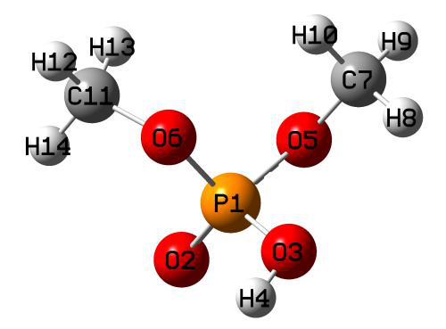

<!-- p.581 -->

```text
     3(O )  -0.5887730856
     4(H )   0.4109873910
     5(O )  -0.4034641689
     6(O )  -0.4034641689
     7(C )   0.0352980588
     8(H )   0.0694288037
     9(H )   0.0694288037
    10(H )   0.0694288037
    11(C )   0.0352980588
    12(H )   0.0694288037
    13(H )   0.0694288037
    14(H )   0.0694288037
 Sum of charges:   0.0000000000
 RMSE:    0.002541   RRMSE:    0.136047
```

Obviously, the result fully satisfies the equivalence constraint we have made, and the atomic charge values are also very reasonable and chemically significant. If we do not make the customized constraint but employ the default equivalency setting, the RRMSE will be 0.113024. Although the equivalence constraint we have made increases the RRMSE, indicating that the ESP reproducibility is lowered, since the RRMSE does not increase too much, the constraint we currently employed is within reasonable range.

Note that in the standard two-stage RESP charge calculation, customized charge constraint and equivalence constraint can also be applied, however they only take effect for the first stage (by default no constraint is employed in this stage). For the present molecule, if you load equivalence constraint from the above eqvcons.txt and then select 0 to perform two-stage RESP fitting, you will find the O5 and O6 share identical charge in the result, but charges of C7 and C11 are different, and charges of hydrogens in different methyl groups are also different, this is because the customized constraints do not take effect for the second stage (according to standard definition of two-stage RESP fitting, the carbons and hydrogens in the two methyl groups are refitted at the second stage).

4.7.7.4 Example 4: Evaluation of atomic charges of aspartic acid residue

with equivalence and charge constraints

This example is more complicated than the previous three ones, because multiple conformations, equivalence constraints and charge constraints are all involved. After carefully reading this section, I believe you will deeply feel that the RESP module of Multiwfn is amazingly flexible.

In this section we will calculate ESP fitting charges for aspartic acid (ASP) residue. The ASP is one of the most important amino acids in proteins. In general, in order to make electronic structure of a given residue in quantum chemistry calculation close to that in actual protein environment, the nitrogen terminal of the residue should be capped by acetyl group (ACE) while carbon terminal should be capped by N-methyl amide (NME). For present case, this treatment results in a model system ACE-ASP-NME.

The two most typical secondary structures of proteins are alpha helix and beta-sheet. From the point of view of the residues that make up them, the difference comes from the phi and psi dihedrals of the residue backbone. It has been suggested that residue conformations corresponding to both the secondary structures should be taken into account in the ESP fitting procedure. Also note that the net charge of the residue segment in the ACE-ASP-NME system must be an integer. Assume that the proton of the carboxyl group of the ASP side chain has dissociated, the net charge of the ASP


<!-- p.582 -->
residue should be constrained to be -1.0. In addition, given that the two oxygens of the carboxylate are chemically equivalent, it is preferable to apply an equivalence constraint to the two oxygens. The two hydrogens in the CH2 group of the ASP side chain should also be constrained to be equivalent.

The Gaussian input files of optimization task for the ACE-ASP-NME models corresponding to alpha helix and beta-sheet have been provided as alpha.gjf and beta.gjf in "examples\RESP\ACE-ASP-NME" folder. As can be seen in the files, the keywords correspond to B3LYP-D3/6-311G** level with IEFPCM solvation model to represent water environment. In the optimization, the phi and psi dihedrals are fixed to their initial values (the dihedrals will vary remarkably during

optimization if they are not frozen). In alpha.gjf, the phi and psi are -90 and -60, respectively, corresponding to typical case of alpha helix. While in beta.gjf, the two dihedrals are set to -100 and 130, reflecting typical situation of beta-sheet.

Run the two .gjf files by Gaussian, and convert resulting .chk files to .fch format. The two optimized structures are shown below. The region surrounded by green dashed ellipse is the ASP residue, the charges of these atoms are what we are interested in. The phi and psi dihedrals mentioned above correspond to 6-3-1-13 and 1-3-6-19, respectively.

We create a plain text file named for example chgcons.txt, in this file each line defines a charge constraint term. Since we require that the ASP residue has total charge of -1, we should write the following content in this file


```text
1-12 -1
```

Note that in the RESP module, there is no upper limit on the number of charge constraint terms. Also note that the indices of the atoms involved in charge constraint are not necessarily contiguous, for example if you write 1,3-5,8,9-12 1.5, then sum of charges of atoms 1,3,4,5,8,9,10,11,12 will be constraint to 1.5.

Then we create a plain text file named for example eqvcons.txt, in this file each line defines a equivalence constraint term. As mentioned earlier, O11 and O12 should be equivalent, H7 and H8 should be equivalent, therefore for present case the content should be


```text
11,12
7,8
```

Although the hydrogens in the methyl groups at the two ends of the model system are chemically


<!-- p.583 -->
equivalent, since they are not of our interest, the equivalence constraint setting is ignored.

Next, we write a file named for example conflist.txt, which contains list of .fch files of all conformers. In the present circumstance we hope that the resulting atomic charges can equally well represent the actual charge distribution of ASP residue in both alpha helix and beta-sheet secondary structures, therefore weight of both the conformers should be 0.5. Assuming that .fch files have been placed in D:\ folder, the file content should be


```text
D:\alpha.fch 0.5
D:\beta.fch 0.5
```

Finally, boot up Multiwfn, load either alpha.fch or beta.fch, then enter RESP module and input below commands

5 // Modify the equivalence constraint 1 // Load equivalence constraint setting from external plain text file eqvcons.txt // The equivalence constraint file we created 6 // Set charge constraint 1 // Load charge constraint setting from external plain text file chgcons.txt // The charge constraint file we created -1 // Load list of conformers and weights from external file conflist.txt // The conformation list file we created 2 // Start one-stage ESP fitting calculation with constraint The output is


```text
   Center       Charge
     1(N )  -0.5680297892
     2(H )   0.2986898310
     3(C )   0.2320659798
     4(H )   0.0039518865
     5(C )  -0.1872465380
     6(C )   0.5806052594
     7(H )   0.0309424424
     8(H )   0.0309424424
     9(C )   0.7732537802
    10(O )  -0.6023381592
    11(O )  -0.7964185676
    12(O )  -0.7964185676
[ignored...]
 Sum of charges:  -1.0000000000
 Conformer:    1   RMSE:    0.002175   RRMSE:    0.017514
 Conformer:    2   RMSE:    0.002087   RRMSE:    0.017379
 Weighted RMSE:    0.002131   Weighted RRMSE    0.017446
```

The above calculation result is very reasonable, and it can be seen that both the charge constraint and equivalence constraint work perfectly. Moreover, since the weights of the two conformations are set to be the same, the RMSE or RRMSE corresponding to the two conformers have comparable magnitude. Given that the RRMSE is very small, the current fitted charges should


<!-- p.584 -->
be able to describe the state of ASP residue in various proteins well.

4.7.7.5 Example 5: Example of setting equivalence constraint according to

local or global point group symmetry


**1: A small molecule** To obtain ESP fitting charge for below molecule, we should constrain the three fluorine atoms to have the same charge because they are chemically equivalent. In addition, due to symmetry of the local geometry of the benzene moiety, the atoms at its two sides should be equivalent, namely we should constrain H5=H7, H10=H6, C2=C4, C3=C9.

Although you can manually create a file containing above equivalent constraints, it is more convenient to make Multiwfn automatically create the file according to point group symmetry of local regions of the CF3 group and benzene moiety, as shown below.

Boot up Multiwfn and input CF3benCOCH3.fch 7 // Population analysis and atomic charge calculation 18 // RESP module 5 // Set equivalence constraint 11 // Generate a file containing equivalence constraints according to point group symmetry of selected regions

Then we need to input atomic indices in each fragment that has local symmetry. In order to make finding the indices convenient, I suggest using GaussView to open the above .fch file, then select the fragment as yellow, then enter "Tools" - "Atom Selection" and copy the atomic indices from the text box to Multiwfn window, as illustrated below

The region colored by yellow has point group of C2v, if we provide the corresponding indices 1-7,9-10 to Multiwfn, then Multiwfn will find symmetrically equivalent atoms and write to eqvcons_PG.txt in current group (Notice that we should not select the whole benzene moiety,


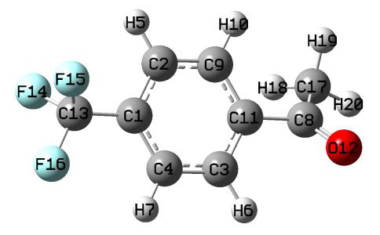

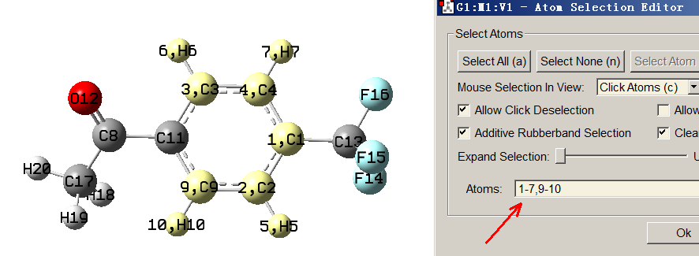

<!-- p.585 -->
namely 1-7,9-11, because this fragment has point group of D2h, in this case Multiwfn will also regard C1 and C11 as symmetrically equivalent atoms).

Now we input 1-7,9-10 in Multiwfn window, then you will see


```text
 Detected point group: C2v
 Number of symmetry-equivalence classes:    4
 Class    1 (C ):    2 atoms
    2,    4
 Class    2 (C ):    2 atoms
    3,    9
 Class    3 (H ):    2 atoms
    5,    7
 Class    4 (H ):    2 atoms
    6,   10
 Accept and append to eqvcons_PG.txt in current folder? (y/n)
```

Clearly, symmetrically equivalent atoms have been correctly identified, therefore we input y to write the corresponding constraint setting to eqvcons_PG.txt in current folder.

Next, we use this feature to add the three fluorine atoms into the equivalence constraint file. In the Multiwfn window we input atomic indices of the CF3 group, namely 13-16, then you will see


```text
 Detected point group: C3v
 Number of symmetry-equivalence classes:    1
 Class    1 (C ):    3 atoms
   14,   15,   16
```

The printed information is obviously correct, therefore we input y. Then input q to exit. Now you will find the current content of the eqvcons_PG.txt is


```text
    2,    4
    3,    9
    5,    7
    6,   10
   14,   15,   16
```

The content is fully in line with our expectations. In fact, we can also similarly set the three hydrogens in the methyl group as equivalent atoms by this interface, however we do not do this because in this example we will employ two-stage RESP fitting, at the second stage the equivalence constraint is automatically applied to the three hydrogens.

Subsequently, in the Multiwfn window we input 1 // Load equivalence constraint from external file eqvcons_PG.txt // The file just generated 1 // Start standard two-stage RESP fitting The result is


```text
   Center       Charge
     1(C )   0.0091127275
     2(C )  -0.1055999399
     3(C )  -0.1400843859
     4(C )  -0.1055999399
     5(H )   0.1287865888
```


<!-- p.586 -->

```text
     6(H )   0.1361477888
     7(H )   0.1287865888
     8(C )   0.6140083901
     9(C )  -0.1400843859
    10(H )   0.1361477888
    11(C )  -0.0475485792
    12(O )  -0.4669646019
    13(C )   0.4344682195
    14(F )  -0.1667205104
    15(F )  -0.1667205104
    16(F )  -0.1667205104
    17(C )  -0.4512569713
    18(H )   0.1232807476
    19(H )   0.1232807476
    20(H )   0.1232807476
 Sum of charges:  -0.0000000000
 RMSE:    0.001518   RRMSE:    0.115139
```

As can be seen, the charges are very reasonable and fully meet our expectations. 2: Coronene Let us see a molecule containing relatively large number of atoms and having high-order point group, namely coronene, which has D6h point group.

Because the distribution of ESP fitting points does not satisfy point group symmetry, the resulting charges thus do not fulfill D6h symmetry. For example, you will find C17 and C18 have charge of -0.2243 and -0.2169, respectively, however their charges should be identical. Despite the difference is negligible, it is best to eliminate it. The most ideal way to make the resulting charges fully satisfy the point group is imposing equivalence constraint according to the symmetry, however manually writing the constraint file is quite laborious for such a large system, therefore we again use Multiwfn recognize point group and automatically generate the constraint file.

Boot up Multiwfn and input coronene.fch


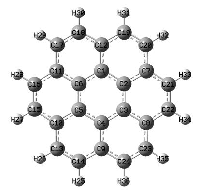

<!-- p.587 -->
7 // Population analysis and atomic charge calculation 18 // RESP module 5 // Set equivalence constraint 11 // Generate file containing equivalence constraints according to point group symmetry of selected region

a // Select the entire system You will see the equivalent atoms have been correctly identified:


```text
 Detected point group: D6h
 Number of symmetry-equivalence classes:    4
 Class    1 (C ):    6 atoms
    1,    2,    3,    4,    5,    6
 Class    2 (C ):    6 atoms
    7,    8,    9,   10,   11,   12
 Class    3 (C ):   12 atoms
   13,   14,   15,   16,   17,   18,   19,   20,   21,   22,   23,   24
 Class    4 (H ):   12 atoms
   25,   26,   27,   28,   29,   30,   31,   32,   33,   34,   35,   36
```

Then we input below commands y // Write the four classes equivalent constraints to eqvcons_PG.txt in current folder q // Exit 1 // Load equivalence constraint file eqvcons_PG.txt 1 // Perform standard two-stage RESP fitting (note that the result is identical to one-stage fitting, because no atoms will be refitted in the second stage for this molecule)

From the printed result, you can find the atoms in each of the four detected classes are indeed equivalent. The value of aforementioned charges of C17 and C18 are -0.220866 currently, which is quite reasonable.

By the way, via suboption 10 in option 5 you can export equivalence constraint of hydrogens in all CH2 and CH3 to eqvcons_H.txt in current folder. If you combine this file and eqvcons_PG.txt into a single file, then load it into Multiwfn and perform normal ESP fitting, the two kinds of equivalence constraint will simultaneously take effect (however, the content of the two sets of constraint should not be contradict to each other)

It is noteworthy that, sometimes after inputting atomic indices in the aforementioned subfunction 11 of option 5, Multiwfn does not print point group, that means the determination of point group is failed. However, this failure does not necessarily mean that the symmetrically equivalent atoms are not properly identified, therefore if the printed atomic indices are reasonable, you can still input y to write the constraint to eqvcons_PG.txt. In contrast, if you find the indices of the symmetrically equivalent atoms are not correctly identified, you should input n to cancel the writting, and then modify the tolerance for determining point group (for example, inputting t 0.05 means changing the tolerance to 0.05), after that you can input the atomic indices again and check if the equivalent classes have been reasonably recognized. The default tolerance is 0.1, when you encounter problem, you can either try to increase it or decrease it. Also note that the equivalent atoms are always correctly detected if the point group is correctly printed.

4.7.7.6 Example 6: RESP charge calculation with additional fitting centers

Multiwfn is able to calculate RESP charges for additional fitting centers, in other words, some point charges to be fitted are not necessarily at nuclear positions. Such non-atomic point charge is

valuable in some cases, such as better reproducing ESP around lone pair and σ-hole regions, this idea has already been employed in a few forcefields. In this example, I will illustrate how to fit


<!-- p.588 -->
charge for non-atomic points by taking C18 system as example.

The C18 was very systematically and detailedly studied in my work Carbon, 165, 468 (2020), Carbon, 165, 461 (2020) and http://sobereva.com/carbon_ring.html for more. The ESP colored vdW surface map is shown below

The minimum structure of C18 has D9h point group, therefore, if we calculate RESP charges as usual, all resulting atomic charges will be exactly zero. Clearly such atomic centered charges are completely useless in reproducing ESP around vdW surface for this very special system. In order to better represent its ESP, it is best to fit some point charges located at midpoint of each C-C bond.

The .fchk file of C18 system corresponding to ωB97XD/def2-TZVP wavefunction at minimum point structure can be download at: http://sobereva.com/multiwfn/extrafiles/C18.zip. If you place additional fitting centers at midpoint of each C-C bond, the situation will correspond to the map below, in which each purple sphere corresponds to an additional fitting center. The Gaussian .gjf file corresponding to the map below has been provided as examples\RESP\C18\C18.gjf.

In this instance, we will simultaneously fit atomic charges and the point charges at midpoint of the C-C bonds.

Before starting RESP fitting calculation, we need to write a text file containing X, Y, Z coordinate of all additional fitting centers, and the first line should be the total number of additional


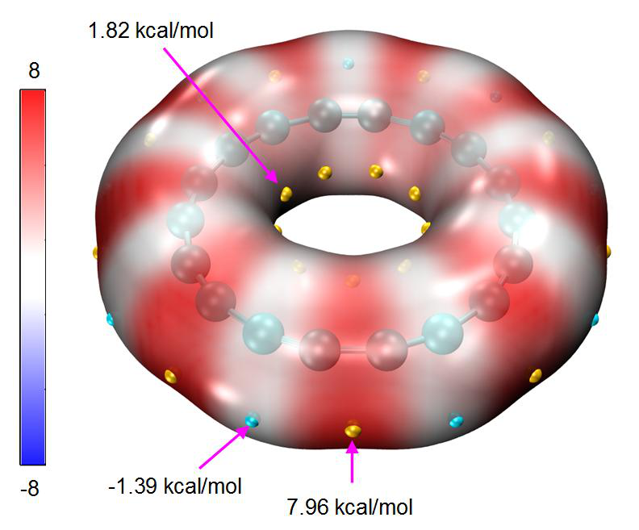


<!-- p.589 -->
fitting centers, see examples\RESP\C18\fitcen.txt.

In addition, we need to write an equivalence constraint file to ensure that the resulting point charges in each set are exactly identical: (1) Atomic charges of all carbons (2) All points at midpoint of short C-C bonds (3) All points at midpoint of long C-C bonds. The constraint file has been provided as examples\RESP\C18\eqvcons.txt, whose content defined three batches of constraints:


```text
1-18
19,21,23,25,27,29,31,33,35
20,22,24,26,28,30,32,34,36
```

Note that the index of additional fitting centers is after that of actual atoms, therefore the points 19~36 in the eqvcons.txt correspond to the 18 points defined in the fitcen.txt.

Also note that there is no reason to apply the penalty function defined in RESP method, which hurts the reproducibility of ESP in the present case, therefore we will disable this treatment, which is enabled by default.

Now we boot up Multiwfn and input below command C18.fchk 7 // Atomic charge calculation and population analysis 18 // RESP 4 // Set hyperbolic penalty parameters 2 // Set restraint strength (a) for one-stage fitting 0 // Remove effect of penalty function 0 // Return 9 // Load additional fitting centers examples\RESP\C18\fitcen.txt // The file containing additional fitting centers 5 // Set equivalence constraint in fitting 1 // Load equivalence constraint setting from external plain text file examples\RESP\C18\eqvcons.txt 2 // Start one-stage ESP fitting calculation with constraints The result is shown below


```text
   Center       Charge
     1(C )   0.0642410906
     2(C )   0.0642410906
     3(C )   0.0642410906
...[ignored]
    19(X )  -0.5038220210
    20(X )   0.3753398397
    21(X )  -0.5038220210
    22(X )   0.3753398397
...[ignored]
 Sum of charges:   0.0000000000
 RMSE:    0.001058   RRMSE:    0.553294
```

As you can see, the atomic charge of carbon is 0.064, while the fitted charges at midpoint of short and long C-C bonds are -0.504 and 0.375, respectively. This observation is in line with the ESP mapped vdW surface map that given earlier, namely electron is much more heavily


<!-- p.590 -->
concentrated around the short C-C bond than the long C-C bond.

If we do not specify additional fitting centers in the RESP calculation, you will find the atomic charges of all carbons are exactly zero, and the ESP reproduction error will be


```text
RMSE:    0.001911   RRMSE:    1.000000
```

The error is nearly twice as large as the case having additional fitting centers at midpoint of bonds, indicating that employing point charges not located at the center of atoms is crucial in faithfully representing ESP on molecular surface.

There are a few notes about additional fitting centers:

- Additional fitting centers have zero radii, namely they do not affect distribution and number of fitting points.

- Penalty function in the RESP method also takes effect for additional fitting centers.
- When multiple conformers are taken into account in the fitting, additional fitting centers should be defined for different conformers, the format of the file defining these points in this case is described in "Option 9" in Section 3.9.16.2. The distribution of additional fitting centers can be different for different conformers, but the number must be the same.

- Both equivalence constraint (as illustrated in the present example) and charge constraint work normally for additional fitting centers.

4.7.7.7 Skill 1: Using two times of one-stage fitting to equivalently realize

standard RESP two-stage fitting

In example 1 of this Section, I have illustrated how to derive RESP charges using standard RESP two-stage fitting procedure. Thanks to the flexibility of RESP module of Multiwfn, this “composite procedure” can also be manually realized via two separated one-stage fittings, as illustrated in this section. After reading this section, I believe you will better understand how to customize the RESP calculation procedure. Below we will use a very simple molecule methanol as example, whose .fch file can be found in http://sobereva.com/multiwfn/extrafiles/RESP.zip.

Boot up Multiwfn and input methanol.fch 7 // Population analysis 18 // RESP charge calculation 5 // Set equivalence constraint 0 // Remove default equivalence constraint 2 // Using one-stage fitting to derive charges The result is


```text
   Center      Charge
     1(C )    0.238915
     2(H )    0.045904
     3(H )   -0.018089
     4(H )   -0.018089
     5(O )   -0.664522
     6(H )    0.415880
```

They are identical to the charges obtained at the first stage of standard RESP two-stage fitting.

According to definition of standard RESP charge calculation procedure, the charge of the atoms


<!-- p.591 -->
in hydroxyl group of methanol should keep fixed during the second fitting stage, therefore we create a file chgcons.txt with the following content.


```text
5 -0.664522
6 0.415880
```

Then input below commands in Multiwfn interface n // Do not export .chg file 4 // Set hyperbolic penalty parameters 2 // Set restraint strength (a) 0.001 // This value is the one used in the second stage of standard RESP fitting procedure 0 // Return to the upper menu 5 // Set equivalence constraint 2 // Constraint hydrogens in CH2 and CH3 groups to be equivalent, as required by the second stage of standard RESP fitting

6 // Set charge constraint 1 // Load charge constraint setting file chgcons.txt 2 // Calculate charges by one-stage fitting The final result is


```text
     1(C )    0.235334
     2(H )    0.004436
     3(H )    0.004436
     4(H )    0.004436
     5(O )   -0.664522
     6(H )    0.415880
```

which are completely identical to the charges derived by standard two-stage RESP fitting.

Hint: When the molecule is large, manually editing the chgcons.txt is often troublesome. In fact, you can create an empty file named chgcons_stage2.txt in current folder and carry out standard two-stage RESP fitting, then before performing the second stage fitting, Multiwfn will automatically export the indices and charges of the atoms whose charges will be kept fixed in the second stage to this file, so that you will not need to manually write the chgcons.txt file.

4.7.7.8 Skill 2: Quickly obtaining RESP charges from molecular structure file

by only one command

Note 1: Chinese version of this section is my blog article “A super lazy script to calculate RESP atomic charges (one line of command calculates the result)” (http://sobereva.com/476).

Note 2: examples\RESP\RESP_ORCA.sh script has identical use as the RESP.sh script described in this section, but it invokes ORCA instead of Gaussian. Before using it, please modify content after “ORCA=”, “orca_2mkl=” and “nprocs=” at beginning of the script properly.

In this section, I will show it is fully possible to use only one command to generate RESP charges directly from molecular structure file using Linux shell script, the user does not need any knowledge about quantum chemistry code.

Assume that both Gaussian and Multiwfn have been properly installed on your machine, and you want to calculate RESP charges for H2O.xyz in ethanol environment, what you need to do is simply:

- Copy RESP.sh from “examples\RESP” folder to current folder.


<!-- p.592 -->
- Run chmod +x ./RESP.sh to add executable permission to the script
- Move the H2O.xyz to current folder
- Run ./RESP.sh H2O.xyz 0 1 ethanol, where 0 and 1 correspond to net charge and spin multiplicity, respectively; ethanol is solvent name.

This script first automatically invokes Gaussian to optimize the geometry at B3LYP-D3(BJ)/def2-SVP level, then performs single point task at B3LYP-D3(BJ)/def2-TZVP level and meantime produce ESP data on vdW surface. Implicit solvation model is used for representing ethanol environment. Then this script converts .chk file to .fchk file via formchk, and finally, invokes Multiwfn to yield RESP charges in standard manner. After all steps have been successfully completed, you will find H2O.chg in current folder, whose final column is RESP charges.

Any input file supported by Multiwfn containing molecular geometry information can be used as input file for this script, such as .xyz, .mol, .mol2, .pdb, .gjf, .fch and so on.

If you do not explicitly specify net charge and spin multiplicity when booting up the script, the system will default to singlet neutral system. If solvent name is not specified, it will default to water; if you set gas as solvent name, the calculation will be conducted under vacuum. The supported solvent names can be found at end of this page: http://sobereva.com/g09/k_scrf.htm.

Note that you sometimes need to properly modify the RESP.sh before running it. This script by default invokes Gaussian 09, therefore if you are using other versions, you need to replace the "g09" in this script with "g16". In addition, if you find the def2-TZVP is too expensive or geometry optimization was found to be difficult to converge in rare cases, you need to manually change the keywords in this script.

4.7.7.9: Special topic: Calculation of RESP2 charges

Note: Much more in-depth discussions about RESP2 charge can be found in my blog article "Idea of RESP2 atomic charge and its calculation in Multiwfn" (in Chinese, http://sobereva.com/531).

Definition of RESP2 charge In solvent environment, charge distribution of solute is evidently polarized by surrounding solvents. Therefore, if atomic charges of a molecule are used in molecular dynamics (MD) simulation with fixed charge forcefield (i.e. non-polarizable forcefield), the polarization effect must be effectively taken into account into the atomic charges.

In Commun. Chem., 3, 44 (2020), the authors defined RESP2 charge as

$$q^{\mathrm{R E S P2}}=(1-\delta)q_{\mathrm{g a s}}^{\mathrm{R E S P}}+\delta q_{\mathrm{w a t e r}}^{\mathrm{R E S P}}$$

where δ is adjustable parameter, 𝑞gasRESP and 𝑞water RESP are RESP charges calculated in gas phase and in

water environment (represented by PCM implicit solvation model), respectively. The authors employed PW6B95 exchange-correlation functional in combination with aug-cc-pVDZ basis set in

the process of quantum chemistry calculations. It is found that δ=0.6 leads to lowest overall error in simulation of various condensed phase properties (δ=0.5 works equally well). Note that RESP2 with δ=0.5, namely RESP20.5, is equivalent to the IPolQ-mod atomic charge defined in J. Comput. Aided Mol. Des., 28, 277 (2014). These studies showed that δ=0.5 should be a relatively general and ideal choice for evaluating RESP2 charge. Note that directly using 𝑞water RESP for the MD simulation in aqueous environment leads to worse result for many properties compared to RESP20.6, this is mainly


<!-- p.593 -->
RESP exaggerates the extent of polarization or does not properly account for cost of electronic polarization. because the 𝑞water

In my opinion, the best way of calculating atomic charges used for condensed phase MD simulation should be the RESP20.5 defined as follows

RESP2RESPRESPgassolv0.50.5qqq=×+×

RESP is RESP charge calculated under actual solvent environment represented by PCM (or IEFPCM, CPCM, SMD) model. I suggest using B3LYP-D3(BJ) with def2-SVP (or the better one def-TZVP) for geometry optimization and B3LYP-D3(BJ)/def2-TZVP for the subsequent single point task calculations in both gas and solvent phases. In principle it is best to perform optimization under actual solvent environment, however solvent effect on geometry can be safely ignored if the system is neutral and there is no highly ionic local region. where 𝑞solv

Example of calculating RESP2 charges As an example, we calculate RESP20.5 charge via the above recommended way for H2CO in ethanol environment.

Copy the content below into a Gaussian input file and then run it by Gaussian. This task consists of three steps, namely geometry optimization, single point calculation in gas phase and then in ethanol phase.


```text
%chk=C:\opt.chk
# B3LYP/TZVP em=GD3BJ opt

niconiconi

0 1
 C                  0.00000000    0.00000000    0.52887991
 H                  0.00000000    0.93775230    1.12379107
 O                  0.00000000    0.00000000   -0.67757652
 H                  0.00000000   -0.93775230    1.12379107

--link1--
%oldchk=C:\opt.chk
%chk=C:\SP_gas.chk
# B3LYP/def2TZVP em=GD3BJ geom=allcheck


--link1--
%oldchk=C:\opt.chk
%chk=C:\SP_solv.chk
# B3LYP/def2TZVP em=GD3BJ scrf=solvent=ethanol geom=allcheck
     Blank line
     Blank line
```

After calculation, you will obtain SP_gas.chk and SP_solv.chk in C:\ folder. Convert them to .fch files and then use Multiwfn to calculate RESP charge as usual, you will find the charges in gas phase is


<!-- p.594 -->

```text
Center       Charge
  1(C )   0.4195430529
  2(H )  -0.0050085243
  3(O )  -0.4095260044
  4(H )  -0.0050085243
```

while in ethanol phase the result is


```text
Center       Charge
  1(C )   0.4625344852
  2(H )   0.0093031373
  3(O )  -0.4811407598
  4(H )   0.0093031373
```

By simply taking average of the above two sets of charges via e.g. Excel, the RESP20.5 charge will be obtained:


```text
0.441038769
0.002147307
-0.445333382
0.002147307
```

Using shell script to conveniently calculate RESP20.5 charges In order to make calculation of RESP2 charge even easier, a Linux script named calcRESP2.sh is provided in "examples\RESP" folder, it can calculate both RESP and RESP2 charges. Examples of usage:

- Calculation of RESP charges: ./calcRESP.sh gas.fchk
- Calculation of RESP20.5 charges: ./calcRESP.sh gas.fchk solv.fchk
- Calculation of RESP20.7 charges: ./calcRESP.sh gas.fchk solv.fchk 0.7 Since the script invokes Multiwfn, before running it you should make sure that Multiwfn has been properly installed in your Linux system, see Section 2.1.2 on how to install.

Once running of the script has successfully finished, you will find RESP2.chg in current folder, the last column corresponds to the resulting RESP2 charges.

Quickly obtaining RESP2 charges from molecular structure file by only one command In order to make RESP2 charge calculation as easy as possible, I also provide a script named RESP2.sh in "examples\RESP" folder. Only a file containing (non-optimized) geometry is needed as input file. This script is very similar to the RESP.sh introduced in Section 4.7.7.8.

Examples of usage:

- Calculating RESP20.5 charges for a singlet neutral molecule for MD simulation in water phase:

./RESP2.sh H2O.pdb

- Calculating RESP20.5 charges for a triplet neutral molecule for MD simulation in water phase:

./RESP2.sh yoshiko.xyz 0 3

- Calculating RESP20.5 charges for a singlet anion for MD simulation in ethanol phase:

./RESP2.sh yohane.mol -1 1 ethanol As you can find from the examples, the charge and spin multiplicity are default to 0 and 1, respectively, while the solvent is default to water.

If running the script has successfully finished, you will find a .chg file with identical name as input file in current folder, the final column corresponds to RESP20.5 charges. In current folder you can also find gas.chg and solv.chg, they correspond to the RESP charges in gas phase and in solvent


<!-- p.595 -->
phase.

Specifically, this script do following things in turn, both Gaussian and Multiwfn are invoked in these processes: (1) Geometry optimization at B3LYP-D3(BJ)/def2-SVP level in solvent environment (2) Single point task at B3LYP-D3(BJ)/def2-TZVP level in gas phase (3) Calculating RESP charge corresponding to gas phase (4) Single point task at B3LYP-D3(BJ)/def2-TZVP level in solvent phase (5) Calculating RESP charge corresponding to solvent phase (6) Generating RESP20.5 charge by averaging the result produced by (3) and (5)

examples\RESP\RESP2_ORCA.sh script has identical use as the RESP2.sh script described in this section, but it invokes ORCA instead of Gaussian. Before using it, please modify content after “ORCA=”, “orca_2mkl=” and “nprocs=” at beginning of the script properly.


### 4.7.8 Examine electrostatic potential reproducibility of atomic charges

Electrostatic potential (ESP) reproducibility is a crucial property of atomic charges, only atomic charges having good ESP reproducibility could be employed to reveal intramolecular and intermolecular electrostatic interactions. It is possible to examine ESP reproducibility of user-provided atomic charges using the MK and CHELPG charge calculation modules, which have been introduced in Sections 3.9.10 and 3.9.11, respectively. Here we compare the ability of Hirshfeld and ADCH charges for reproducing ESP values at Merz-Kollmann ESP fitting points (which are distributed around molecular van der Waals surface) for CH3CONH2. We first calculate Hirshfeld charges as usual using examples\CH3CONH2.fch (see Section 4.7.1), then select "y" to export the atomic charges to CH3CONH2.chg. Then we enter the MK charge calculation module (subfunction 13 of main function 7) and input

-3 // Using atomic charges from a .chg file instead of fitting new charges CH3CONH2.chg // Atomic charges (i.e. Hirshfeld charges) will be directly loaded from this file

1 // Start calculation. In current case MK charges will not be yielded The data shown on the screen is


```text
   Center      Charge
     1(C )   -0.090370
     2(H )    0.037254
     3(H )    0.043058
     4(H )    0.048339
     5(C )    0.170596
     6(O )   -0.308866
     7(N )   -0.159120
     8(H )    0.131920
     9(H )    0.127108
 Sum of charges:   -0.000081
 RMSE:    0.006214   RRMSE:    0.310394
```

These charges are just the Hirshfeld charges loaded from CH3CONH2.chg, the RMSE and RRMSE measure the ESP reproducibility of the Hirshfeld charges. If you compute MK charges as usual, you will find the RRMSE will be about 0.05, since as shown above the RRMSE of Hirshfeld charges is as high as 0.31, it is evident that the ESP reproducibility of Hirshfeld charges is much worse than


<!-- p.596 -->
MK charges. If you redo the analysis based on the .chg file containing ADCH charges, you will find the RRMSE is 0.21. Clearly, ADCH charges have evidently lower errors in reproducing ESP compared to Hirshfeld charges.

Studying ESP reproducibility around different atoms or fragment It is also possible to measure ESP reproducibility on the fitting points corresponding to specific atom or fragment. By default, the MK points are generated around all atoms in turn and then the points lying inside the innermost layer are pruned. If only specific atoms are taken into account, the constructed MK fitting points will only correspond to those atoms. Let us compare ESP reproducibility of Hirshfeld and ADCH charges around the amino group, only two MK layers with scale factor of 1.4 and 1.6 will be considered (no special reason, just give an example). Enter the MK module and input

-3 // Using atomic charges from a .chg file CH3CONH2.chg // Assume that this file contains Hirshfeld charges 3 // Set number and scale factors of layers of MK fitting points 1.4 // Set scale factor of layer 1 1.6 // Set scale factor of layer 2 q // Setting has finished, now quit 4 // Choose the atoms considered in the construction of fitting points 7-9 // Atomic indices of amino group 1 // Start calculation You will find the following information from the output


```text
RMSE:    0.008745   RRMSE:    0.374584
```

If we repeat the calculation based on .chg file containing ADCH charge, the output will be


```text
RMSE:    0.003817   RRMSE:    0.163478
```

Since the RRMSE of ADCH charge (0.163) is by far less than that of Hirshfeld charge (0.374), the ADCH charges have much better ESP reproducibility around the amino group.

Note: The CHELPG module also supports employing fitting points only for a specific fragment.

Visualize fitting points and ESP values If you want to visualize the fitting points corresponding to the amino group, you can select "6 Toggle if exporting fitting points with ESP after the task" once to change the status to "Yes" and then use option 1 to start calculation. Once calculation is finished, choose 2 to export the fitting points to ESPfitpt.pqr in current folder. This file can be directly loaded into the famous visualization tool VMD. If you set the drawing method to "VDW" and change the "Sphere Scale" to 0.8, set "Coloring Method" to "Charge", then set the color transition mode to "BWR" (Graphics - "Colors" - "Color Scale"), you will see the graph below (molecular structure file is also loaded).


<!-- p.597 -->
Clearly, the fitting points well correspond to the amino group. The redder (bluer), the more positive (negative) the ESP on the points.

Visualizing reproducibility error of ESP at fitting points Finally, I would like to mention that the reproduction error of ESP can also be visualized by using Multiwfn and VMD in combination. Here we check this for MK charges. Load the examples\CH3CONH2.fch into Multiwfn, enter MK module, choose option 6 once, and then choose option 1 to start calculation. Once calculation is completed, choose 3 to export ESP fitting points with ESP reproduction error to ESPerr.pqr in current folder. In this file, the "Charge" column corresponds to absolute value of difference (in kcal/mol) between the exact ESP and the ESP evaluated based on current atomic charges (namely MK charges). If you render this file by VMD, you will see the graph below. The color scale has been set to -1.5 to 1.5 (can be set in "Graphics" - "Representation" - "Trajectory" page), the default color transition "Red-White-Blue" is used, perspective has been set to orthographic ("Display" - "Orthographic").

In this graph, bluer region corresponds to higher ESP reproduction error, while ESP at white points can be well reproduced by the MK charges (i.e. the absolute error is close to zero). You can also use this method to visualize ESP reproducibility of other atomic charges (need to use .chg file,


<!-- p.598 -->
as illustrated eariler).


### 4.7.9 Calculate PEOE (Gasteiger) charges

In this example we calculate PEOE charge (also known as Gasteiger charge) for a typical organic system, dopamine. Reading Section 3.9.17 is recommended to gain basic knowledge about the principle, details and implementation of the PEOE method in Multiwfn.

Since calculation of PEOE charge only requires geometry information, we can use such as .xyz, .pdb, .mol as input file. Boot up Multiwfn and input

examples\dopamine.xyz 7 // Population analysis 19 // PEOE (Gasteiger) charge First, the parameters involved in the PEOE calculation are printed:


```text
Determined parameters:
    1(O )  numbond= 2   a=  14.180   b=  12.920   c=   1.390
    2(O )  numbond= 2   a=  14.180   b=  12.920   c=   1.390
    3(N )  numbond= 3   a=  11.540   b=  10.820   c=   1.360
    4(C )  numbond= 4   a=   7.980   b=   9.180   c=   1.880
[ignored...]
```

Then iteration starts


```text
Max cycles: 50  Charge convergence criterion: 0.00010  Damping factor: 0.500

 Cycle    1    Maximum change of charges:    0.312435
 Cycle    2    Maximum change of charges:    0.039963
[ignored...]
 Cycle   10    Maximum change of charges:    0.000062
 Convergence succeeded after  10 cycles
```

Since the formulae involved in the PEOE method are extremely simple, the iteration is finished within one second (this is still true even the system consists of several hundreds of atoms!). Then you can find the PEOE charges:


```text
Atom      Charge
  1(O )   -0.358163
  2(O )   -0.358170
  3(N )   -0.330120
  4(C )   -0.015405
[ignored...]
```


### 4.7.10 Calculate CM5 and 1.2*CM5 charges

Calculation of CM5 atomic charges Calculating CM5 charge is quite easy. For example, boot up Multiwfn and input following commands:

examples\oxirane.fchk


<!-- p.599 -->
7 // Population analysis and atomic charges 16 // CM5 1 // Use built-in sphericalized atomic densities in free-states Then you will see


```text
Total dipole moment from CM5 charges   0.8110842 a.u.
 X/Y/Z of dipole moment from CM5 charges   0.00000  -0.00000  -0.81108 a.u.

 Final atomic charges, after normalization to actual number of electrons
 Atom    1(C ):    -0.07363783
 Atom    2(C ):    -0.07363783
 Atom    3(O ):    -0.27339074
 Atom    4(H ):     0.10516660
 Atom    5(H ):     0.10516660
 Atom    6(H ):     0.10516660
 Atom    7(H ):     0.10516660
```

Note that according to original paper of CM5 charge, the dipole moment calculated by CM5 charges can well reproduce experimental dipole moment in gas phase, therefore the dipole moment shown above should be a reasonable estimation of actual gas phase dipole moment of the oxirane.

Calculation of 1.2*CM5 atomic charges As demonstrated in J. Phys. Chem. B, 121, 3864 (2017), 1.2*CM5 charge is very suitable to be adopted in molecular dynamics simulation with OPLS-AA forcefield for neutral species, namely it can be regarded as a general way of deriving atomic charges when OPLS-AA is to be employed. You can manually multiply the above printed CM5 charges by the factor of 1.2 to obtain the 1.2*CM5 charges, or more conveniently, directly select option -16 in main function 7. Note that in this case, the CM5 charges should be calculated based on the wavefunction produced in vacuum calculation, the enhancement factor of 1.2 is used to account for effective polarization of solute by solvent environment. Since CM5 is not sensitive to calculation level, common DFT functional in combination with 2-zeta basis set is adequate, such as B3LYP/def2-SVP.

In order to maximally simplify the procedure of evaluating 1.2*CM5 charges for people who do not have any knowledge of quantum chemistry calculation, a Linux shell script is provided for fully automatically evaluating 1.2*CM5 charges by invoking Gaussian and Multiwfn, see examples\scripts\1.2CM5.sh. Using this script is extremely simple. For example, assume that this script and a manually built molecular structure file phenol.xyz has been presented in the current folder, you just need to run ./1.2CM5.sh phenol.xyz, then this script will first invoke Gaussian to optimize the phenol at B3LYP-D3(BJ)/def2-SVP level and yield wavefunction at corresponding level, then Multiwfn will be invoked to calculate CM5 charges, and finally a file named phenol.chg will be automatically yielded in current folder, its last column is just 1.2*CM5 charges. You can also specify net charge and spin multiplicity when running this script. Do not forget to open 1.2CM5.sh to check more information at the beginning of it.

examples\scripts\1.2CM5_ORCA.sh script has identical use as the 1.2CM5.sh script described above, but it invokes ORCA instead of Gaussian. Before using it, please modify content after “ORCA=”, “orca_2mkl=” and “nprocs=” at beginning of the script properly.


<!-- p.600 -->

### 4.7.11 Calculate AIM charges

We calculate AIM charges for CH3NH2 in this example. Boot up Multiwfn and input examples\CH3NH2.wfn 7 // Population analysis and atomic charge calculations 14 // AIM charge 2 // Medium-quality grid. This is a good compromise between cost and accuracy. The higher the grid quality, the higher the cost, while better the integration accuracy

Then you get the following output


```text
Final atomic charges:
 Atom    1(C ):     0.38812508
 Atom    2(H ):    -0.01581265
 Atom    3(H ):    -0.01581168
 Atom    4(H ):    -0.04790806
 Atom    5(N ):    -0.98865587
 Atom    6(H ):     0.34001793
 Atom    7(H ):     0.34004525
```

It can be seen that AIM charges are not very chemically reasonable, two hydrogen atoms at the methyl group, H2 and H3, surprisingly carry slightly negative charges, which clearly contradicts the relationship between the electronegativities of hydrogen and carbon. This is a well-known deficiency of AIM charges. Frankly speaking, AIM charges basically have no advantages, see my review of atomic charges for comprehensive comparisons and discussions: Partial Charges, In Exploring Chemical Concepts Through Theory and Computation. WILEY-VCH GmbH: Weinheim (2024); pp. 161-187. DOI: 10.1002/9783527843435.ch6.


## 4.8 Molecular orbital composition analysis

In this section, I will show how to use various methods to analyze molecular orbital compositions. The illustrated methods are also applicable to any other type of orbitals, e.g. natural orbitals, natural transition orbitals (NTOs) and localized MOs (LMOs). Details about orbital composition analysis can be found in Section 3.10. The pros and cons of different methods are very detailedly discussed in my paper Acta Chim. Sinica, 69, 2393 (2011, http://sioc-journal.cn/Jwk_hxxb/CN/abstract/abstract340458.shtml), citation is welcomed. If you can read Chinese, also you can consult my blog article "On the calculation methods of orbital composition" (http://sobereva.com/131).

Simply speaking, if your aim is merely obtaining atom compositions in orbitals, Hirshfeld/Becke method may be the most robust and convenient way, see Section 4.8.3; if you also would like to obtain atomic orbital composition, then the NAO method exemplified in Section 4.8.2 may be the best choice. The Mulliken method illustrated in Section 4.8.1 also generally works well but diffuse functions should not be used.


<!-- p.601 -->

### 4.8.1 Analyze acetamide by Mulliken method

In this example we employ Mulliken method to first analyze the composition of the 6th molecular orbital of acetamide, and then analyze which orbitals have main contribution to the bonding between formamide part and methyl group. Beware that Mulliken method is incompatible with diffuse functions, if they are involved, you should either choose other orbital composition methods (e.g. NAO, Hirshfeld...) or remove them from your basis set.

Boot up Multiwfn and input following commands examples\CH3CONH2.fch // You have to use .mwfn/.fch/.molden/.gms file as input for this type of analysis

8 // Orbital composition analysis 1 // Use Mulliken partition 6 // The orbital index is 6 (Note that as shown in the prompt on the screen, you can also input orbital label here, for example h-3 corresponds to HOMO-3, l+1 corresponds to LUMO+1, etc.)

The composition of basis functions, shells and atoms are printed immediately, see below.


```text
Threshold of absolute value:  >   0.50000 %    // Only the basis functions with composition
larger than 0.5% will be printed, you can change the threshold by “compthres” parameter
in settings.ini.
Orbital:     6  Energy(a.u.):     -0.905290  Occ:  2.000000  Type: Alpha&Beta
 Basis Type    Atom    Shell      Local       Cross term        Total
   23   S        5(C )   14      0.44902 %      0.67507 %      1.12409 %
   24   X        5(C )   15      0.31240 %      0.50522 %      0.81762 %
   25   Y        5(C )   15      4.25271 %      5.88221 %     10.13493 %
   29   Y        5(C )   17      0.00777 %     -0.61063 %     -0.60286 %
   38   S        6(O )   20      3.50037 %      2.65507 %      6.15544 %
   42   S        6(O )   22      3.29488 %      1.71316 %      5.00803 %
   53   S        7(N )   26     15.20411 %     15.32688 %     30.53098 %
   57   S        7(N )   28     16.89006 %     17.40040 %     34.29046 %
   61   XX       7(N )   30      0.00774 %      0.58279 %      0.59053 %
   63   ZZ       7(N )   30      0.02793 %     -0.98090 %     -0.95297 %
   67   S        8(H )   31      1.27855 %      3.03091 %      4.30946 %
   69   S        9(H )   33      1.52931 %      3.60949 %      5.13880 %
Sum up those listed above:      46.75484 %     49.78967 %     96.54451 %
Sum up all basis functions:     51.95605 %     48.04395 %    100.00000 %

Composition of each shell, threshold of absolute value:  >    0.500000 %
Shell    14 Type: S    in atom    5(C ) :     1.12409 %
Shell    15 Type: P    in atom    5(C ) :    10.95268 %
Shell    17 Type: P    in atom    5(C ) :    -0.97156 %
Shell    20 Type: S    in atom    6(O ) :     6.15544 %
Shell    22 Type: S    in atom    6(O ) :     5.00803 %
Shell    26 Type: S    in atom    7(N ) :    30.53098 %
Shell    28 Type: S    in atom    7(N ) :    34.29046 %
Shell    31 Type: S    in atom    8(H ) :     4.30946 %
```


<!-- p.602 -->

```text
Shell    33 Type: S    in atom    9(H ) :     5.13880 %

Composition of different types of shells (%):
s:  88.193  p:  11.391  d:   0.416  f:   0.000  g:   0.000  h:   0.000

Composition of each atom:
Atom     1(C ) :     1.17249 %
Atom     2(H ) :     0.05445 %
Atom     3(H ) :     0.03212 %
Atom     4(H ) :     0.00817 %
Atom     5(C ) :    11.81245 %
Atom     6(O ) :    11.63274 %
Atom     7(N ) :    65.50085 %
Atom     8(H ) :     4.47022 %
Atom     9(H ) :     5.31651 %

Orbital delocalization index:   46.15
```

The result indicates that nitrogen has primary contribution (65.5%) to orbital 6, and the contribution consists of two S-shells (30.5% and 34.3%). P-shells of neighbouring carbon and S-shells of oxygen have slight contribution too (both are about 12%). We can check if the result is reasonable by viewing isosurface (isovalue is set to 0.1 here):

From the graph, the region where the value of orbital wavefunction is large is mainly localized around nitrogen, and there is no nodal plane, so the orbital wavefunction in this region should be constructed from s-type orbitals. The isosurface also somewhat intrudes into the region of atom C5 and O6, so they should have small contribution to MO 6, moreover, because there is a nodal plane in C5, the atomic orbitals of C5 used to form MO 6 should be p-type. Obviously, these conclusions are in fairly agreement with composition analysis. The advantage of composition analysis is that the result can be quantified, while by visual study we can only draw qualitative conclusion, for some complex system we cannot draw even qualitative conclusion.

The " Orbital delocalization index" printed at the end of the output has close relationship with extent of spatial delocalization of the orbital, this point will be described in Section 4.8.5 in detail.

Now let us find which molecular orbitals have main contribution to the bonding between


<!-- p.603 -->
formamide part and methyl group. Boot up Multiwfn and input

examples\CH3CONH2.fch 8 // Orbital composition analysis -1 // Define fragment 1 a 1-4 // Add all basis functions in atom 1, 2, 3, 4 (methyl group) into fragment1 q // Save fragment and return to upper menu -2 // Define fragment 2 a 5-9 // Add all basis functions in atom 5, 6, 7, 8, 9 (formamide moiety) into fragment 2 q 4 // Print composition of fragment 1 and the cross term between fragment 1 and 2 in all orbitals by Mulliken analysis. If you only defined fragment 1, then only composition of fragment 1 will be printed

Since amount of the printed information is huge, I only extract cross term composition in all occupied orbitals:


```text
Cross term between fragment 1 and 2 and their individual parts:
Orb#  Type   Ene(a.u.)   Occ       Frag.1 part     Frag.2 part        Total
    1  AB    -19.1036  2.00000       -0.0013 %       -0.0013 %       -0.0026 %
    2  AB    -14.3492  2.00000       -0.0001 %       -0.0001 %       -0.0003 %
    3  AB    -10.2819  2.00000        0.0606 %        0.0606 %        0.1211 %
    4  AB    -10.1845  2.00000        0.0604 %        0.0604 %        0.1209 %
    5  AB     -1.0376  2.00000        0.3535 %        0.3535 %        0.7070 %
    6  AB     -0.9053  2.00000        0.7295 %        0.7295 %        1.4590 %
    7  AB     -0.7387  2.00000        7.9504 %        7.9504 %       15.9008 %
    8  AB     -0.5884  2.00000       -1.8755 %       -1.8755 %       -3.7510 %
    9  AB     -0.5410  2.00000       -0.7506 %       -0.7506 %       -1.5011 %
   10  AB     -0.4663  2.00000        3.8098 %        3.8098 %        7.6197 %
   11  AB     -0.4472  2.00000        5.5270 %        5.5270 %       11.0539 %
   12  AB     -0.4016  2.00000       -0.3983 %       -0.3983 %       -0.7965 %
   13  AB     -0.3961  2.00000       -0.4274 %       -0.4274 %       -0.8549 %
   14  AB     -0.3674  2.00000       -5.8826 %       -5.8826 %      -11.7653 %
   15  AB     -0.2661  2.00000        0.1192 %        0.1192 %        0.2383 %
   16  AB     -0.2438  2.00000       -6.0931 %       -6.0931 %      -12.1863 %
```

The product of the cross term composition between fragments 1 and 2 in orbital i and corresponding orbital occupation number is the Mulliken bond order between them contributed by orbital i. From above information we can see MO 7 and 11 are beneficial to bonding, because the compositions are relative large, while MO 14 and 16 are not conducive for bonding. The isosurfaces of MO 11 (left side) and 14 (right side) are shown below, it is clear that the result of composition analysis is reasonable.


<!-- p.604 -->
As you have seen, using Mulliken method to analyze orbital composition is very convenient. However, the result of Mulliken method is sensitive to basis set, and is not as robust as NAO method and Hirshfeld method illustrated below. Especially, do not use Mulliken method when diffuse functions are involved in your calculation, otherwise the result will be meaningless!


### 4.8.2 Analyze water by natural atomic orbital method

In this example we analyze molecular orbital composition of water by the natural atomic orbital (NAO) method discussed in Section 3.10.4. NAO method has much better basis set stability (i.e. insensitive to the choice of basis set) and stronger theoretical basis than Mulliken or Mulliken-like methods (such as SCPA and Stout-Politzer).

Note: NAO is never the only way of obtaining composition of atomic orbitals in MOs, you can also use Mulliken or similar methods (e.g. SCPA) to do that. The correspondence between basis function and atomic orbital can be identified according to basis set definition or by mean of population analysis, see Section 4.7.6.

Performing NAO method requires MO coefficient matrix in NAO basis, this matrix cannot be generated by Multiwfn itself, but Multiwfn can utilize the output information containg this matrix by stand-alone NBO program or NBO module embedded in quantum chemistry softwares. The NBO 3.1 module embedded in Gaussian program is L607. Below is a Gaussian input file for water, which will output the matrix we needed. Notice that the Gaussian task should be single point task, do not perform geometry optimization together!


```text
# HF/6-31g* pop=nboread

Title Card Required

0 1
 O                  0.00000000    0.00000000    0.11472000
 H                  0.00000000    0.75403100   -0.45888100
 H                  0.00000000   -0.75403100   -0.45888100

$NBO NAOMO $END
[blank line]
[blank line]
```

where pop=nboread keyword indicates that the texts enclosed by \$NBO and \$END, namely NAOMO, will be passed to NBO module. NAOMO keyword tells NBO module to output MO coefficient matrix in NAO basis.

Assume that the Gaussian output file is named as H2O_NAOMO.out (can be found in


<!-- p.605 -->
"example" folder), we start Multiwfn and input:

examples/H2O_NAOMO.out // Note that DO NOT use .fch as input file in current case 8 // Enter orbital composition analysis module 7 // Enter NAO analysis function You will find the default output mode is "Only show core and valence NAOs". Core and valence NAOs have one-to-one correspondence with actual atomic orbitals, if the MO to be analyzed is occupied, in general we only need to concern these NAOs, while Rydberg NAOs can be ignored. Assume that we want to analyze MO 4, we input

0 // Show orbital composition of specific MO 4 // Analyze MO 4 The following information will appear on screen


```text
Note: All Rydberg NAOs/shells or contributions <=  0.50 % will not be printed

    NAO#   Center   Label      Type    Composition
       2    1(O )    S        Val( 2s)     8.573 %
       9    1(O )    pz       Val( 2p)    84.089 %
      16    2(H )    S        Val( 1s)     3.542 %
      18    3(H )    S        Val( 1s)     3.542 %

 Condensed NAO terms to shells:
   Atom:     1(O )  Shell:     2( 2s Val)     8.573 %
   Atom:     1(O )  Shell:     5( 2p Val)    84.089 %
   Atom:     2(H )  Shell:     8( 1s Val)     3.542 %
   Atom:     3(H )  Shell:    10( 1s Val)     3.542 %

 Composition of different types of shells (%):
 s:  15.761  p:  84.104  d:   0.130  f:   0.000  g:   0.000  h:   0.000

 Condensed NAO terms to atoms:
   Center   Composition
     1(O )    92.899 %
     2(H )     3.548 %
     3(H )     3.548 %

 Core composition:        0.031 %
 Valence composition:    99.746 %
 Rydberg composition:     0.218 %

 Orbital delocalization index:   86.55
```

According to the result, we can say for example, 2pz atomic orbital of oxygen has 84.09% contribution to MO 4. The contributions from the NAOs listed above (Rydberg composition is not included in the present example) are also summed up to atom contributions according to which


<!-- p.606 -->
center they belong to.

Note that the sum of non-Rydberg compositions (i.e. Core + Valence), as shown above, is not 100 % rather than 99.777 %. To make the physical meaning more clear, I personally recommend to manually perform renormalization for the result. For example, the composition of 2pz should be 84.089 % / 0.99777=84.277 %. Since before and after the renormalization the difference is only 0.188 %, the renormalization is not necessary for current case. Only when the non-Rydberg composition is nonnegligible (e.g. larger than 2 %), the renormalization is indispensable.

Calculate fragment contribution to specific MOs Input 0 to return to last menu. Next, we analyze contribution from the NAOs centered at the two hydrogens to MOs 1~10.

Input -1 to enter the interface for defining fragment. If you input all, then detailed information of all NAOs will be listed (this step is optional):


```text
  NAO#   Atom&Index    Type   Set&Shell    Occupancy   Energy (a.u.)
    1      O     1     S       Cor( 1S)     1.99992     -20.39645
    2      O     1     S       Val( 2S)     1.74644      -1.14691
...[ignored]
   15      O     1     dz2     Ryd( 3d)     0.00254       2.02361
   16      H     2     S       Val( 1S)     0.52321       0.33308
   17      H     2     S       Ryd( 2S)     0.00086       0.70497
   18      H     3     S       Val( 1S)     0.52321       0.33308
   19      H     3     S       Ryd( 2S)     0.00086       0.70497
```

We input a 2,3, namely adding all NAOs belonging to atoms 2 and 3 to the current fragment. Then input q to save and quit. From the prompt printed on screen you can find NAOs 16, 17, 18 and 19 are presented in this fragment.

Then select option 1 and input 1-8, the contribution from the four NAOs to MO 1~8 will be shown as below


```text
Orb.#       Core      Valence     Rydberg      Total
    1        0.000 %     0.119 %     0.002 %     0.121 %
    2        0.000 %    18.556 %     0.054 %    18.611 %
    3        0.000 %    26.557 %     0.018 %    26.576 %
    4        0.000 %     7.084 %     0.012 %     7.096 %
    5        0.000 %     0.000 %     0.000 %     0.000 %
    6        0.000 %    35.482 %    46.832 %    82.314 %
    7        0.000 %    27.558 %    61.538 %    89.096 %
    8        0.000 %    32.433 %    29.568 %    62.002 %
```

Since none of the four NAOs in the fragment is core-type, the Core term is 0 % in the MOs. Valence and Rydberg terms correspond to the contribution from NAOs 16, 18 and NAOs 17, 19 respectively. NAOs 16 and 18 directly correspond to 1s atomic orbital of H2 and H3, so we can say that the two hydrogens collectively contribute 26.56 % to MO 3.

The first five MOs are doubly occupied in present system. It is clear that Rydberg NAOs have very low contribution to the occupied MOs, while their contributions to virtual MOs are significant and can no longer be ignored. The physical meaning of Rydberg NAOs is difficult to be interpreted, and these NAOs do not directly reflect atomic orbital characteristics. It is questionable to say that the two hydrogens contribute either 32.43 % or 62.00 % to MO 8. Although seemingly one can


<!-- p.607 -->
employ renormalization process to "annihilate" the Rydberg composition, however when Rydberg composition is too large, e.g. larger than 10 %, this treatment will break meaning of the result. So it is not generally recommended to use NAO method to analyze atomic contributions to virtual MOs; for this case, the Hirshfeld and Becke method introduced in Section 3.10.5 and exemplified in the next section are the best choice.


### 4.8.3 Analyze acetamide by Hirshfeld and Becke method

In this section, we will first use Hirshfeld method and then Becke method to analyze the MO composition of acetamide and compare the result with the one obtained by Mulliken method in Section 4.8.1. Note that Hirshfeld and Becke methods are only capable of analyzing composition of atom or fragment in orbitals, while the composition of atomic orbitals are impossible to be obtained by these approaches.

Boot up Multiwfn and input examples\CH3CONH2.fch // You can also use such as .wfn and .wfx file as input. But .wfn and .wfx files do not contain virtual orbital information!

8 // Orbital composition analysis 8 // Use Hirshfeld partition Hirshfeld analysis requires electron density of atoms in their free-states, you need to choose a method to calculate atomic densities. Selecting 1 to use built-in atomic densities is very convenient, see Appendix 3 for detail; alternatively, you can select 2 to evaluate atomic densities based on atomic .wfn files, see Section 3.7.3 for detail. Here we choose option 1.

Then Multiwfn initializes the data, for large system you may need to wait for a while. Assume that you want to analyze MO 6, then simply input 6, the result will be printed on screen, as shown below. (Because the integrals are evaluated numerically, the sum of all terms will be slightly deviated to 100%, so Multiwfn automatically normalizes the result.)


```text
 Atom     1(C ) :      1.555%
 Atom     2(H ) :      0.249%
 Atom     3(H ) :      0.155%
 Atom     4(H ) :      0.037%
 Atom     5(C ) :     14.922%
 Atom     6(O ) :     12.109%
 Atom     7(N ) :     56.339%
 Atom     8(H ) :      6.688%
 Atom     9(H ) :      7.946%
```

The composition of C5, O6 and N7 are 14.92%, 12.11% and 56.34%, respectively. This result is close to the one obtained by Mulliken method (Section 4.8.1), namely 11.81%, 11.63% and 65.50%, respectively. In fact, for occupied MOs, if diffuse basis functions are not employed, in general Mulliken, NAO and Hirshfeld methods give similar results.

Now let us check the composition of 7N in MO from 14 to 19. We input -2 // Print atom contribution to a range of orbitals 7 // Atom index 14-19 // Orbital range


<!-- p.608 -->
You will see:


```text
Orb#    Type       Ene(a.u.)     Occ    Composition    Population
  14 Alpha&Beta      -0.3674    2.000     16.072%       0.321446
  15 Alpha&Beta      -0.2661    2.000     48.508%       0.970161
  16 Alpha&Beta      -0.2438    2.000      6.792%       0.135840
  17 Alpha&Beta       0.0410    0.000     12.378%       0.000000
  18 Alpha&Beta       0.0762    0.000     21.755%       0.000000
  19 Alpha&Beta       0.1252    0.000     14.512%       0.000000
Population of this atom in these orbitals:    1.427447
```

where 1.427447 (namely 0.321446+0.970161+0.135840) is the total population number of N7 in MO 14~19.

PS: If the orbital range you specified is 1~16, namely all occupied MO, then the outputted value 7.1589 will be the atomic population number of N7, and its Hirshfeld atomic charge is therefore 7.0-7.1589 = -0.1589.

Next, we examine contribution of the amino group to a specific orbital, HOMO. Input below commands:

-9 // Define fragment 7-9 // The atoms in the amino group h // This stands for HOMO. You can also directly input its index (16) As shown below, you can not only see contribution from all atoms to the orbital, but you can also find the fragment contribution to the orbital, the 8.703% is simply 6.791%+0.974%+0.938%.


```text
[...ignored]
 Atom     6(O ) :     69.178%
 Atom     7(N ) :      6.791%
 Atom     8(H ) :      0.974%
 Atom     9(H ) :      0.938%

 Fragment contribution:      8.703%
```

The steps of analyzing orbital composition by Becke method are completely identical to that of Hirshfeld method. Here we calculate the composition of MO 6. Boot up Multiwfn and input

examples\CH3CONH2.fch 8 // Orbital composition analysis 9 // Use Becke partition 6 // The 6th orbital The result is


```text
Atom     1(C ) :      1.229%
Atom     2(H ) :      0.085%
Atom     3(H ) :      0.049%
Atom     4(H ) :      0.002%
Atom     5(C ) :     14.902%
Atom     6(O ) :     12.070%
Atom     7(N ) :     60.742%
Atom     8(H ) :      4.929%
Atom     9(H ) :      5.992%
```


<!-- p.609 -->
As you can see, the result is highly close to that produced by Hirshfeld method. In Multiwfn it is also possible to use Hirshfeld-I partition to calculate orbital composition, however this is not commonly employed, because generating Hirshfeld-I atomic space requires additional computational cost, while the result is not greatly improved (the orbital composition computed by Hirshfeld method is already reliable and meaningful enough).


### 4.8.4 Calculate oxidation state by LOBA/mLOBA method

Note: Chinese version of this section is my blog article “Calculating oxidation state using LOBA method in Multiwfn” (http://sobereva.com/362), which contains more discussions.

Please read Section 3.10.100 first to understand basic idea of the LOBA and mLOBA method. This is a simple and useful method to evaluate oxidation state (OS). In this section I will use two examples to illustrate the LOBA/mLOBA module in Multiwfn. The used .fch files can be directly loaded at http://sobereva.com/multiwfn/extrafiles/LOBA.rar.

(1) Fe(CN)63- First, we use Gaussian to perform regular calculation of this system, the input file is examples\Fe(CN)6_3-.gjf, please run it yourself to get Fe(CN)6_3-.fch file. LOBA or mLOBA analysis needs localized molecular orbitals (LMOs), thus we use Multiwfn to carry out orbital localization. Boot up Multiwfn and input following commands:

Fe(CN)6_3-.fch 19 // Orbital localization 1 // Only localize occupied orbitals, this is enough for LOBA/mLOBA analysis Now the molecular orbitals in memory have been replaced with LMOs. Then input 8 // Orbital composition analysis 100 // LOBA/mLOBA analysis 50 // Percentage threshold for performing LOBA


```text
Oxidation state of atom   1(Fe) :  3
Oxidation state of atom   2(C ) :  2
Oxidation state of atom   3(C ) :  2
Oxidation state of atom   4(C ) :  2
Oxidation state of atom   5(C ) :  2
Oxidation state of atom   6(C ) :  2
Oxidation state of atom   7(C ) :  2
Oxidation state of atom   8(N ) : -3
Oxidation state of atom   9(N ) : -3
Oxidation state of atom  10(N ) : -3
Oxidation state of atom  11(N ) : -3
Oxidation state of atom  12(N ) : -3
Oxidation state of atom  13(N ) : -3
The sum of oxidation states:  -3
```

The result looks reasonable and in good agreement with chemical intuition. The sum of all oxidation states just corresponds to the total net charge of -3. However, the LOBA is not free of ambiguity, the choice of the threshold is highly arbitrary. If we input 60 instead of 50, we will see


<!-- p.610 -->
oxidation states of carbon and oxygen become 4 and -1, respectively, and the sum of oxidation states become 21. Fortunately, the OS of transition metal is not so sensitive to the choice of threshold, the iron always keeps +3 oxidation state in present case as long as the threshold is not set to very small or very large. Usually, the most appropriate threshold for evaluating OS of transition metal is 50~60%).

I strongly suggest using mLOBA instead of LOBA. If you input m here, you will obtain OS values of mLOBA method, in this example the results of mLOBA and LOBA are exactly the same. mLOBA fully gets rid of the arbitrariness of choice of the threshold.

(2) Ferrocene For this system, we will not only check OS of iron, but also check OS of C5H5 fragment. The corresponding regular Gaussian input file is examples\Ferrocene.gjf, run it yourself to obtain corresponding .fch file, then load it into Multiwfn and perform orbital localization first as shown above, after that enter LOBA/mLOBA analysis interface and input below commands:

-1 // Define fragment 1-5,7-11 // Index of the atoms constituting the C5H5 fragment 50 // Percentage threshold for performing LOBA The result is


```text
Oxidation state of atom   1(C ) :  2
Oxidation state of atom   2(C ) :  2
Oxidation state of atom   3(C ) :  2
Oxidation state of atom   4(H ) :  1
Oxidation state of atom   5(H ) :  1
Oxidation state of atom   6(Fe) :  2
Oxidation state of atom   7(C ) :  2
Oxidation state of atom   8(C ) :  2
...[ignored]
The sum of oxidation state:  32
Oxidation state of the fragment:  -1
```

In this system the OS of Fe is +2, which is again reasonable. From the output it is seen that the OS of individual carbons are not useful, however, the OS of the whole C5H5 fragment is a meaningful value -1.

Next, we input m to check result of mLOBA method, you will find the OSs of Zn and C5H5 fragment are exactly the same as LOBA. Clearly using mLOBA is preferred over LOBA, because you do not need to worry about how to set a proper threshold.

Finally, we study OS of carbon. The OS of all carbons obtained by LOBA is 2, which is clearly incorrect, because each carbon does not bond to any atom that has electronegativity more negative than it, so OS of carbon should not be positive. mLOBA gives different OSs for different carbons, namely 4, 2 or -2, this inacceptable result is caused by the symmetry of ferrocene. The correct way of using mLOBA to derive OS of carbons is first defining all the equivalent 10 carbons as a fragment (atoms 1-3,7,8,12-16), then after inputting m, you will find the OS of the fragment given by mLOBA is -12, and thus each carbon has OS of -12/10 = -1.2. Notice that although OS is usually an integer, for the current system we have to accept non-integer OS, otherwise the sum of all OSs will not equal the net charge of the system. If integer OS of carbon is needed, it may be reasonable to view it as -1, because -1 is the closest integer of -1.2.


<!-- p.611 -->

### 4.8.5 Quantifying extent of spatial delocalization of orbitals via orbital delocalization index (ODI)


Note: Chinese version of this section is my blog article “Using orbital delocalization index (ODI) to measure spatial delocalization extent of orbitals” (http://sobereva.com/525).

When Multiwfn outputs composition of various atoms in an orbital, the orbital delocalization index (ODI) is also printed. The ODI was defined by me, the value for orbital i is expressed as


$$ODI_{i}=0.01\times\sum_{A}(\Theta_{A,i})^{2}$$

<!-- formula-ocr: formula_p611_338.png 已替换为LaTeX, 原图保留备查 -->

where ΘA,i is composition of atom A in orbital i.

The ODI a useful indicator of quantifying extent of orbital spatial delocalization, the lower (higher) the ODI, the stronger the orbital delocalization (localization).

If you are familiar with Pipek-Mezey orbital localization method, you can easily understand idea of the ODI. As a very simple instance, we consider two orbitals. The first one is fully localized on an atom, while another one is equally distributed on two atoms, then the ODI for the first orbital will be (1002)/100=100, while that for the second orbital will be (502+502)/100=50. Since the latter is much smaller than the former, the second orbital is much more delocalized than the first one.

In addition, Multiwfn is able to calculate spatial delocalization index (SDI) to study extent of orbital spatial delocalization, see Section 3.200.19 for introduction and Section 4.200.19 for example. SDI can also study spatial delocalization of arbitrary real space function and thus much more universal than ODI.

4.8.5.1 Example of calculating ODI based on orbital composition

In this section, I will take a practical molecule to demonstrate its usefulness and reliability. Boot up Multiwfn and input examples\excit\D-pi-A.fchk 8 // Orbital composition analysis 1 // Mulliken method 52 // Analyze MO 52 You will find below output, namely the ODI of MO 52 calculated by Mulliken method is 44.28


```text
Orbital delocalization index:   44.28
```

Similarly, we compute and record ODI for MO 16, MO 53, MO 55, MO 56, MO 62. Note that only MO62 is a virtual orbital.

For comparison purpose, we also calculate the ODI based on Hirshfeld orbital composition analysis method. Input below commands

0 // Return 8 // Hirshfeld method 1 // Use built-in atomic density 52 // Analyze MO52 The output is


```text
Orbital delocalization index:   38.93
```

Similarly, we use the Hirshfeld method to compute and record ODI for MO 16, MO 53, MO 55, MO 56, MO 62.


<!-- p.612 -->
The isosurfaces of the analyzed MOs under isovalue of 0.04 are summarized below, the red and blue texts correspond to the ODI calculated by Mulliken and Hirshfeld methods, respectively.

By comparing the ODI values and orbital isosurface maps it can be seen that the ODI value is indeed able to faithfully quantify extent of orbital delocalization. The MO 16 is essentially a core orbital of a carbon atom, since it is fully localized, the ODI nearly reaches its theoretical upper limit (100). The MO 52 shows partial delocalization character, the two oxygens mainly and equally

contribute to the orbital, therefore its ODI is not quite high. The MO 55 corresponds to π orbital of a ring and thus evidently distributes on more than two atoms, this is why its ODI is lower than MO 52. The MO 53 and MO 56 show strong global delocalization character, therefore their ODI values are quite low. Because their ODI values are comparable, it can be concluded that MO 53 and MO 56 have similar extent of spatial delocalization.

The virtual orbital MO 62 is quite worth to mention, it is essentially a Rydberg orbital and its main body surrounds the amino group. From the isosurface map it can be seen that MO 62 and MO 55 have comparable delocalization character, the ODI computed by Hirshfeld method for the two orbitals (18.4 vs. 18.2) is in line with this observation. However, the ODI of MO 62 computed by Mulliken method is much larger than MO 55, this is totally contrary to reality, showing the fact that Mulliken (and its variant, SCPA and Stout-Politzer) is usually unreliable in calculating ODI for virtual orbitals.

Also bear in mind that since Mulliken, SCPA and Stout-Politzer are incompatible with diffuse functions, they should not be used to evaluate ODI when diffuse functions are present, in this case you should use e.g. Hirshfeld and NAO methods instead.

In summary, I suggest using Hirshfeld method to compute ODI, it works well for any case. However, if you only need to analyze occupied orbitals and diffuse function is not employed, you can also use Mulliken or SCPA method, which is faster than Hirshfeld method for large system.

4.8.5.2 Calculating ODI based on orbital composition for a batch of orbitals

The Hirshfeld, Hirshfeld-I and Becke orbital composition analysis module is able to directly


<!-- p.613 -->
calculate ODI for a batch of orbitals. For instance, here we calculate ODI for all occupied MOs for

the D-π-A system we studied above.

Boot up Multiwfn and input examples\excit\D-pi-A.fchk 8 // Orbital composition analysis 8 // Hirshfeld method 1 // Use built-in atomic density -5 // Print ODI for a batch of orbitals 1-56 // The range of occupied MOs We immediately obtain below result


```text
 Orb:    1 Ene(a.u.):    -19.246317 Occ:  2.0000 Type: Alpha&Beta ODI:   55.03
 Orb:    2 Ene(a.u.):    -19.246291 Occ:  2.0000 Type: Alpha&Beta ODI:   55.03
 Orb:    3 Ene(a.u.):    -14.644365 Occ:  2.0000 Type: Alpha&Beta ODI:   98.40
[ignored...]
 Orb:   55 Ene(a.u.):     -0.315850 Occ:  2.0000 Type: Alpha&Beta ODI:   18.36
 Orb:   56 Ene(a.u.):     -0.257102 Occ:  2.0000 Type: Alpha&Beta ODI:   10.61
```

You can copy out the data and plot it as bar map:

100

90

80

70

60

ODI 50

40

30

20

10

5101520253035404550550

MO index

From this graph we can very quickly identify the orbitals showing significant delocalization character. The first 16 MOs in this system are core orbitals, as can be seen from the map, they are much more localized than valence orbitals. The graph exhibits that MOs 50, 51 and 52 are also highly localized, if you inspect their isosurface maps via main function 0, you will find they mainly localize over the nitro group.

4.8.5.3 Calculating ODI for a fragment

In order to measure orbital delocalization extent on a specific fragment, I defined fragment ODI:


<!-- p.614 -->
$$\mathrm{ODI}_{i}^{\mathrm{frag}}=0.01\times\sum_{A\in\mathrm{frag}}\left(\frac{\Theta_{A,i}}{p_{i}}\right)^{2}$$

where p is normalization factor to account for the difference of total amount of orbital distribution on different fragments. If the fragment contains all atoms, then the ODIfrag will be identical to the aforementioned ODI.

Clearly, fragment ODI is very useful if you want to quantitatively compare orbital delocalization for a fragment shared by analogues. Currently, only Hirshfeld, Hirshfeld-I and Becke orbital composition analysis modules can calculate fragment ODI. Now, let see an example.

As vividly shown in the orbital isosurface maps of the D-pi-A.fchk given above, for the amino group, the MO 53 fully localizes on the nitrogen atom, while the MO 56 delocalizes over the entire group. Now we use fragment ODI to quantify this point. Boot up Multiwfn and input

examples\excit\D-pi-A.fchk 8 // Orbital composition analysis 8 // Hirshfeld method -9 // Define fragment 24-26 // Index of the atoms in the amino group Next, if you input 53, you will see


```text
Fragment contribution:     13.564%
Orbital delocalization index of the fragment:   77.26
```

if inputting 62, you will see


```text
Fragment contribution:     71.819%
Orbital delocalization index of the fragment:   33.41
```

Since fragment ODI of MO 62 is significantly smaller than that of MO 53, it is clear that delocalization of MO 62 over amino group is much stronger than MO 53.

Note that you can also use the option "Print orbital delocalization index (ODI) for a batch of orbitals" to calculate ODI and ODIfrag for a batch of orbitals. The ODI values will be printed followed by ODIfrag values.


### 4.8.6 Calculate orbital composition contributed by AIM basins and other type of basins


As mentioned in Section 3.10.7, Multiwfn is able to compute orbital composition based on AIM partition via basin analysis module (main function 17), in other words, calculate orbital composition contributed by AIM basins. In addition, due to the extremal flexibility of the basin analysis module, it is also possible to calculate orbital composition contributed by other kinds of basins, such as ELF basins, electrostatic potential basins and Fukui function basins. In this section, I will take CH3COCl as example to illustrate this point. You can use any kind of file as input file as long as it contains GTF information, see Section 2.6 for more information.

If you are not familiar with basin analysis and find difficulty in understanding the examples below, you are suggested to read Section 3.20 to gain basic knowledge about basin analysis and check Section 4.17 to familiarize yourself with the use of basin analysis module.


<!-- p.615 -->
Calculate contributions of AIM basins to molecular orbitals Boot up Multiwfn and input examples\CH3COCl.wfn // You can also use other formats, e.g. wfx/fch/molden/mwfn... Note that .wfn and .wfx only contain occupied orbitals

17 // Basin analysis 1 // Generate basins and locate attractors 1 // Use electron density to partition basins, namely yielding AIM basins 2 // Medium-quality grid 11 // Calculate orbital compositions contributed by various basins Now you can directly input index of an orbital to calculate its composition. For example, we input 5, you will see


```text
Final data after normalization:
Basin:       1   Contribution:     0.731 %
Basin:       2   Contribution:    72.113 %
Basin:       3   Contribution:     6.860 %
Basin:       4   Contribution:    14.708 %
Basin:       5   Contribution:     4.527 %
Basin:       6   Contribution:     0.330 %
Basin:       7   Contribution:     0.731 %

Contributions from atoms:
     1 (C )    Contribution:   6.860 %
     2 (H )    Contribution:   0.731 %
     3 (H )    Contribution:   0.330 %
     4 (H )    Contribution:   0.731 %
     5 (C )    Contribution:  14.708 %
     6 (O )    Contribution:   4.527 %
     7 (Cl)    Contribution:  72.113 %

Orbital delocalization index:   54.85
```

As you can see, Multiwfn first outputs contributions from various basins, and then, in order to facilitate inspection, the contributions are outputted again according to the order of atoms (commonly AIM basins and atoms have a one-to-one correspondence). If you use Hirshfeld method to compute the composition of this orbital, you will find the result is similar; for example, Cl7 is 69.6% and C5 is 16.3%. Since generation of AIM basins is quite time-consuming for large system, while AIM partition does not have special advantage, usually I recommend to use Hirshfeld or Becke method to compute atomic contribution.

In the present interface, you can also use option -9 to define a set of atoms as fragment, so that the fragment contribution can be outputted together. Besides, you can use option -4 to output all atomic contributions in all orbitals to orbcomp.txt in current folder.

Calculate contributions of ELF basins to molecular orbitals This time we will partition molecular space based on ELF, so that contributions from various ELF basins to specific orbital can be obtained. Since each ELF basin usually corresponds to a local region with featured electronic structure, this analysis may be useful in characterizing orbitals.


<!-- p.616 -->
Boot up Multiwfn and input examples\CH3COCl.wfn 17 // Basin analysis 1 // Generate basins and locate attractors 9 // Use ELF to partition basins 2 // Medium-quality grid 11 // Calculate orbital compositions contributed by various basins 10 // Study the 10th MO Then you will see


```text
Basin:       1   Contribution:     2.384 %
Basin:       2   Contribution:    30.179 %
Basin:       3   Contribution:    26.205 %
Basin:       4   Contribution:     8.479 %
Basin:       5   Contribution:    18.199 %
Basin:       6   Contribution:     1.953 %
Basin:       7   Contribution:     1.366 %
Basin:       8   Contribution:     1.870 %
Basin:       9   Contribution:     1.144 %
Basin:      10   Contribution:     4.512 %
Basin:      11   Contribution:     0.602 %
Basin:      12   Contribution:     0.244 %
Basin:      13   Contribution:     0.152 %
Basin:      14   Contribution:     0.326 %
Basin:      15   Contribution:     2.384 %
```

In order to understand the chemical meaning of the data, we can select 0 to return to upper level of menu, and then select option "0 Visualize attractors and basins". In the GUI window, select basin 5 to visualize it, you will see the left figure shown below. If you use main function 0 to plot isosurface map of the orbital 10, you will see the right figure shown below (isovalue = 0.09).

It can be seen that the orbital 10 partially exhibits bonding character between C5 and Cl7, while basin 5 directly corresponds to bonding basin and can be symbolized as V(C5,Cl7), evidently this basin should have notable contribution to orbital 10. From the orbital composition data shown above, the contribution by basin 5 is indeed prominent (18.2 %), showing that the ELF basin contributions


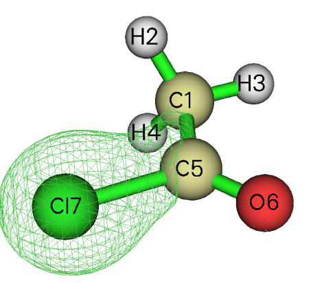

<!-- p.617 -->
evaluated in the aforementioned way are reasonable.


## 4.9 Bond order analysis

In this section I will illustrate how to use Multiwfn to perform different kinds of bond order analyses to characterize chemical bonds.


### 4.9.1 Mayer bond order and fuzzy bond order analysis on acetamide

This instance exemplifies how to calculate Mayer bond order and fuzzy bond order for acetamide. Related theories have been introduced in Sections 3.11.1 and 3.11.6, respectively. Finally, I introduce a skill, namely labelling the calculated bond orders to molecular structure map by means of GaussView, so that you can examine bond orders easier.

Calculation of Mayer bond order We first calculate Mayer bond order. Note that calculating Mayer bond order requires basis function information, thus currently .mwfn/.fch/.molden/.gms file must be used as input file.

Boot up Multiwfn and input: examples\CH3CONH2.fch 9 // Bond order analysis 1 // Calculate Mayer bond order Immediately you get below output:


```text
Bond orders with absolute value >=  0.050000
#    1:         1(C )    2(H )    0.93802674
#    2:         1(C )    3(H )    0.93473972
#    3:         1(C )    4(H )    0.94494566
#    4:         1(C )    5(C )    0.96585484
#    5:         5(C )    6(O )    1.90392771
#    6:         5(C )    7(N )    1.11849509
#    7:         6(O )    7(N )    0.07620305
#    8:         7(N )    8(H )    0.83250273
#    9:         7(N )    9(H )    0.83869874

Total valences and free valences defined by Mayer:
Atom     1(C ) :    3.77555991    0.00000000
Atom     2(H ) :    0.93147308    0.00000000
Atom     3(H ) :    0.92778456    0.00000000
Atom     4(H ) :    0.93657474    0.00000000
Atom     5(C ) :    3.97788022    0.00000000
Atom     6(O ) :    2.05925868    0.00000000
Atom     7(N ) :    2.85041375    0.00000000
Atom     8(H ) :    0.86522064    0.00000000
Atom     9(H ) :    0.85875080    0.00000000
```


<!-- p.618 -->
By default, only the bond order terms larger than specific criteria will be outputted, the criteria can be adjusted in "bndordthres" in `settings.ini`. Mayer bond order often coincides with empirical bond order well. In this example, bond order between C5 and O6 is 1.9, which is very close to ideal value 2.0 (double bonds).

Total valence of an atom is the sum of Mayer bond orders that it formed. Free valence of an atom measures its remained capacity to form new bonds by sharing electron pairs, for closed-shell this quantity is always zero.

Then if you choose "y", entire bond order matrix will be outputted to bndmat.txt in current folder.

Orbital occupancy-perturbed Mayer bond order analysis Next, we want to try to find which orbitals have main contributions to Mayer bond order between C5 and O6, calculating the so-called "Orbital occupancy-perturbed Mayer bond order" is useful for realizing this goal. Hence, we select option 6 in bond order analysis module, and then input 5,6. The following information will be outputted:


```text
Mayer bond order before orbital occupancy-perturbation:    1.903928

Orbital     Occ      Energy    Bond order   Variance
     1     2.00000  -19.10356    1.906089    0.002162
     2     2.00000  -14.34920    1.903934    0.000006
     3     2.00000  -10.28192    1.905514    0.001586
     4     2.00000  -10.18447    1.903939    0.000011
     5     2.00000   -1.03758    1.606912   -0.297016
     6     2.00000   -0.90529    1.825661   -0.078267
     7     2.00000   -0.73868    1.872011   -0.031917
     8     2.00000   -0.58838    1.896333   -0.007594
     9     2.00000   -0.54103    1.868127   -0.035801
    10     2.00000   -0.46630    1.799351   -0.104576
    11     2.00000   -0.44722    1.512533   -0.391394
    12     2.00000   -0.40158    1.830827   -0.073101
    13     2.00000   -0.39610    1.659075   -0.244853
    14     2.00000   -0.36742    1.393122   -0.510805
    15     2.00000   -0.26611    1.743383   -0.160545
    16     2.00000   -0.24383    1.796157   -0.107770
Summing up occupancy perturbation from all orbitals:  -2.03987
```

From the output we can know that, for example, if the two electrons are removed from orbital 15, then Mayer bond order between C5 and O6 will be decreased from 1.903928 to 1.743383 (i.e. 1.903928-0.160545), we can also say that the contribution from orbital 15 is 0.160545. The sum of contributions from all occupied MOs is 2.03987, the reason that this value is not equal to 1.903928 is that Mayer bond order is not a linear function of density matrix, we do not need to concern about this.

Orbital 14 has the largest negative value of orbital occupancy-perturbed Mayer bond order, therefore this orbital must be greatly beneficial to the bonding. This conclusion can be further testified by visual inspection of the orbital isosurface, see the graph given at the end of Section 4.8.1. As expected, this orbital shows strong character of π-bonding between C5 and O6.


<!-- p.619 -->
Calculation of fuzzy bond order Now we calculate fuzzy bond order. Unlike Mayer bond order, fuzzy bond order does not rely on basis function, therefore you can also use such as .wfn/.wfx as input file. Calculating fuzzy bond order is more time consuming than Mayer bond order, its advantage over Mayer bond order is that the basis set sensitivity is greatly reduced, and using diffuse basis functions will never deteriorate result.

In the bond order analysis menu, we select "7 Fuzzy bond order analysis", the result will be printed, as shown below


```text
Bond orders with absolute value >=  0.050000
#    1:         1(C )    2(H )    0.89666213
#    2:         1(C )    3(H )    0.89075146
#    3:         1(C )    4(H )    0.88888051
#    4:         1(C )    5(C )    1.08050669
#    5:         1(C )    6(O )    0.13600686
#    6:         1(C )    7(N )    0.11096284
#    7:         3(H )    5(C )    0.05357850
#    8:         5(C )    6(O )    2.00411901
#    9:         5(C )    7(N )    1.40339002
#   10:         6(O )    7(N )    0.24523041
#   11:         7(N )    8(H )    0.87233783
#   12:         7(N )    9(H )    0.88243512
```

Comparing the result with that of Mayer bond order, you will find the results of both types of bond orders are very similar, in fact this is the common case. However, for highly polar bonds their results may deviate with each other relatively evidently.

Skill: Labelling bond orders on molecular structure map by GaussView

If you have GaussView (version  6.0), you can use it to show the bond orders calculated by Multiwfn on the molecular structure map to facilitate examining their values. Here I use Mayer bond order of acetamide as instance to illustrate this point.

Boot up Multiwfn and input examples\CH3CONH2.fch 9 // Bond order analysis 1 // Calculate Mayer bond order y // Export the bond order matrix as bndmat.txt in current folder 0 // Return to main menu 1000 // Hidden main function 13 // Convert the bndmat.txt in current folder to Gaussian .gjf file with bond order information Now we have gau.gjf in the current folder, which not only contains present molecular coordinate, but also contains bond orders between the connected atoms (the connectivity is automatically guessed based on current geometry, unless you employ a file containing connectivity information as input file, such as .mol and .mol2, see Section 2.5 for detail).

Load the gau.gjf into GaussView, select "Results" - "Bond Properties", then after proper adjustments, you can obtain below effect.


<!-- p.620 -->
As can be seen, we also requested GaussView to use different colors to exhibit the bond orders. The more green the color, the larger the bond order; the redder the color, the smaller the bond order.

4.9.2 Multi-center bond order analysis on Li6 cluster and phenanthrene

The electron structure character of complex systems, such as cluster or system containing wide range electron delocalization is hard to be investigated by simple chemistry empirical rules, we have to resort to wavefunction analysis methods. In this section, examples of applying multi-center bond order to reveal multi-center interaction are given. If you are not familiar with multi-center bond order, please check Section 3.11.2 to gain basic knowledge. Notice that multi-center bond order analysis requires basis function information, therefore you have to use .mwfn/.fch/.molden/.gms file as input file.

Part 1: Studying three-center bond in Li6 cluster In the planar Li6 cluster, as shown in the map below, there are two kinds of three-membered rings, namely the three boundary ones and the central one. We will use multi-center bond order to study which kind of three-membered ring is more stable.

Boot up Multiwfn and input following commands examples\Li6.fch 9 // Bond order analysis 2 // Multi-center bond order analysis 1,3,4 // Indices of the atoms in the boundary three-member ring The output is


```text
 The multicenter bond order:    0.1247848038
 The normalized multicenter bond order:    0.4997129069
```

Then we calculate three-center bond order of the central three-member ring, therefore we input 1,2,3, the result is


```text
 The multicenter bond order:    0.0351782167
 The normalized multicenter bond order:    0.3276608901
```

Since the number of atoms in both the rings is the same, you only need to compare their "The multicenter bond order" values. The data are marked in the graph below. The pink texts denote Mayer bond orders.


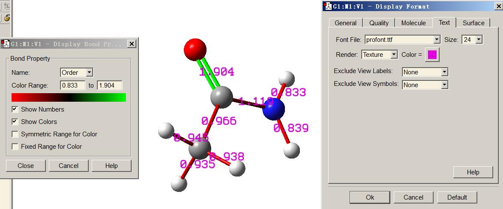

<!-- p.621 -->
From the three-center bond order values, it is evident that the boundary three-member rings are more stable (i.e. more strongly binded) than the central one, this conclusion is also somewhat reflected by the Mayer bond orders. We can further demonstrate this conclusion by plotting LOL graph in the cluster plane (see Section 4.4.2 on how to plot this kind of map)

It is clear that electrons tend to localize in the boundary three-membered rings to stabilize them, the conclusion of this real space function analysis is in good agreement with the bond order analysis. By checking Laplacian map, ELF map, electron density deformation and valence electron density map, you can draw exactly the same conclusion.

The Li6.fch used in this example was produced at B3LYP/6-31G* level. Usually diffuse functions should be employed for properly describing anionic systems, in this case you should


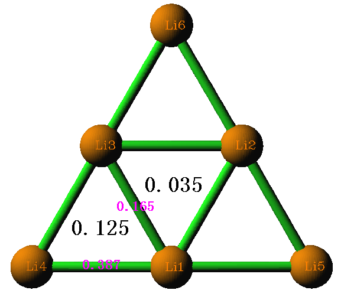

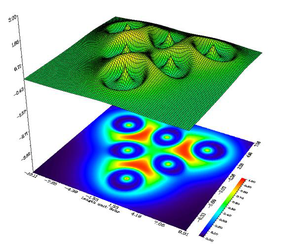

<!-- p.622 -->
evaluate the multi-center bond order based on natural atomic orbitals (NAO) rather than based on original basis functions as illustrated above, otherwise the result may be completely useless, see Section 3.11.2 for detail (also see Part 3 of this section for example). Alternatively, you can remove diffuse functions and perform single point task to generate the wavefunction used for multi-center bond order analysis, however the basis set should be at least three-zeta quality, e.g. 6-311G(2d,p) or def2-TZVP.

Part 2: Studying six-center conjugation in phenanthrene The examples\phenanthrene.fch contains wavefunction of phenanthrene generated at B3LYP/6-31G* level. The atomic numbering is shown below. In this instance, we will use multi-center bond order to study which six-membered ring has stronger multi-center conjugation effect.

Boot up Multiwfn and input following commands examples\phenanthrene.fch 9 // Bond order analysis 2 // Multi-center bond order analysis 1,2,3,4,5,6 // Indices of the atoms in the boundary ring. Note that the inputting order must be in consistency with atomic connectivity, namely inputting such as 1,3,5,6,4,2 will be meaningless

The output is


```text
 The multicenter bond order:    0.0593516368
 The normalized multicenter bond order:    0.6245570525
```

Note: It is worth to mention that in this case if you input the atomic indices in reversed order, namely 6,5,4,3,2,1, the result will be different, namely 0.0591177129. However, since the difference between 0.05935 and 0.05911 is marginal, we do not discrminate them. More information about influence of input order is mentioned Section 3.11.2

Next, we study the case of the central ring. We input 3,4,8,9,10,7, the result is


```text
 The multicenter bond order:    0.0264989378
 The normalized multicenter bond order:    0.5460152146
```

Clearly, the central ring has weaker electron conjugation character than the boundary one, consequently we can also conclude that the boundary rings have stronger aromaticity. In Section 4.14.3, 4.15.2 and 4.25.6 we will further investigate the ring aromaticity by means of other analysis methods.

Note that the data of "The normalized multicenter bond order" can be compared between rings with different number of atoms. Since this value of boundary six-membered ring of phenanthrene is 0.6245, while that of the boundary three-membered ring of Li6 cluster is 0.4997, we can infer that the multi-center interaction in the former case may be more prominent.

Part 3: Calculate six-center bond order based on natural atomic orbitals (NAOs) In Multiwfn, multi-center bond order can also be calculated based on natural atomic orbitals (NAOs), as introduced in Section 3.11.2. The main advantage of using NAO as basis over the


<!-- p.623 -->
common case is that reasonable result can still be obtained even diffuse functions are presented.

Here we calculate multi-center bond order in NAO basis for the phenanthrene, in this case NBO output information with DMNAO keyword is required. The Gaussian input file involved in this example is exampes\phenanthrene_DMNAO.gjf, the corresponding output file is examples\phenanthrene_DMNAO.out. As you can see from the .gjf file, the NBO module embedded in Gaussian is invoked and DMNAO keyword is passed into NBO module.

Boot up Multiwfn and input examples\phenanthrene_DMNAO.out 9 // Bond order analysis -2 // Multi-center bond order analysis in NAO basis 1,2,3,4,5,6 // Calculate six-center bond order for the boundary ring The output is


```text
 The multicenter bond order:    0.0588977456
 The normalized multicenter bond order:    0.6237584547
```

As can be seen, the result is almost completely identical to the one we obtained earlier using option 2 in main function 9, it is expected since currently diffuse functions are not employed.


### 4.9.3 Calculate Laplacian bond order (LBO)

The Laplacian bond order (LBO) was proposed by me in J. Phys. Chem. A, 117, 3100 (2013), see Section 3.11.7 for detail. LBO is very suitable for organic system and has close correlation with bonding strength. Let us calculate LBO for C-C bond of ethane, ethene and acetylene.

Boot up Multiwfn and input following commands examples\ethane.wfn // Optimized and produced at B3LYP/6-31G** 9 // Bond order analysis 8 // Laplacian bond order You will see the result:


```text
The bond order >=  0.050000
#    1:    1(C )    2(H ):  0.887111
#    2:    1(C )    3(H ):  0.889492
#    3:    1(C )    4(H ):  0.889492
#    4:    1(C )    5(C ):  1.059879
#    5:    5(C )    6(H ):  0.887111
#    6:    5(C )    7(H ):  0.889492
#    7:    5(C )    8(H ):  0.889492
```

As you can see, LBO is very close to formal bond order (1.0) for C-C and C-H. LBO only reflects covalent bonding character, due to C-H is a weakly polar bond, the value is slightly smaller than 1.0.

Then use examples\ethene.wfn to calculate LBO for ethene


```text
#    1:    1(C )    2(H ):  0.919443
#    2:    1(C )    3(H ):  0.919443
#    3:    1(C )    4(C ):  2.022583
#    4:    4(C )    5(H ):  0.919443
#    5:    4(C )    6(H ):  0.919443
```


<!-- p.624 -->
Then calculate LBO for acetylene by using examples\C2H2.wfn


```text
#    1:    1(C )    2(H ):  0.958393
#    2:    1(C )    3(C ):  2.767449
#    3:    3(C )    4(H ):  0.958393
```

The LBO of the C-C bonds in the three systems are 1.060, 2.022 and 2.767, the ratio is 1:1.907:2.61. It is known that the ratio of the bond dissociation energy (BDE) of the three bonds is 1:1.85:2.61. Clearly, LBO has surprisingly good correlation with BDE, in other words, LBO exhibits bonding strength fairly well (no other bond order definitions have so close relationship with BDE in comparison with LBO)

Moreover, LBO predicts that the sequence of the C-H bonding strength in the three systems is acetylene (0.958) > ethene (0.919) > ethane (0.889), this is completely in agreement with the experimental BDE sequence! (Other bond order definitions, such as Mayer bond order, fail to reproduce this sequence)

Finally, calculate LBO for O-H bond in water by using examples\H2O.fch, the result is 0.638. This value is significantly smaller than the C-H bond order, reflecting that O-H bond is much more polar than C-H bond.


### 4.9.4 Decomposition analysis of Wiberg bond order in NAO basis for formaldehyde


This example briefly illustrates a unique feature of bond order analysis module of Multiwfn, namely decomposing Wiberg bond order to atomic orbital pair and atomic shell pair contributions. A very simple molecule formaldehyde will be used as example, of course you can extend the analysis to much more complicated systems. Please read Section 3.11.8 first to understand basic idea of this analysis method.

This analysis requires natural atomic orbital (NAO) information and density matrix in NAO basis outputted by Weinhold's NBO program. For Gaussian user, you can run examples\H2CO_DMNAO.gjf and use the corresponding output file (examples\H2CO_DMNAO.out) as input file for this analysis. The orientation of the H2CO molecule in Cartesian system is shown in the graph below.

Boot up Multiwfn and input below command: examples\H2CO_DMNAO.out


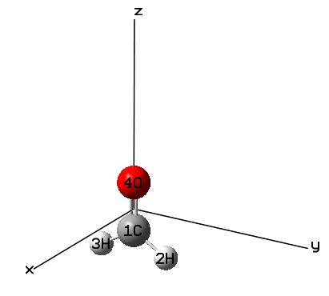

<!-- p.625 -->
9 // Bond order analysis 9 // Decompose Wiberg bond order in NAO basis Then you can input two atom indices to obtain their Wiberg bond order calculated under NAO basis, and meantime obtain major components (the threshold for printing components is controlled by "bndordthres" parameter in `settings.ini`). For example, we input 1,4, below result is immediately shown on screen:


```text
Contribution from NAO pairs that larger than printing threshold:
 Contri.  NAO   Center   NAO type            NAO   Center   NAO type
 0.0823     2    1(C )  Val( 2S) S      ---    21    4(O )  Val( 2S) S
 0.1907     2    1(C )  Val( 2S) S      ---    28    4(O )  Val( 2p) pz
 0.9145     5    1(C )  Val( 2p) px     ---    24    4(O )  Val( 2p) px
 0.0658     7    1(C )  Val( 2p) py     ---    26    4(O )  Val( 2p) py
 0.2482     9    1(C )  Val( 2p) pz     ---    21    4(O )  Val( 2S) S
 0.3700     9    1(C )  Val( 2p) pz     ---    28    4(O )  Val( 2p) pz

Contribution from NAO shell pairs that larger than printing threshold:
 Contri.  Shell  Center  Type        Shell  Center  Type
 0.0823     2    1(C )    2S   ---     2    4(O )    2S
 0.1907     2    1(C )    2S   ---     5    4(O )    2p
 0.2482     5    1(C )    2p   ---     2    4(O )    2S
 1.3504     5    1(C )    2p   ---     5    4(O )    2p

Total Wiberg bond order:  1.9161
```

From above information, the detail of total Wiberg bond order of 1.9161 becomes quite clear. According to the molecular graph shown earlier, the px type of NAO corresponds to the 2p atomic

orbital perpendicular to molecular plane, thus the px-px mixing results in π bond, its contribution to the total bond order (0.9145) is close to unity, which is in line with chemical intuition. The 2s-2s interaction only has weak contribution to the C=O bond, since the value 0.0823 is almost negligible; the reason should be attributed to the fact that the orbital overlap is insufficient. In addition, the 2py-2py interaction also plays insignificant role, the contribution is merely 0.0658. The interaction between 2s(C)-2pz(O), 2pz(C)-2pz(O) and 2pz(C)-s(O) have remarkable contribution to total bond order, which are 0.1907, 0.3700 and 0.2482, respectively, and the sum reaches as high as 0.8089. The large contributions must mainly stem from good orbital overlapping.

In order to facilitate discussion, the program also outputs contribution to Wiberg bond order from various atomic shell pairs. For example, as you can see from above information, interaction between all 2p orbitals of carbon and all 2p orbitals of oxygen totally contributes 1.3504 of bond order.

In this function you can also input -1 to define two fragments, then contributions from shell interactions between the two fragments will be given. For example, we want to study the nature of interaction between the CO fragment and the two H atoms, in the present function you should input

-1 // Decompose interfragment Wiberg bond order 1,4 // Atoms in fragment 1 2,3 // Atoms in fragment 2


<!-- p.626 -->
Now you can see


```text
Interfragment bond order analysis:
 Contribution   Fragment 1   Fragment 2
    0.66301         2s           1s
    1.27591         2p           1s

Interfragment Wiberg bond order:  1.9575
```

Clearly, the CO moiety mainly uses its 2p shells to form covalent bond with the two H atoms, while 2s shells of this fragment also play a nonnegligible role.


### 4.9.5 Study orbital contributions to Mulliken bond order for C-C bond

of CH3CONH2

The Mulliken bond order has been introduced in Section 3.11.4, it is also known as Mulliken overlap population. This kind of bond order is not particularly useful, since it neither correlates well with bonding strength nor closely related to bond multiplicity. However, a unique advantage is that it can be exactly decomposed into orbital contributions, and positive and negative value correspond to bonding and anti-bonding effect, respectively, this feature is useful for unraveling characteristics of orbitals. In this section I will use CH3CONH2 as example to illustrate this point.

Boot up Multiwfn and input examples\CH3CONH2.fch 9 // Bond order analysis 5 // Decompose Mulliken bond order between two atoms to orbital contributions 1,5 // Decompose C1-C5 bond The result is


```text
...[ignored]
 Orbital     7 Occ:  2.000000 Energy:   -0.738679 contributes    0.30341308
 Orbital     8 Occ:  2.000000 Energy:   -0.588379 contributes   -0.03865545
 Orbital     9 Occ:  2.000000 Energy:   -0.541034 contributes   -0.00559743
 Orbital    10 Occ:  2.000000 Energy:   -0.466302 contributes    0.20938473
 Orbital    11 Occ:  2.000000 Energy:   -0.447220 contributes    0.12977388
 Orbital    12 Occ:  2.000000 Energy:   -0.401575 contributes    0.14101027
 Orbital    13 Occ:  2.000000 Energy:   -0.396099 contributes   -0.02147123
 Orbital    14 Occ:  2.000000 Energy:   -0.367424 contributes   -0.11159089
 Orbital    15 Occ:  2.000000 Energy:   -0.266106 contributes    0.00503022
 Orbital    16 Occ:  2.000000 Energy:   -0.243833 contributes    0.02829203
 Total Mulliken bond order:    0.66486037
```

It can be seen that many MOs have evident positive contributions, such as MO7 (0.303), and MO10 (0.209); a few MOs have negative contributions, especially MO14 (-0.111). There are also some MOs have almost vanished contributions, such as MO15 (0.005). Therefore, occupation of MO7 and MO10 should enhance the strength of the C1-C5 bond, while occupation of MO14 must be harmful for formation of the C1-C5 bond.

The value of the MO contributions to Mulliken bond order can also be understood in terms of


<!-- p.627 -->
orbital isosurface map:

For MO7 and MO10, from the graph above it can be seen that there is no nodal plane between C1 and C5, the isosurface substantially encloses the C1-C5 bonding region, thus MO7 and MO10 act as bonding orbital for C1-C5 and have positive contribution to its Mulliken bond order. For MO14, an evident nodal plane perpendicular to the C1-C5 bond can be clearly seen at the midpoint of C1-C5, clearly MO14 behaves as an anti-bonding orbital for C1-C5 bond and thus should have negative contribution to its Mulliken bond order. For MO15, the C1-C5 bonding region is not covered by the orbital isosurface, this is why contribution from MO15 to C1-C5 Mulliken bond order is negligible.

Beware that in rare cases the contribution values to Mulliken bond order cannot be well explained by isosurface map, showing deficiency of definition of Mulliken bond order. In this case you may try to use the orbital occupancy-perturbed Mayer bond order instead (as illustrated in Section 4.9.1), which is more robust.

It is noteworthy that decomposition of Mulliken and Mayer bond order can be carried out not only based on molecular orbitals, but also based on localized molecular orbitals (LMOs), in the latter case the discussion is usually more meaningful. To do so, in general you should use main function 19 to yield LMOs and then carry out the decomposition analyses as usual.


### 4.9.6 Using intrinsic bond strength index (IBSI) to measure strength of chemical bonds


The intrinsic bond strength index (IBSI) proposed in J. Phys. Chem. A, 124, 1850 (2020) has certain ability in characterizing strength of covalent bonds, please check Section 3.11.9 for introduction first. In this section I will illustrate its calculation.

As mentioned in Section 3.11.9, IBSI can be calculated in terms of IGM, IGMH, or mIGM formalism, they will be referred to as IBSIIGM, IBSIIGMH, IBSImIGM, respectively. To calculate the IBSIIGM or IBSImIGM, the input file can only contain atom coordinate, while for IBSIIGMH, the input file must contain wavefunction information. Here we calculate IBSIIGM and IBSIIGMH indices for


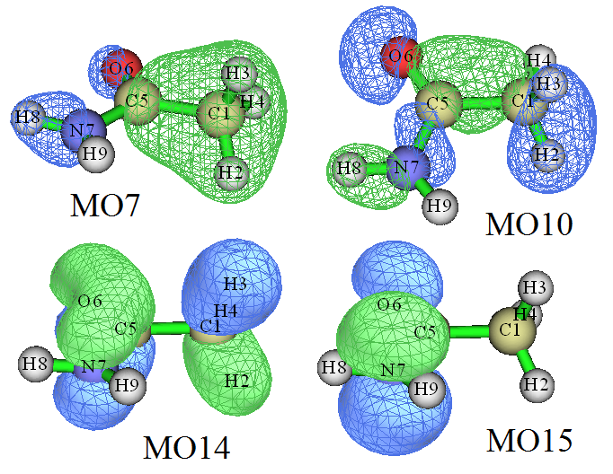

<!-- p.628 -->
acetylene, the .wfn file was generated at B3LYP/6-31G** level, its geometry was optimized at the same level.

Boot up Multiwfn and input examples\C2H2.wfn 9 // Bond order analysis 10 // Intrinsic bond strength index (IBSI) 1 // Start calculation. Since the current input file contains wavefunction information, by default the IBSI to be calculated is IBSIIGMH

2 // Use high-quality integration grid (using "ultrafine grid" will result in marginally better numerical accuracy, while the cost will be correspondingly increased)

The result is


```text
1(C )    2(H )  Dist:  1.0657   Int(dg_pair): 0.46835   IBSI: 0.72771
1(C )    3(C )  Dist:  1.2054   Int(dg_pair): 1.27376   IBSI: 1.54718
1(C )    4(H )  Dist:  2.2711   Int(dg_pair): 0.11093   IBSI: 0.03795
2(H )    3(C )  Dist:  2.2711   Int(dg_pair): 0.11093   IBSI: 0.03795
2(H )    4(H )  Dist:  3.3368   Int(dg_pair): 0.01482   IBSI: 0.00235
3(C )    4(H )  Dist:  1.0657   Int(dg_pair): 0.46835   IBSI: 0.72771
```

The "Dist" corresponds to distance between the two atoms, the Int(dg_pair) stands for the

∫𝛿𝑔pair d𝐫 term in the IBSI expression, the "IBSI" is the IBSIIGMH value.

Next, we calculate IBSIIGM. Choose option "2 Set type of IGM" and then input 1 to change the form of the IBSI to be IBSIIGM, then choose option 1 again and select "high-quality" to carry out the calculation, the result is


```text
1(C )    2(H )  Dist:  1.0657   Int(dg_pair): 0.58725   IBSI: 0.92620
1(C )    3(C )  Dist:  1.2054   Int(dg_pair): 1.32387   IBSI: 1.63228
1(C )    4(H )  Dist:  2.2711   Int(dg_pair): 0.19366   IBSI: 0.06726
2(H )    3(C )  Dist:  2.2711   Int(dg_pair): 0.19366   IBSI: 0.06726
2(H )    4(H )  Dist:  3.3368   Int(dg_pair): 0.02242   IBSI: 0.00361
3(C )    4(H )  Dist:  1.0657   Int(dg_pair): 0.58725   IBSI: 0.92620
```

Similarly, you can calculate ∫𝛿𝑔paird𝐫 and IBSI for ethane and ethene, their .wfn files generated at the same level as the C2H2.wfn have been provided as ethane.wfn and ethene.wfn in "examples" folder. The calculated data of the C-C bond in the three systems are plotted with respect

to their bond dissociation energies (BDEs) in the map below, in which the δgIGM and δgIGMH correspond to the ∫𝛿𝑔paird𝐫 calculated in terms of IGM and IGMH, respectively.


<!-- p.629 -->
As can be seen, δgIGM does not correlate well with bonding strength, which is directly reflected by BDE. The linear relationship of the two forms of IBSI and δgIGMH is perfect with respect to BDE, manifesting their great value.

Note that if the input file only contains geometry information, such as .pdb and .xyz, the default IBSI form to be calculated is IBSIIGM.

Strictly speaking, the reference value of IBSI, namely the denominator in the IBSI expression, should be calculated at the same level as current system, however in the present example we directly used the built-in data. You can change it if you hope to obtain more rigorous results, the reference value can also be evaluated using the present function, see Section 3.11.9 for detail.


### 4.9.11 Example of using AV1245 and AVmin indices to study aromaticity


Note: Chinese version of this section is my blog article “Using Multiwfn to calculate the AV1245 index to study the aromaticity of macrocycles” (http://sobereva.com/519).

Please read Section 3.11.10 first to gain basic knowledge about the AV1245 and AVmin indices. In Section 4.9.11.1, AV1245 and AVmin will be employed to distinguish aromaticity between the two kinds of six-membered rings in phenanthrene, then in Section 4.9.11.2, porphyrin will be taken as instance to show the ability of these indices in quantification of aromaticity of large rings.

4.9.11.1 Using AV1245 and AVmin to study local aromaticity of phenanthrene

In Section 4.9.2, MCBO has been used to study the difference in local aromaticity for the two kinds of rings in phenanthrene, whose geometry and atomic numbering are shown below. In this section, we will use AV1245 and AVmin to study it again.


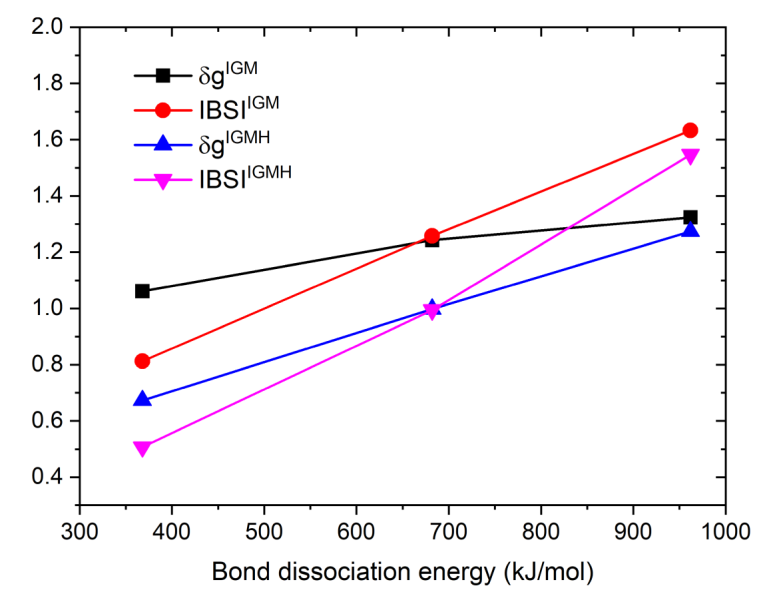

<!-- p.630 -->
Boot up Multiwfn and input examples\phenanthrene.fch 9 // Bond order analysis 11 // Calculate AV1245 1,2,3,4,5,6 // Calculate AV1245 for the boundary six-membered ring. Note that the order of inputting should be in line with connectivity

The result is


```text
 4-center electron sharing index of     1     2     4     5:    0.01304820
 4-center electron sharing index of     2     3     5     6:    0.01245026
 4-center electron sharing index of     3     4     6     1:    0.00801537
 4-center electron sharing index of     4     5     1     2:    0.01304820
 4-center electron sharing index of     5     6     2     3:    0.01245026
 4-center electron sharing index of     6     1     3     4:    0.00801537

 AV1245 times 1000 for the selected atoms is   11.17127674
 AVmin times 1000 for the selected atoms is     8.015375 (    3    4    6    1)
```

Namely 1000*AV1245 and 1000*AVmin are 11.171 and 8.015, respectively. The AVmin value corresponds to 4c-ESI of 3-4-6-1.

Next, we input 3,4,8,9,10,7 to calculate 1000*AV1245 and 1000*AVmin for the central ring, the result are 5.012 and 3.996, respectively. Clearly, the boundary ring has stronger aromaticity than the central ring since it has larger AV1245 and AVmin, this conclusion is in line with the MCBO analysis in Section 4.9.2. In the original paper of AV1245, it is argued that AV1245 behaves as an approximation of MCBO.

Calculating AV1245 and AVmin in natural atomic orbital (NAO) basis In Multiwfn, AV1245 and AVmin can also be calculated based on natural atomic orbitals (NAOs), as mentioned in Section 3.11.10. The main advantage of this way is that reasonable result can still be obtained even diffuse functions are presented (while if you calculate AV1245 and AVmin as what we have done earlier when diffuse functions are employed, the result will be quite misleading)

Here we calculate AV1245 and AVmin in NAO basis for the phenanthrene, in this case NBO output information with DMNAO keyword should be employed as input. The Gaussian input file involved in this example is exampes\phenanthrene_DMNAO.gjf, the corresponding output file is examples\phenanthrene_DMNAO.out. As you can see from the .gjf file, the NBO module embedded in Gaussian is invoked and DMNAO keyword is passed into NBO module.

Boot up Multiwfn and input examples\phenanthrene_DMNAO.out 9 // Bond order analysis 11 // Calculate AV1245


<!-- p.631 -->
1,2,3,4,5,6 // Calculate AV1245 for the boundary ring The output is


```text
AV1245 times 1000 for the selected atoms is   10.98247818
AVmin times 1000 for the selected atoms is     8.283826 (    3    4    6    1)
```

As can be seen, the result are almost identical to those we obtained earlier (11.171 and 8.015), this is expected since currently diffuse functions are not employed.

4.9.11.2 Using AV1245 and AVmin to measure global aromaticity of porphyrin

In this example we use AV1245 and AVmin to quantify aromaticity corresponding to different delocalization paths of porphyrin. The .fch file generated at B3LYP/6-31G* level can be downloaded at http://sobereva.com/multiwfn/extrafiles/porphyrin.rar. The structure is shown below.

There are several possible global delocalization paths around the porphyrin, now we calculate one of them. Although you can manually input atomic indices by tracing atom connectivity as exhibited in the map above, this process is very laborious, especially when the ring under study is large. It is much better to use GaussView to visually select the atoms in the ring of interest and directly extract their indices. To do so, we use GaussView to open the porphyrin.fch, then click the

brush icon , then hold down the left mouse button and let the cursor pass every atom in the

ring, then the atoms will be highlighted as yellow, as shown on the left side of the figure below. After that, choose "Tools" - "Atom Selection", copy out the atom indices from the text box (see below) to clipboard, namely 1,3-4,6-8,10-14,16-19,21-22,24.


<!-- p.632 -->
Now boot up Multiwfn and input porphyrin.fch 9 // Bond order analysis 11 // Calculate AV1245 d // After entering this mode, you can input the atom indices in arbitrary order, because in this case the actual atom sequence will be automatically guessed based on recognized connectivity

1,3-4,6-8,10-14,16-19,21-22,24 // Indices of the atoms in the selected ring Now you can see the following information:


```text
 Number of selected atoms:    18
 Atomic sequence:
     1     3     6     8    12    14    17    18    19    22    21    16
    13    10    11     7     4    24
...[ignored]
AV1245 times 1000 for the selected atoms is    2.75856093
AVmin times 1000 for the selected atoms is     1.943425 (    3    6   12   14)
```

As you can see, the atomic sequence has been properly recognized, it is fully in line with the actual connectivity in the ring, therefore the result, 2.76, should be meaningful. The AVmin corresponds to N3-C6-C12-C14, implying that this local region is the bottleneck of electron delocalization over the whole path.

Similarly, we calculate AV1245 for other rings by inputting below commands d 1-2,4-8,10-14,16-20,22-24 d 1,3-4,6,8-10,12-13,15-16,18-19,21-22,24 d 1-2,4-6,8-10,12-13,15-16,18-20,22-24 For all calculated rings, the selected atoms as well as results are summarized below, the blue and green texts correspond to 1000*AV1245 and 1000*AVmin, respectively.


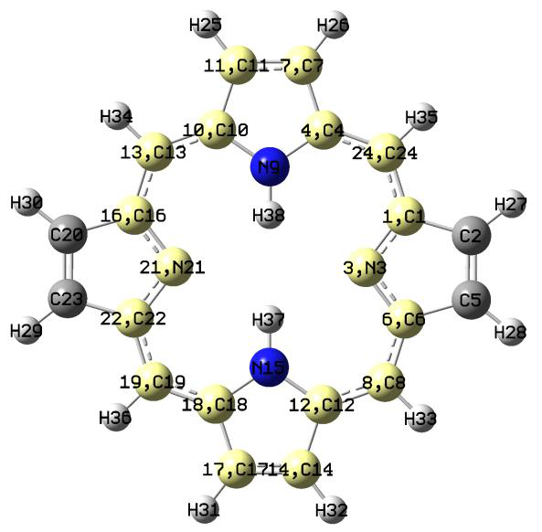


<!-- p.633 -->
It is unambiguous that the path passing through nitrogen of pyrroles but bypassing N-H group is the most favorable delocalization channel, since its 1000*AV1245 and 1000*AVmin values (2.76 and 1.94) are both larger than other pathways. It is worth to mention that for the two paths shown at bottom of the map above, although their AV1245 are unequal, their AVmin are exactly identical. This observation suggests that despite average extents of electron delocalization on the two selected paths are notably different, the bottlenecks are the same.

This system has also been studied in Section 4.4.9 via LOL-π, the resulting graph is given below, from which it can be clearly seen that the degree of electron delocalization along different paths is significantly different, the top priority delocalized path is vividly revealed by red or orange color. Obviously the most favorable delocalization path unveiled by AV1245 and AVmin is in good

agreement with that revealed by LOL-π.


<!-- p.634 -->
It is worth to note that the precondition of using the convenient "d" mode in inputting atomic indices is that there is no atom in the ring connecting more than two other atoms in the ring. For example, for the naphthalene shown below, you should not enter "d" mode and input 1-10 to calculate the AV1245 and AVmin to study the global aromaticity around the whole system, because the atoms 9 and 10 simultaneously connect three atoms, in this case the correct atomic sequence in the ring cannot be automatically determined by Multiwfn.


## 4.10 Plot density-of-states (DOS) maps

In this section, I will illustrate how to use Multiwfn to easily plot various kinds of density-of-states (DOS) maps. The relevant theories and usage introductions of the DOS module can be found in Section 3.12.

More in-depth discussions and DOS plotting examples can be found in my blog article "Plotting density-of-states maps by Multiwfn to study electronic structure" (http://sobereva.com/482, in Chinese)


### 4.10.1 Plot total, partial and overlap DOS for N-phenylpyrrole

In this example, we will plot total, partial and overlap density-of-states (TDOS, PDOS and OPDOS) for N-phenylpyrrole, whose structure is shown below. This example consists of six parts. Please read Section 3.12.1 first if you are not familiar with DOS.

Because basis function information is required in plotting PDOS and OPDOS, we use .fch as


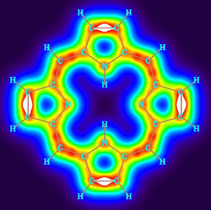

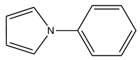

<!-- p.635 -->
input file in these examples, using .mwfn, .molden or .gms file is also OK, but .wfn/.wfx cannot not used, since they do not contain information of basis function and virtual MOs. If you only need to obtain TDOS, you can also simply use a plain text file recording MO energy levels or the Gaussian output file with pop=full keyword as input file, see Section 3.12.1 for file format.

It is noteworthy that if you intend to plot PDOS and OPDOS based on the default Mulliken orbital composition method, employing diffuse functions must be avoided, because they severely hurt the reliability of the orbital compositions evaluated by Mulliken or SCPA method. However, you can safely use diffuse functions if you let Multiwfn calculate orbital composition via Hirshfeld or Becke method, but OPDOS cannot be plotted in this case. The wavefunction of present system was generated at B3LYP/6-31G* level.

Part 1: Plot total DOS (TDOS) Boot up Multiwfn and input below commands examples\N-phenylpyrrole.fch 10 // Plot various kinds of DOS maps 0 // Plot map Since currently no fragment is defined, only TDOS is plotted. The TDOS map pops up immediately, see below

TDOS

9.00

8.00

7.00

Density-of-states 6.00 5.00 4.00

3.00

2.00

1.00

0.00

-0.80-0.70-0.60-0.50-0.40-0.30-0.20-0.100.000.100.20Energy (a.u.)

In this map, the curve is the TDOS simulated based on the distribution of MO energy levels, each discrete vertical line corresponds to a molecular orbital (MO), the dashed line highlights the position of HOMO, the black and gray lines indicate position of occupied and unoccupied MO levels, respectively. In the negative part, the region around -0.40 a.u. has obviously larger state density than other regions.

Clicking mouse right button on the graph to close it, and select option 0 to return to last menu. We can also change the energy unit and energy range, and the line height can be used to indicate orbital degeneracy. To realize this, input below commands:

8 // Switch the unit from the default a.u. to eV 2 // Set energy range -30,5,5 // Set lower and upper limits to -30 eV to 5 eV, the spacing between labels is 5 eV 9 // Using line height to show orbital degeneracy


<!-- p.636 -->
0.05 // If energy difference between two orbitals is less than 0.05 eV, they will be regarded as degenerate

0 // Plot TDOS map again Now we have the map below. The line height indicates degeneracy and corresponds to the axis at right side. As can be seen, some orbitals have degeneracy of 2.

0.36 TDOS 10

0.32 9

8

0.28

7

Density-of-states 0.24 0.20 0.16 0.12 6 5 4 3 Degeneracy

0.08 2

0.04 1

0.00 0

-30.00-25.00-20.00-15.00-10.00-5.000.005.00Energy (eV)

In addition, if you would like to draw the lines at bottom of the curve, you can select option “22 Toggle drawing lines at bottom of curves” in post-processing menu and then select option 1 to replot, you will see

0.36 TDOS

0.32

0.28

Density-of-states 0.24 0.20 0.16 0.12

0.08

0.04

0.00 2 0 Degen.

-30.00-25.00-20.00-15.00-10.00-5.000.005.00Energy (eV)

Part 2: Plot PDOS and OPDOS for fragments


<!-- p.637 -->
Next, we will define the heavy atoms of pyrrole moiety as fragment 1 and that of the phenyl moiety as fragment 2 to check their PDOS and OPDOS. In addition, we will define all hydrogens as fragment 3.

Boot up Multiwfn and input examples\N-phenylpyrrole.fch 10 // Plot various kinds of DOS maps -1 // Enter the interface for defining fragments. You can define up to 10 fragments. PDOS will be plotted for all of them, but OPDOS will only be drawn between fragments 1 and 2

1 // Define fragment 1 a 1-5 // Add carbons and nitrogen of pyrrole moiety (atoms 1~5) to the fragment q // Save fragment 1 2 // Define fragment 2 a 10-13,15,17 // Add phenyl moiety (atoms 10~13, 15 and 17) to the fragment q // Save fragment 2 3 // Define fragment 3 a 6-9,14,16,18-20 // Add all hydrogens to the fragment q // Save fragment 3 0 // Return to last menu 2 // Set X-axis -1.1,-0.1,0.1 // Set the range of X-axis to -1.2 ~ -0.1 a.u., so that all valence MOs can be shown in the graph. The step between labels is set to 0.1 a.u.

0 // Draw TDOS+PDOS+OPDOS The current graph is not very ideal. Close the graph, you can see many options used to customize the graph, such as setting curve colors, setting legend texts. Try to play with them and if you are confused you can consult Section 3.12.3. Here we select option 4 and input -2,9,1 to set lower, upper limits and label interval of left Y-axis (corresponding to TDOS and PDOS) to -2.0, 9.0 and 1.0, respectively. Select 14 and input the scale factor 0.2, then range of the right Y-axis (corresponding to OPDOS) will be set to -0.4, 1.8 (because -2.0*0.2=-0.4 and 9.0*0.2=1.8). Shrinking the range of the Y-axis at right side is equivalent to enhancing the amplitude of OPDOS curve, which makes the variation of OPDOS in the map clearer. Then select option 1 to replot the DOS map, you will see


<!-- p.638 -->
9.00 1.80

8.00 7.00 TDOSPDOS frag.1PDOS frag.2PDOS frag.3 TDOSPDOS frag.1PDOS frag.2PDOS frag.3OPDOS 1.58 1.36

6.00 1.14

Density-of-states 5.00 4.00 3.00 2.00 0.92 0.70 0.48 OPDOS

1.00 0.26

0.00 0.04

-1.00 -0.18

-2.00 -0.40

-1.10-1.00-0.90-0.80-0.70-0.60-0.50-0.40-0.30-0.20-0.10Energy (a.u.)

The axis at left side corresponds to TDOS and PDOS, while the one at right side corresponds to OPDOS. The red, blue and magenta curves and discrete lines represent PDOS of fragment 1, 2 and 3, respectively. It can be seen that in most valence MOs, the fragments 1 and 2 have comparable amount of contribution. The fragment 3 (hydrogens) mainly contributes to the MOs between -0.60 ~ -0.35 a.u. Green curve is the OPDOS between fragments 1 and 2, its positive part implies that the MOs in corresponding energy range show bonding character between the two fragments (e.g. the one at -0.8 a.u., which corresponds to MO14); there are also regions where OPDOS is negative, e.g. the HOMO-1 (-0.213 a.u.) behave as antibonding orbitals between the two fragments.

Part 3: Plot PDOS of a specific atom orbital Current molecule is in YZ plane, as an example, let us check the PDOS of px atomic orbital of

the nitrogen atom, it represents π electron on this site. Select 0 to return to last menu and then input

-1 // Define fragments -2 // Fragment 2 is not needed, so we input corresponding negative value to unset it -3 // Also unset fragment 3 1 // Redefine fragment 1 clean // Clean existing content of the fragment all // Print out information of all basis functions The information corresponding to nitrogen atom is extracted and shown below


```text
Basis:    61    Shell:   25    Center:    5(N )    Type: S
Basis:    62    Shell:   26    Center:    5(N )    Type: S
Basis:    63    Shell:   27    Center:    5(N )    Type: X
Basis:    64    Shell:   27    Center:    5(N )    Type: Y
Basis:    65    Shell:   27    Center:    5(N )    Type: Z
Basis:    66    Shell:   28    Center:    5(N )    Type: S
Basis:    67    Shell:   29    Center:    5(N )    Type: X
Basis:    68    Shell:   29    Center:    5(N )    Type: Y
Basis:    69    Shell:   29    Center:    5(N )    Type: Z
```


<!-- p.639 -->

```text
Basis:    70    Shell:   30    Center:    5(N )    Type: XX
Basis:    71    Shell:   30    Center:    5(N )    Type: YY
Basis:    72    Shell:   30    Center:    5(N )    Type: ZZ
Basis:    73    Shell:   30    Center:    5(N )    Type: XY
Basis:    74    Shell:   30    Center:    5(N )    Type: XZ
Basis:    75    Shell:   30    Center:    5(N )    Type: YZ
```

Current system is calculated under 6-31G* basis set, according to the basis set definition, each valence atomic orbital is represented by two basis functions of corresponding type. Therefore, what we should do is to put basis functions 63 and 67 into the fragment, they collectively represent the px orbital of nitrogen (For other kinds of basis set, you can consult Section 4.7.6 on how to identify correspondence between basis functions and atomic orbitals). Input below commands

b 63,67 // Then you can input command all again, the basis functions added to present fragment are marked by asterisks

q // Save fragment 0 // Return 0 // Plot TDOS and PDOS Please analyze the resulting graph yourself.

9.00

8.00 TDOSPDOS frag.1

7.00

6.00

Density-of-states 5.00 4.00 3.00 2.00

1.00

0.00

-1.00

-2.00

-1.10-1.00-0.90-0.80-0.70-0.60-0.50-0.40-0.30-0.20-0.10Energy (a.u.)

Part 4: Plot PDOS and OPDOS of all π molecular orbitals This molecule is in YZ plane, assume that we only intend to study PDOS/OPDOS of π orbitals of pyrrole and phenyl moieties and want to get rid of effect of all other MOs, although in the fragment definition interface we can choose each PX basis function in turn, because there are too many atoms, this process will take you a lot of time and thus is very troublesome. A much better way is to use the condition selection command.

Select option 0 to return to last menu and then input -1 // Define fragments 1 // Redefine fragment 1 clean // Clean existing content of the fragment


<!-- p.640 -->
cond // Use conditions to select basis functions. You will be prompted to input three conditions, the basis functions simultaneously satisfying the three conditions will be added to current fragment

1-5 // The first condition is that the basis functions must belong to the heavy atoms in pyrrole moiety (atoms 1~5)

[Press ENTER button] // The second condition is the index range of basis functions. Press ENTER button directly means basis function index is arbitrary

X // The third condition is that the type of basis function should be PX q // Save fragment 1 2 // Define fragment 2 cond // Use conditions to select basis functions 10-13,15,17 // Atom index of the carbons in the phenyl moiety [Press ENTER button] // No requirement on index of basis functions X // Basis function must be PX type q // Save fragment 2 0 // Return to last menu 0 // Draw TDOS+PDOS+OPDOS

9.00 1.80

8.00 7.00 TDOSPDOS frag.1PDOS frag.2 TDOSPDOS frag.1PDOS frag.2OPDOS 1.58 1.36

6.00 1.14

Density-of-states 5.00 4.00 3.00 2.00 0.92 0.70 0.48 OPDOS

1.00 0.26

0.00 0.04

-1.00 -0.18

-2.00 -0.40

-1.10-1.00-0.90-0.80-0.70-0.60-0.50-0.40-0.30-0.20-0.10Energy (a.u.)

This time the PDOS curves only cover high-energy regions, implying that most π MOs in

present system have higher energy than σ MOs. Please use main function 0 of Multiwfn to visualize corresponding MO isosurfaces.

Part 5: Plot PDOS for s, p, d atomic orbitals individually In the next, I illustrate how to plot PDOS for s, p, d atomic orbitals individually. Reboot Multiwfn and then input

examples\N-phenylpyrrole.fch 10 // Plot various kinds of DOS maps -1 // Define fragments 1 // Define fragment 1 l s // Add basis functions with angular moment of s to the fragment


<!-- p.641 -->
q // Save fragment 2 // Define fragment 2 l p // Add basis functions with angular moment of p to the fragment q // Save fragment 3 // Define fragment 3 l d // Add basis functions with angular moment of d to the fragment q // Save fragment 0 // Return to last menu 0 // Draw TDOS+PDOS+OPDOS Then close the graph and input the following command to improve graphical effect 9 // Disable showing OPDOS curves 10 // Disable showing OPDOS lines 4 // Set range of Y axis 0,10,1 // Lower and upper limits are set to 0 and 10 with label interval of 1.0 16 // Set legends 1 // Set legend of PDOS corresponding to fragment 1 s 2 // Set legend of PDOS corresponding to fragment 2 p 3 // Set legend of PDOS corresponding to fragment 3 d 0 // Exit the interface for setting legends 22 // Toggle drawing lines at bottom of curves, 1 // Replot the map Now you can see the map below

10.00

9.00 8.00 TDOSspd

Density-of-states 7.00 6.00 5.00 4.00 3.00

2.00

1.00

0.00

-0.80-0.70-0.60-0.50-0.40-0.30-0.20-0.100.000.100.20Energy (a.u.)

From this map, it is clear that occupied frontier MOs (those close to the dash line) are solely contributed by p orbitals.


<!-- p.642 -->
If you want to plot PDOS for certain angular moment of orbitals for specific atoms, it is also very easy. For example, by inputting below commands in the fragment definition interface, a fragment corresponding to all p orbitals of all the four carbons in the pyrrole moiety could be defined.

cond // Use conditions to select basis functions 1-4 // Atoms 1~4 [Press ENTER button] // No requirement on basis function index P // Basis function of P angular moment

Part 6: Plot PDOS based on orbital compositions derived by Hirshfeld method Plotting PDOS requires orbital compositions. In the examples above, the compositions were evaluated using the default Mulliken method. This method is fast very, however, it is not quite robust (especially for unoccupied orbitals), and the result is completely useless when diffuse functions are employed. Here I also illustrate how to plot PDOS based on the orbital compositions derived by the Hirshfeld method, which is more robust and fully compatible with diffuse functions. The disadvantage is that Hirshfeld method is more expensive, and it can only evaluate contributions from atoms, namely the fragments can only be defined as a set of atoms.

Here we repeat the example in "Part 2" but using compositions obtained by Hirshfeld method. Boot up Multiwfn and input below commands:

examples\N-phenylpyrrole.fch 10 // Plotting DOS 7 // Change the method for calculating orbital compositions 3 // Hirshfeld method. Then Multiwfn calculates orbital compositions for all atoms in all orbitals, for large system you need to wait for a while

-1 // Define fragments 1 // Define fragment 1 1-5 // Set carbons and nitrogen of pyrrole moiety (atoms 1~5) as the fragment 2 // Define fragment 2 10-13,15,17 // Set phenyl moiety (atoms 10~13, 15 and 17) as the fragment 3 // Define fragment 3 6-9,14,16,18-20 // Set all hydrogens as the fragment 0 // Return to last menu 2 // Set X-axis -1.1,-0.1,0.1 0 // Draw TDOS+PDOS The resulting graph is almost identical to that plotted based on the compositions derived by the default Mulliken method (however, the difference is often evident for the energy range composing of unoccupied MOs, clearly the PDOS based on Hirshfeld is more reliable). Note that OPDOS cannot be plotted when Hirshfeld method is employed to calculate orbital compositions.


### 4.10.2 Plot local DOS for 1,3-butadiene

If you do not know what is local DOS (LDOS), please check Section 3.12.4 first. Briefly speaking, TDOS represents DOS curve for the whole system, PDOS describes DOS curve for an atom (or fragment), while LDOS exhibits DOS curve for a point (i.e. space-resolved). In addition,


<!-- p.643 -->
we can plot LDOS for a set of point constituting a line as color-filled map, the X-axis corresponds to energy while the Y-axis shows position in the line. LDOS is useful when interpreting the data from scanning tunneling microscope (STM), you can find relating experimental data in e.g. J. Phys. Chem. Lett., 5, 3701 (2014).

In the current example, we plot LDOS for butadiene at selected points. First, we plot LDOS for the point over 1.5 Bohr of terminal carbon of butadiene. Boot up Multiwfn and input following commands:

examples\butadiene.fch 0 // Visualize molecular structure From output in the command-line window we can find the expected point should be 1.137 3.308 1.5 (1.5 Bohr above C1). Close the GUI window and input

10 // DOS plotting module 10 // Draw local DOS for a point 1.137,3.308,1.5 Then you will see (you can compare it with TDOS map)

0.038

0.034

0.030

0.026

Density-of-states 0.023 0.019 0.015

0.011

0.008

0.004

0.000

-0.80-0.70-0.60-0.50-0.40-0.30-0.20-0.100.000.100.20Energy (a.u.)

Close the graph and select 0 to return to the last menu. Next, we plot color-filled map along the line connecting the two points above 1.5 Bohr of the two terminal carbons (C1 and C8), input below commands

11 // Draw local DOS along a line 1.137,3.308,1.5 -1.137,-3.308,1.5 200 // Evenly taking 200 points along line Then close the graph that pops up and input 4 // Modify the ratio between Y and X axes 0.5 // The length of Y-axis will be half of X-axis 1 // Replot


<!-- p.644 -->
Then you can see

The color in this graph represents density of states at different 3D spatial positions (Y-axis) and different energies (X-axis). The pink arrows highlight the gaps at three different spatial positions.

If you still feel difficult in understanding meaning of the map, please check below figure, in which some important information is explicitly labelled.

It is easy to understand, the lowermost horizontal line of the graph above (viz. the green dash line at Y=0) corresponds to the LDOS curve map at the position of 1.5 Bohr above C1, which has been plotted by us earlier.

4.10.3 Plot DOS map for unrestricted open-shell system: Na3O@Si12C12

In Section 4.10.1, we have plotted a closed-shell system, while in this section, I will illustrate how to plot DOS for a typical open-shell system Na3O@Si12C12, which was studied in my work J. Comput. Chem., 38, 1574 (2017) and is doublet. For open-shell cases calculated in unrestricted formalism, there are two kinds of spins, they should be simultaneously taken into account, The .fchk file can be downloaded here: http://sobereva.com/multiwfn/extrafiles/Na3O-Si12C12.rar, which corresponds to UM06-2X/6-311G* wavefunction at optimized geometry.


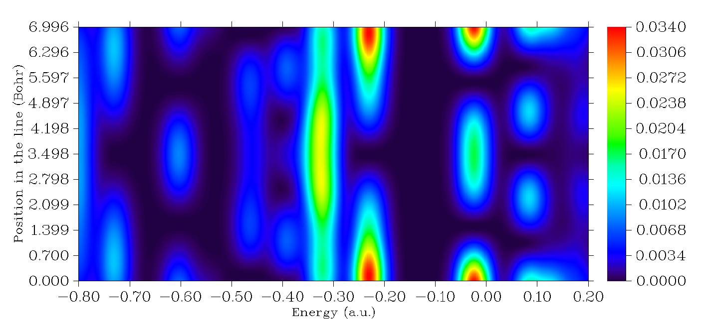


<!-- p.645 -->
First, we plot TDOS+PDOS map for alpha spin, the PDOS will correspond to the Na3O. Boot up Multiwfn and input

Na3O-Si12C12.fchk 10 // DOS plotting module -1 // Define fragments 1 // Define fragment 1 a 1,4,27,28 // These four atoms correspond to the Na3O moiety q // Save fragment 0 // Return 0 // Plot TDOS+PDOS Close the graph pops up 22 // Enable drawing lines at bottom of curves 1 // Replot You will see the graph below. By default, for unrestricted wavefunction, only alpha MOs are taken into account, therefore the following map is DOS map of alpha spin.

27.81 TDOSPDOS frag.1

24.72

Density-of-states 21.63 18.54 15.45 12.36 9.27

6.18

3.09

0.00

-0.80-0.70-0.60-0.50-0.40-0.30-0.20-0.100.000.100.20Energy (a.u.)

Choose option 0 to return to last menu. If you want to plot the DOS map for beta spin, you should select "6 Choose orbital spin" and then choose "2 Beta spin". If you do not want to distinguish spin but want to take all MOs into account, you should choose "3 Both spins". Please choose beta spin and replot the map via option 0 again, you will find the map is similar to that of alpha spin, showing that in this system the spin polarization is not quite evident.

In order to make comparison between alpha and beta DOS maps intuitive, we can try to make a figure, the upper part and lower part correspond to alpha spin and beta spin, respectively. Such a map cannot be directly produced by Multiwfn, however it can be easily prepared via Multiwfn in combination with third-part visualization software such as Origin, as shown below. The Origin version I am using is 9.0

We first use Multiwfn to plot the alpha TDOS+PDOS map in aforementioned way, in the post-processing menu, choose "3 Export curve and line data to plain text file in current folder". Rename


<!-- p.646 -->
the DOS_curve.txt to alpha.txt. Return to DOS plotting interface, change to beta spin, plot the map and then export the data set again, rename the DOS_curve.txt to beta.txt. The DOS_line.txt can be deleted because we will not utilize it.

Boot up Origin, drag both alpha.txt and beta.txt into it to import them. Currently, in the workbook corresponding to beta spin, B and C columns correspond to TDOS and PDOS curve data, respectively. We choose "Set Column Values" option for column D (which is empty currently), set the content D to -Col(B); similarly, we set column of E to -Col(C).

Next, we select proper option to plot line map. In the worksheet corresponding to alpha spin, we add column A as X data, add columns B and C as two sets of Y data. In the worksheet corresponding to beta spin, we add column A as X data, while add columns D and E as Y data. After some adjustments, you will obtain the graph below, which nicely exhibits DOS and PDOS for alpha and beta spins, respectively.

30

20 α TDOS α PDOS (Na3O) α HOMO

β TDOS β PDOS (Na3O)

10

Density of states -10 0

-20 β HOMO

-0.8-0.7-0.6-0.5-0.4-0.3-0.2-0.10.00.10.2-30

Energy (Hartree)

Note that in order to plot a horizontal line corresponding to DOS=0 and two vertical lines highlighting HOMO level of alpha and beta spins, I also created the third worksheet and properly filled the content. The value of the alpha and beta HOMOs can be directly found from the prompts when you selecting option 0 in DOS module to draw the map, namely


```text
Note: The vertical dash line corresponds to HOMO level at    -0.171 a.u.
```

and


```text
Note: The vertical dash line corresponds to HOMO level at    -0.221 a.u.
```

The aforementioned alpha.txt, beta.txt as well as the Origin .opj file of the map have been provided in "examples\DOS\" folder.

4.10.4 Plot photoelectron spectrum (PES) for Cr3Si12− cluster


<!-- p.647 -->
(http://sobereva.com/478).

In Section 3.12.5, the theory of PES and the interface for plotting PES have been introduced, please read it if you have not. In present section, Cr3Si12- will be taken as example to illustrate how to plot PES very easily, we will plot PES employing generalized Koopmans' theorem. This system has been studied in J. Phys. Chem. A, 122, 9886 (2018) under PBE/6-311+G* level, it is worth to note that the calculated first VIP of this system 2.56 eV.

Using the optimized structure of this system provided in supplemental material in the JPCA paper, I carried out a single point task using the same level as the paper by Gaussian 16, the resulting Cr3Si12-.fchk file can be downloaded here: http://sobereva.com/multiwfn/extrafiles/Cr3Si12-.rar.

Boot up Multiwfn and input Cr3Si12-.fchk 10 // DOS module 12 // Interface for plotting PES. You will find HOMO level has been shown on the screen, namely -0.77 eV, which is the highest one among alpha HOMO and beta HOMO

3 // Set shift value to meet generalized Koopmans' theorem 1.79 // Should be 1st VIP + E(HOMO). For present case the value is -0.77+2.56=1.79 eV 4 // Set X-axis 1,4.5,0.5 // The energy span is 1.0~4.5 eV, with label step of 0.5 eV 9 // Set width of curve 10 // Make the curve thicker than default 1 // Plot the spectrum The resulting spectrum is shown below. Note that the absolute value of Y-axis in fact is meaningless, you can choose option "13 Toggle showing labels and ticks on Y-axis" once to switch its status to "No" to remove the labels and ticks on the Y-axis.

The experimental spectrum provided in the J. Phys. Chem. A paper is shown below


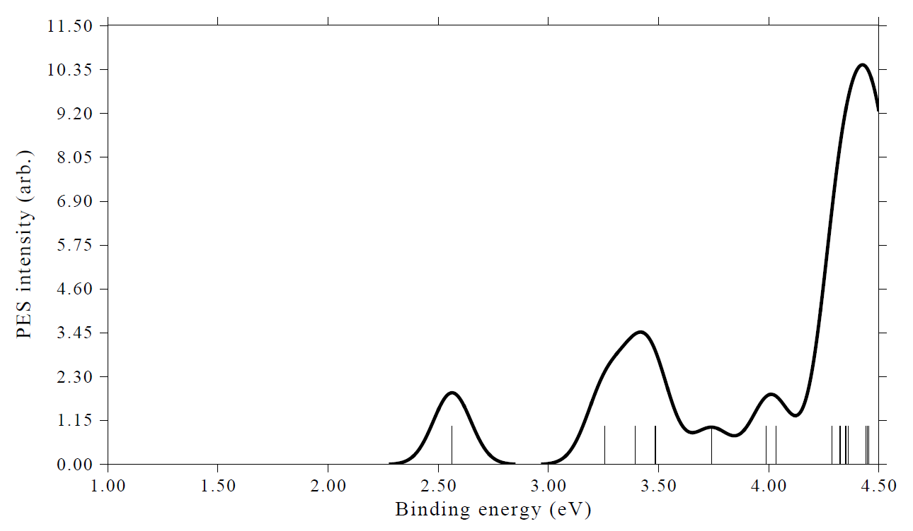

<!-- p.648 -->
Clearly, our simulated spectrum is in very good agreement with the experimental one, showing that our plotting procedure and methodology are completely reasonable.


### 4.10.5 Plot MO-PDOS map to reveal PDOS contributed by different MOs for cyclo[18]carbon


Note: The first published paper that came up with the idea of MO-PDOS map is my work: Carbon, 165 461 (2020), see Fig. 2. Please cite this paper if MO-PDOS map is employed in your work.

This section illustrates how to plot and analyze a MO-PDOS map. The so-called "MO-PDOS" refers to a special kind of PDOS, which is used to reveal DOS contributed by different sets of MOs (rather than by atoms or basis functions as the PDOS in common sense), the PDOS curves and discrete lines corresponding to different sets of MOs are shown using different colors. If requested, the height of discrete lines can be used to reflect degeneracy of orbital levels.

We will plot MO-PDOS for cyclo[18]carbon, its structure optimized at ωB97XD/def2-TZVP level is shown below, it is an exactly planar system with point group of D9h. The .fchk file of this

system corresponding to ωB97XD/def2-TZVP wavefunction at minimum point structure can be download here: http://sobereva.com/multiwfn/extrafiles/C18.zip.

Occupied valence MOs of this system consist of three types, you can identify their indices by viewing orbitals via main function 0:

(1) σ MOs: 19-36 (2) in-plane π MOs: 37,39,40,45,46,49,50,53,54 (3) out-plane π MOs: 38,41,42,43,44,47,48,51,52


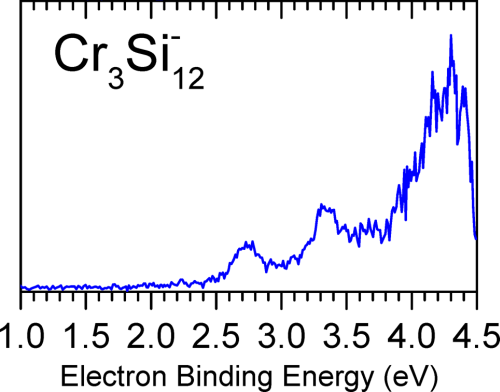

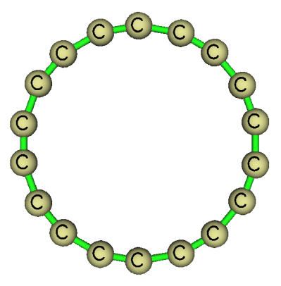

<!-- p.649 -->
In the MO-PDOS map to be plotted, we will use different colors to respectively reveal the position of energy levels of these orbitals as well as their contributions to total DOS.

Boot up Multiwfn and input C18.fchk 10 // Plot DOS -2 // Enter the interface for defining MO fragments of MO-PDOS 1 // Define 1st fragment

19-36 // σ MOs 2 // Define 2nd fragment

37,39,40,45,46,49,50,53,54 // in-plane π MOs 3 // Define 3rd fragment

38,41,42,43,44,47,48,51,52 // out-of-plane π MOs 0 // Return 0 // Plot DOS map We immediately see the map below

18.10

16.29 14.48 TDOSPDOS frag.1PDOS frag.2PDOS frag.3

12.67

Density-of-states 10.86 9.05 7.24

5.43

3.62

1.81

0.00

-0.80-0.70-0.60-0.50-0.40-0.30-0.20-0.100.000.100.20Energy (a.u.)

In this figure, the red, blue and purple discrete lines indicate position of σ MOs, in-plane π MOs and out-plane π MOs, respectively. The σ ones have evidently lower energies than the π ones, while the two kinds of π MOs have similar energy distribution. From the broadened curves, we can identify the respective contributions due to the three types of MOs, the sum of heights of the colored curves just equals the black curve, which portrays the total DOS. Since the defined fragments are only composed of occupied MOs, the unoccupied region of the map is completely identical to usual TDOS map.

We can further improve the setting of the MO-PDOS map. After closing the graph, we input 0 // Return to last menu from the post-processing menu 8 // Switch the energy unit to eV 2 // Set energy range and step


<!-- p.650 -->
-28,1,3 // Set lower and upper limits of plotting region to -28~1 eV with step of 3 eV, so that all occupied valence MOs and a few lowest-lying virtual MOs could be displayed in the map

9 // Enabling using height of discrete lines to indicate orbital degeneracy [Press ENTER button directly] // Use default threshold to determine degeneracy 0 // Plot DOS map Close the map, then in the post-processing menu we input 16 // Set the texts in the legends 1 // Set legend for PDOS 1 sigma MOs 2 // Set legend for PDOS 2 in-plane pi MOs 3 // Set legend for PDOS 3 out-of-plane pi MOs 0 // Return to post-processing menu 6 // Disable showing TDOS discrete lines 1 // Redraw the graph You should see the map below, which is quite satisfactory

10

0.45 0.40 TDOSsigma MOsin-plane pi MOsout-of-plane pi MOs 9 8

0.35 7

Density-of-states 0.30 0.25 0.20 6 5 4 Degeneracy

0.15 3

0.10 2

0.05 1

0.00 0

-28.00-25.00-22.00-19.00-16.00-13.00-10.00-7.00-4.00-1.00Energy (eV)

From the height of the colored discrete lines, you can clearly find most occupied valence orbitals are doubly degenerated.

Hint: Save and load status If you want to save current status (plotting settings, fragment definition and orbital information) of the map above to a file so that you can quickly recover the map at the next time, now you can input 0 to exit post-processing menu, then input s, then input path of the file to save the status.

The status file corresponding to the map above is given as examples\DOS\C18_MO_PDOS.dat, therefore if you want to directly replot the map above, after booting up Multiwfn and load the C18.fchk, you should input

10 // DOS plotting module


<!-- p.651 -->
l // Load status file examples\DOS\C18_MO_PDOS.dat 0 // Plot the map


### 4.10.6 Calculate d-band center for transition metal clusters

Note: Chinese version of this section with more discussions is my blog article “Using Multiwfn to calculate d-band center of transition metals” (http://sobereva.com/582, in Chinese)

d-band center refers to the center position of the PDOS corresponding to d-orbitals. d-band center of transition metals is an important quantity in explaining and predicting difference in chemisorption strength of small molecules on transition metal systems, it is also closely related to activity of surface catalysis, see PNAS, 108, 937 (2011) and Sci. Rep., 6, 35916 (2016) for more information.

The DOS plotting module of Multiwfn can be used to evaluate d-band center. Since Multiwfn automatically calculates and prints center of each PDOS curve when drawing DOS map, the d-band center can be directly obtained by defining a fragment as all D-type of basis functions of the transition metals of interest. In this section, I will take Cu13 (doublet) as an example to illustrate the calculation. d-band center of this system has also been reported in J. Clust. Sci., 29, 867 (2018). The Gaussian .fchk file of this system generated by optimization task at UPBE/Lanl2DZ level can be directly downloaded here: http://sobereva.com/multiwfn/extrafiles/Cu13.zip. This calculation level is the same as the J. Clust. Sci. paper.

Boot up Multiwfn and input Cu13.fchk 10 // Plot DOS map -1 // Define fragment 1 // Define fragment 1 cond // Define the fragment using conditions [Press ENTER button] // No requirement on atomic indices [Press ENTER button] // No requirement on basis function indices D // The basis functions must be D-type q // Save current fragment q // Return to DOS plotting interface 8 // Switch the energy unit from a.u. to eV 2 // Set range of X-axis -13,0,2 // Lower limit, upper limit and spacing between ticks 0 // Plot DOS map Now you can see the following map. The red curve corresponds to PDOS of d-band


<!-- p.652 -->
2.97 TDOSPDOS frag.1

2.64

2.31

Density-of-states 1.98 1.65 1.32

0.99

0.66

0.33

0.00

-13.00-11.00-9.00-7.00-5.00-3.00-1.00Energy (eV)

In the command-line window, you can see


```text
Center of TDOS:   -5.732445 eV
Center of PDOS  1:   -6.510656 eV

Note: The vertical dash line corresponds to HOMO level at  -4.16932 eV
```

Usually d-band center is reported relative to Fermi energy level (Ef). However, Ef is not well defined for isolated systems such as molecules and clusters, but conventionally it can be regarded as HOMO level. Therefore, the d-band center of the Cu13 is -6.510656-(-4.16932) = -2.34 eV, which is in very good agreement with the -2.33 eV reported in Table 3 of J. Clust. Sci., 29, 867 (2018).

Note that for unrestricted open-shell wavefunction like this example, d-band center is different for alpha and beta spins. By default, only alpha orbitals are taken into account, if you need to calculate it for beta orbitals, you should choose option "6 Choose orbital spin" and select beta.

The choice of range of X-axis is a matter of concern. The formula of calculating center of PDOS can be found in Section 3.21.1, it can be seen that only the segment of PDOS in present energy range (range of X-axis) is taken into account, namely the PDOS between -13 and 0 eV is involved in the calculation of d-band center. Clearly, different choices of energy range may result in different d-band center values. You must guarantee that the current energy range fully encloses the actual PDOS region of d-band. The lower limit is relatively arbitrary, because the PDOS is exactly zero below -13 eV, decreasing the lower limit will not influence the center position. The choice of upper limit is more critical, without special situation I suggest simply setting it to zero like the present example. The upper limit should not be set to a very high value, otherwise the PDOS lacking of chemical significance will be included in the calculation. For example, if you set lower and upper limits to -20 and 60 eV, respectively, the PDOS will be


<!-- p.653 -->
2.97 TDOSPDOS frag.1

2.64

2.31

Density-of-states 1.98 1.65 1.32

0.99

0.66

0.33

0.00

-20.00-10.000.0010.0020.0030.0040.0050.0060.00Energy (eV)

As can be seen, the PDOS of the fragment corresponding to D-type basis functions is also very large between 15~40 eV, and the reported center position is even an unphysical positive value. This phenomenon comes from the fact that Lanl2DZ is an extended basis set, each d atomic orbital of Cu is represented by two basis functions. The high-lying part of the PDOS essentially corresponds to the MOs orthogonal to the valence d orbitals approximately within the range of -13~0 eV.

Similarly, the p-band center can also be calculated in an analogous way.

4.10.7 Plot COHP for C60 fullerene and N-phenylpyrrole

Please read Section 3.12.6 first if you are not familiar with COHP. In this section, we first plot COHP between nearest atoms for C60 fullerene, and then plot COHP between two moieties for N-phenylpyrrole.

Example 1: C60 fullerene The used wavefunction file C60.fch produced at B3LYP/6-31G* level can be downloaded at http://sobereva.com/multiwfn/extrafiles/C60.zip.

Boot up Multiwfn and input C60.fch 10 // DOS, PES and COHP plotting function -7 // Change to COHP plotting mode 1 // Generate Kohn-Sham matrix based on wavefunction information 2 // Set energy range for plotting COHP -20,2,2 // Lower and upper limits as well as stepsize of X-axis 0 // Draw COHP between nearest atoms Now will see COHP map on screen. Close the map, adjust left and right Y-axes by options 4 and -4 in post-processing menu, respectively, and then replot, you will see the following map, which


<!-- p.654 -->
corresponds to Fig. S17 of Multiwfn original paper J. Chem. Phys., 161, 082503 (2024).

The right Y-axis corresponds to the height of the spikes, and the left axis corresponds to the curve broadened from the spikes. Note that the two Y-axes correspond to negative of COHP (-COHP) rather than COHP. In this map, all MOs contribute positively to the curve are the so-called bonding states, whose occupation stabilizes the system. In contrast, all MOs contribute negatively to the curve are antibonding states, whose occupation reduce overall bonding effect and thus destabilize the C60. The dash line in the map highlights the HOMO, it can be seen that most occupied MOs belong to bonding state, certainly C60 can exist stably.

Example 2: N-phenylpyrrole

In Part 4 of Section 4.10.1, we have plotted OPDOS to study π-interaction between the pyrrole and phenyl moieties in N-phenylpyrrole. In this section, with exactly the same definition of fragments, we plot interfragment COHP map.

Boot up Multiwfn and input examples\N-phenylpyrrole.fch 10 // DOS, PES and COHP plotting function -7 // Change to COHP plotting mode 1 // Generate Kohn-Sham matrix based on wavefunction information -1 // Define fragments for plotting COHP between fragments 1 // Define fragment 1 cond // Use conditions to add basis functions to the fragment 1 1-5 // The first condition is that the basis functions must belong to the heavy atoms in pyrrole moiety (atoms 1-5)

[Press ENTER button] // The second condition. Index of basis function is arbitrary X // The third condition, the type of the basis functions must be PX (note that the current molecule is in YZ plane. So adding PX basis functions is equivalent to adding the p atomic orbitals

directly contributing to the π-interaction)

q // Save fragment 1 2 // Define fragment 2 cond // Use conditions to add basis functions to the fragment 2


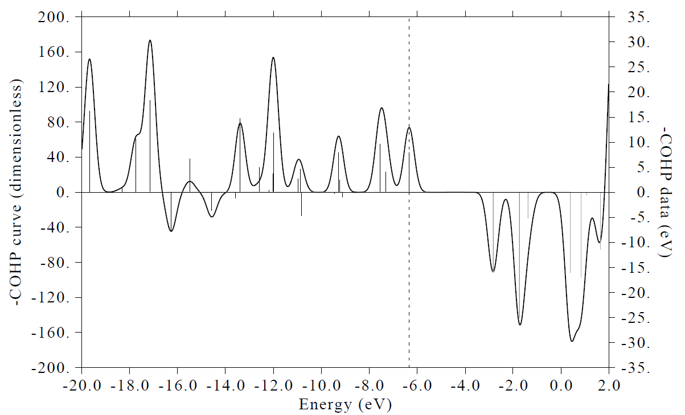

<!-- p.655 -->
10-13,15,17 // Atom index of the carbons in the phenyl moiety [Press ENTER button] // No requirement on index of basis functions X // Basis functions must be PX type q // Save fragment 2 0 // Return to last menu 0 // Draw COHP between the two defined fragments Now you can see the following map, which is quite similar to the corresponding OPDOS curve plotted in Part 4 of Section 4.10.1. This example shows that COHP usually convey analogous information like OPDOS.


## 4.11 Plot various kinds of spectra

Note: Most examples in this section are also available in my blog article “Using Multiwfn to calculate transition electric dipole moment between excited states and electric dipole moment of each excited state” (http://sobereva.com/224, in Chinese), which also contains extended discussion.

Multiwfn has a very powerful and flexible spectrum plotting module. The basic principles, supported input files and all options of this module have been detailedly introduced in Section 3.13. In the next sections I will briefly exemplify the usage of this module. If you are not familiar with related theories, please carefully read Section 3.13.1 first.

It is worth to note that there is also an article of introducing detailed steps on how to simulate UV-Vis and ECD spectra using Multiwfn in combination with ORCA, see http://sobereva.com/485.

4.11.1 Plot infrared (IR) spectrum for NH3BF3

This example plots infrared (IR) spectrum for NH3BF3. Multiwfn can read in frequencies and intensities from output file of Gaussian or ORCA vibration analysis task (“freq” keywords). Boot up Multiwfn and input following commands

examples\spectra\NH3BF3_freq.out // The output file of optimization and vibrational analysis task of Gaussian at B3LYP/6-31G* level


<!-- p.656 -->
11 // Plot spectrum 1 // The type of the spectrum is IR 0 // Show the spectrum right now You will get the graph below

6013.86 377.95

5392.43 338.90

Molar absorption coefficient (L/mol/cm) 4771.00 4149.56 3528.13 2906.70 2285.27 1663.83 1042.40 299.84 260.79 221.73 182.68 143.62 104.57 65.51 IR intensities (km/mol)

420.97 26.46

-200.46 -12.60

The left axis corresponds to curve (broadened data), the right axis corresponds to discrete lines (original transition data). Plotting parameters such as full width at half maximum (FWHM), broadening function, unit and range of the axes can be adjusted by corresponding options in the interface. The graph and X-Y data set of discrete lines/curve can be exported by option 1 and 2, respectively. 4000.03600.03200.02800.02400.02000.01600.01200.0800.0400.00.0Wavenumber (cm^-1)

Note that after selecting option 0 to plot the spectrum, Multiwfn prints extrema information in the console window


```text
 Extrema on the spectrum curve:
 Maximum    1   X:      3578.5262   Value:       585.2897
 Maximum    2   X:      3454.4848   Value:       110.4777
 Maximum    3   X:      1695.2317   Value:       460.3222
 Maximum    4   X:      1359.1197   Value:      1717.7809
 Maximum    5   X:      1303.1010   Value:      5467.1462
...[ignored]
```

From this output you can obtain accurate position and height of absorption peaks. As will be illustrated in Section 4.11.3, the maxima and minima can even be directly labelled on the spectrum.

It is well known that the frequencies produced under harmonic approximation deviate to experimental vibrational frequencies systematically. In order to correct this problem, fundamental frequency scale factor should be applied, this can be done easily in Multiwfn. We close the spectrum and then choose "14 Set scale factor for vibrational frequencies ", then press ENTER button directly to choose all vibrational modes, then press ENTER button directly again to employ the scale factor fitted for B3LYP/6-31G* level, namely 0.9614, which can be found in Table 1 of J. Phys. Chem.,


<!-- p.657 -->
100, 16502 (1996). After that, if you replot the spectrum, the resulting spectrum will correspond to the scaled one.

Note: You can apply different scale factors for different vibrational modes. After applying a scale factor for a batch of modes, you can enter option 14 again, Multiwfn will ask you if restoring all vibrational frequencies to the original ones. If you input n, then you can input a different scale factor for another batch of modes, the effect will be superimposed.

Some experimental IR spectra determine transmittance rather than absorption. To mimic this kind of spectrum, you can select "4 Set left Y-axis" and then input e.g. 6000,0,400 to set lower limit, upper limit and label interval to corresponding values, respectively, and then input y to automatically scale the right Y-axis. Since currently lower limit (0) is higher than upper limit (6000), the Y-axis is inverted.

The procedure of plotting Raman, UV-Vis, electronic/vibrational circular dichroism (ECD/VCD), and ROA spectra is very similar to plotting IR spectrum, you only need to use proper input file and select corresponding option after entering main function 11. If the quantum chemistry program you used for spectrum calculation is not the one directly supported by Multiwfn, you can manually extract data from corresponding output file and then write them into a plain text file according to the format shown in Section 3.13.2, then the file can be used as input file of Multiwfn for plotting spectrum.


### 4.11.2 Plot UV-Vis spectrum and contributions from individual transitions for acetic acid


The spectrum plotting module of Multiwfn is quite flexible, not only the total spectrum but also the contribution from individual transitions can be exported. This feature is particularly useful when you want to identify nature of spectrum. In this section I will show how to realize this analysis, UV-Vis spectrum of acetic acid is taken as example.

Boot up Multiwfn and input examples\spectra\acetic_acid_TDDFT.out // Calculated at TD-B3LYP/cc-pVDZ level by Gaussian

11 // Plot spectrum 3 // The type of the spectrum is UV-Vis 15 // Output the spectrum including the contributions from certain individual transitions 0.01 // The criterion of selecting transitions is oscillator strength > 0.01 The curve of the UV-Vis spectrum together with the contributions from the transitions whose absolute value of strength are larger than 0.01 have been outputted to spectrum_curve.txt in current folder. The first two columns correspond to energies and molar absorption coefficients, the correspondence between the other columns and transition modes are clearly indicated on screen:


```text
Column#   Transition#
     3           2                //i.e. transition S0→S2
     4           3                //i.e. transition S0→S3
     5           5                //i.e. transition S0→S5
     6          11                //i.e. transition S0→S11
     7          13                //i.e. transition S0→S13
```

The discrete line data are outputted to spectrum_line.txt in current folder.

Now you can plot the data in the two files as curves in a single graph by your favourite program


<!-- p.658 -->
(if you use Origin to plot, you can directly drag these two files into Origin window to import them). In the two files, the first column should be taken as X-axis data, while the other columns should be taken as Y-axis data. The spectrum plotted by Origin is shown below, if you are confused about the procedure, you can consult the acetic_acid_TDDFT.opj provided in "examples\spectra" folder, which is the .opj file of Origin 8.

10000

0.24

Molar absorption coefficient (L mol-1cm-1) 9000 8000 7000 6000 5000 4000 3000 2000 Total S0→S2 S0→S3 S0→S5 S0→S11 S0→S13 0.22 0.20 0.18 0.16 0.14 0.12 0.10 0.08 0.06 0.04 Oscillator strength

1000 0.02

801001201401601802000 0.00

Wavelength (nm)

From the graph the underlying character of the total UV-Vis spectrum (black curve) is now

very clear. Although the S0→S3 transition (146.28nm) does not have very small oscillator strength (0.036), no absorption peak directly corresponds to this transition, since its absorption curve (blue

curve) has been completely merged into the neighboring large absorption peak due to S0→S5 transition (cyan curve).

As mentioned in last section, after selecting option 0 to plot spectrum, Multiwfn directly prints extrema of the spectrum curve. In current case the outputted data is


```text
 Maximum    1   X:       113.0588   Value:      5680.9864
 Maximum    2   X:       122.5085   Value:      8239.4308
 Maximum    3   X:       138.0728   Value:      4667.7944
 Maximum    4   X:       159.7516   Value:      2123.3506
 Maximum    5   X:       213.7324   Value:        48.5312
...[ignored]
```

Based on above outputs, we can calculate the contributions from different transitions to a given peak. For example, we want to study the composition of the peak at 138.0728 nm. In spectrum_curve.txt, move to the line corresponding to 138.07278 nm, you can find the total value is 4667.79439, while the values in columns 4 and 5 are 309.47267 and 4273.59757, respectively.

Therefore, the contribution from S0→S3 and S0→S5 can be respectively calculated as 309.47267/4667.79439×100% = 6.63% and 4273.59757/4667.79439×100% = 91.55%.

In Multiwfn one can very easily obtain major contributions from various transitions to a given wavelength. For example, we want to understand the transitions having maximal contribution to the


<!-- p.659 -->
maximum 3 (138.0728 nm), so we input

15 // Output contributions of individual transitions to the spectrum 0 // Calculate maximal 10 contributions to a given position 138.0728 // The position of interest You will see


```text
Sum of absolute values of all transitions:          4667.79444
The individual terms are ranked by magnitude of contribution:
   #Transition     Contribution      %
         5          4273.59504     91.555
         3           309.47511      6.630
         4            68.05085      1.458
         6            11.67756      0.250
        11             2.33209      0.050
         8             2.13478      0.046
         7             0.22284      0.005
         2             0.14507      0.003
        10             0.10019      0.002
         9             0.06091      0.001
```

It is clearly seen that S0→S5 contributes most to the maximum (91.5%), while S0→S3 plays an unimportant but nonnegligible role (contributes 6.6%).


### 4.11.3 Plot electronic circular dichroism (ECD) spectrum for asparagine


In this example we plot electronic circular dichroism (ECD) spectrum for asparagine. Boot up Multiwfn and input

examples\spectra\Asn_TDDFT.out // Gaussian TDDFT task at PBE0/6-311G* level, 30 lowest excited states were calculated

11 // Plot spectrum 4 // ECD 2 // Read the rotatory strengths in velocity representation 0 // Show the spectrum From the resulting spectrum, you will find the labels of X-axis and Y-axis are decimal. In order to make the graph more beautiful, it is suggested to modify the scale so that label of each tick is integer. Therefore, we close current graph and input below commands:

3 // Set X-axis 120,280,20 // Lower and upper limits, as well as spacing between ticks of X-axis 4 // Set left Y-axis -90,100,20 // Lower and upper limits, as well as spacing between ticks of left Y-axis y // Let program properly adjust right Y-axis to guarantee that zero points of left and right axes are in the same horizontal line

0 // Show the spectrum Then you will see the graph below


<!-- p.660 -->
Note that you can use exactly the same way as that illustrated in Section 4.11.2 to decompose the total ECD spectrum to individual contribution from each transition.

As can be seen from the above spectrum, the unit of Δε at left axis is labelled as arb., which means “arbitrary unit”. Only curve shape of ECD is of interest, this is why arb. is and should be used in this situation.

Labelling minima and maxima labels on spectrum One of the strengths of Multiwfn in plotting spectrum is that maxima, minima or both can be directly labelled on the spectrum. To label wavelength of both maxima and minima, we input

16 // Enter the interface of setting status of showing labels of spectrum minima and maxima 1 // Change displaying status of labels 3 // Label both maxima and minima on the spectrum 0 // Return 4 // Set left Y-axis -100,110,20 // Making range of left Y-axis slightly wider, because the labels will be shown y // Correspondingly scale right Y-axis 0 // Plot spectrum again Now you can see the map below


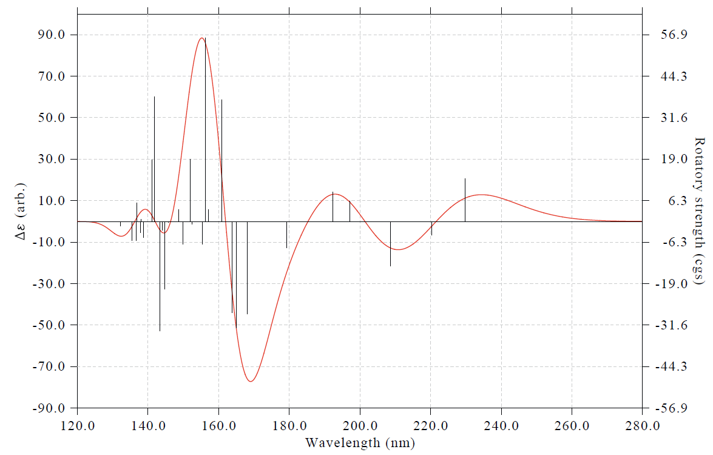

<!-- p.661 -->
100.0 155.3 63.2

80.0 50.6

60.0 37.9

(arb.) -20.0 40.0 20.0 0.0 132.4 139.2 144.5 193.0 210.9 234.4 -12.6 25.3 12.6 0.0 Rotatory strength (cgs)

-40.0 -25.3

-60.0 -37.9

-80.0 169.1 -50.6

-100.0 -63.2

You can also make Multiwfn label Y-axis value at the extrema on the map, now we do this, and meantime we customize some plotting parameters. Input below commands 120.0140.0160.0180.0200.0220.0240.0260.0280.0Wavelength (nm)

16 // Enter the interface of setting status of showing labels of spectrum minima and maxima 6 // Switch the content of the labels to Y-axis value 4 // Do not rotate the labels (this step is optional) 3 // Set decimal digits (this step is optional) 0 // No decimal digits, namely show data as integer 2 // Set label size 50 // Larger text size than default (30) 0 // Return 0 // Plot spectrum again Now you can see the map below


|  | .3 |  |  |  |  |  |  |  |  |  |  |  |
| --- | --- | --- | --- | --- | --- | --- | --- | --- | --- | --- | --- | --- |
|  | 155 |  |  |  |  |  |  |  |  |  |  |  |
|  |  |  |  |  |  |  |  |  |  |  |  |  |
|  |  |  |  |  |  |  |  |  |  |  |  |  |
| 2 |  |  |  |  |  | 93.0 |  |  | 34.4 |  |  |  |
| 139. |  |  |  |  |  | 1 |  |  |  | 2 |  |  |
| 132 | 144. |  |  |  |  |  |  | 2 |  |  |  |  |
| .4 | 5 |  |  |  |  |  | 10.9 |  |  |  |  |  |
|  |  |  |  |  |  |  |  |  |  |  |  |  |
|  |  |  |  |  |  |  |  |  |  |  |  |  |
|  |  |  |  | 169.1 |  |  |  |  |  |  |  |  |

<!-- p.662 -->
100.0 63.2

80.0 50.6

60.0 37.9

(arb.) -20.0 40.0 20.0 0.0 -7-6 6 1313 -14 -12.6 25.3 12.6 0.0 Rotatory strength (cgs)

-40.0 -25.3

-60.0 -37.9

-80.0 -77 -50.6

-100.0 -63.2

 120.0140.0160.0180.0200.0220.0240.0260.0280.0Wavelength (nm)

Hint: Save and load plotting settings In order to replot the map above quickly in the future, I suggest saving plotting settings to a file, namely input below commands:

s // Save plotting settings Asn_ECD.dat // Save settings to Asn_ECD.dat in current folder Next time, if you want to recover the map above, you simply need to input examples\spectra\Asn_TDDFT.out 11 // Plot spectrum 4 // ECD 2 // Read the rotatory strengths in velocity representation l // Load plotting settings Asn_ECD.dat // Save settings to Asn_ECD.dat in current folder 0 // Plot the spectrum Note that the Asn_ECD.dat corresponding to the map above has already been provided in examples\spectra folder.


### 4.11.4 Plot conformational weighted UV-Vis and ECD spectra for plumericin


Note: Chinese version of this section is my blog article “Using Multiwfn to plot conformationally averaged spectrum” (http://sobereva.com/383).

For a flexible system with many thermally accessible conformations (or configurations), when plotting its spectrum, it is crucial to take weighting average of various conformations into account, otherwise the resulting spectrum is impossible to be compared well with experimental spectrum. Fortunately, weighted spectrum can be very conveniently plotted by Multiwfn, I will show how to do this in present section. Plotting conformational weighted UV-Vis and ECD spectra of plumericin


|  |  |  |  |  |  |  |  |  |  |  |  |  |
| --- | --- | --- | --- | --- | --- | --- | --- | --- | --- | --- | --- | --- |
|  | 88 |  |  |  |  |  |  |  |  |  |  |  |
|  |  |  |  |  |  |  |  |  |  |  |  |  |
|  |  |  |  |  |  |  |  |  |  |  |  |  |
|  |  |  |  |  |  |  |  |  |  |  |  |  |
|  | 6 |  |  |  |  | 13 |  |  |  | 13 |  |  |
| -7 | -6 |  |  |  |  |  |  | -14 |  |  |  |  |
|  |  |  |  |  |  |  |  |  |  |  |  |  |
|  |  |  |  |  |  |  |  |  |  |  |  |  |
|  |  |  |  |  |  |  |  |  |  |  |  |  |
|  |  |  |  | -77 |  |  |  |  |  |  |  |  |

<!-- p.663 -->
are taken as instances.

Preparation Before calculating conformational weighted spectrum, we need to evaluate population of these conformations, commonly Boltzmann's weight is used. We assume that plumericin has four accessible conformations, and properly construct their initial geometries, then optimize them and perform frequency analysis at B3LYP/6-31G* level with zero-point energy scale factor of 0.9806. Based on optimized geometries, high-accuracy single point energies at M06-2X/def2-TZVP level were calculated. Finally, we add the Gibbs thermal corrections produced by frequency analysis to the single point energies to yield relatively accurate Gibbs energy of various conformations. After that, according to Boltzmann's formula and relative Gibbs energy among these conformations, we calculate their weights at 298.15 K. Then, using TD-PBE0/TZVP level we calculate the lowest 20 excited states for these conformations. The output files of the TDDFT tasks have been provided in "examples\spectra\weighted" folder as a.out, b.out, c.out and d.out (the names are arbitrary, you can also use other file names).

Now we write a plain text file named multiple.txt with the following content (the name should not be changed, but prefix may be added, such as plumericin_multiple.txt):


```text
examples\spectra\weighted\a.out 0.6046
examples\spectra\weighted\b.out 0.1950
examples\spectra\weighted\c.out 0.1686
examples\spectra\weighted\d.out 0.0317
```

As can be seen, in the multiple.txt, each line contains path of output file of a conformation followed by its Boltzmann weight we calculated above. Hereinafter, the four conformations will be referred to as a, b, c and d, respectively.

PS: If you are using Linux system, and there are / symbols or space in the path, do not forget to add double quotation marks at the two ends of the path, otherwise Multiwfn cannot recognize the file path, for example:

"examples/spectra/weighted/a.out" 0.6046 "examples/spectra/weighted/b.out" 0.1950 "examples/spectra/weighted/c.out" 0.1686 "examples/spectra/weighted/d.out" 0.0317

Plot conformational weighted UV-Vis spectrum Boot up Multiwfn and input examples\spectra\weighted\multiple.txt // The aforementioned file 11 // Plot spectrum 3 // UV-Vis 0 // Show the spectrum The resulting graph is shown below


<!-- p.664 -->
26402.31 0.120

Molar absorption coefficient (L/mol/cm) 23674.07 20945.83 18217.59 15489.36 12761.12 10032.88 7304.64 4576.40 Weighted 1 ( 60.5%) 2 ( 19.5%) 3 ( 16.9%) 4 ( 3.2%) 0.107 0.095 0.083 0.070 0.058 0.046 0.033 0.021 Oscillator strength

1848.16 0.008

-880.08 -0.004

The thick red curve corresponds to conformational weighted UV-Vis spectrum, while the green, blue, purple and black curves correspond to UV-Vis spectrum of conformation a, b, c and d, respectively. The weight of each conformation is also shown in the legend. From this graph we can very conveniently compare the character of weighted spectrum and spectra of individual conformations. 137.1154.5172.0189.5206.9224.4241.8259.3276.8294.2311.7Wavelength (nm)

The black discrete lines on the graph represent all transition data of the four conformations, their heights have already been scaled by conformational weight. Hence, the thick red curve can be regarded as broadened by all discrete lines shown on the graph.

Multiwfn provides another mode to plot spectrum of individual conformations. We close the graph above and choose "18 Toggle weighting spectrum of each system" once, then choose option 0 to view the spectrum again, we will see

25486.27 0.120

Molar absorption coefficient (L/mol/cm) 22852.69 20219.11 17585.53 14951.95 12318.37 9684.78 7051.20 4417.62 Weighted 1 ( 60.5%) 2 ( 19.5%) 3 ( 16.9%) 4 ( 3.2%) 0.107 0.095 0.083 0.070 0.058 0.046 0.033 0.021 Oscillator strength

1784.04 0.008

-849.54 -0.004

137.1154.5172.0189.5206.9224.4241.8259.3276.8294.2311.7Wavelength (nm)


|  |  |  |  |  |  |  |  |  |  |  |  |  |  | 2 ( 1<br/>3 ( 1<br/>4 ( 3 | 9.5%)<br/>6.9%)<br/>.2%) |
| --- | --- | --- | --- | --- | --- | --- | --- | --- | --- | --- | --- | --- | --- | --- | --- |
|  |  |  |  |  |  |  |  |  |  |  |  |  |  |  |  |
|  |  |  |  |  |  |  |  |  |  |  |  |  |  |  |  |
|  |  |  |  |  |  |  |  |  |  |  |  |  |  |  |  |
|  |  |  |  |  |  |  |  |  |  |  |  |  |  |  |  |
|  |  |  |  |  |  |  |  |  |  |  |  |  |  |  |  |
|  |  |  |  |  |  |  |  |  |  |  |  |  |  |  |  |
|  |  |  |  |  |  |  |  |  |  |  |  |  |  |  |  |
|  |  |  |  |  |  |  |  |  |  |  |  |  |  |  |  |

|  |  |  |  |  |  |  |  |  |  |  |  |  |  |  | Weig<br/>1 ( 6 | hted<br/>0.5%) |
| --- | --- | --- | --- | --- | --- | --- | --- | --- | --- | --- | --- | --- | --- | --- | --- | --- |
|  |  |  |  |  |  |  |  |  |  |  |  |  |  |  | 2 ( 1<br/>3 ( 1<br/>4 ( 3 | 9.5%)<br/>6.9%)<br/>.2%) |
|  |  |  |  |  |  |  |  |  |  |  |  |  |  |  |  |  |
|  |  |  |  |  |  |  |  |  |  |  |  |  |  |  |  |  |
|  |  |  |  |  |  |  |  |  |  |  |  |  |  |  |  |  |
|  |  |  |  |  |  |  |  |  |  |  |  |  |  |  |  |  |
|  |  |  |  |  |  |  |  |  |  |  |  |  |  |  |  |  |
|  |  |  |  |  |  |  |  |  |  |  |  |  |  |  |  |  |
|  |  |  |  |  |  |  |  |  |  |  |  |  |  |  |  |  |
|  |  |  |  |  |  |  |  |  |  |  |  |  |  |  |  |  |
|  |  |  |  |  |  |  |  |  |  |  |  |  |  |  |  |  |

<!-- p.665 -->
The spectrum curve of each conformation shown on this graph has already been multiplied by corresponding weight. Obviously, what this graph represents is contribution of each conformation to the conformational weighted spectrum. In other words, the height of the thick red curve is simply the sum of height of all other curves. It can be seen that conformation a (green line) has major contribution to the conformational weighted spectrum, their profiles are rather similar, this is because a has as high as 60.5% population.

The discrete lines in the graph above now have different colors, the color corresponds to legend shown at right-top side. For each conformation, since both discrete lines and curve currently have identical color, we can say for example, green curve can be directly yielded by broadening the green discrete lines.

Plot conformational weighted ECD spectrum Using the same procedure illustrated in the last section, we plot conformational weighted ECD spectrum and ECD spectrum for all the four conformations.

Boot up Multiwfn and input examples\spectra\weighted\multiple.txt 11 // Plot spectrum 4 // Plot ECD 2 // Read rotatory strengths in velocity representation 0 // Show the spectrum You will see

153.883 33.49

Delta molar absorption coefficient (L/mol/cm) 123.106 -30.777 -61.553 -92.330 92.330 61.553 30.777 0.000 Weighted 1 ( 60.5%) 2 ( 19.5%) 3 ( 16.9%) 4 ( 3.2%) -13.40 -20.09 26.79 20.09 13.40 -6.70 6.70 0.00 Rotatory strength (cgs)

-123.106 -26.79

-153.883 -33.49

From this graph you can see conformational weighted ECD spectrum (thick red curve) as well as ECD spectrum of individual conformations (other curves). 137.1154.5172.0189.5206.9224.4241.8259.3276.8294.2311.7Wavelength (nm)

Then choose "18 Toggle weighting spectrum of each system" option once and plot spectrum again, you will see


|  |  |  |  |  |  |  |  |  |  |  |  |  |  | Weig<br/>1 ( 6 | hted<br/>0.5%) |
| --- | --- | --- | --- | --- | --- | --- | --- | --- | --- | --- | --- | --- | --- | --- | --- |
|  |  |  |  |  |  |  |  |  |  |  |  |  |  | 2 ( 1<br/>3 ( 1<br/>4 ( 3 | 9.5%)<br/>6.9%)<br/>.2%) |
|  |  |  |  |  |  |  |  |  |  |  |  |  |  |  |  |
|  |  |  |  |  |  |  |  |  |  |  |  |  |  |  |  |
|  |  |  |  |  |  |  |  |  |  |  |  |  |  |  |  |
|  |  |  |  |  |  |  |  |  |  |  |  |  |  |  |  |
|  |  |  |  |  |  |  |  |  |  |  |  |  |  |  |  |
|  |  |  |  |  |  |  |  |  |  |  |  |  |  |  |  |
|  |  |  |  |  |  |  |  |  |  |  |  |  |  |  |  |
|  |  |  |  |  |  |  |  |  |  |  |  |  |  |  |  |

<!-- p.666 -->
56.295 33.49

Delta molar absorption coefficient (L/mol/cm) -11.259 -22.518 -33.777 45.036 33.777 22.518 11.259 0.000 Weighted 1 ( 60.5%) 2 ( 19.5%) 3 ( 16.9%) 4 ( 3.2%) -13.40 -20.09 26.79 20.09 13.40 -6.70 6.70 0.00 Rotatory strength (cgs)

-45.036 -26.79

-56.295 -33.49

This graph decomposes the final weighted ECD spectrum to contribution of individual conformation. Again, since conformation a (green) has very high population and thus dominates the final weighted curve, most characters of these two curves are similar. However, influence from other conformations cannot be simply ignored. From the graph it is easy to find that if conformation c (purple) is missing, then there will not be an evident ECD peak at approximately 180 nm, since only ECD of c at this wavelength has significant signal. 137.1154.5172.0189.5206.9224.4241.8259.3276.8294.2311.7Wavelength (nm)


### 4.11.5 Plot Raman and pre-resonance spectra for 2-methyloxirane

The procedure of plotting Raman spectrum is very similar to plotting IR spectrum, the only additional step you would better do is to convert the Raman activities directly outputted by Raman task of quantum chemistry codes to Raman intensities before plotting the spectrum, so that the resulting spectrum can be comparable with the experimental one. The Raman intensities are dependent of wavelength of incident light source and ambient temperature, while Raman activities are not. This point has been emphasized in Section 3.13.1. In this section, I illustrate how to properly plot Raman spectrum using (2S)-2-methyloxirane as example.

Boot up Multiwfn and input examples\spectra\2-methyloxirane_Raman.out // Output file of Raman task calculated at B3LYP/6-31G* level by Gaussian09

11 // Plot spectrum 2 // Raman spectrum 14 // Apply frequency scale factor [Press ENTER button] // Select all frequencies [Press ENTER button] // Employ the fundamental scale factor 0.9614, which is suitable for B3LYP/6-31G* level

19 // Convert Raman activities to intensities 15000 // Wavenumber (cm-1) of incident light. This value should be consistent with the actual experimental condition, the value we inputted here is arbitrarily chosen


|  |  |  |  |  |  |  |  |  |  |  |  |  |  | 2 ( 1<br/>3 ( 1<br/>4 ( 3 | 9.5%)<br/>6.9%)<br/>.2%) |
| --- | --- | --- | --- | --- | --- | --- | --- | --- | --- | --- | --- | --- | --- | --- | --- |
|  |  |  |  |  |  |  |  |  |  |  |  |  |  |  |  |
|  |  |  |  |  |  |  |  |  |  |  |  |  |  |  |  |
|  |  |  |  |  |  |  |  |  |  |  |  |  |  |  |  |
|  |  |  |  |  |  |  |  |  |  |  |  |  |  |  |  |
|  |  |  |  |  |  |  |  |  |  |  |  |  |  |  |  |
|  |  |  |  |  |  |  |  |  |  |  |  |  |  |  |  |
|  |  |  |  |  |  |  |  |  |  |  |  |  |  |  |  |

<!-- p.667 -->
298.15 // Assume that experimental temperature is 298.15 K (You can also press ENTER button directly, 298.15 K will be used as default)

Then input 0 to plot spectrum, you will see below Raman spectrum

122.88 1244.70

110.18 1116.08

97.48 987.46

Relative Raman intensity 84.79 72.09 59.39 46.69 34.00 858.84 730.23 601.61 472.99 344.37 Raman scattering intensities

21.30 215.75

8.60 87.13

-4.10 -41.49

Multiwfn can also plot pre-resonance Raman spectrum. An example output file of pre-resonance Raman task of Gaussian is examples\spectra\2-methyloxirane_Raman.out, the corresponding input file (.gjf) is also given. This task calculates Raman activity at incident 4000.03600.03200.02800.02400.02000.01600.01200.0800.0400.00.0Wavenumber (cm^-1)

wavelength of 150 nm and 140 nm, which are close to S0→S1 and S0→S2 TDDFT excitation energies at the same calculation level (147.36 nm and 138.81 nm at TD-B3LYP/6-31G* level, respectively). You can load this output file into Multiwfn and plot Raman spectrum as usual. The only difference is that, before entering spectrum plotting interface, Multiwfn asks you to choose the incident frequency for which the Raman activities will be loaded. If you choose 2 or 3, the spectrum you finally obtained will be pre-resonance Raman at corresponding frequency; if you choose " 1: 0.00000000", namely the static limit case, the resulting spectrum will be exactly identical to the one we obtained earlier.


### 4.11.6 Simultaneously plot multiple systems

In Multiwfn, it is very easy to plot spectrum for multiple systems simultaneously, these systems may correspond to different conformations, different configurations, different molecules or different calculation conditions. In this section two examples are provided.

Comparing spectra yielded by different theoretical methods and basis sets In "examples\spectra\indigo" folder, you can find Gaussian output file of electronic excited state task carried out at different levels. In this example, we plot them together so that their results can be conveniently compared.

What we need to do first is to prepare a file named multiple.txt including path of various systems with their legends, this file has been provided as examples\spectra\indigo\multiple.txt, its


<!-- p.668 -->
content is:


```text
examples\spectra\indigo\ZINDO.out ZINDO
examples\spectra\indigo\TD-PBE0.out TD-PBE0/6-31G*
examples\spectra\indigo\TD-PBE0_TZVP.out TD-PBE0/def-TZVP
```

Note that the legends must not simply be digital, otherwise it will be interpreted as weight of corresponding system (see Section 4.11.4). In addition, in Linux system, if the file path contains / symbol, do not forget to add double quotation marks at the two ends of the path.

Boot up Multiwfn, load multiple.txt and then plot UV-Vis spectrum as usual, you will see the graph below

48324.6 0.80

43331.0 ZINDOTD-PBE0/6-31G*TD-PBE0/def-TZVP 0.72

Molar absorption coefficient (L mol - 1cm - 1) 38337.5 33343.9 28350.4 23356.9 18363.3 13369.8 8376.3 0.63 0.55 0.47 0.39 0.30 0.22 0.14 Oscillator strength

3382.7 0.06

-1610.8 -0.03

From the graph it is clear that basis set only has small influence on the resulting spectrum, while the spectrum profile of ZINDO differs from that of TD-PBE0 significantly. The curve of all systems may be exported via option 2 as curveall.txt and then replotted via third-part program such as Origin. 171.0211.0251.1291.1331.1371.2411.2451.3491.3531.3571.4Wavelength (nm)

In "examples\spectra\indigo" folder you can also find ZINDO_30.out, it corresponds to a ZINDO calculation with 30 excited states produced. You can also include it into multiple.txt.

Comparing spectra with and without spin-orbit coupling effect ORCA program is able to take spin-orbit coupling (SOC) effect into account during TDDFT calculation, here we plot and compare the UV-Vis spectrum with and without the SOC consideration. Please download http://sobereva.com/multiwfn/extrafiles/SOC-TDDFT_ORCA.zip, it is an ORCA output file of TDDFT task for Ir(ppy)3 coordinate, SOC treatment had been enabled in the calculation via dosoc true keyword in the %tddft field. In the output information, there are excitation energies and oscillator strengths before and after SOC correction.

Extract the .zip package, put the .out file in current folder, then create a multiple.txt with the following content


```text
Ir_ppy3.out with SOC
Ir_ppy3.out without SOC
```

Boot up Multiwfn and input multiple.txt


|  |  |  |  |  |  |  |  |  |  |  |  |  |  |  |  | TD-PBE0 | /def-TZV |  |  |
| --- | --- | --- | --- | --- | --- | --- | --- | --- | --- | --- | --- | --- | --- | --- | --- | --- | --- | --- | --- |
|  |  |  |  |  |  |  |  |  |  |  |  |  |  |  |  |  |  |  |  |
|  |  |  |  |  |  |  |  |  |  |  |  |  |  |  |  |  |  |  |  |
|  |  |  |  |  |  |  |  |  |  |  |  |  |  |  |  |  |  |  |  |
|  |  |  |  |  |  |  |  |  |  |  |  |  |  |  |  |  |  |  |  |
|  |  |  |  |  |  |  |  |  |  |  |  |  |  |  |  |  |  |  |  |
|  |  |  |  |  |  |  |  |  |  |  |  |  |  |  |  |  |  |  |  |
|  |  |  |  |  |  |  |  |  |  |  |  |  |  |  |  |  |  |  |  |
|  |  |  |  |  |  |  |  |  |  |  |  |  |  |  |  |  |  |  |  |
|  |  |  |  |  |  |  |  |  |  |  |  |  |  |  |  |  |  |  |  |

<!-- p.669 -->
11 // Plot spectrum 3 // Plot UV-Vis y // For the first spectrum, let Multiwfn use the data with SOC consideration n // For the second spectrum, let Multiwfn use the data without SOC consideration Then you will enter the interface for setting up the spectrum. After slight adjustment of settings, you will obtain the graph below. Clearly, SOC effect has non-negligible influence on the spectrum for present systems.

50000.0 0.347

with SOCwithout SOC

45000.0 0.312

Molar absorption coefficient (L mol - 1cm - 1) 40000.0 35000.0 30000.0 25000.0 20000.0 15000.0 10000.0 0.277 0.243 0.208 0.173 0.139 0.104 0.069 Oscillator strength

5000.0 0.035

0.0 0.000

It is worth to note that the number of states with SOC is by far larger than that without SOC. Because SOC effect splits each originally degenerate triplet state to three sublevels. For example, assume that the TDDFT calculates 50 singlets and 50 triplets, then after taking SOC correction into account, there will be 50+3*50=200 states. Since the number of states corresponding to SOC-TDDFT is higher than that corresponding to regular TDDFT, when two (or more) set of data are simulated as theoretical spectra, the first legend in multiple.txt must correspond to SOC-TDDFT case, and when loading data for the first spectrum, you must choose y to let Multiwfn load SOC corrected TDDFT data, as I illustrated above. 150.0200.0250.0300.0350.0400.0450.0500.0550.0Wavelength (nm)


### 4.11.7 Plot VCD and ROA spectra for chiral molecule S-methyloxirane

Vibrational circular dichroism (VCD) and Raman optical activity (ROA) are important types of vibrational spectra for chiral molecule, and only chiral molecule has VCD and ROA signals, see Section 3.21 for detail. In this example, I will illustrate how to plot these spectra for a typical chiral molecule S-methyloxirane.

Plotting VCD spectrum The corresponding Gaussian input and output files are S-methyloxirane_VCD.gjf and S-methyloxirane_VCD.out in examples\spectra folder, respectively. As you can see, freq=VCD keyword was used and the calculation is at B3LYP/6-31G* level.

Boot up Multiwfn and input


<!-- p.670 -->
examples\spectra\methyloxirane_VCD.out 11 // Plot spectrum 5 // VCD 14 // Scale frequencies by a scale factor [Press ENTER button] // Select all frequencies 0.9614 // Employ fundamental scale factor prefitted for B3LYP/6-31G* level 0 // Show the spectrum You will see

2.46 31.7

1.97 25.3

1.47 19.0

0.98 12.7

(arb.) -0.49 0.49 0.00 -6.3 6.3 0.0 Rotatory strength

-0.98 -12.7

-1.47 -19.0

-1.97 -25.3

-2.46 -31.7

The right axis corresponds to the heights of the spikes, which represent rotatory strengths. The left axis corresponds to the broadened VCD curve from the spikes, which represent difference in absorption of left- and right-circularly polarized lights. The "arb." denotes that the unit is arbitrary, because the absolute magnitude is not chemically interesting. 4000.03600.03200.02800.02400.02000.01600.01200.0800.0400.00.0Wavenumber (cm - 1)

Plotting ROA spectrum This plotting is based on output file of Gaussian freq=ROA task. The Gaussian input and output files are S-methyloxirane_ROA.gjf and S-methyloxirane_ROA.out in examples\spectra folder, respectively. As can be seen from the input file, this calculation takes three incident light frequencies (500, 532 and 600 nm) into account. It is well-known that diffuse functions are important for obtaining accurate ROA data, so aug-cc-pVDZ is used here.

Boot up Multiwfn and input examples\spectra\S-methyloxirane_ROA.out 11 // Plot spectrum 6 // ROA 2 // Three incident light frequencies are detected, here we select the 532nm case 2 // There are totally six kinds of data can be selected, here we select the commonly studied "ROA SCP(180)", namely backscattered circular polarization ROA spectrum

14 // Scale frequencies by a scale factor [Press ENTER button] // Select all frequencies


<!-- p.671 -->
0.97 // Employ fundamental scale factor of 0.97, which is suitable for B3LYP/aug-cc-pVDZ level

19 // Convert the ROA data outputted by Gaussian to "real" ROA intensities 532nm // Wavelength of incident light. This value should be consistent with actual experimental condition

[Press ENTER button] // Assume that experimental temperature is 298.15K 3 // Adjust range of X axis of the spectrum 3200,200,400 // Lower limit, upper limit and label interval 0 // Show the spectrum Now you can see below ROA spectrum:

2532.2 34333.5

2025.8 27466.8

1519.3 20600.1

1012.9 13733.4

- -506.4 506.4 0.0 -6866.7 6866.7 0.0 ROA intensity

-1012.9 -13733.4

-1519.3 -20600.1

-2025.8 -27466.8

-2532.2 -34333.5

If you intend to use this spectrum in a publication, I suggest removing the labels in both the left and right ordinates, since the absolute values are meaningless, only the shape of the curve is of chemical significance. To do so, choose "17 Other plotting settings" and then choose suboptions 2 and 3, you will find the labels are disappeared when you replot the spectrum. 3200.02800.02400.02000.01600.01200.0800.0400.0Wavenumber (cm - 1)


### 4.11.8 Skill: Plot spectrum for a batch of files via shell script

Note: There is an illustration video corresponding to this section: https://youtu.be/x6jp40DR24k.

In this section, I show how to plot spectrum for a batch of input files via shell script. Via this way, all input files in current folder can be immediately converted to respective spectrum image file by only one command!

Assume you are using Windows system, and you want to convert all Gaussian TDDFT .out file in examples\spectra\indigo folder to UV-Vis spectrum, what you should do is:

- Copy the .out files to Multiwfn folder
- Copy examples\spectra\UV-Vis.txt and examples\spectra\batchspec.bat to Multiwfn folder
- Set "isilent" in `settings.ini` to 1 and save the file


<!-- p.672 -->
- Double-clicking the batchspec.bat Now the batch script invokes Multiwfn to process all .out files in current folder according to the commands in the UV-Vis.txt. After a few seconds, you will find all spectrum image files have been generated in current folder, the name is identical to the .out file.

If you want to plot IR spectrum for a batch of files in current folder, copy examples\spectra\IR.txt to current folder and replace the "UV-Vis.txt" in the .bat script with "IR.txt", then run the .bat file.

The content of UV-Vis.txt and IR.txt is very easy to understand if you already know how to run Multiwfn in silent mode and batch mode. If you have not read Sections 5.2 and 5.3, after reading them you will fully understand how the script works. Commonly, you should properly modify the settings (range of axes) in the .txt file before employing it for producing spectrum for your systems.

Via the same way, you can also use Multiwfn to plot other kinds of spectra for a batch of input files, you need to manually compile the .txt file containing proper commands.

In Linux environment, you can also use shell script to realizing the batch plotting. The examples\spectra\batchspec.sh is a Bash script that have exactly identical function as the batchspec.bat shown above.


### 4.11.9 Skill: Use spikes to indicate position of transition levels

In Multiwfn, it is possible to plot a set of spikes at the bottom of the simulated spectrum to highlight position of specific transition levels. In Section 4.11.1 we have plotted IR spectrum for NH3BF3, which has some featured vibration modes. This time we will use spikes with different colors to highlight position of two kinds of modes on the map: (1) stretching vibration of B-N bond (2) stretching vibration of N-H bonds. The index of these modes can be identified by inspecting vibration animations in GaussView.

Boot up Multiwfn and input below commands examples\spectra\NH3BF3_freq.out 11 // Plot spectrum 1 // The type of the spectrum is IR 23 // Set status of showing spikes to indicate transition levels 1 // Set the first set of spikes. We want to use black spikes to reveal all vibrations a // Select all modes 5 // Black 2 // Set the second set of spikes 16-18 // Indices of stretching vibration mode of the three N-H bonds 1 // Red 3 // Set the third set of spikes 4 // Index of vibration mode of B-N bond stretching 2 // Green 0 // Return 4 // Modify Y-axis at left side 0,6000,600 // Set lower and upper limits as well as label spacing y // Correspondingly scale Y-axis at right side 0 // Plot the graph


<!-- p.673 -->
You will see the following map

The red spikes in this graph clearly indicate that the N-H stretching modes have highest frequencies, while the B-N stretching vibration mode (green spike) has frequency about 400 cm-1. All other vibration modes are highlighted by black spikes.

It is worth to note that although the first set of spikes is black and contains all vibration modes, the second and third sets of spikes are plotted after it, therefore the N-H and B-N stretching vibration modes are in red and green colors respectively rather than in black.

Properly using the spikes to indicate featured transitions can make the graph much more informative. For example, when you plot UV-Vis map, you can use spikes in different colors to

distinguish different transition types (e.g. π→π* and n→π*, or local excitation and charge transfer excitation).

If some transitions are degenerated, you can enable Multiwfn to exhibit degeneracy in terms of spike height. To do so, after defining spikes in option 23, choose its suboption "-3 Toggle considering degenerate" and input a threshold for determining degeneracy. If energy spanning over two or more transitions is less than the threshold, then the transitions will be regarded as degenerated, only the lowest lying one will be drawn as spike with height of degenerate degree, while other ones will be invisible. For example, below is IR spectrum of cyclo[18]carbon, the green and blue spikes reveal position of in-plane and out-plane vibration transitions, respectively. Most transitions have degeneracy of two (full height), while a few are not degenerate and thus the spike height is only half.


<!-- p.674 -->
3500.0 250.0

Molar absorption coefficient (L mol - 1cm - 1) 3000.0 2500.0 2000.0 1500.0 1000.0 500.0 200.0 150.0 100.0 50.0 IR intensities (km mol - 1)

0.0 0.0

 2500.02200.01900.01600.01300.01000.0700.0400.0100.0Wavenumber (cm - 1)


### 4.11.10 Plotting NMR spectrum

Note: Chinese version of this section is my blog article “Using Multiwfn to plot NMR spectra” (http://sobereva.com/565), which also contains extended discussions.

Please read Section 3.13.5 first to gain basic knowledge about the module of plotting NMR spectrum. In this section, a few examples will be given to show how to easily and flexibly plot NMR spectrum in Multiwfn.

4.11.10.1 Plotting 1H and 13C NMR spectra for acetaldehyde

In this example we plot 1H and 13C NMR spectra for acetaldehyde, which is shown below.

examples\spectra\NMR\Acetaldehyde.out is output file of NMR task of Gaussian 09. The geometry was optimized using B3LYP/def2-SVP level in vacuum, while the NMR task was conducted at B97-2/def2-TZVP level under chloroform environment represented by SMD solvation model. It was demonstrated that B97-2 is a good choice for theoretically evaluating NMR, at least for 1H and 13C, see J. Chem. Theory Comput., 10, 572 (2014) for benchmark. The NMR output file of tetramethylsilane (TMS) calculated at the same calculation level is examples\spectra\NMR\TMS.out, as can be seen from line 355 and line 360, the isotropic magnetic shielding value of C and H are 186.8707 and 31.5143 ppm, respectively, they will be taken as reference values later.

We first plot 13C NMR spectrum. Boot up Multiwfn and input


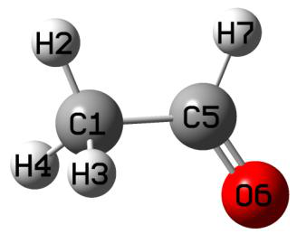

<!-- p.675 -->
examples\spectra\NMR\Acetaldehyde.out 11 // Plot various spectrum 7 // NMR From option 6 in the interface, you can find the element currently considered is carbon. Now if you directly select option 0, you will see 13C spectrum, however, the X-axis corresponds to absolute shielding value. In order to make X-axis correspond to chemical shift, we should input

7 // Set how to determine chemical shifts 1 // Using reference shielding value to derive chemical shifts 186.8707 // Reference value of carbon in TMS (see above). Since this value is a built-in data, in this step you can also directly input a to employ it

0 // Plot NMR spectrum Now you can see

In the map above, the height of black spikes corresponds to the "Degeneracy" axis, while red curves are broadened from the spikes, their values correspond to the "signal strength" axis. The blue texts indicate the index of the atom corresponding to the peak.

You can also see following information on Multiwfn console window


```text
 Term:    1   Chemical shift:    29.657 ppm   Atom:    1(C )
 Term:    2   Chemical shift:   208.011 ppm   Atom:    5(C )
```

In the NMR plotting interface, there are many options used to adjust various plotting settings, such as range of X and Y axes, style of atom labels, color and thickness of spikes and curves, FWHM parameter of broadening and so on, please play with them to improve the spectrum according to your actual requirement.

Next, we plot 1H NMR spectrum. Input below commands 6 // Choose the element considered in plotting H // Hydrogen 7 // Set how to determine chemical shifts 1 // Using reference shielding value to derive chemical shifts a // As mentioned above, this input corresponds to using built-in reference data of TMS


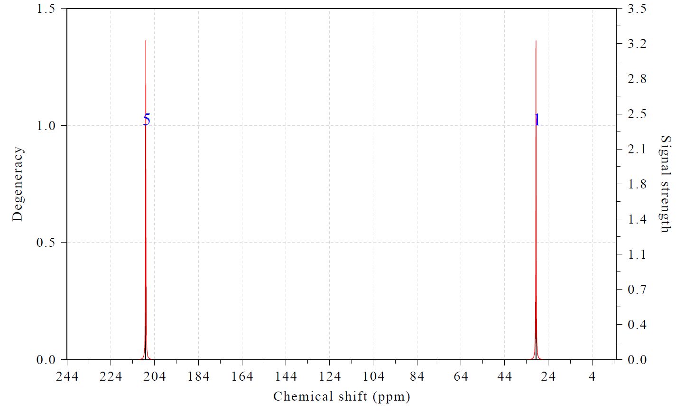

<!-- p.676 -->
evaluated at B97-2/def2-TZVP level under chloroform

It is important to notice that the shielding values of the three hydrogens in the methyl group must be averaged, since methyl group rotates easily in actual environment and thus there is only one NMR peak of hydrogens in this group. Thus we input

10 // Average shielding values of specific atoms 2-4 // H2, H3 and H4 are the hydrogens in the methyl group 0 // Plot the spectrum Now you can see

As you can see, the plotting effect is fairly satisfactory. The information currently shown in console window is:


```text
 Term:    1   Chemical shift:     2.070 ppm   Atom:    2(H )    3(H )    4(H )
 Term:    2   Chemical shift:    10.333 ppm   Atom:    7(H )
```

4.11.10.2 Plotting NMR spectra for pyridine based on scaling method

As introduced in Section 3.13.5, there is another way of determining chemical shifts of 1H and

13C, namely scaling method. Via this method we do not need to calculate reference values, and good chemical shifts could be obtained even using inexpensive calculation levels since the prefitted scaling parameters eliminated most systematical errors. In this section we plot NMR spectrum for pyridine based on the scaling method. examples\spectra\NMR\pyridine_scale.out is output file of NMR task of Gaussian calculated at B3LYP/6-31G* level with chloroform environment represented by SMD solvation model, while the geometry was optimized at B3LYP/6-31G* level in vacuum. The error statistics of various levels given in http://cheshirenmr.info indicate that this level is one of best levels of applying scaling method.

Boot up Multiwfn and input examples\spectra\NMR\pyridine_scale.out 11 // Plot various spectrum 7 // NMR 7 // Set how to determine chemical shifts 2 // Set slope and intercept to determine chemical shifts by scaling method


<!-- p.677 -->
a // Use built-in slope and intercept parameters prefitted for B3LYP/6-31G* with SMD(chloroform) level, namely slope of -0.9449 and intercept of 188.4418 for 13C NMR

0 // Plot NMR spectrum Now you can see

Due to symmetry of pyridine, there are two peaks showing double degenerate character.

Similarly, you can plot 1H NMR spectrum via scaling method, namely input 6 // Choose the element considered in plotting H 7 // Set how to determine chemical shifts 2 // Set slope and intercept to determine chemical shift by scaling method a 0 // Plot the spectrum

4.11.10.3 Plotting conformation weighted NMR spectrum for valine

In this section, I will illustrate how to plot conformation weighted NMR spectrum. Valine is an essential amino acid, it has two conformers in aqueous environment, as shown below. The values in the parentheses are my theoretically estimated conformation weights in water.


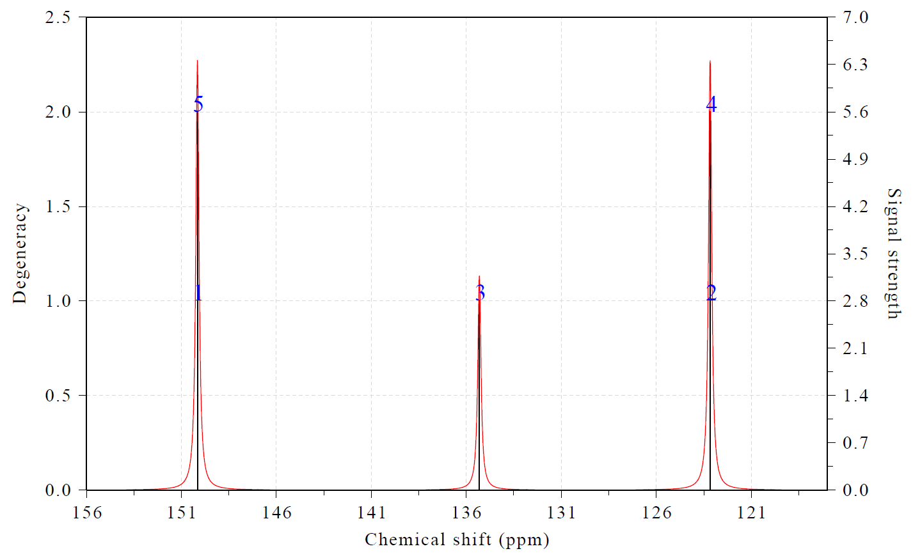


<!-- p.678 -->
In this section we will simulate 1H NMR spectrum of valine in water and compare it with experimental spectrum measured in D2O solvent. Note that since the three hydrogens in the protonated amino group are fully substituted by deuterium in heavy water environment, we need to eliminate its contribution from the spectrum. Also, we need to average shielding values of the hydrogens in each of the two methyl groups.

The conf1.out and conf2.out in "examples\spectra\NMR\valine" folder are output files of NMR task of Gaussian 16, the NMR calculations were conducted at B97-2/def2-TZVP level, the geometries were optimized at B3LYP-D3(BJ)/6-311G** level, in both calculations the IEFPCM model was employed for representing water environment.

We first create a text file named multiple.txt with following content (prefix may be added to the file name, such as valine_multiple.txt):


```text
examples\spectra\NMR\valine\conf1.out 0.825
examples\spectra\NMR\valine\conf2.out 0.175
```

As can be seen, we have specified two input files with corresponding conformation weights. Note that if you are using Linux version, the content must be written as follows, otherwise the paths cannot be recognized, similarly hereinafter


```text
"examples/spectra/NMR/valine/conf1.out" 0.825
"examples/spectra/NMR/valine/conf2.out" 0.175
```

Now boot up Multiwfn and input multiple.txt 11 // Plot various spectrum 7 // NMR 6 // Choose the element considered in plotting H 7 // Set how to determine chemical shifts 1 // Set reference shielding value to determine chemical shift 31.8294 // The TMS reference value that comes from examples\spectra\NMR\valine\TMS.out, which was calculated via exactly the same way as current system

10 // Average shielding values of specific atoms 11-13 // Three methyl group hydrogens 10 // Average shielding values of specific atoms 14-16 // Three methyl group hydrogens 11 // Set strength of specific atoms 2,17,18 // The three hydrogens in the amino group 0 // Making them fully invisible in the spectrum 0 // Plot the NMR spectrum Now you see the following spectrum


<!-- p.679 -->
In order to improve the effect of the map, we close the graph and then input 3 // Set lower and upper limits of X-axis 4,0,0.5 // From 4.0 to 0.0 ppm with label spacing of 0.5 ppm 12 // Do not show spikes to make the spectrum clearer 18 // Other plotting settings 5 // Set X position of legends 1300 // Moving the position of the legends more left than default position 0 // Return Now we select option 0 to replot, the current spectrum is already quite satisfactory

Experimental 1H NMR spectrum of valine in water is https://hmdb.ca/spectra/nmr_one_d/1582, by comparing the map above with it you can find our simulated NMR spectrum is reasonable and captured all major features of the experimental spectrum.

Note that if you only want to plot weighted spectrum or only plot the spectra for the two conformers, you can choose corresponding suboptions in option 17.


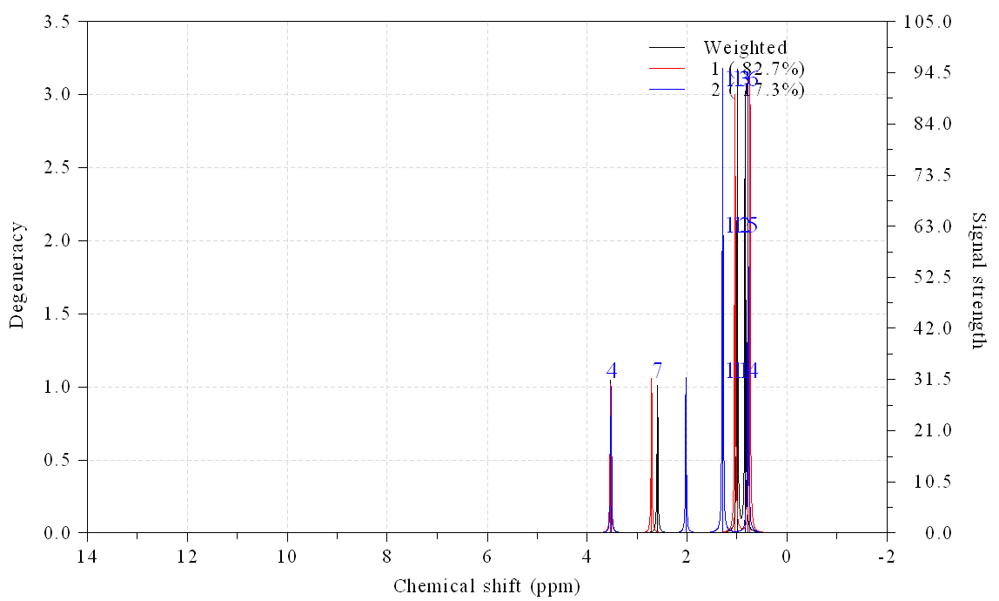

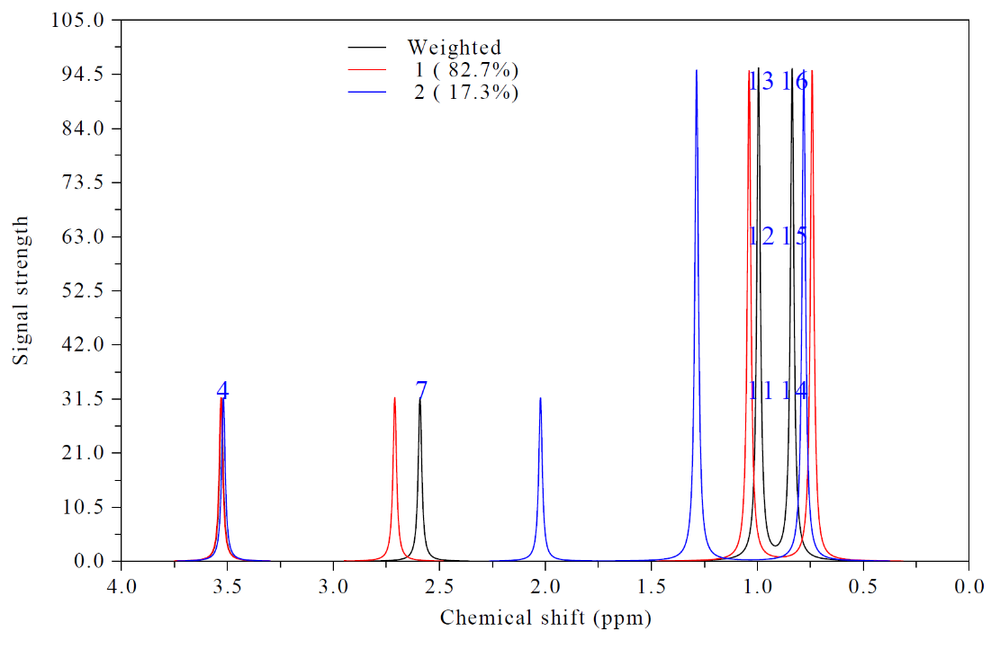

<!-- p.680 -->
4.11.10.4 Plotting multiple systems simultaneously

Multiwfn is able to easily plot NMR spectra of multiple systems on the same map, as exemplified below, the prerequisite is that all systems must have the same number of atoms. In this example, we will view the two conformers of valine as two individual systems.

Create a file named multple.txt (additional prefix may be added to the file name) with following content, each line contains path of an input file and corresponding legend


```text
examples\spectra\NMR\valine\conf1.out conformer 1
examples\spectra\NMR\valine\conf2.out conformer 2
```

Boot up Multiwfn, load the multiple.txt, and then run all commands recorded in the examples\spectra\NMR\valine\drawmulti.txt file in turn, you will see the map below. The meaning of each command can be easily understood according to the prompt on screen.


### 4.11.11 Plotting fluorescence spectrum of BODIPY

In this example, I illustrate how to plot fluorescence spectrum. The differences between plotting fluorescence spectrum and UV-Vis absorption spectrum are two:

(1) To plot fluorescence spectrum, you should use optimized geometry of emission state (the excited state which emits photon). While to plot absorption spectrum, you should use optimized geometry of ground state.

(2) To plot fluorescence spectrum, oscillator strengths of all calculated excited states except for the emission state should be manually set to zero to remove contribution of irrelevant states to the spectrum.

Almost all molecules satisfy Kasha’s rule, that is fluorescence emission solely corresponds to

S1→S0 transition. So, the emission state commonly is S1 state.

Next, we will plot fluorescence emission for the well-known BODIPY molecule:


<!-- p.681 -->
Kasha’s rule is assumed to be valid for this system, therefore we should optimize geometry of S1 state. The output file of Gaussian 16 A.03 of this task at TD-B3LYP/6-311G* level is examples\excit\BODIPY_S1_opt.out, frequency analysis is also performed because we want to check if there is imaginary frequency (none is found). Note that “TD” keyword is employed without additional options, in this case the lowest three excited states S1, S2 and S3 will be solved, and the state of interest (the state to be optimized) is default to the first excited state (S1). The default setting is well-suited for optimizing the S1 state.

Boot up Multiwfn and input examples\excit\BODIPY_S1_opt.out 11 // Plot spectrum 3 // UV-Vis After that, excitation energies and oscillator strengths of all excited states at the final geometry (S1 geometry) are loaded into Multiwfn. Then we clean oscillator strengths of S2 and S3 states by inputting following commands:

20 // Modify oscillator strengths 2,3 // Select S2 and S3 0 // New oscillator strength Now you can input option 0 to plot the spectrum, however the default axis settings are not ideal. So we input following commands

3 // Set lower and upper limit of X-axis, 300,750,50 // Lower limit, upper limit and step size in nm 4 // Set left Y-axis 0,1100,100 // Lower limit, upper limit and step size y // Correspondingly scale the right Y-axis After choose option 0, you will see the fluorescence spectrum


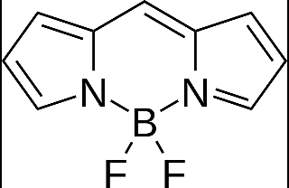


<!-- p.682 -->
As shown in console window, the peak position of our simulated spectrum 510.7 nm, which is quite close to the experimental peak position 512 nm (see https://en.wikipedia.org/wiki/BODIPY).

About plotting phosphorus spectrum It is worth to note that if you are a Gaussian user, it is impossible to plot phosphorus spectrum

(corresponding to T1→S0 emission according Kasha’s rule) using above steps, because oscillator strength must be exactly zero due to spin-forbidden if spin-orbit coupling (SOC) is not taken into account, however Gaussian is unable to consider SOC effect in TDDFT calculation. To plot phosphorus spectrum, my suggested steps are:

(1) Optimize T1 geometry using your favourite quantum chemistry program (2) Based the T1 geometry, using Dalton program to calculate oscillator strength and excitation energy of T1 state using TDDFT theory with consideration of SOC

(3) Extract the oscillator strength and excitation energy of T1 from Dalton output file and manually write them to a plain text file in the format that can be recognized by Multiwfn, see Section 3.12.2 about the format.

(4) Load the plain text file into Multiwfn, then enter main function 11, select “UV-Vis”, then directly select option 0 to plot spectrum, which will correspond to phosphorus spectrum.


### 4.11.12 Plotting partial vibrational spectrum (PVS) and partial vibrational density-of-states (PVDOS)


The concept of partial vibrational spectrum (PVS) has been described in Section 3.13.6, please carefully read it first if you lack relevant knowledge. In the next sections I will illustrate how to use Multiwfn to plot it to intuitively understand nature of various vibrational spectra. You will find PVS is a very general and flexible analysis method. At the same time, plotting partial vibrational density-of-states (PVDOS) will also be illustrated, which is a useful way of graphically revealing composition of all (including spectral inactive) vibrational modes.

4.11.12.1 PVS-NC decomposition analysis of IR spectrum of C18···B9N9

complex

In this example, we use PVS-NC method to visually understand composition of vibrational

modes corresponding to IR spectrum of a molecular complex C18···B9N9, whose optimized geometry is given below


<!-- p.683 -->
The output file of frequency analysis task of Gaussian 16 program at ωB97XD/6-311G* level will be used as input file to plot IR spectrum and PVS-NC curves, the file is provided as examples\spectra\C18-B9N9.out. Note that “intmodes” option is specified in “freq” keyword, which requests Gaussian to print compositions of redundant internal coordinates (RICs) in each vibrational mode, the reason of adding this option is that in one of following examples I will illustrate how to plot PVS-NC map based on fragments consisting of RICs. If you only want to define fragments as a set of atoms, then this option is not needed.

Plotting common IR spectrum

We first plot a common IR spectrum of the C18···B9N9 complex. Boot up Multiwfn and input examples\spectra\C18-B9N9.out 11 // Plot various kinds of spectrum 1 // IR 0 // Plot spectrum on screen

From the map above you can see many peaks, what are natures of them? Via PVS-NC curves, you can easily understand which molecular fragment has a notable participation in the vibrational motions (represented by corresponding normal coordinates) of the vibration modes that observable in the map above. While via PVS-I, you can visually understand if a molecular fragment has evident contributions to IR absorption intensities of various peaks in the map above. So, PVS-NC and PVS-I respectively focus on revealing different aspects of spectral active vibrational modes. In the rest of this section, I will illustrate plotting PVS-NC curves, while in the next section, plotting PVS-I will be exemplified. More specifically, the PVS-NC plotted in this section is PVS-NC(atom), because we will define each fragment as a set of atoms.

Plotting PVS-NC(atom) map Assume that we want to study how the motions of C18 atoms and B9N9 atoms contribute to the vibrations corresponding to above IR spectrum, we should input the following commands in spectrum plotting interface

24 // Set partial vibrational spectra (PVS) or vibrational DOS (VDOS)


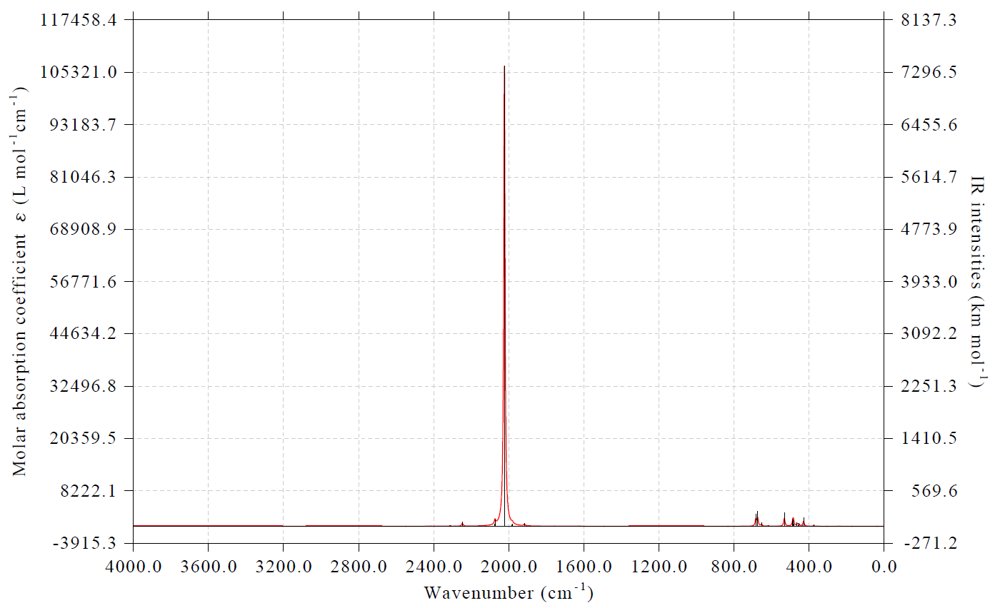

<!-- p.684 -->
1 // Define PVS fragment 1 1-18 // Atoms in C18 2 // Define PVS fragment 2 19-36 // Atoms in B9N9 l // Set legends of PVS curves 1 // Set legend for PVS cyclo[18]carbon // Full name C18 2 // Set legend for PVS B9N9 q // Save and return q // Generate PVS data and return to spectrum plotting interface From screen you can find composition of the two fragments we just defined in each vibrational mode:


```text
Vibrational mode     1 (      7.20 cm^-1 )
   Fragment  1   Composition:   62.1646 %
   Fragment  2   Composition:   37.8354 %
 Vibrational mode     2 (     10.65 cm^-1 )
   Fragment  1   Composition:   39.3017 %
   Fragment  2   Composition:   60.6983 %
...[ignored]
```

Select option 0 to plot spectrum, then you can see the following map on screen

In fact, there are three curves in the map, total IR spectrum (black), PVS of fragment 1 (C18, red) and that of fragment 2 (B9N9, blue), the sum of the latter two corresponds to the former. However, from the current map we can only clearly see that there is an extraordinary strong absorption at about 2000 cm-1. Because the peak is fully in blue, we can conclude that this absorption must purely correspond to vibration of B9N9.


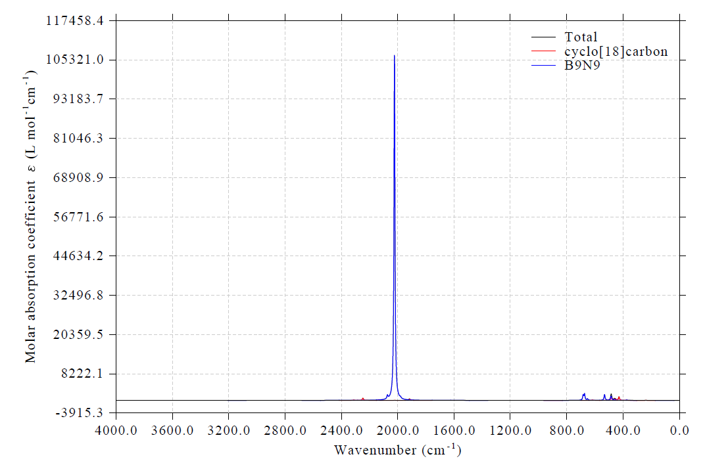

<!-- p.685 -->
From the map above we can see there are many modest IR absorptions in the low frequency range. To look into their details, we input following commands

3 // Set lower and upper limit of X-axis 750,350,50 // Lower limit, upper limit and interval of X-axis 4 // Set left Y-axis 0,3000,300 // Lower limit, upper limit and interval of left Y-axis y // Correspondingly scale right Y-axis 16 // Set status of showing labels of spectrum minima and maxima 1 // Change displaying status of labels 1 // Show maxima on the spectrum 0 // Return 0 // Plot spectrum Now you can see the following map

This map is very informative. For example, it is clear that the peak at 428.8 cm-1 almost solely comes from vibration of C18, the peak at 531.4 cm-1 almost only corresponds to vibration of B9N9, the peak at 484.0 cm-1 shows evident coupling vibration character. The normal coordinates of the modes maximally corresponding to the aforementioned peaks are illustrated as follows, which are in line with our expectation from inspecting the PVS map.


<!-- p.686 -->
Although in this section I only illustrated defining two fragments, in Multiwfn in fact you can maximally define as many as 10 fragments, all PVS curves can be shown together. The union of the fragments does not necessarily correspond to the whole system.

It is noteworthy to emphasize that PVS curves only exhibit contribution of various fragments to normal coordinates of various vibrational modes, they do not directly reflect fragment contribution to absorption intensity. In other words, percentage contribution to normal coordinates of a vibrational mode from a fragment is not proportional to its contribution to intensity of a vibrational mode. This point should be correctly recognized when you discuss PVS/OPVS curves. For example, from a PVS curve of a nonpolar group, you may observe that an evident IR-active mode has a large composition of vibrational of the group in its normal coordinate, you should not thus conclude that the vibrational of the nonpolar group is the source of the strong IR absorption.

Plotting OPVS map between fragments defined by atoms We can also plot OPVS curve between two fragments to very conveniently examine contribution of their collective vibration in different wavenumber ranges. To plot OPVS between the C18 and B9N9, we input

24 // Set partial and overlap vibrational spectra 0 // Set OPVS 1,2 // OPVS will be drawn between fragments 1 and 2 d // Set display status of PVS/OPVS curves 1 // Disable showing PVS of fragment 1 for clarity 2 // Disable showing PVS of fragment 2 for clarity q // Return q // Return to spectrum plotting interface 0 // Plot spectrum again Now you can see total IR spectrum along with OPVS curve


<!-- p.687 -->
This OPVS map vividly shows coupling contribution to various IR absorption. In the region between 450 and 500 cm-1, the coupling effect is strong; in particular, at 462.7 cm-1 the green curve is very close to black curve, therefore, according the definition of OPVS described in Section 3.13.6, we know that the corresponding IR-active mode should be completely and almost equally contributed by vibrations of C18 and B9N9 moieties. From the PVS curves of the two fragment at this wavenumber you can confirm this point. In contrast, the green curve in the wavenumber region larger than 650 cm-1 is negligible, therefore, the peaks 652.9, 673.7 and 683.0 cm-1 must be solely contributed by either one the two fragments. This example demonstrates that OPVS is very helpful in quickly understanding vibrational coupling between various fragments in different wavenumber ranges.

4.11.12.2 PVS-I decomposition analysis of IR spectrum of C18···B9N9 complex

To be written

4.11.12.3 PVDOS analysis of vibrational spectrum C18···B9N9 complex

This section is to be written Briefly speaking, VDOS is very similar to the vibrational spectrum with assumption that intensity of all vibrational modes equals 1. The relationship between PVDOS/OPVDOS to VDOS is equivalent to that between PVS/OPVS and actual vibrational spectrum.

In this section I illustrate how to plot VDOS, partial VDOS (PVDOS) of fragments, and overlap

PVDOS (OPVDOS) between fragments. The C18···B9N9 complex used in last section is still taken as instance, and the two molecules will be defined as the two fragments.

Boot up Multiwfn and input


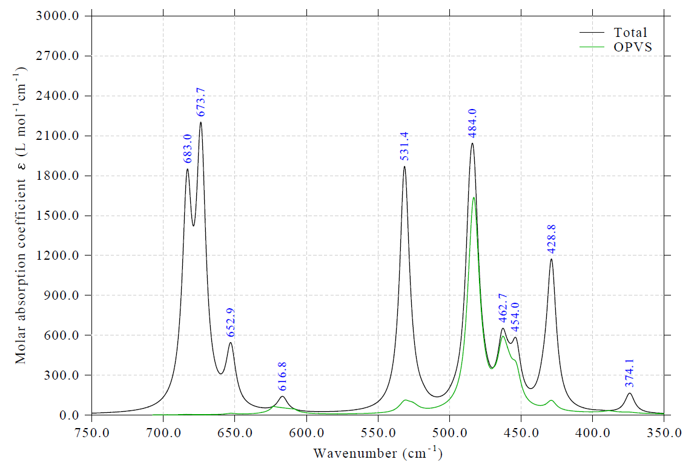

<!-- p.688 -->
examples\spectra\C18-B9N9.out 11 // Plot various kinds of spectrum 1 // IR 24 // Set partial and overlap vibrational spectra 1 // Define PVS fragment 1 1-18 // Atoms in C18 2 // Define PVS fragment 2 19-36 // Atoms in B9N9 l // Set legends of PVS curves 1 // Set legend for PVS cyclo[18]carbon // Full name C18 2 // Set legend for PVS B9N9 q // Return 0 // Set OPVS 1,2 // Plot between fragments 1 and 2 v // Toggle plotting vibrational DOS instead of spectrum. Then PVS will correspond to PVDOS, and OPVS will correspond to OPVDOS

q // Generate PVS data and return to spectrum plotting interface 3 // Set lower and upper limit of X-axis 2400,0,300 // Lower limit, upper limit and interval between ticks 17 // Other plotting settings 11 // Set position of legends 8 // Upper left corner 0 // Return to spectrum plotting interface 0 // Plot spectrum Now you can see the following map


<!-- p.689 -->
From the map you can find vibrational modes sparsely distribute above 600 cm-1, while below 600 cm-1 the distribution of vibrational modes is much denser. In addition, it is found that the vibrational modes above 600 cm-1 do not show detectable coupling motion between C18 and B9N9, the strongly interfragment coupled modes occur densely around 500 cm-1 and below 100 cm-1. This point can be viewed more clearly if you adjust limits of X-axis to only plot 0~600 cm-1 region, as shown below. Peak positions of total spectrum are also labeled by means of option 16.


<!-- p.690 -->
A very different point between VDOS and vibrational spectrum is that in the former, all modes equally contribute to the curve, in other words, you can observe all modes; while in the latter, only the modes with nonnegligible intensity have contribution to the curve and thus visually detectable.

4.11.12.4 PVS-NC decomposition analysis of VCD spectrum of

phenylalanine

To be written

4.11.12.5 Plotting directional IR spectrum

To be written


### 4.11.13 Plotting directional UV-Vis spectrum

Note: Chinese version of this topic is my blog article “Simulating UV-Vis absorption spectrum in specific directions using Multiwfn” (http://sobereva.com/648).

As described in Section 3.13.1, directional UV-Vis spectrum can be plotted to study optical absorption caused by interaction between a system and electric field oscillating in a specific direction, this is particularly valuable if you are interested in anisotropy of spectral character.

In this section, we study carbon nanotube fragment with the following structure and orientation:

First, we plot UV-Vis spectrum of this system corresponding to interaction with electric field oscillating parallel to XY plane. Now, boot up Multiwfn and input

examples\spectra\CNT66_TDDFT.out // TDDFT output file of Gaussian at PBE0/6-31G* level, 100 excited states were calculated

11 // Plotting spectra -3 // Plotting directional UV-Vis spectrum 4 // XY direction


<!-- p.691 -->
0 // Plot spectrum Close the graph shown on screen and input the following commands to adjust plotting settings 3 // Adjust X-axis 200,800,50 // Lower and upper limits, as well as label interval 3 // Adjust left Y-axis 200,800,50 // Lower and upper limits, as well as label interval y // Correspondingly scale right Y-axis Replot the map by choosing option 0, then you will see

Similarly, you can plot UV-Vis spectrum corresponding to interaction with electric field oscillating along Z direction.

After plotting the aforementioned XY and Z spectra, if you export curve data and line data to .txt file via option 2, then you can collectively import them into third-part software such as Origin and draw a map containing total, XY and Z data, as shown below, in which the “Total” curve corresponds to sum of XY and Z curves and also corresponds to the UV-Vis spectrum in common sense.


<!-- p.692 -->
In the map above, it can be seen that the strongest absorption around 370 nm completely comes from interaction of the system with electric field oscillating in XY plane. Since oscillating direction of electric field is perpendicular to propagation direction of light, the XY curve can be understood as the absorption curve for the light propagating in Z direction. The Z curve in the map above contributes most to the absorption around 300 and 480 nm, it corresponds to the absorption of the light propagating on XY plane with polarization in Z direction. This observation also indicates that only the electron excitations at these wavelengths possess prominent Z-directional transition dipole moment.

This example shows that for systems with significant anisotropic features, plotting UV-Vis spectra in specific directions clearly helps to understand the intrinsic nature of their absorption spectra.


### 4.11.14 Predicting color of indigo and allura red

Note: Chinese version of this example is “Prediction of color of chemical substances by quantum chemical calculations and Multiwfn program” (http://sobereva.com/662), which also contains more discussion.

Please read section 3.13.7 to understand basic feature of the function of predicting color in Multiwfn. In this section we will predict color of indigo based on theoretical calculation, and then predict color of allura red based on its experimental UV-Vis spectrum.

4.11.14.1 Predicting color of indigo based on theoretical calculation

examples\spectra\indigo_TD-B3LYP_water.out is output file of Gaussian of calculating electronic excited states at TD-B3LYP/def2-TZVP level in water environment represented by IEFPCM solvation model. The geometry was optimized for ground state at B3LYP/6-311G* level. Boot up Multiwfn and load this file, then input

11 // Plotting spectrum 3 // UV-Vis 25 // Evaluate color based on the spectrum in visible range Multiwfn first shows UV-Vis spectrum within 360-830 nm, see the following map (PS: visible light range is 380-760 nm, or 400-700 nm. The range of 360-830 nm corresponds to the range for


<!-- p.693 -->
which tristimulus functions have definition, which are involved in color prediction procedure internally):

After closing the window, Multiwfn shows the colors predicted based on the spectrum curve:

The color displayed under “color” label is the color corresponding to the UV-Vis spectrum, and the color shown below “complementary color” corresponds to the color of transmission and reflection light of indigo. The two colors shown at bottom side of the window are counterparts of the two colors shown at upper side of the window by shifting RGB values so that the largest-value component of the colors equal to 255 (upper limit of sRGB color space). In short, the very blue color, as shown at the bottom-right corner of the window, can be regarded as the color actually displayed by indigo aqueous solution. This predicted color is completely identical to actual color of indigo, extremely successful prediction!

From text window of Multiwfn, you can also find parameters of the four colors shown on the graphic window and some intermediate data:


```text
CIE1931 XYZ:              1077992.509       1123653.902        188673.482
Fractional CIE1931 XYZ:      0.9593634718      1.0000000000      0.1679106720
CIE1931 xy:              0.4509825283      0.4700851571
Note the R,G,B values shown below correspond to standard RGB (sRGB) color space
RGB (0-1):    1.487926  0.953110  0.026876
RGB (0-255):   379   243     7
Note: The color exceeds sRGB color space! Now the R,G,B values are scaled into
```


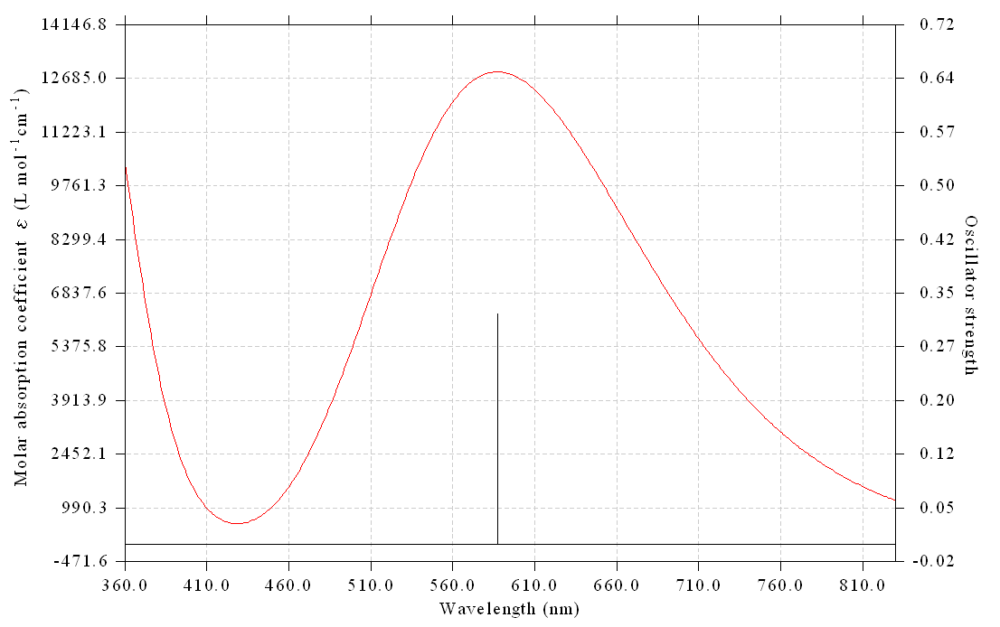

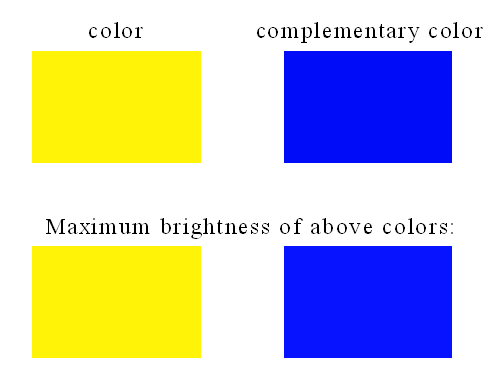

<!-- p.694 -->

```text
alid range:
RGB (0-1):    1.000000  0.953110  0.026876
RGB (0-255):   255   243     7
RGB of complementary color:     0    12   248
RGB of original color (maximum brightness):        255   243     7
RGB of complementary color (maximum brightness):     7    19   255
```

4.11.14.2 Predicting color of allura red based on experimental UV-Vis

spectrum

examples\spectra\Allura_red_UV-Vis.txt is X-Y curve data of experimental UV-Vis spectrum of a famous dye, allura red. In this example we predict color of allura red based on this spectrum.

Boot up Multiwfn and load examples\spectra\Allura_red_UV-Vis.txt, then input 11 // Plotting spectrum 0 // Predicting color based on UV-Vis spectrum recorded in text file Now you can see the following map on screen

From the color shown at bottom lower side, it can be seen that the color of allura red is red, this is exactly the actually observed color of this substance. This map also indicates that allura red absorb light of cyan color.


## 4.12 Quantitative analysis of molecular surface


### 4.12.1 Electrostatic potential analysis on phenol molecular surface

Below I will introduce quantitative analysis of molecular surface by case study of phenol. The theoretical basis has been documented in Section 3.15.1 and thus will not be repeated here. In this section we only analyze electrostatic potential (ESP) on phenol vdW surface, in next section we will then analyze average local ionization energy on the phenol surface.

Boot up Multiwfn and input following commands examples\phenol_631Gxx.wfn // Phenol wavefunction produced at B3PW91/6-31G** level. For most systems this level can give acceptable result of ESP analysis. For better accuracy, def-TZVP is recommended, while more expensive def2-TZVP basis set is able to give ideal result


<!-- p.695 -->
12 // Quantitative analysis of molecular surface 0 // Start the analysis under default settings. By default, the mapped function is ESP Now the calculation starts. Since computing ESP is time consuming, you need to wait for a while. During the calculation some intermediate information is printed, most users do not need to concern about them. Below results will be printed on screen once the calculation has been finally finished:


```text
Global surface minimum: -0.041203 a.u. at   1.455097   3.343708  -0.007902 Ang.
Global surface maximum:  0.085761 a.u. at  -1.936645   3.093464   0.021360 Ang.

Number of surface minima:     3
   #       a.u.         eV      kcal/mol           X/Y/Z coordinate(Angstrom)
     1 -0.03046066   -0.828877  -19.112843       0.150202  -1.011077  -1.882004
     2 -0.03045989   -0.828856  -19.112362       0.192185  -0.985412   1.877656
*    3 -0.04120321   -1.121196  -25.853368       1.455097   3.343708  -0.007902

Number of surface maxima:     5
   #       a.u.         eV      kcal/mol           X/Y/Z coordinate(Angstrom)
     1  0.02275520    0.619200   14.277975      -3.344441  -2.281045   0.047286
*    2  0.08576096    2.333674   53.811572      -1.936645   3.093464   0.021360
     3  0.01935782    0.526753   12.146259       0.066223  -4.286661   0.040555
     4  0.01980285    0.538863   12.425498       3.340574  -2.325727   0.021485
     5  0.01583741    0.430958    9.937340       3.419218   1.225375  -0.019326

      ================= Summary of surface analysis =================
Volume:   835.71041 Bohr^3  ( 123.83953 Angstrom^3)
Overall surface area:         476.05682 Bohr^2  ( 133.30951 Angstrom^2)
Positive surface area:        231.09186 Bohr^2  (  64.71232 Angstrom^2)
Negative surface area:        244.96497 Bohr^2  (  68.59719 Angstrom^2)
Overall average value:   -0.00020233 a.u. (  -0.12695332 kcal/mol)
Positive average value:   0.01877643 a.u. (  11.78145591 kcal/mol)
Negative average value:  -0.01810626 a.u. ( -11.36095315 kcal/mol)
Overall variance (sigma^2_tot):  0.00041488 a.u.^2 ( 163.34165024 (kcal/mol)^2)
Positive variance:        0.00031106 a.u.^2 ( 122.46642148 (kcal/mol)^2)
Negative variance:        0.00010382 a.u.^2 (  40.87522876 (kcal/mol)^2)
Balance of charges (nu):   0.18762182
Product of sigma^2_tot and nu:   0.00007784 a.u.^2 (  30.6464578 (kcal/mol)^2)
Internal charge separation (Pi):   0.01842642 a.u. (  11.56183883 kcal/mol)
Molecular polarity index (MPI):   0.50154872 eV (     11.56600 kcal/mol)
Nonpolar surface area (|ESP| <= 10 kcal/mol):     67.26 Angstrom^2  ( 50.45 %)
Polar surface area (|ESP| > 10 kcal/mol):         66.05 Angstrom^2  ( 49.55 %)
```

Above information contains various quantities relevant to ESP, see Section 3.15.1 for their meanings and definitions. Now select option 0 in the post-processing interface to view molecular structure and surface extrema (red and blue spheres correspond to maxima and minima, respectively):


<!-- p.696 -->
In side view:

Minimum 3 (-25.85 kcal/mol) is global minimum on the surface, its large negative value is owing to the lone pair of oxygen. Maximum 2 (53.81 kcal/mol) is global maximum arising from the positively charged H13, the ESP at this point is much larger than that at other maxima (where the ESP ranges from 10 to 15 kcal/mol). This is because of the presence of oxygen, which attracted a great deal of electrons from H13. In complex, assuming that only electrostatic interaction exists, monomers always contact each other in maximally ESP complementary manner. So, we can expect that in phenol dimer, H13 and maximum 2 in a monomer, and O12 and minimum 3 in neighbouring monomer will be in a straight line (resulting hydrogen bonding), this is the exact situation in actual geometry of phenol dimer, see the graph below. Notice that in the dimer, maximum 2 and minimum 3 shown above have cancelled each other out.


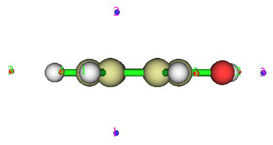

<!-- p.697 -->
Minimum 1 and 2 (both are -19.11 kcal/mol) are local minimum on the surface, mainly arise from the abundant π electrons above and below the ring. It is well known that electrophiles always prefer to attack the atom which has very low ESP around it, so C1 should be an ideal reaction site for electrophilic reaction. This conclusion is partially consistent with the general knowledge that hydroxyl is an ortho-para directing group. However, although the global minimum is closest to O12, O12 is not the electrophilic reaction site; this contradiction reveals the inherent limitation of ESP analysis method.

Note 1: Since the molecule has Cs symmetry, in principle, minimum 1 and 2 should have identical X and Y coordinates. However, this cannot be exactly fulfilled in numerical process, because the points scattered on the molecular surface do not have the molecular symmetry, see Section 3.15.1 for detail. So, X and Y coordinates of minimum 1 and 2 are slightly deviated to each other. If you want to refine the result, choose option 3 "Spacing of grid data for generating molecular surface" and input a smaller value than default value. Smaller spacing of grid points yields a more accurate result, but bring higher computational burden.

Note 2: Due to limitation of the Multiwfn GUI, sometimes it is difficult to query the index of the ESP extrema of interest, in this case using VMD instead is recommended, see Part 6 of this video https://youtu.be/QFpDf_GimA0.

Note 3: It is also possible to draw ESP extrema on contour line(s) of a specific isovalue in a plane map, see Section 4.4.12.

Mutual penetration distance The non-bonded radius defined in the framework of atoms in molecule (AIM) theory is the shortest distance between a nucleus and ρ=0.001 a.u. isosurface. Let us calculate the non-bonded radius for O12 and H13. Select option 10 in the post-processing interface and input 12, we can see that the non-bonded radius of O12 is 1.701 Å. Select 10 and input 13, the non-bonded radius of H13 is 1.172 Å. In the phenol dimer, the H---O of the H-bond is 1.937 Å, therefore the so-called mutual penetration distance is 1.701+1.172-1.937=0.936 Å. This is a nontrivial value, indicating the H-bond is strong.

ESP statistical distribution on molecular surface As the final part of ESP analysis, we examine the molecular surface area in each ESP range, this is useful to quantitatively discuss ESP distribution on the whole molecular surface. We choose option 9 in the post-processing interface, and then input:

all // All atoms are taken into the statistics (alternatively, if you input for example 2-4, then only the local surfaces corresponding to atom 2, 3 and 4 will be taken into account, see Section 4.12.3 for illustration of the concept of local molecular surface)

-30,55 // The ESP range you are interested in. Since we have already known that the minimum and the maximum ESP on the surface are -25.85 and 53.81 kcal/mol respectively, here we input a slightly larger range to enclose them


<!-- p.698 -->
15 // The number of intervals 3 // Both the inputted and outputted units are in kcal/mol Then you will see surface area (in Å2) and corresponding percentage in the whole surface area in each successive ESP range.


```text
     Begin        End       Center       Area         %
   -30.0000    -24.3333    -27.1667      1.8192      1.3647
   -24.3333    -18.6667    -21.5000      6.0284      4.5221
   -18.6667    -13.0000    -15.8333     20.9732     15.7327
   -13.0000     -7.3333    -10.1667     19.0390     14.2818
...
    43.6667     49.3333     46.5000      1.2690      0.9519
    49.3333     55.0000     52.1667      1.0457      0.7844
Sum:                                   133.3095    100.0000
```

By using this data, you can use your favourite program to draw a histogram graph. For example, we choose "center" column as X-axis and "Area" column as Y-axis to plot the graph below

28

24

20

Surface area (Å2) 16 12 8

4

-30-20-10010203040500

Electrostatic potential (kcal/mol)

From the graph it can be seen that there is a large portion of molecular surface having small ESP value, namely from -20 to 20 kcal/mol. Among these areas, the negative part mainly corresponds to the surface above and below the six-membered ring and shows the effect of the abundant π-electron cloud; the positive part mainly arises from the positive charged C-H hydrogens; the near-neutral part represents the border area between the negative and positive parts. There are also small areas having remarkable positive and negative ESP value, corresponding to the regions close to the global ESP minimum and maximum, respectively.

Plotting ESP colored molecular surface With the help of VMD program, one can plot very nice color-filled molecular surface maps with surface extrema for various real space functions based on the output of Multiwfn. Below is such a plot for ESP, which was presented in my study of benzoapyrene diol epoxide, see Struct. Chem., 25, 1521 (2014). In which blue, white and red correspond to ESP varying from -30 to 35


<!-- p.699 -->
kcal/mol, the green and orange spheres correspond to ESP surface minima and maxima, respectively

If you would like to plot similar graphs, please download and follow this tutorial: http://sobereva.com/multiwfn/res/plotESPsurf.pdf. However, there are many steps in this tutorial, if you want to draw a map with similar or even better effect but in a much simpler way, see Section 4.A.13 or this video tutorial: https://youtu.be/QFpDf_GimA0. This section and video also illustrate how to plot a penetration map of van der Waals surface of different molecules, which is useful for discussing intermolecular interactions.

Hint: Calculation speed of ESP by cubegen utility in Gaussian package is notably faster than Multiwfn if number of your CPU cores is very limited (less than 10 cores). If you have Gaussian installed on your machine and input file is .fch/fchk format, it is suggested to set "cubegenpath" parameter in `settings.ini` file to actual path of cubegen, so that cubegen could be automatically invoked by Multiwfn to evaluate ESP during the analysis. Please check Section 5.7 for detail.

If you are an ORCA user and meantime unable to access Gaussian, you can make use of "orca_vpot" utility in ORCA package to try to reduce cost of ESP analysis on molecular surface when number of CPU cores is very limited, see http://sobereva.com/wfnbbs/viewtopic.php?pid=937 for detail.

FAQ: Why some surface ESP minima (maxima) have positive (negative) value? Some Multiwfn users asked me why they observed that some surface ESP minima (maxima) have positive (negative) value. In fact, this phenomenon is very common and it is never a problem or bug. Mathematically, a minimum (maximum) refers to a point where its value is lower (higher) than surrounding points, clearly it never implies that this point must have negative (positive) value. If you are still confused, see below illustration


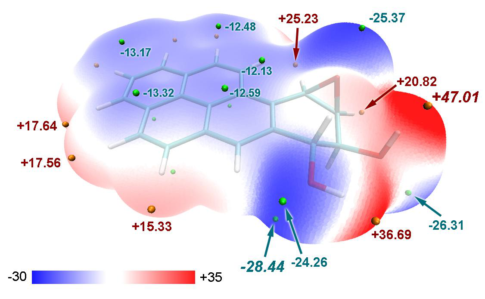

<!-- p.700 -->
For neutral system, commonly surface ESP minima (maxima) having positive (negative) are not chemically significant, you can simply ignore them in the discussion. If you want to remove these insignificant minima (maxima), you can choose option 3 (4) in post-processing menu, and then input d. Then you will find these unwanted extrema have disappeared.

It is also worth noting that for a cation (anion) system, commonly all surface extrema have positive (negative) value, because the overall value of surface ESP extrema is always greatly dominated by the net charge carried by the system.

Trick: Reuse data of mapped function generated during previous analysis Here I introduce a trick. Maybe you have noticed that evaluation of ESP on vdW surface is time-consuming, especially for large system with high-quality basis set. If you have performed ESP analysis on a system, which will be analyzed again later, in fact you can export the ESP data to a plain text file, so that next time when you analyze the same system you can directly make use of the exported data. For other types of mapped functions, this trick also works.

Let us see an example. We first perform ESP analysis on vdW surface as usual, input below commands:

examples\N-phenylpyrrole.fch 12 // Quantitative molecular surface analysis 0 // Start the analysis Once the calculation is finished, select option 7 to export the surface vertices with ESP values to a plain text file named vtx.txt in current folder. After that select -1 to return to last menu.

Assume that we want to perform the analysis again. This time we can directly use the ESP data recorded in the plain text file. Input below commands

5 // Loading mapped function values from external file during analysis 1 // Loading mapped function at all surface vertices from a plain text file 0 // Start the analysis Once construction of molecular surface is complete, Multiwfn will prompt you to input the path of the plain text file recording mapped function values at all surface vertices, at this point you should simply input vtx.txt.

Since this time the mapped function values, namely ESP values, are not calculated but loaded from vtx.txt directly, the analysis results immediately show up on the screen.

Trick: Perform ESP analysis on molecular surface solely based on cube files Some quantum chemistry and first-principles programs, such as Quantum ESPRESSO, ADF,


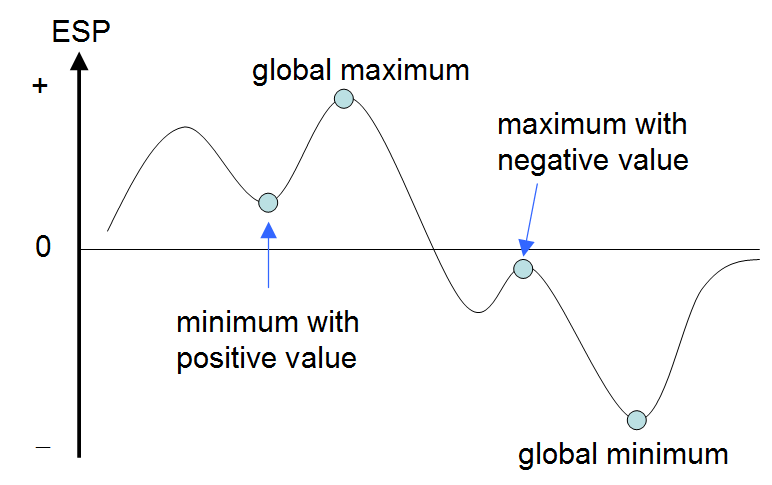

<!-- p.701 -->
Dmol3 and FHI-aims, are unable to produce a wavefunction file that supported by Multiwfn, however in this case it is still possible to perform ESP analysis over molecular surface, as long as you can yield cube files of electron density and ESP for your system by these codes. Once the cube files are generated, you can input below commands after booting up Multiwfn:

density.cub // Load cube file of electron density first 12 // Quantitative molecular surface analysis 1 // Select the way to define surface 11 // Isosurface of the grid data in memory

0.001 // Use ρ = 0.001 a.u. to define the isosurface 2 // Select mapped function 1 // ESP 5 // Set if loading mapped function values from external file 3 // The mapped function will be interpolated from an external cube file 0 // Start calculation ESP.cub // The cube file recording ESP Note that the grid setting used for yielding density.cub and ESP.cub must be exactly the same, and the grid spacing should not be too large (no larger than 0.25 Bohr), otherwise the analysis result will be inaccurate.


### 4.12.2 Average local ionization energy analysis (ALIE) on phenol molecular surface


Below we will analyze average local ionization energy 𝐼̅ on phenol vdW surface. Boot up Multiwfn and input

examples\phenol_631Gxx.wfn // Produced at B3PW91/6-31G** level 12 // Quantitative molecular surface analysis 2 // Reselect mapped function 2 // Choose 𝐼̅ as mapped function 0 // Start the surface analysis. Since calculation of 𝐼̅ is much simpler than ESP, the calculation is finished rapidly. Unlike surface analysis for ESP, at this time only vdW volume, surface area, average and variance of 𝐼̅ on vdW surface are outputted alongside extrema information.

Choose 0 to visualize extrema. In order to make the correspondence between extrema and atoms clearer, we drag the "Ratio of atomic size" scale bar to 4.0, which corresponds to vdW surface, and we disable showing of surface maxima, then we will see:


<!-- p.702 -->
In side view

Low value of 𝐼̅ suggests that the electron at this position is not tightly bounded, the site with lowest 𝐼̅ on vdW surface is usually recognized as the most vulnerable site to electrophilic attack or to free radical attack. All sites that highly polarizable such as π electron and lone pair regions commonly have corresponding surface minima of𝐼̅. In present instance, minima 8 and 9 correspond to lone pair of O12, from the output on screen we can find both their 𝐼̅ values are 10.59 eV. Minima 4,5,11, and 3,7,10 correspond to π electrons, 𝐼̅ values of all of them are about 8.9 eV and can be viewed as degenerate global minima. It is noteworthy that the minima above and below the conjugated ring only present at ortho- and para-carbon. These observations perfectly explained the effect of hydroxyl as an ortho-para- directing group. Since 𝐼̅ at minima 8 and 9 are obviously larger than the 𝐼̅ at the minima around the carbon ring, oxygen should not be vulnerable site of electrophilic reaction.

Plotting average local ionization energy colored molecular surface map Note 1: There is a video illustration corresponding to this part, please have a look! https://youtu.be/-1sBa0lKhp8. Note 2: Chinese version of this part is my blog article “Using Multiwfn and VMD to plot map of molecular surface colored by averaged local ionization energy (ALIE)” (http://sobereva.com/514).

To provide a more complete viewpoint about distribution of 𝐼̅ on molecular surface, it is best to plot molecular surface map colored according to 𝐼̅. This can be extremely easily done via script and VMD program (http://www.ks.uiuc.edu/Research/vmd/). Below I show how to realize this under Windows environment, the phenol is still taken as example. Please do below steps in turn:


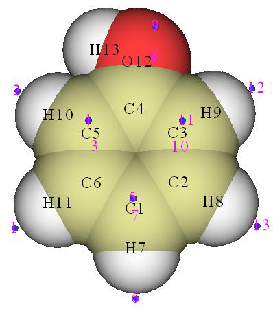


<!-- p.703 -->
- Copying the ALIE.vmd from "examples\scripts\" to VMD folder
- Copying the ALIE_isoext.bat and ALIE_isoext.txt from "examples\scripts\" folder to the folder containing Multiwfn.exe

- Edit the ALIE_isoext.bat, change the default input file to examples\phenol_631Gxx.wfn, change the VMD folder to actual VMD folder on your machine

- Double click the ALIE_isoext.bat icon to execute it. This script will invoke Multiwfn.exe in current folder to conduct some calculations, then avglocion.cub, density.cub and surfanalysis.pdb will appear in VMD folder

- Boot up VMD, input source ALIE.vmd in console window, you will immediately see the graph below (In order to gain better effect, I used Tachyon render to generate the image)

In the map above, the displayed surface is ρ = 0.0005 a.u. isosurface. The reason why the commonly used ρ = 0.001 a.u. isosurface is not adopted as the definition of the surface is because if it is employed, then the 𝐼̅ distribution on the surface can hardly be distinguished. The cyan spheres correspond to surface minimum of 𝐼̅. The color transition is Blue-White-Red, therefore the blue color highlights the regions having relatively low 𝐼̅ value, where are favorable sites for electrophilic attack.

By default, the color scale of 𝐼̅ is 0.32~0.36 a.u., if you find the color scale is not appropriate for present system, you can input for example mol scaleminmax 0 1 0.31 0.38 in the VMD console window to change the lower and upper limits to 0.31 and 0.38, respectively.


### 4.12.3 Atomic local molecular surface analysis for acrolein

It is well known that acrolein (see below) tends to undergo nucleophilic attack at carbonyl

carbon and β carbon; in particular, the former is the primary site for hard nucleophilic reagent. The so-called hard means the electron cloud of the nucleophilic reagent is difficult to polarize; the selectivity of reactive site for this case is usually dominated by ESP.


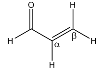

<!-- p.704 -->
In this example, we will try to interpret the site-selectivity of acrolein by analyzing ESP on its vdW surface. Note that average local ionization energy is only useful for studying electrophilic attack, but completely useless for analyzing nucleophilic attack.

Boot up Multiwfn and input: examples\acrolein.wfn // Optimized and produced at B3LYP/6-31G** level 12 // Quantitative analysis of molecular surface 0 // Start the analysis for ESP After the calculation is finished, choose 0 to visualize surface extrema:

As you can see, there is a surface minimum of ESP at the boundary of α carbon and it is very close to β carbon. This observation indirectly reveals that nuclear charge of α carbon is more heavily screened by electron clouds, and hence is less probable to be the site of nucleophilic attack. However, quantitative analysis of ESP on the whole acrolein surface does not provide a direct and definitive interpretation on the preference of reactive sites, because no surface maxima are found on carbonyl

and β carbons, hence we are unable to directly investigate the characteristic of carbonyl and β carbon.

In Multiwfn, the quantitative analysis can not only be applied to the whole molecular surface, but is also applicable to local molecular surface to reveal characteristic of atom or fragment, see Section 3.15.2.2 for introduction. Here we select option “11 Output surface properties of each atom” in post-processing interface to calculate and output properties of the local surfaces corresponding to each atom. Some of the results are shown below


```text
Note: Average and variance below are in kcal/mol and (kcal/mol)^2 respectively
 Atom#    All/Positive/Negative average       All/Positive/Negative variance
     1   -24.35251        NaN  -24.35251           NaN        NaN   72.72766
     2     4.65672    5.74594   -1.45401       9.79575    9.01495    0.78080
     3     1.30965    2.36405   -0.88391       2.70896    2.45972    0.24925
     4     8.37174   10.35813   -6.00120      36.74187   17.22299   19.51888
     5     7.07040    8.67973   -6.35468      49.99108   25.33899   24.65209
     6     2.21578    3.02322   -0.73880       5.15593    4.95305    0.20288
     7    15.34251   15.34251        NaN           NaN   22.85377        NaN
     8    14.68486   14.68486        NaN           NaN   25.92230        NaN
```

As you can see, the average ESP values on the local surface of carbonyl carbon (atom 2), α carbon and β carbon are 4.657, 1.310 and 2.216 kcal/mol, respectively. This result clearly explained the site-selectivity; the carbonyl carbon is the most favorable site because the average ESP on its


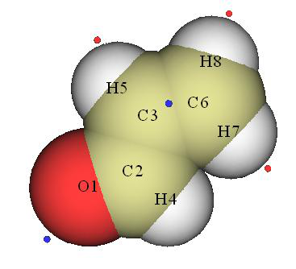

<!-- p.705 -->
local surface is the most positive, and hence nucleophilic reagents (especially the hard ones) tend to

be attracted to this site. In contrast, on the local surface of α carbon the average of ESP is the smallest compared to the other two carbons, and thus α carbon has less capacity to attract nucleophilic reagents.

Note that some of the outputted data are NaN (Not a Number), these are not bug but understandable. For example, the average of positive part of ESP of atom 1 is NaN, this is because oxygen has large electronegativity, and thus on the local surface of atom 1 the ESP is completely negative, so the average of positive ESP is unable to be computed.

If you are confused about what is "local surface of atoms" or you want to visualize them, after you choose option 11 you can select "y" to output the surface facets to locsurf.pqr file in current folder. Each atom in this file corresponds to a surface facet, the residue index corresponds to its attribution. By this file you can visualize how the whole molecular is partitioned, the method is: boot up VMD program and drag the pqr file into the VMD main window, in "Graphics"-"Representation" set the "Drawing method" as "Points", set the point size to 4, and set "Coloring Method" as "ResID". In VMD main window, select "Display"-"Orthographic" and deselect "Display"-"Depth Cueing". Then load the molecular structure file of acrolein into VMD and render it as CPK mode, you will see the graph below

In the graph, each point represents a surface facet; different colors represent different local surface regions, and each one corresponds to an atom.

Beware that the "imolsurparmode" parameter in `settings.ini` directly affects the result of local surface analysis, currently we are using imolsurparmode=1.


### 4.12.4 Quantitative analysis of Fukui function on molecular surface of phenol


I have exemplified how to study Fukui function by visualizing its isosurface (Section 4.5.4) and by condensing it to atomic values via population analysis (Section 4.7.3). In this section, I will

illustrate how to perform quantitative analysis of Fukui function f − on molecular surface, including three aspects: (1) Obtain positions and values of minima and maxima of f − (2) Study average value of f − on local molecular surfaces corresponding to various atoms (3) Plotting f − color mapped molecular surface with surface extrema. I will still use phenol as example:


<!-- p.706 -->
Note: If you are unable to successfully reproduce the steps in parts 1 and 2 described below, please look at the video illustration: http://sobereva.com/multiwfn/extrafiles/Molecular_surface_Fukui.mp4.

Part 1: Obtain positions and values of minima and maxima of f − Boot up Multiwfn (referred to as Multiwfn A) and input following commands examples\phenol.wfn 12 // Quantitative molecular surface analysis 2 // Select the mapped real space function on the molecular surface 0 // The function value will be loaded from an external file 1 // Set the way to define the surface 1 // Use electron density isosurface as molecular surface

0.01 // Because magnitude of Fukui function on default isosurface ρ = 0.001 is often too small, enlarging the isovalue to 0.01 a.u. makes following analyses more significant

0 // Start the surface analysis Multiwfn will generate grid data of electron density and then generate the surface vertices. After the coordinates of these vertices are automatically outputted to surfptpos.txt in current folder, Multiwfn A pauses. Do not terminate Multiwfn A, we boot up another Multiwfn now (referred to as Multiwfn B), and then input below commands in Multiwfn B

examples\phenol.wfn 5 // We use this module to generate Fukui function on the points recorded in surfptpos.txt 0 // Set custom operation 1 -,examples\phenol_N-1.wfn // Subtract a property of phenol_N-1.wfn from that of phenol.wfn,

namely Fukui function f − will be calculated

1 // Electron density 100 // Load the coordinate of the points to be calculated from an external file surfptpos.txt t.txt // Output the coordinate and calculated function values (Fukui function) of the points (surface vertices) to this file

Next, we terminate Multiwfn B, and return to Multiwfn A, then input t.txt // Load the Fukui function values at the surface vertices from this file

Now you can find minima and maxima information of f − over the molecular surface (ρ = 0.01 a.u. in this context) on screen:


```text
The number of surface minima:    16
   #             Value           X/Y/Z coordinate(Angstrom)
     1          0.0005211     -2.128861  -0.802735  -0.931871
     2          0.0005205     -2.076117  -0.773086   0.974712
     3          0.0005075     -1.359761  -2.550410  -0.046948
[ignored...]
```


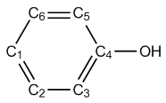

<!-- p.707 -->

```text
 The number of surface maxima:    12
   #             Value           X/Y/Z coordinate(Angstrom)
     1          0.0015297     -2.922801   1.103604   0.049305
     2          0.0015567     -2.878717  -2.081768  -0.010490
     3          0.0015093     -1.538685   2.959157  -0.031439
*    4          0.0024437     -0.034784  -1.889426  -1.367278
     5          0.0024425     -0.047988  -1.899397   1.366144
[ignored...]
```

You can also choose option 0 to visualize distribution of the surface extrema:

Part 2: Study average value of f − on local molecular surfaces In the post-process menu, we choose option 11 to output quantitative statistical data of Fukui

function f − distributed on the local vdW surface corresponding to each atom, then you can find the following information on screen


```text
Atom#   All/Positive/Negative average
    1  1.88921E-03  1.88921E-03          NaN
    2  8.30558E-04  8.30558E-04          NaN
    3  1.20307E-03  1.20307E-03          NaN
    4  1.28067E-03  1.28067E-03          NaN
    5  1.06720E-03  1.06720E-03          NaN
    6  9.43611E-04  9.43611E-04          NaN
[ignored...]
```

NaN means there is no negative value of f − on the local molecular surfaces. From the result it is clear that the average of the Fukui function on the local molecular surface corresponding to ortho (C3 and C5) and para (C1) carbons are larger than that of meta carbons (C2 and C6), this observation correctly reflects the fact that hydroxyl is an ortho-para- director.

Part 3: Plotting f − color mapped molecular surface with surface extrema In the post-process menu of main function 12, choose option “2 Export surface extrema as surfanalysis.pdb in current folder”, then you will find surfanalysis.pdb.

Next, in order to yield a f − color mapped molecular surface via VMD (can be freely downloaded at http://www.ks.uiuc.edu/Research/vmd/), we need to prepare two cube files

containing electron density and f − respectively. To do so, we reboot Multiwfn and input


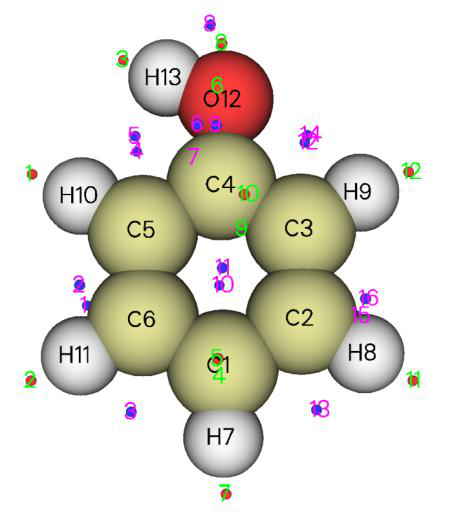

<!-- p.708 -->
examples\phenol.wfn 5 // Calculate grid data 0 // Set custom operation 1 -,examples\phenol_N-1.wfn 1 // Electron density 3 // High-quality grid 2 // Export grid data Now rename the just exported density.cub to mapped.cub. Then input 0 // Return to main menu 5 // Calculate grid data 1 // Electron density 3 // High-quality grid 2 // Export grid data Now you have density.cub in current folder. Move density.cub, mapped.cub, surfanalysis.pdb to VMD folder. Also copy the VMD plotting script molsurfmap.vmd in “examples\scripts\” folder to VMD folder. After that, boot up VMD and run source molsurfmap.vmd in VMD console window to execute the script, then you will see the

following map, in which cyan and red spheres correspond to maxima and minima on ρ = 0.01 a.u. isosurface, respectively. The current coloring method is red-white-blue, corresponding to mapped function varying from 0.0 to 0.002.

You can edit molsurfmap.vmd yourself to change various default plotting settings, including color scale range, isovalue, and so on. They can also be changed in “Graphics” - “Representation” interface of VMD.


### 4.12.5 Becke surface analysis on guanine-cytosine base pair

The concept of Hirshfeld and Becke surface analyses have been introduced in Section 3.15.5, please read them first. In this section I will exemplify how to perform Becke surface analysis on guanine-cytosine (GC) base pair to exhibit the weak interaction between the two monomers. Note


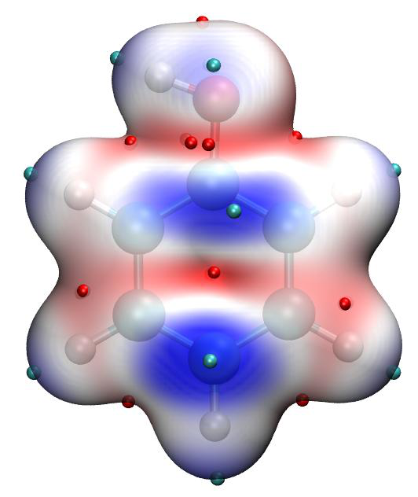

<!-- p.709 -->
that Hirshfeld surface analysis is more commonly used, see next section.

Boot up Multiwfn and input examples\GC.wfn // Generated at M06-2X/6-31+G** level, optimized at PM7 level 12 // Quantitative molecular surface analysis 1 // Change the definition of surface 6 // Use Becke surface. You can also select 5 to use Hirshfeld surface 1-13 // The index range of the atoms you are interested in (cytosine in present case) 0 // Start calculation Multiwfn found numerous surface minima, which are meaningless in this case, and at the same time three surface maxima are found


```text
The number of surface maxima:     3
   #             Value           X/Y/Z coordinate(Angstrom)
     1          0.0213498     -1.005651   2.428125   0.009227
     2          0.0251293      0.533238   0.687258   0.007815
*    3          0.0261531      1.861601  -1.067696  -0.009615
```

You can choose 0 to visualize them, see below (minima are not shown)

Since the sequence of electron density at these maxima is 32>1, one can expect that the sequence of H-bond strength is O24···H13  H25···N6 > H29···O8. This conclusion is identical to the AIM bond critical point analysis (Section 4.2.1).

If you want to visualize the Becke surface, simply choose option -3. If you want to plot the Becke surface colored by mapped function value, you need to utilize VMD, and there are two ways: (1) Plot the Becke surface as many points (surface vertices), as will be shown below (2) Plot the Becke surface in terms of isosurface, which will be illustrated in the next section

Select option 8 to export all surface vertices to vtx.pqr in current folder. Each atom in this file corresponds to a surface vertex, and its “Charge” property corresponds to value of mapped function (electron density in current case).

Drag examples\GC.pdb (a pdb file containing the same geometry as GC.wfn) into main window of VMD program. Select "Graphics" - "Representation", change the drawing method to "Licorice" and decrease bond radius to 0.2. Then drag the vtx.pqr into VMD main window, select "Graphics" - "Representation", change the drawing method to "Points", set coloring method to "Charge", properly enlarge the point size, run command color scale method BWR in VMD console window (this command changes coloring method to blue-white-red). Now you should see


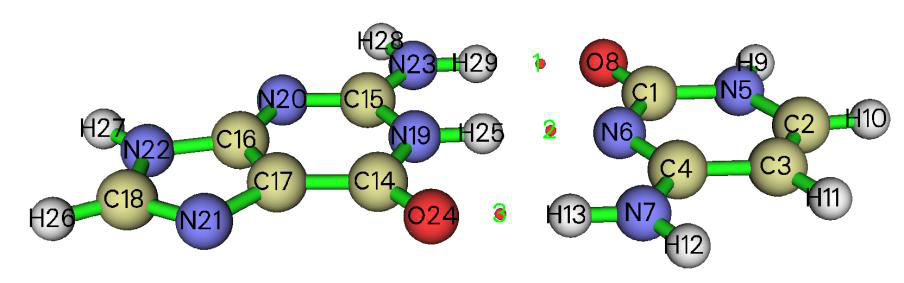

<!-- p.710 -->
In above figure Becke surface is represented by points, and the three red zones correspond to high electron density regions, which stem from presence of H-bonds. This example demonstrated that Becke surface analysis is useful to reveal the region where intermolecular interaction is evident.

The present analysis can also be realized by means of Hirshfeld surface analysis, see next section, and the computational cost is lower when the number of atoms is high.


### 4.12.6 Hirshfeld surface analysis and fingerprint plot analysis on urea crystal


In this section we perform Hirshfeld surface analysis for urea crystal to understand the intermolecular interaction in the crystal.

Note: “Performing Hirshfeld surface analysis by Multiwfn to visually display interactions in molecular crystals and complexes” (http://sobereva.com/701, in Chinese) is an extremely detailed blog article which comprehensively introduces the Hirshfeld/Becke analysis in Multiwfn and present very rich examples, highly recommend reading! If you have read it, you do not need to read the present section.

Preparation of structure for analysis You can directly use .cif file of urea crystal as input file, a large enough supercell is needed to construct (can be done via option 19 in subfunction 7 of main function 300), so that the molecule we focused on could be fully immersed in environment molecules. You can also perform analysis based on a molecular cluster (and this is the better way), which contains a central molecule and a batch of molecules surrounding it, Multiwfn directly provides function to build the cluster based on crystal structure. You just need to boot up Multiwfn and input

urea.cif //.cif file of urea, please find it from Internet. PS: DO NOT manually extend it to supercell, otherwise computational cost will significantly increase

300 // Main function 300 7 // Geometry operation 25 // Extract a molecular cluster (central molecule + surrounding ones) 1 // The whole molecule containing atom 1 is taken as the central molecule, this molecule and all surrounding ureas close to it will be extracted

[Press ENTER button] // Use recommended criterion of 1.2 to detect contact


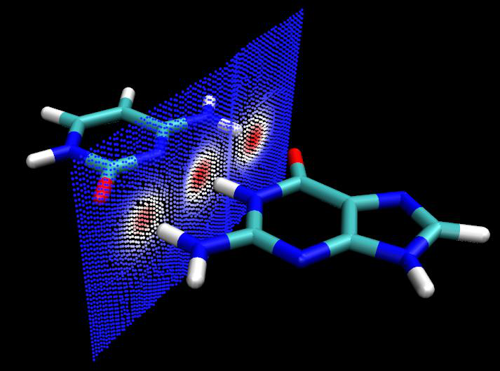

<!-- p.711 -->
Now the cluster has been extracted out, the atom indices of the central urea is shown on screen, please record it since which will be used later. Then you can use option 0 to visualize the cluster structure, if it is found to be reasonable, then you can use use corresponding option to export it as a structure file.

Hirshfeld surface analysis on urea cluster In this example we use the cluster model of urea shown below, which can be constructed in the above way. The corresponding geometry file examples\Urea_crystal.pdb contains 11 ureas, the central one will be defined as the fragment in our Hirshfeld surface analysis.

Boot up Multiwfn and input examples\Urea_crystal.pdb 12 // Quantitative molecular surface analysis 1 // Change surface type 5 // Use Hirshfeld surface 16,36,58,2,77,55,34,13 // The index of the atoms in the central urea 0 // Start calculation. Note that the default mapped function dnorm is used here After the calculation is finished, you can select option 8 to export the surface vertices with the mapped electron density to vtx.pqr, and then plot them in VMD via the way described in the last section.

Next, we draw fingerprint plot. Input below commands 20 // Fingerprint plot analysis 0 // Start fingerprint analysis 1 // Save fingerprint plot to an image file You will find a .pdf file has generated in current folder, after opening it you will see the graph below


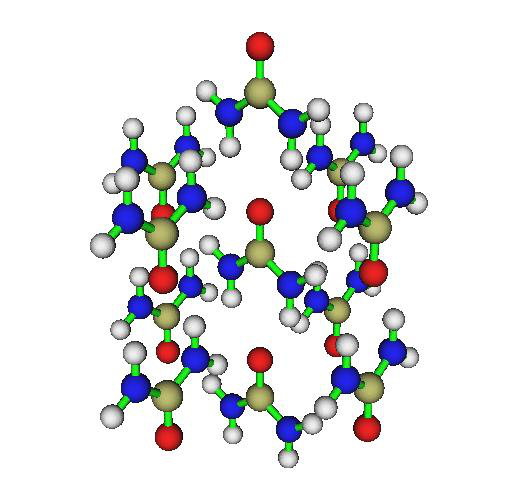

<!-- p.712 -->
In this figure, X and Y axes correspond to di and de, respectively. Each vertex on the Hirshfeld surface corresponds to a point in the map. It can be seen that there are two spikes at the bottom left of the plot, this observation suggests that urea behaves as both H-bond acceptor (the bottom spike, di > de) and H-bond donor (the left spike, di < de). The yellow, green and purple colors indicate that the point density at corresponding regions is high, medium and low, respectively.

Fingerprint plot for local contact surface In Multiwfn, the fingerprint plot can be drawn not only for overall Hirshfeld surface, but also for local contact surface (see Section 3.15.5 for detail). Let us check the fingerprint plot of the local contact surface between the four hydrogens in the central urea and all atoms in the surrounding ureas.

After closing the window of showing fingerprint plot, select option -1 to return to upper level of menu. Now, we need to define "inside atoms" and "outside atoms", only the vertices on the contact surface between the two sets will be taken into account during the fingerprint plot analysis. We choose option 1 to define the "inside atoms". You will be asked to input two conditions in turn, their intersection will define the set. We first press ENTER button directly to use default atom range, namely all atoms in the central urea, and then input H to only select all hydrogens among them. As can be seen from screen, all the four hydrogens in the central urea now have been defined as the "inside atoms". Since the default "outside atoms" are just all atoms in surrounding ureas, we do not need to modify it.

Now, select option 0 to start the fingerprint plot analysis again. You can find following information on screen:


```text
The area of the local contact surface is    65.639 Angstrom^2
The area of the total contact surface is    94.511 Angstrom^2
The local surface occupies   69.45% of the total surface
```

This information indicates that the area occupied by the local contact surface defined by us is 65.6 Å2. Clearly, by properly utilizing this feature, you can obtain the area corresponding to any specific contact between the central molecule and the surrounding molecules.

After that, choose option 1 to save corresponding fingerprint plot as a .pdf file, then after


<!-- p.713 -->
opening it you will see

Since this time we only considered the four hydrogens in the central urea, which purely behave as hydrogen donor, so only one spike on the left side of the plot can be observed. The gray points in the map above correspond to the points on the entire Hirshfeld surface but not on the current local contact surface.

It is interesting to check the shape of the local contact surface. To this end, after closing the fingerprint map, we choose option 4 to export all points on the local contact surface to finger.pqr in current folder. Plot them in VMD by using the method described in Section 4.12.5, you will see

Clearly, this surface well exhibits the contact between the hydrogens in the central urea and the atoms in the surrounding ones. There are four red regions on the surface, which correspond to the four H-bonds, where H atoms in the central urea behave as a H-bond donor.

Next, we check the fingerprint plot between the hydrogens in the central urea and the oxygen


<!-- p.714 -->
atom marked by the yellow arrow in above figure. Input the following commands

-1 // Return to upper level of menu 1 // Set the inside atoms to consider [Press ENTER button] // Do not set constraint for atomic indices H // The inside atoms must be hydrogen 2 // Set the outside atoms to consider 76 // The index of the oxygen in one of surrounding urea [Press ENTER button] // Do not set element filter condition 0 // Start fingerprint analysis From the outputted information on screen, you can find the local contact surface produced this time is 6.8 Å2, which corresponds to 7.2% of total contact surface area. Then we draw fingerprint plot and the corresponding surface vertices, as shown below

In the fingerprint plot you can see that the distribution scope of surface points is narrow, and the spike is quite evident, suggesting the strong H-bond character due to the contact of the H and O.

Fingerprint plot is especially useful for comparison of intermolecular interactions in different crystals, see CrystEngComm, 11, 19 (2009) for discussions.

Obtain contact area between very element pair Multiwfn is also able to simultaneously print contact area between every element pair and obtain the percentage occupancy from the total contact area. To this aim, after entering option “20 Fingerprint plot and local contact analyses”, choose option “3 Calculate contact area between different elements”, then the following information will be immediately printed:


```text
Inside element, outside element, their contact area (Angstrom^2) and percentage (%)
 H-H        42.602      45.076
 H-C         3.355       3.550
 H-N         4.101       4.339
 H-O        15.581      16.486
 C-H         4.943       5.230
 N-H         7.156       7.572
 O-H        16.774      17.748

The same as above, but do not distinguish inside and outside elements
```


<!-- p.715 -->

```text
 H-H              42.602      45.076
 H-C/C-H           8.298       8.780
 H-N/N-H          11.257      11.910
 H-O/O-H          32.355      34.234

Area of total contact surface is    94.511 Angstrom^2
```

The information is clear to understand. For example, as highlighted by yellow, the contact area between inside H atoms and outside O atoms is 15.581 Å2, that between inside O atoms and outside H atoms is 16.774 Å2, which occupy 16.486% and 17.748% of total contact area (94.511 Å2), respectively. They totally have percentage contribution of 16.486% + 17.748% = 34.234%.

To inspect more intuitively, you can copy the data printed by Multiwfn and import them to e.g. Origin software and then plot pie chart like this:

Clearly, H-N/N-H and H-O/O-H types of contact correspond to typical intermolecular H-bond, from the pie chart one can see that nearly half of contact area relates to H-bond. Although H-H contact contributes to as many as 45.1% of Hirshfeld surface, it evidently does not correspond to favorable intermolecular interaction, since the hydrogens show positive charge and thus the H-H contact is electrostatically repulsive.

Using VMD to plot color-mapped isosurface of Hirshfeld/Becke surface Here I describe how to easily plot very pretty Hirshfeld surface mapped by electron density with promolecular approximation, this map looks much better than those shown above. The urea cluster is still taken as example.

Boot up Multiwfn and input examples\Urea_crystal.pdb 12 // Quantitative molecular surface analysis 1 // Change surface definition 5 // Use Hirshfeld surface 16,36,58,2,77,55,34,13 // The index of the atoms in the central urea 0 // Start calculation -2 // Export the grid data used to define Hirshfeld surface as surf.cub in current folder 13 // Calculate grid data of mapped function and export it to mapfunc.cub in current folder Now you have surf.cub and mapfunc.cub in current folder, move them to the VMD folder. Then copy the examples\scripts\hirsh_rho.vmd file into the VMD folder. Boot up VMD, input source hirsh_rho.vmd in VMD console window to run this script. For the present case it is better to also input material change diffuse Translucent 0.8 in the console window to make the surface brighter.


<!-- p.716 -->
Finally, you can see the graph below. Note that the plotting script sets color transition to Blue-White-Red, which corresponds to electron density varying from 0.0 to 0.015 a.u. Clearly, from the graph one can easily recognize the evident intermolecular interaction regions.

By the way, sometimes you need to fine tune the color scale. The default value can be modified in hirsh_rho.vmd. You can also directly define it in this way in VMD: Enter “Graphics” - “Representation”, choose the representation corresponding to the isosurface, then click “Trajectory” tab, input lower and upper limits in the two text boxes and then press ENTER button to take effect.

Based on the GC.wfn used in Section 4.12.5, you can use the same method as above to plot electron density mapped Hirshfeld surface, see below.

Via very similar procedure, you can also plot dnorm mapped Hirshfeld or Becke surface, there are only two difference compared to the above case: (1) In main function 12, after choosing option to 1 to switch to Hirshfeld or Becke surface, you need to choose option 2 and select dnorm as mapped function (2) examples\scripts\hirsh_dnorm.vmd script should be used instead of the hirsh_rho.vmd used above.

Much more examples of Hirshfeld/Becke analysis and relevant skills can be found in my blog article http://sobereva.com/701 (in Chinese).


### 4.12.7 Predict density of molecular crystal of FOX-7

As introduced in Section 3.15.1, many condensed phase properties of a molecule can be


<!-- p.717 -->
predicted based on the result of quantitative molecular surface analysis of electrostatic potential (ESP). For example, in Mol. Phys., 107, 2095 (2009), Politzer et al. showed that crystal density of molecules only containing C, H, N, O can be predicted as


$$\rho=\alpha\frac{M}{V_{\mathrm{m}}}+\beta(v\sigma_{\mathrm{tot}}^{2})+\gamma$$

<!-- formula-ocr: formula_p717_339.png 已替换为LaTeX, 原图保留备查 -->

where α = 0.9183, β = 0.0028 and γ = 0.0443 when the wavefunction is generated at B3PW91/6-31G** level and the unit of M/Vm and 𝜈𝜎tot 2 are g/cm3 and (kcal/mol)2, respectively. In this section, I illustrate how to use above formula to predict density of molecular crystal of FOX-7 (1,1-diamino-2,2-dinitroethene), which is an insensitive high explosive compound. More illustrations of property prediction can be found in my blog article "Using Multiwfn to predict crystal density, heat of vaporization, boiling point and solvation free energy" (in Chinese, http://sobereva.com/337).

First, we optimize geometry of FOX-7 and yield wavefunction file at B3PW91/6-31G** level, which is the level used by Politzer et al. in their Mol. Phys. paper. The resulting FOX-7.wfn has provided as examples\FOX-7.wfn.

Boot up Multiwfn and input below commands: examples\FOX-7.wfn 12 // Quantitative molecular surface analysis 0 // Start analysis for default real space function (ESP) on default surface (0.001 a.u. isosurface of electron density)

After a while, you will find below output on screen


```text
 Volume:   942.48700 Bohr^3  ( 139.66220 Angstrom^3)
 Estimated density according to mass and volume (M/V):    1.7606 g/cm^3
...[ignored]
 Product of sigma^2_tot and miu:   0.00020164 a.u.^2 (   79.40119 (kcal/mol)^2)
 Internal charge separation (Pi):   0.03740373 a.u. (     23.47121 kcal/mol)
```

From the output, we find that M/Vm=1.7606 g/cm3 and 2totνσ=79.40119 (kcal/mol)2, therefore

the density could be predicted as 0.9183*1.7606+0.0028*79.40119+0.0443=1.883 g/cm3. The experimental density of FOX-7 crystal is 1.885 g/cm3, which can be found at corresponding wiki page (https://en.wikipedia.org/wiki/FOX-7). Clearly, our prediction is extremely successful, the error is merely -0.002 g/cm3! However, the surprisingly good result is fortuitous to a large extent, since according to the test in the Mol. Phys. paper, the RMS error using above prediction formula is 0.047 g/cm3.


### 4.12.8 Quantitative analysis of orbital overlap distance function D(r) on thioformic acid molecular surface


The content of this section was kindly contributed by Arshad Mehmood and slightly adapted by Tian Lu.

This example is a continuation of Section 4.5.7. Here I illustrate the quantitative analysis of orbital overlap length function D(r) on molecular electron density isosurface of thioformic acid.

Boot up Multiwfn and input following commands:


<!-- p.718 -->
examples\ThioformicAcid.wfn // Thioformic acid optimized at B3LYP/6-311++G(2d,2p) 12 // Quantitative analysis of molecular surface 2 // Select mapped function 6 // Orbital overlap distance function D(r), which maximizes EDR(r;d) with respect to d 2 // Use default value of total number, start and increment of EDR exponents. Please consult Section 4.5.7 for more information.

0 // Start analysis now! Now the analysis starts. This step will take some time. Once calculation is finished, following results will be printed on screen along with other information:


```text
Global surface minimum:  2.789918 a.u. at   1.983402  -0.346198   1.757884 Ang
Global surface maximum:  3.541349 a.u. at  -2.861073  -1.074395  -0.095237 Ang

 The number of surface minima:     4
   #             Value           X/Y/Z coordinate(Angstrom)
     1          3.296958      -1.622302   2.055665   0.423383
     2          3.218284       0.950838   2.841231   0.010991
*    3          2.789918       1.983402  -0.346198   1.757884
     4          2.790103       2.078805  -0.344424  -1.731277

 The number of surface maxima:    10
   #             Value           X/Y/Z coordinate(Angstrom)
*    1          3.541349      -2.861073  -1.074395  -0.095237
     2          3.401958      -0.539716   2.324441   0.014652
     3          3.502485       0.041422  -2.239222  -0.308278
     4          3.502696       0.089030  -2.257271   0.004859
     5          3.494004       0.207205  -2.075594  -0.673828
     6          3.496480       0.164501  -2.070255   0.707373
     7          3.359381       0.542328   1.465019  -1.650518
     8          3.358980       0.496994   1.456262   1.657761
     9          3.311711       2.030429   1.904600   0.023877
    10          2.918240       2.847314  -1.370280   0.021275
```

Now select 0 to view surface minima and maxima:

This graph shows molecular structure and surface extrema (red and blue spheres correspond to surface maxima and minima, respectively). It can be seen that surface minima is present on oxygen


<!-- p.719 -->
atom due to compact lone pair and surface maxima is located on sulfur atom due to its more diffuse and weakly bound lone pair electrons.


### 4.12.9 Evaluate vdW surface area of the whole system as well as individual fragment


Note: Chinese version of this section is my blog article “Using Multiwfn and VMD to calculate molecular surface area and fragment surface area” (http://sobereva.com/487, in Chinese), which also contains more discussions.

After reading Section 4.12.1, you must have already known how to evaluate area of molecular vdW surface. In this section, I will discuss more about this topic. Dopamine will be employed as example, its properly optimized geometry is shown below

Evaluating vdW surface area of dopamine corresponding to condensed phase

According to the Bader's paper J. Am. Chem. Soc., 109, 7968 (1987), ρ = 0.001 and 0.002 a.u. isosurfaces can be defined as vdW surface in gas and condensed phase, respectively. The volume of the latter is smaller than the former, because in condensed phase the vdW surface penetration must be evident due to intermolecular interaction. Here we will calculate area of vdW surface corresponding to condensed phase for dopamine. Boot up Multiwfn and input

examples\dopamine.wfn // Generated using B3LYP/6-31G* level. Commonly the quality of density at this level is absolutely adequate

12 // Quantitative analysis of molecular surface 1 // Select the way to define surface 1 // Isosurface of electron density 0.002 // Isovalue (a.u.) 6 // Start analysis without consideration of mapped function You only need to pay attention to below line in the output:


```text
Overall surface area:         648.64293 Bohr^2  ( 181.63855 Angstrom^2)
```

That means, the area of the whole molecule is 181.6 Å2.

Evaluating surface area of amino group in dopamine Next, I illustrate how to calculate surface area of a specific fragment, the amino group in the dopamine is taken as example. In the post-processing menu, we input

12 // Output surface properties of specific fragment 3,19,20 // The indices of the atoms in the amino group You will see


```text
Overall surface area:          99.67659 Bohr^2  (  27.91229 Angstrom^2)
```

The contribution of the amino group to the whole vdW surface thus can be calculated as 27.9/181.6*100%=15.4%.


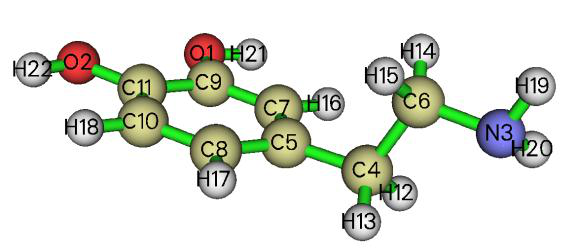

<!-- p.720 -->
If you want to visualize the vdW surface that attributed to the amino group, we should input y to let Multiwfn export locsurf.pqr in current folder. Then load this file into VMD visualization program (http://www.ks.uiuc.edu/Research/vmd/), in the "Graphics" - "Representation" set "Drawing method" as "Points", set "Coloring method" as "ResID", and then load the structure file of present system (examples\dopamine.xyz) into VMD to also plot the molecular geometry in the map, after slight adjustment you will see

In above figure, each point denotes a vertex comprising the electron density isosurface of 0.002 a.u., the blue area corresponds to the local region belonging to the amino group. Clearly, the partition of the entire vdW surface is very reasonable, thus the outputted area of the amino group by Multiwfn must be reliable and meaningful.

Evaluating vdW surface area without wavefunction information Sometimes we are difficult to generate wavefunction file due to various reasons, in this case we can still use Multiwfn to evaluate vdW surface area. In this case, the electron density we employed should be promolecular density, which is the molecular electron density approximately constructed by simply superimposing the electron density of each atom in its isolated state according to the coordinates of the atoms in the molecule..

For example, we only have examples\dopamine.xyz in hand, you can boot up Multiwfn and load this file, then input

12 // Quantitative analysis of molecular surface 1 // Select the way to define surface 2 // Isosurface of a specific real space function 1 // Promolecular electron density 0.002 // Isovalue (a.u.) 6 // Start analysis without consideration of mapped function The calculated result is


```text
Overall surface area:         697.18104 Bohr^2  ( 195.23060 Angstrom^2)
```

Obviously the result is reasonable, the value 195.2 Å2 is in qualitative agreement with the 181.6 Å2 we previously calculated based on the B3LYP/6-31G* wavefunction.

If then we calculate area of the amino group moiety, the result will be 31.5 Å2, which is also close to the 27.9 Å2 calculated based on the DFT density. In particular, the occupancy of this group 31.5/195.2*100%=16.1% is even nearly quantitatively consistent with the 15.4% we calculated before.


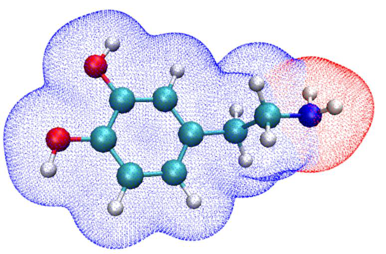

<!-- p.721 -->

### 4.12.10 Quantification of area of sigma-hole and pi-hole

Introduction

σ-hole and π-hole correspond to local regions with evident positive electrostatic potential (ESP) on van der Waals (vdW) surface due to depletion of σ-electron and π-electron, respectively. The region corresponding to these holes can behave as electron acceptor (local Lewis-acid) to form non-covalent interactions that are dominated by electrostatic attraction, such as halogen bond. If you are not familiar with these two concepts, reading review article J. Comput. Chem., 39, 464 (2017) is

recommended. In literature, the σ-hole and π-hole are commonly revealed via analysis of ESP extrema on vdW surface, the ESP value at the corresponding extrema is often employed as a quantitative measure of potential strength as electron acceptor.

In the present section, I will show it is also possible to use Multiwfn to calculate surface area

corresponding to selected σ-hole and π-hole, and meantime based on the outputted file, the corresponding local surface could be directly visualized in VMD. I suggest you read part 2 of Section 3.15.2.2, in which the algorithm used in this analysis is described. ClPO2 is taken as example

here, which contains σ-hole at the end of chlorine atom as well as π-hole above and below the phosphorus atom.

Quantitative analysis of ESP on vdW surface First, we carry out regular quantitative analysis of ESP on vdW surface. Boot up Multiwfn and input

examples\ClPO2.fch // Geometry and wavefunction were produced at PBE0/def2-TZVP 12 // Quantitative molecular surface analysis 0 // Start analysis, the mapped function is default to ESP As can be seen from the output, three ESP maxima on the vdW surface are found, their ESP values and coordinates are shown below:


```text
   #       a.u.         eV      kcal/mol           X/Y/Z coordinate(Angstrom)
     1  0.07562734    2.057924   47.456909      -1.949844  -0.043516  -0.320257
     2  0.04258971    1.158925   26.725470       0.015842  -0.054525   3.395121
*    3  0.07568641    2.059532   47.493977       1.945305   0.044502  -0.234288
```

Now enter option 0 to check index and visually examine position of the surface ESP maxima, see the left side of the figure below (all surface minima are hidden). If you plot ESP colored vdW surface as well as surface extrema according to the method described in Section 4.A.13, you can obtain right side of the graph below, in which red and blue correspond to positive and negative ESP, respectively.


<!-- p.722 -->
From above figure it can be seen that surface maxima 1 and 3 correspond to π-hole at the two sides, while maximum 1 corresponds to σ-hole.

Check surface region corresponding to positive ESP value

Since σ-hole and π-hole correspond to evidently positive ESP value, it is naturally expected that area of positive ESP region around a surface maximum is a direct measure of σ/π-hole size. Now assume that we want to measure area of π-hole corresponding to maximum 3, in the post-processing menu we should input below commands

14 // Calculate area and function average in a region around a surface extreme 2 // Surface maximum

3 // Select maximum 3 (corresponding to one of π-holes) 0 // Set criterion as 0 a.u. Now we can find below output


```text
Number of surface vertices in selected surface region:      4307
Area of selected surface region:    55.946 Angstrom^2
Average value of selected surface region:     0.02650 a.u.
Product of above two values:         1.48230 a.u.*Angstrom^2
```

The output indicates that there are 4307 surface vertices directly or indirectly connected to maximum 3 with ESP values larger than 0 (i.e. positive ESP), the area of this local surface is 55.94 Å2 and average ESP is 0.0265 a.u. According to chemical intuition, the calculated area is obviously

too large compared to expected π-hole area, what is the reason?

In current folder, you can find a file named selsurf.pqr, which contains coordinate all selected surface vertices and its "Charge" column corresponds to ESP in a.u. Now we load this file into VMD program. In addition, in the post-processing menu of Multiwfn, we choose option 5 to export a pdb file containing molecular geometry, and then also load this file into VMD. In the "Graphics" - "Representation" panel of VMD, we set "Drawing Method" of the molecule as "Licorice" with "Bond Radius" of 0.2, then set "Drawing Method" of the surface vertices as "Point" with "Size" of 16, then set "Coloring Method" as "Charge". The current graph should look like below


<!-- p.723 -->
In this graph, the bluer the point, the higher the ESP value. It is evident that our currently selected

local surface does not only correspond to a π-hole, but corresponds to the entirely positive ESP surface region.

Calculate surface area corresponding to π-hole Clearly, if we want to only study a region corresponding to a π-hole, the ESP criterion should be set to a larger value than 0 but smaller than the ESP value at the π-hole surface maximum (0.0756 a.u., see above). In order to find an appropriate criterion, in the "Graphics" - "Representation" panel, we switch "Selected Molecule" to the entry corresponding to selsurf.pqr, then input charge > 0.04 in "Selected Atoms" textbox, now the graphical window becomes:

From the graph it can be seen that criterion of 0.04 a.u. is suitable for defining the local surface

corresponding to π-hole of present system. The map above contains two blue local surfaces since there is a π-hole at each side of the phosphorus atom. To calculate area of each π-hole, we input

14 // Calculate area and function average in a region around a surface extreme 2 // Surface maximum

3 // Select maximum 3 (corresponding to one of π-holes) 0.04 // Set criterion as 0.04 a.u. The result is


```text
 Number of surface vertices in selected surface region:       271
 Area of selected surface region:     3.570 Angstrom^2
 Average value of selected surface region:     0.05772 a.u.
 Product of above two values:         0.20608 a.u.*Angstrom^2
```

The calculated 3.57 Å2 is a very reasonable area of a typical π-hole. If you visualize the generated selsurf.pqr by VMD to examine the selected local surface, you will find the region just corresponds

to one of the two π-holes shown in above surface map. Evidently, the total area of the π-holes in


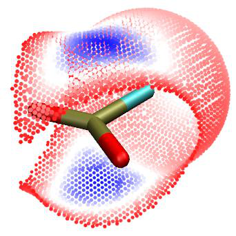

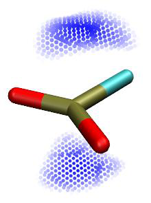

<!-- p.724 -->
current system should be 2*3.57=7.14 Å2.

Calculate surface area corresponding to σ-hole Next, we use similar way to calculate area of the σ-hole at the end of the chlorine atom. In this case we should not use 0.04 a.u. as criterion, because the ESP value at surface maximum of the σ-hole is only 0.0425 a.u. In VMD, we can try different criterions by inputting charge > xxx until

finding the best one to represent the σ-hole. After a few attempts, 0.03 a.u. was found to be a reasonable value, therefore we input below command in the post-processing menu

14 // Calculate area and function average in a region around a surface extreme 2 // Surface maximum

2 // Select maximum 2 (corresponding to the σ-hole) 0.03 // Set criterion value as 0.03 a.u. The area is found to be 4.88 Å2, while average ESP value in this region is 0.03617 a.u., which is

evidently smaller than that of the π-hole. If you plot the exported selsurf.pqr in VMD as points, and set color scale as 0.0~0.05 (In the "Representation" panel, choose "Trajectory" tab, then set "Color Scale Data Range"), you will see the following map, indeed the selected surface region well exhibits

expected σ-hole character.

It is important to point out that the calculated area is directly dependent on the choice of the criterion, while there is no unique way of determining the perfect criterion. In practical study, you can try to define the criterion as e.g. 60% of ESP value at corresponding surface maximum, or consider defining the criterion as a value lower than surface maximum by e.g. 10 kcal/mol.

Noticeably, option 14 can not only measure area around a surface maximum, but can also calculate area around a surface minimum. Thus, you can try to use this feature to quantify the area corresponding to various lone pairs.


### 4.12.11 Basin-like analysis of molecular surface for electrostatic potential


Just as the whole 3-dimensions molecular space can be partitioned as basins based on e.g. electron density and electron localization function so that character of local regions could be discussed, it is also possible to employs analogous idea to partition the whole molecular surface as individual local surface based on a specific mapped function, so that chemically interesting information could be gained. In this example, we will decompose the whole vdW surface of ClPO2 to contributions that source from its surface ESP minima and maxima. Please read part 3 of Section


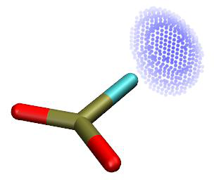

<!-- p.725 -->
3.15.2.2 to gain basic knowledge about the algorithm employed in this analysis. The ClPO2 has already been investigated by means of molecular surface analysis in Section 4.12.10, please read it if you have not.

Boot up Multiwfn and input examples\ClPO2.fch // Geometry and wavefunction were produced at PBE0/def2-TZVP 12 // Quantitative molecular surface analysis 0 // Start analysis, the mapped function is default to ESP 15 // Basin-like partition of surface and calculate areas Then you can find below output on screen


```text
Minimum   1  N_vert:  1596,  19.615 Angstrom^2  Avg. value:   -0.023076 a.u.
Minimum   2  N_vert:  1613,  19.874 Angstrom^2  Avg. value:   -0.022824 a.u.

Maximum   1  N_vert:  1312,  16.689 Angstrom^2  Avg. value:    0.028729 a.u.
Maximum   2  N_vert:  1753,  21.539 Angstrom^2  Avg. value:    0.023524 a.u.
Maximum   3  N_vert:  1244,  16.040 Angstrom^2  Avg. value:    0.029336 a.u.
```

Above output presents information of "surface basins" (i.e. local molecular surfaces) corresponding to different surface extrema. The "N_vert" denotes the number of surface vertices belonging to the surface basin, the area as well as average of the mapped function in the surface basin are also shown. Multiwfn also exported a file named surfbasin.pdb in current folder, which contains all surface vertices, their B-factors correspond to the index of the surface basin that the vertex attributed to (positive and negative Beta values correspond indices of surface maxima and minima, respectively). Index of a surface basin is identical to index of corresponding surface extreme, each surface basin contains and only contains one surface extreme. Note that surface minimum with positive value and surface maximum with negative value do not have accompanied surface basin, this is easy to understand if you have correctly understood the algorithm described in Section 3.15.2.2.

In order to vividly examine the surface basins, you can load the surfbasin.pdb into VMD, then set drawing method as "Points" while set coloring method as "Beta". Also, we choose corresponding options in Multiwfn to export pdb file of molecular structure (option 5) and surface extreme (option 2) and then display them in VMD. Finally, you can obtain the graph below, calculated data are also marked

In the current graph, red points around the minimum 1 collectively exhibit the region of surface basin 1, while gray and iceblue points display surface basin corresponding to maxima 1 and 2,


<!-- p.726 -->
respectively. Clearly, via the analysis we currently employed, we are able to make clear the intrinsic contributions that stem from different extrema to the overall positive or negative surface region. For example, the percentage contribution to the positive surface region due to the maximum 2, which

results from σ-hole of the chlorine atom, is 21.539/(16.689+21.539+16.040)×100%=39.7%.

The sum of areas of all maxima (minima) is not exactly identical to the positive (negative) surface area outputted in the "Summary of surface analysis" section, because there are some boundary surface facets, whose three vertices do not have identical attribution. These facets are ignored during calculation of area and average of function value of surface basins.

By the way, you can also make VMD to solely display specific surface basin. For example, by inputting beta=-1 and beta=2 in "Selected Atoms" textbox of "Graphics" - "Representation" panel of VMD and then set color as orange, you will respectively observe surface basin corresponding to minimum 1 and maximum 2:

It is noteworthy that, due to the C2v molecular symmetry, minima 1 and 2 should have identical values, maxima 1 and 3 should also have identical values. The slight violation of the equivalency, as shown in above computed data, is due to numerical aspect reasons. When you report data of the

surface basins corresponding to the π-hole (maxima 1 and 3), it is reasonable to take the average of them, that is the area in each side should be (16.040+16.689)/2=16.4 Å2.


### 4.12.12 Estimate kinetic diameter for small molecules

Note: Chinese version of this section with more discussions is my blog article “Using Multiwfn to calculate dynamic diameter of molecules” (http://sobereva.com/503).

The kinetic diameter is an important quantity in the study of gas separation. Most cited values of kinetic diameter of small molecules are taken from Breck's book Zeolite Molecular Sieves; Structure, Chemistry and Use, which was published in 1974. In J. Phys. Chem. A, 118, 1150 (2014), the authors proposed a general way of calculating kinetic diameter purely based on isosurface of electron density. As exemplified below (adapted from the J. Phys. Chem. A paper), the distance enclosed by the two black arrows could be used to define the kinetic diameter


<!-- p.727 -->
In the paper, it is found that the calculated values match best to the Breck's values if isovalue of electron density is set to 0.0015 a.u. when PBE0/def2-TZVP is used in the wavefunction generation.

In this section, I will show how to use the quantitative molecular surface analysis module to realize the above-mentioned method to calculate kinetic diameter for a typical molecule, CO. The .fch file yielded by optimization task at PBE0/def2-TZVP level has been provided as examples\CO.fch.

Before doing the calculation, we should use main function 0 to check the orientation of the molecule in the CO.fch, as shown below

Clearly, the molecular axis is exactly parallel to the Z-axis, therefore the kinetic diameter can be calculated as difference between surface vertex with most positive X value and that with most negative X value (the surface is defined as 0.0015 a.u. isosurface of electron density).

Now we conduct the calculation. Boot up Multiwfn and input examples\CO.fch 12 // Quantitative analysis of molecular surface 1 // Select the way to define surface 1 // Isosurface of electron density 0.0015 // Isovalue 6 // Start analysis without consideration of mapped function After properly scrolling up, you can find below output:


```text
Among all surface vertices:
Min-X:     -1.7527  Max-X:    1.7528 Angstrom
Min-Y:     -1.7527  Max-Y:    1.7528 Angstrom
```


<!-- p.728 -->

```text
Min-Z:     -2.5093  Max-Z:    2.0951 Angstrom
```

That means the kinetic diameter can be calculated as 1.7528-(-1.7527)=3.505 Å. According to Table 2 of the J. Phys. Chem. A paper, the slope of fitting is 1.025, therefore the final estimated value should be 3.505/1.025=3.42 Å, which is in qualitative agreement with the Breck's value (3.76 Å).

The CO is a very simple case, while for much more complicated molecule, you have to use VMD (http://www.ks.uiuc.edu/Research/vmd/) to measure the distance between two proper surface vertices to estimate the kinetic diameter. Again taking the CO as example, in the post-processing menu, choose option 6 to export vtx.pdb in current folder, which records all surface vertices. Then load this file into VMD, in the "Graphics" - "Representation", set "Drawing method" as "Points". Then in the VMD main window, choose "Display" - "Orthographic". After that, activate the VMD graphical window, press button 2 on your keyboard, then click two vertices at proper positions. From the map below, you can find the distance between the two vertices is 3.47 Å, which is very close to the value 3.505 Å given above.

Choosing proper surface vertices is not quite easy, please be very patient. If the vertices are mis-selected, you can enter "Graphics" - "Labels", then delete the unwanted atoms labels and bond labels.


### 4.12.13 Using local electron affinity and local electron attachment energy to reveal electrophilic regions


Note: See my blog article “Using Multiwfn to investigate preferential site and difficulty of nucleophilic reactions as well as weak interactions through local electron attachment energy (LEAE)” (http://sobereva.com/676, in Chinese) for more discussion and examples about this topic.

We have studied average local ionization energy (IEL) in Section 4.12.2, please read it first if you have not, since the present section can be viewed as an extension of that section. There are two functions closely related to IEL, namely local electron affinity (EAL) and local electron attachment energy (Eatt), which will be described and illustrated in this section.

Local electron affinity IEL was proposed in J. Mol. Model., 9, 342 (2003) and defined as


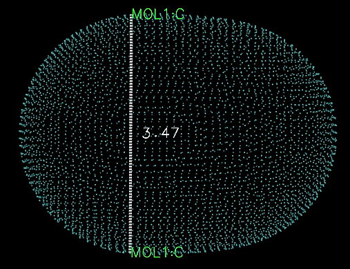

<!-- p.729 -->

$$E A_{\mathrm{L}}(\mathbf{r})=\frac{-\sum_{i\in\mathrm{v i r}}\left|\varphi_{i}(\mathbf{r})\right|^{2}\varepsilon_{i}}{\sum_{i\in\mathrm{v i r}}\left|\varphi_{i}(\mathbf{r})\right|^{2}}$$

<!-- formula-ocr: formula_p729_340.png 已替换为LaTeX, 原图保留备查 -->

i  vir

where ε denotes orbital energy, φ is orbital wavefunction. EAL corresponds to user-defined function 27 in Multiwfn.

EAL approximately reveals electron affinity at a given point based on Koopmans' approximation. It is expected that the more positive the EAL at a point, the stronger the electrophilicity in this region. Clearly, this nature makes EAL have certain ability in revealing favorable site of nucleophilic attack.

The best way of exhibiting distribution of EAL should be mapping it to molecular surface via different colors. In Section 4.12.2 I have illustrated how to plot IEL mapped molecular surface via script of VMD program based on Multiwfn output files, below I will illustrate how to plot this kind of map for EAL via almost the same way.

examples\CH3Cl.fchk will be taken as example, it was generated at B3LYP/6-31G* level. Note that EAL is meaningful only when diffuse functions are not employed. In addition, you must use a file containing virtual orbitals as input file, such as .mwfn, .fch and .molden, because virtual orbitals are involved in EAL calculation.

To plot the map, you should do following things (below procedure only works for Windows platform, for Linux platform you should write similar scripts yourself)

- Copy LEA_isoext.bat and LEA_isoext.txt from "examples\scripts\local_EA" folder to current folder. Edit the .bat file by text editor, set the VMD paths to actual VMD folder on your machine, and set the path of input file for Multiwfn as its actual path, namely examples\CH3Cl.fchk.

- Copy LEA_isoext.vmd from "examples\scripts\local_EA" folder to VMD folder
- Double click LEA_isoext.bat to run it. Then Multiwfn will be invoked to generate density.cub (cube file of ρ), userfunc.cub (cube file of EAL) and surfanalysis.pdb (containing surface extrema of EAL on ρ = 0.01 a.u. isosurface), then they will be automatically moved to VMD folder

Boot up VMD and input source LEA_isoext.vmd in VMD console window to run this script, then you will see the graph below

This map shows EAL mapped ρ = 0.01 a.u. isosurface, the color scale is from -0.80 (blue) to -0.30 (red) a.u., cyan spheres correspond to maxima of EAL on this surface. As can be seen, the regions around the hydrogens have most positive EAL, indicating that they are the most electrophilic


<!-- p.730 -->
part of the molecule. Presence of these regions comes from the fact that the hydrogens have positive charge. At the end of the Cl atom there is also a region with relatively more positive EAL, which

indicates the existence of σ-hole of the Cl atom.

To inquire exact value of the surface extrema, you should activate OpenGL window of VMD, then click button 0 on your keyboard to enter inquire mode, then click center of a surface extreme, for example, the extreme at the top of the map above, you will find its index on VMD console window (index 9). Then enter [atomselect top "index 9"] get beta in VMD console window, you will find the value is -12.49, which is given in eV, and corresponds to -12.49/27.2114 = -0.46 a.u.

It is worth to note that the most appropriate color scale of EAL is usually very different from system to system. If you find the entire isosurface is monocolor, or the color in different regions cannot be clearly distinguished, you should properly adjust lower and upper limits of color scale. If you input for example mol scaleminmax 0 1 -1.0 -0.4 in VMD console window, then the color scale will be changed to -1.0 ~ -0.4 a.u.

By the way, in order to fully understand how the script works, you are encouraged to manually input the commands recorded in the LEA_isoext.txt one by one into Multiwfn window.

Local electron attachment energy This function was defined in J. Phys. Chem. A., 120, 10023 (2016) as


$$E_{\mathrm{att}}(\mathbf{r})=\frac{n\sum\limits_{i=LUMO}^{\varepsilon_{i}<0}\left|\varphi_{i}(\mathbf{r})\right|^{2}\varepsilon_{i}}{\rho(\mathbf{r})}$$

<!-- formula-ocr: formula_p730_341.png 已替换为LaTeX, 原图保留备查 -->

where i loops over all unoccupied orbitals with negative energy. For restricted and unrestricted wavefunctions, n equals 2 and 1, respectively. Eatt corresponds to user-defined function -27 in Multiwfn, you can study it via various ways in Multiwfn.

The character of this function is highly analogous to LEA, but mostly because high-lying unoccupied MOs (fully lack of chemical meaning) are not involved in the calculation, this function is more robust than LEA, and presence of diffuse functions are allowed. However, to use this function, one must guarantee that at least LUMO has a negative energy, otherwise the function will be exactly zero everywhere. In the original paper it is found that Eatt works reasonable with B3LYP/6-31+G(d,p) wavefunction. So, we will use the wavefunction generated at this level to illustrate the analysis of Eatt. It is noteworthy that at B3LYP/6-31G* level, even LUMO has a positive energy, thus adding diffuse functions is compulsory at least for this case!

We will plot Eatt colored molecular surface for CH3Cl like the above EAL example. The molecular surface will be defined as 0.004 a.u., this is because the original paper of Eatt suggests studying Eatt on this surface. You should do following things (under Windows)

- Copy LEAE_isoext.bat and LEAE_isoext.txt from "examples\scripts\local_EA" folder to current folder. Open the .bat file by text editor, set the VMD paths to actual VMD folder on your machine, and set the path of input file for Multiwfn as its actual path, namely examples\CH3Cl_631+Gxx.fch, which was generated using B3LYP/6-31+G(d,p)//B3LYP/6-31G(d) calculation by Gaussian 16.

- Copy LEAE_isoext.vmd from "examples\scripts\local_EA" folder to VMD folder.
- Double click LEAE_isoext.bat to run it. Then Multiwfn will be invoked to generate density.cub (cube file of ρ), userfunc.cub (cube file of Eatt) and surfanalysis.pdb (containing surface


<!-- p.731 -->
extrema of Eatt on ρ = 0.004 a.u. isosurface), then they will be automatically moved to VMD folder

Boot up VMD and input source LEAE_isoext.vmd in VMD console window to run this script. However, under the default color scale (from -0.03 to 0.0 a.u.) the character in different regions of the molecular surface cannot be clearly distinguished. Therefore, we input this command in VMD console window to change color scale to [-0.015,0] a.u.: mol scaleminmax 0 1 -0.015 0, then you will see the following map, two perspectives are shown

In this map, the color varies as blue-white-red, the bluer (more negative Eatt) the region, the stronger electrophilicity the corresponding area. This map conveys essentially the information as

EAL, namely the end of -CH3 group is most electrophilic, while the σ-hole of Cl atom also shows weak electrophilicity.

The cyan spheres on the surface correspond to surface extrema of Eatt. Using the same way as the last example to inquire their values, you can find the surface extreme at the end of Cl atom is -0.29 eV, while that at the -CH3 side is -0.5 eV.


## 4.13 Process grid data

Main function 13 includes a bunch of subfunctions, by using them you can process the grid data loaded from Gaussian-type cube file (.cub), DMol3 grid file (.grd), ParaView VTK Image Data file (.vti), or the grid data directly generated by such as main function 5 of Multiwfn. In this section I present several simple applications, please play with other subfunctions yourself.


### 4.13.1 Extract data points in a plane

In this example we extract average XY-plane data between Z=28 and Z=32 Å to a plain text file.

dens.cub // A cube file generated by Multiwfn or by some external programs, since cube file is generally large, it is not provided in "example" folder. You can also use the grid data generated internally by Multiwfn instead, that is use main function 5 to calculate grid data first and then choose 0 to return to main menu (the just generated grid data is present in memory)

13 // Process grid data 5 // Extract average plane data 28,32 // Range of Z (in Å)


<!-- p.732 -->
Now the data points are exported to output.txt in current folder, including X,Y coordinates and value. You can import this file to plotting software such as Sigmaplot to draw a plane graph.

Another example, we extract data points on the plane defined by atom 4,6,2. dens.cub 13 // Process grid data 8 // Output data in a plane by specifying three atom indices. This function is commonly used to extract a tilted plane, if the plane is parallel to XY, YZ or XZ, you should use function 1,2 or 3 instead respectively

0 // Use automatically determined tolerance distance. If vertical distance between any point and the plane you defined is smaller than tolerance distance, then the point will be outputted.

1 // Project the data points in the plane you defined to XY plane, so that you can directly import the outputted file to plotting software to draw plane graphs

Now the data value along with coordinates is exported to output.txt in current folder. Notice that Multiwfn does not do interpolation during plane data extraction, hence if the quality of grid data is not fine enough (namely spacing between points is large), then the extracted plane data will be sparse (especially severe for the plane not parallel to XY, YZ or XZ plane).


### 4.13.2 Perform mathematical operation on grid data

Example 1 Assume that we have two cube files A.cub and B.cub, in this example we obtain their difference cube file (viz. A.cub minus B.cub).

Boot up Multiwfn and input following commands A.cub // Load the first cube file into memory 13 // Process grid data 11 // Grid data calculation 4 // Subtract the grid data in memory by another grid data B.cub // The cube file containing another grid data. Notice that this cube file must have identical grid setting as the first cube file

Now the grid data in the memory has been updated, choose 0 to export it as a new cube file, which is what we need.

Example 2 Assume that we have two cube files MO1.cub and MO2.cub, each of them records wavefunction value of an orbital. In this example we will generate a cube file containing total electron density deriving from these two orbitals. According to Born's probability interpretation, square of an orbital wavefunction value is simply its density probability, therefore what we need is the sum of square of the two grid data.

Boot up Multiwfn and input following commands MO1.cub 13 // Process grid data 11 // Grid data calculation


<!-- p.733 -->
10 // Perform A2+B2=C operation, where A is present grid data (MO1.cub), B is another cube file (MO2.cub), C is the new grid data

MO2.cub // Load another cube file After calculation, the grid data in memory has been updated to C. 0 // Output the updated grid data totdes.cub // Filename of the new cube file, which contains total electron density of the two orbitals


### 4.13.3 Scaling numerical range of grid data

The numerical range of ELF function is [0,1], in this example, we scale its numerical range to [0,65535] (which is value range of unsigned 16bit integer). We first compute ELF grid data in Multiwfn as described in Section 4.5.1, and then input

0 // Return to main menu from post-processing interface of grid data calculation 13 // Process grid data 16 // Scale data range 0,1 // Original data range 0,65535 // The range after scaling. Please read Section 3.16.12 for the detail of scaling algorithm.

Now the grid data has been scaled. You can choose function 0 to export the updated grid data to Gaussian cube file, or extract plane data to plain text file by corresponding functions.


### 4.13.4 Screen isosurfaces in local regions

Sometimes we do not want all isosurfaces in the whole space are shown, because too many isosurfaces will confuse our eyes. This section I will show how to screen the isosurfaces of not interest

4.13.4.1 Screen isosurfaces inside or outside a region

This section I take electron density of phenol dimer as example. First, we generate the grid data as follows (you can also directly load a .cub/.grd file and then enter main function 13)

examples\phenoldimer.wfn 5 // Calculate grid data 1 // Electron density 2 // Medium-quality grid -1 // Visualize isosurface As you can see, the isosurfaces appear on both phenol molecules.


<!-- p.734 -->
Assume that we only want the isosurface around the right phenol will be shown, we need to set the value of the grid points that close to the left phenol to a very small value, for example, zero.

Close the Multiwfn GUI window and input 0 // Return to main menu 13 // Process grid data 13 // Set value of the grid points that far away from / close to some atoms -0.7 // That means we will set the value of the grid points inside 0.7 times of vdW radius of the atoms. If input 0.7, then the value of the grid points outside 0.7 times of the vdW radius will be set

0 // Set the value to 0 2 // Defining mode. 2 means inputting atomic indices by hand (if choose 1, external file containing atomic index list will be used to define fragment, see Section 3.16.9 for the format or the next example)

1-13 // Range of atomic indices of the left phenol Now the grid data has been updated, let us choose option -2 to visualize the isosurface of current grid data. As you can see, the isosurface of the left phenol has disappeared.

4.13.4.2 Screen isosurfaces outside overlap region of two fragments

During analysis of inter-molecular interaction by NCI method (Section 4.20.1), what we want to study is only the isosurfaces in inter-molecular regions. In order to screen isosurfaces in other regions, we can set the value of grid points outside superposition region of scaled vdW regions of two molecules to a very large value (at least larger than maximum value in current grid data). In this section I will give you a practical example.

The so-called "scaled vdW regions" is the superposition region of scaled vdW spheres of all atoms in the fragment. While the "scaled vdW sphere" denotes the sphere corresponding to the scaled vdW radii.

Below is a segment of dimeric protein plotted by VMD program (you will know how to draw a similar picture after reading Section 4.20.2), red and blue representing backbone structure of the two chains respectively. Isosurfaces of reduced density gradient exhibit weak interaction region. However, these isosurfaces include both intermolecular and intramolecular parts, they are interwinded and result in difficulty in visual study of weak interaction between the two chains.


<!-- p.735 -->
In order to screen those intramolecular isosurfaces, we will use subfunction 14 in main function 13 of Multiwfn. First, we prepare two atom list files for the two chains (each chain corresponds to a fragment). atmlist1.txt includes atom indices of chain 1, the head and tail of the file are:


```text
159   <--- Total number of atoms in chain 1
1   <--- Atom index of the first atom in chain 1
2   <--- Atom index of the second atom in chain 1
...
159   <--- Atom index of the last atom in chain 1
```

Similarly, atmlist2.txt defines atom list for chain 2, its head and tail parts are:


```text
159   <--- Chain 2 has 159 atoms too
160   <--- Atom index of the first atom in chain 2
161   <--- Atom index of the second atom in chain 2
...
318   <--- Atom index of the last atom in chain 2
```

Then boot up Multiwfn and input: RDG.cub // The cube file of reduced density gradient corresponding to the graph above 13 // Process grid data 14 // Set value of the grid points outside overlap region of the scaled vdW regions of the two fragments

1.8 // The value for scaling vdW radius. In your practical studies, you may need to try this value many times to find a proper value

1000 // Set value of those grid points to 1000, this value is large enough 1 // Defining mode, 1 means using external file to define the fragment atmlist1.txt // The name of the atom list file for chain 1


<!-- p.736 -->
atmlist2.txt // The name of the atom list file for chain 2 Waiting for a while, the grid data will be updated. Then choose function 0 to export it as cube file. Using this new cube file to redraw above picture, we find all of intramolecular isosurfaces have disappeared, the graph becomes very clear.

In fact, when the case is not complicated (as present example), preparing atomic list files are not needed, you can choose defining mode as 2 and then directly input atomic indices (i.e. 1-159 for chain 1 and 160-318 for chain 2).


### 4.13.5 Acquire barycenter of a molecular orbital

In this example, we will calculate barycenter of a molecular orbital. You can also obtain barycenter of other real space functions by similar manner. The definition of barycenter is given in Section 3.16.13. Below is the isosurface of the 10th MO of phenol.

Before calculating the barycenter of the MO, we need to obtain the grid data of the MO. We


<!-- p.737 -->
can do this in Multiwfn, namely boot up Multiwfn and input following commands:

examples/phenol.wfn 5 // Calculate grid data 4 // Choose orbital wavefunction 10 // The 10th orbital 2 // Medium-quality grid. Finer quality of grid will give more accurate barycenter positions 0 // Return back to main menu Now the grid data has been stored in memory, we will analyze it now 13 // Process grid data 17 // Show statistic data 1 // Select all points From the output, we can find that the X, Y, Z components of barycenter of the positive part of the MO are (in Bohr) 2.629, -0.408, 0.000 respectively, while that of the negative part are -2.603, -0.702, 0.000. The total barycenter is meaningless currently, since total integral value is zero for this MO. However, total barycenter of absolute value of the MO is useful, especially for macromolecules, from this we can understand where the MO is mainly located. In order to do this, we input:

11 // Grid data calculation 13 // Get absolute value 17 // Show statistic data 1 // Select all points We find X, Y, Z of total barycenter of the MO are -0.043, -0.558, 0.000 Bohr, respectively. Since there is no negative region now, barycenter of negative part is shown as NaN (Not a Number).


### 4.13.6 Plot charge displacement curve

Multiwfn is able to calculate and plot integral curve for grid data, see the introduction in Section 3.16.14. If the grid data is selected as electron density difference, then the integral curve is commonly known as charge displacement curve (CDC), by which the charge transfer can be studied visually and quantitatively, extremely suitable for linear systems. In this example, by means of CDC, we will investigate the intermolecular charge transfer in polyyne (n=7) due to the externally applied electric field of 0.03 a.u. along the molecular axis.

The polyyne.wfn and polyyne_field.wfn files in "example" folder correspond to the polyyne in its isolated state and in the case that external electric field of 0.03 a.u. is applied, respectively. B3LYP/6-31G* is used in calculations, and the geometry optimized in isolated state is used for both cases. In Gaussian program, the field can be activated via keyword field=z+300.

Before plotting the CDC, we must calculate the grid data of electron density difference between these two files first. Boot up Multiwfn and input following commands:

examples\polyyne_field.wfn 5 // Calculate grid data 0 // Custom operation 1 -,examples\polyyne.wfn //Subtract the property of polyyne.wfn from polyyne_field.wfn 1 // Electron density 2 // Medium-quality grid


<!-- p.738 -->
We first visualize the isosurface of the electron density difference. After selecting -1 and set the isovalue to 0.004, we will see the graph like below

The green and blue parts represent the regions where electron density is increased and decreased after the external electric field is applied, respectively. It can be seen that although green and blue parts interlace each other, the total trend is that electron transferred to positive side of Z-axis (namely toward the source of the electric field). Next, we will plot CDC, which is able to characterize the electron transfer in different regions quantitatively.

Click "Return" button in the GUI and then input 0 // Return to main menu 13 // Process grid data 18 // Calculate and plot integral curve Z // The curve will be plotted in Z direction [Press ENTER button] // Select the entire range In the menu, we first choose option 2 to plot local integral curve of the grid data of the electron density difference. You will see

From the graph we can examine the integral of electron density difference in the XY planes corresponding to different Z coordinates. The Z coordinate and the value correspond to X and Y axes of the graph. You can directly compare this curve with the isosurface graph shown above, the peaks lower and higher than zero (dashed line) correspond to the blue and green isosurfaces. Note that in the command-line window, now you can find positions and values of all minima and maxima of the curve.


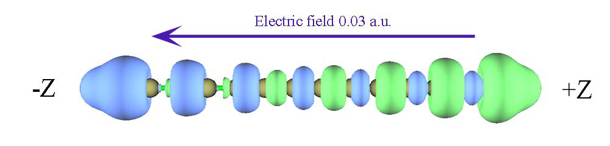

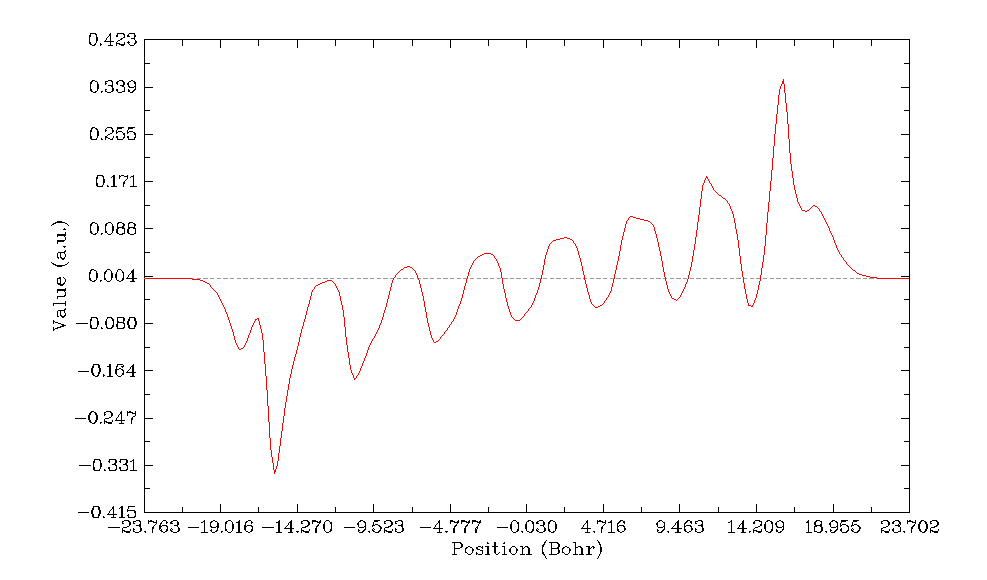

<!-- p.739 -->
Click right mouse button on the graph to close it, and then select option 1, the CDC will be shown immediately

This graph is yielded by integrating the curve shown in the last graph along the molecular axis. In its left part, although there are some fluctuations, the CDC gradually becomes more and more negative and reaches minimum value of 1.4 in the midpoint of the X-axis (corresponding to the center of the polyyne), that means due to the external electric field, the number of lost electrons in the left part of polyyne is 1.4. In the right part of the graph, the CDC increases gradually from -1.4 and finally reaches zero, suggesting that 1.4 electrons are transferred to right part of the polyyne, and due to the amount of increase and decrease of electron are cancelled with each other exactly in the whole molecular space, there is no variation of the total number of electrons (in other words, integral of the electron density difference in the whole molecular space is exactly zero).


### 4.13.7 Evaluation of electron density overlap

In this example we take methane dimer as example to evaluate where electron densities of the two monomers overlap with each other evidently. The structure of the methane dimer is

We first obtain grid data for an arbitrary real space function for the dimer. Boot up Multiwfn and input:

examples\rho_overlap\dimer.pdb 5 // Grid data calculation 100 // User define function, by default this function does not take any computational time


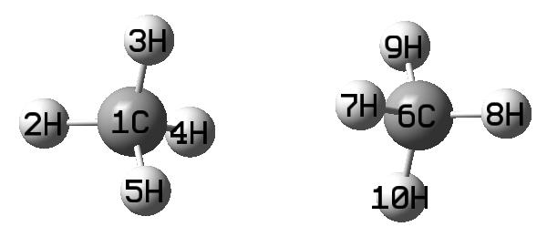

<!-- p.740 -->
-10 // Set grid extension distance 2 // Decrease the distance to 2 Bohr to avoid waste of grid at system boundary 2 // Medium-quality grid 2 // Export grid data as userfunc.cub Now we calculate wavefunction files by Gaussian for the two monomers, the input files are monomer1.gjf and monomer2.gjf in examples\rho_overlap folder. Finally, we obtained monomer1.wfn and monomer2.wfn. Beware that the nosymm keyword must be used in Gaussian calculation to avoid the automatic reorientation and translation.

Now we calculate electron density grid for monomer 1 over the whole space monomer1.wfn 5 // Grid data calculation 1 // Electron density 8 userfunc.cub // Use this cube file to define the grid, which corresponds to the whole space 2 // Export grid data Then rename the resulting density.cub to density1.cub. Repeat above steps for monomer2 to obtain density2.cub.

Now we calculate grid data of min(rho(1),rho(2)), namely take the minimal value of the two sets of electron density everywhere. Boot up Multiwfn and input:

density1.cub 13 // Process grid data 11 // Mathematical operation on grid data 21 // Take min(rho(1),rho(2)) density2.cub 0 // Export resulting grid data overlap.cub we open the overlap.cub and density2.cub by text editor, copy atomic coordinates from the latter to the former, and meantime change the number of atoms. Then the head of the overlap.cub should look like below (the highlighted texts are modified parts)


```text
Generated by Multiwfn
 Totally       531846 grid points
   10   -3.693194   -3.955866   -7.444301
   63    0.119334    0.000000    0.000000
   67    0.000000    0.119334    0.000000
  126    0.000000    0.000000    0.119334
    6    6.000000    0.000000    0.000000    3.371271
    1    1.000000    0.000000    0.000000    5.444301
    1    1.000000    0.000000    1.955867    2.677742
    1    1.000000   -1.693195   -0.976988    2.677742
    1    1.000000    1.693195   -0.976988    2.677742
    6    6.000000    0.000000    0.000000   -3.371271
    1    1.000000    1.693195    0.976988   -2.677742
    1    1.000000    0.000000    0.000000   -5.444301
    1    1.000000   -1.693195    0.976988   -2.677742
```


<!-- p.741 -->

```text
    1    1.000000    0.000000   -1.955867   -2.677742
```

Boot up Multiwfn and load the overlap.cub, enter main function 0, change the isovalue to a small one such as 0.0005, you will clearly see the density overlap region:

It is noteworthy that if then you enter main function 13, select subfunction 17 and then input 1, you will be able to obtain integral value of the density overlap function over the whole space, namely the "Integral of all data". Clearly, the larger the integral, the higher extent the densities of monomers overlap with each other.

By the way, if you feel the above-mentioned steps are too lengthy, you can easily make use of silent mode of Multiwfn to significantly reduce the operation steps, see Section 5.2.


### 4.13.8 Integrate electron density in a cylindrical region

Multiwfn is able to obtain statistical information (integral, volume, maximum and minimum values, etc.) in specific spatial and value ranges. To illustrate the use of this feature, in this example we first calculate electron density for acetylene, and then integrate electron density within a cylindrical region surrounding C-C bond.

Boot up Multiwfn and input examples\C2H2.wfn 5 // Calculate grid data 1 // Electron density 3 // High-quality grid 0 // Return to main menu 13 // Process grid data 17 // Show statistic data of grid points 2 // Obtain statistic data for grid points in specific spatial and value ranges [Press ENTER button directly] // Do not set constraint condition of value range 2 // Cylindrical region 0.000000 0.000000 0.602676 // Coordinate (in Å) of C1 as the 1st terminal of the cylinder 0.000000 0.000000 -0.602676 // Coordinate (in Å) of C3 as the 2nd terminal of the cylinder 2 // Radius of the cylinder is set to be 2 Å Now you can find statistical information for the grid data in the defined region:


```text
The minimum value:  0.27234472E-17 at   -6.000000   -6.000000   -9.152823 Bohr
```


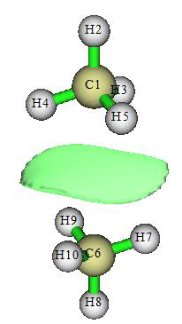

<!-- p.742 -->

```text
The maximum value:  0.70592762E+02 at   -0.013983   -0.013983   -1.094723 Bohr
Differential element:   0.0015254705 Bohr^3
Average value:  0.24053135E-02
Root mean square (RMS):  0.11805020E+00
Standard deviation:  0.11800212E+00

Volume of positive value space:                103.2133362853 Bohr^3
Volume of negative value space:                  0.0000000000 Bohr^3
Volume of all space:                           103.2133362853 Bohr^3

Summing up positive values:               4242.9729279471
Summing up negative values:                  0.0000000000
Summing up all values:                    4242.9729279471

Integral of positive data:                  6.4725301753
Integral of negative data:                  0.0000000000
Integral of all data:                       6.4725301753

X,Y,Z of barycenter (in Bohr)
Positive part:         -0.00015137         -0.00015137         -0.00320043
Negative part:                 NaN                 NaN                 NaN
Total:                 -0.00015137         -0.00015137         -0.00320043
```

As highlighted by yellow color, the integral of present grid data, that is number of electrons, in the cylindrical region is 6.472. Now Multiwfn asks you if exporting a xyz file containing the grids involved in the statistics to grid.xyz in current folder, we choose y. Then we use VMD program to visualize the grid.xyz and molecule structure. After adjusting graphical effects to make the grid points shown as pink points, you will see the following map. Clearly the grid points indeed distribute within our expected region.


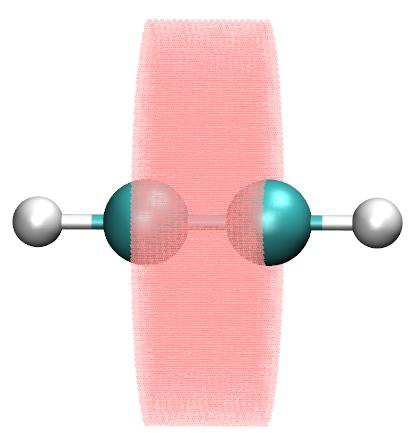

<!-- p.743 -->

## 4.14 Adaptive natural density partitioning (AdNDP) analysis


Theory basis of AdNDP analysis has been introduced in Section 3.17.1, please read it first. Below I will show how to use AdNDP approach to study multi-centers orbitals of a frew practical molecules. More detailed discussions about AdNDP analysis can be found in my blog article "Study multi-center bonds by AdNDP approach as well as ELF/LOL and multi-center bond order" (in Chinese, http://sobereva.com/138).

NOTICE: Using diffuse functions in AdNDP analysis is strongly deprecated, because they often cause numerical problems (which sometimes leads to crash when Multiwfn loading input file) while never improving AdNDP results!

4.14.1 Analyze Li5+ cluster

In Chem. Eur. J., 6, 2982 (2000), the authors showed that Li5+ cluster has two 4-centers 2-electrons (4c-2e) bonds by examining ELF isosurfaces. In present example, we will use AdNDP approach to study this cluster to verify their statement. We first optimize Li5+ cluster under B3LYP/6-311G* level and then compile an input file of single point task for Gaussian. pop=nboread keyword must be specified in route section, and \$NBO AONAO DMNAO \$END must be added to the end of the input file. Run this file by Gaussian, and then convert check point file to .fch format. The input file, output file and .fch file have been given in "examples\AdNDP" folder.

Boot up Multiwfn and input examples\AdNDP\Li5+.out, and then choose main function 14. After Multiwfn loaded some necessary information, a menu appears. Since this cluster is small, we can directly use exhaustive manner to search all possible 1c-2e, 2c-2e, 3c-2e, 4c-2e and 5c-2e orbitals in turn. We first choose option 2 to search 1c-2e orbitals (namely lone pairs), however, because occupation numbers of all tried 1c orbitals are lower than default threshold (which is a value close to 2.0 and can be adjusted by option 4), the candidate orbitals list shown in front of the menu is still empty. We then choose option 2 twice to search 2c-2e and 3c-2e orbitals in turn, we still cannot find any orbital with high occupation numbers. Next we select option 2 again to search 4c-2e orbitals, this time the candidate orbital list is no longer empty, there are two orbitals in it:


```text
#   2 Occ:  1.9966  Atom:   1Li   2Li   3Li   4Li
#   1 Occ:  1.9966  Atom:   1Li   2Li   3Li   5Li
```

Due to their high occupation number, it clear that they are ideal 4c-2e orbitals, therefore we decide to choose option 0 and input 2 to pick them out from candidate list and save as AdNDP orbitals. After that the list of AdNDP orbitals can be printed by option 5.

You may have noticed that the number of residual valence electrons (shown at the top of the menu) has been updated to 0.020, which is already very close to zero, it is suggested it is meaningless to continue to search 5c-2e orbitals because they would be impossible to be found.

Now you can choose option 7 to visualize the two 4c-2e AdNDP orbitals. In order to calculate orbital wavefunction, Multiwfn needs to load basis set information from corresponding .fch file first. Since Li5+.fch is in the same folder and has identical name as Li5+.out, the .fch file will be directly loaded. When loading is finished, a GUI pops up, which is completely identical to the one of main function 0. AdNDP orbitals can be plotted by selecting corresponding numbers in the right-bottom list. The 0.05 isosurfaces of the two orbitals are shown below.


<!-- p.744 -->
Grid data of AdNDP orbitals can be exported as Gaussian cube files by option 9, so that you can plot them by some third-part visualization programs such as VMD and Molekel. You need to input orbital index range, assume that we want to output the two 4c-2e AdNDP orbitals we just found, we should input 1,2 and choose a proper grid setting, then they will be exported as AdNDPorb0001.cub and AdNDPorb0002.cub in current folder.

By option 3, you can set the number of centers of multi-centers orbitals in the next exhaustive search. So, assume that you have already known that there are two 4c-2e orbitals in present system, you can directly choose option 3, input 4 and then select option 2 to start the exhaustive search of 4c-2e orbitals, the exhaustive searches of 1c-2e, 2c-2e and 3c-2e orbitals will be skipped.

Evaluating AdNDP orbital energies It is also possible to obtain energies of the AdNDP orbitals that have been picked out. To realize this, you need to provide additional plain text file containing Fock matrix of present system in lower-triangular sequence, so that orbital energies can be yielded after some transformations of this matrix. The Fock matrix can also be loaded from .47 file. The most straightforward procedure is: Copy examples\AdNDP\Li5+.gjf as examples\AdNDP\Li5+_47.gjf, change last line of it to $NBO archive file=C:\Li5+ $END. Then after running this file by Gaussian, C:\Li5+.47 will be yielded, which is input file of GENNBO program and contains the Fock matrix that we need. Then we choose option "16 Output energy of picked AdNDP orbital" in the AdNDP analysis interface, input the path of the Li5+.47 (which has already been provided in "examples\AdNDP\" folder), Multiwfn will load it and immediately print AdNDP orbital energies, as shown below:


```text
Energy of picked AdNDP orbitals:
Orbital:     1  Energy (a.u./eV):   -0.325776     -8.8648
Orbital:     2  Energy (a.u./eV):   -0.325776     -8.8648
```

As expected, the two orbitals are degenerated in energy, since they have exactly equivalent shape.

Of course, if you write $NBO DMNAO AONAO archive file=C:\Li5+ $END in the last line of .gjf file, then after running it, not only the output file can be used as input file for AdNDP analysis, but also the .47 file used to derive AdNDP orbital energies will be yielded at the same time.

4.14.2 Analyze B11− cluster

This time, we will try to reproduce the AdNDP analysis result of B11− cluster that given in AdNDP original paper (Phys. Chem. Chem. Phys., 10, 5207 (2008)).


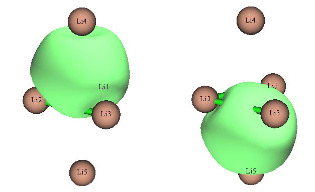

<!-- p.745 -->
The files needed by this instance, namely B11-.out and B11-.fch can be found in "examples\AdNDP" folder. The geometry was optimized under B3LYP/6-311+G*, while the wavefunction was generated under HF/STO-3G level. You may wonder whether the result is meaningful under such low level of basis set; actually, AdNDP analysis is rather insensitive to basis set quality, even STO-3G is able to produce at least qualitative reasonable result. In addition, using larger basis set will bring additional cost at AdNDP analysis stage.

Boot up Multiwfn and input examples\AdNDP\B11-.out, then choose 14 to enter AdNDP module. As usual, we select 2 to search 1c-2e orbitals first, but we find nothing (this is common case). Then select 2 again to exhaustively search 2c-2e orbitals from the 11 atoms, Multiwfn will totally try 11!/(11-2)!/2!=55 combinations, finally there are nine 2c orbitals present in candidate list (sorted according to occupation number from large to small):


```text
#   9 Occ:  1.9727  Atom:   6B   10B
#   8 Occ:  1.9727  Atom:   5B   11B
#   7 Occ:  1.9742  Atom:   7B    9B
#   6 Occ:  1.9742  Atom:   7B    8B
#   5 Occ:  1.9869  Atom:   2B    6B
#   4 Occ:  1.9869  Atom:   3B    5B
#   3 Occ:  1.9871  Atom:   9B   11B
#   2 Occ:  1.9871  Atom:   8B   10B
#   1 Occ:  1.9942  Atom:   2B    3B
```

All of them have an occupation number close to 2.0, ostensibly one can directly pick all of them out as AdNDP orbitals, however, it is not recommended to do so, because neighboring orbitals may share the same densities. For example, the 1st and the 4th candidate orbitals share the some densities, since both of them related to atom 3. In order to avoid overcount of electrons, firstly you should pick out the first three orbitals by choosing option 0 and input 3, then the density of the first three orbitals will be depleted from density matrix, after that wavefunction and occupation number of remained candidate orbitals will be updated automatically. After that the candidate list becomes


```text
#   6 Occ:  1.9538  Atom:   6B   10B
#   5 Occ:  1.9538  Atom:   5B   11B
#   4 Occ:  1.9556  Atom:   7B    8B
#   3 Occ:  1.9556  Atom:   7B    9B
#   2 Occ:  1.9750  Atom:   2B    6B
#   1 Occ:  1.9750  Atom:   3B    5B
```

Since some densities have been depleted, occupation number of remained six candidate orbitals slightly decreased. Now, we pick out the first four candidate orbitals by choosing option 0 and input 4. Although both of 3th and 4th orbitals are related to atom 7, here we have to ignore the slight overcount of electrons, otherwise their degeneration will be broken and thus the final AdNDP pattern will not be consistent with molecular symmetry anymore (you can choose option 8 to carefully inspect candidate orbitals before you decide to pick them out). Finally, we pick out the last two orbitals (i.e. 6B-10B and 5B-11B). Currently the number of residual valence electrons is 16.307, which reveals that it is probable to find several higher number of centers orbitals with nearly two electrons occupied.

Now we select option 2 to start the search of 3c-2e orbitals, the current candidate orbital list is:


```text
#   9 Occ:  1.7399  Atom:   1B    6B   10B
```


<!-- p.746 -->

```text
#   8 Occ:  1.7399  Atom:   4B    5B   11B
#   7 Occ:  1.7502  Atom:   1B    3B    4B
#   6 Occ:  1.7502  Atom:   1B    2B    4B
#   5 Occ:  1.8504  Atom:   1B    2B    6B
#   4 Occ:  1.8504  Atom:   3B    4B    5B
#   3 Occ:  1.8603  Atom:   1B    4B    7B
#   2 Occ:  1.8673  Atom:   4B    9B   11B
#   1 Occ:  1.8673  Atom:   1B    8B   10B
```

After we pick out two orbitals (1B-8B-10B and 4B-9B-11B), one orbital (1B-4B-7B) and two orbitals (3B-4B-5B and 1B-2B-6B) in turn, the highest occupation number of remained candidate orbitals is 1.41, which is obviously too low to be recognized as 3c-2e orbital, so they will not be concerned. Currently the number of residual valence electrons is 7.03.

Then you can start to search higher number of centers orbitals, beware that this is never a trivial task, and there is no absolute rule on how to reasonably pick out candidate orbitals, different picking manners result in different AdNDP patterns. You may have to try many times before finally obtaining an optimal AdNDP pattern. It is recommended to use option 11 to save present density matrix and AdNDP orbital list into memory, so that you need not to worry about improper pick of candidate orbitals, since saved state can be recovered anytime by choosing option 12.

Now choose option 2 to start the search of 4c-2e orbitals, the highest occupation is merely 1.71, none of them could be picked out.

Select option 2 again to search 5c-2e orbitals, you will find many 5c candidate orbitals, the first two have occupation numbers of 1.89, we pick out both of them.

Then choose option 2 to search 6c-2e orbitals, no good candidate can be found, the highest occupation number is only 1.84. Then choose option 2 to search 7c-2e orbitals, we pick the highest occupied one (1.90). Now the residual valence electron is only 1.34, which is much less than 2.0, indicating that no additional 2e AdNDP orbital could be found, therefore now we can end the AdNDP searching procedure. The amount of residual electron reflects the electrons that cannot be fully represented by present AdNDP pattern (analogous to non-Lewis electron in the NBO framework)

By choosing option 5, information of all AdNDP orbitals can be printed out:


```text
#    1 Occ:  1.9942 Atom:   2B    3B
#    2 Occ:  1.9871 Atom:   8B   10B
#    3 Occ:  1.9871 Atom:   9B   11B
#    4 Occ:  1.9750 Atom:   2B    6B
#    5 Occ:  1.9750 Atom:   3B    5B
#    6 Occ:  1.9556 Atom:   7B    9B
#    7 Occ:  1.9556 Atom:   7B    8B
#    8 Occ:  1.9337 Atom:   6B   10B
#    9 Occ:  1.9337 Atom:   5B   11B
#   10 Occ:  1.8673 Atom:   4B    9B   11B
#   11 Occ:  1.8673 Atom:   1B    8B   10B
#   12 Occ:  1.8533 Atom:   1B    4B    7B
#   13 Occ:  1.8451 Atom:   3B    4B    5B
#   14 Occ:  1.8451 Atom:   1B    2B    6B
```


<!-- p.747 -->

```text
#   15 Occ:  1.8908 Atom:   1B    2B    6B    8B   10B
#   16 Occ:  1.8908 Atom:   3B    4B    5B    9B   11B
#   17 Occ:  1.9036 Atom:   2B    3B    5B    6B    7B    8B    9B
Total occupation number in above orbitals:   32.6607
```

Plotting a batch of AdNDP orbitals simultaneously by VMD script Now you can use option 7 to visualize all picked AdNDP orbitals. However, this time I show how to plot AdNDP orbitals via VMD, which could simultaneously plot a batch of orbitals and the graphical quality is good. VMD can be freely obtained at http://www.ks.uiuc.edu/Research/vmd/.

Choose option 9, select "Medium-quality grid" and then input 1-17 to export all the 17 AdNDP orbitals as cube files in current folder, the format of the file name is AdNDPorb[index].cub. Assume that you have moved all of them to C:\ directory, you should edit examples\AdNDP\plotAdNDP.vmd and change this line


```text
set name "D:\\CM\\my_program\\Multiwfn\\AdNDPorb$idx.cub"
```

to


```text
set name "C:\\AdNDPorb$idx.cub"
```

You also need to make sure that in the script, the values after "set istart" and "set iend" have been set to 1 and 17, respectively, so that the cube files from AdNDPorb0001.cub to AdNDPorb0017.cub will be loaded. The positive and negative phases of the orbital isosurfaces are determined by the values after "set posclr" and "set negclr 0", the orbital isovalue is determined by "set isoval"

Now boot up VMD, copy all content in the plotAdNDP.vmd to VMD console window, all cube files of AdNDP orbitals will be loaded into VMD. Now the VMD Main window looks like below

Each entry corresponds to an AdNDP orbital. Currently all the 17 orbitals are shown. If you double click a "D" label, then corresponding orbital will be hidden in the graphical window. In order to show the molecule structure, drag the examples\AdNDP\B11-.xyz into the VMD main window to load it, then enter "Graphics" - "Representation" and change the drawing style as CPK.

If you make VMD only display all the nine 2c-2e and all the five 3c-2e orbitals, you will see left and right parts of the graph below, respectively


<!-- p.748 -->
The two 5c-2e and one 7c-2e orbitals are shown below (In the graph the 7c-2e orbital looks like 5c orbital, the main reason is that the isovalue in the plotting script is relatively high, i.e. 0.06).


### 4.14.3 Analyze phenanthrene

AdNDP analysis of phenanthrene (C14H10, see above) has been given in J. Org. Chem., 73, 9251 (2008), in this section we will repeat their result, you will learn how to use user-directed search. Files used in this example can be found in examples\AdNDP folder with "phenanthrene" prefix.

First we load examples\AdNDP\phenanthrene.out and enter main function 14. In consistency with the previous examples, we select option 2 twice to search 1c orbitals and then search 2c orbitals. No 1c-2e orbitals can be found, while there are 31 candidate 2c orbitals present in the list. Ten of them correspond to C-H σ-bonds and have no overlapping with each other, so we can pick them out first, namely choosing option 0, input 8-15, then choose option 0 again and input 9,10. Next, we successively pick out sixteen 2c candidate orbitals that corresponding to C-C σ-bonds. The most careful way of picking out orbitals is inputting 0 2 0 1 0 2 0 1 0 2 0 2 0 2 0 2 0 2, where space denotes pressing ENTER button once.

Now there are only five orbitals remain:


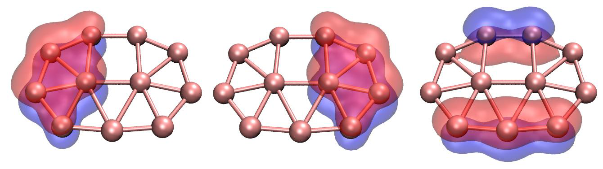


<!-- p.749 -->

```text
 #   5 Occ: 1.7182 Atom:   5C    6C
 #   4 Occ: 1.7182 Atom:  14C   15C
 #   3 Occ: 1.7192 Atom:  11C   13C
 #   2 Occ: 1.7192 Atom:   1C    2C
 #   1 Occ: 1.8033 Atom:   7C   10C
```

The first orbital with occupation number of 1.80 corresponds to the π-bond between C7 and C10, we pick it out now. The occupation numbers of the four remaining orbitals are about 1.72, thus they are not quite ideal 2c-2e bonds, we do not concern them at the moment.

Although we can use option 2 to exhaustively search 3c, 4c, 5c ... orbitals as usual, this may not be a good idea for present system, since user-directed search is often more effective. We first choose option 13 to check population of residual electrons on each atom, see below, this information is usually helpful for guiding users to properly set up exhaustive search list. (Note: The exhaustive search triggered by option 2 is only applied to the atoms in exhaustive search list, which contains all atoms in present system by default)


```text
 1C :  1.0250       2C :  1.0370       3C :  1.0280       4C :  1.0414
 5C :  1.0339       6C :  1.0262       7C :  0.1322       8C :  1.0414
 9C :  1.0280      10C :  0.1322      11C :  1.0370      12H :  0.0117
13C :  1.0250      14C :  1.0262      15C :  1.0339      16H :  0.0121
17H :  0.0113      18H :  0.0117      19H :  0.0126      20H :  0.0111
21H :  0.0121      22H :  0.0113      23H :  0.0111      24H :  0.0126
```

From above data it is clear that hydrogens have almost vanished population, hence they can be ignored during search. Due to the same reason C7 and C10 can be ignored too. The other atoms, whose occupation numbers are about 1.03, are the carbons composing the two 6-member rings in both sides of the molecule. It can be expected that the two rings may be analogous to benzene ring and hence representing local aromaticity in phenanthrene.

Based on this consideration, we select option 1 and input 1-6 to search AdNDP orbitals for the fragment consisting of atoms 1, 2, 3, 4, 5, 6, we find


```text
...ignored
 #   5 Occ: 0.2157 Atom:   1C    2C    3C    4C    5C    6C
 #   4 Occ: 0.2998 Atom:   1C    2C    3C    4C    5C    6C
 #   3 Occ: 1.8214 Atom:   1C    2C    3C    4C    5C    6C
 #   2 Occ: 1.9850 Atom:   1C    2C    3C    4C    5C    6C
 #   1 Occ: 2.0000 Atom:   1C    2C    3C    4C    5C    6C
```

Evidently the first three orbitals are appropriate to be picked out as 6c-2e AdNDP orbitals, so we pick them out now. Their 0.03 isosurfaces are shown below, which look very like π molecular orbitals of benzene, implying that the boundary 6c ring has strong aromaticity as benzene.

Next, via the same way we search 6c-2e orbitals over another boundary ring, namely choose option 1 again and input 8,9,11,13-15, after that we pick out three highest occupied orbitals.


<!-- p.750 -->
Now the number of residual valence electrons is only 1.15, which is already very small, clearly the AdNDP search should end here. Finally, totally 33 orbitals (27*2c-2e, 6*6c-2e) are found.

Note: When searching 6c-2e orbitals over the ring consisting of atoms 1~6, in fact there is another way to do this (though more cumbersome), namely choose option -1 to enter the interface for defining exhaustive search list, input clean to clean up the default content, then input a 1-6 to add ring atoms 1, 2, 3, 4, 5, 6 into the list, then input x to save and exit. After that, select option 3 and input 6 to set the number of atoms in the next exhaustive search as six, then choose option 2 to search 6-centers orbitals over the ring.

Evaluating AdNDP orbital energies With similar procedures, we evaluate AdNDP orbital energies like Section 4.14.1. The NBO .47 file containing Fock matrix of current molecule has been provided as examples\AdNDP\phenanthrene.47, which was yielded by examples\AdNDP\phenanthrene_47.gjf. We choose option 16 and input the path of this file, Multiwfn immediately loads Fock matrix from it and outputs the orbital energies:


```text
...(ignored)
 Orbital:    25  Energy (a.u./eV):   -0.685803    -18.6616
 Orbital:    26  Energy (a.u./eV):   -0.685803    -18.6616
 Orbital:    27  Energy (a.u./eV):   -0.260794     -7.0966
 Orbital:    28  Energy (a.u./eV):   -0.348201     -9.4750
 Orbital:    29  Energy (a.u./eV):   -0.255535     -6.9535
 Orbital:    30  Energy (a.u./eV):   -0.264372     -7.1939
 Orbital:    31  Energy (a.u./eV):   -0.348201     -9.4750
 Orbital:    32  Energy (a.u./eV):   -0.255535     -6.9535
 Orbital:    33  Energy (a.u./eV):   -0.264372     -7.1939
```

As you can see, the orbitals 28-33, which correspond to π orbitals, have energy much higher than σ orbitals. The three π orbitals (28-30) in the left six-membered ring are symmetric to the counterpart orbitals (31-33) in the right six-membered ring. In each side, the two highest lying orbitals (e.g. 32 and 33) are nearly degenerate and evidently higher than the lowest lying one (e.g.

31), this situation is very similar to occupied π orbitals of isolated benzene.

Evaluating composition of AdNDP orbitals Sometimes composition of AdNDP orbitals is interesting. In the AdNDP module we can directly choose option 15 to analyze orbital composition by NAO method, which has been introduced in Section 3.10.4. NAO method is particularly suitable for analyzing AdNDP orbitals.

Choose option 15, then input index of a picked AdNDP orbital, for example 31, you will see (by default only terms whose absolute contribution > 0.5 % are shown)


```text
    NAO#   Center   Label      Type    Composition
      67    8(C )    px       Val( 2p)     2.247%
      76    9(C )    px       Val( 2p)     1.929%
      94   11(C )    px       Val( 2p)    13.276%
     105   13(C )    px       Val( 2p)    32.846%
     114   14(C )    px       Val( 2p)    34.484%
     123   15(C )    px       Val( 2p)    15.204%

 Condensed NAO terms to shells:
   Atom:     8(C )  Shell:    39( 2p Val)     2.247%
```


<!-- p.751 -->

```text
   Atom:     9(C )  Shell:    44( 2p Val)     1.929%
   Atom:    11(C )  Shell:    54( 2p Val)    13.276%
   Atom:    13(C )  Shell:    61( 2p Val)    32.846%
   Atom:    14(C )  Shell:    66( 2p Val)    34.484%
   Atom:    15(C )  Shell:    71( 2p Val)    15.204%

 Condensed NAO terms to atoms:
   Center   Composition
     8(C )     2.251%
     9(C )     1.932%
    11(C )    13.276%
    13(C )    32.849%
    14(C )    34.487%
    15(C )    15.204%
```

As expected, this π type of 6c-2e orbital purely composes of px natural atomic orbitals, whose axis is perpendicular to the plane of the phenanthrene. This orbital is delocalized over the ring, but mostly distributed on atoms 13 and 14.

Note that there is another way of evaluating AdNDP orbital composition, namely exporting AdNDP orbitals as AdNDP.mwfn in current folder by option 14, and then use this file as input file of Multiwfn and perform orbital composition as usual (via e.g. Mulliken analysis, Hirshfeld analysis and so on, see Section 4.8 for example). For present example, this .mwfn file contains 146 orbitals because there are originally 146 natural atomic orbitals, however only the first 33 orbitals correspond to AdNDP orbitals and thus meaningful.

4.14.4 Analyze Au20 cluster

In this section we perform AdNDP analysis for Au20 cluster, the needed files can be downloaded from http://sobereva.com/multiwfn/extrafiles/Au20.rar.

Boot up Multiwfn and input: Au20.out // Generated at B3PW91/Lanl2DZ level based on optimized geometry 14 // AdNDP analysis 2 // Search 1-center AdNDP orbitals. 100 candidates are found, whose occupation numbers are very close to 2.0 and thus can be picked out

0 // Pick out orbitals 100 // Pick out all 100 candidate orbitals 2 // Perform exhaustive search of 2-centers orbitals. Nothing can be found 2 // Perform exhaustive search of 3-centers orbitals. Again nothing can be found 2 // Perform exhaustive search of 4-centers orbitals. Now you can see four candidates with 1.84 e and six candidates with 1.7589 e

0 // Pick out orbitals 4 // Pick out first four orbitals. The remaining orbitals now have occupancy of 1.6913, which, although is not quite high, it is still worth to be picked out in current circumstance

0 // Pick out orbitals 6 // Pick out remaining six orbitals.


<!-- p.752 -->
Plotting AdNDP orbitals Next we plot all the ten picked 4c-orbitals by VMD using plotting script. We first export their cube files, input below commands

9 // Export cube file of picked AdNDP orbitals 2 // Medium-quality grid, which is adequate for producing smooth orbital isosurface for present system

101-110 // The index range of the picked 4c-orbitals After a while, we have ten cube files in current folder, the first one is AdNDPorb0101.cub, the last one is AdNDPorb0110.cub. We intend to plot the orbitals 101-104 (occ=1.84) using red color while 105-110 (occ=1.69) using orange color so that they can be clearly distinguished.

We edit examples\AdNDP\plotAdNDP.vmd, set "istart" and "iend" to 101 and 104, respectively. Then modify the path after "set name" to make it correspond to the actual path containing the cube files. In addition, add # symbol in the front of the two "mol modmaterial..." lines to comment them out so that the isosurface will be drawn as opaque. After that we boot up VMD, copy all content from the VMD script to the VMD console window, then you will find the first four 4c-orbitals have been shown as isosurfaces in the VMD graphical window.

We also need to plot the orbitals 105-110 on the graph. We set "istart" and "iend" in the script to 105 and 110, respectively. Set "posclr" to 3 to make isosurface color of positive phase to be orange (note that these 4c-orbitals only have positive phase). Set "idinit" to 4, because the systems showing orbital 101, 102, 103 and 104 have already been assigned to be ID=0, ID=1, ID=2 and ID=3 in VMD, respectively, therefore the ID corresponding to the next orbital to be loaded must be 4. Then copy the content of the script to VMD console window to run them, you will find the remaining six 4c-orbitals have also been shown.

Finally, choose "Graphics" - "Representations", click "Create Rep", change "Drawing method" to "CPK". Now you should see the graph below, each red and orange isosurface represents 4c-2e orbital at each vertex and edge of the cluster, respectively.


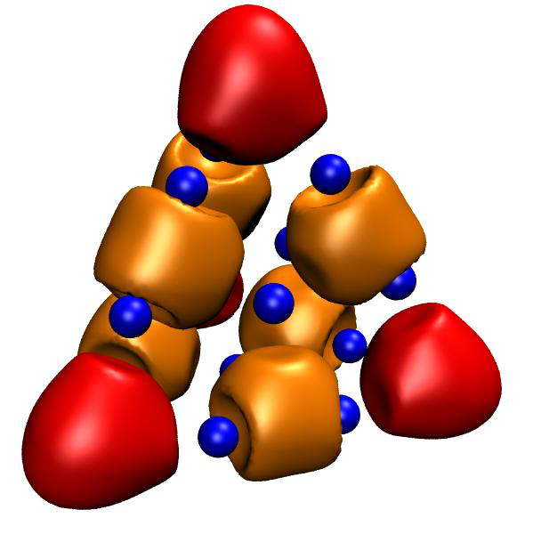

<!-- p.753 -->

## 4.15 Fuzzy atomic space analysis

Introduction of basic concepts of fuzzy atomic space has been given in Section 3.18.0. In this section, a few examples will be given to illustrate some capabilities of the fuzzy atomic space analysis module. In most cases the default Becke’s definition of fuzzy atomic spaces will be employed, because it is easy to compute and reasonable for most cases. However, Hirshfeld-I and MBIS atomic spaces are more robust and evidently better in certain cases, but they need to perform iterations to refine atomic spaces, which is somewhat expensive for large systems. You can choose definition of atomic spaces used in the fuzzy analysis module by option -1.


### 4.15.1 Study delocalization index of benzene

The definition of delocalization index (DI) has been detailedly introduced in Section 3.18.5. DI was originally proposed for AIM atomic space, while it has been shown that if it is calculated in fuzzy atomic space, the computational cost would be significantly reduced, while the result is still meaningful. In the present instance we will calculate DI in Becke's fuzzy atomic space to study the extent of electron delocalization between different atomic pairs in benzene.

Boot up Multiwfn, and input following commands examples\benzene.wfn // Generated under B3LYP/6-311G* 15 // Fuzzy atomic space analysis 4 // Calculate localization index (LI) and DI. Multiwfn first makes use of DFT numerical quadrature scheme to calculate atomic overlap matrix (AOM) in each fuzzy atomic space, and then convert AOM to DI and LI.

n // Do not output LI and DI to plain text file Multiwfn automatically checks and outputs the error of AOM, for present calculation the error is less than 0.001, which is completely negligible. If the error is too larger to be accepted, you can set "iautointgrid" in `settings.ini` to 0, and set "radpot" and "sphpot" to a large value. When "iautointgrid" is equal to 1, Multiwfn uses (40,230) grid points to calculate AOM, accuracy of which directly affects the accuracy of LI, DI, as well as of PDI and FLU.

From the DI matrix outputted on the screen, we can see that DI between adjacent two carbon atoms (e.g. 1-2) and adjacent C-H atoms (e.g. 1-7) are large (1.467 and 0.877, respectively), that means electron delocalization between bonded atoms is strong, this is mainly due to the shared electron of σ bond. In contrast, the DI between non-bonded carbon atoms is very small, about 0.1, nevertheless evidently not zero, reflecting the high-degree delocalization nature of π electrons.

The DI calculated in fuzzy atomic space is essentially the fuzzy bond order proposed by Mayer. According to the DI data, we can say that the bond order between C-C bond and C-H bond in benzene is 1.467 and 0.877 respectively, the former corresponds to single σ bond + "semi" π bond, while the latter corresponds to typical single σ bond.

Since benzene is an exactly planar molecule, we can decompose DI to DI-σ and DI-π. Here we calculate the latter. Input 0 to return to main menu, and then following commands

6 //Modify wavefunction 26 //Modify occupation number 0 // Select all orbitals 0 // Make occupation number of all orbitals to zero 17,20,21 // MO 17,20,21 correspond to π orbitals. 2 // Set their occupation numbers to 2 (closed-shell orbitals)


<!-- p.754 -->
q // Return to upper level of menu -1 //Return to main menu Now recalculate DI as before, since the occupation numbers of all orbitals except π orbitals have been set to zero, the result will be DI-π.

The DI-π between C1-C6, C1-C5 and C1-C4 are 0.438, 0.055 and 0.093 respectively, it is obvious that π electron delocalization is larger for para-related than for meta-related carbon atoms.


### 4.15.2 Study aromaticity of phenanthrene by PDI, FLU, FLU-π and PLR


PDI, FLU, FLU-π and PLR are useful aromaticity indices, their definitions have been introduced in Section 3.18.6, 3.18.7 and 3.18.9. In present instance, we will calculate them in Becke's fuzzy atomic space to study aromaticity of different rings of phenanthrene.

Calculate PDI We first calculate PDI. Boot up Multiwfn, and input following commands: examples\phenanthrene.wfn // Optimized at B3LYP/6-31G* level 15 // Fuzzy atomic space analysis 5 // Calculate PDI Then Multiwfn starts to calculate atomic overlap matrix (AOM), this is a computationally intensive work. After that AOM will be converted to delocalization index (DI), then DI matrix will be outputted on screen. Finally, you will be prompted to input atom indices of the ring you are interested in, the input order should be in consistency with atomic connectivity. We first calculate PDI of the central ring, namely input 4,8,9,10,7,3, the result is


```text
Delocalization index of     4(C )   --   10(C ):    0.052992
Delocalization index of     8(C )   --    7(C ):    0.052992
Delocalization index of     9(C )   --    3(C ):    0.036334
PDI value is    0.047439
```

PDI value is just the average of the DIs between C4-C10, C8-C7 and C9-C3. Now we input 8,9,11,13,14,15 to calculate PDI of the boundary ring, the result is 0.0817. From this result it is evident that the electron delocalization in the boundary rings is stronger than in the central ring, so


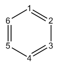


<!-- p.755 -->
boundary rings possess larger aromaticity. Next, we use FLU and FLU-π to study the aromaticity, and check if we can draw the same conclusion.

Calculate FLU Input q to return to upper level of menu, and input 6 to calculate FLU, then input 4,8,9,10,7,3 and 8,9,11,13,14,15 in turn. The FLU of central ring and of boundary rings are 0.025289 and 0.007499, respectively, this result suggests that the boundary rings are more like typical aromatic system (benzene), and hence possesses larger aromaticity than the central ring. Note that since the AOM has already been calculated during calculating PDI, so this time the calculation process of AOM is automatically skipped.

Calculate FLU-π Next, input q to return to upper level of menu, and input 7 to calculate FLU-π. First you need to input the indices of π orbitals. By visually checking isosurface of all orbitals (or utilizing option 22 in main function 100), we know that 36, 40, 43, 44, 45, 46, and 47 are π orbitals, so here we input 36,40,43,44,45,46,47, then DI of π electrons will be outputted. After that you will be prompted to input the atom indices in the ring, we input 4,8,9,10,7,3 and 8,9,11,13,14,15 in turn. The FLU-π of central ring and boundary rings are 0.149238 and 0.034904, respectively. Obviously, FLU-π analysis also confirms that boundary ring is more aromatic.

Calculate PLR Finally, let us calculate para linear response index (PLR). PLR is based on linear response kernel, which relies on virtual MOs information; however .wfn file only contains occupied MOs, therefore we must use .mwfn/.fch/.molden/.gms file as input. Reboot Multiwfn and input following commands

examples\phenanthrene.fch // Obtained at the same level as phenanthrene.wfn 15 // Fuzzy space analysis 10 // Calculate PLR Multiwfn will calculate condensed linear response kernel (CLRK) matrix, after that input 4,8,9,10,7,3 and 8,9,11,13,14,15 in turn, the results are 0.248030 and 0.489560, respectively. Since the former is much smaller than the latter, PLR also validates the conclusion that boundary rings have larger aromaticity than central ring.

Note that both PDI and PLR can be separated as α and π parts to respectively investigate α and π aromaticity, see Section 3.18.6 and 3.18.9 for detail.


### 4.15.3 Calculate fragment dipole moment to exhibit local polarity

Note: Chinese version of this topic is my blog article “Calculation of dipole moment of molecular fragments and dipole moment of monomers in complexes using Multiwfn “ (http://sobereva.com/558, in Chinese), which contains additional example and extended discussion.

Dipole moment of a fragment may be defined as


$$\mathbf{D}_{F}=\sum_{A\in F}\left[Z_{A}\mathbf{R}_{A}-\int w_{A}(\mathbf{r})\rho(\mathbf{r})\mathbf{r}\mathrm{d}\mathbf{r}\right]$$

<!-- formula-ocr: formula_p755_342.png 已替换为LaTeX, 原图保留备查 -->

where A is atomic index in fragment F, ZA and RA are nuclear charge and position of atom A, respectively. wA(r) is atomic weighting function of atom A.

As mentioned in Section 3.18.3, Multiwfn is able to calculate atomic and molecular


<!-- p.756 -->
dipole/multipole moments; if you define an atom list, then the outputted molecular dipole and multipole moments will correspond to the moments of the fragment. In this calculation, we use this feature to calculate respective dipole moment of the two monomers in phenol dimer. We will use Hirshfeld weighting function, since its calculation is easy and its physical meaning is relatively clear.

Boot up Multiwfn and input below commands examples\phenoldimer.wfn // Wavefunction file of optimized phenol dimer 15 // Fuzzy atomic space analysis -1 // Select method for defining atomic space 3 // Hirshfeld based on built-in spherically averaged atomic densities 2 // Calculate atomic and molecular multipole moments 1 // Output result on screen Then Multiwfn starts to calculate population number, dipole and multipole moments of every atom, and finally prints the data for the whole system (the "molecular" in this context corresponds to the entire current system):


```text
              *****  Molecular dipole and multipole moments  *****
 Total number of electrons:    100.000331   Net charge: -0.000331
 Molecular dipole moment (a.u.):       1.227306     -0.128087      0.650833
 Molecular dipole moment (Debye):      3.119501     -0.325563      1.654252
 Magnitude of molecular dipole moment (a.u.&Debye):      1.395088      3.545959
 Molecular quadrupole moments (Standard Cartesian form):
 XX=  -56.973177  XY=    3.413050  XZ=    4.769915
 YX=    3.413050  YY=  -58.109370  YZ=    4.188508
 ZX=    4.769915  ZY=    4.188508  ZZ=  -57.714457
 Molecular quadrupole moments (Traceless Cartesian form):
 XX=    0.938737  XY=    5.119575  XZ=    7.154872
 YX=    5.119575  YY=   -0.765553  YZ=    6.282762
 ZX=    7.154872  ZY=    6.282762  ZZ=   -0.173184
 Magnitude of the traceless quadrupole moment tensor:    0.999096
 Molecular quadrupole moments (Spherical harmonic form):
 Q_2,0 =  -0.173184   Q_2,-1=   7.254708   Q_2,1=   8.261735
 Q_2,-2=   5.911576   Q_2,2 =   0.983972
 Magnitude: |Q_2|=   12.523257
 Molecular electronic spatial extent <r^2>:     3515.944316
 Components of <r^2>:  X=    2590.720451  Y=     631.865745  Z=     293.358120
 Molecular octopole moments (Cartesian form):
 XXX=   27.1548  YYY=  -34.6763  ZZZ=   12.9803  XYY=   31.5970  XXY=  -32.1231
 XXZ=   11.3712  XZZ=   18.8632  YZZ=   -6.4625  YYZ=   25.0005  XYZ=   21.8843
 Molecular octopole moments (Spherical harmonic form):
 Q_3,0 =   -41.5772  Q_3,-1=    25.0762  Q_3,1 =    10.2272
 Q_3,-2=    84.7574  Q_3,2 =   -26.3932  Q_3,-3=   -48.7725  Q_3,3 =   -53.4710
 Magnitude: |Q_3|=    124.8215
```

As can be seen, the dipole moment of the dimer is (1.227306,-0.128087,0.650833) a.u.

Next, we calculate dipole moment for the first phenol. We input -5 // Define the atoms to be calculated


<!-- p.757 -->
1-13 // Atom indices of the first phenol 2 // Calculate atomic and molecular multipole moments 1 // Output result on screen You will see


```text
Total number of electrons:     50.095624   Net charge: -0.095624
Molecular dipole moment (a.u.):       0.570356     -0.356257      0.284025
Molecular dipole moment (Debye):      1.449701     -0.905516      0.721919
Magnitude of molecular dipole moment (a.u.&Debye):      0.729997      1.855468
...[ignored]
```

showing that the dipole moment of the first phenol is (0.570356,-0.356257,0.284025) a.u., and the phenol carries net charge of -0.096.

Then we input -5 // Define the atoms to be calculated 14-26 // Atom indices of the second phenol 2 // Calculate atomic and molecular multipole moments 1 // Output result on screen You will find the second phenol has dipole moment of (0.656950 0.228171 0.366808) a.u.

In summary, now we have three dipole moments:

- dimer: (1.227306,-0.128087,0.650833) a.u.
- 1st phenol: (0.570356,-0.356257,0.284025) a.u.
- 2nd phenol: (0.656950,0.228171,0.366808) a.u. For easily visual inspection, we will plot the dipole moments as arrows in VMD visualization program, which can be freely obtained at http://www.ks.uiuc.edu/Research/vmd/. The version I am using is VMD 1.9.3. Since VMD is unable to load .wfn file, we need to convert the present system to .xyz file. To do so, we return to main menu, enter main function 100 and choose subfunction 2, then you will find corresponding option used to export .xyz file. We export the present system as phenoldimer.xyz.

Boot up VMD and then load the phenoldimer.xyz into it. Copying all information from examples\scripts\drawarrow.tcl script file to VMD console window to run it, a new custom command "drawarrow" will be defined, which will be used to plot arrows. Then we input below commands to VMD console:


```text
draw color green
drawarrow all 1.227306 -0.128087 0.650833 2
draw color red
drawarrow "serial 1 to 13" 0.570356 -0.356257 0.284025 2
draw color yellow
drawarrow "serial 14 to 26" 0.656950 0.228171 0.366808 2
```

That means dipole moment of the whole system (selected by "all") will be plotted by green arrow, that of the 1st and 2nd phenol molecules will be plotted by red and yellow arrows, respectively. The "serial 1 to 13" and "serial 14 to 26" are selection syntax in VMD. The argument "2" at the end of the commands makes the length of the arrows doubled, so that the dipole moments can be represented by the arrows clearly.


<!-- p.758 -->
After some adjustments of graphical effect (e.g. setting drawing method as "licorice" in "Graphics" - "Representation" interface), you can see the following map. The center of the red, yellow and green arrows is placed at geometric centers of the two phenols and the dimer, respectively; the arrow lengths correspond to the norm of the dipole moments (multiplied by 2).

Since the dipole moment vectors of the two monomers are nearly parallel with each other, their vector sum, namely the dipole moment of the dimer, is significantly larger than the monomer dipole moments.

Bear in mind that fragment dipole moment relies on the choice of origin if the net charge of the fragment is not zero. For the present example, due to marginal charge transfer between the two phenol molecules, the monomer dipole moment must be slightly dependent of origin. However, this is not an evident problem since the net charge of the monomer is quite small and the current origin is appropriate (at nuclear charge center of the dimer).


### 4.15.4 Calculate atomic effective, free volumes, atomic polarizability

and atomic C6 coefficient: Oxirane and SiH4 as examples

See my blog article “Calculating atomic polarizabilities in molecules using Multiwfn” (http://sobereva.com/600, in Chinese) and “Using Multiwfn to calculate atomic C6 dispersion coefficients” (http://sobereva.com/709, in Chinese) for more discussion and examples.

Please read Section 3.18.12 first if you do not know what is atomic effective volume (Veff),

atomic free volume (Vfree), atomic static polarizability (αeff(0)) and atomic C6 coefficient (C6,AA). In this section we will calculate them for two common molecules.

Part 1: Atomic effective/free/polarizability of oxirane

In this example we focus on evaluating Vfree and αeff(0) for atoms in oxirane (C2OH4). Its wavefunction file is examples\oxirane.fchk, which was generated by Gaussian 16 at B3LYP/6-31G* level.

Prior to using Multiwfn to calculate aforementioned quantities, we need to manually generate wavefunction files of all elements (C, O, H) in the present system at the same level as molecular calculation. You can use your favourite quantum chemistry program for this step. The wavefunction files in .wfn format (H.wfn, C.wfn and O.wfn) generated by Gaussian 16 at B3LYP/6-31G* level can be directly downloaded here: http://sobereva.com/multiwfn/extrafiles/oxirane_atmvol.zip, Gaussian input files are also provided. Note that the atomic wavefunction files are not necessarily


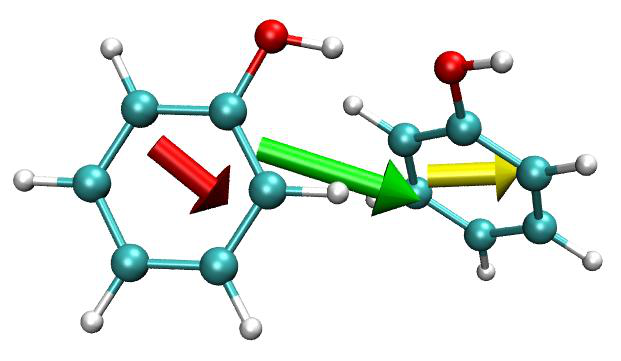

<!-- p.759 -->
in .wfn format, they can be in any format that supported by Multiwfn, such as .mwfn, .fch and .molden.

Boot up Multiwfn and input examples\oxirane.fchk 15 // Fuzzy analysis 13 // Calculate atomic effective volume, free volume, polarizability and C6 coefficient H.wfn // Path of wavefunction file of hydrogen atom in isolated state C.wfn // Path of wavefunction file of carbon atom in isolated state O.wfn // Path of wavefunction file of oxygen atom in isolated state The output is


```text
Atom    1(C )  Effective V:    21.536  Free V:    30.181 a.u.  Ratio: 0.714
Atom    2(C )  Effective V:    21.536  Free V:    30.181 a.u.  Ratio: 0.714
Atom    3(O )  Effective V:    21.858  Free V:    19.915 a.u.  Ratio: 1.098
Atom    4(H )  Effective V:     2.170  Free V:     6.680 a.u.  Ratio: 0.325
Atom    5(H )  Effective V:     2.170  Free V:     6.680 a.u.  Ratio: 0.325
Atom    6(H )  Effective V:     2.170  Free V:     6.680 a.u.  Ratio: 0.325
Atom    7(H )  Effective V:     2.170  Free V:     6.680 a.u.  Ratio: 0.325
Calculation took up       0 seconds wall clock time

Atomic polarizabilities estimated using Tkatchenko-Scheffler method:
   1(C ):   8.063 a.u.  Contribution: 29.01 %  (Ref. data:  11.300 a.u.)
   2(C ):   8.063 a.u.  Contribution: 29.01 %  (Ref. data:  11.300 a.u.)
   3(O ):   5.817 a.u.  Contribution: 20.92 %  (Ref. data:   5.300 a.u.)
   4(H ):   1.464 a.u.  Contribution:  5.27 %  (Ref. data:   4.507 a.u.)
   5(H ):   1.464 a.u.  Contribution:  5.27 %  (Ref. data:   4.507 a.u.)
   6(H ):   1.464 a.u.  Contribution:  5.27 %  (Ref. data:   4.507 a.u.)
   7(H ):   1.464 a.u.  Contribution:  5.27 %  (Ref. data:   4.507 a.u.)
Sum of atomic polarizabilities:    27.800 a.u.
...[ignored]
```

It can be seen that Veff of most atoms are notably reduced compared to Vfree, implying that in molecular environment the polarizability of these atoms are decreased compared to free state, because it is well-known that there is an approximate positive correlation between volume and polarizability.

The polarizabilities of atoms in their free states (αfree(0)) are built-in data in Multiwfn and printed as “Ref. data” in above output. The atomic polarizabilities in oxirane, αeff(0), estimated using the Tkatchenko-Scheffler method is simply product of Veff/Vfree and αfree(0). As shown, the sum of all αeff(0) values is 27.8 a.u., which is in good agreement with molecular polarizability of oxirane estimated at MP2/aug-cc-pVTZ level based on current geometry (28.8 a.u.).

The sum of all αeff(0) is not necessarily always close to molecular polarizability, and the deviation is very sensitive to the choice of atomic weighting function. For example, if you select option -1 in the fuzzy analysis interface and choose Hirshfeld partition instead of the default Becke

partition, the sum of all αeff(0) will be as high as 37.9 a.u. In this case, the “Contribution” printed by Multiwfn (α%), which is ratio of αeff(0) of an atom to sum of all αeff(0), will be more useful, as its sensitivity is lower and can be used to intuitively analyze main source of molecular polarizability.


<!-- p.760 -->
For example, according to percentage atomic contribution printed by Multiwfn, we can find carbon atoms have very large contribution (each of them contributes 29% to molecular polarizability).

It is worth to mention that if interatomic interaction is extremely weak, the Veff should be very close to Vfree. For example, Veff of Ar atom in Ar2 dimer is almost identical to Vfree of Ar.

There is another way of evaluating atomic volumes in practical chemical environment, namely performing basin analysis for electron density. This idea comes from atoms-in-molecules (AIM) theory. An example can be found in Section 4.17.1.

Part 2: C6 coefficients of SiH4 In this example we focus on evaluating atomic C6 coefficients and homomolecular C6 coefficients in SiH4. According to the benchmark in Section 5 of MBIS original paper (J. Chem. Theory Comput., 12, 3894 (2016)), MBIS atomic space performs best in combination with B3LYP/6-311+G(2df,p) level to evaluate molecular C6 coefficients using the Tkatchenko-Scheffler method. So, in this example we also employ this scheme. The .fch file of SiH4 as well as .wfn file of Si and H atoms calculated at B3LYP/6-311+G(2df,p) level have been provided in “examples\SiH4_C6\” folder.

Boot up Multiwfn and input examples\SiH4_C6\SiH4.fch 15 // Fuzzy analysis -1 // Select the method for partitioning atomic spaces 5 // MBIS 1 // Start calculation. Then MBIS atomic spaces will be constructed 13 // Calculate atomic effective volume, free volume, polarizability and C6 coefficient examples\SiH4_C6\H.wfn // Wavefunction file of H atom in isolated state examples\SiH4_C6\Si.wfn // Wavefunction file of Si atom in isolated state You will see the following output along with


```text
Atomic C6 coefficients estimated using Tkatchenko-Scheffler method:
   1(Si):  118.31 a.u. (Ref. data:   305.0 a.u.)
   2(H ):    3.83 a.u. (Ref. data:     6.5 a.u.)
   3(H ):    3.83 a.u. (Ref. data:     6.5 a.u.)
   4(H ):    3.83 a.u. (Ref. data:     6.5 a.u.)
   5(H ):    3.83 a.u. (Ref. data:     6.5 a.u.)

Note: Reference data denotes the built-in value of free-state atom
Homomolecular C6 coefficient:    347.07 a.u.
```

You can see C6 coefficient of each atom in SiH4. According to their magnitude, clearly the Si atom contributes to dispersion effect significantly more than H atoms. The “Ref. data” denotes C6 coefficients of atoms in their isolated state and are taken from literature. It is seen that Multiwfn also calculated and printed homomolecular C6 coefficient for SiH4, which corresponds to the C6 coefficient used to calculate dispersion interaction between two SiH4 molecules. The present value 347.07 a.u. is in very good agreement with the 343.9 a.u. given in Table I of J. Chem. Phys., 123, 024101 (2005)! However, it should be noted that the molecular C6 coefficient calculated in this way is not always quite accurate, sometimes the relative error may be close to 10% or even more. In addition, it should be recognized that MBIS does not perform best in all cases; for some molecules,


<!-- p.761 -->
using Hirshfeld partition may obtain better results.


### 4.15.5 Visualizing atomic electric dipole and quadrupole moments

Please check Section 3.18.3 to understand definition of atomic electric dipole moment (μA) and atomic electric quadrupole moment (ΘA). These two quantities convey important information about electron density distribution around nuclei under a given atomic space partition scheme. In the examples in the next two sections, we will calculate and then visualize them in VMD program via a special script, you will find they are pretty intuitive and important in understanding status of atoms in actual chemical environment.

4.15.5.1 Plotting atomic dipole moments

Here I use H2O2 molecule as an instance to show how to calculate and plot atomic dipole moments in VMD program. VMD can be freely obtained at http://www.ks.uiuc.edu/Research/vmd/, the version I used in this example is 1.9.3.

Boot up Multiwfn and input examples\H2O2.fch 15 // Fuzzy atomic space analysis module 2 // Calculate atomic and molecular multipole moments and <r^2> 2 // Output result to a plain text file Now you have multiple.txt and atom_moment.txt in current folder. The former contains detailed information about atomic multipole moments (from monopole moment to octopole moment), while the latter contains atomic dipole moments as well as eigenvalues and eigenvectors of atomic quadrupole moment tensors.

In order to plot atomic dipole moment vectors along with molecular structure in VMD, we need to export the geometry loaded from the H2O2.fch to H2O2.xyz by inputting the following command

0 // Return to main menu 100 // Other functions (Part 1) 2 // Export file 2 // Output current structure to .xyz file [Press ENTER button] // Use default file name Now you have H2O2.xyz in current folder. Boot up VMD, load the H2O2.xyz. Then move both atom_moment.txt and the VMD plotting script atomdip.tcl in “examples\scripts\” folder to VMD folder. Next, input the following commands in VMD console window, the first command executes the script, which defines a plotting function, while the second command runs the plotting function with default parameters.

source atomdip.tcl atomdip Now you can find atomic dipole moment information (in a.u.) in VMD console window:


```text
Information of atom 1
Atomic dipole moment:  -0.198   -0.245    0.080  Norm:   0.325

 Information of atom 2
```


<!-- p.762 -->

```text
Atomic dipole moment:   0.066   -0.045   -0.043  Norm:   0.090
...[ignored]
```

In VMD graphical window you can see

The yellow arrows correspond to μA vectors of every atom, pointing from negative charge center to positive charge center in corresponding atomic space, and their lengths are proportional to

magnitude of μA. The direction of the arrow on the oxygen atoms in the figure is easy to understand. It is well known that the oxygen in H2O2 has obvious lone pair electrons, and the lone pair region carries a dense negative charge, while the positive charge in the atomic space is only contributed by the nuclear charge, so the arrow must approximately point from the lone pair region to the nucleus.

Adjusting graphical effects The graphical effects can be adjusted. For example, in “Graphics” - “Representation” panel you can set drawing method as CPK and properly define thickness of bonds and radius of atom spheres. Then inputting following command in VMD console window to change background color and material of plotted objects

color Display Background white draw material GlassBubble Now you can see the following image

Note that the “atomdip” command has some optional parameters to control color, length, radius of arrows as well as the range of considered atoms, please check beginning of the atomdip.tcl file. As an example, if you input atomdip “serial 1 to 2 4” orange 5 0.05, arrows will be plotted only for atoms 1, 2, 4 with orange color, and the arrow length is longer than default while the arrow thickness is smaller than default.

Using different atomic space partition schemes Dipole moment of some atoms in certain chemical environment is highly sensitive to the choice of partition of atomic spaces. You can also use other definitions of atomic spaces other than the default Becke’s definition. In fuzzy atomic space analysis module, you can use option -1 to change


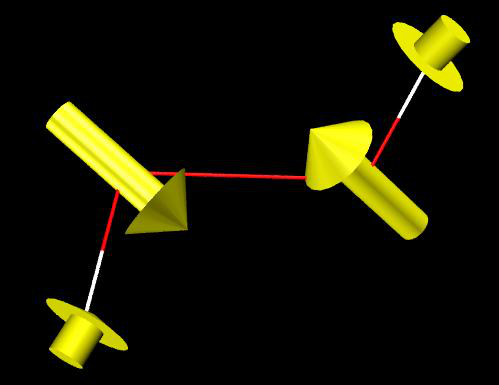

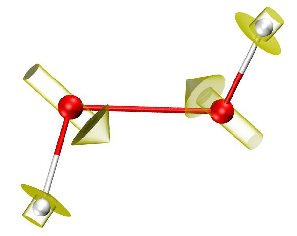

<!-- p.763 -->
definition of partition.

As illustrated in Section 4.17.1, if you generate basins for electron density (i.e. AIM partition), then subfunction 8 in basin analysis module is able to calculate atomic multipole moments, and if you input y after the calculation, atom_moment.txt will be exported, based on which you can plot atomic dipole moments under AIM partition via the aforementioned procedure. You will find the direction of the arrows on oxygens in the H2O2 changes a lot (which, in my opinion, is not as satisfactory as Becke’s partition).

4.15.5.2 Plotting atomic quadrupole moments

In this example, we visualize atomic quadrupole moments of C6H5Br in VMD, the data will be calculated under Becke’s partition like the last section. The corresponding wavefunction file examples\C6H5Br.mwfn was generated at B3LYP/def-TZVP level.

Boot up Multiwfn and load examples\C6H5Br.mwfn, then use exactly the same steps as the last section to generate atom_moment.txt and C6H5Br.xyz. Move the atom_moment.txt as well as atomquad.tcl in “examples\scripts\” folder to VMD folder. Boot up VMD, load the C6H5Br.xyz, then run the following two commands in VMD console window to activate plotting script and run the plotting command

source atomquad.tcl atomquad After some adjustments on graphical effects, you can see

The yellow ellipsoid over each atom intuitively characterizes traceless Cartesian atomic

electric quadrupole moment tensor ΘA. The shape of the ellipsoid is determined by directions of three principal axes (eigenvectors of ΘA) and semi-axis lengths, which are printed in VMD console window after running the “atomquad” command:


```text
Information of atom 1
Principal axis 1:   1.000    0.000    0.000  Semi-axis length:    0.162
Principal axis 2:   0.000   -0.880    0.475  Semi-axis length:    0.405
Principal axis 3:   0.000    0.475    0.880  Semi-axis length:    0.432
...[ignored]
```

The ellipsoid semi-axis lengths {l} are determined via the following way proposed by me.

Given that eigenvalues of ΘA, namely {v}, may be negative, in order to make visualization feasible, they are first transformed to values equal or larger than 1 via the following equation


$$t_{i}=1+v_{i}-v_{\min}\qquad i=1,2,3$$

<!-- formula-ocr: formula_p763_343.png 已替换为LaTeX, 原图保留备查 -->

where vmin is the most negative eigenvalue. Then {l} are evaluated as


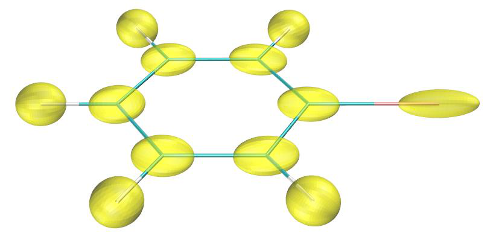

<!-- p.764 -->

$$l_{i}=s\frac{t_{i}}{t_{1}+t_{2}+t_{3}}\qquad i=1,2,3$$

<!-- formula-ocr: formula_p764_344.png 已替换为LaTeX, 原图保留备查 -->

Clearly, the sum of the three semi-axis lengths equals s, which is the scale factor controlling size of the ellipsoid, and can be set by an optional parameter of the “atomquad” command. The default value s=1 is suitable for most cases.

According to the physical meaning of ΘA (see Section 3.18.3), it is easy to understand that the shorter the length of the ellipsoid in a certain direction, the more extended the electron density distribution in that direction, and vice versa. Therefore, from the shape of the ellipsoids in the above image, one can easily conclude that electron distribution of the carbon atoms is highly elongated in

the direction perpendicular to the six-membered ring possibly due to the rich π electrons. For the Br atom, the electron density is remarkably contracted along the C-Br bond, this observation

corresponds to the well-known σ-hole character.

The “atomquad” command has many optional parameters controlling the plotting effect, please check comments at beginning of the atomquad.tcl file.

In above illustration the mode 1 of the “atomquad” command was used, while by mode 2, the shape of the plotted ellipsoids can intuitively portray elongation tendency of electron density in atomic spaces. For example, by running atomquad noh green 1 2 50 in VMD console window, green ellipsoids will be drawn over all non-hydrogen atoms with scale factor of 1 and resolution of 50 using mode 2, then you can see the following figure

The semi-axis lengths of the ellipsoids in the map above are positively correlated to the extension extent of electron distribution in corresponding direction within atomic space. Specifically, the semi-axis lengths are evaluated in the same way as mentioned earlier but with different definition of {t}, namely


$$t_{i}=\frac{1}{1+v_{i}-v_{\min}}\qquad i=1,2,3$$

<!-- formula-ocr: formula_p764_345.png 已替换为LaTeX, 原图保留备查 -->

Above figure essentially conveys exactly the same information as the figure given earlier, but obviously this figure is more convenient for visual analysis of electron distribution. For example, it is clearly seen that in the space of Br atom, the electron density is more extended in the plane perpendicular to the C-Br bond axis.


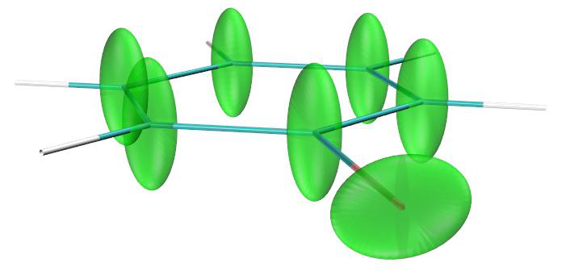

<!-- p.765 -->

## 4.16 Charge decomposition analysis and plotting orbital interaction diagram


Note: Chinese of this section is my blog article “Using Multiwfn to perform charge decomposition analysis (CDA) and plotting orbital interaction diagram” (http://sobereva.com/166, in Chinese), which also contains more discussions.

The theory of charge decomposition analysis (CDA), extended CDA (ECDA) and generalized CDA (GCDA, J. Adv. Phys. Chem., 4, 111-124 (2015) DOI: 10.12677/JAPC.2015.44013), as well as usage of CDA module, have been detailedly introduced in Section 3.19. In this section I will present several practical examples.

The CDA module supports .fch, .mwfn, .molden, GAMESS-US output file (.gms) and Gaussian output file as input. In the next several sections only Gaussian .fch files will be used to exemplify the usage of the CDA module.

4.16.1 Closed-shell interaction case: COBH3

In COBH3, CO makes use of its lone pair to form coordinate bond with BH3, which is an electron-deficient system (Lewis acid). Therefore, electrons will transfer from CO to BH3 during the formation of the complex. In this example we will employ CDA scheme to provide a deeper insight into the electron transfer.

First, we generate Gaussian output file for CO (fragment 1), BH3 (fragment 2) and COBH3 (complex). The .fch files and corresponding input files have been provided in "examples\CDA\COBH3" folder. The calculations were performed at HF/6-31G* level. On how to prepare the input files for CDA, see Section 3.19.2 for detail

Now boot up Multiwfn, and input following contents: examples\CDA\COBH3\COBH3.fch // Gaussian .fch file of the complex 16 // Enter CDA module 2 // We define two fragments examples\CDA\COBH3\CO.fch // Gaussian .fch file of fragment 1 examples\CDA\COBH3\BH3.fch // Gaussian .fch file of fragment 2 Immediately, below CDA result are outputted on screen


```text
   Orb.      Occ.          d           b        d - b          r
      1    2.000000   -0.000004   -0.000000   -0.000004   -0.000001
      2    2.000000    0.001119   -0.000023    0.001141    0.000326
      3    2.000000   -0.000002   -0.000471    0.000469    0.000313
      4    2.000000   -0.013250   -0.000704   -0.012546   -0.005676
      5    2.000000    0.041648   -0.003309    0.044957    0.232262
      6    2.000000    0.037385   -0.020136    0.057521    0.212422
      7    2.000000   -0.000543    0.000647   -0.001190    0.022166
      8    2.000000   -0.000543    0.000647   -0.001190    0.022166
      9    2.000000    0.171353    0.026952    0.144401   -0.741381
     10    2.000000   -0.000569    0.043713   -0.044281   -0.038916
     11    2.000000   -0.000569    0.043713   -0.044282   -0.038916
```


<!-- p.766 -->

```text
     13    0.000000    0.000000    0.000000    0.000000    0.000000
     14    0.000000    0.000000    0.000000    0.000000    0.000000
     15    0.000000    0.000000    0.000000    0.000000    0.000000
 ......
-------------------------------------------------------------------
Sum:      22.000000    0.236023    0.091027    0.144996   -0.335233
```

"Orb." denotes the indices of the orbitals of the complex; "occ." is corresponding occupation number. "d(i)" stands for the amount of donated electrons from fragment 1 to 2 via corresponding complex orbital, "b(i)" stands for the amount of electrons back donated from fragment 2 to 1 via corresponding complex orbital. "r(i)" corresponds to the overlap population between the occupied fragment orbitals (FOs) of the two fragments in corresponding complex orbital; its positive and negative signs imply that in this complex orbital, the electrons of occupied FOs are accumulated to and depleted (mainly due to Pauli repulsion) from the overlap region between the two fragments, respectively. The sum of r(i), namely -0.335, reveals that repulsive effect dominates the overall interaction between occupied FOs, which results in corresponding electrons moved away towards non-overlapping regions from overlap regions.

The difference between d(i) and b(i), to some extent can be viewed as the number of net-transferred electrons from fragment 1 to 2 due to formation of corresponding complex orbital. But bear in mind, electron polarization effect is also included in this value.

From the data, it can be seen that the first three complex orbitals have almost zero b, d and r values, this is because they are core orbitals of O, C and B, respectively, and hence it can be expected that they are not involved in bond formation. The virtual complex orbitals have exactly zero b, d and r terms, since their occupation numbers are exactly zero. Orbital 9 leads 0.171 electrons donate from CO to BH3, which is the primary source of the donor-acceptor bonding, and causes as high as 0.741 electrons removed from overlap region between CO and BH3, which stabilized the complex by diminishing electron repulsion. Orbital 5 and 6 have small contributions to electron donation, meanwhile lead evident accumulation of electrons from respective occupied FOs to the overlap region, which must be beneficial to the bonding between the two fragments. Orbital 10 and 11 are π orbitals and degenerate in energy, they exhibit π-back donation characteristics.

Isosurfaces of orbital 9, 5 and 6 are shown below. As you can see, a node occurs in the overlap region between CO and BH3 in orbital 9, while the isosurfaces of orbital 5 and 6 uniformly cover the overlap region. These observations largely explain why r(9) is a large negative value, and r(5) and r(6) are obvious positive values.


<!-- p.767 -->
Notice that the definition of CDA used in Multiwfn is a generalized version proposed by me, so that CDA is also applicable to post-HF and open-shell circumstances, see corresponding part of Section 3.19.1 for detail. For the cases when original CDA is applicable (namely MO for FO, MO or natural orbital for complex orbital), the d and b terms produced by generalized CDA are exactly identical to the ones produced by original definition, while the r term is exactly twice of the one produced by original definition.

Note: The COBH3 example was also given in original paper of CDA, in which, although the formulae of d, b and r are correct, the data in their examples are incorrect: all of the data should be divided by two. I also found that all of the results of the CDA program written by Dapprich and Frenking, and the results of AOMix program should be divided by two. So, if you want to compare the CDA results calculated by Multiwfn with theirs, the d and b terms should be multiplied by two first. But do not do this for r term, since the r term computed by Multiwfn has already been doubled with respect to its original definition.

The amount of net electron transfer between the two fragments can be characterized by the b-d term, however it was argued that ECDA is a more reasonably method to calculate the amount of net electron transfer, since the contribution of electron polarization effect (PL) is completely excluded. ECDA result is outputted after CDA result:


```text
     ========== Extended Charge decomposition analysis (ECDA) ==========
  Contribution to all occupied complex orbital:
Occupied, virtual orbitals of fragment  1:     680.4194%         8.0593%
Occupied, virtual orbitals of fragment  2:     390.3988%        21.1226%
  Contribution to all virtual complex orbital:
Occupied, virtual orbitals of fragment  1:      19.5806%      2291.9407%
Occupied, virtual orbitals of fragment  2:       9.6012%      1678.8774%
PL( 1) + CT( 1-> 2) =    0.3916      PL( 1) + CT( 2-> 1) =    0.1612
PL( 2) + CT( 1-> 2) =    0.4225      PL( 2) + CT( 2-> 1) =    0.1920
The net electrons obtained by frag. 2 = CT( 1-> 2) - CT( 2-> 1) =    0.2304
```

Commonly, you only need to pay attention to the last line. The data shows that the net number of electrons transferred from fragment 1 to 2 is 0.2304.

In the menu that appears on screen, by using option 2, composition of FOs in a specific complex orbital can be outputted. Here we select this option and input 9, the composition of complex orbital 9 are shown below


<!-- p.768 -->

```text
Occupation number of orbital     9 of the complex:  2.00000000
Orbital     7 of fragment  1, Occ: 2.00000    Contribution:   25.8560%
Orbital    13 of fragment  1, Occ: 0.00000    Contribution:    1.0798%
Orbital     2 of fragment  2, Occ: 2.00000    Contribution:   57.2921%
Orbital     5 of fragment  2, Occ: 0.00000    Contribution:   14.5640%
```

Only the FOs with contribution  1% to the complex orbital are shown (the threshold can be altered by "compthresCDA" in `settings.ini`). As already mentioned, the electron transfer from CO to BH3 is mainly due to the complex orbital 9, therefore from above data we can infer that the nature of the CO→BH3 electron transfer can be largely interpreted as the mix between FO 7 of CO (an occupied orbital) and FO 5 of BH3 (a virtual orbital). This viewpoint can also be manifested by comparing the shape of the two FOs (see below) with the shape of complex orbital 9 given above.

Note: Sometimes a few contributions of FOs may be negative, this is a well-known drawback of Mulliken analysis, which is the method employed in CDA module to calculate the complex orbital composition. Since the magnitudes of the negative values are often small, you can simply ignore them.

We can also directly decompose d, b, r terms of a complex orbital to FO pair contributions, let us do this for complex orbital 9. Now input 0 to return to the last menu, select option 6 and input 9, then input a threshold e.g. 0.005, then all FO pairs whose contribution to any of d, b, r term larger than 0.005 are printed:


```text
FragA Orb(Occ.)  FragB Orb(Occ.)      d           b        d - b          r
   4( 2.0000)       2( 2.0000)    0.000000    0.000000    0.000000   -0.009969
   7( 2.0000)       1( 2.0000)    0.000000    0.000000    0.000000   -0.005759
   7( 2.0000)       2( 2.0000)    0.000000    0.000000    0.000000   -0.723845
   7( 2.0000)       5( 0.0000)    0.176503    0.000000    0.176503    0.000000
   7( 2.0000)       8( 0.0000)    0.006221    0.000000    0.006221    0.000000
   7( 2.0000)      11( 0.0000)    0.005846    0.000000    0.005846    0.000000
   7( 2.0000)      12( 0.0000)   -0.023941    0.000000   -0.023941    0.000000
  13( 0.0000)       2( 2.0000)    0.000000    0.021958   -0.021958    0.000000
```

From the output it is clear that the mix between FO 7 of CO and FO 5 of BH3 contributes most of the d term of complex orbital 9.

Finally, we plot orbital interaction diagram. Input 0 to return to the last menu, and then select 5 to enter the menu for plotting orbital interaction diagram. Choose option 3 and input -30,10 to set lower and upper energy limits of the plot to -30eV and 10eV, respectively. Then select option 1 to plot the diagram under default settings, a graph will pop up on screen:


<!-- p.769 -->
In the graph above, occupied and virtual orbitals are represented as solid and dashed bars, respectively. Orbital indices are labelled by blue texts. If two or more labels occur in the same bar, e.g. 7 and 8, that means these orbitals are degenerated in energy. If composition of a FO in a complex orbital is larger than 10%, then the corresponding two bars will be linked by red line, and the composition will be labelled on the lines. By simply viewing the diagram we can directly understand how the MOs of COBH3 are constructed by FOs of CO and BH3. For example, complex orbital 7 and 8 only link to FO 5 and 6 of CO in this diagram, hence we immediately know that these two orbitals basically remain unperturbed during formation of the complex. In fact, they are π orbitals of CO, certainly they cannot participate to the σ type donor-acceptor interaction between CO and BH3.

There are many options used to adjust plotting parameters (such as label size, the rule for drawing and linking bars, position of composition labels, energy range), please play with them, and replot the graph to check their effects.

4.16.2 Open-shell interaction case: CH3NH2

In this example, I use CH3NH2 to illustrate how to perform CDA for the complex in which the two fragments interact with each other covalently (open-shell interaction).

First, we need to generate Gaussian output file for CH3 (fragment 1), NH2 (fragment 2) and CH3NH2 (complex). For fragments 1 and 2, in present example we use unrestricted B3LYP method; while for the complex, since this is a closed-shell system, we use restricted B3LYP method (unrestricted B3LYP can also be used, the CDA result will be the same). The .fch files and corresponding input files can be found in "examples\CDA\CH3NH2" folder, the geometry was pre-


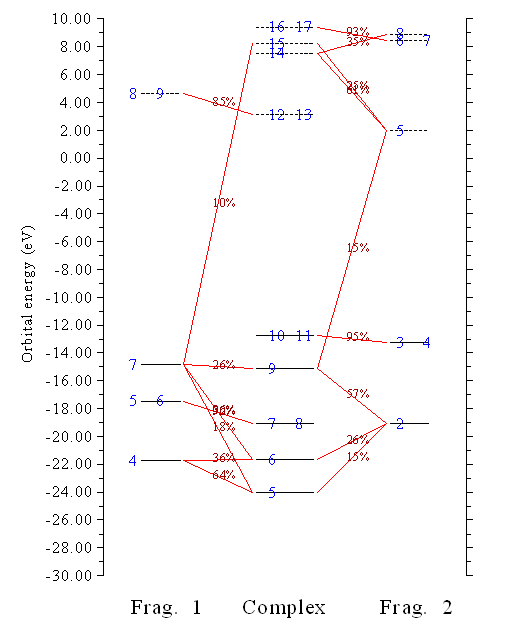

<!-- p.770 -->
optimized under B3LYP/6-31G** level.

Note that both CH3 and NH2 have 5 alpha and 4 beta electrons, while CH3NH2 has 9 alpha and 9 beta electrons. Evidently, the total numbers of alpha and beta electrons in the two fragments, namely 5+5 and 4+4, do not match the ones of the complex. So, we must flip electron spin of one fragment (either CH3 or NH2). In this example, we will flip electron spin of NH2, i.e. exchanging all information about its alpha and beta electrons.

Boot up Multiwfn and input following contents: examples\CDA\CH3NH2\CH3NH2.fch // Gaussian output file of the complex 16 // Enter CDA module 2 // We define two fragments examples\CDA\CH3NH2\CH3.fch // Gaussian output file of fragment 1 examples\CDA\CH3NH2\NH2.fch // Gaussian output file of fragment 2 n // Do not flip electron spin of fragment 1 y // Flip electron spin of fragment 2, then NH2 will have 4 alpha and 5 beta electrons. CDA and ECDA results will be calculated and printed on screen for alpha electrons and beta electrons separately. As you can see, for alpha (beta) part, both d - b and CT(1->2) - CT(2->1) terms are positive (negative), showing that alpha (beta) electrons are transferred from CH3 to NH2 (from NH2 to CH3). This is mainly because CH3 has more alpha electrons (5) than beta electrons (4), while after flipping electron spin, NH2 has more beta electrons (5) than alpha electrons (4), hence when they combine together to form CH3NH2, CH3 prefers to donate alpha electrons to NH2 and accept beta electrons from NH2.

Result of total electrons, namely the sum of alpha and beta results is also outputted. Below is total result of CDA and ECDA, respectively


```text
d=  0.044335  b=  0.145181  d - b = -0.100847  r= -0.172318
CT( 1-> 2) - CT( 2-> 1) for all electrons:    0.1252
```

It is obvious that electrons should transfer from CH3 to NH2, because nitrogen has evidently larger electronegativity. The total ECDA result is in line with our expectation, it shows that the amount of transferred electrons from CH3 to NH2 is 0.1249. However, the d - b term conflicts with our expectation, the transfer direction is totally inverted. This example illustrates that d - b term is not as reliable as ECDA to reveal total amount of net electron transfer for open-shell interaction, although d and b terms are still quite useful for decomposing electron transfer into orbital contributions.

If you select to flip electron spin for CH3 rather than for NH2 when loading their Gaussian output files, you will see the alpha and beta results of CDA and ECDA are exchanged, but the result for total electrons remains unchanged.

Now select 2 and input 6, you will see both the composition of the 6th alpha orbital and the 6th beta orbital of the complex are printed on screen. Though the complex is a closed-shell system and thus the two orbitals are essentially the same, owing to the alpha and beta FOs in the two fragments are not equivalent, the printed compositions have slight difference. Then input 0 to return.

Select option 5 to enter the menu for plotting orbital interaction diagram. By option 5 in this menu, you can switch the spin of the orbitals that the diagram will be plotted for. We select it once to switch the status to "Beta", then choose option 3 and input -30,10 to change the lower and upper limits of the diagram to -30 and 10 eV, respectively. Then select option 1 to plot the orbital


<!-- p.771 -->
interaction diagram. From the graph it is very clear that beta orbital 3 and 4 of CH3NH2 are formed by mixing beta FO 2 in CH3 and beta FO 2 in NH2. To illustrate this point more intuitively, corresponding part is extracted from the whole diagram, and the orbital isosurfaces are attached on it, see below

It can be seen that beta complex orbital 3 shows bonding character (this is why r(3) is a positive value, namely 0.103), which is constructed by slightly mixing beta FO 2 of CH3 into beta FO 2 of NH2 with the same wavefunction phase. Beta complex orbital 4 is an anti-bonding orbital (this explained why r(4) is a negative value, namely -0.056), formation of which is due to the mixture of beta FO 2 of NH2 into beta FO 2 of CH3 in terms of different phases.

4.16.3 More than two fragments case: Pt(NH3)2Cl2

In this section I use cisplatin (see below) as instance to show how to perform CDA analysis on the system consisting of more than two fragments.

We will define Pt2+ cation, (Cl2)2- anion and (NH3)2 as fragment 1, 2 and 3 respectively. This definition of fragments is the best choice for present system. Note that the Pt2+ cation is in 3d8 low-spin configuration, so that all fragments are in closed-shell status and thus we will not need to analyze alpha and beta spins separately.

The related Gaussian input files and resulting .fch files have been provided in examples\CDA\Pt(NH3)2Cl2 folder. Lanl2DZ pseudopotential basis set was used for Pt, cc-pVDZ was used for other atoms. B3LYP functional was chosen as the theoretical method. The geometry of the complex has already been optimized. In the input file of Pt2+, "scf=xqc" keyword was used to solve the nonconvergence problem, but this is not needed in general.

Note 1: For certain types of basis sets, such as Pople series of basis sets (e.g. 6-31G*), by default Gaussian employs Cartesian type basis functions rather than spherical-harmonic basis functions, which may result in inconsistency problem of basis set between complex and fragment calculations. If you are not very familiar with Gaussian, I highly recommend you always add 5d keyword in all Gaussian input files when mixed basis set is used in the calculation of the complex.

Note 2: The sequence of the fragments is crucial. Because in the input file of complex, the atomic sequence is


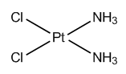

<!-- p.772 -->
Pt--Cl2--(NH3)2, we should not for example define Pt2+, (NH3)2 and (Cl2)2- as fragment 1, 2 and 3, respectively.

Now boot up Multiwfn and input: examples\CDA\Pt(NH3)2Cl2\Pt(NH3)2Cl2.fch // Complex 16 // CDA module 3 // Define three fragments examples\CDA\Pt(NH3)2Cl2\Pt.fch // Fragment 1 examples\CDA\Pt(NH3)2Cl2\Cl2.fch // Fragment 2 examples\CDA\Pt(NH3)2Cl2\(NH3)2.fch // Fragment 3 Then choose option 0 and input 1,2 to output CDA analysis result for fragment pair 1-2. Similarly, we get the CDA result for fragment pair 1-3 and 2-3. We cannot obtain ECDA result for present system because ECDA is only applicable to two-fragment cases. The total CDA results are summarized below.

1-2 1-3 2-3

d 0.0017 0.0077 0.0538 b 0.5156 0.0368 0.0071 d-b -0.5139 -0.0291 0.0467 r 0.0581 -0.0579 -0.1415

The table shows that there are 0.5156 and 0.0368 net electrons transferred from (Cl2)2- and (NH3)2 to Pt2+, respectively. Basically, no electrons are donated from Pt2+ to its ligands. This result is in line with our chemical intuition because according to classical theory, the electrons of coordinate bonds are purely contributed from ligands. The charge transfer between (Cl2)2- and (NH3)2 is trivial, mainly due to there is no direct chemical interaction between them. Note that the r term between fragment 2 and 3 is a small but non-negligible negative value, exhibiting that there is detectable electron repulsion effect between the ligands.

Deeper analyses of this system are left for you. You can discuss orbital contribution to charge transfer based on the detailed output of CDA analysis, use option 2 to study the composition of complex orbital in fragment orbital basis, and use option 5 to plot orbital interaction diagram.


### 4.16.4 CDA analysis based on restricted open-shell wavefunction: ethane


Usually unrestricted (U) formalism is used for calculating open-shell systems (complex and/or fragments) in CDA analysis since U is cheaper and faster than restricted open-shell (RO) formalism. However, the advantage of using RO wavefunctions for CDA analysis is that one does not need to explicitly distinguish alpha and beta orbitals, since RO only generates single set of orbitals; in other words, the alpha and beta orbitals share identical shape. In this section, I illustrate how to correctly perform CDA analysis based on RO wavefunctions. Ethane is taken as example, the two methyl groups will be chosen as the two fragments.

First, we optimize ethane using (R)B3LYP/6-31G* level, the corresponding Gaussian input file is examples\CDA\CH3CH3\ethane.gjf, the output file is also provided, and the corresponding resulting .fch file converted by formchk utility is ethane.fch in the same folder. We extract coordinates of the two methyl groups from the optimized ethane and save them as two respective Gaussian input files, namely CH3_1.gjf and CH3_2.gjf in “examples\CDA\CH3CH3\” folder; as


<!-- p.773 -->
you can see, their calculation levels are ROB3LYP/6-31G*. After running the two .gjf files and converting the .chk file via formchk, we obtain CH3_1.fch and CH3_2.fch.

Although you can directly use the ethane.fch, CH3_1.fch and CH3_2.fch to carry out CDA analysis as usual (since none of them is unrestricted wavefunction, CDA will be conducted in closed-shell form), you will find the CDA result is incorrect, because both the two methyl group fragments are regarded as having 5 alpha and 4 beta electrons.

To correctly perform CDA analysis based on RO wavefunction, you should manually transform the RO wavefunction to U wavefunction; in other words, splitting RO orbitals to alpha and beta orbitals. As an example, we do this transformation for CH3_1.fch. Boot up Multiwfn and input

examples\CDA\CH3CH3\CH3_1.fch 6 // Modify wavefunction 37 // Split spatial orbitals (RO orbitals in the current context) as alpha and beta spin orbitals -1 // Return 100 // Other functions (Part 1) 2 // Export current wavefunction to a file 7 // Export to .fch file CH3_1_UKS.fch // Name of new file The CH3_1_UKS.fch records UKS wavefunction, which includes alpha and beta orbitals with the same shapes and energies but different occupancies. Similarly, please transform CH3_2.fch to CH3_2_UKS.fch in the same way.

Now we can conduct CDA analysis. Boot up Multiwfn and input examples\CDA\CH3CH3\ethane.fch 16 // CDA 2 // Two fragments examples\CDA\CH3CH3\CH3_1_UKS.fch examples\CDA\CH3CH3\CH3_2_UKS.fch n // Do not flip spin of fragment 1 y // Flip spin of fragment 2 The result is:


```text
                     **** Result for alpha electrons ****

    Orb.      Occ.          d           b        d - b          r
       1    1.000000   -0.000018   -0.000036    0.000018   -0.000201
       2    1.000000    0.000406    0.000237    0.000169    0.000750
[ignored]
      13    0.000000    0.000000    0.000000    0.000000    0.000000
  ......
 -------------------------------------------------------------------
 Sum:       9.000000    0.154365   -0.001225    0.155589   -0.137034

                     **** Result for beta electrons ****

    Orb.      Occ.          d           b        d - b          r
       1    1.000000   -0.000036   -0.000018   -0.000018   -0.000201
```


<!-- p.774 -->

```text
       2    1.000000    0.000237    0.000406   -0.000169    0.000750
[ignored]
      13    0.000000    0.000000    0.000000    0.000000    0.000000
  ......
 -------------------------------------------------------------------
 Sum:       9.000000   -0.001225    0.154365   -0.155589   -0.137034
```

According to common knowledge about chemical bonds, the first CH3 uses its alpha unpaired electron to form C-C bond with beta unpaired electron of another CH3. From CDA point of view, as shown above, during formation of the C-C bond, the first CH3 transfers 0.155 alpha electron to unoccupied alpha orbital of the second CH3, while the second CH3 transfers 0.155 beta electron to unoccupied beta orbital of the first CH3. This result looks reasonable and in line with chemical intuition.

Then we plot orbital interaction diagram. Input following commands 5 // Plot orbital interaction diagram 3 // Set the energy range to be plotted -25,10 // From -25 to 10 eV, which was found to be suitable for present case 1 // Plot the diagram now Now you can see (some MO maps are also attached)

From the map above you can clearly identify how the bonding orbital is generated by mixing MO of the two fragments. This map is currently plotted for alpha spin, while since alpha and beta MOs in the current case are essentially identical (the two sets of spin orbitals of the fragments were equally split from ROKS orbitals as we did before, while the two sets of spin orbitals of the complex are automatically generated by equally splitting RKS orbitals during CDA analysis), the map plotted for beta spin is identical to the map above; the only marginal difference is that in the map for beta


<!-- p.775 -->
spin, you can find the bar of orbital 5 of fragment 1 is dashed (unoccupied) while that of fragment 2 is solid (occupied). In fact, there is no need to view the alpha and beta orbital interaction diagrams as two different maps, you can think that actually there is only one orbital interaction diagram, in which the orbitals 1~4 of fragments 1 and 2 are doubly occupied, while the orbital 5 of fragment 1 is unpaired alpha electron orbital and orbital 5 of fragment 2 is unpaired beta electron orbital.

It is worth to note that if you plot this orbital interaction diagram based on ROKS fragment orbitals, you will find that for each spin, complex orbitals are not always equally contributed by fragments orbitals of the two fragments despite the two methyl groups are chemically equivalent, this is because alpha and beta ROKS orbitals do not share identical energies and shapes. Obviously, analyzing based on ROKS orbitals makes discussion markedly easier than based on UKS orbitals, for which you have to study interaction diagram of alpha and beta spins respectively.


## 4.17 Basin analysis

Note: Some examples in this section are also available in my blog article “Using Multiwfn to perform basin analysis for electron density, ELF, electrostatic potential, density difference and other functions” (http://sobereva.com/179, in Chinese).

Below I will show how to use basin analysis module of Multiwfn to perform basin analysis for several molecules and for various real space functions. Related theory, numerical algorithms and the usage of this module have been detailedly introduced in Section 3.20. If you are not familiar with the concept of basin, please consult Section 3.20.1 first. While if you want to know more details about basin analysis, please consult Sections 3.20.2 and 3.20.3.

You should know that Multiwfn uses a grid-based method (in particular, near-grid method) to locate attractors, generate and integrate basins; in other words, most tasks realized in the basin analysis module rely on grid data. This is why in the sections below "grid data" is frequently mentioned.

4.17.1 AIM basin analysis for HCN and Li6

In this example we will analyze basins of electron density (also known as AIM basins) for HCN molecule, which is a very representative molecule. Only at final part of this section, I will also show how to carry out basin analysis of electron density for Li6 atomic cluster, since this is a special case, in which there are some "pseudoatoms".

After you carefully read this section, I believe you will understand most of basic operations of the basin analysis module in Multiwfn.

Generate basins and locate attractors Boot up Multiwfn and input following commands examples\HCN.wfn 17 // Basin analysis 1 // Generate basins and locate attractors 1 // The grid data to be calculated and thus analyzed is for electron density 2 // Medium-quality grid. This is enough for most cases, if you want to obtain a better result, you can choose "High-quality grid", but much more computational time will be spent


<!-- p.776 -->
Multiwfn now starts to calculate grid data for electron density, and then generates basins and locates attractors based on the grid data; soon you will see attractor information, as shown below (notice that the attractor sequence may be different to your actual case if parallel mode is enabled, similarly hereinafter):


```text
Attractor       X,Y,Z coordinate (Angstrom)                Value
    1   -0.02645886   -0.02645886   -1.52058663          0.33959944
    2    0.02645886    0.02645886   -0.51514986         49.48609717
    3   -0.02645886   -0.02645886    0.64904009         76.55832377
```

From now on you can check the information of the located attractors anytime by option -3.

Visualization of basins and attractors Now choose option 0 to visualize the basins and attractors. The purple labels indicate the index of the located attractors. Since attractors of electron density are very close to nuclei, if you want to see them, you should deselect "Show molecule" check box first. Here we select 1 from the basin list at the right-bottom corner, the basin corresponding to attractor 1 will be immediately shown. By default, only interbasin part of the basin is shown, if you want to inspect the whole basin you should select "Show basin interior" checkbox. After we select it, the GUI will look like below:

If you only want to visualize the region of the atomic basin in the vdW surface (defined as

ρ=0.001 a.u. in the present context), you can choose "Set basin drawing method" - "rho>0.001 region only", then you can see:


<!-- p.777 -->
Now click "RETURN" button to close the GUI. You may have noticed the information below in the command-line window


```text
The number of unassigned grids:           0
The number of grids travelled to box boundary:           0
```

Commonly the number of these two types of grids should be zero, only in rare cases they are not zero; in such cases, you can visualize them by respectively selecting "Unas" and "Boun" in the basin list of the GUI. These grids do not belong to any basin, and generally they lack physical meaning; to understand when and why they occur please consult Section 3.20.2.

Integrating basins Next, we calculate the integral of electron density (electron population number) in these basins.

Select function 2, then you will see many options. Each option with the serial  1 corresponds to a real space function; if you select one of them, corresponding real space function will be integrated in the generated basins. In present example we can select option 1, which corresponds to electron density. However, since we have already calculated grid data for electron density, and the grid data of electron density thus have been stored in memory, we can directly use it rather than compute it again to reduce computational time, so here we select option 0 to use "The values of the grid data stored in memory". Since electron density at the grids does not need to be re-evaluated, the integrals are outputted immediately:


```text
  #Basin        Integral(a.u.)      Volume(a.u.^3)
      1          0.7356142812        441.70000000
      2          5.3511723358        566.84900000
      3          7.9020047534        829.72600000
Sum of above values:         13.98879137
```

There should be totally 1+6+7=14 electrons in present system; unfortunately, the sum of the integrals of electron density is 13.98879, which evidently deviates from the ideal value!

Because the basin we are studying is AIM basin, the best choice to obtain the basin integral is using function 7 rather than function 2. In function 7, mixed atomic-center and uniform grids are used, while function 2 only employs uniform grid to integrate. We input:

7 // Integrate real space functions in AIM basins with mixed type of grids 1 // Integrate a specific function with atomic-center + uniform grids 1 // Select electron density as the integrand The result is


```text
   #Basin        Integral(a.u.)      Vol(Bohr^3)    Vol(rho>0.001)
       1          0.7356461300         441.710          34.884
```


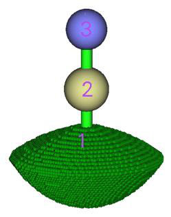

<!-- p.778 -->

```text
       2          5.3552275427         566.347         102.832
       3          7.9086499057         830.218         134.228
 Sum of above integrals:         13.99952358
 Sum of basin volumes (rho>0.001):     271.944 Bohr^3
```

As you can see, the sum of the integrals of electron density (13.999) is almost exactly identical to the expected value 14.0, obviously the result is much better than using function 2. The basin volumes are also outputted. The terms "vol(Bohr^2)" do not have clear physical meaning, since they are directly affected by the spatial range of grid setting. However, the terms "vol(rho>0.001)" are useful, they exhibit the volume of the basin enclosed by the isosurface of electron density > 0.001 (Bader's vdW surface) and thus can be regarded as atomic sizes.

The atomic charge (AIM charge) of these atoms and their volumes are also outputted


```text
Normalization factor of the integral of electron density is    0.999966
The atomic charges after normalization and atomic volumes:
     1 (C )    Charge:    0.644590     Volume:   102.832 Bohr^3
     2 (N )    Charge:   -0.908919     Volume:   134.228 Bohr^3
     3 (H )    Charge:    0.264329     Volume:    34.884 Bohr^3
```

Note that above AIM charges are not very accurate! To obtain more accurate integrals in AIM basins, you should select option 2 or 3 in function 7; compared to 1, they will refine the assignment of basin boundary to conspicuously improve the integration accuracy, but additional computational cost must be afforded. Here we try it, select option 2 in function 7, then input 1, the result is


```text
Normalization factor of the integral of electron density is    0.999967
The atomic charges after normalization and atomic volumes:
     1 (C )    Charge:    0.748980     Volume:   100.160 Bohr^3
     2 (N )    Charge:   -1.003918     Volume:   136.304 Bohr^3
     3 (H )    Charge:    0.254938     Volume:    35.480 Bohr^3
```

It is seen that the atomic charges are varied compared to earlier (more accurate than before).

To further improve the integration accuracy, when generating basins, one should select a grid setting better than "medium-quality grid", e.g. "High-quality grid" or even "Lunatic quality grid". But bear in mind that for large systems, high-quality grid may consume very large amount of computational time and memory, and lunatic-quality grid needs more.

Although as we have seen the integration accuracy of function 7 (uniform + atomic center integration grid) is much better than function 2 (purely uniform integration grid), the former is only applicable to integrate AIM basins, while the latter can be used for any type of basin (e.g. ELF basin).

Note: If you used option 2 or 3 in function 7, during the boundary grid refinement process, the assignment of basin boundary will be updated permanently, that means the result of subsequent analyses (e.g. calculating LI/DI, electric multipole moment) will also become more accurate.

In summary, the common steps for obtaining reliable AIM charges after you enter basin analysis module is

1 // Generate basin 1 // Electron density 2 // Medium-quality grid. Select high-quality grid if you wish to get more accurate result 7 // Integrate real space functions in AIM basins with mixed type of grids 2 // Integrate and meantime refine basin boundary 1 // Electron density The most convenient way of calculating AIM charges in Multiwfn is simply choosing


<!-- p.779 -->
subfunction 14 of main function 7, as illustrated in Section 4.7.11! Which automatically perform all aforementioned steps.

Calculate electric multipole moments of basins Now enter function 8 to calculate electric multipole moments for the AIM basins using mixed grid (you can also use function 3 to do this based on uniform grid, but the accuracy is significantly poorer). Only the result of carbon is pasted below


```text
*****  Result of atom     1 (C ), corresponding to basin     2
Basin monopole moments (from electrons):   -5.250848
Atomic charge:    0.749152
Basin dipole moments:
X=    0.000003  Y=    0.000000  Z=    1.095848  Norm=    1.095848
Basin electron contribution to molecular dipole moment:
X=    0.000003  Y=    0.000000  Z=    6.026238  Norm=    6.026238
Basin quadrupole moments (Traceless Cartesian form):
XX=   -0.759567  XY=    0.000000  XZ=   -0.000002
YX=    0.000000  YY=   -0.759565  YZ=   -0.000005
ZX=   -0.000002  ZY=   -0.000005  ZZ=    1.519132
Magnitude of the traceless quadrupole moment tensor:    1.519132
Basin quadrupole moments (Spherical harmonic form):
Q_2,0 =   1.519132   Q_2,-1=  -0.000006   Q_2,1=  -0.000002
Q_2,-2=   0.000000   Q_2,2 =  -0.000001
Magnitude: |Q_2|=    1.519132
Basin electronic spatial extent <r^2>:        8.542655
Components of <r^2>:  X=       3.353930  Y=       3.353928  Z=       1.834797
```

The formulae used to evaluate these terms are basically the same as those given in Section 3.18.3, however, the nuclear positions should be replaced by attractor positions, and the spatial ranges of the integration should be basins rather than fuzzy atomic spaces.

The electric monopole moment (-5.251 a.u.) is just the negative value of electron population in the basin. Z-component of electric dipole moment of the basin is a positive value (1.096 a.u.), suggesting that in basin 2, most electrons are distributed in the regions where Z-coordinate is more negative than attractor 2. The ZZ-component of basin electric quadrupole moment is positive (1.519 a.u.), while the other diagonal components are negative, indicating that relative to attractor 2, electron cloud in this basin contracts in Z-direction but elongates in other directions.

The <r2> exhibits spatial extent of electron distribution in the atomic basins. From the output you can find the order of this value is N2 (14.37) > H3 (1.04) > C1 (8.54), indicating that the nitrogen and hydrogen have the widest and narrowest electronic spatial extent, respectively.

Calculate localization index and delocalization index of basins Delocalization index (DI) is a quantitative measure of the number of electrons delocalized (or say shared) between two regions, while localization index (LI) quantitatively measures how many electrons are localized in a region. For details about LI and DI please see Section 3.18.5. The only difference relative to the statements in that section is that here the LI and DI will be calculated based on basins rather than based on fuzzy atomic spaces.

Choose function 4, then select option 2 to use mixed grid to evaluate basin overlap matrix, then LI and DI will also be calculated. As you can see from screen, the LI and DI matrix are outputted


<!-- p.780 -->
first based on basin indices, after that, Multiwfn identifies correspondence between atom indices and basin indices, then prints LI and DI matrix based on atom indices, as shown below


```text
Detecting correspondence between basin and atom indices (criterion: <0.3 Bohr)
Basin     2 corresponds to atom     1 (C )
Basin     3 corresponds to atom     2 (N )
Basin     1 corresponds to atom     3 (H )

************** Total delocalization index matrix (atom index) **************
              1             2             3
    1    3.49274177    2.59233062    0.90041116
    2    2.59233062    2.66486431    0.07253370
    3    0.90041116    0.07253370    0.97294485

Total localization index (atom index):
   1:  3.50427    2:  6.67098    3:  0.25855
```

Since present molecule is a closed-shell system, only total LI and DI are outputted, the LI and

DI for α and β electrons are not outputted separately. As you can see, between C1 and N2 atomic basins, the DI is 2.592, exhibiting that there are 2.592 electrons effectively shared by the two atoms. To some extent DI can be regarded as covalent bond order, the DI value 2.592 is indeed comparable with the formal bond order (3.0) between C and N in HCN. The diagonal terms are the sums of the elements in corresponding row/column, for closed-shell cases they can be somewhat considered as atomic valence. So, we can say the N2 atom in HCN has atomic valence of 2.665.

The LI of H3 is only 0.256, which conspicuously deviates from the basin electron population. This observation reflects that in HCN, the electron in the AIM atomic space of hydrogen can easily delocalize out.

Special case: Basin analysis when pseudoatoms are presented Pseudoatom is also known as non-nuclear attractor (NNA) of electron density, it refers to maximum of electron density that are not at nuclear position. There are various reasons that can cause the NNAs, for example, existence of metal bond or quality of wavefunction is too poor. Here I use Li6 cluster as example to illustrate how to deal with the case when NNAs are presented.

Boot up Multiwfn and input examples\Li6.fch 17 // Basin analysis 1 // Generate basins and locate attractors 1 // Electron density 1 // For illustration purposes, here we only use low-quality grid for saving time 0 // Visualize attractors and basins Left part of the graph below shows geometry of the cluster, the three green spheres indicate position of the three NNAs; right part of the graph displays corresponding basin of one of NNAs. As you can see, attractors 2, 4, 8 are NNAs.


<!-- p.781 -->
If you plot color-filled map of valence electron density for the Li6 via the steps illustrated in Section 4.6.2, you will immediately understand why there exists NNAs at center of the boundary Li triangles. From the graph below you can clearly see that at center of each boundary triangle there is indeed a maximum of electron density, this observation also implies presence of three-center bonds

Next, we calculate population number of the AIM basins. Input below commands 7 // Integrate real space functions in AIM basins with mixed type of grids 2 // Integrate and meantime refine basin boundary 1 // Electron density During integrating the basins, calculation will pause three times and meantime you will find prompt like below on screen. This is because program does not know how to properly deal with the three NNAs, namely attractors 2, 4, 8:


```text
Warning: Unable to determine the attractor     2 belongs to which atom!
 If this is a non-nuclear attractor, simply press ENTER button to continue. If you used
pseudopotential and this attractor corresponds to the cluster of all maxima of its valence
```


<!-- p.782 -->

```text
electron, then input the index of this atom (e.g. 9). Else you should input q to return
and regenerate basins with smaller grid spacing
```

Since we already know that attractors 2, 4, 8 are regular NNAs, according to the prompt, what we should do is simply pressing ENTER button to continue the calculation. Finally, you will find below output


```text
Normalization factor of the integral of electron density is    0.999992
The atomic charges after normalization and atomic volumes:
     2 (NNA)   Charge:   -1.249592     Volume:   273.680 Bohr^3
     4 (NNA)   Charge:   -1.249536     Volume:   273.680 Bohr^3
     8 (NNA)   Charge:   -1.249079     Volume:   274.048 Bohr^3
     1 (Li)    Charge:    0.757502     Volume:    69.792 Bohr^3
     2 (Li)    Charge:    0.756323     Volume:    70.000 Bohr^3
     3 (Li)    Charge:    0.756331     Volume:    70.000 Bohr^3
     4 (Li)    Charge:    0.492816     Volume:   139.296 Bohr^3
     5 (Li)    Charge:    0.492759     Volume:   139.296 Bohr^3
     6 (Li)    Charge:    0.492477     Volume:   139.392 Bohr^3
```

As can be seen, each NNA basin carries 1.249 electrons, therefore charge of the basin is -1.249. When NNAs are presented, it is clearly unable to rigorously define AIM atomic charges, since sum of all AIM atomic charges will be unequal to net charge of the whole system. This is one of severe limitations of AIM atomic charge.

Drawing basins via VMD program When showing basins, you can easily get much better graphical effect if you make use of VMD program. See this video illustration: "Drawing AIM basins (atomic basins) in Multiwfn and VMD" (https://youtu.be/9D5do80XcbI).

Briefly speaking, what you need to do is selecting option -5 in the basin analysis module, input indices of the basins of interest, and then choose "3 Output all basin grids where electron density > 0.001 a.u." to export the basins as individual cube files. Then loading them into VMD and plot them as isosurfaces with isovalue=0.5, you can get a graph like the following one (oxygen basin of examples\acrolein.wfn):

As illustrated in the aforementioned video tutorial, you can even simultaneously draw multiple basins and show critical points + bond paths in VMD. For example, the map below represents atomic basins of four non-hydrogen atoms of acrolein, the orange and purple spheres correspond to bond critical points and nuclear critical points, respectively. The yellow thick lines are bond paths.


<!-- p.783 -->

### 4.17.2 Example of ELF basin analysis

Multiwfn is very powerful in ELF basin analysis. As an example, in this section we analyze ELF basin for a typical small molecule, acetylene. Boot up Multiwfn and input

examples\C2H2.wfn 17 // Basin analysis 1 // Generate basins and locate attractors 9 // ELF 2 // Medium-quality grid Once generation of basins has been completed, we can perform various kinds of visualization and analyses, see below.

Part 1: Visualize attractors and basins We enter option 0 to visualize ELF attractors and basins, you will see the following map. The attractors are represented as green spheres, and the purple texts are basin indices. You can find there are lots of closely placed attractors encircling the C-C bond, they have basically identical ELF values and collectively represent the ring-like ELF attractor. These attractors have been clustered together by Multiwfn automatically, therefore all of them have the same attractor index, namely 2; in other words, attractor 2 is a degenerate attractor, which contains many member attractors (or pristine attractors). Correspondingly, basin 2 is composed of all member basins.

You can choose 2 in the list at bottom-right of the GUI to visualize basin 2, you can see


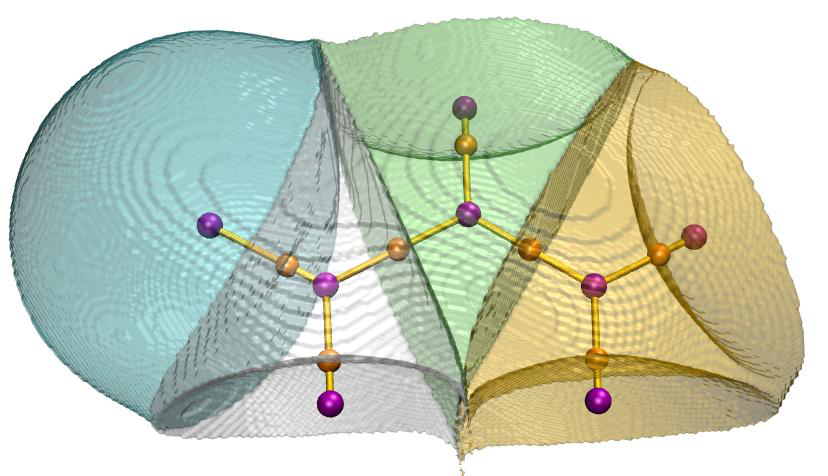


<!-- p.784 -->
Sometimes it is better to only visualize the basin region where electron density is higher than 0.001 a.u. To do this, select “Set basin drawing method” in the menu bar and then choose “rho>0.001 region only”, then click “Show basin interior” check box at right side of the GUI, you will see

All electrons contributing to C1-C3 bond are lying in the basin 2 shown above.

The presence of attractor 2 signifies the π electrons shared by the two carbons. According to the well-known ELF symbolic scheme, basin 2 should be identified as V(C1,C3), which means this basin is comprised by valence electrons of C1 and C3 and contributes to existence of C1-C3 bond.

Attractors 3 and 4 correspond to core-type ELF attractors, their basins should be identified as C(C3) and C(C1), respectively, where the letter C out of parentheses stands for "Core". If you deselect the "Show molecule" check box and select corresponding terms in the basin list, then you can visualize the basins. The graph shown below portrays C(C3) basin


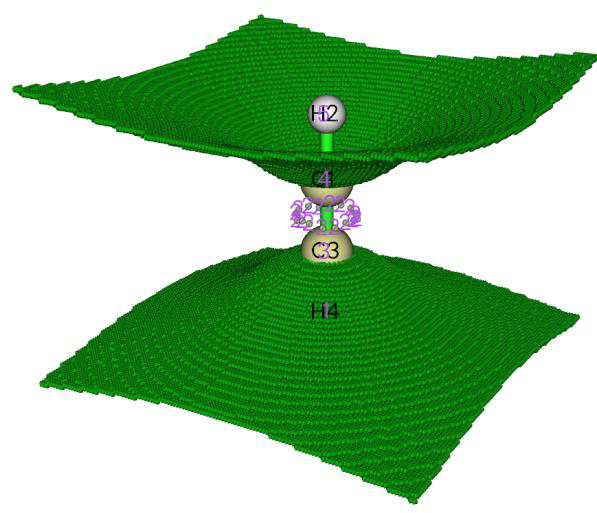


<!-- p.785 -->
Although basins 1 and 5 cover the atomic space of H4 and H2, they should be identified as V(C3,H4) and V(C1,H2), respectively, rather than C(H4) and C(H2). This is because hydrogen does not have core electrons, and the electrons in the two basins directly contribute to C3-H4 and C1-H2 bonds.

Now close the GUI window by clicking "RETURN" button at upper right side of GUI.

Part 2: Automatically assigning ELF basin labels When the system is relatively large, or there are numerous structures to be studied (for example, in bond evolution theory analysis you need to study a batch of IRC points), manually assigning labels for ELF basins is quite troublesome. Fortunately, Multiwfn is able to automatically assign basin labels, as long as the real space function you selected is ELF.

We choose option “12 Assign ELF basin labels”, then you will immediately see


```text
The following information is printed according to basin indices
Basin indices, populations (e), volumes (Angstrom^3) and assigned labels
Basin    1  Pop.:  2.2160  Vol.:  113.865  Label: V(C3,H4)
Basin    2  Pop.:  5.3670  Vol.:  144.158  Label: V(C1,C3)
Basin    3  Pop.:  2.0949  Vol.:    0.123  Label: C(C3)
Basin    4  Pop.:  2.0949  Vol.:    0.123  Label: C(C1)
Basin    5  Pop.:  2.2160  Vol.:  113.884  Label: V(C1,H2)

Sum of core basin populations:         4.1898
Sum of valence basin populations:      9.7990
Sum of all basin populations:         13.9888

Sorting basins according to labels...
The following information is printed according to order of basin labels
Basin indices, populations (e), volumes (Angstrom^3) and assigned labels
#    1  Basin    4  Pop.:  2.0949  Vol.:    0.123  Label: C(C1)
#    2  Basin    3  Pop.:  2.0949  Vol.:    0.123  Label: C(C3)
#    3  Basin    5  Pop.:  2.2160  Vol.:  113.884  Label: V(C1,H2)
#    4  Basin    2  Pop.:  5.3670  Vol.:  144.158  Label: V(C1,C3)
#    5  Basin    1  Pop.:  2.2160  Vol.:  113.865  Label: V(C3,H4)

Number of core basins is     2, their indices:
3,4
Number of  2-synaptic basins is     3, their indices:
1,2,5
```

As can be seen above, the data are outputted twice. First, basin population, volume and labels are printed in the order of basin indices. Then, the basins are sorted according to labels, and the data are outputted again. From the labels, the physical meaning of each basin can be quickly and clearly recognized.

Note that ELF basin labels may be unable to be correctly assigned for atoms using pseudopotential.

Part 3: Estimate basin properties Multiwfn is able to calculate integral of any real space function in generated basins. For


<!-- p.786 -->
example, we calculate integral of electron density in every basin, now input

2 // Integrate a real space function in the basins 1 // Electron density Soon, we get the integrals, namely the average electron population number in each basin:


```text
  #Basin        Integral(a.u.)      Volume(a.u.^3)
      1          2.2159821094        768.40000000
      2          5.3670483807        972.85100000
      3          2.0949016050          0.83200000
      4          2.0949016050          0.83200000
      5          2.2159826437        768.49900000
Sum of above values:         13.98881634
```

Both C(C1) and C(C3) contain 2.095 electrons on average, which is in line with the fact that carbon has two electrons in its core. Also, the average population number in V(C3,H4) and V(C1,H2) are close to two, approximately reflecting that on average there is a pair of electrons shared between C and H.

According to classical chemical bond theory there are three electron pairs and hence six electrons are shared by the two carbons, however in the V(C1,C3) basin the integral is only 5.37. Although the deviation is relatively large, this is a normal situation. It is senseless to expect that the result of ELF basin analysis must be able to reproduce classical Lewis picture, and actually, ELF analysis is more advanced and closer to real physical picture.

Part 4: Electric multipole moments of basins Electric multipole moments of ELF basins are able to characterize electron distribution in featured regions. To calculate them, we enter option “3 Calculate electric multipole moments and <r^2> for basins”. Assume that we need the result for all basins, according to prompt on screen we input -1. The results for each basin are outputted in turn, the data of basin 4, which corresponds to C(C1), is given below


```text
***** Basin       4
Basin monopole moment:   -2.094902
Basin dipole moment:
X=   -0.104745  Y=   -0.104745  Z=    0.020728  Norm=    0.149575
Basin electron contribution to molecular dipole moment:
X=   -0.000000  Y=    0.000000  Z=   -2.388409  Norm=    2.388409
Basin quadrupole moment (Traceless Cartesian form):
XX=   -0.003034  XY=   -0.007856  XZ=    0.001555
YX=   -0.007856  YY=   -0.003034  YZ=    0.001555
ZX=    0.001555  ZY=    0.001555  ZZ=    0.006067
Magnitude of the traceless quadrupole moment tensor:    0.006067
Basin quadrupole moments (Spherical harmonic form):
Q_2,0 =   0.006067   Q_2,-1=   0.001795   Q_2,1=   0.001795
Q_2,-2=  -0.009071   Q_2,2 =   0.000000
Magnitude: |Q_2|=    0.011205
Basin electronic spatial extent <r^2>:        0.196110
Components of <r^2>:  X=       0.067392  Y=       0.067392  Z=       0.061325
```

First you should note that although in present case, due to the symmetry, the X and Y


<!-- p.787 -->
components of the basin electric dipole moment should vanish, the actual values are not so close to zero, implying that the integration accuracy is not very high. This is why "high-quality grid" is often necessary for electric multipole moment analysis. However, the present result is still useful for qualitative analysis. The magnitude of electric quadrupole moment in the basin quantifies how evidently the electron distribution in the basin deviates from spherical symmetry. This value for C(C1) is very small (0.0061), showing that the distribution of core electron of the carbon basically remains unperturbed during the formation of the molecule.

Now input 0 to return to basin analysis module. Note: If the basins you are interested in are only valence basins, "medium-quality grid" is enough for electric multipole moment analysis, since valence density is not as high as core density, and hence does not need high accuracy of integration.

Part 5: Localization index (LI) and delocalization index (DI) Multiwfn is able to calculate LI for each basin and DI between each pair of basins. Now we choose option 4 to study LI and DI. The result is shown below


```text
********************* Total delocalization index matrix *********************
              1             2             3             4             5
    1    1.31231709    1.03496562    0.16085935    0.02291204    0.09358009
    2    1.03496562    2.71090548    0.32048710    0.32048709    1.03496568
    3    0.16085935    0.32048710    0.51131492    0.00705643    0.02291205
    4    0.02291204    0.32048709    0.00705643    0.51131492    0.16085937
    5    0.09358009    1.03496568    0.02291205    0.16085937    1.31231718

Total localization index:
   1:  1.55970    2:  4.01124    3:  1.83397    4:  1.83397    5:  1.55970
```

The DI between C(C1) and C(C3), namely DI(3,4), is trivial, reflecting the general rule that the electron delocalization between atomic core regions is rather difficult. DI(1,3) and DI(2,3) are very small values but not close to zero, representing that the electrons in C(C3) have a few probability to exchange with the ones in V(C3,H4) and V(C1,C3), which are the only two basins adjacent to C(C3).

DI(2,1) and DI(2,5) are about 1.0, such a large value indicates that the electron delocalization between C-C bond region and C-H bond region is easy. Though the average electron population number in both C(C1) and C(C3) are 2.095, their LI values are as high as 1.834, exhibiting that the core electrons of carbon highly prefer to stay in the core region rather than delocalize in and out. In contrast, for V(C,H) and V(C,H), their LI values are less than their average electron population numbers distinctly, revealing that the electrons in these basins do not express very strong localization character.

In the ELF basin analyses, some researchers prefer to use the concept of variance (σ2) and covariance (Cov) rather than LI and DI to discuss problems. Covariance of electron pair fluctuation is simply half of the negative value of DI, for example, Cov(2,5) = -DI(2,5)/2 = -1.035/2 = -0.518. The variance of electronic fluctuation can be calculated as the half of the corresponding diagonal term of the DI matrix outputted by Multiwfn, for instance, σ2(2) = DI(2,2)/2 = 2.710/2 = 1.355 (note that as mentioned earlier, the diagonal terms of the DI matrix outputted by Multiwfn are the sums of the elements in corresponding row/column).

Part 6: Hint on visualizing attractors in VMD and GaussView The attractors located by Multiwfn can be visualized via third-part softwares. To visualize them in VMD (http://www.ks.uiuc.edu/Research/vmd/), you should choose "-4 Export attractors as


<!-- p.788 -->
pdb/pqr/txt/gjf file" and select corresponding option to export all attractors as .pdb or .pqr file, which can be loaded and plotted VMD (PS: In .pqr file, the atomic charge column corresponds to function value at the attractor). The atoms and attractors can also be exported as .gjf file using suboption 4, then you can use GaussView to easily visualize attractors. After loading the .gjf file into GaussView, it is suggested to choose "File" - "Preference" - "View" - "Display Format" - "Molecule", and then set low layer as "Tube" style. The attractors are recorded as ghost atom (Bq), their indices in GaussView minus number of real atoms are the attractor indices in basin analysis module. The following map shows ELF attractors of CH3NO2 displayed in this way, the labels are not shown:

4.17.3 Basin analysis of electrostatic potential for H2O

In this example I will illustrate performing basin analysis for electrostatic potential (ESP), a very simple molecule H2O is taken as instance. Although this kind of analysis is currently uncommon in literature, you will see this analysis is indeed useful; in particular, this analysis is able to well reveal occurrence region of lone pairs.

It is noteworthy that unlike electron density and ELF which we have analyzed earlier, ESP has positive part and negative part simultaneously. For such real space functions, Multiwfn will automatically locate attractors (maxima) for positive part and locate "repulsors" (minima) for negative part, but in Multiwfn all of them are collectively recorded as "attractors". You can easily discriminate them by their colors in GUI.

Not only basin analysis module, but also topology analysis module of Multiwfn can locate minima of ESP, and the ESP minima determined by the latter is much more accurate. So, using topology analysis module is much preferred over than using the way introduced in this section. See Section 4.2.9 for example of topology analysis of ESP.

Note: Calculation speed of ESP grid data by cubegen utility in Gaussian package is significantly faster than that of internal code of Multiwfn. If you have Gaussian installed on your system and the input file is .fch/fchk, it is strongly suggested to set "cubegenpath" parameter in `settings.ini` to actual path of cubegen, then at the step of calculating ESP grid data in the basin analysis, cubegen will be automatically invoked by Multiwfn to evaluate ESP. More information about invoking cubegen can be found in Section 5.7.

Basic steps of performing ESP basin analysis Boot up Multiwfn and input following commands: examples\H2O.fch // Optimized and produced at B3LYP/6-31G** level 17 // Basin analysis 1 // Select real space function used to partitioning basins 12 // ESP


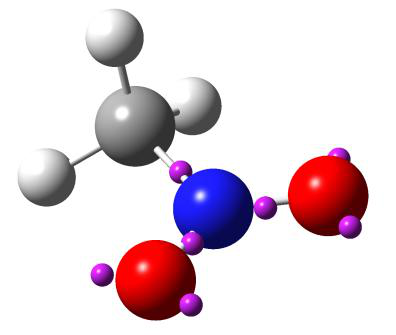

<!-- p.789 -->
2 // Medium-quality grid Once the calculation of ESP grid data and the basin generation are finished, five attractors are found. Notice that this time the number of grids travelled to box boundary is not zero again (about 1954 grids), but it completely does not matter.

Choose option 0 to open GUI, you can see that attractors 1, 2 and 3 correspond to ESP maxima due to nuclear charges. Occurrence of lone pair often makes ESP at corresponding region negative, clearly attractors 4 and 5 exhibited this effect. Attractors 4 and 5 are colored by light blue because they are lying in negative region, in fact they are not attractors but "repulsors" (minima) of ESP. By clicking "4" in the basin list and checking "Show basin interior" box, you will see the graph below, which exhibits the corresponding basin region.

If you want to visualize which grids have traveled to box boundary during basin generation, you can select "Boun" in the basin list, see the graph below. Evidently, these grids lack physical meaning and hence can be simply ignored. They are only present in the regions far from atoms.

Now click "RETURN" button to close the GUI.

Measuring geometry Sometimes one needs to obtain geometry information between attractors and nuclei. As an instance, we enter function -2, and input a1 c4, the distance between nucleus of atom 1 (namely oxygen) and attractor 4 will be shown on the screen, the value is 2.272 Bohr. Next, input c4 a1 c5, then the angle of "attractor 2 -- atom 1 -- attractor 3" will be outputted, the value is 86.01 degree,


<!-- p.790 -->
which in some sense can be regarded as the angle between the two lone pairs.

Input q to exit the geometry measurement interface.

Clustering attractors Assume that we want to cluster attractors 4 and 5 together as a degenerate attractor to make they collectively represent the two lone pairs, we can input

-6 // Set parameter for attractor clustering or manually perform clustering 3 // Cluster specified attractors 4,5 // Attractors 4 and 5 will be clustered as a single one 0 // Return Select option 0 to open GUI, as shown below, you can find that the indices of all attractors have changed, and the two attractors corresponding to the oxygen lone pairs now sharing the same index, namely 4.

Integrating basins Close the GUI by clicking "RETURN" button, choose option 2 and then select 1 to integrate electron density in the ESP basins, the result is


```text
   #Basin        Integral(a.u.)      Volume(a.u.^3)
       1          0.8776693902        390.34100000
       2          7.5388327160         26.52400000
       3          0.8776693895        390.28300000
       4          0.6822297997        654.32200000
 Sum of above values:          9.97640130
 Integral of the grids travelled to box boundary:          0.00000007
```

Since currently basin 4 is just the whole negative ESP region, the result shows that in average there are 0.682 electrons in the negative ESP region. Indeed this value is not large (one may expect that there should be about four electrons due to the two lone pairs), this is because ESP of most regions of the molecular space is dominated by nuclear charges and hence positive.

Simultaneously showing ESP minimum points and isosurfaces In J. Comput. Chem., 39, 488 (2018), the authors showed that by plotting ESP minimum points and isosurfaces in the same map, the region of lone pairs can be very clearly exhibited. The isovalue is chosen to be higher than global minimum value of ESP by 10 kcal/mol. Here we plot this kind of map.

Recall that when we just finished the basin generation, the value of each ESP minimum is printed on screen (you can also choose option " -3 Show information of attractors" any time to show them again):


```text
Attractor       X,Y,Z coordinate (Angstrom)                Value
```


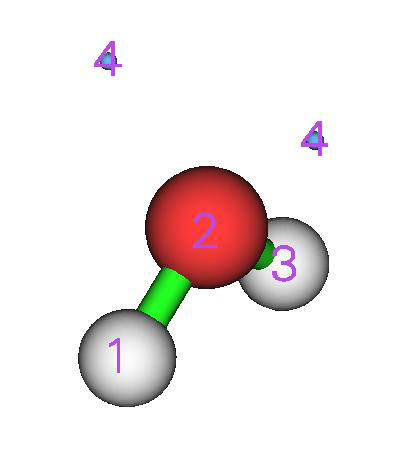

<!-- p.791 -->

```text
     1   -0.02645886   -0.76730701   -0.48343728         17.61230000
     2    0.02645886   -0.02645886    0.09865769         79.16270000
     3    0.02645886    0.76730701   -0.48343728         17.61230000
     4   -0.82022474    0.02645886    0.99825901         -0.09222160
     5    0.82022474    0.02645886    0.99825901         -0.09222160
```

Clearly, the global minimum value is -0.09222*627.51 = -57.9 kcal/mol, the isovalue should then be set to -0.09222+10/627.51 = -0.07628 a.u.

Enter option 0, in the GUI window deselect "Attractor labels", then input -10 // Return to main menu 13 // Process grid data -2 // Visualize isosurface of the grid data in memory In the GUI, input -0.07628 in "Isosurface value" box, deselect "Show both sign", choose "Isosurface style" - "Use mesh", make sure that "Show atomic labels" has been activated, choose "Other settings" - "Set atomic label type" - "Element symbol". Finally, click "Save picture" button to save image file to current folder, you will see below effect (the value is manually labelled)

Perform basin analysis using external cube file Multiwfn is able to perform basin analysis solely based on grid data, thus the real space function to be analyzed could not be anyone that formally supported by Multiwfn, such as the Anisotropy of the Induced Current Density (Chem. Rev., 105, 3758 (2005)), which can be calculated by AICD or GIMIC codes. In order to illustrate this important feature, now we redo some analyses shown above but using the grid data directly generated by the cubegen utility in Gaussian.

Run below commands in console window of your system to produce density.cub and ESP.cub.


```text
cubegen 0 fdensity H2O.fch density.cub 0 h
cubegen 0 potential H2O.fch ESP.cub 0 h
```

Then boot up Multiwfn and input ESP.cub // This file contains ESP grid data. After loading it, the grid data will be stored in memory

17 // Basin analysis 1 // Select real space function used to partitioning basins 2 // Generate the basins by using the grid data stored in memory Now visualize located attractors in option 0:


<!-- p.792 -->
Exit GUI, then input following commands 2 // Integrate real space functions in the basins -1 // Use the grid data stored in external file as integrand density.cub // This file contains electron density grid data The result is very close to the one we obtained in Part 1 of present section. For example, the electron population number in negative ESP region we get here is 0.339*2=0.678, while the counterpart value we obtained earlier is 0.682.

At last, we select option 3 to calculate electric multipole moments for the basins. Because the cube file does not contain GTF (Gaussian type function) information, you will be prompted to input the path of a file containing GTF information of present system, so that electric multipole moments can be calculated. We input the path of the H2O.fch file, and then input -1, the electric multipole moments of all basins will be immediately outputted on screen.

4.17.4 Basin analysis of electron density difference for H2O

In this example we analyze basins of electron density difference for H2O to quantitatively study the electron density deformation during formation of the molecule.

Before doing the basin analysis, we need to generate grid data of electron density difference first by main function 5, wavefunction file of all related elements must be available. Here we directly use the set of atomic wavefunction files provided in Multiwfn package, namely copying "atomwfn" subfolder in "example" folder to current folder, then during generating grid data of electron density difference Multiwfn will automatically use them. There are several different ways to prepare atomic wavefunction files, please recall Section 4.4.7 and consult Section 3.7.3.

After that, boot up Multiwfn and input: examples\H2O.fch // Generated at B3LYP/6-31G** level 5 // Calculate grid data -2 // Obtain deformation property 1 // Electron density 3 // High-quality grid. Because the variation of electron density difference is complicated, using relatively high quality of grid is compulsory. Note that the "high-quality grid" we selected here only defines the total number of grids, and hence has different meaning to the one involved in function 1 of basin analysis module

0 // After the calculation is finished, return to main menu 17 // Basin analysis module 1 // Generate basins and locate attractors 2 // Generate the basins by using the grid data stored in memory (namely the grid data we just


<!-- p.793 -->
calculated by main function 5)

Enter function 0 to visualize the result, you will see the left graph shown below. After deselecting "Show molecule", the graph will look like the right one

Positive (negative) part of electron density difference corresponds to the region where electron density increases (decreases) after formation of the molecule. Light green spheres denote the maxima of the positive part, while light blue ones denote the minima of the negative part.

If you find it difficult to imagine why the maxima and minima distribute like this, I suggest you plot plane maps for electron density difference. The left graph shown below is the electron density difference map perpendicular to the molecular plane, while the right graph is the map in the molecular plane.

By comparing the attractors with plane maps, it is evident that attractors 4 and 5 are the maxima in the region where electron density is enhanced due to the formation of the O-H bonds. While the presence of attractor 6 arises from the electron aggregation due to formation of the lone pairs.

Note 1: Attractor 6 is two-fold degenerate, namely as you can see, it corresponds to two attractors. This is because the two attractors share the same value and they are very closely placed with each other.

Note 2: Attractor 8 does not have its counterpart in another side of symmetry plane. The reason for this problem is that the grid quality employed is not high enough relative to the complicated characteristic of electron density difference.

It is interesting to examine how many electrons are aggregated between C and H due to the bond formation. There can be many ways to measure this quantity; the most reasonable one for present case is to integrate the electron density difference in basin 4 or in basin 5. Let us do this now. Choose function 2, and then select option 0 to take the grid data of electron density difference as integrand. From the output we can find that the integral is 0.102 e.


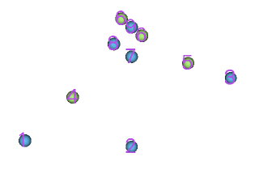


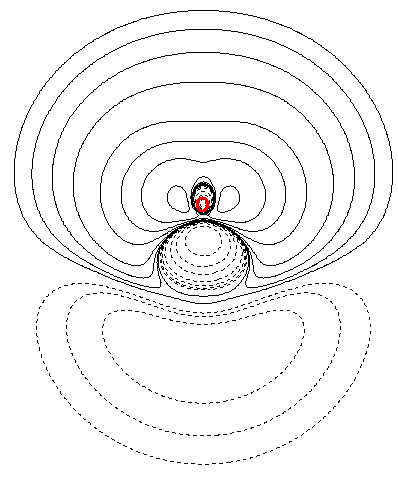

<!-- p.794 -->
If you would like to compare the attractors with the isosurface of electron density difference, you can simply choose option -10 to return to main menu of Multiwfn, and then choose suboption -2 in main function 13 to plot the isosurface of the grid data stored in memory, the attractors we located will be shown together, as shown below (isovalue=0.05), where green and blue parts correspond to positive and negative regions, respectively.


### 4.17.5 Study source function in AIM basins

Source function has been briefed in part 19 of Section 2.6. Commonly, bond critical point (BCP) is taken as the reference point of source function when bonding problem is discussed. In this example we calculate source function in AIM basins for ethane; in particular, based on source function we will get the contribution from methyl group to the electron density at the BCP of its C-H bond. Before calculating source function, we should perform topology analysis first to find out the position of the BCP.

Boot up Multiwfn and input: examples\ethane.wfn // Optimized and produced at B3LYP/6-31G* 2 // Topology analysis 2 // Search nuclear critical points 3 // Search BCPs 0 // Visualize result, see below


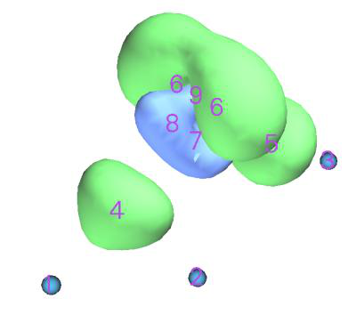

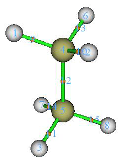

<!-- p.795 -->
Critical point 11 will be selected as the reference point of the source function. Of course, selecting which BCP is completely arbitrary. Now close the GUI of topology analysis module

You'd better choose option 7 and then input 11 to check the electron density at this CP, because theoretically the integral of source function in the whole space should equal to the electron density at its reference point, therefore this value is important to examine if the integration of source function is accurate enough. The electron density at CP11 is 0.276277.

From the information shown in the command-line window you can find the coordinate of CP11 is (0.0,-1.199262548,-1.909104063), copy it from the window to clipboard (if you do not know how to do this please consult Section 5.4). Next, we will set CP11 as the reference point of the source function. Although you can define reference point by "refxyz" parameters in `settings.ini`, there is a trick that can do the same thing, by which you need not to close Multiwfn and then reboot it to make the parameters take effect!

Input below commands -10 // Return to main menu from topology analysis module 1000 // A hidden interface 1 // Set reference point Paste the coordinate of CP11 to the window and then press ENTER button. 17 // Basin analysis 1 // Generate basins and locate attractors 1 // Electron density 2 // Medium-quality grid Enter GUI by choosing function 0, you will see

Now we integrate source function in the AIM basins. Input following commands 7 // Integrate real space functions in AIM basins with mixed type of grids 1 // Integrate a specific function with atomic-center + uniform grids 19 // Source function The result is


```text
    Atom       Basin       Integral(a.u.)   Vol(Bohr^3)   Vol(rho>0.001)
     1 (C )       5          0.00361772       149.307        70.392
     2 (H )       8          0.00289355       468.732        50.058
     3 (H )       6          0.00280041       443.982        50.097
     4 (H )       7          0.00280276       418.343        50.095
     5 (C )       2          0.12224052       150.514        70.396
     6 (H )       1          0.12040142       475.383        50.054
```


<!-- p.796 -->

```text
     7 (H )       4          0.01051821       424.105        50.095
     8 (H )       3          0.01051742       450.072        50.097
Sum of above integrals:             0.27579202
Sum of basin volumes (rho>0.001):     441.284 Bohr^3
```

The sum of the integrals is very close to the electron density at CP13 (0.276277). The sum of the integral in basin of 1, 2, 3 and 4 is 0.1204+0.1222+0.0105*2=0.2636, which represents the integral in the space of methyl group and accounts for 0.2636/0.2758*100%=95.6% of the total integral value, exhibiting that methyl group is the main source of the electron density of the BCP of its C-H bonds.


### 4.17.6 Local region basin analysis for polyyne

Sometimes, the geometry of the system we studied is rather extended, for instance, polyyne C14H2, which can be formally illustrated as

H1−C2≡C3−C4≡C5−C6≡C7−C8≡C9−C10≡C11−C12≡C13−C14≡C15−H16 If we are only interested in the electronic structure characteristic of local region in this system, by properly setting up grid, basin analysis can be conducted only for the interesting region rather than for the whole system to save computational time. As an example, in this section we will try to acquire electron population number in the ELF basin of V(C7,C8) and V(C8,C9) with minimum computational cost.

Boot up Multiwfn and input following commands: examples\polyyne.wfn // Optimized and produced under B3LYP/6-31G* 17 // Basin analysis 1 // Generate basins and locate attractors 9 // ELF 8 // Set the grid by inputting center coordinate, grid spacing and box length a8 // Take the position of atom 8 as box center 0.08 // Grid spacing (Bohr) 10,10,8 // Box length in X, Y and Z directions (Bohr). Note that current molecule is aligned in Z-axis. Obviously, the larger the box, the longer the computational time must be spent. While the box should not be too small, otherwise the basins of interest may be truncated. Choosing appropriate box size highly relies on users' experience

After the calculation is finished, enter GUI by selecting option 0, you will see the graph shown at the right side. Clearly, only several attractors near C8 are located. Basin 5 and basin 21 correspond to V(C7,C8) and V(C8,C9), respectively. Notice that although attractors 1 and 6 are also located, due to their corresponding basins are not only large but also close to box boundaries, it can be expected basins 1 and 6 are severely truncated and hence studying them is meaningless.

When you use the above manner to study local region, you will always find there are many grids travelled to box boundary. In present example, as shown in command-line window, the number of such type of grids is 60668. You can visualize them by choosing "Boun" in basin list of GUI, see the graph below


<!-- p.797 -->
Now close GUI, select option 2 and then select 1, the result shows that the integral of electron density in V(C7,C8) and V(C8,C9) are 2.78 and 5.02, respectively. Evidently, the bonding between C8-C9 is much stronger than C7-C8, this is why the bond length of the former (1.236Ǻ) is shorter than the latter (1.338Ǻ). Note that the electron population number in V(C,C) of acetylene is 5.37 (see Section 4.17.2), therefore it can be expected that C8-C9 is weaker than typical C-C triple bond, mostly due to the electron global conjugation in polyyne.

The interested users can redo the basin analysis for the whole system by using the same grid spacing (0.08 Bohr), the computational amount will be much larger than current example. For V(C7,C8) and V(C8,C9), you will find the result does not differ from the one we obtained above detectably.


### 4.17.7 Evaluate atomic contribution to population of ELF basins

In this section, I will use CH3NH2 as example to show how to obtain contribution of C and N to population of V(C,N) ELF bond basin based on AIM partition of atomic space, this is useful to examine bond polarity. You can also use a similar way to obtain atomic contribution to population of any other kind of basin (e.g. LOL basin, ESP basin).

First, we need to generate a cube file named basin.cub, whose grid value corresponds to index of ELF basins. Boot up Multiwfn and input

examples\CH3NH2.wfn 17 // Basin analysis 1 // Generate basins and locate attractors 9 // ELF 2 // Medium-quality grid Now enter option 0 to examine the basin index


<!-- p.798 -->
Evidently, basin 5 corresponds to V(N,C), which is the one we will study. Then close the GUI and input

-5 // Export basin as cube file a // Export basin.cub in current folder Next, we generate AIM basins as usual, the grid setting must be exactly identical to basin.cub 1 // Regenerate basins 1 // Select real space function 1 // Electron density 9 // Use grid setting of another cube file, this is the safest way to ensure the grid data to be generated has the same grid setting as basin.cub

basin.cub 0 // Check attractors

It is clear that the attractor index corresponding to N and C are 2 and 3, respectively. Then we evaluate atomic contribution to population of the basins defined in basin.cub

9 // Then program loads basin.cub in current folder 2 // The index of the attractor corresponding to N 5 // The 5th ELF basin, i.e. V(N,C) basin The result is 1.15866, namely N contributes 1.159 electrons to V(N,C) basin. Then input 3 // The index of the attractor corresponding to C 5 // The 5th ELF basin, i.e. V(N,C) basin From the result we know that C contributes 0.463 electrons to the V(N,C) basin. Since N contributes much more electrons than C to their ELF bond basin, it may thus be concluded that C-N is a bond with significant polarity.


### 4.17.8 Calculating high ELF localization domain population and volume (HELP, HELV)


The high ELF localization domain population and volume (HELP and HELV, respectively) were proposed in ChemPhysChem, 14, 3714 (2013), it was shown that they are useful quantities in


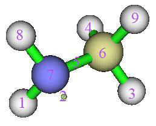


<!-- p.799 -->
characterizing lone pair electron and they have close relationship with molecular properties that related to lone pairs, such as ionization potential and energy of frontier molecular orbitals, see the ChemPhysChem paper for detail. The definitions of HELP and HELV are clearly illustrated in the map below, PH3 is taken as an instance.

From the map above it can be seen that this method defines a region named high ELF localization domain (HEL), which simultaneously satisfies three conditions:

(1) Electron density is larger than 0.001 a.u. (2) Electron localization function (ELF) is larger than 0.5 (3) Every point belongs to the ELF basin corresponding to a lone pair The volume and electron population of HEL are denoted as HELV and HELP, respectively. It is believed that this definition is better than (3) for representing lone pair area, because insignificant

region (i.e. outside vdW surface, which corresponds to ρ = 0.001 a.u.) and the region without clear chemical meaning (i.e. ELF < 0.5) are excluded.

Now we use Multiwfn to calculate HELV and HELP for PH3. Boot up Multiwfn and input examples\PH3.wfn // Generated at M06-2X/def2-TZVPP level, optimized at the same level 17 // Basin analysis 1 // Generate basins and locate attractors 9 // ELF must be chosen to define basins if you intend to calculate HELP and HELV 2 // Medium-quality grid Now we select option 0 to check attractor indices:

From the map above, we can find attractor 5 corresponds to lone pair of the P atom.


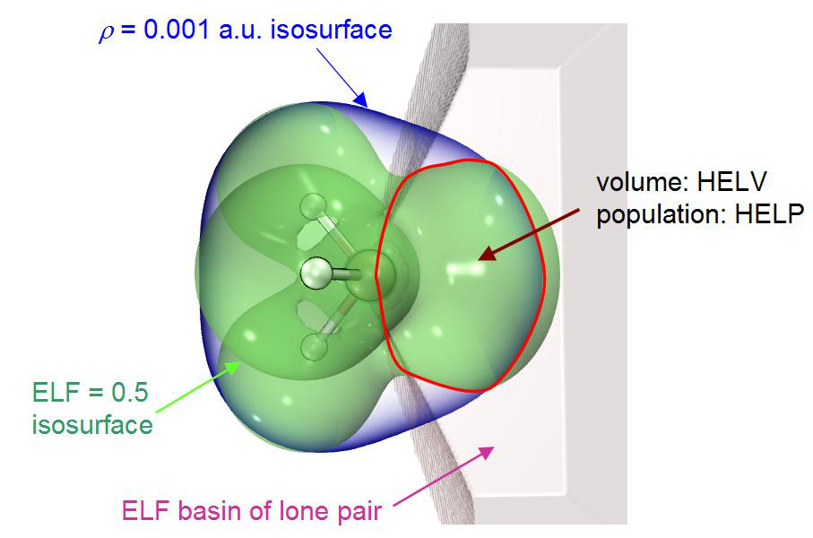


<!-- p.800 -->
Next, we input 10 // Calculate HELP and HELV 0 // Select basins and calculate their HELP and HELV 5 // The basin index corresponding to the lone pair of the P atom After a while, you will see:


```text
Basin information: (constraints are not taken into account)
Population:  2.0719   Volume: 1561.1570 Bohr^3

High ELF localization domain population (HELP):    1.4858
High ELF localization domain volume (HELV):       80.5500 Bohr^3
```

As can be seen, HELP and HELV are 1.4858 and 80.55 Bohr3, respectively, which are very close to the values in the original paper, namely 1.50 and 80 Bohr3. The marginal difference comes from the fact that the calculation level we employed is not identical to the original paper, in addition, the detail of numerical setting in our calculation must be somewhat different to the original paper.

From above output you can also find the population and volume of the ELF basin, which can also be calculated via option 2 of basin analysis module.


### 4.17.9 Evaluate atomic contributions to system electronic energy

Background knowledge Electronic energy of the whole system can be viewed as sum of electronic energies of all atoms, which correspond to integral of electronic energy density E(r) in atomic basins. This decomposition of system energy is very helpful for providing deep insight into status of atoms in different chemical environments, and important in revealing major factors that influences relative energy between different configurations or conformations. See Russ. Chem. Rev., 78, 283 (2009) for extensive discussions and application examples.

There is a relationship E(r) = -K(r), where K(r) is Hamiltonian kinetic energy. The integral of

$$E_{_\Omega}=\frac{E_{_{QC}}}{T}\times T_{_\Omega}$$

particles is absorbed into the exchange-correlation functional. Therefore, the actual E should be finally scaled as follows so that sum of all E just equals EQC:


$$E_{_\Omega}=\frac{E_{_{QC}}}{T}\times T_{_\Omega}$$

<!-- formula-ocr: formula_p800_346.png 已替换为LaTeX, 原图保留备查 -->

It is important to note that pseudopotential should not be employed, because it makes virial theorem severely violated. In addition, geometry should be sufficiently optimized to diminish deviation to virial theorem.

Example In this example, we calculate atomic energies of H2CO. Boot up Multiwfn and input examples\H2CO.wfn // Yielded by B3LYP/6-31G* calculation at corresponding minimum


<!-- p.801 -->
structure

17 // Basin analysis 1 // Generate basins 1 // Electron density 2 // Medium-quality grid 7 // Integrate real space functions in AIM basins with mixed type of grids 2 // Exact refinement of basin boundary 6 // Hamiltonian kinetic energy K(r) The result is


```text
    Atom       Basin       Integral(a.u.)   Vol(Bohr^3)   Vol(rho>0.001)
     1 (C )       2         36.98331415       243.914        67.166
     2 (H )       4          0.59352399       554.936        49.848
     3 (O )       1         75.30251602       887.039       127.096
     4 (H )       3          0.59369956       567.076        49.832
Sum of above integrals:           113.47305372
Sum of basin volumes (rho>0.001):     293.942 Bohr^3
```

The electronic energy yielded by quantum chemistry calculation can be manually found at the end of the H2CO.wfn, namely -114.50047 a.u., which is also printed by Multiwfn after loading this file. Note that the T is 113.47305 a.u., hence the atomic energy of O3 can be calculated as 75.30252*-114.50047/113.47305 = -75.98433 a.u., similarly for other atoms. You can also then manually sum up atomic energy for some atoms to derive fragment energy.

It is noteworthy that the actual virial ratio of H2CO.wfn is 2.009, which can be found at the end of this file and also printed after Multiwfn loading this file. Since its deviation to exact virial

ratio 2.0 is insignificant, our scaling treatment of E is reasonable and acceptable.

An evidently more convenient and better way of deriving atomic contribution to energy is choosing user-defined function -11 as the integrand, it is scaled electron energy density involving virial ratio, whose integral over the whole space exactly equals the electronic energy given by quantum chemistry code, see corresponding part of Section 2.7 for its definition. Now we redo the example above. Open `settings.ini` and set “iuserfunc” to -11, then boot up Multiwfn and input

examples\H2CO.wfn 17 // Basin analysis 1 // Generate basins 1 // Electron density 2 // Medium-quality grid 7 // Integrate real space functions in AIM basins with mixed type of grids 2 // Exact refinement of basin boundary 100 //User-defined function, which now corresponds to the scaled electron energy density The result is


```text
    Atom       Basin       Integral(a.u.)   Vol(Bohr^3)   Vol(rho>0.001)
     1 (C )       2        -37.32041642       244.279        67.166
     2 (H )       4         -0.60162114       554.745        49.848
     3 (O )       1        -75.97660985       887.040       127.096
     4 (H )       3         -0.60179889       566.901        49.832
```


<!-- p.802 -->

```text
Sum of above integrals:          -114.50044630
```

It can be seen that the integral -114.50044630 a.u. is basically exactly equal to the electronic energy of -114.50047 a.u. that recorded in the .wfn file. The contribution of O3 to total electronic energy is -75.97661 a.u., which is very close to the -75.98433 a.u. we obtained via aforementioned way.


### 4.17.10 Plotting ELF isosurface map colored by basin types

Many papers studied ELF by plotting its isosurface map and colored the isosurfaces according to basin type (monosynaptic, disynaptic, and others). In Section 4.5.1 I have already mentioned it is possible to use ChimeraX software to easily plot such a map based on .cub file exported by Multiwfn, however there are some limitations, namely the coloring will change when isovalue is changed, and a whole isosurface cannot be colored differently in the subregions corresponding to different types of basins. In this section, I will show how to use basin analysis module of Multiwfn in combination with VMD (freely available at http://www.ks.uiuc.edu/Research/vmd/) to plot the basin type colored ELF isosurface map without these limitations. A simple molecule oxirane will be taken as example, its wavefunction file is examples\oxirane.fchk. The version of VMD I am using is 1.9.3.

Boot up Multiwfn and input examples\oxirane.fchk 17 // Basin analysis 1 // Generate basins 9 // ELF 2 // Medium-quality grid Now you can choose option 0 to visualize the located attractors:

Close GUI window, and select option “12 Assign ELF basin labels”, you will see


```text
Basin indices, populations (e), volumes (Angstrom^3) and assigned labels
#    1  Basin    7  Pop.:  2.0953  Vol.:    0.125  Label: C(C1)
#    2  Basin    6  Pop.:  2.0953  Vol.:    0.125  Label: C(C2)
#    3  Basin   12  Pop.:  2.1351  Vol.:    0.043  Label: C(O3)
#    4  Basin   11  Pop.:  2.6773  Vol.:   33.139  Label: V(O3)
#    5  Basin   10  Pop.:  2.6773  Vol.:   33.143  Label: V(O3)
#    6  Basin    9  Pop.:  0.9741  Vol.:    1.471  Label: V(C1,O3)
#    7  Basin    3  Pop.:  1.8936  Vol.:    9.852  Label: V(C1,C2)
#    8  Basin    5  Pop.:  2.1096  Vol.:   82.164  Label: V(C1,H4)
#    9  Basin    4  Pop.:  2.1096  Vol.:   82.154  Label: V(C1,H5)
#   10  Basin    8  Pop.:  0.9741  Vol.:    1.477  Label: V(C2,O3)
#   11  Basin    2  Pop.:  2.1096  Vol.:   83.498  Label: V(C2,H6)
```


<!-- p.803 -->

```text
#   12  Basin    1  Pop.:  2.1095  Vol.:   83.498  Label: V(C2,H7)

Number of core basins is     3, their indices:
6,7,12
Number of  1-synaptic basins is     2, their indices:
10,11
Number of  2-synaptic basins is     7, their indices:
1-5,8,9
```

By comparing the automatically assigned basin labels and the graph in GUI window, you can confirm that the basins are indeed correctly labelled.

Then input -5 // Export basins as cube file b // A special mode designed for plotting basin type colored ELF isosurfaces in VMD 10,11 // Indices of the monosynaptic basins, corresponding to the highlighted text above 1-5,8,9 // Indices of the disynaptic basins, corresponding to the highlighted text above Now basinsyn.cub and basinfunc.cub are exported in current folder. In basinsyn.cub, the values within the monosynaptic and disynaptic basins regions are -1 and 1, respectively, while all other regions have value of 0. The basinfunc.cub records the real space function used to generate basins, namely ELF in the present context.

Move the basinsyn.cub and basinfunc.cub as well as plotting script examples\scripts\basinsyn.vmd to VMD folder. Then boot up VMD, input source basinsyn.vmd to execute the script, you will see the following figure. The default isosurface is 0.8, and the regions corresponding to monosynaptic and disynaptic basins are colored by green and red, respectively, while other basins (corresponding to core basins in this example) are colored by white.

You can change isovalue by entering “Graphics” - “Representation” and input expected value in “Isovalue” textbox. In this panel you can also adjust the material of isosurface. If you want to change the color for different types of basins, enter “Graphics” - “Colors” - “Color Scale” and change corresponding options.

The above illustrated plotting method is never limited to ELF, you can similarly employ it to others, such as LOL, IRI, etc.

Next, assume that we want to color the V(C,H) basins in the graph above by yellow, how to do


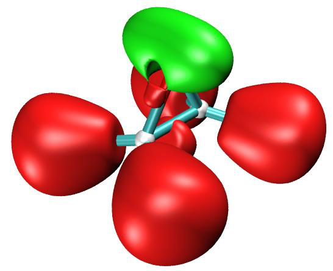

<!-- p.804 -->
that? You just need to ask Multiwfn to export grid data of function value for corresponding basins, draw them as isosurface and then directly specify the color. Let us do this, input the following commands

-5 // Export basins as cube file c // Export grid data of function value in the region of specific basins as basinsel.cub file in current folder

1,2,4,5 // Indices of the four V(C,H) basins 0 // In the exported .cub file, if a grid does not belong to the selected basins, its value will be the value you specified here

Now basinsel.cub has been generated in current folder. Load it into VMD, select “Graphics” - “Representation”, set “Drawing Method” to “Isosurface”, change “Coloring Method” to “Color ID” and choose “4 yellow”. Then change “Isovalue” to a value marginally smaller than the existing isosurfaces to guarantee to overlay them (for example 0.795 in this case, which is marginally than the 0.8 set by the basinsyn.vmd), now you can see the following graph, which is quite satisfactory!


## 4.18 Electron excitation analysis

Main function 18 of Multiwfn is very powerful, it is a collection of electron excitation analysis methods and able to provide very deep insight into all aspects of electron transition characters. In this section I will illustrate most of them using practical instances. Before following the examples below, please at least first read beginning of Section 3.21 to understand requirement on the input files. Although I illustrate all analyses based on files generated by Gaussian, these analyses are by no means limited to Gaussian users! Most analyses illustrated in this section (e.g. hole-electron analysis) require orbital wavefunctions of reference state and configuration coefficients, if you are an ORCA user and want to perform these analyses, I highly suggest reading my blog article “Method of performing hole-electron and relevant analyses via Multiwfn in combination with TDDFT calculation of ORCA” (http://sobereva.com/758, in Chinese).


<!-- p.805 -->

### 4.18.1 Using hole-electron analysis to fully characterize electron excitations


The hole-electron analysis module of Multiwfn is quite powerful, it is able to present very comprehensive characterization for all kinds of electron excitations. If you are not familiar with basic theories and ideas of hole-electron analysis, please read Section 3.21.1. The requirement on input file for the hole-electron analysis has been described at the beginning of Section 3.21, please carefully check it. Below I will employ two systems to illustrate the use of the hole-electron analysis,

the first one is a typical donor-π-acceptor system, the second one is a typical coordinate. The Chinese version of this section is my blog article "Using Multiwfn to perform hole-electron analysis to fully investigate electronic excitation character" (http://sobereva.com/434), in which there is an additional example, namely studying Rydberg excitation of H2CO.

If hole-electron is employed in your work, please not only cite Multiwfn original paper but also cite my work: Carbon, 165, 461 (2020) DOI: 10.1016/j.carbon.2020.05.023, in which hole-electron analysis is briefly described in supplemental information.

4.18.1.1 Example 1: NH2-biphenyl-NO2

The example in this section is quite long, please carefully and patiently read it. In this section I will take the NH2-biphenyl-NO2 as example, its geometry is shown below.

In this system the biphenyl moiety behaves as a π-linker, and it is well-known that the nitro group and amino group act as electron acceptor and donor during electron excitation, respectively, therefore it is expected that there must be some charge-transfer (CT) states corresponding to overall electron displacement from the amino group side to the nitro group side.

Preparation Here I assume that you are a Gaussian user (other quantum chemistry codes users can also utilize the hole-electron analysis). We optimize the geometry at the B3LYP/6-31G* level, then carry out TDDFT calculation using below settings (the input file has been provided as examples\excit\D-pi-A.gjf), then five lowest singlet excited states will be evaluated. Note that IOp(9/40=4) must be specified, the reason has been clearly mentioned at the beginning of Section 3.21. The CAM-B3LYP is employed here because it is able to faithfully represent CT excitations.

%chk=D-pi-A.chk # CAM-B3LYP/6-31g(d) TD(nstates=5) IOp(9/40=4) After calculation, convert the .chk file to .fch/fchk file, the resulting .fchk file has been provided as examples\excit\D-pi-A.fchk. The output file of this task has been provided as examples\excit\D-pi-A.out.


<!-- p.806 -->
Examining quantitative indices defined in the hole-electron analysis framework Boot up Multiwfn and input the following commands examples\excit\D-pi-A.fchk 18 // Electron excitation analysis 1 // Hole-electron analysis examples\excit\D-pi-A.out // In fact you can also press ENTER button directly, because the name of the .out file is identical to the .fchk file and they are in the same folder

1 // Study excitation between ground state (S0) and the first excited state (S1) 1 // Calculate distribution of hole, electron and so on as well as various indices 2 // Medium-quality grid (this is suited for small and medium sized systems. For large systems, you should use at least "high-quality grid", or manually input a proper grid spacing)

Once calculation is finished, you will find the following information on screen. The data (except for the excitation energy) are calculated by grid-based integration. Clearly, for the same system, the higher number of grids, the better accuracy of the data.


```text
 Integral of hole:        1.000343
 Integral of electron:    0.999793
 Integral of transition density:   -0.000033
 Transition dipole moment in X/Y/Z:   0.444063  -0.000186  -0.001753 a.u.
 Sm index (integral of Sm function):   0.27369 a.u.
 Sr index (integral of Sr function):   0.51896 a.u.
 Centroid of hole in X/Y/Z:       -4.531729    0.000425    0.003252 Angstrom
 Centroid of electron in X/Y/Z:   -4.010033    0.001760    0.002643 Angstrom
 D_x:   0.522  D_y:   0.001  D_z:   0.001    D index:   0.522 Angstrom
 Variation of dipole moment with respect to ground state:
 X:   -0.985930  Y:   -0.002523  Z:    0.001150    Norm:    0.985934 a.u.
 RMSD of hole in X/Y/Z:       1.443   1.160   0.437   Norm:   1.902 Angstrom
 RMSD of electron in X/Y/Z:   1.596   0.974   0.634   Norm:   1.974 Angstrom
 Difference between RMSD of hole and electron (delta sigma):
 X:  0.153  Y: -0.186  Z:  0.197    Overall:  0.072 Angstrom
 H_x:  1.520  H_y:  1.067  H_z:  0.536  H_CT:  1.520  H index:  1.938 Angstrom
 t index: -0.998 Angstrom
 Hole delocalization index (HDI):      22.68
 Electron delocalization index (EDI):  17.11
 Ghost-hunter index:    -18.831 eV, 1st term:  8.771 eV, 2nd term:    27.601 eV
 Excitation energy of this state:     3.907 eV
```

In the output, the "Integral of hole" and "Integral of electron" are the integrals of hole and electron over the whole space, respectively, they should be exactly 1.0 in principle. However, due to the unavoidable numerical integration error, the calculated values have slight deviation to 1.0. Since the deviation is extremely small, we can say that for the current excited state of the current system, the grid setting we employed is fully adequate.

Note: If you find the integral of hole or electron deviates from 1.0 evidently, then the outputted indexes may be unreliable. There are three possibilities: (1) You forgot to use IOp(9/40=3 or 4) (2) The grid quality is too low (3) The extension distance is not large enough, therefore the spatial region of the grid points does not fully cover the main distribution region of hole or electron (when Rydberg excitation is investigated, the default extension distance should always be enlarged).

The rest terms in the above output in turn are: The integral of transition density over the whole


<!-- p.807 -->
space (ideal value is 0), transition electric dipole moment, Sm and Sr indices, centroid coordinate of

hole and electron, Dλ and D indices, X/Y/Z components and norm of variation of excited state dipole moment with respect to the ground state one, RMSD (σ) of hole and electron, Δσλ and Δσ indices, Hλ/HCT/H indices, t index, hole and electron delocalization index, Ghost-hunter index, excitation energy (which is loaded from Gaussian output file directly).

Note that the "Ghost-hunter index" in above output is slightly different to the definition in its original paper, the implementation in Multiwfn must be more reasonable, see Section 3.21.7 for detail. The 1st term denotes the part depending on configuration coefficients and MO energies, while the 2nd term corresponds to 1/D. The ghost-hunter index is just the difference of the two terms.

The transition dipole moment outputted above is obtained by integrating evenly distributed grids of transition dipole moment density. It can also be directly read from the Gaussian output file, the X/Y/Z components are 0.4427, -0.0005, -0.0012 a.u., which are very close to those outputted by Multiwfn, namely 0.444063, -0.000186, -0.001753. This observation further reflects that the grid setting we employed is appropriate.

For the S0→S1 excitation under current study, from the above output, it can be seen that the D index is merely 0.522 Å, which is obviously a very small value since it is even less than half length of a typical C-C bond. The Sr index reaches 0.519 (the theoretical upper limit is 1.0), which is a large value, implying that about half part of hole and electron have perfectly matched. So, by simply examining Sr and D indices, we are already able to conclude that this excitation should be a typical local excitation (LE). Then let us look at the t index, its total value is -0.998, which is much less than 0, meaning that there is no significant separation of hole and electron distributions, further implying that this excitation should be attributed to LE type.

Visual study of various real space functions in the hole-electron framework Now you should see the post-processing menu on the screen. The meaning of each option is self-explanatory. Please read through each option carefully. Here we choose option 3, we will see distribution of hole and electron at the same time:

In above figures, green represents the electron distribution, and blue represents the hole distribution, isovalue has been set to 0.005. Both the hole and electron appear almost exclusively in the nitro

group, so there is no doubt that S0→S1 is a LE excitation, well verifying our conclusion based on the D, Sr, and t indices. In addition, according to the above hole distribution map, the hole appears to be composed of lone pair orbitals of oxygens since there is one lobe on each side of each oxygen. Electron distribution has a nodal plane along the nitro group, therefore we can infer that the electron

distribution should be composed of π* orbital. Now we can draw the conclusion that that S0→S1 is a LE excitation with n→π* feature.

Then close the graphical window and select option 8 to visualize Chole and Cele, which are transformed from hole and electron distributions respectively to make their distribution behavior smoother. The isosurface map is shown below (In order to see clearly, transparent style is used).


<!-- p.808 -->
As can be seen, the graph of Chole and Cele look obviously more intuitive, they are very sleek and do not have any nodal character like hole and electron. Therefore, using Chole/Cele map to replace the hole/electron map is a good choice in many cases. (BTW: If isosurfaces of Chole and Cele are not visible in the GUI window, that means the current isovalue is too large, you should gradually and carefully decrease it until the isosurfaces are visible)

Next, let us take a look at the overlap function of hole and electron, namely the Sr function. Close current graphical window, select option 4 in the post-processing menu, and then select option 2 to display the Sr function, you will see the map below (isovalue is set to 0.005)

From the graph one can clearly find where the hole and electron overlap significantly. As can be seen, around each oxygen there are four regions where the hole and electron are highly overlapped. It is easy to understand why the Sr graph looks like this by comparing the hole and electron isosurfaces shown earlier.

Then close the window and select option 7, charge density difference (CDD) between the excited state and the ground state will be shown, see below. In this map, the isovalue is set to 0.005, green and blue correspond to increase and decrease of the excited state density with respect to the ground state density, respectively.

The CDD map and the map simultaneously showing hole and electron distributions (referred to as "hole&electron map" later) are similar with each other, but there are also differences. The key difference is that in the CDD map, the hole and electron have been largely cancelled in their overlapping region; in contrast, in the hole&electron map, the overlapping between hole and electron can be faithfully exhibited. I think the hole&electron map is more useful than the CDD map to investigate the intrinsic characteristics of electron excitation because it directly exhibits the pristine distribution of hole and electron.


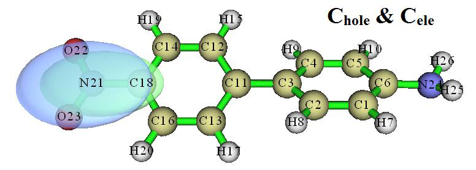


<!-- p.809 -->
By the way, if we select option 18 in the post-processing menu, the program will start to calculate the Coulomb attractive energy (also known as exciton binding energy) between the hole and electron. The calculation is quite time-consuming even for medium sized system, so please wait patiently. The final output is:


```text
Coulomb attractive energy:    0.287031 a.u.  (    7.810524 eV )
```

Important note: By using VMD software, you can plot above-mentioned functions of much better quality with only a few steps. I strongly suggest you check the example given in Section 4.A.14 on how to do this.

Examining quantitative contributions to hole and electron Next, I will demonstrate how to evaluate contribution of MOs to hole and electron. After selecting option 0 in the post-processing menu to return to the hole-electron analysis interface, we select subfunction 2 and input an outputting threshold. Here we input 1, then MOs with contribution to hole or electron higher than 1% will be shown on screen:


```text
 MO   52, Occ:   2.00000    Hole:   96.207 %    Electron:    0.000 %
 MO   56, Occ:   2.00000    Hole:    3.415 %    Electron:    0.000 %
 MO   57, Occ:   0.00000    Hole:    0.000 %    Electron:   85.411 %
 MO   59, Occ:   0.00000    Hole:    0.000 %    Electron:   12.222 %
 MO   61, Occ:   0.00000    Hole:    0.000 %    Electron:    2.163 %
 Sum of hole:  100.001 %    Sum of electron:  100.001 %
```

It can be seen from the data that MO52 is absolutely dominant for hole, it contributes as high as 96.2%, while electron is mainly composed of MO57, with a contribution of 85.4%. This observation implies that if one discusses electron excitation solely based MO52 and MO57, although in this case the electron excitation can be qualitatively described, there are still non-negligible deviations. The "Sum of hole" and "Sum of electron" shown above are the sum of the contributions of all orbitals to hole and electron, respectively (including the terms not outputted), these two values in principle should be exactly 100%, but currently there are 0.001% error. Such a small error can be completely ignored, it comes from the fact that not all configuration coefficients are printed by Gaussian (only configuration coefficients greater than 0.0001 are requested to be outputted during Gaussian calculation via IOp(9/40=4))

Then we check contribution of atoms or fragments to hole and electron. Select subfunction 3 in hole-electron analysis interface, then choose Mulliken-like partition, you will see


```text
 The number of non-hydrogen atoms:        16
 Contribution of each non-hydrogen atom to hole and electron:
    1(C )  Hole:  0.19 %  Electron:  0.02 %  Overlap:  0.07 %  Diff.:  -0.17 %
    2(C )  Hole:  0.18 %  Electron:  0.48 %  Overlap:  0.30 %  Diff.:   0.30 %
    3(C )  Hole:  0.59 %  Electron:  0.13 %  Overlap:  0.28 %  Diff.:  -0.46 %
    4(C )  Hole:  0.18 %  Electron:  0.49 %  Overlap:  0.30 %  Diff.:   0.32 %
    5(C )  Hole:  0.19 %  Electron:  0.02 %  Overlap:  0.06 %  Diff.:  -0.18 %
    6(C )  Hole:  0.31 %  Electron:  0.37 %  Overlap:  0.34 %  Diff.:   0.06 %
   11(C )  Hole:  0.15 %  Electron:  4.17 %  Overlap:  0.78 %  Diff.:   4.03 %
   12(C )  Hole:  0.41 %  Electron:  0.14 %  Overlap:  0.24 %  Diff.:  -0.26 %
   13(C )  Hole:  0.37 %  Electron:  0.14 %  Overlap:  0.23 %  Diff.:  -0.23 %
   14(C )  Hole:  0.94 %  Electron:  5.03 %  Overlap:  2.18 %  Diff.:   4.09 %
   16(C )  Hole:  0.92 %  Electron:  5.01 %  Overlap:  2.15 %  Diff.:   4.09 %
```


<!-- p.810 -->

```text
   18(C )  Hole: -0.01 %  Electron:  1.16 %  Overlap:  0.00 %  Diff.:   1.17 %
   21(N )  Hole:  2.39 %  Electron: 33.90 %  Overlap:  9.00 %  Diff.:  31.52 %
   22(O )  Hole: 46.18 %  Electron: 24.38 %  Overlap: 33.55 %  Diff.: -21.80 %
   23(O )  Hole: 46.12 %  Electron: 24.39 %  Overlap: 33.54 %  Diff.: -21.73 %
   24(N )  Hole:  0.46 %  Electron:  0.15 %  Overlap:  0.26 %  Diff.:  -0.32 %
```

Since hydrogen atoms generally do not participate in electron excitation of chemical interest, only the information of non-hydrogen atoms is outputted, including the atomic contributions to hole, electron, hole-electron overlap, electron-hole difference (i.e. CDD). The indices of the atoms in the nitro group are 21, 22, and 23, it can be seen from the data that the two oxygens of the nitro group

contribute most to the hole, the sum of their contributions is 2×46.192%. The spatial delocalization of the electron is relatively stronger, the three atoms in the nitro group contribute a total of

2×24.4+33.983%, the rest part of electron is basically contributed by the atoms in the biphenyl moiety.

Although the distribution characteristics of hole and electron can be examined by visualizing isosurface map of hole and electron, the observed isosurfaces are obviously dependent on the choice of isovalue. So, it is impossible to fully display the hole and electron distribution in all regions by only one image. On the contrary, the quantitative atomic contributions given above are very definitive.

The sum of "Diff." of N21, O22 and O23 is about -12%, which shows that the integral value of the density difference (CDD) in the nitro group is -0.12, revealing that the nitro moiety lost 0.12 electrons during electron excitation, and some of them transferred to the biphenyl moiety (if you want to investigate charge transfer amount between specific fragments, it is recommended to use the IFCT method, as illustrated in Section 4.18.8).

Showing atomic contributions to hole and electron in terms of heat map We can also plot the atomic contributions as heat map, so that the major character can be immediately and easily captured. Select "4 Set interval between labels in X axis" in current menu and then input 1 to change the step of abscissa to 1, and then select "1 Plot hole/electron composition as heat map", you will see the map below immediately

In the figure, the numbers in the abscissa are indices of non-hydrogen atoms. This figure describes the contribution of each non-hydrogen atom to hole, electron and their overlap by color (e.g. 0.4 corresponds to 40%). For example, based on the list of contributions of non-hydrogen atoms to hole/electron that shown earlier, we can know that the position 16 in the abscissa of the figure actually corresponds to atom N24. In order to more conveniently find the correspondence between the indices in the abscissa and actual atomic indices, you can open corresponding .fch/.gjf/.out file by GaussView, Select "Edit" - "Atom List", then select "Edit" - "Reorder" - "All atoms: Hydrogens Last", then you will see the graph below in GaussView, in which indices of all hydrogen atoms have been placed behind indices of non-hydrogen atoms. Clearly, in this case the atomic indices in the molecular structure directly correspond to the indices in the abscissa of the heat map.


<!-- p.811 -->
From indices in the map above, we find that the positions of 13, 14 and 15 in the heat map correspond to the two oxygens and one nitrogen atoms in the nitro group, the position 16 corresponds to the nitrogen in amino group, the rest are carbons in the biphenyl moiety. In the heat map, the row corresponding to hole clearly revealed that the hole is almost solely contributed by the two oxygens in the nitro group, since corresponding matrix elements are red (large value). Electron is also mainly contributed by the nitro group, but other molecule regions also have non-negligible contributions, this is why in the row corresponding to electron, blue color appears in the matrix elements other than positions 13~15. The information conveyed by colors of the row corresponding to overlap is that there is significant overlap between hole and electron on the oxygens of the nitro groups, while the overlap in other areas of the systems is far from being so remarkable.

There are many options in the hole/electron composition analysis interface, they can be used to adjust plotting effect of the heat map, save the heat map as an image file, switch whether to include the hydrogen atoms into the heat map, and export the data to he_atm.txt in current folder so that you can draw the heat map yourself in other programs such as Origin. These options will not be explained one by one here, please try it yourself.

Investigating fragment contributions to hole and electron The option "-1 Load fragment definition" in the above hole/electron composition analysis interface is important, it is used to load fragment definition, then fragment contribution to hole and electron will be shown, and fragment-based heat map could be drawn, which makes the discussion significantly more convenient. Here we divide the system into four fragments in the following way.

Select option "-1 Load fragment definition", and then input 4 // Define four fragments 21-23 // The atomic indices of fragment 1 (the nitro group) 11-20 // The atomic indices of fragment 2 (the benzene neighbouring to nitro group) 1-10 // The atomic indices of fragment 3 (the benzene neighbouring to amino group) 24-26 // The atomic indices of fragment 4 (the amino group) You will see below output immediately


<!-- p.812 -->

```text
  Contribution of each fragment to hole and electron:
 #  1   Hole: 94.68 %  Electron: 82.67 %  Overlap: 88.47 %  Diff.: -12.01 %
 #  2   Hole:  3.20 %  Electron: 15.67 %  Overlap:  7.09 %  Diff.:  12.47 %
 #  3   Hole:  1.64 %  Electron:  1.53 %  Overlap:  1.59 %  Diff.:  -0.12 %
 #  4   Hole:  0.47 %  Electron:  0.13 %  Overlap:  0.25 %  Diff.:  -0.34 %
```

The data shows that 94.68% of hole is located on the nitro group, while 82.67% and 15.67% of electron are located on the nitro group and neighbouring benzene ring, respectively. The degree of overlap between hole and electron on the nitro group is about 90%. Since "Diff." of the nitro group is -12.01%, and the excitation under current investigation is a single electron excitation, therefore, it can be said that the electron on the nitro group is reduced by 0.1201 during the electron excitation process, while the benzene ring neighbouring to the nitro group gained 0.1247 electrons. Then, if you want to make representation of the above data more intuitive, we can select option 1 to draw the fragment-based heat map. The abscissa at this time corresponds to fragment index, as shown below:

It can be seen from the figure that the spatial distribution range of electron is larger than hole.

Collective comparison of all electron excitations

At this point, various analyses in the hole-electron framework for the S0→S1 excitation of the NH2-biphenyl-NO2 system have been completely completed. If you also want to analyze other excited states, you should return to the menu of main function 18 by option 0, enter the hole-electron analysis function again, and then select the corresponding excited state. Here we put together the D, Sr, H, t index and hole-electron Coulomb attraction energy of all the five excited states calculated in this system. The hole delocalization index (HDI) and electron delocalization index (EDI), which have not been discussed earlier, are also given:

D(Å) Sr H(Å) t(Å) Ecoul(eV) HDI EDI

S0→S1 0.52 0.52 1.94 -1.00 7.81 22.7 17.1

S0→S2 3.48 0.65 3.15 0.56 4.71 7.2 9.5

S0→S3 0.57 0.55 1.70 -0.68 8.54 19.7 17.2

S0→S4 0.97 0.87 2.88 -1.55 5.56 7.0 7.0

S0→S5 0.54 0.87 2.93 -2.06 5.56 6.9 7.1

Below are hole&electron map, Chole&Cele map and Sr function map of all the five excitations. The isovalues are set to 0.003. It can be seen that the Chole&Cele map can always display the main distribution features of the hole&electron map in a clearer and more intuitive way. However, many details are lost during the transformation; for example it is impossible to determine the specific type

of the electron excitation (such as n-π*, π-π*) solely based on the Chole&Cele map.


<!-- p.813 -->
Now we look at the indices together with the isosurface graphs. For the D index, only the

S0→S2 value has very large (3.48 Å), so it can obviously be considered as CT excitation. Indeed, from the graph above it can be seen that the distance between the center of the blue and green isosurfaces (namely centroids of Chole and Cele) is large. While for other excitations, the centers of the blue and green isosurfaces are close together, therefore they should be regarded as LE excitations.

Then we examine the Sr index. We find that the Sr indices of all excited states are relatively

large. In particular, the values of the S0→S4 and S0→S5 are rather large, up to 0.87, the main reason is that these two excitations are highly localized π-π* type of excitation on the benzene ring. It is worth to mention that although S0→S1 is also a highly localized excitation, its Sr (0.52) is even smaller than the Sr (0.65) of S0→S2, which is a CT excitation. The reason why the Sr index of the S0→S1 is not as large as expectation is not difficult to understand. As mentioned earlier, S0→S1 shows n→π* feature, the main body of lone pair is on the NO2 plane, while π* orbital has a nodal plane on the NO2 plane, hence the overlap of hole and electron should be limited.

Next, look at the H index, which reflects the breadth of the average distribution of hole and

electron. It can be seen from the hole&electron map that both the hole and electron of S0→S1 and S0→S3 are distributed in a local region, this is why their H indices are not large. Since the distribution of hole and electron corresponding to the excitations from S0 to S2, S4 and S5 are

evidently wider than S0→S1, their H indices are evidently larger.

One can see that only the t index of S0→S2 is a slightly positive value, indicating that the separation of hole and electron is obvious, so it is more reasonable to consider S0→S2 as a CT excitation. The t indices corresponding to the excitations from S0 to other excited states are evident negative values, suggesting that degree of separation of their hole and electron is very low.

By comparing the hole and electron isosurface maps, we can find that the HDI and EDI indices indeed nicely quantified the uniformity of spatial distribution (i.e. degree of delocalization) of hole

and electron, respectively. It can be seen that both hole and electron of S0→S1 and S0→S3 are highly localized, corresponding to large calculated value of HDI and EDI. In contrast, the hole and

electron distributions of S0→S2/S4/S5 are evidently more delocalized, this point is faithfully revealed by their relatively small HDI and EDI values.

The hole-electron Coulomb attractive energy given in the table is closely related to the electron excitation characteristics, and the most influential factor should be the D index. It is easy to understand that the larger the D index is, the farther the distance between the main distribution


<!-- p.814 -->
regions of hole and electron, and thus the weaker the Coulomb attractive energy. From the data, it

is indeed found that Coulomb attraction energy of S0→S2 (the only CT excitation) is the smallest one of that of all the five electron excitations. While for the excitations of S0→S1 and S0→S3, since their D indices are very small and according to the H index the spatial extent of their hole and electron is very narrow, one can easily imagine that the corresponding Coulomb attraction should be very strong. Indeed, as can be seen from the previous table, their hole-electron Coulomb attraction energies are the most negative ones (-7.81 and -8.54 eV).

Combined with the above isosurface maps and quantitative data, we can unambiguously identify the characteristics of the five excitations:

·S0→S1：LE excitation of n-π* type on the nitro group ·S0→S2：CT excitation of π-π* type from amino group towards nitro group ·S0→S3：The same as S0→S1 ·S0→S4：π-π* LE excitation occurring on the benzene ring attached to the nitro group ·S0→S5：π-π* LE excitation occurring on the benzene ring attached to the amino group Here, the heat maps that exhibit contributions to the hole, electron and overlap from all fragments for all the five excitations are given together. In order to facilitate parallel comparison, the color scale for all excited states is uniformly set to 0.0~1.0.

From these heat maps, one can immediately make clear where the excited electrons come and where

they go by viewing color of the matrix elements. For example, from the graph of S0→S2, one can easily recognize that the excited electron is mainly originated from fragment 3 (the benzene attached to amino group), most of them is transferred to fragment 1 (the nitro group), and a smaller part is transferred to fragment 2 (the benzene attached to the nitro group). Another example, from the

S0→S4 map one can find that the excited electrons come from fragment 2, after excitation most of them remain in fragment 2, but a few of them transferred to fragment 1, and the overlap between hole and electron on fragment 2 is significantly higher than the other regions.


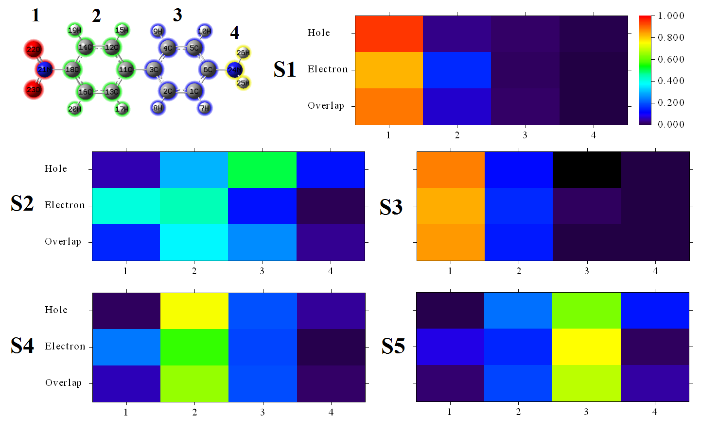

<!-- p.815 -->
It is worth to note that the detailed characteristics of charge transfer between fragments during electron excitation can be even better revealed by the IFCT method, see example in Section 4.18.8.

Plotting grid data in VMD The grid data of hole, electron, Cele, Chole and so on can be exported to cube files by corresponding options in the post-processing menu, and then you can render them in VMD program to get better visualization effect. If you do not know how to do, please refer to the description of the operations in VMD at the end of Section 4.18.3. Furthermore, one can first use VMD to plot an isosurface map for Cele and Chole, and then input such as below command to draw centroids of hole and electron as purple and orange spheres to make the graph more informative


```text
draw color purple
draw sphere {1.411500   -0.007015   -0.025494} radius 0.25 resolution 20
draw color orange
draw sphere {-2.069784   -0.000346   -0.000830} radius 0.25 resolution 20
```

For the S0→S2 excitation, the graph plotted in above way in VMD is shown below

In order to make understanding easier, an arrow is appended on the graph to highlight the CT direction, the D index is also labelled together to make the graph more informative.

Tip: Obtaining a variety of indices for a range of excited states via script By Linux shell script, a variety of indices for a range of excited states can be obtained at once.

For example, we want to obtain all indices for excitations of S0→S1,S2,S3, we should copy the input files D-pi-A.fchk and D-pi-A.out as well as the all_index.sh from the "examples\excit" folder to a proper folder, then enter this folder in the Linux terminal, run chmod +x ./batch.sh to add executable permission, then run ./all_index.sh to execute the script. Each excitation will be analyzed in turn, the status will be shown on screen until the appearance of "Finished!". Then open the resulting result.txt file in current folder, you will find


```text
     1  Sr index (integral of Sr function):   0.51896 a.u.
     2  Sr index (integral of Sr function):   0.64906 a.u.
     3  Sr index (integral of Sr function):   0.54538 a.u.

     1  D_x:   0.522  D_y:   0.001  D_z:   0.001    D index:   0.522 Angstrom
     2  D_x:   3.481  D_y:   0.007  D_z:   0.025    D index:   3.481 Angstrom
     3  D_x:   0.574  D_y:   0.001  D_z:   0.001    D index:   0.574 Angstrom

     1  RMSD of hole in X/Y/Z:       1.443   1.160   0.437   Norm:   1.902 Angstrom
     2  RMSD of hole in X/Y/Z:       3.055   0.826   0.740   Norm:   3.251 Angstrom
```


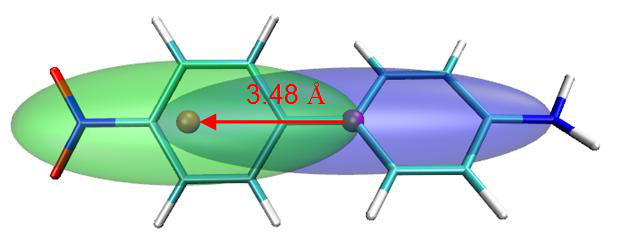

<!-- p.816 -->

```text
[ignored...]
```

This summary of all indices. You can easily modify the script to meet your practical requirement, if you are not familiar with this point, please check Section 5.3.

4.18.1.2 Example 2: Ru(bpy3)2+ cation in water

Below we examine several excited states of the Ru(bpy3)2+ cation complex in water by hole-electron analysis based on TDDFT output.

The corresponding Gaussian input file has been provided as examples\excit\Ru(bpy3)2+.gjf, please calculate it by Gaussian. If you want to directly obtain the resulting output file and .fchk file, you can download them at http://sobereva.com/multiwfn/extrafiles/Ru_bpy3_2+_TDDFT.zip. As you can see from the .gjf file, the keywords used are B3LYP/genecp TD(nstates=50) scrf IOp(9/40=3), where scrf requests Gaussian to employ IEFPCM solvation model to represent water environment. Since this system is not small, and as many as 50 excited states are evaluated, in order to avoid too high calculation time in hole-electron analysis and too large Gaussian output file, IOp(9/40=3) is used instead of the IOp(9/40=4) employed in last section, the analysis accuracy at this time is still completely sufficient.

We arbitrarily select three excited states to perform hole-electron analysis, the results are

D (Å) Sr H (Å) t (Å) hole (Ru%) ele (Ru%) MLCT(%)

S0→S24 0.30 0.71 2.73 -1.35 77.3 19.6 57.7

S0→S37 0.11 0.84 3.52 -2.10 16.9 8.8 8.1

S0→S40 0.13 0.71 2.00 -1.05 80.3 42.4 38.0

All D indices in this table are very small, while all Sr indices are fairly large. The main reason is that the current molecule is a symmetric system, thus the CT transitions are multiple directional. The MLCT(%) in the table denotes percent of metal-to-ligand charge transfer character, which can be easily evaluated in terms of subtracting the percentage of metal in hole (namely hole(Ru%)) by that in electron (namely ele(Ru%)). Notice that, properly speaking, what we obtained is net MLCT percentage, it has been somewhat cancelled with LMCT (ligand-to-metal charge transfer).

Below is hole&electron map of S0→S24 excitation with isovalue of 0.002. Since the hole and electron distributions have a large overlap, for the sake of clarity, the isosurfaces of hole and electron are given separately.


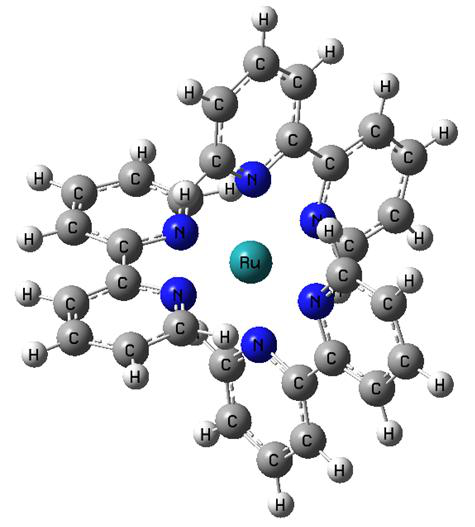

<!-- p.817 -->
Combining the graph with the quantitative data in the table, it is clear that the S0→S24 excitation not only has metal-centered (MC) character, namely electrons of the metal are excited into the metal's own empty orbital, but also have evident MLCT character. As shown in the hole&electron isosurface map, the main body of both the hole and electron is on the metal, and it can be seen that the isosurface of electron also has a large portion on the ligand. The calculated percentage of MLCT feature is 77.3-19.6 = 57.7%, this value should be said to be very consistent with the information conveyed by the hole-electron isosurface map. Note: The hole also has non-negligible distribution on the ligand, which is 100%-77.3% = 22.7%. The reason why the hole isosurface is invisible on the ligands is because its distribution is very diffuse in this region, the hole on the ligands can only be clearly seen by decreasing the isovalue to a smaller value, such as 0.0005.

Then look at S0→S37 excitation. From the hole&electron isosurface map shown below we can see that main body of both hole and electron is located at one of the ligands, therefore it is no doubt that this is a LC (ligand-centered) excitation, corresponding to the case that electrons excited from

ligand to its own π* orbitals. Because there is also hole and electron distribution on the metal, therefore this excitation also shows some MLCT character, which is calculated to be 16.9% - 8.8% = 8.1%.

Finally, look at the S0→S40 excitation, whose hole and electron isosurfaces are shown at right part of the map above. From the hole isosurface and the percent of hole on metal shown in the

previous table (16.9%), it is found that its hole distribution character is very similar to S0→S24, but the amount of electron on the ligand is obviously not as large as S0→S24, only tiny part of it is distributed on the four nitrogens directly coordinating with Ru, so the MLCT feature of S0→S40 is


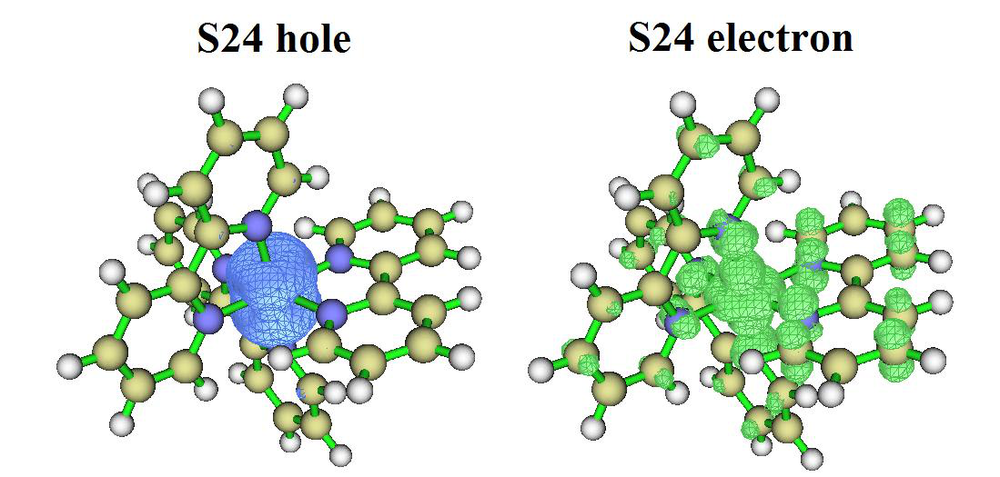

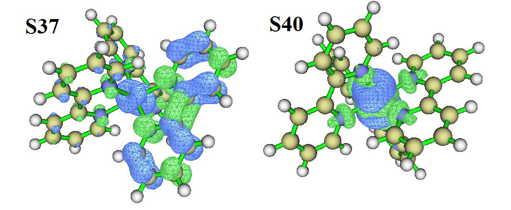

<!-- p.818 -->
conspicuously weaker than S0→S24. In contrast, its MC characteristic is definitely higher than S0→S24.

By the way, for coordinate systems, if you want to obtain MLCT, LMCT, LLCT, MC, LC separately, you should resort to the IFCT analysis illustrated in Section 4.18.8.

We already know that the electron in the excitations from S0 to S24 and S40 mainly sources from Ru atoms, but how to unveil which are the atomic orbitals that electron excited from? Although it can be more or less judged from the isosurface map of the hole, there is still some subjectivity. To figure this out, we can calculate contributions of basis functions to hole and electron. For example, after entering the hole-electron analysis function and selecting the 40th excited state, we select "4 Show basis function contribution to hole and electron" and then input an outputting threshold, such as 2, then information of the basis functions contributing to hole or electron higher than 2% will be printed:


```text
   Basis  Type    Atom    Shell     Hole      Electron     Overlap      Diff.
    22    D 0      1(Ru)   12     23.81 %      0.00 %      0.33 %    -23.81 %
    23    D+1      1(Ru)   12      8.90 %     13.63 %     11.01 %      4.72 %
    24    D-1      1(Ru)   12      9.06 %     25.12 %     15.09 %     16.05 %
    25    D+2      1(Ru)   12     13.96 %      6.94 %      9.84 %     -7.02 %
    26    D-2      1(Ru)   12     14.06 %     15.57 %     14.80 %      1.51 %
    27    D 0      1(Ru)   13      3.66 %      0.00 %      0.06 %     -3.66 %
    30    D+2      1(Ru)   13      2.32 %     -0.01 %      0.00 %     -2.32 %
    31    D-2      1(Ru)   13      2.33 %     -0.03 %      0.00 %     -2.35 %
 Sum of above printed terms:      78.10 %     61.22 %                 16.88 %
```

It can be seen from the data that the main contribution to the hole is the D basis function of the Ru atom. The SDD pseudopotential basis set we currently used only describes 4s, 4p, 4d and 5s

electrons for Ru, so the excited electron of S0→S40 excitation must come from the 4d atomic orbitals. The basis functions of Ru that have contributions to electron are also D type. Therefore,

now we know that the MC component in the S0→S40 corresponds to d-d transition on Ru.

Notice that this is not the only way to determine which orbitals the excited electrons come from and move to, for example you can also use Multiwfn to perform NTO analysis and examine the pattern of the NTO pair with largest eigenvalue. However, if the electron excitation under study cannot be well described by any pair of NTOs, then this approach will not work. In contrast, the hole-electron analysis does not have any limitation.


### 4.18.2 Illustration of transition density (matrix) and transition dipole moment density (matrix) analysis


The transition density and transition dipole moment density are very important quantities involved in electron excitation analysis, they can be studied in the form of real space functions by hole-electron module, or studied in Hilbert space by plotting as colored matrix maps (also known as heat maps). The examples in Sections 4.18.2.1, 4.18.2.2 and 4.18.2.3 will illustrate these analyses. In addition, although the commonly studied transitions are those from ground state to excited states, the these quantities between two excited states are also useful in some special studies, Section 4.18.2.4 will mention how to realize this.

More discussions about these topics can be found from my blog article: "Using Multiwfn to plot transition density matrix and charge transfer matrix to investigate electron excitation characteristics" (in Chinese, http://sobereva.com/436).


<!-- p.819 -->
4.18.2.1 Analyzing transition density and transition dipole moment density

in real space

Theory of real space function form of transition density, namely T(r), has been introduced as "Theory 4" in Section 3.21.1.1, isosurface map of T(r) is capable of revealing apparent coherence region between hole and electron. While the real space function form of transition electric dipole moment density, namely Tx(r), Ty(r) and Tz(r), are able to exhibit contribution of various regions to transition electric dipole moment (Dx, Dy, Dz), this point has been introduced as "Theory 5" of Section 3.21.1.1. In this section, N-phenylpyrrole will be taken as instance to illustrate this kind of analysis, involved files are completely identical to those utilized in the example in Section 4.18.1.

Boot up Multiwfn and input examples\excit\N-phenylpyrrole.fch // The .fch file yielded by Gaussian TDDFT task 18 // Electron excitation analysis 1 // hole-electron analysis module examples\excit\N-phenylpyrrole.out // The output file of Gaussian TDDFT task with IOp(9/40=4) keyword

1 // Analyze electron transition from ground state to the 1st excited state (S0→S1) 1 // Visualize and analyze hole, electron, transition density and so on 2 // Medium-quality grid Now you can find the following information in the output, they are Dx, Dy and Dz evaluated based on integrating the grid data


```text
Transition dipole moment in X/Y/Z:  -0.000021  -0.000045   1.767332 a.u.
```

It is worth to note that these values are very close to those printed in Gaussian output file, as shown below (line 773 of N-phenylpyrrole.out), indicating that the grid quality we currently employed is good enough


```text
       state          X           Y           Z        Dip. S.      Osc.
         1         0.0000      0.0000      1.7813      3.1729      0.3935
...[ignored]
```

We choose option 5 in the post-processing menu to show isosurface of transition density, you will then see left map in the image shown below, which exhibits the transition density in real space representation. If the transition density is multiplied by negative of Z coordinate variable, then we will obtain Z component of transition dipole moment density, namely Tz(r). To visualize it, we close current GUI window and choose "6 Show isosurface of transition dipole moment density" and then select "3: Z component", you will see right graph below


<!-- p.820 -->
From the above T(r) map, we can see that hole and electron have strong coherence everywhere, implying that distribution of both hole and electron covers the whole molecule (this can be easily further confirmed by visualizing hole and electron distributions, as illustrated in Section 4.18.1). From the right map shown above one can see that its positive (green) part is obviously larger than negative (blue) part, recall that the integral of Tz(r) over the whole space is just the Z component of

transition electric dipole moment (Dz), this observation explains why Dz of S0→S1 is a large positive value (1.7813 a.u.). If you are interested, you can try to plot Tx(r) or Ty(r) maps to interpret why the electron excitation under study has vanished Dx and Dy.

It is important to note that the S0→S1 of current system is relatively special, namely its transition electric dipole moment vector (D) just points towards Z-axis. However, for most practical cases, the D is not parallel to any of the three Cartesian axes, in this case we are not able to directly study its source in terms of visualization of any of Tx(r) or Ty(r) or Tz(r). Fortunately, it is quite easy to reorient the molecule so that the D exactly points towards a selected Cartesian axis, thus making the above analysis feasible. See Appendix 2 of Section 4.A.7 on how to realize this.

Next, we check isosurface of Tz(r) for S0→S4 excitation. We first return to menu of main function 18, then repeat above steps, finally you will see


<!-- p.821 -->
The green and blue isosurfaces occupy the same amount of space, indicating that positive and

negative contributions to Dz are exactly the same, this is why Dz of S0→S4 is zero. Note that the Tz(r) almost solely distributes on the pyrrole region, this is because this electron excitation corresponds to local excitation on pyrrole moiety (as shown in Section 4.18.1).

You may have felt that visual study of transition dipole moment density is interesting and useful; indeed, via this way you can clearly identify contribution to transition dipole moment from different molecular regions. The cube file of the T(r) as well as Tx(r), Ty(r) and Tz(r) can be exported via post-processing menu, so that you can also plot them using other visualization software such as VMD (Section 4.A.14), or use such as basin analysis module (Section 3.20) or domain analysis module (Section 3.200.14) to further quantify their distributions, or plot them as plane map via main function 4 (using interpolated function based on loaded grid data, i.e. user-defined function -1).

Visualizing transition magnetic dipole moment density The transition dipole moment we discussed above is transition electric dipole moment. There are also other kinds of transition dipole moments, such as transition velocity dipole moment and transition magnetic dipole moment. Multiwfn is also capable of calculating transition magnetic dipole moment and plotting the corresponding density isosurface map, related knowledge can be found in "Theory 5" of Section 3.21.1. Since this quantity is less important than transition electric dipole moment, I will not discuss it deeply, but only give a simple example. Using the .out and .fch files of N-phenylpyrrole, we first enter hole-electron module and select the second excited state, then input

-1 // By default, transition magnetic dipole moment density is not calculated by option 1 of hole-electron module for saving time, we select this option now to make option 1 also calculate this quantity

1 // Visualize and analyze hole, electron, transition density and so on 2 // Medium-quality grid Once the calculation is finished, from screen you can find the transition magnetic dipole moment evaluated based on the grid data:


```text
      Transition magnetic dipole moment in X/Y/Z: -0.503315  0.000119 -0.000177 a.u.
```

Then we select option 9 and select the component of transition magnetic dipole moment density


<!-- p.822 -->
that you are interested in, after that you will see the corresponding isosurface map. The following map is X component of transition magnetic dipole moment density plotted under isovalue of 0.005. The relatively larger blue region compared to green region explains why the X component of transition magnetic dipole moment is a negative value (-0.503 a.u.).

4.18.2.2 Plotting and analyzing transition density matrix (TDM)

Note: There is a video illustrating the procedure of using Multiwfn and Origin to plot the transition density matrix, see https://youtu.be/JPlZk4Aa6bQ.

The transition density matrix (TDM) has been carefully introduced in Section 3.21.2, heat map of TDM is particularly useful in understanding the nature of electron excitation, please read Section

3.21.2 first. In this section, we will analyze transition character of a linear system of donor-π-acceptor type by means of the TDM heat map. The molecular structure is shown below.

The Gaussian output file as well as .fchk file can be found in "examples\excit\NH2_C8_NO2" folder, the keyword is CAM-B3LYP/6-31G* IOp(9/40=4) TD(nstates=10).

It is worth to note that the TDM is closely related to the charge transfer matrix defined in hole-electron analysis framework. Example of plotting heat map of charge transfer matrix is given in Section 4.18.8.2. Usually heat maps of TDM and charge transfer matrix are very similar to each other and convey basically the same information.

Atom transition density matrix First, we plot heat map of "atom TDM", namely the index of the TDM corresponds to atom index. Commonly, this kind of map is only suitable for studying chain-like systems such as the


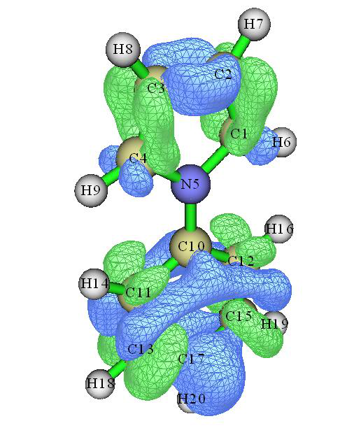

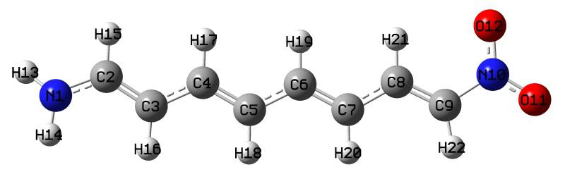

<!-- p.823 -->
present molecule, otherwise the indices in the heat map will be difficult to be mapped to actual atoms in the molecule. For systems with more complicated shape, typically "fragment TDM" should be plotted instead, it will be described later.

Note that in "atom TDM", hydrogens are commonly ignored because they rarely contribute to excitations of chemical interest. Therefore, before the excited state calculation of the present molecule, the indices of the hydrogens have been moved to the back of heavy atoms. As can be seen from the molecular structure graph shown above, the range of heavy atoms is 1~12, while that of hydrogens is 13~22.

Here we first study S0→S1 transition of this system. The fchk and .out files used below are yielded using CAM-B3LYP/6-31G* IOp(9/40=4) TD(nstates=10) keywords. Boot up Multiwfn and input

examples\excit\NH2_C8_NO2\NH2_C8_NO2.fchk 18 // Electron excitation analysis 2 // Plot heat map of transition matrix examples\excit\NH2_C8_NO2\NH2_C8_NO2.out 1 // Study transition between ground state to the 1st excited state. Then Multiwfn will calculate corresponding TDM

n // Do not diagonalize the newly generated TDM, because TDM in original form carries more useful information

1 // As mentioned in Section 3.21.2, there are several ways that can contract the TDM (represented in basis functions) to atom TDM. Here we use way 1. Way 2 and way 3 can also be used and can result in similar maps, while way 4 is usually deprecated

1 // Plot heat map The map below is immediately shown on screen, the pink line was manually added to highlight the diagonal, the "hole" and "electron" texts were also manually labelled. By default, the lower limit of color scale is 0, while upper limit is the largest matrix element.

Electron excitation can be regarded as hole→electron transition. As introduced in Section 3.21.2, the diagonal terms of TDM heat map can reflect that in which atoms the hole and electron simultaneously have large distribution. For off-diagonal elements, we should first examine X-axis


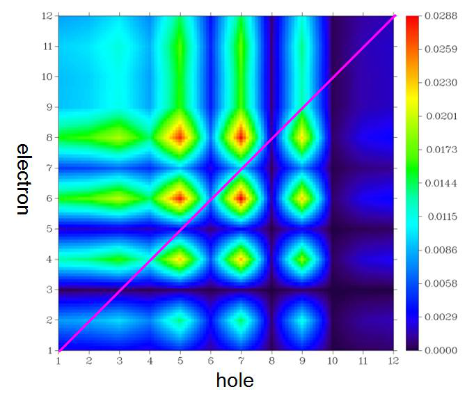

<!-- p.824 -->
(corresponding to hole position) and then Y-axis (corresponding to electron position), we will be able to recognize how electrons transfer among different sites. In the TDM map of present instance, most elements in the diagonal are surrounded by green or red color, therefore this excitation must be a global excitation, namely the excited electrons distribute over the whole system. The matrix elements are not symmetric with respect to diagonal, it can be clearly seen that the upper left part of the map is larger than the lower right part, in particular, the elements near the diagonal have relatively large value. This observation reveals that electrons on non-hydrogen atoms are transferred to atoms adjacent to them, more specifically, electrons on the atoms with smaller index tend to transfer to atoms with larger index. Since the index of non-hydrogen atoms is ordered from the amino group to the nitro group, hence it can be inferred that this S0→S1 excitation causes the electrons to move integrally from the amino end to the nitro end.

If you find it difficult to understand above texts, you can compare the TDM map with below hole&electron isosurface map (see Section 4.18.1 on how to plot it). You can find the TDM heat map and the isosurface map convey similar information, and can confirm all of our conclusions drawn based on the TDM map.

If you want to plot TDM heat map for other excited state, you can exit the heat map plotting function, then re-enter this function and select the state to be studied. It is worth to note that if you choose option "4 Toggle if taking hydrogens into account" once to switch its status to "Yes" and then replot, you will see the map below

The index range of hydrogens are 13-22, the map above shows that hydrogens indeed do not evidently participlate in electron excitation because their elements are very small (represented as

purple color), clearly it is meaningless to include hydrogens into S0→S1 TDM heat map.


<!-- p.825 -->
Let us check another excitation, S0→S2. The heat map and hole&electron isosurface map are given below.

The upper right corner of the heat map has a large value area, which corresponds to the nitro group at the end of the system, therefore the hole and electron must have large distribution at the same time in this region. In addition, the value of the off-diagonal terms of rightmost column of the image is not very small, so it can be considered that the nitro group transfers a certain amount of electrons to the central region of the system, which is consistent with the phenomenon that can be seen in the hole&electron isosurface map. This observation can also be described as there is a so-called "coherence" between the nitro moiety and the intermediate region of the system in the S0→S2 excitation.

Fragment transition density matrix Below we will plot TDM heat map based on fragment, namely the index of the map corresponds to the index of self-defined fragments. The advantage of this kind of TDM map is that the system to be studied is not necessarily linear, any shape of system (e.g. ring, star) can also be easily investigated.

The system to be investigated next is shown below, the molecule is divided into five fragments, which are represented as different colors. The Gaussian input, output and fchk files, as well as other files involved in the following texts can be downloaded from http://sobereva.com/attach/436/file.rar.


<!-- p.826 -->
We first study S0→S1 excitation. Boot up Multiwfn and input tdmat.fchk 18 // Electron excitation 2 // Plot heat map of transition matrix tdmat.out

1 // Study S0→S1 excitation n // Do not symmetrize the newly generated TDM 1 // Use the way 1 to contract the TDM represented in basis functions to atom TDM Now you can choose option 1 to plot atom TDM. However, our present aim is to plot fragment TDM. In order to do this, we can create a plain text file (which has already been provided as tdmfrag.txt in the file.rar package), each line of it defines a fragment, the content of the file in this example is


```text
1-23
24-33
34-43
44-55
56-63
```

Note that you can also use such as 2,5-8,12-15,20 to define a batch of atoms with discontinuous indices as a fragment.

Then input below commands -1 // Define fragments 0 // Load fragment definition from an external file (as prompted, you can also directly input atom indices)

tdmfrag.txt // The file containing fragment definition 5 // Modify range of color scale 0,0.4 // Lower and upper limit 1 // Plot heat map Now you can see the graph below, whose index corresponds to fragment index, the hole&electron isosurface map is also given together for comparison. The region marked with a blue frame is the 4th fragment (hexatriene).


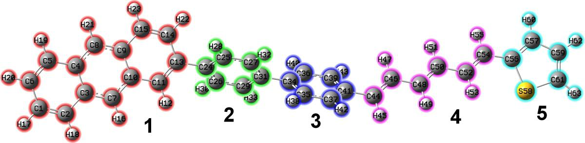

<!-- p.827 -->
According to the colors in the heat map, we know that electron and hole are mainly distributed on fragment 4, but they also simultaneously appear on fragments 1 and 5 to some extent, these findings are consistent with the situation exhibited by the isosurface. Since no off-diagonal element in the graph is quite large, present electron excitation does not cause a significant electron transfer between various fragments. Roughly speaking, the main feature of this excitation is local excitation on fragment 4.

Analogously, we plot fragment TDM between ground state and each of S2~S7 excited states, the resulting maps are collectively shown below

The values of the off-diagonal elements in the maps of S0→S2~S5 are not significant with respect to their diagonal elements, therefore interfragment electron transfer should not be obvious.

According to the diagonal terms, we can find that the transitions of S0→S2 and S0→S3 mainly occurred in the fragment 1, while S0→S2 also marginally involves fragment 4. In general, both the


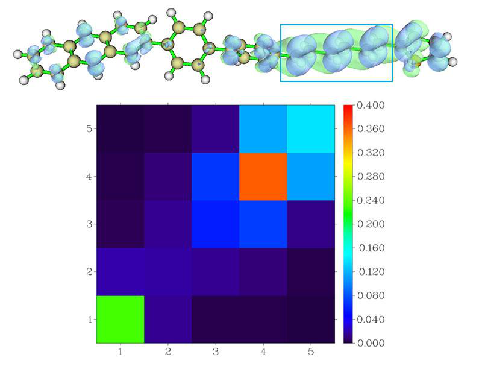


<!-- p.828 -->
transitions can be regarded as local excitation. The S0→S4 is evidently a global excitation since all

diagonal terms are conspicuous. Main character of S0→S5 is local excitation on the fragment 3, which corresponds to a benzene ring, but its neighboring fragments are also more or less involved.

S0→S6 and S0→S7 are somewhat mirrored with each other, from the figure it can be seen that almost every fragment is involved during electron excitation, they either occupied by hole distribution, electron distribution, or both. For S0→S6, we can speculate that the fragments 2, 3, and 4 transferred certain amount of electrons to the fragment 1 because (1,2), (1,3) and (1,4) elements are large, and meantime the fragments 3 and 5 also transferred some electrons to the fragment 4.

Above figure and discussion obviously show that, when you want to discuss transition character from ground state to a large number of excited states at the same time when writing an article, it is very straightforward to provide a figure containing TDM heat maps of all excitations.

Skill: Plotting TDM heat map for a batch of excited states using shell script If you want to study a batch of excited states in terms of TDM heat map, while you feel that plotting maps one by one is laborious, you can use Linux shell script to fully automate this process.

The script that generates the fragment TDM heat maps for specified range of excited states at one time is examples\scripts\allTDM.sh. For example, if you put tdmat.fchk, tdmat.out, tdmfrag.txt, and allTDM.sh used in the example above into the Multiwfn directory and then enter this folder, run chmod +x allTDM.sh to add executable permissions, and then run ./allTDM.sh, this script will automatically call Multiwfn to generate 1.png, 2.png ... until 7.png in the current directory, they

correspond to TDM heat map of S0→S1, S0→S2 ... to S0→S7. The entire process can be completed in a blink of an eye, clearly using the script is extremely convenient.

4.18.2.3 Plotting and analyzing transition dipole moment matrix

In fact, the heat map plotting function illustrated in last section is a general module, it can also plot other kinds of atom or fragment matrix. In Section 3.21.11, the concept of atom transition dipole moment matrix (atom TDMM) is introduced. This matrix has three components X, Y and Z. For example, the sum of all elements of the X component matrix just corresponds to the X component of transition dipole moment. Therefore, by plotting TDMM as heat map, we are able to make clear which atoms or fragments have conspicuous contributions to transition dipole moment.

Below, we still use the donor-π-acceptor employed in Section 4.18.2.2 as example to show how to plot TDMM as heat map. Multiwfn is able to plot both transition electric dipole moment matrix and transition magnetic dipole moment matrix, present section will limit to the former one.

Initially we need to generate a file containing atom TDMM. Boot up Multiwfn and input examples\excit\NH2_C8_NO2\NH2_C8_NO2.fchk 18 // Electron excitation analysis 11 // Decompose transition dipole moment as basis function and atom contributions examples\excit\NH2_C8_NO2\NH2_C8_NO2.out

1 // Study S0→S1 excitation 1 // The transition dipole moment to be studied is "electric" y // Export atom TDMM As shown in screen, matrices have been exported to .txt files in current folder with "AAtrdip"


<!-- p.829 -->
prefix, in which the AAtrdipX.txt contains the X component of atom TDMM. Next, we will plot heat map based on this matrix.

Reboot Multiwfn and input o // Load the file last time loaded 18 // Electron excitation analysis 2 // Plot heat map of transition matrix AAtrdipX.txt Now you can find the information below on screen


```text
 Sum of all elements (including hydrogens):     -4.38875223
 Maximum and minimum (including hydrogens):      0.65818572     -0.82543408
 Sum of all elements (without hydrogens):       -2.86353889
 Maximum and minimum (without hydrogens):        0.65818572     -0.82543408
```

where -4.38875223 is just the X component of transition electric dipole moment of S0→S1 excitation, the value is identical to that can be found from Gaussian output file.

As also shown in above prompt, the minimum value of this matrix is a negative value -0.825, however by default the lower limit of color scale of present function is 0, therefore we must change the color scale, and it is better to make absolute value of lower and upper limits identical. You can repeatedly try to find the value that makes the image best reflect the characteristics of the matrix. If the range is too narrow, the parts that exceed the upper and lower limits of the color scale will be displayed as white and black, respectively, which is not beautiful. If the range is too broad, the difference of the matrix elements can hardly be distinguished by colors.

Now we input below commands in Multiwfn 5 // Modify range of color scale -0.7,0.7 // Lower and upper limits 1 // Plot heat map Immediately you can see the graph below. In order to better understand the heat map, the isosurface of transition dipole moment density of X component is also shown together (see Section 4.18.2.1 on how to plot it)


<!-- p.830 -->
The bluer (redder) matrix element of this heat map contributes more negatively (positively) to the transition dipole moment of X component. Since most parts of the heat map are blue, the sum of all matrix elements must be negative, explaining why the X component of the transition dipole moment is a significant negative value (-4.388 a.u.). Because all matrix elements far from the diagonal are very close to 0 (shown as green), hence the long-range coupling between atoms does not contribute substantially to the transition dipole moment of X component. There are several areas of the figure show very blue color, such as the regions near (2,2) and (9,9), showing that corresponding atoms and neighboring ones have significant negative contributions, this point is also clearly reflected in the isosurface map of transition dipole moment density. Some sites such as (1,2) are obviously positive, which means that the coupling between the two atoms has a significant positive contribution to the transition dipole moment of X component, this is also why in the isosurface map there are green isosurfaces between atoms 1 and 2. The middle part of the heat map is basically green, indicating that the value is very small; correspondingly, there is no isosurface in the middle of the molecule on the isosurface map.

It can be seen that combining the transition dipole moment density and the transition dipole moment matrix together is helpful for clarifying the intrinsic characteristics of the transition dipole moment.

We can also plot TDMM based on fragment index, this is very easy and thus will not be further illustrated. What you need to do is simply defining fragments in the heat map plotting function and then plot the graph (please recall Section 4.18.2.3).

4.18.2.4 Investigating transition density and transition density matrix

between excited states

In last several sections, I have illustrated how to study transition character in terms of transition


<!-- p.831 -->
(dipole moment) density as real space function and transition (dipole moment) density matrix between ground state and excited states. In fact, these kinds of studies can also be used to analyze transition between two excited states, such analyses may be useful in special applications, such as transient absorption spectrum and two-photon process. In this section, I will show how to realize these analyses.

Analysis of transition density in real space function between excited states As shown in Section 4.18.2.1, Multiwfn is able to easily generate grid data of transition density between ground state and a selected excited state. In fact, transition density between two excited states can also be generated. To do so, we should first generate transition density matrix (TDM) between the two states, however, since all analyses related to real space function in Multiwfn are based on orbitals, we then need to transform the TDM to corresponding natural orbitals. Finally, the electron density evaluated based on these natural orbitals will directly correspond to transition density.

Here S2→S3 transition of N-phenylpyrrole is taken as an example, below procedure will generate cube file of corresponding transition density. Boot up Multiwfn and input

examples\excit\N-phenylpyrrole.fch 18 // Electron excitation analysis 9 // Generate and export transition density matrix 2 // Generate transition density matrix between (TDM) two excited states examples\excit\N-phenylpyrrole.out

2,3 // Assume that you want to analyze S2→S3 transition [Press ENTER button directly to use default threshold] y // Symmetrize the resulting TDM in usual way y // Export present wavefunction information including the newly generated TDM to TDM.fch in current folder

Reboot Multiwfn and input TDM.fch 200 // Other function, part 2 16 // Generate natural orbitals based on the density matrix in .fch/.fchk file SCF // We input this because the "Total SCF Density" field in the TDM.fch currently

correspond to S2→S3 TDM

y // Export new.mwfn, which contains natural orbitals corresponding to S2→S3 TDM, and then let Multiwfn directly load it

0 // Return to main menu 5 // Calculate grid data 1 // Electron density 2 // Medium-quality grid 2 // Export cube file Now the generated density.cub in current records transition density between S2 and S3, you can also choose option -1 to directly visualize the isosurface.

It is also possible to generate grid data of transition dipole moment density between excited states. For example, if you set “iuserfunc” parameter in `settings.ini` to 22, which sets user-defined function to −𝑥𝜌(𝐫), then when you use the new.mwfn generated previously as input file, the user-

defined function will correspond to X component of transition dipole moment density of S2→S3


<!-- p.832 -->
transition. Clearly, what you should do next is calculating grid data of user-defined function.

Heat map of transition density matrix between excited states Here we use the NH2-C8-NO2.fchk and NH2-C8-NO2.out employed in Section 4.18.2.2 as example to illustrate how to plot heat map of transition density matrix between two arbitrarily selected excited states, S1 and S2.

Boot up Multiwfn and input examples\excit\NH2_C8_NO2\NH2_C8_NO2.fchk 18 // Electron excitation analysis 9 // Generate transition density matrix 2 // For two excited states examples\excit\NH2_C8_NO2\NH2_C8_NO2.out 1,2 // The states are chosen as S1 and S2 [Press ENTER button to use default threshold] 0 // Do not symmetrize the resulting TDM n // Do not yield TDM.fch

Now we have tdmat.txt in current folder, which records TDM of S1→S2.

Reboot Multiwfn and then input o // Load the file last time loaded 18 // Electron excitation analysis 2 // Plot heat map for transition matrix tdmat.txt // Matrix data will be loaded from this file 1 // Construct atom transition matrix in terms of way 1 1 // Plot heat map The obtained graph is shown below, the isosurface map of density difference yielded by subtracting S1 density from S2 density is also given (see Section 4.18.13 on how to plot it).


<!-- p.833 -->
Since the area corresponding to atoms 1~9 at the right side (X=11 and 12) of the heat map has large value, we can speculate that a large amount of electrons is transferred from atoms 11 and 12 to atoms

1~9 during the S1→S2 excitation. Exactly same conclusion can also be gained from the isosurface map of density difference. This example shows that the density matrix heat map is not only useful and reliable for analyzing transitions from ground state to excited states, but also for transitions between various excited states.


### 4.18.3 Analyze charge-transfer during electron excitation based on electron density difference


Note: Blog article “Using Multiwfn to analyze charge transfer based on electron density difference descriptors” (in Chinese, http://sobereva.com/776) contains significantly more information than this section.

In this instance we will analyze charge-transfer (CT) between the first singlet excited state and ground state of the molecule shown below in ethanol solvent, which will be referred to as P2. The related theory has been introduced in Section 3.21.3. The discussions in this example are somewhat related to the ones involved in Section 4.18.1, however the method employed in this section is purely based on electron density difference, therefore it is more universal and can be used for any theoretical methods that can generate wavefunctions of ground state and excited state (e.g. CCSD in combination with EOM-CCSD).

Since the .wfn files corresponding to the excited state and ground state are large, they are not provided. Instead, the input files of Gaussian for generating the two .wfn files are provided in “examples\excit” folder (extP2.gjf and basP2.gjf). I assume that the corresponding .wfn files are produced at "CT" subfolder in current folder. I would like to remind you once again, the geometries in the wavefunction files of the two states must be exactly identical, otherwise the result will be meaningless! If you do not have Gaussian in hand, you can also directly download the extP2.wfn and basP2.wfn from http://sobereva.com/multiwfn/extrafiles/extP2_basP2.zip.

First, we calculate grid data of electron density variation Δρ during the excitation. Boot up Multiwfn and input:

CT\extP2.wfn // Excited state wavefunction file 5 // Generate grid data 0 // Set custom operation 1 // Only one file will be dealt with -,CT\basP2.wfn // Ground state wavefunction file. Corresponding density will be subtracted

from the excited one to generate Δρ

1 // Electron density 2 // Medium-quality grid. If the system is much larger than present one, more grid points is required (e.g. using high-quality grid)

Once the calculation is normally completed, you can choose option -1 to view the electron density variation during the electron excitation (default isovalue is too large for visualizing density


<!-- p.834 -->
difference, 0.005 is recommended for present case). Green and blue regions correspond to positive and negative regions, respectively, they represent increase and decrease in electron density due to the excitation.

However this density difference graph is not quite intuitive, since positive and negative parts intertwined together and there are many nodes. We will see that C+ and C- functions make the image much clearer.

0 // Return to main menu 18 // Electron excitation analysis 3 // Analyzing CT based on electron density difference grid data The following information is displayed immediately. Note that if positive and negative parts of

qCT are obviously unequal, that means the grid setting used in generating Δρ is too coarse, and you need to calculate again with finer grid setting.


```text
 q_CT (positive and negative parts):   0.844  -0.844 a.u.
 Barycenter of positive part in x,y,z (Angstrom):  -2.659  -0.001  -0.000
 Barycenter of negative part in x,y,z (Angstrom):   2.294  -0.009  -0.029
 Distance of CT in x,y,z (Angstrom):   4.953   0.009   0.029  D index:   4.953
 Dipole moment variation (a.u.) :   7.896  -0.014  -0.046 Norm:   7.896
 Dipole moment variation (Debye):  20.070  -0.035  -0.117 Norm:  20.070
 RMSD of positive part in x,y,z (Angstrom):  2.993  1.250  0.821 Total:   3.346
 RMSD of negative part in x,y,z (Angstrom):  3.290  1.144  0.881 Total:   3.593
 Difference between RMSD of positive and negative parts (Angstrom):
 X:  -0.297  Y:   0.106  Z:  -0.060  delta_sigma index:  -0.247
 H_x:  3.141  H_y:  1.197  H_z:  0.851  H_CT:  3.141  H index:  3.469 Angstrom
 t index:   1.811 Angstrom
 Overlap integral between C+ and C- (i.e. S+- index):  0.742365
```

Above information is self-explanatory, if you are confused, please consult Section 3.21.3. The

evident positive value of t index implies that the distribution of positive and negative of Δρ has been significantly separated due to strong CT. The large D index (4.95 Å) shows that the CT distance is

quite long. Clearly, S0→S1 transition of this system should be identified as typical CT excitation. The excitation caused significant variation of dipole moment, as shown in the data, it is as high as

20.07 Debye. The distribution spatial distribution breadth of positive and negative parts of Δρ are similar, therefore the outputted Δσ index, which measures difference of their RMSD, is merely -0.247 Å.


<!-- p.835 -->
By selecting option 1, isosurface of C+ (green) and C- (blue) functions can be shown up. The isovalue of the graph shown below is 0.0015.

If the isovalue is increased to 0.0024, the positions of barycenters can be approximately located (barycenters of C+ and C- exactly correspond to center of their isosurfaces).

From the graph it is evident that the direction of electron transfer is from the amino group side (electron donor) to nitro group side (electron acceptor). However, the barycenters are not exactly located at the two substituents, this observation suggests that the actual electron donor in this electron excitation is not solely the amino group but also the phenylene. This finding parallels to the fact that phenyl is a weak electron donor.

Hint: If you would like to get better display effect of the C+ and C- isosurfaces, you can use VMD program (freely available at http://www.ks.uiuc.edu/Research/vmd/) to display them, the procedure is: Boot up VMD first, drag Cpos.cub into VMD main window, and then drag Cneg.cub into it. Select "Graphics"-"Representations", choose the first term in "Selected Molecule", click "Create Rep" button to create a new representation (the existing representation is used to show molecular structure), change the "drawing method" to "isosurface", set "Draw" to "solid surface", change the isovalue to 0.0015, set "coloring method" to "ColorID" and choose "7 green". Now the isosurface of Cpos has been properly displayed. Next, choose the second term in "Selected Molecule", use the similar methods to set each option, but select "0 blue" in "ColorID", and use isovalue of -0.0015. Finally, the graph will look like the one shown above. You can also set "Material" to "transparent" so that the overlap region of C+ and C- can be clearly distinguished.


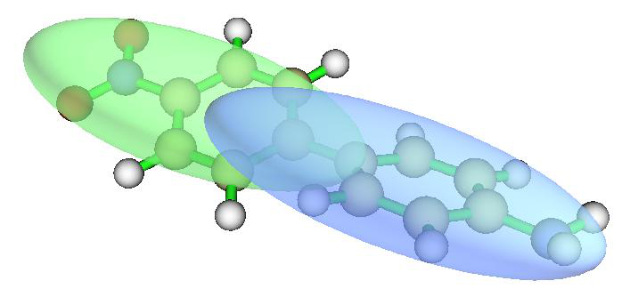

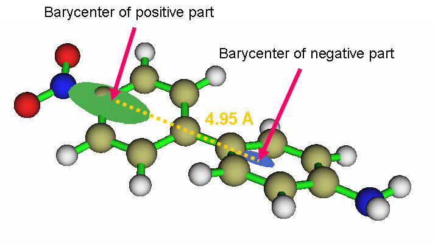

<!-- p.836 -->

### 4.18.4 Calculate ∆r and Λ indices to characterize various electron excitations for N-phenylpyrrole


In this section I will illustrate how to calculate the Δr index proposed in J. Chem. Theory Comput., 9, 3118 (2013) and the Λ index proposed in J. Chem. Phys., 128, 044118 (2008) to characterize electron excitations for N-phenylpyrrole. If you are not familiar with these two indices, please check Section 3.21.4 and Section 3.21.14, respectively.

In my personal view, using quantities such as D and Sr indices defined in hole-electron framework to characterize electron excitation is already absolutely sufficient, as illustrated in

Section 4.18.1. Theoretically, the Δr and Λ indices may be regarded as approximations of D and Sr, respectively. The only advantage of Δr and Λ is that in Multiwfn, they can be outputted for all selected excited states at the same time and can be decomposed into orbital pair contributions. In

addition, calculation cost of Δr index is almost negligible.

The files used in this section are N-phenylpyrrole.fch and N-phenylpyrrole.out in "examples\excit" folder, they were yielded by Gaussian, the keywords are CAM-B3LYP/6-31+G(d) TD(nstates=5) IOp(9/40=4). Since the optimized ground state geometry was used in the calculation, therefore the analysis results can be regarded as corresponding to vertical absorption process.

Calculating Δr index The Δr index is a quantitative indicator for measuring charge transfer (CT) length of electron excitation, larger Δr index implies longer CT distance.

Boot up Multiwfn and input examples\excit\N-phenylpyrrole.fch 18 // Electron excitation analysis

4 // Calculate Δr index examples\excit\N-phenylpyrrole.out

1-5 // Assume that we want to calculate Δr index for all the five calculated singlet excited states

Immediately, the results are printed on screen:


```text
 Excited state    1:   Delta_r =    1.499249 Bohr,    0.793368 Angstrom
 Excited state    2:   Delta_r =    3.489064 Bohr,    1.846333 Angstrom
 Excited state    3:   Delta_r =    4.641132 Bohr,    2.455982 Angstrom
 Excited state    4:   Delta_r =    5.869424 Bohr,    3.105966 Angstrom
 Excited state    5:   Delta_r =    7.091127 Bohr,    3.752463 Angstrom
```

The Δr indices imply that the excitations from ground state (S0) to the 3th, 4th and 5th excited states possess strong CT character since they have large Δr, while the excitations of S0→S1 and S0→S2 should be basically regarded as LE excitations because their Δr indices are not quite large (the original paper of Δr suggests using 2.0 Å as criterion for distinguishing LE and CT excitations). Bear in mind, definitive conclusion about the excitation character can only be finally drawn after visualizing the hole and electron distributions using the hole-electron analysis module of Multiwfn.

In Multiwfn it is possible to decompose the Δr index as contributions of orbital pair transitions. For example, we want to do this for the S0→S4 excitation, we should first enter the Δr index calculation interface and then input

4 // Only calculate Δr index for a single excitation (S0→S4), in this case the result can be


<!-- p.837 -->
decomposed

y // Print orbital pair contributions 0.01 // Only the orbital pairs having contribution larger than 0.01 Å will be printed You will immediately see the information below


```text
Note: The configuration coefficients shown below have combined both excitation
and de-excitation parts
 Sum of square of configuration coefficients:    0.497953
    #Pair     Orbitals      Coefficient     Contribution (Bohr and Angstrom)
     378     37     41       0.5004500          3.7301590       1.9739153
     379     37     43       0.4452400          1.8477898       0.9778083
     381     37     47      -0.1067900          0.0929645       0.0491947
     382     37     49      -0.0782100          0.0700060       0.0370456
     383     37     53      -0.0639300          0.0285116       0.0150877
     389     37     72       0.0436900          0.0215865       0.0114231
```

As you can see, MO37→MO41 transition has predominating contribution (1.97 Å) to the Δr index of S0→S4 (3.11 Å), while the MO37→MO43 transition also has nonnegligible contribution (0.97 Å).

Calculating Λ (lambda) index The Λ index essentially measures overlapping degree of hole and electron of electron excitations. Here we calculate it for all the five excitations for N-phenylpyrrole.

Boot up Multiwfn and input examples\excit\N-phenylpyrrole.fch 18 // Electron excitation analysis

14 // Calculate Λ index examples\excit\N-phenylpyrrole.out 1-5 // Analyze all the five calculated singlet excited states Immediately, the results are printed on screen:


```text
 Excited state    1:   lambda =    0.684853
 Excited state    2:   lambda =    0.563804
 Excited state    3:   lambda =    0.530928
 Excited state    4:   lambda =    0.198710
 Excited state    5:   lambda =    0.235255
```

From above output, it can be found that the Λ indices are nearly inversely proportional to the Δr indices, because the larger the hole-electron overlapping extent, usually the shorter the hole-electron separation distance (but bear in mind, this relationship is not always true).

Then we decompose the Λ index for the fourth excitation. Input below commands y // Do the Λ index analysis again 4 // The fourth excitation

y // Decompose analysis on Λ index 0.01 // Printing threshold

Then you will see all MO pairs having contribution to Λ index larger than 0.01:


```text
Sum of square of configuration coefficients:    0.497953
    #Pair     Orbitals      Coefficient     Contribution
     378     37     41       0.5004500          0.0865190
```


<!-- p.838 -->

```text
     379     37     43       0.4452400          0.0915297
```

The data indicates that only occupied MO 37 has a non-negligible overlap with unoccupied MOs; specifically, only the overlap between MO37-MO41 and between MO37-MO43 is relatively detectable.


### 4.18.5 Calculate dipole moment of each excited state and transition dipole moment between all states for 4-nitroaniline


This example will utilize the function described in Section 3.21.5, please read it first to gain relevant knowledge. In this example I use 4-nitroaniline to illustrate how to calculate electric dipole moment of each state, and then illustrate how to calculate transition magnetic dipole moment between all states. The state in this context refers to ground state and excited states obtained by TDDFT calculation. The corresponding Gaussian TDDFT input file for generating the .fch and .out files used in this example is examples\excit\4-nitroaniline.gjf.

Boot up Multiwfn and input examples\excit\4-nitroaniline.fch 18 // Electron excitation analysis 5 // Calculate transition electric/magnetic dipole moments between all states and for each state examples\excit\4-nitroaniline.out 4 // Obtain electric dipole moment of each state Now you have dipmom.txt in current folder, you can see electric dipole moments of ground state and various excited states.


```text
 Note: The electric dipole moments shown below include both nuclear charge and electronic
contributions
 Ground state electric dipole moment in X,Y,Z:    0.326322   -2.792165    0.000000 a.u.

 Excited state electric dipole moments (a.u.):
  State         X             Y             Z        exc.(eV)    exc.(nm)
     1      0.334929     -1.219854      0.000000      4.0557      305.70
     2      0.251666     -7.797482      0.000000      4.2762      289.94
     3      0.334065     -1.439663      0.000000      4.5846      270.44
```

Next, we calculate transition magnetic dipole moment between all states. Boot up Multiwfn and input

examples\excit\4-nitroaniline.fch 18 // Electron excitation analysis 5 // Calculate transition electric/magnetic dipole moments between all states and for each state examples\excit\4-nitroaniline.out 0 // Choose type of (transition) dipole moment to be calculated 2 // Magnetic 1 // Output (transition) dipole moments on screen Now you can see


```text
Transition magnetic dipole moment between ground state (0) and excited states (
```


<!-- p.839 -->

```text
a.u.)
     i     j         X             Y             Z        Diff.(eV)
     0     1    -0.0005545    -0.6041898    -0.0000000     4.05570
     0     2     0.0000000    -0.0000000     0.0137951     4.27620
     0     3     0.0000000    -0.0000000     1.0423466     4.58460

 Transition magnetic dipole moment between excited states (a.u.):
     i     j         X             Y             Z        Diff.(eV)
     1     1    -0.0000000    -0.0000000    -0.0113149     0.00000
     1     2     0.0060715     0.1120542     0.0000000     0.22050
     1     3    -0.2144702     0.0000589     0.0000000     0.52890
     2     2    -0.0000000    -0.0000000    -0.0099328     0.00000
     2     3    -0.0000000    -0.0000000    -0.1215811     0.30840
     3     3    -0.0000000    -0.0000000    -0.0074159     0.00000
```

From above output you can find transition magnetic dipole moment between ground state and excited states, as well as between various excited states.

Similarly, you can calculate transition electric dipole moment between various states.


### 4.18.6 Generate and analyze natural transition orbitals (NTOs) for uracil


Note: Chinese version of this section is my blog article “Using Multiwfn to perform natural transition orbital (NTO) analysis” (http://sobereva.com/377), which contains extended discussions.

In this section I illustrate how to use Multiwfn to perform the very popular natural transition orbital (NTO) analysis with uracil as example. Please first read Section 3.21.6 to acquire basic knowledge of NTO. Although in this example the files outputted by Gaussian were used as input file, in fact the files outputted by ORCA are also fully supported, see Section 3.21.1.2 for detailed requirements about the input file.

Before showing how to perform NTO analysis, I would like to let you apprehend why NTO analysis is meaningful. As an instance, we use Gaussian to perform TDDFT calculation at PBE0/6-31G* level for singlet excited states of uracil, you will find the following information


```text
Excited State   3:      Singlet-A"     6.0180 eV  206.02 nm  f=0.0000  <S**2>=0.000
      26 -> 30         0.54135
      26 -> 31        -0.20634
      28 -> 30        -0.15424
      28 -> 31         0.36715
```

Clearly, in excitation of S0→S3, there is no dominant MO transition, the largest contribution of a single MO pair is merely 0.541^2*2*100%=58.5%, therefore it is impossible to identify the nature of this excitation by viewing only one MO pair. In such difficult cases, NTO analysis is often useful, because after transforming MOs into NTOs, commonly you will be able to find only one pair of NTO having eigenvalue very close to 1, transition between the two NTOs in this pair faithfully represents the real character of the electron excitation.

The files needed by NTO analysis have been mentioned at the beginning of Section 3.21.


<!-- p.840 -->
Briefly, assume that you are a Gaussian user and you want to study electron excitation from ground state to the lowest three singlet excited states for uracil at TD-PBE0/6-31G* level, what you need to do is carrying out a normal TDDFT calculation with these keywords: # PBE1PBE/6-31G* TD IOp(9/40=4), also you need to make Gaussian generate corresponding .fch file. The input file, output file and .fch file have already been provided in "examples\excit\NTO" folder. The keyword IOp(9/40=4) is very important, without it the NTO result will be evidently inaccurate, the meaning of this IOp has been mentioned in Section 4.18.1.

Now we start to carry out NTO analysis. Boot up Multiwfn and input examples\excit\NTO\uracil.fch 18 // Electron excitation analysis 6 // Generate NTOs examples\excit\NTO\uracil.out // Gaussian calculated three lowest excited states, you can analyze any one of them

3 // Study transition from ground state (S0) to the 3rd excited state (S3)

Now Multiwfn loads transition information of S0→S3 from the Gaussian output file and generate NTOs, the eigenvalues of NTO pairs are shown below


```text
The highest 10 eigenvalues of NTO pairs:
   0.865529    0.134025    0.000582    0.000121    0.000063
   0.000024    0.000016    0.000015    0.000007    0.000006
Sum of all eigenvalues:  1.000387
```

It can be seen that the largest eigenvalue is 0.8655, that means that NTO pair contributes as high as

86.55% of the S0→S3 transition. So, if we would like to characterize the nature of this transition, we can only study the occupied NTO and virtual NTO in this NTO pair.

Now you can select if outputting .fch/.mwfn/.molden file containing the NTOs. We choose "3 Output NTO orbitals to .mwfn file" and input the path to output, such as C:\S3.mwfn. After the .mwfn has been successfully generated, you can reboot Multiwfn and load the S3.mwfn, in main function 0 you can visualize the NTOs, the orbital energies now correspond to NTO eigenvalues. To plot the occupied and virtual NTOs corresponding to the NTO pair with 86.55% contribution, in the GUI of main function 0 you can select "orbital info." - "Show up to LUMO+10" in the menu, in the text window you will find output like below


```text
Orb:    27 Ene(au/eV):     0.000582       0.0158 Occ: 2.000000 Type: A+B
Orb:    28 Ene(au/eV):     0.134025       3.6470 Occ: 2.000000 Type: A+B
Orb:    29 Ene(au/eV):     0.865529      23.5522 Occ: 2.000000 Type: A+B
Orb:    30 Ene(au/eV):     0.865529      23.5522 Occ: 0.000000 Type: A+B
Orb:    31 Ene(au/eV):     0.134025       3.6470 Occ: 0.000000 Type: A+B
Orb:    32 Ene(au/eV):     0.000582       0.0158 Occ: 0.000000 Type: A+B
```

We can see that the occupied NTO with index of 29 and the virtual NTO with index of 30 constitute the NTO pair with eigenvalue of 0.8655, there we select corresponding index in the GUI to visualize them, the isosurfaces are shown below


<!-- p.841 -->
Undoubtedly, this S0→S3 excitation can be regarded as transition from lone pair of O12 to anti-bonding π orbital of the uracil ring, at least we have 86.55% confidence to say that. From NTO eigenvalues we notice that NTO28→NTO31 transition also has small contribution (13.40%) to the excitation, please plot corresponding orbitals and discuss their characteristic.

The NTOs can also be subjected to quantitative analyses. For example, you can enter main function 8 and use suitable options to analyze their orbital composition at quantitative level, or you can use subfunction 11 of main function 100 to evaluate overlap extent and centroid distance between selected two NTOs.

In Multiwfn it is possible to evaluate energies of orbitals in any kind. In Section 4.300.6 a detailed example of calculating energies of NTO orbitals is given.

It is worth to note that NTO analysis has both advantages and disadvantages with respect to the hole-electron analysis, this point has been mentioned at the end of Section 3.21.6. For many systems and excitations, even if NTO transformation has been applied, there are still no NTO pair with predominant contribution, in this case you have to resort to hole-electron analysis to facilitate discussion of excitation characteristic. The drawback of hole-electron analysis is that it is unable to present orbital phase information like NTO analysis, and it takes higher computational cost.

Using script to carry out NTO analysis in batch Sometimes we want to perform NTO analysis for a batch of excitations, for example, we want

to generate a batch of .fch files that respectively contain NTOs of S0→S1, S0→S2 and S0→S3 transitions, although you can manually do this in the interactive interface of Multiwfn, a more efficient and cleverer way is employing shell script. If you are a Linux user, we can run below shell

script to yield S1.fch, S2.fch and S3.fch, which contain NTOs corresponding to S0→S1, S0→S3 and S0→S3. This script is very easy to understand as long as if you have basic level of knowledge about shell programming.


```text
#!/bin/bash
cat << EOF > allNTO.txt
18
6
examples/NTO/uracil.out
EOF
for ((i=1;i<=3;i=i+1))
do
cat << EOF >> allNTO.txt
$i
2
```


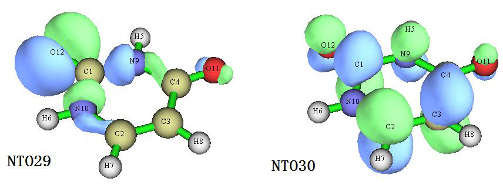

<!-- p.842 -->

```text
S$i.fch
6
EOF
done
./Multiwfn examples/excit/NTO/uracil.fch < allNTO.txt
rm ./allNTO.txt
```

This script is also provided as examples\excit\NTO\allNTO.sh. If you do not make any modification to the script, this script should be copied to the Multiwfn folder and run as ./allNTO.sh in Multiwfn folder, then S1.fch, S2.fch and S3.fch will be yielded at the same folder. In practical studies, you should properly modify the script according to actual situation, the range of the excitations to be studied is determined by "i=1;i<=3".


### 4.18.8 Using IFCT method and heat map of charge transfer matrix to study interfragment charge transfer during electron excitation


The interfragment charge transfer (IFCT) is a method derived based on hole-electron analysis for quantitatively studying amount of charge transfer between different fragments. The situation of charge transfer can also be very intuitively understood by means of heat map of charge transfer matrix, which is a byproduct of IFCT analysis. Please carefully read Section 3.21.8 if you are not familiar with these concepts.

In the next two sections, I will use two molecules to respectively illustrate how to perform IFCT analysis and plot heat map of charge transfer matrix, these two kinds of analyses can provide complementary perspectives.

4.18.8.1 IFCT analysis for 4-nitroaniline

In this example, I will illustrate how to use IFCT method to study CT between three fragments (-NO2, -NH2 and the linker benzene) of 4-nitroaniline during its electron excitation.

The Gaussian input file of TDDFT task at PBE0/6-311G* level for 4-nitroaniline has been provided as examples\excit\4-nitroaniline.gjf. Note that IOp(9/40=4) is used so that Gaussian can print enough configuration coefficients. Run it by Gaussian to obtain .chk file and .out file, then convert the .chk file to .fch via formchk. The .fch and .out files have been provided in "examples\excit" folder.

Boot up Multiwfn and input below commands examples\excit\4-nitroaniline.fch


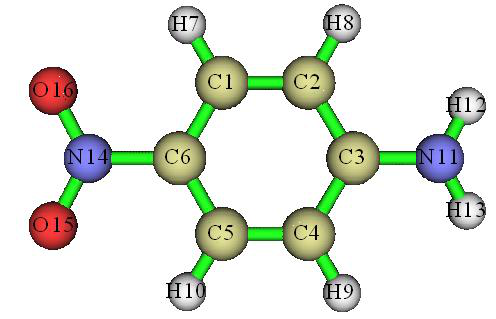

<!-- p.843 -->
18 // Electron excitation analysis 8 // Calculate interfragment charge transfer in electron excitation via IFCT method 1 // Mulliken partition [Press ENTER button] // Load examples\excit\4-nitroaniline.out 2 // We first analyze transition from ground state (S0) to the second excited state (S2) 3 // Define three fragments 11-13 // Atomic indices of amino group (fragment 1) 1-10 // Atomic indices of benzene group (fragment 2) 14-16 // Atomic indices of nitro group (fragment 3) Then you will see


```text
 Contribution of each fragment to hole and electron:
  1  Hole:  28.17 %     Electron:   3.02 %
  2  Hole:  65.89 %     Electron:  29.52 %
  3  Hole:   5.94 %     Electron:  67.46 %
 Construction of interfragment charger-transfer matrix has finished!

 Variation of population number of fragment  1:  -0.25150
 Variation of population number of fragment  2:  -0.36369
 Variation of population number of fragment  3:   0.61519

 Intrafragment electron redistribution of fragment  1:   0.00849
 Intrafragment electron redistribution of fragment  2:   0.19453
 Intrafragment electron redistribution of fragment  3:   0.04009

 Transferred electrons between fragments:
  1 ->  2:   0.08315       1 <-  2:   0.01987     Net  1 ->  2:   0.06328
  1 ->  3:   0.19001       1 <-  3:   0.00179     Net  1 ->  3:   0.18821
  2 ->  3:   0.44452       2 <-  3:   0.01754     Net  2 ->  3:   0.42697

 Intrinsic charge transfer percentage, CT(%):     75.688 %
 Intrinsic local excitation percentage, LE(%):    24.312 %
```

The output is very easy to understand, if you are confused, please check corresponding

explanation in Section 3.21.8. For example, the data shows that during the S0→S2 excitation, nitro group (fragment 3) donates 0.00179 electrons to amino group (fragment 1) and meantime accept 0.19001 electrons from amino group, therefore nitro group totally gains 0.18821 electron from amino group. If the benzene fragment is also taken into account, the electron excitation totally increases electron population of nitro group by 0.61519. The electron redistribution phenomenon in the two terminal groups is not prominent, however, as the data shown (0.19453), the electron

redistribution within the benzene, which behaves as π linker, is remarkable. Because CT(%) is notably larger than LE(%), this excitation can be mostly regarded as a charge transfer state.

For facilitating discussion, I summarized all IFCT analysis data in the table below. The diagonal terms correspond to amount of intrafragment electron redistribution.

Donor Amino group benzene nitro group


<!-- p.844 -->
amino group 0.008 0.083 0.190 benzene 0.020 0.195 0.445 nitro group 0.002 0.018 0.040

As you can see from the table, there are three prominent interfragment CT terms (sorted according

to magnitude): benzene→nitro, amino→nitro, amino→benzene, all of them direct from amino group towards nitro group.

For better and intuitively understanding above data, we plot hole-electron isosurface map using the method described in Section 4.18.1:

In the graph, main distribution regions of hole and electron correspond to blue and green, respectively. As you can see, hole mainly distributes on the amino group and benzene moiety, while electron mainly locates at the benzene linker and nitro group, clearly the overall CT direction is from amino group to nitro group, this is completely in line with our observation of quantitative interfragment CT analysis.

Using Hirshfeld partition Commonly, the Mulliken-like partition, as what we have employed in this example, is a good choice because its calculation is quite fast and the result is usually reasonable. Unfortunately, it is incompatible with diffuse functions, and sometimes there are unphysical negative fragment contributions to hole or electron. When diffuse functions must be adopted (e.g. anionic system), or Multiwfn warns you that there are negative contributions, you should use the more robust Hirshfeld partition instead. It works well for any case, but the cost is markedly higher. To change to the Hirshfeld partition, you simply need to input 2 when Multiwfn asks you to select the method for calculating hole and electron composition. The data in the example above calculated by Hirshfeld partition is shown below; as you can see, the result is approximately identical to the result under Mulliken-like partition.


```text
Intrafragment electron redistribution of fragment  1:   0.01047
Intrafragment electron redistribution of fragment  2:   0.19579
Intrafragment electron redistribution of fragment  3:   0.05327

Transferred electrons between fragments:
 1 ->  2:   0.08246       1 <-  2:   0.02485     Net  1 ->  2:   0.05761
 1 ->  3:   0.17946       1 <-  3:   0.00311     Net  1 ->  3:   0.17636
 2 ->  3:   0.42612       2 <-  3:   0.02448     Net  2 ->  3:   0.40164
```


<!-- p.845 -->

```text
Charge transfer percentage, CT(%):     74.047 %
Local excitation percentage, LE(%):    25.953 %
```

It is worth to notice that Multiwfn is able to calculate IFCT for a batch of excited states at once, hence can easily recognize major character of all excited states, see Section 4.18.6 for illustration.

More discussions and illustrations about the IFCT analysis can be found from my blog article "Using the IFCT method in Multiwfn to evaluate amount of electron transfer between arbitrarily defined two fragments during electron excitation" (in Chinese, http://sobereva.com/433).

4.18.8.2 Plotting heat map of charge transfer matrix to intuitively understand

nature of electron excitation

The charge transfer matrix (CTM) is closely related to transition density matrix (TDM) and their heat maps often provide similar information for an electron excitation. The method of plotting TDM has been illustrated in Section 4.18.2.2. In my opinion, the physical meaning of CTM is somewhat clearer than TDM and can better reveal actual charge transfer character. In addition, since CTM is derived in the theory framework of hole-electron analysis (see Section 3.21.1), the CTM heat map can always well compare with distribution of hole and electron.

Here I still use the molecule studied in Section 4.18.2.2 as instance. Before plotting the heat map of CTM, we should first generate CTM. Boot up Multiwfn and input

examples\excit\NH2_C8_NO2\NH2_C8_NO2.fchk 18 // Electron excitation analysis 8 // IFCT analysis 1 // Mulliken-like partition to derive atomic contribution to hole and electron examples\excit\NH2_C8_NO2\NH2_C8_NO2.out

1 // Study S0→S1 excitation -1 // Export atom-atom CTM to atmCTmat.txt in current folder 2 // Enter the function used for plotting heat map atmCTmat.txt // Load matrix data from this file 1 // Show heat map Now you can see the map below, the purple line and texts are manually added.


<!-- p.846 -->
This figure has similar features of the heat map of atom TDM given in Section 4.18.2.2, but there are also differences that cannot be ignored. According to the IFCT point of view, each of the non-diagonal elements of the current graph rigorously exhibits the amount of electron transferred between atoms. Looking at the graph column by column, it can be visually seen that each atom on the carbon chain transferred electrons to the atoms at its front and back ends, and the amount of transfer to the nitro side is significantly more than to the amino side. For example, it can be seen from the figure that in the fifth column, the value of the sixth element is larger than the fourth

element, so the amount of electron transfer of C5→C6 must be more than C5→C4.

Next, we also look into heat map of CTM of another excitation. The map of S0→S9 plotted in the same way as above is given below, corresponding hole&electron isosurface map is also

appended. Because it was found that S0→S9 transition evidently involves some hydrogens, therefore hydrogens are also taken into account in the map (by choosing "4 Toggle if taking hydrogens into account" once).


<!-- p.847 -->
It can be seen from the above heat map that, there is strong electron transfer from the region of atoms 1~5 and 7~9 to the hydrogen atom with index of 13, this observation fully agrees with the hole&electron isosurface map, namely there is a large green isosurface at H13. In addition, from the isosurface map we can see that atom 6 is basically only surrounded by green isosurface, that means this atom does not transfer electrons to others while largely accepts electrons from others; accordingly, the color of the row of Y=6 in the heat map is distinct, while the column corresponding to X=6 is very dark.

From this example, we can find that the hole&electron isosurface map provides the most intuitive visual effect, but if it is discussed together with the heat map of CTM, the charge transfer can be understood more thoroughly from a quantitative point of view, it also avoids the possibility that the arbitrariness of the choice of isovalue leads to an unreasonable judgment.

The CTM can also be plotted based on fragment. To do this, you simply need to load fragment definition file or directly input fragment definition in the heat map plotting function, and then plot the map again.


### 4.18.9 Generate transition density matrix and transform it to orbital representation


Note: This section may not be interesting for most Multiwfn users, but valuable for experts

In Section 4.18.2, I have shown that in Multiwfn the transition density can be studied in terms of real space function and colored matrix (heat map). Multiwfn can do even more for transition density. As will be illustrated in this section, Multiwfn is able to transform the generated transition density matrix to orbital representation and export the orbitals as wavefunction file. This brings a


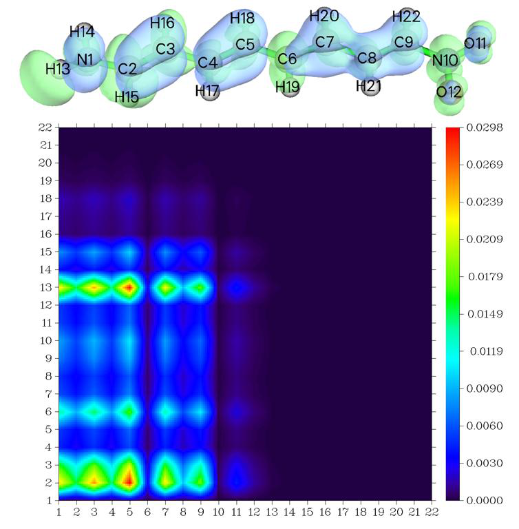

<!-- p.848 -->
lot of conveniences; for example, when you analyze "electron density" based on this file, the actual function to be studied will directly correspond to transition density. Note that these orbitals can be regarded as natural orbitals of transition density matrix (TDM), but they are remarkably different to the NTO (nature transition orbital), which has been introduced in Section 3.21.6.

Here will take the N-phenylpyrrole as example, whose transition density of S0→S1 has been plotted as isosurface in Section 4.18.2. Our purpose in this section is to transform this transition density into orbitals and export them as .wfx file so that then we can very easily study properties of the transition density based on this file.

First, we generate a .fch file containing TDM. Boot up Multiwfn and input examples\excit\N-phenylpyrrole.fch // The .fch file yielded by Gaussian TDDFT task 18 // Electron excitation analysis 9 // Generate and export TDM 1 // Generate TDM between ground state and excited state examples\excit\N-phenylpyrrole.out // The output file of Gaussian TDDFT task with IOp(9/40=4) keyword

1 // Analyze electron transition from ground state to the 1st excited state (S0→S1) 1 // Symmetrize the raw TDM. This is important, the natural orbitals cannot be properly yielded later without symmetrization of the TDM

y // Export current wavefunction to TDM.fch in current folder, whose "Total SCF Density" field records the just generated symmetrized TDM

Next, we transform the TDM into natural orbitals. Reboot Multiwfn and input TDM.fch 200 // Other functions (Part 2) 16 // Generate natural orbitals based on the density matrix in .fch/.fchk file SCF // The matrix to be transformed comes from the "Total SCF Density" field y // Export the generated orbitals to new.mwfn and load it Now we have new.mwfn in current folder, which contains natural orbitals transformed from the

S0→S1 TDM. The orbitals in memory now also correspond to these natural orbitals. Assume that we also want to export them as .wfx file, we should input the commands below.

0 // Return to main menu 100 // Other functions (Part 1) 2 // Export various kinds of files 4 // Output current wavefunction as .wfx file TDM.wfx // The path of the file to be generated In the future, if you use the TDM.wfx as input file and calculate grid data of "electron density" via main function 5, you will find the resulting isosurface map (after properly adjusting isovalue) is exactly identical to the transition density T(r) graph shown in Section 4.18.2.1.


<!-- p.849 -->

### 4.18.10 Obtain molecular orbital pair contributions to transition dipole moment


In order to gain a deeper insight into transition electric or magnetic dipole moment, Multiwfn provides a function used to decompose it to contributions from various MO pair transitions, see Section 3.21.10 for introduction. Here I present an example. The .fch and .out files involved in this example were produced by TDDFT calculation of Gaussian.

Boot up Multiwfn and input examples\excit\N-phenylpyrrole.fch 18 // Electron excitation analysis 10 // Decompose transition dipole moment as molecular orbital pair contributions 1 // The type of transition dipole moment is electric examples\excit\N-phenylpyrrole.out 1 // Select the excitation from ground state (S0) to the first singlet excited state (S1) Now the information below about this excitation is shown on screen


```text
 Transition dipole moment in X/Y/Z:   -0.000000  -0.000000   1.781438 a.u.
 Norm of transition dipole moment:     1.781438 a.u.
 Oscillator strength:   0.3935306
```

Then you can find several options on screen, they are self-explanatory. We first choose option 1 and input for example 0.02, then all MO pairs having contribution larger than 0.02 are printed:


```text
#Pair   Orbital trans. Coefficient      Transition dipole X/Y/Z   Norm (a.u.)
  1213     35 ->     46   0.040230   0.000000   0.000000   0.037709   0.037709
  1214     35 ->     50  -0.047670   0.000000  -0.000000   0.040152   0.040152
  1239     36 ->     40  -0.101270   0.000000  -0.000000  -0.280355   0.280355
  1259     37 ->     40  -0.127550   0.000000   0.000000  -0.148489   0.148489
  1260     37 ->     52   0.069960  -0.000000  -0.000000  -0.122222   0.122222
  1262     37 ->     58  -0.036060  -0.000000   0.000000  -0.025065   0.025065
  1278     38 ->     39   0.672690  -0.000000   0.000000   2.796678   2.796678
  1280     38 ->     50   0.052570  -0.000000   0.000000   0.046724   0.046724
  2489     36 <-     40  -0.014330   0.000000  -0.000000  -0.039671   0.039671
  2506     37 <-     52   0.015140  -0.000000  -0.000000  -0.026450   0.026450
  2522     38 <-     39  -0.027240   0.000000  -0.000000  -0.113249   0.113249
Sum of the above      11 pairs:     -0.000000  -0.000000   2.165763
```

From the output, we can immediately find that transition of MO38→MO39 has dominating contribution (2.796678 a.u.) to this S0→S1 excitation.

When there are too many MO pairs having nonnegligible contributions to transition dipole moment and thus difficult to identify important MO transitions, you can let Multiwfn sort the MO pairs according to their contributions to specific component of transition dipole moment. For example, here we choose the option " 4 Print orbital pairs in the order of absolute contribution to Z component" and then input 5, then you will see the five MO pairs having largest contribution to Z component of transition dipole moment:


```text
  #Pair   Orbital trans. Coefficient      Transition dipole X/Y/Z   Norm (a.u.)
   1278     38 ->     39   0.672690  -0.000000   0.000000   2.796678   2.796678
   1239     36 ->     40  -0.101270   0.000000  -0.000000  -0.280355   0.280355
```


<!-- p.850 -->

```text
   1259     37 ->     40  -0.127550   0.000000   0.000000  -0.148489   0.148489
   1260     37 ->     52   0.069960  -0.000000  -0.000000  -0.122222   0.122222
   2522     38 <-     39  -0.027240   0.000000  -0.000000  -0.113249   0.113249
```

By the way, oscillator strength (f) directly relates to square of norm of transition electric dipole moment, therefore it can be expected that if the configuration coefficient corresponding to

MO38→MO39 is set to zero, namely ignoring its contribution, then f will be lowered evidently. As shown earlier, the original f of S0→S1 is 0.39353. Let us quantitatively check how MO38→MO39 affects the f. To do this, we can manually set configuration coefficient of this transition to zero and then re-examine the f value. To this aim, we input following commands

0 // Return to menu of electron excitation analysis -1 // Check, modify and export configuration coefficients of an excitation 1 // Choose the first excited state 1 // Set coefficient of a MO pair 38,39 // The MO indices of the MO pair

1 // The transition type is chosen as "Excitation", hence MO38→MO39 is selected (if inputting 2, then what we selected will be MO38MO39)

0 // Set the configuration coefficient to zero -3 // Export current excitation information to a plain text file

S1.txt // The path of the file to store excitation information of S0→S1 Now S1.txt has been generated in current folder, if you open it with text editor, you will find

the coefficient corresponding to MO38→MO39 is indeed zero.

Then reboot Multiwfn and input o // Load the file used at the last time, namely examples\excit\N-phenylpyrrole.fch 18 // Electron excitation analysis 10 // Decompose transition dipole moment as molecular orbital pair contributions 1 // The type of transition dipole moment is electric S1.txt Now the printed f is only 0.1278, which is less than 1/3 of its original value (0.39353), showing

that MO38→MO39 has crucial influence on strength of S0→S1 excitation.

Since the coefficient of MO38→MO39 is as large as 0.6727, after setting it to zero, now the sum of the square of remaining coefficients has been much less than 0.1, which is far from the ideal value of closed-shell case (0.5).

In my paper Carbon, 165, 461 (2020), I employed the function illustrated above to study the nature of the extremely strong absorption of cyclo[18]carbon, you are suggested to look at Fig. 4 and relevant discussion. If this function is employed in your work, it is suggested to also cite this paper.

Via similarly way illustrated above, you can also decompose transition magnetic dipole moment as contributions of MO pair transitions, which is useful in studying rotatory strength.


### 4.18.11 Plot transition dipole moment vector contributed by molecular fragments as arrows


Note: Chinese version of this section is my blog article “Using Multiwfn+VMD to plot transition dipole moment vector contributed by specific fragment” (http://sobereva.com/396).


<!-- p.851 -->
In Section 4.18.2.1, I have shown how to plot transition dipole moment density in real space, which is extremely useful for studying contribution of different regions in three-dimension space. In fact, if using a special plotting script of VMD (http://www.ks.uiuc.edu/Research/vmd/) provided below, transition dipole moments contributed by molecular fragments can be easily drawn as arrows, which greatly facilitates discussion of composition of total transition dipole moment.

Here, azobenzene is taken as example. The input file of TDDFT task of Gaussian for azobenzene is provided as examples\excit\Azobenzene.gjf. Note that IOp(9/40=4) is used and .chk file is saved after calculation. Run it by Gaussian, and then convert azobenzene.chk to azobenzene.fch. (If you do not have Gaussian in hand, you can also directly download the .out and .fch files from http://sobereva.com/multiwfn/extrafiles/Azobenzene_exc.zip)

Boot up Multiwfn, load the azobenzene.fch, then input 18 // Electron excitation analysis 11 // Decompose transition dipole moment as basis function and atom contributions Azobenzene.out // The Gaussian output file obtained by running Azobenzene.gjf 2 // Assume that we want to study is electron excitation from ground state to excited state 2 (you can also input two indices to study transition between the two excited states)

1 // The type of transition dipole moment to be decomposed is electric n // Do not generate AAtrdip.txt, which is not involved in the present example Now trdipcontri.txt is outputted to current folder, which contains transition dipole moment contributed by each basis function and each atom. Move this file to VMD folder.

Return to main menu, then enter subfunction 2 of main function 100, export current molecular geometry to azobenzene.pdb.

Copy examples\excit\loadip.tcl to VMD folder, this is a VMD script written by me, it can load data from trdipcontri.txt. It also defines custom commands "dip" and "dipatm" used to draw transition dipole moment contributed by specific molecular fragment as arrow.

Boot up VMD, drag the file azobenzene.pdb into VMD main window to load it, then run source loaddip.tcl in VMD console window to execute the script. Assume that we want to divide the molecule as three parts to separately investigate their contributions to transition dipole moment, namely the first phenyl group (atoms 1~11), N2 part (atoms 12 and 13) and the second phenyl group (atoms 14~24), we should run below commands in VMD console window


```text
draw color red
dip "serial 1 to 11"
dip "serial 12 13"
dip "serial 14 to 24"
```

Now you will see three red arrows in the VMD graphical window. The length of cylindrical part of the arrows correspond to magnitude of fragmental transition dipole moments, the center of the arrows corresponds to geometric center of the fragments. Note that when we use "dip" command, the fragment geometry center and quantitative contribution to transition dipole moment by the selected fragment are also shown in VMD console window.

BTW: It does not matter if the serial of the atoms of your interest is not contiguous. For example, dip "serial 1 5 to 8 11 to 14 18" will plot the transition dipole moment for the fragment consisting of atoms 1, 5, 6, 7, 8, 11, 12, 13, 14, 18.

In order to improve the graphical quality, we input color Display Background white in console window to set white as background color, enter Graphics - Representation and set Drawing method


<!-- p.852 -->
to CPK, and then choose Display - Orthographic in VMD main window. The final graph will look like below.

As you can see, both the two phenyl groups have significant contribution to Y component of total transition dipole moment (the red, green and blue of the axis shown at left-bottom part of the graph correspond to X, Y and Z directions, respectively). For quantitative comparison purposes, total transition dipole moment vector and its compositions are also listed below


```text
Total：           0.1155  -2.8868  0.0
Phenyl group 1：0.14262 -1.43288 0.0
N2：             -0.16948 -0.02138 0.0
Phenyl group 2：0.14262 -1.43288 0.0
```

If you also want to plot total transition dipole moment as green arrow on the graph, you can input draw color green and then input dip all.

It is also possible to plot transition dipole moment contributed by each atom. To do that, we input draw delete all to remove all existing arrows, and then input dipatm, you will immediately see

There is a very important point that should be paid attention to when using above method to decompose transition dipole moment, namely contribution of a fragment is often dependent of


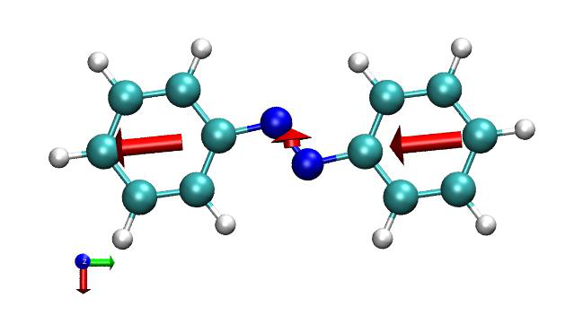


<!-- p.853 -->
choice of origin, because transition charge of a fragment is often non-zero. For example, if we use subfunction 6 of hole-electron analysis module to export atomic transition charges and then sum them as fragment transition charges, you will find the value of the first phenyl group is 0.2116. Since it is non-zero, it can be proved that if overall coordinate of the azobenzene is translated, the transition dipole moment corresponding to this fragment must be varied; in other words, the result is not definite. Therefore, one should carefully discuss fragmental transition dipole moment in papers.

Another very important point is that since the transition dipole moment is decomposed via Mulliken method, the analysis method shown above will be meaningless when diffuse functions are presented in the electron excitation calculation.


### 4.18.13 Study electronic structure of a single excited state and difference between two excited states


Most other subsections in Section 4.18 focus on exemplifying how to study electron transition characters, however, sometimes we want to study character of a single excited state or difference between two excited states in specific property. In Multiwfn, one can perform various kinds of wavefunction analysis for an excited state as usual, however, the input file must contain wavefunction of this excited state. For multi-configuration methods that can study excited state, such as CIS and TDDFT, the excited state wavefunction must be recorded as natural orbitals (NOs), because Multiwfn always load wavefunction in terms of orbitals.

The main purpose of this section is to illustrate the function used to generate .mwfn file containing NOs of an excited state, so that we can analyze wavefunction character of this state. I strongly suggest you read Section 3.21.13 first, in which the details of generating NOs of excited states are described.

NOTE: There are two types of CIS/TDHF/TDA-DFT/TDDFT excited state wavefunction (or density matrix): (1) Unrelaxed density (2) Relaxed density. The difference has been detailedly described in Section 3.21.1.1. Briefly speaking, the former is not as real as the latter, but generating the latter requires additional cost (much higher than simply evaluating excitation energy). Next, I will first illustrate how to perform wavefunction analysis for an excited state and study difference between two excited states based on unrelaxed density, while at final part of this section I will also exemplify how to analyze excited state based on its relaxed density.

Example of wavefunction analysis of an excited state (based on unrelaxed density) Here I take N-phenylpyrrole as example, assume that we want to examine Mayer bond orders for the second singlet excited state. To do so, we first carry out a regular TDDFT calculation with IOp(9/40=4) keyword, the examples\excit\N-phenylpyrrole.out is output file and examples\excit\N-phenylpyrrole.fch is corresponding .fch file. The geometry was previously optimized for ground state.

Boot up Multiwfn and input below commands examples\excit\N-phenylpyrrole.fch 18 // Electron excitation analysis 13 // Generate natural orbitals of specific excited states examples\excit\N-phenylpyrrole.out 2 // Choose the 2nd excited state


<!-- p.854 -->
Now, NO_0002.mwfn has been generated in current folder, it records wavefunction of the second excited state in terms of NOs.

Reboot Multiwfn and input NO_0002.mwfn 9 // Bond order analysis 1 // Mayer bond order From the output you will find the bond order of the N5-C10 bond, namely the bond linking pyrrole and benzene moieties, is 0.794. If you repeat the calculation for examples\excit\N-phenylpyrrole.fch, the result will correspond to ground state, and you will find the Mayer bond order is 0.713. Clearly, the vertical excitation from S0 to S2 at minimum point of S0 weakens the strength of N5-C10 detectably.

Plotting density difference between excited states Next I illustrate how to plot density difference between various excited states (corresponding to unrelaxed density). In fact, this is very easy, you simply need to generate Multiwfn input files containing NOs of the two excited states respectively, and then get their difference via the steps illustrated in Sections 4.5.5 or 4.18.3.

I still take N-phenylpyrrole as example. We repeat aforementioned steps using the N-phenylpyrrole.fch and N-phenylpyrrole.out to generate .mwfn files, when Multiwfn asks you to input the index of excited states, we input 1-3, then NO_0001.mwfn, NO_0002.mwfn and NO_0003.mwfn will be generated in current folder, clearly now we can study density difference between 1-2, 1-3 and 2-3.

Assume that currently we want to visualize isosurface map of electron density difference between the third and the first excited state, we reboot Multiwfn and input

NO_0003.mwfn 5 // Calculate grid data 0 // Custom operation 1 // One file will be dealt with the first loaded file -,NO_0001.mwfn 1 // Electron density 2 // Medium-quality grid -1 // Visualize isosurface After setting isovalue to 0.005, we will obtain the graph below


<!-- p.855 -->
The density difference map between other excited states can be obtained similarly. Although you can also directly use your quantum chemistry program to generate wavefunction file containing NOs for various excited states, the procedure is evidently much more cumbersome than using Multiwfn, because as shown above, the advantage of Multiwfn is that it is able to simultaneously generate .mwfn file containing NOs for a batch of excited states.

Calculate difference in fragment charge between excited states Next, as an example, we will study difference of electron distribution at quantitative level by comparing fragment charge of the pyrrole ring between excited states 3 and 1.

Boot up Multiwfn and input NO_0003.mwfn 7 // Population analysis -1 // Define fragment 1-9 // The pyrrole fragment, which is composed of atoms 1~9 11 // ADCH charge 1 // Use built-in atomic densities You will find


```text
Fragment charge:    0.54421290
```

Namely the fragment charge of the pyrrole ring is 0.544 at the 3rd excited state. Repeat the calculation for the NO_0001.mwfn, the charge of the pyrrole ring will be found to be 0.117. The data shows that during the (hypothetical) transition from the 1st to the 3rd excited state, the pyrrole

fragment will lose 0.544−0.117=0.43 electron, this well explains why in the corresponding density difference map there are obvious isosurfaces around the pyrrole ring and most of them are in blue color. Do not forget that the current result still corresponds to unrelaxed excited state density.

Wavefunction analysis of an excited state (based on relaxed density) At final part of this section, I show how to carry out wavefunction analysis for an excited state based on its relaxed density. N-phenylpyrrole is still taken as example.

We prepare a Gaussian input file with the content below. The full file has been provided as examples\excit\ N-phenylpyrrole_relaxS2.gjf.


```text
%chk=C:\N-phenylpyrrole_relaxS2.chk
```


<!-- p.856 -->

```text
...[ignored]
```

Run this file by Gaussian, then the density matrix corresponding to relaxed density of the 2nd excited state will be written into the N-phenylpyrrole_relaxS2.chk. Then use formchk utility to convert it to N-phenylpyrrole_relaxS2.fch (which can also be directly downloaded from http://sobereva.com/multiwfn/extrafiles/N-phenylpyrrole_relaxS2.zip).

We first need to transform the density matrix to NOs. Boot up Multiwfn and input N-phenylpyrrole_relaxS2.fch 200 // Other functions, part 2 16 // Generate NOs based on the density matrix in .fch/.fchk CI // The label of TDDFT density matrix in the file is “CI” y // Export new.mwfn in current folder and then automatically load it, which contains the newly generated NOs

Now the orbitals in memory have corresponded to the NOs generated based on the relaxed density of the 2nd excited state, then we can do arbitrary wavefunction analysis, for example

0 // Return to main menu 9 // Bond order analysis 1 // Mayer bond order From the output you can find the bond order of the N5-C10 is 0.756, while as shown earlier, this value corresponding to unrelaxed density is 0.794. The small difference implies that the analysis result based on unrelaxed density is at least qualitatively correct and as useful as those derived based on the accurate but expensive relaxed density.

It is also possible to calculate density difference based on relaxed density between two excited states. You need to repeat above steps twice to respectively generate .mwfn file for two different excited states, and then get density difference as usual based on the two .mwfn files.

For Gaussian users, in fact one can use such as “# PBE1PBE/6-31G* out=wfn TD(root=x)” keywords to export NOs of excited state x to specific .wfn file, which can also be employed as input file for performing wavefunction analysis of the excited state. However, do not forget that many functions in Multiwfn require basis function information, which cannot be provided by .wfn file, thus in this case the kind of analyses can used is severely limited. In addition, by solely using Gaussian it is also possible to yield and store the NOs to .fch file, as explicitly described at the beginning of Chapter 4, however this procedure is relatively cumbersome. Notice that the NOs generated in these ways correspond to relaxed excited state wavefunction. If you only need the NOs corresponding to the unrelaxed excited state wavefunction, simply adding “density=rhoci” keyword in route section.


### 4.18.16 Plot charge-transfer spectrum and calculate major characters of all excited states: N-phenylpyrrole as an instance


Chinese version of this section is my blog article “Using Multiwfn to plot charge transfer spectrum (CTS) to intuitively analyze intrinsic characteristics of electronic spectrum” (http://sobereva.com/628), which also contains extended discussions.

If you are not familiar with IFCT analysis, please check Section 3.21.8 first to gain basic knowledge and follow Section 4.18.8 to better understand IFCT analysis via a practical example. The so-called charge-transfer spectrum (CTS), which was defined on the top of IFCT analysis, has been introduced in Section 4.21.16, please read it first before following the present example. If CTS is involved in your work, please cite Carbon, 187, 78 (2022) DOI: 10.1016/j.carbon.2021.11.005, in which I proposed CTS first time and introduced it in supplemental information.

In this section, I will exemplify how to calculate IFCT data for all excited states so that you


<!-- p.857 -->
can easily identify their major characters, then I will also illustrate how to plot CTS, which is able to intuitively reveal the nature of various peaks of UV-Vis spectrum.

The N-phenylpyrrole will be employed as an instance, five excited states were calculated by Gaussian using TDDFT at CAM-B3LYP/6-31+G(d) level. Note that IOp(9/40=4) keyword has been employed in the calculation. In this study, the phenyl group and the pyrrole group will be defined as two respective fragments, so that we can identify nature of the excited states from perspective of intrafragment electron redistribution and interfragment electron transfer.

Calculate IFCT data for all excited states Boot up Multiwfn and input examples\excit\N-phenylpyrrole.fch // Produced by TDDFT task of Gaussian 18 // Electron excitation analysis 16 // Calculate charge-transfer spectrum and characters of all excited states 2 // Define two fragments 1-9 // Fragment 1, namely the pyrrole moiety 10-20 // Fragment 2, namely the phenyl moiety [Press ENTER button directly] // Load examples\excit\N-phenylpyrrole.out, which is output file of Gaussian TDDFT task

2 // Hirshfeld partition (because diffuse functions were employed in the TDDFT task, Mulliken-like partition should not be used here)

Then Multiwfn starts to calculate IFCT terms for every excited state in turn, and the resulting hole and electron distributions are printed on screen. Once the calculation is finished, you will obtain IFCTdata.txt and IFCTmajor.txt in current folder, and you will also find a new subfolder "CT_multiple" (This subfolder has been provided in “examples\excit\”).

The content of IFCTdata.txt is shown below. As you can see, it contains the detailed IFCT analysis results for all excited states. The meaning of the terms is easy to understand. For example, hole(1) and ele(1) correspond to contribution of fragment 1 (pyrrole) to hole and electron distributions, respectively. redis(1) denotes amount of electron redistribution within fragment 1. 1->2 stands for amount of electron transfer from fragment 1 to fragment 2.


```text
state  hole(1) ele(1)  hole(2) ele(2)  redis(1) redis(2)  1->2   1<-2
   1   0.5191  0.3931  0.4809  0.6069   0.2041   0.2918  0.3150 0.1890
   2   0.2452  0.0742  0.7548  0.9258   0.0182   0.6988  0.2270 0.0560
   3   0.9522  0.4356  0.0478  0.5644   0.4148   0.0270  0.5375 0.0208
   4   0.9812  0.7392  0.0188  0.2608   0.7253   0.0049  0.2560 0.0139
   5   0.9620  0.0779  0.0380  0.9221   0.0749   0.0351  0.8871 0.0030
```

Since there are lots of data in IFCTdata.txt, it is difficult to quickly identify major characters of excited states, especially when the number of defined fragments is more than two. Therefore, Multiwfn also exports IFCTmajor.txt, in which only the IFCT terms with contribution to each


<!-- p.858 -->
excitation larger than 5% are shown. The content of this file is


```text
state    f     nm
   1  0.3935  245.0:  Redis(1) 20.4 %  Redis(2) 29.2 %  1->2 31.5 %  1<-2 18.9 %
   2  0.0139  244.4:  Redis(2) 69.9 %  1->2 22.7 %  1<-2  5.6 %
   3  0.0214  236.4:  Redis(1) 41.5 %  1->2 53.7 %
   4  0.0000  208.9:  Redis(1) 72.5 %  1->2 25.6 %
   5  0.1674  207.8:  Redis(1)  7.5 %  1->2 88.7 %
```

As you can see, oscillator strength (f), wavelength (nm) along with major IFCT terms are clearly shown. Obviously, excited state 5 (S5) mainly shows charge transfer character, while excited state 1 (S1) shows strongly mixed character. Since all other excited states have very small f, they do not notably contribute to UV-Vis spectrum.

Plot charge-transfer spectrum (CTS) The charge-transfer spectrum (CTS) proposed by me means decomposing the total UV-Vis spectrum to individual subspectra respectively contributed by various IFCT terms, and hence the underlying nature of every noticeable peak can be graphically exhibited. To plot this kind of spectrum, we reboot Multiwfn and input

CT_multiple\CT_multiple.txt // The list file containing input files for plotting various types of CTS and corresponding legends

11 // The main function for plotting spectrum 3 // UV-Vis 0 // Plot spectrum Now the spectrum is shown on screen. We slightly adjust plotting settings to make it look better. Close the spectrum and then input

22 // Set thickness of curves/lines/texts/axes/grid 1 // Set thickness of curves 5 0 // Return 17 // Other plotting settings 11 // Set position of legends 8 // Upper left corner 10 // Set text size of legend 45 0 // Return 3 // Set lower and upper limit of X-axis 170,300,20 // Lower limit, upper limit, and label interval 0 // Replot The current CTS is shown below


<!-- p.859 -->
As can be clearly seen, the peak around 210 nm basically corresponds to pure charge-transfer excitation, because in this region the "Electron transfer 1->2" curve is close to the black UV-Vis spectrum curve. The highest peak at approximately 245 nm shows highly hybrid character, both the two intrafragment electron redistribution curves and the two interfragment electron transfer curves exhibit comparable heights.

The present example is relatively simple since we only defined two fragments, in fact you can define arbitrarily number of fragments. For example, if you define three fragments (e.g. respectively

corresponding to D, π, A parts of a D-π-A system), then there will be 9 curves in the CTS, namely: redis(1), redis(2), redis(3), 1->2, 1->3, 2->3, 1<-2, 1<-3, 2<-3.


### 4.18.17 Example of performing electron density polarization analysis based on electron excitations


This section illustrates how to perform the electron density polarization analysis based on electron excitations, which was proposed in J. Phys. Chem. A, 124, 633 (2020). Please carefully read Section 3.21.17 first to gain basic knowledge. This section will reproduce the first example in the J. Phys. Chem. A paper, which employs a point charge of -0.1 e to approximately mimic the nucleophilic agent at the beginning stage of a SN2 reaction. The molecule that undergoes nucleophilic attack is CH3Cl. The distance between the point charge and the carbon is arbitrarily set to be 3 Å. See the following map for illustration.


<!-- p.860 -->
In this example we use ωB97XD/def2-TZVP level to perform TDDFT task with 50 excited states for CH3Cl by Gaussian, the geometry was optimized at B3LYP/def-TZVP level. The Gaussian input and output files have been provided in “examples\excit\CH3Cl\” folder, the .fch file converted from the resulting .chk file is provided as CH3Cl.fch. Note that IOp(9/40=4) keyword was used in the task, the necessity has been emphasized in Section 3.21.A. Since the XYZ coordinate of the carbon atom is (0.0, 0.0, -1.13395200) Å, according to the map above, evidently the point charge should be placed at (0.0, 0.0, -4.13395200) Å.

Boot up Multiwfn and input CH3Cl.fch 18 // Electron excitation analyses 17 // Electron density polarization analysis based on electron excitations 1 // Only one point charge will be set as the external potential 0.0,0.0,-4.13395200,-0.1 // XYZ coordinate (Å) and value (e) of the point charge 2 // Medium-quality grid (corresponding to grid spacing of 0.2 Bohr. If you want to reduce cost, low-quality grid can also be used)

[Press ENTER button] // Load the Gaussian output file CH3Cl.out, which is in the same folder as the CH3Cl.fch

Now Multiwfn starts to calculate data for the 50 excited states in turn, then you will see the following output:


```text
Excited state contributions:
  State #    Exc. Ene (Ha)       c_k          E2(kJ/mol)
       1        0.273727     -0.00000190     -0.00000000
       2        0.273727     -0.00000299     -0.00000001
       3        0.339810      0.00000105     -0.00000000
[ignored...]
      50        0.705411     -0.00008669     -0.00001392

 Excited state contributions sorted by |c_k|:
  State #    Exc. Ene (Ha)       c_k          E2(kJ/mol)
       9        0.421066      0.00755963     -0.06317769
      22        0.503194     -0.00329586     -0.01435108
      14        0.456544     -0.00278408     -0.00929093
      42        0.651216     -0.00259838     -0.01154363
      38        0.633059     -0.00208700     -0.00723935
      47        0.666453      0.00156450     -0.00428287
[ignored...]

 Total E2:   -0.001206 eV (   -0.1164 kJ/mol)
 Integral of density polarization:    5.01383559E-07
 Amount of electrons polarized:  0.01196258
```

It can be seen that the 9th excited state has the largest ck and contributes most to E(2), so this excited state is worth examining further. “Total E2” and “Amount of electrons polarized” correspond


<!-- p.861 -->
to E(2) and δN, respectively, they have small magnitude because the point charge is small and not very close to any atom.

We choose option “1 Visualize isosurface of density polarization” to visualize ρpol and then change isovalue to 0.0002, you will see the left map in the following figure, in which the green and blue colors correspond to positive (electron accumulation) and negative (electron depletion) zones, respectively. For ease of understanding, the position of the placed point charge is automatically

plotted as Bq atom in the map. The ρpol obtained in this way is approximate. If you want to obtain rigorous ρpol (the right map in the following figure), you should use the common method, namely taking the difference between the electron density obtained with and without a background charge (please refer to Section 4.5.5 on how to plot electron density map), the wavefunction files generated with and without the background charge correspond to examples\excit\CH3Cl\bkchg\CH3Cl_Q.fch

and the aforementioned CH3Cl.fch, respectively. It can be seen that the approximate ρpol and rigorous ρpol are in qualitative agreement with each other, indicating that the approximate ρpol estimated by means of the perturbation theory is meaningful.

As can be seen in the figure above, there is a region with reduced electron density at the end of the Cl-C bond axis, so it can be considered that when the nucleophile carrying a local negative charge that triggers the SN2 reaction approaches the carbon atom, the carbon atom becomes more electrophilic.

Next, we choose option “2 Visualize isosurface of transition density of an excited state” and then input 9 to visualize transition density of the 9th electron excitation, which contributes most to

ρpol. After setting isovalue to 0.004, you will see the following map, in which green and blue colors represent positive and negative parts, respectively. It can be seen that its distribution is fairly close

to the ρpol, further confirming that the excitation from ground state to the 9th excited state has the most crucial contribution to the electron density redistribution in response to the external potential. It is worth to mention that contribution of the kth electron excitation to the ρpol is simply 2𝑐𝑘𝜌0 𝑘, where 𝜌0 𝑘 is the transition density.


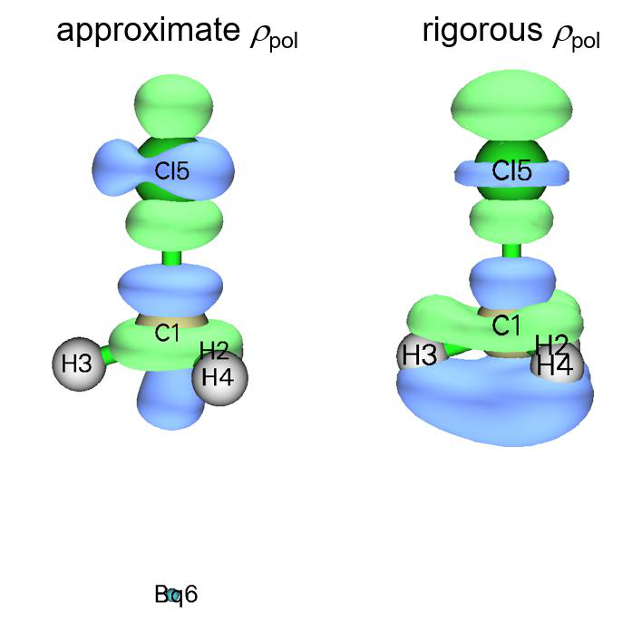

<!-- p.862 -->
One can better understand the nature of the 9th electron excitation in terms of orbital transition picture using the NTO analysis, see Section 4.18.6 for example, or simply checking MO maps if there is a dominant MO transition. If you use the function introduced in Section 3.21.15, you will find the 9th electron excitation is dominated by (81.7%) the transition from HOMO-2 to LUMO, their isosurface maps plotted by main function 0 are shown below. It can be seen that HOMO-2 shows bonding character of C-H and C-Cl bonds, while LUMO shows antibonding character of C-Cl bond. So, we can conclude that the external perturbation by the point charge caused electron transfer from the bonding orbital to the antibonding orbital, and the C-Cl bond should hence be weakened. This speculation can be directly confirmed by calculating bond orders. The Mayer and Laplacian bond orders of the C-Cl bond calculated based on CH3Cl.fch are 1.068 and 0.432, respectively, while the values calculated for CH3Cl_Q.fch are 1.061 and 0.428, respectively, clearly indicating that the presence of the point charge detectably lowers the C-Cl bonding strength. As noted earlier, the point charge is used to mimic the nucleophilic agent at the beginning stage of the SN2 reaction of CH3Cl, our observation suggests that the electrostatic potential created by the charge borne by the nucleophile initiates the C-Cl bond breaking.

Finally, if you have interest in the distribution of the external potential, you can choose option “3 Visualize isosurface of external potential”, you will find the isosurface is spherical and exactly encloses the point charge.

From this example, we can see that the analysis of electron density polarization in terms of electron excitations indeed provides valuable and unique insight into the response of a chemical system to external perturbation. For more application instances and discussions, see J. Phys. Chem. A, 124, 633 (2020) and J. Comput. Chem., 42, 1118 (2021).


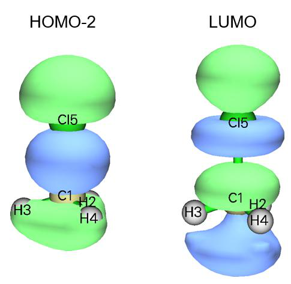

<!-- p.863 -->

### 4.18.18 Example of calculating ECD/CPL dissymmetry factor (g) for (P)-[6]helicene


Please check Section 3.21.18 to understand relevant background information and the features of the function illustrated in this Section. In this section I will exemplify how to use Multiwfn to easily calculate ECD and CPL dissymmetry factor (g) for a typical chiral molecule (P)-[6]helicene, and I will also show that transition electric and magnetic dipole moments can be very conveniently visualized. TDDFT output file of Gaussian will be used for the illustration purpose, while output file of electronic excitation task of ORCA can also be used (examples\excit\g_factor\TDDFT_S0geom_ORCA.out is an example file).

Dissymmetry factor of ECD spectrum (gCD) examples\excit\g_factor\TDDFT_S0geom.out is output file of TDDFT task of Gaussian 16 at CAM-B3LYP/def2-SV(P) level for the helicene at its ground state structure optimized using the same level, 30 excited states were calculated, CH2Cl2 solvent environment was represented by IEFPCM solvation model. Here we will obtain gCD and relevant information for these states. Boot up Multiwfn, load this file, and then input

18 // Electron excitation analyses 18 // Calculate ECD/CPL dissymmetry factor (g) of chiral systems 1 // This study is for ECD Then Multiwfn loads transition electric and magnetic dipole moments from the Gaussian output file and print them on screen, and outputs gCD along with various quantities closely related to it for all excited states:


```text
 Wavlen: Wavelength (nm)
 |e_tran|: Magnitude of transition electric dipole moment (in 1E-20 esu*cm)
 |m_tran|: Magnitude of transition magnetic dipole moment (in 1E-20 erg/Gauss)
 angle: Angle between transition electric and magnetic moments (degree)
 R: Rotatory strength (in 1E-40 cgs = erg*esu*cm/Gauss)
 D: Dipole strength (in 1E-38 cgs = esu^2*cm^2)
 g: ECD dissymmetry factor (dimensionless)

 State Wavlen  |e_tran| |m_tran| angle  cos(angle)     R        D        g
    1   339.5    63.17    0.272   90.01    -0.000      0.0     39.9   0.000003
    2   320.6    28.09    0.078    0.00     1.000     -2.2      7.9  -0.011134
    3   303.5   611.95    3.922  110.89    -0.357    856.0   3745.0   0.009143
    4   288.0   106.78    0.307    0.00     1.000    -32.8    114.0  -0.011492
[ignored...]
   29   182.1   182.09    0.280  180.00    -1.000     51.0    331.6   0.006156
   30   181.8    97.30    0.811  153.75    -0.897     70.8     94.7   0.029912
```

It is clear that S3 should be the lowest observable excitation in both experimental ECD and UV-Vis spectra because S1 and S2 have both negligible rotatory strength (R) and dipole strength (D).


<!-- p.864 -->
It is noted that in the study work about helicene derivatives, Chem. Sci., 12, 5522 (2021), the actual S3 is even (somewhat confusingly) labelled as S1 as it is the first optically active absorption. gCD of

S3 is 0.0091, which is in good agreement with the 0.85×10-2 reported in Fig. 3(f) of Chem. Sci., 12, 5522 (2021).

Now we visually check transition electric dipole moment (𝛍tran) and transition magnetic dipole moment (𝐦tran) of S3 in VMD visualization program (http://www.ks.uiuc.edu/Research/vmd/). In the post-processing menu of the present function, choose option “2 Export current structure to .pdb file” and then input S0.pdb to generate a pdb file named “S0.pdb” in current folder, which contains the current structure. Also choose option “1 Generate VMD script file for visualizing transition electric/magnetic moments” and then input ECD.vmd to generate a script of VMD with name “ECD.vmd” in current folder.

Boot up VMD (version 1.9.3 is recommended), load the S0.pdb into it can draw the molecular structure with licorice style. Move the ECD.vmd to VMD folder and run source ECD.vmd in VMD console window to execute the script. After that, you can run emtran 3 in VMD console window to plot 𝛍tran and 𝐦tran of S3 as red and cyan arrows, respectively, as shown below. By default, the arrow lengths are 5 Å, the arrow radius is 0.15 Å. See comments at the top of ECD.vmd on how to fine-tune the plotting settings.

Next, we look at S2. Both 𝛍tran and 𝐦tran of S2 state are exactly parallel to Z axis. When plotting them together in a single map, slight shifts of arrow centers must be adopted to make them visually distinguishable. In VMD console window we run this command: emtran 2 5 5 0.15 0 0.3 0 0 -0.3 0, in which “5 5 0.15” means the lengths of the two arrows are all 5 Å, and radius is 0.15 Å. “0 0.3 0” and “0 -0.3 0” mean the centers of red and blue arrows are shifted by (0.0 0.3 0.0) and (0.0 -0.3 0.0) Å, respectively. Now you can view the following map, due to the center shifts, the two arrows are not overlapping with each other.


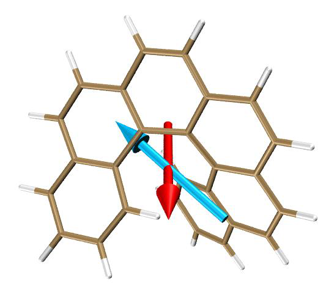

<!-- p.865 -->
Dissymmetry factor of CPL (gCPL) examples\excit\g_factor\TDDFT_opt_S1.out is output file of TDDFT geometry optimization for S1 state of the helicene, S0 minimum is taken as the initial geometry. Only 3 excited states were calculated, which is adequate since the emission state of CPL is just S1 (Kasha’s rule). To obtain gCPL, we load this file into Multiwfn, enter subfunction 18 of main function 18, Multiwfn will load the last outputted 𝛍tran and 𝐦tran, which correspond to the data at S1 minimum structure. Then choose “2 This study is for CPL” You will see the following information on screen:


```text
 State Wavlen  |e_tran| |m_tran| angle  cos(angle)     R        D        g
    1   372.4    72.32    0.226   97.32    -0.127     -2.1     52.3  -0.001592
    2   348.4    45.88    0.137  180.00    -1.000     -6.3     21.0  -0.011926
    3   334.0   748.12    3.693   73.04     0.292    805.8   5597.0   0.005759
```

Clearly, gCPL is -0.0016, which has the same sign as the experimental value -0.0009 reported in Table 1 of Commun. Chem., 1, 38 (2026) for the same molecule under the same solvent. The corresponding value reported in Fig. 3(f) of Chem. Sci., 12, 5522 (2021) is +0.0013, their calculation level is the same as ours and has very close magnitude to ours, but the sign is different. I suspect that they made mistake on the sign. The difference between the gCPL and gCD of S1 (0.000003) comes from the small structure difference between S0 and S1 minima. As illustrated earlier, you can also ask Multiwfn to export the present structure to a pdb file and export a VMD script for visualizing the 𝛍tran and 𝐦tran of S1 to provide insight into gCPL. The files have been provided as S1.pdb and CPL.vmd in “examples\excit\g_factor\” folder.


## 4.19 Orbital localization analysis

Note: Most information in this section is also available in my blog article “The use of orbital localization function of Multiwfn and its comparison with NBO and AdNDP analyses” (http://sobereva.com/380, in Chinese).

Orbital localization is a very powerful and useful technique, it can transform canonical molecular orbitals, which often show highly delocalized character, to localized form, which is known as localized molecular orbital (LMO). The LMOs have close relationship with many classical


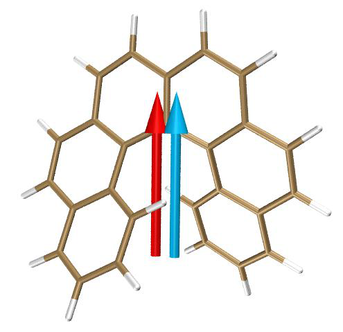

<!-- p.866 -->
chemistry concepts such as chemical bond and lone pair, therefore they can be used to analyze and unveil many problems of chemical interest. Before reading this section, please read Section 3.22 first to gain some basic knowledge. Some examples in other sections, such as the example in Sections 4.8.4 and 4.100.22, also utilized orbital localization function.

CAUTION: The default orbital localization method, namely Pipek-Mezey based on Mulliken population (PM-Mulliken) method is not suggested to use when diffuse functions are heavily employed, otherwise the result may be misleading. If diffuse functions have to be employed, you should change to Pipek-Mezey based on Becke population (PM-Becke) method, or Foster-Boys method, see Section 3.22 for introduction of pros and cons of various orbital localization methods.


### 4.19.1 Localizing molecular orbital of 1,3-butadiene by Pipek-Mezey method


This section illustrates the use of orbital localization analysis of Multiwfn with trans-1,3-butadiene as example.

Basic steps of performing LMO analysis The input file is examples\butadiene.fch, which was yielded at B3LYP/6-31G** level. You can first visualize its MOs via main function 0, you will find all MOs are highly delocalized, none of them have direct correlation with classical concept of chemical bond theory. Now we perform orbital localization to transform them into more chemically meaningful orbitals. Boot up Multiwfn and input

examples\butadiene.fch 19 // Orbital localization. By default, Pipek-Mezey localization method based on Mulliken population is used

2 // Perform localization for both occupied and unoccupied MOs Since this system is small, convergence of localization iteration immediately achieved, and the major character of the resulting orbitals are printed. After that Multiwfn automatically exports the LMOs as new.fch in current folder and then loads it. Now, the orbital coefficients in memory have been completely updated to the LMOs. You can use different ways to characterize them. We enter main function 0 to visualize these orbitals, you will find all orbitals show strong localization character, in particular the occupied ones. Below are screenshots of three LMOs involving C6-C8,

the first two are occupied, and they correspond to σ bond and π bond, respectively; the third one is unoccupied, it can be ambiguously identified as anti-π bond orbital.

Evaluating LMO energies It is possible to evaluate energies for the LMOs, as illustrated below. Boot Multiwfn and input examples\butadiene.fch


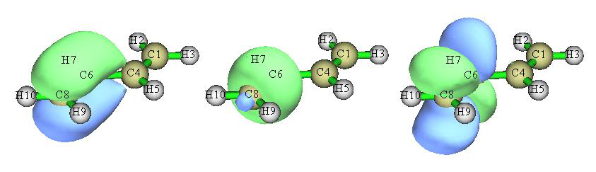

<!-- p.867 -->
19 // Orbital localization -4 // Allow Multiwfn to generate and print energy for LMOs 1 // Evaluate energies of the LMOs using the Fock matrix generated by MO energies and coefficients via F=SCEC-1 relationship

2 // Localize both occupied and unoccupied orbitals After calculation is finished, Multiwfn evaluates energies of the LMOs and sort them according to their energies from low to high. You can find energies of all LMOs from screen. The information of the highest occupied and lowest unoccupied LMOs is shown below


```text
   14   Energy:   -0.2750728 a.u.      -7.4851 eV   Type: A+B   Occ: 2.0
   15   Energy:   -0.2750728 a.u.      -7.4851 eV   Type: A+B   Occ: 2.0
   16   Energy:    0.2185911 a.u.       5.9482 eV   Type: A+B   Occ: 0.0
   17   Energy:    0.2185913 a.u.       5.9482 eV   Type: A+B   Occ: 0.0
```

Please plot these orbitals in main function 0 to try to identify their characters.

By the way, it is also possible to evaluate energies of the LMOs based on the Fock matrix loaded from an external file (see Appendix 7 for details), and this is the only choice if the Fock matrix cannot be successfully generated based on MO energies and coefficients. For example, the Fock matrix can be loaded from NBO .47 file; to realize this for present system, we can enter main function 100 and choose subfunction 2, and then select option 10 to export current system as a Gaussian input file. Then properly modify the input file to request Gaussian to output .47 file, and we need to ensure that the calculation level is identical to the examples\butadiene.fch (B3LYP/6-31G**). The prepared input file has been provided as examples\butadiene_47.gjf. Run it by Gaussian, you will find the resulting BUTADIENE.47 at C:\ (this file has already been provided as examples\butadiene.47). In the main function 19, after choosing option -4 to allow Multiwfn to evaluate LMO energies, if you select suboption “2 Evaluate, loading Fock matrix from a file” and then input the path of the .47 file, the Fock matrix recorded in the .47 file will be loaded and will be used to evaluate the LMO orbital energies in due time

Showing center positions of all LMOs It is possible to visualize center positions of all generated LMOs, so that the distribution of the LMOs can be immediately understood. Here I illustrate how to realize this.

Reboot Multiwfn and input examples\butadiene.fch 19 // Orbital localization -8 // Switch status of “If calculating center position and dipole moment of LMOs” to “Yes” -6 // Change localization method 10 // Foster-Boys 1 // Localize occupied orbitals (center position of unoccupied LMOs is generally uninteresting therefore we do not localize unoccupied MOs)

n // Skip the dipole moment analysis As you can see from the prompts, after orbital localization has been finished as usual and the newly generated new.fch has been automatically loaded into Multiwfn, the program calculates center position of each LMO. In order to make visualization of the centers easy, Multiwfn adds Bq atoms (i.e. ghost atoms”) into the current system to represent the centers of the LMOs. The center coordinates as well as correspondence between LMO indices and Bq indices are automatically exported to current folder as LMOcen.txt. The content of this file of current instance is


```text
 LMO     1 corresponds to Bq    11, X,Y,Z:    1.1372    0.7759   -0.0000 Bohr
 LMO     2 corresponds to Bq    12, X,Y,Z:   -1.1372   -0.7759   -0.0000 Bohr
 LMO     3 corresponds to Bq    13, X,Y,Z:    1.1372    3.3081   -0.0000 Bohr
...[ignored]
```

Then we return to main menu and enter main function 0 to visualize the LMO centers and


<!-- p.868 -->
orbital isosurfaces. The plotting settings have been automatically set to a special status for best visualizing LMOs purpose, currently you can see:

From this graph we can very clearly understand distribution of the generated LMOs. Each cyan sphere is a ghost atom, representing center of a LMO. Under current setting the index of the ghost atoms starts from 1, therefore the index shown in the graph directly corresponds to the LMO index. For example, we want to simultaneously visualize the two LMOs at boundary C-C bond, since the cyan spheres with labels 8 and 11 locate around the bond, we choose orbital 8 in the orbital list to display it, then select “Show+Sel. isour#2” and choose orbital 11 to. After that, change isovalue to 0.13 and set the drawing style as transparent, you will see

Evidently, the two LMOs obtained via Foster-Boys method collectively represent the double-bond character of the boundary C-C bond. The two LMOs are known as “banana” orbitals and do not

exhibit σ-π separation character.

You can also try to visualize the center position of the LMOs generated via Pipek-Mezey

algorithm. Because this method represents each double-bond as a pair of separated σ and β LMOs, whose centers should be very close to each other, from the graph below you can find the centers indeed can hardly be distinguished:

It is worth to note that there are two ways to rapidly find the index of the LMO corresponding to the bond of your interest. The first one is examining the orbital compositions printed during the orbital localization, the second one is directly visualizing the LMO centers and finding the index showing above the cyan sphere at proper place, as I just illustrated.


<!-- p.869 -->

### 4.19.2 Analyze variation of localized molecular orbitals for SN2 reaction


In this example, we study variation of localized molecular orbitals (LMOs) along with reaction path to visualize variation of chemical bonds, a typical SN2 reaction is taken as instance.

This SN2 reaction involves formation of F-C bond and break of C-H bond, therefore in the following analysis we will focus on corresponding two LMOs. The IRC of the SN2 reaction is shown below, five points are taken into account, their .fch files have been provided in examples\SN2 folder.

First, we generate LMOs for transition state (TS) geometry. Boot up Multiwfn and input examples\SN2\TS.fch 19 // Orbital localization 1 // Localize occupied orbitals 0 // Visualize orbitals We can find there are two orbitals respectively corresponding to F-C and C-H bonds, we draw them together for easier comparison

The green-blue isosurface and purple-yellow isosurfaces clearly portray the orbitals corresponding to F-C and C-H bonds, respectively.

We draw the same kind of plot for R.fch, TS-1.fch, TS+1.fch and P.fch, then put the graph together, as shown below


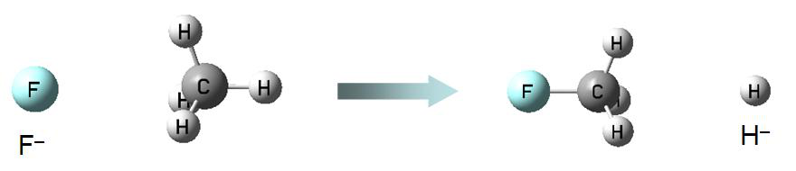


<!-- p.870 -->
From the graph, the variation of chemical bonds during the SN2 reaction is quite clear (R→TS-1→TS→TS+1→P). In the reactant state, the green-blue isosurface corresponds to the lone pair of the fluorine atom, while the purple-yellow isosurface shows typical covalent bond character of C-H. As the reaction proceeds, the two LMOs vary smoothly, the C-F covalent bond character becomes more and more prominent, and in the final product state, the LMO represented by purple-yellow isosurface has already corresponded to 1s orbital of H- anion.

4.19.3 Characterize Re-Re bond of [Re2Cl8]2- anion

It is widely accepted that Re-Re bond in [Re2Cl8]2- anion is a quadruple bond, with

configuration of (σ2π4δ2). The σ bond results from overlap of 𝑑𝑧2 −𝑝𝑧 hybrid orbitals of the two rhenium atoms, the two π bonds stem from overlap of their dxz and dyz orbitals, while the δ bond is formed by overlap of their dxy orbitals. Can this classic concept be validated via orbital localization analysis?

The .fchk file of [Re2Cl8]2- anion produced under B3LYP with 6-31G* for Cl and SDD for Re is provided as examples\Re2Cl82-.fchk. Load it into Multiwfn and carry out orbital localization for occupied orbitals, from the output we can immediately identify the four LMOs corresponding to the Re-Re bond:


```text
Almost two-center LMOs: (Sum of two largest contributions > 80.0%)
  57:   7(Cl) 73.8%   2(Re) 22.5%        58:  10(Cl) 73.8%   2(Re) 22.5%
  59:   4(Cl) 73.8%   1(Re) 22.5%        60:   2(Re) 48.1%   1(Re) 48.1%
  61:   8(Cl) 73.8%   2(Re) 22.5%        62:   3(Cl) 73.8%   1(Re) 22.5%
  64:   1(Re) 45.9%   2(Re) 45.9%        66:   6(Cl) 73.8%   1(Re) 22.5%
  67:   9(Cl) 73.8%   2(Re) 22.5%        69:   5(Cl) 73.8%   1(Re) 22.5%
  83:   1(Re) 45.9%   2(Re) 45.9%        84:   2(Re) 43.6%   1(Re) 43.6%
```

Hint: If you want to more easily find the indices of the LMOs corresponding to the Re1-Re2 bond, the best way is setting "iprintLMOorder" in `settings.ini` to 1 before booting up Multiwfn. After that, the compositions of LMOs will be printed in the order of atoms and atomic pairs.

Then we enter main function 0 to visualize them (under default isovalue of 0.05):


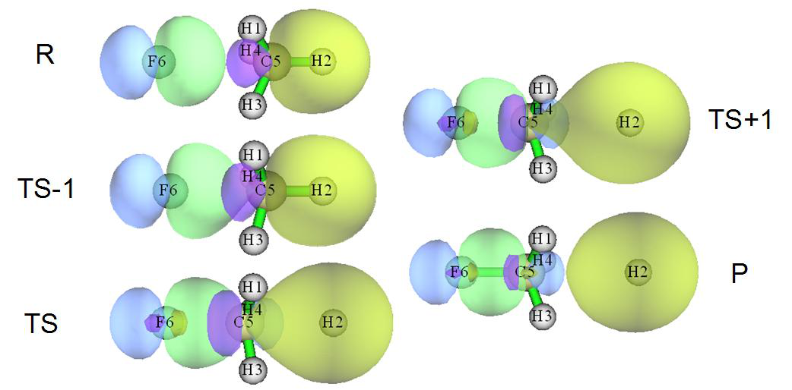

<!-- p.871 -->
From the isosurface maps of the LMOs, it is clear that LMO60 corresponds to σ bond, LMO64 and LMO83 correspond to π bond and LMO84 corresponds to δ bond. This observation supports the quadruple bond argument.

However, if we calculate Mayer bond order, we will find the situation is not so simple. The Mayer bond order of Re-Re bond calculated by main function 9 is 2.94, why the value is significantly lower than 4.0, which is expected?

To gain deeper insight, we perform "Orbital occupancy-perturbed Mayer bond order" analysis for Re-Re bond using main function 9, the output is


```text
Mayer bond order after orbital occupancy-perturbation:
 Orbital     Occ      Energy    Bond order   Variance
...[Ignored]
    60     2.00000   -0.14354    2.001481   -0.935449
...[Ignored]
    64     2.00000   -0.12793    2.276388   -0.660542
...[Ignored]
    83     2.00000   -0.01749    2.276388   -0.660542
    84     2.00000    0.02809    2.466317   -0.470613
```

The result shows that the σ LMO has contribution of 0.935, each π LMO contributes 0.661, and the δ LMO contributes 0.471. Although in principle Mayer bond order cannot be exactly decomposed, these data are sufficient to help us to understand relative importance of each bonding

LMO. Clearly σ bond is of most importance to the Re-Re bond, while the importance of the δ bond is relatively lowest.

Now a new problem arises, why the four LMOs have different contributions to Mayer bond order of Re-Re bond? This may be answered by visualizing their isosurfaces with lower value of isovalue. The graphs of the four LMOs with isovalue of 0.01 are illustrated below

From the graph we find that LMO60 basically only occurs around the two Re atoms, therefore


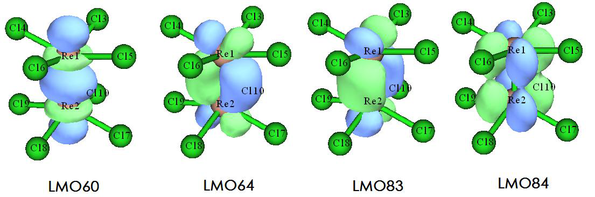

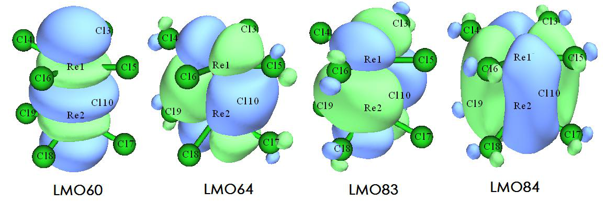

<!-- p.872 -->
its contribution to Re-Re Mayer bond order should be close to 1.0. Both LMO64 and LMO83 slightly delocalize to four Cl atoms, therefore they do not purely show Re-Re bond character and thus have lower contribution to Re-Re Mayer bond order. The LMO84 delocalizes to all the eight Cl atoms, it is naturally expected that its contribution to the Re-Re Mayer bond order should be the smallest.

By the way, if you have interest, you can carry out orbital occupancy-perturbed Mayer bond order analysis for Cr2, you will find the Mayer bond order is almost exactly 6.0, and all the six MOs corresponding to Cr-Cr bond basically have contribution of 1.0, this is mainly because these orbitals do not delocalize to any other atoms.


### 4.19.4 Study bond dipole moment based on two-center LMOs for

CH3NH2

Multiwfn supports a few methods for evaluating bond dipole moment, as mentioned in Section 4.A.11. In this section I use CH3NH2 as an example to show that based on two-center LMOs it is possible to study bond dipole moment, which somewhat reflects bond polarity. Introduction of related theory is given in Section 3.22.

Boot up Multiwfn and input examples\CDA\CH3NH2\CH3NH2.fch 19 // Orbital localization -8 // Switch status of “If calculating center position and dipole moment of LMOs” to “Yes” 1 // Localize occupied orbitals y // Perform dipole moment analysis for the LMOs Now LMOdip.txt has been generated in current folder, in this file you can find the content below, which are calculated in a special method as shown in “Special topic 3” of Section 3.22:


```text
Single-center orbital dipole moments (a.u.):
    1 (   5N )  X/Y/Z:  -0.04465   0.01500   0.00001  Norm:   0.04710
    2 (   1C )  X/Y/Z:   0.00010   0.00014   0.00000  Norm:   0.00017
    9 (   5N )  X/Y/Z:  -1.28448   0.41598   0.00001  Norm:   1.35016
 Sum            X/Y/Z:  -1.32903   0.43112   0.00001  Norm:   1.39721

 Two-center bond dipole moments (a.u.):
    3 (   5N  -   6H )  X/Y/Z:  -0.08951  -0.20801   0.30542  Norm:   0.38021
    4 (   1C  -   4H )  X/Y/Z:  -0.06753   0.08375  -0.00000  Norm:   0.10758
    5 (   5N  -   7H )  X/Y/Z:  -0.08950  -0.20802  -0.30543  Norm:   0.38022
    6 (   5N  -   1C )  X/Y/Z:   0.17708   0.25312  -0.00000  Norm:   0.30891
    7 (   1C  -   3H )  X/Y/Z:   0.08532   0.06534  -0.09566  Norm:   0.14387
    8 (   1C  -   2H )  X/Y/Z:   0.08532   0.06534   0.09566  Norm:   0.14387
 Sum                    X/Y/Z:   0.10119   0.05152  -0.00001  Norm:   0.11355
```

After entering main function 0, we can see the graph below


<!-- p.873 -->
By comparing the graph and content of LMOdip.txt, you can find LMO1 and LMO2, which respectively correspond to core orbitals of N5 and C1, have negligible polarity (i.e. the “norm” are basically zero), reflecting that the LMO centers are very close to the nuclear positions. The LMO9 corresponds to lone pair orbital of N5, its “norm” is as high as 1.35 a.u., showing that the LMO center deviates from N5 nucleus significantly. LMOs 3 and 5 correspond to the N-H bonds, LMOs 4, 7 and 8 correspond to the C-H bonds, it is well known that polarity of C-H should be lower than N-H, this point is well reflected by the difference in their “Norm” values. The “Norm” of LMO6, which corresponds to the C-N bond, is 0.3089, well indicating the fact that C-N is a polar bond.

In addition, in current system the Y coordinates of N5 and C1 are -1.438 and 1.330 Bohr, respectively. The Y component of the bond dipole moment of LMO6 is 0.253, which is an evident positive value. This observation shows that the negative and positive charge centers are on the N5 and C1 sites, respectively, corresponding to the fact that nitrogen has larger electronegativity than carbon.


## 4.20 Visual study of weak interactions


### 4.20.1 Studying weak interaction in 2-pyridoxine 2-aminopyridine by NCI method


Please carefully read Section 3.23.1 first to understand theory and how to use Multiwfn to carry out NCI analysis. Besides, book chapter DOI: 10.1016/B978-0-12-821978-2.00076-3 and Angew. Chem. Int. Ed., 137, e202504895 (2025) DOI: 10.1002/anie.202504895 provided very detailed introductions of NCI.

Weak interaction character in 2-pyridoxine 2-aminopyridine system has already been studied using AIM theory in Section 4.2.1, in this section we also perform NCI analysis for it, and meantime I will show how to plot color-filled RDG map and AIM topology graph as a single map.

Boot up Multiwfn and input examples\2-pyridoxine_2-aminopyridine.wfn 20 // Visual study of weak interaction 1 // NCI analysis 2 // Medium-quality grid After a while, calculation of grid data is finished. You can then select -1 to visualize scatter map, from which interactions in the system can be examined preliminarily.


<!-- p.874 -->
Since there are spikes (points nearly approaching bottom) at very negative region of sign(λ2)ρ, according to the description of NCI method given in Section 3.23.1, we immediately know that this dimer system must contain evident attractive intermolecular interaction. There is also a spike at very positive side, therefore steric effects should exist in present system.

Then select option 3 to export func1.cub and func2.cub, and use VMD to plot a color-filled RDG map using the method described in Section 3.23.1, we obtain the graph below

The type of interactions in this system now is very clear. Steric effect exists within the aromatic ring

$$sign(\lambda_2)\rho$$

Showing AIM information in colored RDG map Below I illustrate how to plot AIM critical points (CPs) and bond paths on the color-filled RDG map, the resulting graph will be more informative, since the trace of interactions can be vividly shown, while this kind of information is not explicitly revealed by NCI analysis.

Return to main menu and input below commands to search CPs, generate paths and then export


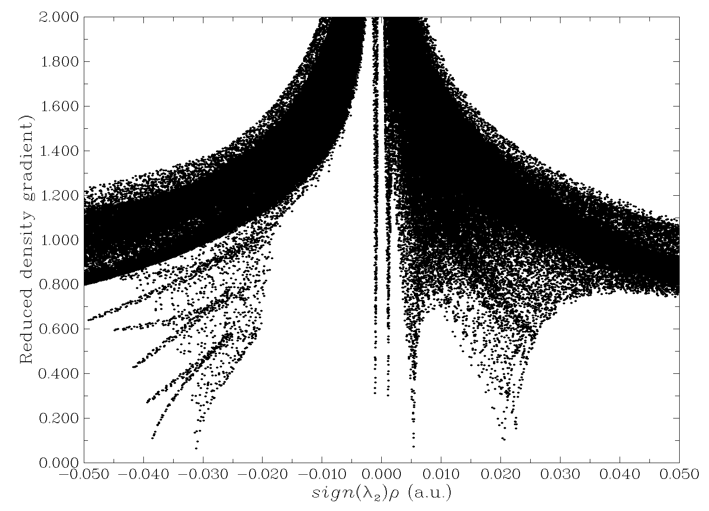

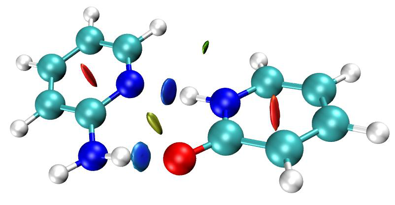

<!-- p.875 -->
them as CPs.pdb and paths.pdb in current folder, respectively.

2 // Topology analysis 2 // Search nuclear CPs 3 // Search bond CPs 8 // Generate bond path -4 // Modify or export CPs 6 // Export CPs as CPs.pdb in current folder 0 // Return -5 // Modify or print detail or export paths 6 // Export paths as paths.pdb in current folder Then we close Multiwfn. Drag CPs.pdb and paths.pdb into VMD main window in turn to load them, select "Graphics"-"Representation", change "Selected molecules" to the second term (corresponding to CPs.pdb), change "Drawing Method" to "VDW" and set "Sphere Scale" from the default 1.0 to the minimal value 0.1. Note that in the CPs.pdb file, C, N, O, F atoms correspond to (3,-3), (3,-1), (3,+1), (3,+3), respectively. Here we only want to draw bond CPs (i.e. (3,-1) type of CPs) on the graph with yellow color, therefore we input "nitrogen" in "Selected Atoms" text box and press ENTER button, then change "Coloring Method" to "Color ID" and select "4 yellow" in the drop-down box. Currently, the graph looks like below

Probably you feel that the spheres corresponding to CPs are too large, however we cannot further decrease the "Sphere Scale" using graphical window due to limitation of VMD. To make the spheres smaller, you have to use corresponding command in VMD console window. To find proper command to do this, we select "File"-"Log Tcl Commands to Console", then change "Sphere Scale" to other value (e.g. 0.2), you will immediately see corresponding text-line command in the VMD console window, for present the command is mol modstyle 0 1 VDW 0.200000 12.000000, where the argument 0.2 corresponds to size of the spheres. Therefore, to decrease the sphere size to e.g. 0.09, we should input mol modstyle 0 1 VDW 0.09 12.000000 in the console window, then in the VMD graphical window you will see the spheres have already become smaller.

Next, we change the appearance of paths. In the "Graphics"-"Representation" panel, select the third term in "Selected molecules" (corresponding to paths.pdb), change the drawing method to "VDW", set coloring method as "Color ID" and select "3 orange", then use abovementioned skill to set the sphere scale to 0.02. The final graph is shown below.


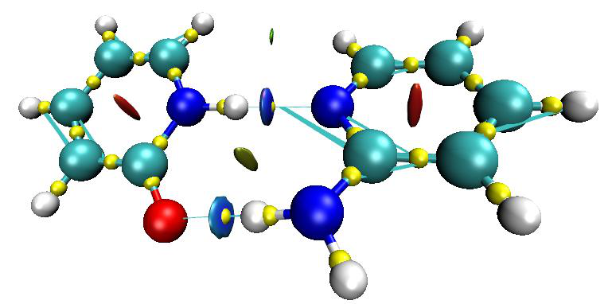

<!-- p.876 -->
From this graph, not only the weak interaction regions are clearly revealed, but also the interaction paths are vividly exhibited. Notice that there is no CP and path corresponding to the hydrogen-hydrogen interaction, because in this region there is no position having vanishing electron density gradient, and this is why in the scatter map the spike corresponding this H-H interaction does not completely approach the bottom of the map. This observation reflects an advantage of NCI analysis over AIM analysis, namely interaction can be revealed even if there is no corresponding bond CP.

The steps of showing the CPs and bond paths in VMD are somewhat lengthy, therefore I strongly recommend using VMD plotting scripts to automatically do all of above steps, please follow part 4 of this video tutorial: https://youtu.be/e4FpVc9ao48, you will find the process is extremely easy. More information about this script can be found in Section 4.2.5.


### 4.20.2 Studying weak interaction in DNA by NCI method based on promolecular density


Please read Sections 3.23.1 and 3.23.2 if you are not familiar with NCI analysis and the concept of promolecular approximation. In this example, we will carry out NCI analysis for a DNA fragment consisting of 10 base pairs. Since this system is fairly large, promolecular approximation is used for approximately rapid construction of the molecular electron density. This example is also illustrated as part 3 of this video tutorial: https://youtu.be/e4FpVc9ao48.

Here we only study weak interaction character of a local DNA region, which is enclosed in the transparent box:


<!-- p.877 -->
Boot up Multiwfn and input: examples\DNA.pdb 20 // Visual study of weak interaction 2 // NCI analysis based on promolecular density 7 // Use mode 7 for defining grid data 84,565 // Use midpoint of atom 84 and 565 as center of grid data. You can view molecule structure in your favourite visualization tool to find two proper atoms used to define center

120,120,120 // Because the spatial scope of grid data is large, we need relatively large number of grid points, otherwise the grid spacing will be too large, which results in bad quality of RDG isosurfaces

9,9,9 // Set the extension distances in all directions to 9 Bohr Hint: You can also use mode 10 to set up box interactively in a GUI window, the box size and position of box center is more controllable

After the calculation of grid data is finished, choose option 3 to export sign(λ2)ρ and RDG as func1.cub and func2.cub respectively in current folder, and then copy them as well as examples\RDGfill_pro.vmd to VMD installation folder. Boot up VMD and input source RDGfill_pro.vmd in console window to draw color-filled RDG isosurface map, the resulting graph after some adjustments is shown below. (For better visualization effect, open "graphics"-"Representation" and change the drawing method of DNA to Licorice, change bond radius to 0.2. Then enter “Display”-“Display settings...” to set “Cue Mode” to "Linear" and set “Cue Start/End” to 2.25 and 3.75, respectively, so that distant atoms can be substantially screened). Finally, you will get the graph below


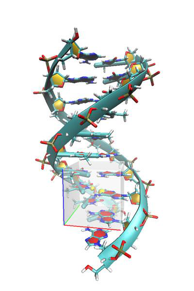

<!-- p.878 -->
It is clear that there are π-π stacking interactions between neighbouring base pairs (big flat isosurfaces), and there are two strong hydrogen bonds among each base-pairs. The region pointed by red arrow seems to be hydrogen bond because it connects hydrogen and oxygen, however since the filled-color is green, we can conclude that it can only be regarded as vdW interaction.

The default isovalue 0.3 in RDGfill_pro.vmd is suitable for present case, but may not be suitable for exhibiting weak interaction region of other systems, in that situation you need to adjust it manually. You can either edit the .vmd file, or choose “Graphics”-“Representation” in VMD, then select the representation with style “Isosurface” and reset isovalue by inputting expected value in text box.

.


### 4.20.3 Visually studying weak interaction for water in bulk environment by aNCI method


Note 1: Using the aNCI method illustrates in this section is already deprecated, using amIGM method instead is significantly better, see Section 4.20.13 for illustration.

Note 2: Chinese version of this section is my blog article “Using Multiwfn to study weak interaction in molecular dynamics” (http://sobereva.com/186), which also contains extended discussion.

If you are unfamiliar with NCI and aNCI methods, please first read the introduction given in Sections 3.23.1, 3.23.2, 3.23.3, and book chapter DOI: 10.1016/B978-0-12-821978-2.00076-3, as well as Angew. Chem. Int. Ed., 137, e202504895 (2025) DOI: 10.1002/anie.202504895. The aNCI method illustrated in this section is a generalization of NCI analysis method for dynamic environment, e.g. molecular dynamics (MD) process.

In this example I will show how to use Multiwfn to visually study the weak interaction between


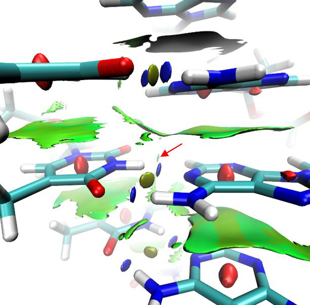

<!-- p.879 -->
water molecules in the MD simulation of bulk water system. You can use any program to perform the MD simulation, as long as you know how to convert the resulting trajectory from private format to the general .xyz format, which can be recognized by Multiwfn and utilized in aNCI analysis.

Here I assume that you are a GROMACS 4.5 user. The detailed steps of the MD process are given below (very different to GROMACS >= 5.0), all of the related files can be found in examples\aNCI folder. If you do not want to perform the MD simulation yourself, you can directly download the wat.xyz, which will be utilized in aNCI analysis later: http://sobereva.com/multiwfn/extrafiles/aNCI_wat_xyz.zip.

Generating MD trajectory by GROMACS First, build a file named emptybox.gro, which records a blank box, and the side length in each direction is 2.5nm. Then run below command to fill the box with waters.

genbox -cp emptybox.gro -cs spc216.gro -o water.gro Run below command and select "GROMOS96 53a6 force field" to obtain the top file of the bulk water system. SPC/E water model is employed.

pdb2gmx -f water.gro -o water.gro -p water.top -water spce Then carry out NPT MD by 100ps to equilibrate the bulk water at 298.15 K, 1 atm environment. grompp -f pr.mdp -c water.gro -p water.top -o water-pr.tpr mdrun -v -deffnm water-pr Using VMD program to load water-pr.gro, select a water close to the center of the box. We select the water with resid index of 101, which is highlighted in the graph below. Note that the two hydrogens in this water have index of 302 and 303, and the index of the oxygen is 301.

This water will be freezed in the following MD simulation. In order to do so, we generate index file, namely inputting below commands

make_ndx -f water-pr.gro ri 101 q Run following command to do 1 ns equilibrium MD simulation at 298.15 K, the trajectory will


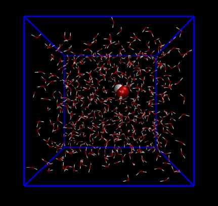

<!-- p.880 -->
be saved every 1ps, and finally we will obtain 1000 frames. The water with resid index of 101 is freezed via the keyword "freezegrps = r_101". Note that NVT ensemble instead of NPT is used, because NPT process will scale the coordinate of the atoms, which somewhat destorys the effect of freezing.

grompp -f md.mdp -c water-pr.gro -p water.top -o water-md.tpr -n index.ndx mdrun -v -deffnm water-md Load the water-pr.gro into VMD, then load water-md.xtc to the same ID, select "File"-"Save Coordinate..." option and set the file type as xyz, then input all in the "Selected atoms" box, input 1 and 1000 in the "First" and "Last" window, respectively. Finally, click "Save" button to convert the GROMACS trajectory to wat.xyz.

IMPORTANT NOTICE: The wat.xyz currently records atom names rather than element names. For example, if you open this file via text editor, you will find each water contains OW, HW1 and HW2, which are atom names. However, in standard .xyz file, only atom elements should be recorded. Therefore, in general cases, you should manually replace all atom names in the .xyz file generated by VMD with element names. Fortunately, this step can be skipped in present example because there is no element in the periodic table named OW, HW1 and HW2, therefore, only the first letter of atom names will be employed by Multiwfn to try to identify their elements, and they can be properly recognized as oxygen and hydrogens, since after loading the .xyz file, you can find prompt “Formula: H1022 O511” on the screen, which is what we expected. If you find there are undesired elements in the “formula”, that means you have to replace the corresponding atom names in the .xyz file as their actual element names.

Generating grid data by Multiwfn Boot up Multiwfn and input following commands wat.xyz 20 // Visual study of weak interaction 3 // aNCI analysis 1,1000 // The range of the frames to be analyzed 7 301,301 // Using atom 301 (the oxygen of the frozen water) as the box center of the grid data 80,80,80 // The number of grid points on each side 4.5,4.5,4.5 // Extend 4.5 Bohr in each side Now Multiwfn starts to calculate electron density, its gradient and Hessian of each frame, then their average quantities will be obtained, and finally Multiwfn calculates average RDG and average

sign(λ2)ρ. The whole process is time-consuming; at a common Intel 4-cores computer about half an hour will be consumed. (Note that the electron density I referred to here is produced by promolecular approximation, which is constructed by simply superposing the density of the atoms in their free-states)

After the calculation is finished, you can select option 1 to check the scatter plot between

average RDG (X-axis) and average sign(λ2)ρ (Y-axis), see below, there is also option used to export the corresponding data points to plain text file.


<!-- p.881 -->
Select option 6 to export the grid data of average RDG and average sign(λ2)ρ as avgRDG.cub and avgsl2r.cub in current folder, respectively.

Since we wish to check the stability of weak interaction, we also select 7 to export thermal fluctuation index to thermflu.cub in current folder. Note that this process requires recomputing electron density of each frame, and thus is time-consuming.

Analysis Copy avgRDG.cub, avgsl2r.cub, thermflu.cub as well as avgRDG.vmd and avgRDG_TFI.vmd in "examples\aNCI" folder to the directory of VMD program.

Simply boot up VMD and input source avgRDG.vmd in its console window, the average RDG

isosurface will be shown with isovalue of 0.25, meantime the average sign(λ2)ρ is mapped on the isosurface by various colors. In order to make the graph clearer, one should screen unrelated atoms, that is enter "Graphics" - "Representation"， then select the entry whose "style" is "CPK", and input serial 301 302 303 in the "Selected Atoms" box and then press ENTER button. Now only the water with resid index of 101 is presented in the graph. After proper rotation and translation of view, you will see


<!-- p.882 -->
Unfortunately, around the water of interest, there are large amounts of noisy isosurfaces, which somewhat messed up the graph, thus it is better to shield them. This aim can be achieved by main function 13 of Multiwfn, the steps are described below.

Then boot up Multiwfn and input avgRDG.cub 13 // Process grid data 13 // Set the value of the grid points far away from specific atoms 1.5 // If the distance between a grid point and any selected atoms is longer than 1.5 times of vdW radius of corresponding atom, then the value of the grid point will be set as given value

100 // An arbitrarily large value (should be larger than the isovalue of the RDG isosurfaces) 2 // Inputting selected atoms by hand 301-303 // The indices of the atoms are 301, 302 and 303 0 // Export the updated grid data to a new cube file avgRDG.cub // The name of the new cube file Copy the newly generated avgRDG.cub to the folder of VMD program to overwrite the old one, then use the script avgRDG.vmd again to plot the graph, after some adjustments you will see (for clarity, the view of two sides is shown at the same time)

The graph we obtained this time is very clear. The color scale is from -0.25 to 0.25, corresponding to the color variation of Blue-Green-Red. Bluer denotes electrostatic interaction or H-bond effect in corresponding region is stronger, and redder suggests more intensive steric effect. Green region implies low electron density, corresponding to vdW interaction. From the graph one can see that there are two blue ellipses near the two hydrogens, rendering that in the MD process, strong H-bonds are formed due to the O-H group. The slender green isosurface exhibits in which direction this water prefers to interact with other waters by vdW interaction. There is a big lump of isosurface above the oxygen, on which the red color appears in the middle part, while blue color occurs at the two ends; the latter reflects that the two lone pairs of the oxygen act as H-bond acceptors during the simulation, while the former reveals the repulsive interaction zone between waters.

Next, we study the stability of the weak interactions. First disable present isosurfaces, and then input the command source avgRDG_TFI.vmd in the console window, after some adjustments you


<!-- p.883 -->
will see

The color scale is 0~1.5, still corresponding to the color transition of Blue-Green-Red. Bluer (red) means the thermal fluctuation index (TFI) is smaller (larger), and hence the weak interaction in corresponding region is more stable (unstable). The graph shows that it is stable that the water behaves as H-bond donor, while the stability of the water acting as H-bond acceptor is slightly weaker; the vdW interaction region is totally red, rendering that vdW interaction is evidently unstable compared to hydrogen bond.

Finally, it is worth to mention that using aNCI method you can plot a very nice picture to vividly reveal interaction between ligand and protein, as illustrated in the following map. The detailed steps of plotting this map have been described in this post: "Using Multiwfn to perform aNCI analysis to graphically study protein-ligand interactions in dynamic process" (http://sobereva.com/591, in Chinese). If you cannot fully understand this article via Google translator, please contact me, I will find time to translate it to English.


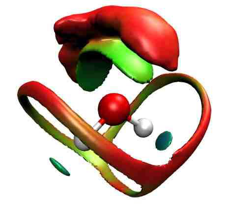


<!-- p.884 -->

### 4.20.4 Revealing both chemical bonding and weak interaction regions in phenol dimer by IRI analysis


IRI (Interaction Region Indicator) was proposed by me in Chemistry−Methods, 1, 231 (2021). Before following this section, please read the original paper, Section 3.23.8 of this manual and DOI: 10.1016/B978-0-12-821978-2.00076-3 to gain basic knowledge about IRI first. Here I take two

examples to respectively show how to draw sign(λ2)ρ mapped IRI isosurfaces and IRI plane maps to simultaneously reveal both chemical bond and weak interaction regions.

In addition, Multiwfn can also perform topology analysis on IRI to study it quantitatively, see Section 4.2.11 for detail.

For more information on IRI analysis, please download the document "Tutorial of using Multiwfn to perform IRI analysis" and follow it: http://sobereva.com/multiwfn/res/IRI_tutorial.zip.

In this document the procedure of performing IRI-π analysis is also detailedly described. IRI-π is a variant of IRI aiming for vividly revealing π interactions.

It is highly suggested to read my this blog article: "Using IRI method to graphically study chemical bonds and weak interactions in chemical systems" (http://sobereva.com/598, in Chinese), in which the feature of IRI is carefully described, richer discussions are given, and more examples are provided.

Plotting sign(λ2)ρ mapped IRI isosurface Phenol dimer is taken as instance here. You will find almost all steps are identical to the NCI analysis described in Section 3.23.1.

Boot up Multiwfn and input examples\PhenolDimer.wfn 20 // Visual study of weak interaction 4 // IRI analysis 3 // High-quality grid 3 // Export cube file Move func1.cub, func2.cub and plotting script examples\IRIfill.vmd to VMD folder. Then boot up VMD and input source IRIfill.vmd in VMD console window to execute the script, you will immediately see the graph below (the sphere scale of the atoms has been reduced to 0.6 in "Graphics" - "Representation").


<!-- p.885 -->
The IRIfill.vmd script employs the following color scale. The meaning of various colors is also explained in the following map.

The graphical effect of the IRI map is obviously quite satisfactory. The weak interaction regions are exhibited as nicely as NCI analysis, and the chemical bond regions are also clearly revealed by blue isosurfaces, indicating that electron density in these regions is very large and implying bonding effect is strong.

Note that the most suited isovalue of IRI function may be different for different systems, the default isovalue in the IRIfill.vmd script is 1.0. You can modify it in the .vmd script file (namely the value behind "mol representation Isosurface" in this script), or manually adjust it in "Graphics" - "Representations" panel of VMD.

Plotting scatter map between IRI and sign(λ2)ρ After calculating grid data of IRI, you can select option “2 Output scatter points to output.txt

in current folder”, the generated output.txt contains X, Y, Z, IRI and sign(λ2)ρ of every grid point. By this file and gnuplot plotting script examples\scripts\IRIscatter.gnu, you can plot a colored scatter

map between IRI and sign(λ2)ρ. Gnuplot is freely available at http://www.gnuplot.info. Move the output.txt and IRIscatter.gnu to the folder containing gnuplot executable file, then in this folder run command: gnuplot IRIscatter.gnu, after that you will find IRIscatter.ps in current folder. You can open it by Acrobat or Photoshop or IrfanView (with ghostscript installed), or convert it first to another image format using online image converter https://cloudconvert.com/image-converter and then open, you will see

By comparing color between the IRI isosurface map shown earlier and the scatter map, you can find correspondence between the spikes in the scatter map and isosurfaces. Clearly, the blue/cyan spikes between -0.02 and -0.03 a.u. correspond to the H-bond interaction, while the green spike at approximately 0.005 a.u. corresponds to vdW interaction, and the red spike at about 0.025 a.u.


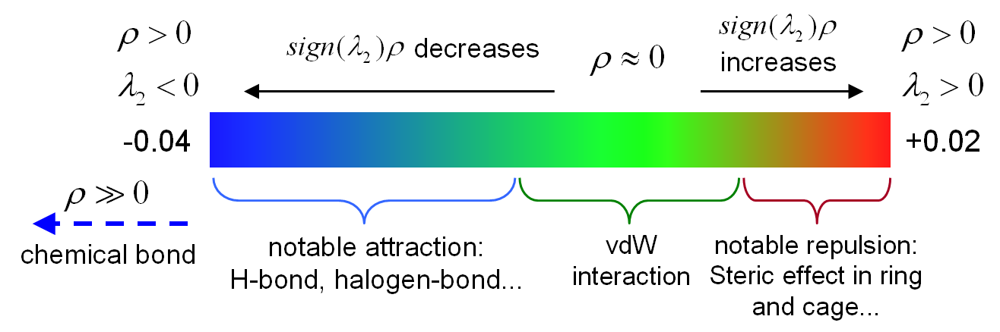

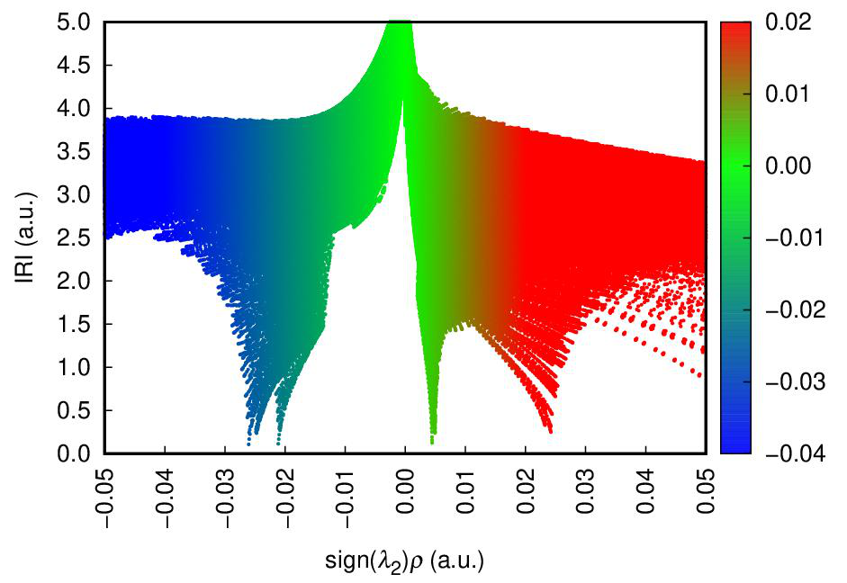

<!-- p.886 -->
corresponds to the steric effect within the benzene rings.

The default range of X-axis of the plotting script is -0.05 to 0.05. If you properly extend it, then the spikes corresponding to chemical bonds can also be exhibited, you simply need to change lines 14 and 15 in the IRIscatter.gnu to


```text
set xrange [-0.5:0.3]
set xtic  -0.5,0.1,0.3 nomirror rotate font "Helvetica"
```

After rerunning the plotting script, you will obtain the following map, evidently the spikes between -0.4 and -0.3 a.u. correspond to chemical bonds, because electron density can reach this magnitude only in chemical bonding regions.

Plotting IRI map without covalent bond regions If you only hope to visualize noncovalent interactions in IRI map, the easiest way is choosing option “9 Screen out covalent bond regions (set IRI to 100 for regions with sign(lambda2)rho < -0.1 a.u.)” in the post-processing menu of IRI analysis. After that, if you export grid data and plot IRI map via VMD, you will find covalent bond regions have been screened out, as seen from the following map

Plotting plane map for IRI Sometimes it is also useful to plot a plane map for IRI to reveal interaction regions in a specific


<!-- p.887 -->
plane. Below I will illustrate how to realize this for examples\GC.wfn, which is a base pair dimer.

Boot up Multiwfn and input examples\GC.wfn 4 // Plot plane map 24 // IRI 1 // Color-filled map [Press ENTER button] // Use default number of grids 0 // Modify extension distance 1 // 1 Bohr 1 // XY plane, which is the plane all atoms are 0 // Z=0 Close the graph and then input 19 // Set color transition 2 // Reversed rainbow 4 // Enable showing atom labels and reference point 1 // Red 8 // Enable showing bonds 14 // Brown -1 // Plot again Now you can see the map below

The orange and green areas (IRI < 1.0) in this map clearly reveal the regions where notable chemical bond interaction and weak interaction occur. The regions with IRI >1.0 have either large gradient of electron density or negligible electron density, they are not of chemical interest.


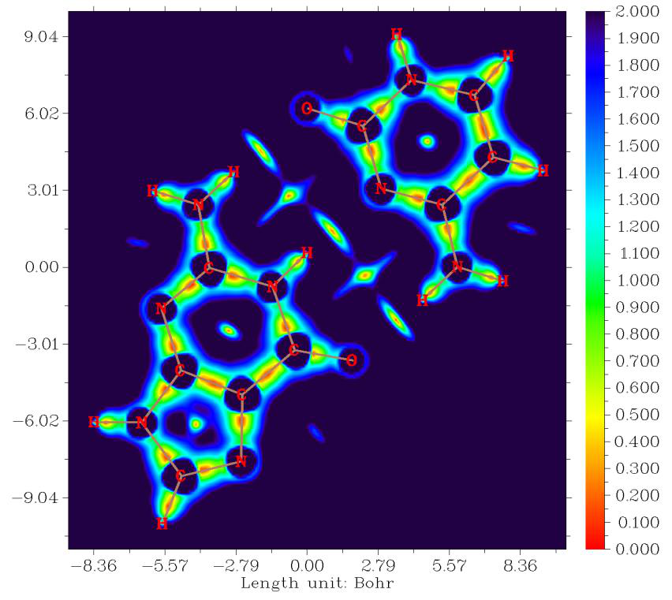

<!-- p.888 -->

### 4.20.5 Simultaneously revealing covalent and noncovalent interactions in phenol dimer by DORI analysis


Frankly speaking, DORI (Density Overlap Regions Indicator) analysis is no longer valuable since IRI analysis was proposed by me, because IRI has similar capacity of revealing all kinds of interaction regions as DORI while the graphical effect is evidently better than DORI. However, I still use phenol dimer system to illustrate how to perform DORI analysis in Multiwfn. Please read Section 3.23.4 first to understand basic knowledge about DORI.

Boot up Multiwfn and input examples\PhenolDimer.wfn 20 // Visual study of weak interaction 4 // DORI analysis 3 // High-quality grid 3 // Export cube file Move func1.cub, func2.cub and plotting script examples\DORIfill.vmd to VMD folder. Then boot up VMD and input source DORIfill.vmd in console window, you will immediately see the graph below

The graphical effect of DORI map is obviously not as good as IRI map, especially the edge region of the isosurfaces corresponding to weak interactions look quite ugly. Furthermore, calculation cost of DORI is higher than IRI due to its much more complicated definition, therefore IRI should always be used instead of DORI.

The DORIfill.vmd employs the same color transition method and color scale as IRIvill.vmd. The most suited isovalue of DORI is different for different systems, the default isovalue in the DORIfill.vmd script is 0.95, you can modify it if you find it is inappropriate.


### 4.20.6 Visualizing and analyzing van der Waals potential

Note: Chinese version of this topic is my blog article “On the calculation and analysis of van der Waals potential as well as its plot in Multiwfn” (http://sobereva.com/551, in Chinese), which contains much more examples and additional discussions.

The concept of van der Waals (vdW) potential proposed by me has been carefully introduced in Section 3.23.7, please carefully read it first. In this section I will illustrate how to visualize and


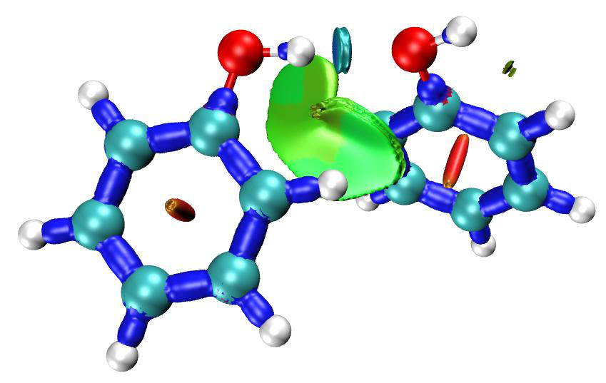

<!-- p.889 -->
analyze vdW potential.

4.20.6.1 Example 1: Helicene

In this example I will illustrate visualizing the vdW potential for helicene, whose structure is shown below

To study vdW potential, you need to select a probe atom. For example, in this instance we want to employ He atom as probe atom, therefore we change "ivdwprobe" parameter in `settings.ini` to 2.

Now boot up Multiwfn and input examples\helicene.xyz 20 // Visual study of weak interaction 6 // Visualization of van der Waals potential 3 // High-quality grid (the computational cost of vdW potential is extremely low, therefore we use relatively good grid quality here)

As can be seen from the menu, now you can directly visualize vdW potential or its two components, namely repulsion potential and dispersion potential. You can also export their grid data to cube files. The unit used in this module is kcal/mol.

Now we choose option 3 to visualize isosurface map of the vdW potential, the resulting map with isovalue of 0.6 (kcal/mol) is shown on the left side below. If you want to only visualize the negative part, there is a trick: Set isovalue to -0.6 and unselect "Show both sign" check box, then select "Isosurface style" - "Exchange positive and negative colors", the resulting map is shown on the right side below ("Ratio of atomic size" has been changed to 4.0, the molecular representation now corresponds to superposition of atomic vdW spheres).


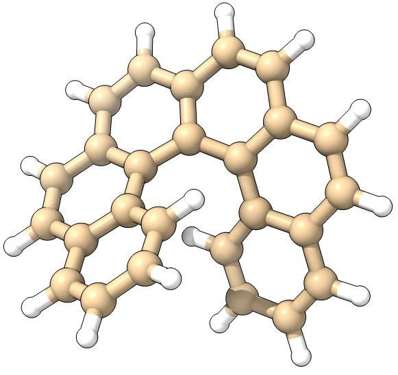

<!-- p.890 -->
In the maps above, the blue isosurfaces represent the regions where vdW potential is negative, in these regions the dispersion attractive effect surpasses repulsion effect. It is expected that He atoms (or more generally, various small nonpolar molecules) will tend to be attracted to the blue regions due to dispersion interaction. All regions close to the nuclei are enclosed by green isosurface, indicating that repulsive potential dominates the vdW potential in these places, this is the normal case.

Can the vdW potential map be correlated with any practical observation? The answer is YES. I carried out 2500 ps molecular dynamics simulation under 10 K for the complex consisting of a helicene molecule and a He atom based on the GFN0-xTB theory in the Grimme's xtb code, the trajectory frames (small spheres) and the isosurface of spatial distribution function (orange isosurface) of the He atom are shown below

It can be seen that the majority of trajectory frames and the main distribution of spatial distribution function are highly analogous to the blue regions in the vdW potential map showing earlier, demonstrating that the vdW potential is indeed able to exhibit the favorable adsorption regions if vdW interaction dominates the intermolecular interaction (of course, the precondition is that both the adsorbate and the local region of adsorption sites are nearly nonpolar, otherwise electrostatic interaction will largely control the adsorption behavior, in this case you should examine electrostatic potential rather than vdW potential).

By the way, there is another way of visualizing grid data of vdW potential, namely plotting vdW potential


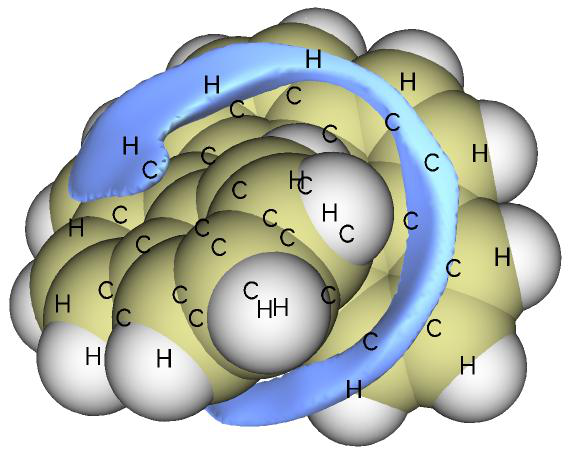


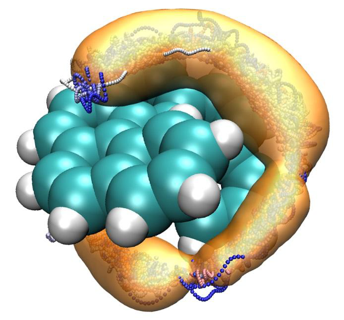

<!-- p.891 -->
colored vdW surface map, the procedure in Windows system is: copying vdWpot.bat and vdWpot.txt from "examples\scripts\vdWpot" folder to current folder, properly modifying the path of input file and VMD folder in the .bat file, and then run this .bat file. After that, boot up VMD, copying all content from the vdWpot.vmd file in "examples\scripts\vdwpot" folder to the VMD console window, you will see the vdW potential colored ρ=0.001 a.u. surface (note that the ρ is estimated using promolecular approximation). However, since the graphical effect of this kind of map is not quite good, I prefer to study vdW potential in terms of isosurface map.

4.20.6.2 Example 2: Cyclo[18]carbon

The cyclo[18]carbon system was very extensively studied in my works Carbon, 165, 468 (2020), Carbon, 165, 461 (2020) and http://sobereva.com/carbon_ring.html for more. In this example I will illustrate how to plot plane map of vdW potential for this system. The structure

optimized at ωB97XD/def2-TZVP level is given as examples\C18.xyz. As you can see, this system is exactly planar and fully lying in the XY plane with Z=0.

We will plot color-filled map of vdW potential on the molecular plane. To do so, we need to change user-defined function to vdW potential, namely setting "iuserfunc" parameter in `settings.ini` to 92. We still use He element as probe atom like the last example, therefore "ivdwprobe" in `settings.ini` should be set to 2.

Boot up Multiwfn and input examples\C18.xyz 4 // Plot plane map 100 // User-defined function 1 // Color-filled map [Press ENTER button directly to use recommended grid] 0 // Set extension distance 10 // 10 Bohr 1 // XY plane 0 // Z value Click right mouse button on the graph to close it, then input 1 // Set lower&upper limit of color scale -0.8,0.8 // Note that unit is kcal/mol for vdW potential 4 // Enable showing atom labels 12 // Dark green 8 // Enable showing bonds 14 // Brown 19 // Set color transition 8 // Blue-White-Red 2 // Enable showing contour lines Now select option -1 to replot the map, you will see


<!-- p.892 -->
In this map, red and blue colors represent positive and negative vdW potential, respectively. From the map it can be seen that the vdW potential around the center of the cyclo[18]carbon is fairly negative and thus this place has strongest ability in adsorbing nonpolar molecules. In the peripheral region of this system the vdW potential is modestly negative, implying that nonpolar molecule can only weakly interact with this system in this area due to dispersion attraction.

Please plot isosurface map of vdW potential as well as plane map of vdW potential in YZ plane, so that you can better understand the overall distribution of vdW potential around this unusual system. Via main function 3, you can also plot vdW potential between two given points, therefore you can easily study variation of vdW potential starting from the ring center in the direction perpendicular to the ring.

It is worth to note that it is very easy to obtain value of vdW potential at a given point, for example, the center of this system, whose position is exact (0,0,0). You simply need to enter main function 1, input 0,0,0, then choose either Bohr or Å as unit, then the following information can be found from screen:


```text
User-defined real space function: -0.6979258635E+00
```

that is the vdW potential (with He as probe atom) is -0.70 kcal/mol.

Basin analysis on vdW potential If you want to obtain most negative value of vdW potential, you can make use of the powerful basin analysis module, which is detailedly illustrated in Section 4.17. Now we use this module to find the most negative value of vdW potential for the cyclo[18]carbon.

IMPORTANT NOTE: Multiwfn also supports performing topology analysis on vdW potential to obtain its minima, see Section 4.2.10 for example, the result is more accurate than using the basin analysis module. Therefore, using topology analysis module is preferred over the way illustrated below!

Boot up Multiwfn and input below commands examples\C18.xyz 17 // Basin analysis


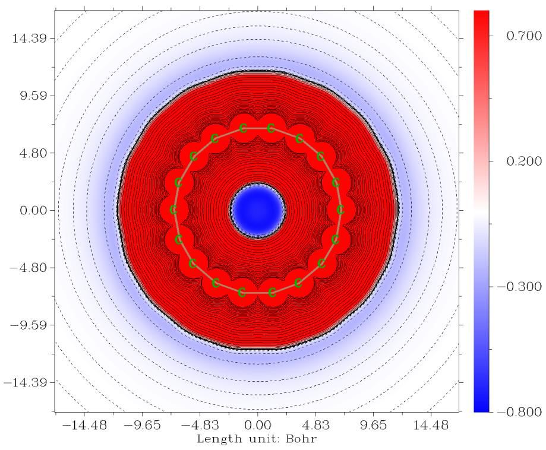

<!-- p.893 -->
1 // Generate basins and locate attractors 100 // User-defined real space function. Now it corresponds to vdW potential with He as probe atom

2 // Medium-quality grid Wait for a while until the calculation is complete, then you can choose option 10 to visualize the located minima of the vdW potential

Only the minima around the ring center are of chemical interest. As can be seen, these minima are automatically clustered together and share the same index (1), they can be viewed as degenerate minima. The minima at peripheric region of the ring can be ignored because they basically resulted from numerical noise.

Then input -3 // Show information of attractors y // Show attractors after sorting according to their values Then you can see position and value of each minimum before clustering. Finally, you can see the positions and values of the final minima (i.e. after clustering):


```text
   Attractor       X,Y,Z coordinate (Angstrom)            Value
       1    0.00000000    0.00000000   -0.01763924  -0.757315492E+00
      21    0.00000000   -6.45596244   -0.52917725  -0.242350606E+00
      36    0.00000000   -6.45596244    0.52917725  -0.242350606E+00
      28    6.37658585   -1.08481336   -0.50271839  -0.242126321E+00
[...ignored]
```

Clearly, the minima of vdW potential (e.g. the points sharing attractor index of 1) in this system is -0.757 kcal/mol. The printed coordinate "0.00000000 0.00000000 -0.01763924" corresponds to average of all of its members.

If then you want to plot the minima via visualization softwares such as VMD, you can select "-4 Export attractors as pdb/pqr/txt/gjf file", then select corresponding option to export attractors.pdb in current folder, the meanings of atom index and residue index in this file are explicitly shown on screen. Specifically, if you load this file into VMD, you can use "resid 1" as selection to plot the global minima, since they share index of 1.


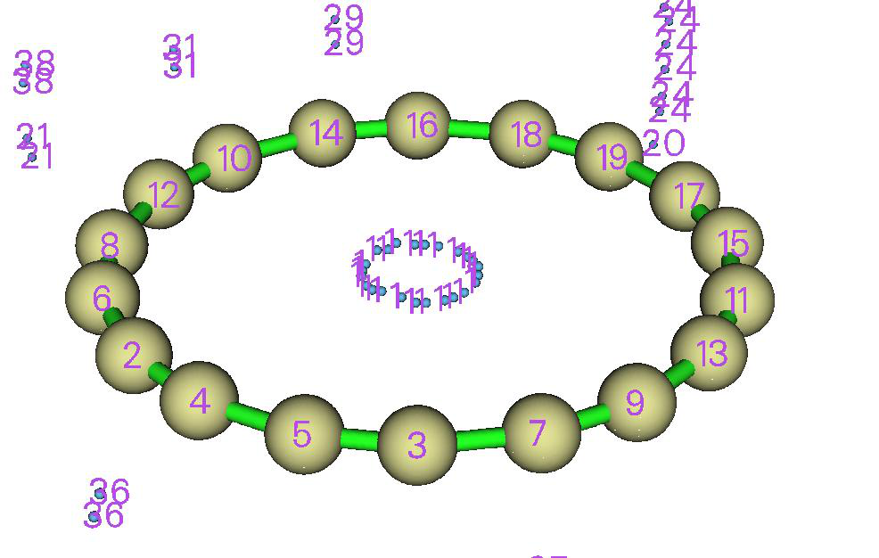

<!-- p.894 -->

### 4.20.10 Visualize and quantify weak interactions by Independent Gradient Model (IGM)


Please read Section 3.23.5 and my reviews DOI: 10.1016/B978-0-12-821978-2.00076-3 and Angew. Chem. Int. Ed., 137, e202504895 (2025) DOI: 10.1002/anie.202504895 to gain basic knowledge about the Independent Gradient Model (IGM) method proposed in Phys. Chem. Chem. Phys., 19, 17928 (2017). If you are not familiar with NCI analysis, you should also first read Section 3.23.1, since many aspects of IGM analysis are closely related to the NCI analysis. In this section I will illustrate the use of IGM analysis in Multiwfn via several examples. More discussions and instances can be found in my blog article "Investigating intermolecular weak interactions via Independent Gradient Model (IGM)" (in Chinese, http://sobereva.com/407).

Because IGM method is independent of wavefunction, you can use any kind of input file containing atomic coordinate information, such as .xyz, .mol and .pdb (see Section 2.5 for details). The VMD program used throughout this section is version 1.9.3, it is freely available at http://www.ks.uiuc.edu/Research/vmd/.

NOTE: If your system is not extremely large and wavefunction file can be generated, I strongly suggest using IGMH instead of IGM to gain more reasonable result. IGMH is an improved version of IGM, see Section 3.23.6 for introduction and Section 4.20.11 of example. Even if IGMH cannot be used due to computational cost reason or unavailability of wavefunction file, using mIGM instead of IGM is strongly suggested, see Section 3.23.10 for introduction and Section 4.20.12 for example.

4.20.10.1 Example 1: Guanine-cytosine (GC) base pair

The IGM framework includes many useful ideas and defined many useful concepts, a series of analyses will be conducted in this example. A simple system guanine-cytosine (GC) base pair is taken as instance here. Some analyses may be ignored in practical studies, and sequence of analyses is completely arbitrary.

(1) Studying δg function We first study the distribution character of δg function by plotting it as color-filled plane map. Boot up Multiwfn and input below commands

examples\GC.pdb 4 // Plot plane map

22 // δg 1 // Color-filled map [Press ENTER button to use default grid setting] 1 // XY plane 0 // Z=0 The graph shown on screen currently looks obscure, this is because the default color scale is not suitable for present case, so we close the graph and input

1 // Set color scale 0,0.2 // Lower and upper limits 4 // Show atomic labels 1 // Red color -2 // Set label intervals of axes 3,3,0.02 // Intervals for X, Y and color bar


<!-- p.895 -->
8 // Enable showing bonds 14 // Brown -1 // Plot again You will see the graph below

The graph above clearly reveals all interatomic interactions, and the magnitude of δg is positively relevant to interaction strength. As can be seen from the graph, all chemical bond regions

have large δg value (the region with value higher than 0.2 is shown as white). The δg function also outlines three hydrogen bond regions among the base pair, where the δg function has evidently smaller value compared to the chemical bond regions.

The δg can also be plotted as isosurface map. Return to main menu and input 5 // Calculate grid data

22 // δg 2 // Medium-quality grid -1 // Show isosurface The isosurface with isovalue of 0.15 and 0.03 are shown below (you can use higher quality of grid or set the extension distance of grid data smaller to make the graph smoother)


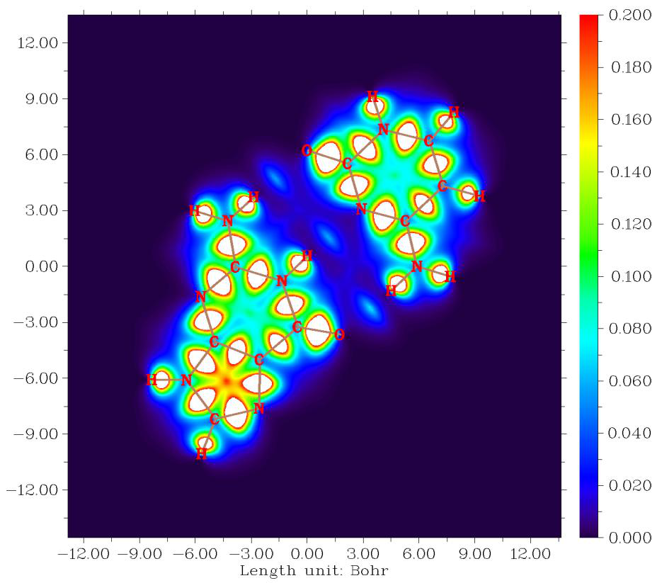

<!-- p.896 -->
Since chemical bond regions have relatively large value of δg, only chemical bonding interactions are visible when isovalue is set to 0.15. Clearly, δg may be used as a function to exhibit chemical bonds like ELF and IRI functions, with additional advantage that only geometry information is needed. The weak interaction regions can also be simultaneously visualized when isovalue is decreased to a small value, e.g. 0.02.

(2) Studying δginter function between base pair The δginter is a key function in the IGM analysis framework, it is designed to reveal interaction regions between two (or even more) fragments defined by users. Here we plot this function to study the interactions between the two bases. Although as shown earlier, these interactions can also be

revealed by simply drawing δg, the isosurfaces corresponding to intrafragment interactions severely polluted the graph. Fortunately, the IGM analysis allows us to separate the δg as δginter and δgintra, which solely reflect the contribution to δg due to interfragment and intrafragment interactions, respectively.

Return to main menu and input following commands 20 // Visual study of weak interactions 10 // IGM analysis 2 // Define two fragments 1-13 // Range of atoms in the first base 14-29 // Range of atoms in the second base (you can also input c here to define the rest of the present system as the second fragment)

2 // Medium-quality grid After calculation, you will see a post-processing menu. The meaning of each option has been

$$\delta g^{inter}$$


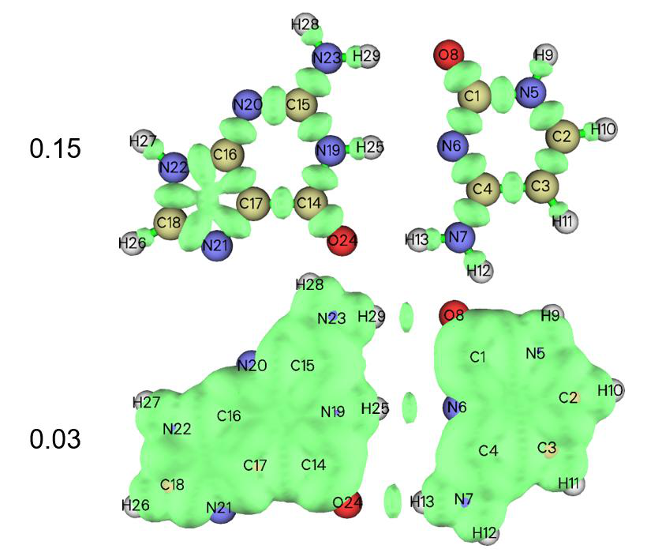

<!-- p.897 -->
If you are familiar with NCI method, you will naturally know how to discuss this graph, now

we try to identify character of peaks in the scatter graph. In the region where sign(λ2)ρ is about -0.04, you can find that the δginter has a remarkable peak (with height about 0.06), which implies presence of hydrogen bonds. If δginter isosurface is set to an isovalue lower than about 0.06, the corresponding isosurfaces should be visible in the graph. In the region where sign(λ2)ρ is approximately +0.02, there is also a small peak of δginter. Since positive sign(λ2)ρ implies repulsive interaction, the peak may reflect weak steric regions in the center of the two rings between the two

bases. In above scatter map, there is a very prominent peak of δgintra around sign(λ2)ρ = -0.3. Since this peak corresponds to intrafragment interaction, and corresponding sign(λ2)ρ is not only negative but large, rendering attractive and strong interaction, the peak must result from chemical bond.

Using Multiwfn you can directly visualize isosurface of δginter and δgintra. To do this, we close the scatter map, select option "4 Show isosurface of grid data", then choose corresponding options and properly set isovalue, you will obtain below isosurface graphs


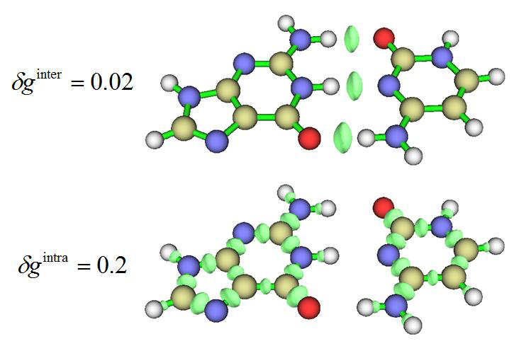

<!-- p.898 -->
As can be seen, δginter and δgintra indeed solely exhibit inter- and intra-fragment interactions, respectively. This greatly facilitates separate discussion of the two kinds of interactions.

From the above δginter = 0.02 isosurface map we are only able to visualize hydrogen bond regions. To find steric region in the ring center between the two bases, we should further decrease

the isovalue of δginter to e.g. 0.008, as shown below. The ring-center steric regions are highlighted by arrows.

(3) Drawing sign(λ2)ρ mapped δginter isosurfaces If sign(λ2)ρ is mapped to δginter isosurfaces by different colors, then one can not only recognize where weak interactions occur, but also immediately capture the character of the interactions. Multiwfn itself is currently unable to plot color-filled isosurface map, we need to use VMD program to do this, just like what we do in the NCI analysis.

Select option "3 Output cube files to current folder" in IGM post-processing menu, then

sign(λ2)ρ, δg, δginter and δgintra will be exported to sl2r.cub, dg.cub, dg_inter.cub and dg_intra.cub in current folder, respectively. Move sl2r.cub and dg_inter.cub as well as VMD plotting script examples\IGM_inter.vmd into VMD folder. Boot up VMD, input source IGM_inter.vmd in the console window, you will immediately see the graph below

The default isovalue employed by the IGM_inter.vmd script is 0.01, you can manually change isovalue by dragging the isovalue bar in "Graphics" - "Representation" panel. In the script the

default color scale of sign(λ2)ρ ranges from -0.05 to 0.05, and the default color transition is Blue-Green-Red. Therefore, the bluer the isosurface, the stronger the attractive interaction, while the redder the isosurface, the larger the steric effect. Green zone in an isosurface implies that the corresponding interaction is weak and may be regarded as van der Waals interaction.

Similarly, you can plot sign(λ2)ρ mapped δgintra isosurfaces. Just move sl2r.cub and dg_intra.cub as well as the corresponding VMD plotting script examples\IGM_intra.vmd into VMD


<!-- p.899 -->
folder, then input source IGM_intra.vmd in the console window to execute it.

(4) Decomposing interfragment interaction as atom and atomic pair contributions

$$\delta g^{inter}$$

Part of content of atmdg.txt is pasted here:


```text
Atom delta-g indices of fragment  1 and percentage contributions
 Atom    6 :    0.496653  (  23.07 % )
 Atom   13 :    0.483135  (  22.44 % )
 Atom    8 :    0.411759  (  19.13 % )
[ignored...]
Atom delta-g indices of fragment  2 and percentage contributions
 Atom   25 :    0.589516  (  27.39 % )
 Atom   24 :    0.431975  (  20.07 % )
 Atom   29 :    0.388667  (  18.06 % )
[ignored...]
Atom pair delta-g indices and percentage contributions (zero terms are not shown)
   13   24 :    0.251327  (  11.68 % )
    6   25 :    0.236065  (  10.97 % )
    8   29 :    0.218248  (  10.14 % )
```

If you compare above data with the structure map of present system shown below, you will find the indices are very meaningful and useful for discussing interfragment interactions

The largest three δGatom of fragment 1 are 6, 13 and 8, while that of fragment 2 are 25, 24 and 29, they are just the atoms closest to another fragment, undoubtedly they should have the most important contributions to the interfragment interactions. H13-O24, N6-H25 and O8-H29 have the

largest δGpair, reflecting that they are the most crucial interactions for formation of the base pair.

Note that Multiwfn also exports IBSIW (intrinsic bond strength index for weak interactions) to IBSIW.txt. Its definition has been described in Section 3.23.6. This index may have stronger


<!-- p.900 -->
correlation with interatomic interaction strength than atomic pair δg index.

(5) Coloring molecular structure by percentage atom δg indices Using VMD, it is also possible to map δGatom and δGatom(%) on molecular structure, so that relative importance of various atoms for interfragment interaction can be vividly exhibited. If

needed, the δginter isosurfaces can also be shown together. Now we plot such a map.

First, plot color-filled δginter isosurfaces using the IGM_inter.vmd script as mentioned earlier. After that, we need to remove the default representation showing molecular structure, so we enter "Graphics" - "Representation", choose the first term (its current style is CPK), click "Delete Rep" button. Then we drag the previously generated atmdg.pdb into VMD main window to load it. In this

file the “occupancy” field records δGatom(%), to graphically exhibit its value for every atom, we should let VMD color the atoms according to their occupancy property. We enter "Graphics" - "Representation" again, set "Drawing method" to CPK, and set "Coloring method" to “Occupancy”, then click "Trajectory" tab, set upper limit of color scale to 50 and press ENTER button, now the system in graphical window should look like below

Since the color transition set by IGM_inter.vmd is Blue-Green-Red, the largest percentage atom

δg index in present case is 27% (as can be seen in atmdg.txt), while currently the range of color scale for mapping δGatom(%) is set to 0~50, therefore in the map above, the greener the atom, the larger the δGatom(%). The green atoms may be viewed as "hot atom" for interfragment interactions. Contribution to interfragment interactions due to the blue atoms can be ignored, since their δGatom(%) are very close to zero.

This example ends here, through this example I think you have already recognized basic steps of IGM analysis. In next several examples I will illustrate more.

Skill: Plotting sign(λ2)ρ colored IGM scatter map In Part (2) of this example, I have shown how to directly use Multiwfn to plot scatter map

`IGM_inter.vmd`

Run below commands examples\GC.pdb 20 // Visual study of weak interactions 10 // IGM analysis 2 // Define two fragments


<!-- p.901 -->
1-13 // Range of atoms in the first base 14-29 // Range of atoms in the second base 2 // Medium-quality grid 2 // Output scatter points to output.txt Then copy the exported output.txt and the plotting script examples\scripts\IGMscatter.gnu to the file containing gnuplot executable file, then in this folder run command: gnuplot IGMscatter.gnu, after that you will obtain IGMscatter.ps. If you open it by Acrobat or Photoshop or IrfanView (with ghostscript installed), or convert it to other image formats first via online tool https://cloudconvert.com/image-converter and then open it, you will see

In the current graph, the Y-axis corresponds to δginter. In the IGMscatter.gnu, the default color scale is identical to the one adopted in IGMinter.vmd, namely -0.05~0.05.

If you want to use this script to plot δgintra vs. sign(λ2)ρ, you should change "4:1:4" in the IGMscatter.gnu to "4:2:4"; while if you want to plot δg vs. sign(λ2)ρ, you should change it to"4:3:4".

If you find the range of X-axis is not appropriate, you can change the data behind "xtic" and "xrange"; while if Y-axis is not appropriate, you can change "ytic" and "yrange".

4.20.10.2 Example 2: C60-coronene dimer

In this example, we will carry out IGM analysis for C60-coronene dimer, and finally plot the map below using VMD based on the data outputted by Multiwfn.


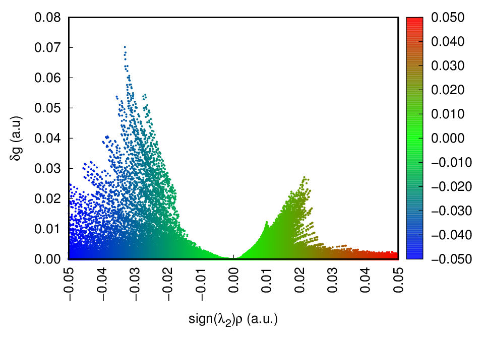

<!-- p.902 -->
In the map above, the major van der Waals interaction region (more specifically, the π-π stacking region) is exhibited as green isosurface, the more red-colored atoms contribute to the interaction more. If you think this graph is pretty and want to reproduce it, just follow the steps below.

The pdb file of the dimer optimized at PM6-D3 level using Gaussian is provided as examples\C60_coronene.pdb. Boot up Multiwfn and load it, then input below commands

20 // Visual study of weak interactions 10 // IGM analysis 2 // Define two fragments 1-60 // C60 is fragment 1 c // Other part, namely coronene, is fragment 2 2 // Medium-quality grid 3 // Output cube files in current folder

6 // Evaluate atom and atomic pair δg indices 2 // High quality y // Export atmdg.pdb in current folder Boot up VMD, enter below commands into VMD console window: color scale method BWR color Display Background white axes location Off display depthcue off display rendermode GLSL Then drag the atmdg.pdb into VMD main window, enter "Graphics" - "Representation", set "Drawing Method" to "CPK", change bond radius from the default 0.3 to 0.8, set "Coloring Method" to "Occupancy", set "Material" to "EdgyShiny". Then go to "Trajectory" tab, set lower and upper limit of color scale to -15 and 15, respectively.

Next, we need to draw the δginter isosurface on the map. Drag dg_inter.cub into VMD main window to load it, then enter "Graphics" - "Representation", change the default style from "lines" to "Isosurface", set "Draw" to "Solid Surface", set "Show" to "Isosurface", then input 0.004 in the


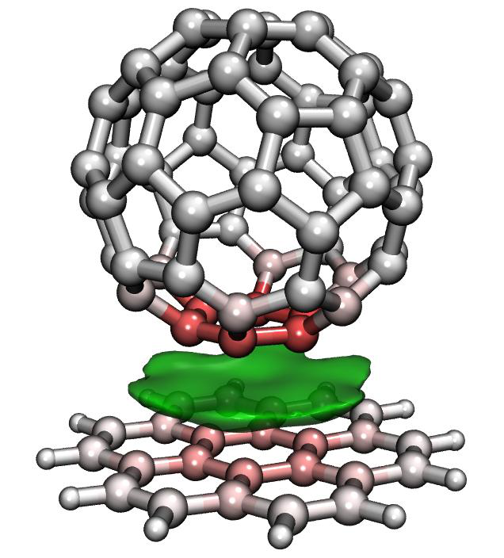

<!-- p.903 -->
"Isovalue" box and press ENTER button. Change "Coloring Method" to "ColorID" and select "7 green". Change the "Material" to "EdgyGlass".

Finally, we render the map. Select "File" - "Render", choose "Tachyon (internal, in-memory rendering)" and click "Start Rendering" button, then you will obtain the graph shown at the beginning of this section. The resulting graphical file is .tga format, you can use such as IrfanView or Photoshop to visualize it.

Note that in present example, color-filled effect is only applied to molecular structure, but not applied to isosurface. This is because in VMD, setting of color transition is shared by all representations, that means we cannot use Blue-White-Red color transition for molecular structure but use conventionally employed Blue-Green-Red color transition for isosurface. Considering that in present system there is only one kind of interaction, namely van der Waals interaction, and in conventional color-filled IGM map this region is basically colored by green, I decide directly assign green color for the whole isosurface, so that we are able to freely set color transition mode for coloring molecular structure.

4.20.10.3 Example 3: Oxazolidinone trimer

The IGM module of Multiwfn is extremely flexible, it can be applied to any number of fragments. In this example I use oxazolidinone trimer to show this point. The geometry was taken from J. Chem. Theory Comput., 11, 3065 (2015).

We first use δginter to reveal all interactions between the three monomers. Boot up Multiwfn and input

examples\oxazolidinone_trimer.xyz 20 // Visual study of weak interactions 10 // IGM analysis 3 // Define three fragments 1-11 // Fragment 1: Monomer 1 12-22 // Fragment 2: Monomer 2 23-33 // Fragment 3: Monomer 3 2 // Medium-quality grid 3 // Output cube files in current folder

Then we use aforementioned method to plot color-filled δginter isosurface map via IGM_inter.vmd script, you will see the graph below

From color of isosurfaces in the graph it is found that the 1-2 and 1-3 interactions correspond to typical hydrogen bonding, while 2-3 interaction is significantly weaker and thus more appropriate


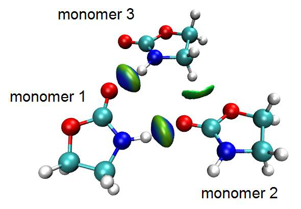

<!-- p.904 -->
to be assigned as van der Waals interaction.

Assume that we only want to study interactions between 1-2 and 2-3, and meantime wish to

screen the δginter isosurface corresponding to 1-3 interaction, how to do that? The answer is: Only define two fragments, making fragment 1 correspond to monomer 2, while making fragment 2 correspond to monomers 1 and 3. Now we do this, input below commands

0 // Return to last menu 10 // IGM analysis 2 // Define two fragments 12-22 // Fragment 1: Monomer 2 1-11,23-33 // Fragment 2: Monomers 1 and 3 2 // Medium-quality grid 3 // Output cube files in current folder

6 // Evaluate atom and atomic pair δg indices 2 // High quality y // Export atmdg.pdb in current folder

Then plot δginter isosurface again using the newly generated sl2r.cub and dg_inter.cub via IGM_inter.vmd, and mean time color the structure according to δGatom(%) based on the atmdg.pdb file, you will finally obtain the graph below

Now the isosurface corresponding to monomer 1-3 interaction is invisible. Since the color transition set by IGM_inter.vmd is Blue-Green-Red, and I did not manually adjust the automatically

determined color range for mapping δGatom(%), therefore, in present graph, the site having largest δGatom(%) is rendered as red, it should be regarded as "hottest atom" for the interactions under study. The green or cyan atoms have modest magnitude of δGatom(%), while contribution of blue atoms to the interaction is completely negligible.

Finally, let us only highlight interaction between monomer 1 and 2 while completely ignore monomer 3. Input below command

0 // Return to last menu 10 // IGM analysis 2 // Define two fragments 1-11 // Fragment 1: Monomer 1


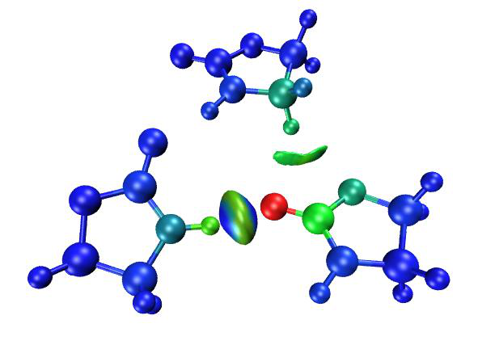

<!-- p.905 -->
12-22 // Fragment 2: Monomers 2 2 // Medium-quality grid 3 // Output cube files in current folder Move the resulting dg_inter.cub and sl2r.cub to VMD folder and use the IGM_inter.vmd script to draw corresponding color-filled isosurface map. It is better to make monomer 3 transparent, since currently it is uninteresting. So, we enter "Graphics" - "Representation", click the existing representation with CPK style, input fragment 0 1 in the "Selected Atoms" box and press ENTER button, now the monomer 3 is invisible. Next, click "Create Rep" button, input fragment 2 in the "Selected Atoms" box and press ENTER button, then set the "Drawing method" as "Licorice" and change the "Bond Radius" to 0.2, then set "Material" to "Ghost". Now you should see the graph below, in which only the interaction between monomers 1 and 2 is visible, while all interactions related to monomer 3 are ignored.

PS: The concept of "fragment" in VMD is different to the "fragment" in IGM analysis of Multiwfn. In VMD, when structure file is loaded into VMD, the bonding relationship is automatically determined, and then each unlinked fragment is assigned to a unique fragment index. The index starts from 0.

As can be seen in this example, the partition of fragments is highly arbitrary. The union set of all fragments is not necessarily equal to the whole system. When you intend to study intramolecular interaction, a whole molecule can also be divided into multiple fragments to reveal interesting interaction regions.

In this example only a simple system is taken as instance, however I think it is enough to substantially exhibit the extreme flexibility and powerfulness of IGM analysis, Multiwfn and VMD programs. The IGM method can also be easily applied to much more complicated systems; for example, in my blog article http://sobereva.com/407 (in Chinese), I showed that IGM can clearly reveal the interaction between two monomers in a tetramer consisting of four large flexible molecules.

It is worth to mention that δg value at bond critical points (BCP) is positively correlated to interaction strength (see Table 1 of IGM original paper), Multiwfn is also able to calculate it. First, load a file containing wavefunction information into Multiwfn, then use main function 2 to carry out topology analysis and locate BCPs, then use option 7 to examine properties of the BCPs, from

screen you can directly read δg value. I do not explicitly present a corresponding analysis example


<!-- p.906 -->
here, please try this kind of analysis yourself.


### 4.20.11 Using IGMH (IGM based on Hirshfeld partition of molecular density) to study weak interactions


Please check original paper of IGMH (J. Comput. Chem., 43, 539 (2022) https://doi.org/10.1002/jcc.26812), Section 3.23.6 of this manual, Angew. Chem. Int. Ed., 137, e202504895 (2025) DOI: 10.1002/anie.202504895, and DOI: 10.1016/B978-0-12-821978-2.00076-3 to gain basic knowledge about IGMH method. If you can read Chinese, please also check http://sobereva.com/621, which contains comprehensive and clear introduction of IGMH as well as many relevant discussions.

In this section I will only present an extremely simple IGMH example. A very detailed tutorial (about 40 pages) carefully introducing how to perform various kinds of IGMH analysis for both molecular and periodic systems can be downloaded at http://sobereva.com/multiwfn/res/IGMH_tutorial.zip, do not forget to check it!

The use of the IGMH analysis function is exactly identical to IGM, thus if you have carefully read Section 4.20.10, you will be able to realize IGMH analysis smoothly. In this section, I use a dimer consisting of 2-pyridoxine and 2-aminopyridine as an example, this system has also been studied via AIM analysis in Section 4.2.1.

Boot up Multiwfn and input examples\2-pyridoxine_2-aminopyridine.wfn // Since IGMH relies on wavefunction information, therefore you should use such as .wfn, .fch, .mwfn, .molden, etc. as input file

20 // Visual study of weak interaction 11 // IGMH analysis 2 // Define two fragments 1-12 // Atom indices in fragment 1 13-25 // Atom indices in fragment 2 2 // Medium-quality grid 3 // Output cube files to current folder

Next, in order to plot sign(λ2)ρ colored δginter isosurface map, we move the exported sl2r.cub and dg_inter.cub from current folder to VMD folder, then copy the examples\IGM_inter.vmd script to VMD folder, then boot up VMD and run source IGM_inter.vmd command in VMD console window to execute the plotting script.


<!-- p.907 -->
The color bar of this map is IGMH_colorbar.png in “examples” folder. Since the blue around

`IGMH_colorbar.png`

Hint: If you hope to make the radius of the isosurfaces in the map above smaller, so that only the most important interaction areas are shown, you can increase the isovalue from 0.01 to 0.015, namely entering "Graphics" - "Representation", change the value in the "Isovalue" box to 0.015 and then press ENTER button. In this case, you can also make the range of color scale narrower than default (-0.05~0.05) to make the color on the isosurfaces more vivid, namely in the "Representation" interface click "Trajectory" tab, then input -0.045 and 0.045 respectively in the two boxes and then press ENTER button.

In the post-processing menu, you can also choose option 6 to calculate atomic and atomic pair

δg indices (i.e. δGatom and δGpair indices), the result calculated with high-quality grid is shown below


```text
Atom pair delta-g indices and percentage contributions (zero terms are not shown)
   12   13 :    0.116367  (  16.57 % )
    1   25 :    0.096210  (  13.70 % )
    2   13 :    0.052037  (   7.41 % )
    1   23 :    0.042800  (   6.09 % )
...[ignored]
```

From this quantitative data, we can further confirm the conclusion that the N-H12···N13 is stronger than the N-H25···O1.

For comparison purposes, you can plot the same map via IGM module, the sign(λ2)ρ colored δginter isosurface map is shown below (the sign(λ2)ρ was calculated using actual density rather than promolecular density). As can be seen, the graphical effect of IGM is much poor than IGMH, since the isosurfaces are too bulgy and thus difficult to examine and compare, this problem cannot be fully avoided even if you carefully adjust isovalue. Many comparisons between IGM and IGMH can be found in the original paper of IGMH.


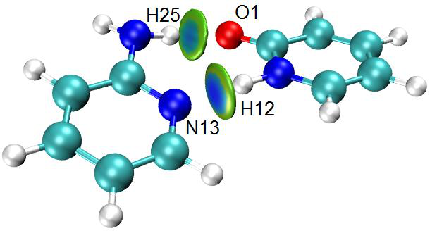

<!-- p.908 -->
Skill: Significantly reducing cost of IGMH visual analysis for interfragment interactions Most people use the IGMH method primarily for visualization and analysis of interfragment

interactions. In practice, this only requires calculating the δginter and sign(λ2)ρ grid data in the overlapping regions between fragments; grid points in all non-overlapping regions are completely unnecessary. Taking this into account, a strategy is supported in Multiwfn to significantly reduce the cost of grid data calculation in IGMH (and mIGM, IGM). The implementation is as follows: A parameter named “IGMvdwscl” can be found in `settings.ini` file. The surface of each fragment is defined as the union of atomic spheres, where vdW radius of each atom is scaled by “IGMvdwscl”. During the grid data calculation step of IGMH, mIGM, or IGM analysis, a grid point is computed only if it lies within the overlapping region between the surfaces of two or more fragments; otherwise, it is directly skipped. With this strategy, the time required to compute IGMH grid data is often reduced by several times or more. The exact percentage of time saved depends on how large a portion of the user-defined grid box consists of ignorable grid points.

Obviously, after enabling this strategy, you can only plot isosurfaces of δginter. Isosurfaces of δg or δgintra can no longer be plotted, because only the δginter isosurfaces are guaranteed to appear exclusively in the interfragment overlap regions.

“IGMvdwscl” defaults to 0, which means the time-saving strategy is disabled. To enable this strategy, set “IGMvdwscl” to an appropriate positive value. The larger the value, the weaker the time-saving effect; the smaller the value, the higher the risk of truncating the δginter isosurfaces. A value of 2.0 is generally recommended: it is sufficiently safe while still providing a significant reduction in computational time.

This strategy does not affect cost and result of calculation of δGatom and δGpair indices. This strategy is more detailedly described in my blog article http://sobereva.com/756 (in Chinese), and an example is given there.


### 4.20.12 Using mIGM to study weak interactions

Note: More details and examples of mIGM are given in my blog article “Using mIGM method to rapidly graphically represent weak interactions based on geometry” (http://sobereva.com/755, in Chinese).

mIGM has been briefly described in Section 3.23.10 and and detailedly introduced in Struct. Bond., 190, 297 (2026) DOI: 10.1007/430_2025_95. Because its graphical effect is much better than IGM while it has basically the same cost as IGM, using mIGM instead of IGM is always


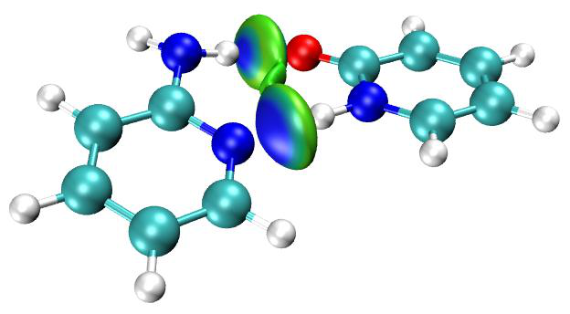

<!-- p.909 -->
strongly suggested. The use of mIGM is essentially the same as IGM, here a simple example is given.

examples\phenylalanineresiduestrimer.xyz is optimized trimer of capped phenylalanine, we use mIGM to reveal the interactions within it. Boot up Multiwfn and load this file, then input

20 // Visual study of weak interaction -10 // mIGM analysis 3 // Define three fragments 1-29 // Atom indices in fragment 1 (the first monomer) 30-40,52,53,56,57,63-65,77-87 // Atom indices in fragment 2 (the second monomer) c // All other atoms (the third monomer) 4 // Manually input grid spacing 0.2 // Grid spacing of 0.2 Bohr is sufficient to obtain a smooth enough image 3 // Output cube files to current folder Some .cub files have been generated in current folder. Move dg_inter.cub and sl2r.cub to VMD folder while delete the other .cub file. Copy the examples\IGM_inter.vmd script to VMD folder, then boot up VMD and run source IGM_inter.vmd command in VMD console window to execute the plotting script, then mIGM graph will be immediately shown in the graphical window. After that, in VMD choose “Graphics” - “Representation”, and input 0.07 in the “Isovalue” text box to change isovalue, you will see the following image, which nicely reveals all kinds of interactions (dispersion and H-bond) between the three molecules. The corresponding color scale is the same as the IGMH mentioned in Section 4.20.11.

In the post-processing menu, you can also calculate atomic or atomic pair δg indices via corresponding option like IGM and IGMH analyses.


### 4.20.13 Using amIGM to reveal weak interactions in dynamic environments


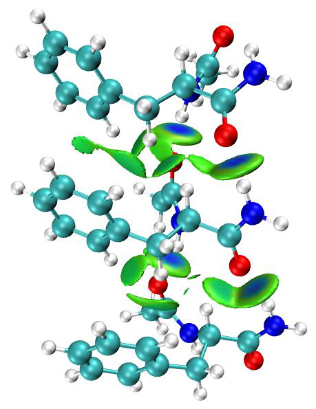

<!-- p.910 -->
a dynamic process” (http://sobereva.com/759, in Chinese) much more comprehensively illustrates the use of the amIGM method, and introduces many key points.

amIGM has been briefly described in Sections 3.23.11 and detailedly introduced in Struct. Bond., 190, 297 (2026) DOI: 10.1007/430_2025_95. The present section illustrates how to use amIGM method to visually reveal the interactions between a phenol molecule and environment waters in a simulation box. This is an application example in the original paper of amIGM method.

Initially, one needs to run molecular dynamics (MD) simulation to obtain a trajectory file, and it must be in multiple-frame .xyz format. For example, you can load the trajectory generated by GROMACS/AMBER/NAMD/CP2K... program into VMD software, and save to a .xyz file. It is important to recognize that the region of interest should be fixed (preferably close to the center of the simulation box) via freeze or position restraint setting. In this example, the only solvate molecule, phenol, is fixed at the box center throughout the simulation, while the water molecules that fill the rest of the box can move freely. The compressed .xyz trajectory file simulated at room temperature for 1 ns can be directly downloaded at http://sobereva.com/multiwfn/extrafiles/phenol_in_water.7z. After decompressing the package, you will obtain phenol_in_water.xyz, which contains 1001 frames (the trajectory was saved every 1 ps).

Boot up Multiwfn and load the phenol_in_water.xyz, then input 20 // Visual study of weak interactions -12 //amIGM analysis 2 //Define two fragments for amIGM. If you define n fragments, then amIGM will reveal all interactions between the n fragments

1-13 //Atomic indices of fragment 1, corresponding to the phenol c //The rest of atoms (waters) is defined as fragment 2 1,1000 //Consider 1 to 1000 frames 11 //Because the interactions of phenol-water occur in various regions around phenol, the box containing the grids to be calculated should cover the entire phenol, we choose mode 11 to realize this aim, namely we will select a set of atoms, set extension distance around them and grid spacing

1-13 //The atoms for defining the box 3 A //Extension distance is set to 3 Å [Press ENTER button] //Grid spacing is set to the default 0.2 Bohr, which is adequate of obtaining fine enough amIGM maps

Now Multiwfn starts to calculate. The cost is linearly proportional to the number of frames to be considered, positively proportional to the number of atoms and number of grids to be calculated. On Intel i9-13980HX mobile CPU, using 16 parallel threads, the calculation totally took up 8.8 minutes. The parallel efficiency of amIGM analysis is ideal, so using server CPUs with large number of cores will greatly benefit.

Once calculation is finished, you can find many options in the post-processing menu, see

Section 3.23.11. Here we choose option 3 to export the grid data of averaged δginter as avgdg_inter.cub and averaged sign(λ2)ρ as avgsl2r.cub in current folder. Move the two .cub files to VMD folder, and copy the VMD script aIGM.vmd from “examples” folder to VMD folder. Next, boot up VMD, run command source aIGM.vmd in the console window of VMD to execute the script, then the two .cub files will be loaded, and amIGM map is immediately shown on screen, as shown below


<!-- p.911 -->
Current map is difficult to view clearly, so we need to change plotting settings. In VMD main window, choose “Graphics” - “Representation”, input 0.003 in the “Isovalue” text box to set

isovalue of averaged δginter to 0.003 a.u. Then click the representation corresponding to CPK style, input fragment 0 in “Selected Atoms” text box to only make the phenol visible. Now you should see:

The color bar corresponding to this map is examples\IGMH_colorbar.png. Clearly, the map above very vividly and successfully exhibited the average interactions between the phenol and surrounding waters, demonstrating the great value of amIGM. If you further decrease the isovalue to e.g. 0.0018 a.u., additional isosurfaces will also be visible, which exhibit weaker interactions (mostly dispersion effect), see original paper of amIGM for relevant discussion and many other examples.

Studying interaction stability In the post-processing menu, choose option 8 to calculate grid data of standard deviation of

δginter and TFIamIGM (thermal fluctuation index of amIGM), then they are exported to stddg_inter.cub and TFI_amIGM.cub in current folder, respectively. You can map either one onto the isosurfaces of

averaged δginter to graphically exhibit difference in interaction stability; usually their graphical effects are similar, the larger the value at a location on the isosurface, the lower the dynamics stability of the corresponding interaction. aIGM_TFI.vmd in “examples” folder is a VMD script file used to map TFI_amIGM.cub onto isosurfaces of avgdg_inter.cub by colors. Now we move TFI_amIGM.cub and aIGM_TFI.vmd to VMD folder, then boot up VMD and run source

aIGM_TFI.vmd in console window of VMD, then change isovalue of averaged δginter to 0.003 a.u.,


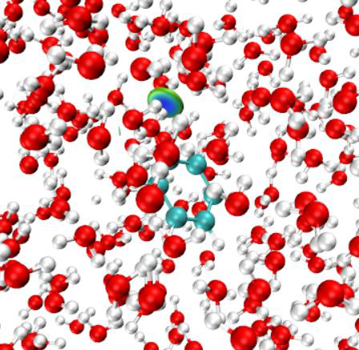


<!-- p.912 -->
after some fine-tunes you will see the following map. The default color range of TFIamIGM in the aIGM_TFI.vmd is 0.0 to 2.0 with blue-green-red transition method, which is well-suited for the present example. We should only focus on the color of outer sides of the isosurfaces (the colors of the inner sides are not well distinguishable), by which one can see that the O-H...O H-bond regions

are relatively stable (thermal fluctuation is weak), while the π-H bond regions above and below the six-membered carbon ring are less stable (thermal fluctuation is notable).

Important notes on amIGM analysis
- The system to be studied should not be too large, otherwise the cost of amIGM analysis may be prohibitively high. The current system contains 1342 atoms, which is not quite large. If your system contains huge number of atoms, you must use a smaller model instead, or truncate the present system to only keep the atoms around the region of interest (to this aim, you can use a proper “selection” when using VMD to save a new trajectory file).
- The more the considered trajectory frames, the more realistic the result, and the smoother the isosurfaces. Usually at least 500 frames should be taken into account.
- As mentioned earlier, the position and structure of the key object should be fixed. As you can see, in the MD simulation of the above instance, the phenol atoms were fully frozen at the initial coordinate. If the key object can freely translate or rotate, or its conformation changes a

lot during the MD simulation, the isosurfaces of δginter will be cluttered, making it infeasible to visually study interactions.
- To greatly reduce computational cost of amIGM and aIGM, Multiwfn employs a scheme: If a grid is within scaled vdW radius of any atom of fragment 1, then this grid will be calculated while others will be ignored to save cost. The parameter “amIGMvdwscl” in `settings.ini` corresponds to the scale factor, the smaller the value, the lower the cost. The default amIGMvdwscl=2 is found to be very safe. Employing this acceleration scheme clearly implies that the fragment 1 defined by the user should correspond to the key region, which is fixed during the MD simulation. The acceleration scheme can be disabled by setting “amIGMvdwscl” to 0, then the order of the defined fragments is arbitrary, for example, in the above instance, one may also define the waters as fragment 1 while the phenol as fragment 2.
- Atom names in MD simulation codes are generally different to element names. It is best to


<!-- p.913 -->
record element names in the .xyz trajectory file rather than atom names, otherwise Multiwfn may incorrectly guess elements, making amIGM analysis wrong. Note that after Multiwfn finish loading input file, formula of the system will be shown, from which you can easily check if every element has been corrected determined.

Tip: Common practice of preparing trajectory file for studying ligand-protein interaction via amIGM

First, perform NPT simulation for the whole complex in a solvated box to make it sufficiently equilibrated, then perform NVT simulation for at least 1 ns while keeping ligand fixed, at least 500 frames should be saved. Then use VMD to extract a cluster containing the ligand and all closely contacted residues and save the trajectory of this part as a .xyz file. You can use the selection "resname MOL or protein same resid as within 3.5 of resname MOL" to extract the cluster, where MOL is residue name of the ligand. Next, in the amIGM analysis, you should define two fragments, the first one is the ligand, and the other one contains all other atoms. A full example of generating the .xyz trajectory file for analyzing ligand-protein interaction for aNCI analysis is given in my blog article http://sobereva.com/591, which is also fully suitable for amIGM analyses.


## 4.21 Energy decomposition analysis

Aside from the examples given in this Section, Multiwfn is also able to perform the so-called simple energy decomposition, see Section 4.100.8 of example.


### 4.21.1 Examples of energy decomposition analysis based on forcefield (EDA-FF)


In this section I will illustrate how to perform energy decomposition analysis between specific fragments based on classical forcefield, this method will be referred to as EDA-FF. Please carefully read Section 3.24.1 first to gain basic knowledge about the underlying ideas and implementations of EDA-FF. If you have carefully read the examples below, you should be able to easily apply this method onto various kinds of systems.

More in-depth discussions can be found from my blog article "Using Multiwfn to perform energy decomposition analysis based on forcefield" (in Chinese, http://sobereva.com/442).

If EDA-FF analysis is utilized in your work, please cite this article: Mat. Sci. Eng. B, 273, 115425 (2021) DOI: 10.1016/j.mseb.2021.115425, in which I briefly described EDA-FF and employed it in studying interaction between cyclo[18]carbon and graphene

4.21.1.1 Example 1: Water dimer

As first example, we perform the EDA-FF based on AMBER forcefield for a very simple system, water dimer, whose most stable geometry is shown below


<!-- p.914 -->
Relevant files The related files have been provided in "examples\EDA\EDA_FF\waterdimer" folder, as shown below:

- dimer.mol: The .mol file of water dimer containing its optimized geometry at B3LYP-D3(BJ)/6-311G** level, which is very reliable for optimizing molecular clusters. Note that in this file, the atomic sequence is O1 H2 H3 O4 H5 H6

- water.fchk: The .fchk file produced by optimization task of water monomer at B3LYP-D3(BJ)/6-311G** level

- mollist.txt: Molecular list file corresponding to the water dimer
- water.txt: Molecular type file of water monomer As you can see, the content of mollist.txt is simply


```text
water.txt 2
```

corresponding to the fact that the water dimer has two water molecules, which are described by the water.txt in current folder.

The content of water.txt is


```text
OW  -0.737121
HW  0.368560
HW  0.368560
```

indicating that the oxygen and hydrogens in the water have atom type of OW and HW, respectively. The second column is atomic charges evaluated by Merz-Kollman (MK) method.

Detail of molecular type file Here I describe how the molecular type file water.txt was constructed. The atom types can be manually assigned according to practical chemical environment of the atoms and definition of atom types in the forcefield original paper, but this process is troublesome if there are lots of atoms in a molecule. Therefore, here I show how to use the popular GaussView to automatically assign the atom types. Load the water.fchk into GaussView, click the icon with bold A letter to enter "atom list editor", then click the icon with bold orange M letter to show atom types, then click the title of "AMBER Type" column twice, the current status of the window should be

Then click "File" - "Export Data", save the file as water.txt. Next, via column mode of advanced


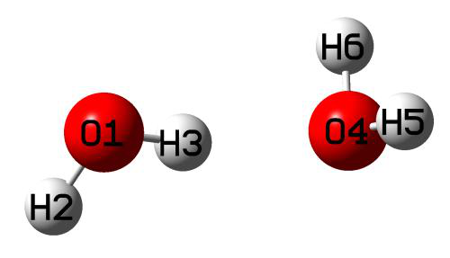

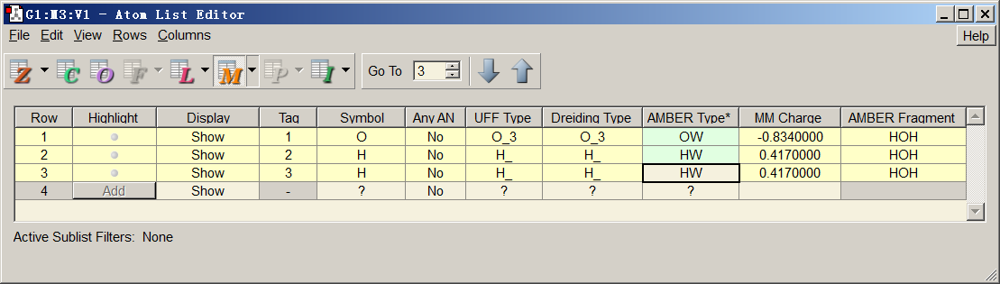

<!-- p.915 -->
text editor such as Ultraedit, delete all columns except the "AMBER Type" column, and then delete the first row in the file. Now, only atom types of all atoms are presented in the water.txt. After that, calculate MK (or CHELPG) charges based on the water.fchk using subfunction 13 (or 12) of main function 7 (you can consult the example in Section 4.7.1), then copy the outputted charges from screen (or from the exported .chg file) as the second column of the water.txt. At this point, preparation of water.txt is finished.

Perform analysis Now, we start to perform the EDA-FF analysis. Copy the water.txt to current folder, then boot up Multiwfn and input

dimer.mol // The file containing dimer structure information (you can also use other formats containing the geometry information as input file, such as the .fch file produced during optimization task of the dimer)

21 // Energy decomposition analysis 1 // Energy decomposition analysis based on forcefield 3 // Load atom types and atomic charges mollist.txt // The actual path of the molecular list file. At this point, the program read atom types and charges from the water.txt and assign them to the two water molecules in the current system

2 // Define fragments 2 // Two fragments will be defined 1-3 // The atomic indices of the fragment 1 4-6 // The atomic indices of the fragment 2 If you want to check if atom types and charges of all atoms in current system have been set up properly, you can choose option 4, the output is


```text
*** Fragment   1:
 Atom:    1(O )    Charge:   -0.737121    Type: OW
 Atom:    2(H )    Charge:    0.368560    Type: HW
 Atom:    3(H )    Charge:    0.368560    Type: HW
 *** Fragment   2:
 Atom:    4(O )    Charge:   -0.737121    Type: OW
 Atom:    5(H )    Charge:    0.368560    Type: HW
 Atom:    6(H )    Charge:    0.368560    Type: HW
```

It is clear that the atom types and charges are all correctly assigned.

Now select option 1 to start the EDA-FF analysis, the result shows up immediately on screen:


```text
Contribution of each atom in defined fragments to overall interfragment interac
tion energies:
 Atom    1(O )   Elec:   12.53  Rep:    3.85  Disp:   -2.21  Total:   14.17
 Atom    2(H )   Elec:   -6.24  Rep:    0.00  Disp:    0.00  Total:   -6.24
 Atom    3(H )   Elec:  -16.87  Rep:    0.00  Disp:    0.00  Total:  -16.87
 Atom    4(O )   Elec:  -23.52  Rep:    3.85  Disp:   -2.21  Total:  -21.88
 Atom    5(H )   Elec:    6.47  Rep:    0.00  Disp:    0.00  Total:    6.47
 Atom    6(H )   Elec:    6.47  Rep:    0.00  Disp:    0.00  Total:    6.47

 Interaction energy components between all fragments:
```


<!-- p.916 -->

```text
                         Electrostatic   Repulsive   Dispersion     Total
 Frag   1 -- Frag   2:       -21.15         7.71        -4.43       -17.87
```

The units in the output are all kJ/mol. The above information shows that the total interaction energy between the two water molecules is -17.87 kJ/mol, which is close to the result -20.58 kJ/mol obtained by highly accurate level CCSD(T)/CBS (see original paper of the S66 weak interaction test set, J. Chem. Theory Comput., 7, 2427 (2011)). Although the given result has some error, at least it is adequate for qualitative discussion purposes. The above data also indicates that electrostatic interaction (-21.15 kJ/mol) has a decisive contribution to the binding energy between the two waters, obviously the main essence of general hydrogen bond is dominated by electrostatic interaction. Dispersion interaction also contributes to the binding, but the magnitude is relatively minor. The exchange-repulsion effect (7.71 kJ/mol), to some extent, offsets the attractive interaction due to electrostatic and dispersion effects.

In the original text of the S66 test set, the ratio of the dispersion interaction energy to the electrostatic interaction energy of water dimer given by the very ideal DFT-SAPT method is 0.29, which is qualitatively consistent with the value yielded by EDA-FF (4.43/21.15=0.21). Therefore, with the very simple water dimer as instance, it can be seen that as long as the choice of forcefield and atomic charges are suitable, the result of EDA-FF is generally reliable. For some systems, the total interaction energy calculated by forcefield is not quite close to that evaluated by reliable quantum chemistry method, but even so, in general the ratio between various physical components provided by the EDA-FF is still meaningful. In my view of point, it is not a bad idea to

approximately estimate electrostatic interaction energy (ΔEele) via multiplying the total interaction energy (ΔEtot) obtained using quantum chemistry method by the ratio of the ΔEele and ΔEtot that evaluated by proper forcefield.

The above output also shows contribution of each atom to the total interaction between all the defined fragments, so that you can easily recognize which atoms have a critical impact on the interfragment interaction. The sum of all atomic contributions is equal to the total interaction energy (if the system only has two atoms A and B, and each one is defined as a fragment, then the contribution of atom A will be half of the interaction energy between A-B). From the data given above, it can be seen that influence of each atom is not negligible. After all, the distance between the atoms in the system is not far. The most important contribution to the attraction is the electrostatic interaction of the O4 atom (-23.52 kJ/mol), this result is easy to understand since O4 is the acceptor atom of H-bond. The H3, which directly acts with O4 to form the H-bond, also contributes greatly to the binding (-16.87 kJ/mol) due to significant electrostatic effect. The data shows that only oxygen atoms have nonvanishing repulsion and dispersion terms, this is because the parameters of van der Waals potential of atom type HW is zero, hence HW atoms only behave as point charges to exhibit electrostatic effect.

Interatomic interaction If you choose option -3 once to switch its status from the default "No" to "Yes", then during EDA-FF analysis via option 1, the program also outputs distance (Å), interaction energy (kJ/mol) and its components of each atomic pair to interatm.txt in current folder. The file content of present example is


```text
******* Between fragment   1 and fragment   2:
  Atom_i  Atom_j  Dist(Ang) Electrostatic   Repulsive    Dispersion     Total
      1      4:     2.873       262.78         7.71        -4.43       266.05
```


<!-- p.917 -->

```text
      1      5:     3.176      -118.86         0.00         0.00      -118.86
      1      6:     3.176      -118.86         0.00         0.00      -118.86
      2      4:     3.346      -112.79         0.00         0.00      -112.79
      2      5:     3.762        50.16         0.00         0.00        50.16
      2      6:     3.762        50.16         0.00         0.00        50.16
      3      4:     1.916      -197.02         0.00         0.00      -197.02
      3      5:     2.312        81.64         0.00         0.00        81.64
      3      6:     2.312        81.64         0.00         0.00        81.64
```

From the above data, we can find that the interaction energy between each pair of atoms is very large, which mainly comes from electrostatic interaction. For example, since the charges of the two oxygen atoms O1 and O4 are large and have the same sign, the electrostatic mutual exclusion energy is as high as 262.78 kJ/mol. The binding energy between the fragments appears to be orders of magnitude far less than the above values, this is because when interaction energy between the fragments is calculated, the electrostatic interactions of the atomic pairs are largely positively and negatively offset.

4.21.1.2 Example 2: Circumcoronene-Cytosine-Guanine trimer

In the L7 weak interaction test set given in J. Chem. Theory Comput., 9, 3364 (2013), a system C3GC is a trimer consisting of circumcoronene (hereinafter abbreviated as C3), guanine (G) and cytosine (C). The geometry has been optimized by the authors at TPSS-D/TZVP level, as shown

below. The GC base pair has formed triple H-bonds, and it is physically adsorbed on the C3 via π-π stacking interaction.

In this section, we will perform EDA-FF analysis on this system based on the AMBER force field. The relevant files are provided in the "examples\EDA\EDA-FF\C3GC" directory.

Preparation works Notice that Multiwfn can perform EDA-FF only when atomic indices in any molecule type are contiguous. Otherwise, the atomic charges and types cannot be set for each atom in the system through the molecular list file and molecule type files. The structure file given in the supplementary material of the L7 test set is C3GC.xyz. This file cannot be directly used because the atomic indices in each monomer are not contiguous. One of the simplest way to judge if the atomic indices are contiguous is as follows: First load C3GC.xyz into Multiwfn, use subfunction 2 in main function 100 to convert it to C3GC.pdb (we do the conversion because GaussView does not support .xyz


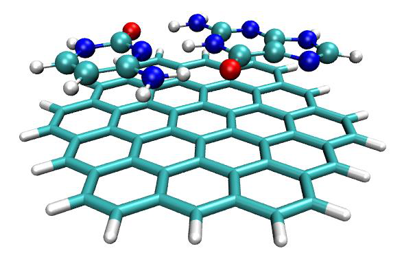

<!-- p.918 -->
format), then load this pdb file into GaussView, right click on arbitrary atom in an arbitrary molecule (e.g. atom C5), choose "Select Fragments of Atom C5" (this option is available since GaussView 6). At this point, all atoms in this molecule are selected as yellow color, then click "Tools" - "Atom Selection". As can be seen in the screenshot below, the indices displayed in the text box are 5-9, 13-17, 19, 25-29, clearly the atom indices are not contiguous and should be rectified.

The easiest way of making atom indices contiguous in each molecule is entering "Atom list editor" of GaussView, then select "Edit" - "Reorder" - "All Atoms (Except the First) by Bonding", after that the atom indices are reordered according to connectivity, and you will see the atom indices in each monomer have become contiguous, as shown below. Now save this structure to C3GC.pdb to replace the old one.

Then we copy each monomer from the trimer to individual GaussView window, save them to respective .gjf files, change the keyword to "B3LYP/6-311G**" and use Gaussian to run them, then calculate MK charges by Multiwfn based on the resulting .fch files. Also, we make use of GaussView to determine atom types for each monomer. Finally, combine the atom types and charges as single file for each monomer, then we have the C.txt, G.txt and C3.txt, which have already been provided in "examples\EDA\EDA-FF\C3GC" directory.

Finally, create a molecular list file mollist.txt (other name is also acceptable), the content is actual paths of C.txt, G.txt and C3.txt as well as the number of corresponding molecules, notice that


<!-- p.919 -->
the order of the file paths must be exactly in line with the molecule order in the geometry provided in G3GC.pdb. Clearly, the content of mollist.txt should be (all the molecule type files are assumed to be placed in C:\)


```text
C:\C.txt 1
C:\G.txt 1
C:\C3.txt 1
```

Start analysis All preparation works have been completed, now we start the EDA-FF analysis. Boot up Multiwfn and input

C3GC.pdb 21 // Energy decomposition analysis 1 // EDA-FF 3 // Load atom types and charges mollist.txt // Input actual path of mollist.txt 2 // Define fragments 3 // Three fragments will be defined 1-13 // Atom indices in fragment 1, namely cytosine (C) 14-29 // Atom indices in fragment 2, namely guanine (G) 30-101 // Atom indices in fragment 3, namely C3 Select option 1 to carry out the EDA-FF calculation, the results are as follows (atomic contribution part is ignored)


```text
                         Electrostatic   Repulsion   Dispersion     Total
 Frag   1 -- Frag   2:      -120.98        60.26       -45.54      -106.27
 Frag   1 -- Frag   3:         1.88        44.86       -94.69       -47.95
 Frag   2 -- Frag   3:         0.71        62.08      -132.62       -69.84
```

The data shows that the G-C binding is very strong, reached as high as -106.27 kJ/mol, mainly because the electrostatic component is very large (-120.98 kJ/mol), which is the consequence of the formation of the three pairs of H-bonds between the G and C. The total interaction energy between C3 and G (-47.95 kJ/mol) as well as between C3 and C (-69.84 kJ/mol) are not small, mainly due

to the significant π-π stacking between them. Since the nature of π-π stacking is purely dispersion effect, it can be seen that the dispersion interactions of C3-C and C3-G are very strong (-94.69 and -132.62 kJ/mol, respectively), which are much higher than that between G-C (-45.54 kJ/mol). Since C3 is essentially a finite graphene sheet, its interaction region with G and C is obviously nonpolar (i.e. the atomic charges are very small), so the electrostatic component in C3-C and C3-G interactions is negligible (merely 0.71 and 1.88 kJ/mol, respectively).

I also calculated binding energies between G-C, C3-G and C3-C using dimer models at B3LYP-D3(BJ)/6-311+G** level, which is very robust for evaluating weak interactions, the results are


```text
G-C (Frag 1 - Frag 2)：-143.97 kJ/mol
C3-C (Frag 1 - Frag 3)：-56.69 kJ/mol
C3-G (Frag 2 - Frag 3)：-76.27 kJ/mol
```

For C3-C and C3-G, it can be seen that the results calculated by AMBER forcefield and that by quantum chemistry method are very close, but the quantitative difference for G-C is quite conspicuous. This observation manifests the limited quantitative accuracy of forcefield when it is applied to the weak interactions with great strength. However, in this case, if we only focus on the


<!-- p.920 -->
ratio between various physical components, the result of EDA-FF is still useful and will not cause evident misleading conclusion.

Coloring atoms according to contribution to interaction energy By making use of .pqr file format, atomic properties can be easily visualized by coloring atoms via different colors in VMD visualization program, this strategy is detailedly introduced in Section 4.A.10. Obviously, if atomic contributions to interaction energy between fragments are stored into the .pqr files, then the importance and role of each atom will be able to be vividly shown in a graph. Similar idea is also employed in the IGM analysis, as illustrated in Section 4.20.10.

Now we select "-4 Toggle if outputting atom contributions to .pqr files" option in the EDA-FF interface to switch its status to "Yes", then select option 1 to carry out EDA-FF analysis. After the calculation, atmint_tot.pqr, atmint_ele.pqr, atmint_rep.pqr, atmint_disp.pqr and atmint_vdW.pqr appear in the current directory (some of them have been provided in "examples\EDA\EDA-FF\C3GC\pqr"). The data of the atomic charge column in these .pqr files correspond to the contribution of each atom to the total/electrostatic/repulsion/dispersion/vdW interaction energy between the fragments, respectively, and the values are identical to those printed on screen. For example, the value of the atomic charge column of the C1 atom in fragment 1 of the atmint_disp.pqr corresponds to half of the dispersion interaction energy between C1 atom and all atoms of fragments 2 and 3.

We load the atmint_tot.pqr into VMD program, enter "Graphics" - "Representation", coloring the atoms according to the "Charge" property, changing the lower and upper limits of the color scale from the default ones to -50 and 50, respectively. Setting drawing method of the G and C parts as CPK mode (using fragment 0 1 in the "Selected Atoms" box to choose them), and making C3 part displayed in Licorice style (using fragment 2 to choose it). We also set the color scale method to BWR (Blue-White-Red). Finally, the graph will look like below (if you are not familiar with VMD and do not know how to realize these settings in VMD, please consult Section 4.A.10):

Since the current color scale used is Blue-White-Red, the bluer the atom color in the figure, the more negative the atomic contribution to the total binding energy between the trimer (i.e. the more significant the attractive effect); while the redder the atom, the stronger the repulsive effect it


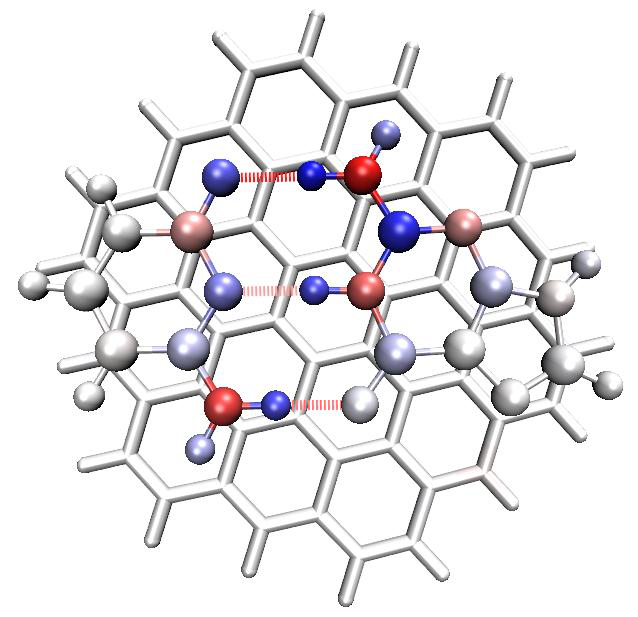

<!-- p.921 -->
acts. Relatively white atoms only play trivial role on the trimer binding. As can be seen from this figure, the colors of each H-bond acceptor atom and the hydrogen atom directly acting with it are obviously blue, thus they contribute greatly to the stability of the G-C binding. The color of all H-bond donor atoms is red, indicating that their existences are not conducive to the binding, this is because the H-bond donor and acceptor atoms have large magnitude and same sign of atomic charges, therefore there is a significant electrostatic mutual exclusion between them. From the map above, it can also be seen that all atoms of C3 as well as the atoms in the G and C that far away from the hydrogen bonding region only have very light or purely white color, this observation does not imply that they have nearly vanished contributions to the trimer binding, but indicates that their contributions are relatively weak and thus difficult to be revealed under current color scale setting.

Assume that we want to vividly exhibit the dispersion interaction between C3 and GC base pair, then we input below commands in the EDA-FF interface

2 // Redefine fragments 2 // Two fragments will be defined 1-29 // Fragment 1, the GC base pair 30-101 // Fragment 2, the C3 part 1 // Start the EDA-FF calculation Then the following information is shown on screen, the data equals the sum of C3-C and C3-G interaction energies


```text
                         Electrostatic   Repulsion   Dispersion     Total
 Frag   1 -- Frag   2:         2.59       106.94      -227.31      -117.79
```

In the meantime, four new .pqr files are generated in current folder (they have been provided in "examples\EDA\EDA-FF\C3GC\pqr2" folder). Load the atmint_disp.pqr among them into VMD, coloring the atoms according to the way described above but using color scale of -10 to 10, then select "Display" - "Orthographic" to modify the perspective, you will see

In the above figure, the bluer the atomic color, the greater it contributes to the dispersion interaction between C3 and GC. It can be seen from the figure that each heavy atom in the GC part contributes nearly equally to the dispersion interaction, mainly because they have almost the same vertical distance to the C3 plane and the number of electrons carried by these atoms are not very


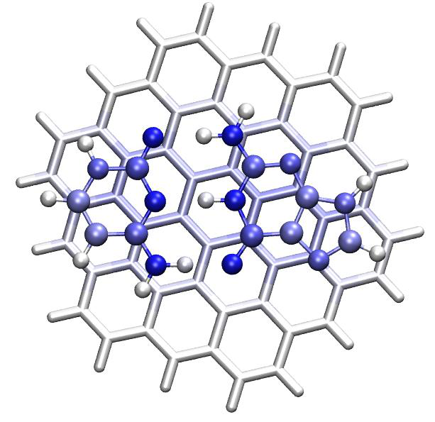

<!-- p.922 -->
different. The hydrogen atoms in the GC pair contribute very little to the C3-GC dispersion interaction, this is because the hydrogen atoms only have very few numbers of electrons. On the C3 part, the color of the carbons that directly contact the GC pair is light blue, indicating their notable contributions to the dispersion interaction. The color of the C3 atoms that are far away from the GC pair is white, reflecting that their influences on dispersion interaction are negligible (recall the fact that dispersion attraction attenuates sharply with distance, it has 1/r6 asymptotic behavior).

Note: The heavy atoms in the GC pair in the graph above are very blue, while the atoms in the equivalent position of C3 are not so blue, the reason is that: Because there are many atoms in C3, each heavy atom in the GC pair can form dispersion interaction with a large range of C3 atoms, thus the sum of the terms is large. Since the number of atoms in the GC pair is small, each atom of C3 can only interact with relatively few numbers of atoms in the GC pair, so the sum of terms is not large. If you want to make atomic color of the C3 part more prominent, you can set the color scale range of the representation corresponding to the C3 part to a smaller value than the -10~10 we previously used; for example, changing to -6 to 6 will yield satisfactory graph.

About determining binding energy of individual H-bond Some readers may have thought that it would be great if the binding energy of each of the three H-bonds between the G-C could be independently determined. There is no unique way to achieve this goal, since this is equivalent to dividing the system into parts and must not be free of artifacts. A seemingly easy way to realize this purpose is to directly define the donor and acceptor parts of a H-bond as two fragments. For example, let us examine the H-bond of N10-H13...O14, we input.

2 // Redefine fragments 2 // Two fragments will be defined 10,13 // Atomic indices of donor part of N10-H13...O14 14 // Atomic index of acceptor part of N10-H13...O14 1 // Perform EDA-FF analysis The result is


```text
                         Electrostatic   Repulsion   Dispersion     Total
 Frag   1 -- Frag   2:        71.27        21.78        -9.40        83.65
```

Clearly the result is unreasonable, since the total binding energy was predicted to be a positive value! The underlying reason is that the electrostatic interaction is a kind of long-range effect (1/r asymptotic behavior), therefore consideration of other atoms should not be simply ignored. I also attempted to employ other ways to evaluate the N10-H13...O14 H-bond binding energy, although some of them give seemingly acceptable result (for example, summing up atomic contribution of N10, H12, H13 and O14 to total G-C binding energy), unfortunately the relative strength of the three H-bonds cannot be faithfully explained. In my opinion, deriving individual H-bond interaction energy is impossible for this system based on EDA-FF, the reason is that the three H-bonds are too close together and thus the coupling is very strong, the polarization effect is obvious, and meantime resonance-assisted effect is involved in these H-bonds, these factors make the total interaction energy of the three H-bonds very difficult to be reasonably decomposed. However, if there are several H-bonds and the sites are far away from each other, it should be possible to individually evaluate the strength of each H-bond by estimation of interaction energy between the atoms in the corresponding local region.

AFAIK, the best way of determining binding energy of individual H-bond is using atom-in-molecules (AIM) analysis, see Section 4.2.1 for introduction and illustration.

Other aspects It is worth to note that a possibly viable way aside from SAPT to evaluate dispersion interaction energy is employing DFT-D3 dispersion correction using the zero-damping parameters fitted for


<!-- p.923 -->
exchange-correlation functionals that completely failed to represent dispersion interaction. This strategy has been utilized in the energy decomposition analysis example shown in Section 4.100.8. The DFT-D3 dispersion correction for interfragment interaction energy using zero-damping BLYP functional parameter is shown below


```text
C -- G: -26.65 kJ/mol
C -- C3: -87.78 kJ/mol
G -- C3: -115.10 kJ/mol
```

It can be seen that the three values are close to the corresponding dispersion interaction energies evaluated by AMBER forcefield (-45.54, -94.69, -132.62, respectively), rendering that using either AMBER forcefield or DFT-D3 to estimate dispersion interaction energy is a reasonable approach.

Using UFF to conduct the EDA-FF analysis is often unsatisfactory. If we do this for present system, the result is


```text
                         Electrostatic   Repulsion   Dispersion     Total
 Frag   1 -- Frag   2:      -120.98       848.28       -80.36       646.94
 Frag   1 -- Frag   3:         1.88        52.65      -107.41       -52.87
 Frag   2 -- Frag   3:         0.71        68.89      -143.58       -73.99
```

It can be seen that the interaction predicted by UFF for C3-C and C3-G is normal, and the result magnitude is close to that calculated by AMBER, but the interaction energy of G-C is extremely positive, evidently this is completely unreasonable. From the data it is easy to find that the reason is that the exchange-repulsion component is seriously overestimated. This is not an individual phenomenon, but a common phenomenon of UFF, this is why I generally do not recommend performing EDA-FF based on UFF (although optimizing the geometry using UFF prior to the EDA-FF could alleviate this problem).

As mentioned in Section 3.24.1, for very large systems, using the very cheap EEM charges (with parameters fitted for CHELPG charges at B3LYP/6-31G* level) instead of the rigorously derived ESP fitting charges to perform the EDA-FF analysis may be a viable choice; however, my test showed that this treatment can cause remarkable error in electrostatic interaction for present system. The electrostatic interaction energy between G and C evaluated based on EEM charges is merely -74.26 kJ/mol, which is much lower than that evaluated based on MK charges (-120.98 kJ/mol). Therefore, whenever possible, using ESP fitting charges (MK or CHELPG) in EDA-FF analysis is strongly recommended, this is crucial for yielding electrostatic interaction energy with satisfactory accuracy.


### 4.21.2 Shubin Liu's energy decomposition analysis for ethane rotation barrier


The idea and usage of the Shubin Liu's energy decomposition (EDA-SBL) have been described in Section 3.24.2. In this section we carry out EDA-SBL method to study the source of energy different between ethane in optimized eclipsed and staggered conformations. Relevant input and output files have been given in "examples\EDA\EDA_SBL" folder.

First, we optimize ethane in staggered conformation (D3 point group) and in eclipsed


<!-- p.924 -->
conformation (D3h point group) at B3LYP/def-TZVP level using Gaussian, the latter in fact is a transition state. Then using the geometries to create two Gaussian input files, namely ethane_staggered.gjf and ethane_eclipsed.gjf, respectively. The two files correspond to single point task at B3LYP/def2-TZVP level. As mentioned in Section 3.24.2, the route section contains ExtraLinks=L608 keyword and at the end of the input file there is line -5 indicating that the currently used functional is B3LYP.

Run the two .gjf files by Gaussian to yield ethane_staggered.out and ethane_eclipsed.out, respectively, and then use formchk to convert the resulting .chk files to .fch files.

We first evaluate the energy terms defined by EDA-SBL method for staggered ethane. Boot up Multiwfn and input

examples\EDA\EDA_SBL\ethane_staggered.fch 21 // Energy decomposition analysis 2 // Shubin Liu's energy decomposition examples\EDA\EDA_SBL\ethane_staggered.out Now Multiwfn loads relevant information from the Gaussian output file, and then evaluates the steric term defined by EDA-SBL method. Finally, the EDA-SBL energy components are printed:


```text
 E_steric:              64.213411 Hartree
 E_electrostatic:     -146.114859 Hartree
 E_quantum:              2.037465 Hartree

 E_total:              -79.863983 Hartree
```

The E_total is identical to the single point energy in the Gaussian output file.

We repeat the analysis for eclipsed ethane, then summarize the data into the table below

Etotal Esteric Eelectrostatic Equantum

Eclipsed (a.u.) -79.85972 64.21925 -146.10780 2.02883 Staggered (a.u.) -79.86398 64.21341 -146.11486 2.03747 Diff. (kJ/mol) 11.2 15.3 18.5 -22.7

It can be seen that the eclipsed conformation has energy higher than the staggered one by 11.2 kJ/mol, which corresponds to the barrier of C-C single-bond rotation of the ethane. The data implies

that steric effect should be one of the major contributors of the barrier since ΔEsteric is evidently positive. In addition, the fairly large ΔEelectrostatic=18.5 kJ/mol suggests that the electrostatic interaction is the dominating factor to determine the barrier height. In contrast, the variation of Equantum, which reflects the change in energy purely due to quantum effect, significantly cancels the steric and classical electrostatic terms and thus plays an important role of reducing the barrier.

As you can see on the screen, the EDA-SBL module also prints other intermediate quantities comprising the Esteric, Eelectrostatic and Equantum, such as Pauli kinetic energy, so you can use them to try to analyze the energy difference between the two conformations from more perspectives.

A thorough analysis using the EDA-SBL method for rotation barriers for a series of small organic molecules is presented in J. Phys. Chem. A, 117, 962 (2013), interested users are suggested to read it.


<!-- p.925 -->

### 4.21.3 Examples of sobEDA and sobEDAw energy decomposition analyses


sobEDA.sh shell script is used to conveniently perform sobEDA and sobEDAw energy decomposition analyses based on Gaussian and Multiwfn. Very detailed introduction and rich application examples are given in http://sobereva.com/soft/sobEDA_tutorial.zip, please carefully check it.


### 4.21.4 Examples of analysis of atomic contribution to dispersion energy

Note: Chinese version of this section is my blog article "Using Multiwfn to graphically exhibit atomic contribution to dispersion energy and dispersion density" (http://sobereva.com/705), which contains more examples and discussion.

In this section, some examples of analysis of atomic contributions to dispersion energy as well as dispersion energy are given. Please carefully read Section 3.24.4 first to gain basic knowledge, and understand how to set “dftd3path” in `settings.ini`.

4.21.4.1 Investigating dispersion energy contributed by atoms in helicene

and dispersion density

In this example, we examine which atoms have prominent contribution to dispersion energy of 6-helicene. Boot up Multiwfn and input

examples\helicene.xyz // Structure file of 6-helicene 21 // Energy decomposition analysis 4 // Analysis of atomic contribution to dispersion energy 1 // Calculate atomic contributions to dispersion energy for current system Immediately, you will see the following information on screen, which contains total dispersion of present system, which corresponds to DFT-D3(BJ) dispersion correction energy with fitted parameters for B3LYP. Also, atomic contributions to dispersion energy are clearly given.


```text
Total dispersion energy:     -74.468 kcal/mol

 Atomic contribution to dispersion energy
     1(C )    -2.681 kcal/mol
     2(C )    -2.072 kcal/mol
     3(C )    -2.068 kcal/mol
     4(C )    -2.650 kcal/mol
     5(C )    -3.432 kcal/mol
[...ignored]
    40(H )    -0.569 kcal/mol
    41(H )    -0.511 kcal/mol
    42(H )    -0.614 kcal/mol
```

Next, you can input y to export atomdisp.pqr in current folder. Load it into VMD program, in the “Graphics” - “Representation” interface, set “Drawing Method” to CPK, “Coloring Method” to


<!-- p.926 -->
“Charge”, then in the “Trajectory” panel, set lower and upper limits of color scale to -5.0 and 5.0, respectively. You will see the following map. Since the default color scale used by VMD is red-white-blue, the redder the color in this figure is, the more negative the contribution to dispersion energy of the atom is, and the stronger its dispersion interaction with other atoms.

As can be seen from the figure above, the contribution of carbon atoms to dispersion energy is much greater than that of hydrogen, and the contribution of carbon atoms closer to the center of the helicene is greater. The reason is easy to understand, because the closer the carbon atom is to the molecular center, the richer dispersion interaction it can have with other atoms.

Next, we calculate dispersion density. Select option “2 Calculate dispersion density for current system”, and then choose “Medium-quality grid”, you will find dispdens.cub has been exported to current folder, which is cube file dispersion density (in kcal/mol/Bohr3). Load it into VMD to plot it as isosurface map with isovalue of -0.15 and transparent material, and properly set representation of molecular structure map as licorice, you will obtain the following map. The isosurface distribution in the figure clearly shows that the inner region of the helicene makes a relatively more significant contribution to the dispersion energy than other regions.

It is noteworthy that you can use option 6 in present function to calculate dispersion interaction energy between two arbitrarily defined fragments. For example, to calculate dispersion interaction energy between the two six-membered carbon rings at the two ends of the helicene, after selecting this option, you should input 17-22 and then 11-12,23-26, you will see


```text
Dispersion interaction energy between the fragments:      -2.809 kcal/mol
```


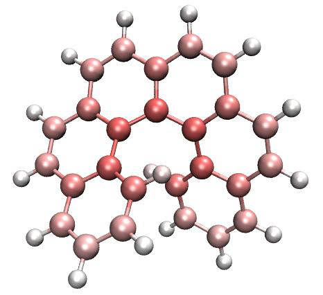


<!-- p.927 -->
4.21.4.2 Difference in dispersion energy between two conformations of

actos

Actos is a flexible drug molecule, the xyz files of its curly and linear conformations have been provided in “examples” folder as Actos_curly.xyz and Actos_linear.xyz, respectively. In this section, we examine the change in the atomic contribution to the dispersion energy of the curly conformation relative to the linear conformation. Boot up Multiwfn and input

examples\Actos_curly.xyz 21 // Energy decomposition analysis 4 // Analysis of atomic contribution to dispersion energy 3 // Calculate difference of atomic contributions to dispersion energy between current and another systems

[Press ENTER button] //All atoms in the present system (Actos_curly.xyz) are of interest examples\Actos_linear.xyz [Press ENTER button] //All atoms in Actos_curly.xyz are of interest From output on screen, you can find total dispersion energy of Actos_linear.xyz and Actos_curly.xyz is -57.553 kcal/mol and -69.757 kcal/mol, respectively. It is clear that dispersion interaction of the curly conformation is more significant. Also, the difference in the contribution of every atom to the dispersion energy of the two structures is printed on screen.

Then input y, diffatomdisp.pqr will be generated in the current directory, in which the “charge” property records the dispersion energy contributed by each atom of Actos_curly.xyz minus the dispersion energy contributed by each atom of Actos_linear.xyz, and the atomic coordinates in this file are the same as Actos_curly.xyz. Use VMD to plot molecular structure and color the atoms according to “charge” property based on this file, and set color scale range as -1.0 to 1.0 kcal/mol, then you will get the figure on the left below (the color scale bar is cut out from “Graphics” - “Color” - “Color Scale” panel and then manually made using Powerpoint), the atom on the right figure below is colored according to the element name for comparison (yellow/cyan/red/blue/white is sulfur/carbon/oxygen/nitrogen/hydrogen).

The redder atoms in the left figure above correspond to the atoms that contribute more to the variation of dispersion energy in the process of changing from the linear conformation to the curly conformation. It can be seen that the enhancement of dispersion interaction mainly occurs on the atoms that can become closer to other atoms after the conformation is curled up. The dispersion effect of the white atoms mainly distributed in the corners is not changed notably.


<!-- p.928 -->
Multiwfn can also generate the difference grid data of dispersion density. Input the following commands in the present function

4 // Calculate dispersion density difference between current and another system [Press ENTER button] //All atoms in the present system (Actos_curly.xyz) are of interest examples\Actos_linear.xyz // Another system [Press ENTER button] //All atoms in Actos_curly.xyz are of interest 3 // High-quality grid dispdensdiff.cub now is generated in current folder. Plotting it as isosurface map using VMD

with isovalue of ±0.025 via the convenient VMD script described in Section 4.A.14, you will see the following map, the blue color indicates that the isosurface corresponds to negative value. It can be seen that the isosurfaces well highlight the regions with significant enhancement of dispersion energy caused by structural curling.

4.21.4.3 Adsorption of toluene on zeolite

This section illustrates analysis on periodic systems. zeolite.cif and zeolite-mol.cif in “examples” folder are structural files of zeolite and zeolite with an adsorbed toluene, respectively. The latter was optimized by CP2K program at PBE-D3(BJ)/DZVP-MOLOPT-SR-GTH level, and the coordinate of the former was directly extracted from the latter. The two .cif files can be used as input files for analysis of atomic contribution to dispersion energy and calculating dispersion density. Because .cif file provides cell information to Multiwfn, the calculation will be conducted automatically with consideration of periodicity.

First, we perform analysis on zeolite-mol.cif and color atoms according to their contributions to dispersion energy using exactly the same way as described in Section 4.21.4.1, and set color scale to -8.0 to 8.0 kcal/mol, you will obtain the following map. Only the atoms of the adsorbed toluene, which correspond to atoms 217-231 in the file, are shown as large spheres. As can be seen from the figure, silicon atoms contribute the most to dispersion energy, which are much larger than oxygen and carbon atoms, and hydrogen atoms in the toluene contribute the least.


<!-- p.929 -->
The above figure does not directly show which atoms in the zeolite have the strongest dispersion interaction with the toluene. To clearly study this point, we need to find the difference between the contribution of the zeolite atoms (atoms 1-216) in the zeolite-mol.cif system to its dispersion energy and the contribution of the atoms in the zeolite.cif system to its dispersion energy. This will be done below.

Boot up Multiwfn and input examples\zeolite-mol.cif 21 // Energy decomposition analysis 4 // Analysis of atomic contribution to dispersion energy 3 // Calculate difference of atomic contributions to dispersion energy between current and another systems

1-216 // The atoms of interest are those of the zeolite moiety (first 216 atoms) in the current system (zeolite-mol.cif)

examples\zeolite.cif // Another system [Press ENTER button directly] // The atoms of interest are all 216 atoms in zeolite.cif, which also correspond to atoms 1-216 in zeolite-mol.cif

y // Export diffatomdisp.pqr in current folder Load the diffatomdisp.pqr into VMD, color atoms by “charge” property, set color scale to -0.8 to 0.8, you will see


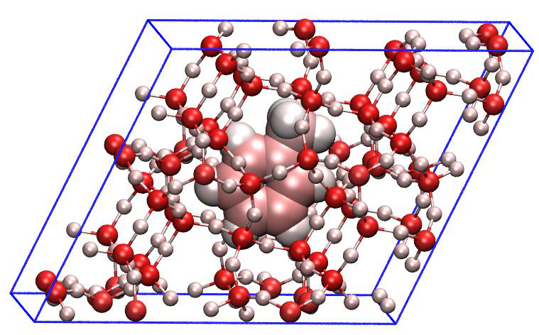

<!-- p.930 -->
The adsorbed toluene is fully white in the picture above because it is not within the atomic range of interest in the zeolite-mol.cif we defined earlier, so its data is completely zero. The pink or red atoms in the figure suggest that the dispersion energy contributed by the zeolite atoms closer to the toluene changed greatly due to the adsorption. Since the structure of the zeolite moiety in zeolite-mol.cif is the same as zeolite.cif, therefore, the atom colors in the above figure completely reflect the dispersion interaction between the zeolite atoms and the toluene. It can be seen from the figure that the dispersion interaction decays very quickly with distance (known to be 1/r6 decay behavior). Basically, only the zeolite atoms in the closest layer to the toluene have a significant dispersion interaction with it.

The above figure can be changed to the following map, which shows the atoms of zeolite that interact prominently with toluene much more clearly. Specifically, in VMD, three Reps should be created in “Graphics” - “Representation” interface

- Rep 1: Displays toluene, colored with Name, displayed in Licorice style and BrushedMetal material

- Rep 2: Displays the entire zeolite using the selection serial 1 to 216, set drawing method to Licorice (with Bond Radius = 0.1), set coloring method to “Charge”, and set material to Transparent

- Rep 3: Displays zeolite atoms with “charge” property more negative than -0.2 (using selection charge<-0.2), using CPK drawing method and coloring method of “Charge”.


<!-- p.931 -->
At the end of this section, it is emphasized that when doing difference analysis of atomic dispersion energy contribution or dispersion density, the number of atoms in the atomic range of interest selected for the two systems must be the same, and the order of the atoms must also be the same, otherwise it is obvious that the dispersion energy contribution by atoms will be confused when taking the difference between the two systems.


## 4.22 Examples of conceptual density functional theory (CDFT) analysis


### 4.22.1 Automatically calculate conceptual density functional theory quantities for phenol


Note: Chinese version of this section is my blog article “Using Multiwfn to easily calculate various quantities defined in the concept density functional theory” (http://sobereva.com/484).

In this section, I will show how to very conveniently calculate almost all quantities defined in the framework of conceptual density functional theory (CDFT). Phenol will be taken as example. Since phenol is a neutral molecule, the N, N+1 and N-1 electrons states correspond to neutral, anionic and cationic states, respectively.

Before following this example, please read Section 3.25 first, in which all quantities to be computed and basic usage are described.

Preparation of needed wavefunction files Phenol at neutral state should be optimized first, please do it yourself. The examples\phenol.xyz is geometry of phenol optimized at the widely used B3LYP/6-31G* level, its quality is fine enough for present study.

Boot up Multiwfn and input below commands: examples\phenol.xyz 22 // Calculate various quantities in conceptual density functional theory


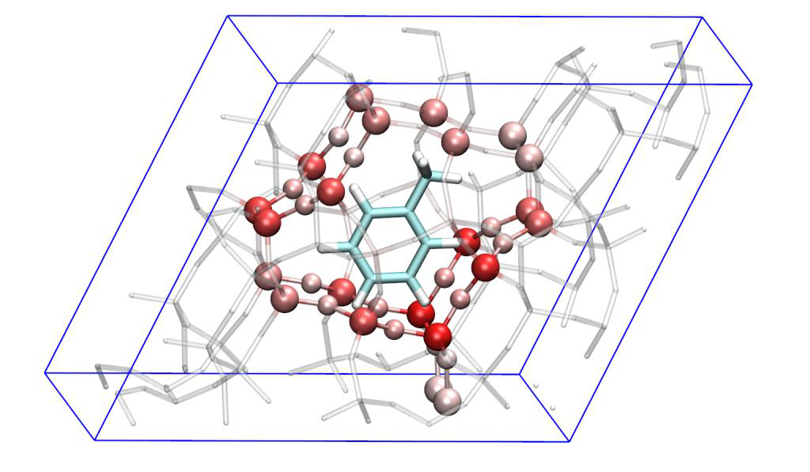

<!-- p.932 -->
1 // Generate .wfn files for N, N+1 and N-1 electrons states [Press ENTER button directly] // The generated .gjf files will correspond to single point task at B3LYP/6-31G* level

[Press ENTER button directly] // Use default charge and spin multiplicity, namely 0 1 for N state, -1 2 for N+1 state, and 1 2 for N-1 state

Now N.gjf, N+1.gjf and N-1.gjf have been generated in current folder, they are input files of single point task used for generating N.wfn, N+1.wfn and N-1.wfn, respectively. Now you can manually run them by Gaussian. If you do not change the generation path of the .wfn file in these files, after running them they will be generated in current folder for Gaussian of Linux version, while for Windows version they will be generated in Gaussian scratch folder.

You can also let Multiwfn directly invoke Gaussian to run the .gjf files. Assume that we have set "gaupath" parameter in `settings.ini` to actual path of Gaussian executable file, now you can input y in Multiwfn window, then the .gjf files will be executed by Gaussian and the resulting .wfn files will occur in current folder, after that the .gjf and .out files will be automatically deleted.

Multiwfn is also able to generate input files of ORCA program for generating the .wfn files. To do so, you should select option -2 once, then choose option 1, then three ORCA input files will be generated. After manually running them by ORCA, N.wfn, N-1.wfn, N+1.wfn will be available, and you should move them to Multiwfn folder.

Calculating global and atomic indices Because N.wfn, N+1.wfn and N-1.wfn have already been provided in current folder, now we can start calculation of CDFT quantities. We choose option "2 Calculate various quantitative indices", then Multiwfn starts to calculate Hirshfeld charges and extract information from the .wfn files, the results are outputted to CDFT.txt in current folder. The content is shown below, they are completely self-explanatory. The file has also been provided as examples\CDFT.txt.


```text
 Hirshfeld charges, condensed Fukui functions and condensed dual descriptors
 Units used below are "e" (elementary charge)
     Atom     q(N)    q(N+1)   q(N-1)     f-       f+       f0      CDD
     1(C )  -0.0587  -0.1185   0.0852   0.1439   0.0598   0.1018  -0.0841
     2(C )  -0.0390  -0.1674   0.0268   0.0658   0.1284   0.0971   0.0626
     3(C )  -0.0597  -0.1873   0.0319   0.0916   0.1276   0.1096   0.0360
...[ignored]

 Condensed local electrophilicity/nucleophilicity index (e*eV)
     Atom              Electrophilicity          Nucleophilicity
     1(C )                  0.02576                  0.45535
     2(C )                  0.05533                  0.20827
     3(C )                  0.05496                  0.28982
...[ignored]

Condensed
local
softness
(e/Hartree),
relative
electrophilicity/nucleophilicity
(dimensionless) and condensed local hyper-softness (e/Hartree^2)
     Atom         s-          s+          s0        s+/s-       s-/s+       s(2)
     1(C )      0.3761      0.1562      0.2661      0.4154      2.4075     -0.5746
     2(C )      0.1720      0.3355      0.2538      1.9501      0.5128      0.4271
     3(C )      0.2392      0.3333      0.2863      1.3933      0.7177      0.2459
```


<!-- p.933 -->

```text
...[ignored]

 E(N):     -307.464860 Hartree
 E(N+1):     -307.383614 Hartree
 E(N-1):     -307.163438 Hartree
 E_HOMO(N):     -0.218913 Hartree,   -5.9569 eV
 E_HOMO(N+1):    0.161297 Hartree,    4.3891 eV
 E_HOMO(N-1):   -0.464864 Hartree,  -12.6496 eV
 First vertical IP:     0.301421 Hartree,    8.2021 eV
 First vertical EA:    -0.081246 Hartree,   -2.2108 eV
 Mulliken electronegativity:     0.110088 Hartree,    2.9956 eV
 Chemical potential:            -0.110088 Hartree,   -2.9956 eV
 Hardness (=fundamental gap):    0.382667 Hartree,   10.4129 eV
 Softness:      2.613235 Hartree^-1,    0.0960 eV^-1
 Softness^2:    6.828998 Hartree^-2,    0.0092 eV^-2
 Electrophilicity index:    0.015835 Hartree,    0.4309 eV
 Nucleophilicity index:     0.116285 Hartree,    3.1643 eV
```

You can compare the condensed Fukui functions and dual descriptor shown above with those manually calculated in Section 4.7.3, you can find the data are completely identical. Clearly, using present module to compute the CDFT quantities is by far easier than manual calculation!

Frankly speaking, the outputted values involving energy of N+1 states, such as vertical EA, Mulliken electronegativity and so on are not very accurate, since it is well known that to obtain a relatively accurate energy of anionic system, diffuse functions must be employed. So, if you need better results of these quantities, when you use Multiwfn to prepare input files of Gaussian, it is suggested to choose a basis set at least 6-311+G* level.

Calculating Fukui function and dual descriptor

Next, we study Fukui function (f) and dual descriptor (Δf), which are real space functions. Choose option "3 Calculate grid data of Fukui function, dual descriptor and related functions ", and then select "2 Medium-quality grid", then Multiwfn automatically calculates grid data of electron density for N, N+1 and N-1 states. After that, you can choose corresponding option to visualize Fukui function or dual descriptor, or export them as cube files in current folder. Various types of f

and Δf plotted by Multiwfn are collectively given in the following graph, all isovalues are set to 0.007 a.u.:


<!-- p.934 -->
From the map above, you can find the f and Δf automatically generated by present module are identical to those manually yielded in Section 4.5.3 by means of custom operation feature of main function 5. Undoubtedly using present module is much more convenient!

As mentioned in Section 4.5.4, the dual descriptor can also be approximately evaluated based on spin density of N-1 and N+1 states, however in the present module, the dual descriptor as well as its condensed form are evaluated in exact way.

It is worth to note that if we export the grid data as cube file by corresponding option, then we can use the method described in Section 4.A.14 to very quickly and easily plot above functions as

isosurface map by VMD at state-of-the-art quality. For example, below is the f − function rendered by VMD.

Calculating local (hyper-)softness and local electrophilicity/nucleophilicity index The module illustrated above can also be used to export or visualize local softness, local hyper-softness, local electrophilicity index and local nucleophilicity index.

For example, we will export cube file of local electrophilicity index, recall that its definition is simply multiplying f + by global electrophilicity index. Therefore, we select option "-1 Set the scale


<!-- p.935 -->
factor to various grid data", input 0.4309 (which is the global electrophilicity index in eV outputted by option 2, see CDFT.txt), then select option "5 Export grid data of scaled f+ as f+.cub in current folder". Now, the exported f+.cub corresponds to local electrophilicity index, the unit is eV/Bohr3.

Next example, we will export cube file of local hyper-softness (LHS), whose definition and practical value are carefully discussed in J. Math. Chem., 62, 461 (2024). It can be simply evaluated

by multiplying Δf with square of global softness. Therefore, we select option "-1 Set the scale factor to various grid data" and input 6.828998 (which is the softness2 in Hartree-2 outputted by option 2, see the aforementioned CDFT.txt), then select option "5 Export grid data of scaled dual descriptor as DD.cub in current folder". Now, the exported DD.cub corresponds to LHS, the unit is 1/(Bohr3Hartree2) or simply a.u.

Calculation of ωcubic and ε As described in Section 3.25, the electrophilicity index ωcubic is useful in studying weak interaction, at least for halogen bonds, and electrophilic descriptor ε is a quantity correlates with electrophilicity better than ω. If you also want to calculate them, after entering the present module you should select option -1 first to switch its status to "Yes", then simply follow the example shown above (i.e. prepare .wfn files with the aid of option 1, then use option 2 to perform calculation), then

the CDFT.txt outputted by option 2 will contain ωcubic, its condensed value on every atom, as well as ε. An intermediate quantity, namely the second vertical ionization potential, is also printed.

More specifically, for the present example, after entering the present module you should input

-1 // Toggle calculating ωcubic and ε 1 // Generate .wfn files for N, N+1, N-1, N-2 electronic states [Press ENTER button directly] // Use B3LYP/6-31G* level [Press ENTER button directly] // Use default charge and spin multiplicity, namely 0 1 for N state, -1 2 for N+1 state, 1 2 for N-1 state, 2 1 for N-2 state

Now run the newly generated four .gjf files to obtain N.wfn, N+1.wfn, N-1.wfn and N-2.wfn, then choose option 2. From the outputted CDFT.txt, you can find:


```text
Cubic electrophilicity index (w_cubic):    0.021716 Hartree,    0.5909 eV
Electrophilic descriptor (epsilon):        0.080522 Hartree,    2.1911 eV
```


### 4.22.2 Illustration of studying orbital-weighted Fukui function and orbital-weighted dual descriptor


Note: Chinese version of this section with extended discussions and more examples is my blog article “Prediction of nucleophilic and electrophilic reaction sites by orbital-weighted Fukui function and orbital-weighted dual descriptor” (http://sobereva.com/533).

Please read Section 3.25.3 first, in which orbital-weighted Fukui function (𝑓𝑤+ and 𝑓𝑤−) and dual descriptor ∆𝑓𝑤 are introduced, also some important notes are given. In this section we will use these functions to study several systems.

Part 1: C60 In this part we will use the orbital-weighted functions to reveal reactive sites of C60, which has high point group symmetry and its frontier molecular orbitals are highly degenerate. Molecules like this are unable to be reasonably studied via the Fukui function and dual descriptor in standard form. The .fch file of this system generated at B3LYP/6-31G* level can be downloaded at


<!-- p.936 -->
http://sobereva.com/multiwfn/extrafiles/C60.zip, which is input file of the present analysis.

Boot up Multiwfn and input below commands C60.fch 22 // Calculate various quantities in conceptual density functional theory

In the current menu, you can use option 4 to set the Δ parameter used in the subsequent orbital-weighted calculations, in this example we keep the default value (0.1 Hartree) unchanged, it should be properly changed only when you find the result is not satisfactory.

We first visualize isosurface of the orbital-weighted functions. Input below commands 7 // Calculate grid data of OW Fukui function and OW dual descriptor 2 // Medium quality Then you can use corresponding option to visualize isosurfaces of 𝑓𝑤+, 𝑓𝑤−, 𝑓𝑤0 and ∆𝑓𝑤, which are collectively shown below. Note that isovalue should be changed to proper value, otherwise isosurfaces may be even invisible. Isosurface of 0.0003 a.u. is used to plot the maps below.

In the map above, green and blue isosurfaces represent positive and negative parts, respectively. As you can see, distributions of all orbital-weighted functions are in line with molecular point group symmetry, this is a unique advantage of the orbital-weighted form. In contrast, if you plot density

of HOMO (corresponding to frozen orbital form of f −) or calculate and plot f − via finite difference (ρN − ρN-1), you will find their distributions are counterintuitive (inconsistent with molecular symmetry) and thus useless in revealing reactive sites. As introduced in Section 4.5.4, a region with

large positive f − or with prominent negative Δf corresponds to the site having remarkable nucleophilicity, or equivalently, vulnerable to electrophilic attack. From the map above we can find that the sites with highest tendency of undergoing electrophilic attack are the regions above [6,6] type of C-C bond (i.e. the bond shared by two adjacent six-membered rings). This observation is fully in line with experimental findings (see original paper of ∆𝑓𝑤, namely J. Phys. Chem. A, 123, 10556 (2019), for extensive discussion), and this conclusion can also be further confirmed according to distribution of minima of average local ionization energy over vdW surface, see Section 4.12.2 on how to perform this kind of analysis.

The orbital-weighted form of Fukui function and dual descriptor are contributed by multiple orbitals. If you want to check weights to better understand how the orbital-weighted functions work, in the present module you can choose "5 Print current orbital weights used in orbital-weighted (OW) calculation", then you will see


```text
 10 Highest weights in orbital-weighted f+
```


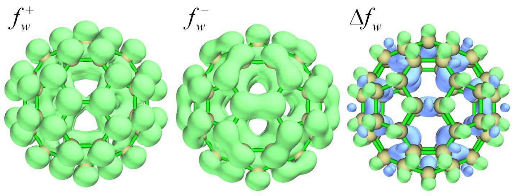

<!-- p.937 -->

```text
 Orbital   181 (LUMO  )   Weight:  12.47 %   E_diff:     1.752 eV
 Orbital   182 (LUMO+1)   Weight:  12.47 %   E_diff:     1.752 eV
 Orbital   183 (LUMO+2)   Weight:  12.47 %   E_diff:     1.752 eV
 Orbital   184 (LUMO+3)   Weight:   6.32 %   E_diff:     2.847 eV
 Orbital   185 (LUMO+4)   Weight:   6.32 %   E_diff:     2.847 eV
 Orbital   186 (LUMO+5)   Weight:   6.32 %   E_diff:     2.847 eV
 Orbital   187 (LUMO+6)   Weight:   4.70 %   E_diff:     3.207 eV
 Orbital   188 (LUMO+7)   Weight:   4.70 %   E_diff:     3.207 eV
 Orbital   189 (LUMO+8)   Weight:   4.70 %   E_diff:     3.207 eV

 10 Highest weights in orbital-weighted f-
 Orbital   180 (HOMO  )   Weight:   9.06 %   E_diff:    -1.752 eV
 Orbital   179 (HOMO-1)   Weight:   9.06 %   E_diff:    -1.752 eV
 Orbital   178 (HOMO-2)   Weight:   9.06 %   E_diff:    -1.752 eV
 Orbital   177 (HOMO-3)   Weight:   9.06 %   E_diff:    -1.752 eV
 Orbital   176 (HOMO-4)   Weight:   9.06 %   E_diff:    -1.752 eV
 Orbital   175 (HOMO-5)   Weight:   5.02 %   E_diff:    -2.728 eV
 Orbital   174 (HOMO-6)   Weight:   5.02 %   E_diff:    -2.728 eV
 Orbital   173 (HOMO-7)   Weight:   5.02 %   E_diff:    -2.728 eV
 Orbital   172 (HOMO-8)   Weight:   5.02 %   E_diff:    -2.728 eV
 Orbital   171 (HOMO-9)   Weight:   5.02 %   E_diff:    -2.728 eV
```

The "E_diff" is the difference between orbital energy and the chemical potential approximately evaluated as average of E(HOMO) and E(LUMO). Evidently, the more the orbital energy close to the chemical potential, the higher weight the orbital will have.

You can also calculate condensed 𝑓𝑤+, 𝑓𝑤−, 𝑓𝑤0 and ∆𝑓𝑤, so that you can easily study their values at each atomic site quantitatively. To do so, in the present module you should choose "6 Calculate condensed OW Fukui function and OW dual descriptor". However, these condensed quantities are meaningless for the C60 we studied above, since all atoms are spatially equivalent.

It is worth to note in passing that extrema of 𝑓𝑤+, 𝑓𝑤−, 𝑓𝑤0 and ∆𝑓𝑤 on molecular surface can be exactly located via quantitative molecular surface analysis module, so that one can quantitatively compare their values in different regions. Many examples of using this module have been given in

Section 4.12. Below we will examine extrema of ∆𝑓𝑤 on ρ = 0.01 a.u. isosurface. First, we set "iuserfunc" parameter in `settings.ini` to 98, since as mentioned in Section 2.7, ∆𝑓𝑤 corresponds to the 98th user-defined function. Then boot up Multiwfn and input

C60.fch 12 // Quantitative analysis of molecular surface 1 // Select the way to define surface 1 // Isosurface of electron density

0.01 // Use ρ = 0.01 a.u. isosurface to define the surface 2 // Select mapped function -1 // User-defined real space function, which now corresponds to ∆𝑓𝑤 3 // Spacing of grid points for generating molecular surface


<!-- p.938 -->
0.25 // Use slightly larger grid spacing than default to reduce cost. This setting is already fine enough for present investigation

0 // Start analysis After the calculation is complete, select option 0 in post-processing menu to visualize extrema. In order to make the graph clear, we change the "Ratio of atomic size" in GUI to 3.0 to enlarge atomic spheres. The graph in the GUI window is shown below. Value of a few minima (blue spheres) of ∆𝑓𝑤 are labelled, the values can be found from text window. The red spheres correspond to maxima.

As can be seen, the ∆𝑓𝑤 above [6,6] bond is remarkably more negative compared to other areas, thus these positions have highest reactivity for electrophilic reaction. Although there are also surface minima above center of each five-membered ring, the value is slightly positive, therefore the five-membered ring does not have evident tendency to participate in electrophilic reaction.

Part 2: Cyclo[18]carbon The cyclo[18]carbon was very systematically studied in my work Carbon, 165, 468 (2020), Carbon, 165, 461 (2020) and http://sobereva.com/carbon_ring.html for more. This system has high symmetry (D9h) and is thus very suitable to be studied via the orbital-weighted functions. The .fchk of this system can be directly downloaded via http://sobereva.com/multiwfn/extrafiles/C18.zip,

which was generated at ωB97XD/def2-TZVP level. The isosurface of ∆𝑓𝑤 =0.0008 a.u. of this system is shown below.


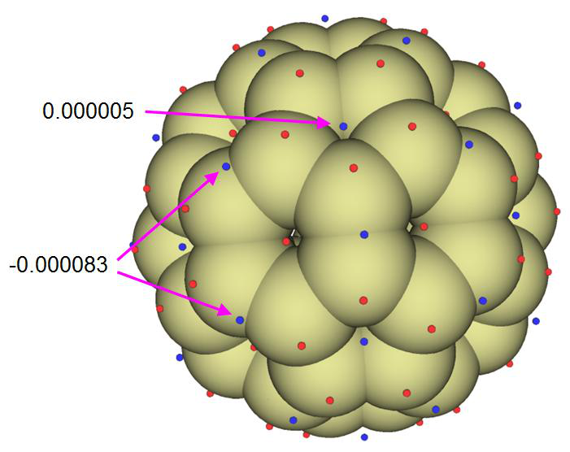

<!-- p.939 -->
The cyclo[18]carbon contains two kinds of C-C bond, a short one and a long one, they occur alternatively. Two short bonds are highlighted by red arrows. From the map above it can be clearly seen that the short and long C-C bonds are vulnerable to electrophilic and nucleophilic attacks, respectively, since the former are enclosed by negative isosurfaces while the latter are enclosed by positive isosurfaces.

In Multiwfn, it is also possible to plot ∆𝑓𝑤 as plane map. As an example, we will plot ∆𝑓𝑤 as color-filled map on the molecular plane of the cyclo[18]carbon. We first set "iuserfunc" parameter in `settings.ini` to 98, then boot up Multiwfn and input

C18.fchk 4 // Plot plane map 100 // User-defined real space function, which now corresponds to ∆𝑓𝑤 1 // Color-filled map [Press ENTER button to use default grid setting] 1 // XY plane 0 // Z=0 We close the map that pops up, then adjust some settings in the post-processing menu and replot, after that you will see the map below. The blue contour line corresponds to vdW surface.


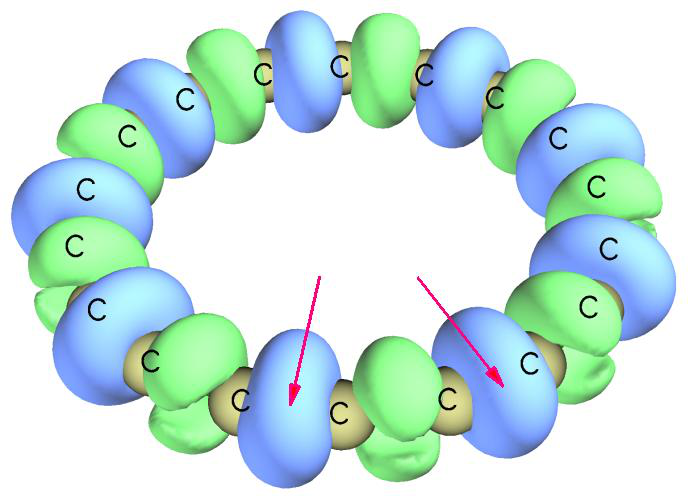

<!-- p.940 -->
From the map above we can find that the inner edge of the ring is more reactive than the outer edge, since inner edge has larger magnitude of ∆𝑓𝑤.

Part 3: CH3Cl Finally, we employ ∆𝑓𝑤 to study reactivity of CH3Cl. The input file is examples\CH3Cl.fchk. We calculate grid data of ∆𝑓𝑤 using the same way as the examples above, however, in order to get better graphical effect, this time we do not visualize isosurface in Multiwfn directly, but export grid data of ∆𝑓𝑤 as OW_DD.cub via corresponding option, then use the method described in Section 4.A.14 to easily render it as isosurface map via VMD program. The isosurface of 0.008 a.u. is shown below.

As can be seen, the toroidal negative region appears around the Cl atom, implying that this region shows Lewis-base character. At the two ends of C-Cl bond the ∆𝑓𝑤 is notably positive, showing that the end of carbon site is vulnerable to nucleophilic attack (e.g. SN2 reaction), while

the end of Cl site behaves as Lewis-acid, which is in line with the fact that there is a σ-hole region.

By the way, you can also study extrema of ∆𝑓𝑤 on molecular surface like the example of C60 to make discussion of ∆𝑓𝑤 at quantitative level.


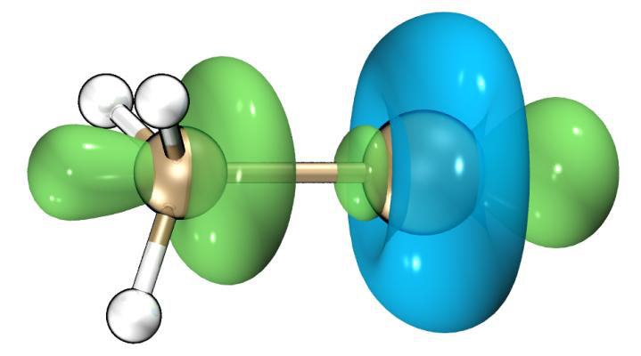

<!-- p.941 -->
4.22.3 Examples of CDFT analysis in (quasi-)degenerate


### HOMO/LUMO case

As described in Section 3.25.4, aside from employing orbital-weighted form, Multiwfn also supports another form to perform CDFT analysis when HOMO and/or LUMO are (quasi-)degenerate. This form solely relies on electron density and thus theoretically more rigorous than the orbital-weighted form, at the expense of additional computational effort since wavefunction files of N+p and N-q states should also be calculated, where p and q are degeneracy of LUMO and HOMO, respectively. Next, I will give two examples.

4.22.3.1 Fukui function and dual descriptor of benzene

In this section I will take benzene as an example to illustrate calculating Fukui function and dual descriptor with consideration of HOMO/LUMO degeneracy. Because we need to determine the degeneracy based on orbital energies, therefore we should first generate a wavefunction file for the studied structure. examples\benzene.fch is the wavefunction file produced by geometry optimization task at B3LYP/6-31G* level by Gaussian 16.

Boot up Multiwfn and input examples\benzene.fch 22 // Calculate various quantities in conceptual density functional theory -3 // Set degree of frontier molecular orbital degeneracy Now information of lowest 10 unoccupied MOs are shown on screen to help you determine LUMO degeneracy


```text
...[ignored]
Orbital    25 (LUMO+3)   Energy:     3.838 eV  E_diff:     3.737 eV
Orbital    24 (LUMO+2)   Energy:     2.346 eV  E_diff:     2.246 eV
Orbital    23 (LUMO+1)   Energy:     0.100 eV  E_diff:     0.000 eV
Orbital    22 (LUMO  )   Energy:     0.100 eV
```

From the orbital energies it is clear that LUMO and LUMO+1 are exactly degenerate, while LUMO+2 has a significantly higher energy, therefore the degree of LUMO degeneracy is 2. So, we input 2 here (Note that Multiwfn prompts you that if you directly press ENTER button here, degeneracy of 2 will be used. This is because Multiwfn determines the degeneracy of LUMO by counting how many unoccupied orbital energies differ from LUMO by less than 0.01 eV).

Then information of highest 10 occupied MOs are shown on screen:


```text
Orbital    21 (HOMO  )   Energy:    -6.720 eV
Orbital    20 (HOMO-1)   Energy:    -6.720 eV  E_diff:     0.000 eV
Orbital    19 (HOMO-2)   Energy:    -9.234 eV  E_diff:    -2.514 eV
Orbital    18 (HOMO-3)   Energy:    -9.234 eV  E_diff:    -2.514 eV
...[ignored]
```

It is found that HOMO and HOMO-1 have exactly identical energy, therefore now we input 2 to indicate that HOMO degeneracy is 2 (you can also press ENTER button directly to use the automatically determined degeneracy of 2).

Next, you can manually use your favourite quantum chemistry program to generate wavefunction file of N, N+2 and N-2 states. For convenience, here we let Multiwfn help us prepare the input files. Input the following commands:


<!-- p.942 -->
1 // Single point input files of Gaussian for generating .wfn files for N, N+2, N-2 states will be prepared (If you are an ORCA user, you can choose option -2 to change to ORCA program before selecting this option)

[Press ENTER button] //Use the default B3LYP/6-31G* level for single point calculation [Press ENTER button] //As mentioned in prompt, pressing ENTER button directly will use net charge and spin multiplicity of (0 1), (-2 3) and (2 3) for the N, N+2 and N-2 states, respectively. These combinations are reasonable for present case

Because currently N+1 and N-1 states have not been defined, while E(N+1) and E(N-1) are needed for calculating first VIP, VEA and their related quantities such as softness in option 2, so Multiwfn also asks you to input net charge and spin multiplicity for the two states. However, in this example we only want to calculate Fukui function and dual descriptor, which are independent of these energetic quantities, so we press ENTER button twice to skip definition of the two states.

Now N.gjf, N+2.gjf and N-2.gjf have been generated in current folder, you can manually use Gaussian to run them, or directly input y to let Multiwfn invoke the Gaussian on your machine to run them (in this case that the “gaupath” in `settings.ini` have been correctly defined). Once calculations are all finished, you will have N.wfn, N+2.wfn and N-2.wfn in current folder.

Then we plot isosurface map of Fukui function and dual descriptor with consideration of HOMO and LUMO degeneracy. Input the following commands

3 // Calculate grid data of Fukui function and dual descriptor (if N.wfn, N+2.wfn and N-2.wfn are not present in current folder, Multiwfn will ask you to input path of wavefunction files of the three states)

2 // Medium-quality grid

2 // Visualize isosurface of f − After changing isovalue to 0.005 a.u., you will see the following map

From the map above it can be seen that the distribution of f − with consideration of HOMO degeneracy, namely (ρN − ρN-2)/2, is fully in line with molecular symmetry. The positive regions (exhibited by green isosurfaces) mainly occur above and below the molecular plane at carbon atoms,

thus correctly indicating that the π-electron cloud is easy to undergo electrophilic attack. In contrast, if you plot f − in usual way, namely ρN − ρN-1, you will find its distribution obviously violates the actual molecular symmetry and thus leads to misleading conclusion about preferential site of electrophilic attack.

Similarly, you can use options 1, 3 and 4 to visualize isosurface map of f +, f 0, and dual

descriptor Δf calculated under consideration of frontier MO degeneracy, respectively.


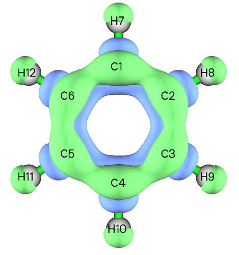

<!-- p.943 -->
Notice about the choice of calculation level for f + and dual descriptor For the benzene system, if you use B3LYP with a basis set containing diffuse functions (e.g. 6-311+G*) to generate wavefunction files, you will find distribution of the calculated

(quasi-)degenerate f + and Δf is extremely diffuse (showing strong Rydberg character) and not completely in line with molecular symmetry. This is because the severe self-interaction error (SIE) problem of this functional makes the electrons at the N+2 state over-diffuse, while the current basis set has capability of representing spatial regions far from the molecule. In this case, the resulting f +

and Δf are not well-behaved and cannot be used to discuss preferential reactive sites.

It is worth to note that in Chem. Phys. Lett., 724, 29 (2019), it was found that if Fukui function and dual descriptor are evaluated based on finite difference (the same as the present case), then even a 3-zeta basis set without diffuse functions can basically result in a meaningful dual descriptor.

Despite that the B3LYP/6-31G* level, as what we employed in the present example, yields

seemingly reasonable f + and Δf distributions, if you pursue a more rigorous result, I would like to recommend using a long-range corrected DFT functionals such as ωB97XD with a 3-zeta basis set without diffuse functions, e.g. 6-311G*. The ωB97XD suffers much weaker SIE problem than the popular B3LYP, therefore the electrons are more tightly bounded at anionic state; the 3-zeta basis set with no diffuse function represents valence electronic structure adequately, while electrons are

forced to be bounded within valence region, guaranteeing that f + and Δf only represent the region of chemical interest.

4.22.3.2 Local softness and local hyper-softness of C60 fullerene

In this section I will illustrate calculation of local softness and local hyper-softness of C60

fullerene. They are presented in J. Math. Chem., 62, 461 (2024) at ωB97XD/6-311+G* level, but in this section, we use 6-311G* instead to greatly save computational cost. The .fchk file

(C60_wB97XD_opt.fchk) file produced by geometry optimization at ωB97XD/6-311G* level by Gaussian 16 can be downloaded at http://sobereva.com/multiwfn/extrafiles/C60_wB97XD_opt.7z.

Boot up Multiwfn and input C60_wB97XD_opt.fchk 22 // Calculate various quantities in conceptual density functional theory -3 // Set degree of frontier molecular orbital degeneracy [Press ENTER button directly] // Use automatically determined LUMO degeneracy of 3 [Press ENTER button directly] // Use automatically determined HOMO degeneracy of 5 1 // Generate .wfn files for various electrons states wB97XD/6-311G* symm=loose scf=conver=7 // Keywords for performing single point task of Gaussian. The “symm=loose” ensures that Gaussian will utilize Ih point group of C60 to greatly reduce cost. “scf=conver=7” slightly loosens SCF convergence threshold to make it easier to reach

[Press ENTER button] //Use default net charge and spin multiplicity of (0 1), (-3 4) and (5 6) for the N, N+3 and N-5 states, respectively

-1,2 // Net charge and spin multiplicity of N+1 state 1,2 // Net charge and spin multiplicity of N-1 state Now N.gjf, N-1.gjf, N+1.gjf, N-3.gjf and N+5.gjf have been generated in current folder, input y to let Multiwfn invoke Gaussian to perform calculation (or manually calculate them). After calculations, you will find N.wfn, N-1.wfn, N+1.wfn, N-3.wfn and N+5.wfn in current folder.

Then choose option 2 to calculate various CDFT quantities and print them to CDFT.txt in current folder. From which we find softness and its square:


<!-- p.944 -->

```text
 Softness:      4.638426 Hartree^-1,    0.1705 eV^-1
 Softness^2:   21.514996 Hartree^-2,    0.0291 eV^-2
```

Next, input following commands to obtain local hyper-softness, which is product of square of softness and dual descriptor

3 // Calculate grid data of Fukui function, dual descriptor and related functions -10 // Set extension distance 6 // 6 Bohr, which is slightly larger than the default one to avoid isosurface truncation at box boundary when isovalue is set to a small value

3 // Since C60 is not small, we use high-quality grid to guarantee that grid spacing will not be too large and thus leading to poor isosurface map

-1 // Set the scale factor to various grid data 21.514996 // Square of softness in Hartree-2 8 // Export grid data of scaled dual descriptor as DD.cub in current folder Now the newly generated DD.cub in current folder corresponds to local hyper-softness with unit of 1/(Bohr3Hartree2). Plotting it as isosurface map with isovalue of 0.001 via VMD, you will see the following map, which is basically exactly the same as Fig. 4 of J. Math. Chem., 62, 461 (2024), though the current basis set 6-311G* is different to the much more expensive 6-311+G* employed in that work. Also, it is noteworthy that the main characteristic of this map is comparable with the ∆𝑓𝑤 of C60 obtained in Section 4.22.2.

Via similar way, we can obtain local softness, which is defined as product of softness and Fukui function. Input following commands

-1 // Set the scale factor to various grid data 4.638426 // Softness in Hartree-1 6 // Export grid data of scaled f- as f-.cub in current folder

Now the newly generated f-.cub in current folder corresponds to local softness s−, with unit of 1/(Bohr3Hartree). The following maps are the 0.005 and 0.003 isosurface of s− plotted by VMD, the former is identical to Fig. 2 of J. Math. Chem., 62, 461 (2024), while the latter is clearer to distinguish the bonds easiest to undergo electrophilic attack (i.e. the bonds shared by two six-membered rings), and it looks very analogous to the 𝑓𝑤− map of C60 in Section 4.22.2.


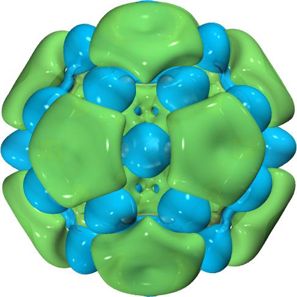

<!-- p.945 -->
4.22.3.3 Fukui function and dual descriptor of an open-shell molecule, O2

Please read Section 3.25.4.2 first to familiarize yourself with the working equations for evaluating Fukui function and dual descriptor of various forms for open-shell cases. In this example we calculate the functions for O2, which is a representative open-shell molecule (triplet ground state) with degeneracy in frontier MOs.

Boot up Multiwfn and input examples\O2.fch // Wavefunction file of ground state O2 at B3LYP/6-31G* level 22 // Calculate various quantities in conceptual density functional theory 12 // Calculate Fukui function and dual descriptor based on formalism of conceptual spin-polarized DFT

1 // Set degeneracy of frontier molecular orbitals

[Press ENTER button directly] // Use suggested degeneracy of LUMO(α) [Press ENTER button directly] // Use suggested degeneracy of HOMO(α) [Press ENTER button directly] // Use suggested degeneracy of LUMO(β) [Press ENTER button directly] // Use suggested degeneracy of HOMO(β) Now you can see the summary of degeneracy of frontier MOs:


```text
Degeneracy of LUMO(alpha):  1
Degeneracy of HOMO(alpha):  2
Degeneracy of LUMO(beta):   2
Degeneracy of HOMO(beta):   2
```

Next, we input 2 //Generate .wfn files for various electrons states [Press ENTER button directly] // Use the default B3LYP/6-31G* as computational level for generating Gaussian input files

Now you will find state0_3.gjf, state-1_4.gjf, state-2_1.gjf, state2_1.gjf, and state2_5.gjf have been generated in current folder, they are Gaussian input file of single point task for generating .wfn file of various electronic states that involved in our present study. For example, state-1_4.gjf corresponds to net charge of -4 with spin multiplicity of 4. If you have Gaussian installed on your local machine, you can input y to ask Multiwfn to invoke Gaussian to calculate all of them; alternatively, manually calculate them by Gaussian, then put the resulting .wfn files into current folder.

Now choose option 3 and select medium-quality grid to start calculating grid data of electron


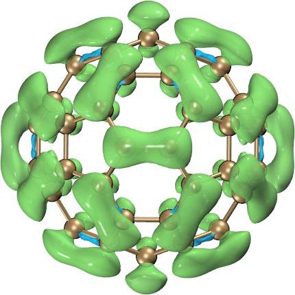

<!-- p.946 -->
density of different states. After that, in the post-processing menu, choose to visualize the real space function of your interest as isosurface map, or export grid data as .cub file. For example, we choose option 7 to plot dual descriptor of Δ𝑓Δ𝑁𝑆<0 form, after changing isosurface to 0.0005 a.u. and set

material as transparent, you will see the following map, which is exactly the same as DUAL-UDFT case in Fig. 7 of Chem. Phys. Lett., 506, 104 (2011).


### 4.22.4 Example of plotting Fukui potential and dual descriptor potential


This example illustrates plotting Fukui potential and dual descriptor potential for maleic anhydride, the latter is also given in J. Math. Chem., 62, 1094 (2024) and it was calculated at M06-2X/6-311++G(d,p) level, so we will use the same level to reproduce that result. If you are not familiar with these two potentials, please check Section 3.25.1 first.

Boot up Multiwfn and input examples\maleic_anhydride.xyz //Geometry was optimized at M06-2X/6-311++G(d,p) level 22 // Conceptual DFT (CDFT) analysis 1 // Generate .wfn files for N, N+1, N-1 electrons states M062X/6-311++G(d,p) // Keywords of Gaussian to perform single point calculations [Press ENTER button] // Use (0 1), (-1 2) and (1 2) for N, N+1 and N-1 states y // Invoke Gaussian to calculate the three states (assume that you have properly set “gaupath” in `settings.ini`)

9 // Calculate grid data of Fukui potential and dual descriptor potential 1 // Because calculating ESP grid data is relatively expensive, so here we choose to use low-quality grid

Now, you can choose corresponding options to visualize various kinds of Fukui potential and dual descriptor potential (DDP), the isosurface maps of 𝑉𝑓+, 𝑉𝑓−, and 𝐷𝐷𝑃= 𝑉𝑓+ −𝑉𝑓− are shown

below, positive and negative parts are shown as green and blue, respectively. The DDP map is in perfect agreement with Fig. 5 of J. Math. Chem., 62, 1094 (2024). The green part of the DDP map indicates that C4 and C5 are most susceptible to undergo nucleophilic attack. Experimentally, it is known that these two atoms of maleic anhydride can undergo D-A addition reaction with the nucleophilic cis-1,3-butadiene.


<!-- p.947 -->

### 4.22.5 Examples of calculating bond dual descriptor (BDD)

Note: Using Multiwfn to calculate bond dual descriptor to study reactivity of different chemical bonds” (http://sobereva.com/766).

Please read the brief introduction to bond dual descriptor (BDD) in Section 3.25.1 first, and read Section 4.22.1 to understand the basic use of the conceptual DFT analysis module. In this section I will illustrate the calculation of BDD for acrylonitrile, the structure optimized at B3LYP/6-31G* level is shown below, and the structure file is examples\acrylonitrile.xyz.

Boot up Multiwfn, load examples\acrylonitrile.xyz, then input 22 // Conceptual DFT (CDFT) analysis 1 // Generate .wfn files for N, N+1, N-1 electrons states [Press ENTER button directly] // The generated .gjf files will correspond to single point task at B3LYP/6-31G* level

[Press ENTER button directly] // Use default charge and spin multiplicity, namely 0 1 for N state, -1 2 for N+1 state, and 1 2 for N-1 state

Then run the N.gjf, N-1.gjf, N+1.gjf in current folder either by Gaussian manually or asking Multiwfn to invoke Gaussian to calculate them, then you will have N.wfn, N-1.wfn, and N+1.wfn in current folder. Then select option “10 Calculate bond dual descriptor (BDD)”. After that, Multiwfn loads the .wfn files and calculate fuzzy bond order for each electronic state in turn, and then BDD are printed, see below. For ease of study, only 10 most positive and negative values are directly given.


```text
10 most negative BDD values:
    1(C )     3(C ):    -0.562
    6(C )     7(N ):    -0.365
    3(C )     7(N ):    -0.029
```


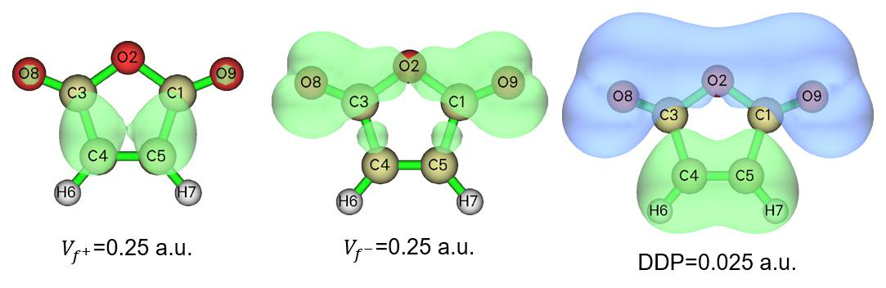


<!-- p.948 -->

```text
    1(C )     4(H ):    -0.008
    1(C )     5(H ):    -0.008
    4(H )     7(N ):    -0.001
    4(H )     5(H ):    -0.000
    5(H )     7(N ):    -0.000
    2(H )     4(H ):     0.000

10 most positive BDD values:
    1(C )     6(C ):     0.312
    1(C )     7(N ):     0.166
    3(C )     6(C ):     0.064
    3(C )     5(H ):     0.016
    3(C )     4(H ):     0.016
    2(H )     6(C ):     0.006
    2(H )     7(N ):     0.004
    5(H )     6(C ):     0.003
    4(H )     6(C ):     0.003
    1(C )     2(H ):     0.001
```

The results above show that C1-C3 is the bond most susceptible to electrophilic attack (the bond shows strongest nucleophilicity), followed by C6-N7. C1-C6 is the bond most susceptible to nucleophilic attack (the bond shows strongest electrophilicity). Some data given above do not correspond to directly bonded atoms, such as C1-N7 and C3-C6; these can be simply ignored.

Multiwfn then asks if you want to export the BDDs of all bonds in atomic number order to BDD.txt in the current directory, and to export the BDDs of all bonds sorted by numerical value to BDD_sorted.txt in the current directory. You can select y to export.

Note that the BDD calculation function also supports the case when frontier molecular orbitals are degenerated, just like the situation illustrated in Section 4.22.3. For these systems, you should use option -3 to set degeneracy of HOMO and LUMO prior to generating .wfn files and BDD calculation.


### 4.22.6 Examples of calculating dual delocalization descriptor (DDD)

Please first carefully read Section 3.25.6 to gain basic knowledge about dual delocalization descriptor (DDD). In this section I will illustrate how to calculate the quantities defined in the

framework of DDD for aminobenzene. The .fch file of this system calculated at ωB97XD/6-311G(d,p) can be downloaded at http://sobereva.com/multiwfn/extrafiles/aminobenzene_DDD.7z, the calculation level and geometry are exactly the same as those used in the original paper of DDD Phys. Chem. Chem. Phys., 28, 19133 (2026). We will use Hirshfeld partition to define the atomic spaces used for evaluating the atomic overlap matrix (AOM), which was also employed in the original paper of DDD.

Boot up Multiwfn and input aminobenzene_DDD.fch // The file in the compressed package mentioned above 22 // Conceptual DFT (CDFT) analysis 11 // Calculate dual delocalization descriptor (DDD)


<!-- p.949 -->
2 // Calculate AOM via Hirshfeld partition Now AOM has been generated, you can input indices of two atoms to study DDD of the corresponding bond. For example, we input 1,6, which corresponds to the meta-para C-C bond, you will see


```text
Result of    1(C )   --    6(C )
f-:      0.067452
f+:      0.026544
g-:      0.017868
g+:      0.011229
f(1):   -0.040907
f(2):   -0.056481
```

The result is exactly the same as the corresponding data in Table 2 of the DDD original paper

except for g−, our result is twice the value in Table 2. Our result is correct, actually the g− in Table 2 should be doubled if it is evaluated strictly according to Eq. 29 of that paper.


## 4.23 Examples of ETS-NOCV analysis

Note: Chinese version of this section is my blog article “In-depth analysis of orbital interactions between fragments using the ETS-NOCV method in Multiwfn” (http://sobereva.com/609).

In this section several examples are given to illustrate how to use the ETS-NOCV (Extended Transition State - Natural Orbitals for Chemical Valence) analysis to study interfragment interaction. If you have not read Section 3.26, please read it first to gain relevant knowledge about theory of ETS-NOCV analysis and its implementation details in Multiwfn. The input files used in most of following examples are .fch files generated by Gaussian, other wavefunction files can also be used as long as they carry basis function information (see Section 2.5), for example you can use ORCA program to generate .molden file as input files.

It should be emphasized that without special reasons, please do not use diffuse functions, otherwise orbital energies may be unable to be obtained via the illustrated steps because Fock/Kohn-Sham matrix cannot be directly generated (in this case you have to provide a file containing Fock/Kohn-Sham matrix to Multiwfn, see Appendix 7), and the orbital compositions evaluated by SCPA method in the ETS-NOCV module may be highly unreasonable.

4.23.1 A simple closed-shell instance: CO-BH3

In this example, we use ETS-NOCV to study the interaction between CO and BH3 in COBH3 complex at B3LYP/6-31G* level, all relevant files can be found in “examples\ETS-NOCV\COBH3” folder. Since this is the first ETS-NOCV example, the process will be described very detailedly.

Preparing input files Initially, we need to generate wavefunction files for COBH3, CO and BH3, respectively. We first build geometry of COBH3, and then create an input file of geometry optimization task, the corresponding Gaussian input file is COBH3.gjf in “examples\ETS-NOCV\COBH3”. After running it and converting the resulting .chk file to .fch, you will have COBH3.fch.

Next, extracting Cartesian coordinates of CO and BH3 from the optimized COBH3 geometry, and then create corresponding input files of single point task, they are CO.gjf and BH3.gjf in “examples\ETS-NOCV\COBH3” folder. Not that in order to avoid automatic reorientation of the


<!-- p.950 -->
geometry during Gaussian calculations, nosymm keyword must be used. After running the two fragment input files, you will have CO.fch and BH3.fch. Note that geometry optimization should not be applied to the two fragments, otherwise their coordinates will be inconsistent with those in complex.

The choice of electronic state of fragments, namely definition of reference state in ETS-NOCV analysis, is somewhat arbitrary. In the current example it is evident that CO and BH3 should be in singlet, this is not only because singlet is the most stable state of CO and BH3 in their isolated states, but also, more importantly, because they form bond with each other in a closed-shell state

(OC→BH3 is a coordinate bond).

Quantitative analysis of ETS-NOCV data Boot up Multiwfn and input examples\ETS-NOCV\COBH3\COBH3.fch // Complex wavefunction file 23 // ETS-NOCV analysis 2 // Two fragments examples\ETS-NOCV\COBH3\CO.fch // Wavefunction file of fragment 1. Note that loading order of the fragment wavefunction files must be in line with occurrence order of fragments in the complex

examples\ETS-NOCV\COBH3\BH3.fch // Wavefunction file of fragment 2 Now information of NOCV orbitals and NOCV pairs is immediately printed:


```text
       --------------- Pair and NOCV orbital information --------------
There are totally   26 NOCV pairs and    51 NOCV orbitals
NOCV orbitals whose eigenvalues are smaller than 1.0E-03 are not shown
Note: Energies of NOCV orbitals have not been evaluated, so they are all zero

 Pair  Energy | Orbital  Eigenvalue    Energy  | Orbital  Eigenvalue    Energy
    1    0.00       1      0.56514       0.00       51     -0.56514       0.00
    2    0.00       2      0.40205       0.00       50     -0.40205       0.00
    3    0.00       3      0.40204       0.00       49     -0.40204       0.00
    4    0.00       4      0.13007       0.00       48     -0.13007       0.00
    5    0.00       5      0.03704       0.00       47     -0.03704       0.00
    6    0.00       6      0.03703       0.00       46     -0.03703       0.00
    7    0.00       7      0.03419       0.00       45     -0.03419       0.00
    8    0.00       8      0.00834       0.00       44     -0.00834       0.00
    9    0.00       9      0.00273       0.00       43     -0.00273       0.00
Sum of NOCV eigenvalues:   0.00000
```

The NOCV orbitals are sorted according to their eigenvalues from most positive to most negative. As you can see from the output, NOCV orbitals are in pairs, each two NOCV orbitals with opposite eigenvalues constitute a NOCV pair. For example, from the above output it can be seen that NOCV 3 and NOCV 49 have eigenvalues of 0.402 and -0.402, respectively, therefore they form a NOCV pair, namely NOCV pair 3. The sum of eigenvalues of all NOCV orbitals is exactly zero, since orbital interaction does not affect total number of electrons.

The NOCV pairs with larger magnitude of eigenvalue have larger underlying influence to the density difference caused by orbital interaction. As you can see from above information, there are as many as 26 NOCV pairs in total, however only nine of them are printed because of the default


<!-- p.951 -->
printing threshold (i.e. absolute eigenvalue must be larger than 0.001), among which only pairs 1 to 4 have notable influences to density difference. Hence, you can study orbital interaction between CO and BH3 by only examining character of these NOCV pairs

Currently, the energies of NOCV orbitals and pairs have not been calculated yet. To calculate them, you should provide a file containing Fock matrix for HF case or Kohn-Sham (KS) matrix for DFT case, see Appendix 7 of this manual for detail. In this and following example we use a more convenient way, namely directly letting Multiwfn to generate Fock/KS matrix based on energies and coefficient matrix of molecular orbitals in the complex wavefunction COBH3.fch. So, we select option “-2 Generate Fock/KS matrix and evaluate NOCV orbital energies” in post-processing menu, then KS matrix is generated and NOCV energies are evaluated, after that NOCV information is printed on screen again, as shown below


```text
Pair  Energy | Orbital  Eigenvalue    Energy  | Orbital  Eigenvalue    Energy
    1  -77.88       1      0.56514    -120.88       51     -0.56514      16.93
    2  -15.83       2      0.40205    -139.60       50     -0.40205    -100.22
    3  -15.84       3      0.40204    -139.62       49     -0.40204    -100.23
    4   -5.53       4      0.13007     -44.60       48     -0.13007      -2.06
    5   -0.41       5      0.03704     -18.25       47     -0.03704      -7.19
    6   -0.41       6      0.03703     -18.19       46     -0.03703      -7.13
    7   -0.65       7      0.03419      21.33       45     -0.03419      40.48
    8   -0.06       8      0.00834    -308.53       44     -0.00834    -301.42
    9   -0.02       9      0.00273   -1661.86       43     -0.00273   -1655.69
Sum of NOCV eigenvalues:   0.00000
Sum of pair energies:    -116.63 kcal/mol
```

As you can see from the output, this time each NOCV pair has a corresponding energy, the sum of energies of all NOCV pairs is -116.63 kcal/mol, indicating that the orbital interaction stabilizes

the complex by 116.63 kcal/mol, which will be referred to as ΔEorb. The energy of a NOCV pair is calculated as the sum of the products of the energy and eigenvalue of the NOCV orbitals belonging

orb ) is -77.88 kcal/mol, it is calculated as −120.88×0.5651 + 16.93×(−0.5651). to it. For example, the energy of NOCV pair 1 (Δ𝛦1

It is important to note that as mentioned in Section 3.26.2, since the Fock/KS matrix used in ETS-NOCV analysis in Multiwfn corresponds to the one built based on actual complex wavefunction rather than on the artificial transition state wavefunction, the printed “Sum of pair energies” is not the rigorous orbital interaction energy, and the printed NOCV energies are not exactly the corresponding ones in standard ETS-NOCV analysis. However, the discrepancy is found to be small in general and does not evidently affect the conclusion drawn from the analysis.

Probably you have noticed that NOCV pair 9 is composed of two NOCV orbitals with very negative energy, but the magnitude of pair energy is extremely small (-0.02 kcal/mol), what is the reason? In fact, the corresponding NOCV orbitals 9 and 43 are highly analogous to core orbitals (you can confirm this by visualizing orbital isosurfaces with very small isovalue), evidently their energies must be fairly negative as they feel very strong nuclear attractive potentials; however, since this kind of orbitals little participate in bonding, their eigenvalues must be very small, making energy of NOCV pair small enough to be fully ignored.

Visual analysis of NOCV pairs

Evidently, NOCV pair 1 (-77.9 kcal/mol) is the dominant contributor to the ΔEorb (-116.6 kcal/mol), by visualizing isosurface of density of this pair one can gain an deeper insight about the interaction mechanism that plays the vital role in the complexation between CO and BH3. The contribution by NOCV pairs 2 and 3 is not fully negligible, hence by visualizing their densities we can understand which kind of interactions play a secondary role for the interfragment binding.

Now we choose option “2 Show isosurface of NOCV pair density”, then choose “2 Medium-quality grid”, which is fine enough for showing NOCV pair density of small systems like COBH3.


<!-- p.952 -->
Now the NOCV information is printed again on screen to make it easier for users to choose the NOCV pair of interest. Next, we input 1 to calculate grid data of density of NOCV pair 1 and show its isosurface. At isovalue of 0.005 a.u., you can see below image in the GUI window (the arrow is manually added)

In this map, blue and green isosurfaces display the region where electron density is decreased and increased respectively due to the orbital interaction described by NOCV pair 1. Clearly, the NOCV pair 1 corresponds to significant electron displacement from the CO moiety to the BH3 moiety. The amount of transferred electron corresponds to the absolute eigenvalue of this NOCV pair, namely 0.565. Occurrence of this kind of interaction is naturally expected since CO has rich electrons and tends to donate electrons while BH3 is an electron-deficient species and tends to accept electrons by

its unoccupied orbital located at boron. Because this CO→BH3 donation interaction is so prominent and greatly stabilizes this complex, it is easy to understand why the corresponding NOCV pair energy is as large as -77.9 kcal/mol.

Next, we check density of NOCV pair 2. Click “RETURN” button at top right corner of the GUI window, then input 2. After adjust the isovalue to an appropriate value 0.002 a.u., you will see

Obviously, NOCV pair 2 represents the back-donation from σ(B-H) occupied orbital of BH3 to unoccupied π* orbital of CO. Since this back-donation effect is not strong, the energy of NOCV pair 2 is only a modest value -15.8 kcal/mol. However, the influence of NOCV pair 2 to electron density difference is not much smaller than that of NOCV pair 1, since the eigenvalue of the former (0.402, which corresponds to the amount of back-donation electrons) is not significantly lower than that of the latter (0.565).

Similarly, you can then observe NOCV pair 3, its energy and eigenvalue are degenerate to NOCV pair 2 because of the C3v point group of COBH3, and their characters are the same except

that in NOCV pair 3 the CO accepts electrons from BH3 via its another unoccupied π orbital.

Finally, we visualize the sum of densities of all other NOCV pairs. Close the GUI window and then input 4-26 (recall that there are 26 NOCV pairs in total), you will find following information


<!-- p.953 -->
on console window


```text
Sum of positive eigenvalues of selected pairs:   0.25072
Sum of energies of selected pairs:       -7.09 kcal/mol
```

and you will see the following isosurface (isovalue = 0.001 a.u.)

The shape of the isosurface is complicated, and it is difficult to present a clear chemical interpretation on this collective interaction. However, we can still detect that there is some degree of back-donation from BH3 to CO, and electron density polarization occurs within each fragment region. Since the sum of energies of these NOCV pairs is merely -7.09 kcal/mol, the back-donation with polarization effects represented by NOCV pairs 4 to 26 do not play an important role.

Visualizing NOCV orbitals Next, I will show how to visualize NOCV orbitals, from which you can better understand how the density of NOCV pairs is constructed. Close GUI window, then input q to return to post-processing menu, then choose option “1 Show isosurface of NOCV orbitals”. Now NOCV information is printed on screen, and meantime a GUI window appears, in which you can select the NOCV orbital that you want to visualize via the list at bottom right corner, and you can also directly input the index of NOCV orbital in the text box at bottom right corner and then press ENTER button. The feature of this GUI is completely identical to that of main function 0 (see examples in Section 4.0 for more introduction about this interface).

From console window you can find NOCV pair 1 is composed of NOCV orbitals 1 and 51:


```text
Pair  Energy | Orbital  Eigenvalue    Energy  | Orbital  Eigenvalue    Energy
   1  -77.88       1      0.56514    -120.88       51     -0.56514      16.93
[...ignored]
```

So, in order to more deeply understand the character of NOCV pair 1, we should visualize orbitals 1 and 51. The isosurfaces of the two orbitals at isovalue of 0.15, as well as that of the NOCV pair 1 at isovalue of 0.01 a.u. are collectively shown below. From this map you can clearly recognize how the density of NOCV pair 1 results from eigenvalue-weighted orbital density of NOCV orbitals 1 and 51.


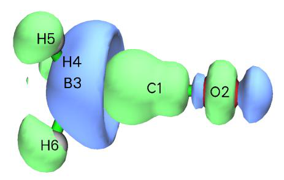

<!-- p.954 -->
Usually, visualizing NOCV orbitals is not very useful since chemical meaning of NOCV orbitals is not quite strong.

Studying composition of NOCV pairs and orbitals Multiwfn is able to calculate composition of NOCV pairs and corresponding orbitals, this is useful if you hope to quantitatively look into their natures. Now we choose option “14 Calculate composition of NOCV orbitals and pairs”, the NOCV information is then printed on screen. Here we study composition of NOCV pair 1 and the related two NOCV orbitals, so we input 1, then you will see below output. The compositions are evaluated using SCPA method mentioned in Section 3.10.3, note that it is incompatible with diffuse functions.


```text
Note: Only the basis functions and shells having absolute composition in the NO
CV pair or corresponding NOCV orbitals larger than   0.500 % are printed below.
The threshold can be changed via "compthres" parameter in settings.ini

 Contribution of each basis function to NOCV pair/orbitals:
  Basis    Type    Atom    Shell    Orb.    1   Orb.   51   Pair    1
     1     S        1(C )    1        0.09 %      1.13 %     -0.58 %
     2     S        1(C )    2        1.05 %      4.09 %     -1.72 %
     4     Y        1(C )    3        1.81 %      5.53 %     -2.10 %
     6     S        1(C )    4       15.77 %     49.68 %    -19.17 %
     8     Y        1(C )    5        5.07 %      5.06 %      0.00 %
    19     Y        2(O )    9        0.01 %      1.60 %     -0.90 %
    23     Y        2(O )   11        0.02 %      0.68 %     -0.37 %
    32     S        3(B )   14        9.89 %      9.27 %      0.35 %
    34     Y        3(B )   15       42.83 %     10.50 %     18.27 %
    36     S        3(B )   16       11.57 %      9.02 %      1.44 %
    38     Y        3(B )   17        4.37 %      1.23 %      1.77 %
    47     S        4(H )   20        1.99 %      0.09 %      1.07 %
    49     S        5(H )   22        1.97 %      0.09 %      1.06 %
    51     S        6(H )   24        1.97 %      0.09 %      1.06 %
```


<!-- p.955 -->

```text
 Contribution of each basis function shell to NOCV pair/orbitals:
  Shell    Type    Atom         Orb.    1   Orb.   51   Pair    1
     1     S        1(C )         0.09 %      1.13 %     -0.58 %
     2     S        1(C )         1.05 %      4.09 %     -1.72 %
     3     P        1(C )         1.81 %      5.53 %     -2.10 %
     4     S        1(C )        15.77 %     49.68 %    -19.17 %
     5     P        1(C )         5.07 %      5.06 %      0.00 %
     9     P        2(O )         0.01 %      1.60 %     -0.90 %
    11     P        2(O )         0.02 %      0.68 %     -0.37 %
    14     S        3(B )         9.89 %      9.27 %      0.35 %
    15     P        3(B )        42.83 %     10.50 %     18.27 %
    16     S        3(B )        11.57 %      9.02 %      1.44 %
    17     P        3(B )         4.37 %      1.23 %      1.77 %
    18     D        3(B )         0.55 %      0.09 %      0.26 %
    20     S        4(H )         1.99 %      0.09 %      1.07 %
    22     S        5(H )         1.97 %      0.09 %      1.06 %
    24     S        6(H )         1.97 %      0.09 %      1.06 %

 Contribution of various types of shells to NOCV pair/orbitals:
 Type     Orb.    1   Orb.   51   Pair    1
  s:       45.14 %     74.98 %    -16.87 %
  p:       54.10 %     24.59 %     16.67 %
  d:        0.76 %      0.42 %      0.19 %
  f:        0.00 %      0.00 %      0.00 %
  g:        0.00 %      0.00 %      0.00 %
  h:        0.00 %      0.00 %      0.00 %

 Contribution of each atom to NOCV pair/orbitals:
   Atom         Orb.    1   Orb.   51   Pair    1
     1(C ):      23.99 %     65.82 %    -23.64 %
     2(O ):       0.28 %      2.94 %     -1.50 %
     3(B ):      69.40 %     30.30 %     22.10 %
     4(H ):       2.12 %      0.32 %      1.02 %
     5(H ):       2.11 %      0.31 %      1.01 %
     6(H ):       2.11 %      0.31 %      1.01 %
```

As you can see, the contributions to the NOCV pair 1 and to the corresponding NOCV orbitals 1 and 51 by various basis functions, shells, angular moments and atoms are outputted in turn. You can compare this information with the isosurface maps given earlier, you will find the quantitative compositions are indeed in agreement with the characteristics reflected by the isosurfaces. According to the definition of our employed 6-31G* basis set and contributions of basis functions, we can also estimate composition of various atomic orbitals in the NOCV pair and orbitals. For example, the 2nd and 6th basis functions are the second and third S type of basis functions of atom 4, they collectively represent 2s atomic orbital, so sum of their contributions to the NOCV pair

(−1.72% −19.17% = −20.89%) is just the composition of 2s atomic orbital in NOCV pair 1, which


<!-- p.956 -->
is mainly responsible for the negative part of this NOCV pair. Similarly, you can find 2pz atomic orbital contributes to NOCV pair 1 by 18.27% +1.77% = 20.04%, it is the dominant contributor to the positive part of the NOCV pair; this is fully in line with the observation from the isosurface of NOCV pair 1, namely there is a green (positive) isosurface around the boron atom with two lobes extended along Y-axis, clearly it must be mainly composed of boron pz atomic orbital.0

Note that just like integral of a NOCV pair over the whole space must be exactly zero, the sum of compositions of a NOCV pair is also always zero.

Visualization of Pauli / orbital / total deformation density

$$\Delta\rho^{\mathrm{Pauli}}$$

To visualize the three kinds of deformation densities, we choose options “3 Show isosurface of Pauli deformation density”, “4 Show isosurface of orbital deformation density” and “5 Show isosurface of total deformation density”, respectively. The corresponding isosurface maps are collectively shown below

From the map of ΔρPauli it is clear that Pauli repulsion makes electron density obviously decrease in the interaction region between CO and BH3. In contrast, the Δρorb map shows that orbital interaction between the two fragments makes electron density significantly accumulate in the bonding region, and this is a typical signal of the formation of shared electron interaction. The

isosurface of Δρ exhibits that the overall effect of interfragment interaction results in considerable increase in electron density between CO and BH3.

It is worth to note in passing that Δρorb corresponds to sum of all NOCV pair densities. In other words, if you select “2 Show isosurface of NOCV pair density” and then input indices of all NOCV

pairs, namely 1-26 in the present context, the resulting isosurface map will be exactly equal to Δρorb.

Visualization of promolecular / frozen state / actual complex orbitals If you are interested in understanding how Pauli repulsion deforms fragment orbitals, you can visually compare promolecular orbitals and frozen state orbitals, the former ones correspond to the original molecular orbitals (MOs) of the fragments (i.e. the union set of the MOs in CO.fch and BH3.fch), while the latter ones correspond to the MOs of the fragments after orthogonalization between the occupied orbitals of the fragments (for unoccupied fragment MOs, there is no difference


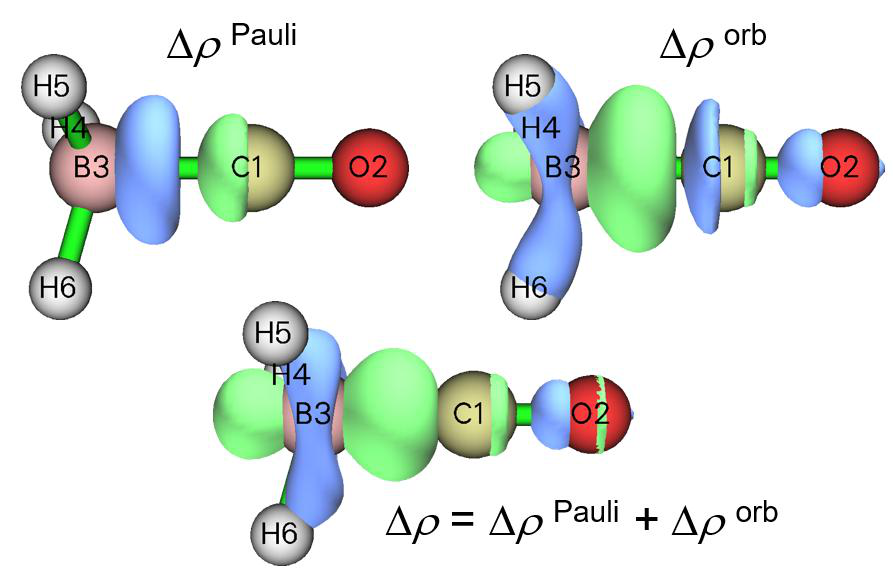

<!-- p.957 -->
between them in promolecular state and frozen state).

To visualize promolecular orbitals, select option “11 Visualize promolecular orbitals” in post-processing menu; to visualize frozen state orbitals, select option “12 Visualize frozen state orbitals”. The option “13 Visualize actual complex orbitals” is used to directly visualize the orbitals recorded in the complex wavefunction file, namely COBH3.fch.

After selecting any of the aforementioned options, information of all occupied orbitals are shown in console window (see below), so that you can conveniently find the indices of the orbitals you want to visualize.


```text
Orb:     1 Ene(au/eV):     0.000000       0.0000 Occ: 2.000000 Type:A+B
Orb:     2 Ene(au/eV):     0.000000       0.0000 Occ: 2.000000 Type:A+B
Orb:     3 Ene(au/eV):     0.000000       0.0000 Occ: 2.000000 Type:A+B
Orb:     4 Ene(au/eV):     0.000000       0.0000 Occ: 2.000000 Type:A+B
Orb:     5 Ene(au/eV):     0.000000       0.0000 Occ: 2.000000 Type:A+B
Orb:     6 Ene(au/eV):     0.000000       0.0000 Occ: 2.000000 Type:A+B
Orb:     7 Ene(au/eV):     0.000000       0.0000 Occ: 2.000000 Type:A+B
Orb:    31 Ene(au/eV):     0.000000       0.0000 Occ: 2.000000 Type:A+B
Orb:    32 Ene(au/eV):     0.000000       0.0000 Occ: 2.000000 Type:A+B
Orb:    33 Ene(au/eV):     0.000000       0.0000 Occ: 2.000000 Type:A+B
Orb:    34 Ene(au/eV):     0.000000       0.0000 Occ: 2.000000 Type:A+B
```

From the continuity of the orbital indices, we know from the above information that orbitals 1 to 7 and 8 to 30 correspond to occupied and unoccupied orbitals of fragment 1 (CO), respectively; while orbitals 31 to 34 and other ones correspond to occupied and unoccupied orbitals of fragment 2 (BH3), respectively. In the following figure I respectively plotted isosurfaces for MO 7 (HOMO of CO) in promolecular state and in frozen state, the isovalue is set to be a small value 0.02 so that you can clearly detect their difference

It is clear that due to Pauli repulsion effect, the HOMO of CO in frozen state has an additional nodal plane in the BH3 region as highlighted by the red dashed line, this is necessary for satisfaction of orthogonal condition between this orbital and all occupied orbitals of BH3.

This is the end of the analysis of the COBH3 system. In this section I have comprehensively illustrated usage of various options of the ETS-NOCV module, while in practical studies commonly you only need to focus on energies, eigenvalues and density isosurfaces of first several NOCV pairs.


<!-- p.958 -->

### 4.23.2 A simple open-shell instance: Ethane

In this section I use a simple molecule to illustrate ETS-NOCV analysis for open-shell

interaction. We will study how two ·CH3 radicals form an ethane (C2H6).

First, we optimize ethane and generate wavefunction files for it and the two ·CH3 radicals at B3LYP/6-31G* level. The steps are identical to the last section. The corresponding Gaussian input files and the resulting .fch files have been provided in “examples\ETS-NOCV\ethane” folder.

Evidently, the ·CH3 radicals should be set to doublet in the single point calculations.

Boot up Multiwfn and input examples\ETS-NOCV\ethane\ethane.fch // Wavefunction file of the whole system 23 // ETS-NOCV analysis 2 // Two fragments

examples\ETS-NOCV\ethane\CH3_1.fch // Wavefunction file of the first ·CH3 radical examples\ETS-NOCV\ethane\CH3_2.fch // Wavefunction file of the second ·CH3 radical n // Do not flip spin of the first ·CH3 radical y // Flip spin of the second ·CH3 radical Unlike the closed-shell case exemplified in the last section, in the present example you are asked to choose if flipping spin of the two open-shell fragments. Flipping spin means exchanging information of alpha and beta electrons. Properly flipping spin is important, because we need to guarantee that sum of number of alpha (beta) electrons of all fragments is identical to that of the

whole system. The ethane has 9 alpha electrons and 9 beta electrons, while each ·CH3 radical has 5 alpha electrons and 4 beta electrons. Clearly, we need to flip spin of either the first or the second·CH3 radical, otherwise after combining the two fragments together there will be 5+5=10 alpha electrons and 4+4=8 beta electrons, which does not agree with ethane.

Next, we choose option -2 to generate NOCV orbital/pair energies, then information of NOCVs of both spins are shown on screen:


```text
       --------------- Pair and NOCV orbital information --------------
There are totally   42 NOCV pairs and    84 NOCV orbitals
NOCV orbitals with absolute eigenvalues smaller than 1.0E-03 are not shown
Note: All energies are given in kcal/mol
                        ----- Alpha NOCV orbitals -----
 Pair  Energy | Orbital  Eigenvalue    Energy  | Orbital  Eigenvalue    Energy
    1  -93.24       1      0.44471    -117.62       42     -0.44471      92.06
    2   -1.20       2      0.04959     -28.00       41     -0.04959      -3.76
    3   -1.20       3      0.04959     -28.00       40     -0.04959      -3.76
    4   -0.85       4      0.04192       8.65       39     -0.04192      28.92
    5   -0.85       5      0.04192       8.65       38     -0.04192      28.92
    6   -1.09       6      0.03679     -19.92       37     -0.03679       9.79
    7   -0.48       7      0.02349      -4.18       36     -0.02349      16.23
    8   -0.01       8      0.00125   -2808.79       35     -0.00125   -2799.86
                        ----- Beta NOCV orbitals -----
 Pair  Energy | Orbital  Eigenvalue    Energy  | Orbital  Eigenvalue    Energy
   22  -93.24      43      0.44471    -117.62       84     -0.44471      92.06
   23   -1.20      44      0.04959     -28.00       83     -0.04959      -3.76
```


<!-- p.959 -->

```text
   24   -1.20      45      0.04959     -28.00       82     -0.04959      -3.76
   25   -0.85      46      0.04192       8.65       81     -0.04192      28.92
   26   -0.85      47      0.04192       8.65       80     -0.04192      28.92
   27   -1.09      48      0.03679     -19.92       79     -0.03679       9.79
   28   -0.48      49      0.02349      -4.18       78     -0.02349      16.23
   29   -0.01      50      0.00125   -2808.79       77     -0.00125   -2799.86
Sum of NOCV eigenvalues:  Alpha=   0.00000  Beta=   0.00000
Sum of pair energies:  Alpha=     -98.93  Beta=     -98.93  Total=    -197.86
```

The alpha and beta NOCV information shown above are seemingly identical, this is because the two fragments are symmetric with each other. The term “Sum of pair energies” indicates that

interfragment orbital interaction contributes to the binding energy between the two ·CH3 by nearly as large as -200 kcal/mol, each spin contributes to about -100 kcal/mol.

From above NOCV information one can see that for each spin only one NOCV pair plays a vital role, now we examine its character. Input the following commands

2 // Show isosurface of NOCV pair density 2 // Medium-quality grid 1 // Check NOCV pair 1, which is the dominant pair of alpha spin After inspecting the isosurface, we then close GUI window and input 22 to check NOCV pair 22, which is the dominant pair of beta spin. The isosurface maps of density of NOCV pair 1, pair 22 as well as their sum (corresponding to inputting 1,22 in the current interface) at isovalue of 0.01 a.u. are collective shown below, and the corresponding electron transfer character is indicated (q is amount of transferred electrons and corresponds to the absolute value of eigenvalues of NOCV pairs printed above).

As can be seen, NOCV pair 1 mainly exhibits transfer of alpha electrons from the first ·CH3 fragment (composed of C1, H2, H3 and H4) to the second ·CH3 fragment (composed of C5, H6, H7 and H8), it is due to the mix of singly occupied alpha orbital of the first ·CH3 and unoccupied alpha orbital(s) of the second ·CH3. NOCV pair 22 exhibits a similar feature as NOCV pair 1, but it corresponds to electron transfer of beta electrons and the direction is opposite. The sum of NOCV pairs 1 and 22 corresponds to the concentration of electron density in the bonding region between the two fragments, this is the very typical character of formation of a covalent bond. From the map above we can also find that the increase or decrease of electron density at the two ends of the ethane due to orbital interaction of each spin is basically cancelled when NOCV densities of the two spins


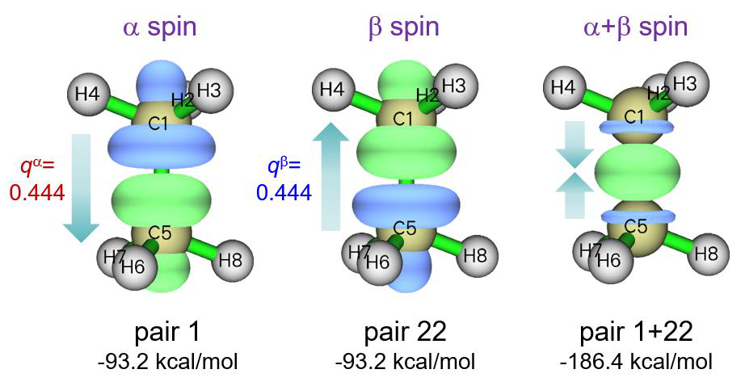

<!-- p.960 -->
are summed up.

Let us also check NOCV pairs 2 and 3, they are degenerated and correspond to minor orbital interaction of alpha spin, each one merely contributes energy of -1.2 kcal/mol to the interfragment binding. The isosurfaces of 0.0015 a.u. are shown below

These interactions are seemingly caused by hyperconjugation from occupied σ(C-H) orbitals to unoccupied π(C-C) orbital, since electron density is decreased in the hydrogen areas while increased in the region of C-C bond and there is a nodal plane along the bond. This interaction character can be identified more clearly if you visualize the corresponding NOCV orbitals. It is generally

recognized that the two ·CH3 fragments in ethane are binded by a σ bond, this is in line with our observation that these concomitant σ(C-H)→π(C-C) interactions only have trivial energy contributions and negligible NOCV eigenvalues (0.049).

If you have interest, you can use option 1 in post-processing menu to visualize NOCV orbitals that constituting the aforementioned NOCV pairs as we did in the last section, you will gain a richer insight into the orbital interactions; specifically, for a NOCV pair displaying a strong electron transfer character, you can discuss the orbitals playing donor and acceptor role respectively by visual inspection of NOCV orbital isosurfaces.


### 4.23.3 An open-shell system with multiple bond: Ethene

In this section we use ETS-NOCV theory to study the double bond interaction between the two CH2 in ethene. It is best to regard the CH2 in current analysis as triplet, not only because it is well known that CH2 carbene in isolated state has ground state of triplet, but more importantly, two CH2

can form double bond only when they are in triplet with different spins (namely CH2 and CH2), in this status CH2 has an unpaired electron occupied in the orbital parallel to the fragment plane and another unpaired electron occupied in the orbital perpendicular to the fragment.

Now generate wavefunction files for ethene and its two CH2 fragments as last example at B3LYP/6-31G* level, the corresponding Gaussian input files and .fch files have been provided in “examples\ETS-NOCV\ethene” folder.

Boot up Multiwfn and input examples\ETS-NOCV\ethene\ethene.fch // Wavefunction file of the ethene 23 // ETS-NOCV analysis 2 // Two fragments examples\ETS-NOCV\ethene\CH2_1.fch // Wavefunction file of the first CH2 fragment examples\ETS-NOCV\ethene\CH2_2.fch // Wavefunction file of the second CH2 fragment


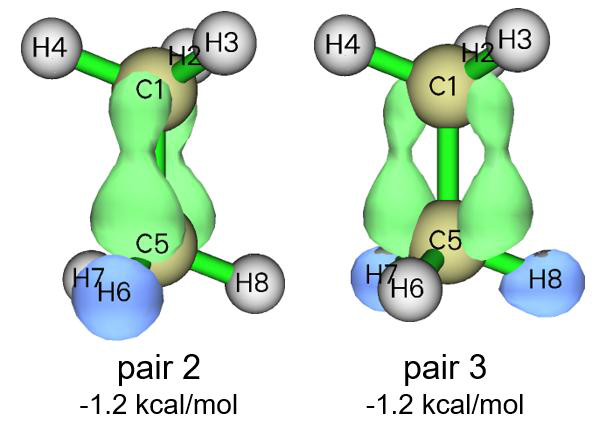

<!-- p.961 -->
n // Do not flip spin of the first CH2 fragment y // Flip spin of the second CH2 fragment -2 // Generate Fock/KS matrix and evaluate NOCV orbital energies Now we can see


```text
       --------------- Pair and NOCV orbital information --------------
There are totally   38 NOCV pairs and    76 NOCV orbitals
NOCV orbitals with absolute eigenvalues smaller than 1.0E-03 are not shown
Note: All energies are given in kcal/mol
                        ----- Alpha NOCV orbitals -----
 Pair  Energy | Orbital  Eigenvalue    Energy  | Orbital  Eigenvalue    Energy
    1  -63.11       1      0.57168    -125.97       38     -0.57168     -15.57
    2  -99.78       2      0.38673    -101.82       37     -0.38673     156.21
    3   -2.28       3      0.07016     -66.15       36     -0.07016     -33.70
    4   -1.64       4      0.05624      13.27       35     -0.05624      42.50
    5   -1.73       5      0.04700     -26.85       34     -0.04700       9.99
    6   -0.48       6      0.02675     -62.39       33     -0.02675     -44.32
    7   -0.01       7      0.00136   -2733.67       32     -0.00136   -2723.71
                        ----- Beta NOCV orbitals -----
 Pair  Energy | Orbital  Eigenvalue    Energy  | Orbital  Eigenvalue    Energy
   20  -63.11      39      0.57168    -125.97       76     -0.57168     -15.57
   21  -99.78      40      0.38673    -101.82       75     -0.38673     156.21
   22   -2.28      41      0.07016     -66.15       74     -0.07016     -33.70
   23   -1.64      42      0.05624      13.27       73     -0.05624      42.50
   24   -1.73      43      0.04700     -26.85       72     -0.04700       9.99
   25   -0.48      44      0.02675     -62.39       71     -0.02675     -44.32
   26   -0.01      45      0.00136   -2733.67       70     -0.00136   -2723.71
Sum of NOCV eigenvalues:  Alpha=   0.00000  Beta=   0.00000
Sum of pair energies:  Alpha=    -169.05  Beta=    -169.05  Total=    -338.09
```

For each spin, only two NOCV pairs correspond to prominent orbital interactions. We use option 2 to visualize density of the corresponding NOCV pairs, the isosurface maps at isovalue = 0.01 a.u. are collectively shown below, the electron transfers corresponding to these NOCV pairs are highlighted by arrows


<!-- p.962 -->
It can be seen that NOCV pairs 1 and 2 represent π and σ interactions of alpha electron, respectively; the counterparts of beta spin are NOCV pairs 20 and 21. The sum of NOCV pairs 1

and 20 corresponds to total π interaction, from the corresponding density isosurface map shown above it is seen that this interaction leads to significant increase in electron density above and below

the C-C bond. The character of C-C σ interaction in ethene is very similar to that of ethane, which has been discussed in last section. From NOCV pair energies, one can find that energy contribution

to binding between the two CH2 owing to π interaction (-126.2 kcal/mol) is considerably weaker than σ interaction (-199.6 kcal/mol). It is worth to note that the σ interaction in ethene is slightly stronger than that in ethane (-186.4 kcal/mol, as shown in last section), this may be the synergistic

effect between σ and π interactions.


### 4.23.4 Weak interaction instance: A-T base pair

In this example we use ETS-NOCV to analyze weak interaction. In the adenine-thymine (A-T) base pair it is known that there are two H-bonds between the two molecules, as shown by the dashed lines below, which will be subjected to ETS-NOCV analysis.

The geometry of A-T base pair was taken from JSCH-2005 test set (Phys. Chem. Chem. Phys.,


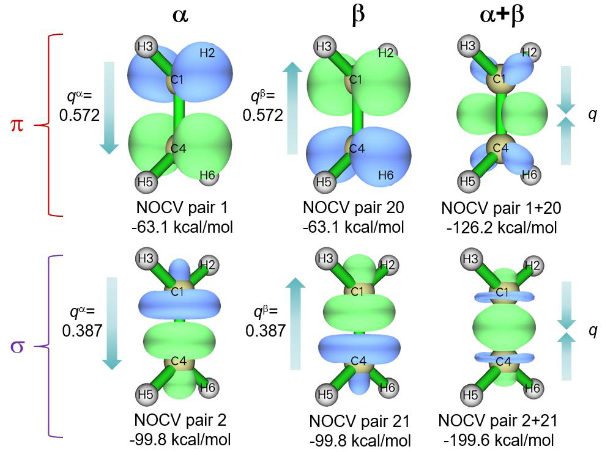


<!-- p.963 -->
8, 1985 (2006)), it was already optimized at proper level so we will not optimize it further. In this

example we will use ORCA 5.0 program to conduct single point calculations at ωB97M-V/def2-TZVP level, of course you can also use other codes such as Gaussian to carry out the calculations. The ORCA input files for dimer and the two monomers are AT.inp, A.inp and T.inp in “examples\ETS-NOCV\AT” folder. After running them, use “orca_2mkl” utility in ORCA package to convert the resulting .gbw files to Molden input files; if you do not know how to do, please check beginning of Chapter 4. The generated AT.molden, A.molden and T.molden can be downloaded at http://sobereva.com/multiwfn/extrafiles/A-T_base_pair_molden.zip.

Boot up Multiwfn and input AT.molden // Wavefunction file of A-T base pair 23 // ETS-NOCV analysis 2 // Two fragments A.molden // Wavefunction file of adenine (A) fragment T.molden // Wavefunction file of thymine (T) fragment -2 // Generate Fock/KS matrix and re-evaluate NOCV orbital energies Currently, there are as many as 40 NOCV pairs printed on screen under the default printing threshold (NOCV eigenvalue > 0.001), the number is too large to easily inspect. So, we properly raise printing threshold, input

-3 // Set printing threshold of NOCV eigenvalues 0.02 0 // Print NOCV information again Now the number of printed NOCV pairs is significantly reduced:


```text
       --------------- Pair and NOCV orbital information --------------
There are totally  328 NOCV pairs and   655 NOCV orbitals
NOCV orbitals with absolute eigenvalues smaller than 2.0E-02 are not shown
Note: All energies are given in kcal/mol

 Pair  Energy | Orbital  Eigenvalue    Energy  | Orbital  Eigenvalue    Energy
    1  -11.20       1      0.20598     -15.91      655     -0.20598      38.45
    2   -4.05       2      0.11820     -18.61      654     -0.11820      15.66
    3   -0.79       3      0.07198     -91.72      653     -0.07198     -80.71
    4   -0.79       4      0.07066     -77.74      652     -0.07066     -66.59
    5   -0.59       5      0.04312     -29.08      651     -0.04312     -15.45
    6   -0.34       6      0.03551     -40.19      650     -0.03551     -30.49
    7   -0.27       7      0.02859     -24.18      649     -0.02859     -14.72
    8   -0.15       8      0.02619     -56.34      648     -0.02619     -50.77
    9   -0.15       9      0.02032     -16.97      647     -0.02032      -9.45
Sum of NOCV eigenvalues:  -0.00000
Sum of pair energies:     -18.33 kcal/mol
```

As can be seen, only NOCV pairs 1 and 2 correspond to notable orbital interactions, and their energies are lower than common NOCV pairs corresponding to chemical bond interactions by at least one order of magnitude. Isosurface maps of their densities are exhibited below, and the total density of all other NOCV pairs are also given. The isovalue is set to a very small value 0.002 a.u., which is significantly smaller than that adopted in the last few sections because orbital interaction


<!-- p.964 -->
corresponding to H-bond is by far weaker than chemical bond interaction (in fact, as clearly indicated in my work J. Comput. Chem., 40, 2868 (2019), H-bond of common strength is dominated by electrostatic interaction)

From the map above we can see that the NOCV pairs 1 and 2 mainly represent the orbital

(CO)5Cr=CH2

All other NOCV pairs, as shown by sum of NOCV pairs 3 to 328 in the map above, mostly

correspond to marginal transfer of π electron from H-bond donor atom to H-bond acceptor atom. Since the corresponding total energy is very small, I will not explore it any further.

4.23.5 Transition metal coordinate instance: (CO)5Cr=CH2

In this example, we use ETS-NOCV to study a transition metal coordinate, (CO)5Cr=CH2, which will be partitioned as two fragments (CO)5Cr and CH2 to study coordinate bond between them.


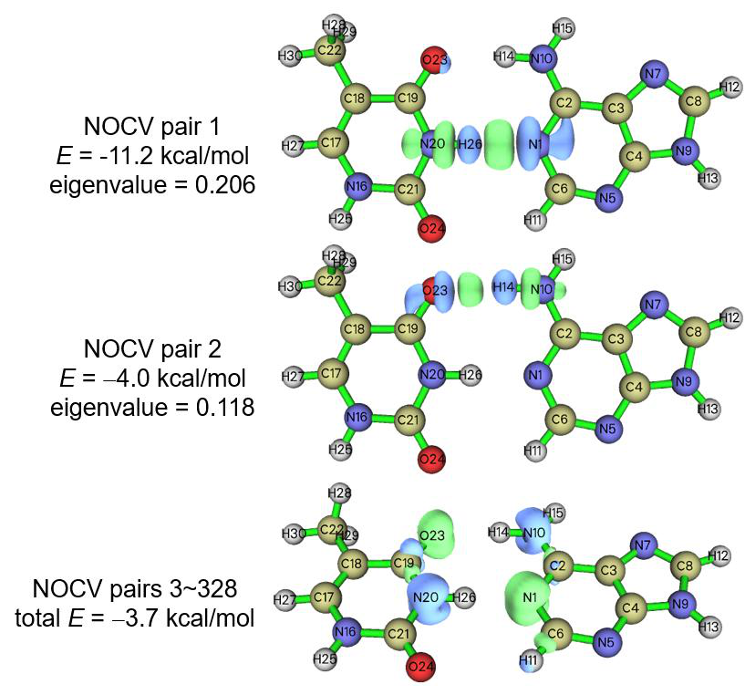

<!-- p.965 -->
Gaussian 16 is used for calculations in this example. SDD pseudopotential with corresponding standard valence basis set is employed for Cr, and 6-311G* is employed for ligand atoms, TPSSh exchange-correlation functional is used because it is usually an ideal choice for coordinates containing 3d metals. This combination of theoretical method and basis set is suitable for most transition metal coordinate systems. We optimize the whole coordinate first to obtain its wavefunction file (CO)5CrCH2.fch, after that we extract coordinates of the two fragments and then perform single point tasks to obtain their wavefunction files (CO)5Cr.fch and CH2.fch. The Gaussian input files as well as the resulting .fch files have been provided in “examples\ETS-NOCV\(CO)5CrCH2\” folder.

It is worth to note that if you use different basis sets in the calculation of fragments and whole system like this example (“genecp” for coordinate but 6-311G* for CH2 ligand), and you are not familiar with the default rule of adapting Cartesian and spherical-harmonic basis functions in Gaussian, it is strongly suggest to always add 5d keyword in your input files to guarantee that all calculations use spherical-harmonic basis functions, otherwise the sum of number of basis functions of all fragments may be different to the number of basis function of the whole system.

It is important to properly choose electronic states in the present investigation. The Cr atom in the whole coordinate and in the (CO)5Cr fragment should be in low-spin (all six 3d electrons are paired), so spin multiplicity of the whole coordinate and (CO)5Cr should be set to 1 during calculations. Even though ground state of CH2 is known to be triplet, in order to perform ETS-NOCV analysis for this system, we must adopt singlet for CH2 in its single point calculation, because this state is more close to actual electronic structure of CH2 in (CO)5Cr=CH2 than triplet (it is naturally expected that singlet CH2 utilizes its lone pair to form coordinate bond with unoccupied 3d orbital of the low-spin Cr atom).

Now boot up Multiwfn and input examples\ETS-NOCV\(CO)5CrCH2\(CO)5CrCH2.fch 23 // ETS-NOCV analysis 2 // Two fragments examples\ETS-NOCV\(CO)5CrCH2\(CO)5Cr.fch // Fragment 1 examples\ETS-NOCV\(CO)5CrCH2\CH2.fch // Fragment 2 -2 // Generate Fock/KS matrix and evaluate NOCV orbital energies The NOCV information currently shown on screen is


```text
Pair  Energy | Orbital  Eigenvalue    Energy  | Orbital  Eigenvalue    Energy
   1  -42.57       1      0.94516    -139.72      247     -0.94516     -94.68
   2  -72.70       2      0.71995    -114.71      246     -0.71995     -13.74
   3   -3.49       3      0.16177     -28.10      245     -0.16177      -6.51
```


<!-- p.966 -->

```text
   5   -0.58       5      0.05439     -52.30      243     -0.05439     -41.65
   6   -0.77       6      0.04558      54.27      242     -0.04558      71.17
[...ignored]
```

It is seen that NOCV pairs 1 and 2 have by far larger energy contributions to formation of the coordinate bond between the two fragments than other NOCV pairs, so we will only focus on them. Now use option 2 to visualize density isosurface of the two NOCV pairs respectively, the corresponding isosurface map at isovalue of 0.01 a.u. are shown below

It is suggested to choose “High-quality grid” after selecting option 2 since the current system is not quite small. The isosurface will be somewhat jagged if selecting “Medium-quality grid”. When you find current grid setting is inappropriate after visualizing the isosurfaces, you can return to post-processing menu and choose option “-5 Set grid for calculation of various densities” to redefine grid setting for visualization next time.

From the shape and color of the isosurfaces it is clear that NOCV pair 2 exhibits electron donation character from the lone pair of singlet CH2 to empty dz2 orbital of Cr, while NOCV pair 1 displays electron back-donation from an occupied 3d orbital to the unoccupied orbital of CH2

perpendicular to its fragment plane. The former corresponds to formation of a σ bond, its energy contribution to binding (-72.7 kcal/mol) is markedly larger than the latter (-42.6 kcal/mol), which

shows π character. It is very common that σ interaction is stronger than single set of π interaction for the same bond, this point is also reflected by our observation in the example of ethene in Section

4.23.3. However, according to NOCV pair eigenvalues, it is noted that the π-type of back-donation interaction causes larger variation of electron density than the σ-type of donation interaction. It is worth to emphasize in passing here that there is no necessarily positive correlation between NOCV eigenvalues and NOCV energies.


### 4.23.6 More than two fragments instance: Transition state of trimerization of acetylene


ETS-NOCV can also be employed to more than two fragment cases, and can also be applied to structures other than minima of potential energy surface, such as transition state. In this example, I use transition state (TS) of trimerization of acetylene as an instance to show this point. This reaction is illustrated in the following scheme, the TS geometry in the figure was optimized at B3LYP/6-31G* level. We will analyze how the three bent acetylene interact with each other at TS structure owing to orbital interactions.


<!-- p.967 -->
The TS.gjf in “examples\ETS-NOCV\C2H2_trimerization_TS” folder is Gaussian input file of single point task for pre-optimized TS geometry. The 1.gjf, 2.gjf and 3.gjf in this folder correspond to single point task for the three distorted acetylene molecules at the TS geometry. Calculation level in all files is B3LYP/6-31G*, which is sufficient for obtaining qualitatively reasonable ETS-NOCV result. Run these files and convert the resulting .chk files using formchk utility, then you will obtain the .fch files in this folder.

Boot up Multiwfn and input examples\ETS-NOCV\C2H2_trimerization_TS\TS.fch 23 // ETS-NOCV analysis 3 // Three fragments examples\ETS-NOCV\C2H2_trimerization_TS\1.fch // Fragment 1 examples\ETS-NOCV\C2H2_trimerization_TS\2.fch // Fragment 2 examples\ETS-NOCV\C2H2_trimerization_TS\3.fch // Fragment 3 -2 // Generate Fock/KS matrix and evaluate NOCV orbital energies Then you will see


```text
There are totally   51 NOCV pairs and   102 NOCV orbitals
NOCV orbitals with absolute eigenvalues smaller than 1.0E-03 are not shown
Note: All energies are given in kcal/mol

 Pair  Energy | Orbital  Eigenvalue    Energy  | Orbital  Eigenvalue    Energy
    1  -25.50       1      0.57545     -95.07      102     -0.57545     -50.76
    2  -25.50       2      0.57545     -95.07      101     -0.57545     -50.76
    3   -0.93       3      0.09515     -66.85      100     -0.09515     -57.12
    4   -0.93       4      0.09515     -66.85       99     -0.09515     -57.12
    5   -1.31       5      0.07688    -114.89       98     -0.07688     -97.89
    6   -1.50       6      0.07168      62.87       97     -0.07168      83.83
    7   -0.33       7      0.03245       3.82       96     -0.03245      14.08
    8   -0.33       8      0.03245       3.82       95     -0.03245      14.07
    9   -0.13       9      0.02029      -0.40       94     -0.02029       6.16
[...ignored]
```

It can be seen that NOCV pairs 1 and 2 are degenerated, isosurface maps of their densities at isovalue of 0.005 a.u. are shown below, their sum is also given


<!-- p.968 -->
The NOCV pairs 1 and 2 have identical energies because this system has point group of D3h symmetry, which is a rotation group. From the isosurface map it is obvious that neither NOCV pair 1 nor pair 2 makes sense, but the sum of them is meaningful. As shown in the third subgraph in

above figure, in the TS geometry there has been σ-bond interaction to some extent between neighbouring acetylene, as evident electron concentration is detectable in the area where new C-C bond will form. Also note that blue isosurfaces in this subgraph show that electron density is

decreased in the in-plane π regions of C-C bonds in acetylene, clearly indicating that new σ C-C bonds between acetylene are formed at the expense of the original in-plane π bonds.

It is known that in the product of acetylene trimerization reaction, namely in the benzene

molecule, every C-C bond has some degree of π interaction, a question naturally arises: whether the π interaction between acetylene has also been formed at the TS structure? To explore this point, we check isosurfaces of other NOCV pairs, we will quickly find only NOCV pairs 3 and 4 show π character, as shown by their density isosurfaces below. Individually visualizing NOCV pair 3 or 4 in fact is meaningless, so we also plot isosurface of sum of densities of the two pairs, as shown in the third subgraph in the following figure; however, the isosurface can be clearly visualized only when isovalue is set to a fairly small value (0.0002 a.u.).

Isosurface of sum of NOCV pairs 3 and 4 indicates that indeed there has been π interaction between neighbouring acetylene, since green isosurfaces can be found in the π regions above and below the new C-C bonds to be formed. However, since the energy is merely -1.85 kcal/mol, and

the isosurface is detectable only at extremely small density isovalue, the π interaction between acetylene is completely negligible in practice. This argument can also be supported by calculation


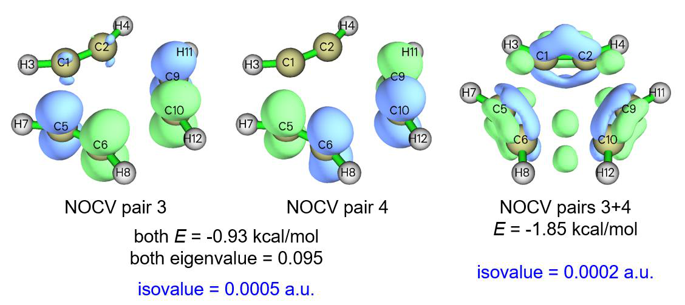

<!-- p.969 -->
of Mayer bond order of π-electron for the wavefunction of TS structure, see Section 4.100.22 on how to do. You will find the π Mayer bond order of C1-C5 is merely 0.010, whose magnitude is small enough to be completely ignored.


## 4.24 Examples of (hyper)polarizability analyses


### 4.24.1 Parse output file of “polar” task of Gaussian to obtain (hyper)polarizability and calculate related quantities


As introduced in Section 3.27.1, Multiwfn has ability to parse the abstract output information of “polar” task of Gaussian and reorganize the data to a much more readable format, and meantime many useful quantities are outputted together. In this section an example is given.

In "examples\polar" folder, NH3_polar_static.out and NH3_polar_dynamic.out are output files of static and frequency-dependent (hyper)polarizability calculations for NH3 via a common exchange-correlation functional PBE0. The corresponding Gaussian input files are also provided in the same folder. In the calculation, a large basis set with abundant diffuse functions (aug-cc-pVTZ) was used, notice that diffuse functions play a vital role in yielding reasonable (hyper)polarizability and thus they are absolutely indispensable.

Studying static polarizability and first hyperpolarizability First, we use Multiwfn to parse data from the NH3_polar_static.out. Boot up Multiwfn and input

examples\polar\NH3_polar_static.out 24 // (Hyper)polarizability analysis 1 // Parse (hyper)polarizability task of Gaussian 1 // Start parsing. We select option 1 because third-order derivative of current level (normal DFT functional) is supported by Gaussian

Now you can see the following information on screen:


```text
Dipole moment:
 X,Y,Z=    0.000000    0.000000   -0.596558   Norm=    0.596558

 Static polarizability:
 XX=       13.692700
 XY=        0.000000
 YY=       13.693300
 XZ=        0.000000
 YZ=       -0.000334
 ZZ=       15.323600
 Isotropic average polarizability:       14.236533
 Isotropic average polarizability volume:       2.109636 Angstrom^3
 Polarizability anisotropy (definition 1):        1.630600
 Polarizability anisotropy (definition 2):        1.630600
 Eigenvalues of polarizability tensor:     13.69270     13.69330     15.32360
```


<!-- p.970 -->

```text
 Polarizability anisotropy (definition 3):        1.630600

 Note: It is well known that the sign of hyperpolarizability of Gaussian 09/16 s
hould be inverted, the outputs shown below have already been corrected

 Static first hyperpolarizability:
 XXX=        0.000000
 XXY=       12.903200
 XYY=        0.000000
 YYY=      -12.900200
 XXZ=        9.617100
 XYZ=        0.000000
 YYZ=        9.564710
 XZZ=        0.000000
 YZZ=        0.016285
 ZZZ=       26.613200

 Beta_X=        0.00000  Beta_Y=        0.01929  Beta_Z=       45.79501
 Magnitude of first hyperpolarizability:       45.795014
 Projection of beta on dipole moment:      -45.795010
 Beta ||     :      -27.477006
 Beta ||(z)  :       27.477006
 Beta _|_(z) :        9.159002
```

The output is easy to understand, all of the outputted quantities have been detailedly explained in Section 3.27.1.

Studying frequency-dependent polarizability and hyperpolarizability Next, we extract frequency-dependent (hyper)polarizability from the NH3_polar_dynamic.out. Boot up Multiwfn and input

examples\polar\NH3_polar_dynamic.out 24 // (Hyper)polarizability analysis 1 // Parse (hyper)polarizability task of Gaussian -1 // Let Multiwfn load frequency-dependent (hyper)polarizability 1 // Start parsing Multiwfn detected there are three set of data:


```text
       1   w=    0.000000 (     Static    )
       2   w=    0.065600 (      695.04nm )
       3   w=    0.071900 (      634.14nm )
```

If we input 2, then the (hyper)polarizability data corresponding to 0.0656 a.u. incident light will be loaded and parsed.

After outputting information about dipole moment and polarizability, Multiwfn asks you to choose the type of hyperpolarizability to be outputted:


```text
1: Beta(-w;w,0)   2: Beta(-2w;w,w)
Note: Option 2 is meaningless if "DCSHG" keyword was not used
```

You can select either one according to your requirements. Since as can be seen in


<!-- p.971 -->
NH3_polar_dynamic.gjf, the keyword we used is polar=DCSHG, both the two types are available.

Now if you choose option 2 to parse β(-2w;w,w), not only first hyperpolarizability will be shown, but also quantities related to Hyper-Rayleigh scattering (HRS) will be printed, as shown below (see Section 3.27.1 for detail)


```text
<beta_ZZZ^2>:  8.12843560E+02
<beta_XZZ^2>:  1.45318790E+02
Hyper-Rayleigh scattering (beta_HRS):        30.954
Depolarization ratio (DR):   5.594
|<beta J=1>|:        59.743
|<beta J=3>|:        41.624
Nonlinear anisotropy parameter (rho):   0.697
Dipolar contribution to beta, phi_beta(J=1):     0.589
Octupolar contribution to beta, phi_beta(J=3):   0.411
< (beta_ZXZ+beta_ZZX)^2 - 2*betaZZZ*betaZXX >:  2.04387968E+02
```

Next, if you want to study evolution of scattering intensity with respect to polarization angle of incident light, you should input y and then input an initial angle, for example, -180. After that HRS_angle.txt will be generated in current folder, which contains scattering intensity corresponding

to polarization angle varying from -180 to 179 with stepsize of 1. If you use such as Origin to plot the data as "Polar theta(X) r(Y)" map, you will obtain the map below, in which the radial distance of the red curve at different angles corresponds to calculated HRS intensity. The corresponding Origin .opj file has been provided as examples\polar\HRS_angle.opj

90

1000 120 60

800

HRS intensity (a.u.) 600 400 200 0 -180 150 30 0

-150 -30

-120 -60

-90

Studying second hyperpolarizability

Gaussian is also capable of calculating static and dynamic second hyperpolarizability (γ). An example input file is examples\polar\NH3_gamma.gjf, the output file is also given in the same folder. In this task polar=gamma keyword was used, and two external frequencies are specified (532 nm

and 680 nm). Below I illustrate using Multiwfn to parse data of γ(-2w;w,w,0) at 532 nm.

Boot up Multiwfn and input examples\polar\NH3_gamma.out 24 // (Hyper)polarizability analysis


<!-- p.972 -->
1 // Parse (hyper)polarizability task of Gaussian -1 // Let Multiwfn load frequency-dependent (hyper)polarizability 7 // This option is specific for parsing polarizability and second hyperpolarizability 3 // 532 nm Dynamic polarizability and relevant quantities at 532 nm now are shown on screen. Then choose 2 to further parse gamma(-2w;w,w,0), then you will see


```text
 XXXX=    3.966470E+03
 YXXX=    0.000000E+00
 ZXXX=    8.493370E-05
 XYXX=XXYX=    0.000000E+00
[...ignored]
 ZZZZ=    3.204030E+04

 Magnitude of gamma:      1.067181E+04
 X component of gamma:    2.134993E+03
 Y component of gamma:    2.134897E+03
 Z component of gamma:    1.023580E+04
 Average of gamma (definition 1), gamma ||:    1.450569E+04
 Average of gamma (definition 2):    1.461464E+04
 gamma _|_:    4.653651E+03
```

As can be seen, all components of γ tensor have been very clearly shown, and some quantities defined based on γ are also shown, they are very useful in the study of γ. Note that above data are given in input orientation.

Similarly, you can use Multiwfn to parse gamma(-w;w,0,0). If you want to parse gamma(0;0,0,0), do not choose option -1 before parsing.


### 4.24.2 Studying polarizability and hyperpolarizability based on sum- over-states (SOS) method


4.24.2.1 Calculate polarizability and hyperpolarizability for NH3

In this example I will show how to use Multiwfn to calculate polarizability and hyperpolarizability based on sum-over-states (SOS) method for a HF molecule. Please make sure that you have read Section 3.27.2.1.

As introduced in Section 3.27.2.1, SOS calculation requires information of a large amount of electronic states, including electric dipole moments, excitation energies, and transition dipole moments between these states. Commonly this information can be obtained by ZINDO, CIS, TDHF and TDDFT calculations. In this example we use the very popular CIS method. According to my experiences, the more expensive methods TDHF and TDDFT, which can produce more accurate excitation energies, do not necessarily give rise to better (hyper)polarizability than CIS when used in combination with SOS technique.

Preparation In this example we use Gaussian program to carry out the CIS calculation. However, Gaussian itself cannot output enough information for SOS calculation. Though for CIS (and ZINDO) there is


<!-- p.973 -->
a keyword alltransitiondensities, which makes Gaussian output transition density moment between each pair of excited states, however electric dipole moment of all states still cannot be obtained in a single run. Fortunately, we can use the very powerful electron excitation analysis module of Multiwfn to generate all information needed by SOS based on the output file of CIS/TDHF/TDDFT task of Gaussian or ORCA program.

First, run examples\NH3_SOS.gjf by Gaussian to produce output file NH3_SOS.out, and use formchk utility to convert the checkpoint file to NH3_SOS.fch. If you do not have Gaussian in hand, you can directly download them at http://sobereva.com/multiwfn/extrafiles/NH3_SOS.rar.

Since the SOS results converge often slow with respect to the number of excited states taken into account, we produce as high as 150 excited states in this example to substantially avoid truncation error. Of course, employing higher number of excited states needs more computational time in both of the CIS calculation and the subsequent SOS calculation in Multiwfn. In most practical studies, 100 states are generally large enough, and even 70 is often enough to provide usable results. Calculation of hyperpolarizability, especially the high-order ones, has very stringent requirements on the quality of basis set, abundant diffuse functions are absolutely indispensable. In this example we employ def2-TZVPPD (J. Chem. Phys., 133, 134105), which is a high-quality basis set optimized for calculation of molecular response properties. Since this is not a built-in basis set in current version of Gaussian, it was picked from BSE website (https://www.basissetexchange.org). The keyword IOp(9/40=5) is important, because in the ZINDO/CIS/TDHF/TDDFT task by default Gaussian only outputs the transition coefficients whose absolute values are larger than 0.1, while IOp(9/40=5) lowers the criterion to 0.00001, so that much more coefficients can be outputted, and thereby we can obtain accurate transition dipole moments by Multiwfn at next step. It is noteworthy that you can also use TDHF or TDDFT instead of CIS, for example you can write #P TD(nstates=150) CAM-B3LYP/gen IOp(9/40=5).

Boot up Multiwfn and input below commands C:\NH3_SOS.fch 18 // Electron excitation analysis module 5 // Calculate transition dipole moments and dipole moment for all excited states C:\NH3_SOS.out 3 // Generate SOS.txt The file SOS.txt generated in current folder contains all information needed by SOS (hyper)polarizability calculation. This file can be directly used by SOS module of Multiwfn.

Reboot Multiwfn and input SOS.txt 24 // (Hyper)polarizability analysis 2 // Study (hyper)polarizability by sum-over-states (SOS) method Note that all units used in the SOS module are atomic units.

Calculation of polarizability (alpha)

Now, select 1 and input 0 to calculate static polarizability α(0;0), the result is


```text
             1              2              3
 1      14.610682       0.000000       0.000000
 2       0.000000      14.610682       0.000000
 3       0.000000       0.000000      14.552483
Isotropic average polarizability:      14.591283
Isotropic average polarizability volume:       2.162205 Angstrom^3
Polarizability anisotropy (definition 1):       0.058199
Eigenvalues:      14.552483      14.610682      14.610682
Polarizability anisotropy (definition 2):       0.029100
```

As can be seen, not only the polarizability tensor, but also some related quantities are outputted. Their definitions can be found in Section 3.100.20. The isotropic average polarizability we obtained here is 14.59, which is in perfect agreement with the experimentally determined value 14.56! (Mol.


<!-- p.974 -->
Phys., 33, 1155)

Then we calculate dynamic polarizability α(-ω;ω) and assume the frequency of external field to be 0.0719 a.u. Select option 1 again, input 0.0719, from the output we can see the dynamic

isotropic polarizability at ω=0.0719 is 14.86, which is slightly larger than the static counterpart.

Calculation of first hyperpolarizability (beta)

Next, we calculate first hyperpolarizability and consider the static case β(0;0,0). Select option 2 and input 0,0. Only the β component along the dipole moment direction, namely β||, is what we are particularly interested in, since only this quantity can be determined experimentally. From the

output we find β||(0;0,0) is -38.98. The corresponding experimental value is not available, however this value is close to the highly accurate value calculated by CCSD(T) method (-34.3, see J. Chem. Phys., 98, 3022 (1993)).

Subsequently, we calculate β(-2ω;ω,ω) at ω=0.0656 a.u. Select option 2 again and input 0.0656, 0.0656 to set the frequency of both two external fields as 0.0656 a.u. This time the β|| value is -49.69, which is again in excellent agreement with the experimentally determined value -48.9±1.2 (see A. Hernández-Laguna et al. (eds.), Quantum Systems in Chemistry and Physics, Vol. 1, p111)

Note: Although in this example the agreement between our SOS/CIS calculations and the reference values is surprisingly good, this is not always held for other systems. The SOS/CIS method sometimes severely overestimates β value!

Calculation of second hyperpolarizability (gamma)

Finally, we calculate second hyperpolarizability γ. Select 3 and input 0,0,0 to assume static electric fields. Since calculation of γ is evidently more time-consuming than β, Multiwfn does not automatically use all states but allows you to set the number of states to be taken into account. Larger value in principle gives rise to better results, but of course more time will be consumed in the calculation. Here, we input 150 to use all states. After a while, result is shown on screen, the average

of γ is 928.74. Beware that this value may be inaccurate (reference value is not available, so I am not sure if this is a good result), one of the main reasons is that the basis set we used in the electron

excitation calculation is not large enough. Accurate calculation of γ usually requires a basis set like d-aug-cc-pVTZ (or an even better one), which has an additional shell of diffuse functions compared to the commonly used aug-cc-pVTZ.

Multiwfn is also capable of calculating third hyperpolarizability δ(-ω;ω1,ω2,ω3,ω4) where ω=ω1+ω2+ω3+ω4, but we do not do this in present example, because this quantity is fairly unimportant, and the calculation is terribly expensive when the number of states in consideration is large; moreover, a sky-high quality of basis set must be employed in the calculation...

Variation of (hyper)polarizability with respect to number of considered states A very important point in SOS calculation is that the number of states used must be high enough; in other words, if n states are involved in your SOS studies, the variation of the (hyper)polarizability with respect to the number of states have to be converged before n, otherwise n must be enlarged. By using Multiwfn we can readily examine if the convergence condition is satisfied. Here we check

the convergence of static β. Select option 6 and input 0,0, after a while, the result will be exported to beta_n.txt and beta_n_comp.txt in current folder, the meaning of each column is clearly indicated on screen. Then you can use your favourite tool to plot the data in the beta_n.txt. If you are an Origin user, you can directly drag this file into Origin window and plot the data as curve maps. The graphs

below show the variation of static β|| as well as static isotropic average polarizability <α> with respect to number of considered states.


<!-- p.975 -->
16

14 -20

12 -30

10

<α> 8 6 β|| -40 -50

4 -60

2

-70

0204060801001201400 020406080100120140

Number of states It is clear that both of the two quantities have basically converged at n=100. Since we employed 150 states in our calculations, the error due to the truncation of states can be safely ignored. From the graph one can also see that if the number of states is truncated at 70, the results are still qualitatively correct. Number of states

You can also analogously use options 5 and 7 to study the convergence behavior of α and γ, respectively.

Variation of (hyper)polarizability with respect to frequency of external fields In the SOS module of Multiwfn, one can also easily study the variation of dynamic (hyper)polarizability with respect to the frequency of external fields. For example, we investigate

the variation of β(-ω1;ω1,0) as ω1 varies from 0 to 0.5 a.u. with stepsize of 0.01. Write a plain text file, each row corresponds to a pair of ω1, ω2 (ω2 is fixed at zero in this example), for example


```text
0.00  0
0.01  0
0.02  0
...
0.5   0
```

Tips: For convenience, you can utilize Microsoft Excel program to generate frequency list, and save the table as .txt file (you can select such as "Text (tab delimited)", but do not choose "Unicode text"). Then choose option 16, input the path of the plain text file, the β will be calculated at each pair of frequencies, the result will be outputted to beta_w.txt and beta_w_comp.txt in current folder, the meaning of each column of the data is clearly indicated on screen. The data in these files can be

directly plotted as curve map by Origin, for example the magnitude of β(-ω1;ω1,0) is shown below:


<!-- p.976 -->
110000

100000

90000

Magnitude of β (−ω1;ω1,0) 80000 70000 60000 50000 40000 30000 20000

10000

0

0.00.10.20.30.40.5

Frequency of external field ω1

Similarly, you can also use options 15 and 17 to study the variation of α and γ with respect to frequency of external fields, respectively.

Scanning both ω1 and ω2 of β(-(ω1+ω2);ω1,ω2) By subfunction 19 of the SOS module, you can also scan both ω1 and ω2 of β(-(ω1+ω2);ω1,ω2). For example, we input below commands in the SOS module

19

-0.6,0.6,100 // Lower limit, upper limit and number of steps of ω1 (in a.u.) -0.6,0.6,100 // Lower limit, upper limit and number of steps of ω2 (in a.u.) After a while, beta_w.txt and beta_w_comp.txt are generated in current folder, the meaning of

each column of the files is clearly mentioned on screen. To visually study how total β varies with respect to change in ω1 and ω2, you can plot a relief map with first, second and 7th columns as X, Y and Z data, respectively. The map shown below was plotted by Sigmaplot:

This kind map exhibits one photon resonance β(-ω1;ω1,0) or β(-ω2;0,ω2), sum frequency


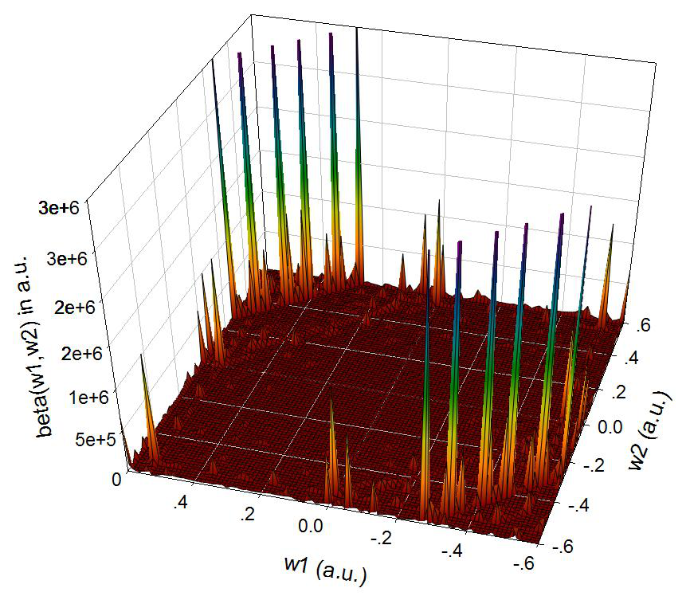

<!-- p.977 -->
generation and difference frequency generation character of present system. Occurrence of a large

peak at the position where one of ω1 and ω2 is zero implies significant Electro-optics Pockels effect at the corresponding frequency, a large peak at a frequency ω1=ω2 indicates strong second harmonic generation (SHG) effect at that frequency, a large peak at frequency ω1= -ω2 shows remarkable optical rectification effect at that frequency. See ACS Appl. Nano Mater., 2, 1648 (2019) for example of discussion of this kind of map.

4.24.2.2 Perform two- and three-level model analysis for first

hyperpolarizability of NH2-biphenyl-NO2

Note: Chinese version of this section is my blog article “Using Multiwfn to perform two-level and three-level model analyses for first hyperpolarizability” (http://sobereva.com/512).

In literature about computational study of hyperpolarizability, two-level model is frequently adopted to shed light on the major factors that influence the first hyperpolarizability, this analysis

also provides clear insight into the difference in β between analogous systems. The three-level model implemented in Multiwfn is a natural extension of the two-level model to include two excited states into account. Please read Section 3.27.2.2 first to gain basic knowledge about the two- and three-level models. In this section I will illustrate basic step of performing these analyses

It is important to emphasize that the two- or three-level analysis is useful only when these two conditions are satisfied:

- Only one component of β (namely βXXX or βYYY or βZZZ) plays dominant role. This component should be subjected to the analysis

- One excited state (for two-level model) or two excited states (for three-level model) has much larger contribution to β than all other excited states

Most systems of donor-π-acceptor type well satisfy the above two conditions. In this section we take a typical donor-π-acceptor system NH2-biphenyl-NO2 as example. The D-pi-A.fchk and D-pi-A.out in "examples\excit" folder were produced by Gaussian TDDFT task for this system at CAM-B3LYP/6-31G(d) level, five lowest-lying singlet excited states were yielded. It is worth to note that without sufficient diffuse functions, (hyper)polarizability cannot be estimated at quantitative accuracy level; however, our present aim is simply using the two- and three-level

models to very roughly discuss the factors influencing the β, so using these two files to conduct the analysis is acceptable.

Prepare input file Boot up Multiwfn and input below commands examples\excit\D-pi-A.fchk 18 // Electron excitation analysis module 5 // Calculate transition dipole moments and dipole moment for all excited states examples\excit\D-pi-A.out 3 // Generate SOS.txt, which contains all information needed by the two- or three-level analysis Now we are ready to perform the two/three-level analysis. Before doing this, we need to

confirm which component of β should be studied. The molecular geometry of D-pi-A.fchk is shown below (displayed by main function 0). As can be see, the direction of donor-π-acceptor path is fully parallel to X-axis, hence it is expected that only βXXX of current system is prominent.


<!-- p.978 -->
Two-level analysis Reboot Multiwfn and input SOS.txt 24 // (Hyper)polarizability analysis 2 // Study (hyper)polarizability by sum-over-states (SOS) method

20 // Two- or three-level model analysis of β Now Multiwfn prints key information for all excited states, which are very closely related to two- and three-level analyses:


```text
Excitation energy (E), transition electric dipole moment between ground state and excited
state, and variation of dipole moment of excited states w.r.t. ground state
                  Trans. dipole moment (a.u.)        Var. dipole moment (a.u.)
 State   E(eV)     X       Y       Z      Tot        X       Y       Z      Tot
    1   3.9069   0.444  -0.000  -0.002   0.444    -1.010  -0.001   0.001   1.010
    2   4.0624   2.528  -0.003  -0.007   2.528     6.563  -0.015  -0.047   6.501
    3   4.4166  -0.003  -0.002  -0.023   0.024    -1.081   0.002   0.002   1.077
    4   4.7912   0.001   0.341  -0.013   0.341     1.845  -0.006  -0.015   1.823
    5   4.8872  -0.004   0.192  -0.171   0.257     0.993  -0.019  -0.049   0.925
```

Because excited state 2 has much larger magnitude of transition dipole moment and variation of dipole moment than others, and meantime the excitation energy of excited state 2 is low, thus this state can be unambiguously identified as the so-called crucial state.

Next, we input 1-5 to perform two-level analysis for every excited state from 1 to 5, you will see


```text
beta evaluated by two-level model: (a.u.)
 #    1: XXX=       -58.05  YYY=        -0.00  ZZZ=         0.00  Norm=        58.05
 #    2: XXX=     11289.12  YYY=        -0.00  ZZZ=        -0.00  Norm=     11289.12
 #    3: XXX=        -0.00  YYY=         0.00  ZZZ=         0.00  Norm=         0.00
 #    4: XXX=         0.00  YYY=        -0.15  ZZZ=        -0.00  Norm=         0.15
 #    5: XXX=         0.00  YYY=        -0.13  ZZZ=        -0.27  Norm=         0.30
```

Clearly, only excited state 2 has significant contribution to βXXX.

We can ask Multiwfn to print more detailed information about the excited state 2. Input the following commands


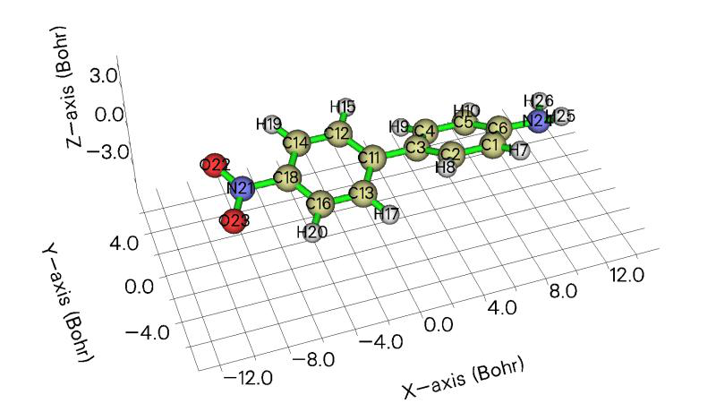

<!-- p.979 -->
20 // Two or three-level model analysis of β 2 // Select excited state 2 for two-level model analysis The outputted information is shown below


```text
 Excited state     2
 Excitation energy    0.149290 a.u.    4.0624 eV
 Transition dipole moment (a.u.)
 X=    2.527776  Y=   -0.003088  Z=   -0.007328  Total=    2.527789
 Oscillator strength
 X=    0.635943  Y=    0.000001  Z=    0.000005  Total=    0.635949
 Variation of dipole moment (a.u.)
 X=    6.562899  Y=   -0.015345  Z=   -0.046710  Total=    6.563083

 beta evaluated by two-level model: (a.u.)
 XXX=    11289.1185  YYY=       -0.0000  ZZZ=       -0.0007  Norm=    11289.1185
```

All terms involved in the two-level model have been given above, see Section 3.27.2.2 for the expression of the two-level model. If you have an analogous system, for example the two benzene rings in current system are replaced with three benzene rings, you can use the above quantities to

study how various factors cause the difference in βXXX according to the two-level model.

Three-level analysis We can also carry out three-level model analysis. In the Multiwfn window, we input

20 // Perform two- or three-level model analysis of β again 1,2 // Choose excited states 1 and 2 for the three-level model analysis You will see the following output


```text
 Excited state     1
 Excitation energy    0.143576 a.u.    3.9069 eV
 Transition dipole moment (a.u.)
 X=    0.444412  Y=   -0.000436  Z=   -0.001817  Total=    0.444416
 Oscillator strength
 X=    0.018904  Y=    0.000000  Z=    0.000000  Total=    0.018905
 Variation of dipole moment (a.u.)
 X=   -1.009787  Y=   -0.000610  Z=    0.000608  Total=    1.009787

 Excited state     2
 Excitation energy    0.149290 a.u.    4.0624 eV
 Transition dipole moment (a.u.)
 X=    2.527776  Y=   -0.003088  Z=   -0.007328  Total=    2.527789
 Oscillator strength
 X=    0.635943  Y=    0.000001  Z=    0.000005  Total=    0.635949
 Variation of dipole moment (a.u.)
 X=    6.562899  Y=   -0.015345  Z=   -0.046710  Total=    6.563083

 Transition dipole moment between states     1 to     2: (a.u.)
 X=    1.475397  Y=   -0.001634  Z=   -0.008677  Total=    1.475423
 Individual contribution of excited state     1 to beta: (a.u.)
```


<!-- p.980 -->

```text
 XXX=      -58.0482  YYY=       -0.0000  ZZZ=        0.0000  Norm=       58.0482
 Individual contribution of excited state     2 to beta: (a.u.)
 XXX=    11289.1185  YYY=       -0.0000  ZZZ=       -0.0007  Norm=    11289.1185
 Coupling contribution of the two excited states to beta: (a.u.)
 XXX=      927.8987  YYY=       -0.0000  ZZZ=       -0.0001  Norm=      927.8987

 beta evaluated by three-level model: (a.u.)
 XXX=    12158.9690  YYY=       -0.0000  ZZZ=       -0.0007  Norm=    12158.9690
```

It can be seen that all terms involved in the three-level model analysis have been given. We

also find that the individual contribution of excited state 1 to βXXX is quite small, and the term due to coupling between the two states is also negligible, implying that employing two-level model analysis is completely adequate for the present system, including more states into the analysis does not provide additional insight.

The reason why the individual contribution corresponding to the excited state 1 is fairly low is

quite easy to understand. According to the two-level model, contribution to a given β component is positively proportional to variation of dipole moment and square of transition dipole moment in that component. Compared to the excited state 2, both the two quantities of excited state 1 are conspicuously smaller.

Hint: In some cases, the output file of electron excitation task may contain large number of states, while for performing two- or three-level model analysis we always only need the first few low-lying excited states. In order to significantly reduce the cost of generating the SOS.txt in this situation, you can properly set "maxloadexc" parameter in `settings.ini`. For example, the output file contains as many as 100 excited states, however it is anticipated that the state of interest should be no higher than the 5th excited state, hence you can set "maxloadexc" to 5, then only the first 5 excited states will be recognized, loaded, and subjected to calculation.


### 4.24.3 Example of studying (hyper)polarizability density

Chinese version of this section is my blog article "Using Multiwfn to extremely conveniently plot (hyper)polarizability density and the contribution of three-dimensional space to (hyper)polarizability" (http://sobereva.com/683).

Please read Section 3.27.3 first to gain basic knowledge about (hyper)polarizability density and spatial contribution to (hyper)polarizability analyses. Below we will study the second hyperpolarizability density for a typical small molecule H2CO. Polarizability density and first hyperpolarizability density can also be studied via almost exactly the same way, you just need to choose corresponding quantity in the interface of Multiwfn.

The orientation of the molecule must be clarified when perform this kind of analysis, in current case the C=O bond is parallel to the Z-axis, as shown below. In this example we focus on studying

(3)) and spatial contribution to γzzzz (ZZZZ component of second hyperpolarizability), namely −𝑧𝜌𝑧𝑧𝑧 ZZZ component of second hyperpolarizability density (𝜌𝑧𝑧𝑧 (3).


<!-- p.981 -->
Before performing hyperpolarizability density analysis, it is suggested to carry out a regular

static γ calculation using Gaussian, so that we can judge whether our hyperpolarizability density analysis is reasonable enough. The Gaussian input and output files of the task have been provided as gamma.gjf and gamma.out in "examples\polar\polardens" folder, the commonly used PBE0/aug-

cc-pVTZ level is employed. As can be seen at the end of the output file, the γZZZZ is 0.309211D+04 a.u. (namely 3092.1 a.u.). The geometry used in this task was optimized at B3LYP/def-TZVP level.

Preparation work Boot up Multiwfn and input examples\polar\polardens\H2CO.xyz //Multiwfn will load the geometry from this file, which contains the same coordinate as gamma.gjf

24 //(Hyper)polarizability analysis 3 //(Hyper)polarizability density analysis 3 //Study second hyperpolarizability density and spatial contribution to second hyperpolarizability

3 //Z direction 1 //Generate Gaussian input files of single point task under different external electric fields [Press ENTER button directly] //Use 0 and 1 as net charge and spin multiplicity, respectively Now Multiwfn generates Z-2.gjf, Z-1.gjf, Z+1.gjf and Z+2.gjf in current folder. If you open them via text editor, you will find they correspond to single point task at PBE0/aug-cc-pVTZ level under different electric fields, and meantime .wfx file (a wavefunction format) with same name as input file will be generated in current folder. The magnitude of finite electric field is 0.003 a.u., therefore, for example, Z+2.gjf corresponds to applying Z-direction external electric field of 0.003*2 = 0.006 a.u. magnitude. The “nosymm” keyword in the files are important, which prevents Gaussian from automatically reorientating the molecule during calculation. You may manually change keywords in the .gjf files if you want to use other computational level and settings.

Run the .gjf files via Gaussian (you may use the runall.sh shell script in “examples” folder to invoke Gaussian to run all files in current folder). Then you will find Z-2.wfx, Z-1.wfx, Z+1.wfx and Z+2.wfx in current folder.

Next, input following commands in Multiwfn 2 //Load .wfx files of single point task under different external electric fields [Press ENTER button directly] //Assume that the .wfx files are in current folder As prompted on screen, all needed .wfx files have been found by Multiwfn, and a new interface


<!-- p.982 -->
appears, you can choose to calculate grid data or plot plane map. Evidently, the “second hyperpolarizability density” and “spatial contribution to second hyperpolarizability” in the interface

in the present situation refer to 𝜌𝑧𝑧𝑧 (3) and −𝑧𝜌𝑧𝑧𝑧 (3), respectively.

Visualization isosurface map

(3). To do so, we input 1 //Generate grid data of second hyperpolarizability density 2 //Medium-quality grid 1 //Visualize isosurface map We first visualize isosurface map of 𝜌𝑧𝑧𝑧

After setting isovalue to 0.5, you will see the isosurface map of 𝜌𝑧𝑧𝑧 (3):

However, from this map it is still somewhat difficult to discuss contribution of various spatial

regions to the γZZZZ, because the -z factor has not been taken into account. To obtain −𝑧𝜌𝑧𝑧𝑧 (3), we close GUI window, and input below commands

0 //Return 2 //Generate grid data of spatial contribution to second hyperpolarizability 2 //Medium-quality grid From screen you can find the integral of the current grid data is 3008.2 a.u., which is close to the γZZZZ value 3092.1 a.u. shown in examples\polar\polardens\gamma.out, indicating that the grid

(3) is indeed reasonable (if you use higher quality grid and enlarge the default extension distance when setting up grid, the integral will become closer to 3092.1 a.u.). data of −𝑧𝜌𝑧𝑧𝑧

Now choose option 2 to visualize isosurface map. After setting isovalue to 2, you will see the

following isosurface map of −𝑧𝜌𝑧𝑧𝑧 (3):


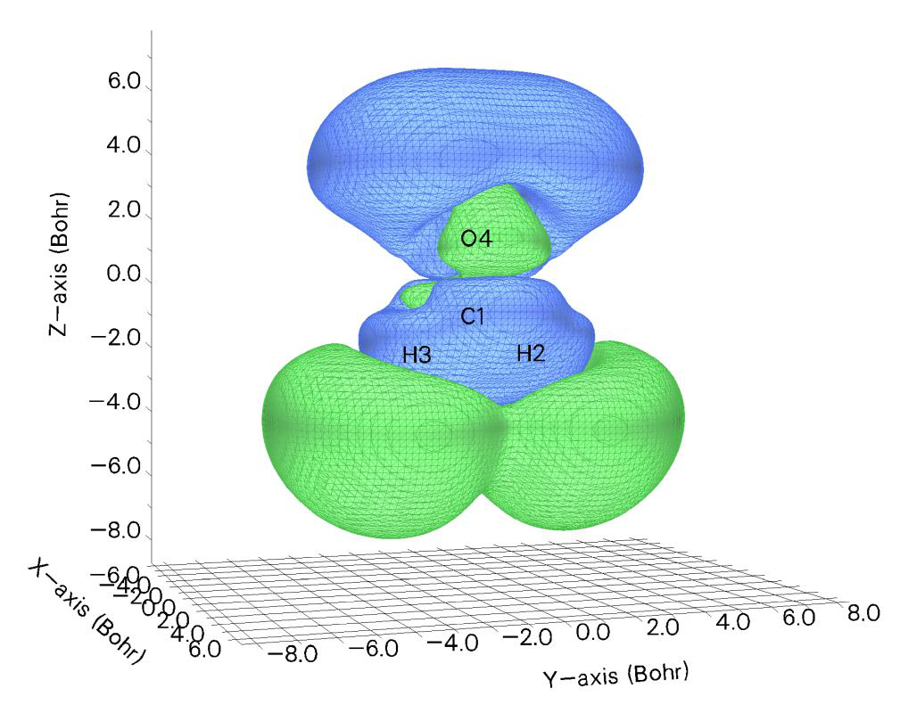

<!-- p.983 -->
In the figure, the regions enclosed by green (blue) isosurfaces have positive (negative) contribution to γZZZZ. It can be seen that in the molecular valence region, the contribution is basically negative, however at the two ends of the molecule the contribution is remarkably positive, and the magnitude obviously exceeds the negative region, this is why the current system has an evidently positive value of γZZZZ. Clearly via such a picture, you can immediately explain why a component of γ is big or small, or why it is positive or negative. Undoubtedly this kind of analysis is extremely useful in studying underlying characteristics of (hyper)polarizability!

Plotting plane map

(3), from which we can better understand detailed distribution of this function in a specific plane. Input 0 to return to last menu, then input Next, we plot plane map of 𝜌𝑧𝑧𝑧

3 //Plot plane map of second hyperpolarizability density 1 //Color-filled map [Press ENTER button directly] //Use the default 200*200 grid points 3 //YZ plane 0 //X=0 Close the graph, then input following commands to fine-tune the graphical effect 19 //Set color transition 8 //Blue-White-Red 2 //Enable showing contour lines 3 //Change contour line setting 4 //Delete some contour lines (we only want to keep contour lines with relatively large value in this example)

32-37 4 //Delete some contour lines 1-6 1 //Save setting and return 4 //Enable showing atom labels and reference point 12 //Dark green


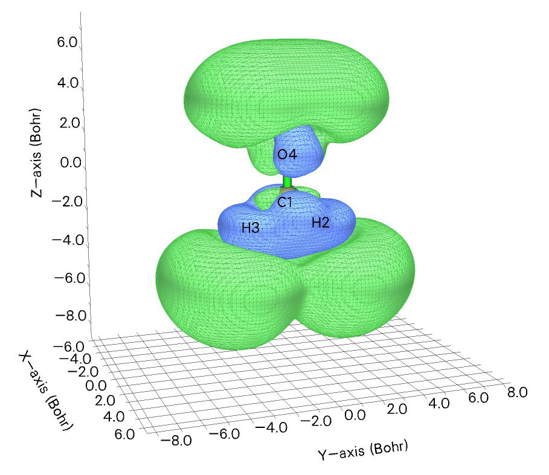

<!-- p.984 -->
8 //Enable showing bonds 14 //Brown 1 //Set lower & upper limits -6,6 -1 //Replot You will see the following map, which looks pretty nice

After choosing “-5 Return to main menu”, then you can select “4 Plot plane map of spatial

contribution to second hyperpolarizability” to plot −𝑧𝜌𝑧𝑧𝑧 (3) via similar way.

Obtaining atomic contribution to (hyper)polarizability Thanks to the flexibility of Multiwfn, one can easily obtain atomic contribution to (hyper)polarizability by integrating corresponding (hyper)polarizability density in each atomic space based on its grid data. Commonly, employing fuzzy atomic space is recommended, because

the cost is very low. Here we will calculate atomic contributions to γZZZZ by integrating grid data of -zρ(3)ZZZ.

(3) via the option “2 Generate grid data of spatial contribution to second hyperpolarizability” mentioned earlier, we select option “2 Export grid data as cube file” and then press ENTER button directly to export the grid data as grid.cub in current folder. Then set "iuserfunc" in `settings.ini` to -1, so that the user-defined function will correspond to the interpolated function based on the loaded grid data. Reboot Multiwfn, load grid.cub, then input below commands: After generating grid data of −𝑧𝜌𝑧𝑧𝑧

15 //Fuzzy atomic space analysis 1 //Integrate a real space function in every atomic space 100 //User-defined function The result is


```text
  Atomic space        Value                % of sum            % of sum abs
    1(C )           28.87467715             0.962679             0.962679
    2(H )          950.91673574            31.703459            31.703459
```


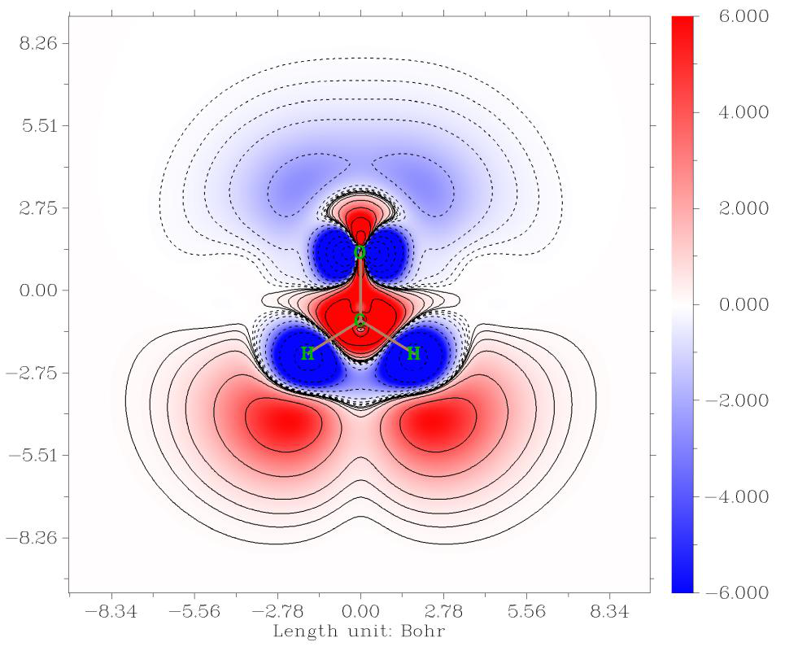

<!-- p.985 -->

```text
    3(H )          949.91946330            31.670210            31.670210
    4(O )         1069.69915961            35.663652            35.663652
Summing up above values:       2999.41003579
Summing up absolute value of above values:       2999.41003579
```

The values under "Value" label are atomic contributions to γZZZZ, and the values under the "% of sum" are percentage contributions. From the data it is clear that the two hydrogens and the oxygen

have major contribution to γZZZZ. The sum of all values is 2999.4 a.u., which is also quite close to the γZZZZ value (3092.1 a.u.) outputted by Gaussian polar=gamma task, implying that the data is meaningful.


### 4.24.5 Example of using unit sphere representation to visually study (hyper)polarizability


Note: Chinese version of this section is my blog article “Using Multiwfn to graphically study (hyper)polarizability tensor by unit sphere representation” (http://sobereva.com/547, in Chinese), which contains more discussions.

Please read Section 3.27.5 if you are not familiar with unit sphere and vector representation analysis of (hyper)polarizability. In this section, I will take CH3NHCHO and cyclo[18]carbon as instances to show how to use Multiwfn in conjunction with VMD visualization software to realize these kinds of analysis and to demonstrate the usefulness of these methods.

4.24.5.1 First-order hyperpolarizability of CH3NHCHO

In this section, we analyze SHG (second-harmonic generation) type of dynamic first

hyperpolarizability (β) at 1030 nm for CH3NHCHO, one of our purposes is to reproduce the Fig. 2(e) in the original paper of the unit sphere representation method (J. Comput. Chem., 32, 1128 (2011)). We will use the same calculation level as the authors, namely B3LYP/6-311+G** for geometry optimization and HF/6-311++G** for hyperpolarizability calculation. The authors

employed GAMESS-US program, but we will employ Gaussian to calculate β.

First, use Gaussian to run examples\polar\CH3NHCHO\polar.gjf, its content is shown below


```text
#P HF/6-311++g(d,p) polar=DCSHG CPHF=rdfreq
[blank line]
B3LYP/6-311++G** opted
[blank line]
0 1
[coordinate optimized at B3LYP/6-311++G** level]
[blank line]
450nm 1030nm
```

In this input file, polar=DCSHG requests Gaussian to calculate hyperpolarizability of SHG type,

namely β(-2ω;ω,ω). Two frequencies of incident light are loaded from the end of input file, as requested by CPHF=rdfreq keyword. Note that #P must be employed, otherwise Multiwfn will be unable to parse (hyper)polarizability from the output file.

Now we use Multiwfn to parse the output file and export β as .txt file. Boot up Multiwfn and


<!-- p.986 -->
input below commands

examples\polar\CH3NHCHO\polar.out 24 // (Hyper)polarizability analysis 1 // Parse "polar" task of Gaussian. PS: If you are not familiar with this function, please check Section 3.27.1 for introduction and 4.24.1 for example

-1 // Request Multiwfn to parse dynamic (hyper)polarizability -4 // Request Multiwfn to export parsed (hyper)polarizability as .txt file 1 // Start parsing (hyper)polarizability 2 // As shown on screen, the second option corresponds to 1030 nm case

2 // Load SHG form of β n // Do not perform analysis related to hyper-Rayleigh scattering

Now polarizability tensor (α) and SHG form of β corresponding to 1030 nm have been exported to alpha.txt and beta.txt in current folder, respectively.

As mentioned in Section 3.27.5, to realize unit sphere representation, generally you should let Multiwfn load a file containing atom coordinate, so that Multiwfn can determine proper radius of the sphere. Here we let Multiwfn directly load atom coordinate from Gaussian output file. To do so, we change "iloadGaugeom" in `settings.ini` to 2, that means requesting Multiwfn to load atom coordinate in standard orientation from the loaded Gaussian output file. Then boot up Multiwfn and input

examples\polar\CH3NHCHO\polar.out 24 // (Hyper)polarizability analysis 5 // Visualize (hyper)polarizability via unit sphere and vector representations Now you can find many options used to adjust plotting parameters, such as radius and length of the arrows on sphere, number of arrows and so on, currently we use default setting. We select

option 2, from prompt on screen you can find Multiwfn automatically loads β tensor from beta.txt in current folder because it exists, and then export beta.tcl in current folder, which corresponds to VMD plotting script of unit sphere representation. You can also find beta_vec.tcl has been exported in current folder, which is VMD plotting script of vector representation.

Since we also want to display molecular structure in VMD, we need to generate a file containing atom information that can be recognized by VMD, therefore we input

0 // Exit current function 0 // Return to main menu 100 // Other function (Part 1) 2 // Generate new file 1 // Export current geometry as .pdb file CH3NHCHO.pdb Now we have CH3NHCHO.pdb in current folder, and we can close Multiwfn program. Moving the beta.tcl and beta_vec.tcl from current folder to VMD installation folder, then boot up VMD and input source beta.tcl and source beta_vec.tcl in VMD console window to run these two plotting scripts in turn. Next, drag CH3NHCHO.pdb to "VMD Main" window to load it, then enter "Graphics" - "Representation" and change "Drawing Method" to "CPK". Now you can see


<!-- p.987 -->
below figure in VMD graphical window, two side views are given:

You can find this map is almost exactly identical to Fig. 2(e) in J. Comput. Chem., 32, 1128 (2011), the marginal differences come from numerical aspects and the fact that definition of B3LYP in Gaussian is slightly different to that in GAMESS-US. In this map, the arrows on sphere correspond

to scaled βeff vectors, the arrow direction is in line with βeff, and the length equals norm of βeff multiplied by scale factor. The arrows are colored according to their length, the shortest (longest) arrow is colored as blue and red, respectively, the white arrows have medium length. The starting points of the arrows are evenly distributed on a sphere surface, the sphere radius can be controlled by corresponding option in Multiwfn.

What can we learn from the map above? In order to elucidate this point, three featured zones are labelled. The pink arrows are normal vectors at corresponding point of the sphere surface.

- Region 1: If two external electric fields are applied to the molecule along the direction indicated by the pink arrow, their combination effect will result in occurrence of induced dipole moment in the same direction, as exhibited by the small arrows on the sphere.

- Region 2: Similar to region 1, but the induced dipole moment occurs in the inverted direction as applied electric field.

- Region 3: If two external electric fields are applied from top to bottom, as illustrated by the pink arrow, their combination effect will lead to induced dipole moment pointing to the right. This


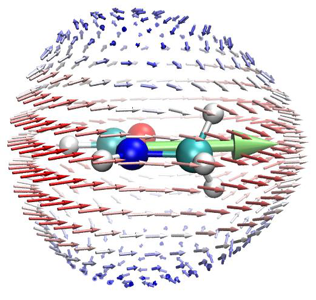


<!-- p.988 -->
seemingly weird phenomenon reflects anisotropic response character of this molecule. Clearly, without employing the unit sphere representation method, this point can hardly be noticed.

Since the β in the present example is SHG type corresponding to 1030 nm, the external electric fields mentioned above in fact vary with frequency of 1030 nm, they source from 1030 nm light radiating in the direction perpendicular to them.

The large green arrow in the map above is referred to as vector representation, it corresponds

to scaled (βx, βy, βz) vector and exhibits primary character of the β. It can be seen that its direction is basically identical to the vector sum of all arrows on the sphere. Undoubtedly, this vector

representation is concise and useful in representing β, however, anisotropy character of β is fully ignored.

4.24.5.2 Polarizability and second-order hyperpolarizability of

cyclo[18]carbon

The cyclo[18]carbon is an intriguing system having unusual electronic structure, its various characteristics, including (hyper)polarizability, have been very comprehensively explored in my works (see http://sobereva.com/carbon_ring.html for summary). In this section, we employ unit sphere representation to visually investigate its polarizability and second-order hyperpolarizability

(γ), this example in fact is a partial reproduction of my research article Chem. Asian J. (2021) DOI: 10.1002/asia.202100589.

The Gaussian input file for calculating (hyper)polarizability, including γ, has been provided as examples\polar\C18\gamma.gjf, which utilizes LPol-ds basis set, the basis set file can be obtained

from http://sobereva.com/345. In this example, we only study static α and γ, therefore 0.0 is specified after molecular coordinate as frequency of incident light. The geometry has been

optimized at ωB97XD/def2-TZVP level.

We first extract α and γ from Gaussian output file and write it as .txt file. Boot up Multiwfn and input below commands

examples\polar\C18\gamma.out // Output file of aforementioned input file 24 // (Hyper)polarizability analysis 1 // Parse "polar" task of Gaussian -4 // Request Multiwfn to export parsed (hyper)polarizability as .txt file

7 // Start parsing α and γ Now we have alpha.txt and gamma.txt in current folder. Then we input

0 // Exit current function 5 // Visualize (hyper)polarizability via unit sphere and vector representations -3 // Change scale factor of length of the arrows on sphere surface

0.005 // This value is smaller than default, since α of cyclo[18]carbon is fairly large. If default value is used, you will find the arrows are too long

-5 // Change length scale factor for the arrow of vector representation 0.01

1 // Perform unit sphere representation analysis of α. Since alpha.txt already exists in current folder, α tensor is automatically loaded from it

Now we have alpha.tcl and alpha_vec.tcl file in current folder, which are the VMD plotting

scripts of unit sphere representation of α and that of vector representation of α. Move them to VMD


<!-- p.989 -->
folder, boot up VMD, input source alpha.tcl and then source alpha_vec.tcl in turn in VMD console window to run them.

In order to show molecule structure, again we need to export current molecule structure by Multiwfn as .pdb file, the steps have been described in the last section. After loading it into VMD and making its drawing method as CPK, we will see

The arrows on the sphere in this figure reflect magnitude and direction of induced dipole moment when an external electric field of the same strength is applied to different directions from the center of the molecule. It can be clearly seen from the figure that the polarizability of the cyclo[18]carbon ring in the direction parallel (perpendicular) to the ring plane is large (small). This observation is easy to understand, as indicated in my cyclo[18]carbon research paper Carbon, 165, 468 (2020), this system has 36 highly delocalized electrons (18 in-plane and 18 out-of-plane ones), therefore when electric field is applied parallelly to the ring, these electrons will be significantly polarized, resulting in large, induced dipole moment; in contrast, the electrons in this system are not so easily be polarized in the direction perpendicular to the ring. Note that in my cyclo[18]carbon

paper Carbon, 165, 461 (2020), the value of the α components parallel to and perpendicular to the ring are reported to be 392 and 98 a.u., respectively, evidently the figure shown above is fully in line with these quantitative values.

The three large double-sided arrows at the center of the above figure exhibit relative magnitude

of α along X, Y, and Z directions, the way of calculating their lengths (αx, αy, αz) has been mentioned in Section 3.27.5. From the arrow lengths it is very clear that α has much lower magnitude in the direction perpendicular to the ring compared to other directions.

Similarly, we use unit sphere representation to visually study γ. In the Multiwfn window we input

-3 // Change scale factor of length of the arrows on sphere

1E-5 // This value is significantly smaller than default one, since magnitude of γ is quite large -5 // Change length scale factor for the arrow of vector representation 0.00005

1 // Perform unit sphere representation analysis of γ. Since gamma.txt already exists in current folder, γ tensor is automatically loaded from it

Move the newly generated gamma.tcl and gamma_vec.tcl from current folder to VMD folder, and then run them in turn in the VMD software.


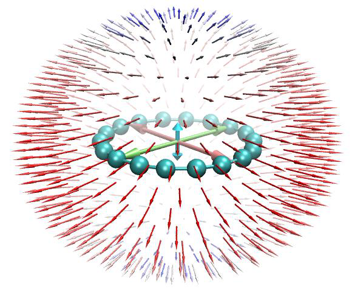

<!-- p.990 -->
Notice that the γ tensor parsed by subfunction 1 of main function 24 corresponds to input orientation (in contrast, the parsed α and β correspond to standard orientation), therefore, the molecular structure file loaded into VMD must also correspond to input orientation, otherwise the unit sphere representation map may be misleading. In order to yield the .pdb file corresponding to input orientation, we change "iloadGaugeom" in `settings.ini` to 1, then reboot Multiwfn and input

examples\polar\C18\gamma.out // Geometry in input orientation will be loaded from this file 100 // Other function (Part 1) 2 // Generate new file 1 // Export current geometry as .pdb file C18.pdb Load the C18.pdb into VMD and show it in CPK style, you will see below figure

The character of this map is similar to that of α map. From the colored small arrows, it can be seen that combination effect of three electric fields applied parallelly to the ring can induce a relatively strong dipole moment variation in the same direction, while in the direction perpendicular to the ring this phenomenon is much weaker.

From the vector representation, namely from the lengths of the three double-sided large arrows

along X, Y, and Z axes, one can better recognize the relative magnitude of γ along the three directions. Since the cyan arrow is quite short, the γ in Z direction is relatively negligible.


## 4.25 Examples of electron delocalization and aromaticity analyses


Some aromaticity analysis examples are given below, while most electron delocalization and aromaticity analyses in Multiwfn are illustrated in other sections, see Section 4.A.3 for an overview.


### 4.25.3 Study iso-chemical shielding surface (ICSS) and magnetic shielding distribution for benzene


Iso-chemical shielding surface (ICSS) denotes isosurface of magnetic shielding value, which


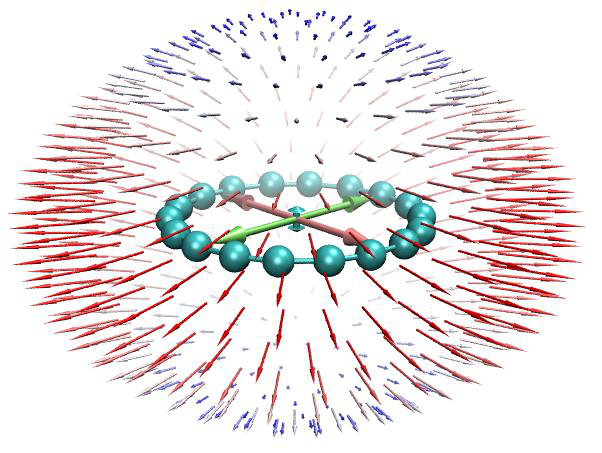

<!-- p.991 -->
presents intuitive picture on aromaticity. If you are familiar with NICS, you can also simply view ICSS as the isosurface of NICS with inverted sign. Please see Section 3.28.3 for more information. In this example we will study benzene. Since this is a planar system, we will plot ICSSZZ instead of ICSS, namely only the component of magnetic shielding tensor perpendicular to molecular planar will be taken into account. ICSSZZ must be more physically meaningful than ICSS, just like NICSZZ is a better aromaticity index than NICS (as demonstrated in Org. Lett., 8, 863 (2006)). Meanwhile I will also show how to plot magnetic shielding values along a line and in a plane.

AFAIK, ICSSZZ was first proposed by me during implementation of ICSS in Multiwfn. So, if ICSSZZ is involved in your work, please cite my study work containing ICSSZZ analysis: Carbon, 165, 468 (2020).

You should first prepare a Gaussian input file of standard single point task for present system, which will be taken as template input file later. This file has already been provided as examples\ICSS\benzene.gjf, in which the geometry has already been optimized at a reasonable level.

Boot up Multiwfn and input below commands examples\ICSS\benzene.gjf // Note that molecular plane is in XY plane 25 // Electron delocalization and aromaticity analyses 3 // Generate grid data of ICSS or related quantities 1 // Low-quality grid, magnetic shielding tensor at 130910 points will be calculated by Gaussian later. Using "medium-quality grid" could result in smoother maps, but the calculation will be much more expensive. Note that the default extension distance is 12 Bohr, which is usually large enough

n // Do not skip the step of generating Gaussian input file, because this is the first time we carry out analysis and thus currently we do not have Gaussian input/output files in hand

Now Multiwfn generates a lot of Gaussian input files of NMR task in current folder based on the template file. The files are named as NICS0001.gjf, NICS0002.gjf ... NICS0017.gjf. Run these files by Gaussian, the NICS0001.gjf must be run as the first one. The output files can be directly downloaded from here: http://sobereva.com/multiwfn/extrafiles/benzene_ICSS.rar.

Note: If these files cannot be run by your Gaussian normally, please check the tail of the output file, there are two common reasons:

(1) The %mem is too small to finish the task, you need to set %mem in the template .gjf file to a large value and retry.

(2) The "NICSnptlim" in `settings.ini` is too large, you should properly reduce it and try again. The reason is that in Gaussian there is a limit on the number of Bq atoms, and it is somewhat dependent of the version of Gaussian and your computer. For G09 D.01 and E.01, you should add "guess=huckel" keyword, otherwise due to memory allocation bug, the NICSnptlim has to be reduced to a very small value to make Gaussian run normally (in this case the overall computational cost will be quite high). If error occurs in Link401 when "guess=huckel" is used, then try to use "guess=core" instead. For G16, the guess keyword is not needed.

Hint: You can make use of the script "examples\runall.sh" (for Linux) or "examples\runall.bat" (for Windows), which invokes Gaussian to run all .gjf files in current folder to yield output files with the same name but with .out suffix.

Assume that the output files (NICS0001.out, NICS0002.out...) have been placed in "C:\benzene" folder, in Multiwfn you should input C:\benzene\NICS. We want to study ICSSZZ first, therefore we choose "5: ZZ component", then Multiwfn loads all Gaussian output files and convert magnetic shielding tensors to grid data of ICSSZZ. After that you will see a new menu, you can directly visualize isosurface of the grid data by option 1, export it as cube file by option 2 or reselect the form of ICSS by option -1. The isosurface of ICSSZZ = 2.0 ppm is shown below


<!-- p.992 -->
As you can see, the green isosurface (positive Z-component shielding value), completely covers the region above and below the benzene ring, suggesting that due to the induced ring current originated from the globally delocalized π-electrons, the Z-direction external magnetic field is largely shielded in these regions, this observation implies the strong aromaticity of benzene. From below scheme we can understand the ICSSZZ more deeply; in the cylindrical region perpendicular to and through the benzene, the direction of induced magnetic field (purple arrows) is exactly opposite to external magnetic field (B0), this is why in this region Z-component of magnetic shielding value is large.

You can also see, blue isosurface (negative Z-component shielding value) presents in the outlier region of benzene, exhibiting the de-shielding effect. This is mostly because the induced magnetic field is parallel to B0 and thus enhances B0 in this region.

If you properly rotate viewpoint, you will clearly find the C-H bond is also completely covered by the green surface. The reason is that the σ-electrons involved in the C-H bonding form conspicuous local induced ring current, so the external magnetic field is also strongly shielded around the C-H bond.

If you want to export current grid data as .cub file so that you can visualize it via third-part softwares such as VMD, you can close the GUI window and select 2 to export the grid data to ICSSZZ.cub in current folder.

Directly study ICSS based on existing Gaussian output files Assume that you have already obtained the Gaussian output files for the ICSS purpose, and you want to directly study ICSS, you should input following commands after booting up Multiwfn:

examples\ICSS\benzene.gjf 25 // Electron delocalization and aromaticity analyses 3 // Generate grid data of ICSS or related quantities 1 // Low-quality grid y // Skip generating Gaussian input files and thus directly load Gaussian output files C:\benzene\NICS


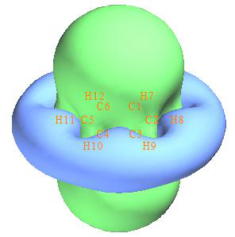


<!-- p.993 -->
5 // Study ICSSZZ As you can see, the grid setting we adopted this time is exactly identical to that we used to generate the Gaussian input/output files, this point is extremely important. If the grid setting is not the same, the file loading must fail.

Plot plane map of magnetic shielding value NOTICE: If you are only interested in the plane map, it is strongly suggested to use subfunction 14 of main function 25 to realize this purpose, which is much more convenient, and the computational cost is significantly lower than calculating the three-dimensional ICSS grid data. See Section 4.25.14 on how to easily plot NICS-2D plane map. Note that NICS and ICSS only differ by sign.

Next, I will show how to plot magnetic shielding value in a plane. Since we already have grid data of ICSSZZ in hand, magnetic shielding value at any point in a line/plane can be easily obtained by means of interpolation technique based on the grid data.

We first plot color-filled map for ICSSZZ in the YZ plane with X=0. This plane is normal to benzene and crosses C4-H10 and C1-H7. Set "iuserfunc" in `settings.ini` to -3, and then boot up a new Multiwfn instance and input below commands

ICSSZZ.cub 4 // Plot plane map 100 //User-defined function, which now corresponds to the function interpolated by the grid data of ICSSZZ.cub via B-spline algorithm

1 // Color-filled map [Press Enter button] 0 // Set extension distance of the plot 8 // 8 Bohr 3 // YZ plane 0 // X=0 Now the graph pops up, close it and then input 4 // Show atom labels 3 // Blue 1 // Change lower and upper limit of color scale -60,60 2 // Enable showing contour lines -2 // Set label interval in X, Y and color scale axes 3,3,10 19 // Set color transition 8 // Blue-White-Red -1 // Replot the map Now you can see the map below


<!-- p.994 -->
From the graph one can find that although Z-component of magnetic shielding in the center of benzene is a positive value, the magnitude is by far less than that in the regions above and below the ring plane. The reason is clear, that is benzene only has π-aromaticity, while its σ-electrons are not globally delocalized to form σ-aromaticity, so the shielding effect in the plane is relatively weak due to lack of formation of σ-ring current.

Curve map of magnetic shielding value NOTICE: If you are only interested in the curve map, it is strongly suggested to use subfunction 13 of main function 25 to realize this purpose, which is much more convenient, and the computational cost is significantly lower than calculating the three-dimensional ICSS grid data. See Section 4.25.13 on how to easily plot NICS curve map.

Next, we plot curve map to study the variation of magnetic shielding in the line perpendicular to ring plane and starting from ring center. Choose -5 to return to main menu and input

3 // Plot curve map 100 // User-defined function 2 // Input coordinate of two points to define a line 0,0,-8,0,0,8 // The line starts from 8 Bohr below and above the ring center You will immediately see


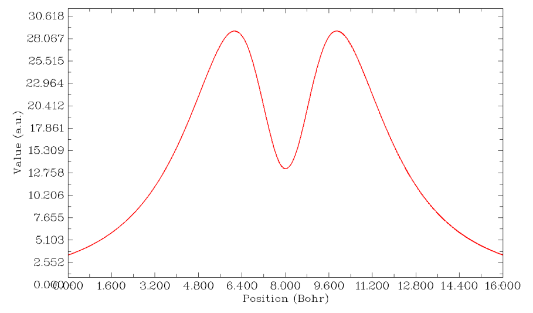

<!-- p.995 -->
It can be seen that the maximum of Z-component of magnetic shielding occurs about 1.8 Bohr above/below the ring plane. If you choose "6 Find the positions of local minimum and maximum", you will see


```text
Maximum X (Bohr):    6.122667  Value:    0.28936394E+02
Minimum X (Bohr):    8.000000  Value:    0.13254245E+02
Maximum X (Bohr):    9.882667  Value:    0.28937419E+02
```

That is the maximal value of ICSSZZ along the line is 28.9 ppm, whose position is 9.88-8=1.88 Bohr (0.995 Å) above/below the ring plane. While at the ring center, the ICSSZZ is merely 13.2 ppm.

Beware that since the extension distance used in the calculation of grid data of ICSSZZ is only 12 Bohr, when we plot curve or plane map based on the interpolated data of ICSSZZ, the spatial range involved in the map should not be too large. For example, we cannot plot the curve map from (0,0,0) to (0,0,20). If a point is beyond the valid spatial range of grid data interpolation, the value will be 0.

Calculate NICS(0)ZZ and NICS(1)ZZ based on ICSSZZ data It is noteworthy that if you already have ICSSZZ grid data, you can directly obtain the popular NICS(0)ZZ and NICS(1)ZZ indices without doing any additional calculation, because the NICS value at any point can be directly obtained in terms of interpolation of ICSSzz grid data. As an example, we calculate NICS(1)ZZ. Ensure that "iuserfunc" in `settings.ini` has been set to -3 due to the aforementioned reason, then boot up Multiwfn and input

ICSSZZ.cub 1 // Calculate function values at a point 0,0,1 // The point 1 Å above the ring center 2 // The inputted position is in Å From screen you can find the "User-defined real space function" value is 28.9, namely the NICS(1)ZZ is -28.9 ppm.

Epilogue ICSS/ICSSZZ is really a very useful method for discussing aromaticity and anti-aromaticity, many instances can be found in the original paper of ICSS (J. Chem. Soc. Perkin Trans. 2, 2001, 1893), and in some applicative papers, such as J. Phys. Chem. C, 123, 18593 (2019) as well as my research on cyclo[18]carbon, Carbon, 165, 468 (2020).

I strongly recommend you do some more practices about plotting and analyzing ICSS/ICSSZZ, I provided some ideal exercise systems in "examples\ICSS" folder, including azulene, cyclobutadiene, cycloheptatriene, porphyrin, propane and pyracylene; among them cyclobutadiene is the simplest one. Below is the ICSS = 0.5 isosurface of cyclobutadiene showing in two styles; from the graph it is clear that this system shows strong anti-aromaticity characteristic, the 4n π-electrons cause evident de-shielding effect in the cylindrical region perpendicular to and through the ring, this situation is in complete contrast to benzene.


<!-- p.996 -->
I wrote a very detailed post to discuss ICSS, in which all systems in "examples\ICSS" folder are involved, see my blog article "Using Multiwfn to study aromaticity by drawing iso-chemical shielding surfaces" (in Chinese, http://sobereva.com/216).


### 4.25.6 Calculate HOMA and Bird aromaticity index for phenanthrene

HOMA is the most prevalently used aromaticity index based on geometry equalization, see Section 3.28.6 for detail. Here we use HOMA to study which ring of phenanthrene has stronger aromaticity.

Since calculation of HOMA only requires molecular coordinate, you can simply use such as .pdb and .xyz as input file. Of course, other files containing molecular coordinate, such as .wfn and .fch files are acceptable too. The geometry in present instance is optimized under B3LYP/6-31G* level.

Boot up Multiwfn and input following commands examples/phenanthrene.pdb 25 // Electron delocalization and aromaticity analyses 6 // Calculate HOMA and Bird aromaticity index 0 // Start the calculation You will see the default parameters are printed, they are taken from J. Chem. Inf. Comput. Sci., 33, 70 (1993), you can also change these parameters yourself via option 1 before the calculation.

Now we input the atom indices in the ring that we are interested in, we calculate HOMA for the central ring first, so input 3,4,8,9,10,7, the input order must be consistent with atom connectivity. You will immediately obtain the result shown below


```text
        Atom pair         Contribution  Bond length(Angstrom)
   3(C )  --    4(C ):      -0.065698        1.427111
```


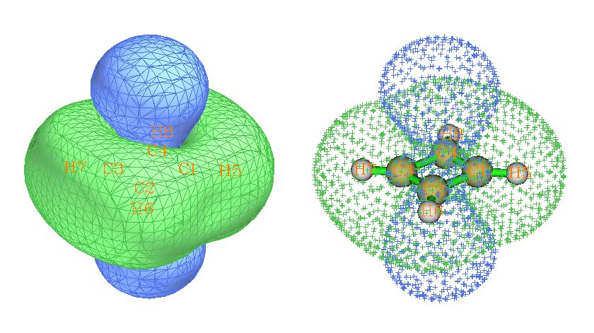


<!-- p.997 -->

```text
   4(C )  --    8(C ):      -0.210455        1.458000
   8(C )  --    9(C ):      -0.065698        1.427111
   9(C )  --   10(C ):      -0.096016        1.435282
  10(C )  --    7(C ):      -0.033673        1.360000
   7(C )  --    3(C ):      -0.096016        1.435282
HOMA value is    0.432442
```

Obviously, C4-C8 deviates to ideal bond length 1.388 most significantly, giving rise to large negative contribution to HOMA, in other words, significantly broke aromaticity. The HOMA value is calculated as 1 plus the contributions from all bonds in the ring.

Then input 8,15,14,13,11,9 to calculate HOMA for the boundary ring, the result is 0.855126. Since this value is much closer to 1 than the one for central ring, HOMA suggests that the two boundary rings have stronger aromaticity.

Bird index is another quantity used to measure degree of aromaticity, see Section 3.28.6 for a brief description. Now choose option 2 to calculate Bird index for the two rings, you will find the value for boundary ring is closer to 100 than the central ring. Likewise, HOMA, Bird index also indicates that the two boundary rings have stronger aromaticity.


### 4.25.13 Example of plotting one-dimension NICS curve, calculating integral (INICS) and FiPC-NICS


Note: Chinese version of this section is my blog article “Using Multiwfn to plot one-dimensional NICS curve and measure aromaticity by its integration” (http://sobereva.com/681), which also contains more discussion and examples.

In this section I will illustrate how to plot NICS curve and calculate its integral (INICS index) as well as FiPC-NICS index to study aromaticity. Please read Section 3.28.13 to gain some basic knowledge.

4.25.13.1 Example 1: NICSZZ curve of infinitene

Infinitene molecule optimized at PBE0/6-31G* level is examples\NICS_scan\infinitene.pdb, as shown below (two perspectives are given). In this example we will perform NICSZZ scan for the highlighted ring. The scanning direction is perpendicular to the fitted ring plane to the outside of the system and starts from geometric center of the ring.

Boot up Multiwfn and input following commands examples\NICS_scan\infinitene.pdb //You can also use any other file format containing structure information, similarly hereinafter


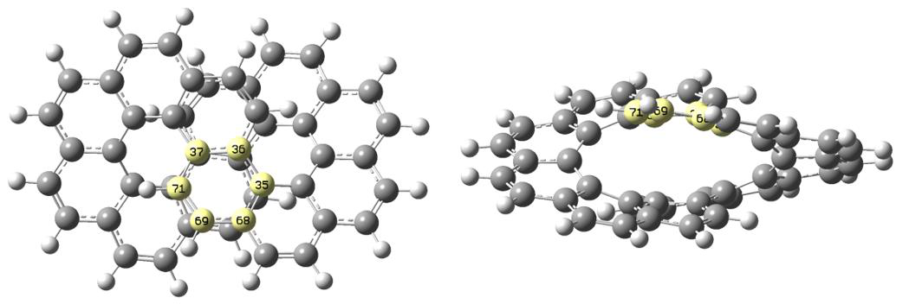

<!-- p.998 -->
25 //Electron delocalization and aromaticity analyses 13 //NICS-1D scan curve map, integral NICS (INICS) and FiPC-NICS 2 //The two end points of scanning line are above and below the center of a plane fitted for specific atoms, and the line perpendicularly passes through their center

35-37,68-69,71 //Using these atoms (highlighted in the map above) to define a fitting plane [Press ENTER button directly] //The center is chosen as geometric center of the selected atoms (in this step you may also input coordinate of other type of center, such as the ring critical point obtained by topology analysis module of Multiwfn)

10 //An end point of the scanning line is above 10 Å of the fitting plane from the center 0 //Another end point is below 0 Å of the fitting plane from the center, namely the scan will start from the ring center

[Press ENTER button directly] //Using recommended number of scanning points (100 points in this example), which corresponds to approximately 0.1 Å of step size

1 //Generate Gaussian input file for NICS-1D scanning examples\NICS_scan\template_NMR.gjf //Template input file of NMR task of Gaussian, which is used to generate Gaussian input file for NICS-1D scan. [geometry] line in this file will be replaced with coordinates of scanning points, while other parts are kept unchanged

Now NICS_1D.gjf has been generated in current folder. You can load it into GaussView to visualize the scanning points, see below. The purple spheres are Bq atoms, for which magnetic shielding tensor will be calculated in the NMR task. It can be seen that all Bq atoms occur evenly on the expected scanning line.

For reducing cost, manually changing the basis set in NICS_1D.gjf to 6-31G*. Then run it by Gaussian. The corresponding input and output files have been provided as infinitene_NICS_1D.gjf and infinitene_NICS_1D.out in “examples\NICS_1D” folder.

Next, in the Multiwfn window, input 2 //Load Gaussian output file of NICS-1D scanning examples\NICS_scan\infinitene_NICS_1D.out //Gaussian output file Then a new interface appears, the options are self-explanatory. A noteworthy option is -1, from which you can choose the component of NICS to study. By default, the component perpendicular to the fitting plane is used, which is most meaningful in characterizing aromaticity. We will refer it to


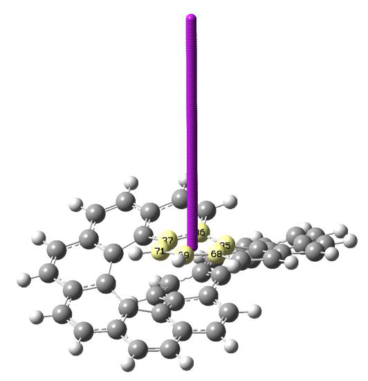

<!-- p.999 -->
NICSZZ by assuming that Z is the direction normal to the fitting plane.

Now choose option 1 to plot NICS curve (currently corresponding to NICSZZ), you will see the following map (you can flip the map horizontally by selecting option -3 once before choosing this option)

It can be seen that the ring is aromatic, as the NICSZZ is evidently negative, especially at the distance 1 Å to the ring center.

From screen you can also find integral of the curve:


```text
Integral of NICS component:    -96.19 ppm*Angstrom
```

In addition, you can select option 5 to obtain extrema of the curve:


```text
Minimum X (Angstrom):    1.111111  Value:   -0.29469963E+02
Totally found    1 minima,    0 maxima
```

4.25.13.2 Example 2: NICSsigma,ZZ and NICSpi,ZZ curves of benzene

In this example, we will plot NICSZZ curve of benzene contributed by σ and π electrons, namely NICSσ,ZZ and NICSπ,ZZ, respectively. To plot NICSπ,ZZ, input the following commands after booting up Multiwfn.

examples\NICS_scan\benzene.pdb //Benzene optimized at B3LYP/6-31G* level, the molecule is lying at XY plane of Z=0

25 //Electron delocalization and aromaticity analyses 13 //NICS-1D scan curve map, integral NICS (INICS) and FiPC-NICS 2 //The two end points of scanning line are above and below the center of a plane fitted for specific atoms, and the line perpendicularly passes through their center

1-6 //Using all carbon atoms in this system to define a fitting plane [Press ENTER button directly] //The center is chosen as geometric center of the selected atoms 10 //An end point of the scanning line is above 10 Å of the fitting plane from the center 10 //Another end point is below 10 Å of the fitting plane from the center [Press ENTER button directly] //Using recommended number of scanning points (200 points in this example)

1 //Generate Gaussian input file for NICS-1D scanning


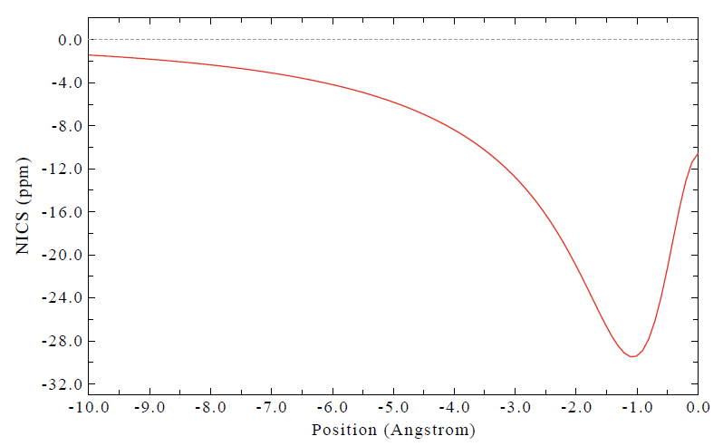

<!-- p.1000 -->
examples\NICS_scan\template_NMR_benzene-pi.gjf //Gaussian template file The content of the template file used this time is as follows, which requests Gaussian to

calculate magnetic shielding information only contributed by MOs 17,20,21 (π-MOs of benzene at current level). The keywords nmr=csgt iop(10/93=2) must present. AICD.txt is the file generated by the IOp, which is fully useless in this situation, you can simply delete it after running.


```text
#p b3lyp/6-31+G* nmr=csgt iop(10/93=2)

template file

  0  1
[geometry]

AICD.txt

17,20,21
```

Use Gaussian to run the NICS_1D.gjf generated in current folder. The output file has been provided as examples\NICS_scan\benzene-pi_NICS_1D.out.

Next, in the Multiwfn window, input 2 //Load Gaussian output file of NICS-1D scanning examples\NICS_scan\benzene-pi_NICS_1D.out //Gaussian output file

1 //Plot NICS curve map, which corresponds to NICSπ,ZZ in present case Now you can see the following map. X=0 corresponds to position of ring center.

You can plot NICSσ,ZZ via almost exactly the same way, the only difference is that in the template file you should specify indices of σ MOs. The corresponding template file is examples\NICS_scan\template_NMR_benzene-sigma.gjf.

In the “examples\NICS_scan\” folder, C5H5-.pdb and C7H7+.pdb are optimized C5H5− and C7H7+ ions, respectively. You can use the same way as shown above to obtain their NICSσ,ZZ and


<!-- p.1001 -->
NICSπ,ZZ curves, relevant files are also provided in the folder. Note that in the interface, you can choose option “3 Export NICS curve data along the line” to export curve data as plain text file. Then, after importing the curve data corresponding to different situations into e.g. Origin, you can plot them together, as shown below.

It can be seen that σ electrons have considerable influence on NICSZZ around ring center. All the three systems show comparable π aromaticity according to the NICSπ,ZZ curves. However, their difference can be determined quantitatively from their integrals. The integral of NICSπ,ZZ for benzene, C5H5− and C7H7+ are -142.45, -134.85 and -145.02 ppm·Å, respectively, indicating that strength of π aromaticity is C7H7+  benzene > C5H5−.

4.25.13.3 Example 3: Calculate FiPC-NICS index for benzene

Note: See my blog article “Using Multiwfn to calculate FiPC-NICS aromaticity index” (http://sobereva.com/724, in Chinese) for more discussion about FiPC-NICS.

In the post-processing menu of subfunction 13 of main function 25, FiPC-NICS aromaticity index can be straightforwardly calculated, which will be illustrated using benzene as an example. If you are not familiar with it, please check Section 3.28.13.

Booting up Multiwfn and input examples\NICS_scan\benzene.pdb //Benzene optimized at B3LYP/6-31G* level, the molecule is lying at XY plane of Z=0

25 //Electron delocalization and aromaticity analyses 13 //NICS-1D scan curve map, integral NICS (INICS) and FiPC-NICS 2 //The two end points of scanning line are above and below the center of a plane fitted for specific atoms, and the line perpendicularly passes through their center

1-6 //Using all carbon atoms in this system to define a fitting plane [Press ENTER button directly] //The center is chosen as geometric center of the selected atoms 0 //An end point of the scanning line is 0 Å from the center 10 //Another end point is 10 Å from the center 200 //200 points used in NICS scan


<!-- p.1002 -->
1 // Generate Gaussian input file for NICS-1D scanning examples\NICS_scan\template_NMR.gjf //Gaussian template file corresponding NMR calculation at B3LYP/6-31+G* level

Now NICS_1D.gjf has been generated in current folder, rename it as benzene_NICS_1D_0to10.gjf and run it using Gaussian. The output file has been provided. Next, we input

2 // Load Gaussian output file of NICS-1D scanning examples\NICS_scan\benzene_NICS_1D_0to10.out //Gaussian output file 6 //Calculate FiPC-NICS You will immediately see result:


```text
FiPC-NICS is   -9.332247 ppm, at   1.179 Angstrom
```

The result indicates that at 1.179 Å above ring center of benzene, in-plane component of NICS (NICSin) is vanished, and out-of-plane component of NICS (NICSout) is -9.33 ppm. This result is very close to the corresponding data in original paper of FiPC-NICS (-9.59 ppm at 1.18 Å), in which PBE0/6-311++G** was used in geometry optimization and NMR calculation.

Multiwfn also exported FiPC-NICS.txt in current folder, the meaning of each column is clearly shown on screen. This file contains information of all scanning points. You can take the last two columns, namely NICSin and NICSout, respectively as X-axis and Y-axis to plot scatter+line map. The resulting map is shown below, which is in very good agreement with Fig. 1 of original paper of FiPC-NICS.


### 4.25.14 Example of plotting two-dimension NICS plane map

Note: Chinese version of this section is my blog article “Using Multiwfn to easily plot two-dimensional NICS plane maps to examine aromaticity” (http://sobereva.com/682), which also contains more discussion and examples.

In this section I will illustrate how to plot NICS plane map. Please read Section 3.28.14 to gain some basic knowledge. Note that NICSZZ in the following examples refers to the NICS component perpendicular to the plane of interest, Z does not always correspond to Z-axis.

4.25.14.1 Plotting NICSZZ plane map above 1 Å of coronene

In this example we plot color-filled NICSZZ plane map above 1 Å of coronene, the coronene


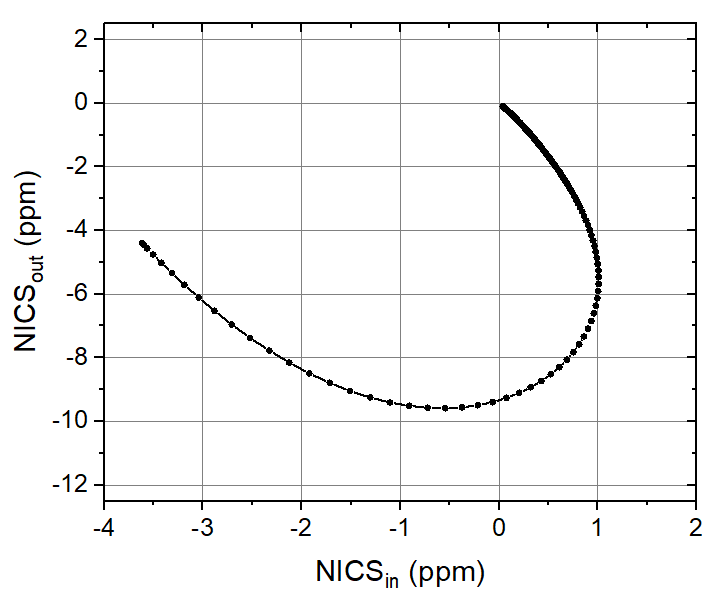

<!-- p.1003 -->
optimized at B3LYP/6-31G* level is examples\NICS_scan\coronene.pdb. The molecule is exactly planar and lying at XY plane of Z=0.

Boot up Multiwfn and input following commands examples\NICS_scan\coronene.pdb 25 //Electron delocalization and aromaticity analyses 14 //NICS-2D scan plane map 1 //Color-filled map [Press ENTER button directly] //Using default number of grid points (100*100) 0 //Set extension distance 1 // 1 Bohr 1 //XY plane 1a //Z = 1Å 1 //Gaussian input file for NICS-2D scanning examples\NICS_scan\template_NMR.gjf //Template input file of NMR task of Gaussian, which is used to generate Gaussian input file for NICS-2D scan. [geometry] line in this file will be replaced with coordinates of scanning points, while other parts are kept unchanged

NICS_2D.gjf has been generated in current folder, you can properly modify it according to actual situation. Run it by Gaussian, the output file is examples\NICS_scan\coronene_NICS_2D.out.

Next, in Multiwfn window input 2 //Load Gaussian output file of NICS-2D scanning examples\NICS_scan\coronene_NICS_2D.out 5 //Taking ZZ Cartesian component. Since the molecule is exactly in XY plane, the resulting NICS will correspond to NICSZZ in common sense (i.e. the component normal to ring plane)

From screen you can find minimum and maximum of NICSZZ in the plane:


```text
The minimum of data:  -43.3034000000000
The maximum of data:   11.3487000000000
```

Close the map shown on screen, then input the following commands to fine-tune the plotting settings

4 //Enable showing atom labels 1 //Red 8 //Enable showing bonds 14 //Brown 17 //Set distance threshold for showing atom labels 5 //5 Bohr y //Show labels of the atoms that beyond the threshold by light font 1 //Set lower&upper limit of color scale -45,45 -8 //Change length unit of the graph to Angstrom -2 //Set label intervals in X, Y, and color scale axes 2,2,10 2 //Enable showing contour lines 3 //Change contour line setting 8 //Generate contour value by arithmetic progression -50,5,21 //Starting value, step, and total number


<!-- p.1004 -->
y //Removing existing contour lines. Then the contour values will be -50,-45,-40...40,45,50 1 //Save setting and return -1 //Replot Now you obtain the following map. From which it is clear that the outer rings has stronger aromaticity than the internal ring, as NICSZZ above 1 Å of the former is evidently more negative than that of the latter.

4.25.14.2 Plotting NICSZZ plane map above 1 Å of a phenyl ring of N(phenyl)3

In this example, we will plot NICSZZ plane map above 1 Å of the highlighted ring of N(phenyl)3 shown below. Since this ring is inclined with respect to Cartesian axis, we will use a special way to define the plotting plane.

Boot up Multiwfn and input following commands examples\NICS_scan\N(phenyl)3.pdb //Structure optimized at B3LYP/6-31G* level 25 //Electron delocalization and aromaticity analyses 14 //NICS-2D scan plane map


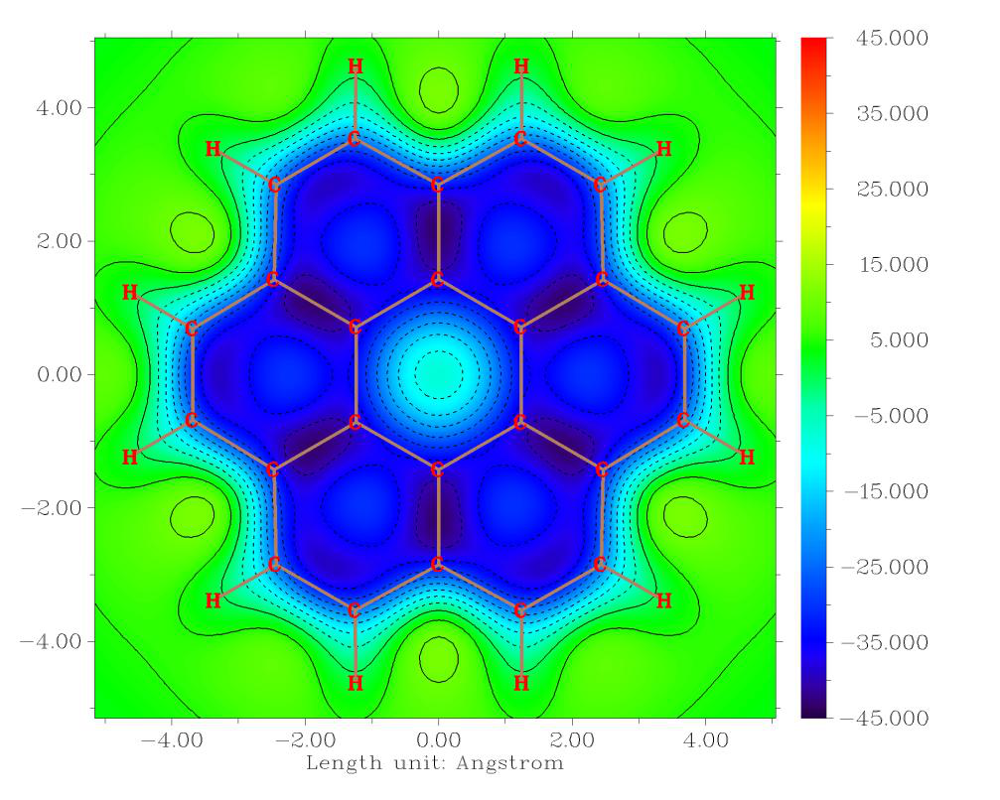


<!-- p.1005 -->
1 //Color-filled map [Press ENTER button directly] //Using default number of grid points (100*100) 8 //The plotting plane is above or below the plane consisting of specific atoms 23,24,26,30,28,25 //Atoms in the ring of interest Note that the unit vector normal to the fitting plane for the chosen atoms is shown on screen, please record it, which will be used later:


```text
The unit normal vector is    0.33076524    0.57300118    0.74984265
```

1 //The plotting plane is parallel to the fitting plane and at 1 Å above it. Negative value means below it

6 //Length of the plotting plane (a square region) is set to 6 Å Now you can find following information on screen:


```text
draw triangle {   2.495   2.581  -1.739} {  -1.211  -0.235   2.047} {   6.776  -1.451  -0.547}
draw triangle {  -1.211  -0.235   2.047} {   6.776  -1.451  -0.547} {   3.070  -4.266   3.239}
draw material Transparent
```

If you load the N(phenyl)3.pdb into VMD and then run the above three commands in VMD console window, and then properly adjust graphical representation, you will see the following map, which illustrates the region corresponding to the plotting plane. It can be seen that the plotting plane has been correctly defined.

Next, input the following commands 1 //Generate Gaussian input file for NICS-2D scanning examples\NICS_scan\template_NMR.gjf //Template file of Gaussian for NMR task Now NICS_2D.gjf has been generated in current folder, manually edit it to change the basis set to 6-31G*, then run it by Gaussian. The output file has been provided as examples\NICS_scan\N(phenyl)3_NICS_2D.out.

Then in Multiwfn window, input 2 //Load Gaussian output file of NICS-2D scanning examples\NICS_scan\N(phenyl)3_NICS_2D.out 0 //Take the NICS component along specific direction 0.33076524 0.57300118 0.74984265 //The unit normal vector shown by Multiwfn earlier Now the NICSZZ plane map has been shown on screen. Close it and properly adjust plotting settings (refer to the rich examples in Section 4.4), finally you can obtain the map shown below, which is fairly nice. Note that the color transition has been set to Yellow-Orange-Black,


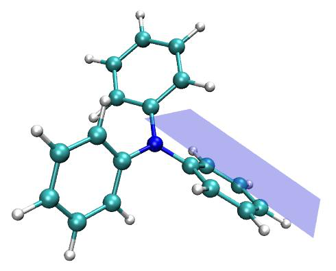

<!-- p.1006 -->
corresponding to range of [-34,0].

It is clear that the phenyl ring is aromatic, as NICSZZ above 1 Å of it is evidently negative. Also, it is noted that the magnetic shielding is slightly stronger in the internal side of the ring than the ring center.


## 4.100 Other functions (Part 1)


### 4.100.4 Calculate kinetic energy and nuclear attraction potential energy of phosgene by numerical integration


I suggest you read Section 3.100.4 first, the aim of this example is to show you the usefulness and universality of numerical integration. In quantum chemistry program, kinetic energy and nuclear attraction potential energy integration are evaluated analytically, analytical method has advantage in both speed and accuracy. In Multiwfn you can evaluate them by general numerical integration function. Local kinetic energy (or called “kinetic energy density”) is a built-in function, we first integrate this function over the whole space to get total kinetic energy. Boot up Multiwfn and input:

examples\COCl2.wfn // HF/6-31G* wavefunction 100 // Other functions (Part 1) 4 // Integrate a function over the whole space 6 // Hamiltonian kinetic density K(r) The result is 1031.1092, which is very close to the Gaussian outputted value 1031.1107. Because I do not want the list of real space function becomes lengthy, so rarely used functions such as local nuclear attraction potential energy are not chosen as built-in function, however you can still easily make these functions available by hacking source code, please consult Appendix 2. First, search “function userfunc” in function.f90, change the default content, namely "userfunc=1.0D0", to "userfunc = -nucesp(x,y,z)*fdens(x,y,z)", then recompile Multiwfn, redo


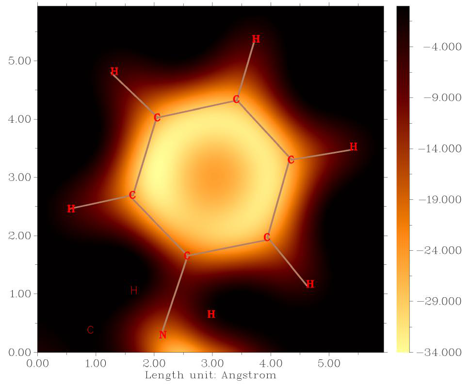

<!-- p.1007 -->
above procedure but select function 100 as integrand, you will get nuclear attraction potential energy -2839.1668, the value outputted by Gaussian is -2839.1629, evidently they are rather close. If you want to obtain nuclear attraction potential energy contributed from a specific orbital, use subfunction 26 of main function 6 to set occupation number of other orbitals to zero, and then do the integration as before.

To further illustrate the flexibility of numerical integration function in Multiwfn, assume that you want to calculate expectation of r2 operator, you can modify the content of “userfunc” routine to "userfunc = (x*x+y*y+z*z)*fdens(x,y,z)", then recompile Multiwfn and redo the integration, you will get 444.6523, which is in excellent agreement with the analytically calculated <r2> 444.652363 outputted by subfunction 5 of main function 300 (see Section 3.300.5 for detail).

Tip: You may have already noticed that the two lines of the codes colored by blue above have presented in "userfunc" routine, and they correspond to iuserfunc==12 and iuserfunc==3 respectively. So actually you needn't to modify and recompile the source code of Multiwfn, by simply changing "iuserfunc" parameter in `settings.ini` from the default value 0 to 12 and 3 respectively, the user-defined real space function will be equivalent to the two functions. For more about the built-in real space functions in "userfunc" routine, see Section 2.7.


### 4.100.8 Perform simple energy decomposition by using combined fragment wavefunctions


NOTE: The energy decomposition performed in the following way is strongly deprecated now! Using sobEDA or sobEDAw energy decomposition analysis (based on Multiwfn and Gaussian) is a much better choice, not only full terms can be obtained, but also much easier to use. See J. Phys. Chem. A, 127, 7023 (2023) and very detailed tutorial: http://sobereva.com/soft/sobEDA_tutorial.zip.

The principle of the simple energy decomposition has been introduced in Section 3.100.8, please read it first. Here we try to use this method to analyze components of interaction energy between NH3 and BH3 in the adduct NH3BH3 at B3LYP/6-31G* level. The Gaussian input and output files involved in this section can be found in "examples\EDA\EDA_simple" folder. The Gaussian version used here is Gaussian 16 B.01.

(1) Perform structure optimization task for NH3BH3, and then create a new input file with the optimized coordinate, named NH3BH3.gjf.

(2) Duplicate NH3BH3.gjf as NH3.gjf and BH3.gjf, then remove BH3 fragment in NH3.gjf, and remove NH3 fragment in BH3.gjf. Add pop=full nosymm keywords in both NH3.gjf and BH3.gjf.

(3) Run the input file of the two fragments by Gaussian respectively to generate NH3.out and BH3.out.

(4) Boot up Multiwfn, input following commands NH3.out //Fragment 1 100 // Other functions (Part 1) 8 // Generate Gaussian input file with initial guess combined from fragment wavefunctions 2 // There are two fragments in total BH3.out //Fragment 2 Multiwfn generates new.gjf in current folder, this is the Gaussian input file for NH3BH3 with fragment-combined wavefunction as initial guess.

(5) Make sure nosymm keyword is presented in the new.gjf. In order to output SCF energy in each iteration, change "#" to "#P". pop=full keyword can be deleted.

(6) Run new.gjf by Gaussian to generate new.out.


<!-- p.1008 -->
From NH3.out and BH3.out , we can find their single point energies: E(NH3) = -56.5477099 a.u. E(BH3) = -26.5929634 a.u. The single point energy of the adduct can be found in new.out: E(NH3BH3) = -83.2132069 a.u. We also refer it to as ESCF,last since it is the energy printed at last iteration of SCF procedure.

From line 639 of examples\EDA\EDA_simple\new.out, you can also find the energy printed at the first iteration of SCF procedure:

ESCF,1st = -83.12546124 a.u. According to the equations shown in Section 3.100.8, we can calculate energy terms as

ΔEtot = E(NH3BH3) - E(NH3) - E(BH3)= -0.0725336 a.u.= -190.44 kJ/mol ΔEorb = ESCF,last - ESCF,1st = -0.0877456 a.u.= -230.37 kJ/mol ΔEsteric = ΔEtot - ΔEorb = 0.017218 a.u.= 39.93 kJ/mol

namely the total interaction energy between NH3 and BH3 is -190.44 kJ/mol, the orbital interaction energy -230.37 kJ/mol significantly stabilized the adduct; while the steric term (sum of electrostatic interaction energy, Pauli repulsion energy and change in exchange-correlation energy), destabilized the adduct by 39.93 kJ/mol.

In the present system, compared to other energy components, the dispersion interaction can be safely neglected, so we did not discuss it separately. However, if the system you studied is a complex bound by weak interaction, you must also study the dispersion component in total interaction energy separately due to its great importance, see the description in Section 3.100.8 on how to evaluate it.


### 4.100.12 Biorthogonalization analysis for orbitals of unrestricted open- shell wavefunction


Note: Chinese version of this example and related introduction is my blog article "Principle and application of biorthogonalization method for unrestricted open-shell wavefunctions" (http://sobereva.com/448).

The biorthogonalization algorithm between alpha and beta orbitals has been introduced in Section 3.100.12, please read it first, this transformation makes interpretation of orbitals generated by UHF or UKS calculation much easier, since only one set of orbitals will then need to be examined. In this section I will illustrate the value of this analysis, examples\ethanol_triplet.fch is taken as example.

This system has 14 occupied alpha and 12 occupied beta orbitals, first let us look at some of them:


<!-- p.1009 -->
It can be seen that only alpha orbital 12 pairs well with beta orbital 12, while other alpha and beta orbitals with the same index do not like with each other. Clearly, it is troublesome when we discuss orbital characteristics of this wavefunction, because we must simultaneously inspect two sets of orbitals.

Now we carry out the biorthogonalization for this wavefunction. Boot up Multiwfn and input examples\ethanol_triplet.fch 100 // Other functions (Part 1) 12 // Perform biorthogonalization between alpha and beta orbitals 2 // Do biorthogonalization for all orbitals 0 // Do not evaluate energies of biorthogonalized orbitals The biorthogonalization for this wavefunction consists of three successive steps. For example, the outputted information of the first step is


```text
 Doing biorthogonalization for alpha    1 to   14, Beta    1 to   12
 Singular values of orbital overlap matrix:
   1.0000   1.0000   1.0000   1.0000   1.0000   1.0000   1.0000   0.9999
   0.9999   0.9998   0.9995   0.9992
```

As shown, this step performs biorthogonalization between alpha orbitals 1~14 and beta orbitals 1~12. The overlap integrals between the resulting alpha and beta orbitals with the same index are all very close to 1.0, showing that the first 12 alpha orbitals have almost perfectly paired with the first 12 beta orbitals.

Once all the three steps have been finished, biortho.txt and biortho.fch are generated in current folder. The content of biortho.txt is shown below:


```text
S = Singular value, E = Energy (in eV), O= Occupancy, A=Alpha, B=Beta

 Orb:     1   S= 1.0000   O(A)= 1.0   O(B)= 1.0
...[ignored]
 Orb:    11   S= 0.9995   O(A)= 1.0   O(B)= 1.0
 Orb:    12   S= 0.9992   O(A)= 1.0   O(B)= 1.0
 -----------------------------------------------
 Orb:    13   S= 1.0000   O(A)= 1.0   O(B)= 0.0
 Orb:    14   S= 1.0000   O(A)= 1.0   O(B)= 0.0
 -----------------------------------------------
 Orb:    15   S= 1.0000   O(A)= 0.0   O(B)= 0.0
```


<!-- p.1010 -->

```text
 Orb:    16   S= 1.0000   O(A)= 0.0   O(B)= 0.0
...[ignored]
```

The information is very easy to understand. Since singular value (S) of all orbitals shown above is very close to 1.0, therefore the alpha orbitals match well with the beta orbitals having the same index.

The exported biortho.fch contains wavefunction of the biorthogonalized orbitals, the “orbital energies” information of these orbitals now correspond to the singular values. Next, if you input y, this file will be immediately loaded, and then the orbitals in memory will correspond to the biorthogonalized orbitals. Here we input y to load the biortho.fch, then enter main function 0 to visually examine the newly generated 11~14 alpha and 11~14 beta orbitals, you will see

From the isosurface map it can be seen that the current alpha and beta orbitals match with each other perfectly. The concept "singly occupied molecular orbitals" (SOMO) was originally defined for restricted open-shell wavefunction, but now it can also be ideally applied to current wavefunction, the orbitals 13 and 14 now could be regarded as SOMO. It is well-known that spin density of unrestricted open-shell wavefunction is determined by all occupied MOs, but after the biorthogonalization, the spin density will only be contributed by the SOMOs. Obviously, the spin density of current system directly corresponds to the sum of density of orbitals 13 and 14.

The HOMO and LUMO of singlet ethanol calculated at B3LYP/6-31G** level are shown below. By comparing this graph and the last graph, one can find that the HOMO and LUMO look very like the biorthogonalized alpha orbital 14 and 13, respectively. Hence it can be immediately understood that the transition of ethanol between singlet and triplet states can be well represented

as HOMO→LUMO transition, because after such orbital transition both the HOMO and LUMO will be occupied by one electron, this electronic structure just corresponds to that represented by the biorthogonalized orbitals. Clearly, such valuable information cannot be obtained without the biorthogonalization analysis, rendering importance of biorthogonalization in practical studies of open-shell systems.


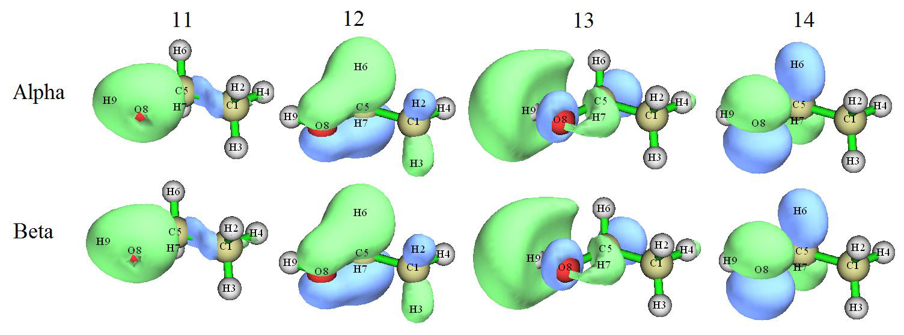

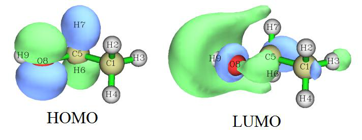

<!-- p.1011 -->
It worth to emphasize that the biorthogonalization does not alter any observable properties of the system, such as total electronic energy, total density, spin density and so on. Since in above process we did not ask Multiwfn to evaluate energies of the biorthogonalized orbitals, therefore after the biorthogonalization the orbital energies are meaningless, they are still the energies of the original molecular orbitals, and the order of the biorthogonalized orbitals does not reflect order of their actual energies.

Biorthogonalization can also be applied to spin polarized singlet systems such as biradicals, an example is given in my blog article "Principle and application of biorthogonalization method for unrestricted open-shell wavefunctions" (in Chinese, http://sobereva.com/448).

Evaluating energy of biorthogonalized orbitals and ordering the orbitals Next, I will illustrate how to also make Multiwfn evaluate energies of the biorthogonalized orbitals and order them according to their energies, the triplet ethanol is still taken as example. Boot up Multiwfn and input

examples\ethanol_triplet.fch 100 // Other functions (Part 1) 12 // Biorthogonalization between alpha and beta orbitals 2 // Perform biorthogonalization for all orbitals 1 // Evaluate energies of the biorthogonalized orbitals using the Fock matrix generated by MO energies and coefficients via F=SCEC-1 relationship

y // Ordering the biorthogonalized orbitals according to their energies Now you can find the exported biortho.fch and biortho.txt in current folder. The content of the later one is:


```text
...[ignored]
 Orb:    11   S= 0.9992  E(A)=    -13.057  O(A)= 1.0  E(B)=    -11.821  O(B)= 1.0
 Orb:    12   S= 1.0000  E(A)=    -11.918  O(A)= 1.0  E(B)=    -11.866  O(B)= 1.0
 -------------------------------------------------------------------------------
 Orb:    13   S= 1.0000  E(A)=    -11.439  O(A)= 1.0  E(B)=     -5.806  O(B)= 0.0
 Orb:    14   S= 1.0000  E(A)=     -0.293  O(A)= 1.0  E(B)=      2.817  O(B)= 0.0
 -------------------------------------------------------------------------------
 Orb:    15   S= 0.9992  E(A)=     13.876  O(A)= 0.0  E(B)=     15.431  O(B)= 0.0
 Orb:    16   S= 1.0000  E(A)=     15.057  O(A)= 0.0  E(B)=     15.305  O(B)= 0.0
...[ignored]
```

Because in the present example we have evaluated orbital energies, therefore the energies are also explicitly shown in the biortho.txt. It can be seen that the basically paired alpha and beta biorthogonalized orbitals have detectably different energies, for example E(alpha 11)= -13.057eV while E(beta 11)= -11.821 eV, this is because alpha and beta orbitals feel different effective potentials (i.e. alpha and beta Fock operators are different). In addition, one can find that the order of orbital index has in line with order of orbital energy, because we have requested Multiwfn to order the orbitals according to their energies (more specifically, the average energy of alpha and beta orbitals with the same index). Note that the orbital energy information in the biortho.fch now also corresponds to the actual energy of the biorthogonalized orbitals.

Then, you can input y to load the just generated biortho.fch so that we can then directly use main function 0 to visualize the biorthogonalized orbitals. The two occupied alpha biorthogonalized orbitals with highest indices, namely the two orbitals formally occupied by the two unpaired


<!-- p.1012 -->
electrons in present system, are shown below.

Their shapes are very close to the alpha MO 13 (-10.083 eV) and alpha MO 14 (-0.276 eV), and meantime the energies are not quite different.

Note that as mentioned in Section 3.100.12, the orbitals in each batch are ordered individually, therefore the relative order of orbitals in different batches will not be altered due to the ordering. In addition, the ordering is based on average energy of each alpha orbital and its beta counterpart, thus alpha-beta orbital correspondence is retained during the ordering process.

By the way, it is also possible to evaluate energies of the biorthogonalized orbitals based on the Fock matrix loaded from an external file (see Appendix 7 for details), and this is the only choice if the Fock matrix cannot be successfully generated based on MO energies and coefficients. For example, the Fock matrix can be loaded from .47 file. Run examples\ethanol_triplet_47.gjf by Gaussian, then you will get ETHANOL_TRIPLET.47 in C:\ folder (the file has been provided as examples\ETHANOL_TRIPLET.47). If you select option “2 Evaluate, loading Fock matrix from a file” when Multiwfn asks if evaluating energies of biorthogonalized orbitals and then input the path of the .47 file, the Fock matrix recorded in the .47 file will be used to evaluate the biorthogonalized orbital energies.


### 4.100.14 Calculate LOLIPOP index

In this section, I illustrate how to calculate LOLIPOP (Localized Orbital Locator Integrated Pi Over Plane) index. This index was shown to be useful of predicting π-stacking strength of aromatic rings. See Section 3.100.14 for brief introduction and Chem. Commun., 48, 9239 (2012) for more information.

4.100.14.1 Example of planar system: phenanthrene

In this section I take an exactly planar system phenanthrene as example, we will check which ring has relatively stronger π-stacking ability. The atomic numbering is shown below

Boot up Multiwfn and input following commands examples/phenanthrene.wfn 100 // Other functions (Part 1) 14 // Calculate LOLIPOP 1 // Choose π orbitals that to be taken into account 36,40,43,44,45,46,47 // Indices of π orbitals. You can manually find out π orbitals by


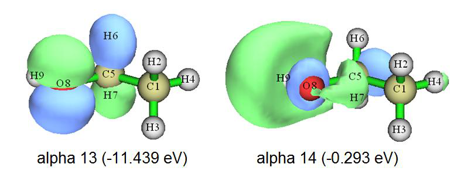


<!-- p.1013 -->
visualizing orbital isosurfaces via main function 0, or let Multiwfn automatically identify π orbitals by subfunction 22 of main function 100

0 // Start the calculation 8,9,11,13,14,15 // The indices of the atoms in the ring that you are interested in. This ring is boundary ring. Note that you should input the indices according to atomic connectivity

Wait for a while, from screen we can see that the LOLIPOP value is 8.23. Then input 0 // Start the calculation again 7,3,4,8,9,10 // Atoms in the central ring The LOLIPOP value is 6.39 Since smaller LOLIPOP value corresponds to stronger π-stacking ability, we can expect that the tendency of forming π-stacking over the central ring is stronger than over the boundary rings.

Note that there is option 6 in the LOLIPOP interface. If you choose it once to switch its status to "Yes", then after calculation of LOLIPOP, the coordinate of the points satisfying filter conditions

(i.e. where the LOL-π is included in the integral of LOLIPOP) will be exported to pt.xyz in current folder. You can then load this file into VMD program, setting drawing method to "Points" to visualize their distribution. For example, the points actually considered in the LOLIPOP calculation for the central ring is shown below, the molecular structure file is also loaded into VMD and plotted as CPK style. It can be seen that the distribution of the considered points is fully reasonable, thus the LOLIPOP result should be meaningful.

4.100.14.2 Example of non-planar system: biphenyl

In this example I use biphenyl to illustrate how to calculate LOLIPOP for a non-planar system. The structure and atomic numbering are shown below

In order to make the calculation of the LOL-π involved in the LOLIPOP feasible, usually we need to perform orbital localization to yield localized molecular orbitals (LMOs), and then use

Multiwfn to automatically identify the indices of π type of LMOs, see relevant examples in Section 4.100.22 for more detail. Note that in order to carry out orbital localization, you must use a file


<!-- p.1014 -->
containing basis function information as input file, such as .fch, .mwfn, .molden and so on, see Section 2.5 for more information.

Boot up Multiwfn and input examples\biphenyl.fch 19 // Orbital localization 1 // Only localize occupied MOs 100 // Other function (Part 1)

22 // Automatically detect π orbitals -1 // Current orbitals are in localized form

0 // Start π orbital identification based on default settings Now we can see there are 6 identified π orbitals (more specifically, they are π LMOs):


```text
Expected pi orbitals, occupation numbers and orbital energies (eV):
    32      2.000000    -10.110351
    34      2.000000     -9.633443
    38      2.000000     -7.386451
    39      2.000000     -6.768520
    40      2.000000     -6.755193
    41      2.000000     -6.046329
```

Then we input 0 // Do not modify orbital occupation numbers 14 // LOLIPOP calculation

1 // Choose π orbitals 32,34,38,39,40,41 // The indices of the π orbitals 0 // Start calculation 1,2,3,4,5,6 // Indices of the atoms in a ring The result is 8.82, which is slightly higher than that of the boundary ring of phenanthrene (see

last section), indicating that the rings in biphenyl have prominent ability of forming π-π stacking.

Only consider one side of a ring By the way, each ring has two sides, if the current system is not symmetric with respect to the

ring plane, the LOL-π distribution on the two sides may be evidently different. In order to study π stacking ability of the two sides respectively, before starting calculation you can choose option "5 Choose side of the points to be taken into account" to set which side will be taken into account during LOLIPOP calculation. By default both sides are considered.

Taking the present molecule as an example, if we select option 5 and then input 1 to select "Side 1", and choose option 6 to allow Multiwfn to export pt.xyz so that we can intuitively visualize the points actually considered in the LOLIPOP integration, then after LOLIPOP calculation, you will find the LOLIPOP is 4.41, which is exactly half of the value we obtained earlier (8.82) because

the LOL-π distribution is symmetric with respect to the chosen ring. The points recorded in the resulting pt.xyz are illustrated below, as you can see, they indeed only distribute on one side of the ring.


<!-- p.1015 -->
If you want to calculate LOLIPOP for another side, you should select "Side 2" in option 5.


### 4.100.15 Calculate intermolecular orbital overlap integral of DB-TTF

Note: Chinese version of this section is my blog article “Display and calculation of intermolecular orbital overlap” (http://sobereva.com/163), which also contains richer discussions.

Intermolecular orbital overlap integral is important in discussion of intermolecular charge transfer, see Section 3.100.15 for introduction. In this example, we calculate HOMO-HOMO and LUMO-LUMO overlap integrals between the two DB-TTF (dibenzotetrathiafulvalene) monomers in below dimer. The dimer structure was extracted from CSD (Cambridge Structural Database). The wavefunction level we used is B3LYP/6-31G*, MO78 and MO79 correspond to HOMO and LUMO, respectively.

As mentioned in Section 3.100.15, we must prepare wavefunction files containing basis function information for the dimer and two monomers. For example, you can use Gaussian to generate corresponding .fchk files, the Gaussian input files for this aim have been provided in "examples\intermol\" folder; if you do not want to run them by Gaussian yourself, you can directly download the resulting .fchk files from http://sobereva.com/multiwfn/extrafiles/intermol.rar.

It is worth to explain the three .gjf files. The coordinates in the two monomer input files DB-TTF1.gjf and DB-TTF2.gjf were directly extracted from the dimer input file DB-TTFdimer.gjf, the atoms of monomer 1 occur in this file prior to those of monomer 2. The keyword nosymm is used in all the three files, it requests Gaussian do not automatically put the coordinates in the input files to standard orientation, so that the coordinates in the monomer .fchk files are exactly identical to those in the dimer .fchk file. Because the dimer .fchk file is only used by Multiwfn for generating overlap matrix between basis functions while MOs of dimer are never be utilized, therefore guess(save,only) is employed in the dimer input file to let Gaussian only generate and save initial guessing orbitals, which do not need any cost. The pop=none is used together, it suppresses the useless massive output of orbital expansion coefficients in output file.


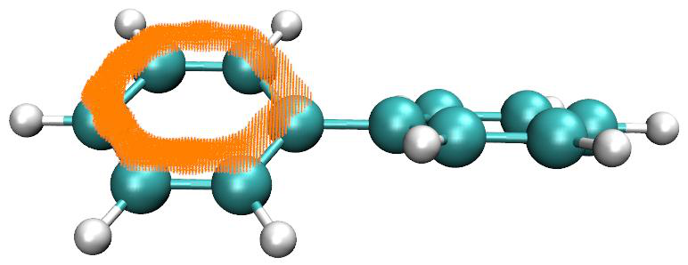

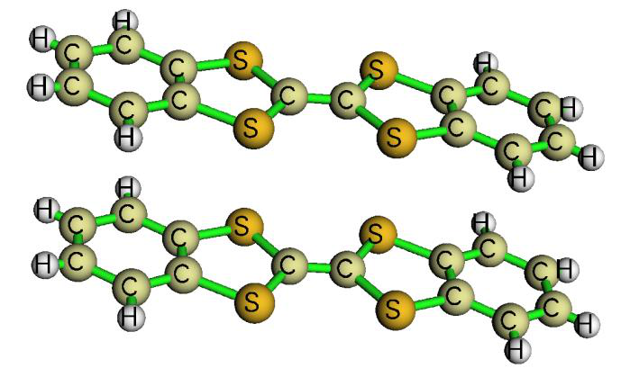

<!-- p.1016 -->
Now, boot up Multiwfn and input below commands: DB-TTFdimer.fchk // Wavefunction file of dimer 100 // Other functions (Part 1) 15 // Function for calculating intermolecular orbital overlap integral DB-TTF1.fchk // Wavefunction file of monomer 1 DB-TTF2.fchk // Wavefunction file of monomer 2 After that, if we input i,j, then the intermolecular orbital overlap integral between MO i in monomer 1 and MO j in monomer 2 will be printed. To obtain the integral between HOMO-HOMO, we input 78,78, the result is -0.01411983; Then input 79,79, we will find the integral between LUMO-LUMO is 0.01025897.


### 4.100.18 Yoshizawa's electron transmission route analysis for phenanthrene


In this example, we will use Yoshizawa's formula (Acc. Chem. Res., 45, 1612 (2012)) to analyze favourable electron transmission routes for phenanthrene. Related theory, requirement of input file and program options have been introduced in Section 3.100.18. The numbering scheme of the carbons is shown below.

Boot up Multiwfn and input following commands: examples\phenanthrene_NAOMO.out //The Gaussian output file containing "NAOMO" matrix

100 // Other functions (Part 1) 18 // Yoshizawa's electron transport route analysis 2 // Select YZ plane, which is the molecular plane Then program will detect which atom has expected pz atomic orbitals, and load their expansion coefficients in all MOs.

Now we select 1, and input 2,11 to check the transmission probability between 2 and 11. From the output we can know that the transmission probability is 0.855879. The contributions from each MO are also shown. From the output we also know that the probability will be 2.144432 if only HOMO and LUMO are considered. Although Yoshizawa's paper said that in common one only need to take HOMO and LUMO into account, it seems that this approximation is not true in quantitative level. The distance route 5.674656 Å is the distance between atom 2 and 11.

Next, we examine which transport routes are the most favourable. Suppose that this time we only want to consider HOMO and LUMO, so we choose option -1 and input 47,48. Then choose option 2, you will see


```text
Note: The routes whose absolute value <  0.010000 will not be shown
```


<!-- p.1017 -->

```text
Note: The routes whose distance <    0.0000 or > 9999.0000 Angstrom will not be shown
Atom    7 -- Atom   10  Value and distance:    3.743670    1.359562
Atom    6 -- Atom   10  Value and distance:    3.098919    5.081382
Atom    7 -- Atom   14  Value and distance:    3.098919    5.081382
Atom    7 -- Atom   11  Value and distance:   -2.831680    3.720990
Atom    2 -- Atom   10  Value and distance:   -2.831680    3.720990
Atom    6 -- Atom   14  Value and distance:    2.565337    5.765892
...
Atom    6 -- Atom    9  Value and distance:   -0.016585    4.927289
Atom    3 -- Atom   14  Value and distance:   -0.016585    4.927289
Atom    2 -- Atom    4  Value and distance:   -0.014931    2.456189
Atom    8 -- Atom   11  Value and distance:   -0.014931    2.456189
```

The routes are ranked by transmission probability (absolute value). If we ignore the atoms linking three carbons and the duplicated routes due to symmetry, the most favourable four routes are 7-10, 6-10, 7-11, 6-14. This conclusion is completely in line with the graph below in Yoshizawa's paper!

Note that Yoshizawa stated that connection 9-10 (corresponding to 7-10 in our numbering scheme) is predicted to be the best route from the rule, but it is too close to construct a metal-molecule-metal junction for connection, so the route was not marked on his graph.

Now we check the feasible routes starting from atom 2. Choose option 3, and input 2, you will see


```text
To atom    10    Value and distance (Angstrom):   -2.831680    3.720990
To atom    14    Value and distance (Angstrom):   -2.344569    6.206600
To atom    11    Value and distance (Angstrom):    2.144432    5.674656
To atom     5    Value and distance (Angstrom):   -1.571512    2.787501
...
```

Evidently, 2-10 is the most favourable route.


### 4.100.19 ELF analysis on the whole wavefunction combined from fragment wavefunctions


Before reading this section, please read Section 3.100.19 first to gain basic knowledge. It is usually interesting to analyze the characteristics of promolecular wavefunction, which corresponds to the state without any electron transfer and polarization due to the interaction between the fragments constituting the system. Commonly, we can use "custom operation" in main functions 3, 4 and 5 to realize this purpose, see Section 3.7 for introduction of custom operation and some illustrative applications in Sections 4.5.4 and 4.5.5. For example, we want to study electron density


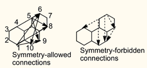

<!-- p.1018 -->
distribution of promolecular state of a complex AB, by using custom operation, we can very conveniently ask Multiwfn to calculate electron density of A and that of B respectively, and then sum them up as electron density of the promolecule state. However, this process is not applicable to non-linear real space functions such as ELF; that is to say, ELF of promolecular state of AB is not equal to the sum of ELF of A and ELF of B, the result is completely meaningless. For such cases, we should combine fragment wavefunctions first as promolecular wavefunction, and then calculate ELF for it to obtain the ELF distribution in promolecular state.

Below I will show how to use Multiwfn to produce promolecular wavefunction for COBH3 based on fragment wavefunctions of CO and BH3, and then discuss the corresponding ELF character. The .wfn files used below and the corresponding Gaussian .gjf files can be found in "examples\genpromol" folder.

Boot up Multiwfn and then input examples\genpromol\COBH3\CO.wfn // The path of wavefunction file of fragment 1 100 // Other functions (Part 1) 19 // Generate promolecular .wfn file from fragment wavefunctions 1 // Output to combine.wfn 2 // Two fragments in total examples\genpromol\COBH3\BH3.wfn // The path of wavefunction file of fragment 2 Now the promolecular wavefunction file of COBH3 has been outputted to combine.wfn in current folder.

Let us plot ELF for this promolecular wavefunction. Reboot Multiwfn and input combine.wfn 4 // Draw plane map 9 // ELF 1 // Color-filled map [Press ENTER button] 2 // XZ plane 0 // Y=0 Interestingly, even in the promolecular state, from the resultant graph it looks as if the carbon and boron have been bonded to each other. In order to make clear how the relaxation of electron distribution affects the ELF character of COBH3, we decide to draw difference map of ELF between the actual state and promolecular state.

Reboot Multiwfn and input examples\genpromol\COBH3\COBH3.wfn // Wavefunction file of actual state of COBH3 4 // Draw plane map 0 // Custom operation 1 // Deal with only one file -,combine.wfn // Subtracting property of COBH3.wfn by that of combine.wfn 9 // ELF 1 // Color-filled map [Press ENTER button] // Use default grid setting 2 // XZ plane 0 // Y=0 Close the graph and then input


<!-- p.1019 -->
1 // Set lower and upper limit of color scale -0.2,0.4 // Set the color scale from -0.2 to 0.4, since as you can see from the command-line window, in this plane the data range is from -0.248 to 0.436

2 // Enable showing contour lines 4 // Enable showing atom labels 1 // Red -1 // Show the graph again

From this difference map of ELF, it is very clear that after electron relaxation, the electron localization character between the C-B bond enhanced evidently.

Next, I will show how to create promolecular wavefunction when open-shell fragments are involved. CH3NH2 is taken as example, the two fragments are CH3 and NH2 free-radicals. Boot up Multiwfn and input

examples\genpromol\CH3NH2\CH3.wfn 100 // Other functions (Part 1) 19 // Generate promolecular .wfn file from fragment wavefunctions 1 // Output as combine.wfn 2 // There are totally two fragments (including the loaded one) examples\genpromol\CH3NH2\NH2.wfn // Wavefunction file of the second fragment n // Do not flip spin of orbitals of CH3 y // Flip spin of orbitals of NH2. If you do not understand why the spin should be flipped, you can consult the corresponding CDA example in Section 4.16.2.

Now you have promolecular wavefunction of CH3NH2 in current folder. Try to plot ELF for it and compare the result with actual state (i.e. examples\genpromol\CH3NH2\CH3NH2.wfn).


<!-- p.1020 -->

### 4.100.21 Examples of characterizing geometric structure

As described in Section 3.100.21, subfunction of 21 of main function 100 can be used to evaluate a variety of structural properties that solely based on molecular geometry. In this section I provide a few examples.

4.100.21.1 Calculate molecular diameter and length/width/height for alpha-

cyclodextrin

Subfunction 21 of main function 100 can calculate molecular diameter and length/width/height, in this section I will use examples/alpha-cyclodextrin.pdb an instance to illustrate this point. Please first read Section 3.100.21 to understand how this function works.

Boot up Multiwfn and input examples/alpha-cyclodextrin.pdb 100 // Other functions (Part 1) 21 // Calculate quantities that are purely based on geometry size // Calculate molecular diameter and length/width/height You will see the following information on screen


```text
Farthest distance:   44(H )  ---  123(H ):    14.027 Angstrom
vdW radius of   44(H ): 1.200 Angstrom
vdW radius of  123(H ): 1.200 Angstrom
Diameter of the system:    16.427 Angstrom
Radius of the system:     8.213 Angstrom
Length of the three sides:    15.341    14.714     9.511 Angstrom
```

The diameter 16.427 Å printed on screen is calculated as 14.027+2×1.2. The radius 8.213 Å is simply half of the diameter. The length/width/height of the molecule, namely the three values after "Length of the three sides" are calculated as follows: Multiwfn first automatically rotates the molecule so that its three principal axes just parallel to the three Cartesian axes, and meantime translates the molecule to put its geometry center to original point. Then according to the position of boundary atoms (i.e. the atoms having maximum/minimum value of X/Y/Z coordinate) and atomic Bondi van der Waals radii, the length/width/height of the molecule can be derived straightforward.

If you want to visually depict the length/width/height, you can then choose option 1, you will see the graph below (the "Ratio of atomic size" has been set to 4.0, in this situation radii of atomic spheres just equal atomic van der Waals radii). As you can see, the blue box tightly encloses the molecular van der Waals surface, the length of its three sides are simply the length/width/height of the molecule, i.e. 15.341, 14.714 and 9.511 Å, respectively.


<!-- p.1021 -->
You can also select option 2 to export the molecule in rotated and translated coordinate to new.pdb in current folder. This file contains "CRYST1" field, which records cell lengths. You can directly load this file into VMD (http://www.ks.uiuc.edu/Research/vmd/) visualization program, and then input pbc box command in VMD console window to show box. After slight adjustment of plotting effect and manually editing the graph, you will obtain the graph below, which clearly illustrates the molecular geometry character.

It is also possible to visualize molecular principal axes in VMD. Simply copy all content of examples\principal_axes.tcl into VMD console window, you will see the graph below, in which the red, blue and green axes respectively represent the three molecular principal axes.


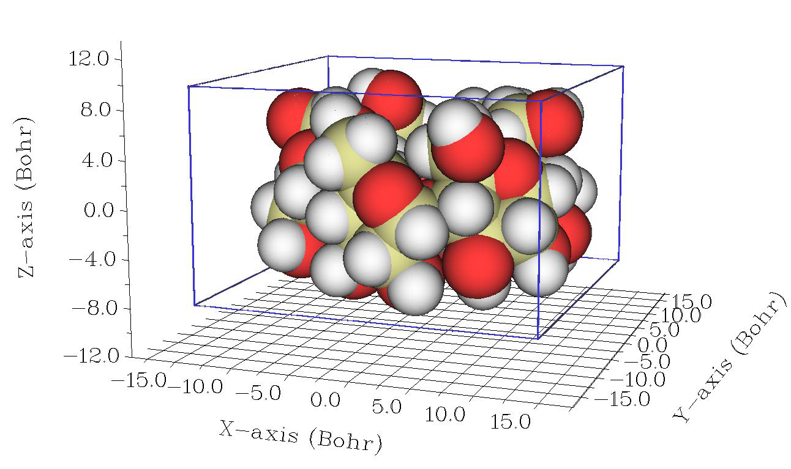

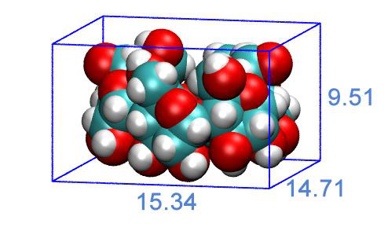

<!-- p.1022 -->
More discussions about this topic are given in my blog article "Using Multiwfn to calculate the length, width and height of molecules" (in Chinese, http://sobereva.com/426).

4.100.21.2 Study molecular planarity of [14]annulene

Note: Chinese version of this section is my blog article “Using Multiwfn to quantify and graphically investigate planarity of molecules” (http://sobereva.com/618), which also contains much more extended discussions and additional example.

In this section we will study planarity of [14]annulene, which is not exactly planar due to steric

effect in the small ring. Its structure optimized at ωB97XD/def2-TZVP level is shown below

Please read my paper J. Mol. Model., 27, 263 (2021) DOI: 10.1007/s00894-021-04884-0 or Section 3.100.21 to gain basic knowledge about molecular planarity parameter (MPP), span of deviation from plane (SDP), and signed distance to plane (ds), which will be employed in this section to characterize molecular planarity of the [14]annulene.

Boot up Multiwfn and input examples\[14]annulene.xyz // It contains the optimized structure MPP // Enter the function of studying molecular planarity 1-14 // We only use all carbon atoms to determine the planarity. You can also simply input h to choose all non-hydrogen atoms

Now you can immediately see the following output, which include the parameters of the plane fitted for the selected atoms (i.e. all carbons), signed deviations of atoms to the fitting plane (ds) and their most positive and most negative values. At the end, MPP and SDP are given.


```text
Plane equation: A=   1.00000  B=  -0.00000  C=   0.00233  D=   0.00000
```


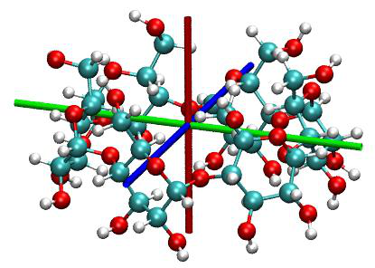


<!-- p.1023 -->

```text
Deviation of atom    1(C ) to the plane:  -0.21768 Angstrom
Deviation of atom    2(C ) to the plane:   0.21768 Angstrom
Deviation of atom    3(C ) to the plane:   0.21430 Angstrom
Deviation of atom    4(C ) to the plane:  -0.21430 Angstrom
Deviation of atom    5(C ) to the plane:  -0.07768 Angstrom
Deviation of atom    6(C ) to the plane:   0.07768 Angstrom
Deviation of atom    7(C ) to the plane:  -0.04457 Angstrom
Deviation of atom    8(C ) to the plane:   0.04457 Angstrom
Deviation of atom    9(C ) to the plane:  -0.02456 Angstrom
Deviation of atom   10(C ) to the plane:   0.02456 Angstrom
Deviation of atom   11(C ) to the plane:   0.09971 Angstrom
Deviation of atom   12(C ) to the plane:  -0.09971 Angstrom
Deviation of atom   13(C ) to the plane:  -0.03585 Angstrom
Deviation of atom   14(C ) to the plane:   0.03585 Angstrom
Maximal positive deviation to the fitted plane is    2(C ):   0.21768 Angstrom
Maximal negative deviation to the fitted plane is    1(C ):  -0.21768 Angstrom

Molecular planarity parameter (MPP) is    0.127145 Angstrom
Span of deviation from plane (SDP) is    0.435354 Angstrom
```

Both the MPP and SDP are not small, that is the root-mean-square deviation to the fitting plane and the span of deviation to the fitting plane are evident, clearly indicating that the [14]annulene only shows limited planarity. This is fully in line with our visual observation from the structure map shown earlier.

Next, we graphically exhibit deviation of every atom to the fitting plane by coloring atoms, therefore we then input

y // Let Multiwfn to export .pqr file containing ds values [Press ENTER button directly] // Output to [14]annulene.pqr in current folder Note that the “charge” property of atoms (penultimate column) in the exported [14]annulene.pqr corresponds to ds value.

Boot up VMD visualization software (http://www.ks.uiuc.edu/Research/vmd/), drag the .pqr file to VMD main window to load it, then enter “Graphics” - “Representation” panel and set “Coloring Method” to “Charge”, set “Drawing Method” to “CPK”. Then enter “Trajectory” tab and input -0.4 and 0.4 respectively in the two text boxes under “Color Scale Data Range” label and then press ENTER button. Finally, change the background color to white, you will see


<!-- p.1024 -->
The red and blue colors clearly distinguish the carbon atoms at the two different sides of the fitting plane. The darker the color, the larger the deviation to the fitting plane. Clearly, via this representation, one can quickly and very conveniently recognize which atoms in the molecule break the planarity severely.

4.100.21.3 Study evolution of molecular planarity of cyclo[18]carbon in

molecular dynamics trajectory

In the last example, we see that molecular planarity can be quantitatively and intuitively studied in Multiwfn. This kind of analysis is also supported by Multiwfn to easily study a dynamic process, the inputted trajectory should be recorded as a multiple frame .xyz file.

In this example I illustrate how to study evolution of molecular planarity of cyclo[18]carbon in its molecular dynamics trajectory. The whole 2000 fs trajectory was generated by ab-initio dynamics simulation at 298.15 K in my work about vibrational character of cyclo[18]carbon and analogous systems, see Chem. Asian J., 16, 56 (2021) DOI: 10.1002/asia.202001228. The xyz trajectory file of the first 500 fs has been provided as examples\C18_MD_500.xyz. The trajectory was saved every 1 fs, so there are totally 501 frames (the first frame corresponds to optimized structure, which is exactly planar).

Boot up Multiwfn and input examples\C18_MD_500.xyz MPP // Enter the function of studying molecular planarity a // Choose all atoms a // Choose all frames Now we have MPP_SDP.txt in current folder, whose 1st, 2nd and 3rd columns correspond to frame index, MPP and SDP of all selected frames, respectively. Then you can use e.g. Origin software to plot variation of MPP and SDP along the trajectory as curve map to conveniently study how planarity varies during the process (the following map was plotted for the entire trajectory containing 2001 frames, which can be downloaded at http://sobereva.com/multiwfn/extrafiles/C18-MD.xyz):


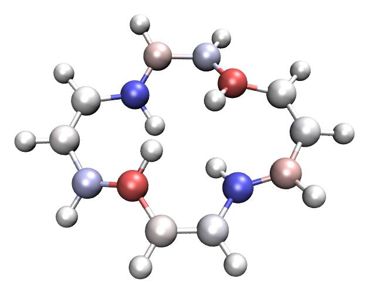

<!-- p.1025 -->
In addition, ds.pqr is generated in current folder. In this file, the "atomic charge" column corresponds to the ds value of selected atoms in every frame (the value for unselected atoms is zero). With this file and a special VMD script examples\scripts\ds.tcl, we are able to visualize trajectory with dynamic atomic coloring according to ds values, so that deviation from planarity of every atom can be very vividly exhibited. Now, load the examples\C18_MD_500.xyz into VMD, then copy the ds.pqr and examples\scripts\ds.tcl to VMD installation folder, boot up VMD and input source ds.tcl in console window of VMD to run this script, then this script will load ds data from ds.pqr and set up visualization status. After that, when you play the trajectory animation or drag progress bar in VMD, the atoms will be automatically colored according to ds value of the corresponding frame. If you are confused, see video illustration: http://sobereva.com/multiwfn/res/ds_color.mp4 (in this video I also used “RMSD trajectory tool” plugin in VMD to eliminate overall molecular motion to make inspection easier). Note that the default color scale set by the ds.tcl script is from -0.4 (blue) to 0.4 (red).

4.100.21.4 Evaluating cavity diameter and graphically illustrating its region

Chinese version of this section is “Using Multiwfn to calculate cavity in molecule and crystal” http://sobereva.com/643 (in Chinese), which contains more examples and discussions.

Please check corresponding part of Section 3.100.21 first to understand basic idea of the algorithm for evaluating cavity diameter. In this example, we will calculate cavity diameter of the fullerene part (highlighted by green color) of the following system. The experimental structure is examples\open_fullerene.pdb.


<!-- p.1026 -->
Boot up Multiwfn and input open_fullerene.pdb cav // Enter the function for calculating cavity diameter 1,12-20,23-67,101 // Atoms in the fullerene part, they will be used to detect sphere radius 1 // Use the geometric center of the atoms inputted above as initial position of sphere center 1 // Allow automatic adjustment of sphere center to maximize sphere size Then from screen you can see


```text
 X/Y/Z of initial geometry center are    3.901518    3.594304   11.835946 Angstrom
 Initial sphere radius is    1.677086 Angstrom
[...ignored]
Step    5
 Current coordinate:    3.939857    3.615266   11.899052 Angstrom
 Gradient:        0.009072    0.022419    0.013652  Norm    0.027772
 Displacement:    0.002400    0.005932    0.003612  Norm    0.007348 Angstrom
 Goal: displacement norm <  0.01000000 Angstrom

 Converged after     5 iterations

 Final X/Y/Z of sphere center:    3.942257    3.621198   11.902664 Angstrom
 Radius is    1.707257 Angstrom
 Diameter is    3.414514 Angstrom
 Volume is   20.844205 Angstrom^3
```

As you can see, initially the sphere representing the cavity is centered at (3.901518, 3.594304, 11.835946) Å with radius of 1.677 Å. The adjustment finished after 5 iterations, finally the sphere center is at (3.942257, 3.621198, 11.902664) Å and the sphere radius is 1.707 Å. So, the actual cavity diameter is 3.414 Å.

You can also find the following commands on screen, which are used to plot a sphere in VMD (http://www.ks.uiuc.edu/Research/vmd/) program to graphically illustrate the cavity


```text
color Display Background white
draw material Transparent
draw color yellow
draw sphere {    3.942    3.621   11.903 } radius   1.707 resolution 100
```

Boot up VMD, load the open_fullerene.pdb into it, open “Graphics” - “Representation” panel and set “Drawing Method” to “CPK”, then decrease “Sphere Scale” to 0.7, then copy the above four commands and paste them into console window of VMD to execute them, you will see the following graph, the yellow sphere clearly shows the cavity, and its diameter corresponds to the aforementioned 3.414 Å.


<!-- p.1027 -->
The function exemplified in this section is quite universal, it can also be used to study cavity with very irregular shape, study inner diameter of ring systems, and study cavity size of periodic crystal systems, corresponding examples are given in my blog article http://sobereva.com/643.


### 4.100.22 Analyze π electron character of non-planar system: cycloheptatriene


More application examples of this module in studying π electron structure is given in my this paper: Theor. Chem. Acc., 139, 25 (2020), you are highly encouraged to read it. If this module is involved in your work, please not only cite Multiwfn original paper but also cite this paper.

The purpose of this example is illustrating how to study π electron structure of non-planar systems based on detected π type of localized molecular orbitals (LMOs), and show how to evaluate π composition of molecular orbitals. We will use a simple non-planar molecule cycloheptatriene as example. If you have not read Section 3.100.22, please read it first, in which details and algorithm are described.

Note that the way of detecting π orbitals for non-planar systems is very different to that for exactly planar systems. I have already given example for the latter case. In Section 4.5.3, I have

mentioned how to make Multiwfn automatically detect π molecular orbitals for an exactly planar system and then separately study σ and π electron structure by means of ELF-σ and ELF-π. In Section 4.4.9, I illustrated how to study π electron delocalization path for a planar system porphyrin by plotting LOL-π map.

Detecting π type of LMOs For non-planar systems, to separately study σ and π electrons, the molecular orbitals must be firstly transformed to LMOs. If you are not familiar with LMOs, see Section 3.22.

Boot up Multiwfn and input: examples\cycloheptatriene.fch 19 // Orbital localization 1 // Localize occupied orbitals


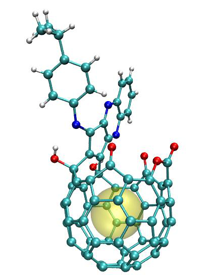

<!-- p.1028 -->
100 // Other functions (Part 1)

22 // Detect π orbitals -1 // Current orbitals are in localized form

0 // Detect π LMOs under default settings and then set their occupation numbers There are three π LMOs identified:


```text
Expected pi orbitals, occupation numbers and orbital energies (eV):
    23      2.000000     -8.361389
    24      2.000000     -6.762986
    25      2.000000     -5.798201
 Total number of pi orbitals:     3
 Total number of electrons in pi orbitals:    6.000000
```

Assume that we will study π electron character, we choose option 2 to set occupation number of all other orbitals to zero.

Important note about diffuse functions To automatically determine π orbitals in the above way, it is best to remove diffuse functions. If you insist on using diffuse functions, you should take care of two points:

(1) In the interface of performing orbital localization, you should choose "-6 Set localization method", and select "3 Pipek-Mezey based on Becke population". This localization method is compatible with diffuse functions, but much more time-consuming than the default Pipek-Mezey method.

(2) In the interface of detecting pi MOs, you should "6 Set the method for calculating orbital composition" and then select Hirshfeld or Becke method, this is because the default method of calculating orbital composition, namely Mulliken+SCPA, does not work normally when diffuse functions are presented.

Studying π electron structure based on π type of LMOs Because the occupation number of orbitals other than the π ones have been set to zero, and meantime density matrix has been automatically updated, now we can carry out any kind of analysis,

the result will only be contributed by π electrons. For example, we plot an electron density isosurface map (isovalue=0.03 a.u.) and a LOL isosurface map (isovalue=0.5) using main function 5 in usual way, they are shown below as left and right graphs, respectively.

From both the graphs, it is easy to recognize that C4-C6, C1-C2 and C3-C5 must be stronger than

C1-C4 and C2-C3, since π electrons are delocalized much more substantially among the corresponding two atoms in the formers

NOTE: Occasionally, the automatic π-orbital detecting algorithm may incorrectly include one or more lone-pair LMO(s) into π-orbitals, hence polluting the LOL-π map. The easiest solution: After performing orbital localization via main function 19 and then automatically detecting pi orbitals using subfunction 22 of main function 100, please use main function 0 to check every occupied orbital to find the still occupied lone-pair LMO(s) and record their indices. Then go to main function 6 and select subfunction 26, input the indices of the lone-pair LMO(s), and then input 0 to make them unoccupied. After that, return to main menu, use main function 5 to generate grid


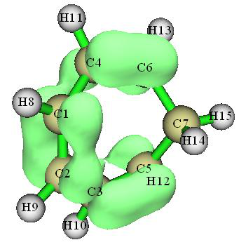


<!-- p.1029 -->
data of LOL-π as usual.

Based on the π type of LMOs, we can also carry out other types of analyses, for example, Mayer bond order calculation. We calculate Mayer bond order as illustrated in 4.9.1, the result is


```text
#    1:         1(C )    2(C )    0.70534437
#    2:         1(C )    4(C )    0.18472895
#    3:         1(C )    5(C )    0.10215925
#    4:         2(C )    3(C )    0.18472484
#    5:         2(C )    6(C )    0.10215398
#    6:         3(C )    5(C )    0.80861164
#    7:         4(C )    6(C )    0.80860020
#    8:         5(C )    6(C )    0.07556895
```

The order of the π bond order is C4-C6 > C1-C2 > C1-C4, this result is in full agreement with our expectation via visualizing the ELF-π map.

The function illustrated in this section is quite powerful and can also be applied to fairly large

systems. For example, below left graph is LOL-π isosurface map (isovalue=0.55) of helicene plotted using above procedure. Moreover, using option "5 Set constraint of atom range", one can define

constraint of the region for identifying π LMOs. For example, below right graph shows the electron density of helicene contributed by five π LMOs located at the central two six-membered rings.

Multi-center bond order calculation can also be normally carried out under the LMO

representation, therefore you can easily identify strength of π conjugation of different rings in above system via this analysis.

Evaluating π composition of occupied MOs Based on detected π LMOs, we can evaluate π composition of any orbital of present system. Let us check π composition of occupied MO of the cycloheptatriene. The new.fch in current folder was automatically exported when we perform earlier orbital localization, all occupied LMOs are recorded in this file.

Boot up and input below commands: new.fch // Load it to retrieve occupied LMOs 100 // Other functions (Part 1)

22 // Detect π orbitals -1 // Current orbitals are in localized form


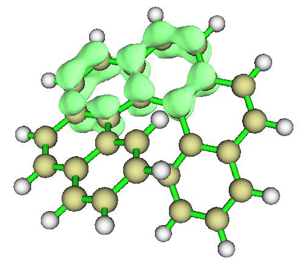


<!-- p.1030 -->
-1 // Detect π orbitals and then evaluate π composition for orbitals in another file examples\cycloheptatriene.fch // This file contains MOs [Press ENTER button directly to use printing threshold of 50%]

Now all occupied MOs with π composition higher than 50% have been shown:


```text
 Orbital    23 (Occ= 2.00000)   pi composition:  65.003%
 Orbital    24 (Occ= 2.00000)   pi composition:  84.466%
 Orbital    25 (Occ= 2.00000)   pi composition:  92.863%
```

After this analysis, the orbitals in memory have been replaced with the ones recorded in examples\cycloheptatriene.fch. Therefore, now you can return to main menu and then enter main

function 0 to plot isosurfaces of the π MOs, as shown below

You can see that the evaluated π compositions are very reasonable. For example, in MO23, you can see that there are evident σ characters at C6-C7 and C5-C7 bonding regions, in addition, there are isosurfaces around H10, H11 and H14, these observations explain why π composition of MO23 is not quite close to 100%. In contrast, σ character of orbital isosurface of MO25 is not so evident, therefore MO25 can be viewed as a quasi-π orbital.

Evaluating π composition of unoccupied MOs It is also possible to evaluate π compositions for unoccupied MOs. In this case, unoccupied LMOs are also needed. Now we do this kind of analysis. We return to main menu and then input

19 // Orbital localization 2 // Localize both occupied and unoccupied orbitals 100 // Other functions (Part 1)

22 // Detect π orbitals -1 // Current orbitals are in localized form 3 // Switch the LMOs in consideration to "all localized orbitals"

2 // Change the default density threshold for identifying π orbitals. Because current geometry is highly distorted, more loose density threshold must be adopted, otherwise you will find no

unoccupied π LMO could be recognized

0.05 // A value much larger (looser) than the default threshold

-1 // Detect π orbitals and then evaluate π composition for orbitals in another file Now six π LMOs have been identified, as shown below. You can visualize them if you have interest


```text
Expected pi orbitals, occupation numbers and orbital energies (eV):
   23      2.000000     -8.361389
```


<!-- p.1031 -->

```text
   24      2.000000     -6.762986
   25      2.000000     -5.798201
   26      0.000000     -0.739482
   27      0.000000      0.770830
  110      0.000000     74.313859
```

Then we input examples\cycloheptatriene.fch // The file containing MOs [Press ENTER button directly to use printing threshold of 50%] The result is shown below


```text
 Orbital    23 (Occ= 2.00000)   pi composition:  65.003%
 Orbital    24 (Occ= 2.00000)   pi composition:  84.466%
 Orbital    25 (Occ= 2.00000)   pi composition:  92.863%
 Orbital    26 (Occ= 0.00000)   pi composition:  84.033%
 Orbital    27 (Occ= 0.00000)   pi composition:  72.481%
 Orbital    29 (Occ= 0.00000)   pi composition:  57.811%
```

As can be seen, there are three unoccupied MOs having π composition larger than 50%, while π compositions of occupied MOs are identical to those we obtained earlier. Now we enter main function 0 to plot isosurface map for MO27, which is one of unoccupied MOs and has π compositions of 72.5%. From the map below, it is clear that major character of this orbital is indeed

π.

More discussions and illustrations about analyzing π electron character can be found in my blog article "Separate investigation of π electronic structure in Multiwfn" (in Chinese, http://sobereva.com/432).


## 4.200 Other functions (Part 2)


### 4.200.5 Plot radial distribution function of electron density

Multiwfn is capable of plotting radial distribution function (RDF) for any real space function, see Section 3.200.5 for detail. This function is particularly useful for studying electronic structure character of sphere-like system.

This section consists of two parts. In part 1, we will plot RDF for electron density of fullerene


<!-- p.1032 -->
(C60); while in part 2, I will show how to plot RDF of electron density for a Rydberg orbital to characterize it quantitatively.

Part 1: RDF of electron density for fullerene Since .wfn file of fullerene at B3LYP/6-31G* level is large, I only provide the corresponding Gaussian input file for you (C60.gjf in "example" folder), please properly modify and run it by Gaussian to produce C60.wfn.

Boot up Multiwfn and input: C60.wfn 200 // Other functions (Part 2) 5 // Plot RDF for a real space function 3 1,6 // Set the lower and upper limit of RDF to 1.0 and 6.0 Å, respectively 0 // Calculate RDF and its integration curve After the calculation is finished, select option 0, below RDF map will be shown on the screen, the X-axis corresponds to radial distance

As you can see, the peak of RDF is about 3.5 Å, this is because the distance between nucleus of carbons and the sphere center is 3.545 Å. It is known that electron density has maximum at nuclear position for any atom except for hydrogen.

If you carefully examine the RDF curve, you will find that the curve on the right side of the

peak is slightly higher than that on the left sight. The reason is that the amount of π electrons at outer side of fullerene is richer than inner side. You can also draw and analyze ELF isosurface map to confirm this point.

You can also choose option 2 to plot integration curve of RDF, as shown below


<!-- p.1033 -->
Probably you have noticed that after the calculation there is a prompt on screen:


```text
Integrating the RDF in the specified range is        344.9321931513
```

which means integrating the RDF from r=1.0 to r=6.0 Å yields 344.932, it also corresponds to the value of integration curve at r=6.0. This value deviates evidently from our expectation, namely the number of electrons in current system (360). One reason is that the default number of integration points is not large enough (500 and 2030 for radial and angular parts, respectively. You can manually increase them), while another reason is more important, that is the size of the current system is too large, using single-center integration method is too difficult to yield a very accurate result, at least for integrating electron density.

Part 2: Using RDF of electron density to quantitatively characterize Rydberg orbital for acetone

Rydberg orbitals denote the spatially very diffuse MOs, their orbital shapes are akin to atomic orbitals, since electrons in Rydberg orbitals can be regarded as weakly bounded by a small cation core, which behaves as an atomic nucleus. In order to faithfully represent the diffuse character of Rydberg orbitals, basis set with substantial diffuse functions must be employed, e.g. aug-cc-pVTZ.

The example file we used below is formaldehyde calculated at B3LYP/aug-cc-pVTZ level by Gaussian. We will first visualize Rydberg orbitals as isosurfaces, and then calculate RDF of electron density corresponding to these orbitals to characterize them quantitatively.

Boot up Multiwfn, load examples\H2CO_aVTZ.fch, then enter main function 0. Since Rydberg orbitals are very diffuse, in order to avoid truncating their isosurfaces when viewing them, you should first select "Other settings"-"Set extension distance" and input a large value, here we input 12. After that, change isovalue to a much smaller value than default, e.g. 0.01. Then we arbitrarily select some virtual MOs to examine their features. You will find a lot of virtual MOs show very diffuse character, for example, MO10 and MO11 are shown below:


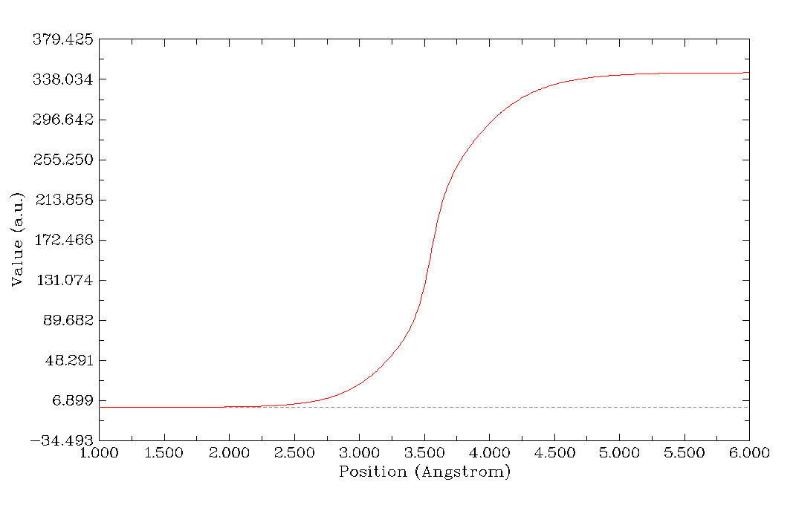

<!-- p.1034 -->
The main distribution region of both of them are far from the molecule. MO10 is almost spherically symmetric, thus can be denoted as s type of Rydberg orbital. While MO11 has two phases, they equally distribute at the two sides, the overall shape is very close to atomic p orbitals, therefore MO11 can be identified as p type of Rydberg orbital.

How to quantitatively demonstrate that the main distribution region of these Rydberg orbitals is far from the molecular center? One of the best ways is plotting RDF of electron density corresponding to these orbitals. Here we plot this kind of RDF map for MO11. We close the GUI of main function 0, and then input below commands:

6 // Modify wavefunction 26 // Modify orbital occupation number 0 // Select all orbitals 0 // Select occupation number of all orbitals to zero 11 // Select orbital 11 2 // Set occupation number of orbital 11 to 2.0 (assume it is doubly occupied) q // Return -1 // Return to main menu 200 5 // Plot RDF 3 // Set lower and upper limit of radial plotting 0,10 // From 0 to 10 Å 4 // Set angular number of integration points. The default value is unnecessarily high for present purpose, therefore we set it to a smaller value to reduce computational time

302 // 302 angular points 0 // Calculate RDF for electron density (which is the default real space function) 1 // Plot the RDF map


<!-- p.1035 -->
From the map it can be seen that the global maximum peak is at about 4.6Å, indicating that the major distribution region of this orbital wavefunction is very far from origin (in present .fch file, Cartesian origin corresponds to molecular center), and thus MO11 can be unambiguously identified as a Rydberg orbital.

Please also plot such an RDF map for a regular valence virtual MO, e.g. MO9, which is π* orbital. Where is its peak position?


### 4.200.6 Studying correspondence between orbitals in different wavefunction files


In this section, two examples are given to illustrate how to use the function introduced in Section 3.200.6, this function aims to reveal relationship between orbitals in different wavefunction files.

4.200.6.1 Revealing relationship between HF and MP2 orbitals of CH3NH2

In this section, we study the correspondence between HF/6-31+G* MOs and MP2/6-31+G* natural orbitals (NO) for CH3NH2.

After booting up Multiwfn we input C:\CH3NH2_MP2.wfn // MP2/6-31+G* wavefunction file, there are 48 NOs 200 // Other function, part 2 6 // Analyze correspondence between orbitals in two wavefunctions [Press ENTER button directly to choose all orbitals] C:\CH3NH2_HF.wfn // HF/6-31+G* wavefunction file, there are 9 MOs [Press ENTER button directly to choose all orbitals] Then you will see


```text
   1:       2( 94.63%)    1(  5.36%)    4(  0.01%)    3(  0.00%)    6(  0.00%)
   2:       1( 94.64%)    2(  5.36%)    3(  0.00%)    9(  0.00%)    6(  0.00%)
```


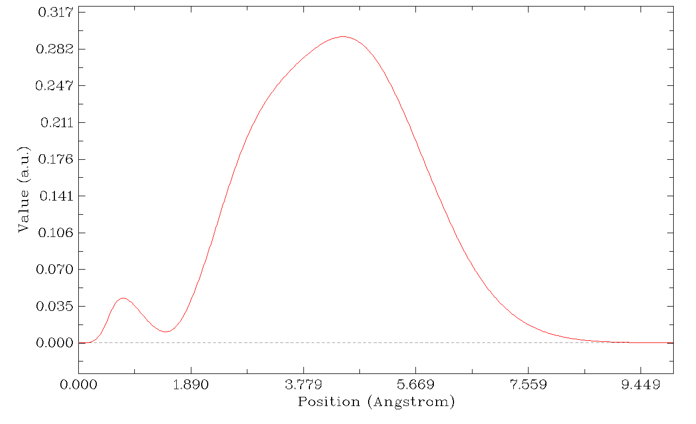

<!-- p.1036 -->

```text
   3:       3( 85.21%)    4(  9.87%)    7(  3.24%)    9(  0.88%)    6(  0.79%)
   4:       4( 86.88%)    3( 10.66%)    6(  1.94%)    9(  0.48%)    7(  0.02%)
   5:       6( 54.88%)    7( 41.11%)    9(  3.20%)    4(  0.45%)    3(  0.34%)
   6:       8( 57.50%)    5( 42.47%)    7(  0.00%)    6(  0.00%)    4(  0.00%)
   7:       5( 57.50%)    8( 42.48%)    7(  0.00%)    4(  0.00%)    6(  0.00%)
   8:       9( 86.62%)    6( 10.30%)    7(  1.63%)    4(  0.89%)    3(  0.50%)
   9:       7( 53.98%)    6( 32.07%)    9(  8.76%)    3(  3.28%)    4(  1.89%)
  10:       9(  0.00%)    7(  0.00%)    6(  0.00%)    4(  0.00%)    2(  0.00%)
  11:       5(  0.00%)    8(  0.00%)    3(  0.00%)    7(  0.00%)    4(  0.00%)
... (ignored)
  47:       6(  0.01%)    7(  0.00%)    9(  0.00%)    3(  0.00%)    4(  0.00%)
  48:       9(  0.04%)    7(  0.00%)    6(  0.00%)    4(  0.00%)    3(  0.00%)
```

The first column denotes the index of the MP2 NOs, the largest five contributions from the Hartree-Fock MOs to them are shown at right side. As can be seen, the first (second) NO is nearly equivalent to the second (first) MO. While the 9th NO cannot be solely represented by any MO, it mainly arises from the severe mix of the 7th (53.98%) and 6th MOs (32.07%), the 9th MO also has nonnegligible contribution (8.76%).

If you want to get all coefficients and compositions of an orbital of present wavefunction (e.g. the 5th NO), then simply input 5, you will see


```text
    1   Contribution:     0.000 %    Coefficient:    0.001509
    2   Contribution:     0.000 %    Coefficient:   -0.000042
    3   Contribution:     0.339 %    Coefficient:   -0.058201
    4   Contribution:     0.447 %    Coefficient:    0.066869
    5   Contribution:     0.000 %    Coefficient:    0.000000
    6   Contribution:    54.882 %    Coefficient:    0.740826
    7   Contribution:    41.113 %    Coefficient:   -0.641194
    8   Contribution:     0.000 %    Coefficient:    0.000000
    9   Contribution:     3.199 %    Coefficient:   -0.178856
Total:    99.980 %
```

this output shows that NO 50.7408 MO 60.6412 MO 70.1788 MO 9=−− Λ The

99.98% at the last line indicates that the 5th NO can be perfectly represented by linear combination of these nine MOs.

4.200.6.2 Study contribution of lone pair of nitrogen to MOs of dopamine

Sometimes it is useful to investigate a problem like "How large is contribution of lone pair of a heteroatom to a molecular orbital?", using orbital localization technique in combination with subfunction 6 of main function 200 can provide a clear answer to this problem. In this section, we

will study contribution of lone pair of nitrogen in amino group to occupied MOs for a Donor-π-acceptor type of molecule. The wavefunction file is examples\excit\D-pi-A.fchk, the structure and atomic numbering are shown below


<!-- p.1037 -->
We should first generate localized molecular orbitals (LMOs), because commonly a lone pair can be represented by an LMO.

Boot up Multiwfn and input below commands examples\excit\D-pi-A.fchk 19 // Orbital localization analysis 1 // Localize occupied orbitals The LMOs are automatically exported to new.fch in current folder. From the outputted LMO composition on the screen, we can find there are several LMOs closely related to the N24, namely the nitrogen in amino group. Below are relevant lines of orbital composition output.


```text
    4:  24(N ) 99.3%        5:  18(C ) 98.9%        6:   6(C ) 98.6%
...
   19:  24(N ) 60.1%  25(H ) 32.9%        20:  21(N ) 57.5%  18(C ) 33.7%
   27:   2(C ) 45.6%   3(C ) 44.5%        28:  24(N ) 53.6%   6(C ) 37.8%
   33:  23(O ) 65.8%  21(N ) 27.5%        34:  24(N ) 59.9%  26(H ) 33.2%
   43:   5(C ) 46.2%   4(C ) 44.9%        44:  24(N ) 77.7%   6(C )  9.9%
```

To confirm which one corresponds to lone pair of N24, we enter main function 0 and check isosurface of the highlighted LMOs one by one, we find LMO 44 can be regarded as lone pair orbital of N24, the isosurface map with isovalue of 0.1 is shown below

Now we can check contribution of this LMO to various MOs. Reboot Multiwfn and input examples\excit\D-pi-A.fchk 200 // Other functions (Part 2) 6 // Analyze correspondence between orbitals in two wavefunctions 1,56 // We want to check all occupied MOs (indices range is 1~56) new.fch // The file containing LMOs 44,44 // Only the 44th orbital in the new.fch will be taken into account From the output, we can find some MOs have large composition of the LMO 44, relevant lines are shown below (Since only LMO 44 is taken into account, other LMOs have exactly zero contribution)


```text
    44:     44( 10.04%)   43(  0.00%)   42(  0.00%)   41(  0.00%)   40(  0.00%)
*   45:     44(  8.73%)   43(  0.00%)   42(  0.00%)   41(  0.00%)   40(  0.00%)
*   49:     44( 33.29%)   43(  0.00%)   42(  0.00%)   41(  0.00%)   40(  0.00%)
```


<!-- p.1038 -->

```text
*   53:     44( 14.28%)   43(  0.00%)   42(  0.00%)   41(  0.00%)   40(  0.00%)
*   56:     44( 19.74%)   43(  0.00%)   42(  0.00%)   41(  0.00%)   40(  0.00%)
```

We return to main menu, enter main function 0 and visualize MO 49 to check whether LMO 44 (lone pair of N24) really has large contribution (33.29%) to it. The isosurface map with isovalue of 0.05 is shown below

As can be seen, indeed MO 44 is largely contributed by lone pair of N24, since a large part of its isosurface covers the lone pair region of N24, the computed composition 33.29% should be a reasonable value.


### 4.200.12 Calculate energy index (EI) and bond polarity index (BPI)

In this section I will illustrate how to calculate EI and BPI indices, which were defined in J. Phys. Chem., 94, 5602 (1990). If you are not familiar with these two quantities, please read Section 3.200.12 first. The geometry and wavefunction involved in this example were produced at HF/6-31G* level, which is the one used in above-mentioned paper.

We will calculate BPI for C-N bond of CH3NH2, before this we first need to calculate reference EI value for C and N atoms, which correspond to EI of C in ethane and N in H2N-NH2, respectively. Boot up Multiwfn and input

examples\EI_BPI\ethane.fch 200 // Other function, part 2 12 // Calculate energy index (EI) or bond polarity index (BPI) 1 // C1 atom You will see the EI value for C in reference molecule ethane is -0.667639 a.u.

Reboot Multiwfn and input examples\EI_BPI\N2H4.fch 200 // Other function, part 2 12 // Calculate EI or BPI 1 // N1 atom You can see the EI value for N in reference molecule H2N-NH2 is -0.718126 a.u.

Next we calculate EI for C and N in CH3NH2. Reboot Multiwfn and input examples\EI_BPI\CH3NH2.fch 200 // Other function, part 2 12 // Calculate EI or BPI 1 // C1, the result is -0.693374 a.u. 5 // N5, the result is -0.698092 a.u. The BPICN in CH3NH2.is computed as


<!-- p.1039 -->

$$\begin{aligned}\mathrm{BPI}_{\mathrm{CN}}&=(\mathrm{EI}_{\mathrm{C}}-\mathrm{EI}_{\mathrm{C}}^{\mathrm{ref}})-(\mathrm{EI}_{\mathrm{N}}-\mathrm{EI}_{\mathrm{N}}^{\mathrm{ref}})\\&=-0.693374+0.667639+0.698092-0.718126\\&=-0.046\end{aligned}$$

<!-- formula-ocr: formula_p1039_347.png 已替换为LaTeX, 原图保留备查 -->

As a comparison, use examples\EI_BPI\F2.fch to calculate reference value for F, the result should be -0.992542 a.u., and use examples\EI_BPI\CH3F.fch to calculate EI for C and F in CH3F molecule, the result should be -0.750302 and -0.885961, respectively. Then compute the BPICF value as -0.750302+0.667639+0.885961-0.992542= -0.189. Since BPICF in CH3F is evidently more negative than BPICN in CH3NH2, it can be concluded that C-F bond in CH3F is more polar than C-N bond in CH3NH2.

Via EI index we can also evaluate the so-called group electronegativity, which is often more useful than atomic electronegativity. Here we calculate electronegativity for -CH3 group, which is simply the negative of EIC for CH3 radical. Boot up Multiwfn and input

examples\EI_BPI\CH3.fch // Optimized and produced at UHF/6-31G* 200 // Other function, part 2 12 // Calculate EI or BPI 1 // Carbon atom The result is -0.630656 a.u., corresponding to electronegativity of CH3 group of 0.631. Then we use examples\EI_BPI\F.fch to calculate group electronegativity for -F, the result is 0.957. It is clear that -F group has much higher electronegativity, and thus has stronger capacity to attract electrons than -CH3 group due to its lower average energy per valence electron.


### 4.200.13 Study orbital contributions to density difference

Note: Chinese version of this section is my blog article “Using Multiwfn to study contribution of molecular orbital, NBO and so on to density difference and Fukui function” (http://sobereva.com/502).

In this section, I will use a few examples to illustrate how to derive contributions of various

kinds of orbitals to density difference (Δρ) of different types, and show which chemically valuable information could be obtained by means of these analyses. Please read Section 3.200.13 first to gain basic knowledge about the function employed in this section.

4.200.13.1 Contribution of MOs to Fukui function f − of phenol

The basic concept of Fukui function has been detailedly introduced in Section 4.5.4. The Fukui

function f − is frequently employed in literature to identify favourable sites of electrophilic attack, it is a special instance of Δρ and is defined as 𝜌𝑁(𝐫) −𝜌𝑁−1(𝐫), where N is the number of electrons in original state. It is interesting to study relative contribution of various MOs to the f −, so that we can better recognize its character from orbital point of view. The underlying idea is that if densities

of MOs are regarded as basis functions that can be used to linearly expand f −, then the optimal expansion coefficients will be able to be used to measure contribution of each MO to the f −.

Evidently, if there is no orbital relaxation effect, the f − must be exactly identical to probability density of HOMO of N-state. Of course, this assumption is not true, because in practice all MOs of N-state must somewhat undergo deformation when the number of electrons changes from N to N-1.

Below we will take phenol as example to illustrate how to calculate contribution of all occupied


<!-- p.1040 -->
MOs to f −. The files carrying orbital wavefunctions of N and N-1 states have been provided as phenol.wfn and phenol_N-1.wfn in "examples" folder, respectively. Before calculation of the

contribution, we first need to generate cube file of f −. To do so, boot up Multiwfn and input

examples\phenol.wfn // Wavefunction file of N-state 5 // Calculate grid data 0 // Set custom operation 1 // Only one file will be operated with the file that has been loaded -,examples\phenol_N-1.wfn 1 // Electron density 2 // Medium-quality grid 2 // Export the grid data as density.cub in current folder

Now, we can directly enter the function used to derive orbital contributions to Δρ. Input below commands

0 // Return to main menu 200 // Other functions (Part 2) 13 // Evaluate orbital contributions to density difference or other grid data

density.cub // The file containing grid data of f − 0 // Choose orbital range and start analysis o // Only consider orbitals with non-zero occupation in the fitting. For present case all occupied MOs are chosen (note that the wavefunction file we loaded is in .wfn format, in fact it only contains occupied orbitals, thus unoccupied orbitals cannot be chosen even if you want)

Soon the contribution values are listed in ascending order:


```text
 Orbital    20   Value:    -0.108
 Orbital    11   Value:    -0.089
 Orbital     9   Value:    -0.065
[ignored]
 Orbital    23   Value:     0.111
 Orbital    24   Value:     0.214
 Orbital    25   Value:     0.766
 Sum of all values:       1.000
 Fitting error (definition 1):      0.8911
 Fitting error (definition 2):    0.003828
```

Because by default the sum of all contributions is constrained to 1.0, the "Sum of all values" is exactly 1.0. The default constraint makes sense for present case, since N and N-1 just differ by 1 electron. The "Fitting error" displays the fitting quality. The smaller the fitting error, the better the fitting quality. However, the best way of examining the fitting quality is visually comparing the

isosurface of the actual Δρ and the fitted Δρ. From above data, it can be clearly seen that MO25 (HOMO) dominates the f −, while MO24 (HOMO-1) and MO23 (HOMO-2) also play nonnegligible roles.

In the post-processing menu, we can choose options 2 and 3 to visualize isosurface of provided grid data (i.e. the one loaded from density.cub) and that of fitted grid data, respectively. The difference between the two sets of grid data can be visualized via option 4. The corresponding graphs are given below, the isovalue is set to 0.005. For comparison purposes, the three MOs having the largest contributions are also given below, the isovalue is 0.07, and the contribution values are


<!-- p.1041 -->
marked in the parentheses.

From the map above, it can be seen that our fitted grid data is very close to the provided one,

at least the fitted one is able to reasonably reproduce the basic character in π region. The main difference between the provided and the fitted grid data is the σ region, as clearly reflected in the "diff" subgraph. This observation implies that loss of an electron causes severe relaxation of σ electrons, which cannot be fully represented based on the occupied MOs of N-state.

The MO23, MO24 and MO25 shown in the map above are all π orbitals, this fact explains why the σ part of the f − cannot be faithfully represented in the fitted grid data. Notice that a few MOs have negative contributions, the one with most negative value is MO20 (-0.108). If you check this

orbital, you will find it is an σ orbital. However, since its shape is not quite similar to the "diff" grid data, its existence does not improve the fitting quality or lower the difference between the provided and fitted grid data.

From the map above we can also find the profile of isosurface of MO25 is very similar to the

f −, this is why MO25 has dominant contribution and also why f − can often be reasonably approximated by HOMO distribution. It is obvious that if there is no orbital relaxation effect, contribution of MO25 should be exactly 1.0 while all other MOs should have contribution of 0.0.

It is worth to stress that the range of the orbital considered in the fitting affects the resulting contributions. For example, you only want to calculate contribution of MOs 10~15, you will find their contributions are different when MOs 1~15 are chosen and when MOs 10~15 are chosen.

4.200.13.2 Contribution of NBO orbitals to Fukui function f − of 1,3-butadiene

This time we calculate contribution of various highly occupied NBOs to f − of 1,3-butadiene. The .fch file of N and N-1 states, as well as NBO plot files .31 and .37 generated for N state have been provided in "examples\orb_densdiff\butadiene" folder. The geometry has been optimized for N-state.

Note that the NBO orbitals recorded in the .37 file can be divided into two categories, the Lewis type and Rydberg type. The Lewis NBOs have an occupation number of approximately 2.0 while the Rydberg ones are almost unoccupied. Since only the Lewis NBOs significantly contribute to electron density of N-state, we will only take these orbitals into account.


<!-- p.1042 -->
First, we generate cube file of f − type of Fukui function. Boot up Multiwfn and input examples\orb_densdiff\butadiene\butadiene.fch 5 // Calculate grid data 0 // Set custom operation 1 // Only one file will be operated with the file that has been loaded -,examples\orb_densdiff\butadiene\butadiene_N-1.fch 1 // Electron density 1 // Low-quality grid (since the current system is very small, low-quality grid is adequate) 2 // Export the grid data as density.cub in current folder Now reboot Multiwfn and input examples\orb_densdiff\butadiene\BUTADIENE.31 37 // Load the BUTADIENE.37 in the same folder, which records NBO orbitals Now if you enter main function 6 and choose option 3 to examine orbital information, you will find the first 15 orbitals correspond to Lewis type of NBOs due to their high occupation numbers. Next, we input below commands in the main menu

200 // Other functions (Part 2) 13 // Evaluate orbital contributions to density difference or other grid data

density.cub // The file containing grid data of f − 0 // Choose orbital range and start analysis 1-15 // Range of Lewis NBOs The result is shown below


```text
 Orbital     3   Value:    -0.047
 Orbital     8   Value:    -0.046
[ignored]
 Orbital    10   Value:     0.017
 Orbital     4   Value:     0.530
 Orbital     9   Value:     0.531
 Sum of all values:       1.000
 Fitting error (definition 1):      0.9008
 Fitting error (definition 2):    0.004961
```

The data clearly shows that NBO4 and NBO9 equally and fully dominate the f −, while participation of other orbitals can be safely ignored.

The isosurface (isovalue=0.01) of the provided f − and the fitted one, as well as isosurface (isovalue=0.1) of NBO4 and NBO9 are collectively shown below


<!-- p.1043 -->
Since from the graph it is obvious that NBO4 and NBO9 correspond to π bond of C1-C4 and C6-C8, respectively, and the fitted function is qualitatively consistent with the provided f −, we can conclude that the f − is mainly composed of the π electrons over the C1-C4 and C6-C8 bonds.

4.200.13.3 Contribution of NBO orbitals to density difference between S0

and S1 states of H2CO

Finally, we study contribution of NBOs to Δρ between S1 and S0 states of H2CO. All relevant files used in this section have been provided in "examples\orb_densdiff\H2CO" folder, including the NBO plot files generated for ground state, wavefunction file of ground state (S0.fch) and wavefunction of the first excited state (S1.wfn). The Gaussian input files used for generating these files are also provided.

We first generate the Δρ between S1 and S0 states. Boot up Multiwfn and input examples\orb_densdiff\H2CO\S1.wfn 5 // Calculate grid data 0 // Set custom operation 1 // Only one file will be operated with the file that has been loaded -,examples\orb_densdiff\H2CO\S0.fch 1 // Electron density 1 // Low-quality grid 2 // Export the grid data as density.cub in current folder -1 // Visualize the isosurface The isosurface at isovalue=0.03 is shown below.

Now we calculate contribution of NBO orbitals to ΔρS0→S1 to characterize the nature of S0→S1 transition. Reboot Multiwfn and input below commands


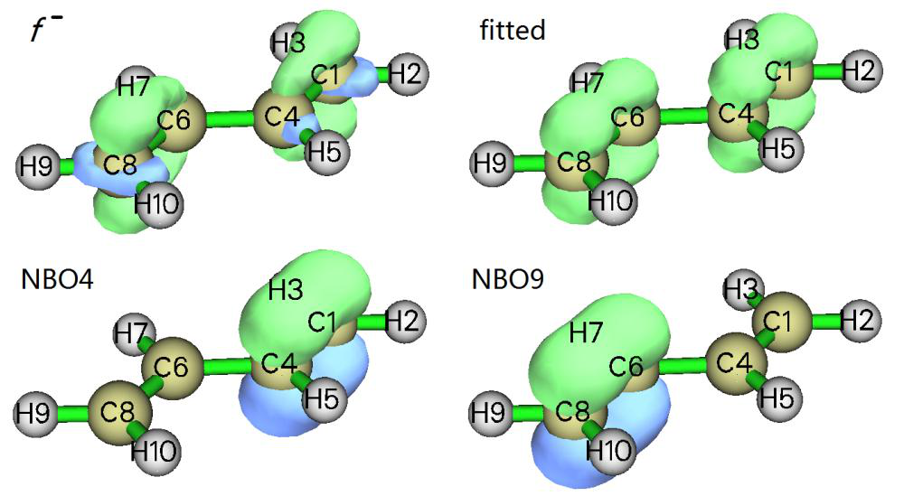


<!-- p.1044 -->
examples\orb_densdiff\H2CO\H2CO.31 37 // Load the H2CO.37 in the same folder, which records NBO orbitals 200 // Other functions (Part 2) 13 // Evaluate orbital contributions to density difference or other grid data

density.cub // The file containing grid data of ΔρS0→S1 1 // Set constraint on the sum of contributions 2 // Set the constraint to a specific value 0 // Since electron excitation does not alter the number of electrons, the sum of contributions is set to be constrained to zero

0 // Choose orbital range and start analysis [Press ENTER button to consider all orbitals] // Note that during electron excitation, a portion of electrons is excited to empty orbitals, therefore only taking Lewis NBOs into account is evidently inadequate, so all orbitals should be taken into account in the present context

The result is shown below


```text
 Orbital     8   Value:    -0.719
 Orbital    16   Value:    -0.254
 Orbital     9   Value:    -0.151
[ignored]
 Orbital    11   Value:     0.115
 Orbital    22   Value:     0.132
 Orbital    18   Value:     0.148
 Orbital    32   Value:     0.894
 Sum of all values:       0.000
 Fitting error (definition 1):      0.4778
 Fitting error (definition 2):    0.001770
```

It can be seen that the NBO having dominant positive value is NBO32. The NBO having the most negative contribution is NBO8, its magnitude of negative contribution is by far greater than any other NBO. From the "Natural Bond Orbitals (Summary)" field printed by NBO module in the Gaussian output file examples\orb_densdiff\H2CO\S0.out, it can be seen that the NBO8 is identified as " LP ( 2) O 3", namely lone pair of O3.

The isosurface of fitted Δρ (isovalue=0.03) as well as isosurface of NBO8 and NBO32 (both isovalues are set to 0.17) are shown below.

By comparing the "fitted" graph with the ΔρS0→S1 graph shown earlier, it is apparent that the fitted Δρ is almost completely identical to the rigorously calculated one, hence the fitting quality in


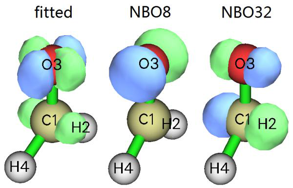

<!-- p.1045 -->
the current instance is fairly high and the contribution values must be very reliable and meaningful. From the orbital isosurface maps it is obvious that the NBO8 indeed corresponds to lone pair of O3,

while NBO32 corresponds to anti-π orbital of C1-O3, therefore the S0→S1 excitation could be unambiguously identified as n(O3)→π*(C1-O3) type of transition.

You can also calculate contribution of various NAOs to the S0→S1 excitation, the only difference from the example above is that after loading the H2CO.31, you should input 33 to load

the H2CO.33, which records NAO orbitals. You will find the S0→S1 excitation mainly involves transitions from highly occupied p type NAOs to those nearly unoccupied.


### 4.200.14 Domain analysis examples

The domain analysis refers to quantitative analysis for the region enclosed by isosurface of given real space function, see Section 3.200.14 for details. To illustrate the powerfulness and flexibility of the domain analysis module, some practical applications of the domain analysis are given below.

4.200.14.1 Integrate real space functions within reduced density gradient

(RDG) isosurface to study weak interaction quantitatively

Before reading this, please read Section 3.23.1 to understand how to use reduced density gradient (RDG) to reveal weak interaction regions. In this section, I show the possibility of characterizing weak interaction by integrating domains enclosed by RDG isosurfaces.

System 1: Phenol dimer First, we use phenol dimer as example. Boot up Multiwfn and input examples\phenoldimer.wfn 200 // Other functions (Part 2) 14 // Integrate real space functions within isosurfaces of a real space function Here we want to study RDG domains defined as regions enclosed by isosurface of RDG = 0.5; in other words, these domains are composed of grid points where RDG < 0.5. Therefore, we select option 2 and choose "13 Reduced density gradient", and then select option 3 and input criterion, namely <0.5 (In fact, RDG < 0.5 is the default setting and you do not need to manually do these steps). Next, input below commands:

1 // Start calculation grid data and generate domains -10 // Adjust extension distance 0 // Set extension distance to zero to avoid wasting of grid points at boundary area, where RDG isosurfaces commonly do not occur

2 // Medium-quality grid (grid spacing=0.1 Bohr), generally this is accurate enough Now Multiwfn starts calculation of grid data for the selected real space function (i.e. RDG), and then identifies individual RDG domains according to the criterion of RDG<0.5. Finally, four domains are found, the number of grid points constituting the domains are shown as the last column:


```text
Domain:     1    Grids:     208    Volume:     0.031 Angstrom^3
Domain:     2    Grids:     290    Volume:     0.043 Angstrom^3
Domain:     3    Grids:     200    Volume:     0.030 Angstrom^3
Domain:     4    Grids:    2597    Volume:     0.385 Angstrom^3
```

To visualize them, select "3 Visualize domains". In the GUI, you can select domain index at


<!-- p.1046 -->
right-bottom list. The 2nd and 4th domains are shown below:

If you have read Section 3.23.1, you must know these domains correspond to H-bond and van der waals (vdW) interactions between the two phenols, respectively. We can study properties of these domains in terms of integrating specific real space functions within corresponding regions. We input

1 // Integrate a domain 2 // Index of the domain of interest 2 // Choose a real space function 1 // Using electron density as integrand the result is:


```text
 Integration result:    0.6932973049E-02 a.u.
 Volume:    0.290000 Bohr^3  (    0.042974 Angstrom^3 )
 Average:    0.2390680362E-01
 Maximum:    0.2766231164E-01   Minimum:    0.1994457517E-01
```

Similarly, we do this for domain 4:


```text
 Integration result:    0.1181667175E-01 a.u.
 Volume:    2.597000 Bohr^3  (    0.384836 Angstrom^3 )
 Average:    0.4550123895E-02
 Maximum:    0.6217203920E-02   Minimum:    0.3102088666E-02
```

From the output we know the number of electrons involved in the domains corresponding to H-bond and vdW interactions are 0.006933 and 0.011817, respectively. They can be interpreted as overlapping electrons and are closely related to strength of same type of interactions. However, since these two domains correspond to different types of weak interactions, the magnitude of overlapping electrons is not positively correlated to their strengths, namely we are unable thus to conclude that the vdW interaction between the two phenols is stronger than the intermolecular H-bond. The "Volume" in the output denotes volume of the domain, we can find that vdW interaction involves much wider spatial region than H-bond. "Average" corresponds to average value of real space function in the domain, from this quantity one can easily infer that the strength of interaction per contact region of H-bond must be significantly higher than that of vdW interaction, since as shown above, their average values are 0.0239 and 0.0045, respectively, the former is much larger than the latter.

System 2: 2-pyridoxine 2-aminopyridine Intermolecular H-bonds of 2-pyridoxine 2-aminopyridine (PP) have been investigated in Section 4.2.1 by means of AIM analysis, while this time we will analyze them by means of qint index. This index was proposed in J. Phys. Chem. A, 115, 12983 (2011) for judging interaction of H-bond at various intermolecular distance, please check Section 3.200.14 for its definition. Commonly, the more negative of the qint index, the more stable the interaction.


<!-- p.1047 -->
qint index is defined based on integrating domains enclosed by RDG = 0.6 isosurfaces, therefore we need to first calculate RDG grid data and generate corresponding domains. Note that it is not always appropriate to set extension distance of RDG grid data to zero. For present system, if you calculate RDG grid data by main function 5 with extension distance of zero, you will see some RDG isosurfaces are truncated by box boundary, as shown below and highlighted by red arrows. In this case the domain-integration module of Multiwfn does not work.

Therefore, when we calculate RDG grid data for this case, extension distance should be set somewhat larger than zero, 3 Bohr is safe enough for avoiding unexpected truncation. Extension distance should also never be set to an over-large value, otherwise the number of grid points to be calculated will be very high and thus very time-consuming.

Boot up Multiwfn and input below commands: examples\2-pyridoxine_2-aminopyridine.wfn 200 // Other functions (Part 2) 14 // Integrate real space functions within isosurfaces of a real space function 3 // Change the default criterion of defining domain <0.6 1 // Start calculation of grid data -10 // Change extension distance 3 // 3.0 Bohr of extension distance 2 // Medium-quality grid Now visualize resulting domains. Domains 2 and 4 are shown below, clearly they correspond

to H-bond of N23-H25······O1 and N2-H12······N13, respectively.

Next, select option "5 Calculate q_bind index for a domain" and input 2, then press ENTER

button directly to use ρ4/3 as the integrand (which was used in J. Phys. Chem. A, 115, 12983 (2011)), the resulting qint and related details of the domain are shown below


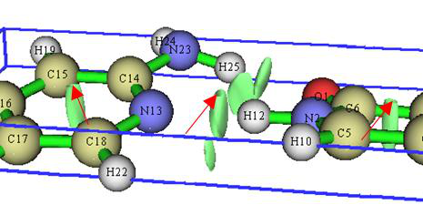


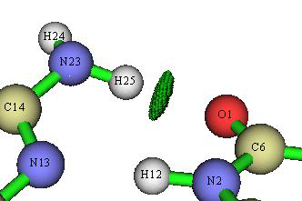

<!-- p.1048 -->

```text
 q_att:       0.00490957 a.u.
 q_rep:       0.00005590 a.u.
 q_bind:     -0.00485367 a.u.
 Volume (lambda2<0):     0.599000 Bohr^3
 Volume (lambda2>0):     0.010000 Bohr^3
 Volume (Total):         0.609000 Bohr^3
Similarly, we obtain results for domain 4
 q_att:       0.00805204 a.u.
 q_rep:       0.00037346 a.u.
 q_bind:     -0.00767858 a.u.
 Volume (lambda2<0):     0.745000 Bohr^3
 Volume (lambda2>0):     0.052000 Bohr^3
 Volume (Total):         0.797000 Bohr^3
```

$$\delta g^{\mathrm{inter}}$$

Since both the interactions are H-bond, it is also possible to simply compare the number of electrons contained in the domains to estimate their relative strength. We choose "2 Perform integration for all domains", then input 2, and then select electron density as integrand to obtain electron population of all domains:


```text
Domain    Integral (a.u.)     Volume (Bohr^3)      Average
     1    0.1212147834E-03         0.111000    0.1092025076E-02
     2    0.1647945811E-01         0.609000    0.2705986553E-01
     3    0.1714432107E-02         0.319000    0.5374395319E-02
     4    0.2618188584E-01         0.797000    0.3285054685E-01
     5    0.8932587581E-02         0.412000    0.2168103782E-01
     6    0.7764521413E-02         0.394000    0.1970690714E-01
 Integration result of all domains:    0.6119409984E-01 a.u.
 Volume of all domains:     2.642000 Bohr^3       0.391504 Angstrom^3
```

Not only the integration value of domain 2 (0.01648) is evidently smaller than domain 4 (0.02618), but also the average value of domain 2 (0.02706) is smaller than domain 4 (0.03285),

$$\delta g^{\mathrm{inter}}$$

With similar steps illustrated in this section, you can also integrate other real space functions such as potential energy density and spin density in the domains enclosed by isosurfaces of other

real space functions, e.g. IRI, δginter and ELF.

Note that the accuracy of integration in the domains is directly determined by grid setting, higher quality of grid leads to better accuracy. For example, when visualizing domains, if you found a domain only consists of very few grid points, and its profile is very coarse, then integration accuracy of this domain must be very low.

4.200.14.2 Visualize molecular cavity and calculate its volume by domain

analysis module

This is an application instance of domain analysis module, I will briefly illustrate how to use Multiwfn to visualize molecular cavity and calculate cavity volume. More examples and


<!-- p.1049 -->
information about this topic can be found in my blog article “Using Multiwfn to visualize molecular cavity and calculate cavity volume” (http://sobereva.com/408, in Chinese).

The idea of using domain analysis to study molecular cavity is very simple: We first calculate promolecular density, then we define the regions having electron density lower than a threshold e.g. 0.0001 as molecular cavity. More than one such regions may exist, the domain analysis module automatically assigns them with different domain indices. After that, by visualizing the domains, it should be easy to find the domain corresponding to the molecular cavity. The choice of threshold is somewhat arbitrary, commonly 0.001~0.0001 a.u. is appropriate.

α-cyclodextrin is used as an example in this section. Before studying the cavity using domain analysis module, it is suggested to first visualize promolecular density under various isovalues. Boot up Multiwfn and input:

examples\alpha-cyclodextrin.pdb 5 // Calculate grid data 1 // Promolecular density -10 // Set extension distance 0 // Zero extension distance, namely let the box just enclose the molecule 1 // Low-quality grid -1 // Show isosurface map Click "Show data range" in the GUI window to show the box of grid data as blue frame, and set isovalue to 0.01 and 0.001 respectively, you will see

It is easy to understand, if we use threshold of 0.001 a.u., then the domain corresponding to the cavity in the center of the molecule cannot be defined, because the internal region and external region are connected via the three channels pointed by red arrows. While in the case of 0.0001 a.u., the molecular cavity is clearly identifiable and thus we could use domain analysis module with this threshold to study the cavity.

Return to main menu, and then input below commands 200 // Other functions (Part 2) 14 // Domain analysis 2 // Choose the real space function to be calculated and used for partitioning domains 1 // Promolecular density 3 // Define the rule of determining domains <0.0001 // Regions with electron density less than 0.0001 will be defined as domains


<!-- p.1050 -->
1 // Calculate grid data and assign domains -10 // Change extension distance 0 // No extension distance 1 // Low-quality grid After calculation is finished, you will see the following information on screen. There are totally six domains found, the number of grids and volume of all domains are shown


```text
Domain:     1    Grids:       4    Volume:     0.005 Angstrom^3
Domain:     2    Grids:   12010    Volume:    14.238 Angstrom^3
Domain:     3    Grids:    5822    Volume:     6.902 Angstrom^3
Domain:     4    Grids:   39654    Volume:    47.009 Angstrom^3
Domain:     5    Grids:   13949    Volume:    16.536 Angstrom^3
Domain:     6    Grids:    7438    Volume:     8.818 Angstrom^3
```

Then we can visualize each domain by option 3. After examining the domains, we find that the domain with index of 4 is the one corresponding to molecular cavity, as shown below:

Since this domain well represents shape of actual molecular cavity, its volume is a good indicator of cavity size. As shown earlier, its volume is 47.0 Å3.

Close the GUI, select option 1 to carry out integration within domain, and input 4 to choose to integrate the domain corresponding to the cavity. We choose "100 User-defined real space function" as integrand (by default, this function is 1.0 everywhere and thus does not take any computational cost), then the following information is printed on screen


```text
Integration result:    0.3172320000E+03 a.u.
 Volume:  317.232000 Bohr^3  (   47.008943 Angstrom^3 )
 Average:    0.1000000000E+01
 Maximum:    0.1000000000E+01   Minimum:    0.1000000000E+01
```


<!-- p.1051 -->

```text
 Position statistics for coordinates of domain points (Angstrom):
 X minimum:   -2.7823  X maximum:    3.1445  Span:    5.9268
 Y minimum:   -2.6823  Y maximum:    2.6095  Span:    5.2918
 Z minimum:   -3.1770  Z maximum:    3.9140  Span:    7.0910
```

The integration result directly corresponds to the volume of the domain (47.0 Å3) since the current integrand is 1.0 everywhere, from the output we also find the span distance of the domain, in Z direction the value is 7.09 Å, which is the difference between the points in the domain with maximum Z and with minimum Z coordinates. So, using Multiwfn we can not only obtain cavity volume but also obtain cavity span distance.

Furthermore, we can export a selected domain as domain.cub in current folder by using option 10, so that the domain can be portrayed as isosurface in third-part visualization tools, such as VMD. In the resulting domain.cub, the grids within the selected domain have value of 1, while grids in other regions (as well as boundary grids) have value of 0, therefore isosurface of domain can be rendered with isovalue between 0 and 1 (commonly 0.5 is used). We do this for the domain 4 and plot it as isosurface in VMD, the graph below will be obtained

We can also use option 11 to export boundary grids of a domain to domain.pdb, in which each particle corresponds to a boundary grid. You can load this file into VMD and render the particles as points. Then if you want to measure domain, you can click keyboard button 2, then click two points in the graphical window, the linking line will appear and the distance will be labelled, as illustrated below ("Display" - "Orthographic" was selected for easier inspection)


<!-- p.1052 -->
4.200.14.3 Integrate electron density difference in its isosurfaces

In this section, we integrate electron density difference (EDD) in its isosurfaces. Specifically,

the EDD in this section corresponds to deformation density (Δρdef), see Section 3.7.2 for its definition. Benzene is taken as instance.

The .cub file of EDD for benzene (benzene_EDD.cub) has been provided at http://sobereva.com/multiwfn/extrafiles/benzene_EDD.zip. You can also easily generate it using main function 5. We first examine its isosurface map. Boot up Multiwfn and load benzene_EDD.cub, then enter main function 0, set isovalue to 0.015, you will see the following map. The green and blue isosurfaces correspond to positive and negative parts, respectively, which correspond to electron density increase and decrease regions due to formation of benzene from isolated atoms. In this example, we will use domain analysis module to respectively integrate the EDD within the two domains indicated by the red and blue circles.

Return to main menu, and then input 200 // Other functions (Part 2) 14 // Domain analysis 3 // Set criterion for defining domain <-0.015 // The regions with function value more negative than -0.015 will be determined as domains, which is in line with the blue isosurfaces shown above


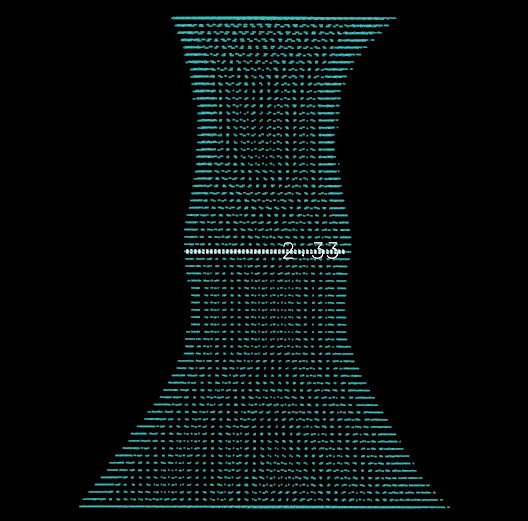

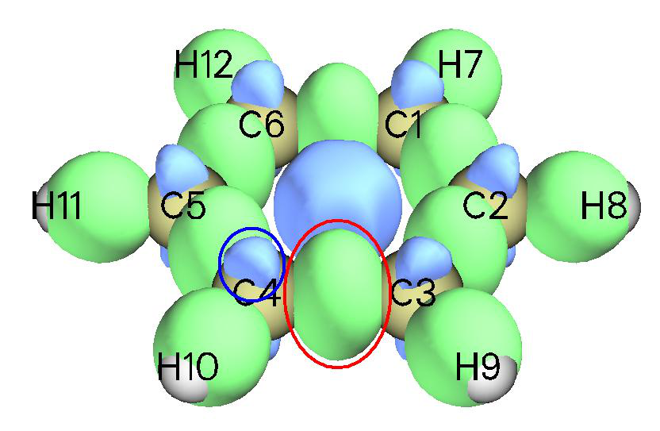

<!-- p.1053 -->
-1 // Yield domains based on the grid data in memory Domains are immediately generated:


```text
Domain:      1    Grids:     1912    Volume:     0.8502 Angstrom^3
Domain:      2    Grids:      433    Volume:     0.1925 Angstrom^3
Domain:      3    Grids:      423    Volume:     0.1881 Angstrom^3
Domain:      4    Grids:      434    Volume:     0.1930 Angstrom^3
Domain:      5    Grids:      432    Volume:     0.1921 Angstrom^3
Domain:      6    Grids:      430    Volume:     0.1912 Angstrom^3
Domain:      7    Grids:      427    Volume:     0.1899 Angstrom^3
```

Enter option 3 to visualize the domains. By checking distribution of every domain, we find domain 3 corresponds to the blue isosurface mentioned above, as shown below. Each small green sphere corresponds to a grid within the domain.

Then we integrate EDD in domain 3. Close the GUI window and input 1 // Perform integration for a domain 3 // Domain index is 3 1 // The integrand is just the grid data in memory, namely EDD The result is -0.032 a.u. Next, we integrate EDD in the green isosurface mentioned earlier. Input: 0 // Exit domain analysis module 14 // Domain analysis 3 // Set criterion for defining domain >0.015 -1 // Yield domains based on the grid data in memory After visually checking, we find domain 14 corresponds to the isosurface of interest, as shown below


<!-- p.1054 -->
Close the GUI window and input 1 // Perform integration for a domain 14 // Domain index is 14 1 // The integrand is just the grid data in memory, namely EDD The result is 0.156 a.u. Finally, it is worth to emphasize that because the integral is evaluated numerically based on uniform grids, the smaller the grid spacing, the better the integration accuracy.

You can similarly integrate other kinds of EDD, including Fukui function and dual descriptor.


### 4.200.18 Studying bond length/order alternation (BLA/BOA) as well as alteration of bond angle and dihedral for specific paths


Note: Chinese version of this section is my blog article “Using Multiwfn to calculate bond length/order alternation (BLA/BOA) and study variation of bond length, bond order and angle with respect to bond index” (http://sobereva.com/501), which contains more discussion.

The basic knowledge about definition and calculation of bond length alternation (BLA) and bond order alternation (BOA) have been introduced in Section 3.200.18. Multiwfn can not only calculate BLA and BOA, but can also calculate variation of bond length, bond order, bond angle and dihedral along a given path. This function is quite useful in studying characteristics of conjugated chains. In this section two examples will be given.

In this function, any file format that carries geometry information can be used as input file, such as .xyz, .pdb and .mol. However, if you also want to study BOA, the input file must contain basis function information, such as .mwfn, .fch, .molden or .gms.

4.200.18.1 BLA and BOA of thiophene oligomer

In this section, we will calculate BLA and BOA for a thiophene oligomer with 5 repeat units, the .fchk file generated at PBE0/6-31G* level can be downloaded here: http://sobereva.com/multiwfn/extrafiles/TP5.zip. The geometry was optimized at B3LYP/6-31G* level.

Before calculation, you need to first determine indices of the atoms in the conjugated chain of

interest. The easiest way of doing this is using GaussView. Now we use GaussView (version  6.0)


<!-- p.1055 -->
to open the TP5.fchk, choose button in the "Builder" panel, then hold down the left mouse

button and let the cursor pass through each atom in the conjugated chain to select them as yellow. After that, the image in the GaussView window should look like this:

Then enter "Tools" - "Atom Selection", you will find the atom indices of the selected chain is 10,12,14,16-17,19,21,23-24,26,28,30-31,33,35. Also, as can be seen from the above figure, the index of the atom at the beginning side and ending side is 1 and 35, respectively.

Note: Of course, it is not absolutely necessary to use GaussView for the present function. However, without GaussView, you have to manually record indices of all atoms in the chain by means of visual inspection, obviously this process is fairly troublesome!

Now boot up Multiwfn and input TP5.fchk 200 // Other functions (Part 2) 18 // Calculate bond length/order alternation (BLA/BOA) and study variation of bond characteristics with respect to bond index

10,12,14,16-17,19,21,23-24,26,28,30-31,33,35 // The indices of the atoms in the chain 1,35 // Index of the atom at the beginning side and ending side Then Multiwfn automatically identifies the atom sequence of the chain based on your inputted information. As can be seen from screen, the identified sequence is


```text
Sequence of the atoms in the chain from the beginning side to the ending side
       1       2       3       4       9      10      12      14      16
      17      19      21      23      24      26      28      30      31
      33      35
```

If you compare the sequence with the graph of molecular structure, you will find the sequence is completely correct, therefore the subsequent data should be meaningful.

Next, the bond index, indices of the two atoms composing the bond, bond length and bond order are given:


```text
  Bond     Atom1     Atom2   Length (Angstrom)   Mayer bond order
     1         1         2        1.3678              1.6303
     2         2         3        1.4232              1.2924
     3         3         4        1.3795              1.5445
     4         4         9        1.4468              1.0985
     5         9        10        1.3799              1.5273
[ignored...]
```

Finally, some statistical data as well as BLA and BOA are shown:


```text
 The number of even bonds:     9
```


<!-- p.1056 -->

```text
 The number of odd bonds:     10
 Average length of even bonds:       1.4300 Angstrom
 Average length of odd bonds:        1.3779 Angstrom
 Bond length alternation (BLA):      0.0521 Angstrom
 Average bond order of even bonds:      1.2109
 Average bond order of odd bonds:       1.5465
 Bond order alternation (BOA):         -0.3356
```

As mentioned on the screen, the bond data have also been exported to bondalter.txt in current folder, you can plot "bond length vs. bond index" and "bond order vs. bond index" curve maps. The map below was plotted by Origin, the corresponding .opj file has been provided as bondalter.opj in "examples" folder.

1.48 1.7

1.46 1.6

1.44 1.5

Bond length (Å) 1.42 1.40 1.4 1.3 1.2 Mayer bond order

1.38

1.1

1.36

1.0

02468101214161820

Bond index

Multiwfn also asks you if outputting variation of bond angle and dihedral along the atom sequence, we input n because they are not what we are currently interested in.

4.200.18.2 Study variation of bond lengths, bond angles and dihedrals in the

ring of cyclo[18]carbon

The map below is a frame of ab-initio molecular dynamic trajectory of the cyclo[18]carbon at 200 K. This simulation was conducted in my research article Chem. Asian J., 16, 56 (2021) DOI: 10.1002/asia.202001228. In this section we will study variation of bond lengths, bond angles and dihedrals along the ring.


<!-- p.1057 -->
Boot up Multiwfn and input examples\C18_MD_1.xyz // A frame extracted from molecular dynamics trajectory 200 // Other functions (Part 2) 18 1-18 // The atom indices in the ring 1,1 // The path under study is a closed path, i.e. a ring, in this case the two inputted atom indices must be the same. Index of any atom in the ring could be inputted, it will be regarded as the beginning atom

The outputted bond length variation is shown below


```text
  Bond     Atom1     Atom2   Length (Angstrom)
    1         1         2         1.208
    2         2         3         1.375
    3         3         4         1.209
[...ignored]
   17        17        18         1.201
   18        18         1         1.384
```

Next, we input y to let Multiwfn output variation of bond angles and dihedrals along the defined path, you will see:


```text
Note The unit of printed values is degree

 Atoms:     1     2     3  Angle:   164.841
 Atoms:     2     3     4  Angle:   154.976
 Atoms:     3     4     5  Angle:   155.200
[ignored]
 Atoms:    17    18     1  Angle:   162.906
 Atoms:    18     1     2  Angle:   158.520

 Atoms:     1     2     3     4  Dihedral:  28.69, deviation to planar:  28.69
 Atoms:     2     3     4     5  Dihedral:  25.51, deviation to planar:  25.51
 Atoms:     3     4     5     6  Dihedral:  22.98, deviation to planar:  22.98
[...ignored]
 Atoms:    17    18     1     2  Dihedral:  16.91, deviation to planar:  16.91
 Atoms:    18     1     2     3  Dihedral:  18.13, deviation to planar:  18.13
```

From the above output we can easily examine how bond angles and dihedrals vary along the


<!-- p.1058 -->
18-membered ring. Note that the value range of dihedral (D) is 0~180, the "deviation to planar" is identical to D if the D is within 0~90, while it corresponds to 180−D if the D is within 90~180.

If you copy the data from screen (see Section 5.4 if you do not know how to do this) and plot them via external software such as Origin, you can obtain the following maps, which very clearly exhibit geometric characteristics of the ring:

Since bond angles and dihedrals fluctuate evidently along the ring, we can conclude that the ring undergoes prominent geometry deformation during the molecular dynamics simulation.


### 4.200.19 Examples of calculating spatial delocalization index

Please read Section 3.200.19 to understand basic knowledge of spatial delocalization index (SDI). In this example we will calculate SDI for density of orbital wavefunctions to characterize spatial delocalization extent of various orbitals. SDI can also be applied to quantify spatial delocalization of any other function, such as spin density.

Note that the ODI described in Section 4.8.5 is also able to compare orbital delocalization extents; however, definitions of ODI and SDI are different, and SDI is in principle more rigorous and free of choice of atom partition method.

Calculate SDI based on wavefunction file As an example, we calculate SDI for densities of all occupied orbitals of examples\excit\D-pi-A.fchk. Boot up Multiwfn, load this file, and then input

200 // Other function (Part 2) 19 // Calculating SDI 2 // Calculate SDI for density of orbital wavefunctions 1-56 // Indices of occupied MOs You will immediately see following result on screen, the unit is a.u.


```text
...ignored
SDI of orbital    11:    0.3763
SDI of orbital    12:    0.5834
SDI of orbital    13:    0.5287
SDI of orbital    14:    0.4195
SDI of orbital    15:    0.3759
SDI of orbital    16:    0.3759
```


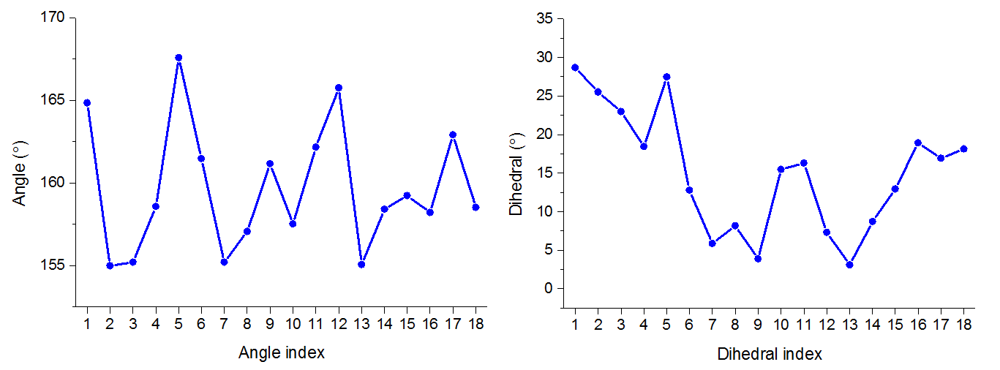

<!-- p.1059 -->

```text
SDI of orbital    18:    4.5899
SDI of orbital    19:    6.0700
SDI of orbital    20:   11.5668
...ignored
```

You can use such as Origin to plot SDI value versus orbital index:

The larger the SDI of an orbital density, the more evident the orbital delocalization character. From the map above, you can infer that orbital 44 is strongly delocalized (SDI = 15.41 a.u.), while orbital 33 (SDI = 5.97 a.u.) is highly localized. See the following map for comparison. Orbitals from 1 to 16 are evidently core orbitals since they show extreme localization character, as indicated by the extremely low SDI.

Calculate SDI based on grid data file To calculate SDI, you can not only provide a file containing wavefunction information as input file, but can also provide a grid data file (e.g. cube file) containing the function to be studied. As an example, we calculate SDI based on grid data of density of MO19 of the D-pi-A system, the file can be downloaded at http://sobereva.com/multiwfn/extrafiles/D-pi-A_MO19_dens.zip. Boot up Multiwfn and load the cube file in the compressed package, then input

200 // Other function (Part 2)


<!-- p.1060 -->
19 // Calculating SDI 3 // Calculate SDI based on grid data in memory Then you will see:


```text
Spatial delocalization index is    6.030145
```

This result is in good agreement with the SDI of MO19 computed based on examples\excit\D-pi-A.fchk, which is 6.07.

Sometimes the quantum chemistry or first-principles program that can produce grid data file cannot generate a wavefunction file that supported by Multiwfn, in this case if you need to calculate SDI to study orbital delocalization, you have to calculate SDI based on grid data file like this example.

Multiwfn can also be used to calculate SDI of any other function as long as it is natively supported by Multiwfn or you can provide a grid data file of that function. For example, if you use cube file recording spin density as input file and input the same commands as the present example, then the resulting SDI can be used to characterize spatial extent of delocalization of spin density.


### 4.200.20 Using bond order density and natural adaptive orbital to study chemical bonds


Note: Chinese version of this topic is "Using bond order density (BOD) and natural adaptive orbital (NAdO) to graphically study chemical bonds" (http://sobereva.com/535), which contains much more examples and fuller discussions.

The theory of bond order density (BOD) and natural adaptive orbital (NAdO) has been detailedly introduced in Section 3.200.20, please carefully read it first. In this section I will present two examples to show how to use the BOD and NAdO to study chemical bonds.

4.200.20.1 Plot bond order density for N2 molecule

The delocalization index (DI) represents average number of electron pairs shared by two atoms and can be regarded as a definition of (covalent) bond order. By plotting BOD, we can better understand the nature of its value. The integral of the BOD defined for two atoms over the whole space exactly corresponds to the DI between the two atoms, therefore BOD is able to exhibit local contributions everywhere to DI.

N2 molecule is taken as example in the present section, we will plot its BOD as color-filled map in the molecular plane. In Multiwfn, delocalization index (DI) can be calculated based on fuzzy partition via fuzzy atomic space analysis module (main function 15) or based on atom-in-molecules (AIM) partition via basin analysis module (main function 17); correspondingly, both the two modules can export atomic overlap matrix (AOM), which is needed by BOD analysis. In the present example, we use the former (the latter works equally well but more expensive).

Boot up Multiwfn and input below commands examples\N2.fch // Optimized and generated at B3LYP/def-TZVP level. You can also use other files (e.g. .molden and .mwfn) as long as the file contains basis function information

15 // Fuzzy atomic space analysis 3 // Calculate and output atomic overlap matrix to AOM.txt in current folder 0 // Return to main menu


<!-- p.1061 -->
200 // Other functions (Part 2) 20 // Bond order density (BOD) and natural adaptive orbital (NAdO) analyses 1 // Use atomic overlap matrix (AOM) for the analysis [Press ENTER button] // Load the AOM.txt in current folder 1,2 // Indices of the two atoms to be analyzed Then NAdOs are generated and you can find the following information


```text
Generating natural adaptive orbitals (NAdOs)...
Eigenvalues of NAdOs: (sum=   3.11681 )
  1.00000   0.99999   0.99999   0.05728   0.05728   0.00113   0.00113
```

The values are eigenvalues of the NAdO orbitals, the sum (3.11681) just corresponds to the DI between the two atoms. At the same time, NAdOs.mwfn is generated in current folder, in which the first 7 orbitals are the NAdO orbitals, their occupation numbers correspond to the NAdO eigenvalues. All other orbitals in this file are identical to the virtual MOs in the N2.fch.

Next, we input y to let Multiwfn load the newly generated NAdOs.mwfn. From now on, electron density function directly corresponds to the BOD function. Now we plot the BOD as color-filled map. Input below commands

0 // Return to main menu 4 // Plot plane map 1 // Electron density (which corresponds to BOD in the present context) 1 // Color-filled map [Press ENTER button] // Use recommended grid setting 0 // Set extension distance 2 // 2 Bohr 3 // YZ plane 0 // Z=0 Now the BOD map pops up. After some adjustments on plotting settings, you can see the map below


<!-- p.1062 -->
It can be seen that the distribution of BOD is reasonable, its main body is distributed in the bonding area, showing that the electrons in this region have major contribution to the DI value and play crucial role in the covalent bond.

4.200.20.2 Study BOD and NAdO orbitals for C-C bonds in butadiene

In this section, we will study BOD and NAdO orbitals for two kinds of C-C bonds in 1,3-butadiene, whose geometry is shown below. This time the analysis will be performed based on the AOM generated by AIM partition (using fuzzy partition like the last example is also reasonable).

Boot up Multiwfn and input examples\butadiene.fch // Generated at B3LYP/6-31G** level 17 // Basin analysis module 1 // Generate basins and locate attractors 1 // Use electron density to define basins (i.e. AIM basins) 2 // Medium-quality grid 6 // Output orbital overlap matrix in atoms to AOM.txt in current folder -10 // Return to main menu 200 // Other functions (Part 2) 20 // Bond order density (BOD) and natural adaptive orbital (NAdO) analyses 1 // Use atomic overlap matrix (AOM) for the analysis


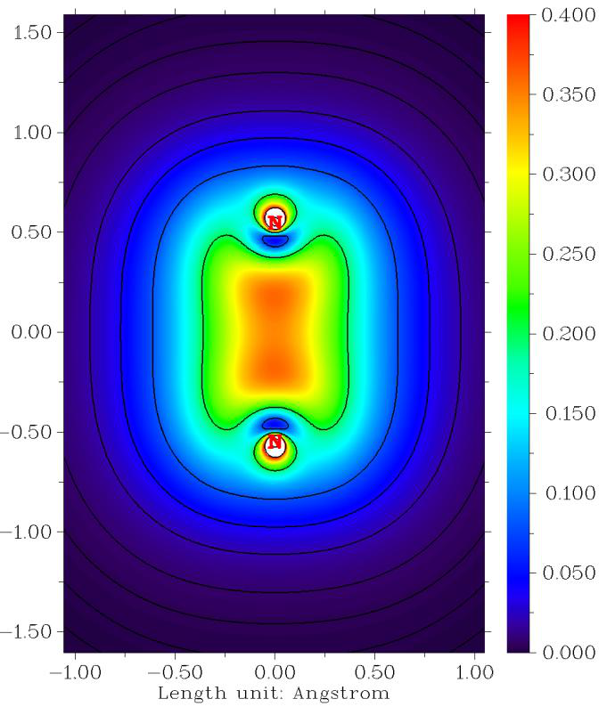


<!-- p.1063 -->
[Press ENTER button] // Load the AOM.txt in current folder 4,6 // Indices of the two carbons at the center of the system Now you can see


```text
Eigenvalues of NAdOs: (sum=   1.11455 )
   0.90121   0.24533   0.07666   0.00358   0.00062   0.00006   0.00001
   0.00000  -0.00000  -0.00003  -0.00004  -0.00316  -0.00966  -0.02645
  -0.07359
```

That means the DI of the central C-C bond is 1.114. Then input y to load the newly generated NAdOs.mwfn file. After that, we use main function 5 to calculate grid data of electron density, which now corresponds to BOD, and then plot it as isosurface. The resulting map with isovalue of 0.05 is shown below.

It is obvious that most electrons that have significant contribution to the C4-C6 bond are concentrated around this bond, this is what we expected.

Next, enter main function 0 to visualize various NAdO orbitals. Note that if you select "Orbital info." - "Show all" in the GUI menu, you can see below orbital information


```text
 Orb:     1 Ene(au/eV):     0.000000       0.0000 Occ: 0.901215 Type:A+B (?   )
 Orb:     2 Ene(au/eV):     0.000000       0.0000 Occ: 0.245331 Type:A+B (?   )
 Orb:     3 Ene(au/eV):     0.000000       0.0000 Occ: 0.076660 Type:A+B (?   )
 Orb:     4 Ene(au/eV):     0.000000       0.0000 Occ: 0.003580 Type:A+B (?   )
 Orb:     5 Ene(au/eV):     0.000000       0.0000 Occ: 0.000621 Type:A+B (?   )
[...ignored]
 Orb:    14 Ene(au/eV):     0.000000       0.0000 Occ:-0.026445 Type:A+B (?   )
 Orb:    15 Ene(au/eV):     0.000000       0.0000 Occ:-0.073586 Type:A+B (?   )
 Orb:    16 Ene(au/eV):    -0.023511      -0.6398 Occ: 0.000000 Type:A+B (?   )
 Orb:    17 Ene(au/eV):     0.084006       2.2859 Occ: 0.000000 Type:A+B (?   )
 Orb:    18 Ene(au/eV):     0.115938       3.1548 Occ: 0.000000 Type:A+B (?   )
[...ignored]
```

The first 15 orbitals are NAdOs, their "Occ" values correspond to NAdO eigenvalues, which can be regarded as contribution of the NAdOs to DI. All orbitals with index larger than 15 are the virtual MOs in the examples\butadiene.fch, they are not of our interest. From the above list, it can be seen that only the first two NAdO orbitals have prominent contribution to DI, their isosurface maps are shown below, the eigenvalues are also labelled.


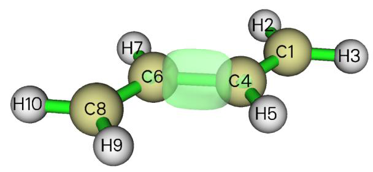

<!-- p.1064 -->
It can be seen that the first NAdO, which looks like a σ type of localized orbital (see example in Section 4.19.1 for more information about this point), has key contribution (0.901) to the DI value

(1.114); this is fully understandable, since the major ingredient of the C4-C6 bond must be σ interaction. The second NAdO also has nonnegligible contribution (0.245). Since it shows typical π orbital character, we can infer that weak π interaction exists in the C4-C6 bond.

Now we turn our attention to the boundary C-C bonds, namely C1-C4 (or C6-C8). Reboot Multiwfn and input below commands (you can first manually backup the previous NAdOs.mwfn to avoid overwriting)

examples\butadiene.fch 200 // Other functions (Part 2) 20 // Bond order density (BOD) and natural adaptive orbital (NAdO) analyses 1 // Use atomic overlap matrix (AOM) for the analysis [Press ENTER button] // Load the AOM.txt in current folder 1,4 // Indices of the two carbons at the boundary of the system y // Load the newly generated NAdOs.mwfn After that, use main function 0 to visualize the only two orbitals having significant contributions to DI, as shown below (isovalue=0.05)

The σ type of NAdO orbital of C1-C4 has comparable eigenvalue to that of C4-C6, indicating that both two kinds of C-C bonds has similar strength of σ interaction. In contrast, the π type of NAdO orbital of C1-C4 has much higher contribution to DI than that of C4-C6, well reflecting the

fact that the boundary C-C bonds have much stronger π interaction than the central one.

At the end of this section, I would like to emphasize a quite noteworthy point of the BOD/NAdO method, namely you can directly specify the bond to be studied, as already fully illustrated above. For example, for the dopamine shown below, if you want to study BOD or corresponding NAdOs for a bond, e.g. C5-C7, you simply need to input 5,7 when Multiwfn asks


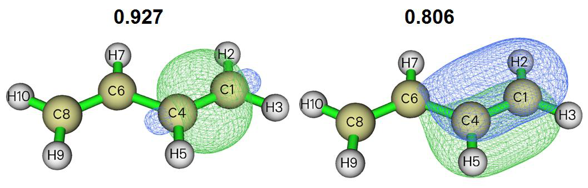

<!-- p.1065 -->
you to input atom indices, clearly this feature makes bonding analysis quite convenient! The following map shows BOD=0.03 isosurface for C5-C7.

Also, it is noteworthy that the BOD/NAdO analysis can also be performed to visualize DI between two basins based on the BOM.txt exported by basin analysis module. For example, you can use basin analysis module to generate electron localization function (ELF) basins and then export basin overlap matrix (BOM) to BOM.txt by corresponding option. After that, in the BOD/NAdO analysis function, select to load the BOM.txt, and then input index of two basins of interest, the NAdOs for the two local regions will be generated. Via this manner, you can visually study e.g. electron sharing between two lone pair regions or between a lone pair and a covalent bonding region. Clearly, the BOD/NAdO analysis module is extremely flexible!

4.200.20.3 Study interaction between two fragments using BOD/NAdO

I also extended BOD and NAdO analyses to the scenario of interfragment interaction. To illustrate how to realize this, in this section I take oxirane as an example molecule, the oxygen atom and the two carbon atoms will be respectively defined as the two fragments. In addition, in this example I will illustrate evaluation of energies for NAdOs.

We generate a file containing AOMs as previous examples. Boot up Multiwfn and input examples\oxirane.fchk 15 // Fuzzy atomic space analysis 3 // Calculate and output atomic overlap matrix to AOM.txt in current folder 0 // Return to main menu 200 // Other functions (Part 2) 20 // Bond order density (BOD) and natural adaptive orbital (NAdO) analyses -1 // Toggle if calculating energies for NAdOs 1 // Evaluate NAdOs energies based on the Fock matrix generated by MO energies and coefficients


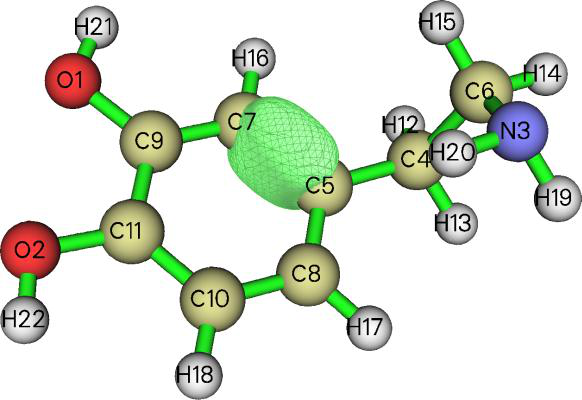


<!-- p.1066 -->
3 // Interfragment interaction analysis based on fragment overlap matrix (FOM) [Press ENTER button] // Load AOM.txt in current folder 3 // Fragment 1: The oxygen atom 1,2 // Fragment 2: The two carbons The loaded AOMs are used to construct FOMs of the two fragments, the eigenvalues of generated NAdOs are


```text
Eigenvalues of NAdOs: (sum=   2.47514 )
  0.97214   0.86882   0.35986   0.10399   0.08304   0.03930   0.02916
  0.02059   0.00045   0.00042   0.00013  -0.00275
```

As can be seen, there are three NAdO orbitals having notable contributions to DI. In addition, as shown in the prompt on screen, energies of NAdOs are evaluated in this case.

After inputting y to load the newly generated NAdOs.mwfn in current folder, you can visualize their isosurfaces in main function 0, as shown below. The eigenvalues and energies are also labelled:

It is obvious that the above three NAdO orbitals nicely elucidated the orbital interaction between fragment O1 and fragment C1-C2, and in the interacting region the same phase overlap can be clearly observed. Among them, the first NAdO has the lowest energy, indicating that it has the largest contribution to the interfragment binding. Please then plot BOD map in the plane defined by C1, C2 and O3 via main function 4 to visualize distribution of the electrons directly contributing to the interfragment interaction.

This is only a very simple example showing the usefulness of BOD/NAdO of revealing interfragment interaction, evidently it can also be applied to much more complicated situations to gain deeper insights, such as the interaction between the iron atom and the two cyclopentadienyl rings in ferrocene, the interaction between encapsulated atom and cage in atomic cluster.

Finally, I also would like to mention that in the fuzzy atom space analysis module, you can use option -1 to switch the space partition method to Hirshfeld-I before generating AOM file; in some cases, especially when metal is involved, the result may be notably better than using the default partition.


<!-- p.1067 -->

## 4.300 Other functions (Part 3)


### 4.300.1 Example of visualizing free regions and calculating free volume in a cell


Note: Chinese version of this topic is my blog article “Using Multiwfn to graphically display pores and free regions in molecular dynamics” (http://sobereva.com/539) and “Using Multiwfn to calculate volume of free regions in crystal structures and graphically display free regions” (http://sobereva.com/617), which contain more discussions and introduced more skills.

Multiwfn is able to visualize free regions (i.e. pores or cavities) and calculating free volume in a cell, please carefully read Section 3.300.1 for basic information and algorithm used in the function illustrated in this section. Below I will exemplify this function by two examples.

Example 1: Coal structure produced by molecular dynamics simulation In the first example, we take examples\coal.pdb as an instance, which is a frame of molecular dynamics simulation of coal under periodic boundary condition:

Note that if you open this file by text editor, you can find the following line:


```text
CRYST1   31.064   31.100   31.093  90.00  90.00  90.00 P 1         1
```

Meaning that the box is rectangle and the length in X, Y, Z is 31.064, 31.100, 31.093 Å, respectively.

Boot up Multiwfn and input examples\coal.pdb 300 // Other functions (Part 3) 1 // Viewing free regions and calculating free volume in a cell 4 // Set method of smoothing 1 // Gaussian function 1.8 // FWHM of Gaussian function is 1.8 times of vdW radius, which is found to be able to result in satisfactory isosurface map of smoothed grid data for present system

1 // Set grid and start calculation [Press ENTER button] // Use default origin (0,0,0), which is suitable for present system [Press ENTER button] // Use default box lengths, which correspond to the lengths of the three


<!-- p.1068 -->
sides of the present cell

[Press ENTER button] // Use default grid space 0.25 Å, which is usually fine enough Once the calculation of grid data is complete, you will find information about size of free regions:


```text
Volume of entire box:   30038.649 Angstrom^3
Free volume:   14783.074 Angstrom^3, corresponding to   49.21 % of whole space
```

This output shows that about half of the whole cell is not lying within the vdW surface of the system.

In the newly appeared menu, select option 3 to visualize isosurface of smoothed grid data, then after selecting "Show molecule" and "Show data range" check boxes in the GUI, you will see molecular structure along with the isosurfaces representing free regions:

It can be seen from the map above that the actual free regions are very vividly and clearly revealed by the isosurfaces. The default isovalue is 0.5. If you increase it, the isosurfaces will shrink and only significant pores will be visible. In contrast, if you decrease isovalue, existing isosurfaces will inflate and more insignificant pores will appear in the graph.

Note: The choice of smoothing method significantly affects isosurface of smoothed grid data. As you can see from the map above, the Gaussian function with FWHM=1.8 Bohr works well for this system, but sometimes it does not work reasonably as expected. For example, when the system consists of crowded atoms (e.g. atomic clusters), this smoothing function may bring artificial effect because it decays too slowly, and sometimes the areas of the isosurfaces corresponding to free regions are too small or fully disappeared. In this case you can try other smoothing functions, such as Becke function or error function, the default one is error function with scale factor of 1.0. You can also try to Gaussian function with smaller FWHM than the present example.

In the post-processing menu, you can also export smoothed grid data as a .cub file, so that you can render it via third-part visualization tools, such as VMD, ChimeraX and VESTA. You can also find option used to visualize isosurface of raw grid data, however, as you will see, this isosurface can hardly be used to exhibit pore character in the present system, and the isosurface is very jagged, rendering importance of the smoothing algorithm employed in Multiwfn, see Section 3.300.1 for detail of the grid data calculation algorithm.

It is worth to note that as shown in Section 4.200.14.2, domain analysis module of Multiwfn is also able to visualize cavity and calculate cavity volume, however this module is only suitable for investigating internal cavity of a single molecule, it cannot be used to study all pores in a large cell like the present system.


<!-- p.1069 -->
Part 2: Covalent organic frame crystal Multiwfn is also able to view free region and calculate its volume for experimentally determined molecular crystal. In this example I illustrate this point by taking a covalent organic frame (COF) system as an instance. Note that though the cell of this crystal is non-orthogonal, Multiwfn also works correctly.

Boot up Multiwfn and input examples\COF_12000N2.cif 300 // Other functions (Part 3) 1 // Viewing free regions and calculating free volume in a cell 1 // Set grid and start calculation [Press ENTER button] // Use default origin (0,0,0) [Press ENTER button] // Use default box lengths [Press ENTER button] // Use default grid space 0.25 Å The quantitative data shown on screen is


```text
Volume of entire box:    2996.151 Angstrom^3
Free volume:    1953.217 Angstrom^3, corresponding to   65.19 % of whole space
```

Clearly, the COF must have low density since its free volume occupies approximately as large as 2/3 of the whole cell.

When grid is non-orthogonal, Multiwfn is unable to directly plot its isosurface map, so this time we choose option 4 in post-processing menu to export smoothed grid data as free_smooth.cub in current folder. After that, load it into VMD software (http://www.ks.uiuc.edu/Research/vmd/), go to “Graphics” - “Representation”, set drawing method of the system to “Licorice”, then add a representation for showing isosurface, and change the settings as the following screenshot (the VMD I am using is version 1.9.3)

Then in the console window, input pbc box to draw frame of grid data, and set background color to white, you will see


<!-- p.1070 -->
The graphical effects are very satisfactory, the free region is nicely revealed.

By the way, if you set the drawing method of the structure to “VDW”, you will find the isosurface of free region and van der Waals surface form an obvious complementarity, indicating that the free region is indeed reasonably exhibited.

You can also use VESTA software to plot the free region map based on the free_smooth.cub, the graphical effect is even better, see http://sobereva.com/617 for detail.


### 4.300.2 Example of fitting radial atomic density as STOs or GTFs

Multiwfn is able to fit spherically averaged electron density of an isolated atom as multiple Slater type orbitals (STOs) or Gaussian type functions (GTFs), please read Section 3.300.2 to gain basic knowledge. In this section, I will illustrate how to use this function to realize the fitting.

4.300.2.1 Crudely fitting radial density of silicon as several STOs

In this section we will fit radial density of silicon atom as linear combination of a few STOs. Since the number of fitting functions is small, the fitting procedure is rapid and evaluation of fitted density is quite expensive, however, the fitting quality is not expected to be very high.

Boot up Multiwfn and input examples\atomwfn\Si.wfn // Generated at ROHF/6-31G* level 300 // Other functions (Part 3) 2 // Fitting atomic radial density as multiple STOs or GTFs 3 // Check or set initial guess of coefficients and exponents of fitting functions 2 // Set initial guess as "crude fitting by a few STOs with variable exponents". Then from screen you can find only four STOs will be employed in the fitting, their initial status are


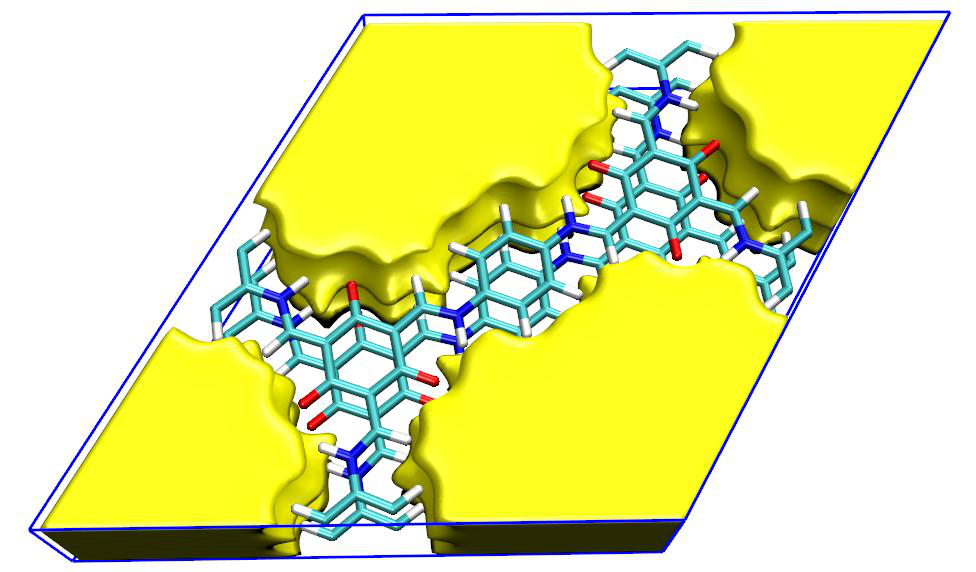

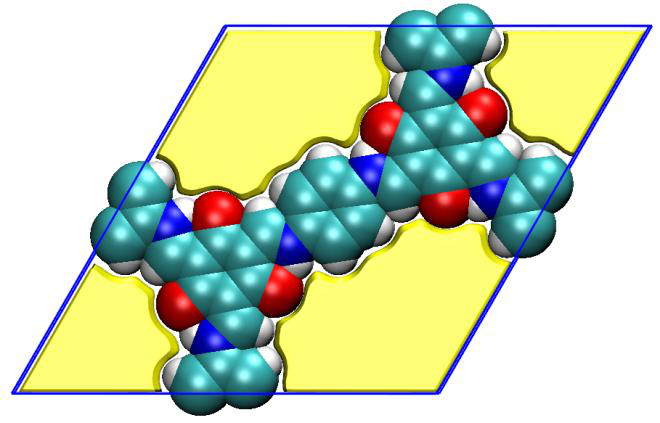

<!-- p.1071 -->

```text
           Coefficient       Exponent
STO  1:    1.000000E+03    2.700000E+01
STO  2:    3.000000E+02    9.000000E+00
STO  3:    2.000000E+01    3.000000E+00
STO  4:    1.000000E+00    1.000000E+00
```

The initial parameters look reasonable. Then input below commands

0 // Return to upper level of menu 1 // Start fitting By default, 4000 evenly distributed points with spacing of 0.001 Å are used for fitting, clearly they cover radial range of r = 0-4 Å. If you have carefully read Section 3.300.2, you will find the outputted information during the fitting is quite easy to understand. The second half of the output is shown below


```text
Integral of fitted density calculated using 100 points:   13.13399890
Fitted coefficients are scaled by      1.06593583

Fitted parameters (a.u.) after scaling:
           Coefficient       Exponent
STO  1:   -1.995734E+00    1.190199E+00
STO  2:    2.505769E+00    1.217813E+00
STO  3:    1.004017E+02    6.877422E+00
STO  4:    2.231748E+03    3.681991E+01

RMSE of fitting error at all points:           17.562831 a.u.^2
Pearson correlation coefficient r:    0.995316  r^2:    0.990654
```

As you can see, the integral of the originally fitted density over the whole space is 13.13399890, therefore the coefficients of the fitting functions are scaled by 14/13.13399890=1.06593583, where 14 is the actual number of electrons of silicon. In the current fitting, both coefficients and exponents of the four STOs are optimized, the final parameters are printed under "Fitted parameters (a.u.) after scaling" title. The RMSE is a quantity useful in quantitatively measuring fitting quality. The r2 coefficient between fitted density and actual density is as high as 0.99, implying that the fitting is reasonable; however, it is highly suggested also employing other ways to further examine the fitting quality and confirm the fitting reliability, so that the fitted parameters can be safely used in practical studies to estimate density.

In the newly appeared menu you can see many options, whose meanings are either self-explanatory or have been described in Section 3.300.2.2. To quantitatively check fitting quality at the 4000 fitting points, we select option 1, then you will see


```text
Radial distance (Angstrom), actual density (a.u.), difference between fitted an
d actual density (a.u.) as well as relative difference
#    1  r: 0.00100  rho:     1632.43875869  Diff:    548.91831985 (   33.63 %)
#    2  r: 0.00200  rho:     1580.36292117  Diff:    459.79079234 (   29.09 %)
#    3  r: 0.00300  rho:     1507.61800756  Diff:    400.75362143 (   26.58 %)
#    4  r: 0.00400  rho:     1427.66453603  Diff:    357.71394386 (   25.06 %)
[ignored...]
# 3997  r: 3.99700  rho:        0.00000506  Diff:     -0.00000029 (   -5.71 %)
```


<!-- p.1072 -->

```text
# 3998  r: 3.99800  rho:        0.00000504  Diff:     -0.00000029 (   -5.81 %)
# 3999  r: 3.99900  rho:        0.00000502  Diff:     -0.00000030 (   -5.91 %)
# 4000  r: 4.00000  rho:        0.00000500  Diff:     -0.00000030 (   -6.01 %)
```

The "Diff" is difference between fitted density and actual density, the values in the parentheses are relative errors. As can be seen, the error in the region very close to nucleus is not small, however it does not matter since this region is not of chemical interest, usually chemists mainly focus on electron density in valence region.

Next, we choose option 3 to visually inspect curves of fitted density and actual density using logarithmic scaling, then you will see

The fitting is evidently successful, since the fitted density curve is close to actual density curve in the region within 1.8 Å. It is worth to mention that Bondi vdW radius of silicon is 2.1 Å.

You can also select option 4 to plot comparison map between fitted density and actual density using linear scaling, you will further find that the fitted density indeed nicely reproduces the actual density.

If you select option 5, then fitdens.txt will be outputted in current folder. This file contains fitted density (the second column) at points evenly distributed from 0 to 10 Å, the grid spacing is half of the fitting points, namely 0.001/2=0.0005 Å. From the data in this file you can find that the fitted density varies smoothly and monotonically, no negative value can be found, further implying that the fitting is successful and the fitted parameters are reliable.

Finally, we select option 6 to examine integral of fitted density over the whole space via different number of points of Gaussian quadrature, you will see:


```text
Number of integration points:   40    Integral:     13.99999923
Number of integration points:   60    Integral:     13.99999993
Number of integration points:   80    Integral:     13.99999999
[ignored...]
Number of integration points:  280    Integral:     14.00000000
Number of integration points:  300    Integral:     14.00000000
```

As can be seen, in all cases the integral is almost exactly identical to the actual number of electrons


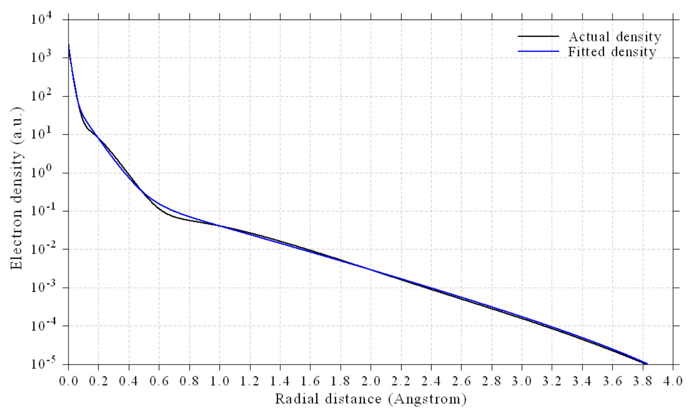

<!-- p.1073 -->
(14), further demonstrating that our fitting is reasonable.

Since our fitted density has passed quality check in many ways, we can finally conclude that the fitted parameters of the four STOs can be safely and reliably employed in future researches.

4.300.2.2 Accurately fitting radial density of bromine as many GTFs

In order to reliably and exactly fit radial density, usually no less than 10 GTFs (with variable exponents) are needed. In this example we will fit radial density of bromine atom in this way. This kind of fitting is almost suitable for any element in the periodic table.

Boot up Multiwfn and input examples\atomwfn\Br.wfn // Generated at ROHF/6-31G* level 300 // Other functions (Part 3) 2 // Fitting atomic radial density as STOs or GTFs 3 // Check or set initial guess of coefficients and exponents of fitting functions 5 // Fine fitting by 10 GTFs with variable exponents (of course, using more GTFs will result in better fitting)

As can be seen from screen, 10 GTFs will be employed in the fitting, all coefficients are initially set to 1.0, while their exponents span large range, the smallest one is 0.1, while the largest one is 381, the ratio between two neighbouring GTFs is 2.5. The GTFs with small, medium and large exponents are mainly used to represent tail region, valence region and the region very close to nucleus, respectively.

Then input 0 to return to upper level of menu and then choose option 1 to start fitting. During fitting, from prompt you can find 1 redundant fitting function is automatically eliminated to avoid numerical problems, which has a very small coefficient:


```text
Delete redundant function (coeff=-5.59231E-05 exp= 9.99991E-02), refitting...
Totally  1 redundant fitting functions have been eliminated
```

The resulting fitted parameters:


```text
Fitted parameters (a.u.) after scaling:
           Coefficient       Exponent
GTF  1:    8.328778E-02    2.556435E-01
GTF  2:    5.163781E-01    6.322086E-01
GTF  3:    1.221206E+01    5.157472E+00
GTF  4:    2.475569E+01    5.176644E+00
GTF  5:    5.926930E+02    6.326802E+01
GTF  6:    4.017684E+03    7.298312E+02
GTF  7:    1.006232E+04    2.458635E+03
GTF  8:    1.046461E+04    1.557579E+04
GTF  9:    1.658191E+07    1.206884E+09
```

and you can find error statistics:


```text
Pearson correlation coefficient r:    0.999706  r^2:    0.999413
```

From this data we can find the fitting quality is almost perfect! The r2 is almost exactly 1.0!

Please use the same way as illustrated in the last section to examine fitting quality, you will find current fitting is completely successful. For example, after choosing option 3 we can see the following map, which exhibits that the fitting quality in all regions is perfect.


<!-- p.1074 -->
Clearly, the fitting procedure illustrated in this section is quite ideal when you want to reach very high fitting quality.

By the way, from the parameters of the fitted GTF functions shown earlier, you can find GTF 3 and GTF 4 have almost identical exponent, that means they can be combined as a single GTF to reduce the parameters. To do so, we input

0 // Return 3 // Check or set initial guess of coefficients and exponents. Then from screen you can find the parameters we fitted earlier

10 // Combine two fitting functions together 3,4 //Indices of the two fitting functions to combine 0 // Return 1 // Start fitting Then you can use option 3 to visualize the radial density again, you will find the quality of the fitting via the current 8 GTFs is unchanged, so 8 GTFs are fully adequate to reach an accurate fitting for present atom.

The fitting module in Multiwfn is quite flexible, there are many options used to control fitting strategy, see Section 3.300.2 for more information.


### 4.300.4 Example of simulating scanning tunneling microscope (STM) image


Note: Chinese version of this topic is my blog article “Using Multiwfn to simulate scanning tunneling microscopy (STM) images” (http://sobereva.com/549, in Chinese), in which extended discussion is given and cyclo[18]carbon is taken as example.

Please check Section 3.300.4 if you are not familiar with theory of STM or simulation of STM in Multiwfn. In the next two sections, we will respectively simulate STM of constant height and constant current modes for phenanthrene. The simulation will be based on the wavefunction in


<!-- p.1075 -->
examples\phenanthrene.fch, which was generated at B3LYP/6-31G* level.

It is important to note that in order to simulate STM in Multiwfn, the molecule must be parallel to XY plane (though the molecule is not necessarily planar), however, in the phenanthrene.fch the molecule is parallel to YZ plane. Therefore, the molecule must be rotated prior to STM simulation. Of course, we can first reorient the molecule and then conduct a single point task via quantum chemistry to generate wavefunction file, but a better way is using Multiwfn to directly rotate the wavefunction and geometry, namely inputting below commands in Multiwfn

examples\phenanthrene.fch 6 // Check & modify wavefunction

33 // Rotate wavefunction, namely X→Y, Y→Z, Z→X 0 // Rotate all orbitals y // Also rotate molecule structure. Then the molecule will be on XZ plane 33 // Rotate wavefunction again 0 // Rotate all orbitals y // Also rotate molecule structure Now the phenanthrene has exactly been on XY plane of Z=0 Å (you can check this point via main function 0). Then we enter main function 100, choose subfunction 2 and then select corresponding option to export the present wavefunction to a new .mwfn file. In the next sections, this new file will be referred to as mol.mwfn.

4.300.4.1 Simulating constant height STM image for phenanthrene

Here we simulate STM image of constant height mode for phenanthrene. Boot up Multiwfn and input

mol.mwfn 300 // Other function (Part 3) 4 // Simulating STM image From the message on screen, it can be seen that the Fermi level (EF) has been set to average of HOMO energy and LUMO energy, the bias voltage (V) has been automatically set to the difference between HOMO energy and EF, in this case only HOMO can contribute to the STM image. In order to obtain expected STM image, it is crucial to properly define the V. In the case of negative V, electrons flow from sample to STM tip, and the more negative the V, the more MOs may contribute to the STM image. Also, note that the distance between the atoms in the sample and the tip significantly affects STM image. From the information on option 7 you can find the default Z coordinate of the plane to be plotted is 0.7 Å. Since all atoms in the mol.mwfn have Z coordinate of

0 Å, the distance between the nuclei and the tip is 0.7 − 0.0 = 0.7 Å. In this example, we will plot STM image with V= -5.0 V at Z=1.2 Å.

Now input below command 2 // Set bias voltage -5 // Bias voltage of -5.0 V 7 // Set Z coordinate 1.2 // Z=1.2 Å 0 // Calculate tunneling current on the plane Now you can find the information below on screen


```text
Lower limit of MO energy considered in the calculation:      -8.362 eV
Upper limit of MO energy considered in the calculation:      -3.362 eV
```


<!-- p.1076 -->

```text
The MOs taken into account in the current STM simulation:
MO    44   Occ= 2.000   Energy=     -7.6491 eV   Type: Alpha&Beta
MO    45   Occ= 2.000   Energy=     -7.0599 eV   Type: Alpha&Beta
MO    46   Occ= 2.000   Energy=     -6.0337 eV   Type: Alpha&Beta
MO    47   Occ= 2.000   Energy=     -5.7308 eV   Type: Alpha&Beta
Totally   4 MOs are taken into account

Grid spacings in X and Y are    0.118428    0.082980 Bohr
Calculating, please wait...
Maximal value (LDOS) is    0.010218 a.u.
```

It can be seen that there are 4 occupied MOs whose energy is lying between EF+eV (-8.362 eV) and EF (-3.362 eV), therefore the plane data of the STM image corresponds to sum of their probability densities in the plane multiplied by their occupation numbers (2.0 in present case since they are all close-shell MOs), this data is also known as local density-of-states (LDOS). As shown in the prompt, the largest value of LDOS in the calculated plane is 0.010218 a.u.

Now you are in the STM plotting menu, you can find many options used to adjust plotting effect, they are all self-explanatory, please play with them. We directly choose option 0 to plot the image under default setting, you will see

In this map, the brighter the white, the larger the LDOS and thus the stronger the tunneling current (I), since the Tersoff-Hamann model shows that I is positively proportional to LDOS. It can be seen that I signal is more prominent over the two boundary six-membered rings than the central one.

4.300.4.2 Simulating constant current STM image for phenanthrene

In this section we again plot STM image for phenanthrene but using constant current mode. Boot up Multiwfn an input

mol.mwfn 300 // Other function (Part 3) 4 // Simulating STM image 1 // Switch the mode of STM image to constant current


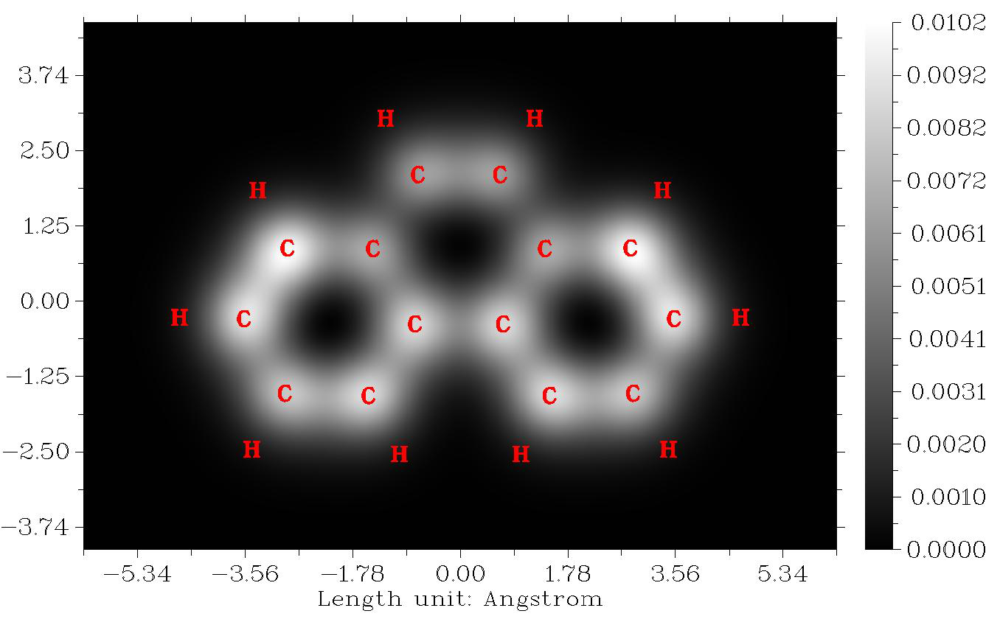

<!-- p.1077 -->
2 // Set bias voltage -5 // Again we use bias voltage of -5.0 V In the constant current mode, LDOS is calculated for every evenly distributed point in a 3D region, whose X, Y and Z range can be set by options 5, 6 and 7, respectively, usually the default setting is appropriate. We directly choose option 0 to start the calculation, from the information on screen you can find the maximal value of LDOS in the calculated region is 0.048 a.u.

In the post-processing menu, you can find several options, we first use option 1 to visualize isosurface map of tunneling current, which corresponds to LDOS in the present context. The isosurface corresponding to LDOS=0.015 a.u. is shown below. Note that although the choice of isovalue is arbitrary, it should be between 0 and the maximum value (0.048 a.u. in this example)

In the map above, the isosurfaces of tunneling current normally occur over the carbons, implying that the default calculated region is appropriate for the present case. The blue box can be shown by clicking "Show data range" check box, it displays the region where LDOS was calculated.

Next, we plot plane map. Select option "3 Calculate and visualize constant current STM image" and then input the expected value of tunneling current, we input 0.01 in this example. After that, Multiwfn starts to calculate the Z value where tunneling current (LDOS) is approximately equal to 0.01 a.u., evidently Z is different at different (x,y) positions. Then from screen you can find


```text
Minimal Z is    0.700000 Angstrom
Maximal Z is    1.206432 Angstrom
```

They are proper lower and upper limits of the color scale of STM image, respectively.

Now you are in the interface of plotting STM image of constant current mode, we input below commands

2 // Choose map type 2 // Color-filled map with contour lines 7 // Set label interval in X, Y and color scale axes 1.5,1.5,0.05 -3 // Change other plotting settings 2 // Set number of decimal places of tick labels 1 // Set X axis 1 // Set Y axis 2 // Set Z axis 0 // Return 0 // Plot the STM image


<!-- p.1078 -->
Then you can see this map on screen:

In the map above, the value corresponds to Z distance of STM tip. It can be seen that at constant current (LDOS) of 0.01 a.u., the Z position of STM tip is relatively high over the two boundary six-membered rings. The characteristic of this map is very similar to the STM image of constant height mode.

If you want to further investigate the STM plane map with other constant current values, you can exit the plotting interface, then enter the option "3 Calculate and visualize constant current STM image" again and input the expected current value.


### 4.300.5 Calculate electric dipole moment, multipole moments and electronic spatial extent for uracil


As described in Section 3.300.5, Multiwfn is able to analytically calculate electric dipole moment, quadrupole, octopole, hexadecapole moments and electronic spatial extent <r2>. In this section we calculate these quantities for a simple molecule, uracil.

Boot up Multiwfn and input examples\uracil.wfn 300 // Other function (Part 3) 5 // Calculate electric dipole moment and multipole moments The calculation is quite fast, you will immediately see the following information, which is very easy to understand if you have read Section 3.300.5. As clearly indicated on screen, the unit is a.u. unless otherwise specified.


```text
 Dipole moment from nuclear charges (a.u.):    0.000000   0.000000   0.000000
 Dipole moment from electrons (a.u.):          0.473309   1.823683   0.000736

 Dipole moment (a.u.):       0.473309      1.823683      0.000736
 Dipole moment (Debye):      1.203031      4.635340      0.001872
 Magnitude of dipole moment:      1.884103 a.u.      4.788911 Debye
```


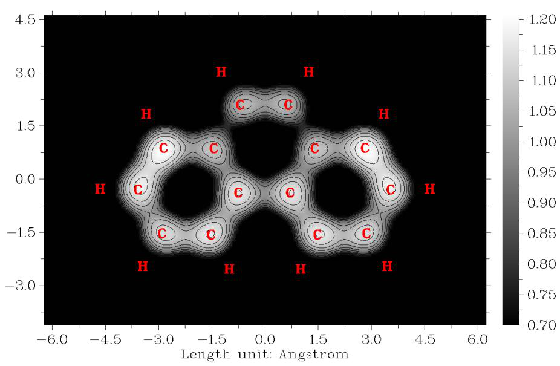

<!-- p.1079 -->

```text
 Quadrupole moments (Standard Cartesian form):
 XX=  -43.878975  XY=    1.812455  XZ=   -0.000544
 YX=    1.812455  YY=  -28.230039  YZ=   -0.004831
 ZX=   -0.000544  ZY=   -0.004831  ZZ=  -34.463441
 Quadrupole moments (Traceless Cartesian form):
 XX=  -12.532235  XY=    2.718682  XZ=   -0.000816
 YX=    2.718682  YY=   10.941169  YZ=   -0.007246
 ZX=   -0.000816  ZY=   -0.007246  ZZ=    1.591066
 Magnitude of the traceless quadrupole moment tensor:   13.645453
 Quadrupole moments (Spherical harmonic form):
 Q_2,0 =   1.591066   Q_2,-1=  -0.008367   Q_2,1=  -0.000942
 Q_2,-2=   3.139264   Q_2,2 = -13.552376
 Magnitude: |Q_2|=   14.001908

 Octopole moments (Cartesian form):
 XXX=   14.0946  YYY=    8.6123  ZZZ=    0.0027  XYY=    6.6643  XXY=   46.4098
 XXZ=   -0.0099  XZZ=    2.7809  YZZ=   -7.6843  YYZ=    0.0159  XYZ=   -0.0033
 Octopole moments (Spherical harmonic form):
 Q_3,0 =    -0.0062  Q_3,-1=   -52.5167  Q_3,1 =    -5.9005
 Q_3,-2=    -0.0129  Q_3,2 =    -0.0500  Q_3,-3=   103.2618  Q_3,3 =    -4.6630
 Magnitude: |Q_3|=    116.0929

Hexadecapole moments:
XXXX=       -684.9560  YYYY=       -289.5418  ZZZZ=        -39.7011
XXXY=         13.4854  XXXZ=         -0.0058  YYYX=         12.7574
YYYZ=         -0.0243  ZZZX=         -0.0009  ZZZY=         -0.0061
XXYY=       -168.4269  XXZZ=       -104.4367  YYZZ=        -71.1599
XXYZ=         -0.0008  YYXZ=         -0.0039  ZZXY=          2.9446

Electronic spatial extent <r^2>:      822.650952
Components of <r^2>:  X=     501.328431  Y=     286.859071  Z=      34.463450
```

If "ispecial" in `settings.ini` is set to 1, then before calculating dipole and multiple moments, the system will be displaced to make nuclear contribution to dipole moment zero.

Note that you can also use subfunction 2 of main function 15 to calculate above quantities, however it calculates numerically based on multicenter grids, the cost is significantly higher while the numerical accuracy is slightly lower. However, it has a unique advantage, namely it can calculate dipole and multipole moments for specific fragments in current system, see Section 4.15.3 for example.

The <r2> is a useful index to quantitatively characterize the breadth of the distribution of electrons, I have a blog article to discuss this point in detail: http://sobereva.com/616 (in Chinese).


<!-- p.1080 -->

### 4.300.6 Calculating orbital energies: NTO orbital as an example

As described in Section 3.300.6, Multiwfn has a function to evaluate energies of the orbitals stored in memory based on the user-provided Fock/Kohn-Sham matrix. In principle, one can use this function to calculate energies of orbitals of any kind! In this example, I will illustrate how to

make use of this function to evaluate energies of natural transition orbitals (NTOs). S0→S1 excitation of a typical donor-π-acceptor system will take as the example. Please make sure that you have understood how to perform NTO analysis, see Section 4.18.6 for example. The present example contains three steps: (1) Generating NTO orbitals by TDDFT calculation (2) Generating a file containing Fock/Kohn-Sham matrix (3) Calculating NTO orbital energies.

First, we generate NTO orbitals, the Gaussian input file of TDDFT task is examples\excit\D-pi-A.gjf, the corresponding output file and .fchk file have also been provided in the same folder. Boot up Multiwfn and input the following commands

examples\excit\D-pi-A.fchk 18 // Electron excitation analysis 6 // Generate natural transition orbitals (NTOs) examples\excit\D-pi-A.out 1 // The first excited state (S1 state) Then you can see


```text
The highest 10 eigenvalues of occupied NTOs:
   0.000022    0.000023    0.000038    0.000057    0.000105
   0.000149    0.000172    0.000339    0.008236    0.992492

The highest 10 eigenvalues of virtual NTOs:
   0.992492    0.008236    0.000339    0.000172    0.000149
   0.000105    0.000057    0.000038    0.000023    0.000022
```

These data display that NTO works well for the present case, since the NTO pair with highest

eigenvalue contributes 99.2% to this excitation, namely the S0→S1 excitation can be almost perfectly represented by this NTO transition. Then we choose option 3 to export the NTOs as NTO.mwfn in current folder.

Next, we generate a file containing Kohn-Sham matrix of present system, see Section 3.100.17 for details. Boot up Multiwfn and input

examples\excit\D-pi-A.fchk 100 // Other functions (Part 1) 17 // Generate Fock/KS matrix based on orbital energies and coefficients KS.txt Now the KS.txt in current folder contains the Kohn-Sham matrix converted back from the energies and coefficients of molecular orbitals in the D-pi-A.fchk.

Finally, we calculate energies of the NTO orbitals. Boot up Multiwfn and input NTO.mwfn 300 // Other functions (Part 3)


<!-- p.1081 -->
6 // Calculate energies of the present orbitals KS.txt Then Multiwfn loads Kohn-Sham matrix from the KS.txt file, and the calculation of the NTO orbital energies is finished immediately. You can then export the energies to orbene.txt in current folder by choosing “1 Export orbital energies to orbene.txt in current folder”, the content will be


```text
...[ignored]
     54  Occ=  2.0000  E=     -0.41616309 Hartree    -11.3244 eV
     55  Occ=  2.0000  E=     -0.27176663 Hartree     -7.3951 eV
     56  Occ=  2.0000  E=     -0.34791315 Hartree     -9.4672 eV
     57  Occ=  0.0000  E=     -0.02609500 Hartree     -0.7101 eV
     58  Occ=  0.0000  E=      0.03073422 Hartree      0.8363 eV
     59  Occ=  0.0000  E=      0.76811627 Hartree     20.9015 eV
...[ignored]
```

In the NTO.mwfn, the occupied and unoccupied NTOs with highest eigenvalue are orbitals 56 and 57, respectively, according to the above data their energies are found to be -9.4672 and -0.7101 eV, which are very reasonable.

Note that there are also other ways to provide Kohn-Sham matrix to Multiwfn, see Appendix 7 of this manual. For example, you can also use Gaussian to directly generate .47 file, which can also provide Kohn-Sham matrix to Multiwfn for generating orbital energies. Now I illustrate how to do. We create a new Gaussian input file with the following content, notice that the geometry, DFT functional and basis set must be exactly identical to the examples\excit\D-pi-A.gjf. (this file has already been provided as examples\excit\D-pi-A_get47.gjf)


```text
# CAM-B3LYP/6-31g(d) pop=nboread

b3lyp/6-31g(d) opted

0 1
[geometry part]

$NBO archive file=C:\D-PI-A $END
```

After running this file by Gaussian, you will obtain D-PI-A.47 file in C:\ folder, it has been provided as examples\excit\D-PI-A.47. Then after choosing subfunction 6 in main function 300, you can input path of this .47 file, Multiwfn will load Kohn-Sham matrix from it and then calculate orbital energies.

Due to numerical reasons, the Kohn-Sham matrix recorded in the .47 file and that directly generated by Multiwfn are marginally different, hence the resulting NTO energies are also slightly different in the two cases. However, the difference is fully negligible for practical studies.

When diffuse functions are heavily employed and thus quantum chemistry code automatically eliminated some linearly dependent basis functions, Multiwfn will be unable to directly generate Kohn-Sham matrix, and you have to use other ways to provide Kohn-Sham matrix to Multiwfn, such as using .47 file.

4.300.8 Plotting surface distance projection map for [Ru(bpy)3]2+ cation


### coordinate

Note: Chinese version of this tutorial with more discussions is "Using Multiwfn to plot surface distance


<!-- p.1082 -->
projection map for molecules and solids" (http://sobereva.com/589).

Please read Section 3.300.8 first to gain basic knowledge about the molecular surface distance projection map. In this section, [Ru(bpy)3]2+ will be taken as an example to show how to plot this kind of map. The examples\excit\Ru(bpy3)2+.gjf contains optimized geometry of this system, therefore it will be used as input file (of course, you can also use file in other formats such as .xyz, .pdb and .mol2 as input file). The system is already in an appropriate orientation for studying burying of Ru atom by the ligands, see below figure. If the current orientation is not suitable for plotting this map, you should use molecular visualization softwares such as GaussView to rotate it.

Boot up Multiwfn and input examples\excit\Ru(bpy3)2+.gjf 300 // Other functions (Part 3) 8 // Plot molecular surface distance projection map This time we do not alter any default setting, but simply select option 0 to start calculation. In this case, the molecular surface is defined as isosurface of promolecular electron density of 0.05 a.u.

Once the calculation is finished, you will enter an interface for plotting plane map. We directly choose option 0 to show the map on screen, you will see


<!-- p.1083 -->
As you can see, different colors nicely exhibit the distance of various regions of molecular surface to screen, the relative position of Ru atom and ligands can be very clearly detected. Under the default setting, Z=0 corresponds to the Z position of the atom having most positive Z coordinate. If the current map does not make you satisfied, you can close the map and use the rich options in the interface to further improve graphical effect.

Next, we plot this map again but using another molecular surface definition, namely superposition of atomic van der Waals spheres. Now input the following commands

-1 // Return 1 // Set definition of molecular surface 3 // Superposition of atomic van der Waals spheres scaled by a factor 1 // We do not scale van der Waals radii in this example, so we set scale factor to 1 0 // Start calculation 0 // Show the map on screen Then you will see the following figure, from which it is obvious that the Ru atom is heavily buried by surrounding ligands, and due to the strong steric hindrance, foreign molecules are not easy to approach the Ru atom.


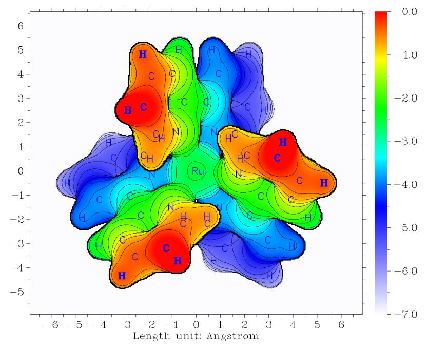

<!-- p.1084 -->
The van der Waals surface constructed by superposition of atomic spheres is evidently not quite smooth. Using 0.005 a.u. of electron density isosurface as definition of molecular surface can produce a map with comparable character, while the color transition and contour lines are much smoother (after returning to last menu, you can choose option 1, select 1 and then input 0.005 to switch to this definition).

Note that Multiwfn is also able to plot this kind of map for solid surface, see Section 4 of http://sobereva.com/589 for illustration.


## 4.A Special topics and advanced tutorials

The contents in this section involve more than one main functions of Multiwfn, or contain special usages and skills.


### 4.A.1 Study variation of electronic structure along IRC path

Note: Chinese version of this section is my blog article “Studying chemical reaction process via curve map of bond order and anime of ELF/LOL/RDG isosurface” (http://sobereva.com/200), which essentially covers all content of this section.

In this tutorial, I will briefly show you how to use Multiwfn to study variation of electronic structure along the IRC path of Diels-Alder adduction. We will study the variation of Mayer bond order, and will animate the deformation of ELF isosurface. With similar fashion you can also easily investigate variation of other properties, such as atomic charges, electron density, aromaticity and so on.


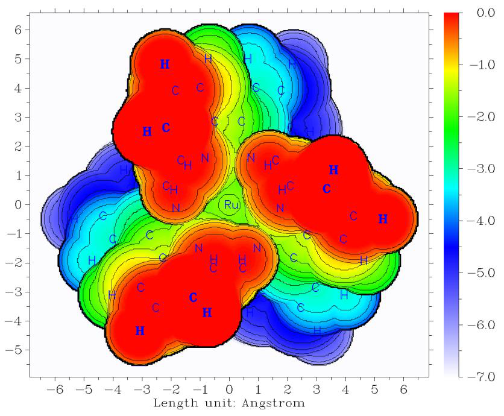

<!-- p.1085 -->
Gaussian 09 was used throughout this tutorial. Unless otherwise specified, all calculations will be performed under Windows 7 64bit system. In this tutorial the files marked by crimson can be found in "examples\IRC" or "examples" folder.

Before starting this tutorial, you should set up running environment for Gaussian first, otherwise Gaussian cannot be properly invoked in Windows environment. The setup method is: Enter “control panel”-“System properties”-“Advanced”, click “Environment variables” button, then click “New” button in “User variables” frame, input GAUSS_EXEDIR as variable name, input the install directory of Gaussian as variable value (e.g. D:\study\g09w\, assuming that g09.exe is in this folder). After that modify "PATH" environment variable to add the install directory of Gaussian into it.

1 Perform IRC calculation Run DA_IRC.gjf by Gaussian to produce DA_IRC.out. We will find this IRC path actually contains 18 and 13 points in the two directions, respectively. B3LYP/6-31+G* is used in this calculation.

2 Generate wavefunction file for each point of IRC Write an input file of single point task of Gaussian (DA_SP.gjf), which will be used as "template" later. The geometry in fact can be arbitrarily filled.


```text
DO NOT write anything here (e.g. %chk)
#p B3LYP/6-31G* nosymm

DA adduction

0 1
 C                 -0.26156800    1.56679300    0.69509600
 C                 -0.26156800    1.56679300   -0.69509600
 C                  0.50031400   -0.43279300   -1.43864500
 C                 -0.26156800   -1.32826500   -0.70392000
 C                 -0.26156800   -1.32826500    0.70392000
 H                 -1.19341600    1.44689700   -1.23752300
 H                 -1.19341600    1.44689700    1.23752300
 H                  0.52507600    2.08588200    1.23621300
 H                  0.38154400   -0.37781200    2.51847500
 H                  0.38154400   -0.37781200   -2.51847500
 H                  1.46467600   -0.09643600   -1.07409700
 H                 -1.04094400   -1.89294000   -1.21418700
 H                 -1.04094400   -1.89294000    1.21418700
 H                  1.46467600   -0.09643600    1.07409700
 H                  0.52507600    2.08588200   -1.23621300
```


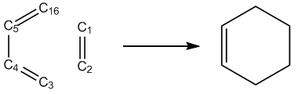

<!-- p.1086 -->

```text
      blank line
      blank line
```

Notice that the basis set we used here (6-31G*) is different to the one used in IRC task (6-31+G*), because Mayer bond order does not work well when diffuse functions are presented. By the way, ignoring diffuse functions will not lead to detectable change of ELF isosurface. Also note that the "nosymm" keyword is specified, because if we do not do this Gaussian will automatically translate and rotate the molecule to put it to standard orientation, which may lead to discontinuity problem in the animation of ELF (You will see molecule suddenly jumps in certain frames of the animation).

IRCsplit.exe is a tool used to produce .wfn/.chk file for each point of IRC and SCAN tasks of Gaussian, IRCsplit.f90 is the corresponding source code, by which you can compile Linux version of IRCsplit. Boot up IRCsplit.exe by double clicking its icon and then input

DA_IRC.out //The file of the output file of the IRC task DA_SP.gjf //The template file used to generate single point input files 2 //Only yield .chk files C:\DA_IRCchk\DA //The path and prefix of the finally generated .chk files 18,13 // The program detected that in DA_IRC.out there are 18 and 13 points in the two directions of IRC, respectively. Here we extract all of them, together with the TS point

Now you can find DA_SP0001.gjf, DA_SP0002.gjf ... DA_SP0032.gjf in current folder. Please manually check one of them to verify the reasonableness of these input files. Note that DA_SP0014.gjf corresponds to the TS geometry.

Build a new folder "C:\DA_IRCchk" and copy the .gjf files as well as the script runall.bat into it. Double clicking the icon of runall.bat, which will invoke Gaussian 09 to run all of the .gjf files.

Now you have DA0001.chk, DA0002.chk ... DA0032.chk in "C:\DA_IRCchk" folder. Copy chk2fch.bat to this folder and run it, then the formchk utility in Gaussian package will be automatically invoked to convert all .chk files to .fch files.

3 Calculate Mayer bond orders for all IRC points Mayer bond order of C1-C16 is the one we are particularly interested in, whose formation is the key process of the DA adduction. Since by default Multiwfn only outputs Mayer bond orders with value > 0.05, while C1-C16 must be very weak at the initial stage of DA adduction, we need to set "bndordthres" parameter in the `settings.ini` file in Multiwfn folder to 0.0, so that all of the bond orders larger than 0.0 can be outputted.

Write a plain text file (MBObatch.txt) and put it into Multiwfn folder, the content is 9 // Enter bond order analysis module 1 // Calculate Mayer bond order Note: If you are confused why this file is written in such manner, please read Section 5.2 to study how to run Multiwfn in silent mode.

Then write a plain text file with .bat suffix (MBObatchrun.bat) and put it into Multiwfn folder, the content should be


```text
for /f %%i in ('dir C:\DA_IRCchk\*.fch /b') do Multiwfn C:\DA_IRCchk\%%i < MBObatch.txt >
C:\DA_IRCchk\%%~ni.txt
```

batchrun.bat in fact is a Windows batch script. Double clicking its icon to run it, the .fch files in "C:\DA_IRCchk\" folder will be sequentially loaded into Multiwfn, and the calculated Mayer bond orders will be exported to .txt files in the same folder.


<!-- p.1087 -->
4 Plot Mayer bond order Now what we should do next is to extract the bond order of C1-C16 from the DA0001.txt, DA0002.txt ... DA0032.txt. The most convenient way is to utilize "grep" command in Linux. So we copy all of these .txt files to a folder in Linux system, then in this folder we run


```text
grep "1(C )   16(C )" * > out.txt
```

The out.txt file now contains C1-C16 bond order of all points in the IRC:


```text
DA0001.txt:#    9:         1(C )   16(C )    0.05929972
DA0002.txt:#    7:         1(C )   16(C )    0.06877306
DA0003.txt:#    7:         1(C )   16(C )    0.07926829
DA0004.txt:#    7:         1(C )   16(C )    0.09089774
DA0005.txt:#    7:         1(C )   16(C )    0.10380144
DA0006.txt:#    7:         1(C )   16(C )    0.11815120
DA0007.txt:#    7:         1(C )   16(C )    0.13417828
DA0008.txt:#    7:         1(C )   16(C )    0.15218555
```

... The last column is the values of Mayer bond order of C1-C16, you can plot them by your favorite program now, you will see

1.1

1.0

0.9 C1-C16

0.8

Mayer bond order 0.7 0.6 0.5 0.4 0.3 TS

0.2

0.1

024681012141618202224262830320.0

IRC point

Clearly, C1-C16 become stronger and stronger as the reaction proceeds, its Mayer bond order gradually increases to 1.0 (typical single bond).

With the same method, we also calculate the Mayer bond order of C1-C2 and C4-C5, namely run below commands


```text
grep "1(C )    2(C )" * > out2.txt
grep "4(C )    5(C )" * > out3.txt
```

Plot the data in out.txt, out2.txt and out3.txt together, you will see


<!-- p.1088 -->
TS

2.0

1.8

1.6

1.4

Mayer bond order 1.2 1.0 0.8 0.6 C1-C16 C1-C2 C4-C5

0.4

0.2

024681012141618202224262830320.0

IRC point

This graph vividly shows that the C1-C2 smoothly becomes to a single bond from a double bond during the DA adduction, and the reaction increases the double-bond character of C4-C5 significantly.

5 Make animation of ELF isosurface Next, we make animation to study how the ELF isosurface varies during the DA adduction. Create a plain text file ELFbatch.txt in Multiwfn folder with the following content 5 // Generate grid data 9 // ELF 2 // Medium-quality grid 2 // Export the grid data to ELF.cub in current folder Create a script file named ELFbatchrun.bat, whose content is


```text
for /f %%i in ('dir C:\DA_IRCchk\*.fch /b') do (
Multiwfn C:\DA_IRCchk\%%i < ELFbatch.txt
rename ELF.cub %%~ni.cub
)
```

Run ELFbatchrun.bat, Multiwfn will sequentially load the .fch files in "C:\DA_IRCchk" and export the corresponding ELF grid data to DA0001.cub, DA0002.cub ... DA0032.cub in current folder.

We use VMD 1.9.1 program (freely available at http://www.ks.uiuc.edu/Research/vmd/) to render isosurface for these cube files. Move all of the cube files to VMD folder, and create a plain text file named isoall.tcl in the VMD folder, the content is


```text
set isoval 0.88
axes location Off
color Display Background white
for {set i 1} {$i<=32} {incr i} {
set name DA[format %04d $i]
```


<!-- p.1089 -->

```text
puts "Processing $name.cub..."
mol default style CPK
mol new $name.cub
#translate by -0.100000 0.20000 0.000000
#scale to 0.30
rotate y by 50
rotate z by 90
rotate x by -30
rotate y by -20
mol addrep top
mol modstyle 1 top Isosurface $isoval 0 0 0 1 1
mol modcolor 1 top ColorID 3
render snapshot $name.bmp
mol delete top
}
```

This file essentially is a VMD script, in which the command set isoval 0.88 means the isosurface of 0.88 will be plotted, the default viewpoint is adjusted by scale, rotate and translate commands. for {set i 1} {$i<=32} {incr i} means the file from DA0001.cub to DA0032.cub will be processed.

Now boot up VMD, and input the command source isoall.tcl in its command line window, then you will have DA0001.bmp, DA0002.bmp ... DA0032.bmp.

There are numerous programs that can convert single-frame graphic files to animation, such as Atani, FFmpeg, Videomach, etc. Here we use ImageMagick tool in Linux to do this, and we choose gif as the animation format, since gif animation can be directly embedded into webpages.

Copy all of the .bmp files to Linux system, and run below command in the corresponding folder:


```text
convert -delay 12 -colors 100 -monitor *.bmp ELF_IRC.gif
```

in which -delay controls the time interval between each frame in the animation, and -colors determines the number of colors used, the larger the value, the more smoothly the color changes, but the larger the animation file. You can run convert --help to study more arguments of this tool.

If the resultant ELF_IRC.gif cannot be properly displayed on your system, use your webpage explorer or advanced image explorers (e.g. IrfanView) to open it. The deformation of ELF isosurface in this animation very intuitively exhibits how the new bonds are formed and how the characteristic of existing bonds changed.


### 4.A.2 Calculation of spin population

As there are many ways to calculate atomic charges (see Section 3.9 for introduction and 4.7 for examples), there are various ways to calculate spin population. Spin population is defined as the population number of alpha electrons minus that of beta electrons. Spin population is a key quantity for characterizing electronic structure of open-shell systems, i.e. radicals and antiferromagnetic systems. From spin population we can clearly know where the spin electrons are mainly distributed. Moreover, we can discuss contribution from different regions (atomic orbitals, atoms or fragments) to the total magnetic dipole moment m due to electron spin. If spin population of a region is x, then its contribution to m will be xμB, where the Bohr magneton μB=eћ/(2me) (e: electron charge, me: mass of electron) represents the magnetic moment produced by a single electron. Note that in


<!-- p.1090 -->
chemical systems the movement of electrons in orbitals and nuclear spins also have contributions to m, but the magnitude is evidently weaker and thus can often be neglected.

In Multiwfn, the spin population defined in many different ways can be calculated by three modules, they are briefly discussed below.

(1) Population analysis module (main function 7). In this module, if you select Mulliken or Löwdin population analysis, alpha, beta and spin population of each basis function, shell and angular moment orbitals will be outputted. If you select modified Mulliken population analysis (e.g. SCPA), only the alpha/beta/spin population of each atom will be shown. If you first define a fragment via option -1 in main function 7, then spin population of the fragment will be printed together. Do not use these methods when diffuse basis functions are presented in your basis set, otherwise the result may or may not be reliable.

(2) Fuzzy atomic spaces analysis module (main function 15). After you enter this module, select option 1 and choose electron spin density, the spin population of each atom will be shown. They are calculated by integrating electron spin density within fuzzy space of each atom. If you want to obtain spin population of a fragment, you should first use option -5 to define the atoms to be calculated.

By default, the fuzzy atomic space defined by Becke is employed, so the result can be called Becke spin population. If before calculation you selected option -1 to switch to Hirshfeld or Hirshfeld-I fuzzy atomic space, then the result will correspond to Hirshfeld or Hirshfeld-I spin population. All the Becke, Hirshfeld and Hirshfeld-I methods are reliable in all cases. For more details you can consult Section 3.18.

(3) Basin analysis module (main function 17). In this module, you can use AIM method to calculate spin population. Please consult Section 4.17.1 on how to perform integration of real space function in AIM atomic basins. If electron spin density is chosen to be the integrand, then the result will correspond to AIM spin population. In general, I do not suggest using this method, because the computational cost is evidently higher than using population analysis module and fuzzy atomic spaces analysis module.

Overall, if you only need to calculate atomic spin population, using fuzzy atomic spaces analysis module is recommended, while SCPA is also a good choice when no basis function is employed. However, if more detailed information is requested, such as spin population in different angular moment orbitals, please use or Löwdin Mulliken population analysis.


### 4.A.3 Overview of methods for studying aromaticity

Aromaticity is a fundamental concept in organic chemistry and wavefunction analysis realm. Previously I wrote a post to thoroughly discuss the methods for studying aromaticity, see "The methods for measuring aromaticity and their calculations in Multiwfn" (in Chinese, http://sobereva.com/176). Multiwfn supports a very large number of methods for investigating aromaticity, they are summarized in the table below and will be briefly introduced in turn. There are also many other methods, such as induced ring current, ARCS, magnetic susceptibility exaltation, aromatic stabilization energy (ASE), CiLC; they will not be mentioned since they are not directly related to the capacities of Multiwfn.

Method Principle Year Pop. Reliab. Univ. Ref. Anti. σ/π Cost Value

1 Molecular orbital Hückel 1951 ++ 0 0 N Y Y 0 +


<!-- p.1091 -->
2 AdNDP Hückel 2008 + 0 + N Y Y 0 +

3 NICS Magnet. 1996 +++ ++ ++ N Y Y + +++

4 ICSS Magnet. 2001 0 ++ ++ N Y Y +++ +

5 HOMA Geom. 1972 + + 0 Y Y N − − +

6 Bird Geom. 1985 − − 0 − Y ? N − − − 7 Multi-center BO Delocal. 1990 + +++ ++ N N Y − +++

8 ELF-σ/π Delocal. 2004 + 0 − N Y Y 0 +

9 PDI Delocal. 2003 0 + 0 N N Y 0 +

10 ATI Delocal. 2005 − − + 0 N N Y − 0

11 PLR Delocal. 2012 − − + 0 N N Y 0 0

12 ΔDI Delocal. 2003 − − − − N N Y 0 − − 13 FLU, FLU-π Delocal. 2005 0 + 0 Y/N N Y 0 +

14 RCP properties ρ 1997 − 0 0 N N ? − 0

15 Shannon aromat. ρ 2010 N Y N −

16 EL index ρ 2012 − − − − Y Y N − − −

17 AV1245/AVmin Delocal. 2017 − + ++ N N Y − − ++

In the table, "+++", "++", "+", "0", "−" and "− −" correspond to very high, high, relatively high, normal, relatively low and low, respectively. "Y" and "N" stand for "Yes" and "No", respectively. The meaning of each column is given below. Principle: The principle behind the method. "Hückel" = Hückel rule; "Magnet." = Magnetic

properties; "Geom." = Molecular geometry; "Delocal." = Electron delocalization character; "ρ" = Electron density distribution. Year: The year that the method was first proposed. Pop.: Popularity in recent years. Reliab.: Reliability, measuring if the method is able to faithfully reveal aromaticity. Univ.: Universality. A method with high universality must be able to be applied to a wide variety of kinds of systems and situations, such as the rings containing heteroatoms and transition metals, non-equilibrium geometry (e.g. transition state of Diels-Alder addition), excited state, etc. Ref.: If the method relies on reference systems. A universal method must avoid this feature. Anti: If the method is also able to measure anti-aromaticity. σ/π: If the method can be used to separately discuss σ and π aromaticity. Cost: The computational cost to apply the method. Value: The overall value. This is the most important descriptor.

Next, the methods presented in the table above will be briefed sequentially, and how to realize them in Multiwfn will also be mentioned.

1. Molecular orbital (MO): The famous Hückel 4n+2 and 4n rule for determining aromaticity character was first explicitly presented in J. Am. Chem. Soc., 73, 876 (1951). For a molecule, if there

are totally 4n+2 electrons in π (σ) MOs, and this set of MOs share the similar delocalization pattern, then the ring involved in these MOs will show π (σ) aromaticity. If there are 4n electrons, then the ring should possess anti-aromaticity. Note that for Möbius type of molecule, the 4n+2 and 4n rule are inverted.

In order to use the Hückel rule to determine aromaticity, one should first pick out proper MOs by visualizing MO isosurfaces, you can use main function 0 for this purpose. If the system is exactly


<!-- p.1092 -->
planar, you can directly make use of the function introduced in Section 3.100.22 to find out the indices of all π MOs.

2. AdNDP (Adaptive natural density partitioning): The MO method shown above commonly is only applicable to the molecule containing only one ring. When there are multiple rings, such as phenanthrene, the MOs are useless, since MOs in general delocalize over the whole molecule and thus cannot be used to study local aromaticity of different rings. The AdNDP method, which was proposed in Phys. Chem. Chem. Phys., 10, 5207 (2008), is able to overcome this difficulty. AdNDP has been carefully introduced in Section 3.17, and many examples are given in Section 4.14.

3. NICS (Nucleus-independent chemical shift): NICS uses the negative value of magnetic shielding value at ring center to measure its aromaticity. This is the most popular aromaticity index nowadays, it was originally proposed in J. Am. Chem. Soc., 118, 6317 (1996) and reviewed in Chem.

Rev., 105, 3842 (2005). There are also a few variants, among them the best one to study π aromaticity is NICS(1)ZZ, see Org. Lett, 8, 863 (2006) for comparison. For non-planar systems, it is often difficult to calculate NICS(1)ZZ, in this case you will find the function introduced in Section 3.28.4 extremely useful.

Multiwfn can also scan NICS along a line and thereby plotting one-dimensional NICS curve map, see Section 3.28.13 for introduction and Section 4.25.13 for examples. Multiwfn can also scan NICS in a plane and plot a two-dimensional NICS plane map, see Section 3.28.14 for introduction and Section 4.25.14 for examples. Via the curve and plane maps, considerably richer information can be obtained compared to simply calculating NICS at specific points, and these analyses are much more intuitive.

4. ICSS (Iso-chemical shielding surface): The original paper of ICSS is J. Chem. Soc., Perkin Trans., 2, 1893 (2001). This method analyzes aromaticity by visualizing isosurface of magnetic shielding value around the molecule. See Section 3.28.3 for introduction and Section 4.25.3 for examples. The main drawback of this method is that calculating grid data of magnetic shielding values in a three-dimensional region is fairly time-consuming.

5. HOMA (Harmonic oscillator measure of aromaticity), HOMAc and HOMER: HOMA measures aromaticity based on bond lengths in the ring of interest. See Section 3.28.6 for introduction and Section 4.25.6 for example. HOMAc is an improved version of HOMA and more worth to recommended. HOMA fully fails to characterize aromaticity of T1 state while its variant HOMER works reasonable for this case. See Section 3.28.7 for introduction of HOMAc and HOMER.

6. Bird index: The same as above. 7. Multi-center bond order (MCBO): MCBO is an indicator of electron delocalization ability over a ring and is the aromaticity index I most strongly recommended. Larger MCBO value corresponds to stronger aromaticity. See Section 3.11.2 for introduction. Some applications of MCBO in aromaticity studies can be found in J. Phys. Org. Chem., 26, 473 (2013), Phys. Chem. Chem. Phys., 2, 3381 (2000) and J. Phys. Chem. A, 109, 6606 (2005). It is straightforward to discuss π and σ aromaticities separately by MCBO, that is before calculating MCBO value, first set occupation number of all σ and π MOs to zero respectively by subfunction 22 of main function 100.

Note that the definition of MCBO in many papers differs with that in Multiwfn by a constant coefficient.

8. ELF-σ/π: The ELF calculated solely based on π orbitals and all other orbitals are referred to as ELF-π and ELF-σ, respectively. It was argued that the value of bifurcation point of ELF-π (ELF-


<!-- p.1093 -->
σ) is an indicator of π (σ) aromaticity, some applications can be found in J. Chem. Phys., 120, 1670 (2004), J. Chem. Theory Comput., 1, 83 (2005) and Chem. Rev., 105, 3911 (2005). An example of calculating ELF-σ/π is given in Section 4.5.3. In addition, Section 4.4.9 presented an example of studying LOL-π (which is very similar to ELF-π) by plotting plane map. I do not think ELF-σ/π is a very ideal method for measuring aromaticity, mostly because this method often suffers from ambiguity (you will recognize this point if you have used this method to study many practical systems). Also note that the bifurcation values of ELF-σ/π in a lot of papers are incorrect; if you try, you will find it is impossible to reproduce their results at all. (So do not always trust literature!)

9. PDI (Para-delocalization index): This aromaticity index is only applicable to six-membered rings. PDI was first proposed in Chem. Eur. J., 9, 400 (2003) and reviewed in Chem. Rev., 105, 3911 (2005). Please check Section 3.18.6 for introduction of PDI and Section 4.15.2 for example of using PDI.

10. ATI (Average two-center indices): ATI was first proposed in J. Phys. Org. Chem., 18, 706 (2005). In fact, ATI does not contain any new idea, it simply replaces the delocalization indices involved in PDI formula with corresponding Mayer bond orders, and according to the discussions in J. Phys. Chem. A, 109, 9904 (2005), there is no essential difference between Mayer bond order and delocalization index in physical nature. If you would like to use ATI, you can directly calculate Mayer bond order by Multiwfn and then manually calculate ATI according to its formula.

11. PLR (Para linear response index): As ATI, PLR is also very akin to PDI. The only difference between PLR and PDI is that the delocalization indices in PDI are replaced with corresponding condensed linear response kernels. Original paper of PLR is Phys. Chem. Chem. Phys., 14, 3960 (2012). You can check Section 3.18.9 for introduction of PLR and Section 4.15.2 for example of using PLR.

12. ΔDI: This method was proposed in Chem. Eur. J., 9, 400 (2003) for measuring aromaticity of 5-membered systems. Consider the case below

The ΔDI is simply defined as the difference of delocalization index (DI) between the formal C=C bond and the C-C bond. The DI can be either calculated by fuzzy atomic space analysis module or by basin analysis module (though the definitions of atomic spaces are different in these two modules, the results are similar in common). In fact, you can also use Mayer bond order instead of DI. I do

not believe ΔDI is reliable, since aromaticity is an overall property of a system, while the delocalization over C-X bond is completely ignored in ΔDI.

13. FLU and FLU-π (Aromatic fluctuation index): They were proposed in J. Chem. Phys., 122, 014109 (2005). See Section 3.18.7 for introduction and Section 4.15.2 for example.

14. RCP properties: In Can. J. Chem., 75, 1174 (1997) it was shown that the density and the curvature of density perpendicular to the ring plane at ring critical point (RCP) closely relate to aromaticity of the ring. The larger the density, or the more negative the curvature, the larger the aromaticity. You can use topology analysis module of Multiwfn to apply this method. Detail introduction can be found in Section 3.14.6, an example is given in Section 4.2.1.

15. Shannon aromaticity: This method was proposed in Phys. Chem. Chem. Phys., 12, 4742 (2010), which measures aromaticity based on electron density at bond critical points (BCP) in the


<!-- p.1094 -->
ring. See Section 3.14.6 for introduction and the example given in Section 4.2.1.

16. EL index: The idea of EL index is quite similar to HOMA, the most prominent difference is that the bond lengths in HOMA formula are replaced with electron density ellipticity at BCPs in the ring. For more details see the original paper Struct. Chem., 23, 1173 (2012). Electron density ellipticity at BCPs can be directly calculated by topology analysis module of Multiwfn. Since the ellipticity at BCP is usually unclear for strongly polar bonds, EL index may be unreliable for the ring containing heteroatoms. In addition, EL index shares the same drawback of HOMA, that is reference system is needed. If reference system cannot be obtained, such as the case of metal clusters, this method does not work.

17. Aromaticity indices defined based on information-theoretic quantities: It was demonstrated in ACS Omega, 3, 18370 (2018) that the average information-theoretic quantities of the atoms constituting a ring is closely related to aromaticity. This method is supported as subfunction 12 of main function 15, see Section 3.18.11 for details.

18. AV1245 and AVmin: AV1245 can be viewed as an approximation of MCBO. AVmin is closely related to AV1245, it is able to reveal bottleneck of electron delocalization and thus aromaticity of a selected path. See Section 3.11.10 for introduction and Section 4.9.11 for example.


### 4.A.4 Overview of methods for predicting reactive sites

Note: Much richer information can be found in my blog article “An overview of methods supported by Multiwfn for predicting reaction sites and reactivity of chemical systems” (http://sobereva.com/767).

There are numerous methods able to predict reactive sites of electrophilic, nucleophilic and radical reactions, and almost all of them are supported by Multiwfn. In this section, I will summary and briefly introduce the methods available in Multiwfn. The interested reader is highly recommended to take a look at Acta Phys.-Chim. Sinica, 30, 628 (2014), and Science China Chemistry, 58, 1845 (2015), in which various methods for predicting electrophilic and nucleophilic sites are carefully introduced and thoroughly compared. You may also find the slideshow "Predicting reactive sites" in "Related resources and posts" Section of Multiwfn website useful.

1 Electrostatic potential (ESP). If you are not familiar with ESP, please consult corresponding introduction in Section 2.6. Since electrophile (nucleophile) locally carries positive (negative) charge, and thus tends to be attracted to the region where ESP is negative (positive), the position and value of minima (maxima) of ESP on molecular vdW surface is often used to reveal favorable site of electrophilic (nucleophilic) attack. ESP analysis can be realized via quantitative molecular surface analysis module, see Section 4.12 for detailed introduction and Section 4.12.1 for example. There are also alternative ways to study ESP; as illustrated in Section 4.12.3, the average of ESP on local vdW surface corresponding to each atom is also very useful, and this approach is more reliable and robust than analyzing ESP extrema on vdW surface. For planar system, one can also calculate and compare the ESP value above 1.6Å (approximately equal to vdW radius of carbon) of molecular plane from different atoms to examine their reactivities; to do this, you need to use main function 1, which directly outputs various real space function values at given points.

However, as shown in my paper Acta Phys.-Chim. Sin., 30, 628 (2014), ESP is usually not a reliable property for predicting reactive sites.

2 Average local ionization energy (ALIE) and local electron affinity (LEA). If you are not familiar with ALIE, please read corresponding introduction in Section 2.6. ALIE can be studied in


<!-- p.1095 -->
ways analogous to ESP. The most common way to predict reactive sites in terms of ALIE is analyzing minima of ALIE on vdW surface, see Section 4.12.2 for example. Also, you can study average of ALIE on local vdW surface or evaluate ALIE above 1.6Å of molecular plane for planar system.

ALIE analysis is applicable to electrophilic and radical attacks, but it is useless for nucleophilic attacks. However, the local electron affinity (LEA) defined in similar way may be useful for this purpose, see J. Mol. Model., 9, 342 (2003). LEA is supported in Multiwfn as user-defined function 27, see corresponding description in Section 2.7 for detail. The best way of analyzing LEA should be plotting LEA mapped molecular surface map, as explicitly illustrated in Section 4.12.13.

3 Atomic charges. It is easy to understand that favorable electrophilic and nucleophilic reactive sites should carry negative and positive atomic charges respectively, so that they can attract electrophile and nucleophile to attack them. Multiwfn supports a lot of methods to calculate atomic charges, see Section 3.9 for introduction and Section 4.7 for some instances. Among the available atomic charges, the best one for predicting reactive site purpose may be Hirshfeld, interested readers are suggested to consult J. Phys. Chem. A, 118, 3698 (2014) and especially Theor. Chem. Acc., 138, 124 (2019), the latter very nicely demonstrated reliability and value of Hirshfeld charge in predicting both electrophile and nucleophile reactive sites. Do not use Mulliken charges, which may be the worst one, though it is the most popular charge model.

4 Frontier molecular orbital (FMO) theory. Atom with larger contribution to HOMO (LUMO) is more likely to be the preferential site of electrophilic (nucleophilic) attack. Multiwfn supports many kinds of methods to calculate molecular orbital composition, see Section 3.10 for introduction and Section 4.8 for examples. Commonly I suggest using Becke or Hirshfeld method. Mulliken method works equally well if no diffuse functions are presented. NAO method is also a good choice, but not suitable for analyzing virtual MOs. Besides, you can also directly visualize the isosurface of MOs by main function 0 to discuss their compositions.

5 Fukui function and condensed Fukui function. The Fukui function proposed in J. Am. Chem. Soc., 106, 4049 (1984) by Parr is the most prevalently used method for predicting reactive sites nowadays. Please consult Section 4.5.4 for introduction and illustration. Fukui function is a real space function, which is commonly studied by means of visualization of isosurface. In order to faciliate quantitative comparison between difference sites, one can calculate condensed Fukui function based on atomic charges, please consult Section 4.7.3. In addition, as illustrated in Section 4.12.4, distribution of Fukui function can also be characterized by means of local quantitative molecular surface analysis technique. Furthermore, Multiwfn is able to evaluate contribution of various kinds of orbitals (MO, NBO, NAO, etc.) to Fukui function to characterize it in terms of orbital perspective, see Section 4.200.13.1 for example and Section 3.200.13 for introduction of the algorithm.

6 Dual descriptor, descriptor potential, condensed dual descriptor, and bond dual descriptor. As demonstrated in Acta Phys.-Chim. Sinica, 30, 628 (2014), the dual descriptor proposed in J. Phys. Chem. A, 109, 205 (2005) may be the most robust method for predicting reactive sites, at least for electrophilic reaction. Like Fukui function, dual descriptor also has a condensed version for ease of quantitatively comparing different atoms. Dual descriptor and the condensed version are introduced in Section 4.5.4 and 4.7.3, respectively.

Note that the easiest way of calculating Fukui function, dual descriptor as well as their condensed version is using main function 22, as introduced in Section 3.25 and illustrated in Section


<!-- p.1096 -->
4.22.1. An additional advantage is that many other important quantities defined in the framework of conceptual density functional theory can be obtained together without any additional cost, including Mulliken electronegativity, hardness, electrophilicity and nucleophilicity indexes, softness, condensed local softness, relative electrophilicity and nucleophilicity and so on, which are also quite useful for studying reactivity problems.

Bond dual descriptor is defined for each bond, by which one can easily and quantitatively study which bonds are nucleophilic or electrophilic, and study the relative strength of nucleophilicity and electrophilicity among different bonds. See Section 3.25.1 for introduction and 4.22.5 for practical examples.

Dual descriptor potential (DDP) is in principle more rigorous than dual descriptor in predicting reactive sites but much more expensive to evaluate. If your system is not large, using DDP instead of dual descriptor is highly recommended. See Section 4.22.4 on how to calculate DDP.

7 Orbital-weighted Fukui function and orbital-weighted dual descriptor: They are special form of Fukui function and dual descriptor, the unique advantage of this orbital-weighted form is able to reasonably deal with systems with degenerate or nearly degenerate frontier molecular orbitals, such as C60, coronene and cyclo[18]carbon, usually these kinds of system have a high point group symmetry. See Section 3.25.3 for introduction and 4.22.2 for illustrative application.

8 Fukui function and dual descriptor for (quasi-)degenerate HOMO and LUMO case: The purpose of this special form of Fukui function and dual descriptor is similar to the orbital-weighted form, but it is defined fully based on electron density and hence more physically rigorous. See Section 3.25.4 for introduction and Section 4.22.3 for example.

9 Orbital overlap distance function. Analysis of this function may be useful for revealing favorable reactive site, see Section 4.12.8 for example.


### 4.A.5 Overview of methods for studying weak interactions

There are a lot of ways to characterize weak interactions, and most of them are supported by Multiwfn, here I give you a brief summary. If you can read Chinese, I suggest reading my blog article "An overview of the weak interaction analysis methods supported by Multiwfn" (http://sobereva.com/252), in which this topic is discussed more deeply and extensively.

(1) AIM topology analysis is a very popular method for studying both strong and weak interactions. Its use in weak interaction analysis is partially illustrated in Section 4.2.1.

(2) NCI analysis proposed in 2010 may be viewed as a visualization extension of AIM analysis, this method rapidly became quite popular after it was proposed. Examples of using NCI analysis is given in Sections 3.23.1, 4.20.1 and 4.20.2. NCI analysis is also able to be employed to study weak interaction in dynamic environment such as molecular dynamic simulation, this is known as averaged NCI (aNCI) analysis, see the introduction in Section 3.23.2 and the accompanied example in Section 4.20.3. Integrating domain of NCI is a useful way to discuss weak interactions quantitatively, examples are provided in Section 4.200.14.

IRI and DORI analyses are closely related to the NCI method. Advantage of IRI and DORI is that all kinds of interactions can be simultaneously visualized, including both chemical bonds and weak interactions, as illustrated in Sections 4.20.4 and 4.20.5. IRI is evidently preferred over DORI, since the graphical effect of IRI is much better and computational cost is lower. A detailed comparison between IRI, DORI and NCI can be found in the original paper of IRI:


<!-- p.1097 -->
Chemistry−Methods, 1, 231 (2021).

(3) IGM analysis. A key advantage of IGM analysis compared to NCI analysis is that this method is able to visually study intrafragment and interfragment interaction regions separately by properly defining fragments. Contributions by atoms and atomic pairs can be quantified as atomic

δg index and atomic pair δg index defined in the IGM framework, respectively, and atoms can be colored according to the atomic δg indices to vividly exhibit the role played by various atoms. Three forms of IGM are supported, namely the original IGM, and the IGMH and mIGM proposed by me, see Sections 3.23.5, 3.23.6, 3.23.10 for introduction, respectively, as well as see Sections 4.20.10, 4.20.11, 4.20.12 for examples, respectively. Graphical effect of IGMH is much better than IGM, but the computational cost is evidently higher. mIGM has similar graphical effects as IGMH, while the cost is the same as the original IGM, so the original IGM in my opinion is no longer useful.

I also extended IGM analysis to the case of molecular dynamics simulation and proposed a new form of IGM, namely averaged IGM (aIGM), which is able to represent averaged interaction between specific fragments in the simulation trajectory. A variant of aIGM is amIGM, the latter has significantly better graphical effect, so amIGM should always be used instead of aIGM. See Section 3.23.11 for introduction of amIGM and 4.20.13 for example.

(4) Electrostatic potential (ESP) analysis. ESP has been introduced in Section 2.6, this is an extremely important real space function for studying electrostatic dominated weak interactions. There are many different ways to carry out ESP analysis:

·Visually studying ESP color-mapped molecular vdW surface, this analysis can be used to quickly figure out potential electrostatic interaction sites and qualitatively study interaction strength. See the end of Section 4.12.1 and J. Mol. Model., 13, 291 (2007) for example.

·Studying ESP minima and maxima on molecular vdW surface. This can be done by quantitative molecular surface analysis module, see Section 4.12.1 for example and Section 3.15 for more details. The value of these ESP extrema on vdW surface strongly correlate with electrostatic interaction energies, and you can find many papers have used this method, for example Phys. Chem. Chem. Phys., 15, 14377 (2013), J. Mol. Model., 13, 305 (2007), Int. J. Quantum. Chem., 107, 3046 (2007), Phys. Chem. Chem. Phys., 12, 7748 (2010), J. Mol. Model., 14, 659 (2008), J. Mol. Model., 18, 541 (2012), J. Mol. Model., 15, 723 (2009), Chapter 6 of book Practical Aspects of Computational Chemistry (2009).

·Studying area and averaged ESP value corresponding to characteristic region, such as σ-

hole, π-hole and lone pair, see Section 4.12.10 for example.

·Superposition analysis of ESP contour map. This method was proposed by Tian Lu in J. Mol. Model., 19, 5387 (2013), it is quite vivid, easy-to-use and powerful. It was demonstrated that stability of complex configurations can be fairly well predicted by this method. Section 4.4.4 showed how to plot ESP contour map.

·In J. Phys. Chem. A, 118, 1697 (2014), the authors showed that by making use of ESP at nuclear positions the electrostatic dominated intermolecular interaction energies can be very accurately predicted. See Section 4.1.2 for introduction and example.

(5) van der Waals (vdW) potential. The vdW potential has same importance as ESP, especially for the case that the interaction is dominated by vdW interaction rather than electrostatic interaction. Multiwfn is able to easily perform vdW potential analysis in various forms. See Section 3.23.7 for introduction and Section 4.20.6 for example. An in-depth introduction and discussion of vdW potential can be found in my research paper J. Mol. Model., 26, 315 (2020)


<!-- p.1098 -->
(6) Atomic charge analysis. Atomic charge is a very simple and intuitive model for describing charge distribution and can be used to analyze the strength of electrostatic interaction between different sites. The functions for calculating atomic charges are introduced in Section 3.9, and some practical examples are given in Section 3.7.

(7) Hirshfeld and Becke surface analysis. This kind of analysis is extremely useful for revealing weak interaction in molecular crystals, but can also be applied to molecular clusters, see examples in Sections 4.12.5 and 4.12.6 as well as theory introduction in Section 3.15.5.

(8) Bond order and delocalization index (DI) analysis. Commonly weak interactions are dominated by electrostatic and/or vdW interactions, so bond order and DI analysis, which mainly reflect covalent character are often not useful in these cases. However, for "strong" weak interactions, such as low-barrier hydrogen bonds (LBHB) and charge-assisted halogen bonds, covalent contribution may not be negligible, and thus bond order and DI analysis can be applied. Bond order calculations are illustrated in Section 4.9. In Multiwfn, DI can be calculated based on fuzzy atomic space or AIM basin, the former is equivalent to fuzzy bond order, while the latter can be evaluated in basin analysis module, see example in Section 4.17.1.

(9) ELF analysis. In Theor. Chem. Acc., 104, 13 (2000), Fuster and Silvi defined CVB index based on ELF to distinguish strength of H-bonds. J. Phys. Chem. A, 115, 10078 (2011) employed this method to study a large amount of resonance-assisted hydrogen bonds and find this index is in good correlation with other H-bond strength indices. CVB index can be easily calculated in Multiwfn, see Section 3.200.1 for detail. There are also other papers using ELF to study H-bonds, e.g. Chem. Rev., 111, 2597 (2011).

(10) Charge variation analysis. Weak interactions are often accompanied by charge transfer and polarization, therefore studying how the electrons are transferred between or within molecules, as well as how the electron density is polarized due to the presence of another molecule is important. There are many available ways to investigate these points:

·Plotting difference map of electron density between complex and monomers. This is the most straightforward and intuitive way to study variation of electron density. The procedure is illustrated in Section 4.5.5.

·Plotting charge displacement curve. After generating grid data of density difference, in order to quantitatively study the charge variation in a direction, you can plot charge displacement curve, see Section 3.16.14 for introduction and Section 4.13.6 for example.

·Variation of atomic charges of monomers in their isolated states and in complex state can quantitatively and clearly show how the electrons are transferred between different atoms/fragments due to the interaction.

·After generating grid data of electron density difference between complex and monomers, you can use basin analysis module to integrate basin of density difference to study amount of electron variation in various characteristic regions (e.g. the region corresponding to σ-hole). You can consult the example in Section 4.17.4.

·Charge decomposition analysis (CDA). CDA is used to reveal underlying details of charge transfer, the amount of donation and back-donation of electrons between two fragments due to various complex MOs can be studied. In addition, the CDA module of Multiwfn can tell you how the fragment MOs are mixed and hence yield complex MOs. CDA is commonly applied to strong interaction, but it may be also useful for exploring weak interactions. The theory of CDA is introduced in Section 3.19, practical examples are given in Section 4.16.


<!-- p.1099 -->
·Multiwfn has a function dedicated to analyze charge transfer in electron excitation based on electron density difference, many important quantities characterizing the transfer can be obtained, see Section 3.21.3 for introduction and 4.18.3 for example. Based on the grid data of electron density difference between complex and monomers, this function may be also useful for studying charge transfer due to weak interaction.

(11) Mutual penetration distance of vdW surfaces. For the same kind of weak interaction, generally the larger the penetration of vdW surface, the stronger the interaction strength. For a non-covalently interacting atomic pair AB, the difference between the distance of A-B and the sum of their non-bonded radii is termed as mutual penetration distance. The non-bonded atomic radius is the closest distance between a nucleus and the molecular vdW surface, and can be obtained by option 10 in post-processing interface of quantitative molecular surface analysis module of Multiwfn.

(12) Energy decomposition analysis is a kind of important approach for characterizing the nature of weak interactions, physical components of total interaction energy can be separately obtained. sobEDA and sobEDAw energy decomposition methods are very good choice for studying the nature of chemical bond interactions and weak interactions, respectively. They can be realized in combination with Multiwfn and Gaussian, see Section 3.24.3. Multiwfn can also perform energy decomposition analysis based on molecular forcefield, this function is very useful, flexible, and can be used to evaluate/decompose the weak interaction energy for huge systems (even thousands of atoms), see Section 3.24.1 for introduction and Section 4.21.1 for example.

(13) LOLIPOP index is useful for measuring π-π stacking ability, see the introduction in Section 3.100.14 and the example in Section 4.100.14.

(14) Source function analysis is defined in the framework of AIM theory. Gatti et al. suggested using source function to study both strong and weak interactions. Introduction of source function can be found in Section 2.6, and tutorial of performing source function analysis is given in Section 4.17.5. A thorough review is Struct. & Bond., 147, 193 (2010), in which H-bond analysis is involved.

(15) Atomic multipole moment analysis. The definition of atomic multipole moment can be found in Section 3.18.3. Atomic multipole moment measures the anisotropy distribution of electron density around an atom, which has important impact on interatomic electrostatic interactions. See Section 7.4.3 of the Bader's book Atoms in molecules-A quantum theory for illustrative examples. In Multiwfn, atomic multipole moment can be calculated by both fuzzy space analysis module and basin analysis module, for the latter case see Section 4.17.1 for example.

(16) Orbital overlap. For weak interactions involving orbital interaction, you can use Multiwfn to study orbital overlap, which is closely related to orbital interaction strength. The example Section in 4.100.15 illustrated how to calculate intermolecular orbital overlap integral. Section 4.0.2 exemplified how to visualize overlap degree of two NBO orbitals, high (low) overlap degree commonly implies large (small) second-order perturbation energy E(2) between the two NBOs.

(17) As demonstrated in J. Mol. Model., 19, 2035 (2013), interaction energy of halogen-bond complexes is well correlated with the properties of (3,-1) critical point of Laplacian of electron density at σ-hole location. The topology analysis of Laplacian of electron density can be conveniently realized in main function 2. Section 4.2.2 showed how to perform topology analysis for LOL, you can use the same method to analyze Laplacian of electron density.

(18) The ωcubic electrophilicity index defined in conceptual density functional theory framework has close relationship with strength of weak interaction energy. In J. Phys. Chem. A, 124,


<!-- p.1100 -->
2090 (2020) it is shown that condensed form of ωcubic at halogen atom in halogen bond dimers has nice linear relationship with binding energy, therefore this quantity may be useful in predicting strength of interaction and revealing interaction nature in some cases. This quantity can be calculated in a fully automatic way via main function 22, see Section 3.25 for detail.

(18) ETS-NOCV. This popular method was proposed in J. Chem. Theory Comput., 5, 962 (2009), it focuses on deciphering orbital interaction between fragments. The key advantage of this analysis is that it is able to transform variation of electron density due to orbital interaction to a set of NOCV pairs, each pair has corresponding energy contribution to orbital interaction energy and has corresponding density which can be visualized to easily understand nature, therefore ETS-NOCV analysis provides very deep insight into orbital interaction. See Section 3.26 for detailed introduction of this analysis and Section 4.23 for examples of applying ETS-NOCV on studying various kinds of interactions. Although orbital interaction commonly is not the dominant physical component of weak interactions, ETS-NOCV is still useful in some cases. For example, Section 4.23.4 illustrates how to utilize ETS-NOCV to investigate hydrogen-bond interaction.

(19) Multiwfn can calculate contribution of atoms to dispersion energy and calculate dispersion density. It is very convenient to use, the calculation is particularly fast, and it also supports periodic systems. One can visually display which atoms contribute significantly to the dispersion effect in the present system by coloring atoms and drawing isosurface map. One can also discuss problems related to dispersion effect by obtaining the difference in the dispersion energy contributed by atoms in two different systems, such as which atoms have significant changes in their dispersion contribution during a conformational change process, which atoms make the main contribution to physical adsorption (when dispersion effect dominates), and so on. See Section 3.24.4 for introduction of this function and Section 3.21.4 for analysis examples.

There are also other possible ways to study weak interactions, but they are not directly relevant to Multiwfn. These methods include: NBO E(2) and NBO deletion analyses, rehybridization analysis (specific for H-bond, based on natural population analysis), variation of bond length and vibrational frequency, Mayer energy decomposition analysis (Phys. Chem. Chem. Phys., 8, 4630 (2006)), magnetically induced current (Phys. Chem. Chem. Phys., 13, 20500 (2011)), interacting quantum atoms (IQA, see J. Phys. Chem. A, 117, 8969 (2013) for example), SAPT analysis (supported by PSI4, Molpro etc. see WIREs Comput. Mol. Sci., 2, 254 (2012)).


### 4.A.6 Calculate odd electron density

Odd electron refers to unpaired electron. The so-called odd electron density (OED) is defined for representing distribution of odd electrons, the idea originates from Chem. Phys. Lett., 372, 508 (2003), and further explicitly expressed as the function form in Theor. Chem. Acc., 130, 711 (2011) and J. Phys. Chem. C, 116, 19729 (2012). OED is useful in graphically exhibiting distribution of unpaired electrons especially when spin density cannot be obtained (for example, excited state calculated by TDDFT). In this section, I will introduce OED and show how to plot it by using Multiwfn in combination with .wfn file produced by Gaussian.

Theory of OED Spatial (spinless) natural orbitals are yielded by diagonalizing total density matrix and have


<!-- p.1101 -->
occupation number between 0.0 and 2.0. The OED contributed by the kth natural orbital is defined as

$$\rho_{k}^{\mathrm{odd}}(\mathbf{r})=min(2-n_{k},n_{k})\rho_{k}(\mathbf{r})$$

where ρk(r) and nk are probability density and occupation number of natural orbital k, respectively. Clearly, for nk<1, the prefactor directly corresponds to occupation number, while for nk1, the prefactor corresponds to the complement to achieve a closed shell. The min(2-nk, nk) term, which measures the deviation from current orbital occupation number to closed-shell limit, is regarded as the effective number of unpaired electrons expressed by the orbital.

The OED is defined as the sum of OED for all natural orbitals, namely


$$\rho_{k}^{\mathrm{odd}}(\mathbf{r})=min(2-n_{k},n_{k})\rho_{k}(\mathbf{r})$$

<!-- formula-ocr: formula_p1101_348.png 已替换为LaTeX, 原图保留备查 -->

The total number of odd electrons is

Calculation of OED for a closed-shell system, OC-BH3 Although the OED was originally proposed to exhibit distribution of unpaired electrons, in my personal viewpoint, this function may be also useful to reveal the regions where electron correlation is significant, because the deviation of orbital occupation number to 0.0 and 2.0 is caused by electron correlation effect.

As an example, we calculate OED for a typical closed-shell system OC-BH3 at CCSD/def2-SVP level (while at HF/DFT level, this quantity is obviously zero everywhere). The Gaussian input file can be found in examples\COBH3_CCSD.gjf, note that density out=wfn keywords are used. The resulting file examples\COBH3_CCSD.wfn contains all CCSD natural orbitals.

We first calculate total OED. Boot up Multiwfn and input examples\COBH3_CCSD.wfn 6 // Modify wavefunction 26 // Modify occupation number 0 // Select all orbitals odd // Taking min(2-nk, nk) as occupation number for all orbitals Now from screen you can see


```text
Sum of occupation numbers of selected orbitals:    0.628552
```

This value is total number of odd electrons, and it also corresponds to integral of OED over the whole space. It may be employed as a metric of electron correlation. Then input

q // Return -1 // Return to main menu Then we plot isosurface map of electron density in usual way by inputting the following commands. Since the current orbital occupation numbers have been transformed to min(2-nk, nk), the resulting map will correspond to OED map

5 // Calculate grid data 1 // Electron density 2 // Medium-quality grid -1 // Visualize isosurface Then set isovalue to 0.005 a.u., the OED map shown in the GUI window will be


<!-- p.1102 -->
As you can see from the graph above, electron correlation effect is most prominent in the multiple bond region of CO. It is widely known that electron correlation of multiple bonds is much stronger than single bonds.

If you want to check contribution of each natural orbital to OED, you can enter main function 0, choose “Orbital info.” - “Show all” in menu bar, then in the console window you can see


```text
[Ignored...]
Orb:     8 Ene(au/eV):     0.000000       0.0000 Occ: 0.044509 Type:A+B
Orb:     9 Ene(au/eV):     0.000000       0.0000 Occ: 0.047150 Type:A+B
Orb:    10 Ene(au/eV):     0.000000       0.0000 Occ: 0.052490 Type:A+B
Orb:    11 Ene(au/eV):     0.000000       0.0000 Occ: 0.052490 Type:A+B
Orb:    12 Ene(au/eV):     0.000000       0.0000 Occ: 0.054139 Type:A+B
Orb:    13 Ene(au/eV):     0.000000       0.0000 Occ: 0.054139 Type:A+B
Orb:    14 Ene(au/eV):     0.000000       0.0000 Occ: 0.023915 Type:A+B
[Ignored...]
```

The value after “Occ” is just the min(2-nk, nk) in aforementioned formula. In the GUI window of main function 0 you can visualize the orbitals having large “Occ” to examine which orbitals are closely related to electron correlation effect.

It is also possible to evaluate atom contribution to OED. After returning to main menu, input following commands

15 // Fuzzy atomic space analysis 1 // Perform integration in fuzzy atomic spaces for a real space function 1 // Electron density (corresponds to OED currently) Then you can see


```text
  Atomic space        Value                % of sum            % of sum abs
    1(C )            0.17435408            27.739003            27.739003
    2(O )            0.20206854            32.148257            32.148257
    3(B )            0.14039803            22.336737            22.336737
    4(H )            0.03724382             5.925335             5.925335
    5(H )            0.03724381             5.925334             5.925334
    6(H )            0.03724381             5.925334             5.925334
Summing up above values:          0.62855211
Summing up absolute value of above values:          0.62855211
```


<!-- p.1103 -->
Clearly, O contributes most to OED, followed by C and then B. By default, Becke partition of atomic spaces is adopted, you can also change to other atomic partition methods via option -1.

It is worth to note that one can also plot OED contributed by specific orbitals. For example, we want to plot the OED only contributed by natural orbitals from 10 to 13. After inputting odd in subfunction 26 of main function 6, we then need to clean the occupation numbers of all other orbitals, namely in subfunction 26 we then also need to input

1-9 // Select orbitals 1 to 9 0 // Set occupation number to 0 14-57 // Select orbitals 14 to 57 0 // Set occupation number to 0 After that you can return to main menu and plot electron density as usual.

Calculation of OED for an open-shell system: C4H8 biradical In order to illustrate the value of OED in representing distribution of unpaired electrons of biradicals, next we will plot OED for a typical biradical system C4H8 at unrestricted M06-2X level. In this case, unrestricted open-shell calculation is needed and guess=mix keyword should be used to achieve symmetry-broken state. In addition, pop=no out=wfn must be specified so that spatial natural orbitals will be generated by mixing alpha and beta density matrices and subsequent diagonalization, then will be exported to .wfn file. The natural orbitals obtained by such an unrestricted DFT calculation are sometimes referred to as unrestricted natural orbitals (UNO). The Gaussian input file for producing the .wfn file is examples\C4H8-UNO.gjf, and the resulting .wfn file is examples\C4H8-UNO.wfn. Please use this file to plot OED like the example above, the isosurface map with isovalue of 0.02 a.u. should look like as follows. It is seen that its distribution character is quite similar to spin density, though the alpha and beta spins cannot be distinguished by sign.

CASSCF method is very commonly adopted for calculating biradical systems. OED can also be plotted for CASSCF wavefunction, you just need to generate a wavefunction file containing natural orbitals produced by CASSCF calculation.

OED can also be used to represent distribution of unpaired electrons of excited states calculated by TDDFT method, see my blog article "Using Multiwfn to calculate odd electron density to study distribution of unpaired electrons of excited states" (http://sobereva.com/583, in Chinese) for detailed illustration and discussion. It is worth to note that spin density is not available for TDDFT excited state wavefunction, so the OED is the only way to characterize the unpaired electron


<!-- p.1104 -->
distribution.


### 4.A.7 Visually revealing electron correlation in different regions

Electron correlation effect is universal in chemical systems, and can be divided into dynamic and static (nondynamic) parts. In this section, two methods aimed at visually revealing electron correlation effect in different local regions are introduced. The fractional occupation number weighted electron density (FOD) described in Section 4.A.7.1 is more popular and focuses on revealing static correlation, while the local electron correlation functions described in Section 4.A.7.2 are able to separately reveal dynamic and nondynamic components of the electron correlation. So, both of the two methods are useful.

Both the two methods require a wavefunction file containing orbitals with partial occupancy as input. In other words, if all orbitals are either fully occupied or unoccupied, then these functions will vanish everywhere and electron correlation cannot be revealed. FOD was defined based on DFT, and the partially occupied orbitals should be obtained via finite-temperature DFT calculation (supported by ORCA, CP2K and so on). In contrast, the local electron correlation functions are defined based on wavefunction theory, and the partially occupied orbitals should be the natural orbitals obtained via multiconfigurational methods such as CCSD and CASSCF. Because computational cost of finite-temperature DFT is essentially identical to common DFT and significantly lower than any multiconfigurational method, FOD is the preferential choice if you are only interested in static electron correlation.

Both FOD and local electron correlation functions can be integrated over the whole space to obtain the value for quantifying strength of corresponding type of electron correlation of the whole system.

4.A.7.1 Fractional Occupation Number Weighted Electron Density (FOD)

Theory FOD was defined by Grimme first in Angew. Chem. Int. Ed., 54, 1 (2015) and further discussed in Chem. Eur. J., 23, 6150 (2017). FOD is expressed as


$$\rho^{\mathrm{F O D}}(\mathbf{r})=\sum_{i}(\delta_{1}-\delta_{2}\eta_{i})\left|\varphi_{i}(\mathbf{r})\right|^{2}$$

<!-- formula-ocr: formula_p1104_349.png 已替换为LaTeX, 原图保留备查 -->

where i loops over all spin molecular orbitals, whose occupancy range is [0,1]. The orbitals are obtained by DFT calculation with a specific electronic temperature. With a proper temperature setting, the resulting frontier orbitals will be evidently partially occupied. For orbitals lower than

Fermi level, δ1=δ2=1, while for other orbitals, δ1=0 and δ2=-1. So, FOD is equivalent to a measure of the degree to which the electron density at each position deviates from 0 K (integer occupancy) at a finite temperature. The larger the FOD at a position, the stronger the static correlation in the corresponding region. Integral of FOD over the whole space is referred to as NFOD, which quantifies overall static correlation of the whole system like the well-known T1 diagnostic value. Because the T1 diagnostic is dependent on the expensive CCSD calculation, NFOD is highly recommended for measuring static correlation of medium to large systems.

Note that FOD corresponds to the 90th user-defined function.

Examples As an example, we perform FOD analysis for HNO2. ORCA 6.0.1 program is used to carry out


<!-- p.1105 -->
finite-temperature B3LYP calculation for this molecule at 9000 K. Note that the suitable electronic temperature for FOD analysis is T=20000*ax+5000, where ax is the Hartree-Fock composition in the employed DFT functional. Because ax of B3LYP is 0.2, the temperature used in this example is 9000 K. The ORCA input file is examples\HNO2_FOD.inp. After executing it by ORCA, you will have HNO2_FOD.gbw, then use orca_2mkl HNO2_FOD -molden command to convert it to HNO2_FOD.molden.input, which has been provided in “examples” folder.

First, we plot FOD isosurface map. Set “iuserfunc” in `settings.ini` to 90, then boot up Multiwfn and load examples\HNO2_FOD.molden.input, then input

5 // Calculate grid data 100 // User-defined function, which corresponds to FOD now 2 // Medium-quality grid Now from screen you can see the following information, showing that integral of FOD over the whole space using uniform grids is 0.139, which is just the NFOD index. NFOD of HNO2 is not large (see Chem. Eur. J., 23, 6150 (2017) for rich examples), indicating that HNO2 does not show noticeable static correlation.


```text
Summing up all value and multiply differential element:
 0.139077305675630
```

Then choose option -1 to visualize isosurface map and set isovalue to 0.005 a.u., you will see the following map. It shows that the static correlation mainly comes from the region above and below the nitrogen, and the circular region surrounding O2.

Due to the very flexible design of Multiwfn, contributions to NFOD from basis functions, shells, angular moments, atoms, fragments can also be derived. Next, I illustrate how to use Mulliken population analysis to realize this purpose (many other population methods such as Löwdin and Hirshfeld are also feasible). In the main menu of Multiwfn, we directly input fod to transform orbital occupancies according to the FOD formula, then from screen you can find NFOD is 0.139077, which corresponds to the sum of the current (transformed) orbital occupation numbers. From now on, studying electron density via usual steps will be equivalent to studying FOD.

Next, we input 7 // Population analysis 5 // Mulliken analysis 1 // Output Mulliken population and atomic charges on screen Now you can see the following information, the population just corresponds to atomic contribution to NFOD. “Net charge” is meaningless in this situation. It is seen that static correlation in this system mostly comes from N1 and O2, then O3, which is fully in line with the isosurface map


```text
Atom     1(N )    Population:  0.05877131    Net charge:  6.94122869
Atom     2(O )    Population:  0.05320397    Net charge:  7.94679603
```


<!-- p.1106 -->

```text
Atom     3(O )    Population:  0.02487142    Net charge:  7.97512858
Atom     4(H )    Population:  0.00223030    Net charge:  0.99776970
```

Since the Mulliken population analysis decomposes electron population in a very detailed manner, you can also find more information about nature of NFOD. For example, the following information on screen shows that static correlation is almost exclusively generated by p electrons.


```text
Population of each type of angular moment orbitals:
 Atom     1(N ) s: 0.0104 p: 0.0477 d: 0.0007 f: 0.0000 g: 0.0000 h: 0.0000
 Atom     2(O ) s:-0.0003 p: 0.0535 d: 0.0001 f: 0.0000 g: 0.0000 h: 0.0000
 Atom     3(O ) s:-0.0013 p: 0.0261 d: 0.0001 f: 0.0000 g: 0.0000 h: 0.0000
 Atom     4(H ) s: 0.0020 p: 0.0002 d: 0.0000 f: 0.0000 g: 0.0000 h: 0.0000
 Sum  s:   0.0107 p:   0.1275 d:   0.0008 f:   0.0000 g:   0.0000 h:   0.0000
```

4.A.7.2 Local electron correlation functions

Theory The local total, dynamic and non-dynamic electron correlation functions proposed in J. Chem. Theory Comput., 13, 2705 (2017) are real space functions respectively aiming at revealing total, dynamic and non-dynamic electron correlation in various regions. They correspond to user-defined functions 87, 88 and 89, respectively, and defined as follows:

- Local total electron correlation function: 21T4( )(1) |( ) |iiiiIηηφ=−rr, i denotes index of

natural spin orbital, η is corresponding occupation number. Note that in some cases, η may be marginally larger than 1.0 or negative, Multiwfn automatically sets it to 1.0 and 0.0 respectively to make the calculation feasible.

- Local dynamic electron correlation function: 21D4( )(1)2 (1) |( ) |iiiiiiIηηηηφ=−−−rr

- Local nondynamic electron correlation function: 21ND2( )(1) |( ) |iiiiIηηφ=−rr

It is clear that IT(r) = ID(r) + IND(r). It is noteworthy that the form of these functions is closely related to the OED introduced in Section 4.A.6.

Integral of the local total, dynamic and nondynamic electron correlation functions respectively correspond to the total, dynamic and nondynamic correlation indices proposed in Phys. Chem. Chem. Phys., 18, 24015 (2016).

Examples As an example, let us plot IT for OC-BH3. Set "iuserfunc" in `settings.ini` to 87, then boot up Multiwfn and input

examples\COBH3_CCSD.wfn //Wavefunction file containing CCSD/def2-SVP natural orbitals 5 // Grid data calculation 100 // User-defined function, currently corresponding to IT 2 // Medium-quality grid -1 // Visualize isosurface Set isovalue to 0.013, then you will see


<!-- p.1107 -->
This graph is rather similar to the isosurface map of OED in Section 4.A.6. Since IT is a real space function specific for revealing electron correlation, our observation implies that OED is also capable of visually exhibiting electron correlation.

Via the similar way, you can also easily plot ID and IND functions, you just need to set "iuserfunc" in `settings.ini` to 88 and 89 before booting up Multiwfn, respectively, and then repeat the aforementioned operations.

Note that it is possible to plot specific orbital contributions to local electron correlation functions, you can screen uninteresting natural orbitals by setting their occupation numbers to zero via suboption 26 of main function 6.

Using subfunction 4 of main function 100, you can integrate local electron correlation functions over the whole space, the result indicates the magnitude of electron correlation of the whole system. For example, we return to main menu and input

100 // Other function (Part 1) 4 // Integrate a real space function over the whole space 100 // User-defined function, currently corresponding to IT The result, which is referred to as total correlation index, is 1.576. Repeat this calculation for dynamic and nondynamic electron correlation functions, you will find the resulting indices are 1.267 and 0.309, respectively. Evidently, the dynamic correlation governs the total correlation effect for the OC-BH3 system.

Conveniently calculate all electron correlation indices at once The total, dynamic and nondynamic correlation indices can also be calculated by subfunction 15 of main function 200, which is significantly faster and more convenient. Still taking the COBH3_CCSD.wfn as example, we enter main function 200 and then choose subfunction 15, you will immediately see the following output, the result is exactly the same as the ones we manually obtained earlier


```text
Nondynamic correlation index:  0.30880061
Dynamic correlation index:     1.26746042
Total correlation index:       1.57626103
```


### 4.A.8 Analyze wavefunction higher than CCSD level

Note: Chinese version of this section is my blog article “The way of analyzing wavefunction higher than CCSD level in Multiwfn” (http://sobereva.com/395).

In the most commonly used program Gaussian, the highest level of wavefunction is CCSD. Although CCSD wavefunction is absolutely sufficient for almost all cases, due to some special


<!-- p.1108 -->
reasons, one may want to study wavefunctions produced at a higher level. Below I describe how to make Multiwfn able to analyze the following wavefunctions:

- Wavefunction generated by AUTOCI module of ORCA (CCSD(T), CCSDT, CISDT, MP5, etc.)

- CCSD(T) wavefunction generated by PSI4 program (http://www.psicode.org)
- Arbitrary order of coupled-cluster and CI wavefunction (including Full CI) yielded by MRCC program (http://www.mrcc.hu).

(1) ORCA Here I illustrate how to make Multiwfn able to analyze (relaxed) CCSD(T) wavefunction produced by ORCA. The version of ORCA that I currently use is 6.1. Below is an example input file named H2CO.inp, which calculates H2CO at CCSD(T)/cc-pVTZ level using AUTOCI module.


```text
! autoci-CCSD(T) cc-pVTZ verytightSCF
%maxcore     5000
%pal nprocs  96 end
%autoci density relaxed end
* xyz   0   1
 C                  0.00000000    0.00000000   -0.52887900
 H                  0.00000000    0.93777000   -1.12367000
 O                  0.00000000    0.00000000    0.67757700
 H                  0.00000000   -0.93777000   -1.12367000
*
```

Run this input file, you will have a lot of files in current folder, including H2CO.gbw, H2CO.densities, and so on, but only these two are necessary for the following steps.

We first convert .gbw to .molden file by running orca_2mkl H2CO -molden, then you will have H2CO.molden.input in current folder.

Then, we need to export the 1st density matrix (1RDM) in AO basis of CCSD(T) level from the binary .gbw and .densities files to a plain text .json file. To this aim, we create a text file named orca.json.conf in current folder with the following content. This file will ask orca_2json to export 1RDM generated by AUTOCI module to json file.


```text
{
"Densities": ["autocipre"]
}
```

Now we run orca_2json H2CO.gbw, then you will have H2CO.json in current folder.

Boot up Multiwfn and input H2CO.molden.input // Input actual path 1000 // Main function 1000 (a hidden function) 98 // Generate natural orbitals based on density matrix outputted by ORCA program H2CO.json // Input actual path autocipre // Label of the 1RDM to be loaded in the json file After that, Multiwfn loads 1RDM and generates natural orbitals (NOs) by diagonalizing it, and you can see occupation numbers of various NOs on screen. Next, we input y, Multiwfn will export the NOs to new.mwfn and load it. Now, the wavefunction in memory is CCSD(T) wavefunction represented in terms of NOs, you can perform various wavefunction analyses as usual, and you can


<!-- p.1109 -->
use main function 0 to visualize the NOs.

Below, I will mention some details and related information:

- If reference wavefunction is unrestricted, you need to ask orca_2json to also export 1RDM of spin density to json file, that is, you should replace


```text
"Densities": ["autocipre"]
```

with


```text
"Densities": ["autocipre","autocirre"]
```

Then, after choosing option 98 in main function 1000 and inputting autocipre, Multiwfn will ask you how to generate NOs. If you choose to generate “alpha and beta natural orbitals” or “Spin natural orbitals”, Multiwfn will also ask you to input label of the 1RDM of spin density in the json file, you should input autocirre.

- Via exactly the same manner as shown above, you can also make Multiwfn analyze other relaxed wavefunctions generated by the AUTOCI module. For example, you hope to perform wavefunction analyses at CCSDT level, you just need to replace autoci-CCSD(T) in the ORCA input file with autoci-CCSDT. See AUTOCI section of ORCA manual to see the list showing all levels available in AUTOCI.

- As long as you properly specify the label of 1RDM in orca.json.conf and in Multiwfn, Multiwfn can also analyze wavefunction of any other levels. For example, 1RDMs of total and spin density of SCF level have label of “scfp” and “scfr”, respectively; those generated by MDCI module have label of “mdcip” and “mdcir”, respectively. You can run orca_plot H2CO.gbw -i and then choose option “Enter type of plot” to check which densities are available in this file, the labels of various densities are also explicitly shown on screen.

It is also noted that if you write


```text
"Densities": ["all"]
```

in orca.json.conf, then orca_2json will export all available 1RDMs to .json file (you will see the full list of the exported 1RDMs on screen), and then you can choose to load anyone in Multiwfn by inputting the corresponding label; in addition, if AUTOCI module is used in the calculation, in this case 2RDM will also be exported to the .json file, making the file size large.

(2) PSI4 The version of PSI4 I currently use is 1.3.2. Below is an example of input file, which calculates hydrogen fluoride at CCSD(T)/cc-pVTZ level, and produces HF_CCSDpT.fchk in current folder.


```text
molecule HF {
H        0.0        0.0       -0.831975
F        0.0        0.0        0.092442
 }

set basis cc-pVTZ
grad, wfn = gradient('CCSD(T)', return_wfn=True)
fchk_writer = psi4.FCHKWriter(wfn)
fchk_writer.write('HF_CCSDpT.fchk')
```

If the version of PSI4 you are using is 1.4, the last two lines of the example above should be replaced with fchk(wfn,'HF_CCSDpT.fchk').

The resulting HF_CCSDpT.fchk records Hartree-Fock MOs and CCSD(T) density matrix. If


<!-- p.1110 -->
you directly feed this file into Multiwfn, because Multiwfn never utilizes density matrix but only load orbitals from the file, the result of following analyses will correspond to Hartree-Fock level. In order to make Multiwfn analyze CCSD(T) wavefunction, you should do below steps:

1. Boot up Multiwfn and load HF_CCSDpT.fchk as usual 2. Enter main function 200 and select subfunction 16. This function is used to transform density matrix in the .fch/.fchk file into natural orbitals, see Section 3.200.16 for more detail.

3. Input CCSD, then “Total CCSD Density” field in the .fchk file will be loaded, and you will immediately see occupation numbers of natural orbitals (NOs) yielded by diagonalization of CCSD(T) density matrix.

4. Input y. Then new.mwfn is generated in current folder, which records NOs at CCSD(T) level. This file is automatically loaded into Multiwfn, therefore the orbitals in memory now correspond to NOs of CCSD(T) wavefunction, and thus all following analyses will correspond to CCSD(T) wavefunction.

Note that if this is an open-shell system, you can choose the type of NOs that to be generated, including spatial NOs, alpha/beta NOs and spin NOs. See Section 3.200.16 for more details.

(3) MRCC The version of MRCC I currently use is Sep 25, 2017. Below is an example of input file, which calculate hydrogen fluoride at CCSDT/cc-pVTZ level.


```text
basis=cc-pvtz
calc=CCSDT
mem=2500MB
dens=1

geom=xyz
2

H        0.0        0.0       -0.831975
F        0.0        0.0        0.092442
```

After running it by MRCC, you will find a file named MOLDEN in current folder, which is a Molden input file and records Hartree-Fock MOs. In current folder you can also find a file named CCDENSITIES, which records the 2nd and 1st reduced density matrix (2RDM and 1RDM). In order to make Multiwfn analyze CCSDT wavefunction, we must convert the 1RDM into natural orbitals and save them to .molden file.

Boot up Multiwfn and load the MOLDEN file, enter main function 1000 and select subfunction 97, input path of the CCDENSITIES file. Then input the number of frozen core orbitals. By default, MRCC freezes core MOs in electron correlation calculation. Current system has two core electrons (in the output file it can be seen that " Number of core electrons: 2"), and this is a closed-shell system, each occupied MO has two electrons, therefore only one core MO is frozen, so we input 1. After generation of natural orbitals by diagonalizing CCSDT density matrix is finished, occupation numbers are printed on screen, and a file named MOLDEN.mwfn is automatically exported to current folder, which carries natural orbitals of the CCSDT wavefunction. Then if you input y, Multiwfn will load the MOLDEN.mwfn, and then you can perform various wavefunction analyses for the CCSDT wavefunction.


<!-- p.1111 -->
The procedure of analyzing CI wavefunction produced by MRCC is exactly the same as those shown above. Below is an example input file of calculating elongated LiH at FCI/aug-cc-pVDZ level without frozen core treatment.


```text
basis=aug-cc-pvdz
calc=fci
mem=2500MB
dens=1
core=0

geom=xyz
2

H        0.0        0.0      0.0
Li       0.0        0.0      3.0
```


### 4.A.9 Calculate TrEsp (transition charge from electrostatic potential) charges and analyze exciton coupling


**1. Theories about TrEsp** General form of electrostatic potential (ESP) of a molecule, say A, can be written as


$$\varphi_{aa^{\prime}}^{A}(\mathbf{r})=\delta_{a,a^{\prime}}\sum_{I}\frac{Z_{I}}{|\mathbf{r}-\mathbf{R}_{I}|}-\int\frac{\rho_{aa^{\prime}}(\mathbf{r}^{\prime})}{|\mathbf{r}-\mathbf{r}^{\prime}|}\mathrm{d}\mathbf{r}^{\prime}$$

<!-- formula-ocr: formula_p1111_350.png 已替换为LaTeX, 原图保留备查 -->

where ZI and RI are nuclear charge and coordinate of atom I, respectively. δ is Kronecker function. ρa,a is transition density between state a and a'.

The ESP we commonly studied is ESP of a single state, i.e. a=a'. When a and a' correspond to different states, the potential may be referred to as "transition electrostatic potential", which measures ESP exerted by excitation corresponding to a-a' transition.

It is known that exact ESP of a single state can often be well approximately represented as the potential evaluated based ESP fitting charges (e.g. CHELPG and MK charges, see Sections 3.9.10 and 3.9.11),

$$\varphi_{a}^{A}(\mathbf{r})=\sum_{I}\frac{Z_{I}}{|\mathbf{r}-\mathbf{R}_{I}|}-\int\frac{\rho_{a}(\mathbf{r}^{\prime})}{|\mathbf{r}-\mathbf{r}^{\prime}|}\mathrm{d}\mathbf{r}^{\prime}\approx\sum_{I}\frac{q_{a}^{I}}{|\mathbf{r}-\mathbf{R}_{I}|}$$

where 𝑞𝑎𝐼 is ESP fitting charge of atom I at electronic state a.

In light of this, J. Phys. Chem. B, 110, 17268 (2006) puts forward the concept of TrEsp (transition charge from electrostatic potential), and shows that exact transition ESP can be well approximated as below


$$\varphi_{a}^{A}(\mathbf{r})=\sum_{I}\frac{Z_{I}}{|\mathbf{r}-\mathbf{R}_{I}|}-\int\frac{\rho_{a}(\mathbf{r}^{\prime})}{|\mathbf{r}-\mathbf{r}^{\prime}|}\mathrm{d}\mathbf{r}^{\prime}\approx\sum_{I}\frac{q_{a}^{I}}{|\mathbf{r}-\mathbf{R}_{I}|}$$

<!-- formula-ocr: formula_p1111_351.png 已替换为LaTeX, 原图保留备查 -->

where 𝑞𝑎𝑎′𝐼 is TrEsp of atom I derived from transition density of a-a'. The way of calculation of TrEsp charges is almost exact the same as evaluation of common


<!-- p.1112 -->
ESP fitting charges, the only differences are that the nuclear contribution should be ignored, and density of a single state should be replaced with transition density between two states.

2. Example of calculating TrEsp charges Now I use a simple molecule 4-nitroaniline to illustrate how to calculate TrEsp charges for its S0-S2 transition. Here I assume you are a Gaussian user (If you prefer to use ORCA program, the steps will be slightly lengthy, but can be significantly simplified via writing a shell script. Please check #2 of this post for detail: http://sobereva.com/wfnbbs/viewtopic.php?pid=389).

First, run the Gaussian input file examples\4-Nitroaniline_TrESP.gjf, the keywords PBE1PBE/6-31g(d) TD density=transition=2 out=wfn mean transition density between ground state (S0) to S2 will be generated at TD-PBE0/6-31G(d) level, and then it will be automatically diagonalized to yield corresponding natural orbitals, which are finally saved to specified .wfn file. If you are confused or do not have Gaussian in hand, you can directly download related files from http://sobereva.com/multiwfn/extrafiles/TrEsp.zip

Boot up Multiwfn and input S0S2.wfn // The .wfn file generated in above process. Can be found in the TrEsp.zip 7 // Population analysis 12 // CHELPG fitting method (you can also use MK or RESP method instead) 5 // Choose form of ESP 3 // Transition electronic (i.e. the ESP specific for evaluating TrEsp) 1 // Start calculation Calculation of ESP for even medium-sized systems is time-consuming, you need to wait patiently. Finally, the TrEsp charges are shown on the screen:


```text
   Center       Charge
     1(C )   0.2134106035
     2(C )  -0.1679471876
     3(C )   0.1841565861
[...ignored]
    16(O )  -0.0948987209
 Sum of charges:  -0.0000000000
 RMSE:    0.000970   RRMSE:    0.044908
```

The sum of charges is exactly zero, which is what we expected, because electronic transition process does not alter total number of electrons. Then if you want to export X, Y, Z coordinate and TrESP of atoms to .chg file (see Section 2.5 on description of this format), you can input y.

Beware that, the TrEsp charges obtained in this way must then be manually divided by √2! This is because the natural orbitals in the exported .wfn file were generated based on symmetrized form of transition density matrix (TDM), however the symmetrization was done via a strange way


<!-- p.1113 -->
by Gaussian, namely TDMi,j=(TDMi,j+TDMj,i)/ √2 rather than TDMi,j=(TDMi,j+TDMj,i)/2 as expected, therefore this problem should be manually fixed via dividing the resulting charges by √2.

In fact, in Multiwfn the transition charge can also be calculated by Mulliken method via hole-electron analysis module, see Section 3.21.1.3, and the computational cost is almost negligible. However, Mulliken transition charges must not be as good as TrEsp charges for approximately representing transition electrostatic potential and analyzing intermolecular exciton coupling purposes.

Skill 1: Accelerating calculation of TrEsp by making use of cubegen utility If number of your CPU cores is limited (less than 10 cores), making use of cubegen utility in Gaussian package may notably decrease cost of ESP relevant analyses, please read Section 5.7 for detail. The cubegen can also be used to reduce computational cost of TrEsp charges, the procedure is described below.

Since cubegen calculates ESP based on density matrix information in .fch/fchk file, we must first generate TDM and store it into a .fch file, the function mentioned in Section 3.21.9 can do this. We first use PBE1PBE/6-31g(d) TD IOp(9/40=4) keywords in Gaussian to carry out electron excitation calculation and meantime keep the .fch file, the corresponding files for 4-Nitroaniline are 4-Nitroaniline_IOp.gjf, 4-Nitroaniline_IOp.out and 4-Nitroaniline.fchk in the aforementioned TrEsp.zip package.

Boot up Multiwfn and input 4-Nitroaniline.fchk 18 // Electron excitation analysis 9 // Generate and export TDM 1 // Generate TDM between ground state and excited state 4-Nitroaniline_IOp.out 2 // Generate TDM between S0 and S2 y // Symmetrize the resulting TDM in usual way, namely TDMi,j=(TDMi,j+TDMj,i)/2 y // Export TDM.fch, whose density matrix field corresponds to the just generated TDM Please make sure that "cubegenpath" parameter in `settings.ini` has been set to actual path of cubegen utility in Gaussian folder, then reboot Multiwfn and input

TDM.fch 7 // Population analysis 12 // CHELPG fitting method 5 // Choose form of ESP 3 // The ESP type specific for evaluating TrEsp 1 // Start calculation Immediately the TrESP charges are shown on screen. You do not need to manually divide the

resulting charges by √2, because the TDM generated by Multiwfn has already been symmetrized in a correct way.

It is worth to note that if you want to verify whether the fitted TrEsp charges are reasonable, you can compare the electric dipole moment computed via these charges and the transition electric dipole moment printed by Gaussian (or other quantum chemistry codes). As it is well known that ESP fitting charges are able to well reproduce electric dipole moment, commonly the TrEsp charges are also able to well reproduce actual electric transition dipole moment.


<!-- p.1114 -->
After calculation of TrEsp charges, we choose y to let Multiwfn export the charges to TDM.chg file in current folder. Then boot up and load this file, you will find the following information on screen


```text
Component of electric dipole moment:
X=   -0.011607 a.u.  (   -0.029501 Debye )
Y=   -1.781254 a.u.  (   -4.527495 Debye )
Z=    0.000011 a.u.  (    0.000029 Debye )
```

In 4-Nitroaniline_IOp.out you can find the following information


```text
Ground to excited state transition electric dipole moments (Au):
       state          X           Y           Z        Dip. S.      Osc.
         1        -0.0000     -0.0000      0.0001      0.0000      0.0000
         2        -0.0165     -1.7911      0.0000      3.2083      0.3408
         3         0.0210      0.0188      0.0000      0.0008      0.0001
```

Since the electric dipole moment evaluated based on our TrEsp charges is very close to the exact transition electric dipole moment, it is clear that our TrEsp charges must be reasonable.

Skill 2: Imposing customized charge constraint during TrEsp fitting process The restrained electrostatic potential (RESP) module of Multiwfn has been detailedly introduced in Section 3.9.16. As you can see, this module is more general and more powerful than the MK or CHELPG module, because you can arbitrarily impose customized constraints on the resulting ESP fitting charges, for example, you can request some atoms must have exactly the same charge, or request sum of a batch of charges must equal to a predefined value.

Here, I present an example to illustrate how to use the RESP module to calculate TrEsp based on MK fitting grid with additional constraint that atomic charge of all hydrogens must be zero.

Firstly, write a plain text file (e.g. chgcons.txt) with the following content:


```text
7 0
8 0
9 0
10 0
```

This file will be used in the RESP module. The 7~10 are atom indices of the hydrogens, the 0 means their charges will be constraint to zero during fitting.

Boot up Multiwfn and input S0S2.wfn // The .wfn file we previously used 7 // Population analysis 18 // RESP module 11 // Choose form of ESP 3 // Transition electronic 6 // Set charge constraint in one-stage fitting 1 // Load charge constraint setting from external plain text file chgcons.txt // The file containing charge constraint 2 // Start one-stage ESP fitting calculation with customized constraint. The default fitting grid is MK (you can also change to CHELPG by option 3)

The result is


```text
Center      Charge
   1(C )    0.158613
```


<!-- p.1115 -->

```text
...
   7(H )    0.000000
   8(H )   -0.000000
   9(H )    0.000000
  10(H )   -0.000000
  11(N )    0.178112
...
```

Clearly, our charge constraints have been in effect, and all other atoms still have reasonable TrEsp charges. You can learn more about the RESP module by reading corresponding example in Section 4.7.7. It is worth to note that when you select “Transition electric” in option 3, the default atom equivalence constraint is automatically removed and the restraint strength in one-stage fitting is automatically set to zero, since these treatments are not useful in current case.

3. Evaluating exciton coupling energy based on TrEsp General form of intermolecular Coulomb interaction energy can be expressed as

$$\begin{aligned}V_{aa^{\prime},bb^{\prime}}^{A,B}=\delta_{a,a^{\prime}}\delta_{b,b^{\prime}}\sum_{I\in A}\sum_{J\in B}\frac{Z_{I}Z_{J}}{\left|\mathbf{R}_{I}-\mathbf{R}_{J}\right|}+\iint\frac{\rho_{a,a}^{A}(\mathbf{r})\rho_{b,b}^{B}(\mathbf{r}^{\prime})}{\left|\mathbf{r}-\mathbf{r}^{\prime}\right|}\mathrm{d}\mathbf{r}\mathrm{d}\mathbf{r}^{\prime}\\-\delta_{a,a^{\prime}}\sum_{I\in A}\int\frac{Z_{I}\rho_{b,b}^{B}(\mathbf{r})}{\left|\mathbf{R}_{I}-\mathbf{r}\right|}\mathrm{d}\mathbf{r}-\delta_{b,b^{\prime}}\sum_{J\in B}\int\frac{Z_{J}\rho_{a,a}^{A}(\mathbf{r})}{\left|\mathbf{R}_{J}-\mathbf{r}\right|}\mathrm{d}\mathbf{r}\end{aligned}$$

$$\begin{aligned}V_{aa^{\prime},bb^{\prime}}^{A,B}=\delta_{a,a^{\prime}}\delta_{b,b^{\prime}}\sum_{I\in A}\sum_{J\in B}\frac{Z_{I}Z_{J}}{\left|\mathbf{R}_{I}-\mathbf{R}_{J}\right|}+\iint\frac{\rho_{a,a}^{A}(\mathbf{r})\rho_{b,b}^{B}(\mathbf{r}^{\prime})}{\left|\mathbf{r}-\mathbf{r}^{\prime}\right|}\mathrm{d}\mathbf{r}\mathrm{d}\mathbf{r}^{\prime}\\-\delta_{a,a^{\prime}}\sum_{I\in A}\int\frac{Z_{I}\rho_{b,b}^{B}(\mathbf{r})}{\left|\mathbf{R}_{I}-\mathbf{r}\right|}\mathrm{d}\mathbf{r}-\delta_{b,b^{\prime}}\sum_{J\in B}\int\frac{Z_{J}\rho_{a,a}^{A}(\mathbf{r})}{\left|\mathbf{R}_{J}-\mathbf{r}\right|}\mathrm{d}\mathbf{r}\end{aligned}$$

This quantity may have different physical meanings. For example, 𝑉00,00 𝐴,𝐵: Coulomb interaction energy between A and B in their ground states 𝑉00,11 𝐴,𝐵: Coulomb interaction energy between A in ground state and B in the first excited state 𝑉01,10 𝐴,𝐵= 𝑉10,01 𝐴,𝐵: Excitation energy transfer couplings between transition of the two molecules

Calculation of the integrals in 𝑉𝑎𝑎′,𝑏𝑏′ 𝐴,𝐵 is difficult, there is a method known as transition density

cube (TDC), which calculates the integrals by numerical integration based on evenly distributed grids, its cost is extremely high for large system. Fortunately, it was shown that by using TrEsp

charges calculated for two molecules, their exciton coupling energy 𝑉𝑎𝑎′,𝑏𝑏′ 𝐴,𝐵 can be readily

evaluated using below formula at commonly satisfactory accuracy:

$$V_{aa^{\prime},bb^{\prime}}^{A,B}\approx\sum_{I\in A}\sum_{J\in B}\frac{q_{a,a^{\prime}}^{I}q_{b,b^{\prime}}^{J}}{|\mathbf{R}_{I}-\mathbf{R}_{J}|}$$

In Multiwfn, you can easily calculate exciton coupling energy based on TrEsp charges of two molecules. The steps are briefly outlined below:

(1) Optimize dimer structure (2) Extract coordinate of each monomer and write it into Gaussian input file, properly change keywords and perform electron excitation calculation to yield .wfn file containing natural orbitals derived from transition density. Note that nosymm keyword must be used to avoid Gaussian automatically translating and rotating the overall monomer coordinate.

(3) Generate TrEsp charges for each monomer using respective .wfn file generated at last step, then export TrEsp charges as .chg file.

(4) Manually combine content of the two monomer .chg files as a single .chg file. The monomer


<!-- p.1116 -->
coordinate in this file should be consistent with optimized dimer coordinate.

(5) Load the dimer .chg file into Multiwfn, enter main function 7 and select option -2, then input atom list of the two monomers in turn, the exciton coupling energy will be printed immediately.


### 4.A.10 Intuitively exhibiting atomic properties by coloring atoms

There is a very useful way of intuitively exhibiting atomic properties calculated by Multiwfn, namely coloring atoms in VMD program (http://www.ks.uiuc.edu/Research/vmd/), here I illustrate how to do that via two examples. More detailed discussions and examples can be found in my blog article "Using Multiwfn+VMD to exhibit atomic charges, spin populations, charge transfer and condensed Fukui function via coloring atoms" (http://sobereva.com/425).

(1) Coloring atoms according to atomic charges First, I illustrate how to use this manner to vividly represent atomic charges of polyyne. This system was also involved in Section 4.13.6.

The first step is calculating atomic charges. Boot up Multiwfn and input below commands: examples\polyyne.wfn 7 // Population analysis 11 // ADCH charge (this type of charge is generally recommended) 1 y // Export atomic coordinates and atomic charges to polyyne.chg in current folder Now reboot Multiwfn, then input polyyne.chg 100 // Other functions (Part 1) 2 // Export new file 1 // The format of the new file is .pqr polyyne.pqr Now we have polyyne.pqr in current folder. The .pqr format is very similar to the popular .pdb format, the major difference is that in the .pqr format the last two columns are specific for recording atomic charges and atomic radii, respectively. In current file, the atomic charges correspond to the polyyne ADCH charges, while the atomic radii correspond to Bondi van der Waals radii.

The .pqr file can be recognized by VMD. We boot up VMD, then drag the polyyne.pqr into VMD main window to load it. After that, we modify plotting settings:

(a) Use white background: Inputting color Display Background white in VMD console window (b) Modifying drawing style and coloring setting: Enter "Graphics" - "Representation", set the drawing method as "CPK", set the coloring method as "Charge". Then choose "Trajectory" tab, input -0.4 and 0.4 in the "Color Scale Data Range" text boxes and press ENTER button.

(c) Changing color transition style: Enter "Graphics" - "Colors", choose "Color Scale" tab, change the default RWB to BWR (Blue-White-Red)

(e) Choose "Display" - "Orthographic" to use orthographic perspective. Now you will see the graph below in VMD OpenGL window. The atoms at both ends are hydrogen, all the other atoms are carbon.


<!-- p.1117 -->
In the graph above, the red and blue colors reflect that the atom has positive and negative charge, respectively. The deeper red (blue) the more positive (negative) the charge. As can be seen, since carbon has larger electronegativity than hydrogen, the two hydrogens have evident positive charge and the carbons bonded to them have evident negative charge. The white color indicates that the charge of the carbons in the middle region of the molecule is close to zero.

The polyyne is a highly conjugated system, it is expected that external field could significantly polarize its charge distribution. To study this problem, we use the same procedure to plot the map based on examples\polyyne_field.wfn, which was generated under 0.03 a.u. external electric field along molecular axis. The resulting graph is shown below, the direction of the external electric field is from the right side to the left side.

It can be seen that the atomic charge distribution is no longer symmetric. Since the source of the field is at right side, large amounts of electrons transferred from left to right, as a result, the net charge of the carbon atoms at left side become positive, while the ones at right side become negative.

(2) Coloring atoms according to atomic contribution to molecular orbitals The atomic coloring method is not only able to be employed to exhibit atomic charges, but can also be used to exhibit other atomic properties. As an example, I illustrate how to represent atomic contributions to molecular orbitals by coloring atoms, examples\N-phenylpyrrole.fch is taken as example molecule.

First, we calculate orbital composition of an orbital. Boot up Multiwfn and input examples\N-phenylpyrrole.fch 8 // Orbital composition 3 // SCPA method 36 // Select MO 36 as example Then we copy all atomic contributions from the Multiwfn window to a text file using the method described in Section 5.4.

0 // Return -10 // Return to main menu 100 // Other functions (Part 1) 2 // Export new file 2 // The format of the new file is xyz, because .xyz is very similar to .chg N-phenylpyrrole.chg // Name of the new file Now manually modify the N-phenylpyrrole.chg by your favorable text editor (Ultraedit is recommended), delete the first two lines, and copy the orbital composition to the last column using column mode, then save the file. Finally, the content of the N-phenylpyrrole.chg should be


```text
C      -0.00000000      1.12162908      1.82507914  0.396870
C      -0.00000000      0.71310006      3.13457424  0.099898
C      -0.00000000     -0.71310006      3.13457424  0.099898
...[ignored]
```


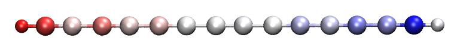

<!-- p.1118 -->

```text
H       0.00000000      2.14896316     -3.05414223  0.000000
H       0.00000000     -0.00000000     -4.31975533  0.000000
```

We use Multiwfn to load this .chg file and convert it to N-phenylpyrrole.pqr, then use VMD to visualize it using exactly the same procedure described in last example. However, this time the lower and upper limit of color scale should be set to -50 and 50, respectively. The resulting graph is shown as left part of the map below; as a comparison, the corresponding isosurface map of MO36 is shown at right part.

The redder the atom, the greater its contribution to the orbital. As can be seen, the atomic coloring introduced in this section well reflects actual orbital distribution. For very large molecules, the isosurface map may become quite complicated, while the atomic coloring map should be much clearer.

Of course, the atomic coloring method is also applicable to other kinds of atomic properties calculated by Multiwfn, such as condensed Fukui function, atomic spin population, atomic transition charge, source function of atoms, integral of electron energy in atomic space, variation of atomic charge during electronic transition or intermolecular interaction. More examples can be found in my blog article http://sobereva.com/425 (in Chinese).


### 4.A.11 Overview of methods for studying chemical bonds

Note: Chinese version of this Section is my blog article “An overview of chemical bond analysis methods supported by Multiwfn” (http://sobereva.com/471), which also contains extended discussion.

In this section, I present an overview of all methods that may be used to study chemical bonds. You will find Multiwfn is indispensably useful in characterizing and unraveling nature of the bonds. Most analyses can be applied to both ground state and excited states (see Section 4.18.13 for more information about this point)

1 AIM (Atoms-in-molecules) analysis In the framework of AIM, the bond critical point (BCP) is the most representative point of a


<!-- p.1119 -->
bond, hence character of chemical bonds can be characterized by various properties at corresponding BCPs, for example:

·Electron density and potential energy at BCP, namely ρ(BCP) and V(BCP), are often used to discuss bonding strength. For the same kind of bond, they are usually positively and negatively correlated to bonding strength, respectively.

·Laplacian of electron density at BCP, namely 2ρ(BCP), is often used to judge whether or not a bond mainly shows covalent character. Negative and positive values imply that the major nature of the bond is covalent and non-covalent, respectively. But notice that this criterion is often

wrong (e.g. CO has positive 2ρ(BCP) but it is evidently a polar covalent bond)

·In Angew. Chem. Int. Ed. Engl., 23, 627 (1984) it was argued that negative and positive values of energy density at BCP, i.e. H(BCP), implying the bond has covalent and non-covalent nature, respectively. But this criterion is not always true; for example, the Ca-O in CaO is typical ionic bond, but its H(BCP) is negative.

·The V(BCP)/G(BCP) was proposed in J. Chem. Phys., 117, 5529 (2002), where G(BCP) denotes Lagrangian kinetic energy density at BCP. It was argued that <0, >1 but <2, >2 of this quantity respectively imply that the bonding mainly belongs to close-shell interaction, intermediate (mixed) interaction and covalent interaction.

·The eta index was proposed in J. Phys. Chem. A, 114, 552 (2010) and further studied in

Angew. Chem. Int. Ed., 53, 2766 (2014), it is defined as |λ1(r)|/λ3(r), where λ1 and λ3 are the smallest and largest eigenvalues of Hessian matrix of electron density, respectively. It was argued that if eta index at BCP is smaller than 1, then the bonding should be closed-shell interaction; while if it is larger than 1, the interaction should have covalent nature, and the more positive the value, the stronger the covalent character. However, I found this argument is not always true, for example this quantity of both Ni-C and C-O bonds in Ni(CO)4 is less than 1, but undoubtedly they should be attributed to polar covalent bonds.

·Bond degree (BD) was proposed in J. Chem. Phys., 117, 5529 (2002) and defined as

H(BCP)/ρ(BCP). The physical meaning of BD is energy density of unit electron at BCP. For covalent interaction (usually H(BCP)<0), the more negative the BD, the stronger the bonding; while for non-covalent interaction (usually H(BCP)>0), the more positive the BD, the weaker the interaction.

·Bond ellipticity was proposed in J. Am. Chem. Soc., 105, 5061 (1983) and defined as ε(r)=

[λ1(r)/λ2(r)]-1. At BCP the λ1 and λ2 must be negative and exhibit the curvature of electron density perpendicular to the bond. The larger the value deviates to 0, the stronger the tendency that the electron density has unsymmetric distribution in the plane perpendicular to the bond at the BCP.

·The source function with BCP as reference point has been employed to study chemical bonds, see Struct. & Bond., 147, 193 (2010) for comprehensive review and Section 4.17.5 for analysis example.

There are some other research papers utilizing BCP properties to discuss chemical bonds, for example J. Am. Chem. Soc., 120, 13429 (1998) and J. Comput. Chem., 39, 1697 (2018). It is worth to note that properties at certain critical points can also be used to estimate metallicity of crystals, see J. Am. Chem. Soc., 124, 14721 (2002), Chem. Phys. Lett., 471, 174 (2009) and J. Phys.: Condens. Matter, 14, 10251 (2002).

The bond path is also a very important concept in the AIM framework, it rigorously reveals the main interaction path connecting various atoms. It is important to understand the fact that a strong


<!-- p.1120 -->
chemical bond must be accompanied by a bond path and BCP, while present of bond path and BCP does not imply existence of a chemical bond.

AIM topology analysis has been systematically introduced in Section 3.14 and illustrated in Section 4.12.1, all above-mentioned quantities can be easily and rapidly evaluated by Multiwfn. It is noteworthy that in Multiwfn many real space functions at critical point (or specific point) can be decomposed as contributions from various orbitals (usually MOs or LMOs), see Section 4.2.4 for example; moreover, any real space function can be plotted along bond paths, see Section 4.2.3 for example. These useful features can often provide much deeper insight into the bonding.

The above-mentioned real space functions can also be plotted as curve map, plane map or isosurface map so that one can visually study their distribution, see Section 4.3, 4.4 and 4.5 for

practical example, respectively. The contour line map and isosurface map of 2ρ(r) is particularly useful and frequently employed.

2 Bond order and delocalization index analysis Bond order is a very useful and straightforward way of characterizing chemical bonds. Multiwfn supports a lot of bond order definitions, please check Section 3.11 for detailed introduction. Different bond orders have different characters and physical meanings. For example, Laplacian bond order (LBO) measures covalent component of a bond and usually has good relationship with bond dissociation energy (BDE), while Mayer bond order essentially reflects the number of electrons shared by two interacting atoms. The bond analysis module of Multiwfn is also able to do more things than just calculating the value of bond order. For example, Multiwfn can decompose some bond orders as contributions from various orbitals, the Wiberg bond order can be decomposed as contributions from atomic orbital pairs. Many detailed analysis examples of bond order are given in Section 4.8.

It is worth to mention that the delocalization index (DI) is essentially equivalent to Mayer bond order and fuzzy bond order in physical nature. The difference arises from how atomic spaces are defined. For nonpolar bonds, the DI is usually very close to Mayer and Fuzzy bond orders, but they quantitatively differ for polar bonds. For DI, the AIM atomic basins are employed as atomic spaces. The DI can be calculated via basin analysis module, see Section 3.18.5 for detailed introduction of DI and Section 4.17.1 for DI analysis example. Commonly I do not suggest employing DI, because its cost is by far higher than evaluation of Mayer and Fuzzy bond orders.

For the same kind of chemical bond, e.g. C-O bond in different transition metal coordinates, the Mayer bond order and LBO are positively correlated with bonding strength. For different kinds of chemical bonds, Mayer bond order should not be used to compare bonding strength, for example, the bond in N2 and that in P2 have evidently different BDEs, but they have basically the same Mayer bond order because both of them are typical triple bonds. In contrast, the LBO is able to faithfully reflect that the bond in P2 is much weaker than N2. Please check original paper of LBO (J. Phys. Chem. A, 117, 3100 (2013)) for more discussions, comparisons and examples.

Plotting variation of bond order versus reaction coordinate is an absolutely very good idea to shed light on the underlying change of electronic structure in a chemical reaction, see Section 4.A.1 on how to easily realize this.

3 Bond order density and natural adaptive orbital analysis The concept of bond order density (BOD) and natural adaptive orbital (NAdO) has been introduced in detail in Section 3.200.20, they are fairly useful if you want to graphically discuss bond order of a given covalent bond. The BOD is a real space function representing everywhere


<!-- p.1121 -->
contribution to bond order (strictly speaking, delocalization index in the present context), while NAdO unveils nature of bond order in terms of orbitals. See Section 4.200.20 for application examples, you will find this method particularly useful in many situations.

4 Orbital localization analysis Molecular orbitals (MOs) commonly are unable to be used to study bonding characters because they are highly delocalized and do not directly correspond to chemical bonds. Orbital localization is a very powerful technique, it can transform the MOs to localized molecular orbitals (LMOs), which are highly localized and have very close relationship with bonding. Via LMOs, numerous useful information about chemical bonds can be extracted, such as bond polarity, bond multiplicity, bond type, the atomic orbitals that participate in the bonding and so on. Please check Section 3.22 for detailed introduction of LMOs and follow the LMO analysis examples in Section 4.19.

5 AdNDP analysis The purpose of the adaptive natural density partitioning (AdNDP) method is somewhat similar to orbital localization method, the advantage of AdNDP is that it is also able to derive orbitals with semi-delocalization character from the complicated multi-electron wavefunction. If the AdNDP analysis has been properly performed, then the resulting orbitals will faithfully reveal all multi-center bonds in current systems. The drawback of AdNDP analysis is that user must manually pick out orbitals from candidate list, this process is slightly troublesome and requires the user has adequate chemical intuition. When there is no multi-center bond, using orbital localization is much preferred over AdNDP because it is fully automatic, fast and free of subjectivity; while if you suspect that present system may have evident multi-center bonds and you want to study them, commonly AdNDP is the only choice. The AdNDP method is detailedly introduced in Section 3.17, related examples are provided in Section 4.14.

6 Analysis of ELF and relevant real space functions ELF is a very important real space function, it is able to reveal localization and delocalization of electrons in chemical systems. Brief introduction of ELF can be found in Section 2.6. In Multiwfn ELF can be analyzed in many different ways, as shown below

·Visualizing study. In Multiwfn, the ELF can be drawn as curve map by main function 3, drawn as plane map by main function 4 and plotted as isosurface map via main function 5, see Sections 4.3, 4.4 and 4.5 for examples, respectively. From the graphs one can easily identify which region contains evident covalent interaction (i.e. evident share of electrons) and judge the nature of a given chemical bond. In addition, the bond multiplicity can be inferred from the shape of ELF

isosurface around the bond. Multiwfn is also capable of studying ELF-π and ELF-σ, so that π interaction and σ interaction can be studied separately, see Sections 4.5.3 and 4.100.22 for example.

Note that there are a lot of real functions having analogous distribution feature as ELF, though their underlying ideas may not be very similar to ELF. Multiwfn supports most of them and they can also be plotted in exactly the same way as ELF. These real space functions include LOL, SCI, SEDD, RoSE, PS-FID. The LOL is introduced in Section 2.6 and is sometimes preferred over ELF because of its clearer graphical effect; introduction of other real space functions can be found in Section 2.7.

The negative part between two atoms in 2ρ map is able to reveal the region where electrons concentrate due to formation of covalent bond, this point is similar to ELF. In J. Phys. Chem., 100,

15398 (1996), Bader believes that 2ρ and ELF are homeomorphic and their similarities and


<!-- p.1122 -->
differences are able to provide complementary information in understanding chemical bonds.

However, notice that for bonds involving very heavy atom, 2ρ map often fails to reveal covalent character. For example, 2ρ in the interacting region of Re-Re bond is entirely positive.

By using Multiwfn and shell script as well as third-part software, anime of ELF or other functions during a chemical process (often represented as trajectory resulting from intrinsic reaction coordinate or rigid scan tasks) can be easily generated, such an anime is able to very vividly exhibit variation of characters of chemical bonds, see Section 4.A.1 on how to make the anime.

·Basin analysis of ELF (or similar functions): This kind of analysis can be carried out via basin analysis module (main function 17), see Section 4.17.2 for example. All ELF basins collectively make up the whole space, each ELF basin corresponds to a region with featured electronic structure. For example, the ELF basins may correspond to covalent bond, lone pair, core region, etc. By analyzing character of bond basins, one can acquire much information about the bonds, such as average number of electrons that occurs in the bonding region, degree of electron localization in the bonding region, dipole moment of the bonding region. Contribution of each atom to the electron population in the bonding region can also be obtained, as illustrated in Section 4.17.7.

·Topology analysis of ELF (or similar functions): This kind of analysis allows one to obtain accurate position of ELF maximum (also known as ELF attractor) and (3,-1) type of ELF critical point (also known as ELF bifurcation point), the former displays the most representative point of an ELF basin, while the value of the latter somewhat reflects the extent of electron sharing (degree of delocalization) between two ELF basins. Topology analysis of ELF can be realized via main function 2, see Section 4.2.2 for example. For practical studies based on topology analysis of ELF and LOL, see Nature, 371, 683 (1994) and J. Comput. Chem., 30, 1093 (2009). Tracing variation of ELF attractors is particularly useful for understanding the change in electronic structure and bonding character during a chemical process, illustrative examples of such analysis are RSC Adv., 5, 62248 (2015), Chem. Phys., 501, 128 (2018) and Comput. Theor. Chem., 1154, 17 (2019).

Note that basin analysis is also able to give positions of ELF attractors, the procedure is even simpler than using topology analysis module, however the accuracy of the positions given by basin analysis module is not as good as topology analysis module, since basin analysis is carried out based on even-distributed grids.

7 IRI analysis Compared to ELF/LOL, the unique advantage of the interaction region indicator (IRI) defined by Tian Lu is able to clearly reveal all kinds of interactions in a chemical system, including both covalent and non-covalent ones. In the original paper of IRI it is demonstrated that IRI can even perfectly visually represent variation of bonding during a whole chemical reaction. See Section 3.23.8 for introduction of IRI, related analysis examples are given in Section 4.20.4.

In the same paper of IRI, its variant named IRI-π was also proposed, it is shown that it can well distinguish type and strength of π interaction on different chemical bonds, many examples can be found in its original paper.

A very detailed document showing how to perform IRI and IRI-π analyses is given in http://sobereva.com/multiwfn/res/IRI_tutorial.zip. Note that DORI is another function that has similar capacity with IRI, however its graphical effect is obviously not as good as IRI and its definition is too complicated compared to IRI.

8 Analysis of valence electron density As clearly illustrated in my paper Acta Phys. -Chim. Sin., 34, 503 (2018) DOI: 10.3866/PKU.WHXB201709252, visualizing electron density of valence electrons is a very useful, powerful and intuitive way of revealing electron structure and studying character of chemical bonds,


<!-- p.1123 -->
please carefully read this paper. Moreover, basin analysis can be applied to valence electron density to unveil more information of chemical interest. See Section 4.6.2 for example on how to carry out this kind of analysis.

9 Electron density difference analysis Formation of a chemical bond always leads to significant electron reorganization (polarization and charge transfer), in particular, formation of covalent bond must be accompanied with the phenomenon that electrons concentrate to the bonding region. Plotting electron density difference (EDD) map is one of the best ways to reveal this point, EDD can be very easily plotted as curve map, plane map and isosurface map in Multiwfn via main functions 3, 4 and 5, respectively. EDD can be defined in different ways, if you want to study the bond formed between two fragments, you should study the EDD between the whole system and the two fragments, see Section 4.5.5 for example; if you want to study the reorganization of electron density due to forming bonds between various atoms in the system, you should study deformation density, which is defined as the difference between the electron density of the whole system and all atom in their isolated states, see Section 4.4.7 for example.

Do not forget that Multiwfn also provides advanced techniques for analyzing EDD, for example, basin analysis can be applied to EDD, see Section 4.17.4 for example. Also, one can plot charge displacement curve to better quantitatively study electron reorganization along specific direction, see Section 4.13.6 for example.

It is worth to note that plotting difference map of ELF between whole system and its fragments is also valuable, see illustration in Section 4.4.8.

10 Analysis of δg function and IBSI index The real space function δg is defined in the framework of IGM theory, see Section 3.23.5 for introduction. δg is capable of revealing all kinds of interactions, including both chemical bonding and weak interaction, as well as both covalent and non-covalent ones. Moreover, the magnitude of

δg in the bonding region is often positively correlated with bonding strength, therefore one can easily examine bonding strength in different regions by inspecting colors in color-filled maps or by

properly adjusting isovalue in isosurface maps. In addition, the isosurface of δg can be mapped by sign(λ2)ρ function via various colors, this makes the isosurface map informative. Please check Sections 4.20.10 and 4.20.11 for IGM examples; although the examples focus on studying weak interactions, the same procedure can also be migrated to chemical bond analysis.

The intrinsic bond strength index (IBSI) is defined based on integral of δg over the whole space. In J. Phys. Chem. A, 124, 1850 (2020) it was shown that it has the ability to measure bonding strength and distinguish type of bonds to a certain extent, see Section 3.11.9 for introduction and Section 4.9.6 for example.

11 Quantifying amount of charge transfer due to bonding Formation of chemical bond between two different fragments must result in detectable charge transfer (CT) between the two fragments. The amount of CT can be obtained as difference between the fragment charge in actual system and the net charge of the fragment in its isolated state. The fragment charge is defined as sum of charges of the atoms in the fragment. In the population analysis module of Multiwfn, if a fragment has been defined, the fragment charge will be directly outputted when calculating atomic charges, see Section 4.7.1 for example.

12 Charge decomposition analysis (CDA)


<!-- p.1124 -->
Using fragment charge we can easily discuss the total amount of CT, however, in order to examine details of charge transfer due to bonding, the CDA must be employed. CDA is able to explicitly show electron donation and back-donation between each pair of user-defined fragments at resolution of orbital interactions, also it provides clear information about how the MOs of the entire system is composed of MOs of individual fragments. See Section 3.19 for introduction and Section 4.16 for example.

13 Extended Transition State - Natural Orbitals for Chemical Valence (ETS-NOCV) This popular method was proposed in J. Chem. Theory Comput., 5, 962 (2009), it focuses on deciphering orbital interaction between fragments. The key advantage of this analysis is that it is able to transform variation of electron density due to orbital interaction to a set of NOCV pairs, each pair has corresponding energy contribution to orbital interaction energy and has corresponding density which can be visualized to easily understand nature, therefore ETS-NOCV analysis provides very deep insight into orbital interaction. See Section 3.26 for detailed introduction of this analysis and Section 4.23 for examples of applying ETS-NOCV on studying various kinds of interactions.

14 Density-of-states (DOS) analysis The partial DOS (PDOS) curve map is useful for intuitively exhibiting bonding and anti-bonding due to interaction between user-defined fragments (may be defined as a batch of atoms, shells or atomic orbitals) at various energy ranges, see Section 3.12 for introduction and Section 4.10.1 for example.

15 Energy decomposition analysis Energy decomposition analysis is used to decompose the bond energy to different physical components to provide deeper insight into the bonding nature. The “simple energy decomposition” supported by Multiwfn can be applied to chemical bonds, please check Section 4.100.8 for example. You need Gaussian to use this function.

16 Studying bond polarity It is often interesting to study polarity of a bond, there are several possible ways, as shown below. The results often differ significantly, since the concept itself cannot be uniquely defined.

·Calculating respective contribution from the two bonding atoms to the LMO corresponding

to the bond (ΘA and ΘB), then the ionicity of the bond can be evaluated as |ΘA-ΘB|. Clearly the larger this value, the higher the bond polarity. To obtain ΘA and ΘB, you should first perform orbital localization, then find the LMO corresponding to the bond in main function 0, and finally use main function 8 to evaluate composition of the LMO via proper method.

·Firstly evaluating respective contribution from the two bonding atoms to the population number of the ELF basin corresponding to the bond, as illustrated in Section 4.17.7, then take the difference of the two contribution values to estimate the bond polarity.

·Calculating bond polarity index. See Section 3.200.12 for introduction and 4.200.12 for example.

· It is worth to note that Laplacian bond order only reflects covalent component of a bond, while Mayer bond order may be regarded as total bond order. Therefore, in certain cases, the difference between Laplacian and Mayer bond orders may be used to reveal bond polarity.

17 Studying bond dipole moment There are three possible ways in Multiwfn:


<!-- p.1125 -->
·Calculate bond dipole moment based on two-center localized molecular orbitals, please check introduction in Section 3.22 and example in Section 4.19.4.

·Perform ELF basin analysis and check dipole moment of the basin corresponding to the bond of interest. See Section 4.17.2 for illustration. At the same time, quadrupole moment of the bond basin can also be obtained.

·Calculating bond dipole moment in Hilbert space. See Section 3.200.2 for introduction

18 Potential acting on one electron in a molecule (PAEM) analysis The PAEM refers to the total potential acting on an electron at a point. By analyzing PAEM at proper positions between two atoms, interaction nature (covalent or non-covalent) can be determined. See Section 4.3.3 for illustration.


### 4.A.12 Overview of methods for analyzing electron excitation

In this section, I present a systematic overview of all methods supported by Multiwfn that can be used for analyzing electron excitation problems.

Note: Chinese version of this section corresponds to my blog article “An overview of electron excitation analysis methods supported by Multiwfn” (http://sobereva.com/437).

1 Hole-electron analysis All kinds of excitations can be essentially described as "hole-to-electron" transition, that is, "hole" is the region where the excited electron leaves, and "electron" is the region where the excited electron eventually goes. Hole-electron analysis corresponds to subfunction 1 of main function 18, see Section 3.21.1 for introduction and 4.18.1 for illustration. This analysis is very powerful and universal and is an almost indispensable analysis method for all kinds of electron excitation problems. Specifically, the hole-electron analysis has below capacities:

·Displaying isosurfaces of hole and electron. From this picture, one can intuitively understand how electrons are excited

·Transforming the hole and electron distributions to a form described by Gaussian function, making them significantly easier to examine visually

·Calculating quantitative indices that measure characteristics of electron excitation, including the Sr index, which measures the degree of overlap of hole and electron; the D index, which

measures the distance between hole and electron centroids; the σ index, which measures the breadth of hole and electron distributions; the t-index, which measures degree of separation of hole and electron, and so on.

·Plotting density difference map, which corresponds to subtracting hole from electron ·Calculating contribution of basis functions, atomic orbitals, atoms, molecular fragments and molecular orbitals to hole and electron, so that the nature of hole and electron can be thoroughly analyzed. Moreover, amount of hole and electron as well as hole-electron overlapping extent on various atoms and fragments can be directly displayed as heat map (color-filled matrix map), which is very convenient for visual horizontal comparison.

·Calculating Coulomb attraction between hole and electron, which is a common definition of exciton binding energy.

2 Nature transition orbital (NTO) analysis When doing electron excitation calculations, it is often found that many orbital transitions have


<!-- p.1126 -->
negligible contribution to electron excitation, this phenomenon makes viewing orbitals to discuss electron excitation characteristics difficult, and in this case it is necessary to examine multiple orbitals simultaneously. After transforming the molecular orbitals to NTOs using subfunction 6 of main function 18, for most cases the electron excitation can be solely described by only one pair of NTO transition, thus making the discussion much simpler. See Section 3.21.6 for introduction of NTO analysis and Section 4.18.6 for practical example.

3 Λ index and Δr index The Λ index proposed in 2008 may be the earliest index to quantitatively examine characteristics of electron excitations, its intrinsic physical meaning is a measure of degree of overlap between electron and hole. The Δr proposed in 2013 is another index for characterizing electron excitation based on the idea of Λ index. The Δr essentially measures the centroid distance between electron and hole. Λ and Δr are described in detail in Sections 3.21.14 and 3.21.4, and they can be computed via subfunctions 14 and 4 of main function 18, respectively.

In fact, with the Sr and D indices defined in the hole-electron analysis framework, it is no longer necessary to use the Δr and Λ indices, since Sr and D are in principle more significant in physical meaning. However, since Multiwfn is able to calculate Δr and Λ for a large number of selected excited states simultaneously, if you simply want to roughly examine electron excitation characteristics for a batch of excited states at once, employing Δr and Λ is still a good choice.

4 IFCT analysis The full name of IFCT is "interfragment charge transfer", which is a method proposed by me to estimate amount of electron transfer between atoms or fragments in the process of electron excitation. The calculation cost is extremely low. This method has been detailed described in Section 3.21.8 and illustrated in Section 4.18.8. Although using difference between fragment charge of excited state and that of ground state can also study variation of electron population during electron excitation, one cannot understand details of charge transfer at "who transferred to whom" level, therefore IFCT analysis has important and irreplaceable practical value for investigating problems of electron excitation. In particular, when studying transition metal coordinates, exact amount of MC, LC, LLCT, MLCT and LMCT can be separately evaluated by the IFCT analysis.

As illustrated in Section 4.18.16, Multiwfn is able to very easily calculate IFCT terms for all excited states for present system, and major terms (with contribution > 5%) can be directly printed so that you can easily identify major characters of all excited states.

5 Charge-transfer spectrum The "charge-transfer spectrum (CTS)" has been introduced in Section 3.21.16, and an example is given in Section 4.18.16. CTS is defined by me at the top of IFCT analysis. The relationship between CTS and common UV-Vis is similar to that between partial density-of-states and total density-of-states. CTS decomposes the whole UV-Vis spectrum as subcurves, including intrafragment electron redistribution curves and interfragment electron-transfer curves. Via the CTS, the main nature of UV-Vis spectrum can be vividly understood.

6 Analysis based on density difference between excited state and ground state Density difference analysis is a prevalently used and widely accepted method for studying the difference in charge distribution between two electronic states of a system. Multiwfn supports a variety of analysis methods based on the density difference between excited state and ground state, as shown below:


<!-- p.1127 -->
·Plotting density difference map First of all, Multiwfn can easily calculate density difference between excited state and ground state and plot it as curve map, plane map and isosurface map through main functions 3, 4, 5, see examples in Section 4.3, 4.4 and 4.5, respectively. Moreover, not only the density difference between excited state and ground state can be drawn, but also the density difference between two excited states can be easily drawn via Multiwfn, see illustration in Section 4.18.13.

·Smoothing density difference and calculating statistical data of density difference The original density difference map between excited state and ground state is not easy to examine, because its positive and negative regions are interlaced and appear to be messy. After calculating the density difference grid data, one can use subfunction 3 of main function 18 to transform it to replace the positive and negative parts of the density difference with very smooth Gaussian functions, then the image will become much more intuitive and easier to analyze. At the same time, the program outputs various statistical data about the density difference, such as centroid coordinates of positive and negative parts, charge transfer distance, degree of separation between positive and negative parts. See introduction in Section 3.21.3 and example in Section 4.18.3.

·Local integral curve and charge displacement curve If the system under studying is linear or an interface system (such as a dye molecule attached to TiO2 surface), the local integral curve and charge displacement curve can be plotted along the direction of the molecular chain or perpendicular to the interface. The local integral curve shows the integral value of the density difference on each section perpendicular to the chosen direction, while the charge displacement curve shows the integral of density difference from the beginning side to the current position. These two kinds of maps are useful to quantitatively study the electron transfer feature along a certain direction. It is easy to draw these two kinds of graphs in Multiwfn, please check Section 3.16.14 of the manual for introduction and Section 4.13.6 for example.

·Basin integration for density difference Multiwfn is able to perform basin integration for density difference, so that one can study variation of number of electrons in some featured local regions, see Section 4.17.4 for example.

7 Analyzing difference between excited state and ground state in electron population or atom/fragment charges

Main function 7 is used to perform population analysis or atomic charge calculation, and if a fragment is defined by subfunction -1 before evaluating atomic charges, fragment charge will also be given in the output. See corresponding examples in Section 4.7. After calculating the fragment charges of excited state and ground state separately, the difference between them can be used to understand how many electrons were lost or gained at different fragments during the electron excitation, and thus the influence of electron excitation on the charge distribution can be investigated at quantitative level.

Although IFCT analysis is able to realize the same purpose, the advantage of using atomic/fragment charge to discuss this problem is that there is a large room of choice of the method for evaluating atomic charges, and the charge distribution of excited state can correspond to relaxed density.

8 Draw transition density isosurface map, plotting heat map of transition density matrix The transition density matrix (TDM) is very useful for unveiling the underlying nature of an electron excitation. TDM has two forms:

(1) The three-dimensional real space form, which can be expressed by drawing isosurface map.


<!-- p.1128 -->
Large value at a point corresponds to large overlap of hole and electron at this place, see Section 3.21.1.1 for detailed introduction and Section 4.18.2.1 for analysis example.

(2) The matrix form in the common sense. This form of TDM can be exhibited as heat map (namely color-filled matrix map), which may be atom-based or fragment-based. Its diagonal elements vividly show which atoms or fragments are simultaneously occupied by hole and electron, while the non-diagonal elements directly reflect the direction and extent of electron transfer between corresponding atoms or fragments. See Section 3.21.2 for introduction of the TDM heat map and Section 4.18.2.2 for analysis example.

9 Analyzing heat map of charge transfer matrix If each atom is defined as a fragment in the aforementioned IFCT analysis, the amount of charge transfer between various atoms and the amount of charge redistribution within each atom will constitute a matrix, which is referred to as "atom-atom charge transfer matrix" by me and may be further contracted to fragment-fragment charge transfer matrix. Both of the matrices can be drawn as heat maps by subfunction 2 of main function 18, see Section 3.21.2 and 3.21.8 for introduction as well as Section 4.18.8 for practical example. The information carried by the charge transfer matrix heat map is very similar to the TDM heat map, and the way of analysis is exactly the same, but the charge transfer matrix is more strictly defined and has clearer physical meaning. Moreoever, the charge transfer matrix is completely in agreement with the hole and electron distributions given by the hole-electron analysis module, therefore I believe the charge transfer matrix map analysis is a better method than the popular TDM heat map analysis.

10 Analyses on transition dipole moment For absorption process, the larger the oscillator strength of an electron excitation, the stronger the corresponding absorption peak. The transition probability between two excited states is mainly determined by oscillator strength, which is proportional to square of corresponding transition electric dipole moment. Therefore, it is very meaningful to conduct an in-depth analysis on intrinsic factors affecting the transition electric dipole moment. Multiwfn provides a number of functions for decomposing transition dipole moment (including both the electric one and magnetic one), as described below.

·Drawing transition dipole moment density The transition dipole moment density is a function that measures the contribution of a point in the three-dimensional space to the transition dipole moment, and its integral over the whole space is exactly equal to the transition dipole moment. Obviously, if the transition dipole moment density is plotted as isosurface map or plane map, contribution of each region to the transition dipole moment can be vividly exhibited. See Section 3.21.1.1 for introduction and Section 4.18.2.1 for example.

·Drawing heat map of transition dipole moment matrix Subfunction 2 of main function 18 can draw heat map of transition dipole moment matrix, either atom-based or fragment-based. The sum of all matrix elements is exactly the transition dipole moment of the system, so the diagonal elements in the map show the contribution of atoms or fragments to the transition dipole moment solely by themselves, while the non-diagonal elements reflect the atom-atom or fragment-fragment coupling contribution to transition dipole moment. Clearly, the internal structure of transition dipole moment can be clearly understood via this kind of heat map. See Section 4.18.2.3 for analysis example.

·Decomposing transition dipole moment to basis function contributions and atom


<!-- p.1129 -->
contributions

Subfunction 11 of main function 18 can decompose transition dipole moment into contribution of each atom and each basis function, see Section 3.21.11 for details. Moreover, based on the data outputted by Multiwfn, via a VMD script one can draw arrows to exhibit contribution vector of custom fragments to transition dipole moment, so that the contribution of each part of the system to the transition dipole moment can be intuitively understood, see Section 4.18.11 for example.

·Decomposing transition dipole moment into contributions of orbital transitions Subfunction 10 of main function 18 can decompose transition dipole moment into contribution of each orbital transition, and at the same time the program outputs the oscillator strength evaluated based on the current electron excitation information. Therefore, when many orbitals have significant participation in electron excitation, this function can be used to immediately identify which orbital transitions have critical influence on the oscillator strength, so that further discussion can be made. In addition, one can set configuration coefficients of some orbital transitions to zero in subfunction -1 of main function 18, and then enter this function again to check influence on the oscillator strength due to ignoring those orbital transitions. See corresponding introduction in Section 3.21.10 and example in Section 4.18.10.

·Calculating transition dipole moments between excited states and dipole moment of each excited state

Transition dipole moments between excited states are important for some studies. For example, they are needed by the sum-over-states (SOS) method, which can be used to calculate (hyper)polarizability (see Section 3.27.2); in addition, simulating transient absorption spectrum needs oscillator strength (f) between excited states, while evaluation of f requires transition dipole moment between corresponding two excited states. In Multiwfn, subfunction 5 of main function 18 can evaluate transition dipole moments between excited states, and dipole moments of each excited state can also be directly outputted. See Section 3.21.5 for details about this function.

11 Analyzing excited state wavefunction Multiwfn is extremely powerful on electronic structure analysis, the analyses can not only be applied to ground state, but can also be applied to excited state, as long as the input file contains excited state wavefunction. Note that if the excited states were calculated by CIS/TDHF/TDDFT/TDA-DFT methods, the input file must record natural orbitals (NOs) of corresponding excited state. By using Multiwfn, the NOs can be generated based on the excited state density matrix in .fch file, see Section 3.200.16 for detail; the NOs can also be generated based on configuration coefficients, as shown in Section 3.21.13.

After loading excited state wavefunction into Multiwfn, one can carry out a variety of electronic structure analyses. For example, main function 9 can be used to calculate various kinds of bond orders for excited state, main function 7 can perform population analysis and calculate atomic charges for excited state, main functions 3,4,5 are able to plot more than one hundred of real space functions for excited state, AIM analysis can be applied to excited state by main functions 2 and 17, weak interaction of excited state can be visually studied via main function 20, excited state aromaticity can be investigated via a bunch of methods in Multiwfn (see Section 4.A.3). By comparing analysis result of excited state and ground state, the impact on electronic structure caused by electron excitation can be fully shed light on.

12 Orbital composition analysis Multiwfn has a very powerful orbital composition analysis module (main function 8), which


<!-- p.1130 -->
supports all orbital composition analysis methods. Via this function, one can study the MOs or NTOs that mainly involved in electron excitation to make clear the role that played by various atomic orbitals, atoms and fragments.

13 Examining overlapping extent and centroid distance between orbitals Subfunction 11 of main function 100 is used to calculate overlapping extent and centroid distance between two selected orbitals. Evidently, this function is useful for studying electron excitation. For example, using this function to analyze the MO pair or NTO pair that dominates the electron excitation, one can investigate charge displacement and separation degree during the electron excitation.

14 Evaluating atomic transition charges The atomic charge we commonly say is for a single electronic state, it is essentially determined by density matrix of this state. It is also possible to calculate charge for each atom using transition density matrix between two states, these charges are known as atomic transition charges. Just as the method of calculating atomic charges is not unique, there are many different methods for calculating the atomic transition charges. Multiwfn can calculate Mulliken atomic transition charges, see corresponding description in Section 3.21.12. Multiwfn can also calculate atomic transition charges via electrostatic potential fitting method, J. Phys. Chem. B, 110, 17268 (2006) and some other papers called this kind of charge as TrEsp (transition charge from electrostatic potential). Basic theory and calculation example of TrEsp can be found in Section 4.A.9 of the manual. The main use of atomic transition charges is quickly calculating electrostatic potential corresponding to transition density, thereby examining the exciton coupling between molecules, this point is also described in detail in Section 4.A.9.

15 Investigating contributions of orbital transitions to electron excitation Computing contribution of an orbital transition to electron excitation is rather simple, see beginning of Section 3.21 for introduction. For facilitating analysis, when you enter subfunction -1 of main function 18, contribution of ten orbital transitions that have largest contributions to the selected electron excitation will be directly listed, see Section 3.21.0 for more information.

16 Identifying ghost states Asymptotic behavior of exchange potential of pure or hybrid DFT functionals with low HF exchange composition is obviously incorrect. When TDDFT with such exchange-correlation functional is used to calculate excited states of large conjugate systems, a batch of artificial charge transfer excited states with low energy tend to occur. The ghost states have no physical meaning, their existences not only waste computation time, but may also cause beginners to mistake a ghost state as an emission state. The ghost-hunter index proposed in J. Comput. Chem., 38, 2151 (2017) can be used to diagnose whether an excited state produced by TDDFT calculation is a ghost state. This index is automatically outputted after performing hole-electron analysis analysis, see Section 3.21.7 for detailed introduction and 4.18.1 for example. If a ghost state is found, the researchers can avoid these states in their discussions, or try to eliminate these states by using a DFT functional with higher HF exchange composition or long-range corrected functionals.

17 Evaluating contribution of NBO orbitals to electron transition As sufficiently exemplified in Section 4.200.13.3, contribution of NBO orbitals to electron transition can be obtained by fitting NBO orbital densities to density difference between two


<!-- p.1131 -->
electronic states. Since NBO orbitals often have a clear feature and chemical meaning, this method is able to provide deeper insight into the nature of electron transitions. The same module can also be used to study contribution of any other kind of orbitals (e.g. LMO) to electron transitions, see Section 3.200.13 for theory and algorithm introduction.

Others Subfunction 17 of main function 18 is able to provide very valuable insight into the nature of electron density polarization under an external perturbation (e.g. point charge), and can be used to study substitution effect, mechanism of electrophilic/nucleophilic reactions, atomic polarizability, and so on. See Section 3.21.17 of Multiwfn manual for introduction and Section 4.18.17 for example.

Subfunction 15 of main function 18 is able to quickly print all major molecular orbital transitions in every excited state, this is useful if you want to examine basic characteristics of each electron excitation in terms of molecular orbitals. See Section 3.21.15 for introduction of this function.

Do not forget Multiwfn has main function 11, which can plot UV-Vis and ECD spectrum based on the oscillator/rotatory strengths and excitation energies outputted by quantum chemistry codes. This module is by far more powerful and flexible than any other plotting tools and able to provide detailed information about the spectrum. Please check Section 3.13 for introduction and Section 4.11 for abundant examples.

It is also worth mentioning the biorthogonalization method, which may be also useful in studying the nature of triplet excited state, that is this method can usually describe the triplet excited state calculated by UKS or UHF method in terms of orbital transition model, so that discussion the nature of the excitation could be simplified. See Section 3.100.12 for introduction and 4.100.12 for example.

Finally, note that only for the aforementioned entry 5 (density difference analysis), entry 6 (atom/fragment charge analysis) and entry 10 (excited state wavefunction analysis), arbitrary electron excitation calculation method could be used as long as they can produce excited state wavefunction. For example, for the density difference analysis, the difference can be made between the electron density of the lowest triplet excited state and singlet state calculated by KS-DFT, the difference can also be made between excited state density produced by EOM-CCSD and the ground state density yielded by CCSD. While for other kinds of analyses, such as hole-electron analysis, IFCT analysis, only CIS, TDHF, TDDFT and TDA-DFT can be employed for calculating excited states.


### 4.A.13 Plot electrostatic potential colored van der Waals surface map and penetration graph of van der Waals surfaces


Note 1: I strongly suggest looking at this video tutorial https://youtu.be/QFpDf_GimA0, which clearly and sufficiently illustrates most content in this section.

Note 2: Average local ionization energy (ALIE) on molecular surface can also be plotted via VMD script, see Section 4.12.2 for example.

Note 3: Chinese version of this tutorial is my blog article “Using Multiwfn+VMD to rapidly plot electrostatic potential colored molecular van der Waals surface map and penetration map between molecules” (http://sobereva.com/443), which contains more discussion and examples than this section.

Note 4: It is also possible to plot ESP only corresponding to local region of vdW surface, see “The way of plotting electrostatic potential for local region of molecular surface using Multiwfn in combination with VMD” (in Chinese, http://sobereva.com/750)


<!-- p.1132 -->
1 Foreword In the tutorial "Plotting electrostatic potential colored molecular surface map with ESP surface extrema via Multiwfn and VMD" (http://sobereva.com/multiwfn/res/plotESPsurf.pdf), I detailedly described how to plot electrostatic potential (ESP) colored molecular van der Waals (vdW) surface, this kind of map is very important and frequently involved in literature. However, there are a large number of steps in the tutorial. In order to make plotting this kind of map as easy as possible, here I introduce a script-based method to draw similar graph, and meantime I will introduce how to plot penetration graph of vdW surfaces, which is very useful for discussing intermolecular interactions. However, I still suggest you also read the aforementioned tutorial after reading the content in the present section, so that you can understand more details and are able to manually improve the effect of the obtained graph.

The vdW surface mentioned in this section corresponds to isosurface of electron density of 0.001 a.u.

2 Preparation VMD program is needed in the present plotting, it can be freely downloaded from http://www.ks.uiuc.edu/Research/vmd/, the version I used here is 1.9.3. Here I assume that you are using Windows system, however the method described below is also suitable for Linux system, see Part 9 of this section.

All files utilized below have been given in "examples\drawESP" folder, they are briefly introduced here:

- .bat files: Batch process files of Windows system. They are used to invoke Multiwfn to calculate needed data for plotting graphs in VMD. The content of the files is very easy to understand and can be easily modified. If you do not know how to run Multiwfn in silent mode, please check Section 5.2

- .txt files: Input stream files of Multiwfn that involved in the .bat files.
- .vmd files: VMD plotting scripts. Before plotting, you should do below things: (1) Move all .bat and .txt files to the folder containing Multiwfn executable file (2) Modify the VMD path in the .bat files to actual path of VMD in your machine (3) Copy all .vmd files to VMD folder (4) Add the content below to the end of the vmd.rc file in VMD folder:


```text
proc iso {} {source ESPiso.vmd}
proc iso2 {} {source ESPiso2.vmd}
proc pt {} {source ESPpt.vmd}
proc pt2 {} {source ESPpt2.vmd}
proc ext {} {source ESPext.vmd}
```

These defined shortcut commands. For example, simply inputting iso is equivalent to inputting source ESPiso.vmd.

3 Plotting ESP colored vdW surface for single molecule Here we take acetamide as example. Move the CH3CONH2.fch in "examples" folder to the folder containing Multiwfn executable file, modify the file name to 1.fch. Double click the ESPpt.bat, Multiwfn will be invoked to carry out quantitative molecular surface analysis (main function 12) for the 1.fch, once the calculation has been done, the exported mol1.pdb and vtx1.pdb


<!-- p.1133 -->
will be automatically moved to the VMD folder. Then boot up VMD and input command pt in VMD console window, then the ESPpt.vmd will be activated to load the mol1.pdb and vtx1.pdb to draw the following map:

The default lower and upper limits of color scale is -50 and 50 kcal/mol, respectively, and the default color transition is BWR (Blue-White-Red), therefore in the map above the white area corresponds to the region having almost vanished ESP value, while the red and blue points have evidently positive and negative ESP, respectively. You can manually change the default setting by modifying the ESPpt.vmd, the settings can also be changed in VMD GUI interface, see the plotESPsurf.pdf tutorial for detail.

In the map above, the ESP colored vdW surface is represented in terms of surface vertices, the graph can also be drawn in an alternative way, namely mapping ESP on electron density isosurface, we do this now. Double click the ESPiso.bat, then Multiwfn will be invoked to calculate and export cube file of electron density and ESP, the resulting density1.cub and ESP1.cub will be automatically moved to the VMD folder. Then boot up VMD and input command iso in VMD console window, then the ESPiso.vmd will be activated to load the two cube files to draw the map below. Notice that in order to gain slightly better effect, I used the built-in Tachyon render to obtain the graph below, namely selecting "File" - "Render", change to "Tachyon (internal, in-memory rendering)" and click "Start Rendering" button (The resulting file is in .tga format, you need to use advanced image viewer to view it, such as IrfanView, which is freely available at https://www.irfanview.com).

It is quite worth to explain the “ESPrhoiso” parameter. It can be set either by argument of running command (as you can see the “-ESPrhoiso 0.001” in the ESPiso.bat) or by corresponding parameter in `settings.ini`. If ESPrhoiso is set to a value larger than 0, for example, 0.001, then during calculating ESP grid data by Multiwfn's own code, ESP will be evaluated only for the grids around isosurface of electron density of 0.001 a.u., while ESP of other grids


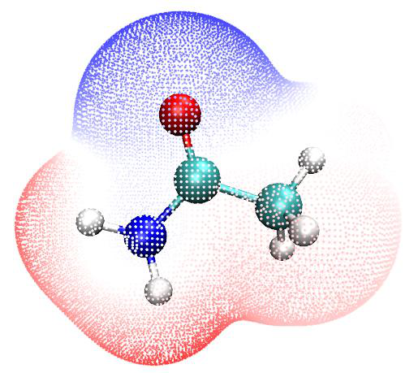


<!-- p.1134 -->
will be automatically set to 0. This trick never affects the quality of the resulting ESP colored vdW surface map, while computational cost is significantly reduced since the ESP evaluation for irrelevant grids is fully ignored.

4 Show ESP extrema on molecular surface simultaneously It is possible to append the ESP surface extrema on the graph. To do this, double click ESPext.bat, it will do all things that ESPpt.bat does, but it also outputs surfanalysis.pdb and moves it to the VMD folder. This file records all surface extrema. Then boot up VMD and input command pt or iso to draw corresponding map first, and then input ext, then ESPext.vmd will be activated to load the surfanalysis.pdb and render the surface extrema as small spheres. The combination of pt+ext and iso+ext are shown at left and right sides of the graph below, respectively. Note that in order to make ESP extrema at backside visible, I have changed the material of electron density isosurface to "Transparent" (namely enter "Graphics" - "Representation", switch to "density1.cub", change "Material" to "Transparent". If you want to make this as default setting, modify the ESPiso.vmd and change the "$id EdgyGlass" to "id Transparent")

In the graph above, the orange and cyan spheres correspond to the positions of maxima and minima of ESP on the vdW surface. You can also manually mark ESP values on the extrema by an image editor, see the plotESPsurf.pdf tutorial on how to do this. An easy way to get ESP value of an extreme is: Clicking "0" on keyboard to enter query mode, click center of a sphere, then its index will be shown on console window. Assume that the index is 3, you should input the following command in VMD console window

[atomselect top "index 3"] get beta then the ESP value will be shown. See the first line of surfanalysis.pdb for the unit of the printed ESP.

As I have mentioned in Section 4.12.1, even for a neutral system, there may be some surface minima (maxima) with positive (negative) value, which are often chemically insignificant and can be ignored. If you do not want to plot them on the graph, you can replace the content of ESPext.txt by that of examples\drawESP\ESPext_noinsig.txt. The additional four lines in this file with respect to ESPext.txt are used to remove these insignificant extrema.

5 Plotting ESP colored penetration map of vdW surface of monomers Here I use water tetrameter to illustrate how to plot this kind of map. The files used in this instance are provided in "examples\water_tetramer\fch" folder. The Gaussian input files of the four water molecules are 1/2/3/4.gjf, respectively, their coordinates were directly extracted from the optimized tetramer coordinate, which can be found in complex.gjf. Run these .gjf files by Gaussian, you will obtain the 1/2/3/4.fch. Notice that nosymm keyword has been employed, otherwise the Cartesian coordinates of the monomers will be no longer consistent with those in complex, because


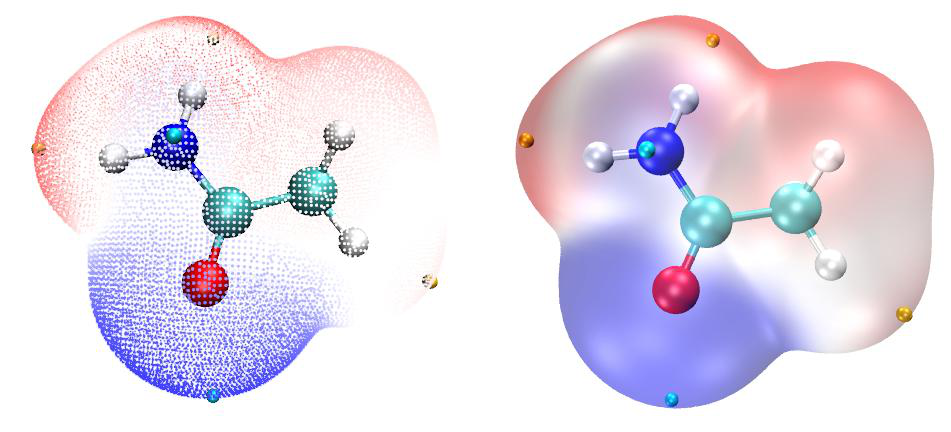

<!-- p.1135 -->
without this keyword Gaussian will automatically put the systems to standard orientation.

Copy the 1/2/3/4.fch files to the folder containing Multiwfn executable file, run ESPpt.bat, then Multiwfn will be invoked to calculate the four .fch files in turn, the resulting mol1/2/3/4.pdb and vtx1/2/3/4.pdb will be automatically moved to the VMD folder. Then boot up VMD and input pt2 to activate the ESPpt2.vmd script, you will immediately see left part of the graph below. If you run ESPiso.bat and then input iso2 in VMD instead, then the ESPiso2.vmd will be activated to draw the right part of the graph below based on the exported density1/2/3/4.cub and ESP1/2/3/4.cub.

From the map above, the inter-penetration between the vdW surfaces of the four monomers due to formation of hydrogen bonds can be clearly seen. In addition, the mapped colors show that the tetramer was formed in ESP positive-negative complementary way, revealing the electrostatic nature of the hydrogen bonds.

As an exercise, please try to plot the ESP colored vdW surface penetration map of Guanine-Cytosine dimer via above two ways, the .fch file of the two monomers can be downloaded at http://sobereva.com/multiwfn/extrafiles/GC_fch.rar. Notice that before plotting, you should manually delete the .pdb and .cub files generated for previous systems in VMD folder.

6 Hint: On the adjustment of material For some systems, the ESP colored map plotted via iso command is not quite ideal. For example, the following map looks messy


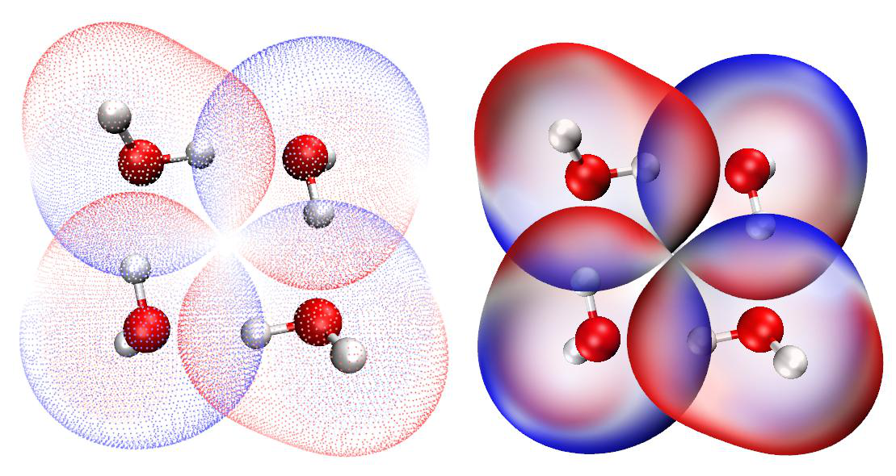


<!-- p.1136 -->
In this case, you can enter "Graphics" - "Materials", choose "EdgyGlass", which is the material currently used for representing the surface. Then adjust its each setting, especially the "Opacity". If we change the setting to below case, you will find the difference of ESP on the vdW surface now can be distinguished more clearly.

7 Hint: Plotting ESP mapped vdW surface for very huge systems Sometimes we need to plot ESP mapped surface for systems consisting of several hundreds of atoms, in this case even single point calculation using DFT with 6-31G* is very expensive or computationally infeasible. To plot the map for this case, my suggested steps are given below:

- Perform single point task or optimization task via Grimme's xtb code (https://github.com/grimme-lab/xtb/). The xtb conducts all calculations based on GFN-xTB theory, which can be regarded as a semi-empirical version of DFT. --molden argument should be employed to make xtb output Molden input file (molden.input). Since xtb is extremely fast, even for a system composed of several hundreds of atoms, single point task can be finished within no more than 1 minute on a personal computer.

- Load the molden.input into Multiwfn, then use corresponding option in subfunction 2 of main function 100 to export .fch file (e.g. xtb.fch).

- Make sure that "cubegenpath" in `settings.ini` has been properly set. Ensure that you have defined GAUSS_MEMDEF environment variable, see Section 5.7 for detail.

- load the xtb.fch into Multiwfn, using main function 5 to calculate grid data and export cube file for electron density and ESP in turn, the exported density.cub and totesp.cub should be manually renamed to density1.cub and ESP1.cub, respectively. Notice that "High-quality grid" should be employed since the system is large. The calculation of ESP is relatively time-consuming, for example, using a common Intel 4 cores CPU, the time cost for a system with 336 atoms takes half an hour.

- Move the density1.cub and ESP1.cub, as well as the aforementioned ESPiso.vmd in examples\drawESP\ to VMD folder.

- Boot up VMD and input source ESPiso.vmd in VMD console window. Now you can see the ESP colored vdW surface map. I suggest you also properly adjust material setting, as mentioned earlier. Below is a system containing 336 atoms.


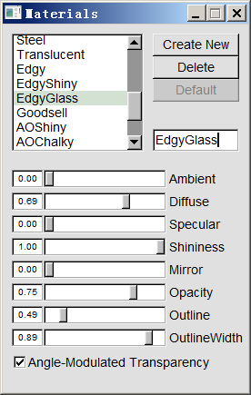


<!-- p.1137 -->
Even if you only have a personal computer with 4 cores, you can obtain the map above starting from a structure file with total time cost of no more than 1 hour. While if you have a server with dozens of cores, the graph can be obtained within 10 minutes.

It is worth to note although the xtb code is extremely fast, the ESP quality corresponding to the wavefunction generated by xtb is usually satisfactory. According to my test, no evident difference can be found between the ESP colored molecular surface graph generated based on the xtb wavefunction and the high-quality B3LYP/def2-TZVP wavefunction.

More information about this topic can be found in my article "Rapidly plotting electrostatic potential colored van der Waals surface for huge system" (in Chinese, http://sobereva.com/481).

8 Other worth noting points Color bar of ESP can be appended on the map, see illustration close to the end of this video: https://youtu.be/QFpDf_GimA0.

I strongly suggest readers to check the content of the .bat, .txt and .vmd files to make clear how they work. As you can see, the ESPpt.bat and ESPiso.bat can at most deal with four .fch file (1/2/3/4.fch), you can also extend them to more molecules. In the ESPpt2.vmd and ESPiso2.vmd, the variable "nsystem" was set to 4, namely at most mol4.pdb&vtx4.pdb and density4.cub&ESP4.cub will be loaded and plotted, clearly if you want to use the plotting scripts to simultaneously plot more monomers, the "nsystem" should be enlarged.

It is noteworthy that the value 0.15 in the ESPpt.txt is the grid spacing in quantitative molecular surface analysis; if you increase it, the surface vertices will become sparser, and calculation cost will be reduced. The default commands in the ESPiso.txt correspond to using high-quality grid for electron density while use low-quality grid for ESP (for saving computational cost purpose), this combination is suitable for most systems, but for extremely large systems, you may need to modify the file so that better quality grids are employed for electron density and ESP, respectively, otherwise the resulting isosurface may be unsmooth and the mapped color may be blurred.

For better graphical effects, users are suggested to manually change lower and upper limits of color scale, so that the variation of ESP on vdW surface can be represented by color as clearly as possible. For charged systems, the default color scale should always be changed, otherwise the vdW surface will be monochromatic. For these systems, you should load the input file, enter main function 12, select option 1 to carry out quantitative molecular surface analysis for ESP, copy the global minimal and maximal values of ESP to the text box for setting color scale, as shown below,


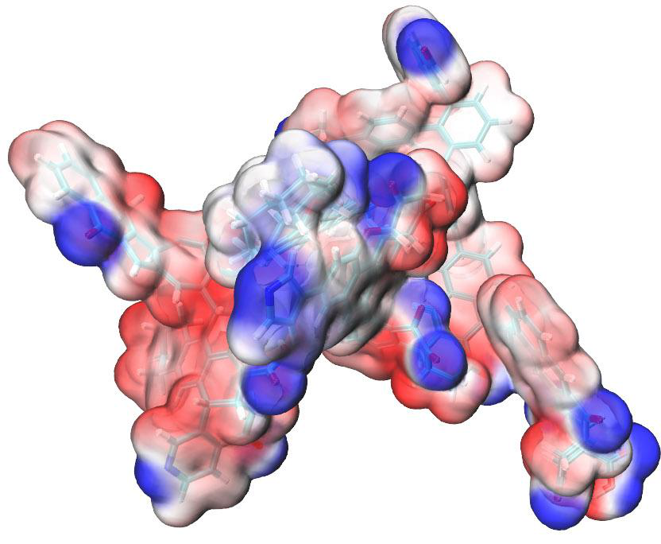

<!-- p.1138 -->
and then press ENTER button to make the setting take effect.

Note: If the map was plotted by ESPiso.bat, you should take the ESP values in a.u. and then set them as the color scale. However, if the map was plotted by ESPpt.bat, you should open the vtx1.pdb in VMD folder by text editor, the first few lines clearly indicate the unit used in this file, you should read ESP values in that unit from the Multiwfn console window and the set the color scale.

If you prefer to use eV rather than a.u. as ESP unit when using iso or iso2 commands to plot the ESP map, you should use ESPiso_eV.bat and ESPiso_eV.txt in “examples\drawESP” folder instead of the ESPiso.bat and ESPiso.txt respectively in aforementioned procedure, and you should manually edit the ESPiso.vmd and ESPiso2.vmd files, remove the # sign before the lines “set colorlow -0.8” and “set colorhigh 0.8”. In this case, the ESP data in .cub file will be in eV, and the default lower and upper limits of color scale will be -0.8 and 0.8 eV, respectively. The color bar drawn according to aforementioned YouTube tutorial video, will also be in eV.

In the case of extremely charged systems, such as DNA, when ESPpt.bat is used, the B-factor column may be unable to correctly record mapped ESP values because their magnitude is too large. In this situation, you should use ESPpt_pqr.bat, ESPpt_pqr.txt, ESPpt_pqr.vmd and ESPext_pqr.vmd in "examples\drawESP" folder instead of the ESPpt.bat, ESPpt.txt, ESPpt.vmd and ESPext.vmd mentioned above, respectively, in this case the "Charge" column of .pqr file will be used instead of B-factor column of .pqr file to record the data, the former can record a much larger range of data and the unit is always in a.u. Also note that the ESPext.txt and ESPext.bat are no longer needed, since extrema1.pqr is also exported and moved to VMD folder when you use ESPpt_pqr.bat.

9 On the plotting ESP colored vdW map under Linux The method described above can also be used in Linux (and maybe also MacOS) environment. In "examples\drawESP" folder, you can find ESPiso.sh, ESPpt.sh and ESPext.sh, they are corresponding Linux scripts of the .bat file mentioned above.

For example, you want to use ESPiso.sh to draw ESP colored vdW surface for cosplay.fchk, what you need to do is

- Install Multiwfn by strictly following Section 2.1.2. Install VMD in usual way
- Copy ESPiso.sh, ESPiso.txt and ESPiso.vmd from "examples\drawESP" to a working directory

- Copy cosplay.fchk to the working directory
- Edit the ESPiso.sh, change the 1.fchk to cosplay.fchk
- Enter the working directory, run chmod +x ./ESPiso.sh, and then run ./ESPiso.sh. (Then you


<!-- p.1139 -->
may find error prompts such as "File not found" and "No such file or directory". They are harmless, simply ignore them)

- Input vmd to boot up VMD, and then input source ESPiso.vmd in the VMD console window to plot the map


### 4.A.14 Very easily rendering cube files as state-of-the-art isosurface map via VMD script


Note: Chinese version of this tutorial is http://sobereva.com/483, it contains more discussions and examples than this section.

Introduction Although in most cases, the isosurface map directly drawn by Multiwfn is already satisfactory, better effect can be gained if you use VMD to render the isosurface. VMD can be freely obtained via http://www.ks.uiuc.edu/Research/vmd/. In fact, in Section 4.5.5 I already exemplified how to draw isosurface map based on cube files produced by Multiwfn, however the procedure is somewhat lengthy, and the effect cannot reach state-of-the-art level. In this section, I will show it is possible to use VMD script to plot very high-quality isosurface map via very few steps. The method in this section only works for Windows platform, but you may also be able to find a way to make the method work under Linux.

The VMD script is examples\scripts\showcub.vmd. Before using it, you should move it to VMD folder and add a line source showcub.vmd into the vmd.rc file in VMD folder, so that the four customized commands in this file will be available after booting up VMD. The commands are described below.

➢ cub and cubiso: Used for showing single cube file. Example of usage: cub DD : Draw DD.cub in current folder as isosurface map, both positive and negative parts are shown as green and blue with default isovalue of 0.05 and -0.05, respectively.

cubiso 0.02 : Changing isovalue of both positive and negative parts to 0.02. cub DD 0.02 : Equivalent to using cub DD and then cubiso 0.02. ➢ cub2 and cub2iso: Used for showing two cube files simultaneously. Example of usage: cub2 f+ f- : Draw f+.cub and f-.cub in current folder as green and blue isosurfaces, respectively. Note that only positive part of the cubes will be shown.

cub2iso 0.02 : Changing isovalue of both isosurfaces to 0.02. cub2 f+ f- 0.02 : Equivalent to using cub2 f+ f- and then cub2iso 0.02. After showing the isosurfaces in VMD graphical window using above commands, you can use batch file VMDrender_full.bat or VMDrender_noshadow.bat in examples\scripts folder to invoke Tachyon render to get better effect, as will be illustrated later. The difference between the two files is that the shadow effect is enabled in the former while disabled in the latter.

Next, I will give two practical examples. Before following them, please copy the aforementioned two .bat files and showcub.vmd to VMD folder, and then properly set up vmd.rc. The VMD version I am using is 1.9.3.

Example 1: Spin density map of C4H8 singlet biradical Boot up Multiwfn and input examples\C4H8.wfn // .wfn file of C4H8 singlet biradical


<!-- p.1140 -->
5 // Calculate grid data 5 // Spin density 3 // High-quality grid 2 // Export the grid data to spindensity.cub in current folder Now, move the spindensity.cub to VMD folder, boot up VMD and input cub spindensity 0.01 in VMD console window, you will see isosurface map of the cube file with isovalue of 0.01 has been shown in the graphical window.

In order to get better effect, in VMD we choose "File" - "Render" - "Tachyon", then click "Start Rendering", you will find vmdscene.dat has appeared in VMD folder. Now double click VMDrender_full.bat, which will use vmdscene.dat as input file of Tachyon render to yield an image file named full.bmp in current folder. The resulting graph is shown below, the quality is clearly very good!

Example 2: Hole-electron map of NH2-biphenyl-NO2 The hole-electron analysis illustrated in Section 4.18.1 is extremely useful in understanding the nature of electron excitation. Although Multiwfn can directly plot hole and electron distributions simultaneously in the built-in GUI window, much better effect can be obtained by means of VMD.

I still use the NH2-biphenyl-NO2 analyzed in Section 4.18.1 as example, we will plot isosurface

of both hole and electron of S0→S2 transition via VMD. To do so, boot up Multiwfn and input

examples\excit\D-pi-A.fchk 18 // Electron excitation analysis 1 // Hole-electron analysis examples\excit\D-pi-A.out 2 // Study excitation between ground state (S0) and the second excited state (S2) 1 // Calculate distribution of hole, electron and so on as well as various indices 3 // High-quality grid After the calculation is finished, choose options 10 and 11 in turn to export grid data of hole and electron to hole.cub and electron.cub in current folder, respectively. Then move them to VMD folder, boot up VMD and input cub2 electron hole. You will find no isosurface has been shown, this is because the default isovalue (0.05) is not suitable for grid data. We use cub2 command to test different isovalues, finally we find after inputting cub2 0.005 the graphical effect is satisfactory, that is the isosurfaces can substantially represent distribution character of both hole and electron. The current graph shown in the VMD graphical window is shown below, green and blue correspond to electron and hole, respectively.


<!-- p.1141 -->
Current effect is already nice, however, the overlapping character between hole and electron cannot be clearly recognized. In order to improve the effect, we enter "Graphics" - "Representation", set "Material" to "EdgyGlass", then choose "electron.cub" in "Selected Molecules", also set its "Material" to "EdgyGlass". Next, choose "File" - "Render" - "Tachyon", then click "Start Rendering". If this time we directly use VMDrender_full.bat to render the graph, you will find the graph is too dark. In order to get best effect, we open VMDrender_full.bat using text editor, change the "-trans_raster3d" to "-trans_vmd", and then add an argument "-shadow_filter_off". Finally, we execute this .bat file to yield full.bmp, which is shown below, the effect is perfect! (Note that I used Photoshop to increase the brightness of the graph by 20)


### 4.A.15 Calculating information-theoretic quantities and some relevant quantities


Prof. Shubin Liu proposed many information-theoretic quantities and applied them to a wide variety of chemical problems, and got many valuable findings. Multiwfn is able to calculate all information-theoretic quantities. There is a document "Calculating information-theoretic quantities and some relevant quantities by Multiwfn" in "Resources" page of Multiwfn website dedicated to describing how to use Multiwfn to calculate these quantities, please check it.


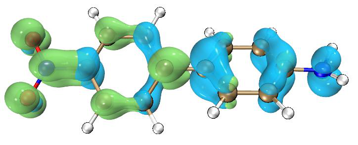


<!-- p.1142 -->

## 5  Skills


### 5.1 Make Multiwfn support more quantum chemistry programs


Although currently Multiwfn is able to directly accept Molden input file (.molden) as input file, only the file generated by a few programs is formally supported (see the related description in Section 2.5). If the Molden input file is generated by other programs then the analysis result may be incorrect. For these cases, you can use Molden2aim program written by Wenli Zou (https://github.com/zorkzou/Molden2AIM) to produce standardized Molden input file.

Using Molden2aim is easy. First move the Molden input file (e.g. ltwd.molden) into the directory where molden2aim.exe is placed, then properly modify its setting file m2a.ini, then boot up Molden2aim and follow its prompts to input commands, finally you will get ltwd_new.molden (standardized Molden input file) and may be other files (.wfn, .wfx, etc.).

In the .wfn file exported by Multiwfn and Molden2aim, orbital spin-types are explicitly written at the end of the wfn file via $MOSPIN field, this information is automatically loaded by Multiwfn.

Molden2aim can output GTFs with angular moment up to g. Although g GTFs is not originally defined in wfn format, these g GTFs can also be correctly identified and loaded into Multiwfn.

The "charge" field of the wfn file outputted by Molden2aim is the serial number of the element in periodic table rather than the effective nuclear charges, even if effective core potential (ECP) is used. This treatment is inconsistent with the wfn file outputted by Gaussian, in which "charge" is effective core charges when ECP is used (e.g. the "charge" of Au under Lanl2DZ is 19.0). So, if ECP is used and you want to calculate electrostatic potential, do not forget to modify "charge" field in the wfn file outputted by Molden2aim to effective nuclear charges.


### 5.2 Running Multiwfn in silent mode

Note: If you can read Chinese, please read Sections 1 and 2 of my blog article “Detailed introduction to the command line running and batch running methods of Multiwfn” (http://sobereva.com/612) instead, in which more detailed information about running Multiwfn via command-line is introduced and many illustrative scripts are given and carefully explained.

Multiwfn aims for ease of use, so it is designed as an interactive program. Nevertheless, Multiwfn can also run in silent mode (command-line mode), so that you do not need to press any button during running. Here I will introduce how to do it.

For Windows users For example, you want to obtain the graph in example 4.4.1 silently, you need to write an input stream file first, the content is (red texts are comments):

4  Main function 4


<!-- p.1143 -->
1  Real space function 1

1  Color-filled map

 Space line, corresponding to press ENTER button once (use default grid setting)

2  XZ plane

0  Y=0

0  Option 0: save graph to current directory I suppose that the inputstream file is named as 4.4.1.txt, I have already provided this file in “examples” directory. Now change “isilent” parameter in `settings.ini` from 0 to 1 (or add "-silent" argument in command line), this makes Multiwfn forbid displaying any graph or GUI automatically during running, otherwise you have to close the window by clicking mouse button. Then enter command-line environment of Windows (click “Start”-“run” and type “cmd”) and run:

Multiwfn HCN.wfn < 4.4.1.txt > medinfo.txt Here I assume that Multiwfn.exe, 4.4.1.txt and HCN.wfn are in current directory. After a few seconds, you will find that image file has appeared in current directory. From medinfo.txt you can find all intermediate information outputted by Multiwfn.

What does the content in the input stream file mean? The answer is: the texts in each line of the input stream file are just what you need to input in interactive mode. It is very easy to write a new input stream file by following the prompts on screen in interactive mode. The symbols “<” and “>” are redirection operators, they respectively tell Multiwfn that the content in 4.4.1.txt is input stream, while the output stream should be stored to medinfo.txt. This redirection mechanism is not provided by Multiwfn but provided by operation system. Notice that the name of input file is not given in input stream file, because it appears as an argument.

You may have noted that when the task is finished, some errors like below appear:


```text
forrtl: severe (24): end-of-file during read, unit -4, file CONIN$
Image              PC        Routine            Line        Source
Multiwfn.exe       00588F1A  Unknown               Unknown  Unknown
Multiwfn.exe       00586438  Unknown               Unknown  Unknown
Multiwfn.exe       00530B3A  Unknown               Unknown  Unknown
......
```

Actually they are not errors, and hence you can safely ignore them. However, if you really want to exit Multiwfn gracefully to avoid printing the "errors", you should properly write the input stream file so that command q is inputted in the main function menu at the final step.

Another example, assume that you want to save detail compositions of orbitals 1 to 3 of COCl2.fch, just create an input stream file orbana_1_3.in with the following content:

8  Orbital composition analysis

1  Mulliken method

1  Orbital 1

2  Orbital 2

3  Orbital 3 Then run the command: Multiwfn COCl2.fch < orbana_1_3.in > orbana_1_3.txt.

Notice that if you are using PowerShell in Windows environment, since the "<" redirection operator is unsupported, you should use "Get-Content" command and pipeline feature instead. For example, above command should be written as (assume that Multiwfn.exe is in current folder): Get-


<!-- p.1144 -->
Content orbana_1_3.in | ./Multiwfn.exe COCl2.fch > orbana_1_3.txt

For Linux / MacOS users If you are a Linux or Mac OS user, you can not only run Multiwfn silently as introduced above, but also make use of "echo" command to avoid explicitly writing an input stream file. The last example can be equivalently realized by running this command:


```text
echo -e "8\n1\n1\n2\n3" | Multiwfn COCl2.fch > orbana_1_3.txt
```

Each \n means pressing ENTER button once.

If you prefer to use shell script, you can also add below lines into your shell script file:


```text
Multiwfn COCl2.fch > orbana_1_3.txt << EOF
8
1
1
2
3
EOF
```


### 5.3 Running Multiwfn in batch mode

Note: If you can read Chinese, please read Sections 3 and 4 of my blog article “Detailed introduction to the command line running and batch running methods of Multiwfn” (http://sobereva.com/612) instead, in which more detailed information about using shell script to run Multiwfn to automatically process batch of files is introduced, and some illustrative scripts are given and carefully explained.

If you are familiar with writing shell scripts and you have carefully read last section, you must have already known how to use Multiwfn to process a batch of files, it is indeed very easy. I will briefly introduce this point in this section.

For Windows users

- Example 1 Assume that you want to generate .cub files of ELF for these input files: ultravox.wfn, chinaski.fch, strawberry_egg.wfn, you can create a plain text file named batchrun.bat (the suffix must be .bat, while file name is arbitrary) with the following content:


```text
Multiwfn ultravox.wfn < genELFcub.txt > null
move ELF.cub ultravox.cub
Multiwfn chinaski.fch < genELFcub.txt > null
move ELF.cub chinaski.cub
Multiwfn strawberry_egg.wfn < genELFcub.txt > null
move ELF.cub strawberry_egg.cub
del null
```

where genELFcub.txt is input stream file for generating ELF cube file, it is a plain text file having the content below

5  Main function 5, calculate grid data

9  Real space function 9, namely ELF

2  Option 2: Medium-quality grid

2  Option 2: Exporting cube file in current directory


<!-- p.1145 -->
Put all of aforementioned files into a folder containing Multiwfn.exe, then double click the icon "batchrun.bat" or input command batchrun in command line window, the task will start and the three ELF cube files will be generated in current folder sequentially.

- Example 2 Shell script is very useful and powerful, it can automate a lot of repetitive work. As a simple example, you want to generate ELF .cub file for all .wfn files in current folder, and hope that the name of the resulting .cub files are [Input_file_name]_ELF.cub, then you can write a .bat file with the following content


```text
for /f %%i in ('dir *.wfn /b') do (
Multiwfn %%i < genELFcub.txt > null
rename ELF.cub %%~ni_ELF.cub
)
```

Run the .bat file, the .cub files will yield in turn. Assume that one of input files is yoshiko.wfn, the corresponding resulting .cub file will be yoshiko_ELF.cub.

For Linux users Similarly, you can run Multiwfn under Linux environment in batch mode and write script to significantly make your research easier. To realize the aforementioned example 1 under Linux, you can create a file runthree.sh with the following content (assume that you have properly installed Multiwfn as mentioned in Section 2.1.2 and thus you can directly invoke Multiwfn by Multiwfn command)


```text
Multiwfn ultravox.wfn < genELFcub.txt > null
mv ELF.cub ultravox.cub
Multiwfn chinaski.fch < genELFcub.txt > null
mv ELF.cub chinaski.cub
Multiwfn strawberry_egg.wfn < genELFcub.txt > null
mv ELF.cub strawberry_egg.cub
rm null
```

Put the runthree.sh and all input files in current folder, run this command: chmod +x ./runthree.sh;./runthree.sh, then the calculation will start. (The chmod +x command is used to add executable permission, it may not be necessary for certain cases)

To realize the aforementioned example 2 under Linux, you should create a shell script file with the content below and then run it


```text
#!/bin/bash
for inf in *.wfn
do
echo Running ${inf} ...
Multiwfn ${inf} < genELFcub.txt > /dev/null
mv ELF.cub ${inf//.wfn}_ELF.cub
done
```

The shell environment of Linux platform is much more powerful than Windows. The examples\scripts\gjf2xyz.sh is a Bash shell script that converts all .gjf files in current folder to .xyz


<!-- p.1146 -->
file with same name, please check the script to understand how it works. If you are unable to understand the content, just Google shell scripting.

An additional example of shell script is given below, which calculates MPP index (see Section 3.100.21) for all .mol2 file in current folder:


```text
#!/bin/bash
for filename in `ls *.mol2`
do
echo calculating $filename ...
echo -e "MPP\na\nn\nq" | Multiwfn $filename | grep "Molecular planarity parameter (MPP)"
done
```

By the way, it is noteworthy that via sed command in Linux you can easily modify content of

`settings.ini` in your script. For example, to replace "iuserfunc=0" by "iuserfunc=30", you can input below command


```text
sed -i 's/iuserfunc=../iuserfunc= 30/g' settings.ini
```

Substantially and flexibly employing shell scripts can automate many more kinds of analyses than those shown above. For example, in Section 4.18.6 I illustrated that with a simple script, natural transition orbitals (NTOs) of all selected excited states can be yielded and exported to various files in one run.


### 5.4 Copy outputs from command-line window to clipboard

Sometimes the output of Multiwfn in command-line windows needs to be stored permanently or loaded to third-part softwares via plain text file. Here I describe how to copy these outputs to Windows clipboard.

If you are using Windows 11, you just need to hold “ALT” key and use left mouse button to drag a rectangle region in the window, then press ENTER button, the content in the region will be copied to clipboard.

If you are using older Windows version, you need to follow the steps shown below. Assuming that you want to copy Hessian matrix of electron density.


<!-- p.1147 -->
After you select "Mark", drag left mouse button from point A to point B

Then press ENTER button, the information highlighted by white rectangle will be copied to clipboard, you can paste them to anywhere, such as plain text file.

For Mac OS or Linux system running in graphical environment, you can also copy the output of Multiwfn from console to plain text file by similar manner.


### 5.5 Make command-line window capable to record more outputs


Occasionally you may find command-line window cannot record entire outputs of Multiwfn. For example, you select option 6 in wavefunction modification module to get density matrix for a relatively big wavefunction, however only the last part of the matrix can be found in the command-line window. The solution to the problem is to enlarge buffer size of the window, please follow the


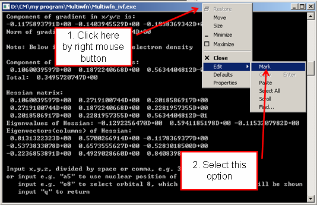


<!-- p.1148 -->
steps below.

Boot up Multiwfn, click title of the window by right mouse button, click "Properties", select "Layout" page, you will find the default buffer size of the window is 300 (see the screenshot below), that means only up to 300 lines can be recorded in the window, which is obviously too small. Change the value to a larger value, for example 9999, and then click OK button. After that you will find the window capable of recording much more output (If the complete output still cannot be recorded, enlarge buffer size again).

The buffer size setting is saved permanently in system, you needn’t set this value again next time you boot up Multiwfn.

For Linux and Mac OS, you can also find a similar option used to set buffer size of terminal.


### 5.6 Rapidly load a file into Multiwfn

Probably sometimes you feel inputting the path of input file is troublesome, especially when the path is very long. Below I provide you with some tricks, which make this step much easier.

If you want to rapidly load a file into Multiwfn without inputting its path, you can boot up Multiwfn and then directly drag the icon of the file into the Multiwfn command-line window.

In Windows platform, an even simpler method is directly dragging the file onto the icon of Multiwfn.exe, then the file will be automatically loaded into Multiwfn. Notice that in this situation, the "current folder" is the position of the input file.

If directly inputting letter o, the file that last time loaded will be loaded again, whose path is recorded as "lastfile" variable in `settings.ini` file.

Assume that the file you last time loaded is C:\sob\lover\K-ON\Mio.wfn, and this time you want to load C:\sob\lover\K-ON\Azusa.wfn, you can simply input ?azusa.wfn, namely the path of the folder last time involved can be replace with a question mark.


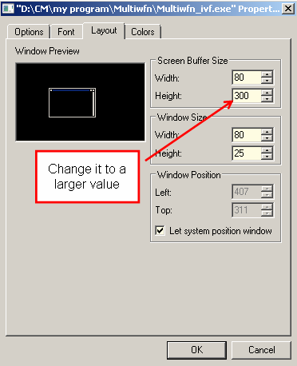

<!-- p.1149 -->

### 5.7 Make use of cubegen utility in Gaussian package to reduce computational time of electrostatic potential analyses


When number of your CPU cores is very limited (less than 10), calculation speed of ESP by internal code of Multiwfn is not as fast as the cubegen utility in Gaussian package. In this circumstance, you can allow Multiwfn to invoke cubegen to calculate ESP data to reduce the overall time-consuming. Even if you have large number of CPU cores, if you need to calculate grid data of ESP (e.g. using main function 5), the time cost by internal ESP code of Multiwfn is still higher compared to allowing Multiwfn to invoke cubegen.

The way of making use of cubegen during analyses of ESP is rather easy: Set "cubegenpath" parameter in `settings.ini` file to actual path of cubegen executable file (For example, "D:\study\G16W\cubegen.exe" in Windows platform or "/sob/g16/cubegen" in Linux platform). Then if you use .fch/fchk/chk file as input file of Multiwfn, cubegen will be automatically invoked by Multiwfn at the right time to calculate ESP data.

Availability Below cases and functions currently support invoking cubegen to evaluate ESP: ·Plotting curve map of ESP (main function 3) ·Plotting plane map of ESP (main function 4) ·All functions that request grid data of ESP (e.g. using main function 5 to evaluate grid data of ESP, using main function 17 to perform basin analysis for ESP, using subfunction 14 of main function 200 to perform domain analysis for ESP)

·Calculating ESP fitting atomic charges such as CHELPG, MK and RESP (via corresponding subfunctions in main function 7)

·Calculating TrEsp charges (see Section 4.A.9 on how to do this) ·Quantitative molecular surface analysis with ESP as mapped function (main function 12) Although many other functions in Multiwfn also need ESP information, they do not support utilizing cubegen because only very few numbers of points are needed to be calculated.

Even if you are not a Gaussian user, as long as the quantum chemistry program you used can produce .mwfn or .molden file, or you are using GAMESS-US/Firefly, you can also benefits from cubegen, because by subfunction 2 of main function 100, Multiwfn can convert the loaded .mwfn/.molden/.gms file to .fch file. Then, if you use the .fch file as input file, cubegen can be invoked during ESP calculation. It is worth to note that the examples/scripts/gbw2fch.sh is a Bash shell script that converts all .gbw files of ORCA to .fch file by automatically invoking orca_2mkl in ORCA package and Multiwfn command.

Notes ·The wavefunction invoked by cubegen used for evaluating ESP comes from density matrix in .fch/fchk file. This file may contain more than one density matrices, by default the SCF density matrix is used. The type of density matrix employed can be chosen by "cubegendenstype" parameter in `settings.ini`. For example, if a .fch file was produced via "# MP2/cc-pVTZ density" keyword, then


<!-- p.1150 -->
the file will contain both SCF density matrix and MP2 density matrix. If you want to calculate ESP at MP2 level by means of cubegen, you should change the value of "cubegendenstype" from the default "SCF" to "MP2".

·When you are dealing with very large .fch/fchk file, running cubegen via Multiwfn may be failed. Commonly, this is because the memory to be allocated by cubegen exceeded default upper limit. To solve this problem, you can run for example export GAUSS_MEMDEF=4GB in you console before performing your analysis, in this case the limit of memory will be increased to 4GB, which is absolutely large enough.

·This feature is fully compatible with the cubegen in Gaussian 09 and 16 packages. For cubegen in Gaussian 16, the number of CPU cores assigned for cubegen is identical to the "nthreads" parameter in `settings.ini` file. However, since parallel implementation of cubegen in Gaussian 09 seems buggy, only one CPU core will be employed for it. Multiwfn judges whether it is G09 or G16 cubegen by checking if there is "g16" or "G16" string in the "cubegenpath".

·Even though you have modified current wavefunction via some functions of Multiwfn, e.g. using subfunction 26 of main function 6 to manually change orbital occupation numbers, the ESP calculated by cubegen still corresponds to the original wavefunction, since the density matrix in the input file was not modified. If you indeed want to calculate ESP based on modified wavefunction via cubegen, you should first use subfunction 2 of main function 100 to export .fch file, the SCF density matrix in this file will correspond to the density matrix constructed by current wavefunction, and thus then you can use this .fch file as input file to carry out ESP analyses.

Why Multiwfn crashes when invoking cubegen? If Multiwfn crashes when (or after) invoking cubegen, there are three common reasons: (1) The .fch/fchk file is problematic or inappropriate, for example:

- The file does not contain wavefunction information (e.g. the one produced by ONIOM task with forcefield as low method)

- The file contains wavefunction but does not contain density matrix of expected type. For example, you require cubegen to deal with MP2 density matrix, but current file only contains SCF density matrix

- The file is corrupted. For example, incomplete file transfer, formchk does not work normally (2) The wavefunction is quite large but you did not properly define the "GAUSS_MEMDEF". (3) The cubegen is too old to be compatible with the fch/fchk file, you need to upgrade the Gaussian.

The outputted information of cubegen is dumped to nouseout file in current folder. If you are confused why the invoked cubegen cannot run normally, you can try to manually examine this file.


### 5.8 Some tips on achieving ideal drawing quality

Many functions of Multiwfn involve plotting graph, below are some suggestions for getting ideal drawing quality:

- Do not take screenshot, but use an option like "save picture" or "export graphical file" to generate the image file. This is particularly important for Linux system, because the quality of the graph shown on the screen is often poor. The effect of image file is independent of platform.


<!-- p.1151 -->
- If the graph to be plotted only consists of texts, straight lines and curves, it is strongly suggested to change "graphformat" in `settings.ini` to a vector format, such as .pdf and .svg (see Section 2.8 for detail), because in this case the texts and lines look very smooth, the graph can be losslessly scaled, and meantime the file size is very small. Since vector format is not directly supported by many applications programs, you can then manually convert the image file from vector format to pixel format.

- When the graph contains gradient colors, such as isosurface map, color-filled map and so on, the default .png format is the best choice. In order to make the axes, texts and outlines of objects as smooth as possible, I suggest save the image file with large size (see Section 2.8 on how to change size), then use advanced image editor such as Photoshop, or Irfanview (my favourite image viewer) to shrink the graph to the size you actually need, in this process the resample will be done automatically, anti-aliasing effect can thus be equivalently realized. By the way, before choosing the option used to generate image file, I suggest properly zooming to make the system fill the entire drawing area as much as possible.

- Please always pay attention to all options in the menu, Multiwfn has many options to control plotting parameters, graph quality under default settings may be significantly improved by properly using corresponding options. In addition, in `settings.ini` file there are many parameters controlling plotting effect, I suggest you briefly check comment of each parameter in this file to find the ones you often need to change.

- For plotting isosurface map, use relatively high quality of grid (i.e. relatively small grid spacing, or equivalently, relatively high number of grid points) to generate grid data. If lighting effect is not satisfactory, in the menu bar of the GUI for showing isosurface, use "Set lighting" in "Other settings" to adjust lightings. In addition, using VMD to plot this kind of map can get much better rendering effect, see Section 4.A.14 for related introduction and example.

- Use VMD plotting script whenever possible. For example, as illustrated in Section 4.2.5, using VMD to plot paths and critical points can yield much better effect than directly plotting them in the GUI window of topology module of Multiwfn; as also introduced in Section 4.A.14, via VMD plotting script very ideal isosurface map of grid data can be obtained via merely a few steps


<!-- p.1152 -->

## 6 Appendix


### 6.1 Setting up running environment for Gaussian in Windows


Some functions of Multiwfn can directly invoke Gaussian (the precondition is that "gaupath" in `settings.ini` has been set to actual path of Gaussian executable file). In order to make Windows version of Gaussian run normally in this case, you must define "GAUSS_EXEDIR" environment variable, otherwise error “No executable for file l1.exe” will occur and Gaussian running will fail, because Gaussian does not know where to find the l1.exe executable file. Below are steps for setting up this environment variable.

(1) For Windows XP users: Enter “Control panel”-“System properties”-“Advanced” (2) For Windows 7 users: Enter “Control panel”-“System”-“Advanced system setting”-“Advanced”

(3) For Windows 10 users: Click right mouse button on the start button, enter “Control panel”-“System”-“Advanced system setting”-“Advanced”

After that, click “Environment variables” button, then click “New” button (in “User variables” frame), input GAUSS_EXEDIR as variable name, input installation directory of Gaussian as variable value (e.g. D:\study\g09w\, assuming that g09.exe is in this folder).

In addition, it is very important to note that when Multiwfn invoke Gaussian in Windows environment, Gaussian will search for Default.Rou in current folder rather than in Gaussian scratch path. Therefore, if there are important settings in Default.Rou, such as the default number of cores to be utilized, you should copy this file to current folder to make the settings take effect during calculations.


### 6.2 The routines for evaluating real space functions

Below are the routines in function.f90 file. You can make use of them to construct new real space functions yourself. For more details, please check the comments in the code of corresponding routine.

Calculation of real space functions function calcfuncall: A wrapper for calculating any supported real space function at a given point

function userfunc: User-defined real space function function linintp3d: Function value obtained by trilinear interpolation from grid data in memory function splineintp3D: Function value obtained by cubic B-spline interpolation from grid data in memory

function fmo: Orbital wavefunction value


<!-- p.1153 -->
function forbdens: Orbital probability density function fdens: Electron density function fspindens: Spin or Alpha or Beta electron density function fgrad: Gradient (x,y,z components or its norm) of density, or reduced density gradient (RDG)

function flapl: Laplacian of electron density (xx or yy or zz part or total) function Lagkin: Lagrangian kinetic G(r), or its components function Hamkin: Hamiltonian kinetic K(r), or its components function calcprodens: Promolecular density

function signlambda2rho: sign[λ2(r)]ρ(r) subroutine signlambda2rho_RDG: Calculate sign[λ2(r)]ρ(r) and RDG at the same time function signlambda2rho_prodens: sign[λ2(r)]ρ(r) with promolecular approximation function RDGprodens: RDG with promolecular approximation

subroutine signlambda2rho_RDG_prodens: Calculate sign[λ2(r)]ρ(r) and RDG at the same time with promolecular approximation

subroutine IGMprodens: Calculate promolecular density gradient of usual type or Independent Gradient Model (IGM) type

function ELF_LOL: ELF or LOL or SCI (strong covalent interaction index) function avglocion: Average local ionization energy function loceleaff: Local electron affinity function edr: Electron delocalization range EDR(r;d) function edrdmax: Orbital overlap distance function D(r)

function delta_g_IGM: δg(r) defined in IGM method function linrespkernel: Approximate form of DFT linear response kernel for closed-shell function pairfunc: Exchange-correlation density, correlation hole and correlation factor, on-top pair density

function srcfunc: Source function function infoentro: Shannon information entropy function or Shannon entropy density function totesp: Total ESP function nucesp: ESP from nuclear or atomic charges function eleesp: ESP from electrons function totespskip: ESP without contribution of nucleus defined by iskipnuc parameter subroutine planeesp: Calculate ESP in a plane subroutine espcub: Calculate grid data of ESP from electrons function twoorbnorm: Product of norm of two orbitals function beckewei: Generate Becke weighting function

function densellip: Ellipticity of electron density, η index, and stiffness function xLSDA: Integrand of LSDA exchange functional function xBecke88: Integrand of Becke88 exchange functional function cLYP: Integrand of LYP correlation functional function DFTxcfunc: Various kinds of integrand of DFT exchange-correlation functionals function DFTxcpot: Various kinds of DFT exchange-correlation potentials function weizsacker: Integrand of Weizsäcker functional (steric energy) function KED: Various kinds of kinetic energy density of electrons


<!-- p.1154 -->
function KEDpot: Potential of various kinds of kinetic energy functionals function stericpot: Steric potential, which negative value is one-electron potential function stericcharge: Steric charge function stericforce: Magnitude of steric force function paulipot: Pauli potential function pauliforce: Magnitude of Pauli force function paulicharge: Pauli charge function Fisherinfo: Fisher information density function calcatmdens: Promolecular density calculated based on Lagrange interpolation of built-in atomic radial density

function IRIfunc: Interaction region indicator (IRI) function PAEM: Potential acting on one electron in a molecule function SEDD: Single exponential decay detector (SEDD) function DORI: Density Overlap Regions Indicator (DORI) function localcorr: Local electron correlation function function elemomdens: Electron linear momentum density function magmomdens: Magnetic dipole moment density function energydens_grdn: Gradient norm of energy density function energydens_lapl: Laplacian of energy density function vdwpotfunc: Van der Waals potential and its two components function orbwei_Fukui: Orbital-weighted Fukui function and dual descriptor function relShannon: Relative Shannon entropy density (information gain density) function locHFexc: Local Hartree-Fock exchange energy function stress_stiffness: Stress tensor stiffness, its inversion corresponds to stress tensor polarizability

function stress_ellipticity: Stress tensor ellipticity subroutine calcGTFval: Return all GTF values as an array subroutine calcbasval: Return all basis function values as an array

Calculation of derivatives of real space functions subroutine gencalchessmat: A general routine used to calculate value, gradient and Hessian matrix at a given point for various real space functions

subroutine orbderv: Calculate wavefunction value of a range of orbitals and their derivatives at given point, up to third-order

subroutine EDFrho: Calculate contribution from EDFs to density and corresponding derivatives (up to third-order)

subroutine calchessmat_dens: Calculate electron density, its gradient and Hessian matrix subroutine rho_tensor: Calculate electron density, its gradient, Hessian matrix and 3rd derivative tensor

subroutine calchessmat_prodens: Calculate electron density, its gradient and Hessian matrix with promolecular approximation based on built-in atomic densities

subroutine gendensgradab: Generate electron density and gradient norm for alpha and beta electrons at the same time


<!-- p.1155 -->
subroutine gendens_gradvec_lapl_ab: Generate electron density, gradient vector and Laplacian for alpha and beta electrons at the same time

subroutine calchessmat_lapl: Calculate Laplacian of electron density, its gradient and Hessian matrix (Hessian is currently not available)

subroutine calchessmat_ELF_LOL: Calculate ELF/LOL, its gradient and Hessian matrix (Hessian is currently not available)

subroutine calchessmat_orb: Calculate gradient and Hessian matrix for an orbital wavefunction subroutine calchessmat_rhograd: Calculate gradient and Hessian matrix for gradient norm of electron density

subroutine calchessmat_IRI_RDG: Calculate gradient and Hessian matrix for IRI and RDG subroutine calchessmat_vdWpot: Calculate gradient and Hessian matrix for van der Waals potential

subroutine calchessmat_Shannon: Calculate local information entropy (function 11) or Shannon entropy density (user-defined function 50), its gradient and Hessian matrix

subroutine calchessmat_Fisherinfo: Calculate Fisher information density (user-defined function 51), its gradient and Hessian matrix

subroutine calchessmat_second_Fisherinfo: Calculate second Fisher information density (user-defined function 52), its gradient and (semi-numerical) Hessian matrix

subroutine calchessmat_relShannon: Calculate relative Shannon entropy density (user-defined function 49, also known as information gain density), its gradient and Hessian matrix

subroutine stericderv: Calculate the first-order derivative of steric potential subroutine proatmgrad: Calculate electron density and gradient of an atom in free state using built-in density


### 6.3 Detail of built-in atomic densities

Some analyses, such as Hirshfeld/ADCH population analyses and Hirshfeld orbital composition analysis request atomic densities. Though, as shown in Section 3.7.3, the atomic densities can be evaluated based on atomic .wfn files, the process is slightly complicated, namely the element .wfn files needed must be prepared and sphericalized first. In order to simplify these analysis tasks, a set of built-in atomic densities (available from H to Lr) was provided in Multiwfn and one can directly choose to use it.

These built-in atomic densities were evaluated at highly accurate computational level at atom ground-states, and have been sphericalized (density distribution of many atoms in their ground states are not spherically symmetric). Main group elements with index <=18 were calculated at B3LYP/cc-pVQZ level, those >18 were calculated at B3LYP/ANO-RCC level (except for Ca, UGBS is used since the ANO-RCC of Ca in EMSL website is wrong, at least when I constructed the densities). Transition metals were calculated at HF/UGBS level. Lanthanides and Actinides were calculated at B3LYP/SARC-DKH level (except for U and Np, for which ROHF was used instead of B3LYP because DFT cannot reproduce their correct ground state configurations). For all elements heavier than Ar, DKH2 method was employed to take scalar relativistic effect into account. Unless otherwise specified, open-shell systems were treated by unrestricted open-shell formalism.

The atomic densities are recorded as radial points in atmraddens.f90, the second kind of Gauss-


<!-- p.1156 -->
Chebyshev method was used to generate the position of radial points, and the point distribution is identical for all elements. The atomic density at any point is evaluated in terms of Lagrange interpolation method based on the points.

If you want to replace built-in atomic density of an element with that calculated yourself, after booting up Multiwfn and loading corresponding atom wavefunction file, select subfunction 10 in main function 100 (a hidden option), then Multiwfn will calculate radial electron density and output the result to sphavgval.txt in current folder. You can directly copy the Fortran codes in this file into corresponding field of atmraddens.f90.


### 6.4 Details about supplying inner-core electron density for the wavefunctions involving pseudopotential


In Section 2.5, the characteristics and the meaning of electron density function (EDF) have been introduced. EDF information is used to represent the inner-core density replaced by pseudopotential, so that for the wavefunctions involving pseudopotential, the result of the wavefunction analyses that purely based on electron density can be almost exactly identical to full-electron wavefunction.

When the input file you used contains GTF information, and meantime some atoms utilized pseudopotential, Multiwfn automatically finds proper GTF information from built-in EDF library for these atoms. The built-in EDF library was developed by Wenli Zou and coworkers, it was originally released as a part of Molden2aim program (https://github.com/zorkzou/Molden2AIM). The quality of this EDF library is quite good, and is better than the EDF field contained in the .wfx file produced by Gaussian program. This EDF library covers the entire periodic table, up to index of 120. For most elements, it contains both EDF information for large and small core pseudopotentials. Some descriptions about this library posted by its developer can be found in http://bbs.keinsci.com/thread-5354-1-1.html as well as J. Comput. Chem., 39, 1697 (2018). If you do not want Multiwfn to read EDF information from this library automatically, set "isupplyEDF" in `settings.ini` to 0.

As mentioned in Section 2.5, the .wfx file produced by Gaussian directly carries EDF field when pseudopotential is used. When this kind of file is used as input, Multiwfn by default reads EDF information from EDF field of this .wfx file rather than from the built-in EDF library. If you do not want Multiwfn to read EDF information from this file but from the built-in EDF library, you can change "readEDF" in `settings.ini` from 1 to 0.

It is noteworthy that Multiwfn also allows reading EDF information from atomic .wfx file produced by Gaussian rather than from the built-in EDF library of Multiwfn (This feature is rarely useful, since as mentioned above, the quality of the built-in EDF library in Multiwfn is better than the EDF library embedded in Gaussian). An example is provided as below:

examples\Pt(NH3)2Cl2.wfn is a file corresponding to Pt(NH3)2Cl2, Lanl2 pseudopotential accompanied by Lanl2DZ basis set is used for Pt and Cl, while 6-31G* is used for other atoms. examples\Pt_lanl2.wfx and examples\Cl_lanl2.wfx are the Pt and Cl atomic .wfx files produced by Gaussian 09, in which Lanl2 is also used, therefore their EDF fields represent the inner-core electron density of Pt and Cl replaced by Lanl2.


<!-- p.1157 -->
In order to borrow EDF information from the atomic .wfx files in the analysis of Pt(NH3)2Cl2.wfn, first we need to set "isupplyEDF" parameter in `settings.ini` to 1. Then boot up Multiwfn and input following commands

examples\Pt(NH3)2Cl2.wfn Pt // Load EDF information for element Pt examples\Pt_lanl2.wfx // Take EDF information of Pt from this file Cl // Load EDF information for element Cl examples\Cl_lanl2.wfx // Take EDF information of Cl from this file q // We have finished, exit Now we can perform wavefunction analysis as usual. But it is better to first carry out some tests to check if inner-core electron density has been properly represented, for example, we integrate electron density over the whole space

100 // 100 Other functions (Part1) 4 // Integrate a function over the whole space 1 // Electron density The result is 132.00, which is the expected total number of electrons of Pt(NH3)2Cl2. Assume that we did not load the EDF information, then the result will be 52.00, which is just the number of valence electrons of Pt(NH3)2Cl2.

Note that you can also directly input atomic indices instead of element name, for example, inputting 4,8-10,11 means selecting atoms 4,8,9,10,11 in present system. Of course, the atoms you selected each time must correspond to the same element and the same pseudopotential.

It is users' responsibility to prepare the atomic .wfx files. Since there are too many kinds of pseudopotentials and elements, evidently, I am incapable of providing all of them for you.


### 6.5 Check sanity of wavefunction

The input files of Multiwfn generated by various quantum chemistry codes are not always standard. For example, .molden file generated by many programs are problematic in content or format. After feeding them to Multiwfn and you want to make sure if the wavefunction has been correctly loaded, there are two useful ways to check sanity:

(1) Enter main function 100 and select subfunction 4, then choose electron density. If the integral of electron density over the whole space is very close to the actual number of electrons, then the wavefunction is ready for use.

(2) Enter main function 1000 (a hidden function) and select subfunction 100. This function will check satisfaction of normalization condition of all orbitals, and show you the maximum deviation to unity and integer. If both the two maximum deviations are evidently larger than zero, then there must be some severe problems in the input file; if any one of them is very close to zero, the input file should be fully compatible with Multiwfn. Because in Multiwfn the orbital coefficients with respect to both GTFs and basis functions are available if the inputted wavefunction file contains basis function information, in this case this function will ask you to choose examining which kind of orbital coefficients (of course, both of them should satisfy the normalization condition).


<!-- p.1158 -->

### 6.6 Special functions

There are some special functions in Multiwfn, they are mainly used for debugging, special purposes, and some of them are requested by some Multiwfn users. Here a few of them are mentioned.

6.6.1 Add Bq atoms at specific positions

Sometimes we want to highlight special positions on a 3D map, for example, the reference point, centroid position of a real space function, the position used to plot local DOS and so on. To realize this, you can enter main function 1000, select subfunction 12, and manually input the X, Y, Z coordinate of the Bq atoms (ghost atoms) to be added. You can add arbitrary number of Bq atoms. Once all Bq atoms have been added, input q to return. Then in the GUI showing 3D molecular structure you will see the Bq atoms, which are displayed as cyan spheres. It is worth to note that in the main function 0, you can choose showing or not showing labels of Bq atoms by selecting corresponding term in "Other settings" - "Set atomic label type".

6.6.2 Calculate nuclear attractive energy between a fragment and an orbital

You can use this function by entering subfunction 90 of main function 1000 (hidden in main menu). This function calculates attractive energy between all nuclei in a user-defined fragment and an orbital, namely:

$$E_{\mathrm{M O}i-\mathrm{f r a g}}=\left\langle\varphi_{i}\right|\sum_{A\in\mathrm{f r a g}}\frac{Z_{A}}{\left|\mathbf{r}-\mathbf{R}_{A}\right|}\left|\varphi_{i}\right\rangle\equiv\int\left|\varphi_{i}(\mathbf{r})\right|^{2}\sum_{A\in\mathrm{f r a g}}\frac{Z_{A}}{\left|\mathbf{r}-\mathbf{R}_{A}\right|}\mathrm{d}\mathbf{r}$$

During the calculation, the atomic contributions to the result are outputted in turn, for example, below output


```text
Processing center     2(H )   /     3
Accumulated value:       -8.3269642826  Current center:       -0.0629848533
```

means

$$E_{\mathrm{M O}i-\mathrm{f r a g}}^{\mathrm{2H}}=\int w_{2\mathrm{H}}(\mathbf{r})\left|\varphi_{i}(\mathbf{r})\right|^{2}\sum_{A\in\mathrm{f r a g}}\frac{Z_{A}}{\left|\mathbf{r}-\mathbf{R}_{A}\right|}\mathrm{d}\mathbf{r}=-0.06298$$

where w2H(r) is atomic weighting function of 2H atom defined by Becke's partition.

The integral is evaluated by Becke's multi-center integration method, therefore the "radpot" and "sphpot" in `settings.ini` affect integral accuracy. Commonly the default value is accurate enough. Note that, as shown in above formula, the occupation number of orbital is not taken into account in the calculation.

Information needed: GTFs, atom coordinates

6.6.3 Output Becke's integration points

The Becke's multi-center numerical integration algorithm proposed in J. Chem. Phys., 88, 2547 (1988) has been employed by almost all popular quantum chemistry programs to integrate


<!-- p.1159 -->
exchange-correlation functionals, it is also employed by Multiwfn in many wavefunction analysis functions, for example, calculating Hirshfeld charge and ADCH charge, fuzzy atomic space analysis (main function 15) and so on.

Via subfunction 93 of main function 1000 (a hidden function), you can export integration points of the Becke's algorithm to intpt.txt in current folder. The meaning of each column will be explicitly shown on screen after exporting. The number of integration points is determined by "radpot" and "sphpot" in `settings.ini`. The position and weight of angular grid are determined by Lebedev method, while those of radial grid are determined by second kind Gauss-Chebyshev method.

After entering this function, Multiwfn asks you if also outputting Becke's integration weights. If you input y, the weights will be calculated and outputted together.

Information needed: Atom coordinates

6.6.4 Make orbitals equivalent to basis functions

This function is subfunction 15 of main function 1000. Via this function, you can make orbitals equivalent to basis functions, the orbital index will correspond to basis function index. After using this function, you can use main function 0 to visualize isosurface of basis functions to understand their spatial distribution, and you can also use main functions 3 and 4 to plot curve map and plane map for basis functions, respectively.

Information needed: Basis functions

6.6.5 Generating promolecular wavefunction

If you want to generate promolecular wavefunction, so that you can study various promolecular properties, you can use a special function in Multiwfn devoted for this purpose: You should first load actual wavefunction file of the present system when boots up, then enter subfunction 17 of main function 1000. Multiwfn will prepare .wfn file of all atoms in the present system, the situation is exactly the same as that described in Section 3.7.3. Note that the basis set used for the atomic wavefunction file must be exactly the same as that used for the actual wavefunction of present system. After successful generation of the promolecular wavefunction, if you choose y, the wavefunction information in memory will correspond to promolecular wavefunction. That means, for example, if you calculate ELF grid data via usual steps in main function 5, you will finally obtain ELF grid data corresponding to promolecular state.


### 6.7 About providing Fock/KS matrix to Multiwfn

Some functions of Multiwfn, such as orbital localization, biorthogonalization, and ETS-NOCV analysis, can evaluate energies of the resulting new orbitals (i.e. expectation of Fock or KS operator), which, however, requires one-electron effective Hamiltonian matrix, namely Fock or Kohn-Sham (KS) matrix. Also, some functions like plotting COHP need this kind of matrix. This matrix can be directly generated by Multiwfn based on orbital energies, expansion coefficients and overlap matrix,


<!-- p.1160 -->
however you can also let Multiwfn directly load the matrix from a file, the following files are acceptable:

(1) Plain text file containing Fock/KS matrix In this file, the matrix elements should be recorded in a lower-triangular form, namely the structure of the file should be (closed-shell case)

F(1,1) F(2,1) F(2,2) F(3,1) F(3,2) F(3,3) ... F(nbasis,nbasis) where nbasis is the total number of basis functions, and F is Fock/KS matrix. For unrestricted open-shell case, the file should contain alpha and beta Fock/KS matrix elements (Fa and Fb, respectively) in a lower-triangular form, that is

Fa(1,1) Fa(2,1) Fa(2,2) Fa(3,1) Fa(3,2) Fa(3,3) ... Fa(nbasis,nbasis) Fb(1,1) Fb(2,1) Fb(2,2) Fb(3,1) Fb(3,2) Fb(3,3) ... Fb(nbasis,nbasis) The format of the data in the file is fully free, only the number of data is important.

The Fock/KS matrix may be obtained from output file of quantum chemistry codes. For example, you can use IOp(5/33=3) in Gaussian or NPRINT=5 keyword in GAMESS-US to print the matrix in each SCF cycle, then you can use your own code to convert the matrix printed at last time to the aforementioned format.

It is worth to note that subfunction 17 of main function 100 is able to directly generate Fock/KS matrix based on energies and coefficients of the current orbitals and export the matrix in the aforementioned format to a plain text file, see Section 3.100.17 for detail. Therefore, as long as you have a wavefunction file containing molecular orbitals, you can obtain the file carrying Fock/KS matrix anytime.

(2) .47 file of NBO code You can ask Gaussian to produce .47 file, which is input file of stand-alone version of NBO code. Multiwfn is able to directly read Fock/KS matrix from the $FOCK field in this file. Generating .47 file via Gaussian is easy, just run an input file like this:


```text
# B3LYP/6-31G* pop=nboread

Title line

0 1
[Atom coordinates]

$NBO archive file=C:\MY_FILE $END
```

Then MY_FILE.47 will be generated in C:\ folder once the calculation is finished, it carries Fock/KS matrix at B3LYP/6-31G* level.

(3) ORCA output file In ORCA input file, if you add a line %output Print[P_Iter_F] 1, then Fock/KS matrix at each SCF cycle will be printed, Multiwfn will load the matrix printed last time, which corresponds to the matrix of converged wavefunction.

(4) .mwfn file As mentioned in Section 2.5 and my introductory paper about mwfn format, namely ChemRxiv (2020) DOI: 10.26434/chemrxiv.11872524, the .mwfn file is able to carry a Fock/KS matrix. Multiwfn can directly load Fock/KS matrix from this kind of file if this matrix is available in the


<!-- p.1161 -->
file.

(5) CP2K .csr file CP2K is able to export various matrices including KS matrix to .csr file. To export KS matrix, add the following lines into &FORCE_EVAL/&DFT section


```text
&PRINT
  &KS_CSR_WRITE
    REAL_SPACE T
    UPPER_TRIANGULAR T
    THRESHOLD 0
  &END KS_CSR_WRITE
&END PRINT
```

After completing the task, you will find a .csr file containing KS matrix has been exported in current folder.

